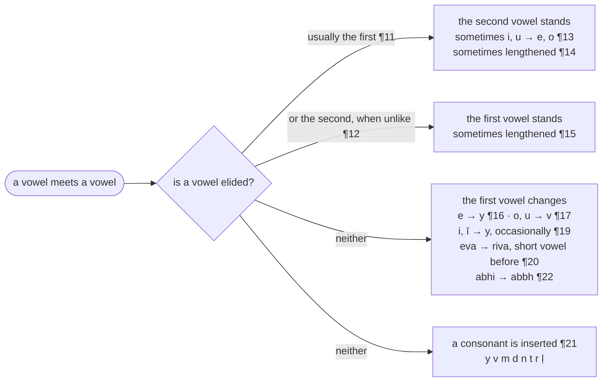
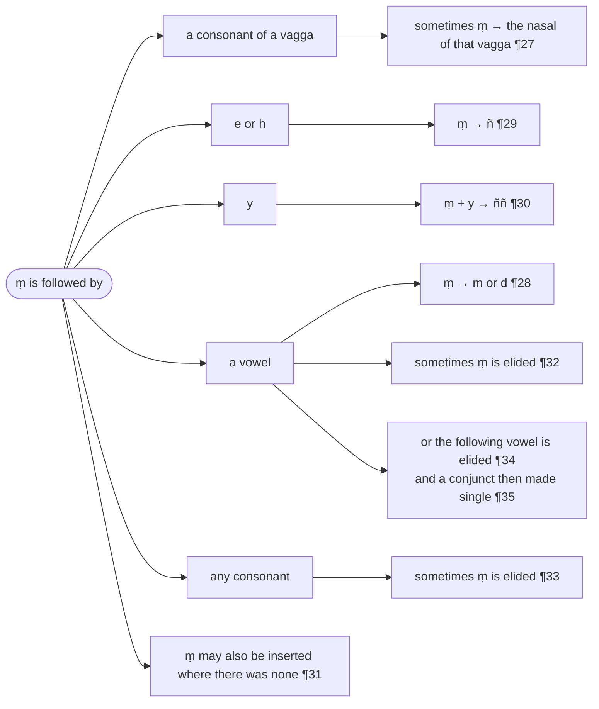

import LetterGrid from "../../../components/LetterGrid.astro";
import { LinkCard } from "@astrojs/starlight/components";

:::note[Numbering]
Numbers written ¶2, ¶3 and so on are the paragraph numbers of the Chaṭṭha Saṅgāyana edition, kept so that a passage can be found in the [source text](/balavatara/cscd4); they are not rule numbers. The section headings are supplied by this translation. The [Bālāvatāra](/balavatara/) page explains both conventions.
:::

## Saññā (Representation)

### Akkharāpādayo ekacattālīsaṃ (41 letters) :badge[¶2]
>Akkharāpi akārādayo ekacattālīsaṃ suttantopakārā. Taṃ yathā-a ā-i ī-u ū-e o, ka kha ga gha ṅa, ca cha ja jha ña, ṭa ṭha ḍa ḍha ṇa, ta tha da dha na, pa pha ba bha ma, ya ra la va sa ha ḷa aṃ-iti.

The letters beginning with `a` are forty-one, useful for the suttas.
They are as follows: a, ā, i, ī, u, ū, e, o, ka, kha, ga, gha, ṅa, ca, cha, ja, jha, ña, ṭa, ṭha, ḍa, ḍha, ṇa, ta, tha, da, dha, na, pa, pha, ba, bha, ma, ya, ra, la, va, sa, ha, ḷa, aṃ.

<LetterGrid
  letters={[
    ["a", "ā", "i", "ī", "u", "ū", "e", "o"],
    ["ka", "kha", "ga", "gha", "ṅa"],
    ["ca", "cha", "ja", "jha", "ña"],
    ["ṭa", "ṭha", "ḍa", "ḍha", "ṇa"],
    ["ta", "tha", "da", "dha", "na"],
    ["pa", "pha", "ba", "bha", "ma"],
    ["ya", "ra", "la", "va", "sa", "ha", "ḷa", "aṃ"],
  ]}
/>

:::tip[Kaccāyana Reference]
<LinkCard title="§2 (2): Akkharāpādayo ekacattālīsaṃ" href="/kaccayana/1-sandhikappa#m2" description="41 akkhara starting with `a`" />
:::

### Tatthodantāsarā aṭṭha (8 vowels ending with `o`) :badge[¶3]
>Tattha akkharesu okārantā aṭṭha sarā nāma. Tattheti vattate.

The first 8 letters ending with `o` are called `sarā` (vowels).

<LetterGrid letters={[["a", "ā", "i", "ī", "u", "ū", "e", "o"]]} />

:::tip[Kaccāyana Reference]
<LinkCard title="§3 (3): Tatthodantā sarā aṭṭha" href="/kaccayana/1-sandhikappa#m3" description="[From `akkhara`] eight ending with `o`: `sara`" />
:::

### Lahumattā tayo rassā (3 short vowels) :badge[¶4]
>Tattha saresu lahumattā a, i, u iti tayo rassā.

The three metrically light vowels are called `rassā` (short): a, i, u.

<LetterGrid letters={[["a", "i", "u"]]} />

:::tip[Kaccāyana Reference]
<LinkCard title="§4 (4): Lahumattā tayo rassā" href="/kaccayana/1-sandhikappa#m4" description="3 short vowels: `rassa`" />
:::

### Aññe dīghā (other vowels are long) :badge[¶5]
>Tattha saresu rassehaññe dīghā.
>
>Saṃyogato pubbe eo rassā ivoccante, anantarā byañjanā saṃyogo. Ettha, seyyo, oṭṭho, sotthi.

The other vowels are metrically heavy and called `dīghā` (long).

<LetterGrid letters={[["ā", "ī", "ū", "e", "o"]]} />

`e` and `o` before conjunct consonant clusters and double consonants are articulated short. The vutti gives two words for each vowel:

* **e**ttha
* s**e**yyo
* **o**ṭṭho
* s**o**tthi

:::tip[Kaccāyana Reference]
<LinkCard title="§5 (5): Aññe dīghā" href="/kaccayana/1-sandhikappa#m5" description="Other [`sarā`] are `dīgha`" />
:::

### Sesā byañjanā (The rest are consonants) :badge[¶6]
>Sare ṭhapetvā sesā kādayo niggahītantā byañjanā.

The rest of the letters, beginning with `ka`, are `byañjanā` (consonants).

<LetterGrid
  letters={[
    ["ka", "kha", "ga", "gha", "ṅa"],
    ["ca", "cha", "ja", "jha", "ña"],
    ["ṭa", "ṭha", "ḍa", "ḍha", "ṇa"],
    ["ta", "tha", "da", "dha", "na"],
    ["pa", "pha", "ba", "bha", "ma"],
    ["ya", "ra", "la", "va", "sa", "ha", "ḷa", "aṃ"],
  ]}
/>

:::tip[Kaccāyana Reference]
<LinkCard title="§6 (8): Sesā byañjanā" href="/kaccayana/1-sandhikappa#m6" description="Remaining are `byañjanā`" />
:::

### Vaggā pañcapañcaso mantā (Five groups of 5 ending with `ma`) :badge[¶7]
>Byañjanānaṃ kādayo makārantā pañcapañcaso akkharavanto vaggā.

There are 5 groups of 5 letters, beginning with `ka` and ending with `ma`.

* `ka`-group
<LetterGrid letters={[["ka", "kha", "ga", "gha", "ṅa"]]} />
* `ca`-group
<LetterGrid letters={[["ca", "cha", "ja", "jha", "ña"]]} />
* `ṭa`-group
<LetterGrid letters={[["ṭa", "ṭha", "ḍa", "ḍha", "ṇa"]]} />
* `ta`-group
<LetterGrid letters={[["ta", "tha", "da", "dha", "na"]]} />
* `pa`-group
<LetterGrid letters={[["pa", "pha", "ba", "bha", "ma"]]} />

:::tip[Kaccāyana Reference]
<LinkCard title="§7 (9): Vaggā pañcapañcaso mantā" href="/kaccayana/1-sandhikappa#m7" description="`vagga`: 5 by 5 [byañjane] ending with `ma`" />
:::

### Vaggānaṃ paṭhamadutiyā so cāghoso. Ḷantāññe ghosā. (voiced and unvoiced consonants) :badge[¶8]
> Ghosāghosasaññā ca ‘‘parasamaññā payoge’’ti saṅgahītā. Evaṃ liṅga, sabbanāma, pada, upasagga, nipāta, taddhita, ākhyāta, kammappavacanīyādisaññā ca.

The first and second letters in each group, and `sa`, are `āghosa` (unvoiced, or surds). The remaining letters until `ḷa` are `ghosa` (voiced, or sonants).

These terms (āghosa and ghosa) are adopted from Sanskrit grammar in accordance with Kaccāyana's "parasamaññā payoge" rule, as are other terms such as:

* liṅga (grammatical gender)
* sabbanāma (pronoun)
* pada (word)
* upasagga (prefix)
* nipāta (particle)
* taddhita (derived word)
* ākhyāta (verb)
* kammappavacanīyādisaññā (other words representing actions)

:::tip[Kaccāyana Reference]
<LinkCard title="§9 (11): Parasamaññā payoge" href="/kaccayana/1-sandhikappa#m9" description="Other grammatical terms when applicable" />
:::

### Aṃiti niggahītaṃ (`aṃ` is niggahīta or "nasal consonant") :badge[¶9]
>Aṃiti akārato paraṃ yo bindu sūyate, taṃ niggahītaṃ nāma.
>
>Bindu cūḷāmaṇākāro, niggahītanti vuccate.
>
>Kevalassā ppayogattā, akāro sannidhīyate.

In `aṃ`, the "dot" that is heard after the letter `𑀅` (`a`) - written as `𑀅𑀁` (aṃ) - is called the `niggahīta` or "nasal consonant".

The verse: the dot, shaped like a crest-jewel, is called the `niggahīta`; because it is not used on its own (`kevalassa appayogattā`), the letter `a` is placed beside it.

:::note
The name `niggahīta` means "checked" or "arrested" (`ni` + `gah`), which Mitra (1935) renders "arrested letter"; "nasal consonant" is this page's descriptive gloss. The verse names the sign by its commonest carrier, `a`, but the `niggahīta` also stands after `i` and `u` (`iṃ`, `uṃ`), and after no other vowel, as Mitra (1935) notes.
:::

:::tip[Kaccāyana Reference]
<LinkCard title="§8 (10): Aṃ iti niggahitaṃ" href="/kaccayana/1-sandhikappa#m8" description="`aṃ` represents `niggahita`" />
:::

### A, kavagga, hā kaṇḍajā, i, cavagga, yā tālujā, u, pavaggā oṭṭhajā, ṭavagga, ra, ḷā muddhajā, tavagga, la, sā dantajā, e kaṇṭhatālujo, o kaṇṭhoṭṭhajo, vo dantoṭṭhajo (Pronunciation) :badge[¶10]
| Letters | Type | Pronunciation|
| :-: | :-: | :-: |
| `a`, `ā`, `ka`-group, `ha` | kaṇḍajā | guttural |
| `i`, `ī`, `ca`-group, `ya` | tālujā | palatal |
| `u`, `ū`, `pa`-group | oṭṭhajā | labial |
| `ṭa`-group, `ra`, `ḷa` | muddhajā | lingual |
| `ta`-group, `la`, `sa` | dantajā | dental |
| `e` | kaṇṭhatālujo | guttural-palatal |
| `o` | kaṇṭhoṭṭhajo | guttural-labial |
| `va` | dantoṭṭhajo | dento-labial |

## Sarasandhi (Vowel sandhi)

:::note[How the vowel rules fit together]
`sandhi` (junction) is the meeting of two letters with no other letter and no pause between them (¶46 `sannidhi-abyavadhānato`). When a word ending in a vowel meets a word beginning with a vowel, the rules of this section offer three routes. The usual one elides the first vowel; the others keep both vowels and change the first, or put a consonant between them.

:::

>Loka aggoityasmiṃ ‘‘pubbamadhoṭhita massaraṃ sarena viyojaye’’ti pubbabyañjanaṃ sarato puthakkātabbaṃ.

For example, loka + aggo (best in the world):

* Before succeeding word, detach vowel from (vowel-less) consonant, in accordance to Kaccāyana's "pubbaṃ adhoṭhitaṃ assaraṃ sarena viyojaye" rule: lo + (k + a) + aggo
* Vowel should be separated before consonant: lok + a + (a + g) + go

:::tip[Kaccāyana Reference]
<LinkCard title="§10 (12): Pubbamadhoṭhita massaraṃ sarena viyojaye" href="/kaccayana/1-sandhikappa#m10" description="In preceeding [word], detach vowel from vowelless [consonant]" />
:::

### Sarā sare lopaṃ (elide vowel before vowel) :badge[¶11]
>Anantare sare pare sarā lopaṃ papponti.
>
>‘‘Naye paraṃ yutte’’ti assaro byañjano parakkharaṃ netabbo lokaggo.

* Elide vowel before another vowel: lok + (~~a~~ + a) + ggo
* The vowel-less consonant should be joined to the next vowel, in accordance to Kaccāyana's "naye paraṃ yutte" rule: lo + (k + a) + ggo
* Final result: lokaggo

:::tip[Kaccāyana Reference]
<LinkCard title="§12 (13): Sarā sare lopaṃ" href="/kaccayana/1-sandhikappa#m12" description="Vowel, before vowel, is elided" />
<LinkCard title="§11 (14): Naye paraṃ yutte" href="/kaccayana/1-sandhikappa#m11" description="To conclude, attach next" />
:::

>Saretyasmiṃ opasilesiko kāsasattamī, tato vaṇṇakālabyavadhāne kāriyaṃ na hoti. Yathā-maṃ ahā sīti, ‘‘pamādamanuyuñjantī’’tyādigāthāyaṃ ‘janā appamāda’nti ca. Evaṃ sabbasandhīsu.

`sare` ("before a vowel") is a locative of close contact (`opasilesika`): the rule operates only where the two vowels touch, so where a letter or a lapse of time intervenes (`vaṇṇakālabyavadhāne`) it does not operate.

Examples:

* maṃ + ahāsi (no elision: the letter `ṃ` stands between the vowels)
* in the verse starting with `pamādamanuyuñjanti` (Dhp 26):

  >pamādamanuyuñjanti bālā dummedhino janā |\
  >appamādañca medhāvi dhanaṃ seṭṭhaṃ’va rakkhati ||

  No vowel is elided between janā + appamādañca: the pause at the end of the second foot intervenes. So in all sandhis.

>Anantaraṃ parassa sarassa lopaṃ vakkhati, tasmānena pubbassa lopo ñāyati, teneva sattamīniddiṭṭhassa paratāpi gamyate.

Regarding the elision following another vowel, the elision of the previous vowel is understood because of the use of the 7th (locative) inflection form for `sare`.

>Saretyadhikāro. Pana ime pana imetīha-sarā lopaṃ itveva.

For the next rule concerning vowels, consider elision of vowel for the example of pana + ime

### Vā paro asarūpo (or, next dissimilar vowel is elided) :badge[¶12]
>Asamānarūpāsaramhā paro saro vā lupyate, paname, panime.

As the vowels are dissimilar, either vowel can be elided:

* pana + ime = paname
* pana + ime = panime

:::tip[Kaccāyana Reference]
<LinkCard title="§13 (15): Vā paro asarūpā" href="/kaccayana/1-sandhikappa#m13" description="Optionally, next dissimilar [vowel]" />
:::

>Bandhussa iva, na upetītīdha –

And now let's consider the example of bandhussa + iva.

### Kvacāsavaṇṇaṃ lutte (optionally, substitution after elision) :badge[¶13]
>Sare lutte parasarassa kvaci asavaṇṇo hotīti i u iccetesaṃ ṭhānāsannā e o. Bandhusseva. Nopeti.

After elision of previous vowel, the next vowel is sometimes changed to a different vowel, i.e. `i` and `u` becomes `e` and `o`, the vowels nearest in place of articulation (`ṭhānāsannā`):[^1]

* bandhussa + iva = bandhuss + (~~a~~ + i) + va = bandhuss + (i→e) + va = bandhusseva
* na + upeti = n + (~~a~~ + u) + peti = n + (u→o) + peti = nopeti

:::tip[Kaccāyana Reference]
<LinkCard title="§14 (16): Kvacāsavaṇṇaṃ lutte" href="/kaccayana/1-sandhikappa#m14" description="Occasionally, different vaṇṇa after elision" />
:::

[^1]: Mitra (1935) adds in brackets that `ī` "is also changed into `o`" and `ā` "into `o`". As printed these pairs contradict the vutti's `ṭhānāsannā`, which admits only `i → e` and `u → o`; they were presumably meant as `ī → e`, `ū → o` (the `vaṇṇa` reading) and garbled in print. The vutti's pairs stand here.

>Tatra ayaṃ, yāni idha, bahu upakāraṃ, saddhā idha, tathā upamantyetasmiṃ –

Consider the following examples:

* tatra + ayaṃ
* yāni + idha
* bahu + upakāraṃ
* saddhā + idha
* tathā + upamaṃ

### Dīghaṃ (next vowel becomes long) :badge[¶14]
>Sare lutte paro saro kvaci ṭhānāsannaṃ dīghaṃ yāti. Tatrāyaṃ, yānīdha, bahūpakāraṃ, saddhīdha, tathūpamaṃ.

After elision of previous vowel, the next vowel is sometimes lengthened:

Examples:

* tatra + ayaṃ = tatr + (~~a~~ + a) + yaṃ = tatr + (a→ā) + yaṃ = tatrāyaṃ
* yāni + idha = yān + (~~i~~ + i) + dha = yān + (i→ī) + dha = yānīdha
* bahu + upakāraṃ = bah + (~~u~~ + u) + pakāraṃ = bah + (u→ū) + pakāraṃ = bahūpakāraṃ
* saddhā + idha = saddh + (~~ā~~ + i) + dha = saddh + (i→ī) + dha = saddhīdha
* tathā + upamaṃ = tath + (~~ā~~ + u) + pamaṃ = tath + (u→ū) + pamaṃ = tathūpamaṃ

:::tip[Kaccāyana Reference]
<LinkCard title="§15 (17): Dīghaṃ" href="/kaccayana/1-sandhikappa#m15" description="Long" />
:::

>Kiṃsu idhetyatra –

Consider example kiṃsu + idha.

### Pubbo ca (also, the previous vowel becomes long) :badge[¶15]
>Sare lutte pubbo ca kvaci dīghaṃ yāti. Kiṃ sūdha.

After (optional) elision of (next) vowel, the previous vowel is sometimes lengthened:

* kiṃsu + idha = kiṃs + (u + ~~i~~) + dha = kiṃs + (u→ū) + dha = kiṃsūdha

:::tip[Kaccāyana Reference]
<LinkCard title="§16 (18): Pubbo ca" href="/kaccayana/1-sandhikappa#m16" description="And previous" />
:::

>Te ajja, te ahaṃtettha –

Consider examples te + ajja and te + ahaṃ.

### Yamedantassādeso (ending `e` is replaced with `y`) :badge[¶16]
>Sare pare antassa ekārassa kvaci yo ādeso hoti, tyajja, ‘‘dīgha’’nti byañjane pare kvaci dīgho, tyāhaṃ.

`e` ending followed by another vowel is sometimes replaced by `y`; the vowel that then stands before a consonant is sometimes also lengthened (`dīgho`), in accordance with Kaccāyana's consonant rule "Dīghaṃ".[^2]

* te + ajja = t + (e→y + a) + jja = tyajja
* te + ahaṃ = t + (e→y + a) + haṃ = ty + (a→ā) + haṃ = tyāhaṃ

>Kvacīti kiṃ. Nettha.

What does "sometimes" mean? There are exceptions to the rule.

* ne + ettha = n + (~~e~~ + e) + ttha = nettha (¶16 not applied; the final `e` is elided by ¶11 instead — `ne` = `te`, "those". In practice `e` becomes `y` only before an unlike vowel, as in `tyajja` and `tyāhaṃ`, never before another `e`; Mitra (1935) writes this restriction into the rule as "a dissimilar vowel")

:::tip[Kaccāyana Reference]
<LinkCard title="§17 (19): Yamedantassādeso" href="/kaccayana/1-sandhikappa#m17" description="`y` from `e` ending: replacement" />
<LinkCard title="§25 (37): Dīghaṃ" href="/kaccayana/1-sandhikappa#m25" description="Long" />
:::

[^2]: The vutti's `‘‘dīgha’’nti byañjane pare kvaci dīgho` quotes Kaccāyana's consonant rule §25 (37) `Sarā kho byañjane pare kvaci dīghaṃ papponti`, not the after-elision "Dīghaṃ" of ¶14 (§15 (17)): in `te + ahaṃ → tyāhaṃ` nothing is elided, `e → y` being a substitution. Mitra (1935) cites the same rule (his Kaccāyana 1.3.3). An earlier version of this page linked §15 (17); the Kaccāyana page's own table for `tyāhaṃ`, under §17 (19), reaches the word by the other route, lengthening by §15 (17) before the `y` substitution.

>So assa, anu etityettha –

Consider examples so + assa and anu + eti.

### Vamodudantānaṃ (ending `o` and `u` is replaced with `v`) :badge[¶17]
>Sare pare anto kārukārānaṃ kvaci vo ādeso hoti. Svassa, anveti.

`o` and `u` ending followed by another vowel is sometimes replaced with `v`.

* so + assa = s + (o→v + a) + ssa = svassa
* anu + eti = an + (u→v + e) + ti = anveti

>Kvacīti kiṃ. Tayassu, sametāyasmā.

Exceptions:

* tayo + assu = tay + (~~o~~ + a) + ssu = tayassu (rule not applied)
* sametu + āyasmā = samet + (~~u~~ + ā) + yasmā = sametāyasmā (rule not applied)

:::tip[Kaccāyana Reference]
<LinkCard title="§18 (20): Vamodudantānaṃ" href="/kaccayana/1-sandhikappa#m18" description="`v` from `o` or `u` ending" />
:::

>Idha ahaṃ tīdha –

Consider example idha + ahaṃ.

### Do dhassa ca. (also, `d` from `dh`) :badge[¶18]
>Sare pare dhassa kvaci do hoti. Dīghe – idāhaṃ. Kvacīti kiṃ. Idheva. Cakārena byañjanepi, idha bhikkhave.

`dh` ending followed by another vowel is sometimes replaced with `d`.

* idha + ahaṃ = idh + (~~a~~ + a) + haṃ = i + (dh→d + a) + haṃ = id + (a→ā) + haṃ = idāhaṃ (`dīghe`, "with lengthening": the `a` of `ahaṃ` is lengthened by ¶14 "Dīghaṃ" because the vowel before it was elided)

Exceptions:

* idha + eva = idh + (~~a~~ + e) + va = idheva (rule not applied)

The replacement may occur even if `dha` is followed by a consonant letter.

* idha + bhikkhave = i + (dha→da) + bhikkhave = ida bhikkhave (two words, as the source and Mitra (1935) print it)

:::tip[Kaccāyana Reference]
<LinkCard title="§20 (27): Do dhassa ca" href="/kaccayana/1-sandhikappa#m20" description="And `d` from `dha`" />
:::

>Pati antaṃ, vutti assetīha –

Consider examples pati + antaṃ, and vutti + assa.

### Ivaṇṇo yannavā (occasionally, `i`-vaṇṇa is replaced with `y`) :badge[¶19]
>Sare pare ivaṇṇassa yo navā hoti. Kata yakārassa tissa ‘‘sabbo cantī’’ti kvaci cādese ‘‘paradvebhāvo ṭhāne’’ti sarato parabyañjanassa ṭhānāsannavasā dvittaṃ. Paccantaṃ, vutyassa.

`i`-vaṇṇa (`i` and `ī`) followed by another vowel is occasionally replaced with `y`. Sometimes, after `ti` is changed to `y`, `ty` becomes `c` (based on Kaccāyana's "sabbo canti" rule), next consonant following vowel can be doubled (based on Kaccāyana's "paradvebhāvo ṭhāne" rule).[^3]

* pati + antaṃ = pa + (ti→ty→c→cc + a) + ntaṃ = paccantaṃ
* vutti + assa = vut + (ti→y + a) + ssa = vutyassa

>Navāti kiṃ. Paṭaggi,

Exception:

* pati + aggi = pat + (~~i~~ + a) + ggi (rule not applied) = pa + (t→ṭ) + aggi = paṭaggi

:::tip[Kaccāyana Reference]
<LinkCard title="§21 (21): Ivaṇṇo yaṃ navā" href="/kaccayana/1-sandhikappa#m21" description="`i` sound to `y` rarely" />
<LinkCard title="§19 (22): Sabbo caṃti" href="/kaccayana/1-sandhikappa#m19" description="`c` from entire `ti`" />
<LinkCard title="§28 (40): Para dvebhāvo ṭhāne" href="/kaccayana/1-sandhikappa#m28" description="Next doubled in place" />
:::

>Ettha ‘‘kvaci paṭi patisse’’ti patissa paṭi, vaṇṇaggahaṇaṃ sabbattha rassadīgha saṅgahaṇatthaṃ.

Here, following Kaccāyana's "kvaci paṭi patisse" rule, `t` becomes `ṭ`. Using the term `vaṇṇa` refers to both short and long versions of a phoneme.

:::tip[Kaccāyana Reference]
<LinkCard title="§48 (43): Kvaci paṭi patissa" href="/kaccayana/1-sandhikappa#m48" description="Occasionally, `pati` becomes `paṭi`" />
:::

[^3]: Mitra (1935) collapses the two rules into one statement, "`ty` is sometimes changed into `cc`", and reuses it for `yajjevaṃ` (¶36); the vutti names both, "Sabbo canti" for `ty → c` and "Paradvebhāvo ṭhāne" for the doubling, and they are kept apart here. Both the CSCD and the 1935 edition print the input as `Pati antuṃ`, a shared misprint for `antaṃ` (the result is `paccantaṃ`), which the lead-in above silently corrects.

>Yathā evetīha –

Consider example yathā + eva.

### Evādissa ri pubbo ca rasso (start of `eva` replaced with `ri`, and shortening of previous vowel) :badge[¶20]
>Sarato parassa evassādiekāro rittaṃ navā yāti. Pubbo ca ṭhānāsannaṃ rassaṃ. Yathariva. Yatheva.

Occasionally, the `e` of `eva` following vowel is changed to `ri`. The previous vowel is shortened.

* yathā + eva = yath + (ā→a + e→ri) + va = yathariva
* yathā + eva = yath + (~~ā~~ + e) + va = yatheva (rule not applied)

:::tip[Kaccāyana Reference]
<LinkCard title="§22 (28): Evādissa ri pubbo ca rasso" href="/kaccayana/1-sandhikappa#m22" description="`eva` becomes `riva`, and previous becomes short" />
:::

>Na imassa, ti aṅgikaṃ, lahu essati, atta atthaṃ[^4], ito āyati, tasmā iha, sabbhi eva, cha abhiññā, putha eva, pā evatīha vā tveva –

Consider examples:

* na + imassa
* ti + aṅgikaṃ
* lahu + essati
* atta + atthaṃ
* ito + āyati
* tasmā + iha
* sabbhi + eva
* cha + abhiññā
* putha + eva
* pā + eva

### Ya va ma da na ta ra ḷā cāgamā. (insertion of `y`, `v`, `m`, `d`, `n`, `t`, `r`, `ḷ`, `c`, `g`) :badge[¶21]
>Sare pare yādayo āgamā vā honti, cakārena go ca. Nayimassa, tivaṅgikaṃ, lahumessati, attadatthaṃ, itonāyati, tasmātiha, sabbhireva, chaḷabhiññā, puthageva, ‘‘rassa’’nti byañjane pare kvaci rasso. Pageva.

`y`, `v`, `m`, `d`, `n`, `t`, `r`, `ḷ` can be inserted following a vowel. `g` also, by the sutta's `ca` (`cakārena go ca`; the `g` of `puthageva` and `pageva` is Kaccāyana's "Gosare puthassāgamo kvaci" and "Pāssa canto rasso"). Before a consonant the vowel is sometimes shortened (`‘‘rassa’’nti`, Kaccāyana's "Rassaṃ" rule): `pageva`.

* na + imassa = n + (a + y + i) + massa = nayimassa
* ti + aṅgikaṃ = t + (i + v + a) + ṅgikaṃ = tivaṅgikaṃ
* lahu + essati = lah + (u + m + e) + ssati = lahumessati
* atta + atthaṃ = att + (a + d + a) + tthaṃ = attadatthaṃ ("one's own good")
* ito + āyati = it + (o + n + ā) + yati = itonāyati
* tasmā + iha = tasm + (ā + t + i) + ha = tasmātiha
* sabbhi + eva = sabbh + (i + r + e) + va = sabbhireva
* cha + abhiññā = ch + (a + ḷ + a) + bhiññā = chaḷabhiññā
* putha + eva = puth + (a + g + e) + va = puthageva
* pā + eva = p + (ā→a + g + e) + va = pageva

>Vāti kiṃ. Cha abhiññā, putha eva, pā eva.

:::tip[Kaccāyana Reference]
<LinkCard title="§35 (34): Ya va ma da na ta ra lā cāgamā" href="/kaccayana/1-sandhikappa#m35" description="And `y`, `v`, `m`, `d`, `n`, `t`, `r`, `l` insertion" />
<LinkCard title="§42 (32): Gosare puthassāgamo kvaci" href="/kaccayana/1-sandhikappa#m42" description="Occasionally, insertion of `g` after `putha` before vowel" />
<LinkCard title="§43 (33): Pāssa canto rasso" href="/kaccayana/1-sandhikappa#m43" description="And after finishing [inserting `g`], `pā` is shortened" />
<LinkCard title="§26 (38): Rassaṃ" href="/kaccayana/1-sandhikappa#m26" description="Short" />
:::

>
>Ettha ‘‘sare kvacī’’ti sarānaṃ pakati hoti, sassarūpameva, na vikārotyattho.

Exceptions:

* cha abhiññā (no sandhi insertion)
* putha eva (no sandhi insertion)
* pā eva (no sandhi insertion)

According to Kaccāyana "sare kvaci" rule, sometimes there is no morphological transformation of original vowels.

:::tip[Kaccāyana Reference]
<LinkCard title="§24 (35): Sare kvaci" href="/kaccayana/1-sandhikappa#m24" description="Occasionally after vowel" />
:::

[^4]: The CSCD prints `attha atthaṃ` in the lead-in; the first word is `atta` "self", as the result `attadatthaṃ` requires (`attha + atthaṃ` would give *`atthadatthaṃ`*) and as the canon has it (Dhp 166 `attadatthaṃ paratthena`, "one's own good"). Mitra (1935) reads `atta + atthaṁ`, and the Rūpasiddhi page derives `atta atthaṃ → attadatthaṃ` in the same way; the lead-in and the derivation are corrected accordingly.

>Abhi uggatotyatra

Consider example of `abhi` + `uggato`.

### Abbho abhi (`abbh` from `abhi`) :badge[¶22]
>‘‘Abbho abhī’’ti abhissa abbho. Abbhuggato.

According to Kaccāyana "Abbho abhi" rule, `abhi` can become `abbh`

* abhi + uggato = (abhi→abbh) + uggato = abbhuggato

:::tip[Kaccāyana Reference]
<LinkCard title="§44 (24): Abbho abhi" href="/kaccayana/1-sandhikappa#m44" description="from `abbh` to `abhi`" />
:::

## Byañjanasandhi (Consonant sandhi)

>Byañjanetyadhikāro. Kvacītveva. So bhikkhu, kacci nu tvaṃ, jānema tantīha –

In the rules that follow, `byañjane` ("before a consonant") and `kvaci` ("sometimes") are understood (`adhikāra`, a heading word carried forward into each rule).

Consider examples:

* so + bhikkhu
* kacci + nu + tvaṃ
* jānema + taṃ

### Lopañca tatrākāro (elision, then insertion of `a` in place) :badge[¶23]
>Byañjane pare sarānaṃ kvaci lopohoti, tatra lutte ṭhāne akārāgamo, cakārena okārukārāpi. Sabhikkhu kaccino tvaṃ, jānemu taṃ.

Vowel is sometimes elided if followed by consonant, and in place of the elision `a` is inserted. Instead of `a`, `o` and `u` can also be inserted.

* so + bhikkhu = s + (o→a) + bhikkhu = sabhikkhu
* kacci + nu + tvaṃ = kacci + n + (u→o) + tvaṃ = kaccino tvaṃ
* jānema + taṃ = jānem + (a→u) + taṃ = jānemu taṃ

:::tip[Kaccāyana Reference]
<LinkCard title="§27 (39): Lopañca tatrākāro" href="/kaccayana/1-sandhikappa#m27" description="After elision, in that place `a`" />
:::

>Kvacīti kiṃ, somuni.

Exception:

* so + muni = somuni (no rule applied)

>Ughoso , ākhātantīha – dvebhāve ṭhāne itveva.

Consider examples, still under "doubling in place" (`dvebhāve ṭhāne`, the "Paradvebhāvo ṭhāne" quoted at ¶19):

* u + ghoso
* ākhātaṃ

### Vagge ghosāghosānaṃ tatiyapaṭhamā. (in `vagga` `ghosa/āghosa` 3rd and 1st) :badge[¶24]
>Vagge ghosāghosānaṃ catutthadutiyānaṃ tabbagge tatiyapaṭhamā honti yathāsaṅkhyaṃ yutte ṭhāne, ugghoso, rasse akkhātaṃ.

Within a `vagga` (consonant group), when the fourth or the second letter — the voiced and the unvoiced aspirate — is doubled after a vowel, the first member of the pair is the third or the first letter of that group respectively (`ggh` for `gh`, `kkh` for `kh`), where this is fitting (`yutte ṭhāne`). In `akkhātaṃ` the `ā` is also shortened (`rasse`), by Kaccāyana's "Rassaṃ" rule.

* u + ghoso = u + (gh→ghgh) + oso = u + (ghgh→ggh) + oso = ugghoso
* ā + khātaṃ = (ā→a) + khātaṃ = a + (kh→khkh) + ātaṃ = a + (khkh→kkh) + ātaṃ = akkhātaṃ

:::tip[Kaccāyana Reference]
<LinkCard title="§29 (42): Vagge ghosāghosānaṃ tatiyapaṭhamā" href="/kaccayana/1-sandhikappa#m29" description="Voiced and unvoiced groups: third and first" />
<LinkCard title="§28 (40): Para dvebhāvo ṭhāne" href="/kaccayana/1-sandhikappa#m28" description="Next doubled, in some places" />
<LinkCard title="§26 (38): Rassaṃ" href="/kaccayana/1-sandhikappa#m26" description="Short" />
:::

>Para sahassaṃ, atippakhotīha

Consider examples:

* para + sahassaṃ
* atippa + kho

### kvaci o byañjane (sometimes `o` before consonant) :badge[¶25]
>‘‘kvaci o byañjane’’ti okārāgamo. Parosahassaṃ. Gāgame ca, atippagokho.

In accordance to Kaccāyana rule "kvaci o byañjane", in some cases, the vowel `o` is inserted before a consonant.

Examples:

* para + sahassaṃ = par + (~~a~~ + o) + sahassaṃ = parosahassaṃ ("more than a thousand")
* atippa + kho = atippa + (g + o) + kho = atippagokho (after insertion of `g` in accordance with ¶21 ("Ya va ma da na ta ra ḷā cāgamā"))

:::tip[Kaccāyana Reference]
<LinkCard title="§36 (47): Kvaci o byañjane" href="/kaccayana/1-sandhikappa#m36" description="Occasionally, `o` before consonant" />
:::

>Ava naddhātyatra

Consider transformation of `ava`.

### o avasse (`o` from `ava`) :badge[¶26]
>‘‘o avasse’’ti kvaci avassa o. Onaddhā.

According to Kaccāyana rule "o avasse", `ava` is sometimes changed to `o`

Example:

* ava + naddhā = (ava→o) + naddhā = onaddhā

>Kvacīti kiṃ. Avasussatu.

Exception:

* ava + sussatu = avasussatu (no rule applied)

:::tip[Kaccāyana Reference]
<LinkCard title="§50 (45): O avassa" href="/kaccayana/1-sandhikappa#m50" description="From `ava` to `o`" />
:::

## Niggahītasandhi (Niggahita Sandhi)

:::note[How the niggahīta rules fit together]
What happens to a final `ṃ` depends on the sound that follows it. Each branch names the rule that applies; "sometimes" means the change is optional.

:::

>Niggahītantyadhikāro . Kiṃ kato, saṃ jāto, saṃ ṭhito, taṃ dhanaṃ, taṃ mittantiha –

In the rules of this section, `niggahīta` is the governing term (`adhikāra`): each rule concerns a word-final `ṃ`.

Consider examples:

* kiṃ + kato
* saṃ + jāto
* saṃ + ṭhito
* taṃ + dhanaṃ
* taṃ + mittaṃ

### Vaggantaṃ vā vagge. (sometimes, end of `vagga` from ṃ before `vagga`) :badge[¶27]
>Vaggabyañjane pare bindussa tabbagganto vā hoti. Kiṅkato, sañjāto, saṇṭhito, tandhanaṃ, tammittaṃ.

When a word ending in niggahīta (ṃ) is followed by a consonant of one of the five consonant groups (vagga), the niggahīta may optionally be changed to the nasal consonant of that group (the letter with the "dot" in that group).

Examples:

* kiṃ + kato = ki + (ṃ→ṅ + k) + ato = kiṅkato
* saṃ + jāto = sa + (ṃ→ñ + j) + āto = sañjāto
* saṃ + ṭhito = sa + (ṃ→ṇ + ṭ) + hito = saṇṭhito
* taṃ + dhanaṃ = ta + (ṃ→n + d) + hanaṃ = tandhanaṃ
* taṃ + mittaṃ = ta + (ṃ→m + m) + ittaṃ = tammittaṃ

>Vāti kiṃ. Na taṃ kammaṃ.

Exception:

* na + taṃ + kammaṃ = nataṃkammaṃ (rule is not applied)

:::tip[Kaccāyana Reference]
<LinkCard title="§31 (49): Vaggantaṃ vā vagge" href="/kaccayana/1-sandhikappa#m31" description="Optionally, Before group, to end of group" />
:::

>Vākāreneva le lo ca. Pulliṅgaṃ.

Similarly, `ṃ` can become `l` before another `l`

Example:

* puṃ + liṅgaṃ = pu + (ṃ→l + l) + iṅgaṃ = pulliṅgaṃ

>Vātyadhikāro . Evaṃ assa, etaṃ avocetīha –

`vā` (optionally) is understood in the rules that follow. Consider examples:

* evaṃ + assa
* etaṃ + avoca

### Madā sare. (`m` and `d` before vowels) :badge[¶28]
>Sare pare binduno ma dā vā honti. Evamassa, etadavoca.

When a vowel follows a niggahita, sometimes the niggahita can be changed to `m` or `d`

Examples:

* evaṃ + assa = eva + (ṃ→m + a) + ssa = evamassa
* etaṃ + avoca = eta + (ṃ→d + a) + voca = etadavoca

>Vāti kiṃ. Maṃ ajini.

Exception:

* maṃ + ajini (rule not applied)

:::tip[Kaccāyana Reference]
<LinkCard title="§34 (52): Madā sare" href="/kaccayana/1-sandhikappa#m34" description="Before vowel, `m` or `d`" />
:::

>Taṃ eva, taṃ hītīha –

Examples:

* taṃ + eva
* taṃ + hi

### Eheñaṃ. (from `e`, `h` to `ñ`) :badge[¶29]
>Ekāre, he ca pare binduno ño vā hoti. Dvitte – taññeva, tameva. Tañhi, taṃ hi.

When `e` or `h` follows the niggahīta (`ṃ`), it may optionally be changed to `ñ`; before `e` this is with doubling (`dvitte`, by Kaccāyana's "Paradvebhāvo ṭhāne").

Examples:

* taṃ + eva = ta + (ṃ→ñ + e) + va = ta + (ñ→ññ + e) + va = taññeva
* taṃ + hi = ta + (ṃ→ñ + h) + i = tañhi

Exceptions:

* taṃ + eva = ta + (ṃ→m + e) + va = tameva
* taṃ + hi = taṃhi (rule not applied)

:::tip[Kaccāyana Reference]
<LinkCard title="§32 (50): Ehe ñaṃ" href="/kaccayana/1-sandhikappa#m32" description="Before `e` or `h`, becomes `ñ`" />
<LinkCard title="§28 (40): Para dvebhāvo ṭhāne" href="/kaccayana/1-sandhikappa#m28" description="Next doubled, in some places" />
:::

>Saṃyogotīha –

Consider example `saṃ + yogo`.

### Saye ca. (and with `y`) :badge[¶30]
>Yakāre pare tena saha binduno ño vā hoti. Dvitte – saññogo, saṃyogo.

And for `y`: when the niggahīta (`ṃ`) is before `y`, the two together may optionally be changed to `ñ`, with doubling (`dvitte`, by Kaccāyana's "Paradvebhāvo ṭhāne").

Example:

* saṃ + yogo = sa + (ṃy→ñ) + ogo = sa + (ñ→ññ) + ogo = saññogo

Exception:

* saṃ + yogo = saṃyogo (rule not applied)

:::tip[Kaccāyana Reference]
<LinkCard title="§33 (51): Sa ye ca" href="/kaccayana/1-sandhikappa#m33" description="And `y`" />
<LinkCard title="§28 (40): Para dvebhāvo ṭhāne" href="/kaccayana/1-sandhikappa#m28" description="Next doubled, in some places" />
:::

>Cakkhu aniccaṃ, ava sirotīha - āgamo, kvacitveva.

Consider examples - optional insertion of `ṃ`:

* cakkhu aniccaṃ
* ava siro

### Niggahītañca. (and niggahitaṃ) :badge[¶31]
>Sare, byañjane vā pare kvaci bindvāgamo hoti. Cakkhuṃaniccaṃ, avaṃsiro.

Sometimes, a niggahita (`ṃ`) is inserted before a following vowel or consonant.

* cakkhu + aniccaṃ = cakkh + (u + ṃ + a) + niccaṃ = cakkhuṃaniccaṃ
* ava + siro = av + (a + ṃ + s) + iro = avaṃsiro

:::tip[Kaccāyana Reference]
<LinkCard title="§37 (57): Niggahitañca" href="/kaccayana/1-sandhikappa#m37" description="And `niggahita`" />
:::

>Vidūnaṃ aggaṃ, tāsaṃ ahaṃtīha –

Consider examples:

* vidūnaṃ + aggaṃ
* tāsaṃ + ahaṃ

### Kvaci lopaṃ (sometimes elision) :badge[¶32]
>‘‘Kvaci lopaṃ’’ti sare bindulopo, vidūnaggaṃ. Dīghetāsāhaṃ.

According to Kaccāyana's rule "Kvaci lopaṃ", the niggahīta (`ṃ`) before a vowel is sometimes elided. In `tāsāhaṃ` this is with lengthening (`dīghe`): once the `ṃ` has gone, `tāsa + ahaṃ` has two `a`s, one is elided by ¶11 and the other lengthened by ¶14 "Dīghaṃ".

Examples:

* vidūnaṃ + aggaṃ = vidūna + (~~ṃ~~ + a) + ggaṃ = vidūn + (~~a~~ + a) + ggaṃ (by ¶11) = vidūnaggaṃ
* tāsaṃ + ahaṃ = tāsa + (~~ṃ~~ + a) + haṃ = tās + (~~a~~ + a) + haṃ (by ¶11) = tās + (a→ā) + haṃ (by ¶14 "Dīghaṃ") = tāsāhaṃ

:::tip[Kaccāyana Reference]
<LinkCard title="§38 (53): Kvaci lopaṃ" href="/kaccayana/1-sandhikappa#m38" description="Occasionally, elision" />
:::

>Buddhānaṃ sāsanaṃ, saṃ rāgotīha –

Consider examples:

* buddhānaṃ + sāsanaṃ
* saṃ + rāgo

### Byañjane ca (and before a consonant) :badge[¶33]
>‘‘Byañjane ce’’ti bindulopo, buddhānasāsanaṃ. Dīghesārāgo.

According to Kaccāyana's rule "Byañjane ca" (the vutti's `ce’ti` is `ca` + `iti` in sandhi), the niggahīta (`ṃ`) is sometimes elided even before a consonant.[^5] In `sārāgo` this is with lengthening (`dīghe`): the `a` left standing before `r` is lengthened by Kaccāyana's consonant rule "Dīghaṃ".

* buddhānaṃ + sāsanaṃ = buddhāna + (~~ṃ~~ + s) + āsanaṃ = buddhānasāsanaṃ
* saṃ + rāgo = sa + (~~ṃ~~ + r) + āgo = s + (a→ā) + rāgo (by Kaccāyana's "Dīghaṃ", §25 (37)) = sārāgo

:::tip[Kaccāyana Reference]
<LinkCard title="§39 (54): Byañjane ca" href="/kaccayana/1-sandhikappa#m39" description="And before consonant" />
<LinkCard title="§25 (37): Dīghaṃ" href="/kaccayana/1-sandhikappa#m25" description="Long" />
:::

[^5]: The vutti's `‘‘Byañjane ce’’ti` is `Byañjane ca` + `iti` in sandhi (as `‘‘o avasse’’ti` at ¶26 is `O avassa` + `iti`), that is Kaccāyana's §39 (54) "Byañjane ca", "and before a consonant"; an earlier version of this page read `ce` as "if". Mitra (1935) renders the `ca` as "even when a consonant follows" and, like this page, attributes the `ā` of `sārāgo` to the consonant rule "Dīghaṃ" (§25 (37), his Kaccāyana 1.3.3).

>Bījaṃ ivetīha –

Consider example `bījaṃ iva`.

### Paro vā saro. (or next vowel) :badge[¶34]
>Binduto paro saro vā lupyate, bījaṃva.

The next vowel following a niggahita (ṃ) is optionally elided.

* bījaṃ + iva = bīja + (ṃ + ~~i~~) + va = bījaṃva

:::tip[Kaccāyana Reference]
<LinkCard title="§40 (55): Paro vāsaro" href="/kaccayana/1-sandhikappa#m40" description="Optionally, next vowel" />
:::

>Evaṃ assetīha –

Consider example `evaṃ assa`.

### Byañjano ca visaññogo. (and detached consonant) :badge[¶35]
>Binduto pare sare lutte saṃyogo byañjano vinaṭṭhasaṃyogo hotīti pubbasalopo. Evaṃsa.

When the vowel after the niggahīta (`ṃ`) is elided (by ¶34), the conjunct consonant that followed it loses its conjunction (`vinaṭṭhasaṃyogo`), so the first `s` is dropped (`pubbasalopo`): `ṃss` becomes `ṃs`.

* evaṃ + assa = eva + (ṃ + ~~a~~) + ssa (by ¶34 "Paro vā saro") = evaṃ + (~~s~~) + sa = evaṃsa

:::tip[Kaccāyana Reference]
<LinkCard title="§41 (56): Byañjano ca visaññogo" href="/kaccayana/1-sandhikappa#m41" description="And consonant detached" />
:::

## Vomissaka sandhī (Combination sandhi)

### Anupadiṭṭhānaṃ vuttayogato. (besides those seen, apply combinations) :badge[¶36]
>Idhāniddiṭṭhā sandhayo vuttānusārena ñe yyā, yathā – yadi evaṃ, bodhi aṅgātīha – yādese iminā suttena dayakārasaṃyogassa jo, dhayakārasaṃyogassa jho, dvitte – yajjevaṃ, bojjhaṅgā.

For unexplained sandhi conjunctions not previously seen, eg.:

* yadi + evaṃ
* bodhi + aṅgā

Apply whichever previously stated rules are appropriate. Here, once the `i` has become `y` (`yādese`, by ¶19 "Ivaṇṇo yannavā"), by this rule:

1. the conjunct `dy` becomes `j`
2. the conjunct `dhy` becomes `jh`

together with doubling (`dvitte`):

* yadi + evaṃ = yad + (i→y + e) + vaṃ (by ¶19) = ya + (dy→j + e) + vaṃ = ya + (j→jj + e) + vaṃ = yajjevaṃ
* bodhi + aṅgā = bodh + (i→y + a) + ṅgā (by ¶19) = bo + (dhy→jh + a) + ṅgā = bo + (jh→jjh + a) + ṅgā = bojjhaṅgā

:::tip[Kaccāyana Reference]
<LinkCard title="§51 (59): Anupadiṭṭhānaṃ vuttayogato" href="/kaccayana/1-sandhikappa#m51" description="Following previously articulated grammatical rules" />
:::

### Asadisasaṃyoge ekasarūpatā ca. (and dissimilar conjunctions becomes similar) :badge[¶37]
>Pari esanātīha – yādese rakārassa yo, payyesanā.

Example: in `pari + esanā`, once the `i` has become `y` (`yādese`, by ¶19 "Ivaṇṇo yannavā"), the `r` of the unlike conjunct `ry` is assimilated to the `y`:

* pari + esanā = par + (i→y + e) + sanā (by ¶19) = pa + (ry→yy + e) + sanā = payyesanā

### Vaṇṇānaṃ bahuttaṃ, viparītatā ca. (and various substitutions, reversals) :badge[¶38]
>Sarati, iti eva, sā itthī, busaṃ eva, bahu ābādho, adhi abhavi, sukhaṃ, dukkhaṃ, jīvotīha –

Consider examples:

* √sar + a + ti
* iti + eva
* sā + itthī
* busaṃ + eva
* bahu + ābādho
* adhi abhavi
* sukhaṃ
* dukkhaṃ
* jīvo

>Māgamo sakāre akārassa u ca, sumarati.

After `ma` is inserted after `sa` (an insertion of the kind of ¶21 "Ya va ma da na ta ra ḷā cāgamā"), the preceding `a` becomes `u` (the `u` of ¶23 "Lopañca tatrākāro", as in `jānemu taṃ`):

* √sar + a + ti = s + (a + ma) + rati = s + (a→u + ma) + rati = sumarati

>Issa vo, itveva.

`i` becomes `v` (an extension of ¶17 "Vamodudantānaṃ", which gives `v` for `o` and `u`):

* iti + eva = it + (i→v + e) + va = itveva

>Paralope ākārassa o, sotthī.

When the next vowel is elided (`paralope`), `ā` becomes `o`:

* sā + itthī = s + (ā + ~~i~~) + tthī = s + (ā→o) + tthī = sotthī

>Mādese , pubbadīghe ca ekārassa i. Busāmiva.

When `m` is substituted for the niggahīta (`mādese`, by ¶28 "Madā sare") and the preceding vowel is lengthened (`pubbadīghe`), `e` becomes `i`:[^6]

* busaṃ + eva = busa + (ṃ→m + e) + va (by ¶28) = bus + (a→ā) + meva = busām + (e→i) + va = busāmiva

>Vādese havakāravipariyayo. Bavhābādho.

When `v` is substituted (`vādese`, by ¶17 "Vamodudantānaṃ"), `h` and `v` are reversed:

* bahu + ābādho = bah + (u→v) + ābādho (by ¶17) = ba + (hv→vh) + ābādho = bavhābādho

>Adhissa kvaci addho, dīghe-addhābhavi.

Sometimes `adhi` becomes `addh`, with lengthening of the following vowel (`dīghe`, as by ¶14 "Dīghaṃ"):

* adhi + abhavi = (adhi→addh) + abhavi = addh + (a→ā) + bhavi = addhābhavi

>Binduno, okārassa ca e. Sukhe, dukkhe, jīve.

`aṃ` and `o` becomes `e`:[^7]

* sukhaṃ = sukh + (aṃ→e) = sukhe
* dukkhaṃ = dukkh + (aṃ→e) = dukkhe
* jīvo = jīv + (o→e) = jīve

[^6]: Mitra (1935) starts from `busā + eva`, inserts `m` by his II.11 (our ¶21), shortens the `ā` by Kaccāyana's "Rassaṃ" and prints `busamiva`. The vutti's `busaṃ eva … mādese, pubbadīghe ca` has the `m` substituted for the niggahīta and the preceding vowel lengthened, so `busāmiva` stands.

[^7]: `sukhe, dukkhe, jīve` are Pakudha Kaccāyana's words for three of the seven bodies in the Sāmaññaphalasutta (DN 2), `sukhe dukkhe jīve sattame`: ①⨀ forms ending in `-e` where the usual forms end in `-aṃ` and `-o`. Mitra (1935) has no entry for this last set of examples.

### Radānaṃ ḷo (`r` and `d` replaced by `ḷ`) :badge[¶39]
>paḷibodho, pariḷāho.

Examples:

* pari + bodho = pa + (r→ḷ) + i + bodho = paḷibodho
* pari + dāho = pari + (d→ḷ) + āho = pariḷāho

### Sare, byañjane vā pare binduno kvaci mo. (Sometimes `ṃ` can become `ma` before a vowel or consonant.) :badge[¶40]
>Mama abhāsi, buddhama saraṇaṃ, pubbe mo paraṃ na netabbo ayuttattā.

Sometimes `m` replaces the niggahīta (`ṃ`) before a vowel or a consonant.[^8]

Examples:

* maṃ + abhāsi = ma + (ṃ→m) + abhāsi = mam abhāsi
* buddhaṃ + saraṇaṃ = buddha + (ṃ→m) + saraṇaṃ = buddham saraṇaṃ

>pubbe mo paraṃ na netabbo ayuttattā

The `m` of the preceding word is not to be carried over to the following word, because that would be unfitting (`ayuttattā`, the converse of ¶11's "naye paraṃ yutte"): the results stay two words, `mam abhāsi`, not `mamabhāsi`.

:::note
Before a vowel this rule duplicates ¶28 "Madā sare", to which Mitra (1935) refers `mamahāsi`; what it adds is `m` before a consonant, as in `buddham saraṇaṃ`.
:::

[^8]: The CSCD prints `Mama abhāsi, buddhama saraṇaṃ`, where the final `ma` is the graphic form of a word-final `m`; an earlier version of this page read the first input as `maṃ + bhāsi`, which is in neither edition, and joined the second into one word. Mitra (1935) reads the first as `maṁ + ahāsi = mamahāsi` (echoing ¶11's `maṃ ahāsi`) and prints the second as `buddham saraṇaṁ`, two words; neither result is attested in the Tipiṭaka, so the first input cannot be settled from usage, and the CSCD's `abhāsi` is kept.

### Binduto parasarāna maññassaratāpi. (after an `ṃ` change to another letter, the following vowel can also change to another vowel) :badge[¶41]
>Taṃ iminā, evaṃ imaṃ, kiṃ ahaṃ tīha-issa a. Tadaminā.
>
>Issa u, akārassa ca e, bindulopādo. Evumaṃ, kehaṃ.

The vowels after a niggahīta (`ṃ`) may also become other vowels (`aññassaratā`): `i` becomes `a` in `tadaminā`; `i` becomes `u` and `a` becomes `e` in `evumaṃ` and `kehaṃ`, with elision of the niggahīta and so on (`bindulopādo`: ¶32, then ¶11).

Examples:

* taṃ + iminā = ta + (ṃ→d + i) + minā (by ¶28 "Madā sare") = tad + (i→a) + minā = tadaminā
* evaṃ + imaṃ = eva + (~~ṃ~~ + i) + maṃ (by ¶32 "Kvaci lopaṃ") = ev + (~~a~~ + i) + maṃ (by ¶11) = ev + (i→u) + maṃ = evumaṃ
* kiṃ + ahaṃ = ki + (~~ṃ~~ + a) + haṃ (by ¶32) = k + (~~i~~ + a) + haṃ (by ¶11) = k + (a→e) + haṃ = kehaṃ[^9]

[^9]: Mitra (1935) says the `ṃ` is elided and "`i` is changed into `e`"; the vutti's `akārassa ca e` makes the `a` of `ahaṃ` the vowel that becomes `e`, after the `i` and `ṃ` of `kiṃ` are dropped (`bindulopādo`), which is what the derivation shows. For `evumaṃ` his account and this page agree: the `ṃ` is elided (his Kaccāyana "Kvaci lopaṁ"), then `i → u`; the `v` is the stem's own.

### Vākyasukhuccāraṇatthaṃ, chandahānitthañca vaṇṇalopopi. (For ease of pronunciation in sentences and to maintain meter in verses, phonemes can be dropped) :badge[¶42]
>Paṭisaṅkhāya yonisotīha – pubbayalopo, paṭisaṅkhāyoniso.

Example:

* paṭisaṅkhāya + yoniso = paṭisaṅkhā + (~~ya~~) + yoniso = paṭisaṅkhāyoniso

### Alābūnityādo akāralopo. (eg. `alābūni`, the initial `a` can be dropped) :badge[¶43]
>Lābūni sīdanti, silā plavanti.

Example: the initial `a` of `alābūni` is dropped for the metre (`chandahānitthaṃ`, ¶42):

* alābūni + sīdanti = ~~a~~ + lābūni + sīdanti = lābūni sīdanti

:::note
The example is one line of the Mahāsupinajātaka (Ja 77): `lābūni sīdanti silā plavanti`, "the gourds sank, the stones floated". `silā plavanti` is the second half of that line, not a further example.[^10]
:::

[^10]: Mitra (1935) agrees: he quotes only `'lāpūni sīdanti` (a misprint for `lābūni`) and calls the elision metrical. An earlier version of this page listed `silā plavanti` as a separate example.

### Vutyabhedāya vikāropi. (Changes can also occur to avoid breaking metrical rules) :badge[¶44]
>Akaramhase tetyādo sakāre garuno ekārassa iminā lahuakāro, akaramhasa te kiccaṃ.

Example, the long `e` in `se` should become short `a`:

* akaramhase te = akaramhas + (e→a) + te = akaramhasa te

### Akkharaniyamo chandaṃ, garulahuniyamo bhave vutti. (The arrangement of letters forms meter, and the pattern of heavy and light syllables forms rhythm.) :badge[¶45]
>Dīgho, saṃyogādipubbo rasso ca garu, lahu tu rasso. Yathā- ā, assa, aṃ, a.

A long vowel is heavy, and so is a short vowel followed by a conjunct consonant or a niggahīta (`saṃyogādipubbo`, "before a conjunct and the like"); a short vowel is light.

Examples:

* ā (heavy)
* assa (heavy + light)
* aṃ (heavy)
* a (light)

### Evamaññāpi viññeyyā, saṃhitā tantiyā hitā. (Other sandhi rules should be understood as beneficial connections to the text.) :badge[¶46]
>Saṃhitāti ca vaṇṇānaṃ, sannidhabyavadhānato.

And `saṃhitā` (connection) is so called from the letters' contiguity, with nothing intervening (`sannidhabyavadhānato`).
