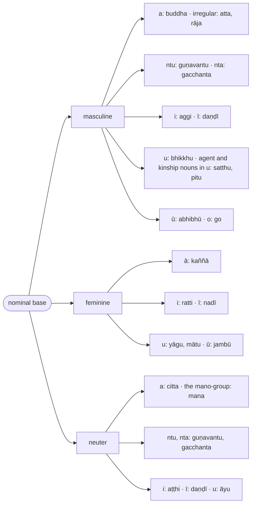
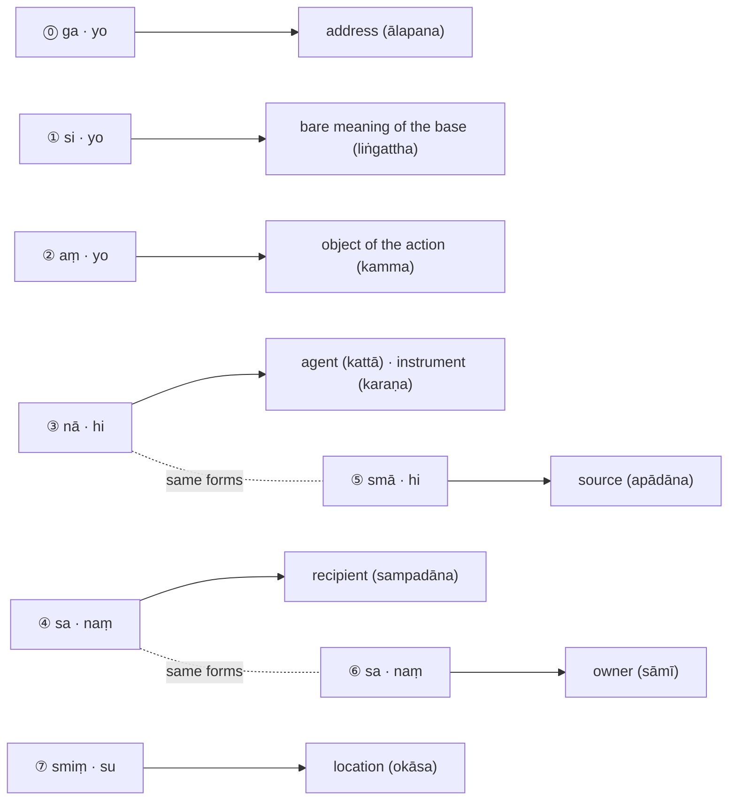

import { LinkCard } from "@astrojs/starlight/components";

:::note[Noun types in this chapter]
Paragraphs ¶47–58 set out the seven inflection forms and what each is used for, with `buddha` as the example. Almost everything after that is worked examples: one model noun for each gender and lemma ending, with every inflected form derived step by step and gathered in a summary section. A noun with the same gender and ending as a model is inflected in the same way.

Kaccāyana gives short names to the classes of nominal base that share rules, and Bālāvatāra uses them from ¶79 on:

| name | nominal base | examples | Kaccāyana |
| :-: | --- | --- | --- |
| `gha` | feminine, ending in `ā` | `kaññā`, `sabbā` | [§60 (177): Ā gho](/kaccayana/2-namakappa#m60) |
| `pa` | feminine, ending in `i`, `ī`, `u`, `ū` | `ratti`, `nadī`, `yāgu`, `jambū` | [§59 (182): Te itthikhyā po](/kaccayana/2-namakappa#m59) |
| `jha` | masculine or neuter, ending in `i`, `ī` | `aggi`, `daṇḍī`, `aṭṭhi` | [§58 (29): Ivaṇṇuvaṇṇā jhalā](/kaccayana/2-namakappa#m58) |
| `la` | masculine or neuter, ending in `u`, `ū` | `bhikkhu`, `abhibhū`, `āyu` | [§58 (29): Ivaṇṇuvaṇṇā jhalā](/kaccayana/2-namakappa#m58) |

The model nouns, in the order the chapter takes them:

| gender | model noun | base ends in | class | CSCD ¶ |
| --- | --- | --- | :-: | :-: |
| masculine | `buddha` (the Buddha) | `a` | | 48–58 |
| | `atta` (self), with `brahma`, `sakha` | `a`, irregular | | 60–66 |
| | `rāja` (king) | `a`, irregular | | 67–70 |
| | `guṇavantu` (virtuous) | `ntu` | | 71–76 |
| | `gacchanta` (going) | `nta` | | 77–78 |
| | `aggi` (fire), `ādi` (beginning) | `i` | `jha` | 79–85 |
| | `daṇḍī` (one who carries a staff) | `ī` | `jha` | 86–91 |
| | `bhikkhu` (monk), `jantu` (living being) | `u` | `la` | 92–95 |
| | `satthu` (teacher), `pitu` (father) | `u`, agent and kinship nouns | | 96–102 |
| | `abhibhū` (overlord), `sabbaññū` (all-knowing) | `ū` | `la` | 103–104 |
| | `go` (cow, ox) | `o` | | 105–110 |
| feminine | `kaññā` (girl) | `ā` | `gha` | 111–116 |
| | `ratti` (night) | `i` | `pa` | 117–121 |
| | `nadī` (river) | `ī` | `pa` | 122 |
| | `yāgu` (rice gruel), `mātu` (mother) | `u` | `pa` | 123–124 |
| | `jambū` (rose-apple tree) | `ū` | `pa` | 125 |
| | forming feminine bases with `ā`, `ī`, `inī` | | | 126–129 |
| neuter | `citta` (mind) | `a` | | 130–132 |
| | `mana` (mind) and the `mano`-group | `a` | | 133–137 |
| | `guṇavantu`, `gacchanta` | `ntu`, `nta` | | 138–139 |
| | `aṭṭhi` (bone), `daṇḍī`, `āyu` (life) | `i`, `ī`, `u` | `jha`, `la` | 140–143 |
| two or three genders | lists of nouns only | | | 144–147 |
| pronouns | `sabba`, `ta`, `eta`, `ima`, `amu`, `kiṃ`, `tumha`, `amha` | | | 148–171 |
| numerals | `dvi`, `ti`, `catu`, `pañca` to `aṭṭhārasa`, `vīsati` and above | | | 172–183 |
| words without gender | suffixes `to`, `tra`, `tha`, `dā`, `dāni` and others | | | 184–196 |
| prefixes and particles | | | | 197–201 |

Numbers written ¶47, ¶48 and so on are the paragraph numbers of the Chaṭṭha Saṅgāyana edition, the [source text](/balavatara/cscd4). They let you find any passage there, but they are not rule numbers: a paragraph may carry a rule, a lead-in or a verse, and most rules have no number of their own. Where a rule is one of Kaccāyana's suttas, the reference card beneath it gives the Kaccāyana number §N. The section headings are supplied by this translation; the edition's own are few and misplaced.

:::

:::note[The model nouns as a tree]
The same information as the table above, arranged by gender and then by the final letter of the base.

:::

## Vibhatti (The inflection forms, shown on `buddha`)

> ¶47 ‘‘Jinavacanayuttaṃ hī’’ti sabbatthādhikāro.

¶47 Kaccāyana's rule [§52 (60): Jinavacanayuttaṃ hi](/kaccayana/2-namakappa#m52) governs the whole of this text.

:::note
Every form taught here is one found in the words of the Conqueror, that is, in the Pāḷi canon, which the tradition regards as the Buddha's word. `jina`, according to Margaret Cone's *A Dictionary of Pāli*, means "the victor, the conqueror" and is used to refer to the founder of a religious tradition such as Buddhism or Jainism.
:::

:::tip[Kaccāyana Reference]
<LinkCard title="§52 (60): Jinavacanayuttaṃ hi" href="/kaccayana/2-namakappa#m52" description="Suitable for the teachings of the Conqueror" />
:::

### **Liṅgañca nipaccate** (and the nominal base is derived)

> Dhātuppaccayavibhattivajjitamatthayuttaṃ saddarūpaṃ liṅgaṃ nāma, jinavacanayoggaṃ liṅgaṃ idha ṭhapīyati nipphādīyati ca.

A `liṅga` (nominal base, or lemma) is a meaningful word-form with its root (`dhātu`), derivational suffix (`paccaya`) and inflection (`vibhatti`) set aside. Here the nominal base suited to the words of the Conqueror is set down and derived.

:::tip[Kaccāyana Reference]
<LinkCard title="§53 (61): Liṅgañca nippajjate" href="/kaccayana/2-namakappa#m53" description="And lemmas are derived" />
:::

> ¶48 Buddhaiti ṭhite –

¶48 Consider the nominal base `buddha` (the Buddha; the one who has understood).

* buddha — "the Buddha" (the lemma set up, before any inflection is added; it takes `si` by the next rule)

:::note
`buddha` is a masculine base ending in `a`, and the model for the largest class of Pāḷi nouns: every regular masculine noun in `a` is inflected the same way. The irregular ones, `atta`, `rāja`, `brahma` and `sakha`, follow from ¶60.
:::

### **Tato ca vibhattiyo** (and after it, the inflections)

> Tasmā liṅgā parā vibhattiyo honti. Cakārena tāsaṃ ekavacanādipaṭhamādisaññā ca.

The `vibhatti` (inflection suffixes) come after the nominal base. The word `ca` (and) adds that they are also named by number — `ekavacana` (⨀ singular) and `bahuvacana` (⨂ plural) — and by inflection form — `paṭhamā` (① first) and so on.

* buddha + si = buddha + (si→o) = buddh + (~~a~~ + o) = buddho — "the Buddha" (⨀①; `si` follows the lemma by this rule, becomes `o` by "So", the `a` is elided by "Saralopo mādesappaccayādimhi saralope tu pakati", and the `o` is attached by "Naye paraṃ yutte")

:::tip[Kaccāyana Reference]
<LinkCard title="§54 (62): Tato ca vibhattiyo" href="/kaccayana/2-namakappa#m54" description="And their inflections" />
:::

> ‘‘Si yo aṃ yo nā hi sa naṃ smā hi sa naṃ smiṃ sū’’ ti vibhattiyo. Si yo iti paṭhamā, aṃ yo iti dutiyā, nā hi iti tatiyā, sa naṃ iti catutthī, smā hi iti pañcamī, sa naṃ iti chaṭṭhī, smiṃ su iti sattamī.

By Kaccāyana's rule [§55 (63): Si yo, aṃ yo, nā hi, sa naṃ, smā hi, sa naṃ, smiṃ su](/kaccayana/2-namakappa#m55) there are seven inflection forms, each with a singular and a plural suffix — fourteen suffixes in all:

| symbol | ⨀ | ⨂ | inflection form |
| :-: | :-: | :-: | --- |
| ① | `si` | `yo` | `paṭhamā` ("first") |
| ② | `aṃ` | `yo` | `dutiyā` ("second") |
| ③ | `nā` | `hi` | `tatiyā` ("third") |
| ④ | `sa` | `naṃ` | `catutthī` ("fourth") |
| ⑤ | `smā` | `hi` | `pañcamī` ("fifth") |
| ⑥ | `sa` | `naṃ` | `chaṭṭhī` ("sixth") |
| ⑦ | `smiṃ` | `su` | `sattamī` ("seventh") |

:::note
`si`, `yo` etc. are the *names* of the suffixes of the inflection forms. The form that actually appears in a word is often different, because the rules that follow replace, elide or reshape them.
:::

:::tip[Kaccāyana Reference]
<LinkCard title="§54 (62): Tato ca vibhattiyo" href="/kaccayana/2-namakappa#m54" description="And their inflections" />
<LinkCard title="§55 (63): Si yo, aṃ yo, nā hi, sa naṃ, smā hi, sa naṃ, smiṃ su" href="/kaccayana/2-namakappa#m55" description="inflection forms" />
:::

### **Liṅgatthe paṭhamā** (① for the bare meaning of the base)

> Yo kammakattādivattantaramappatto sassarūpaṭṭho suddho, so **liṅgattho** nāma, tassābhidhānamatte paṭhamāvibhatti hoti. Tassāpaniyame ekamhi vattabbe ekavacanaṃ si, vuccate nenetivacanaṃ, ekassatthassa vacanaṃ ekavacanaṃ. Evaṃ bahuvacanaṃ.

When a noun does no more than name its thing, and does not yet act as object (`kamma`), agent (`kattā`) or anything else in the sentence, that bare meaning of the base is called the `liṅgattha`, and the first inflection form (①) expresses it. Since that form too is unrestricted, when one is spoken of, the singular suffix `si` (⨀①) is used. Grammatical number is called `vacana`, literally "expression", because the meaning is expressed (`vuccate`) by the suffix: the expression of one thing is `ekavacana` (⨀ singular), and of many things `bahuvacana` (⨂ plural).

:::note
The subject of an active verb is a `liṅgattha` and stands in ①: in `buddho sukhaṃ dadāti` (the verse of ¶58), "the Buddha gives happiness", the ending of the verb already expresses the agent, so `buddho` is not an agent in ③. In the same way the object a passive verb or participle already expresses stands in ①, as `poso` in `raññā hato poso`, "the man killed by the king". The third form is for the agent the verb does not express — see "Kattari ca" under ¶51. Mitra (1935) puts the same point as a rule of his own: the agent of an active verb and the object of a passive one take the first form.
:::

:::tip[Kaccāyana Reference]
<LinkCard title="§284 (283): Liṅgatthe paṭhamā" href="/kaccayana/3-karakakappa#m284" description="the first form ① for the bare meaning of the lemma" />
:::

> Atotveva.

Let's continue to consider nominal bases ending in `a`.

### **So** (`si` becomes `o`)

> Akārantā parassa sissa o hoti.

After a nominal base ending in `a`, the suffix `si` (⨀①) becomes `o`.

* buddha + si = buddha + (si→o)

The next rule elides the final `a` of the base before this `o`.

:::tip[Kaccāyana Reference]
<LinkCard title="§104 (66): So" href="/kaccayana/2-namakappa#m104" description="`si` to `o`" />
:::

### **Saralopo mādesappaccayādimhi saralope tu pakati** (vowel elided before `aṃ`, replacements and suffixes; but the original stands where sandhi would distort it)

> Aṃādīsu paresu sarassa lopo hoti, tasmiṃ kate tu kvacādinā asavaṇṇe patte pakati hoti.
>
> Naye paraṃ yutte. Evamupari saralopādi. Buddho.

When `aṃ`, a replacement such as `o`, or a suffix follows, the final vowel of the base is elided. But if a sandhi rule such as "Kvacāsavaṇṇaṃ lutte" (Sandhi ¶13) would then change the suffix vowel into a different one, the original stands — the suffix vowel is left alone. The consonant left bare by the elision joins the following vowel, by Kaccāyana's "Naye paraṃ yutte" rule (see Sandhi ¶11). From here on, vowel elision and the rest are applied without comment.

* buddha + si = buddha + (si→o) = buddh + (~~a~~ + o) = buddho — "the Buddha" (⨀①)

:::tip[Kaccāyana Reference]
<LinkCard title="§83 (67): Saralopo’ mādesa paccayādimhi saralope tu pakati" href="/kaccayana/2-namakappa#m83" description="in vowel elision in `aṃ` [inflections], replacements, suffixes etc., that elided vowel can be restored" />
<LinkCard title="§11 (14): Naye paraṃ yutte" href="/kaccayana/1-sandhikappa#m11" description="To conclude, attach next" />
:::

> Bahumhi vattabbe bahuvacanaṃ yo.

When many are spoken of, the plural suffix `yo` (⨂①) is used.

> Ato vātveva.

Consider optional rules for nominal bases ending in `a`.

### **Sabbayonīnamāe** (`ā` and `e` for all `yo` suffixes)

> Akārantā paresaṃ paṭhamadutiyāyonīnaṃ yathāsaṅkhyaṃ āe vā honti. Buddhā.
>
> Vāti kiṃ. Aggayo.

After a nominal base ending in `a`, the `yo` of the first (⨂①) and second (⨂②) inflection forms optionally becomes `ā` and `e` respectively.

* buddha + yo = buddh + (~~a~~ + yo→ā) = buddhā — "the Buddhas" (⨂①)

Exception:

* aggi + yo = agg + (i→a) + yo = aggayo — "fires" (⨂①, rule not applied; see "Yo svakatarasso jho" under ¶79)

:::tip[Kaccāyana Reference]
<LinkCard title="§107 (69): Sabbayonīnamāe" href="/kaccayana/2-namakappa#m107" description="For all `yo`, `nī`: `ā`, `e`" />
:::

> ¶49 Liṅgatthe paṭhamātveva.

¶49 Still on the first inflection form (①) for the bare meaning of a noun:

### **Ālapane ca** (and in address)

> Abhimukhīkaraṇamālapanaṃ, tadadhike liṅgatthe paṭhamā hoti.

`Ālapana` (the vocative) is addressing someone directly. A noun used to address takes the first inflection form (①), just as for its bare meaning.[^5]

:::tip[Kaccāyana Reference]
<LinkCard title="§285 (70): Ālapane ca" href="/kaccayana/3-karakakappa#m285" description="and in address ⓪" />
:::

> ‘‘Ālapane si gasañño’’ti sissa gasaññā. Geitveva.

By Kaccāyana's rule [§57 (71): Ālapane si ga sañño](/kaccayana/2-namakappa#m57), in address the suffix `si` is renamed `ga` (⨀⓪). Consider `ga`.

:::tip[Kaccāyana Reference]
<LinkCard title="§57 (71): Ālapane si ga sañño" href="/kaccayana/2-namakappa#m57" description="for vocatives `si` is called `ga`" />
:::

[^5]: Mitra (1935) remarks that in the Bālāvatāra address is "allowed by the sūtra Liṅgatthe paṭhamā", and that "Ālapane ca" occurs as a separate rule only in Kaccāyana. The CSCD does print "Ālapane ca" as a rule of its own, but its vutti, `tadadhike liṅgatthe paṭhamā`, "the first form for the bare meaning of the base with address added", folds the vocative into the `liṅgattha`, which is the point he makes; the translation above renders that vutti and keeps the rule, with Kaccāyana §285 as its source.

### **Akārā pitādyantānamā** (`a`, and the endings of `pitu` etc., become `ā` before `ga`)

> Ge pare akāro pitusatthuattarājādīnamanto ca āttaṃ yāti.
>
> ‘‘Ākāro vā’’ti ge pare ākārassa rasso vā.

Before `ga` (⨀⓪), a final `a` — and the final of `pitu` (father), `satthu` (teacher), `atta` (self), `rāja` (king) and the like — becomes `ā`. By Kaccāyana's rule "Ākāro vā" (§246), that `ā` before `ga` is optionally shortened again.

* buddha + ga = buddh + (a→ā) + ga = buddhā + ga
* buddhā + ga = buddh + (ā→a) + ga = buddha + ga (optional shortening)

The `ga` itself is elided by the next rule. These are Kaccāyana's rules "Akārapitādyantānamā" (§244) and "Ākāro vā" (§246).

:::tip[Kaccāyana Reference]
<LinkCard title="§244 (72): Akārapitādyantānamā" href="/kaccayana/2-namakappa#m244" description="`ā` for a final `a` and for the final of `pitu` and the like [before `ga`]" />
<LinkCard title="§246 (73): Ākāro vā" href="/kaccayana/2-namakappa#m246" description="Optionally, `ā` [is shortened before `ga`]" />
:::

### **Sesato lopaṃ gasīpi** (for the rest, `ga` and `si` are elided)

> So siṃ syā ca sakhāto gassevātyādiniddiṭṭhehaññe avaṇṇivaṇṇuvaṇṇokārantā sesā, tehi pare gasī lupyante. He - buddha, buddhā. Yo - buddhā.

Apart from the instances specified by rules such as [§104 (66): So](/kaccayana/2-namakappa#m104), "Siṃ" (§219), "Syā ca" (§189) and [§113 (132): Sakhato gasse vā](/kaccayana/2-namakappa#m113), all remaining nominal bases ending in `a`, `ā`, `i`, `ī`, `u`, `ū` or `o` elide a following `ga` or `si`.

Examples:

* buddhā + ga = buddhā + ~~ga~~ = buddhā, or buddha + ~~ga~~ = buddha — "O Buddha!" (⨀⓪; `he` in the vutti is the vocative particle)
* buddha + yo = buddh + (~~a~~ + yo→ā) = buddhā — "O Buddhas!" (⨂⓪, by "Sabbayonīnamāe")

:::tip[Kaccāyana Reference]
<LinkCard title="§104 (66): So" href="/kaccayana/2-namakappa#m104" description="`si` to `o`" />
<LinkCard title="§113 (132): Sakhato gasse vā" href="/kaccayana/2-namakappa#m113" description="Optionally, from `sakha` in `ga`" />
<LinkCard title="§220 (74): Sesato lopaṃ gasipi" href="/kaccayana/2-namakappa#m220" description="after the rest, `ga` and `si` too are elided" />
:::

### **Kammatthe dutiyā** (② for the object of an action) :badge[¶50]
> Yaṃ karoti, taṃ kammaṃ nāma. Tattha dutiyā hoti. Aṃbuddhaṃ. Yossa e-buddhe.

What one does — the object of the action — is called `kamma`. For it the second inflection form (②) is used.

* buddha + aṃ = buddh + (~~a~~ + aṃ) = buddhaṃ (⨀②)
* buddha + yo = buddh + (~~a~~ + yo→e) = buddhe (⨂②, `yo` becomes `e` by "Sabbayonīnamāe")

:::tip[Kaccāyana Reference]
<LinkCard title="§297 (284): Kammatthe dutiyā" href="/kaccayana/3-karakakappa#m297" description="② for the `kamma` [object]" />
:::

> ¶51 Tatiyātveva.

¶51 Consider the third inflection form (③).

### **Kattari ca** (and for the agent)

> Yo karoti, sa kattā nāma. Tattha tatiyā hoti. Nā.

Whoever performs the action is called `kattā` (the agent, or doer). For the agent the third inflection form (③) is used, with the suffix `nā` (⨀③).

:::note
This is the agent the verb does not itself express: with a passive verb or participle the agent takes ③ and the object ①, as in Kaccāyana's examples under §288, `raññā hato poso`, "the man killed by the king", and `yakkhena dinno varo`, "the boon given by the yakkha". With an active verb the ending carries the agent, which then stands in ① as `liṅgattha` (`rājā posaṃ hanati`, "the king kills the man"; `buddho … dadāti` in the verse of ¶58). The Bālāvatāra's rule is unqualified; the Rūpasiddhi (293) supplies the condition, `abhihite na bhavati`, "not when [the agent] is already expressed", and Mitra (1935) builds it into his rules, giving the third form to the agent in passive and impersonal constructions and the first form to the subject of an active verb.
:::

:::tip[Kaccāyana Reference]
<LinkCard title="§288 (293): Kattari ca" href="/kaccayana/3-karakakappa#m288" description="and for the agent" />
:::

### **Ato nena** (after `a`, `nā` becomes `ena`)

> Akārā paro nā enaṃ yāti. Buddhena.

After a nominal base ending in `a`, the suffix `nā` (⨀③) becomes `ena`.

* buddha + nā = buddha + (nā→ena) = buddh + (~~a~~ + ena) = buddhena — "by the Buddha"

:::tip[Kaccāyana Reference]
<LinkCard title="§103 (79): Ato nena" href="/kaccayana/2-namakappa#m103" description="From `a`, `nā` becomes `ena`" />
:::

> Hi.

Consider the suffix `hi` (⨂③).

### **Suhisvakāro e** (`a` becomes `e` before `su` and `hi`)

> Suhisu paresvakārassa e hoti.

Before the suffixes `su` (⨂⑦) and `hi` (⨂③, ⨂⑤), the final `a` of the nominal base becomes `e`.

* buddha + hi = buddh + (a→e) + hi = buddhehi — "by the Buddhas"

:::tip[Kaccāyana Reference]
<LinkCard title="§101 (80): Suhisvakāro e" href="/kaccayana/2-namakappa#m101" description="In `su`, `hi`, `a` becomes `e`" />
:::

### **Smāhisminnaṃ mhābhimhi vā** (optionally `smā`, `hi`, `smiṃ` become `mhā`, `bhi`, `mhi`)

> Sabbasaddehi paresaṃ smāhisminnaṃ yathāsaṅkhyaṃ mhābhimhiiccete vā honti. Buddhebhi, buddhehi.

After any nominal base, the suffixes `smā` (⨀⑤), `hi` (⨂③, ⨂⑤) and `smiṃ` (⨀⑦) optionally become `mhā`, `bhi` and `mhi` respectively.

* buddha + hi = buddh + (a→e) + (hi→bhi) = buddhebhi, or buddhehi (⨂③)

:::tip[Kaccāyana Reference]
<LinkCard title="§99 (81): Smāhismiṃnaṃ mhābhimhi vā" href="/kaccayana/2-namakappa#m99" description="Optionally, `smā`, `hi`, `smiṃ` become `mhā`, `bhi`, `mhi`" />
:::

### **Karaṇe tatiyā** (③ also for the instrument) :badge[¶52]
> Yena vā kayirate, taṃ karaṇaṃ nāma. Tattha tatiyā hoti. Sabbaṃ kattusamaṃ.

The means by which an action is done is called `karaṇa` (the instrument). It also takes the third inflection form (③), with exactly the same forms as the agent.

:::tip[Kaccāyana Reference]
<LinkCard title="§286 (291): Karaṇe tatiyā" href="/kaccayana/3-karakakappa#m286" description="the third form ③ for the instrument" />
:::

### **Sampadāne catutthī** (④ for the recipient) :badge[¶53]
> Yassa dātukāmo rocate, dhārayate vā, taṃ sampadānaṃ nāma. Tattha catutthī hoti. Sa.

Whoever one wishes to give to, whoever is pleased by something, or whoever one owes something to is called `sampadāna` (the recipient). The recipient takes the fourth inflection form (④), with the suffix `sa` (⨀④).

The same suffix `sa` also serves the singular sixth inflection form (⨀⑥).

:::note
`dhārayate` in the third clause means "owes": the creditor is the `sampadāna`, as in the Rūpasiddhi's example `suvaṇṇaṃ te dhārayate`, "he owes you gold" (`iṇaṃ dhārayatīti attho`). Kaccāyana §276 defines the term with the same three clauses, and Mitra (1935) renders this one the same way, "one from whom something is taken as a debt".
:::

:::tip[Kaccāyana Reference]
<LinkCard title="§276 (302): Yassa dātukāmo rocate dhārayate vā taṃ sampadānaṃ" href="/kaccayana/3-karakakappa#m276" description="the one to whom one wishes to give, who is pleased, or to whom one owes: `sampadāna`" />
<LinkCard title="§293 (85, 301): Sampadāne catutthī" href="/kaccayana/3-karakakappa#m293" description="④ for the `sampadāna` [recipient]" />
:::

> Ato vātveva.

Consider optional rules for nominal bases ending in `a`.

### **Āya catutthekavacanassa tu** (`āya` for the singular fourth)

> Akārā parassa catutthekavacanassa āyo vā hoti. Buddhāya.

After a nominal base ending in `a`, the singular fourth suffix `sa` (⨀④) optionally becomes `āya`.

* buddha + sa = buddha + (sa→āya) = buddh + (~~a~~ + āya) = buddhāya — "to the Buddha"

:::tip[Kaccāyana Reference]
<LinkCard title="§109 (304): Āya catutthekavacanassatu" href="/kaccayana/2-namakappa#m109" description="`āya` for ④⨀ inflections" />
:::

> ‘‘Sāgamo se’’ti se sakārāgamo. Buddhassa. Naṃ.

By Kaccāyana's rule [§61 (86): Sāgamo se](/kaccayana/2-namakappa#m61), an `s` is inserted before the suffix `sa`. Consider `naṃ`:

* buddha + sa = buddha + (s + sa) = buddhassa — "to the Buddha" (⨀④)

:::tip[Kaccāyana Reference]
<LinkCard title="§61 (86): Sāgamo se" href="/kaccayana/2-namakappa#m61" description="Before `sa` inflections: insert `s`" />
:::

> Dīghantveva.

Consider lengthening.

### **Sunaṃhisu ca** (and before `su`, `naṃ`, `hi`)

> Sunaṃhisu paresu sarādīnaṃ dīgho hoti. Casaddena kvaci na. Buddhānaṃ.

Before the suffixes `su` (⨂⑦), `naṃ` (⨂④, ⨂⑥) and `hi` (⨂③, ⨂⑤), the final vowel of the nominal base is lengthened. The word `ca` (and) indicates that sometimes it is not.

* buddha + naṃ = buddh + (a→ā) + naṃ = buddhānaṃ — "to the Buddhas" (⨂④)

:::note
The summary tables below give the lengthened forms (`buddhānaṃ`, `aggīsu`, `bhikkhūsu`, `rattīsu`) as the norm. The `ca` lets the short vowel stand at times: Kaccāyana's vutti (§89) gives `brahmacārisu`, `bhikkhunaṃ` and `pāṇibhi`, one for each suffix, and the Rūpasiddhi prints the short alternative beside the long one throughout its `jha`, `la` and `pa` paradigms (`aggisu`, `bhikkhusu`, `rattisu`), some of which Mitra (1935) carries into his tables (`daṇḍisu`, `bhikkhusu`, `rattisu`, `tisu`, `catusu`).
:::

:::tip[Kaccāyana Reference]
<LinkCard title="§89 (87): Sunaṃhisu ca" href="/kaccayana/2-namakappa#m89" description="And in `su`, `naṃ`, `hi`" />
:::

### **Apādāne pañcamī** (⑤ for the source) :badge[¶54]
> Yasmādapeti, bhayamādatte vā, tadapādānaṃ nāma, tattha pañcamī hoti. Smā.

The point something moves away from, the source of a fear, or the one from whom something is taken is called `apādāna`. It takes the fifth inflection form (⑤), with the suffix `smā` (⨀⑤).

:::note
The definition has three clauses sharing the one `yasmā`, "from which": `apeti` (moves away), `bhayaṃ` (fear [arises]) and `ādatte` (takes, receives — including learning, as in the Rūpasiddhi's `upajjhāyā sikkhaṃ gaṇhāti`, "the pupil takes the training from the preceptor"). Kaccāyana §271 states and illustrates all three, and Mitra (1935) renders them "goes off, or fear arises, or something is received".
:::

:::tip[Kaccāyana Reference]
<LinkCard title="§271 (88, 308): Yasmā dapeti bhayamādatte vā tadapādānaṃ" href="/kaccayana/3-karakakappa#m271" description="that from which one departs, fears or takes: `apādāna`" />
<LinkCard title="§295 (307): Apādāne pañcamī" href="/kaccayana/3-karakakappa#m295" description="⑤ for the `apādāna` [point of departure]" />
:::

> Ato āetveva.

Consider `ā` and `e` after `a`.

### **Smāsminnaṃ vā** (optionally `ā`, `e` for `smā`, `smiṃ`) :badge[¶55]
> Akārā paresaṃ smāsminnaṃ āe vā honti. Buddhā, buddhamhā, buddhasmā. Buddhebhi, buddhehi.

After a nominal base ending in `a`, the suffixes `smā` (⨀⑤) and `smiṃ` (⨀⑦) optionally become `ā` and `e` respectively.

Examples:

* buddha + smā = buddh + (~~a~~ + smā→ā) = buddhā — "from the Buddha" (⨀⑤)
* buddha + smā = buddha + (smā→mhā) = buddhamhā (⨀⑤, by "Smāhisminnaṃ mhābhimhi vā")
* buddha + smā = buddhasmā (⨀⑤, no rule applied)
* buddha + hi = buddhebhi, buddhehi — "from the Buddhas" (⨂⑤)

:::tip[Kaccāyana Reference]
<LinkCard title="§108 (90): Smāsmiṃnaṃ vā" href="/kaccayana/2-namakappa#m108" description="Optionally, for `smā`, `smiṃ`" />
:::

### **Sāmismiṃ chaṭṭhī** (⑥ for the owner) :badge[¶56]
> Yassa vā pariggaho, taṃ sāmī nāma. Tattha chaṭṭhī hoti. Buddhassa. Buddhānaṃ.

Whoever something belongs to is called `sāmī` (the owner). The owner takes the sixth inflection form (⑥).

* buddha + sa = buddha + (s + sa) = buddhassa — "of the Buddha" (⨀⑥)
* buddha + naṃ = buddh + (a→ā) + naṃ = buddhānaṃ — "of the Buddhas" (⨂⑥)

:::note
`pariggaha` (belonging) is any relation of possession, dependence or connection, not ownership alone: the `vā` of the definition opens the term, and the Rūpasiddhi's list under Kaccāyana §283 takes in part and whole (`rukkhassa sākhā`, "the branch of the tree"), member and group (`bhikkhūnaṃ samūho`, "a company of monks") and quality and bearer (`suvaṇṇassa vaṇṇo`, "the colour of gold"), all in ⑥. Mitra (1935) glosses "owner" the same way, "that which has a possessive relation (`pariggaho`) with something", with `bhikkhuno cīvaraṁ`, `narānaṁ indo` and `rukkhassa sākhā` among his examples.
:::

:::tip[Kaccāyana Reference]
<LinkCard title="§283 (316): Yassa vā pariggaho taṃ sāmī" href="/kaccayana/3-karakakappa#m283" description="the one whose possession [a thing] is: `sāmī`" />
<LinkCard title="§301 (315): Sāmismiṃ chaṭṭhī" href="/kaccayana/3-karakakappa#m301" description="⑥ for the `sāmī` [owner]" />
:::

### **Okāse sattamī** (⑦ for the location) :badge[¶57]
> Yodhāro, tamokāsaṃ nāma. Tattha sattamī hoti. Smiṃ-buddhe, buddhamhi, buddhasmiṃ. Su-buddhesu.

That which is the support (`ādhāra`) is called `okāsa` (the location). It takes the seventh inflection form (⑦).

Examples:

* buddha + smiṃ = buddh + (~~a~~ + smiṃ→e) = buddhe — "in the Buddha" (⨀⑦, by "Smāsminnaṃ vā")
* buddha + smiṃ = buddha + (smiṃ→mhi) = buddhamhi (⨀⑦, by "Smāhisminnaṃ mhābhimhi vā")
* buddha + smiṃ = buddhasmiṃ (⨀⑦, no rule applied)
* buddha + su = buddh + (a→e) + su = buddhesu — "in the Buddhas" (⨂⑦)

:::note
Kaccāyana's definition (§278) sorts the `ādhāra` (the support of the action) into four kinds — pervading (`byāpika`: milk in water), by contact (`opasilesika`: the king on his couch), by domain (`vesayika`: birds in the air) and by proximity (`sāmīpika`: a village "on the Ganges") — a classification the Bālāvatāra leaves out and Mitra (1935) repeats here.
:::

:::tip[Kaccāyana Reference]
<LinkCard title="§278 (320): Yodhāro tamokāsaṃ" href="/kaccayana/3-karakakappa#m278" description="the support of the action: `okāsa`" />
<LinkCard title="§302 (319): Okāse sattamī" href="/kaccayana/3-karakakappa#m302" description="⑦ for the `okāsa` [location]" />
:::

### Summary of the inflections of `buddha` :badge[¶58]
> Buddho buddha sukhaṃ dadāti sarato buddhaṃ tato dukkaraṃ,\
> Kiṃ buddhena mahiddhayopi munayo buddhena jātāsukhī;\
> Buddhasseva manaṃ dade padamahaṃ buddhā labheyyāccutaṃ,\
> Buddhassiddhi na kiṃ kare bhavabhave bhattyatthu buddhe mama.

A mnemonic verse using every inflection of `buddha`:

The Buddha, O Buddha, gives happiness; for one who recollects the Buddha, what then is hard?\
What is not achieved through the Buddha? Even sages of great power have found happiness through the Buddha;\
to the Buddha alone would I give my mind; from the Buddha may I obtain the everlasting state;\
what would the Buddha's power not accomplish? In life after life, may my devotion rest in the Buddha.

The inflections in order of appearance:

* `buddho` (`si` ⨀①): the Buddha as subject — the bare meaning of the base
* `buddha` (`ga` ⨀⓪): the Buddha addressed
* `buddhaṃ` (`aṃ` ⨀②): the Buddha as object (of recollection)
* `buddhena` (`nā` ⨀③): the Buddha as agent (of achievement)
* `buddhena` (`nā` ⨀③): the Buddha as instrument (of the sages' happiness)
* `buddhassa` (`sa` ⨀④): the Buddha as recipient (of the mind)
* `buddhā` (`smā` ⨀⑤): the Buddha as source (of the everlasting state)
* `buddhassa` (`sa` ⨀⑥): the Buddha as owner (of the power)
* `buddhe` (`smiṃ` ⨀⑦): the Buddha as location (of devotion)

| inflection form | ⨀ | inflection | ⨂ | inflection |
| :-: | :-: | --- | :-: | --- |
| ⓪ | `ga` | buddha, buddhā | `yo` | buddhā |
| ① | `si` | buddho | `yo` | buddhā |
| ② | `aṃ` | buddhaṃ | `yo` | buddhe |
| ③ | `nā` | buddhena | `hi` | buddhebhi, buddhehi |
| ④ | `sa` | buddhāya, buddhassa[^6] | `naṃ` | buddhānaṃ |
| ⑤ | `smā` | buddhā, buddhamhā, buddhasmā | `hi` | buddhebhi, buddhehi |
| ⑥ | `sa` | buddhassa | `naṃ` | buddhānaṃ |
| ⑦ | `smiṃ` | buddhe, buddhamhi, buddhasmiṃ | `su` | buddhesu |

[^6]: Mitra (1935) gives only `buddhassa` for ④⨀, and for `citta` refers to `buddha` for the remaining forms, so it lacks `cittāya` too. The Bālāvatāra states the rule "Āya catutthekavacanassa tu" and its form `buddhāya` (Kaccāyana §109), and the form is canonical; his omission is an oversight.

### Summary of the uses of the inflection forms

| symbol | ⨀ | ⨂ | inflection form | usage |
| :-: | :-: | :-: | --- | --- |
| ⓪ | `ga` | `yo` | `paṭhamā` ("first") | `Ālapane` (address) |
| ① | `si` | `yo` | `paṭhamā` ("first") | `Liṅgatthe` (bare meaning of the base) |
| ② | `aṃ` | `yo` | `dutiyā` ("second") | `Kammatthe` (object of an action) |
| ③ | `nā` | `hi` | `tatiyā` ("third") | `Kattari` (agent), `Karaṇe` (instrument) |
| ④ | `sa` | `naṃ` | `catutthī` ("fourth") | `Sampadāne` (recipient) |
| ⑤ | `smā` | `hi` | `pañcamī` ("fifth") | `Apādāne` (source) |
| ⑥ | `sa` | `naṃ` | `chaṭṭhī` ("sixth") | `Sāmismiṃ` (owner) |
| ⑦ | `smiṃ` | `su` | `sattamī` ("seventh") | `Okāse` (location) |

:::note
Six of these uses are `kāraka`, participants that bring the action about (`karoti kiriyaṃ nipphādetīti kārakaṃ`): `kamma`, `kattā`, `karaṇa`, `sampadāna`, `apādāna` and `okāsa`. Address and the owner are not, since neither takes part in the action, and the bare meaning of the base is the noun before it takes any part. The Bālāvatāra does not use the word; Kaccāyana defines the six in the [Kārakakappa](/kaccayana/3-karakakappa) (§271–§283) before assigning the inflection forms to them, and Mitra (1935) opens his account of the uses with the same list, noting that `sāmī` and `ālapana` "are not regarded as kāraka".
:::

:::note[The inflection forms and their uses, as a map]
Each inflection form is named by its singular and plural suffixes and serves the meanings shown. The dotted lines join the pairs that share their forms, which is why ⑤ and ⑥ are mostly passed over from ¶59 on.

:::

> ¶59 Ito paraṃ tatiyāpañcamīnañca catutthīchaṭṭhīnañca sarūpattā pañcamīchaṭṭhiyo bhīyo upekkhante.

¶59 From here on, because the fifth inflection form has the same shape as the third, and the sixth the same as the fourth, the fifth and sixth are mostly passed over.

## Pulliṅga (Masculine nouns)

> ¶60 Atta, si.

¶60 Consider `atta` (self) with `si`.

> Brahmattasakharājādito tveva.

The following rules apply to `brahma`, `atta`, `sakha`, `rāja` and similar bases.

### **Syā ca** (and `si` becomes `ā`)

> Brahmādito sissa ā hoti. Attā.

After `brahma` and the like, the suffix `si` (⨀①) becomes `ā`.

* atta + si = att + (~~a~~ + si→ā) = attā — "the self"

:::tip[Kaccāyana Reference]
<LinkCard title="§189 (113): Syā ca" href="/kaccayana/2-namakappa#m189" description="and `ā` for `si`" />
:::

> ‘‘Yonamāno’’ti brahmādito yonaṃ ānottaṃ. Attāno.

By Kaccāyana's rule "Yonamāno", after `brahma` and the like the suffix `yo` becomes `āno`.

* atta + yo = att + (~~a~~ + yo→āno) = attāno — "the selves" (⨂①)

:::tip[Kaccāyana Reference]
<LinkCard title="§190 (114): Yonamāno" href="/kaccayana/2-namakappa#m190" description="`āno` for `yo`" />
:::

> ¶61 He - atta, attā. Yo, attāno.

¶61 In address:

* (⨀⓪): `atta`, `attā`
* (⨂⓪): `attāno`

> ¶62 ‘‘Brahmattasakharājādito amāna’’nti brahmādito aṃvacanassa ānaṃ vā hoti. Attānaṃ, attaṃ. Attāno.

¶62 By Kaccāyana's rule "Brahmattasakharājādito amānaṃ", after `brahma` and the like the suffix `aṃ` (⨀②) optionally becomes `ānaṃ`.

* atta + aṃ = att + (~~a~~ + aṃ→ānaṃ) = attānaṃ, or attaṃ (⨀②)
* atta + yo = attāno (⨂②)

:::tip[Kaccāyana Reference]
<LinkCard title="§188 (115): Brahmatta sakha rājādito amānaṃ" href="/kaccayana/2-namakappa#m188" description="`ānaṃ` for `aṃ` after `brahma`, `atta`, `sakha`, `rāja` and the like" />
:::

> ¶63 Attena, attanā. Pakkhe-jinavacanānurodhena enābhāvo.

¶63 Third inflection form (⨀③): `attena`, and also `attanā`. The second form keeps `nā` unchanged, in agreement with the words of the Conqueror.

* atta + nā = atta + (nā→ena) = att + (~~a~~ + ena) = attena
* atta + nā = attanā ("Ato nena" not applied)

> ‘‘Attānto hismimanattaṃ’’ti himhi attantassa ano. Attanehi. Evaṃ karaṇe.

By Kaccāyana's rule "Attānto hismimanattaṃ", before `hi` (and `smiṃ`) the final of `atta` becomes `ana`. The same forms serve for the instrument.

* atta + hi = att + (a→ana) + hi = attan + (a→e) + hi = attanehi, or attanebhi (⨂③, `a` becomes `e` by "Suhisvakāro e"; `bhi` by "Smāhisminnaṃ mhābhimhi vā")

:::tip[Kaccāyana Reference]
<LinkCard title="§211 (126): Attanto hismimanattaṃ" href="/kaccayana/2-namakappa#m211" description="`atta` final becomes `ana` before `hi`" />
:::

> ¶64 ‘‘Sassa no’’ti nokāro. Attano. Attānaṃ.

¶64 By Kaccāyana's rule "Sassa no", the suffix `sa` becomes `no`.

* atta + sa = atta + (sa→no) = attano — "to the self" (⨀④)
* atta + naṃ = att + (a→ā) + naṃ = attānaṃ (⨂④)

:::tip[Kaccāyana Reference]
<LinkCard title="§213 (127): Sassa no" href="/kaccayana/2-namakappa#m213" description="after `atta`, `sa` becomes `no`" />
:::

> ¶65 Amhatumhantu rājabrahmattasakha satthupitādīhi smā nāva.

¶65 After `amha`, `tumha`, words in `ntu`, `rāja`, `brahma`, `atta`, `sakha`, `satthu`, `pitu` and the like, the suffix `smā` behaves like `nā`.

> Amhādito smā nā iva hoti. Attanā.

After `amha` and the like, `smā` (⨀⑤) takes the same forms as `nā` (⨀③).

* atta + smā = attanā — "from the self" (⨀⑤)

> ¶66 ‘‘Tato sminnī’’ti smino ni. Attani. ‘‘Anatta’’nti bhāvaniddesena sumhi ca ano. Attanesu.

¶66 By Kaccāyana's rule "Tato sminni", the suffix `smiṃ` becomes `ni`. And because Kaccāyana's rule "Attānto hismimanattaṃ" states the change in abstract form (`bhāvaniddesa`: `an-attaṃ`, "the state of `ana`"), it applies before `su` as well.

* atta + smiṃ = atta + (smiṃ→ni) = attani — "in the self" (⨀⑦)
* atta + su = att + (a→ana) + su = attan + (a→e) + su = attanesu — "in the selves" (⨂⑦)

:::tip[Kaccāyana Reference]
<LinkCard title="§212 (129): Tato smiṃ ni" href="/kaccayana/2-namakappa#m212" description="after `atta`, `smiṃ` becomes `ni`" />
:::

### Summary of the inflections of `atta`

| inflection form | ⨀ | inflection | ⨂ | inflection |
| :-: | :-: | --- | :-: | --- |
| ⓪ | `ga` | atta, attā | `yo` | attāno |
| ① | `si` | attā | `yo` | attāno |
| ② | `aṃ` | attānaṃ, attaṃ[^7] | `yo` | attāno |
| ③ | `nā` | attena, attanā | `hi` | attanehi, attanebhi[^8] |
| ④ | `sa` | attano | `naṃ` | attānaṃ |
| ⑤ | `smā` | attanā[^9] | `hi` | attanehi, attanebhi |
| ⑥ | `sa` | attano | `naṃ` | attānaṃ |
| ⑦ | `smiṃ` | attani | `su` | attanesu[^10] |

[^7]: Mitra (1935) gives only `attānaṃ` for ②⨀. The rule is optional (Kaccāyana §188 has `vā`), the Bālāvatāra lists `attaṃ` at ¶62, and `attaṃ` is frequent in the canon; the table keeps both.

[^8]: The CSCD (¶63) prints `attanehi` alone. Kaccāyana's vutti under §211 gives `attanehi, attanebhi`, the rule "Smāhisminnaṃ mhābhimhi vā" applies after every base, and the Rūpasiddhi uses `attanebhi` throughout; Mitra (1935) gives both. Neither form is attested in the Tipiṭaka, as the Kaccāyana page notes.

[^9]: Mitra (1935) adds `attasmā` and `attamhā` beside `attanā`. ¶65 "Amhādito smā nā iva hoti" has no `vā`, nor has Kaccāyana §214, and the Rūpasiddhi gives no such forms; they belong to a later paradigm tradition of the Saddanīti type, so the table follows the rule.

[^10]: The Rūpasiddhi (129) reads the `ana` of Kaccāyana §211 as not reaching `su` and gives `attani, attesu`; the Bālāvatāra's `bhāvaniddesa` argument at ¶66 takes it the other way, `attanesu`. Mitra (1935) prints both, `attanesu, attesu`. Both are grammarians' forms, and neither is well attested.

> ¶67 Rājā attāva. Nā.

¶67 `rāja` (king) is inflected like `atta`. Consider `nā`:

> Savibhattissa rājassetveva.

The next rules replace `rāja` and its suffix together.

### **Nāmhi raññā vā** (optionally `raññā` before `nā`)

> Nāmhi savibhattissa rājasaddassa raññā vā hoti. Raññā, rājena.

Before `nā` (⨀③), `rāja` and its suffix together optionally become `raññā`.

* rāja + nā = (rāja + nā→raññā) = raññā — "by the king"
* rāja + nā = rāja + (nā→ena) = rāj + (~~a~~ + ena) = rājena (rule not applied)

:::tip[Kaccāyana Reference]
<LinkCard title="§137 (116): Nāmhi raññā vā" href="/kaccayana/2-namakappa#m137" description="Optionally `raññā` for `rāja` before `nā`" />
:::

### **Rājassa rāju sunaṃhisu ca** (`rāja` becomes `rāju` before `su`, `naṃ`, `hi`)

> Sunaṃ hisu paresu rājassa rāju hoti, cakārena kvaci na.

Before `su` (⨂⑦), `naṃ` (⨂④, ⨂⑥) and `hi` (⨂③, ⨂⑤), `rāja` becomes `rāju`. The word `ca` (and) indicates that sometimes it does not.

:::tip[Kaccāyana Reference]
<LinkCard title="§169 (117): Rājassa rāju sunaṃhisu ca" href="/kaccayana/2-namakappa#m169" description="`rāju` for `rāja` before `su`, `naṃ`, `hi`" />
:::

> ‘‘Sunaṃhisu ceti’’ dīghe - rājūbhi, rājūhi, rājebhi, rājehi.

With lengthening by Kaccāyana's rule [§89 (87): Sunaṃhisu ca](/kaccayana/2-namakappa#m89):

* rāja + hi = rāj + (a→u→ū) + hi = rājūhi, or rājūbhi — "by the kings" (⨂③)
* rāja + hi = rāj + (a→e) + hi = rājehi, or rājebhi (⨂③, `rāju` not applied)

:::tip[Kaccāyana Reference]
<LinkCard title="§89 (87): Sunaṃhisu ca" href="/kaccayana/2-namakappa#m89" description="And in `su`, `naṃ`, `hi`" />
:::

> ¶68 Savibhattissetyadhikāro.

¶68 Again the replacement takes in the suffix as well.

> ‘‘Rājassa rañño rājino se’’ti se rañño rājino honti. Rañño, rājino.

By Kaccāyana's rule "Rājassa rañño rājino se", before `sa` (⨀④, ⨀⑥) `rāja` and its suffix together become `rañño` or `rājino`.

* rāja + sa = (rāja + sa→rañño) = rañño, or rājino — "to the king", "of the king"

:::tip[Kaccāyana Reference]
<LinkCard title="§135 (118): Rājassa rañño rājino se" href="/kaccayana/2-namakappa#m135" description="`rañño`, `rājino` for `rāja` before `sa`" />
:::

> ‘‘Raññaṃ namhi vā’’ti namhi raññaṃ vā. Raññaṃ, rājūnaṃ, rājānaṃ.

By Kaccāyana's rule "Raññaṃ namhi vā", before `naṃ` (⨂④, ⨂⑥) they optionally become `raññaṃ`.

* rāja + naṃ = (rāja + naṃ→raññaṃ) = raññaṃ
* rāja + naṃ = rāj + (a→u→ū) + naṃ = rājūnaṃ (rule not applied; `rāju` with lengthening)
* rāja + naṃ = rāj + (a→ā) + naṃ = rājānaṃ (rule not applied; lengthening only)

:::tip[Kaccāyana Reference]
<LinkCard title="§136 (119): Raññaṃ naṃ mhi vā" href="/kaccayana/2-namakappa#m136" description="Optionally `raññaṃ` for `rāja` before `naṃ`" />
:::

> ¶69 Smāssanātulyattā-nāmhi raññā vā. Raññā, rājamhā, rājasmā.

¶69 Because `smā` (⨀⑤) takes the same forms as `nā`, "Nāmhi raññā vā" applies to it too.

* rāja + smā = raññā, rājamhā, rājasmā — "from the king"

> ¶70 ‘‘Smimhi raññe rājinī’’ti smimhi raññe rājini honti. Raññe, rājini. Rājūsu, rājesu.

¶70 By Kaccāyana's rule "Smimhi raññe rājini", before `smiṃ` (⨀⑦) they become `raññe` or `rājini`.

* rāja + smiṃ = (rāja + smiṃ→raññe) = raññe, or rājini — "in the king"
* rāja + su = rāj + (a→u→ū) + su = rājūsu, or rājesu — "in the kings" (⨂⑦)

:::tip[Kaccāyana Reference]
<LinkCard title="§138 (121): Smiṃmhi raññe rājini" href="/kaccayana/2-namakappa#m138" description="`raññe`, `rājini` for `rāja` before `smiṃ`" />
:::

### Summary of the inflections of `rāja`

| inflection form | ⨀ | inflection | ⨂ | inflection |
| :-: | :-: | --- | :-: | --- |
| ⓪ | `ga` | rāja, rājā | `yo` | rājāno |
| ① | `si` | rājā | `yo` | rājāno |
| ② | `aṃ` | rājānaṃ, rājaṃ | `yo` | rājāno |
| ③ | `nā` | raññā, rājena | `hi` | rājūbhi, rājūhi, rājebhi, rājehi |
| ④ | `sa` | rañño, rājino | `naṃ` | raññaṃ, rājūnaṃ, rājānaṃ |
| ⑤ | `smā` | raññā, rājamhā, rājasmā | `hi` | rājūbhi, rājūhi, rājebhi, rājehi |
| ⑥ | `sa` | rañño, rājino | `naṃ` | raññaṃ, rājūnaṃ, rājānaṃ |
| ⑦ | `smiṃ` | raññe, rājini | `su` | rājūsu, rājesu[^11] |

[^11]: Mitra (1935) prints `rājusu, rājūsu, rājesu`. The Bālāvatāra (¶70) has `rājūsu, rājesu`; "Sunaṃhisu ca" lengthens the `u` of `rāju`, and no rule in Kaccāyana or the Rūpasiddhi produces a short `rājusu` — only the `kvaci na` of §89 could, and no grammar cites it — so the form is most likely `rājūsu` printed twice with a macron lost.

> ¶71 Guṇavantu, si.

¶71 Consider `guṇavantu` (virtuous) with `si`.

> Savibhattissa ntussetveva.

The next rules replace the ending `ntu` and its suffix together.

> ‘‘Ā simhī’’ti simhi savibhattissa ntussa ā. Guṇavā.

By Kaccāyana's rule "Ā simhi", before `si` (⨀①) the ending `ntu` together with the suffix becomes `ā`.

* guṇavantu + si = guṇava + (ntu + si→ā) = guṇavā — "the virtuous one"

:::tip[Kaccāyana Reference]
<LinkCard title="§124 (98): Ā simhi" href="/kaccayana/2-namakappa#m124" description="`ā` for `ntu` before `si`" />
:::

> Yomhi paṭhametveva.

Consider `yo` of the first inflection form (⨂①).

### **Ntussa nto** (`ntu` becomes `nto`)

> Paṭhame yomhi savibhattissa ntussa ntokāro hoti. Guṇavanto.

Before the `yo` of the first inflection form (⨂①), the ending `ntu` together with the suffix becomes `nto`.

* guṇavantu + yo = guṇava + (ntu + yo→nto) = guṇavanto — "the virtuous ones"

:::tip[Kaccāyana Reference]
<LinkCard title="§122 (99): Ntussa nto" href="/kaccayana/2-namakappa#m122" description="`ntu` becomes `nto` before `yo` of the first form" />
:::

> Sunaṃhisu attaṃtveva.

Consider the change to `a` before `su`, `naṃ` and `hi`.

### **Ntussanto yosu ca** (the final of `ntu` becomes `a`, also before `yo`)

> Sunaṃhisu, yosu, cakārena aññesupi paresu ntussanto attaṃ yāti. Guṇavantā.

Before `su`, `naṃ`, `hi` and `yo` — and, by `ca`, before the other suffixes as well — the final `u` of `ntu` becomes `a`. The word is then inflected like a base in `a`.

* guṇavantu + yo = guṇavant + (u→a) + yo = guṇavant + (~~a~~ + yo→ā) = guṇavantā (⨂①, `yo` becomes `ā` by "Sabbayonīnamāe")

:::tip[Kaccāyana Reference]
<LinkCard title="§92 (100): Ntussanto yosuca" href="/kaccayana/2-namakappa#m92" description="And `ntu` ending in `yo`" />
:::

> ¶72 Savibhattissetyadhikāro. Aṃitveva.

¶72 Again with the suffix included; consider `aṃ`.

### **Avaṇṇo ca ge** (and `a` or `ā` before `ga`)

> Ge pare savibhattissa ntussa aṃaā honti. He - guṇavaṃ, guṇava, guṇavā. Yo - guṇavanto, guṇavantā.

Before `ga` (⨀⓪), the ending `ntu` together with the suffix becomes `aṃ`, `a` or `ā`.

* guṇavantu + ga = guṇava + (ntu + ga→aṃ) = guṇavaṃ, or guṇava, or guṇavā — "O virtuous one!" (⨀⓪)
* guṇavantu + yo = guṇavanto, guṇavantā — "O virtuous ones!" (⨂⓪)

> ¶73 Attaṃ – guṇavantaṃ. Guṇavante.

¶73 With the change to `a`:

* guṇavantu + aṃ = guṇavant + (u→a) + aṃ = guṇavant + (~~a~~ + aṃ) = guṇavantaṃ (⨀②)
* guṇavantu + yo = guṇavant + (u→a) + yo = guṇavant + (~~a~~ + yo→e) = guṇavante (⨂②)

> ¶74 ‘‘Totitā sasmiṃ nāsvī’’ti savibhattissa ntussa nāmhi tā, se tokāro, smimhi ti ca vā. Guṇavatā, guṇavantena. Guṇavantebhi, guṇavantehi.

¶74 By Kaccāyana's rule "Totitā sasmiṃ nāsu", the ending `ntu` together with its suffix optionally becomes `tā` before `nā`, `to` before `sa`, and `ti` before `smiṃ`.

* guṇavantu + nā = guṇava + (ntu + nā→tā) = guṇavatā — "by the virtuous one" (⨀③)
* guṇavantu + nā = guṇavant + (u→a) + nā = guṇavant + (~~a~~ + ena) = guṇavantena (⨀③, rule not applied)
* guṇavantu + hi = guṇavant + (u→a→e) + hi = guṇavantehi, or guṇavantebhi (⨂③)

:::tip[Kaccāyana Reference]
<LinkCard title="§127 (102): To titā sasmiṃnāsu" href="/kaccayana/2-namakappa#m127" description="`to`, `ti`, `tā` for `ntu` before `sa`, `smiṃ`, `nā`" />
:::

> ¶75 Guṇavato, guṇavantassa.

¶75 Fourth inflection form (⨀④):

* guṇavantu + sa = guṇava + (ntu + sa→to) = guṇavato
* guṇavantu + sa = guṇavant + (u→a) + (s + sa) = guṇavantassa (rule not applied)

> ‘‘Namhi taṃ vā’’ti namhi ntussa taṃ vā. Guṇavataṃ, guṇavantānaṃ. Smā nāva.

By Kaccāyana's rule "Namhi taṃ vā", before `naṃ` (⨂④, ⨂⑥) the ending `ntu` together with the suffix optionally becomes `taṃ`. The suffix `smā` (⨀⑤) behaves like `nā`.

* guṇavantu + naṃ = guṇava + (ntu + naṃ→taṃ) = guṇavataṃ
* guṇavantu + naṃ = guṇavant + (u→a→ā) + naṃ = guṇavantānaṃ (rule not applied)
* guṇavantu + smā = guṇavatā, guṇavantā, guṇavantamhā, guṇavantasmā (⨀⑤)

:::tip[Kaccāyana Reference]
<LinkCard title="§128 (104): Naṃmhi taṃ vā" href="/kaccayana/2-namakappa#m128" description="Optionally `taṃ` for `ntu` before `naṃ`" />
:::

> ¶76 Guṇavati, guṇavante, guṇavantamhi, guṇavantasmiṃ, guṇavantesu.

¶76 Seventh inflection form:

* guṇavantu + smiṃ = guṇava + (ntu + smiṃ→ti) = guṇavati (⨀⑦)
* guṇavantu + smiṃ = guṇavante, guṇavantamhi, guṇavantasmiṃ (⨀⑦, rule not applied; as for a base in `a`)
* guṇavantu + su = guṇavant + (u→a→e) + su = guṇavantesu (⨂⑦)

### Summary of the inflections of `guṇavantu`

| inflection form | ⨀ | inflection | ⨂ | inflection |
| :-: | :-: | --- | :-: | --- |
| ⓪ | `ga` | guṇavaṃ, guṇava, guṇavā | `yo` | guṇavanto, guṇavantā |
| ① | `si` | guṇavā | `yo` | guṇavanto, guṇavantā |
| ② | `aṃ` | guṇavantaṃ | `yo` | guṇavante |
| ③ | `nā` | guṇavatā, guṇavantena | `hi` | guṇavantebhi, guṇavantehi |
| ④ | `sa` | guṇavato, guṇavantassa | `naṃ` | guṇavataṃ, guṇavantānaṃ |
| ⑤ | `smā` | guṇavatā, guṇavantā, guṇavantamhā, guṇavantasmā[^12] | `hi` | guṇavantebhi, guṇavantehi |
| ⑥ | `sa` | guṇavato, guṇavantassa | `naṃ` | guṇavataṃ, guṇavantānaṃ |
| ⑦ | `smiṃ` | guṇavati, guṇavante, guṇavantamhi, guṇavantasmiṃ | `su` | guṇavantesu |

[^12]: Mitra (1935) gives `guṇavantā, guṇavantasmā, guṇavantamhā` for ⑤⨀, and `gacchantā, gacchantasmā, gacchantamhā` for `gacchanta`, omitting the `tā` form in both. ¶65 lists bases in `ntu` among those after which `smā` behaves like `nā`, ¶75 repeats "Smā nāva", and Kaccāyana §214 names `ntu`; `guṇavatā` as a fifth form is also canonical (`bhagavatā`). His `guṇavanto`, `guṇavantaṁ` for `guṇavato`, `guṇavataṁ` in ④ are transcription slips.

> ¶77 Gacchanta, si.

¶77 Consider `gacchanta` (going) with `si`.

> ‘‘Simhi gacchantādīnaṃ ntasaddo a’’nti ntasaddassa aṃvā, silopo. Gacchaṃ, sissa o – gacchanto.

By Kaccāyana's rule "Simhi gacchantādīnaṃ ntasaddo aṃ", before `si` the `nta` of `gacchanta` and the like optionally becomes `aṃ`, and `si` is elided. Otherwise `si` becomes `o`.

* gacchanta + si = gaccha + (nta→aṃ) + ~~si~~ = gacch + (~~a~~ + aṃ) = gacchaṃ — "the one going"
* gacchanta + si = gacchant + (~~a~~ + si→o) = gacchanto (rule not applied)

:::tip[Kaccāyana Reference]
<LinkCard title="§186 (107): Simhigacchantādīnaṃ ntasaddo aṃ" href="/kaccayana/2-namakappa#m186" description="`nta` of `gacchanta` and the like becomes `aṃ` before `si`" />
:::

> Gacchantādīnaṃ ntasaddotveva.

The next rule also concerns the `nta` of `gacchanta` and the like.

### **Sesesuntuva** (like `ntu` for the rest)

> Vuttaṃ hitvā sesesu gacchantādīnaṃ ntasaddo ntu iva daṭṭhabbo. Gacchanto, gacchantāiccādi.

Apart from the instance just given, before all other suffixes the `nta` of `gacchanta` and the like is treated as `ntu`: `gacchanto`, `gacchantā`, and so on.

Examples:

* gacchanta + yo = gaccha + (nta→ntu) + yo = gaccha + (ntu + yo→nto) = gacchanto — "those going" (⨂①, by "Ntussa nto")
* gacchanta + yo = gaccha + (nta→ntu) + yo = gacchant + (u→a) + yo = gacchant + (~~a~~ + yo→ā) = gacchantā (⨂①, by "Ntussanto yosu ca" and "Sabbayonīnamāe")
* gacchanta + nā = gaccha + (nta→ntu) + nā = gaccha + (ntu + nā→tā) = gacchatā — "by the one going" (⨀③)
* gacchanta + sa = gaccha + (nta→ntu) + sa = gaccha + (ntu + sa→to) = gacchato — "of the one going" (⨀④, ⨀⑥)
* gacchanta + smiṃ = gaccha + (nta→ntu) + smiṃ = gaccha + (ntu + smiṃ→ti) = gacchati — "in the one going" (⨀⑦)

:::tip[Kaccāyana Reference]
<LinkCard title="§187 (108): Sesesu ntuva" href="/kaccayana/2-namakappa#m187" description="in the remaining [inflections], like `ntu`" />
:::

> Sesaṃ guṇavantusamaṃ.

The rest is the same as `guṇavantu`.

> ¶78 Gacchantādayo nāma antappaccayantā.

¶78 Words like `gacchanta` are those ending in the suffix `anta` (the present participle).

:::note
Kaccāyana's examples under §186 are `gacchaṃ, gacchanto, mahaṃ, mahanto, caraṃ, caranto, khādaṃ, khādanto`: `mahanta` (great), though not a participle, is inflected the same way (`mahaṃ`, `mahanto`; `mahatā`; `mahato`). Mitra (1935) accordingly heads his list of words inflected like `gacchanta` with `mahaṁ`, followed by the participles `caraṁ`, `tiṭṭhaṁ`, `dadaṁ`, `bhuñjaṁ` and `suṇaṁ`.
:::

### Summary of the inflections of `gacchanta`

| inflection form | ⨀ | inflection | ⨂ | inflection |
| :-: | :-: | --- | :-: | --- |
| ⓪ | `ga` | gacchaṃ, gaccha, gacchā | `yo` | gacchanto, gacchantā |
| ① | `si` | gacchaṃ, gacchanto | `yo` | gacchanto, gacchantā |
| ② | `aṃ` | gacchantaṃ | `yo` | gacchante |
| ③ | `nā` | gacchatā, gacchantena | `hi` | gacchantebhi, gacchantehi |
| ④ | `sa` | gacchato, gacchantassa | `naṃ` | gacchataṃ, gacchantānaṃ |
| ⑤ | `smā` | gacchatā, gacchantā, gacchantamhā, gacchantasmā | `hi` | gacchantebhi, gacchantehi |
| ⑥ | `sa` | gacchato, gacchantassa | `naṃ` | gacchataṃ, gacchantānaṃ |
| ⑦ | `smiṃ` | gacchati, gacchante, gacchantamhi, gacchantasmiṃ | `su` | gacchantesu |

> ¶79 Aggi, silopo.

¶79 Consider `aggi` (fire): `si` is elided.

* aggi + si = aggi + ~~si~~ = aggi — "the fire" (⨀①, by "Sesato lopaṃ gasīpi")

> ‘‘Ivaṇṇuvaṇṇā jhalā’’ti ivaṇṇuvaṇṇānaṃ yathāsaṅkhyaṃ jhalasaññā.

By Kaccāyana's rule [§58 (29): Ivaṇṇuvaṇṇā jhalā](/kaccayana/2-namakappa#m58), bases ending in `i` or `ī` are called `jha`, and bases ending in `u` or `ū` are called `la`.

:::tip[Kaccāyana Reference]
<LinkCard title="§58 (29): Ivaṇṇuvaṇṇā jhalā" href="/kaccayana/2-namakappa#m58" description="`jha`: `i`-words, `la`: `u`-words" />
:::

> Jhalato vātveva.

Consider optional rules after `jha` and `la` bases.

### **Ghapato ca yonaṃ lopo** (and after `gha`, `pa`: `yo` elided)

> Ghapajhalato yonaṃ lopo vā hoti.

After `gha`, `pa`, `jha` and `la` bases, the suffix `yo` (⨂①, ⨂②) is optionally elided. `gha` and `pa` are the feminine bases in `ā` and in `i`, `ī`, `u`, `ū`, treated in the Itthiliṅga section.

Examples:

* kaññā + yo = kaññā + ~~yo~~ = kaññā, or kaññāyo — "girls" (⨂①, ⨂②; `gha`)
* itthī + yo = itthī + ~~yo~~ = itthī, or itth + (ī→i) + yo = itthiyo — "women" (⨂①, ⨂②; `pa`, shortened before the `yo` that stays by "Agho rassamekavacanayosvapi ca" under ¶86)
* yāgu + yo = yāg + (u→ū + ~~yo~~) = yāgū, or yāguyo — "rice gruel" (⨂①, ⨂②; `pa`, lengthened by the next rule)

:::tip[Kaccāyana Reference]
<LinkCard title="§118 (146): Ghapato ca yonaṃ lopo" href="/kaccayana/2-namakappa#m118" description="And `gha`, `pa`: elision of `yo`" />
<LinkCard title="§60 (177): Ā gho" href="/kaccayana/2-namakappa#m60" description="`gha`: `a`-words" />
<LinkCard title="§59 (182): Te itthikhyā po" href="/kaccayana/2-namakappa#m59" description="Those [sounds] are called `pa` for feminine words" />
:::

### **Yosu katanikāralopesu dīghaṃ** (lengthened where `yo` has become `ni` or been elided)

> Kato nikāro lopo ca yesaṃ tesu yosu sarānaṃ dīgho hoti. Aggī. Pakkhe-attantveva.

Where `yo` has been replaced by `ni` or elided, the final vowel of the base is lengthened.

* aggi + yo = agg + (i→ī + ~~yo~~) = aggī — "fires" (⨂①, ⨂②)

Otherwise the ending becomes `a`:

:::tip[Kaccāyana Reference]
<LinkCard title="§88 (147): Yosu katanikāralopesu dīghaṃ" href="/kaccayana/2-namakappa#m88" description="In `yo` [inflections] replaced with `ni` or elided, [end vowel] is lengthened" />
:::

### **Yo svakatarasso jho** (before `yo`, an unshortened `jha` ending becomes `a`)

> Yosu akatarasso jho attaṃ yāti. Aggayo. Tathālapane.

Before `yo`, a `jha` ending (`i`) that has not been shortened becomes `a`. The same applies in address.

* aggi + yo = agg + (i→a) + yo = aggayo — "fires" (⨂①, ⨂②, ⨂⓪)

:::tip[Kaccāyana Reference]
<LinkCard title="§96 (148): Yosvakatarasso jho" href="/kaccayana/2-namakappa#m96" description="For `yo`, `jha` non-short becomes `a`" />
:::

### **Aṃ mo niggahītaṃ jhalapehi** (`aṃ` and `ma` become `ṃ` after `jha`, `la`, `pa`) :badge[¶80]
> Jhalapato aṃ mo ca binduṃ yanti. Aggiṃ. Aggī, aggayo.

After `jha`, `la` and `pa` bases, the suffix `aṃ`, and any `ma`, become `ṃ`.

* aggi + aṃ = aggi + (aṃ→ṃ) = aggiṃ — "the fire" (⨀②)
* aggi + yo = aggī, aggayo (⨂②)

:::tip[Kaccāyana Reference]
<LinkCard title="§82 (149): Aṃmo niggahitaṃ jhalapehi" href="/kaccayana/2-namakappa#m82" description="`aṃ`, `ma` become `ṃ` for `jha`, `la`, `pa`" />
:::

> ¶81 Agginā. Dīghe-aggībhi, aggīhi.

¶81 Third inflection form:

* aggi + nā = agginā — "by the fire" (⨀③, no rule applied)
* aggi + hi = agg + (i→ī) + hi = aggīhi, or aggībhi — "by the fires" (⨂③, lengthened by "Sunaṃhisu ca")

> ¶82 ‘‘Jhalato sassa no vā’’ti sassa nottaṃ vā. Aggino, aggissa. Aggīnaṃ.

¶82 By Kaccāyana's rule [§117 (124): Jhalato sassano vā](/kaccayana/2-namakappa#m117), after a `jha` or `la` base the suffix `sa` optionally becomes `no`.

* aggi + sa = aggi + (sa→no) = aggino — "to the fire" (⨀④)
* aggi + sa = aggi + (s + sa) = aggissa (⨀④, rule not applied; `s` inserted by "Sāgamo se")
* aggi + naṃ = agg + (i→ī) + naṃ = aggīnaṃ (⨂④)

:::tip[Kaccāyana Reference]
<LinkCard title="§117 (124): Jhalato sassano vā" href="/kaccayana/2-namakappa#m117" description="`jha`, `la`: `sa` to `no`" />
:::

> ¶83 ‘‘Jhalato ce’’ti smāssa nā. Agginā.

¶83 By Kaccāyana's rule "Jhalato ca", after a `jha` or `la` base the suffix `smā` becomes `nā`.

* aggi + smā = aggi + (smā→nā) = agginā — "from the fire" (⨀⑤)

:::note
The Bālāvatāra, and Kaccāyana's vutti under §215, make `nā` obligatory here. The Rūpasiddhi (141) reads the rule as optional, `‘‘jhalato cā’’ti vikappena nā`, and prints `agginā aggismā aggimhā`, `bhikkhunā bhikkhusmā bhikkhumhā`; Mitra (1935) follows it, adding `smā` and `mhā` forms to every `jha` and `la` noun (`aggismā, aggimhā`; `daṇḍismā, daṇḍimhā`; `bhikkhusmā, bhikkhumhā`). The same split recurs at ¶91, where the Rūpasiddhi (154) makes the `ni` of `daṇḍini` optional and adds `daṇḍismiṃ, daṇḍimhi`. Both sets of forms occur in the canon (`bhikkhusmā` rarely; `hatthimhi`, `gāmaṇismiṃ`); the tables here follow this text.
:::

:::tip[Kaccāyana Reference]
<LinkCard title="§215 (141): Jhalato ca" href="/kaccayana/2-namakappa#m215" description="and after `jha`, `la`: `smā` becomes `nā`" />
:::

> ¶84 Aggimhi, aggismiṃ. Aggīsu.

¶84 Seventh inflection form:

* aggi + smiṃ = aggi + (smiṃ→mhi) = aggimhi, or aggismiṃ — "in the fire" (⨀⑦)
* aggi + su = agg + (i→ī) + su = aggīsu — "in the fires" (⨂⑦)

### Summary of the inflections of `aggi`

| inflection form | ⨀ | inflection | ⨂ | inflection |
| :-: | :-: | --- | :-: | --- |
| ⓪ | `ga` | aggi | `yo` | aggī, aggayo |
| ① | `si` | aggi | `yo` | aggī, aggayo |
| ② | `aṃ` | aggiṃ | `yo` | aggī, aggayo |
| ③ | `nā` | agginā | `hi` | aggībhi, aggīhi |
| ④ | `sa` | aggino, aggissa | `naṃ` | aggīnaṃ |
| ⑤ | `smā` | agginā | `hi` | aggībhi, aggīhi |
| ⑥ | `sa` | aggino, aggissa | `naṃ` | aggīnaṃ |
| ⑦ | `smiṃ` | aggimhi, aggismiṃ | `su` | aggīsu |

:::note
Inflected like `aggi`, in the list Mitra (1935) takes from the Rūpasiddhi: `joti` (light), `pāṇi` (hand), `muṭṭhi` (fist), `kucchi` (belly), `isi` (seer), `muni` (sage), `maṇi` (jewel), `giri` (mountain), `pati` (lord, husband), `ari` (enemy), `añjali` (joined palms), `atithi` (guest), `samādhi` (concentration).
:::

> ¶85 Ādi aggīva. Smiṃno pana ‘‘ādito o ce’’ti aṃ, o ca vā. Ādiṃ[^13], ādo, ādimhi, ādismiṃ. Ādīsu.

¶85 `ādi` (beginning) is inflected like `aggi`. But for `smiṃ`, by Kaccāyana's rule [§69 (186): Ādito o ca](/kaccayana/2-namakappa#m69), `aṃ` and `o` are also optional.

* ādi + smiṃ = ādi + (smiṃ→aṃ) = ādi + (aṃ→ṃ) = ādiṃ (`aṃ` becomes `ṃ` by "Aṃ mo niggahītaṃ jhalapehi", ¶80), or ād + (~~i~~ + smiṃ→o) = ādo, or ādimhi, ādismiṃ — "in the beginning" (⨀⑦)
* ādi + su = ād + (i→ī) + su = ādīsu (⨂⑦)

:::tip[Kaccāyana Reference]
<LinkCard title="§69 (186): Ādito o ca" href="/kaccayana/2-namakappa#m69" description="And `o` from `ādi`" />
:::

[^13]: The CSCD prints `Ādi, ādo`, a bare `ādi` that no rule produces: the vutti itself says that `smiṃ` becomes `aṃ`, which "Aṃ mo niggahītaṃ jhalapehi" (¶80) turns into `ṃ`, and Kaccāyana's vutti under §69 reads `Ādiṃ, ādo` (the CST's `Ādīṃ` is corrected on the Kaccāyana page). Mitra (1935) has `ādiṁ, ādo, ādimhi, ādismiṁ`, and `ādiṃ` is the canonical form.

> ¶86 Daṇḍī, si.

¶86 Consider `daṇḍī` (one who carries a staff) with `si`.

> ‘‘Agho rassa’’mādinā rasse sampatte ‘‘na sismimanapuṃsakānī’’ti simhi anapuṃsakānaṃ na rasso. Silopo, daṇḍī, yolope – daṇḍī. Pakkhe –

Kaccāyana's rule "Agho rassaṃ…" would shorten the final vowel here, but [§85 (150): Na sismimanapuṃsakāni](/kaccayana/2-namakappa#m85) blocks it: a non-neuter base is not shortened before `si`. So `si` is elided and the vowel stays long, and likewise when `yo` is elided. Otherwise —

* daṇḍī + si = daṇḍī + ~~si~~ = daṇḍī (⨀①)
* daṇḍī + yo = daṇḍī + ~~yo~~ = daṇḍī (⨂①, `yo` elided by "Ghapato ca yonaṃ lopo")

:::tip[Kaccāyana Reference]
<LinkCard title="§85 (150): Na sismimanapuṃsakāni" href="/kaccayana/2-namakappa#m85" description="No [shortening] for non-neuter words in `si`, `smiṃ` [inflections]" />
:::

### **Agho rassamekavacanayosvapi ca** (bases other than `gha` are shortened before singular suffixes and `yo`)

> Ekavacanayosu jhalapā rassaṃ yanti.

Before the singular suffixes and before `yo`, a long `jha`, `la` or `pa` base is shortened.

Examples:

* daṇḍī + yo = daṇḍ + (ī→i) + yo = daṇḍi + yo (⨂①, `jha`; the `yo` not elided, completed as `daṇḍino` by the next rule)
* itthī + aṃ = itth + (ī→i) + aṃ = itthi + (aṃ→ṃ) = itthiṃ — "the woman" (⨀②, `pa`; `ṃ` by "Aṃ mo niggahītaṃ jhalapehi")
* itthī + yo = itth + (ī→i) + yo = itthiyo — "women" (⨂①, `pa`)
* sayambhū + nā = sayambh + (ū→u) + nā = sayambhunā — "by the Creator" (⨀③, `la`)
* sayambhū + yo = sayambh + (ū→u) + yo = sayambhu + (yo→vo) = sayambhuvo — "Creators" (⨂①, `la`; `vo` by "Lato vokāro ca" under ¶92; "Vevosu lo ca" not applied, the base being shortened)

:::tip[Kaccāyana Reference]
<LinkCard title="§84 (144): Agho rassamekavacanayosvapi ca" href="/kaccayana/2-namakappa#m84" description="And not `gha` [vowels become] short in singular `yo` [inflections]" />
:::

> Jhato katarassātveva.

The next rule also concerns a shortened `jha` base.

### **Yonaṃ no** (`yo` becomes `no`)

> Katassā jhato yonaṃ nottaṃ hoti. Daṇḍino.

After a `jha` base that has been shortened, the suffix `yo` becomes `no`.

* daṇḍī + yo = daṇḍ + (ī→i) + (yo→no) = daṇḍino — "staff-bearers" (⨂①)

:::tip[Kaccāyana Reference]
<LinkCard title="§225 (151): Yonaṃ no" href="/kaccayana/2-namakappa#m225" description="`yo` becomes `no` [after a shortened `jha`]" />
:::

> ¶87 ‘‘Jhalapā rassa’’nti ge pare jhalapānaṃ rasso. Hedaṇḍi. Daṇḍī, daṇḍino.

¶87 By Kaccāyana's rule "Jhalapā rassaṃ", before `ga` a `jha`, `la` or `pa` base is shortened.

* daṇḍī + ga = daṇḍ + (ī→i) + ~~ga~~ = daṇḍi — "O staff-bearer!" (⨀⓪)
* daṇḍī + yo = daṇḍī, daṇḍino (⨂⓪)

:::tip[Kaccāyana Reference]
<LinkCard title="§245 (152): Jhalapā rassaṃ" href="/kaccayana/2-namakappa#m245" description="`jha`, `la`, `pa` [finals] are shortened [before `ga`]" />
:::

> ¶88 Vā aṃitveva.

¶88 Still optional; consider `aṃ`.

> ‘‘Naṃ jhato katarassā’’ti aṃiccassa naṃ vā. Daṇḍinaṃ, daṇḍiṃ. Daṇḍī, daṇḍino.

By Kaccāyana's rule "Naṃ jhato katarassā", after a shortened `jha` base the suffix `aṃ` optionally becomes `naṃ`.

* daṇḍī + aṃ = daṇḍ + (ī→i) + (aṃ→naṃ) = daṇḍinaṃ (⨀②)
* daṇḍī + aṃ = daṇḍ + (ī→i) + (aṃ→ṃ) = daṇḍiṃ (⨀②, rule not applied; `ṃ` by "Aṃ mo niggahītaṃ jhalapehi")
* daṇḍī + yo = daṇḍī, daṇḍino (⨂②)

:::tip[Kaccāyana Reference]
<LinkCard title="§224 (153): Naṃ jhato katarassā" href="/kaccayana/2-namakappa#m224" description="`aṃ` becomes `naṃ` after a shortened `jha`" />
:::

> ¶89 Daṇḍinā. Daṇḍībhi, daṇḍīhi.

¶89 Third inflection form:

* daṇḍī + nā = daṇḍ + (ī→i) + nā = daṇḍinā (⨀③)
* daṇḍī + hi = daṇḍīhi, daṇḍībhi (⨂③)

> ¶90 Daṇḍino, daṇḍissa. Daṇḍīnaṃ.

¶90 Fourth inflection form:

* daṇḍī + sa = daṇḍ + (ī→i) + (sa→no) = daṇḍino, or daṇḍissa (⨀④)
* daṇḍī + naṃ = daṇḍīnaṃ (⨂④)

> ¶91 Jhato katarassātveva.

¶91 Again for a shortened `jha` base:

> ‘‘Sminnī’’ti smino ni. Daṇḍini. Daṇḍīsu.

By Kaccāyana's rule "Sminni", the suffix `smiṃ` becomes `ni`.

* daṇḍī + smiṃ = daṇḍ + (ī→i) + (smiṃ→ni) = daṇḍini — "in the staff-bearer" (⨀⑦)
* daṇḍī + su = daṇḍīsu (⨂⑦)

:::tip[Kaccāyana Reference]
<LinkCard title="§226 (154): Smiṃni" href="/kaccayana/2-namakappa#m226" description="`smiṃ` becomes `ni` [after a shortened `jha`]" />
:::

:::note
The Rūpasiddhi adds that `gāmaṇī` (village headman), `senānī` (general) and `sudhī` (wise man) differ from `daṇḍī` only in ⑦⨀, where the `ni` replacement does not apply: `gāmaṇismiṃ`, `gāmaṇimhi` (`Sesaṃ daṇḍī samaṃ. Ni ādesābhāvova viseso. Evaṃ senānī sudhī ppabhutayo`). Mitra (1935) gives the same note, spelling `gāmanī`.
:::

### Summary of the inflections of `daṇḍī`

| inflection form | ⨀ | inflection | ⨂ | inflection |
| :-: | :-: | --- | :-: | --- |
| ⓪ | `ga` | daṇḍi | `yo` | daṇḍī, daṇḍino |
| ① | `si` | daṇḍī[^14] | `yo` | daṇḍī, daṇḍino |
| ② | `aṃ` | daṇḍinaṃ, daṇḍiṃ | `yo` | daṇḍī, daṇḍino |
| ③ | `nā` | daṇḍinā | `hi` | daṇḍībhi, daṇḍīhi |
| ④ | `sa` | daṇḍino, daṇḍissa | `naṃ` | daṇḍīnaṃ |
| ⑤ | `smā` | daṇḍinā | `hi` | daṇḍībhi, daṇḍīhi |
| ⑥ | `sa` | daṇḍino, daṇḍissa | `naṃ` | daṇḍīnaṃ |
| ⑦ | `smiṃ` | daṇḍini[^15] | `su` | daṇḍīsu |

:::note
Inflected like `daṇḍī`, in the list Mitra (1935) takes from the Rūpasiddhi: `hatthī` (elephant), `pakkhī` (bird), `yogī` (meditator), `sāmī` (master), `pāpakārī` (evil-doer), `dhammavādī` (one who speaks the Dhamma).
:::

[^14]: Mitra (1935) prints a short `Daṇḍi` for ①⨀ and adds `daṇḍine` to ②⨂. The short form contradicts ¶86 ("Na sismimanapuṃsakāni") and his own neuter table, a slip; `daṇḍine` has no source in the Bālāvatāra, Kaccāyana or the Rūpasiddhi, since "Yo svakatarasso jho" (§96) gives `a` before `yo` only to an unshortened `jha` base.

[^15]: The Rūpasiddhi (154) reads the `ni` as optional, `ni iccādeso hoti vā`, and gives `daṇḍini daṇḍismiṃ daṇḍimhi`; Mitra (1935) prints all three. Kaccāyana's vutti under §226 has no `vā`, and the table follows it; see the note at ¶83.

> ¶92 Bhikkhu, silopo.

¶92 Consider `bhikkhu` (monk): `si` is elided.

* bhikkhu + si = bhikkhu + ~~si~~ = bhikkhu (⨀①)

> Vā yonaṃtveva.

Still on the optional forms of `yo`:

> ‘‘Lato vo kāro ce’’ti lato yonaṃ vottaṃ vā.

By Kaccāyana's rule [§119 (155): Lato vokāro ca](/kaccayana/2-namakappa#m119), after a `la` base the suffix `yo` optionally becomes `vo`.

:::tip[Kaccāyana Reference]
<LinkCard title="§119 (155): Lato vokāro ca" href="/kaccayana/2-namakappa#m119" description="And from `la`: becomes `vo`" />
:::

> Attaṃ akatarassotveva.

The next rule again turns an unshortened base into `a`.

### **Vevosu lo ca** (`la` also becomes `a` before `ve`, `vo`)

> Vevosu akatarasso lo attaṃ yāti. Bhikkhavo, pakkhe – yolopa dīghā. Bhikkhū.

Before `ve` and `vo`, an unshortened `la` base (`u`) becomes `a`. Otherwise `yo` is elided and the vowel lengthened.

* bhikkhu + yo = bhikkh + (u→a) + (yo→vo) = bhikkhavo — "monks" (⨂①)
* bhikkhu + yo = bhikkh + (u→ū + ~~yo~~) = bhikkhū (⨂①, rule not applied)

:::tip[Kaccāyana Reference]
<LinkCard title="§97 (156): Vevosu lo ca" href="/kaccayana/2-namakappa#m97" description="In `ve`, `vo`, `la`-words too" />
:::

> ¶93 He-bhikkhu.

¶93 In address: `bhikkhu` — "O monk!" (⨀⓪)

> ‘‘Akatarassā lato yvālapanassa vevo’’ti ālapane yossa vevokārā, attaṃ. Bhikkhave, bhikkhavo, bhikkhū.

By Kaccāyana's rule [§116 (157): Akatarassā lato yvālapanassa vevo](/kaccayana/2-namakappa#m116), in address the `yo` after an unshortened `la` base becomes `ve` or `vo`, and the base becomes `a`.

* bhikkhu + yo = bhikkh + (u→a) + (yo→ve) = bhikkhave — "O monks!" (⨂⓪)
* bhikkhu + yo = bhikkhavo, or bhikkhū (⨂⓪)

:::tip[Kaccāyana Reference]
<LinkCard title="§116 (157): Akatarassā lato yvālapanassa vevo" href="/kaccayana/2-namakappa#m116" description="From `la`-words not made short `yo` vocative inflections become `ve`, `vo`" />
:::

> ¶94 Bhikkhuṃ. Bhikkhavo, bhikkhū. Sesaṃ aggīva.

¶94 Second inflection form: `bhikkhuṃ` (⨀②); `bhikkhavo`, `bhikkhū` (⨂②). The rest is like `aggi`.

### Summary of the inflections of `bhikkhu`

| inflection form | ⨀ | inflection | ⨂ | inflection |
| :-: | :-: | --- | :-: | --- |
| ⓪ | `ga` | bhikkhu | `yo` | bhikkhave, bhikkhavo, bhikkhū[^16] |
| ① | `si` | bhikkhu | `yo` | bhikkhavo, bhikkhū |
| ② | `aṃ` | bhikkhuṃ | `yo` | bhikkhavo, bhikkhū |
| ③ | `nā` | bhikkhunā | `hi` | bhikkhūbhi, bhikkhūhi |
| ④ | `sa` | bhikkhuno, bhikkhussa | `naṃ` | bhikkhūnaṃ |
| ⑤ | `smā` | bhikkhunā | `hi` | bhikkhūbhi, bhikkhūhi |
| ⑥ | `sa` | bhikkhuno, bhikkhussa | `naṃ` | bhikkhūnaṃ |
| ⑦ | `smiṃ` | bhikkhumhi, bhikkhusmiṃ | `su` | bhikkhūsu |

[^16]: Mitra (1935) gives `bhikkhū, bhikkhavo` for ⓪⨂, without `bhikkhave`. The Bālāvatāra (¶93) quotes the rule "Akatarassā lato yvālapanassa vevo" (Kaccāyana §116) and lists the form, and `bhikkhave` is the commonest vocative in the canon; his table is defective here, though his `hetu` table does have `hetave`.

> ¶95 Evaṃ jantu. Jantū, jantavo.

¶95 `jantu` (living being) is inflected the same way: `jantū`, `jantavo` (⨂①).

> ‘‘Lato vokāro ce’’tīha kāraggahaṇena yonaṃ nottaṃ, cakārena kvaci vononamabhāvova viseso.

The only difference is that the word `kāra` in "Lato vokāro ca" lets `yo` become `no` as well, and the word `ca` lets it sometimes stay as it is.

* jantu + yo = jantu + (yo→no) = jantuno (⨂①)
* jantu + yo = jantuyo (⨂①, no rule applied)

:::note
The Rūpasiddhi gives `hetu` (cause) as another word of this kind: `hetū, hetavo, hetuyo` (⨂①), `bho hetu` and `bhonto hetū, hetave, hetavo` in address, and "the rest as `bhikkhu`" (`Sesaṃ bhikkhu samaṃ`). Mitra (1935) sets it out as a paradigm of its own; it adds nothing to `jantu` but a frequent word.
:::

> ¶96 Satthu, si.

¶96 Consider `satthu` (teacher) with `si`.

> ‘‘Satthupitādīnamā sismiṃ silopo ce’’ti satthādyantassa ā, silopo ca. Satthā.

By Kaccāyana's rule "Satthupitādīnamā sismiṃ silopo ca", before `si` the final of `satthu`, `pitu` and the like becomes `ā`, and `si` is elided.

* satthu + si = satth + (u→ā) + ~~si~~ = satthā — "the teacher" (⨀①)

:::tip[Kaccāyana Reference]
<LinkCard title="§199 (158): Satthupitādīnamā sismiṃ silopo ca" href="/kaccayana/2-namakappa#m199" description="`ā` for the final of `satthu`, `pitu` and the like before `si`, and `si` elided" />
:::

> Satthupitādīnantyadhikāro.

The next rules also concern `satthu`, `pitu` and the like.

### **Aññesvārattaṃ** (`āra` before the other suffixes)

> Sitoññesu satthādyantassa āro hoti.

Before suffixes other than `si`, the final of `satthu` and the like becomes `āra`.

Examples:

* satthu + aṃ = satth + (u→āra) + aṃ = satthāra + aṃ (⨀②; `satthāraṃ` under ¶98)
* satthu + nā = satth + (u→āra) + nā = satthāra + nā (⨀③; `satthārā` by "Nā ā" under ¶99)
* satthu + hi = satth + (u→āra) + hi = satthāra + hi (⨂③; `satthārehi` by "Suhisvakāro e" under ¶99)

:::tip[Kaccāyana Reference]
<LinkCard title="§200 (159): Aññesvārattaṃ" href="/kaccayana/2-namakappa#m200" description="`āra` in the other inflections" />
:::

### **Tato yonamo tu** (but after that, `yo` becomes `o`)

> Tato ārato yonaṃ o hoti. Satthāro.

After that `āra`, the suffix `yo` becomes `o`.

* satthu + yo = satth + (u→āra) + (yo→o) = satthāro — "teachers" (⨂①)

:::tip[Kaccāyana Reference]
<LinkCard title="§205 (160): Tato yonamo tu" href="/kaccayana/2-namakappa#m205" description="after that, `o` for `yo`; and elsewhere too" />
:::

> ¶97 He-sattha, satthā. Satthāro.

¶97 In address: `sattha`, `satthā` (⨀⓪); `satthāro` (⨂⓪).

> ¶98 Satthāraṃ. Satthāre, satthāro.

¶98 Second inflection form:

* satthu + aṃ = satth + (u→āra) + aṃ = satthāraṃ (⨀②)
* satthu + yo = satth + (u→āra) + (yo→e) = satthāre, or satthāro (⨂②)

> ¶99 ‘‘Nā ā’’ti ārato nāssa ā. Satthārā. Satthārebhi, satthārehi.

¶99 By Kaccāyana's rule "Nā ā", after `āra` the suffix `nā` becomes `ā`.

* satthu + nā = satth + (u→āra) + (nā→ā) = satthārā — "by the teacher" (⨀③)
* satthu + hi = satth + (u→āra) + (a→e) + hi = satthārehi, or satthārebhi (⨂③)

:::tip[Kaccāyana Reference]
<LinkCard title="§207 (161): Nā ā" href="/kaccayana/2-namakappa#m207" description="`ā` for `nā`" />
:::

### **U sasmiṃ salopo ca** (`u` before `sa`, and `sa` elided) :badge[¶100]
> Se satthādyantassa u hoti salopo ca vā. Satthu, satthuno, satthussa.

Before `sa`, the final of `satthu` and the like becomes `u`, and `sa` is optionally elided.

* satthu + sa = satthu + ~~sa~~ = satthu (⨀④)
* satthu + sa = satthu + (sa→no) = satthuno, or satthu + (s + sa) = satthussa (⨀④, `sa` not elided)

:::tip[Kaccāyana Reference]
<LinkCard title="§203 (162): Usasmiṃ salopo ca" href="/kaccayana/2-namakappa#m203" description="`u` before `sa`, and `sa` elided" />
:::

> ‘‘Vā namhī’’ti namhi āro vā. Satthārānaṃ.

By Kaccāyana's rule "Vā namhi", `āra` is optional before `naṃ`.

* satthu + naṃ = satth + (u→āra→ārā) + naṃ = satthārānaṃ (⨂④)

:::tip[Kaccāyana Reference]
<LinkCard title="§201 (163): Vā naṃmhi" href="/kaccayana/2-namakappa#m201" description="optionally [`āra`] before `naṃ`" />
:::

> ‘‘Satthunāttañce’’ti namhi satthādyantassa attaṃ vā. Dīghesatthānaṃ.

By Kaccāyana's rule "Satthunāttañca", before `naṃ` the final of `satthu` and the like optionally becomes `a`, which is then lengthened.

* satthu + naṃ = satth + (u→a→ā) + naṃ = satthānaṃ (⨂④)

:::tip[Kaccāyana Reference]
<LinkCard title="§202 (164): Satthunattañca" href="/kaccayana/2-namakappa#m202" description="and `a` for the final of `satthu` [before `naṃ`]" />
:::

> ¶101 ‘‘Tato smimī’’ti ārato smino i. ‘‘Āro rassamīkāre’’ti imhi ārassa rasso. Satthari. Satthāresu. Evaṃ nattādi.

¶101 By Kaccāyana's rule "Tato smimi", after `āra` the suffix `smiṃ` becomes `i`; and by "Āro rassamīkāre", before that `i` the `āra` is shortened.

* satthu + smiṃ = satth + (u→āra) + (smiṃ→i) = satth + (āra→ara) + i = satthari — "in the teacher" (⨀⑦)
* satthu + su = satth + (u→āra) + (a→e) + su = satthāresu (⨂⑦)

`nattu` (grandson) and the like are inflected the same way.

:::tip[Kaccāyana Reference]
<LinkCard title="§206 (165): Tato smimi" href="/kaccayana/2-namakappa#m206" description="after that, `i` for `smiṃ`" />
<LinkCard title="§208 (166): Āro rassamikāre" href="/kaccayana/2-namakappa#m208" description="`āra` shortened before `i`" />
:::

### Summary of the inflections of `satthu`

| inflection form | ⨀ | inflection | ⨂ | inflection |
| :-: | :-: | --- | :-: | --- |
| ⓪ | `ga` | sattha, satthā | `yo` | satthāro |
| ① | `si` | satthā | `yo` | satthāro |
| ② | `aṃ` | satthāraṃ | `yo` | satthāre, satthāro |
| ③ | `nā` | satthārā | `hi` | satthārebhi, satthārehi |
| ④ | `sa` | satthu, satthuno, satthussa | `naṃ` | satthārānaṃ, satthānaṃ |
| ⑤ | `smā` | satthārā | `hi` | satthārebhi, satthārehi |
| ⑥ | `sa` | satthu, satthuno, satthussa | `naṃ` | satthārānaṃ, satthānaṃ |
| ⑦ | `smiṃ` | satthari | `su` | satthāresu |

:::note
Inflected like `satthu`, the agent nouns in `tu`, in the list Mitra (1935) takes from the Rūpasiddhi: `kattu` (doer), `nattu` (grandson), `bhattu` (husband), `vattu` (speaker), `netu` (leader), `sotu` (hearer), `ñātu` (knower), `jetu` (conqueror), `dātu` (giver), `boddhu` (one who understands). The kinship nouns `pitu`, `bhātu`, `mātu`, `dhītu` follow `pitu` below.
:::

> ¶102 Pitā sattheva. ‘‘Pitādīnamasimhī’’ti sitoññesu ārassa rassova viseso. Pitaro.

¶102 `pitu` (father) is inflected like `satthu`. The only difference, by Kaccāyana's rule "Pitādīnamasimhi", is that before suffixes other than `si` the `āra` is short.

* pitu + yo = pit + (u→āra) + yo = pit + (āra→ara) + (yo→o) = pitaro — "fathers" (⨂①)

:::tip[Kaccāyana Reference]
<LinkCard title="§209 (168): Pitādīnamasimhi" href="/kaccayana/2-namakappa#m209" description="for `pitu` and the like, before any inflection but `si`" />
:::

> Namhi – pitūnantipi hoti. Evaṃ bhātuppabhutayo.

Before `naṃ`, `pitūnaṃ` also occurs. `bhātu` (brother) and the like are inflected the same way.

* pitu + naṃ = pit + (u→ū) + naṃ = pitūnaṃ (⨂④)

### Summary of the inflections of `pitu`

| inflection form | ⨀ | inflection | ⨂ | inflection |
| :-: | :-: | --- | :-: | --- |
| ⓪ | `ga` | pita, pitā | `yo` | pitaro |
| ① | `si` | pitā | `yo` | pitaro |
| ② | `aṃ` | pitaraṃ | `yo` | pitare, pitaro |
| ③ | `nā` | pitarā | `hi` | pitarebhi, pitarehi[^17] |
| ④ | `sa` | pitu, pituno, pitussa | `naṃ` | pitarānaṃ, pitānaṃ, pitūnaṃ |
| ⑤ | `smā` | pitarā | `hi` | pitarebhi, pitarehi |
| ⑥ | `sa` | pitu, pituno, pitussa | `naṃ` | pitarānaṃ, pitānaṃ, pitūnaṃ |
| ⑦ | `smiṃ` | pitari | `su` | pitaresu |

[^17]: The table applies the `satthu` rules with the short `ara` of ¶102; the Bālāvatāra itself gives only `pitaro` and `pitūnaṃ`. The Rūpasiddhi (168) adds that the `āra` replacement sometimes fails (`bhāvaniddesena ārādesābhāve`), which gives `pitūhi, pitūbhi` (⨂③, ⨂⑤) and `pitūsu` (⨂⑦) beside the forms above — the same lapse the Bālāvatāra records for `pitūnaṃ` — and the canon has `mātāpitūsu`. Mitra (1935) gives all of them in his `pitu` table.

> ¶103 Abhibhū. Rasse-abhibhuvo. Yolopeabhibhū. Sesaṃ bhikkhūva, rassova viseso.

¶103 `abhibhū` (overlord). With shortening: `abhibhuvo`; with `yo` elided: `abhibhū`. The rest is like `bhikkhu`; the shortening is the only difference.

* abhibhū + yo = abhibh + (ū→u) + (yo→vo) = abhibhuvo (⨂①, "Vevosu lo ca" not applied after shortening — the `u` remains before `vo`)
* abhibhū + yo = abhibhū + ~~yo~~ = abhibhū (⨂①)

> ¶104 Evaṃ sabbaññū. Pubbeva yonaṃ nokāro ca. Sabbaññuno, sabbaññū.

¶104 `sabbaññū` (all-knowing) likewise, and, as before, `yo` may also become `no`.

* sabbaññū + yo = sabbaññ + (ū→u) + (yo→no) = sabbaññuno, or sabbaññū (⨂①)

> ¶105 Go.

¶105 Consider `go` (cow, ox).

> Gāvaitveva.

The next rules turn `go` into `gāva`.

> ‘‘Yosu ce’’ti gosaddokārassa āvo, ‘‘tato yonamo tu’’tīha tusaddena yonaṃ o. Gāvo. Tathālapane.

By Kaccāyana's rule [§74 (169): Yosu ca](/kaccayana/2-namakappa#m74), before `yo` the `o` of `go` becomes `āva`, and by the word `tu` in "Tato yonamo tu" the `yo` becomes `o`. The same in address.

* go + yo = g + (o→āva) + (yo→o) = gāv + (~~a~~ + o) = gāvo, or g + (o→ava) + (yo→o) = gav + (~~a~~ + o) = gavo — "cattle" (⨂①, ⨂⓪; `ava` by the `ca` of "Avamhi ca", ¶106)

:::tip[Kaccāyana Reference]
<LinkCard title="§74 (169): Yosu ca" href="/kaccayana/2-namakappa#m74" description="And in `yo` inflections" />
:::

### **Avamhi ca** (and `āva`, `ava` before `aṃ`) :badge[¶106]
> Amhi pare gosaddokārassa āvaavā honti, casaddena hinaṃvajjitesu sesesupi.

Before `aṃ`, the `o` of `go` becomes `āva` or `ava`; the word `ca` extends this to the other suffixes except `hi` and `naṃ`.

:::tip[Kaccāyana Reference]
<LinkCard title="§75 (170): Avamhi ca" href="/kaccayana/2-namakappa#m75" description="And for `aṃ` inflections" />
:::

> ¶107 ‘‘Āvassu vā’’ti amhi āvantassa uttaṃ vā, gāvuṃ[^1], gāvaṃ, gavaṃ. Yo-gāvo. Gāvena, gavena. Gobhi, gohi.

[^1]: CST4 reads `gāhvaṃ`, which no rule produces; the rule "Āvassu vā" turns the final `a` of `āva` into `u`, giving `gāvuṃ`.

¶107 By Kaccāyana's rule [§76 (171): Āvassu vā](/kaccayana/2-namakappa#m76), before `aṃ` the final of `āva` optionally becomes `u`.

* go + aṃ = g + (o→āva) + aṃ = gāv + (a→u) + ṃ = gāvuṃ (⨀②)
* go + aṃ = gāv + (~~a~~ + aṃ) = gāvaṃ, or gav + (~~a~~ + aṃ) = gavaṃ (⨀②, rule not applied)
* go + yo = gāvo, gavo (⨂②)
* go + nā = g + (o→āva) + (nā→ena) = gāvena, or gavena (⨀③)
* go + hi = gohi, gobhi (⨂③, `o` unchanged before `hi`)

:::tip[Kaccāyana Reference]
<LinkCard title="§76 (171): Āvassu vā" href="/kaccayana/2-namakappa#m76" description="Optionally, from `āva` to `u`" />
:::

> ¶108 ‘‘Gāva se’’ti se ossa āvo. Gāvassa, gavassa. ‘‘Tato na’’mādo cakārena naṃiccassa aṃ, ossa avo ca. Gavaṃ.

¶108 By Kaccāyana's rule [§73 (174): Gāva se](/kaccayana/2-namakappa#m73), before `sa` the `o` becomes `āva`. And by the word `ca` in [§77 (175): Tato namaṃ patimhā lutte ca samāse](/kaccayana/2-namakappa#m77), the suffix `naṃ` becomes `aṃ` and the `o` becomes `ava`.

* go + sa = g + (o→āva) + (s + sa) = gāvassa, or gavassa — "of the cow" (⨀④, ⨀⑥)
* go + naṃ = g + (o→ava) + (naṃ→aṃ) = gav + (~~a~~ + aṃ) = gavaṃ — "of the cattle" (⨂④, ⨂⑥)

:::tip[Kaccāyana Reference]
<LinkCard title="§73 (174): Gāva se" href="/kaccayana/2-namakappa#m73" description="`go` to `gāva` before `s`" />
<LinkCard title="§77 (175): Tato namaṃ patimhā lutte ca samāse" href="/kaccayana/2-namakappa#m77" description="From that, `naṃ` becomes `aṃ` before `pati` when inflection is elided, and in compounds" />
:::

> ¶109 ‘‘Suhināsu ce’’tīha cakārena gossa gu ca. Dvitte-gunnaṃ, gonaṃ. Gāvā, gavā, gāvamhā, gavamhā, gāvasmā, gavasmā. Gobhi, gohi.

¶109 By the word `ca` in Kaccāyana's rule [§81 (172): Suhināsu ca](/kaccayana/2-namakappa#m81), `go` also becomes `gu`; with doubling, `gunnaṃ`.

* go + naṃ = g + (o→u) + (n + naṃ) = gunnaṃ, or gonaṃ (⨂④, ⨂⑥)
* go + smā = gāvā, gavā, gāvamhā, gavamhā, gāvasmā, gavasmā — "from the cow" (⨀⑤)
* go + hi = gobhi, gohi (⨂⑤)

:::tip[Kaccāyana Reference]
<LinkCard title="§81 (172): Suhināsu ca" href="/kaccayana/2-namakappa#m81" description="And in `su`, `hi`, `nā` [inflections]" />
:::

> ¶110 Gāve, gave, gāvamhi, gavamhi, gāvasmiṃ, gavasmiṃ. Gāvesu, gavesu, gosu.

¶110 Seventh inflection form:

* go + smiṃ = gāve, gave, gāvamhi, gavamhi, gāvasmiṃ, gavasmiṃ — "in the cow" (⨀⑦)
* go + su = gāvesu, gavesu, gosu — "in the cattle" (⨂⑦)

### Summary of the inflections of `go`

| inflection form | ⨀ | inflection | ⨂ | inflection |
| :-: | :-: | --- | :-: | --- |
| ⓪ | `ga` | go | `yo` | gāvo, gavo |
| ① | `si` | go | `yo` | gāvo, gavo[^18] |
| ② | `aṃ` | gāvuṃ, gāvaṃ, gavaṃ | `yo` | gāvo, gavo |
| ③ | `nā` | gāvena, gavena | `hi` | gobhi, gohi |
| ④ | `sa` | gāvassa, gavassa | `naṃ` | gavaṃ, gunnaṃ, gonaṃ |
| ⑤ | `smā` | gāvā, gavā, gāvamhā, gavamhā, gāvasmā, gavasmā | `hi` | gobhi, gohi |
| ⑥ | `sa` | gāvassa, gavassa | `naṃ` | gavaṃ, gunnaṃ, gonaṃ |
| ⑦ | `smiṃ` | gāve, gave, gāvamhi, gavamhi, gāvasmiṃ, gavasmiṃ | `su` | gāvesu, gavesu, gosu |

[^18]: The CSCD gives `gāvo` alone at ¶105 and ¶107, as its first example. The `ca` of "Avamhi ca" (¶106) extends `ava` to every suffix but `hi` and `naṃ`, and Kaccāyana's vutti under §75 lists `gavo` with `gavassa, gavena, gavā, gave, gavesu`; the Rūpasiddhi (170–171) prints `gāvo gavo` and `he gāvo he gavo`. Both forms are canonical, and Mitra (1935) prints both (as `gavo, gavo`, one macron lost).

## Itthiliṅga (Feminine nouns)

> ¶111 Kaññā. Silopo.

¶111 Consider `kaññā` (girl): `si` is elided.

> ‘‘Ā gho’’ti itthiyaṃ ākārassa ghasaññā. Yo lope – kaññā. Pakkhe – kaññāyo.

By Kaccāyana's rule [§60 (177): Ā gho](/kaccayana/2-namakappa#m60), a feminine base ending in `ā` is called `gha`. With `yo` elided (by "Ghapato ca yonaṃ lopo"): `kaññā`; otherwise `kaññāyo`.

* kaññā + si = kaññā + ~~si~~ = kaññā (⨀①)
* kaññā + yo = kaññā + ~~yo~~ = kaññā, or kaññāyo — "girls" (⨂①)

:::tip[Kaccāyana Reference]
<LinkCard title="§60 (177): Ā gho" href="/kaccayana/2-namakappa#m60" description="`gha`: `a`-words" />
:::

> ¶112 ‘‘Ghate ce’’ti gassa e. He-kaññe. Kaññā, kaññāyo.

¶112 By Kaccāyana's rule [§114 (178): Ghate ca](/kaccayana/2-namakappa#m114), after `gha` the suffix `ga` becomes `e`.

* kaññā + ga = kaññ + (~~ā~~ + ga→e) = kaññe — "O girl!" (⨀⓪)
* kaññā + yo = kaññā, kaññāyo — "O girls!" (⨂⓪)

:::tip[Kaccāyana Reference]
<LinkCard title="§114 (178): Ghate ca" href="/kaccayana/2-namakappa#m114" description="And from `gha`" />
:::

> ¶113 Kaññaṃ. Kaññā, kaññāyo.

¶113 Second inflection form:

* kaññā + aṃ = kaññ + (~~ā~~ + aṃ) = kaññaṃ (⨀②)
* kaññā + yo = kaññā, kaññāyo (⨂②)

> ¶114 Āya ekavacanassetveva.

¶114 `āya` again, now for the feminine singular:

> ‘‘Ghato nādīna’’nti nādekavacanānamāyo. Kaññāya. Kaññābhi, kaññāhi.

By Kaccāyana's rule [§111 (179): Ghato nādīnaṃ](/kaccayana/2-namakappa#m111), after `gha` the singular suffixes `nā`, `sa`, `smā` and `smiṃ` become `āya`.

* kaññā + nā = kaññ + (~~ā~~ + nā→āya) = kaññāya — "by the girl" (⨀③)
* kaññā + hi = kaññāhi, kaññābhi (⨂③)

:::tip[Kaccāyana Reference]
<LinkCard title="§111 (179): Ghato nādīnaṃ" href="/kaccayana/2-namakappa#m111" description="From `gha` in `nā` etc." />
:::

> ¶115 Kaññāya. Kaññānaṃ.

¶115 Fourth inflection form: `kaññāya` (⨀④), `kaññānaṃ` (⨂④).

### **Ghapato smiṃ yaṃ vā** (optionally `yaṃ` for `smiṃ` after `gha`, `pa`) :badge[¶116]
> Ghapehi smino yaṃ vā hoti. Kaññāyaṃ, kaññāya. Kaññāsu.

After a `gha` or `pa` base, the suffix `smiṃ` optionally becomes `yaṃ`.

* kaññā + smiṃ = kaññā + (smiṃ→yaṃ) = kaññāyaṃ, or kaññāya — "in the girl" (⨀⑦)
* kaññā + su = kaññāsu (⨂⑦)

:::tip[Kaccāyana Reference]
<LinkCard title="§216 (180): Ghapato smiṃ yaṃ vā" href="/kaccayana/2-namakappa#m216" description="optionally, after `gha`, `pa`: `smiṃ` becomes `yaṃ`" />
:::

### Summary of the inflections of `kaññā`

| inflection form | ⨀ | inflection | ⨂ | inflection |
| :-: | :-: | --- | :-: | --- |
| ⓪ | `ga` | kaññe | `yo` | kaññā, kaññāyo |
| ① | `si` | kaññā | `yo` | kaññā, kaññāyo |
| ② | `aṃ` | kaññaṃ | `yo` | kaññā, kaññāyo |
| ③ | `nā` | kaññāya | `hi` | kaññābhi, kaññāhi |
| ④ | `sa` | kaññāya | `naṃ` | kaññānaṃ |
| ⑤ | `smā` | kaññāya | `hi` | kaññābhi, kaññāhi |
| ⑥ | `sa` | kaññāya | `naṃ` | kaññānaṃ |
| ⑦ | `smiṃ` | kaññāyaṃ, kaññāya | `su` | kaññāsu |

> ¶117 Ratti, silopo.

¶117 Consider `ratti` (night): `si` is elided.

> ‘‘Te itthikhyā po’’ti itthiyamivaṇṇuvaṇṇānaṃ pasaññā. Yolopadīghā. Rattī. Pakkhe – rattiyo. Tathālapane.

By Kaccāyana's rule [§59 (182): Te itthikhyā po](/kaccayana/2-namakappa#m59), feminine bases ending in `i`, `ī`, `u` or `ū` are called `pa`. With `yo` elided and the vowel lengthened: `rattī`; otherwise `rattiyo`. The same in address.

* ratti + yo = ratt + (i→ī + ~~yo~~) = rattī, or rattiyo — "nights" (⨂①, ⨂⓪)

:::tip[Kaccāyana Reference]
<LinkCard title="§59 (182): Te itthikhyā po" href="/kaccayana/2-namakappa#m59" description="Those [sounds] are called `pa` for feminine words" />
:::

> ¶118 Rattiṃ, rattī. Rattiyo.

¶118 Second inflection form: `rattiṃ` (⨀②); `rattī`, `rattiyo` (⨂②).

> ¶119 Ekavacanassa nādīnantveva.

¶119 Again for the singular `nā`, `sa`, `smā` and `smiṃ`:

> ‘‘Pato yā’’ti nādekavacanānaṃ yā. Rattiyā. Rattībhi, rattīhi.

By Kaccāyana's rule [§112 (183): Pato yā](/kaccayana/2-namakappa#m112), after `pa` the singular suffixes `nā`, `sa`, `smā` and `smiṃ` become `yā`.

* ratti + nā = ratti + (nā→yā) = rattiyā — "by night" (⨀③)
* ratti + hi = rattīhi, rattībhi (⨂③)

:::tip[Kaccāyana Reference]
<LinkCard title="§112 (183): Pato yā" href="/kaccayana/2-namakappa#m112" description="From `pa` to `yā`" />
:::

> ¶120 Rattiyā. Rattīnaṃ.

¶120 Fourth inflection form: `rattiyā` (⨀④), `rattīnaṃ` (⨂④).

> ¶121 Rattiyaṃ, rattiyā. Rattīsu.

¶121 Seventh inflection form: `rattiyaṃ` (by "Ghapato smiṃ yaṃ vā"), `rattiyā` (⨀⑦); `rattīsu` (⨂⑦).

:::note
Kaccāyana teaches further forms of `ratti` that the Bālāvatāra skips, and the Rūpasiddhi (185–186) puts them in its paradigm. By "Pasaññassa ca" (§72) the `i` of a `pa` base may become `y` before the `ā` of `yā`: `ratyā` for `rattiyā` (⨀③, ④, ⑤, ⑥) and `ratyaṃ` for `rattiyaṃ` (⨀⑦), beside `puthabyā` and `matyā`. By the `ca` of "Ādito o ca" (§69) `smiṃ` also becomes `aṃ` or `o` after `ratti`: `rattiṃ`, `ratto` (`divā ca ratto ca`, "by day and by night"). All four are canonical. Mitra (1935) lists them (`ratyā`, `ratyaṁ`, `rattiṁ`, `ratto`) and adds a `ratyo` (⨂①) by analogy, which no rule produces.
:::

:::tip[Kaccāyana Reference]
<LinkCard title="§72 (185): Pasaññassa ca" href="/kaccayana/2-namakappa#m72" description="And for `pa`" />
<LinkCard title="§69 (186): Ādito o ca" href="/kaccayana/2-namakappa#m69" description="And `o` from `ādi`" />
:::

### Summary of the inflections of `ratti`

| inflection form | ⨀ | inflection | ⨂ | inflection |
| :-: | :-: | --- | :-: | --- |
| ⓪ | `ga` | ratti | `yo` | rattī, rattiyo |
| ① | `si` | ratti | `yo` | rattī, rattiyo |
| ② | `aṃ` | rattiṃ | `yo` | rattī, rattiyo |
| ③ | `nā` | rattiyā | `hi` | rattībhi, rattīhi |
| ④ | `sa` | rattiyā | `naṃ` | rattīnaṃ |
| ⑤ | `smā` | rattiyā | `hi` | rattībhi, rattīhi |
| ⑥ | `sa` | rattiyā | `naṃ` | rattīnaṃ |
| ⑦ | `smiṃ` | rattiyaṃ, rattiyā | `su` | rattīsu |

:::note
Inflected like `ratti`, in the list Mitra (1935) takes from the Rūpasiddhi: `kitti` (fame), `mutti` (release), `bhūmi` (earth), `jāti` (birth), `pīti` (joy), `koṭi` (tip; ten million), `diṭṭhi` (view).
:::

> ¶122 Nadī. Sesaṃ rattīva. Aghattā rassova viseso.

¶122 `nadī` (river): the rest is like `ratti`. The only difference is that `nadī`, not being `gha`, is shortened before the singular suffixes and before `yo` (by "Agho rassamekavacanayosvapi ca"), though not before `si` ("Na sismimanapuṃsakāni").

* nadī + si = nadī (⨀①); nadī + ga = nadi (⨀⓪)
* nadī + yo = nadī, or nad + (ī→i) + yo = nadiyo (⨂①)
* nadī + nā = nad + (ī→i) + (nā→yā) = nadiyā (⨀③); nadiyaṃ, nadiyā (⨀⑦)

:::note
Inflected like `nadī`, in the list Mitra (1935) takes from the Rūpasiddhi: `nagarī` (city), `kumārī` (girl), `itthī` (woman), `bhikkhunī` (nun), `rājinī` (queen).
:::

> ¶123 Yāgu rattīva.

¶123 `yāgu` (rice gruel) is inflected like `ratti`: `yāgu`, `yāgū`, `yāguyo`, `yāguṃ`, `yāguyā`, `yāgūhi`, `yāgūnaṃ`, `yāguyaṃ`[^19], `yāgūsu`.

[^19]: Mitra (1935) gives only `yāguyā` for ⑦⨀ (with `yāgūsu, yāgusu` in the plural). "Ghapato smiṃ yaṃ vā" (¶116) gives every `pa` base the `yaṃ` alternative, ¶121 has `rattiyaṃ`, and ¶123 says "like `ratti`"; he dropped the form he himself gives for `nadī` (`nadiyaṁ`).

> ¶124 Mātu, dhītu, duhitvādayo piteva.

¶124 `mātu` (mother), `dhītu` and `duhitu` (daughter) and the like are inflected like `pitu`: `mātā`, `mātaro`, `mātaraṃ`, `mātarā`, `mātu`, `mātuyā`, `mātūnaṃ`, `mātari`, `mātaresu`.

> ¶125 Jambū nadīva.

¶125 `jambū` (rose-apple tree) is inflected like `nadī`: `jambū`, `jambuyo`, `jambuṃ`, `jambuyā`, `jambūhi`, `jambūnaṃ`, `jambuyaṃ`, `jambūsu`.

> Kaññaiti ṭhite –

Starting from the base `kañña` —

### **Itthiyamato āpaccayo** (the suffix `ā` after `a` in the feminine)

> Itthiyaṃ vattamānā akārantato āpaccayo hoti. Saralopapakalyādi. Kaññā.

When a base ending in `a` is used in the feminine, the suffix `ā` is added. Vowel elision, restoration of the original and the rest apply as usual.

* kañña + ā = kaññ + (~~a~~ + ā) = kaññā

:::tip[Kaccāyana Reference]
<LinkCard title="§237 (176): Itthīyamato āpaccayo" href="/kaccayana/2-namakappa#m237" description="In the feminine, the suffix `ā` after `a`" />
:::

> ‘‘Dhātuppaccayavibhatti vajjitamatthavaṃ liṅga’’nti vacanato paccayantassāliṅgattā taddhitādisutte cakārena nāmamiva kate – syādi. Evaṃ īinīsu.

Strictly, a form that still ends in a derivational suffix is not a `liṅga` by the definition above. But the word `ca` in the rule "Taddhitasamāsakitakā…" (Kaccāyana §601) lets such a form be treated as a noun, so it takes `si` and the other inflections all the same. The same holds for the suffixes `ī` and `inī` below.

> Evaṃ ajā, eḷakā, kokilā, assā, mūsikā, balākā, mandā, jarāiccādi.

Likewise `ajā` (she-goat), `eḷakā` (ewe), `kokilā` (female cuckoo), `assā` (mare), `mūsikā` (mouse), `balākā` (crane), `mandā`, `jarā` (old age) and so on.

> ¶126 Itthiyantyadhikāro.

¶126 Still in the feminine:

### **Nadādito vā ī** (`ī` after `nada` and the like, and optionally elsewhere)

> Itthiyaṃ nadādito vā anadādito vā ī hoti. Nadī, nagarī, kumārī, brāhmaṇī, taruṇī, kukkuṭī, itthī iccādi.

In the feminine, the suffix `ī` is added after `nada` and the like, and optionally after other bases too: `nadī` (river), `nagarī` (city), `kumārī` (girl), `brāhmaṇī` (brahmin woman), `taruṇī` (young woman), `kukkuṭī` (hen), `itthī` (woman) and so on.

* nada + ī = nad + (~~a~~ + ī) = nadī

:::tip[Kaccāyana Reference]
<LinkCard title="§238 (187): Nadādito vā ī" href="/kaccayana/2-namakappa#m238" description="`ī` after `nadī` and the like, and optionally after others" />
:::

> ‘‘Mātulādīnamānattamīkāre’’ti īmhi mātulādyantassa āno. Mātulānītyādi.

By Kaccāyana's rule [§98 (189): Mātulādīnamānattamīkāre](/kaccayana/2-namakappa#m98), before `ī` the final of `mātula` (maternal uncle) and the like becomes `āna`.

* mātula + ī = mātul + (a→āna) + ī = mātulān + (~~a~~ + ī) = mātulānī — "uncle's wife", and so on

:::tip[Kaccāyana Reference]
<LinkCard title="§98 (189): Mātulādīnamānattamīkāre" href="/kaccayana/2-namakappa#m98" description="`mātula` etc. endings become `āna` before `ī`" />
:::

> Anadādito vā ī. Sakhī, hatthī.

Optionally after other bases: `sakhī` (female friend), `hatthī` (female elephant).

### **Bhavato bhoto** (`bhota` for `bhavanta`)

> Īmhi bhavantassa bhoto hoti. Bhotī.

Before `ī`, `bhavanta` becomes `bhota`.

* bhavanta + ī = (bhavanta→bhota) + ī = bhot + (~~a~~ + ī) = bhotī — "madam"

:::tip[Kaccāyana Reference]
<LinkCard title="§242 (192): Bhavato bhoto" href="/kaccayana/2-namakappa#m242" description="`bhota` for `bhavanta` before the feminine `ī`" />
:::

> ¶127 ‘‘Ṇa va ṇikaṇeyya ṇantūhī’’ti ī. Mānavī, nāvikī, venateyyī, gotamī.

¶127 By Kaccāyana's rule "Ṇava ṇika ṇeyya ṇa ntūhi", `ī` is added after derived words formed with the suffixes `ṇava`, `ṇika`, `ṇeyya`, `ṇa` and `ntu`: `mānavī` (young woman), `nāvikī` (boatwoman), `venateyyī` (female of Vinatā's line), `gotamī` (woman of the Gotama clan).

:::tip[Kaccāyana Reference]
<LinkCard title="§239 (190): Ṇava ṇika ṇeyya ṇa ntuhi" href="/kaccayana/2-namakappa#m239" description="`ī` after `ṇava`, `ṇika`, `ṇeyya`, `ṇa` and `ntu`" />
:::

> ¶128 ‘‘Ntussa tamīkāre’’ti ntussa to vā. Guṇavatī, guṇavantī. Dhitimatī, dhitimantī.

¶128 By Kaccāyana's rule "Ntussa tamīkāre", before `ī` the ending `ntu` optionally becomes `ta`.

* guṇavantu + ī = guṇava + (ntu→ta) + ī = guṇavat + (~~a~~ + ī) = guṇavatī, or guṇavant + (~~u~~ + ī) = guṇavantī — "virtuous woman"
* dhitimantu + ī = dhitimatī, or dhitimantī — "steadfast woman"

:::tip[Kaccāyana Reference]
<LinkCard title="§241 (191): Ntussa tamīkāre" href="/kaccayana/2-namakappa#m241" description="[Optionally] `ta` for `ntu` before `ī`" />
:::

> Ntassa ntubyapadeso. Mahatī, mahantī.

The ending `nta` is treated as `ntu`: `mahatī`, `mahantī` (great).

### **Patibhikkhurājīkārantehi inī** (`inī` after `pati`, `bhikkhu`, `rāja` and bases in `ī`) :badge[¶129]
> Patyādīhi īkārantehi ca itthiyaṃ inī hoti.

In the feminine, the suffix `inī` is added after `pati` (lord), `bhikkhu` (monk), `rāja` (king) and after bases ending in `ī`.

:::tip[Kaccāyana Reference]
<LinkCard title="§240 (193): Pati bhikkhurājīkārantehi inī" href="/kaccayana/2-namakappa#m240" description="`inī` after `pati`, `bhikkhu`, `rāja` and lemmas in `ī`" />
:::

> ‘‘Patissinīmhī’’ti patyantassa atte saralopādo tukārena lopābhāvo. ‘‘Vā paro asarūpā’’ti ilopo, dīgho ca. Gahapatānī, bhikkhunī, rājinī, medhāvinī, tapassinī, dhammacāriṇī, bhayadassāvinī, bhuttāvinītyādi.

By Kaccāyana's rule [§91 (194): Patissinīmhi](/kaccayana/2-namakappa#m91), the final of `pati` becomes `a` before `inī`, and the word `tu` in "Saralopo…" (Kaccāyana §83) stops the usual elision of the base vowel; instead the `i` of `inī` is elided (Sandhi ¶12, "Vā paro asarūpo") and the `a` is lengthened.

* gahapati + inī = gahapat + (i→a) + inī = gahapat + (a→ā + ~~i~~) + nī = gahapatānī — "householder's wife"
* bhikkhu + inī = bhikkhu + (~~i~~ + nī) = bhikkhunī — "nun"; rāja + inī = rājinī — "queen"
* medhāvī + inī = medhāv + (~~ī~~ + inī) = medhāvinī — "wise woman"; likewise tapassinī, dhammacāriṇī, bhayadassāvinī, bhuttāvinī and so on

:::tip[Kaccāyana Reference]
<LinkCard title="§91 (194): Patissinīmhi" href="/kaccayana/2-namakappa#m91" description="For `pati` with `inī`" />
:::

## Napuṃsakaliṅga (Neuter nouns)

> ¶130 Citta, si.

¶130 Consider `citta` (mind) with `si`.

> Napuṃsakehi ato niccanteva.

For neuter bases ending in `a`, the following changes are not optional.

### **Siṃ** (`si` becomes `aṃ`)

> Akāranteti napuṃsakehi sissa nicaṃ aṃ hoti. Cittaṃ.

After a neuter base ending in `a`, the suffix `si` always becomes `aṃ`.

* citta + si = citt + (~~a~~ + si→aṃ) = cittaṃ — "the mind" (⨀①)

:::tip[Kaccāyana Reference]
<LinkCard title="§219 (195): Siṃ" href="/kaccayana/2-namakappa#m219" description="neuter `si` becomes `aṃ`" />
:::

> Yonaṃ ni napuṃsakehitveva.

The rule that `yo` becomes `ni` for neuters applies here too.

### **Ato niccaṃ** (always, after `a`)

> Akārantehi na puṃsakehi yonaṃ niccaṃ ni hoti, nissa ā. Cittā. Pakkhe – yosvādinā dīghe – cittāni.

After a neuter base ending in `a`, the suffix `yo` always becomes `ni`; that `ni` then becomes `ā` by "Sabbayonīnamāe". Alternatively, the base vowel is lengthened by "Yosu katanikāralopesu dīghaṃ" and `ni` stays.

* citta + yo = citta + (yo→ni) = citt + (~~a~~ + ni→ā) = cittā — "minds" (⨂①)
* citta + yo = citta + (yo→ni) = citt + (a→ā) + ni = cittāni (⨂①)

:::tip[Kaccāyana Reference]
<LinkCard title="§218 (196): Ato niccaṃ" href="/kaccayana/2-namakappa#m218" description="always, after neuter `a`" />
:::

> ¶131 Galope – he – citta. Cittā, cittāni.

¶131 With `ga` elided: `citta` — "O mind!" (⨀⓪); `cittā`, `cittāni` (⨂⓪).

> ¶132 Cittaṃ. Nissa e – citte, cittāni. Sesaṃ buddhova.

¶132 Second inflection form: `cittaṃ` (⨀②). With `ni` becoming `e` (by "Sabbayonīnamāe"): `citte`, or `cittāni` (⨂②). The rest is like `buddha`.

### Summary of the inflections of `citta`

| inflection form | ⨀ | inflection | ⨂ | inflection |
| :-: | :-: | --- | :-: | --- |
| ⓪ | `ga` | citta | `yo` | cittā, cittāni |
| ① | `si` | cittaṃ | `yo` | cittā, cittāni |
| ② | `aṃ` | cittaṃ | `yo` | citte, cittāni[^20] |
| ③ | `nā` | cittena | `hi` | cittebhi, cittehi |
| ④ | `sa` | cittāya, cittassa | `naṃ` | cittānaṃ |
| ⑤ | `smā` | cittā, cittamhā, cittasmā | `hi` | cittebhi, cittehi |
| ⑥ | `sa` | cittassa | `naṃ` | cittānaṃ |
| ⑦ | `smiṃ` | citte, cittamhi, cittasmiṃ | `su` | cittesu |

[^20]: Mitra (1935) gives `cittā, cittāni` for ②⨂, repeating the first form. ¶132 has `Nissa e – citte, cittāni`, Kaccāyana §107 assigns `ā` and `e` to ① and ② in order (`yathāsaṅkhyaṃ`), and the Rūpasiddhi (195) agrees, `dutiyāyaṃ nissa vikappenekāro. Cittaṃ, citte cittāni`; his `cittā` is a slip, since his `mana` table has the right `mane`.

> ¶133 Mana, si, manaṃ.

¶133 Consider `mana` (mind) with `si`: `manaṃ` (⨀①).

> Nā vātveva.

Consider optional forms of `nā`.

### **Manogaṇādito sminnānamiā** (`i` and `ā` for `smiṃ` and `nā` after the `mano`-group) :badge[¶134]
> Manādito sminnānaṃ iā vā honti.

After `mana` and the other words of the `mano`-group, the suffixes `smiṃ` and `nā` optionally become `i` and `ā` respectively.

Examples:

* mana + smiṃ = mana + (smiṃ→i) = mana + i (⨀⑦; `manasi` with the `s` of "Sa sare vāgamo", under ¶136)
* mana + nā = mana + (nā→ā) = mana + ā (⨀③; `manasā` by the next rule)

:::tip[Kaccāyana Reference]
<LinkCard title="§181 (95): Manogaṇādito smiṃnānamiā" href="/kaccayana/2-namakappa#m181" description="`i`, `ā` for `smiṃ`, `nā` after the `mano`-group" />
:::

### **Sa sare vāgamo** (optionally `s` is inserted before a vowel)

> Vibhatyādese sare pare manādito sāgamo vā hoti. Manasā.

When a replacement inflection beginning with a vowel follows `mana` and the like, an `s` is optionally inserted.

* mana + nā = mana + (nā→ā) = mana + (s + ā) = manasā — "by the mind" (⨀③)

:::tip[Kaccāyana Reference]
<LinkCard title="§184 (96): Sa sare vāgamo" href="/kaccayana/2-namakappa#m184" description="Optionally `s` inserted before a vowel" />
:::

### **Sassa co** (`o` for `sa`) :badge[¶135]
> Manādito sassa o hoti, casaddena smāssa ā ca. Manaso, manasā.

After `mana` and the like, the suffix `sa` becomes `o`; by the word `ca`, `smā` becomes `ā` as well.

* mana + sa = mana + (sa→o) = mana + (s + o) = manaso — "of the mind" (⨀④, ⨀⑥)
* mana + smā = mana + (smā→ā) = mana + (s + ā) = manasā — "from the mind" (⨀⑤)

:::tip[Kaccāyana Reference]
<LinkCard title="§182 (97): Sassa co" href="/kaccayana/2-namakappa#m182" description="`o` for `sa` [after the `mano`-group]" />
:::

> ¶136 Manasi. Sesaṃ cittaṃva.

¶136 Seventh inflection form: `manasi` — "in the mind" (⨀⑦). The rest is like `citta`.

* mana + smiṃ = mana + (smiṃ→i) = mana + (s + i) = manasi

> ¶137 Manaṃ siraṃ uraṃ tejaṃ, rajaṃ ojaṃ vayaṃ payaṃ;\
> Yasaṃ tapaṃ vacaṃ cetaṃ, evamādi manogaṇo.

¶137 The `mano`-group:

* `mana` (mind), `sira` (head), `ura` (chest), `teja` (heat), `raja` (dust), `oja` (nutritive essence), `vaya` (age), `paya` (water, milk), `yasa` (fame), `tapa` (austerity), `vaca` (speech), `ceta` (mind), and the like.

### Summary of the inflections of `mana`

| inflection form | ⨀ | inflection | ⨂ | inflection |
| :-: | :-: | --- | :-: | --- |
| ⓪ | `ga` | mana | `yo` | manā, manāni |
| ① | `si` | manaṃ | `yo` | manā, manāni |
| ② | `aṃ` | manaṃ | `yo` | mane, manāni |
| ③ | `nā` | manasā, manena | `hi` | manebhi, manehi |
| ④ | `sa` | manaso, manassa | `naṃ` | manānaṃ |
| ⑤ | `smā` | manasā, manā, manamhā, manasmā[^21] | `hi` | manebhi, manehi |
| ⑥ | `sa` | manaso, manassa | `naṃ` | manānaṃ |
| ⑦ | `smiṃ` | manasi, mane, manamhi, manasmiṃ | `su` | manesu |

[^21]: The table combines the `mano`-group forms of ¶134–¶136 with "the rest is like `citta`" (¶136); the Bālāvatāra itself lists only `manaṃ`, `manasā`, `manaso` and `manasi`, and `manā` is `smā` become `ā` without the optional `s`. The Rūpasiddhi's paradigm has the same forms (`manaso manassa, manānaṃ, manā manasmā manamhā, manehi manebhi … manasi mane manasmiṃ manamhi, manesu`) but treats `mano` as masculine, with `mano` for ①⨀ where the Bālāvatāra keeps it neuter, `manaṃ`. Mitra (1935) tabulates the same forms; his `manasso` for `manaso` is a slip.

> ¶138 Guṇavantu, si.

¶138 Consider `guṇavantu` (virtuous) in the neuter with `si`.

> ‘‘Aṃ napuṃsake’’ti simhi savibhattissa ntussa aṃ. Guṇavaṃ. Ntussa tte – guṇavantāni.

By Kaccāyana's rule "Aṃ napuṃsake", before `si` the ending `ntu` together with the suffix becomes `aṃ` in the neuter. With `ntu` becoming `a`: `guṇavantāni`.

* guṇavantu + si = guṇava + (ntu + si→aṃ) = guṇavaṃ (⨀①)
* guṇavantu + yo = guṇavant + (u→a→ā) + (yo→ni) = guṇavantāni (⨂①)

:::tip[Kaccāyana Reference]
<LinkCard title="§125 (198): Aṃ napuṃsake" href="/kaccayana/2-namakappa#m125" description="`aṃ` for `ntu` before `si` in the neuter" />
:::

> ¶139 Yotoññaṃ pumeva. Evaṃ gacchaṃ.

¶139 Apart from `yo`, the forms are as in the masculine. `gacchaṃ` (going) is inflected the same way.

> ¶140 Aṭṭhi.

¶140 Consider `aṭṭhi` (bone).

> Vātveva.

The following is optional.

> ‘‘Yonanni napuṃsakehī’’ti yonaṃ ni vā. Aṭṭhīni[^2]. Jhattā yolope – aṭṭhī. Tathālapane.

[^2]: CST4 reads `Aṭṭīni`, dropping the aspirate of `aṭṭhi`.

By Kaccāyana's rule "Yonaṃ ni napuṃsakehi", for neuters the suffix `yo` optionally becomes `ni`. Since the base is `jha`, `yo` is elided, and the vowel is lengthened: `aṭṭhī`. The same in address.

* aṭṭhi + yo = aṭṭh + (i→ī) + (yo→ni) = aṭṭhīni, or aṭṭh + (i→ī + ~~yo~~) = aṭṭhī — "bones" (⨂①, ⨂⓪)

:::tip[Kaccāyana Reference]
<LinkCard title="§217 (199): Yonaṃ ni napuṃsakehi" href="/kaccayana/2-namakappa#m217" description="`yo` becomes `ni` after neuters" />
:::

> ¶141 Aṭṭhiṃ, aṭṭhīni, aṭṭhī. Sesaṃ aggīva.

¶141 Second inflection form: `aṭṭhiṃ` (⨀②); `aṭṭhīni`, `aṭṭhī` (⨂②). The rest is like `aggi`.

### Summary of the inflections of `aṭṭhi`

| inflection form | ⨀ | inflection | ⨂ | inflection |
| :-: | :-: | --- | :-: | --- |
| ⓪ | `ga` | aṭṭhi | `yo` | aṭṭhī, aṭṭhīni |
| ① | `si` | aṭṭhi | `yo` | aṭṭhī, aṭṭhīni |
| ② | `aṃ` | aṭṭhiṃ | `yo` | aṭṭhī, aṭṭhīni |
| ③ | `nā` | aṭṭhinā | `hi` | aṭṭhībhi, aṭṭhīhi |
| ④ | `sa` | aṭṭhino, aṭṭhissa | `naṃ` | aṭṭhīnaṃ |
| ⑤ | `smā` | aṭṭhinā | `hi` | aṭṭhībhi, aṭṭhīhi |
| ⑥ | `sa` | aṭṭhino, aṭṭhissa | `naṃ` | aṭṭhīnaṃ |
| ⑦ | `smiṃ` | aṭṭhimhi, aṭṭhismiṃ | `su` | aṭṭhīsu |

> ¶142 Daṇḍī, si.

¶142 Consider `daṇḍī` (having a staff) in the neuter with `si`.

> Aghattā rasso, daṇḍi. Yotoññaṃ pumeva.

Not being `gha`, it is shortened: `daṇḍi` (⨀①). Apart from `yo`, the forms are as in the masculine.

* daṇḍī + si = daṇḍ + (ī→i) + ~~si~~ = daṇḍi

> ¶143 Āyu aṭṭhīva.

¶143 `āyu` (life) is inflected like `aṭṭhi`: `āyu`, `āyū`, `āyūni`, `āyuṃ`, `āyunā`, `āyuno`, `āyussa`, `āyūnaṃ`, `āyumhi`, `āyusmiṃ`, `āyūsu`.

## Pumitthiliṅga (Masculine and feminine nouns)

> ¶144 Pumitthiliṅgā – ghaṭa, kaṭa, yaṭṭhi, muṭṭhi, sindhu, reṇuppabhutayo dvipada catuppada jātivācino ca.

¶144 Both masculine and feminine are `ghaṭa` (pot), `kaṭa` (mat), `yaṭṭhi` (staff), `muṭṭhi` (fist), `sindhu` (river, sea), `reṇu` (dust) and the like, and words for kinds of two-footed and four-footed creatures.

> Yathā – ghaṭo, īpaccaye-ghaṭī. Eso yaṭṭhi, esā yaṭṭhiccādi.

For example `ghaṭo`, and with the suffix `ī`, `ghaṭī`; `eso yaṭṭhi` (this staff, masculine), `esā yaṭṭhi` (this staff, feminine), and so on.[^22]

> Dvipadajātivācino yathā – khattiyo. Āpaccaye- khattiyā, samaṇo, īmhi-samaṇīiccādi.

Words for kinds of bipeds, for example `khattiyo` (a noble), with the suffix `ā`, `khattiyā`; `samaṇo` (an ascetic), with `ī`, `samaṇī`, and so on.

> Catuppadajātivācino yathā – gajo, ā-gajā, byaggho, īmhi - byagghīiccādi.

Words for kinds of quadrupeds, for example `gajo` (elephant), with `ā`, `gajā`; `byaggho` (tiger), with `ī`, `byagghī`, and so on.

[^22]: Mitra (1935) lengthens the feminine of these nouns: `yaṭṭhī`, `muṭṭhī`, `sindhū`, `reṇū`. The text distinguishes `ghaṭa`, which takes the suffix `ī` in the feminine (`īpaccaye ghaṭī`), from `yaṭṭhi` and the rest, whose form is the same in both genders and only the gender differs (`eso yaṭṭhi, esā yaṭṭhi`), as with `acci` at ¶146; his lengthening regularises what the text keeps apart.

## Pumanapuṃsakaliṅga (Masculine and neuter nouns)

> ¶145 Pumanapuṃsakaliṅgā – dhamma, kamma, brahma, kusuma saṅgama, paduma, assama, vihāra, sarīra, suvaṇṇa, vaṇṇa, kahāpaṇa, bhavana, bhuvana, yobbana, bhusana, āsana, sayana, odana, ākāsa, upavāsa, māsa, divasa, rasa, thala, phala, raṭṭha ambu, madhvādayo.

¶145 Both masculine and neuter are `dhamma` (teaching), `kamma` (action), `brahma`, `kusuma` (flower), `saṅgama` (meeting), `paduma` (lotus), `assama` (hermitage), `vihāra` (dwelling), `sarīra` (body), `suvaṇṇa` (gold), `vaṇṇa` (colour), `kahāpaṇa` (a coin), `bhavana` (abode), `bhuvana` (world), `yobbana` (youth), `bhusana` (ornament), `āsana` (seat), `sayana` (bed), `odana` (rice), `ākāsa` (sky), `upavāsa` (fast), `māsa` (month), `divasa` (day), `rasa` (taste), `thala` (dry land), `phala` (fruit), `raṭṭha` (country), `ambu` (water), `madhu` (honey) and the like.

## Itthinapuṃsakaliṅga (Feminine and neuter nouns)

> ¶146 Itthinapuṃsakaliṅgā – nagara, accippamukhā.

¶146 Both feminine and neuter are `nagara` (city), `acci` (flame) and the words grouped with them.

## Sabbaliṅga (Nouns of all genders)

> ¶147 Sabbaliṅgā – taṭa puṭa patta maṇḍala kalasā dayo, nāmīkatā, sabbanāmāni ca. Yathā – taṭo, īmhi – taṭī, taṭamiccādi.

¶147 Of all three genders are `taṭa` (bank, slope), `puṭa` (basket), `patta` (bowl, leaf), `maṇḍala` (circle), `kalasa` (pot) and the like; words made into proper names; and the pronouns. For example `taṭo`, with `ī`, `taṭī`, and `taṭaṃ`, and so on.

> Nāmīkatā yathā – devadatto, ā – devadattā devadattamiccādi.

Words made into names, for example `devadatto`, with `ā`, `devadattā`, and `devadattaṃ`, and so on.

## Sabbanāma (Pronouns)

> ¶148 Sabba, katara, katama, ubhaya, itara, añña, aññatara, aññatama, pubba, para, apara, dakkhiṇa, uttara, eka, ya, ta, eta, ima, amu, kiṃ, tumha, amha-iti sabbanāmāni.

¶148 The pronouns (`sabbanāma`) are `sabba` (all), `katara` (which of two), `katama` (which of many), `ubhaya` (both), `itara` (the other), `añña` (another), `aññatara` (a certain one), `aññatama` (one of several), `pubba` (former), `para` (other, further), `apara` (another, later), `dakkhiṇa` (southern, right), `uttara` (northern, upper), `eka` (one), `ya` (which), `ta` (that), `eta` (this), `ima` (this), `amu` (that yonder), `kiṃ` (what), `tumha` (you) and `amha` (I, we).

> Sabbo buddhova. Ayaṃ viseso.

`sabba` is inflected like `buddha`, with the following differences.

> Yotveva.

Consider `yo`.

### **Sabbanāmakārate paṭhamo** (the first `yo` becomes `e` after the `a` of a pronoun)

> Sabbādīnamakārato paro paṭhamo yo ettaṃ yāti sabbe.

After the final `a` of `sabba` and the other pronouns, the `yo` of the first inflection form becomes `e`.

* sabba + yo = sabb + (~~a~~ + yo→e) = sabbe — "all" (⨂①)

:::tip[Kaccāyana Reference]
<LinkCard title="§164 (200): Sabbanāmakārate paṭhamo" href="/kaccayana/2-namakappa#m164" description="`e` for the first `yo` after a pronoun in `a`" />
:::

> ‘‘Tayo neva ca sabbanāmehī’’ti nisedhā sasmāsminnaṃ āya ā e na honti. Sabbassa.

Kaccāyana's rule [§110 (201): Tayo neva ca sabbanāmehi](/kaccayana/2-namakappa#m110) forbids the three replacements `āya`, `ā` and `e` (for `sa`, `smā` and `smiṃ`) after pronouns.

* sabba + sa = sabba + (s + sa) = sabbassa — "of all" (⨀④, ⨀⑥; not `sabbāya`)

:::tip[Kaccāyana Reference]
<LinkCard title="§110 (201): Tayo neva ca sabbanāmehi" href="/kaccayana/2-namakappa#m110" description="And not the 3 [replacements] with all nouns ending in `a`" />
:::

### **Sabbato naṃ saṃsānaṃ** (`saṃ`, `sānaṃ` for `naṃ` after pronouns)

> Sabbādito naṃiccassa saṃsānaṃ honti.

After `sabba` and the other pronouns, the suffix `naṃ` becomes `saṃ` or `sānaṃ`.

Examples:

* sabba + naṃ = sabba + (naṃ→saṃ) = sabba + saṃ (⨂④, ⨂⑥; `sabbesaṃ` by the next rule)
* sabba + naṃ = sabba + (naṃ→sānaṃ) = sabba + sānaṃ (⨂④, ⨂⑥; `sabbesānaṃ` by the next rule)

:::tip[Kaccāyana Reference]
<LinkCard title="§168 (203): Sabbato naṃ saṃ sānaṃ" href="/kaccayana/2-namakappa#m168" description="`saṃ`, `sānaṃ` for `naṃ` after any pronoun" />
:::

> Akāro eitveva.

The final `a` becomes `e` here too:

### **Sabbanāmānaṃ namhi ca** (and before `naṃ` for pronouns)

> Namhi sabbādīnamakārassa e hoti. Sabbesaṃ, sabbesānaṃ.

Before `naṃ`, the final `a` of `sabba` and the other pronouns becomes `e`.

* sabba + naṃ = sabb + (a→e) + (naṃ→saṃ) = sabbesaṃ, or sabbesānaṃ — "of all" (⨂④, ⨂⑥)

:::tip[Kaccāyana Reference]
<LinkCard title="§102 (202): Sabbanāmānaṃ naṃmhi ca" href="/kaccayana/2-namakappa#m102" description="And all nouns in `naṃ`" />
:::

### Summary of the inflections of `sabba` (masculine)

| inflection form | ⨀ | inflection | ⨂ | inflection |
| :-: | :-: | --- | :-: | --- |
| ⓪ | `ga` | sabba | `yo` | sabbe |
| ① | `si` | sabbo | `yo` | sabbe |
| ② | `aṃ` | sabbaṃ | `yo` | sabbe |
| ③ | `nā` | sabbena | `hi` | sabbebhi, sabbehi |
| ④ | `sa` | sabbassa | `naṃ` | sabbesaṃ, sabbesānaṃ |
| ⑤ | `smā` | sabbamhā, sabbasmā | `hi` | sabbebhi, sabbehi |
| ⑥ | `sa` | sabbassa | `naṃ` | sabbesaṃ, sabbesānaṃ |
| ⑦ | `smiṃ` | sabbamhi, sabbasmiṃ | `su` | sabbesu |

> ¶149 Itthiyaṃ ā, sabbā kaññāva. Ayaṃ viseso. Vātveva.

¶149 In the feminine, with the suffix `ā`, `sabbā` is inflected like `kaññā`. The following differences are optional.

### **Ghapato smiṃsānaṃ saṃsā** (`saṃ`, `sā` for `smiṃ`, `sa` after `gha` and `pa`)

> Ghapasaññāto sabbādito smiṃsānaṃ saṃsā vā honti.

After a pronoun that is `gha` or `pa`, the suffixes `smiṃ` and `sa` optionally become `saṃ` and `sā`.

Examples:

* sabbā + smiṃ = sabbā + (smiṃ→saṃ) = sabbā + saṃ (⨀⑦; `sabbassaṃ` with the `s` of "Saṃsāsvekavacanesu ca" and the shortening of "Gho rassaṃ")
* sabbā + sa = sabbā + (sa→sā) = sabbā + sā (⨀④, ⨀⑥; `sabbassā` in the same way)

:::tip[Kaccāyana Reference]
<LinkCard title="§179 (204): Ghapato smiṃ sānaṃ saṃsā" href="/kaccayana/2-namakappa#m179" description="`saṃ`, `sā` for `smiṃ`, `sa` after `gha`, `pa` pronouns" />
:::

> ‘‘Saṃsāsvekavacanesu ce’’ti sāgamo.

By Kaccāyana's rule [§62 (206): Saṃsāsvekavacanesu ca](/kaccayana/2-namakappa#m62), an `s` is inserted before them.

:::tip[Kaccāyana Reference]
<LinkCard title="§62 (206): Saṃsāsvekavacanesu ca" href="/kaccayana/2-namakappa#m62" description="And in `saṃ`, `sā` singular inflections" />
:::

### **Gho rassaṃ** (`gha` is shortened)

> Ekavacanasaṃsāsu gho rassaṃ yāti. Sabbassā, sabbāya. Sabbāsaṃ, sabbāsānaṃ. Sabbassaṃ, sabbāyaṃ. Sabbāsu.

Before the singular `saṃ` and `sā`, a `gha` base is shortened.

* sabbā + sa = sabb + (ā→a) + (s + sa→sā) = sabbassā, or sabbāya — "of all" (⨀④, ⨀⑥)
* sabbā + naṃ = sabbā + (naṃ→saṃ) = sabbāsaṃ, or sabbāsānaṃ (⨂④, ⨂⑥)
* sabbā + smiṃ = sabb + (ā→a) + (s + smiṃ→saṃ) = sabbassaṃ, or sabbāyaṃ — "in all" (⨀⑦)
* sabbā + su = sabbāsu (⨂⑦)

:::tip[Kaccāyana Reference]
<LinkCard title="§62 (206): Saṃsāsvekavacanesu ca" href="/kaccayana/2-namakappa#m62" description="And in `saṃ`, `sā` singular inflections" />
<LinkCard title="§66 (205): Gho rassaṃ" href="/kaccayana/2-namakappa#m66" description="`gha` becomes short" />
:::

### **Netāhi smimāyayā** (no `āya`, `yā` for `smiṃ` after these)

> Ghapaññāhi sabbādīhi smino āya yā na honti.

After the pronouns that are `gha` or `pa`, the suffix `smiṃ` does not become `āya` or `yā`.

* sabbā + smiṃ = sabbassaṃ, sabbāyaṃ — "in all" (⨀⑦; not `sabbāya`, "Ghato nādīnaṃ" not applied)
* amu + smiṃ = amussaṃ, amuyaṃ — "in that (f.)" (⨀⑦; not `amuyā`, "Pato yā" not applied)

:::tip[Kaccāyana Reference]
<LinkCard title="§180 (207): Netāhi smimāya yā" href="/kaccayana/2-namakappa#m180" description="No `āya`, `yā` for `smiṃ` after these" />
:::

### Summary of the inflections of `sabbā` (feminine)

| inflection form | ⨀ | inflection | ⨂ | inflection |
| :-: | :-: | --- | :-: | --- |
| ⓪ | `ga` | sabbe[^23] | `yo` | sabbā, sabbāyo |
| ① | `si` | sabbā | `yo` | sabbā, sabbāyo |
| ② | `aṃ` | sabbaṃ | `yo` | sabbā, sabbāyo |
| ③ | `nā` | sabbāya | `hi` | sabbābhi, sabbāhi |
| ④ | `sa` | sabbassā, sabbāya | `naṃ` | sabbāsaṃ, sabbāsānaṃ |
| ⑤ | `smā` | sabbāya | `hi` | sabbābhi, sabbāhi |
| ⑥ | `sa` | sabbassā, sabbāya | `naṃ` | sabbāsaṃ, sabbāsānaṃ |
| ⑦ | `smiṃ` | sabbassaṃ, sabbāyaṃ | `su` | sabbāsu |

[^23]: The vocative follows from ¶149, "like `kaññā`" (`kaññe`, ¶112): the Rūpasiddhi has `he sabbe, he sabbā sabbāyo`, and Mitra (1935) gives `sabbe | sabbā, sabbāyo`. Only `ya` and the pronouns after it lack a vocative (¶151).

> ¶150 Napuṃsake – sabbaṃ. Sabbāni. Evaṃ dutiyā.

¶150 In the neuter: `sabbaṃ` (⨀①), `sabbāni` (⨂①); the same in the second inflection form.

> Sabbādayo napuṃsake tatiyādīsu sakasakapumasamā. Evaṃ ya - saddantā.

In the neuter, from the third inflection form onwards `sabba` and the rest are the same as the masculine. The same holds for all the pronouns up to `ya`.

> ¶151 Pubbaparāparehi tu smino ‘‘yadanupapannā nipātanā sijjhantī’’ti anitthiyaṃ e vā. Pubbe, pubbasmiṃiccādi.

¶151 But after `pubba`, `para` and `apara`, outside the feminine, the suffix `smiṃ` optionally becomes `e`, as an irregular form (`nipātana`), laid down directly rather than derived by rule.

* pubba + smiṃ = pubb + (~~a~~ + smiṃ→e) = pubbe, or pubbasmiṃ — "in the former" (⨀⑦)[^24]

> Ekasaddo saṅkhyātulyaññāsahāyattho. Yadā saṅkhyattho, tadekavacano, aññattha sabbavacano ca.

The word `eka` means a number (one), the same, another, or one alone (`asahāya`, without a companion). When it means a number it is singular only; in the other meanings it takes both numbers.

:::note
In the feminine `ekā` takes the `i` forms shown below for `tā`, `etā` and `imā`: `ekissā` (⨀④, ⨀⑥) and `ekissaṃ` (⨀⑦) beside `ekāya`, `ekāyaṃ`. The Bālāvatāra is silent; the Rūpasiddhi extends the `i` to `añña`, `eka` and `itara` (`aññissā aññāya, aññissaṃ aññāyaṃ; ekissā ekāya, ekissaṃ ekāyaṃ; itarissā itarāya`), and the forms are canonical (`ekissā lokadhātuyā`). Mitra (1935) tabulates `ekissā, ekāya, ekassā` and `ekissaṁ, ekāyaṁ, ekassaṁ`.
:::

> Yādīnamālapanaṃ natthi.

`ya` and the pronouns that follow it have no vocative.

[^24]: The Rūpasiddhi extends the option to `yo`, `pubbādīhi yo vacanassa vikappenekāro`, so that `pubbe` or `pubbā` (⨂①) and `pubbā` beside `pubbasmā`, `pubbamhā` (⨀⑤) are both allowed, the pronoun taking noun-like forms at will; its pronoun list also counts `adhara` (lower) with `pubba`, `para`, `apara`, `dakkhiṇa` and `uttara`. Mitra (1935) follows it in both, tabulating `pubbe, pubbā` and adding `adhara` to the group; the Bālāvatāra mentions only the `e` of `smiṃ`.

> ¶152 Ta, si.

¶152 Consider `ta` (that, he) with `si`.

> Simhi saṃ anapuṃsakassetveva.

Again before `si`, for the non-neuter:

### **Etatesaṃ to** (`s` for the `t` of `eta`, `ta`)

> Simhi anapuṃsakānaṃ etataiccetesaṃ takārassa sa hoti. So.

Before `si`, the `t` of the non-neuter `eta` and `ta` becomes `s`.

* ta + si = (t→s) + a + si = s + (~~a~~ + si→o) = so — "he" (⨀①)

:::tip[Kaccāyana Reference]
<LinkCard title="§174 (211): Etatesaṃ to" href="/kaccayana/2-namakappa#m174" description="`s` for the `t` of `eta`, `ta` [before `si`]" />
:::

### **Tassa vā nattaṃ sabbattha** (optionally `n` for `t` everywhere)

> Tiliṅgesu sabbādīnaṃ takārassa no vā hoti. Ne, te. Sesaṃ sabbasamaṃ, nattaṃva viseso.

In all three genders, the `t` of `sabba` and the rest optionally becomes `n`. The rest is the same as `sabba`; the `n` is the only difference.

* ta + yo = (t→n) + (~~a~~ + yo→e) = ne, or te — "they" (⨂①)

:::tip[Kaccāyana Reference]
<LinkCard title="§175 (212): Tassa vā nattaṃ sabbattha" href="/kaccayana/2-namakappa#m175" description="Optionally `n` for the `t` of `ta` everywhere" />
:::

### Summary of the inflections of `ta` (masculine)

Every form also occurs with `n` for `t`.

| inflection form | ⨀ | inflection | ⨂ | inflection |
| :-: | :-: | --- | :-: | --- |
| ① | `si` | so | `yo` | te, ne |
| ② | `aṃ` | taṃ, naṃ | `yo` | te, ne |
| ③ | `nā` | tena, nena | `hi` | tebhi, tehi, nebhi, nehi |
| ④ | `sa` | tassa, nassa | `naṃ` | tesaṃ, tesānaṃ, nesaṃ, nesānaṃ |
| ⑤ | `smā` | tamhā, tasmā, namhā, nasmā | `hi` | tebhi, tehi, nebhi, nehi |
| ⑥ | `sa` | tassa, nassa | `naṃ` | tesaṃ, tesānaṃ, nesaṃ, nesānaṃ |
| ⑦ | `smiṃ` | tamhi, tasmiṃ, namhi, nasmiṃ | `su` | tesu, nesu |

> ¶153 Itthiyaṃ – sā, nā, nāyo, tā, tāyoiccādi.

¶153 In the feminine: `sā`, `nā` (⨀①); `nā`, `nāyo`, `tā`, `tāyo` (⨂①), and so on.

> Vātveva.

The following is optional.

### **Tato sassa ssāya** (`ssāya` for `sa` after `tā`, `etā`, `imā`)

> Tāetāimāhi sassa ssāyo vā hoti.

After `tā`, `etā` and `imā`, the suffix `sa` optionally becomes `ssāya`.

Examples:

* tā + sa = tā + (sa→ssāya) = tā + ssāya (⨀④, ⨀⑥; `tissāya` with the `i` of the next rule)
* etā + sa = etā + (sa→ssāya) = etā + ssāya (⨀④, ⨀⑥; `etissāya` with the `i` of "Etimāsami")
* imā + sa = imā + (sa→ssāya) = imā + ssāya (⨀④, ⨀⑥; `imissāya` with the `i` of "Etimāsami", under ¶159)

:::tip[Kaccāyana Reference]
<LinkCard title="§65 (215): Tato sassa ssāya" href="/kaccayana/2-namakappa#m65" description="From those, of `sa` inflections there is `ssāya`" />
:::

> Saṃsāsvekavacanesu iitveva.

Again `i` before the singular `saṃ` and `sā`:

### **Tassā vā** (optionally `i` for the `ā` of `tā`)

> Ekavacanasaṃsāsu tāsaddassa ā ittaṃ vā yāti. Tissāya, tissā, tassā, tāya. Tāsaṃ, tāsānaṃ. Tissaṃ, tassaṃ, tāyaṃ. Tāsu.

Before the singular `saṃ` and `sā`, the `ā` of `tā` optionally becomes `i`.

* tā + sa = t + (ā→i) + (sa→ssāya) = tissāya, or t + (ā→i) + (s + sa→sā) = tissā, or tassā, or tāya — "of her" (⨀④, ⨀⑥)
* tā + naṃ = tāsaṃ, tāsānaṃ (⨂④, ⨂⑥)
* tā + smiṃ = t + (ā→i) + (s + smiṃ→saṃ) = tissaṃ, or tassaṃ, or tāyaṃ — "in her" (⨀⑦)
* tā + su = tāsu (⨂⑦)

:::tip[Kaccāyana Reference]
<LinkCard title="§65 (215): Tato sassa ssāya" href="/kaccayana/2-namakappa#m65" description="From those, of `sa` inflections there is `ssāya`" />
<LinkCard title="§64 (216): Tassā vā" href="/kaccayana/2-namakappa#m64" description="Optionally, for `tā`" />
:::

> ¶154 Napuṃsake – taṃiccādi.

¶154 In the neuter: `taṃ`, and so on.

> ¶155 Eso. Sesaṃ sabbasamaṃ.

¶155 `eta` (this): `eso` (⨀①). The rest is the same as `sabba`.

> ¶156 Itthiyaṃ – esā.

¶156 In the feminine: `esā`.

> Saṃsāsvekavacanesvetveva.

Again before the singular `saṃ` and `sā`:

### **Etimāsami** (`i` for the final of `etā`, `imā`)

> Ekavacanasaṃsāsu etāimānamantassa i hoti. Etissāya, etissā[^3], etāya. Etāsaṃ, etāsānaṃ. Etissaṃ, etassaṃ, etāyaṃ. Etāsu. Sesaṃ sabbāva.

[^3]: CST4 reads `etisā`; the parallel forms `tissā` (153) and `imissā` require `etissā`.

Before the singular `saṃ` and `sā`, the final of `etā` and `imā` becomes `i`.

* etā + sa = et + (ā→i) + (sa→ssāya) = etissāya, or etissā, or etāya — "of this (f.)" (⨀④, ⨀⑥)
* etā + naṃ = etāsaṃ, etāsānaṃ (⨂④, ⨂⑥)
* etā + smiṃ = etissaṃ, etassaṃ, etāyaṃ — "in this (f.)" (⨀⑦)
* etā + su = etāsu (⨂⑦). The rest is like `sabbā`.

:::tip[Kaccāyana Reference]
<LinkCard title="§63 (217): Etimāsami" href="/kaccayana/2-namakappa#m63" description="`etā`, `imā` endings become `i`" />
:::

> ¶157 Napuṃsake – etaṃ iccādi.

¶157 In the neuter: `etaṃ`, and so on.

> ¶158 Ima, si.

¶158 Consider `ima` (this) with `si`.

> ‘‘Anapuṃsakassāyaṃ simhī’’ti imassa ayaṃ. Silopo. Ayaṃ, ime. Imaṃ, ime.

By Kaccāyana's rule "Anapuṃsakassāyaṃ simhi", the non-neuter `ima` becomes `ayaṃ` before `si`, and `si` is elided.

* ima + si = (ima→ayaṃ) + ~~si~~ = ayaṃ — "this, he" (⨀①); ime (⨂①)
* ima + aṃ = im + (~~a~~ + aṃ) = imaṃ (⨀②); ime (⨂②)

:::tip[Kaccāyana Reference]
<LinkCard title="§172 (218): Anapuṃsakassā yaṃ simhī" href="/kaccayana/2-namakappa#m172" description="`ayaṃ` for the non-neuter [`ima`] before `si`" />
:::

> ‘‘Animi nāmhi ce’’ti imassa ano, imi ca. Anena, iminā.

By Kaccāyana's rule "Animi nāmhi ca", before `nā` `ima` becomes `ana` and `imi`.

* ima + nā = (ima→ana) + (nā→ena) = an + (~~a~~ + ena) = anena, or (ima→imi) + nā = iminā — "by this" (⨀③)

:::tip[Kaccāyana Reference]
<LinkCard title="§171 (219): Animi nāmhi ca" href="/kaccayana/2-namakappa#m171" description="`ana`, `imi` for `ima` before `nā`" />
:::

> ‘‘Sabbassimasse vā’’ti sunaṃhisu evā. Ehi, imehi. Vā smāsasmiṃsaṃsāsvattantveva.

By Kaccāyana's rule "Sabbassimasse vā", before `su`, `naṃ` and `hi` the whole of `ima` optionally becomes `e`. Consider next the optional `a` before `smā`, `sa`, `smiṃ`, `saṃ` and `sā`.

* ima + hi = (ima→e) + hi = ehi, or ebhi; or im + (a→e) + hi = imehi, or imebhi — "by these" (⨂③; `bhi` by "Smāhisminnaṃ mhābhimhi vā")

:::tip[Kaccāyana Reference]
<LinkCard title="§170 (220): Sabbassimasse vā" href="/kaccayana/2-namakappa#m170" description="Optionally `e` for the whole of `ima` [before `su`, `naṃ`, `hi`]" />
:::

### **Imasaddassa ca** (and for the word `ima`)

> Sasmāsmiṃsaṃsāsu imassa attaṃ vā hoti. Assa, imassa. Esaṃ, esānaṃ, imesaṃ, imesānaṃ. Asmā, imamhā, imasmā. Ehi, imehi. Asmiṃ, imamhi, imasmiṃ. Esu, imesu.

Before `sa`, `smā`, `smiṃ`, `saṃ` and `sā`, `ima` optionally becomes `a`.

* ima + sa = (ima→a) + (s + sa) = assa, or imassa — "of this" (⨀④, ⨀⑥)
* ima + naṃ = (ima→e) + (naṃ→saṃ) = esaṃ, esānaṃ, or imesaṃ, imesānaṃ (⨂④, ⨂⑥)
* ima + smā = (ima→a) + smā = asmā, or imamhā, imasmā — "from this" (⨀⑤); ehi, ebhi, imehi, imebhi (⨂⑤)
* ima + smiṃ = (ima→a) + smiṃ = asmiṃ, or imamhi, imasmiṃ — "in this" (⨀⑦)
* ima + su = (ima→e) + su = esu, or imesu (⨂⑦)

:::tip[Kaccāyana Reference]
<LinkCard title="§177 (221): Imasaddassa ca" href="/kaccayana/2-namakappa#m177" description="And for the word `ima`" />
:::

> Attapakkhe – ‘‘na timehi katākārehī’’ti smāsminnaṃ mhāmhi na sijjhante.

In the `a` alternative, by Kaccāyana's rule [§100 (214): Na timehi katākārehi](/kaccayana/2-namakappa#m100), `smā` and `smiṃ` do not become `mhā` and `mhi`.

:::tip[Kaccāyana Reference]
<LinkCard title="§100 (214): Na timehi katākārehi" href="/kaccayana/2-namakappa#m100" description="Not for `ta`, `ima` that have become `a`" />
:::

### Summary of the inflections of `ima` (masculine)

| inflection form | ⨀ | inflection | ⨂ | inflection |
| :-: | :-: | --- | :-: | --- |
| ① | `si` | ayaṃ | `yo` | ime |
| ② | `aṃ` | imaṃ | `yo` | ime |
| ③ | `nā` | anena, iminā | `hi` | ehi, ebhi, imehi, imebhi[^25] |
| ④ | `sa` | assa, imassa | `naṃ` | esaṃ, esānaṃ, imesaṃ, imesānaṃ |
| ⑤ | `smā` | asmā, imamhā, imasmā | `hi` | ehi, ebhi, imehi, imebhi |
| ⑥ | `sa` | assa, imassa | `naṃ` | esaṃ, esānaṃ, imesaṃ, imesānaṃ |
| ⑦ | `smiṃ` | asmiṃ, imamhi, imasmiṃ | `su` | esu, imesu |

[^25]: The CSCD (¶158) abbreviates to `Ehi, imehi`. Kaccāyana's vutti under §170 gives `ehi, ebhi, imehi, imebhi`, as the general rule "Smāhisminnaṃ mhābhimhi vā" requires, and the `ta` table above has `tebhi`, `nebhi`; Mitra (1935) prints all four.

> ¶159 Itthiyaṃ – ayaṃ. Sesaṃ etāva, saṃsāsvattaṃva viseso.

¶159 In the feminine: `ayaṃ` (⨀①). The rest is like `etā`; the only difference is the optional `a` before `saṃ` and `sā`.

* imā + sa = imissāya, imissā, assāya, assā, imāya — "of this (f.)" (⨀④, ⨀⑥)[^26]
* imā + smiṃ = imissaṃ, assaṃ, imāyaṃ — "in this (f.)" (⨀⑦)

[^26]: `assāya` combines the two optional rules quoted here, `ssāya` for `sa` ("Tato sassa ssāya") and `a` for `ima` before `sa` ("Imasaddassa ca"); the CSCD's list stops at `assā`. The Rūpasiddhi gives it, `assāya imissāya assā imissā imāya`, and Mitra (1935) has it (printed `Āssaya`).

> ¶160 Napuṃsake – savibhattissa vātveva.

¶160 In the neuter, again optionally and with the suffix included:

> ‘‘Imassidamaṃsisu napuṃsake’’ti imassa idaṃ vā. Idaṃ, imaṃ ime, imāni. Evaṃ dutiyā.

By Kaccāyana's rule "Imassidamaṃsisu napuṃsake", in the neuter `ima` with `aṃ` or `si` optionally becomes `idaṃ`.

* ima + si = (ima + si→idaṃ) = idaṃ, or imaṃ — "this (n.)" (⨀①); ime, imāni (⨂①). The same in the second inflection form.

:::tip[Kaccāyana Reference]
<LinkCard title="§129 (222): Imassidamaṃsisu napuṃsake" href="/kaccayana/2-namakappa#m129" description="`idaṃ` for neuter `ima` before `aṃ`, `si`" />
:::

> ¶161 Amu, si.

¶161 Consider `amu` (that yonder) with `si`.

> Vā anapuṃsakassa simhitveva.

Again optionally, for the non-neuter before `si`:

> ‘‘Amussa mo saṃ’’ti massa so vā, silopo. Asu.

By Kaccāyana's rule "Amussa mo saṃ", the `m` of `amu` optionally becomes `s`, and `si` is elided.

* amu + si = a + (m→s) + u + ~~si~~ = asu — "that one" (⨀①)

:::tip[Kaccāyana Reference]
<LinkCard title="§173 (223): Amussa mo saṃ" href="/kaccayana/2-namakappa#m173" description="`s` for the `m` of `amu` [before `si`]" />
:::

> ‘‘Sabbato ko’’ti sabbanāmato kāgamo. ‘‘So’’ti o, amuko, pakkhe – amu. Amū, amuyo.

By Kaccāyana's rule "Sabbato ko", a `k` may be added after a pronoun; then by "So", `si` becomes `o`: `amuko`. Otherwise `amu`.

* amu + si = amu + (k + a) + (si→o) = amuko, or amu (⨀①)
* amu + si = a + (m→s) + u + (k + a) + (si→o) = asuko (⨀①, both rules applied)
* amu + yo = am + (u→ū + ~~yo~~) = amū, or amuyo — "those yonder" (⨂①)

:::tip[Kaccāyana Reference]
<LinkCard title="§178 (224): Sabbato ko" href="/kaccayana/2-namakappa#m178" description="Optionally `ka` after any pronoun [before `si`]" />
:::

> Pubbeva yonaṃ vokāro na. Amuṃ. Amū, amuyo. Sesaṃ bhikkhūva sabbādikāriyāññatra.

As said before, `yo` does not become `vo` here. `amuṃ` (⨀②); `amū`, `amuyo` (⨂②). The rest is like `bhikkhu`, apart from the changes that apply to pronouns.

### Summary of the inflections of `amu` (masculine)

| inflection form | ⨀ | inflection | ⨂ | inflection |
| :-: | :-: | --- | :-: | --- |
| ① | `si` | asuko, amuko, asu, amu[^27] | `yo` | amū, amuyo |
| ② | `aṃ` | amuṃ | `yo` | amū, amuyo |
| ③ | `nā` | amunā | `hi` | amūbhi, amūhi |
| ④ | `sa` | amussa, amuno[^28] | `naṃ` | amūsaṃ, amūsānaṃ |
| ⑤ | `smā` | amumhā, amusmā | `hi` | amūbhi, amūhi |
| ⑥ | `sa` | amussa, amuno | `naṃ` | amūsaṃ, amūsānaṃ |
| ⑦ | `smiṃ` | amumhi, amusmiṃ | `su` | amūsu |

[^27]: `asuko` applies both optional rules quoted at ¶161, `s` for `m` and the added `k`; it is Kaccāyana's own example under §178 (`amuko, asuko`) and canonical (`asuko bhikkhu`), and Mitra (1935) prints it. The Rūpasiddhi (224) carries the `k` through the paradigm, `asuko, asukā, asukaṃ; amuko, amukā, amukaṃ`, where Kaccāyana's vutti says `simhi`, before `si` only; Mitra's further `amukaṁ`, `asukā`, `asuke` follow the Rūpasiddhi and are not entered here.

[^28]: Mitra (1935) adds `adussa` to ④⨀ and `amunā` to ⑤⨀. `adussa` is the Rūpasiddhi's, which reads "Amussāduṃ" (§130) apart from its governing condition so that `adu` stands before `sa` as well; `amunā` is Mitra's own, by "Jhalato ca", which "the rest is like `bhikkhu`" would strictly yield here, but the Rūpasiddhi's fifth form is `amusmā amumhā`, as in the table, and the tradition did not draw it.

> ¶162 Itthiyaṃ – asu. Sesaṃ yāgusamaṃ. Visesoyaṃ – amussā, amuyā. Amūsaṃ, amūsānaṃ. Amussaṃ, amuyaṃ. Amūsu.

¶162 In the feminine: `asu` (⨀①). The rest is the same as `yāgu`, with these differences: `amussā`, `amuyā` (⨀④, ⨀⑥); `amūsaṃ`, `amūsānaṃ` (⨂④, ⨂⑥); `amussaṃ`, `amuyaṃ` (⨀⑦); `amūsu` (⨂⑦).

> ¶163 Napuṃsake – savibhattissa aṃsisu napuṃsaketveva.

¶163 In the neuter, again with the suffix included, before `aṃ` and `si`:

> ‘‘Amussāduṃ’’ti aduṃ. Aduṃ. Amū, amūni. Evaṃ dutiyā.

By Kaccāyana's rule "Amussāduṃ", `amu` with `si` or `aṃ` becomes `aduṃ` — "that (n.)" (⨀①, ⨀②); `amū`, `amūni` (⨂①, ⨂②).

:::tip[Kaccāyana Reference]
<LinkCard title="§130 (225): Amussāduṃ" href="/kaccayana/2-namakappa#m130" description="`aduṃ` for neuter `amu` before `aṃ`, `si`" />
:::

> ¶164 ‘‘Sesesu ce’’ti sabbattha kissa ko. Ko, kā, kaṃ iccādi. Liṅgattaye sabbasamo.

¶164 By Kaccāyana's rule "Sesesu ca", everywhere else `kiṃ` becomes `ka`: `ko` (who, m.), `kā` (who, f.), `kaṃ` (what, n.), and so on. In all three genders it is the same as `sabba`.

:::note
The `ka` is the rule; the canon and the Rūpasiddhi also keep the `ki` of `kiṃ` in a few forms, which Mitra (1935) tabulates: `kissa` beside `kassa` (⨀④, ⨀⑥; `kissa hetu`, "for what reason"), `kismā` beside `kasmā`, `kamhā` (⨀⑤), and `kismiṃ`, `kimhi` beside `kasmiṃ`, `kamhi` (⨀⑦) — Kaccāyana §251 sets `kva` beside `kasmiṃ`, `kismiṃ` and `kimhi`. In the neuter the first and second forms of the singular are `kiṃ` (`kiṃ kusalaṃ`, "what is wholesome?"), not the `kaṃ` the rule would give: the Rūpasiddhi argues that the elision of `si` is the stronger operation and applies first, so that the replacement by `ka`, which needs a following suffix, fails (`lopavidhissa balavatarattā … kādesābhāvo`), and gives `kiṃ, kāni`; Mitra (1935) prints both, `kaṁ, kiṁ`.
:::

:::tip[Kaccāyana Reference]
<LinkCard title="§229 (226): Sesesu ca" href="/kaccayana/2-namakappa#m229" description="and `ka` before the remaining [inflections and suffixes]" />
:::

> ¶165 Tumha, si, amha, si.

¶165 Consider `tumha` (you) and `amha` (I) with `si`.

> Savibhattissa tumhamhānantyadhikāro.

The rules that follow replace `tumha` and `amha` together with their suffix.

### **Tvamahaṃ simhi ca** (`tvaṃ`, `ahaṃ` before `si`)

> Simhi savibhattīnaṃ tumhamhānaṃ tvaṃ ahaṃ honti. Casaddena tumhassa tuvaṃ ca. Tvaṃ, tuvaṃ, ahaṃ. Yo – tumhe.

Before `si`, `tumha` and `amha` together with the suffix become `tvaṃ` and `ahaṃ`; by the word `ca`, `tumha` also becomes `tuvaṃ`.

* tumha + si = (tumha + si→tvaṃ) = tvaṃ, or tuvaṃ — "you" (⨀①); tumhe (⨂①)
* amha + si = (amha + si→ahaṃ) = ahaṃ — "I" (⨀①)

:::tip[Kaccāyana Reference]
<LinkCard title="§140 (232): Tvamahaṃ simhi ca" href="/kaccayana/2-namakappa#m140" description="`tvaṃ`, `ahaṃ` for `tumha`, `amha` before `si`; and `tuvaṃ`" />
:::

> ‘‘Mayaṃ yomhi paṭhame’’ti amhassa mayaṃ hoti. Mayaṃ.

By Kaccāyana's rule "Mayaṃ yomhi paṭhame", before the first `yo`, `amha` becomes `mayaṃ` — "we" (⨂①).

:::tip[Kaccāyana Reference]
<LinkCard title="§121 (233): Mayaṃ yomhi paṭhame" href="/kaccayana/2-namakappa#m121" description="`mayaṃ` before `yo` of the first form" />
:::

> ¶166 ‘‘Taṃmamamhī’’ti amhi taṃ maṃ honti.

¶166 By Kaccāyana's rule "Taṃ mamamhi", before `aṃ` they become `taṃ` and `maṃ`.

:::tip[Kaccāyana Reference]
<LinkCard title="§143 (235): Taṃ mamaṃmhi" href="/kaccayana/2-namakappa#m143" description="`taṃ`, `maṃ` before `aṃ`" />
:::

> ‘‘Tavaṃ mamañca navā’’ti amhi tavaṃ mamañca navā.

By "Tavaṃ mamañca navā", before `aṃ` they occasionally become `tavaṃ` and `mamaṃ`.

> ‘‘Tumhassa tuvaṃ tvamamhī’’ti tumhassa tuvaṃ, tvañca. Taṃ, tavaṃ, tuvaṃ, tvaṃ, maṃ, mamaṃ.

By "Tumhassa tuvaṃ tvamamhi", before `aṃ` `tumha` also becomes `tuvaṃ` and `tvaṃ`.

* tumha + aṃ = taṃ, tavaṃ, tuvaṃ, tvaṃ — "you" (⨀②)
* amha + aṃ = maṃ, mamaṃ — "me" (⨀②)

> Ākantveva.

Consider `ākaṃ`.

> ‘‘Vā yoppaṭhamo’’ti dutiyāyossa ākaṃ vā. Tumhākaṃ, tumhe. Amhākaṃ, amhe.

By Kaccāyana's rule "Vā yoppaṭhamo", the `yo` of the second inflection form optionally becomes `ākaṃ`.

* tumha + yo = tumh + (~~a~~ + yo→ākaṃ) = tumhākaṃ, or tumhe — "you (pl.)" (⨂②)
* amha + yo = amhākaṃ, or amhe — "us" (⨂②)

:::tip[Kaccāyana Reference]
<LinkCard title="§162 (237): Vā yvappaṭhamo" href="/kaccayana/2-namakappa#m162" description="Optionally `ākaṃ` for the `yo` that is not first" />
:::

> ¶167 ‘‘Nāmhi tayā mayā’’ti nāmhi tayā mayā honti. ‘‘Tayātayīnaṃ takāro tvattaṃvā’’ti tassa tvo vā. Tvayā, tayā, mayā. Tumhehi, amhehi.

¶167 By Kaccāyana's rule "Nāmhi tayā mayā", before `nā` they become `tayā` and `mayā`; and by "Tayātayīnaṃ takāro tvattaṃ vā", the `t` of `tayā` and `tayi` optionally becomes `tv`.

* tumha + nā = tvayā, tayā — "by you" (⨀③); tumhehi, tumhebhi (⨂③)
* amha + nā = mayā — "by me" (⨀③); amhehi, amhebhi (⨂③)

:::tip[Kaccāyana Reference]
<LinkCard title="§145 (238): Nāmhi tayā mayā" href="/kaccayana/2-namakappa#m145" description="`tayā`, `mayā` before `nā`" />
<LinkCard title="§210 (239): Tayātayīnaṃ takāro tvattaṃ vā" href="/kaccayana/2-namakappa#m210" description="optionally `tv` for the `t` of `tayā`, `tayi`" />
:::

> ¶168 ‘‘Tava mama se’’ti se tava mama honti.

¶168 By Kaccāyana's rule "Tava mama se", before `sa` they become `tava` and `mama`.

:::tip[Kaccāyana Reference]
<LinkCard title="§141 (241): Tava mama se" href="/kaccayana/2-namakappa#m141" description="`tava`, `mama` for `tumha`, `amha` before `sa`" />
:::

> ‘‘Tuyhaṃ mayhaṃ ce’’ti se tuyhaṃ mayhañca.

By "Tuyhaṃ mayhaṃ ca", before `sa` also `tuyhaṃ` and `mayhaṃ`.

> ‘‘Sassaṃ’’ti sassa aṃ vā.

By "Sassaṃ", the suffix `sa` optionally becomes `aṃ`.

> ‘‘Amhassa mamaṃ savibhattissa se’’ti se amhassa mamaṃ ca. Tava, tuyhaṃ, tumhaṃ, mama, mayhaṃ, amhaṃ, mamaṃ.

By [§120 (243): Amhassa mamaṃ savibhattissa se](/kaccayana/2-namakappa#m120), before `sa` `amha` together with the suffix also becomes `mamaṃ`.

* tumha + sa = tava, tuyhaṃ, tumhaṃ — "your, to you" (⨀④, ⨀⑥)
* amha + sa = mama, mayhaṃ, amhaṃ, mamaṃ — "my, to me" (⨀④, ⨀⑥)

:::tip[Kaccāyana Reference]
<LinkCard title="§120 (243): Amhassa mamaṃ savibhattissa se" href="/kaccayana/2-namakappa#m120" description="For `amha` to `mamaṃ` in `sa` inflections" />
:::

> ‘‘Tumhamhehi namākaṃ’’ti naṃvacanassa ākaṃ. Tumhākaṃ, amhākaṃ. Smānāva.

By Kaccāyana's rule "Tumhamhehi namākaṃ", after `tumha` and `amha` the suffix `naṃ` becomes `ākaṃ`. The suffix `smā` behaves like `nā`.

* tumha + naṃ = tumhākaṃ — "your, to you (pl.)" (⨂④, ⨂⑥); amha + naṃ = amhākaṃ (⨂④, ⨂⑥)
* tumha + smā = tvayā, tayā; amha + smā = mayā (⨀⑤)

:::tip[Kaccāyana Reference]
<LinkCard title="§161 (244): Tumhamhehi namākaṃ" href="/kaccayana/2-namakappa#m161" description="`ākaṃ` for `naṃ` after `tumha`, `amha`" />
:::

> ¶169 ‘‘Tumhāmhānaṃ tayi mayī’’ti smimhi tayi mayi honti. Tve kate - tvayi, tayi, mayi, tumhesu, amhesu. Liṅgattaye samaṃ.

¶169 By Kaccāyana's rule "Tumhāmhānaṃ tayi mayi", before `smiṃ` they become `tayi` and `mayi`; with the `tv` change, `tvayi`.

* tumha + smiṃ = tvayi, tayi — "in you" (⨀⑦); tumhesu (⨂⑦)
* amha + smiṃ = mayi — "in me" (⨀⑦); amhesu (⨂⑦)

These forms are the same in all three genders.

:::tip[Kaccāyana Reference]
<LinkCard title="§139 (245): Tumhamhākaṃ tayi mayi" href="/kaccayana/2-namakappa#m139" description="`tayi`, `mayi` for `tumha`, `amha` before `smiṃ`" />
:::

### Summary of the inflections of `tumha` and `amha`

| inflection form | `tumha` ⨀ | `tumha` ⨂ | `amha` ⨀ | `amha` ⨂ |
| :-: | --- | --- | --- | --- |
| ① | tvaṃ, tuvaṃ | tumhe | ahaṃ | mayaṃ, amhe[^29] |
| ② | taṃ, tavaṃ, tuvaṃ, tvaṃ | tumhākaṃ, tumhe | maṃ, mamaṃ | amhākaṃ, amhe |
| ③ | tvayā, tayā | tumhehi, tumhebhi[^30] | mayā | amhehi, amhebhi |
| ④ | tava, tuyhaṃ, tumhaṃ | tumhākaṃ[^31] | mama, mayhaṃ, amhaṃ, mamaṃ | amhākaṃ |
| ⑤ | tvayā, tayā | tumhehi, tumhebhi | mayā | amhehi, amhebhi |
| ⑥ | tava, tuyhaṃ, tumhaṃ | tumhākaṃ | mama, mayhaṃ, amhaṃ, mamaṃ | amhākaṃ |
| ⑦ | tvayi, tayi | tumhesu | mayi | amhesu |

[^29]: The CSCD (¶165) gives `mayaṃ` alone, and Kaccāyana §121 makes it the rule, without `vā`. But Kaccāyana's vutti under §164 lists `amhe` among the forms of the first `yo` (`sabbe, ye, te, ke, tumhe, amhe, ime`), the Rūpasiddhi quotes `tumhe tiṭṭhatha, bhiyyo amhe mahemase` (Vimānavatthu), and Mitra (1935) gives `amhe, mayaṁ`; `amhe` is entered as the second form.

[^30]: The CSCD (¶167) abbreviates to `Tumhehi, amhehi`. "Smāhisminnaṃ mhābhimhi vā" applies after every base (`sabbasaddehi`), the Rūpasiddhi uses `tumhebhi` and `amhebhi` throughout, and Mitra (1935) gives both.

[^31]: Mitra (1935) prints `tumhe, tumhākaṁ` and `amhe, amhākaṁ, asmākaṁ` for the plural of ④ and ⑥. `asmākaṃ` is Sanskrit, not Pāḷi, and the `tumhe`, `amhe` are his ② row printed again: ¶168 "Tumhamhehi namākaṃ" gives `naṃ` only `ākaṃ`.

> ¶170 Navātveva.

¶170 The following is occasional.

### **Padato dutiyā catutthī chaṭṭhīsu vono** (`vo`, `no` after a word in the plural of ②, ④, ⑥)

> Atthajjotakā vaṇṇā **padaṃ,** dutiyā catutthī chaṭṭhī bahuvacanesu paresu padasmā paresaṃ savibhattīnaṃ tumhāmhānaṃ vonokārā navā honti.

A `pada` (word) is a group of letters that expresses a meaning. When `tumha` or `amha` stands after another word in the plural of the second, fourth or sixth inflection form, it and its suffix occasionally become `vo` and `no`.

:::tip[Kaccāyana Reference]
<LinkCard title="§147 (246): Padato dutiyā catutthī chaṭṭhīsu vo no" href="/kaccayana/2-namakappa#m147" description="after a word, `vo`, `no` in the plural of ②, ④, ⑥" />
:::

> Rakkhatu vo, passatu no, dadāti vo, dadāhi no, saddhā vo, satthā no.

Examples:

* rakkhatu vo — "may he protect you" (②); passatu no — "may he see us" (②)
* dadāti vo — "he gives to you"; dadāhi no — "give to us" (④)
* saddhā vo — "your faith"; satthā no — "our teacher" (⑥)

> Navāti kiṃ, eso amhākaṃ satthā.

Exception:

* eso amhākaṃ satthā — "this is our teacher" (rule not applied)

> ¶171 Padatotyadhikāro.

¶171 Still for forms standing after another word:

> ‘‘Temekavacanesu ce’’ti catutthīchaṭṭhekavacanesu te me honti. Dadāmi te, dadāhi me, idaṃ te, ayaṃ me.

By Kaccāyana's rule "Temekavacanesu ca", in the singular of the fourth and sixth inflection forms they become `te` and `me`:

* dadāmi te — "I give to you"; dadāhi me — "give to me" (④)
* idaṃ te — "this is yours"; ayaṃ me — "this is mine" (⑥)

:::tip[Kaccāyana Reference]
<LinkCard title="§148 (247): Temekavacanesu ca" href="/kaccayana/2-namakappa#m148" description="and `te`, `me` in the singular [of ④ and ⑥]" />
:::

> ‘‘Naamhī’’ti amhi nisedho. Passetha taṃ, ajini maṃ.

By "Na amhi", not before `aṃ`:

* passetha taṃ — "you should look at him"; ajini maṃ — "he conquered me" (not `te`, `me`)

> ‘‘Vā tatiye ce’’ti tatiyekavacane te me vā honti. Kataṃ te tayā vā. Kataṃ me mayā vā.

By "Vā tatiye ca", in the singular of the third inflection form they optionally become `te` and `me`:

* kataṃ te, or kataṃ tayā — "done by you"; kataṃ me, or kataṃ mayā — "done by me"

> ‘‘Bahuvacanesu vono’’ti tatiyābahuvacanesu vo no honti. Bahuvacane paṭhame yomhi ca. Kataṃ vo, kataṃ no, gāmaṃ vo gaccheyyātha, gāmaṃ no gaccheyyāma.

By "Bahuvacanesu vono", in the plural of the third inflection form they become `vo` and `no`, and also before the plural `yo` of the first:

* kataṃ vo — "done by you (pl.)"; kataṃ no — "done by us" (③)
* gāmaṃ vo gaccheyyātha — "you should go to the village"; gāmaṃ no gaccheyyāma — "we should go to the village" (①)

## Saṅkhyā (Numerals)

> ¶172 Saṅkhyā vuccate.

¶172 The numerals are now described.

> Ekasaddo sabbanāmesu vutto.

The word `eka` (one) has been treated among the pronouns.

> ¶173 Dvādayo aṭṭhārasantā bahuvacanantā.

¶173 From `dvi` (two) to `aṭṭhārasa` (eighteen), the numerals take only the plural.

> Savibhattissa, itthipumanapuṃsakasaṅkhyanti cādhikāro.

The rules that follow replace the numeral and its suffix together, in all three genders.

> ‘‘Yosu dvinnaṃ dve ce’’ti dvissa dve hoti. Dve, dve, dvībhi, dvīhi.

By Kaccāyana's rule "Yosu dvinnaṃ dve ca", before `yo` `dvi` becomes `dve`.

* dvi + yo = (dvi + yo→dve) = dve — "two" (⨂①, ⨂②)
* dvi + hi = dv + (i→ī) + hi = dvīhi, or dvībhi (⨂③, ⨂⑤)

:::note
The `ca` of Kaccāyana's rule, as its vutti says, also gives `duve` beside `dve` (`duve samaṇā`, "two ascetics") and `duvinnaṃ` beside `dvinnaṃ`, and admits the lemmas `dvaya`, `ubha`, `ubhaya` and `duvi`. `ubha` (both) is inflected like `dvi`, with `o` and `e` for `yo`: `ubho`, `ubhe` (⨂①, ⨂②), `ubhinnaṃ` (⨂④, ⨂⑥), `ubhosu`, `ubhesu` (⨂⑦). All are canonical (`duve`, `ubho`, `ubhinnaṃ`). The Bālāvatāra quotes the sutta without drawing on its `ca`; Mitra (1935) tabulates `duve, dve`, `dvinnaṁ, duvinnaṁ` and `ubha` in full.
:::

:::tip[Kaccāyana Reference]
<LinkCard title="§132 (228): Yosu dvinnaṃ dve ca" href="/kaccayana/2-namakappa#m132" description="`dve` for `dvi` before `yo`; and `duve`, `dvaya`, `ubha`, `ubhaya`, `duvi`" />
:::

### **No ca dvādito namhi** (`n` inserted before `naṃ` after `dvi` etc.)

> Namhi dvādito nakārāgamo hoti. Dvinnaṃ, dvīsu, liṅgattaye samaṃ.

Before `naṃ`, after `dvi` and the numerals that follow, an `n` is inserted. These forms are the same in all three genders.

* dvi + naṃ = dvi + (n + naṃ) = dvinnaṃ — "of two" (⨂④, ⨂⑥)
* dvi + su = dvīsu (⨂⑦)

:::tip[Kaccāyana Reference]
<LinkCard title="§67 (229): No ca dvādito naṃmhi" href="/kaccayana/2-namakappa#m67" description="And for [numbers] such as `dvi` (2) etc. there can be `n` before `naṃ`" />
:::

### **Ticatunnaṃ tisso catasso tayo cattāro tīṇi cattāri** (the forms of `ti` and `catu` before `yo`) :badge[¶174]
> Yosu itthipumanapuṃsakesu savibhattīnaṃ ticatunnaṃ tisso catasso ādayo honti. Tayo, tayo, tībhi, tīhi, tinnaṃ.

Before `yo`, `ti` (three) and `catu` (four) together with the suffix become `tisso` and `catasso` in the feminine, `tayo` and `cattāro` in the masculine, and `tīṇi` and `cattāri` in the neuter.

* ti + yo = (ti + yo→tayo) = tayo — "three" (⨂①, ⨂②, masculine)
* ti + hi = t + (i→ī) + hi = tīhi, or tībhi (⨂③, ⨂⑤)
* ti + naṃ = ti + (n + naṃ) = tinnaṃ (⨂④, ⨂⑥)[^32]

:::tip[Kaccāyana Reference]
<LinkCard title="§133 (230): Ti catunnaṃ tisso catasso tayo cattāro tīṇi cattāri" href="/kaccayana/2-namakappa#m133" description="forms of `ti`, `catu` before `yo`, by gender" />
:::

> ‘‘Iṇṇamiṇṇannaṃ tīhi saṅkhyāhī’’ti tisaddato naṃiccassa iṇṇaṃ iṇṇannaṃ ca. Tiṇṇaṃ, tiṇṇannaṃ, tīsu.

By Kaccāyana's rule [§87 (231): Iṇṇamiṇṇannaṃ tīhi saṅkhyāhi](/kaccayana/2-namakappa#m87), after the numeral `ti` the suffix `naṃ` also becomes `iṇṇaṃ` and `iṇṇannaṃ`.

* ti + naṃ = t + (~~i~~ + naṃ→iṇṇaṃ) = tiṇṇaṃ, or tiṇṇannaṃ — "of three" (⨂④, ⨂⑥)
* ti + su = tīsu (⨂⑦)

:::tip[Kaccāyana Reference]
<LinkCard title="§87 (231): Iṇṇamiṇṇannaṃ tīhi saṅkhyāhi" href="/kaccayana/2-namakappa#m87" description="From the number `ti` (3) there are `iṇṇaṃ` and `iṇṇannaṃ`" />
:::

[^32]: Mitra (1935) has only `tiṇṇaṁ, tiṇṇannaṁ`. `tinnaṃ` is Kaccāyana's own example under §67 (`dvinnaṃ, tinnaṃ, catunnaṃ`), which §87 then supersedes with `iṇṇaṃ`, and the CSCD (¶174) keeps it beside `tiṇṇaṃ`, `tiṇṇannaṃ`; the Rūpasiddhi has `tiṇṇaṃ` only, which is the canonical spelling.

> ¶175 Itthiyaṃ-tisso, tisso, tībhi, tīhi.

¶175 In the feminine: `tisso` (⨂①, ⨂②); `tībhi`, `tīhi` (⨂③, ⨂⑤).

> ‘‘No cā’’do cakārena namhi ssaṃāgamo, vaggantetissanaṃ, tīsu.

By the word `ca` in "No ca dvādito namhi", before `naṃ` the augment `ssaṃ` is inserted, and its `ṃ` becomes the `n` of the following group: `tissannaṃ`; `tīsu`.

* ti + naṃ = ti + (ssaṃ + naṃ) = tissa + (ṃ→n) + naṃ = tissannaṃ — "of three (f.)" (⨂④, ⨂⑥)

> ¶176 Napuṃsake-tīṇi, tīṇi, tīhi.

¶176 In the neuter: `tīṇi` (⨂①, ⨂②); `tīhi` (⨂③, ⨂⑤).

> ¶177 Cattāro.

¶177 Masculine: `cattāro` — "four" (⨂①).

> ‘‘Osare ce’’tīha cakārena yosu ussa uro. ‘‘Tato yonamotū’’tīha tukārena yonaṃ o. Caturo. Evaṃ dutiyā. Catūhi, catunnaṃ, catūsu.

By the word `ca` in Kaccāyana's rule [§78 (31): O sare ca](/kaccayana/2-namakappa#m78), before `yo` the `u` of `catu` also becomes `ur`, and by the word `tu` in "Tato yonamo tu" the `yo` becomes `o`. The same in the second inflection form.

* catu + yo = cat + (u→ur) + (yo→o) = caturo, or cattāro (⨂①, ⨂②)
* catu + hi = cat + (u→ū) + hi = catūhi, or catūbhi (⨂③, ⨂⑤)[^33]; catu + naṃ = catunnaṃ (⨂④, ⨂⑥); catu + su = catūsu (⨂⑦)

:::tip[Kaccāyana Reference]
<LinkCard title="§78 (31): O sare ca" href="/kaccayana/2-namakappa#m78" description="And `o` before vowel" />
:::

[^33]: The CSCD (¶177, ¶180) abbreviates to `catūhi` and `pañcahi`. "Smāhisminnaṃ mhābhimhi vā" gives the `bhi` forms, as for `dvībhi` and `tībhi` above; the Rūpasiddhi has `catūhi catūbhi catubbhi`, and Mitra (1935) prints `catūbhi` and `pañcabhi`.

> ¶178 Itthiyaṃ, catasso, catasso, catūhi. Pubbeva ssaṃāgamo. Yadādinā ussa attaṃ. Catassannaṃ, catūsu.

¶178 In the feminine: `catasso` (⨂①, ⨂②); `catūhi`. As before, the augment `ssaṃ`; and the `u` becomes `a` as an irregular form (`nipātana`).

* catu + naṃ = cat + (u→a) + (ssaṃ→ssan) + naṃ = catassannaṃ — "of four (f.)" (⨂④, ⨂⑥); catūsu (⨂⑦)

> ¶179 Napuṃsake, cattāri, cattāri.

¶179 In the neuter: `cattāri` (⨂①, ⨂②).

> ¶180 ‘‘Pañcādīna makāro’’ti yosu savibhattissa pañcādyantassa attaṃ. Pañca, pañca.

¶180 By Kaccāyana's rule "Pañcādīnamakāro", before `yo` the final of `pañca` (five) and the following numerals, together with the suffix, becomes `a`.

* pañca + yo = pañc + (a + yo→a) = pañca — "five" (⨂①, ⨂②)

:::tip[Kaccāyana Reference]
<LinkCard title="§134 (251): Pañcādīnamakāro" href="/kaccayana/2-namakappa#m134" description="final of `pañca` etc. with `yo` becomes `a`" />
:::

> ‘‘Pañcādīna mattaṃ’’ti sunaṃhisu pañcādyantassa attaṃ. Edīghānamapavādoyaṃ. Pañcahi, pañcannaṃ, pañcasu. Liṅgattaye samaṃ.

By Kaccāyana's rule [§90 (252): Pañcādīnamattaṃ](/kaccayana/2-namakappa#m90), before `su`, `naṃ` and `hi` the final of `pañca` and the following numerals becomes `a`. This is an exception to the rules that give `e` and lengthening. The forms are the same in all three genders.

* pañca + hi = pañcahi, or pañcabhi (⨂③, ⨂⑤; not `pañcehi`)
* pañca + naṃ = pañca + (n + naṃ) = pañcannaṃ (⨂④, ⨂⑥)
* pañca + su = pañcasu (⨂⑦)

:::tip[Kaccāyana Reference]
<LinkCard title="§90 (252): Pañcādīnamattaṃ" href="/kaccayana/2-namakappa#m90" description="5 etc. becomes `a`" />
:::

> ¶181 Evaṃ cha satta aṭṭha nava dasādayo aṭṭhārasantā.

¶181 Likewise `cha` (six), `satta` (seven), `aṭṭha` (eight), `nava` (nine), `dasa` (ten) and the rest up to `aṭṭhārasa` (eighteen).

:::note
The lemmas for eleven to eighteen are formed in the Taddhita chapter and several have two or three shapes, all inflected like `pañca`: `ekādasa` or `ekārasa` (11), `dvādasa` or `bārasa` (12), `terasa` or `teḷasa` (13), `catuddasa`, `cuddasa` or `coddasa` (14), `pañcadasa` or `paṇṇarasa` (15), `soḷasa` or `sorasa` (16), `sattadasa` or `sattarasa` (17), `aṭṭhadasa` or `aṭṭhārasa` (18). Mitra (1935) gives this list after his `pañca` table (with `telasa`, `solasa` for the forms in `ḷ`).
:::

> ¶182 Vīsatyādayo ānavutiyā itthiliṅgā ekavacanantā, vīsati rattīva. Evaṃ tiṃsati.

¶182 From `vīsati` (twenty) to `navuti` (ninety), the numerals are feminine and singular only; `vīsati` is inflected like `ratti`. Likewise `tiṃsati` (thirty).

> Cattālīsaṃ paññāsaṃ saddehi parāsaṃ sabbāsaṃ vibhattīnaṃ ‘‘sabbāsamā’’dotīha ādisaddena lopo, saṭṭhi vīsatī va. Evaṃ sattati asīti navuti.

After `cattālīsaṃ` (forty) and `paññāsaṃ` (fifty), all inflections are elided by the word `ādi` in the rule "Sabbāsamāvuso…" (¶196). `saṭṭhi` (sixty) is inflected like `vīsati`; likewise `sattati` (seventy), `asīti` (eighty) and `navuti` (ninety).

> Sataṃ napuṃsakamekavacanantaṃ. Evaṃ sahassādi.

`sataṃ` (a hundred) is neuter and singular only; likewise `sahassa` (a thousand) and the higher numbers.

> Koṭi vīsatīva.

`koṭi` (ten million) is inflected like `vīsati`.

> ¶183 Rāsibhede tu sabbattha bahuvacanampi. Yathā-dvevīsatiyo buddhadantā. Tisso vīsatiyo dinaghaṭikā. Evamaññatra.

¶183 But when distinct groups are counted, the plural too is used everywhere: `dve vīsatiyo buddhadantā` — "the Buddha's teeth are two twenties"; `tisso vīsatiyo dinaghaṭikā` — "the hours of a day are three twenties". Likewise elsewhere.

> Eseso etantippasiddhi, lokassa hoti yatthatthesu;\
> Thīpumanapuṃsakānityuccante, tānimāni lokenātthā.

Where everyday speech calls things "she", "he" or "it",\
those things are called feminine, masculine or neuter by common usage.

## Aliṅga (Words without gender)

> ¶184 Aliṅgā vuccante.

¶184 Words without gender are now described.

### **Kvaci to pañcamyatthe** (sometimes `to` in the sense of the fifth)

> Liṅgato pañcamyatthe kvaci toppaccayo hoti.

The suffix `to` is sometimes added to a nominal base in the sense of the fifth inflection form (⑤).

:::tip[Kaccāyana Reference]
<LinkCard title="§248 (260): Kvaci to pañcamyatthe" href="/kaccayana/2-namakappa#m248" description="Sometimes `to` in the sense of the fifth form" />
:::

> ‘‘Tvādayo vibhattisaññāyo’’ti toppabhutidānyantānaṃ vibhattisaññā. Tasmā tadantānampi vibhatyantattā padattaṃ siddhanti na puna vibhatti. Corasmā corato. Evaṃ pitito, ettha ‘‘pitādīna masimhi’’ tyatrāsimhiggahaṇena tomhi pitādīnaṃ ussa i.

By Kaccāyana's rule "Tvādayo vibhattisaññāyo", the suffixes from `to` up to `dāni` are designated inflections. Hence a form ending in one of them, since it ends in an inflection, is already a complete word, and takes no further inflection.

* cora + to = corato = corasmā — "from the thief"
* pitu + to = pit + (u→i) + to = pitito — "from the father" (the `u` becomes `i` before `to` by the mention of "asimhi" — "before suffixes other than `si`" — in "Pitādīnamasimhi")

:::tip[Kaccāyana Reference]
<LinkCard title="§247 (261): Tvādayo vibhattisaññāyo" href="/kaccayana/2-namakappa#m247" description="`to` and the rest are named `vibhatti`" />
:::

### **Imassi thandānihatodhesu ca** (`i` for `ima` before `thaṃ`, `dāni`, `ha`, `to`, `dha`)

> Thaṃādīsu paresu imassa i hoti. Ito.

Before `thaṃ`, `dāni`, `ha`, `to` and `dha`, `ima` becomes `i`.

* ima + to = (ima→i) + to = ito — "from here"

:::tip[Kaccāyana Reference]
<LinkCard title="§234 (265): Imassi thaṃ dāni ha to dhesu ca" href="/kaccayana/2-namakappa#m234" description="`i` for `ima` before `thaṃ`, `dāni`, `ha`, `to`, `dha`" />
:::

> ‘‘Sabbassetassākāro vā’’ti tothesvetassa attaṃ vā, ato, etto. Pakkhe- ‘‘saralopā’’dinā akāralopo.

By Kaccāyana's rule "Sabbassetassākāro vā", before `to` and `tha` the whole of `eta` optionally becomes `a`; otherwise its final `a` is elided by "Saralopo…".

* eta + to = (eta→a) + to = ato, or et + (~~a~~ + to) = etto — "from this"

:::tip[Kaccāyana Reference]
<LinkCard title="§231 (263): Sabbassetassākāro vā" href="/kaccayana/2-namakappa#m231" description="Optionally the whole of `eta` becomes `a`" />
<LinkCard title="§83 (67): Saralopo’ mādesa paccayādimhi saralope tu pakati" href="/kaccayana/2-namakappa#m83" description="in vowel elision in `aṃ` [inflections], replacements, suffixes etc., that elided vowel can be restored" />
:::

> ‘‘Tratothesu ce’’ti kissa ku. Kuto.

By "Tratothesu ca", before `tra`, `to` and `tha` `kiṃ` becomes `ku`.

* kiṃ + to = (kiṃ→ku) + to = kuto — "from where"

> ‘‘Kvaci to’’ti suttadvidhākaraṇena sattamyatthe ca to hoti, ādismiṃ, ādito.

Because "Kvaci to" is stated as a separate sutta, `to` also occurs in the sense of the seventh inflection form (⑦):

* ādi + to = ādito = ādismiṃ — "in the beginning"

> ¶185 ‘‘Tratha sattamiyā sabbanāmehī’’ti sattamyatthe trathappaccayā honti. Sabbasmiṃ, sabbatra, sabbattha, dvittaṃ. Evaṃ atra, attha. Ettha ‘‘tre nicca’’nti pubbe etassa a. Kutra, kuttha.

¶185 By Kaccāyana's rule "Tratha sattamiyā sabbanāmehi", after pronouns the suffixes `tra` and `tha` are used in the sense of the seventh inflection form, with doubling of `tha`.

* sabba + tra = sabbatra, or sabba + (t + tha) = sabbattha = sabbasmiṃ — "everywhere"
* eta + tra = (eta→a) + tra = atra — "here" (`eta` always becomes `a` before `tra` by "Tre niccaṃ")
* eta + tha = (eta→a) + (t + tha) = attha, or et + (~~a~~ + t + tha) = ettha — "here" (before `tha` the `a` is optional, by "Sabbassetassākāro vā", as for `ato`, `etto` above)[^34]
* kiṃ + tra = (kiṃ→ku) + tra = kutra, or kuttha — "where"

:::tip[Kaccāyana Reference]
<LinkCard title="§249 (266): Tratha sattamiyā sabbanāmehi" href="/kaccayana/2-namakappa#m249" description="`tra`, `tha` after pronouns in the sense of the seventh form" />
:::

[^34]: The CSCD's `Evaṃ atra, attha. Ettha ‘‘tre nicca’’nti pubbe etassa a` can be read with `ettha` as a third example or, as translated above, as "here, by 'Tre niccaṃ' `eta` becomes `a` before [`tra`]". Either way `ettha` is the product of the same optional rule that gave `ato`, `etto` above, is Kaccāyana's own example under §231 (`ato, attha, etto, ettha`) and is among the commonest words in the canon; Mitra (1935) gives `atra; attha, ettha`.

> ‘‘Sesesu ce’’ti kādese-kattha.

By "Sesesu ca", with `kiṃ` replaced by `ka`: `kattha` — "where".

> ¶186 ‘‘Kismā vo ce’’ti vappaccayo. ‘‘Kissa ka vece’’ti ko, kakārākāralopo. Kva.

¶186 By Kaccāyana's rule "Kismā vo ca", the suffix `va` is used after `kiṃ`; by "Kissa ka ve ca", `kiṃ` becomes `ka` before `va`, and the `a` of that `ka` is elided.

* kiṃ + va = (kiṃ→ka) + va = k + (~~a~~ + va) = kva — "where"

:::tip[Kaccāyana Reference]
<LinkCard title="§251 (269): Kiṃ smā vo" href="/kaccayana/2-namakappa#m251" description="`va` after `kiṃ`" />
<LinkCard title="§227 (270): Kissa ka ve ca" href="/kaccayana/2-namakappa#m227" description="`kiṃ` becomes `ka` before `va`, and elsewhere" />
:::

> ¶187 ‘‘Hiṃ haṃ hiñcana’’nti kasmā hiṃ ādipaccayā. ‘‘Ku hiṃ haṃsu ce’’ti kissa ku. Cakārena hiñcanaṃ dācanaṃsu ca. Kuhiṃ, kuhaṃ, kuhiñcanaṃ.

¶187 By Kaccāyana's rule "Hiṃ haṃ hiñcanaṃ", the suffixes `hiṃ`, `haṃ` and `hiñcanaṃ` are used after `kiṃ`; by "Ku hiṃ haṃsu ca", `kiṃ` becomes `ku` before `hiṃ` and `haṃ`, and by the word `ca` before `hiñcanaṃ` and `dācanaṃ` too.

* kiṃ + hiṃ = (kiṃ→ku) + hiṃ = kuhiṃ, or kuhaṃ — "where"; kuhiñcanaṃ — "anywhere"

:::tip[Kaccāyana Reference]
<LinkCard title="§252 (271): Hiṃhaṃhiñcanaṃ" href="/kaccayana/2-namakappa#m252" description="`hiṃ`, `haṃ`, `hiñcanaṃ` after `kiṃ`" />
<LinkCard title="§228 (272): Ku hiṃhaṃsu ca" href="/kaccayana/2-namakappa#m228" description="`kiṃ` becomes `ku` before `hiṃ`, `haṃ`" />
:::

> ¶188 ‘‘Tamhā ce’’ti hiṃhaṃ. Tahiṃ, tahaṃ.

¶188 By "Tamhā ca", `hiṃ` and `haṃ` after `ta`: `tahiṃ`, `tahaṃ` — "there".

> ¶189 ‘‘Yato hiṃ’’ti hiṃ. Yahiṃ.

¶189 By "Yato hiṃ", `hiṃ` after `ya`: `yahiṃ` — "where".

> ¶190 ‘‘Imasmā hadhā ce’’ti hadhā. Iha, idha.

¶190 By "Imasmā hadhā ca", `ha` and `dha` after `ima`: `iha`, `idha` — "here".

> ¶191 ‘‘Sabbato dhī’’ti dhi. Sabbadhi.

¶191 By "Sabbato dhi", `dhi` after `sabba`: `sabbadhi` — "everywhere".

> ¶192 Kāletyadhikāro.

¶192 The suffixes that follow express time.

> ‘‘Kiṃsabbaññekayakuhi dādācana’’nti kiṃ ādito dā, dācanaṃ ca. Kasmiṃ kāle kadā, kudācanaṃ.

By Kaccāyana's rule "Kiṃsabbaññekayakuhi dādācanaṃ", after `kiṃ`, `sabba`, `añña`, `eka`, `ya` and `ku` the suffixes `dā` and `dācanaṃ` are used.

* kiṃ + dā = (kiṃ→ka) + dā = kadā = kasmiṃ kāle — "at what time, when"; kiṃ + dācanaṃ = (kiṃ→ku) + dācanaṃ = kudācanaṃ — "at any time" (`ku` by the `ca` of "Ku hiṃ haṃsu ca", ¶187)
* also, for the other bases the rule names: añña + dā = aññadā — "at another time"; eka + dā = ekadā — "at one time, once"; ya + dā = yadā — "when"; `sabba` follows below

:::tip[Kaccāyana Reference]
<LinkCard title="§257 (276): Kiṃsabbaññekayakuhi dādācanaṃ" href="/kaccayana/2-namakappa#m257" description="`dā`, `dācanaṃ` after `kiṃ`, `sabba`, `añña`, `eka`, `ya`, `ku`" />
:::

> ‘‘Sabbassa so dāmhi vā’’ti sabbassa so vā. Sadā, sabbadā.

By "Sabbassa so dāmhi vā", before `dā` `sabba` optionally becomes `sa`: `sadā`, `sabbadā` — "always".

> ¶193 ‘‘Tamhā dāni ce’’ti dāni, dā ca. Tadāni, tadā.

¶193 By "Tamhā dāni ca", `dāni` and `dā` after `ta`: `tadāni`, `tadā` — "then".

> ¶194 Yadādinā imasaddā, samānāparehi ca yathāsaṅkhyaṃ jja jjuppaccayā, ima, samānānaṃ a, sā ca. Ajja, sajju, aparajju.

¶194 As irregular forms (`nipātana`), `jja` is added after `ima`, and `jju` after `samāna` and `apara`; `ima` becomes `a` and `samāna` becomes `sa`.

* ima + jja = (ima→a) + jja = ajja — "today"
* samāna + jju = (samāna→sa) + jju = sajju — "at once"; apara + jju = aparajju — "on the following day"

> ¶195 ‘‘Imasmā rahidhunādāni ce’’ti rahyādippaccayā. ‘‘Eta rahimhī’’ti imassa eto. Etarahi.

¶195 By Kaccāyana's rule "Imasmā rahidhunādāni ca", the suffixes `rahi`, `dhunā` and `dāni` are used after `ima`; by "Eta rahimhi", `ima` becomes `eta` before `rahi`.

* ima + rahi = (ima→eta) + rahi = etarahi — "now"

:::tip[Kaccāyana Reference]
<LinkCard title="§259 (279): Imasmā rahidhunādāni ca" href="/kaccayana/2-namakappa#m259" description="And after `ima`: `rahi`, `dhunā`, `dāni`" />
<LinkCard title="§236 (280): Eta rahimhi" href="/kaccayana/2-namakappa#m236" description="`eta` [for `ima`] before `rahi`" />
:::

> ‘‘A dhunāmhi ce’’ti imassa a. Adhunā, idāni.

By "A dhunāmhi ca", `ima` becomes `a` before `dhunā`.

* ima + dhunā = (ima→a) + dhunā = adhunā — "now"; ima + dāni = (ima→i) + dāni = idāni — "now"

> ¶196 Lopaṃ itveva.

¶196 Elision again:

### **Sabbāsamāvusopasagganipātādīhi ca** (all inflections elided after `āvuso`, prefixes, particles and the like)

> Etehi parā sabbā vibhattī lupyante. Tvaṃ āvuso, tumhe āvuso.

After `āvuso` (friend), after the prefixes (`upasagga`) and particles (`nipāta`), and after the like, all inflections are elided.

* tvaṃ āvuso — "you, friend"; tumhe āvuso — "you (pl.), friend" (`āvuso` unchanged for either number)
* āvuso + si = āvuso + ~~si~~ = āvuso — "friend" (⨀①, in `tvaṃ āvuso`); āvuso + yo = āvuso + ~~yo~~ = āvuso (⨂①, in `tumhe āvuso`)
* pa + si = pa + ~~si~~ = pa — "forth" (the prefix, as in `pahāro`, "a blow")
* ca + si = ca + ~~si~~ = ca — "and" (the particle)

:::tip[Kaccāyana Reference]
<LinkCard title="§221 (282): Sabbāsamāvuso pasagganipātādīhi ca" href="/kaccayana/2-namakappa#m221" description="all [inflections elided] after `āvuso`, prefixes, particles" />
:::

## Upasagganipāta (Prefixes and particles)

> ¶197 Upasagganipātā vuccante.

¶197 The prefixes and particles are now described.

> Pa parā ni nī u du saṃ vi ava anu pari adhi abhi pati su ā ati api apa upa ete vīsatyupasaggā.

The twenty prefixes (`upasagga`) are: `pa`, `parā`, `ni`, `nī`, `u`, `du`, `saṃ`, `vi`, `ava`, `anu`, `pari`, `adhi`, `abhi`, `pati`, `su`, `ā`, `ati`, `api`, `apa` and `upa`.

> Ca na va vā mā hi dhi ci ku tu nu ce re he sve ve vo kho no to yaṃ naṃ taṃ kiṃ handa kira eva kīva yāva tāva vata vatha atha aṅga iṅgha taggha āma nāma nūna puna pana āha saha sakkā labbhā heṭṭhā ārā dūrā divā navā vinā nānā addhā mudhā micchā pacchā āvi sakkhi sacci sacchi bahi yadi iti kinti atthi sotthi khalu nanu kimu assu yagghe sace have suve are pure namo tiro adho atho aho raho hīyo bhīyo anto pāto sudaṃ kallaṃ evaṃ dhuvaṃ alaṃ halaṃ sayaṃ sāyaṃ samaṃ sāmaṃ kāmaṃ pāraṃ oraṃ ciraṃ huraṃ ahaṃ sahaṃ uccaṃ nīcaṃ sakiṃ saddhiṃ, athavā antarā ārakā bāhirā bahiddhā yāvatā tāvatā samantā sāmantā āmantā sammukhā carahi tarahi sampati āyati upari yāvade tāvade tiriyaṃ sanikaṃ sasakkaṃ ettāvatā parammukhā kittāvatā etarahi aññadatthu seyyathidaṃ appevanāma bhīyosomattāya iccādayo nipātā.

The particles (`nipāta`), in the order the vutti lists them:[^4]

| particle | meaning | particle | meaning |
| --- | --- | --- | --- |
| `ca` | and | `na` | not |
| `va` | like, as; or | `vā` | or |
| `mā` | do not | `hi` | for, indeed |
| `dhi` | fie!, shame! | `ci` | some, any (enclitic) |
| `ku` | where?; ill-, badly | `tu` | but, however |
| `nu` | indeed?; interrogative particle | `ce` | if |
| `re` | hey! (contemptuous) | `he` | O! (address) |
| `sve` | tomorrow | `ve` | truly, indeed |
| `vo` | indeed (emphatic) | `kho` | indeed, surely |
| `no` | indeed; emphatic 'not' | `to` | from |
| `yaṃ` | that which; because, when | `naṃ` | indeed (emphatic) |
| `taṃ` | therefore; that | `kiṃ` | what?, why? |
| `handa` | well then, come | `kira` | it is said, they say |
| `eva` | just, only | `kīva` | how much?, how far? |
| `yāva` | as far as, as long as, until | `tāva` | so far, so long, meanwhile |
| `vata` | alas!; indeed | `vatha` | alas! (variant of vata) |
| `atha` | then, now | `aṅga` | indeed, truly |
| `iṅgha` | come on!, look here! | `taggha` | certainly |
| `āma` | yes | `nāma` | by name; indeed |
| `nūna` | surely | `puna` | again |
| `pana` | but, further | `āha` | he said, he says |
| `saha` | together with | `sakkā` | it is possible, one can |
| `labbhā` | it is allowable, possible | `heṭṭhā` | below |
| `ārā` | far from | `dūrā` | from afar |
| `divā` | by day | `navā` | or not |
| `vinā` | without | `nānā` | variously, differently |
| `addhā` | certainly | `mudhā` | in vain, for nothing |
| `micchā` | wrongly, falsely | `pacchā` | afterwards, behind |
| `āvi` | openly, in view | `sakkhi` | in person, as a witness |
| `sacci` | with one's own eyes (variant of sacchi) | `sacchi` | with one's own eyes |
| `bahi` | outside | `yadi` | if |
| `iti` | thus; closes a quotation | `kinti` | how then?, in what way? |
| `atthi` | there is | `sotthi` | well-being; hail! |
| `khalu` | indeed | `nanu` | is it not? |
| `kimu` | how much more; is it that? | `assu` | indeed (emphatic) |
| `yagghe` | see here!, look! (to a superior) | `sace` | if |
| `have` | surely, indeed | `suve` | tomorrow |
| `are` | hey!, sirrah! | `pure` | formerly; in front |
| `namo` | homage | `tiro` | across, beyond; outside |
| `adho` | below, downward | `atho` | and also, moreover |
| `aho` | ah!, oh! | `raho` | in secret |
| `hīyo` | yesterday | `bhīyo` | more, further |
| `anto` | within | `pāto` | early, in the morning |
| `sudaṃ` | indeed (emphatic, after iti or a locative) | `kallaṃ` | it is proper, fitting |
| `evaṃ` | thus | `dhuvaṃ` | surely; constantly |
| `alaṃ` | enough!; fit | `halaṃ` | enough! (variant of alaṃ) |
| `sayaṃ` | oneself | `sāyaṃ` | in the evening |
| `samaṃ` | equally; together with | `sāmaṃ` | of oneself, by oneself |
| `kāmaṃ` | willingly; granted that | `pāraṃ` | beyond, the far side |
| `oraṃ` | on this side, below, within | `ciraṃ` | for a long time |
| `huraṃ` | in the other world, elsewhere | `ahaṃ` | I (the pronoun, listed among the particles) |
| `sahaṃ` | together (variant of saha) | `uccaṃ` | high |
| `nīcaṃ` | low | `sakiṃ` | once |
| `saddhiṃ` | together with | `athavā` | or else, alternatively |
| `antarā` | between, meanwhile; on the way | `ārakā` | far away, remote |
| `bāhirā` | outside | `bahiddhā` | outside, externally |
| `yāvatā` | as far as, inasmuch as | `tāvatā` | so far, to that extent |
| `samantā` | all around | `sāmantā` | in the vicinity |
| `āmantā` | yes, certainly (affirmative reply) | `sammukhā` | face to face, in the presence of |
| `carahi` | then, in that case | `tarahi` | then, at that time |
| `sampati` | just now, at once | `āyati` | in the future |
| `upari` | above, over | `yāvade` | as long as (= yāva) |
| `tāvade` | right then, instantly | `tiriyaṃ` | across, crosswise |
| `sanikaṃ` | slowly, gently | `sasakkaṃ` | as far as possible |
| `ettāvatā` | to this extent, so far | `parammukhā` | behind one's back, in absence |
| `kittāvatā` | to what extent? | `etarahi` | now |
| `aññadatthu` | surely; exclusively, only | `seyyathidaṃ` | namely, as follows |
| `appevanāma` | perhaps, it may be that | `bhīyosomattāya` | still more, exceedingly |

[^4]: Four forms in the list — `vatha`, `sacci`, `ahaṃ` and `sahaṃ` — are not otherwise attested as particles; they are glossed here as variants of `vata`, `sacchi`, `aho` and `saha`, and the edition's reading may be at fault.

> ¶198 Sadisā ye tiliṅgesu, sabbāsu ca vibhattīsu.\
> Vacanesu ca sabbesu, te nipātāti kittitā.

¶198 Those words that stay the same in the three genders, in all the inflection forms\
and in both numbers — those are called particles.

> Yathā – uccaṃ rukkho, latā, gharaṃ vā, uccaṃ rukkho. He rukkha, rukkhaṃ, rukkhena, rukkhassa, rukkhasmā, rukkhe vā iccādi. Uccaṃ rukkho, rukkhā vā iccādi. Evaṃ latā, gharāni.

For example `uccaṃ` (high) with `rukkho` (tree, masculine), `latā` (creeper, feminine) or `gharaṃ` (house, neuter): `uccaṃ rukkho`. It is unchanged whatever the inflection of the noun — `he rukkha`, `rukkhaṃ`, `rukkhena`, `rukkhassa`, `rukkhasmā`, `rukkhe` — and whatever its number: `uccaṃ rukkho`, `uccaṃ rukkhā`. Likewise with `latā` and `gharāni`.

> ¶199 Ubhayesu vibhatyatta -\
> Kriyadesa samaya disāguṇatthehi;\
> Sabbāpi yathāyogaṃ,\
> Vibhattiyoññehi tuppaṭhamā.

¶199 A prefix or particle carries the sense of an inflection\
when it expresses an action, a place, a time, a direction or a quality;\
any inflection form may then apply, as the meaning requires;\
but a particle that expresses none of these takes the first.

> Taṃ yathā – adhiantosaddehi sattamī. Sayaṃsaddā tatiyā, chaṭṭhī ca. Namosaddā paṭhamā, dutiyā ca. Pāraṃsaddā sattamī. Divāsaddā paṭhamā, dutiyā, sattamī ca. Heṭṭhāsaddā sattamī. Uccaṃsaddā sabbāpi. Pasaddā ca casaddā ca paṭhamā, hesaddā ālapane paṭhamā. Tathāññehipi.

For example:

* `adhi` (over) and `anto` (within) carry the sense of the seventh (⑦): `adhitthi` = `itthiyaṃ`, "in a woman"; `antonagaraṃ` = `nagare`, "within the city"
* `sayaṃ` (oneself): the third and the sixth (③, ⑥): `sayaṃkataṃ` = `attanā kataṃ`, "done by oneself"; `sayaṃpabhā` = `attano pabhā`, "one's own radiance"
* `namo` (homage): the first and the second (①, ②): `namo te atthu`, "may there be homage to you"; `namo karohi`, "pay homage"
* `pāraṃ` (beyond): the seventh (⑦)
* `divā` (by day): the first, second and seventh (①, ②, ⑦): `divā hoti`, "it is day"; `divākaro`, "the day-maker", the sun; `divā tapati ādicco`, "the sun shines by day"
* `heṭṭhā` (below): the seventh (⑦): `heṭṭhā gopphakapariyantaṃ`, "reaching below, to the ankles"
* `uccaṃ` (high): all of them (`uccaṃ rukkho` and the rest, ¶198)
* `pa` and `ca`: the first (①); `he` (O!): the first in address (⓪)

Likewise for the others.

:::note
The phrases in these bullets are the stock illustrations of the Rūpasiddhi and the commentaries, as Mitra (1935) gives them; the Bālāvatāra names only the particle and the inflection form.
:::

> ¶200 Upasaggā sabbepi saddantarena saha payujjante. Nipātā tu keci visumpi. Yathā – pahāro, paharati, sā ca so ca bhāsati vā karoti vā, sotthityādi.

¶200 All the prefixes are used joined to another word; but some particles are also used on their own. For example `pahāro` (a blow) and `paharati` (he strikes), with the prefix `pa` joined to the word; but `sā ca so ca` (she and he), `bhāsati vā karoti vā` (he speaks or he acts), `sotthi` (well-being) and the like, with the particles standing alone.

> ¶201 Ekekaliṅgaṃ dviliṅgaṃ, tiliṅgaṃ cāpyaliṅgikaṃ.\
> Catudheti nāmaṃ nāmaṃ, namatyatthanti kittitaṃ.

¶201 A noun may have one gender, two, or all three, or none at all —\
four kinds in all; and it is called `nāma` because it inclines (`namati`) to its meaning.

> Nāmikaṃ.

Here ends the section on nouns.
