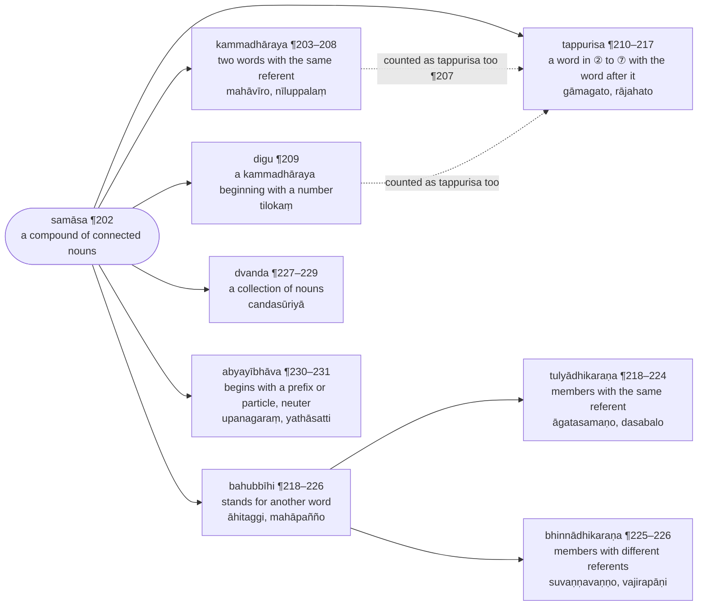

import { LinkCard } from "@astrojs/starlight/components";

:::note[Numbering]
Numbers written ¶202, ¶203 and so on are the paragraph numbers of the Chaṭṭha Saṅgāyana edition, kept so that a passage can be found in the [source text](/balavatara/cscd4); they are not rule numbers. The section headings are supplied by this translation. The [Bālāvatāra](/balavatara/) page explains both conventions.
:::

:::note[The kinds of compound]
Bālāvatāra treats six kinds of compound. The tree gives each kind, what it joins, an example, and where it is treated.

:::

## Samāsalakkhaṇādi (What a compound is)

### Nāmānaṃ samāso yuttatthotyadhikāro (a compound joins nouns whose meanings are connected) :badge[¶202]
> **Samāso**ti bhinnatthānaṃ padāna mekatthatā. **Yuttattho**ti aññamaññasambandhattho.
>
> Vibhāsātyadhikātabbaṃ vākyatthaṃ.

The heading — a compound (`samāsa`) of nouns whose meanings are connected (`yuttattha`) — is a governing rule for the whole chapter. A `samāsa` joins words of distinct meaning into one meaning; `yuttattha` means that the words bear on one another in meaning.

The rule "optionally" (`vibhāsā`) also applies throughout, with respect to the phrase: a compound is always an alternative to the phrase it stands for, never a requirement.

:::tip[Kaccāyana Reference]
<LinkCard title="§316 (331): Nāmānaṃ samāso yuttattho" href="/kaccayana/4-samasakappa#m316" description="a `samāsa` is [a joining of] nouns whose meanings are connected" />
:::

## Kammadhārayasamāsa (`kammadhāraya` compounds)

> ¶203 ‘‘Mahanto ca so vīro cā’’ti vākye –

¶203 Consider the phrase `mahanto ca so vīro ca` — "he is great, and he is a hero".

### **Dvipade tulyādhikaraṇe kammadhārayo** (two words with the same referent make a `kammadhāraya`)

> Bhinnappavattinimittā saddā ekasmiṃ vatthuni pavattā tulyādhikaraṇā, visesanavisesassabhūtā samānādhikaraṇā dve padā yadā samasyante, tadā so samāso kammadhārayo
>
> Nāma, idha vā samāsasuttāni saññādvārena samāsavidhāyakāni.
>
> Aggahitavisesanā buddhi visessamhi na uppajjatīti visesanaṃ pubbaṃ hoti, samāseneva tulyādhikaraṇattassa vuttattā tappakāsanatthaṃ payuttā samāsato atirittā ca so iccete ‘‘vuttaṭṭhānamappayogo’’ti ñāyā nappayujjante. Evamaññatra.

Two words that apply to the same thing on different grounds — as "great" and "hero" both apply to one man — are `tulyādhikaraṇa`, "sharing a referent".[^3] When such a pair, a qualifier (`visesana`) and the word it qualifies (`visessa`), is compounded, the result is a `kammadhāraya`. Alternatively, here the rules for compounds do two jobs at once: they name the compound and they license it.

The qualifier comes first, because one cannot take in the thing qualified without first taking in its qualifier. And since the compound itself now shows that the two words share a referent, the `ca` and `so` that did that work in the phrase are redundant and are dropped, by the maxim "vuttaṭṭhānam appayogo" — what has already been said is not said again. The same holds throughout.

[^3]: Mitra (1935) glosses `tulyādhikaraṇa` as agreement in inflection — "two words (an adjective and a noun) possessing similar case-endings", and under his VII.6 "of the same gender, number and case". The vutti's `ekasmiṃ vatthuni pavattā`, "applying to one thing", makes the shared referent the definition and the agreement its consequence, not the reverse: a `dvanda` such as `candasūriyā` has one inflection and two referents. Our [§324 (339): Dvipade tulyādhikaraṇe kammadhārayo](/kaccayana/4-samasakappa#m324) page keeps the same definition against Malai's identical rendering.

:::tip[Kaccāyana Reference]
<LinkCard title="§324 (339): Dvipade tulyādhikaraṇe kammadhārayo" href="/kaccayana/4-samasakappa#m324" description="two words with the same referent make a `kammadhāraya`" />
:::

### **Tesaṃ vibhattiyo lopā ca** (and their inflections are elided)

> Tesaṃ yuttatthānaṃ samāsānaṃ pubbuttarapadānaṃ vibhattī lupyante, cakārena kvaci na.
>
> Tato mahanta vīra iti ca rūpappasaṅge –

In a compound of connected meaning, the inflections of both the earlier and the later member are elided. The word `ca` (and) indicates that sometimes they are not.[^4]

* mahanto ca so vīro ca = mahant + ~~o~~ + vīr + ~~o~~ (`ca` and `so` dropped)

Then, with the form `mahanta vīra` in prospect —

[^4]: The Bālāvatāra's own instances of a kept inflection come later — `parassapadaṃ` (¶213), `antevāsiko` (¶217) and `urasilomo` (¶225), each of which the vutti marks `vibhattyalopo`, "non-elision of the inflection". `pabhaṅkaro` is the stock example of Kaccāyana's vutti to §317 (`pabhaṅkaro, amatandado, medhaṅkaro, dīpaṅkaro`), derived on our [§317 (332): Tesaṃ vibhattiyo lopā ca](/kaccayana/4-samasakappa#m317) page; Mitra (1935) anchors the clause with the same word, `Pabhaṁ karoti = Pabhaṁ-karo`.

:::tip[Kaccāyana Reference]
<LinkCard title="§317 (332): Tesaṃ vibhattiyo lopā ca" href="/kaccayana/4-samasakappa#m317" description="and the inflections of the members are elided" />
:::

### **Pakati cassa sarantassa** (and a member ending in a vowel returns to its original form)

> Vibhattīsu luttāsu sarantassa pubbabhūtassa, parabhūtassa ca assa samāsapadassa pakati hotītīha luttākārā punānīyante.
>
> Tato mahanta vīraiti ṭhite –
>
> ‘‘Mahataṃ mahā tulyādhikaraṇe pade’’ti mahantassa mahā.

Once the inflections are gone, any member, earlier or later, that ended in a vowel returns to its original form: the elided `a` sounds come back.

* mahant + vīr = mahanta vīra

With `mahanta vīra` in place, by Kaccāyana's rule "Mahataṃ mahā tulyādhikaraṇe pade", `mahanta` becomes `mahā` before a word with the same referent.

:::tip[Kaccāyana Reference]
<LinkCard title="§318 (333): Pakati cassa sarantassa" href="/kaccayana/4-samasakappa#m318" description="and a member ending in a vowel returns to its original form" />
<LinkCard title="§330 (340): Mahataṃ mahā tulyādhikaraṇe pade" href="/kaccayana/4-samasakappa#m330" description="`mahā` for `mahanta` before a word with the same referent" />
:::

### **Taddhita samāsa kitakā nāmaṃvātavetunādīsu ca** (derived words, compounds and `kita` forms are treated as nouns)

> Taddhitādayo nāmaṃ iva daṭṭhabbā taveppabhutipaccaye vajjetvā.
>
> Tato vatticchāya syādi. Mahāvīro, mahāvīrāiccādi.

A `taddhita` (secondary derivative), a compound, and a `kitaka` (primary derivative) are treated as nouns — except [those with] the suffixes `tave` and the like. So the compound takes `si` and the other inflections according to the meaning intended.

* mahāvīra + si = mahāvīr + (~~a~~ + si→o) = mahāvīro — "the great hero" (⨀①)
* mahāvīra + yo = mahāvīr + (~~a~~ + yo→ā) = mahāvīrā (⨂①), and so on

:::tip[Kaccāyana Reference]
<LinkCard title="§601 (334): Taddhitasamāsakitakā nāmaṃ vā’ tave tunādīsu ca" href="/kaccayana/7-kibbidhanakappa/4-catutthakanda#m601" description="Derivatives, compounds and `kita` words count as nouns, except those in `tave`, `tuna` and the like" />
:::

> ¶204 Kammadhārayo dvando ca, tappuriso ca lābhino.\
> Tayo parapade liṅgaṃ, bahubbīhi padantare.

¶204 The `kammadhāraya`, the `dvanda` and the `tappurisa` —\
these three take their gender from the last member; the `bahubbīhi` from the word outside it.

> ¶205 Rattā ca sā paṭī cāti rattapaṭī, mahantī ca sā saddhā cāti mahāsaddhā. Ettha ‘‘kammadhārayasaññe ce’’ti pubbapade pumeva kate āīpaccayānaṃ nivutti.

¶205 Examples:

* rattā ca sā paṭī ca = (rattā→ratta) + paṭī = rattapaṭī — "a red cloth"
* mahantī ca sā saddhā ca = (mahantī→mahā) + saddhā = mahāsaddhā — "great faith"

Here, by Kaccāyana's rule "Kammadhārayasaññe ca", the earlier member is put back into masculine form: its feminine suffixes `ā` and `ī` are removed. The compound itself stays feminine, like its last member.

:::note
Two conditions, carried into this rule from Kaccāyana's "Itthiyaṃ bhāsitapumitthī pumāva ce", limit the change. The word that follows must itself be feminine: before the neuter `ratanaṃ` the first member keeps its feminine form, `kumārīratanaṃ`, "a jewel of a girl", not `kumāraratanaṃ`. And the first member must be a word that is also spoken as masculine (`bhāsitapuma`), as `rattā` has `ratto` and `mahantī` has `mahanto`; `gaṅgā` has no masculine, so `gaṅgānadī`, "the river Ganges", keeps its `ā`.[^5]
:::

[^5]: Both conditions are Kaccāyana's (§331–§332), and the counter-examples are the Rūpasiddhi's — `kumārīratanaṃ`, `samaṇīpadumaṃ` for the first, `gaṅgānadī`, `taṇhānadī` for the second — set out in the Analysis of our [§332 (343): Kammadhārayasaññe ca](/kaccayana/4-samasakappa#m332) page. Mitra (1935) states the first condition, "if both the words are feminine", with the same counter-example `kumārī-ratanaṁ`, and omits the second.

:::tip[Kaccāyana Reference]
<LinkCard title="§331 (353): Itthiyaṃ bhāsitapumitthī pumāva ce" href="/kaccayana/4-samasakappa#m331" description="a feminine word also spoken as masculine counts as masculine before a feminine word with the same referent" />
<LinkCard title="§332 (343): Kammadhārayasaññe ca" href="/kaccayana/4-samasakappa#m332" description="and in a compound named `kammadhāraya`" />
:::

> ¶206 Nīlañca taṃ uppalañcāti nīluppalaṃ, satthīva satthi, satthi ca sā sāmā cāti satthisāmā. Mukhameva cando mukhacando.
>
> Visesanavisessānaṃ yathecchattā kvaci visesanaṃ paraṃ hoti, khattiyabhūtoiccādi, icchā ca yathātanti.

¶206 Examples:

* nīlaṃ ca taṃ uppalaṃ ca = nīla + uppala = nīl + (~~a~~ + u) + ppala = nīluppala + si = nīluppal + (~~a~~ + si→aṃ) = nīluppalaṃ — "a blue lotus"
* satthi ca sā sāmā ca = satthisāmā — "knife-dark", dark as a knife-blade (`satthi` stands for `satthī iva`, "like a knife": the standard of comparison stripped to its bare form)
* mukhaṃ eva cando = mukhacando — "the face that is a moon"

Qualifier and qualified may stand in either order, so the qualifier sometimes comes last — `khattiyabhūto`, "one who is a khattiya", and so on — the choice following established usage.

## Ubhe tappurisasamāsa (compounds counted as `tappurisa` as well)

:::note
Kaccāyana's rule "Ubhe tappurisā" classes the `kammadhāraya` and the `digu` as `tappurisa` compounds too; hence "both" (`ubhe`). The `kammadhāraya` whose first member is the particle `na` (¶207–¶208) is the `nañ-tatpuruṣa` of Sanskrit grammar.
:::

> ¶207 Nasaddā si, tassa lopo. Na suro asuro.
>
> Ettha kammadhāraye kate – ‘‘ubhe tappurisā’’ti tappurisasaññā. ‘‘Attannassa tappurise’’ti nassa a. Na asso anasso. Ettha ‘‘sare ana’’ti nassa ana.

¶207 The word `na` takes `si`, which is then elided. Once the `kammadhāraya` is formed, Kaccāyana's rule "Ubhe tappurisā" counts it as a `tappurisa` too, and "Attannassa tappurise" turns the `na` into `a` — or, before a vowel, into `ana` by "Sare ana".

* na suro = (na→a) + suro = asuro — "not a god"
* na asso = (na→ana) + asso = an + (~~a~~ + a) + sso = anasso — "not a horse"

:::tip[Kaccāyana Reference]
<LinkCard title="§326 (341): Ubhe tappurisā" href="/kaccayana/4-samasakappa#m326" description="both [`digu` and `kammadhāraya`] are `tappurisa`" />
<LinkCard title="§333 (344): Attaṃ nassa tappurise" href="/kaccayana/4-samasakappa#m333" description="`a` for `na` in a `tappurisa`" />
<LinkCard title="§334 (345): Sare ana" href="/kaccayana/4-samasakappa#m334" description="`ana` before a vowel" />
:::

> ¶208 ‘‘Nāmānaṃ samāso’’ti sutte dvidhākate ayuttatthānampi kvaci samāso. Na puna geyyā apunageyyā gāthetyādi. Ettha geyyena sambandho na-saddo ayuttatthenāpi punena yogavibhāgabalā samasyate.

¶208 Read as two separate rules (`yogavibhāga`), the sutta "Nāmānaṃ samāso" sometimes allows a compound even between words whose meanings are not connected.

* na puna geyyā = (na→a) + puna + geyyā = apunageyyā gāthā — "a verse not to be sung again"

Here `na` goes in meaning with `geyyā`, yet on the strength of that split it is compounded with `puna`, to which it has no connection.[^6]

[^6]: Mitra (1935) lists `a-punageyyā` among the ordinary `na`-compounds (`na suro = a-suro … na punageyyā = a-punageyyā`), adding that Sanskrit grammar calls such a compound a `nañ-tatpuruṣa`. The Bālāvatāra singles the word out because, without the `yogavibhāga`, the compound would breach the `yuttattha` of ¶202: `na` belongs in sense to `geyyā`, not to `puna`, which it is joined to. Our [§324 (339): Dvipade tulyādhikaraṇe kammadhārayo](/kaccayana/4-samasakappa#m324) page lists the Rūpasiddhi's `na`-, `ku`- and prefix-first kinds of `kammadhāraya`.

## Digusamāsa (`digu` compounds)

> ¶209 Tayo lokā samāhaṭā tilokaṃ.
>
> Ettha ‘‘saṅkhyāpubbo digū’’ti kammadhārayassa digusaññā. ‘Digussekattaṃ’’ti ekattaṃ, napuṃsakattañca.

¶209 Example:

* tayo lokā samāhaṭā = ti + ~~yo~~ + loka + ~~yo~~ = ti + loka = tiloka + si = tilok + (~~a~~ + si→aṃ) = tilokaṃ — "the three worlds, taken together"

Here Kaccāyana's rule "Saṅkhyāpubbo digu" designates a `kammadhāraya` beginning with a number a `digu`, and "Digussekattaṃ" makes it singular and neuter.

:::tip[Kaccāyana Reference]
<LinkCard title="§325 (348): Saṅkhyāpubbo digu" href="/kaccayana/4-samasakappa#m325" description="a `digu` [is a `kammadhāraya`] beginning with a numeral" />
<LinkCard title="§321 (349): Digussekattaṃ" href="/kaccayana/4-samasakappa#m321" description="a `digu` is singular [and neuter]" />
:::

## Suddhatappurisasamāsa (`tappurisa` compounds proper)

> ¶210 Tappurisā tveva.

¶210 But `tappurisa` compounds only.

### **Amādayo parapadehi** (a word in `aṃ` or a later inflection, with the word that follows)

> Dutiyantādayo parapadehi nāmehi yadā samasyante, tadā so samāso tappuriso nāma.
>
> Gāmaṃ gato gāmagato.
>
> ‘‘Passa vāsiṭṭha gāmaṃ, gato tisso sāvatthiṃ’’tya trāyuttatthatāya na samāso. Tathā ññatra ñeyyaṃ.

When a word in the second or a later inflection form is compounded with a noun that follows it, the compound is called a `tappurisa`.

* gāmaṃ gato = gām + ~~aṃ~~ + gato = gāmagato — "gone to the village" (②)

Exception:

* passa vāsiṭṭha gāmaṃ, gato tisso sāvatthiṃ — "look at the village, Vāsiṭṭha; Tissa has gone to Sāvatthī" (no compound: `gāmaṃ` and `gato` are not connected in meaning). The same test applies elsewhere.

:::tip[Kaccāyana Reference]
<LinkCard title="§327 (351): Amādayo parapadebhi" href="/kaccayana/4-samasakappa#m327" description="[a word in] `aṃ` or a later inflection with the word that follows: `tappurisa`" />
:::

> ¶211 Raññā hato rājahato.

¶211 Third inflection form:

* raññā hato = (raññā→rāja) + hato = rājahato — "killed by the king" (③)

### Kiccantehi bhīyo adhikatthavacane (mostly with `kicca` forms, in a statement of heightened sense)

> Tabba, anīya, ṇya, teyya, riccappaccayā **kiccā**. Thutinindatthamajjhāropitatthaṃ vacanaṃ **adhikatthavacanaṃ**. Soṇaleyyo kūpoiccādi. Soṇehi yathā liyhate, tathā puṇṇattā **thuti**. Tehi ucchiṭṭhattā **nindā** ca.

The `kicca` forms are those made with the suffixes `tabba`, `anīya`, `ṇya`, `teyya` and `ricca`. An `adhikatthavacana` is a statement that overstates for effect, in praise (`thuti`) or in blame (`nindā`). A word in the third inflection form compounds with a `kicca` form mostly in such statements.

* soṇehi leyyo kūpo = soṇaleyyo kūpo — "a well that dogs can lick"

As praise: the well is so full that dogs can lick from it. As blame: it has been fouled by them.

> Dadhinā upasittaṃ bhojanaṃ dadhibhojanaṃ, samāsapadeneva upasittakriyāya kathanā natthetthāyuttatthatā. Upasittasaddāppayogo pubbeva.

* dadhinā upasittaṃ bhojanaṃ = dadhibhojanaṃ — "food sprinkled with curd"

The compound itself conveys the sprinkling, so the meanings are connected; and `upasitta` is not used, for the reason given before.

> ¶212 Karaṇe tu-asinā kalaho asikalaho.

¶212 But with the instrument:

* asinā kalaho = asikalaho — "a fight with swords" (③)

> ¶213 Buddhassa deyyaṃ buddhaddeyyaṃ, parassapadaṃ, ettha vibhatyalopo. Evaṃ attanopadamiccādi.

¶213 Fourth inflection form:

* buddhassa deyyaṃ = buddha + ~~ssa~~ + deyya + ~~si~~ = buddha + (d + deyya) = buddhaddeyya + si = buddhaddeyy + (~~a~~ + si→aṃ) = buddhaddeyyaṃ — "to be given to the Buddha" (④)
* parassa padaṃ = parassapadaṃ — "a word for another" (the inflection is *not* elided here); likewise attanopadaṃ — "a word for oneself", and so on

> ¶214 Corasmā bhayaṃ corabhayaṃ. Evaṃ baddhanamuttoccādi.

¶214 Fifth inflection form:

* corasmā bhayaṃ = corabhayaṃ — "fear of thieves" (⑤); likewise bandhanamutto — "freed from bonds", and so on

> ¶215 Rañño putto rājaputto.

¶215 Sixth inflection form:

* rañño putto = (rañño→rāja) + (putto→putta) = rājaputta + si = rājaputt + (~~a~~ + si→o) = rājaputto — "the king's son" (⑥)

> ‘‘Brāhmaṇassa kaṇhā dantā’’ iccatra dantāpekkhā chaṭṭhīti kaṇhena sambandhābhāvā na samāso. Yadā tu kaṇhā ca te dantā ceti kammadhārayo, tadā chaṭṭhī kaṇhadantāpekkhāti brāhmaṇakaṇhadantāti samāso hoteva.

Exception:

* brāhmaṇassa kaṇhā dantā — "the brahmin's black teeth" (no compound `brāhmaṇakaṇhā`: the sixth-form `brāhmaṇassa` depends on `dantā`, not on `kaṇhā`)
* kaṇhā ca te dantā ca = kaṇhadantā; brāhmaṇassa kaṇhadantā = brāhmaṇakaṇhadantā (once `kaṇhadantā` is a `kammadhāraya`, the sixth form depends on it, and the compound is fine)

> ¶216 ‘‘Rañño māgadhassa dhana’’ ntyatra raññoti chaṭṭhī dhana mapekkhate, na māgadhaṃ. Rājā eva māgadhasaddena vuccateti bhedābhāvā sambandhābhāvoti tulyādhikaraṇena māgadhena saha rājā na samasyate. Dviṭṭho hi sambandho.

¶216 In `rañño māgadhassa dhanaṃ`, "the wealth of the king of Magadha", the genitive `rañño` looks to `dhanaṃ`, not to `māgadhassa`. `Māgadha` names the same king, so between the two there is no difference and therefore no relation; `rāja` is not compounded with `māgadha`, which shares its referent. For a relation needs two distinct terms.

> Rañño asso puriso ce’’ tya tra rañño asso, rañño puriso ti ca paccekaṃ sambandhato sāpekkhatā atthīti na samāso. ‘‘Asso ca puriso cā’’ti dvande kate tu rājassapurisāti hoteva, aññānapekkhattā.

In `rañño asso puriso ca`, "the king's horse and man", `rañño asso` and `rañño puriso` are two separate relations; each member still looks to `rañño` on its own, so no compound is formed. But once `asso ca puriso ca` has been made a `dvanda`, `assapurisā`, the compound `rājassapurisā` is fine — the `dvanda` looks to nothing else.

> ‘‘Rañño garuputto’’ iccatra rājāpekkhinopi garuno
>
> Puttena saha samāso, gamakattā. Gamakattampi samāsassa nibandhanaṃ. Tattha garuno puttoti viggaho, evamaññatra.

In `rañño garuputto`, "the son of the king's teacher", `garu` looks to `rañño`, yet it compounds with `putta` all the same, because the sense is still understood — and being understood is itself a ground for compounding. The analysis is `garuno putto`; so too in similar cases.

> ¶217 Rūpe saññā rūpasaññā.

¶217 Seventh inflection form:

* rūpe saññā = rūpasaññā — "perception of form" (⑦)

> Kvaci nindāyaṃ - kūpe maṇḍūko viya kūpamaṇḍūko. Evaṃ nagarakāko iccādi. Atropamāya nindā gamyate.

Sometimes in blame:

* kūpe maṇḍūko viya = kūpamaṇḍūko — "like a frog in a well"; likewise nagarakāko — "like a town crow", and so on

Here the blame comes through the comparison.

> Antevāsiko tyādo vibhattyalopo.

In `antevāsiko` — "a pupil, one who lives close by" — and the like, the inflection is not elided.

## Bahubbīhisamāsa (`bahubbīhi` compounds)

### **Aññapadatthesu bahubbīhi** (a `bahubbīhi` stands for another word) :badge[¶218]
> Appaṭhamantāna maññesaṃ padānaṃ atthesu dve vā bahūni vā nāmāni yadā samasyante, tadā so samāso bahubbīhi nāma.

When two or more nouns are compounded to stand for some other word — one not in the first inflection form — the compound is a `bahubbīhi`. Its meaning lies outside its members, in the thing they describe: `dasabalo` means not "ten powers" but "the one who has ten powers".

> Appaṭhamantānanti kiṃ, desito buddhena yo dhammo.

Why does the rule say "not in the first inflection form"?

* desito buddhena yo dhammo — "the Dhamma which was taught by the Buddha" (no `bahubbīhi`: the other word, `yo dhammo`, is in the first inflection form)

:::tip[Kaccāyana Reference]
<LinkCard title="§328 (352): Aññapadatthesu bahubbīhi" href="/kaccayana/4-samasakappa#m328" description="[nouns compounded] in the sense of another word: `bahubbīhi`" />
:::

### Tulyādhikaraṇo (members with the same referent)

:::note
A `bahubbīhi` is `tulyādhikaraṇa` when its two members describe one and the same thing in the phrase and so stand in the same inflection form — `āgatā samaṇā`, `jitāni indriyāni`, `dasa balāni`. The examples of ¶218–¶224 are all of this kind; the source names the group with the word `Tulyādhikaraṇo` at its close.[^8]
:::

[^8]: The CSCD prints `Tulyādhikaraṇo.` after ¶224 and `Bhinnādhikaraṇo.` after ¶226 as bare one-word lines with full stops — the shape of `Nāmikaṃ.`, which closes the Nāma chapter — so each names the group it closes, not the one that follows; the examples bear this out, since the members of ¶218–¶224 agree (`āgatā samaṇā`, `mattā bahavo mātaṅgā`) and those of ¶225–¶226 do not (`suvaṇṇassa` ⑥ with `vaṇṇo` ①, `vajiraṃ` ② with `pāṇimhi` ⑦, `urasi` ⑦ with `lomāni` ①). The counter-example `desito buddhena yo dhammo`, which the CSCD prints last of all, answers the definition's `appaṭhamantānaṃ` and is placed with it above. Mitra (1935) divides the `bahubbīhi` the same way, by agreement "of the same gender, number and case" (`āgata-samaṇo saṅghārāmo`) against disagreement (`puppha-bhavo`, `pupphehi bhavo`), and the Analysis of our [§328 (352): Aññapadatthesu bahubbīhi](/kaccayana/4-samasakappa#m328) page defines the two kinds by shared or distinct referent, with Kaccāyana's own labelled examples.

> Āgatā samaṇā yaṃ so[^1] āgatasamaṇo, vihāro.

[^1]: CST4 reads `yaṃ sā`; the referent `vihāro` is masculine, so `so`.

* āgatā samaṇā yaṃ so = āgata + samaṇa = āgatasamaṇa + si = āgatasamaṇ + (~~a~~ + si→o) = āgatasamaṇo, vihāro — "a monastery to which ascetics have come" (②; masculine ⨀① after `vihāro`)

> ¶219 Jitāni indriyāni yena so jitindriyo, bhagavā. Āhito aggi yena so āhitaggi. Agyāhito vātyādo yathecchaṃ visesanassa paratā.

¶219 Third inflection form:

* jitāni indriyāni yena so = jita + indriya = jit + (~~a~~ + i) + ndriya = jitindriya + si = jitindriy + (~~a~~ + si→o) = jitindriyo, bhagavā — "one by whom the senses are conquered", the Blessed One
* āhito aggi yena so = āhita + aggi = āhit + (~~a~~ + a) + ggi = āhitaggi + ~~si~~ = āhitaggi — "one by whom the fire is tended" (`si` elided after `i` by "Sesato lopaṃ gasīpi"); or aggi + āhita = agg + (i→y) + āhita = ag + (~~g~~ + y) + āhita = agyāhita + si = agyāhit + (~~a~~ + si→o) = agyāhito, and so on — the qualifier may come last, as one wishes (the `i` becomes `y` by ¶19 "Ivaṇṇo yannavā", and one `g` of the cluster is dropped)

> ¶220 Karaṇe tu-chinno rukkho yena so chinnarukkho, pharasu.

¶220 But with the instrument:

* chinno rukkho yena so = chinna + rukkha = chinnarukkha + si = chinnarukkh + (~~a~~ + si→o) = chinnarukkho, pharasu — "that by which the tree is cut", an axe

> ¶221 Dinno suṅko yassa so dinnasuṅko, rājā.

¶221 Fourth inflection form:

* dinno suṅko yassa so = dinna + suṅka = dinnasuṅka + si = dinnasuṅk + (~~a~~ + si→o) = dinnasuṅko, rājā — "one to whom tax is paid", a king

> ¶222 Niggatā janā yasmā so niggatajano, gāmo.

¶222 Fifth inflection form:

* niggatā janā yasmā so = niggata + jana = niggatajana + si = niggatajan + (~~a~~ + si→o) = niggatajano, gāmo — "one from which the people have left", a village

> ¶223 Dasa balāni yassa so dasabalo, bhagavā. Natthi samo yassa so asamo. Ettha ‘‘attannassā’’ti yogavibhāgena nassa a.

¶223 Sixth inflection form:

* dasa balāni yassa so = dasa + bala = dasabala + si = dasabal + (~~a~~ + si→o) = dasabalo, bhagavā — "one who has the ten powers", the Blessed One
* natthi samo yassa so = na + sama = (na→a) + sama = asama + si = asam + (~~a~~ + si→o) = asamo — "one who has no equal"

Here `na` becomes `a` by Kaccāyana's rule "Attannassa", taken on its own.

:::tip[Kaccāyana Reference]
<LinkCard title="§333 (344): Attaṃ nassa tappurise" href="/kaccayana/4-samasakappa#m333" description="`a` for `na` in a `tappurisa`" />
:::

> Pahūtā jivhā yassa so pahūtajivho, mahantī paññā yassa so mahāpañño. Dvīsu ‘‘itthiyambhāsitapumitthīpumāva ce’’ti pumbhāvātidesā pubbuttarapadesu āīppaccayānamabhāvo.

* pahūtā jivhā yassa so = (pahūtā→pahūta) + (jivhā→jivha) = pahūtajivha + si = pahūtajivh + (~~a~~ + si→o) = pahūtajivho — "one who has a large tongue" (one of the marks of a great man)
* mahantī paññā yassa so = (mahantī→mahā) + (paññā→pañña) = mahāpañña + si = mahāpaññ + (~~a~~ + si→o) = mahāpañño — "one who has great wisdom"

In both, Kaccāyana's rule "Itthiyaṃ bhāsitapumitthī pumāva ce" treats the members as masculine, so the feminine suffixes `ā` and `ī` drop from earlier and later member alike.

:::tip[Kaccāyana Reference]
<LinkCard title="§331 (353): Itthiyaṃ bhāsitapumitthī pumāva ce" href="/kaccayana/4-samasakappa#m331" description="a feminine word also spoken as masculine counts as masculine before a feminine word with the same referent" />
:::

> ¶224 ‘‘Kvaci samāsantagatānamakāranto’’ti antassa attaṃ. Kāraggahaṇena ā i ca. Itthiyamivaṇṇantā, tvantehi ca kappaccayopi. Yathā - visālaṃ akkhi yassa so visālakkho, paccakkhadhammā, silopo. Sobhano gandho yassa so sugandhi. Bahukantiko, bahunadiko, samuddo. Ettha yadādinā rasso. Bahukattuko. Mattā bahavo mātaṅgā yasmiṃ taṃ mattabahumātaṅgaṃ, vanaṃ.

¶224 By Kaccāyana's rule "Kvaci samāsantagatānam akāranto", the final of a compound sometimes becomes `a`; the word `kāra` in the rule extends this to `ā` and `i`. After a feminine member ending in `i` or `ī`, and after a member ending in `tu`, the suffix `ka` may also be added.

* visālaṃ akkhi yassa so = visāla + akkhi = visāl + (~~a~~ + a) + kkhi = visālakkh + (i→a) = visālakkha + si = visālakkh + (~~a~~ + si→o) = visālakkho — "one who has wide eyes"
* paccakkhā dhammā yassa so = paccakkha + dhamma = paccakkhadhamm + (a→ā) = paccakkhadhammā + ~~si~~ = paccakkhadhammā — "one to whom the Dhamma is evident" (final `ā`; `si` elided)
* sobhano gandho yassa so = (sobhana→su) + (gandha→gandhi) = sugandhi + ~~si~~ = sugandhi — "one whose scent is pleasant"
* bahū kantiyo yassa so = bahu + kanti + ka = bahukantika + si = bahukantik + (~~a~~ + si→o) = bahukantiko — "one who has many desires, or much beauty"; bahū nadiyo yasmiṃ so = bahu + nadī + ka = bahu + nad + (ī→i) + ka = bahunadika + si = bahunadik + (~~a~~ + si→o) = bahunadiko, samuddo — "that which has many rivers", the ocean (`nadī` shortened before `ka`, as an irregular form)
* bahavo kattāro yassa so = bahu + kattu + ka = bahukattuka + si = bahukattuk + (~~a~~ + si→o) = bahukattuko — "that which has many makers" (`ka` after `kattu`)
* mattā bahavo mātaṅgā yasmiṃ taṃ = matta + bahu + mātaṅga = mattabahumātaṅga + si = mattabahumātaṅg + (~~a~~ + si→aṃ) = mattabahumātaṅgaṃ, vanaṃ — "that in which there are many rutting elephants", a forest (⑦; neuter ⨀① after `vanaṃ`)

:::tip[Kaccāyana Reference]
<LinkCard title="§337 (350): Kvaci samāsantagatānamakāranto" href="/kaccayana/4-samasakappa#m337" description="sometimes `a` for the final of a word at the end of a compound" />
:::

> Tulyādhikaraṇo.

The foregoing are `tulyādhikaraṇa`, with members of the same referent.

### Bhinnādhikaraṇo (members with different referents)

:::note
A `bahubbīhi` is `bhinnādhikaraṇa` when its members describe different things and so stand in different inflection forms: in `suvaṇṇassa viya vaṇṇo` the colour (①) is not the gold (⑥), and in `vajiraṃ pāṇimhi` the thunderbolt (②) is not the hand (⑦). ¶225–¶226 are of this kind; to them the Bālāvatāra adds the compounds with `saha`, of two numerals and of an intermediate direction, and the source closes the group with the word `Bhinnādhikaraṇo`.
:::

> ¶225 Suvaṇṇassa viya vaṇṇo yassa so suvaṇṇavaṇṇo. Vajiraṃ pāṇimhi yassa so vajirapāṇi. Urasi lomāni yassa so urasilomo. Ettha vibhatyalopo.
>
> ‘‘Atthesū’’ti bahuttaggahaṇena kvaci paṭhamantānampi. Saha hetunā yo vattate so sahetuko, ‘‘yadā’’ dinā sahassa so.

¶225 Examples:

* suvaṇṇassa viya vaṇṇo yassa so = suvaṇṇa + vaṇṇa = suvaṇṇavaṇṇa + si = suvaṇṇavaṇṇ + (~~a~~ + si→o) = suvaṇṇavaṇṇo — "one whose colour is like gold's"
* vajiraṃ pāṇimhi yassa so = vajira + pāṇi = vajirapāṇi + ~~si~~ = vajirapāṇi — "one with a thunderbolt in hand"
* urasi lomāni yassa so = urasi + loma = urasiloma + si = urasilom + (~~a~~ + si→o) = urasilomo — "one with hair on the chest" (the inflection of `urasi` is *not* elided)

Because the sutta puts `atthesu` in the plural, a `bahubbīhi` may sometimes stand for a word in the first inflection form too:

* saha hetunā yo vattate so = (saha→sa) + hetu + ka = sahetuka + si = sahetuk + (~~a~~ + si→o) = sahetuko — "that which occurs with a cause" (`saha` becomes `sa` as an irregular form)

> ¶226 Satta vā aṭṭha vā sattaṭṭha, māsā, etthaññapadattho vā saddassattho. Dakkhiṇassā ca pubbassā ca disāya yaṃ antarālaṃ, sā dakkhiṇapubbā, disā.

¶226 Examples:

* satta vā aṭṭha vā = satta + aṭṭha = satt + (~~a~~ + a) + ṭṭha = sattaṭṭha + yo = sattaṭṭh + (a + yo→a) = sattaṭṭha, māsā — "seven or eight (months)" (⨂①, by ¶180 "Pañcādīnamakāro"); this can be read either as a `bahubbīhi` standing for another word (the months) or in the members' own sense (seven or eight)
* dakkhiṇassā ca pubbassā ca disāya yaṃ antarālaṃ sā = (dakkhiṇā→dakkhiṇa) + pubbā = dakkhiṇapubbā + ~~si~~ = dakkhiṇapubbā, disā — "the direction between south and east", the south-east

> Bhinnādhikaraṇo.

The foregoing are `bhinnādhikaraṇa`, with members of different referents.

## Dvandasamāsa (`dvanda` compounds)

### **Nāmānaṃ samuccayo dvando** (a collection of nouns is a `dvanda`) :badge[¶227]
> Samuccayo, ti piṇḍīkaraṇaṃ ekavibhattikānaṃ nāmānaṃ yo samuccayo, so dvando nāma, idaṃ suttaṃ bahuvacanavisayaṃ.
>
> Cando ca sūriyo ca candasūriyā. Tiṭṭhanti tyādi-
>
> Kriyāsambandhasāmaññato atthetthāpekatthatā, evaṃ naranāriyo, akkharapadāni.

`Samuccaya` means gathering together: a set of nouns sharing one inflection, gathered into a single word, is a `dvanda`. This sutta concerns the plural.

* cando ca sūriyo ca = canda + sūriya = candasūriya + yo = candasūriy + (~~a~~ + yo→ā) = candasūriyā — "the moon and the sun" (⨂①)

With a verb such as `tiṭṭhanti`, "they stand", the members share a single action, and that shared connection is what unites their meaning. Likewise:

* naro ca nārī ca = nara + nārī = naranārī + yo = naranār + (ī→i) + yo = naranāriyo — "men and women" (⨂①, feminine after `nārī`)
* akkharaṃ ca padaṃ ca = akkhara + pada = akkharapada + yo = akkharapada + (yo→ni) = akkharapad + (a→ā) + ni = akkharapadāni — "letters and words" (⨂①, neuter after `pada`)

:::tip[Kaccāyana Reference]
<LinkCard title="§329 (357): Nāmānaṃ samuccayo dvando" href="/kaccayana/4-samasakappa#m329" description="a collection of nouns is a `dvanda`" />
:::

### **Tathā dvande pāṇi turiya yogga senaṅga khuddajantuka vividha viruddha visabhāgatthādīnañca** (likewise in a `dvanda` of limbs, instruments, gear, army divisions, small creatures, things various and opposed, things unlike yet alike, and the rest) :badge[¶228]
> Vividhenākārena viruddhā **vividhaviruddhā**, sabhāgā sadisā, vividhā ca te sabhāgā ceti **visabhāgā**. Yathā digusamāse, tathā dvande pāṇyaṅgatthādīnaṃ ekattaṃ, napuṃsakattañca hoti.

`Vividhaviruddha` means opposed in various ways; `sabhāga` means alike; `visabhāga` means various and yet alike.[^9] As in a `digu`, so in a `dvanda` of limbs, instruments, gear (`yogga`), army divisions (`senaṅga`), small creatures (`khuddajantuka`) and the like: the compound is singular and neuter.

[^9]: Mitra (1935) renders the two classes "objects which indicate various degrees of difference" and "contrary qualities". The first drops `viruddha` — the hostility of the pairs, snake and mongoose, cat and mouse, crow and owl — and the second drops `sabhāga`, "alike", which is the very point the vutti makes of `nāmarūpaṃ`: `lakkhaṇato vividhā, paramatthato sabhāgā`. His further `visabhāga` examples, `Sīla-paññaṁ`, `Samatha-vipassanaṁ`, `Vijjā-caraṇaṁ`, are Kaccāyana's (§322) and fit the vutti's gloss rather than his, so the vutti's wording is kept.

:::tip[Kaccāyana Reference]
<LinkCard title="§322 (359): Tathā dvande pāṇi tūriya yoggasenaṅgakhuddajantuka vividhaviruddha visabhāgatthādīnañca" href="/kaccayana/4-samasakappa#m322" description="likewise in a `dvanda` of limbs, instruments, gear, army parts, small creatures, natural enemies, unlike pairs and the rest" />
:::

> Cakkhusotaṃ, gītavāditaṃ, yuganaṅgalaṃ, hatthassaṃ, asicammaṃ, ḍaṃsamakasaṃ, kākolūkaṃ[^10].

[^10]: The CSCD prints `kokālūkaṃ`; the compound is `kāka` + `ulūka`, as Kaccāyana's vutti to §322 has it — `kāko ca ulūko ca kākolūkaṃ. Evaṃ vividhaviruddhatthe` — the `a` of `kāka` elided before `u` by ¶11 "Sarā sare lopaṃ" and the `u` then becoming `o` by ¶13 "Kvacāsavaṇṇaṃ lutte"; `koka` ("wolf") + `ulūka` could give only `kokolūkaṃ`, never `kokālūkaṃ`. The crow and the owl are the grammarians' stock natural enemies (Sanskrit `kākolūkam`), which is the `vividhaviruddha` class the word illustrates. Mitra (1935) reads `Kākolūkaṁ`; our [§322 (359): Tathā dvande pāṇi tūriya yoggasenaṅgakhuddajantuka vividhaviruddha visabhāgatthādīnañca](/kaccayana/4-samasakappa#m322) page has the derivation.

Examples, class by class in the sutta's order:

* limbs of a living being (`pāṇi`, the vutti's `pāṇyaṅga`): cakkhu ca sotaṃ ca = cakkhu + sota = cakkhusota + si = cakkhusot + (~~a~~ + si→aṃ) = cakkhusotaṃ — "eye and ear" (⨀①)
* musical instruments (`turiya`): gītaṃ ca vāditaṃ ca = gīta + vādita = gītavādita + si = gītavādit + (~~a~~ + si→aṃ) = gītavāditaṃ — "song and instrumental music" (⨀①)
* gear (`yogga`): yugaṃ ca naṅgalaṃ ca = yuga + naṅgala = yuganaṅgala + si = yuganaṅgal + (~~a~~ + si→aṃ) = yuganaṅgalaṃ — "yoke and plough" (⨀①)
* divisions of an army (`senaṅga`): hatthī ca asso ca = hatthī + assa = hatth + (~~ī~~ + a) + ssa = hatthassa + si = hatthass + (~~a~~ + si→aṃ) = hatthassaṃ — "elephants and horses" (⨀①; the `ī` elided by ¶11 "Sarā sare lopaṃ")
* asi ca cammaṃ ca = asi + camma = asicamma + si = asicamm + (~~a~~ + si→aṃ) = asicammaṃ — "sword and shield" (⨀①)
* small creatures (`khuddajantuka`): ḍaṃsā ca makasā ca = ḍaṃsa + makasa = ḍaṃsamakasa + si = ḍaṃsamakas + (~~a~~ + si→aṃ) = ḍaṃsamakasaṃ — "gadflies and mosquitoes" (⨀①)
* things opposed in various ways (`vividhaviruddha`): kāko ca ulūko ca = kāka + ulūka = kāk + (~~a~~ + u) + lūka = kāk + (u→o) + lūka = kākolūka + si = kākolūk + (~~a~~ + si→aṃ) = kākolūkaṃ — "crows and owls", natural enemies (⨀①; the `a` elided by ¶11 "Sarā sare lopaṃ", the `u` becoming `o` by ¶13 "Kvacāsavaṇṇaṃ lutte")

> Nāmarūpaṃ, nāmaṃ namanalakkhaṇaṃ, rūpaṃ ruppanalakkhaṇaṃ. Evamete dhammā lakkhaṇato vividhā, paramatthato sabhāgā ca.

* things unlike yet alike (`visabhāga`): nāmaṃ ca rūpaṃ ca = nāma + rūpa = nāmarūpa + si = nāmarūp + (~~a~~ + si→aṃ) = nāmarūpaṃ — "mind and matter" (⨀①): `nāma`, mind, is marked by bending; `rūpa`, matter, by being affected. Thus these `dhammā` differ in their marks yet are alike in the ultimate sense.

> Ādisaddenāññatthāpi. Yathā - bhinnaliṅgānaṃ - itthipumaṃ. Yadādinā rasso, dāsidāsaṃ, pattacīvaraṃ. Gaṅgāsoṇaṃ.
>
> Saṅkhyāparimāṇānaṃ - tikacatukkaṃ.
>
> Sippīnaṃ - veṇarathakāraṃ.
>
> Luddakānaṃ - sākuntika māgavikaṃ.
>
> Appāṇijātīnaṃ - ārasatthi.
>
> Ekajjhāyanabrāhmaṇānaṃ - kaṭhakālāpaṃ iccādi.

The word `ādi` (and the rest) extends this to other groups:

* words of different genders: itthī ca pumā ca = itthī + puma = itth + (ī→i) + puma = itthipuma + si = itthipum + (~~a~~ + si→aṃ) = itthipumaṃ — "woman and man" (⨀①; the `ī` shortened as in `dāsidāsaṃ`)
* dāsī ca dāso ca = dāsī + dāsa = dās + (ī→i) + dāsa = dāsidāsa + si = dāsidās + (~~a~~ + si→aṃ) = dāsidāsaṃ — "female and male servants" (the `ī` shortened as an irregular form)
* patto ca cīvaraṃ ca = patta + cīvara = pattacīvara + si = pattacīvar + (~~a~~ + si→aṃ) = pattacīvaraṃ — "bowl and robe"
* gaṅgā ca soṇo ca = gaṅgā + soṇa = gaṅgāsoṇa + si = gaṅgāsoṇ + (~~a~~ + si→aṃ) = gaṅgāsoṇaṃ — "the Ganges and the Soṇa"
* numbers and measures: tikaṃ ca catukkaṃ ca = tika + catukka = tikacatukka + si = tikacatukk + (~~a~~ + si→aṃ) = tikacatukkaṃ — "threes and fours"
* craftsmen: veṇo ca rathakāro ca = veṇa + rathakāra = veṇarathakāra + si = veṇarathakār + (~~a~~ + si→aṃ) = veṇarathakāraṃ — "basket-makers and carriage-makers"
* hunters: sākuntiko ca māgaviko ca = sākuntika + māgavika = sākuntikamāgavika + si = sākuntikamāgavik + (~~a~~ + si→aṃ) = sākuntikamāgavikaṃ — "fowlers and deer-hunters"
* kinds of lifeless things: āro ca satthī ca = āra + satthī = ārasatth + (ī→i) = ārasatthi + ~~si~~ = ārasatthi — "awl and knife" (the `ī` shortened by "Saro rasso napuṃsake"; `si` elided after `i` by "Sesato lopaṃ gasīpi")
* brahmins of one recitation school: kaṭhā ca kālāpā ca = kaṭha + kālāpa = kaṭhakālāpa + si = kaṭhakālāp + (~~a~~ + si→aṃ) = kaṭhakālāpaṃ — "the Kaṭhas and the Kalāpas", and so on

### **Vibhāsā rukkha tiṇa pasu dhana dhañña janapadādīnañca** (optionally for trees, grasses, animals, wealth, grain, countries and the rest) :badge[¶229]
> Dvande rukkhādīnaṃ ekattaṃ napuṃsakattañca vā hoti.
>
> Dhavakhadiraṃ, dhavakhadirā, muñjapabbajaṃ, muñjapabbajā, ajeḷakaṃ, ajeḷakā, hiraññasuvaṇṇaṃ, hiraññasuvaṇṇāni, sāliyavaṃ, sāliyavā.
>
> Kāsikosalaṃ kāsikosalā.

In a `dvanda` of trees and the other groups named, the singular and neuter are optional.

* dhavā ca khadirā ca = dhava + khadira = dhavakhadira + si = dhavakhadir + (~~a~~ + si→aṃ) = dhavakhadiraṃ — "dhava and khadira trees" (⨀①), or dhavakhadira + yo = dhavakhadir + (~~a~~ + yo→ā) = dhavakhadirā (⨂①, rule not applied)
* muñjā ca pabbajā ca = muñja + pabbaja = muñjapabbaja + si = muñjapabbaj + (~~a~~ + si→aṃ) = muñjapabbajaṃ — "muñja and pabbaja grasses" (⨀①), or muñjapabbaja + yo = muñjapabbaj + (~~a~~ + yo→ā) = muñjapabbajā (⨂①, rule not applied)
* ajā ca eḷakā ca = aja + eḷaka = aj + (~~a~~ + e) + ḷaka = ajeḷaka + si = ajeḷak + (~~a~~ + si→aṃ) = ajeḷakaṃ — "goats and sheep" (⨀①), or ajeḷaka + yo = ajeḷak + (~~a~~ + yo→ā) = ajeḷakā (⨂①, rule not applied)
* hiraññaṃ ca suvaṇṇaṃ ca = hirañña + suvaṇṇa = hiraññasuvaṇṇa + si = hiraññasuvaṇṇ + (~~a~~ + si→aṃ) = hiraññasuvaṇṇaṃ — "bullion and wrought gold" (⨀①), or hiraññasuvaṇṇa + yo = hiraññasuvaṇṇa + (yo→ni) = hiraññasuvaṇṇ + (a→ā) + ni = hiraññasuvaṇṇāni (⨂①, neuter after `suvaṇṇa`; rule not applied)
* sālī ca yavā ca = sāli + yava = sāliyava + si = sāliyav + (~~a~~ + si→aṃ) = sāliyavaṃ — "rice and barley" (⨀①), or sāliyava + yo = sāliyav + (~~a~~ + yo→ā) = sāliyavā (⨂①, rule not applied)
* kāsī ca kosalā ca = kāsi + kosala = kāsikosala + si = kāsikosal + (~~a~~ + si→aṃ) = kāsikosalaṃ — "Kāsi and Kosala" (⨀①), or kāsikosala + yo = kāsikosal + (~~a~~ + yo→ā) = kāsikosalā (⨂①, rule not applied)

:::tip[Kaccāyana Reference]
<LinkCard title="§323 (360): Vibhāsā rukkha tiṇa pasu dhana dhañña janapadā dīnañca" href="/kaccayana/4-samasakappa#m323" description="optionally for trees, grasses, animals, wealth, grain, countries and the rest" />
:::

> Ādisaddena aññesupi vā. Yathā – niccavirodhīnamaddabbānaṃ - kusalākusalaṃ, kusalākusalāni.
>
> Sakuṇīnaṃ - bakabalākaṃ, bakabalākā.
>
> Byañjanānaṃ - dadhighataṃ, dadhighatāni.
>
> Disānaṃ - pubbāparaṃ, pubbāparā iccādi.

The word `ādi` extends the option to other groups:

* immaterial things that are always opposed: kusalaṃ ca akusalaṃ ca = kusala + akusala = kusal + (~~a~~ + a) + kusala = kusal + (a→ā) + kusala = kusalākusala + si = kusalākusal + (~~a~~ + si→aṃ) = kusalākusalaṃ — "the wholesome and the unwholesome" (⨀①; the `a` lengthened by ¶14 "Dīghaṃ"), or kusalākusala + yo = kusalākusala + (yo→ni) = kusalākusal + (a→ā) + ni = kusalākusalāni (⨂①, rule not applied)
* birds: bakā ca balākā ca = baka + balākā = bakabalāk + (ā→a) = bakabalāka + si = bakabalāk + (~~a~~ + si→aṃ) = bakabalākaṃ — "herons and cranes" (⨀①; the `ā` shortened by "Saro rasso napuṃsake"), or bakabalākā + yo = bakabalākā + ~~yo~~ = bakabalākā (⨂①, feminine after `balākā`, `yo` elided by "Ghapato ca yonaṃ lopo"; rule not applied)
* condiments: dadhi ca ghataṃ ca = dadhi + ghata = dadhighata + si = dadhighat + (~~a~~ + si→aṃ) = dadhighataṃ — "curd and ghee" (⨀①), or dadhighata + yo = dadhighata + (yo→ni) = dadhighat + (a→ā) + ni = dadhighatāni (⨂①, rule not applied)
* directions: pubbā ca aparā ca = pubbā + aparā = pubb + (~~ā~~ + a) + parā = pubb + (a→ā) + parā = pubbāpar + (ā→a) = pubbāpara + si = pubbāpar + (~~a~~ + si→aṃ) = pubbāparaṃ — "east and west" (⨀①), or pubbāparā + yo = pubbāparā + ~~yo~~ = pubbāparā (⨂①, feminine after `aparā`; rule not applied), and so on

## Abyayībhāvasamāsa (`abyayībhāva` compounds)

> ¶230 Adhisaddā smiṃ, tassa lopo. Adhisaddena tulyādhikaraṇattā itthisaddāpismiṃ. Niccasamāsattā ādhārabhūtāyamitthiyanti padantarena viggaho. Adhi itthiyanti ṭhite –

¶230 The word `adhi` takes `smiṃ`, which is elided. Since `itthi`, "woman", shares its referent with `adhi`, it takes `smiṃ` too. This compound is compulsory — there is no phrase it alternates with — so it is analysed with a word from outside it: `ādhārabhūtāyaṃ itthiyaṃ`, "in the woman as the location". With `adhi itthiyaṃ` in place —

### **Upasagganipātapubbako abyayībhāvo** (a compound beginning with a prefix or particle is an `abyayībhāva`)

> Upasaggādipubbako saddo vibhatyatthādīsu samāso hoti, abyayībhāvasañño ca.
>
> ‘‘So napuṃsakaliṅgo’’ti abyayībhāvo napuṃsakaliṅgo, yadādinā ekavacano ca.
>
> ‘‘Saro rasso napuṃsake’’ti rasso.

A word beginning with a prefix or particle, used in the sense of an inflection or the like, forms a compound called an `abyayībhāva`. By Kaccāyana's rule "So napuṃsakaliṅgo" it is neuter, and, as an irregular form, singular; by "Saro rasso napuṃsake" its final vowel is shortened.

:::tip[Kaccāyana Reference]
<LinkCard title="§319 (330): Upasagganipātapubbako abyayībhāvo" href="/kaccayana/4-samasakappa#m319" description="an `abyayībhāva` begins with a prefix or a particle" />
<LinkCard title="§320 (335): So napuṃsakaliṅgo" href="/kaccayana/4-samasakappa#m320" description="it is neuter" />
<LinkCard title="§342 (337): Saro rasso napuṃsake" href="/kaccayana/4-samasakappa#m342" description="the final vowel is shortened in the neuter" />
:::

### **Aññasmā lopo ca** (and elision after any other ending)

> Anakārantā abyayībhāvā parā sabbā vibhattī lujjare. Adhitthi, vibhattīnamattho ādhārādi.
>
> Idhādhisaddo ādhārevattate, adhitthiiccetaṃ padaṃ itthiya miccetamatthaṃ vadati.

After an `abyayībhāva` not ending in `a`, all inflections are elided; their sense is location and the like.

* adhi itthiyaṃ = adhi + itthī + ~~smiṃ~~ = adh + (~~i~~ + i) + tthī = adhitth + (ī→i) = adhitthi + si = adhitthi + ~~si~~ = adhitthi — "regarding a woman" (the `i` of `adhi` elided before the vowel by Kaccāyana's "Sarā sare lopaṃ"; the `ī` shortened by "Saro rasso napuṃsake"; `si` elided by "Aññasmā lopo ca")

Here `adhi` has the sense of location, and the word `adhitthi` means `itthiyaṃ`, "in the woman".

:::tip[Kaccāyana Reference]
<LinkCard title="§343 (338): Aññasmā lopo ca" href="/kaccayana/4-samasakappa#m343" description="and elision [of the inflections] after any other [`abyayībhāva`]" />
:::

> Samīpaṃ nagarassa upanagaraṃ. ‘‘Aṃvibhattīnamakārantabyayībhāvā’’ti vibhattīnaṃ kvaci aṃ.
>
> Kvacīti kiṃ. Upanagare.

* samīpaṃ nagarassa = upa + nagara + ~~ssa~~ = upa + nagara = upanagara + si = upanagar + (~~a~~ + si→aṃ) = upanagaraṃ — "near the city" (⨀①)

By Kaccāyana's rule "Aṃ vibhattīnam akārantā abyayībhāvā", after an `abyayībhāva` ending in `a` the inflections sometimes become `aṃ`.

Exception:

* upanagara + smiṃ = upanagar + (~~a~~ + smiṃ→e) = upanagare — "near the city" (⨀⑦, rule not applied)

:::tip[Kaccāyana Reference]
<LinkCard title="§341 (336): Aṃ vibhattīnamakārantā abyayībhāvā" href="/kaccayana/4-samasakappa#m341" description="`aṃ` for the inflections after an `abyayībhāva` in `a`" />
:::

> Abhāvo makkhikānaṃ nimmakkhikaṃ rasso. Anupubbo therānaṃ anutheraṃ, anatikkamma sattiṃ yathāsatti.
>
> Ye ye buḍḍhā yathābuḍḍhaṃ, vicchāyaṃ.
>
> Yattako paricchedo jīvassa yāvajīvaṃ, avadhāraṇe.
>
> Ā pabbatā khettaṃ āpabbataṃ khettaṃ, mariyādāyaṃ, vajjamānā sīmā mariyādā, pabbataṃ vinātyattho.
>
> Ā jalantā sītaṃ ājalantaṃ sītaṃ, abhividhimhi, gayhamānā sīmā abhividhi, jalantena sahetyattho.
>
> Āsaddayoge ‘‘dhātunāmā’’dinā apādānavidhāneneva vākyampi siddhaṃ. Tathāññatra.

Further examples, by the sense the prefix or particle carries:

* abhāvo makkhikānaṃ = ni + makkhikā + ~~naṃ~~ = ni + (m→mm) + akkhikā = nimmakkhik + (ā→a) = nimmakkhika + si = nimmakkhik + (~~a~~ + si→aṃ) = nimmakkhikaṃ — "free of flies" (the vowel shortened, by "Saro rasso napuṃsake"; the `m` doubled by Kaccāyana's "Paradvebhāvo ṭhāne")
* anupubbo therānaṃ = anu + ther + ~~ānaṃ~~ = anu + thera = anuthera + si = anuther + (~~a~~ + si→aṃ) = anutheraṃ — "in order of seniority"
* anatikkamma sattiṃ = yathā + satti + ~~ṃ~~ = yathāsatti + ~~si~~ = yathāsatti — "according to one's ability", not exceeding it (`si` elided by "Aññasmā lopo ca")
* ye ye buḍḍhā = yathā + buḍḍh + ~~ā~~ = yathā + buḍḍha = yathābuḍḍha + si = yathābuḍḍh + (~~a~~ + si→aṃ) = yathābuḍḍhaṃ — "each according to seniority", in the distributive sense
* yattako paricchedo jīvassa = yāva + jīva + ~~ssa~~ = yāva + jīva = yāvajīva + si = yāvajīv + (~~a~~ + si→aṃ) = yāvajīvaṃ — "as long as life lasts", in the sense of a limit
* ā pabbatā khettaṃ = ā + pabbat + ~~ā~~ = ā + pabbata = āpabbata + si = āpabbat + (~~a~~ + si→aṃ) = āpabbataṃ khettaṃ — "the field up to the mountain", in the sense of an excluded limit (`mariyādā`): the mountain itself is not included
* ā jalantā sītaṃ = ā + jalant + ~~ā~~ = ā + jalanta = ājalanta + si = ājalant + (~~a~~ + si→aṃ) = ājalantaṃ sītaṃ — "cold as far as the blazing fire", in the sense of an included limit (`abhividhi`): even the blaze is cold

With `ā`, the uncompounded phrase (`ā pabbatā khettaṃ`) is itself correct by the ablative rule "Dhātunāmā…"; and likewise elsewhere.

> ¶231 ‘‘Uttamo vīro pavīro’’ iccādo pana pubbapadatthappadhānattābhāvābyayībhāvābhāvo kammadhārayoeva. Evaṃ visiṭṭho dhammo abhidhammo. Kucchitaṃ annaṃ kadannaṃ. Ettha[^2] ‘‘kada kussā’’ti sare kussa kadādeso.
>
> Appakaṃ lavaṇaṃ kālavaṇaṃ, ettha ‘‘kāppatthesu cā’’ti kussa kā, bahuvacanenāññatrāpi kvaci. Kucchito puriso kāpuriso, kupuriso vā, evamasurādi.

[^2]: CST4 reads `Etttha`.

¶231 But in `pavīro`, "a foremost hero" (`uttamo vīro`), and the like, the meaning of the first member is not the principal one, so despite the prefix the compound is a `kammadhāraya`, not an `abyayībhāva`. Likewise:

* visiṭṭho dhammo = abhidhammo — "the higher Dhamma"
* kucchitaṃ annaṃ = (ku→kada) + annaṃ = kad + (~~a~~ + a) + nnaṃ = kadannaṃ — "bad food" (by Kaccāyana's rule "Kada kussa", `ku` becomes `kada` before a vowel, and its `a` is then elided before that vowel by ¶11 "Sarā sare lopaṃ")
* appakaṃ lavaṇaṃ = (ku→kā) + lavaṇaṃ = kālavaṇaṃ — "a little salt" (by "Kāppatthesu ca", `ku` becomes `kā` in the sense of "little"; the plural in that rule sometimes allows the same elsewhere)
* kucchito puriso = kāpuriso, or kupuriso — "a bad man"; likewise asura and the like

:::tip[Kaccāyana Reference]
<LinkCard title="§335 (346): Kada kussa" href="/kaccayana/4-samasakappa#m335" description="`kada` for `ku` [before a vowel]" />
<LinkCard title="§336 (347): Kā’ppatthesu ca" href="/kaccayana/4-samasakappa#m336" description="and `kā` in the sense of 'little'" />
:::

> Pubbaparūbhayamaññapadattha - ppadhānābyayībhāva samāso;\
> Kammadhārayaka tappurisā dve, dvendo ca bahubbīhi ca ñeyyā.

Where the first member carries the meaning, the compound is an `abyayībhāva`; where the last does, a `kammadhāraya` or a `tappurisa`;\
where both do, a `dvanda`; and where a word outside the compound does, a `bahubbīhi` — so the five are to be known.

| compound | principal meaning | example |
| --- | --- | --- |
| `abyayībhāva` | the first member | upanagaraṃ — "near the city" |
| `kammadhāraya` | the last member | mahāvīro — "great hero" |
| `tappurisa` | the last member | rājaputto — "king's son" |
| `dvanda` | both members | candasūriyā — "moon and sun" |
| `bahubbīhi` | a word outside the compound | dasabalo — "the one with ten powers" |
