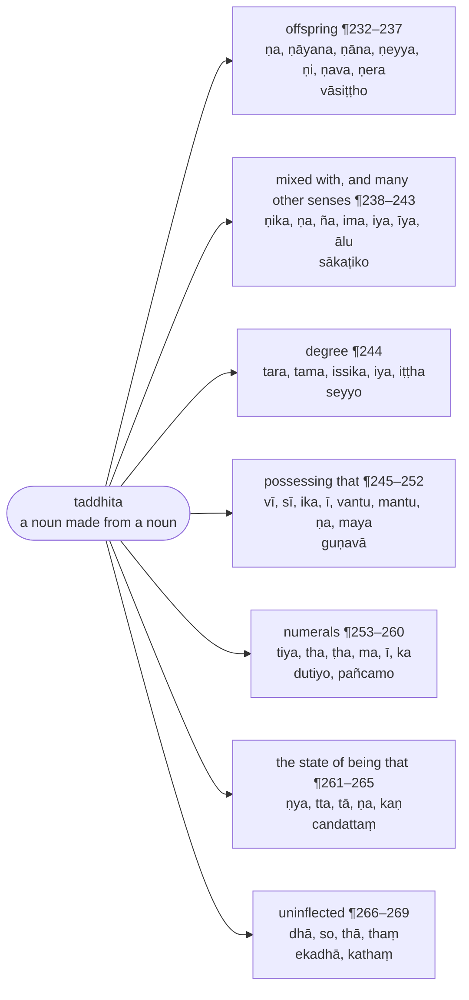

import { LinkCard } from "@astrojs/starlight/components";

:::note[About this chapter]
A `taddhita` is a secondary derivative: a new noun made from an existing noun by adding a suffix — "descendant of X", "belonging to X", "made of X", "the state of being X", and so on. The chapter takes the suffixes by the sense they express.

Numbers written ¶232, ¶233 and so on are the paragraph numbers of the Chaṭṭha Saṅgāyana edition, kept so that a passage can be found in the [source text](/balavatara/cscd4); they are not rule numbers. The section headings are supplied by this translation. The [Bālāvatāra](/balavatara/) page explains both conventions.
:::

:::note[The senses and their suffixes]
A `taddhita` suffix is chosen by the sense it adds. The tree lists the senses in the order of the chapter, the suffixes for each, and one example.

:::

## Apaccataddhita (derivatives meaning "offspring")

### **Vāṇapacce** (optionally `ṇa` in the sense of offspring) :badge[¶232]
> Chaṭṭhantā saddā ‘‘tassāpacca’’miccasmiṃ atthe ṇo vā hoti. Vāti vākyatthaṃ. Ṇenevāpaccatthassa vuttattā apaccasaddāppayogo.
>
> ‘‘Tesaṃ vibhatyā’’ do tesaṃgahaṇena vibhattilopo. Tathottaratra.
>
> ‘‘Tesaṃ ṇo lopaṃ’’ti paccayānaṃ ṇassa lopo.
>
> ‘‘Vuddhādisarassa vā saṃyogantassa saṇe ce’’ti saṇakāre pare asaṃyogantassādisarassa vuddhi.
>
> Tassāpaniyame –

After a word in the sixth inflection form, in the sense "his offspring", the suffix `ṇa` is optionally added. "Optionally" means the phrase `vasiṭṭhassa apaccaṃ` remains available as the alternative. Since `ṇa` itself expresses "offspring", the word `apacca` is not used.

The word `tesaṃ` in "Tesaṃ vibhattiyo lopā ca" (Samāsa, ¶203) covers derivatives too, so the inflection is elided; the same holds below. The `ṇ` of these suffixes is a marker, not a sound: by Kaccāyana's rule "Tesaṃ ṇo lopaṃ" it is dropped, and its one effect is the rule that follows — by "Vuddhādisarassa vā saṃyogantassa saṇe ca", before a suffix marked with `ṇ` the first vowel of a base not ending in a conjunct is strengthened (`vuddhi`). To say what strengthening is —

:::tip[Kaccāyana Reference]
<LinkCard title="§344 (361): Vāṇa’pacce" href="/kaccayana/5-taddhitakappa#m344" description="Optionally `ṇa` in the sense of offspring" />
<LinkCard title="§317 (332): Tesaṃ vibhattiyo lopā ca" href="/kaccayana/4-samasakappa#m317" description="and the inflections of the members are elided" />
<LinkCard title="§396 (363): Tesaṃ ṇo lopaṃ" href="/kaccayana/5-taddhitakappa#m396" description="the `ṇ` of these suffixes is elided" />
<LinkCard title="§400 (364): Vuddhādisarassa vā’saṃyogantassa saṇe ca" href="/kaccayana/5-taddhitakappa#m400" description="optionally `vuddhi` of the first vowel not before a conjunct, before a `ṇ` suffix" />
:::

### **Ayuvaṇṇānañcāyo vuddhi** (the strengthening of `a`, `i`, `u` is `ā`, `e`, `o`)

> Akārivaṇṇuvaṇṇānaṃ āeovuddhiyo honti, casaddena kvaci na.
>
> Saralopādi, taddhitattā nāmamiva kate syādi.

The strengthened forms of `a`, of `i`/`ī` and of `u`/`ū` are `ā`, `e` and `o` respectively. The word `ca` indicates that sometimes there is no strengthening. Vowel elision and the rest then apply, and since the result is a `taddhita` it is treated as a noun and takes `si` and the other inflections.

* vasiṭṭhassa apaccaṃ = vasiṭṭh + ~~assa~~ + (ṇa→a) = v + (a→ā) + siṭṭh + (~~a~~ + a) = vāsiṭṭha — "a descendant of Vasiṭṭha"
* vāsiṭṭha + si = vāsiṭṭho (masculine); vāsiṭṭhī (feminine); vāsiṭṭhaṃ (neuter)

:::tip[Kaccāyana Reference]
<LinkCard title="§405 (365): Ayuvaṇṇānañcāyo vuddhi" href="/kaccayana/5-taddhitakappa#m405" description="the `vuddhi` of `a`, `i`, `u` is `ā`, `e`, `o`" />
:::

> Taddhitābhidheyyaliṅga–vibhattivacanā siyuṃ.\
> Samūhabhāvajā bhīyo, sakatthe ṇyo napuṃsake.\
> Tā tutthiyaṃ nipātā te, dhāmithaṃpaccayantakā.[^1]

[^1]: `dhāmithaṃ` is obscure; it evidently lists the suffixes of ¶266–268 that form uninflected words (`dhā`, `thā`, `thaṃ`), and the middle element may be corrupt in CST4.

A derivative takes the gender, number and inflection of the thing it stands for;\
those that name a collection or a state are mostly neuter, as is `ṇya` when it adds nothing to the base;\
but `tā` is feminine; and the forms ending in `dhā`, `thaṃ` and the like are uninflected.

In other words, a derivative has no gender of its own. `vāsiṭṭha`, "Vasiṭṭha's descendant", is masculine when the descendant is a man (`vāsiṭṭho`), feminine when a woman (`vāsiṭṭhī`), and may also be neuter (`vāsiṭṭhaṃ`), agreeing with `apacca`, "offspring", the neuter word it replaces. Four families are exceptions and carry a fixed gender whatever they refer to: derivatives of collection (`dvayaṃ`, "a pair", ¶260) and of state (`candattaṃ`, "moon-hood", ¶263) are neuter; so is `ṇya` when it simply restates the base (`ākiñcaññaṃ`, "nothingness", ¶263); `tā` is always feminine (`gāmatā`, `devatā`); and the uninflected derivatives of ¶266–268 (`ekadhā`, `sabbathā`, `kathaṃ`) have no gender at all.

> Vasiṭṭhassāpaccaṃ poso vāsiṭṭho, itthī vāsiṭṭhī, napuṃsakaṃ vāsiṭṭhaṃ. Vikappavidhānato taddhitena samāsassāccantaṃ bādhāyā bhāvā vasiṭṭhā paccantipi hoti.
>
> Napuṃsakena vāpīti, saddasatthavidū viduṃ.

Vasiṭṭha's offspring: a man is `vāsiṭṭho`, a woman `vāsiṭṭhī`, a neuter `vāsiṭṭhaṃ`. Because the rule is optional, the derivative does not wholly displace the compound: `vasiṭṭhāpacca` also occurs. The closing words — "or in agreement with the neuter as well" — allow the derivative to take the neuter gender of `apacca`, the word it stands in for; so those versed in grammar hold.

> ¶233 Vā apacceti cādhikāro.

¶233 "Optionally" and "in the sense of offspring" both remain in force.

### **Ṇāyana ṇāna vacchādito** (`ṇāyana`, `ṇāna` after `vaccha` and the like)

> Vacchādito gottagaṇato ṇāyano ṇāno ca vā hoti.
>
> Apaccaṃ paputtappabhuti gottaṃ. Kaccassāpaccaṃ kaccāyano, kaccāno vā. Saṃyogantattā na vuddhi.

After the clan names of the `vaccha` group, the suffixes `ṇāyana` and `ṇāna` are optionally added. Offspring from the grandson onward is a lineage (`gotta`).

* kaccassa apaccaṃ = kacc + ~~assa~~ + (ṇāyana→āyana) = kaccāyano, or kacc + (ṇāna→āna) = kaccāno — "a descendant of Kacca"

There is no strengthening, because the base ends in a conjunct.

:::tip[Kaccāyana Reference]
<LinkCard title="§345 (366): Ṇāyana ṇāna vacchādito" href="/kaccayana/5-taddhitakappa#m345" description="`ṇāyana`, `ṇāna` after `vaccha` and the like" />
:::

> ¶234 ‘‘Ṇeyyo kattikādīhī’’ti ṇeyyo, vinatāya apaccaṃ venateyyo vinateyyo vā. Na pakkhe vuddhi, ṇeyyoti yogavibhāgena ‘‘tassa dīyate’’ tyatthepi ṇeyyo, dakkhiṇā dīyate yassa so dakkhiṇeyyo.

¶234 By Kaccāyana's rule "Ṇeyyo kattikādīhi", the suffix `ṇeyya`.

* vinatāya apaccaṃ = v + (i→e) + nat + (~~āya~~ + ṇeyya→eyya) = venateyyo, or vinateyyo (no strengthening) — "a descendant of Vinatā"

Read on its own (`yogavibhāga`), `ṇeyyo` also has the sense "to whom something is given":

* dakkhiṇā dīyate yassa so = dakkhiṇeyyo — "one to whom an offering is given", worthy of offerings

:::tip[Kaccāyana Reference]
<LinkCard title="§346 (367): Ṇeyyo kattikādīhi" href="/kaccayana/5-taddhitakappa#m346" description="`ṇeyya` after `kattikā` and the like" />
:::

### **Ato ṇi vā** (optionally `ṇi` after `a`) :badge[¶235]
> Akārantato apacce ṇi vā hoti, puna vāsaddena ṇiko, akārantā anakārantā ca bopi.
>
> Dakkhi, sakyaputtiko, maṇḍabbo, bhātubbo. Dvittaṃ.

After a base ending in `a`, in the sense of offspring, `ṇi` is optionally added; by the repeated `vā`, `ṇika` too; and after bases ending in `a` or otherwise, `ba` as well, with doubling.

* dakkhassa apaccaṃ = dakkh + (~~a~~ + ṇi→i) = dakkhi — "a descendant of Dakkha"
* sakyaputtassa apaccaṃ = sakyaputt + (~~a~~ + ṇika→ika) = sakyaputtiko — "a descendant of the Sakyan's son", a Buddhist
* maṇḍassa apaccaṃ = maṇḍa + (b + ba) = maṇḍabbo — "a descendant of Maṇḍa"; bhātu + (b + ba) = bhātubbo — "a brother's son"

:::tip[Kaccāyana Reference]
<LinkCard title="§347 (368): Ato ṇi vā" href="/kaccayana/5-taddhitakappa#m347" description="Optionally `ṇi` after a stem in `a`" />
:::

> ¶236 ‘‘Ṇavo pagvādīhī’’ ti ṇavo. Manuno apaccaṃ māṇavo.

¶236 By "Ṇavo pagvādīhi", the suffix `ṇava`:

* manuno apaccaṃ = m + (a→ā) + ṇ + (~~u~~ + ṇava→ava) = māṇavo — "a descendant of Manu", a young man

> ¶237 ‘‘Ṇera vidhavādito’’ti ṇero, sāmaṇero.

¶237 By "Ṇera vidhavādito", the suffix `ṇera`:

* samaṇassa apaccaṃ = s + (a→ā) + maṇ + (~~a~~ + ṇera→era) = sāmaṇero — "a novice", the ascetic's offspring

## Saṃsaṭṭhādianekatthataddhita (derivatives of many senses, beginning with "mixed with")

> ¶238 ‘‘Yena vā saṃsaṭṭhaṃ tarati carati vahati ṇiko’’ti ṇiko. Vākārena nekatthenekapaccayā ca. Ghatena saṃsaṭṭho ghātiko, odano. Uḷūpena taratīti oḷūpiko, uḷūpiko vā, na pakkhe vuddhi.
>
> Sakaṭena caratīti sākaṭiko. Sīsena vahatīti sīsiko, na vuddhi.

¶238 By Kaccāyana's rule "Yena vā saṃsaṭṭhaṃ tarati carati vahati ṇiko", the suffix `ṇika` in the senses "mixed with", "crosses by", "goes by" and "carries by". The word `vā` allows many senses and many suffixes.

* ghatena saṃsaṭṭho = gh + (a→ā) + t + (~~ena~~ + ṇika→ika) = ghātiko, odano — "mixed with ghee": rice
* uḷūpena tarati = oḷūpiko, or uḷūpiko (no strengthening) — "one who crosses by raft"
* sakaṭena carati = sākaṭiko — "one who travels by cart"
* sīsena vahati = sīsiko — "one who carries on the head" (no strengthening)

:::tip[Kaccāyana Reference]
<LinkCard title="§350 (373): Yena vā saṃsaṭṭhaṃ tarati carati vahati ṇiko" href="/kaccayana/5-taddhitakappa#m350" description="`ṇika` for 'mixed with', 'crosses by', 'goes by', 'carries by' that" />
:::

> Itthiliṅgato eyyako, ṇako ca. Campāyaṃ jāto campeyyako. Evaṃ bārāṇaseyyako. Ṇako – kusinārāyaṃ vasatīti kosinārako. Janapadato ṇako ca – magadhesu vasati, tesaṃ issaro vā māgadhako.

After a feminine base, `eyyaka` and `ṇaka`:

* campāyaṃ jāto = campeyyako — "born in Campā"; likewise bārāṇaseyyako — "born in Bārāṇasī"
* kusinārāyaṃ vasati = kosinārako — "one who lives in Kusinārā"

After the name of a country, `ṇaka` as well:

* magadhesu vasati, tesaṃ issaro vā = māgadhako — "one who lives in Magadha", or "their lord"

> Tajjātiyā visiṭṭhatthe ājānīyo. Assajātiyā visiṭṭho assājānīyo. Ño - agganti jānitabbaṃ aggaññaṃ, dvittaṃ.

In the sense "distinguished among its kind", the suffix `ājānīya`:

* assajātiyā visiṭṭho = assājānīyo — "a thoroughbred", distinguished among horses

The suffix `ña`, with doubling:

* aggaṃ ti jānitabbaṃ = aggaññaṃ — "to be known as foremost"

### **Tamadhīte tena katādisannidhānaniyogasippabhaṇḍajīvikatthesu ca** (and in the senses "studies that", "made by that", location, appointment, craft, goods, livelihood)[^2] :badge[¶239]

[^2]: The edition numbers this paragraph `39.`; the sequence requires `239.`.

:::tip[Kaccāyana Reference]
<LinkCard title="§351 (374): Tamadhīte tenakatādi sannidhāna niyoga sippa bhaṇḍa jīvikatthesu ca" href="/kaccayana/5-taddhitakappa#m351" description="And `ṇika` for 'studies that', 'made by that' and the like, location, appointment, craft, goods, livelihood" />
:::

> Taṃ adhīte iccādīsvatthesu ādisaddena hatādīsu ca ṇiko vā hoti. Abhidhammamadhīteti ābhidhammiko, abhidhammiko vā, na pakkhe vuddhi. Vacasā kataṃ kammaṃ vācasikaṃ. Evaṃ mānasikaṃ, ettha –
>
> ‘‘Sa sare vāgamo’’tīhānuvattitādisaddena sāgamo.
>
> Sarīre sannidhānā vedanā sārīrikā. Dvāre niyutto dovāriko, ettha- ‘‘māyūnamāgamo ṭhāne’’ti vakārato pubbe okārāgamo.

In the sense "studies that" and the others listed — and, by the word `ādi`, in "killed by" and the like — `ṇika` is optionally added.

* abhidhammaṃ adhīte = ābhidhammiko, or abhidhammiko (no strengthening) — "one who studies the Abhidhamma"
* vacasā kataṃ kammaṃ = vācasikaṃ — "an act done by speech"
* manasā kataṃ kammaṃ = mānas + (s + ika) = mānasikaṃ — "an act done by mind" (an `s` is inserted, by the `ādi` carried over into "Sa sare vāgamo")
* sarīre sannidhānā vedanā = sārīrikā — "a feeling located in the body"
* dvāre niyutto = d + (o) + vārika = dovāriko — "one appointed to the gate", a doorkeeper (an `o` is inserted before the `v`, by "Māyūnam āgamo ṭhāne")

> **Sippa**nti gītādikalā, vīṇā assa sippanti veṇiko, atra vīṇeti vīṇāvādanaṃ. Gandho assa bhaṇḍanti gandhiko, mage hantvā jīvatīti māgaviko, vakārāgamo. Jālena hato jāliko, suttena baddho suttiko, cāpo assa āyudhanti cāpiko, vāto assa ābādho atthīti vā vātiko, buddhe pasanno buddhiko, vatthena kītaṃ bhaṇḍaṃ vatthikaṃ.
>
> Kumbho assa parimāṇaṃ, ta marahati, tesaṃ rāsi vā kumbhiko. Akkhena dibbatīti akkhiko, magadhesu vasati, jātoti vā māgadhiko iccādi.

`Sippa` means an art such as singing.

* vīṇā assa sippaṃ = veṇiko — "one whose art is the lute" (here `vīṇā` means lute-playing)
* gandho assa bhaṇḍaṃ = gandhiko — "one whose goods are perfumes"
* mage hantvā jīvati = māgaviko — "one who lives by killing deer", a hunter (a `v` is inserted)
* jālena hato = jāliko — "killed with a net"; suttena baddho = suttiko — "bound with thread"
* cāpo assa āyudhaṃ = cāpiko — "one whose weapon is the bow"
* vāto assa ābādho atthi = vātiko — "one who has a wind ailment"
* buddhe pasanno = buddhiko — "one devoted to the Buddha"
* vatthena kītaṃ bhaṇḍaṃ = vatthikaṃ — "goods bought with cloth"
* kumbho assa parimāṇaṃ, taṃ arahati, tesaṃ rāsi vā = kumbhiko — "a pot's measure", "worth a pot", or "a heap of pots"
* akkhena dibbati = akkhiko — "one who plays at dice"
* magadhesu vasati, jāto vā = māgadhiko — "one who lives, or was born, in Magadha", and so on

### **Ṇa rāgā tena rattaṃ tassedamaññatthesu ca** (`ṇa` in the senses "dyed with that", "this belongs to that", and others) :badge[¶240]
> Tena rattaṃ tyādyatthesu ṇo vā hoti. Kasāvena rattaṃ kāsāvaṃ.
>
> Evaṃ nīlaṃ pītamiccādi. Na vuddhi, mahisassa idaṃ māhisaṃ, siṅgaṃ.
>
> Evaṃ rājaporisaṃ, ettha ‘‘ayuvaṇṇānañcā’’ do puna vuddhiggahaṇena uttarapadassa vuddhi. Magadhehi āgato, tatra jāto, tesaṃ issaro, te assa nivāsoti vā māgadho, kattikādīhi yutto kattiko, māso.

In the senses "dyed with that" and the rest, `ṇa` is optionally added.

* kasāvena rattaṃ = k + (a→ā) + sāv + (~~ena~~ + ṇa→a) = kāsāvaṃ — "dyed with ochre", the ochre robe
* nīlaṃ, pītaṃ — "blue", "yellow", and so on (no strengthening)
* mahisassa idaṃ = māhisaṃ siṅgaṃ — "this belongs to the buffalo": its horn
* rājapurisassa idaṃ = rājaporisaṃ — "belonging to the king's man" (the *later* member is strengthened, by the repeated mention of `vuddhi` in "Ayuvaṇṇānañ ca")
* magadhehi āgato, tatra jāto, tesaṃ issaro, te assa nivāso = māgadho — "come from Magadha", "born there", "their lord", "one who dwells there"
* kattikādīhi yutto = kattiko māso — "the month joined with the Kattikā stars and the like"

:::tip[Kaccāyana Reference]
<LinkCard title="§352 (376): Ṇa rāgā tasse damaññatthesu ca" href="/kaccayana/5-taddhitakappa#m352" description="`ṇa` after a dye for 'dyed with that'; and for 'this is his' and other senses" />
:::

> Buddho assa devatāti buddho. Byākaraṇaṃ avecca adhīteti veyyākaraṇo. Ettha ‘‘māyūnamā’’dinā yakārato pubbe e āgamo, yassa dvittaṃ. Sagarehi nibbatto sāgaroiccādi.

* buddho assa devatā = buddho — "one whose deity is the Buddha" (the derivative is identical in form to the base)
* byākaraṇaṃ avecca adhīte = v + (e) + yy + ākaraṇo = veyyākaraṇo — "one who has studied grammar thoroughly", a grammarian (an `e` is inserted before the `y`, by "Māyūnam ā…", and the `y` is doubled)
* sagarehi nibbatto = sāgaro — "brought forth by the Sagaras", the ocean, and so on

### **Jātādīnamimiyā ca** (`ima`, `iya` in the senses "born" and the rest) :badge[¶241]
> Jātādīsu imo iyo ca hoti, casaddena kiyo ca. Pacchā jāto pacchimo, manussajātiyā jāto manussajātiyo. Ante niyutto antimo, antiyo.
>
> Evaṃ andhakiyo. Putto assa atthīti puttimo, puttiyo. Evaṃ kappiyo.

In the senses "born" and the rest, the suffixes `ima` and `iya`; by `ca`, also `kiya`.

* pacchā jāto = pacchimo — "born afterwards", hindmost
* manussajātiyā jāto = manussajātiyo — "born of human kind"
* ante niyutto = antimo, antiyo — "set at the end", final
* likewise andhakiyo — "of the Andhakas"
* putto assa atthi = puttimo, puttiyo — "one who has a son"
* likewise kappiyo — "allowable"

:::tip[Kaccāyana Reference]
<LinkCard title="§353 (378): Jātādīnamimiyā ca" href="/kaccayana/5-taddhitakappa#m353" description="And `ima`, `iya` in the sense 'born' and the like" />
:::

> ¶242 ‘‘Tadassaṭṭhānamīyo ce’’ti īyo, cakārena hitādyatthepi, bandhanassa ṭhānaṃ bandhanīyaṃ, caṅkamanassa hitaṃ caṅkamanīyaṃ.

¶242 By Kaccāyana's rule "Tadassa ṭhānam īyo ca", the suffix `īya` in the sense "the place for that"; by `ca`, also "good for" and the like.

* bandhanassa ṭhānaṃ = bandhanīyaṃ — "a place of confinement"
* caṅkamanassa hitaṃ = caṅkamanīyaṃ — "good for walking up and down"

:::tip[Kaccāyana Reference]
<LinkCard title="§356 (381): Tadassa ṭhānamiyo ca" href="/kaccayana/5-taddhitakappa#m356" description="And `iya` in the sense 'that is the occasion of it'" />
:::

> ¶243 ‘‘Ālu tabbahule’’ti ālu. Abhijjhābahulo abhijjhālu.

¶243 By "Ālu tabbahule", the suffix `ālu` in the sense "abounding in that":

* abhijjhābahulo = abhijjhālu — "full of covetousness"

## Visesataddhita (derivatives of degree)

### **Visese taratamissikiyiṭṭhā** (`tara`, `tama`, `issika`, `iya`, `iṭṭha` in the sense of degree) :badge[¶244]
> Atisayatthe tarādayo honti.
>
> Ayametesaṃ atisayena pāpoti pāpataro, pāpatamo, pāpissiko, pāpiyo, pāpiṭṭho vā.

In the sense of a higher degree, the suffixes `tara`, `tama`, `issika`, `iya` and `iṭṭha` are added.

* ayaṃ etesaṃ atisayena pāpo = pāpataro, pāpatamo, pāpissiko, pāpiyo, pāpiṭṭho — "this one is worse than these", "the worst of these"

:::tip[Kaccāyana Reference]
<LinkCard title="§363 (390): Visese taratamisikiyiṭṭhā" href="/kaccayana/5-taddhitakappa#m363" description="`tara`, `tama`, `isika`, `iya`, `iṭṭha` in the sense of distinction" />
:::

> ‘‘Vuddhassa jo iyiṭṭhesū’’ti vuddhassa jādese – ‘‘saralopā’’do pakatiggahaṇena pakatyabhāvā issa e. Jeyyo, jeṭṭho.
>
> Evaṃ ‘‘pasatthassa so ce’’ti sādese seyyo, seṭṭho.

By Kaccāyana's rule "Vuddhassa jo iyiṭṭhesu", `vuddha`, "old", becomes `ja` before `iya` and `iṭṭha`; and because the `pakati` clause of "Saralopo…" does not restore the original here, the `i` of the suffix becomes `e`.

* vuddha + iya = (vuddha→ja) + (iya→eyya) = jeyyo — "older"; jeṭṭho — "oldest"

Likewise by "Pasatthassa so ca", `pasattha` (praised) becomes `sa`:

* pasattha + iya = seyyo — "better"; seṭṭho — "best"

:::tip[Kaccāyana Reference]
<LinkCard title="§262 (391): Vuḍḍhassa jo iyiṭṭhesu" href="/kaccayana/2-namakappa#m262" description="`ja` for `vuḍḍha` before `iya`, `iṭṭha`" />
<LinkCard title="§83 (67): Saralopo’ mādesa paccayādimhi saralope tu pakati" href="/kaccayana/2-namakappa#m83" description="in vowel elision in `aṃ` [inflections], replacements, suffixes etc., that elided vowel can be restored" />
:::

## Assatthitaddhita (derivatives meaning "possessing that")

> ¶245 ‘‘Tadassatthīti vī ce’’ti vī. Medhā assa atthīti medhāvī.

¶245 By Kaccāyana's rule "Tadassatthīti vī ca", the suffix `vī`:

* medhā assa atthi = medhāvī — "one who has intelligence", wise

:::tip[Kaccāyana Reference]
<LinkCard title="§364 (398): Tadassatthīti vī ca" href="/kaccayana/5-taddhitakappa#m364" description="And `vī` in the sense 'he has that'" />
:::

> ¶246 Evaṃ ‘‘tapādito sī’’ti sī, dvittaṃ, tapassī.

¶246 Likewise by "Tapādito sī", the suffix `sī`, with doubling:

* tapo assa atthi = tapa + (s + sī) = tapassī — "one who has austerity", an ascetic

> ¶247 ‘‘Daṇḍādito ika ī’’ti iko, ī ca. Daṇḍiko, daṇḍī.

¶247 By "Daṇḍādito ika ī", the suffixes `ika` and `ī`:

* daṇḍo assa atthi = daṇḍiko, daṇḍī — "one who has a staff"

> ¶248 ‘‘Guṇādito vantū’’ti vantu. Guṇavā, paññavā. Yadādinā rasso.

¶248 By "Guṇādito vantu", the suffix `vantu`:

* guṇo assa atthi = guṇavā — "virtuous"; paññā assa atthi = paññ + (ā→a) + vā = paññavā — "wise" (shortened, as an irregular form)

> ¶249 ‘‘Satyādīhi mantū’’ti mantu. Satimā, bhānumā.

¶249 By "Satyādīhi mantu", the suffix `mantu`:

* sati assā atthi = satimā — "mindful"; bhānu assa atthi = bhānumā — "radiant"

> ¶250 ‘‘Āyussukārāsmantumhī’’ti ussa asa. Āyasmā.

¶250 By "Āyussukārāsa mantumhi", the `u` of `āyu` becomes `asa` before `mantu`:

* āyu assa atthi = āy + (u→asa) + (mantu + si→mā) = āyasmā — "venerable", one who has long life

> ¶251 ‘‘Saddhādito ṇa’’ iti ṇo. Saddho.

¶251 By "Saddhādito ṇa", the suffix `ṇa`:

* saddhā assa atthi = saddh + (~~ā~~ + ṇa→a) = saddho — "faithful"

### **Tappakativacane mayo** (`maya` in the sense "made of that") :badge[¶252]
> ‘‘Tappakativacane mayo’’ti mayo. Suvaṇṇena pakataṃ sovaṇṇamayaṃ, suvaṇṇamayaṃ vā. Pakkhe - yadādinā vuddhi.

In the sense "made of that", the suffix `maya`:

* suvaṇṇena pakataṃ = suvaṇṇamayaṃ, or s + (u→o) + vaṇṇamayaṃ = sovaṇṇamayaṃ — "made of gold" (the strengthening is optional, as an irregular form)

:::tip[Kaccāyana Reference]
<LinkCard title="§372 (385): Tappakativacane mayo" href="/kaccayana/5-taddhitakappa#m372" description="`maya` in the sense 'made of that'" />
:::

### **Etesamo lope** (`o` for these when the inflection is elided)

> Vibhattilope manādīnamantassa o hoti. Manomayaṃ.

When the inflection is elided, the final of `mana` and the other words of the `mano`-group becomes `o`.

* manasā pakataṃ = man + (a→o) + mayaṃ = manomayaṃ — "made of mind"

:::tip[Kaccāyana Reference]
<LinkCard title="§183 (48): Etesamo lope" href="/kaccayana/2-namakappa#m183" description="`o` for the final of these when the inflection is elided" />
:::

## Saṅkhyātaddhita (numeral derivatives)

> ¶253 Saṅkhyāpūraṇe tyadhikāro.

¶253 The sense "completing a number" — that is, the ordinal — governs what follows.

> ‘‘Dvitīhi tiyo’’ti tiyo, ‘‘tiye dutāpi ce’’ti dvitīnaṃ dutā. Dvinnaṃ pūraṇo dutiyo, evaṃ tatiyo.

By Kaccāyana's rule "Dvitīhi tiyo", the suffix `tiya` after `dvi` and `ti`; by "Tiye dutāpi ca", `dvi` and `ti` become `du` and `ta` before it.

* dvinnaṃ pūraṇo = (dvi→du) + tiyo = dutiyo — "second"; (ti→ta) + tiyo = tatiyo — "third"

:::tip[Kaccāyana Reference]
<LinkCard title="§385 (409): Dvitīhi tiyo" href="/kaccayana/5-taddhitakappa#m385" description="`tiya` after `dvi`, `ti`: `dutiyo`, `tatiyo`" />
<LinkCard title="§386 (410): Tiye dutāpi ca" href="/kaccayana/5-taddhitakappa#m386" description="`du`, `ta` for `dvi`, `ti` before `tiya`; `du`, `di` elsewhere too" />
:::

> ¶254 ‘‘Catucchehi thaṭhā’’ti thaṭhā. Catuttho, chaṭṭho.

¶254 By "Catucchehi thaṭhā", the suffixes `tha` and `ṭha` after `catu` and `cha`:

* catunnaṃ pūraṇo = catu + (t + tha) = catuttho — "fourth"; channaṃ pūraṇo = cha + (ṭ + ṭha) = chaṭṭho — "sixth"

### **Tesamaḍḍhūpapadena aḍḍhuḍḍha divaḍḍha diyaḍḍhāḍḍhatiyā** (with `aḍḍha` before them: `aḍḍhuḍḍha`, `divaḍḍha`, `diyaḍḍha`, `aḍḍhatiya`) :badge[¶255]
> Catuttha dutiya tatiyānaṃ aḍḍhūpapadena saha aḍḍhuḍḍha divaḍḍha diyaḍḍhāḍḍhatiyā honti.
>
> Aḍḍhena catuttho aḍḍhuḍḍho, aḍḍhena dutiyo divaḍḍho, diyaḍḍho vā, aḍḍhena tatiyo aḍḍhatiyo.

`Catuttha`, `dutiya` and `tatiya`, with the word `aḍḍha` (half) before them, become `aḍḍhuḍḍha`, `divaḍḍha` or `diyaḍḍha`, and `aḍḍhatiya`.

* aḍḍhena catuttho = aḍḍhuḍḍho — "three and a half", literally "the fourth with a half"
* aḍḍhena dutiyo = divaḍḍho, diyaḍḍho — "one and a half", literally "the second with a half"
* aḍḍhena tatiyo = aḍḍhatiyo — "two and a half", literally "the third with a half"

:::tip[Kaccāyana Reference]
<LinkCard title="§387 (411): Tesamaḍḍhūpapadena aḍḍhuḍḍha divaḍḍha diyaḍḍhaḍḍhatiyā" href="/kaccayana/5-taddhitakappa#m387" description="with `aḍḍha` before them: `aḍḍhuḍḍha`, `divaḍḍha`, `diyaḍḍha`, `aḍḍhatiya`" />
:::

> ¶256 ‘‘Saṅkhyāpūraṇe mo’’ti mo, pañcamo. Itthiyaṃ pañcannaṃ pūraṇī pañcamī.

¶256 By "Saṅkhyāpūraṇe mo", the suffix `ma`:

* pañcannaṃ pūraṇo = pañcamo — "fifth"; feminine pañcamī

> Eko ca dasa cāti dvande kate –

With `eko ca dasa ca` made a `dvanda` —

### **Dvekaṭṭhānamākāro vā** (optionally `ā` for the final of `dvi`, `eka`, `aṭṭha`)

> Saṅkhyāne uttarapade dviekaaṭṭhaiccetesa mantassa ā vā hoti. Ekādasa pañcīva. Evaṃ dvādasa.
>
> Yadādinā tissa teādese ‘‘ekādito dassa ra saṅkhyāne’’ti dasasadde dassa ro. Terasa.

In a numeral, before the later member, the final of `dvi`, `eka` and `aṭṭha` optionally becomes `ā`.

* eka + dasa = ek + (a→ā) + dasa = ekādasa — "eleven" (inflected like `pañca`)
* dvi + dasa = dv + (i→ā) + dasa = dvādasa — "twelve"

With `ti` becoming `te` as an irregular form, by "Ekādito dassa ra saṅkhyāne" the `d` of `dasa` becomes `r`:

* ti + dasa = (ti→te) + (d→r) + asa = terasa — "thirteen"

:::tip[Kaccāyana Reference]
<LinkCard title="§383 (253): Dvekaṭṭhānamākāro vā" href="/kaccayana/5-taddhitakappa#m383" description="Optionally `ā` for the final of `dvi`, `eka`, `aṭṭha` in a numeral" />
:::

> ¶257 ‘‘Catūpapadassa lopo tuttarapadādicassa cucopi navā’’ti catusadde tussa lopo cassa cu ca. Cuddasa.
>
> ‘‘Dase so niccañce’’ti chassa soādese – ‘‘ḷa darānaṃ’’ti dasasadde dassa ḷo. Soḷasa, aṭṭhārasa.

¶257 By "Catūpapadassa lopo tuttarapadādicassa cucopi navā", in `catu` the `tu` is elided and the `ca` becomes `cu`:

* catu + dasa = c + (~~atu~~→u) + (d + dasa) = cuddasa — "fourteen"

By "Dase so niccañ ca", `cha` becomes `so` before `dasa`; and by "Ḷa darānaṃ" the `d` of `dasa` becomes `ḷ`:

* cha + dasa = (cha→so) + (d→ḷ) + asa = soḷasa — "sixteen"; aṭṭha + dasa = aṭṭhārasa — "eighteen"

> ¶258 ‘‘Vīsati dasesu bā dvissa tū’’ti dvissa bā. Bāvīsati, ekādasannaṃ pūraṇo ekādasamo.

¶258 By "Vīsatidasesu bā dvissa tu", `dvi` becomes `bā` before `vīsati` and `dasa`:

* dvi + vīsati = (dvi→bā) + vīsati = bāvīsati — "twenty-two"
* ekādasannaṃ pūraṇo = ekādasamo — "eleventh"

> ¶259 ‘‘Ekādito dasassī’’ti itthiyaṃ ī. Ekādasī iccādi.
>
> ‘‘Dvādito konekatthe ce’’ti ko, dve parimāṇāni asseti dvikaṃ. Evaṃ tikādi.

¶259 By "Ekādito dasass' ī", in the feminine the suffix `ī`: ekādasī — "the eleventh (day)", and so on.

By "Dvādito ko 'nekatthe ca", the suffix `ka` after `dvi` and the rest in the sense of a group:

* dve parimāṇāni assa = dvikaṃ — "a pair"; likewise tikaṃ — "a triad", and so on

> ¶260 ‘‘Samūhatthe kaṇṇā’’ti kaṇa ca, ṇo ca. Manussānaṃ samūho mānussako, mānusso vā.
>
> Ṇe kate – ‘‘jhalānamiyuvā sare vā’’ tīha vākārena issa ayādese – dvayaṃ, tayaṃ. Evaṃ ‘‘gāmajanabandhusahāyādīhi tā’’ti tā. Gāmatā, nāgaratā.

¶260 By "Samūhatthe kaṇ ṇā", the suffixes `kaṇ` and `ṇa` in the collective sense:

* manussānaṃ samūho = mānussako, or mānusso — "a body of people"

With `ṇa`, by the `vā` in "Jhalānam iyuvā sare vā", the `i` becomes `aya`:

* dvinnaṃ samūho = dv + (i→aya) + ṃ = dvayaṃ — "a pair"; tayaṃ — "a triad"

Likewise by "Gāmajanabandhusahāyādīhi tā", the suffix `tā`:

* gāmānaṃ samūho = gāmatā — "a group of villages"; nāgaratā — "the townsfolk"

## Bhāvataddhita (derivatives meaning "the state of being that")

### **Ṇyattatā bhāve tu** (`ṇya`, `tta`, `tā` in the abstract sense) :badge[¶261]
> Bhāvatthe ṇyattatā honti. Tusaddena ttano ca. Sakatthādīsupi ṇyo, sakatthe tā ca.

In the abstract sense, "the state of being that", the suffixes `ṇya`, `tta` and `tā` are added; by the word `tu`, `ttana` too. `ṇya` also occurs without adding to the base's meaning, and in other senses; `tā` likewise without adding to it.

:::tip[Kaccāyana Reference]
<LinkCard title="§360 (387): Ṇya tta tā bhāve tu" href="/kaccayana/5-taddhitakappa#m360" description="`ṇya`, `tta`, `tā` in the sense of the abstract state; and `ttana`" />
:::

> ¶262 Hontyasmā saddañāṇāni,\
> Bhāvo sā saddavuttiyā;\
> Nimittabhūtaṃ nāmañca,\
> Jāti dabbaṃ kriyā guṇo.

¶262 Whatever it is in a thing that lets a word name it, and lets the idea of it arise,\
is that thing's `bhāva`, its state — the ground on which the word is used;\
and that ground is a name,\
a kind, a substance, an action or a quality.

The abstract suffixes name this ground. `candattaṃ`, "moon-hood", is whatever it is about the moon that makes `canda` its word. What that is differs from word to word, and the next paragraph gives one example of each of the five grounds.

> ¶263 Yathā – candassa bhāvo candattaṃ. Iha nāmavasā candasaddo candaddabbe vattate, nimittassa rūpānugatañca ñāṇaṃ. Evaṃ manussattanti manussajātivasā. Yadādinā īssa rasse – daṇḍittanti daṇḍaddabbasambandhā. Pācakattanti pacanakriyāsambandhā. Nīlattanti nīlaguṇavasā.
>
> Evaṃ ṇyādīsupi yathāyogaṃ ñeyyaṃ. Ṇyo.

¶263 Examples:

* candassa bhāvo = candattaṃ — "moon-hood": here the word `canda` applies to the moon by way of its *name*, and the idea follows the form of that ground
* manussattaṃ — "humanity": by way of *kind*
* daṇḍittaṃ — "being a staff-bearer": by relation to the *substance* staff (the `ī` shortened as an irregular form)
* pācakattaṃ — "being a cook": by relation to the *action* of cooking
* nīlattaṃ — "blueness": by way of the *quality* blue

The same holds, as applicable, for `ṇya` and the rest. Now `ṇya`:

### **Avaṇṇo ye lopañca** (and `a`/`ā` is elided before `ya`)

> Ye pare avaṇṇo lupyate, cakārena ikāropi.
>
> Yavataṃ talaṇadakārānaṃ byañjanāni calaña jakāratta’’nti yakārayuttānaṃ tādīnaṃ cādayo, kāraggahaṇena sakapabhamādito parayakārassa pubbena saha kvaci pubbarūpañca, dvittaṃ. Paṇḍiccaṃ, kosallaṃ, sāmaññaṃ, sohajjaṃ, porissaṃ, nepakkaṃ, sāruppaṃ, osabbhaṃ, opammaṃ.

Before the `ya` of `ṇya`, a final `a` or `ā` is elided; by `ca`, a final `i` as well. By Kaccāyana's rule "Yavataṃ talaṇadakārānaṃ byañjanāni calañajakārattaṃ", when `t`, `l`, `ṇ` or `d` meets the `y`, the pair becomes `cc`, `ll`, `ññ` or `jj`; and by the word `kāra`, after `s`, `k`, `p`, `bh`, `m` and the like the `y` sometimes simply doubles the consonant before it — `ss`, `kk`, `pp`, `bbh`, `mm`.

* paṇḍitassa bhāvo = paṇḍit + (~~a~~ + ya) = paṇḍi + (ty→cc) + aṃ = paṇḍiccaṃ — "learning" (no strengthening here)
* kusalassa bhāvo = k + (u→o) + sal + (~~a~~ + ya→la) + ṃ = kosallaṃ — "skill"
* samaṇassa bhāvo = sāmaṇ + (~~a~~ + ya→ña) + ṃ = sāmaññaṃ — "the ascetic state"
* suhadassa bhāvo = sohad + (~~a~~ + ya→ja) + ṃ = sohajjaṃ — "friendship"
* purisassa bhāvo = poris + (~~a~~ + ya→sa) + ṃ = porissaṃ — "manhood"
* nipakassa bhāvo = nepak + (~~a~~ + ya→ka) + ṃ = nepakkaṃ — "prudence"
* sarūpassa bhāvo = sārup + (~~a~~ + ya→pa) + ṃ = sāruppaṃ — "suitability"
* usabhassa bhāvo = osabh + (~~a~~ + ya→bha) + ṃ = osabbhaṃ — "bull-hood"
* upamāya bhāvo = opam + (~~ā~~ + ya→ma) + ṃ = opammaṃ — "comparison"

:::tip[Kaccāyana Reference]
<LinkCard title="§261 (369): Avaṇṇo ye lopañca" href="/kaccayana/2-namakappa#m261" description="`a`/`ā` elided before the suffix `ya`" />
<LinkCard title="§269 (41): Yavataṃ ta la ṇa dakārānaṃ byañjanāni ca la ña jakārattaṃ" href="/kaccayana/2-namakappa#m269" description="`t`, `l`, `ṇ`, `d` with `y` become `c`, `l`, `ñ`, `j`" />
:::

### **Āttañca** (and `ā`, with `r`)

> Iuiccetesaṃ ā hoti, rikārāgamo ca ṭhāne.
>
> Saralopādinā ilopo. Isino bhāvo.
>
> Ārissaṃ. Evaṃ mudutā, arahatā, ntassa yadādinā lopo.

The `i` or `u` at the start of the base becomes `ā`, with an `r` inserted after it; the base's final `i` is then elided by "Saralopo…" and the rest.

* isino bhāvo = (i→ā) + (r) + is + (~~i~~ + ya→sa) + ṃ = ārissaṃ — "the state of a sage" (the variant reading `ārisyaṃ` in Kaccāyana's vutti preserves the stage before `sy` becomes `ss`)
* likewise mudutā — "softness"; arahatā — "the state of an arahant" (the `nt` elided as an irregular form)

:::tip[Kaccāyana Reference]
<LinkCard title="§402 (377): Āttañca" href="/kaccayana/5-taddhitakappa#m402" description="and `ā` [for initial `i`, `u`], with the augment `ri`" />
:::

> Puthujjanattanaṃ, akiñcanameva ākiñcaññaṃ, kuṇḍaniyā apaccaṃ koṇḍañño, ettha vuddhādo vākārena saṃyogantassāpi vuddhi.
>
> Padāya hitaṃ pajjaṃ, dhanāyaṃ saṃvattanikaṃ dhaññaṃ, satito sambhūtaṃ saccaṃ, ilopo, tīsu na vuddhi. Devo eva devatā.

* puthujjanattanaṃ — "the state of an ordinary person" (with `ttana`)
* akiñcanaṃ eva = ākiñcaññaṃ — "nothingness" (`ṇya` in the word's own sense)
* kuṇḍaniyā apaccaṃ = koṇḍañño — "a descendant of Kuṇḍanī": here, by the `vā` in "Vuddhādi…", there is strengthening even though the base ends in a conjunct
* padāya hitaṃ = pajjaṃ — "a foot salve", good for the feet; dhanāya saṃvattanikaṃ = dhaññaṃ — "grain", conducive to wealth; satito sambhūtaṃ = saccaṃ — "truth", arisen from mindfulness — the `i` elided, and no strengthening in these three
* devo eva = devatā — "a deity" (`tā` in the word's own sense)

> ¶264 ‘‘Ṇa visamādīhī’’ti bhāve ṇo. Vesamaṃ. Ujuno bhāvo ajjavaṃ. Ettha ussa ātte parūkārassa yadādinā avo.

¶264 By Kaccāyana's rule "Ṇa visamādīhi", the suffix `ṇa` in the abstract sense:

* visamassa bhāvo = vesamaṃ — "unevenness"
* ujuno bhāvo = (u→ā) + (j + j) + (u→ava) + ṃ = (ā→a) + jjavaṃ = ajjavaṃ — "straightness" (the first `u` becomes `ā`, shortened before the conjunct, and the later `u` becomes `ava`, as an irregular form)

:::tip[Kaccāyana Reference]
<LinkCard title="§361 (388): Ṇa visamādīhi" href="/kaccayana/5-taddhitakappa#m361" description="`ṇa` after `visama` and the like [for the abstract state]" />
:::

> ¶265 ‘‘Ramaṇīyādito kaṇti kaṇa. Mānuññakaṃ[^3].

[^3]: CST4 reads `Mānaññakaṃ`; there is no such word. Kaccāyana's example for this rule is `mānuññakaṃ`, from `manuñña`.

¶265 By "Ramaṇīyādito kaṇ", the suffix `kaṇ`:

* manuññassa bhāvo = m + (a→ā) + nuññ + (~~a~~ + kaṇ→aka) + ṃ = mānuññakaṃ — "pleasantness"

## Abyayataddhita (uninflected derivatives)

> ¶266 ‘‘Vibhāge dhā ce’’ti dhā, cakārena soppaccayo ca. Ekena vibhāgena ekadhā, nipātattā silopo. Padavibhāgena padaso.

¶266 By Kaccāyana's rule "Vibhāge dhā ca", the suffix `dhā` in the sense of division; by `ca`, the suffix `so` as well. These forms are particles, so their `si` is elided.

* ekena vibhāgena = ekadhā — "in one way"
* padavibhāgena = padaso — "word by word"

:::tip[Kaccāyana Reference]
<LinkCard title="§397 (420): Vibhāge dhā ca" href="/kaccayana/5-taddhitakappa#m397" description="`dhā` in the sense of division; and `so`" />
:::

> ¶267 ‘‘Sabbanāmehi pakāravacane tu thā’’ti thā. Tukārena thattā ca. Sabbo pakāro, sabbena pakārena vā sabbathā. Evaṃ aññathattā.

¶267 By "Sabbanāmehi pakāravacane tu thā", the suffix `thā` after pronouns in the sense of manner; by the word `tu`, `thattā` as well.

* sabbo pakāro, sabbena pakārena vā = sabbathā — "in every way"
* likewise aññathattā — "otherwise", a change

> ¶268 ‘‘Kimimehi tha’’nti thaṃ, kādese-kathaṃ. Iādese-itthaṃ, thanti yogavibhāgena thaṃ-bahutthaṃ.

¶268 By "Kimimehi thaṃ", the suffix `thaṃ` after `kiṃ` and `ima`:

* kiṃ + thaṃ = (kiṃ→ka) + thaṃ = kathaṃ — "how"
* ima + thaṃ = (ima→i) + (t + thaṃ) = itthaṃ — "thus"
* by splitting the rule, `thaṃ` elsewhere too: bahutthaṃ — "in many ways"

> ¶269 Amalinaṃ malinaṃ karotītyādyatthe-abhūtatabbhāve gamyamāne karabhūyoge sati nāmato yadādinā īppaccayo, malinīkaroti setaṃ. Abhasmano bhasmano karaṇanti bhasmīkaraṇaṃ kaṭṭhassa. Amalino malino bhavatīti malinībhavati seto. Īppaccayantopi nipāto. Abhūtatabbhāveti kiṃ, ghaṭaṃ karoti, ghaṭo bhavati.
>
> Karabhūyogeti kiṃ, amalino malino jāyate.

¶269 In senses such as "makes dirty what was not dirty" — when the meaning is a thing's becoming what it was not (`abhūtatabbhāva`), and the noun is construed with `kara` (make) or `bhū` (become) — the suffix `ī` is added to the noun as an irregular form. A form ending in this `ī` is also a particle.

* amalinaṃ malinaṃ karoti = malinīkaroti setaṃ — "he makes the white dirty"
* abhasmano bhasmano karaṇaṃ = bhasmīkaraṇaṃ kaṭṭhassa — "the reducing of wood to ash"
* amalino malino bhavati = malinībhavati seto — "the white becomes dirty"

Counter-examples:

* ghaṭaṃ karoti, ghaṭo bhavati — "he makes a pot", "it becomes a pot" (a new thing arises; nothing changes state; no `ī`)
* amalino malino jāyate — "the clean is born dirty" (no `kara` or `bhū`; no `ī`)

> Avatthāvatovatthayā, bhūtassaññāya vatthuno.\
> Tāyāvatthāya bhavanaṃ, abhūtatabbhavaṃ viduṃ.

When a thing that can be in various states, and has been in one of them,\
comes to be in another —\
that coming to be is what the wise call `abhūtatabbhāva`:\
becoming what it was not before.

The suffix `ī` marks a change of state in a thing that persists through the change: the cloth that was white and is now dirty. Making a pot, or a pot's coming into being, is the arising of a new thing rather than a new state of an old one, so it takes no `ī`.

