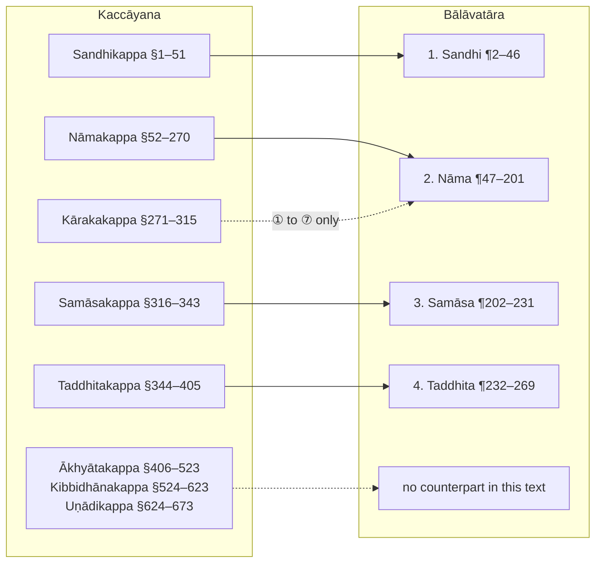

import LetterGrid from "../../../components/LetterGrid.astro";
import { LinkCard } from "@astrojs/starlight/components";

<LetterGrid letters={[["bā", "lā", "va", "tā", "ra"]]} />

Bālāvatāra is an introductory Pāli grammar for beginners, by Dhammakitti, written in the fourteenth century. It is based on Kaccāyana (it references Kaccāyana rules) and gives the basics of Pāli grammar suitable for beginners in the language. The text is written in a simple and straightforward style, making it easy to understand for beginners.

This is a translation of Bālāvatāra into English. If you spot any errors, let me know.

:::note[How this translation was made]
The translation was completed through a mix of hand translation and machine assistance. The initial incomplete hand translation was compared against [MITRA-QWEN](https://huggingface.co/buddhist-nlp/mitra-qwen35-translate) Buddhist text model from the [Dharmamitra](https://dharmamitra.org) project, converted to MLX and running locally on my Mac Studio, and then reworked by Claude Fable 5.1 (Anthropic) into the same instructional style as the hand-translation, with each example word worked out as a derivation and glosses checked against the [Digital Pāḷi Dictionary](https://dpdict.net) and the Kaccāyana chapters on this site. Two reference texts sit alongside the chapters: the [Chaṭṭha Saṅgāyana text](/balavatara/cscd4) and the [1935 translation and textbook](/balavatara/mitra) by Vidyabhusana and Punnananda, revised by S. Mitra, transcribed from the scanned edition.
:::

:::note[Numbering and headings]
The Chaṭṭha Saṅgāyana edition numbers its paragraphs 1–269 straight through the text, and those numbers appear in the chapters as ¶1, ¶2 and so on, at the start of the quoted Pāli and of the matching English, or as a badge on a rule's heading when the number sits on the rule itself. They locate a passage in the [source text](/balavatara/cscd4); they are not rule numbers, since a paragraph may carry a rule, a lead-in or a verse, and most rules have no number of their own. Where a rule is one of Kaccāyana's suttas, its Kaccāyana number §N is given in a reference card.

The section headings are supplied by the translation. The edition's own headings are few and sit in the wrong places: its `Pulliṅga` heading precedes the rules common to every gender, and its `Pumitthiliṅga` heading covers everything from nouns of two genders to the particles. The sections here follow the text's own announcements, such as `Saṅkhyā vuccate`, "the numerals are described", and the traditional names where they fit.
:::

:::note[How Bālāvatāra reorders Kaccāyana]
The Kaccāyana chapters on this site set against the four kaṇḍas of the Chaṭṭha Saṅgāyana Bālāvatāra text. Solid lines show where a chapter's rules reappear; the seven meanings of the inflection forms are the only Kāraka material Bālāvatāra keeps, and the chapters on verbs and primary derivation have no counterpart in this text.

:::

Dhammakitti was a renowned scholar and author of several important works on Pāli grammar and Buddhist philosophy, including Saddhammalahkara, Jinabodhavali, Samkhepa, Nikaya-sangraha, and Bālāvatāra.

He succeeded his master in the office of Sangharaja. He was also called Devarakkhita or Jayabahu Maha-thera, and lived in the reigns of Bhuvaneka-bahu V and Vira-bahu III (1372-1410).[^1]

[^1]: Don M. de Z. Wickremasinghe, **2. The Several Pali and Sinhalese Authors known as Dhammakitti**, Journal of the Royal Asiatic Society, Vol. 28 Issue 1, p. 203

The text for Bālāvatāra is sourced from [Pāḷi Tipiṭaka](https://tipitaka.org) which is a digital reproduction of the authenticated Tipitaka texts from the [Chaṭṭha Saṅgāyana](https://www.tipitaka.org/chattha.html) CD published by the [Vipassana Research Institute](http://www.vridhamma.org/Home.aspx).
