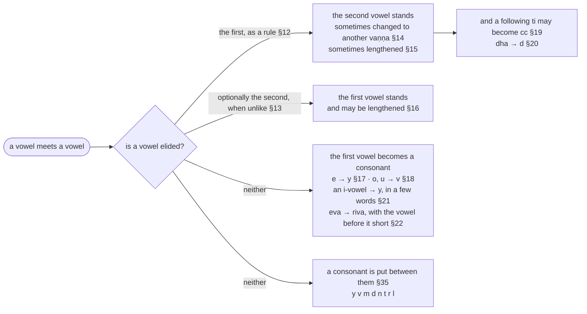
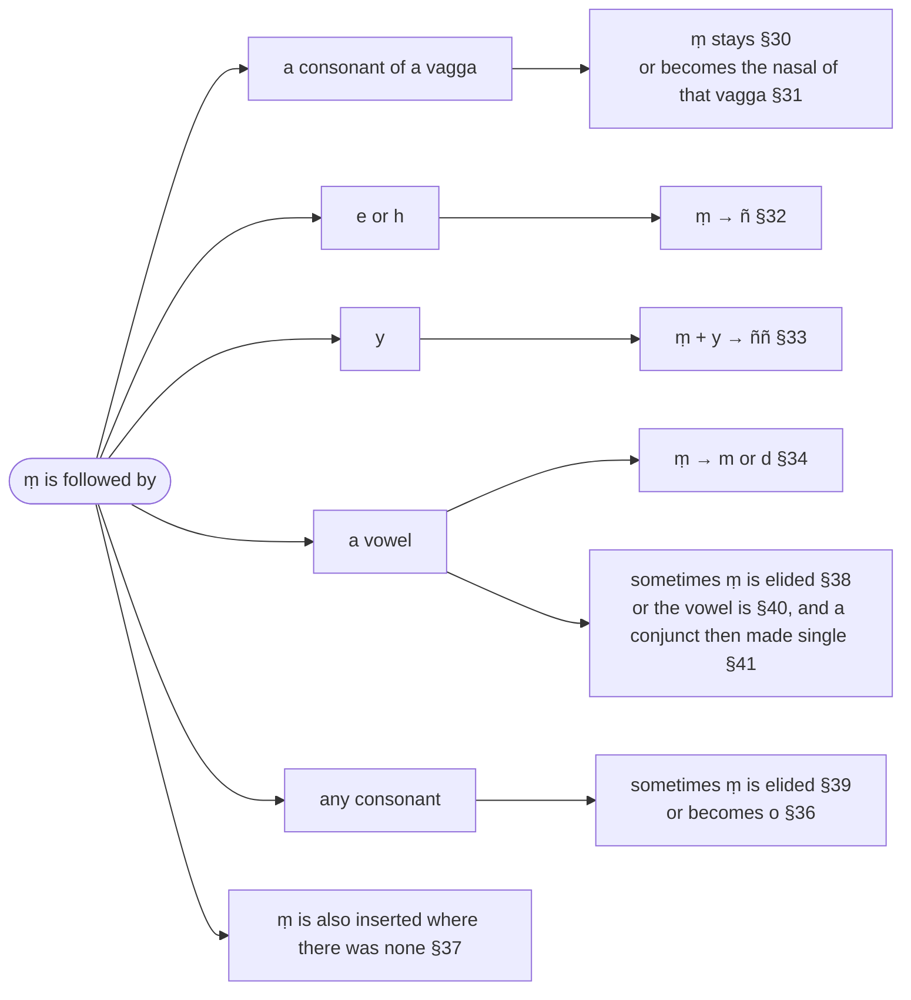

import LetterGrid from "../../../components/LetterGrid.astro";
import { LinkCard } from "@astrojs/starlight/components";

:::note
`sandhi` is derived from `saṃ` + `dhā` meaning “putting together” and is used to refer to the transformation that result from the joining together of two words (or two parts of a word) for the sake of euphony.
:::

## Paṭhamakaṇḍa (First Section - Definitions)

:::note
This section provides an introductory rule, technical terms including akkhara (sounds, or units of a word), and rules for carrying out sandhi.
:::

> **(Ka)**
>
> Seṭṭhaṃ tilokamahitaṃ abhivandiyaggaṃ, \
> Buddhañca dhammamamalaṃ gaṇamuttamañca; \
> Satthussa tassa vacanatthavaraṃ subuddhuṃ, \
> Vakkhāmi suttahitamettha susandhikappaṃ.

To the Supreme, honoured in the three worlds, worthy of the ultimate salute,\
To the Buddha and the pure Dhamma and the highest collection (the Tipiṭaka);\
To fully understand the meaning of the excellent words of that Teacher,\
I will articulate thoroughly here the sutta (rules) in the sandhikappa (Sandhi Chapter)

> **(Kha)**
>
> Seyyaṃ jineritanayena budhā labhanti, \
> Tañcāpi tassa vacanatthasubodhanena; \
> Atthañca akkharapadesu amohabhāvā, \
> Seyyatthiko padamato vividhaṃ suṇeyyaṃ.

The wise obtain using the excellent method proclaimed by the Conqueror,\
As well as fully understanding the meaning of his words;\
And the clear knowledge of the meaning in the words and letters,\
Excellent benefit for those who will listen to the words here in many ways.

---

### §1 (1): Attho akkharasaññāto (Meaning is represented by `akkhara`) :badge[sīhagatika]{variant=caution}

:::note
`akkhara` means “constant, durable, long-lasting” and in the context of Kaccāyana it means “sounds, tones, syllables of words” and also the units of the `abugida` (alpha-syllabary). It is derived from `akshara` (Sanskrit: अक्षर, romanized: akṣara, lit. 'imperishable, indestructible, fixed, immutable'), a term used in the traditional grammar of the Sanskrit language and in the Vedanta school of Indian philosophy.
:::

:::tip[Reference]
For "akkharasaññāto", refer to "So neva ussādetabbo na apasādetabbo, anussādetvā anapasādetvā sveva sādhukaṃ saññāpetabbo tassa ca atthassa tesañca byañjanānaṃ nisantiyā." [(8D 6.7: Saññāpetabbavidhi)](https://tipitaka2600.github.io/tipitaka/8D/6/6.7#356)
:::

> Sabbavacanānamattho akkhareheva saññāyate.
>
> Akkharavipattiyaṃ hi atthassa dunnayathā hoti, tasmā akkharakosallaṃ bahūpakāraṃ suttantesu.

All meanings of words are based on the recognition of `akkhara`. A mistaken `akkhara` result in difficulty in interpreting meaning, therefore proficiency in `akkhara` is extremely helpful in (deciphering) the rules (or understanding the suttas in the Tipiṭaka).

:::note
An `abugida` is a segmental writing system in which consonant–vowel sequences are written as units; each unit is based on a consonant letter, and vowel notation is secondary, similar to a diacritical mark. This contrasts with a full alphabet, in which vowels have status equal to consonants.

Pāḷi is generally written in various Brahmic scripts (also known as Indic scripts), which are abugida writing systems. Brahmic scripts are used throughout the Indian subcontinent, Southeast Asia and parts of East Asia. They are descended from the Brahmi script of ancient India. In the rest of this chapter, I use Brahmi as the writing system described by Kaccāyana. Brahmi is clearly attested from the 3rd century BCE during the reign of Ashoka, who used the script for imperial edicts.
:::

:::tip[Reference]
For more information on Brahmi, refer to:

<LinkCard title="Brahmi" href="/reference/brahmi" description="Brahmi is a historical Indic abugida, written left-to-right. Used in 3rd century BCE–5th century CE in South Asia for Prakrit, Sanskrit, Saka, Tamil, Kannada, Tocharian. Evolved into the many Brahmic scripts used today in South and Southeast Asia." />
:::

---

### §2 (2): Akkharāpādayo ekacattālīsaṃ (41 akkhara starting with `a`) :badge[anvattha]{variant=note}

> Te ca kho akkharā api **a**kārādayo ekacattā līsaṃ[^1] suttantesu sopakārā.

[^1]: The CST4 edition misspells this as `ekacattā līsa`.

> Taṃ yathā?

> A ā i ī u ū e o,

> ka kha ga gha ṅa,\
> ca cha ja jha ña, \
> ṭa ṭha ḍa ḍha ṇa, \
> ta tha da dha na, \
> pa pha ba bha ma, \
> ya ra la va sa ha ḷa aṃ,

> iti akkharā nāma.

> Tena kvattho?

> Attho akkharasaññāto.

And those `akkhara` too, the forty-one beginning with `a`, are of service in the suttantas.[^41]

[^41]: `api` is "too": the `akkhara` as well as the meaning of §1 are what the suttantas need, and `suttantesu sopakārā` is the predicate, echoing §1's `akkharakosallaṃ bahūpakāraṃ suttantesu`; Senart's text adds `honti`. Nothing in the Pāḷi speaks of `akkhara` "constructed from sounds", as an earlier version of this page had it. Both translators render the sentence so: Nandisena (2005) "these letters which are forty one beginning with 'a' are very useful in the Discourses", Malai (1997) "those forty-one sounds beginning with a are useful in the context of sutta-s".

<LetterGrid
  letters={[
    ["a", "ā", "i", "ī", "u", "ū", "e", "o"],
    ["ka", "kha", "ga", "gha", "ṅa"],
    ["ca", "cha", "ja", "jha", "ña"],
    ["ṭa", "ṭha", "ḍa", "ḍha", "ṇa"],
    ["ta", "tha", "da", "dha", "na"],
    ["pa", "pha", "ba", "bha", "ma"],
    ["ya", "ra", "la", "va", "sa", "ha", "ḷa", "aṃ"],
  ]}
/>

:::tip[Purpose]
<LinkCard title="Refer to §1 `Attho akkharasaññāto`" href="#m1" description="Meaning is represented by `akkhara`" />
:::
---

### §3 (3): Tatthodantā sarā aṭṭha ([From `akkhara`] eight ending with `o`: `sara`) :badge[anvattha]{variant=note}

:::note
`sara` means "sound, voice, intonation, accent" and in the context of Kaccāyana it means "vowel". Vowels have independent existence, unlike consonants which need to be combined with vowels to make a sound.
:::

> Tattha akkharesu akārādīsu odantā aṭṭha akkharā sarā nāma honti.

> Taṃ yathā?

> A ā i ī u ū e o, iti sarā nāma.

> Tena kvattho?

> Sarā sare lopaṃ.

Regarding the `akkhara`, the eight `akkhara` starting with `a` and ending with `o` are called `sarā` (vowels).

<LetterGrid letters={[["a", "ā", "i", "ī", "u", "ū", "e", "o"]]} />

:::note
The above symbols for the vowels are when they are used independently (ie. not attached or preceded by a consonant). If a vowel is attached to a consonant, the following diacritics are used:
:::

<LetterGrid
  letters={[["(a)", "(ā)", "(i)", "(ī)", "(u)", "(ū)", "(e)", "(o)"]]}
/>

:::tip[Purpose]
<LinkCard title="Refer to §12 `sarā sare lopaṃ`" href="#m12" description="Vowel, before vowel, is elided" />
:::

---

### §4 (4): Lahumattā tayo rassā (3 short vowels: `rassa`) :badge[anvattha]{variant=note}

:::note
`rassa` refers to a "short" vowel (with a metrical length of one morae, or approximately the time taken to blink the eyes).
:::

> Tattha aṭṭhasu saresu lahumattā tayo sarā rassā nāma honti.

> Taṃ yathā?

> A i u, iti rassā nāma.

> Tena kvattho?

> Rassaṃ.

Regarding the eight vowels, the three short vowels are called `rassa`.

The `rassa` vowels are:

<LetterGrid letters={[["a", "i", "u"]]} />

---

### §5 (5): Aññe dīghā (Other [`sarā`] are `dīgha`) :badge[anvattha]{variant=note}

:::note
`dīgha` refers to a "long" vowel (with a metrical length of two morae, or perhaps even longer).
:::

> Tattha aṭṭhasu saresu rassehi aññe pañca sarā dīghā nāma honti.

> Taṃ yathā?

> Ā ī ū e o, iti dīghā nāma.

> Tena kvattho?

> Dīghaṃ.

Regarding the eight vowels, the five vowels other than the short vowels are called “digha.”

The digha vowels are:

<LetterGrid letters={[["ā", "ī", "ū", "e", "o"]]} />

:::tip[Purpose]
<LinkCard title="Refer to §25 `Dīghaṃ`" href="#m25" description="Long [vowels]" />
:::

---

### §6 (8): Sesā byañjanā (Remaining are `byañjanā`) :badge[anvattha]{variant=note}

:::note
`byañjana` means "attribute, sign, mark" and in the context of Kaccāyana it means "consonant", because consonants are "signs" that distinguish the units of a word. From a metrical perspective, they are regarded as having a length of half a morae.
:::

> Ṭhapetvā aṭṭha sare sesā akkharā kakārādayo niggahitantā byañjanā nāma honti.

> Taṃ yathā?

> Ka kha ga gha ṅa, \
> ca cha ja jha ña, \
> ṭa ṭha ḍa ḍha ṇa, \
> ta tha da dha na, \
> pa pha ba bha ma, \
> ya ra la va sa ha ḷa aṃ,

> iti byañjanā nāma.

> Tena kvattho?

> Sarā pakati byañjane.

Having set aside the eight vowels, the (remaining) letters starting with `ka` and ending with the `niggahita` (`aṃ`) are named `byañjana` (consonants).

The byañjanā are:

<LetterGrid
  letters={[
    ["ka", "kha", "ga", "gha", "ṅa"],
    ["ca", "cha", "ja", "jha", "ña"],
    ["ṭa", "ṭha", "ḍa", "ḍha", "ṇa"],
    ["ta", "tha", "da", "dha", "na"],
    ["pa", "pha", "ba", "bha", "ma"],
    ["ya", "ra", "la", "va", "sa", "ha", "ḷa", "aṃ"],
  ]}
/>

:::note
Vowels following a consonant are inherent or written by diacritics. When no vowel is written, the vowel `a` is understood. For example the consonant `ka` can be combined with any of the diacritic vowels to form a syllable:
:::

<LetterGrid
  letters={[
    ["(a)", "(ā)", "(i)", "(ī)", "(u)", "(ū)", "(e)", "(o)"],
    ["ka", "kā", "ki", "kī", "ku", "kū", "ke", "ko"],
  ]}
/>

:::tip[Purpose]
<LinkCard title="Refer to §23 `Sarā pakati byañjane`" href="#m23" description="Vowel before consonant retains original form" />
:::

---

### §7 (9): Vaggā pañcapañcaso mantā (`vagga`: 5 by 5 [byañjane] ending with `ma`) :badge[anvattha]{variant=note}

:::note
`vagga` means "group" or "series".
:::

> Tesaṃ kho byañjanānaṃ kakārādayo makārantā pañcapañcaso akkharavanto vaggā nāma honti.

> Taṃ yathā?

> Ka kha ga gha ṅa, \
> ca cha ja jha ña, \
> ṭa ṭha ḍa ḍha ṇa, \
> ta tha da dha na, \
> pa pha ba bha ma,

> iti vaggā nāma.

> Tena kvattho?

> Vaggantaṃ vā vagge.

The consonants starting with `ka` and ending with `ma` arranged in five groups of five, are named `vagga` (grouped).

<LetterGrid
  letters={[
    ["ka", "kha", "ga", "gha", "ṅa"],
    ["ca", "cha", "ja", "jha", "ña"],
    ["ṭa", "ṭha", "ḍa", "ḍha", "ṇa"],
    ["ta", "tha", "da", "dha", "na"],
    ["pa", "pha", "ba", "bha", "ma"],
  ]}
/>

:::tip[Purpose]
<LinkCard title="Refer to §31 `Vaggantaṃ vā vagge`" href="#m31" description="Optionally, Before group, to end of group" />
:::

---

### §8 (10): Aṃ iti niggahitaṃ (`aṃ` represents `niggahita`) :badge[anvattha]{variant=note}

:::note
`niggahita` (lit. "held down") is a technical term referring to a nasalised after sound (Sanskrit: `anusvāra`) following a vowel. It is sometimes referred to as a vowel, but Kaccāyana classifies it as a consonant.
:::

> Aṃ iti niggahitaṃ nāma hoti.

> Tena kvattho?

> Aṃ byañjane niggahitaṃ.

The `aṃ` letter is named `niggahita` (nasal consonant).

<LetterGrid letters={[["aṃ"]]} />

:::note
Note that the niggahita is also a diacritical mark appended to a consonant (possibly together with a vowel diacritic).
:::

:::tip[Purpose]
<LinkCard title="Refer to §30 `Aṃ byañjane niggahitaṃ`" href="#m30" description="`ṃ` before consonant [remains] `niggahita`" />
:::

---

### §9 (11): Parasamaññā payoge (Other grammatical terms when applicable) :badge[saññaṅga]{variant=tip}

> Yā ca pana paresu sakkataganthesu samaññā ghosāti vā aghosāti vā, tā payoge sati etthāpi yujjante.

> Tattha ghosā nāma-

> ga gha ṅa,\
> ja jha ña, \
> ḍa ḍha ṇa, \
> da dha na, \
> ba bha ma, \
> ya ra la va ha ḷa,

> iti ghosā nāma.

> Aghosā nāma-

> ka kha, \
> ca cha, \
> ṭa ṭha, \
> ta tha, \
> pa pha, \
> sa,

> iti aghosā nāma.

> Tena kvattho?

> Vagge ghosāghosānaṃ tatiyapaṭhamā.

Terms such as `ghosa` (voiced) and `aghosa` (unvoiced) used in other texts (ie. Sanskrit grammar) are applicable here when there is occasion for their use.

:::note
`ghosa` means "sound" and is used to refer to "sonants" (consonants voiced with "sonority") whereas `aghosa` is used to refer to "surds" (consonants pronounced with unintonated breath). Note that these are just two examples of Sanskrit technical terms that Kaccāyana says are applicable, others are used without definition, so Kaccāyana expects readers to be familiar with Sanskrit grammar.
:::

`ghosā` letters:

<LetterGrid
  letters={[
    ["ga", "gha", "ṅa"],
    ["ja", "jha", "ña"],
    ["ḍa", "ḍha", "ṇa"],
    ["da", "dha", "na"],
    ["ba", "bha", "ma"],
    ["ya", "ra", "la", "va", "ha", "ḷa"],
  ]}
/>

`aghosā` letters:

<LetterGrid
  letters={[
    ["ka", "kha"],
    ["ca", "cha"],
    ["ṭa", "ṭha"],
    ["ta", "tha"],
    ["pa", "pha"],
    ["sa"],
  ]}
/>

:::tip[Purpose]
Refer to [§29 (42): Vagge ghosāghosānaṃ tatiyapaṭhamā](#m29)
<LinkCard title="Refer to §29 `Vagge ghosāghosānaṃ tatiyapaṭhamā`" href="#m29" description="Voiced and unvoiced groups: third and first" />
:::

---

### §10 (12): Pubbamadhoṭhita massaraṃ sarena viyojaye (In preceeding [word], detach vowel from vowelless [consonant]) :badge[vidhyaṅga]{variant=tip}

:::note
Note that this is a meta-operational rule that makes sense when referring to abugida scripts like Brahmi where the vowels (diacritics) are attached to consonants in each unit of a word. In Romanised Pāḷi, the vowels and consonants are represented by distinct letters so separating the vowel from the consonant is inherently done.
:::

> Tattha sandhiṃ kattukāmo pubbabyañjanaṃ adhoṭhitaṃ assaraṃ katvā sarañca upari katvā sarena viyojaye.

> Tatrāyamādi.

In that regard, those wishing to make `sandhi` should set the preceding consonant (the final consonant of the preceding word) below without its vowel, set the vowel above it, and so separate the consonant from the vowel.[^42]

[^42]: The `vutti` has a single object, `pubbabyañjanaṃ`: only the preceding consonant is stripped of its vowel here (in `tatra` + `ayaṃ`, the `tr` from its `a`), and the following word is not touched until [§11 (14): Naye paraṃ yutte](#m11) joins the bare consonant to `parakkharaṃ`; an earlier version of this page extended the operation to the first consonant of the following word, a step the text does not state. Both translators read it as here: Nandisena (2005) "making the previous consonant that lies below free from the vowel and putting the vowel above", Malai (1997) "the preceding consonant is to be written below without vowel and … separated from vowel". The derivation tables on this site use the label §10 more loosely, for the analysis of every unit at a junction.

:::tip[Example]

> `tatrāyamādi` \
> [(18Dh 25.7 Sambahulabhikkhuvatthu)](https://tipitaka2500.github.io/tipitaka/18Dh/25/25.7#402)

|     | 𑀢𑀢𑁆𑀭 + 𑀅𑀬𑀁 + 𑀆𑀤𑀺                                               | ta**tra** + **ayaṃ** + **ā**di                            | rule |
| --- | -------------------------------------------------------------- | --------------------------------------------------------- | ---- |
| →   | 𑀢 + (**𑀢𑁆𑀭𑁆** + **𑀅**) + (**𑀅**) + (𑀬 + **𑀅𑀁**) + (**𑀆**) + 𑀤𑀺 | ta + **(tr + a)** + **(a)** + **(ya + ṃ)** + **(ā)** + di | §10  |
| →   | 𑀢 + 𑀢𑁆𑀭𑁆 + (~~𑀅~~ + 𑀅) + 𑀬 + 𑀅𑀁 + 𑀆 + 𑀤𑀺                       | ta + tr + (~~a~~ + a) + ya + ṃ + ā + di                   | §12  |
| →   | 𑀢 + 𑀢𑁆𑀭𑁆 + (𑀅→𑀆) + 𑀬 + 𑀅𑀁 + 𑀆 + 𑀤𑀺                             | ta + tr + (a→ā) + ya + ṃ + ā + di                         | §15  |
| →   | 𑀢 + 𑀢𑁆𑀭𑁆 + 𑀆 + 𑀬 + (𑀅𑀁→𑀫𑁆 + 𑀆) + 𑀤𑀺                            | ta + tr + ā + ya + (ṃ→m + ā) + di                         | §34  |
| →   | 𑀢 + (𑀢𑁆𑀭𑁆 + 𑀆) + 𑀬 + (𑀫𑁆 + 𑀆) + 𑀤𑀺                             | ta + (tr + ā) + ya + (m + ā) + di                         | §11  |
| →   | **𑀢𑀢𑁆𑀭𑀸𑀬𑀫𑀸𑀤𑀺**                                                 | **tatrāyamādi**                                           |      |

:::

---

### §11 (14): Naye paraṃ yutte (To conclude, attach next) :badge[vidhyaṅga]{variant=tip}

:::note
This meta-operational rule is the counterpart to §10, to ensure consonants and vowels are connected after the application of other sandhi rules.
:::

> Assaraṃ kho byañjanaṃ adhoṭhitaṃ[^2] parakkharaṃ naye yutte.

[^2]: The CST4 edition misspells this as `adhoṭhataṃ`.

> Tatrābhiratimiccheyya.

> Yuttetikasmā?

> Akkocchi maṃ avadhi maṃ, ajini maṃ ahāsi me.

> Ettha pana yuttaṃ na hoti.

The final vowelless consonant (in the preceeding word) must be connected to the next phoneme (first phoneme of the succeeding word).[^43]

[^43]: `parakkharaṃ` is "the following `akkhara`", a vowel as much as a consonant (§2), and in the `vutti`'s own example the bare `m` of `abhiratiṃ` is joined to the vowel `i` of `iccheyya`. Nandisena (2005) translates "to the following letter", as here; Malai (1997) twice renders the word "the following consonant", a slip that his own example contradicts.

:::tip[Example]

> `tatrābhiratimiccheyya` \
> [(17A10 4.2.3 Saṅgāravasutta)](https://tipitaka2500.github.io/tipitaka/17A10/4/4.2/4.2.3#1190)

|     | 𑀢𑀢𑁆𑀭 + 𑀅𑀪𑀺𑀭𑀢𑀺𑀁 + 𑀇𑀘𑁆𑀙𑁂𑀬𑁆𑀬                                   | tatra + abhiratiṃ + iccheyya                              | rule |
| --- | ----------------------------------------------------------- | --------------------------------------------------------- | ---- |
| →   | 𑀢 + (𑀢𑁆𑀭𑁆 + 𑀅) + (𑀅) + 𑀪𑀺𑀭 + (𑀢𑀺 + 𑀅𑀁) + (𑀇 + 𑀘𑁆) + 𑀙𑁂𑀬𑁆𑀬   | ta + (tr + a) + (a) + bhira + (ti + ṃ) + (i + c) + cheyya | §10  |
| →   | 𑀢𑀢𑁆𑀭𑁆 + (~~𑀅~~ + 𑀅) + 𑀪𑀺𑀭 + 𑀢𑀺 + 𑀅𑀁 + 𑀇 + 𑀘𑁆𑀙𑁂𑀬𑁆𑀬           | tatr + (~~a~~ + a) + bhira + ti + ṃ + i + ccheyya         | §12  |
| →   | 𑀢𑀢𑁆𑀭𑁆 + (𑀅→𑀆) + 𑀪𑀺𑀭𑀢𑀺 + 𑀅𑀁 + 𑀇 + 𑀘𑁆𑀙𑁂𑀬𑁆𑀬                    | tatr + (a→ā) + bhirati + ṃ + i + ccheyya                  | §15  |
| →   | 𑀢𑀢𑁆𑀭𑁆 + 𑀆 + 𑀪𑀺𑀭𑀢𑀺 + (𑀅𑀁→𑀫𑁆 + 𑀇) + 𑀘𑁆𑀙𑁂𑀬𑁆𑀬                   | tatr + ā + bhirati + (ṃ→m + i) + ccheyya                  | §34  |
| →   | 𑀢 + (**𑀢𑁆𑀭𑁆** + **𑀆**) + 𑀪𑀺𑀭𑀢𑀺 + (**𑀫𑁆** + **𑀇**) + 𑀘𑁆𑀙𑁂𑀬𑁆𑀬 | ta + **(tr + ā)** + bhirati + **(m + i)** + ccheyya       | §11  |
| →   | 𑀢 + **𑀢𑁆𑀭𑀸** + 𑀪𑀺𑀭𑀢𑀺 + **𑀫𑀺** + 𑀘𑁆𑀙𑁂𑀬𑁆𑀬                     | ta + **trā** + bhirati + **mi** + ccheyya                 |      |
| →   | **𑀢𑀢𑁆𑀭𑀸𑀪𑀺𑀭𑀢𑀺𑀫𑀺𑀘𑁆𑀙𑁂𑀬𑁆𑀬**                                     | **tatrābhiratimiccheyya**                                 |      |

:::

:::danger[Counter-example]

> `Akkocchi maṃ avadhi maṃ`,\
> `ajini maṃ ahāsi me` \
> [(18Dh 1.3: Tissattheravatthu)](https://tipitaka2500.github.io/tipitaka/18Dh/1/1.3#4)

In the above text the rule is not applicable, so there are no connections (between the preceeding vowels and the following consonants, or between the final `niggahita` and the following vowel)
:::

---

> _Iti sandhikappe paṭhamo kaṇḍo._

Thus ends the first section of the sandhi chapter.

---

## Dutiyakaṇḍa (Second Section - Vowel Sandhi)

:::note[How the vowel rules fit together]
When a final vowel meets an initial vowel the section offers three routes: elide one of the two vowels, change the first into a consonant, or put a consonant between them. Each branch names the rule.

:::

:::note
This section describes `sarasandhi` (combination of vowels).
:::

---

### §12 (13): Sarā sare lopaṃ (Vowel, before vowel, is elided) :badge[utsarga]{variant=success}

:::note[Analysis]

| option | before | from   | operation | to         | after  | context |
| ------ | ------ | ------ | --------- | ---------- | ------ | ---- |
|        |        | sarā   | lopaṃ     | ~~sare~~   | sare   |      |
|        |        | vowel1 | elide     | ~~vowel1~~ | vowel2 |      |

:::

> Sarā kho sare pare lopaṃ papponti.

> Yassindriyāni samathaṅgatāni.

> No hetaṃ bhante

> sametāyasmā saṅghena.

Vowel, before another vowel, experience elision. \
(When there are two vowels, the first vowel is elided)

:::tip[Example]

> `yassindriyāni samathaṅgatāni` \
> [(18Dh 7.5: Mahākaccāyanattheravatthu)](https://tipitaka2500.github.io/tipitaka/18Dh/7/7.5#101) \
> 🚹⑥⨀(ya) 🚻①⨂(indriya) 🚻①⨂(samathaṅgata) \
> of whatever | faculties | calmed

|     | yassa + indriyāni                   | rule |
| --- | ----------------------------------- | ---- |
| →   | yas + (s + a) + (i + n) + driyāni   | §10  |
| →   | yas + s + (~~a~~ + i) + n + driyāni | §12  |
| →   | yas + (s + i + n) + driyāni         | §11  |
| →   | **yassindriyāni**                   |      |

:::

:::tip[Example]

> `no hetaṃ bhante` \
> [(6D 1.1: Paribbājakakathā)](https://tipitaka2500.github.io/tipitaka/6D/1/1.1#6) \
> 🔼(no) 🔼(hetaṃ) 🚹⓪⨀(bhavant) \
> not | certainly | Bhante

|     | hi + etaṃ             | rule |
| --- | --------------------- | ---- |
| →   | (h + i) + (e) + taṃ   | §10  |
| →   | h + (~~i~~ + e) + taṃ | §12  |
| →   | (h + e) + taṃ         | §11  |
| →   | **hetaṃ**             |      |

:::

:::tip[Example]

> `sametāyasmā saṅghena` \
> [(1V 1.2.10: Saṃghabhedasikkhāpada)](https://tipitaka2500.github.io/tipitaka/1V/1/1.2/1.2.10#1679) \
> ⏯🤟⨀(sameti) 🚹①⨀(āyasmant) 🚹③⨀(saṅgha) \
> may he agree | the venerable one | with the monastic community

|     | sameta + āyasmā              | rule |
| --- | ---------------------------- | ---- |
| →   | same (t + a) + (ā) + yasmā   | §10  |
| →   | same t + (~~a~~ + ā) + yasmā | §12  |
| →   | same (t + ā) + yasmā         | §11  |
| →   | **sametāyasmā**              |      |

:::

---

### §13 (15): Vā paro asarūpā (Optionally, next dissimilar [vowel]) :badge[apavada]{variant=success}

:::note[Analysis]
| option | before | from | operation | to | after | context |
| --- | --- | --- | --- | --- | --- | --- |
| vā | (sarā) | paro asarūpā | (lopaṃ) | ~~paro asarūpā~~ | | |
| optionally | (vowel) | dissimilar vowel | (elide) | ~~dissimilar vowel~~ | | |

The option marker `vā` indicates this is an alternate to the previous rule [§12 (13): Sarā sare lopaṃ](#m12).
:::

> Saramhā asarūpā paro saro lopaṃ pappoti vā.

> Cattāro’me bhikkhave dhammā,

> kinnu’ māvasamaṇiyo.

> Vāti kasmā?

> Pañcindriyāni,

> tayassu dhammā jahitā bhavanti.

Optionally, when a vowel not of the same type (of articulation) follows a vowel, the following vowel experience elision.

:::tip[Example]

> `cattārome, bhikkhave, dhammā` \
> [(15A4 5.5.7: Bahukārasutta)](https://tipitaka2500.github.io/tipitaka/15A4/5/5.5/5.5.7#1508) \
🚹①⨂(catu) 🚹①⨂(ima) 🚹⓪⨂(bhikkhu) 🚹①⨂(dhamma) \
four | these | bhikkhave | teachings

|     | cattāro + ime                | rule |
| --- | ---------------------------- | ---- |
| →   | cattā + (r + o) + (i) + me   | §10  |
| →   | cattā + r + (o + ~~i~~) + me | §13  |
| →   | cattā + (r + o) + me         | §11  |
| →   | **cattārome**                |      |

:::

:::tip[Example]

> `kinnumāva samaṇiyo` \
> [(2V 2.2.10: Sikkhaṃpaccācikkhaṇasikkhāpada)](https://tipitaka2500.github.io/tipitaka/2V/2/2.2/2.2.10#710) \
🚻①⨀(ka) 🔼(nu) 🚺①⨂(ima) 🔼(eva) 🚺①⨂(samaṇī) \
what | ? | these | only | nuns

|     | kiṃ + nu + imā             | rule |
| --- | -------------------------- | ---- |
| →   | kiṃ + (n + u) + (i) + mā   | §10  |
| →   | kiṃ + n + (u + ~~i~~) + mā | §13  |
| →   | kiṃ + (n + u) + mā         | §11  |
| →   | **kinnumā**                |      |

:::

:::danger[Counter-example]

> `pañcindriyāni` \
> [(17A10 2.4.10: Khīṇāsavabalasutta)](https://tipitaka2500.github.io/tipitaka/17A10/2/2.4/2.4.10#765) \
🚻①⨂(pañcindriya) \
five faculties

|     | pañca + indriyāni                   | rule |
| --- | ----------------------------------- | ---- |
| →   | pañ + (c + a) + (i + n) + driyāni   | §10  |
| →   | pañ + c + (~~a~~ + i) + n + driyāni | §12  |
| →   | pañ + (c + i + n) + driyāni         | §11  |
| →   | **pañcindriyāni**                   |      |

The vowels `a` and `i` are dissimilar, so §13 could elide the following `i`; the option marker `vā` allows the rule not to be taken, and the general rule [§12 (13): Sarā sare lopaṃ](#m12) elides the preceding `a` instead. This is why the `vutti` cites the example under `vā ti kasmā?`.
:::

:::danger[Counter-example]

> `tayassu dhammā jahitā bhavanti` \
> [(18Sn 2.1: Ratanasutta)](https://tipitaka2500.github.io/tipitaka/18Sn/2/2.1#269) \
🚹①⨂(ti) ⏯🤟⨂(assa) 🚹①⨂(dhamma) 🚹①⨂(jahita) ▶️🤟⨂(bhavati) \
three | will be | teachings | abandoned | is

|     | tayo + assu                   | rule |
| --- | ----------------------------- | ---- |
| →   | ta + (y + o) + (a + s) + su   | §10  |
| →   | ta + y + (~~o~~ + a) + s + su | §12  |
| →   | ta + (y + a + s) + su         | §11  |
| →   | **tayassu**                   |      |

Likewise `o` and `a` are dissimilar: §13 could elide the following `a`, but the option is not taken, and the preceding `o` is elided by [§12 (13): Sarā sare lopaṃ](#m12) instead.
:::

---

### §14 (16): Kvacāsavaṇṇaṃ[^3] lutte (Occasionally, different vaṇṇa after elision) :badge[apavada]{variant=success}

[^3]: CST4 mispells this as `kvacāsacaṇṇaṃ`

:::note
`vaṇṇa` can have various contexts, including "colour", "appearance" and "praise" but in the context of Kaccāyana it means a certain sound. For example `ivaṇṇa` means a the sound `i` or `ī` (note, the length of the sound does not matter).
:::

:::note[Analysis]
| option | before | from | operation | to | after | context |
| --- | --- | --- | --- | --- | --- | --- |
| kvaci | (~~sarā~~) | (sare) | pappoti | asavaṇṇaṃ | | |
| occasionally | (~~vowel1~~) | (vowel2) | change | different sound | | |

The option marker `kvaci` indicates this cancels the `vā` option marker in the previous rule [§13 (15): Vā paro asarūpā (Optionally, next dissimilar-sounding [vowel])](#m13). It provides an alternative to rule [§12 (13): Sarā sare lopaṃ](#m12).
:::

> Saro kho paro pubbasare lutte kvaci asavaṇṇaṃ pappoti.

> Saṅkhyaṃ nopeti vedagū,

> bandhusseva samāgamo.

> Kvacīti kasmā?

> Yassindriyāni,

> tathūpamaṃ dhammavaraṃ adesayi.

A vowel, when the previous vowel has been elided, occasionally becomes a different sound (another vowel).

:::tip[Example]

> `saṅkhyaṃ nopeti vedagū` \
> [(18Sn 3.12: Dvayatānupassanāsutta)](https://tipitaka2500.github.io/tipitaka/18Sn/3/3.12#903) \
🚺②⨀(saṅkhyā) ▶️🤟⨀(nopeti) 🚹①⨀(vedagū) \
categorisation | does not approach | one who has perfect knowledge

|     | na + upeti             | rule |
| --- | ---------------------- | ---- |
| →   | (n + a) + (u) + peti   | §10  |
| →   | n + (~~a~~ + u) + peti | §12  |
| →   | n + (u→o) + peti       | §14  |
| →   | (n + o) + peti         | §11  |
| →   | **nopeti**             |      |

:::

:::tip[Example]

> `bandhusseva samāgamo` \
🚹⑥⨀(bandhu) 🔼(iva) 🚹①⨀(samāgama) \
of relation | like | association of

|     | bandhussa + iva                | rule |
| --- | ------------------------------ | ---- |
| →   | bandhus + (s + a) + (i) + va   | §10  |
| →   | bandhus + s + (~~a~~ + i) + va | §12  |
| →   | bandhus + s + (i→e) + va       | §14  |
| →   | bandhus + (s + e) + va         | §11  |
| →   | **bandhusseva**                |      |

:::

:::danger[Counter-example]

> `yassindriyāni (samathaṅgatāni)` \
> [(18Dh 7.5: Mahākaccāyanattheravatthu)](https://tipitaka2500.github.io/tipitaka/18Dh/7/7.5#101) \
> 🚹⑥⨀(ya) 🚻①⨂(indriya) 🚻①⨂(samathaṅgata) \
> of whatever | faculties | calmed

|     | yassa + indriyāni                   | rule |
| --- | ----------------------------------- | ---- |
| →   | yas + (s + a) + (i + n) + driyāni   | §10  |
| →   | yas + s + (~~a~~ + i) + n + driyāni | §12  |
| →   | yas + (s + i + n) + driyāni         | §11  |
| →   | **yassindriyāni**                   |      |

:::

:::danger[Counter-example]

> `tathūpamaṃ dhammavaraṃ adesayi` \
> [(18Kh 6: Ratanasutta)](https://tipitaka2500.github.io/tipitaka/18Kh/6#57) \
🚻①⨀(tathūpama) 🚹②⨀(dhammavara) ⏮🤟⨀(adesayi) \
similar to that | excellent teaching | taught

|     | tathā + upama                | rule |
| --- | ---------------------------- | ---- |
| →   | ta + (th + ā) + (u) + pama   | §10  |
| →   | ta + th + (~~ā~~ + u) + pama | §12  |
| →   | ta + th + (u→ū) + pama       | §15  |
| →   | ta + (th + ū) + pama         | §11  |
| →   | **tathūpama**                |      |

:::

---

### §15 (17): Dīghaṃ (Long) :badge[apavada]{variant=success}

:::note[Analysis]
| option | before | from | operation | to | after | context |
| --- | --- | --- | --- | --- | --- | --- |
| (kvaci) | (~~sarā~~) | (sare) | (pappoti) | dīghaṃ | | |
| (occasionally) | (~~vowel1~~) | (vowel2) | (change) | long vowel2 | | |

:::

> Saro kho paro pubbasare lutte kvaci dīghaṃ pappoti.

> Saddhīdha vittaṃ purisassa seṭṭhaṃ,

> anāgārehi cūbhayaṃ.

> Kvacīti kasmā?

> Pañcahupāli aṅgehi samannāgato.

> Natthaññaṃ kiñci.

A vowel, when the previous vowel has been elided, occasionally becomes long.

:::tip[Example]

> `saddhīdha vittaṃ purisassa seṭṭhaṃ` \
> [(18Sn 1.10: Āḷavakasutta)](https://tipitaka2500.github.io/tipitaka/18Sn/1/1.10#213) \
🔼(saddhīdha) 🚻①⨀(vitta) 🚹⑥⨀(purisa) 🚻①⨀(seṭṭha) \
confidence here | wealth | of person | most important

|     | saddhā + idha                | rule |
| --- | ---------------------------- | ---- |
| →   | sad + (dh + ā) + (i) + dha   | §10  |
| →   | sad + dh + (~~ā~~ + i) + dha | §12  |
| →   | sad + dh + (i→ī) + dha       | §15  |
| →   | sad + (dh + ī) + dha         | §11  |
| →   | **saddhīdha**                |      |

:::

:::tip[Example]

> `anāgārehi cūbhayaṃ` \
> [(18Sn 3.9: Vāseṭṭhasutta)](https://tipitaka2500.github.io/tipitaka/18Sn/3/3.9#755) \
🚹③⨂(anāgāra) 🔼(cūbhayaṃ) \
by homeless wanderer | as well as

|     | ca + ubhayaṃ             | rule |
| --- | ------------------------ | ---- |
| →   | (c +a) + (u) + bhayaṃ    | §10  |
| →   | c + (~~a~~ + u) + bhayaṃ | §12  |
| →   | c + (u→ū) + bhayaṃ       | §15  |
| →   | (c + ū) + bhayaṃ         | §11  |
| →   | **cūbhayaṃ**             |      |

:::

:::danger[Counter-example]

> `pañcahupāli aṅgehi samannāgato` \
> [(5V 17.11: Saṃghabhedakavagga)](https://tipitaka2500.github.io/tipitaka/5V/17/17.11#2140) \
⚧③⨂(pañca) 🚹⓪⨀(upāli) 🚻③⨂(aṅga) 🚹①⨀(samannāgata) \
with five | Upāli| | with factors | endowed with

|     | pañcahi + upāli                | rule |
| --- | ------------------------------ | ---- |
| →   | pañca + (h + i) + (u) + pāli   | §10  |
| →   | pañca + h + (~~i~~ + u) + pāli | §12  |
| →   | pañca + (h + u) + pāli         | §11  |
| →   | **pañcahupāli**                |      |

:::

:::danger[Counter-example]

> `natthaññaṃ kiñci` \
> [(15A4 4.3.3: Mahākoṭṭhikasutta)](https://tipitaka2500.github.io/tipitaka/15A4/4/4.3/4.3.3#1031) \
▶️🤟⨀(natthi) 🚻①⨀(añña) 🚻①⨀(kaci) \
there is not | another | something

|     | natthi + aññaṃ                | rule |
| --- | ----------------------------- | ---- |
| →   | nat + (th + i) + (a) + ññaṃ   | §10  |
| →   | nat + th + (~~i~~ + a) + ññaṃ | §12  |
| →   | nat + (th + a) + ññaṃ         | §11  |
| →   | **natthaññaṃ**                |      |

:::

---

### §16 (18): Pubbo ca (And previous) :badge[apavada]{variant=success}

:::note[Analysis]
| option | before | from | operation | to | after | context |
| --- | --- | --- | --- | --- | --- | --- |
| (kvaci) | | pubbo | (pappoti) | (dīghaṃ) | (~~sare~~) | |
| (occasionally) | | vowel1 | (change) | (long vowel1) | (~~vowel2~~) | |

The use of `ca` (and) implies this rule is an alternative to the previous rule [§15 (17): Dīghaṃ](#m15). The examples imply this rule is applied after [§13 (15): Vā paro asarūpā (Optionally, next dissimilar [vowel])](#m13).
:::

> Pubbo ca saro parasaralope kate kvaci dīghaṃ pappoti.

> Kiṃsūdha vittaṃ purisassa seṭṭhaṃ,

> sādhūti paṭissuṇitvā,

> kvacīti kasmā?

> Itissa muhuttampi.

A vowel, when the following vowel has been elided, occasionally becomes long.

:::tip[Example]

> `kiṃ sūdha vittaṃ purisassa seṭṭhaṃ` \
> [(18Sn 1.10: Āḷavakasutta)](https://tipitaka2500.github.io/tipitaka/18Sn/1/1.10#212) \
🚻①⨀(ka) 🔼(su idha) 🚻①⨀(vitta) 🚹⑥⨀(purisa) 🚻①⨀(seṭṭha) \
what | ! | here | wealth | of person | most important

|     | su + idha             | rule |
| --- | --------------------- | ---- |
| →   | (s + u) + (i) + dha   | §10  |
| →   | s + (u + ~~i~~) + dha | §13  |
| →   | s + (u→ū) + dha       | §16  |
| →   | (s + ū) + dha         | §11  |
| →   | **sūdha**             |      |

:::

:::tip[Example]

> `sādhūti paṭissuṇitvā` \
> [(7D 10.2.1: Candimasūriyaupamā)](https://tipitaka2500.github.io/tipitaka/7D/10/10.2/10.2.1#1097) \
🚹①⨀(sādhu) 🔼(iti) 🔼(paṭissuṇitvā) \
auspicious | like this | having agreed

|     | csādhu + iti               | rule |
| --- | -------------------------- | ---- |
| →   | sā + (dh + u) + (i) + ti   | §10  |
| →   | sā + dh + (u + ~~i~~) + ti | §13  |
| →   | sā + dh + (u→ū) + ti       | §16  |
| →   | sā + (dh + ū) + ti         | §11  |
| →   | **sādhūti**                |      |

:::

:::danger[Counter-example]

> `itissa muhuttampi` \
> [(2V 1.5.8.7: Sañciccasikkhāpada)](https://tipitaka2500.github.io/tipitaka/2V/1/1.5/1.5.8/1.5.8.7#1381) \
🔼(iti) 🚹④⨀(ima) 🚹②⨀(muhutta) 🔼(api) \
like this | for him | moment | just

|     | iti + assa                   | rule |
| --- | ---------------------------- | ---- |
| →   | i + (t + i) + (a + s) + sa   | §10  |
| →   | i + t + (i + ~~a~~) + s + sa | §13  |
| →   | i + (t + i + s) + sa         | §11  |
| →   | **itissa**                   |      |

:::

---

### §17 (19): Yamedantassādeso (`y` from `e` ending: replacement) :badge[apavada]{variant=success}

:::note[Analysis]
| option | before | from | operation | to | after | context |
| --- | --- | --- | --- | --- | --- | --- |
| (kvaci) | | edantassa | ādeso | yaṃ | (dīghaṃ) | |
| (occasionally) | | `e` | replace | `y` | (lengthened vowel) | |

There is no option marker in the rule. Although this could be taken as a continuation of the `ca` option marker, analysis of the following rules suggest the implied option marker reverts to `kvaci` inherited from [(§15 (17): Dīghaṃ (Long))](#m15). The examples imply this rule is typically applied after §15.
:::

> Ekārassa antabhūtassa sare pare kvaci yakārādeso hoti.

> Adhigato kho myāyaṃ dhammo,

> tyāhaṃ evaṃ vadeyyaṃ,

> tyāssa pahīnā honti.

> Kvacīti kasmā?

> Ne’nāgatā[^4],

> iti nettha.[^27]

[^4]: `Ne’nāgatā` is the pronoun `ne` (= `te`, "they") + `anāgatā`, with the apostrophe marking the `a` elided by §13. It is the reading of CST4, of B1 among the manuscripts Malai cites, and of the Nyāsa, and both translators print it, Nandisena (2005) and Malai (1997). Senart alone has `te’nāgatā`; the Rūpasiddhi's `te nāgatā, puttā matthi`, which an earlier version of this page followed, is Buddhappiya's own set of examples, not a witness to the `vutti`. Under either pronoun the point is the same: the final `e` before `a` is not replaced by `y`.

[^27]: `iti nettha` is taken here, with the Nyāsa, as a second counter-example, `ne` + `ettha` → `nettha`, in which the `e` of `ne` is elided before `e` by §12 and again not replaced by `y`; Nandisena (2005) and Malai (1997) both read it so, Malai citing B1's comma and the Nyāsa's division `ne + anāgatā, ne + ettha`. The alternative is a closing remark, `iti na ettha`, "thus [the replacement does] not [take place] here"; what can be said for it is that Senart's text, with T, S1 and S2 (B1 and CST4 omit it), closes the counter-examples of [§15 (17): Dīghaṃ](#m15) too with `n’ettha`, where `e` has no long grade to illustrate and the word can only be such a tag, or an echo of this one.

When [word] ending with `e`, is followed by another vowel, the `e` is occasionally replaced with “y”.

:::tip[Example]

> `adhigato kho myāyaṃ dhammo` \
> [(3V 1.5: Brahmayācanakathā)](https://tipitaka2500.github.io/tipitaka/3V/1/1.5#25) \
🚹①⨀(adhigata) 🔼(kho) 👆③⨀(ahaṃ) 🚹①⨀(ima) 🚹①⨀(dhamma) \
arrived at | indeed | by me | this | principle

|     | me + ayaṃ             | rule |
| --- | --------------------- | ---- |
| →   | (m + e) + (a) + yaṃ   | §10  |
| →   | m + (e→y) + a + yaṃ   | §17  |
| →   | m + y + (a→ā) + yaṃ   | §25  |
| →   | m + (y + ā) + yaṃ     | §11  |
| →   | **myāyaṃ**            |      |

:::

:::tip[Example]

> `tyāhaṃ evaṃ vadeyyaṃ` \
> [(9M 1.3: Dhammadāyādasutta)](https://tipitaka2500.github.io/tipitaka/9M/1/1.3#85) \
🚹②⨂(ta) 👆①⨀(ahaṃ) 🔼(evaṃ) 🔵⏯👆⨀(vadati) \
them | I | thus | will speak

|     | te + ahaṃ            | rule |
| --- | --------------------- | ---- |
| →   | (t + e) + (a) + haṃ   | §10  |
| →   | t + (e→y) + a + haṃ   | §17  |
| →   | t + y + (a→ā) + haṃ   | §25  |
| →   | t + (y + ā) + haṃ     | §11  |
| →   | **tyāhaṃ**            |      |

:::

:::tip[Example]

> `tyāssa pahīnā honti` \
> [(11M 4.10: Dhātuvibhaṅgasutta)](https://tipitaka2500.github.io/tipitaka/11M/4/4.10#1037) \
🚹①⨂(ta) 🚹⑥⨀(ima) 🚹①⨂(pahīna) ▶️🤟⨂(hoti) \
they | of this | given up | are

|     | te + assa            | rule |
| --- | --------------------- | ---- |
| →   | (t + e) + (a) + ssa   | §10  |
| →   | t + (e + a→ā) + ssa   | §15  |
| →   | t + (e→y + ā) + ssa   | §17  |
| →   | t + (y + ā) + ssa     | §11  |
| →   | **tyāssa**            |      |

:::

:::danger[Counter-example]

> `ne’nāgatā` (`ne anāgatā`) \
🚹①⨂(ta) 🚹①⨂(anāgata) \
those | not present

|     | ne + anāgatā             | rule |
| --- | ------------------------ | ---- |
| →   | (n + e) + (a) + nāgatā   | §10  |
| →   | n + (e + ~~a~~) + nāgatā | §13  |
| →   | (n + e) + nāgatā         | §11  |
| →   | **nenāgatā**             |      |

The `e` is not replaced by `y`; instead the following `a` is elided by §13. The junction is not found in the [World Tipiṭaka Edition](https://tipitaka2500.github.io), which has `te anāgatā` [(3V 9.3: Ñattivipannakammādikathā)](https://tipitaka2500.github.io/tipitaka/3V/9/9.3#1792).
:::

:::danger[Counter-example]

> `nettha` (`ne ettha`) \
🚹①⨂(ta) 🔼(ettha) \
they | here

|     | ne + ettha             | rule |
| --- | ---------------------- | ---- |
| →   | (n + e) + (e) + ttha   | §10  |
| →   | n + (~~e~~ + e) + ttha | §12  |
| →   | (n + e) + ttha         | §11  |
| →   | **nettha**             |      |

Read with the Nyāsa as `ne` + `ettha`, the `e` of `ne` is elided before `e` by §12 rather than replaced by `y`.
:::

---

### §18 (20): Vamodudantānaṃ (`v` from `o` or `u` ending) :badge[apavada]{variant=success}

:::note[Analysis]
| option | before | from | operation | to | after | context |
| --- | --- | --- | --- | --- | --- | --- |
| (kvaci) | | odudantānaṃ | (ādeso) | vaṃ | (sare) | |
| (occasionally) | | `o` | replace | `v` | (vowel) | |
| (occasionally) | | `u` | replace | `v` | (vowel) | |

The implied option marker continues to be `kvaci`. The examples suggest this rule is an exception to rule [§12 (13): Sarā sare lopaṃ](#m12).
:::

> Okārukārānaṃ antabhūtānaṃ sare pare kvaci vakārādeso hoti.

> Atha khvassa,

> svassa hoti,

> bahvābādho,

> vatthvettha vihitaṃ niccaṃ cakkhvāpāthamāgacchati.[^44]

[^44]: CST4 prints `cakkhāpāthamāgacchati`, a form that has lost the very `v` the rule produces (`cakkhu` + `āpāthaṃ` → `cakkhvāpāthaṃ`) and would illustrate the elision of §12 instead. Senart's edition and the Rūpasiddhi on this rule read `cakkhvāpāthaṃ`, and both translators have the `v`: Nandisena (2005) `cakkhv āpātham āgacchati`, Malai (1997) `cakkhv āpāthaṃ āgacchanti`, whose plural verb is immaterial.

> Kvacītikasmā?

> Cattāro’me bhikkhave dhammā,

> kinnumāva samaṇiyo.

When [word] ending with `o` or `u`, followed by another vowel, the `o` or `u` is occasionally replaced with `v`.

:::tip[Example]

> `atha khvassa` \
> [(13S3 1.2.4.7: Khemakasutta)](https://tipitaka2500.github.io/tipitaka/13S3/1/1.2/1.2.4/1.2.4.7#554) \
🔼(atha kho) 🚹⑥⨀(ima) \
after that | of this

|     | kho + assa             | rule |
| --- | ---------------------- | ---- |
| →   | (kh + o) + (a) + ssa   | §10  |
| →   | kh + (o→v + a) + ssa   | §18  |
| →   | kh + (v + a) + ssa     | §11  |
| →   | **khvassa**            |      |

:::

:::tip[Example]

> `svassa hoti` \
> [(17A9 1.4.3: Nibbānasukhasutta)](https://tipitaka2500.github.io/tipitaka/17A9/1/1.4/1.4.3#260) \
🚹①⨀(ta) 🚹⑥⨀(ima) ▶️🤟⨀(hoti) \
that | of this | is

|     | so + assa             | rule |
| --- | --------------------- | ---- |
| →   | (s + o) + (a) + ssa   | §10  |
| →   | s + (o→v + a) + ssa   | §18  |
| →   | s + (v + a) + ssa     | §11  |
| →   | **svassa**            |      |

:::

:::tip[Example]

> `bahvābādho` \
> [(10M 4.5: Bodhirājakumārasutta)](https://tipitaka2500.github.io/tipitaka/10M/4/4.5#988) \
🚹①⨀(bahvābādha) \
sickly

|     | bahu + ābādho              | rule |
| --- | -------------------------- | ---- |
| →   | ba + (h + u) + (ā) + bādho | §10  |
| →   | ba + h + (u→v + ā) + bādho | §18  |
| →   | ba + (h + v + ā) + bādho   | §11  |
| →   | **bahvābādho**             |      |

:::

:::tip[Example]

> `vatthvettha vihitaṃ niccaṃ cakkhvāpāthamāgacchati` \
🚻①⨀(vatthu) 🔼(ettha) 🚻①⨀(vihita) 🚻①⨀(nicca) 🚻①⨀(cakkhu) 🚹②⨀(āpātha) ▶️🤟⨀(āgacchati) \
base | here | arranged | continuous | eye | range | come

|     | vatthu + ettha                 | rule |
| --- | ------------------------------ | ---- |
| →   | vat + (th + u) + (e + t) + tha | §10  |
| →   | vat + th + (u→v + e) + t + tha | §18  |
| →   | vat + (th + v + e + t) + tha   | §11  |
| →   | **vatthvettha**                |      |

:::

:::danger[Counter-example]

> `cattārome bhikkhave dhammā` \
> [(15A4 4.1.10: Sugatavinayasutta)](https://tipitaka2500.github.io/tipitaka/15A4/4/4.1/4.1.10#943) \
🚹①⨂(catu) 🚹①⨂(ima) 🚹⓪⨂(bhikkhu) 🚹①⨂(dhamma) \
four | these | bhikkhave | teachings

|     | cattāro + ime                | rule |
| --- | ---------------------------- | ---- |
| →   | cattā + (r + o) + (i) + me   | §10  |
| →   | cattā + r + (o + ~~i~~) + me | §13  |
| →   | cattā + (r + o) + me         | §11  |
| →   | **cattārome**                |      |

:::

:::danger[Counter-example]

> `kinnumāva samaṇiyo` \
> [(2V 2.2.10: Sikkhaṃpaccācikkhaṇasikkhāpada)](https://tipitaka2500.github.io/tipitaka/2V/2/2.2/2.2.10#2323) \
🚻①⨀(ka) 🔼(nu) 🚺①⨂(ima) 🔼(eva) 🚺①⨂(samaṇī) \
what | ? | these | only | nuns

|     | kiṃ + nu + imā + eva                           | rule |
| --- | ---------------------------------------------- | ---- |
| →   | k + (i + ṃ) + (n + u) + (i + m + ā) + (e) + va | §10  |
| →   | k + i + (~~ṃ~~ + n) + u + i + m + ā + e + va   | §39  |
| →   | k + i + n + (u + ~~i~~) + m + (ā + ~~e~~) + va | §13  |
| →   | (k + i) + (n + u) + (m + ā) + va               | §11  |
| →   | **kinnumāva**                                  |      |

:::

---

### §19 (22): Sabbo caṃti (`c` from entire `ti`) :badge[apavada]{variant=success}

:::note[Analysis]
| option | before | from | operation | to | after | context |
| --- | --- | --- | --- | --- | --- | --- |
| (kvaci) | | sabbo ti | (ādeso) | caṃ | (sare) | |
| (occasionally) | | entire `ti` | replace | `c` | (vowel) | |

`sabbo` could possibly be interpreted as an option marker but in this case refers to the phoneme `ti` which should not be split in accordance to §10. The examples show this rule is often followed by §28.
:::

> Sabbo icceso tisaddo byañjano sare pare kvaci cakāraṃ pappoti.

> Iccetaṃ kusalaṃ, iccassa vacanīyaṃ, paccuttaritvā, paccāharati.

> Kvacīti kasmā?

> Itissa muhuttampi.

The entire “ti” sound/consonant, when followed by another vowel, occasionally becomes “c”.

:::tip[Example]

> `iccetaṃ kusalaṃ` \
> [(1V 1.2.10: Saṃghabhedasikkhāpada)](https://tipitaka2500.github.io/tipitaka/1V/1/1.2/1.2.10#411) \
🔼(iti etaṃ) 🚻①⨀(kusala) \
like this | this | wholesome

|     | iti + etaṃ           | rule |
| --- | -------------------- | ---- |
| →   | i + (ti) + (e) + taṃ | §10  |
| →   | i + (ti→c + e) + taṃ | §19  |
| →   | (i + c→cc) + e + taṃ | §28  |
| →   | i + (cc + e) + taṃ   | §11  |
| →   | **iccetaṃ**          |      |

:::

:::tip[Example]

> `iccassa vacanīyaṃ` \
> [(7D 2.1: Paṭiccasamuppāda)](https://tipitaka2500.github.io/tipitaka/7D/2/2.1#191) \
🔼(iti) 🚹⑥⨀(ima) 🚻①⨀(vacanīya) \
like this | of this | should be said

|     | iti + assa           | rule |
| --- | -------------------- | ---- |
| →   | i + (ti) + (a) + ssa | §10  |
| →   | i + (ti→c + a) + ssa | §19  |
| →   | (i + c→cc) + a + ssa | §28  |
| →   | i + (cc + a) + ssa   | §11  |
| →   | **iccassa**          |      |

:::

:::tip[Example]

> `paccuttaritvā` \
> [(11M 3.9: Bālapaṇḍitasutta)](https://tipitaka2500.github.io/tipitaka/11M/3/3.9#699) \
🔼(pati) 🔼(uttaritvā) \
back | having come up

|     | pati + uttaritvā              | rule |
| --- | ----------------------------- | ---- |
| →   | pa + (ti) + (u) + ttaritvā    | §10  |
| →   | pa + (ti→c + u) + ttaritvā    | §19  |
| →   | p + (a + c→cc) + u + ttaritvā | §28  |
| →   | p + a + (cc + u) + ttaritvā   | §11  |
| →   | **paccuttaritvā**             |      |

:::

:::tip[Example]

> `paccāharati` \
> [(1V 1.2.5: Sañcarittasikkhāpada)](https://tipitaka2500.github.io/tipitaka/1V/1/1.2/1.2.5#1273) \
▶️🤟⨀(paccāharati) \
brings back

|     | pati + aharati               | rule |
| --- | ---------------------------- | ---- |
| →   | pa + (ti) + (a) + harati     | §10  |
| →   | pa + (ti→c + a) + harati     | §19  |
| →   | p + (a + c→cc) + a + harati  | §28  |
| →   | p + a + cc + (a->ā) + harati | §15  |
| →   | p + a + (cc + ā) + harati    | §11  |
| →   | **paccāharati**              |      |

:::

:::danger[Counter-example]

> `itissa muhuttampi` \
> [(2V 1.5.8.7: Sañciccasikkhāpada)](https://tipitaka2500.github.io/tipitaka/2V/1/1.5/1.5.8/1.5.8.7#1381) \
🔼(iti) 🚹④⨀(ima) 🚹②⨀(muhutta) 🔼(api) \
like this | for him | moment | just

|     | iti + assa                | rule |
| --- | ------------------------- | ---- |
| →   | i + (t + i) + (a) + ssa   | §10  |
| →   | i + t + (i + ~~a~~) + ssa | §13  |
| →   | i + (t + i) + ssa         | §11  |
| →   | **itissa**                |      |

:::

---

### §20 (27): Do dhassa ca (And `d` from `dha`) :badge[apavada]{variant=success}

:::note[Analysis]
| option | before | from | operation | to | after | context |
| --- | --- | --- | --- | --- | --- | --- |
| (kvaci) | | dhassa | (ādeso) | do | (sare) | |
| (Occasionally) | | `dha` | replace | `d` | (vowel) | |
| (Occasionally) | | `dha` | replace | `h` | (vowel) | |
| (Occasionally) | | `d` | replace | `t` | (vowel) | |
| (Occasionally) | | `t` | replace | `ṭ` | (vowel) | |
| (Occasionally) | | `t` | replace | `dh` | (vowel) | |
| (Occasionally) | | `tt` | replace | `tr` | (vowel) | |
| (Occasionally) | | `g` | replace | `k` | (vowel) | |
| (Occasionally) | | `r` | replace | `l` | (vowel) | |
| (Occasionally) | | `y` | replace | `j` | (vowel) | |
| (Occasionally) | | `v` | replace | `bb` | (vowel) | |
| (Occasionally) | | `y` | replace | `k` | (vowel) | |
| (Occasionally) | | `j` | replace | `y` | (vowel) | |
| (Occasionally) | | `t` | replace | `k` | (vowel) | |
| (Occasionally) | | `tt` | replace | `cc` | (vowel) | |
| (Occasionally) | | `p` | replace | `ph` | (vowel) | |
| (Occasionally) | | `k` | replace | `kh` | (vowel) | |

The `ca` (and) is accumulative: the `vutti` takes it (`caggahaṇena`, "by the inclusion of `ca`") as extending the rule to the replacement of `dha` by `h`, and then to the further substitutions it lists under `suttavibhāgena`.
:::

> Dhaiccetassa sare pare kvaci dakārādeso hoti.

> Ekamidāhaṃ bhikkhave samayaṃ.

> Kvacīti kasmā?

> Idheva maraṇaṃ bhavissati.

> Caggahaṇena[^28] dhakārassa hakārādeso hoti sāhu dassanamariyānaṃ.[^29]

[^28]: CST4 prints `Vaggahaṇena`; the sutta has no `vā`, and the word taken up is its `ca`, as the Rūpasiddhi on this rule confirms (`casaddena … dhassa hakāro`). Senart's edition and all the manuscripts Malai cites read `Casaddaggahaṇena`, and Nandisena (2005) likewise prints `Caggahaṇena`, so the emendation is secure. Malai (1997) suggests in a general note that this `ca` continues the `sabbo` of §19, which is not what the `vutti` does with it (`dha` → `h`, then the `suttavibhāga` list); the `vutti`'s own use is followed here, as by Nandisena. Malai's text also confirms `tro ttassa` (B1, S1, S2 and the Suttaniddesa), `sake` and `niyako` below against Senart's `tro tassa`, `sako` and `niko`; Nandisena prints the same three forms.

[^29]: CST4 prints `dassana mariyānaṃ`; the junction is `dassanam ariyānaṃ` (Dhp 206), with `m` inserted by [§35 (34): Ya va ma da na ta ra lā cāgamā](#m35).

> Suttavibhāgena bahudhā siyā-

> To dassa, yathā? Sugato.

> Ṭo tassa, yathā? Dukkaṭaṃ.

> Dho tassa, yathā? Gandhabbo.

> Tro ttassa, yathā? Atrajo.

> Ko gassa, yathā? Kulūpako.

> Lo rassa, yathā? Mahāsālo.

> Jo yassa, yathā? Gavajo.

> Bbo vissa, yathā? Kubbato.

> Ko yassa, yathā? Sake.

> Yo jassa, yathā? Niyaṃputtaṃ.

> Ko tassa, yathā? Niyako.

> Cco ttassa, yathā bhacco.

> Pho passa, yathā? Nipphatti.

> Kho kassa, yathā? Nikkhamati.

> Iccevamādī yojetabbā.

`dha`, followed by a vowel, occasionally is replaced with `d`.

:::tip[Example]

> `ekamidāhaṃ bhikkhave samayaṃ` \
> [(7D 1.17: Devatārocana)](https://tipitaka2500.github.io/tipitaka/7D/1/1.17#181) \
🚻①⨀(eka) 🔼(idha) 👆①⨀(ahaṃ) 🚹⓪⨂(bhikkhu) 🚹②⨀(samaya) \
one | here | I | bhikkhave | occasion

|     | idha + ahaṃ            | rule |
| --- | ---------------------- | ---- |
| →   | i + (dha) + (a) + haṃ  | §10  |
| →   | i + (dha→d + a) + haṃ  | §20  |
| →   | i + d + (a→ā) + haṃ    | §15  |
| →   | i + (d + ā) + haṃ      | §11  |
| →   | **idāhaṃ**             |      |

:::

:::danger[Counter-example]

> `idheva (me) maraṇaṃ bhavissati` \
> [(10M 4.2: Raṭṭhapālasutta)](https://tipitaka2500.github.io/tipitaka/10M/4/4.2#296) \
🔼(idheva) 🚻①⨀(maraṇa) ⏯🤟⨀(bhavati) \
right here | death | will become

|     | idha + eva                | rule |
| --- | ------------------------- | ---- |
| →   | i + (dh + a) + (e) + va   | §10  |
| →   | i + dh + (~~a~~ + e) + va | §12  |
| →   | i + (dh + e) + va         | §11  |
| →   | **idheva**                |      |

:::

:::note[Additional]
By the inclusion of `ca` in this rule, `dha` is also occasionally replaced with `h`.
:::

:::tip[Example]

> `sāhu dassanamariyānaṃ` \
> > [(18Dh 15.8: Sakkavatthu)](https://tipitaka2500.github.io/tipitaka/18Dh/15/15.8#222) \
🔼(sāhu) 🚻①⨀(dassana) 🚹⑥⨂(ariya) \
excellent | sight | of the noble ones

|     | sādhu           | rule |
| --- | --------------- | ---- |
| →   | sā + (dh→h + u) | §20  |
| →   | **sāhu**        |      |

Note that the substitution occurs within a word rather than across words. Because of this, rules §10 and §11 are not applied and the replacement occurs directly.

:::

:::note[Additional]
Additional substitutions:

* `d` → `t`
* `t` → `ṭ`
* `t` → `dh`
* `tt` → `tr`
* `g` → `k`
* `r` → `l`
* `y` → `j`
* `v` → `bb`
* `y` → `k`
* `j` → `y`
* `t` → `k`
* `tt` → `cc`
* `p` → `ph`
* `k` → `kh`

:::

:::tip[Example]

> `sugato` \
> > [(1V 1: Verañjakaṇḍa)](https://tipitaka2500.github.io/tipitaka/1V/1/Veranjakanda#2) \
🚹①⨀(sugata) \
well gone

|     | su + gado           | rule |
| --- | ------------------- | ---- |
| →   | su + ga + (d→t + o) | §20  |
| →   | **sugato**          |      |

:::

:::tip[Example]

> `dukkaṭaṃ` \
> > [(1V 1.2.6: Kuṭikārasikkhāpada)](https://tipitaka2500.github.io/tipitaka/1V/1/1.2/1.2.6#1460) \
🚻①⨀(dukkaṭa) \
wrong action

|     | du + kataṃ                     | rule |
| --- | ------------------------------ | ---- |
| →   | d + (u + k→kk) + ataṃ          | §28  |
| →   | d + u + kk + a + (t→ṭ + a) + ṃ | §20  |
| →   | **dukkaṭaṃ**                   |      |

:::

:::tip[Example]

> `gandhabbo` \
> > [(10M 5.3: Assalāyanasutta)](https://tipitaka2500.github.io/tipitaka/10M/5/5.3#1264) \
🚹①⨀(gandhabba) \
demigod

|     | gantabbo              | rule |
| --- | ---------------------- | ---- |
| →   | gan + (t→dh + a) + bbo | §20  |
| →   | **gandhabbo**           |      |

:::

:::tip[Example]

> `atrajo` \
> > [(3V 8.31: Aṭṭhacīvaramātikā)](https://tipitaka2500.github.io/tipitaka/3V/8/8.31#1751) \
🚹①⨀(atraja) \
born from oneself

|     | attajo                | rule |
| --- | --------------------- | ---- |
| →   | at + (tt→tr + a) + jo | §20  |
| →   | **atrajo**            |      |

:::

:::tip[Example]

> `kulūpako` \
> > [(1V 1.2.4: Attakāmapāricariyasikkhāpada)](https://tipitaka2500.github.io/tipitaka/1V/1/1.2/1.2.4#1180) \
🚹①⨀(kulūpaka) \
one who approaches families

|     | kulūpago           | rule |
| --- | ------------------ | ---- |
| →   | kulūpa + (g→k + o) | §20  |
| →   | **kulūpako**       |      |

:::

:::tip[Example]

> `mahāsālo` \
> > [(10M 1.1: Kandarakasutta)](https://tipitaka2500.github.io/tipitaka/10M/1/1.1#14) \
🚹①⨀(mahāsāla) \
having immense wealth

|     | mahāsāro         | rule |
| --- | ---------------- | ---- |
| →   | mahāsā (r→l + o) | §20  |
| →   | **mahāsālo**     |      |

:::

:::tip[Example]

> `gavajo` \
> > [(23J 21.1.3: Sudhābhojanajātaka)](https://tipitaka2500.github.io/tipitaka/23J/21/21.1/21.1.3#1039) \
🚹①⨀(gavaja) \
species of ox

|     | gavayo           | rule |
| --- | ---------------- | ---- |
| →   | gava + (y→j + o) | §20  |
| →   | **gavajo**       |      |

:::

:::tip[Example]

> `kubbato` \
> > [(18Dh 4.7: Chattapāṇiupāsakavatthu)](https://tipitaka2500.github.io/tipitaka/18Dh/4/4.7#56) \
🚹④⨀(kubbanta) \
for one doing

|     | kuvato               | rule |
| --- | -------------------- | ---- |
| →   | ku + (v→bb + a) + to | §20  |
| →   | **kubbato**          |      |

:::

:::tip[Example]

> `sake` \
> > [(10M 1.8: Abhayarājakumārasutta)](https://tipitaka2500.github.io/tipitaka/10M/1/1.8#226) \
🚹②⨂(saka) \
one's own

|     | saye          | rule |
| --- | ------------- | ---- |
| →   | sa + (y→k +e) | §20  |
| →   | **sake**      |      |

:::

:::tip[Example]

> `niyaṃputtaṃ` \
> > [(23J 22.1.6: Bhūridattajātaka)](https://tipitaka2500.github.io/tipitaka/23J/22/22.1/22.1.6#2112) \
🚻①⨀(niya) 🚻①⨀(putta) \
one's own | child

|     | nijaṃputtaṃ              | rule |
| --- | ------------------------ | ---- |
| →   | ni + (j→y + a) + ṃputtaṃ | §20  |
| →   | **niyaṃputtaṃ**          |      |

:::

:::tip[Example]

> `niyako` \
> > [(23J 22.1.5: Umaṅgajātaka)](https://tipitaka2500.github.io/tipitaka/23J/22/22.1/22.1.5#2022) \
🚹①⨀(niyaka) \
one's own

|     | niyato           | rule |
| --- | ---------------- | ---- |
| →   | niya + (t→k + o) | §20  |
| →   | **niyako**       |      |

:::

:::tip[Example]

> `bhacco` \
> > [(15A4 2.2.1: Pattakammasutta)](https://tipitaka2500.github.io/tipitaka/15A4/2/2.2/2.2.1#456) \
🚹①⨀(bhacca) \
dependant

|     | bhatto             | rule |
| --- | ------------------ | ---- |
| →   | bha + (tt→cc + o)  | §20  |
| →   | **bhacco**         |      |

:::

:::tip[Example]

> `nipphatti` \
> > [(27Ne 4.1.10: Vevacanahāravibhaṅga)](https://tipitaka2500.github.io/tipitaka/27Ne/4/4.1/4.1.10#281) \
🚺①⨀(nipphatti) \
success

|     | nippatti               | rule |
| --- | ---------------------- | ---- |
| →   | nip + (p→ph + a) + tti | §20  |
| →   | **nipphatti**          |      |

:::

:::tip[Example]

> `nikkhamati` \
> > [(10M 2.2: Mahārāhulovādasutta)](https://tipitaka2500.github.io/tipitaka/10M/2/2.2#308) \
▶️🤟⨀(nikkhamati) \
leaves

|     | nikkamati               | rule |
| --- | ----------------------- | ---- |
| →   | nik + (k→kh + a) + mati | §20  |
| →   | **nikkhamati**          |      |

:::

---

### §21 (21): Ivaṇṇo yaṃ navā (`i` sound to `y` rarely) :badge[apavada]{variant=success}

:::note[Analysis]
| option | before | from | operation | to | after | context |
| --- | --- | --- | --- | --- | --- | --- |
| navā | | ivaṇṇo | (ādeso) | yaṃ | (sare) | |
| rarely | | `i` | replace | `y` | (vowel) | |

`navā` is generally interpreted by most translations (and also other grammatical books) to be an alternative to `kvaci`, to cancel out `kvaci` in the preceeding rule, however, I have decided to interpret it as a more restrictive form of optionality, hence have translated it as "rarely".[^30] In any case, the vutti for rule 22 continues the use of `navā` as the applicable option marker, hence I believe it has a different meaning than `kvaci`.
:::

[^30]: The Rūpasiddhi on this rule states `navāsaddo kvacisaddapariyāyo`, "the word `navā` is a synonym of the word `kvaci`", and the Kaccāyanavaṇṇanā likewise `kvaci navā ca ekatthā`, "`kvaci` and `navā` have the same meaning"; U Nandisena (2005) follows them. "Rarely" is this translation's own reading, kept because the `vutti` of the next rule carries `navā` on as its option marker; nothing in the `vutti` itself grades `navā` as rarer than `kvaci`. Malai (1997) shares the premise that `navā` cannot simply repeat `kvaci` — "if it is so, Kaccāyana would not have repeated it in the rule" — but draws the opposite conclusion, taking `na vā` as plain optionality, "optionally changed into `y`", that is as `vā`. So the commentaries and Nandisena equate `navā` with `kvaci`, Malai with `vā`, and none of them grades it as rarer than `kvaci`; "optionally (or not)" would be the literal rendering of `na vā`, and "rarely" is retained as the author's reading.

> Pubbo ivaṇṇo sare pare yakāraṃ pappoti navā.

> Paṭisunthāravutyassa,

> sabbā vityānubhūyate.

> Navāti kasmā?

> Pañcahaṅgehi samannāgato, muttacāgī anuddhato.

Rarely, the `i` sound (`i` or `ī`), followed by another vowel, is replaced with “y”.

:::tip[Example]

> `paṭisanthāravutyassa` \
> [(19Dh 25.7: Sambahulabhikkhuvatthu)](https://tipitaka2500.github.io/tipitaka/18Dh/25/25.7#403) \
🔼(paṭisanthāravutyassa) \
one should have a friendly disposition

|     | vutti + assa              | rule |
| --- | ------------------------- | ---- |
| →   | vut + (t + i) + (a) + ssa | §10  |
| →   | vut + t + (i→y) + a + ssa | §21  |
| →   | vut + (t + y + a) + ssa   | §11  |
| →   | **vutyassa**              |      |

:::

:::tip[Example]

> `sabbā vityānubhūyate` \
🚺①⨀(sabba) 🚺①⨀(vitti) 🔵▶️🤟⨀(anubhavati) \
all | joy | is experienced

|     | vitti + anu              | rule |
| --- | ------------------------ | ---- |
| →   | vit + (t + i) + (a) + nu | §10  |
| →   | vit + t + (i→y) + a + nu | §21  |
| →   | vit + t + y + (a→ā) + nu | §15  |
| →   | vit + (t + y + ā) + nu   | §11  |
| →   | **vityānu**              |      |

:::

:::danger[Counter-example]

> `pañcahaṅgehi samannāgato` \
> [(1V 1.4.2.8: Rūpiyasikkhāpada)](https://tipitaka2500.github.io/tipitaka/1V/1/1.4/1.4.2/1.4.2.8#2213) \
⚧③⨂(pañca) 🚻③⨂(aṅga) 🚹①⨀(samannāgata) \
with 5 | with factors | endowed with

|     | pañcahi + aṅgehi                   | rule |
| --- | ---------------------------------- | ---- |
| →   | pañca + (h + i) + (a + ṅ) + gehi   | §10  |
| →   | pañca + h + (~~i~~ + a) + ṅ + gehi | §12  |
| →   | pañca + (h +  a + ṅ) + gehi        | §11  |
| →   | **pañcahaṅgehi**                   |      |

:::

:::danger[Counter-example]

> `muttacāgī anuddhato` \
🚺①⨀(mutti) 🚺①⨀(cāgī) 🚹①⨀(anuddhata) \
freely | donates | not arrogant

|     | mutti + cāgī                 | rule |
| --- | ---------------------------- | ---- |
| →   | mut + (t + i) + (c + ā) + gī | §10  |
| →   | mut + t + (i→a + c) + ā + gī | §27  |
| →   | mut + (t + a) + (c + ā) + gī | §11  |
| →   | **muttacāgī**                |      |

:::

---

### §22 (28): Evādissa ri pubbo ca rasso (`eva` becomes `riva`, and previous becomes short) :badge[apavada]{variant=success}

:::note[Analysis]
| option | before | from | operation | to | after | context |
| --- | --- | --- | --- | --- | --- | --- |
| (navā) | | (dīghā) + `e` | (ādeso) | rasso + `ri` | vādissa | |
| (rarely) | | (long vowel) + `e` | replace | short vowel + `ri` | `va` | |

I have interpreted `ca` not as an option marker but an intention to signify two operations are included in this rule: a transformation of `eva` into `riva` as well as a shortening of the preceeding long vowel. The relevant option marker is `navā` inherited from the previous rule, which is made clear in the `vutti`.
:::

> Saramhā parassa evassa ekārassa ādissa rikāro hoti, pubbo ca saro rasso hoti navā.

> Yathariva vasudhātalañca sabbaṃ,

> tathariva guṇavā supūjaniyo.

> Navāti kasmā?

> Yathā eva, tathā eva.

Rarely, (long) vowel followed by "eva", "e" becomes "ri", and previous vowel becomes short.

:::tip[Example]

> `yathariva vasudhātalañca sabbaṃ` \
🔼(yathariva) 🚺①⨀(vasudhā) 🚻①⨀(tala) 🔼(ca) 🚻①⨀(sabba) \
just as | earth level | and | entire

|     | yathā + eva                | rule |
| --- | -------------------------- | ---- |
| →   | ya + (th + ā) + (e + va)   | §10  |
| →   | yath + ā + (e→ri) + va     | §22  |
| →   | yath + (ā→a) + ri + va     | §22  |
| →   | ya + (th + a) + ri + va    | §11  |
| →   | **yathariva**              |      |

:::

:::tip[Example]

> `tathariva guṇavā supūjaniyo` \
🔼(tathariva) 🚹①⨀(guṇavant) 🔼(su) 🚹①⨀(pūjaniya) \
like this | one who is virtuous | well | worthy of veneration

|     | yathā + eva                | rule |
| --- | -------------------------- | ---- |
| →   | ta + (th + a) + (e + va)   | §10  |
| →   | tath + (ā→a) + (e→ri) + va | §22  |
| →   | ta + (th + a) + ri + va    | §11  |
| →   | **tathariva**              |      |

:::

:::danger[Counter-example]

> `yathā eva` (no `sandhi`)\
🔼(yathā) 🔼(eva) \
like | only
:::

:::danger[Counter-example]

> `tathā eva` (no `sandhi`)\
🔼(tathā) 🔼(eva) \
so | only
:::

---

> _Iti sandhikappe dutiyo kaṇḍo._

Thus ends the second section of the sandhi chapter.

---

## Tatiyakaṇḍa (Third Section - Consonantal `sandhi`)

### §23 (36): Sarā pakati byañjane (Vowel before consonant retains original form) :badge[utsarga]{variant=success}

:::note[Analysis]
| option | before | from | operation | to | after | context |
| --- | --- | --- | --- | --- | --- | --- |
| | | sarā | pakati | (sarā) | byañjane | |
| | | vowel | unchanged | (vowel) | consonant | |

The traditional number of the sutta is 36; the (26) that the CST4 vutti section prints belongs to §46.[^31]

:::

> Sarā kho byañjane pare pakatirūpāni honti.

> Manopubbaṅgamā dhammā,

> pamādo maccuno padaṃ,

> tiṇṇo pāraṅgato ahu.

Vowel, followed by consonant, retains original form.

:::tip[Example]

> `manopubbaṅgamā dhammā` (no `sandhi` for mano + pubbaṅgamā) \
> [(18Dh 1.1: Cakkhupālattheravatthu)](https://tipitaka2500.github.io/tipitaka/18Dh/1/1.1#2) \
🚹①⨂(manopubbaṅgama) 🚹①⨂(dhamma) \
led by mind | nature

:::

:::tip[Example]

> `pamādo maccuno padaṃ` (no `sandhi`) \
> [(18Dh 2.1: Sāmāvatīvatthu)](https://tipitaka2500.github.io/tipitaka/18Dh/2/2.1#23) \
🚹①⨀(pamāda) 🚹⑥⨀(maccu) 🚻①⨀(pada) \
carelessness | of death | way

:::

:::tip[Example]

> `tiṇṇo pāraṅgato ahu` (no `sandhi`) \
> [(10M 5.8 Vāseṭṭhasutta)](https://tipitaka2500.github.io/tipitaka/10M/5/5.8#1447) \
🚹①⨀(tiṇṇa) 🚹①⨀(pāraṅgata) ⏮🤟⨀(ahosi) \
crossed over | reached the other shore | became

:::

[^31]: The CST4 vutti section numbers this sutta `23, 26`, but (26) is the number of [§46 (26): Te na vā ivaṇṇe](#m46) in both of its sections; the CST4 sutta list has `23, 36`, a number otherwise unused in this chapter, and is followed here.

---

### §24 (35): Sare kvaci (Occasionally after vowel) :badge[apavada]{variant=success}

:::note[Analysis]
| option | before | from | operation | to | after | context |
| --- | --- | --- | --- | --- | --- | --- |
| kvaci | | (sarā) | (pakati) | (sarā) | sare | |
| occasionally | | vowel1 | unchanged | (vowel1) | vowel2 | |

:::

> Sarā kho sare pare kvaci pakatirūpāni honti.

> Ko imaṃ pathaviṃ vicessati.

> Kvacīti kasmā?

> Appassutāyaṃ puriso.

Vowel followed by another vowel occasionally retains original form.

:::tip[Example]

> `ko imaṃ pathaviṃ vicessati` (no `sandhi` for `ko + imaṃ`) \
> [(18Dh 4.1: Pathavikathāpasutapañcasatabhikkhuvatthu)](https://tipitaka2500.github.io/tipitaka/18Dh/4/4.1#48) \
🚹①⨀(ka) 🚺②⨀(ima) 🚺②⨀(pathavī) ⏯🤟⨀(vicessati) \
who | this | earth | will understand

:::

:::danger[Counter-example]

> `appassutāyaṃ puriso` \
> [(18Dh 11.7: Lāḷudāyītheravatthu)](https://tipitaka2500.github.io/tipitaka/18Dh/11/11.7#163) \
🚹①⨀(appassuta) 🚹①⨀(ima) 🚹①⨀(purisa) \
ignorant | this | person

|     | appassuto + ayaṃ              | rule |
| --- | ----------------------------- | ---- |
| →   | appassu + (t + o) + (a) + yaṃ | §10  |
| →   | appassu + t + (~~o + a) + yaṃ | §12  |
| →   | appassu + t + (a→ā) + yaṃ     | §15  |
| →   | appassu + (t + ā) + yaṃ       | §11  |
| →   | **appassutāyaṃ**              |      |

:::

---

### §25 (37): Dīghaṃ (Long) :badge[apavada]{variant=success}

:::note[Analysis]
| option | before | from | operation | to | after | context |
| --- | --- | --- | --- | --- | --- | --- |
| (kvaci) | | (sarā) | (pappoti) | dīghaṃ | (byañjane) | |
| (occasionally) | | (vowel) | (change) | long vowel | (consonant) | |

:::

> Sarā kho byañjane pare kvaci dīghaṃ papponti.

> Sammā dhammaṃ vipassato,

> evaṃ gāme munī care,

> khantī paramaṃ tapo titikkhā.

> Kvacīti kasmā?

> Idha modati pecca modati,

> patilīyati,

> paṭihaññati.

Vowel, followed by consonant, occasionally becomes long.

:::tip[Example]

> `sammā dhammaṃ vipassato` \
> [(18Dh 25.7: Sambahulabhikkhuvatthu)](https://tipitaka2500.github.io/tipitaka/18Dh/25/25.7#400) \
🔼(samma) 🚹②⨀(dhamma) 🚹⑥⨀(vipassanta) \
rightly | nature | seeing deeply into

|     | samma +  dhammaṃ               | rule |
| --- | ------------------------------- | ---- |
| →   | sam + (m + a) + (dh + a) + mmaṃ | §10  |
| →   | sam + m + (a→ā + dh) + a + mmaṃ | §25  |
| →   | sam + (m + ā) + (dh + a) + mmaṃ | §11  |
| →   | **sammādhammaṃ**                |      |

:::

:::tip[Example]

> `evaṃ gāme munī care` \
> [(18Dh 4.5: Macchariyakosiyaseṭṭhivatthu)](https://tipitaka2500.github.io/tipitaka/18Dh/4/4.5#53) \
🔼(evaṃ) 🚹⑦⨀(gāma) 🚹①⨀(muni) ⏯🤟⨀(carati) \
thus | in the village | sage | should wander

|     | muni + care                 | rule |
| --- | --------------------------- | ---- |
| →   | mu + (n + i) + (c + a) + re | §10  |
| →   | mu + n + (i→ī + c) + a + re | §25  |
| →   | mu + (n + ī) + (c + a) + re | §11  |
| →   | **munīcare**                |      |

:::

:::tip[Example]

> `khantī paramaṃ tapo titikkhā` \
> [(18Dh 4.5: Macchariyakosiyaseṭṭhivatthu)](https://tipitaka2500.github.io/tipitaka/18Dh/14/14.4#198) \
🚺①⨀(khanti) 🚻①⨀(parama) 🚹①⨀(tapa) 🚹①⨂(titikkha) \
patience | highest | religious practice | enduring

|     | khanti + paramaṃ                 | rule |
| --- | -------------------------------- | ---- |
| →   | khan + (t + i) + (p + a) + ramaṃ | §10  |
| →   | khan + t + (i→ī + p) + a + ramaṃ | §25  |
| →   | khan + (t + ī) + (p + a) + ramaṃ | §11  |
| →   | **khantīparamaṃ**                |      |

:::

:::danger[Counter-example]

> `idha modati pecca modati` (no `sandhi`) \
> [(18Dh 1.11: Dhammikaupāsakavatthu)](https://tipitaka2500.github.io/tipitaka/18Dh/1/1.11#17) \
🔼(idha) ▶️🤟⨀(modati) 🔼(pecca) ▶️🤟⨀(modati) \
here | is glad | after death | is glad
:::

:::danger[Counter-example]

> `patilīyati` (no `sandhi` for `pati + līyati`) \
> [(16A7 1.5.6: Dutiyasaññāsutta)](https://tipitaka2500.github.io/tipitaka/16A7/1/1.5/1.5.6#261) \
▶️🤟⨀(patilīyati) \
withdraws from
:::

:::danger[Counter-example]

> `paṭihaññati` (no `sandhi` for `paṭi + haññati`) \
> [(11M 3.10: Devadūtasutta)](https://tipitaka2500.github.io/tipitaka/11M/3/3.10#743) \
▶️🤟⨀(paṭihaññati) \
is struck
:::

---

### §26 (38): Rassaṃ (Short) :badge[apavada]{variant=success}

:::note[Analysis]
| option | before | from | operation | to | after | context |
| --- | --- | --- | --- | --- | --- | --- |
| (kvaci) | | (sarā) | (pappoti) | rassaṃ | (byañjane) | |
| (occasionally) | | (vowel) | (change) | short vowel | (consonant) | |

:::

> Sarā kho byañjane pare kvaci rassaṃ papponti.

> Bhovādināma so hoti,

> yathābhāvi guṇena so.

> Kvacīti kasmā?

> Sammāsamādhi,

> sāvittī chandaso mukhaṃ,

> upanīyati jīvitamappamāyu.

Vowel, followed by consonant, occasionally becomes short.

:::tip[Example]

> `bhovādināma so hoti` \
> [(10M 5.8: Vāseṭṭhasutta)](https://tipitaka2500.github.io/tipitaka/10M/5/5.8#1429) \
🚹①⨀(bhovādī) 🔼(nāma) 🚹①⨀(ta) ▶️🤟⨀(hoti) \
Brahman | certainly | he | is

|     | bhovādī + nāma                 | rule |
| --- | ------------------------------ | ---- |
| →   | bhovā + (d + ī) + (n + ā) + ma | §10  |
| →   | bhovā + d + (ī→i + n) + ā + ma | §26  |
| →   | bhovā + (d + i) + (n + ā) + ma | §11  |
| →   | **bhovādināma**                |      |

:::

:::tip[Example]

> `yathābhāvi guṇena so` \
🔼(yathā) 🚹①⨀(bhāvī) 🚹③⨀(guṇa) 🚹①⨀(ta) \
like | predestined | by virtue | that

|     | yathā + bhāvī                      | rule |
| --- | ---------------------------------- | ---- |
| →   | ya + (th + ā) + (bh + ā) + (v + ī) | §10  |
| →   | ya + th + ā + bh + ā + (v + ī→i)   | §26  |
| →   | ya + (th + ā) + (bh + ā) + (v + i) | §11  |
| →   | **yathābhāvi**                     |      |

:::

:::danger[Counter-example]

> `sammāsamādhi` (no `sandhi` for `sammā + samādhi`) \
> [(6D 6.2.3: Ariyaaṭṭhaṅgikamagga)](https://tipitaka2500.github.io/tipitaka/6D/6/6.2/6.2.3#375) \
🚹①⨀(sammāsamādhi) \
right mental composure
:::

:::danger[Counter-example]

> `sāvittī chandaso mukhaṃ` (no `sandhi` for `sāvittī + chandaso`)[^45] \
> [(18Sn 3.7: Selasutta)](https://tipitaka2500.github.io/tipitaka/18Sn/3/3.7#686) \
🚺①⨀(sāvittī) 🚹⑥⨀(chandas) 🚻①⨀(mukha) \
the Sāvitrī verse | of the Vedic hymns | foremost
:::

[^45]: `sāvittī` is the Sāvitrī (Sanskrit `sāvitrī`), the verse to Savitṛ (Ṛgveda 3.62.10) that Vedic students recite first, as the Suttanipāta commentary on this line says: `vede sajjhāyantehi paṭhamaṃ ajjhetabbo sāvittī chandaso mukhan ti vuttā` (Pj II 456); the sun god is `Savitā`, a different word, and an earlier version of this page glossed the word so and as a plural. The form is 🚺①⨀, parallel to `rājā mukhaṃ manussānaṃ` in the same verse (Sn 568), and `chandaso mukhaṃ` is "foremost of the Vedic hymns (`chandas`)". So Malai (1997), "a name of a Vedic mantra representing the Veda-s"; Nandisena (2005) lists the counter-example without glossing the word.

:::danger[Counter-example]

> `upanīyati jīvitamappamāyu` (the `ī` of `upanīyati` is not shortened)[^32] \
> [(12S1 1.1.3: Upanīyasutta)](https://tipitaka2500.github.io/tipitaka/12S1/1/1.1/1.1.3#11) \
▶️🤟⨀(upanīyati) 🚻①⨀(jīvita) 🚻①⨀(appa) 🚻①⨀(āyu) \
is led on | life | short | life-span
:::

[^32]: The junctions `jīvitam appam āyu` are ordinary niggahita sandhi by [§34 (52): Madā sare](#m34), so the counter-example cannot lie in a lack of sandhi there; what it shows is a long vowel before a consonant remaining long, the `ī` of `upanīyati` (or the `ā` of `āyu`). U Nandisena (2005) places it in `upanīyati` and remarks that the example is not a satisfactory one.

---

### §27 (39): Lopañca tatrākāro (After elision, in that place `a`) :badge[apavada]{variant=success}

:::note[Analysis]
| option | before | from | operation | to | after | context |
| --- | --- | --- | --- | --- | --- | --- |
| (kvaci) | | (sarā) | (pappoti) | `a` | (byañjane) | |
| (occasionally) | | (vowel) | (change) | `a` | (consonant) | |

:::

> Sarā kho byañjane pare kvaci lopaṃ papponti. Tatra ca lope kate akārāgamo hoti.

> Sa sīlavā.

> Sa paññavā

> esa dhammo sanantano,

> sa ve kasāvamarahati,

> sa mānakāmopi bhaveyya,

> sa ve muni jātibhayaṃ adassi.[^5]

[^5]: Closest text `Sa ve munī jātikhayantadassī`

> Kvacīti kasmā?

> So muni,

> eso dhammo padissati,[^6]

[^6]: Closest text `eso dhūmo padissati`

> na so kāsāvamarahati.

Vowel, followed by consonant, occasionally becomes elided. In the place of the completed elision, `a` is inserted.

:::tip[Example]

> `sa sīlavā` \
> > [(18Dh 6.9: Dhammikattheravatthu)](https://tipitaka2500.github.io/tipitaka/18Dh/6/6.9#90) \
🚹①⨀(ta) 🚹①⨀(sīlavant) \
he | virtuous

|     | so + sīlavā                 | rule |
| --- | --------------------------- | ---- |
| →   | (s + o) + (s + ī) + lavā    | §10  |
| →   | s + (~~o~~a + s) + ī + lavā | §27  |
| →   | (s + a) + (s + ī) + lavā    | §11  |
| →   | **sasīlavā**                |      |

:::

:::tip[Example]

> `sa paññavā` \
> > [(23J 17.1.2: Sarabhaṅgajātaka)](https://tipitaka2500.github.io/tipitaka/23J/17/17.1/17.1.2#86) \
🚹①⨀(ta) 🚹①⨀(paññavant) \
he | wise

|     | so + paññavā                 | rule |
| --- | ---------------------------- | ---- |
| →   | (s + o) + (p + a) + ññavā    | §10  |
| →   | s + (~~o~~a + p) + a + ññavā | §27  |
| →   | (s + a) + (p + a) + ññavā    | §11  |
| →   | **sapaññavā**                |      |

:::

:::tip[Example]

> `esa dhammo sanantano` \
> > [(11M 3.8: Upakkilesasutta)](https://tipitaka2500.github.io/tipitaka/11M/3/3.8#642) \
🚹①⨀(eta) 🚹①⨀(dhamma) 🚹①⨀(sanantana) \
this | doctrine | everlasting

|     | eso + dhammo                    | rule |
| --- | ------------------------------- | ---- |
| →   | e + (s + o) + (dh + a) + mmo    | §10  |
| →   | e + s + (~~o~~a + dh) + a + mmo | §27  |
| →   | e + (s + a) + (dh + a) + mmo    | §11  |
| →   | **esadhammo**                   |      |

:::

:::tip[Example]

> `sa ve kāsāvamarahati` \
> > [(18Dh 1.7: Devadattavatthu)](https://tipitaka2500.github.io/tipitaka/18Dh/1/1.7#11) \
🚹①⨀(ta) 🔼(ve) ▶️🤟⨀(kāsāvamarahati) \
that | truly | worthy of the brown red robe

|     | so + ve              | rule |
| --- | -------------------- | ---- |
| →   | (s + o) + (v + e)    | §10  |
| →   | s + (~~o~~a + v) + e | §27  |
| →   | (s + a) + (v + e)    | §11  |
| →   | **save**             |      |

:::

:::tip[Example]

> `sa mānakāmopi bhaveyya` \
🚹①⨀(ta) 🔼(mānakāmopi) ⏯🤟⨀(bhavati) \
he | who is proud | will be

|     | so + mānakāmopi                 | rule |
| --- | ------------------------------- | ---- |
| →   | (s + o) + (m + ā) + nakāmopi    | §10  |
| →   | s + (~~o~~a + m) + ā + nakāmopi | §27  |
| →   | (s + a) + (m + ā) + nakāmopi    | §11  |
| →   | **samānakāmopi**                |      |

:::

:::tip[Example]

> `sa ve muni jātibhayaṃ adassi` \
> > [(18Sn 1.12: Munisutta)](https://tipitaka2500.github.io/tipitaka/18Sn/1/1.12#242) \
🚹①⨀(ta) 🔼(ve) 🚹①⨀(muni) 🚻①⨀(jātibhaya) ⏮🤟⨀(adassi) \
that | truly | sage | danger of rebirth | has seen

|     | so + ve              | rule |
| --- | -------------------- | ---- |
| →   | (s + o) + (v + e)    | §10  |
| →   | s + (~~o~~a + v) + e | §27  |
| →   | (s + a) + (v + e)    | §11  |
| →   | **save**             |      |

:::

:::danger[Counter-example]

> `so muni` (no `sandhi`) \
> [(12S1 4.1.6: Sappasutta)](https://tipitaka2500.github.io/tipitaka/12S1/4/4.1/4.1.6#796) \
🚹①⨀(ta) 🚹①⨀(muni) \
that | sage
:::

:::danger[Counter-example]

> `eso dhammo padissati` (no `sandhi` for `eso + dhammo`) \
> [(23J 18.1.1: Niḷinikājātaka)](https://tipitaka2500.github.io/tipitaka/23J/18/18.1/18.1.1#260) \
🚹①⨀(eta) 🚹①⨀(dhamma) ▶️🤟⨀(padissati) \
this doctrine | is seen
:::

:::danger[Counter-example]

> `na so kāsāvamarahati` (no `sandhi` for `so + kāsāvamarahati`) \
> [(18Dh 1.7: Devadattavatthu)](https://tipitaka2500.github.io/tipitaka/18Dh/1/1.7#10) \
🔼(na) 🚹①⨀(ta) ▶️🤟⨀(kāsāvamarahati) \
no | he | is worthy of the monk’s robe
:::

---

### §28 (40): Para dvebhāvo ṭhāne (Next doubled, in some places) :badge[apavada]{variant=success}

:::note[Analysis]
| option | before | from | operation | to | after | context |
| --- | --- | --- | --- | --- | --- | --- |
| ṭhāne | (sarā) | para | (pappoti) | dvebhāvo | | | |
| in some places | (vowel) | next [consonant] | (become) | doubled | | | |

`ṭhāne` ("in [the proper] places") is the option marker of this rule: like `kvaci`, it restricts the doubling to the places where usage has it, as the counter-example shows.
:::

> Saramhā parassa byañjanassa dvebhāvo hoti ṭhāne.

> Idhappamādo,

> purisassa jantuno,

> pabbajjaṃ kittayissāmi,

> cātuddasi, pañcaddasi,[^33]

[^33]: CST4 prints `cātuddasi, pañcaddasi`, with the ending clipped. U Nandisena (2005) reads `cātuddasiṃ, pañcaddasiṃ` (A i 142), the ②⨀ forms the canon has (`cātuddasiṃ pañcadasiṃ`, "on the fourteenth, on the fifteenth"), which is the reading of B1 alone among the manuscripts Malai cites; T, S1, S2 and the Nyāsa have the ①⨀ `cātuddasī`, with `pañcaddasī` (T, the Nyāsa) or `pañcadasī` (S1, S2) — also canonical, `cātuddasī pañcadasī`, A i 144 — and Malai (1997) accepts either ending. The clipped CST4 form may be either; the doubling `dd`, which is the rule's point, is the same in both. Malai also records that Senart omitted `pañcaddasī` as an interpolation; the two examples given here follow the manuscripts.

> abhikkantataro cando.[^7]

[^7]: Closest text `abhikkantataro ca paṇītataro ca`

> Ṭhāneti kasmā?

> Idha modati pecca modati.

In some places, the consonant following a vowel is doubled.

:::tip[Example]

> `idhappamādo` \
🔼(idha) 🚹①⨀(pamāda) \
here | negligence

|     | idha + pamādo                  | rule |
| --- | ------------------------------ | ---- |
| →   | i + (dh + a) + (p + a) + mādo  | §10  |
| →   | i + dh + (a + p→pp) + a + mādo | §28  |
| →   | i + (dh + a) + (pp + a) + mādo | §11  |
| →   | **idhappamādo**                |      |

:::

:::tip[Example]

> `purisassa jantuno` \
🚹⑥⨀(purisa) 🚹⑥⨀(jantu) \
of person | of being

|     | purisa + sa               | rule |
| --- | ------------------------- | ---- |
| →   | puri + (s + a) + (s + a)  | §10  |
| →   | puri + s + (a + s→ss) + a | §28  |
| →   | puri + (s + a) + (ss + a) | §11  |
| →   | **purisassa**             |      |

:::

:::tip[Example]

> `pabbajjaṃ kittayissāmi` \
> [(18Sn 3.1: Pabbajjāsutta)](https://tipitaka2500.github.io/tipitaka/18Sn/3/3.1$472) \
🚺②⨀(pabbajjā) ⏯👆⨀(kittayati) \
renunciation | I will declare

|     | pa + bajjaṃ               | rule |
| --- | ------------------------- | ---- |
| →   | (p + a) + (b + a) + jjaṃ  | §10  |
| →   | p + (a + b→bb) + a + jjaṃ | §28  |
| →   | (p + a) + (bb + a) + jjaṃ | §11  |
| →   | **pabbajjaṃ**             |      |

:::

:::tip[Example]

> `cātuddasi` \
> [(12S1 10.1.5: Sānusutta)](https://tipitaka2500.github.io/tipitaka/12S1/10/10.1/10.1.5#1470) \
🚺②⨀(cātuddasī) \
on the fourteenth day of the lunar fortnight

|     | cātu + dasi                  | rule |
| --- | ---------------------------- | ---- |
| →   | cā + (t + u) + (d + a) + si  | §10  |
| →   | cā + t + (u + d→dd) + a + si | §28  |
| →   | cā + (t + u) + (dd + a) + si | §11  |
| →   | **cātuddasi**                |      |

:::

:::tip[Example]

> `pañcaddasi` \
> [(12S1 10.1.5: Sānusutta)](https://tipitaka2500.github.io/tipitaka/12S1/10/10.1/10.1.5#1470) \
🚺②⨀(pañcaddasī) \
on the fifteenth day of the lunar fortnight

|     | pañca + dasi                  | rule |
| --- | ----------------------------- | ---- |
| →   | pañ + (c + a) + (d + a) + si  | §10  |
| →   | pañ + c + (a + d→dd) + a + si | §28  |
| →   | pañ + (c + a) + (d + a) + si  | §11  |
| →   | **pañcaddasi**                |      |

:::

:::tip[Example]

> `abhikkantataro cando` \
> [(6D 11.4: Bhūtanirodhesakabhikkhuvatthua)](https://tipitaka2500.github.io/tipitaka/6D/11/11.4#847) \
🚹①⨀(abhikkantatara) 🚹①⨀(canda) \
more brilliant than | moon

|     | abhi + kantataro                 | rule |
| --- | -------------------------------- | ---- |
| →   | abh + (i) + (k + a +n) + tataro  | §10  |
| →   | abh + (i + k→kk) + a +n + tataro | §28  |
| →   | abh + (i) + (kk + a +n) + tataro | §11  |
| →   | **abhikkantataro**               |      |

:::

:::danger[Counter-example]

> `idha modati pecca modati` (no `sandhi`) \
> [(18Dh 1.11: Dhammikaupāsakavatthu)](https://tipitaka2500.github.io/tipitaka/18Dh/1/1.11#17) \
🔼(idha) ▶️🤟⨀(modati) 🔼(pecca) ▶️🤟⨀(modati) \
here | is glad | after death | is glad
:::

---

### §29 (42): Vagge ghosāghosānaṃ tatiyapaṭhamā (Voiced and unvoiced groups: third and first) :badge[apavada]{variant=success}

:::note[Analysis]
| option | before | from | operation | to | after | context |
| --- | --- | --- | --- | --- | --- | --- |
| (ṭhāne) | (sarā) | Vagge ghosāghosānaṃ | (pappoti) | (dvebhāvo) tatiyapaṭhamā | | | |
| (in some places) | (vowel) | voiced and unvoiced consonants [ending in `h`] | become | first letter of consonant (doubled) | | | |

This is a rather complex rule which fortunately is easier to explain if I refer to roman letters. Consonants with 'h' (eg. `kh`, `gh`, ... `bh`) preceeded by a vowel can be doubled using the previous letter (eg. `kh`→`kkh`, `gh`→`ggh`).
:::

> Vagge kho pubbesaṃ byañjanānaṃ ghosāghosabhūtānaṃ saramhā yathāsaṅkhyaṃ tatiyapaṭhamakkharā dvebhāvaṃ gacchanti ṭhāne.

> Eseva cajjhānapphalo,

> yatraṭṭhitaṃ

> nappasaheyya maccu,

> sele yathā pabbatamuddhaniṭṭhito,

> cattāriṭṭhānāni naro pamatto.

> Ṭhāneti kasmā?

> Idha cetaso daḷhaṃ gaṇhāti thāmasā.[^8]

[^8]: Closest text `daḷhaṃ gaṇhāhi thāmasā`

After a vowel, for the earlier consonants of a group (`pubbesaṃ`: the first four of each `vagga`, not its nasal), voiced or unvoiced, the third and the first letter of that group respectively (`yathāsaṅkhyaṃ`) supply the doubling, in the proper places.[^46]

[^46]: `pubbesaṃ` is the reading of CST4 and, among the manuscripts Malai cites, of B1, S1 and S2 as well as the two Senart used (Cd, Sa); T has `sabbesaṃ`, "of all". Senart found `pubbesaṃ` unintelligible, dropped it, and inserted `paresaṃ` after `saramhā`, "[the consonants] standing after [a vowel]", a conjecture found in no manuscript, though it states the sense the Rūpasiddhi gives (`saramhā parabhūtānaṃ`); Malai (1997) records this and keeps `pubbesaṃ`, as does Nandisena (2005). The word is intelligible as "the earlier [consonants] of each `vagga`", the first four, which excludes the voiced nasals — the very exclusion Buddhappiya has to argue for (`vaggapañcamānaṃ satipi ghosatte tatiyappasaṅgo na hoti`) and that Nandisena builds into his rendering, "the second and fourth letters (voiceless and voiced)".

:::tip[Example]

> `eseva cajjhānapphalo` \
🔼(eseva ca) 🚹①⨀(jhānapphala) \
just this and | the fruit of jhāna

|     | ca + jhāna + phalo                               | rule |
| --- | ------------------------------------------------ | ---- |
| →   | (c + a) + (jh + ā) + (n + a) + (ph + a) + lo     | §10  |
| →   | c + (a + jh→jjh) + ā + n + (a + ph→pph) + a + lo | §29  |
| →   | (c + a) + (jjh + ā) + (n + a) + (pph + a) + lo   | §11  |
| →   | **cajjhānapphalo**                               |      |

Note: the consonant `jh` is the fourth (voiced) consonant in the `c` group of letters (`ca cha ja jha ña`), so the consonant prior to it in the group is the `j` consonant (third consonant in the group). This is inserted prior to `jh` creating a doubling of `j`: `jj`.

Similarly, the `ph` consonant is the second (unvoiced) consonant in the `p` group of letters (`pa pha ba bha ma`), which results in a doubling of `p` (the first consonant in the group).

:::

:::tip[Example]

> `yatraṭṭhitaṃ nappasaheyya maccu` \
> [(18Dh 9.12: Suppabuddhasakyavatthu)](https://tipitaka2500.github.io/tipitaka/18Dh/9/9.12#137) \
🚻①⨀(yatraṭṭhita) ⏯🤟⨀(nappasahati) 🚹①⨀(maccu) \
where remaining | does not overpower | death

|     | yatra + ṭhita                    | rule |
| --- | -------------------------------- | ---- |
| →   | ya + (tr + a) + (ṭh + i) + taṃ   | §10  |
| →   | ya + tr + (a + ṭh→ṭṭh) + i + taṃ | §29  |
| →   | ya + (tr + a) + (ṭṭh + i) + taṃ  | §11  |
| →   | **yatraṭṭhitaṃ**                 |      |

Note: the consonant “ṭh” is the second (unvoiced) consonant in the “ṭ” group of letters (ṭa ṭha ḍa ḍha ṇa), so the consonant prior to it in the group is the “ṭ” consonant (first consonant in the group). This is inserted prior to “ṭh” creating a doubling of “ṭ”: “ṭṭ”.

:::

:::tip[Example]

> `sele yathā pabbatamuddhaniṭṭhito` \
> [(7D 1.12: Brahmayācanakathā)](https://tipitaka2500.github.io/tipitaka/7D/1/1.12#152) \
🚹⑦⨀(sela) 🔼(yathā) 🚹⑦⨀(pabbatamuddha) 🚹①⨀(ṭhita) \
on a rock | as per | on top of mountain | standing

|     | pabbatamuddhani + ṭhito                   | rule |
| --- | ----------------------------------------- | ---- |
| →   | pabbatamuddha + (n + i) + (ṭh + i) + to   | §10  |
| →   | pabbatamuddha + n + (i + ṭh→ṭṭh) + i + to | §29  |
| →   | pabbatamuddha + (n + i) + (ṭṭh + i) + to  | §11  |
| →   | **pabbatamuddhaniṭṭhito**                 |      |

:::

:::tip[Example]

> `cattāriṭṭhānāni naro pamatto` \
> [(18Dh 22.4: Khemakaseṭṭhiputtavatthu)](https://tipitaka2500.github.io/tipitaka/18Dh/22/22.4#333) \
🚻①⨂(catu) 🚻①⨂(ṭhāna) 🚹①⨀(nara) 🚹①⨀(pamatta) \
four | grounds | man | careless

|     | cattāri + ṭhānāni                | rule |
| --- | -------------------------------- | ---- |
| →   | cattā (r +i) + (ṭh + ā) + nāni   | §10  |
| →   | cattā r +(i + ṭh→ṭṭh) + ā + nāni | §29  |
| →   | cattā (r +i) + (ṭṭh + ā) + nāni  | §11  |
| →   | **cattāriṭṭhānāni**              |      |

:::

:::danger[Counter-example]

> `idha cetaso` (no `sandhi`) \
🔼(idha) 🚹⑥⨀(cetas) \
here | of intention
:::

:::danger[Counter-example]

> `daḷhaṃ gaṇhāti thāmasā` (no `sandhi`) \
> [(22J 7.1.5: Dabbhapupphajātaka)](https://tipitaka2500.github.io/tipitaka/22J/7/7.1/7.1.5#1518) \
🚹②⨀(daḷha) ▶️🤟⨀(gaṇhāti) 🚹③⨀(thāmas) \
steady | seizes | with strength
:::

---

> _Iti sandhikappe tatiyo kaṇḍo._

Thus ends the third section of the sandhi chapter.

---

## Catutthakaṇḍa (Fourth Section - `niggahita sandhi`)

:::note[How the niggahīta rules fit together]
What happens to a final `ṃ` depends on the sound that follows it; each branch names the rule that applies, and sometimes means the change is optional.

:::

### §30 (58): Aṃ byañjane niggahitaṃ (`ṃ` before consonant [remains] niggahita) :badge[utsarga]{variant=success}

:::note[Analysis]
| option | before | from | operation | to | after | context |
| --- | --- | --- | --- | --- | --- | --- |
| | | `ṃ` | niggahitaṃ | `ṃ` | byañjane | | |
| | | `ṃ` | retain | `ṃ` | consonant | | |

:::

> Niggahitaṃ kho byañjane pare aṃ iti hoti.

> Evaṃ vutte,

> taṃ sādhūti paṭissuṇitvā.

`ṃ` before other consonant remains as niggahita.

:::tip[Example]

> `evaṃ vutte` (no `sandhi`) \
> [(10M 1.1: Kandarakasutta)](https://tipitaka2500.github.io/tipitaka/10M/1/1.1#5) \
🔼(evaṃ) 🚹⑦⨀(vutta) \
thus | said

:::

:::tip[Example]

> `taṃ sādhūti paṭissuṇitvā` (no `sandhi`) \
🚻①⨀(ta) 🚹①⨀(sādhu) 🔼(iti) 🔼(paṭissuṇitvā) \
that | auspicious | like this | having agreed

:::

---

### §31 (49): Vaggantaṃ vā vagge (Optionally, Before group, to end of group) :badge[apavada]{variant=success}

:::note[Analysis]
| option | before | from | operation | to | after | context |
| --- | --- | --- | --- | --- | --- | --- |
| vā | | (`ṃ`) | (pappoti) | vaggantaṃ | vagge | | |
| optionally | | (`ṃ`) | (becomes) | end of group | grouped consonant | | |
| optionally | | (`ṃ`) | (replace) | `l` | `l` | | |

:::

> Vaggabhūte byañjane pare niggahitaṃ kho vaggantaṃ vā pappoti.

> Tanniccutaṃ,

> dhammañcare sucaritaṃ,[^9]

[^9]: Closest text `dhammaṃ care sucaritaṃ`

> cirappavāsiṃ purisaṃ.[^47]

[^47]: The `vutti`'s form shows no `m`: by this rule `ciraṃ` + `pavāsiṃ` gives `cirampavāsiṃ`, the reading of T, S1 and S2 here, and the `ca` of [§35 (34): Ya va ma da na ta ra lā cāgamā](#m35) then turns that `m` into `p` (`caggahaṇena idheva makārassa pakāro hoti: cirappavāsiṃ purisaṃ`), the two steps of the table below, which Nandisena (2005) derives in the same way. CST4, B1, Senart and Dhp 219 have the final `cirappavāsiṃ`, which Malai (1997) prints, explaining the `pp` from the Saddanīti's `m` + `p` → `pp`. The Rūpasiddhi derives the word differently, eliding the niggahita by [§39 (54): Byañjane ca](#m39) and doubling the `p` by [§28 (40): Para dvebhāvo ṭhāne](#m28).

> Santantassa manaṃ hoti,[^10]

[^10]: Closest text `santaṃ tassa manaṃ hoti`

> taṅkāruṇikaṃ,

> evaṅkho bhikkhave sikkhitabbaṃ.

> Vāggahaṇena niggahitaṃ kho lakārādeso hoti.

> Puggalaṃ.[^34]

[^34]: CST4 prints `puggalaṃ` as the example, a word in which no niggahita stands before `l`; the Rūpasiddhi on this rule and the Saddanīti give `puṃliṅgaṃ` → `pulliṅgaṃ`, the example used here. Malai (1997) reaches the same emendation independently: `puggalaṃ` is the reading of T, B1 and S1, and of the two manuscripts Senart used (Cd, Sa), but "is not applicable to the rule", and Senart, the Saddanīti and the Moggallāna grammar read `pulliṅgaṃ`. Nandisena (2005) keeps `puggalaṃ` with the CST while calling it "not a satisfactory example" and asking `pulliṅgaṃ?` in a note that cites the Rūpasiddhi, the Saddanīti, Moggallāna and the Bālāvatāra. For the first example, `tanniccutaṃ`, CST4, the Rūpasiddhi (`tanniccutaṃ taṃ niccutaṃ`) and Nandisena agree on `niccutaṃ`, kept here; Senart's edition, followed by Malai, has `tan nibbutaṃ`.

> Vāti kasmā?

> Na taṃ kammaṃ kataṃ sādhu.

Followed by a consonant of a group, the niggahita optionally becomes the last consonant of that group.

:::tip[Example]

> `tanniccutaṃ` \
🚻①⨀(ta) 🔼(ni) 🚻①⨀(cuta) \
that | out | died

|     | taṃ + ni + cutaṃ                    | rule |
| --- | ----------------------------------- | ---- |
| →   | (ta + ṃ) + (n + i) + (c + u) + taṃ  | §10  |
| →   | ta + (ṃ→n + n) + i + c + u + taṃ    | §31  |
| →   | ta + n + n + (i + c→cc) + u + taṃ   | §28  |
| →   | (ta + n) + (n + i) + (cc + u) + taṃ | §11  |
| →   | **tanniccutaṃ**                     |      |

`n` is the last consonant in the group starting with `t` (`ta tha da dha na`)

:::

:::tip[Example]

> `dhammañcare sucaritaṃ` \
> [(18Dh 13.2: Suddhodanavatthu)](https://tipitaka2500.github.io/tipitaka/18Dh/13/13.2#182) \
🚻①⨀(dhamma)  🔵▶️👆⨀(carati) 🚻①⨀(sucarita) \
dhamma | I practice | moral

|     | dhammaṃ + care                 | rule |
| --- | ------------------------------ | ---- |
| →   | dham + (ma + ṃ) + (c + a) + re | §10  |
| →   | dham + ma + (ṃ→ñ + c) + a + re | §31  |
| →   | dham + (ma + ñ) + (c + a) + re | §11  |
| →   | **dhammañcare**                |      |

`ñ` is the last consonant in the group starting with `c` (`ca cha ja jha ña`)

:::

:::tip[Example]

> `cirappavāsiṃ purisaṃ` \
> [(18Dh 16.9: Nandiyavatthu)](https://tipitaka2500.github.io/tipitaka/18Dh/16/16.9#237) \
🚹②⨀(cirappavāsī) 🚹②⨀(purisa) \
who is long absent from home | person

|     | ciraṃ + pavāsīṃ                    | rule |
| --- | ---------------------------------- | ---- |
| →   | ci + (r + a + ṃ) + (p +a) + vāsīṃ  | §10  |
| →   | ci + r + a + (ṃ→m + p) + a + vāsīṃ | §31  |
| →   | ci + r + a + (m→p + p) + a + vāsīṃ | §35  |
| →   | ci + (r + a + p) + (p +a) + vāsīṃ  | §11  |
| →   | **cirappavāsiṃ**                   |      |

`m` is the last consonant in the group starting with `p` (`pa pha ba bha ma`)

:::

:::tip[Example]

> `santantassa manaṃ hoti` \
> [(18Dh 7.7: Kosambivāsitissattherasāmaṇeravatthu)](https://tipitaka2500.github.io/tipitaka/18Dh/7/7.7#103) \
🚻①⨀(santa) 🚹⑥⨀(ta) 🚹①⨀(mana) ▶️🤟⨀(hoti) \
calm | of him | mind | is

|     | santaṃ + tassa                    | rule |
| --- | --------------------------------- | ---- |
| →   | san + (t + a + ṃ) + (t + a) + ssa | §10  |
| →   | san + t + a + (ṃ→n + t) + a + ssa | §31  |
| →   | san + (t + a + n) + (t + a) + ssa | §11  |
| →   | **santantassa**                   |      |

:::

:::tip[Example]

> `taṅkāruṇikaṃ` \
🚻①⨀(ta) 🚻①⨀(kāruṇika) \
that | compassionate

|     | taṃ + kāruṇikaṃ               | rule |
| --- | ----------------------------- | ---- |
| →   | (ta + ṃ) + (k + ā) + ruṇikaṃ  | §10  |
| →   | (ta + (ṃ→ṅ + k) + ā + ruṇikaṃ | §31  |
| →   | (ta + ṅ) + (k + ā) + ruṇikaṃ  | §11  |
| →   | **taṅkāruṇikaṃ**              |      |

`ṅ` is the last consonant in the group starting with `k` (`ka kha ga gha ṅa`)

:::

:::tip[Example]

> `evaṅkho bhikkhave sikkhitabbaṃ` \
🔼(evaṃ kho) 🚹⓪⨂(bhikkhu) 🚻①⨀(sikkhitabba) \
thus | indeed | bhikkhave | should be learned

|     | evaṃ + kho                 | rule |
| --- | -------------------------- | ---- |
| →   | e + (v + a + ṃ) + (kh + o) | §10  |
| →   | e + v + a + (ṃ→ṅ + kh) + o | §31  |
| →   | e + (v + a + ṅ) + (kh + o) | §11  |
| →   | **evaṅkho**                |      |

:::

:::note[Additional]
By the inclusion of `vā` (`vāggahaṇena`), the niggahita may also be replaced with the letter `l`, as before the `l` of `liṅgaṃ` in `puṃ` + `liṅgaṃ`.
:::

:::tip[Example]

> `pulliṅgaṃ` \
🚹②⨀(pulliṅga) \
masculine gender

|     | puṃ + liṅgaṃ               | rule |
| --- | -------------------------- | ---- |
| →   | (p +u +ṃ) + (l + i) + ṅgaṃ | §10  |
| →   | p +u +(ṃ→l + l) + i + ṅgaṃ | §31  |
| →   | (p +u +l) + (l + i) + ṅgaṃ | §11  |
| →   | **pulliṅgaṃ**              |      |

:::

:::danger[Counter-example]

> `na taṃ kammaṃ kataṃ sādhu` (no `sandhi`) \
> [(18Dh 5.8: Kassakavatthu)](https://tipitaka2500.github.io/tipitaka/18Dh/5/5.8#72) \
🔼(na) 🚻①⨀(ta) 🚻①⨀(kamma) 🚻①⨀(kata) 🚹①⨀(sādhu) \
no | that | karma | completed | excellent
:::

---

### §32 (50): Ehe ñaṃ[^11] (Before `e` or `h`, becomes `ñ`) :badge[apavada]{variant=success}

[^11]: CST4 misspells this as `uṃ`.

:::note[Analysis]
| option | before | from | operation | to | after | context |
| --- | --- | --- | --- | --- | --- | --- |
| (vā) | | (`ṃ`) | (pappoti) | ñaṃ | ehe | | |
| (optionally) | | (`ṃ`) | (becomes) | `ñ` | `e` | | |
| (optionally) | | (`ṃ`) | (becomes) | `ñ` | `h` | | |

:::

> Ekārahakāre pare niggahitaṃ kho ñakāraṃ pappoti vā.

> Paccattaññeva parinibbāyissāmi,[^12] \
> taññevettha paṭipucchissāmi, \
> evañhi vo bhikkhave sikkhitabbaṃ. \
> Tañhi tassa musā hoti.

[^12]: Closest text `paccattaññeva parinibbāyati`.

> Vāti kasmā?

> Evametaṃ abhiññāya, \
> evaṃ hoti subhāsitaṃ.

Optionally, the niggahita, followed by `e` or `h`, becomes `ñ`.[^35]

[^35]: U Nandisena (2005), with the commentarial tradition, takes the `vā` of this rule as a fixed option (`vavatthitavibhāsā`): the niggahita becomes `ñ` only before `eva` and `hi`. The counter-examples bear this out, since `etaṃ` and `hoti` are words beginning with `e` and `h` other than these two. "Optionally" is kept here as the plain rendering of `vā`; the domain of the option is left to the examples to show.

:::tip[Example]

> `paccattaññeva parinibbāyissāmi` \
> [(7D 2.4: Attasamanupassanā)](https://tipitaka2500.github.io/tipitaka/7D/2/2.4#235) \
🚻①⨀(paccatta) 🔼(eva) ⏯👆⨀(parinibbāyati) \
individual | just | completely quenched

|     | paccattaṃ + eva                     | rule |
| --- | ----------------------------------- | ---- |
| →   | paccat + (t + a + ṃ) + (e) + va     | §10  |
| →   | paccat + t + a + (ṃ→ñ + e) + va     | §32  |
| →   | paccat + t + (a + ñ→ññ) + e + va    | §28  |
| →   | paccat + (t + a + ñ) + (ñ + e) + va | §11  |
| →   | **paccattaññeva**                   |      |

:::

:::tip[Example]

> `taññevettha paṭipucchissāmi` \
> [(10M 1.8: Abhayarājakumārasutta)](https://tipitaka2500.github.io/tipitaka/10M/1/1.8#230) \
🚻①⨀(ta) 🔼(eva) 🔼(ettha) ⏯👆⨀(paṭipucchati) \
that just | here | I will ask about

|     | taṃ + eva + ettha                          | rule |
| --- | ------------------------------------------ | ---- |
| →   | (t + a + ṃ) + (e) + (v + a) + (e) + ttha   | §10  |
| →   | t + a + (ṃ→ñ + e) + v + a + e + ttha       | §32  |
| →   | t + (a + ñ→ññ) + e + v + a + e + ttha      | §28  |
| →   | t + a + ñ + ñ + e + v + (~~a~~ + e) + ttha | §12  |
| →   | (t + a + ñ) + (ñ + e) + (v + e) + ttha     | §11  |
| →   | **taññevettha**                            |      |

:::

:::tip[Example]

> `evañhi vo bhikkhave sikkhitabbaṃ` \
> [(11M 4.9: Araṇavibhaṅgasutta)](https://tipitaka2500.github.io/tipitaka/11M/4/4.9#1004) \
🔼(evaṃ hi vo) 🚹⓪⨂(bhikkhu) 🚻①⨀(sikkhitabba) \
thus | certainly | surely | bhikkhave | should be practised

|     | evaṃ + hi                 | rule |
| --- |-------------------------- | ---- |
| →   | e + (v + a + ṃ) + (h + i) | §10  |
| →   | e + v + a + (ṃ→ñ + h) + i | §32  |
| →   | e + (v + a + ñ) + (h + i) | §11  |
| →   | **evañhi**                |      |

:::

:::tip[Example]

> `tañhi tassa musā hoti` \
> [(18Sn 3.12: Dvayatānupassanāsutta)](https://tipitaka2500.github.io/tipitaka/18Sn/3/3.12#915) \
🚻①⨀(ta) 🔼(hi) 🚹⑥⨀(ta) 🔼(musā) ▶️🤟⨀(hoti) \
that | surely | of that |  lie | is

|     | taṃ + hi              | rule |
| --- |---------------------- | ---- |
| →   | (t + a + ṃ) + (h + i) | §10  |
| →   | t + a + (ṃ→ñ + h) + i | §32  |
| →   | (t + a + ñ) + (h + i) | §11  |
| →   | **tañhi**             |      |

:::

:::danger[Counter-example]

> `evametaṃ abhiññāya` \
> [(18Dh 5.15: Vanavāsitissasāmaṇeravatthu)](https://tipitaka2500.github.io/tipitaka/18Dh/5/5.15#80) \
🔼(evaṃ) 🚻①⨀(eta) 🚺③⨀(abhiñña) \
thus | this | with direct knowledge

|     | evaṃ + etaṃ                 | rule |
| --- |---------------------------- | ---- |
| →   | e + (v + a + ṃ) + (e) + taṃ | §10  |
| →   | e + v + a + (ṃ→m + e) + taṃ | §34  |
| →   | e + (v + a + m) + (e) + taṃ | §11  |
| →   | **evametaṃ**                |      |

:::

:::danger[Counter-example]

> `evaṃ hoti subhāsitaṃ` (no `sandhi`) \
🔼(evaṃ) ▶️🤟⨀(hoti) 🚻①⨀(subhāsita) \
thus | is | well spoken
:::

---

### §33 (51): Sa ye ca (And, together with `y`) :badge[apavada]{variant=success}

:::note[Analysis]
| option | before | from | operation | to | after | context |
| --- | --- | --- | --- | --- | --- | --- |
| (vā) | | (niggahitaṃ) sa (yakārena) | (pappoti) | (ñaṃ) | ye | | |
| (optionally) | | (`ṃ`) together with `y` | (becomes) | (`ñ`) | `y` | | |

`sa` stands for `saha`, "together with": the niggahita and the following `y` are replaced together by `ñ`, which is then doubled by §28.
:::

> Niggahitaṃ kho yakāre pare saha yakārena ñakāraṃ pappoti vā.

> Saññogo, \
> saññuttaṃ.

> Vāti kasmā?

> Saṃyogo, \
> saṃyuttaṃ.

Optionally, the niggahita followed by `y` becomes `ñ` together with the `y`.[^48]

[^48]: `ñakāraṃ`, a single `ñ` then doubled by [§28 (40): Para dvebhāvo ṭhāne](#m28), is the reading of CST4 and of every manuscript Malai cites (T, B1, S1, S2, with Cd and Sa); the Nyāsa on §32 (`ñakāraṃ katvā … paradvebhāvo ṭhāne ti dvebhāvañ ca katvā`) and the Rūpasiddhi (`ekāre ñādesassa dvibhāvo`) obtain the `ññ` of `paccattaññeva` in the same two steps. Senart's text has `ññakāraṃ`, and Malai (1997) translates it, "optionally changed into `ññ`", against his own apparatus. Nandisena (2005) reads `ñakāraṃ` and translates "becomes 'ñ'", though his derivation writes `sañ ñogo` at this rule without a separate doubling step.

:::tip[Example]

> `saññogo` \
> [(26Ps 1.2.1: Assādadiṭṭhiniddesa)](https://tipitaka2500.github.io/tipitaka/26Ps/1/1.2/1.2.1#742) \
🚹①⨀(saññoga) \
attachment

|     | saṃ + yogo                 | rule |
| --- |--------------------------- | ---- |
| →   | (s + a + ṃ) + (y + o) + go | §10  |
| →   | s + a + (ṃ + y)→ñ + o + go | §33  |
| →   | s + (a + ñ→ññ) + o + go    | §28  |
| →   | (s + a + ñ) + (ñ + o) + go | §11  |
| →   | **saññogo**                |      |

:::

:::tip[Example]

> `saññuttaṃ` \
> [(19Th1 16.1.2: Pārāpariyattheragāthā)](https://tipitaka2500.github.io/tipitaka/19Th1/16/16.1/16.1.2#1078) \
🚻①⨀(saññutta) \
tied

|     | saṃ + yuttaṃ                 | rule |
| --- |----------------------------- | ---- |
| →   | (s + a +ṃ) + (y + u) + ttaṃ  | §10  |
| →   | s + a + (ṃ + y)→ñ + u + ttaṃ | §33  |
| →   | s + (a + ñ→ññ) + u + ttaṃ    | §28  |
| →   | (s + a +ñ) + (ñ + u) + ttaṃ  | §11  |
| →   | **saññuttaṃ**                |      |

:::

:::danger[Counter-example]

> `saṃyogo` (no `sandhi`) \
> [(13S4 1.2.2.1: Paṭhamamigajālasutta)](https://tipitaka2500.github.io/tipitaka/13S4/1/1.2/1.2.2/1.2.2.1#208) \
🚹①⨀(saṃyoga) \
attachment
:::

:::danger[Counter-example]

> `saṃyuttaṃ` (no `sandhi`) \
> [(20Ap1 41.4.1: Setudānaānisaṃsa)](https://tipitaka2500.github.io/tipitaka/20Ap1/41/41.4/41.4.1#4941) \
🚻①⨀(saṃyutta) \
tied
:::

---

### §34 (52): Madā sare (Before vowel, `m` or `d`) :badge[apavada]{variant=success}

:::note[Analysis]
| option | before | from | operation | to | after | context |
| --- | --- | --- | --- | --- | --- | --- |
| (vā) | | (`ṃ`) | (pappoti) | madā | sare | | |
| (optionally) | | (`ṃ`) | (becomes) | `m` | vowel | | |
| (optionally) | | (`ṃ`) | (becomes) | `d` | vowel | | |

:::

> Niggahitassa kho sare pare makāradakārādesā honti vā.

> Tamahaṃ brūmi brāhmaṇaṃ,

> etadavoca satthā.

> Vāti kasmā?

> Akkocchi maṃ avadhi maṃ, ajini maṃ ahāsi me.

Optionally, the niggahita before a vowel is replaed with `m` or `d`.

:::tip[Example]

> `tamahaṃ brūmi brāhmaṇaṃ` \
> [(18Dh 16.1.2: Pārāpariyattheragāthā)](https://tipitaka2500.github.io/tipitaka/18Dh/26/26.3#413) \
🚻①⨀(ta) 👆①⨀(ahaṃ) ▶️👆⨀(brūti) 🚹②⨀(brāhmaṇa) \
that | I | call | brahman

|     | taṃ + ahaṃ              | rule |
| --- |------------------------ | ---- |
| →   | (t + a + ṃ) + (a) + haṃ | §10  |
| →   | t + a + (ṃ→m + a) + haṃ | §34  |
| →   | (t + a + m) + (a) + haṃ | §11  |
| →   | **tamahaṃ**             |      |

:::

:::tip[Example]

> `etadavoca satthā` \
> [(12S1 11.1.3: Dhajaggasutta)](https://tipitaka2500.github.io/tipitaka/12S1/11/11.1/11.1.3#1556) \
🔼(etaṃ) 🔵⏮🤟⨀(avoca) 🚹①⨀(satthar) \
this | said | master

|     | etaṃ + avoca                 | rule |
| --- |----------------------------- | ---- |
| →   | e + (t + a +ṃ) + (a) + voca  | §10  |
| →   | e + t + a + (ṃ→d + a) + voca | §34  |
| →   | e + (t + a +d) + (a) + voca  | §11  |
| →   | **etadavoca**                |      |

:::

:::danger[Counter-example]

> `akkocchi maṃ avadhi maṃ` (no `sandhi`) \
⏮🤟⨀(akkocchi) 👆②⨀(ahaṃ) ⏮🤟⨀(avadhi) 👆②⨀(ahaṃ) \
verbally abused | me | beat | me
:::

:::danger[Counter-example]

> `ajini maṃ ahāsi me"` (no `sandhi`) \
⏮🤟⨀(ajini) 👆②⨀(ahaṃ) ⏮🤟⨀(ahāsi) 👆⑥⨀(ahaṃ) \
robbed | me | stole | me
:::

---

### §35 (34): Ya va ma da na ta ra lā cāgamā (And `y`, `v`, `m`, `d`, `n`, `t`, `r`, `l` insertion) :badge[apavada]{variant=success}

:::note[Analysis]
| option | before | from | operation | to | after | context |
| --- | --- | --- | --- | --- | --- | --- |
| (vā) | | | āgamā | ya va ma da na ta ra lā | sare | |
| ca | | ma | (ādesa) | pa | sare | |
| ca | | ka | (ādesa) | da | sare | |
| ca | | da | (ādesa) | ta | sare | |
| (optionally) | | | insert | `y` | vowel | |
| (optionally) | | | insert | `v` | vowel | |
| (optionally) | | | insert | `m` | vowel | |
| (optionally) | | | insert | `d` | vowel | |
| (optionally) | | | insert | `n` | vowel | |
| (optionally) | | | insert | `t` | vowel | |
| (optionally) | | | insert | `r` | vowel | |
| (optionally) | | | insert | `l` | vowel | |
| and | | `m` | (replace) | `p` | vowel | |
| and | | `k` | (replace) | `d` | vowel | |
| and | | `d` | (replace) | `t` | vowel | |

:::

> Sare pare yakāro vakāro makāro dakāro nakāro takāro rakāro lakāro ime āgamā honti vā.

> Nayimassa vijjā,[^13] \
> yathayidaṃ cittaṃ.

[^13]: Closest text `nayimassa vijjāmayamatthi`.

> Migī bhantā vudikkhati, \
> sittā te lahu messati, \
> asittā te garu messati.

> Asso bhadro kasāmiva, \
> sammadaññā vimuttānaṃ.

> Manasādaññā vimuttānaṃ, \
> attadatthamabhiññāya.

> Ciraṃnāyati, \
> ito nāyati.

> Yasmātiha bhikkhave, \
> tasmātiha bhikkhave, \
> ajjatagge pāṇupetaṃ.

> Sabbhireva samāsetha, \
> āraggeriva sāsapo, \
> sāsaporiva āraggā.

> Chaḷabhiññā, \
> saḷāyatanaṃ.

> Vāti kasmā?

> Evaṃ mahiddhiyā esā[^14],

[^14]: Closest text `evaṃ mahatthikā esā`.

> akkocchi maṃ avadhi maṃ, ajini maṃ ahāsi me, \
> ajeyyo anugāmiko.

> Caggahaṇena idheva makārassa pakāro hoti.

> Cirappavāsiṃ purisaṃ.

> Kakārassa ca dakāro hoti.

> Sadatthapasuto siyā.

> Dakārassa ca takāro hoti,

> sugato.

Optionally, `y`, `v`, `m`, `d`, `n`, `t`, `r`, `ḷ` are inserted before a vowel.[^49]

[^49]: The sutta reads `lā` in CST4 and Senart, `ḷā` in T and S2; the `vutti`'s own examples, `chaḷabhiññā` and `saḷāyatanaṃ`, insert `ḷ`, which is why `ḷ` is given here. Nandisena (2005) prints `lā` and translates "l"; Malai (1997) prints Senart's `lā` while noting that the reading `ḷā` keeps with the `vutti`'s examples and that the manuscripts confuse `l` and `ḷ` throughout (on §2).

:::tip[Example]

> `nayimassa vijjā` \
> [(22J 3.1.9: Tirīṭavacchajātaka)](https://tipitaka2500.github.io/tipitaka/22J/3/3.1/3.1.9#702) \
🔼(na) 🚹⑥⨀(ima) 🚺①⨀(vijjā) \
no | of this | knowledge

|     | na + imassa       | rule |
| --- |------------------ | ---- |
| →   | na + (y) + imassa | §35  |
| →   | **nayimassa**     |      |

:::

:::tip[Example]

> `yathayidaṃ cittaṃ` \
> [(15A1 5.7: Paṇihitaacchavagga)](https://tipitaka2500.github.io/tipitaka/15A1/5/5.7#99) \
🔼(yathā) 🚻①⨀(ima) 🚻①⨀(citta) \
just as | this | mind

|     | yathā + idaṃ            | rule |
| --- |------------------------ | ---- |
| →   | yathā + (y) + idaṃ      | §35  |
| →   | yath + (ā→a) + y + idaṃ | §26  |
| →   | **yathayidaṃ**          |      |

:::

:::tip[Example]

> `migī bhantā vudikkhati`[^50] \
> [(23J 18.1.2: Ummādantījātaka)](https://tipitaka2500.github.io/tipitaka/23J/18/18.1/18.1.2#319) \
🚺①⨀(migī) 🚺①⨀(bhanta) ▶️🤟⨀(udikkhati) \
doe | swerving | perceive

|     | bhantā  + udikkhati       | rule |
| --- |-------------------------- | ---- |
| →   | bhantā  + (v) + udikkhati | §35  |
| →   | **bhantāvudikkhati**      |      |

:::

[^50]: The `vutti` treats the `v` as an inserted consonant, and the derivation follows it, as does Nandisena (2005), who lists `bhantā-v-udikkhati` without comment. The Jātaka commentary (Ja V 216) reads the line `bhantamigī va maṃ udikkhati`, "like a startled doe she looks at me", where `va` is `iva` and nothing is inserted (`migī` + `iva` → `migī'va`); Malai (1997) records this reading, and B1's remark that the example "needs examination" (`udāharaṇam idaṃ vicāretabbaṃ`), so the words above should not be taken as transparent.

:::tip[Example]

> `sittā te lahu messati` \
> [(18Dh 25.7: Sambahulabhikkhuvatthu)](https://tipitaka2500.github.io/tipitaka/18Dh/25/25.7#396) \
🚺①⨀(sitta) 🤘③⨀(tvaṃ) 🚺①⨀(lahu) ⏯🤟⨀(eti) \
emptied | by you | fast | will become

|     | lahu + essati       | rule |
| --- |-------------------- | ---- |
| →   | lahu + (m) + essati | §35  |
| →   | **lahumessati**     |      |

:::

:::tip[Example]

> `asittā te garu messati` \
🚺①⨀(asitta) 🤘③⨀(tvaṃ) 🚺①⨀(garu) ⏯🤟⨀(eti) \
nonemptied | by you | heavy | will become

|     | garu  + essati       | rule |
| --- |--------------------- | ---- |
| →   | garu  + (m) + essati | §35  |
| →   | **garumessati**      |      |

:::

:::tip[Example]

> `asso bhadro kasāmiva` \
> [(18Dh 10.10: Pilotikatissattheravatthu)](https://tipitaka2500.github.io/tipitaka/18Dh/10/10.10#153) \
🚹①⨀(assa) 🚹①⨀(bhadra) 🚺①⨀(kasā) 🔼(iva) \
horse | fine | whip | like

|     | kasā + iva       | rule |
| --- |----------------- | ---- |
| →   | kasā + (m) + iva | §35  |
| →   | **kasāmiva**     |      |

:::

:::tip[Example]

> `sammadaññā vimuttānaṃ` \
> [(18Dh 4.11: Godhikattheraparinibbānavatthu)](https://tipitaka2500.github.io/tipitaka/18Dh/4/4.11#61) \
🚺①⨀(sammadaññā) 🚹⑥⨂(vimutta) \
complete understanding | of liberation

|     | sammā + aññā       | rule |
| --- |------------------- | ---- |
| →   | sammā + (d) + aññā | §35  |
| →   | **sammadaññā**     |      |

:::

:::tip[Example]

> `manasādaññā vimuttānaṃ` \
🚹③⨀(manas) 🚺③⨀(aññā) 🚹⑥⨂(vimutta) \
with mind | awakening | of liberation

|     | manasā + aññā       | rule |
| --- |-------------------- | ---- |
| →   | manasā + (d) + aññā | §35  |
| →   | **manasādaññā**     |      |

:::

:::tip[Example]

> `attadatthamabhiññāya` \
> [(18Dh 12.10: Attadatthattheravatthu)](https://tipitaka2500.github.io/tipitaka/18Dh/12/12.10#178) \
🚹②⨀(attadattha) 🚺③⨀(abhiñña) \
one own’s benefit | with direct knowledge

|     | attadattha + abhiññāya       | rule |
| --- |----------------------------- | ---- |
| →   | attadattha + (m) + abhiññāya | §35  |
| →   | **attadatthamabhiññāya**     |      |

:::

:::tip[Example]

> `ciraṃnāyati` \
🚻①⨀(cira) 🚻①⨀(āyati) \
long time | future

|     | ciraṃ + āyati       | rule |
| --- |-------------------- | ---- |
| →   | ciraṃ + (n) + āyati | §35  |
| →   | **ciraṃnāyati**     |      |

:::

:::tip[Example]

> `ito nāyati` \
🔼(ito) 🚺①⨀(āyati) \
from now | future

|     | ito + āyati       | rule |
| --- |------------------ | ---- |
| →   | ito + (n) + āyati | §35  |
| →   | **itonāyati**     |      |

:::

:::tip[Example]

> `yasmātiha bhikkhave` \
🚹⑤⨀(ya) 🔼(iha) 🚹⓪⨂(bhikkhu) \
from what | here | bhikkhave

|     | yasmā + iha       | rule |
| --- |------------------ | ---- |
| →   | yasmā + (t) + iha | §35  |
| →   | **yasmātiha**     |      |

:::

:::tip[Example]

> `tasmātiha bhikkhave` \
> [(7D 3.20: Ānandayācanakathā)](https://tipitaka2500.github.io/tipitaka/7D/3/3.20#403) \
🚹⑤⨀(ta) 🔼(iha) 🚹⓪⨂(bhikkhu) \
from that | here | bhikkhave

|     | tasmā + iha       | rule |
| --- |------------------ | ---- |
| →   | tasmā + (t) + iha | §35  |
| →   | **tasmātiha**     |      |

:::

:::tip[Example]

> `ajjatagge pāṇupetaṃ` \
> [(6D 10.3: Paññākkhandha)](https://tipitaka2500.github.io/tipitaka/6D/10/10.3#825) \
🔼(ajjatagge) 🚹②⨀(pāṇupeta) \
from today onwards | until death

|     | ajja + agga + e                | rule |
| --- |------------------------------- | ---- |
| →   | ajja + (a + g) + (g + a) + (e) | §10  |
| →   | ajja + a + g + g + (~~a~~ + e) | §12  |
| →   | ajja + (t) + a + g + g + e     | §35  |
| →   | ajja + (t + a) + g + (g + e)   | §11  |
| →   | **ajjatagge**                  |      |

:::

:::tip[Example]

> `sabbhireva samāsetha` \
> [(12S1 1.4.1: Sabbhisutta)](https://tipitaka2500.github.io/tipitaka/12S1/1/1.4/1.4.1#128) \
🚹③⨂(santa) 🔼(eva) 🔵⏯🤟⨀(samāseti) \
with the good | only | one should keep company

|     | sabbhi + eva       | rule |
| --- |------------------- | ---- |
| →   | sabbhi + (r) + eva | §35  |
| →   | **sabbhireva**     |      |

:::

:::tip[Example]

> `āraggeriva sāsapo` \
> [(10M 5.8: Vāseṭṭhasutta)](https://tipitaka2500.github.io/tipitaka/10M/5/5.8#1434) \
🚻⑦⨀(āragga) 🔼(iva) 🚹①⨀(sāsapa) \
in pin point | like | mustard seed

|     | āragge + iva       | rule |
| --- |------------------- | ---- |
| →   | āragge + (r) + iva | §35  |
| →   | **āraggeriva**     |      |

:::

:::tip[Example]

> `sāsaporiva āraggā` \
> [(10M 5.8: Vāseṭṭhasutta)](https://tipitaka2500.github.io/tipitaka/10M/5/5.8#1440) \
🚹①⨀(sāsapa) 🔼(iva) 🚻③⨀(āragga) \
mustard seed | like | with pin-point

|     | sāsapo + iva       | rule |
| --- |------------------- | ---- |
| →   | sāsapo + (r) + iva | §35  |
| →   | **sāsaporiva**     |      |

:::

:::tip[Example]

> `chaḷabhiññā` \
> [(12S1 8.1.7: Pavāraṇāsutta)](https://tipitaka2500.github.io/tipitaka/12S1/8/8.1/8.1.7#1339) \
🚹①⨂(chaḷabhiñña) \
having six higher knowledges

|     | cha + abhiññā       | rule |
| --- |------------------- | ---- |
| →   | cha + (ḷ) + abhiññā | §35  |
| →   | **chaḷabhiññā**     |      |

:::

:::tip[Example]

> `saḷāyatanaṃ` \
> [(3V 1.1: Bodhikathā)](https://tipitaka2500.github.io/tipitaka/3V/1/1.1#3) \
🔼(cha) 🚻①⨀(āyatana) \
six | sense bases

|     | cha + āyatanaṃ            | rule |
| --- |-------------------------- | ---- |
| →   | cha + (ḷ) + āyatanaṃ      | §35  |
| →   | (ch→s) + a + ḷ + āyatanaṃ | §571 |
| →   | **saḷāyatanaṃ**           |      |

The `cha` of this word appears as `sa`: the Kibbidhāna states the change for this very word (`chaāyatanamhi chassa saḷo hoti`) under [§571 (624): Paccayādaniṭṭhā nipātanā sijjhanti](/kaccayana/7-kibbidhanakappa/3-tatiyakanda#m571). The insertion of `ḷ` is the same as in `chaḷabhiññā`.

:::

:::danger[Counter-example]

> `evaṃ mahiddhiyā esā` \
> [(18Kh 8: Nidhikaṇḍasutta)](https://tipitaka2500.github.io/tipitaka/18Kh/8#93) \
🔼(evaṃ) 🚺①⨀(maha) 🚺③⨀(iddhi) 🚺①⨀(eta) \
thus | great | with psychic power | this

|     | mahā + iddhiyā                | rule |
| --- |------------------------------ | ---- |
| →   | ma + (h + ā) + (i) + ddhiyā   | §10  |
| →   | ma + h + (~~ā~~ + i) + ddhiyā | §12  |
| →   | ma + (h + i) + ddhiyā         | §11  |
| →   | **mahiddhiyā**                |      |

:::

:::danger[Counter-example]

> `akkocchi maṃ avadhi maṃ` (no `sandhi`) \
⏮🤟⨀(akkocchi) 👆②⨀(ahaṃ) ⏮🤟⨀(avadhi) 👆②⨀(ahaṃ) \
verbally abused | me | beat | me
:::

:::danger[Counter-example]

> `ajini maṃ ahāsi me` (no `sandhi`) \
⏮🤟⨀(ajini) 👆②⨀(ahaṃ) ⏮🤟⨀(ahāsi) 👆⑥⨀(ahaṃ) \
robbed | me | stole | me
:::

:::danger[Counter-example]

> `ajeyyo anugāmiko` (no `sandhi`) \
> [(18Kh 8: Nidhikaṇḍasutta)](https://tipitaka2500.github.io/tipitaka/18Kh/8#85) \
🚹①⨀(ajeyya) 🚹①⨀(anugāmika) \
invincible | follower
:::

:::note[Additional]
By using the word `ca` in this rule, `m` becomes `p`.
:::

:::tip[Example]

> `cirappavāsiṃ purisaṃ` \
> [(18Dh 16.9: Nandiyavatthu)](https://tipitaka2500.github.io/tipitaka/18Dh/16/16.9#237) \
🚹②⨀(cirappavāsī) 🚹②⨀(purisa) \
who is long absent from home | person

|     | ciraṃ + pavāsīṃ                    | rule |
| --- |----------------------------------- | ---- |
| →   | ci + (r + a + ṃ) + (p +a) + vāsīṃ  | §10  |
| →   | ci + r + a + (ṃ→m + p) + a + vāsīṃ | §31  |
| →   | ci + r + a + (m→p + p) + a + vāsīṃ | §35  |
| →   | ci + (r + a + p) + (p +a) + vāsīṃ  | §11  |
| →   | **cirappavāsiṃ**                   |      |

:::

:::note[Additional]
(Similarly,) `k` becomes `d`.
:::

:::tip[Example]

> `sadatthapasuto siyā` \
> [(18Dh 12.10: Attadatthattheravatthu)](https://tipitaka2500.github.io/tipitaka/18Dh/12/12.10#178) \
🚹①⨀(sadatthapasuta) ⏯🤟⨀(siyā) \
intent on one’s own benefit | will be

|     | sa + kattha + pasuto      | rule |
| --- |-------------------------- | ---- |
| →   | sa + (k→d) attha + pasuto | §35  |
| →   | **sadatthapasuto**        |      |

:::

:::note[Additional]
(Similarly,) `d` becomes `t`.
:::

:::tip[Example]

> `sugato` \
> [(10M 1.1: Kandarakasutta)](https://tipitaka2500.github.io/tipitaka/10M/1/1.1#15) \
🚹①⨀(sugata) \
well gone

:::

>
> |     | sugado           | rule |
> | --- |----------------- | ---- |
> | →   | suga + (d→t + o) | §35  |
> | →   | **sugato**       |      |

---

### §36 (47): Kvaci o byañjane (Occasionally, `o` before consonant) :badge[apavada]{variant=success}

:::note[Analysis]
| option | before | from | operation | to | after | context |
| --- | --- | --- | --- | --- | --- | --- |
| kvaci | | | (āgamā) | `o` | byañjane | | |
| occasionally | | | (insert) | `o` | consonant | | |

:::

> Byañjane pare kvaci okārāgamo hoti.

> Atippago kho tāva sāvatthiyaṃ piṇḍāya carituṃ.

> Parosahassaṃ.

> Kvacīti[^36] kasmā?

[^36]: CST4 misspells this as `Kvacīki`.

> Etha passathimaṃ lokaṃ,

> andhībhūto ayaṃ loko.

Occasionally, there is insertion of `o` before consonant.

:::tip[Example]

> `atippago kho tāva sāvatthiyaṃ piṇḍāya carituṃ` \
> [(6D 9.1: Poṭṭhapādaparibbājakavatthu)](https://tipitaka2500.github.io/tipitaka/6D/9/9.1#686) \
🔼(atippago kho) 🔼(tāva) 🚺⑦⨀(sāvatthī) 🚹④⨀(piṇḍa) 🔼(carituṃ) \
too early to | indeed | now | at Sāvatthī | for alms | walk

|     | atippage + kho                 | rule |
| --- |------------------------------- | ---- |
| →   | atippa + (g + e) + (o) + kho   | §10  |
| →   | atippa + g + e + (o) + kho     | §36  |
| →   | atippa + g + (~~e~~ + o) + kho | §12  |
| →   | atippa + (g + o) + kho         | §11  |
| →   | **atippago**                   |      |

:::

:::tip[Example]

> `parosahassaṃ` \
> [(6D 3.2: Ambaṭṭhamāṇava)](https://tipitaka2500.github.io/tipitaka/6D/3/3.2#352) \
🚻①⨀(parosahassa) \
more than 1000

|     | para + sahassaṃ                       | rule |
| --- |-------------------------------------- | ---- |
| →   | pa + (r + a) + (s + a) + hassaṃ       | §10  |
| →   | pa + r + a + (o) + s + a + hassaṃ     | §36  |
| →   | pa + r + (~~a~~ + o) + s + a + hassaṃ | §12  |
| →   | pa + (r + o) + (s + a) + hassaṃ       | §11  |
| →   | **parosahassaṃ**                      |      |

:::

:::danger[Counter-example]

> `etha passathimaṃ lokaṃ` \
> [(18Dh 13.4: Abhayarājakumāravatthu)](https://tipitaka2500.github.io/tipitaka/18Dh/13/13.4#184) \
▶️🤘⨂(eti) ⏯🤘⨂(passati) 🚻①⨀(ima) 🚹②⨀(loka) \
come you all | must lok | this | world

|     | passatha + imaṃ                | rule |
| --- |------------------------------- | ---- |
| →   | passa + (th + a) + (i) + maṃ   | §10  |
| →   | passa + th + (~~a~~ + i) + maṃ | §12  |
| →   | passa + (th + i) + maṃ  | §11  |
| →   | **passathimaṃ**                |      |

:::

:::danger[Counter-example]

> `andhabhūto ayaṃ loko` (no `sandhi`)[^37] \
> [(18Dh 13.7: Pesakāradhītāvatthuu)](https://tipitaka2500.github.io/tipitaka/18Dh/13/13.7#187) \
🚹①⨀(andhabhūta) 🚹①⨀(ima) 🚹①⨀(loka) \
blind | this | world
:::

[^37]: The `vutti` reads `andhībhūto`; Dhp 174 has `andhabhūto`, the form given here. Which junction the `vutti` has in mind is not clear: U Nandisena (2005), citing the Kaccāyana Bhāsāṭīkā, takes the counter-example to be `andhībhūto ayaṃ` rather than `ayaṃ loko`.

---

### §37 (57): Niggahitañca (And `niggahita`) :badge[apavada]{variant=success}

:::note[Analysis]
| option | before | from | operation | to | after | context |
| --- | --- | --- | --- | --- | --- | --- |
| (kvaci) | | | (āgamā) | niggahitaṃ | (byañjane) | | |
| (kvaci) | | | (āgamā) | niggahitaṃ | (sare) | | |
| ca | | vi | (āgamā) | pa | (byañjane) | | |
| (occasionally) | | | (insert) | `ṃ` | (consonant) | | |
| (occasionally) | | | (insert) | `ṃ` | (vowel) | | |
| and | | `vi` | (replace) | `pa` | (vowel) | | |

:::

> Niggahitañcāgamo hoti sare vā byañjane vā pare kvaci.

> Cakkhuṃudapādi, \
> avaṃsiro, \
> yāvañcidha bhikkhave purimaṃ jātiṃ sarāmi,[^15] \
> aṇuṃthūlāni sabbaso, \
> manopubbaṅgamā dhammā.

[^15]: Closest text `jātiṃ saranti`.

[^51]: CST4, with T and B1, gives this as one sentence, in which only `yāvañ ca` shows the inserted niggahita and `purimaṃ jātiṃ` are ordinary ②⨀ forms; Nandisena (2005) prints it so, derives only `yāvañcidha`, and calls `purimaṃ jātiṃ` "problematic". The Nyāsa, Senart, S1, S2 and Cd divide it into two examples, `yāvañ c'idha` and `purimaṃjāti`, the compound "former birth" (Sanskrit `pūrvajāti`) with a niggahita inserted between its members, a second real example of the kind of `avaṃsiro`; Malai (1997) prefers this division as closer to the original.

> Kvacīti kasmā?

> Idheva naṃ pasaṃsanti, \
> pecca sagge pamodati, \
> na hi etehi yānehi, \
> gaccheyya agataṃ disaṃ.

> Caggahaṇena visaddassa ca pakāro hoti.

> Pacessati, vicessati vā.

Occasionally, a niggahita is inserted before a vowel or consonant.

:::tip[Example]

> `cakkhuṃudapādi` \
> [(3V 1.6: Pañcavaggiyakathā)](https://tipitaka2500.github.io/tipitaka/3V/1/1.6#75) \
🚻①⨀(cakkhu) ⏮🤟⨀(udapādi) \
eye | arose

|     | cakkhu + udapādi          | rule |
| --- |-------------------------- | ---- |
| →   | cakkhu + (ṃ + u) + dapādi | §37  |
| →   | **cakkhuṃudapādi**        |      |

:::

:::tip[Example]

> `avaṃsiro` \
> [(22J 1.4.10: Khadiraṅgārajātaka)](https://tipitaka2500.github.io/tipitaka/22J/1/1.4/1.4.10#86) \
🚹①⨀(avaṃsira) \
head down

|     | ava + siro          | rule |
| --- |-------------------- | ---- |
| →   | ava + (ṃ + s) + iro | §37  |
| →   | **avaṃsiro**        |      |

:::

:::tip[Example]

> `yāvañcidha bhikkhave purimaṃ jātiṃ sarāmi`[^51] \
> [(28Mi 3.7.1: Satiuppajjanapañha)](https://tipitaka2500.github.io/tipitaka/tipitaka/28Mi/3/3.7/3.7.1#436) \
🚻①⨀(yāvant) 🔼(ca idha) 🚹⓪⨂(bhikkhu) 🚺②⨀(purima) 🚺②⨀(jāti) ▶️👆⨀(sarati) \
as many as | and | here | bhikkhave | past | life | recollect

|     | yāva + ca + idha              | rule |
| --- |------------------------------ | ---- |
| →   | yāva + (ṃ) + ca + idha        | §37  |
| →   | yāva + (ṃ→ñ) + ca + idha      | §31  |
| →   | yāvañ + c + (~~a~~ + i) + dha | §12  |
| →   | **yāvañcidha**                |      |

:::

:::tip[Example]

> `aṇuṃthūlāni sabbaso` \
> [(18Dh 19.6: Hatthakavatthu)](https://tipitaka2500.github.io/tipitaka/18Dh/19/19.6#286) \
🚻①⨂(aṇu) 🚻①⨂(thūla) 🔼(sabbaso) \
minute | gross | altogether

|     | aṇu + thūlāni          | rule |
| --- |----------------------- | ---- |
| →   | aṇu + (ṃ + t) + hūlāni | §37  |
| →   | **aṇuṃthūlāni**        |      |

:::

:::tip[Example]

> `manopubbaṅgamā dhammā` \
> [(18Dh 1.1: Cakkhupālattheravatthu)](https://tipitaka2500.github.io/tipitaka/18Dh/1/1.1#2) \
🚹③⨀(manopubbaṅgama) 🚹③⨀(dhamma) \
led by mind | by nature

|     | mano + pubba + gama                     | rule |
| --- |---------------------------------------- | ---- |
| →   | mano + pub + (b + a) + (g + a)+ ma      | §10  |
| →   | mano + pub + b + a + (ṃ) + g + a + ma   | §37  |
| →   | mano + pub + (b + a + ṃ→ṅ) + g + a + ma | §31  |
| →   | mano + pub + (b + a + ṅ) + (g + a) + ma | §11  |
| →   | **manopubbaṅgamā**                      |      |

:::

:::danger[Counter-example]

> `idheva naṃ pasaṃsanti` \
> [(12S1 3.3.5: Pabbatūpamasutta)](https://tipitaka2500.github.io/tipitaka/12S1/3/3.3/3.3.5#764) \
🔼(idheva) 🚻①⨀(ta) ▶️🤟⨂(pasaṃsati) \
right here | that | praise

|     | idha + eva                | rule |
| --- |-------------------------- | ---- |
| →   | i + (dh + a) + (e) + va   | §10  |
| →   | i + dh + (~~a~~ + e) + va | §12  |
| →   | i + (dh + e) + va         | §11  |
| →   | **idheva**                |      |

:::

:::danger[Counter-example]

> `pecca sagge pamodati` (no `sandhi`) \
> [(23J 22.1.3: Suvaṇṇasāmajātaka)](https://tipitaka2500.github.io/tipitaka/23J/22/22.1/22.1.3#1728) \
🔼(pecca) 🚹⑦⨀(sagga) ▶️🤟⨀(pamodati) \
after death | in heaven | is happy with
:::

:::danger[Counter-example]

> `na hi etehi yānehi` (no `sandhi`) \
> [(18Dh 23.2: Hatthācariyapubbakabhikkhuvatthu)](https://tipitaka2500.github.io/tipitaka/18Dh/23/23.2#348) \
🔼(nahi) 🚹③⨂(eta) 🚻③⨂(yāna) \
certainly not | by this | by carriage
:::

:::danger[Counter-example]

> `gaccheyya agataṃ disaṃ` (no `sandhi`) \
> [(18Dh 23.2: Hatthācariyapubbakabhikkhuvatthu)](https://tipitaka2500.github.io/tipitaka/18Dh/23/23.2#348) \
⏯🤟⨀(gacchati) 🚺②⨀(agata) 🚺②⨀(disā) \
would go | not gone [to before] | region
:::

:::note[Additional]
By using the word `ca` in this rule, `vi` also becomes `pa`; the `vutti` gives `vicessati` as the alternative form without the substitution (`pacessati, vicessati vā`).
:::

:::tip[Example]

> `pacessati` \
> [(18Dh 4.1: Pathavikathāpasutapañcasatabhikkhuvatthu)](https://tipitaka2500.github.io/tipitaka/18Dh/4/4.1#48) \
⏯🤟⨀(pacessati) \
will understand

|     | vicessati         | rule |
| --- |------------------ | ---- |
| →   | (vi→pa) + cessati | §37  |
| →   | **pacessati**     |      |

:::

:::danger[Counter-example]

> `vicessati` (no substitution) \
> [(18Dh 4.1: Pathavikathāpasutapañcasatabhikkhuvatthu)](https://tipitaka2500.github.io/tipitaka/18Dh/4/4.1#48) \
⏯🤟⨀(vicessati) \
will understand
:::

---

### §38 (53): Kvaci lopaṃ (Occasionally, elision) :badge[apavada]{variant=success}

:::note[Analysis]
| option | before | from | operation | to | after | context |
| --- | --- | --- | --- | --- | --- | --- |
| kvaci | | (niggahitaṃ) | lopaṃ | (~~niggahitaṃ~~) | (sare) | |
| occasionally | | (`ṃ`) | elide | (~~ṃ~~) | (vowel) | |

:::

> Niggahitaṃ kho sare pare kvaci lopaṃ pappoti.

> Tāsāhaṃ santike,

> vidūnaggamiti.

> Kvacīti kasmā?

> Ahameva nūna bālo[^16]

[^16]: Closest text `ahameva nūna bālā`.

> etamatthaṃ viditvāna.

Occasionally, the niggahita before a vowel is elided.

:::tip[Example]

> `tāsāhaṃ santike` \
> [(2V 2.2.10: Sikkhaṃpaccācikkhaṇasikkhāpada)](https://tipitaka2500.github.io/tipitaka/2V/2/2.2/2.2.10#2323) \
🚻⑥⨂(ta) 👆①⨀(ahaṃ) 🚹⑦⨀(santika) \
of that | I | near

|     | tāsaṃ + ahaṃ                   | rule |
| --- |------------------------------- | ---- |
| →   | tā + (s + a + ṃ) + (a) + haṃ   | §10  |
| →   | tā + s + a + (~~ṃ~~) + a + haṃ | §38  |
| →   | tā + s + (~~a~~ + a) + haṃ     | §12  |
| →   | tā + (s + a) + haṃ             | §11  |
| →   | **tāsāhaṃ**                    |      |

:::

:::tip[Example]

> `vidūnaggamiti` \
🚹⑥⨂(vidū) 🚻①⨀(agga) 🔼(iti) \
of wise men | foremost | and so

|     | vidūnaṃ + aggaṃ + iti                                 | rule |
| --- |------------------------------------------------------ | ---- |
| →   | vidū + (n + a + ṃ) + (a) + g + (g + a + ṃ) + (i) + ti | §10  |
| →   | vidū + n + a + (~~ṃ~~) + a + g + g + a + ṃ + i + ti   | §38  |
| →   | vidū + n + (~~a~~ + a) + g + g + a + ṃ + i + ti       | §12  |
| →   | vidū + n + a + g + g + a + (ṃ→m + i) + ti             | §34  |
| →   | vidū + (n + a) + g + (g + a) + (m + i) + ti           | §11  |
| →   | **vidūnaggamiti**                                     |      |

:::

:::danger[Counter-example]

> `etamatthaṃ viditvāna` \
> [(2V 2.4.8.6: Khīyanadhammasikkhāpada)](https://tipitaka2500.github.io/tipitaka/2V/2/2.4/2.4.8/2.4.8.6#3354) \
🚹②⨀(eta) 🚹②⨀(attha) 🔼(viditvāna) \
this | meaning | having perceived

|     | etaṃ + atthaṃ           | rule |
| --- |------------------------ | ---- |
| →   | eta + (ṃ→m + a) + tthaṃ | §34  |
| →   | **etamatthaṃ**          |      |

:::

---

### §39 (54): Byañjane ca (And before consonant) :badge[apavada]{variant=success}

:::note[Analysis]
| option | before | from | operation | to | after | context |
| --- | --- | --- | --- | --- | --- | --- |
| ca | | (niggahitaṃ) | lopaṃ | (~~niggahitaṃ~~) | byañjane | |
| and | | (`ṃ`) | elide | (~~`ṃ`~~) | consonant | |

:::

> Niggahitaṃ kho byañjane pare kvaci lopaṃ pappoti.

> Ariyasaccānadassanaṃ,

> etaṃ buddhānasāsanaṃ.

> Kvacīti kasmā?

> Etaṃ maṅgalamuttamaṃ,

> taṃ vo vadāmi bhaddante.

Occasionally, the niggahita before a consonant is elided.

:::tip[Example]

> `ariyasaccānadassanaṃ` \
> [(18Sn 2.4: Maṅgalasutta)](https://tipitaka2500.github.io/tipitaka/18Sn/2/2.4#310) \
🚻①⨀(ariyasaccānadassana) \
understanding the noble truths

|     | ariyasaccānaṃ + dassana             | rule |
| --- |------------------------------------ | ---- |
| →   | ariyasaccāna + (~~ṃ~~ + d) + assana | §39  |
| →   | **ariyasaccānadassanaṃ**            |      |

:::

:::tip[Example]

> `etaṃ buddhānasāsanaṃ` \
> [(18Dh 14.4: Ānandattherapañhavatthu)](https://tipitaka2500.github.io/tipitaka/18Dh/14/14.4#197) \
🚻①⨀(eta) 🚻①⨀(buddhānasāsana) \
this | Buddhas' teaching

|     | buddhānaṃ + sāsana             | rule |
| --- |------------------------------- | ---- |
| →   | buddhāna + (~~ṃ~~ + s) + āsana | §39  |
| →   | **buddhānasāsanaṃ**            |      |

:::

:::danger[Counter-example]

> `etaṃ maṅgalamuttamaṃ` \
> [(18Sn 2.4: Maṅgalasutta)](https://tipitaka2500.github.io/tipitaka/tipitaka/18Sn/2/2.4#302) \
🚻①⨀(eta) 🚻①⨀(maṅgala) 🚻①⨀(uttama) \
this | blessing | best

|     | maṅgalaṃ + uttamaṃ                 | rule |
| --- |----------------------------------- | ---- |
| →   | maṅga + (l + a + ṃ) + (u) + ttamaṃ | §10  |
| →   | maṅga + l + a + (ṃ→m + u) + ttamaṃ | §34  |
| →   | maṅga + l + a + (m + u) + ttamaṃ   | §11  |
| →   | **maṅgalamuttamaṃ**                |      |

:::

:::danger[Counter-example]

> `taṃ vo vadāmi bhaddante` (no `sandhi`) \
> [(22J 16.1.6: Mahākapijātaka)](https://tipitaka2500.github.io/tipitaka/tipitaka/22J/16/16.1/16.1.6#3482) \
🚻②⨀(ta) 🤘②⨂(tvaṃ) ▶️👆⨀(vadati) 🔼(bhaddante) \
that | to you | I say | good sirs
:::

---

### §40 (55): Paro vāsaro (Optionally, next vowel) :badge[apavada]{variant=success}

:::note[Analysis]
| option | before | from | operation | to | after | context |
| --- | --- | --- | --- | --- | --- | --- |
| vā | (niggahitaṃ) | paro saro | (lopaṃ) | (~~paro saro~~) | | |
| optionally | (`ṃ`) | next vowel | (elide) | (~~next vowel~~) | | |

:::

> Niggahitamhā paro saro lopaṃ pappoti vā.

> Bhāsitaṃ abhinandunti, \
> uttattaṃva, \
> yathābījaṃva, \
> yathādhaññaṃva.

> Vāti kasmā?

> Ahameva nūna bālo, \
> etadahosi.

Optionally, next vowel following niggahita is elided.

:::tip[Example]

> `bhāsitaṃ abhinandunti` \
> [(6D 1.5: Vivaṭṭakathādi)](https://tipitaka2500.github.io/tipitaka/6D/1/1.5#224) \
🚻①⨀(bhāsita) ⏮🤟⨂(abhinandi) 🔼(iti) \
speech | they were pleased with | like this

|     | abhinanduṃ + iti                     | rule |
| --- |------------------------------------- | ---- |
| →   | abhinan + (d + u + ṃ) + (i) + ti     | §10  |
| →   | abhinan + d + u + (ṃ + ~~i~~) + ti   | §40  |
| →   | abhinan + d + u + (ṃ→n + ~~i~~) + ti | §34  |
| →   | abhinan + (d + u + n) + ti           | §11  |
| →   | **abhinandunti**                     |      |

:::

:::tip[Example]

> `uttattaṃva` \
🚻①⨀(uttatta) 🔼(iva) \
shining | like

|     | uttattaṃ + iva                   | rule |
| --- |--------------------------------- | ---- |
| →   | uttat + (t + a + ṃ) + (i) + va   | §10  |
| →   | uttat + t + a + (ṃ + ~~i~~) + va | §40  |
| →   | uttat + (t + a + ṃ) + va         | §11  |
| →   | **uttattaṃva**                   |      |

:::

:::tip[Example]

> `yathābījaṃva` \
🔼(yathā) 🚻①⨀(bīja) 🔼(iva) \
as per | seed | like this

|     | yathā + bījaṃ + iva                   | rule |
| --- |-------------------------------------- | ---- |
| →   | yathā + bī + (j + a + ṃ) + (i) + va   | §10  |
| →   | yathā + bī + j + a + (ṃ + ~~i~~) + va | §40  |
| →   | yathā + bī + (j + a + ṃ) + va         | §11  |
| →   | **yathābījaṃva**                     |      |

:::

:::tip[Example]

> `yathādhaññaṃva` \
🔼(yathā) 🚻①⨀(dhañña) 🔼(iva) \
as per | crop | like this

|     | yathā + dhaññaṃ + iva                   | rule |
| --- |---------------------------------------- | ---- |
| →   | yathā + dhañ + (ñ + a + ṃ) + (i) + va   | §10  |
| →   | yathā + dhañ + ñ + a + (ṃ + ~~i~~) + va | §40  |
| →   | yathā + dhañ + (ñ + a + ṃ) + va         | §11  |
| →   | **yathādhaññaṃva**                      |      |

:::

:::danger[Counter-example]

> `ahameva nūna bālo` \
🔼(ahameva) 🔼(nūna) 🚹①⨀(bāla) \
I am just | could it be | foolish

|     | ahaṃ + eva                 | rule |
| --- |--------------------------- | ---- |
| →   | a + (h + a + ṃ) + (e) + va | §10  |
| →   | a + h + a + (ṃ→m + e) + va | §34  |
| →   | a + h + a + (m + e) + va   | §11  |
| →   | **ahameva**                |      |

:::

:::danger[Counter-example]

> `etadahosi` (no `sandhi`) \
> [(1V 1.1.2: Dutiyapārājikasikkhāpada)](https://tipitaka2500.github.io/tipitaka/1V/1/1.1/1.1.2#192) \
🚻①⨀(ta) ⏮🤟⨀(ahosi) \
that | was
:::

---

### §41 (56): Byañjano ca visaññogo (And consonant detached) :badge[apavada]{variant=success}

:::note[Analysis]
| option | before | from | operation | to | after | context |
| --- | --- | --- | --- | --- | --- | --- |
| (lutte) | (niggahītamhā ~~parasmiṃ sare~~) | (byañjano sasaññogo) | visaññogo | byañjano | | |
| ca | | tiṇṇaṃ byañjanānamantare ye sarūpā | (visaññogo) | (byañjano) | | |
| (elision) | (`ṃ` + ~~vowel~~) | doubled consonant | (detach) | single consonant | | |
| and | | identical consonants among three | (detach) | single consonant | | |

:::

> Niggahitamhā parasmiṃ sare lutte yadi byañjano sasaññogo visaññogo hoti.

> Evaṃsa te āsavo,[^17]

[^17]: Closest text `evaṃsa te āsavā`

> pupphaṃsā uppajji.

> Lutteti kasmā?

> Evamassa vidūnaggamiti.

> Caggahaṇena tiṇṇaṃ byañjanānamantare ye sarūpā, tesampi lopo hoti.

> Agyāgāraṃ,

> paṭisanthāravutyassa.

When vowel following niggahita is elided, if (next) consonant is a double consonant, it becomes single consonant.

:::tip[Example]

> `evaṃsa te āsavā` \
> [(10M 1.4: Potaliyasutta)](https://tipitaka2500.github.io/tipitaka/10M/1/1.4#69) \
🔼(evaṃ) 🚹⑥⨀(ima) 🚹①⨂(ta) 🚹①⨂(āsava) \
thus | of this | those | discharges

|     | evaṃ + assa                   | rule |
| --- |------------------------------ | ---- |
| →   | e + (v + a + ṃ) + (a) + ssa   | §10  |
| →   | e + v + a + (ṃ + ~~a~~) + ssa | §40  |
| →   | e + v + a + ṃ + (ss→s) + a    | §41  |
| →   | e + (v + a + ṃ) + (s + a)     | §11  |
| →   | **evaṃsa**                    |      |

:::

:::tip[Example]

> `pupphaṃsā uppajji` \
> [(1V 1.1.1.1: Sudinnabhāṇavāra)](https://tipitaka2500.github.io/tipitaka/1V/1/1.1/1.1.1/1.1.1.1#61) \
🚻①⨀(puppha) 🚺⑥⨀(ima) ⏮🤟⨀(uppajji) \
menses | of her | arose

|     | pupphaṃ + assā                   | rule |
| --- |--------------------------------- | ---- |
| →   | pup + (ph + a + ṃ) + (a) + ssa   | §10  |
| →   | pup + ph + a + (ṃ + ~~a~~) + ssa | §40  |
| →   | pup + ph + a + ṃ + (ss→s) + a    | §41  |
| →   | pup + (ph + a + ṃ) + (s + a)     | §11  |
| →   | **pupphaṃsā**                    |      |

:::

:::danger[Counter-example]

> `evamassa` \
> [(1V 1.2.6: Kuṭikārasikkhāpada)](https://tipitaka2500.github.io/tipitaka/1V/1/1.2/1.2.6#1445) \
🔼(evaṃ) 🚹⑥⨀(ima) \
thus | to him

|     | evaṃ + assa                 | rule |
| --- |---------------------------- | ---- |
| →   | e + (v + a + ṃ) + (a) + ssa | §10  |
| →   | e + v + a + (ṃ→m + a) + ssa | §34  |
| →   | e + (v + a + m) + (a) + ssa | §11  |
| →   | **evamassa**                |      |

The vowel after the niggahita is not elided (the niggahita becomes `m` by §34 instead), so the double `ss` of `assa` remains.
:::

:::danger[Counter-example]

> `vidūnaggamiti` \
🚹⑥⨂(vidū) 🚻①⨀(agga) 🔼(iti) \
of the wise | foremost | thus

|     | vidūnaṃ + aggaṃ + iti                                 | rule |
| --- |------------------------------------------------------ | ---- |
| →   | vidū + (n + a + ṃ) + (a) + g + (g + a + ṃ) + (i) + ti | §10  |
| →   | vidū + n + a + (~~ṃ~~) + a + g + g + a + ṃ + i + ti   | §38  |
| →   | vidū + n + (~~a~~ + a) + g + g + a + ṃ + i + ti       | §12  |
| →   | vidū + n + a + g + g + a + (ṃ→m + i) + ti             | §34  |
| →   | vidū + (n + a) + g + (g + a) + (m + i) + ti           | §11  |
| →   | **vidūnaggamiti**                                     |      |

Here it is the niggahita itself that is elided (§38) and the preceding `a` (§12), not the vowel following the niggahita, so the conjunct `gg` of `aggaṃ` is not reduced.
:::

:::note[Additional]
By employing the word `ca`, when three consonants come together, those among them which are identical (`ye sarūpā`) are also reduced: one of the two identical consonants is elided. The two examples happen to have `y` as the third consonant.
:::

:::tip[Example]

> `agyāgāraṃ` \
> [(2V 1.5.6.1: Surāpānasikkhāpada)](https://tipitaka2500.github.io/tipitaka/2V/1/1.5/1.5.6/1.5.6.1#1019) \
🚻①⨀(agyāgāra) \
room for keeping the sacred fire

|     | aggi + agāraṃ              | rule |
| --- |--------------------------- | ---- |
| →   | ag + (g + i) + (a) + gāraṃ | §10  |
| →   | ag + g + (i→y) + a + gāraṃ | §21  |
| →   | a + (gg→g + y) + a + gāraṃ | §41  |
| →   | a + (g + y + a) + gāraṃ    | §11  |
| →   | **agyāgāraṃ**              |      |

:::

:::tip[Example]

> `paṭisanthāravutyassa` \
> [(18Dh 25.7: Sambahulabhikkhuvatthu)](https://tipitaka2500.github.io/tipitaka/18Dh/25/25.7#402) \
🔼(paṭisanthāravutyassa) \
one should be cordial by nature

|     | vutti + assa              | rule |
| --- |-------------------------- | ---- |
| →   | vut + (t + i) + (a) + ssa | §10  |
| →   | vut + t + (i→y) + a + ssa | §21  |
| →   | vu + (tt→t + y) + a + ssa | §41  |
| →   | vu + (t + y + a) + ssa    | §11  |
| →   | **vutyassa**              |      |

:::

---

> _Iti sandhikappe catuttho kaṇḍo._

Thus ends the fourth section of the sandhi chapter.

---

## Pañcamakaṇḍa (Fifth Section - Miscellaneous `sandhi`)

### §42 (32): Gosare puthassāgamo kvaci (Occasionally, insertion of `g` after `putha` before vowel) :badge[apavada]{variant=success}

:::note[Analysis]
| option | before | from | operation | to | after | context |
| --- | --- | --- | --- | --- | --- | --- |
| kvaci | puthassa | | āgamo | `go` | sare | |
| occasionally | `putha` | | insert | `g` | vowel |

:::

> Puthaiccetassa ante sare pare kvaci gakārāgamo hoti.

> Puthage va.

> [Kvacīti kasmā? Putha eva.]

Occasionally, in a word ending with `putha` followed by a vowel, `g` is inserted (in between).

:::tip[Example]

> `puthageva` \
🚹①⨀(puthu) 🔼(eva) \
broad | even

|     | putha + eva       | rule |
| --- |------------------ | ---- |
| →   | putha + (g) + eva | §42  |
| →   | **puthageva**     |      |

:::

:::danger[Counter-example]

> `putha eva` (no `sandhi`)[^52] \
🚹①⨀(puthu) 🔼(eva) \
broad | even
:::

[^52]: CST4 has no counter-example here, and Nandisena (2005), following it, gives none. Senart's edition answers `Kvacīti kasmā?` with `putha eva`, and Malai (1997) prints it. Since the rule carries `kvaci`, and the parallel [§43 (33): Pāssa canto rasso](#m43) answers the same question with `pā eva vutyassa`, the fuller Sinhalese reading is probably the original, the loss in the Burmese line being an easy one; it is supplied in brackets in the `vutti` above.

---

### §43 (33): Pāssa canto rasso (And after finishing [inserting `g`], `pā` is shortened) :badge[apavada]{variant=success}

:::note[Analysis]
| option | before | from | operation | to | after | context |
| --- | --- | --- | --- | --- | --- | --- |
| (kvaci) | | pāssa | (pappoti) | pago | (sare) | |
| (occasionally) | | `pā` | (replace) | `pag` | (vowel) | |

:::

> Pāiccetassa ante sare pare kvaci gakārāgamo hoti, anto ca saro rasso hoti.

> Pageva vutyassa.

> Kvacīti kasmā?

> Pā eva vutyassa.

Occasionally, in a word ending with `pā` followed by a vowel, `g` is inserted (in between), and the end vowel of `pā` is shortened to `pa`.

:::tip[Example]

> `pageva vutyassa` \
🔼(pageva) 🚺⓪⨀(vutti) 🚹⑥⨀(ima) \
all the more | of this way of life

|     | pā + eva                 | rule |
| --- |------------------------- | ---- |
| →   | (pā) + (e) + va          | §10  |
| →   | pā + (g) + (e) + va      | §43  |
| →   | p + (ā→a) + g + (e) + va | §43  |
| →   | (pa) + (g + e) + va      | §11  |
| →   | **pageva**               |      |

:::

:::danger[Counter-example]

> `pā eva vutyassa` (no `sandhi`)\

:::

---

### §44 (24): Abbho abhi (from `abhi` to `abbh`) :badge[apavada]{variant=success}

:::note[Analysis]
| option | before | from | operation | to | after | context |
| --- | --- | --- | --- | --- | --- | --- |
| | | abhi | (pappoti) | abbho | (sare) | |
| | | `abhi` | (replace) | `abbh` | (vowel) | |

There is no option marker: the `vutti` states the replacement without `kvaci`, and the following rules ([§46 (26): Te na vā ivaṇṇe](#m46)) supply the exceptions.
:::

> Abhiiccetassa sare pare abbhādeso hoti.

> Abbhudīritaṃ,

> abbhuggacchati.

`abhi` followed by vowel is replaced by `abbh`.

:::tip[Example]

> `abbhudīritaṃ` \
🔼(abhi) 🚻①⨀(udīrita) \
highly | mentioned

|     | abhi + udīritaṃ           | rule |
| --- |-------------------------- | ---- |
| →   | (abhi→abbh + u) + dīritaṃ | §44  |
| →   | **abbhudīritaṃ**          |      |

:::

:::tip[Example]

> `abbhuggacchati` \
> [(3V 6.14: Pāṭaligāmavatthu)](https://tipitaka2500.github.io/tipitaka/3V/6/6.14#1294) \
🔼(abhi) ▶️🤟⨀(uggacchati) \
highly | rises

|     | abhi + uggacchati                  | rule |
| --- |-------------------------- | ---- |
| →   | (abhi→abbh) + uggacchati  | §44  |
| →   | **abbhuggacchati**          |      |

:::

---

### §45 (25): Ajjho adhi (from `adhi` to `ajjh`) :badge[apavada]{variant=success}

:::note[Analysis]
| option | before | from | operation | to | after | context |
| --- | --- | --- | --- | --- | --- | --- |
| | | adhi | (pappoti) | ajjho | (sare) | |
| | | `adhi` | (replace) | `ajjh` | (vowel) | |

:::

> Adhiiccetassa sare pare ajjhādeso hoti.

> Ajjhokāse,

> ajjhāgamā.

`adhi` followed by vowel is replaced by `ajjh`.

:::tip[Example]

> `ajjhokāse` \
> [(1V 1.1.2.2: Vinītavatthu)](https://tipitaka2500.github.io/tipitaka/1V/1/1.1/1.1.2/1.1.2.2#301) \
🚹⑦⨀(ajjhokāsa) \
in open air

|     | adhi + okāse         | rule |
| --- |--------------------- | ---- |
| →   | (adhi→ajjh) + okāse  | §45  |
| →   | **ajjhokāse**        |      |

:::

:::tip[Example]

> `ajjhāgamā` \
> [(22J 8.1.5: Gaṅgamālajātaka)](https://tipitaka2500.github.io/tipitaka/22J/8/8.1/8.1.5#1717) \
🔵⏮🤟⨀(ajjhāgami) \
found

|     | adhi + āgamā         | rule |
| --- |--------------------- | ---- |
| →   | (adhi→ajjh) + āgamā  | §45  |
| →   | **ajjhāgamā**        |      |

:::

---

### §46 (26): Te na vā ivaṇṇe (those rules do not apply before `i` sound) :badge[apavada]{variant=success}

:::note[Analysis]
| option | before | from | operation | to | after | context |
| --- | --- | --- | --- | --- | --- | --- |
| na vā | | (abhi) | | | ivaṇṇe | |
| na vā | | (adhi) | | | ivaṇṇe | |
| restriction | | `abhi` | (no change) | | `i`| |
| restriction | | `abhi` | (no change) | | `ī`| |
| restriction | | `adhi` | (no change) | | `i`| |
| restriction | | `adhi` | (no change) | | `Ī`| |

This is a restriction on §44 and §45. Note that the relevant option marker is still `vā` as this rule is a negation of it, as can be confirmed by the `vutti`.
:::

> Te ca kho abhiadhiiccete ivaṇṇe pare abbho ajjhoitivuttarūpā na[^18] honti vā.

[^18]: CST4 misspells this as `naṃ`.

> Abhicchitaṃ,

> adhīritaṃ.

> Vāti kasmā?

> Abbhīritaṃ,

> ajjhiṇamutto.

Optionally, `abhi` and `adhi` before the `i` sound (`i` and `ī`) do not become `abbh` and `ajjh`.

:::tip[Example]

> `abhicchitaṃ` (no `sandhi`) \
🔼(abhi) + 🚻①⨀(icchita) \
desired

:::

:::tip[Example]

> `adhīritaṃ` (no `sandhi`) \
🔼(adhi) + 🚻①⨀(īrita) \
uttered

:::

:::danger[Counter-example]

> `abbhīritaṃ` \
🔼(abhi) 🚻①⨀(īrita) \
highly | moved

|     | abhi + īritaṃ        | rule |
| --- |--------------------- | ---- |
| →   | (abhi→abbh) + īritaṃ | §44  |
| →   | **abbhīritaṃ**       |      |

:::

:::danger[Counter-example]

> `ajjhiṇamutto` \
🔼(adhi) 🚹①⨀(iṇamutta) \
towards | free from debt

|     | adhi + iṇamutto        | rule |
| --- |----------------------- | ---- |
| →   | (adhi→ajjh) + iṇamutto | §45  |
| →   | **ajjhiṇamutto**       |      |

:::

---

### §47 (23): Atissa canatassa[^19] (`ati` not replaced with `c`) :badge[apavada]{variant=success}

:::note[Analysis]
| option | before | from | operation | to | after | context |
| --- | --- | --- | --- | --- | --- | --- |
| na | | atissa (tisaddo) | (vuttarūpaṃ na hoti) | | (ivaṇṇe) | |
| prohibition | | `ti` of `ati` | (not replaced by `c`) | | `i`| |
| prohibition | | `ti` of `ati` | (not replaced by `c`) | | `ī`| |

This is a prohibition of [§19 (22): Sabbo caṃti](#m19), not an option: the `vutti` has no `vā`, so the `ti` of `ati` is never replaced by `c` before the `i` sound.[^53] `ivaṇṇe` (before the `i` sound), carried over from the previous rule, is the condition of the prohibition, and the counter-example `accantaṃ` shows §19 applying as usual before other vowels.
:::

[^19]: CST4 misspells this as `cantassa`.

[^53]: Malai (1997), in his note on the structure of the chapter, has the `ca` of this rule carry over the `na vā` of [§46 (26): Te na vā ivaṇṇe](#m46), which would make the prohibition optional. The `ca` does fetch the negation from §46, but the `vutti` states the rule without `vā` (`vuttarūpaṃ na hoti`), and Malai's own translation is unconditional, "is not changed into `c`"; Nandisena (2005) likewise, "does not apply". The absolute reading is kept.

> Atiiccetassa antabhūtassa tisaddassa ivaṇṇe pare ‘‘sabbo caṃ tī’’ti vuttarūpaṃ na hoti.

> Atīsigaṇo,

> atīritaṃ.

> Ivaṇṇeti kasmā?

> Accantaṃ.

The `ti` of word `ati` is not replaced with `c` via ([§19 (22): Sabbo caṃti](#m19)) when followed by `i` sound (`i` and `ī`).

:::tip[Example]

> `atīsigaṇo` \
🔼(ati) 🚹①⨀(isi) 🚹①⨀(gaṇa) \
too | sage | with group

|     | ati + isi + gaṇo                | rule |
| --- |-------------------------------- | ---- |
| →   | a + (t + i) + (i) + si + gaṇo   | §10  |
| →   | a + t + (~~i~~ + i) + si + gaṇo | §12  |
| →   | a + t + (i→ī) + si + gaṇo       | §15  |
| →   | a + (t + ī) + si + gaṇo         | §11  |
| →   | **atīsigaṇo**                   |      |

:::

:::tip[Example]

> `atīritaṃ` \
> [(24Mn 1.14: Tuvaṭakasuttaniddesa)](https://tipitaka2500.github.io/tipitaka/24Mn/1/1.14#1346) \
🔼(ati) 🚻①⨀(īrita) \
exceedingly | uttered

|     | ati + īritaṃ                | rule |
| --- |---------------------------- | ---- |
| →   | a + (t + i) + (ī) + ritaṃ   | §10  |
| →   | a + t + (~~i~~ + ī) + ritaṃ | §12  |
| →   | a + (t + ī) + ritaṃ         | §11  |
| →   | **atīritaṃ**                |      |

:::

:::danger[Counter-example]

> `accantaṃ` \
> [(11M 1.7: Gaṇakamoggallānasutta)](https://tipitaka2500.github.io/tipitaka/11M/1/1.7#160) \
🚻①⨀(accanta) \
final

|     | ati + antaṃ              | rule |
| --- |------------------------- | ---- |
| →   | a + (t + i) + (a) + ntaṃ | §10  |
| →   | a + (ti→c + a) + ntaṃ    | §19  |
| →   | (a + c→cc)  + a + ntaṃ   | §28  |
| →   | a + (cc  + a) + ntaṃ     | §11  |
| →   | **accantaṃ**             |      |

:::

---

### §48 (43): Kvaci paṭi patissa (Occasionally, `pati` becomes `paṭi`) :badge[apavada]{variant=success}

:::note[Analysis]
| option | before | from | operation | to | after | context |
| --- | --- | --- | --- | --- | --- | --- |
| kvaci | | patissa | (pappoti) | paṭi | | |
| occasionally | | `pati` | (replace) | `paṭi` | | |

:::

> Patiiccetassa sare vā byañjane vā pare kvaci paṭiādeso hoti.

> Paṭaggi dātabbo,[^20]

[^20]: Closest text is `paṭaggiṃ dātuṃ`.

> paṭihaññati.

> Kvacīti kasmā?

> Paccantimesu janapadesu,

> patilīyati,

> patirūpadesavāso ca.

Occasionally, `pati` followed by vowel or consonant is replaced by `paṭi`.

:::tip[Example]

> `paṭaggi dātabbo` \
> [(4V 5.1: Khuddakavatthu)](https://tipitaka2500.github.io/tipitaka/4V/5/5.1#1189) \
🚹①⨀(paṭaggi) 🚹①⨀(dātabba) \
counter fire | should be given

|     | pati + aggi                | rule |
| --- |--------------------------- | ---- |
| →   | pati + (a) + ggi   | §10   |
| →   | (pati→paṭi) + (a) + ggi    | §48  |
| →   | pa + ṭ + (~~i~~ + a) + ggi | §12  |
| →   | pa + (ṭ + a) + ggi         | §11  |
| →   | **paṭaggi**                |      |

:::

:::tip[Example]

> `paṭihaññati` \
> [(4V 6.1.1: Vihārānujānana)](https://tipitaka2500.github.io/tipitaka/4V/6/6.1/6.1.1#1264) \
▶️🤟⨀(paṭihaññati) \
is struck

|     | pati + haññati        | rule |
| --- |---------------------- | ---- |
| →   | (pati→paṭi) + haññati | §48  |
| →   | **paṭihaññati**       |      |

:::

:::danger[Counter-example]

> `paccantimesu janapadesu` \
> [(8D 10.9: Navaka)](https://tipitaka2500.github.io/tipitaka/8D/11/11.4) \
🚹⑦⨂(paccantima) 🚹⑦⨂(janapada) \
in outlying | in countries

|     | pati + antimesu                 | rule |
| --- |-------------------------------- | ---- |
| →   | pa + (t + i) + (a + n) + timesu | §10  |
| →   | pa + (ti→c + a) + ntimesu       | §19  |
| →   | p + (a + c→cc)  + a + ntimesu   | §28  |
| →   | p + a + (cc  + a) + ntimesu     | §11  |
| →   | **paccantimesu**                |      |

:::

:::danger[Counter-example]

> `patilīyati` (no `sandhi`)\
> [(16A7 1.5.6: Dutiyasaññāsutta)](https://tipitaka2500.github.io/tipitaka/16A7/1/1.5/1.5.6#261) \
▶️🤟⨀(patilīyati) \
withdraws from
:::

:::danger[Counter-example]

> `patirūpadesavāso ca` (no `sandhi`)\
> [(18Sn 2.4: Maṅgalasutta)](https://tipitaka2500.github.io/tipitaka/18Sn/2/2.4#303) \
🚹①⨀(patirūpadesavāsa) 🔼(ca) \
living in a suitable place | and
:::

---

### §49 (44): Puthassu byañjane (`putha` ending becomes `u` before consonant) :badge[apavada]{variant=success}

:::note[Analysis]
| option | before | from | operation | to | after | context |
| --- | --- | --- | --- | --- | --- | --- |
| (kvaci) | | puthassa | (pappoti) | `puthu` | byañjane | |
| (kvaci) | | antaggahaṇena aputhassāpi sare pare antassa | (pappoti) | ukāro | (byañjane) | |
| (occasionally) | | `putha` | (replace) | `puthu` | consonant | |
| (occasionally) | | end vowel of a word not ending with `putha` | (replace) | `u` | (consonant) | |

:::

> Puthaiccetassa anto saro byañjane pare ukāro hoti.

> Puthujjano,

> puthubhūtaṃ.

> Antaggahaṇena aputhassāpi sare pare antassa ukāro hoti.

> manuññaṃ.

The end vowel of “putha” followed by consonant becomes “u”.

:::tip[Example]

> `puthujjano` \
> [(6D 1.2.1: Cūḷasīla)](https://tipitaka2500.github.io/tipitaka/6D/1/1.2/1.2.1#9) \
🚹①⨀(puthujjana) \
common man

|     | putha + jano        | rule |
| --- |-------------------- | ---- |
| →   | (puth + a→u) + jano | §49  |
| →   | puthu + (j→jj)ano   | §28  |
| →   | **puthujjano**      |      |

:::

:::tip[Example]

> `puthubhūtaṃ` \
> [(7D 3.14: Mārayācanakathā)](https://tipitaka2500.github.io/tipitaka/7D/3/3.14#360) \
🚻①⨀(puthubhūta) \
widely spread

|     | putha + bhūtaṃ        | rule |
| --- |---------------------- | ---- |
| →   | puth + (a→u) + bhūtaṃ | §49  |
| →   | **puthubhūtaṃ**       |      |

:::

:::note[Additional]
(Occasionally) the end vowel of a word, even when not ending with “putha”, becomes “u”.
:::

:::tip[Example]

> `manuññaṃ` \
> [(10M 2.6: Laṭukikopamasutta)](https://tipitaka2500.github.io/tipitaka/10M/2/2.6#409) \
🚻①⨀(manuñña) \
beautiful

|     | mano + ñaṃ                  | rule |
| --- |---------------------------- | ---- |
| →   | ma + (n + o) + (ñ + a + ṃ)  | §10  |
| →   | ma + n + (o→u) + ñ + a + ṃ  | §49  |
| →   | ma + n + (u + ñ→ññ) + a + ṃ | §28  |
| →   | ma + (n + u) + (ññ + a + ṃ) | §11  |
| →   | **manuññaṃ**                |      |

:::

---

### §50 (45): O avassa (From `ava` to `o`) :badge[apavada]{variant=success}

:::note[Analysis]
| option | before | from | operation | to | after | context |
| --- | --- | --- | --- | --- | --- | --- |
| (kvaci) | | avassa | (pappoti) | `o` | (byañjane) | |
| (occasionally) | | `ava` | (replace) | `o` | consonant | |

:::

> Avaiccetassa byañjane pare kvaci okāro hoti.

> Andhakārena onaddhā.

> Kvacīti kasmā?

> Avasussatu me sarīre maṃsalohitaṃ.

Occasionally, “ava” followed by consonant becomes “o”.

:::tip[Example]

> `andhakārena onaddhā` \
> [(18Dh 11.1: Visākhāyasahāyikānaṃvatthu)](https://tipitaka2500.github.io/tipitaka/18Dh/11/11.1#157) \
🚹③⨀(andhakāra) 🚹⑤⨀(onaddha) \
with darkness | enveloped with

|     | ava + naddhā     | rule |
| --- |----------------- | ---- |
| →   | (ava→o) + naddhā | §50  |
| →   | **onaddhā**      |      |

:::

:::danger[Counter-example]

> `avasussatu me sarīre maṃsalohitaṃ` (no `sandhi`)\
⏯🤟⨀(avasussati) 👆④⨀(ahaṃ) 🚻⑦⨀(sarīra) 🚻①⨀(maṃsalohita) \
dries up | for me | in body | flesh and blood
:::

---

### §51 (59): Anupadiṭṭhānaṃ vuttayogato (For those not individually taught, by applying the rules stated) :badge[vidhyaṅga]{variant=tip}

> Anupadiṭṭhānaṃ upasagganipātānaṃ sarasandhīhi byañjanasandhīhi vuttasandhīhi ca yathāyogaṃ yojetabbaṃ.

> Pāpanaṃ, \
> parāyaṇaṃ, \
> upāyanaṃ, \
> upāhanaṃ, \
> nyāyogo, \
> nirupadhi,[^21] \
> anubodho, \
> duvūpasantaṃ, suvūpasantaṃ, \
> dvālayo, svālayo, \
> durākhyātaṃ, svākhyāto, \
> udīritaṃ, \
> samuddiṭṭhaṃ, \
> viyaggaṃ, \
> vijjhaggaṃ, \
> byaggaṃ, \
> avayāgamanaṃ, \
> anveti, \
> anupaghāto, \
> anacchariyaṃ, \
> pariyesanā, \
> parāmāso,

[^21]: CST4 misspells this as `nigupadhi`.

> evaṃ sare ca honti.

> Pariggaho, \
> paggaho, \
> pakkamo, \
> parakkamo, \
> nikkamo, \
> nikkasāvo, \
> nillayanaṃ, \
> dullayanaṃ, \
> dubbhikkhaṃ, \
> dubbuttaṃ,[^24] \
> sandiṭṭhaṃ, \
> duggaho, \
> viggaho, \
> niggato, \
> abhikkamo, \
> paṭikkamo,

[^24]: CST4 reads `dubbuttaṃ`, `du` + `vuttaṃ`, "badly spoken", with `v` → `bb` by the `ca` of [§20 (27): Do dhassa ca](#m20); `dubbhuttaṃ`, "badly eaten", is also possible.

> evaṃ byañjane ca.

> Sesā sabbe yojetabbā.

For the `upasagga` (prefixes) and `nipāta` (particles) not individually taught [above], the vowel sandhis, the consonant sandhis and the [other] sandhis stated[^38] are to be applied as applicable.[^54]

[^54]: `anupadiṭṭhānaṃ`, "not [individually] taught", is a genitive plural qualifying `upasagganipātānaṃ`: the rule extends the sandhis already stated to the prefixes and particles the chapter has not treated one by one. `yathāyogaṃ` is "as applicable, as fits", not "in the stated order", as an earlier version of this page had it. Both translators read the sentence so: Nandisena (2005) "those forms of prefixes and particles, whose formations have not been shown, should be formed by the rules … mentioned before", Malai (1997) "to be applied in a suitable manner to the prefixes and indeclinables not shown above".

[^38]: `vuttasandhīhi` is "by the sandhis stated [above]", `vutta` being the past participle of √vac, as the variant `vuttehi sarasandhīhi` recorded in the apparatus of U Nandisena (2005) makes explicit; taken as a third category, it covers the niggahita and mixed sandhis of the fourth and fifth sections. Nandisena himself translates "verse-sandhi", as if `vutta` were Sanskrit `vṛtta`, "metre", a sense the word does not carry here. Senart's text has no `ca` after `vuttasandhīhi`, which makes the word a qualifier of the two preceding ones, "the vowel and consonant sandhis stated", as Malai (1997) takes it ("the afore-mentioned rules of vowel-junction and consonantal junction"); CST4's `ca` allows the third category kept here.

:::note[Additional]
Before vowels.

| word | derivation | rule | meaning | reference |
| ---- | ---------- | ---- | ------- | --------- |
| pāpanaṃ | pa + √ap + *e + ana | §12 | attaining | |
| parāyaṇaṃ | parā + √i + *aṇa | §13 | destined | [(20Ap1 40.3: Sabbakittikattheraapadāna)](https://tipitaka2500.github.io/tipitaka/20Ap1/40/40.3#4616) |
| upāyanaṃ | upa + ā + √i | §12 | tribute | [(20Ap1 1.8: Upālittheraapadāna)](https://tipitaka2500.github.io/tipitaka/tipitaka/20Ap1/1/1.8#508) |
| upāhanaṃ | upa + ā + √nah + a | §12 | sandals | [(3V 1.18: Ācariyavattakathā)](https://tipitaka2500.github.io/tipitaka/3V/1/1.18#321) |
| nyāyogo | ni + ā + √yuj + *e + a | §21 | without devotion | |
| nirupadhi | ni + upa + √dhā | §35 | without attachment | [(10M 2.6: Laṭukikopamasutta)](https://tipitaka2500.github.io/tipitaka/10M/2/2.6#18) |
| anubodho | anu + √budh + *a | §36 | knowledge | [(16A7 2.2.2: Sattasūriyasutta)](https://tipitaka2500.github.io/tipitaka/16A7/2/2.2/2.2.2#474) |
| duvūpasantaṃ | du + upa + √sam + ta | §35 | difficulty calming | [(5V 11.1: Ukkoṭanabhedādi)](https://tipitaka2500.github.io/tipitaka/5V/11/11.1#1705) |
| suvūpasantaṃ | su + upa + √sam + ta | §35 | easy calming | [(4V 12.2: Dutiyabhāṇavāra)](https://tipitaka2500.github.io/tipitaka/4V/12/12.2#2294) |
| dvālayo | du + ā + √lī + *a | §18 | bad attachment | |
| svālayo | su + ā + √lī + *a | §18 | good attachment | |
| durākhyātaṃ | du + ā + √khyā + ta | §35 | wrongly proclaimed | |
| svākhyāto | su + ā + √khyā + ā | §18 | well proclaimed | |
| udīritaṃ | u + √īr + ita | §35 | uttered | [(20Ap1 49.9: Dhammaruciyattheraapadāna)](https://tipitaka2500.github.io/tipitaka/20Ap1/49/49.9#6380) |
| samuddiṭṭhaṃ | saṃ + ud + √dis + ta | §34 | explained | [(38P2 Anantara)](https://tipitaka2500.github.io/tipitaka/38P2/3/3.4/3.4.7/3.4.7.1--4/3.4.7.1--4.1/Anantara#1277) |
| viyaggaṃ | vi + aggaṃ | §35 | very highest | |
| vijjhaggaṃ | vi + adhi + aggaṃ | §45 + §12 | very highest | |
| byaggaṃ | vi + aggaṃ | §21 + §20 | very highest | |
| avayāgamanaṃ | ava + ā + √gam + ana | §35 | lower arrival | |
| anveti | anu + √i + a + ti | §18 + §14 | follows | [(18Sn 5.12: Bhadrāvudhamāṇavapucchā)](https://tipitaka2500.github.io/tipitaka/18Sn/5/5.12#1307) |
| anupaghāto[^39] | na + upa + √ghaṭ + *a | §12 | not hurtful | [(11M 1.3: Kintisutta)](https://tipitaka2500.github.io/tipitaka/11M/1/1.3#78) |
| anacchariyaṃ | a + acchara + iya | §12 | natural | [(4V 1.4: Paṭisāraṇīyakamma)](https://tipitaka2500.github.io/tipitaka/4V/1/1.4#173) |
| pariyesanā | pari + √es + anā | §35 | searching | [(7D 2.1: Paṭiccasamuppāda)](https://tipitaka2500.github.io/tipitaka/7D/2/2.1#206) |
| parāmāso[^40] | para + √mas + *a | §25 | seizing | [(13S3 1.1.5.4: Dutiyaaniccasutta)](https://tipitaka2500.github.io/tipitaka/13S3/1/1.1/1.1.5/1.1.5.4#202) |

:::

[^39]: U Nandisena (2005) derives `anupaghāto` and `anacchariyaṃ` from the prefix `anu`, while asking for the derivation to be checked; both words are privatives, "non-injury" and "not wonderful", so their first member is the negative `na`, which becomes `an` before a vowel ([§334 (345): Sare ana](/kaccayana/4-samasakappa#m334)), as given here. Dhp 185 reads `anūpaghāto`, with the `u` lengthened by §15 [(18Dh 14.4: Ānandattherapañhavatthu)](https://tipitaka2500.github.io/tipitaka/18Dh/14/14.4#199).

[^40]: The first member of `parāmāso` is uncertain: `para` + `māso` with lengthening by §25, as given here, or `pari` + `āmāso` with elision of the `i` by §12; U Nandisena (2005) raises the question without deciding it.

:::note[Additional]
Before consonants.

| word | derivation | rule | meaning | reference |
| ---- | ---------- | ---- | ------- | --------- |
| pariggaho | pari + √gah + a | §28 | surrounding | [(7D 2.1: Paṭiccasamuppāda)](https://tipitaka2500.github.io/tipitaka/7D/2/2.1#206) |
| paggaho | pa + √gah + a | §28 | initial effort | [(8D 10.2: Duka)](https://tipitaka2500.github.io/tipitaka/8D/10/10.2#808) |
| pakkamo | pa + √kam + a | §28 | continued effort | |
| parakkamo | para + √kam + a | §28 | continued effort | [(29Dhs 2.1.10.2: Kiriyāmanoviññāṇadhātusomanassasahagata)](https://tipitaka2500.github.io/tipitaka/29Dhs/2/2.1/2.1.10/2.1.10.2#1075) |
| nikkamo | nī + √kam + a | §28 | endurance | [(29Dhs 2.1.6: Dvādasa akusala)](https://tipitaka2500.github.io/tipitaka/29Dhs/2/2.1/2.1.6#842) |
| nikkasāvo | nī + kasāya | §28 | free from impurity | [(3V 1.2: Ajapālakathā)](https://tipitaka2500.github.io/tipitaka/3V/1/1.2#15) |
| nillayanaṃ | ni + √lī + ana | §28 | abode | |
| dullayanaṃ | du + √lī + ana | §28 | bad abode | |
| dubbhikkhaṃ | du + √bhikkh + a | §28 | famine | [(3V 6.5: Antovuṭṭhādipaṭikkhepakathā)](https://tipitaka2500.github.io/tipitaka/3V/6/6.5#1254) |
| dubbuttaṃ | du + √vac + ta | §28 + §20 | badly spoken | |
| sandiṭṭhaṃ | saṃ + √dis + ta | §31 | well-pronounced | [(25Cn 3.1: Paṭhamavagga)](https://tipitaka2500.github.io/tipitaka/25Cn/3/3.1#1217) |
| duggaho | du + √gah + a | §28 | wrong grasp | |
| viggaho | vi + √gah + a | §28 | quarrel | [(2V 1.5.2.2: Aññavādakasikkhāpada)](https://tipitaka2500.github.io/tipitaka/2V/1/1.5/1.5.2/1.5.2.2#368) |
| niggato | nī + √gam + ta | §28 | gone out | |
| abhikkamo | abhi + √kam + a | §28 | going forward | [(10M 5.7: Dhanañjānisutta)](https://tipitaka2500.github.io/tipitaka/10M/5/5.7#1392) |
| paṭikkamo | pati + √kam + a + a | §28 | going backwards | [(10M 5.7: Dhanañjānisutta)](https://tipitaka2500.github.io/tipitaka/10M/5/5.7#1392) |

:::

:::note[Additional]
All remaining (rules) should be applied.
:::

---

> _Iti sandhikappe pañcamo kaṇḍo._

Thus ends the fifth section of the sandhi chapter.

---

> _Sandhikappo niṭṭhito._

The sandhi chapter is finished.

---
