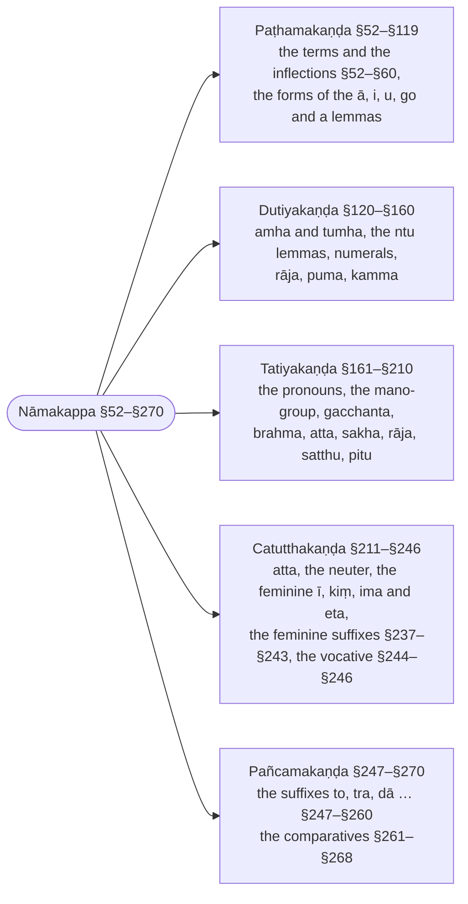
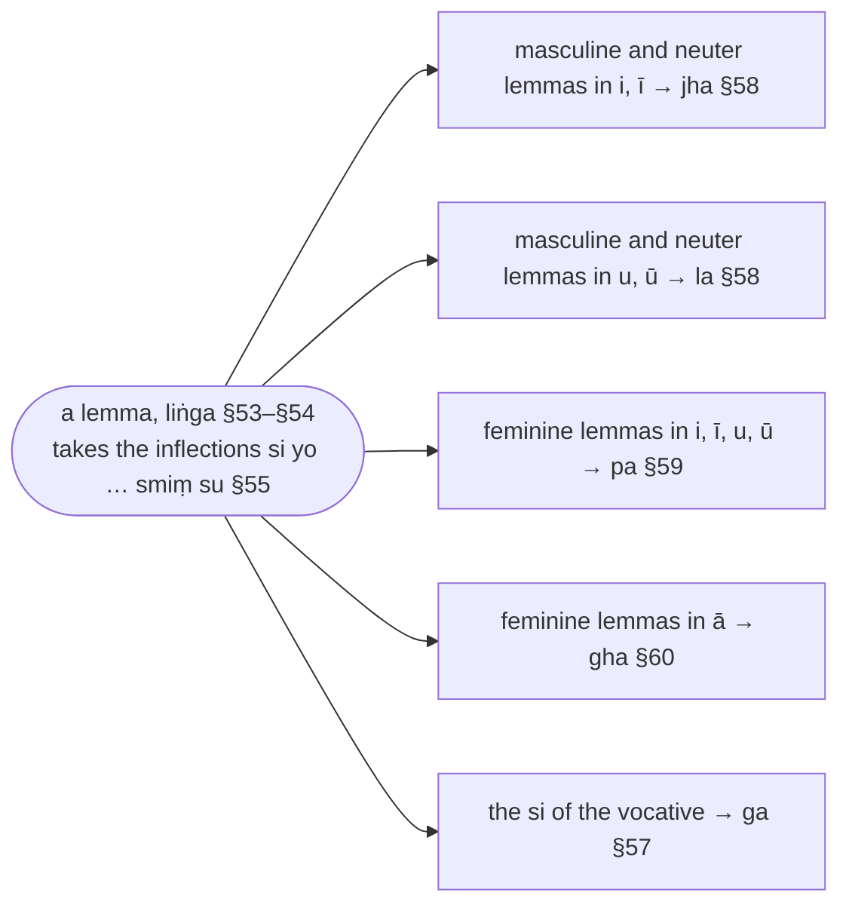

import { LinkCard } from "@astrojs/starlight/components";

:::note
`nāma` means "name" and in this text it is used to refer to "nouns". This chapter talks about the different types of nouns and how they are inflected to form words that are used in sentences.

The shape of inflection of nouns depend on their intrinsic characteristic (gender) and extrinsic characteristics (multiplicity, and inflection form).

The gender of a noun is represented by the following symbols:

| symbol | gender | meaning |
| ------ | ------ | ------- |
| 🚹 | pulliṅga  | masculine |
| 🚺 | itthiliṅga | feminine |
| 🚻 | napuṁsakaliṅga | neuter |
| ⚧️ | sabbaliṅga | genderless or all genders |

Nouns, when used in words, can denote multiplicity (singular or plural), through these symbols:

| symbol | multiplicity | meaning |
| ------ | ------ | ------- |
| ⨀ | ekavacana | singular |
| ⨂ | bahuvacana | plural |

Nouns, when used in words, can be in one of 7 inflection forms (see [§55 `Si yo, aṃ yo, nā hi, sa naṃ, smā hi, sa naṃ, smiṃ su`](#m55)):

| symbol | inflection form |
| :-: | --- |
| ① | `paṭhamā` ("first") |
| ② | `dutiyā` ("second") |
| ③ | `tatiyā` ("third") |
| ④ | `catutthī` ("fourth") |
| ⑤ | `pañcamī` ("fifth") |
| ⑥ | `chaṭṭhī` ("sixth") |
| ⑦ | `sattamī` ("seventh") |

For the remainder of this text, the inflection of a noun is symbolised using a pseudo-function notation. If *x* represents the lemma of a noun (it's base form), and *x* is masculine (🚹), singular (⨀), and in the first form (①), then the inflection of *x* will be denoted by:

🚹①⨀(*x*)

:::

:::note[The five sections of the noun chapter]
What each section of the Nāmakappa covers, with its sutta range.

:::

:::note[The letter names of the lemmas]
Kaccāyana names classes of lemmas by single syllables, which the rules then use as conditions.

:::

## Paṭhamakaṇḍa (First Section - Definitions, Internal morphology, Default inflections)

### §52 (60): Jinavacanayuttaṃ hi (Suitable for the teachings of the Conqueror) :badge[sīhagatika]{variant=caution}

> ‘‘Jinavacanayuttaṃ hi’’ iccetaṃ adhikāratthaṃ veditabbaṃ.

`Jinavacanayuttaṃ hi` should be understood as a governing rule.

:::note

This text is focused on describing the grammar and usage based on what is found in the Buddha's teachings.

:::

### §53 (61): Liṅgañca nippajjate (And lemmas are derived) :badge[sīhagatika]{variant=caution}

:::note[Definition]

`liṅgaṃ` (lemma) literally means "'a sign, an attribute, a mark". In this text, it is the "plain" or "base" form of a word (noun) that appears as an entry in a dictionary and is used to represent all the other possible forms. Each lemma in Pāḷi is also associated with a grammatical gender (also `liṅgaṃ` - hence `liṅgaṃ` refers to the lemma and its gender together).[^101]

:::

> Yathā yathā jinavacanayuttaṃ hi liṅgaṃ, tathā tathā idha liṅgañca nippajjate.

> Taṃ yathā? Eso no satthā, brahmā, attā, sakhā, rājā.

For whatever liṅgaṃ (lemmas and genders) that are [`Jinavacanayuttaṃ hi`](#m52) "suitable for the teachings of the Conqueror", then those liṅgaṃ are derived.[^74]

:::tip[Example]

The vutti's example is a whole sentence, every word of which — the pronouns `esa` and `amha` included — shows a lemma and gender fixed by the usage of the canon:

> `Eso no satthā, brahmā, attā, sakhā, rājā` \
🚹①⨀(eta) ⚧️⑥⨂(amha) 🚹①⨀(satthu) 🚹①⨀(brahma) 🚹①⨀(atta) 🚹①⨀(sakha) 🚹①⨀(rāja) \
this | our | teacher | the Creator | self | friend | king \
*This is our teacher, Brahmā, self, friend, king.*

:::

[^74]: The `ca` of the sutta is traditionally taken to reach beyond nouns: the Nyāsa (Mukhamattadīpanī) has it include the roots (`dhātu`), and the Rūpasiddhi, on §56, the verbs (`casaddena ākhyātañca nippajjate`), so that the whole vocabulary of the Jinavacana is settled by usage in the same way.

[^101]: Malai (1997) renders `liṅga` as "gender" throughout §53–§56 ("the gender is fixed"). The examples are nominal bases in their canonical shape (`satthu`, `brahma`, `rāja` …), and §54 adds the inflections "after the `liṅga`s", so `liṅga` here is the nominal lemma (Sanskrit `prātipadika`; the Rūpasiddhi on §9 glosses `liṅga` and `pada` together), of which gender is one property: "lemma (and its gender)" is kept, and Malai's "gender" is too narrow. Nandisena (2005) is not compared on this point.

---

### §54 (62): Tato ca vibhattiyo (And their inflections) :badge[sīhagatika]{variant=caution}

:::note[Definition]
A `vibhatti` is an inflection (or "word ending") that is applied as a suffix to the lemma, to form an inflected word that is used in a sentence.

:::

> Tato jinavacanayuttehi liṅgehi vibhattiyo parā honti.

There are `vibhattiyo` (inflections) following the lemmas that are [`Jinavacanayuttaṃ hi`](#m52) "suitable for the teachings of the Conqueror."

---

### §55 (63): Si yo, aṃ yo, nā hi, sa naṃ, smā hi, sa naṃ, smiṃ su (inflection forms) :badge[rūḷhī]{variant=note}

> Kā ca pana tāyo vibhattiyo?

> Si, yo iti paṭhamā,

> aṃ, yoiti dutiyā,

> nā hi iti tatiyā,

> sa, naṃiti catutthī,

> smā, hi iti pañcamī,

> sa, naṃ iti chaṭṭhī,

> smiṃ, su iti sattamī.

> Vibhattiiccanena kvattho?

> Amhassa mamaṃ savibhattissa se.

And what are those inflections? There are 14 terms representing the 7 inflection forms (with separate terms representing singular (⨀) or plural (⨂))

| symbol | ⨀ | ⨂ | inflection form |
| :-: | :-: | :-: | --- |
| ① | `si` | `yo` | `paṭhamā` ("first") |
| ② | `aṁ` | `yo` | `dutiyā` ("second") |
| ③ | `nā` | `hi` | `tatiyā` ("third") |
| ④ | `sa` | `naṁ` | `catutthī` ("fourth") |
| ⑤ | `smā` | `hi` | `pañcamī` ("fifth") |
| ⑥ | `sa` | `naṁ` | `chaṭṭhī` ("sixth") |
| ⑦ | `smiṁ` | `su` | `sattamī` ("seventh") |

Those inflections are attached to, and belong with, the words.

:::note

These are just the terms for the inflected forms, they may or may not actually represent the shape of the inflections, which can vary depending on usage and context. Some terms are shared and may not be distinguishable across inflection forms, for example `yo` is used as the plural inflected form for ① and ②, and similarly `hi` for the plural of ③ and ⑤, and `sa` for singular ④ and `naṁ` for plural ⑥.

:::

---

### §56 (64): Tadanuparodhena (Without contradicting them) :badge[sīhagatika]{variant=caution}

> Yathā yathā tesaṃ jinavacanānaṃ anuparodho, tathā tathā idha liṅgañca nippajjate.

In whatever way there is no contradiction (`anuparodha`) of those words of the Conqueror (the `jinavacana` of [§52 (60): Jinavacanayuttaṃ hi](#m52)), in that way the lemma is formed here — and, by `ca`, the verb as well.

:::note

`tad-anuparodhena` is "by not contradicting them": a lemma and its gender are formed exactly as the Buddha's words show them, so that the usage of the canon, and not the grammarian's rule, is the final authority — the principle behind the many variant forms this grammar goes on to record. The Rūpasiddhi reads the `ca` of the sutta as bringing the verbs (`ākhyāta`) under the same principle: `casaddena ākhyātañca nippajjate`.

:::

---

### §57 (71): Ālapane si ga sañño (for vocatives `si` is called `ga`) :badge[rūḷhī]{variant=note}

:::note[Definition]

For addressing someone (`ālapane`) by their proper name, honorific, title, or relationship, the lemmas are used with minimal inflection (although there may still be singular or plural forms).

:::

> Ālapanatthe si gasañño hoti.

> Bhoti ayye, \
> bhoti kaññe, \
> bhoti kharādiye.

> Ālapaneti kimatthaṃ?

> Sā ayyā.

> Sīti kimatthaṃ?

> Bhotiyo ayyāyo.

> Gaiccanena kvattho?

> Ghate ca.

In the sense of address (`ālapana`), the inflection `si` is given the name `ga`. The forms used for addressing are therefore:

| symbol | ⨀ | ⨂ | inflection form |
| :-: | :-: | :-: | --- |
| ⓪ | `si` (called `ga`) | `yo` | `ālapane` ("vocative") |

:::tip[Example]

`bhoti` is a polite or honorific way of addressing someone:

* `bhoti ayye` ("dear lady")
* `bhoti kaññe` ("dear girl")
* `bhoti kharādiye` ("dear Kharādiye")

:::

:::danger[Counter-example]

When referring to someone rather than addressing them, we use a different inflected form, for example:

* `Sā ayyā` (that lady)

:::

:::danger[Counter-example]
Why does the sutta say `si`? So that only the singular `si` receives the name `ga`; the plural of address keeps its own inflection `yo`, which is not called `ga`. For example:

* `Bhotiyo ayyāyo` ("dear ladies") — here the inflection is `yo`, not `si`

:::

:::tip[Purpose]
Why do we use the term `ga`? `ga` is used in the following rule:
<LinkCard title="§114 `Ghate ca`" href="#m114" description="And from `gha` words the `ga` inflection becomes `e`" />

:::

---

### §58 (29): Ivaṇṇuvaṇṇā jhalā (`jha`: `i`-words, `la`: `u`-words) :badge[rūḷhī]{variant=note}

> Ivaṇṇuvaṇṇāiccete jhalasaññā honti yathāsaṅkhyaṃ.

> Isino, aggino, gahapatino, daṇḍino.

> Setuno, ketuno, bhikkhuno.

> Sayambhuno, abhibhuno.

> Jhalaiccanena kvattho?

> Jhalato sassa no vā.

* `jha`: refers to `i`-words (lemmas ending with `i` and `ī`) that are not feminine — masculine (🚹) and neuter (🚻)
* `la`: refers to `u`-words (lemmas ending with `u` and `ū`) that are not feminine — 🚹 and 🚻

The vutti names the vowels without any gender. The feminine `i`- and `u`-words are taken out of `jha` and `la` and renamed `pa` by the next rule, [§59 (182): Te itthikhyā po](#m59); neuters such as `aṭṭhi` and `āyu` (see [§88 (147): Yosu katanikāralopesu dīghaṃ](#m88)) remain `jha` and `la` words.

:::tip[Examples]

| gender | term | lemma | meaning |
| ------ | ---- | ----- | ------- |
| 🚹 | jha | isi | sage |
| 🚹 | jha | aggi | fire |
| 🚹 | jha | gahapati | householder |
| 🚹 | jha | daṇḍī | staff-bearer |
| 🚹 | la | setu | bridge |
| 🚹 | la | ketu | flag |
| 🚹 | la | bhikkhu | beggar (monk) |
| 🚹 | la | sayambhū | creator |
| 🚹 | la | abhibhū | overlord |

:::

:::tip[Purpose]
<LinkCard title="§117 `Jhalato sassa no vā`" href="#m117" description="Optionally, `sa` becomes `no` after `jha`, `la` words" />

:::
---

### §59 (182): Te itthikhyā po (Those [sounds] are called `pa` for feminine words) :badge[rūḷhī]{variant=note}

> Te ivaṇṇuvaṇṇā yadā itthikhyā, tadā pasaññā honti.

> Rattiyā, itthiyā,

> dhenuyā, vadhuyā.

> Itthikhyāti kimatthaṃ?

> Isinā,

> bhikkhunā.

> Saiccanena kvattho?

> Pato yā.

`pa`: refers to feminine (🚺) `i`-words and `u`-words (lemmas ending with `i`, `ī`, `u` and `ū`)

:::tip[Examples]

| gender | term | lemma | meaning |
| ------ | ---- | ----- | ------- |
| 🚺 | pa | ratti | night |
| 🚺 | pa | itthī | woman |
| 🚺 | pa | dhenu | cow |
| 🚺 | pa | vadhū | daughter in law |

:::

:::danger[Counter-example]

`pa` differentiates these words from masculine words such as `isi` or `bhikkhu`.

:::

:::tip[Purpose]
`pa` is used in the following rule:
<LinkCard title="§112 `Pato yā`" href="#m112" description="`nā` etc. become `yā` after `pa` words" />

:::

---

### §60 (177): Ā gho (`gha`: feminine `ā`-words) :badge[rūḷhī]{variant=note}

> Ākāro yadā itthikhyo, tadā ghasañño hoti.

> Saddhāya, kaññāya, vīṇāya, gaṅgāya, disāya sālāya, mālāya, tulāya, dolāya, pabhāya, sobhāya, paññāya, karuṇāya nāvāya, kapālikāya.

> Āti kimatthaṃ?

> Rattiyā, itthiyā.

> Itthikhyoti kimatthaṃ?

> Satthārā desito ayaṃ dhammo.

> Ghaiccanena kvattho?

> Ghato nādīnaṃ.

`gha`: feminine (🚺) `ā`-words (lemmas ending with `ā`; no feminine lemma ends in short `a`, and the `ā` is shortened before certain inflections by [§66 (205): Gho rassaṃ](#m66))

:::tip[Examples]

| gender | term | lemma | meaning |
| ------ | ---- | ----- | ------- |
| 🚺 | gha | saddhā | faith |
| 🚺 | gha | kaññā | young girl |
| 🚺 | gha | vīṇā | lute |
| 🚺 | gha | gaṅgā | Ganges (river) |
| 🚺 | gha | disā | direction |
| 🚺 | gha | sālā | hall |
| 🚺 | gha | mālā | garland |
| 🚺 | gha | tulā | weight (measure) |
| 🚺 | gha | dolā | swing (palanquin) |
| 🚺 | gha | pabhā | radiance |
| 🚺 | gha | sobhā | splendour, beauty |
| 🚺 | gha | paññā | wisdom |
| 🚺 | gha | karuṇā | compassion |
| 🚺 | gha | nāvā | ship |
| 🚺 | gha | kapālikā | potsherd (small bowl) |

:::

:::danger[Counter-examples]

`gha` distinguishes `ā`-words from `pa` (`i`-words and `u`-words) eg. `ratti` and `itthi`.

`gha` also distinguishes feminine `ā`-words from masculine words ending in `ā` eg.

* `Satthārā desito ayaṃ dhammo.` \
  🚹③⨀(satthar) 🚹①⨀(desita) 🚹①⨀(ima) 🚹①⨀(dhamma) \
  by the Teacher | taught | this | dhamma \
  *This dhamma was taught by the Teacher.*

:::

:::tip[Purpose]
`gha` is used in the following rule:
<LinkCard title="§111 `Ghato nādīnaṃ`" href="#m111" description="`nā` etc. become `āya` after `gha` words" />

:::

---

### §61 (86): Sāgamo se (Before `sa` inflections: insert `s`) :badge[utsarga]{variant=success}

:::note[Analysis]

| option | before | from   | operation | to         | after  | context |
| ------ | ------ | ------ | --------- | ---------- | ------ | ------- |
|        |        |        | āgamo     | se         | sa     |         |
|        |        |        | insert    | `s` | `sa` inflections |      |

:::

> Sakārāgamo hoti se vibhattimhi.

> Purisassa, aggissa, isissa, daṇḍissa, bhikkhussa, sayambhussa, abhibhussa.

> Seti kimattaṃ?

> Purisasmiṃ.

`sa` inflection form (④ and ⑥): insert `s` before `sa`

* 🚹④⨀(*x*) = *x* + `s` + `sa` (where *x* is the lemma)
* 🚹⑥⨀(*x*) = *x* + `s` + `sa`

:::tip[Examples]

| lemma | inflected | meaning |
| ----- | --------- | ------- |
| 🚹④⨀(purisa) | purisassa | (for) man |
| 🚹⑥⨀(aggi) | aggissa | (of) fire |
| 🚹⑥⨀(daṇḍī) | daṇḍissa | (of) staff-bearer |
| 🚹④⨀(bhikkhu) | bhikkhussa | (for) bhikkhu |
| 🚹⑥⨀(sayambhū) | sayambhussa | (of) creator |
| 🚹④⨀(abhibhū) | abhibhussa | (for) overlord |

:::

:::danger[Counter-example]
`sa` inflection form is different from other inflection forms

| lemma | inflected | meaning |
| ----- | --------- | ------- |
| 🚹⑦⨀(purisa) | purisasmiṃ | (on) man |

:::

---

### §62 (206): Saṃsāsvekavacanesu ca (And in `saṃ`, `sā` singular inflections) :badge[utsarga]{variant=success}

:::note[Analysis]

| option | before | from   | operation | to         | after  | context |
| ------ | ------ | ------ | --------- | ---------- | ------ | ------- |
| ca     |        |        | (āgamo)   | (se) | saṃsāsvekavacanesu  |      |
| and    |        |  | (insert) | (`s`) | `saṃ`|`sā` inflections | |

:::

> Saṃsāsu ekavacanesu vibhattādesesu sakārāgamo hoti.

> Etissaṃ, etissā

> imissaṃ, imissā,

> tissaṃ, tissā,

> Tassaṃ tassā,

> yassaṃ, yassā,

> amussaṃ, amussā.

> Saṃsāsvīti kimatthaṃ?

> Agginā, pāṇinā.

> Ekavacanesvīti kimatthaṃ?

> Tāsaṃ, sabbāsaṃ.

> Vibhattādesesvīti kimatthaṃ?

> Manasā,

> vacasā,

> thāmasā.

In `saṃ` (⑦) and `sā` (⑥) singular inflections, there is insertion of `s`.

* 🚺⑦⨀(*x*∈`pa`∪`gha`) = *x* + `smiṁ` (§55) = *x* + `smiṁ→saṃ` (§179) = *x* + `s` + `saṃ` (§62) (*x*∈`pa`∪`gha` means x is in the set of `pa` or `gha` words)
* 🚺⑥⨀(*x*∈`pa`∪`gha`) = *x* + `sa` (§55) = *x* + `sa→sā` (§179) = *x* + `s` + `sā` (§62)

:::tip[Examples]

| lemma | inflected | meaning |
| ----- | --------- | ------- |
| 🚺⑦⨀(etā) | etissaṃ | (in) this |
| 🚺⑥⨀(etā) | etissā | (of) this |
| 🚺⑦⨀(imā) | imissaṃ | (in) this |
| 🚺⑥⨀(imā) | imissā | (of) this |
| 🚺⑦⨀(tā) | tissaṃ | (in) that |
| 🚺⑥⨀(tā) | tissā | (of) that |
| 🚺⑦⨀(tā) | tassaṃ | (in) that |
| 🚺⑥⨀(tā) | tassā | (of) that |
| 🚺⑦⨀(yā) | yassaṃ | (in) what |
| 🚺⑥⨀(yā) | yassā | (of) what |
| 🚺⑦⨀(amu) | amussaṃ | (in) such |
| 🚺⑥⨀(amu) | amussā | (of) such |

An example of a full derivation:

|     | 🚺⑦⨀(amu)      | rule |
| --- | --------------- | ---- |
| →   |amu + (smiṁ)     | §55  |
| →   |amu + (smiṁ→saṃ) | §179 |
| →   |amu + (s) + saṃ  | §62  |
| →   | **amussaṃ**     |      |

:::

:::danger[Counter-examples]

`saṃ` and `sā` are distinguished from other inflections, eg.

| lemma | inflected | meaning |
| ----- | --------- | ------- |
| 🚹③⨀(aggi) | agginā | (with) fire |
| 🚹⑤⨀(pāṇi) | pāṇinā | (from) palm |

By saying `ekavacanesu` we exclude plural `saṃ` and `sā` inflections, eg.

| lemma | inflected | meaning |
| ----- | --------- | ------- |
| 🚺⑥⨂(tā) | tāsaṃ | (of) those |
| 🚺④⨂(sabba) | sabbāsaṃ | (for) all |

By saying `vibhattādesesu` (in the replacements of inflections) the rule does not apply where the `sā` is not the replacement of an inflection: in the `mano`-group the `s` belongs to the lemma

| lemma | inflected | meaning |
| ----- | --------- | ------- |
| 🚹③⨀(mana) | manasā | (with) mind |
| 🚹③⨀(vaca) | vacasā | (with) speech |
| 🚹③⨀(thāma) | thāmasā | (with) strength |

:::

---

### §63 (217): Etimāsami (`etā`, `imā` endings become `i`) :badge[utsarga]{variant=success}

:::note[Analysis]

| option | before | from   | operation | to         | after  | context |
| ------ | ------ | ------ | --------- | ---------- | ------ | ------- |
| ca     |        | etā    | (pappoti) | eti  | (saṃsāsvekavacanesu) | |
| ca     |        | imā    | (pappoti) | imi  | (saṃsāsvekavacanesu) | |
| and    |        | `etā`  | (become)  | `eti`   | (`saṃ`\|`sā` inflections) | |
| and    |        | `imā`  | (become)  | `imi`   | (`saṃ`\|`sā` inflections) | |

:::

> Etāimāiccetesamanto saro ikāro hoti saṃsāsu ekavacanesu vibhattādesesu.

> Etissaṃ, etissā, imissaṃ, imissā.

> Saṃsāsvīti kimatthaṃ?

> Etāya, imāya.

> Ekavacanesvīti kimatthaṃ?

> Etāsaṃ, imāsaṃ.

The vowel endings of `etā` and `imā` become `i` in `saṃ` (⑦) and `sā` (⑥) singular inflections.

* 🚺⑦⨀(`etā`) = `etā→eti` (§63) = eti + `smiṁ` (§55) = eti + `smiṁ→saṃ` (§179) = eti + `s` + `saṃ` (§62) = etissaṃ
* 🚺⑥⨀(`etā`) = `etā→eti` (§63) = eti + `sa` (§55) = eti + `sa→sā` (§179) = eti + `s` + `sā` (§62) = etissā
* 🚺⑦⨀(`imā`) = `imā→imi` (§63) = imi + `smiṁ` (§55) = imi + `smiṁ→saṃ` (§179) = imi + `s` + `saṃ` (§62) = imissaṃ
* 🚺⑥⨀(`imā`) = `imā→imi` (§63) = imi + `sa` (§55) = imi + `sa→sā` (§179) = imi + `s` + `sā` (§62) = imissā

:::tip[Examples]

| lemma | inflected | meaning |
| ----- | --------- | ------- |
| 🚺⑦⨀(etā) | etissaṃ | (in) this |
| 🚺⑥⨀(etā) | etissā | (of) this |
| 🚺⑦⨀(imā) | imissaṃ | (in) this |
| 🚺⑥⨀(imā) | imissā | (of) this |

An example of a full derivation:

|     | 🚺⑦⨀(etā)           | rule |
| --- | -------------------- | ---- |
| →   | et + (ā→i)           | §63  |
| →   | et + i + (smiṁ)      | §55  |
| →   | et + i + (smiṁ→saṃ)  | §179 |
| →   | et + i + (s) + saṃ   | §62  |
| →   | **etissaṃ**          |      |

:::

:::danger[Counter-examples]

`saṃ` and `sā` are distinguished from other inflections, eg.

| lemma | inflected | meaning |
| ----- | --------- | ------- |
| 🚺③⨀(etā) | etāya | (with) this |
| 🚺③⨀(imā) | imāya | (with) this |

By saying `ekavacanesu` we exclude plural `saṃ` and `sā` inflections, eg.

| lemma | inflected | meaning |
| ----- | --------- | ------- |
| 🚺④⨂(etā) | etāsaṃ | (for) these |
| 🚺④⨂(imā) | imāsaṃ | (for) these |

:::

---

### §64 (216): Tassā vā (Optionally, for `tā`) :badge[apavada]{variant=success}

:::note[Analysis]

| option | before | from   | operation | to         | after  | context |
| ------ | ------ | ------ | --------- | ---------- | ------ | ------- |
| vā     |        | tā     | (pappoti) | (ti) | (saṃsāsvekavacanesu) | |
| optionally | | `tā` | (become) | (`ti`) | (`saṃ`\|`sā` inflections) | |

:::

> Tassā itthiyaṃ vattamānassa antassa ākārassa ikāro hoti vā saṃsāsu ekavacanesu vibhattādesesu.

> Tissaṃ, tissā, tassaṃ, tassā.

Optionally, for `tā` the ending `ā` become `i` in `saṃ` (⑦) and `sā` (⑥) singular inflections.

* 🚺⑦⨀(`tā`) = `tā→ti` (§64) = ti + `smiṁ` (§55) = ti + `smiṁ→saṃ` (§179) = ti + `s` + `saṃ` (§62) = tissaṃ
* 🚺⑥⨀(`tā`) = `tā→ti` (§64) = ti + `sa` (§55) = ti + `sa→sā` (§179) = ti + `s` + `sā` (§62) = tissā

:::tip[Examples]

| lemma | inflected | meaning |
| ----- | --------- | ------- |
| 🚺⑦⨀(tā) | tissaṃ | (in) that |
| 🚺⑥⨀(tā) | tissā | (of) that |
| 🚺⑦⨀(tā) | tassaṃ | (in) that |
| 🚺⑥⨀(tā) | tassā | (of) that |

:::

---

### §65 (215): Tato sassa ssāya (From those, of `sa` inflections there is `ssāya`) :badge[apavada]{variant=success}

:::note[Analysis]

| option | before | from   | operation | to         | after  | context |
| ------ | ------ | ------ | --------- | ---------- | ------ | ------- |
| (vā)   | tato   | sassa  | (pappoti) | ssāya      |        |         |
| (optionally) | (`etā`\|`imā`\|`tā`) | `sa` inflections | (change) | `ssāya` | |   |

:::

> Tato tā etā imāto sassa vibhattissa ssāyādeso hoti vā.

> Tissāya, etissāya, imissāya.

> Vāti kimatthaṃ?

> Tissā, etissā, imissā.

Optionally, for `tā`, `etā`, `imā` of `sa` (⑥) inflections, `sa` is changed to `ssāya`.

* 🚺⑥⨀(`tā`) = `tā→ti` (§64) = ti + `sa` (§55) = ti + `sa→ssāya` (§65) = tissāya
* 🚺⑥⨀(`etā`) = `etā→eti` (§63) = eti + `sa` (§55) = eti + `sa→ssāya` (§65) = etissāya
* 🚺⑥⨀(`imā`) = `imā→imi` (§63) = imi + `sa` (§55) = imi + `sa→ssāya` (§65) = imissāya

:::tip[Examples]

| lemma | inflected | meaning |
| ----- | --------- | ------- |
| 🚺⑥⨀(tā) | tissāya | (of) that |
| 🚺⑥⨀(etā) | etissāya | (of) this |
| 🚺⑥⨀(imā) | imissāya | (of) this |

:::

:::danger[Counter-examples]

This rule is optional, so rule [§62 `Saṃsāsvekavacanesu ca`](#m62) can also be applied, eg.

| lemma | inflected | meaning |
| ----- | --------- | ------- |
| 🚺⑥⨀(tā) | tissā | (of) that |
| 🚺⑥⨀(etā) | etissā | (of) this |
| 🚺⑥⨀(imā) | imissā | (of) this |

:::

---

### §66 (205): Gho rassaṃ (`gha` becomes short) :badge[apavada]{variant=success}

:::note[Analysis]

| option | before | from   | operation | to         | after  | context |
| ------ | ------ | ------ | --------- | ---------- | ------ | ------- |
| (vā)   | gho    | (`ā`)  | rassaṃ   | (`a`) | (saṃsāsvekavacanesu) | |
| (optionally) | `gha` words | (`ā`) | shorten | (`a`) | (`saṃ`\|`sā` inflections) | |

:::

> Gho rassamāpajjate saṃsāsu ekavacanesu vibhattādesesu.

> Tassaṃ, tassā, yassaṃ, yassā, sabbassaṃ, sabbassā.

> Saṃsāsvīti kimatthaṃ?

> Tāya, sabbāya.

> Ekavacanesvīti kimatthaṃ?

> Tāsaṃ, sabbāsaṃ.

The vowel endings of `gha` (`ā`-words) are shortened (ie. become `a`) in `saṃ` (⑦) and `sā` (⑥) singular inflections.

* 🚺⑦⨀(*x*∈`gha`) = *x*(`ā→a`) (§66) = *x*(`ā→a`) + `smiṁ` (§55) = *x*(`ā→a`) + `smiṁ→saṃ` (§179) = *x*(`ā→a`) + `s` + `saṃ` (§62) = *x*(`ā→a`) + ssaṃ
* 🚺⑥⨀(*x*∈`gha`) = *x*(`ā→a`) (§66) = *x*(`ā→a`) + `sa` (§55) = *x*(`ā→a`) + `sa→sā` (§179) = *x*(`ā→a`) + `s` + `sā` (§62) = *x*(`ā→a`) + sā

:::tip[Examples]

| lemma | inflected | meaning |
| ----- | --------- | ------- |
| 🚺⑦⨀(tā) | tassaṃ | (in) that |
| 🚺⑥⨀(tā) | tassā | (of) that |
| 🚺⑦⨀(yā) | yassaṃ | (in) what |
| 🚺⑥⨀(yā) | yassā | (of) what |
| 🚺⑦⨀(sabbā) | sabbassaṃ | (in) all |
| 🚺⑥⨀(sabbā) | sabbassā | (of) all |

An example of a full derivation:

|     | 🚺⑦⨀(tā)       | rule |
| --- | --------------- | ---- |
| →   | t + (ā→a)       | §66  |
| →   | ta + (smiṁ)     | §55  |
| →   | ta + (smiṁ→saṃ) | §179 |
| →   | ta + (s) + saṃ  | §62  |
| →   | **tassaṃ**      |      |

:::

:::danger[Counter-examples]

By saying `ekavacanesu` we exclude plural `saṃ` (⑦) and `sā` (⑥) inflections, eg.

| lemma | inflected | meaning |
| ----- | --------- | ------- |
| 🚺⑥⨂(tā) | tāsaṃ | (of) those |
| 🚺④⨂(sabba) | sabbāsaṃ | (for) all |

:::

---

### §67 (229): No ca dvādito naṃmhi (And for [numbers] such as `dvi` (2) etc. there is `n` before `naṃ` inflections) :badge[apavada]{variant=success}

:::note[Analysis]

| option | before | from   | operation | to         | after  | context |
| ------ | ------ | ------ | --------- | ---------- | ------ | ------- |
|        | dvādito |       | (āgamo)   | `n`        | naṃmhi |         |
| ca     | dvādito |       | (āgamo)   | `ssa`      | naṃmhi |         |
|        | `dvi` etc. | | (insert) | `n`     | `naṃ` inflections | |
| also   | `dvi` etc. | | (insert) | `ssa`   | `naṃ` inflections | |

There is no option marker: `dvinnaṃ`, `tinnaṃ` and the rest are the only forms. The `ca` adds a second insertion, `ssa`, which comes in beside the `n` (not instead of it) in the feminine `catassannaṃ`, `tissannaṃ`.

:::

> Dviiccevamādito saṅkhyāto nakārāgamo hoti naṃmhi vibhattimhi.

> Dvinnaṃ, tinnaṃ, catunnaṃ, pañcannaṃ, channaṃ, sattannaṃ, aṭṭhannaṃ, navannaṃ, dasannaṃ.

> Dvāditoti kimatthaṃ?

> Sahassānaṃ.

> Naṃmhīti kimatthaṃ?

> Dvīsu, tīsu.

> Caggahaṇenassañcāgamo hoti.

> Catassannaṃ itthīnaṃ tissannaṃ vedanānaṃ.

For numbers such as `dvi` (2) etc. `n` is inserted before `naṃ` (④ and ⑥ plural inflections). Note numbers are always plural and can assume any gender in Pāḷi grammar.

* ⚧️④⨂(*x*>1) = *x* + `naṃ` (§55) = *x* + `n` + `naṃ` (§67) = *x* + `nnaṃ`

:::tip[Examples]

| lemma | inflected | meaning |
| ----- | --------- | ------- |
| ⚧️⑥⨂(dvi) | dvinnaṃ | (of) 2 |
| ⚧️⑥⨂(ti) | tinnaṃ | (of) 3 |
| ⚧️⑥⨂(catu) | catunnaṃ | (of) 4 |
| ⚧️⑥⨂(pañca) | pañcannaṃ | (of) 5 |
| ⚧️⑥⨂(cha) | channaṃ | (of) 6 |
| ⚧️⑥⨂(satta) | sattannaṃ | (of) 7 |
| ⚧️⑥⨂(aṭṭha) | aṭṭhannaṃ | (of) 8 |
| ⚧️⑥⨂(nava) | navannaṃ | (of) 9 |
| ⚧️⑥⨂(dasa) | dasannaṃ | (of) 10 |

:::

:::danger[Counter-examples]

By saying `dvādito` (from `dvi` etc.) the rule does not apply to `sahassa`, which is not counted among the numerals `dvi` to `dasa`.

| lemma | inflected | meaning |
| ----- | --------- | ------- |
| ⚧️⑥⨂(sahassa) | sahassānaṃ | (of) 1000 |

By saying `naṃmhi` the rule does not apply to other inflections.

| lemma | inflected | meaning |
| ----- | --------- | ------- |
| ⚧️⑦⨂(dvi) | dvīsu | (in) 2 |
| ⚧️⑦⨂(ti) | tīsu  | (in) 3  |

:::

:::note[Additional]

By saying `ca` (also), `ssa` is inserted as well, in front of the `n`; the forms keep the double `nn`.

* 🚺④⨂(*x*) = *x* + `naṃ` (§55) = *x* + `n` + `naṃ` (§67) = *x* + `ssa` + `nnaṃ` (§67, by `ca`) = *x* + `ssannaṃ`

| lemma | inflected | meaning |
| ----- | --------- | ------- |
| 🚺⑥⨂(catu) | catassannaṃ itthīnaṃ | (of) the four women |
| 🚺⑥⨂(ti) | tissannaṃ vedanānaṃ | (of) the three feelings |

:::

---

### §68 (184): Amā pato smiṃsmānaṃ vā (`aṃ`, `ā` from `smiṃ`, `smā` [inflections] of `pa` [words]) :badge[apavada]{variant=success}

:::note[Analysis]

| option | before | from   | operation | to         | after  | context |
| ------ | ------ | ------ | --------- | ---------- | ------ | ------- |
| (vā)   | pato   | `smiṃ` | ādeso     | `aṃ`       |        |         |
| (vā)   | pato   | `smā`  | ādeso     | `ā`        |        |         |
| (optionally) | `pa` words | `smiṃ`   | replace | `aṃ` |      |         |
| (optionally) | `pa` words | `smā`    | replace | `ā`  |      |         |

:::

> Paiccetasmā smiṃsmāiccetesaṃ aṃāādesā honti vā yathāsaṅkhyaṃ.

> Matyaṃ, matiyaṃ, matyā, matiyā,

> nikatyaṃ, nikatiyaṃ, nikatyā, nikatiyā,

> vikatyaṃ, vikatiyaṃ, vikatyā, vikatiyā,

> viratyaṃ, viratiyaṃ, viratyā, viratiyā,

> ratyaṃ, ratiyaṃ, ratyā, ratiyā,

> puthabyaṃ, puthaviyaṃ, puthabyā, puthaviyā,

> pavatyaṃ, pavatyā, pavattiyaṃ, pavattiyā.

Optionally, there is replacement of `aṃ`, `ā` from `pa` word `smiṃ` (⑦) and `smā` (⑤) inflection forms in that order.

* 🚺⑦⨀(*x*∈`pa`) = *x* + `smiṃ` (§55) = *x* + `smiṃ→aṃ` (§68) = *x* + `aṃ`
* 🚺⑤⨀(*x*∈`pa`) = *x* + `smā` (§55) = *x* + `smā→ā` (§68) = *x* + `ā`

:::tip[Examples]

| lemma | inflected | meaning |
| ----- | --------- | ------- |
| 🚺⑦⨀(mati) | matyaṃ | (in) wisdom |
| 🚺⑦⨀(mati) | matiyaṃ | (in) wisdom |
| 🚺⑤⨀(mati) | matyā | (from) wisdom |
| 🚺⑤⨀(mati) | matiyā | (from) wisdom |
| 🚺⑦⨀(nikati) | nikatyaṃ | (in) fraud |
| 🚺⑦⨀(nikati) | nikatiyaṃ | (in) fraud |
| 🚺⑤⨀(nikati) | nikatyā | (from) fraud |
| 🚺⑤⨀(nikati) | nikatiyā | (from) fraud |
| 🚺⑦⨀(vikati) | vikatyaṃ | (in) change |
| 🚺⑦⨀(vikati) | vikatiyaṃ | (in) change |
| 🚺⑤⨀(vikati) | vikatyā | (from) change |
| 🚺⑤⨀(vikati) | vikatiyā | (from) change |
| 🚺⑦⨀(virati) | viratyaṃ | (in) abstinence |
| 🚺⑦⨀(virati) | viratiyaṃ | (in) abstinence |
| 🚺⑤⨀(virati) | viratyā | (from) abstinence |
| 🚺⑤⨀(virati) | viratiyā | (from) abstinence |
| 🚺⑦⨀(rati) | ratyaṃ | (in) enjoyment |
| 🚺⑦⨀(rati) | ratiyaṃ | (in) enjoyment |
| 🚺⑤⨀(rati) | ratyā | (from) enjoyment |
| 🚺⑤⨀(rati) | ratiyā | (from) enjoyment |
| 🚺⑦⨀(puthavī) | puthabyaṃ | (in) earth |
| 🚺⑦⨀(puthavī) | puthaviyaṃ | (in) earth |
| 🚺⑤⨀(puthavī) | puthabyā | (from) earth |
| 🚺⑤⨀(puthavī) | puthaviyā | (from) earth |
| 🚺⑦⨀(pavatti) | pavatyaṃ | (in) happening |
| 🚺⑦⨀(pavatti) | pavattiyaṃ | (in) happening |
| 🚺⑤⨀(pavatti) | pavatyā | (from) happening |
| 🚺⑤⨀(pavatti) | pavattiyā | (from) happening |

:::

---

### §69 (186): Ādito o ca (And `o` from `ādi`) :badge[apavada]{variant=success}

:::note[Analysis]

| option | before | from   | operation | to         | after  | context |
| ------ | ------ | ------ | --------- | ---------- | ------ | ------- |
| ca     | Ādito  | (smiṃ)   | (ādeso)  | (aṃ)      |        |         |
| ca     | Ādito  | (smiṃ)   | (ādeso)  | o         |        |         |
| ca     | aññasmāpi | (smiṃ) | (ādeso) | (ā)       |        |         |
| ca     | aññasmāpi | (smiṃ) | (ādeso) | (o)       |        |         |
| ca     | aññasmāpi | (smiṃ) | (ādeso) | (aṃ)      |        |         |
| and    | `ādi`  | (`smiṃ`) | (change) | (`aṃ`)    |        |         |
| and    | `ādi`  | (`smiṃ`) | (change) | `o`       |        |         |
| and    | others | (`smiṃ`) | (change) | (`ā`)     |        |         |
| and    | others | (`smiṃ`) | (change) | (`o`)     |        |         |
| and    | others | (`smiṃ`) | (change) | (`aṃ`)    |        |         |

:::

> Ādiiccetasmā smiṃvacanassa aṃoādesā honti vā.

> Ādiṃ[^75], ādo.

> Vāti kimatthaṃ?

> Ādismiṃ, ādimhi nāthaṃ namassitvāna,

> Caggahaṇena aññasmāpi smiṃ vacanassa ā o aṃādesā honti.

> Divā ca ratto ca haranti ye bali.

> Bārāṇasiṃ ahu rājā.

Optionally, there is replacement of `aṃ`, `o` from `ādi` for `smiṃ` (⑦) inflection forms.

* 🚹⑦⨀(`ādi`) = `ādi` + `smiṃ` (§55) = `ādi` + `smiṃ→aṃ` (§69) = `ād` + (`i` + ~~`a`~~) + `ṃ` (§13) = `ādiṃ`
* 🚹⑦⨀(`ādi`) = `ādi` + `smiṃ` (§55) = `ādi` + `smiṃ→o` (§69) = `ād` + (`~~i~~` + `o`) (§12) = `ādo`

:::tip[Examples]

| lemma | inflected | meaning |
| ----- | --------- | ------- |
| 🚹⑦⨀(ādi) | ādiṃ | (at) first |
| 🚹⑦⨀(ādi) | ādo | (at) first |

:::

:::danger[Counter-examples]

By saying `vā` we exclude other transformations, eg.

| lemma | inflected | meaning |
| ----- | --------- | ------- |
| 🚹⑦⨀(ādi) | ādismiṃ | (at) first |
| 🚹⑦⨀(ādi) | ādimhi nāthaṃ namassitvāna | having venerated the protector at first |

:::

:::note[Additional]

By saying `ca` (and), after other words as well the `smiṃ` (⑦) inflection is replaced by `ā`, `o` and `aṃ`; `smā` is not involved, and `divā` is a form of the seventh, "by day", parallel to `ratto` "by night".

* 🚹⑦⨀(*x*) = *x* + `smiṃ` (§55) = *x* + `smiṃ→ā` (§69) = *x* + `ā`
* 🚺⑦⨀(*x*) = *x* + `smiṃ` (§55) = *x* + `smiṃ→o` (§69) = *x* + `o`
* 🚺⑦⨀(*x*) = *x* + `smiṃ` (§55) = *x* + `smiṃ→aṃ` (§69) = *x* + `aṃ`

> `Divā ca ratto ca haranti ye bali.` \
> [(18Kh 6: Ratanasutta)](https://tipitaka2500.github.io/tipitaka/18Kh/6#46) \
🚹⑦⨀(diva) 🔼(ca) 🚺⑦⨀(ratti) 🔼(ca) ▶️🤟⨂(harati) 🚹①⨂(ya) 🚹②⨀(bali) \
by day | and | by night | and | they carry | those who | religious offering

| lemma | inflected | meaning |
| ----- | --------- | ------- |
| 🚹⑦⨀(diva) | divā | (by) day |
| 🚺⑦⨀(ratti) | ratto | (by) night |

🚺⑦⨀(bārāṇasī) ⏮🤟⨀(ahosi) 🚹①⨀(rāja) \
at Bārāṇasī | was | king

| lemma | inflected | meaning |
| ----- | --------- | ------- |
| 🚺⑦⨀(bārāṇasī) | bārāṇasiṃ | (at) Bārāṇasī |

:::

[^75]: CST4 prints `Ādīṃ`; the canonical spelling is `ādiṃ`, the `i` staying short once the `a` of `aṃ` is elided by §13.

---

### §70 (30): Jhalānamiyuvā sare vā (Optionally, `iya`, `uva` for `jha`, `la` before vowel) :badge[apavada]{variant=success}

:::note[Analysis]

| option | before | from   | operation | to         | after  | context |
| ------ | ------ | ------ | --------- | ---------- | ------ | ------- |
| vā     | jhanaṃ | (`i`\|`ī`)  | (ādeso)   | `iy`   | sare   |        |
| vā     | lānaṃ  | (`u`\|`ū`)  | (ādeso)   | `uv`   | sare   |        |
| vā     | (jhanaṃ) | (`i`\|`ī`)  | (ādeso) | (`ay`) | (sare) |        |
| optionally | `jha` words | (`i`\|`ī`) | (replace) | `iy`     | vowel   | |
| optionally | `lā` words  | (`u`\|`ū`) | (replace) | `uv`     | vowel   | |
| optionally | (`jha` words) | (`i`\|`ī`) | (replace) | (`ay`) | (vowel) | |

:::

> Jhalaiccetesaṃ iya uvaiccete ādesā honti vā sare pare yathāsaṅkhyaṃ.

> Tiyantaṃ pacchiyāgāre,

> aggiyāgāre,

> bhikkhuvāsane nisīdati,

> puthuvāsane[^1] nisīdati.

[^1]: CST4 misspells this as `vuthuvāsane`.

> Sareti kimatthaṃ?

> Timalaṃ, tiphalaṃ, ticatukkaṃ, tidaṇḍaṃ, tilokaṃ, tinayanaṃ, tipāsaṃ, tihaṃsaṃ, tibhavaṃ, tikhandhaṃ, tipiṭakaṃ, tivedanaṃ, catuddisaṃ, puthubhūtaṃ.

> Vāti kimatthaṃ?

> Pañcahaṅgehi, tīhākārehi, cakkhāyatanaṃ.

> Vāti vikappanatthaṃ, ikārassa ayādeso hoti,

> vatthuttayaṃ.

Optionally, for `jha` and `la` words, `iy` and `uv` can replace [the vowel endings] before a vowel, in that sequence.

:::tip[Examples]

| lemma | inflected | meaning |
| ----- | --------- | ------- |
| 🚻①⨀(ti + anta)  | tiyantaṃ | three ends |
| 🚻⑦⨀(pacchi + āgāra)  | pacchiyāgāre | (at) woven basket house |
| 🚻⑦⨀(aggi + āgāra)  | aggiyāgāre | (at) sacrificial room |
| 🚻⑦⨀(bhikkhu + āsana)  | bhikkhuvāsane nisīdati | he sits on bhikkhu's seat |
| 🚻⑦⨀(puthu + āsana)  | puthuvāsane nisīdati | he sits on wide seat |

:::

:::danger[Counter-examples]

By saying `sare` the rule does not apply when followed by a consonant, eg.

| lemma | inflected | meaning |
| ----- | --------- | ------- |
| 🚻①⨀(ti + mala)  | timalaṃ | three impurities |
| 🚻①⨀(ti + phala)  | tiphalaṃ | three fruits |
| 🚻①⨀(ti + catukka)  | ticatukkaṃ | three four-fold |
| 🚻①⨀(ti + daṇḍa)  | tidaṇḍaṃ | tripod |
| 🚻①⨀(ti + loka)  | tilokaṃ | three worlds |
| 🚻①⨀(ti + nayana)  | tinayanaṃ | three eyes |
| 🚹②⨀(ti + pāsa)  | tipāsaṃ | three loops |
| 🚹②⨀(ti + haṃsa)  | tihaṃsaṃ | three swans |
| 🚹②⨀(ti + bhava)  | tibhavaṃ | three existences |
| 🚹②⨀(ti + khandha)  | tikhandhaṃ | three bundles |
| 🚻①⨀(ti + piṭaka)  | tipiṭakaṃ | three baskets |
| 🚺②⨀(ti + vedanā)  | tivedanaṃ | three feelings |
| 🚻①⨀(catu + disa)  | catuddisaṃ | four directions |
| 🚻①⨀(puthu + bhūta)  | puthubhūtaṃ | widely spread |

As the rule is optional, there are exceptions:

|     | pañcahi + aṅgehi (with 5 limbs)    | rule |
| --- | ---------------------------------- | ---- |
| →   | pañca + (h + i) + (a + ṅ) + gehi   | §10  |
| →   | pañca + h + (~~i~~ + a) + ṅ + gehi | §12  |
| →   | pañca + (h +  a + ṅ) + gehi        | §11  |
| →   | **pañcahaṅgehi**                   |      |

|     | tīhi + ākārehi (in three ways) | rule |
| --- | ------------------------------ | ---- |
| →   | tī + (h + i) + (ā) + kārehi    | §10  |
| →   | tī + h + (~~i~~ + ā) + kārehi  | §12  |
| →   | tī + (h + ā) + kārehi          | §11  |
| →   | **tīhākārehi**                 |      |

|     | cakkhu + āyatanaṃ (sight)        | rule |
| --- | -------------------------------- | ---- |
| →   | cak + (kh + u) + (ā) + yatanaṃ   | §10  |
| →   | cak + kh + (~~u~~ + ā) + yatanaṃ | §12  |
| →   | cak + (kh + ā) + yatanaṃ         | §11  |
| →   | **cakkhāyatanaṃ**                |      |

:::

:::note[Additional]

As an alternative, the `i` ending is replaced with `aya`.

| lemma | inflected | meaning |
| ----- | --------- | ------- |
| 🚻①⨀(vatthu + ti)  | vatthuttayaṃ | three bases |

:::

---

### §71 (505): Yavakārā ca (and [`jha`, `la` become] `y`, `v` before a vowel) :badge[apavada]{variant=success}

:::note[Analysis]

| option | before | from   | operation | to         | after  | context |
| ------ | ------ | ------ | --------- | ---------- | ------ | ------- |
| ca     | (`jha`) | (`i`\|`ī`) | (ādeso) | `y`     | (sare) |         |
| ca     | (`la`)  | (`u`\|`ū`) | (ādeso) | `v`     | (sare) |         |
| and    | (`jha` words) | (`i`\|`ī`) | (replace) | `y` | (vowel) |    |
| and    | (`la` words)  | (`u`\|`ū`) | (replace) | `v` | (vowel) |    |

:::

> Jhalānaṃ yakāra vakārādesā honti sare pare yathāsaṅkhyaṃ.

> Agyāgāraṃ, cakkhvāyatanaṃ[^76], svāgataṃ, te mahāvīra.

> Caggahaṇaṃ sampiṇḍanatthaṃ.

Optionally, for `jha` and `la` words, `y` and `v` can replace [the vowel endings] before a vowel, in that sequence. This rule is grouped with the previous rule.

:::tip[Examples]

| lemma | inflected | meaning |
| ----- | --------- | ------- |
| 🚻①⨀(aggi + āgāra)  | agyāgāraṃ | fire house |
| 🚻①⨀(cakkhu + āyatana)  | cakkhvāyatanaṃ | eye-base |
| 🚻①⨀(su + āgataṃ)  | svāgataṃ, te mahāvīra | Welcome to you, Great Hero |

:::

[^76]: CST4 prints `pakkhāyatanaṃ`, a misprint for `cakkhvāyatanaṃ` (`cakkhu` + `āyatanaṃ`, the eye-base of the Dhammasaṅgaṇī) betrayed by the CST itself, which prints `cakkhāyatanaṃ` for the same word among the counter-examples of §70. Senart's edition reads `cakkhv āyatanaṃ`, and the manuscripts Malai cites (his sigla T, B1, S1, S2) all have `cakkhu` + `āyatanaṃ`, B1 without the `v` (`cakkh'āyatanaṃ`). Malai (1997) keeps `cakkhvāyatanaṃ` as the form that shows this rule; Nandisena (2005) reads `cakkhāyatanaṃ`, the `u` become `v` by this rule and the `v` then lost. The two translators thus agree on the word against CST4 and differ only over the `v`; Malai's form is adopted here.

---

### §72 (185): Pasaññassa ca (And for `pa`) :badge[apavada]{variant=success}

:::note[Analysis]

| option | before | from   | operation | to         | after  | context |
| ------ | ------ | ------ | --------- | ---------- | ------ | ------- |
| ca     | pasaññassa | (`i`\|`ī`) | (ādeso) | (`y`) | (sare) |        |
| and    | `pa` words | (`i`\|`ī`) | (ādeso) | (`y`) | (vowel) |       |

:::

> Pasaññassa ca ivaṇṇassa vibhattādese sare pare yakārādeso hoti.

> Puthabyā, ratyā, matyā.

> Sareti kimatthaṃ? Puthaviyaṃ.

And for inflections of `pa` words ending in `i`, `y` can replace [`i`] before a vowel.

:::tip[Examples]

| lemma | inflected | meaning |
| ----- | --------- | ------- |
| 🚺⑤⨀(puthavī) | puthabyā | (from) earth |
| 🚺⑤⨀(ratti) | ratyā | (from) night |
| 🚺⑤⨀(mati) | matyā | (from) wisdom |

:::

:::danger[Counter-example]

By saying `sare` we exclude `pa` words before non-vowels, eg.

| lemma | inflected | meaning |
| ----- | --------- | ------- |
| 🚺⑦⨀(puthavī) | puthaviyaṃ | (in) earth |

:::

---

### §73 (174): Gāva se (`go` to `gāva` before `s`) :badge[apavada]{variant=success}

:::note[Analysis]

| option | before | from   | operation | to         | after  | context |
| ------ | ------ | ------ | --------- | ---------- | ------ | ------- |
| (ca)   | `g`    | `o`    | (ādeso)   | `āva`      | se     |         |
| (and)  | `g`    | `o`    | (change)  | `āva`    | `sa` inflections | |

:::

> Goiccetassa okārassa āvādeso hoti se vibhattimhi.

> Gāvassa.

From [lemmas ending with] `go` the `o` is replaced with `āva` before `sa` inflections.

* 🚹⑥⨀(`go`) = `go` + `sa` (§55) = `g` + `o→āva` + `sa` (§73) = `g` + `āva` + `s` + `sa` (§61) = gāvassa

:::tip[Example]

| lemma | inflected | meaning |
| ----- | --------- | ------- |
| 🚹⑥⨀(go) | gāvassa | (of) cow |

:::

---

### §74 (169): Yosu ca (And in `yo` inflections) :badge[apavada]{variant=success}

:::note[Analysis]

| option | before | from   | operation | to         | after  | context |
| ------ | ------ | ------ | --------- | ---------- | ------ | ------- |
| (ca)   | (`g`)  | (`o`)  | (ādeso)   | (`āva`)    | yosu   |         |
| (and)  | (`g`)  | (`o`)  | (change)  | (`āva`)  | `yo` inflections | |

:::

> Goiccetassa okārassa āvādeso hoti yoiccetesu paresu.

> Gāvo gacchanti, gāvo passanti,

> gāvī gacchanti,gāvī passanti.

> Caggahaṇaṃ kimatthaṃ?

> Nāsmāsmiṃsu vacanesu āvā deso hoti.

> Gāvena, gāvā, gāve, gāvesu.

For [lemmas ending with]`go` the `o` is replaced with `āva` when followed by a `yo` (plural ① and ②) inflection forms.

* 🚹①⨂(`go`) = `go` + `yo` (§55) = `g` + `o→āva` + `yo` (§74) = gāvo
* 🚹②⨂(`go`) = `go` + `yo` (§55) = `g` + `o→āva` + `yo` (§74) = gāvī

:::tip[Examples]

| lemma | inflected | meaning |
| ----- | --------- | ------- |
| 🚹①⨂(go) | gāvo gacchanti | cows wander |
| 🚹②⨂(go) | gāvo passanti | they see cows |
| 🚹①⨂(go) | gāvī gacchanti | cows go |
| 🚹②⨂(go) | gāvī passanti | they see cows |

:::

:::danger[Counter-examples]

By saying `ca` the replacements can happen in other inflection forms such as `nā`, `smā`, `smiṃ`, eg.

| lemma | inflected | meaning |
| ----- | --------- | ------- |
| 🚹③⨀(go) | gāvena | (with) cow |
| 🚹⑤⨀(go) | gāvā | (from) cow |
| 🚹⑦⨀(go) | gāve | (on) cow |
| 🚹⑦⨂(go) | gāvesu | (in) cows |

:::

---

### §75 (170): Avamhi ca (And for `aṃ` inflections) :badge[apavada]{variant=success}

:::note[Analysis]

| option | before | from   | operation | to         | after  | context |
| ------ | ------ | ------ | --------- | ---------- | ------ | ------- |
| (ca)   | (`g`)  | (`o`)  | (ādeso) | (`āva`)\|`ava` | aṃmhi |        |
| (ca)   | (`g`)  | (`o`)  | (ādeso) | (`ava`) | sādisesesu pubbuttavacanesu | |
| (and)  | (`g`)  | (`o`)  | (change)  | (`āva`)\|`ava`  | `aṃ` inflections | |
| (and)  | (`g`)  | (`o`)  | (change)  | `ava`  | other inflections such as `si` | |

:::

> Goiccetassa okārassa āvaavaiccete ādesā honti aṃmhi vibhattimhi.

> Gāvaṃ, gavaṃ.

> Caggahaṇena sādisesesu pubbuttavacanesu goiccetassa okārassa avādeso hoti.

> Gavassa, gavo, gavena, gavā, gave, gavesu.

For [lemmas ending with]`go` the `o` is replaced with `āva`, `ava` when followed by a `aṃ` (singular ②) inflection form.

* 🚹②⨀(`go`) = `go` + `aṃ` (§55) = `g` + `o→āva` + `aṃ` (§75) = `g` + `āv` + (~~`a`~~ + `a`) + `ṃ` (§12) = gāvaṃ
* 🚹②⨀(`go`) = `go` + `aṃ` (§55) = `g` + `o→ava` + `aṃ` (§75) = `g` + `av` + (~~`a`~~ + `a`) + `ṃ` (§12) = gavaṃ

:::tip[Examples]

| lemma | inflected | meaning |
| ----- | --------- | ------- |
| 🚹②⨀(go) | gāvaṃ | [object] cow |
| 🚹②⨀(go) | gavaṃ | [object] cow |

:::

:::note[Additional]

By saying `ca`, the replacements are applicable for previously mentioned inflection forms such as `si` etc. (eg. `sā`, `smā`, `smiṃ` etc.)

:::

:::tip[Examples]

| lemma | inflected | meaning |
| ----- | --------- | ------- |
| 🚹⑥⨀(go) | gavassa | [of] cow |
| 🚹①⨂(go) | gavo | cows |
| 🚹③⨀(go) | gavena | (with) cow |
| 🚹⑤⨀(go) | gavā | (from) cow |
| 🚹⑦⨀(go) | gave | (on) cow |
| 🚹⑦⨂(go) | gavesu | (on) cows |

:::

---

### §76 (171): Āvassu vā (Optionally, from `āva` to `u`) :badge[apavada]{variant=success}

:::note[Analysis]

| option | before | from   | operation | to         | after  | context |
| ------ | ------ | ------ | --------- | ---------- | ------ | ------- |
| vā     | (`g`)  | `āva`  | (ādeso)   | (`āvu`)    | (aṃmhi) |        |
| optionally | (`g`) | `āva` | (change) | (`āvu`) | (`aṃ` inflections) | |

:::

> Āvaiccetassa gāvādesassa anta sarassa ukārādeso hoti vā aṃmhi vibhattimhi.

> Gāvuṃ, gāvaṃ.

> Āvasseti kimatthaṃ?

> Gāvo tiṭṭhanti.

Optionally, for `āva` replacement in `go` the end vowel may be changed to `u` when followed by a `aṃ` (singular ②) inflection form.

* 🚹②⨀(`go`) = `go` + `aṃ` (§55) = `g` + `o→āva` + `aṃ` (§75) = `g` + `āv` + `a→u` + `aṃ` (§76) = `g` + `āv` + (`u` + ~~`a`~~) + `ṃ` (§13) = gāvuṃ

:::tip[Examples]

| lemma | inflected | meaning |
| ----- | --------- | ------- |
| 🚹②⨀(go) | gāvuṃ | [object] cow |
| 🚹②⨀(go) | gāvaṃ | [object] cow |

:::

:::danger[Counter-example]

The additional replacement is optional and also does not apply with other inflection forms.

| lemma | inflected | meaning |
| ----- | --------- | ------- |
| 🚹①⨂(go) | gāvo | cows |

:::

---

### §77 (175): Tato namaṃ patimhā lutte ca samāse (From that, `naṃ` becomes `aṃ` before `pati` when inflections are not elided in a compound) :badge[apavada]{variant=success}

:::note[Analysis]

| option | before | from   | operation | to         | after  | context |
| ------ | ------ | ------ | --------- | ---------- | ------ | ------- |
| ca     | (`g`)  | (`o`) + `naṃ` | (ādeso) | (`ava`) + `aṃ` | patimhā | lutte ca samāse |
| ca     | (`g`)  | (`o`) + `naṃ` | (ādeso) | (`ava`) + `aṃ` | | asamāse |        |
| and    | (`g`)  | `o` + `naṃ` inflection | (replace) | (`ava`) + `aṃ` inflection | `pati` | in compound with non-elided inflection |
| and    | (`g`)  | (`o`) + `naṃ` inflection | (replace) | (`ava`) + `aṃ` inflection | | non-compound |

:::

> Tato gosaddato naṃvacanassa aṃādeso hoti, goiccetassa okārassa avādeso hoti patimhi pare alutte ca samāse.

> Gavaṃpati[^77].

> Alutteti kimatthaṃ?

> Gopati.

> Caggahaṇena asamāsepi naṃvacanassa aṃādeso hoti, goiccetassa okārassa avādeso hoti.

> Gavaṃ.

From that word `go` the `naṃ` inflection form (plural ④ and ⑥) can change to `aṃ`, and for `go` the letter `o` changes into `ava` before `pati` if the inflection form is not elided from the compound.

* 🚹④⨂(`go` + `pati`) = `go` + `naṃ` (§55) + `pati` = `g` + `o→ava` + `naṃ→aṃ` (§77) + `pati` = `g` + `av` + (~~`a`~~ + `a`) + `ṃ` (§12) + `pati` = `gavaṃ` + `pati` = gavaṃpati

The `aṃ` survives in the compound: that is what `alutte` ("not elided") means, and the niggahīta stays before `p`.

:::tip[Example]

| lemma | inflected | meaning |
| ----- | --------- | ------- |
| 🚹⑥⨂(go) + `pati` | gavaṃpati | lord of cattle |

:::

:::danger[Counter-examples]

By saying `alutte` (without elision) we exclude compounds where the inflection is elided.

| lemma | inflected | meaning |
| ----- | --------- | ------- |
| 🚹⑥⨂(go) + `pati` | gopati | lord of cattle |

And by saying `ca` (and) the `naṃ` to `aṃ` can occur for non-compound words as well as from `go` the `o` becomes `ava`.

| lemma | inflected | meaning |
| ----- | --------- | ------- |
| 🚹⑥⨂(go) | gavaṃ | (of) cows |

:::

[^77]: CST4 prints `Gavapati`; the sutta's `alutte` means precisely that the `aṃ` is kept in the compound, and [§38 (53): Kvaci lopaṃ](/kaccayana/1-sandhikappa#m38) elides a niggahīta only before a vowel, not before `p`. The Tipiṭaka's `gavaṃpati` and the thera's name Gavampati confirm the form. Senart's edition and B1 among the manuscripts Malai cites read `gavampati`, and Malai (1997) prints `Gavampatissa therassa`, so his text confirms the reading adopted here; Nandisena (2005) is not compared on this point.

---

### §78 (31): O sare ca (And `o` before vowel) :badge[apavada]{variant=success}

:::note[Analysis]

| option | before | from   | operation | to         | after  | context |
| ------ | ------ | ------ | --------- | ---------- | ------ | ------- |
| ca     | (`g`)  | o      | (ādeso)   | (`ava`)    | sare   | samāse  |
| ca     | (uvaṇṇaiccevamantānaṃ) | (`u`\|`ū`) | (ādeso) | (`uva`\|`ava`\|`ura`) | (smiṃyoiccetesu) | (samāse) |
| and    | (`g`)  | o      | (replace)   | (`ava`)    | vowel   | in compound  |
| and    | (`u`-words) | (`u`\|`ū`) | (replace) | (`uva`|`ava`|`ura`) | (`smiṃ`\|`yo` inflections) | (in compound) |

:::

> Goiccetassa okārassa avādeso hoti samāse ca sare pare.

> Gavassakaṃ, gaveḷakaṃ, gavājinaṃ.

> Caggahaṇena uvaṇṇaiccevamantānaṃ liṅgānaṃ uvaavaurādesā honti smiṃyoiccetesu kvaci.

> Bhuvi, pasavo, guravo, caturo.

> Sareti kimatthaṃ?

> Godhano, govindo.

For [lemmas ending with]`go` the `o` is replaced with `av` when followed by a vowel within a compound [vs inflection affix].

* 🚹②⨀(`go`) = `go` + `o→av` (§78) + `...` (within compound word)

:::tip[Examples]

| lemma | inflected | meaning |
| ----- | --------- | ------- |
| 🚻①⨀(go + assaka) | gavassakaṃ | cattle and horses |
| 🚻①⨀(go + eḷaka) | gaveḷakaṃ | cattle and goats |
| 🚻①⨀(go + ajina) | gavājinaṃ | cattle and antelope hides |

:::

:::danger[Counter-examples]

By saying `ca` (and) for `u`-words (lemmas ending with `u` or `ū`) there are optionally `uva`, `ava`, `ura` replacements of the ending before `smiṃ` and `yo` inflection forms.

| lemma | inflected | meaning |
| ----- | --------- | ------- |
| 🚺⑦⨀(bhū) | bhuvi | (on) earth |
| 🚹①⨂(pasu) | pasavo | animals |
| 🚹①⨂(guru) | guravo | teachers |
| 🚹②⨂(catu) | caturo | four |

And by saying `sare` the rule excludes `go` words followed by non-vowels.

| lemma | inflected | meaning |
| ----- | --------- | ------- |
| 🚹①⨀(go + dhana) | godhano | one whose wealth is cattle |
| 🚹①⨀(go + vinda) | govindo | cow finder, or Lord of the cows |

:::

---

### §79 (46): Tabbiparītūpapade byañjane ca (And inverse of that in `upapada` [auxilliary word] before consonant) :badge[apavada]{variant=success}

:::note[Analysis]

| option | before | from   | operation | to         | after  | context |
| ------ | ------ | ------ | --------- | ---------- | ------ | ------- |
| ca     |       | (`ava`) | viparīto | (`o`→`u`) | byañjane | upapade |
| and    |      | (`ava`) | reversal | (`o`→`u`) | consonant | upapada |

:::

> Tassa avasaddassa yadā upapade tiṭṭhamānassa tassa okārassa viparīto hoti byañjane pare.

> Uggate sūriye, uggacchati, uggahetvā.

> Caggahaṇamavadhāraṇatthaṃ.

> Avasāne, avakiraṇe, avakirati.

Of the word `ava`, when it stands as an `upapada` (auxiliary word, the first member of a compound), there is a reversal of the `o` [made of it by §50, giving `u`] before a consonant.[^102]

:::tip[Examples]

| lemma | inflected | meaning |
| ----- | --------- | ------- |
| 🚹⑦⨀(ava + gata) | uggate sūriye | when the sun has risen |
| ▶️🤟⨀(ava + gacchati) | uggacchati | rises |
| 🔽(ava + gahetvā) | uggahetvā | having taken up |

:::

:::danger[Counter-examples]

By saying `ca` (and) there are exclusions where the rule does not apply.

| lemma | inflected | meaning |
| ----- | --------- | ------- |
| 🚻⑦⨀(avasāna) | avasāne | (at) the end |
| 🚻⑦⨀(ava + kiraṇa) | avakiraṇe | (in) scattering |
| ▶️🤟⨀(ava + kirati) | avakirati | scatters |

:::

[^102]: `upapade tiṭṭhamānassa` is the present participle of `tiṭṭhati` with the locative: "when it stands as an `upapada`", that is, as the first member of a compound (`uggata`, `uggacchati`); the `o` reversed is the `o` that [§50 (45): O avassa](/kaccayana/1-sandhikappa#m50) made of `ava`. Malai (1997) renders it "when ava stands as an upapada", and the translation follows him; Nandisena (2005) is not compared on this point.

---

### §80 (173): Goṇa naṃmhi vā (Optionally, `goṇa` before `naṃ` inflections) :badge[apavada]{variant=success}

:::note[Analysis]

| option | before | from   | operation | to         | after  | context |
| ------ | ------ | ------ | --------- | ---------- | ------ | ------- |
| vā     |        | (`go`) | (ādeso)   | goṇa       | naṃmhi |         |
| (vā)   |        | (`go`) | (ādeso)   | (goṇa)     |      | aññatrāpi |
| optionally |    | (`go`) | (replace) | `goṇa`  | `naṃ` inflections | |
| (optionally) |  | (`go`) | (replace) | (`goṇa`)   |   | other places |

:::

> Sabbasseva gosaddassa goṇādeso hoti vā naṃmhi vibhattimhi.

> Goṇānaṃ sattannaṃ.

> Vāti kimatthaṃ?

> Gonañce taramānānaṃ, |\
> ujuṃ gacchati puṅgavo. |\
> Sabbā gāvī ujuṃ yanti, |\
> nette ujuṃ gate sati. ||

> Yogavibhāgena aññatrāpi goṇādeso hoti.

> Goṇabhūtānaṃ.

For the whole word `go`, optionally there is a replacement to `goṇa` before `naṃ` inflections.

:::tip[Example]

| lemma | inflected | meaning |
| ----- | --------- | ------- |
| 🚹⑥⨂(go) | goṇānaṃ sattannaṃ | (of) seven oxen |

:::

:::danger[Counter-examples]

By saying `vā` (optionally) this rule sometimes does not apply. The verse is [(15A4 2.2.10: Adhammikasutta)](https://tipitaka2500.github.io/tipitaka/15A4/2/2.2/2.2.10#515), where the Tipiṭaka reads `gunnañce` for Kaccāyana's `gonañce`.

🚹⑥⨂(go) 🔼(ce) 🚹⑥⨂(taramāna) \
for cows | if | for crossing \
if cows crossing

🚹②⨀(uju) ▶️🤟⨀(gacchati) 🚹①⨀(puṅgava) \
straight | goes | bull \
bull goes straight

🚺①⨂(sabba) 🚺①⨂(gāvī) 🚹②⨀(uju) ▶️🤟⨂(yāti) \
all | cows | straight | proceed \
All cows proceed straight

🚻⑦⨀(netta) 🚹②⨀(uju) 🚻⑦⨀(gata) 🚻⑦⨀(santa) \
leader | straight | gone | being \
when the leader has gone straight

The last line is a locative absolute: `nette`, `gate` and `sati` (the ⑦⨀ of `santa`, the present participle of `atthi`) all stand in the seventh form, "when the leader has gone straight".

By dividing the sutta (`yogavibhāga`) — reading `Goṇa` as a rule on its own, free of `naṃmhi` — there is `goṇa` replacement in other places too.

| lemma | inflected | meaning |
| ----- | --------- | ------- |
| 🚹⑥⨂(go + bhūta) | goṇabhūtānaṃ | (of) cattle beings |

:::

---

### §81 (172): Suhināsu ca (And in `su`, `hi`, `nā` [inflections]) :badge[apavada]{variant=success}

:::note[Analysis]

| option | before | from   | operation | to         | after  | context |
| ------ | ------ | ------ | --------- | ---------- | ------ | ------- |
| ca     |        | (`go`) | (ādeso)   | (goṇa)   | suhināsu |         |
| (ca) | | (`go`) | (ādeso) | (goṇagu gavayā) | syādisesesu pubbuttaravacanesupi | |
| ca     |        | (`go`) | (ādeso)   | (goṇa)   | `su`\|`hi`\|`nā` inflections |         |
| (ca) | | (`go`) | (ādeso) | (`goṇa`\|`gu`\|`gavaya`) | other inflections such as `si` | |

:::

> Suhināiccetesu sabbassa gosaddassa goṇādeso hoti vā.

> Goṇesu, goṇehi, goṇebhi, goṇena.

> Vāti kimatthaṃ?

> Gosu, gohi, gobhi, gavena.

> Caggahaṇena syādisesesu pubbuttaravacanesupi goṇa gu gavayādesā honti.

> Goṇo, goṇā, goṇaṃ, goṇe, goṇassa, goṇamhā. Goṇamhi, gunnaṃ, gavayehi, gavayebhi.

In `su`, `hi`, `nā` inflections, for all `go` words there is optionally replacement with `goṇa`.

:::tip[Examples]

| lemma | inflected | meaning |
| ----- | --------- | ------- |
| 🚹⑦⨂(go) | goṇesu | (on) cows |
| 🚹③⨂(go) | goṇehi | (with) cows |
| 🚹⑤⨂(go) | goṇebhi | (from) cows |
| 🚹③⨀(go) | goṇena | (with) cow |

:::

:::danger[Counter-examples]

By saying `vā` (optionally) sometimes the rule does not apply.

| lemma | inflected | meaning |
| ----- | --------- | ------- |
| 🚹⑦⨂(go) | gosu | (on) cows |
| 🚹③⨂(go) | gohi | (with) cows |
| 🚹⑤⨂(go) | gobhi | (from) cows |
| 🚹③⨀(go) | gavena | (with) cow |

By saying `ca` (and) in previous and following inflections such as `si` etc. there are also replacements with `goṇa`, `gu`, `gavaya`.

| lemma | inflected | meaning |
| ----- | --------- | ------- |
| 🚹①⨀(go) | goṇo | cow |
| 🚹①⨂(go) | goṇā | cows |
| 🚹②⨀(go) | goṇaṃ | cow |
| 🚹②⨂(go) | goṇe | cows |
| 🚹⑦⨀(go) | goṇe | (on) cow |
| 🚹④⨀(go) | goṇassa | (for) cow |
| 🚹⑤⨀(go) | goṇamhā | (from) cow |
| 🚹⑦⨀(go) | goṇamhi | (on) cow |
| 🚹⑥⨂(go) | gunnaṃ | (of) cows |
| 🚹③⨂(go) | gavayehi | (with) cows |
| 🚹⑤⨂(go) | gavayebhi | (from) cows |

:::

---

### §82 (149): Aṃmo niggahitaṃ jhalapehi (`aṃ`, `ma` become `ṃ` for `jha`, `la`, `pa`) :badge[utsarga]{variant=success}

:::note[Analysis]

| option | before | from   | operation | to         | after  | context |
| ------ | ------ | ------ | --------- | ---------- | ------ | ------- |
|        | jhalapehi | aṃmo | (ādeso)  | niggahitaṃ |        |         |
|       | `jha`\|`la`\|`pa`-words | `aṃ`\|`ma` | (replace) | `ṃ` |  |  |

:::

> Aṃvacanassa makārassa ca jhalapaiccetehi niggahitaṃ hoti.

> Aggiṃ, isiṃ, gahapatiṃ, daṇḍiṃ, mahesiṃ, bhikkhuṃ, paṭuṃ, sayambhuṃ, abhibhuṃ, rattiṃ, itthiṃ, vadhuṃ, pulliṅgaṃ, pumbhāvo, puṅkokilo.

> Aṃmoti kimatthaṃ?

> Agginā, pāṇinā, bhikkhunā, rattiyā, itthiyā, vadhuyā.

> Jhalapehīti kimatthaṃ?

> Sukhaṃ, dukkhaṃ.

> Punārambhaggahaṇaṃ[^2] vibhāsānivattanatthaṃ.

[^2]: CST4 misspells this as `Punārambha haṇaṃ`.

> Aggiṃ, paṭuṃ, buddhiṃ, vadhuṃ.

`aṃ` inflections, `ma` unit with `jha`, `la`, and `pa`-words becomes `ṃ`.

:::tip[Examples]

| lemma | inflected | meaning |
| ----- | --------- | ------- |
| 🚹②⨀(aggi) | aggiṃ | fire |
| 🚹②⨀(isi) | isiṃ | sage |
| 🚹②⨀(gahapati) | gahapatiṃ | householder |
| 🚹②⨀(daṇḍi) | daṇḍiṃ | staff-bearer |
| 🚹②⨀(mahesi) | mahesiṃ | great sage |
| 🚹②⨀(bhikkhu) | bhikkhuṃ | bhikkhu |
| 🚹②⨀(paṭu) | paṭuṃ | clever |
| 🚹②⨀(sayambhū) | sayambhuṃ | creator |
| 🚹②⨀(abhibhū) | abhibhuṃ | overlord |
| 🚺②⨀(ratti) | rattiṃ | night |
| 🚺②⨀(itthi) | itthiṃ | female |
| 🚺②⨀(vadhū) | vadhuṃ | daughter in law |
| 🚹②⨀(puma + liṅga) | pulliṅgaṃ | masculine |
| 🚹①⨀(puma + bhāva) | pumbhāvo | masculinity |
| 🚹①⨀(puma + kokila) | puṅkokilo | male cuckoo |

:::

:::danger[Counter-examples]

By saying `aṃmo` (`aṃ`, `m`) the rule does not apply for other inflections.

| lemma | inflected | meaning |
| ----- | --------- | ------- |
| 🚹③⨀(aggi) | agginā | (with) fire |
| 🚹③⨀(pāṇi) | pāṇinā | (with) hand |
| 🚹③⨀(bhikkhu) | bhikkhunā | (with) bhikkhu |
| 🚺③⨀(ratti) | rattiyā | (with) night |
| 🚺③⨀(itthi) | itthiyā | (with) woman |
| 🚺③⨀(vadhū) | vadhuyā | (with) daughter in law |

By saying `jhalapehi` we exclude other lemmas

| lemma | inflected | meaning |
| ----- | --------- | ------- |
| 🚻①⨀(sukha) | sukhaṃ | happiness |
| 🚻①⨀(dukkha) | dukkhaṃ | suffering |

The examples below are provided once again for the purpose of cancelling optionality (ie. this is a general rule).

| lemma | inflected | meaning |
| ----- | --------- | ------- |
| 🚹②⨀(aggi) | aggiṃ | fire |
| 🚹②⨀(paṭu) | paṭuṃ | clever |
| 🚺②⨀(buddhi) | buddhiṃ | wisdom |
| 🚺②⨀(vadhū) | vadhuṃ | daughter in law |

:::

---

### §83 (67): Saralopo’ mādesa paccayādimhi saralope tu pakati (the vowel is elided before `aṃ`, a replacement or a suffix; but after the elision, the natural state) :badge[utsarga]{variant=success}

:::note[Analysis]

| option | before | from   | operation | to         | after  | context |
| ------ | ------ | ------ | --------- | ---------- | ------ | ------- |
|      | (saro) | | saralopo |  | amādesapaccayādimhi |         |
| tu   | saralope | | pakati |  |        |         |
|      | (final vowel) | | elision |  | `aṃ` [inflections], replacements, suffixes etc. | |
| however | after the vowel elision | | natural state (no further change) | | | |

`pakati` is the natural state of what remains once the vowel has been elided: the vowel that follows the elision is left as it is, with none of the lengthening or vowel change that [§14 (16): Kvacāsavaṇṇaṃ lutte](/kaccayana/1-sandhikappa#m14) to [§16 (18): Pubbo ca](/kaccayana/1-sandhikappa#m16) would otherwise allow. In `purisaṃ` the `a` of `purisa` is elided before `aṃ` and the `a` of `aṃ` stays unaltered.

:::

> Saralopo hoti amādesapaccayādimhi sara lope tu pakati hoti.

> Purisaṃ, purise, pāpaṃ, pāpe, pāpiyo, pāpiṭṭho.

> Amādesapaccayādimhīti ki tthaṃ?[^4]

[^4]: CST4 prints `ki tthaṃ` for `kimatthaṃ`.

> Appamādo amataṃ padaṃ.

> Saralopeti kimatthaṃ?

> Purisassa, daṇḍinaṃ.

> Tuggahaṇamavadhāraṇatthaṃ.

> Bhikkhunī, gahapatānī.

> Pakatiggahaṇasāmatthena puna sandhibhāvo ca hoti.

> Seyyo, seṭṭho, jeyyo, jeṭṭho.

There is elision of the [final] vowel before the `aṃ` inflection, a replacement [of an inflection] and a suffix; but when the vowel has been elided, [what remains] keeps its natural state (`pakati`) — no further sandhi change takes place.

:::tip[Examples]

| lemma | inflected | meaning |
| ----- | --------- | ------- |
| 🚹②⨀(purisa) | purisaṃ | person |
| 🚹②⨂(purisa) | purise | people |
| 🚹②⨀(pāpa) | pāpaṃ | evil |
| 🚹②⨂(pāpa) | pāpe | evils |
| 🚹①⨀(pāpa + iya) | pāpiyo | worse |
| 🚹①⨀(pāpa + iṭṭha) | pāpiṭṭho | worst |

In `purise` the `a` is elided before the replacement `e` of `yo` ([§107 (69): Sabbayonīnamāe](#m107)); in `pāpiyo`, `pāpiṭṭho` before the suffixes `iya`, `iṭṭha`; in each the vowel left standing is unchanged.

:::

:::danger[Counter-examples]

By saying `amādesapaccayādimhīti` (`aṃ` inflections, replacements, suffixes, etc.) the rule does not apply for other inflections.

> `Appamādo amataṃ padaṃ` \
> [(22J 16.1.10: Gandhatindukajātaka)](https://tipitaka2500.github.io/tipitaka/22J/16/16.1/16.1.10#3596) \
🚹①⨀(appamāda) 🚻①⨀(amata) 🚻①⨀(pada) \
not heedless | deathless | state

| lemma | inflected | meaning |
| ----- | --------- | ------- |
| 🚻①⨀(amata) | amataṃ | deathless |

By saying `saralopeti` (vowel elision) the rule does not apply where there is no vowel elision.

| lemma | inflected | meaning |
| ----- | --------- | ------- |
| 🚹④⨀(purisa) | purisassa | for person |
| 🚹④⨂(daṇḍi) | daṇḍinaṃ | for the staff-bearers |

By saying `tu` the rule is restricted (`avadhāraṇa`): it does not hold everywhere. In `gahapatānī` the `a` left by the elision of the `i` of `inī` does not stay in its natural state but is lengthened ([§16 (18): Pubbo ca](/kaccayana/1-sandhikappa#m16)), and in `bhikkhunī` it is the vowel of the suffix, not the final of the lemma, that is elided.

| lemma | inflected | meaning |
| ----- | --------- | ------- |
| 🚺①⨀(bhikkhu + inī) | bhikkhunī | bhikkhunī |
| 🚺①⨀(gaha + pati + inī) | gahapatānī | lady of the house |

By the force of the mention of `pakati` (`pakatiggahaṇasāmatthena`), sandhi does take place once again [in some words] after the elision: in `seyyo`, `seṭṭho`, `jeyyo`, `jeṭṭho` the `i` of `iya`, `iṭṭha` that is left when the `a` of `sa`, `ja` ([§262 (391): Vuḍḍhassa jo iyiṭṭhesu](#m262), [§263 (392): Pasatthassa so ca](#m263)) is elided becomes `e` ([§14 (16): Kvacāsavaṇṇaṃ lutte](/kaccayana/1-sandhikappa#m14)).

| lemma | inflected | meaning |
| ----- | --------- | ------- |
| 🚹①⨀(pasattha + iya) | seyyo | better |
| 🚹①⨀(pasattha + iṭṭha) | seṭṭho | best |
| 🚹①⨀(vuḍḍha + iya) | jeyyo | older |
| 🚹①⨀(vuḍḍha + iṭṭha) | jeṭṭho | eldest |

:::

---

### §84 (144): Agho rassamekavacanayosvapi ca (And not `gha` [vowels become] short in singular `yo` [inflections] also) :badge[apavada]{variant=success}

:::note[Analysis]

| option | before | from   | operation | to         | after  | context |
| ------ | ------ | ------ | --------- | ---------- | ------ | ------- |
| api ca | agho   | (saro) | rassaṃ    |            | ekavacanayosvi | |
| and also | non `gha`-words | (ending vowel) | shorten | | singular and `yo` inflections | |

:::

> Agho saro rassamāpajjate ekavacanayoiccetesu.

> Itthiṃ, itthiyo, itthiyā.

> Vadhuṃ, vadhuyo, vadhuyā.

> Daṇḍiṃ, daṇḍino, daṇḍinā.

> Sayambhuṃ, sayambhuvo, sayambhunā.

> Aghoti kimatthaṃ?

> Kaññaṃ, kaññāyo, kaññāya.

> Ekavacanayosvīti kimatthaṃ?

> Itthīhi, sayambhūhi.

> Caggahaṇamavadhāraṇatthaṃ.

> Nadiṃ, nadiyo, nadiyā.

> Apiggahaṇena na rassamāpajjate.

> Itthī, bhikkhunī.

A [final] vowel that is not `gha` (`agho`) becomes short before the singular inflections and `yo`.

:::tip[Examples]

| lemma | inflected | meaning |
| ----- | --------- | ------- |
| 🚺②⨀(itthī) | itthiṃ | female |
| 🚺②⨂(itthī) | itthiyo | females |
| 🚺③⨀(itthī) | itthiyā | (with) woman |
| 🚺②⨀(vadhū) | vadhuṃ | daughter in law |
| 🚺②⨂(vadhū) | vadhuyo | daughters in law |
| 🚺③⨀(vadhū) | vadhuyā | (with) daughter in law |
| 🚹②⨀(daṇḍī) | daṇḍiṃ | staff-bearer |
| 🚹②⨂(daṇḍī) | daṇḍino | staff-bearers |
| 🚹③⨀(daṇḍī) | daṇḍinā | (with) staff-bearer |
| 🚹②⨀(sayambhū) | sayambhuṃ | creator |
| 🚹②⨂(sayambhū) | sayambhuvo | creators |
| 🚹③⨀(sayambhū) | sayambhunā | (with) creator |

:::

:::danger[Counter-examples]

By saying `agho` (not `gha`) the rule does not apply to `gha`-words.

| lemma | inflected | meaning |
| ----- | --------- | ------- |
| 🚺②⨀(kaññā) | kaññaṃ | young girl |
| 🚺②⨂(kaññā) | kaññāyo | young girls |
| 🚺③⨀(kaññā) | kaññāya | (with) young girl |

By saying `ekavacanayosu` (singular and `yo`) the rule does not apply to other inflections.

| lemma | inflected | meaning |
| ----- | --------- | ------- |
| 🚺③⨂(itthī) | itthīhi | (with) women |
| 🚹③⨂(sayambhū) | sayambhūhi | (with) creators |

By saying `ca` the applicability of the rule is limited (ie. this is not a general rule).

| lemma | inflected | meaning |
| ----- | --------- | ------- |
| 🚺②⨀(nadī) | nadiṃ | river |
| 🚺②⨂(nadī) | nadiyo | rivers |
| 🚺③⨀(nadī) | nadiyā | (with) river |

By saying `api` sometimes there is no shortening.

| lemma | inflected | meaning |
| ----- | --------- | ------- |
| 🚺①⨀(itthī) | itthī | woman |
| 🚺①⨀(bhikkhu + inī) | bhikkhunī | bhikkhunī |

:::

---

### §85 (150): Na sismimanapuṃsakāni (No [shortening] for non-neuter words before `si`) :badge[apavada]{variant=success}

:::note[Analysis]

| option | before | from   | operation | to         | after  | context |
| ------ | ------ | ------ | --------- | ---------- | ------ | ------- |
| (api ca) | anapuṃsakāni | (saro) | ~~rassaṃ~~ |   | sismiṃ |         |
| (and also) | non neuter words | (ending vowel) | ~~shorten~~ | | before the `si` inflection | |

`sismiṃ` is the locative of the term `si` ("before `si`", as `simhi` is in other suttas), not `si` + `smiṃ`. Before `smiṃ` the shortening of [§84 (144): Agho rassamekavacanayosvapi ca](#m84) does apply (`daṇḍismiṃ`, [§108 (90): Smāsmiṃnaṃ vā](#m108)), and the counter-examples the vutti gives are all vocatives, where `ga` follows. `na` ("not") withdraws the first form ① from §84.

:::

> Sismiṃ anapuṃsakāni liṅgāni na rassamāpajjante.

> Itthī, bhikkhunī, vadhū, daṇḍī, sayambhū.

> Sismiṃnti kimatthaṃ?

> Bhoti itthi,

> bhoti vadhu,

> bho daṇḍi,

> bho sayambhu.

> Anapuṃsakānīti kimatthaṃ?

> Sukhakāri dānaṃ,

> sukhakāri sīlaṃ,

> sīghayāyi cittaṃ.

[The final vowel of] non-neuter words is not shortened before the `si` inflection.

:::tip[Examples]

| lemma | inflected | meaning |
| ----- | --------- | ------- |
| 🚺①⨀(itthī) | itthī | female |
| 🚺①⨀(bhikkhu + inī) | bhikkhunī | bhikkhunī |
| 🚺①⨀(vadhū) | vadhū | daughter in law |
| 🚹①⨀(daṇḍī) | daṇḍī | staff-bearer |
| 🚹①⨀(sayambhū) | sayambhū | creator |

:::

:::danger[Counter-examples]

By saying `sismiṃ` (before `si`) the rule does not apply before other inflections: before the vocative `ga` (⓪) the final is shortened by §84 (and, for `jha`, `la` and `pa` lemmas, by [§245 (152): Jhalapā rassaṃ](#m245)).

| lemma | inflected | meaning |
| ----- | --------- | ------- |
| 🚺⓪⨀(itthī) | bhoti itthi | dear lady |
| 🚺⓪⨀(vadhū) | bhoti vadhu | dear daughter in law |
| 🚹⓪⨀(daṇḍī) | bho daṇḍi | dear staff carrier |
| 🚹⓪⨀(sayambhū) | bho sayambhu | dear Creator |

By saying `anapuṃsakāni` (not neuter gender) the rule does not apply to neuter words.

| lemma | inflected | meaning |
| ----- | --------- | ------- |
| 🚻①⨀(dāna) | sukhakāri dānaṃ | giving is a good deed |
| 🚻①⨀(sīla) | sukhakāri sīlaṃ | ethical conduct is a good deed |
| 🚻①⨀(citta) | sīghayāyi cittaṃ | the mind moves quickly |

:::

---

### §86 (227): Ubhādito naminnaṃ (`ubha` etc.: `naṃ` become `innaṃ`) :badge[apavada]{variant=success}

:::note[Analysis]

| option | before | from   | operation | to         | after  | context |
| ------ | ------ | ------ | --------- | ---------- | ------ | ------- |
| (api ca) | ubhādito | `naṃ` | (ādeso) | `innaṃ`   |        |         |
| (and also) | `ubha` etc. | `naṃ` inflections | (change) | `innaṃ` | | |

:::

> Ubhaiccevamādito saṅkhyāto naṃvacanassa innaṃ hoti.

> Ubhinnaṃ, duvinnaṃ.

> Ubhāditoti kimatthaṃ?

> Ubhayesaṃ.

From numbers such as `ubha` (both) etc., `naṃ` inflections become `innaṃ`.

:::tip[Examples]

| lemma | inflected | meaning |
| ----- | --------- | ------- |
| ⚧️④⨂(ubha) | ubhinnaṃ | (for) both |
| ⚧️④⨂(dvi) | duvinnaṃ | (for) two |

:::

:::danger[Counter-example]

By saying `ubhādito` (`ubha` etc.) non-numbers are excluded.

| lemma | inflected | meaning |
| ----- | --------- | ------- |
| 🚹④⨂(ubhaya) | ubhayesaṃ | for both kinds |

:::

---

### §87 (231): Iṇṇamiṇṇannaṃ tīhi saṅkhyāhi (From the number `ti` (3) there are `iṇṇaṃ` and `iṇṇannaṃ` [replacements]) :badge[apavada]{variant=success}

:::note[Analysis]

| option | before | from   | operation | to         | after  | context |
| ------ | ------ | ------ | --------- | ---------- | ------ | ------- |
| (api ca) | tīhi | (`naṃ`) | (ādeso) | `iṇṇaṃ`\|`iṇṇannaṃ` | |        |
| (and also) | `ti` | (`naṃ` inflections) | (change) | `iṇṇaṃ`\|`iṇṇannaṃ` | | |

:::

> Naṃvacanassa iṇṇaṃ iṇṇannaṃ iccete ādesā honti tīhi saṅkhyāhi.

> Tiṇṇaṃ, tiṇṇannaṃ.

> Tīhīti kimatthaṃ?

> Dvinnaṃ.

From the number `ti` (3), `naṃ` inflections become `iṇṇaṃ` and `iṇṇannaṃ`.

:::tip[Examples]

| lemma | inflected | meaning |
| ----- | --------- | ------- |
| ⚧️④⨂(ti) | tiṇṇaṃ | (for) 3 |
| ⚧️④⨂(ti) | tiṇṇannaṃ | (for) 3 |

:::

:::danger[Counter-example]

By saying `tīhi` (3) other numbers are excluded.

| lemma | inflected | meaning |
| ----- | --------- | ------- |
| ⚧️④⨂(dvi) | dvinnaṃ | (for) 2 |

:::

---

### §88 (147): Yosu katanikāralopesu dīghaṃ (In `yo` [inflections] replaced with `ni` or elided, [end vowel] is lengthened) :badge[utsarga]{variant=success}

:::note[Analysis]

| option | before | from   | operation | to         | after  | context |
| ------ | ------ | ------ | --------- | ---------- | ------ | ------- |
|        |        | (sabbe sarā) | dīghaṃ | | Yosu katanikāralopesu |  |
|        |  | (all vowels) | long | | `yo` becomes `ni` or is elided | |

:::

> Sabbe sarā yosu katanikāralopesu dīghamāpajjante.

> Aggī, bhikkhū, rattī, yāgū, aṭṭhī, aṭṭhīni, āyū, āyūni,

> sabbāni, yāni, tāni, kāni, katamāni, etāni, amūni[^3], imāni.

[^3]: CST4 misspells this as `apūni`.

> Yosvīti kimatthaṃ?

> Aggi, bhikkhu, ratti, yāgu, sabbo, yo, so, ko, amuko.

> Katanikāralopesvīti kimatthaṃ?

> Itthiyo, vadhuyo, sayambhuvo.

> Punārambhaggahaṇaṃ kimatthaṃ?

> Niccadīpanatthaṃ.

> Aggī, bhikkhū, rattī, yāni, tāni, katamāni.

With all end-vowels followed by `yo` inflection, if the `yo` becomes `ni` or is elided, the [end vowel] becomes lengthened.

:::tip[Examples]

| lemma | inflected | meaning |
| ----- | --------- | ------- |
| 🚹①⨂(aggi) | aggī | fires |
| 🚹①⨂(bhikkhu) | bhikkhū | bhikkhus |
| 🚺①⨂(ratti) | rattī | nights |
| 🚺①⨂(yāgu) | yāgū | congee |
| 🚻①⨂(aṭṭhi) | aṭṭhī | bones |
| 🚻①⨂(aṭṭhi) | aṭṭhīni | bones |
| 🚻①⨂(āyu) | āyū | lives |
| 🚻①⨂(āyu) | āyūni | lives |
| 🚻①⨂(sabba) | sabbāni | all |
| 🚻①⨂(ya) | yāni | whatever |
| 🚻①⨂(ta) | tāni | those |
| 🚻①⨂(ka) | kāni | what? |
| 🚻①⨂(ka + tama) | katamāni | which (of many) |
| 🚻①⨂(eta) | etāni | these |
| 🚻①⨂(amu) | amūni | such and such |
| 🚻①⨂(ima) | imāni | these |

:::

:::danger[Counter-examples]

By saying `yosu` (`yo` inflections) other inflections are excluded.

| lemma | inflected | meaning |
| ----- | --------- | ------- |
| 🚹①⨀(aggi) | aggi | fire |
| 🚹①⨀(bhikkhu) | bhikkhu | bhikkhu |
| 🚺①⨀(ratti) | ratti | night |
| 🚺①⨀(yāgu) | yāgu | congee |
| 🚹①⨀(sabba) | sabbo | all |
| 🚹①⨀(ya) | yo | whatever |
| 🚹①⨀(ta) | so | that |
| 🚹①⨀(ka) | ko | what? |
| 🚹①⨀(amu) | amuko | such and such |

By saying `katanikāralopesu` (where `yo` has been replaced with `ni` or elided) the rule is not applicable without these transformations.

| lemma | inflected | meaning |
| ----- | --------- | ------- |
| 🚺①⨂(itthī) | itthiyo | females |
| 🚺①⨂(vadhū) | vadhuyo | daughters in law |
| 🚹①⨂(sayambhū) | sayambhuvo | creators |

The examples below are provided once again for the purpose of cancelling optionality (ie. for the purpose of explaining that this is a non-optional or general rule).

| lemma | inflected | meaning |
| ----- | --------- | ------- |
| 🚹①⨂(aggi) | aggī | fires |
| 🚹①⨂(bhikkhu) | bhikkhū | bhikkhus |
| 🚺①⨂(ratti) | rattī | nights |
| 🚻①⨂(ya) | yāni | whatever |
| 🚻①⨂(ta) | tāni | those |
| 🚻①⨂(katama) | katamāni | which (of the many) |

:::

---

### §89 (87): Sunaṃhisu ca (And in `su`, `naṃ`, `hi`) :badge[apavada]{variant=success}

:::note[Analysis]

| option | before | from   | operation | to         | after  | context |
| ------ | ------ | ------ | --------- | ---------- | ------ | ------- |
| ca    |   | (sabbe sarā) | (dīghaṃ)  |            | sunaṃhisu |      |
| and    | | (all vowels) | (long) | | `su`, `naṃ`, `hi` inflections | |

:::

> Sunaṃhiiccetesu sabbe sarā dīghamāpajjante.

> Aggīsu, aggīnaṃ, aggīhi, rattīsu, rattīnaṃ, rattīhi.

> Bhikkhūsu, bhikkhūnaṃ, bhikkhūhi.

> Purisānaṃ.

> Etesvītī kimatthaṃ?

> Agginā, pāṇinā, daṇḍinā.

> Caggahaṇamavadhāraṇatthaṃ.

> Sukhettesu brahmacārisu,

> dhammamakkhāsi bhagavā bhikkhunaṃ datvā sakehi pāṇibhi.

All end-vowels are lengthened before `su`, `naṃ`, `hi` inflections.

:::tip[Examples]

| lemma | inflected | meaning |
| ----- | --------- | ------- |
| 🚹⑦⨂(aggi) | aggīsu | (in) fires |
| 🚹⑥⨂(aggi) | aggīnaṃ | (of) fires |
| 🚹③⨂(aggi) | aggīhi | (with) fires |
| 🚺⑦⨂(ratti) | rattīsu | (in) nights |
| 🚺⑥⨂(ratti) | rattīnaṃ | (of) nights |
| 🚺③⨂(ratti) | rattīhi | (with) nights |
| 🚹⑦⨂(bhikkhu) | bhikkhūsu | (in) bhikkhus |
| 🚹⑥⨂(bhikkhu) | bhikkhūnaṃ | (of) bhikkhus |
| 🚹③⨂(bhikkhu) | bhikkhūhi | (with) bhikkhus |
| 🚹⑥⨂(purisa) | purisānaṃ | (of) people |

:::

:::danger[Counter-examples]

By saying `sunaṃhisu` (`su`, `naṃ`, `hi` inflections) other inflections are excluded.

| lemma | inflected | meaning |
| ----- | --------- | ------- |
| 🚹③⨀(aggi) | agginā | (with) fire |
| 🚹③⨀(pāṇi) | pāṇinā | (with) hand |
| 🚹③⨀(daṇḍi) | daṇḍinā | (with) staff-bearer |

By saying `ca` the applicability of the rule is limited (ie. this is not a general rule). The three examples show `su`, `naṃ` and `bhi` (for `hi`) each without the lengthening: `brahmacārisu`, `bhikkhunaṃ` (④⨂), `pāṇibhi`.

> Sukhettesu brahmacārisu \
🚻⑦⨂(sukhetta) 🚹⑦⨂(brahmacāri) \
in fertile fields | in spiritual practitioners

> dhammamakkhāsi bhagavā bhikkhunaṃ datvā sakehi pāṇibhi. \
⏮🤟⨀(dhammamakkhāsi) 🚹①⨀(bhagavant) 🚹④⨂(bhikkhu) 🔽(datvā) 🚹③⨂(saka) 🚹③⨂(pāṇi) \
explained the teaching | Bhagavā | to the bhikkhus | having given | by one's own | by palms

:::

---

### §90 (252): Pañcādīnamattaṃ (5 etc. becomes `a`) :badge[apavada]{variant=success}

:::note[Analysis]

| option | before | from   | operation | to         | after  | context |
| ------ | ------ | ------ | --------- | ---------- | ------ | ------- |
| (ca) | pañcādīnamattaṃ | (anto) | attaṃ  | `a` | sunaṃhisu |         |
| (and) | `pañca` etc. | (ending) | become | `a` | `su`, `naṃ`, `hi` inflections | |

:::

> Pañcādīnaṃ saṅkhyānaṃ anto attamāpajjate sunaṃhiiccetesu.

> Pañcasu, pañcannaṃ, pañcahi,

> chasu, channaṃ, chahi,

> sattasu, sattannaṃ, sattahi,

> aṭṭhasu, aṭṭhannaṃ, aṭṭhahi,

> navasu, navannaṃ, navahi,

> dasasu, dasannaṃ, dasahi.

> Pañcādīnamīti kimatthaṃ?

> Dvīsu, dvinnaṃ, dvīhi.

> Attamitibhāvaniddeso ubhayassāgamanatthaṃ, anto ukāro attamāpajjate.

> Catassannaṃ itthīnaṃ.

> Tissannaṃ vedanānaṃ.

The final [vowel] of the numerals `pañca` (5) etc. becomes `a` before `su`, `naṃ`, `hi` inflections.

:::tip[Examples]

| lemma | inflected | meaning |
| ----- | --------- | ------- |
| ⚧️⑦⨂(pañca) | pañcasu | (in) fives |
| ⚧️⑥⨂(pañca) | pañcannaṃ | (of) fives |
| ⚧️③⨂(pañca) | pañcahi | (with) fives |
| ⚧️⑦⨂(cha) | chasu | (in) sixes |
| ⚧️⑥⨂(cha) | channaṃ | (of) sixes |
| ⚧️③⨂(cha) | chahi | (with) sixes |
| ⚧️⑦⨂(satta) | sattasu | (in) sevens |
| ⚧️⑥⨂(satta) | sattannaṃ | (of) sevens |
| ⚧️③⨂(satta) | sattahi | (with) sevens |
| ⚧️⑦⨂(aṭṭha) | aṭṭhasu | (in) eights |
| ⚧️⑥⨂(aṭṭha) | aṭṭhannaṃ | (of) eights |
| ⚧️③⨂(aṭṭha) | aṭṭhahi | (with) eights |
| ⚧️⑦⨂(nava) | navasu | (in) nines |
| ⚧️⑥⨂(nava) | navannaṃ | (of) nines |
| ⚧️③⨂(nava) | navahi | (with) nines |
| ⚧️⑦⨂(dasa) | dasasu | (in) tens |
| ⚧️⑥⨂(dasa) | dasannaṃ | (of) tens |
| ⚧️③⨂(dasa) | dasahi | (with) tens |

:::

:::danger[Counter-examples]

By saying `pañcādīnami` (starting from 5) there are exclusions (numbers not ending in `a`).

| lemma | inflected | meaning |
| ----- | --------- | ------- |
| ⚧️⑦⨂(dvi) | dvīsu | (in) twos |
| ⚧️⑥⨂(dvi) | dvinnaṃ | (of) twos |
| ⚧️③⨂(dvi) | dvīhi | (with) twos |

The rule says `attaṃ` (`a` + `tta`, "the state of being `a`") rather than simply `a`, so that in `catu` and `ti` both things happen: the final `u` becomes `a` and `ssa` is inserted ([§67](#m67)):

> catassannaṃ itthīnaṃ \
🚺⑥⨂(catu) 🚺⑥⨂(itthi) \
of four | of women

> tissannaṃ vedanānaṃ \
🚺⑥⨂(ti) 🚺⑥⨂(vedanā) \
of three | of feelings

:::

---

### §91 (194): Patissinīmhi (For `pati` with `inī`) :badge[utsarga]{variant=success}

:::note[Analysis]

| option | before | from   | operation | to         | after  | context |
| ------ | ------ | ------ | --------- | ---------- | ------ | ------- |
|        |        | `pati` | (pajjate) | `a`        | inīmhi |         |
|        |        | `pati` | (becomes) | `a`        | inī    |         |

:::

> Patissanto attamāpajjate inīmhi paccaye pare.

> Gahapatānī.

> Inīmhīti kimatthaṃ?

> Gahapati.

The ending of `pati` becomes `a` before `inī` suffix.

:::tip[Example]

| lemma | inflected | meaning |
| ----- | --------- | ------- |
| 🚺①⨀(gahapati + inī) | gahapatānī | lady of the house |

:::

:::danger[Counter-example]

By saying `inīmhi` the rule does not apply without the required suffix.

| lemma | inflected | meaning |
| ----- | --------- | ------- |
| 🚹①⨀(gahapati) | gahapati | householder |

:::

---

### §92 (100): Ntussanto yosuca (And `ntu` ending in `yo`) :badge[apavada]{variant=success}

:::note[Analysis]

| option | before | from   | operation | to         | after  | context |
| ------ | ------ | ------ | --------- | ---------- | ------ | ------- |
| ca     |     | ntussanto | (pajjate) | (`a`)      | yosu   |         |
| and | | ending of `ntu` | (becomes) | (`a`) | (`su`, `naṃ`, `hi`,) `yo` inflections | |

:::

> Ntupaccayassa anto attamāpajjate sunaṃhiyoiccetesu paresu.

> Guṇavantesu, guṇavantānaṃ, guṇavantehi, guṇavantā, guṇavante.

> Ntusseti kimatthaṃ?

> Isīnaṃ.

> Etesvīti kimatthaṃ?

> Guṇavā.

> Caggahaṇena aññesu vacanesu attañca hoti.

> Guṇavantasmiṃ, guṇavantena.

> Antaggahaṇena ntupaccayassa anto attamāpajjate, yonañca ikāro hoti.

> Guṇavanti.

`ntu` suffix ending becomes `a` before `su`, `naṃ`, `hi`, `yo` inflections.

:::tip[Examples]

| lemma | inflected | meaning |
| ----- | --------- | ------- |
| 🚹⑦⨂(guṇavant) | guṇavantesu | (among) the virtuous |
| 🚹⑥⨂(guṇavant) | guṇavantānaṃ | (of) the virtuous |
| 🚹③⨂(guṇavant) | guṇavantehi | (with) the virtuous |
| 🚹①⨂(guṇavant) | guṇavantā | the virtuous |
| 🚹②⨂(guṇavant) | guṇavante | the virtuous |

:::

:::danger[Counter-examples]

By saying `ntu` the rule does not apply without the required suffix.

| lemma | inflected | meaning |
| ----- | --------- | ------- |
| 🚹⑥⨂(isi) | isīnaṃ | (of) sages |

By saying `etesu` (in these) the rule does not apply for some inflections.

| lemma | inflected | meaning |
| ----- | --------- | ------- |
| 🚹①⨀(guṇavant) | guṇavā | virtuous one |

By saying `ca` the rule can apply to other inflections.

| lemma | inflected | meaning |
| ----- | --------- | ------- |
| 🚹⑦⨀(guṇavant) | guṇavantasmiṃ | (in) the virtuous |
| 🚹③⨀(guṇavant) | guṇavantena | (with) the virtuous |

By saying `anto` (ending) the ending of `ntu` becomes `a`, also `yo` becomes `i`

| lemma | inflected | meaning |
| ----- | --------- | ------- |
| 🚻①⨂(guṇavant) | guṇavanti | virtuous (things) |

:::

---

### §93 (106): Sabbassa vā aṃsesu (Optionally for all in `aṃ`, `sa`) :badge[apavada]{variant=success}

:::note[Analysis]

| option | before | from   | operation | to         | after  | context |
| ------ | ------ | ------ | --------- | ---------- | ------ | ------- |
| vā     |      | sabbassa | (pajjate) | (`a`)      | aṃsesu |         |
| optionally | | entire (`ntu`) | (becomes) | (`a`) | `aṃ`, `sa` inflections | |

:::

> Sabbasseva ntupaccayassa attaṃ hoti vā aṃsaiccetesu.

> Satimaṃ bhikkhuṃ[^78], satimantaṃ bhikkhuṃ vā,

> bandhumaṃ rājānaṃ, bandhumantaṃ rājānaṃ vā,

> satimassa bhikkhuno, satimato bhikkhuno vā,

> bandhumassa rañño suṅkaṃ, bandhumato rañño vā suṅkaṃ deti.

> Etesvīti kimatthaṃ?

> Satimā bhikkhu,

> bandhumā rājā.

Optionally the entire `ntu` suffix becomes `a` before `aṃ`, `sa` inflections.

:::tip[Examples]

| lemma | inflected | meaning |
| ----- | --------- | ------- |
| 🚹②⨀(satimant) | satimaṃ bhikkhuṃ | the mindful bhikkhu |
| 🚹②⨀(satimant) | satimantaṃ bhikkhuṃ | the mindful bhikkhu |
| 🚹②⨀(bandhumant) | bandhumaṃ rājānaṃ | the king who has kinsmen |
| 🚹②⨀(bandhumant) | bandhumantaṃ rājānaṃ | the king who has kinsmen |
| 🚹④⨀(satimant) | satimassa bhikkhuno | to the mindful bhikkhu |
| 🚹④⨀(satimant) | satimato bhikkhuno | to the mindful bhikkhu |
| 🚹④⨀(bandhumant) | bandhumassa rañño suṅkaṃ deti | he pays a toll to King Bandhumā |
| 🚹④⨀(bandhumant) | bandhumato rañño suṅkaṃ deti | he pays a toll to King Bandhumā |

:::

:::danger[Counter-examples]

By saying `etesu` (in these) the rule does not apply for some inflections.

| lemma | inflected | meaning |
| ----- | --------- | ------- |
| 🚹①⨀(satimant) | satimā bhikkhu | the mindful bhikkhu |
| 🚹①⨀(bandhumant) | bandhumā rājā | the king who has kinsmen |

:::

[^78]: CST4 prints `Satimaṃ bhikkhu`; the noun is the object, `bhikkhuṃ`, as the alternative `satimantaṃ bhikkhuṃ` beside it shows (the counter-example `satimā bhikkhu` is the first form). Senart's edition and all the manuscripts Malai cites read `satimaṃ bhikkhuṃ`, with no variant recorded, and Malai (1997) prints it so: the emendation is confirmed against a CST misprint. Nandisena (2005) is not compared on this point.

---

### §94 (105): Simhi vā (Optionally in `si`) :badge[apavada]{variant=success}

:::note[Analysis]

| option | before | from   | operation | to         | after  | context |
| ------ | ------ | ------ | --------- | ---------- | ------ | ------- |
| vā     |      | (ntupaccayassa) antassa | (pajjate) | (`a`)    | simhi  |         |
| optionally | | final of (`ntu`) | (becomes) | (`a`) | `si` inflections |      |

:::

> Ntupaccayassa antassa attaṃ hoti vā simhi vibhattimhi.

> Himavanto pabbato.

> Vāti kimatthaṃ?

> Himavā pabbato.

Optionally, the final of the `ntu` suffix becomes `a` before `si` inflections.[^103]

:::tip[Example]

| lemma | inflected | meaning |
| ----- | --------- | ------- |
| 🚹①⨀(himavant) | himavanto pabbato | Himalaya mountain |

:::

:::danger[Counter-example]

By saying `vā` (optionally) the rule is optional.

| lemma | inflected | meaning |
| ----- | --------- | ------- |
| 🚹①⨀(himavant) | himavā pabbato | Himalaya mountain |

:::

[^103]: The vutti's `antassa` ("of the final") limits the change to the `u` of `ntu`: `himavantu` + `si` → `himavanta` + `si` → `himavanto` by [§104 (66): So](#m104). The `sabbassa` of §93 does not continue here — were the whole suffix replaced, the result would be *`himavo`. Malai (1997) renders "the final vowel of suffix ntu is optionally changed into vowel a", with the vutti; Nandisena (2005) is not compared on this point.

---

### §95 (145): Aggissini (`aggi` to `ini`) :badge[apavada]{variant=success}

:::note[Analysis]

| option | before | from   | operation | to         | after  | context |
| ------ | ------ | ------ | --------- | ---------- | ------ | ------- |
| (vā)   |        | `aggi` | (pajjate) | `ini`      | (simhi) |        |
| (optionally) | | `aggi` | (becomes) | `ini` | (`si` inflections) |   |

:::

> Aggissantassa ini hoti vā simhi vibhattimhi.

> Purato aggini,

> pacchato aggini,

> dakkhiṇato aggini,

> vāmato aggini.

> Vāti kimatthaṃ?

> Aggi.

Optionally, `aggi` ending becomes `ini` in `si` inflections.

:::tip[Examples]

| lemma | inflected | meaning |
| ----- | --------- | ------- |
| 🚹①⨀(aggi) | purato aggini | the fire in front |
| 🚹①⨀(aggi) | pacchato aggini | the fire behind |
| 🚹①⨀(aggi) | dakkhiṇato aggini | the fire to the right |
| 🚹①⨀(aggi) | vāmato aggini | the fire to the left |

:::

:::danger[Counter-examples]

By saying `vā` (optionally) the rule is optional.

| lemma | inflected | meaning |
| ----- | --------- | ------- |
| 🚹①⨀(aggi) | aggi | fire |

:::

---

### §96 (148): Yosvakatarasso jho (For `yo`, `jha` non-short becomes `a`) :badge[apavada]{variant=success}

:::note[Analysis]

| option | before | from   | operation | to         | after  | context |
| ------ | ------ | ------ | --------- | ---------- | ------ | ------- |
| (vā)   | jho    | akatarasso | (pajjate) | `a`    | yosu   |         |
| (optionally) | `jha`-words | non-shortened | (change) | `a` | `yo` inflections | |

:::

> Yosu akatarasso jho attamāpajjate.

> Aggayo munayo, isayo, gahapatayo.

> Yosvīti kimatthaṃ?

> Aggīsu.

> Akatarassoti kimatthaṃ?

> Daṇḍino.

> Jhoti kimatthaṃ?

> Rattiyo.

For `yo` inflections, `jha`-word non-shortened endings become `a`.

:::tip[Examples]

| lemma | inflected | meaning |
| ----- | --------- | ------- |
| 🚹①⨂(aggi) | aggayo | fires |
| 🚹①⨂(muni) | munayo | sages |
| 🚹①⨂(isi) | isayo | sages |
| 🚹①⨂(gahapati) | gahapatayo | householders |

:::

:::danger[Counter-examples]

By saying `yosu` (`yo` inflections) the rule does not apply for other inflections.

| lemma | inflected | meaning |
| ----- | --------- | ------- |
| 🚹⑦⨂(aggi) | aggīsu | (in) fires |

By saying `akatarasso` (not shortened) the rule does not apply when the ending has already been shortened before `yo`.

| lemma | inflected | meaning |
| ----- | --------- | ------- |
| 🚹①⨂(daṇḍī) | daṇḍino | staff-bearers |

By saying `jho` (`jha` words) the rule does not apply for other types of words.

| lemma | inflected | meaning |
| ----- | --------- | ------- |
| 🚺①⨂(ratti) | rattiyo | nights |

:::

---

### §97 (156): Vevosu lo ca (In `ve`, `vo`, `la`-words too) :badge[apavada]{variant=success}

:::note[Analysis]

| option | before | from   | operation | to         | after  | context |
| ------ | ------ | ------ | --------- | ---------- | ------ | ------- |
| (vā)   | lo     | akatarasso | (pajjate) | `a`    | vevosu |         |
| (optionally) | `la`-words | non-shortened | (change) | `a` | `ve`, `vo` inflections | |

:::

> Vevoiccetesu akatarasso lo attamāpajjate.

> Bhikkhave, bhikkhavo,

> hetave, hetavo.

> Akatarassoti kimatthaṃ?

> Sayambhuvo, vessabhuvo, parābhibhuvo.

> Vevosvīti kimatthaṃ?

> Hetunā, ketunā, setunā.

> Caggahaṇamanukaḍḍhanatthaṃ.

In `ve`, `vo` inflections, `la`-word endings that have not been shortened becomes `a`.

:::tip[Examples]

| lemma | inflected | meaning |
| ----- | --------- | ------- |
| 🚹⓪⨂(bhikkhu) | bhikkhave | bhikkhus |
| 🚹①⨂(bhikkhu) | bhikkhavo | bhikkhus |
| 🚹⓪⨂(hetu) | hetave | reasons |
| 🚹①⨂(hetu) | hetavo | reasons |

:::

:::danger[Counter-examples]

By saying `akatarasso` (non shortened) the rule does not apply when the ending has already been shortened in conjunction with the `yo` inflection.

| lemma | inflected | meaning |
| ----- | --------- | ------- |
| 🚹①⨂(sayambhū) | sayambhuvo | creators |
| 🚹①⨂(vessabhū) | vessabhuvo | one of the previous Buddhas |
| 🚹①⨂(parābhibhū) | parābhibhuvo | conquerors |

By saying `vevosu` (`ve`, `vo` inflections) the rule does not apply with other inflections.

| lemma | inflected | meaning |
| ----- | --------- | ------- |
| 🚹③⨀(hetu) | hetunā | (with) cause |
| 🚹③⨀(ketu) | ketunā | (with) flag |
| 🚹③⨀(setu) | setunā | (with) bridge |

By saying `ca` this rule is an extension of previous rules.

:::

---

### §98 (189): Mātulādīnamānattamīkāre (`mātula` etc. endings become `āna` before `ī`) :badge[apavada]{variant=success}

:::note[Analysis]

| option | before | from   | operation | to         | after  | context |
| ------ | ------ | ------ | --------- | ---------- | ------ | ------- |
| (vā)   | mātulādīnaṃ | (anto) | (pajjate) | ānattaṃ | īkāre |        |
| (optionally) | `mātula` etc. | (ending) | (becomes) | āna | `ī` (suffix) | |

:::

> Mātulaiccevamādīnaṃ anto ānattamāpajjate īkāre paccaye pare.

> Mātulānī, ayyakānī, varuṇānī.

> Īkāreti kimatthaṃ?

> Bhikkhunī, rājinī, jālinī, gahapatānī.

> Ānattaggahaṇena nadīiccetassa dīsaddassa jjojjā ādesā honti saha vibhattiyā yonāsaiccetesu.

> Najjo sandanti,

> najjā kataṃ taraṅgaṃ,

> najjā nerañjarāya tīre.

`mātula` etc. endings become `āna` before `ī` suffix.

:::tip[Examples]

| lemma | inflected | meaning |
| ----- | --------- | ------- |
| 🚺①⨀(mātula) | mātulānī | mother's brother's wife (aunt) |
| 🚺①⨀(ayyaka) | ayyakānī | grandfather's wife (grandmother) |
| 🚺①⨀(varuṇa) | varuṇānī | Varuṇa's wife |

:::

:::danger[Counter-examples]

By saying `īkāre` (`ī` sound) the rule does not apply for other suffixes.

| lemma | inflected | meaning |
| ----- | --------- | ------- |
| 🚺①⨀(bhikkhunī) | bhikkhunī | bhikkhunī |
| 🚺①⨀(rājinī) | rājinī | queen |
| 🚺①⨀(jālī) | jālinī | having a net (ensnaring) |
| 🚺①⨀(gahapatānī) | gahapatānī | lady of the house |

By saying `ānatta` for `nadī` the `dī` sound is replaced, together with the inflection, by `jjo` before `yo` and by `jjā` before `nā` and `sa`, in that order.[^104]

| lemma | inflected | meaning |
| ----- | --------- | ------- |
| 🚺①⨂(nadī) | najjo sandanti | rivers flow |
| 🚺③⨀(nadī) | najjā kataṃ taraṅgaṃ | a wave made by the river |
| 🚺⑥⨀(nadī) | najjā nerañjarāya tīre | on the bank of the river Nerañjarā |

:::

[^104]: The vutti's `yonāsaiccetesu` pairs the three examples with `yo`, `nā` and `sa` in that order — Malai's text reads `jjo-jjā-jjā-ādesā`, one substitute for each, and he renders "respectively" — and the sense agrees: `najjā kataṃ`, "made by the river", is the ③⨀ (`nā`), and `najjā nerañjarāya tīre`, "on the bank of the river Nerañjarā", the ⑥⨀ (`sa`). So Malai (1997); Nandisena (2005) is not compared on this point.

---

### §99 (81): Smāhismiṃnaṃ mhābhimhi vā (Optionally, `smā`, `hi`, `smiṃ` become `mhā`, `bhi`, `mhi`) :badge[apavada]{variant=success}

:::note[Analysis]

| option | before | from   | operation | to         | after  | context |
| ------ | ------ | ------ | --------- | ---------- | ------ | ------- |
| vā     |  | smāhismiṃnaṃ | (pajjate) | mhābhimhi  |        |         |
| optionally | | `smā`, `hi`, `smiṃ` inflections | (change) | `mhā`, `bhi`, `mhi` | | |

:::

> Sabbato liṅgato smāhismiṃ iccetesaṃ mhābhimhiiccete ādesā honti vā yathāsaṅkhyaṃ.

> Purisamhā, purisasmā, purisebhi, purisehi, purisamhi, purisasmiṃ.

> Smāhismiṃnamiti kimatthaṃ?

> Vaṇṇavantaṃ agandhakaṃ viruḷhapupphaṃ,

> mahantaṃ chattaṃ mahāchattaṃ,

> mahantaṃ dhajaṃ mahādhajaṃ.

Optionally, from lemmas of all genders `smā`, `hi`, `smiṃ` inflections are replaced with `mhā`, `bhi`, `mhi` in that order.

:::tip[Examples]

| lemma | inflected | meaning |
| ----- | --------- | ------- |
| 🚹⑤⨀(purisa) | purisamhā | (from) person |
| 🚹⑤⨀(purisa) | purisasmā | (from) person |
| 🚹③⨂(purisa) | purisebhi | (with) people |
| 🚹③⨂(purisa) | purisehi | (with) people |
| 🚹⑦⨀(purisa) | purisamhi | (on) person |
| 🚹⑦⨀(purisa) | purisasmiṃ | (on) person |

:::

:::danger[Counter-examples]

By saying `smāhismiṃnaṃ` the rule does not apply for other inflections.

> vaṇṇavantaṃ agandhakaṃ viruḷhapupphaṃ \
🚻①⨀(vaṇṇavant) 🚻①⨀(agandhaka) 🚻①⨀(viruḷhapuppha) \
beautiful | scentless | blossomed flower

> mahantaṃ chattaṃ mahāchattaṃ \
🚻①⨀(mahanta) 🚻①⨀(chatta) 🚻①⨀(mahāchatta) \
great | umbrella | great umbrella

> mahantaṃ dhajaṃ mahādhajaṃ \
🚹②⨀(mahanta) 🚹②⨀(dhaja) 🚹②⨀(mahādhaja) \
great | banner | great banner

:::

---

### §100 (214): Na timehi katākārehi (Not for `ta`, `ima` that have become `a`) :badge[apavada]{variant=success}

:::note[Analysis]

| option | before | from   | operation | to         | after  | context |
| ------ | ------ | ------ | --------- | ---------- | ------ | ------- |
| (vā)   | timehi katākārehi | (smāhismiṃnaṃ) | na (ādesa) | | |       |
| (optionally) | `ta`, `ima` that have changed into `a` | (`smā`, `hi`, `smiṃ` inflections) | (no change) | | | |

:::

> Ta imaiccetehi katākārehi smāsmiṃ naṃmhāmhiiccete ādesā neva honti.

> Asmā ṭhānā bhayaṃ uppajjati,

> asmiṃ ṭhāne bhayaṃ tiṭṭhati,

> asmā, asmiṃ.

> Katākārehīti kimatthaṃ?

> Tamhā, tamhi,

> imamhā, imamhi.

With `ta`, `ima` that have changed into `a` before `smā`, `smiṃ` inflections, there are no replacements to `mhā`, `mhi`.

:::tip[Examples]

> asmā ṭhānā bhayaṃ uppajjati \
🚹⑤⨀(ima) 🚻⑤⨀(ṭhāna) 🚻①⨀(bhaya) ▶️🤟⨀(uppajjati) \
from this | from place | danger | arises

> asmiṃ ṭhāne bhayaṃ tiṭṭhati \
🚹⑦⨀(ima) 🚻⑦⨀(ṭhāna) 🚻①⨀(bhaya) ▶️🤟⨀(tiṭṭhati) \
in this | in place | danger | remains

| lemma | inflected | meaning |
| ----- | --------- | ------- |
| 🚹⑤⨀(ima) | asmā | (from) this |
| 🚹⑦⨀(ima) | asmiṃ | (in) this |

:::

:::danger[Counter-examples]

By saying `katākārehi` (which have become `a`) the rule does not apply where `ta`, `ima` have not become `a`.

| lemma | inflected | meaning |
| ----- | --------- | ------- |
| 🚹⑤⨀(ta) | tamhā | (from) that |
| 🚹⑦⨀(ta) | tamhi | (in) that |
| 🚹⑤⨀(ima) | imamhā | (from) this |
| 🚹⑦⨀(ima) | imamhi | (in) this |

:::

---

### §101 (80): Suhisvakāro e (In `su`, `hi`, `a` becomes `e`) :badge[apavada]{variant=success}

:::note[Analysis]

| option | before | from   | operation | to         | after  | context |
| ------ | ------ | ------ | --------- | ---------- | ------ | ------- |
| (vā)   | suhisu | akāro  | (attamāpajjate) | e    |        |         |
| (optionally) | `su`, `hi` inflections | `a` | (becomes) | `e` | |    |

:::

> Suhiiccetesu akāro ettamāpajjate.

> Sabbesu, yesu, tesu, kesu, purisesu, imesu, kusalesu, tumhesu, amhesu,

> sabbehi, yehi, tehi, kehi, purisehi, imehi, kusalehi, tumhehi, amhehi.

For `su`, `hi` inflections, `a` becomes `e`.

:::tip[Examples]

| lemma | inflected | meaning |
| ----- | --------- | ------- |
| 🚹⑦⨂(sabba) | sabbesu | (in) all |
| 🚹⑦⨂(ya) | yesu | (in) whatever |
| 🚹⑦⨂(ta) | tesu | (in) those |
| 🚹⑦⨂(ka) | kesu | (in) which |
| 🚹⑦⨂(purisa) | purisesu | (in) people |
| 🚹⑦⨂(ima) | imesu | (in) these |
| 🚹⑦⨂(kusala) | kusalesu | (in) useful |
| 🚹⑦⨂(tumha) | tumhesu | (in) you all |
| 🚹⑦⨂(amha) | amhesu | (in) us |
| 🚹③⨂(sabba) | sabbehi | (with) all |
| 🚹③⨂(ya) | yehi | (with) whatever |
| 🚹③⨂(ta) | tehi | (with) those |
| 🚹③⨂(ka) | kehi | (with) which |
| 🚹③⨂(purisa) | purisehi | (with) people |
| 🚹③⨂(ima) | imehi | (with) these |
| 🚹③⨂(kusala) | kusalehi | (with) useful |
| 🚹③⨂(tumha) | tumhehi | (with) you all |
| 🚹③⨂(amha) | amhehi | (with) us |

:::

---

### §102 (202): Sabbanāmānaṃ naṃmhi ca (And pronouns in `naṃ`) :badge[apavada]{variant=success}

:::note[Analysis]

| option | before | from   | operation | to         | after  | context |
| ------ | ------ | ------ | --------- | ---------- | ------ | ------- |
| (vā) | sabbanāmānaṃ | (akāro) | (attamāpajjate) | (e) | naṃmhi |     |
| (optionally) | pronouns (ending in `a`) | `a` | (becomes) | `e` | `naṃ` inflections | |

:::

> Sabbesaṃ sabbanāmānaṃ anto akāro ettamāpajjate naṃmhi vibhattimhi.

> Sabbesaṃ, sabbesānaṃ,

> yesaṃ, yesānaṃ,

> tesaṃ, tesānaṃ,

> imesaṃ, imesānaṃ,

> kesaṃ, kesānaṃ,

> itaresaṃ, itaresānaṃ,

> katamesaṃ, katamesānaṃ.

> Sabbanāmānamiti kimatthaṃ?

> Buddhānaṃ bhagavantānaṃ āciṇṇasamāciṇṇo.

> Akāroti kimatthaṃ?

> Amūsaṃ, amūsānaṃ.

> Naṃmhīti kimatthaṃ?

> Sabbe, ime.

> Caggahaṇa manukaḍḍhanatthaṃ.

For all pronouns (`sabbanāma`), the final `a` becomes `e` before `naṃ` inflections.

:::tip[Examples]

| lemma | inflected | meaning |
| ----- | --------- | ------- |
| 🚹④⨂(sabba) | sabbesaṃ | (for) all |
| 🚹④⨂(sabba) | sabbesānaṃ | (for) all |
| 🚹④⨂(ya) | yesaṃ | (for) whatever |
| 🚹④⨂(ya) | yesānaṃ | (for) whatever |
| 🚹④⨂(ta) | tesaṃ | (for) those |
| 🚹④⨂(ta) | tesānaṃ | (for) those |
| 🚹④⨂(ima) | imesaṃ | (for) these |
| 🚹④⨂(ima) | imesānaṃ | (for) these |
| 🚹④⨂(ka) | kesaṃ | (for) which |
| 🚹④⨂(ka) | kesānaṃ | (for) which |
| 🚹④⨂(itara) | itaresaṃ | (for) other |
| 🚹④⨂(itara) | itaresānaṃ | (for) other |
| 🚹④⨂(katama) | katamesaṃ | (for) which (of many) |
| 🚹④⨂(katama) | katamesānaṃ | (for) which (of many) |

:::

:::danger[Counter-examples]

By saying `sabbanāmānaṃ` (of pronouns) the rule does not apply to nouns that are not pronouns.

> buddhānaṃ bhagavantānaṃ āciṇṇasamāciṇṇo \
🚹⑥⨂(buddha) 🚹⑥⨂(bhagavant) 🚹①⨀(āciṇṇasamāciṇṇa) \
of the Buddhas | of the Blessed Ones | the regular practice

By saying `akāro` the rule does not apply to nouns not ending in `a`.

| lemma | inflected | meaning |
| ----- | --------- | ------- |
| 🚹④⨂(amu) | amūsaṃ | (for) such and such |
| 🚹④⨂(amu) | amūsānaṃ | (for) such and such |

By saying `naṃmhi` (`naṃ` inflections) the rule does not apply to other inflections.

| lemma | inflected | meaning |
| ----- | --------- | ------- |
| 🚹①⨂(sabba) | sabbe | all |
| 🚹①⨂(ima) | ime | these |

By saying `ca` this rule is an extension of previous rules.

:::

---

### §103 (79): Ato nena (From `a`, `nā` becomes `ena`) :badge[apavada]{variant=success}

:::note[Analysis]

| option | before | from   | operation | to         | after  | context |
| ------ | ------ | ------ | --------- | ---------- | ------ | ------- |
| (vā)   | ato    | nā     | (ādeso)   | ena        |        |         |
| (optionally) | end with `a` | `nā` inflections | (change) | `ena` | | |

:::

> Tasmā akārato nāvacanassa enādeso hoti.

> Sabbena, yena, tena, kena, anena, purisena, rūpena.

> Atoti kimatthaṃ?

> Muninā, amunā, bhikkhunā.

> Nāti kimatthaṃ?

> Tasmā.

From `a`, `nā` inflections are replaced with `ena`.

:::tip[Examples]

| lemma | inflected | meaning |
| ----- | --------- | ------- |
| 🚹③⨀(sabba) | sabbena | (with) all |
| 🚹③⨀(ya) | yena | (with) whatever |
| 🚹③⨀(ta) | tena | (with) that |
| 🚹③⨀(ka) | kena | (with) which |
| 🚹③⨀(ima) | anena | (with) this |
| 🚹③⨀(purisa) | purisena | (with) person |
| 🚻③⨀(rūpa) | rūpena | (with) form |

:::

:::danger[Counter-examples]

By saying `ato` (from `a`) the rule does not apply if the lemma does not end with `a`.

| lemma | inflected | meaning |
| ----- | --------- | ------- |
| 🚹③⨀(muni) | muninā | (with) sage |
| 🚹③⨀(amu) | amunā | (with) such and such |
| 🚹③⨀(bhikkhu) | bhikkhunā | (with) bhikkhu |

By saying `nā` the rule does not apply for other inflections.

| lemma | inflected | meaning |
| ----- | --------- | ------- |
| 🚹⑤⨀(ta) | tasmā | (from) that |

:::

---

### §104 (66): So (`si` to `o`) :badge[apavada]{variant=success}

:::note[Analysis]

| option | before | from   | operation | to         | after  | context |
| ------ | ------ | ------ | --------- | ---------- | ------ | ------- |
| (vā)   |        | (ato)  | (ādeso)   | o          | si     |         |
| (optionally) | | ends with `a` | (change) | `o` | `si` inflections | |

:::

> Tasmā akārato sivacanassa okārādeso hoti.

> Sabbo, yo, so, ko, amuko, puriso.

> Sīti kimatthaṃ?

> Purisānaṃ.

> Atoti kimatthaṃ?

> Sayambhū.

From `a`, `si` inflections are replaced with `o`.

:::tip[Examples]

| lemma | inflected | meaning |
| ----- | --------- | ------- |
| 🚹①⨀(sabba) | sabbo |  all |
| 🚹①⨀(ya) | yo |  whatever |
| 🚹①⨀(ta) | so |  that |
| 🚹①⨀(ka) | ko |  which |
| 🚹①⨀(amuka) | amuko |  such and such |
| 🚹①⨀(purisa) | puriso | person |

:::

:::danger[Counter-examples]

By saying `si` the rule does not apply for other inflections.

| lemma | inflected | meaning |
| ----- | --------- | ------- |
| 🚹④⨂(purisa) | purisānaṃ | (for) people |

By saying `ato` (from `a`) the rule does not apply if the lemma does not end with `a`.

| lemma | inflected | meaning |
| ----- | --------- | ------- |
| 🚹①⨀(sayambhū) | sayambhū | creator |

:::

---

### §105 (0): So vā (Optionally, `so`) :badge[apavada]{variant=success}

:::note[Analysis]

| option | before | from   | operation | to         | after  | context |
| ------ | ------ | ------ | --------- | ---------- | ------ | ------- |
| vā     | (ato)  | (nā)  | (ādeso)   | so          |        |         |
| optionally | (`a`) | (`nā` inflections) | (change) | `so` | |        |

:::

> Tasmā akārato nāvacanassa soādeso hoti vā.

> Atthaso dhammaṃ jānāti,

> byañjanaso atthaṃ jānāti,

> akkharaso, suttaso, padaso, yasaso.

> Upāyaso, sabbaso, thāmaso, ṭhānaso.

> Vāti kimatthaṃ?

> Pādena vā pādārahena vā atirekapādena vā yo bhikkhu theyyacittena parassa bhaṇḍaṃ gaṇhāti, so bhikkhu pārājiko hoti asaṃvāso.

Optionally, from `a`, `nā` inflections are replaced with `so`.

:::tip[Examples]

> atthaso dhammaṃ jānāti \
🚹③⨀(attha) 🚹②⨀(dhamma) ▶️🤟⨀(jānāti) \
by meaning | dhamma | understands

> byañjanaso atthaṃ jānāti \
🚻③⨀(byañjana) 🚹②⨀(attha) ▶️🤟⨀(jānāti) \
by the letter | meaning | understands

| lemma | inflected | meaning |
| ----- | --------- | ------- |
| 🚻③⨀(akkhara) | akkharaso | (by) letter |
| 🚻③⨀(sutta) | suttaso | (by) sutta |
| 🚻③⨀(pada) | padaso | (by) word |
| 🚹③⨀(yasa) | yasaso | (by) fame |
| 🚹③⨀(upāya) | upāyaso | (by) means |
| 🚹③⨀(sabba) | sabbaso | (in) every way |
| 🚹③⨀(thāma) | thāmaso | (by) strength |
| 🚻③⨀(ṭhāna) | ṭhānaso | (by) place |

:::

:::danger[Counter-examples]

By saying `vā` the rule is optional.

> pādena vā pādārahena vā atirekapādena vā yo bhikkhu theyyacittena parassa bhaṇḍaṃ gaṇhāti, so bhikkhu pārājiko hoti asaṃvāso. \
🚹③⨀(pāda) 🔼(vā) 🚹③⨀(pādāraha) 🔼(vā) 🚹③⨀(atirekapāda) 🔼(vā) 🚹①⨀(ya) 🚹①⨀(bhikkhu) 🚹③⨀(theyyacitta) 🚹⑥⨀(para) 🚹②⨀(bhaṇḍa) ▶️🤟⨀(gaṇhāti) 🚹①⨀(ta) 🚹①⨀(bhikkhu) 🚹①⨀(pārājika) ▶️🤟⨀(hoti) 🚹①⨀(asaṃvāsa) \
with coin | or | with one coin's worth | or | with more than one coin's worth | or | whoever | bhikkhu | with intention to steal | of another | goods | grasps | that | bhikkhu | has been defeated | is | expelled

:::

---

### §106 (313): Dīghorehi (With `dīgha`, `ora`) :badge[apavada]{variant=success}

:::note[Analysis]

| option | before | from   | operation | to         | after  | context |
| ------ | ------ | ------ | --------- | ---------- | ------ | ------- |
| (vā) | dīghorehi | (smāvacanassa) | (ādeso) | (so) |       |         |
| (optionally) | `dīgha`\|`ora` | (`smā` inflections) | (change) | (`so`) | | |

:::

> Dīghaoraiccetehi smāvacanassa soādeso hoti vā.

> Dīghaso, oraso, dīghamhā, oramhā.

> Dīghorehiti kimatthaṃ?

> Saramhā, vacanamhā.

Optionally, with `dīgha`, `ora`: `smā` inflections are replaced with `so`.

:::tip[Examples]

| lemma | inflected | meaning |
| ----- | --------- | ------- |
| 🚹⑤⨀(dīgha) | dīghaso | lengthwise |
| 🚹⑤⨀(ora) | oraso | (from) this side |
| 🚹⑤⨀(dīgha) | dīghamhā | (from) the long |
| 🚹⑤⨀(ora) | oramhā | (from) this side |

:::

:::danger[Counter-examples]

By saying `dīghorehi` the rule does not apply for other words.

| lemma | inflected | meaning |
| ----- | --------- | ------- |
| 🚹⑤⨀(sara) | saramhā | (from) tone |
| 🚻⑤⨀(vacana) | vacanamhā | (from) speech |

:::

---

### §107 (69): Sabbayonīnamāe (For both `yo`: `ā`, `e`) :badge[utsarga]{variant=success}

:::note[Analysis]

| option | before | from   | operation | to         | after  | context |
| ------ | ------ | ------ | --------- | ---------- | ------ | ------- |
| (vā) | (akārato) | sabbayonīnaṃ | (ādeso) | āe | | |
| (optionally) | (ending in `a`) | `yo` ① | (change) | `ā` | | |
| (optionally) | (ending in `a`) | `yo` ② | (change) | `e` | | |

:::

> Tasmā akārato sabbesaṃ yonīnaṃāe ādesā honti vā yathāsaṅkhyaṃ.

> Purisā, purise, rūpā, rūpe.

> Vāti kimatthaṃ?

> Aggayo, munayo, isayo.

> Yonīnanti kimatthaṃ?

> Purisassa, rūpassa.

> Akāratoti kimatthaṃ?

> Daṇḍino,

> aṭṭhīni,

> aggī pajjalanti,

> munī caranti.

Optionally, after [lemmas] ending in `a`, both `yo` inflections become `ā` (①) and `e` (②), in that order.[^79]

:::tip[Examples]

| lemma | inflected | meaning |
| ----- | --------- | ------- |
| 🚹①⨂(purisa) | purisā |  people |
| 🚹②⨂(purisa) | purise |  people |
| 🚻①⨂(rūpa) | rūpā |  forms |
| 🚻②⨂(rūpa) | rūpe |  forms |

:::

:::danger[Counter-examples]

By saying `vā` the rule is optional.

| lemma | inflected | meaning |
| ----- | --------- | ------- |
| 🚹①⨂(aggi) | aggayo | fires |
| 🚹①⨂(muni) | munayo | sages |
| 🚹①⨂(isi) | isayo | sages |

By saying `yonīnaṃ` (of the `yo`s) the rule excludes other inflections.

| lemma | inflected | meaning |
| ----- | --------- | ------- |
| 🚹④⨀(purisa) | purisassa | (for) person |
| 🚻⑥⨀(rūpa) | rūpassa | (of) form |

By saying `akārato` the rule excludes lemmas that do not end with `a`.

| lemma | inflected | meaning |
| ----- | --------- | ------- |
| 🚹①⨂(daṇḍi) | daṇḍino | staff-bearers |
| 🚻①⨂(aṭṭhi) | aṭṭhīni | bones |
| 🚹①⨂(aggi) | aggī pajjalanti | fires burn |
| 🚹①⨂(muni) | munī caranti | sages wander |

:::

[^79]: U Nandisena (2005) reads `yonīnaṃ` as "`yo` and `nī`", `nī` being the neuter substitute for `yo`. The Rūpasiddhi (69) glosses the word as the `yo` endings of the first and second forms (`paṭhamāyonīnaṃ, dutiyāyonīnañca yathākkamaṃ ākārekārādesā`), which is what `yathāsaṅkhyaṃ` ("in that order") requires; it separately lets the rule reach the neuter `ni` under §218 (`"Sabbayonīnamāe"ti nissa vā ākāro`), giving `cittā` beside `cittāni`. Malai (1997) reads `yonīnaṃ` the same way as Nandisena (the `yo` endings "or their substitutes `ni`"), so the two translators agree with each other against the reading kept here. Their ground is the form of the word: Kaccāyana's genitive of `yo` is otherwise `yonaṃ` ([§118 (146): Ghapato ca yonaṃ lopo](#m118), [§217 (199): Yonaṃ ni napuṃsakehi](#m217)), and `yonīnaṃ` looks like the dvanda `yo` + `nī`; the Rūpasiddhi's extension to `ni` is also the more natural if `nī` is named in the sutta. The reading kept here works too — `yathāsaṅkhyaṃ` pairs the first and second `yo` with `ā` and `e`, as the Rūpasiddhi's gloss says — and both readings are defensible.

---

### §108 (90): Smāsmiṃnaṃ vā (Optionally, for `smā`, `smiṃ`) :badge[apavada]{variant=success}

:::note[Analysis]

| option | before | from   | operation | to         | after  | context |
| ------ | ------ | ------ | --------- | ---------- | ------ | ------- |
| vā | (akārato) | smāsmiṃnaṃ | (ādeso) | (āe )      |        |         |
| optionally | (ending in `a`) | `smā` inflections | (change) | `ā` | | |
| optionally | (ending in `a`) | `smiṃ` inflections | (change) | `e` | | |

:::

> Tasmā akārato sabbesaṃ smāsmiṃiccetesaṃ ā e ādesā honti vā yathāsaṅkhyaṃ.

> Purisā, purisasmā,

> purise, purisasmiṃ.

> Akāratoti kimatthaṃ?

> Daṇḍinā, daṇḍismiṃ,

> bhikkhunā, bhikkhusmiṃ.

Optionally, from those ending with `a`, `smā`, `smiṃ` inflections become `ā`, `e` in that order.[^105]

:::tip[Examples]

| lemma | inflected | meaning |
| ----- | --------- | ------- |
| 🚹⑤⨀(purisa) | purisā | (from) person |
| 🚹⑤⨀(purisa) | purisasmā | (from) person |
| 🚹⑦⨀(purisa) | purise | (on) person |
| 🚹⑦⨀(purisa) | purisasmiṃ | (on) person |

:::

:::danger[Counter-examples]

By saying `akārato` the rule excludes lemmas that do not end with `a`.

| lemma | inflected | meaning |
| ----- | --------- | ------- |
| 🚹⑤⨀(daṇḍi) | daṇḍinā | (from) staff-bearer |
| 🚹⑦⨀(daṇḍi) | daṇḍismiṃ | (in) staff-bearer |
| 🚹⑤⨀(bhikkhu) | bhikkhunā | (from) bhikkhu |
| 🚹⑦⨀(bhikkhu) | bhikkhusmiṃ | (on) bhikkhu |

:::

[^105]: The CST vutti gives no counter-example for the `vā`; Senart's edition and Malai (1997) have `Vāti kimatthaṃ? Purisamhā, purisamhi` (S1 and S2 read `purisasmiṃ` for `purisamhi`; B1 and T omit the sentence), the option not taken leaving `smā` and `smiṃ` to [§99 (81): Smāhismiṃnaṃ mhābhimhi vā](#m99). T and a second manuscript instead gloss the `vā` as also giving `aṃ` and `o` for `smā` and `smiṃ` (`saṃsāraṃ tāreti bhagavā`, `assamo tiṭṭhati vessantaro rājā`) — the second and first forms doing duty for the fifth and seventh — a marginal extension that stands in neither edition's text. Nandisena (2005) is not compared on this point.

---

### §109 (304): Āya catutthekavacanassatu (`āya` for ④⨀ inflections) :badge[apavada]{variant=success}

:::note[Analysis]

| option | before | from   | operation | to         | after  | context |
| ------ | ------ | ------ | --------- | ---------- | ------ | ------- |
| (vā) | (akārato) | catutthekavacanassatu | (ādeso) | āya | |         |
| (vā) | (akārato) | catutthekavacanassatu | (ādeso) | atthaṃ | |       |
| (optionally) | (ending in `a`) | ④⨀ inflections | (change) | `āya` | | |
| (optionally) | (ending in `a`) | ④⨀ inflections | (change) | `atthaṃ` | | |

:::

> Tasmā akārato catutthekavacanassa āyādeso hoti vā.

> Atthāya hitāya sukhāya devamanussānaṃ buddho loke uppajjati.

> Atoti kimatthaṃ?

> Isissa.

> Catutthīti kimatthaṃ?

> Purisassa mukhaṃ.

> Ekavacanasseti kimatthaṃ?

> Purisānaṃ dadāti.

> Vāti kimatthaṃ?

> Dātā hoti samaṇassa vā brāhmaṇassa vā.

> Tuggahaṇenatthañca hoti.

> Atthatthaṃ, hitatthaṃ, sukhatthaṃ.

Optionally, from those ending with `a`, ④⨀ inflections are replaced with `āya`.

:::tip[Example]

> atthāya hitāya sukhāya devamanussānaṃ buddho loke uppajjati \
🚹④⨀(attha) 🚹④⨀(hita) 🚹④⨀(sukha) 🚹④⨂(devamanussā) 🚹①⨀(buddha) 🚹⑦⨀(loka) ▶️🤟⨀(uppajjati) \
for welfare | for benefit | for good | for gods and human beings | the Buddha | world | arises

:::

:::danger[Counter-examples]

By saying `ato` the rule excludes lemmas that do not end with `a`.

| lemma | inflected | meaning |
| ----- | --------- | ------- |
| 🚹④⨀(isi) | isissa | (for) sage |

By saying `catutthī` the rule excludes other inflections.

| lemma | inflected | meaning |
| ----- | --------- | ------- |
| 🚹⑥⨀(purisa) | purisassa mukhaṃ | the man's face |

By saying `ekavacanassa` the rule excludes non-singular inflections.

| lemma | inflected | meaning |
| ----- | --------- | ------- |
| 🚹④⨂(purisa) | purisānaṃ dadāti | [he] gives for people |

By saying `vā` the rule is optional.

> dātā hoti samaṇassa vā brāhmaṇassa vā. \
🚹①⨀(dātar) ▶️🤟⨀(hoti) 🚹④⨀(samaṇa) 🔼(vā) 🚹④⨀(brāhmaṇa) 🔼(vā) \
giver | is | for ascetic | or | for brahman | or

By saying `tu` there is also replacement with `atthaṃ`, the whole ending: `hita` + `atthaṃ` → `hitatthaṃ` by [§12 (13): Sarā sare lopaṃ](/kaccayana/1-sandhikappa#m12).[^106]

| lemma | inflected | meaning |
| ----- | --------- | ------- |
| 🚹④⨀(attha) | atthatthaṃ | for the sake of welfare |
| 🚹④⨀(hita) | hitatthaṃ | for the sake of benefit |
| 🚹④⨀(sukha) | sukhatthaṃ | for the sake of happiness |

:::

[^106]: The vutti's `atthañca hoti` (CST, Senart) names the substitute with its `-ṃ`, which a bare `attha` would leave unaccounted for in `hitatthaṃ`. The manuscripts Malai cites (T, B1, S1, S2) read `tthañca`, the substitute being `tthaṃ` after the lemma's own `a`, and Malai (1997) would correct the text to it while rendering "changed into atthaṃ"; the result is the same either way. Nandisena (2005) is not compared on this point.

---

### §110 (201): Tayo neva ca sabbanāmehi (And not the 3 [replacements] with pronouns ending in `a`) :badge[apavada]{variant=success}

:::note[Analysis]

| option | before | from   | operation | to         | after  | context |
| ------ | ------ | ------ | --------- | ---------- | ------ | ------- |
| ca | sabbanāmehi | (akārantehi) | neva (~~ādeso~~) | ~~`ā`\|`e`\|`āya`~~ | | |
| and | pronouns | (ending in `a`) | no (~~change~~) | ~~`ā`\|`e`\|`āya`~~ | | |

:::

> Tehi sabbanāmehi akārantehi smāsmiṃ saiccetesaṃ tayo ā e āyādesā neva honti.

> Sabbasmā, sabbasmiṃ, sabbassa.

> Yasmā, yasmiṃ, yassa.

> Tasmā, tasmiṃ, tassa.

> Kasmā, kasmiṃ, kassa.

> Imasmā, imasmiṃ, imassa.

> Sabbanāmehīti kimatthaṃ?

> Pāpā, pāpe, pāpāya.

> Caggahaṇamanukaḍḍhanatthaṃ.

With pronouns (`sabbanāma`) ending in `a`, in `smā`, `smiṃ`, `sa` inflections the 3 replacements `ā`, `e`, `āya` do not occur.

:::tip[Examples]

| lemma | inflected | meaning |
| ----- | --------- | ------- |
| 🚹⑤⨀(sabba) | sabbasmā | (from) all |
| 🚹⑦⨀(sabba) | sabbasmiṃ | (in) all |
| 🚹④⨀(sabba) | sabbassa | (for) all |
| 🚹⑤⨀(ya) | yasmā | (from) whatever |
| 🚹⑦⨀(ya) | yasmiṃ | (in) whatever |
| 🚹④⨀(ya) | yassa | (for) whatever |
| 🚹⑤⨀(ta) | tasmā | (from) that |
| 🚹⑦⨀(ta) | tasmiṃ | (in) that |
| 🚹④⨀(ta) | tassa | (for) that |
| 🚹⑤⨀(ka) | kasmā | (from) what |
| 🚹⑦⨀(ka) | kasmiṃ | (in) what |
| 🚹④⨀(ka) | kassa | (for) what |
| 🚹⑤⨀(ima) | imasmā | (from) this |
| 🚹⑦⨀(ima) | imasmiṃ | (in) this |
| 🚹④⨀(ima) | imassa | (for) this |

:::

:::danger[Counter-examples]

By saying `sabbanāmehi` (with pronouns) the rule excludes nouns that are not pronouns.

| lemma | inflected | meaning |
| ----- | --------- | ------- |
| 🚹⑤⨀(pāpa) | pāpā | (from) evil |
| 🚹⑦⨀(pāpa) | pāpe | (in) evil |
| 🚹④⨀(pāpa) | pāpāya | (for) evil |

By saying `ca` this rule is an extension of previous rules.

:::

---

### §111 (179): Ghato nādīnaṃ (From `gha` in `nā` etc.) :badge[apavada]{variant=success}

:::note[Analysis]

| option | before | from   | operation | to         | after  | context |
| ------ | ------ | ------ | --------- | ---------- | ------ | ------- |
| (ca)   | ghato  | nādīnaṃ | (ādeso)  | `āya`      |        |         |
| (and) | `gha`-words | `nā` etc. inflections | (change) | `āya` | |   |

:::

> Tasmā ghato nādīnamekavacanānaṃ vibhattigaṇānaṃ āyādeso hoti.

> Kaññāya kataṃ kammaṃ,

> kaññāya dīyate,

> kaññāya nissaṭaṃ vatthaṃ.

> Kaññāya pariggaho,

> kaññāya patiṭṭhitaṃ sīlaṃ.

> Ghatoti kimatthaṃ?

> Rattiyā, itthiyā, dhenuyā, vadhuyā.

> Nādīnamiti kimatthaṃ?

> Kaññaṃ passati,

> vijjaṃ, vīṇaṃ, gaṅgaṃ.

> Ekavacanānamiti kimatthaṃ?

> Sabbāsu, yāsu, tāsu, kāsu, imāsu, pabhāsu.

From `gha`-words in `nā` etc. inflections there is replacement to `āya` ("in").

:::tip[Examples]

> kaññāya kataṃ kammaṃ \
🚺③⨀(kaññā) 🚻①⨀(kata) 🚻①⨀(kamma) \
by maiden | completed | action

> kaññāya dīyate \
🚺④⨀(kaññā) 🔵▶️🤟⨀(dīyati) \
for maiden | is offered

> kaññāya nissaṭaṃ vatthaṃ \
🚺⑤⨀(kaññā) 🚻①⨀(nissaṭa) 🚻①⨀(vattha) \
from maiden | released | cloth

> kaññāya pariggaho \
🚺⑥⨀(kaññā) 🚹①⨀(pariggaha) \
of maiden | personal possession

> kaññāya patiṭṭhitaṃ sīlaṃ \
🚺⑦⨀(kaññā) 🚻①⨀(patiṭṭhita) 🚻①⨀(sīla) \
in maiden | established | virtue

:::

:::danger[Counter-examples]

By saying `ghato` the rule excludes non `gha`-words.

| lemma | inflected | meaning |
| ----- | --------- | ------- |
| 🚺③⨀(ratti) | rattiyā | (with) night |
| 🚺③⨀(itthi) | itthiyā | (with) woman |
| 🚺③⨀(dhenu) | dhenuyā | (with) cow |
| 🚺③⨀(vadhu) | vadhuyā | (with) daughter in law |

By saying `nādīnaṃ` the rule excludes other inflections.

| lemma | inflected | meaning |
| ----- | --------- | ------- |
| 🚺②⨀(kaññā) | kaññaṃ passati | (he) sees maiden |
| 🚺②⨀(vijjā) | vijjaṃ | knowledge |
| 🚺②⨀(vīṇā) | vīṇaṃ | lute |
| 🚺②⨀(gaṅgā) | gaṅgaṃ | Ganges (river) |

By saying `ekavacanānaṃ` the rule excludes non-singular inflections.

| lemma | inflected | meaning |
| ----- | --------- | ------- |
| 🚺⑦⨂(sabba) | sabbāsu | (in) all |
| 🚺⑦⨂(ya) | yāsu | (in) whatever |
| 🚺⑦⨂(ta) | tāsu | (in) those |
| 🚺⑦⨂(ka) | kāsu | (in) what |
| 🚺⑦⨂(ima) | imāsu | (in) these |
| 🚺⑦⨂(pabhā) | pabhāsu | (in) radiance |

:::

---

### §112 (183): Pato yā (From `pa` to `yā`) :badge[apavada]{variant=success}

:::note[Analysis]

| option | before | from   | operation | to         | after  | context |
| ------ | ------ | ------ | --------- | ---------- | ------ | ------- |
|        | pato  | (nādīnaṃ) | (ādeso)  | `yā`      |        |         |
| | `pa` inflections | (`nā` etc. inflections) | (change) | `yā` | |   |

:::

> Tasmā pato nādīnamekavacanānaṃ vibhattigaṇānaṃ yāādeso hoti.

> Rattiyā, itthiyā, deviyā,

> dhenuyā, yāguyā, vadhuyā.

> Nādīnamiti kimatthaṃ?

> Rattī, rattiṃ, itthī, itthiṃ.

> Patoti kimatthaṃ?

> Kaññāya, vīṇāya, gaṅgāya, pabhāya, sobhāya.

> Ekavacanānamiti kimatthaṃ?

> Rattīnaṃ, itthīnaṃ.

From `pa`-words in `nā` etc. inflections there is replacement to `yā`.

:::tip[Examples]

| lemma | inflected | meaning |
| ----- | --------- | ------- |
| 🚺③⨀(ratti) | rattiyā | (with) night |
| 🚺③⨀(itthi) | itthiyā | (with) woman |
| 🚺③⨀(devi) | deviyā | (with) goddess |
| 🚺③⨀(dhenu) | dhenuyā | (with) cow |
| 🚺③⨀(yāgu) | yāguyā | (with) congee |
| 🚺③⨀(vadhu) | vadhuyā | (with) daughter in law |

:::

:::danger[Counter-examples]

By saying `nādīnaṃ` the rule excludes other inflections.

| lemma | inflected | meaning |
| ----- | --------- | ------- |
| 🚺①⨂(ratti) | rattī | nights |
| 🚺②⨀(ratti) | rattiṃ | night |
| 🚺①⨂(itthi) | itthī | women |
| 🚺②⨀(itthi) | itthiṃ | woman |

By saying `pato` the rule excludes non-`pa`-words.

| lemma | inflected | meaning |
| ----- | --------- | ------- |
| 🚺③⨀(kaññā) | kaññāya | (with) maiden |
| 🚺③⨀(vīṇā) | vīṇāya | (with) lute |
| 🚺③⨀(gaṅgā) | gaṅgāya | (with) Ganges |
| 🚺③⨀(pabhā) | pabhāya | (with) radiance |
| 🚺③⨀(sobhā) | sobhāya | (with) shine |

By saying `ekavacanānaṃ` the rule excludes non-singular inflections.

| lemma | inflected | meaning |
| ----- | --------- | ------- |
| 🚺⑥⨂(ratti) | rattīnaṃ | (of) nights |
| 🚺⑥⨂(itthi) | itthīnaṃ | (of) women |

:::

---

### §113 (132): Sakhato gasse vā (Optionally, from `sakha` in `ga`) :badge[apavada]{variant=success}

:::note[Analysis]

| option | before | from   | operation | to         | after  | context |
| ------ | ------ | ------ | --------- | ---------- | ------ | ------- |
| vā | sakhato | gasse | (ādeso) | (`a`\|`ā`\|`i`\|`ī`\|`e`) | |       |
| optionally | `sakha` | `ga` inflections | (change) | (`a`\|`ā`\|`i`\|`ī`\|`e`) | | |

:::

> Tasmā sakhato gassa akāra ākāra ikāra īkāra ekārādesā honti vā.

> Bho sakha,

> bho sakhā,

> bho sakhi,

> bho sakhī,

> bho sakhe.

Optionally, from `sakha` in `ga` inflections there are replacements to `a`, `ā`, `i`, `ī`, `e`.

:::tip[Examples]

| lemma | inflected | meaning |
| ----- | --------- | ------- |
| 🚹⓪⨀(sakha) | bho sakha | dear friend |
| 🚹⓪⨀(sakha) | bho sakhā | dear friend |
| 🚹⓪⨀(sakha) | bho sakhi | dear friend |
| 🚹⓪⨀(sakha) | bho sakhī | dear friend |
| 🚹⓪⨀(sakha) | bho sakhe | dear friend |

:::

---

### §114 (178): Ghate ca (And from `gha`) :badge[apavada]{variant=success}

:::note[Analysis]

| option | before | from   | operation | to         | after  | context |
| ------ | ------ | ------ | --------- | ---------- | ------ | ------- |
| ca     | ghate  | (gasse) | (ādeso)  | (`e`)      |        |         |
| and | `gha`-words | (`ga` inflections) | (change) | (`e`) | |        |

:::

> Tasmā ghato gassa ekārādeso hoti.

> Bhoti ayye,

> bhoti kaññe,

> bhoti kharādiye.

> Caggahaṇamavadhāraṇatthaṃ, sanniṭṭhānaṃ.

From `gha`-words in `ga` inflections there is replacement to `e`.

:::tip[Examples]

| lemma | inflected | meaning |
| ----- | --------- | ------- |
| 🚺⓪⨀(ayya) | bhoti ayye | dear lady |
| 🚺⓪⨀(kaññā) | bhoti kaññe | dear maiden |
| 🚺⓪⨀(kharādiyā) | bhoti kharādiye | dear Kharādiyā |

:::

---

### §115 (181): Na ammādito (Not for `amma` etc.) :badge[apavada]{variant=success}

:::note[Analysis]

| option | before | from   | operation | to         | after  | context |
| ------ | ------ | ------ | --------- | ---------- | ------ | ------- |
| (ca) | ammādito | (gasse) | na (~~ādeso~~) | (~~`e`~~) |   |         |
| (and) | `amma` etc. | (`ga` inflections) | no (~~change~~) | (~~`e`~~) | | |

:::

> Tato ammādito gassa ekārattaṃ na hoti.

> Bhoti ammā,

> bhoti annā,

> bhoti ambā,

> bhoti tātā.

> Ammāditoti kimatthaṃ?

> Bhoti kaññe.

From `amma` etc. in `ga` singular inflections there is no replacement (to `e`).

:::tip[Examples]

| lemma | inflected | meaning |
| ----- | --------- | ------- |
| 🚺⓪⨀(ammā) | bhoti ammā | dear mother |
| 🚺⓪⨀(annā) | bhoti annā | dear mother |
| 🚺⓪⨀(ambā) | bhoti ambā | dear mother |
| 🚹⓪⨀(tāta) | bhoti tātā | dear father |

:::

:::danger[Counter-example]

By saying `ammādito` the rule excludes other words.

| lemma | inflected | meaning |
| ----- | --------- | ------- |
| 🚺⓪⨀(kaññā) | bhoti kaññe | dear maiden |

:::

---

### §116 (157): Akatarassā lato yvālapanassa vevo (From `la`-words not made short `yo` vocative inflections become `ve`, `vo`) :badge[apavada]{variant=success}

:::note[Analysis]

| option | before | from   | operation | to         | after  | context |
| ------ | ------ | ------ | --------- | ---------- | ------ | ------- |
| (ca) | akatarassā lato | yvālapanassa| (ādeso) | vevo |    |         |
| (and) | `la`-words not made short | `yo` vocative inflections | (change) | `ve`\|`vo` | | |

:::

> Tasmā akatarassā lato yvālapanassa vevoādesā honti.

> Bhikkhave, bhikkhavo,

> hetave, hetavo.

> Akatarassāti kimatthaṃ?

> Sayambhuvo.

> Latoti kimatthaṃ?

> Nāgiyo, dhenuyo, yāguyo.

> Ālapanasseti kimatthaṃ?

> Te hetavo, te bhikkhavo.

From `la`-words not made short `yo` vocative inflections are replaced with `ve`, `vo`.

:::tip[Examples]

| lemma | inflected | meaning |
| ----- | --------- | ------- |
| 🚹⓪⨂(bhikkhu) | bhikkhave | o bhikkhus |
| 🚹⓪⨂(bhikkhu) | bhikkhavo | o bhikkhus |
| 🚹⓪⨂(hetu) | hetave | o causes |
| 🚹⓪⨂(hetu) | hetavo | o causes |

:::

:::danger[Counter-examples]

By saying `akatarassa` (not made short) the rule excludes `la`-words where the ending has been shortened.

| lemma | inflected | meaning |
| ----- | --------- | ------- |
| 🚹⓪⨂(sayambhū) | sayambhuvo | o creators |

By saying `latoti` (from `la`) the rule excludes non `la`-words.

| lemma | inflected | meaning |
| ----- | --------- | ------- |
| 🚺⓪⨂(nāgī) | nāgiyo | o nāgī |
| 🚺⓪⨂(dhenu) | dhenuyo | o cows |
| 🚺⓪⨂(yāgu) | yāguyo | o congees |

By saying `ālapanassa` (in vocative) the rule excludes non vocative inflections of `yo`.

| lemma | inflected | meaning |
| ----- | --------- | ------- |
| 🚹①⨂(hetu) | te hetavo | those causes |
| 🚹①⨂(bhikkhu) | te bhikkhavo | those bhikkhus |

:::

---

### §117 (124): Jhalato sassano vā (`jha`, `la`: `sa` to `no`) :badge[apavada]{variant=success}

:::note[Analysis]

| option | before | from   | operation | to         | after  | context |
| ------ | ------ | ------ | --------- | ---------- | ------ | ------- |
| vā    | jhalato | sassa  | (ādeso)   | no         |        |         |
| optionally | `jha`, `la` words | `sa` inflections | (change) | `no` | |   |

The `vā` stands in the sutta itself, and the vutti pairs each `no` form with the `ssa` form of [§61 (86): Sāgamo se](#m61): `aggino`, `aggissa`. The `vā` is carried down into the following rules ([§118 (146): Ghapato ca yonaṃ lopo](#m118), [§119 (155): Lato vokāro ca](#m119)).

:::

> Tasmā jhalato sassa vibhattissa no ādeso hoti vā.

> Aggino, aggissa,

> sakhino, sakhissa,

> daṇḍino, daṇḍissa,

> bhikkhuno, bhikkhussa,

> sayambhuno, sayambhussa.

> Sasseti kimatthaṃ?

> Isinā, bhikkhunā.

> Jhalatoti kimatthaṃ?

> Purisassa.

Optionally, after `jha`, `la` words the `sa` inflection is replaced by `no`.

:::tip[Examples]

| lemma | inflected | meaning |
| ----- | --------- | ------- |
| 🚹⑥⨀(aggi) | aggino | (of) fire |
| 🚹⑥⨀(aggi) | aggissa | (of) fire |
| 🚹④⨀(sakhi) | sakhino | (for) friend |
| 🚹④⨀(sakhi) | sakhissa | (for) friend |
| 🚹④⨀(daṇḍī) | daṇḍino | (for) staff carrier |
| 🚹④⨀(daṇḍī) | daṇḍissa | (for) staff carrier |
| 🚹④⨀(bhikkhu) | bhikkhuno | (for) bhikkhu |
| 🚹④⨀(bhikkhu) | bhikkhussa | (for) bhikkhu |
| 🚹④⨀(sayambhū) | sayambhuno | (for) creator |
| 🚹④⨀(sayambhū) | sayambhussa | (for) creator |

:::

:::danger[Counter-examples]

By saying `sassa` (`sa`) the rule excludes other inflections.

| lemma | inflected | meaning |
| ----- | --------- | ------- |
| 🚹③⨀(isi) | isinā | (with) sage |
| 🚹③⨀(bhikkhu) | bhikkhunā | (with) bhikkhu |

By saying `jhalatoti` (`jha`, `la` words) the rule excludes other words.

| lemma | inflected | meaning |
| ----- | --------- | ------- |
| 🚹④⨀(purisa) | purisassa | (for) person |

:::

---

### §118 (146): Ghapato ca yonaṃ lopo (And `gha`, `pa`: elision of `yo`) :badge[apavada]{variant=success}

:::note[Analysis]

| option | before | from   | operation | to         | after  | context |
| ------ | ------ | ------ | --------- | ---------- | ------ | ------- |
| ca    | ghapato | yonaṃ  | lopo      | (~~`yo`~~) |        |         |
| and | `gha`, `pa`, `jha`, `la` words | `yo` inflections | (elision) | (~~`yo`~~) | | |

:::

> Tehi ghapajhalaiccetehi yonaṃ lopo hoti vā.

> Kaññā, kaññāyo.

> Rattī, rattiyo,

> itthī, itthiyo,

> yāgū, yāguyo,

> vadhū, vadhuyo.

> Aggī, aggayo.

> Bhikkhū, bhikkhavo.

> Sayambhū, sayambhuvo.

> Aṭṭhī, aṭṭhīni,

> āyū, āyūni.

> Caggahaṇamanukaḍḍhanatthaṃ.

Optionally, from `gha`, `pa`, `jha`, `la` words in `yo` inflections there is elision of `yo`.

:::tip[Examples]

| lemma | inflected | meaning |
| ----- | --------- | ------- |
| 🚺①⨂(kaññā) | kaññā | maidens |
| 🚺①⨂(kaññā) | kaññāyo | maidens |
| 🚺①⨂(ratti) | rattī | nights |
| 🚺①⨂(ratti) | rattiyo | nights |
| 🚺①⨂(itthī) | itthī | women |
| 🚺①⨂(itthī) | itthiyo | women |
| 🚺①⨂(yāgu) | yāgū | (bowls of) congee |
| 🚺①⨂(yāgu) | yāguyo | (bowls of) congee |
| 🚺①⨂(vadhū) | vadhū | daughters in law |
| 🚺①⨂(vadhū) | vadhuyo | daughters in law |
| 🚹①⨂(aggi) | aggī | fires |
| 🚹①⨂(aggi) | aggayo | fires |
| 🚹①⨂(bhikkhu) | bhikkhū | bhikkhus |
| 🚹①⨂(bhikkhu) | bhikkhavo | bhikkhus |
| 🚹①⨂(sayambhū) | sayambhū | creators |
| 🚹①⨂(sayambhū) | sayambhuvo | creators |
| 🚻①⨂(aṭṭhi) | aṭṭhī | bones |
| 🚻①⨂(aṭṭhi) | aṭṭhīni | bones |
| 🚻①⨂(āyu) | āyū | lives |
| 🚻①⨂(āyu) | āyūni | lives |

The lemmas are `ratti`, `yāgu`, `aggi`, `bhikkhu`, `aṭṭhi`, `āyu`: when `yo` is elided their short final is lengthened by [§88 (147): Yosu katanikāralopesu dīghaṃ](#m88) (`rattī`, `yāgū`, `aggī`, `bhikkhū`), and the second member of each pair keeps the short vowel before the `yo` that remains (`rattiyo`, `yāguyo`).

By saying `ca` this rule is an extension of previous rules.

:::

---

### §119 (155): Lato vokāro ca (And from `la`: becomes `vo`) :badge[apavada]{variant=success}

:::note[Analysis]

| option | before | from   | operation | to         | after  | context |
| ------ | ------ | ------ | --------- | ---------- | ------ | ------- |
| (vā) ca | lato   | (yonaṃ) | kāro     | vo         |        |         |
| (optionally) and | `la`   | (`yo` inflections) | sound | `vo` |        |         |

The `vā` is carried down from [§117 (124): Jhalato sassano vā](#m117) and made explicit by the vutti (`hoti vā`); the examples pair `bhikkhavo` with `bhikkhū`, where the `yo` is instead elided by [§118 (146): Ghapato ca yonaṃ lopo](#m118). The `ca` is for restriction (`avadhāraṇa`, as at [§89 (87): Sunaṃhisu ca](#m89)), not extension: it confines the `vo` to some `la`-words.

:::

> Tasmā lato yonaṃ vokāro hoti vā.

> Bhikkhavo, bhikkhū,

> sayambhuvo, sayambhū.

> Kāraggahaṇaṃ kimatthaṃ?

> Yonaṃ no ca hoti.

> Jantuno.

> Caggahaṇamavadhāraṇatthaṃ,

> amū purisā tiṭṭhanti,

> amū purise passatha.

Optionally, after `la`-words the `yo` inflections are replaced by `vo`.

:::tip[Examples]

| lemma | inflected | meaning |
| ----- | --------- | ------- |
| 🚹①⨂(bhikkhu) | bhikkhavo | bhikkhus |
| 🚹①⨂(bhikkhu) | bhikkhū | bhikkhus |
| 🚹①⨂(sayambhū) | sayambhuvo | creators |
| 🚹①⨂(sayambhū) | sayambhū | creators |

:::

:::danger[Counter-example]

By saying `kāro` (sound) there is also replacement to `no` in `yo` inflections.

| lemma | inflected | meaning |
| ----- | --------- | ------- |
| 🚹①⨂(jantu) | jantuno | those who are born |

By saying `ca` the rule is restricted (`avadhāraṇa`): the `vo` replacement is confined to some `la`-words. After `amu` the `yo` becomes neither `vo` nor `no`; it is elided by [§118 (146): Ghapato ca yonaṃ lopo](#m118) and the `u` lengthened by [§88 (147): Yosu katanikāralopesu dīghaṃ](#m88), giving `amū` in both the first and the second form.

> amū purisā tiṭṭhanti \
🚹①⨂(amu) 🚹①⨂(purisa) ▶️🤟⨂(tiṭṭhati) \
those | people | stand

> amū purise passatha \
🚹②⨂(amu) 🚹②⨂(purisa) ▶️🤘⨂(passati) \
those | people | (you) see

:::

---

> _Iti nāmakappe paṭhamo kaṇḍo._

Thus ends the first section of the nāma chapter.

---

## Dutiyakaṇḍa (Second Section)

### §120 (243): Amhassa mamaṃ savibhattissa se (For `amha` to `mamaṃ` in `sa` inflections) :badge[utsarga]{variant=success}

:::note[Analysis]

| option | before | from   | operation | to         | after  | context |
| ------ | ------ | ------ | --------- | ---------- | ------ | ------- |
| (ca) | amhassa | savibhattissa | (ādeso) |  mamaṃ | se     |         |
| (and) | `amha` | with its inflection | (ādeso) | `mamaṃ` | `sa` |       |

:::

> Sabbasseva amhasaddassa savibhattissa mamaṃ ādeso hoti se vibhattimhi.

> Mamaṃ dīyate purisena, mamaṃ pariggaho.

For entire `amha` sound together with its inflection there is replacement to `mamaṃ` in the `sa` suffix.[^107]

:::tip[Example]

> mamaṃ dīyate purisena, mamaṃ pariggaho \
⚧️④⨀(amha) 🔵▶️🤟⨀(dīyati) 🚹③⨀(purisa) ⚧️⑥⨀(amha) 🚹①⨀(pariggaha) \
for me | is given | by the man , of me | possession

:::

[^107]: Neither the CST nor Senart's edition gives counter-examples here; T and a second manuscript Malai cites add `Amhasseti kimatthaṃ? Purisassa dīyate. Seti kimatthaṃ? Ahaṃ gacchāmi, mayaṃ gacchāma`, which complete the usual pattern correctly (`purisassa` keeps its `sa`; `ahaṃ` and `mayaṃ` are [§140 (232): Tvamahaṃ simhi ca](#m140) and [§121 (233): Mayaṃ yomhi paṭhame](#m121)). Malai (1997) records them in his apparatus without adopting them; Nandisena (2005) is not compared on this point.

---

### §121 (233): Mayaṃ yomhi paṭhame (`mayaṃ` before `yo` of the first form) :badge[apavada]{variant=success}

:::note[Analysis]

| option | before | from   | operation | to         | after  | context |
| ------ | ------ | ------ | --------- | ---------- | ------ | ------- |
|        | (amhassa) | (savibhattissa) | (ādeso) | mayaṃ | yomhi | paṭhame |
|        | (`amha`) | (with its inflection) | (replaced by) | `mayaṃ` | `yo` | ① |

:::

> Sabbasseva amhasaddassa savibhattissa mayaṃ ādeso hoti yomhi paṭhame.

> Mayaṃ gacchāma, mayaṃ dema.

> Amhasseti kimatthaṃ?

> Purisā tiṭṭhanti.

> Yomhīti kimatthaṃ?

> Ahaṃ gacchāmi.

> Paṭhameti kimatthaṃ?

> Amhākaṃ passasi tvaṃ.

The whole of the word `amha` ("I", "we") together with its inflection is replaced by `mayaṃ` when the `yo` of the first form (①⨂) follows.

:::tip[Examples]

| lemma | inflected | meaning |
| ----- | --------- | ------- |
| ⚧️①⨂(amha) | mayaṃ gacchāma | we go |
| ⚧️①⨂(amha) | mayaṃ dema | we give |

|     | amha + yo (①⨂)        | rule |
| --- | --------------------- | ---- |
| →   | (amha + yo → mayaṃ)   | §121 |
| →   | **mayaṃ**             |      |

:::

:::danger[Counter-examples]

By saying `amhassa` (of `amha`) the rule applies to the pronoun `amha` alone; other lemmas keep their `yo`.

| lemma | inflected | meaning |
| ----- | --------- | ------- |
| 🚹①⨂(purisa) | purisā tiṭṭhanti | the men stand |

By saying `yomhi` (before `yo`) other inflections of `amha` are not replaced.

| lemma | inflected | meaning |
| ----- | --------- | ------- |
| ⚧️①⨀(amha) | ahaṃ gacchāmi | I go |

By saying `paṭhame` (of the first form) the `yo` of the second form ②⨂ is not replaced by `mayaṃ`.

| lemma | inflected | meaning |
| ----- | --------- | ------- |
| ⚧️②⨂(amha) | amhākaṃ passasi tvaṃ | you see us |

:::

---

### §122 (99): Ntussa nto (`ntu` becomes `nto` before `yo` of the first form) :badge[apavada]{variant=success}

:::note[Analysis]

| option | before | from   | operation | to         | after  | context |
| ------ | ------ | ------ | --------- | ---------- | ------ | ------- |
|        |        | ntussa (savibhattissa) | (ādeso) | nto | (yomhi) | (paṭhame) |
|        |        | `ntu` suffix (with its inflection) | (replaced by) | `nto` | (`yo`) | (①) |

:::

> Sabbasseva ntupaccayassa savibhattissa nto ādeso hoti yomhi paṭhame.

> Guṇavanto tiṭṭhanti.

> Ntusseti kimatthaṃ?

> Sabbe sattā gacchanti.

> Paṭhameti kimatthaṃ?

> Guṇavante passanti janā.

The whole of the `ntu` suffix together with its inflection is replaced by `nto` when the `yo` of the first form (①⨂) follows.

:::tip[Example]

| lemma | inflected | meaning |
| ----- | --------- | ------- |
| 🚹①⨂(guṇavantu) | guṇavanto tiṭṭhanti | the virtuous stand |

|     | guṇavantu + yo (①⨂)       | rule |
| --- | ------------------------- | ---- |
| →   | guṇava + (ntu + yo → nto) | §122 |
| →   | **guṇavanto**             |      |

:::

:::danger[Counter-examples]

By saying `ntussa` (of `ntu`) the rule does not apply to a word without the `ntu` suffix.

| lemma | inflected | meaning |
| ----- | --------- | ------- |
| 🚹①⨂(satta) | sabbe sattā gacchanti | all beings go |

By saying `paṭhame` (of the first form) the `yo` of the second form ②⨂ is not replaced.

| lemma | inflected | meaning |
| ----- | --------- | ------- |
| 🚹②⨂(guṇavantu) | guṇavante passanti janā | people see the virtuous |

:::

---

### §123 (103): Ntassa se vā (Optionally `ntassa` for `ntu` before `sa`) :badge[apavada]{variant=success}

:::note[Analysis]

| option | before | from   | operation | to         | after  | context |
| ------ | ------ | ------ | --------- | ---------- | ------ | ------- |
| vā     |        | (ntussa savibhattissa) | (ādeso) | ntassa | se | |
| optionally |    | `ntu` suffix (with its inflection) | (replaced by) | `ntassa` | `sa` inflection | |

:::

> Sabbasseva ntupaccayassa savibhattissa ntassādeso hoti vā se vibhattimhi.

> Sīlavantassa jhāyino, sīlavato jhāyino vā.

> Seti kimatthaṃ?

> Sīlavā tiṭṭhati.

Optionally, the whole of the `ntu` suffix together with its inflection is replaced by `ntassa` when the `sa` inflection (④⨀ or ⑥⨀) follows.

:::tip[Examples]

| lemma | inflected | meaning |
| ----- | --------- | ------- |
| 🚹⑥⨀(sīlavantu) | sīlavantassa jhāyino | of the virtuous meditator |
| 🚹⑥⨀(sīlavantu) | sīlavato jhāyino | of the virtuous meditator (by §127) |

|     | sīlavantu + sa (⑥⨀)          | rule |
| --- | ---------------------------- | ---- |
| →   | sīlava + (ntu + sa → ntassa) | §123 |
| →   | **sīlavantassa**             |      |

:::

:::danger[Counter-example]

By saying `se` (before `sa`) the rule does not apply before other inflections.

| lemma | inflected | meaning |
| ----- | --------- | ------- |
| 🚹①⨀(sīlavantu) | sīlavā tiṭṭhati | the virtuous one stands |

:::

---

### §124 (98): Ā simhi (`ā` for `ntu` before `si`) :badge[apavada]{variant=success}

:::note[Analysis]

| option | before | from   | operation | to         | after  | context |
| ------ | ------ | ------ | --------- | ---------- | ------ | ------- |
|        |        | (ntussa savibhattissa) | (ādeso) | ā | simhi | |
|        |        | `ntu` suffix (with its inflection) | (replaced by) | `ā` | `si` inflection | |

:::

> Sabbassevantupaccayassa savibhattissa ā ādeso hoti simhi vibhattimhi.

> Guṇavā, paññavā, sīlavā, balavā, dhanavā, matimā[^108], satimā, dhitimā.

> Ntusseti kimatthaṃ?

> Puriso tiṭṭhati.

> Simhīti kimatthaṃ?

> Sīlavanto tiṭṭhanti.

The whole of the suffix `ntu` together with its inflection is replaced by `ā` when the `si` inflection (①⨀) follows.

:::tip[Examples]

| lemma | inflected | meaning |
| ----- | --------- | ------- |
| 🚹①⨀(guṇavantu) | guṇavā | the virtuous one |
| 🚹①⨀(paññavantu) | paññavā | the wise one |
| 🚹①⨀(sīlavantu) | sīlavā | the moral one |
| 🚹①⨀(balavantu) | balavā | the strong one |
| 🚹①⨀(dhanavantu) | dhanavā | the wealthy one |
| 🚹①⨀(matimantu) | matimā | the intelligent one |
| 🚹①⨀(satimantu) | satimā | the mindful one |
| 🚹①⨀(dhitimantu) | dhitimā | the resolute one |

|     | guṇavantu + si (①⨀)     | rule |
| --- | ----------------------- | ---- |
| →   | guṇava + (ntu + si → ā) | §124 |
| →   | **guṇavā**              |      |

> `sīlavā hoti` \
> [(2V 1.5.3.1: Ovādasikkhāpada)](https://tipitaka2500.github.io/tipitaka/2V/1/1.5/1.5.3/1.5.3.1#496) \
🚹①⨀(sīlavantu) ▶️🤟⨀(hoti) \
moral | he is

> `kāme pahāya satimā sampajāno` \
> [(12S1 1.2.10: Samiddhisutta)](https://tipitaka2500.github.io/tipitaka/12S1/1/1.2/1.2.10#92) \
🚹②⨂(kāma) 🔽(pahāya) 🚹①⨀(satimantu) 🚹①⨀(sampajāna) \
sensual pleasures | having abandoned | mindful | fully aware

:::

:::danger[Counter-examples]

By saying `ntussa` (of `ntu`) the rule does not apply to a lemma without the suffix `ntu`.

| lemma | inflected | meaning |
| ----- | --------- | ------- |
| 🚹①⨀(purisa) | puriso tiṭṭhati | the man stands |

By saying `simhi` (before `si`) the rule does not apply before other inflections.

| lemma | inflected | meaning |
| ----- | --------- | ------- |
| 🚹①⨂(sīlavantu) | sīlavanto tiṭṭhanti | the moral ones stand |

:::

[^108]: Nandisena (2005) prints `mahimā` for the CST's `matimā`; the CST is kept.

---

### §125 (198): Aṃ napuṃsake (`aṃ` for `ntu` before `si` in the neuter) :badge[apavada]{variant=success}

:::note[Analysis]

| option | before | from   | operation | to         | after  | context |
| ------ | ------ | ------ | --------- | ---------- | ------ | ------- |
|        |        | (ntussa savibhattissa) | (ādeso) | aṃ | (simhi) | napuṃsake |
|        |        | `ntu` suffix (with its inflection) | (replaced by) | `aṃ` | (`si` inflection) | in the neuter |

:::

> Sabbasseva ntupaccayassa savibhattissa aṃ ādeso hoti simhi vibhattimhi napuṃsake vattamānassa.

> Guṇavaṃ cittaṃ tiṭṭhati,

> rucimaṃ pupphaṃ virocati.

> Simhīti kimatthaṃ?

> Vaṇṇavantaṃ agandhakaṃ virūḷhapupphaṃ passasi tvaṃ.

The whole of the suffix `ntu` together with its inflection is replaced by `aṃ` when the `si` inflection (①⨀) follows and the word is used in the neuter.

:::tip[Examples]

> `guṇavaṃ cittaṃ tiṭṭhati` \
🚻①⨀(guṇavantu) 🚻①⨀(citta) ▶️🤟⨀(tiṭṭhati) \
virtuous | mind | remains

> `rucimaṃ pupphaṃ virocati` \
🚻①⨀(rucimantu) 🚻①⨀(puppha) ▶️🤟⨀(virocati) \
radiant | flower | shines

|     | guṇavantu + si (🚻①⨀)    | rule |
| --- | ------------------------ | ---- |
| →   | guṇava + (ntu + si → aṃ) | §125 |
| →   | **guṇavaṃ**              |      |

:::

:::danger[Counter-example]

By saying `simhi` (before `si`) the rule does not apply before the `aṃ` of the second form ②⨀.

> `vaṇṇavantaṃ agandhakaṃ virūḷhapupphaṃ passasi tvaṃ` \
🚻②⨀(vaṇṇavantu) 🚻②⨀(agandhaka) 🚻②⨀(virūḷhapuppha) ▶️🤘⨀(passati) ⚧️①⨀(tumha) \
colourful | scentless | full-blown flower | you see | you

|     | vaṇṇavantu + aṃ (②⨀)          | rule |
| --- | ----------------------------- | ---- |
| →   | vaṇṇavant + (u → a) + aṃ      | §92  |
| →   | vaṇṇavant + (~~a~~ + aṃ)      | §83  |
| →   | **vaṇṇavantaṃ**               |      |

> `yathāpi ruciraṃ pupphaṃ, vaṇṇavantaṃ agandhakaṃ` \
> [(18Dh 4.7: Chattapāṇiupāsakavatthu)](https://tipitaka2500.github.io/tipitaka/18Dh/4/4.7#55) \
🔼(yathāpi) 🚻①⨀(rucira) 🚻①⨀(puppha) 🚻①⨀(vaṇṇavantu) 🚻①⨀(agandhaka) \
just as | lovely | flower | colourful | scentless

:::

---

### §126 (101): Avaṇṇā ca ge (`aṃ`, `a`, `ā` for `ntu` before `ga`) :badge[apavada]{variant=success}

:::note[Analysis]

| option | before | from   | operation | to         | after  | context |
| ------ | ------ | ------ | --------- | ---------- | ------ | ------- |
| ca     |        | (ntussa savibhattissa) | (honti) | avaṇṇā (aṃ) | ge | |
| and    |        | `ntu` suffix (with its inflection) | (become) | `a`\|`ā` (and `aṃ`) | `ga` (the `si` of address) | |

:::

> Sabbasseva ntupaccayassa savibhattissa aṃ avaṇṇā ca honti ge pare.

> Bho guṇavaṃ,

> bho guṇava,

> bho guṇavā.

> Caggahaṇamanukaḍḍhanatthaṃ.

The whole of the suffix `ntu` together with its inflection becomes `aṃ` and the `a`-sounds (`a`, `ā`) when `ga` (⓪⨀) follows.

:::tip[Examples]

| lemma | inflected | meaning |
| ----- | --------- | ------- |
| 🚹⓪⨀(guṇavantu) | bho guṇavaṃ | O virtuous one |
| 🚹⓪⨀(guṇavantu) | bho guṇava | O virtuous one |
| 🚹⓪⨀(guṇavantu) | bho guṇavā | O virtuous one |

|     | guṇavantu + ga (⓪⨀)                 | rule |
| --- | ----------------------------------- | ---- |
| →   | guṇava + (ntu + ga → aṃ \| a \| ā)  | §126 |
| →   | **guṇavaṃ**, **guṇava**, **guṇavā** |      |

> `brahmacariyaṃ carissāma, bhagavā tava santike` \
> [(10M 5.2: Selasutta)](https://tipitaka2500.github.io/tipitaka/10M/5/5.2#1225) \
🚻②⨀(brahmacariya) ⏯👆⨂(carati) 🚹⓪⨀(bhagavantu) ⚧️⑥⨀(tumha) 🚻⑦⨀(santika) \
the holy life | we will live | O Blessed One | your | in the presence

:::

The word `ca` serves to draw along [the `aṃ` of the preceding rule].

---

### §127 (102): To titā sasmiṃnāsu (`to`, `ti`, `tā` for `ntu` before `sa`, `smiṃ`, `nā`) :badge[apavada]{variant=success}

:::note[Analysis]

| option | before | from   | operation | to         | after  | context |
| ------ | ------ | ------ | --------- | ---------- | ------ | ------- |
| (vā)   |        | (ntussa savibhattissa) | (ādesā) | to\|ti\|tā | sasmiṃnāsu | (yathāsaṅkhyaṃ) |
| (optionally) |  | `ntu` suffix (with its inflection) | (replaced by) | `to`\|`ti`\|`tā` | `sa`\|`smiṃ`\|`nā` inflections | (respectively) |

The `vā` the vutti supplies is carried from [§123 (103): Ntassa se vā](#m123), not from the rule before.

:::

> Sabbasseva ntupaccayassa savibhattissa to ti tā ādesā honti vā sa smiṃ nā iccetesu yathāsaṅkhyaṃ.

> Guṇavato, guṇavantassa, guṇavati, guṇavantasmiṃ, guṇavatā, guṇavantena,

> satimato, satimantassa, satimati, satimantasmiṃ, satimatā, satimantena.

> Etesvīti kimatthaṃ?

> Guṇavā. Satimā.

Optionally, the whole of the suffix `ntu` together with its inflection is replaced by `to`, `ti` and `tā` before the inflections `sa` (④⨀, ⑥⨀), `smiṃ` (⑦⨀) and `nā` (③⨀) respectively.

:::tip[Examples]

| lemma | inflected | meaning |
| ----- | --------- | ------- |
| 🚹⑥⨀(guṇavantu) | guṇavato | of the virtuous one |
| 🚹⑥⨀(guṇavantu) | guṇavantassa | of the virtuous one (option not taken) |
| 🚹⑦⨀(guṇavantu) | guṇavati | in the virtuous one |
| 🚹⑦⨀(guṇavantu) | guṇavantasmiṃ | in the virtuous one (option not taken) |
| 🚹③⨀(guṇavantu) | guṇavatā | by the virtuous one |
| 🚹③⨀(guṇavantu) | guṇavantena | by the virtuous one (option not taken) |
| 🚹⑥⨀(satimantu) | satimato | of the mindful one |
| 🚹⑥⨀(satimantu) | satimantassa | of the mindful one (option not taken) |
| 🚹⑦⨀(satimantu) | satimati | in the mindful one |
| 🚹⑦⨀(satimantu) | satimantasmiṃ | in the mindful one (option not taken) |
| 🚹③⨀(satimantu) | satimatā | by the mindful one |
| 🚹③⨀(satimantu) | satimantena | by the mindful one (option not taken) |

|     | guṇavantu + sa (⑥⨀)       | rule |
| --- | ------------------------- | ---- |
| →   | guṇava + (ntu + sa → to)  | §127 |
| →   | **guṇavato**              |      |

|     | guṇavantu + smiṃ (⑦⨀)      | rule |
| --- | -------------------------- | ---- |
| →   | guṇava + (ntu + smiṃ → ti) | §127 |
| →   | **guṇavati**               |      |

|     | guṇavantu + nā (③⨀)       | rule |
| --- | ------------------------- | ---- |
| →   | guṇava + (ntu + nā → tā)  | §127 |
| →   | **guṇavatā**              |      |

When the option is not taken:

|     | guṇavantu + nā (③⨀)            | rule |
| --- | ------------------------------ | ---- |
| →   | guṇavant + (u → a) + nā        | §92  |
| →   | guṇavanta + (nā → ena)         | §103 |
| →   | guṇavant + (~~a~~ + ena)       | §83  |
| →   | **guṇavantena**                |      |

> `satimato vipassissa` \
> [(10M 1.6: Upālisutta)](https://tipitaka2500.github.io/tipitaka/10M/1/1.6#204) \
🚹⑥⨀(satimantu) 🚹⑥⨀(vipassī) \
of the mindful | of the one with insight

:::

:::danger[Counter-examples]

By saying `etesu` (before these) the rule does not apply before other inflections.

| lemma | inflected | meaning |
| ----- | --------- | ------- |
| 🚹①⨀(guṇavantu) | guṇavā | the virtuous one |
| 🚹①⨀(satimantu) | satimā | the mindful one |

:::

---

### §128 (104): Naṃmhi taṃ vā (Optionally `taṃ` for `ntu` before `naṃ`) :badge[apavada]{variant=success}

:::note[Analysis]

| option | before | from   | operation | to         | after  | context |
| ------ | ------ | ------ | --------- | ---------- | ------ | ------- |
| vā     |        | (ntussa savibhattissa) | (ādeso) | taṃ | naṃmhi | |
| optionally |    | `ntu` suffix (with its inflection) | (replaced by) | `taṃ` | `naṃ` inflection | |

:::

> Sabbasseva ntupaccayassa savibhattissa taṃ ādeso hoti vā naṃmhi vibhattimhi.

> Guṇavataṃ, guṇavantānaṃ,

> satimataṃ, satimantānaṃ.

> Naṃmhīti kimatthaṃ?

> Guṇavanto tiṭṭhanti,

> satimanto tiṭṭhanti.

Optionally, the whole of the suffix `ntu` together with its inflection is replaced by `taṃ` when the `naṃ` inflection (④⨂, ⑥⨂) follows.

:::tip[Examples]

| lemma | inflected | meaning |
| ----- | --------- | ------- |
| 🚹⑥⨂(guṇavantu) | guṇavataṃ | of the virtuous |
| 🚹⑥⨂(guṇavantu) | guṇavantānaṃ | of the virtuous (option not taken) |
| 🚹⑥⨂(satimantu) | satimataṃ | of the mindful |
| 🚹⑥⨂(satimantu) | satimantānaṃ | of the mindful (option not taken) |

|     | guṇavantu + naṃ (⑥⨂)        | rule |
| --- | --------------------------- | ---- |
| →   | guṇava + (ntu + naṃ → taṃ)  | §128 |
| →   | **guṇavataṃ**               |      |

|     | guṇavantu + naṃ (⑥⨂)        | rule |
| --- | --------------------------- | ---- |
| →   | guṇavant + (u → a) + naṃ    | §92  |
| →   | guṇavant + (a → ā) + naṃ    | §89  |
| →   | **guṇavantānaṃ**            |      |

> `dassanakāmo sīlavataṃ` \
> [(15A3 1.5.2: Tiṭhānasutta)](https://tipitaka2500.github.io/tipitaka/15A3/1/1.5/1.5.2#276) \
🚹①⨀(dassanakāma) 🚹⑥⨂(sīlavantu) \
wishing to see | the moral

:::

:::danger[Counter-examples]

By saying `naṃmhi` (before `naṃ`) the rule does not apply before other inflections.

| lemma | inflected | meaning |
| ----- | --------- | ------- |
| 🚹①⨂(guṇavantu) | guṇavanto tiṭṭhanti | the virtuous stand |
| 🚹①⨂(satimantu) | satimanto tiṭṭhanti | the mindful stand |

:::

---

### §129 (222): Imassidamaṃsisu napuṃsake (`idaṃ` for neuter `ima` before `aṃ`, `si`) :badge[apavada]{variant=success}

:::note[Analysis]

| option | before | from   | operation | to         | after  | context |
| ------ | ------ | ------ | --------- | ---------- | ------ | ------- |
| (vā)   |        | imassa (savibhattissa) | (ādeso) | idaṃ | aṃsisu | napuṃsake |
| (optionally) |  | `ima` (with its inflection) | (replaced by) | `idaṃ` | `aṃ`\|`si` inflections | in the neuter |

:::

> Sabbasseva imasaddassa savibhattissa idaṃ ādeso hoti vā aṃ si su napuṃsake vattamānassa.

> Idaṃ cittaṃ passasi,

> idaṃ cittaṃ tiṭṭhati,

> imaṃ cittaṃ passasi.

> Imaṃ cittaṃ tiṭṭhati.

> Napuṃsaketi[^109] kimatthaṃ?

> Imaṃ purisaṃ passasi.

> Ayaṃ puriso tiṭṭhati.

Optionally, the whole of the word `ima` ("this") together with its inflection is replaced by `idaṃ` before the inflections `aṃ` (②⨀) and `si` (①⨀) when the word is used in the neuter.

:::tip[Examples]

> `idaṃ cittaṃ passasi` \
🚻②⨀(ima) 🚻②⨀(citta) ▶️🤘⨀(passati) \
this | mind | you see

> `idaṃ cittaṃ tiṭṭhati` \
🚻①⨀(ima) 🚻①⨀(citta) ▶️🤟⨀(tiṭṭhati) \
this | mind | remains

When the option is not taken:

> `imaṃ cittaṃ passasi` \
🚻②⨀(ima) 🚻②⨀(citta) ▶️🤘⨀(passati) \
this | mind | you see

> `imaṃ cittaṃ tiṭṭhati` \
🚻①⨀(ima) 🚻①⨀(citta) ▶️🤟⨀(tiṭṭhati) \
this | mind | remains

|     | ima + si (🚻①⨀)        | rule |
| --- | ---------------------- | ---- |
| →   | (ima + si → idaṃ)      | §129 |
| →   | **idaṃ**               |      |

|     | ima + si (🚻①⨀)        | rule |
| --- | ---------------------- | ---- |
| →   | ima + (si → aṃ)        | §219 |
| →   | **imaṃ**               |      |

> `etarahi pana me idaṃ cittaṃ appamāṇaṃ subhāvitaṃ` \
> [(17A10 5.1.9: Karajakāyasutta)](https://tipitaka2500.github.io/tipitaka/17A10/5/5.1/5.1.9#1490) \
🔼(etarahi pana) ⚧️⑥⨀(amha) 🚻①⨀(ima) 🚻①⨀(citta) 🚻①⨀(appamāṇa) 🚻①⨀(subhāvita) \
but now | my | this | mind | boundless | well developed

:::

:::danger[Counter-examples]

By saying `napuṃsake` (in the neuter) the rule does not apply to `ima` in the masculine or feminine.

> `imaṃ purisaṃ passasi` \
🚹②⨀(ima) 🚹②⨀(purisa) ▶️🤘⨀(passati) \
this | man | you see

> `ayaṃ puriso tiṭṭhati` \
🚹①⨀(ima) 🚹①⨀(purisa) ▶️🤟⨀(tiṭṭhati) \
this | man | stands

:::

[^109]: CST4 prints `Nathuṃsaketi`.

---

### §130 (225): Amussāduṃ (`aduṃ` for neuter `amu` before `aṃ`, `si`) :badge[apavada]{variant=success}

:::note[Analysis]

| option | before | from   | operation | to         | after  | context |
| ------ | ------ | ------ | --------- | ---------- | ------ | ------- |
|        |        | amussa (savibhattissa) | (ādeso) | aduṃ | (aṃsisu) | (napuṃsake) |
|        |        | `amu` (with its inflection) | (replaced by) | `aduṃ` | (`aṃ`\|`si` inflections) | (in the neuter) |

:::

> Sabbasseva amusaddassa savibhattissa aduṃ ādeso hoti aṃ si su napuṃsake vattamānassa.

> Aduṃ pupphaṃ passasi,

> aduṃ pupphaṃ virocati.

> Napuṃsaketi kimatthaṃ?

> Amuṃ rājānaṃ passasi,

> asu rājā tiṭṭhati.

The whole of the word `amu` ("that yonder") together with its inflection is replaced by `aduṃ` before the inflections `aṃ` (②⨀) and `si` (①⨀) when the word is used in the neuter.

:::tip[Examples]

> `aduṃ pupphaṃ passasi` \
🚻②⨀(amu) 🚻②⨀(puppha) ▶️🤘⨀(passati) \
that | flower | you see

> `aduṃ pupphaṃ virocati` \
🚻①⨀(amu) 🚻①⨀(puppha) ▶️🤟⨀(virocati) \
that | flower | shines

|     | amu + si (🚻①⨀)        | rule |
| --- | ---------------------- | ---- |
| →   | (amu + si → aduṃ)      | §130 |
| →   | **aduṃ**               |      |

> `aduṃ cassa hoti tapassitāya` \
> [(8D 2.2.3: Parisuddhatacappattakathā)](https://tipitaka2500.github.io/tipitaka/8D/2/2.2/2.2.3#157) \
🚻①⨀(amu) 🔼(ca) ⚧️⑥⨀(ta) ▶️🤟⨀(hoti) 🚺④⨀(tapassitā) \
that | and | of him | is | for asceticism

:::

:::danger[Counter-examples]

By saying `napuṃsake` (in the neuter) the rule does not apply to `amu` in the masculine or feminine.

> `amuṃ rājānaṃ passasi` \
🚹②⨀(amu) 🚹②⨀(rāja) ▶️🤘⨀(passati) \
that | king | you see

> `asu rājā tiṭṭhati` \
🚹①⨀(amu) 🚹①⨀(rāja) ▶️🤟⨀(tiṭṭhati) \
that | king | stands

:::

---

### §131 (0): Itthipumanapuṃsakasaṅkhyaṃ ([A numeral] in the feminine, masculine and neuter: governing heading) :badge[sīhagatika]{variant=caution}

:::note[Analysis]

| option | before | from   | operation | to         | after  | context |
| ------ | ------ | ------ | --------- | ---------- | ------ | ------- |
|        |        |        | (adhikāro) |           |        | itthipumanapuṃsakasaṅkhyaṃ |
|        |        |        | (governing heading, to be supplied in the rules that follow) | | | a numeral in the feminine, masculine or neuter |

:::

> ‘‘Itthipumanapuṃsakasaṅkhyaṃ’’ iccetaṃ adhikāratthaṃ veditabbaṃ.

This, `itthipumanapuṃsakasaṅkhyaṃ` ("a numeral in the feminine, masculine and neuter"), is to be understood as serving as a governing heading (`adhikāra`).

:::tip[Examples]

From the rules it governs:

| lemma | inflected | meaning |
| ----- | --------- | ------- |
| ⚧️①⨂(dvi) | dve itthiyo, dve dhammā, dve rūpāni | two women, two things, two forms (§132) |
| 🚺①⨂(ti) | tisso vedanā | three feelings (§133) |
| 🚹①⨂(ti) | tayo janā | three people (§133) |
| 🚻①⨂(ti) | tīṇi āyatanāni | three sense bases (§133) |
| ⚧️①⨂(pañca) | pañca | five (§134) |

:::

---

### §132 (228): Yosu dvinnaṃ dve ca (`dve` for `dvi` before `yo`; and `duve`, `dvaya`, `ubha`, `ubhaya`, `duvi`) :badge[apavada]{variant=success}

:::note[Analysis]

| option | before | from   | operation | to         | after  | context |
| ------ | ------ | ------ | --------- | ---------- | ------ | ------- |
| ca     |        | dvinnaṃ (savibhattīnaṃ) | (ādeso) | dve | yosu | (itthipumanapuṃsakasaṅkhyaṃ) |
| and    |        | `dvi` (with its inflection) | (replaced by) | `dve` | `yo` inflections | (a numeral in all three genders) |

:::

> Dvinnaṃ saṅkhyānaṃ itthipumanapuṃsake vattamānānaṃ savibhattīnaṃ dve hoti yoiccetesu.

> Dve itthiyo,

> dve dhammā.

> Dve rūpāni.

> Yosvīti kimatthaṃ?

> Dvīsu.

> Caggahaṇena duve dvaya ubha ubhaya duvi ca honti yonāanamiccetesu[^110].

> Duve samaṇā.

> Duve brāhmaṇā,

> duve janā,

> dvayena, dvayaṃ,

> ubhinnaṃ, ubhayesaṃ

> duvinnaṃ.

The numeral `dvi` ("two"), used in the feminine, masculine and neuter, together with its inflection becomes `dve` before the `yo` inflections (①⨂, ②⨂).

:::tip[Examples]

| lemma | inflected | meaning |
| ----- | --------- | ------- |
| ⚧️①⨂(dvi) | dve itthiyo | two women (feminine) |
| ⚧️①⨂(dvi) | dve dhammā | two things (masculine) |
| ⚧️①⨂(dvi) | dve rūpāni | two forms (neuter) |

|     | dvi + yo (①⨂, ②⨂)      | rule |
| --- | ---------------------- | ---- |
| →   | (dvi + yo → dve)       | §132 |
| →   | **dve**                |      |

> `dve itthiyo dvinnaṃ itthīnaṃ` \
> [(1V 1.2.2: Kāyasaṃsaggasikkhāpada)](https://tipitaka2500.github.io/tipitaka/1V/1/1.2/1.2.2#1037) \
⚧️①⨂(dvi) 🚺①⨂(itthī) ⚧️⑥⨂(dvi) 🚺⑥⨂(itthī) \
two | women | of two | women

:::

:::danger[Counter-example]

By saying `yosu` (before `yo`) the rule does not apply before other inflections.

| lemma | inflected | meaning |
| ----- | --------- | ------- |
| ⚧️⑦⨂(dvi) | dvīsu | among two |

:::

By the word `ca`, `duve`, `dvaya`, `ubha`, `ubhaya` and `duvi` also occur before `yo`, `nā`, `aṃ` and `naṃ`.[^111]

:::tip[Examples]

| lemma | inflected | meaning |
| ----- | --------- | ------- |
| ⚧️①⨂(dvi) | duve samaṇā | two ascetics |
| ⚧️①⨂(dvi) | duve brāhmaṇā | two brahmins |
| ⚧️①⨂(dvi) | duve janā | two people |
| 🚻③⨀(dvaya) | dvayena | by a pair |
| 🚻①⨀(dvaya) | dvayaṃ | a pair |
| ⚧️⑥⨂(ubha) | ubhinnaṃ | of both |
| ⚧️⑥⨂(ubhaya) | ubhayesaṃ | of both |
| ⚧️⑥⨂(dvi) | duvinnaṃ | of two (lemma `duvi`) |

> `ahū mayhaṃ duve puttā` \
> [(19Pv 1.7: Sattaputtakhādapetivatthu)](https://tipitaka2500.github.io/tipitaka/19Pv/1/1.7#47) \
⏮🤟⨂(hoti) ⚧️⑥⨀(amha) ⚧️①⨂(dvi) 🚹①⨂(putta) \
there were | my | two | sons

> `ubhinnaṃ anāpatti` \
> [(1V 1.1.1.5: Vinītavatthu)](https://tipitaka2500.github.io/tipitaka/1V/1/1.1/1.1.1/1.1.1.5#185) \
⚧️④⨂(ubha) 🚺①⨀(anāpatti) \
for both | no offence

:::

[^110]: CST4 prints `yonāanamiccetesu`; the compound is read as `yo-nā-aṃ-naṃ-iccetesu`.

[^111]: Senart's edition reads `Casaddaggahaṇena dvisaddassa duve …` for the CST's `Caggahaṇena duve …`, making the five replacements of the word `dvi`, and Malai (1997) renders it "the word dvi also is changed into duve, dvaya, ubha, ubhaya and duvi"; the CST is kept.

---

### §133 (230): Ti catunnaṃ tisso catasso tayo cattāro tīṇi cattāri (forms of `ti`, `catu` before `yo`, by gender) :badge[apavada]{variant=success}

:::note[Analysis]

| option | before | from   | operation | to         | after  | context |
| ------ | ------ | ------ | --------- | ---------- | ------ | ------- |
|        |        | ticatunnaṃ (savibhattīnaṃ) | (ādesā) | tisso catasso tayo cattāro tīṇi cattāri | (yosu) | (itthipumanapuṃsakasaṅkhyaṃ, yathāsaṅkhyaṃ) |
|        |        | `ti`, `catu` (with their inflection) | (replaced by) | 🚺 `tisso`\|`catasso`, 🚹 `tayo`\|`cattāro`, 🚻 `tīṇi`\|`cattāri` | (`yo` inflections) | (a numeral in the three genders, respectively) |

:::

> Ticatunnaṃ saṅkhyānaṃ itthipumanapuṃsake vattamānānaṃ savibhattīnaṃ tisso catasso tayo cattāro tīṇi cattāriiccete ādesā honti yathāsaṅkhyaṃ yoiccetesu.

> Tisso vedanā

> catasso disā,

> tayo janā, jane,

> cattāro purisā, purise,

> tīṇi āyatanāni,

> cattāri ariyasaccāni.

> Yosvīti kimatthaṃ?

> Tīsu, catūsu.

The numerals `ti` ("three") and `catu` ("four"), used in the feminine, masculine and neuter, together with their inflection are replaced by `tisso`, `catasso`, `tayo`, `cattāro`, `tīṇi`, `cattāri` respectively before the `yo` inflections (①⨂, ②⨂).

:::tip[Examples]

| lemma | inflected | meaning |
| ----- | --------- | ------- |
| 🚺①⨂(ti) | tisso vedanā | three feelings |
| 🚺①⨂(catu) | catasso disā | four directions |
| 🚹①⨂(ti) | tayo janā | three people |
| 🚹②⨂(ti) | tayo jane | three people |
| 🚹①⨂(catu) | cattāro purisā | four men |
| 🚹②⨂(catu) | cattāro purise | four men |
| 🚻①⨂(ti) | tīṇi āyatanāni | three sense bases |
| 🚻①⨂(catu) | cattāri ariyasaccāni | four noble truths |

|     | ti + yo (①⨂, ②⨂)                          | rule |
| --- | ----------------------------------------- | ---- |
| →   | (ti + yo → tisso 🚺 \| tayo 🚹 \| tīṇi 🚻) | §133 |
| →   | **tisso**, **tayo**, **tīṇi**             |      |

|     | catu + yo (①⨂, ②⨂)                                  | rule |
| --- | --------------------------------------------------- | ---- |
| →   | (catu + yo → catasso 🚺 \| cattāro 🚹 \| cattāri 🚻) | §133 |
| →   | **catasso**, **cattāro**, **cattāri**               |      |

> `tisso vedanā` \
> [(8D 10.3: Tika)](https://tipitaka2500.github.io/tipitaka/8D/10/10.3#844) \
🚺①⨂(ti) 🚺①⨂(vedanā) \
three | feelings

> `cattāri ariyasaccāni` \
> [(8D 11.4: Dasuttarasutta)](https://tipitaka2500.github.io/tipitaka/8D/11/11.4#1183) \
🚻①⨂(catu) 🚻①⨂(ariyasacca) \
four | noble truths

:::

:::danger[Counter-examples]

By saying `yosu` (before `yo`) the rule does not apply before other inflections.

| lemma | inflected | meaning |
| ----- | --------- | ------- |
| ⚧️⑦⨂(ti) | tīsu | among three |
| ⚧️⑦⨂(catu) | catūsu | among four |

:::

---

### §134 (251): Pañcādīnamakāro (final of `pañca` etc. with `yo` becomes `a`) :badge[apavada]{variant=success}

:::note[Analysis]

| option | before | from   | operation | to         | after  | context |
| ------ | ------ | ------ | --------- | ---------- | ------ | ------- |
|        |        | pañcādīnaṃ (savibhattissa antassa sarassa) | (ādeso) | akāro | (yosu) | (itthipumanapuṃsakasaṅkhyaṃ) |
|        |        | final (vowel) of `pañca` etc. (with its inflection) | (replaced by) | `a` | (`yo` inflections) | (a numeral in the three genders) |

:::

> Pañcādīnaṃ saṅkhyānaṃ itthipumanapuṃsake vattamānānaṃ savibhattissa antassa sarassa akāro hoti yoiccetesu.

> Pañca, pañca,

> cha, cha,

> satta, satta,

> aṭṭha, aṭṭha,

> nava, nava,

> dasa, dasa.

> Pañcādīnamiti kimatthaṃ?

> Dve, tayo.

For the numerals `pañca` ("five") and the following, used in the feminine, masculine and neuter, the final vowel together with its inflection becomes `a` before the `yo` inflections (①⨂, ②⨂).

:::tip[Examples]

| lemma | inflected | meaning |
| ----- | --------- | ------- |
| ⚧️①⨂(pañca) | pañca | five |
| ⚧️②⨂(pañca) | pañca | five |
| ⚧️①⨂(cha) | cha | six |
| ⚧️②⨂(cha) | cha | six |
| ⚧️①⨂(satta) | satta | seven |
| ⚧️②⨂(satta) | satta | seven |
| ⚧️①⨂(aṭṭha) | aṭṭha | eight |
| ⚧️②⨂(aṭṭha) | aṭṭha | eight |
| ⚧️①⨂(nava) | nava | nine |
| ⚧️②⨂(nava) | nava | nine |
| ⚧️①⨂(dasa) | dasa | ten |
| ⚧️②⨂(dasa) | dasa | ten |

|     | pañca + yo (①⨂, ②⨂)    | rule |
| --- | ---------------------- | ---- |
| →   | pañc + (a + yo → a)    | §134 |
| →   | **pañca**              |      |

> `pañca dhammā sammadakkhātā` \
> [(8D 10.5: Pañcaka)](https://tipitaka2500.github.io/tipitaka/8D/10/10.5#943) \
⚧️①⨂(pañca) 🚹①⨂(dhamma) 🚹①⨂(sammadakkhāta) \
five | things | well taught

:::

:::danger[Counter-examples]

By saying `pañcādīnaṃ` (of `pañca` and the following) the rule does not apply to `dvi`, `ti` and `catu`.

| lemma | inflected | meaning |
| ----- | --------- | ------- |
| ⚧️①⨂(dvi) | dve | two |
| 🚹①⨂(ti) | tayo | three |

:::

---

### §135 (118): Rājassa rañño rājino se (`rañño`, `rājino` for `rāja` before `sa`) :badge[apavada]{variant=success}

:::note[Analysis]

| option | before | from   | operation | to         | after  | context |
| ------ | ------ | ------ | --------- | ---------- | ------ | ------- |
|        |        | rājassa (savibhattissa) | (ādesā) | rañño\|rājino | se | |
|        |        | `rāja` (with its inflection) | (replaced by) | `rañño`\|`rājino` | `sa` inflection | |

:::

> Sabbasseva rājasaddassa savibhattissa rañño rājinoiccete ādesā honti se vibhattimhi.

> Rañño, rājino.

> Seti kimatthaṃ?

> Raññā.

The whole of the word `rāja` ("king") together with its inflection is replaced by `rañño` and `rājino` when the `sa` inflection (④⨀, ⑥⨀) follows.

:::tip[Examples]

| lemma | inflected | meaning |
| ----- | --------- | ------- |
| 🚹⑥⨀(rāja) | rañño | of the king |
| 🚹⑥⨀(rāja) | rājino | of the king |

|     | rāja + sa (④⨀, ⑥⨀)                 | rule |
| --- | ---------------------------------- | ---- |
| →   | (rāja + sa → rañño \| rājino)      | §135 |
| →   | **rañño**, **rājino**              |      |

> `rañño māgadhassa seniyassa bimbisārassa nivesanaṃ` \
> [(1V 1.1.2: Dutiyapārājikasikkhāpada)](https://tipitaka2500.github.io/tipitaka/1V/1/1.1/1.1.2#201) \
🚹⑥⨀(rāja) 🚹⑥⨀(māgadha) 🚹⑥⨀(seniya) 🚹⑥⨀(bimbisāra) 🚻②⨀(nivesana) \
of the king | of Magadha | Seniya | Bimbisāra | the residence

> `pacārā tassa rājino` \
> [(8D 9.1: Paṭhamabhāṇavāra)](https://tipitaka2500.github.io/tipitaka/8D/9/9.1#679) \
🚹①⨂(pacāra) ⚧️⑥⨀(ta) 🚹⑥⨀(rāja) \
the attendants | of that | king

:::

:::danger[Counter-example]

By saying `se` (before `sa`) the rule does not apply before other inflections.

| lemma | inflected | meaning |
| ----- | --------- | ------- |
| 🚹③⨀(rāja) | raññā | by the king |

:::

---

### §136 (119): Raññaṃ naṃ mhi vā (Optionally `raññaṃ` for `rāja` before `naṃ`) :badge[apavada]{variant=success}

:::note[Analysis]

| option | before | from   | operation | to         | after  | context |
| ------ | ------ | ------ | --------- | ---------- | ------ | ------- |
| vā     |        | (rājassa savibhattissa) | (ādeso) | raññaṃ | naṃmhi | |
| optionally |    | `rāja` (with its inflection) | (replaced by) | `raññaṃ` | `naṃ` inflection | |

:::

> Sabbasseva rājasaddassa savibhattissa raññaṃādeso hoti vā naṃmhi vibhattimhi.

> Raññaṃ, rājūnaṃ idaṃ raṭṭhaṃ.

Optionally, the whole of the word `rāja` together with its inflection is replaced by `raññaṃ` when the `naṃ` inflection (④⨂, ⑥⨂) follows.

:::tip[Examples]

> `raññaṃ idaṃ raṭṭhaṃ` \
🚹⑥⨂(rāja) 🚻①⨀(ima) 🚻①⨀(raṭṭha) \
of the kings | this | realm

> `rājūnaṃ idaṃ raṭṭhaṃ` \
🚹⑥⨂(rāja) 🚻①⨀(ima) 🚻①⨀(raṭṭha) \
of the kings | this | realm

|     | rāja + naṃ (⑥⨂)          | rule |
| --- | ------------------------ | ---- |
| →   | (rāja + naṃ → raññaṃ)    | §136 |
| →   | **raññaṃ**               |      |

|     | rāja + naṃ (⑥⨂)          | rule |
| --- | ------------------------ | ---- |
| →   | rāj + (a → u) + naṃ      | §169 |
| →   | rāj + (u → ū) + naṃ      | §89  |
| →   | **rājūnaṃ**              |      |

> `raññaṃ, rājamahāmattānaṃ, khattiyānaṃ, brāhmaṇānaṃ` \
> [(6D 1.2.2: Majjhimasīla)](https://tipitaka2500.github.io/tipitaka/6D/1/1.2/1.2.2#45) \
🚹④⨂(rāja) 🚹④⨂(rājamahāmatta) 🚹④⨂(khattiya) 🚹④⨂(brāhmaṇa) \
for kings | for royal ministers | for nobles | for brahmins

> `rājūnaṃ ādinnadaṇḍānaṃ ādinnasatthānaṃ` \
> [(3V 10.2: Dīghāvuvatthu)](https://tipitaka2500.github.io/tipitaka/3V/10/10.2#1976) \
🚹⑥⨂(rāja) 🚹⑥⨂(ādinnadaṇḍa) 🚹⑥⨂(ādinnasattha) \
of kings | who have taken up the rod | who have taken up the sword

:::

---

### §137 (116): Nāmhi raññā vā (Optionally `raññā` for `rāja` before `nā`) :badge[apavada]{variant=success}

:::note[Analysis]

| option | before | from   | operation | to         | after  | context |
| ------ | ------ | ------ | --------- | ---------- | ------ | ------- |
| vā     |        | (rājassa savibhattissa) | (ādeso) | raññā | nāmhi | |
| optionally |    | `rāja` (with its inflection) | (replaced by) | `raññā` | `nā` inflection | |

:::

> Sabbasseva rājasaddassa savibhattissa raññāādeso hoti vā nāmhi vibhattimhi.

> Tena raññā kataṃ.

> Rājena vā kataṃ.

> Nāmhīti kimatthaṃ?

> Rañño santakaṃ.

Optionally, the whole of the word `rāja` together with its inflection is replaced by `raññā` when the `nā` inflection (③⨀) follows.

:::tip[Examples]

> `tena raññā kataṃ` \
⚧️③⨀(ta) 🚹③⨀(rāja) 🚻①⨀(kata) \
by that | king | done

> `rājena vā kataṃ` \
🚹③⨀(rāja) 🔼(vā) 🚻①⨀(kata) \
by the king | or | done

|     | rāja + nā (③⨀)          | rule |
| --- | ----------------------- | ---- |
| →   | (rāja + nā → raññā)     | §137 |
| →   | **raññā**               |      |

|     | rāja + nā (③⨀)          | rule |
| --- | ----------------------- | ---- |
| →   | rāja + (nā → ena)       | §103 |
| →   | rāj + (~~a~~ + ena)     | §83  |
| →   | **rājena**              |      |

> `na dāni tena raññā ciraṃ jīvitabbaṃ hoti` \
> [(8D 3.2: Daḷhanemicakkavattirājā)](https://tipitaka2500.github.io/tipitaka/8D/3/3.2#187) \
🔼(na dāni) ⚧️③⨀(ta) 🚹③⨀(rāja) 🔼(ciraṃ) 🚻①⨀(jīvitabba) ▶️🤟⨀(hoti) \
not now | by that | king | long | to be lived | is

:::

:::danger[Counter-example]

By saying `nāmhi` (before `nā`) the rule does not apply before other inflections.

| lemma | inflected | meaning |
| ----- | --------- | ------- |
| 🚹⑥⨀(rāja) | rañño santakaṃ | the king's property |

:::

---

### §138 (121): Smiṃmhi raññe rājini (`raññe`, `rājini` for `rāja` before `smiṃ`) :badge[apavada]{variant=success}

:::note[Analysis]

| option | before | from   | operation | to         | after  | context |
| ------ | ------ | ------ | --------- | ---------- | ------ | ------- |
|        |        | (rājassa savibhattissa) | (ādesā) | raññe\|rājini | smiṃmhi | |
|        |        | `rāja` (with its inflection) | (replaced by) | `raññe`\|`rājini` | `smiṃ` inflection | |

:::

> Sabbasseva rājasaddassa savibhattissa raññe rājiniiccete ādesā honti smiṃmhi vibhattimhi.

> Raññe, rājini sīlaṃ tiṭṭhati.

The whole of the word `rāja` together with its inflection is replaced by `raññe` and `rājini` when the `smiṃ` inflection (⑦⨀) follows.

:::tip[Examples]

> `raññe sīlaṃ tiṭṭhati` \
🚹⑦⨀(rāja) 🚻①⨀(sīla) ▶️🤟⨀(tiṭṭhati) \
in the king | virtue | stands

> `rājini sīlaṃ tiṭṭhati` \
🚹⑦⨀(rāja) 🚻①⨀(sīla) ▶️🤟⨀(tiṭṭhati) \
in the king | virtue | stands

|     | rāja + smiṃ (⑦⨀)                  | rule |
| --- | --------------------------------- | ---- |
| →   | (rāja + smiṃ → raññe \| rājini)   | §138 |
| →   | **raññe**, **rājini**             |      |

> `acchariyā abbhutā dhammā raññe cakkavattimhi` \
> [(7D 3.31: Ānandaacchariyadhamma)](https://tipitaka2500.github.io/tipitaka/7D/3/3.31#469) \
🚹①⨂(acchariya) 🚹①⨂(abbhuta) 🚹①⨂(dhamma) 🚹⑦⨀(rāja) 🚹⑦⨀(cakkavattī) \
wonderful | marvellous | qualities | in a king | wheel-turning

:::

---

### §139 (245): Tumhamhākaṃ tayi mayi (`tayi`, `mayi` for `tumha`, `amha` before `smiṃ`) :badge[apavada]{variant=success}

:::note[Analysis]

| option | before | from   | operation | to         | after  | context |
| ------ | ------ | ------ | --------- | ---------- | ------ | ------- |
|        |        | tumhamhākaṃ (savibhattīnaṃ) | (ādesā) | tayi\|mayi | (smiṃmhi) | (yathāsaṅkhyaṃ) |
|        |        | `tumha`, `amha` (with their inflection) | (replaced by) | `tayi`\|`mayi` | (`smiṃ` inflection) | (respectively) |

The heading follows the CST sutta list and the Rūpasiddhi; the CST's vutti section prints the sutta `Tumhākaṃ tayimayi`.[^112]

:::

> Sabbesaṃ tumha amha saddānaṃ savibhattīnaṃ tayi mayiiccete ādeso[^113] honti yathāsaṅkhyaṃ smiṃmhi vibhattimhi.

> Tayi, mayi.

> Smiṃmhīti kimatthaṃ?

> Tvaṃ bhavasi, ahaṃ bhavāmi.

The whole of the words `tumha` ("you") and `amha` ("I") together with their inflection is replaced by `tayi` and `mayi` respectively when the `smiṃ` inflection (⑦⨀) follows.

:::tip[Examples]

| lemma | inflected | meaning |
| ----- | --------- | ------- |
| ⚧️⑦⨀(tumha) | tayi | in you |
| ⚧️⑦⨀(amha) | mayi | in me |

|     | tumha + smiṃ (⑦⨀)        | rule |
| --- | ------------------------ | ---- |
| →   | (tumha + smiṃ → tayi)    | §139 |
| →   | **tayi**                 |      |

|     | amha + smiṃ (⑦⨀)         | rule |
| --- | ------------------------ | ---- |
| →   | (amha + smiṃ → mayi)     | §139 |
| →   | **mayi**                 |      |

> `tayi gedhitacittosmi` \
> [(7D 8.1: Pañcasikhagītagāthā)](https://tipitaka2500.github.io/tipitaka/7D/8/8.1#833) \
⚧️⑦⨀(tumha) 🚹①⨀(gedhitacitta) ▶️👆⨀(atthi) \
on you | with heart enamoured | I am

> `atthi ca ete dhammā mayi` \
> [(1V 1.1.4: Catutthapārājikasikkhāpada)](https://tipitaka2500.github.io/tipitaka/1V/1/1.1/1.1.4#562) \
▶️🤟⨀(atthi) 🔼(ca) 🚹①⨂(eta) 🚹①⨂(dhamma) ⚧️⑦⨀(amha) \
there are | and | these | qualities | in me

:::

:::danger[Counter-examples]

By saying `smiṃmhi` (before `smiṃ`) the rule does not apply before other inflections.

| lemma | inflected | meaning |
| ----- | --------- | ------- |
| ⚧️①⨀(tumha) | tvaṃ bhavasi | you are |
| ⚧️①⨀(amha) | ahaṃ bhavāmi | I am |

:::

[^113]: CST4 prints `ādeso`; the parallel rules §140–§142 read `ādesā`.

[^112]: Nandisena (2005) records the Sinhalese reading `Tumhamhānaṃ` for the sutta's `Tumhamhākaṃ`; the CST is kept.

---

### §140 (232): Tvamahaṃ simhi ca (`tvaṃ`, `ahaṃ` for `tumha`, `amha` before `si`; and `tuvaṃ`) :badge[apavada]{variant=success}

:::note[Analysis]

| option | before | from   | operation | to         | after  | context |
| ------ | ------ | ------ | --------- | ---------- | ------ | ------- |
| ca     |        | (tumhamhākaṃ savibhattīnaṃ) | (ādesā) | tvaṃ\|ahaṃ | simhi | (yathāsaṅkhyaṃ) |
| and    |        | `tumha`, `amha` (with their inflection) | (replaced by) | `tvaṃ`\|`ahaṃ` | `si` inflection | (respectively) |

:::

> Sabbesaṃ tumha amhasaddānaṃ savibhattīnaṃ tvaṃ ahaṃiccete ādesā honti yathāsaṅkhyaṃ simhi vibhattimhi.

> Tvaṃ, ahaṃ.

> Simhīti kimatthaṃ?

> Tayi, mayi.

> Caggahaṇena tuvaṃ ca hoti.

> Tuvaṃ satthā.

The whole of the words `tumha` and `amha` together with their inflection is replaced by `tvaṃ` and `ahaṃ` respectively when the `si` inflection (①⨀) follows.

:::tip[Examples]

| lemma | inflected | meaning |
| ----- | --------- | ------- |
| ⚧️①⨀(tumha) | tvaṃ | you |
| ⚧️①⨀(amha) | ahaṃ | I |

|     | tumha + si (①⨀)           | rule |
| --- | ------------------------- | ---- |
| →   | (tumha + si → tvaṃ)       | §140 |
| →   | **tvaṃ**                  |      |

|     | amha + si (①⨀)            | rule |
| --- | ------------------------- | ---- |
| →   | (amha + si → ahaṃ)        | §140 |
| →   | **ahaṃ**                  |      |

:::

:::danger[Counter-examples]

By saying `simhi` (before `si`) the rule does not apply before other inflections.

| lemma | inflected | meaning |
| ----- | --------- | ------- |
| ⚧️⑦⨀(tumha) | tayi | in you |
| ⚧️⑦⨀(amha) | mayi | in me |

:::

By the word `ca`, `tuvaṃ` also occurs.

:::tip[Example]

| lemma | inflected | meaning |
| ----- | --------- | ------- |
| ⚧️①⨀(tumha) | tuvaṃ satthā | you are the teacher |

> `tvameva asi sambuddho, tuvaṃ satthā anuttaro` \
> [(7D 8.2.5: Somanassapaṭilābhakathā)](https://tipitaka2500.github.io/tipitaka/7D/8/8.2/8.2.5#933) \
⚧️①⨀(tumha) 🔼(eva) ▶️🤘⨀(atthi) 🚹①⨀(sambuddha) ⚧️①⨀(tumha) 🚹①⨀(satthu) 🚹①⨀(anuttara) \
you | indeed | are | the Fully Awakened One | you | the teacher | unsurpassed

:::

---

### §141 (241): Tava mama se (`tava`, `mama` for `tumha`, `amha` before `sa`) :badge[apavada]{variant=success}

:::note[Analysis]

| option | before | from   | operation | to         | after  | context |
| ------ | ------ | ------ | --------- | ---------- | ------ | ------- |
|        |        | (tumhamhākaṃ savibhattīnaṃ) | (ādesā) | tava\|mama | se | (yathāsaṅkhyaṃ) |
|        |        | `tumha`, `amha` (with their inflection) | (replaced by) | `tava`\|`mama` | `sa` inflection | (respectively) |

:::

> Sabbesaṃ tumha amhasaddānaṃ savibhattīnaṃ tava mamaiccete ādesā honti yathāsaṅkhyaṃ se vibhattimhi.

> Tava, mama.

> Seti kimatthaṃ?

> Tayi, mayi.

The whole of the words `tumha` and `amha` together with their inflection is replaced by `tava` and `mama` respectively when the `sa` inflection (④⨀, ⑥⨀) follows.

:::tip[Examples]

| lemma | inflected | meaning |
| ----- | --------- | ------- |
| ⚧️⑥⨀(tumha) | tava | your, of you |
| ⚧️⑥⨀(amha) | mama | my, of me |

|     | tumha + sa (④⨀, ⑥⨀)      | rule |
| --- | ------------------------ | ---- |
| →   | (tumha + sa → tava)      | §141 |
| →   | **tava**                 |      |

|     | amha + sa (④⨀, ⑥⨀)       | rule |
| --- | ------------------------ | ---- |
| →   | (amha + sa → mama)       | §141 |
| →   | **mama**                 |      |

> `brahmacariyaṃ carissāma, bhagavā tava santike` \
> [(10M 5.2: Selasutta)](https://tipitaka2500.github.io/tipitaka/10M/5/5.2#1225) \
🚻②⨀(brahmacariya) ⏯👆⨂(carati) 🚹⓪⨀(bhagavantu) ⚧️⑥⨀(tumha) 🚻⑦⨀(santika) \
the holy life | we will live | O Blessed One | your | in the presence

> `idha, aggivessana, mama sāvako` \
> [(9M 4.5: Cūḷasaccakasutta)](https://tipitaka2500.github.io/tipitaka/9M/4/4.5#1223) \
🔼(idha) 🚹⓪⨀(aggivessana) ⚧️⑥⨀(amha) 🚹①⨀(sāvaka) \
here | Aggivessana | my | disciple

:::

:::danger[Counter-examples]

By saying `se` (before `sa`) the rule does not apply before other inflections.

| lemma | inflected | meaning |
| ----- | --------- | ------- |
| ⚧️⑦⨀(tumha) | tayi | in you |
| ⚧️⑦⨀(amha) | mayi | in me |

:::

---

### §142 (242): Tuyhaṃ mayhañca (And `tuyhaṃ`, `mayhaṃ` for `tumha`, `amha` before `sa`) :badge[apavada]{variant=success}

:::note[Analysis]

| option | before | from   | operation | to         | after  | context |
| ------ | ------ | ------ | --------- | ---------- | ------ | ------- |
| ca     |        | (tumhamhākaṃ savibhattīnaṃ) | (ādesā) | tuyhaṃ\|mayhaṃ | (se) | (yathāsaṅkhyaṃ) |
| and    |        | `tumha`, `amha` (with their inflection) | (replaced by) | `tuyhaṃ`\|`mayhaṃ` | (`sa` inflection) | (respectively) |

:::

> Sabbesaṃ tumha amhasaddānaṃ savibhattīnaṃ tuyhaṃ mayhaṃiccete ādesā honti yathāsaṅkhyaṃ se vibhattimhi.

> Tuyhaṃ, mayhaṃ dhanaṃ dīyate.

> Seti kimatthaṃ?

> Tayā, mayā.

The whole of the words `tumha` and `amha` together with their inflection is replaced by `tuyhaṃ` and `mayhaṃ` respectively when the `sa` inflection (④⨀, ⑥⨀) follows.

:::tip[Examples]

> `tuyhaṃ dhanaṃ dīyate` \
⚧️④⨀(tumha) 🚻①⨀(dhana) 🔵▶️🤟⨀(dīyati) \
to you | wealth | is given

> `mayhaṃ dhanaṃ dīyate` \
⚧️④⨀(amha) 🚻①⨀(dhana) 🔵▶️🤟⨀(dīyati) \
to me | wealth | is given

|     | tumha + sa (④⨀, ⑥⨀)      | rule |
| --- | ------------------------ | ---- |
| →   | (tumha + sa → tuyhaṃ)    | §142 |
| →   | **tuyhaṃ**               |      |

|     | amha + sa (④⨀, ⑥⨀)       | rule |
| --- | ------------------------ | ---- |
| →   | (amha + sa → mayhaṃ)     | §142 |
| →   | **mayhaṃ**               |      |

> `natthi tuyhaṃ sugati` \
> [(2V 1.5.1.2: Omasavādasikkhāpada)](https://tipitaka2500.github.io/tipitaka/2V/1/1.5/1.5.1/1.5.1.2#45) \
🔼(na) ▶️🤟⨀(atthi) ⚧️④⨀(tumha) 🚺①⨀(sugati) \
not | there is | for you | a good destination

> `āma, mayhaṃ kammaṃ` \
> [(1V 1.1.1.5: Vinītavatthu)](https://tipitaka2500.github.io/tipitaka/1V/1/1.1/1.1.1/1.1.1.5#178) \
🔼(āma) ⚧️⑥⨀(amha) 🚻①⨀(kamma) \
yes | my | deed

:::

:::danger[Counter-examples]

By saying `se` (before `sa`) the rule does not apply before other inflections.

| lemma | inflected | meaning |
| ----- | --------- | ------- |
| ⚧️③⨀(tumha) | tayā | by you |
| ⚧️③⨀(amha) | mayā | by me |

:::

---

### §143 (235): Taṃ mamaṃmhi (`taṃ`, `maṃ` before `aṃ`) :badge[apavada]{variant=success}

:::note[Analysis]

| option | before | from   | operation | to         | after  | context |
| ------ | ------ | ------ | --------- | ---------- | ------ | ------- |
|        | (tumha amhasaddānaṃ) | (savibhattīnaṃ) | (ādesā) | taṃ \| maṃ | aṃmhi | (yathāsaṅkhyaṃ) |
|        | (`tumha`, `amha`) | (with their inflection) | (replaced by) | `taṃ` \| `maṃ` | `aṃ` | (respectively) |

:::

> Sabbesaṃ tumha amhasaddānaṃ savibhattīnaṃ taṃ maiccete ādesā honti yathāsaṅkhyaṃ aṃmhi vibhattimhi.

> Taṃ, maṃ.

> Aṃmhīti kimatthaṃ?

> Tayā mayā.

The whole of the words `tumha` ("you") and `amha` ("I"), together with their inflection, is replaced by `taṃ` and `maṃ` respectively when the `aṃ` inflection (②⨀) follows.

:::tip[Examples]

| lemma | inflected | meaning |
| ----- | --------- | ------- |
| ⚧️②⨀(tumha) | taṃ | you |
| ⚧️②⨀(amha) | maṃ | me |

|     | tumha + aṃ (②⨀)       | rule |
| --- | --------------------- | ---- |
| →   | (tumha + aṃ → taṃ)    | §143 |
| →   | **taṃ**               |      |

|     | amha + aṃ (②⨀)        | rule |
| --- | --------------------- | ---- |
| →   | (amha + aṃ → maṃ)     | §143 |
| →   | **maṃ**               |      |

:::

:::danger[Counter-example]

By saying `aṃmhi` (before `aṃ`) the rule does not apply before other inflections.

| lemma | inflected | meaning |
| ----- | --------- | ------- |
| ⚧️③⨀(tumha) | tayā | by you |
| ⚧️③⨀(amha) | mayā | by me |

> `janinda nāññatra tayā mayā vā` \
> [(23J 18.1.2: Ummādantījātaka)](https://tipitaka2500.github.io/tipitaka/23J/18/18.1/18.1.2#328) \
🚹⓪⨀(janinda) 🔼(na aññatra) ⚧️③⨀(tumha) ⚧️③⨀(amha) 🔼(vā) \
lord of men | not apart from | you | me | or

:::

---

### §144 (234): Tavaṃ mamañca navā (`tavaṃ`, `mamaṃ` too, in some places) :badge[apavada]{variant=success}

:::note[Analysis]

| option | before | from   | operation | to         | after  | context |
| ------ | ------ | ------ | --------- | ---------- | ------ | ------- |
| navā   | (tumha amhasaddānaṃ) | (savibhattīnaṃ) | (ādesā) | tavaṃ \| mamaṃ | (aṃmhi) | ca |
| in some places | (`tumha`, `amha`) | (with their inflection) | (replaced by) | `tavaṃ` \| `mamaṃ` | (`aṃ`) | and |

:::

> Sabbesaṃ tumha amhasaddānaṃ savibhattīnaṃ tavaṃ mamaṃiccete ādesā honti navā yathāsaṅkhyaṃ aṃmhi vibhattimhi.

> Tavaṃ, mamaṃ passati.

> Navāti kimatthaṃ?

> Taṃ, maṃ passati.

> Caggahaṇamanukaḍḍhanatthaṃ.

In some places, the whole of the words `tumha` and `amha`, together with their inflection, is replaced by `tavaṃ` and `mamaṃ` respectively when the `aṃ` inflection (②⨀) follows.[^114]

:::tip[Examples]

| lemma | inflected | meaning |
| ----- | --------- | ------- |
| ⚧️②⨀(tumha) | tavaṃ passati | he sees you |
| ⚧️②⨀(amha) | mamaṃ passati | he sees me |

> `caturaṅginiṃ senaṃ sannayhitvā mamaṃ abbhuyyāto` \
> [(3V 10.2: Dīghāvuvatthu)](https://tipitaka2500.github.io/tipitaka/3V/10/10.2#1960) \
🚺②⨀(caturaṅginī) 🚺②⨀(senā) 🔽(sannayhitvā) ⚧️②⨀(amha) 🚹①⨀(abbhuyyāta) \
fourfold | army | having arrayed | against me | marched out

> `tavaṃ ārādhayitvāna jātiyā parimuccare` \
> [(20Ap1 42.3: Tiṇasūlakachādaniyattheraapadāna)](https://tipitaka2500.github.io/tipitaka/20Ap1/42/42.3#5339) \
⚧️②⨀(tumha) 🔽(ārādhayitvāna) 🚺⑤⨀(jāti) ▶️🤟⨂(parimuccati) \
you | having pleased | from birth | they are freed

:::

:::danger[Counter-examples]

By saying `navā` (in some places) the replacement is not made everywhere; elsewhere `taṃ` and `maṃ` stand.

| lemma | inflected | meaning |
| ----- | --------- | ------- |
| ⚧️②⨀(tumha) | taṃ passati | he sees you |
| ⚧️②⨀(amha) | maṃ passati | he sees me |

:::

The word `ca` serves to draw along [the `aṃmhi` of the preceding rule].

[^114]: Malai (1997) reads `na vā` as two words and renders it "not optionally changed into tavaṃ and mamaṃ"; `navā` is read here as one word.

---

### §145 (238): Nāmhi tayā mayā (`tayā`, `mayā` before `nā`) :badge[apavada]{variant=success}

:::note[Analysis]

| option | before | from   | operation | to         | after  | context |
| ------ | ------ | ------ | --------- | ---------- | ------ | ------- |
|        | (tumha amhasaddānaṃ) | (savibhattīnaṃ) | (ādesā) | tayā \| mayā | nāmhi | (yathāsaṅkhyaṃ) |
|        | (`tumha`, `amha`) | (with their inflection) | (replaced by) | `tayā` \| `mayā` | `nā` | (respectively) |

:::

> Sabbesaṃ tumha amhasaddānaṃ savibhattīnaṃ tayā mayāiccete ādesā honti yathāsaṅkhyaṃ nāmhi vibhattimhi.

> Tayā, mayā kataṃ.

> Nāmhiti kimatthaṃ?

> Tumhehi, amhehi.

The whole of the words `tumha` and `amha`, together with their inflection, is replaced by `tayā` and `mayā` respectively when the `nā` inflection (③⨀) follows.

:::tip[Examples]

| lemma | inflected | meaning |
| ----- | --------- | ------- |
| ⚧️③⨀(tumha) | tayā kataṃ | done by you |
| ⚧️③⨀(amha) | mayā kataṃ | done by me |

|     | tumha + nā (③⨀)       | rule |
| --- | --------------------- | ---- |
| →   | (tumha + nā → tayā)   | §145 |
| →   | **tayā**              |      |

> `sace tayā kataṃ` \
> [(1V 1.2.8: Duṭṭhadosasikkhāpada)](https://tipitaka2500.github.io/tipitaka/1V/1/1.2/1.2.8#1570) \
🔼(sace) ⚧️③⨀(tumha) 🚻①⨀(kata) \
if | by you | done

> `ekaṃ leṇaṃ mayā kataṃ` \
> [(20Ap1 39.9: Soṇakoṭivīsattheraapadāna)](https://tipitaka2500.github.io/tipitaka/20Ap1/39/39.9#4241) \
⚧️①⨀(eka) 🚻①⨀(leṇa) ⚧️③⨀(amha) 🚻①⨀(kata) \
one | cave | by me | made

:::

:::danger[Counter-examples]

By saying `nāmhi` (before `nā`) the plural `hi` of the same form (③⨂) is not replaced.

| lemma | inflected | meaning |
| ----- | --------- | ------- |
| ⚧️③⨂(tumha) | tumhehi | by you (plural) |
| ⚧️③⨂(amha) | amhehi | by us |

:::

---

### §146 (236): Tumhassa tuvaṃ tvamaṃmhi (`tuvaṃ`, `tvaṃ` for `tumha` before `aṃ`) :badge[apavada]{variant=success}

:::note[Analysis]

| option | before | from   | operation | to         | after  | context |
| ------ | ------ | ------ | --------- | ---------- | ------ | ------- |
|        | tumhassa | (savibhattissa) | (ādesā) | tuvaṃ \| tvaṃ | aṃmhi | |
|        | `tumha` | (with its inflection) | (replaced by) | `tuvaṃ` \| `tvaṃ` | `aṃ` | |

:::

> Sabbassa tumhasaddassa savibhattissa tuvaṃ tvaṃ iccete ādesā honti aṃmhi vibhattimhi.

> Kaliṅgarassa tuvaṃ maññe,

> kaṭṭhassa tvaṃ maññe.

The whole of the word `tumha`, together with its inflection, is replaced by `tuvaṃ` and `tvaṃ` when the `aṃ` inflection (②⨀) follows.

:::tip[Examples]

| lemma | inflected | meaning |
| ----- | --------- | ------- |
| ⚧️②⨀(tumha) | kaliṅgarassa tuvaṃ maññe | I take you for a log |
| ⚧️②⨀(tumha) | kaṭṭhassa tvaṃ maññe | I take you for a stick |

|     | tumha + aṃ (②⨀)       | rule |
| --- | --------------------- | ---- |
| →   | (tumha + aṃ → tuvaṃ)  | §146 |
| →   | **tuvaṃ**             |      |

|     | tumha + aṃ (②⨀)       | rule |
| --- | --------------------- | ---- |
| →   | (tumha + aṃ → tvaṃ)   | §146 |
| →   | **tvaṃ**              |      |

:::

---

### §147 (246): Padato dutiyā catutthī chaṭṭhīsu vo no (after a word, `vo`, `no` in the plural of ②, ④, ⑥) :badge[apavada]{variant=success}

:::note[Analysis]

| option | before | from   | operation | to         | after  | context |
| ------ | ------ | ------ | --------- | ---------- | ------ | ------- |
| (navā) | padato | (tumhamhākaṃ savibhattīnaṃ) | (ādesā) | vo \| no | dutiyā catutthī chaṭṭhīsu (bahuvacanesu) | (yathāsaṅkhyaṃ) |
| (in some places) | after a word | (`tumha`, `amha` with their inflection) | (replaced by) | `vo` \| `no` | ②⨂ ④⨂ ⑥⨂ | (respectively) |

The `navā` the vutti supplies is carried from [§144 (234): Tavaṃ mamañca navā](#m144), not from the rule before.

:::

> Sabbesaṃ tumhaamhasaddānaṃ savibhattīnaṃ yadā padasmā paresaṃ vo no ādesā honti navā yathāsaṅkhyaṃ dutiyā catutthīchaṭṭhīiccetesu bahuvacanesu.

> Pahāya vo bhikkhave gamissāmi,

> mā no ajja vikantiṃsu, rañño sūdā mahānase,

> evaṃ dutiyatthe.

> Dhammaṃ vo bhikkhave desessāmi,

> saṃvibhajetha no rajjena,

> evaṃ catutthyatthe.

> Tuṭṭhosmi vo bhikkhave pakatiyā,

> satthā no bhagavā anuppatto,

> evaṃ chaṭṭhyatthe.

> Navāti kimatthaṃ?

> Eso amhākaṃ satthā.

> Tumhamhākamiti kimatthaṃ?

> Ete isayo passasi.

> Padatoti kimatthaṃ?

> Tumhākaṃ satthā.

> Etesvīti kimatthaṃ?

> Gacchatha tumhe.

When the whole of the words `tumha` and `amha`, together with their inflection, comes after a word,[^115] it is in some places replaced by `vo` and `no` respectively in the plural of the second, fourth and sixth forms (②⨂, ④⨂, ⑥⨂).

:::tip[Examples]

The vutti's `evaṃ dutiyatthe`, `evaṃ catutthyatthe`, `evaṃ chaṭṭhyatthe`: thus in the sense of the second, of the fourth, of the sixth form.

| lemma | inflected | meaning |
| ----- | --------- | ------- |
| ⚧️②⨂(tumha) | pahāya vo bhikkhave gamissāmi | leaving you, bhikkhus, I shall go |
| ⚧️②⨂(amha) | mā no ajja vikantiṃsu rañño sūdā mahānase | let the king's cooks not cut us up today in the kitchen |
| ⚧️④⨂(tumha) | dhammaṃ vo bhikkhave desessāmi | I shall teach you the Dhamma, bhikkhus |
| ⚧️④⨂(amha) | saṃvibhajetha no rajjena | may you (sir) share the kingdom with us |
| ⚧️⑥⨂(tumha) | tuṭṭhosmi vo bhikkhave pakatiyā | I am pleased, bhikkhus, with your natural way |
| ⚧️⑥⨂(amha) | satthā no bhagavā anuppatto | our teacher, the Blessed One, has arrived |

> `pahāya vo gamissāmi` \
> [(7D 3.20: Ānandayācanakathā)](https://tipitaka2500.github.io/tipitaka/7D/3/3.20#405) \
🔽(pahāya) ⚧️②⨂(tumha) ⏯👆⨀(gacchati) \
having left | you | I shall go

> `mā no ajja vikantiṃsu, rañño sūdā mahānase` \
> [(23J 21.1.2: Mahāhaṃsajātaka)](https://tipitaka2500.github.io/tipitaka/23J/21/21.1/21.1.2#895) \
🔼(mā) ⚧️②⨂(amha) 🔼(ajja) ⏮🤟⨂(vikantati) 🚹⑥⨀(rāja) 🚹①⨂(sūda) 🚻⑦⨀(mahānasa) \
not | us | today | let them cut up | the king's | cooks | in the kitchen

> `dhammaṃ vo, bhikkhave, desessāmi` \
> [(11M 5.6: Chachakkasutta)](https://tipitaka2500.github.io/tipitaka/11M/5/5.6#1192) \
🚹②⨀(dhamma) ⚧️④⨂(tumha) 🚹⓪⨂(bhikkhu) ⏯👆⨀(deseti) \
the teaching | to you | bhikkhus | I shall teach

> `saṃvibhajetha no rajjena` \
> [(7D 6.6.1: Rajjasaṃvibhajana)](https://tipitaka2500.github.io/tipitaka/7D/6/6.6/6.6.1#687) \
⏯🤟⨀(saṃvibhajati) ⚧️④⨂(amha) 🚻③⨀(rajja) \
may (he) share | with us | the kingdom

> `tuṭṭhosmi vo pakatiyā` \
> [(23J 21.1.1: Cūḷahaṃsajātaka)](https://tipitaka2500.github.io/tipitaka/23J/21/21.1/21.1.1#850) \
🚹①⨀(tuṭṭha) ▶️👆⨀(atthi) ⚧️⑥⨂(tumha) 🚺③⨀(pakati) \
pleased | I am | with your | natural way

> `satthā no bhagavā anuppatto` \
> [(3V 10.4: Pācīnavaṃsadāyagamanakathā)](https://tipitaka2500.github.io/tipitaka/3V/10/10.4#1992) \
🚹①⨀(satthu) ⚧️⑥⨂(amha) 🚹①⨀(bhagavantu) 🚹①⨀(anuppatta) \
the teacher | our | the Blessed One | has arrived

|     | tumha + yo (②⨂), after a word | rule |
| --- | ----------------------------- | ---- |
| →   | (tumha + yo → vo)             | §147 |
| →   | **vo**                        |      |

:::

:::danger[Counter-example]

By saying `navā` (in some places) the replacement is not made everywhere; `amhākaṃ` may stand unchanged.

| lemma | inflected | meaning |
| ----- | --------- | ------- |
| ⚧️⑥⨂(amha) | eso amhākaṃ satthā | this is our teacher |

> `yo amhākaṃ satthā` \
> [(9M 2.1: Cūḷasīhanādasutta)](https://tipitaka2500.github.io/tipitaka/9M/2/2.1#455) \
⚧️①⨀(ya) ⚧️⑥⨂(amha) 🚹①⨀(satthu) \
who | our | teacher

:::

:::danger[Counter-example]

By saying `tumhamhākaṃ` (of `tumha` and `amha`) the rule does not apply to any other word.

| lemma | inflected | meaning |
| ----- | --------- | ------- |
| 🚹②⨂(isi) | ete isayo passasi | you see these sages |

:::

:::danger[Counter-example]

By saying `padato` (after a word) a pronoun that opens its sentence is not replaced.

| lemma | inflected | meaning |
| ----- | --------- | ------- |
| ⚧️⑥⨂(tumha) | tumhākaṃ satthā | your teacher |

:::

:::danger[Counter-example]

By saying `dutiyā catutthī chaṭṭhīsu` (in the second, fourth and sixth) the `yo` of the first form (①⨂) is not replaced.

| lemma | inflected | meaning |
| ----- | --------- | ------- |
| ⚧️①⨂(tumha) | gacchatha tumhe | you go |

> `gacchatha tumhe, sāriputtā` \
> [(1V 1.2.13: Kuladūsakasikkhāpada)](https://tipitaka2500.github.io/tipitaka/1V/1/1.2/1.2.13#1757) \
⏯🤘⨂(gacchati) ⚧️①⨂(tumha) 🚹⓪⨂(sāriputta) \
go | you | Sāriputta [and Moggallāna]

:::

[^115]: Malai (1997) takes the vutti's `yadā` ("when"), which has no correlative `tadā`, as corrupt and would cancel it or supply `tadā`; the CST's `yadā` is kept and rendered "when".

---

### §148 (247): Temekavacanesu ca (and `te`, `me` in the singular [of ④ and ⑥]) :badge[apavada]{variant=success}

:::note[Analysis]

| option | before | from   | operation | to         | after  | context |
| ------ | ------ | ------ | --------- | ---------- | ------ | ------- |
| ca     | (padato) | (tumhamhākaṃ savibhattīnaṃ) | (ādesā) | te \| me | (catutthī chaṭṭhīsu) ekavacanesu | (yathāsaṅkhyaṃ) |
| and    | (after a word) | (`tumha`, `amha` with their inflection) | (replaced by) | `te` \| `me` | ④⨀ ⑥⨀ | (respectively) |

:::

> Sabbesaṃ tumha amhasaddānaṃ savibhattīnaṃ yadā padasmā paresaṃ te me ādesā honti yathāsaṅkhyaṃ catutthīchaṭṭhīiccetesu ekavacanesu.

> Dadāmi te gāmavarāni pañca,

> dadāhi me gāmavaraṃ,

> idaṃ te raṭṭhaṃ,

> ayaṃ me putto.

> Padatoti kimatthaṃ?

> Tava ñāti,

> mama ñāti.

When the whole of the words `tumha` and `amha`, together with their inflection, comes after a word, it is replaced by `te` and `me` respectively in the singular of the fourth and sixth forms (④⨀, ⑥⨀).[^116]

:::tip[Examples]

| lemma | inflected | meaning |
| ----- | --------- | ------- |
| ⚧️④⨀(tumha) | dadāmi te gāmavarāni pañca | I give you five choice villages |
| ⚧️④⨀(amha) | dadāhi me gāmavaraṃ | give me a choice village |
| ⚧️⑥⨀(tumha) | idaṃ te raṭṭhaṃ | this kingdom is yours |
| ⚧️⑥⨀(amha) | ayaṃ me putto | this is my son |

> `dadāmi te gāmavarāni pañca` \
> [(22J 11.1.2: Juṇhajātaka)](https://tipitaka2500.github.io/tipitaka/22J/11/11.1/11.1.2#2131) \
▶️👆⨀(dadāti) ⚧️④⨀(tumha) 🚻②⨂(gāmavara) ⚧️②⨂(pañca) \
I give | to you | choice villages | five

> `idaṃ te raṭṭhaṃ sadhanaṃ sayoggaṃ` \
> [(23J 20.1.1: Kusajātaka)](https://tipitaka2500.github.io/tipitaka/23J/20/20.1/20.1.1#582) \
⚧️①⨀(ima) ⚧️⑥⨀(tumha) 🚻①⨀(raṭṭha) 🚻①⨀(sadhana) 🚻①⨀(sayogga) \
this | your | kingdom | with its wealth | with its equipage

|     | tumha + sa (④⨀), after a word | rule |
| --- | ----------------------------- | ---- |
| →   | (tumha + sa → te)             | §148 |
| →   | **te**                        |      |

:::

:::danger[Counter-examples]

By saying `padato` (after a word) the pronoun that opens its phrase is not replaced.

| lemma | inflected | meaning |
| ----- | --------- | ------- |
| ⚧️⑥⨀(tumha) | tava ñāti | your kinsman |
| ⚧️⑥⨀(amha) | mama ñāti | my kinsman |

:::

[^116]: Senart's edition reads the sutta `Temekavacane`, without the `ca`, and Malai (1997) translates it so; the CST's `Temekavacanesu ca`, the reading of Malai's B1, is kept.

---

### §149 (248): Na aṃmhi (not before `aṃ`) :badge[apavada]{variant=success}

:::note[Analysis]

| option | before | from   | operation | to         | after  | context |
| ------ | ------ | ------ | --------- | ---------- | ------ | ------- |
| na     | (padato) | (tumhamhākaṃ savibhattīnaṃ) | na (ādesā) | ~~te \| me~~ | aṃmhi | |
| not    | (after a word) | (`tumha`, `amha` with their inflection) | no (replacement) | ~~`te` \| `me`~~ | `aṃ` | |

:::

> Sabbesaṃ tumha amhasaddānaṃ savibhattīnaṃ yadā padasmā paresaṃ te me ādesā na honti aṃmhi vibhattimhi.

> Passeyya taṃ vassasataṃ arogaṃ,

> so maṃ bravīti.

When the whole of the words `tumha` and `amha`, together with their inflection, comes after a word, it is not replaced by `te` and `me` when the `aṃ` inflection (②⨀) follows.

:::tip[Examples]

| lemma | inflected | meaning |
| ----- | --------- | ------- |
| ⚧️②⨀(tumha) | passeyya taṃ vassasataṃ arogaṃ | may he see you healthy for a hundred years |
| ⚧️②⨀(amha) | so maṃ bravīti | he speaks to me |

> `passeyya taṃ vassasataṃ arogaṃ` \
> [(23J 21.1.5: Mahāsutasomajātaka)](https://tipitaka2500.github.io/tipitaka/23J/21/21.1/21.1.5#1269) \
⏯🤟⨀(passati) ⚧️②⨀(tumha) 🚻②⨀(vassasata) 🚹②⨀(aroga) \
may he see | you | for a hundred years | healthy

> `passāsi maṃ vassasataṃ arogaṃ` \
> [(23J 21.1.5: Mahāsutasomajātaka)](https://tipitaka2500.github.io/tipitaka/23J/21/21.1/21.1.5#1270) \
▶️🤘⨀(passati) ⚧️②⨀(amha) 🚻②⨀(vassasata) 🚹②⨀(aroga) \
you see | me | for a hundred years | healthy

:::

---

### §150 (249): Vā tatiye ca (and optionally in the third [singular]) :badge[apavada]{variant=success}

:::note[Analysis]

| option | before | from   | operation | to         | after  | context |
| ------ | ------ | ------ | --------- | ---------- | ------ | ------- |
| vā     | (padato) | (tumhamhākaṃ savibhattīnaṃ) | (ādesā) | (te \| me) | tatiye (ekavacane) | ca |
| optionally | (after a word) | (`tumha`, `amha` with their inflection) | (replaced by) | (`te` \| `me`) | ③⨀ | and |

:::

> Sabbesaṃ tumhaamhasaddānaṃ savibhattīnaṃ yadā padasmā paresaṃ te me ādesā honti vā yathāsaṅkhyaṃ tatiyekavacane pare.

> Kataṃ te pāpaṃ,

> kataṃ me pāpaṃ,

> kataṃ tayā pāpaṃ,

> kataṃ mayā pāpaṃ.

> Padatoti kimatthaṃ?

> Tayā kataṃ,

> mayā kataṃ.

When the whole of the words `tumha` and `amha`, together with their inflection, comes after a word, it is optionally replaced by `te` and `me` respectively when the singular inflection of the third form (③⨀) follows.

:::tip[Examples]

| lemma | inflected | meaning |
| ----- | --------- | ------- |
| ⚧️③⨀(tumha) | kataṃ te pāpaṃ | evil has been done by you |
| ⚧️③⨀(amha) | kataṃ me pāpaṃ | evil has been done by me |
| ⚧️③⨀(tumha) | kataṃ tayā pāpaṃ | evil has been done by you (by §145) |
| ⚧️③⨀(amha) | kataṃ mayā pāpaṃ | evil has been done by me (by §145) |

> `kataṃ me saraṇamattano` \
> [(7D 3.20: Ānandayācanakathā)](https://tipitaka2500.github.io/tipitaka/7D/3/3.20#405) \
🚻①⨀(kata) ⚧️③⨀(amha) 🚻①⨀(saraṇa) 🚹⑥⨀(atta) \
made | by me | a refuge | of myself

|     | amha + nā (③⨀), after a word  | rule |
| --- | ----------------------------- | ---- |
| →   | (amha + nā → me)              | §150 |
| →   | **me**                        |      |

:::

:::danger[Counter-examples]

By saying `padato` (after a word) the pronoun that opens its phrase is not replaced.

| lemma | inflected | meaning |
| ----- | --------- | ------- |
| ⚧️③⨀(tumha) | tayā kataṃ | done by you |
| ⚧️③⨀(amha) | mayā kataṃ | done by me |

:::

---

### §151 (250): Bahuvacanesu vo no (`vo`, `no` in the plural [of the third]) :badge[apavada]{variant=success}

:::note[Analysis]

| option | before | from   | operation | to         | after  | context |
| ------ | ------ | ------ | --------- | ---------- | ------ | ------- |
|        | (padato) | (tumhamhākaṃ savibhattīnaṃ) | (ādesā) | vo \| no | (tatiyā) bahuvacanesu | (yathāsaṅkhyaṃ) |
|        | (after a word) | (`tumha`, `amha` with their inflection) | (replaced by) | `vo` \| `no` | ③⨂ | (respectively) |

:::

> Sabbesaṃ tumhaamhasaddānaṃ savibhattīnaṃ yadā padasmā paresaṃ vo no ādesā honti yathāsaṅkhyaṃ tatiyābahuvacanesu paresu.

> Kataṃ vo kammaṃ,

> kataṃ no kammaṃ.

> Padatoti kimatthaṃ?

> Tumhehi kataṃ,

> amhehi kataṃ.

When the whole of the words `tumha` and `amha`, together with their inflection, comes after a word, it is replaced by `vo` and `no` respectively when the plural inflection of the third form (③⨂) follows.

:::tip[Examples]

| lemma | inflected | meaning |
| ----- | --------- | ------- |
| ⚧️③⨂(tumha) | kataṃ vo kammaṃ | the work was done by you |
| ⚧️③⨂(amha) | kataṃ no kammaṃ | the work was done by us |

|     | tumha + hi (③⨂), after a word | rule |
| --- | ----------------------------- | ---- |
| →   | (tumha + hi → vo)             | §151 |
| →   | **vo**                        |      |

:::

:::danger[Counter-examples]

By saying `padato` (after a word) the pronoun that opens its phrase is not replaced.

| lemma | inflected | meaning |
| ----- | --------- | ------- |
| ⚧️③⨂(tumha) | tumhehi kataṃ | done by you (plural) |
| ⚧️③⨂(amha) | amhehi kataṃ | done by us |

:::

> Bahuvacanaggahaṇena yomhi paṭhame vo noādesā honti.

> Gāmaṃ vo gaccheyyātha, gāmaṃ no gaccheyyāma.

By the mention of `bahuvacana` ("plural") `vo` and `no` are the replacements before the `yo` of the first form (①⨂).

:::tip[Examples]

| lemma | inflected | meaning |
| ----- | --------- | ------- |
| ⚧️①⨂(tumha) | gāmaṃ vo gaccheyyātha | you should go to the village |
| ⚧️①⨂(amha) | gāmaṃ no gaccheyyāma | we should go to the village |

|     | tumha + yo (①⨂), after a word | rule |
| --- | ----------------------------- | ---- |
| →   | (tumha + yo → vo)             | §151 |
| →   | **vo**                        |      |

:::

---

### §152 (136): Pumantassā simhi (`ā` for the final of `puma` before `si`) :badge[apavada]{variant=success}

:::note[Analysis]

| option | before | from   | operation | to         | after  | context |
| ------ | ------ | ------ | --------- | ---------- | ------ | ------- |
|        | puma   | antassa (savibhattissa) | (ādeso) | ā | simhi | |
|        | `puma` | final (with its inflection) | (replaced by) | `ā` | `si` | |

:::

> Pumaiccevamantassa savibhattissa ā ādeso hoti simhi vibhattimhi.

> Pumā tiṭṭhati.

> Simhīti kimatthaṃ?

> Pumāno tiṭṭhanti.

The final of the word `puma` ("male", "man"), together with its inflection, is replaced by `ā` when the `si` inflection (①⨀) follows.

:::tip[Example]

| lemma | inflected | meaning |
| ----- | --------- | ------- |
| 🚹①⨀(puma) | pumā tiṭṭhati | the man stands |

|     | puma + si (①⨀)        | rule |
| --- | --------------------- | ---- |
| →   | pum + (a + si → ā)    | §152 |
| →   | **pumā**              |      |

> `nevitthī na pumā āsiṃ` \
> [(23J 22.1.8: Mahānāradakassapajātaka)](https://tipitaka2500.github.io/tipitaka/23J/22/22.1/22.1.8#2606) \
🔼(na eva) 🚺①⨀(itthī) 🔼(na) 🚹①⨀(puma) ⏮👆⨀(atthi) \
neither | a woman | nor | a man | I was

:::

:::danger[Counter-example]

By saying `simhi` (before `si`) the rule does not apply before other inflections.

| lemma | inflected | meaning |
| ----- | --------- | ------- |
| 🚹①⨂(puma) | pumāno tiṭṭhanti | the men stand |

:::

> Antaggahaṇena maghava yuvaiccevamādīnamantassasavibhattissa āādeso hoti.

> Maghavā, yuvā.

By the mention of `anta` ("final"), the final of `maghava`, `yuva` and the like, together with its inflection, is replaced by `ā`.

:::tip[Examples]

| lemma | inflected | meaning |
| ----- | --------- | ------- |
| 🚹①⨀(maghava) | maghavā | Maghavā (Sakka) |
| 🚹①⨀(yuva) | yuvā | a youth |

> `idaṃ vatvāna maghavā devarājā sujampati` \
> [(12S1 11.2.8: Gahaṭṭhavandanāsutta)](https://tipitaka2500.github.io/tipitaka/12S1/11/11.2/11.2.8#1663) \
⚧️②⨀(ima) 🔽(vatvāna) 🚹①⨀(maghava) 🚹①⨀(devarāja) 🚹①⨀(sujampati) \
this | having said | Maghavā | king of the gods | Sujā's husband

> `daharo yuvā maṇḍanakajātiko` \
> [(1V 1.1.3: Tatiyapārājikasikkhāpada)](https://tipitaka2500.github.io/tipitaka/1V/1/1.1/1.1.3#378) \
🚹①⨀(dahara) 🚹①⨀(yuva) 🚹①⨀(maṇḍanakajātika) \
young | a youth | fond of adornment

:::

---

### §153 (138): Amālapanekavacane (`aṃ` in the vocative singular) :badge[apavada]{variant=success}

:::note[Analysis]

| option | before | from   | operation | to         | after  | context |
| ------ | ------ | ------ | --------- | ---------- | ------ | ------- |
|        | (puma) | (antassa savibhattissa) | (ādeso) | aṃ | ālapanekavacane | |
|        | (`puma`) | (final with its inflection) | (replaced by) | `aṃ` | ⓪⨀ | |

:::

> Pumaiccevamantassa savibhattissa aṃ ādeso hoti ālapanekavacane pare.

> He pumaṃ.

> Ālapaneti kimatthaṃ?

> Pumā.

> Ekavacaneti kimatthaṃ?

> He pumāno.

The final of the word `puma`, together with its inflection, is replaced by `aṃ` when the vocative singular (⓪⨀) follows.

:::tip[Example]

| lemma | inflected | meaning |
| ----- | --------- | ------- |
| 🚹⓪⨀(puma) | he pumaṃ | O man! |

|     | puma + si (⓪⨀)        | rule |
| --- | --------------------- | ---- |
| →   | pum + (a + si → aṃ)   | §153 |
| →   | **pumaṃ**             |      |

:::

:::danger[Counter-example]

By saying `ālapane` (in the vocative) the `si` of the first form is excluded.

| lemma | inflected | meaning |
| ----- | --------- | ------- |
| 🚹①⨀(puma) | pumā | a man |

:::

:::danger[Counter-example]

By saying `ekavacane` (in the singular) the vocative plural is excluded.

| lemma | inflected | meaning |
| ----- | --------- | ------- |
| 🚹⓪⨂(puma) | he pumāno | O men! |

:::

---

### §154 (0): Samāse ca vibhāsā (and optionally in a compound) :badge[apavada]{variant=success}

:::note[Analysis]

| option | before | from   | operation | to         | after  | context |
| ------ | ------ | ------ | --------- | ---------- | ------ | ------- |
| vibhāsā | (puma) | (antassa) | (ādeso) | (aṃ) | samāse | ca |
| optionally | (`puma`) | (final) | (replaced by) | (`aṃ`) | in a compound | and |

:::

> Pumaiccevamantassa samāse ca aṃ ādeso hoti vibhāsā samāse kate.

> Itthī ca pumā ca napuṃsakaṃ ca itthipumannapuṃsakāni[^117],

> itthipumanapuṃsakānaṃ samūho itthipumannapuṃsakasamūho.

> Vibhāsāti kimatthaṃ?

> Itthipumanapuṃsakāni.

And in a compound the final of the word `puma` is optionally replaced by `aṃ`, once the compound has been formed.

:::tip[Examples]

`itthī ca pumā ca napuṃsakaṃ ca` ("a woman and a man and a neuter"): `itthipumannapuṃsakāni`; `itthipumanapuṃsakānaṃ samūho` ("a collection of women, men and neuters"): `itthipumannapuṃsakasamūho`.

| lemma | inflected | meaning |
| ----- | --------- | ------- |
| 🚻①⨂(itthī + puma + napuṃsaka) | itthipumannapuṃsakāni | women, men and neuters |
| 🚹①⨀(itthipumannapuṃsaka + samūha) | itthipumannapuṃsakasamūho | the collection of women, men and neuters |

|     | itthi + puma + napuṃsaka (compound)  | rule |
| --- | ------------------------------------ | ---- |
| →   | itthi + pum + (a → aṃ) + napuṃsaka   | §154 |
| →   | itthipuma(ṃ → n) + napuṃsaka         | §31  |
| →   | **itthipumannapuṃsaka**              |      |

:::

:::danger[Counter-example]

By saying `vibhāsā` (optionally) the compound may also be formed without the `aṃ`.

| lemma | inflected | meaning |
| ----- | --------- | ------- |
| 🚻①⨂(itthī + puma + napuṃsaka) | itthipumanapuṃsakāni | women, men and neuters |

:::

[^117]: CST4 prints `itthipumanapuṃsakāni` and `itthipumanapuṃsakasamūho`, identical with the counter-example; the `-nn-` forms of Senart's edition and Malai (1997) are given here.

---

### §155 (137): Yosvāno (`āno` before `yo`) :badge[apavada]{variant=success}

:::note[Analysis]

| option | before | from   | operation | to         | after  | context |
| ------ | ------ | ------ | --------- | ---------- | ------ | ------- |
|        | (puma) | (antassa savibhattissa) | (ādeso) | āno | yosu | |
|        | (`puma`) | (final with its inflection) | (replaced by) | `āno` | `yo` | |

:::

> Pumaiccevamantassa savibhattissa āno ādeso hoti yo su vibhattīsu.

> Pumāno,

> he pumāno.

> Yosvīti kimatthaṃ?

> Pumā.

The final of the word `puma`, together with its inflection, is replaced by `āno` when the `yo` inflections (①⨂, ②⨂) follow.

:::tip[Examples]

| lemma | inflected | meaning |
| ----- | --------- | ------- |
| 🚹①⨂(puma) | pumāno | men |
| 🚹⓪⨂(puma) | he pumāno | O men! |

|     | puma + yo (①⨂)        | rule |
| --- | --------------------- | ---- |
| →   | pum + (a + yo → āno)  | §155 |
| →   | **pumāno**            |      |

:::

:::danger[Counter-example]

By saying `yosu` (before `yo`) the singular `si` is excluded.

| lemma | inflected | meaning |
| ----- | --------- | ------- |
| 🚹①⨀(puma) | pumā | a man |

:::

---

### §156 (142): Āne smiṃmhi vā (optionally `āne` before `smiṃ`) :badge[apavada]{variant=success}

:::note[Analysis]

| option | before | from   | operation | to         | after  | context |
| ------ | ------ | ------ | --------- | ---------- | ------ | ------- |
| vā     | (puma) | (antassa savibhattissa) | (ādeso) | āne | smiṃmhi | |
| optionally | (`puma`) | (final with its inflection) | (replaced by) | `āne` | `smiṃ` | |

:::

> Pumaiccevamantassa savibhattissa āne ādeso hoti vā smiṃmhi vibhattimhi.

> Pumāne, pume vā.

The final of the word `puma`, together with its inflection, is optionally replaced by `āne` when the `smiṃ` inflection (⑦⨀) follows.

:::tip[Examples]

| lemma | inflected | meaning |
| ----- | --------- | ------- |
| 🚹⑦⨀(puma) | pumāne | in a man |
| 🚹⑦⨀(puma) | pume | in a man (by §108) |

|     | puma + smiṃ (⑦⨀)        | rule |
| --- | ----------------------- | ---- |
| →   | pum + (a + smiṃ → āne)  | §156 |
| →   | **pumāne**              |      |

|     | puma + smiṃ (⑦⨀)        | rule |
| --- | ----------------------- | ---- |
| →   | puma + (smiṃ → e)       | §108 |
| →   | pum + (~~a~~ + e)       | §12  |
| →   | **pume**                |      |

:::

---

### §157 (140): Hivibhattimhi ca (and before the `hi` inflection) :badge[apavada]{variant=success}

:::note[Analysis]

| option | before | from   | operation | to         | after  | context |
| ------ | ------ | ------ | --------- | ---------- | ------ | ------- |
| ca     | (puma) | (antassa) | (ādeso) | (āne) | hivibhattimhi | |
| and    | (`puma`) | (final) | (replaced by) | (`āne`) | `hi` | |

:::

> Pumaiccevamantassa hivibhattimhi ca āne ādeso hoti.

> Pumānehi,

> pumānebhi.

> Puna vibhattiggahaṇaṃ kimatthaṃ?

> Savibhattiggahaṇanivattanatthaṃ.

> Pumānehi.

And the final of the word `puma` is replaced by `āne` when the `hi` inflection (③⨂, ⑤⨂) follows.

:::tip[Examples]

| lemma | inflected | meaning |
| ----- | --------- | ------- |
| 🚹③⨂(puma) | pumānehi | by men |
| 🚹③⨂(puma) | pumānebhi | by men (by §99) |

|     | puma + hi (③⨂)          | rule |
| --- | ----------------------- | ---- |
| →   | pum + (a → āne) + hi    | §157 |
| →   | **pumānehi**            |      |

|     | puma + hi (③⨂)          | rule |
| --- | ----------------------- | ---- |
| →   | pum + (a → āne) + hi    | §157 |
| →   | pumāne + (hi → bhi)     | §99  |
| →   | **pumānebhi**           |      |

:::

:::tip[Purpose]

Why is `vibhatti` mentioned again? To cancel the mention of `savibhatti` ("together with its inflection"): `pumānehi`.

:::

> Caggahaṇena maghava yuvaiccevamādīnamantassa āna ādeso hoti si yo aṃ yo iccetesu vibhattīsu.

> Pumakammathāmantassa cukāro hoti sasmāsu vibhattīsu.

> Maghavāno, maghavānā.

> Maghavānaṃ, maghavāne.

> Yuvāno, yuvānā,

> yuvānaṃ, yuvāne,

> pumuno, pumunā.

> Kammuno, kammunā,

> thāmuno, thāmunā.

By the mention of `ca`, `āna` is the replacement of the final of `maghava`, `yuva` and the like when the inflections `si`, `yo`, `aṃ` and `yo` (①⨀, ①⨂, ②⨀, ②⨂) follow; and `u` is the replacement of the final of `puma`, `kamma` and `thāma` when the inflections `sa` and `smā` (④⨀ and ⑥⨀, ⑤⨀) follow.

:::tip[Examples]

| lemma | inflected | meaning |
| ----- | --------- | ------- |
| 🚹①⨀(maghava) | maghavāno | Maghavā |
| 🚹①⨂(maghava) | maghavānā | Maghavās |
| 🚹②⨀(maghava) | maghavānaṃ | Maghavā |
| 🚹②⨂(maghava) | maghavāne | Maghavās |
| 🚹①⨀(yuva) | yuvāno | a youth |
| 🚹①⨂(yuva) | yuvānā | youths |
| 🚹②⨀(yuva) | yuvānaṃ | a youth |
| 🚹②⨂(yuva) | yuvāne | youths |

|     | maghava + si (①⨀)           | rule |
| --- | --------------------------- | ---- |
| →   | maghav + (a → āna) + si     | §157 |
| →   | maghavāna + (si → o)        | §104 |
| →   | maghavān + (~~a~~ + o)      | §12  |
| →   | **maghavāno**               |      |

:::

:::tip[Examples]

| lemma | inflected | meaning |
| ----- | --------- | ------- |
| 🚹⑥⨀(puma) | pumuno | of a man |
| 🚹⑤⨀(puma) | pumunā | from a man |
| 🚻⑥⨀(kamma) | kammuno | of an action |
| 🚻⑤⨀(kamma) | kammunā | from an action |
| 🚹⑥⨀(thāma) | thāmuno | of strength |
| 🚹⑤⨀(thāma) | thāmunā | from strength |

|     | puma + sa (⑥⨀)          | rule |
| --- | ----------------------- | ---- |
| →   | pum + (a → u) + sa      | §157 |
| →   | pumu + (sa → no)        | §117 |
| →   | **pumuno**              |      |

|     | puma + smā (⑤⨀)         | rule |
| --- | ----------------------- | ---- |
| →   | pum + (a → u) + smā     | §157 |
| →   | pumu + (smā → nā)       | §215 |
| →   | **pumunā**              |      |

> `pañca ca kammuno satāni` \
> [(6D 2.3.2: Makkhaligosālavāda)](https://tipitaka2500.github.io/tipitaka/6D/2/2.3/2.3.2#247) \
⚧️①⨂(pañca) 🔼(ca) 🚻⑥⨀(kamma) 🚻①⨂(sata) \
five | and | of action | hundreds

> `kisā hāyanti thāmunā` \
> [(23J 22.1.1: Mūgapakkhajātaka)](https://tipitaka2500.github.io/tipitaka/23J/22/22.1/22.1.1#1384) \
🚹①⨂(kisa) ▶️🤟⨂(hāyati) 🚹③⨀(thāma) \
the lean | fall short | in strength

:::

---

### §158 (143): Susmimā vā (optionally `ā` before `su`) :badge[apavada]{variant=success}

:::note[Analysis]

| option | before | from   | operation | to         | after  | context |
| ------ | ------ | ------ | --------- | ---------- | ------ | ------- |
| vā     | (puma) | (antassa) | (ādeso) | ā | susmiṃ | |
| optionally | (`puma`) | (final) | (replaced by) | `ā` | `su` | |

:::

> Pumaiccevamantassa suiccetasmiṃ vibhattimhi ā ādeso hoti vā.

> Pumāsu, pumesu vā.

The final of the word `puma` is optionally replaced by `ā` when the `su` inflection (⑦⨂) follows.

:::tip[Examples]

| lemma | inflected | meaning |
| ----- | --------- | ------- |
| 🚹⑦⨂(puma) | pumāsu | among men |
| 🚹⑦⨂(puma) | pumesu | among men (by §101) |

|     | puma + su (⑦⨂)          | rule |
| --- | ----------------------- | ---- |
| →   | pum + (a → ā) + su      | §158 |
| →   | **pumāsu**              |      |

|     | puma + su (⑦⨂)          | rule |
| --- | ----------------------- | ---- |
| →   | pum + (a → e) + su      | §101 |
| →   | **pumesu**              |      |

:::

---

### §159 (139): Unāmhi ca (and `u` before `nā`) :badge[apavada]{variant=success}

:::note[Analysis]

| option | before | from   | operation | to         | after  | context |
| ------ | ------ | ------ | --------- | ---------- | ------ | ------- |
| (vā)   | (puma) | (antassa) | (ādeso) | u (ā) | nāmhi | ca |
| (optionally) | (`puma`) | (final) | (replaced by) | `u` (`ā`) | `nā` | and |

:::

> Pumaiccevamantassa ā u ādesā honti vā nāmhi vibhattimhi.

> Pumānā, pumunā, pumena vā.

> Caggahaṇamanukaḍḍhanatthaṃ.

The final of the word `puma` is optionally replaced by `ā` and `u` when the `nā` inflection (③⨀) follows.

:::tip[Examples]

| lemma | inflected | meaning |
| ----- | --------- | ------- |
| 🚹③⨀(puma) | pumānā | by a man |
| 🚹③⨀(puma) | pumunā | by a man |
| 🚹③⨀(puma) | pumena | by a man (by §103) |

|     | puma + nā (③⨀)          | rule |
| --- | ----------------------- | ---- |
| →   | pum + (a → u) + nā      | §159 |
| →   | **pumunā**              |      |

|     | puma + nā (③⨀)          | rule |
| --- | ----------------------- | ---- |
| →   | puma + (nā → ena)       | §103 |
| →   | pum + (~~a~~ + ena)     | §12  |
| →   | **pumena**              |      |

> `labbhā hi pumunā idaṃ` \
> [(23J 22.1.3: Suvaṇṇasāmajātaka)](https://tipitaka2500.github.io/tipitaka/23J/22/22.1/22.1.3#1634) \
🔼(labbhā) 🔼(hi) 🚹③⨀(puma) ⚧️①⨀(ima) \
possible | for | by a man | this

:::

:::note[Additional]

`Caggahaṇamanukaḍḍhanatthaṃ`: the mention of `ca` is for drawing along (`anukaḍḍhana`).

:::

---

### §160 (197): A kammantassa ca (and `a` for the final of `kamma` [before `nā`]) :badge[apavada]{variant=success}

:::note[Analysis]

| option | before | from   | operation | to         | after  | context |
| ------ | ------ | ------ | --------- | ---------- | ------ | ------- |
| (vā)   | kamma  | antassa | (ādeso)  | a (u)      | (nāmhi) | ca |
| (optionally) | `kamma` | final | (replaced by) | `a` (`u`) | (`nā`) | and |

:::

> Kammaiccevamantassa ca u a ādesā honti vā nāmhi vibhattimhi.

> Kammunā, kammanā, kammena vā.

And the final of the word `kamma` ("action") is optionally replaced by `u` and `a` when the `nā` inflection (③⨀) follows.

:::tip[Examples]

| lemma | inflected | meaning |
| ----- | --------- | ------- |
| 🚻③⨀(kamma) | kammunā | by action |
| 🚻③⨀(kamma) | kammanā | by action |
| 🚻③⨀(kamma) | kammena | by action (by §103) |

|     | kamma + nā (③⨀)         | rule |
| --- | ----------------------- | ---- |
| →   | kamm + (a → u) + nā     | §160 |
| →   | **kammunā**             |      |

|     | kamma + nā (③⨀)         | rule |
| --- | ----------------------- | ---- |
| →   | kamm + (a → a) + nā     | §160 |
| →   | **kammanā**             |      |

> `kammunā vasalo hoti, kammunā hoti brāhmaṇo` \
> [(18Sn 1.7: Vasalasutta)](https://tipitaka2500.github.io/tipitaka/18Sn/1/1.7#156) \
🚻③⨀(kamma) 🚹①⨀(vasala) ▶️🤟⨀(hoti) 🚻③⨀(kamma) ▶️🤟⨀(hoti) 🚹①⨀(brāhmaṇa) \
by action | an outcaste | one is | by action | one is | a brahmin

> `ñatticatutthena kammena` \
> [(1V 1.1.1.3: Santhatabhāṇavāra)](https://tipitaka2500.github.io/tipitaka/1V/1/1.1/1.1.1/1.1.1.3#87) \
🚻③⨀(ñatticatuttha) 🚻③⨀(kamma) \
with the motion as fourth | by a formal act

:::

> Caggahaṇena maghavayuvaiccevamantassa ā ādeso hoti kvaci nā su iccetesu vibhattīsu.

> Maghavānā, maghavāsu, maghavesu, maghavena vā.

> Yuvānā, yuvāsu, yuvesu, yuvena vā.

By the mention of `ca`, the final of the words `maghava` and `yuva` is in some places (`kvaci`) replaced by `ā` when the `nā` and `su` inflections (③⨀, ⑦⨂) follow.

:::tip[Examples]

| lemma | inflected | meaning |
| ----- | --------- | ------- |
| 🚹③⨀(maghava) | maghavānā | by Maghavā |
| 🚹⑦⨂(maghava) | maghavāsu | among Maghavās |
| 🚹⑦⨂(maghava) | maghavesu | among Maghavās (by §101) |
| 🚹③⨀(maghava) | maghavena | by Maghavā (by §103) |
| 🚹③⨀(yuva) | yuvānā | by a youth |
| 🚹⑦⨂(yuva) | yuvāsu | among youths |
| 🚹⑦⨂(yuva) | yuvesu | among youths (by §101) |
| 🚹③⨀(yuva) | yuvena | by a youth (by §103) |

|     | maghava + nā (③⨀)         | rule |
| --- | ------------------------- | ---- |
| →   | maghav + (a → ā) + nā     | §160 |
| →   | **maghavānā**             |      |

:::

---

> _Iti nāmakappe dutiyo kaṇḍo._

Thus ends the second section of the nāma chapter.

---

## Tatiyakaṇḍa (Third Section)

### §161 (244): Tumhamhehi namākaṃ (`ākaṃ` for `naṃ` after `tumha`, `amha`) :badge[apavada]{variant=success}

:::note[Analysis]

| option | before | from   | operation | to         | after  | context |
| ------ | ------ | ------ | --------- | ---------- | ------ | ------- |
|        | tumhamhehi | naṃ (vacanassa) | (ādeso) | ākaṃ | | |
|        | after `tumha`, `amha` | `naṃ` inflection (④⨂, ⑥⨂) | (replaced by) | `ākaṃ` | | |

:::

> Tehi tumhaamhehi naṃvacanassa ākaṃ hoti.

> Tumhākaṃ, amhākaṃ.

> Namiti kimatthaṃ?

> Tumhehi, amhehi.

After those, `tumha` and `amha`, the inflection `naṃ` (④⨂, ⑥⨂) becomes `ākaṃ`.

:::tip[Examples]

| lemma | inflected | meaning |
| ----- | --------- | ------- |
| ⚧️⑥⨂(tumha) | tumhākaṃ | your; to you (⨂) |
| ⚧️⑥⨂(amha) | amhākaṃ | our; to us |

|     | tumha + naṃ (⑥⨂)       | rule |
| --- | ---------------------- | ---- |
| →   | tumha + (naṃ→ākaṃ)     | §161 |
| →   | tumh + (~~a~~ + ākaṃ)  | §83  |
| →   | **tumhākaṃ**           |      |

> `yo amhākaṃ satthā` \
> [(9M 2.1: Cūḷasīhanādasutta)](https://tipitaka2500.github.io/tipitaka/9M/2/2.1#455) \
🚹①⨀(ya) ⚧️⑥⨂(amha) 🚹①⨀(satthu) \
who | our | teacher

:::

:::danger[Counter-examples]

By saying `naṃ` the rule does not reach the `hi` inflection.

| lemma | inflected | meaning |
| ----- | --------- | ------- |
| ⚧️③⨂(tumha) | tumhehi | by you (⨂) |
| ⚧️③⨂(amha) | amhehi | by us |

:::

---

### §162 (237): Vā yvappaṭhamo (Optionally `ākaṃ` for the `yo` that is not first) :badge[apavada]{variant=success}

:::note[Analysis]

| option | before | from   | operation | to         | after  | context |
| ------ | ------ | ------ | --------- | ---------- | ------ | ------- |
| vā     | (tumhamhehi) | yo appaṭhamo | (ādeso) | (ākaṃ) | | |
| optionally | (after `tumha`, `amha`) | the `yo` that is not first (②⨂) | (replaced by) | (`ākaṃ`) | | |

:::

> Tehi tumhaamhehi yo appaṭhamo ākaṃhoti vā.

> Tumhākaṃ passāmi, tumhe passāmi vā.

> Amhākaṃ passasi, amhe passasi vā.

> Yoti kimatthaṃ?

> Tumhehi, amhehi.

> Appaṭhamoti kimatthaṃ?

> Gacchatha tumhe,

> gacchāma mayaṃ.

> Vātivikappanatthena yonaṃ aṃ ānaṃ honti.

> Tumhaṃ tumhānaṃ.

> Amhaṃ, amhānaṃ.

After those, `tumha` and `amha`, the `yo` that is not first (②⨂) optionally becomes `ākaṃ`.

:::tip[Examples]

| lemma | inflected | meaning |
| ----- | --------- | ------- |
| ⚧️②⨂(tumha) | tumhākaṃ passāmi | I see you (⨂) |
| ⚧️②⨂(tumha) | tumhe passāmi | I see you (⨂) (by §107) |
| ⚧️②⨂(amha) | amhākaṃ passasi | you see us |
| ⚧️②⨂(amha) | amhe passasi | you see us (by §107) |

|     | tumha + yo (②⨂)       | rule |
| --- | --------------------- | ---- |
| →   | tumha + (yo→ākaṃ)     | §162 |
| →   | tumh + (~~a~~ + ākaṃ) | §83  |
| →   | **tumhākaṃ**          |      |

|     | tumha + yo (②⨂)    | rule |
| --- | ------------------ | ---- |
| →   | tumha + (yo→e)     | §107 |
| →   | tumh + (~~a~~ + e) | §83  |
| →   | **tumhe**          |      |

:::

:::danger[Counter-examples]

By saying `yo` the rule does not reach other inflections.

| lemma | inflected | meaning |
| ----- | --------- | ------- |
| ⚧️③⨂(tumha) | tumhehi | by you (⨂) |
| ⚧️③⨂(amha) | amhehi | by us |

By saying `appaṭhamo` (not the first) the `yo` of the first form (①⨂) is excluded.

> `gacchatha tumhe` \
▶️🤘⨂(gacchati) ⚧️①⨂(tumha) \
you go | you

> `gacchāma mayaṃ` \
▶️👆⨂(gacchati) ⚧️①⨂(amha) \
we go | we

:::

:::note[Additional]

By the optional sense (`vikappana`) of `vā`, `aṃ` and `ānaṃ` occur for `yo`:

| lemma | inflected | meaning |
| ----- | --------- | ------- |
| ⚧️②⨂(tumha) | tumhaṃ | you (⨂) |
| ⚧️②⨂(tumha) | tumhānaṃ | you (⨂) |
| ⚧️②⨂(amha) | amhaṃ | us |
| ⚧️②⨂(amha) | amhānaṃ | us |

:::

---

### §163 (240): Sassaṃ (`aṃ` for `sa` [after `tumha`, `amha`]) :badge[apavada]{variant=success}

:::note[Analysis]

| option | before | from   | operation | to         | after  | context |
| ------ | ------ | ------ | --------- | ---------- | ------ | ------- |
| (vā)   | (tumhamhehi) | sassa (vibhattissa) | (ādeso) | aṃ | | |
| (optionally) | (after `tumha`, `amha`) | `sa` inflection (④⨀, ⑥⨀) | (replaced by) | `aṃ` | | |

:::

> Tehi tumhaamhehi[^118] sassa vibhattissa aṃ ādeso hoti vā.

> Tumhaṃ dīyate, tava dīyate.

> Tumhaṃ pariggaho, tava pariggaho.

> Amhaṃ dīyate, mama dīyate.

> Amhaṃ pariggaho, mama pariggaho.

> Sasseti kimatthaṃ?

> Tumhesu,

> amhesu.

After those, `tumha` and `amha`, the inflection `sa` (④⨀, ⑥⨀) is optionally replaced by `aṃ`.

:::tip[Examples]

| lemma | inflected | meaning |
| ----- | --------- | ------- |
| ⚧️④⨀(tumha) | tumhaṃ dīyate | it is given to you |
| ⚧️④⨀(tumha) | tava dīyate | it is given to you (by §141) |
| ⚧️⑥⨀(tumha) | tumhaṃ pariggaho | your possession |
| ⚧️⑥⨀(tumha) | tava pariggaho | your possession (by §141) |
| ⚧️④⨀(amha) | amhaṃ dīyate | it is given to me |
| ⚧️④⨀(amha) | mama dīyate | it is given to me (by §141) |
| ⚧️⑥⨀(amha) | amhaṃ pariggaho | my possession |
| ⚧️⑥⨀(amha) | mama pariggaho | my possession (by §141) |

|     | tumha + sa (④⨀)     | rule |
| --- | ------------------- | ---- |
| →   | tumha + (sa→aṃ)     | §163 |
| →   | tumh + (~~a~~ + aṃ) | §83  |
| →   | **tumhaṃ**          |      |

> `tumhaṃ yevassa tena antarāyo` \
> [(6D 1.1: Paribbājakakathā)](https://tipitaka2500.github.io/tipitaka/6D/1/1.1#6) \
⚧️④⨂(tumha) 🔼(eva) ⏯🤟⨀(atthi) 🚹③⨀(ta) 🚹①⨀(antarāya) \
for you | just | would be | by that | an obstacle

:::

:::danger[Counter-examples]

By saying `sassa` (of `sa`) the rule does not reach other inflections.

| lemma | inflected | meaning |
| ----- | --------- | ------- |
| ⚧️⑦⨂(tumha) | tumhesu | in you (⨂) |
| ⚧️⑦⨂(amha) | amhesu | in us |

:::

[^118]: CST4 prints `humhaamhehi`.

---

### §164 (200): Sabbanāmakārate paṭhamo (`e` for the first `yo` after a pronoun in `a`) :badge[apavada]{variant=success}

:::note[Analysis]

| option | before | from   | operation | to         | after  | context |
| ------ | ------ | ------ | --------- | ---------- | ------ | ------- |
|        | sabbanāma-akārato | (yo) paṭhamo | (ettamāpajjate) | e | | |
|        | after the final `a` of a pronoun | the first `yo` (①⨂) | (becomes) | `e` | | |

:::

> Sabbesaṃ sabbanāmānaṃ akārato yo paṭhamo ettamāpajjate.

> Sabbe, ye, te, ke, tumhe, amhe, ime.

> Sabbanāmāti kimatthaṃ?

> Devā, asurā, nāgā, gandhabbā, manussā.

> Akāratoti kimatthaṃ?

> Amū purisā tiṭṭhanti.

> Yoti kimatthaṃ?

> Sabbo, yo, so, ko, ayaṃ.

> Paṭhamaggahaṇaṃ uttarasuttatthaṃ.

After the `a` of all pronouns (`sabbanāma`), the first `yo` (①⨂) becomes `e`.

:::tip[Examples]

| lemma | inflected | meaning |
| ----- | --------- | ------- |
| 🚹①⨂(sabba) | sabbe | all |
| 🚹①⨂(ya) | ye | who, whoever |
| 🚹①⨂(ta) | te | they, those |
| 🚹①⨂(ka) | ke | who? |
| ⚧️①⨂(tumha) | tumhe | you (⨂) |
| ⚧️①⨂(amha) | amhe | we |
| 🚹①⨂(ima) | ime | these |

|     | sabba + yo (①⨂)    | rule |
| --- | ------------------ | ---- |
| →   | sabba + (yo→e)     | §164 |
| →   | sabb + (~~a~~ + e) | §83  |
| →   | **sabbe**          |      |

> `sabbe saṅkhārā aniccā` \
> [(9M 4.5: Cūḷasaccakasutta)](https://tipitaka2500.github.io/tipitaka/9M/4/4.5#1201) \
🚹①⨂(sabba) 🚹①⨂(saṅkhāra) 🚹①⨂(anicca) \
all | conditioned things | impermanent

:::

:::danger[Counter-examples]

By saying `sabbanāmānaṃ` (of pronouns) the rule does not apply to nouns.

| lemma | inflected | meaning |
| ----- | --------- | ------- |
| 🚹①⨂(deva) | devā | gods |
| 🚹①⨂(asura) | asurā | asuras |
| 🚹①⨂(nāga) | nāgā | nāgas |
| 🚹①⨂(gandhabba) | gandhabbā | gandhabbas |
| 🚹①⨂(manussa) | manussā | humans |

By saying `akārato` (after `a`) the rule does not apply to a pronoun ending in another vowel.

> `amū purisā tiṭṭhanti` \
🚹①⨂(amu) 🚹①⨂(purisa) ▶️🤟⨂(tiṭṭhati) \
those yonder | men | stand

By saying `yo` the rule does not apply to the singular `si`.

| lemma | inflected | meaning |
| ----- | --------- | ------- |
| 🚹①⨀(sabba) | sabbo | all, every |
| 🚹①⨀(ya) | yo | who, whoever |
| 🚹①⨀(ta) | so | he, that |
| 🚹①⨀(ka) | ko | who? |
| 🚹①⨀(ima) | ayaṃ | this |

:::

:::note[Additional]

`Paṭhamaggahaṇaṃ uttarasuttatthaṃ`: the mention of `paṭhama` ("first") is for the sake of the following sutta.

:::

---

### §165 (208): Dvandaṭṭhā vā (Optionally [`e`] after [a pronoun] standing in a `dvanda`) :badge[apavada]{variant=success}

:::note[Analysis]

| option | before | from   | operation | to         | after  | context |
| ------ | ------ | ------ | --------- | ---------- | ------ | ------- |
| vā     | (sabbanāma-akārato) dvandaṭṭhā | (yo paṭhamo) | (ettamāpajjate) | (e) | | |
| optionally | after the `a` of a pronoun standing in a `dvanda` compound | (the first `yo`) | (becomes) | (`e`) | | |

:::

> Tasmā sabbanāma’kārato dvandaṭṭhā yo paṭhamo ettamāpajjate vā.

> Katarakatame, katarakatamā vā.

> Sabbanāmāti kimatthaṃ?

> Devāsuranāgagandhabbamanussā[^119].

> Dvandaṭṭhāti kimatthaṃ?

> Te, sabbe.

After that `a` of a pronoun standing in a `dvanda`, the first `yo` optionally becomes `e`.

:::tip[Examples]

| lemma | inflected | meaning |
| ----- | --------- | ------- |
| 🚹①⨂(katara + katama) | katarakatame | which and which? |
| 🚹①⨂(katara + katama) | katarakatamā | which and which? (by §107) |

|     | katarakatama + yo (①⨂)    | rule |
| --- | ------------------------- | ---- |
| →   | katarakatama + (yo→e)     | §165 |
| →   | katarakatam + (~~a~~ + e) | §83  |
| →   | **katarakatame**          |      |

|     | katarakatama + yo (①⨂)    | rule |
| --- | ------------------------- | ---- |
| →   | katarakatama + (yo→ā)     | §107 |
| →   | katarakatam + (~~a~~ + ā) | §83  |
| →   | **katarakatamā**          |      |

:::

:::danger[Counter-examples]

By saying `sabbanāma` (pronoun) a `dvanda` of nouns is excluded.

| lemma | inflected | meaning |
| ----- | --------- | ------- |
| 🚹①⨂(deva + asura + nāga + gandhabba + manussa) | devāsuranāgagandhabbamanussā | gods, asuras, nāgas, gandhabbas and humans |

By saying `dvandaṭṭhā` (standing in a `dvanda`) a pronoun on its own is excluded.

| lemma | inflected | meaning |
| ----- | --------- | ------- |
| 🚹①⨂(ta) | te | they |
| 🚹①⨂(sabba) | sabbe | all |

:::

[^119]: CST4 prints the compound with a space, `Devāsuranāga gandhabbamanussā`.

---

### §166 (209): Nāññaṃ sabbanāmikaṃ (No other pronominal operation [in a `dvanda`]) :badge[apavada]{variant=success}

:::note[Analysis]

| option | before | from   | operation | to         | after  | context |
| ------ | ------ | ------ | --------- | ---------- | ------ | ------- |
|        | (dvandaṭṭhe) | sabbanāmikaṃ (kāriyaṃ) | na (hoti) | ~~aññaṃ~~ | | |
|        | (in a `dvanda` compound) | pronominal (operation) | does not (take place) | ~~any other~~ | | |

:::

> Sabbanāmikānaṃ dvandaṭṭhe nāññaṃ kāriyaṃ hoti,

> Pubbāparānaṃ, pubbuttarānaṃ, adharuttarānaṃ.

For pronominal [words] standing in a `dvanda`, there is no other operation.

:::tip[Examples]

| lemma | inflected | meaning |
| ----- | --------- | ------- |
| 🚹⑥⨂(pubba + apara) | pubbāparānaṃ | of the former and the latter |
| 🚹⑥⨂(pubba + uttara) | pubbuttarānaṃ | of the eastern and the northern |
| 🚹⑥⨂(adhara + uttara) | adharuttarānaṃ | of the lower and the upper |

|     | pubbāpara + naṃ (⑥⨂)      | rule |
| --- | ------------------------- | ---- |
| →   | pubbāpar + (a→ā) + naṃ    | §89  |
| →   | **pubbāparānaṃ**          |      |

:::

---

### §167 (210): Bahubbīhimhi ca (And in a `bahubbīhi`) :badge[apavada]{variant=success}

:::note[Analysis]

| option | before | from   | operation | to         | after  | context |
| ------ | ------ | ------ | --------- | ---------- | ------ | ------- |
| ca     | bahubbīhimhi (samāse) | (sabbanāmikaṃ kāriyaṃ) | (na hoti) | (~~aññaṃ~~) | | |
| and    | in a `bahubbīhi` compound | (pronominal operation) | (does not take place) | (~~any other~~) | | |

:::

> Bahubbīhimhi ca samāse sabbanāmavidhānañca nāññaṃ kāriyaṃ hoti.

> Piyapubbāya, piyapubbānaṃ, piyapubbe, piyapubbassa.

> Ceti kimatthaṃ?

> Sabbanāmavidhānaṃ hoti.

> dakkhiṇapubbassaṃ[^120], dakkhiṇapubbassā, uttarapubbassaṃ, uttarapubbassā.

And in a `bahubbīhi` compound too, no other pronominal operation takes place.

:::tip[Examples]

| lemma | inflected | meaning |
| ----- | --------- | ------- |
| 🚺⑥⨀(piya + pubba) | piyapubbāya | of the woman whose former [spouse] was dear |
| 🚺⑥⨂(piya + pubba) | piyapubbānaṃ | of the women whose former [spouses] were dear |
| 🚹⑦⨀(piya + pubba) | piyapubbe | in the man whose former [spouse] was dear |
| 🚹⑥⨀(piya + pubba) | piyapubbassa | of the man whose former [spouse] was dear |

:::

:::danger[Counter-examples]

By saying `ca`, the pronominal treatment (`sabbanāmavidhāna`) does take place in these.

| lemma | inflected | meaning |
| ----- | --------- | ------- |
| 🚺⑦⨀(dakkhiṇa + pubba) | dakkhiṇapubbassaṃ | in the south-east |
| 🚺⑥⨀(dakkhiṇa + pubba) | dakkhiṇapubbassā | of the south-east |
| 🚺⑦⨀(uttara + pubba) | uttarapubbassaṃ | in the north-east |
| 🚺⑥⨀(uttara + pubba) | uttarapubbassā | of the north-east |

|     | dakkhiṇapubbā + smiṃ (⑦⨀)         | rule |
| --- | --------------------------------- | ---- |
| →   | dakkhiṇapubbā + (smiṃ→saṃ)        | §179 |
| →   | dakkhiṇapubb + (ā→a) + saṃ        | §66  |
| →   | dakkhiṇapubba + (s) + saṃ         | §62  |
| →   | **dakkhiṇapubbassaṃ**             |      |

:::

[^120]: CST4 prints `dakkhiṇa pubbassaṃ`.

---

### §168 (203): Sabbato naṃ saṃ sānaṃ (`saṃ`, `sānaṃ` for `naṃ` after any pronoun) :badge[apavada]{variant=success}

:::note[Analysis]

| option | before | from   | operation | to         | after  | context |
| ------ | ------ | ------ | --------- | ---------- | ------ | ------- |
|        | sabbato (sabbanāmato) | naṃ (vacanassa) | (ādesā) | saṃ \| sānaṃ | | |
|        | after every pronoun | `naṃ` inflection (④⨂, ⑥⨂) | (replaced by) | `saṃ` \| `sānaṃ` | | |

:::

> Sabbato sabbanāmato naṃvacanassa saṃsānaṃiccete ādesā honti.

> Sabbesaṃ, sabbesānaṃ, sabbāsaṃ, sabbāsānaṃ.

> Yesaṃ, yesānaṃ, yāsaṃ, yāsānaṃ.

> Tesaṃ, tesānaṃ, tāsaṃ, tāsānaṃ.

> Kesaṃ, kesānaṃ, kāsaṃ, kāsānaṃ.

> Imesaṃ, imesānaṃ, imāsaṃ, imāsānaṃ.

> Amūsaṃ, amūsānaṃ.

> Namiti kimatthaṃ?

> Sabbassa, yassa, tassa, kassa.

> Evaṃ sabbattha.

After every pronoun (`sabbanāma`), the inflection `naṃ` (④⨂, ⑥⨂) is replaced by `saṃ` and `sānaṃ`.

:::tip[Examples]

| lemma | inflected | meaning |
| ----- | --------- | ------- |
| 🚹⑥⨂(sabba) | sabbesaṃ | of all |
| 🚹⑥⨂(sabba) | sabbesānaṃ | of all |
| 🚺⑥⨂(sabba) | sabbāsaṃ | of all (women) |
| 🚺⑥⨂(sabba) | sabbāsānaṃ | of all (women) |
| 🚹⑥⨂(ya) | yesaṃ | of whom |
| 🚹⑥⨂(ya) | yesānaṃ | of whom |
| 🚺⑥⨂(ya) | yāsaṃ | of whom (women) |
| 🚺⑥⨂(ya) | yāsānaṃ | of whom (women) |
| 🚹⑥⨂(ta) | tesaṃ | of those |
| 🚹⑥⨂(ta) | tesānaṃ | of those |
| 🚺⑥⨂(ta) | tāsaṃ | of those (women) |
| 🚺⑥⨂(ta) | tāsānaṃ | of those (women) |
| 🚹⑥⨂(ka) | kesaṃ | of whom? |
| 🚹⑥⨂(ka) | kesānaṃ | of whom? |
| 🚺⑥⨂(ka) | kāsaṃ | of which (women)? |
| 🚺⑥⨂(ka) | kāsānaṃ | of which (women)? |
| 🚹⑥⨂(ima) | imesaṃ | of these |
| 🚹⑥⨂(ima) | imesānaṃ | of these |
| 🚺⑥⨂(ima) | imāsaṃ | of these (women) |
| 🚺⑥⨂(ima) | imāsānaṃ | of these (women) |
| 🚹⑥⨂(amu) | amūsaṃ | of those yonder |
| 🚹⑥⨂(amu) | amūsānaṃ | of those yonder |

|     | sabba + naṃ (⑥⨂)       | rule |
| --- | ---------------------- | ---- |
| →   | sabba + (naṃ→saṃ)      | §168 |
| →   | sabb + (a→e) + saṃ     | §102 |
| →   | **sabbesaṃ**           |      |

|     | sabbā + naṃ (⑥⨂)       | rule |
| --- | ---------------------- | ---- |
| →   | sabbā + (naṃ→sānaṃ)    | §168 |
| →   | **sabbāsānaṃ**         |      |

|     | amu + naṃ (⑥⨂)         | rule |
| --- | ---------------------- | ---- |
| →   | amu + (naṃ→saṃ)        | §168 |
| →   | am + (u→ū) + saṃ       | §89  |
| →   | **amūsaṃ**             |      |

> `tesaṃ vūpasamo sukho` \
> [(7D 3.36: Parinibbutakathā)](https://tipitaka2500.github.io/tipitaka/7D/3/3.36#493) \
🚹⑥⨂(ta) 🚹①⨀(vūpasama) 🚹①⨀(sukha) \
of them | the stilling | pleasant

> `tāsaṃ itthīnaṃ` \
> [(1V 1.2.3: Duṭṭhullavācāsikkhāpada)](https://tipitaka2500.github.io/tipitaka/1V/1/1.2/1.2.3#1133) \
🚺⑥⨂(ta) 🚺⑥⨂(itthī) \
of those | women

> `amūsaṃ bhedāya` \
> [(6D 1.2.1: Cūḷasīla)](https://tipitaka2500.github.io/tipitaka/6D/1/1.2/1.2.1#14) \
🚹⑥⨂(amu) 🚹④⨀(bheda) \
of those | for the division

:::

:::danger[Counter-examples]

By saying `naṃ` the rule does not reach other inflections. `Evaṃ sabbattha`: so everywhere.

| lemma | inflected | meaning |
| ----- | --------- | ------- |
| 🚹⑥⨀(sabba) | sabbassa | of all |
| 🚹⑥⨀(ya) | yassa | of whom |
| 🚹⑥⨀(ta) | tassa | of that |
| 🚹⑥⨀(ka) | kassa | of whom? |

:::

---

### §169 (117): Rājassa rāju sunaṃhisu ca (`rāju` for `rāja` before `su`, `naṃ`, `hi`) :badge[apavada]{variant=success}

:::note[Analysis]

| option | before | from   | operation | to         | after  | context |
| ------ | ------ | ------ | --------- | ---------- | ------ | ------- |
| ca     |        | rājassa (sabbassa) | (ādeso) | rāju | sunaṃhisu | |
| and    |        | the whole of `rāja` | (replaced by) | `rāju` | `su`, `naṃ`, `hi` inflections | |

:::

> Sabbasseva rājasaddassa rājuādeso hoti sunaṃhiiccetesu.

> Rājūsu, rājūnaṃ, rājūhi, rājūbhi.

> Sunaṃhisūti kimatthaṃ?

> Rājā.

> Caggahaṇamavadhāraṇatthaṃ.

> Rājesu, rājānaṃ, rājehi rājebhi.

The whole of the word `rāja` ("king") is replaced by `rāju` before the inflections `su`, `naṃ` and `hi`.

:::tip[Examples]

| lemma | inflected | meaning |
| ----- | --------- | ------- |
| 🚹⑦⨂(rāja) | rājūsu | among kings |
| 🚹⑥⨂(rāja) | rājūnaṃ | of kings |
| 🚹③⨂(rāja) | rājūhi | by kings |
| 🚹③⨂(rāja) | rājūbhi | by kings (by §99) |

|     | rāja + su (⑦⨂)        | rule |
| --- | --------------------- | ---- |
| →   | (rāja→rāju) + su      | §169 |
| →   | rāj + (u→ū) + su      | §89  |
| →   | **rājūsu**            |      |

> `rājūnaṃ ādinnadaṇḍānaṃ ādinnasatthānaṃ` \
> [(3V 10.2: Dīghāvuvatthu)](https://tipitaka2500.github.io/tipitaka/3V/10/10.2#1976) \
🚹⑥⨂(rāja) 🚹⑥⨂(ādinnadaṇḍa) 🚹⑥⨂(ādinnasattha) \
of kings | who have taken up the rod | who have taken up the sword

> `rājūhi vā corehi vā` \
> [(1V 1.4.1.6: Aññātakaviññattisikkhāpada)](https://tipitaka2500.github.io/tipitaka/1V/1/1.4/1.4.1/1.4.1.6#1991) \
🚹③⨂(rāja) 🔼(vā) 🚹③⨂(cora) 🔼(vā) \
by kings | or | by thieves | or

:::

:::danger[Counter-examples]

By saying `sunaṃhisu` (before `su`, `naṃ`, `hi`) the rule does not reach other inflections.

| lemma | inflected | meaning |
| ----- | --------- | ------- |
| 🚹①⨀(rāja) | rājā | king |

The mention of `ca` is for limitation (`avadhāraṇa`).

| lemma | inflected | meaning |
| ----- | --------- | ------- |
| 🚹⑦⨂(rāja) | rājesu | among kings |
| 🚹⑥⨂(rāja) | rājānaṃ | of kings |
| 🚹③⨂(rāja) | rājehi | by kings |
| 🚹③⨂(rāja) | rājebhi | by kings |

:::

---

### §170 (220): Sabbassimasse vā (Optionally `e` for the whole of `ima` [before `su`, `naṃ`, `hi`]) :badge[apavada]{variant=success}

:::note[Analysis]

| option | before | from   | operation | to         | after  | context |
| ------ | ------ | ------ | --------- | ---------- | ------ | ------- |
| vā     |        | sabbassa imassa | (ādeso) | e | (sunaṃhisu) | |
| optionally |    | the whole of `ima` | (replaced by) | `e` | (`su`, `naṃ`, `hi` inflections) | |

:::

> Sabbasseva imasaddassa ekāro hoti vā sunaṃhiiccetesu.

> Esu, imesu,

> esaṃ, imesaṃ,

> ehi, ebhi,

> imehi, imebhi.

> Imasseti kimatthaṃ?

> Etesu, etesaṃ, etehi, etebhi.

The whole of the word `ima` ("this") optionally becomes `e` before the inflections `su`, `naṃ` and `hi`.

:::tip[Examples]

| lemma | inflected | meaning |
| ----- | --------- | ------- |
| 🚹⑦⨂(ima) | esu | in these |
| 🚹⑦⨂(ima) | imesu | in these (by §101) |
| 🚹⑥⨂(ima) | esaṃ | of these |
| 🚹⑥⨂(ima) | imesaṃ | of these (by §102, §168) |
| 🚹③⨂(ima) | ehi | by these |
| 🚹③⨂(ima) | ebhi | by these (by §99) |
| 🚹③⨂(ima) | imehi | by these (by §101) |
| 🚹③⨂(ima) | imebhi | by these (by §101, §99) |

|     | ima + su (⑦⨂)    | rule |
| --- | ---------------- | ---- |
| →   | (ima→e) + su     | §170 |
| →   | **esu**          |      |

|     | ima + su (⑦⨂)      | rule |
| --- | ------------------ | ---- |
| →   | im + (a→e) + su    | §101 |
| →   | **imesu**          |      |

:::

:::danger[Counter-examples]

By saying `imassa` (of `ima`) the rule does not apply to `eta`, which keeps its lemma.

| lemma | inflected | meaning |
| ----- | --------- | ------- |
| 🚹⑦⨂(eta) | etesu | in these |
| 🚹⑥⨂(eta) | etesaṃ | of these |
| 🚹③⨂(eta) | etehi | by these |
| 🚹③⨂(eta) | etebhi | by these |

:::

---

### §171 (219): Animi nāmhi ca (`ana`, `imi` for `ima` before `nā`) :badge[apavada]{variant=success}

:::note[Analysis]

| option | before | from   | operation | to         | after  | context |
| ------ | ------ | ------ | --------- | ---------- | ------ | ------- |
| ca     |        | imasaddassa (sabbassa) | (ādesā) | ana \| imi | nāmhi | |
| and    |        | the whole of `ima` | (replaced by) | `ana` \| `imi` | `nā` inflection (③⨀) | |

:::

> Imasaddassa sabbasseva ana imiiccete ādesā honti nāmhi vibhattimhi.

> Anena dhammadānena, sukhitā hotu sā pajā.

> Iminā buddhapūjena, patvāna amataṃ padaṃ.

> Nāmhīti kimatthaṃ?

> Imesu, imesaṃ, imehi, imebhi.[^121]

The whole of the word `ima` is replaced by `ana` and `imi` before the inflection `nā` (③⨀).

:::tip[Examples]

> `anena dhammadānena, sukhitā hotu sā pajā` \
🚹③⨀(ima) 🚻③⨀(dhammadāna) 🚺①⨀(sukhita) ⏯🤟⨀(hoti) 🚺①⨀(ta) 🚺①⨀(pajā) \
by this | gift of the Dhamma | happy | may be | that | people

> `iminā buddhapūjena, patvāna amataṃ padaṃ` \
🚹③⨀(ima) 🚹③⨀(buddhapūja) 🔽(patvāna) 🚻②⨀(amata) 🚻②⨀(pada) \
by this | veneration of the Buddha | having reached | the deathless | state

| lemma | inflected | meaning |
| ----- | --------- | ------- |
| 🚹③⨀(ima) | anena | by this |
| 🚹③⨀(ima) | iminā | by this |

|     | ima + nā (③⨀)        | rule |
| --- | -------------------- | ---- |
| →   | (ima→ana) + nā       | §171 |
| →   | ana + (nā→ena)       | §103 |
| →   | an + (~~a~~ + ena)   | §83  |
| →   | **anena**            |      |

|     | ima + nā (③⨀)        | rule |
| --- | -------------------- | ---- |
| →   | (ima→imi) + nā       | §171 |
| →   | **iminā**            |      |

:::

:::danger[Counter-examples]

By saying `nāmhi` (before `nā`) the rule does not reach other inflections.

| lemma | inflected | meaning |
| ----- | --------- | ------- |
| 🚹⑦⨂(ima) | imesu | in these |
| 🚹⑥⨂(ima) | imesaṃ | of these |
| 🚹③⨂(ima) | imehi | by these |
| 🚹③⨂(ima) | imebhi | by these |

:::

[^121]: Senart's edition and Malai (1997) add `Caggahaṇaṃ vāggahaṇanivattanatthaṃ`, "the mention of `ca` is for stopping the `vā`", after `imebhi`; the CST, whose vutti ends there, is kept.

---

### §172 (218): Anapuṃsakassā yaṃ simhī (`ayaṃ` for the non-neuter [`ima`] before `si`) :badge[apavada]{variant=success}

:::note[Analysis]

| option | before | from   | operation | to         | after  | context |
| ------ | ------ | ------ | --------- | ---------- | ------ | ------- |
|        |        | (imasaddassa sabbassa) anapuṃsakassa | (ādeso) | ayaṃ | simhi | |
|        |        | the whole of `ima` when not neuter | (replaced by) | `ayaṃ` | `si` inflection (①⨀) | |

:::

> Imasaddassa sabbasseva anapuṃsakassa ayaṃādeso hoti simhi vibhattimhi.

> Ayaṃ puriso,

> ayaṃ itthī.

> Anapuṃsakasseti kimatthaṃ?

> Idaṃ cittaṃ tiṭṭhati.

> Simhīti kimatthaṃ?

> Imaṃ purisaṃ passasi tvaṃ.

The whole of the word `ima`, when it is not neuter, is replaced by `ayaṃ` before the inflection `si` (①⨀).

:::tip[Examples]

| lemma | inflected | meaning |
| ----- | --------- | ------- |
| 🚹①⨀(ima) | ayaṃ puriso | this man |
| 🚺①⨀(ima) | ayaṃ itthī | this woman |

|     | ima + si (①⨀)       | rule |
| --- | ------------------- | ---- |
| →   | (ima→ayaṃ) + si     | §172 |
| →   | ayaṃ + ~~si~~       | §220 |
| →   | **ayaṃ**            |      |

> `pariyuṭṭhito ayaṃ puriso` \
> [(2V 1.5.5.3: Sabhojanasikkhāpada)](https://tipitaka2500.github.io/tipitaka/2V/1/1.5/1.5.5/1.5.5.3#894) \
🚹①⨀(pariyuṭṭhita) 🚹①⨀(ima) 🚹①⨀(purisa) \
obsessed | this | man

:::

:::danger[Counter-examples]

By saying `anapuṃsakassa` (of the non-neuter) the neuter is excluded.

> `pubbe kho me idaṃ cittaṃ parittaṃ ahosi` \
> [(17A10 5.1.9: Karajakāyasutta)](https://tipitaka2500.github.io/tipitaka/17A10/5/5.1/5.1.9#1490) \
🔼(pubbe) 🔼(kho) ⚧️⑥⨀(amha) 🚻①⨀(ima) 🚻①⨀(citta) 🚻①⨀(paritta) ⏮🤟⨀(hoti) \
formerly | indeed | my | this | mind | limited | was

| lemma | inflected | meaning |
| ----- | --------- | ------- |
| 🚻①⨀(ima) | idaṃ cittaṃ tiṭṭhati | this mind stands |

By saying `simhi` (before `si`) other inflections are excluded.

> `imaṃ purisaṃ passasi tvaṃ` \
🚹②⨀(ima) 🚹②⨀(purisa) ▶️🤘⨀(passati) ⚧️①⨀(tumha) \
this | man | see | you

:::

---

### §173 (223): Amussa mo saṃ (`s` for the `m` of `amu` [before `si`]) :badge[apavada]{variant=success}

:::note[Analysis]

| option | before | from   | operation | to         | after  | context |
| ------ | ------ | ------ | --------- | ---------- | ------ | ------- |
| (vā)   |        | amussa (anapuṃsakassa) mo | (āpajjate) | saṃ | (simhi) | |
| (optionally) |  | the `m` of `amu` when not neuter | (becomes) | `s` | (`si` inflection) | |

The `vā` of [§170 (220): Sabbassimasse vā](#m170) is still in force: `asu` stands beside `amuko`.

:::

> Amusaddassa anapuṃsakassa makāro sakāramāpajjate vā simhi vibhattimhi.

> Asu rājā,

> asu itthī,

> amuko rājā,

> amukā itthī.

> Anapuṃsakasseti kimatthaṃ?

> Aduṃ pupphaṃ virocati.

> Amusseti kimatthaṃ?

> Ayaṃ puriso tiṭṭhati.

> Simhīti kimatthaṃ?

> Amuṃ[^122] purisaṃ passasi.

The `m` of the word `amu` ("that yonder", "such and such"), when it is not neuter, optionally becomes `s` before the inflection `si` (①⨀).

:::tip[Examples]

| lemma | inflected | meaning |
| ----- | --------- | ------- |
| 🚹①⨀(amu) | asu rājā | that king |
| 🚺①⨀(amu) | asu itthī | that woman |
| 🚹①⨀(amu) | amuko rājā | that king (with `ka`, §178) |
| 🚺①⨀(amu) | amukā itthī | that woman (with `ka`, §178) |

|     | amu + si (①⨀)         | rule |
| --- | --------------------- | ---- |
| →   | a + (m→s) + u + si    | §173 |
| →   | asu + ~~si~~          | §220 |
| →   | **asu**               |      |

> `asu amutra upapanno` \
> [(7D 5.1: Nātikiyādibyākaraṇa)](https://tipitaka2500.github.io/tipitaka/7D/5/5.1#596) \
🚹①⨀(amu) 🔼(amutra) 🚹①⨀(upapanna) \
that one | there | reborn

:::

:::danger[Counter-examples]

By saying `anapuṃsakassa` (of the non-neuter) the neuter is excluded.

> `aduṃ pupphaṃ virocati` \
🚻①⨀(amu) 🚻①⨀(puppha) ▶️🤟⨀(virocati) \
that | flower | shines

By saying `amussa` (of `amu`) other pronouns are excluded.[^123]

| lemma | inflected | meaning |
| ----- | --------- | ------- |
| 🚹①⨀(ima) | ayaṃ puriso tiṭṭhati | this man stands |

By saying `simhi` (before `si`) other inflections are excluded.

> `amuṃ purisaṃ passasi` \
🚹②⨀(amu) 🚹②⨀(purisa) ▶️🤘⨀(passati) \
that | man | you see

:::

[^122]: CST4 prints `Amhaṃ`; Senart's edition and Malai (1997) read `Amuṃ`.

[^123]: Nandisena (2005) reads `amha` in both the question and its answer ("Why 'of `amha`'?" … `amhaṃ purisaṃ passasi`); the Pāḷi says `amussa` and, with Senart and Malai (1997), `amuṃ`.

---

### §174 (211): Etatesaṃ to (`s` for the `t` of `eta`, `ta` [before `si`]) :badge[apavada]{variant=success}

:::note[Analysis]

| option | before | from   | operation | to         | after  | context |
| ------ | ------ | ------ | --------- | ---------- | ------ | ------- |
|        |        | etatesaṃ (anapuṃsakānaṃ) to | (āpajjate) | (saṃ) | (simhi) | |
|        |        | the `t` of `eta`, `ta` when not neuter | (becomes) | (`s`) | (`si` inflection) | |

:::

> Eta taiccetesaṃ anapuṃsakānaṃ takāro sakāramāpajjate simhi vibhattimhi.

> Eso puriso,

> esā itthī,

> so puriso,

> sā itthī.

> Etatesamiti kimatthaṃ?

> Itaro puriso,

> itarā itthī.

> Anapuṃsakānamiti kimatthaṃ?

> Etaṃ cittaṃ, etaṃ rūpaṃ.

> Taṃ cittaṃ, taṃ rūpaṃ.

The `t` of `eta` ("this") and `ta` ("that"), when they are not neuter, becomes `s` before the inflection `si` (①⨀).

:::tip[Examples]

| lemma | inflected | meaning |
| ----- | --------- | ------- |
| 🚹①⨀(eta) | eso puriso | this man |
| 🚺①⨀(eta) | esā itthī | this woman |
| 🚹①⨀(ta) | so puriso | that man |
| 🚺①⨀(ta) | sā itthī | that woman |

|     | ta + si (①⨀)         | rule |
| --- | -------------------- | ---- |
| →   | (t→s) + a + si       | §174 |
| →   | sa + (si→o)          | §104 |
| →   | s + (~~a~~ + o)      | §83  |
| →   | **so**               |      |

|     | tā + si (①⨀)         | rule |
| --- | -------------------- | ---- |
| →   | (t→s) + ā + si       | §174 |
| →   | sā + ~~si~~          | §220 |
| →   | **sā**               |      |

> `atha kho sā itthī sallakkhetvā` \
> [(2V 1.5.5.3: Sabhojanasikkhāpada)](https://tipitaka2500.github.io/tipitaka/2V/1/1.5/1.5.5/1.5.5.3#894) \
🔼(atha kho) 🚺①⨀(ta) 🚺①⨀(itthī) 🔽(sallakkhetvā) \
then | that | woman | having considered

:::

:::danger[Counter-examples]

By saying `etatesaṃ` (of `eta` and `ta`) other pronouns are excluded.

| lemma | inflected | meaning |
| ----- | --------- | ------- |
| 🚹①⨀(itara) | itaro puriso | the other man |
| 🚺①⨀(itara) | itarā itthī | the other woman |

By saying `anapuṃsakānaṃ` (of the non-neuter) the neuter is excluded.

| lemma | inflected | meaning |
| ----- | --------- | ------- |
| 🚻①⨀(eta) | etaṃ cittaṃ | this mind |
| 🚻①⨀(eta) | etaṃ rūpaṃ | this form |
| 🚻①⨀(ta) | taṃ cittaṃ | that mind |
| 🚻①⨀(ta) | taṃ rūpaṃ | that form |

:::

---

### §175 (212): Tassa vā nattaṃ sabbattha (Optionally `n` for the `t` of `ta` everywhere) :badge[apavada]{variant=success}

:::note[Analysis]

| option | before | from   | operation | to         | after  | context |
| ------ | ------ | ------ | --------- | ---------- | ------ | ------- |
| vā     |        | tassa (sabbanāmassa) takārassa | (hoti) | nattaṃ | | sabbattha (liṅgesu) |
| optionally |    | the `t` of the pronoun `ta` | (becomes) | `n` | | everywhere, in all genders |

:::

> Tassa sabbanāmassa takārassa nattaṃ hoti vā sabbattha liṅgesu.

> Nāya, tāya,

> naṃ, taṃ,

> ne, te,

> nesu, tesu,

> namhi, tamhi,

> nāhi, tāhi,

> nābhi, tābhi.

The `t` of the pronoun `ta` optionally becomes `n` everywhere, in all genders.

:::tip[Examples]

| lemma | inflected | meaning |
| ----- | --------- | ------- |
| 🚺③⨀(ta) | nāya | by her |
| 🚺③⨀(ta) | tāya | by her |
| 🚹②⨀(ta) | naṃ | him |
| 🚹②⨀(ta) | taṃ | him |
| 🚹①⨂(ta) | ne | they |
| 🚹①⨂(ta) | te | they |
| 🚹⑦⨂(ta) | nesu | in them |
| 🚹⑦⨂(ta) | tesu | in them |
| 🚹⑦⨀(ta) | namhi | in him |
| 🚹⑦⨀(ta) | tamhi | in him |
| 🚺③⨂(ta) | nāhi | by them (women) |
| 🚺③⨂(ta) | tāhi | by them (women) |
| 🚺③⨂(ta) | nābhi | by them (women) |
| 🚺③⨂(ta) | tābhi | by them (women) |

|     | ta + yo (①⨂)        | rule |
| --- | ------------------- | ---- |
| →   | (t→n) + a + yo      | §175 |
| →   | na + (yo→e)         | §164 |
| →   | n + (~~a~~ + e)     | §83  |
| →   | **ne**              |      |

> `tato naṃ dukkhamanveti` \
> [(18Dh 1.1: Cakkhupālattheravatthu)](https://tipitaka2500.github.io/tipitaka/18Dh/1/1.1#2) \
🔼(tato) 🚹②⨀(ta) 🚻①⨀(dukkha) ▶️🤟⨀(anveti) \
then | him | suffering | follows

> `detha nesaṃ cīvarānī` \
> [(1V 1.4.1.6: Aññātakaviññattisikkhāpada)](https://tipitaka2500.github.io/tipitaka/1V/1/1.4/1.4.1/1.4.1.6#1982) \
⏯🤘⨂(deti) 🚹④⨂(ta) 🚻②⨂(cīvara) \
give | to them | robes

:::

---

### §176 (213): Sasmāsmiṃsaṃsāsvattaṃ (`a` [for `ta`] before `sa`, `smā`, `smiṃ`, `saṃ`, `sā`) :badge[apavada]{variant=success}

:::note[Analysis]

| option | before | from   | operation | to         | after  | context |
| ------ | ------ | ------ | --------- | ---------- | ------ | ------- |
| (vā)   |        | (tassa sabbanāmassa takārassa) sabbassa | (hoti) | attaṃ | sasmāsmiṃsaṃsāsu | (sabbattha liṅgesu) |
| (optionally) |  | the whole `ta` — its `t` with its vowel | (becomes) | `a` | `sa`, `smā`, `smiṃ`, `saṃ`, `sā` | (in all genders) |

:::

> Tassa sabbanāmassa takārassa sabbasseva attaṃ hoti vā sasmāsmiṃ saṃsāiccetesu sabbattha liṅgesu.

> Assa, tassa,

> asmā, tasmā,

> asmiṃ, tasmiṃ,

> assaṃ, tassaṃ,

> assā, tassā.

> Takārasseti kimatthaṃ?

> Amussaṃ, amussā.

> Etesvīti kimatthaṃ?

> Nesu, tesu.

The whole of the `t` of the pronoun `ta` optionally becomes `a` before `sa`, `smā`, `smiṃ`, `saṃ` and `sā`, everywhere, in all genders.

:::tip[Examples]

| lemma | inflected | meaning |
| ----- | --------- | ------- |
| 🚹④⨀(ta) | assa | to him; of him |
| 🚹④⨀(ta) | tassa | to him; of him |
| 🚹⑤⨀(ta) | asmā | from that |
| 🚹⑤⨀(ta) | tasmā | from that |
| 🚹⑦⨀(ta) | asmiṃ | in that |
| 🚹⑦⨀(ta) | tasmiṃ | in that |
| 🚺⑦⨀(ta) | assaṃ | in her |
| 🚺⑦⨀(ta) | tassaṃ | in her |
| 🚺⑥⨀(ta) | assā | of her |
| 🚺⑥⨀(ta) | tassā | of her |

|     | ta + sa (④⨀)        | rule |
| --- | ------------------- | ---- |
| →   | (ta→a) + sa         | §176 |
| →   | a + (s) + sa        | §61  |
| →   | **assa**            |      |

|     | tā + smiṃ (⑦⨀)        | rule |
| --- | --------------------- | ---- |
| →   | tā + (smiṃ→saṃ)       | §179 |
| →   | t + (ā→a) + saṃ       | §66  |
| →   | ta + (s) + saṃ        | §62  |
| →   | (ta→a) + ssaṃ         | §176 |
| →   | **assaṃ**             |      |

> `na cassa hoti āpatti` \
> [(5V 20.3: Pācittiyādipañhā)](https://tipitaka2500.github.io/tipitaka/5V/20/20.3#2370) \
🔼(na) 🔼(ca) 🚹④⨀(ta) ▶️🤟⨀(hoti) 🚺①⨀(āpatti) \
not | and | for him | there is | an offence

:::

:::danger[Counter-examples]

By saying `takārassa` (of the `t`) a pronoun without a `t` is excluded.

| lemma | inflected | meaning |
| ----- | --------- | ------- |
| 🚺⑦⨀(amu) | amussaṃ | in her yonder |
| 🚺⑥⨀(amu) | amussā | of her yonder |

By saying `etesu` (before these) other inflections are excluded.

| lemma | inflected | meaning |
| ----- | --------- | ------- |
| 🚹⑦⨂(ta) | nesu | in them |
| 🚹⑦⨂(ta) | tesu | in them |

:::

---

### §177 (221): Imasaddassa ca (And for the word `ima`) :badge[apavada]{variant=success}

:::note[Analysis]

| option | before | from   | operation | to         | after  | context |
| ------ | ------ | ------ | --------- | ---------- | ------ | ------- |
| ca     |        | imasaddassa (sabbassa) | (hoti) | (attaṃ) | (sasmāsmiṃsaṃsāsu) | (sabbattha liṅgesu) |
| and    |        | the whole of `ima` | (becomes) | (`a`) | (`sa`, `smā`, `smiṃ`, `saṃ`, `sā`) | (in all genders) |

:::

> Imasaddassa ca sabbasseva attaṃ hoti vā sasmāsmiṃ saṃ sāiccetesu sabbattha liṅgesu.

> Assa, imassa,

> asmā, imasmā,

> asmiṃ, imasmiṃ,

> assaṃ, imissaṃ,

> assā, imissā.

> Imasaddasseti kimatthaṃ?

> Etissaṃ, etissā.

And the whole of the word `ima` optionally becomes `a` before `sa`, `smā`, `smiṃ`, `saṃ` and `sā`, everywhere, in all genders.

:::tip[Examples]

| lemma | inflected | meaning |
| ----- | --------- | ------- |
| 🚹④⨀(ima) | assa | to this; of this |
| 🚹④⨀(ima) | imassa | to this; of this |
| 🚹⑤⨀(ima) | asmā | from this |
| 🚹⑤⨀(ima) | imasmā | from this |
| 🚹⑦⨀(ima) | asmiṃ | in this |
| 🚹⑦⨀(ima) | imasmiṃ | in this |
| 🚺⑦⨀(ima) | assaṃ | in this (woman) |
| 🚺⑦⨀(ima) | imissaṃ | in this (woman) |
| 🚺⑥⨀(ima) | assā | of this (woman) |
| 🚺⑥⨀(ima) | imissā | of this (woman) |

|     | imā + smiṃ (⑦⨀)       | rule |
| --- | --------------------- | ---- |
| →   | imā + (smiṃ→saṃ)      | §179 |
| →   | im + (ā→i) + saṃ      | §63  |
| →   | imi + (s) + saṃ       | §62  |
| →   | **imissaṃ**           |      |

|     | imā + smiṃ (⑦⨀)       | rule |
| --- | --------------------- | ---- |
| →   | imā + (smiṃ→saṃ)      | §179 |
| →   | (imā→a) + (s) + saṃ   | §177, §62 |
| →   | **assaṃ**             |      |

> `asmiṃ loke paramhi ca` \
> [(10M 5.8: Vāseṭṭhasutta)](https://tipitaka2500.github.io/tipitaka/10M/5/5.8#1443) \
🚹⑦⨀(ima) 🚹⑦⨀(loka) 🚹⑦⨀(para) 🔼(ca) \
in this | world | in the other | and

> `asmā lokā paramhā ca` \
> [(8D 8.10: Ālasyassa cha ādīnavā)](https://tipitaka2500.github.io/tipitaka/8D/8/8.10#595) \
🚹⑤⨀(ima) 🚹⑤⨀(loka) 🚹⑤⨀(para) 🔼(ca) \
from this | world | from the other | and

:::

:::danger[Counter-examples]

By saying `imasaddassa` (of the word `ima`) other pronouns are excluded.

| lemma | inflected | meaning |
| ----- | --------- | ------- |
| 🚺⑦⨀(eta) | etissaṃ | in this (woman) |
| 🚺⑥⨀(eta) | etissā | of this (woman) |

:::

---

### §178 (224): Sabbato ko (Optionally `ka` after any pronoun [before `si`]) :badge[apavada]{variant=success}

:::note[Analysis]

| option | before | from   | operation | to         | after  | context |
| ------ | ------ | ------ | --------- | ---------- | ------ | ------- |
| (vā)   | sabbato (sabbanāmato) | | (kakāra)āgamo | ko | (simhi) | |
| (optionally) | after every pronoun | | augment | `k` | (`si` inflection) | |

The vutti's `vā` and `simhi` are carried over from [§177 (221): Imasaddassa ca](#m177) and [§174 (211): Etatesaṃ to](#m174).

:::

> Sabbato sabbanāmato kakārāgamo hoti vā simhi vibhattimhi.

> Sabbako, yako, sako, amuko, asuko.

> Vāti kimatthaṃ?

> Sabbo, yo, so, ko.

> Sabbanāmatoti kimatthaṃ?

> Puriso.

> Puna sabbatoggahaṇena aññasmāpi kakārāgamo hoti.

> hīnako,

> potako.

After every pronoun (`sabbanāma`), the augment `k` is optionally inserted before the inflection `si` (①⨀).

:::tip[Examples]

| lemma | inflected | meaning |
| ----- | --------- | ------- |
| 🚹①⨀(sabba) | sabbako | all, every |
| 🚹①⨀(ya) | yako | who, whoever |
| 🚹①⨀(ta) | sako | he, that one |
| 🚹①⨀(amu) | amuko | that one yonder |
| 🚹①⨀(amu) | asuko | that one yonder (with `s`, §173) |

|     | amu + si (①⨀)         | rule |
| --- | --------------------- | ---- |
| →   | amu + (ka) + si       | §178 |
| →   | amuka + (si→o)        | §104 |
| →   | amuk + (~~a~~ + o)    | §83  |
| →   | **amuko**             |      |

> `asuko bhikkhu paṭhamassa jhānassa lābhī` \
> [(1V 1.1.4: Catutthapārājikasikkhāpada)](https://tipitaka2500.github.io/tipitaka/1V/1/1.1/1.1.4#537) \
🚹①⨀(amu) 🚹①⨀(bhikkhu) 🚻⑥⨀(paṭhama) 🚻⑥⨀(jhāna) 🚹①⨀(lābhī) \
such-and-such | bhikkhu | of the first | jhāna | an obtainer

:::

:::danger[Counter-examples]

By saying `vā` the rule is optional: the forms without the augment stand beside it.

| lemma | inflected | meaning |
| ----- | --------- | ------- |
| 🚹①⨀(sabba) | sabbo | all, every |
| 🚹①⨀(ya) | yo | who, whoever |
| 🚹①⨀(ta) | so | he, that |
| 🚹①⨀(ka) | ko | who? |

By saying `sabbanāmato` (after a pronoun) nouns are excluded.

| lemma | inflected | meaning |
| ----- | --------- | ------- |
| 🚹①⨀(purisa) | puriso | man |

:::

:::note[Additional]

`Puna sabbatoggahaṇena aññasmāpi kakārāgamo hoti`: by the repeated mention of `sabbato` ("after all"), the augment `k` also occurs after other [words].

| lemma | inflected | meaning |
| ----- | --------- | ------- |
| 🚹①⨀(hīna) | hīnako | a low one |
| 🚹①⨀(pota) | potako | a young one |

:::

---

### §179 (204): Ghapato smiṃ sānaṃ saṃsā (`saṃ`, `sā` for `smiṃ`, `sa` after `gha`, `pa` pronouns) :badge[apavada]{variant=success}

:::note[Analysis]

| option | before | from   | operation | to         | after  | context |
| ------ | ------ | ------ | --------- | ---------- | ------ | ------- |
| (vā)   | (sabbato sabbanāmato) ghapato | smiṃ sānaṃ | (ādesā) | saṃ \| sā | | yathāsaṅkhyaṃ |
| (optionally) | after a pronoun that is `gha` or `pa` | `smiṃ`, `sa` inflections | (replaced by) | `saṃ` \| `sā` | | respectively |

The CST's vutti section prints the sutta as `Yapato`; the heading follows the CST sutta list, the vutti's `ghapasaññato` and the Rūpasiddhi.[^124]

:::

> Sabbato sabbanāmato ghapasaññato smiṃsaiccetesaṃ saṃsā ādesā honti vā yathāsaṅkhyaṃ.

> Sabbassaṃ, sabbassā, sabbāyaṃ, sabbāya,

> imissaṃ, imissā, imāyaṃ, imāya,

> amussaṃ, amussā, amuyaṃ, amuyā.

> Sabbanāmatoti kimatthaṃ?

> Itthiyaṃ, itthiyā.

> Smiṃsānamiti kimatthaṃ?

> Amuyo.

After every pronoun named `gha` or `pa`, the inflections `smiṃ` (⑦⨀) and `sa` (④⨀, ⑥⨀) are optionally replaced by `saṃ` and `sā` respectively.

:::tip[Examples]

| lemma | inflected | meaning |
| ----- | --------- | ------- |
| 🚺⑦⨀(sabba) | sabbassaṃ | in all |
| 🚺⑥⨀(sabba) | sabbassā | of all |
| 🚺⑦⨀(sabba) | sabbāyaṃ | in all (by §216) |
| 🚺⑥⨀(sabba) | sabbāya | of all (by §111) |
| 🚺⑦⨀(ima) | imissaṃ | in this |
| 🚺⑥⨀(ima) | imissā | of this |
| 🚺⑦⨀(ima) | imāyaṃ | in this (by §216) |
| 🚺⑥⨀(ima) | imāya | of this (by §111) |
| 🚺⑦⨀(amu) | amussaṃ | in that yonder |
| 🚺⑥⨀(amu) | amussā | of that yonder |
| 🚺⑦⨀(amu) | amuyaṃ | in that yonder (by §216) |
| 🚺⑥⨀(amu) | amuyā | of that yonder (by §112) |

|     | sabbā + smiṃ (⑦⨀)      | rule |
| --- | ---------------------- | ---- |
| →   | sabbā + (smiṃ→saṃ)     | §179 |
| →   | sabb + (ā→a) + saṃ     | §66  |
| →   | sabba + (s) + saṃ      | §62  |
| →   | **sabbassaṃ**          |      |

|     | amu + sa (⑥⨀)          | rule |
| --- | ---------------------- | ---- |
| →   | amu + (sa→sā)          | §179 |
| →   | amu + (s) + sā         | §62  |
| →   | **amussā**             |      |

> `imissā makkaṭiyā` \
> [(1V 1.1.1.2: Makkaṭīvatthu)](https://tipitaka2500.github.io/tipitaka/1V/1/1.1/1.1.1/1.1.1.2#75) \
🚺⑥⨀(ima) 🚺⑥⨀(makkaṭī) \
of this | female monkey

> `amussā itthiyā sāratto` \
> [(11M 1.1: Devadahasutta)](https://tipitaka2500.github.io/tipitaka/11M/1/1.1#35) \
🚺⑥⨀(amu) 🚺⑥⨀(itthī) 🚹①⨀(sāratta) \
of that | woman | enamoured

:::

:::danger[Counter-examples]

By saying `sabbanāmato` (after a pronoun) feminine nouns are excluded.

| lemma | inflected | meaning |
| ----- | --------- | ------- |
| 🚺⑦⨀(itthī) | itthiyaṃ | in a woman |
| 🚺⑥⨀(itthī) | itthiyā | of a woman |

By saying `smiṃsānaṃ` (of `smiṃ` and `sa`) other inflections are excluded.

| lemma | inflected | meaning |
| ----- | --------- | ------- |
| 🚺①⨂(amu) | amuyo | those (women) yonder |

:::

[^124]: CST4 prints `Yapato` in the vutti section; Senart's edition and the manuscripts Malai (1997) cites read `ghapato`.

---

### §180 (207): Netāhi smimāya yā (No `āya`, `yā` for `smiṃ` after these) :badge[apavada]{variant=success}

:::note[Analysis]

| option | before | from   | operation | to         | after  | context |
| ------ | ------ | ------ | --------- | ---------- | ------ | ------- |
|        | etāhi (sabbanāmehi ghapasaññehi) | smiṃ (vacanassa) | na (ādesā) | ~~āya \| yā~~ | | |
|        | after these pronouns that are `gha` or `pa` | `smiṃ` inflection (⑦⨀) | not (replaced by) | ~~`āya` \| `yā`~~ | | |

:::

> Etehi sabbanāmehi ghapasaññehi smiṃvacanassa neva āya yāādesā honti.

> Etissaṃ, etāyaṃ,

> imissaṃ, imāyaṃ,

> amussaṃ, amuyaṃ.

> Smiṃnti kimatthaṃ?

> Tāya itthiyā mukhaṃ.

> Etāhīti kimatthaṃ?

> Kaññāya, vīṇāya, gaṅgāya, kapālikāya.

After these pronouns named `gha` or `pa`, the inflection `smiṃ` (⑦⨀) is not replaced by `āya` or `yā`.

:::tip[Examples]

| lemma | inflected | meaning |
| ----- | --------- | ------- |
| 🚺⑦⨀(eta) | etissaṃ | in this |
| 🚺⑦⨀(eta) | etāyaṃ | in this (by §216) |
| 🚺⑦⨀(ima) | imissaṃ | in this |
| 🚺⑦⨀(ima) | imāyaṃ | in this (by §216) |
| 🚺⑦⨀(amu) | amussaṃ | in that yonder |
| 🚺⑦⨀(amu) | amuyaṃ | in that yonder (by §216) |

> `imissaṃ parisāyaṃ` \
> [(6D 4.5: Brāhmaṇapaññatti)](https://tipitaka2500.github.io/tipitaka/6D/4/4.5#485) \
🚺⑦⨀(ima) 🚺⑦⨀(parisā) \
in this | assembly

:::

:::danger[Counter-examples]

By saying `smiṃ` the prohibition is confined to that inflection.

> `tāya itthiyā mukhaṃ` \
🚺⑥⨀(ta) 🚺⑥⨀(itthī) 🚻①⨀(mukha) \
of that | woman | the face

By saying `etāhi` (after these) nouns are excluded.

| lemma | inflected | meaning |
| ----- | --------- | ------- |
| 🚺⑦⨀(kaññā) | kaññāya | in the girl |
| 🚺⑦⨀(vīṇā) | vīṇāya | in the lute |
| 🚺⑦⨀(gaṅgā) | gaṅgāya | in the Ganges |
| 🚺⑦⨀(kapālikā) | kapālikāya | in the small bowl |

:::

---

### §181 (95): Manogaṇādito smiṃnānamiā (`i`, `ā` for `smiṃ`, `nā` after the `mano`-group) :badge[apavada]{variant=success}

:::note[Analysis]

| option | before | from   | operation | to         | after  | context |
| ------ | ------ | ------ | --------- | ---------- | ------ | ------- |
| vā     | manogaṇādito | smiṃ nānaṃ | (ādesā) | i \| ā | | yathāsaṅkhyaṃ |
| optionally | after the `mano`-group and the like | `smiṃ`, `nā` inflections | (replaced by) | `i` \| `ā` | | respectively |

:::

> Tasmā manogaṇādito smiṃnāiccetesaṃ ikāraākārādesā honti vā yathāsaṅkhyaṃ.

> Manasi, manasmiṃ[^125],

> sirasi, sirasmiṃ,

> manasā, manena,

> vacasā, vacena,

> sirasā, sirena,

> sarasā, sarena,

> tapasā, tapena,

> vayasā, vayena,

> yasasā, yasena,

> tejasā, tejena,

> urasā, urena,

> thāmasā, thāmena.

> Smiṃnānamiti kimatthaṃ?

> Mano, siro, tamo, tapo, tejo.

> Ādiggahaṇena aññāsmāpi smiṃnānaṃ ikāraākārādesā honti.

> bilasi, bilasā, padasi, padasā.

After that `mano`-group and the like, the inflections `smiṃ` (⑦⨀) and `nā` (③⨀) are optionally replaced by `i` and `ā` respectively.

:::tip[Examples]

| lemma | inflected | meaning |
| ----- | --------- | ------- |
| 🚹⑦⨀(mana) | manasi | in the mind |
| 🚹⑦⨀(mana) | manasmiṃ | in the mind (rule not applied) |
| 🚹⑦⨀(sira) | sirasi | on the head |
| 🚹⑦⨀(sira) | sirasmiṃ | on the head (rule not applied) |
| 🚹③⨀(mana) | manasā | with the mind |
| 🚹③⨀(mana) | manena | with the mind (by §103) |
| 🚹③⨀(vaca) | vacasā | with speech |
| 🚹③⨀(vaca) | vacena | with speech (by §103) |
| 🚹③⨀(sira) | sirasā | with the head |
| 🚹③⨀(sira) | sirena | with the head (by §103) |
| 🚹③⨀(sara) | sarasā | by the lake |
| 🚹③⨀(sara) | sarena | by the lake (by §103) |
| 🚹③⨀(tapa) | tapasā | by austerity |
| 🚹③⨀(tapa) | tapena | by austerity (by §103) |
| 🚹③⨀(vaya) | vayasā | by age |
| 🚹③⨀(vaya) | vayena | by age (by §103) |
| 🚹③⨀(yasa) | yasasā | by fame |
| 🚹③⨀(yasa) | yasena | by fame (by §103) |
| 🚹③⨀(teja) | tejasā | by fire |
| 🚹③⨀(teja) | tejena | by fire (by §103) |
| 🚹③⨀(ura) | urasā | with the chest |
| 🚹③⨀(ura) | urena | with the chest (by §103) |
| 🚹③⨀(thāma) | thāmasā | with strength |
| 🚹③⨀(thāma) | thāmena | with strength (by §103) |

|     | mana + smiṃ (⑦⨀)      | rule |
| --- | --------------------- | ---- |
| →   | mana + (smiṃ→i)       | §181 |
| →   | mana + (s) + i        | §184 |
| →   | **manasi**            |      |

|     | mana + nā (③⨀)        | rule |
| --- | --------------------- | ---- |
| →   | mana + (nā→ā)         | §181 |
| →   | mana + (s) + ā        | §184 |
| →   | **manasā**            |      |

> `sādhukaṃ manasi karotha` \
> [(6D 6.2.4: Dvepabbajitavatthu)](https://tipitaka2500.github.io/tipitaka/6D/6/6.2/6.2.4#619) \
🔼(sādhukaṃ) 🚹⑦⨀(mana) ⏯🤘⨂(karoti) \
well | in mind | make

> `manasā ce paduṭṭhena` \
> [(18Dh 1.1: Cakkhupālattheravatthu)](https://tipitaka2500.github.io/tipitaka/18Dh/1/1.1#2) \
🚹③⨀(mana) 🔼(ce) 🚹③⨀(paduṭṭha) \
with a mind | if | corrupted

> `paṭhamena vayasā` \
> [(6D 4.3: Buddhaguṇakathā)](https://tipitaka2500.github.io/tipitaka/6D/4/4.3#446) \
🚹③⨀(paṭhama) 🚹③⨀(vaya) \
in the first | stage of life

> `uttamaṅge sirasmiṃ` \
> [(4V 10.1.2: Aṭṭhagarudhamma)](https://tipitaka2500.github.io/tipitaka/4V/10/10.1/10.1.2#1989) \
🚻⑦⨀(uttamaṅga) 🚹⑦⨀(sira) \
on the highest limb | on the head

:::

:::danger[Counter-examples]

By saying `smiṃnānaṃ` (of `smiṃ` and `nā`) other inflections are excluded.

| lemma | inflected | meaning |
| ----- | --------- | ------- |
| 🚹①⨀(mana) | mano | mind |
| 🚹①⨀(sira) | siro | head |
| 🚹①⨀(tama) | tamo | darkness |
| 🚹①⨀(tapa) | tapo | austerity |
| 🚹①⨀(teja) | tejo | fire |

:::

:::note[Additional]

`Ādiggahaṇena aññāsmāpi smiṃnānaṃ ikāraākārādesā honti`: by the mention of `ādi` ("and the like"), the replacements `i` and `ā` for `smiṃ` and `nā` occur after others too.

| lemma | inflected | meaning |
| ----- | --------- | ------- |
| 🚻⑦⨀(bila) | bilasi | in the hole |
| 🚻③⨀(bila) | bilasā | by the hole |
| 🚻⑦⨀(pada) | padasi | on foot |
| 🚻③⨀(pada) | padasā | on foot |

> `padasā nessāmīti` \
> [(1V 1.1.2: Dutiyapārājikasikkhāpada)](https://tipitaka2500.github.io/tipitaka/1V/1/1.1/1.1.2#248) \
🚻③⨀(pada) ⏯👆⨀(neti) 🔼(iti) \
on foot | I will carry off | thus

:::

[^125]: CST4 prints `manusmiṃ`.

---

### §182 (97): Sassa co (`o` for `sa` [after the `mano`-group]) :badge[apavada]{variant=success}

:::note[Analysis]

| option | before | from   | operation | to         | after  | context |
| ------ | ------ | ------ | --------- | ---------- | ------ | ------- |
| ca     | (manogaṇādito) | sassa | (hoti) | o | | |
| and    | (after the `mano`-group) | `sa` inflection (④⨀, ⑥⨀) | (becomes) | `o` | | |

:::

> Tasmā manogaṇādito sassa ca okāro hoti.

> Manaso, thāmaso, tapaso.

And after that `mano`-group and the like, the inflection `sa` (④⨀, ⑥⨀) becomes `o`.[^126]

:::tip[Examples]

| lemma | inflected | meaning |
| ----- | --------- | ------- |
| 🚹④⨀(mana) | manaso | to the mind |
| 🚹⑥⨀(thāma) | thāmaso | of strength |
| 🚹⑥⨀(tapa) | tapaso | of austerity |

|     | mana + sa (④⨀)        | rule |
| --- | --------------------- | ---- |
| →   | mana + (sa→o)         | §182 |
| →   | mana + (s) + o        | §184 |
| →   | **manaso**            |      |

> `manaso piyā hadayagāminiyo` \
> [(8D 7.28--29: Lakkhaṇasutta)](https://tipitaka2500.github.io/tipitaka/8D/7/7.28--29#550) \
🚹④⨀(mana) 🚺①⨂(piya) 🚺①⨂(hadayagāminī) \
to the mind | dear | going to the heart

> `thāmaso parāmāso na hoti` \
> [(13S3 1.1.5.4: Dutiyaaniccasutta)](https://tipitaka2500.github.io/tipitaka/13S3/1/1.1/1.1.5/1.1.5.4#202) \
🚹⑥⨀(thāma) 🚹①⨀(parāmāsa) 🔼(na) ▶️🤟⨀(hoti) \
of obstinacy | the grasping | not | is

:::

[^126]: The manuscripts S1 and S2 reported by Malai (1997) add the Nyāsa's gloss after the vutti, S1 `casaddaggahaṇena 'abyaggamanaso naro'ti ādīsu manasaddato siss'okārādeso hoti`, letting `si` too become `o` after `mana`, and S2 further `sesākārādeso hoti`. The CST, which has neither, is kept.

---

### §183 (48): Etesamo lope (`o` for the final of these when the inflection is elided) :badge[apavada]{variant=success}

:::note[Analysis]

| option | before | from   | operation | to         | after  | context |
| ------ | ------ | ------ | --------- | ---------- | ------ | ------- |
|        | etesaṃ (manogaṇādīnaṃ) | (anto) | (āpajjate) | o | | (vibhatti)lope (kate) |
|        | of these, the `mano`-group | (the final `a`) | (becomes) | `o` | | when the inflection has been elided |

:::

> Etesaṃ manogaṇādīnaṃ anto ottamāpajjate vibhattilope kate.

> Manomayaṃ, ayomayaṃ, tejosamena, tapoguṇena, siroruhena.

> Ādiggahaṇaṃkimatthaṃ?

> Aññesamanto ottamāpajjate.

> Āposamena, vāyosamena.

> Lopeti kimatthaṃ?

> Padasā[^127], tapasā, yasasā, vacasā, manasā, evamaññepi yojetabbā.

The final of these, the `mano`-group and the like, becomes `o` when the inflection has been elided.

:::tip[Examples]

| lemma | inflected | meaning |
| ----- | --------- | ------- |
| 🚻①⨀(mana + maya) | manomayaṃ | mind-made |
| 🚻①⨀(aya + maya) | ayomayaṃ | made of iron |
| 🚹③⨀(teja + sama) | tejosamena | [with a mind] like fire |
| 🚹③⨀(tapa + guṇa) | tapoguṇena | by the quality of austerity |
| 🚹③⨀(sira + ruha) | siroruhena | by the hair |

|     | mana + [nā] + maya (+ si, 🚻)     | rule |
| --- | --------------------------------- | ---- |
| →   | mana + ~~nā~~ + maya              | §317 |
| →   | man + (a→o) + maya                | §183 |
| →   | manomaya + (si→aṃ)                | §125 |
| →   | **manomayaṃ**                     |      |

> `manomayaṃ kāyaṃ upapanno` \
> [(4V 7.1.2: Devadattavatthu)](https://tipitaka2500.github.io/tipitaka/4V/7/7.1/7.1.2#1504) \
🚹②⨀(manomaya) 🚹②⨀(kāya) 🚹①⨀(upapanna) \
mind-made | body | reborn into

> `tejosamena cetasā viharāmi` \
> [(17A9 1.2.1: Sīhanādasutta)](https://tipitaka2500.github.io/tipitaka/17A9/1/1.2/1.2.1#92) \
🚹③⨀(tejosama) 🚹③⨀(ceta) ▶️👆⨀(viharati) \
like fire | with a mind | I dwell

> `kena tapoguṇena` \
> [(22J 14.1.8: Mahāmorajātaka)](https://tipitaka2500.github.io/tipitaka/22J/14/14.1/14.1.8#2708) \
🚹③⨀(ka) 🚹③⨀(tapoguṇa) \
by what | quality of austerity

:::

:::danger[Counter-examples]

By the mention of `ādi` ("and the like") the final of others becomes `o`.

| lemma | inflected | meaning |
| ----- | --------- | ------- |
| 🚹③⨀(āpa + sama) | āposamena | [with a mind] like water |
| 🚹③⨀(vāya + sama) | vāyosamena | [with a mind] like wind |

> `āposamena cetasā viharāmi` \
> [(17A9 1.2.1: Sīhanādasutta)](https://tipitaka2500.github.io/tipitaka/17A9/1/1.2/1.2.1#91) \
🚹③⨀(āposama) 🚹③⨀(ceta) ▶️👆⨀(viharati) \
like water | with a mind | I dwell

By saying `lope` (when elided) the rule does not apply where the inflection is replaced, not elided. `Evamaññepi yojetabbā`: others too are to be construed in the same way.

| lemma | inflected | meaning |
| ----- | --------- | ------- |
| 🚻③⨀(pada) | padasā | on foot |
| 🚹③⨀(tapa) | tapasā | by austerity |
| 🚹③⨀(yasa) | yasasā | by fame |
| 🚹③⨀(vaca) | vacasā | with speech |
| 🚹③⨀(mana) | manasā | with the mind |

:::

[^127]: CST4 prints `Padayā`; the vutti of §181 has `padasā`.

---

### §184 (96): Sa sare vāgamo (Optionally `s` inserted before a vowel) :badge[apavada]{variant=success}

:::note[Analysis]

| option | before | from   | operation | to         | after  | context |
| ------ | ------ | ------ | --------- | ---------- | ------ | ------- |
| vā     | (eteheva manogaṇādīhi) | | āgamo | sa | sare (vibhattādese) | |
| optionally | after these same `mano`-group words | | augment | `s` | before a vowel that replaces an inflection | |

:::

> Eteheva manogaṇādīhi vibhattādese sare pare sakārāgamo hoti vā.

> Manasā, vacasā, manasi, vacasi.

> Vāti kimatthaṃ?

> Manena, tejena, yasena[^128],

> Sareti kimatthaṃ?

> Mano, tejo, yaso.

> Puna ādiggahaṇena aññasmimpi paccaye pare sakārāgamo hoti.

> Mānasikaṃ, vācasikaṃ.

After these same, the `mano`-group and the like, when a vowel replacing an inflection follows, the augment `s` is optionally inserted.

:::tip[Examples]

| lemma | inflected | meaning |
| ----- | --------- | ------- |
| 🚹③⨀(mana) | manasā | with the mind |
| 🚹③⨀(vaca) | vacasā | with speech |
| 🚹⑦⨀(mana) | manasi | in the mind |
| 🚹⑦⨀(vaca) | vacasi | in speech |

|     | vaca + nā (③⨀)        | rule |
| --- | --------------------- | ---- |
| →   | vaca + (nā→ā)         | §181 |
| →   | vaca + (s) + ā        | §184 |
| →   | **vacasā**            |      |

> `vacasā paricitā manasā anupekkhitā` \
> [(2V 1.5.3.1: Ovādasikkhāpada)](https://tipitaka2500.github.io/tipitaka/2V/1/1.5/1.5.3/1.5.3.1#496) \
🚹③⨀(vaca) 🚹①⨂(paricita) 🚹③⨀(mana) 🚹①⨂(anupekkhita) \
by speech | rehearsed | by mind | examined

:::

:::danger[Counter-examples]

By saying `vā` the rule is optional.

| lemma | inflected | meaning |
| ----- | --------- | ------- |
| 🚹③⨀(mana) | manena | with the mind |
| 🚹③⨀(teja) | tejena | by fire |
| 🚹③⨀(yasa) | yasena | by fame |

> `dibbena sukhena dibbena yasena` \
> [(8D 7.1: Lakkhaṇasutta)](https://tipitaka2500.github.io/tipitaka/8D/7/7.1#407) \
🚻③⨀(dibba) 🚻③⨀(sukha) 🚹③⨀(dibba) 🚹③⨀(yasa) \
with divine | happiness | with divine | fame

By saying `sare` (before a vowel) the first form, in which no vowel follows, is excluded.[^129]

| lemma | inflected | meaning |
| ----- | --------- | ------- |
| 🚹①⨀(mana) | mano | mind |
| 🚹①⨀(teja) | tejo | fire |
| 🚹①⨀(yasa) | yaso | fame |

:::

:::note[Additional]

`Puna ādiggahaṇena aññasmimpi paccaye pare sakārāgamo hoti`: by the repeated mention of `ādi`, the augment `s` also occurs when another suffix follows.

| lemma | inflected | meaning |
| ----- | --------- | ------- |
| 🚻①⨀(mana + ṇika) | mānasikaṃ | mental |
| 🚻①⨀(vaca + ṇika) | vācasikaṃ | verbal |

> `āyasmā vācasikaṃ sikkhassū` \
> [(4V 9.8: Codakenapaccavekkhitabbadhamma)](https://tipitaka2500.github.io/tipitaka/4V/9/9.8#1931) \
🚹①⨀(āyasmantu) 🚻②⨀(vācasika) ⏯🤘⨀(sikkhati) \
venerable one | verbal [conduct] | train in

:::

[^129]: Nandisena (2005) regards `Sareti kimatthaṃ?` and its answer as an intrusion into the vutti; the sentence stands in the CST, Senart's edition and Malai (1997) and is kept.

[^128]: CST4 prints `vasena`; Senart's edition and the manuscripts Malai (1997) cites read `yasena`.

---

### §185 (112): Santasaddassa so bhe bo cante (`sa` for `santa` before `bh`, with `b` inserted) :badge[apavada]{variant=success}

:::note[Analysis]

| option | before | from   | operation | to         | after  | context |
| ------ | ------ | ------ | --------- | ---------- | ------ | ------- |
|        |        | santasaddassa (sabbassa) | (ādeso) | so | (bhe) | |
| ca     |        |        | (bakāra)āgamo | bo | | ante |
|        |        | the whole of `santa` | (replaced by) | `sa` | (before `bh`) | |
| and    |        |        | augment | `b` | | at the end [of `sa`] |

The CST's vutti section prints the sutta with `te` for `bhe`; the heading follows the vutti's `bhakāre pare`, the CST sutta list and the Rūpasiddhi.

:::

> Sabbassa santasaddassa sakārādeso hoti bhakāre pare, ante ca bakārāgamo hoti.

> Sabbhireva samāsetha,

> Sabbhikubbetha santhavaṃ.

> Sataṃ saddhammamaññāya,

> Seyyo hoti na pāpiyo.

> Jīranti ve rājarathā sucittā.

> Atho sarīrampi jaraṃ[^130] upeti.

> Satañca dhammo na jaraṃ upeti,

> Santo have sabbhi pavedayanti.

> Sabbhūto, sabbhāvo.

> Bheti kimatthaṃ?

> Santehi pūjito bhagavā.

> Caggahaṇaṃ kvaci sakārasseva pasiddhatthaṃ.

> Sakkāro, sakkato.

The whole of the word `santa` is replaced by `sa` when `bh` follows, and `b` is inserted at its end.

:::tip[Examples]

> `sabbhireva samāsetha, sabbhi kubbetha santhavaṃ; sataṃ saddhammamaññāya, seyyo hoti na pāpiyo` \
> [(12S1 1.4.1: Sabbhisutta)](https://tipitaka2500.github.io/tipitaka/12S1/1/1.4/1.4.1#128) \
🚹③⨂(santa) 🔼(eva) ⏯🤟⨀(samāseti) 🚹③⨂(santa) ⏯🤟⨀(kubbati) 🚹②⨀(santhava) 🚹⑥⨂(santa) 🚹②⨀(saddhamma) 🔽(aññāya) 🚹①⨀(seyya) ▶️🤟⨀(hoti) 🔼(na) 🚹①⨀(pāpiya) \
with the good | only | one should associate | with the good | one should make | intimacy | of the good | the true Dhamma | having understood | better | one becomes | not | worse

> `jīranti ve rājarathā sucittā, atho sarīrampi jaraṃ upeti; satañca dhammo na jaraṃ upeti, santo have sabbhi pavedayanti` \
> [(18Dh 11.6: Mallikādevīvatthu)](https://tipitaka2500.github.io/tipitaka/18Dh/11/11.6#162) \
▶️🤟⨂(jīrati) 🔼(ve) 🚹①⨂(rājaratha) 🚹①⨂(sucitta) 🔼(atho) 🚻①⨀(sarīra) 🔼(pi) 🚺②⨀(jarā) ▶️🤟⨀(upeti) 🚹⑥⨂(santa) 🔼(ca) 🚹①⨀(dhamma) 🔼(na) 🚺②⨀(jarā) ▶️🤟⨀(upeti) 🚹①⨂(santa) 🔼(have) 🚹③⨂(santa) ▶️🤟⨂(pavedeti) \
wear out | indeed | royal chariots | well-adorned | and then | the body | too | old age | reaches | of the good | and | the Dhamma | not | old age | reaches | the good | truly | with the good | make known

| lemma | inflected | meaning |
| ----- | --------- | ------- |
| 🚹③⨂(santa) | sabbhi | with the good |
| 🚹①⨀(santa + bhūta) | sabbhūto | real, genuine |
| 🚹①⨀(santa + bhāva) | sabbhāvo | existence; presence |

|     | santa + hi (③⨂)         | rule |
| --- | ----------------------- | ---- |
| →   | santa + (hi→bhi)        | §99  |
| →   | (santa→sa) + bhi        | §185 |
| →   | sa + (b) + bhi          | §185 |
| →   | **sabbhi**              |      |

:::

:::danger[Counter-examples]

By saying `bhe` (before `bh`) the rule does not apply when `hi` keeps its shape.

> `santehi pūjito bhagavā` \
🚹③⨂(santa) 🚹①⨀(pūjita) 🚹①⨀(bhagavantu) \
by the good | honoured | the Blessed One

> `santo santehi saha purāṇajaṭilehi` \
> [(3V 1.13: Bimbisārasamāgamakathā)](https://tipitaka2500.github.io/tipitaka/3V/1/1.13#214) \
🚹①⨀(santa) 🚹③⨂(santa) 🔼(saha) 🚹③⨂(purāṇajaṭila) \
the peaceful one | with the peaceful | together | with the former matted-hair ascetics

:::

:::note[Additional]

`Caggahaṇaṃ kvaci sakārasseva pasiddhatthaṃ`: the mention of `ca` is for establishing `sa` alone in some places (`kvaci`).

| lemma | inflected | meaning |
| ----- | --------- | ------- |
| 🚹①⨀(santa + kāra) | sakkāro | honour |
| 🚹①⨀(santa + kata) | sakkato | honoured |

> `sabbo me sakkāro bhañjissati` \
> [(3V 8.1: Jīvakavatthu)](https://tipitaka2500.github.io/tipitaka/3V/8/8.1#1560) \
🚹①⨀(sabba) ⚧️⑥⨀(amha) 🚹①⨀(sakkāra) ⏯🤟⨀(bhañjati) \
all | my | honour | will be broken

> `sakkato garukato mānito pūjito` \
> [(1V 1.1.4: Catutthapārājikasikkhāpada)](https://tipitaka2500.github.io/tipitaka/1V/1/1.1/1.1.4#542) \
🚹①⨀(sakkata) 🚹①⨀(garukata) 🚹①⨀(mānita) 🚹①⨀(pūjita) \
honoured | respected | esteemed | venerated

:::

[^130]: Nandisena (2005) twice reads `rajaṃ upeti` ("reaches dust") in this verse; the CST and Dhp 151 have `jaraṃ`.

---

### §186 (107): Simhigacchantādīnaṃ ntasaddo aṃ (`nta` of `gacchanta` and the like becomes `aṃ` before `si`) :badge[apavada]{variant=success}

:::note[Analysis]

| option | before | from   | operation | to         | after  | context |
| ------ | ------ | ------ | --------- | ---------- | ------ | ------- |
| (vā)   | gacchantādīnaṃ | ntasaddo | (āpajjate) | aṃ | simhi | |
| (optionally) | of `gacchanta` and the like | the sound `nta` | (becomes) | `aṃ` | before `si` | |

The vutti's `vā` is carried over from [§184 (96): Sa sare vāgamo](#m184), so `gacchanto` stands beside `gacchaṃ`.

:::

> Simhi gacchantādīnaṃ ntasaddo amāpajjate vā.

> Gacchaṃ, gacchanto,

> mahaṃ, mahanto,

> caraṃ, caranto,

> khādaṃ, khādanto.

> Gacchantādīnamiti kimatthaṃ?

> Anto, danto, vanto, santo.

Optionally, before the `si` inflection the sound `nta` of `gacchanta` and the like becomes `aṃ`.

:::tip[Examples]

| lemma | inflected | meaning |
| ----- | --------- | ------- |
| 🚹①⨀(gacchanta) | gacchaṃ | one going |
| 🚹①⨀(gacchanta) | gacchanto | one going (option not taken: `si` becomes `o` by §104) |
| 🚹①⨀(mahanta) | mahaṃ | great |
| 🚹①⨀(mahanta) | mahanto | great (by §104) |
| 🚹①⨀(caranta) | caraṃ | one wandering |
| 🚹①⨀(caranta) | caranto | one wandering (by §104) |
| 🚹①⨀(khādanta) | khādaṃ | one eating |
| 🚹①⨀(khādanta) | khādanto | one eating (by §104) |

|     | gacchanta + si (①⨀)       | rule |
| --- | ------------------------- | ---- |
| →   | gaccha + (nta→aṃ) + si    | §186 |
| →   | gacchaṃ + ~~si~~          | §220 |
| →   | **gacchaṃ**               |      |

|     | gacchanta + si (①⨀)       | rule |
| --- | ------------------------- | ---- |
| →   | gacchanta + (si→o)        | §104 |
| →   | gacchant + (~~a~~ + o)    | §83  |
| →   | **gacchanto**             |      |

> `gacchaṃ vadesi samaṇa ṭhitomhi` \
> [(10M 4.6: Aṅgulimālasutta)](https://tipitaka2500.github.io/tipitaka/10M/4/4.6#999) \
🚹①⨀(gacchanta) ▶️🤘⨀(vadati) 🚹⓪⨀(samaṇa) 🚹①⨀(ṭhita) ▶️👆⨀(atthi) \
going | you say | ascetic | standing | I am

> `carañce nādhigaccheyya, seyyaṃ sadisamattano` \
> [(18Dh 5.2: Mahākassapasaddhivihārikavatthu)](https://tipitaka2500.github.io/tipitaka/18Dh/5/5.2#66) \
🚹①⨀(caranta) 🔼(ce) 🔼(na) ⏯🤟⨀(adhigacchati) 🚹②⨀(seyya) 🚹②⨀(sadisa) 🚹⑥⨀(atta) \
wandering | if | not | one should find | a better | an equal | to oneself

> `khādaṃ nāgassa maṃsāni, pivaṃ bhāgīrathodakaṃ` \
> [(23J 19.1.1: Soṇakajātaka)](https://tipitaka2500.github.io/tipitaka/23J/19/19.1/19.1.1#469) \
🚹①⨀(khādanta) 🚹⑥⨀(nāga) 🚻②⨂(maṃsa) 🚹①⨀(pivanta) 🚻②⨀(bhāgīrathodaka) \
eating | of the elephant | the flesh | drinking | the water of the Bhāgīrathī

:::

:::danger[Counter-examples]

By saying `gacchantādīnaṃ` (of `gacchanta` and the like) other words ending in `nta` are excluded.

| lemma | inflected | meaning |
| ----- | --------- | ------- |
| 🚹①⨀(anta) | anto | end |
| 🚹①⨀(danta) | danto | tamed |
| 🚹①⨀(vanta) | vanto | vomited, given up |
| 🚹①⨀(santa) | santo | calmed, at peace |

> `danto seṭṭho manussesu` \
> [(18Dh 23.1: Attadantavatthu)](https://tipitaka2500.github.io/tipitaka/18Dh/23/23.1#346) \
🚹①⨀(danta) 🚹①⨀(seṭṭha) 🚹⑦⨂(manussa) \
the tamed one | is best | among humans

:::

---

### §187 (108): Sesesu ntuva (in the remaining [inflections], like `ntu`) :badge[vidhyaṅga]{variant=tip}

:::note[Analysis]

| option | before | from   | operation | to         | after  | context |
| ------ | ------ | ------ | --------- | ---------- | ------ | ------- |
|        | (gacchantādīnaṃ) | (ntasaddo) | (daṭṭhabbo) | ntu va | sesesu | (vibhattippaccayesu) |
|        | (of `gacchanta` and the like) | (the sound `nta`) | (is to be treated) | like `ntu` | in the remaining | (inflections and suffixes) |

:::

> Gacchantādīnaṃntasaddontuppaccayova daṭṭhabbo sesesu vibhattippaccayesu.

> Gacchato, mahato,

> gacchati, mahati,

> gacchatā, mahatā.

> Sesesūti kimatthaṃ?

> Gacchaṃ, mahaṃ, caraṃ, khādaṃ.

The sound `nta` of `gacchanta` and the like is to be seen as the suffix `ntu` in the remaining inflections and suffixes.

:::tip[Examples]

| lemma | inflected | meaning |
| ----- | --------- | ------- |
| 🚹⑥⨀(gacchanta) | gacchato | (of) one going |
| 🚹⑥⨀(mahanta) | mahato | (of) the great |
| 🚹⑦⨀(gacchanta) | gacchati | (in) one going (not the verb `gacchati`) |
| 🚹⑦⨀(mahanta) | mahati | (in) the great |
| 🚹③⨀(gacchanta) | gacchatā | (by) one going |
| 🚹③⨀(mahanta) | mahatā | (by) the great |

|     | gacchanta + sa (⑥⨀)        | rule |
| --- | -------------------------- | ---- |
| →   | gaccha + (nta = ntu) + sa  | §187 |
| →   | gaccha + (ntu + sa → to)   | §127 |
| →   | **gacchato**               |      |

The parallel with `guṇavantu` runs through the whole paradigm:

| `ntu` rule | 🚹(guṇavantu) | 🚹(gacchanta) |
| ---------- | ------------- | ------------- |
| [§127 (102): To titā sasmiṃnāsu](#m127) — `sa` → `to`, `smiṃ` → `ti`, `nā` → `tā` | guṇavato, guṇavati, guṇavatā | gacchato, gacchati, gacchatā |
| [§122 (99): Ntussa nto](#m122) — `ntu` + `yo` ① → `nto` | guṇavanto | gacchanto |
| [§123 (103): Ntassa se vā](#m123) — `ntu` + `sa` → `ntassa` | guṇavantassa | gacchantassa |
| [§128 (104): Naṃmhi taṃ vā](#m128) — `ntu` + `naṃ` → `taṃ` | guṇavataṃ | gacchataṃ |
| [§92 (100): Ntussanto yosuca](#m92) — `u` → `a` before `su`, `naṃ`, `hi`, `yo` | guṇavantesu, guṇavantānaṃ, guṇavantehi, guṇavantā, guṇavante | gacchantesu, gacchantānaṃ, gacchantehi, gacchantā, gacchante |
| [§125 (198): Aṃ napuṃsake](#m125) — neuter `si` → `aṃ` | guṇavaṃ (cittaṃ) | gacchaṃ (cittaṃ) |
| [§126 (101): Avaṇṇā ca ge](#m126) — in address | bho guṇavaṃ, guṇava, guṇavā | bho gacchaṃ, gaccha, gacchā |

> `evarūpe te mahārāja mahati mahabbhaye samuppanne` \
> [(12S1 3.3.5: Pabbatūpamasutta)](https://tipitaka2500.github.io/tipitaka/12S1/3/3.3/3.3.5#756) \
🚻⑦⨀(evarūpa) ⚧️④⨀(tumha) 🚹⓪⨀(mahārāja) 🚻⑦⨀(mahanta) 🚻⑦⨀(mahabbhaya) 🚻⑦⨀(samuppanna) \
such | for you | great king | a great | peril | having arisen

> `paradāraṃ gacchato` \
> [(6D 2.3.1: Pūraṇakassapavāda)](https://tipitaka2500.github.io/tipitaka/6D/2/2.3/2.3.1#244) \
🚹②⨀(paradāra) 🚹⑥⨀(gacchanta) \
to another's wife | of one going

:::

:::danger[Counter-examples]

By saying `sesesu` (in the remaining ones) the `nta` is not treated as `ntu` before `si`.

| lemma | inflected | meaning |
| ----- | --------- | ------- |
| 🚹①⨀(gacchanta) | gacchaṃ | one going |
| 🚹①⨀(mahanta) | mahaṃ | great |
| 🚹①⨀(caranta) | caraṃ | one wandering |
| 🚹①⨀(khādanta) | khādaṃ | one eating |

:::

---

### §188 (115): Brahmatta sakha rājādito amānaṃ (`ānaṃ` for `aṃ` after `brahma`, `atta`, `sakha`, `rāja` and the like) :badge[apavada]{variant=success}

:::note[Analysis]

| option | before | from   | operation | to         | after  | context |
| ------ | ------ | ------ | --------- | ---------- | ------ | ------- |
| (vā)   | brahmatta sakha rājādito | aṃ (vacanassa) | (hoti) | ānaṃ | | |
| (optionally) | after `brahma`, `atta`, `sakha`, `rāja` and the like | the `aṃ` inflection | (becomes) | `ānaṃ` | | |

The vutti's `vā` is carried over from [§186 (107): Simhigacchantādīnaṃ ntasaddo aṃ](#m186), so the plain `aṃ` remains beside `ānaṃ`.

:::

> Brahma atta sakha rājaiccevamādito aṃvacanassa ānaṃ hoti vā.

> Brahmānaṃ, brahmaṃ,

> attānaṃ, attaṃ,

> sakhānaṃ, sakhaṃ,

> rājānaṃ, rājaṃ.

> Amiti kimatthaṃ?

> Rājā.

Optionally, after `brahma`, `atta`, `sakha`, `rāja` and the like the `aṃ` inflection (②⨀) becomes `ānaṃ`.

:::tip[Examples]

| lemma | inflected | meaning |
| ----- | --------- | ------- |
| 🚹②⨀(brahma) | brahmānaṃ | Brahmā |
| 🚹②⨀(brahma) | brahmaṃ | Brahmā (option not taken) |
| 🚹②⨀(atta) | attānaṃ | (one)self |
| 🚹②⨀(atta) | attaṃ | (one)self (option not taken) |
| 🚹②⨀(sakha) | sakhānaṃ | friend |
| 🚹②⨀(sakha) | sakhaṃ | friend (option not taken) |
| 🚹②⨀(rāja) | rājānaṃ | king |
| 🚹②⨀(rāja) | rājaṃ | king (option not taken) |

|     | brahma + aṃ (②⨀)          | rule |
| --- | ------------------------- | ---- |
| →   | brahma + (aṃ→ānaṃ)        | §188 |
| →   | brahm + (~~a~~ + ānaṃ)    | §83  |
| →   | **brahmānaṃ**             |      |

> `attānaṃ upamaṃ katvā, na haneyya na ghātaye` \
> [(18Dh 10.1: Chabbaggiyabhikkhuvatthu)](https://tipitaka2500.github.io/tipitaka/18Dh/10/10.1#139) \
🚹②⨀(atta) 🚺②⨀(upamā) 🔽(katvā) 🔼(na) ⏯🤟⨀(hanati) 🔼(na) ⏯🤟⨀(ghāteti) \
oneself | a comparison | having made | not | one should kill | not | one should cause to kill

> `rājānaṃ māgadhaṃ seniyaṃ bimbisāraṃ etadavoca` \
> [(1V 1.1.2: Dutiyapārājikasikkhāpada)](https://tipitaka2500.github.io/tipitaka/1V/1/1.1/1.1.2#199) \
🚹②⨀(rāja) 🚹②⨀(māgadha) 🚹②⨀(seniya) 🚹②⨀(bimbisāra) ⚧️②⨀(eta) ⏮🤟⨀(vatti) \
the king | of Magadha | Seniya | Bimbisāra | this | he said

> `kiñci attaṃ vā attaniyaṃ vā samanupassatī` \
> [(13S3 1.2.4.7: Khemakasutta)](https://tipitaka2500.github.io/tipitaka/13S3/1/1.2/1.2.4/1.2.4.7#545) \
⚧️②⨀(kiñci) 🚹②⨀(atta) 🔼(vā) 🚹②⨀(attaniya) 🔼(vā) ▶️🤟⨀(samanupassati) \
anything | as self | or | as belonging to self | or | he regards

:::

:::danger[Counter-example]

By saying `aṃ` (the `aṃ` inflection) the rule does not reach other inflections.

| lemma | inflected | meaning |
| ----- | --------- | ------- |
| 🚹①⨀(rāja) | rājā | king |

:::

---

### §189 (113): Syā ca (and `ā` for `si`) :badge[apavada]{variant=success}

:::note[Analysis]

| option | before | from   | operation | to         | after  | context |
| ------ | ------ | ------ | --------- | ---------- | ------ | ------- |
| ca     | (brahmatta sakha rājādito) | si (vacanassa) | (hoti) | ā | | |
| and    | (after `brahma`, `atta`, `sakha`, `rāja` and the like) | the `si` inflection | (becomes) | `ā` | | |

:::

> Brahma atta sakha rājaiccevamādito sivacanassa ā ca hoti.

> Brahmā, attā, sakhā, rājā, ātumā.

And after `brahma`, `atta`, `sakha`, `rāja` and the like the `si` inflection (①⨀) becomes `ā`.

:::tip[Examples]

| lemma | inflected | meaning |
| ----- | --------- | ------- |
| 🚹①⨀(brahma) | brahmā | Brahmā |
| 🚹①⨀(atta) | attā | self |
| 🚹①⨀(sakha) | sakhā | friend |
| 🚹①⨀(rāja) | rājā | king |
| 🚹①⨀(ātuma) | ātumā | self |

|     | rāja + si (①⨀)           | rule |
| --- | ------------------------ | ---- |
| →   | rāja + (si→ā)            | §189 |
| →   | rāj + (~~a~~ + ā)        | §83  |
| →   | **rājā**                 |      |

> `attā hi attano nātho` \
> [(18Dh 12.4: Kumārakassapamātuttherivatthu)](https://tipitaka2500.github.io/tipitaka/18Dh/12/12.4#172) \
🚹①⨀(atta) 🔼(hi) 🚹⑥⨀(atta) 🚹①⨀(nātha) \
self | indeed | of self | the protector

> `yo ca atthesu jātesu, sahāyo hoti so sakhā` \
> [(8D 8.10: Ālasyassa cha ādīnavā)](https://tipitaka2500.github.io/tipitaka/8D/8/8.10#593) \
🚹①⨀(ya) 🔼(ca) 🚹⑦⨂(attha) 🚹⑦⨂(jāta) 🚹①⨀(sahāya) ▶️🤟⨀(hoti) 🚹①⨀(ta) 🚹①⨀(sakha) \
who | and | when needs | have arisen | a helper | is | he | a friend

:::

---

### §190 (114): Yonamāno (`āno` for `yo`) :badge[apavada]{variant=success}

:::note[Analysis]

| option | before | from   | operation | to         | after  | context |
| ------ | ------ | ------ | --------- | ---------- | ------ | ------- |
|        | (brahmatta sakha rājādito) | yonaṃ | (ādeso) | āno | | |
|        | (after `brahma`, `atta`, `sakha`, `rāja` and the like) | the `yo` inflections | (replaced by) | `āno` | | |

:::

> Brahmaatta sakha rājaiccevamādito yonaṃ ānoādeso hoti.

> Brahmāno, attāno, sakhāno, rājāno, ātumāno.

After `brahma`, `atta`, `sakha`, `rāja` and the like the `yo` inflections (①⨂ and ②⨂) are replaced by `āno`.

:::tip[Examples]

| lemma | inflected | meaning |
| ----- | --------- | ------- |
| 🚹①⨂(brahma) | brahmāno | Brahmās |
| 🚹①⨂(atta) | attāno | selves |
| 🚹①⨂(sakha) | sakhāno | friends |
| 🚹①⨂(rāja) | rājāno | kings |
| 🚹①⨂(ātuma) | ātumāno | selves |

|     | rāja + yo (①⨂)           | rule |
| --- | ------------------------ | ---- |
| →   | rāja + (yo→āno)          | §190 |
| →   | rāj + (~~a~~ + āno)      | §83  |
| →   | **rājāno**               |      |

> `mayaṃ kho bhante rājāno nāma bahukiccā bahukaraṇīyā` \
> [(1V 1.1.2: Dutiyapārājikasikkhāpada)](https://tipitaka2500.github.io/tipitaka/1V/1/1.1/1.1.2#201) \
⚧️①⨂(amha) 🔼(kho) 🔼(bhante) 🚹①⨂(rāja) 🔼(nāma) 🚹①⨂(bahukicca) 🚹①⨂(bahukaraṇīya) \
we | indeed | venerable sir | kings | as such | have many duties | have much to do

> `addasā kho so brahmā te brahmāno dūratova āgacchante` \
> [(12S1 6.1.6: Brahmalokasutta)](https://tipitaka2500.github.io/tipitaka/12S1/6/6.1/6.1.6#1064) \
⏮🤟⨀(passati) 🔼(kho) 🚹①⨀(ta) 🚹①⨀(brahma) 🚹②⨂(ta) 🚹②⨂(brahma) 🔼(dūrato eva) 🚹②⨂(āgacchanta) \
saw | indeed | that | Brahmā | those | Brahmās | from afar | coming

:::

---

### §191 (130): Sakhato cāyo no (and after `sakha`, `āyo` and `no`) :badge[apavada]{variant=success}

:::note[Analysis]

| option | before | from   | operation | to         | after  | context |
| ------ | ------ | ------ | --------- | ---------- | ------ | ------- |
| ca     | sakhato | (yonaṃ) | (ādesā) | āyo \| no | | |
| and    | after `sakha` | (the `yo` inflections) | (replaced by) | `āyo` \| `no` | | |

:::

> Tasmā sakhato ca yonaṃ āyo no ādesā honti.

> Sakhāyo, sakhino.

> Yonamiti kimatthaṃ?

> Sakhā.

And after that `sakha` the `yo` inflections (①⨂ and ②⨂) are replaced by `āyo` and `no`.

:::tip[Examples]

| lemma | inflected | meaning |
| ----- | --------- | ------- |
| 🚹①⨂(sakha) | sakhāyo | friends |
| 🚹①⨂(sakha) | sakhino | friends |

|     | sakha + yo (①⨂)           | rule |
| --- | ------------------------- | ---- |
| →   | sakha + (yo→āyo)          | §191 |
| →   | sakh + (~~a~~ + āyo)      | §83  |
| →   | **sakhāyo**               |      |

|     | sakha + yo (①⨂)           | rule |
| --- | ------------------------- | ---- |
| →   | sakha + (yo→no)           | §191 |
| →   | sakh + (a→i) + no         | §194 |
| →   | **sakhino**               |      |

> `ñātī suhajje sakhino samānayi` \
> [(8D 7.14: Lakkhaṇasutta)](https://tipitaka2500.github.io/tipitaka/8D/7/7.14#485) \
🚹②⨂(ñāti) 🚹②⨂(suhajja) 🚹②⨂(sakha) ⏮🤟⨀(samāneti) \
relatives | dear ones | friends | he brought together

:::

:::danger[Counter-example]

By saying `yonaṃ` (of the `yo`s) the two new replacements belong to the plural inflections `yo` only; the singular `si` keeps the `ā` of [§189 (113): Syā ca](#m189).

| lemma | inflected | meaning |
| ----- | --------- | ------- |
| 🚹①⨀(sakha) | sakhā | friend |

:::

---

### §192 (135): Smime (`e` for `smiṃ`) :badge[apavada]{variant=success}

:::note[Analysis]

| option | before | from   | operation | to         | after  | context |
| ------ | ------ | ------ | --------- | ---------- | ------ | ------- |
|        | (sakhato) | smiṃ (vacanassa) | (hoti) | e | | |
|        | (after `sakha`) | the `smiṃ` inflection | (becomes) | `e` | | |

:::

> Tasmā sakhato smiṃvacanassa ekāro hoti.

> Sakhe.

After that `sakha` the `smiṃ` inflection (⑦⨀) becomes the letter `e`.

:::tip[Example]

| lemma | inflected | meaning |
| ----- | --------- | ------- |
| 🚹⑦⨀(sakha) | sakhe | (in) a friend |

|     | sakha + smiṃ (⑦⨀)         | rule |
| --- | ------------------------- | ---- |
| →   | sakha + (smiṃ→e)          | §192 |
| →   | sakh + (~~a~~ + e)        | §83  |
| →   | **sakhe**                 |      |

:::

---

### §193 (122): Brahmato gassa ca (and `e` for `ga` after `brahma`) :badge[apavada]{variant=success}

:::note[Analysis]

| option | before | from   | operation | to         | after  | context |
| ------ | ------ | ------ | --------- | ---------- | ------ | ------- |
| ca     | brahmato | gassa | (hoti) | (ekāro) | | |
| and    | after `brahma` | the `ga` inflection | (becomes) | (`e`) | | |

:::

> Tasmā brahmato gassa ca ekāro hoti.

> He brahme!

And after that `brahma` the `ga` inflection (⓪⨀) becomes the letter `e`.

:::tip[Example]

| lemma | inflected | meaning |
| ----- | --------- | ------- |
| 🚹⓪⨀(brahma) | he brahme | O Brahmā! |

|     | brahma + si = ga (⓪⨀)     | rule |
| --- | ------------------------- | ---- |
| →   | brahma + (ga→e)           | §193 |
| →   | brahm + (~~a~~ + e)       | §83  |
| →   | **brahme**                |      |

> `mayhampi kho brahme etadahosi` \
> [(3V 1.5: Brahmayācanakathā)](https://tipitaka2500.github.io/tipitaka/3V/1/1.5#33) \
⚧️④⨀(amha) 🔼(pi) 🔼(kho) 🚹⓪⨀(brahma) ⚧️①⨀(eta) ⏮🤟⨀(hoti) \
to me | too | indeed | Brahmā | this | occurred

:::

---

### §194 (131): Sakhantassi no nā naṃ sesu (`i` for the final of `sakha` before `no`, `nā`, `naṃ`, `sa`) :badge[apavada]{variant=success}

:::note[Analysis]

| option | before | from   | operation | to         | after  | context |
| ------ | ------ | ------ | --------- | ---------- | ------ | ------- |
|        |        | sakhantassa | (hoti) | i | no nā naṃ sesu | |
|        |        | the final of `sakha` | (becomes) | `i` | before `no`, `nā`, `naṃ`, `sa` | |

:::

> Tassa sakhantassa ikāro hoti nonānaṃsaiccetesu.

> Sakhino, sakhinā, sakhīnaṃ, sakhissa.

> Etesvīti kimatthaṃ?

> Sakhārehi.

The final of that `sakha` becomes the letter `i` before `no`, `nā`, `naṃ` and `sa`.

:::tip[Examples]

| lemma | inflected | meaning |
| ----- | --------- | ------- |
| 🚹①⨂(sakha) | sakhino | friends (`no` for `yo`, §191; also ④⨀ and ⑥⨀ with `no` for `sa`, §117) |
| 🚹③⨀(sakha) | sakhinā | (by) a friend |
| 🚹⑥⨂(sakha) | sakhīnaṃ | (of) friends |
| 🚹⑥⨀(sakha) | sakhissa | (of) a friend |

|     | sakha + naṃ (⑥⨂)          | rule |
| --- | ------------------------- | ---- |
| →   | sakh + (a→i) + naṃ        | §194 |
| →   | sakh + (i→ī) + naṃ        | §89  |
| →   | **sakhīnaṃ**              |      |

|     | sakha + sa (⑥⨀)           | rule |
| --- | ------------------------- | ---- |
| →   | sakh + (a→i) + sa         | §194 |
| →   | sakhi + (s) + sa          | §61  |
| →   | **sakhissa**              |      |

> `kataṃ anariyaṃ sākhena, sakhinā te janādhipa` \
> [(22J 10.1.7: Nigrodhajātaka)](https://tipitaka2500.github.io/tipitaka/22J/10/10.1/10.1.7#1988) \
🚻①⨀(kata) 🚻①⨀(anariya) 🚹③⨀(sākha) 🚹③⨀(sakha) ⚧️⑥⨀(tumha) 🚹⓪⨀(janādhipa) \
done | an ignoble deed | by Sākha | by the friend | your | O lord of men

> `yo ñātīnaṃ sakhīnaṃ vā, dāresu paṭidissati` \
> [(18Sn 1.7: Vasalasutta)](https://tipitaka2500.github.io/tipitaka/18Sn/1/1.7#143) \
🚹①⨀(ya) 🚹⑥⨂(ñāti) 🚹⑥⨂(sakha) 🔼(vā) 🚹⑦⨂(dāra) ▶️🤟⨀(paṭidissati) \
who | of relatives | of friends | or | among the wives | is seen

:::

:::danger[Counter-example]

By saying `etesu` (before these) the `i` is confined to `no`, `nā`, `naṃ` and `sa`; before `hi` the final becomes `āra` by [§195 (134): Āro himhi vā](#m195).

| lemma | inflected | meaning |
| ----- | --------- | ------- |
| 🚹③⨂(sakha) | sakhārehi | (by) friends |

:::

---

### §195 (134): Āro himhi vā (optionally `āra` before `hi`) :badge[apavada]{variant=success}

:::note[Analysis]

| option | before | from   | operation | to         | after  | context |
| ------ | ------ | ------ | --------- | ---------- | ------ | ------- |
| vā     |        | (sakhantassa) | (hoti) | āro | himhi | (vibhattimhi) |
| optionally |    | (the final of `sakha`) | (becomes) | `āra` | before `hi` | (inflection) |

The option marker `vā` indicates this is an alternate to [§101 (80): Suhisvakāro e](#m101).

:::

> Tassa sakhantassa āro hoti vā himhi vibhattimhi.

> Sakhārehi, sakhehi.

Optionally, the final of that `sakha` becomes `āra` before the `hi` inflection (③⨂ and ⑤⨂).

:::tip[Examples]

| lemma | inflected | meaning |
| ----- | --------- | ------- |
| 🚹③⨂(sakha) | sakhārehi | (by) friends |
| 🚹③⨂(sakha) | sakhehi | (by) friends (option not taken) |

|     | sakha + hi (③⨂)           | rule |
| --- | ------------------------- | ---- |
| →   | sakh + (a→āra) + hi       | §195 |
| →   | sakhār + (a→e) + hi       | §101 |
| →   | **sakhārehi**             |      |

|     | sakha + hi (③⨂)           | rule |
| --- | ------------------------- | ---- |
| →   | sakh + (a→e) + hi         | §101 |
| →   | **sakhehi**               |      |

:::

---

### §196 (133): Sunamaṃsu vā (optionally [`āra`] before `su`, `naṃ`, `aṃ`) :badge[apavada]{variant=success}

:::note[Analysis]

| option | before | from   | operation | to         | after  | context |
| ------ | ------ | ------ | --------- | ---------- | ------ | ------- |
| vā     |        | (sakhantassa) | (hoti) | (āro) | sunamaṃsu | |
| optionally |    | (the final of `sakha`) | (becomes) | (`āra`) | before `su`, `naṃ`, `aṃ` | |

The option marker `vā` indicates this is an alternate to `e` before `su` by [§101 (80): Suhisvakāro e](#m101), `i` before `naṃ` by [§194 (131): Sakhantassi no nā naṃ sesu](#m194) and the plain inflection before `aṃ`.

:::

> Tassa sakhantassa āro hoti vā sunaṃ aṃiccetesu.

> Sakhāresu, sakhesu, sakhārānaṃ, sakhīnaṃ, sakhāraṃ, sakhaṃ.

Optionally, the final of that `sakha` becomes `āra` before `su` (⑦⨂), `naṃ` (④⨂ and ⑥⨂) and `aṃ` (②⨀).[^131]

:::tip[Examples]

| lemma | inflected | meaning |
| ----- | --------- | ------- |
| 🚹⑦⨂(sakha) | sakhāresu | (among) friends |
| 🚹⑦⨂(sakha) | sakhesu | (among) friends (option not taken, §101) |
| 🚹⑥⨂(sakha) | sakhārānaṃ | (of) friends |
| 🚹⑥⨂(sakha) | sakhīnaṃ | (of) friends (option not taken, §194) |
| 🚹②⨀(sakha) | sakhāraṃ | friend |
| 🚹②⨀(sakha) | sakhaṃ | friend (option not taken) |

|     | sakha + naṃ (⑥⨂)          | rule |
| --- | ------------------------- | ---- |
| →   | sakh + (a→āra) + naṃ      | §196 |
| →   | sakhār + (a→ā) + naṃ      | §89  |
| →   | **sakhārānaṃ**            |      |

|     | sakha + aṃ (②⨀)           | rule |
| --- | ------------------------- | ---- |
| →   | sakh + (a→āra) + aṃ       | §196 |
| →   | sakhār + (~~a~~ + aṃ)     | §83  |
| →   | **sakhāraṃ**              |      |

> `sakhā sakhāraṃ paritāyamāno` \
> [(22J 6.2.4: Suvaṇṇakakkaṭajātaka)](https://tipitaka2500.github.io/tipitaka/22J/6/6.2/6.2.4#1428) \
🚹①⨀(sakha) 🚹②⨀(sakha) 🚹①⨀(paritāyamāna) \
the friend | a friend | protecting

:::

[^131]: Nandisena (2005) prints and translates the inflections as `su`, `saṃ` and `aṃ`; the sutta and the examples have `naṃ`.

---

### §197 (125): Brahmato tu smiṃ ni (but after `brahma`, `ni` for `smiṃ`) :badge[apavada]{variant=success}

:::note[Analysis]

| option | before | from   | operation | to         | after  | context |
| ------ | ------ | ------ | --------- | ---------- | ------ | ------- |
| tu     | brahmato | smiṃ | (ādeso) | ni | | |
| but    | after `brahma` | the `smiṃ` inflection | (replaced by) | `ni` | | |

:::

> Tasmā brahmato smiṃvacanassa niādeso hoti.

> Brahmani.

After that `brahma` the `smiṃ` inflection (⑦⨀) is replaced by `ni`.

:::tip[Example]

| lemma | inflected | meaning |
| ----- | --------- | ------- |
| 🚹⑦⨀(brahma) | brahmani | (in) Brahmā |

|     | brahma + smiṃ (⑦⨀)        | rule |
| --- | ------------------------- | ---- |
| →   | brahma + (smiṃ→ni)        | §197 |
| →   | **brahmani**              |      |

:::

> Tuggahaṇena abrahmatopi smiṃ vacanassa ni hoti.

> Kammani, cammani, muddhani.

By the mention of `tu`, the `smiṃ` inflection becomes `ni` after [lemmas] other than `brahma` as well.

:::tip[Examples]

| lemma | inflected | meaning |
| ----- | --------- | ------- |
| 🚻⑦⨀(kamma) | kammani | (in) an action |
| 🚻⑦⨀(camma) | cammani | (in) a hide |
| 🚹⑦⨀(muddha) | muddhani | (on) the head |

> `anujānāmi bhikkhave muddhani` \
> [(3V 6.2: Mūlādibhesajjakathā)](https://tipitaka2500.github.io/tipitaka/3V/6/6.2#1220) \
▶️👆⨀(anujānāti) 🚹⓪⨂(bhikkhu) 🚹⑦⨀(muddha) \
I allow | bhikkhus | [oil] on the head

:::

---

### §198 (123): Uttaṃ sanāsu (`u` before `sa`, `nā`) :badge[apavada]{variant=success}

:::note[Analysis]

| option | before | from   | operation | to         | after  | context |
| ------ | ------ | ------ | --------- | ---------- | ------ | ------- |
|        | (brahmato) | (anto) | (āpajjate) | uttaṃ | sanāsu | |
|        | (of `brahma`) | (the final) | (becomes) | `u` | before `sa`, `nā` | |

:::

> Tassa brahmasaddassa anto uttamāpajjate sanāiccetesu.

> Brahmuno, brahmunā.

> Sanāsūti kimatthaṃ?

> Brahmā.

The final of that word `brahma` becomes `u` before `sa` and `nā`.[^132]

:::tip[Examples]

| lemma | inflected | meaning |
| ----- | --------- | ------- |
| 🚹⑥⨀(brahma) | brahmuno | (of) Brahmā |
| 🚹③⨀(brahma) | brahmunā | (by) Brahmā |

|     | brahma + sa (⑥⨀)          | rule |
| --- | ------------------------- | ---- |
| →   | brahm + (a→u) + sa        | §198 |
| →   | brahmu + (sa→no)          | §117 |
| →   | **brahmuno**              |      |

|     | brahma + nā (③⨀)          | rule |
| --- | ------------------------- | ---- |
| →   | brahm + (a→u) + nā        | §198 |
| →   | **brahmunā**              |      |

> `atha kho brahmuno sahampatissa` \
> [(3V 1.5: Brahmayācanakathā)](https://tipitaka2500.github.io/tipitaka/3V/1/1.5#29) \
🔼(atha) 🔼(kho) 🚹⑥⨀(brahma) 🚹⑥⨀(sahampati) \
then | indeed | of Brahmā | Sahampati

> `mārena vā brahmunā vā kenaci vā` \
> [(3V 1.6: Pañcavaggiyakathā)](https://tipitaka2500.github.io/tipitaka/3V/1/1.6#82) \
🚹③⨀(māra) 🔼(vā) 🚹③⨀(brahma) 🔼(vā) ⚧️③⨀(kiñci) 🔼(vā) \
by Māra | or | by Brahmā | or | by anyone | or

:::

:::danger[Counter-example]

By saying `sanāsu` (before `sa` and `nā`) the final stays `a` before the other inflections: before `si` it takes the `ā` of [§189 (113): Syā ca](#m189).

| lemma | inflected | meaning |
| ----- | --------- | ------- |
| 🚹①⨀(brahma) | brahmā | Brahmā |

:::

[^132]: Senart's edition continues the vutti `Uttaṃ iti bhāvaniddesena katthaci abhāvaṃ dasseti. Brahmassa`, which Nandisena's edition reports from the Sinhalese manuscript; the CST lacks the sentence and it is not translated here.

---

### §199 (158): Satthupitādīnamā sismiṃ silopo ca (`ā` for the final of `satthu`, `pitu` and the like before `si`, and `si` elided) :badge[apavada]{variant=success}

:::note[Analysis]

| option | before | from   | operation | to         | after  | context |
| ------ | ------ | ------ | --------- | ---------- | ------ | ------- |
|        | satthupitādīnaṃ | (anto) | (āpajjate) | ā | sismiṃ | |
| ca     |        | si     | lopo      | ~~si~~     |        | |
|        | of `satthu`, `pitu` and the like | (the final) | (becomes) | `ā` | before `si` | |
| and    |        | `si`   | elision   | ~~si~~     |        | |

:::

> Satthupituādīnamanto attamāpajjate sismiṃ, silopo ca hoti.

> Satthā, pitā, mātā, bhātā, kattā.

> Sisminti kimatthaṃ?

> Satthussa, pitussa, mātussa, bhātussa, kattussa.

The final of `satthu`, `pitu` and the like becomes `ā` before `si`, and the `si` is elided.[^133]

:::tip[Examples]

| lemma | inflected | meaning |
| ----- | --------- | ------- |
| 🚹①⨀(satthu) | satthā | teacher |
| 🚹①⨀(pitu) | pitā | father |
| 🚺①⨀(mātu) | mātā | mother |
| 🚹①⨀(bhātu) | bhātā | brother |
| 🚹①⨀(kattu) | kattā | doer |

|     | satthu + si (①⨀)          | rule |
| --- | ------------------------- | ---- |
| →   | satth + (u→ā) + si        | §199 |
| →   | satthā + ~~si~~           | §199 |
| →   | **satthā**                |      |

> `satthā devamanussānaṃ buddho bhagavā` \
> [(1V Veranjakanda: Verañjakaṇḍa)](https://tipitaka2500.github.io/tipitaka/1V/1/Veranjakanda#2) \
🚹①⨀(satthu) 🚹⑥⨂(devamanussa) 🚹①⨀(buddha) 🚹①⨀(bhagavantu) \
teacher | of gods and humans | awakened | blessed

:::

:::danger[Counter-examples]

By saying `sismiṃ` (before `si`) the `ā` belongs to `si` alone; before `sa` the final stays `u` by [§203 (162): Usasmiṃ salopo ca](#m203).

| lemma | inflected | meaning |
| ----- | --------- | ------- |
| 🚹⑥⨀(satthu) | satthussa | (of) the teacher |
| 🚹⑥⨀(pitu) | pitussa | (of) the father |
| 🚺⑥⨀(mātu) | mātussa | (of) the mother |
| 🚹⑥⨀(bhātu) | bhātussa | (of) the brother |
| 🚹⑥⨀(kattu) | kattussa | (of) the doer |

> `mātuyā ca pitussa ca` \
> [(3V 3.5: Sattannaṃappahitepianujānana)](https://tipitaka2500.github.io/tipitaka/3V/3/3.5#867) \
🚺⑥⨀(mātu) 🔼(ca) 🚹⑥⨀(pitu) 🔼(ca) \
of the mother | and | of the father | and

:::

[^133]: CST4 prints `attamāpajjate` where the sutta has `ā`; Nandisena's edition reads `āttamāpajjate`.

---

### §200 (159): Aññesvārattaṃ (`āra` in the other inflections) :badge[apavada]{variant=success}

:::note[Analysis]

| option | before | from   | operation | to         | after  | context |
| ------ | ------ | ------ | --------- | ---------- | ------ | ------- |
|        | (satthupitādīnaṃ) | (anto) | (āpajjate) | ārattaṃ | aññesu (vacanesu) | |
|        | (of `satthu`, `pitu` and the like) | (the final) | (becomes) | `āra` | in the other inflections | |

:::

> Satthupituādīnamanto aññesu vacanesu ārattamāpajjate.

> Satthāraṃ, pitaraṃ, mātaraṃ, bhātaraṃ, kattāraṃ,

> satthārehi, pitarehi, mātarehi, bhātarehi, kattārehi.

> Aññesvīti kimatthaṃ?

> Satthā, pitā, mātā, bhātā, kattā.

The final of `satthu`, `pitu` and the like becomes `āra` in the other inflections.[^134]

:::tip[Examples]

| lemma | inflected | meaning |
| ----- | --------- | ------- |
| 🚹②⨀(satthu) | satthāraṃ | the teacher |
| 🚹②⨀(pitu) | pitaraṃ | the father |
| 🚺②⨀(mātu) | mātaraṃ | the mother |
| 🚹②⨀(bhātu) | bhātaraṃ | the brother |
| 🚹②⨀(kattu) | kattāraṃ | the doer |
| 🚹③⨂(satthu) | satthārehi | (by) teachers |
| 🚹③⨂(pitu) | pitarehi | (by) fathers |
| 🚺③⨂(mātu) | mātarehi | (by) mothers |
| 🚹③⨂(bhātu) | bhātarehi | (by) brothers |
| 🚹③⨂(kattu) | kattārehi | (by) doers |

|     | satthu + aṃ (②⨀)          | rule |
| --- | ------------------------- | ---- |
| →   | satth + (u→āra) + aṃ      | §200 |
| →   | satthār + (~~a~~ + aṃ)    | §83  |
| →   | **satthāraṃ**             |      |

|     | pitu + aṃ (②⨀)            | rule |
| --- | ------------------------- | ---- |
| →   | pit + (u→āra) + aṃ        | §200 |
| →   | pit + (āra→ara) + aṃ      | §209 |
| →   | pitar + (~~a~~ + aṃ)      | §83  |
| →   | **pitaraṃ**               |      |

|     | satthu + hi (③⨂)          | rule |
| --- | ------------------------- | ---- |
| →   | satth + (u→āra) + hi      | §200 |
| →   | satthār + (a→e) + hi      | §101 |
| →   | **satthārehi**            |      |

> `mātaraṃ pitaraṃ hantvā` \
> [(5V 20.2: Pārājikādipañhā)](https://tipitaka2500.github.io/tipitaka/5V/20/20.2#2364) \
🚺②⨀(mātu) 🚹②⨀(pitu) 🔽(hantvā) \
mother | father | having killed

> `pacchā kicce samuppanne, kattāraṃ nādhigacchatī` \
> [(22J 1.9.10: Akataññujātaka)](https://tipitaka2500.github.io/tipitaka/22J/1/1.9/1.9.10#198) \
🔼(pacchā) 🚻⑦⨀(kicca) 🚻⑦⨀(samuppanna) 🚹②⨀(kattu) 🔼(na) ▶️🤟⨀(adhigacchati) \
later | when a task | has arisen | a doer | not | he finds

:::

:::danger[Counter-examples]

By saying `aññesu` (in the others) the `āra` does not appear before `si`, where [§199 (158): Satthupitādīnamā sismiṃ silopo ca](#m199) has already given `ā`.

| lemma | inflected | meaning |
| ----- | --------- | ------- |
| 🚹①⨀(satthu) | satthā | teacher |
| 🚹①⨀(pitu) | pitā | father |
| 🚺①⨀(mātu) | mātā | mother |
| 🚹①⨀(bhātu) | bhātā | brother |
| 🚹①⨀(kattu) | kattā | doer |

:::

[^134]: Senart's edition continues the vutti `Ārattaggahaṇena katthaci aniyamaṃ dasseti. Satthussa, pitussa, mātussa, bhātussa` (printing `niyamaṃ` for the `aniyamaṃ` of T, S1 and S2); the CST lacks the sentence and it is not translated here.

---

### §201 (163): Vā naṃmhi (optionally [`āra`] before `naṃ`) :badge[apavada]{variant=success}

:::note[Analysis]

| option | before | from   | operation | to         | after  | context |
| ------ | ------ | ------ | --------- | ---------- | ------ | ------- |
| vā     | (satthupitādīnaṃ) | (anto) | (āpajjate) | (ārattaṃ) | naṃmhi | (vibhattimhi) |
| optionally | (of `satthu`, `pitu` and the like) | (the final) | (becomes) | (`āra`) | before `naṃ` | (inflection) |

The option marker `vā` indicates this is an alternate to the `a` of [§202 (164): Satthunattañca](#m202) and to the bare lemma lengthened by [§89 (87): Sunaṃhisu ca](#m89).

:::

> Satthupituādīnamanto ārattamāpajjate vā naṃmhi vibhattimhi.

> Satthārānaṃ, pitarānaṃ, mātarānaṃ, bhātarānaṃ.

> Vāti kimatthaṃ?

> Satthānaṃ, pitūnaṃ, mātūnaṃ, bhātūnaṃ.

Optionally, the final of `satthu`, `pitu` and the like becomes `āra` before the `naṃ` inflection (④⨂ and ⑥⨂).

:::tip[Examples]

| lemma | inflected | meaning |
| ----- | --------- | ------- |
| 🚹⑥⨂(satthu) | satthārānaṃ | (of) teachers |
| 🚹⑥⨂(pitu) | pitarānaṃ | (of) fathers |
| 🚺⑥⨂(mātu) | mātarānaṃ | (of) mothers |
| 🚹⑥⨂(bhātu) | bhātarānaṃ | (of) brothers |

|     | satthu + naṃ (⑥⨂)         | rule |
| --- | ------------------------- | ---- |
| →   | satth + (u→āra) + naṃ     | §201 |
| →   | satthār + (a→ā) + naṃ     | §89  |
| →   | **satthārānaṃ**           |      |

|     | pitu + naṃ (⑥⨂)           | rule |
| --- | ------------------------- | ---- |
| →   | pit + (u→āra) + naṃ       | §201 |
| →   | pit + (āra→ara) + naṃ     | §209 |
| →   | pitar + (a→ā) + naṃ       | §89  |
| →   | **pitarānaṃ**             |      |

> `imesaṃ mahānāma tiṇṇaṃ satthārānaṃ ekā niṭṭhā udāhu puthu niṭṭhā` \
> [(15A3 3.3.4: Bharaṇḍukālāmasutta)](https://tipitaka2500.github.io/tipitaka/15A3/3/3.3/3.3.4#978) \
⚧️⑥⨂(ima) 🚹⓪⨀(mahānāma) ⚧️⑥⨂(ti) 🚹⑥⨂(satthu) 🚺①⨀(eka) 🚺①⨀(niṭṭhā) 🔼(udāhu) 🚺①⨀(puthu) 🚺①⨀(niṭṭhā) \
of these | Mahānāma | three | teachers | one | goal | or | separate | goal

:::

:::danger[Counter-examples]

Where the option is not taken, `satthu` gives `satthānaṃ` by [§202 (164): Satthunattañca](#m202), and `pitu`, `mātu`, `bhātu` keep their `u`, lengthened by [§89 (87): Sunaṃhisu ca](#m89).[^135]

| lemma | inflected | meaning |
| ----- | --------- | ------- |
| 🚹⑥⨂(satthu) | satthānaṃ | (of) teachers |
| 🚹⑥⨂(pitu) | pitūnaṃ | (of) fathers |
| 🚺⑥⨂(mātu) | mātūnaṃ | (of) mothers |
| 🚹⑥⨂(bhātu) | bhātūnaṃ | (of) brothers |

|     | pitu + naṃ (⑥⨂)           | rule |
| --- | ------------------------- | ---- |
| →   | pit + (u→ū) + naṃ         | §89  |
| →   | **pitūnaṃ**               |      |

> `dassāmi dānaṃ pitūnaṃ pitāmahānaṃ` \
> [(19Pv 2.8: Cūḷaseṭṭhipetavatthu)](https://tipitaka2500.github.io/tipitaka/19Pv/2/2.8#272) \
⏯👆⨀(dadāti) 🚻②⨀(dāna) 🚹④⨂(pitu) 🚹④⨂(pitāmaha) \
I shall give | a gift | to the fathers | to the grandfathers

:::

[^135]: Senart's edition reads the counter-example `satthūnaṃ` for the CST's `satthānaṃ`, the reading of B1 and T; the CST is kept.

---

### §202 (164): Satthunattañca (and `a` for the final of `satthu` [before `naṃ`]) :badge[apavada]{variant=success}

:::note[Analysis]

| option | before | from   | operation | to         | after  | context |
| ------ | ------ | ------ | --------- | ---------- | ------ | ------- |
| ca (vā) | satthuno | (anto) | (āpajjate) | attaṃ | (naṃmhi) | |
| and (optionally) | of `satthu` | (the final) | (becomes) | `a` | (before `naṃ`) | |

The `vā` carried from [§201 (163): Vā naṃmhi](#m201) makes this an alternative to the `āra` of that rule.

:::

> Tassa satthusaddassa anto attamāpajjate vā naṃmhi vibhattimhi.

> Satthānaṃ, pitānaṃ, mātānaṃ, bhātānaṃ, kattānaṃ.

> Vāti kimatthaṃ?

> Satthārānaṃ, pitarānaṃ, mātarānaṃ, bhātarānaṃ, dhītarānaṃ.

Optionally, the final of that word `satthu` becomes `a` before the `naṃ` inflection (④⨂ and ⑥⨂).[^136]

:::tip[Examples]

| lemma | inflected | meaning |
| ----- | --------- | ------- |
| 🚹⑥⨂(satthu) | satthānaṃ | (of) teachers |
| 🚹⑥⨂(pitu) | pitānaṃ | (of) fathers |
| 🚺⑥⨂(mātu) | mātānaṃ | (of) mothers |
| 🚹⑥⨂(bhātu) | bhātānaṃ | (of) brothers |
| 🚹⑥⨂(kattu) | kattānaṃ | (of) doers |

|     | satthu + naṃ (⑥⨂)         | rule |
| --- | ------------------------- | ---- |
| →   | satth + (u→a) + naṃ       | §202 |
| →   | satth + (a→ā) + naṃ       | §89  |
| →   | **satthānaṃ**             |      |

:::

:::danger[Counter-examples]

Where the option is not taken, the `āra` of [§201 (163): Vā naṃmhi](#m201) stands before `naṃ`.

| lemma | inflected | meaning |
| ----- | --------- | ------- |
| 🚹⑥⨂(satthu) | satthārānaṃ | (of) teachers |
| 🚹⑥⨂(pitu) | pitarānaṃ | (of) fathers |
| 🚺⑥⨂(mātu) | mātarānaṃ | (of) mothers |
| 🚹⑥⨂(bhātu) | bhātarānaṃ | (of) brothers |
| 🚺⑥⨂(dhītu) | dhītarānaṃ | (of) daughters |

:::

> Caggahaṇaṃ aññesampi saṅgahaṇatthaṃ.

The mention of `ca` is for the inclusion of the others too.

[^136]: Senart's edition reads the sutta `Satthunāttañca` and the vutti `āttaṃ hoti vā` for the CST's `attaṃ`; the CST is kept.

---

### §203 (162): Usasmiṃ salopo ca (`u` before `sa`, and `sa` elided) :badge[apavada]{variant=success}

:::note[Analysis]

| option | before | from   | operation | to         | after  | context |
| ------ | ------ | ------ | --------- | ---------- | ------ | ------- |
| (vā)   | (satthupitādīnaṃ) | (antassa) | (hoti) | u | sasmiṃ | |
| ca     |        | sa     | lopo      | ~~sa~~     |        | |
| (optionally) | (of `satthu`, `pitu` and the like) | (the final) | (becomes) | `u` | before `sa` | |
| and    |        | `sa`   | elision   | ~~sa~~     |        | |

The vutti's `vā` makes the elision of `sa` an alternative to `satthussa` ([§61 (86): Sāgamo se](#m61)) and `satthuno` ([§117 (124): Jhalato sassano vā](#m117)).

:::

> Satthupituiccevamādīnamantassa uttaṃ hoti vā sasmiṃ, salopo ca.

> Satthu, satthussa, satthuno dīyate, pariggaho vā.

> Pitu, pitussa, pituno dīyate, pariggaho vā.

> Bhātu, bhātussa, bhātuno dīyate, pariggaho vā.

Optionally, the final of `satthu`, `pitu` and the like becomes `u` before `sa`, and the `sa` is elided.

:::tip[Examples]

Each form serves both the fourth form ④⨀ (`dīyate`, "is given to") and the sixth ⑥⨀ (`pariggaho`, "the possession of").

| lemma | inflected | meaning |
| ----- | --------- | ------- |
| 🚹④⨀(satthu) | satthu dīyate | it is given to the teacher |
| 🚹④⨀(satthu) | satthussa dīyate | it is given to the teacher |
| 🚹④⨀(satthu) | satthuno dīyate | it is given to the teacher |
| 🚹⑥⨀(satthu) | satthu pariggaho | the teacher's possession |
| 🚹⑥⨀(satthu) | satthussa pariggaho | the teacher's possession |
| 🚹⑥⨀(satthu) | satthuno pariggaho | the teacher's possession |
| 🚹④⨀(pitu) | pitu dīyate | it is given to the father |
| 🚹④⨀(pitu) | pitussa dīyate | it is given to the father |
| 🚹④⨀(pitu) | pituno dīyate | it is given to the father |
| 🚹④⨀(bhātu) | bhātu dīyate | it is given to the brother |
| 🚹④⨀(bhātu) | bhātussa dīyate | it is given to the brother |
| 🚹④⨀(bhātu) | bhātuno dīyate | it is given to the brother |

|     | satthu + sa (⑥⨀)          | rule |
| --- | ------------------------- | ---- |
| →   | satthu + ~~sa~~           | §203 |
| →   | **satthu**                |      |

|     | satthu + sa (⑥⨀)          | rule |
| --- | ------------------------- | ---- |
| →   | satthu + (s) + sa         | §61  |
| →   | **satthussa**             |      |

|     | satthu + sa (⑥⨀)          | rule |
| --- | ------------------------- | ---- |
| →   | satthu + (sa→no)          | §117 |
| →   | **satthuno**              |      |

> `agamuṃ satthu dassanaṃ` \
> [(3V 4.26: Pavāraṇāsaṅgaha)](https://tipitaka2500.github.io/tipitaka/3V/4/4.26#1119) \
⏮🤟⨂(gacchati) 🚹⑥⨀(satthu) 🚻②⨀(dassana) \
they went | of the teacher | to the sight

> `ko nu kho bhante ānanda pituno dāyajjo` \
> [(1V 1.1.2.2: Vinītavatthu)](https://tipitaka2500.github.io/tipitaka/1V/1/1.1/1.1.2/1.1.2.2#371) \
🚹①⨀(ka) 🔼(nu kho) 🔼(bhante) 🚹⓪⨀(ānanda) 🚹⑥⨀(pitu) 🚹①⨀(dāyajja) \
who | then | venerable sir | Ānanda | of the father | the heir

> `satthussa sāsanenāpi` \
> [(5V 15.7: Pucchāvibhāga)](https://tipitaka2500.github.io/tipitaka/5V/15/15.7#1879) \
🚹⑥⨀(satthu) 🚻③⨀(sāsana) 🔼(api) \
of the teacher | by the teaching | also

:::

> Caggahaṇaṃ dutiyasampiṇḍanatthaṃ.

The mention of `ca` is for gathering in the second [operation].

---

### §204 (167): Sakkamandhātādīnañca (and for `sakkamandhātu` and the like) :badge[apavada]{variant=success}

:::note[Analysis]

| option | before | from   | operation | to         | after  | context |
| ------ | ------ | ------ | --------- | ---------- | ------ | ------- |
| ca     | sakkamandhātādīnaṃ | (anto) | (āpajjate) | (uttaṃ) | (sasmiṃ) | (niccaṃ) |
| ca     |        | (sa)   | (lopo)    | (~~sa~~)   |        | (niccaṃ) |
| and    | of `sakkamandhātu` and the like | (the final) | (becomes) | (`u`) | (before `sa`) | (invariably) |
| and    |        | (`sa`) | (elision) | (~~sa~~)   |        | (invariably) |

:::

> Sakkamandhātuiccevamādīnamanto uttamāpajjate sasmiṃ, salopo ca hoti.

> Sakkamandhātu iva assa rājino vibhavo. Evaṃ kattu, gantu, dātu iccevamādī.

The final of `sakkamandhātu` and the like becomes `u` before `sa`, and the `sa` is elided.

:::tip[Examples]

> `sakkamandhātu iva assa rājino vibhavo` \
🚹⑥⨀(sakkamandhātu) 🔼(iva) 🚹⑥⨀(ima) 🚹⑥⨀(rāja) 🚹①⨀(vibhava) \
of Sakka-Mandhātā | like | of this | king | the wealth

"This king's wealth is like Sakka-Mandhātā's."

| lemma | inflected | meaning |
| ----- | --------- | ------- |
| 🚹⑥⨀(sakkamandhātu) | sakkamandhātu | (of) Sakka-Mandhātā |
| 🚹⑥⨀(kattu) | kattu | (of) the doer |
| 🚹⑥⨀(gantu) | gantu | (of) the goer |
| 🚹⑥⨀(dātu) | dātu | (of) the giver |

|     | mandhātu + sa (⑥⨀)        | rule |
| --- | ------------------------- | ---- |
| →   | mandhātu + ~~sa~~         | §204 |
| →   | **mandhātu**              |      |

> `sabbeva dāsā mandhātu, ye pāṇā pathavissitā` \
> [(22J 3.1.8: Mandhātujātaka)](https://tipitaka2500.github.io/tipitaka/22J/3/3.1/3.1.8#698) \
🚹①⨂(sabba) 🔼(eva) 🚹①⨂(dāsa) 🚹⑥⨀(mandhātu) 🚹①⨂(ya) 🚹①⨂(pāṇa) 🚹①⨂(pathavissita) \
all | indeed | slaves | of Mandhātā | whatever | beings | dependent on the earth

:::

> Punārambhaggahaṇaṃ kimatthaṃ?

> Niccadīpanatthaṃ.

> Sakkamandhātu.

> Caggahaṇaṃ dutiyasampiṇḍanatthaṃ.

:::tip[Purpose]

What is the purpose of beginning the rule again? To show that it is invariable: `sakkamandhātu`. The mention of `ca` is for gathering in the second [operation].

:::

---

### §205 (160): Tato yonamo tu (after that, `o` for `yo`; and elsewhere too) :badge[apavada]{variant=success}

:::note[Analysis]

| option | before | from   | operation | to         | after  | context |
| ------ | ------ | ------ | --------- | ---------- | ------ | ------- |
| tu     | tato (ārādesato) | yonaṃ | (ādeso) | o | | |
| but    | after that (`āra` replacement) | the `yo` inflections | (replaced by) | `o` | | |

:::

> Tato ārādesato sabbesaṃ yo naṃ okārādeso hoti.

> Satthāro, pitaro, mātaro, bhātaro, kattāro, vattāro.

After that `āra` replacement, all the `yo` inflections (①⨂ and ②⨂) are replaced by the letter `o`.

:::tip[Examples]

| lemma | inflected | meaning |
| ----- | --------- | ------- |
| 🚹①⨂(satthu) | satthāro | teachers |
| 🚹①⨂(pitu) | pitaro | fathers |
| 🚺①⨂(mātu) | mātaro | mothers |
| 🚹①⨂(bhātu) | bhātaro | brothers |
| 🚹①⨂(kattu) | kattāro | doers |
| 🚹①⨂(vattu) | vattāro | speakers |

|     | satthu + yo (①⨂)          | rule |
| --- | ------------------------- | ---- |
| →   | satth + (u→āra) + yo      | §200 |
| →   | satthāra + (yo→o)         | §205 |
| →   | satthār + (~~a~~ + o)     | §83  |
| →   | **satthāro**              |      |

|     | pitu + yo (①⨂)            | rule |
| --- | ------------------------- | ---- |
| →   | pit + (u→āra) + yo        | §200 |
| →   | pit + (āra→ara) + yo      | §209 |
| →   | pitara + (yo→o)           | §205 |
| →   | pitar + (~~a~~ + o)       | §83  |
| →   | **pitaro**                |      |

> `pañcime moggallāna satthāro santo saṃvijjamānā lokasmiṃ` \
> [(4V 7.1.3: Pañcasatthukathā)](https://tipitaka2500.github.io/tipitaka/4V/7/7.1/7.1.3#1507) \
⚧️①⨂(pañca) ⚧️①⨂(ima) 🚹⓪⨀(moggallāna) 🚹①⨂(satthu) 🚹①⨂(santa) 🚹①⨂(saṃvijjamāna) 🚹⑦⨀(loka) \
five | these | Moggallāna | teachers | existing | are found | in the world

> `akhīṇeva kamme pitaro ca pitāmahā ca kālaṅkatā` \
> [(4V 7.1.1: Chasakyapabbajjākathā)](https://tipitaka2500.github.io/tipitaka/4V/7/7.1/7.1.1#1492) \
🚻⑦⨀(akhīṇa) 🔼(eva) 🚻⑦⨀(kamma) 🚹①⨂(pitu) 🔼(ca) 🚹①⨂(pitāmaha) 🔼(ca) 🚹①⨂(kālaṅkata) \
unfinished | still | the work | fathers | and | grandfathers | and | have died

:::

> Tuggahaṇena aññasmāpi yonaṃ okāro hoti.

> Caturo janā, gāvo, ubho purisā.

By the mention of `tu`, the `yo` inflections become the letter `o` after another [lemma] as well.

:::tip[Examples]

| lemma | inflected | meaning |
| ----- | --------- | ------- |
| ⚧️①⨂(catu) | caturo janā | four people |
| 🚹①⨂(go) | gāvo | cows |
| ⚧️①⨂(ubha) | ubho purisā | both men |

> `caturo janā saṃvidhāya, garubhaṇḍaṃ avāharuṃ` \
> [(5V 20.1: Avippavāsapañhā)](https://tipitaka2500.github.io/tipitaka/5V/20/20.1#2355) \
⚧️①⨂(catu) 🚹①⨂(jana) 🔽(saṃvidhāya) 🚻②⨀(garubhaṇḍa) ⏮🤟⨂(avaharati) \
four | people | having arranged | a substantial item | stole

> `neva gāvo haññiṃsu, na ajeḷakā haññiṃsu` \
> [(6D 5.4.6: Soḷasākāra)](https://tipitaka2500.github.io/tipitaka/6D/5/5.4/5.4.6#561) \
🔼(na eva) 🚹①⨂(go) 🔵⏮🤟⨂(haññati) 🔼(na) 🚹①⨂(ajeḷaka) 🔵⏮🤟⨂(haññati) \
not | cows | were killed | not | goats and sheep | were killed

:::

---

### §206 (165): Tato smimi (after that, `i` for `smiṃ`) :badge[apavada]{variant=success}

:::note[Analysis]

| option | before | from   | operation | to         | after  | context |
| ------ | ------ | ------ | --------- | ---------- | ------ | ------- |
|        | tato (ārādesato) | smiṃ (vacanassa) | (ādeso) | i | | |
|        | after that (`āra` replacement) | the `smiṃ` inflection | (replaced by) | `i` | | |

:::

> Tato ārādesato smiṃvacanassa ikārādeso hoti.

> Satthari, pitari, mātari, dhītari, bhātari, kattari, vattari.

After that `āra` replacement, the `smiṃ` inflection (⑦⨀) is replaced by the letter `i`.

:::tip[Examples]

| lemma | inflected | meaning |
| ----- | --------- | ------- |
| 🚹⑦⨀(satthu) | satthari | (in) the teacher |
| 🚹⑦⨀(pitu) | pitari | (in) the father |
| 🚺⑦⨀(mātu) | mātari | (in) the mother |
| 🚺⑦⨀(dhītu) | dhītari | (in) the daughter |
| 🚹⑦⨀(bhātu) | bhātari | (in) the brother |
| 🚹⑦⨀(kattu) | kattari | (in) the doer |
| 🚹⑦⨀(vattu) | vattari | (in) the speaker |

|     | satthu + smiṃ (⑦⨀)        | rule |
| --- | ------------------------- | ---- |
| →   | satth + (u→āra) + smiṃ    | §200 |
| →   | satthāra + (smiṃ→i)       | §206 |
| →   | satth + (āra→ara) + i     | §208 |
| →   | satthar + (~~a~~ + i)     | §83  |
| →   | **satthari**              |      |

> `satthari anupāhane caṅkamamāne` \
> [(3V 5.5: Ajjhārāmeupāhanapaṭikkhepa)](https://tipitaka2500.github.io/tipitaka/3V/5/5.5#1153) \
🚹⑦⨀(satthu) 🚹⑦⨀(anupāhana) 🚹⑦⨀(caṅkamamāna) \
while the teacher | without sandals | was walking

> `mātupi puttamhi puttassapi mātari` \
> [(8D 3.5: Dasavassāyukasamaya)](https://tipitaka2500.github.io/tipitaka/8D/3/3.5#222) \
🚺⑥⨀(mātu) 🔼(pi) 🚹⑦⨀(putta) 🚹⑥⨀(putta) 🔼(pi) 🚺⑦⨀(mātu) \
of the mother | too | towards the son | of the son | too | towards the mother

:::

> Puna tatogahaṇena aññasmāpi smiṃvacanassa ikāro hoti.

> Bhuvi.

By the repeated mention of `tato`, the `smiṃ` inflection becomes the letter `i` after another [lemma] as well.

:::tip[Example]

| lemma | inflected | meaning |
| ----- | --------- | ------- |
| 🚺⑦⨀(bhū) | bhuvi | on the earth |

:::

---

### §207 (161): Nā ā (`ā` for `nā`) :badge[apavada]{variant=success}

:::note[Analysis]

| option | before | from   | operation | to         | after  | context |
| ------ | ------ | ------ | --------- | ---------- | ------ | ------- |
|        | (tato ārādesato) | nā (vacanassa) | (ādeso) | ā | | |
|        | (after that `āra` replacement) | the `nā` inflection | (replaced by) | `ā` | | |

:::

> Tato ārādesato nāvacanassa āādeso hoti.

> Satthārā, pitarā, mātarā, bhātarā, dhītarā, kattārā, vattārā.

After that `āra` replacement, the `nā` inflection (③⨀) is replaced by `ā`.

:::tip[Examples]

| lemma | inflected | meaning |
| ----- | --------- | ------- |
| 🚹③⨀(satthu) | satthārā | (by) the teacher |
| 🚹③⨀(pitu) | pitarā | (by) the father |
| 🚺③⨀(mātu) | mātarā | (by) the mother |
| 🚹③⨀(bhātu) | bhātarā | (by) the brother |
| 🚺③⨀(dhītu) | dhītarā | (by) the daughter |
| 🚹③⨀(kattu) | kattārā | (by) the doer |
| 🚹③⨀(vattu) | vattārā | (by) the speaker |

|     | satthu + nā (③⨀)          | rule |
| --- | ------------------------- | ---- |
| →   | satth + (u→āra) + nā      | §200 |
| →   | satthāra + (nā→ā)         | §207 |
| →   | satthār + (~~a~~ + ā)     | §83  |
| →   | **satthārā**              |      |

|     | pitu + nā (③⨀)            | rule |
| --- | ------------------------- | ---- |
| →   | pit + (u→āra) + nā        | §200 |
| →   | pit + (āra→ara) + nā      | §209 |
| →   | pitara + (nā→ā)           | §207 |
| →   | pitar + (~~a~~ + ā)       | §83  |
| →   | **pitarā**                |      |

> `satthārā vā satthāraṃ saṃghena vā saṃghaṃ` \
> [(6D 8.1: Samanuyuñjāpanakathā)](https://tipitaka2500.github.io/tipitaka/6D/8/8.1#635) \
🚹③⨀(satthu) 🔼(vā) 🚹②⨀(satthu) 🚹③⨀(saṃgha) 🔼(vā) 🚹②⨀(saṃgha) \
with a teacher | or | a teacher | with a community | or | a community

> `bhātāpi bhātarā vivadati` \
> [(4V 4.8: Adhikaraṇa)](https://tipitaka2500.github.io/tipitaka/4V/4/4.8#918) \
🚹①⨀(bhātu) 🔼(pi) 🚹③⨀(bhātu) ▶️🤟⨀(vivadati) \
a brother | too | with a brother | quarrels

:::

---

### §208 (166): Āro rassamikāre (`āra` shortened before `i`) :badge[apavada]{variant=success}

:::note[Analysis]

| option | before | from   | operation | to         | after  | context |
| ------ | ------ | ------ | --------- | ---------- | ------ | ------- |
|        |        | āro (ārādeso) | rassaṃ (āpajjate) | (ara) | ikāre | |
|        |        | the `āra` replacement | (becomes) short | (`ara`) | before the letter `i` | |

:::

> Ārādeso rassamāpajjate ikāre pare.

> Satthari, pitari, mātari, dhītari, kattari, vattari.

The `āra` replacement becomes short when the letter `i` follows.

:::tip[Examples]

| lemma | inflected | meaning |
| ----- | --------- | ------- |
| 🚹⑦⨀(satthu) | satthari | (in) the teacher |
| 🚹⑦⨀(pitu) | pitari | (in) the father |
| 🚺⑦⨀(mātu) | mātari | (in) the mother |
| 🚺⑦⨀(dhītu) | dhītari | (in) the daughter |
| 🚹⑦⨀(kattu) | kattari | (in) the doer |
| 🚹⑦⨀(vattu) | vattari | (in) the speaker |

|     | kattu + smiṃ (⑦⨀)         | rule |
| --- | ------------------------- | ---- |
| →   | katt + (u→āra) + smiṃ     | §200 |
| →   | kattāra + (smiṃ→i)        | §206 |
| →   | katt + (āra→ara) + i      | §208 |
| →   | kattar + (~~a~~ + i)      | §83  |
| →   | **kattari**               |      |

> `pitupi puttamhi puttassapi pitari` \
> [(8D 3.5: Dasavassāyukasamaya)](https://tipitaka2500.github.io/tipitaka/8D/3/3.5#222) \
🚹⑥⨀(pitu) 🔼(pi) 🚹⑦⨀(putta) 🚹⑥⨀(putta) 🔼(pi) 🚹⑦⨀(pitu) \
of the father | too | towards the son | of the son | too | towards the father

:::

---

### §209 (168): Pitādīnamasimhi (for `pitu` and the like, before any inflection but `si`) :badge[apavada]{variant=success}

:::note[Analysis]

| option | before | from   | operation | to         | after  | context |
| ------ | ------ | ------ | --------- | ---------- | ------ | ------- |
|        | pitādīnaṃ | (ārādeso) | (rassaṃ āpajjate) | (ara) | asimhi | (vibhattimhi) |
|        | of `pitu` and the like | (the `āra` replacement) | (becomes short) | (`ara`) | before a non-`si` | (inflection) |

:::

> Pitādīnamārādeso[^137] rassamāpajjate asimhi vibhattimhi.

> Pitarā, mātarā, bhātarā, dhītarā[^138], pitaro, mātaro, bhātaro, dhītaro.

The `āra` replacement of `pitu` and the like becomes short before an inflection other than `si`.

:::tip[Examples]

| lemma | inflected | meaning |
| ----- | --------- | ------- |
| 🚹③⨀(pitu) | pitarā | (by) the father |
| 🚺③⨀(mātu) | mātarā | (by) the mother |
| 🚹③⨀(bhātu) | bhātarā | (by) the brother |
| 🚺③⨀(dhītu) | dhītarā | (by) the daughter |
| 🚹①⨂(pitu) | pitaro | fathers |
| 🚺①⨂(mātu) | mātaro | mothers |
| 🚹①⨂(bhātu) | bhātaro | brothers |
| 🚺①⨂(dhītu) | dhītaro | daughters |

|     | mātu + nā (③⨀)            | rule |
| --- | ------------------------- | ---- |
| →   | māt + (u→āra) + nā        | §200 |
| →   | māt + (āra→ara) + nā      | §209 |
| →   | mātara + (nā→ā)           | §207 |
| →   | mātar + (~~a~~ + ā)       | §83  |
| →   | **mātarā**                |      |

|     | dhītu + yo (①⨂)           | rule |
| --- | ------------------------- | ---- |
| →   | dhīt + (u→āra) + yo       | §200 |
| →   | dhīt + (āra→ara) + yo     | §209 |
| →   | dhītara + (yo→o)          | §205 |
| →   | dhītar + (~~a~~ + o)      | §83  |
| →   | **dhītaro**               |      |

> `puttopi mātarā vivadati` \
> [(4V 4.8: Adhikaraṇa)](https://tipitaka2500.github.io/tipitaka/4V/4/4.8#918) \
🚹①⨀(putta) 🔼(pi) 🚺③⨀(mātu) ▶️🤟⨀(vivadati) \
a son | too | with the mother | quarrels

> `tisso ca dhītaro` \
> [(2V 2.4.1.1: Lasuṇasikkhāpada)](https://tipitaka2500.github.io/tipitaka/2V/2/2.4/2.4.1/2.4.1.1#2568) \
⚧️①⨂(ti) 🔼(ca) 🚺①⨂(dhītu) \
three | and | daughters

:::

> Asimhiggahaṇaṃ tomhi pare ikārādesañāpanatthaṃ.

> Mātito, pitito, bhātito, duhitito.

The mention of `asimhi` (before a non-`si`) is to make known the replacement by `i` when `to` follows.

:::tip[Examples]

| lemma | inflected | meaning |
| ----- | --------- | ------- |
| 🚺⑤⨀(mātu) | mātito | on the mother's side |
| 🚹⑤⨀(pitu) | pitito | on the father's side |
| 🚹⑤⨀(bhātu) | bhātito | on the brother's side |
| 🚺⑤⨀(duhitu) | duhitito | on the daughter's side |

> `ubhato sujāto hoti mātito ca pitito ca` \
> [(2V 1.5.9.1: Antepurasikkhāpada)](https://tipitaka2500.github.io/tipitaka/2V/1/1.5/1.5.9/1.5.9.1#1464) \
🔼(ubhato) 🚹①⨀(sujāta) ▶️🤟⨀(hoti) 🚺⑤⨀(mātu) 🔼(ca) 🚹⑤⨀(pitu) 🔼(ca) \
on both sides | well born | he is | on the mother's side | and | on the father's side | and

:::

[^138]: CST4 prints `mītarā`; the set `pitu`, `mātu`, `bhātu`, `dhītu` of the rest of the vutti requires `dhītarā`.

[^137]: CST4 divides the word as `Pitādīna mārādeso`; it is `pitādīnaṃ` + `ārādeso`.

---

### §210 (239): Tayātayīnaṃ takāro tvattaṃ vā (optionally `tv` for the `t` of `tayā`, `tayi`) :badge[apavada]{variant=success}

:::note[Analysis]

| option | before | from   | operation | to         | after  | context |
| ------ | ------ | ------ | --------- | ---------- | ------ | ------- |
| vā     | tayātayīnaṃ | takāro | (āpajjate) | tvattaṃ | | |
| optionally | of `tayā` and `tayi` | the letter `t` | (becomes) | `tv` | | |

:::

> Tayātayi iccetesaṃ takāro tvattamāpajjate vā.

> Tvayā, tayā,

> tvayi, tayi.

> Etesamiti kimatthaṃ?

> Tuvaṃ, tavaṃ.

Optionally, the letter `t` of `tayā` and `tayi` becomes `tv`.

:::tip[Examples]

| lemma | inflected | meaning |
| ----- | --------- | ------- |
| ⚧️③⨀(tumha) | tvayā | (by) you |
| ⚧️③⨀(tumha) | tayā | (by) you (option not taken) |
| ⚧️⑦⨀(tumha) | tvayi | (in) you |
| ⚧️⑦⨀(tumha) | tayi | (in) you (option not taken) |

|     | tumha + nā (③⨀)           | rule |
| --- | ------------------------- | ---- |
| →   | (tumha + nā → tayā)       | §145 |
| →   | (t→tv) + ayā              | §210 |
| →   | **tvayā**                 |      |

> `āṇatto ahaṃ tayā` \
> [(1V 1.1.2: Dutiyapārājikasikkhāpada)](https://tipitaka2500.github.io/tipitaka/1V/1/1.1/1.1.2#269) \
🚹①⨀(āṇatta) ⚧️①⨀(amha) ⚧️③⨀(tumha) \
ordered | I | by you

> `tayi gedhitacittosmi, cittaṃ vipariṇāmitaṃ` \
> [(7D 8.1: Pañcasikhagītagāthā)](https://tipitaka2500.github.io/tipitaka/7D/8/8.1#833) \
⚧️⑦⨀(tumha) 🚹①⨀(gedhitacitta) ▶️👆⨀(atthi) 🚻①⨀(citta) 🚻①⨀(vipariṇāmita) \
in you | with a heart of longing | I am | the mind | is transformed

:::

:::danger[Counter-examples]

By saying `etesaṃ` (of these) the change belongs to `tayā` and `tayi` alone; the `t` of `tuvaṃ` and `tavaṃ` is not touched.

| lemma | inflected | meaning |
| ----- | --------- | ------- |
| ⚧️①⨀(tumha) | tuvaṃ | you |
| ⚧️②⨀(tumha) | tavaṃ | you |

> `mā kho paṭighaṃ janayi, sace anuvijjako tuvaṃ` \
> [(5V 12.1: Codanādipucchāvissajjanā)](https://tipitaka2500.github.io/tipitaka/5V/12/12.1#1772) \
🔼(mā kho) 🚹②⨀(paṭigha) ⏮🤘⨀(janeti) 🔼(sace) 🚹①⨀(anuvijjaka) ⚧️①⨀(tumha) \
do not | resentment | arouse | if | an investigator | you [are]

:::

---

> _Iti nāmakappe tatiyo kaṇḍo._

Thus ends the third section of the nāma chapter.

---

## Catutthakaṇḍa (Fourth Section)

### §211 (126): Attanto hismimanattaṃ (`atta` final becomes `ana` before `hi`) :badge[apavada]{variant=success}

:::note[Analysis]

| option | before | from   | operation | to         | after  | context |
| ------ | ------ | ------ | --------- | ---------- | ------ | ------- |
|        |        | attanto | (āpajjate) | anattaṃ | hismiṃ |         |
|        |        | the final of `atta` | (becomes) | `ana` | `hi` (③⨂, ⑤⨂) | |

:::

> Tassa attano anto anattamāpajjate himhi vibhattimhi.

> Attanehi, attanebhi.

> Attantoti kimatthaṃ?

> Rājehi, rājebhi.

> Hisminti kimatthaṃ?

> Attano.

> Anattamitibhāvaniddesena attasaddassa sakādeso hoti sabbāsu vibhattīsu.

> Sako, sakā, sakaṃ, sake.

The final of that [word] `atta` becomes `ana` before the inflection `hi` (③⨂ and ⑤⨂).

:::tip[Examples]

| lemma | inflected | meaning |
| ----- | --------- | ------- |
| 🚹③⨂(atta) | attanehi | by themselves |
| 🚹③⨂(atta) | attanebhi | by themselves |

|     | atta + hi (③⨂)         | rule |
| --- | ---------------------- | ---- |
| →   | att + (a→ana) + hi     | §211 |
| →   | attan + (a→e) + hi     | §101 |
| →   | **attanehi**           |      |

|     | atta + hi (⑤⨂)         | rule |
| --- | ---------------------- | ---- |
| →   | att + (a→ana) + hi     | §211 |
| →   | attan + (a→e) + hi     | §101 |
| →   | attane + (hi→bhi)      | §99  |
| →   | **attanebhi**          |      |

:::

:::danger[Counter-examples]

By saying `attanto` (the final of `atta`) the rule applies to `atta` alone; another lemma in `a` keeps its final before `hi`.

| lemma | inflected | meaning |
| ----- | --------- | ------- |
| 🚹③⨂(rāja) | rājehi | by kings |
| 🚹③⨂(rāja) | rājebhi | by kings |

By saying `hismiṃ` (before `hi`) the final is not changed before other inflections.

| lemma | inflected | meaning |
| ----- | --------- | ------- |
| 🚹④⨀(atta) | attano | for oneself |

:::

:::note[Additional]

By the statement of `anattaṃ` as a state (`bhāvaniddesa`), the word `atta` is replaced by `saka` in all inflections.

| lemma | inflected | meaning |
| ----- | --------- | ------- |
| 🚹①⨀(saka) | sako | one's own |
| 🚹①⨂(saka) | sakā | one's own |
| 🚻①⨀(saka) | sakaṃ | one's own |
| 🚹②⨂(saka) | sake | one's own |

> `sake nivesane` \
> [(1V Veranjakanda: Verañjakaṇḍa)](https://tipitaka2500.github.io/tipitaka/1V/1/Veranjakanda#37) \
🚻⑦⨀(saka) 🚻⑦⨀(nivesana) \
in his own | house

:::

---

### §212 (129): Tato smiṃ ni (after `atta`, `smiṃ` becomes `ni`) :badge[apavada]{variant=success}

:::note[Analysis]

| option | before | from   | operation | to         | after  | context |
| ------ | ------ | ------ | --------- | ---------- | ------ | ------- |
|        | tato (attato) | smiṃ | (ādeso) | ni      |        |         |
|        | after that (`atta`) | `smiṃ` (⑦⨀) | (replaced by) | `ni` | | |

:::

> Tato attato smiṃvacanassa ni hoti.

> Attani.

After that [lemma] `atta`, the inflection `smiṃ` (⑦⨀) becomes `ni`.[^139]

:::tip[Example]

| lemma | inflected | meaning |
| ----- | --------- | ------- |
| 🚹⑦⨀(atta) | attani | in oneself |

|     | atta + smiṃ (⑦⨀)   | rule |
| --- | ------------------ | ---- |
| →   | atta + (smiṃ→ni)   | §212 |
| →   | **attani**         |      |

> `attani kusalaṃ dhammaṃ` \
> [(1V 1.1.4: Catutthapārājikasikkhāpada)](https://tipitaka2500.github.io/tipitaka/1V/1/1.1/1.1.4#557) \
🚹⑦⨀(atta) 🚹②⨀(kusala) 🚹②⨀(dhamma) \
in oneself | a wholesome | state

:::

[^139]: Senart's edition continues the vutti `Tatoggahaṇaṃ avadhāraṇatthaṃ. Sake petavisaye` (S1 `pettike visaye`); the CST lacks the sentence and it is not translated here.

---

### §213 (127): Sassa no (after `atta`, `sa` becomes `no`) :badge[apavada]{variant=success}

:::note[Analysis]

| option | before | from   | operation | to         | after  | context |
| ------ | ------ | ------ | --------- | ---------- | ------ | ------- |
|        | (tato attato) | sassa | (ādeso) | no      |        |         |
|        | (after `atta`) | `sa` (④⨀, ⑥⨀) | (replaced by) | `no` | | |

:::

> Tato attato sassa vibhattissa no hoti.

> Attano.

After that [lemma] `atta`, the inflection `sa` (④⨀ and ⑥⨀) becomes `no`.

:::tip[Example]

| lemma | inflected | meaning |
| ----- | --------- | ------- |
| 🚹④⨀(atta) | attano | for oneself |
| 🚹⑥⨀(atta) | attano | of oneself |

|     | atta + sa (⑥⨀)    | rule |
| --- | ----------------- | ---- |
| →   | atta + (sa→no)    | §213 |
| →   | **attano**        |      |

> `attano ca parassa ca` \
> [(12S1 11.1.4: Vepacittisutta)](https://tipitaka2500.github.io/tipitaka/12S1/11/11.1/11.1.4#1571) \
🚹⑥⨀(atta) 🔼(ca) 🚹⑥⨀(para) 🔼(ca) \
of oneself | and | of the other | and

:::

---

### §214 (128): Smā nā (after `atta`, `smā` becomes `nā`) :badge[apavada]{variant=success}

:::note[Analysis]

| option | before | from   | operation | to         | after  | context |
| ------ | ------ | ------ | --------- | ---------- | ------ | ------- |
|        | (tato attato) | smā | (ādeso) | nā        |        |         |
|        | (after `atta`) | `smā` (⑤⨀) | (replaced by) | `nā` | | |

:::

> Tato attato smā vacanassa nā hoti.

> Attanā.

> Puna tatogahaṇena tassa attano takārasseva rakāro hoti sabbesu vacanesu.

> Atrajo, atrajaṃ.

After that [lemma] `atta`, the inflection `smā` (⑤⨀) becomes `nā`.

:::tip[Example]

| lemma | inflected | meaning |
| ----- | --------- | ------- |
| 🚹⑤⨀(atta) | attanā | from oneself |

|     | atta + smā (⑤⨀)    | rule |
| --- | ------------------ | ---- |
| →   | atta + (smā→nā)    | §214 |
| →   | **attanā**         |      |

> `attanā paribhuñji` \
> [(1V 1.1.2.2: Vinītavatthu)](https://tipitaka2500.github.io/tipitaka/1V/1/1.1/1.1.2/1.1.2.2#332) \
🚹③⨀(atta) ⏮🤟⨀(paribhuñjati) \
by himself | he used

:::

:::note[Additional]

By the repeated mention of `tato`, just the `t` of that `atta` becomes `r` in all inflections.

| lemma | inflected | meaning |
| ----- | --------- | ------- |
| 🚹①⨀(atraja) | atrajo | own son |
| 🚹②⨀(atraja) | atrajaṃ | own son |

|     | atta + ja + si (①⨀)       | rule |
| --- | ------------------------- | ---- |
| →   | at + (t→r) + a + ja + si  | §214 |
| →   | atraja + (si→o)           | §104 |
| →   | **atrajo**                |      |

> `abhayassa hi atrajo` \
> [(3V 8.31: Aṭṭhacīvaramātikā)](https://tipitaka2500.github.io/tipitaka/3V/8/8.31#1751) \
🚹⑥⨀(abhaya) 🔼(hi) 🚹①⨀(atraja) \
of Abhaya | indeed | the own son

:::

---

### §215 (141): Jhalato ca (and after `jha`, `la`: `smā` becomes `nā`) :badge[apavada]{variant=success}

:::note[Analysis]

| option | before | from   | operation | to         | after  | context |
| ------ | ------ | ------ | --------- | ---------- | ------ | ------- |
| ca     | jhalato | (smā) | (ādeso)   | (nā)       |        |         |
| and    | after `jha`, `la` lemmas | (`smā`, ⑤⨀) | (replaced by) | (`nā`) | | |

:::

> Jhalaiccetehi smāvacanassa nā hoti.

> Agginā, daṇḍinā, bhikkhunā, sayambhunā.

> Smāti kimatthaṃ?

> Aggayo, munayo, isayo.

After these [lemmas termed] `jha` and `la`, the inflection `smā` (⑤⨀) becomes `nā`.

:::tip[Examples]

| lemma | inflected | meaning |
| ----- | --------- | ------- |
| 🚹⑤⨀(aggi) | agginā | from the fire |
| 🚹⑤⨀(daṇḍī) | daṇḍinā | from the staff-bearer |
| 🚹⑤⨀(bhikkhu) | bhikkhunā | from the bhikkhu |
| 🚹⑤⨀(sayambhū) | sayambhunā | from the Self-existent One |

|     | aggi + smā (⑤⨀)    | rule |
| --- | ------------------ | ---- |
| →   | aggi + (smā→nā)    | §215 |
| →   | **agginā**         |      |

|     | daṇḍī + smā (⑤⨀)       | rule |
| --- | ---------------------- | ---- |
| →   | daṇḍ + (ī→i) + smā     | §84  |
| →   | daṇḍi + (smā→nā)       | §215 |
| →   | **daṇḍinā**            |      |

> `agginā vā daḍḍhaṃ hoti` \
> [(1V 1.4.1.6: Aññātakaviññattisikkhāpada)](https://tipitaka2500.github.io/tipitaka/1V/1/1.4/1.4.1/1.4.1.6#1992) \
🚹③⨀(aggi) 🔼(vā) 🚻①⨀(daḍḍha) ▶️🤟⨀(hoti) \
by fire | or | burnt | is

:::

:::danger[Counter-examples]

By saying `smā` the rule touches no other inflection: before `yo` these lemmas take `a` by [§96 (148): Yosvakatarasso jho](#m96).

| lemma | inflected | meaning |
| ----- | --------- | ------- |
| 🚹①⨂(aggi) | aggayo | fires |
| 🚹①⨂(muni) | munayo | sages |
| 🚹①⨂(isi) | isayo | seers |

> `ahiṃsakā ye munayo` \
> [(18Dh 17.5: Buddhapitubrāhmaṇavatthu)](https://tipitaka2500.github.io/tipitaka/18Dh/17/17.5#244) \
🚹①⨂(ahiṃsaka) 🚹①⨂(ya) 🚹①⨂(muni) \
harmless | those | sages

:::

---

### §216 (180): Ghapato smiṃ yaṃ vā (optionally, after `gha`, `pa`: `smiṃ` becomes `yaṃ`) :badge[apavada]{variant=success}

:::note[Analysis]

| option | before | from   | operation | to         | after  | context |
| ------ | ------ | ------ | --------- | ---------- | ------ | ------- |
| vā     | ghapato | smiṃ  | (ādeso)   | yaṃ        |        |         |
| optionally | after `gha`, `pa` lemmas | `smiṃ` (⑦⨀) | (replaced by) | `yaṃ` | | |

The option marker `vā` indicates this is an alternate to [§111 (179): Ghato nādīnaṃ](#m111) and [§112 (183): Pato yā](#m112).

:::

> Tasmā ghapato smiṃ vacanassa yaṃ hoti vā.

> Kaññāyaṃ, kaññāya.

> Rattiyaṃ, rattiyā.

> Itthiyaṃ, itthiyā.

> Yāguyaṃ, yāguyā.

> Vadhuyaṃ[^140], vadhuyā.

After those [lemmas termed] `gha` and `pa`, the inflection `smiṃ` (⑦⨀) optionally becomes `yaṃ`.

:::tip[Examples]

| lemma | inflected | meaning |
| ----- | --------- | ------- |
| 🚺⑦⨀(kaññā) | kaññāyaṃ | in the girl |
| 🚺⑦⨀(kaññā) | kaññāya | in the girl (by §111) |
| 🚺⑦⨀(ratti) | rattiyaṃ | at night |
| 🚺⑦⨀(ratti) | rattiyā | at night (by §112) |
| 🚺⑦⨀(itthī) | itthiyaṃ | in the woman |
| 🚺⑦⨀(itthī) | itthiyā | in the woman (by §112) |
| 🚺⑦⨀(yāgu) | yāguyaṃ | in the gruel |
| 🚺⑦⨀(yāgu) | yāguyā | in the gruel (by §112) |
| 🚺⑦⨀(vadhū) | vadhuyaṃ | in the daughter-in-law |
| 🚺⑦⨀(vadhū) | vadhuyā | in the daughter-in-law (by §112) |

|     | kaññā + smiṃ (⑦⨀)    | rule |
| --- | -------------------- | ---- |
| →   | kaññā + (smiṃ→yaṃ)   | §216 |
| →   | **kaññāyaṃ**         |      |

|     | itthī + smiṃ (⑦⨀)      | rule |
| --- | ---------------------- | ---- |
| →   | itth + (ī→i) + smiṃ    | §84  |
| →   | itthi + (smiṃ→yaṃ)     | §216 |
| →   | **itthiyaṃ**           |      |

> `bhagavā sāvatthiyaṃ viharati` \
> [(10M 1.9: Bahuvedanīyasutta)](https://tipitaka2500.github.io/tipitaka/10M/1/1.9#237) \
🚹①⨀(bhagavantu) 🚺⑦⨀(sāvatthī) ▶️🤟⨀(viharati) \
the Blessed One | at Sāvatthī | dwells

> `bhagavā nāḷandāyaṃ viharati` \
> [(6D Kevattagahapatiputtavatthu: Kevaṭṭagahapatiputtavatthu)](https://tipitaka2500.github.io/tipitaka/6D/11/Kevattagahapatiputtavatthu#827) \
🚹①⨀(bhagavantu) 🚺⑦⨀(nāḷandā) ▶️🤟⨀(viharati) \
the Blessed One | at Nāḷandā | dwells

:::

[^140]: CST4 prints `vakhuyaṃ`.

---

### §217 (199): Yonaṃ ni napuṃsakehi (`yo` becomes `ni` after neuters) :badge[apavada]{variant=success}

:::note[Analysis]

| option | before | from   | operation | to         | after  | context |
| ------ | ------ | ------ | --------- | ---------- | ------ | ------- |
| (vā)   | napuṃsakehi | (sabbesaṃ) yonaṃ | (ādeso) | ni |     |         |
| (optionally) | after neuter lemmas | (all) `yo` (①⨂, ②⨂) | (replaced by) | `ni` | | |

The vutti's `vā` makes `ni` an alternative to the elision of `yo` by [§118 (146): Ghapato ca yonaṃ lopo](#m118).

:::

> Sabbesaṃ yonaṃ ni hoti vā napuṃsakehi liṅgehi.

> Aṭṭhīni, aṭṭhī, āyūni, āyū.

> Napuṃsakehīti kimatthaṃ?

> Itthiyo.

After neuter lemmas, all the `yo` [inflections] (①⨂ and ②⨂) optionally become `ni`.

:::tip[Examples]

| lemma | inflected | meaning |
| ----- | --------- | ------- |
| 🚻①⨂(aṭṭhi) | aṭṭhīni | bones |
| 🚻①⨂(aṭṭhi) | aṭṭhī | bones (by §118) |
| 🚻①⨂(āyu) | āyūni | lives |
| 🚻①⨂(āyu) | āyū | lives (by §118) |

|     | aṭṭhi + yo (①⨂)      | rule |
| --- | -------------------- | ---- |
| →   | aṭṭhi + (yo→ni)      | §217 |
| →   | aṭṭh + (i→ī) + ni    | §88  |
| →   | **aṭṭhīni**          |      |

|     | aṭṭhi + yo (①⨂)      | rule |
| --- | -------------------- | ---- |
| →   | aṭṭhi + ~~yo~~       | §118 |
| →   | aṭṭh + (i→ī)         | §88  |
| →   | **aṭṭhī**            |      |

> `kāpotakāni aṭṭhīni bhavanti` \
> [(6D 2.3.3: Ajitakesakambalavāda)](https://tipitaka2500.github.io/tipitaka/6D/2/2.3/2.3.3#250) \
🚻①⨂(kāpotaka) 🚻①⨂(aṭṭhi) ▶️🤟⨂(bhavati) \
dove-grey | the bones | become

:::

:::danger[Counter-example]

By saying `napuṃsakehi` (after neuters) the rule leaves the `yo` of masculine and feminine lemmas alone: the feminine `itthī` keeps `yo`.

| lemma | inflected | meaning |
| ----- | --------- | ------- |
| 🚺①⨂(itthī) | itthiyo | women |

> `tisso itthiyo` \
> [(1V 1.1.1.3: Santhatabhāṇavāra)](https://tipitaka2500.github.io/tipitaka/1V/1/1.1/1.1.1/1.1.1.3#108) \
🚺①⨂(ti) 🚺①⨂(itthī) \
three | women

:::

---

### §218 (196): Ato niccaṃ (always, after neuter `a`) :badge[apavada]{variant=success}

:::note[Analysis]

| option | before | from   | operation | to         | after  | context |
| ------ | ------ | ------ | --------- | ---------- | ------ | ------- |
| niccaṃ | ato (napuṃsakehi) | (yonaṃ) | (ādeso) | (ni)  |        |         |
| always | after neuter lemmas in `a` | (`yo`, ①⨂ ②⨂) | (replaced by) | (`ni`) | | |

:::

> Akārantehi napuṃsakaliṅgehi yonaṃ ni hoti niccaṃ.

> Yāni, yāni.

> Tāni, tāni.

> Kāni, kāni.

> Bhayāni, bhayāni.

> Rūpāni, rūpāni.

After neuter lemmas ending in `a`, the `yo` [inflections] (①⨂ and ②⨂) always become `ni`.

:::tip[Examples]

| lemma | inflected | meaning |
| ----- | --------- | ------- |
| 🚻①⨂(ya) | yāni | which (things) |
| 🚻②⨂(ya) | yāni | which (things) |
| 🚻①⨂(ta) | tāni | those |
| 🚻②⨂(ta) | tāni | those |
| 🚻①⨂(kiṃ) | kāni | which? |
| 🚻②⨂(kiṃ) | kāni | which? |
| 🚻①⨂(bhaya) | bhayāni | dangers |
| 🚻②⨂(bhaya) | bhayāni | dangers |
| 🚻①⨂(rūpa) | rūpāni | forms |
| 🚻②⨂(rūpa) | rūpāni | forms |

|     | rūpa + yo (①⨂)      | rule |
| --- | ------------------- | ---- |
| →   | rūpa + (yo→ni)      | §218 |
| →   | rūp + (a→ā) + ni    | §88  |
| →   | **rūpāni**          |      |

> `cattārimāni, bhikkhave, bhayāni` \
> [(10M 2.7: Cātumasutta)](https://tipitaka2500.github.io/tipitaka/10M/2/2.7#429) \
🚻①⨂(catu) 🚻①⨂(ima) 🚹⓪⨂(bhikkhu) 🚻①⨂(bhaya) \
four | these | bhikkhus | dangers

> `kāni kammāni brūhayaṃ` \
> [(18Sn 2.9: Kiṃsīlasutta)](https://tipitaka2500.github.io/tipitaka/18Sn/2/2.9#378) \
🚻②⨂(kiṃ) 🚻②⨂(kamma) 🚹①⨀(brūhayanta) \
which | deeds | fostering

:::

:::note[Additional]

The neuter plural also stands without `ni`:

> `rūpā ādittā` \
> [(3V 1.12: Uruvelapāṭihāriyakathā)](https://tipitaka2500.github.io/tipitaka/3V/1/1.12#198) \
🚻①⨂(rūpa) 🚻①⨂(āditta) \
forms | are burning

:::

---

### §219 (195): Siṃ (neuter `si` becomes `aṃ`) :badge[apavada]{variant=success}

:::note[Analysis]

| option | before | from   | operation | to         | after  | context |
| ------ | ------ | ------ | --------- | ---------- | ------ | ------- |
| (niccaṃ) | (akārantehi napuṃsakehi) | si | (ādeso) | aṃ    |        |         |
| (always) | (after neuter lemmas in `a`) | `si` (①⨀) | (replaced by) | `aṃ` | | |

:::

> Akārantehi napuṃsakaliṅgehi sivacanassa aṃ hoti niccaṃ.

> Sabbaṃ, yaṃ, taṃ, kaṃ, rūpaṃ.

After neuter lemmas ending in `a`, the inflection `si` (①⨀) always becomes `aṃ`.

:::tip[Examples]

| lemma | inflected | meaning |
| ----- | --------- | ------- |
| 🚻①⨀(sabba) | sabbaṃ | all |
| 🚻①⨀(ya) | yaṃ | which |
| 🚻①⨀(ta) | taṃ | that |
| 🚻①⨀(kiṃ) | kaṃ | what? |
| 🚻①⨀(rūpa) | rūpaṃ | form |

|     | rūpa + si (①⨀)       | rule |
| --- | -------------------- | ---- |
| →   | rūpa + (si→aṃ)       | §219 |
| →   | rūp + (~~a~~ + aṃ)   | §83  |
| →   | **rūpaṃ**            |      |

|     | kiṃ + si (①⨀)        | rule |
| --- | -------------------- | ---- |
| →   | (kiṃ→ka) + si        | §229 |
| →   | ka + (si→aṃ)         | §219 |
| →   | k + (~~a~~ + aṃ)     | §83  |
| →   | **kaṃ**              |      |

> `sabbaṃ, bhikkhave, ādittaṃ` \
> [(3V 1.12: Uruvelapāṭihāriyakathā)](https://tipitaka2500.github.io/tipitaka/3V/1/1.12#198) \
🚻①⨀(sabba) 🚹⓪⨂(bhikkhu) 🚻①⨀(āditta) \
all | bhikkhus | is burning

:::

---

### §220 (74): Sesato lopaṃ gasipi (after the rest, `ga` and `si` too are elided) :badge[utsarga]{variant=success}

:::note[Analysis]

| option | before | from   | operation | to         | after  | context |
| ------ | ------ | ------ | --------- | ---------- | ------ | ------- |
| pi     | sesato | gasi   | lopaṃ     | ~~ga~~ ~~si~~ |     |         |
| also   | after the remaining lemmas | `ga` (⓪⨀) and `si` (①⨀) | elision | ~~`ga`~~ ~~`si`~~ | | |

The heading reads `gasipi` with the CST sutta list; the CST's vutti section prints `pasipi`.

:::

> Tato niddiṭṭhehi liṅgehi[^141] sesato[^142] gasi iccete lopamāpajjante.

> Bhoti itthi, sā itthī.

> Bho daṇḍi, so daṇḍī.

> Bho sattha, so satthā.

> Bho rāja, so rājā.

> Sesatoti kimatthaṃ?

> Puriso gacchati.

> Gasīti kimatthaṃ?

> Itthiyā, satthussa.

After the rest, other than the lemmas specified [above], these [inflections], `ga` (⓪⨀) and `si` (①⨀), undergo elision.[^143]

:::tip[Examples]

| lemma | inflected | meaning |
| ----- | --------- | ------- |
| 🚺⓪⨀(itthī) | bhoti itthi | O woman! |
| 🚺①⨀(itthī) | sā itthī | that woman |
| 🚹⓪⨀(daṇḍī) | bho daṇḍi | sir staff-bearer! |
| 🚹①⨀(daṇḍī) | so daṇḍī | that staff-bearer |
| 🚹⓪⨀(satthu) | bho sattha | O teacher! |
| 🚹①⨀(satthu) | so satthā | that teacher |
| 🚹⓪⨀(rāja) | bho rāja | O king! |
| 🚹①⨀(rāja) | so rājā | that king |

|     | daṇḍī + ga (⓪⨀)      | rule |
| --- | -------------------- | ---- |
| →   | daṇḍ + (ī→i) + ga    | §245 |
| →   | daṇḍi + ~~ga~~       | §220 |
| →   | **daṇḍi**            |      |

|     | itthī + si (①⨀)      | rule |
| --- | -------------------- | ---- |
| →   | itthī + ~~si~~       | §220 |
| →   | **itthī**            |      |

> `yena sā itthī tenupasaṅkami` \
> [(1V 1.2.4: Attakāmapāricariyasikkhāpada)](https://tipitaka2500.github.io/tipitaka/1V/1/1.2/1.2.4#1181) \
🔼(yena) 🚺①⨀(ta) 🚺①⨀(itthī) 🔼(tena) ⏮🤟⨀(upasaṅkamati) \
where | that | woman | there | he approached

:::

:::danger[Counter-examples]

By saying `sesato` (after the rest) the elision does not apply where a replacement has been prescribed: the masculine `purisa` takes `o` for `si` by §104.

| lemma | inflected | meaning |
| ----- | --------- | ------- |
| 🚹①⨀(purisa) | puriso gacchati | the man goes |

By saying `gasi` (`ga` and `si`) other inflections are not elided.

| lemma | inflected | meaning |
| ----- | --------- | ------- |
| 🚺③⨀(itthī) | itthiyā | by the woman |
| 🚹⑥⨀(satthu) | satthussa | of the teacher |

> `satthussa sāsanenāpi` \
> [(5V 15.7: Pucchāvibhāga)](https://tipitaka2500.github.io/tipitaka/5V/15/15.7#1879) \
🚹⑥⨀(satthu) 🚻③⨀(sāsana) 🔼(api) \
of the Teacher | by the instruction | also

:::

[^141]: CST4 prints `ligehi`.

[^142]: CST4 prints `sesakhatā`; Nandisena's and Senart's editions read `sesato`, which is printed here.

[^143]: Nandisena (2005) renders `tato niddiṭṭhehi liṅgehi sesato` "after the remaining lemmas that are shown", taking the specified lemmas as included; here they are excluded, "after the rest, other than the lemmas specified".

---

### §221 (282): Sabbāsamāvuso pasagganipātādīhi ca (all [inflections elided] after `āvuso`, prefixes, particles) :badge[apavada]{variant=success}

:::note[Analysis]

| option | before | from   | operation | to         | after  | context |
| ------ | ------ | ------ | --------- | ---------- | ------ | ------- |
| ca     | āvuso pasagganipātādīhi | sabbāsaṃ (vibhattīnaṃ) | (lopo) | ~~vibhatti~~ | | |
| and    | after `āvuso`, prefixes, particles and the like | all (inflections) | (elision) | ~~inflection~~ | | |

:::

> Sabbāsaṃ vibhattīnaṃ ekavacanabahuvacanānaṃ paṭhamā dutiyātatiyā catutthī pañcamī chaṭṭhī sattamīnaṃ lopo hoti, āvuso upasagga nipātaiccevamādīhi ca.

> Tvaṃ panāvuso, tumhe panāvuso, padaso dhammaṃ vāceyya, vihāraṃ sve upagaccheyya.

> Pa, parā, ni, nī, u, du, saṃ, vi, ava, anu, pari, adhi, abhi, pati, su, ā, ati, api, apa, upa, pahāro, parābhavo, nihāro, nīhāro, uhāro, duhāro, saṃhāro, vihāro, avahāro, anuhāro, parihāro, adhihāro, abhihāro, patihāro, suhāro, āhāro, atihāro, apihāro, apahāro, upahāro, evaṃ vīsati upasaggehi ca.

> Yathā, tathā, evaṃ, khalu, kho, tatra, atho, atha, hi, tu ca, vā, vo, haṃ, ahaṃ[^144], alaṃ, eva, ho aho, he, ahe, re, are, evamādīhi nipātehi ca yojetabbāni.

> Caggahaṇamavadhāraṇatthaṃ.

All the inflections, singular and plural, of the first, second, third, fourth, fifth, sixth and seventh forms are elided after `āvuso` ("friend"), after the prefixes (`upasagga`), after the particles (`nipāta`), and after words of that kind.

:::tip[Examples]

> `tvaṃ panāvuso gotama` \
> [(10M 1.6: Upālisutta)](https://tipitaka2500.github.io/tipitaka/10M/1/1.6#134) \
⚧️①⨀(tumha) 🔼(pana) 🔼(āvuso) 🚹⓪⨀(gotama) \
you | but | friend | Gotama

> `tumhe panāvuso` \
⚧️①⨂(tumha) 🔼(pana) 🔼(āvuso) \
you (pl.) | but | friends

> `padaso dhammaṃ vāceyya` \
> [(2V 1.5.1.4: Padasodhammasikkhāpada)](https://tipitaka2500.github.io/tipitaka/2V/1/1.5/1.5.1/1.5.1.4#152) \
🔼(padaso) 🚹②⨀(dhamma) ⏯🤟⨀(vāceti) \
word by word | the Dhamma | should make (him) recite

> `vihāraṃ sve upagaccheyya` \
🚹②⨀(vihāra) 🔼(sve) ⏯🤟⨀(upagacchati) \
the monastery | tomorrow | should go to

The twenty prefixes, each before `hāra` or `bhava`:

| lemma | inflected | meaning |
| ----- | --------- | ------- |
| 🚹①⨀(pa + hāra) | pahāro | a blow (`pa` "forth") |
| 🚹①⨀(parā + bhava) | parābhavo | ruin (`parā` "away") |
| 🚹①⨀(ni + hāra) | nihāro | carrying down (`ni` "down", "into") |
| 🚹①⨀(nī + hāra) | nīhāro | carrying out (`nī` "out") |
| 🚹①⨀(u + hāra) | uhāro | carrying up (`u` "up") |
| 🚹①⨀(du + hāra) | duhāro | carrying badly (`du` "ill") |
| 🚹①⨀(saṃ + hāra) | saṃhāro | gathering together (`saṃ` "together") |
| 🚹①⨀(vi + hāra) | vihāro | dwelling (`vi` "apart") |
| 🚹①⨀(ava + hāra) | avahāro | taking away, theft (`ava` "down", "off") |
| 🚹①⨀(anu + hāra) | anuhāro | carrying along (`anu` "along", "after") |
| 🚹①⨀(pari + hāra) | parihāro | carrying around, care (`pari` "around") |
| 🚹①⨀(adhi + hāra) | adhihāro | carrying over (`adhi` "over") |
| 🚹①⨀(abhi + hāra) | abhihāro | bringing towards, an offering (`abhi` "towards") |
| 🚹①⨀(pati + hāra) | patihāro | carrying back (`pati` "back", "against") |
| 🚹①⨀(su + hāra) | suhāro | carrying well (`su` "well") |
| 🚹①⨀(ā + hāra) | āhāro | food, what is brought in (`ā` "to") |
| 🚹①⨀(ati + hāra) | atihāro | carrying beyond (`ati` "beyond") |
| 🚹①⨀(api + hāra) | apihāro | carrying over (`api` "over", "also") |
| 🚹①⨀(apa + hāra) | apahāro | taking away (`apa` "away") |
| 🚹①⨀(upa + hāra) | upahāro | bringing near, a gift (`upa` "near") |

The particles the vutti lists:

| lemma | inflected | meaning |
| ----- | --------- | ------- |
| 🔼(yathā) | yathā | as |
| 🔼(tathā) | tathā | so |
| 🔼(evaṃ) | evaṃ | thus |
| 🔼(khalu) | khalu | indeed |
| 🔼(kho) | kho | indeed |
| 🔼(tatra) | tatra | there |
| 🔼(atho) | atho | and then |
| 🔼(atha) | atha | then |
| 🔼(hi) | hi | for, indeed |
| 🔼(tu) | tu | but |
| 🔼(ca) | ca | and |
| 🔼(vā) | vā | or |
| 🔼(vo) | vo | indeed |
| 🔼(haṃ) | haṃ | ah! |
| 🔼(ahaṃ) | ahaṃ | ah! (an interjection, not the pronoun) |
| 🔼(alaṃ) | alaṃ | enough |
| 🔼(eva) | eva | just, only |
| 🔼(ho) | ho | ho! |
| 🔼(aho) | aho | oh! |
| 🔼(he) | he | hey! |
| 🔼(ahe) | ahe | friend! |
| 🔼(re) | re | you there! |
| 🔼(are) | are | away with you! |

:::

:::note[Additional]

Thus with the twenty prefixes; and [forms] are to be construed with particles such as these. The mention of `ca` is for restriction (`avadhāraṇa`).

:::

[^144]: CST4 prints `abhaṃ`; `ahaṃ` is read as the pair of `haṃ`, like `aho`, `ahe` and `are` beside `ho`, `he` and `re`.

---

### §222 (342): Pumassa liṅgādīsu samāsesu (final of `puma` elided before `liṅga` etc. in compounds) :badge[apavada]{variant=success}

:::note[Analysis]

| option | before | from   | operation | to         | after  | context |
| ------ | ------ | ------ | --------- | ---------- | ------ | ------- |
|        |        | pumassa (anto) | (lopaṃ) | ~~a~~   | liṅgādīsu | samāsesu |
|        |        | (the final) of `puma` | (elision) | ~~`a`~~ | before `liṅga` and the like | in compounds |

:::

> Pumaiccetassa anto lopamāpajjate liṅgādīsu parapadesu samāsesu.

> Pulliṅgaṃ, pumbhāvo, puṅkokilo.

> Pumasseti kimatthaṃ?

> Itthiliṅgaṃ, napuṃsakaliṅgaṃ.

> Liṅgādīsūti kimatthaṃ?

> Pumitthī.

> Samāsesūti kimatthaṃ?

> Pumassa liṅgaṃ.

The final of this `puma` undergoes elision when `liṅga` and the like are the following words, in compounds.

:::tip[Examples]

| lemma | inflected | meaning |
| ----- | --------- | ------- |
| 🚻①⨀(puma + liṅga) | pulliṅgaṃ | the masculine gender |
| 🚹①⨀(puma + bhāva) | pumbhāvo | the state of being male |
| 🚹①⨀(puma + kokila) | puṅkokilo | a male cuckoo |

|     | puma + liṅgaṃ          | rule |
| --- | ---------------------- | ---- |
| →   | pum + ~~a~~ + liṅgaṃ   | §222 |
| →   | pu + (m→ṃ) + liṅgaṃ    | §30  |
| →   | pu + ~~ṃ~~ + liṅgaṃ    | §38  |
| →   | pu + (l→ll) + iṅgaṃ    | §28  |
| →   | **pulliṅgaṃ**          |      |

|     | puma + bhāvo           | rule |
| --- | ---------------------- | ---- |
| →   | pum + ~~a~~ + bhāvo    | §222 |
| →   | pu + (m→ṃ) + bhāvo     | §30  |
| →   | pu + (ṃ→m) + bhāvo     | §31  |
| →   | **pumbhāvo**           |      |

|     | puma + kokilo          | rule |
| --- | ---------------------- | ---- |
| →   | pum + ~~a~~ + kokilo   | §222 |
| →   | pu + (m→ṃ) + kokilo    | §30  |
| →   | pu + (ṃ→ṅ) + kokilo    | §31  |
| →   | **puṅkokilo**          |      |

:::

:::danger[Counter-examples]

By saying `pumassa` (of `puma`) the first member must be `puma`; `itthī` and `napuṃsaka` keep their finals before `liṅga`.

| lemma | inflected | meaning |
| ----- | --------- | ------- |
| 🚻①⨀(itthī + liṅga) | itthiliṅgaṃ | the feminine gender |
| 🚻①⨀(napuṃsaka + liṅga) | napuṃsakaliṅgaṃ | the neuter gender |

> `itthiyā ca itthiliṅgaṃ pāturahosi purisassa ca purisaliṅgaṃ` \
> [(8D 4.7: Itthipurisaliṅgapātubhāva)](https://tipitaka2500.github.io/tipitaka/8D/4/4.7#262) \
🚺⑥⨀(itthī) 🔼(ca) 🚻①⨀(itthiliṅga) ⏮🤟⨀(pātubhavati) 🚹⑥⨀(purisa) 🔼(ca) 🚻①⨀(purisaliṅga) \
of the woman | and | the female mark | appeared | of the man | and | the male mark

By saying `liṅgādīsu` (before `liṅga` and the like) the final is not elided by this rule before another following word; in `pumitthī` the `a` goes by [§12 (13): Sarā sare lopaṃ](/kaccayana/1-sandhikappa#m12).

| lemma | inflected | meaning |
| ----- | --------- | ------- |
| 🚺①⨂(puma + itthī) | pumitthī | men and women |

By saying `samāsesu` (in compounds) the two words standing apart are untouched.

> `pumassa liṅgaṃ` \
🚹⑥⨀(puma) 🚻①⨀(liṅga) \
of a male | the mark

:::

---

### §223 (188): Aṃ yamīto pasaññato (`aṃ` becomes `yaṃ` after feminine `ī`) :badge[apavada]{variant=success}

:::note[Analysis]

| option | before | from   | operation | to         | after  | context |
| ------ | ------ | ------ | --------- | ---------- | ------ | ------- |
| (vā)   | īto pasaññato | aṃ | (ādeso)  | yaṃ        |        |         |
| (optionally) | after an `ī` termed `pa` | `aṃ` (②⨀) | (replaced by) | `yaṃ` | | |

The vutti's `vā` makes `yaṃ` an alternative to the niggahīta of [§82 (149): Aṃmo niggahitaṃ jhalapehi](#m82).

:::

> Aṃ vacanassa yaṃ hoti vā īto pasaññato.

> Itthiyaṃ, itthiṃ.

> Pasaññatoti kimatthaṃ?

> Daṇḍinaṃ, bhoginaṃ.

> Amiti kimatthaṃ?

> Itthīhi.

The inflection `aṃ` (②⨀) optionally becomes `yaṃ` after an `ī` termed `pa`.

:::tip[Examples]

| lemma | inflected | meaning |
| ----- | --------- | ------- |
| 🚺②⨀(itthī) | itthiyaṃ | the woman (not attested in the Tipiṭaka) |
| 🚺②⨀(itthī) | itthiṃ | the woman (by §82) |

|     | itthī + aṃ (②⨀)       | rule |
| --- | --------------------- | ---- |
| →   | itth + (ī→i) + aṃ     | §84  |
| →   | itthi + (aṃ→yaṃ)      | §223 |
| →   | **itthiyaṃ**          |      |

|     | itthī + aṃ (②⨀)       | rule |
| --- | --------------------- | ---- |
| →   | itth + (ī→i) + aṃ     | §84  |
| →   | itthi + (aṃ→ṃ)        | §82  |
| →   | **itthiṃ**            |      |

> `taṃ itthiṃ etadavoca` \
> [(1V 1.1.1.5: Vinītavatthu)](https://tipitaka2500.github.io/tipitaka/1V/1/1.1/1.1.1/1.1.1.5#178) \
🚺②⨀(ta) 🚺②⨀(itthī) 🚻②⨀(eta) ⏮🤟⨀(avoca) \
that | woman | this | he said to

:::

:::danger[Counter-examples]

By saying `pasaññato` (termed `pa`) a masculine `ī` — a `jha` — is excluded; after it `aṃ` becomes `naṃ` by [§224 (153): Naṃ jhato katarassā](#m224).

| lemma | inflected | meaning |
| ----- | --------- | ------- |
| 🚹②⨀(daṇḍī) | daṇḍinaṃ | the staff-bearer |
| 🚹②⨀(bhogī) | bhoginaṃ | the wealthy man |

By saying `aṃ` other inflections after a feminine `ī` are not replaced.

| lemma | inflected | meaning |
| ----- | --------- | ------- |
| 🚺③⨂(itthī) | itthīhi | with women |

> `itthīhi sikkheyyāma` \
> [(7D 6.6.5: Chakhattiyaāmantanā)](https://tipitaka2500.github.io/tipitaka/7D/6/6.6/6.6.5#726) \
🚺③⨂(itthī) ⏯👆⨂(sikkhati) \
with women | let us present (him)

:::

---

### §224 (153): Naṃ jhato katarassā (`aṃ` becomes `naṃ` after a shortened `jha`) :badge[apavada]{variant=success}

:::note[Analysis]

| option | before | from   | operation | to         | after  | context |
| ------ | ------ | ------ | --------- | ---------- | ------ | ------- |
|        | jhato katarassā | (aṃ) | (ādeso) | naṃ       |        |         |
|        | after a `jha` made short | (`aṃ`, ②⨀) | (replaced by) | `naṃ` | | |

:::

> Tasmā jhato katarassā aṃ vacanassa naṃ hoti.

> Daṇḍinaṃ, bhoginaṃ.

> Jhatoti kimatthaṃ?

> Vessabhuṃ.

> Katarassāti kimatthaṃ?

> Kucchiṃ.

After that [lemma termed] `jha` which has been made short, the inflection `aṃ` (②⨀) becomes `naṃ`.

:::tip[Examples]

| lemma | inflected | meaning |
| ----- | --------- | ------- |
| 🚹②⨀(daṇḍī) | daṇḍinaṃ | the staff-bearer |
| 🚹②⨀(bhogī) | bhoginaṃ | the wealthy man |

|     | daṇḍī + aṃ (②⨀)       | rule |
| --- | --------------------- | ---- |
| →   | daṇḍ + (ī→i) + aṃ     | §84  |
| →   | daṇḍi + (aṃ→naṃ)      | §224 |
| →   | **daṇḍinaṃ**          |      |

> `nāhaṃ bhāyāmi bhoginaṃ` \
> [(23J 22.1.6: Bhūridattajātaka)](https://tipitaka2500.github.io/tipitaka/23J/22/22.1/22.1.6#2162) \
🔼(na) ⚧️①⨀(amha) ▶️👆⨀(bhāyati) 🚹②⨀(bhogī) \
not | I | fear | the serpent

:::

:::danger[Counter-examples]

By saying `jhato` (after a `jha`) the `la` lemmas are excluded even when shortened: `vessabhū` gives `vessabhuṃ` by §82.

| lemma | inflected | meaning |
| ----- | --------- | ------- |
| 🚹②⨀(vessabhū) | vessabhuṃ | Vessabhū (a former Buddha) |

> `vessabhuṃ vijitāvinaṃ` \
> [(20Ap1 23.10: Ekavandaniyattheraapadāna)](https://tipitaka2500.github.io/tipitaka/20Ap1/23/23.10#2964) \
🚹②⨀(vessabhū) 🚹②⨀(vijitāvī) \
Vessabhū | the victorious

By saying `katarassā` (made short) a `jha` whose `i` is short by nature keeps `aṃ`, as niggahīta (§82).

| lemma | inflected | meaning |
| ----- | --------- | ------- |
| 🚹②⨀(kucchi) | kucchiṃ | the belly |

> `vātā kucchiṃ parikantanti` \
> [(9M 4.6: Mahāsaccakasutta)](https://tipitaka2500.github.io/tipitaka/9M/4/4.6#1251) \
🚹①⨂(vāta) 🚹②⨀(kucchi) ▶️🤟⨂(parikantati) \
winds | the belly | cut through

:::

---

### §225 (151): Yonaṃ no (`yo` becomes `no` [after a shortened `jha`]) :badge[apavada]{variant=success}

:::note[Analysis]

| option | before | from   | operation | to         | after  | context |
| ------ | ------ | ------ | --------- | ---------- | ------ | ------- |
|        | (jhato katarassā) | sabbesaṃ yonaṃ | (ādeso) | no |    |         |
|        | (after a `jha` made short) | all `yo` (①⨂, ②⨂, ⓪⨂) | (replaced by) | `no` | | |

:::

> Sabbesaṃ yonaṃ jhato katarassā no hoti.

> Daṇḍino bhogino, he daṇḍino, he bhogino.

> Katarassāti kimatthaṃ?

> Aggayo, munayo, isayo.

> Jhatoti kimatthaṃ?

> Sayambhuno.

> Yonanti kimatthaṃ?

> Daṇḍinā, bhoginā.

After a [lemma termed] `jha` which has been made short, all the `yo` [inflections] become `no`.

:::tip[Examples]

| lemma | inflected | meaning |
| ----- | --------- | ------- |
| 🚹①⨂(daṇḍī) | daṇḍino | staff-bearers |
| 🚹①⨂(bhogī) | bhogino | wealthy men |
| 🚹⓪⨂(daṇḍī) | he daṇḍino | O staff-bearers! |
| 🚹⓪⨂(bhogī) | he bhogino | O wealthy men! |

|     | daṇḍī + yo (①⨂)       | rule |
| --- | --------------------- | ---- |
| →   | daṇḍ + (ī→i) + yo     | §84  |
| →   | daṇḍi + (yo→no)       | §225 |
| →   | **daṇḍino**           |      |

> `bhogino bhogāni bhuñjanti` \
> [(10M 1.4.1: Kāmādīnavakathā)](https://tipitaka2500.github.io/tipitaka/10M/1/1.4/1.4.1#94) \
🚹①⨂(bhogī) 🚻②⨂(bhoga) ▶️🤟⨂(bhuñjati) \
the wealthy | riches | enjoy

:::

:::danger[Counter-examples]

By saying `katarassā` (made short) the `jha` lemmas whose `i` is short by nature are excluded; their `yo` becomes `a` by §96.

| lemma | inflected | meaning |
| ----- | --------- | ------- |
| 🚹①⨂(aggi) | aggayo | fires |
| 🚹①⨂(muni) | munayo | sages |
| 🚹①⨂(isi) | isayo | seers |

By saying `jhato` (after a `jha`) the `la` lemmas are excluded; the `no` of `sayambhuno` comes by the `kāra` of [§119 (155): Lato vokāro ca](#m119).[^145]

| lemma | inflected | meaning |
| ----- | --------- | ------- |
| 🚹①⨂(sayambhū) | sayambhuno | Self-existent Ones |

> `sayambhuno pañcasatā` \
> [(20Ap2 2.7: Mahāpajāpatigotamītherīapadāna)](https://tipitaka2500.github.io/tipitaka/20Ap2/2/2.7#380) \
🚹①⨂(sayambhū) ⚧️①⨂(pañcasata) \
Self-existent Ones | five hundred

By saying `yonaṃ` (of the `yo`s) other inflections are not replaced.

| lemma | inflected | meaning |
| ----- | --------- | ------- |
| 🚹③⨀(daṇḍī) | daṇḍinā | by the staff-bearer |
| 🚹③⨀(bhogī) | bhoginā | by the wealthy man |

:::

[^145]: Senart's edition, with S2 and T, reads the counter-example `sayambhuvo` for the CST's `sayambhuno`; the CST is kept.

---

### §226 (154): Smiṃni (`smiṃ` becomes `ni` [after a shortened `jha`]) :badge[apavada]{variant=success}

:::note[Analysis]

| option | before | from   | operation | to         | after  | context |
| ------ | ------ | ------ | --------- | ---------- | ------ | ------- |
|        | (jhato katarassā) | smiṃ | (ādeso) | ni       |        |         |
|        | (after a `jha` made short) | `smiṃ` (⑦⨀) | (replaced by) | `ni` | | |

:::

> Tasmā jhato katarassā smiṃvacanassa niādeso hoti.

> Daṇḍini, bhogini.

> Katarassāti kimatthaṃ?

> Byādhimhi.

After that `jha` which has been made short, the inflection `smiṃ` (⑦⨀) is replaced by `ni`.

:::tip[Examples]

| lemma | inflected | meaning |
| ----- | --------- | ------- |
| 🚹⑦⨀(daṇḍī) | daṇḍini | in the staff-bearer |
| 🚹⑦⨀(bhogī) | bhogini | in the wealthy man |

|     | daṇḍī + smiṃ (⑦⨀)       | rule |
| --- | ----------------------- | ---- |
| →   | daṇḍ + (ī→i) + smiṃ     | §84  |
| →   | daṇḍi + (smiṃ→ni)       | §226 |
| →   | **daṇḍini**             |      |

:::

:::danger[Counter-example]

By saying `katarassā` (made short) a `jha` short by nature is excluded: `byādhi` keeps `smiṃ`.

| lemma | inflected | meaning |
| ----- | --------- | ------- |
| 🚹⑦⨀(byādhi) | byādhimhi | in illness |

> `byādhimhi uppajjantepi` \
> [(28Mi 5.5.3: Buddhaappābādhapañha)](https://tipitaka2500.github.io/tipitaka/28Mi/5/5.5/5.5.3#964) \
🚹⑦⨀(byādhi) 🚹⑦⨀(uppajjanta) 🔼(api) \
illness | when arising | even

:::

---

### §227 (270): Kissa ka ve ca (`kiṃ` becomes `ka` before `va`, and elsewhere) :badge[apavada]{variant=success}

:::note[Analysis]

| option | before | from   | operation | to         | after  | context |
| ------ | ------ | ------ | --------- | ---------- | ------ | ------- |
| ca     |        | kissa  | (ādeso)   | ka         | ve     |         |
| and    |        | of `kiṃ` | (replaced by) | `ka`   | before `va` | |

:::

> Kimiccetassa ko ca hoti vapaccaye pare.

> Kva gatosi tvaṃ devānaṃpiyatissa.

> Caggahaṇena avapaccaye parepi ko ca hoti.

> Ko taṃ ninditumarahati, kathaṃ bodhayituṃ dhammaṃ.

> Veti kimatthaṃ?

> Kuto āgatosi tvaṃ.

And this [word] `kiṃ` becomes `ka` when the suffix `va` follows.

:::tip[Examples]

> `kva gatosi tvaṃ devānaṃpiyatissa` \
🔼(kva) 🚹①⨀(gata) ▶️🤘⨀(atthi) ⚧️①⨀(tumha) 🚹⓪⨀(devānaṃpiyatissa) \
where | gone | are | you | Devānaṃpiyatissa

|     | kiṃ + va             | rule |
| --- | -------------------- | ---- |
| →   | (kiṃ→ka) + va        | §227 |
| →   | k + (~~a~~ + va)     | §83  |
| →   | **kva**              |      |

> `tvaṃ pana, bhante, kva ahosi` \
> [(7D 3.25: Pukkusamallaputtavatthu)](https://tipitaka2500.github.io/tipitaka/7D/3/3.25#431) \
⚧️①⨀(tumha) 🔼(pana) 🚹⓪⨀(bhante) 🔼(kva) ⏮🤘⨀(hoti) \
you | but | venerable sir | where | were

By the word `ca`, `ka` also appears when a suffix other than `va` follows:

> `ko taṃ ninditumarahati` \
> [(15A4 1.1.6: Appassutasutta)](https://tipitaka2500.github.io/tipitaka/15A4/1/1.1/1.1.6#42) \
🚹①⨀(kiṃ) 🚹②⨀(ta) 🔼(nindituṃ) ▶️🤟⨀(arahati) \
who | him | to blame | deserves

> `kathaṃ bodhayituṃ dhammaṃ` \
🔼(kathaṃ) 🔼(bodhayituṃ) 🚹②⨀(dhamma) \
how | to make known | the Dhamma

|     | kiṃ + si (①⨀)        | rule |
| --- | -------------------- | ---- |
| →   | (kiṃ→ka) + si        | §227 |
| →   | ka + (si→o)          | §104 |
| →   | **ko**               |      |

|     | kiṃ + thaṃ           | rule |
| --- | -------------------- | ---- |
| →   | (kiṃ→ka) + thaṃ      | §227 |
| →   | **kathaṃ**           |      |

:::

:::danger[Counter-example]

By saying `ve` (before `va`) the replacement `ka` is confined to that suffix; before `to` the replacement is `ku` by [§230 (262): Tra to thesu ca](#m230).

> `kuto āgatosi tvaṃ` \
🔼(kuto) 🚹①⨀(āgata) ▶️🤘⨀(atthi) ⚧️①⨀(tumha) \
from where | come | are | you

> `kuto imesaṃ sāmaññaṃ` \
> [(1V 1.1.2: Dutiyapārājikasikkhāpada)](https://tipitaka2500.github.io/tipitaka/1V/1/1.1/1.1.2#202) \
🔼(kuto) ⚧️⑥⨂(ima) 🚻①⨀(sāmañña) \
whence | for these | the ascetic life

:::

---

### §228 (272): Ku hiṃhaṃsu ca (`kiṃ` becomes `ku` before `hiṃ`, `haṃ`) :badge[apavada]{variant=success}

:::note[Analysis]

| option | before | from   | operation | to         | after  | context |
| ------ | ------ | ------ | --------- | ---------- | ------ | ------- |
| ca     |        | (kissa) | (ādeso)  | ku         | hiṃhaṃsu |       |
| and    |        | (of `kiṃ`) | (replaced by) | `ku` | before `hiṃ`, `haṃ` | |

:::

> Kimiccetassa ku hoti hiṃ haṃ iccetesu ca.

> Kuhiṃ gacchasi, kuhaṃ[^146] gacchasi.

> Caggahaṇena hiñcanaṃ dācanaṃ paccayesu paresu aññatthāpi ku hoti.

> Kuhiñcanaṃ, kudācanaṃ.

And this [word] `kiṃ` becomes `ku` before these [suffixes] `hiṃ` and `haṃ`.

:::tip[Examples]

> `kuhiṃ gacchasi` \
🔼(kuhiṃ) ▶️🤘⨀(gacchati) \
where | are you going

> `kuhaṃ gacchasi` \
🔼(kuhaṃ) ▶️🤘⨀(gacchati) \
where | are you going

|     | kiṃ + hiṃ            | rule |
| --- | -------------------- | ---- |
| →   | (kiṃ→ku) + hiṃ       | §228 |
| →   | **kuhiṃ**            |      |

> `rattiṃ kuhiṃ gacchasi` \
> [(19Pv 2.8: Cūḷaseṭṭhipetavatthu)](https://tipitaka2500.github.io/tipitaka/19Pv/2/2.8#269) \
🚺②⨀(ratti) 🔼(kuhiṃ) ▶️🤘⨀(gacchati) \
at night | where | do you go

:::

:::note[Additional]

By the word `ca`, `ku` also appears when the suffixes `hiñcanaṃ` and `dācanaṃ` follow, and elsewhere.

| lemma | inflected | meaning |
| ----- | --------- | ------- |
| 🔼(kuhiñcanaṃ) | kuhiñcanaṃ | anywhere |
| 🔼(kudācanaṃ) | kudācanaṃ | ever, at any time |

|     | kiṃ + dācanaṃ          | rule |
| --- | ---------------------- | ---- |
| →   | (kiṃ→ku) + dācanaṃ     | §228 |
| →   | **kudācanaṃ**          |      |

> `na hi verena verāni, sammantīdha kudācanaṃ` \
> [(3V 10.2: Dīghāvuvatthu)](https://tipitaka2500.github.io/tipitaka/3V/10/10.2#1984) \
🔼(na) 🔼(hi) 🚻③⨀(vera) 🚻①⨂(vera) ▶️🤟⨂(sammati) 🔼(idha) 🔼(kudācanaṃ) \
not | indeed | by hatred | hatreds | are appeased | here | ever

:::

[^146]: CST4 prints `kulaṃ`.

---

### §229 (226): Sesesu ca (and `ka` before the remaining [inflections and suffixes]) :badge[apavada]{variant=success}

:::note[Analysis]

| option | before | from   | operation | to         | after  | context |
| ------ | ------ | ------ | --------- | ---------- | ------ | ------- |
| ca     |        | (kissa) | (ādeso)  | (ka)       | sesesu |         |
| and    |        | (of `kiṃ`) | (replaced by) | (`ka`) | before the remaining inflections and suffixes | |

`kissa` and `ka` are drawn along by the `ca` from [§227 (270): Kissa ka ve ca](#m227).

:::

> Kimiccetassa ko hoti sesesu vibhattipaccayesu paresu.

> Ko pakāro kathaṃ, kaṃ pakāraṃ kathaṃ.

> Caggahaṇamanukaḍḍhanatthaṃ.

This [word] `kiṃ` becomes `ka` when the remaining inflections and suffixes follow.

:::tip[Examples]

> `ko pakāro kathaṃ` \
🚹①⨀(kiṃ) 🚹①⨀(pakāra) 🔼(kathaṃ) \
what | manner | how

> `kaṃ pakāraṃ kathaṃ` \
🚹②⨀(kiṃ) 🚹②⨀(pakāra) 🔼(kathaṃ) \
what | manner | how

|     | kiṃ + si (①⨀)        | rule |
| --- | -------------------- | ---- |
| →   | (kiṃ→ka) + si        | §229 |
| →   | ka + (si→o)          | §104 |
| →   | **ko**               |      |

|     | kiṃ + aṃ (②⨀)        | rule |
| --- | -------------------- | ---- |
| →   | (kiṃ→ka) + aṃ        | §229 |
| →   | k + (~~a~~ + aṃ)     | §83  |
| →   | **kaṃ**              |      |

> `kathaṃ nu kho amhehi paṭipajjitabbaṃ` \
> [(1V 1.1.4.2: Vinītavatthu)](https://tipitaka2500.github.io/tipitaka/1V/1/1.1/1.1.4/1.1.4.2#733) \
🔼(kathaṃ) 🔼(nu) 🔼(kho) ⚧️③⨂(amha) 🚻①⨀(paṭipajjitabba) \
how | ? | indeed | by us | is to be proceeded

:::

The word `ca` is for drawing along (`anukaḍḍhana`).

---

### §230 (262): Tra to thesu ca (And [`ku`] before `tra`, `to`, `tha`) :badge[apavada]{variant=success}

:::note[Analysis]

| option | before | from   | operation | to         | after  | context |
| ------ | ------ | ------ | --------- | ---------- | ------ | ------- |
| ca     |        | (kissa) | (ādeso)  | (ku)       | tra to thesu | |
| and    |        | (`kiṃ`) | (replaced by) | (`ku`) | the suffixes `tra`, `to`, `tha` | |

The CST's vutti section prints the sutta `Trabhothesu ca`; the heading follows the vutti's `tratotha`. The `ca` draws `ku` along from [§228 (272): Ku hiṃhaṃsu ca](#m228).[^147]

:::

> Kimiccetassa ku hoti tratotha iccetesu ca.

> Kutra, kuto, kuttha.

> Caggahaṇamanukaḍḍhanatthaṃ.

And this [word] `kiṃ` becomes `ku` before these [suffixes] `tra`, `to` and `tha`.

:::tip[Examples]

| lemma | inflected | meaning |
| ----- | --------- | ------- |
| ⚧️⑦⨀(kiṃ + tra) | kutra | where? |
| ⚧️⑤⨀(kiṃ + to) | kuto | from where? whence? |
| ⚧️⑦⨀(kiṃ + tha) | kuttha | where? |

|     | kiṃ + tra        | rule |
| --- | ---------------- | ---- |
| →   | (kiṃ→ku) + tra   | §230 |
| →   | **kutra**        |      |

|     | kiṃ + tha        | rule |
| --- | ---------------- | ---- |
| →   | (kiṃ→ku) + tha   | §230 |
| →   | ku + (tha→ttha)  | §28, §29 |
| →   | **kuttha**       |      |

> `kuto imesaṃ sāmaññaṃ` \
> [(1V 1.1.2: Dutiyapārājikasikkhāpada)](https://tipitaka2500.github.io/tipitaka/1V/1/1.1/1.1.2#202) \
⚧️⑤⨀(kiṃ + to) ⚧️⑥⨂(ima) 🚻①⨀(sāmañña) \
whence | of these | asceticism

:::

The word `ca` is for drawing along (`anukaḍḍhana`).

[^147]: Senart's edition names `kiṃ` as what the `ca` draws along (`Casaddaggahaṇaṃ kiṃsaddānukaḍḍhanatthaṃ`), and Malai (1997) translates so; the CST's vutti names nothing, and `ku` is understood here.

---

### §231 (263): Sabbassetassākāro vā (Optionally the whole of `eta` becomes `a`) :badge[apavada]{variant=success}

:::note[Analysis]

| option | before | from   | operation | to         | after  | context |
| ------ | ------ | ------ | --------- | ---------- | ------ | ------- |
| vā     |        | sabbassa etassa | (ādeso) | akāro | (tothesu) | |
| optionally |    | the whole of `eta` | (replaced by) | the letter `a` | (the suffixes `to`, `tha`) | |

:::

> Sabbassa etasaddassa akāro hoti vā tothaiccetesu.

> Ato, attha, etto, ettha.

Optionally, before `to` and `tha` the whole of the word `eta` is replaced by the letter `a`.

:::tip[Examples]

| lemma | inflected | meaning |
| ----- | --------- | ------- |
| ⚧️⑤⨀(eta + to) | ato | from this, hence |
| ⚧️⑦⨀(eta + tha) | attha | here |
| ⚧️⑤⨀(eta + to) | etto | from this, hence |
| ⚧️⑦⨀(eta + tha) | ettha | here |

|     | eta + to        | rule |
| --- | --------------- | ---- |
| →   | (eta→a) + to    | §231 |
| →   | **ato**         |      |

|     | eta + tha       | rule |
| --- | --------------- | ---- |
| →   | (eta→a) + tha   | §231 |
| →   | a + (tha→ttha)  | §28, §29 |
| →   | **attha**       |      |

When the option is not taken:

|     | eta + to          | rule |
| --- | ----------------- | ---- |
| →   | et + (~~a~~ + to) | §83  |
| →   | **etto**          |      |

> `ato kho te, kaccāna, bahū hi bahutarā devā` \
> [(10M 3.10: Vekhanasasutta)](https://tipitaka2500.github.io/tipitaka/10M/3/3.10#813) \
⚧️⑤⨀(eta + to) 🔼(kho) ⚧️①⨂(ta) 🚹⓪⨀(kaccāna) 🚹①⨂(bahu) 🔼(hi) 🚹①⨂(bahutara) 🚹①⨂(deva) \
than this | indeed | those | Kaccāna | many | indeed | far more | gods

:::

---

### §232 (267): Tre niccaṃ (Always before `tra`) :badge[apavada]{variant=success}

:::note[Analysis]

| option | before | from   | operation | to         | after  | context |
| ------ | ------ | ------ | --------- | ---------- | ------ | ------- |
| niccaṃ |        | (sabbassa etassa) | (ādeso) | (akāro) | tre | |
| always |        | (the whole of `eta`) | (replaced by) | (the letter `a`) | the suffix `tra` | |

:::

> Sabbassa etasaddassa akāro hoti niccaṃ trapaccaye pare.

> Atra.

Before the suffix `tra`, the whole of the word `eta` is always replaced by the letter `a`.

:::tip[Example]

| lemma | inflected | meaning |
| ----- | --------- | ------- |
| ⚧️⑦⨀(eta + tra) | atra | here |

|     | eta + tra       | rule |
| --- | --------------- | ---- |
| →   | (eta→a) + tra   | §232 |
| →   | **atra**        |      |

> `atra paviṭṭhassa suṅkaṃ gaṇhantu` \
> [(1V 1.1.2: Dutiyapārājikasikkhāpada)](https://tipitaka2500.github.io/tipitaka/1V/1/1.1/1.1.2#250) \
⚧️⑦⨀(eta + tra) 🚹⑥⨀(paviṭṭha) 🚹②⨀(suṅka) ⏯🤟⨂(gaṇhāti) \
here | of one who has entered | the toll | let them take

:::

---

### §233 (264): E tothesu ca (And [optionally] `e` before `to`, `tha`) :badge[apavada]{variant=success}

:::note[Analysis]

| option | before | from   | operation | to         | after  | context |
| ------ | ------ | ------ | --------- | ---------- | ------ | ------- |
| ca (vā) |       | (sabbassa etassa) | (ādeso) | e | tothesu | |
| and (optionally) | | (the whole of `eta`) | (replaced by) | the letter `e` | the suffixes `to`, `tha` | |

The `ca` carries the `vā` of [§231 (263): Sabbassetassākāro vā](#m231) past the `niccaṃ` of §232, so `e` is optional beside `a`.[^148]

:::

> Sabbassa etasaddassa ekāro hoti vā tothaiccetesu.

> Etto, ato, ettha, attha.

Optionally, before `to` and `tha` the whole of the word `eta` is replaced by the letter `e`.

:::tip[Examples]

| lemma | inflected | meaning |
| ----- | --------- | ------- |
| ⚧️⑤⨀(eta + to) | etto | from this, hence |
| ⚧️⑤⨀(eta + to) | ato | from this, hence |
| ⚧️⑦⨀(eta + tha) | ettha | here |
| ⚧️⑦⨀(eta + tha) | attha | here |

|     | eta + to        | rule |
| --- | --------------- | ---- |
| →   | (eta→e) + to    | §233 |
| →   | e + (to→tto)    | §28  |
| →   | **etto**        |      |

|     | eta + tha       | rule |
| --- | --------------- | ---- |
| →   | (eta→e) + tha   | §233 |
| →   | e + (tha→ttha)  | §28, §29 |
| →   | **ettha**       |      |

> `ādīnavo ettha bhiyyo` \
> [(2V 1.5.7.10: Kaṇṭakasikkhāpada)](https://tipitaka2500.github.io/tipitaka/2V/1/1.5/1.5.7/1.5.7.10#1280) \
🚹①⨀(ādīnava) ⚧️⑦⨀(eta + tha) 🔼(bhiyyo) \
the danger | here | is greater

:::

[^148]: Senart's edition, with S1 and S2, and the Sinhalese reading that Nandisena's edition records read the sutta `E tothesu vā` for the CST's `E tothesu ca`; the CST is kept.

---

### §234 (265): Imassi thaṃ dāni ha to dhesu ca (`i` for `ima` before `thaṃ`, `dāni`, `ha`, `to`, `dha`) :badge[apavada]{variant=success}

:::note[Analysis]

| option | before | from   | operation | to         | after  | context |
| ------ | ------ | ------ | --------- | ---------- | ------ | ------- |
| ca     |        | imassa (sabbassa) | (ādeso) | i | thaṃ dāni ha to dhesu | |
| and    |        | `ima` (the whole) | (replaced by) | the letter `i` | the suffixes `thaṃ`, `dāni`, `ha`, `to`, `dha` | |

:::

> Imasaddassa sabbasseva ikāro hoti thaṃ dānihato dhaiccetesu.

> Itthaṃ, idāni, iha, ito, idha.

Before the suffixes `thaṃ`, `dāni`, `ha`, `to` and `dha`, the whole of the word `ima` is replaced by the letter `i`.[^149]

:::tip[Examples]

| lemma | inflected | meaning |
| ----- | --------- | ------- |
| 🔼(ima + thaṃ) | itthaṃ | thus, in this way |
| ⚧️⑦⨀(ima + dāni) | idāni | now |
| ⚧️⑦⨀(ima + ha) | iha | here |
| ⚧️⑤⨀(ima + to) | ito | from here, hence |
| ⚧️⑦⨀(ima + dha) | idha | here |

|     | ima + thaṃ        | rule |
| --- | ----------------- | ---- |
| →   | (ima→i) + thaṃ    | §234 |
| →   | i + (thaṃ→tthaṃ)  | §28, §29 |
| →   | **itthaṃ**        |      |

|     | ima + to        | rule |
| --- | --------------- | ---- |
| →   | (ima→i) + to    | §234 |
| →   | **ito**         |      |

> `ito gaṇhanto pārājiko bhavissāmi` \
> [(1V 1.1.2.2: Vinītavatthu)](https://tipitaka2500.github.io/tipitaka/1V/1/1.1/1.1.2/1.1.2.2#318) \
⚧️⑤⨀(ima + to) 🚹①⨀(gaṇhanta) 🚹①⨀(pārājika) ⏯👆⨀(bhavati) \
from here | taking | defeated | I shall be

:::

[^149]: Senart's edition and the manuscripts Nandisena's edition reports end the vutti `Casaddaggahaṇaṃ avadhāraṇatthaṃ`, which the CST lacks; Malai (1997) translates the `ca` accordingly as restrictive.

---

### §235 (281): A dhunāmhi ca (`a` [for `ima`] before `dhunā`) :badge[apavada]{variant=success}

:::note[Analysis]

| option | before | from   | operation | to         | after  | context |
| ------ | ------ | ------ | --------- | ---------- | ------ | ------- |
| ca     |        | (imassa sabbassa) | (ādeso) | a | dhunāmhi | |
| and (only) |    | (the whole of `ima`) | (replaced by) | the letter `a` | the suffix `dhunā` | |

:::

> Imasaddassa sabbasseva akāro hoti dhunāmhi paccaye pare.

> Adhunā.

> Caggahaṇamavadhāraṇatthaṃ.

Before the suffix `dhunā`, the whole of the word `ima` is replaced by the letter `a`.

:::tip[Example]

| lemma | inflected | meaning |
| ----- | --------- | ------- |
| ⚧️⑦⨀(ima + dhunā) | adhunā | now, just now |

|     | ima + dhunā        | rule |
| --- | ------------------ | ---- |
| →   | (ima→a) + dhunā    | §235 |
| →   | **adhunā**         |      |

> `adhunā kālaṅkato` \
> [(4V 7.1.2: Devadattavatthu)](https://tipitaka2500.github.io/tipitaka/4V/7/7.1/7.1.2#1504) \
⚧️⑦⨀(ima + dhunā) 🚹①⨀(kālaṅkata) \
just now | deceased

:::

The word `ca` is for restriction (`avadhāraṇa`).

---

### §236 (280): Eta rahimhi (`eta` [for `ima`] before `rahi`) :badge[apavada]{variant=success}

:::note[Analysis]

| option | before | from   | operation | to         | after  | context |
| ------ | ------ | ------ | --------- | ---------- | ------ | ------- |
|        |        | (sabbasseva imassa) | (ādeso) | eta | rahimhi | |
|        |        | (the whole of `ima`) | (replaced by) | `eta` | the suffix `rahi` | |

:::

> Sabbasseva imasaddassa etādeso hoti rahimhi paccaye pare.

> Etarahi.

Before the suffix `rahi`, the whole of the word `ima` is replaced by `eta`.

:::tip[Example]

| lemma | inflected | meaning |
| ----- | --------- | ------- |
| ⚧️⑦⨀(ima + rahi) | etarahi | now, at present |

|     | ima + rahi         | rule |
| --- | ------------------ | ---- |
| →   | (ima→eta) + rahi   | §236 |
| →   | **etarahi**        |      |

> `etarahi kho vajjī dubbhikkhā` \
> [(1V 1.1.1.1: Sudinnabhāṇavāra)](https://tipitaka2500.github.io/tipitaka/1V/1/1.1/1.1.1/1.1.1.1#52) \
⚧️⑦⨀(ima + rahi) 🔼(kho) 🚹①⨂(vajjī) 🚹①⨂(dubbhikkha) \
now | indeed | the Vajjians | short of food

:::

---

### §237 (176): Itthīyamato āpaccayo (In the feminine, the suffix `ā` after `a`) :badge[utsarga]{variant=success}

:::note[Analysis]

| option | before | from   | operation | to         | after  | context |
| ------ | ------ | ------ | --------- | ---------- | ------ | ------- |
|        | ato    | (liṅgato) | (paccayo hoti) | ā  |        | itthiyaṃ |
|        | after a final `a` | (a lemma) | (the suffix is added) | `ā` | | when used in the feminine |

The CST's vutti section prints the sutta `Itthiyamato`; the heading follows the sutta list.

:::

> Itthiyaṃ vattamānāya akārato āpaccayo hoti.

> Sabbā, yā, sā, kā. Katarā.

When [a lemma ending in] `a` is used in the feminine, the suffix `ā` is added after it.

:::tip[Examples]

| lemma | inflected | meaning |
| ----- | --------- | ------- |
| 🚺①⨀(sabba) | sabbā | all, every (woman) |
| 🚺①⨀(ya) | yā | she who, whichever |
| 🚺①⨀(ta) | sā | she, that |
| 🚺①⨀(kiṃ) | kā | who? which? |
| 🚺①⨀(katara) | katarā | which (of the two)? |

|     | sabba + ā + si        | rule |
| --- | --------------------- | ---- |
| →   | sabb + (~~a~~ + ā) + si | §83 |
| →   | sabbā + ~~si~~        | §220 |
| →   | **sabbā**             |      |

|     | ta + ā + si           | rule |
| --- | --------------------- | ---- |
| →   | t + (~~a~~ + ā) + si  | §83  |
| →   | (t→s) + ā + si        | §174 |
| →   | sā + ~~si~~           | §220 |
| →   | **sā**                |      |

> `athassa kaṅkhā vapayanti sabbā` \
> [(3V 1.1: Bodhikathā)](https://tipitaka2500.github.io/tipitaka/3V/1/1.1#6) \
🔼(atha) ⚧️⑥⨀(ta) 🚺①⨂(kaṅkhā) ▶️🤟⨂(vapayāti) 🚺①⨂(sabba) \
then | his | doubts | vanish | all

> `katarā ca sā vedanā` \
> [(27Pe 2: Sāsanapaṭṭhānadutiyabhūmi)](https://tipitaka2500.github.io/tipitaka/27Pe/2#278) \
🚺①⨀(katara) 🔼(ca) 🚺①⨀(ta) 🚺①⨀(vedanā) \
which | and | that | feeling

:::

---

### §238 (187): Nadādito vā ī (`ī` after `nadī` and the like, and optionally after others) :badge[apavada]{variant=success}

:::note[Analysis]

| option | before | from   | operation | to         | after  | context |
| ------ | ------ | ------ | --------- | ---------- | ------ | ------- |
| vā     | nadādito | (liṅgato) | (paccayo hoti) | ī  |        | (itthiyaṃ vattamānāya) |
| optionally | after `nadī` and the like [or after others] | (a lemma) | (the suffix is added) | `ī` | | (when used in the feminine) |

:::

> Nadādito vāanadāditovā itthiyaṃ vattamānāya īpaccayo hoti.

> Nadī, mahī, kumārī, taruṇī, sakhī, itthī.

Whether after `nadī` and the like or after other [lemmas], when used in the feminine, the suffix `ī` is added.[^150][^151]

:::tip[Examples]

| lemma | inflected | meaning |
| ----- | --------- | ------- |
| 🚺①⨀(nada + ī) | nadī | river |
| 🚺①⨀(maha + ī) | mahī | the earth |
| 🚺①⨀(kumāra + ī) | kumārī | girl |
| 🚺①⨀(taruṇa + ī) | taruṇī | young woman |
| 🚺①⨀(sakha + ī) | sakhī | female friend |
| 🚺①⨀(ittha + ī) | itthī | woman |

|     | nada + ī + si          | rule |
| --- | ---------------------- | ---- |
| →   | nad + (~~a~~ + ī) + si | §83  |
| →   | nadī + ~~si~~          | §220 |
| →   | **nadī**               |      |

> `yena vaggumudā nadī tenupasaṅkami` \
> [(1V 1.1.3: Tatiyapārājikasikkhāpada)](https://tipitaka2500.github.io/tipitaka/1V/1/1.1/1.1.3#378) \
⚧️③⨀(ya) 🚺①⨀(vaggumudā) 🚺①⨀(nada + ī) ⚧️③⨀(ta) ⏮🤟⨀(upasaṅkamati) \
where | the Vaggumudā | river | there | he went

> `sakhī te, samma, gabbhinī` \
> [(3V 10.2: Dīghāvuvatthu)](https://tipitaka2500.github.io/tipitaka/3V/10/10.2#1962) \
🚺①⨀(sakha + ī) ⚧️⑥⨀(tumha) 🔼(samma) 🚺①⨀(gabbhinī) \
friend | your | my dear | is pregnant

:::

[^150]: Senart's edition adds `hatthī` to the vutti's examples, with S1, S2 and T (B1 omits it); Nandisena's edition and Malai (1997) reject it, and the CST's list is kept.

[^151]: Senart's edition reads `nadādito vā anadādito vā akārato itthiyaṃ vattamānāya īpaccayo hoti`, confining the suffix to lemmas in `a`, and Malai (1997) translates so; the CST has no `akārato`.

---

### §239 (190): Ṇava ṇika ṇeyya ṇa ntuhi (`ī` after `ṇava`, `ṇika`, `ṇeyya`, `ṇa` and `ntu`) :badge[apavada]{variant=success}

:::note[Analysis]

| option | before | from   | operation | to         | after  | context |
| ------ | ------ | ------ | --------- | ---------- | ------ | ------- |
|        | ṇava ṇika ṇeyya ṇa ntuhi | (liṅgehi) | (paccayo hoti) | (ī) | | (itthiyaṃ vattamānehi) |
|        | after [lemmas ending in the suffixes] `ṇava`, `ṇika`, `ṇeyya`, `ṇa`, `ntu` | (lemmas) | (the suffix is added) | (`ī`) | | (when used in the feminine) |

:::

> Ṇava ṇika ṇeyya ṇa ntuiccetehi itthiyaṃ vattamānehi īpaccayo hoti.

> Māṇavī, paṇḍavī, nāvikī, venateyyī, kunteyyī, gotamī, guṇavatī, sāmāvatī.

After [lemmas ending in] `ṇava`, `ṇika`, `ṇeyya`, `ṇa` and `ntu`, when used in the feminine, the suffix `ī` is added.

:::tip[Examples]

| lemma | inflected | meaning |
| ----- | --------- | ------- |
| 🚺①⨀(māṇava + ī) | māṇavī | young woman |
| 🚺①⨀(paṇḍava + ī) | paṇḍavī | woman of the Paṇḍu line |
| 🚺①⨀(nāvika + ī) | nāvikī | boatwoman |
| 🚺①⨀(venateyya + ī) | venateyyī | female descendant of Vinatā |
| 🚺①⨀(kunteyya + ī) | kunteyyī | female descendant of Kuntī |
| 🚺①⨀(gotama + ī) | gotamī | woman of the Gotama clan |
| 🚺①⨀(guṇavantu + ī) | guṇavatī | virtuous woman |
| 🚺①⨀(sāmāvantu + ī) | sāmāvatī | Sāmāvatī (a woman's name) |

|     | māṇava + ī + si           | rule |
| --- | ------------------------- | ---- |
| →   | māṇav + (~~a~~ + ī) + si  | §83  |
| →   | māṇavī + ~~si~~           | §220 |
| →   | **māṇavī**                |      |

|     | guṇavantu + ī + si          | rule |
| --- | --------------------------- | ---- |
| →   | guṇava + (ntu→ta) + ī + si  | §241 |
| →   | guṇavat + (~~a~~ + ī) + si  | §83  |
| →   | guṇavatī + ~~si~~           | §220 |
| →   | **guṇavatī**                |      |

> `mahāpajāpati gotamī yena bhagavā tenupasaṅkami` \
> [(1V 1.4.2.7: Eḷakalomadhovāpanasikkhāpada)](https://tipitaka2500.github.io/tipitaka/1V/1/1.4/1.4.2/1.4.2.7#2189) \
🚺①⨀(mahāpajāpati) 🚺①⨀(gotama + ī) ⚧️③⨀(ya) 🚹①⨀(bhagavantu) ⚧️③⨀(ta) ⏮🤟⨀(upasaṅkamati) \
Mahāpajāpatī | Gotamī | where | the Blessed One | there | went

:::

---

### §240 (193): Pati bhikkhurājīkārantehi inī (`inī` after `pati`, `bhikkhu`, `rāja` and lemmas in `ī`) :badge[apavada]{variant=success}

:::note[Analysis]

| option | before | from   | operation | to         | after  | context |
| ------ | ------ | ------ | --------- | ---------- | ------ | ------- |
|        | pati bhikkhu rāja īkārantehi | (liṅgehi) | (paccayo hoti) | inī | | (itthiyaṃ vattamānehi) |
|        | after `pati`, `bhikkhu`, `rāja` and [lemmas] ending in `ī` | (lemmas) | (the suffix is added) | `inī` | | (when used in the feminine) |

:::

> Pati bhikkhu rājīkārantehi itthiyaṃ vattamānehi inīpaccayo hoti.

> Gahapatānī, bhikkhunī, rājinī, hatthinī, daṇḍinī, medhāvinī, tapassinī.

After `pati`, `bhikkhu`, `rāja` and [lemmas] ending in `ī`, when used in the feminine, the suffix `inī` is added.

:::tip[Examples]

| lemma | inflected | meaning |
| ----- | --------- | ------- |
| 🚺①⨀(gahapati + inī) | gahapatānī | householder's wife |
| 🚺①⨀(bhikkhu + inī) | bhikkhunī | nun |
| 🚺①⨀(rāja + inī) | rājinī | queen |
| 🚺①⨀(hatthī + inī) | hatthinī | female elephant |
| 🚺①⨀(daṇḍī + inī) | daṇḍinī | woman with a staff |
| 🚺①⨀(medhāvī + inī) | medhāvinī | wise woman |
| 🚺①⨀(tapassī + inī) | tapassinī | female ascetic |

|     | gahapati + inī                | rule |
| --- | ----------------------------- | ---- |
| →   | gahapat + (i→a) + inī         | §91  |
| →   | gahapat + a + (~~i~~ + nī)    | §13  |
| →   | gahapat + (a→ā) + nī          | §16  |
| →   | **gahapatānī**                |      |

|     | bhikkhu + inī                 | rule |
| --- | ----------------------------- | ---- |
| →   | bhikkhu + (~~i~~ + nī)        | §13  |
| →   | **bhikkhunī**                 |      |

|     | hatthī + inī                  | rule |
| --- | ----------------------------- | ---- |
| →   | hatth + (~~ī~~ + inī)         | §83  |
| →   | **hatthinī**                  |      |

> `gahapatānī nāma yā kāci agāraṃ ajjhāvasati` \
> [(1V 1.4.1.6: Aññātakaviññattisikkhāpada)](https://tipitaka2500.github.io/tipitaka/1V/1/1.4/1.4.1/1.4.1.6#1988) \
🚺①⨀(gahapati + inī) 🔼(nāma) 🚺①⨀(ya) 🚺①⨀(koci) 🚻②⨀(agāra) ▶️🤟⨀(ajjhāvasati) \
householder's wife | namely | whoever | any | a house | lives in

:::

---

### §241 (191): Ntussa tamīkāre ([Optionally] `ta` for `ntu` before `ī`) :badge[apavada]{variant=success}

:::note[Analysis]

| option | before | from   | operation | to         | after  | context |
| ------ | ------ | ------ | --------- | ---------- | ------ | ------- |
| (vā)   |        | ntussa (sabbassa) | (ādeso) | ta | īkāre | |
| (optionally) |  | the suffix `ntu` (the whole of it) | (replaced by) | `ta` | the letter `ī` | |

The vutti's `vā` is carried from [§238 (187): Nadādito vā ī](#m238).

:::

> Sabbasseva ntupaccayassa takāro hoti vā īkāre pare.

> Guṇavatī, guṇavantī, kulavatī, kulavantī, satimatī. Satimantī, mahatī, mahantī, gottamatī, gottamantī.

Optionally, before the letter `ī` the whole of the suffix `ntu` is replaced by `ta`.

:::tip[Examples]

| lemma | inflected | meaning |
| ----- | --------- | ------- |
| 🚺①⨀(guṇavantu + ī) | guṇavatī | virtuous woman |
| 🚺①⨀(guṇavantu + ī) | guṇavantī | virtuous woman |
| 🚺①⨀(kulavantu + ī) | kulavatī | woman of good family |
| 🚺①⨀(kulavantu + ī) | kulavantī | woman of good family |
| 🚺①⨀(satimantu + ī) | satimatī | mindful woman |
| 🚺①⨀(satimantu + ī) | satimantī | mindful woman |
| 🚺①⨀(mahanta + ī) | mahatī | great |
| 🚺①⨀(mahanta + ī) | mahantī | great |
| 🚺①⨀(gottamantu + ī) | gottamatī | woman of good lineage |
| 🚺①⨀(gottamantu + ī) | gottamantī | woman of good lineage |

|     | guṇavantu + ī                | rule |
| --- | ---------------------------- | ---- |
| →   | guṇava + (ntu→ta) + ī        | §241 |
| →   | guṇavat + (~~a~~ + ī)        | §83  |
| →   | **guṇavatī**                 |      |

When the option is not taken:

|     | guṇavantu + ī                | rule |
| --- | ---------------------------- | ---- |
| →   | guṇavant + (~~u~~ + ī)       | §83  |
| →   | **guṇavantī**                |      |

> `sīlavatī guṇavatī yasavatī ca` \
> [(19Th2 15.1: Isidāsītherīgāthā)](https://tipitaka2500.github.io/tipitaka/19Th2/15/15.1#534) \
🚺①⨀(sīlavantu + ī) 🚺①⨀(guṇavantu + ī) 🚺①⨀(yasavantu + ī) 🔼(ca) \
virtuous | of good qualities | of good repute | and

> `satimatī cakkhumatī, bhikkhunī bhāvitindriyā` \
> [(19Th2 7.3: Upacālātherīgāthā)](https://tipitaka2500.github.io/tipitaka/19Th2/7/7.3#255) \
🚺①⨀(satimantu + ī) 🚺①⨀(cakkhumantu + ī) 🚺①⨀(bhikkhu + inī) 🚺①⨀(bhāvitindriya) \
mindful | clear-sighted | a nun | with developed faculties

:::

---

### §242 (192): Bhavato bhoto (`bhota` for `bhavanta` before the feminine `ī`) :badge[apavada]{variant=success}

:::note[Analysis]

| option | before | from   | operation | to         | after  | context |
| ------ | ------ | ------ | --------- | ---------- | ------ | ------- |
|        |        | bhavato (sabbassa) | (ādeso) | bhoto | (īkāre itthigate) | |
|        |        | `bhavanta` (the whole of it) | (replaced by) | `bhota` | (the `ī` of the feminine) | |

:::

> Sabbasseva bhavantasaddassa bhotādeso hoti īkāre itthigate pare.

> Bhoti ayye, bhoti kaññe, bhoti kharādiye.

Before the `ī` of the feminine, the whole of the word `bhavanta` is replaced by `bhota`.

:::tip[Examples]

| lemma | inflected | meaning |
| ----- | --------- | ------- |
| 🚺⓪⨀(bhavanta + ī) 🚺⓪⨀(ayyā) | bhoti ayye | madam, lady! |
| 🚺⓪⨀(bhavanta + ī) 🚺⓪⨀(kaññā) | bhoti kaññe | madam, girl! |
| 🚺⓪⨀(bhavanta + ī) 🚺⓪⨀(kharādiyā) | bhoti kharādiye | madam Kharādiyā! |

|     | bhavanta + ī                  | rule |
| --- | ----------------------------- | ---- |
| →   | (bhavanta→bhota) + ī          | §242 |
| →   | bhot + (~~a~~ + ī)            | §83  |
| →   | **bhotī**                     |      |

|     | bhotī + ga                    | rule |
| --- | ----------------------------- | ---- |
| →   | bhot + (ī→i) + ga             | §245 |
| →   | bhoti + ~~ga~~                | §220 |
| →   | **bhoti**                     |      |

> `yamidaṃ, bhoti, dhanaṃ vā dhaññaṃ vā` \
> [(7D 10.2.6: Gabbhinīupamā)](https://tipitaka2500.github.io/tipitaka/7D/10/10.2/10.2.6#1107) \
🚻①⨀(ya) 🚻①⨀(ima) 🚺⓪⨀(bhavanta + ī) 🚻①⨀(dhana) 🔼(vā) 🚻①⨀(dhañña) 🔼(vā) \
whatever | this | madam | wealth | or | grain | or

:::

---

### §243 (110): Bho ge tu (`bho` [for `bhavanta`] before `ga`; and further forms) :badge[apavada]{variant=success}

:::note[Analysis]

| option | before | from   | operation | to         | after  | context |
| ------ | ------ | ------ | --------- | ---------- | ------ | ------- |
| tu     |        | (sabbassa bhavantassa) | (ādeso) | bho | ge | |
| but, and also | | (the whole of `bhavanta`) | (replaced by) | `bho` | the inflection `ga` (⓪) | |

The CST's vutti section prints the sutta `Bhoge tu`.

:::

> Sabbasseva bhavantasaddassa bhoādeso hoti ge pare.

> Bho purisa, bho aggi, bho rāja, bho sattha, bho daṇḍi, bho sayambhu.

> Geti kimatthaṃ?

> Bhavatā, bhavaṃ.

> Tuggahaṇena aññasmimpi vacane sabbassa bhavantasaddassa bhonta bhante bhonto bhadde bhotā bhotoiccete ādesā honti.

> Bhonta, bhante, bhonto, bhadde, bhotā, bhoto.

Before `ga`, the whole of the word `bhavanta` is replaced by `bho`.[^152]

:::tip[Examples]

| lemma | inflected | meaning |
| ----- | --------- | ------- |
| 🚹⓪⨀(bhavanta) 🚹⓪⨀(purisa) | bho purisa | sir, man! |
| 🚹⓪⨀(bhavanta) 🚹⓪⨀(aggi) | bho aggi | sir, fire! |
| 🚹⓪⨀(bhavanta) 🚹⓪⨀(rāja) | bho rāja | sir, king! |
| 🚹⓪⨀(bhavanta) 🚹⓪⨀(satthu) | bho sattha | sir, teacher! |
| 🚹⓪⨀(bhavanta) 🚹⓪⨀(daṇḍī) | bho daṇḍi | sir, staff-bearer! |
| 🚹⓪⨀(bhavanta) 🚹⓪⨀(sayambhū) | bho sayambhu | sir, self-existent one! |

|     | bhavanta + ga                 | rule |
| --- | ----------------------------- | ---- |
| →   | (bhavanta→bho) + ga           | §243 |
| →   | bho + ~~ga~~                  | §220 |
| →   | **bho**                       |      |

|     | purisa + ga                   | rule |
| --- | ----------------------------- | ---- |
| →   | puris + (a→ā) + ga            | §244 |
| →   | puris + (ā→a) + ga            | §246 |
| →   | purisa + ~~ga~~               | §220 |
| →   | **purisa**                    |      |

|     | daṇḍī + ga                    | rule |
| --- | ----------------------------- | ---- |
| →   | daṇḍ + (ī→i) + ga             | §245 |
| →   | daṇḍi + ~~ga~~                | §220 |
| →   | **daṇḍi**                     |      |

> `ehi tvaṃ, bho purisa` \
> [(8D 1.5: Iddhipāṭihāriyakathā)](https://tipitaka2500.github.io/tipitaka/8D/1/1.5#44) \
⏯🤘⨀(eti) ⚧️①⨀(tumha) 🚹⓪⨀(bhavanta) 🚹⓪⨀(purisa) \
come | you | sir | man

:::

:::danger[Counter-examples]

By saying `ge` (before `ga`) the rule does not apply in the other inflections, where `bhavanta` keeps its regular forms: `bhavatā` (③), `bhavaṃ` (①).

| lemma | inflected | meaning |
| ----- | --------- | ------- |
| 🚹③⨀(bhavanta) | bhavatā | by you, sir; by the venerable one |
| 🚹①⨀(bhavanta) | bhavaṃ | you, sir; the venerable one |

> `katāvakāso khomhi bhavatā samaṇena gotamena` \
> [(10M 5.1: Brahmāyusutta)](https://tipitaka2500.github.io/tipitaka/10M/5/5.1#1168) \
🚹①⨀(katāvakāsa) 🔼(kho) ▶️👆⨀(atthi) 🚹③⨀(bhavanta) 🚹③⨀(samaṇa) 🚹③⨀(gotama) \
given leave | indeed | I am | by the venerable | ascetic | Gotama

> `arasarūpo bhavaṃ gotamo` \
> [(1V Veranjakanda: Verañjakaṇḍa)](https://tipitaka2500.github.io/tipitaka/1V/1/Veranjakanda#5) \
🚹①⨀(arasarūpa) 🚹①⨀(bhavanta) 🚹①⨀(gotama) \
without taste | the venerable | Gotama

:::

:::note[Additional]

By the word `tu`, in other inflections as well the whole of the word `bhavanta` is replaced by `bhonta`, `bhante`, `bhonto`, `bhadde`, `bhotā` and `bhoto`.

| lemma | inflected | meaning |
| ----- | --------- | ------- |
| 🚹⓪⨀(bhavanta) | bhonta | sir! |
| 🚹⓪⨀(bhavanta) | bhante | venerable sir! (also ⓪⨂) |
| 🚹⓪⨂(bhavanta) | bhonto | sirs! (also ①⨂) |
| 🚺⓪⨀(bhavanta) | bhadde | madam! |
| 🚹③⨀(bhavanta) | bhotā | by you, sir |
| 🚹⑥⨀(bhavanta) | bhoto | of you, sir; your |

> `āyantu bhonto arahanto` \
> [(1V 1.1.4.2: Vinītavatthu)](https://tipitaka2500.github.io/tipitaka/1V/1/1.1/1.1.4/1.1.4.2#733) \
⏯🤟⨂(āyāti) 🚹⓪⨂(bhavanta) 🚹⓪⨂(arahant) \
let come | sirs | arahants

> `bhotā gotamena anekapariyāyena dhammo pakāsito` \
> [(1V Veranjakanda: Verañjakaṇḍa)](https://tipitaka2500.github.io/tipitaka/1V/1/Veranjakanda#18) \
🚹③⨀(bhavanta) 🚹③⨀(gotama) 🚹③⨀(anekapariyāya) 🚹①⨀(dhamma) 🚹①⨀(pakāsita) \
by the venerable | Gotama | in many ways | the teaching | has been made clear

:::

[^152]: After this sutta Senart's edition prints two further rules that the CST does not have, `Obhāvo kvaci yosu vakārassa` and `Bhadantassa bhaddanta bhante`, and Malai (1997) translates them as Kaccāyana's 244–245; the CST is followed.

---

### §244 (72): Akārapitādyantānamā (`ā` for a final `a` and for the final of `pitu` and the like [before `ga`]) :badge[apavada]{variant=success}

:::note[Analysis]

| option | before | from   | operation | to         | after  | context |
| ------ | ------ | ------ | --------- | ---------- | ------ | ------- |
|        |        | akāra pitādyantānaṃ | (āpajjate) | ā | (ge) | |
|        |        | a final `a`, and the final of `pitu` and the like | (becomes) | `ā` | (the inflection `ga`, ⓪) | |

:::

> Akāro ca pitādīnamanto ca attamāpajjate ge pare.

> Bho purisā, bho rājā, bho pitā, bho mātā, bho satthā.

The letter `a`, and the final of `pitu` and the like, become `ā` when `ga` follows.

:::tip[Examples]

| lemma | inflected | meaning |
| ----- | --------- | ------- |
| 🚹⓪⨀(bhavanta) 🚹⓪⨀(purisa) | bho purisā | sir, man! |
| 🚹⓪⨀(bhavanta) 🚹⓪⨀(rāja) | bho rājā | sir, king! |
| 🚹⓪⨀(bhavanta) 🚹⓪⨀(pitu) | bho pitā | sir, father! |
| 🚹⓪⨀(bhavanta) 🚺⓪⨀(mātu) | bho mātā | sir, mother! |
| 🚹⓪⨀(bhavanta) 🚹⓪⨀(satthu) | bho satthā | sir, teacher! |

|     | purisa + ga                   | rule |
| --- | ----------------------------- | ---- |
| →   | puris + (a→ā) + ga            | §244 |
| →   | purisā + ~~ga~~               | §220 |
| →   | **purisā**                    |      |

|     | pitu + ga                     | rule |
| --- | ----------------------------- | ---- |
| →   | pit + (u→ā) + ga              | §244 |
| →   | pitā + ~~ga~~                 | §220 |
| →   | **pitā**                      |      |

> `kaṇhāyanohamasmi, bho gotamā` \
> [(6D 3.2.4: Dāsiputtavāda)](https://tipitaka2500.github.io/tipitaka/6D/3/3.2/3.2.4#361) \
🚹①⨀(kaṇhāyana) ⚧️①⨀(amha) ▶️👆⨀(atthi) 🚹⓪⨀(bhavanta) 🚹⓪⨀(gotama) \
a Kaṇhāyana | I | am | sir | Gotama

:::

---

### §245 (152): Jhalapā rassaṃ (`jha`, `la`, `pa` [finals] are shortened [before `ga`]) :badge[apavada]{variant=success}

:::note[Analysis]

| option | before | from   | operation | to         | after  | context |
| ------ | ------ | ------ | --------- | ---------- | ------ | ------- |
|        |        | jhalapā | (āpajjante) | rassaṃ   | (ge)   |         |
|        |        | the finals `jha`, `la`, `pa` | (become) | short | (the inflection `ga`, ⓪) | |

:::

> Jhalapaiccete rassamāpajjante ge pare.

> Bho daṇḍi, bho sayambhu, bhoti itthi, bhoti vadhu[^153].

These [finals] `jha`, `la` and `pa` become short when `ga` follows.

:::tip[Examples]

| lemma | inflected | meaning |
| ----- | --------- | ------- |
| 🚹⓪⨀(bhavanta) 🚹⓪⨀(daṇḍī) | bho daṇḍi | sir, staff-bearer! |
| 🚹⓪⨀(bhavanta) 🚹⓪⨀(sayambhū) | bho sayambhu | sir, self-existent one! |
| 🚺⓪⨀(bhavanta + ī) 🚺⓪⨀(itthī) | bhoti itthi | madam, woman! |
| 🚺⓪⨀(bhavanta + ī) 🚺⓪⨀(vadhū) | bhoti vadhu | madam, young wife! |

|     | daṇḍī + ga                    | rule |
| --- | ----------------------------- | ---- |
| →   | daṇḍ + (ī→i) + ga             | §245 |
| →   | daṇḍi + ~~ga~~                | §220 |
| →   | **daṇḍi**                     |      |

|     | vadhū + ga                    | rule |
| --- | ----------------------------- | ---- |
| →   | vadh + (ū→u) + ga             | §245 |
| →   | vadhu + ~~ga~~                | §220 |
| →   | **vadhu**                     |      |

|     | bhotī + ga                    | rule |
| --- | ----------------------------- | ---- |
| →   | bhot + (ī→i) + ga             | §245 |
| →   | bhoti + ~~ga~~                | §220 |
| →   | **bhoti**                     |      |

> `pitu me, bhoti, dāyajjaṃ niyyādehi` \
> [(7D 10.2.6: Gabbhinīupamā)](https://tipitaka2500.github.io/tipitaka/7D/10/10.2/10.2.6#1107) \
🚹⑥⨀(pitu) ⚧️④⨀(amha) 🚺⓪⨀(bhavanta + ī) 🚻②⨀(dāyajja) ⏯🤘⨀(niyyādeti) \
of the father | to me | madam | the inheritance | hand over

:::

[^153]: CST4 prints `bhotivadhu` as one word.

---

### §246 (73): Ākāro vā (Optionally, `ā` [is shortened before `ga`]) :badge[apavada]{variant=success}

:::note[Analysis]

| option | before | from   | operation | to         | after  | context |
| ------ | ------ | ------ | --------- | ---------- | ------ | ------- |
| vā     |        | ākāro  | (rassamāpajjate) | (a) | (ge)   |         |
| optionally |    | the letter `ā` | (becomes short) | (`a`) | (the inflection `ga`, ⓪) | |

:::

> Ākāro rassamāpajjate vā ge pare.

> Bho rāja, bho rājā, bho atta, bho attā, bho sakha, bho sakhā, bho sattha, bho satthā.

Optionally, before `ga` the letter `ā` becomes short.

:::tip[Examples]

| lemma | inflected | meaning |
| ----- | --------- | ------- |
| 🚹⓪⨀(bhavanta) 🚹⓪⨀(rāja) | bho rāja | sir, king! |
| 🚹⓪⨀(bhavanta) 🚹⓪⨀(rāja) | bho rājā | sir, king! |
| 🚹⓪⨀(bhavanta) 🚹⓪⨀(atta) | bho atta | sir, self! |
| 🚹⓪⨀(bhavanta) 🚹⓪⨀(atta) | bho attā | sir, self! |
| 🚹⓪⨀(bhavanta) 🚹⓪⨀(sakha) | bho sakha | sir, friend! |
| 🚹⓪⨀(bhavanta) 🚹⓪⨀(sakha) | bho sakhā | sir, friend! |
| 🚹⓪⨀(bhavanta) 🚹⓪⨀(satthu) | bho sattha | sir, teacher! |
| 🚹⓪⨀(bhavanta) 🚹⓪⨀(satthu) | bho satthā | sir, teacher! |

|     | rāja + ga                     | rule |
| --- | ----------------------------- | ---- |
| →   | rāj + (a→ā) + ga              | §244 |
| →   | rāj + (ā→a) + ga              | §246 |
| →   | rāja + ~~ga~~                 | §220 |
| →   | **rāja**                      |      |

When the option is not taken:

|     | rāja + ga                     | rule |
| --- | ----------------------------- | ---- |
| →   | rāj + (a→ā) + ga              | §244 |
| →   | rājā + ~~ga~~                 | §220 |
| →   | **rājā**                      |      |

|     | satthu + ga                   | rule |
| --- | ----------------------------- | ---- |
| →   | satth + (u→ā) + ga            | §244 |
| →   | satth + (ā→a) + ga            | §246 |
| →   | sattha + ~~ga~~               | §220 |
| →   | **sattha**                    |      |

:::

---

> _Iti nāmakappe catuttho kaṇḍo._

Thus ends the fourth section of the nāma chapter.

---

## Pañcamakaṇḍa (Fifth Section)

### §247 (261): Tvādayo vibhattisaññāyo (`to` and the rest are named `vibhatti`) :badge[rūḷhī]{variant=note}

:::note[Analysis]

| option | before | from   | operation | to         | after  | context |
| ------ | ------ | ------ | --------- | ---------- | ------ | ------- |
|        |        | tvādayo | (saññā honti) | vibhattisaññāyo | | |
|        |        | `to` and the following suffixes | (are given the name) | `vibhatti` (inflection) | | |

:::

> Toādi yesaṃ paccayānaṃ, te honti tvādayo.

> Te paccayā tvādayo vibhattisaññāva daṭṭhabbā.

> Sabbato, yato, tato, kuto, ato, ito, sabbadā, yadā, tadā, kadā, idha, idāni.

Those suffixes (`paccaya`) of which `to` is the first are `tvādayo` ("`to` and the rest"). These suffixes, `to` and the rest, are to be regarded as bearing the very name `vibhatti` (inflection).

:::tip[Examples]

| lemma | inflected | meaning |
| ----- | --------- | ------- |
| ⚧️⑤⨀(sabba + to) | sabbato | from all, on every side (§248) |
| ⚧️⑤⨀(ya + to) | yato | from which, whence (§248) |
| ⚧️⑤⨀(ta + to) | tato | from that, thence (§248) |
| ⚧️⑤⨀(kiṃ + to) | kuto | from where? (§248) |
| ⚧️⑤⨀(eta + to) | ato | from this (§248) |
| ⚧️⑤⨀(ima + to) | ito | from here (§248) |
| ⚧️⑦⨀(sabba + dā) | sabbadā | always (§257) |
| ⚧️⑦⨀(ya + dā) | yadā | when (§257) |
| ⚧️⑦⨀(ta + dā) | tadā | then (§258) |
| ⚧️⑦⨀(kiṃ + dā) | kadā | when? (§257) |
| ⚧️⑦⨀(ima + dha) | idha | here (§254) |
| ⚧️⑦⨀(ima + dāni) | idāni | now (§259) |

:::

---

### §248 (260): Kvaci to pañcamyatthe (Sometimes `to` in the sense of the fifth form) :badge[apavada]{variant=success}

:::note[Analysis]

| option | before | from   | operation | to         | after  | context |
| ------ | ------ | ------ | --------- | ---------- | ------ | ------- |
| kvaci  | (liṅgato) | (smā) | (paccayo hoti) | to     |        | pañcamyatthe |
| sometimes | (after a lemma) | (the ⑤ inflection) | (the suffix is added in place of) | `to` | | in the sense of ⑤ |

:::

> Kvaci topaccayo hoti pañcamyatthe.

> Sabbato, yato, tato, kuto, ato, ito.

> Kvacīti kimatthaṃ?

> Sabbasmā, imasmā.

Sometimes the suffix `to` is used in the sense of the fifth form ⑤.

:::tip[Examples]

| lemma | inflected | meaning |
| ----- | --------- | ------- |
| ⚧️⑤⨀(sabba + to) | sabbato | from all, on every side |
| ⚧️⑤⨀(ya + to) | yato | from which, whence |
| ⚧️⑤⨀(ta + to) | tato | from that, thence |
| ⚧️⑤⨀(kiṃ + to) | kuto | from where? |
| ⚧️⑤⨀(eta + to) | ato | from this |
| ⚧️⑤⨀(ima + to) | ito | from here |

|     | kiṃ + to              | rule |
| --- | --------------------- | ---- |
| →   | (kiṃ→ku) + to         | §230 |
| →   | **kuto**              |      |

|     | eta + to              | rule |
| --- | --------------------- | ---- |
| →   | (eta→a) + to          | §231 |
| →   | **ato**               |      |

|     | ima + to              | rule |
| --- | --------------------- | ---- |
| →   | (ima→i) + to          | §234 |
| →   | **ito**               |      |

> `viññāṇaṃ anidassanaṃ anantaṃ sabbato pabhaṃ` \
> [(9M 5.9: Brahmanimantanikasutta)](https://tipitaka2500.github.io/tipitaka/9M/5/5.9#1724) \
🚻①⨀(viññāṇa) 🚻①⨀(anidassana) 🚻①⨀(ananta) ⚧️⑤⨀(sabba + to) 🚻①⨀(pabha) \
consciousness | non-manifesting | boundless | on every side | radiant

:::

:::danger[Counter-examples]

By saying `kvaci` (sometimes) the suffix does not displace the inflection: `sabbasmā` and `imasmā` keep `smā`.

| lemma | inflected | meaning |
| ----- | --------- | ------- |
| ⚧️⑤⨀(sabba) | sabbasmā | from all |
| ⚧️⑤⨀(ima) | imasmā | from this |

:::

---

### §249 (266): Tratha sattamiyā sabbanāmehi (`tra`, `tha` after pronouns in the sense of the seventh form) :badge[apavada]{variant=success}

:::note[Analysis]

| option | before | from   | operation | to         | after  | context |
| ------ | ------ | ------ | --------- | ---------- | ------ | ------- |
|        | sabbanāmehi | (smiṃ) | (paccayā honti) | tratha | | sattamiyā |
|        | after pronouns | (the ⑦ inflection) | (suffixes added in place of) | `tra`, `tha` | | in the sense of ⑦ |

:::

> Trathaiccete paccayā honti sattamyatthe sabba nāmehi.

> Sabbatra, sabbattha, yatra, yattha, tatra, tattha.

The suffixes `tra` and `tha` are used after pronouns in the sense of the seventh form ⑦.

:::tip[Examples]

| lemma | inflected | meaning |
| ----- | --------- | ------- |
| ⚧️⑦⨀(sabba + tra) | sabbatra | everywhere |
| ⚧️⑦⨀(sabba + tha) | sabbattha | everywhere, in every case |
| ⚧️⑦⨀(ya + tra) | yatra | where, in which case |
| ⚧️⑦⨀(ya + tha) | yattha | where, wherever |
| ⚧️⑦⨀(ta + tra) | tatra | there |
| ⚧️⑦⨀(ta + tha) | tattha | there, in that case |

|     | sabba + tha           | rule |
| --- | --------------------- | ---- |
| →   | sabba + (t) + tha     | §28  |
| →   | **sabbattha**         |      |

> `tatra sudaṃ āyasmā sudinno vesāliyaṃ viharati` \
> [(1V 1.1.1.1: Sudinnabhāṇavāra)](https://tipitaka2500.github.io/tipitaka/1V/1/1.1/1.1.1/1.1.1.1#53) \
⚧️⑦⨀(ta + tra) 🔼(sudaṃ) 🚹①⨀(āyasmantu) 🚹①⨀(sudinna) 🚺⑦⨀(vesālī) ▶️🤟⨀(viharati) \
there | indeed | the venerable | Sudinna | in Vesālī | dwells

:::

---

### §250 (268): Sabbato dhi (`dhi` after `sabba`, sometimes) :badge[apavada]{variant=success}

:::note[Analysis]

| option | before | from   | operation | to         | after  | context |
| ------ | ------ | ------ | --------- | ---------- | ------ | ------- |
| (kvaci) | sabbato | (smiṃ) | (paccayo hoti) | dhi   |        | (sattamyatthe) |
| (sometimes) | after `sabba` | (the ⑦ inflection) | (suffix added in place of) | `dhi` | | (in the sense of ⑦) |

:::

> Sabbaiccetasmā dhipaccayo hoti kvaci sattamyatthe.

> Sabbadhi, sabbasmiṃ.

After `sabba` the suffix `dhi` is sometimes used in the sense of the seventh form ⑦.

:::tip[Example]

| lemma | inflected | meaning |
| ----- | --------- | ------- |
| ⚧️⑦⨀(sabba + dhi) | sabbadhi | everywhere, in every respect |

> `sucetaso sabbadhi vippamutto` \
> [(12S1 1.1.9: Mānakāmasutta)](https://tipitaka2500.github.io/tipitaka/12S1/1/1.1/1.1.9#30) \
🚹①⨀(sucetasa) ⚧️⑦⨀(sabba + dhi) 🚹①⨀(vippamutta) \
of good mind | in every respect | released

:::

:::danger[Counter-example]

By saying `kvaci` (sometimes) the suffix does not displace the inflection: `sabbasmiṃ` keeps `smiṃ`.

| lemma | inflected | meaning |
| ----- | --------- | ------- |
| ⚧️⑦⨀(sabba) | sabbasmiṃ | in all |

:::

---

### §251 (269): Kiṃ smā vo (`va` after `kiṃ`) :badge[apavada]{variant=success}

:::note[Analysis]

| option | before | from   | operation | to         | after  | context |
| ------ | ------ | ------ | --------- | ---------- | ------ | ------- |
|        | kiṃsmā | (smiṃ) | (paccayo hoti) | vo     |        | (sattamyatthe) |
|        | after `kiṃ` | (the ⑦ inflection) | (suffix added in place of) | `va` | | (in the sense of ⑦) |

:::

> Kimiccetasmā vapaccayo hoti sattamyatthe.

> Kva gatosi tvaṃ[^154] devānaṃpiyatissa.

After `kiṃ` the suffix `va` is used in the sense of the seventh form ⑦.[^155]

:::tip[Example]

> `kva gatosi tvaṃ devānaṃpiyatissa` \
⚧️⑦⨀(kiṃ + va) 🚹①⨀(gata) ▶️🤘⨀(atthi) ⚧️①⨀(tumha) 🚹⓪⨀(devānaṃpiyatissa) \
where | gone | are | you | Devānaṃpiyatissa

|     | kiṃ + va              | rule |
| --- | --------------------- | ---- |
| →   | (kiṃ→ka) + va         | §227 |
| →   | k + (~~a~~) + va      | §83  |
| →   | **kva**               |      |

> `tvaṃ pana, bhante, kva ahosi` \
> [(7D 3.25: Pukkusamallaputtavatthu)](https://tipitaka2500.github.io/tipitaka/7D/3/3.25#431) \
⚧️①⨀(tumha) 🔼(pana) 🚹⓪⨀(bhavanta) ⚧️⑦⨀(kiṃ + va) ⏮🤘⨀(hoti) \
you | but | venerable sir | where | were

:::

[^154]: CST4 prints `tva`; the vutti of §227 quotes the same sentence with `tvaṃ`.

[^155]: S2 and T, as Malai (1997) reports, add `kvaci` to the vutti with the counter-example `Kvacīti kimatthaṃ? Kasmiṃ gato'si`, and two manuscripts add `ca` to the sutta; the CST has neither.

---

### §252 (271): Hiṃhaṃhiñcanaṃ (`hiṃ`, `haṃ`, `hiñcanaṃ` after `kiṃ`) :badge[apavada]{variant=success}

:::note[Analysis]

| option | before | from   | operation | to         | after  | context |
| ------ | ------ | ------ | --------- | ---------- | ------ | ------- |
|        | (kiṃsmā) | (smiṃ) | (paccayā honti) | hiṃ haṃ hiñcanaṃ | | (sattamyatthe) |
|        | (after `kiṃ`) | (the ⑦ inflection) | (suffixes added in place of) | `hiṃ`, `haṃ`, `hiñcanaṃ` | | (in the sense of ⑦) |

:::

> Kimiccetasmā hiṃhaṃhiñcanaṃiccete paccayā honti sattamyatthe.

> Kuhiṃ, kuhaṃ[^156], kuhiñcanaṃ.

After `kiṃ` the suffixes `hiṃ`, `haṃ` and `hiñcanaṃ` are used in the sense of the seventh form ⑦.

:::tip[Examples]

| lemma | inflected | meaning |
| ----- | --------- | ------- |
| ⚧️⑦⨀(kiṃ + hiṃ) | kuhiṃ | where? |
| ⚧️⑦⨀(kiṃ + haṃ) | kuhaṃ | where? |
| ⚧️⑦⨀(kiṃ + hiñcanaṃ) | kuhiñcanaṃ | anywhere (not attested in the Tipiṭaka, which has `kuhiñci`) |

|     | kiṃ + hiṃ             | rule |
| --- | --------------------- | ---- |
| →   | (kiṃ→ku) + hiṃ        | §228 |
| →   | **kuhiṃ**             |      |

> `rattiṃ kuhiṃ gacchasi kissa hetu` \
> [(19Pv 2.8: Cūḷaseṭṭhipetavatthu)](https://tipitaka2500.github.io/tipitaka/19Pv/2/2.8#269) \
🚺②⨀(ratti) ⚧️⑦⨀(kiṃ + hiṃ) ▶️🤘⨀(gacchati) ⚧️⑥⨀(kiṃ) 🚹①⨀(hetu) \
at night | where | do you go | of what | for the sake

:::

[^156]: CST4 prints `kulaṃ`; the suffix is `haṃ`.

---

### §253 (273): Tamhā ca (And after `ta`: `hiṃ`, `haṃ`) :badge[apavada]{variant=success}

:::note[Analysis]

| option | before | from   | operation | to         | after  | context |
| ------ | ------ | ------ | --------- | ---------- | ------ | ------- |
| ca     | tamhā  | (smiṃ) | (paccayā honti) | (hiṃ haṃ) | | (sattamyatthe) |
| and    | after `ta` | (the ⑦ inflection) | (suffixes added in place of) | (`hiṃ`, `haṃ`) | | (in the sense of ⑦) |

:::

> Tamhā ca hiṃ[^157] haṃiccete paccayā honti sattamyatthe.

> Tahiṃ, tahaṃ.

> Caggahaṇaṃ hiñcanaggahaṇanivattanatthaṃ.

And after `ta` the suffixes `hiṃ` and `haṃ` are used in the sense of the seventh form ⑦.

:::tip[Examples]

| lemma | inflected | meaning |
| ----- | --------- | ------- |
| ⚧️⑦⨀(ta + hiṃ) | tahiṃ | there |
| ⚧️⑦⨀(ta + haṃ) | tahaṃ | there |

> `santhatāni tahaṃ tahaṃ ujjhitāni` \
> [(1V 1.4.2.5: Nisīdanasanthatasikkhāpada)](https://tipitaka2500.github.io/tipitaka/1V/1/1.4/1.4.2/1.4.2.5#2163) \
🚻①⨂(santhata) ⚧️⑦⨀(ta + haṃ) ⚧️⑦⨀(ta + haṃ) 🚻①⨂(ujjhita) \
rugs | here | and there | thrown away

:::

The word `ca` is for turning back (`nivattana`) the word `hiñcanaṃ`.

[^157]: CST4 prints `hi haṃ`; the suffix is `hiṃ`, as `tahiṃ` shows.

---

### §254 (274): Imasmā hadhā ca (And after `ima`: `ha`, `dha`) :badge[apavada]{variant=success}

:::note[Analysis]

| option | before | from   | operation | to         | after  | context |
| ------ | ------ | ------ | --------- | ---------- | ------ | ------- |
| ca     | imasmā | (smiṃ) | (paccayā honti) | hadhā  |        | (sattamyatthe) |
| and    | after `ima` | (the ⑦ inflection) | (suffixes added in place of) | `ha`, `dha` | | (in the sense of ⑦) |

:::

> Imasmā hadhaiccete paccayā honti sattamyatthe.

> Iha, idha.

> Caggahaṇamavadhāraṇatthaṃ.

After `ima` the suffixes `ha` and `dha` are used in the sense of the seventh form ⑦.

:::tip[Examples]

| lemma | inflected | meaning |
| ----- | --------- | ------- |
| ⚧️⑦⨀(ima + ha) | iha | here |
| ⚧️⑦⨀(ima + dha) | idha | here |

|     | ima + dha             | rule |
| --- | --------------------- | ---- |
| →   | (ima→i) + dha         | §234 |
| →   | **idha**              |      |

> `idha, bhikkhave, ekacco puggalo acelako hoti` \
> [(10M 1.1: Kandarakasutta)](https://tipitaka2500.github.io/tipitaka/10M/1/1.1#10) \
⚧️⑦⨀(ima + dha) 🚹⓪⨂(bhikkhu) 🚹①⨀(ekacca) 🚹①⨀(puggala) 🚹①⨀(acelaka) ▶️🤟⨀(hoti) \
here | bhikkhus | a certain | person | a naked ascetic | is

:::

The word `ca` is for restriction (`avadhāraṇa`).

---

### §255 (275): Yato hiṃ (`hiṃ` after `ya`) :badge[apavada]{variant=success}

:::note[Analysis]

| option | before | from   | operation | to         | after  | context |
| ------ | ------ | ------ | --------- | ---------- | ------ | ------- |
|        | yato   | (smiṃ) | (paccayo hoti) | hiṃ    |        | (sattamyatthe) |
|        | after `ya` | (the ⑦ inflection) | (suffix added in place of) | `hiṃ` | | (in the sense of ⑦) |

:::

> Tasmā yato hiṃpaccayo hoti sattamyatthe.

> Yahiṃ.

After that `ya` the suffix `hiṃ` is used in the sense of the seventh form ⑦.

:::tip[Example]

| lemma | inflected | meaning |
| ----- | --------- | ------- |
| ⚧️⑦⨀(ya + hiṃ) | yahiṃ | where, wherever |

> `yattha vā brahmā yena vā brahmā yahiṃ vā brahmā` \
> [(6D 11.4: Bhūtanirodhesakabhikkhuvatthu)](https://tipitaka2500.github.io/tipitaka/6D/11/11.4#851) \
⚧️⑦⨀(ya + tha) 🔼(vā) 🚹①⨀(brahma) ⚧️③⨀(ya) 🔼(vā) 🚹①⨀(brahma) ⚧️⑦⨀(ya + hiṃ) 🔼(vā) 🚹①⨀(brahma) \
where | or | Brahmā | by what way | or | Brahmā | wherever | or | Brahmā

:::

---

### §256 (0): Kāle (`kāle` "in the sense of time": a governing heading) :badge[sīhagatika]{variant=caution}

:::note[Analysis]

| option | before | from   | operation | to         | after  | context |
| ------ | ------ | ------ | --------- | ---------- | ------ | ------- |
|        |        |        | (adhikāro) |           |        | kāle    |
|        |        |        | (governing heading) |  |        | in [the sense of] time |

:::

> ‘‘Kāle’’iccetaṃ adhikāratthaṃ veditabbaṃ.

This [word] `kāle` is to be understood as having the sense of a governing heading (`adhikāra`).[^158]

:::tip[Examples]

The forms the heading governs, each derived under its own rule:

| lemma | inflected | meaning |
| ----- | --------- | ------- |
| ⚧️⑦⨀(kiṃ + dā) | kadā | when? (§257) |
| ⚧️⑦⨀(sabba + dā) | sabbadā | always (§257) |
| ⚧️⑦⨀(ta + dāni) | tadāni | then, at that time (§258) |
| ⚧️⑦⨀(ima + rahi) | etarahi | now (§259) |

:::

[^158]: Nandisena (2005) renders `adhikāratthaṃ` "for dragging"; the Pāḷi says `adhikāra`, a governing heading read forward into the rules that follow.

---

### §257 (276): Kiṃsabbaññekayakuhi dādācanaṃ (`dā`, `dācanaṃ` after `kiṃ`, `sabba`, `añña`, `eka`, `ya`, `ku`) :badge[apavada]{variant=success}

:::note[Analysis]

| option | before | from   | operation | to         | after  | context |
| ------ | ------ | ------ | --------- | ---------- | ------ | ------- |
|        | kiṃsabbaññekayakuhi | (smiṃ) | (paccayā honti) | dādācanaṃ | | (kāle sattamyatthe) |
|        | after `kiṃ`, `sabba`, `añña`, `eka`, `ya`, `ku` | (the ⑦ inflection) | (suffixes added in place of) | `dā`, `dācanaṃ` | | (in the sense of ⑦, of time) |

:::

> Kiṃ sabbaañña eka ya kuiccetehi dā dācanaṃiccete paccayā honti kāle sattamyatthe.

> Kadā, sabbadā, aññadā, ekadā, yadā, kudācanaṃ.

After `kiṃ`, `sabba`, `añña`, `eka`, `ya` and `ku` the suffixes `dā` and `dācanaṃ` are used in the sense of the seventh form ⑦, of time.

:::tip[Examples]

| lemma | inflected | meaning |
| ----- | --------- | ------- |
| ⚧️⑦⨀(kiṃ + dā) | kadā | when? |
| ⚧️⑦⨀(sabba + dā) | sabbadā | always |
| ⚧️⑦⨀(añña + dā) | aññadā | at another time (not attested in the Tipiṭaka) |
| ⚧️⑦⨀(eka + dā) | ekadā | at one time, once |
| ⚧️⑦⨀(ya + dā) | yadā | when |
| ⚧️⑦⨀(kiṃ + dācanaṃ) | kudācanaṃ | at any time, ever |

|     | kiṃ + dā              | rule |
| --- | --------------------- | ---- |
| →   | (kiṃ→ka) + dā         | §229 |
| →   | **kadā**              |      |

|     | kiṃ + dācanaṃ         | rule |
| --- | --------------------- | ---- |
| →   | (kiṃ→ku) + dācanaṃ    | §228 |
| →   | **kudācanaṃ**         |      |

> `kadā te adhigataṃ` \
> [(1V 1.1.4: Catutthapārājikasikkhāpada)](https://tipitaka2500.github.io/tipitaka/1V/1/1.1/1.1.4#564) \
⚧️⑦⨀(kiṃ + dā) ⚧️③⨀(tumha) 🚻①⨀(adhigata) \
when | by you | attained

> `sabbadā ve sukhaṃ seti, brāhmaṇo parinibbuto` \
> [(4V 6.2.1: Anāthapiṇḍikavatthu)](https://tipitaka2500.github.io/tipitaka/4V/6/6.2/6.2.1#1317) \
⚧️⑦⨀(sabba + dā) 🔼(ve) 🚻②⨀(sukha) ▶️🤟⨀(seti) 🚹①⨀(brāhmaṇa) 🚹①⨀(parinibbuta) \
always | indeed | happily | sleeps | the brahmin | fully quenched

> `manāpameva bhāseyya, nāmanāpaṃ kudācanaṃ` \
> [(2V 1.5.1.2: Omasavādasikkhāpada)](https://tipitaka2500.github.io/tipitaka/2V/1/1.5/1.5.1/1.5.1.2#32) \
🚻②⨀(manāpa) 🔼(eva) ⏯🤟⨀(bhāsati) 🔼(na) 🚻②⨀(amanāpa) ⚧️⑦⨀(kiṃ + dācanaṃ) \
the agreeable | only | one should speak | not | the disagreeable | ever

:::

---

### §258 (278): Tamhā dāni ca (And after `ta`: `dāni`, `dā`) :badge[apavada]{variant=success}

:::note[Analysis]

| option | before | from   | operation | to         | after  | context |
| ------ | ------ | ------ | --------- | ---------- | ------ | ------- |
| ca     | tamhā  | (smiṃ) | (paccayā honti) | dāni (dā) | | (kāle sattamyatthe) |
| and    | after `ta` | (the ⑦ inflection) | (suffixes added in place of) | `dāni`, (`dā`) | | (in the sense of ⑦, of time) |

:::

> Taiccetasmā dāni dāiccete paccayā honti, kāle sattamyatthe.

> Tadāni, tadā.

> Caggahaṇamanukaḍḍhanatthaṃ.

After `ta` the suffixes `dāni` and `dā` are used in the sense of the seventh form ⑦, of time.

:::tip[Examples]

| lemma | inflected | meaning |
| ----- | --------- | ------- |
| ⚧️⑦⨀(ta + dāni) | tadāni | then, at that time (not attested in the Tipiṭaka) |
| ⚧️⑦⨀(ta + dā) | tadā | then |

> `yadā sakkosi tadā` \
> [(1V 1.1.2: Dutiyapārājikasikkhāpada)](https://tipitaka2500.github.io/tipitaka/1V/1/1.1/1.1.2#267) \
⚧️⑦⨀(ya + dā) ▶️🤘⨀(sakkoti) ⚧️⑦⨀(ta + dā) \
when | you are able | then

:::

The word `ca` is for drawing along (`anukaḍḍhana`).

---

### §259 (279): Imasmā rahidhunādāni ca (And after `ima`: `rahi`, `dhunā`, `dāni`) :badge[apavada]{variant=success}

:::note[Analysis]

| option | before | from   | operation | to         | after  | context |
| ------ | ------ | ------ | --------- | ---------- | ------ | ------- |
| ca     | imasmā | (smiṃ) | (paccayā honti) | rahi dhunā dāni | | (kāle sattamyatthe) |
| and    | after `ima` | (the ⑦ inflection) | (suffixes added in place of) | `rahi`, `dhunā`, `dāni` | | (in the sense of ⑦, of time) |

:::

> Imasmā rahi dhunā dāniiccete paccayā honti kāle sattamyatthe.

> Etarahi[^159], adhunā, idāni.

> Caggahaṇamanukaḍḍhanatthaṃ.

After `ima` the suffixes `rahi`, `dhunā` and `dāni` are used in the sense of the seventh form ⑦, of time.

:::tip[Examples]

| lemma | inflected | meaning |
| ----- | --------- | ------- |
| ⚧️⑦⨀(ima + rahi) | etarahi | now, at present |
| ⚧️⑦⨀(ima + dhunā) | adhunā | now, just now |
| ⚧️⑦⨀(ima + dāni) | idāni | now |

|     | ima + rahi            | rule |
| --- | --------------------- | ---- |
| →   | (ima→eta) + rahi      | §236 |
| →   | **etarahi**           |      |

|     | ima + dhunā           | rule |
| --- | --------------------- | ---- |
| →   | (ima→a) + dhunā       | §235 |
| →   | **adhunā**            |      |

|     | ima + dāni            | rule |
| --- | --------------------- | ---- |
| →   | (ima→i) + dāni        | §234 |
| →   | **idāni**             |      |

> `etarahi kho vajjī dubbhikkhā` \
> [(1V 1.1.1.1: Sudinnabhāṇavāra)](https://tipitaka2500.github.io/tipitaka/1V/1/1.1/1.1.1/1.1.1.1#52) \
⚧️⑦⨀(ima + rahi) 🔼(kho) 🚹①⨂(vajjī) 🚹①⨂(dubbhikkha) \
now | indeed | the Vajjians | short of food

> `adhunā kālaṅkato` \
> [(4V 7.1.2: Devadattavatthu)](https://tipitaka2500.github.io/tipitaka/4V/7/7.1/7.1.2#1504) \
⚧️⑦⨀(ima + dhunā) 🚹①⨀(kālaṅkata) \
just now | died

:::

The word `ca` is for drawing along (`anukaḍḍhana`).[^160]

[^159]: CST4 prints `Terahi`; the form the rules give is `etarahi`.

[^160]: Senart's edition names the suffix `dā` as what the `ca` draws along (`dāpaccayānukaḍḍhanatthaṃ`) and S1 names `dāni`; the CST names nothing, and T omits the sentence. Malai (1997) suggests the sutta originally read `Imasmā rahi dhunā ca`, without `dāni`.

---

### §260 (277): Sabbassa so dāmhi vā (Optionally `sa` for `sabba` before `dā`) :badge[apavada]{variant=success}

:::note[Analysis]

| option | before | from   | operation | to         | after  | context |
| ------ | ------ | ------ | --------- | ---------- | ------ | ------- |
| vā     |        | sabbassa | (ādeso) | so         | dāmhi  |         |
| optionally |    | `sabba` | (replaced by) | `sa`   | before `dā` | |

:::

> Sabbaiccetassa sakārādeso hoti vā dāmhi paccaye pare.

> Sadā, sabbadā.

Optionally, `sabba` is replaced by the letter `sa` when the suffix `dā` follows.

:::tip[Examples]

| lemma | inflected | meaning |
| ----- | --------- | ------- |
| ⚧️⑦⨀(sabba + dā) | sadā | always |
| ⚧️⑦⨀(sabba + dā) | sabbadā | always (by §257, the option not taken) |

|     | sabba + dā            | rule |
| --- | --------------------- | ---- |
| →   | (sabba→sa) + dā       | §260 |
| →   | **sadā**              |      |

> `upasantassa sadā satīmato` \
> [(2V 1.5.3.2: Atthaṅgatasikkhāpada)](https://tipitaka2500.github.io/tipitaka/2V/1/1.5/1.5.3/1.5.3.2#518) \
🚹⑥⨀(upasanta) ⚧️⑦⨀(sabba + dā) 🚹⑥⨀(satimantu) \
of the calmed one | always | mindful

:::

---

### §261 (369): Avaṇṇo ye lopañca (`a`/`ā` elided before the suffix `ya`) :badge[apavada]{variant=success}

:::note[Analysis]

| option | before | from   | operation | to         | after  | context |
| ------ | ------ | ------ | --------- | ---------- | ------ | ------- |
| ca     |        | avaṇṇo | lopaṃ (āpajjate) | ~~avaṇṇo~~ | ye | |
| and    |        | the `a`-vowel (`a`, `ā`) | elision | ~~`a`\|`ā`~~ | before `ya` | |

:::

> Avaṇṇo ye paccaye pare lopamāpajjate.

> Bāhussaccaṃ, paṇḍiccaṃ, vepullaṃ, kāruññaṃ, kosallaṃ, sāmaññaṃ, sohajjaṃ.

The `a`-vowel (`a` or `ā`) undergoes elision when the suffix `ya` follows.[^161]

:::tip[Examples]

| lemma | inflected | meaning |
| ----- | --------- | ------- |
| 🚻①⨀(bahussuta + ṇya) | bāhussaccaṃ | great learning (the state of one who has heard much; spelt `bāhusaccaṃ` in the Tipiṭaka) |
| 🚻①⨀(paṇḍita + ṇya) | paṇḍiccaṃ | learning, wisdom (the state of a `paṇḍita`) |
| 🚻①⨀(vipula + ṇya) | vepullaṃ | abundance, full growth |
| 🚻①⨀(karuṇā + ṇya) | kāruññaṃ | compassion |
| 🚻①⨀(kusala + ṇya) | kosallaṃ | skill |
| 🚻①⨀(samaṇa + ṇya) | sāmaññaṃ | the state of an ascetic |
| 🚻①⨀(suhada + ṇya) | sohajjaṃ | friendship (the state of a `suhada`; not attested in the Tipiṭaka) |

|     | paṇḍita + ya                | rule |
| --- | --------------------------- | ---- |
| →   | paṇḍit + (~~a~~ + ya)       | §261 |
| →   | paṇḍi + (t + y → cc) + a    | §269 |
| →   | paṇḍicca + (si→aṃ)          | §219 |
| →   | **paṇḍiccaṃ**               |      |

|     | kusala + ya                 | rule |
| --- | --------------------------- | ---- |
| →   | k + (u→o) + sala + ya       | §405 |
| →   | kosal + (~~a~~ + ya)        | §261 |
| →   | kosa + (l + y → ll) + a     | §269 |
| →   | kosalla + (si→aṃ)           | §219 |
| →   | **kosallaṃ**                |      |

> `kiṃ paṇḍiccaṃ karissati` \
> [(22J 4.4.6: Brahāchattajātaka)](https://tipitaka2500.github.io/tipitaka/22J/4/4.4/4.4.6#1067) \
⚧️②⨀(kiṃ) 🚻①⨀(paṇḍita + ṇya) ⏯🤟⨀(karoti) \
what | learning | will accomplish

> `vuḍḍhiṃ viruḷhiṃ vepullaṃ āpajjissanti` \
> [(3V 1.15: Upajjhāyavattakathā)](https://tipitaka2500.github.io/tipitaka/3V/1/1.15#254) \
🚺②⨀(vuḍḍhi) 🚺②⨀(viruḷhi) 🚻②⨀(vipula + ṇya) ⏯🤟⨂(āpajjati) \
growth | increase | maturity | they will attain

:::

[^161]: Senart's edition closes the vutti `Casaddaggahaṇaṃ vāggahaṇanivattanatthaṃ`, absent from the CST, and Malai (1997) translates it, "the force of ca consists in preventing the supply of vā here from the preceding rule".

---

### §262 (391): Vuḍḍhassa jo iyiṭṭhesu (`ja` for `vuḍḍha` before `iya`, `iṭṭha`) :badge[apavada]{variant=success}

:::note[Analysis]

| option | before | from   | operation | to         | after  | context |
| ------ | ------ | ------ | --------- | ---------- | ------ | ------- |
|        |        | vuḍḍhassa (sabbassa) | (ādeso) | jo | iyiṭṭhesu | |
|        |        | `vuḍḍha` (the whole word) | (replaced by) | `ja` | before `iya`, `iṭṭha` | |

:::

> Sabbasseva vuḍḍhasaddassa joādeso hoti iya iṭṭhaiccetesu paccayesu.

> Jeyyo, jeṭṭho.

The whole of the word `vuḍḍha` ("old", "senior") is replaced by `ja` when the suffixes `iya` and `iṭṭha` follow.

:::tip[Examples]

| lemma | inflected | meaning |
| ----- | --------- | ------- |
| 🚹①⨀(vuḍḍha + iya) | jeyyo | older, elder (not attested in the Tipiṭaka) |
| 🚹①⨀(vuḍḍha + iṭṭha) | jeṭṭho | oldest, eldest; foremost |

|     | vuḍḍha + iya                | rule |
| --- | --------------------------- | ---- |
| →   | (vuḍḍha→ja) + iya           | §262 |
| →   | j + (~~a~~ + iya)           | §83  |
| →   | j + (i→e) + ya              | §405 |
| →   | je + (y) + ya               | §28  |
| →   | jeyya + (si→o)              | §104 |
| →   | **jeyyo**                   |      |

|     | vuḍḍha + iṭṭha              | rule |
| --- | --------------------------- | ---- |
| →   | (vuḍḍha→ja) + iṭṭha         | §262 |
| →   | j + (~~a~~ + iṭṭha)         | §83  |
| →   | j + (i→e) + ṭṭha            | §405 |
| →   | jeṭṭha + (si→o)             | §104 |
| →   | **jeṭṭho**                  |      |

> `addasa kho, bhikkhave, jeṭṭho isi kaniṭṭhaṃ isiṃ` \
> [(1V 1.2.6: Kuṭikārasikkhāpada)](https://tipitaka2500.github.io/tipitaka/1V/1/1.2/1.2.6#1421) \
⏮🤟⨀(passati) 🔼(kho) 🚹⓪⨂(bhikkhu) 🚹①⨀(vuḍḍha + iṭṭha) 🚹①⨀(isi) 🚹②⨀(yuva + iṭṭha) 🚹②⨀(isi) \
saw | indeed | bhikkhus | the elder | sage | the younger | sage

:::

---

### §263 (392): Pasatthassa so ca (`sa`, and `ja`, for `pasattha`) :badge[apavada]{variant=success}

:::note[Analysis]

| option | before | from   | operation | to         | after  | context |
| ------ | ------ | ------ | --------- | ---------- | ------ | ------- |
| ca     |        | pasatthassa (sabbassa) | (ādeso) | so (jo) | (iyiṭṭhesu) | |
| and    |        | `pasattha` (the whole word) | (replaced by) | `sa`, (`ja`) | (before `iya`, `iṭṭha`) | |

:::

> Sabbasseva pasatthasaddassa soādeso hoti, jādeso ca iyaiṭṭhaiccetesu paccayesu.

> Seyyo, seṭṭho, jeyyo, jeṭṭho.

The whole of the word `pasattha` ("praised", "excellent") is replaced by `sa`, and also by `ja`, when the suffixes `iya` and `iṭṭha` follow.[^162]

:::tip[Examples]

| lemma | inflected | meaning |
| ----- | --------- | ------- |
| 🚹①⨀(pasattha + iya) | seyyo | better |
| 🚹①⨀(pasattha + iṭṭha) | seṭṭho | best, foremost |
| 🚹①⨀(pasattha + iya) | jeyyo | better |
| 🚹①⨀(pasattha + iṭṭha) | jeṭṭho | best |

|     | pasattha + iya              | rule |
| --- | --------------------------- | ---- |
| →   | (pasattha→sa) + iya         | §263 |
| →   | s + (~~a~~ + iya)           | §83  |
| →   | s + (i→e) + ya              | §405 |
| →   | se + (y) + ya               | §28  |
| →   | seyya + (si→o)              | §104 |
| →   | **seyyo**                   |      |

> `mataṃ te jīvitā seyyo` \
> [(1V 1.1.3: Tatiyapārājikasikkhāpada)](https://tipitaka2500.github.io/tipitaka/1V/1/1.1/1.1.3#393) \
🚻①⨀(mata) ⚧️④⨀(tumha) 🚻⑤⨀(jīvita) 🚻①⨀(pasattha + iya) \
death | for you | than life | better

> `svāhaṃ, brāhmaṇa, jeṭṭho seṭṭho lokassa` \
> [(1V Veranjakanda: Verañjakaṇḍa)](https://tipitaka2500.github.io/tipitaka/1V/1/Veranjakanda#13) \
🚹①⨀(ta) ⚧️①⨀(amha) 🚹⓪⨀(brāhmaṇa) 🚹①⨀(vuḍḍha + iṭṭha) 🚹①⨀(pasattha + iṭṭha) 🚹⑥⨀(loka) \
that | I | brahmin | the eldest | the best | of the world

:::

[^162]: Nandisena (2005) renders only `sa` for `pasattha`; the Pāḷi adds `jādeso ca`. Senart's edition and Malai (1997) spell the word `pasaṭṭha`; the CST's `pasattha` is kept.

---

### §264 (393): Antikassa nedo (`neda` for `antika`) :badge[apavada]{variant=success}

:::note[Analysis]

| option | before | from   | operation | to         | after  | context |
| ------ | ------ | ------ | --------- | ---------- | ------ | ------- |
|        |        | antikassa (sabbassa) | (ādeso) | nedo | (iyiṭṭhesu) | |
|        |        | `antika` (the whole word) | (replaced by) | `neda` | (before `iya`, `iṭṭha`) | |

:::

> Sabbassa antikasaddassa nedādeso hoti iya iṭṭhaiccetesu paccayesu.

> Nediyo, nediṭṭho.

The whole of the word `antika` ("near") is replaced by `neda` when the suffixes `iya` and `iṭṭha` follow.

:::tip[Examples]

| lemma | inflected | meaning |
| ----- | --------- | ------- |
| 🚹①⨀(antika + iya) | nediyo | nearer |
| 🚹①⨀(antika + iṭṭha) | nediṭṭho | nearest |

|     | antika + iya                | rule |
| --- | --------------------------- | ---- |
| →   | (antika→neda) + iya         | §264 |
| →   | ned + (~~a~~ + iya)         | §83  |
| →   | nediya + (si→o)             | §104 |
| →   | **nediyo**                  |      |

:::

---

### §265 (394): Bāḷhassa sādho (`sādha` for `bāḷha`) :badge[apavada]{variant=success}

:::note[Analysis]

| option | before | from   | operation | to         | after  | context |
| ------ | ------ | ------ | --------- | ---------- | ------ | ------- |
|        |        | bāḷhassa (sabbassa) | (ādeso) | sādho | (iyiṭṭhesu) | |
|        |        | `bāḷha` (the whole word) | (replaced by) | `sādha` | (before `iya`, `iṭṭha`) | |

:::

> Sabbassa bāḷhasaddassa sādhādeso hoti iya iṭṭhaiccetesu paccayesu.

> Sādhiyo, sādhiṭṭho.

The whole of the word `bāḷha` ("strong", "intense") is replaced by `sādha` when the suffixes `iya` and `iṭṭha` follow.

:::tip[Examples]

| lemma | inflected | meaning |
| ----- | --------- | ------- |
| 🚹①⨀(bāḷha + iya) | sādhiyo | stronger, more intense |
| 🚹①⨀(bāḷha + iṭṭha) | sādhiṭṭho | strongest, most intense |

|     | bāḷha + iṭṭha               | rule |
| --- | --------------------------- | ---- |
| →   | (bāḷha→sādha) + iṭṭha       | §265 |
| →   | sādh + (~~a~~ + iṭṭha)      | §83  |
| →   | sādhiṭṭha + (si→o)          | §104 |
| →   | **sādhiṭṭho**               |      |

:::

---

### §266 (395): Appassa kaṇa (`kaṇa` for `appa`) :badge[apavada]{variant=success}

:::note[Analysis]

| option | before | from   | operation | to         | after  | context |
| ------ | ------ | ------ | --------- | ---------- | ------ | ------- |
|        |        | appassa (sabbassa) | (ādeso) | kaṇa | (iyiṭṭhesu) | |
|        |        | `appa` (the whole word) | (replaced by) | `kaṇa` | (before `iya`, `iṭṭha`) | |

:::

> Sabbassa appasaddassa kaṇa ādeso hoti iya iṭṭhaiccetesu paccayesu.

> Kaṇiyo, kaṇiṭṭho.

The whole of the word `appa` ("little", "few") is replaced by `kaṇa` when the suffixes `iya` and `iṭṭha` follow.

:::tip[Examples]

| lemma | inflected | meaning |
| ----- | --------- | ------- |
| 🚹①⨀(appa + iya) | kaṇiyo | less, smaller |
| 🚹①⨀(appa + iṭṭha) | kaṇiṭṭho | least, smallest |

|     | appa + iya                  | rule |
| --- | --------------------------- | ---- |
| →   | (appa→kaṇa) + iya           | §266 |
| →   | kaṇ + (~~a~~ + iya)         | §83  |
| →   | kaṇiya + (si→o)             | §104 |
| →   | **kaṇiyo**                  |      |

:::

---

### §267 (396): Yuvānañca (And [`kaṇa`] for `yuva`) :badge[apavada]{variant=success}

:::note[Analysis]

| option | before | from   | operation | to         | after  | context |
| ------ | ------ | ------ | --------- | ---------- | ------ | ------- |
| ca     |        | yuvānaṃ (sabbassa) | (ādeso) | (kaṇa) | (iyiṭṭhesu) | |
| and    |        | `yuva` (the whole word) | (replaced by) | (`kaṇa`) | (before `iya`, `iṭṭha`) | |

:::

> Sabbassa yuvasaddassa kaṇa ādeso hoti iya iṭṭhaiccetesu paccayesu.

> Kaniyo, kaniṭṭho.

> Caggahaṇamanukaḍḍhanatthaṃ.

The whole of the word `yuva` ("young") is replaced by `kaṇa` when the suffixes `iya` and `iṭṭha` follow.

:::tip[Examples]

| lemma | inflected | meaning |
| ----- | --------- | ------- |
| 🚹①⨀(yuva + iya) | kaniyo | younger (not attested in the Tipiṭaka) |
| 🚹①⨀(yuva + iṭṭha) | kaniṭṭho | youngest |

|     | yuva + iṭṭha                | rule |
| --- | --------------------------- | ---- |
| →   | (yuva→kaṇa) + iṭṭha         | §267 |
| →   | kaṇ + (~~a~~ + iṭṭha)       | §83  |
| →   | kaṇiṭṭha + (si→o)           | §104 |
| →   | **kaṇiṭṭho** \| kaniṭṭho    |      |

> `yena kaniṭṭho isi tenupasaṅkami` \
> [(1V 1.2.6: Kuṭikārasikkhāpada)](https://tipitaka2500.github.io/tipitaka/1V/1/1.2/1.2.6#1421) \
⚧️③⨀(ya) 🚹①⨀(yuva + iṭṭha) 🚹①⨀(isi) ⚧️③⨀(ta) ⏮🤟⨀(upasaṅkamati) \
where | the youngest | sage | there | he approached

:::

The word `ca` is for drawing along (`anukaḍḍhana`).

---

### §268 (397): Vantu mantu vīnañca lopo (`vantu`, `mantu`, `vī` elided before `iya`, `iṭṭha`) :badge[apavada]{variant=success}

:::note[Analysis]

| option | before | from   | operation | to         | after  | context |
| ------ | ------ | ------ | --------- | ---------- | ------ | ------- |
| ca     |        | vantumantuvīnaṃ | lopo | ~~vantu\|mantu\|vī~~ | (iyiṭṭhesu) | |
| and    |        | the suffixes `vantu`, `mantu`, `vī` | elision | ~~`vantu`\|`mantu`\|`vī`~~ | (before `iya`, `iṭṭha`) | |

:::

> Vantumantuvīiccetesaṃ paccayānaṃ lopo hoti iyaiṭṭhaiccetesu paccayesu.

> Guṇiyo, guṇiṭṭho, satiyo, satiṭṭho, medhiyo, medhiṭṭho.

The suffixes `vantu`, `mantu` and `vī` are elided when the suffixes `iya` and `iṭṭha` follow.

:::tip[Examples]

| lemma | inflected | meaning |
| ----- | --------- | ------- |
| 🚹①⨀(guṇavantu + iya) | guṇiyo | more virtuous |
| 🚹①⨀(guṇavantu + iṭṭha) | guṇiṭṭho | most virtuous |
| 🚹①⨀(satimantu + iya) | satiyo | more mindful |
| 🚹①⨀(satimantu + iṭṭha) | satiṭṭho | most mindful |
| 🚹①⨀(medhāvī + iya) | medhiyo | wiser |
| 🚹①⨀(medhāvī + iṭṭha) | medhiṭṭho | wisest |

|     | guṇavantu + iya             | rule |
| --- | --------------------------- | ---- |
| →   | guṇa + (~~vantu~~) + iya    | §268 |
| →   | guṇ + (~~a~~ + iya)         | §83  |
| →   | guṇiya + (si→o)             | §104 |
| →   | **guṇiyo**                  |      |

|     | medhāvī + iṭṭha             | rule |
| --- | --------------------------- | ---- |
| →   | medhā + (~~vī~~) + iṭṭha    | §268 |
| →   | medh + (~~ā~~ + iṭṭha)      | §83  |
| →   | medhiṭṭha + (si→o)          | §104 |
| →   | **medhiṭṭho**               |      |

:::

---

### §269 (41): Yavataṃ ta la ṇa dakārānaṃ byañjanāni ca la ña jakārattaṃ (`t`, `l`, `ṇ`, `d` with `y` become `c`, `l`, `ñ`, `j`) :badge[apavada]{variant=success}

:::note[Analysis]

| option | before | from   | operation | to         | after  | context |
| ------ | ------ | ------ | --------- | ---------- | ------ | ------- |
|        | yavataṃ | ta la ṇa dakārānaṃ byañjanāni | (āpajjante) | ca la ña jakārattaṃ | | (yathāsaṅkhyaṃ) |
|        | of those having a `y` | the consonants `t`, `l`, `ṇ`, `d` | (become) | `c`, `l`, `ñ`, `j` | | (respectively) |

:::

> Yakāravantānaṃ ta la ṇa dakārānaṃ byañjanāni ca la ña jakārattamāpajjante yathāsaṅkhyaṃ.

> Bāhussaccaṃ, paṇḍiccaṃ, vepullaṃ, kāruññaṃ, kosallaṃ, nepuññaṃ, sāmaññaṃ, sohajjaṃ.

> Ya va tamiti kimatthaṃ?

> Tiṇadalaṃ.

> Ta la ṇa dakārānamiti kimatthaṃ?

> Ālasyaṃ, ārogyaṃ.

> Byañjanānamiti kimatthaṃ?

> Maccunā.

> Kāraggahaṇaṃ kimatthaṃ?

> Yakārassa makārādesañāpanatthaṃ.

> Opammaṃ.

The consonants `t`, `l`, `ṇ` and `d` that have a `y` become `c`, `l`, `ñ` and `j` respectively.[^163]

:::tip[Examples]

| lemma | inflected | meaning |
| ----- | --------- | ------- |
| 🚻①⨀(bahussuta + ṇya) | bāhussaccaṃ | great learning — `ty` → `cc` |
| 🚻①⨀(paṇḍita + ṇya) | paṇḍiccaṃ | learning — `ty` → `cc` |
| 🚻①⨀(vipula + ṇya) | vepullaṃ | abundance — `ly` → `ll` |
| 🚻①⨀(karuṇā + ṇya) | kāruññaṃ | compassion — `ṇy` → `ññ` |
| 🚻①⨀(kusala + ṇya) | kosallaṃ | skill — `ly` → `ll` |
| 🚻①⨀(nipuṇa + ṇya) | nepuññaṃ | proficiency — `ṇy` → `ññ` |
| 🚻①⨀(samaṇa + ṇya) | sāmaññaṃ | the state of an ascetic — `ṇy` → `ññ` |
| 🚻①⨀(suhada + ṇya) | sohajjaṃ | friendship — `dy` → `jj` |

|     | samaṇa + ya                 | rule |
| --- | --------------------------- | ---- |
| →   | s + (a→ā) + maṇa + ya       | §405 |
| →   | sāmaṇ + (~~a~~ + ya)        | §261 |
| →   | sāma + (ṇ + y → ññ) + a     | §269 |
| →   | sāmañña + (si→aṃ)           | §219 |
| →   | **sāmaññaṃ**                |      |

|     | suhada + ya                 | rule |
| --- | --------------------------- | ---- |
| →   | s + (u→o) + hada + ya       | §405 |
| →   | sohad + (~~a~~ + ya)        | §261 |
| →   | soha + (d + y → jj) + a     | §269 |
| →   | sohajja + (si→aṃ)           | §219 |
| →   | **sohajjaṃ**                |      |

> `paṇḍiccaṃ kosallaṃ nepuññaṃ` \
> [(24Mn 1.2: Guhaṭṭhakasuttaniddesa)](https://tipitaka2500.github.io/tipitaka/24Mn/1/1.2#167) \
🚻①⨀(paṇḍita + ṇya) 🚻①⨀(kusala + ṇya) 🚻①⨀(nipuṇa + ṇya) \
learning | skill | proficiency

:::

:::danger[Counter-example]

By saying `yavataṃ` (of those that have a `y`) the four consonants change only when a `y` follows: in `tiṇadalaṃ` the `ṇ`, `d` and `l` stand before vowels and remain.

| lemma | inflected | meaning |
| ----- | --------- | ------- |
| 🚻①⨀(tiṇadala) | tiṇadalaṃ | a blade of grass (not attested in the Tipiṭaka) |

:::

:::danger[Counter-examples]

By saying `ta la ṇa dakārānaṃ` (of the letters `t`, `l`, `ṇ`, `d`) other consonants keep their `y`: `sy` in `ālasyaṃ`, `gy` in `ārogyaṃ`.

| lemma | inflected | meaning |
| ----- | --------- | ------- |
| 🚻①⨀(alasa + ṇya) | ālasyaṃ | laziness |
| 🚻①⨀(aroga + ṇya) | ārogyaṃ | health |

> `ālasyaṃ anuṭṭhānaṃ bhogānaṃ paripantho` \
> [(17A10 2.3.3: Iṭṭhadhammasutta)](https://tipitaka2500.github.io/tipitaka/17A10/2/2.3/2.3.3#542) \
🚻①⨀(alasa + ṇya) 🚻①⨀(anuṭṭhāna) 🚹⑥⨂(bhoga) 🚹①⨀(paripantha) \
laziness | inactivity | of wealth | the obstacle

:::

:::danger[Counter-example]

By saying `byañjanāni` (the consonants) the bare consonants are meant, not the syllables `ta`, `la`, `ṇa`, `da` with their `a`: in `maccunā` the `t` of `tyu` becomes `c` and the `u` after it stays.

| lemma | inflected | meaning |
| ----- | --------- | ------- |
| 🚹③⨀(maccu) | maccunā | by death |

> `appattaṃ yañca maccunā` \
> [(9M 4.4: Cūḷagopālakasutta)](https://tipitaka2500.github.io/tipitaka/9M/4/4.4#1196) \
🚻①⨀(appatta) ⚧️①⨀(ya) 🔼(ca) 🚹③⨀(maccu) \
not reached | which | and | by death

:::

:::tip[Purpose]

What is the word `kāra` for? For making known the replacement of the letter `y` by the letter `m`: `opammaṃ`.

| lemma | inflected | meaning |
| ----- | --------- | ------- |
| 🚻①⨀(upamā + ṇya) | opammaṃ | comparison, simile |

|     | upamā + ya                  | rule |
| --- | --------------------------- | ---- |
| →   | (u→o) + pamā + ya           | §405 |
| →   | opam + (~~ā~~ + ya)         | §261 |
| →   | opa + (m + y → mm) + a      | §269 |
| →   | opamma + (si→aṃ)            | §219 |
| →   | **opammaṃ**                 |      |

> `opammaṃ nidassanatthāya` \
> [(5V 14.1: Anuvijjakassapaṭipatti)](https://tipitaka2500.github.io/tipitaka/5V/14/14.1#1824) \
🚻①⨀(upamā + ṇya) 🚹④⨀(nidassanattha) \
a simile | for the purpose of illustration

:::

[^163]: Senart's edition reads the dental `na` (`ta la na dakārānaṃ`) in sutta and vutti for the CST's retroflex `ṇa`, and Malai (1997) translates "ta, la, na and da"; the CST is kept. Senart's vutti also glosses `kāra` more fully, `Yakārassa sakāra-bhakāra-makārādesaṃ saññāpanatthaṃ`, with `porissaṃ` and `osabbhaṃ` beside `opammaṃ`.

---

### §270 (120): Amha tumha ntu rāja brahmatta sakha satthu pitādīhi smā nāva (After `amha`, `tumha`, `ntu`, `rāja`, `brahma`, `atta`, `sakha`, `satthu`, `pitu` etc., `smā` has the form of `nā`) :badge[apavada]{variant=success}

:::note[Analysis]

| option | before | from   | operation | to         | after  | context |
| ------ | ------ | ------ | --------- | ---------- | ------ | ------- |
|        | amha tumha ntu rāja brahmatta sakha satthu pitādīhi | smā | (daṭṭhabbaṃ) | nāva | | |
|        | after `amha`, `tumha`, `ntu`, `rāja`, `brahma`, `atta`, `sakha`, `satthu`, `pitu` and the like | the `smā` inflection ⑤⨀ | (is to be seen as) | like `nā` ③⨀ | | |

:::

> Amha tumhanturāja brahma atta sakha satthu pituiccevamādīhi smāvacanaṃ nāva daṭṭhabbaṃ.

> Mayā, tayā, guṇavatā, raññā, brahmunā, attanā, sakhinā, satthārā, pitarā, mātarā, bhātarā, dhītarā, kattārā, vattārā.

> Etehīti kimatthaṃ?

> Purisā.

After `amha`, `tumha`, `ntu`, `rāja`, `brahma`, `atta`, `sakha`, `satthu`, `pitu` and the like, the inflection `smā` ⑤⨀ is to be regarded as just like `nā` ③⨀.

:::tip[Examples]

| lemma | inflected | meaning |
| ----- | --------- | ------- |
| ⚧️⑤⨀(amha) | mayā | from me (the `nā` form of §145) |
| ⚧️⑤⨀(tumha) | tayā | from you (§145) |
| 🚹⑤⨀(guṇavantu) | guṇavatā | from the virtuous one (§127) |
| 🚹⑤⨀(rāja) | raññā | from the king (§137) |
| 🚹⑤⨀(brahma) | brahmunā | from Brahmā (§198) |
| 🚹⑤⨀(atta) | attanā | from oneself (§214) |
| 🚹⑤⨀(sakha) | sakhinā | from the friend (§194) |
| 🚹⑤⨀(satthu) | satthārā | from the teacher (§200, §207) |
| 🚹⑤⨀(pitu) | pitarā | from the father (§207, §209) |
| 🚺⑤⨀(mātu) | mātarā | from the mother (§207, §209) |
| 🚹⑤⨀(bhātu) | bhātarā | from the brother (§207, §209) |
| 🚺⑤⨀(dhītu) | dhītarā | from the daughter (§207, §209) |
| 🚹⑤⨀(kattu) | kattārā | from the doer (§200, §207) |
| 🚹⑤⨀(vattu) | vattārā | from the speaker (§200, §207) |

|     | rāja + smā                  | rule |
| --- | --------------------------- | ---- |
| →   | rāja + (smā→nā)             | §270 |
| →   | (rāja + nā → raññā)         | §137 |
| →   | **raññā**                   |      |

|     | pitu + smā                  | rule |
| --- | --------------------------- | ---- |
| →   | pitu + (smā→nā)             | §270 |
| →   | pit + (u→ār) + nā           | §200 |
| →   | pitār + (nā→ā)              | §207 |
| →   | pit + (ār→ar) + ā           | §209 |
| →   | **pitarā**                  |      |

> `mā kisittho mayā vinā` \
> [(23J 22.1.10.1: Dasavarakathā)](https://tipitaka2500.github.io/tipitaka/23J/22/22.1/22.1.10/22.1.10.1#3060) \
🔼(mā) ⏮🤘⨀(kisati) ⚧️⑤⨀(amha) 🔼(vinā) \
do not | pine away | me | without

:::

:::danger[Counter-example]

By saying `etehi` (after these) the rule is confined to the lemmas listed and their like: after `purisa`, `smā` keeps its own shape, `purisā`.

| lemma | inflected | meaning |
| ----- | --------- | ------- |
| 🚹⑤⨀(purisa) | purisā | from the man |

:::

---

> _Iti nāmakappe pañcamo kaṇḍo._

Thus ends the fifth section of the nāma chapter.

---

> _Nāmakappo niṭṭhito._

The nāma chapter is finished.

---
