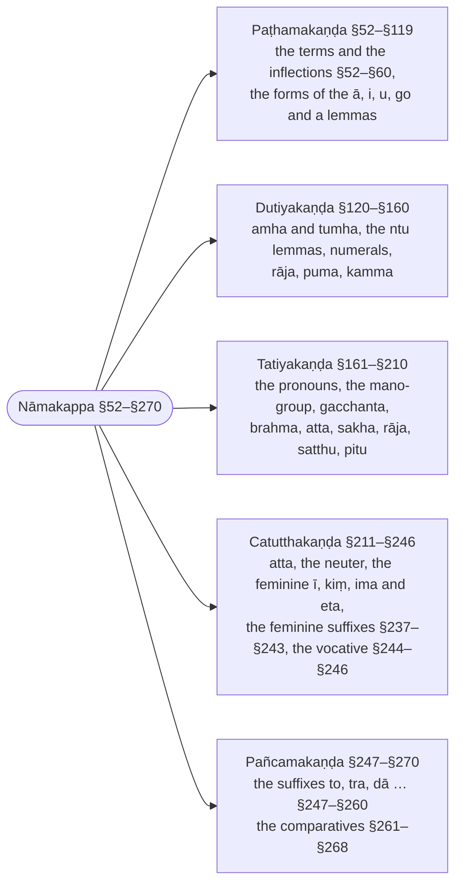
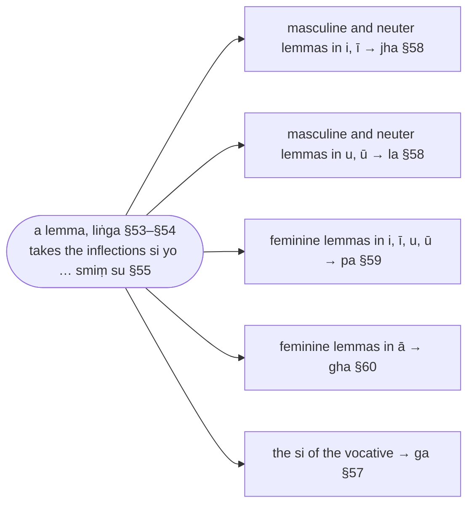

import { LinkCard } from "@astrojs/starlight/components";
import AnchorRedirect from "../../../../components/AnchorRedirect.astro";

:::note
`nāma` means "name" and in this text it is used to refer to "nouns". This chapter talks about the different types of nouns and how they are inflected to form words that are used in sentences.

The shape of inflection of nouns depend on their intrinsic characteristic (gender) and extrinsic characteristics (multiplicity, and inflection form).

The gender of a noun is represented by the following symbols:

| symbol | gender | meaning |
| ------ | ------ | ------- |
| 🚹 | pulliṅga  | masculine |
| 🚺 | itthiliṅga | feminine |
| 🚻 | napuṁsakaliṅga | neuter |
| ⚧️ | sabbaliṅga | genderless or all genders |

Nouns, when used in words, can denote multiplicity (singular or plural), through these symbols:

| symbol | multiplicity | meaning |
| ------ | ------ | ------- |
| ⨀ | ekavacana | singular |
| ⨂ | bahuvacana | plural |

Nouns, when used in words, can be in one of 7 inflection forms (see [§55 `Si yo, aṃ yo, nā hi, sa naṃ, smā hi, sa naṃ, smiṃ su`](/kaccayana/2-namakappa/1-pathamakanda#m55)):

| symbol | inflection form |
| :-: | --- |
| ① | `paṭhamā` ("first") |
| ② | `dutiyā` ("second") |
| ③ | `tatiyā` ("third") |
| ④ | `catutthī` ("fourth") |
| ⑤ | `pañcamī` ("fifth") |
| ⑥ | `chaṭṭhī` ("sixth") |
| ⑦ | `sattamī` ("seventh") |

For the remainder of this text, the inflection of a noun is symbolised using a pseudo-function notation. If *x* represents the lemma of a noun (it's base form), and *x* is masculine (🚹), singular (⨀), and in the first form (①), then the inflection of *x* will be denoted by:

🚹①⨀(*x*)

:::

:::note[The five sections of the noun chapter]
What each section of the Nāmakappa covers, with its sutta range.

:::

:::note[The letter names of the lemmas]
Kaccāyana names classes of lemmas by single syllables, which the rules then use as conditions.

:::

## Sections

- [Paṭhamakaṇḍa (First Section) (§52–§119)](/kaccayana/2-namakappa/1-pathamakanda/)
- [Dutiyakaṇḍa (Second Section) (§120–§160)](/kaccayana/2-namakappa/2-dutiyakanda/)
- [Tatiyakaṇḍa (Third Section) (§161–§210)](/kaccayana/2-namakappa/3-tatiyakanda/)
- [Catutthakaṇḍa (Fourth Section) (§211–§246)](/kaccayana/2-namakappa/4-catutthakanda/)
- [Pañcamakaṇḍa (Fifth Section) (§247–§270)](/kaccayana/2-namakappa/5-pancamakanda/)

<AnchorRedirect base="/kaccayana/2-namakappa/" prefix="m" map={{"1-pathamakanda": [52, 119], "2-dutiyakanda": [120, 160], "3-tatiyakanda": [161, 210], "4-catutthakanda": [211, 246], "5-pancamakanda": [247, 270]}} />
