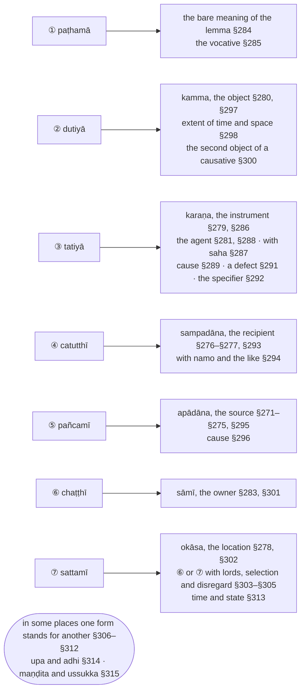

import { LinkCard } from "@astrojs/starlight/components";

:::note
`kāraka` ("that which brings about") is the name for the part a noun plays in the action its sentence expresses: the one who acts (`kattā`), what is acted on (`kamma`), the means (`karaṇa`), the recipient (`sampadāna`), the point of departure (`apādāna`) and the place (`okāsa`), with the owner (`sāmī`) and the causer (`hetu`) beside them. §271–§283 define these terms; §284–§315 then say which of the seven inflection forms ①…⑦ each of them takes, and where one form stands in for another.

The Chaṭṭha Saṅgāyana edition counts this chapter as the sixth section of the `nāma` chapter, after the five sections of [2. Nāmakappa](/kaccayana/2-namakappa); the Padarūpasiddhi numbers in parentheses follow its own arrangement. The [Bālāvatāra](/balavatara/2-nama) treats the same rules in its `nāma` section.

:::

:::note[The seven forms and what they express]
Each inflection form is assigned to the relations it expresses; the definitions of the `kāraka` are §271–§283, the assignments §284–§315.

:::

## Chaṭṭhakaṇḍa (Sixth Section)

### §271 (88, 308): Yasmā dapeti bhayamādatte vā tadapādānaṃ (that from which one departs, fears or takes: `apādāna`) :badge[anvattha]{variant=note}

:::note[Analysis]

| option | before | from   | operation | to         | after  | context |
| ------ | ------ | ------ | --------- | ---------- | ------ | ------- |
| vā     |        | yasmā apeti \| bhayaṃ \| ādatte — taṃ (kārakaṃ) | (saññaṃ hoti) | apādānaṃ | | |
| or     |        | that from which [one] departs, [from which] fear [arises], or [from which one] takes — that (participant in the action) | (is named) | `apādāna` | | |

The two numbers are the Rūpasiddhi's, which states the rule at 88 in its Nāma section and again at 308.

:::

> Yasmā vā apeti, yasmā vā bhayaṃ jāyate, yasmā vā ādatte, taṃ kārakaṃ apādānasaññaṃ hoti.

> Taṃ yathā? Gāmā apenti munayo, nagarā niggato rājā, corā bhayaṃ jāyate, ācariyupajjhāyehi sikkhaṃ gaṇhāti sisso.

> Apādānamiccanena kvattho? Apādāne pañcamī.

That from which [one] departs, or that from which fear arises, or that from which [one] takes — that `kāraka` is termed `apādāna`.

:::tip[Examples]

`Taṃ yathā?` — "as for instance?"[^1]

> `gāmā apenti munayo` \
🚹⑤⨀(gāma) ▶️🤟⨂(apeti) 🚹①⨂(muni) \
from the village | depart | the sages

> `nagarā niggato rājā` \
🚻⑤⨀(nagara) 🚹①⨀(niggata) 🚹①⨀(rāja) \
from the city | gone out | the king

> `corā bhayaṃ jāyate` \
🚹⑤⨀(cora) 🚻①⨀(bhaya) ▶️🤟⨀(jāyati) \
from the thief | fear | arises

> `ācariyupajjhāyehi sikkhaṃ gaṇhāti sisso` \
🚹⑤⨂(ācariyupajjhāya) 🚺②⨀(sikkhā) ▶️🤟⨀(gaṇhāti) 🚹①⨀(sissa) \
from teacher and preceptor | the training | takes | the pupil

:::

:::tip[Purpose]

`Apādānamiccanena kvattho?` — what is the use of the term `apādāna`? [§295 (307): Apādāne pañcamī](#m295).

:::

[^1]: Senart's edition, which Malai (1997) prints, adds a fifth example, `pāpā cittaṃ nivāraye`, between `nagarā niggato rājā` and `corā bhayaṃ jāyate`; the CST has four.

---

### §272 (309): Dhātunāmānamupasaggayogādīsvapi ca (and [the term] with certain roots, nouns, prefixes and the like) :badge[anvattha]{variant=note}

:::note[Analysis]

| option | before | from   | operation | to         | after  | context |
| ------ | ------ | ------ | --------- | ---------- | ------ | ------- |
| ca, api |       | dhātunāmānaṃ (payoge) upasaggayogādīsu (taṃ kārakaṃ) | (saññaṃ hoti) | (apādānaṃ) | | |
| and, also |     | [what is construed] with [certain] roots and nouns, with prefixes and the like — that `kāraka` | (is named) | (`apādāna`) | | |

The CST's vutti section prints the sutta `Dhātunā mānamupasaggayogādvīsvapi ca`; the heading follows the CST's sutta list and the Rūpasiddhi.

:::

> Dhātunāmānaṃ payoge ca upasaggayogādīsvapi ca taṃ kārakaṃ apādānasaññaṃ hoti.

And in construction with roots and nouns, and also in construction with prefixes and the like, that `kāraka` is termed `apādāna`.

> Dhātūnaṃ payoge tāva ji iccetassa dhātussa parāpubbassa payoge yo asaho, so apādānasañño hoti.

> Taṃ yathā? Buddhasmā parājenti aññatitthiyā.

> Bhū iccetassa dhātussa papubbassa payoge yato acchinnappabhavo, so apādānasañño hoti.

> Taṃ yathā? Himavatā pabhavanti pañca mahānadiyo, anavatattamhā pabhavanti mahāsarā, aciravatiyā pabhavanti kunnadiyo.

In construction with roots, first: in construction with the root `ji` preceded by `parā`, the one who cannot be withstood (`asaho`) is termed `apādāna`. In construction with the root `bhū` preceded by `pa`, that from which [something] has its unbroken origin is termed `apādāna`.

:::tip[Examples]

> `buddhasmā parājenti aññatitthiyā` \
🚹⑤⨀(buddha) ▶️🤟⨂(parājeti) 🚹①⨂(aññatitthiya) \
by the Buddha | are defeated | the followers of other sects

> `himavatā pabhavanti pañca mahānadiyo` \
🚹⑤⨀(himavantu) ▶️🤟⨂(pabhavati) ⚧️①⨂(pañca) 🚺①⨂(mahānadī) \
from the Himavant | originate | five | great rivers

> `khemānadī himavatā pabhāvī` \
> [(23J 18.1.1: Niḷinikājātaka)](https://tipitaka2500.github.io/tipitaka/23J/18/18.1/18.1.1#273) \
🚺①⨀(khemānadī) 🚹⑤⨀(himavantu) 🚺①⨀(pabhāvī) \
the river Khemā | from the Himavant | flowing forth

| lemma | inflected | meaning |
| ----- | --------- | ------- |
| 🚹⑤⨀(anavatatta) | anavatattamhā pabhavanti mahāsarā | from Anotatta the great streams originate |
| 🚺⑤⨀(aciravatī) | aciravatiyā pabhavanti kunnadiyo | from the Aciravatī the small streams originate |

:::

> Nāmappayogepi taṃ kārakaṃ apādānasaññaṃ hoti.

> Taṃ yathā? Urasmā jāto putto, bhūmito niggato raso, ubhato sujāto putto mātito ca pitito ca.

In construction with a noun, too, that `kāraka` is termed `apādāna`.

:::tip[Examples]

> `urasmā jāto putto` \
🚹⑤⨀(ura) 🚹①⨀(jāta) 🚹①⨀(putta) \
from the breast | born | son

> `bhūmito niggato raso` \
🚺⑤⨀(bhūmi + to) 🚹①⨀(niggata) 🚹①⨀(rasa) \
from the ground | come out | the sap

> `ubhato sujāto putto mātito ca pitito ca` \
⚧️⑤⨀(ubha + to) 🚹①⨀(sujāta) 🚹①⨀(putta) 🚺⑤⨀(mātu + to) 🔼(ca) 🚹⑤⨀(pitu + to) 🔼(ca) \
on both sides | well born | son | on the mother's side | and | on the father's side | and

> `khattiyo nāma ubhato sujāto hoti, mātito ca pitito ca` \
> [(2V 1.5.9.1: Antepurasikkhāpada)](https://tipitaka2500.github.io/tipitaka/2V/1/1.5/1.5.9/1.5.9.1#1464) \
🚹①⨀(khattiya) 🔼(nāma) ⚧️⑤⨀(ubha + to) 🚹①⨀(sujāta) ▶️🤟⨀(hoti) 🚺⑤⨀(mātu + to) 🔼(ca) 🚹⑤⨀(pitu + to) 🔼(ca) \
a khattiya | namely | on both sides | well born | is | on the mother's side | and | on the father's side | and

:::

> Upasaggayoge taṃ kārakaṃ apādānasaññaṃ hoti.

> Taṃ yathā? Apasālāya āyanti vāṇijā, ābrahmalokā saddo abbhuggacchati pari[^2] pabbatā devo vassati, buddhasmā pati sāriputto dhammadesanāya bhikkhū ālapati temāsaṃ, ghatamassa telasmā pati dadāti, uppalamassa padumasmā pati dadāti, kanakamassa hiraññasmā pati dadāti.

In construction with a prefix (`upasagga`), that `kāraka` is termed `apādāna`.[^3]

:::tip[Examples]

> `apasālāya āyanti vāṇijā` \
🔼(apa) 🚺⑤⨀(sālā) ▶️🤟⨂(āyāti) 🚹①⨂(vāṇija) \
leaving out | the hall | come | the merchants

> `ābrahmalokā saddo abbhuggacchati` \
🔼(ā) 🚹⑤⨀(brahmaloka) 🚹①⨀(sadda) ▶️🤟⨀(abbhuggacchati) \
as far as | the Brahmā world | the sound | rises up

> `yāva brahmalokā saddo abbhuggacchati` \
> [(16A7 2.2.5: Pāricchattakasutta)](https://tipitaka2500.github.io/tipitaka/16A7/2/2.2/2.2.5#536) \
🔼(yāva) 🚹⑤⨀(brahmaloka) 🚹①⨀(sadda) ▶️🤟⨀(abbhuggacchati) \
as far as | the Brahmā world | the sound | rises up

> `pari pabbatā devo vassati` \
🔼(pari) 🚹⑤⨀(pabbata) 🚹①⨀(deva) ▶️🤟⨀(vassati) \
all round, except | the mountain | the rain-cloud | rains

> `buddhasmā pati sāriputto dhammadesanāya bhikkhū ālapati temāsaṃ` \
🚹⑤⨀(buddha) 🔼(pati) 🚹①⨀(sāriputta) 🚺③⨀(dhammadesanā) 🚹②⨂(bhikkhu) ▶️🤟⨀(ālapati) 🚻②⨀(temāsa) \
the Buddha | in place of | Sāriputta | with a Dhamma talk | the monks | addresses | for three months

> `ghatamassa telasmā pati dadāti` \
🚻②⨀(ghata) ⚧️④⨀(ima) 🚻⑤⨀(tela) 🔼(pati) ▶️🤟⨀(dadāti) \
ghee | to him | for oil | in exchange | he gives

| lemma | inflected | meaning |
| ----- | --------- | ------- |
| 🚻⑤⨀(paduma) | uppalamassa padumasmā pati dadāti | he gives him a blue lotus in exchange for a red one |
| 🚻⑤⨀(hirañña) | kanakamassa hiraññasmā pati dadāti | he gives him wrought gold in exchange for bullion |

:::

> Ādiggahaṇena kārakamajjhepi pañcamīvibhatti hoti. Ito pakkhasmā vijjhati migaṃ luddako, kosā vijjhati kuñjaraṃ, māsasmā bhuñjati bhojanaṃ.

By the word `ādi` (and the like), the fifth form ⑤ is used also in the middle of a `kāraka`.[^4]

:::tip[Examples]

> `ito pakkhasmā vijjhati migaṃ luddako` \
⚧️⑤⨀(ima + to) 🚹⑤⨀(pakkha) ▶️🤟⨀(vijjhati) 🚹②⨀(miga) 🚹①⨀(luddaka) \
from now | a fortnight on | shoots | the deer | the hunter

| lemma | inflected | meaning |
| ----- | --------- | ------- |
| 🚹⑤⨀(kosa) | kosā vijjhati kuñjaraṃ | from a `kosa` away he shoots the elephant |
| 🚹⑤⨀(māsa) | māsasmā bhuñjati bhojanaṃ | a month from now he eats the meal |

:::

> Apiggahaṇena nipātapayogepi pañcamīvibhatti hoti dutiyā ca tatiyā ca. Rahitā mātujā puññaṃ katvā dānaṃ deti, rahitā mātujaṃ, rahitā mātujena vā. Rite saddhammā kuto sukhaṃ labhati, rite saddhammaṃ, rite saddhammena vā. Te bhikkhū nānā kulā pabbajitā, vinā saddhammā natthañño koci nātho loke vijjati, vinā saddhammaṃ, vinā saddhammena vā. Vinā buddhasmā, vinā buddhaṃ, vinā buddhena vā.

By the word `api` (also), in construction with a particle (`nipāta`) too the fifth form ⑤ is used — and the second ② and the third ③.[^5]

:::tip[Examples]

> `rahitā mātujā puññaṃ katvā dānaṃ deti` \
🔼(rahitā) 🚹⑤⨀(mātuja) 🚻②⨀(puñña) 🔽(katvā) 🚻②⨀(dāna) ▶️🤟⨀(deti) \
without | a son | merit | having made | a gift | he gives

> `rite saddhammā kuto sukhaṃ labhati` \
🔼(rite) 🚹⑤⨀(saddhamma) ⚧️⑤⨀(kiṃ + to) 🚻②⨀(sukha) ▶️🤟⨀(labhati) \
apart from | the true Dhamma | whence | happiness | does one get?

> `te bhikkhū nānā kulā pabbajitā` \
⚧️①⨂(ta) 🚹①⨂(bhikkhu) 🔼(nānā) 🚻⑤⨀(kula) 🚹①⨂(pabbajita) \
those | monks | apart from | the family | gone forth

> `tumhe nānānāmā nānāgottā nānājaccā nānākulā pabbajitā` \
> [(1V 1.2.12: Dubbacasikkhāpada)](https://tipitaka2500.github.io/tipitaka/1V/1/1.2/1.2.12#1729) \
⚧️①⨂(tumha) 🚹①⨂(nānānāma) 🚹①⨂(nānāgotta) 🚹①⨂(nānājacca) 🚹①⨂(nānākula) 🚹①⨂(pabbajita) \
you | of various names | of various clans | of various castes | of various families | gone forth

> `vinā saddhammā natthañño koci nātho loke vijjati` \
🔼(vinā) 🚹⑤⨀(saddhamma) 🔼(na) ▶️🤟⨀(atthi) 🚹①⨀(añña) ⚧️①⨀(koci) 🚹①⨀(nātha) 🚹⑦⨀(loka) ▶️🤟⨀(vijjati) \
without | the true Dhamma | not | there is | other | any | protector | in the world | found

| lemma | inflected | meaning |
| ----- | --------- | ------- |
| 🚹②⨀(saddhamma) | rite saddhammaṃ, vinā saddhammaṃ | apart from, without the true Dhamma (②) |
| 🚹③⨀(saddhamma) | rite saddhammena, vinā saddhammena | apart from, without the true Dhamma (③) |
| 🚹⑤⨀(buddha) | vinā buddhasmā | without the Buddha (⑤) |
| 🚹②⨀(buddha) | vinā buddhaṃ | without the Buddha (②) |
| 🚹③⨀(buddha) | vinā buddhena | without the Buddha (③) |

:::

> Caggahaṇena aññatthāpi pañcamīvibhatti hoti. Yatohaṃ bhagini ariyāya jātiyā jāto. Yato sarāmi attānaṃ, yato pattosmi viññutaṃ, yatvādhikaraṇamenaṃ cakkhundriyaṃ asaṃvutaṃ viharantaṃ abhijjhādomanassā pāpakā akusalā dhammā anvāsaveyyuṃ.

By the word `ca` (and), the fifth form ⑤ is used elsewhere as well.

:::tip[Examples]

> `yatohaṃ, bhagini, ariyāya jātiyā jāto` \
> [(10M 4.6: Aṅgulimālasutta)](https://tipitaka2500.github.io/tipitaka/10M/4/4.6#1014) \
⚧️⑤⨀(ya + to) ⚧️①⨀(amha) 🚺⓪⨀(bhaginī) 🚺③⨀(ariya) 🚺③⨀(jāti) 🚹①⨀(jāta) \
since | I | sister | by the noble | birth | was born

> `yato sarāmi attānaṃ, yato pattosmi viññutaṃ` \
> [(20Ap1 40.1.8.35: Bhisiānisaṃsa)](https://tipitaka2500.github.io/tipitaka/20Ap1/40/40.1/40.1.8/40.1.8.35#4476) \
⚧️⑤⨀(ya + to) ▶️👆⨀(sarati) 🚹②⨀(atta) ⚧️⑤⨀(ya + to) 🚹①⨀(patta) ▶️👆⨀(atthi) 🚺②⨀(viññutā) \
since | I remember | myself | since | arrived | I am | at discretion

> `yatvādhikaraṇamenaṃ cakkhundriyaṃ asaṃvutaṃ viharantaṃ abhijjhādomanassā pāpakā akusalā dhammā anvāssaveyyuṃ` \
> [(6D 2.4.3.2.1: Indriyasaṃvara)](https://tipitaka2500.github.io/tipitaka/6D/2/2.4/2.4.3/2.4.3.2/2.4.3.2.1#304) \
🔼(yatvādhikaraṇaṃ) ⚧️②⨀(eta) 🚻②⨀(cakkhundriya) 🚻②⨀(asaṃvuta) 🚹②⨀(viharanta) 🚹①⨂(abhijjhādomanassa) 🚹①⨂(pāpaka) 🚹①⨂(akusala) 🚹①⨂(dhamma) ⏯🤟⨂(anvāssavati) \
on account of which | him | the eye faculty | unrestrained | dwelling with | covetousness and grief | evil | unwholesome | states | might flow in upon

:::

[^2]: CST4 prints `upari pabbatā`; `pari` is the reading of B1 and the Rūpasiddhi.

[^3]: The manuscript B1, as Malai (1997) reports, quotes the canonical `yāva brahmalokā` for the vutti's `ābrahmalokā`; the CST is kept.

[^4]: Malai (1997) renders `kārakamajjhepi` "even in the case of other case-relations"; the Pāḷi says "also in the middle of a `kāraka`".

[^5]: Senart's edition adds `nānā kulaṃ, nānā kulena vā` after `nānā kulā pabbajitā`; the manuscripts B1, S1, S2 and the CST omit them.

---

### §273 (310): Rakkhaṇatthānamicchitaṃ (with verbs of guarding, the thing one wants kept safe) :badge[anvattha]{variant=note}

:::note[Analysis]

| option | before | from   | operation | to         | after  | context |
| ------ | ------ | ------ | --------- | ---------- | ------ | ------- |
|        |        | rakkhaṇatthānaṃ (dhātūnaṃ payoge) icchitaṃ (taṃ kārakaṃ) | (saññaṃ hoti) | (apādānaṃ) | | |
|        |        | with roots meaning "to guard", the thing wished [kept safe] — that `kāraka` | (is named) | (`apādāna`) | | |

:::

> Rakkhaṇatthānaṃ dhātūnaṃ payoge yaṃ icchitaṃ, taṃ kārakaṃ apādānasaññaṃ hoti.

> Kāke rakkhanti taṇḍulā, yavā paṭisedhenti gāvo.

In construction with roots having the sense of guarding, that which is wished — that `kāraka` is termed `apādāna`.

:::tip[Examples]

> `kāke rakkhanti taṇḍulā` \
🚹②⨂(kāka) ▶️🤟⨂(rakkhati) 🚹⑤⨀(taṇḍula) \
the crows | they keep off | from the rice

> `yavā paṭisedhenti gāvo` \
🚹⑤⨀(yava) ▶️🤟⨂(paṭisedheti) 🚹②⨂(go) \
from the barley | they ward off | the cattle

:::

---

### §274 (311): Yena vā’ dassanaṃ (optionally, the one from whose sight one hides) :badge[anvattha]{variant=note}

:::note[Analysis]

| option | before | from   | operation | to         | after  | context |
| ------ | ------ | ------ | --------- | ---------- | ------ | ------- |
| vā     |        | yena adassanaṃ (icchitaṃ) — (taṃ kārakaṃ) | (saññaṃ hoti) | (apādānaṃ) | | |
| optionally |    | the one by whom not being seen is wished — that `kāraka` | (is named) | (`apādāna`) | | |

:::

> Yena vā adassanamicchitaṃ, taṃ kārakaṃ apādānasaññaṃ hoti.

> Upajjhāyā antaradhāyati sisso, mātarā ca pitarā ca antaradhāyati putto.

> Vāti kimatthaṃ? Sattamīvibhatyatthaṃ[^6]. Jetavane antaradhāyati bhagavā.

Optionally, the one by whom not being seen is wished — that `kāraka` is termed `apādāna`.

:::tip[Examples]

> `upajjhāyā antaradhāyati sisso` \
🚹⑤⨀(upajjhāya) ▶️🤟⨀(antaradhāyati) 🚹①⨀(sissa) \
from the preceptor | vanishes | the pupil

> `mātarā ca pitarā ca antaradhāyati putto` \
🚺⑤⨀(mātu) 🔼(ca) 🚹⑤⨀(pitu) 🔼(ca) ▶️🤟⨀(antaradhāyati) 🚹①⨀(putta) \
from mother | and | from father | and | vanishes | the son

:::

:::danger[Counter-example]

`Vāti kimatthaṃ?` — what is the purpose of saying `vā`? `Sattamīvibhatyatthaṃ` — for the sense of the seventh inflection ⑦.

> `jetavane antaradhāyati bhagavā` \
🚻⑦⨀(jetavana) ▶️🤟⨀(antaradhāyati) 🚹①⨀(bhagavantu) \
in Jeta's Grove | vanishes | the Blessed One

:::

[^6]: CST4 prints `Sattamīvibhatyattaṃ`; Senart's edition reads `Sattamīvibhattyatthaṃ`.

---

### §275 (312): Dūranti kaddha kāla nimmāna tvālopa disāyogavibhattārappayoga suddhappamocana hetu vivittappamāṇa pubbayogabandhana guṇavacana pañha kathana thokākattūsu ca (and in twenty further senses, from distance to non-agency) :badge[anvattha]{variant=note}

:::note[Analysis]

| option | before | from   | operation | to         | after  | context |
| ------ | ------ | ------ | --------- | ---------- | ------ | ------- |
| ca     |        | dūra antika addha-nimmāna kāla-nimmāna tvālopa disāyoga vibhatta ārappayoga suddha pamocana hetu vivitta pamāṇa pubbayoga bandhana guṇavacana pañha kathana thoka akattu — (iccetesu atthesu payogesu ca taṃ kārakaṃ) | (saññaṃ hoti) | (apādānaṃ) | | |
| and    |        | in the senses and constructions of distance, nearness, measure of space, measure of time, an elided `tvā`, direction, distinction, abstention, purity, release, cause, seclusion, extent, prior connection, bondage, quality, question, telling, a little, and a non-agent — that `kāraka` | (is named) | (`apādāna`) | | |

The CST's sutta list prints `thokātattūsu` for the `thokākattūsu` of its vutti section and the Rūpasiddhi, which the heading follows.

:::

> Dūratthe, antikatthe, addhanimmāne, kālanimmāne, tvālope, disāyoge, vibhatte, ārappayoge, suddhe, pamocane, hetvatthe, vivittatthe, pamāṇe, pubbayoge, bandhanatthe, guṇavacane, pañhe, kathane, thoke, akattari ca iccetesvatthesu, payogesu ca, taṃ kārakaṃ apādānasaññaṃ hoti.

In the senses of distance, nearness, a measure of distance, a measure of time[^7], an elided `tvā`, connection with a direction, distinction, construction with [words of] abstaining, purity, release, cause, seclusion, extent, connection with `pubba`, bondage, statement of a quality, a question, a telling, a little, and a non-agent — in these senses and constructions, that `kāraka` is termed `apādāna`.

> Dūratthetāva – kīva dūro ito naḷakāragāmo, dūrato vā gamma, ārakā te moghapurisā imasmā dhammavinayā. Dutiyā ca tatiyā ca, dūraṃ gāmaṃ āgato[^8], dūrena gāmena vā āgato. Ārakā imaṃ dhammavinayaṃ, anena dhammavinayena vā iccevamādi.

> Antikatthe – antikaṃ gāmā, āsannaṃ gāmā, samīpaṃ gāmā, samīpaṃ saddhammā. Dutiyā ca tatiyā ca, antikaṃ gāmaṃ, antikaṃ gāmena vā. Āsannaṃ gāmaṃ, āsannaṃ gāmena vā. Samīpaṃ gāmaṃ. Samīpaṃ gāmena vā. Samīpaṃ saddhammaṃ, samīpaṃ saddhammena vā iccevamādi.

> Addhanimmāne – ito mathurāya catūsu yojanesu saṅkassaṃ nāma nagaraṃ atthi, tattha bahū janā vasanti iccevamādi.

> Kālanimmāne – ito bhikkhave ekanavutikappe vipassī nāma bhagavā loke udapādi, ito tiṇṇaṃ māsānaṃ accayena parinibbāyissati iccevamādi.

> Tvālope kammādhikaraṇesu – pāsādā saṅkameyya, pāsādaṃ abhiruhitvā vā. Pabbatā saṅkameyya, pabbataṃ abhiruhitvā vā. Hatthikkhandhā saṅkameyya, hatthikkhandhaṃ abhiruhitvā vā. Āsanā vuṭṭhaheyya. Āsane nisīditvā vā iccevamādi.

> Disāyoge – avīcito[^9] yāva uparibhavaggamantare bahū sattanikāyā vasanti, yato khemaṃ tato bhayaṃ, puratthimato, dakkhiṇato, pacchimato, uttarato aggī pajjalanti, yato assosuṃ bhagavantaṃ, uddhaṃ pādatalā adho kesamatthakā iccevamādi.

> Vibhatte – yato paṇītataro vā visiṭṭhataro vā natthi. Chaṭṭhī ca, channavutīnaṃ pāsaṇḍānaṃ, dhammānaṃ pavaraṃ yadidaṃ sugatavinayo iccevamādi.

> Ārappayoge – gāmadhammā vasaladhammā asaddhammā ārati virati paṭivirati, pāṇātipātā veramaṇī iccevamādi.

> Suddhe – lobhaniyehi dhammehi suddho asaṃsaṭṭho, mātito ca pitito ca suddho asaṃsaṭṭho anupakuddho agarahito iccevamādi.

> Pamocane – parimutto dukkhasmāti vadāmi, muttosmi mārabandhanā, na te muccanti maccunā iccevamādi.

> Hetvatthe – kasmā hetunā, kena hetunā, kissa hetunā, kasmā nu tumhaṃ daharā na mīyare, kasmā idheva maraṇaṃ bhavissati iccevamādi.

> Vivittatthe – vivitto pāpakā dhammā, vivicceva kāmehi vivicca akusalehi dhammehi iccevamādi.

> Pamāṇe – dīghaso navavidatthiyo sugatavidatthiyā pamāṇikā kāretabbā, majjhimassa purisassa aḍḍha teḷasahatthā iccevamādi.

> Pubbayoge – pubbeva sambodhā[^10] iccevamādi.

> Bandhanatthe – satasmā bandho[^11] naro. Tatiyā ca, satena bandho naro raññā iṇatthena iccevamādi.

> Guṇavacane – puññāya sugatiṃ yanti, cāgāya vipulaṃ dhanaṃ, paññāya vimuttimano, issariyāya janaṃ rakkhati rājā iccevamādi.

> Pañhe tvālope kammādhikaraṇesu – abhidhammā pucchanti, abhidhammaṃ sutvā, abhidhamme ṭhatvā vā. Vinayā pucchanti, vinayaṃ sutvā, vinaye ṭhatvā vā. Dutiyā ca tatiyā ca, abhidhammaṃ, abhidhammena vā. Vinayaṃ, vinayena vā. Evaṃ[^12] suttā, geyyā, gāthāya, veyyākaraṇā, udānā, itivuttakā, jātakā, abbhutadhammā, vedallā iccevamādi.

> Kathane tvālope kammādhikaraṇesu – abhidhammā kathayanti, abhidhammaṃ sutvā, abhidhamme ṭhatvā vā. Vinayā kathayanti, vinayaṃ sutvā, vinaye ṭhatvā vā. Dutiyā ca tatiyā ca, abhidhammaṃ, abhidhammena vā. Vinayaṃ vinayena vā. Evaṃ suttā, geyyā, gāthāya, veyyākaraṇā, udānā, itivuttakā, jātakā, abbhutadhammā, vedallā iccevamādi.

> Thoke – thokā muccanti. Appamattakā muccanti, kicchā muccanti. Tatiyā ca. Thokena, appamattakena, kicchena vā iccevamādi.

> Akattarica – kammassa katattā upacitattā ussannattā vipulattā cakkhuviññāṇaṃ uppannaṃ hoti iccevamādi.

:::tip[Examples]

Each group closes with `iccevamādi` — "and so on".

**Dūratthe** — in the sense of distance, first.

| lemma | inflected | meaning |
| ----- | --------- | ------- |
| ⚧️⑤⨀(ima + to) | kīva dūro ito naḷakāragāmo | how far from here is Naḷakāragāma? |
| ⚧️⑤⨀(dūra + to) | dūrato vā gamma | or having come from afar |
| ⚧️⑤⨀(ima) 🚹⑤⨀(dhammavinaya) | ārakā te moghapurisā imasmā dhammavinayā | far are those foolish men from this teaching and discipline |
| 🚹②⨀(gāma) | dūraṃ gāmaṃ āgato | come from the far village (②) |
| 🚹③⨀(gāma) | dūrena gāmena vā āgato | or come from the far village (③) |
| 🚹②⨀(dhammavinaya) | ārakā imaṃ dhammavinayaṃ | far from this teaching and discipline (②) |
| 🚹③⨀(dhammavinaya) | anena dhammavinayena vā | or from this teaching and discipline (③) |

> `āsanne ito naḷakāragāmo` \
> [(10M 5.9: Subhasutta)](https://tipitaka2500.github.io/tipitaka/10M/5/5.9#1499) \
🚻⑦⨀(āsanna) ⚧️⑤⨀(ima + to) 🚹①⨀(naḷakāragāma) \
near | from here | Naḷakāragāma

> `apakkameva imasmā dhammavinayā` \
> [(8D 1.1: Sunakkhattavatthu)](https://tipitaka2500.github.io/tipitaka/8D/1/1.1#13) \
⏮🤟⨀(apakkamati) 🔼(eva) ⚧️⑤⨀(ima) 🚹⑤⨀(dhammavinaya) \
he departed | indeed | from this | teaching and discipline

**Antikatthe** — in the sense of nearness.

| lemma | inflected | meaning |
| ----- | --------- | ------- |
| 🚹⑤⨀(gāma) | antikaṃ gāmā, āsannaṃ gāmā, samīpaṃ gāmā | near the village |
| 🚹⑤⨀(saddhamma) | samīpaṃ saddhammā | near the true Dhamma |
| 🚹②⨀(gāma) | antikaṃ gāmaṃ, āsannaṃ gāmaṃ, samīpaṃ gāmaṃ | near the village (②) |
| 🚹③⨀(gāma) | antikaṃ gāmena, āsannaṃ gāmena, samīpaṃ gāmena | near the village (③) |
| 🚹②⨀(saddhamma) | samīpaṃ saddhammaṃ | near the true Dhamma (②) |
| 🚹③⨀(saddhamma) | samīpaṃ saddhammena | near the true Dhamma (③) |

**Addhanimmāne** — in a measure of distance.

| lemma | inflected | meaning |
| ----- | --------- | ------- |
| ⚧️⑤⨀(ima + to) 🚺⑤⨀(mathurā) | ito mathurāya catūsu yojanesu saṅkassaṃ nāma nagaraṃ atthi | four leagues from here, from Mathurā, is the city called Saṅkassa |
| 🚹①⨂(jana) | tattha bahū janā vasanti | many people live there (the sentence's continuation; `tattha` is the locus, and there is no `apādāna`) |

**Kālanimmāne** — in a measure of time.

| lemma | inflected | meaning |
| ----- | --------- | ------- |
| ⚧️⑤⨀(ima + to) | ito bhikkhave ekanavutikappe vipassī nāma bhagavā loke udapādi | in the ninety-first aeon from now, monks, the Blessed One called Vipassī arose in the world |
| ⚧️⑤⨀(ima + to) | ito tiṇṇaṃ māsānaṃ accayena parinibbāyissati | three months from now he will attain final Nibbāna |

> `ito so, bhikkhave, ekanavutikappe yaṃ vipassī bhagavā arahaṃ sammāsambuddho loke udapādi` \
> [(7D 1.1: Pubbenivāsapaṭisaṃyuttakathā)](https://tipitaka2500.github.io/tipitaka/7D/1/1.1#6) \
⚧️⑤⨀(ima + to) ⚧️①⨀(ta) 🚹⓪⨂(bhikkhu) 🚹⑦⨀(ekanavutikappa) ⚧️①⨀(ya) 🚹①⨀(vipassī) 🚹①⨀(bhagavantu) 🚹①⨀(arahanta) 🚹①⨀(sammāsambuddha) 🚹⑦⨀(loka) ⏮🤟⨀(uppajjati) \
from now | that | monks | in the ninety-first aeon | when | Vipassī | the Blessed One | the Arahant | the fully awakened | in the world | arose

> `ito tiṇṇaṃ māsānaṃ accayena tathāgato parinibbāyissati` \
> [(7D 3.14: Mārayācanakathā)](https://tipitaka2500.github.io/tipitaka/7D/3/3.14#361) \
⚧️⑤⨀(ima + to) ⚧️⑥⨂(ti) 🚹⑥⨂(māsa) 🚹③⨀(accaya) 🚹①⨀(tathāgata) ⏯🤟⨀(parinibbāyati) \
from now | of three | months | with the passing | the Tathāgata | will attain final Nibbāna

**Tvālope** — in the elision of `tvā`, for the object and the locus (`kammādhikaraṇesu`).

| lemma | inflected | meaning |
| ----- | --------- | ------- |
| 🚹⑤⨀(pāsāda) | pāsādā saṅkameyya, pāsādaṃ abhiruhitvā vā | he may step across from the palace — or, having climbed the palace |
| 🚹⑤⨀(pabbata) | pabbatā saṅkameyya, pabbataṃ abhiruhitvā vā | he may step across from the mountain — or, having climbed the mountain |
| 🚹⑤⨀(hatthikkhandha) | hatthikkhandhā saṅkameyya, hatthikkhandhaṃ abhiruhitvā vā | he may step across from the elephant's back — or, having mounted the elephant's back |
| 🚻⑤⨀(āsana) | āsanā vuṭṭhaheyya, āsane nisīditvā vā | he may rise from the seat — or, having sat on the seat |

**Disāyoge** — in connection with a direction.

| lemma | inflected | meaning |
| ----- | --------- | ------- |
| ⚧️⑤⨀(avīci + to) | avīcito yāva uparibhavaggamantare bahū sattanikāyā vasanti | from Avīci up to the peak of existence above, in between, many orders of beings dwell |
| ⚧️⑤⨀(ya + to) ⚧️⑤⨀(ta + to) | yato khemaṃ tato bhayaṃ | whence safety, thence danger |
| ⚧️⑤⨀(puratthima + to) | puratthimato, dakkhiṇato, pacchimato, uttarato aggī pajjalanti | from the east, the south, the west, the north fires blaze |
| ⚧️⑤⨀(ya + to) | yato assosuṃ bhagavantaṃ | from where they heard the Blessed One |
| 🚻⑤⨀(pādatala) 🚹⑤⨀(kesamatthaka) | uddhaṃ pādatalā adho kesamatthakā | upward from the soles of the feet, downward from the tips of the hair |

> `yatodakaṃ tadādittaṃ, yato khemaṃ tato bhayaṃ` \
> [(22J 9.1.6: Padakusalamāṇavajātaka)](https://tipitaka2500.github.io/tipitaka/22J/9/9.1/9.1.6#1843) \
⚧️⑤⨀(ya + to) 🚻①⨀(udaka) ⚧️①⨀(ta) 🚻①⨀(āditta) ⚧️⑤⨀(ya + to) 🚻①⨀(khema) ⚧️⑤⨀(ta + to) 🚻①⨀(bhaya) \
whence | water | that | is ablaze | whence | safety | thence | danger

> `uddhaṃ pādatalā adho kesamatthakā` \
> [(7D 9.1.4: Kāyānupassanāpaṭikūlamanasikārapabba)](https://tipitaka2500.github.io/tipitaka/7D/9/9.1/9.1.4#959) \
🔼(uddhaṃ) 🚻⑤⨀(pādatala) 🔼(adho) 🚹⑤⨀(kesamatthaka) \
upward | from the soles of the feet | downward | from the tips of the hair

**Vibhatte** — in distinction. `Chaṭṭhī ca` — the sixth ⑥ too.

| lemma | inflected | meaning |
| ----- | --------- | ------- |
| ⚧️⑤⨀(ya + to) | yato paṇītataro vā visiṭṭhataro vā natthi | than which there is nothing more excellent or more distinguished |
| 🚻⑥⨂(pāsaṇḍa) 🚹⑥⨂(dhamma) | channavutīnaṃ pāsaṇḍānaṃ, dhammānaṃ pavaraṃ yadidaṃ sugatavinayo | of the ninety-six sectarian doctrines the foremost is this, the discipline of the Sugata (⑥) |

**Ārappayoge** — in construction with [words of] abstaining.

| lemma | inflected | meaning |
| ----- | --------- | ------- |
| 🚹⑤⨀(gāmadhamma) 🚹⑤⨀(vasaladhamma) 🚹⑤⨀(asaddhamma) | gāmadhammā vasaladhammā asaddhammā ārati virati paṭivirati | abstaining, refraining, desisting from vulgar practice, low practice, wrong practice |
| 🚹⑤⨀(pāṇātipāta) | pāṇātipātā veramaṇī | abstention from killing living beings |

> `pāṇātipātā veramaṇī` \
> [(3V 1.42: Sikkhāpadakathā)](https://tipitaka2500.github.io/tipitaka/3V/1/1.42#473) \
🚹⑤⨀(pāṇātipāta) 🚺①⨀(veramaṇī) \
from killing living beings | abstention

> `brahmacārī hoti ārācārī virato asaddhammā gāmadhammā` \
> [(15A4 4.5.8: Attantapasutta)](https://tipitaka2500.github.io/tipitaka/15A4/4/4.5/4.5.8#1271) \
🚹①⨀(brahmacārī) ▶️🤟⨀(hoti) 🚹①⨀(ārācārī) 🚹①⨀(virata) 🚹⑤⨀(asaddhamma) 🚹⑤⨀(gāmadhamma) \
one living the holy life | he is | living aloof | refraining | from wrong practice | from vulgar practice

**Suddhe** — in purity.

| lemma | inflected | meaning |
| ----- | --------- | ------- |
| 🚹⑤⨂(lobhanīya) 🚹⑤⨂(dhamma) | lobhaniyehi dhammehi suddho asaṃsaṭṭho | pure, unmixed with things that provoke greed |
| 🚺⑤⨀(mātu + to) 🚹⑤⨀(pitu + to) | mātito ca pitito ca suddho asaṃsaṭṭho anupakuddho agarahito | pure on the mother's side and the father's, unmixed, unreproached, unblamed |

> `yathārūpehi lobhanīyehi dhammehi pariyādinnacitto` \
> [(10M 5.5: Caṅkīsutta)](https://tipitaka2500.github.io/tipitaka/10M/5/5.5#1330) \
🚹③⨂(yathārūpa) 🚹③⨂(lobhanīya) 🚹③⨂(dhamma) 🚹①⨀(pariyādinnacitta) \
by such | greed-provoking | things | with mind overcome

**Pamocane** — in release.

| lemma | inflected | meaning |
| ----- | --------- | ------- |
| 🚻⑤⨀(dukkha) | parimutto dukkhasmāti vadāmi | he is released from suffering, I say |
| 🚻⑤⨀(mārabandhana) | muttosmi mārabandhanā | I am freed from Māra's bond |
| 🚹⑤⨀(maccu) | na te muccanti maccunā | they are not freed from death |

> `yāya dhīrā pamuccanti, jhāyino mārabandhanā` \
> [(12S1 1.4.5: Ujjhānasaññisutta)](https://tipitaka2500.github.io/tipitaka/12S1/1/1.4/1.4.5#191) \
🚺③⨀(ya) 🚹①⨂(dhīra) ▶️🤟⨂(pamuccati) 🚹①⨂(jhāyī) 🚻⑤⨀(mārabandhana) \
by which | the wise | are released | the meditators | from Māra's bond

**Hetvatthe** — in the sense of cause.

| lemma | inflected | meaning |
| ----- | --------- | ------- |
| ⚧️⑤⨀(kiṃ) | kasmā hetunā | for what reason? |
| ⚧️③⨀(kiṃ) | kena hetunā | by what reason? (③) |
| ⚧️⑥⨀(kiṃ) | kissa hetunā | by reason of what? (⑥) |
| ⚧️⑤⨀(kiṃ) | kasmā nu tumhaṃ daharā na mīyare | why do your young ones not die? |
| ⚧️⑤⨀(kiṃ) | kasmā idheva maraṇaṃ bhavissati | why will there be death right here? |

> `kasmā nu tumhaṃ daharā na miyyare` \
> [(22J 10.1.9: Mahādhammapālajātaka)](https://tipitaka2500.github.io/tipitaka/22J/10/10.1/10.1.9#2008) \
⚧️⑤⨀(kiṃ) 🔼(nu) ⚧️⑥⨂(tumha) 🚹①⨂(dahara) 🔼(na) ▶️🤟⨂(mīyati) \
why | then | your | young ones | not | die

**Vivittatthe** — in the sense of seclusion.

| lemma | inflected | meaning |
| ----- | --------- | ------- |
| 🚹⑤⨀(pāpaka) 🚹⑤⨀(dhamma) | vivitto pāpakā dhammā | secluded from an evil state |
| 🚹⑤⨂(kāma) 🚹⑤⨂(akusala) 🚹⑤⨂(dhamma) | vivicceva kāmehi vivicca akusalehi dhammehi | quite secluded from sense pleasures, secluded from unwholesome states |

> `vivicceva kāmehi vivicca akusalehi dhammehi` \
> [(1V Veranjakanda: Verañjakaṇḍa)](https://tipitaka2500.github.io/tipitaka/1V/1/Veranjakanda#14) \
🔽(vivicca) 🔼(eva) 🚹⑤⨂(kāma) 🔽(vivicca) 🚹⑤⨂(akusala) 🚹⑤⨂(dhamma) \
secluded | quite | from sense pleasures | secluded | from unwholesome | states

**Pamāṇe** — in extent.

| lemma | inflected | meaning |
| ----- | --------- | ------- |
| 🚺⑤⨀(sugatavidatthi) | dīghaso navavidatthiyo sugatavidatthiyā pamāṇikā kāretabbā | in length nine spans by the Sugata's span, they are to be made to measure |
| 🚹⑤⨀(aḍḍhateḷasahattha) | majjhimassa purisassa aḍḍha teḷasahatthā | twelve and a half cubits of an average man |

> `dīghaso dvādasa vidatthiyo, sugatavidatthiyā` \
> [(1V 1.2.6: Kuṭikārasikkhāpada)](https://tipitaka2500.github.io/tipitaka/1V/1/1.2/1.2.6#1437) \
🔼(dīghaso) ⚧️①⨂(dvādasa) 🚺①⨂(vidatthi) 🚺⑤⨀(sugatavidatthi) \
in length | twelve | spans | by the Sugata's span

**Pubbayoge** — in construction with `pubba`.[^13]

| lemma | inflected | meaning |
| ----- | --------- | ------- |
| 🚹⑤⨀(sambodha) | pubbeva sambodhā | even before the awakening |

> `pubbeva sambodhā anabhisambuddhassa bodhisattasseva sato` \
> [(9M 1.4: Bhayabheravasutta)](https://tipitaka2500.github.io/tipitaka/9M/1/1.4#99) \
🔼(pubbe) 🔼(eva) 🚹⑤⨀(sambodha) 🚹⑥⨀(anabhisambuddha) 🚹⑥⨀(bodhisatta) 🔼(eva) 🚹⑥⨀(santa) \
before | even | the awakening | of the not yet awakened | of the bodhisatta | still | being

**Bandhanatthe** — in the sense of bondage. `Tatiyā ca` — the third ③ too.

| lemma | inflected | meaning |
| ----- | --------- | ------- |
| 🚻⑤⨀(sata) | satasmā bandho naro | the man is bound for a hundred |
| 🚻③⨀(sata) | satena bandho naro raññā iṇatthena | the man is bound by the king for a hundred, on account of the debt (③) |

**Guṇavacane** — in the statement of a quality.[^14]

| lemma | inflected | meaning |
| ----- | --------- | ------- |
| 🚻⑤⨀(puñña) | puññāya sugatiṃ yanti | by merit they go to a happy destination |
| 🚹⑤⨀(cāga) | cāgāya vipulaṃ dhanaṃ | by generosity, abundant wealth |
| 🚺⑤⨀(paññā) | paññāya vimuttimano | by wisdom, a mind released |
| 🚻⑤⨀(issariya) | issariyāya janaṃ rakkhati rājā | by his lordship the king protects the people |

**Pañhe** — in a question, in the elision of `tvā`, for the object and the locus. `Dutiyā ca tatiyā ca` — ② and ③ too.

| lemma | inflected | meaning |
| ----- | --------- | ------- |
| 🚹⑤⨀(abhidhamma) | abhidhammā pucchanti, abhidhammaṃ sutvā, abhidhamme ṭhatvā vā | they ask about the Abhidhamma — having heard, or standing on, the Abhidhamma |
| 🚹⑤⨀(vinaya) | vinayā pucchanti, vinayaṃ sutvā, vinaye ṭhatvā vā | they ask about the Vinaya |
| 🚹②⨀(abhidhamma) 🚹③⨀(abhidhamma) | abhidhammaṃ, abhidhammena vā | about the Abhidhamma (②, ③) |
| 🚹②⨀(vinaya) 🚹③⨀(vinaya) | vinayaṃ, vinayena vā | about the Vinaya (②, ③) |
| 🚻⑤⨀(sutta) 🚻⑤⨀(geyya) 🚺⑤⨀(gāthā) 🚻⑤⨀(veyyākaraṇa) 🚹⑤⨀(udāna) 🚻⑤⨀(itivuttaka) 🚻⑤⨀(jātaka) 🚻⑤⨀(abbhutadhamma) 🚻⑤⨀(vedalla) | evaṃ suttā, geyyā, gāthāya, veyyākaraṇā, udānā, itivuttakā, jātakā, abbhutadhammā, vedallā | so too about the discourses, the mixed prose and verse, the verses, the expositions, the inspired utterances, the quotations, the birth stories, the marvels, the catechisms |

**Kathane** — in telling, in the elision of `tvā`, for the object and the locus.

| lemma | inflected | meaning |
| ----- | --------- | ------- |
| 🚹⑤⨀(abhidhamma) | abhidhammā kathayanti, abhidhammaṃ sutvā, abhidhamme ṭhatvā vā | they speak about the Abhidhamma — having heard, or standing on, the Abhidhamma |
| 🚹⑤⨀(vinaya) | vinayā kathayanti, vinayaṃ sutvā, vinaye ṭhatvā vā | they speak about the Vinaya |
| 🚹②⨀(abhidhamma) 🚹③⨀(abhidhamma) | abhidhammaṃ, abhidhammena vā | about the Abhidhamma (②, ③) |
| 🚹②⨀(vinaya) 🚹③⨀(vinaya) | vinayaṃ vinayena vā | about the Vinaya (②, ③) |
| 🚻⑤⨀(sutta) | evaṃ suttā, geyyā … vedallā | so too about the discourses … the catechisms |

**Thoke** — in [the sense of] a little. `Tatiyā ca` — ③ too.

| lemma | inflected | meaning |
| ----- | --------- | ------- |
| 🚻⑤⨀(thoka) | thokā muccanti | they escape by a little |
| 🚻⑤⨀(appamattaka) | appamattakā muccanti | they escape by a trifle |
| 🚻⑤⨀(kiccha) | kicchā muccanti | they escape with difficulty |
| 🚻③⨀(thoka) 🚻③⨀(appamattaka) 🚻③⨀(kiccha) | thokena, appamattakena, kicchena vā | by a little, by a trifle, with difficulty (③) |

**Akattari** — for a non-agent.[^15]

| lemma | inflected | meaning |
| ----- | --------- | ------- |
| 🚻⑤⨀(katatta) 🚻⑤⨀(upacitatta) 🚻⑤⨀(ussannatta) 🚻⑤⨀(vipulatta) | kammassa katattā upacitattā ussannattā vipulattā cakkhuviññāṇaṃ uppannaṃ hoti | because the deed has been done, accumulated, made plentiful and extensive, eye consciousness has arisen |

> `kāmāvacarassa kusalassa kammassa katattā upacitattā vipākaṃ cakkhuviññāṇaṃ uppannaṃ hoti` \
> [(29Dhs 2.1.7.1: Kusalavipākapañcaviññāṇa)](https://tipitaka2500.github.io/tipitaka/29Dhs/2/2.1/2.1.7/2.1.7.1#905) \
🚻⑥⨀(kāmāvacara) 🚻⑥⨀(kusala) 🚻⑥⨀(kamma) 🚻⑤⨀(katatta) 🚻⑤⨀(upacitatta) 🚻①⨀(vipāka) 🚻①⨀(cakkhuviññāṇa) 🚻①⨀(uppanna) ▶️🤟⨀(hoti) \
of the sense-sphere | wholesome | deed | because of having been done | because of having been accumulated | as result | eye consciousness | arisen | is

:::

> Caggahaṇena sesesupi ye mayā nopadiṭṭhā apādānapayogikā, te payogavicakkhaṇehi yathāyogaṃ yojetabbā.

By the word `ca` (and), the remaining `apādāna` constructions too, which I have not shown, are to be applied as they fit by those who are discerning in usage.

[^8]: CST4 prints `āvato`; the next clause and the Rūpasiddhi read `āgato`.

[^9]: CST4 prints `avicito`; the Rūpasiddhi reads `avīcito`.

[^10]: CST4 prints `sammodhā`; the canonical phrase is `pubbeva sambodhā`.

[^12]: CST4 prints `Eva suttā`; the parallel sentence under `Kathane` reads `Evaṃ suttā`.

[^13]: U Nandisena (2005) renders `pubbayoge` "in connection with the past"; the Pāḷi says construction with the word `pubba`, as the example `pubbeva sambodhā` shows.

[^7]: Senart's edition, which Malai (1997) prints, takes `addhakālanimmāne` as one sense and counts nineteen; the CST's vutti separates `addhanimmāne` and `kālanimmāne`.

[^11]: The manuscripts S1 and S2 read `baddho` for the CST's `bandho`, here and at [§281 (294): Yo karoti sa kattā](#m281); the CST is kept.

[^14]: Senart's edition reads `paññāya sugatiṃ yanti` for the first phrase and `issariyā janaṃ rakkhati rājā` for the last; the CST is kept.

[^15]: U Nandisena (2005) glosses `akattari` "no causative agent"; the Pāḷi says only "non-agent".

---

### §276 (302): Yassa dātukāmo rocate dhārayate vā taṃ sampadānaṃ (the one to whom one wishes to give, who is pleased, or to whom one owes: `sampadāna`) :badge[anvattha]{variant=note}

:::note[Analysis]

| option | before | from   | operation | to         | after  | context |
| ------ | ------ | ------ | --------- | ---------- | ------ | ------- |
| vā     |        | yassa dātukāmo \| rocate \| dhārayate — taṃ (kārakaṃ) | (saññaṃ hoti) | sampadānaṃ | | |
| or     |        | the one to whom [one] wishes to give, to whom [something] is pleasing, or to whom [one] owes — that `kāraka` | (is named) | `sampadāna` | | |

:::

> Yassa vā dātukāmo yassa vārocate, yassa vā dhārayate, taṃ kārakaṃ sampadānasaññaṃ hoti.

> Samaṇassa cīvaraṃ dadāti, samaṇassa rocate saccaṃ, devadattassa suvaṇṇacchattaṃ dhārayate yaññadatto.

> Sampadānamiccanena kvattho? Sampadāne catutthī.

> Vāti vikappanatthaṃ, dhātunāmānaṃ payoge vā upasaggappayoge vā nipātappayoge vā sati atthavikappanatthaṃ vāti padaṃ payujjati.

The one to whom [one] wishes to give, or the one to whom [something] is pleasing, or the one to whom [one] owes[^16] — that `kāraka` is termed `sampadāna`.

:::tip[Examples]

> `samaṇassa cīvaraṃ dadāti` \
🚹④⨀(samaṇa) 🚻②⨀(cīvara) ▶️🤟⨀(dadāti) \
to the ascetic | a robe | he gives

> `samaṇassa rocate saccaṃ` \
🚹④⨀(samaṇa) ▶️🤟⨀(rocati) 🚻①⨀(sacca) \
to the ascetic | is pleasing | truth

> `devadattassa suvaṇṇacchattaṃ dhārayate yaññadatto` \
🚹④⨀(devadatta) 🚻②⨀(suvaṇṇacchatta) ▶️🤟⨀(dhārayati) 🚹①⨀(yaññadatta) \
to Devadatta | a golden parasol | owes | Yaññadatta

:::

:::tip[Purpose]

`Sampadānamiccanena kvattho?` — what is the use of the term `sampadāna`? [§293 (85, 301): Sampadāne catutthī](#m293).

:::

`Vā` is for the sake of an alternative: when there is a construction with roots and nouns, or a construction with prefixes, or a construction with particles, the word `vā` is employed for the sake of an alternative sense.

[^16]: U Nandisena (2005) renders `dhārayate` "to whom one holds (something for)" and Malai (1997) "one from whom something is borne"; the Pāḷi says "owes", the creditor being the `sampadāna`.

---

### §277 (303): Silāgha hanu ṭhā sapa dhāra piha kudha duhisso ssūya rādhikkha paccāsuṇa anupatigiṇa pubbakattārocanattha tadattha tumatthālamattha maññānādarappāṇini gatyatthakammaniāsisatthasammutibhiyyasattamyatthesu ca (and twenty-odd further constructions that take the term `sampadāna`) :badge[anvattha]{variant=note}

:::note[Analysis]

| option | before | from   | operation | to         | after  | context |
| ------ | ------ | ------ | --------- | ---------- | ------ | ------- |
| ca     |        | silāgha hanu ṭhā sapa dhāra piha kudha duha issa usūya (dhātūnaṃ payoge), rādha ikkha (payoge), paccāsuṇa anupatigiṇa pubbakattā, ārocanattha, tadattha, tumattha, alamattha, mañña (anādare appāṇini), gatyattha-kammani, āsīsattha, sammuti, bhiyya, sattamyatthesu — (taṃ kārakaṃ) | (saññaṃ hoti) | (sampadānaṃ) | | |
| and    |        | with the roots `silāgha`, `hanu`, `ṭhā`, `sapa`, `dhāra`, `piha`, `kudha`, `duha`, `issa`, `usūya`; with `rādha`, `ikkha`; the prior agent of `paṭissuṇāti` and `anugiṇāti`, `patigiṇāti`; in announcing; in purpose; in the infinitive sense; with `alaṃ`; with `maññati` in contempt of an inanimate thing; the object of verbs of going; in wishing well; with `sammuti`, `bhiyya`; in the sense of the seventh — that `kāraka` | (is named) | (`sampadāna`) | | |

The CST's vutti section prints `duhissosūya` for the `duhisso ssūya` of its sutta list, which the heading follows.

:::

> Silāgha hanu ṭhā sapa dhāra piha kudha duha issaiccetesaṃ dhātūnaṃ payoge, usūyatthānañca payoge, rādhikkhappayoge, paccāsuṇaanupatigiṇānaṃ pubbakattari, ārocanatthe, tadatthe, tumatthe, alamatthe, maññatippayoge anādare appāṇini, gatyatthānaṃ dhātūnaṃ kammani, āsīsatthe ca sammuti bhiyya sattamyatthesu ca, taṃ kārakaṃ sampadānasaññaṃ hoti.

In construction with the roots `silāgha`, `hanu`, `ṭhā`, `sapa`, `dhāra`, `piha`, `kudha`, `duha` and `issa`, and with roots in the sense of `usūya`; in construction with `rādha` and `ikkha`; as the prior agent with `paccāsuṇa` and `anupatigiṇa`; in the sense of announcing; for the sake of something; in the sense of an infinitive; in the sense of `alaṃ`; in construction with `maññati` in contempt, of an inanimate thing; as the object of roots meaning "to go"; in the sense of wishing well; and in construction with `sammuti` and `bhiyya` and in the sense of the seventh — that `kāraka` is termed `sampadāna`.

> Silāghappayoge tāva – buddhassa silāghate, dhammassa silāghate, saṅghassa silāghate, sakaupajjhāyassa[^17] silāghate, tava silāghate mama silāghate iccevamādi.

> Hanuppayoge – hanute tuyhameva, hanute mayhameva iccevamādi.

> Ṭhāpayoge – upatiṭṭheyya sakyaputtānaṃ vaḍḍhakī, bhikkhussa bhuñjantassa pānīyena vā vidhūpanena vā upatiṭṭheyya bhikkhunī iccevamādi.

> Sapappayoge – tuyhaṃ sapate, mayhaṃ sapate iccevamādi.

> Dhārappayoge – suvaṇṇaṃ te dhārayate iccevamādi.

> Pihappayoge – buddhassa aññatitthiyā pihayanti, devā dassanakāmā te, yato icchāmi bhaddantassa, samiddhānaṃ pihayanti daliddā iccevamādi.

> Kudhaduhaissausūyappayoge – kodhayati deva dattassa, tassa kujjha mahāvīra, mā raṭṭhaṃ vinassa idaṃ. Duhayati disānaṃ megho, titthiyā samaṇānaṃ issayanti guṇagiddhena, titthiyā samaṇānaṃ issayanti lābhagiddhena, dujjanā guṇavantānaṃ usūyanti guṇagiddhena, kā usūyā vijānataṃ iccevamādi.

:::tip[Examples]

**Silāghappayoge tāva** — in construction with `silāgha`, first.

| lemma | inflected | meaning |
| ----- | --------- | ------- |
| 🚹④⨀(buddha) | buddhassa silāghate | he praises the Buddha |
| 🚹④⨀(dhamma) | dhammassa silāghate | he praises the Dhamma |
| 🚹④⨀(saṅgha) | saṅghassa silāghate | he praises the Saṅgha |
| 🚹④⨀(sakaupajjhāya) | sakaupajjhāyassa silāghate | he praises his own preceptor |
| ⚧️④⨀(tumha) ⚧️④⨀(amha) | tava silāghate, mama silāghate | he praises you, he praises me |

**Hanuppayoge** — in construction with `hanu`.

| lemma | inflected | meaning |
| ----- | --------- | ------- |
| ⚧️④⨀(tumha) | hanute tuyhameva | he conceals [it] from you alone |
| ⚧️④⨀(amha) | hanute mayhameva | he conceals [it] from me alone |

**Ṭhāpayoge** — in construction with `ṭhā`.

| lemma | inflected | meaning |
| ----- | --------- | ------- |
| 🚹④⨂(sakyaputta) | upatiṭṭheyya sakyaputtānaṃ vaḍḍhakī | the carpenter would attend on the sons of the Sakyans |
| 🚹④⨀(bhikkhu) | bhikkhussa bhuñjantassa pānīyena vā vidhūpanena vā upatiṭṭheyya bhikkhunī | a nun would attend on a monk while he eats, with drinking water or a fan |

> `yā pana bhikkhunī bhikkhussa bhuñjantassa pānīyena vā vidhūpanena vā upatiṭṭheyya` \
> [(2V 2.4.1.6: Upatiṭṭhanasikkhāpada)](https://tipitaka2500.github.io/tipitaka/2V/2/2.4/2.4.1/2.4.1.6#2612) \
🚺①⨀(ya) 🔼(pana) 🚺①⨀(bhikkhunī) 🚹④⨀(bhikkhu) 🚹④⨀(bhuñjanta) 🚻③⨀(pānīya) 🔼(vā) 🚻③⨀(vidhūpana) 🔼(vā) ⏯🤟⨀(upatiṭṭhati) \
whatever | but | nun | on a monk | while eating | with drinking water | or | with a fan | or | should attend

**Sapappayoge** — in construction with `sapa`.

| lemma | inflected | meaning |
| ----- | --------- | ------- |
| ⚧️④⨀(tumha) ⚧️④⨀(amha) | tuyhaṃ sapate, mayhaṃ sapate | he swears to you, he swears to me |

**Dhārappayoge** — in construction with `dhāra`.

| lemma | inflected | meaning |
| ----- | --------- | ------- |
| ⚧️④⨀(tumha) | suvaṇṇaṃ te dhārayate | he owes you gold |

**Pihappayoge** — in construction with `piha`.

| lemma | inflected | meaning |
| ----- | --------- | ------- |
| 🚹④⨀(buddha) | buddhassa aññatitthiyā pihayanti | the followers of other sects envy the Buddha |
| ⚧️④⨀(tumha) | devā dassanakāmā te | the gods long to see you |
| 🚹④⨀(bhaddanta) | yato icchāmi bhaddantassa | since I wish for the venerable one |
| 🚹④⨂(samiddha) | samiddhānaṃ pihayanti daliddā | the poor envy the rich |

> `devā dassanakāmā te, tāvatiṃsā saindakā` \
> [(22J 14.1.11: Sādhinajātaka)](https://tipitaka2500.github.io/tipitaka/22J/14/14.1/14.1.11#2761) \
🚹①⨂(deva) 🚹①⨂(dassanakāma) ⚧️④⨀(tumha) 🚹①⨂(tāvatiṃsa) 🚹①⨂(saindaka) \
the gods | wishing to see | you | of the Thirty-three | with Inda

> `tassa te bahukā pihayanti` \
> [(12S1 9.1.9: Vajjiputtasutta)](https://tipitaka2500.github.io/tipitaka/12S1/9/9.1/9.1.9#1419) \
⚧️④⨀(ta) ⚧️④⨀(tumha) 🚹①⨂(bahuka) ▶️🤟⨂(pihayati) \
for that | you | many | envy

**Kudhaduhaissausūyappayoge** — in construction with `kudha`, `duha`, `issa` and `usūya`.

| lemma | inflected | meaning |
| ----- | --------- | ------- |
| 🚹④⨀(devadatta) | kodhayati devadattassa | he is angry with Devadatta |
| ⚧️④⨀(ta) | tassa kujjha mahāvīra, mā raṭṭhaṃ vinassa idaṃ | be angry with him, great hero; let not this realm perish |
| 🚺④⨂(disā) | duhayati disānaṃ megho | the cloud is hostile to the quarters |
| 🚹④⨂(samaṇa) | titthiyā samaṇānaṃ issayanti guṇagiddhena | the sectarians are jealous of the ascetics out of greed for virtue |
| 🚹④⨂(samaṇa) | titthiyā samaṇānaṃ issayanti lābhagiddhena | the sectarians are jealous of the ascetics out of greed for gain |
| 🚹④⨂(guṇavantu) | dujjanā guṇavantānaṃ usūyanti guṇagiddhena | bad people envy the virtuous out of greed for virtue |
| 🚹④⨂(vijānanta) | kā usūyā vijānataṃ | what envy [is there] towards those who understand? |

> `tassa kujjha mahāvīra, mā raṭṭhaṃ vinasā idaṃ` \
> [(22J 4.2.3: Khantīvādījātaka)](https://tipitaka2500.github.io/tipitaka/22J/4/4.2/4.2.3#945) \
⚧️④⨀(ta) ⏯🤘⨀(kujjhati) 🚹⓪⨀(mahāvīra) 🔼(mā) 🚻①⨀(raṭṭha) ⏮🤟⨀(vinassati) ⚧️①⨀(ima) \
with him | be angry | great hero | not | the realm | let perish | this

> `dhammena nayamānānaṃ, kā usūyā vijānataṃ` \
> [(3V 1.14.1: Abhiññātānaṃpabbajjā)](https://tipitaka2500.github.io/tipitaka/3V/1/1.14/1.14.1#244) \
🚹③⨀(dhamma) 🚹④⨂(nayamāna) ⚧️①⨀(ka) 🚺①⨀(usūyā) 🚹④⨂(vijānanta) \
by the Dhamma | of those who lead | what | envy | towards those who understand

:::

> Rādha ikkha iccetesaṃ dhātūnaṃ payoge yassa akathitassa pucchanaṃ kammavikkhyāpanatthañca, taṃ kārakaṃ sampadānasaññaṃ hoti, dutiyā ca.

> Ārādhohaṃ rañño, ārādhohaṃ rājānaṃ, kyāhaṃ ayyānaṃ aparajjhāmi, kyāhaṃ ayye aparajjhāmi, cakkhuṃ janassa dassanāya taṃ viya maññe, āyasmato upālittherassa upasampadāpekkho upatisso, āyasmantaṃ vā iccevamādi.

In construction with the roots `rādha` and `ikkha`, the one not stated about whom there is enquiry, and for the sake of making the action known — that `kāraka` is termed `sampadāna`; and the second form ② too.[^18]

:::tip[Examples]

| lemma | inflected | meaning |
| ----- | --------- | ------- |
| 🚹④⨀(rāja) | ārādhohaṃ rañño | I have won the king's favour |
| 🚹②⨀(rāja) | ārādhohaṃ rājānaṃ | I have won the king's favour (②) |
| 🚹④⨂(ayya) | kyāhaṃ ayyānaṃ aparajjhāmi | what wrong do I do to the masters? |
| 🚹②⨂(ayya) | kyāhaṃ ayye aparajjhāmi | what wrong do I do to the masters? (②) |
| 🚹④⨀(jana) | cakkhuṃ janassa dassanāya taṃ viya maññe | I take that to be like an eye for people to see with |
| 🚹④⨀(āyasmantu) 🚹④⨀(upālitthera) | āyasmato upālittherassa upasampadāpekkho upatisso | Upatissa looks to the venerable elder Upāli for higher ordination |
| 🚹②⨀(āyasmantu) | āyasmantaṃ vā | or: to the venerable one (②) |

> `kyāhaṃ ayyānaṃ aparajjhāmi? kissa maṃ ayyā nālapantī` \
> [(1V 1.2.8: Duṭṭhadosasikkhāpada)](https://tipitaka2500.github.io/tipitaka/1V/1/1.2/1.2.8#1569) \
⚧️②⨀(kiṃ) ⚧️①⨀(amha) 🚹④⨂(ayya) ▶️👆⨀(aparajjhati) ⚧️④⨀(kiṃ) ⚧️②⨀(amha) 🚹①⨂(ayya) 🔼(na) ▶️🤟⨂(ālapati) \
what | I | against the masters | do wrong | why | to me | the masters | not | speak

> `ayaṃ itthannāmo itthannāmassa āyasmato upasampadāpekkho` \
> [(3V 1.17: Paṇāmitakathā)](https://tipitaka2500.github.io/tipitaka/3V/1/1.17#299) \
⚧️①⨀(ima) 🚹①⨀(itthannāma) 🚹④⨀(itthannāma) 🚹④⨀(āyasmantu) 🚹①⨀(upasampadāpekkha) \
this | so-and-so | to so-and-so | the venerable | seeking higher ordination

:::

> Paccāsuṇa anupatigiṇānaṃ pubbakattari suṇotissa paccāyoge yassa kammuno pubbassa yo kattā, so sampadānasañño hoti.

> Taṃ yathā? Bhagavā bhikkhū etadavoca.

> Bhikkhūti akathitakammaṃ[^19], etanti kathitakammaṃ. Yassa kammuno pubbassa yo kattā, so‘bhagavā’ti ‘‘yo karoti sa kattā’’ti suttavacanena kattusañño. Evaṃ yassa kammuno pubbassa yo kattā, so sampadānasañño hoti.

> Taṃ yathā? Te bhikkhū bhagavato paccassosuṃ, āsuṇanti buddhassa bhikkhū.

> Giṇassa anupatiyoge yassa kammuno pubbassa yo kattā, so sampadānasañño hoti.

> Taṃ yathā? Bhikkhu janaṃ dhammaṃ sāveti, tassa bhikkhuno jano anugiṇāti, tassa bhikkhuno jano patigiṇāti.

> Yo vadeti sa‘kattā’ti, \
> Vuttaṃ ‘kamma’nti vuccati; \
> Yo paṭiggāhako tassa, \
> ‘Sampadānaṃ’ vijāniyā.

> Iccevamādi.

As the prior agent of `paccāsuṇa` and `anupatigiṇa`: in the construction of `suṇoti` with `pati` and `ā`, the agent of the prior action is termed `sampadāna`. `bhikkhū` is the unstated object (`akathitakamma`), `etaṃ` the stated object; the agent of the prior action, `bhagavā`, is termed `kattā` by the wording of the sutta [§281 (294): Yo karoti sa kattā](#m281); thus the agent of the prior action is termed `sampadāna`. In the construction of `giṇa` with `anu` and `pati`, the agent of the prior action is termed `sampadāna`. The one who speaks is the `kattā`; what is spoken is called the `kamma`; the one who receives it — know him as the `sampadāna`. And so on.

:::tip[Examples]

> `bhagavā bhikkhū etadavoca` \
> [(12S1 11.2.2: Sakkanāmasutta)](https://tipitaka2500.github.io/tipitaka/12S1/11/11.2/11.2.2#1615) \
🚹①⨀(bhagavantu) 🚹②⨂(bhikkhu) ⚧️②⨀(eta) ⏮🤟⨀(vacati) \
the Blessed One | to the monks | this | said

> `te bhikkhū bhagavato paccassosuṃ` \
> [(3V 8.18: Visākhāvatthu)](https://tipitaka2500.github.io/tipitaka/3V/8/8.18#1655) \
⚧️①⨂(ta) 🚹①⨂(bhikkhu) 🚹④⨀(bhagavantu) ⏮🤟⨂(paṭissuṇāti) \
those | monks | to the Blessed One | assented

| lemma | inflected | meaning |
| ----- | --------- | ------- |
| 🚹④⨀(buddha) | āsuṇanti buddhassa bhikkhū | the monks listen assenting to the Buddha |
| 🚹④⨀(bhikkhu) | bhikkhu janaṃ dhammaṃ sāveti, tassa bhikkhuno jano anugiṇāti | a monk makes the people hear the Dhamma; the people approve that monk |
| 🚹④⨀(bhikkhu) | tassa bhikkhuno jano patigiṇāti | the people respond approvingly to that monk |

:::

> Ārocanatthe – ārocayāmi vo bhikkhave, āmantayāmi vo bhikkhave, paṭivedayāmi vo bhikkhave, ārocayāmi te mahārāja, āmantayāmi te mahārāja, paṭivedayāmi te mahārāja iccevamādi.

> Tadatthe – ūnassa pāripūriyā taṃ cīvaraṃ nikkhipitabbaṃ. Buddhassa atthāya, dhammassa atthāya, saṅghassa atthāya, jīvitaṃ pariccajāmi iccevamādi.

> Tumatthe -lokānukampāya atthāya hitāya sukhāya devamanussānaṃ buddho loke uppajjati. Bhikkhūnaṃ phāsuvihārāya vinayo paññatto iccevamādi.

> Alamatthappayoge-alamiti arahati paṭikkhittesu. Alaṃ me buddho, alaṃ me rajjaṃ, alaṃ bhikkhu pattassa, alaṃ mallo mallassa, arahati mallo mallassa. Paṭikkhitte alaṃ te rūpaṃ karaṇīyaṃ, alaṃ me hiraññasuvaṇṇena iccevamādi.

> Maññatippayoge anādare appāṇini-kaṭṭhassa tuvaṃ maññe, kaliṅgarassa tuvaṃ maññe.

> Anādareti kimatthaṃ? Suvaṇṇaṃ viya taṃ maññe.

> Appāṇinīti kimatthaṃ? Gadrabhaṃ tuvaṃ maññe iccevamādi.

:::tip[Examples]

**Ārocanatthe** — in the sense of announcing.

| lemma | inflected | meaning |
| ----- | --------- | ------- |
| ⚧️④⨂(tumha) | ārocayāmi vo bhikkhave | I announce to you, monks |
| ⚧️④⨂(tumha) | āmantayāmi vo bhikkhave | I address you, monks |
| ⚧️④⨂(tumha) | paṭivedayāmi vo bhikkhave | I make known to you, monks |
| ⚧️④⨀(tumha) | ārocayāmi te mahārāja, āmantayāmi te mahārāja, paṭivedayāmi te mahārāja | I announce to you, great king; I address you; I make known to you |

> `ārocayāmi vo, bhikkhave, paṭivedayāmi vo, bhikkhave` \
> [(9M 4.9: Mahāassapurasutta)](https://tipitaka2500.github.io/tipitaka/9M/4/4.9#1395) \
▶️👆⨀(āroceti) ⚧️④⨂(tumha) 🚹⓪⨂(bhikkhu) ▶️👆⨀(paṭivedeti) ⚧️④⨂(tumha) 🚹⓪⨂(bhikkhu) \
I announce | to you | monks | I make known | to you | monks

> `handa dāni, bhikkhave, āmantayāmi vo` \
> [(7D 3.20: Ānandayācanakathā)](https://tipitaka2500.github.io/tipitaka/7D/3/3.20#404) \
🔼(handa) 🔼(dāni) 🚹⓪⨂(bhikkhu) ▶️👆⨀(āmanteti) ⚧️④⨂(tumha) \
well then | now | monks | I address | you

**Tadatthe** — for the sake of something.

| lemma | inflected | meaning |
| ----- | --------- | ------- |
| 🚺④⨀(pāripūrī) | ūnassa pāripūriyā taṃ cīvaraṃ nikkhipitabbaṃ | that robe may be laid aside for the completion of what is lacking |
| 🚹④⨀(attha) | buddhassa atthāya, dhammassa atthāya, saṅghassa atthāya, jīvitaṃ pariccajāmi | for the sake of the Buddha, the Dhamma, the Saṅgha I give up my life |

> `taṃ cīvaraṃ nikkhipitabbaṃ ūnassa pāripūriyā` \
> [(1V 1.4.1.3: Tatiyakathinasikkhāpada)](https://tipitaka2500.github.io/tipitaka/1V/1/1.4/1.4.1/1.4.1.3#1924) \
🚻①⨀(ta) 🚻①⨀(cīvara) 🚻①⨀(nikkhipitabba) 🚻⑥⨀(ūna) 🚺④⨀(pāripūrī) \
that | robe | is to be laid aside | of what is lacking | for the completion

**Tumatthe** — in the sense of an infinitive.

| lemma | inflected | meaning |
| ----- | --------- | ------- |
| 🚺④⨀(lokānukampā) 🚹④⨀(attha) 🚻④⨀(hita) 🚻④⨀(sukha) | lokānukampāya atthāya hitāya sukhāya devamanussānaṃ buddho loke uppajjati | for compassion on the world, for the good, welfare and happiness of gods and men, a Buddha arises in the world |
| 🚹④⨀(phāsuvihāra) | bhikkhūnaṃ phāsuvihārāya vinayo paññatto | the discipline was laid down for the comfortable living of the monks |

> `lokānukampāya atthāya hitāya sukhāya devamanussānaṃ` \
> [(3V 1.8: Mārakathā)](https://tipitaka2500.github.io/tipitaka/3V/1/1.8#131) \
🚺④⨀(lokānukampā) 🚹④⨀(attha) 🚻④⨀(hita) 🚻④⨀(sukha) 🚹⑥⨂(devamanussa) \
out of compassion for the world | for the good | for the welfare | for the happiness | of gods and men

> `bhikkhūnaṃ phāsuvihārāya` \
> [(1V 1.1.1.1: Sudinnabhāṇavāra)](https://tipitaka2500.github.io/tipitaka/1V/1/1.1/1.1.1/1.1.1.1#71) \
🚹⑥⨂(bhikkhu) 🚹④⨀(phāsuvihāra) \
of the monks | for the comfortable living

**Alamatthappayoge** — in a construction in the sense of `alaṃ`. `Alamiti arahati paṭikkhittesu` — `alaṃ` [is used] in [the senses of] being fit and of refusal.

| lemma | inflected | meaning |
| ----- | --------- | ------- |
| ⚧️④⨀(amha) | alaṃ me buddho | the Buddha suffices for me, is fit for me [`arahati`] |
| ⚧️④⨀(amha) | alaṃ me rajjaṃ | kingship is fitting for me [`arahati`] |
| 🚹④⨀(patta) | alaṃ bhikkhu pattassa | the monk is worthy of the bowl |
| 🚹④⨀(malla) | alaṃ mallo mallassa | the wrestler is a match for the wrestler |
| 🚹④⨀(malla) | arahati mallo mallassa | the wrestler is worthy of the wrestler |
| ⚧️④⨀(tumha) | alaṃ te rūpaṃ karaṇīyaṃ | enough of the form you are to make [in refusal] |
| ⚧️④⨀(amha) 🚻③⨀(hiraññasuvaṇṇa) | alaṃ me hiraññasuvaṇṇena | enough of unwrought and wrought gold for me [in refusal; `hiraññasuvaṇṇena` ③ by §287] |

**Maññatippayoge anādare appāṇini** — in construction with `maññati`, in contempt, of an inanimate thing.

| lemma | inflected | meaning |
| ----- | --------- | ------- |
| 🚻④⨀(kaṭṭha) | kaṭṭhassa tuvaṃ maññe | I take you for a stick |
| 🚹④⨀(kaliṅgara) | kaliṅgarassa tuvaṃ maññe | I take you for a log |

:::

:::danger[Counter-example]

`Anādareti kimatthaṃ?` — what is the purpose of saying `anādare`? The comparison to gold is not in contempt, so the rule does not apply.

> `suvaṇṇaṃ viya taṃ maññe` \
🚻②⨀(suvaṇṇa) 🔼(viya) ⚧️②⨀(ta) ▶️👆⨀(maññati) \
gold | like | that | I deem

:::

:::danger[Counter-example]

`Appāṇinīti kimatthaṃ?` — what is the purpose of saying `appāṇini`? A donkey is a living being, so the rule does not apply.

> `gadrabhaṃ tuvaṃ maññe` \
🚹②⨀(gadrabha) ⚧️②⨀(tumha) ▶️👆⨀(maññati) \
a donkey | you | I deem

:::

> Gatyatthakammani-gāmassa pādena gato, nagarassa pādena gato, appo saggāya gacchati, saggassa gamanena vā, mūlāya paṭikasseyya saṅgho. Dutiyā ca, gāmaṃ pādena gato, nagaraṃ pādena gato, appo saggaṃ gacchati, saggaṃ gamanena vā, mūlaṃ paṭikasseyya saṅgho iccevamādi.

> Āsīsatthe-āyasmato dīghāyuko hotu, bhaddaṃ bhavato hotu, kusalaṃ bhavato hotu, anāmayaṃ bhavato hotu, sukhaṃ bhavato hotu, svāgataṃ bhavato hotu, attho bhavato hotu, hitaṃ bhavato hotu iccevamādi.

> Sammutippayoge– aññatra saṅghasammutiyā bhikkhussa vippavatthuṃ na vaṭṭati, sādhu sammuti me tassa bhagavato dassanāya iccevamādi.

> Bhiyyappayoge – bhiyyoso mattāya[^20] iccevamādi.

> Sattamyatthe – tuyhañcassa āvi karomi, tassa me sakko pāturahosi iccevamādi.

:::tip[Examples]

**Gatyatthakammani** — for the object of [roots] in the sense of going. `Dutiyā ca` — the second ② too.

| lemma | inflected | meaning |
| ----- | --------- | ------- |
| 🚹④⨀(gāma) | gāmassa pādena gato | gone to the village on foot |
| 🚻④⨀(nagara) | nagarassa pādena gato | gone to the city on foot |
| 🚹④⨀(sagga) | appo saggāya gacchati | few go to heaven |
| 🚹④⨀(sagga) | saggassa gamanena vā | or: by going to heaven |
| 🚻④⨀(mūla) | mūlāya paṭikasseyya saṅgho | the Saṅgha should send [him] back to the beginning |
| 🚹②⨀(gāma) 🚻②⨀(nagara) | gāmaṃ pādena gato, nagaraṃ pādena gato | gone to the village, to the city, on foot (②) |
| 🚹②⨀(sagga) | appo saggaṃ gacchati, saggaṃ gamanena vā | few go to heaven; or by going to heaven (②) |
| 🚻②⨀(mūla) | mūlaṃ paṭikasseyya saṅgho | the Saṅgha should send [him] back to the beginning (②) |

> `sakuṇo jālamuttova, appo saggāya gacchati` \
> [(18Dh 13.7: Pesakāradhītāvatthu)](https://tipitaka2500.github.io/tipitaka/18Dh/13/13.7#187) \
🚹①⨀(sakuṇa) 🚹①⨀(jālamutta) 🔼(iva) 🚹①⨀(appa) 🚹④⨀(sagga) ▶️🤟⨀(gacchati) \
a bird | freed from the net | like | few | to heaven | go

> `parivāsaṃ dadeyya, mūlāya paṭikasseyya, mānattaṃ dadeyya` \
> [(3V 9.5: Pārivāsikādikathā)](https://tipitaka2500.github.io/tipitaka/3V/9/9.5#1806) \
🚹②⨀(parivāsa) ⏯🤟⨀(dadāti) 🚻④⨀(mūla) ⏯🤟⨀(paṭikassati) 🚻②⨀(mānatta) ⏯🤟⨀(dadāti) \
probation | it should grant | to the beginning | it should send back | penance | it should grant

**Āsīsatthe** — in the sense of wishing well.

| lemma | inflected | meaning |
| ----- | --------- | ------- |
| 🚹④⨀(āyasmantu) | āyasmato dīghāyuko hotu | may the venerable one be long-lived |
| 🚹④⨀(bhavanta) | bhaddaṃ bhavato hotu, kusalaṃ bhavato hotu, anāmayaṃ bhavato hotu, sukhaṃ bhavato hotu | may there be good fortune, wellbeing, health, happiness for you, sir |
| 🚹④⨀(bhavanta) | svāgataṃ bhavato hotu, attho bhavato hotu, hitaṃ bhavato hotu | welcome to you, sir; may there be gain, benefit for you |

**Sammutippayoge** — in construction with `sammuti`.

| lemma | inflected | meaning |
| ----- | --------- | ------- |
| 🚹④⨀(bhikkhu) | aññatra saṅghasammutiyā bhikkhussa vippavatthuṃ na vaṭṭati | except by the Saṅgha's consent it is not proper for a monk to live apart |
| ⚧️④⨀(amha) | sādhu sammuti me tassa bhagavato dassanāya | good is the agreement for me to see that Blessed One |

**Bhiyyappayoge** — in construction with `bhiyya`.

| lemma | inflected | meaning |
| ----- | --------- | ------- |
| 🚺④⨀(mattā) | bhiyyoso mattāya | to a still greater measure, exceedingly |

> `bhiyyoso mattāya` \
> [(1V 1.2.6: Kuṭikārasikkhāpada)](https://tipitaka2500.github.io/tipitaka/1V/1/1.2/1.2.6#1427) \
🔼(bhiyyoso) 🚺④⨀(mattā) \
still more | to a measure

**Sattamyatthe** — in the sense of the seventh.

| lemma | inflected | meaning |
| ----- | --------- | ------- |
| ⚧️④⨀(tumha) 🔼(ca) ⚧️④⨀(ima) | tuyhañcassa āvi karomi | I make [it] plain to you and to him |
| ⚧️④⨀(amha) | tassa me sakko pāturahosi | then Sakka appeared to me |

> `te te āvikaromi sakkhipuṭṭho` \
> [(18Sn 1.5: Cundasutta)](https://tipitaka2500.github.io/tipitaka/18Sn/1/1.5#98) \
⚧️②⨂(ta) ⚧️④⨀(tumha) ▶️👆⨀(āvikaroti) 🚹①⨀(sakkhipuṭṭha) \
them | to you | I make plain | asked as a witness

:::

> Atthaggahaṇena bahūsu akkharappayogesu dissati.

> Taṃ yathā? Upamaṃ te[^21] karissāmi, dhammaṃ vo desessāmi.

> Sāratthe ca – desetu bhante bhagavā dhammaṃ bhikkhūnaṃ. Tassa phāsu vihārāya hoti, etassa pahiṇeyya, yathā no bhagavā byākareyya, tathāpi tesaṃ byākarissāma, kappati samaṇānaṃ āyogo, amhākaṃ maṇinā attho, kimattho me buddhena, seyyo me attho, bahūpakārā bhante mahāpajā patigotamī bhagavato, bahūpakārā bhikkhave mātāpitaro puttānaṃ iccevamādi.

> Sesesu akkharappayogesupi aññepi payogā payogavicakkhaṇehi yojetabbā.

By the word `attha`, [the fourth form] is seen in many constructions of words. And in the essential sense (`sārattha`)[^22]. In the remaining constructions of words as well, other usages too are to be applied by those skilled in usage.

:::tip[Examples]

| lemma | inflected | meaning |
| ----- | --------- | ------- |
| ⚧️④⨀(tumha) | upamaṃ te karissāmi | I shall make a simile for you |
| ⚧️④⨂(tumha) | dhammaṃ vo desessāmi | I shall teach you the Dhamma |
| 🚹④⨂(bhikkhu) | desetu bhante bhagavā dhammaṃ bhikkhūnaṃ | let the Blessed One, sir, teach the Dhamma to the monks |
| 🚹④⨀(phāsuvihāra) | tassa phāsuvihārāya hoti | it is for his comfortable living |
| ⚧️④⨀(eta) | etassa pahiṇeyya | he should send to him |
| ⚧️④⨂(amha) | yathā no bhagavā byākareyya | as the Blessed One would explain to us |
| ⚧️④⨂(ta) | tathāpi tesaṃ byākarissāma | even so we shall explain to them |
| 🚹④⨂(samaṇa) | kappati samaṇānaṃ āyogo | the practice is allowable for ascetics |
| ⚧️④⨂(amha) | amhākaṃ maṇinā attho | we have need of the jewel |
| ⚧️④⨀(amha) | kimattho me buddhena | what need have I of the Buddha? |
| ⚧️④⨀(amha) | seyyo me attho | the better goal is for me |
| 🚹④⨀(bhagavantu) | bahūpakārā bhante mahāpajāpatigotamī bhagavato | Mahāpajāpatī Gotamī, sir, has been of great service to the Blessed One |
| 🚹④⨂(putta) | bahūpakārā bhikkhave mātāpitaro puttānaṃ | parents, monks, are of great service to their children |

> `tena hi, rājañña, upamaṃ te karissāmi` \
> [(7D 10.2.10: Aggikajaṭilaupamā)](https://tipitaka2500.github.io/tipitaka/7D/10/10.2/10.2.10#1117) \
🔼(tena) 🔼(hi) 🚹⓪⨀(rājañña) 🚺②⨀(upamā) ⚧️④⨀(tumha) ⏯👆⨀(karoti) \
well then | indeed | chieftain | a simile | for you | I shall make

> `dhammaṃ vo, bhikkhave, desessāmi` \
> [(11M 5.6: Chachakkasutta)](https://tipitaka2500.github.io/tipitaka/11M/5/5.6#1192) \
🚹②⨀(dhamma) ⚧️④⨂(tumha) 🚹⓪⨂(bhikkhu) ⏯👆⨀(deseti) \
the Dhamma | to you | monks | I shall teach

> `desetu, bhante, bhagavā dhammaṃ` \
> [(3V 1.5: Brahmayācanakathā)](https://tipitaka2500.github.io/tipitaka/3V/1/1.5#29) \
⏯🤟⨀(deseti) 🚹⓪⨀(bhadanta) 🚹①⨀(bhagavantu) 🚹②⨀(dhamma) \
let teach | venerable sir | the Blessed One | the Dhamma

> `yathā no bhagavā byākareyya` \
> [(9M 2.8: Madhupiṇḍikasutta)](https://tipitaka2500.github.io/tipitaka/9M/2/2.8#707) \
🔼(yathā) ⚧️④⨂(amha) 🚹①⨀(bhagavantu) ⏯🤟⨀(byākaroti) \
as | to us | the Blessed One | would explain

> `na kappati samaṇānaṃ sakyaputtiyānaṃ evarūpaṃ kātuṃ` \
> [(1V 1.2.5: Sañcarittasikkhāpada)](https://tipitaka2500.github.io/tipitaka/1V/1/1.2/1.2.5#1237) \
🔼(na) ▶️🤟⨀(kappati) 🚹④⨂(samaṇa) 🚹④⨂(sakyaputtiya) 🚻②⨀(evarūpa) 🔼(kātuṃ) \
not | it is allowable | for ascetics | for the followers of the Sakyan's son | such a thing | to do

> `bhikkhussa maṇinā attho` \
> [(1V 1.2.6: Kuṭikārasikkhāpada)](https://tipitaka2500.github.io/tipitaka/1V/1/1.2/1.2.6#1422) \
🚹④⨀(bhikkhu) 🚹③⨀(maṇi) 🚹①⨀(attha) \
the monk | of the jewel | has need

> `bahūpakārā, bhante, mahāpajāpati gotamī bhagavato` \
> [(4V 10.1.1: Mahāpajāpatigotamīvatthu)](https://tipitaka2500.github.io/tipitaka/4V/10/10.1/10.1.1#1968) \
🚺①⨀(bahūpakāra) 🚹⓪⨀(bhadanta) 🚺①⨀(mahāpajāpati) 🚺①⨀(gotamī) 🚹④⨀(bhagavantu) \
of great service | venerable sir | Mahāpajāpatī | Gotamī | to the Blessed One

> `bahukārā, bhikkhave, mātāpitaro puttānaṃ` \
> [(15A2 1.4.2)](https://tipitaka2500.github.io/tipitaka/15A2/1/1.4/1.4.2#72) \
🚹①⨂(bahukāra) 🚹⓪⨂(bhikkhu) 🚹①⨂(mātāpitu) 🚹④⨂(putta) \
of great service | monks | parents | to their children

:::

> Caggahaṇaṃ vikappanatthavāggahaṇānukaḍḍhanatthaṃ. Ye keci saddā sampadānappayogikā mayā nopadiṭṭhā, tesaṃ gahaṇatthaṃ idha vikappīyati vāsaddo.

> Taṃ yathā? Bhikkhusaṅghassa pabhū ayaṃ bhagavā, desassa pabhū ayaṃ rājā. Khettassa pabhū ayaṃ gahapati, araññassa pabhū ayaṃ luddako iccevamādi. Kvaci dutiyā tatiyā pañcamī[^23] chaṭṭhī sattamyatthesu ca.

The word `ca` is for the sake of drawing down the word `vā` in the sense of an alternative: whatever words with a `sampadāna` construction I have not shown, the word `vā` is applied as an alternative here for the sake of taking them in. And sometimes [the fourth form stands] in the senses of the second, third, fifth, sixth and seventh.

:::tip[Examples]

| lemma | inflected | meaning |
| ----- | --------- | ------- |
| 🚹④⨀(bhikkhusaṅgha) | bhikkhusaṅghassa pabhū ayaṃ bhagavā | this Blessed One is master over the community of monks |
| 🚹④⨀(desa) | desassa pabhū ayaṃ rājā | this king is master over the country |
| 🚻④⨀(khetta) | khettassa pabhū ayaṃ gahapati | this householder is master over the field |
| 🚻④⨀(arañña) | araññassa pabhū ayaṃ luddako | this hunter is master over the forest |

:::

[^19]: CST4 prints `akathīta kammaṃ`; the Rūpasiddhi and Senart's edition read `akathitakammaṃ`.

[^20]: CST4 prints `mattāyaṃ`; the manuscripts B1 and T and the canonical idiom read `bhiyyoso mattāya`.

[^21]: CST4 prints `Upamaṃ mata karissāmi`; Senart's edition and the canonical phrase read `upamaṃ te karissāmi`.

[^17]: CST4 prints `sakaṃupajjhāyassa`; Senart's edition reads the compound `sakaupajjhāyassa`.

[^23]: Senart's edition, which Malai (1997) translates, closes `Kvaci dutiyā-tatiyā-chaṭṭhī-sattamyatthesu ca`, without the CST's `pañcamī`.

[^18]: U Nandisena (2005) renders `akathitassa` "the person that does not talk"; the Pāḷi is the participle "not stated".

[^22]: Nandisena's edition records the Sinhalese reading `sādaratthe`, "in the sense of respect", for `sāratthe`; the CST is kept.

---

### §278 (320): Yodhāro tamokāsaṃ (the support of the action: `okāsa`) :badge[anvattha]{variant=note}

:::note[Analysis]

| option | before | from   | operation | to         | after  | context |
| ------ | ------ | ------ | --------- | ---------- | ------ | ------- |
|        |        | yo ādhāro — taṃ (kārakaṃ) | (saññaṃ hoti) | okāsaṃ | | |
|        |        | that which is the support [of the action] — that `kāraka` | (is named) | `okāsa` | | |

:::

> Yo ādhāro, taṃ okāsasaññaṃ hoti. Svādhāro catubbidho byāpiko, opasilesiko, vesayiko sāmīpiko cāti.

> Tattha byāpiko tāva–jalesu khīraṃ tiṭṭhati, tilesu telaṃ, ucchūsu raso.

> Opasilesiko–pariyaṅke rājā seti, āsane upaviṭṭho saṅgho.

> Vesayiko–bhūmīsu manussā caranti, antalikkhe vāyū vāyanti. Ākāse sakuṇā pakkhandanti.

> Sāmīpiko–vane hatthino caranti, gaṅgāyaṃ ghoso tiṭṭhati, vaje gāvo duhanti, sāvatthiyaṃ viharati jetavane.

> Okāsamiccanena kvattho? Okāse sattamī.

That which is the support (`ādhāra`) — that is termed `okāsa`. That support is fourfold: pervading (`byāpika`), by contact (`opasilesika`), by domain (`vesayika`) and by proximity (`sāmīpika`).

:::tip[Examples]

**Tattha byāpiko tāva** — among these, the pervading [support] first.

| lemma | inflected | meaning |
| ----- | --------- | ------- |
| 🚻⑦⨂(jala) | jalesu khīraṃ tiṭṭhati | milk stands in water |
| 🚻⑦⨂(tila) | tilesu telaṃ | oil in sesame seeds |
| 🚹⑦⨂(ucchu) | ucchūsu raso | juice in sugar canes |

**Opasilesiko** — by contact.

| lemma | inflected | meaning |
| ----- | --------- | ------- |
| 🚹⑦⨀(pariyaṅka) | pariyaṅke rājā seti | the king lies on the couch |
| 🚻⑦⨀(āsana) | āsane upaviṭṭho saṅgho | the Saṅgha seated on the seat |

**Vesayiko** — by domain.

| lemma | inflected | meaning |
| ----- | --------- | ------- |
| 🚺⑦⨂(bhūmi) | bhūmīsu manussā caranti | men walk on the earth |
| 🚻⑦⨀(antalikkha) | antalikkhe vāyū vāyanti | winds blow in the sky |
| 🚹⑦⨀(ākāsa) | ākāse sakuṇā pakkhandanti | birds leap forth in the air |

**Sāmīpiko** — by proximity.

| lemma | inflected | meaning |
| ----- | --------- | ------- |
| 🚻⑦⨀(vana) | vane hatthino caranti | elephants roam in the forest |
| 🚺⑦⨀(gaṅgā) | gaṅgāyaṃ ghoso tiṭṭhati | the cowherds' village stands on the Ganges |
| 🚹⑦⨀(vaja) | vaje gāvo duhanti | they milk the cows in the pen |
| 🚺⑦⨀(sāvatthī) 🚻⑦⨀(jetavana) | sāvatthiyaṃ viharati jetavane | he dwells at Sāvatthī in Jeta's Grove |

> `buddho bhagavā sāvatthiyaṃ viharati jetavane anāthapiṇḍikassa ārāme` \
> [(1V 1.2.1: Sukkavissaṭṭhisikkhāpada)](https://tipitaka2500.github.io/tipitaka/1V/1/1.2/1.2.1#775) \
🚹①⨀(buddha) 🚹①⨀(bhagavantu) 🚺⑦⨀(sāvatthī) ▶️🤟⨀(viharati) 🚻⑦⨀(jetavana) 🚹⑥⨀(anāthapiṇḍika) 🚹⑦⨀(ārāma) \
the Buddha | the Blessed One | at Sāvatthī | dwells | in Jeta's Grove | of Anāthapiṇḍika | in the park

:::

:::tip[Purpose]

`Okāsamiccanena kvattho?` — what is the use of the term `okāsa`? [§302 (319): Okāse sattamī](#m302).

:::

---

### §279 (292): Yena vā kayirate taṃ karaṇaṃ (that by which [the action] is done: `karaṇa`) :badge[anvattha]{variant=note}

:::note[Analysis]

| option | before | from   | operation | to         | after  | context |
| ------ | ------ | ------ | --------- | ---------- | ------ | ------- |
| vā     |        | yena kayirate (passati, suṇāti) — taṃ (kārakaṃ) | (saññaṃ hoti) | karaṇaṃ | | |
| or     |        | that by which [something] is done, seen or heard — that `kāraka` | (is named) | `karaṇa` | | |

:::

> Yena vā kayirate, yena vā passati, yena vā suṇāti, taṃ kārakaṃ karaṇasaññaṃ hoti.

> Dattena vīhiṃ[^24] lunāti, vāsiyā kaṭṭhaṃ tacchati, pharasunā rukkhaṃ chindati, kudālena pathaviṃ[^25] khaṇati, satthena kammaṃ karoti. Cakkhunā rūpaṃ passati, sotena saddaṃ suṇāti[^26].

> Karaṇamiccanena kvattho? Karaṇe tatiyā.

That by which [something] is done, or that by which [one] sees, or that by which [one] hears — that `kāraka` is termed `karaṇa`.

:::tip[Examples]

> `dattena vīhiṃ lunāti` \
🚻③⨀(datta) 🚹②⨀(vīhi) ▶️🤟⨀(lunāti) \
with a sickle | the rice | he reaps

> `vāsiyā kaṭṭhaṃ tacchati` \
🚺③⨀(vāsī) 🚻②⨀(kaṭṭha) ▶️🤟⨀(tacchati) \
with an adze | the wood | he planes

> `araṇisahitaṃ vāsiyā tacchi` \
> [(7D 10.2.10: Aggikajaṭilaupamā)](https://tipitaka2500.github.io/tipitaka/7D/10/10.2/10.2.10#1118) \
🚻②⨀(araṇisahita) 🚺③⨀(vāsī) ⏮🤟⨀(tacchati) \
the fire-drill and its base | with an adze | he planed

> `pharasunā rukkhaṃ chindati` \
🚹③⨀(pharasu) 🚹②⨀(rukkha) ▶️🤟⨀(chindati) \
with an axe | the tree | he cuts

> `tato sā bhañjatha sākhā, chinnā pharasunā viya` \
> [(22J 16.1.6: Mahākapijātaka)](https://tipitaka2500.github.io/tipitaka/22J/16/16.1/16.1.6#3451) \
⚧️⑤⨀(ta + to) 🚺①⨀(ta) ⏮🤟⨀(bhañjati) 🚺①⨀(sākhā) 🚺①⨀(chinna) 🚹③⨀(pharasu) 🔼(viya) \
then | that | broke | branch | cut | with an axe | as if

> `kudālena pathaviṃ khaṇati` \
🚹③⨀(kudāla) 🚺②⨀(pathavī) ▶️🤟⨀(khaṇati) \
with a spade | the earth | he digs

> `satthena kammaṃ karoti` \
🚻③⨀(sattha) 🚻②⨀(kamma) ▶️🤟⨀(karoti) \
with a knife | the work | he does

> `cakkhunā rūpaṃ passati` \
> [(13S4 1.3.4.2: Khaṇasutta)](https://tipitaka2500.github.io/tipitaka/13S4/1/1.3/1.3.4/1.3.4.2#777) \
🚻③⨀(cakkhu) 🚻②⨀(rūpa) ▶️🤟⨀(passati) \
with the eye | a form | he sees

> `sotena saddaṃ suṇāti` \
> [(13S4 1.3.4.2: Khaṇasutta)](https://tipitaka2500.github.io/tipitaka/13S4/1/1.3/1.3.4/1.3.4.2#777) \
🚻③⨀(sota) 🚹②⨀(sadda) ▶️🤟⨀(suṇāti) \
with the ear | a sound | he hears

:::

:::tip[Purpose]

`Karaṇamiccanena kvattho?` — what is the use of the term `karaṇa`? [§286 (291): Karaṇe tatiyā](#m286).

:::

[^24]: CST4 prints `vihiṃ`; the vutti of [§297 (284): Kammatthe dutiyā](#m297) and the Rūpasiddhi spell `vīhi`.

[^25]: Nandisena's edition records the Sinhalese reading `kudālena āvāṭaṃ khaṇati`; the CST is kept.

[^26]: CST4 stops the list at `cakkhunā rūpaṃ passati`; Senart's and Nandisena's editions add `sotena saddaṃ suṇāti`, which is adopted here.

---

### §280 (285): Yaṃ karoti taṃ kammaṃ (what one does: `kamma`) :badge[anvattha]{variant=note}

:::note[Analysis]

| option | before | from   | operation | to         | after  | context |
| ------ | ------ | ------ | --------- | ---------- | ------ | ------- |
| (vā)   |        | yaṃ karoti (passati, suṇāti) — taṃ (kārakaṃ) | (saññaṃ hoti) | kammaṃ | | |
| (or)   |        | what [one] does, sees or hears — that `kāraka` | (is named) | `kamma` | | |

:::

> Yaṃ vā karoti, yaṃ vā passati, yaṃ vā suṇāti, taṃ kārakaṃ kammasaññaṃ hoti.

> Chattaṃ karoti, rathaṃ karoti, rūpaṃ passati, saddaṃ suṇāti, kaṇṭakaṃ maddati, visaṃ gilati.

> Kammamiccanena kvattho? Kammatthe dutiyā.

What [one] does, or what [one] sees, or what [one] hears — that `kāraka` is termed `kamma`.

:::tip[Examples]

> `chattaṃ karoti` \
🚻②⨀(chatta) ▶️🤟⨀(karoti) \
an umbrella | he makes

> `rathaṃ karoti` \
🚹②⨀(ratha) ▶️🤟⨀(karoti) \
a chariot | he makes

> `rūpaṃ passati` \
🚻②⨀(rūpa) ▶️🤟⨀(passati) \
a form | he sees

> `saddaṃ suṇāti` \
🚹②⨀(sadda) ▶️🤟⨀(suṇāti) \
a sound | he hears

> `cakkhunā rūpaṃ passati … sotena saddaṃ suṇāti` \
> [(7D 10.2.9: Saṅkhadhamaupamā)](https://tipitaka2500.github.io/tipitaka/7D/10/10.2/10.2.9#1115) \
🚻③⨀(cakkhu) 🚻②⨀(rūpa) ▶️🤟⨀(passati) 🚻③⨀(sota) 🚹②⨀(sadda) ▶️🤟⨀(suṇāti) \
with the eye | a form | he sees | with the ear | a sound | he hears

> `kaṇṭakaṃ maddati` \
🚹②⨀(kaṇṭaka) ▶️🤟⨀(maddati) \
a thorn | he treads on

> `visaṃ gilati` \
🚻②⨀(visa) ▶️🤟⨀(gilati) \
poison | he swallows

:::

:::tip[Purpose]

`Kammamiccanena kvattho?` — what is the use of the term `kamma`? [§297 (284): Kammatthe dutiyā](#m297).

:::

---

### §281 (294): Yo karoti sa kattā (the one who does: `kattā`) :badge[anvattha]{variant=note}

:::note[Analysis]

| option | before | from   | operation | to         | after  | context |
| ------ | ------ | ------ | --------- | ---------- | ------ | ------- |
|        |        | yo karoti — so | (saññaṃ hoti) | kattā | | |
|        |        | the one who does — he | (is named) | `kattā` | | |

:::

> Yo karoti, so kattusañño hoti.

> Ahinā daṭṭho naro, garuḷena hato nāgo. Buddhena jito māro, upaguttena māro bandho[^27].

> Kattuiccanena kvattho? Kattari ca.

The one who does — he is termed `kattā`.

:::tip[Examples]

> `ahinā daṭṭho naro` \
🚹③⨀(ahi) 🚹①⨀(daṭṭha) 🚹①⨀(nara) \
by a snake | bitten | the man

> `aññataro bhikkhu ahinā daṭṭho hoti` \
> [(2V 1.5.9.3: Vikālagāmappavisanasikkhāpada)](https://tipitaka2500.github.io/tipitaka/2V/1/1.5/1.5.9/1.5.9.3#1508) \
🚹①⨀(aññatara) 🚹①⨀(bhikkhu) 🚹③⨀(ahi) 🚹①⨀(daṭṭha) ▶️🤟⨀(hoti) \
a certain | monk | by a snake | bitten | is

> `garuḷena hato nāgo` \
🚹③⨀(garuḷa) 🚹①⨀(hata) 🚹①⨀(nāga) \
by a garuḷa | killed | the nāga

> `buddhena jito māro` \
🚹③⨀(buddha) 🚹①⨀(jita) 🚹①⨀(māra) \
by the Buddha | conquered | Māra

> `upaguttena māro bandho` \
🚹③⨀(upagutta) 🚹①⨀(māra) 🚹①⨀(bandha) \
by Upagutta | Māra | bound

:::

:::tip[Purpose]

`Kattuiccanena kvattho?` — what is the use of the term `kattu`? [§288 (293): Kattari ca](#m288).

:::

[^27]: Nandisena's edition records the variant `baddho` for the CST's `bandho`; the CST is kept.

---

### §282 (295): Yo kāreti sa hetu (the one who makes [the agent] act: `hetu`) :badge[anvattha]{variant=note}

:::note[Analysis]

| option | before | from   | operation | to         | after  | context |
| ------ | ------ | ------ | --------- | ---------- | ------ | ------- |
|        |        | yo (kattāraṃ) kāreti — so | (saññaṃ hoti) | hetu (kattā ca) | | |
|        |        | the one who makes [the agent] act — he | (is named) | `hetu` (and `kattā`) | | |

The Rūpasiddhi prints 293 for this rule, repeating the number of `Kattari ca`; the CST prints 295, its place in the Rūpasiddhi's sequence, which the heading gives.

:::

> Yo kattāraṃ kāreti, so hetusañño hoti, kattā ca.

> So puriso taṃ purisaṃ kammaṃ kāreti so puriso tena purisena kammaṃ kāreti, so puriso tassa purisassa kammaṃ kāreti. Evaṃ hāreti pāṭheti pāceti, dhāreti.

> Hetuiccanena kvattho? Dhātūhi ṇe ṇaya ṇāpe ṇāpayā kāritāni hetvatthe.

The one who makes the agent act — he is termed `hetu`, and `kattā` too.

:::tip[Examples]

> `so puriso taṃ purisaṃ kammaṃ kāreti` \
⚧️①⨀(ta) 🚹①⨀(purisa) ⚧️②⨀(ta) 🚹②⨀(purisa) 🚻②⨀(kamma) ▶️🤟⨀(kāreti) \
that | man | that | man | the work | makes do

| lemma | inflected | meaning |
| ----- | --------- | ------- |
| 🚹③⨀(purisa) | so puriso tena purisena kammaṃ kāreti | that man makes that man do the work (the one made to act in ③) |
| 🚹⑥⨀(purisa) | so puriso tassa purisassa kammaṃ kāreti | that man makes that man do the work (the one made to act in the `sa` form, read as ⑥) |

`Evaṃ` — likewise:

| lemma | inflected | meaning |
| ----- | --------- | ------- |
| ▶️🤟⨀(√kara + ṇe + ti) | kāreti | he makes [someone] do |
| ▶️🤟⨀(√hara + ṇe + ti) | hāreti | he makes [someone] carry |
| ▶️🤟⨀(√paṭha + ṇe + ti) | pāṭheti | he makes [someone] recite |
| ▶️🤟⨀(√paca + ṇe + ti) | pāceti | he makes [someone] cook |
| ▶️🤟⨀(√dhara + ṇe + ti) | dhāreti | he makes [someone] hold |

:::

:::tip[Purpose]

`Hetuiccanena kvattho?` — what is the use of the term `hetu`? [§438 (540): Dhātūhi ṇe ṇaya ṇāpe ṇāpayā kāritāni hetvatthe](/kaccayana/6-akhyatakappa#m438).

:::

---

### §283 (316): Yassa vā pariggaho taṃ sāmī (the one whose possession [a thing] is: `sāmī`) :badge[anvattha]{variant=note}

:::note[Analysis]

| option | before | from   | operation | to         | after  | context |
| ------ | ------ | ------ | --------- | ---------- | ------ | ------- |
| vā     |        | yassa pariggaho — taṃ | (saññaṃ hoti) | sāmī | | |
| or     |        | the one whose possession [a thing] is — that | (is named) | `sāmī` | | |

:::

> Yassa vā pariggaho, taṃ sāmīsaññaṃ hoti.

> Tassa bhikkhuno paṭivīso, tassa bhikkhuno patto, tassa bhikkhuno cīvaraṃ, attano mukhaṃ.

> Sāmīiccanena kvattho? Sāmismiṃ chaṭṭhī.

Optionally, the one whose possession [a thing] is — that is termed `sāmī`.[^28]

:::tip[Examples]

> `tassa bhikkhuno paṭivīso` \
⚧️⑥⨀(ta) 🚹⑥⨀(bhikkhu) 🚹①⨀(paṭivīsa) \
of that | monk | the share

> `khādanīyassa ca bhojanīyassa ca te paṭivīso ṭhapito` \
> [(3V 1.12: Uruvelapāṭihāriyakathā)](https://tipitaka2500.github.io/tipitaka/3V/1/1.12#181) \
🚻⑥⨀(khādanīya) 🔼(ca) 🚻⑥⨀(bhojanīya) 🔼(ca) ⚧️⑥⨀(tumha) 🚹①⨀(paṭivīsa) 🚹①⨀(ṭhapita) \
of hard food | and | of soft food | and | your | share | was set aside

> `tassa bhikkhuno patto` \
⚧️⑥⨀(ta) 🚹⑥⨀(bhikkhu) 🚹①⨀(patta) \
of that | monk | the bowl

> `aññatarassa bhikkhuno patto bhinno hoti` \
> [(1V 1.4.3.2: Ūnapañcabandhanasikkhāpada)](https://tipitaka2500.github.io/tipitaka/1V/1/1.4/1.4.3/1.4.3.2#2276) \
🚹⑥⨀(aññatara) 🚹⑥⨀(bhikkhu) 🚹①⨀(patta) 🚹①⨀(bhinna) ▶️🤟⨀(hoti) \
of a certain | monk | the bowl | broken | is

> `tassa bhikkhuno cīvaraṃ` \
⚧️⑥⨀(ta) 🚹⑥⨀(bhikkhu) 🚻①⨀(cīvara) \
of that | monk | the robe

> `attano mukhaṃ` \
🚹⑥⨀(atta) 🚻①⨀(mukha) \
of oneself | the face

:::

:::tip[Purpose]

`Sāmīiccanena kvattho?` — what is the use of the term `sāmī`? [§301 (315): Sāmismiṃ chaṭṭhī](#m301).

:::

[^28]: Malai (1997) reports that the manuscripts T and K carry an extra sutta after this one, `Tesaṃ paraṃ ubhayappattimhi`, which the Nyāsa calls an interpolation and the CST omits.

---

### §284 (283): Liṅgatthe paṭhamā (the first form ① for the bare meaning of the lemma) :badge[utsarga]{variant=success}

:::note[Analysis]

| option | before | from   | operation | to         | after  | context |
| ------ | ------ | ------ | --------- | ---------- | ------ | ------- |
|        |        | liṅgatthe (abhidhānamatte) | (vibhatti hoti) | paṭhamā | | |
|        |        | in [merely] expressing the meaning of the lemma | (the inflection is) | the first ① | | |

:::

> Liṅgatthābhidhānamatte paṭhamāvibhatti hoti.

> Puriso, purisā, eko, dve, ca, vā, he, ahe, re, are.

In the mere expression of the meaning of the lemma (`liṅgattha`)[^29], the first inflection form ① is used.

:::tip[Examples]

| lemma | inflected | meaning |
| ----- | --------- | ------- |
| 🚹①⨀(purisa) | puriso | a man |
| 🚹①⨂(purisa) | purisā | men |
| ⚧️①⨀(eka) | eko | one |
| ⚧️①⨂(dvi) | dve | two |
| 🔼(ca) | ca | and |
| 🔼(vā) | vā | or |
| 🔼(he) | he | hey! |
| 🔼(ahe) | ahe | friend! |
| 🔼(re) | re | hey, you! |
| 🔼(are) | are | away with you! |

|     | purisa + si (①⨀)       | rule |
| --- | ---------------------- | ---- |
| →   | purisa + (si→o)        | §104 |
| →   | puris + (~~a~~ + o)    | §83  |
| →   | **puriso**             |      |

|     | purisa + yo (①⨂)       | rule |
| --- | ---------------------- | ---- |
| →   | purisa + (yo→ā)        | §107 |
| →   | puris + (~~a~~ + ā)    | §83  |
| →   | **purisā**             |      |

|     | dvi + yo (①⨂)          | rule |
| --- | ---------------------- | ---- |
| →   | (dvi + yo → dve)       | §132 |
| →   | **dve**                |      |

:::

[^29]: U Nandisena (2005) renders `liṅgattha` "the property of the lemma" and Malai (1997) "the gender"; the Pāḷi says the meaning of the lemma. Senart's edition lists the particles `ca, vā, hi, ahaṃ, hare, are` for the CST's `ca, vā, he, ahe, re, are`.

---

### §285 (70): Ālapane ca (and in address ⓪) :badge[utsarga]{variant=success}

:::note[Analysis]

| option | before | from   | operation | to         | after  | context |
| ------ | ------ | ------ | --------- | ---------- | ------ | ------- |
| ca     |        | ālapane (ālapanatthādhike liṅgatthābhidhānamatte) | (vibhatti hoti) | (paṭhamā) | | |
| and    |        | in address — the meaning of the lemma with the sense of address added | (the inflection is) | (the first ①, shown as ⓪) | | |

:::

> Ālapanatthā dhike liṅgatthābhidhānamatte ca paṭhamāvibhatti hoti.

> Bho purisa, bhavanto purisā, bho rāja, bhavanto rājāno, he sakhe, he sakhino.

And in the mere expression of the meaning of the lemma with the sense of address (`ālapana`) added, the first inflection form ① is used.[^30]

:::tip[Examples]

| lemma | inflected | meaning |
| ----- | --------- | ------- |
| 🚹⓪⨀(bhavanta) 🚹⓪⨀(purisa) | bho purisa | sir, man! |
| 🚹⓪⨂(bhavanta) 🚹⓪⨂(purisa) | bhavanto purisā | sirs, men! |
| 🚹⓪⨀(bhavanta) 🚹⓪⨀(rāja) | bho rāja | sir, king! |
| 🚹⓪⨂(bhavanta) 🚹⓪⨂(rāja) | bhavanto rājāno | sirs, kings! |
| 🔼(he) 🚹⓪⨀(sakha) | he sakhe | hey, friend! |
| 🔼(he) 🚹⓪⨂(sakha) | he sakhino | hey, friends! |

|     | purisa + ga (⓪⨀)       | rule |
| --- | ---------------------- | ---- |
| →   | puris + (a→ā) + ga     | §244 |
| →   | puris + (ā→a) + ga     | §246 |
| →   | purisa + ~~ga~~        | §220 |
| →   | **purisa**             |      |

|     | sakha + ga (⓪⨀)        | rule |
| --- | ---------------------- | ---- |
| →   | sakha + (ga→e)         | §113 |
| →   | sakh + (~~a~~ + e)     | §83  |
| →   | **sakhe**              |      |

> `ehi tvaṃ, bho purisa` \
> [(8D 1.5: Iddhipāṭihāriyakathā)](https://tipitaka2500.github.io/tipitaka/8D/1/1.5#44) \
⏯🤘⨀(eti) ⚧️①⨀(tumha) 🚹⓪⨀(bhavanta) 🚹⓪⨀(purisa) \
come | you | sir | man

:::

[^30]: Senart's edition, which Malai (1997) prints, closes the vutti with a sentence the CST lacks, `Casaddaggahaṇaṃ paṭhamaggahaṇānukaḍḍhanatthaṃ`, and the like at [§294 (305): Namoyogādīsvapi ca](#m294), [§296 (314): Kāraṇatthe ca](#m296) and [§305 (323): Anādare ca](#m305).

---

### §286 (291): Karaṇe tatiyā (the third form ③ for the instrument) :badge[utsarga]{variant=success}

:::note[Analysis]

| option | before | from   | operation | to         | after  | context |
| ------ | ------ | ------ | --------- | ---------- | ------ | ------- |
|        |        | karaṇe (kārake) | (vibhatti hoti) | tatiyā | | |
|        |        | for the `karaṇa` (instrument) | (the inflection is) | the third ③ | | |

:::

> Karaṇakārake tatiyāvibhatti hoti.

> Agginā kuṭiṃ jhāpeti, manasā ce paduṭṭhena, manasā ce pasannena, kāyena kammaṃ karoti.

For the `karaṇa` kāraka the third inflection form ③ is used.

:::tip[Examples]

> `agginā kuṭiṃ jhāpeti` \
🚹③⨀(aggi) 🚺②⨀(kuṭi) ▶️🤟⨀(jhāpeti) \
with fire | the hut | he burns

> `manasā ce paduṭṭhena` \
> [(18Dh 1.1: Cakkhupālattheravatthu)](https://tipitaka2500.github.io/tipitaka/18Dh/1/1.1#2) \
🚹③⨀(mana) 🔼(ce) 🚹③⨀(paduṭṭha) \
with a mind | if | corrupted

> `manasā ce pasannena` \
> [(18Dh 1.2: Maṭṭhakuṇḍalīvatthu)](https://tipitaka2500.github.io/tipitaka/18Dh/1/1.2#3) \
🚹③⨀(mana) 🔼(ce) 🚹③⨀(pasanna) \
with a mind | if | pure

> `kāyena kammaṃ karoti` \
> [(10M 2.1: Ambalaṭṭhikarāhulovādasutta)](https://tipitaka2500.github.io/tipitaka/10M/2/2.1#288) \
🚹③⨀(kāya) 🚻②⨀(kamma) ▶️🤟⨀(karoti) \
with the body | a deed | he does

:::

---

### §287 (296): Sahādiyoge ca (and in construction with `saha` and the like) :badge[apavada]{variant=success}

:::note[Analysis]

| option | before | from   | operation | to         | after  | context |
| ------ | ------ | ------ | --------- | ---------- | ------ | ------- |
| ca     |        | sahādiyoge (sahādiyogatthe) | (vibhatti hoti) | (tatiyā) | | |
| and    |        | in the sense of construction with `saha` and the like | (the inflection is) | (the third ③) | | |

The CST's vutti section numbers this rule 299; the heading's 296 follows the CST's sutta list and the Rūpasiddhi.

:::

> Sahādiyogatthe ca tatiyāvibhatti hoti.

> Sahāpi gaggena saṅgho uposathaṃ kareyya, vināpi gaggena, mahatā bhikkhusaṅghena saddhiṃ, sahassena samaṃ mitā.

And in the sense of construction with `saha` and the like the third inflection form ③ is used.

:::tip[Examples]

> `sahāpi gaggena saṅgho uposathaṃ kareyya` \
🔼(saha) 🔼(api) 🚹③⨀(gagga) 🚹①⨀(saṅgha) 🚹②⨀(uposatha) ⏯🤟⨀(karoti) \
together with | even | Gagga | the Saṅgha | the uposatha | may perform

> `vināpi gaggena` \
🔼(vinā) 🔼(api) 🚹③⨀(gagga) \
without | even | Gagga

> `saṃgho saha vā gaggena vinā vā gaggena uposathaṃ kareyya` \
> [(3V 2.23: Ummattakasammuti)](https://tipitaka2500.github.io/tipitaka/3V/2/2.23#697) \
🚹①⨀(saṅgha) 🔼(saha) 🔼(vā) 🚹③⨀(gagga) 🔼(vinā) 🔼(vā) 🚹③⨀(gagga) 🚹②⨀(uposatha) ⏯🤟⨀(karoti) \
the Saṅgha | with | or | Gagga | without | or | Gagga | the uposatha | may perform

> `mahatā bhikkhusaṅghena saddhiṃ` \
🚹③⨀(mahanta) 🚹③⨀(bhikkhusaṅgha) 🔼(saddhiṃ) \
with a great | community of monks | together

> `appasmā dakkhiṇā dinnā, sahassena samaṃ mitā` \
> [(12S1 1.4.2: Maccharisutta)](https://tipitaka2500.github.io/tipitaka/12S1/1/1.4/1.4.2#150) \
🚻⑤⨀(appa) 🚺①⨀(dakkhiṇā) 🚺①⨀(dinna) 🚻③⨀(sahassa) 🔼(samaṃ) 🚺①⨀(mita) \
from little | a gift | given | with a thousand | equal | is measured

:::

---

### §288 (293): Kattari ca (and for the agent) :badge[utsarga]{variant=success}

:::note[Analysis]

| option | before | from   | operation | to         | after  | context |
| ------ | ------ | ------ | --------- | ---------- | ------ | ------- |
| ca     |        | kattari (kārake) | (vibhatti hoti) | (tatiyā) | | |
| and    |        | for the `kattā` (agent) | (the inflection is) | (the third ③) | | |

:::

> Kattari ca tatiyāvibhatti hoti.

> Raññā hato poso, yakkhena dinno varo, ahinā daṭṭho naro.

And for the `kattā` the third inflection form ③ is used.

:::tip[Examples]

> `raññā hato poso` \
🚹③⨀(rāja) 🚹①⨀(hata) 🚹①⨀(posa) \
by the king | killed | the man

> `yakkhena dinno varo` \
🚹③⨀(yakkha) 🚹①⨀(dinna) 🚹①⨀(vara) \
by the yakkha | given | the boon

> `ahinā daṭṭho naro` \
🚹③⨀(ahi) 🚹①⨀(daṭṭha) 🚹①⨀(nara) \
by a snake | bitten | the man

> `tena kho pana samayena aññataro bhikkhu ahinā daṭṭho hoti` \
> [(2V 1.5.9.3: Vikālagāmappavisanasikkhāpada)](https://tipitaka2500.github.io/tipitaka/2V/1/1.5/1.5.9/1.5.9.3#1508) \
⚧️③⨀(ta) 🔼(kho) 🔼(pana) 🚹③⨀(samaya) 🚹①⨀(aññatara) 🚹①⨀(bhikkhu) 🚹③⨀(ahi) 🚹①⨀(daṭṭha) ▶️🤟⨀(hoti) \
at that | indeed | now | time | a certain | monk | by a snake | bitten | is

:::

---

### §289 (297): Hetvatthe ca (and in the sense of cause) :badge[apavada]{variant=success}

:::note[Analysis]

| option | before | from   | operation | to         | after  | context |
| ------ | ------ | ------ | --------- | ---------- | ------ | ------- |
| ca     |        | hetvatthe | (vibhatti hoti) | (tatiyā) | | |
| and    |        | in the sense of `hetu` (cause) | (the inflection is) | (the third ③) | | |

:::

> Hetvatthe ca tatiyāvibhatti hoti.

> Annena vasati, dhammena vasati, vijjāya vasati, sakkārena vasati.

In the sense of cause (`hetu`), too, the third inflection form ③ is used.

:::tip[Examples]

> `annena vasati` \
🚻③⨀(anna) ▶️🤟⨀(vasati) \
because of food | he stays

> `dhammena vasati` \
🚹③⨀(dhamma) ▶️🤟⨀(vasati) \
because of the Dhamma | he stays

> `vijjāya vasati` \
🚺③⨀(vijjā) ▶️🤟⨀(vasati) \
because of knowledge | he stays

> `sakkārena vasati` \
🚹③⨀(sakkāra) ▶️🤟⨀(vasati) \
because of honour | he stays

:::

---

### §290 (298): Sattamyatthe ca (and in the sense of the seventh) :badge[apavada]{variant=success}

:::note[Analysis]

| option | before | from   | operation | to         | after  | context |
| ------ | ------ | ------ | --------- | ---------- | ------ | ------- |
| ca     |        | sattamyatthe | (vibhatti hoti) | (tatiyā) | | |
| and    |        | in the sense of the seventh ⑦ | (the inflection is) | (the third ③) | | |

:::

> Sattamyatthe ca tatiyāvibhatti hoti.

> Tena kālena, tena samayena. (Yena kālena, yena samayena,) tena kho pana samayena.

In the sense of the seventh form ⑦, too, the third inflection form ③ is used.[^31]

:::tip[Examples]

> `tena kālena` \
> [(20Ap1 1.8: Upālittheraapadāna)](https://tipitaka2500.github.io/tipitaka/20Ap1/1/1.8#465) \
⚧️③⨀(ta) 🚹③⨀(kāla) \
at that | time

> `tena samayena buddho bhagavā rājagahe viharati … tena kho pana samayena sambahulā … bhikkhū` \
> [(1V 1.1.2: Dutiyapārājikasikkhāpada)](https://tipitaka2500.github.io/tipitaka/1V/1/1.1/1.1.2#191) \
⚧️③⨀(ta) 🚹③⨀(samaya) 🚹①⨀(buddha) 🚹①⨀(bhagavantu) 🚻⑦⨀(rājagaha) ▶️🤟⨀(viharati) ⚧️③⨀(ta) 🔼(kho) 🔼(pana) 🚹③⨀(samaya) 🚹①⨂(sambahula) 🚹①⨂(bhikkhu) \
at that | time | the Buddha | the Blessed One | at Rājagaha | dwells | at that | indeed | now | time | many | monks

| lemma | inflected | meaning |
| ----- | --------- | ------- |
| ⚧️③⨀(ya) 🚹③⨀(kāla) | yena kālena | at which time |
| ⚧️③⨀(ya) 🚹③⨀(samaya) | yena samayena | at which time |
| ⚧️③⨀(ta) 🚹③⨀(samaya) | tena kho pana samayena | now at that time |

:::

[^31]: Nandisena's edition records that the phrases the CST brackets, `yena kālena, yena samayena`, are wanting in the Sinhalese text.

---

### §291 (299): Yenaṅgavikāro (the limb by which a bodily defect is marked) :badge[apavada]{variant=success}

:::note[Analysis]

| option | before | from   | operation | to         | after  | context |
| ------ | ------ | ------ | --------- | ---------- | ------ | ------- |
|        |        | yena (aṅgena aṅgino vikāro lakkhīyate) — tattha | (vibhatti hoti) | (tatiyā) | | |
|        |        | the limb by which the defect of its owner is marked — there | (the inflection is) | (the third ③) | | |

:::

> Yena byādhimatā aṅgena aṅgino vikāro lakkhīyate. Tattha tatiyāvibhatti hoti.

> Akkhinā kāṇo, hatthena kuṇī, kāṇaṃ passati nettena, pādena khañjo, piṭṭhiyā khujjo.

By which diseased limb the defect of the one who has the limb is marked — there the third inflection form ③ is used.[^32]

:::tip[Examples]

> `akkhinā kāṇo` \
🚻③⨀(akkhi) 🚹①⨀(kāṇa) \
in the eye | one-eyed

> `hatthena kuṇī` \
🚹③⨀(hattha) 🚹①⨀(kuṇī) \
in the hand | crippled

> `kāṇaṃ passati nettena` \
🚻②⨀(kāṇa) ▶️🤟⨀(passati) 🚻③⨀(netta) \
one-eyed | he sees | with the eye

> `pādena khañjo` \
🚹③⨀(pāda) 🚹①⨀(khañja) \
in the foot | lame

> `piṭṭhiyā khujjo` \
🚺③⨀(piṭṭhi) 🚹①⨀(khujja) \
in the back | hunchbacked

> `na, bhikkhave, kāṇo pabbājetabbo … na, bhikkhave, kuṇī pabbājetabbo … na, bhikkhave, khañjo pabbājetabbo` \
> [(3V 1.57: Napabbājetabbadvattiṃsavāra)](https://tipitaka2500.github.io/tipitaka/3V/1/1.57#502) \
🔼(na) 🚹⓪⨂(bhikkhu) 🚹①⨀(kāṇa) 🚹①⨀(pabbājetabba) 🔼(na) 🚹⓪⨂(bhikkhu) 🚹①⨀(kuṇī) 🚹①⨀(pabbājetabba) 🔼(na) 🚹⓪⨂(bhikkhu) 🚹①⨀(khañja) 🚹①⨀(pabbājetabba) \
not | monks | a one-eyed man | is to be given the going forth | not | monks | a cripple | is to be given the going forth | not | monks | a lame man | is to be given the going forth

:::

[^32]: U Nandisena (2005) renders `kāṇaṃ passati nettena` "he sees a person that is blind by eye", taking `kāṇaṃ` as the person seen; the gloss above takes it as an adverb.

---

### §292 (300): Visesane ca (and for the distinguishing attribute) :badge[apavada]{variant=success}

:::note[Analysis]

| option | before | from   | operation | to         | after  | context |
| ------ | ------ | ------ | --------- | ---------- | ------ | ------- |
| ca     |        | visesane (visesanatthe) | (vibhatti hoti) | (tatiyā) | | |
| and    |        | in the sense of `visesana` (a distinguishing attribute) | (the inflection is) | (the third ③) | | |

:::

> Visesanatthe ca tatiyāvibhatti hoti.

> Gottena gotamo nātho, suvaṇṇena abhirūpo, tapasā uttamo.

In the sense of a distinguishing attribute (`visesana`), too, the third inflection form ③ is used.

:::tip[Examples]

> `gottena gotamo nātho` \
🚻③⨀(gotta) 🚹①⨀(gotama) 🚹①⨀(nātha) \
by clan | Gotama | the Protector

> `vipassī, bhikkhave, bhagavā arahaṃ sammāsambuddho koṇḍañño gottena ahosi` \
> [(7D 1.1: Pubbenivāsapaṭisaṃyuttakathā)](https://tipitaka2500.github.io/tipitaka/7D/1/1.1#8) \
🚹①⨀(vipassī) 🚹⓪⨂(bhikkhu) 🚹①⨀(bhagavantu) 🚹①⨀(arahanta) 🚹①⨀(sammāsambuddha) 🚹①⨀(koṇḍañña) 🚻③⨀(gotta) ⏮🤟⨀(hoti) \
Vipassī | monks | the Blessed One | the Arahant | the fully awakened | a Koṇḍañña | by clan | was

> `suvaṇṇena abhirūpo` \
🚻③⨀(suvaṇṇa) 🚹①⨀(abhirūpa) \
in golden complexion | handsome

> `tapasā uttamo` \
🚹③⨀(tapa) 🚹①⨀(uttama) \
in austerity | supreme

:::

---

### §293 (85, 301): Sampadāne catutthī (④ for the `sampadāna` [recipient]) :badge[utsarga]{variant=success}

:::note[Analysis]

| option | before | from   | operation | to         | after  | context |
| ------ | ------ | ------ | --------- | ---------- | ------ | ------- |
|        | (liṅgamhā) |    | (hoti)    | catutthī (vibhatti) | | sampadāne (kārake) |
|        | (after the lemma) | | (is used) | the fourth form ④ | | for the `sampadāna` (recipient) |

The two numbers are the Rūpasiddhi's, which states the rule at 85 in its Nāma section and again at 301.

:::

> Sampadānakārake catutthīvibhatti hoti.

> Buddhassa vā dhammassa vā saṅghassa vā dānaṃ deti, dātā hoti samaṇassa vā brāhmaṇassa vā.

In the `sampadāna` kāraka the fourth inflection form ④ is used.

:::tip[Examples]

> `buddhassa vā dhammassa vā saṅghassa vā dānaṃ deti` \
🚹④⨀(buddha) 🔼(vā) 🚹④⨀(dhamma) 🔼(vā) 🚹④⨀(saṅgha) 🔼(vā) 🚻②⨀(dāna) ▶️🤟⨀(deti) \
to the Buddha | or | to the Dhamma | or | to the Saṅgha | or | a gift | one gives

> `dātā hoti samaṇassa vā brāhmaṇassa vā` \
> [(11M 4.5: Cūḷakammavibhaṅgasutta)](https://tipitaka2500.github.io/tipitaka/11M/4/4.5#887) \
🚹①⨀(dātu) ▶️🤟⨀(hoti) 🚹④⨀(samaṇa) 🔼(vā) 🚹④⨀(brāhmaṇa) 🔼(vā) \
a giver | he is | to an ascetic | or | to a brahmin | or

|     | buddha + sa (④⨀)       | rule |
| --- | ---------------------- | ---- |
| →   | buddha + (s) + sa      | §61  |
| →   | **buddhassa**          |      |

:::

---

### §294 (305): Namoyogādīsvapi ca (and ④ in construction with `namo` and the like) :badge[apavada]{variant=success}

:::note[Analysis]

| option | before | from   | operation | to         | after  | context |
| ------ | ------ | ------ | --------- | ---------- | ------ | ------- |
| api ca | (liṅgamhā) |    | (hoti)    | (catutthī vibhatti) | | namoyogādīsu |
| also, and | (after the lemma) | | (is used) | (the fourth form ④) | | in construction with `namo` and the like |

:::

> Namoyogādīsvapi ca catutthīvibhatti hoti.

> Namo te buddha vīratthu, sotthi pajānaṃ, namo karohi nāgassa, svāgataṃ te mahārāja.

And also in construction with `namo` and the like the fourth inflection form ④ is used.

:::tip[Examples]

> `namo te buddha vīratthu` \
> [(12S1 2.1.9: Candimasutta)](https://tipitaka2500.github.io/tipitaka/12S1/2/2.1/2.1.9#413) \
🔼(namo) ⚧️④⨀(tumha) 🚹⓪⨀(buddha) 🚹⓪⨀(vīra) ⏯🤟⨀(atthi) \
homage | to you | O Buddha | O hero | let there be

> `sotthi pajānaṃ` \
🚺①⨀(sotthi) 🚺④⨂(pajā) \
well-being | to people

> `namo karohi nāgassa` \
> [(9M 3.3: Vammikasutta)](https://tipitaka2500.github.io/tipitaka/9M/3/3.3#838) \
🔼(namo) ⏯🤘⨀(karoti) 🚹④⨀(nāga) \
homage | make | to the nāga

> `svāgataṃ te mahārāja` \
> [(7D 4.2.1: Cakkaratana)](https://tipitaka2500.github.io/tipitaka/7D/4/4.2/4.2.1#541) \
🚻①⨀(svāgata) ⚧️④⨀(tumha) 🚹⓪⨀(mahārāja) \
welcome | to you | great king

:::

---

### §295 (307): Apādāne pañcamī (⑤ for the `apādāna` [point of departure]) :badge[utsarga]{variant=success}

:::note[Analysis]

| option | before | from   | operation | to         | after  | context |
| ------ | ------ | ------ | --------- | ---------- | ------ | ------- |
|        | (liṅgamhā) |    | (hoti)    | pañcamī (vibhatti) | | apādāne (kārake) |
|        | (after the lemma) | | (is used) | the fifth form ⑤ | | for the `apādāna` (point of departure) |

:::

> Apādānakārake pañcamīvibhatti hoti.

> Pāpā cittaṃ nivāraye, abbhā muttova candimā, bhayā muccati so naro.

In the `apādāna` kāraka the fifth inflection form ⑤ is used.

:::tip[Examples]

> `pāpā cittaṃ nivāraye` \
> [(18Dh 9.1: Cūḷekasāṭakabrāhmaṇavatthu)](https://tipitaka2500.github.io/tipitaka/18Dh/9/9.1#125) \
🚻⑤⨀(pāpa) 🚻②⨀(citta) ⏯🤟⨀(nivāreti) \
from evil | the mind | one should hold back

> `abbhā muttova candimā` \
> [(10M 4.6: Aṅgulimālasutta)](https://tipitaka2500.github.io/tipitaka/10M/4/4.6#1018) \
🚻⑤⨀(abbha) 🚹①⨀(mutta) 🔼(iva) 🚹①⨀(candima) \
from a cloud | freed | like | the moon

> `bhayā muccati so naro` \
🚻⑤⨀(bhaya) ▶️🤟⨀(muccati) 🚹①⨀(ta) 🚹①⨀(nara) \
from danger | is freed | that | man

|     | pāpa + smā (⑤⨀)        | rule |
| --- | ---------------------- | ---- |
| →   | pāpa + (smā→ā)         | §108 |
| →   | pāp + (~~a~~ + ā)      | §83  |
| →   | **pāpā**               |      |

:::

---

### §296 (314): Kāraṇatthe ca (and ⑤ in the sense of cause) :badge[apavada]{variant=success}

:::note[Analysis]

| option | before | from   | operation | to         | after  | context |
| ------ | ------ | ------ | --------- | ---------- | ------ | ------- |
| ca     | (liṅgamhā) |    | (hoti)    | (pañcamī vibhatti) | | kāraṇatthe |
| and    | (after the lemma) | | (is used) | (the fifth form ⑤) | | in the sense of cause |

:::

> Kāraṇatthe ca pañcamīvibhatti hoti.

> Ananubodhā appaṭivedhā catunnaṃ ariyasaccānaṃ yathābhūtaṃ adassanā.

And in the sense of a cause the fifth inflection form ⑤ is used.

:::tip[Example]

> `ananubodhā appaṭivedhā catunnaṃ ariyasaccānaṃ yathābhūtaṃ adassanā` \
> [(3V 6.16: Koṭigāmesaccakathā)](https://tipitaka2500.github.io/tipitaka/3V/6/6.16#1309) \
🚹⑤⨀(ananubodha) 🚹⑤⨀(appaṭivedha) ⚧️⑥⨂(catu) 🚻⑥⨂(ariyasacca) 🔼(yathābhūtaṃ) 🚻⑤⨀(adassana) \
through not understanding | through not penetrating | of the four | noble truths | as they really are | through not seeing

> `catunnaṃ ariyasaccānaṃ, yathābhūtaṃ adassanā` \
> [(3V 6.16: Koṭigāmesaccakathā)](https://tipitaka2500.github.io/tipitaka/3V/6/6.16#1310) \
⚧️⑥⨂(catu) 🚻⑥⨂(ariyasacca) 🔼(yathābhūtaṃ) 🚻⑤⨀(adassana) \
of the four | noble truths | as they really are | through not seeing

:::

---

### §297 (284): Kammatthe dutiyā (② for the `kamma` [object]) :badge[utsarga]{variant=success}

:::note[Analysis]

| option | before | from   | operation | to         | after  | context |
| ------ | ------ | ------ | --------- | ---------- | ------ | ------- |
|        | (liṅgamhā) |    | (hoti)    | dutiyā (vibhatti) | | kammatthe |
|        | (after the lemma) | | (is used) | the second form ② | | in the sense of the `kamma` (object) |

:::

> Kammatthe dutiyāvibhatti hoti.

> Gāvaṃ hanati[^33], vīhayo lunāti, satthaṃ karoti, ghaṭaṃ karoti, rathaṃ karoti, dhammaṃ suṇāti, buddhaṃ pūjeti, vācaṃ bhāsati[^34], taṇḍulaṃ pacati[^35], coraṃ ghāteti.

In the sense of the `kamma` the second inflection form ② is used.

:::tip[Examples]

| lemma | inflected | meaning |
| ----- | --------- | ------- |
| 🚹②⨀(go) ▶️🤟⨀(hanati) | gāvaṃ hanati | he kills a cow |
| 🚹②⨂(vīhi) ▶️🤟⨀(lunāti) | vīhayo lunāti | he reaps the rice |
| 🚻②⨀(sattha) ▶️🤟⨀(karoti) | satthaṃ karoti | he composes a treatise |
| 🚹②⨀(ghaṭa) ▶️🤟⨀(karoti) | ghaṭaṃ karoti | he makes a pot |
| 🚹②⨀(ratha) ▶️🤟⨀(karoti) | rathaṃ karoti | he makes a chariot |
| 🚹②⨀(dhamma) ▶️🤟⨀(suṇāti) | dhammaṃ suṇāti | he hears the teaching |
| 🚹②⨀(buddha) ▶️🤟⨀(pūjeti) | buddhaṃ pūjeti | he honours the Buddha |
| 🚺②⨀(vācā) ▶️🤟⨀(bhāsati) | vācaṃ bhāsati | he speaks a word |
| 🚹②⨀(taṇḍula) ▶️🤟⨀(pacati) | taṇḍulaṃ pacati | he cooks rice grains |
| 🚹②⨀(cora) ▶️🤟⨀(ghāteti) | coraṃ ghāteti | he has the thief put to death |

> `taṃ dhammaṃ suṇāti gahapati vā gahapatiputto vā` \
> [(6D 2.4.3: Paṇītatarasāmaññaphala)](https://tipitaka2500.github.io/tipitaka/6D/2/2.4/2.4.3#272) \
🚹②⨀(ta) 🚹②⨀(dhamma) ▶️🤟⨀(suṇāti) 🚹①⨀(gahapati) 🔼(vā) 🚹①⨀(gahapatiputta) 🔼(vā) \
that | teaching | hears | a householder | or | a householder's son | or

|     | go + aṃ (②⨀)            | rule |
| --- | ----------------------- | ---- |
| →   | g + (o→āva) + aṃ        | §75  |
| →   | gāv + (~~a~~ + aṃ)      | §83  |
| →   | **gāvaṃ**               |      |

:::

[^34]: CST4 prints `bhāsatī`.

[^35]: CST4 prints `vacati`; Senart's and Nandisena's editions read `pacati`.

[^33]: Senart's edition, which Malai (1997) prints, runs the list `kaṭaṃ karoti, rathaṃ karoti, chattaṃ karoti, dhammaṃ suṇāti …`, puts `gavaṃ hanati, vīhayo lunāti` last and reads `gavaṃ` for `gāvaṃ`.

---

### §298 (287): Kāladdhānamaccantasaṃyoge (② for time and distance in unbroken connection) :badge[apavada]{variant=success}

:::note[Analysis]

| option | before | from   | operation | to         | after  | context |
| ------ | ------ | ------ | --------- | ---------- | ------ | ------- |
|        | kāladdhānaṃ |   | (hoti)    | (dutiyā vibhatti) | | accantasaṃyoge |
|        | after [words of] time and distance | | (is used) | (the second form ②) | | in [the sense of] unbroken connection |

:::

> Kāladdhānaṃ accantasaṃyoge dutiyāvibhatti hoti.

> Māsaṃ maṃsodanaṃ bhuñjati, saradaṃ ramaṇīyā nadī, māsaṃ sajjhāyati, yojanaṃ vanarāji, yojanaṃ dīgho pabbato, kosaṃ sajjhāyati.

> Accantasaṃyogeti kimatthaṃ?

> Saṃvacchare bhojanaṃ bhuñjati.

For [words of] time and distance in unbroken connection, the second inflection form ② is used.[^36]

:::tip[Examples]

| lemma | inflected | meaning |
| ----- | --------- | ------- |
| 🚹②⨀(māsa) 🚹②⨀(maṃsodana) ▶️🤟⨀(bhuñjati) | māsaṃ maṃsodanaṃ bhuñjati | for a month he eats rice with meat |
| 🚹②⨀(sarada) 🚺①⨀(ramaṇīya) 🚺①⨀(nadī) | saradaṃ ramaṇīyā nadī | through the autumn the river is delightful |
| 🚹②⨀(māsa) ▶️🤟⨀(sajjhāyati) | māsaṃ sajjhāyati | for a month he recites |
| 🚻②⨀(yojana) 🚺①⨀(vanarāji) | yojanaṃ vanarāji | the belt of forest [runs] for a league |
| 🚻②⨀(yojana) 🚹①⨀(dīgha) 🚹①⨀(pabbata) | yojanaṃ dīgho pabbato | the mountain is a league long |
| 🚹②⨀(kosa) ▶️🤟⨀(sajjhāyati) | kosaṃ sajjhāyati | for a `kosa` [of the way] he recites |

> `temāsaṃ paṭisallīyituṃ` \
> [(1V 1.4.2.5: Nisīdanasanthatasikkhāpada)](https://tipitaka2500.github.io/tipitaka/1V/1/1.4/1.4.2/1.4.2.5#2158) \
🚻②⨀(ti + māsa) 🔼(paṭisallīyituṃ) \
for three months | to go into seclusion

> `samantā yojanaṃ passati` \
> [(7D 1.4: Vipassīsamaññā)](https://tipitaka2500.github.io/tipitaka/7D/1/1.4#87) \
🔼(samantā) 🚻②⨀(yojana) ▶️🤟⨀(passati) \
all around | for a league | he sees

:::

:::danger[Counter-example]

`Accantasaṃyogeti kimatthaṃ?` — what is the purpose of saying `accantasaṃyoge`? One meal does not fill the year, so the connection is not unbroken and the rule does not apply.

| lemma | inflected | meaning |
| ----- | --------- | ------- |
| 🚹⑦⨀(saṃvacchara) 🚻②⨀(bhojana) ▶️🤟⨀(bhuñjati) | saṃvacchare bhojanaṃ bhuñjati | in the year he eats a meal |

:::

[^36]: Senart's edition, which Malai (1997) prints, has the examples `māsaṃ adhīte` and `yojanaṃ kalahaṃ karonto gacchati`, which the CST lacks. Malai renders `accantasaṃyoge` "immediate proximity of time or space"; the Pāḷi says unbroken connection.

---

### §299 (288): Kammappavacanīyayutte (② with a `kammappavacanīya` [governing particle]) :badge[apavada]{variant=success}

:::note[Analysis]

| option | before | from   | operation | to         | after  | context |
| ------ | ------ | ------ | --------- | ---------- | ------ | ------- |
|        | (liṅgamhā) |    | (hoti)    | (dutiyā vibhatti) | | kammappavacanīyayutte |
|        | (after the lemma) | | (is used) | (the second form ②) | | in [a word] joined with a `kammappavacanīya` |

:::

> Kammappavacanīyayutte dutiyāvibhatti hoti.

> Taṃ kho pana bhavantaṃ gotamaṃ evaṃ kalyāṇo kittisaddo abbhuggato, pabbajitamanupabbajiṃsu.

In [a word] joined with a `kammappavacanīya` the second inflection form ② is used.

:::tip[Examples]

> `taṃ kho pana bhavantaṃ gotamaṃ evaṃ kalyāṇo kittisaddo abbhuggato` \
> [(1V Veranjakanda: Verañjakaṇḍa)](https://tipitaka2500.github.io/tipitaka/1V/1/Veranjakanda#2) \
🚹②⨀(ta) 🔼(kho) 🔼(pana) 🚹②⨀(bhavanta) 🚹②⨀(gotama) 🔼(evaṃ) 🚹①⨀(kalyāṇa) 🚹①⨀(kittisadda) 🚹①⨀(abbhuggata) \
that | indeed | now | the venerable | Gotama | such | a fair | report | has spread about

> `pabbajitamanupabbajiṃsu` \
> [(7D 1.10: Mahājanakāyaanupabbajjā)](https://tipitaka2500.github.io/tipitaka/7D/1/1.10#110) \
🚹②⨀(pabbajita) ⏮🤟⨂(anupabbajati) \
the one who had gone forth | they went forth after

:::

---

### §300 (286): Gati buddhi bhuja paṭha hara kara sayādīnaṃ kārite vā (optionally ② for the one made to act in a causative) :badge[apavada]{variant=success}

:::note[Analysis]

| option | before | from   | operation | to         | after  | context |
| ------ | ------ | ------ | --------- | ---------- | ------ | ------- |
| vā     | gati buddhi bhuja paṭha hara kara sayādīnaṃ (payoge) | | (hoti) | (dutiyā vibhatti) | | kārite |
| optionally | with [roots meaning] going, knowing, eating, reciting, carrying, doing, lying and the like | | (is used) | (the second form ②) | | in the causative |

:::

> Gati buddhi bhuja paṭha hara kara sayādīnaṃ payoge kārite dutiyāvibhatti hoti vā.

> Puriso purisaṃ (gāmaṃ) gāmayati, puriso purisena vā, puriso purisassa vā. Evaṃ bodhayati, bhojayati, pāṭhayati, hārayati, kārayati, sayāpayati. Evaṃ sabbattha kārite.

In construction with [roots meaning] going, knowing, eating, reciting, carrying, doing, lying down and the like, in the causative, the second inflection form ② is used, optionally.

:::tip[Examples]

| lemma | inflected | meaning |
| ----- | --------- | ------- |
| 🚹①⨀(purisa) 🚹②⨀(purisa) 🚹②⨀(gāma) ▶️🤟⨀(√gamu + ṇaya + ti) | puriso purisaṃ gāmaṃ gāmayati | the man makes the man go to the village |
| 🚹①⨀(purisa) 🚹③⨀(purisa) ▶️🤟⨀(√gamu + ṇaya + ti) | puriso purisena gāmayati | the man makes the man go (in ③) |
| 🚹①⨀(purisa) 🚹⑥⨀(purisa) ▶️🤟⨀(√gamu + ṇaya + ti) | puriso purisassa gāmayati | the man makes the man go (in the `sa` form, read as ⑥) |
| ▶️🤟⨀(√budha + ṇaya + ti) | bodhayati | he makes [him] know |
| ▶️🤟⨀(√bhuja + ṇaya + ti) | bhojayati | he makes [him] eat, feeds |
| ▶️🤟⨀(√paṭha + ṇaya + ti) | pāṭhayati | he makes [him] recite |
| ▶️🤟⨀(√hara + ṇaya + ti) | hārayati | he makes [him] carry |
| ▶️🤟⨀(√kara + ṇaya + ti) | kārayati | he makes [him] do |
| ▶️🤟⨀(√si + ṇāpaya + ti) | sayāpayati | he makes [him] lie down |

`Evaṃ sabbattha kārite` — so everywhere in the causative.[^37]

:::

[^37]: Malai (1997) would read `gamayati` for the CST's `gāmayati`; the CST is kept.

---

### §301 (315): Sāmismiṃ chaṭṭhī (⑥ for the `sāmī` [owner]) :badge[utsarga]{variant=success}

:::note[Analysis]

| option | before | from   | operation | to         | after  | context |
| ------ | ------ | ------ | --------- | ---------- | ------ | ------- |
|        | (liṅgamhā) |    | (hoti)    | chaṭṭhī (vibhatti) | | sāmismiṃ |
|        | (after the lemma) | | (is used) | the sixth form ⑥ | | for the `sāmī` (owner) |

The CST's vutti section prints the Rūpasiddhi number as 215; the heading's 315 follows the CST's sutta list and the Rūpasiddhi.

:::

> Sāmismiṃ chaṭṭhīvibhatti hoti.

> Tassa bhikkhuno paṭivīso, tassa bhikkhuno patto, tassa bhikkhuno cīvaraṃ, attano mukhaṃ.

For the `sāmī` the sixth inflection form ⑥ is used.

:::tip[Examples]

| lemma | inflected | meaning |
| ----- | --------- | ------- |
| 🚹⑥⨀(ta) 🚹⑥⨀(bhikkhu) 🚹①⨀(paṭivīsa) | tassa bhikkhuno paṭivīso | that bhikkhu's share |
| 🚹⑥⨀(ta) 🚹⑥⨀(bhikkhu) 🚹①⨀(patta) | tassa bhikkhuno patto | that bhikkhu's bowl |
| 🚹⑥⨀(ta) 🚹⑥⨀(bhikkhu) 🚻①⨀(cīvara) | tassa bhikkhuno cīvaraṃ | that bhikkhu's robe |
| 🚹⑥⨀(atta) 🚻①⨀(mukha) | attano mukhaṃ | one's own face |

|     | bhikkhu + sa (⑥⨀)      | rule |
| --- | ---------------------- | ---- |
| →   | bhikkhu + (sa→no)      | §117 |
| →   | **bhikkhuno**          |      |

> `bhikkhuno cīvaraṃ kataṃ vā hoti naṭṭhaṃ vā` \
> [(1V 1.4.1.1: Kathinasikkhāpada)](https://tipitaka2500.github.io/tipitaka/1V/1/1.4/1.4.1/1.4.1.1#1868) \
🚹⑥⨀(bhikkhu) 🚻①⨀(cīvara) 🚻①⨀(kata) 🔼(vā) ▶️🤟⨀(hoti) 🚻①⨀(naṭṭha) 🔼(vā) \
the bhikkhu's | robe | made | either | is | lost | or

:::

---

### §302 (319): Okāse sattamī (⑦ for the `okāsa` [location]) :badge[utsarga]{variant=success}

:::note[Analysis]

| option | before | from   | operation | to         | after  | context |
| ------ | ------ | ------ | --------- | ---------- | ------ | ------- |
|        | (liṅgamhā) |    | (hoti)    | sattamī (vibhatti) | | okāse (kārake) |
|        | (after the lemma) | | (is used) | the seventh form ⑦ | | for the `okāsa` (location) |

:::

> Okāsakārake sattamīvibhatti hoti.

> Gambhīre odakantike, pāpasmiṃ ramati mano, bhagavati brahmacariyaṃ vussati kulaputto.

In the `okāsa` kāraka the seventh inflection form ⑦ is used.

:::tip[Examples]

> `gambhīre odakantike` \
> [(18Kh 8: Nidhikaṇḍasutta)](https://tipitaka2500.github.io/tipitaka/18Kh/8#78) \
🚻⑦⨀(gambhīra) 🚻⑦⨀(odakantika) \
in a deep | [pit] reaching down to water

> `pāpasmiṃ ramati mano` \
> [(18Dh 9.1: Cūḷekasāṭakabrāhmaṇavatthu)](https://tipitaka2500.github.io/tipitaka/18Dh/9/9.1#125) \
🚻⑦⨀(pāpa) ▶️🤟⨀(ramati) 🚹①⨀(mana) \
in evil | delights | the mind

> `bhagavati brahmacariyaṃ vussati kulaputto` \
> [(13S4 1.2.3.8: Sambahulabhikkhusutta)](https://tipitaka2500.github.io/tipitaka/13S4/1/1.2/1.2.3/1.2.3.8#342) \
🚹⑦⨀(bhagavantu) 🚻②⨀(brahmacariya) ▶️🤟⨀(vussati) 🚹①⨀(kulaputta) \
under the Blessed One | the holy life | lives | a young man of good family

|     | bhagavantu + smiṃ (⑦⨀)         | rule |
| --- | ------------------------------ | ---- |
| →   | bhagava + (ntu + smiṃ → ti)    | §127 |
| →   | **bhagavati**                  |      |

:::

---

### §303 (321): Sāmissarādhipati dāyāda sakkhīpatibhū pasutakusalehi ca (⑥, and ⑦, with owner, lord, chief, heir, witness, surety, intent, skilled) :badge[apavada]{variant=success}

:::note[Analysis]

| option | before | from   | operation | to         | after  | context |
| ------ | ------ | ------ | --------- | ---------- | ------ | ------- |
| ca     | (liṅgamhā) |    | (hoti)    | (chaṭṭhī) \| (sattamī) | | sāmi-issara-adhipati-dāyāda-sakkhī-patibhū-pasuta-kusalehi (payoge) |
| and    | (after the lemma) | | (is used) | (the sixth ⑥) \| (the seventh ⑦) | | in construction with `sāmī`, `issara`, `adhipati`, `dāyāda`, `sakkhī`, `patibhū`, `pasuta`, `kusala` |

:::

> Sāmī issara adhipati dāyāda sakkhīpatibhū pasutakusala iccetehi payoge chaṭṭhīvibhatti hoti, sattamī ca.

> Goṇānaṃ sāmī, goṇesu sāmī, goṇānaṃ issaro, goṇesu issaro. Goṇānaṃ adhipati, goṇesu adhipati. Goṇānaṃ dāyādo, goṇesu dāyādo. Goṇānaṃ sakkhī, goṇesu sakkhī, goṇānaṃ patibhū, goṇesu patibhū. Goṇānaṃ pasuto, goṇesu pasuto. Goṇānaṃ kusalo, goṇesu kusalo.

In construction with `sāmī` (owner), `issara` (lord), `adhipati` (chief), `dāyāda` (heir), `sakkhī` (witness), `patibhū` (surety), `pasuta` (intent on) and `kusala` (skilled), the sixth inflection form ⑥ is used, and the seventh ⑦ as well.[^38]

:::tip[Examples]

| lemma | inflected | meaning |
| ----- | --------- | ------- |
| 🚹⑥⨂(goṇa) 🚹①⨀(sāmī) | goṇānaṃ sāmī | owner of the cattle |
| 🚹⑦⨂(goṇa) 🚹①⨀(sāmī) | goṇesu sāmī | owner over the cattle |
| 🚹⑥⨂(goṇa) 🚹①⨀(issara) | goṇānaṃ issaro | lord of the cattle |
| 🚹⑦⨂(goṇa) 🚹①⨀(issara) | goṇesu issaro | lord over the cattle |
| 🚹⑥⨂(goṇa) 🚹①⨀(adhipati) | goṇānaṃ adhipati | chief of the cattle |
| 🚹⑦⨂(goṇa) 🚹①⨀(adhipati) | goṇesu adhipati | chief over the cattle |
| 🚹⑥⨂(goṇa) 🚹①⨀(dāyāda) | goṇānaṃ dāyādo | heir to the cattle |
| 🚹⑦⨂(goṇa) 🚹①⨀(dāyāda) | goṇesu dāyādo | heir in respect of the cattle |
| 🚹⑥⨂(goṇa) 🚹①⨀(sakkhī) | goṇānaṃ sakkhī | witness to the cattle |
| 🚹⑦⨂(goṇa) 🚹①⨀(sakkhī) | goṇesu sakkhī | witness concerning the cattle |
| 🚹⑥⨂(goṇa) 🚹①⨀(patibhū) | goṇānaṃ patibhū | surety for the cattle |
| 🚹⑦⨂(goṇa) 🚹①⨀(patibhū) | goṇesu patibhū | surety in respect of the cattle |
| 🚹⑥⨂(goṇa) 🚹①⨀(pasuta) | goṇānaṃ pasuto | intent on the cattle |
| 🚹⑦⨂(goṇa) 🚹①⨀(pasuta) | goṇesu pasuto | engaged with the cattle |
| 🚹⑥⨂(goṇa) 🚹①⨀(kusala) | goṇānaṃ kusalo | skilled in cattle |
| 🚹⑦⨂(goṇa) 🚹①⨀(kusala) | goṇesu kusalo | skilled with cattle |

> `maggassa kusalo satthā` \
> [(20Ap1 55.5: Nandakattheraapadāna)](https://tipitaka2500.github.io/tipitaka/20Ap1/55/55.5#7490) \
🚹⑥⨀(magga) 🚹①⨀(kusala) 🚹①⨀(satthu) \
of the path | skilled | the Teacher

:::

[^38]: Senart's edition and the Rūpasiddhi read `pasūta` for the CST's `pasuta`, and Malai (1997) prefers it; the CST is kept.

---

### §304 (322): Niddhāraṇe ca (and ⑥, ⑦ for the group one is singled out from) :badge[apavada]{variant=success}

:::note[Analysis]

| option | before | from   | operation | to         | after  | context |
| ------ | ------ | ------ | --------- | ---------- | ------ | ------- |
| ca     | (liṅgamhā) |    | (hoti)    | (chaṭṭhī) \| (sattamī) | | niddhāraṇe |
| and    | (after the lemma) | | (is used) | (the sixth ⑥) \| (the seventh ⑦) | | in [the sense of] singling out |

:::

> Niddhāraṇatthe ca chaṭṭhīvibhatti hoti, sattamī ca.

> Kaṇhā gāvīnaṃ sampannakhīratamā, kaṇhā gāvīsu sampannakhīratamā. Sāmā nārīnaṃ dassanīyatamā, sāmā nārīsu dassanīyatamā. Manussānaṃ khattiyo sūratamo, manussesu khattiyo sūratamo. Pathikānaṃ dhāvanto sīghatamo, pathikesu dhāvanto sīghatamo.

And in the sense of singling out the sixth inflection form ⑥ is used, and the seventh ⑦ as well.

:::tip[Examples]

| lemma | inflected | meaning |
| ----- | --------- | ------- |
| 🚺①⨀(kaṇha) 🚺⑥⨂(gāvī) 🚺①⨀(sampannakhīratama) | kaṇhā gāvīnaṃ sampannakhīratamā | of the cows, the black one is richest in milk |
| 🚺①⨀(kaṇha) 🚺⑦⨂(gāvī) 🚺①⨀(sampannakhīratama) | kaṇhā gāvīsu sampannakhīratamā | among the cows, the black one is richest in milk |
| 🚺①⨀(sāma) 🚺⑥⨂(nārī) 🚺①⨀(dassanīyatama) | sāmā nārīnaṃ dassanīyatamā | of women, the brown-skinned one is the loveliest |
| 🚺①⨀(sāma) 🚺⑦⨂(nārī) 🚺①⨀(dassanīyatama) | sāmā nārīsu dassanīyatamā | among women, the brown-skinned one is the loveliest |
| 🚹⑥⨂(manussa) 🚹①⨀(khattiya) 🚹①⨀(sūratama) | manussānaṃ khattiyo sūratamo | of men, the khattiya is the bravest |
| 🚹⑦⨂(manussa) 🚹①⨀(khattiya) 🚹①⨀(sūratama) | manussesu khattiyo sūratamo | among men, the khattiya is the bravest |
| 🚹⑥⨂(pathika) 🚹①⨀(dhāvanta) 🚹①⨀(sīghatama) | pathikānaṃ dhāvanto sīghatamo | of travellers, the one running is the swiftest |
| 🚹⑦⨂(pathika) 🚹①⨀(dhāvanta) 🚹①⨀(sīghatama) | pathikesu dhāvanto sīghatamo | among travellers, the one running is the swiftest |

> `khattiyo seṭṭho janetasmiṃ, ye gottapaṭisārino` \
> [(6D 3.3: Khattiyaseṭṭhabhāva)](https://tipitaka2500.github.io/tipitaka/6D/3/3.3#381) \
🚹①⨀(khattiya) 🚹①⨀(seṭṭha) 🚹⑦⨀(janeta) 🚹①⨂(ya) 🚹①⨂(gottapaṭisārī) \
the khattiya | is the best | among people | who | rely on lineage

:::

---

### §305 (323): Anādare ca (and ⑥, ⑦ for what is disregarded) :badge[apavada]{variant=success}

:::note[Analysis]

| option | before | from   | operation | to         | after  | context |
| ------ | ------ | ------ | --------- | ---------- | ------ | ------- |
| ca     | (liṅgamhā) |    | (hoti)    | (chaṭṭhī) \| (sattamī) | | anādare |
| and    | (after the lemma) | | (is used) | (the sixth ⑥) \| (the seventh ⑦) | | in [the sense of] disregard |

:::

> Anādare chaṭṭhīvibhatti hoti, sattamī ca.

> Rudato dārakassa pabbaji, rudantasmiṃ dārake pabbaji.

In [the sense of] disregard the sixth inflection form ⑥ is used, and the seventh ⑦ as well.

:::tip[Examples]

| lemma | inflected | meaning |
| ----- | --------- | ------- |
| 🚹⑥⨀(rudanta) 🚹⑥⨀(dāraka) ⏮🤟⨀(pabbajati) | rudato dārakassa pabbaji | though the boy wept, he went forth |
| 🚹⑦⨀(rudanta) 🚹⑦⨀(dāraka) ⏮🤟⨀(pabbajati) | rudantasmiṃ dārake pabbaji | though the boy wept, he went forth |

|     | rudanta + sa (⑥⨀)         | rule |
| --- | ------------------------- | ---- |
| →   | ruda + (nta = ntu) + sa   | §187 |
| →   | ruda + (ntu + sa → to)    | §127 |
| →   | **rudato**                |      |

> `akāmakānaṃ mātāpitūnaṃ assumukhānaṃ rudantānaṃ kesamassuṃ ohāretvā` \
> [(6D 4.3: Buddhaguṇakathā)](https://tipitaka2500.github.io/tipitaka/6D/4/4.3#447) \
🚹⑥⨂(akāmaka) 🚹⑥⨂(mātāpitu) 🚹⑥⨂(assumukha) 🚹⑥⨂(rudanta) 🚻②⨀(kesamassu) 🔽(ohāretvā) \
unwilling | his mother and father | tearful-faced | weeping | hair and beard | having shaved off

:::

---

### §306 (289): Kvaci dutiyā chaṭṭhīnamatthe (sometimes ② in the sense of the sixth) :badge[apavada]{variant=success}

:::note[Analysis]

| option | before | from   | operation | to         | after  | context |
| ------ | ------ | ------ | --------- | ---------- | ------ | ------- |
| kvaci  | (liṅgamhā) |    | (hoti)    | dutiyā (vibhatti) | | chaṭṭhīnamatthe |
| in some places | (after the lemma) | | (is used) | the second form ② | | in the sense of the sixth [inflections] |

:::

> Chaṭṭhīnamatthe kvaci dutiyāvibhatti hoti.

> Apissu maṃ aggivessana tisso upamā paṭibhaṃsu.

In the sense of the sixth [inflections] the second inflection form ② is used in some places.

:::tip[Example]

> `apissu maṃ aggivessana tisso upamā paṭibhaṃsu` \
> [(9M 4.6: Mahāsaccakasutta)](https://tipitaka2500.github.io/tipitaka/9M/4/4.6#1244) \
🔼(api su) ⚧️②⨀(amha) 🚹⓪⨀(aggivessana) 🚺①⨂(ti) 🚺①⨂(upamā) ⏮🤟⨂(paṭibhāti) \
moreover | to me | Aggivessana | three | similes | occurred

:::

---

### §307 (290): Tatiyāsattamīnañca (and [sometimes ②] in the sense of the third and seventh) :badge[apavada]{variant=success}

:::note[Analysis]

| option | before | from   | operation | to         | after  | context |
| ------ | ------ | ------ | --------- | ---------- | ------ | ------- |
| ca (kvaci) | (liṅgamhā) |  | (hoti)    | (dutiyā vibhatti) | | tatiyāsattamīnaṃ (atthe) |
| and (in some places) | (after the lemma) | | (is used) | (the second form ②) | | in the sense of the third and the seventh |

:::

> Tatiyāsattamīnaṃ atthe ca kvaci dutiyāvibhatti hoti.

> Sace maṃ samaṇo gotamo ālapissati, tvañca maṃ nābhibhāsasi. Evaṃ tatiyatthe.

> Pubbaṇhasamayaṃ nivāsetvā, ekaṃ samayaṃ bhagavā. Evaṃ sattamyatthe.

And in the sense of the third and the seventh the second inflection form ② is used in some places.

:::tip[Examples]

`Evaṃ tatiyatthe` — thus in the sense of the third; `evaṃ sattamyatthe` — thus in the sense of the seventh.

> `sace maṃ samaṇo gotamo ālapissati` \
> [(12S1 7.2.5: Mānatthaddhasutta)](https://tipitaka2500.github.io/tipitaka/12S1/7/7.2/7.2.5#1260) \
🔼(sace) ⚧️②⨀(amha) 🚹①⨀(samaṇa) 🚹①⨀(gotama) ⏯🤟⨀(ālapati) \
if | with me | the ascetic | Gotama | will converse

> `tvañca maṃ nābhibhāsasi` \
> [(23J 22.1.10.9: Maddīpabba)](https://tipitaka2500.github.io/tipitaka/23J/22/22.1/22.1.10/22.1.10.9#3577) \
⚧️①⨀(tumha) 🔼(ca) ⚧️②⨀(amha) 🔼(na) ▶️🤘⨀(abhibhāsati) \
you | and | with me | not | speak

> `pubbaṇhasamayaṃ nivāsetvā` \
> [(1V 1.1.1.1: Sudinnabhāṇavāra)](https://tipitaka2500.github.io/tipitaka/1V/1/1.1/1.1.1/1.1.1.1#53) \
🚹②⨀(pubbaṇhasamaya) 🔽(nivāsetvā) \
in the forenoon | having dressed

> `ekaṃ samayaṃ bhagavā` \
> [(6D 1.1: Paribbājakakathā)](https://tipitaka2500.github.io/tipitaka/6D/1/1.1#2) \
⚧️②⨀(eka) 🚹②⨀(samaya) 🚹①⨀(bhagavantu) \
at one | time | the Blessed One

:::

---

### §308 (317): Chaṭṭhī ca (and [sometimes] ⑥ in the sense of the third and seventh) :badge[apavada]{variant=success}

:::note[Analysis]

| option | before | from   | operation | to         | after  | context |
| ------ | ------ | ------ | --------- | ---------- | ------ | ------- |
| ca (kvaci) | (liṅgamhā) |  | (hoti)    | chaṭṭhī (vibhatti) | | (tatiyāsattamīnaṃ atthe) |
| and (in some places) | (after the lemma) | | (is used) | the sixth form ⑥ | | (in the sense of the third and the seventh) |

:::

> Tatiyāsattamīnaṃ atthe ca kvaci chaṭṭhīvibhatti hoti.

> Kato me kalyāṇo, kataṃ me pāpaṃ. Evaṃ tatiyatthe.

> Kusalā naccagītassa sikkhitā cāturitthiyo, kusalo tvaṃ rathassa aṅgapaccaṅgānaṃ. Evaṃ sattamyatthe.

> Kvacīti kimatthaṃ?

> Yo vo ānanda mayā dhammo ca vinayo ca desito paññatto, ānando atthesu vicakkhaṇo.

And in the sense of the third and the seventh the sixth inflection form ⑥ is used in some places.

:::tip[Examples]

`Evaṃ tatiyatthe` — thus in the sense of the third; `evaṃ sattamyatthe` — thus in the sense of the seventh.

| lemma | inflected | meaning |
| ----- | --------- | ------- |
| 🚹①⨀(kata) ⚧️⑥⨀(amha) 🚹①⨀(kalyāṇa) | kato me kalyāṇo | good has been done by me |
| 🚻①⨀(kata) ⚧️⑥⨀(amha) 🚻①⨀(pāpa) | kataṃ me pāpaṃ | evil has been done by me |
| 🚺①⨂(kusala) 🚻⑥⨀(naccagīta) 🚺①⨂(sikkhita) 🚺①⨂(cāturitthī) | kusalā naccagītassa sikkhitā cāturitthiyo | clever women, trained, skilled in dance and song |
| 🚹①⨀(kusala) ⚧️①⨀(tumha) 🚹⑥⨀(ratha) 🚻⑥⨂(aṅgapaccaṅga) | kusalo tvaṃ rathassa aṅgapaccaṅgānaṃ | you are skilled in the parts and fittings of a chariot |

> `kusalā naccagītassa, vādite ca padakkhiṇā` \
> [(22J 15.1.11: Mahāpalobhanajātaka)](https://tipitaka2500.github.io/tipitaka/22J/15/15.1/15.1.11#3151) \
🚺①⨀(kusala) 🚻⑥⨀(naccagīta) 🚻⑦⨀(vādita) 🔼(ca) 🚺①⨀(padakkhiṇa) \
skilled | in dance and song | in instrumental music | and | accomplished

> `kusalo rathassa aṅgapaccaṅgānaṃ` \
> [(10M 1.8: Abhayarājakumārasutta)](https://tipitaka2500.github.io/tipitaka/10M/1/1.8#233) \
🚹①⨀(kusala) 🚹⑥⨀(ratha) 🚻⑥⨂(aṅgapaccaṅga) \
skilled | of a chariot | in the parts and fittings

:::

:::danger[Counter-examples]

`Kvacīti kimatthaṃ?` — what is the purpose of saying `kvaci`? Here `mayā` keeps the third and `atthesu` the seventh, so the sixth is not used.

> `yo vo ānanda mayā dhammo ca vinayo ca desito paññatto` \
> [(7D 3.35: Tathāgatapacchimavācā)](https://tipitaka2500.github.io/tipitaka/7D/3/3.35#484) \
🚹①⨀(ya) ⚧️④⨂(tumha) 🚹⓪⨀(ānanda) ⚧️③⨀(amha) 🚹①⨀(dhamma) 🔼(ca) 🚹①⨀(vinaya) 🔼(ca) 🚹①⨀(desita) 🚹①⨀(paññatta) \
which | to you | Ānanda | by me | the Dhamma | and | the Vinaya | and | taught | laid down

> `ānando atthesu vicakkhaṇo` \
🚹①⨀(ānanda) 🚹⑦⨂(attha) 🚹①⨀(vicakkhaṇa) \
Ānanda | in matters | is discerning

:::

---

### §309 (318): Dutiyāpañcamīnañca (and [sometimes ⑥] in the sense of the second and fifth) :badge[apavada]{variant=success}

:::note[Analysis]

| option | before | from   | operation | to         | after  | context |
| ------ | ------ | ------ | --------- | ---------- | ------ | ------- |
| ca (kvaci) | (liṅgamhā) |  | (hoti)    | (chaṭṭhī vibhatti) | | dutiyāpañcamīnaṃ (atthe) |
| and (in some places) | (after the lemma) | | (is used) | (the sixth form ⑥) | | in the sense of the second and the fifth |

:::

> Dutiyāpañcamīnañca atthe kvaci chaṭṭhīvibhatti hoti.

> Tassa bhavanti vattāro, sahasā kammassa kattāro, evaṃ dutiyatthe.

> Assavanatā dhammassa parihāyanti, kinnu kho ahaṃ tassa sukhassa bhāyāmi, sabbe tasanti daṇḍassa, sabbe bhāyanti maccuno, bhīto catunnaṃ āsīvisānaṃ ghoravisānaṃ, bhāyāmi ghoravisassa nāgassa. Evaṃ pañcamyatthe.

And in the sense of the second and the fifth the sixth inflection form ⑥ is used in some places.[^39]

:::tip[Examples]

`Evaṃ dutiyatthe` — thus in the sense of the second; `evaṃ pañcamyatthe` — thus in the sense of the fifth.

| lemma | inflected | meaning |
| ----- | --------- | ------- |
| ⚧️⑥⨀(ta) ▶️🤟⨂(bhavati) 🚹①⨂(vattu) | tassa bhavanti vattāro | there are those who speak of him |
| 🔼(sahasā) 🚻⑥⨀(kamma) 🚹①⨂(kattu) | sahasā kammassa kattāro | doers of a deed in haste |
| 🚺③⨀(assavanatā) 🚹⑥⨀(dhamma) ▶️🤟⨂(parihāyati) | assavanatā dhammassa parihāyanti | through not hearing they fall away from the Dhamma |
| 🔼(kiṃ nu) 🔼(kho) ⚧️①⨀(amha) 🚻⑥⨀(ta) 🚻⑥⨀(sukha) ▶️👆⨀(bhāyati) | kinnu kho ahaṃ tassa sukhassa bhāyāmi | why then should I fear that happiness? |
| ⚧️①⨂(sabba) ▶️🤟⨂(tasati) 🚹⑥⨀(daṇḍa) | sabbe tasanti daṇḍassa | all tremble at the rod |
| ⚧️①⨂(sabba) ▶️🤟⨂(bhāyati) 🚹⑥⨀(maccu) | sabbe bhāyanti maccuno | all fear death |
| 🚹①⨀(bhīta) ⚧️⑥⨂(catu) 🚹⑥⨂(āsīvisa) 🚹⑥⨂(ghoravisa) | bhīto catunnaṃ āsīvisānaṃ ghoravisānaṃ | frightened of the four snakes of fierce venom |
| ▶️👆⨀(bhāyati) 🚹⑥⨀(ghoravisa) 🚹⑥⨀(nāga) | bhāyāmi ghoravisassa nāgassa | I fear the nāga of fierce venom |

> `tassa bhavanti vattāro` \
> [(4V 9.8: Codakenapaccavekkhitabbadhamma)](https://tipitaka2500.github.io/tipitaka/4V/9/9.8#1930) \
⚧️⑥⨀(ta) ▶️🤟⨂(bhavati) 🚹①⨂(vattu) \
of him | there are | speakers

> `assavanatā dhammassa parihāyanti` \
> [(3V 1.5: Brahmayācanakathā)](https://tipitaka2500.github.io/tipitaka/3V/1/1.5#29) \
🚺③⨀(assavanatā) 🚹⑥⨀(dhamma) ▶️🤟⨂(parihāyati) \
through not hearing | from the Dhamma | they fall away

> `kiṃ nu kho ahaṃ tassa sukhassa bhāyāmi` \
> [(9M 4.6: Mahāsaccakasutta)](https://tipitaka2500.github.io/tipitaka/9M/4/4.6#1256) \
🔼(kiṃ) 🔼(nu) 🔼(kho) ⚧️①⨀(amha) 🚻⑥⨀(ta) 🚻⑥⨀(sukha) ▶️👆⨀(bhāyati) \
why | then | indeed | I | that | happiness | should fear

> `sabbe tasanti daṇḍassa, sabbe bhāyanti maccuno` \
> [(18Dh 10.1: Chabbaggiyabhikkhuvatthu)](https://tipitaka2500.github.io/tipitaka/18Dh/10/10.1#139) \
⚧️①⨂(sabba) ▶️🤟⨂(tasati) 🚹⑥⨀(daṇḍa) ⚧️①⨂(sabba) ▶️🤟⨂(bhāyati) 🚹⑥⨀(maccu) \
all | tremble at | the rod | all | fear | death

> `bhīto catunnaṃ āsīvisānaṃ uggatejānaṃ ghoravisānaṃ` \
> [(13S4 1.4.4.1: Āsīvisopamasutta)](https://tipitaka2500.github.io/tipitaka/13S4/1/1.4/1.4.4/1.4.4.1#1001) \
🚹①⨀(bhīta) ⚧️⑥⨂(catu) 🚹⑥⨂(āsīvisa) 🚹⑥⨂(uggateja) 🚹⑥⨂(ghoravisa) \
frightened | of the four | snakes | of fierce heat | of fierce venom

:::

[^39]: U Nandisena (2005) renders `tassa bhavanti vattāro` "they are sayers to him"; the vutti's label `evaṃ dutiyatthe` makes `tassa` a sixth in the sense of the second, "there are those who speak of him". Senart's edition reads `tassa kammassa kattāro` for the CST's `sahasā kammassa kattāro`.

---

### §310 (324): Kamma karaṇa nimittatthesu sattamī (⑦ in the senses of object, instrument and motive) :badge[apavada]{variant=success}

:::note[Analysis]

| option | before | from   | operation | to         | after  | context |
| ------ | ------ | ------ | --------- | ---------- | ------ | ------- |
|        | (liṅgamhā) |    | (hoti)    | sattamī (vibhatti) | | kamma-karaṇa-nimittatthesu |
|        | (after the lemma) | | (is used) | the seventh form ⑦ | | in the senses of object, instrument and motive |

:::

> Kammakaraṇanimittatthesu sattamīvibhatti hoti.

> Sundarāvuso ime ājīvakā bhikkhūsu abhivādenti. Evaṃ kammatthe.

> Hatthesu piṇḍāya caranti, pattesu piṇḍāya caranti, pathesu gacchanti. Evaṃ karaṇatthe.

> Dīpi cammesu haññate, kuñjaro dantesu haññate, evaṃ nimittatthe.

In the senses of object, instrument and motive the seventh inflection form ⑦ is used.

:::tip[Examples]

`Evaṃ kammatthe` — thus in the sense of the object; `evaṃ karaṇatthe` — thus in the sense of the instrument; `evaṃ nimittatthe` — thus in the sense of the motive.

| lemma | inflected | meaning |
| ----- | --------- | ------- |
| 🚹①⨂(sundara) 🔼(āvuso) 🚹①⨂(ima) 🚹①⨂(ājīvaka) 🚹⑦⨂(bhikkhu) ▶️🤟⨂(abhivādeti) | sundarāvuso ime ājīvakā bhikkhūsu abhivādenti | these Ājīvakas are fine, friends: they salute the bhikkhus |
| 🚹⑦⨂(hattha) 🚹④⨀(piṇḍa) ▶️🤟⨂(carati) | hatthesu piṇḍāya caranti | they go for alms with their hands |
| 🚹⑦⨂(patta) 🚹④⨀(piṇḍa) ▶️🤟⨂(carati) | pattesu piṇḍāya caranti | they go for alms with bowls |
| 🚹⑦⨂(patha) ▶️🤟⨂(gacchati) | pathesu gacchanti | they go by the roads |
| 🚹①⨀(dīpi) 🚻⑦⨂(camma) 🔵▶️🤟⨀(haññati) | dīpi cammesu haññate | the leopard is killed for its hide |
| 🚹①⨀(kuñjara) 🚹⑦⨂(danta) 🔵▶️🤟⨀(haññati) | kuñjaro dantesu haññate | the elephant is killed for its tusks |

> `hatthesu piṇḍāya caranti` \
> [(3V 1.56: Apattakādivatthu)](https://tipitaka2500.github.io/tipitaka/3V/1/1.56#495) \
🚹⑦⨂(hattha) 🚹④⨀(piṇḍa) ▶️🤟⨂(carati) \
with their hands | for alms | they go about

> `sundarā kho ime, āvuso, ājīvakā ye ime bhikkhūsu abhivādenti` \
> [(1V 1.4.1.6: Aññātakaviññattisikkhāpada)](https://tipitaka2500.github.io/tipitaka/1V/1/1.4/1.4.1/1.4.1.6#1982) \
🚹①⨂(sundara) 🔼(kho) 🚹①⨂(ima) 🔼(āvuso) 🚹①⨂(ājīvaka) 🚹①⨂(ya) 🚹①⨂(ima) 🚹⑦⨂(bhikkhu) ▶️🤟⨂(abhivādeti) \
fine | indeed | these | friends | Ājīvakas | who | these | the bhikkhus | salute

> `ajinamhi haññate dīpi, nāgo dantehi haññate` \
> [(23J 22.1.2: Mahājanakajātaka)](https://tipitaka2500.github.io/tipitaka/23J/22/22.1/22.1.2#1591) \
🚻⑦⨀(ajina) 🔵▶️🤟⨀(haññati) 🚹①⨀(dīpi) 🚹①⨀(nāga) 🚹③⨂(danta) 🔵▶️🤟⨀(haññati) \
for its hide | is killed | the leopard | the elephant | for its tusks | is killed

:::

---

### §311 (325): Sampadāne ca (and ⑦ for the `sampadāna` [recipient]) :badge[apavada]{variant=success}

:::note[Analysis]

| option | before | from   | operation | to         | after  | context |
| ------ | ------ | ------ | --------- | ---------- | ------ | ------- |
| ca     | (liṅgamhā) |    | (hoti)    | (sattamī vibhatti) | | sampadāne |
| and    | (after the lemma) | | (is used) | (the seventh form ⑦) | | for the `sampadāna` (recipient) |

:::

> Sampadāne ca sattamīvibhatti hoti.

> Saṅghe dinnaṃ mahapphalaṃ[^40], saṅghe gotami[^41] dehi, saṅghe te dinne ahañceva pūjito bhavissāmi.

And for the `sampadāna` the seventh inflection form ⑦ is used.

:::tip[Examples]

> `saṅghe dinnaṃ mahapphalaṃ` \
> [(12S1 11.2.6: Yajamānasutta)](https://tipitaka2500.github.io/tipitaka/12S1/11/11.2/11.2.6#1652) \
🚹⑦⨀(saṅgha) 🚻①⨀(dinna) 🚻①⨀(mahapphala) \
to the Saṅgha | what is given | is of great fruit

> `saṅghe gotami dehi` \
> [(11M 4.12: Dakkhiṇāvibhaṅgasutta)](https://tipitaka2500.github.io/tipitaka/11M/4/4.12#1075) \
🚹⑦⨀(saṅgha) 🚺⓪⨀(gotamī) ⏯🤘⨀(deti) \
to the Saṅgha | Gotamī | give

> `saṅghe te dinne ahañceva pūjito bhavissāmi` \
> [(11M 4.12: Dakkhiṇāvibhaṅgasutta)](https://tipitaka2500.github.io/tipitaka/11M/4/4.12#1075) \
🚹⑦⨀(saṅgha) ⚧️③⨀(tumha) 🚻⑦⨀(dinna) ⚧️①⨀(amha) 🔼(ca eva) 🚹①⨀(pūjita) ⏯👆⨀(bhavati) \
to the Saṅgha | by you | when [it is] given | I | too, indeed | honoured | shall be

:::

[^40]: CST4 prints `mahapphala`; the Rūpasiddhi and the Saṃyutta read `mahapphalaṃ`.

[^41]: CST4 prints `gotamī`; the Rūpasiddhi and the Majjhima read `gotami`. Senart's edition lacks the `te` before `dinne`.

---

### §312 (326): Pañcamyatthe ca (and ⑦ in the sense of the fifth) :badge[apavada]{variant=success}

:::note[Analysis]

| option | before | from   | operation | to         | after  | context |
| ------ | ------ | ------ | --------- | ---------- | ------ | ------- |
| ca     | (liṅgamhā) |    | (hoti)    | (sattamī vibhatti) | | pañcamyatthe |
| and    | (after the lemma) | | (is used) | (the seventh form ⑦) | | in the sense of the fifth |

:::

> Pañcamyatthe ca sattamīvibhatti hoti.

> Kadalīsu gaje rakkhanti.

And in the sense of the fifth the seventh inflection form ⑦ is used.

:::tip[Example]

> `kadalīsu gaje rakkhanti` \
🚺⑦⨂(kadalī) 🚹②⨂(gaja) ▶️🤟⨂(rakkhati) \
from the plantains | the elephants | they keep off

:::

---

### §313 (327): Kālabhāvesu ca (and ⑦ for the time, and the attendant circumstance, of an action) :badge[apavada]{variant=success}

:::note[Analysis]

| option | before | from   | operation | to         | after  | context |
| ------ | ------ | ------ | --------- | ---------- | ------ | ------- |
| ca     | (liṅgamhā) |    | (hoti)    | (sattamī vibhatti) | | kālabhāvesu (kattari payujjamāne) |
| and    | (after the lemma) | | (is used) | (the seventh form ⑦) | | for time and for a state, when [its] agent is expressed |

:::

> Kālabhāvesu ca kattari payujjamāne sattamīvibhatti hoti.

> Pubbaṇhasamaye gato, sāyanhasamaye āgato. Bhikkhūsu bhojīyamānesu gato, bhuttesu āgato. Gosu duyhamānāsu[^42] gato, duddhāsu āgato.

And for time, and for a state when [its] agent is expressed, the seventh inflection form ⑦ is used.[^43]

:::tip[Examples]

| lemma | inflected | meaning |
| ----- | --------- | ------- |
| 🚹⑦⨀(pubbaṇhasamaya) 🚹①⨀(gata) | pubbaṇhasamaye gato | in the forenoon he went |
| 🚹⑦⨀(sāyanhasamaya) 🚹①⨀(āgata) | sāyanhasamaye āgato | in the evening he came back |
| 🚹⑦⨂(bhikkhu) 🚹⑦⨂(bhojīyamāna) 🚹①⨀(gata) | bhikkhūsu bhojīyamānesu gato | while the bhikkhus were being fed he went |
| 🚹⑦⨂(bhutta) 🚹①⨀(āgata) | bhuttesu āgato | when they had eaten he came back |
| 🚺⑦⨂(go) 🚺⑦⨂(duyhamāna) 🚹①⨀(gata) | gosu duyhamānāsu gato | while the cows were being milked he went |
| 🚺⑦⨂(duddha) 🚹①⨀(āgata) | duddhāsu āgato | when they had been milked he came back |

> `pubbaṇhasamaye vā majjhanhikasamaye vā sāyanhasamaye vā` \
> [(5V 15.7: Pucchāvibhāga)](https://tipitaka2500.github.io/tipitaka/5V/15/15.7#1873) \
🚹⑦⨀(pubbaṇhasamaya) 🔼(vā) 🚹⑦⨀(majjhanhikasamaya) 🔼(vā) 🚹⑦⨀(sāyanhasamaya) 🔼(vā) \
in the forenoon | or | at midday | or | in the evening | or

:::

[^43]: U Nandisena (2005) renders the vutti "when the agent is used in time and state" and Malai (1997) renders `bhāva` "the absolute sense"; the Pāḷi says a state, when its agent is expressed.

[^42]: CST4 prints `gosuduyhamānesu`; Senart's edition and the Rūpasiddhi read `gosu duyhamānāsu`, which is adopted here.

---

### §314 (328): Upa’dhyādhikissaravacane (⑦ with `upa`, `adhi` in the senses "more than" and "lord over") :badge[apavada]{variant=success}

:::note[Analysis]

| option | before | from   | operation | to         | after  | context |
| ------ | ------ | ------ | --------- | ---------- | ------ | ------- |
|        | upa adhi (payoge) | | (hoti)    | (sattamī vibhatti) | | adhika-issara-vacane |
|        | with the prefixes `upa`, `adhi` | | (is used) | (the seventh form ⑦) | | in the expression of "exceeding" and of "lord" |

The CST's vutti section prints the sutta `Upa’jhādhikissaravacane` and the Rūpasiddhi `Upājhādhikissaravacane`; the heading follows the CST's sutta list.

:::

> Upaadhi iccetesaṃ payoge adhikaissaravacane sattamīvibhatti hoti.

> Upa khāriyaṃ doṇo, upa nikkhe kahāpaṇaṃ. Adhi brahmadatte pañcālā, adhi naccesu[^44] gotamī, adhi devesu buddho.

In construction with `upa` and `adhi`, in the expression of exceeding (`adhika`) and of lord (`issara`), the seventh inflection form ⑦ is used.

:::tip[Examples]

| lemma | inflected | meaning |
| ----- | --------- | ------- |
| 🔼(upa) 🚺⑦⨀(khārī) 🚹①⨀(doṇa) | upa khāriyaṃ doṇo | a `doṇa` over a `khārī` |
| 🔼(upa) 🚹⑦⨀(nikkha) 🚻①⨀(kahāpaṇa) | upa nikkhe kahāpaṇaṃ | a `kahāpaṇa` over a `nikkha` |
| 🔼(adhi) 🚹⑦⨀(brahmadatta) 🚹①⨂(pañcāla) | adhi brahmadatte pañcālā | the Pañcālas are under Brahmadatta |
| 🔼(adhi) 🚻⑦⨂(nacca) 🚺①⨀(gotamī) | adhi naccesu gotamī | Gotamī is mistress of the dances |
| 🔼(adhi) 🚹⑦⨂(deva) 🚹①⨀(buddha) | adhi devesu buddho | the Buddha is above the gods |

|     | khārī + smiṃ (⑦⨀)      | rule |
| --- | ---------------------- | ---- |
| →   | khār + (ī→i) + smiṃ    | §84  |
| →   | khāri + (smiṃ→yaṃ)     | §216 |
| →   | **khāriyaṃ**           |      |

:::

[^44]: Senart's edition, which Malai (1997) prints, reads `adhi nacce gotamī` for the CST's `naccesu`; the CST is kept.

---

### §315 (329): Maṇḍitussukkesu tatiyā ca (③, and ⑦, in the senses of `maṇḍita` and `ussukka`) :badge[apavada]{variant=success}

:::note[Analysis]

| option | before | from   | operation | to         | after  | context |
| ------ | ------ | ------ | --------- | ---------- | ------ | ------- |
| ca     | (liṅgamhā) |    | (hoti)    | tatiyā (vibhatti) \| (sattamī) | | maṇḍitussukkesu (atthesu) |
| and    | (after the lemma) | | (is used) | the third form ③ \| (the seventh ⑦) | | in the senses of `maṇḍita` and `ussukka` |

The CST's vutti section prints `Maṇḍitu’ssukkesu tatiyā`, without the `ca`; the heading follows the CST's sutta list and the Rūpasiddhi.[^45]

:::

> Maṇḍitaussukka iccetesvatthesu tatiyāvibhatti hoti, sattamī ca.

> Ñāṇena pasīdito, ñāṇasmiṃ vā pasīdito, ñāṇena ussukko, ñāṇasmiṃ vā ussukko tathāgato vā tathāgatagotto vā.

In the senses of `maṇḍita` (gladdened)[^46] and `ussukka` (zealous) the third inflection form ③ is used, and the seventh ⑦ as well.

:::tip[Examples]

| lemma | inflected | meaning |
| ----- | --------- | ------- |
| 🚻③⨀(ñāṇa) 🚹①⨀(pasīdita) | ñāṇena pasīdito | gladdened through knowledge |
| 🚻⑦⨀(ñāṇa) 🚹①⨀(pasīdita) | ñāṇasmiṃ pasīdito | gladdened in knowledge |
| 🚻③⨀(ñāṇa) 🚹①⨀(ussukka) | ñāṇena ussukko | zealous through knowledge |
| 🚻⑦⨀(ñāṇa) 🚹①⨀(ussukka) | ñāṇasmiṃ ussukko | zealous in knowledge |
| 🚹①⨀(tathāgata) 🔼(vā) 🚹①⨀(tathāgatagotta) 🔼(vā) | tathāgato vā tathāgatagotto vā | the Tathāgata, or one of the Tathāgata's lineage |

:::

[^45]: U Nandisena (2005) prints the sutta without `ca`, `Maṇḍit'-ussukkesu tatiyā`, as do the manuscripts B1 and T that Malai (1997) reports; Senart's edition, S1 and S2 carry it.

[^46]: Malai (1997) renders `maṇḍita` "adorned"; the vutti's example `pasīdito`, "gladdened", gives the sense taken here.

---

> _Iti nāmakappe kārakakappo chaṭṭho kaṇḍo._

Thus ends the `kāraka` chapter, the sixth section of the `nāma` chapter.

---

> _Kārakakappo niṭṭhito._

The `kāraka` chapter is finished.

---
