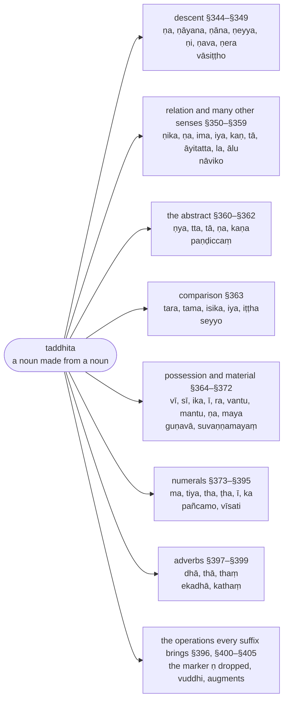

import { LinkCard } from "@astrojs/starlight/components";

:::note
A `taddhita` suffix ("belonging to that") makes a new noun from a noun: `vasiṭṭha` + `ṇa` gives `vāsiṭṭho`, "a descendant of Vasiṭṭha". §344–§364 give the suffixes of descent, relation, collection, place and quality; §364–§372 the possessive suffixes; §373–§395 the numerals, ordinals and their compounds; §396–§405 the operations every suffix brings with it — the elision of the `ṇ` marker, `vuddhi` (strengthening of the first vowel), insertions and elisions.

The Chaṭṭha Saṅgāyana edition counts this chapter as the eighth section of the `nāma` chapter. The [Bālāvatāra's `taddhita` section](/balavatara/4-taddhita) treats the same rules.

:::

:::note[The senses and their suffixes]
A `taddhita` suffix is chosen by the sense it adds; the tree lists the senses in the chapter's order, the suffixes for each, and one example.

:::

## Aṭṭhamakaṇḍa (Eighth Section)

### §344 (361): Vāṇa’pacce (Optionally `ṇa` in the sense of offspring) :badge[apavada]{variant=success}

:::note[Analysis]

| option | before | from   | operation | to         | after  | context |
| ------ | ------ | ------ | --------- | ---------- | ------ | ------- |
| vā     | (chaṭṭhantā liṅgā) | (tassa apaccaṃ) | (paccayo hoti) | ṇa | | apacce |
| optionally | (after a stem in the sixth form ⑥) | (the phrase "his offspring") | (the suffix is added) | `ṇa` | | in the sense of "offspring" |

The sutta is `vā ṇa apacce`, and it opens the chapter on the secondary derivative (`taddhita`, "belonging to that"): a noun made from a noun by adding a suffix (`paccaya`), which stands in for a whole phrase (`vākya`). `apacce` is "in the sense of `apacca`" ("offspring", "descendant"), and the vutti supplies `tassa` ("of him"): the base word is in the sixth form ⑥, as in `vasiṭṭhassa apaccaṃ` ("Vasiṭṭha's offspring"), and the derivative `vāsiṭṭho` says the same in one word. `ṇa` is the suffix. Its `ṇ` is not a sound of the word: it is a marker (`anubandha`) tied to the suffix to signal an operation — here, that the first vowel of the base is strengthened (`vuddhi`: `a` to `ā`, `i` to `e`, `u` to `o`, by [§400 (364): Vuddhādisarassa vā’saṃyogantassa saṇe ca](#m400) and [§405 (365): Ayuvaṇṇānañcāyo vuddhi](#m405)) — and it is then dropped by [§396 (363): Tesaṃ ṇo lopaṃ](#m396), so that `ṇa` adds only `a`. The same marker rides on `ṇāyana`, `ṇāna`, `ṇeyya`, `ṇi`, `ṇava`, `ṇera`, `ṇika`, `ṇya` and `kaṇ` in the rules that follow, where it is not explained again. Every derivation in the chapter has the same skeleton: the inflection of the base is elided by [§317 (332): Tesaṃ vibhattiyo lopā ca](/kaccayana/4-samasakappa#m317), whose vutti extends `tesaṃ` to derivatives and cites `vāsiṭṭho`; the `ṇ` is dropped (§396); the vuddhi is made (§400, §405), unless the first vowel is followed by a conjunct consonant; the final vowel of the base is elided before the vowel of the suffix by [§83 (67): Saralopo’ mādesa paccayādimhi saralope tu pakati](/kaccayana/2-namakappa#m83); and the result, being a noun ([§601 (334): Taddhitasamāsakitakā nāmaṃ vā’ tave tunādīsu ca](/kaccayana/7-kibbidhanakappa#m601)), takes the inflections — `si` becomes `o` in the masculine by [§104 (66): So](/kaccayana/2-namakappa#m104), the feminine adds `ī` by [§239 (190): Ṇava ṇika ṇeyya ṇa ntuhi](/kaccayana/2-namakappa#m239) (`gotamī` is that rule's own example), and the neuter takes `aṃ` by [§219 (195): Siṃ](/kaccayana/2-namakappa#m219). The derivative has no gender of its own: it agrees with the person it names, and the neuter `vāsiṭṭhaṃ` agrees with `apacca` (Bālāvatāra ¶232).

The option marker `vā` opens an open option (`vikappa`) in Ruiz-Falqués' sense: both results are good Pāli. But the two results are not two derived forms. The alternative to the derivative is the phrase itself — `vāsiṭṭho` or `vasiṭṭhassa apaccaṃ`, as the vutti says after each example (`vasiṭṭhassa apaccaṃ vā`); the Bālāvatāra puts it in two words, `Vāti vākyatthaṃ`, "`vā` is for the phrase". This `vā` is an `adhikāra`: it governs the whole run of suffix rules and is repeated by the vutti of every sutta down to [§352 (376): Ṇa rāgā tasse damaññatthesu ca](#m352) (Bālāvatāra ¶233: `Vā apacceti cādhikāro`), and the vutti of [§347 (368): Ato ṇi vā](#m347) and [§350 (373): Yena vā saṃsaṭṭhaṃ tarati carati vahati ṇiko](#m350) draw on it a second time (`Vāti vikappanatthena …`) to admit a further suffix (`ṇika`) and further senses — so that, as the Bālāvatāra says (¶238), the `vā` ranges over many senses and many suffixes as well as over derivative and phrase. As Ruiz-Falqués observes of `vā` generally, no preference is implied: in the canon the derivative is the usual form and the phrase rare, though `vasiṭṭhāpacca`-type compounds do occur (Bālāvatāra ¶232).

:::

> Ṇapaccayo hoti vā ‘‘tassāpacca’’ miccetasmiṃ atthe.

> Vasiṭṭhassa apaccaṃ vāsiṭṭho, vasiṭṭhassa apaccaṃ vā, vasiṭṭhassa apaccaṃ vāsiṭṭhī, vasiṭṭhassa apaccaṃ vāsiṭṭhaṃ. Evaṃ bhāradvājo, bhāradvājī, bhāradvājaṃ. Gotamo, gotamī, gotamaṃ. Vāsudevo, vāsudevī, vāsudevaṃ. Bāladevo, bāladevī, bāladevaṃ. Vesāmitto, vesāmittī vesāmittaṃ.[^75]

Optionally, the suffix `ṇa` is added [to a word in the sixth form ⑥] in the sense "his offspring" (`tassa apaccaṃ`).

:::tip[Examples]

Each name is given in the three genders; the alternative in every case is the phrase, `vasiṭṭhassa apaccaṃ`.

| lemma | inflected | meaning |
| ----- | --------- | ------- |
| 🚹①⨀(vasiṭṭha + ṇa) | vāsiṭṭho | a descendant of Vasiṭṭha — `vasiṭṭhassa apaccaṃ` |
| 🚺①⨀(vasiṭṭha + ṇa + ī) | vāsiṭṭhī | a woman of Vasiṭṭha's line |
| 🚻①⨀(vasiṭṭha + ṇa) | vāsiṭṭhaṃ | Vasiṭṭha's offspring (neuter, agreeing with `apacca`) |
| 🚹①⨀(bharadvāja + ṇa) | bhāradvājo | a descendant of Bharadvāja |
| 🚺①⨀(bharadvāja + ṇa + ī) | bhāradvājī | a woman of Bharadvāja's line |
| 🚻①⨀(bharadvāja + ṇa) | bhāradvājaṃ | Bharadvāja's offspring |
| 🚹①⨀(gotama + ṇa) | gotamo | a descendant of Gotama — the Buddha's clan name |
| 🚺①⨀(gotama + ṇa + ī) | gotamī | a woman of the Gotama clan |
| 🚻①⨀(gotama + ṇa) | gotamaṃ | Gotama's offspring |
| 🚹①⨀(vasudeva + ṇa) | vāsudevo | a descendant of Vasudeva |
| 🚺①⨀(vasudeva + ṇa + ī) | vāsudevī | a woman of Vasudeva's line |
| 🚻①⨀(vasudeva + ṇa) | vāsudevaṃ | Vasudeva's offspring |
| 🚹①⨀(baladeva + ṇa) | bāladevo | a descendant of Baladeva |
| 🚺①⨀(baladeva + ṇa + ī) | bāladevī | a woman of Baladeva's line |
| 🚻①⨀(baladeva + ṇa) | bāladevaṃ | Baladeva's offspring |
| 🚹①⨀(visāmitta + ṇa) | vesāmitto | a descendant of Visāmitta (the Tipiṭaka spells the sage `vessāmitta`) |
| 🚺①⨀(visāmitta + ṇa + ī) | vesāmittī | a woman of Visāmitta's line |
| 🚻①⨀(visāmitta + ṇa) | vesāmittaṃ | Visāmitta's offspring |

The first vowel is strengthened in `vāsiṭṭha`, `bhāradvāja`, `vāsudeva`, `bāladeva` (`a` to `ā`) and `vesāmitta` (`i` to `e`); `gotama` keeps its `o`, which has no higher grade. The derivation of `vāsiṭṭho`, step by step:

|     | vasiṭṭha + sa (⑥⨀) + ṇa        | rule |
| --- | ------------------------------- | ---- |
| →   | vasiṭṭha + ~~sa~~ + ṇa          | §317 |
| →   | vasiṭṭha + (~~ṇ~~a)             | §396 |
| →   | v + (a→ā) + siṭṭha + a          | §400, §405 |
| →   | vāsiṭṭh + (~~a~~ + a)           | §83  |
| →   | vāsiṭṭha + (si→o)               | §104 |
| →   | **vāsiṭṭho**                    |      |

The feminine and the neuter differ only in the inflection:

|     | vāsiṭṭha (f.) + si            | rule |
| --- | ----------------------------- | ---- |
| →   | vāsiṭṭh + (~~a~~ + ī) + si    | §239, §83 |
| →   | vāsiṭṭhī + ~~si~~             | §220 |
| →   | **vāsiṭṭhī**                  |      |

|     | vāsiṭṭha (n.) + si            | rule |
| --- | ----------------------------- | ---- |
| →   | vāsiṭṭha + (si→aṃ)            | §219 |
| →   | **vāsiṭṭhaṃ**                 |      |

> `vāsiṭṭho mayā diṭṭho` \
> [(1V 1.2.9: Dutiyaduṭṭhadosasikkhāpada)](https://tipitaka2500.github.io/tipitaka/1V/1/1.2/1.2.9#1644) \
🚹①⨀(vasiṭṭha + ṇa) ⚧️③⨀(amha) 🚹①⨀(diṭṭha) \
Vāsiṭṭha | by me | was seen

> `samaṇo gotamo sakyaputto sakyakulā pabbajito` \
> [(6D 13: Tevijjasutta)](https://tipitaka2500.github.io/tipitaka/6D/13#893) \
🚹①⨀(samaṇa) 🚹①⨀(gotama + ṇa) 🚹①⨀(sakyaputta) 🚻⑤⨀(sakyakula) 🚹①⨀(pabbajita) \
the ascetic | Gotama | the Sakyan's son | from a Sakyan family | gone forth

> `mahāpajāpati gotamī yena bhagavā tenupasaṅkami` \
> [(1V 1.4.2.7: Eḷakalomadhovāpanasikkhāpada)](https://tipitaka2500.github.io/tipitaka/1V/1/1.4/1.4.2/1.4.2.7#2189) \
🚺①⨀(mahāpajāpati) 🚺①⨀(gotama + ṇa + ī) 🔼(yena) 🚹①⨀(bhagavantu) 🔼(tena) ⏮🤟⨀(upasaṅkamati) \
Mahāpajāpati | Gotamī | where | the Blessed One | there | approached

:::

[^75]: Senart's edition, which Malai (1997) follows, carries four names the CST lacks after the sixth: `svālapako`, `cettako`, `paṇḍavo`, `vāsavo` (T `cittako`; S1 and S2 `paṇḍuvāsavo`), among which `paṇḍavo` is derived from `paṇḍu` at §348 in every text. For the sixth name itself the witnesses divide: the CST and B1 read `vesāmitto`, Senart `vesamitto`, and the manuscripts Malai cites (T, B1, S1, S2 — Senart's witnesses, read with the Nyāsa) have `vessāmitto` (T) and `vessamitto` (S1, S2); Malai emends to `vessāmitto`, the Tipiṭaka's spelling of the sage. The derivation in the table keeps `visāmitta` → `vesāmitto`, the regular pair: `vessamitta` + `ṇa` could not yield `vessāmitto`, since the `vuddhi` of §400 touches only the first vowel, and the canonical spelling is noted in the meaning cell.

---

### §345 (366): Ṇāyana ṇāna vacchādito (`ṇāyana`, `ṇāna` after `vaccha` and the like) :badge[apavada]{variant=success}

:::note[Analysis]

| option | before | from   | operation | to         | after  | context |
| ------ | ------ | ------ | --------- | ---------- | ------ | ------- |
| (vā)   | vacchādito (gottagaṇato) | (tassa apaccaṃ) | (paccayā honti) | ṇāyana \| ṇāna | | (apacce) |
| (optionally) | after `vaccha` and the like (the group of clan names) | (the phrase "his offspring") | (the suffixes are added) | `ṇāyana` \| `ṇāna` | | (in the sense of "offspring") |

`vacchādito` is `vaccha-ādi-to`, "after `vaccha` and the like", and the vutti adds `gottagaṇato`, "after the clan-name group": the seventeen names it runs through, from `vaccha` to `kacca`, are family names (`gotta`; the Bālāvatāra ¶233 defines a `gotta` as the offspring from the grandson onward). `tassāpacce` and `vā` continue from [§344 (361): Vāṇa’pacce](#m344) — the vutti repeats both — and both suffixes carry the `ṇ` marker explained there: they add `-āyana` and `-āna`, with vuddhi where the first vowel of the base is followed by a single consonant (`sakaṭa` to `sākaṭāyana`, `nara` to `nārāyana`, `dvīpa` to `dvepāyana`) and none where a conjunct follows it (`vaccha`, `kaṇha`, `aggivessa`, `gaccha`, `kappa`, `moggalla`, `muñca`, `saṅgha`, `kuñca`, `kacca` — the `asaṃyogantassa` of [§400 (364): Vuddhādisarassa vā’saṃyogantassa saṇe ca](#m400); the Bālāvatāra says of `kaccāyano`, `Saṃyogantattā na vuddhi`). The final `a` of the base is elided before the `ā` of the suffix by [§83 (67): Saralopo’ mādesa paccayādimhi saralope tu pakati](/kaccayana/2-namakappa#m83). The carried `vā` ranges here over three things: the derivative or the phrase (`vacchassa apaccaṃ vā`); and, between derivatives, `ṇāyana` or `ṇāna` — the vutti gives both for every name — so that `kaccāyano` and `kaccāno`, the two forms of the name this grammar bears, stand side by side, and both are Tipiṭaka spellings. The feminine adds `ī` by [§238 (187): Nadādito vā ī](/kaccayana/2-namakappa#m238) (these stems end in `a` and are not in the list of §239); the neuter takes `aṃ` by [§219 (195): Siṃ](/kaccayana/2-namakappa#m219).

:::

> Tasmā vacchādito gottagaṇato ṇāyanaṇānapaccayā honti vā ‘‘tassāpacca’’miccetasmiṃ atthe.

> Vacchassa apaccaṃvacchāyano, vacchāno, vacchassa apaccaṃ vā, vacchassa apaccaṃ vacchāyanī, vacchānī, vacchassa apaccaṃ vacchāyanaṃ, vacchānaṃ. Sakaṭassa apaccaṃ sākaṭāyano, sākaṭāno, sakaṭassa apaccaṃ vā, sākaṭāyanī, sā kaṭānī, sākaṭāyanaṃ, sākaṭānaṃ. Evaṃ kaṇhāyano, kaṇhāno, kaṇhassa apaccaṃ vā. Kaṇhāyanī, kaṇhānī, kaṇhāyanaṃ, kaṇhānaṃ. Aggivessāyano, aggivessāno, aggivessāyanī, aggivessānī, aggivessāyanaṃ, aggivessānaṃ. Gacchāyano, gacchāno, gacchāyanī, gacchānī, gacchāyanaṃ, gacchānaṃ. Kappāyano, kappāno, kappāyanī, kappānī, kappāyanaṃ, kappānaṃ. Moggallāyano, moggallāno, moggallāyanī, moggallānī, moggallāyanaṃ, moggallānaṃ. Muñcāyano, muñcāno, muñcāyanī, muñcānī, muñcāyanaṃ, muñcānaṃ.[^76] Saṅghāyano, saṅghāno, saṅghāyanī, saṅghānī, saṅghāyanaṃ, saṅghānaṃ. Lomāyano, lomāno, lomāyanī, lomānī, lomāyanaṃ, lomānaṃ, sākamāyano, sākamāno, sākamāyanī, sākamānī, sākamāyanaṃ, sākamānaṃ. Nārāyano, nārāno, nārāyanī, nārānī, nārāyanaṃ, nārānaṃ. Corāyanocorāno, corāyanī, corānī, corāyanaṃ, corānaṃ, āvasālāyano, āvasālāno, āvasālāyanī, āvasālānī, āvasālāyanaṃ, āvasālānaṃ. Dvepāyano, dvepāno, dvepāyanī, dvepānī, dvepāyanaṃ, dvepānaṃ. Kuñcāyano, kuñcāno, kuñcāyanī, kuñcānī, kuñcāyanaṃ, kuñcānaṃ. Kaccāyano, kaccāno, kaccāyanī, kaccānī, kaccāyanaṃ, kaccānaṃ.

After `vaccha` and the like — the group of clan names — the suffixes `ṇāyana` and `ṇāna` are optionally added in the sense "his offspring".

:::tip[Examples]

The vutti takes each of the seventeen names through both suffixes and all three genders, in the order masculine, feminine, neuter; the pattern never varies, and the alternative in every case is the phrase (`vacchassa apaccaṃ vā`). Where the meaning cell names no clan, the name is known only from this list.

| lemma | inflected | meaning |
| ----- | --------- | ------- |
| 🚹①⨀(vaccha + ṇāyana) | vacchāyano | a descendant of Vaccha |
| 🚹①⨀(vaccha + ṇāna) | vacchāno | a descendant of Vaccha, with `ṇāna` |
| 🚺①⨀(vaccha + ṇāyana + ī) | vacchāyanī | a woman of the Vaccha clan |
| 🚺①⨀(vaccha + ṇāna + ī) | vacchānī | a woman of the Vaccha clan, with `ṇāna` |
| 🚻①⨀(vaccha + ṇāyana) | vacchāyanaṃ | Vaccha's offspring (neuter) |
| 🚻①⨀(vaccha + ṇāna) | vacchānaṃ | Vaccha's offspring (neuter), with `ṇāna` |
| 🚹①⨀(sakaṭa + ṇāyana) | sākaṭāyano | a descendant of Sakaṭa (`a` to `ā`) |
| 🚹①⨀(sakaṭa + ṇāna) | sākaṭāno | a descendant of Sakaṭa, with `ṇāna` |
| 🚺①⨀(sakaṭa + ṇāyana + ī) | sākaṭāyanī | a woman of the Sakaṭa clan |
| 🚺①⨀(sakaṭa + ṇāna + ī) | sākaṭānī | a woman of the Sakaṭa clan, with `ṇāna` |
| 🚻①⨀(sakaṭa + ṇāyana) | sākaṭāyanaṃ | Sakaṭa's offspring (neuter) |
| 🚻①⨀(sakaṭa + ṇāna) | sākaṭānaṃ | Sakaṭa's offspring (neuter), with `ṇāna` |
| 🚹①⨀(kaṇha + ṇāyana) | kaṇhāyano | a descendant of Kaṇha |
| 🚹①⨀(kaṇha + ṇāna) | kaṇhāno | a descendant of Kaṇha, with `ṇāna` |
| 🚺①⨀(kaṇha + ṇāyana + ī) | kaṇhāyanī | a woman of the Kaṇha clan |
| 🚺①⨀(kaṇha + ṇāna + ī) | kaṇhānī | a woman of the Kaṇha clan, with `ṇāna` |
| 🚻①⨀(kaṇha + ṇāyana) | kaṇhāyanaṃ | Kaṇha's offspring (neuter) |
| 🚻①⨀(kaṇha + ṇāna) | kaṇhānaṃ | Kaṇha's offspring (neuter), with `ṇāna` |
| 🚹①⨀(aggivessa + ṇāyana) | aggivessāyano | a descendant of Aggivessa |
| 🚹①⨀(aggivessa + ṇāna) | aggivessāno | a descendant of Aggivessa, with `ṇāna` |
| 🚺①⨀(aggivessa + ṇāyana + ī) | aggivessāyanī | a woman of the Aggivessa clan |
| 🚺①⨀(aggivessa + ṇāna + ī) | aggivessānī | a woman of the Aggivessa clan, with `ṇāna` |
| 🚻①⨀(aggivessa + ṇāyana) | aggivessāyanaṃ | Aggivessa's offspring (neuter) |
| 🚻①⨀(aggivessa + ṇāna) | aggivessānaṃ | Aggivessa's offspring (neuter), with `ṇāna` |
| 🚹①⨀(gaccha + ṇāyana) | gacchāyano | a descendant of Gaccha |
| 🚹①⨀(gaccha + ṇāna) | gacchāno | a descendant of Gaccha, with `ṇāna` |
| 🚺①⨀(gaccha + ṇāyana + ī) | gacchāyanī | a woman of the Gaccha clan |
| 🚺①⨀(gaccha + ṇāna + ī) | gacchānī | a woman of the Gaccha clan, with `ṇāna` |
| 🚻①⨀(gaccha + ṇāyana) | gacchāyanaṃ | Gaccha's offspring (neuter) |
| 🚻①⨀(gaccha + ṇāna) | gacchānaṃ | Gaccha's offspring (neuter), with `ṇāna` |
| 🚹①⨀(kappa + ṇāyana) | kappāyano | a descendant of Kappa |
| 🚹①⨀(kappa + ṇāna) | kappāno | a descendant of Kappa, with `ṇāna` |
| 🚺①⨀(kappa + ṇāyana + ī) | kappāyanī | a woman of the Kappa clan |
| 🚺①⨀(kappa + ṇāna + ī) | kappānī | a woman of the Kappa clan, with `ṇāna` |
| 🚻①⨀(kappa + ṇāyana) | kappāyanaṃ | Kappa's offspring (neuter) |
| 🚻①⨀(kappa + ṇāna) | kappānaṃ | Kappa's offspring (neuter), with `ṇāna` |
| 🚹①⨀(moggalla + ṇāyana) | moggallāyano | a descendant of Moggalla |
| 🚹①⨀(moggalla + ṇāna) | moggallāno | a descendant of Moggalla, with `ṇāna` |
| 🚺①⨀(moggalla + ṇāyana + ī) | moggallāyanī | a woman of the Moggalla clan |
| 🚺①⨀(moggalla + ṇāna + ī) | moggallānī | a woman of the Moggalla clan, with `ṇāna` |
| 🚻①⨀(moggalla + ṇāyana) | moggallāyanaṃ | Moggalla's offspring (neuter) |
| 🚻①⨀(moggalla + ṇāna) | moggallānaṃ | Moggalla's offspring (neuter), with `ṇāna` |
| 🚹①⨀(muñca + ṇāyana) | muñcāyano | a descendant of Muñca |
| 🚹①⨀(muñca + ṇāna) | muñcāno | a descendant of Muñca, with `ṇāna` |
| 🚺①⨀(muñca + ṇāyana + ī) | muñcāyanī | a woman of the Muñca clan |
| 🚺①⨀(muñca + ṇāna + ī) | muñcānī | a woman of the Muñca clan, with `ṇāna` |
| 🚻①⨀(muñca + ṇāyana) | muñcāyanaṃ | Muñca's offspring (neuter) |
| 🚻①⨀(muñca + ṇāna) | muñcānaṃ | Muñca's offspring (neuter), with `ṇāna` |
| 🚹①⨀(saṅgha + ṇāyana) | saṅghāyano | a descendant of Saṅgha |
| 🚹①⨀(saṅgha + ṇāna) | saṅghāno | a descendant of Saṅgha, with `ṇāna` |
| 🚺①⨀(saṅgha + ṇāyana + ī) | saṅghāyanī | a woman of the Saṅgha clan |
| 🚺①⨀(saṅgha + ṇāna + ī) | saṅghānī | a woman of the Saṅgha clan, with `ṇāna` |
| 🚻①⨀(saṅgha + ṇāyana) | saṅghāyanaṃ | Saṅgha's offspring (neuter) |
| 🚻①⨀(saṅgha + ṇāna) | saṅghānaṃ | Saṅgha's offspring (neuter), with `ṇāna` |
| 🚹①⨀(loma + ṇāyana) | lomāyano | a descendant of Loma |
| 🚹①⨀(loma + ṇāna) | lomāno | a descendant of Loma, with `ṇāna` |
| 🚺①⨀(loma + ṇāyana + ī) | lomāyanī | a woman of the Loma clan |
| 🚺①⨀(loma + ṇāna + ī) | lomānī | a woman of the Loma clan, with `ṇāna` |
| 🚻①⨀(loma + ṇāyana) | lomāyanaṃ | Loma's offspring (neuter) |
| 🚻①⨀(loma + ṇāna) | lomānaṃ | Loma's offspring (neuter), with `ṇāna` |
| 🚹①⨀(sākama + ṇāyana) | sākamāyano | a descendant of Sākama (the base is not otherwise known) |
| 🚹①⨀(sākama + ṇāna) | sākamāno | a descendant of Sākama, with `ṇāna` |
| 🚺①⨀(sākama + ṇāyana + ī) | sākamāyanī | a woman of the Sākama clan |
| 🚺①⨀(sākama + ṇāna + ī) | sākamānī | a woman of the Sākama clan, with `ṇāna` |
| 🚻①⨀(sākama + ṇāyana) | sākamāyanaṃ | Sākama's offspring (neuter) |
| 🚻①⨀(sākama + ṇāna) | sākamānaṃ | Sākama's offspring (neuter), with `ṇāna` |
| 🚹①⨀(nara + ṇāyana) | nārāyano | a descendant of Nara (`a` to `ā`; Nārāyana) |
| 🚹①⨀(nara + ṇāna) | nārāno | a descendant of Nara, with `ṇāna` |
| 🚺①⨀(nara + ṇāyana + ī) | nārāyanī | a woman of the Nara clan |
| 🚺①⨀(nara + ṇāna + ī) | nārānī | a woman of the Nara clan, with `ṇāna` |
| 🚻①⨀(nara + ṇāyana) | nārāyanaṃ | Nara's offspring (neuter) |
| 🚻①⨀(nara + ṇāna) | nārānaṃ | Nara's offspring (neuter), with `ṇāna` |
| 🚹①⨀(cora + ṇāyana) | corāyano | a descendant of Cora |
| 🚹①⨀(cora + ṇāna) | corāno | a descendant of Cora, with `ṇāna` |
| 🚺①⨀(cora + ṇāyana + ī) | corāyanī | a woman of the Cora clan |
| 🚺①⨀(cora + ṇāna + ī) | corānī | a woman of the Cora clan, with `ṇāna` |
| 🚻①⨀(cora + ṇāyana) | corāyanaṃ | Cora's offspring (neuter) |
| 🚻①⨀(cora + ṇāna) | corānaṃ | Cora's offspring (neuter), with `ṇāna` |
| 🚹①⨀(āvasāla + ṇāyana) | āvasālāyano | a descendant of Āvasāla (the base is not otherwise known) |
| 🚹①⨀(āvasāla + ṇāna) | āvasālāno | a descendant of Āvasāla, with `ṇāna` |
| 🚺①⨀(āvasāla + ṇāyana + ī) | āvasālāyanī | a woman of the Āvasāla clan |
| 🚺①⨀(āvasāla + ṇāna + ī) | āvasālānī | a woman of the Āvasāla clan, with `ṇāna` |
| 🚻①⨀(āvasāla + ṇāyana) | āvasālāyanaṃ | Āvasāla's offspring (neuter) |
| 🚻①⨀(āvasāla + ṇāna) | āvasālānaṃ | Āvasāla's offspring (neuter), with `ṇāna` |
| 🚹①⨀(dvīpa + ṇāyana) | dvepāyano | a descendant of Dvīpa (`ī` to `e`; Sanskrit Dvaipāyana) |
| 🚹①⨀(dvīpa + ṇāna) | dvepāno | a descendant of Dvīpa, with `ṇāna` |
| 🚺①⨀(dvīpa + ṇāyana + ī) | dvepāyanī | a woman of the Dvīpa clan |
| 🚺①⨀(dvīpa + ṇāna + ī) | dvepānī | a woman of the Dvīpa clan, with `ṇāna` |
| 🚻①⨀(dvīpa + ṇāyana) | dvepāyanaṃ | Dvīpa's offspring (neuter) |
| 🚻①⨀(dvīpa + ṇāna) | dvepānaṃ | Dvīpa's offspring (neuter), with `ṇāna` |
| 🚹①⨀(kuñca + ṇāyana) | kuñcāyano | a descendant of Kuñca |
| 🚹①⨀(kuñca + ṇāna) | kuñcāno | a descendant of Kuñca, with `ṇāna` |
| 🚺①⨀(kuñca + ṇāyana + ī) | kuñcāyanī | a woman of the Kuñca clan |
| 🚺①⨀(kuñca + ṇāna + ī) | kuñcānī | a woman of the Kuñca clan, with `ṇāna` |
| 🚻①⨀(kuñca + ṇāyana) | kuñcāyanaṃ | Kuñca's offspring (neuter) |
| 🚻①⨀(kuñca + ṇāna) | kuñcānaṃ | Kuñca's offspring (neuter), with `ṇāna` |
| 🚹①⨀(kacca + ṇāyana) | kaccāyano | a descendant of Kacca — the author of this grammar bears the name |
| 🚹①⨀(kacca + ṇāna) | kaccāno | a descendant of Kacca, with `ṇāna` |
| 🚺①⨀(kacca + ṇāyana + ī) | kaccāyanī | a woman of the Kacca clan |
| 🚺①⨀(kacca + ṇāna + ī) | kaccānī | a woman of the Kacca clan, with `ṇāna` |
| 🚻①⨀(kacca + ṇāyana) | kaccāyanaṃ | Kacca's offspring (neuter) |
| 🚻①⨀(kacca + ṇāna) | kaccānaṃ | Kacca's offspring (neuter), with `ṇāna` |

With vuddhi (`sakaṭa`) and without it (`vaccha`, whose first vowel is followed by the conjunct `cch`):

|     | sakaṭa + sa (⑥⨀) + ṇāyana       | rule |
| --- | ------------------------------- | ---- |
| →   | sakaṭa + ~~sa~~ + ṇāyana        | §317 |
| →   | sakaṭa + (~~ṇ~~āyana)           | §396 |
| →   | s + (a→ā) + kaṭa + āyana        | §400, §405 |
| →   | sākaṭ + (~~a~~ + āyana)         | §83  |
| →   | sākaṭāyana + (si→o)             | §104 |
| →   | **sākaṭāyano**                  |      |

|     | vaccha + sa (⑥⨀) + ṇāna         | rule |
| --- | ------------------------------- | ---- |
| →   | vaccha + ~~sa~~ + ṇāna          | §317 |
| →   | vaccha + (~~ṇ~~āna)             | §396 |
| →   | vacch + (~~a~~ + āna)           | §83  |
| →   | vacchāna + (si→o)               | §104 |
| →   | **vacchāno**                    |      |

|     | vacchāyana (f.) + si            | rule |
| --- | ------------------------------- | ---- |
| →   | vacchāyan + (~~a~~ + ī) + si    | §238, §83 |
| →   | vacchāyanī + ~~si~~             | §220 |
| →   | **vacchāyanī**                  |      |

> `handa kuto nu bhavaṃ vacchāyano āgacchati` \
> [(9M 3.7: Cūḷahatthipadopamasutta)](https://tipitaka2500.github.io/tipitaka/9M/3/3.7#1009) \
🔼(handa) ⚧️⑤⨀(kiṃ + to) 🔼(nu) 🚹①⨀(bhavanta) 🚹①⨀(vaccha + ṇāyana) ▶️🤟⨀(āgacchati) \
well now | from where | ? | the honourable | Vacchāyana | is coming

> `accagā vata kappāyano, maccudheyyaṃ suduttaraṃ` \
> [(18Sn 2.12: Nigrodhakappa (vaṅgīsa) sutta)](https://tipitaka2500.github.io/tipitaka/18Sn/2/2.12#417) \
⏮🤟⨀(atigacchati) 🔼(vata) 🚹①⨀(kappa + ṇāyana) 🚻②⨀(maccudheyya) 🚻②⨀(suduttara) \
has gone beyond | indeed | Kappāyana | the realm of death | so hard to cross

> `saccaṃ, bhikkhave, moggallāno āha` \
> [(1V 1.1.4.2: Vinītavatthu)](https://tipitaka2500.github.io/tipitaka/1V/1/1.1/1.1.4/1.1.4.2#745) \
🚻①⨀(sacca) 🚹⓪⨂(bhikkhu) 🚹①⨀(moggalla + ṇāna) ⏮🤟⨀(āha) \
the truth | bhikkhus | Moggallāna | spoke

:::

[^76]: CST4, with B1, reads `muñcāyano`, `muñcāno` and `kuñcāyano`, `kuñcāno`; Senart's edition and T read `muñjāyano`, `muñjāno` (T `muñjassa apaccaṃ`), and T, S1 and S2 `kuñjāyano`, `kuñjāno` — the readings Malai (1997) prints (Senart's list has seven clan names to B1's seventeen). The `vacchādi` group is Pāṇini's gotra list in Pāli dress — Śākaṭāyana, Kārṣṇāyana, Maudgalyāyana, Kātyāyana — and there Muñja (Pāṇ. 4.1.99, Mauñjāyana) and Kuñja (4.1.98 `kuñjādibhyaś cphañ`, Kauñjāyana) are the clan names, while `muñca` and `kuñca` are names nowhere; the Burmese `c` looks like a corruption of `j`, and an emendation to `muñja`, `kuñja` would be defensible. The table keeps the CST's spelling.

---

### §346 (367): Ṇeyyo kattikādīhi (`ṇeyya` after `kattikā` and the like) :badge[apavada]{variant=success}

:::note[Analysis]

| option | before | from   | operation | to         | after  | context |
| ------ | ------ | ------ | --------- | ---------- | ------ | ------- |
| (vā)   | kattikādīhi (gottagaṇehi) | (tassa apaccaṃ) | (paccayo hoti) | ṇeyya | | (apacce) |
| (optionally) | after `kattikā` and the like (clan-name groups) | (the phrase "his offspring") | (the suffix is added) | `ṇeyya` | | (in the sense of "offspring") |

`ṇeyyo` is the suffix `ṇeyya` cited in the first form; `kattikādīhi` is "after `kattikā` and the like", and the vutti's `tehi gottagaṇehi` ("after those clan groups") makes them family names too. Most are the names of women — `kattikā`, `vinatā`, `rohiṇī`, `gaṅgā`, `nadī`, `ālī`, `sālā`, `bālā`, `mālā`, `kālī` — with a few masculine (`kaddama`, `ahi`, `kāma`) and `suci`, which the vutti treats as feminine (`suciyā apaccaṃ`); the descent is reckoned through the mother. `tassāpacce` and `vā` continue from [§344 (361): Vāṇa’pacce](#m344), and the `ṇ` marker works as there: `vinatā` becomes `venateyya` and `suci` `soceyya`, `nadī` `nādeyya` and `ahi` `āheyya`, while `kattikā`, `gaṅgā` and `kaddama` keep their vowel before a conjunct ([§400 (364): Vuddhādisarassa vā’saṃyogantassa saṇe ca](#m400)), and `rohiṇī`, `ālī`, `kāma`, `sālā`, `bālā`, `mālā`, `kālī` already carry a long vowel or `o`.[^42] The final vowel of the base — `ā`, `ī` or `i` — is elided before the `e` of the suffix ([§83 (67): Saralopo’ mādesa paccayādimhi saralope tu pakati](/kaccayana/2-namakappa#m83)). The carried `vā` again leaves the phrase available (`kattikāya apaccaṃ vā`); the Bālāvatāra (¶234) adds a second use of the option, the form without vuddhi (`vinateyyo` beside `venateyyo`), which it takes from the `vā` of §400.

:::

> Tehi gottagaṇehi kattikādīhi ṇeyyapaccayo hoti vā ‘‘tassāpacca’’miccetasmiṃ atthe.

> Kattikāya apaccaṃ kattikeyyo, kattikāya apaccaṃ vā. Evaṃ venateyyo, rohiṇeyyo, gaṅgeyyo, kaddameyyo, nādeyyo, āleyyo, āheyyo[^1], kāmeyyo, suciyā apaccaṃ soceyyo, sāleyyo, bāleyyo, māleyyo, kāleyyo.

After those clan groups, `kattikā` and the like, the suffix `ṇeyya` is optionally added in the sense "his offspring".

:::tip[Examples]

| lemma | inflected | meaning |
| ----- | --------- | ------- |
| 🚹①⨀(kattikā + ṇeyya) | kattikeyyo | a descendant of Kattikā — `kattikāya apaccaṃ` |
| 🚹①⨀(vinatā + ṇeyya) | venateyyo | a descendant of Vinatā — the `garuḷa`, Vinatā's son |
| 🚹①⨀(rohiṇī + ṇeyya) | rohiṇeyyo | a descendant of Rohiṇī |
| 🚹①⨀(gaṅgā + ṇeyya) | gaṅgeyyo | a child of Gaṅgā — of the Ganges |
| 🚹①⨀(kaddama + ṇeyya) | kaddameyyo | a descendant of Kaddama |
| 🚹①⨀(nadī + ṇeyya) | nādeyyo | a child of the river (`nadī`) |
| 🚹①⨀(ālī + ṇeyya) | āleyyo | a descendant of Ālī |
| 🚹①⨀(ahi + ṇeyya) | āheyyo | the offspring of a snake (`ahi`) |
| 🚹①⨀(kāma + ṇeyya) | kāmeyyo | a descendant of Kāma |
| 🚹①⨀(suci + ṇeyya) | soceyyo | a descendant of Suci — `suciyā apaccaṃ` |
| 🚹①⨀(sālā + ṇeyya) | sāleyyo | a descendant of Sālā — of the village Sālā |
| 🚹①⨀(bālā + ṇeyya) | bāleyyo | a descendant of Bālā |
| 🚹①⨀(mālā + ṇeyya) | māleyyo | a descendant of Mālā |
| 🚹①⨀(kālī + ṇeyya) | kāleyyo | a descendant of Kālī |

With vuddhi of `i` to `e` (`vinatā`), of `u` to `o` (`suci`), and none before a conjunct (`kattikā`):

|     | vinatā + sa (⑥⨀) + ṇeyya        | rule |
| --- | ------------------------------- | ---- |
| →   | vinatā + ~~sa~~ + ṇeyya         | §317 |
| →   | vinatā + (~~ṇ~~eyya)            | §396 |
| →   | v + (i→e) + natā + eyya         | §400, §405 |
| →   | venat + (~~ā~~ + eyya)          | §83  |
| →   | venateyya + (si→o)              | §104 |
| →   | **venateyyo**                   |      |

|     | suci + sa (⑥⨀) + ṇeyya          | rule |
| --- | ------------------------------- | ---- |
| →   | suci + ~~sa~~ + ṇeyya           | §317 |
| →   | suci + (~~ṇ~~eyya)              | §396 |
| →   | s + (u→o) + ci + eyya           | §400, §405 |
| →   | soc + (~~i~~ + eyya)            | §83  |
| →   | soceyya + (si→o)                | §104 |
| →   | **soceyyo**                     |      |

|     | kattikā + sa (⑥⨀) + ṇeyya       | rule |
| --- | ------------------------------- | ---- |
| →   | kattikā + ~~sa~~ + ṇeyya        | §317 |
| →   | kattikā + (~~ṇ~~eyya)           | §396 |
| →   | kattik + (~~ā~~ + eyya)         | §83  |
| →   | kattikeyya + (si→o)             | §104 |
| →   | **kattikeyyo**                  |      |

> `garuḷo pana venateyyo kimāha` \
> [(22J 10.1.3: Catuposathiyajātaka)](https://tipitaka2500.github.io/tipitaka/22J/10/10.1/10.1.3#1940) \
🚹①⨀(garuḷa) 🔼(pana) 🚹①⨀(vinatā + ṇeyya) ⚧️②⨀(kiṃ) ⏮🤟⨀(āha) \
the garuḷa | but | Vinatā's son | what | said

> `sobhati maccho gaṅgeyyo` \
> [(22J 2.6.5: Gaṅgeyyajātaka)](https://tipitaka2500.github.io/tipitaka/22J/2/2.6/2.6.5#518) \
▶️🤟⨀(sobhati) 🚹①⨀(maccha) 🚹①⨀(gaṅgā + ṇeyya) \
is beautiful | the fish | of the Ganges

:::

:::note[Additional]

The Bālāvatāra (¶234) reads the rule twice (`yogavibhāga`): `ṇeyyo` on its own also expresses "to whom that is given", `dakkhiṇā dīyate yassa so dakkhiṇeyyo`, "one to whom an offering is given" — the `dakkhiṇeyya` of the Saṅgha formula. Kaccāyana's vutti confines the rule to offspring.

:::

[^1]: CST4 prints `āheyo`; the Padarūpasiddhi reads `āheyyo`, the form the suffix `ṇeyya` requires.

[^42]: U Nandisena (2005) reconstructs the bases as feminine names — `Kaddamā`, `Kamī`, `Salā`, `Balā`, `Malā`, `Kalā` — with the short vowel that the `vuddhi` of `Kāmeyyo`, `Sāleyyo` and the rest then lengthens, and a base `Āhi` for `āheyyo`; he does the same at §347 (`Naṭaputta`, `Dasaputta`, `Dasava`, `Pavaka` for `nāṭaputta`, `dāsaputta`, `dāsava`, `pāvaka`). The vutti names bases only for `kattikā`, `suci` and, by `Evaṃ`, `vinatā`, so either derivation is possible in form; the chapter keeps the attested words — `kāma`, Sālā the village, `pāvaka` "fire", Nāṭaputta — since the back-formed bases are not words (`Āhi` is unknown), and `ahi` with `vuddhi` gives `āheyyo` directly. The manuscripts Malai cites bear on both points. T names the bases — `antiyā`, `ahiyā`, `kapiyā`, `suciyā`, `gāviyā`, `bālāya`, `muliyā`, `kuliyā apaccaṃ` — so its `ahiyā apaccaṃ: āheyyo` confirms the base `ahi` against Nandisena's `Āhi`; and Senart's edition, which Malai (1997) prints, reads `atteyyo`, `kāpeyyo`, `seveyyo`, `gāveyyo`, `moleyyo`, `koleyyo` where the CST (= B1) has `āleyyo`, `kāmeyyo`, `soceyyo`, `sāleyyo`, `māleyyo`, `kāleyyo` — an older set built on short-vowel bases that take the `vuddhi` (`kapi` → `kāpeyya`, Sanskrit Kāpeya, a gotra; `muli`, `kuli` → `moleyya`, `koleyya`), beside which B1's `kāmeyyo`, `māleyyo`, `kāleyyo` look like a regularisation to long-vowel feminine names. The list translated here is the CST's, and its choice of attested words stands, but the older text differs in six of the fourteen words; on the bases, T and Malai side with the chapter, Nandisena against it.

---

### §347 (368): Ato ṇi vā (Optionally `ṇi` after a stem in `a`) :badge[apavada]{variant=success}

:::note[Analysis]

| option | before | from   | operation | to         | after  | context |
| ------ | ------ | ------ | --------- | ---------- | ------ | ------- |
| vā     | ato    | (tassa apaccaṃ) | (paccayo hoti) | ṇi | | (apacce) |
| optionally | after [a stem ending in] `a` | (the phrase "his offspring") | (the suffix is added) | `ṇi` | | (in the sense of "offspring") |

`ato` is `akārato`, "after [a stem ending in] the letter `a`" — `dakkha`, `duṇa`, `sakyaputta` and the rest; `tassāpacce` continues from [§344 (361): Vāṇa’pacce](#m344). `ṇi` adds `i`, with the vuddhi its marker calls for (`duṇa` to `doṇi`, `varuṇa` to `vāruṇi`, `jinadatta` to `jenadatti`) and none before a conjunct (`dakkha`, `sakyaputta`, `gaṇḍa`, `buddha`, `dhamma`, `saṅgha`, `kappa`); `anuruddhi` is left without the vuddhi its first vowel would allow, which the `vā` of [§400 (364): Vuddhādisarassa vā’saṃyogantassa saṇe ca](#m400) permits. The final `a` of the base is elided before the `i` ([§83 (67): Saralopo’ mādesa paccayādimhi saralope tu pakati](/kaccayana/2-namakappa#m83)), and the derivative is an `i`-stem, whose `si` is elided by [§220 (74): Sesato lopaṃ gasipi](/kaccayana/2-namakappa#m220). The `vā` is written in the sutta although it is already carried from §344, and the vutti says why: `Vāti vikappanatthena ṇikapaccayo hoti` — by `vā` in its sense of option the suffix `ṇika` also occurs in this meaning, `sakyaputtassa apaccaṃ sakyaputtiko`. So the option here ranges over the derivative or the phrase (`dakkhassa apaccaṃ vā`), and over the suffix: `ṇi`, the `ṇa` of §344, or `ṇika`; the Bālāvatāra (¶235) uses the same `vā` to add `ba` with doubling (`maṇḍabbo`, `bhātubbo`). In Ruiz-Falqués' terms the option is open, and no preference is implied; the Tipiṭaka in fact prefers a fourth form, `sakyaputtiyo` with `iya`.

:::

> Tasmā akārato ṇipaccayo hoti vā ‘‘tassāpacca’’miccetasmiṃ atthe.

> Dakkhassa apaccaṃ dakkhi, dakkhassa apaccaṃ vā. Duṇassa apaccaṃ doṇi, duṇassa apaccaṃ vā, evaṃ vāsavi, sakyaputti, nāṭaputti, dāsaputti, dāsavi, vāruṇi, gaṇḍi, bāladevi, pāvaki, jenadatti, buddhi, dhammi, saṅghi, kappi, anuruddhi.[^77]

> Vāti vikappanatthena ṇikapaccayo hoti ‘‘tassāpacca’’miccetasmiṃ atthe. Sakyaputtassa apaccaṃ sakyaputtiko. Evaṃ nāṭaputtiko, jenadattiko.

Optionally, the suffix `ṇi` is added after [a stem ending in] `a` in the sense "his offspring".

:::tip[Examples]

| lemma | inflected | meaning |
| ----- | --------- | ------- |
| 🚹①⨀(dakkha + ṇi) | dakkhi | a descendant of Dakkha — `dakkhassa apaccaṃ` |
| 🚹①⨀(duṇa + ṇi) | doṇi | a descendant of Duṇa — `duṇassa apaccaṃ` (the vutti gives the base as `duṇa` so that the vuddhi yields `doṇi`; Sanskrit Droṇa, whose son is Drauṇi) |
| 🚹①⨀(vāsava + ṇi) | vāsavi | a descendant of Vāsava (Sakka) |
| 🚹①⨀(sakyaputta + ṇi) | sakyaputti | a descendant of the Sakyan's son |
| 🚹①⨀(nāṭaputta + ṇi) | nāṭaputti | a descendant of Nāṭaputta |
| 🚹①⨀(dāsaputta + ṇi) | dāsaputti | a descendant of Dāsaputta |
| 🚹①⨀(dāsava + ṇi) | dāsavi | a descendant of Dāsava |
| 🚹①⨀(varuṇa + ṇi) | vāruṇi | a descendant of Varuṇa |
| 🚹①⨀(gaṇḍa + ṇi) | gaṇḍi | a descendant of Gaṇḍa |
| 🚹①⨀(bāladeva + ṇi) | bāladevi | a descendant of Bāladeva |
| 🚹①⨀(pāvaka + ṇi) | pāvaki | a descendant of Pāvaka |
| 🚹①⨀(jinadatta + ṇi) | jenadatti | a descendant of Jinadatta |
| 🚹①⨀(buddha + ṇi) | buddhi | a descendant of Buddha |
| 🚹①⨀(dhamma + ṇi) | dhammi | a descendant of Dhamma |
| 🚹①⨀(saṅgha + ṇi) | saṅghi | a descendant of Saṅgha |
| 🚹①⨀(kappa + ṇi) | kappi | a descendant of Kappa |
| 🚹①⨀(anuruddha + ṇi) | anuruddhi | a descendant of Anuruddha (no vuddhi, by the `vā` of §400) |

|     | duṇa + sa (⑥⨀) + ṇi             | rule |
| --- | ------------------------------- | ---- |
| →   | duṇa + ~~sa~~ + ṇi              | §317 |
| →   | duṇa + (~~ṇ~~i)                 | §396 |
| →   | d + (u→o) + ṇa + i              | §400, §405 |
| →   | doṇ + (~~a~~ + i)               | §83  |
| →   | doṇi + ~~si~~                   | §220 |
| →   | **doṇi**                        |      |

|     | dakkha + sa (⑥⨀) + ṇi           | rule |
| --- | ------------------------------- | ---- |
| →   | dakkha + ~~sa~~ + ṇi            | §317 |
| →   | dakkha + (~~ṇ~~i)               | §396 |
| →   | dakkh + (~~a~~ + i)             | §83  |
| →   | dakkhi + ~~si~~                 | §220 |
| →   | **dakkhi**                      |      |

None of these `ṇi` forms is attested in the Tipiṭaka; the `doṇi` that occurs there is the feminine noun "trough".

:::

By the word `vā`, in its sense of option, the suffix `ṇika` also occurs in the sense "his offspring".

:::tip[Examples]

| lemma | inflected | meaning |
| ----- | --------- | ------- |
| 🚹①⨀(sakyaputta + ṇika) | sakyaputtiko | a descendant of the Sakyan's son — `sakyaputtassa apaccaṃ` |
| 🚹①⨀(nāṭaputta + ṇika) | nāṭaputtiko | a descendant of Nāṭaputta |
| 🚹①⨀(jinadatta + ṇika) | jenadattiko | a descendant of Jinadatta |

|     | sakyaputta + sa (⑥⨀) + ṇika     | rule |
| --- | ------------------------------- | ---- |
| →   | sakyaputta + ~~sa~~ + ṇika      | §317 |
| →   | sakyaputta + (~~ṇ~~ika)         | §396 |
| →   | sakyaputt + (~~a~~ + ika)       | §83  |
| →   | sakyaputtika + (si→o)           | §104 |
| →   | **sakyaputtiko**                |      |

There is no vuddhi: the first vowel of `sakyaputta` is followed by the conjunct `ky`. The Tipiṭaka's word is `sakyaputtiyo`, formed with the `iya` of [§353 (378): Jātādīnamimiyā ca](#m353).

:::

[^77]: Senart's edition prints `ānuruddhi`, with the `vuddhi` the paragraph above says is left unmade, and Malai (1997) follows him; T and B1 read `anuruddhi` with the CST, so the remark holds for the manuscripts, but one edition applies the strengthening. Senart and T also read `kaṇhi` — Kaṇha, a clan of §345, and the better example — where the CST has `gaṇḍi`; and T adds `gottagaṇato` to the statement (`akārantato gottagaṇato`) and `dhātaraṭṭhi` to the list. T repeats `gottagaṇato` at §348 and §349, confining the rule to clan names, as the Suttaniddesa's heading `gottataddhita` for §344–§349 does.

---

### §348 (371): Ṇavo’ pakvādīhi (`ṇava` after `upaku` and the like) :badge[apavada]{variant=success}

:::note[Analysis]

| option | before | from   | operation | to         | after  | context |
| ------ | ------ | ------ | --------- | ---------- | ------ | ------- |
| (vā)   | upakvādīhi | (tassa apaccaṃ) | (paccayo hoti) | ṇava | | (apacce) |
| (optionally) | after `upaku` and the like | (the phrase "his offspring") | (the suffix is added) | `ṇava` | | (in the sense of "offspring") |

The sutta is `ṇavo upaku-ādīhi`: the initial `u` of `upaku` is elided after `ṇavo` (the CST marks the elision with `’`), and its final `u` becomes `v` before the `ā` of `ādīhi` by [§18 (20): Vamodudantānaṃ](/kaccayana/1-sandhikappa#m18). The group is a set of stems in `u` — `upaku`, `manu`, `bhaggu`, `paṇḍu`, `bahu` — and the suffix `ṇava` adds `ava`, the final `u` being elided before it ([§83 (67): Saralopo’ mādesa paccayādimhi saralope tu pakati](/kaccayana/2-namakappa#m83)). The marker's vuddhi gives `opakava` (`u` to `o`), `mānava` and `bāhava` (`a` to `ā`); `bhaggu` and `paṇḍu` keep their vowel before the conjunct, and `bhaggavo` is the counter-example that [§400 (364): Vuddhādisarassa vā’saṃyogantassa saṇe ca](#m400) itself gives for `asaṃyogantassa`. `tassāpacce` and `vā` continue from [§344 (361): Vāṇa’pacce](#m344): the phrase remains available (`upakussa apaccaṃ vā`). The feminine adds `ī` by [§239 (190): Ṇava ṇika ṇeyya ṇa ntuhi](/kaccayana/2-namakappa#m239), which names `ṇava` (`māṇavī`). The Tipiṭaka usually spells `mānava` with a retroflex, `māṇavo`.

:::

> Upakuiccevamādīhi ṇavapaccayo hoti vā ‘‘tassāpacca’’miccetasmiṃ atthe.

> Upakussa apaccaṃ opakavo[^78], upakussa apaccaṃ vā. Manuno apaccaṃ mānavo, manuno apaccaṃ vā. Bhaggussa apaccaṃ bhaggavo, bhaggussa apaccaṃ vā, paṇḍussa apaccaṃ paṇḍavo, paṇḍussa apaccaṃ vā, bahussa apaccaṃ bāhavo, bahussa apaccaṃ vā.

After `upaku` and the like the suffix `ṇava` is optionally added in the sense "his offspring".

:::tip[Examples]

| lemma | inflected | meaning |
| ----- | --------- | ------- |
| 🚹①⨀(upaku + ṇava) | opakavo | a descendant of Upaku — `upakussa apaccaṃ` |
| 🚹①⨀(manu + ṇava) | mānavo | a descendant of Manu — a young man, a brahmin youth (`manuno apaccaṃ`) |
| 🚹①⨀(bhaggu + ṇava) | bhaggavo | a descendant of Bhaggu — the potter's family name in the Ghaṭikārasutta |
| 🚹①⨀(paṇḍu + ṇava) | paṇḍavo | a descendant of Paṇḍu — also the name of a hill at Rājagaha |
| 🚹①⨀(bahu + ṇava) | bāhavo | a descendant of Bahu |

|     | manu + sa (⑥⨀) + ṇava           | rule |
| --- | ------------------------------- | ---- |
| →   | manu + ~~sa~~ + ṇava            | §317 |
| →   | manu + (~~ṇ~~ava)               | §396 |
| →   | m + (a→ā) + nu + ava            | §400, §405 |
| →   | mān + (~~u~~ + ava)             | §83  |
| →   | mānava + (si→o)                 | §104 |
| →   | **mānavo**                      |      |

|     | bhaggu + sa (⑥⨀) + ṇava         | rule |
| --- | ------------------------------- | ---- |
| →   | bhaggu + ~~sa~~ + ṇava          | §317 |
| →   | bhaggu + (~~ṇ~~ava)             | §396 |
| →   | bhagg + (~~u~~ + ava)           | §83  |
| →   | bhaggava + (si→o)               | §104 |
| →   | **bhaggavo**                    |      |

> `kāmabhogī ca mānavo` \
> [(15A3 1.3.9: Andhasutta)](https://tipitaka2500.github.io/tipitaka/15A3/1/1.3/1.3.9#147) \
🚹①⨀(kāmabhogī) 🔼(ca) 🚹①⨀(manu + ṇava) \
enjoying sensual pleasures | and | the man

> `handa ko nu kho ayaṃ bhaggavo gato` \
> [(10M 4.1: Ghaṭikārasutta)](https://tipitaka2500.github.io/tipitaka/10M/4/4.1#831) \
🔼(handa) ⚧️①⨀(ka) 🔼(nu kho) 🚹①⨀(ima) 🚹①⨀(bhaggu + ṇava) 🚹①⨀(gata) \
well now | where | ? | this | Bhaggava | gone

:::

[^78]: Senart's sutta and vutti read `upagu`, `upagussa apaccaṃ opagavo`, and Malai (1997) prints them so; T, B1, S1 and the CST have `upaku`, `opakavo`. `upagor apatyam aupagavaḥ` is Pāṇini's stock example under 4.1.92 `tasyāpatyam`, so Senart's `upagu` is the archetype and the manuscripts' `upaku` a later spelling — the origin of the whole group; the derivation is unaffected. Senart also adds `gaggavo`, `opakaccāyavo`, `opavindavo`, and B1 reads `bahavo`, without `vuddhi`, for the CST's `bāhavo`.

---

### §349 (372): Ṇera vidhavādito (`ṇera` after `vidhavā` and the like) :badge[apavada]{variant=success}

:::note[Analysis]

| option | before | from   | operation | to         | after  | context |
| ------ | ------ | ------ | --------- | ---------- | ------ | ------- |
| (vā)   | vidhavādito | (tassa apaccaṃ) | (paccayo hoti) | ṇera | | (apacce) |
| (optionally) | after `vidhavā` and the like | (the phrase "his offspring") | (the suffix is added) | `ṇera` | | (in the sense of "offspring") |

`vidhavādito` is "after `vidhavā` ("widow") and the like": `vidhavā`, `bandhukī`, `samaṇa`, and the base of `nāḷikera`. The suffix `ṇera` adds `era`, with the final vowel of the base elided before it ([§83 (67): Saralopo’ mādesa paccayādimhi saralope tu pakati](/kaccayana/2-namakappa#m83)) and the marker's vuddhi — `vidhavā` to `vedhavera` (`i` to `e`), `samaṇa` to `sāmaṇera` (`a` to `ā`) — blocked in `bandhukera` by the conjunct `ndh` ([§400 (364): Vuddhādisarassa vā’saṃyogantassa saṇe ca](#m400)). `tassāpacce` and `vā` continue from [§344 (361): Vāṇa’pacce](#m344): the phrase remains available (`vidhavāya apaccaṃ vā`). `sāmaṇero`, "the ascetic's offspring", is the grammarians' account of the word for a novice; the vutti gives it in all three genders, `sāmaṇerī` being the feminine by [§238 (187): Nadādito vā ī](/kaccayana/2-namakappa#m238). This is the last of the six offspring suffixes (Bālāvatāra ¶232–¶237); with [§350 (373): Yena vā saṃsaṭṭhaṃ tarati carati vahati ṇiko](#m350) the sense `apacce` lapses.

:::

> Tasmā vidhavādito ṇerapaccayo hoti vā ‘‘tassāpacca’’miccetasmiṃ atthe.

> Vidhavāya apaccaṃ vedhavero, vidhavāya apaccaṃ vā. Bandhukiyā apaccaṃ bandhukero, bandhukiyā apaccaṃ vā. Samaṇassa apaccaṃ sāmaṇero, samaṇassa apaccaṃ vā. Evaṃ sāmaṇerī, sāmaṇeraṃ, nāḷikero, nāḷikerī, nāḷikeraṃ.

After `vidhavā` and the like the suffix `ṇera` is optionally added in the sense "his offspring".

:::tip[Examples]

| lemma | inflected | meaning |
| ----- | --------- | ------- |
| 🚹①⨀(vidhavā + ṇera) | vedhavero | a widow's son — `vidhavāya apaccaṃ` |
| 🚹①⨀(bandhukī + ṇera) | bandhukero | the son of a `bandhukī` (a woman of loose life) |
| 🚹①⨀(samaṇa + ṇera) | sāmaṇero | the offspring of an ascetic — a novice |
| 🚺①⨀(samaṇa + ṇera + ī) | sāmaṇerī | a female novice |
| 🚻①⨀(samaṇa + ṇera) | sāmaṇeraṃ | an ascetic's offspring (neuter) |
| 🚹①⨀(nāḷika + ṇera) | nāḷikero | Nāḷikera (a name; the same word is the coconut palm)[^43] |
| 🚺①⨀(nāḷika + ṇera + ī) | nāḷikerī | a woman of that line |
| 🚻①⨀(nāḷika + ṇera) | nāḷikeraṃ | that offspring (neuter) |

|     | samaṇa + sa (⑥⨀) + ṇera         | rule |
| --- | ------------------------------- | ---- |
| →   | samaṇa + ~~sa~~ + ṇera          | §317 |
| →   | samaṇa + (~~ṇ~~era)             | §396 |
| →   | s + (a→ā) + maṇa + era          | §400, §405 |
| →   | sāmaṇ + (~~a~~ + era)           | §83  |
| →   | sāmaṇera + (si→o)               | §104 |
| →   | **sāmaṇero**                    |      |

|     | vidhavā + sa (⑥⨀) + ṇera        | rule |
| --- | ------------------------------- | ---- |
| →   | vidhavā + ~~sa~~ + ṇera         | §317 |
| →   | vidhavā + (~~ṇ~~era)            | §396 |
| →   | v + (i→e) + dhavā + era         | §400, §405 |
| →   | vedhav + (~~ā~~ + era)          | §83  |
| →   | vedhavera + (si→o)              | §104 |
| →   | **vedhavero**                   |      |

> `yannūnāhaṃ sāmaṇero assaṃ` \
> [(1V 1.1.1.3: Santhatabhāṇavāra)](https://tipitaka2500.github.io/tipitaka/1V/1/1.1/1.1.1/1.1.1.3#92) \
🔼(yaṃ nūna) ⚧️①⨀(amha) 🚹①⨀(samaṇa + ṇera) ⏯👆⨀(atthi) \
what if | I | a novice | were

:::

[^43]: U Nandisena (2005) glosses `nāḷikero` "coconut tree" and leaves the neuter `nāḷikeraṃ` unexplained. The vutti's `Evaṃ` carries the three-gender pattern of `sāmaṇero, sāmaṇerī, sāmaṇeraṃ` on to `nāḷikero, nāḷikerī, nāḷikeraṃ`, so it means an offspring derivative in three genders, which is how the table reads it.

---

### §350 (373): Yena vā saṃsaṭṭhaṃ tarati carati vahati ṇiko (`ṇika` for "mixed with", "crosses by", "goes by", "carries by" that) :badge[apavada]{variant=success}

:::note[Analysis]

| option | before | from   | operation | to         | after  | context |
| ------ | ------ | ------ | --------- | ---------- | ------ | ------- |
| vā (vā) | yena (tatiyantā) | (yena saṃsaṭṭhaṃ …) | (paccayo hoti) | ṇika | | saṃsaṭṭhaṃ \| tarati \| carati \| vahati |
| or (optionally) | after a word in the third form ③, "by which" | (the phrase "mixed with which" …) | (the suffix is added) | `ṇika` | | "is mixed" \| "crosses" \| "goes" \| "carries" |

This rule opens the second family of derivatives, those of many senses (the Bālāvatāra's `Saṃsaṭṭhādi-anekattha-taddhita`, ¶238–¶243); the sense `apacce` of [§344 (361): Vāṇa’pacce](#m344) lapses here. `yena` ("by which") is a word in the third form ③, the instrument or means, and the four verbs name what is done by it: `tilena saṃsaṭṭhaṃ` ("mixed with sesame"), `nāvāya tarati` ("crosses by boat"), `sakaṭena carati` ("travels by cart"), `sīsena vahati` ("carries on the head"). The sutta's `vā` is "or", and the vutti distributes it over the four senses (`yena vā saṃsaṭṭhaṃ, yena vā tarati …`). `ṇiko` is the suffix `ṇika`, the most productive of the chapter, carrying the `ṇ` marker explained in §344: it adds `-ika`, with vuddhi where the first vowel of the base is followed by a single consonant (`tila` to `telika`, `guḷa` to `goḷika`, `uḷumpa` to `oḷumpika`, `sakaṭa` to `sākaṭika`) and none before a conjunct (`patti`, `daṇḍa`, `dhamma`, `khandha`, `aṅguli`, `aṃsa`) or where the first vowel is already long (`nāvā`, `sīsa`, `pāda`) — [§400 (364): Vuddhādisarassa vā’saṃyogantassa saṇe ca](#m400); the final vowel of the base is elided before the `i` by [§83 (67): Saralopo’ mādesa paccayādimhi saralope tu pakati](/kaccayana/2-namakappa#m83). The `vā` that closes the vutti's statement (`ṇikapaccayo hoti vā`) is the option carried from §344: the phrase remains available (`tilena saṃsaṭṭhaṃ vā`). The vutti's last sentence then gives the `vā` a second job, as the vutti of [§347 (368): Ato ṇi vā](#m347) did: `Vāti vikappanatthena aññesupi` — by the option `ṇika` reaches other senses too, "dwells in that" and "born in that" (`rājagahe vasati`, `rājagahe jāto`). The Bālāvatāra sums this up as `vākārena anekatthe anekapaccayā ca`, "by `vā`, many senses and many suffixes" (¶238), and uses the same option for the form without vuddhi, `uḷumpiko` beside `oḷumpiko`. The derivative is an adjective and agrees with what it qualifies: `telikaṃ bhojanaṃ` (neuter), `nāviko` (masculine, the boatman). The senses "born in" and "dwelling in" recur with `ṇa` in [§352 (376): Ṇa rāgā tasse damaññatthesu ca](#m352).

:::

> Yena vā saṃsaṭṭhaṃ, yena vā tarati, yena vā carati, yena vā vahati iccetesvatthesu ṇikapaccayo hoti vā.

> Tilena saṃsaṭṭhaṃ bhojanaṃ telikaṃ, tilena saṃsaṭṭhaṃ vā. Evaṃ goḷikaṃ, ghātikaṃ.

> Nāvāya taratīti nāviko, nāvāya tarati vā. Evaṃ oḷumpiko.

> Sakaṭena caratīti sākaṭiko, sakaṭena carati vā. Evaṃ pattiko, daṇḍiko, dhammiko, pādiko.

> Sīsena vahatīti sīsiko, sīsena vahati vā. Aṃsena vahatīti aṃsiko, aṃsena vahati vā. Evaṃ khandhiko, aṅguliko.

> Vāti vikappanatthena aññesupi ṇikapaccayo hoti. Rājagahe vasatīti rājagahiko, rājagahe vasati vā. Rājagahe jāto rājagahiko, rājagahe jāto vā. Evaṃ māgadhiko, sāvatthiko, kāpila vatthiko[^44], pāṭaliputtiko, vesāliko.

Optionally, the suffix `ṇika` is added [to a word in the third form ③] in these senses: "mixed with which", "crosses by which", "goes by which", "carries by which".

:::tip[Examples]

| lemma | inflected | meaning |
| ----- | --------- | ------- |
| 🚻①⨀(tila + ṇika) | telikaṃ | mixed with sesame — `tilena saṃsaṭṭhaṃ bhojanaṃ`, food dressed with sesame |
| 🚻①⨀(guḷa + ṇika) | goḷikaṃ | mixed with molasses (`guḷa`; `u` to `o`) |
| 🚻①⨀(ghata + ṇika) | ghātikaṃ | mixed with ghee |
| 🚹①⨀(nāvā + ṇika) | nāviko | one who crosses by boat — a boatman (`nāvāya tarati`) |
| 🚹①⨀(uḷumpa + ṇika) | oḷumpiko | one who crosses by raft |
| 🚹①⨀(sakaṭa + ṇika) | sākaṭiko | one who travels by cart — a carter (`sakaṭena carati`) |
| 🚹①⨀(patti + ṇika) | pattiko | one who goes on foot — a foot-soldier |
| 🚹①⨀(daṇḍa + ṇika) | daṇḍiko | one who goes with a staff |
| 🚹①⨀(dhamma + ṇika) | dhammiko | one who proceeds by the Dhamma — righteous |
| 🚹①⨀(pāda + ṇika) | pādiko | one who goes on foot |
| 🚹①⨀(sīsa + ṇika) | sīsiko | one who carries on the head (`sīsena vahati`) |
| 🚹①⨀(aṃsa + ṇika) | aṃsiko | one who carries on the shoulder (`aṃsena vahati`) |
| 🚹①⨀(khandha + ṇika) | khandhiko | one who carries on the back |
| 🚹①⨀(aṅguli + ṇika) | aṅguliko | one who carries with the fingers |

With vuddhi (`tila`, `uḷumpa`) and without it (`nāvā`, whose first vowel is already long):

|     | tila + nā (③⨀) + ṇika           | rule |
| --- | ------------------------------- | ---- |
| →   | tila + ~~nā~~ + ṇika            | §317 |
| →   | tila + (~~ṇ~~ika)               | §396 |
| →   | t + (i→e) + la + ika            | §400, §405 |
| →   | tel + (~~a~~ + ika)             | §83  |
| →   | telika + (si→aṃ)                | §219 |
| →   | **telikaṃ**                     |      |

|     | uḷumpa + nā (③⨀) + ṇika         | rule |
| --- | ------------------------------- | ---- |
| →   | uḷumpa + ~~nā~~ + ṇika          | §317 |
| →   | uḷumpa + (~~ṇ~~ika)             | §396 |
| →   | (u→o) + ḷumpa + ika             | §400, §405 |
| →   | oḷump + (~~a~~ + ika)           | §83  |
| →   | oḷumpika + (si→o)               | §104 |
| →   | **oḷumpiko**                    |      |

|     | nāvā + nā (③⨀) + ṇika           | rule |
| --- | ------------------------------- | ---- |
| →   | nāvā + ~~nā~~ + ṇika            | §317 |
| →   | nāvā + (~~ṇ~~ika)               | §396 |
| →   | nāv + (~~ā~~ + ika)             | §83  |
| →   | nāvika + (si→o)                 | §104 |
| →   | **nāviko**                      |      |

> `kutitthe nāviko āsiṃ` \
> [(20Ap1 1.11: Khadiravaniyarevatattheraapadāna)](https://tipitaka2500.github.io/tipitaka/20Ap1/1/1.11#652) \
🚻⑦⨀(kutittha) 🚹①⨀(nāvā + ṇika) ⏮👆⨀(atthi) \
at a bad ford | a boatman | I was

> `yathā sākaṭiko maṭṭhaṃ, samaṃ hitvā mahāpathaṃ` \
> [(12S1 2.3.2: Khemasutta)](https://tipitaka2500.github.io/tipitaka/12S1/2/2.3/2.3.2#492) \
🔼(yathā) 🚹①⨀(sakaṭa + ṇika) 🚹②⨀(maṭṭha) 🚹②⨀(sama) 🔽(hitvā) 🚹②⨀(mahāpatha) \
as | a carter | smooth | even | having left | the highway

:::

By the word `vā`, in its sense of option, the suffix `ṇika` also occurs in other senses [such as "dwells in that" and "born in that"].

:::tip[Examples]

| lemma | inflected | meaning |
| ----- | --------- | ------- |
| 🚹①⨀(rājagaha + ṇika) | rājagahiko | one who dwells in Rājagaha (`rājagahe vasati`), or was born there (`rājagahe jāto`) |
| 🚹①⨀(magadha + ṇika) | māgadhiko | of Magadha |
| 🚹①⨀(sāvatthī + ṇika) | sāvatthiko | of Sāvatthī |
| 🚹①⨀(kapilavatthu + ṇika) | kāpilavatthiko | of Kapilavatthu |
| 🚹①⨀(pāṭaliputta + ṇika) | pāṭaliputtiko | of Pāṭaliputta |
| 🚹①⨀(vesālī + ṇika) | vesāliko | of Vesālī |

|     | magadha + smiṃ (⑦⨀) + ṇika      | rule |
| --- | ------------------------------- | ---- |
| →   | magadha + ~~smiṃ~~ + ṇika       | §317 |
| →   | magadha + (~~ṇ~~ika)            | §396 |
| →   | m + (a→ā) + gadha + ika         | §400, §405 |
| →   | māgadh + (~~a~~ + ika)          | §83  |
| →   | māgadhika + (si→o)              | §104 |
| →   | **māgadhiko**                   |      |

> `uggo gahapati vesāliko` \
> [(13S4 1.3.3.1: Vesālīsutta)](https://tipitaka2500.github.io/tipitaka/13S4/1/1.3/1.3.3/1.3.3.1#725) \
🚹①⨀(ugga) 🚹①⨀(gahapati) 🚹①⨀(vesālī + ṇika) \
Ugga | the householder | of Vesālī

> `kumbhīro rājagahiko, vepullassa nivesanaṃ` \
> [(7D 7.1: Devatāsannipāta)](https://tipitaka2500.github.io/tipitaka/7D/7/7.1#770) \
🚹①⨀(kumbhīra) 🚹①⨀(rājagaha + ṇika) 🚹⑥⨀(vepulla) 🚻①⨀(nivesana) \
Kumbhīra | of Rājagaha | of Vepulla | the dwelling

:::

[^44]: Nandisena's edition reads `kapilavatthiko`, without the strengthening. Before the single `p` the `vuddhi` is regular, and the canon's adjective `Kāpilavatthavā` shows it; the form without it is licensed only by the `vā` of §400. Malai (1997) sides with the chapter: T alone reads `kapilavatthiko`, which he corrects to `kāpilavatthiko`, the reading of Senart, B1 and the Sinhalese manuscripts — so the two translators differ, Nandisena printing T's form, Malai the strengthened one. Senart's text also has a fourth `vahati` example, `hatthena vahati hatthiko`, and T adds `kulliko`, `jettuttaranagariko`, `indapattiko` to the place-names.

---

### §351 (374): Tamadhīte tenakatādi sannidhāna niyoga sippa bhaṇḍa jīvikatthesu ca (And `ṇika` for "studies that", "made by that" and the like, location, appointment, craft, goods, livelihood) :badge[apavada]{variant=success}

:::note[Analysis]

| option | before | from   | operation | to         | after  | context |
| ------ | ------ | ------ | --------- | ---------- | ------ | ------- |
| ca (vā) | (taṃ, tena, tamhi, tattha, tamassa) | (taṃ adhīte …) | (paccayo hoti) | (ṇika) | | tamadhīte tenakatādi sannidhāna niyoga sippa bhaṇḍa jīvikatthesu |
| and (optionally) | (a word in the form each sense needs: ②, ③, ⑦, ⑥) | (the phrase "he studies that" …) | (the suffix is added) | (`ṇika`) | | in the senses "studies that", "made by that" and the like, "located in that", "appointed to that", "his craft", "his goods", "his livelihood" |

The sutta is `taṃ adhīte, tena kata-ādi, sannidhāna, niyoga, sippa, bhaṇḍa, jīvika-atthesu ca`: a list of seven senses closed by `atthesu` ("in the senses of"). `ṇika` continues from [§350 (373): Yena vā saṃsaṭṭhaṃ tarati carati vahati ṇiko](#m350), and `vā` from [§344 (361): Vāṇa’pacce](#m344) — the vutti ends its statement `ṇikapaccayo hoti vā`, and the phrase remains available in every case (`vinayamadhīte vā`). By saying `ca` this rule is an extension of §350: `ṇika` occurs in these senses as well. The vutti glosses each sense with its example: `tamadhīte`, "he studies that" (`vinayaṃ adhīte`, the object in the second form ②); `tena kataṃ`, "made by that" (`kāyena kataṃ kammaṃ`, third form ③), with `ādi`; `tamhi sannidhānā`, "having its seat in that" (`sarīre sannidhānā vedanā`, seventh form ⑦); `tattha niyutto`, "appointed to that" (`dvāre niyutto`, ⑦); `tamassa sippaṃ`, "that is his craft" (`vīṇā assa sippaṃ`); `tamassa bhaṇḍaṃ`, "that is his merchandise" (`gandho assa bhaṇḍaṃ`); `tamassa jīvikaṃ`, "that is his livelihood" (`urabbhaṃ hantvā jīvati`, he lives by killing sheep). The `ādi` ("and the like") of `tenakatādi` is unpacked by the vutti's sentence `Ādiggahaṇena aññatthāpi …`, translated below: a dozen further senses, from "killed with that" to "plays with that", closed by `iccevamādi`. The shapes to notice: `veyyākaraṇiko` and `dovāriko`, whose bases begin with `by`/`dv`, so that the `i`/`u` hidden in the semivowel cannot be strengthened and [§401 (375): Māyūnamāgamo ṭhāne](#m401) inserts `e`/`o` before the `y`/`v` instead; `vācasikaṃ` and `mānasikaṃ`, from `vaco` and `mano` of the `mano` group, which take the `s` that [§184 (96): Sa sare vāgamo](/kaccayana/2-namakappa#m184) inserts before a vowel (the Bālāvatāra ¶239 carries that rule's `ādi` here) and then the vuddhi; `māgaviko`, `maga` + `ṇika` with an inserted `v` (the `āgama` of [§404 (370): Tesu vuddhilopāgamavikāraviparītādesā ca](#m404); Bālāvatāra `vakārāgamo`); and the ordinary vuddhi in `venayika` (`i` to `e`), `ābhidhammika`, `sārīrika`, `nāgarika`, `pāṇavika`, `sākuṇika` (`a` to `ā`), `orabbhika`, `goḷika`, `modiṅgika` (`u` to `o`), `sokarika` (`ū` to `o`; the Tipiṭaka spells `sūkariko`), blocked before a conjunct in `suttantika`, `bhaṇḍāgārika`, `gandhika`, `pittika`, `buddhika`, `saṅghika`, `vatthika`, `kumbhika`, `akkhika`, `tindukika`, `ambaphalika`, and left unmade in `kapiṭṭhaphalika` by the `vā` of [§400 (364): Vuddhādisarassa vā’saṃyogantassa saṇe ca](#m400).

:::

> Tamadhīte, tenakatādiatthe, tamhi sannidhānā, tattha niyutto, tamassa sippaṃ, tamassa bhaṇḍaṃ, tamassa jīvikaṃ iccetesvatthesu ca ṇikapaccayo hoti vā.

> Vinayamadhīte venayiko, vinayamadhīte vā. Evaṃ suttantiko, ābhidhammiko, veyyākaraṇiko.

> Kāyena kataṃ kammaṃ kāyikaṃ, kāyena kataṃ kammaṃ vā. Evaṃ vācasikaṃ, mānasikaṃ.

> Sarīre sannidhānā vedanā sārīrikā, sarīre sannidhānā vā, evaṃ mānasikā.

> Dvāre niyutto dovāriko, dvāre niyutto vā. Evaṃ bhaṇḍāgāriko, nāgariko, nāvakammiko.

> Vīṇā assa sippaṃ veṇiko, vīṇā assa sippaṃ vā. Evaṃ pāṇaviko, modiṅgiko, vaṃsiko.

> Gandho assa bhaṇḍaṃ gandhiko, gandho assa bhaṇḍaṃ vā. Evaṃ teliko, goḷiko.

> Urabbhaṃ hantvā jīvatīti orabbhiko, urabbhaṃ hantvā jīvati vā. Magaṃ hantvā jīvatīti māgaviko, magaṃ hantvā jīvati vā. Evaṃ sokariko, sākuṇiko.

> Ādiggahaṇena aññatthāpi ṇika paccayo yojetabbo. Jālena hato jāliko, jālena hato vā.

> Suttena bandho suttiko, suttena bandho vā.

> Cāpo assa āvudho cāpiko, cāpo assa āvudho vā. Evaṃ tomariko, muggariko, mosaliko.

> Vāto assa ābādho vātiko, vāto assa ābādho vā. Evaṃ semhiko, pittiko.

> Buddhe pasanno buddhiko, buddhe pasanno vā. Evaṃ dhammiko, saṅghiko.

> Buddhassa santakaṃ buddhikaṃ, buddhassa santakaṃ vā. Evaṃ dhammikaṃ, saṅghikaṃ.

> Vatthena kītaṃ bhaṇḍaṃ vatthikaṃ, vatthena kītaṃ bhaṇḍaṃ vā. Evaṃ kumbhikaṃ, phālikaṃ, kiṃ kaṇikaṃ, sovaṇṇikaṃ.

> Kumbho assa parimāṇaṃ kumbhikaṃ, kumbho assa parimāṇaṃ vā.

> Kumbhassa rāsi kumbhikaṃ, kumbhassa rāsi vā.

> Kumbhaṃ arahatīti kumbhiko, kumbhaṃ arahati vā.

> Akkhena dibbatīti akkhiko, akkhena dibbati vā. Evaṃ sālākiko, tindukiko, ambaphaliko. Kapiṭṭhaphaliko, nāḷikeriko iccevamādi.

And the suffix `ṇika` is optionally added in these senses: "he studies that", "made by that" and the like, "having its seat in that", "appointed to that", "that is his craft", "that is his merchandise", "that is his livelihood".[^80]

:::tip[Examples]

The seven senses in the vutti's order.

| lemma | inflected | meaning |
| ----- | --------- | ------- |
| 🚹①⨀(vinaya + ṇika) | venayiko | one who studies the Vinaya — `vinayaṃ adhīte` |
| 🚹①⨀(suttanta + ṇika) | suttantiko | one who studies the Suttas |
| 🚹①⨀(abhidhamma + ṇika) | ābhidhammiko | one who studies the Abhidhamma |
| 🚹①⨀(vyākaraṇa + ṇika) | veyyākaraṇiko | one who studies grammar |
| 🚻①⨀(kāya + ṇika) | kāyikaṃ | done by the body — `kāyena kataṃ kammaṃ`, a bodily act |
| 🚻①⨀(vaco + ṇika) | vācasikaṃ | done by speech — a verbal act |
| 🚻①⨀(mano + ṇika) | mānasikaṃ | done by the mind — a mental act |
| 🚺①⨀(sarīra + ṇika) | sārīrikā | seated in the body — `sarīre sannidhānā vedanā`, bodily feeling |
| 🚺①⨀(mano + ṇika) | mānasikā | seated in the mind — mental feeling |
| 🚹①⨀(dvāra + ṇika) | dovāriko | appointed to the door — a doorkeeper (`dvāre niyutto`) |
| 🚹①⨀(bhaṇḍāgāra + ṇika) | bhaṇḍāgāriko | appointed to the storehouse — a storekeeper |
| 🚹①⨀(nagara + ṇika) | nāgariko | appointed over the city — a city officer |
| 🚹①⨀(navakamma + ṇika) | nāvakammiko | appointed to building work (`navakamma`) — a superintendent of works (the Tipiṭaka spells `navakammiko`, without the `vuddhi`)[^79] |
| 🚹①⨀(vīṇā + ṇika) | veṇiko | whose craft is the lute — a lute-player (`vīṇā assa sippaṃ`) |
| 🚹①⨀(paṇava + ṇika) | pāṇaviko | a player of the small drum (`paṇava`; `a` to `ā`) |
| 🚹①⨀(mudiṅga + ṇika) | modiṅgiko | a player of the `mudiṅga` drum |
| 🚹①⨀(vaṃsa + ṇika) | vaṃsiko | a player of the bamboo flute |
| 🚹①⨀(gandha + ṇika) | gandhiko | whose merchandise is perfume — a perfumer (`gandho assa bhaṇḍaṃ`) |
| 🚹①⨀(tela + ṇika) | teliko | an oil-merchant |
| 🚹①⨀(guḷa + ṇika) | goḷiko | a molasses-seller (`guḷa`; `u` to `o`) |
| 🚹①⨀(urabbha + ṇika) | orabbhiko | one who lives by killing sheep — a sheep-butcher (`urabbhaṃ hantvā jīvati`) |
| 🚹①⨀(maga + ṇika) | māgaviko | one who lives by killing deer — a hunter (`magaṃ hantvā jīvati`) |
| 🚹①⨀(sūkara + ṇika) | sokariko | a pig-butcher (the Tipiṭaka spells `sūkariko`) |
| 🚹①⨀(sakuṇa + ṇika) | sākuṇiko | a fowler |

The ordinary vuddhi (`vinaya`, `urabbha`) and the four special shapes:

|     | vinaya + aṃ (②⨀) + ṇika         | rule |
| --- | ------------------------------- | ---- |
| →   | vinaya + ~~aṃ~~ + ṇika          | §317 |
| →   | vinaya + (~~ṇ~~ika)             | §396 |
| →   | v + (i→e) + naya + ika          | §400, §405 |
| →   | venay + (~~a~~ + ika)           | §83  |
| →   | venayika + (si→o)               | §104 |
| →   | **venayiko**                    |      |

|     | urabbha + aṃ (②⨀) + ṇika        | rule |
| --- | ------------------------------- | ---- |
| →   | urabbha + ~~aṃ~~ + ṇika         | §317 |
| →   | urabbha + (~~ṇ~~ika)            | §396 |
| →   | (u→o) + rabbha + ika            | §400, §405 |
| →   | orabbh + (~~a~~ + ika)          | §83  |
| →   | orabbhika + (si→o)              | §104 |
| →   | **orabbhiko**                   |      |

|     | vyākaraṇa + aṃ (②⨀) + ṇika      | rule |
| --- | ------------------------------- | ---- |
| →   | vyākaraṇa + ~~aṃ~~ + ṇika       | §317 |
| →   | vyākaraṇa + (~~ṇ~~ika)          | §396 |
| →   | v + (e) + yākaraṇa + ika        | §401 |
| →   | ve + (y) + yākaraṇa + ika       | §28  |
| →   | veyyākaraṇ + (~~a~~ + ika)      | §83  |
| →   | veyyākaraṇika + (si→o)          | §104 |
| →   | **veyyākaraṇiko**               |      |

|     | dvāra + smiṃ (⑦⨀) + ṇika        | rule |
| --- | ------------------------------- | ---- |
| →   | dvāra + ~~smiṃ~~ + ṇika         | §317 |
| →   | dvāra + (~~ṇ~~ika)              | §396 |
| →   | d + (o) + vāra + ika            | §401 |
| →   | dovār + (~~a~~ + ika)           | §83  |
| →   | dovārika + (si→o)               | §104 |
| →   | **dovāriko**                    |      |

|     | vaca + nā (③⨀) + ṇika           | rule |
| --- | ------------------------------- | ---- |
| →   | vaca + ~~nā~~ + ṇika            | §317 |
| →   | vaca + (~~ṇ~~ika)               | §396 |
| →   | v + (a→ā) + ca + ika            | §400, §405 |
| →   | vāca + (s) + ika                | §184 |
| →   | vācasika + (si→aṃ)              | §219 |
| →   | **vācasikaṃ**                   |      |

|     | maga + aṃ (②⨀) + ṇika           | rule |
| --- | ------------------------------- | ---- |
| →   | maga + ~~aṃ~~ + ṇika            | §317 |
| →   | maga + (~~ṇ~~ika)               | §396 |
| →   | m + (a→ā) + ga + ika            | §400, §405 |
| →   | māga + (v) + ika                | §404 |
| →   | māgavika + (si→o)               | §104 |
| →   | **māgaviko**                    |      |

The CST writes the base of `veyyākaraṇiko` as `byākaraṇa`; `by` and `vy` are one conjunct, and the augment `e` of §401 stands between its two parts.

> `ayyo suttantiko` \
> [(2V 1.5.3.9: Paripācitasikkhāpada)](https://tipitaka2500.github.io/tipitaka/2V/1/1.5/1.5.3/1.5.3.9#640) \
🚹①⨀(ayya) 🚹①⨀(suttanta + ṇika) \
the venerable one | is a master of the Suttas

> `sārīrikā vedanā dukkhā tibbā` \
> [(12S1 1.4.8: Sakalikasutta)](https://tipitaka2500.github.io/tipitaka/12S1/1/1.4/1.4.8#214) \
🚺①⨂(sarīra + ṇika) 🚺①⨂(vedanā) 🚺①⨂(dukkha) 🚺①⨂(tibba) \
bodily | feelings | painful | sharp

> `so dovāriko sālavatiyā gaṇikāya paccassosi` \
> [(3V 8.1: Jīvakavatthu)](https://tipitaka2500.github.io/tipitaka/3V/8/8.1#1560) \
🚹①⨀(ta) 🚹①⨀(dvāra + ṇika) 🚺④⨀(sālavatī) 🚺④⨀(gaṇikā) ⏮🤟⨀(paṭissuṇāti) \
that | doorkeeper | to Sālavatī | the courtesan | assented

> `imasmiṃyeva rājagahe orabbhiko ahosi` \
> [(1V 1.1.4.2: Vinītavatthu)](https://tipitaka2500.github.io/tipitaka/1V/1/1.1/1.1.4/1.1.4.2#748) \
⚧️⑦⨀(ima) 🔼(eva) 🚻⑦⨀(rājagaha) 🚹①⨀(urabbha + ṇika) ⏮🤟⨀(hoti) \
in this | very | Rājagaha | a sheep-butcher | he was

:::

By the word `ādi` ("and the like") the suffix `ṇika` is to be applied in other senses as well.

:::tip[Examples]

The vutti's further senses, in its order: killed with, bound with, whose weapon, whose ailment, devoted to, the property of, bought with, measuring, a heap of, worth, plays with.

| lemma | inflected | meaning |
| ----- | --------- | ------- |
| 🚹①⨀(jāla + ṇika) | jāliko | killed with a net — `jālena hato` |
| 🚹①⨀(sutta + ṇika) | suttiko | bound with a thread — `suttena bandho` |
| 🚹①⨀(cāpa + ṇika) | cāpiko | whose weapon is the bow — an archer (`cāpo assa āvudho`) |
| 🚹①⨀(tomara + ṇika) | tomariko | armed with a lance |
| 🚹①⨀(muggara + ṇika) | muggariko | armed with a club |
| 🚹①⨀(musala + ṇika) | mosaliko | armed with a pestle |
| 🚹①⨀(vāta + ṇika) | vātiko | whose ailment is wind — of windy humour (`vāto assa ābādho`) |
| 🚹①⨀(semha + ṇika) | semhiko | phlegmatic |
| 🚹①⨀(pitta + ṇika) | pittiko | bilious |
| 🚹①⨀(buddha + ṇika) | buddhiko | devoted to the Buddha — `buddhe pasanno` |
| 🚹①⨀(dhamma + ṇika) | dhammiko | devoted to the Dhamma |
| 🚹①⨀(saṅgha + ṇika) | saṅghiko | devoted to the Saṅgha |
| 🚻①⨀(buddha + ṇika) | buddhikaṃ | the Buddha's property — `buddhassa santakaṃ` |
| 🚻①⨀(dhamma + ṇika) | dhammikaṃ | the Dhamma's property |
| 🚻①⨀(saṅgha + ṇika) | saṅghikaṃ | the Saṅgha's property |
| 🚻①⨀(vattha + ṇika) | vatthikaṃ | bought with cloth — `vatthena kītaṃ bhaṇḍaṃ` |
| 🚻①⨀(kumbha + ṇika) | kumbhikaṃ | bought with a pot |
| 🚻①⨀(phāla + ṇika) | phālikaṃ | bought with a ploughshare[^45] |
| 🚻①⨀(kiṃkaṇī + ṇika) | kiṃkaṇikaṃ | bought with a small bell |
| 🚻①⨀(suvaṇṇa + ṇika) | sovaṇṇikaṃ | bought with gold |
| 🚻①⨀(kumbha + ṇika) | kumbhikaṃ | measuring a pot — `kumbho assa parimāṇaṃ` |
| 🚻①⨀(kumbha + ṇika) | kumbhikaṃ | a heap of pots — `kumbhassa rāsi` |
| 🚹①⨀(kumbha + ṇika) | kumbhiko | worth a pot — `kumbhaṃ arahati` |
| 🚹①⨀(akkha + ṇika) | akkhiko | one who plays with dice — a gambler (`akkhena dibbati`) |
| 🚹①⨀(salākā + ṇika) | sālākiko | one who plays with sticks |
| 🚹①⨀(tinduka + ṇika) | tindukiko | one who plays with `tinduka` fruits |
| 🚹①⨀(ambaphala + ṇika) | ambaphaliko | one who plays with mangoes |
| 🚹①⨀(kapiṭṭhaphala + ṇika) | kapiṭṭhaphaliko | one who plays with wood-apples (no vuddhi, by the `vā` of §400) |
| 🚹①⨀(nāḷikera + ṇika) | nāḷikeriko | one who plays with coconuts |

`vatthikaṃ`, `kumbhikaṃ` and their like are neuter because they qualify `bhaṇḍaṃ` ("goods"); `kumbhiko` is masculine because it qualifies a man. `vatthikaṃ` occurs in a Jātaka list of merchandise, and the three humours stand together in the Peṭakopadesa:

> `vatthikaṃ haricandanaṃ` \
> [(23J 22.1.2: Mahājanakajātaka)](https://tipitaka2500.github.io/tipitaka/23J/22/22.1/22.1.2#1566) \
🚻①⨀(vattha + ṇika) 🚻①⨀(haricandana) \
cloth goods | yellow sandalwood

> `ayaṃ puriso pittiko semhiko vātiko` \
> [(27Pe 6: Suttatthasamuccayabhūmi)](https://tipitaka2500.github.io/tipitaka/27Pe/6#540) \
🚹①⨀(ima) 🚹①⨀(purisa) 🚹①⨀(pitta + ṇika) 🚹①⨀(semha + ṇika) 🚹①⨀(vāta + ṇika) \
this | man | bilious | phlegmatic | of windy humour

:::

[^45]: The vutti names no base, and two are possible: `phāla` ("ploughshare") without `vuddhi`, or `phala` ("fruit") with it, which is how U Nandisena (2005) takes it ("goods bought with fruit"). The neighbours in the list — cloth, a pot, a bell, gold — are goods of barter and suit either. T reads `thālena kītaṃ bhaṇḍaṃ thālikaṃ`, "bought with a dish" — a third candidate, which sits naturally among the goods of barter and whose long first vowel needs no `vuddhi`; Senart, B1 and the Sinhalese manuscripts have `phālikaṃ`, which Malai (1997) prints while recording T's reading. So Malai keeps `phālikaṃ` with the CST, as Nandisena does, though Nandisena derives it from `phala`; T's `thālikaṃ` stands beside both.

[^79]: T reads `navakamme niyutto navakammiko`, the Tipiṭaka's spelling (Vinaya, Paṭisāraṇīyakamma and Navakammadāna); Senart's edition and the CST have `nāvakammiko`, which is unattested, and Malai (1997) prints Senart's form while recording T's. The canon has only `navakammika`, so the strengthened form is the grammarians' regularisation, licensed by the `vā` of §400, as `sokariko` for the canon's `sūkariko` is.

[^80]: Malai (1997) renders `tamassa bhaṇḍaṃ` "that which is one's utensil" and `tattha niyutto` "that with which one is connected". `bhaṇḍa` is goods for sale — the perfumer, the oil-seller and the molasses-seller follow — and `vatthena kītaṃ bhaṇḍaṃ` is "goods bought with cloth"; `niyutta` is "appointed, engaged in". Malai's own examples say "commodity" (`gandhiko`) and "appointed" (`dovāriko`), so "utensil" and "connected" in his rendering of the sutta are slips, and the translation above stands.

---

### §352 (376): Ṇa rāgā tasse damaññatthesu ca (`ṇa` after a dye for "dyed with that"; and for "this is his" and other senses) :badge[apavada]{variant=success}

:::note[Analysis]

| option | before | from   | operation | to         | after  | context |
| ------ | ------ | ------ | --------- | ---------- | ------ | ------- |
| ca (vā) | rāgā  | (tena rattaṃ) | (paccayo hoti) | ṇa | | (tena rattaṃ) \| tassedaṃ \| aññatthesu |
| and (optionally) | after a [word for a] dye | (the phrase "dyed with that") | (the suffix is added) | `ṇa` | | "dyed with that" \| "this is his" \| in other senses |

The sutta is `ṇa rāgā tassa idaṃ añña-atthesu ca`. `rāgā` is "after a [word for a] dye or colour" (`rāga`), and the vutti supplies the sense, `tena rattaṃ`, "dyed with that"[^81]: `kasāvena rattaṃ vatthaṃ kāsāvaṃ`, "cloth dyed with the brown astringent dye" — the ochre robe. `tassedaṃ` is `tassa idaṃ`, "this is his", "this belongs to that": `sūkarassa idaṃ maṃsaṃ sokaraṃ`, "this flesh is the pig's" — pork. By saying `ca` the rule is extended to `aññatthesu`, "other senses", which the vutti then enumerates at length: near to (`avidūre`), born in, come from, the month joined with a constellation, a collection, whose deity, who studies, whose region, where a thing exists, produced by, whose dwelling, whose lord — much the range that `ṇika` covers in [§350 (373): Yena vā saṃsaṭṭhaṃ tarati carati vahati ṇiko](#m350) and [§351 (374): Tamadhīte tenakatādi sannidhāna niyoga sippa bhaṇḍa jīvikatthesu ca](#m351), so that this is the general `ṇa` of relation (Bālāvatāra ¶240). `vā` continues from [§344 (361): Vāṇa’pacce](#m344): the vutti's statement ends `hoti vā`, and the phrase is offered after each example (`kasāvena rattaṃ vatthaṃ vā`). `ṇa` works as in §344: its marker calls for vuddhi (`kasāva` to `kāsāva`, `kusumbha` to `kosumbha`, `sūkara` to `sokara`, `udumbara` to `odumbara`, `vidisā` to `vedisa`, `madhurā` to `mādhura`, `maghā` to `māgha`, `visākhā` to `vesākha`, `muhutta` to `mohutta`, `nimitta` to `nemitta`), which a conjunct blocks (`kattikā`, `phaggunī`, `cittā`, `jeṭṭhā`, `sikkhā`, `bhikkhā`, `buddha`, `saṃvacchara`, `chandasa`, `canda` — [§400 (364): Vuddhādisarassa vā’saṃyogantassa saṇe ca](#m400)); the final vowel of the base is elided before the `a` of the suffix by [§83 (67): Saralopo’ mādesa paccayādimhi saralope tu pakati](/kaccayana/2-namakappa#m83), so that many derivatives coincide in shape with the strengthened base (`kāsāvaṃ`) or with the base itself (`buddho`, `kunto`, `cando`), and the sense alone tells them apart. The two verse lines the vutti quotes are a memorial of exceptions: no vuddhi in the colour words `nīla`, `pīta` and their like before a `ṇ`-suffix; `ph` for the `p` of `pussa` in the month name `phusso`; `siro` for `sirasa` in `māgasiro`. The twelve month names, from Kattika to Assayuja, are derived from the constellation (`nakkhatta`) with which the full moon is in conjunction (Rūpasiddhi: `kattikāya puṇṇacandayuttāya yutto māso kattiko`). Two of the "other senses" receive suffixes of their own later — a collection by [§354 (379): Samūhatthe kaṇa ṇā](#m354) and [§355 (380): Gāma jana bandhu sahāyādīhitā](#m355), the abstract by [§360 (387): Ṇya tta tā bhāve tu](#m360) — and `mādhuro`, glossed four ways, shows that the derivative itself does not say which relation to Madhurā is meant.

:::

> Ṇapaccayo hoti vā rāgamhā ‘‘tena rattaṃ’’ iccetasmiṃ atthe, ‘‘tassedaṃ’’ aññatthesu ca.

> Kasāvena rattaṃ vatthaṃ kāsāvaṃ, kasāvena rattaṃ vatthaṃ vā. Evaṃ kosumbhaṃ, hāliddaṃ, pattaṅgaṃ[^46], mañjiṭṭhaṃ, kuṅkumaṃ.

> Sūkarassa idaṃ maṃsaṃ sokaraṃ, sūkarassa idaṃ maṃsaṃ vā. Evaṃ māhisaṃ.

> Udumbarassa avidūre pavattaṃ vimānaṃ odumbaraṃ, udumbarassa avidūre pavattaṃ vimānaṃ vā.

> Vidisāya avidūre nivāso vediso, vidisāya avidūre nivāso vā.

> Madhurāya jāto mādhuro[^82], madhurāya jāto vā.

> Madhurāya āgato mādhuro, madhurāya āgato vā.

> Kattikāya niyutto māso kattiko, kattikāya niyutto māso vā. Evaṃ māgasiro, phusso, māgho, phagguno, citto, vesākho, jeṭṭho, āsaḷho, sāvaṇo, bhaddo, assayujo.

> Na vuddhi nīlapītādo, paccaye saṇakārake.

> Phakāro phussasaddassa, ‘‘siro’’ti sirasaṃ vade.

> Sikkhānaṃ samūho sikkho, bhikkhānaṃ samūho bhikkho. Evaṃ kāpoto, māyūro, kokilo.

> Buddho[^3] assa devatā buddho. Evaṃ bhaddo, māro, māhindo, vessavaṇo, yāmo, somo, nārāyaṇo.

> Saṃvaccharamadhīte saṃvaccharo. Evaṃ mohutto, nemitto, aṅgavijjo, veyyākaraṇo, chandaso[^47], bhāsso[^48], cando.

> Vasātīnaṃ visayo deso vāsāto. Evaṃ kunto, ātisāro.[^49]

> Udumbarā asmiṃ padese santīti odumbaro. Sāgarehi nibbatto sāgaro. Sāgalamassa nivāso sāgalo[^50]. Madhurā assa nivāso mādhuro. Madhurāya issaro mādhuro. Iccevamādayo yojetabbā.

Optionally, the suffix `ṇa` is added after a [word for a] dye in the sense "dyed with that", and in the sense "this is his" and in other senses.

:::tip[Examples]

"Dyed with that" (`tena rattaṃ`), after the names of dyes; the derivative is neuter here because it qualifies `vatthaṃ` ("cloth").

| lemma | inflected | meaning |
| ----- | --------- | ------- |
| 🚻①⨀(kasāva + ṇa) | kāsāvaṃ | dyed with the brown astringent dye (`kasāva`) — `kasāvena rattaṃ vatthaṃ`, the ochre robe |
| 🚻①⨀(kusumbha + ṇa) | kosumbhaṃ | dyed with safflower |
| 🚻①⨀(haliddā + ṇa) | hāliddaṃ | dyed with turmeric |
| 🚻①⨀(pattaṅga + ṇa) | pattaṅgaṃ | dyed with `pattaṅga`, the red dye-wood (Sanskrit pattaṅga, pataṅga; no `vuddhi` before `tt`) |
| 🚻①⨀(mañjiṭṭhā + ṇa) | mañjiṭṭhaṃ | dyed with madder — crimson |
| 🚻①⨀(kuṅkuma + ṇa) | kuṅkumaṃ | dyed with saffron |

"This is his" (`tassa idaṃ`):

| lemma | inflected | meaning |
| ----- | --------- | ------- |
| 🚻①⨀(sūkara + ṇa) | sokaraṃ | the pig's — `sūkarassa idaṃ maṃsaṃ`, pork |
| 🚻①⨀(mahisa + ṇa) | māhisaṃ | the buffalo's — buffalo meat |

Near to, born in, come from:

| lemma | inflected | meaning |
| ----- | --------- | ------- |
| 🚻①⨀(udumbara + ṇa) | odumbaraṃ | [a palace] standing near a fig tree — `udumbarassa avidūre pavattaṃ vimānaṃ` |
| 🚹①⨀(vidisā + ṇa) | vediso | a dwelling near Vidisā — `vidisāya avidūre nivāso`[^52] |
| 🚹①⨀(madhurā + ṇa) | mādhuro | born in Madhurā — `madhurāya jāto` |
| 🚹①⨀(madhurā + ṇa) | mādhuro | come from Madhurā — `madhurāya āgato` |

The month joined with its constellation (`niyutto māso`):

| lemma | inflected | meaning |
| ----- | --------- | ------- |
| 🚹①⨀(kattikā + ṇa) | kattiko | the month joined with Kattikā (the Pleiades) — `kattikāya niyutto māso`, October–November |
| 🚹①⨀(magasira + ṇa) | māgasiro | the month of Magasira, November–December (`siro` for `sirasa`) |
| 🚹①⨀(pussa + ṇa) | phusso | the month of Pussa, December–January (`ph` for `p`) |
| 🚹①⨀(maghā + ṇa) | māgho | the month of Maghā, January–February |
| 🚹①⨀(phaggunī + ṇa) | phagguno | the month of Phaggunī, February–March |
| 🚹①⨀(cittā + ṇa) | citto | the month of Cittā, March–April |
| 🚹①⨀(visākhā + ṇa) | vesākho | the month of Visākhā, April–May |
| 🚹①⨀(jeṭṭhā + ṇa) | jeṭṭho | the month of Jeṭṭhā, May–June |
| 🚹①⨀(asaḷhā + ṇa) | āsaḷho | the month of Asaḷhā, June–July (the Tipiṭaka spells `āsāḷho`) |
| 🚹①⨀(savaṇa + ṇa) | sāvaṇo | the month of Savaṇa, July–August |
| 🚹①⨀(bhadda + ṇa) | bhaddo | the month of Bhadda (Bhaddapadā), August–September |
| 🚹①⨀(assayuja + ṇa) | assayujo | the month of Assayuja, September–October |

With vuddhi of `a` (`kasāva`), of `ū` (`sūkara`) and of `i` (`vidisā`), and none before the conjunct of `kattikā`:

|     | kasāva + nā (③⨀) + ṇa           | rule |
| --- | ------------------------------- | ---- |
| →   | kasāva + ~~nā~~ + ṇa            | §317 |
| →   | kasāva + (~~ṇ~~a)               | §396 |
| →   | k + (a→ā) + sāva + a            | §400, §405 |
| →   | kāsāv + (~~a~~ + a)             | §83  |
| →   | kāsāva + (si→aṃ)                | §219 |
| →   | **kāsāvaṃ**                     |      |

|     | sūkara + sa (⑥⨀) + ṇa           | rule |
| --- | ------------------------------- | ---- |
| →   | sūkara + ~~sa~~ + ṇa            | §317 |
| →   | sūkara + (~~ṇ~~a)               | §396 |
| →   | s + (ū→o) + kara + a            | §400, §405 |
| →   | sokar + (~~a~~ + a)             | §83  |
| →   | sokara + (si→aṃ)                | §219 |
| →   | **sokaraṃ**                     |      |

|     | vidisā + sa (⑥⨀) + ṇa           | rule |
| --- | ------------------------------- | ---- |
| →   | vidisā + ~~sa~~ + ṇa            | §317 |
| →   | vidisā + (~~ṇ~~a)               | §396 |
| →   | v + (i→e) + disā + a            | §400, §405 |
| →   | vedis + (~~ā~~ + a)             | §83  |
| →   | vedisa + (si→o)                 | §104 |
| →   | **vediso**                      |      |

|     | kattikā + nā (③⨀) + ṇa          | rule |
| --- | ------------------------------- | ---- |
| →   | kattikā + ~~nā~~ + ṇa           | §317 |
| →   | kattikā + (~~ṇ~~a)              | §396 |
| →   | kattik + (~~ā~~ + a)            | §83  |
| →   | kattika + (si→o)                | §104 |
| →   | **kattiko**                     |      |

> `anikkasāvo kāsāvaṃ, yo vatthaṃ paridahissati` \
> [(18Dh 1.7: Devadattavatthu)](https://tipitaka2500.github.io/tipitaka/18Dh/1/1.7#10) \
🚹①⨀(anikkasāva) 🚻②⨀(kasāva + ṇa) ⚧️①⨀(ya) 🚻②⨀(vattha) ⏯🤟⨀(paridahati) \
not free of stain | the ochre | who | robe | will put on

:::

Before a suffix marked with `ṇ` there is no vuddhi in `nīla` ("blue"), `pīta` ("yellow") and their like; the word `phussa` has `ph` [for the `p` of `pussa`]; and for `sirasa` one should say `siro` [in `māgasiro`].[^51]

:::tip[Examples]

A collection (`samūho`):

| lemma | inflected | meaning |
| ----- | --------- | ------- |
| 🚹①⨀(sikkhā + ṇa) | sikkho | a body of trainings (`sikkhā`) — `sikkhānaṃ samūho` |
| 🚹①⨀(bhikkhā + ṇa) | bhikkho | a collection of alms (`bhikkhā`) |
| 🚹①⨀(kapota + ṇa) | kāpoto | a flock of pigeons |
| 🚹①⨀(mayūra + ṇa) | māyūro | a flock of peacocks |
| 🚹①⨀(kokila + ṇa) | kokilo | a flock of cuckoos |

Whose deity (`devatā`) that is:

| lemma | inflected | meaning |
| ----- | --------- | ------- |
| 🚹①⨀(buddha + ṇa) | buddho | one whose deity is the Buddha — `buddho assa devatā` |
| 🚹①⨀(bhadda + ṇa) | bhaddo | one whose deity is Bhadda |
| 🚹①⨀(māra + ṇa) | māro | one whose deity is Māra |
| 🚹①⨀(mahinda + ṇa) | māhindo | one whose deity is Mahinda (Inda) |
| 🚹①⨀(visavaṇa + ṇa) | vessavaṇo | one whose deity is Vessavaṇa (the name is itself the derivative; Sanskrit Vaiśravaṇa) |
| 🚹①⨀(yama + ṇa) | yāmo | one whose deity is Yama |
| 🚹①⨀(soma + ṇa) | somo | one whose deity is Soma |
| 🚹①⨀(nārāyaṇa + ṇa) | nārāyaṇo | one whose deity is Nārāyaṇa |

Who studies that (`adhīte`):

| lemma | inflected | meaning |
| ----- | --------- | ------- |
| 🚹①⨀(saṃvacchara + ṇa) | saṃvaccharo | one who studies the year — an astronomer (`saṃvaccharaṃ adhīte`)[^53] |
| 🚹①⨀(muhutta + ṇa) | mohutto | one who studies the hours — an astrologer |
| 🚹①⨀(nimitta + ṇa) | nemitto | one who studies omens — a soothsayer |
| 🚹①⨀(aṅgavijjā + ṇa) | aṅgavijjo | one who studies the lore of bodily marks |
| 🚹①⨀(vyākaraṇa + ṇa) | veyyākaraṇo | one who studies grammar — a grammarian |
| 🚹①⨀(chandasa + ṇa) | chandaso | one who studies metre (`chandasa`, Sanskrit `chandas`) — a prosodist, the Vedic specialist (no `vuddhi` before `nd`) |
| 🚹①⨀(bhāssa + ṇa) | bhāsso | one who studies the Bhāssa — perhaps the Bhāṣya, Patañjali's great commentary on Sanskrit grammar; the reading is uncertain |
| 🚹①⨀(canda + ṇa) | cando | one who studies the Canda — the Cāndra grammar of Candragomin (no `vuddhi` before `nd`) |

Whose region (`visayo deso`) that is:

| lemma | inflected | meaning |
| ----- | --------- | ------- |
| 🚹①⨀(vasāti + ṇa) | vāsāto | the country of the Vasātis — `vasātīnaṃ visayo deso` |
| 🚹①⨀(kunta + ṇa) | kunto | the country of the Kuntis (no `vuddhi` before `nt`) |
| 🚹①⨀(atisāra + ṇa) | ātisāro | the country of the Atisāras |

Where a thing exists, produced by, whose dwelling, whose lord:

| lemma | inflected | meaning |
| ----- | --------- | ------- |
| 🚹①⨀(udumbara + ṇa) | odumbaro | [a place] where fig trees grow — `udumbarā asmiṃ padese santi` |
| 🚹①⨀(sagara + ṇa) | sāgaro | produced by the Sagaras — the ocean (`sāgarehi nibbatto`; Senart's edition and the Bālāvatāra read `sagarehi`)[^83] |
| 🚹①⨀(sāgala + ṇa) | sāgalo | one whose dwelling is Sāgala |
| 🚹①⨀(madhurā + ṇa) | mādhuro | one whose dwelling is Madhurā |
| 🚹①⨀(madhurā + ṇa) | mādhuro | the lord of Madhurā — the canon's `rājā mādhuro` |

> `padako veyyākaraṇo` \
> [(6D 3.2: Ambaṭṭhamāṇava)](https://tipitaka2500.github.io/tipitaka/6D/3/3.2#349) \
🚹①⨀(padaka) 🚹①⨀(vyākaraṇa + ṇa) \
a philologist | a grammarian

> `nadīnaṃ sāgaro mukhaṃ` \
> [(3V 6.23: Keṇiyajaṭilavatthu)](https://tipitaka2500.github.io/tipitaka/3V/6/6.23#1357) \
🚺⑥⨂(nadī) 🚹①⨀(sagara + ṇa) 🚻①⨀(mukha) \
of rivers | the ocean | is the chief

> `assosi kho rājā mādhuro avantiputto` \
> [(10M 4.4: Madhurasutta)](https://tipitaka2500.github.io/tipitaka/10M/4/4.4#903) \
⏮🤟⨀(suṇāti) 🔼(kho) 🚹①⨀(rāja) 🚹①⨀(madhurā + ṇa) 🚹①⨀(avantiputta) \
heard | indeed | the king | of Madhurā | Avantiputta

:::

[^3]: CST4 prints `Buddhe, assa devatā`; the Padarūpasiddhi and the Bālāvatāra (¶240) read `buddho assa devatāti buddho`, the nominative the sense requires.

[^46]: CST4 prints `pāṭaṅgaṃ, rattaṅgaṃ` (the second as `rattaṅga`, without the `ṃ` that every other word of the list carries) — B1's text, for only B1 has `pāṭaṅgaṃ` and adds `rattaṅgaṃ` after it. Senart's edition, T (`pattaṅgena rattaṃ vatthaṃ`), the Sinhalese manuscripts and the Rūpasiddhi read `pattaṅgaṃ`: `pattaṅga` (Sanskrit pattaṅga, pataṅga, the red dye-wood) is a real dye, `paṭaṅga` is not a dye word, and `rattaṅgaṃ` reads like a gloss ("red-limbed") turned example. The chapter therefore reads `pattaṅgaṃ`, with no `vuddhi` before `tt`. Malai (1997) prints `pattaṅgaṃ`; Nandisena (2005) prints the CST's pair but records the Sinhalese `pattaṅgaṃ`, so the two translators differ in text and agree on the variant.

[^47]: CST4 prints `chando`, the reading of B1 alone; Senart's edition and T read `chandaso` (T `chandasaṃ avecca adhīte chandaso`), as do the Sinhalese manuscripts that Nandisena (2005) records while printing `chando` with the CST, and Malai (1997) prints `chandaso`. The base is `chandasa` — Sanskrit `chandas`, "metre", and a Pāli stem too: `buddhavacanaṃ chandaso āropema` (Vinaya, Khuddakavatthu) and `sāvittī chandaso mukhaṃ` in the very verse cited below — with the `vuddhi` blocked by `nd`; Sanskrit `chāndasa`, "one versed in the chandas", is precisely the brahmanical specialist this list sets beside the astrologer, the omen-reader and the grammarian, whereas `chando` from `chanda`, "wish", is B1's alone. The chapter reads `chandaso` with Malai and the majority.

[^48]: The word is unstable in every witness: Senart's edition reads `bhāso`, S1 and S2 `bhasso`, T runs `cando; bhāso` into one word, `candobhāsaṃ avecca adhīte candobhāso` ("one who studies the light of the moon", as Malai (1997) renders it), a Burmese manuscript recorded by Nandisena (2005) has `bhāso`, as though from `bhāsā` ("language"), and only B1 — the CST — has `bhāsso`. The CST's `bhāsso` would answer to Sanskrit `bhāṣya`, the Bhāṣya of Patañjali, with `ṣy` become `ss` as in `manussa` from `manuṣya`, the word then naming a text studied as `chandaso` and `cando` do; but `bhasso` (S1, S2) could as well be `bhassa`, "talk, debate", with `bhāsso` its lengthened form, and the four spellings show that the copyists did not understand the word. The identification in the table is one conjecture among several; Malai prints Senart's `bhāso`, and Nandisena's edition records the Burmese `bhāso` as a variant.

[^49]: CST4 prints `Vasādānaṃ visayo deso vāsādo. Evaṃ kumbho, sākunto, ātisāro`, which is B1's text: Senart's edition and T read `vasātīnaṃ visayo deso vāsāto; evaṃ kunto; ātīsāro` (T `atisāro`), B1 alone has `kumbho` for `kunto`, and B1, S1 and S2 add `sākunto`. Nandisena (2005) prints the CST's text but records the Burmese `vāsāto` and the Sinhalese `kunto`; Malai (1997) prints `vāsāto` and `kunto`. The Vasātis and the Kuntis are peoples of the epic — the sense "the country of the X" that the group requires and that the chapter gives it — while `vasāda` and (as a people) `kumbha` exist nowhere; so the chapter reads `vāsāto` (`vasāti` + `ṇa`) and `kunto` with Senart, T and the Burmese manuscripts, keeping the CST's `ātisāro`. Malai's own glosses ("place of herons", "region of birds") miss the ethnonyms, and Nandisena renders `sākunto` "the domain of lions".

[^50]: Nandisena's edition records the Burmese reading `sākalo`, the Sanskrit spelling of the city's name (Śākala); Senart's edition, which Malai (1997) prints, goes further and reads `sakalaṃ assa nivāso sākalo`, with a short-vowel base `sakala` that the `vuddhi` then lengthens. The CST's `sāgalaṃ … sāgalo` is kept here.

[^51]: U Nandisena (2005) carries the `na` of the first line into the second — "no `vuddhi` of the vowel of `phussa`, and one should not say `sirasa`". But `phakāro phussasaddassa` is a plain statement, "the word `phussa` has the letter `ph`", and `vade` a positive optative; the two lines account for the forms the vutti has just given, `phusso` and `māgasiro`. Senart's edition reads `pakāro phussasaddassa` and T `phakāro pussasaddassa`, texts that can only state that `p` becomes `ph`, and Malai (1997) translates them so, siding with the chapter against Nandisena; he adds that with the `phakāro phussasaddassa` of B1, S1 and S2 (the CST) the line could also be read as Nandisena reads it — "the `phu` of `phussa` is not strengthened [to `pho`]" — a reading that would explain why Sanskrit Pauṣa takes the vṛddhi that Pāli `phusso` lacks. The nominative `phakāro` (not `phakārassa`) tells against carrying `na vuddhi` into the line. T also adds `nīlena rattaṃ vatthaṃ nīlaṃ`, `pītaṃ` to the dye examples, illustrating the verse's first line.

[^52]: U Nandisena (2005) takes `vidisāya` as "the intermediate point of the compass" (`vidisā`, an intermediate direction). Vidisā (Sanskrit Vidiśā) is the city, and Vedisa — the Vedisagiri of the Mahāvaṃsa — the place named after it; a dwelling "near an intermediate direction" has no sense.

[^53]: U Nandisena (2005) reads the accusatives as durations — "he learns for a year", "for a moment" (`mohutto`) — and marks the rendering doubtful. With `adhīte` the accusative is the thing studied, as in `vinayaṃ adhīte` (§351) and in every other example of the group, and Sanskrit `sāṃvatsara` and `mauhūrta` name the astrologer and the reader of the hours. Senart's edition and T read `saṃvaccharaṃ avecca adhīte saṃvaccharo`, `nimittaṃ avecca adhīte nemitto` (T likewise for `mohutto`, `aṅgavijjo`, `veyyākaraṇo` and `chandaso`), where the CST has the bare `saṃvaccharamadhīte`; with `avecca` ("having penetrated") the accusative can only be the object, and Malai (1997) renders it so ("having scrutinised, one studies the year"). Malai thus sides with the chapter against Nandisena's durations.

[^81]: So the CST, whose sutta is `Ṇa rāgā tassedaṃ aññatthesu ca`; the Rūpasiddhi (361) and the Bālāvatāra likewise leave `tena rattaṃ` to the vutti. Senart's sutta, which Malai (1997) prints, is `Ṇa rāgā tena rattaṃ tassedaṃ aññatthesu ca`, carrying the sense in the sutta itself, and Malai reports no manuscript that omits the two words. The rule is the same either way; the shorter sutta of the Rūpasiddhi suggests that the two words moved up from the vutti in Senart's tradition.

[^82]: CST4 prints `mathurā`, `māthuro` throughout (so B1 and T; T `mathūrāya āgato māthūro`); Senart's edition, S1 and S2 read `madhurāya jāto mādhuro`, `madhurāya āgato mādhuro`, and Malai (1997) prints `madhurā`, `mādhuro`. The derivative of this very rule is a canonical word in that spelling — `rājā mādhuro avantiputto`, the king "of Madhurā" of the Madhurasutta (MN 84), cited below, which is exactly the fourth gloss, "the lord of Madhurā" — and `māthuro` never occurs in the Tipiṭaka; the CST's `th` is the Sanskrit spelling (Mathurā). The chapter therefore reads `madhurā`, `mādhuro` with Malai. B1 adds `mathurāya jāto vā`.

[^83]: Malai (1997) "corrects" Senart's `sagarehi nibbatto` to `sāgarehi`, the CST's reading, which the chapter prints. But the derivation in the lemma — `sagara` + `ṇa`, with the `vuddhi` of `a` to `ā` — requires the base `sagara`, the king whose sons dug the ocean, so `sagarehi nibbatto`, the phrase of Senart and the Bālāvatāra, is the one the rule wants and Malai's correction goes the wrong way; the CST's `sāgarehi` is kept as the base text with the variant noted.

---

### §353 (378): Jātādīnamimiyā ca (And `ima`, `iya` in the sense "born" and the like) :badge[utsarga]{variant=success}

:::note[Analysis]

| option | before | from   | operation | to         | after  | context |
| ------ | ------ | ------ | --------- | ---------- | ------ | ------- |
| ca     | (pacchā, bodhisattajātiyā …) | (pacchā jāto …) | (paccayā honti) | ima \| iya | | jātādīnaṃ atthe |
| and    | (the word of the phrase: an adverb, or a stem in ⑥ or ③) | (the phrase "born later" …) | (the suffixes are added) | `ima` \| `iya` | | in the senses "born" and the like |

The sutta is `jāta-ādīnaṃ ima iyā ca`: "and `ima` and `iya` in the senses of `jāta` ("born") and the like". Neither suffix carries the `ṇ` marker, so there is no vuddhi; the final vowel of the base is elided before the `i` by [§83 (67): Saralopo’ mādesa paccayādimhi saralope tu pakati](/kaccayana/2-namakappa#m83): `pacchā` + `ima` gives `pacchimo` ("born after" — last, hindmost, and so western), `majjha` `majjhimo`, `pura` `purimo`, `upari` `uparimo`, `heṭṭhā` `heṭṭhimo`, `goppha` `gopphimo`; `bodhisattajāti` + `iya` gives `bodhisattajātiyo` ("born of the Bodhisatta's kind"). From this rule on the vutti no longer says `vā`: the chain of options carried from [§344 (361): Vāṇa’pacce](#m344) ends with §352, and the suffixes are stated for their senses without a marker (the Bālāvatāra likewise, ¶241: `Jātādīsu imo iyo ca hoti`). Two words of the sutta are glossed by the vutti's own additions. The `ādi` ("and the like") of `jātādīnaṃ` — the sentence `Ādiggahaṇena …` — extends the senses to "appointed to that" (`niyutta`: `anto niyutto antimo`) and "he has that" (`tadassatthi`: `putto assa atthi puttimo`), and the suffixes to `ika` (`antiko`, `puttiko`, `kappiko`) — a first appearance of the possessive sense that [§364 (398): Tadassatthīti vī ca](#m364) and the rules after it treat at length. By saying `ca` — the sentence `Caggahaṇena …` — the suffix `kiya` is added in the sense "appointed to": `jātiyaṃ niyutto jātikiyo`, `andhe niyutto andhakiyo`, and `jaccandhakiyo` from the compound `jaccandho` ("blind from birth", `jātiyā andho`), which the vutti derives on the way: `jāti` + `andha`, the `i` becoming `y` before the vowel by [§71 (505): Yavakārā ca](/kaccayana/2-namakappa#m71), `ty` becoming `cc` by [§269 (41): Yavataṃ ta la ṇa dakārānaṃ byañjanāni ca la ña jakārattaṃ](/kaccayana/2-namakappa#m269), and the `ā` shortened before the conjunct by [§403 (354): Kvacādimajjhuttarānaṃ dīgharassā paccayesu ca](#m403). The vutti's `puttiyeva` is `puttiyo eva` with the sandhi of [§12 (13): Sarā sare lopaṃ](/kaccayana/1-sandhikappa#m12), "and `puttiyo` too". The rule assigns its suffixes to a sense without restricting the stem: utsarga.

:::

> Jātaiccevamādīnamatthe imaiyapaccayā honti.

> Pacchā jāto pacchimo. Evaṃ antimo, majjhimo, purimo, uparimo, heṭṭhimo, gopphimo. Bodhisattajātiyā jāto bodhisattajātiyo, evaṃ assajātiyo, hatthijātiyo, manussajātiyo.

> Ādiggahaṇena niyuttatthāditopi tadassatthāditopi ima iya ika iccete paccayā honti. Anto niyutto antimo. Evaṃ antiyo, antiko.

> Putto assa atthi, tasmiṃ vā vijjatīti puttimo. Evaṃ puttiyeva, puttiko, kappimo, kappiyo, kappiko.

> Caggahaṇena kiyapaccayo hoti niyuttatthe. Jātiyaṃ niyutto jātikiyo, andhe niyutto andhakiyo, jātiyā andho jaccandho, jaccandhe niyutto jaccandhakiyo.

The suffixes `ima` and `iya` are added in the senses of `jāta` ("born") and the like.

:::tip[Examples]

| lemma | inflected | meaning |
| ----- | --------- | ------- |
| 🚹①⨀(pacchā + ima) | pacchimo | born after — last, hindmost; western (`pacchā jāto`) |
| 🚹①⨀(anta + ima) | antimo | born at the end — final |
| 🚹①⨀(majjha + ima) | majjhimo | born in the middle — middle, middling |
| 🚹①⨀(pura + ima) | purimo | born before — former, foremost; eastern |
| 🚹①⨀(upari + ima) | uparimo | born above — upper |
| 🚹①⨀(heṭṭhā + ima) | heṭṭhimo | born below — lower |
| 🚹①⨀(goppha + ima) | gopphimo | at the ankle (`goppha`) — reaching to the ankle |
| 🚹①⨀(bodhisattajāti + iya) | bodhisattajātiyo | born of the Bodhisatta's kind — `bodhisattajātiyā jāto` |
| 🚹①⨀(assajāti + iya) | assajātiyo | of the horse kind |
| 🚹①⨀(hatthijāti + iya) | hatthijātiyo | of the elephant kind |
| 🚹①⨀(manussajāti + iya) | manussajātiyo | of human kind |

|     | pacchā + ima                    | rule |
| --- | ------------------------------- | ---- |
| →   | pacch + (~~ā~~ + ima)           | §83  |
| →   | pacchima + (si→o)               | §104 |
| →   | **pacchimo**                    |      |

|     | manussajāti + nā (③⨀) + iya     | rule |
| --- | ------------------------------- | ---- |
| →   | manussajāti + ~~nā~~ + iya      | §317 |
| →   | manussajāt + (~~i~~ + iya)      | §83  |
| →   | manussajātiya + (si→o)          | §104 |
| →   | **manussajātiyo**               |      |

> `vassānassa pacchimo māso` \
> [(1V 1.4.3.8: Accekacīvarasikkhāpada)](https://tipitaka2500.github.io/tipitaka/1V/1/1.4/1.4.3/1.4.3.8#2394) \
🚹⑥⨀(vassāna) 🚹①⨀(pacchā + ima) 🚹①⨀(māsa) \
of the rains | the last | month

> `thero vā navo vā majjhimo vā` \
> [(1V 1.1.1.3: Santhatabhāṇavāra)](https://tipitaka2500.github.io/tipitaka/1V/1/1.1/1.1.1/1.1.1.3#86) \
🚹①⨀(thera) 🔼(vā) 🚹①⨀(nava) 🔼(vā) 🚹①⨀(majjha + ima) 🔼(vā) \
a senior | or | a newly ordained | or | one of middle standing | or

> `añño uparimo vaṇṇo, añño vaṇṇo ca heṭṭhimo` \
> [(22J 2.7.2: Ucchiṭṭhabhattajātaka)](https://tipitaka2500.github.io/tipitaka/22J/2/2.7/2.7.2#541) \
🚹①⨀(añña) 🚹①⨀(upari + ima) 🚹①⨀(vaṇṇa) 🚹①⨀(añña) 🚹①⨀(vaṇṇa) 🔼(ca) 🚹①⨀(heṭṭhā + ima) \
one | the upper | colour | another | colour | and | the lower

:::

By the word `ādi` ("and the like") the suffixes `ima`, `iya` and `ika` also occur in the senses "appointed to that" and the like and "he has that" and the like.[^54]

:::tip[Examples]

| lemma | inflected | meaning |
| ----- | --------- | ------- |
| 🚹①⨀(anta + ima) | antimo | set at the end — `anto niyutto`, final |
| 🚹①⨀(anta + iya) | antiyo | set at the end |
| 🚹①⨀(anta + ika) | antiko | set at the end — near, bordering |
| 🚹①⨀(putta + ima) | puttimo | one who has a son — `putto assa atthi`, "or in whom a son is found" |
| 🚹①⨀(putta + iya) | puttiyo | one who has a son (`puttiyeva` = `puttiyo eva`) |
| 🚹①⨀(putta + ika) | puttiko | one who has a son |
| 🚹①⨀(kappa + ima) | kappimo | that has fitness (`kappa`) — allowable |
| 🚹①⨀(kappa + iya) | kappiyo | allowable, suitable |
| 🚹①⨀(kappa + ika) | kappiko | allowable |

:::

By the word `ca`, the suffix `kiya` occurs in the sense "appointed to that".[^84]

:::tip[Examples]

| lemma | inflected | meaning |
| ----- | --------- | ------- |
| 🚹①⨀(jāti + kiya) | jātikiyo | assigned to a birth-class — `jātiyaṃ niyutto` |
| 🚹①⨀(andha + kiya) | andhakiyo | appointed to [attend] a blind man — `andhe niyutto` |
| 🚹①⨀(jāti + andha) | jaccandho | blind from birth — `jātiyā andho` |
| 🚹①⨀(jaccandha + kiya) | jaccandhakiyo | assigned to those blind from birth — `jaccandhe niyutto` |

|     | jāti + andha                    | rule |
| --- | ------------------------------- | ---- |
| →   | jāt + (i→y) + andha             | §71  |
| →   | jā + (t + y → cc) + andha       | §269 |
| →   | j + (ā→a) + ccandha             | §403 |
| →   | jaccandha + (si→o)              | §104 |
| →   | **jaccandho**                   |      |

> `jaccandho puriso na passeyya` \
> [(7D 10.2.5: Jaccandhaupamā)](https://tipitaka2500.github.io/tipitaka/7D/10/10.2/10.2.5#1104) \
🚹①⨀(jāti + andha) 🚹①⨀(purisa) 🔼(na) ⏯🤟⨀(passati) \
blind from birth | a man | not | would see

:::

[^54]: The Rūpasiddhi apportions the two words differently: by `ādi` the suffixes `ima` and `iya` occur also in the senses "appointed to that", "he has that" and "existing there" (`Ādiggahaṇena tattha niyutto, tadassa atthi, tattha bhavoti ādīsvapi ima-iyapaccayā honti`), and by `ca` the suffix `ika` (`Casaddena ikappaccayo ca`). Kaccāyana's vutti takes `ika` from `ādi` and `kiya` from `ca`, as translated here.

[^84]: Senart's edition reads `jātippabhutiyā niyutto jātikiyo`, "engaged from birth onward" — a lone reading, against `jātiyaṃ` (B1, S1, the CST) and `jātiyā` (S2) — and Malai (1997) takes `andhe niyutto andhakiyo` as "appointed in the Andha country". The vutti derives `jaccandho`, "blind from birth", on its way to `jaccandhakiyo`, so `andha` is "blind" throughout and the glosses above keep the sequence, which Malai's Andha country breaks. His general note also doubts that Kaccāyana's `ca` was meant to add `kiya`; but the vutti, the Bālāvatāra and (with `ika`) the Rūpasiddhi all draw a suffix from it, and the chapter translates the vutti.

---

### §354 (379): Samūhatthe kaṇa ṇā (`kaṇ`, `ṇa` in the sense of a collection) :badge[utsarga]{variant=success}

:::note[Analysis]

| option | before | from   | operation | to         | after  | context |
| ------ | ------ | ------ | --------- | ---------- | ------ | ------- |
|        | (chaṭṭhantā bahuvacanantā) | (tesaṃ samūho) | (paccayā honti) | kaṇ \| ṇa | | samūhatthe |
|        | (after a plural in the sixth form ⑥⨂) | (the phrase "a collection of them") | (the suffixes are added) | `kaṇ` \| `ṇa` | | in the sense of a collection |

`kaṇa ṇā` names two suffixes, `kaṇ` and `ṇa`, cited together in the plural[^55]; `samūhatthe` is "in the sense of a collection (`samūha`)", the base being a plural in the sixth form: `rājaputtānaṃ samūho rājaputtako`, "a body of princes". `kaṇ` is `ka` with the `ṇ` marker of [§344 (361): Vāṇa’pacce](#m344): it adds `-aka`, and the marker calls for vuddhi — `manussa` to `mānussaka`, `mayūra` to `māyūraka`, `mahiṃsa` to `māhiṃsaka`; there is none to see in `rājaputtaka`, whose first vowel is already `ā`. Since `ka` begins with a consonant the base keeps its final vowel. `ṇa` gives forms that coincide with the strengthened base — `rājaputto` "a body of princes" beside `rājaputto` "a prince", `mānusso`, `māyūro`, `māhiṃso` — and only the sense tells them apart. The vutti's collectives are masculine, agreeing with `samūho`; the Bālāvatāra's verse (¶232) observes that collectives are mostly neuter (`dvayaṃ`, `tayaṃ`, ¶260), and the `mānussakaṃ` of the Tipiṭaka is an adjective, "human". There is no option marker. The sense was already reached by the `ṇa` of [§352 (376): Ṇa rāgā tasse damaññatthesu ca](#m352) (`sikkho`, `kāpoto`); here it receives a rule of its own, with `kaṇ` beside `ṇa`, and [§355 (380): Gāma jana bandhu sahāyādīhitā](#m355) is its exception for a group of stems.

:::

> Samūhatthe kaṇa ṇa iccete paccayā honti.

> Rājaputtānaṃ samūho rājaputtako. Evaṃ rājaputto, mānussako, mānusso, māyūrako, māyūro, māhiṃsako, māhiṃso.

In the sense of a collection, the suffixes `kaṇ` and `ṇa` are added.

:::tip[Examples]

| lemma | inflected | meaning |
| ----- | --------- | ------- |
| 🚹①⨀(rājaputta + kaṇ) | rājaputtako | a body of princes — `rājaputtānaṃ samūho` |
| 🚹①⨀(rājaputta + ṇa) | rājaputto | a body of princes |
| 🚹①⨀(manussa + kaṇ) | mānussako | a body of men — mankind |
| 🚹①⨀(manussa + ṇa) | mānusso | a body of men |
| 🚹①⨀(mayūra + kaṇ) | māyūrako | a flock of peacocks |
| 🚹①⨀(mayūra + ṇa) | māyūro | a flock of peacocks |
| 🚹①⨀(mahiṃsa + kaṇ) | māhiṃsako | a herd of buffaloes |
| 🚹①⨀(mahiṃsa + ṇa) | māhiṃso | a herd of buffaloes |

|     | manussa + naṃ (⑥⨂) + kaṇ        | rule |
| --- | ------------------------------- | ---- |
| →   | manussa + ~~naṃ~~ + kaṇ         | §317 |
| →   | manussa + (ka~~ṇ~~)             | §396 |
| →   | m + (a→ā) + nussa + ka          | §400, §405 |
| →   | mānussaka + (si→o)              | §104 |
| →   | **mānussako**                   |      |

|     | manussa + naṃ (⑥⨂) + ṇa         | rule |
| --- | ------------------------------- | ---- |
| →   | manussa + ~~naṃ~~ + ṇa          | §317 |
| →   | manussa + (~~ṇ~~a)              | §396 |
| →   | m + (a→ā) + nussa + a           | §400, §405 |
| →   | mānuss + (~~a~~ + a)            | §83  |
| →   | mānussa + (si→o)                | §104 |
| →   | **mānusso**                     |      |

> `yaṃ kho pana, rājañña, mānussakaṃ vassasataṃ` \
> [(7D 10.2.4: Tāvatiṃsadevaupamā)](https://tipitaka2500.github.io/tipitaka/7D/10/10.2/10.2.4#1103) \
⚧️①⨀(ya) 🔼(kho pana) 🚹⓪⨀(rājañña) 🚻①⨀(manussa + kaṇ) 🚻①⨀(vassasata) \
what | now | chieftain | a human | century

In the Tipiṭaka `mānussaka` is an adjective, "human", rather than a collective.

:::

[^55]: Nandisena's edition records the Sinhalese reading of the sutta as `Samūhatthe kaṇ ṇā ca`, with an added `ca`.

---

### §355 (380): Gāma jana bandhu sahāyādīhitā (`tā` after `gāma`, `jana`, `bandhu`, `sahāya` and the like [for a collection]) :badge[apavada]{variant=success}

:::note[Analysis]

| option | before | from   | operation | to         | after  | context |
| ------ | ------ | ------ | --------- | ---------- | ------ | ------- |
|        | gāma jana bandhu sahāyādīhi | (tesaṃ samūho) | (paccayo hoti) | tā | | (samūhatthe) |
|        | after `gāma`, `jana`, `bandhu`, `sahāya` and the like | (the phrase "a collection of them") | (the suffix is added) | `tā` | | (in the sense of a collection) |

`sahāyādīhitā` is `sahāya-ādīhi tā`: "after `gāma` ("village"), `jana` ("person"), `bandhu` ("kinsman"), `sahāya` ("companion") and the like, `tā`". `samūhatthe` continues from [§354 (379): Samūhatthe kaṇa ṇā](#m354). `tā` carries no `ṇ`: there is no vuddhi and, since it begins with a consonant, the base is unchanged (`gāma` + `tā` = `gāmatā`); the derivative is feminine (the Bālāvatāra's verse, ¶232: `tā tu itthiyaṃ`), its `si` elided by [§220 (74): Sesato lopaṃ gasipi](/kaccayana/2-namakappa#m220). `janatā`, "the people", is the commonest of these; `sahāyatā`, "a company of friends", shades into "companionship", the abstract sense that the same suffix has in [§360 (387): Ṇya tta tā bhāve tu](#m360). After these stems `tā` stands where §354 would give `kaṇ` or `ṇa`: the rule is an exception to §354, its `ādi` leaving the list open (`nagaratā`, "a group of towns"; Senart's edition and the Bālāvatāra ¶260 have `nāgaratā`, "a body of townsmen", from the noun `nāgara` — a different base, not a vuddhi). There is no option marker.

:::

> Gāma jana bandhu sahāyaiccevamādīhi tāpaccayo hoti samūhatthe.

> Gāmānaṃ samūho gāmatā. Evaṃ janatā, bandhutā, sahāyatā, nagaratā[^56].

After `gāma`, `jana`, `bandhu`, `sahāya` and the like, the suffix `tā` is added in the sense of a collection.

:::tip[Examples]

| lemma | inflected | meaning |
| ----- | --------- | ------- |
| 🚺①⨀(gāma + tā) | gāmatā | a group of villages — `gāmānaṃ samūho` |
| 🚺①⨀(jana + tā) | janatā | a body of people — the people, mankind |
| 🚺①⨀(bandhu + tā) | bandhutā | a body of kinsmen — one's kin |
| 🚺①⨀(sahāya + tā) | sahāyatā | a company of friends — companionship |
| 🚺①⨀(nagara + tā) | nagaratā | a group of towns — `nagarānaṃ samūho` (Senart's `nāgaratā`, from `nāgara` "townsman", is "a body of townsmen") |

|     | jana + naṃ (⑥⨂) + tā            | rule |
| --- | ------------------------------- | ---- |
| →   | jana + ~~naṃ~~ + tā             | §317 |
| →   | janatā + ~~si~~                 | §220 |
| →   | **janatā**                      |      |

> `mā pacchimā janatā pāṇesu pātabyataṃ āpajji` \
> [(1V 1.1.2: Dutiyapārājikasikkhāpada)](https://tipitaka2500.github.io/tipitaka/1V/1/1.1/1.1.2#194) \
🔼(mā) 🚺①⨀(pacchā + ima) 🚺①⨀(jana + tā) 🚹⑦⨂(pāṇa) 🚺②⨀(pātabyatā) ⏮🤟⨀(āpajjati) \
let not | later | generations | on living beings | to destruction | fall

> `natthi bāle sahāyatā` \
> [(3V 10.2: Dīghāvuvatthu)](https://tipitaka2500.github.io/tipitaka/3V/10/10.2#1990) \
🔼(na) ▶️🤟⨀(atthi) 🚹⑦⨀(bāla) 🚺①⨀(sahāya + tā) \
not | there is | in a fool | companionship

:::

[^56]: CST4, B1 and T read `nagaratā`; Senart's edition, the Sinhalese manuscripts that Nandisena (2005) records and the Bālāvatāra (¶260) read `nāgaratā`, and Malai (1997) prints it. Senart's gloss, `nāgarānaṃ samūho nāgaratā`, "a body of townsmen", shows that the `ā` belongs to the base: `nāgara`, "townsman", is a common noun, and `nāgaratā` is as regular as `janatā`, with no `vuddhi` in question (`tā` carries no `ṇ`). The two readings are thus two words — `nagaratā`, "a group of towns", and `nāgaratā`, "a body of townsmen" — and the table glosses the CST's word accordingly; Nandisena prints `nagaratā` with the CST, Malai `nāgaratā` with Senart.

---

### §356 (381): Tadassa ṭhānamiyo ca (And `iya` in the sense "that is the occasion of it") :badge[utsarga]{variant=success}

:::note[Analysis]

| option | before | from   | operation | to         | after  | context |
| ------ | ------ | ------ | --------- | ---------- | ------ | ------- |
| ca     | (chaṭṭhantā) | (tadassa ṭhānaṃ) | (paccayo hoti) | iya | | tadassa ṭhāne |
| and    | (after a word in the sixth form ⑥) | (the phrase "that is the occasion of it") | (the suffix is added) | `iya` | | in the sense "that is the occasion of it" |

The sutta is `tad assa ṭhānaṃ iyo ca`: "and `iya` in the sense "that is the `ṭhāna` of it"". A `ṭhāna` is a place or ground — here the occasion on which something arises: `madanassa ṭhānaṃ madaniyaṃ`, "an occasion of intoxication" — intoxicating; `bandhanassa ṭhānaṃ bandhaniyaṃ`, "an occasion of bondage" — captivating; and so `mucchaniyaṃ` (infatuating), `rajaniyaṃ` (enticing), `kamaniyaṃ` (desirable), `gamaniyaṃ` (to be gone to), `dussaniyaṃ` (hateful), `dassaniyaṃ` (worth seeing). The bases are action nouns in `-ana`; their final `a` is elided before the `i` of the suffix by [§83 (67): Saralopo’ mādesa paccayādimhi saralope tu pakati](/kaccayana/2-namakappa#m83), and `iya`, without `ṇ`, brings no vuddhi. The derivative is neuter as a noun of occasion and agrees as an adjective (`itthirūpaṃ … rajanīyaṃ`). The Tipiṭaka spells all these words with a long `ī` (`madanīyaṃ`, `dassanīyaṃ`), which the Bālāvatāra (¶242) reads into the sutta as `īyo`; the CST and the Padarūpasiddhi both have `iyo`[^57], and the lengthening belongs to [§403 (354): Kvacādimajjhuttarānaṃ dīgharassā paccayesu ca](#m403). In form the words coincide with the gerundive in `anīya` that the Kibbidhānakappa forms from roots (§540: `Bhāvakammesu tabbānīyā`); Kaccāyana here derives them from the action noun instead. The `ca` is left unglossed by the vutti in the CST text.[^85] The Bālāvatāra takes it to add senses such as `hita`, "good for" (`caṅkamanassa hitaṃ caṅkamanīyaṃ`, "fit for walking"); and the vutti of [§358 (383): Tannissitatthe lo](#m358) carries the sense `tadassa ṭhāna` on to the suffix `la` (`duṭṭhu ṭhānaṃ duṭṭhullaṃ`), which the `ca` may be meant to allow. There is no option marker.

:::

> ‘‘Tadassa ṭhāna’’ miccetasmiṃ atthe iyapaccayo hoti.

> Madanassa ṭhānaṃ madaniyaṃ, bandhanassa ṭhānaṃ bandhaniyaṃ, mucchanassa ṭhānaṃ mucchaniyaṃ, evaṃ rajaniyaṃ, kamaniyaṃ, gamaniyaṃ, dussaniyaṃ, dassaniyaṃ.

In the sense "that is the occasion (`ṭhāna`) of it", the suffix `iya` is added.

:::tip[Examples]

| lemma | inflected | meaning |
| ----- | --------- | ------- |
| 🚻①⨀(madana + iya) | madaniyaṃ | an occasion of intoxication — intoxicating (`madanassa ṭhānaṃ`) |
| 🚻①⨀(bandhana + iya) | bandhaniyaṃ | an occasion of bondage — captivating (`bandhanassa ṭhānaṃ`) |
| 🚻①⨀(mucchana + iya) | mucchaniyaṃ | an occasion of infatuation — infatuating (`mucchanassa ṭhānaṃ`) |
| 🚻①⨀(rajana + iya) | rajaniyaṃ | an occasion of passion — enticing |
| 🚻①⨀(kamana + iya) | kamaniyaṃ | an occasion of desire — desirable, lovely |
| 🚻①⨀(gamana + iya) | gamaniyaṃ | an occasion of going — to be gone to, leading to |
| 🚻①⨀(dussana + iya) | dussaniyaṃ | an occasion of hatred — hateful |
| 🚻①⨀(dassana + iya) | dassaniyaṃ | an occasion of seeing — worth seeing, beautiful |

|     | madana + sa (⑥⨀) + iya          | rule |
| --- | ------------------------------- | ---- |
| →   | madana + ~~sa~~ + iya           | §317 |
| →   | madan + (~~a~~ + iya)           | §83  |
| →   | madaniya + (si→aṃ)              | §219 |
| →   | **madaniyaṃ**                   |      |

The Tipiṭaka's `madanīyaṃ` has the `i` lengthened by §403.

> `evaṃ rajanīyaṃ evaṃ kamanīyaṃ evaṃ madanīyaṃ evaṃ bandhanīyaṃ evaṃ mucchanīyaṃ` \
> [(16A5 2.1.5: Mātāputtasutta)](https://tipitaka2500.github.io/tipitaka/16A5/2/2.1/2.1.5#343) \
🔼(evaṃ) 🚻①⨀(rajana + iya) 🔼(evaṃ) 🚻①⨀(kamana + iya) 🔼(evaṃ) 🚻①⨀(madana + iya) 🔼(evaṃ) 🚻①⨀(bandhana + iya) 🔼(evaṃ) 🚻①⨀(mucchana + iya) \
so | enticing | so | desirable | so | intoxicating | so | captivating | so | infatuating

> `abhirūpaṃ dassanīyaṃ pāsādikaṃ` \
> [(1V 1.1.2: Dutiyapārājikasikkhāpada)](https://tipitaka2500.github.io/tipitaka/1V/1/1.1/1.1.2#194) \
🚺②⨀(abhirūpa) 🚺②⨀(dassana + iya) 🚺②⨀(pāsādika) \
beautiful | lovely to see | pleasing

:::

[^57]: Nandisena's edition records the Sinhalese reading `ṭhānamīyo`, that is `īyo` with the long vowel, as in the Bālāvatāra; it also quotes the Moggallāna vutti, which forms `madanīya` with the suffix `anīya` in the sense of instrument or location rather than by a rule of this kind. Malai (1997) shows the long vowel to be the majority reading, not a Sinhalese peculiarity: Senart's sutta and vutti read `īyo`, `madanīyaṃ`, and `iyo` is reported only for B1, Cd and Sf, so T, S1 and S2 stand with Senart and the Bālāvatāra; the CST and the Rūpasiddhi have `iyo`. With the long vowel in the sutta the derivation needs no §403; the chapter's route is the CST's and the Rūpasiddhi's. Malai prints `īyo`, Nandisena `iyo` with the Sinhalese `īyo` in his apparatus.

[^85]: Senart's vutti, with S1 and S2, ends with a sentence that T, B1 and the CST omit: `Casaddaggahaṇena iya-ilappaccayā honti. Rañño idaṃ ṭhānaṃ rājiyaṃ, evaṃ rājilaṃ` — by `ca` the suffixes `iya` (here in the plain sense "the king's place") and `ila` also occur. Malai (1997) prints it and adds that the Nyāsa and the Rūpasiddhi take `ca` to give `iya` in the sense of benefit (`hita`) without `ila` — the line the chapter reaches through the Bālāvatāra. So one branch of the tradition glosses the `ca`, and Senart's `ila` shows that it already saw the link to the `la` of §358 drawn above.

---

### §357 (382): Upamatthāyitattaṃ (`āyitatta` in the sense of comparison) :badge[utsarga]{variant=success}

:::note[Analysis]

| option | before | from   | operation | to         | after  | context |
| ------ | ------ | ------ | --------- | ---------- | ------ | ------- |
|        | (upamānaṃ) | (dhūmo viya dissati) | (paccayo hoti) | āyitatta | | upamatthe |
|        | (the thing something is likened to) | (the phrase "appears like smoke") | (the suffix is added) | `āyitatta` | | in the sense of comparison |

The sutta is `upama-atthe āyitattaṃ`: "in the sense of comparison (`upamā`, "like"), `āyitatta`". The vutti's examples are whole sentences: `dhūmo viya dissati aduṃ vanaṃ, tadidaṃ dhūmāyitattaṃ` — "that forest appears like smoke: this is `dhūmāyitattaṃ`", a smoke-like state; `timiraṃ viya … timirāyitattaṃ`, a darkness-like state, a gloom. Kaccāyana treats `āyitatta` as a single suffix, though it is transparently three: the denominative `āya` of the Ākhyātakappa (§435 `Āya nāmato kattūpamānādācāre`, whose sense is precisely "acts like": `dhūmāyati`, "smokes"), its past participle `ita`, and the `tta` of abstract state that [§360 (387): Ṇya tta tā bhāve tu](#m360) teaches — "the state of having come to be like smoke". The suffix carries no `ṇ`, so there is no vuddhi; the final `a` of the base is elided before the `ā` by [§83 (67): Saralopo’ mādesa paccayādimhi saralope tu pakati](/kaccayana/2-namakappa#m83), and the derivative is neuter, taking `aṃ` by [§219 (195): Siṃ](/kaccayana/2-namakappa#m219). There is no option marker. The Saṃyutta's Godhikasutta has the vutti's two words side by side.

:::

> Upamatthe āyitattapaccayo hoti.

> Dhūmo viya dissati aduṃ vanaṃ tadidaṃ dhūmāyitattaṃ, timiraṃ viya dissati aduṃ vanaṃ tadidaṃ timirāyitattaṃ.

In the sense of comparison, the suffix `āyitatta` is added.

:::tip[Examples]

| lemma | inflected | meaning |
| ----- | --------- | ------- |
| 🚻①⨀(dhūma + āyitatta) | dhūmāyitattaṃ | a smoke-like state, a smokiness — `dhūmo viya dissati aduṃ vanaṃ, tadidaṃ dhūmāyitattaṃ`, "that forest appears like smoke: this is smokiness" |
| 🚻①⨀(timira + āyitatta) | timirāyitattaṃ | a darkness-like state, a gloom — `timiraṃ viya dissati aduṃ vanaṃ` |

|     | dhūma + āyitatta                | rule |
| --- | ------------------------------- | ---- |
| →   | dhūm + (~~a~~ + āyitatta)       | §83  |
| →   | dhūmāyitatta + (si→aṃ)          | §219 |
| →   | **dhūmāyitattaṃ**               |      |

> `dhūmāyitattaṃ timirāyitattaṃ gacchateva purimaṃ disaṃ` \
> [(12S1 4.3.3: Godhikasutta)](https://tipitaka2500.github.io/tipitaka/12S1/4/4.3/4.3.3#894) \
🚻①⨀(dhūma + āyitatta) 🚻①⨀(timira + āyitatta) ▶️🤟⨀(gacchati) 🔼(eva) 🚺②⨀(pura + ima) 🚺②⨀(disā) \
a smokiness | a gloom | goes | indeed | to the eastern | direction

:::

---

### §358 (383): Tannissitatthe lo (`la` in the sense "resting on that" [and "the occasion of that"]) :badge[utsarga]{variant=success}

:::note[Analysis]

| option | before | from   | operation | to         | after  | context |
| ------ | ------ | ------ | --------- | ---------- | ------ | ------- |
| (ca)   | (duṭṭhu, vedaṃ) | (taṃ nissitaṃ) | (paccayo hoti) | la | | tannissitatthe (tadassa ṭhāne) |
| (and)  | (the word of the phrase) | (the phrase "resting on that") | (the suffix is added) | `la` | | in the sense "resting on that" (and "the occasion of that") |

`Tannissitatthe lo` is `taṃ nissita-atthe lo`: "`la` in the sense "resting on that", "dependent on that"" — `lo` is the suffix `la` cited in the first form. `duṭṭhu nissitaṃ duṭṭhullaṃ`: "resting on what is bad" (`duṭṭhu`, a particle, "badly") — gross, lewd, the Vinaya's word for coarse talk and grave offences; `vedaṃ nissitaṃ vedallaṃ`: "resting on knowledge (`veda`)" — the `vedalla`, the discourse of questions and answers, one of the nine kinds of teaching. The vutti adds, with `ca`, the sense `tadassa ṭhāna` of [§356 (381): Tadassa ṭhānamiyo ca](#m356), so that `la` also means "the occasion of that": `duṭṭhu ṭhānaṃ duṭṭhullaṃ`, `vedassa ṭhānaṃ vedallaṃ`. In both words the `l` is doubled: [§404 (370): Tesu vuddhilopāgamavikāraviparītādesā ca](#m404) lists `vedallaṃ` among its examples of an augment at the end (`uttara-āgamo`). The suffix carries no `ṇ`, there is no vuddhi and, since `la` begins with a consonant, the base keeps its final vowel. The derivative is neuter; there is no option marker.

:::

> ‘‘Tannissitatthe, tadassa ṭhāna’’miccetasmiṃ atthe ca lapaccayo hoti.

> Duṭṭhu nissitaṃ duṭṭhullaṃ, vedaṃ nissitaṃ vedallaṃ, duṭṭhu ṭhānaṃ duṭṭhullaṃ, vedassa ṭhānaṃ vedallaṃ.

In the sense "resting on that", and in the sense "that is the occasion of it", the suffix `la` is added.

:::tip[Examples]

| lemma | inflected | meaning |
| ----- | --------- | ------- |
| 🚻①⨀(duṭṭhu + la) | duṭṭhullaṃ | resting on what is bad — gross, lewd (`duṭṭhu nissitaṃ`) |
| 🚻①⨀(veda + la) | vedallaṃ | resting on knowledge — a `vedalla`, a discourse of questions and answers (`vedaṃ nissitaṃ`) |
| 🚻①⨀(duṭṭhu + la) | duṭṭhullaṃ | an occasion of what is bad (`duṭṭhu ṭhānaṃ`) |
| 🚻①⨀(veda + la) | vedallaṃ | an occasion of knowledge (`vedassa ṭhānaṃ`) |

|     | veda + aṃ (②⨀) + la             | rule |
| --- | ------------------------------- | ---- |
| →   | veda + ~~aṃ~~ + la              | §317 |
| →   | veda + (l) + la                 | §404 |
| →   | vedalla + (si→aṃ)               | §219 |
| →   | **vedallaṃ**                    |      |

|     | duṭṭhu + la                     | rule |
| --- | ------------------------------- | ---- |
| →   | duṭṭhu + (l) + la               | §404 |
| →   | duṭṭhulla + (si→aṃ)             | §219 |
| →   | **duṭṭhullaṃ**                  |      |

> `gāmadhammaṃ vasaladhammaṃ duṭṭhullaṃ` \
> [(1V 1.1.1.1: Sudinnabhāṇavāra)](https://tipitaka2500.github.io/tipitaka/1V/1/1.1/1.1.1/1.1.1.1#70) \
🚹②⨀(gāmadhamma) 🚹②⨀(vasaladhamma) 🚹②⨀(duṭṭhu + la) \
the village practice | the base practice | the gross thing

> `jātakaṃ abbhutadhammaṃ vedallaṃ` \
> [(1V Veranjakanda: Verañjakaṇḍa)](https://tipitaka2500.github.io/tipitaka/1V/1/Veranjakanda#26) \
🚻①⨀(jātaka) 🚹①⨀(abbhutadhamma) 🚻①⨀(veda + la) \
birth stories | marvels | catechisms

:::

---

### §359 (384): Ālu tabbahule (`ālu` in the sense "abounding in that") :badge[utsarga]{variant=success}

:::note[Analysis]

| option | before | from   | operation | to         | after  | context |
| ------ | ------ | ------ | --------- | ---------- | ------ | ------- |
|        | (paṭhamantā) | (taṃ bahulaṃ assa) | (paccayo hoti) | ālu | | tabbahule |
|        | (after a word in the first form ①) | (the phrase "that is abundant in him") | (the suffix is added) | `ālu` | | in the sense "abounding in that" |

`tabbahule` is `taṃ bahulaṃ [assa]`, "that is abundant [in him]", which the vutti glosses two ways: `abhijjhā assa pakati`, "covetousness is his nature", or `abhijjhā assa bahulā`, "covetousness abounds in him" — `abhijjhālu`, "covetous". `ālu` (the Sanskrit `ālu`) carries no `ṇ`, so there is no vuddhi; the final vowel of the base is elided before its `ā` by [§83 (67): Saralopo’ mādesa paccayādimhi saralope tu pakati](/kaccayana/2-namakappa#m83): `abhijjhā`, `sīta` ("cold"), `dhaja` ("banner"), `dayā` ("compassion"). The derivative is a stem in `u`, whose `si` is elided by [§220 (74): Sesato lopaṃ gasipi](/kaccayana/2-namakappa#m220). There is no option marker. This is the last of the many-sense suffixes (Bālāvatāra ¶238–¶243); with [§360 (387): Ṇya tta tā bhāve tu](#m360) the derivatives of abstract state begin.

:::

> Ālupaccayo hoti tabbahulatthe.

> Abhijjhā assa pakati abhijjhālu, abhijjhā assa bahulā vā abhijjhālu. Evaṃ sītālu, dhajālu, dayālu.

The suffix `ālu` is added in the sense "that is abundant [in him]".

:::tip[Examples]

| lemma | inflected | meaning |
| ----- | --------- | ------- |
| 🚹①⨀(abhijjhā + ālu) | abhijjhālu | covetous — `abhijjhā assa pakati`, covetousness is his nature; `abhijjhā assa bahulā`, it abounds in him |
| 🚹①⨀(sīta + ālu) | sītālu | sensitive to cold — one in whom cold abounds |
| 🚹①⨀(dhaja + ālu) | dhajālu | full of banners |
| 🚹①⨀(dayā + ālu) | dayālu | full of compassion |

|     | abhijjhā + ālu                  | rule |
| --- | ------------------------------- | ---- |
| →   | abhijjh + (~~ā~~ + ālu)         | §83  |
| →   | abhijjhālu + ~~si~~             | §220 |
| →   | **abhijjhālu**                  |      |

> `abhijjhālu byāpannacitto micchādiṭṭhī` \
> [(8D 4.1: Catuvaṇṇasuddhi)](https://tipitaka2500.github.io/tipitaka/8D/4/4.1#245) \
🚹①⨀(abhijjhā + ālu) 🚹①⨀(byāpannacitta) 🚹①⨀(micchādiṭṭhī) \
covetous | of malevolent mind | of wrong view

> `dhajālu haritāmayo` \
> [(19Th1 2.3.2: Bhaddajittheragāthā)](https://tipitaka2500.github.io/tipitaka/19Th1/2/2.3/2.3.2#342) \
🚹①⨀(dhaja + ālu) 🚹①⨀(haritāmaya) \
full of banners | made of gold

:::

---

### §360 (387): Ṇya tta tā bhāve tu (`ṇya`, `tta`, `tā` in the sense of the abstract state; and `ttana`) :badge[utsarga]{variant=success}

:::note[Analysis]

| option | before | from   | operation | to         | after  | context |
| ------ | ------ | ------ | --------- | ---------- | ------ | ------- |
| tu     | (chaṭṭhantā) | (tassa bhāvo) | (paccayā honti) | ṇya \| tta \| tā | | bhāve |
| but    | (after a word in the sixth form ⑥) | (the phrase "the state of that") | (the suffixes are added) | `ṇya` \| `tta` \| `tā` | | in the sense of the abstract state |

`bhāve` is "in the sense of `bhāva`", the state of being that thing — the abstract noun: `alasassa bhāvo ālasyaṃ`, "the state of a lazy man" — laziness. Three suffixes serve it. `ṇya` carries the `ṇ` marker of [§344 (361): Vāṇa’pacce](#m344) and so takes the vuddhi (`alasa` to `ālasa`, `aroga` to `āroga`); the `a` of the base is elided before its `ya` by [§261 (369): Avaṇṇo ye lopañca](/kaccayana/2-namakappa#m261), and where the consonant left before the `y` is `t`, `l`, `ṇ` or `d` the two become `cc`, `ll`, `ññ`, `jj` by [§269 (41): Yavataṃ ta la ṇa dakārānaṃ byañjanāni ca la ña jakārattaṃ](/kaccayana/2-namakappa#m269) (`paṇḍiccaṃ`, `kosallaṃ`, `sāmaññaṃ`, `sohajjaṃ` in the Nāmakappa); the `sy` of `ālasyaṃ` and the `gy` of `ārogyaṃ` are not in that list and stand. `tta` and `tā` have no marker and begin with a consonant, so the base is untouched: `paṃsukūlika` + `tta`, `saṅgaṇikārāma` + `tā`. `ṇya` and `tta` make neuters, `tā` a feminine (the Bālāvatāra's verse, ¶232). The vutti gives `tu` a job like that of `ca` elsewhere: `Tuggahaṇena ttanapaccayo hoti` — by `tu`, the suffix `ttana` also occurs (`puthujjanattanaṃ`, `vedanattanaṃ`; Bālāvatāra ¶261 `Tusaddena ttano ca`).[^86] There is no option marker in the main statement. This is a key rule for the whole language: `tta` and `tā` make the abstract of any stem — `aniccatā`, `dukkhatā`, `suññatā`, `buddhattaṃ`, `arahattaṃ`, `mahantattaṃ` — and the two rules that follow, [§361 (388): Ṇa visamādīhi](#m361) and [§362 (389): Ramaṇīyādito kaṇa](#m362), give `ṇa` and `kaṇ` for particular stems, while [§402 (377): Āttañca](#m402) supplies the `ā` and `r` of `ārisyaṃ` (`isino bhāvo`). The Bālāvatāra (¶262–¶263) explains `bhāva` as the ground on which a word applies to a thing — a name, a kind, a substance, an action or a quality — and adds that `ṇya` and `tā` also occur without adding to the base's sense (`ākiñcaññaṃ`, `devatā`).

:::

> Ṇyattatā iccete paccayā honti bhāvatthe.

> Alasassa bhāvo ālasyaṃ, arogassa bhāvo ārogyaṃ. Paṃsukūlikassa bhāvo paṃsukūlikattaṃ, anodarikassa bhāvo anodarikattaṃ. Saṅgaṇikārāmassa bhāvo saṅgaṇikārāmatā, niddārāmassa bhāvo niddārāmatā.

> Tuggahaṇena ttanapaccayo hoti. Puthujjanattanaṃ, vedanattanaṃ.

The suffixes `ṇya`, `tta` and `tā` are added in the sense of the abstract state (`bhāva`, "the state of being that").

:::tip[Examples]

| lemma | inflected | meaning |
| ----- | --------- | ------- |
| 🚻①⨀(alasa + ṇya) | ālasyaṃ | laziness — `alasassa bhāvo`, the state of a lazy man |
| 🚻①⨀(aroga + ṇya) | ārogyaṃ | health — the state of one free from disease |
| 🚻①⨀(paṃsukūlika + tta) | paṃsukūlikattaṃ | the state of a wearer of rag robes |
| 🚻①⨀(anodarika + tta) | anodarikattaṃ | the state of one not greedy of belly — moderation in eating |
| 🚺①⨀(saṅgaṇikārāma + tā) | saṅgaṇikārāmatā | delight in company — the state of one who delights in company |
| 🚺①⨀(niddārāma + tā) | niddārāmatā | delight in sleep |

|     | alasa + sa (⑥⨀) + ṇya           | rule |
| --- | ------------------------------- | ---- |
| →   | alasa + ~~sa~~ + ṇya            | §317 |
| →   | alasa + (~~ṇ~~ya)               | §396 |
| →   | (a→ā) + lasa + ya               | §400, §405 |
| →   | ālas + (~~a~~ + ya)             | §261 |
| →   | ālasya + (si→aṃ)                | §219 |
| →   | **ālasyaṃ**                     |      |

|     | paṃsukūlika + sa (⑥⨀) + tta     | rule |
| --- | ------------------------------- | ---- |
| →   | paṃsukūlika + ~~sa~~ + tta      | §317 |
| →   | paṃsukūlikatta + (si→aṃ)        | §219 |
| →   | **paṃsukūlikattaṃ**             |      |

|     | saṅgaṇikārāma + sa (⑥⨀) + tā    | rule |
| --- | ------------------------------- | ---- |
| →   | saṅgaṇikārāma + ~~sa~~ + tā     | §317 |
| →   | saṅgaṇikārāmatā + ~~si~~        | §220 |
| →   | **saṅgaṇikārāmatā**             |      |

> `ālasyaṃ anuṭṭhānaṃ bhogānaṃ paripantho` \
> [(17A10 2.3.3: Iṭṭhadhammasutta)](https://tipitaka2500.github.io/tipitaka/17A10/2/2.3/2.3.3#542) \
🚻①⨀(alasa + ṇya) 🚻①⨀(anuṭṭhāna) 🚹⑥⨂(bhoga) 🚹①⨀(paripantha) \
laziness | inactivity | of wealth | the obstacle

> `rogo bhavissati, ārogyaṃ bhavissati` \
> [(6D 1.2.3: Mahāsīla)](https://tipitaka2500.github.io/tipitaka/6D/1/1.2/1.2.3#52) \
🚹①⨀(roga) ⏯🤟⨀(bhavati) 🚻①⨀(aroga + ṇya) ⏯🤟⨀(bhavati) \
disease | there will be | health | there will be

> `appāhāro hoti anodarikattaṃ anuyutto` \
> [(16A5 2.5.6: Sutadharasutta)](https://tipitaka2500.github.io/tipitaka/16A5/2/2.5/2.5.6#583) \
🚹①⨀(appāhāra) ▶️🤟⨀(hoti) 🚻②⨀(anodarika + tta) 🚹①⨀(anuyutta) \
eating little | he is | to moderation in eating | devoted

> `kammārāmatā, bhassārāmatā, niddārāmatā, saṅgaṇikārāmatā` \
> [(16A5 2.4.9: Paṭhamasekhasutta)](https://tipitaka2500.github.io/tipitaka/16A5/2/2.4/2.4.9#556) \
🚺①⨀(kammārāma + tā) 🚺①⨀(bhassārāma + tā) 🚺①⨀(niddārāma + tā) 🚺①⨀(saṅgaṇikārāma + tā) \
delight in work | delight in talk | delight in sleep | delight in company

:::

By the word `tu`, the suffix `ttana` also occurs.

:::tip[Examples]

| lemma | inflected | meaning |
| ----- | --------- | ------- |
| 🚻①⨀(puthujjana + ttana) | puthujjanattanaṃ | the state of an ordinary person |
| 🚻①⨀(vedanā + ttana) | vedanattanaṃ | the state of feeling (the `ā` of `vedanā` shortened before the conjunct, §403) |

|     | puthujjana + sa (⑥⨀) + ttana    | rule |
| --- | ------------------------------- | ---- |
| →   | puthujjana + ~~sa~~ + ttana     | §317 |
| →   | puthujjanattana + (si→aṃ)       | §219 |
| →   | **puthujjanattanaṃ**            |      |

Neither word is attested in the Tipiṭaka; the `ttana` forms belong to the grammarians and the commentaries (the Bālāvatāra has `puthujjanattanaṃ`, ¶263).

:::

[^86]: Malai (1997) reads `tu` as restrictive — these suffixes "only for `bhāvattha`" — and calls the vutti's `ttana` an addition Kaccāyana did not intend. The reading is grammatically natural, since `tu` marks the turn from the many-sense suffixes to the abstract, which is why the table glosses it "but"; but the vutti (`Tusaddaggahaṇena ttanappaccayo hoti` in Senart's text as in the CST) and the Bālāvatāra (¶261) both take `ttana` from it, and the chapter translates the vutti.

---

### §361 (388): Ṇa visamādīhi (`ṇa` after `visama` and the like [for the abstract state]) :badge[apavada]{variant=success}

:::note[Analysis]

| option | before | from   | operation | to         | after  | context |
| ------ | ------ | ------ | --------- | ---------- | ------ | ------- |
|        | visamādīhi | (tassa bhāvo) | (paccayo hoti) | ṇa | | (bhāve) |
|        | after `visama` and the like | (the phrase "the state of that") | (the suffix is added) | `ṇa` | | (in the sense of the abstract state) |

`visamādīhi` is "after `visama` ("uneven") and the like"; the sense, `tassa bhāvo`, continues from [§360 (387): Ṇya tta tā bhāve tu](#m360), and the vutti names it. After these stems the abstract takes `ṇa` instead of the `ṇya`, `tta` and `tā` of §360: the rule is an exception to that one for a list of stems, which `ādi` leaves open. `ṇa` works as in [§344 (361): Vāṇa’pacce](#m344): the marker calls for vuddhi (`visama` to `vesama`, `i` to `e`; `suci` to `soca`, `u` to `o`) and is dropped by [§396 (363): Tesaṃ ṇo lopaṃ](#m396); the final vowel of the base is elided before the `a` by [§83 (67): Saralopo’ mādesa paccayādimhi saralope tu pakati](/kaccayana/2-namakappa#m83), and the derivative is neuter ([§219 (195): Siṃ](/kaccayana/2-namakappa#m219)). `socaṃ` ("purity") competes in the Tipiṭaka with `soceyyaṃ`, made with the `ṇeyya` of [§346 (367): Ṇeyyo kattikādīhi](#m346) in a sense that rule does not state; `vesamaṃ` occurs in the Niddesa. The Bālāvatāra (¶264) adds `ujuno bhāvo ajjavaṃ` ("straightness"), which Kaccāyana derives under [§402 (377): Āttañca](#m402). There is no option marker.

:::

> Ṇapaccayo hoti visamādīhi ‘‘tassa bhāvo’’iccetasmiṃ atthe.

> Visamassa bhāvo vesamaṃ, sucissa bhāvo socaṃ.

After `visama` and the like the suffix `ṇa` is added in the sense "the state of that".

:::tip[Examples]

| lemma | inflected | meaning |
| ----- | --------- | ------- |
| 🚻①⨀(visama + ṇa) | vesamaṃ | unevenness — `visamassa bhāvo`, the state of what is uneven |
| 🚻①⨀(suci + ṇa) | socaṃ | purity — `sucissa bhāvo`, the state of what is pure |

|     | visama + sa (⑥⨀) + ṇa           | rule |
| --- | ------------------------------- | ---- |
| →   | visama + ~~sa~~ + ṇa            | §317 |
| →   | visama + (~~ṇ~~a)               | §396 |
| →   | v + (i→e) + sama + a            | §400, §405 |
| →   | vesam + (~~a~~ + a)             | §83  |
| →   | vesama + (si→aṃ)                | §219 |
| →   | **vesamaṃ**                     |      |

|     | suci + sa (⑥⨀) + ṇa             | rule |
| --- | ------------------------------- | ---- |
| →   | suci + ~~sa~~ + ṇa              | §317 |
| →   | suci + (~~ṇ~~a)                 | §396 |
| →   | s + (u→o) + ci + a              | §400, §405 |
| →   | soc + (~~i~~ + a)               | §83  |
| →   | soca + (si→aṃ)                  | §219 |
| →   | **socaṃ**                       |      |

> `tadantare niruddhānaṃ, vesamaṃ natthi lakkhaṇe` \
> [(24Mn 1.2: Guhaṭṭhakasuttaniddesa)](https://tipitaka2500.github.io/tipitaka/24Mn/1/1.2#152) \
🚻⑦⨀(tadantara) 🚹⑥⨂(niruddha) 🚻①⨀(visama + ṇa) 🔼(na) ▶️🤟⨀(atthi) 🚻⑦⨀(lakkhaṇa) \
in that interval | of those that have ceased | difference | not | there is | in characteristic

`socaṃ` is not attested in the Tipiṭaka; the `socaṃ` of the Jātaka verses is the participle of `socati`, "grieving".

:::

---

### §362 (389): Ramaṇīyādito kaṇa (`kaṇ` after `ramaṇīya` and the like [for the abstract state]) :badge[apavada]{variant=success}

:::note[Analysis]

| option | before | from   | operation | to         | after  | context |
| ------ | ------ | ------ | --------- | ---------- | ------ | ------- |
|        | ramaṇīyādito | (tassa bhāvo) | (paccayo hoti) | kaṇ | | (bhāve) |
|        | after `ramaṇīya` and the like | (the phrase "the state of that") | (the suffix is added) | `kaṇ` | | (in the sense of the abstract state) |

`Ramaṇīyādito kaṇa` is "after `ramaṇīya` ("delightful") and the like, `kaṇ`". `kaṇ` is the suffix met in [§354 (379): Samūhatthe kaṇa ṇā](#m354): `ka` with the `ṇ` marker of [§344 (361): Vāṇa’pacce](#m344), which calls for the vuddhi of the first vowel (`ramaṇīya` to `rāmaṇīya`, `manuñña` to `mānuñña`) and is then dropped ([§396 (363): Tesaṃ ṇo lopaṃ](#m396)); as `ka` begins with a consonant the base keeps its final vowel. The sense, `tassa bhāvo`, continues from [§360 (387): Ṇya tta tā bhāve tu](#m360), and the rule is a second exception to it, for another list of stems (`ādi`), beside [§361 (388): Ṇa visamādīhi](#m361). The derivative is neuter. Neither example is attested in the Tipiṭaka in the vutti's spelling: the canon's word is `rāmaṇeyyakaṃ`, from `ramaṇeyya`, its form of `ramaṇīya`, which is also S2's reading here[^87] (the Bālāvatāra ¶265 has `mānuññakaṃ`; the `mānaññakaṃ` its CST text prints is a misprint recorded on that page). There is no option marker.

:::

> Ramaṇīyaiccevamādito kaṇa paccayo hoti ‘‘tassa bhāvo’’iccetasmiṃ atthe.

> Ramaṇīyassa bhāvo rāmaṇīyakaṃ, manuññassa bhāvo mānuññakaṃ.

After `ramaṇīya` and the like the suffix `kaṇ` is added in the sense "the state of that".

:::tip[Examples]

| lemma | inflected | meaning |
| ----- | --------- | ------- |
| 🚻①⨀(ramaṇīya + kaṇ) | rāmaṇīyakaṃ | delightfulness — `ramaṇīyassa bhāvo`, the state of what is delightful |
| 🚻①⨀(manuñña + kaṇ) | mānuññakaṃ | pleasantness — `manuññassa bhāvo`, the state of what is pleasing |

|     | ramaṇīya + sa (⑥⨀) + kaṇ        | rule |
| --- | ------------------------------- | ---- |
| →   | ramaṇīya + ~~sa~~ + kaṇ         | §317 |
| →   | ramaṇīya + (ka~~ṇ~~)            | §396 |
| →   | r + (a→ā) + maṇīya + ka         | §400, §405 |
| →   | rāmaṇīyaka + (si→aṃ)            | §219 |
| →   | **rāmaṇīyakaṃ**                 |      |

|     | manuñña + sa (⑥⨀) + kaṇ         | rule |
| --- | ------------------------------- | ---- |
| →   | manuñña + ~~sa~~ + kaṇ          | §317 |
| →   | manuñña + (ka~~ṇ~~)             | §396 |
| →   | m + (a→ā) + nuñña + ka          | §400, §405 |
| →   | mānuññaka + (si→aṃ)             | §219 |
| →   | **mānuññakaṃ**                  |      |

Neither word is attested in the Tipiṭaka in this spelling; `rāmaṇeyyakaṃ`, the canon's form, is the abstract the rule derives:

> `vejayantassa pāsādassa rāmaṇeyyakaṃ` \
> [(9M 4.7: Cūḷataṇhāsaṅkhayasutta)](https://tipitaka2500.github.io/tipitaka/9M/4/4.7#1273) \
🚹⑥⨀(vejayanta) 🚹⑥⨀(pāsāda) 🚻②⨀(ramaṇeyya + kaṇ) \
of the Vejayanta | palace | the loveliness

:::

[^87]: S2 reads `rāmaṇeyyakaṃ`, the word of the Tipiṭaka (Dhp 98 `taṃ bhūmirāmaṇeyyakaṃ`; MN 37, cited below), for the `rāmaṇīyakaṃ` of Senart's edition and the CST, which Malai (1997) prints while recording S2's; Senart's vutti also has a third example, `aggisomassa bhāvo aggisomakaṃ` (S2 `-homa-`, which Malai thinks gives the better sense), a doubtful extra that the CST rightly lacks. The rule's own word is thus canonical in the spelling `rāmaṇeyyaka`, and "not attested" is true only of the vutti's `ī`.

---

### §363 (390): Visese taratamisikiyiṭṭhā (`tara`, `tama`, `isika`, `iya`, `iṭṭha` in the sense of distinction) :badge[utsarga]{variant=success}

:::note[Analysis]

| option | before | from   | operation | to         | after  | context |
| ------ | ------ | ------ | --------- | ---------- | ------ | ------- |
|        | (paṭhamantā) | (ayaṃ imesaṃ visesena pāpo) | (paccayā honti) | tara \| tama \| isika \| iya \| iṭṭha | | visese |
|        | (after a word in the first form ①) | (the phrase "this one among these is bad by distinction") | (the suffixes are added) | `tara` \| `tama` \| `isika` \| `iya` \| `iṭṭha` | | in the sense of distinction |

`taratamisikiyiṭṭhā` is `tara tama isika iya iṭṭha` with the plural ending; `visese` is "in the sense of distinction (`visesa`)" — excess in a quality. The vutti sets the scene in a sentence: `sabbe ime pāpā, ayaṃ imesaṃ visesena pāpo`, "all these are bad; this one among them is bad by distinction" — `pāpataro`, "worse"; and likewise `pāpatamo`, `pāpisiko`, `pāpiyo`, `pāpiṭṭho`. These are the comparative and superlative: in Sanskrit `tara` and `iya` mark the higher degree and `tama` and `iṭṭha` the highest, and Pāli usage keeps much of that (`seyyo` and `seṭṭho`, `pāpiyo` and `pāpiṭṭho`), but Kaccāyana gives the five one gloss and leaves the division to usage; `isika` is rare. The Bālāvatāra reads `issika`; the CST and the Padarūpasiddhi agree on `isika`, the reading the heading keeps. None of the five carries `ṇ`, so there is no vuddhi; `tara` and `tama` begin with a consonant and leave the base untouched, while before `isika`, `iya` and `iṭṭha` the final `a` is elided by [§83 (67): Saralopo’ mādesa paccayādimhi saralope tu pakati](/kaccayana/2-namakappa#m83). The irregular bases that `iya` and `iṭṭha` take are taught in the Nāmakappa — [§262 (391): Vuḍḍhassa jo iyiṭṭhesu](/kaccayana/2-namakappa#m262) (`jeyyo`, `jeṭṭho`), [§263 (392): Pasatthassa so ca](/kaccayana/2-namakappa#m263) (`seyyo`, `seṭṭho`), [§264 (393): Antikassa nedo](/kaccayana/2-namakappa#m264), [§265 (394): Bāḷhassa sādho](/kaccayana/2-namakappa#m265), [§266 (395): Appassa kaṇa](/kaccayana/2-namakappa#m266), [§267 (396): Yuvānañca](/kaccayana/2-namakappa#m267) — and [§268 (397): Vantu mantu vīnañca lopo](/kaccayana/2-namakappa#m268) elides `vantu`, `mantu` and `vī` before them (`guṇiyo`, `medhiyo`). There is no option marker: the rule assigns its suffixes to a sense for any stem, an utsarga.

:::

> Visesatthe tara tama isika iya iṭṭha iccete paccayā honti.

> Sabbe ime pāpā, ayamimesaṃ visesena pāpoti pāpataro. Evaṃ pāpatamo, pāpisiko[^58], pāpiyo, pāpiṭṭho.

In the sense of distinction, the suffixes `tara`, `tama`, `isika`, `iya` and `iṭṭha` are added.

:::tip[Examples]

| lemma | inflected | meaning |
| ----- | --------- | ------- |
| 🚹①⨀(pāpa + tara) | pāpataro | worse — `sabbe ime pāpā, ayaṃ imesaṃ visesena pāpo`, "all these are bad; this one among them is bad by distinction" |
| 🚹①⨀(pāpa + tama) | pāpatamo | worst |
| 🚹①⨀(pāpa + isika) | pāpisiko | worse (a rare suffix) |
| 🚹①⨀(pāpa + iya) | pāpiyo | worse |
| 🚹①⨀(pāpa + iṭṭha) | pāpiṭṭho | worst |

|     | pāpa + si (①⨀) + tara           | rule |
| --- | ------------------------------- | ---- |
| →   | pāpa + ~~si~~ + tara            | §317 |
| →   | pāpatara + (si→o)               | §104 |
| →   | **pāpataro**                    |      |

|     | pāpa + si (①⨀) + iya            | rule |
| --- | ------------------------------- | ---- |
| →   | pāpa + ~~si~~ + iya             | §317 |
| →   | pāp + (~~a~~ + iya)             | §83  |
| →   | pāpiya + (si→o)                 | §104 |
| →   | **pāpiyo**                      |      |

> `katamo ca, bhikkhave, pāpena pāpataro` \
> [(15A4 5.1.7: Paṭhamapāpadhammasutta)](https://tipitaka2500.github.io/tipitaka/15A4/5/5.1/5.1.7#1348) \
⚧️①⨀(katama) 🔼(ca) 🚹⓪⨂(bhikkhu) 🚹③⨀(pāpa) 🚹①⨀(pāpa + tara) \
which | and | bhikkhus | than the bad | is worse

> `cetayamānassa me pāpiyo, acetayamānassa me seyyo` \
> [(6D 9.1.2: Sahetukasaññuppādanirodhakathā)](https://tipitaka2500.github.io/tipitaka/6D/9/9.1/9.1.2#704) \
🚹④⨀(cetayamāna) ⚧️④⨀(amha) 🚻①⨀(pāpa + iya) 🚹④⨀(acetayamāna) ⚧️④⨀(amha) 🚻①⨀(pasattha + iya) \
for one thinking | for me | it is worse | for one not thinking | for me | it is better

:::

[^58]: Nandisena's edition records the Sinhalese reading `pāpissiko`, so the Bālāvatāra's `issika` has manuscript support within the Kaccāyana tradition itself; the heading keeps `isika` with the CST and the Padarūpasiddhi. Malai (1997) widens the support: Senart's sutta and vutti read `issika`, `pāpissiko`, T `iyissaka`, and B1 alone `isika` — so `isika` is the reading of B1 and the Rūpasiddhi against the rest, and Malai prints `issika` where Nandisena prints `isika` with the CST while recording the Sinhalese form. The heading's choice remains defensible as the CST's and the Rūpasiddhi's.

---

### §364 (398): Tadassatthīti vī ca (And `vī` in the sense "he has that") :badge[utsarga]{variant=success}

:::note[Analysis]

| option | before | from   | operation | to         | after  | context |
| ------ | ------ | ------ | --------- | ---------- | ------ | ------- |
| ca     | (paṭhamantā) | (tad assa atthi) | (paccayo hoti) | vī | | tadassatthīti |
| and    | (after a word in the first form ①) | (the phrase "he has that") | (the suffix is added) | `vī` | | in the sense "he has that" |

`Tadassatthīti vī ca` is `tad assa atthi iti vī ca`: "and `vī` in the sense "he has that"" — literally "that is of him", `medhā yassa atthi`, "he who has wisdom"; or, the vutti adds, "that is found in him", `tasmiṃ vā vijjati`. This is the possessive sense (Bālāvatāra ¶245–¶252, `Assatthitaddhita`), and it governs the rules down to [§371 (404): Āyussukārāsa mantumhi](#m371): `vī` here for any stem, then `sī` after `tapa` and the like ([§365 (399): Tapādito sī](#m365)), `ika` and `ī` after `daṇḍa` ([§366 (400): Daṇḍādito ikaī](#m366)), `ra` after `madhu` ([§367 (401): Madhvādito ro](#m367)), `vantu` after `guṇa` ([§368 (402): Guṇādito vantu](#m368)), `mantu` after `sati` ([§369 (403): Satyādīhi mantu](#m369)) and `ṇa` after `saddhā` ([§370 (405): Saddhāditoṇa](#m370)), each an exception to this rule for its group of stems. `vī` begins with a consonant and carries no `ṇ`: the base keeps its final `ā` (`medhā` + `vī`) and there is no vuddhi. The derivative is a stem in `ī`, whose `si` is elided by [§220 (74): Sesato lopaṃ gasipi](/kaccayana/2-namakappa#m220); its feminine is `medhāvinī` by [§240 (193): Pati bhikkhurājīkārantehi inī](/kaccayana/2-namakappa#m240), and [§268 (397): Vantu mantu vīnañca lopo](/kaccayana/2-namakappa#m268) elides the `vī` before the `iya` and `iṭṭha` of [§363 (390): Visese taratamisikiyiṭṭhā](#m363). By saying `ca` — the vutti's `Caggahaṇena sopaccayo hoti` — the suffix `sa` (cited as `so`) also occurs in this sense: `sumedhā yassa atthi sumedhaso`, "very wise", the `ā` of `sumedhā` shortened before it by [§403 (354): Kvacādimajjhuttarānaṃ dīgharassā paccayesu ca](#m403), which cites the word. There is no option marker in the main statement; the rule states a suffix for a sense without restricting the stem, an utsarga.

:::

> ‘‘Tadassatthi’’iccetasmiṃ atthe vīpaccayo hoti.

> Medhā yassa atthi, tasmiṃ vā vijjatītimedhāvī. Evaṃ māyāvī.

> Caggahaṇena sopaccayo hoti. Sumedhā yassa atthi, tasmiṃ vā vijjatīti sumedhaso.

In the sense "he has that" (`tad assa atthi`), the suffix `vī` is added.

:::tip[Examples]

| lemma | inflected | meaning |
| ----- | --------- | ------- |
| 🚹①⨀(medhā + vī) | medhāvī | one who has wisdom — `medhā yassa atthi`, wise, intelligent |
| 🚹①⨀(māyā + vī) | māyāvī | one who has deceit — deceitful; also a magician |

|     | medhā + si (①⨀) + vī            | rule |
| --- | ------------------------------- | ---- |
| →   | medhā + ~~si~~ + vī             | §317 |
| →   | medhāvī + ~~si~~                | §220 |
| →   | **medhāvī**                     |      |

> `paṇḍito byatto medhāvī dakkho analaso` \
> [(1V 1.2.5: Sañcarittasikkhāpada)](https://tipitaka2500.github.io/tipitaka/1V/1/1.2/1.2.5#1220) \
🚹①⨀(paṇḍita) 🚹①⨀(byatta) 🚹①⨀(medhā + vī) 🚹①⨀(dakkha) 🚹①⨀(analasa) \
learned | competent | intelligent | able | diligent

> `saṭho hoti māyāvī` \
> [(4V 4.8: Adhikaraṇa)](https://tipitaka2500.github.io/tipitaka/4V/4/4.8#893) \
🚹①⨀(saṭha) ▶️🤟⨀(hoti) 🚹①⨀(māyā + vī) \
a cheat | he is | deceitful

:::

By the word `ca`, the suffix `sa` also occurs [in this sense].

:::tip[Example]

| lemma | inflected | meaning |
| ----- | --------- | ------- |
| 🚹①⨀(sumedhā + sa) | sumedhaso | one who has great wisdom — `sumedhā yassa atthi`, very wise |

|     | sumedhā + si (①⨀) + sa          | rule |
| --- | ------------------------------- | ---- |
| →   | sumedhā + ~~si~~ + sa           | §317 |
| →   | sumedh + (ā→a) + sa             | §403 |
| →   | sumedhasa + (si→o)              | §104 |
| →   | **sumedhaso**                   |      |

> `abalassaṃva sīghasso, hitvā yāti sumedhaso` \
> [(18Dh 2.6: Pamattāpamattadvesahāyakabhikkhuvatthu)](https://tipitaka2500.github.io/tipitaka/18Dh/2/2.6#31) \
🚹②⨀(abalassa) 🔼(iva) 🚹①⨀(sīghassa) 🔽(hitvā) ▶️🤟⨀(yāti) 🚹①⨀(sumedhā + sa) \
a weak horse | like | a swift horse | leaving behind | goes | the wise one

:::

---

### §365 (399): Tapādito sī (`sī` after `tapa` and the like: "having austerity") :badge[apavada]{variant=success}

:::note[Analysis]

| option | before | from   | operation | to         | after  | context |
| ------ | ------ | ------ | --------- | ---------- | ------ | ------- |
|        | tapādito | (liṅgato) | (paccayo hoti) | sī | | (tadassatthi iccetasmiṃ atthe) |
|        | after `tapa` and the like | (a stem) | (the suffix is added) | `sī` | | (in the sense "he has that") |

`tapādito` is `tapa` + `ādi` + `to`, "after `tapa` ("austerity") and the like", `ādi` marking an open list of stems rather than a closed set. The sense `tadassatthi` — `taṃ assa atthi`, "that is his", "he has that" — continues from [§364 (398): Tadassatthīti vī ca](#m364), where it was laid down as the governing sense (`adhikāra`) of the possessive suffixes of §364–§371; the vutti repeats it in each rule, together with its second paraphrase `tasmiṃ vā vijjati`, "or it is found in him". There is no option marker: after these stems the suffix is `sī`. The stems the vutti names, `tapa`, `yasa`, `teja`, are all of the `mano`-group ([§183 (48): Etesamo lope](/kaccayana/2-namakappa#m183)), whose ancient stems ended in `-as`, and the suffix accordingly appears with a doubled `s` (`tapassī`, as if `tapas` + `sī`); the Rūpasiddhi notes it as `sassa dvibhāvo`, and this grammar reaches it by the doubling of [§28 (40): Para dvebhāvo ṭhāne](/kaccayana/1-sandhikappa#m28). As in every `taddhita`, the base word's own inflection (`tapo` in the vutti's paraphrase) is elided by [§317 (332): Tesaṃ vibhattiyo lopā ca](/kaccayana/4-samasakappa#m317), and the derived stem, counting as a noun, takes the inflections afresh. Bālāvatāra ¶246.

:::

> Tapādito sīpaccayo hoti ‘‘tadassatthi’’iccetasmiṃ atthe.

> Tapo yassa atthi tasmiṃ vā vijjatīti tapassī. Evaṃ yasassī, tejassī.

After `tapa` ("austerity") and the like, the suffix `sī` is added in the sense `tadassatthi` — "he has that" (`taṃ assa atthi`).

:::tip[Examples]

| lemma | inflected | meaning |
| ----- | --------- | ------- |
| 🚹①⨀(tapa + sī) | tapassī | one who has austerity — an ascetic (`tapo yassa atthi, tasmiṃ vā vijjati`, "who has austerity, or in whom austerity is found") |
| 🚹①⨀(yasa + sī) | yasassī | one who has fame — renowned |
| 🚹①⨀(teja + sī) | tejassī | one who has splendour — majestic, powerful |

|     | tapa + sī                   | rule |
| --- | --------------------------- | ---- |
| →   | tapa + (s→ss) + ī           | §28  |
| →   | tapassī + ~~si~~ (①⨀)       | §220 |
| →   | **tapassī**                 |      |

The stem in `ī` inflects like `daṇḍī` (`si` elided by [§220 (74): Sesato lopaṃ gasipi](/kaccayana/2-namakappa#m220)); its feminine, `tapassinī`, is the `inī` of [§240 (193): Pati bhikkhurājīkārantehi inī](/kaccayana/2-namakappa#m240), where it is one of the vutti's own examples.

> `tapassī samaṇo gotamo` \
> [(1V Veranjakanda: Verañjakaṇḍa)](https://tipitaka2500.github.io/tipitaka/1V/1/Veranjakanda#11) \
🚹①⨀(tapa + sī) 🚹①⨀(samaṇa) 🚹①⨀(gotama) \
an ascetic | the recluse | Gotama

> `ñāto yasassī titthakaro` \
> [(6D 2.1: Rājāmaccakathā)](https://tipitaka2500.github.io/tipitaka/6D/2/2.1#227) \
🚹①⨀(ñāta) 🚹①⨀(yasa + sī) 🚹①⨀(titthakara) \
well known | renowned | a founder of a sect

> `tejassī balavā kapi` \
> [(22J 16.1.6: Mahākapijātaka)](https://tipitaka2500.github.io/tipitaka/22J/16/16.1/16.1.6#3461) \
🚹①⨀(teja + sī) 🚹①⨀(bala + vantu) 🚹①⨀(kapi) \
majestic | strong | monkey

:::

---

### §366 (400): Daṇḍādito ikaī (`ika`, `ī` after `daṇḍa` and the like: "having a staff") :badge[apavada]{variant=success}

:::note[Analysis]

| option | before | from   | operation | to         | after  | context |
| ------ | ------ | ------ | --------- | ---------- | ------ | ------- |
|        | daṇḍādito | (liṅgato) | (paccayā honti) | ika\|ī | | (tadassatthi iccetasmiṃ atthe) |
|        | after `daṇḍa` and the like | (a stem) | (the suffixes are added) | `ika`\|`ī` | | (in the sense "he has that") |

The sutta is `daṇḍādito ika ī`, the two suffix names printed together. `daṇḍādito`, "after `daṇḍa` ("staff") and the like", again names an open list, here of stems in `a` and `ā` (the Rūpasiddhi glosses this `ādi` as "of that kind" and adds `chatta`, `rūpa`, `kesa`, `saṅgha`, `ñāṇa`, `hatthi`). The sense `tadassatthi` continues from [§364 (398): Tadassatthīti vī ca](#m364). The sutta has no option marker, yet it names two suffixes for the same stems, so that `daṇḍiko` stands beside `daṇḍī` and `māliko` beside `mālī`: the plurality of forms lies in the rule itself, not in a marker. The stem's final vowel drops before the vowel of the suffix by [§83 (67): Saralopo’ mādesa paccayādimhi saralope tu pakati](/kaccayana/2-namakappa#m83). A derivative in `ika` inflects like `purisa`; one in `ī` inflects like `daṇḍī`, the Nāmakappa's model stem in `ī` (`so daṇḍī`, `bho daṇḍi` at [§220 (74): Sesato lopaṃ gasipi](/kaccayana/2-namakappa#m220), `daṇḍiṃ` at [§82 (149): Aṃmo niggahitaṃ jhalapehi](/kaccayana/2-namakappa#m82)), and forms its feminine with `inī` by [§240 (193): Pati bhikkhurājīkārantehi inī](/kaccayana/2-namakappa#m240): `daṇḍinī`, `mālinī`. Bālāvatāra ¶247.

:::

> Daṇḍādito ika ī iccete paccayā honti ‘‘tadassatthi’’iccetasmiṃ atthe.

> Daṇḍo yassa atthi, tasmiṃ vā vijjatīti daṇḍiko, daṇḍī. Evaṃ māliko, mālī.

After `daṇḍa` ("staff") and the like, the suffixes `ika` and `ī` are added in the sense `tadassatthi` ("he has that").

:::tip[Examples]

| lemma | inflected | meaning |
| ----- | --------- | ------- |
| 🚹①⨀(daṇḍa + ika) | daṇḍiko | one who has a staff (`daṇḍo yassa atthi, tasmiṃ vā vijjati`) |
| 🚹①⨀(daṇḍa + ī) | daṇḍī | one who has a staff |
| 🚹①⨀(mālā + ika) | māliko | one who has a garland — garlanded |
| 🚹①⨀(mālā + ī) | mālī | one who has a garland — garlanded |

|     | daṇḍa + ika                 | rule |
| --- | --------------------------- | ---- |
| →   | daṇḍ + (~~a~~ + ika)        | §83  |
| →   | daṇḍika + (si→o) (①⨀)      | §104 |
| →   | **daṇḍiko**                 |      |

|     | daṇḍa + ī                   | rule |
| --- | --------------------------- | ---- |
| →   | daṇḍ + (~~a~~ + ī)          | §83  |
| →   | daṇḍī + ~~si~~ (①⨀)        | §220 |
| →   | **daṇḍī**                   |      |

|     | mālā + ika                  | rule |
| --- | --------------------------- | ---- |
| →   | māl + (~~ā~~ + ika)         | §83  |
| →   | mālika + (si→o) (①⨀)       | §104 |
| →   | **māliko**                  |      |

The possessive `daṇḍī` is the grammarians' model word rather than a canonical one, and `māliko` occurs in the Apadāna only in the sense "garland-maker"; `mālī` has the sense of the rule.

> `mālī kuṇḍalī sunhāto suvilitto` \
> [(13S4 8.1.13: Pāṭaliyasutta)](https://tipitaka2500.github.io/tipitaka/13S4/8/8.1/8.1.13#1638) \
🚹①⨀(mālā + ī) 🚹①⨀(kuṇḍala + ī) 🚹①⨀(sunhāta) 🚹①⨀(suvilitta) \
garlanded | wearing earrings | well bathed | well anointed

:::

---

### §367 (401): Madhvādito ro (`ra` after `madhu` and the like: "having sweetness") :badge[apavada]{variant=success}

:::note[Analysis]

| option | before | from   | operation | to         | after  | context |
| ------ | ------ | ------ | --------- | ---------- | ------ | ------- |
|        | madhvādito | (liṅgato) | (paccayo hoti) | ro | | (tadassatthi iccetasmiṃ atthe) |
|        | after `madhu` and the like | (a stem) | (the suffix is added) | `ra` | | (in the sense "he has that") |

`madhvādito` is `madhu` + `ādi` + `to` with the `u` become `v` before the vowel by [§18 (20): Vamodudantānaṃ](/kaccayana/1-sandhikappa#m18): "after `madhu` ("honey", "sweetness") and the like". `ro` is the suffix `ra` in the first form. The sense continues from [§364 (398): Tadassatthīti vī ca](#m364); there is no option marker. The suffix adds nothing but itself — `madhu` + `ra` is `madhura` — and the vutti's list runs on to words whose base is a matter of traditional etymology: the Rūpasiddhi glosses `kuñjaro` as "having `kuñjā`, jaws", `mukharo` as "having a mouth [for everything]", `susiro` as "having `susi`, a hollow". The three words the CST prints in brackets, `sīsaro`, `sukaro`, `suṅkaro`, are absent from the Rūpasiddhi's list for this rule (which has `nagaro` instead) and are not used as possessives in the Tipiṭaka; see the note below. The Bālāvatāra has no counterpart to this rule.

:::

> Madhuiccevamādito rapaccayo hoti ‘‘tadassatthi’’iccetasmiṃ atthe.

> Madhu yassa atthi, tasmiṃ vā vijjatīti madhuro. Evaṃ kuñjaro, muggaro, mukharo, susiro, (sīsaro, sukaro, suṅkaro), subharo, suciro, ruciro.

After `madhu` ("honey", "sweetness") and the like, the suffix `ra` is added in the sense `tadassatthi` ("he has that").

:::tip[Examples]

| lemma | inflected | meaning |
| ----- | --------- | ------- |
| 🚹①⨀(madhu + ra) | madhuro | having sweetness — sweet (`madhu yassa atthi, tasmiṃ vā vijjati`) |
| 🚹①⨀(kuñja + ra) | kuñjaro | having `kuñja` (jaws) — an elephant |
| 🚹①⨀(mugga + ra) | muggaro | a club, a mallet (B1 and S2 only; see the note below) |
| 🚹①⨀(mukha + ra) | mukharo | having a mouth — talkative, garrulous |
| 🚹①⨀(susi + ra) | susiro | having a hollow — hollow, perforated |
| 🚹①⨀(sīsa + ra) | sīsaro | having a head (bracketed in the CST; not attested) |
| 🚹①⨀(suka + ra) | sukaro | bracketed in the CST; the canon has only `sukara`, "easy to do" (`su` + `kara`) |
| 🚹①⨀(suṅka + ra) | suṅkaro | having a toll — a toll-collector (bracketed in the CST; not attested) |
| 🚹①⨀(subha + ra) | subharo | having good — easy to support, frugal (`su` + `bhara` in the dictionaries) |
| 🚹①⨀(suci + ra) | suciro | having purity — pure (in the canon `sucira`, "very long", is `su` + `cira`) |
| 🚹①⨀(ruci + ra) | ruciro | having lustre — beautiful, pleasing (B1 alone among the manuscripts, though the Rūpasiddhi has it) |

|     | madhu + ra                  | rule |
| --- | --------------------------- | ---- |
| →   | madhura + (si→o) (①⨀)      | §104 |
| →   | **madhuro**                 |      |

> `suṇanti madhuraṃ giraṃ` \
> [(12S1 8.1.6: Sāriputtasutta)](https://tipitaka2500.github.io/tipitaka/12S1/8/8.1/8.1.6#1335) \
▶️🤟⨂(suṇāti) 🚺②⨀(madhu + ra) 🚺②⨀(girā) \
they hear | sweet | speech

> `kuñjaro te varāroho, nānāratanakappano` \
> [(19Vv 1.1.5: Kuñjaravimānavatthu)](https://tipitaka2500.github.io/tipitaka/19Vv/1/1.1/1.1.5#36) \
🚹①⨀(kuñja + ra) ⚧️⑥⨀(tumha) 🚹①⨀(varāroha) 🚹①⨀(nānāratanakappana) \
elephant | your | a fine mount | decked with many jewels

> `uddhato hoti unnaḷo capalo mukharo vikiṇṇavāco` \
> [(15A3 3.2.3: Appameyyasutta)](https://tipitaka2500.github.io/tipitaka/15A3/3/3.2/3.2.3#912) \
🚹①⨀(uddhata) ▶️🤟⨀(hoti) 🚹①⨀(unnaḷa) 🚹①⨀(capala) 🚹①⨀(mukha + ra) 🚹①⨀(vikiṇṇavāca) \
restless | he is | haughty | fickle | garrulous | loose in speech

:::

:::note[Additional]

The CST prints `sīsaro, sukaro, suṅkaro` in brackets, marking them as doubtful.[^59] The Rūpasiddhi's list for this rule is `madhuro, kuñjaro, mukharo, susiro, ruciro, nagaro`, and none of the three bracketed words is used as a possessive in the Tipiṭaka: `sukaro` occurs, but as `su` + `kara`, "easy to do" (`na kho, bhikkhu, sukaro so bhagavā amhehi upasaṅkamituṃ`, "the Blessed One is not easy for us to approach").

:::

[^59]: Nandisena's edition gives the reason for the brackets: the three words are wanting in the Sinhalese manuscripts (`Ime payogā sīhaḷapotthakesu natthi`), which agrees with the Rūpasiddhi's shorter list. Senart's edition and T confirm it: Senart's list, which Malai (1997) prints, is `madhuro, kuñjaro, mukharo, susiro, subharo, suciro`; `muggaro` is added by B1 and S2, `sīsaro, sukaro, suṅkaro` and `ruciro` by B1 alone, and T has none of the additions. So the three bracketed words are Burmese additions, as is `ruciro` (which the Rūpasiddhi nonetheless has), while `muggaro` has two witnesses. Malai prints the six-word list; Nandisena (2005) the CST's eleven, with the three in brackets.

---

### §368 (402): Guṇādito vantu (`vantu` after `guṇa` and the like: "having virtue") :badge[apavada]{variant=success}

:::note[Analysis]

| option | before | from   | operation | to         | after  | context |
| ------ | ------ | ------ | --------- | ---------- | ------ | ------- |
|        | guṇādito | (liṅgato) | (paccayo hoti) | vantu | | (tadassatthi iccetasmiṃ atthe) |
|        | after `guṇa` and the like | (a stem) | (the suffix is added) | `vantu` | | (in the sense "he has that") |

`guṇādito`, "after `guṇa` ("virtue", "quality") and the like", covers the stems in `a` and `ā`; the stems in `i` and `u` take the `mantu` of [§369 (403): Satyādīhi mantu](#m369) instead — the Rūpasiddhi makes the division explicit (`avaṇṇantarahitehi`, "from stems not ending in `a`/`ā`", for `mantu`). The sense continues from [§364 (398): Tadassatthīti vī ca](#m364); there is no option marker. `vantu` is the suffix whose inflection the Nāmakappa works out under the name `ntu`: `ntu` together with `si` becomes `ā` by [§124 (98): Ā simhi](/kaccayana/2-namakappa#m124) — hence the vutti's forms in `-vā`, which are §124's own examples — and with `yo` becomes `nto` by [§122 (99): Ntussa nto](/kaccayana/2-namakappa#m122); the rest is given by [§92 (100): Ntussanto yosuca](/kaccayana/2-namakappa#m92), [§123 (103): Ntassa se vā](/kaccayana/2-namakappa#m123), [§125 (198): Aṃ napuṃsake](/kaccayana/2-namakappa#m125) (neuter `guṇavaṃ`), [§126 (101): Avaṇṇā ca ge](/kaccayana/2-namakappa#m126), [§127 (102): To titā sasmiṃnāsu](/kaccayana/2-namakappa#m127), [§128 (104): Naṃmhi taṃ vā](/kaccayana/2-namakappa#m128) and [§270 (120): Amha tumha ntu rāja brahmatta sakha satthu pitādīhi smā nāva](/kaccayana/2-namakappa#m270); the feminine `guṇavatī`, `guṇavantī` by [§239 (190): Ṇava ṇika ṇeyya ṇa ntuhi](/kaccayana/2-namakappa#m239) and [§241 (191): Ntussa tamīkāre](/kaccayana/2-namakappa#m241). A final `ā` is shortened before the suffix (`paññā` → `paññavā`) by [§403 (354): Kvacādimajjhuttarānaṃ dīgharassā paccayesu ca](#m403), which the Bālāvatāra (¶248) states as `yadādinā rasso`. Bālāvatāra ¶248.

:::

> Guṇaiccevamādito vantupaccayo hoti ‘‘tadassatthi’’iccetasmiṃ atthe.

> Guṇo yassa atthi, tasmiṃ vā vijjatīti guṇavā. Evaṃ yasavā, dhanavā, paññavā, balavā, bhagavā.

After `guṇa` ("virtue") and the like, the suffix `vantu` is added in the sense `tadassatthi` ("he has that").

:::tip[Examples]

| lemma | inflected | meaning |
| ----- | --------- | ------- |
| 🚹①⨀(guṇa + vantu) | guṇavā | one who has virtue — virtuous (`guṇo yassa atthi, tasmiṃ vā vijjati`) |
| 🚹①⨀(yasa + vantu) | yasavā | one who has fame — famous |
| 🚹①⨀(dhana + vantu) | dhanavā | one who has wealth — wealthy |
| 🚹①⨀(paññā + vantu) | paññavā | one who has wisdom — wise |
| 🚹①⨀(bala + vantu) | balavā | one who has strength — strong |
| 🚹①⨀(bhaga + vantu) | bhagavā | one who has good fortune — the Blessed One |

|     | guṇa + vantu                  | rule |
| --- | ----------------------------- | ---- |
| →   | guṇavantu + si (①⨀)          |      |
| →   | guṇava + (ntu + si → ā)       | §124 |
| →   | **guṇavā**                    |      |

|     | paññā + vantu                 | rule |
| --- | ----------------------------- | ---- |
| →   | paññ + (ā→a) + vantu          | §403 |
| →   | paññavantu + si (①⨀)         |      |
| →   | paññava + (ntu + si → ā)      | §124 |
| →   | **paññavā**                   |      |

> `vaṇṇavā yasavā sirimā, ko nu tvamasi mārisa` \
> [(7D 6.6.3: Brahmunāsākacchā)](https://tipitaka2500.github.io/tipitaka/7D/6/6.6/6.6.3#703) \
🚹①⨀(vaṇṇa + vantu) 🚹①⨀(yasa + vantu) 🚹①⨀(sirī + mantu) ⚧️①⨀(ka) 🔼(nu) ⚧️①⨀(tumha) ▶️🤘⨀(atthi) 🚹⓪⨀(mārisa) \
handsome | famous | glorious | who | then | you | are | sir

> `bahussuto hoti, paññavā hoti` \
> [(3V 1.23: Upasampādetabbapañcaka)](https://tipitaka2500.github.io/tipitaka/3V/1/1.23#376) \
🚹①⨀(bahussuta) ▶️🤟⨀(hoti) 🚹①⨀(paññā + vantu) ▶️🤟⨀(hoti) \
learned | he is | wise | he is

> `alīnasatto guṇavā` \
> [(21Cp 2.1.9: Alīnasattucariya)](https://tipitaka2500.github.io/tipitaka/21Cp/2/2.1/2.1.9#244) \
🚹①⨀(alīnasatta) 🚹①⨀(guṇa + vantu) \
Alīnasatta | virtuous

:::

---

### §369 (403): Satyādīhi mantu (`mantu` after `sati` and the like: "having mindfulness") :badge[apavada]{variant=success}

:::note[Analysis]

| option | before | from   | operation | to         | after  | context |
| ------ | ------ | ------ | --------- | ---------- | ------ | ------- |
|        | satyādīhi | (liṅgehi) | (paccayo hoti) | mantu | | (tadassatthi iccetasmiṃ atthe) |
|        | after `sati` and the like | (stems) | (the suffix is added) | `mantu` | | (in the sense "he has that") |

`satyādīhi` is `sati` + `ādi` + `hi` (⑤⨂), the `i` of `sati` become `y` before the vowel by [§21 (21): Ivaṇṇo yaṃ navā](/kaccayana/1-sandhikappa#m21): "after `sati` ("mindfulness") and the like" — stems in `i` and `u` (the vutti's list ends with `bhāṇu`), which take `mantu` where the stems in `a` of [§368 (402): Guṇādito vantu](#m368) take `vantu`. The sense continues from [§364 (398): Tadassatthīti vī ca](#m364); there is no option marker. `mantu` inflects exactly as `vantu` does, being the same `ntu`: `satimā` by [§124 (98): Ā simhi](/kaccayana/2-namakappa#m124) (where `matimā`, `satimā`, `dhitimā` are among the examples), `satimanto` by [§122 (99): Ntussa nto](/kaccayana/2-namakappa#m122), and so on; the feminine is `satimatī`, `satimantī`, the neuter `satimaṃ`. On the number in the heading: the CST's Rūpasiddhi prints the paragraph number 493 at this sutta, between its 402 (`Guṇādito vantu`) and 404 (`Āyussukārāsamantumhi`), and prints 493 a second time at its proper place, the rule `Yamhi dādhā mā ṭhā hā pā …` of the Ākhyāta chapter (Kaccāyana §502); the number here is a misprint for 403, which the CST's own vutti section gives and which this heading follows, against the (493) of the crib. Bālāvatāra ¶249.

:::

> Satiiccevamādīhi mantupaccayo hoti ‘‘tadassatthi’’ iccetasmiṃ atthe.

> Sati yassa atthi, tasmiṃ vā vijjatīti satimā, evaṃ jutimā, rucimā, thutimā, dhitimā, matimā, bhāṇumā.

After `sati` ("mindfulness") and the like, the suffix `mantu` is added in the sense `tadassatthi` ("he has that").

:::tip[Examples]

| lemma | inflected | meaning |
| ----- | --------- | ------- |
| 🚹①⨀(sati + mantu) | satimā | one who has mindfulness — mindful (`sati yassa atthi, tasmiṃ vā vijjati`) |
| 🚹①⨀(juti + mantu) | jutimā | one who has radiance — brilliant |
| 🚹①⨀(ruci + mantu) | rucimā | one who has lustre — splendid |
| 🚹①⨀(thuti + mantu) | thutimā | one who has praise — praised |
| 🚹①⨀(dhiti + mantu) | dhitimā | one who has resolve — steadfast |
| 🚹①⨀(mati + mantu) | matimā | one who has intelligence — wise |
| 🚹①⨀(bhāṇu + mantu) | bhāṇumā | one who has rays — radiant; the sun |

|     | sati + mantu                  | rule |
| --- | ----------------------------- | ---- |
| →   | satimantu + si (①⨀)          |      |
| →   | satima + (ntu + si → ā)       | §124 |
| →   | **satimā**                    |      |

`rucimā` and `thutimā` are not attested in the Tipiṭaka; the others are.

> `jhāyī, satimā, kalyāṇapaṭibhāno, gatimā, dhitimā, matimā` \
> [(8D 5.1.9: Bhassasamācārādidesanā)](https://tipitaka2500.github.io/tipitaka/8D/5/5.1/5.1.9#314) \
🚹①⨀(jhāyī) 🚹①⨀(sati + mantu) 🚹①⨀(kalyāṇapaṭibhāna) 🚹①⨀(gati + mantu) 🚹①⨀(dhiti + mantu) 🚹①⨀(mati + mantu) \
a meditator | mindful | of ready wit | quick of understanding | steadfast | wise

> `jutimā mutimā pahūtapañño` \
> [(18Sn 3.6: Sabhiyasutta)](https://tipitaka2500.github.io/tipitaka/18Sn/3/3.6#639) \
🚹①⨀(juti + mantu) 🚹①⨀(muti + mantu) 🚹①⨀(pahūtapañña) \
brilliant | intelligent | of abundant wisdom

> `virocati vigatamalova bhāṇumā` \
> [(12S1 8.1.11: Gaggarāsutta)](https://tipitaka2500.github.io/tipitaka/12S1/8/8.1/8.1.11#1368) \
▶️🤟⨀(virocati) 🚹①⨀(vigatamala) 🔼(iva) 🚹①⨀(bhāṇu + mantu) \
shines | stainless | like | the sun

:::

---

### §370 (405): Saddhāditoṇa (`ṇa` after `saddhā` and the like: "having faith") :badge[apavada]{variant=success}

:::note[Analysis]

| option | before | from   | operation | to         | after  | context |
| ------ | ------ | ------ | --------- | ---------- | ------ | ------- |
|        | saddhādito | (liṅgato) | (paccayo hoti) | ṇa | | (tadassatthi iccetasmiṃ atthe) |
|        | after `saddhā` and the like | (a stem) | (the suffix is added) | `ṇa` | | (in the sense "he has that") |

The sutta is `saddhādito ṇa`, printed as one word. `saddhādito` is "after `saddhā` ("faith") and the like" — the Rūpasiddhi names `paññā` and adds `buddhi` (`buddho`, "one who has awakening"); the sense continues from [§364 (398): Tadassatthīti vī ca](#m364), and there is no option marker. `ṇa` is a suffix whose `ṇ` is a marker, not a sound: it is dropped by [§396 (363): Tesaṃ ṇo lopaṃ](#m396), and its one effect is to license the strengthening (`vuddhi`) of the stem's first vowel by [§400 (364): Vuddhādisarassa vā’saṃyogantassa saṇe ca](#m400) — optionally (`vā`), and only when that vowel is not followed by a conjunct. In `saddhā` and `paññā` the first vowel stands before a conjunct (`ddh`, `ññ`), so no strengthening is possible; in `amacchara` it could occur, and the vutti shows the option not taken. What remains of the suffix is `a`, before which the stem's final `ā` drops by [§83 (67): Saralopo’ mādesa paccayādimhi saralope tu pakati](/kaccayana/2-namakappa#m83): `saddhā` + `ṇa` is `saddha`, and `saddho` differs from `saddhā` only in gender and inflection. Bālāvatāra ¶251.

:::

> Saddhāiccevamādito ṇa paccayo hoti ‘‘tadassatthi’’iccetasmiṃ atthe.

> Saddhā yassa atthi, tasmiṃ vā vijjatīti[^20] saddho, evaṃ pañño, amaccharo.[^88]

After `saddhā` ("faith") and the like, the suffix `ṇa` is added in the sense `tadassatthi` ("he has that").

:::tip[Examples]

| lemma | inflected | meaning |
| ----- | --------- | ------- |
| 🚹①⨀(saddhā + ṇa) | saddho | one who has faith — faithful (`saddhā yassa atthi, tasmiṃ vā vijjati`) |
| 🚹①⨀(paññā + ṇa) | pañño | one who has wisdom — wise |
| 🚹①⨀(amacchara + ṇa) | amaccharo | one who has freedom from stinginess — unselfish, generous |

|     | saddhā + ṇa                  | rule |
| --- | ---------------------------- | ---- |
| →   | saddhā + ~~ṇ~~a              | §396 |
| →   | saddh + (~~ā~~ + a)          | §83  |
| →   | saddha + (si→o) (①⨀)        | §104 |
| →   | **saddho**                   |      |

`amaccharo` itself is not attested; the Tipiṭaka has `amaccharī`, with the `ī` of [§366 (400): Daṇḍādito ikaī](#m366), and the plural `amaccharā`.

> `saddho hoti pasanno` \
> [(1V 1.1.2.2: Vinītavatthu)](https://tipitaka2500.github.io/tipitaka/1V/1/1.1/1.1.2/1.1.2.2#371) \
🚹①⨀(saddhā + ṇa) ▶️🤟⨀(hoti) 🚹①⨀(pasanna) \
faithful | he is | devoted

> `vīro sūro ca vikkanto, pañño kāruṇiko vasī` \
> [(20Ap1 53.10: Sugandhattheraapadāna)](https://tipitaka2500.github.io/tipitaka/20Ap1/53/53.10#6910) \
🚹①⨀(vīra) 🚹①⨀(sūra) 🔼(ca) 🚹①⨀(vikkanta) 🚹①⨀(paññā + ṇa) 🚹①⨀(kāruṇika) 🚹①⨀(vasī) \
heroic | brave | and | valiant | wise | compassionate | self-controlled

:::

[^20]: CST4 prints `vijjatībhi`.

[^88]: Senart's edition reads `maccharo`, "stingy" — `macchara` ("stinginess") + `ṇa`, the plain possessive, with the `vuddhi` blocked by `cch` — where T, B1, Cd and the CST read `amaccharo`; Malai (1997) prints Senart's positive form and records the manuscripts' negative. The negative is the majority reading and is kept here, with the remark above on its attestation.

---

### §371 (404): Āyussukārāsa mantumhi (`asa` for the `u` of `āyu` before `mantu`: `āyasmā`) :badge[apavada]{variant=success}

:::note[Analysis]

| option | before | from   | operation | to         | after  | context |
| ------ | ------ | ------ | --------- | ---------- | ------ | ------- |
|        |        | āyussa ukāro (anto) | (ādeso) | asa | mantumhi (paccaye pare) | |
|        |        | the final `u` of `āyu` | (replaced by) | `asa` | before the suffix `mantu` | |

The sutta is `āyussa ukāra asa mantumhi` run together by sandhi: `āyussa` (⑥⨀ of `āyu`, "life") + `ukāra` ("the letter `u`") with the `a` of `āyussa` elided by [§12 (13): Sarā sare lopaṃ](/kaccayana/1-sandhikappa#m12), and `ukāra` + `asa` with the two `a` merged into `ā` by §12 and [§15 (17): Dīghaṃ](/kaccayana/1-sandhikappa#m15); `mantumhi` is the ⑦⨀ of `mantu` (`mhi` for `smiṃ` by [§99 (81): Smāhismiṃnaṃ mhābhimhi vā](/kaccayana/2-namakappa#m99)), "before `mantu`". The vutti adds `anto`: it is the final `u` of the stem that becomes `asa`. The rule stands in the run of `mantu` rules because `āyu`, an `u` stem, takes `mantu` by [§369 (403): Satyādīhi mantu](#m369), and the expected `āyumā` does not occur: the word is `āyasmā`, the ordinary title of respect for a monk. There is no option marker. `āyasmantu` then inflects like every `ntu` stem: `āyasmā` by [§124 (98): Ā simhi](/kaccayana/2-namakappa#m124), `āyasmanto` by [§122 (99): Ntussa nto](/kaccayana/2-namakappa#m122), `āyasmato` by [§127 (102): To titā sasmiṃnāsu](/kaccayana/2-namakappa#m127). Bālāvatāra ¶250.

:::

> Āyussa anto ukāro asādeso hoti mantumhi paccaye pare.

> Āyu assa atthi, tasmiṃ vā vijjatīti āyasmā.

The final `u` of `āyu` ("life") is replaced by `asa` when the suffix `mantu` follows.

:::tip[Example]

| lemma | inflected | meaning |
| ----- | --------- | ------- |
| 🚹①⨀(āyu + mantu) | āyasmā | one who has [long] life — venerable (`āyu assa atthi, tasmiṃ vā vijjati`) |

|     | āyu + mantu                  | rule |
| --- | ---------------------------- | ---- |
| →   | āy + (u→asa) + mantu         | §371 |
| →   | āyasmantu + si (①⨀)         |      |
| →   | āyasma + (ntu + si → ā)      | §124 |
| →   | **āyasmā**                   |      |

> `āyasmā ānando vesāliyaṃ viharati beluvagāmake` \
> [(10M 1.2: Aṭṭhakanāgarasutta)](https://tipitaka2500.github.io/tipitaka/10M/1/1.2#27) \
🚹①⨀(āyu + mantu) 🚹①⨀(ānanda) 🚺⑦⨀(vesālī) ▶️🤟⨀(viharati) 🚹⑦⨀(beluvagāmaka) \
the venerable | Ānanda | at Vesālī | dwells | in Beluvagāmaka

:::

---

### §372 (385): Tappakativacane mayo (`maya` in the sense "made of that") :badge[utsarga]{variant=success}

:::note[Analysis]

| option | before | from   | operation | to         | after  | context |
| ------ | ------ | ------ | --------- | ---------- | ------ | ------- |
|        |        | (liṅgato) | (paccayo hoti) | mayo | | tappakativacane |
|        |        | (a stem) | (the suffix is added) | `maya` | | in the sense of stating that as the material |

`tappakativacane` is the ⑦⨀ of the compound `tad` + `pakati` + `vacana`, "in [the sense of] stating that as its `pakati`" — `pakati` being that out of which a thing is made, its material (the Rūpasiddhi: `pakarīyatīti pakati`, "it is that from which [the thing] is produced"); the vutti's paraphrase is `suvaṇṇena pakataṃ`, "made of gold". `mayo` is the suffix `maya` in the first form. The rule assigns the suffix to a sense with no restriction on the stem, so it is a general rule (`utsarga`); it has no option marker, and with it the possessive sense of §364–§371 is left behind. The derivative agrees in gender with the thing made — the vutti's forms are all neuter, agreeing with `kammaṃ`, "work", and take `aṃ` for `si` by [§219 (195): Siṃ](/kaccayana/2-namakappa#m219). Two stems change before the suffix. `aya` ("iron"), of the `mano`-group, ends in `o` once its inflection is elided, by [§183 (48): Etesamo lope](/kaccayana/2-namakappa#m183), whose own example is `ayomayaṃ`. `suvaṇṇa` appears with its first vowel strengthened, `sovaṇṇa`, a strengthening no `ṇ`-marker licenses[^89]: the Bālāvatāra (¶252), giving `suvaṇṇamayaṃ` and `sovaṇṇamayaṃ` side by side, refers it to the irregular forms of [§391 (423): Yadanupapannā nipātanā sijjhanti](#m391), and the `kvaci vuddhi` of [§404 (370): Tesu vuddhilopāgamavikāraviparītādesā ca](#m404) allows it too. The final `ā` of `iṭṭhakā` ("brick") is shortened before the suffix by [§403 (354): Kvacādimajjhuttarānaṃ dīgharassā paccayesu ca](#m403), while that of `mattikā` ("clay") is not — the `kvaci` of §403 at work.

:::

> Tappakativacanatthe mayapaccayo hoti.

> Suvaṇṇena pakataṃ kammaṃ sovaṇṇamayaṃ. Evaṃ rūpiyamayaṃ jatumayaṃ, rajatamayaṃ, iṭṭhakamayaṃ, ayomayaṃ, mattikāmayaṃ, dārumayaṃ, gomayaṃ.

In the sense of stating that as the material [of which a thing is made], the suffix `maya` is added.

:::tip[Examples]

| lemma | inflected | meaning |
| ----- | --------- | ------- |
| 🚻①⨀(suvaṇṇa + maya) | sovaṇṇamayaṃ | made of gold (`suvaṇṇena pakataṃ kammaṃ`, "a work made of gold") |
| 🚻①⨀(rūpiya + maya) | rūpiyamayaṃ | made of silver |
| 🚻①⨀(jatu + maya) | jatumayaṃ | made of lac |
| 🚻①⨀(rajata + maya) | rajatamayaṃ | made of silver |
| 🚻①⨀(iṭṭhakā + maya) | iṭṭhakamayaṃ | made of brick |
| 🚻①⨀(aya + maya) | ayomayaṃ | made of iron |
| 🚻①⨀(mattikā + maya) | mattikāmayaṃ | made of clay |
| 🚻①⨀(dāru + maya) | dārumayaṃ | made of wood |
| 🚻①⨀(go + maya) | gomayaṃ | made by a cow — cow-dung |

|     | suvaṇṇa + maya                 | rule |
| --- | ------------------------------ | ---- |
| →   | s + (u→o) + vaṇṇa + maya       | §391 |
| →   | sovaṇṇamaya + (si→aṃ) (🚻①⨀)  | §219 |
| →   | **sovaṇṇamayaṃ**               |      |

|     | aya + maya                     | rule |
| --- | ------------------------------ | ---- |
| →   | ay + (a→o) + maya              | §183 |
| →   | ayomaya + (si→aṃ) (🚻①⨀)      | §219 |
| →   | **ayomayaṃ**                   |      |

|     | iṭṭhakā + maya                 | rule |
| --- | ------------------------------ | ---- |
| →   | iṭṭhak + (ā→a) + maya          | §403 |
| →   | iṭṭhakamaya + (si→aṃ) (🚻①⨀)  | §219 |
| →   | **iṭṭhakamayaṃ**               |      |

`rajatamayaṃ` and `iṭṭhakamayaṃ` are not attested in the Tipiṭaka in these shapes (`rajatāmayā`, with a lengthened `ā`, occurs in verse); the others are.

> `sovaṇṇamayaṃ bhiṅkāraṃ gahetvā` \
> [(3V 1.13: Bimbisārasamāgamakathā)](https://tipitaka2500.github.io/tipitaka/3V/1/1.13#218) \
🚹②⨀(suvaṇṇa + maya) 🚹②⨀(bhiṅkāra) 🔽(gahetvā) \
golden | a ceremonial water-vessel | having taken

> `sabbaṃ dārumayaṃ bhaṇḍaṃ` \
> [(4V 5.1: Khuddakavatthu)](https://tipitaka2500.github.io/tipitaka/4V/5/5.1#1253) \
🚻②⨀(sabba) 🚻②⨀(dāru + maya) 🚻②⨀(bhaṇḍa) \
all | wooden | goods

> `aññe gomayaṃ khipanti` \
> [(8D 4.7: Itthipurisaliṅgapātubhāva)](https://tipitaka2500.github.io/tipitaka/8D/4/4.7#263) \
🚹①⨂(añña) 🚻②⨀(go + maya) ▶️🤟⨂(khipati) \
others | cow-dung | throw

:::

[^89]: The CST's `sovaṇṇamayaṃ` is B1's reading: Senart's edition, S1 and T read `suvaṇṇena pakataṃ suvaṇṇamayaṃ`, with the plain base, and S2 gives both; Malai (1997) prints `suvaṇṇamayaṃ` and judges both forms correct, as they are — both are canonical (D II 181 `sovaṇṇamayaṃ`, and the Vinaya passage cited below). On the majority text the rule needs no appeal to §391; the account of `sovaṇṇa` above concerns the CST's example. T also reads `tipukamayaṃ` ("of tin") and Senart `kaṭṭhamayaṃ` where the CST has `rajatamayaṃ`, `dārumayaṃ`.

---

### §373 (406): Saṅkhyāpūraṇe mo (`ma` in the sense of completing a number: the ordinal) :badge[utsarga]{variant=success}

:::note[Analysis]

| option | before | from   | operation | to         | after  | context |
| ------ | ------ | ------ | --------- | ---------- | ------ | ------- |
|        |        | (saṅkhyāto) | (paccayo hoti) | mo | | saṅkhyāpūraṇe |
|        |        | (a numeral) | (the suffix is added) | `ma` | | in the sense of completing a number (the ordinal) |

`saṅkhyāpūraṇe` is the ⑦⨀ of `saṅkhyā` + `pūraṇa`, "in [the sense of] the completing of a number": `pañcamo` is "the one that completes five", the fifth — the ordinal. The base is the numeral in the sixth form ⑥⨂ (`pañcannaṃ pūraṇo`, "the completer of five"), whose inflection is elided as in every derivative ([§317 (332): Tesaṃ vibhattiyo lopā ca](/kaccayana/4-samasakappa#m317)); `mo` is the suffix `ma` in the first form. The rule is general (`utsarga`): any numeral takes `ma`, and the rules that follow carve out the exceptions — `saṭṭho` beside `chaṭṭho` by [§374 (408): Sa chassavā](#m374), the feminine `ekādasī` by [§375 (412): Ekādito dasassī](#m375), `catuttho`, `chaṭṭho` by [§384 (407): Catucche hi tha ṭhā](#m384), `dutiyo`, `tatiyo` by [§385 (409): Dvitīhi tiyo](#m385); `paṭhamo`, "first", is given no derivation at all. The word `saṅkhyāpūraṇe` continues as a governing heading (`adhikāra`, as the Rūpasiddhi says) into §374, §375, §384 and §385. There is no option marker. The ordinal is an adjective and shows gender: masculine `pañcamo` (`si` → `o` by [§104 (66): So](/kaccayana/2-namakappa#m104)), feminine `pañcamī` with the `ī` of [§238 (187): Nadādito vā ī](/kaccayana/2-namakappa#m238), neuter `pañcamaṃ` by [§219 (195): Siṃ](/kaccayana/2-namakappa#m219). Bālāvatāra ¶253, ¶256.

:::

> Saṅkhyāpūraṇatthe mapaccayo hoti.

> Pañcannaṃ pūraṇo pañcamo, evaṃ sattamo, aṭṭhamo, navamo, dasamo.[^90]

In the sense of completing a number [that is, to form an ordinal], the suffix `ma` is added [to the numeral].

:::tip[Examples]

| lemma | inflected | meaning |
| ----- | --------- | ------- |
| ⚧️①⨀(pañca + ma) | pañcamo | fifth (`pañcannaṃ pūraṇo`, "the completer of five") |
| ⚧️①⨀(satta + ma) | sattamo | seventh |
| ⚧️①⨀(aṭṭha + ma) | aṭṭhamo | eighth |
| ⚧️①⨀(nava + ma) | navamo | ninth |
| ⚧️①⨀(dasa + ma) | dasamo | tenth |

|     | pañca + ma                     | rule |
| --- | ------------------------------ | ---- |
| →   | pañcama + (si→o) (①⨀)         | §104 |
| →   | **pañcamo**                    |      |

|     | pañcama + ī (🚺)               | rule |
| --- | ------------------------------ | ---- |
| →   | pañcam + (~~a~~ + ī)           | §83  |
| →   | pañcamī + ~~si~~ (①⨀)         | §220 |
| →   | **pañcamī**                    |      |

> `ayaṃ, bhikkhave, pañcamo ādīnavo rājantepurappavesane` \
> [(2V 1.5.9.1: Antepurasikkhāpada)](https://tipitaka2500.github.io/tipitaka/2V/1/1.5/1.5.9/1.5.9.1#1456) \
⚧️①⨀(ima) 🚹⓪⨂(bhikkhu) ⚧️①⨀(pañca + ma) 🚹①⨀(ādīnava) 🚹⑦⨀(rājantepurappavesana) \
this | bhikkhus | the fifth | danger | in entering the king's inner palace

> `ayaṃ, bhikkhave, dasamo ādīnavo rājantepurappavesane` \
> [(2V 1.5.9.1: Antepurasikkhāpada)](https://tipitaka2500.github.io/tipitaka/2V/1/1.5/1.5.9/1.5.9.1#1461) \
⚧️①⨀(ima) 🚹⓪⨂(bhikkhu) ⚧️①⨀(dasa + ma) 🚹①⨀(ādīnava) 🚹⑦⨀(rājantepurappavesana) \
this | bhikkhus | the tenth | danger | in entering the king's inner palace

The same passage counts off `chaṭṭho`, `sattamo`, `aṭṭhamo` and `navamo` in between.

:::

[^90]: Senart's vutti, which Malai (1997) prints, lists `chaṭṭhamo` between `pañcamo` and `sattamo`; the CST omits it. It is a double ordinal — `ma` on the `chaṭṭha` of §384 — and a genuine canonical form: `chaṭṭhamo so parābhavo` [(18Sn 1.6: Parābhavasutta)](https://tipitaka2500.github.io/tipitaka/18Sn/1/1.6#119), and `chaṭṭhamaṃ` in the Buddhavaṃsa. As an example of this rule it is awkward, since `cha` itself takes `ṭha`, which may be why the Burmese text dropped it.

---

### §374 (408): Sa chassavā (Optionally `sa` for `cha` [in the ordinal]: `saṭṭho`) :badge[apavada]{variant=success}

:::note[Analysis]

| option | before | from   | operation | to         | after  | context |
| ------ | ------ | ------ | --------- | ---------- | ------ | ------- |
| vā     |        | chassa | (ādeso) | sa | | (saṅkhyāpūraṇe) |
| optionally |    | `cha` | (replaced by) | `sa` | | (in the sense of the ordinal) |

The sutta is `sa chassa vā`: `sa` the replacement (`sakāra`, the syllable `sa`), `chassa` the ⑥⨀ of `cha` ("six"), `vā` the marker. `saṅkhyāpūraṇatthe` continues from [§373 (406): Saṅkhyāpūraṇe mo](#m373); the vutti repeats it. The option marker `vā` indicates this is an alternate to [§384 (407): Catucche hi tha ṭhā](#m384): the ordinal of `cha` may be `saṭṭho`, with this replacement, or `chaṭṭho`, without it, both taking the `ṭha` of §384. The Tipiṭaka knows only `chaṭṭho`; `saṭṭho` is a grammarians' form. The replacement is real, however, in the tens: `saṭṭhi`, "sixty", is the `cha` + `ṭhi` of [§389 (413): Gaṇane dasassa dviticatupañcachasattaaṭṭhanavakānaṃ vī ti cattāra paññā cha sattāsanavā yosu, yonañcīsamāsaṃ ṭhi ri tī tuti](#m389) with `cha` become `sa` by this rule, as the Rūpasiddhi derives it. The Rūpasiddhi indeed reads the rule with `saṅkhyāne`, "in a numeral", in place of `saṅkhyāpūraṇatthe`; see the note. The Bālāvatāra has no counterpart.

:::

> Chassa sakārādeso hoti vā saṅkhyāpūraṇatthe.

> Channaṃ pūraṇo saṭṭho, chaṭṭho vā.

Optionally, in the sense of completing a number [the ordinal], `cha` ("six") is replaced by `sa`.

:::tip[Examples]

| lemma | inflected | meaning |
| ----- | --------- | ------- |
| ⚧️①⨀(cha + ṭha) | saṭṭho | sixth (`channaṃ pūraṇo`, "the completer of six"), with the replacement |
| ⚧️①⨀(cha + ṭha) | chaṭṭho | sixth, without it |

|     | cha + ṭha                     | rule |
| --- | ----------------------------- | ---- |
| →   | (cha→sa) + ṭha                | §374 |
| →   | sa + (ṭh→ṭṭh) + a             | §29  |
| →   | saṭṭha + (si→o) (①⨀)         | §104 |
| →   | **saṭṭho**                    |      |

|     | cha + ṭha                     | rule |
| --- | ----------------------------- | ---- |
| →   | cha + (ṭh→ṭṭh) + a            | §29  |
| →   | chaṭṭha + (si→o) (①⨀)        | §104 |
| →   | **chaṭṭho**                   |      |

The aspirate is doubled after the stem's vowel with the first letter of its group by [§29 (42): Vagge ghosāghosānaṃ tatiyapaṭhamā](/kaccayana/1-sandhikappa#m29).

> `ayaṃ, bhikkhave, chaṭṭho ādīnavo, rājantepurappavesane` \
> [(2V 1.5.9.1: Antepurasikkhāpada)](https://tipitaka2500.github.io/tipitaka/2V/1/1.5/1.5.9/1.5.9.1#1457) \
⚧️①⨀(ima) 🚹⓪⨂(bhikkhu) ⚧️①⨀(cha + ṭha) 🚹①⨀(ādīnava) 🚹⑦⨀(rājantepurappavesana) \
this | bhikkhus | the sixth | danger | in entering the king's inner palace

> `iti ime saṭṭhi dhammā` \
> [(8D 11.6: Dasuttarasutta)](https://tipitaka2500.github.io/tipitaka/8D/11/11.6#1234) \
🔼(iti) ⚧️①⨂(ima) ⚧️①⨀(cha + ṭhi) 🚹①⨂(dhamma) \
thus | these | sixty | things

:::

:::note[Additional]

The Rūpasiddhi reads this rule with `saṅkhyāne`, "in a numeral", and illustrates it with `sāhaṃ` beside `chāhaṃ` ("six days") and with `saḷāyatanaṃ` ("the six sense bases") as well as `saṭṭhi`. Kaccāyana's vutti confines it to the ordinal, where the form it produces, `saṭṭho`, is not in use; its real work is done in `saṭṭhi` (§389). The wider reading has a witness inside the Kaccāyana tradition too: manuscript T's vutti reads `chasaddassa sakārādeso hoti vā saṅkhyāne`, where B1, S1, S2 and the CST have `saṅkhyāpūraṇatthe` — Malai (1997) prints the latter, and Senart's paraphrase `saṅkhyāpūraṇe vattamānassa chassa` keeps to the ordinal — and it is the reading that makes the rule do real work (`saṭṭhi`, `saḷāyatana`).

:::

---

### §375 (412): Ekādito dasassī (Optionally `ī` after `dasa` preceded by `eka` and the like: the feminine ordinal) :badge[apavada]{variant=success}

:::note[Analysis]

| option | before | from   | operation | to         | after  | context |
| ------ | ------ | ------ | --------- | ---------- | ------ | ------- |
| (vā)   | ekādito | dasassa (ante) | (paccayo hoti) | ī | | (saṅkhyāpūraṇe) |
| (optionally) | after `eka` and the like | at the end of `dasa` | (the suffix is added) | `ī` | | (in the sense of the ordinal) |

The sutta is `ekādito dasassa ī`, the last two words joined by [§12 (13): Sarā sare lopaṃ](/kaccayana/1-sandhikappa#m12). `ekādito`, "after `eka` and the like", names the units that precede `dasa` ("ten") in the numerals from eleven to eighteen (`ekādasa`, `dvādasa` … `aṭṭhārasa`); `dasassa`, "of `dasa`", is the base, and the vutti adds `ante`, "at [its] end" — a word that will be carried on into [§377 (0): Ante niggahitañca](#m377) and [§378 (414): Ti ca](#m378). `saṅkhyāpūraṇatthe` continues from [§373 (406): Saṅkhyāpūraṇe mo](#m373), and the vutti supplies a `vā` the sutta lacks — anuvutti from [§374 (408): Sa chassavā](#m374), as the Rūpasiddhi confirms (`vā ti vattate`).[^91] The option marker `vā` indicates this is an alternate to §373: "the eleventh" may be `ekādasī`, with this `ī`, or `ekādasamo`, `ekādasamī`, with the `ma` of the general rule. The Rūpasiddhi adds that the `ī` form is feminine only (`itthiyaṃyeva`), and in the Tipiṭaka it is the name of a day of the lunar fortnight (`cātuddasī`, `pañcadasī`). The compounds are formed first: `eko ca dasa ca`, a `dvanda` ([§329 (357): Nāmānaṃ samuccayo dvando](/kaccayana/4-samasakappa#m329)), with the `ā` of [§383 (253): Dvekaṭṭhānamākāro vā](#m383) in `ekādasa` and the doubling of [§28 (40): Para dvebhāvo ṭhāne](/kaccayana/1-sandhikappa#m28) in `catuddasa`; `cātuddasī` lengthens its first vowel by [§403 (354): Kvacādimajjhuttarānaṃ dīgharassā paccayesu ca](#m403). Bālāvatāra ¶259.

:::

> Ekādito dasassa ante īpaccayo hoti vā saṅkhyāpūraṇatthe.

> Eko ca dasa ca ekādasa, ekādasannaṃ pūraṇī ekādasī. Pañca ca dasa ca pañcadasa, pañcadasannaṃ pūraṇī pañcadasī. Cattāro ca dasa ca catuddasa, catuddasannaṃ pūraṇī cātuddasī.

> Pūraṇeti kimatthaṃ? Ekādasa, pañcadasa.

Optionally, in the sense of completing a number [the ordinal], the suffix `ī` is added at the end of `dasa` ("ten") preceded by `eka` ("one") and the like.

:::tip[Examples]

| lemma | inflected | meaning |
| ----- | --------- | ------- |
| 🚺①⨀(eka + dasa + ī) | ekādasī | the eleventh (`ekādasannaṃ pūraṇī`, "the completer of eleven") |
| 🚺①⨀(pañca + dasa + ī) | pañcadasī | the fifteenth (`pañcadasannaṃ pūraṇī`) |
| 🚺①⨀(catu + dasa + ī) | cātuddasī | the fourteenth (`catuddasannaṃ pūraṇī`) |

|     | eka + dasa                    | rule |
| --- | ----------------------------- | ---- |
| →   | ek + (a→ā) + dasa             | §383 |
| →   | ekādasa + ī                   | §375 |
| →   | ekādas + (~~a~~ + ī)          | §83  |
| →   | ekādasī + ~~si~~ (🚺①⨀)      | §220 |
| →   | **ekādasī**                   |      |

|     | catu + dasa                   | rule |
| --- | ----------------------------- | ---- |
| →   | catu + (d→dd)asa              | §28  |
| →   | catuddasa + ī                 | §375 |
| →   | catuddas + (~~a~~ + ī)        | §83  |
| →   | c + (a→ā) + tuddasī           | §403 |
| →   | cātuddasī + ~~si~~ (🚺①⨀)    | §220 |
| →   | **cātuddasī**                 |      |

> `cātuddasī pañcadasī aṭṭhamī ca pakkhassa` \
> [(9M 1.4: Bhayabheravasutta)](https://tipitaka2500.github.io/tipitaka/9M/1/1.4#114) \
🚺①⨀(catu + dasa + ī) 🚺①⨀(pañca + dasa + ī) 🚺①⨀(aṭṭha + ma + ī) 🔼(ca) 🚹⑥⨀(pakkha) \
the fourteenth | the fifteenth | the eighth | and | of the fortnight

> `mātā ekādasī rañño` \
> [(23J 22.1.5: Umaṅgajātaka)](https://tipitaka2500.github.io/tipitaka/23J/22/22.1/22.1.5#1917) \
🚺①⨀(mātu) 🚺①⨀(eka + dasa + ī) 🚹⑥⨀(rāja) \
the mother | the eleventh | of the king

:::

:::danger[Counter-examples]

By saying `pūraṇe` (in the sense of completing a number) — the word carried from [§373 (406): Saṅkhyāpūraṇe mo](#m373) — the suffix is not added to the cardinal numerals themselves.

| lemma | inflected | meaning |
| ----- | --------- | ------- |
| ⚧️①⨂(eka + dasa) | ekādasa | eleven |
| ⚧️①⨂(pañca + dasa) | pañcadasa | fifteen |

> `ekādasa loke arahanto honti` \
> [(3V 1.7: Pabbajjākathā)](https://tipitaka2500.github.io/tipitaka/3V/1/1.7#125) \
⚧️①⨂(eka + dasa) 🚹⑦⨀(loka) 🚹①⨂(arahanta) ▶️🤟⨂(hoti) \
eleven | in the world | arahants | there are

`pañcadasa` itself does not occur in the Tipiṭaka, which says `pannarasa` (with the `panna` for `pañca` that the Rūpasiddhi derives under §404).

:::

[^91]: Senart's vutti reads `īpaccayo hoti itthiyaṃ saṅkhyāpūraṇatthe` — the feminine restriction the Rūpasiddhi states — where S1, S2, B1, T and the CST have `hoti vā` and no `itthiyaṃ`. Malai (1997) prints the manuscripts' `vā` and explains it exactly as above, as the option that lets `ekādasamo` of the previous rule apply here too; so both editors read the `vā` alike, and Senart alone made the feminine restriction part of the vutti.

---

### §376 (257): Dase so niccañca (Always `so` for `cha` before `dasa`: `soḷasa`) :badge[apavada]{variant=success}

:::note[Analysis]

| option | before | from   | operation | to         | after  | context |
| ------ | ------ | ------ | --------- | ---------- | ------ | ------- |
| niccaṃ ca |     | (chassa) | (ādeso) | so | dase | |
| always, and |   | (`cha`) | (replaced by) | `so` | before `dasa` | |

The sutta is `dase so niccaṃ ca`: `dase` the ⑦⨀ of `dasa`, "before `dasa`"; `so` the replacement; `niccaṃ`, "always"; `ca`, "and" (`niccaṃ` + `ca` → `niccañca` by [§31 (49): Vaggantaṃ vā vagge](/kaccayana/1-sandhikappa#m31)). `chassa`, "of `cha`", continues from [§374 (408): Sa chassavā](#m374), and so would its `vā` — `niccaṃ` cancels it: before `dasa` the replacement is obligatory, and sixteen is only ever `soḷasa`. By saying `ca` the rule is an extension of §374: to the optional `sa` of the ordinal it adds `so` before `dasa`, the `o` being part of the replacement (the Rūpasiddhi: `niccaṃ so hoti dase pare`). The `d` of `dasa` then becomes `ḷ` by [§379 (258): La darānaṃ](#m379). Bālāvatāra ¶257.

:::

> Dasasadde pare niccaṃ chassa so hoti.

> Soḷasa.

When the word `dasa` ("ten") follows, `cha` ("six") always becomes `so`.

:::tip[Example]

| lemma | inflected | meaning |
| ----- | --------- | ------- |
| ⚧️①⨂(cha + dasa) | soḷasa | sixteen |

|     | cha + dasa                    | rule |
| --- | ----------------------------- | ---- |
| →   | (cha→so) + dasa               | §376 |
| →   | so + (d→ḷ)asa                 | §379 |
| →   | soḷasa + yo (①⨂)             |      |
| →   | soḷas + (a + yo → a)          | §134 |
| →   | **soḷasa**                    |      |

Like `pañca` and the numerals after it, `soḷasa` is plural only and swallows its `yo` by [§134 (251): Pañcādīnamakāro](/kaccayana/2-namakappa#m134).

> `tasmiṃ magge soḷasa purise ṭhapesi` \
> [(4V 7.2.3: Abhimārapesana)](https://tipitaka2500.github.io/tipitaka/4V/7/7.2/7.2.3#1538) \
⚧️⑦⨀(ta) 🚹⑦⨀(magga) ⚧️②⨂(cha + dasa) 🚹②⨂(purisa) ⏮🤟⨀(ṭhapeti) \
on that | road | sixteen | men | he posted

:::

---

### §377 (0): Ante niggahitañca (And a niggahīta at the end [of these numerals]: `pañcadasiṃ`) :badge[apavada]{variant=success}

:::note[Analysis]

| option | before | from   | operation | to         | after  | context |
| ------ | ------ | ------ | --------- | ---------- | ------ | ------- |
| ca     |        | (tāsaṃ saṅkhyānaṃ) | (āgamo) | niggahitaṃ | | ante |
| and    |        | (of those numerals) | (is inserted) | the niggahīta `ṃ` | | at the end |

The sutta is `ante niggahitaṃ ca`: `ante`, "at the end", the ⑦⨀ of `anta` and the word the vutti of [§375 (412): Ekādito dasassī](#m375) used for the position of its `ī`; `niggahitaṃ`, the `ṃ` of [§8 (10): Aṃ iti niggahitaṃ](/kaccayana/1-sandhikappa#m8); `ca`. The vutti supplies `tāsaṃ saṅkhyānaṃ`, "of those numerals" — the feminine ordinals in `ī` just formed — and names the operation an `āgama`, an insertion. By saying `ca` the rule is an extension of §375: to the `ī` at the end of `pañcadasī`, `cātuddasī` a niggahīta is added as well, the `ī` being shortened before it by [§403 (354): Kvacādimajjhuttarānaṃ dīgharassā paccayesu ca](#m403), which provides for shortening at the end of a word (`uttararasso`). There is no option marker. The Rūpasiddhi has no counterpart to this sutta, whence its `(0)`, though it does carry the word `ante` on into the rule that follows. The Bālāvatāra has none either.

:::

> Tāsaṃ saṅkhyānaṃ ante niggahitāgamo hoti.

> Pañcadasiṃ, cātuddasiṃ.[^21]

At the end of those numerals, a niggahīta (`ṃ`) is inserted.

:::tip[Examples]

| lemma | inflected | meaning |
| ----- | --------- | ------- |
| 🚺②⨀(pañca + dasa + ī) | pañcadasiṃ | on the fifteenth [day] |
| 🚺②⨀(catu + dasa + ī) | cātuddasiṃ | on the fourteenth [day] |

|     | pañcadasī                     | rule |
| --- | ----------------------------- | ---- |
| →   | pañcadas + (ī→i)              | §403 |
| →   | pañcadasi + (ṃ)               | §377 |
| →   | **pañcadasiṃ**                |      |

> `uposathañca upavasati cātuddasiṃ pañcadasiṃ aṭṭhamiñca pakkhassa` \
> [(10M 4.3: Maghadevasutta)](https://tipitaka2500.github.io/tipitaka/10M/4/4.3#888) \
🚹②⨀(uposatha) 🔼(ca) ▶️🤟⨀(upavasati) 🚺②⨀(catu + dasa + ī) 🚺②⨀(pañca + dasa + ī) 🚺②⨀(aṭṭha + ma + ī) 🔼(ca) 🚹⑥⨀(pakkha) \
the observance | and | he keeps | on the fourteenth | on the fifteenth | on the eighth | and | of the fortnight

:::

:::note[Additional]

In the Tipiṭaka these two words are the second form ②⨀ of the day-names `cātuddasī`, `pañcadasī` of §375, the form that marks a stretch of time ([§298 (287): Kāladdhānamaccantasaṃyoge](/kaccayana/3-karakakappa#m298)): `uposathaṃ upavasati cātuddasiṃ pañcadasiṃ`, "he keeps the observance on the fourteenth and the fifteenth". The Nāmakappa reaches the same shape through [§84 (144): Agho rassamekavacanayosvapi ca](/kaccayana/2-namakappa#m84) (the `ī` shortened) and [§82 (149): Aṃmo niggahitaṃ jhalapehi](/kaccayana/2-namakappa#m82) (`aṃ` become `ṃ`); Kaccāyana here secures the `ṃ` as an insertion, and the Sandhikappa quotes the same two words, in the same clipped spelling as the CST has them here, among the doubling examples of [§28 (40): Para dvebhāvo ṭhāne](/kaccayana/1-sandhikappa#m28).

:::

[^21]: CST4 prints `Pañcadasi, cātuddasi`, without the niggahīta the rule inserts; the vutti of §28 prints the same two words in the same way (`cātuddasi, pañcaddasi`). Senart's edition, which Malai (1997) prints, reads `Ekādasiṃ; pañcadasiṃ; catuddasiṃ`, with the niggahīta and a third example (T `ekādasannaṃ pūraṇī: ekādasiṃ`), confirming the reading of the CST's clipped forms given here.

---

### §378 (414): Ti ca (And `ti` at the end: `vīsati`, `tiṃsati`) :badge[apavada]{variant=success}

:::note[Analysis]

| option | before | from   | operation | to         | after  | context |
| ------ | ------ | ------ | --------- | ---------- | ------ | ------- |
| ca     |        | (tāsaṃ saṅkhyānaṃ) | (āgamo) | ti | | (ante) |
| and    |        | (of those numerals) | (is inserted) | `ti` | | (at the end) |

`ti` is the syllable inserted (`tikārāgamo`); `ante` and `tāsaṃ saṅkhyānaṃ` continue from [§377 (0): Ante niggahitañca](#m377). The numerals meant are the tens `vīsaṃ` and `tiṃsaṃ` ("twenty", "thirty") that [§389 (413): Gaṇane dasassa dviticatupañcachasattaaṭṭhanavakānaṃ vī ti cattāra paññā cha sattāsanavā yosu, yonañcīsamāsaṃ ṭhi ri tī tuti](#m389) builds: `dasa dasa`, "ten [and] ten", reduced to a single `dasa` by [§388 (68): Sarūpānamekasesvasakiṃ](#m388), that `dasa` replaced by `vī` (or `ti`) and its `yo` by `īsaṃ`. By saying `ca` the rule is an extension of §377: as a niggahīta is added at the end of `pañcadasī`, so `ti` is added at the end of `vīsaṃ` and `tiṃsaṃ`; the niggahīta they already carry drops before the consonant by [§39 (54): Byañjane ca](/kaccayana/1-sandhikappa#m39), and the result, `vīsati`, is a feminine noun in `i`. The sutta has no marker of option, yet `vīsaṃ` and `vīsati`, `tiṃsaṃ` and `tiṃsati` (and `tiṃsā`) all occur; the Rūpasiddhi therefore reads the `vā` of §375 as carried down to here (`saṅkhyānaṃ, vā, ante ti ca vattate`) and calls the option a `vavatthitavibhāsā`, one fixed by usage: `ti` goes onto twenty and thirty and onto no other ten (`cattālīsaṃ`, `paññāsaṃ` never take it). The Bālāvatāra has no counterpart.

:::

> Tāsaṃ saṅkhyānaṃ ante tikārāgamo hoti.

> Vīsati, tiṃsati.

At the end of those numerals, the syllable `ti` is inserted.

:::tip[Examples]

| lemma | inflected | meaning |
| ----- | --------- | ------- |
| ⚧️①⨀(dasa + dasa + ti) | vīsati | twenty |
| ⚧️①⨀(dasa + dasa + dasa + ti) | tiṃsati | thirty |

|     | dasa + dasa ("two tens")      | rule |
| --- | ----------------------------- | ---- |
| →   | dasa + yo (one `dasa` kept)   | §388 |
| →   | (dasa→vī) + (yo→īsaṃ)         | §389 |
| →   | v + (~~ī~~ + ī) + saṃ         | §12  |
| →   | vīsaṃ + ti                    | §378 |
| →   | vīsa + ~~ṃ~~ + ti             | §39  |
| →   | vīsati + ~~si~~ (①⨀)         | §220 |
| →   | **vīsati**                    |      |

|     | dasa + dasa + dasa ("three tens") | rule |
| --- | --------------------------------- | ---- |
| →   | dasa + yo (one `dasa` kept)       | §388 |
| →   | (dasa→ti) + (yo→īsaṃ)             | §389 |
| →   | t + (~~i~~ + ī) + saṃ             | §12  |
| →   | t + (ī→i) + saṃ                   | §403 |
| →   | ti + (ṃ) + saṃ                    | §37  |
| →   | tiṃsaṃ + ti                       | §378 |
| →   | tiṃsa + ~~ṃ~~ + ti                | §39  |
| →   | tiṃsati + ~~si~~ (①⨀)            | §220 |
| →   | **tiṃsati**                       |      |

The niggahīta of `tiṃsaṃ` is itself an insertion, by [§37 (57): Niggahitañca](/kaccayana/1-sandhikappa#m37), after the `ī` has been shortened by [§403 (354): Kvacādimajjhuttarānaṃ dīgharassā paccayesu ca](#m403) — the Rūpasiddhi's `rassattaṃ, niggahītāgamo ca`.

> `vīsati tattha sovaṇṇā, vīsati rajatāmayā` \
> [(23J 22.1.9.2: Maṇikaṇḍa)](https://tipitaka2500.github.io/tipitaka/23J/22/22.1/22.1.9/22.1.9.2#2766) \
⚧️①⨀(dasa + dasa + ti) 🔼(tattha) 🚹①⨂(sovaṇṇa) ⚧️①⨀(dasa + dasa + ti) 🚹①⨂(rajata + maya) \
twenty | there | golden | twenty | made of silver

> `indagopakavaṇṇābhā, tāva dissanti tiṃsati` \
> [(23J 22.1.9.2: Maṇikaṇḍa)](https://tipitaka2500.github.io/tipitaka/23J/22/22.1/22.1.9/22.1.9.2#2766) \
🚹①⨂(indagopakavaṇṇābha) 🔼(tāva) 🔵▶️🤟⨂(dissati) ⚧️①⨀(dasa + dasa + dasa + ti) \
with the colour of fireflies | so many | are seen | thirty

:::

---

### §379 (258): La darānaṃ (`l` for the `d` and `r` of numerals: `soḷasa`, `cattālīsaṃ`) :badge[apavada]{variant=success}

:::note[Analysis]

| option | before | from   | operation | to         | after  | context |
| ------ | ------ | ------ | --------- | ---------- | ------ | ------- |
|        |        | darānaṃ (saṅkhyānaṃ) | (ādeso) | la | | |
|        |        | the `d` and `r` (of numerals) | (replaced by) | `l` | | |

`la` is the replacement, the letter `l`; `darānaṃ` is the ⑥⨂ of `da` + `ra`, "of `d` and `r`" (`ā` before `naṃ` by [§89 (87): Sunaṃhisu ca](/kaccayana/2-namakappa#m89)); `saṅkhyānaṃ`, "of the numerals", continues from §377–§378. There is no option marker in the sutta, and the vutti states the change flatly; but the Rūpasiddhi carries the `vā` down to here too (`saṅkhyānaṃ, vā ti ca vattate`) and, as at §378, reads it as an option fixed by usage: constant in `soḷasa`, free in `teḷasa`/`terasa` and `cattālīsaṃ`/`cattārīsaṃ`, absent from `dasa` and `pannarasa`. The dental `l` and the retroflex `ḷ` are not distinguished for the purpose of the rule (Rūpasiddhi: `laḷānamaviseso`; the Bālāvatāra quotes the sutta as `Ḷa darānaṃ`), which is why `soḷasa` has `ḷ` where `cattālīsaṃ` has `l`; the heading keeps the CST's `La`. Bālāvatāra ¶257.

:::

> Dakāra rakārānaṃ saṅkhyānaṃ lakārādeso hoti.

> Soḷasa, cattālīsaṃ.

The letters `d` and `r` of the numerals are replaced by `l`.

:::tip[Examples]

| lemma | inflected | meaning |
| ----- | --------- | ------- |
| ⚧️①⨂(cha + dasa) | soḷasa | sixteen (`d` → `ḷ`) |
| ⚧️①⨀(dasa + dasa + dasa + dasa) | cattālīsaṃ | forty (`r` → `l`) |

|     | cha + dasa                    | rule |
| --- | ----------------------------- | ---- |
| →   | (cha→so) + dasa               | §376 |
| →   | so + (d→ḷ)asa                 | §379 |
| →   | **soḷasa**                    |      |

|     | dasa + dasa + dasa + dasa ("four tens") | rule |
| --- | --------------------------------------- | ---- |
| →   | dasa + yo (one `dasa` kept)             | §388 |
| →   | (dasa→cattāra) + (yo→īsaṃ)              | §389 |
| →   | cattār + (~~a~~ + ī) + saṃ              | §12  |
| →   | cattā + (r→l) + īsaṃ                    | §379 |
| →   | **cattālīsaṃ**                          |      |

> `atha kho te soḷasa purisā` \
> [(4V 7.2.3: Abhimārapesana)](https://tipitaka2500.github.io/tipitaka/4V/7/7.2/7.2.3#1542) \
🔼(atha kho) ⚧️①⨂(ta) ⚧️①⨂(cha + dasa) 🚹①⨂(purisa) \
then | those | sixteen | men

> `vīsati niruttiyo, cattālīsaṃ ñāṇāni` \
> [(26Ps 2.6.4: Sattabodhisattavāra)](https://tipitaka2500.github.io/tipitaka/26Ps/2/2.6/2.6.4#1602) \
⚧️①⨀(dasa + dasa + ti) 🚺①⨂(nirutti) ⚧️①⨀(dasa + dasa + dasa + dasa) 🚻①⨂(ñāṇa) \
twenty | expressions | forty | knowledges

The `r` form stands beside it in the canon: `cattārīsaṃ kappasahassāni` (Āneñjasutta), `tiṃsaṃ … cattārīsaṃ … paññāsaṃ` (Visākhāsutta).

:::

---

### §380 (255): Vīsati dasesu bā dvissa tu (`bā` for `dvi` before `vīsati`, `dasa`; and `du`, `di`, `do`) :badge[apavada]{variant=success}

:::note[Analysis]

| option | before | from   | operation | to         | after  | context |
| ------ | ------ | ------ | --------- | ---------- | ------ | ------- |
| tu     |        | dvissa | (ādeso) | bā | vīsatidasesu | |
| and further |   | `dvi` | (replaced by) | `bā` | before `vīsati` and `dasa` | |

`vīsatidasesu` is the ⑦⨂ of the pair `vīsati` + `dasa`, "before `vīsati` ("twenty") and `dasa` ("ten")" (`e` before `su` by [§101 (80): Suhisvakāro e](/kaccayana/2-namakappa#m101)); `bā` is the replacement; `dvissa` the ⑥⨀ of `dvi` ("two"); `tu` the marker. The sutta has no `vā`, and the vutti gives `bā` as the form before these two words; yet `dvāvīsati` and `dvādasa`, with the `ā` of [§383 (253): Dvekaṭṭhānamākāro vā](#m383), stand beside `bāvīsati` and `bārasa` — in the canon they are the commoner forms — so the Rūpasiddhi again supplies the `vā` (`dvisaddassa bā hoti vā`) and takes the `tu` to extend `bā` to `tiṃsā` as well (`bāttiṃsa`, "thirty-two"). Kaccāyana's vutti reads the `tu` differently: it adds a second rule statement (`Tuggahaṇena …`), that `dvi` also becomes `du`, `di` and `do` — in `durattaṃ`, `dirattaṃ`, `diguṇaṃ`, `dohaḷinī` — which [§386 (410): Tiye dutāpi ca](#m386) will state again for `du` and `di` through its `api` and `ca`. Bālāvatāra ¶258.

:::

> Vīsati dasa iccetesu dvissa bā hoti.

> Bāvīsatindriyāni, bārasa manussā.

> Tuggahaṇena dvissa du di do ādesā ca honti.

> Durattaṃ, dirattaṃ, diguṇaṃ, dohaḷinī.

When `vīsati` ("twenty") or `dasa` ("ten") follows, `dvi` ("two") becomes `bā`.

:::tip[Examples]

| lemma | inflected | meaning |
| ----- | --------- | ------- |
| 🚻①⨂(dvi + vīsati + indriya) | bāvīsatindriyāni | the twenty-two faculties |
| ⚧️①⨂(dvi + dasa) | bārasa manussā | twelve men |

|     | dvi + vīsati                  | rule |
| --- | ----------------------------- | ---- |
| →   | (dvi→bā) + vīsati             | §380 |
| →   | **bāvīsati**                  |      |

|     | bāvīsati + indriyāni          | rule |
| --- | ----------------------------- | ---- |
| →   | bāvīsat + (~~i~~ + i) + ndriyāni | §12 |
| →   | **bāvīsatindriyāni**          |      |

|     | dvi + dasa                    | rule |
| --- | ----------------------------- | ---- |
| →   | (dvi→bā) + dasa               | §380 |
| →   | bā + (d→r)asa                 | §381 |
| →   | bārasa + yo (①⨂)             |      |
| →   | bāras + (a + yo → a)          | §134 |
| →   | **bārasa**                    |      |

`bārasa` does not occur in the Tipiṭaka, which says `dvādasa`; `bāvīsati` does, and in the compound the vutti quotes.

> `pañcakkhandhā, dvādasāyatanāni, aṭṭhārasa dhātuyo, cattāri saccāni, bāvīsatindriyāni` \
> [(30Vbh 18.1: Sabbasaṅgāhikavāra)](https://tipitaka2500.github.io/tipitaka/30Vbh/18/18.1#2974) \
🚹①⨂(pañca + khandha) 🚻①⨂(dvi + dasa + āyatana) ⚧️①⨂(aṭṭha + dasa) 🚺①⨂(dhātu) 🚻①⨂(catu) 🚻①⨂(sacca) 🚻①⨂(dvi + vīsati + indriya) \
the five aggregates | the twelve sense bases | eighteen | elements | four | truths | the twenty-two faculties

:::

By the word `tu`, `dvi` is also replaced by `du`, `di` and `do`.

:::tip[Examples]

| lemma | inflected | meaning |
| ----- | --------- | ------- |
| 🚻①⨀(dvi + ratta) | durattaṃ | [a period of] two nights |
| 🚻①⨀(dvi + ratta) | dirattaṃ | two nights |
| 🚻①⨀(dvi + guṇa) | diguṇaṃ | twofold, double |
| 🚺①⨀(dohaḷa + inī) | dohaḷinī | a woman with the longing of pregnancy — `dohaḷa` is "two hearts" (`do` for `dvi`), hers and the child's; feminine `inī` by §240 |

|     | dvi + ratta                   | rule |
| --- | ----------------------------- | ---- |
| →   | (dvi→du) + ratta              | §380 |
| →   | duratta + (si→aṃ) (🚻①⨀)     | §219 |
| →   | **durattaṃ**                  |      |

|     | dvi + guṇa                    | rule |
| --- | ----------------------------- | ---- |
| →   | (dvi→di) + guṇa               | §380 |
| →   | diguṇa + (si→aṃ) (🚻①⨀)      | §219 |
| →   | **diguṇaṃ**                   |      |

`durattaṃ` is not attested with this sense (the canon's `duratta` is "badly dyed"); the other three are.

> `ekarattaṃ dirattaṃ vā` \
> [(22J 1.11.3: Verijātaka)](https://tipitaka2500.github.io/tipitaka/22J/1/1.11/1.11.3#229) \
🚻②⨀(eka + ratta) 🚻②⨀(dvi + ratta) 🔼(vā) \
for one night | for two nights | or

> `diguṇaṃ saṅghāṭiṃ` \
> [(3V 8.16: Ticīvarānujānana)](https://tipitaka2500.github.io/tipitaka/3V/8/8.16#1645) \
🚺②⨀(dvi + guṇa) 🚺②⨀(saṅghāṭī) \
double-layered | outer robe

> `bhutvā dohaḷinī nārī, cakkavattiṃ vijāyati` \
> [(22J 3.4.1: Abbhantarajātaka)](https://tipitaka2500.github.io/tipitaka/22J/3/3.4/3.4.1#796) \
🔽(bhutvā) 🚺①⨀(dohaḷa + inī) 🚺①⨀(nārī) 🚹②⨀(cakkavattī) ▶️🤟⨀(vijāyati) \
having eaten | a woman with the longing of pregnancy | a woman | a wheel-turning monarch | gives birth to

:::

---

### §381 (254): Ekādito dassa ra saṅkhyāne (Optionally `r` for the `d` of `dasa` after `eka` and the like, in a numeral) :badge[apavada]{variant=success}

:::note[Analysis]

| option | before | from   | operation | to         | after  | context |
| ------ | ------ | ------ | --------- | ---------- | ------ | ------- |
| (vā)   | ekādito | dassa (dasassa) | (ādeso) | ra | | saṅkhyāne |
| (optionally) | after `eka` and the like | the `d` (of `dasa`) | (replaced by) | `r` | | in a numeral |

`ekādito`, "after `eka` and the like", as in [§375 (412): Ekādito dasassī](#m375); `dassa`, "of `d`", which the vutti spells out as `dasassa dakārassa`, the initial `d` of `dasa`[^60]; `ra`, the letter `r`; `saṅkhyāne`, the ⑦⨀ of `saṅkhyāna`, "in a numeral" — in a word that counts, as against a compound in which the numeral qualifies a noun (see the counter-example). The sutta has no marker, but the vutti says `vā`: it is carried from §375, as the Rūpasiddhi confirms (`vā ti vattate`). The option marker `vā` opens an alternative: `ekārasa` and `ekādasa`, `bārasa` and `dvādasa` are both good Pāli — as are `terasa` (with `te` for `ti`) and `sattarasa`, the other numerals in which the `r` appears; [§382 (259): Aṭṭhādito ca](#m382) extends the change to `aṭṭha`. The `ā` of `ekā-`, `dvā-` is the work of [§383 (253): Dvekaṭṭhānamākāro vā](#m383), the `bā` that of [§380 (255): Vīsati dasesu bā dvissa tu](#m380). Bālāvatāra ¶256 (`terasa`).

:::

> Ekādito dasassa dakārassa rakāro hoti vā saṅkhyāne.

> Ekārasa, ekādasa, bārasa, dvādasa.

> Saṅkhyāneti kimatthaṃ? Dvādasāyatanāni.

Optionally, in a numeral, the `d` of `dasa` ("ten") preceded by `eka` ("one") and the like becomes `r`.

:::tip[Examples]

| lemma | inflected | meaning |
| ----- | --------- | ------- |
| ⚧️①⨂(eka + dasa) | ekārasa | eleven, with `r` |
| ⚧️①⨂(eka + dasa) | ekādasa | eleven, without it |
| ⚧️①⨂(dvi + dasa) | bārasa | twelve, with `r` (and `bā` by §380) |
| ⚧️①⨂(dvi + dasa) | dvādasa | twelve, without it (`ā` by §383) |

|     | eka + dasa                    | rule |
| --- | ----------------------------- | ---- |
| →   | ek + (a→ā) + dasa             | §383 |
| →   | ekā + (d→r)asa                | §381 |
| →   | ekārasa + yo (①⨂)            |      |
| →   | ekāras + (a + yo → a)         | §134 |
| →   | **ekārasa**                   |      |

|     | dvi + dasa                    | rule |
| --- | ----------------------------- | ---- |
| →   | dv + (i→ā) + dasa             | §383 |
| →   | dvādasa + yo (①⨂)            |      |
| →   | dvādas + (a + yo → a)         | §134 |
| →   | **dvādasa**                   |      |

Of the four, the Tipiṭaka uses `ekādasa` (cited at §375) and `dvādasa`; `ekārasa` and `bārasa` are not attested, but the `r` of the rule is everywhere in `terasa` and `sattarasa`.

> `dīghaso dvādasa vidatthiyo` \
> [(1V 1.2.6: Kuṭikārasikkhāpada)](https://tipitaka2500.github.io/tipitaka/1V/1/1.2/1.2.6#1437) \
🔼(dīghaso) ⚧️①⨂(dvi + dasa) 🚺①⨂(vidatthi) \
in length | twelve | spans

> `terasa saṃghādisesā dhammā` \
> [(1V 1.2.1: Sukkavissaṭṭhisikkhāpada)](https://tipitaka2500.github.io/tipitaka/1V/1/1.2/1.2.1#774) \
⚧️①⨂(ti + dasa) 🚹①⨂(saṃghādisesa) 🚹①⨂(dhamma) \
thirteen | saṃghādisesa | rules

:::

:::danger[Counter-example]

By saying `saṅkhyāne` (in a numeral) the change is confined to the counting word standing on its own; as the first member of a compound with a noun the `d` stays — `dvādasāyatanāni`, "the twelve sense bases", never `dvārasāyatanāni`.

| lemma | inflected | meaning |
| ----- | --------- | ------- |
| 🚻①⨂(dvi + dasa + āyatana) | dvādasāyatanāni | the twelve sense bases |

> `sabbaṃ vuccati dvādasāyatanāni` \
> [(24Mn 1.15: Attadaṇḍasuttaniddesa)](https://tipitaka2500.github.io/tipitaka/24Mn/1/1.15#1702) \
🚻①⨀(sabba) 🔵▶️🤟⨀(vuccati) 🚻①⨂(dvi + dasa + āyatana) \
"all" | is said to be | the twelve sense bases

:::

[^60]: Nandisena's edition records `dasa` for the sutta's `dassa` in both the Sinhalese and the Burmese manuscripts (`Ekādito dasa ra saṅkhyāne`); the CST's `dassa`, "of the `d`", is the word the vutti's `dasassa dakārassa` unpacks. Senart's sutta also has `dasa`, which Malai (1997) corrects to `dassa`; so two editors read the CST's word against the manuscripts — Malai with the chapter, Nandisena recording the manuscripts' `dasa`. Senart's vutti adds a fifth form, `bādasa` (S2 `dvārasa`) — `bā` by §380 without the `r` — which the CST lacks.

---

### §382 (259): Aṭṭhādito ca (And after `aṭṭha` and the like: `aṭṭhārasa`) :badge[apavada]{variant=success}

:::note[Analysis]

| option | before | from   | operation | to         | after  | context |
| ------ | ------ | ------ | --------- | ---------- | ------ | ------- |
| ca (vā) | aṭṭhādito | (dasassa dakārassa) | (ādeso) | (ra) | | (saṅkhyāne) |
| and (optionally) | after `aṭṭha` and the like | (the `d` of `dasa`) | (replaced by) | (`r`) | | (in a numeral) |

`aṭṭhādito` is "after `aṭṭha` ("eight") and the like"; everything else — `dasassa dakārassa`, `rakāro`, `vā`, `saṅkhyāne` — continues from [§381 (254): Ekādito dassa ra saṅkhyāne](#m381), as the vutti and the Rūpasiddhi (`vā, dassa, ra, saṅkhyāne ti ca vattate`) confirm. By saying `ca` the rule is an extension of §381 to a second group of units, `aṭṭha` and the like: `aṭṭhārasa`. The `vā` keeps the option open; the vutti's alternative in the CST is `aṭṭhadasa`, without either the `r` or the `ā` of [§383 (253): Dvekaṭṭhānamākāro vā](#m383) (Senart's edition and the Rūpasiddhi give `aṭṭhādasa`, with the `ā`)[^92], and only `aṭṭhārasa` occurs in the Tipiṭaka. The Rūpasiddhi counts `pañca` too under `aṭṭhādi`, deriving `pannarasa`, "fifteen", by this rule; Kaccāyana's vutti keeps `pañcadasa` as a counter-example. Bālāvatāra ¶257 (`aṭṭhārasa`).

:::

> Aṭṭhaiccevamādito ca dasasaddassa dakārassa rakārādeso hoti vā saṅkhyāne.

> Aṭṭhārasa, aṭṭhadasa.

> Aṭṭhāditoti kimatthaṃ? Pañcadasa, soḷasa.

> Saṅkhyāneti kimatthaṃ? Aṭṭhadasiko.

And [optionally, in a numeral,] after `aṭṭha` ("eight") and the like too, the `d` of the word `dasa` is replaced by `r`.

:::tip[Examples]

| lemma | inflected | meaning |
| ----- | --------- | ------- |
| ⚧️①⨂(aṭṭha + dasa) | aṭṭhārasa | eighteen, with `r` |
| ⚧️①⨂(aṭṭha + dasa) | aṭṭhadasa | eighteen, without it |

|     | aṭṭha + dasa                  | rule |
| --- | ----------------------------- | ---- |
| →   | aṭṭh + (a→ā) + dasa           | §383 |
| →   | aṭṭhā + (d→r)asa              | §382 |
| →   | aṭṭhārasa + yo (①⨂)          |      |
| →   | aṭṭhāras + (a + yo → a)       | §134 |
| →   | **aṭṭhārasa**                 |      |

> `nissaggiyāni aṭṭhārasa` \
> [(5V 10.4: Asādhāraṇādi)](https://tipitaka2500.github.io/tipitaka/5V/10/10.4#1670) \
🚻①⨂(nissaggiya) ⚧️①⨂(aṭṭha + dasa) \
[rules] entailing forfeiture | eighteen

:::

:::danger[Counter-examples]

By saying `aṭṭhādito` (after `aṭṭha` and the like) the change does not reach other units: in `pañcadasa` the `d` stays, and in `soḷasa` it has become `ḷ` by [§379 (258): La darānaṃ](#m379), not `r`.

| lemma | inflected | meaning |
| ----- | --------- | ------- |
| ⚧️①⨂(pañca + dasa) | pañcadasa | fifteen |
| ⚧️①⨂(cha + dasa) | soḷasa | sixteen |

By saying `saṅkhyāne` (in a numeral) a derivative made from the numeral is excluded: `aṭṭhadasiko`, with the `ika` of a taddhita, is no longer a counting word and keeps its `d`.

| lemma | inflected | meaning |
| ----- | --------- | ------- |
| 🚹①⨀(aṭṭha + dasa + ika) | aṭṭhadasiko | one connected with eighteen (not attested) |

:::

[^92]: Senart's vutti, which Malai (1997) prints, reads `Aṭṭhārasa; aṭṭhādasa` and ends with a sentence the CST lacks: `Caggahaṇaṃ kim atthaṃ? Dasa-raggahaṇ'ānukaḍḍhanatthaṃ` — "why `ca`? to draw down `dasa` and `ra` from the preceding rule" — which is the reading of `ca` given above, in Kaccāyana's own idiom. The remark that the alternative lacks the `ā` is true only of the CST's `aṭṭhadasa`.

---

### §383 (253): Dvekaṭṭhānamākāro vā (Optionally `ā` for the final of `dvi`, `eka`, `aṭṭha` in a numeral) :badge[apavada]{variant=success}

:::note[Analysis]

| option | before | from   | operation | to         | after  | context |
| ------ | ------ | ------ | --------- | ---------- | ------ | ------- |
| vā     |        | dvekaṭṭhānaṃ (anto) | (ādeso) | ākāro | | (saṅkhyāne) |
| optionally |    | the final of `dvi`, `eka`, `aṭṭha` | (replaced by) | `ā` | | (in a numeral) |

`dvekaṭṭhānaṃ` is the ⑥⨂ of the `dvanda` `dvi` + `eka` + `aṭṭha`, "of `dvi`, `eka` and `aṭṭha`" (`dvi` + `eka` → `dveka` and `eka` + `aṭṭha` → `ekaṭṭha` by [§12 (13): Sarā sare lopaṃ](/kaccayana/1-sandhikappa#m12); the `m` between `-ānaṃ` and `ākāro` by [§34 (52): Madā sare](/kaccayana/1-sandhikappa#m34)); `ākāro` is "the letter `ā`"; `vā` the marker. The vutti supplies `anto`, "the final [vowel]", and `saṅkhyāne` from [§381 (254): Ekādito dassa ra saṅkhyāne](#m381) and [§382 (259): Aṭṭhādito ca](#m382). The option marker `vā` opens an alternative for each stem: `dvādasa` beside the `bārasa` of [§380 (255): Vīsati dasesu bā dvissa tu](#m380), `aṭṭhārasa` beside the `aṭṭhadasa` of §382, `dvāvīsati` beside `bāvīsati`, `dvānavuti` beside `dvenavuti` and `dvinavuti`. For `eka` before `dasa`, however, the `ā` is constant (`ekādasa`, `ekārasa`, never `ekadasa`), while before the tens it is absent (`ekavīsati`); the Rūpasiddhi therefore calls this `vā` a `vavatthitavibhāsā`, an option settled word by word by usage, and sums it up in a verse (`Dvekaṭṭhānaṃ dase niccaṃ …`): constant before `dasa`, free for `dvi` before `navuti`, elsewhere absent. Bālāvatāra ¶256.

:::

> Dvi eka aṭṭha iccetesamanto ākāro hoti vā saṅkhyāne.

> Dvādasa, ekādasa, aṭṭhārasa.

> Saṅkhyāneti kimatthaṃ? Dvidanto, ekadanto[^61], ekacchanno, aṭṭhatthambho.

Optionally, in a numeral, the final [vowel] of `dvi` ("two"), `eka` ("one") and `aṭṭha` ("eight") becomes `ā`.

:::tip[Examples]

| lemma | inflected | meaning |
| ----- | --------- | ------- |
| ⚧️①⨂(dvi + dasa) | dvādasa | twelve |
| ⚧️①⨂(eka + dasa) | ekādasa | eleven |
| ⚧️①⨂(aṭṭha + dasa) | aṭṭhārasa | eighteen (with the `r` of §382) |

|     | dvi + dasa                    | rule |
| --- | ----------------------------- | ---- |
| →   | dv + (i→ā) + dasa             | §383 |
| →   | dvādasa + yo (①⨂)            |      |
| →   | dvādas + (a + yo → a)         | §134 |
| →   | **dvādasa**                   |      |

|     | eka + dasa                    | rule |
| --- | ----------------------------- | ---- |
| →   | ek + (a→ā) + dasa             | §383 |
| →   | ekādasa + yo (①⨂)            |      |
| →   | ekādas + (a + yo → a)         | §134 |
| →   | **ekādasa**                   |      |

> `kukkuṭiyā aṇḍāni aṭṭha vā dasa vā dvādasa vā` \
> [(1V Veranjakanda: Verañjakaṇḍa)](https://tipitaka2500.github.io/tipitaka/1V/1/Veranjakanda#13) \
🚺⑥⨀(kukkuṭī) 🚻①⨂(aṇḍa) ⚧️①⨂(aṭṭha) 🔼(vā) ⚧️①⨂(dasa) 🔼(vā) ⚧️①⨂(dvi + dasa) 🔼(vā) \
of a hen | eggs | eight | or | ten | or | twelve | or

> `aṭṭhārasa dhātuyo` \
> [(30Vbh 18.1: Sabbasaṅgāhikavāra)](https://tipitaka2500.github.io/tipitaka/30Vbh/18/18.1#2974) \
⚧️①⨂(aṭṭha + dasa) 🚺①⨂(dhātu) \
eighteen | elements

:::

:::danger[Counter-examples]

By saying `saṅkhyāne` (in a numeral) the change is confined to counting words; when `dvi`, `eka` or `aṭṭha` is the first member of a compound that describes a thing — a `bahubbīhi`, [§328 (352): Aññapadatthesu bahubbīhi](/kaccayana/4-samasakappa#m328) — its final stays short.

| lemma | inflected | meaning |
| ----- | --------- | ------- |
| 🚹①⨀(dvi + danta) | dvidanto | two-tusked [elephant] |
| 🚹①⨀(eka + danta) | ekadanto | one-tusked |
| 🚹①⨀(eka + channa) | ekacchanno | covered with a single [roof] |
| 🚹①⨀(aṭṭha + thambha) | aṭṭhatthambho | having eight pillars |

The doubling in `ekacchanno` and `aṭṭhatthambho` is that of [§29 (42): Vagge ghosāghosānaṃ tatiyapaṭhamā](/kaccayana/1-sandhikappa#m29). None of the four is attested in the Tipiṭaka.

:::

[^61]: Nandisena's edition records the Burmese reading `dvidaṇḍo, ekadaṇḍo`, "having two staves", "having one staff"; the counter-example is a `bahubbīhi` either way, and only the gloss changes.

---

### §384 (407): Catucche hi tha ṭhā (`tha`, `ṭha` after `catu`, `cha`: `catuttho`, `chaṭṭho`) :badge[apavada]{variant=success}

:::note[Analysis]

| option | before | from   | operation | to         | after  | context |
| ------ | ------ | ------ | --------- | ---------- | ------ | ------- |
|        | catucchehi | (saṅkhyāhi) | (paccayā honti) | tha\|ṭha | | (saṅkhyāpūraṇe) |
|        | after `catu` and `cha` | (numerals) | (the suffixes are added) | `tha`\|`ṭha` | | (in the sense of the ordinal) |

`catucchehi` is the ⑤⨂ of the pair `catu` + `cha`, "after `catu` ("four") and `cha` ("six")", the `ch` doubled after the `u` by [§29 (42): Vagge ghosāghosānaṃ tatiyapaṭhamā](/kaccayana/1-sandhikappa#m29); `thaṭhā` are the two suffixes `tha` and `ṭha` in ①⨂ (`yo` → `ā` by [§107 (69): Sabbayonīnamāe](/kaccayana/2-namakappa#m107)), assigned in order (`yathāsaṅkhyaṃ`): `tha` to `catu`, `ṭha` to `cha`. `saṅkhyāpūraṇatthe` continues from [§373 (406): Saṅkhyāpūraṇe mo](#m373), whose general `ma` this rule overrides for the two numerals. There is no option marker (the `sa` of [§374 (408): Sa chassavā](#m374) is the only variation). The suffix's aspirate is doubled after the stem's vowel by §29: `catuttho`, `chaṭṭho`. On the heading: the CST's vutti section prints `Catucchehī`, with a long `ī`; its sutta list and the Rūpasiddhi read `catucchehi`, the regular ⑤⨂, and this heading follows them. Bālāvatāra ¶254.

:::

> Catu cha iccetehi tha ṭha iccete paccayā honti saṅkhyāpūraṇatthe.

> Catuttho, chaṭṭho.

After `catu` ("four") and `cha` ("six"), in the sense of completing a number [the ordinal], the suffixes `tha` and `ṭha` are added [respectively].

:::tip[Examples]

| lemma | inflected | meaning |
| ----- | --------- | ------- |
| ⚧️①⨀(catu + tha) | catuttho | fourth (`catunnaṃ pūraṇo`) |
| ⚧️①⨀(cha + ṭha) | chaṭṭho | sixth (`channaṃ pūraṇo`) |

|     | catu + tha                    | rule |
| --- | ----------------------------- | ---- |
| →   | catu + (th→tth) + a           | §29  |
| →   | catuttha + (si→o) (①⨀)       | §104 |
| →   | **catuttho**                  |      |

|     | cha + ṭha                     | rule |
| --- | ----------------------------- | ---- |
| →   | cha + (ṭh→ṭṭh) + a            | §29  |
| →   | chaṭṭha + (si→o) (①⨀)        | §104 |
| →   | **chaṭṭho**                   |      |

> `ayaṃ, bhikkhave, catuttho mahācoro santo saṃvijjamāno lokasmiṃ` \
> [(1V 1.1.4: Catutthapārājikasikkhāpada)](https://tipitaka2500.github.io/tipitaka/1V/1/1.1/1.1.4#545) \
⚧️①⨀(ima) 🚹⓪⨂(bhikkhu) ⚧️①⨀(catu + tha) 🚹①⨀(mahācora) 🚹①⨀(santa) 🚹①⨀(saṃvijjamāna) 🚹⑦⨀(loka) \
this | bhikkhus | the fourth | great thief | existing | found | in the world

> `surāpānavaggo chaṭṭho` \
> [(2V 1.5.6.10: Cīvaraapanidhānasikkhāpada)](https://tipitaka2500.github.io/tipitaka/2V/1/1.5/1.5.6/1.5.6.10#1168) \
🚹①⨀(surāpānavagga) ⚧️①⨀(cha + ṭha) \
the chapter on drinking liquor | the sixth

:::

---

### §385 (409): Dvitīhi tiyo (`tiya` after `dvi`, `ti`: `dutiyo`, `tatiyo`) :badge[apavada]{variant=success}

:::note[Analysis]

| option | before | from   | operation | to         | after  | context |
| ------ | ------ | ------ | --------- | ---------- | ------ | ------- |
|        | dvitīhi | (saṅkhyāhi) | (paccayo hoti) | tiyo | | (saṅkhyāpūraṇe) |
|        | after `dvi` and `ti` | (numerals) | (the suffix is added) | `tiya` | | (in the sense of the ordinal) |

`dvitīhi` is the ⑤⨂ of the pair `dvi` + `ti`, "after `dvi` ("two") and `ti` ("three")", the `i` lengthened before `hi` by [§89 (87): Sunaṃhisu ca](/kaccayana/2-namakappa#m89); `tiyo` is the suffix `tiya` in the first form. `saṅkhyāpūraṇatthe` continues from [§373 (406): Saṅkhyāpūraṇe mo](#m373), whose `ma` is overridden for these two numerals; there is no option marker. The suffix by itself would give `dvitiyo`, `titiyo`: the stems are changed to `du` and `ta` before it by the next rule, [§386 (410): Tiye dutāpi ca](#m386), which is why this rule and that one share the same two examples. With `aḍḍha` ("half") before them, `dutiyo` and `tatiyo` become `divaḍḍho`, `diyaḍḍho` ("one and a half") and `aḍḍhatiyo` ("two and a half") by [§387 (411): Tesamaḍḍhūpapadena aḍḍhuḍḍha divaḍḍha diyaḍḍhaḍḍhatiyā](#m387). Bālāvatāra ¶253.

:::

> Dvi ti iccetehi tiyapaccayo hoti saṅkhyāpūraṇatthe.

> Dutiyo, tatiyo.

After `dvi` ("two") and `ti` ("three"), in the sense of completing a number [the ordinal], the suffix `tiya` is added.

:::tip[Examples]

| lemma | inflected | meaning |
| ----- | --------- | ------- |
| ⚧️①⨀(dvi + tiya) | dutiyo | second (`dvinnaṃ pūraṇo`) |
| ⚧️①⨀(ti + tiya) | tatiyo | third (`tiṇṇaṃ pūraṇo`) |

|     | dvi + tiya                    | rule |
| --- | ----------------------------- | ---- |
| →   | (dvi→du) + tiya               | §386 |
| →   | dutiya + (si→o) (①⨀)         | §104 |
| →   | **dutiyo**                    |      |

|     | ti + tiya                     | rule |
| --- | ----------------------------- | ---- |
| →   | (ti→ta) + tiya                | §386 |
| →   | tatiya + (si→o) (①⨀)         | §104 |
| →   | **tatiyo**                    |      |

> `ayaṃ, bhikkhave, dutiyo mahācoro` \
> [(1V 1.1.4: Catutthapārājikasikkhāpada)](https://tipitaka2500.github.io/tipitaka/1V/1/1.1/1.1.4#543) \
⚧️①⨀(ima) 🚹⓪⨂(bhikkhu) ⚧️①⨀(dvi + tiya) 🚹①⨀(mahācora) \
this | bhikkhus | the second | great thief

> `ayaṃ, bhikkhave, tatiyo mahācoro` \
> [(1V 1.1.4: Catutthapārājikasikkhāpada)](https://tipitaka2500.github.io/tipitaka/1V/1/1.1/1.1.4#544) \
⚧️①⨀(ima) 🚹⓪⨂(bhikkhu) ⚧️①⨀(ti + tiya) 🚹①⨀(mahācora) \
this | bhikkhus | the third | great thief

:::

---

### §386 (410): Tiye dutāpi ca (`du`, `ta` for `dvi`, `ti` before `tiya`; `du`, `di` elsewhere too) :badge[apavada]{variant=success}

:::note[Analysis]

| option | before | from   | operation | to         | after  | context |
| ------ | ------ | ------ | --------- | ---------- | ------ | ------- |
| api ca |        | (dvi ti iccetesaṃ) | (ādesā) | du\|tā | tiye | (yathāsaṅkhyaṃ) |
| also, and |     | (`dvi`, `ti`) | (replaced by) | `du`\|`ta` | before the suffix `tiya` | (respectively) |

The sutta is `tiye du tā api ca`. `tiye` is the locative of the suffix `tiya`, which [§385 (409): Dvitīhi tiyo](#m385) adds to `dvi` ("two") and `ti` ("three") in the ordinal sense (`saṅkhyāpūraṇa`, "completing a number", carried down from [§373 (406): Saṅkhyāpūraṇe mo](#m373)); `dvi ti iccetesaṃ` ("of `dvi` and `ti`") is carried over from that rule, and `dutā` is the pair `du` and `ta`, matched to the two stems in order, so that `dvi` + `tiya` gives `dutiya` and `ti` + `tiya` gives `tatiya`. Before `tiya` there is no option marker: the replacement is obligatory. The two particles widen the rule beyond `tiya`, and the vutti spells out each. By saying `api` ("also") `dvi` becomes `du` in other words as well (`durattaṃ`); by saying `ca` ("and") it also becomes `di` (`dirattaṃ`, `diguṇaṃ`) — the same forms that the `tu` of [§380 (255): Vīsati dasesu bā dvissa tu](#m380) supplies as `du`, `di`, `do` (`durattaṃ, dirattaṃ, diguṇaṃ, dohaḷinī`). The Bālāvatāra states both rules together at ¶253.

:::

> Dvi ti iccetesaṃ du ta iccete ādesā honti tiyapaccaye pare.

> Dutiyo, tatiyo.

> Apiggahaṇena aññesupi dvi iccetassa du ādeso hoti.[^62]

> Durattaṃ.

> Caggahaṇena dvi iccetassa dikāro hoti.

> Dirattaṃ, diguṇaṃ saṅghāṭiṃ pārupetvā.

`dvi` and `ti` are replaced by `du` and `ta` respectively when the suffix `tiya` follows.

:::tip[Examples]

| lemma | inflected | meaning |
| ----- | --------- | ------- |
| 🚹①⨀(dvi + tiya) | dutiyo | second |
| 🚹①⨀(ti + tiya) | tatiyo | third |

|     | dvi + tiya + si (①⨀)     | rule |
| --- | ------------------------ | ---- |
| →   | (dvi→du) + tiya + si     | §386 |
| →   | dutiya + (si→o)          | §104 |
| →   | **dutiyo**               |      |

|     | ti + tiya + si (①⨀)      | rule |
| --- | ------------------------ | ---- |
| →   | (ti→ta) + tiya + si      | §386 |
| →   | tatiya + (si→o)          | §104 |
| →   | **tatiyo**               |      |

The suffix itself is added by [§385 (409): Dvitīhi tiyo](#m385); the ordinal is inflected as a noun in three genders (`dutiyo`, `dutiyā`, `dutiyaṃ`), which is why the `si` of the first form ① is shown.

:::

By the word `api` ("also"), `dvi` is replaced by `du` in other [words] too.

:::tip[Example]

| lemma | inflected | meaning |
| ----- | --------- | ------- |
| 🚻①⨀(dvi + ratti) | durattaṃ | two nights |

|     | dvi + ratti (digu)       | rule |
| --- | ------------------------ | ---- |
| →   | (dvi→du) + ratti         | §386 |
| →   | duratt + (i→a)           | §337 |
| →   | duratta + (si→aṃ)        | §219 |
| →   | **durattaṃ**             |      |

`dve rattiyo` ("two nights") forms a `digu` compound by [§325 (348): Saṅkhyāpubbo digu](/kaccayana/4-samasakappa#m325), neuter and singular by [§321 (349): Digussekattaṃ](/kaccayana/4-samasakappa#m321); the final `i` of `ratti` becomes `a` at the end of the compound by [§337 (350): Kvaci samāsantagatānamakāranto](/kaccayana/4-samasakappa#m337).

:::

By the word `ca` ("and"), `dvi` [also] has the letters `di`.

:::tip[Examples]

| lemma | inflected | meaning |
| ----- | --------- | ------- |
| 🚻①⨀(dvi + ratti) | dirattaṃ | two nights |
| 🚺②⨀(dvi + guṇa) | diguṇaṃ saṅghāṭiṃ pārupetvā | having put on the double outer robe |

|     | dvi + ratti (digu)       | rule |
| --- | ------------------------ | ---- |
| →   | (dvi→di) + ratti         | §386 |
| →   | diratt + (i→a)           | §337 |
| →   | diratta + (si→aṃ)        | §219 |
| →   | **dirattaṃ**             |      |

> `ekarattaṃ dirattaṃ vā, dukkhaṃ vasati verisu` \
> [(22J 1.11.3: Verijātaka)](https://tipitaka2500.github.io/tipitaka/22J/1/1.11/1.11.3#229) \
🚻②⨀(eka + ratti) 🚻②⨀(dvi + ratti) 🔼(vā) 🚻②⨀(dukkha) ▶️🤟⨀(vasati) 🚹⑦⨂(verī) \
for one night | for two nights | or | in misery | he dwells | among enemies

> `anujānāmi, bhikkhave, ticīvaraṃ— diguṇaṃ saṅghāṭiṃ` \
> [(3V 8.16: Ticīvarānujānana)](https://tipitaka2500.github.io/tipitaka/3V/8/8.16#1645) \
▶️👆⨀(anujānāti) 🚹⓪⨂(bhikkhu) 🚻②⨀(ticīvara) 🚺②⨀(dvi + guṇa) 🚺②⨀(saṅghāṭī) \
I allow | bhikkhus | the three robes | double | outer robe

:::

[^62]: The manuscripts are unstable from here on. Nandisena's edition reports a Burmese text that runs the two statements into one, `Dudiādesā honti. Durattaṃ, dirattaṃ`, and Sinhalese and Burmese witnesses with `Dutiādesā honti. Durattaṃ, tirattaṃ`, and says it corrected the vutti after the Rūpasiddhi (410: `Apiggahaṇena aññatthāpi dvisaddassa duādeso hoti, casaddena di ca. Dve rattiyo durattaṃ, duvidhaṃ, duvaṅgaṃ, dirattaṃ, diguṇaṃ, digu`). The CST's two sentences, translated here, carry the Rūpasiddhi's sense; the Rūpasiddhi adds the examples `duvidhaṃ`, `duvaṅgaṃ` and `digu`. Malai (1997) reaches the same conclusion by the same route: Senart, T and S1 read `Apiggahaṇena aññesvapi du-tiādesā honti. Durattaṃ; tirattaṃ` (`ti` for `ti` — no change at all), and he judges B1's `du … durattaṃ` and `di … dirattaṃ`, the CST's two sentences, the better text because it matches the Rūpasiddhi. Both translators thus stand with the chapter.

---

### §387 (411): Tesamaḍḍhūpapadena aḍḍhuḍḍha divaḍḍha diyaḍḍhaḍḍhatiyā (with `aḍḍha` before them: `aḍḍhuḍḍha`, `divaḍḍha`, `diyaḍḍha`, `aḍḍhatiya`) :badge[apavada]{variant=success}

:::note[Analysis]

| option | before | from   | operation | to         | after  | context |
| ------ | ------ | ------ | --------- | ---------- | ------ | ------- |
|        | aḍḍhūpapadena | tesaṃ (catuttha dutiya tatiyānaṃ) | (ādesā) | aḍḍhuḍḍha\|divaḍḍha\|diyaḍḍha\|aḍḍhatiyā | | (saha nippajjante) |
|        | with `aḍḍha` ("half") as the preceding word | of these: `catuttha`, `dutiya`, `tatiya` | (replaced by) | `aḍḍhuḍḍha`\|`divaḍḍha`\|`diyaḍḍha`\|`aḍḍhatiya` | | (formed together with the `aḍḍha`) |

The sutta is `tesaṃ aḍḍha-upapadena aḍḍhuḍḍha divaḍḍha diyaḍḍha aḍḍhatiyā`. `tesaṃ` ("of these") points back to the ordinals just formed — `catuttho` by [§384 (407): Catucche hi tha ṭhā](#m384), `dutiyo` and `tatiyo` by [§385 (409): Dvitīhi tiyo](#m385) and [§386 (410): Tiye dutāpi ca](#m386) — and the vutti names them. An `upapada` is a word standing before another and construed with it; here it is `aḍḍha` ("half"), so that `aḍḍhena catuttho` means "[that of which] the fourth [part] is a half", three and a half. The rule replaces the whole expression, ordinal and `aḍḍha` together (`aḍḍhūpapadena saha nippajjante`, "they are formed together with the `aḍḍha` upapada"), by four ready-made words: `aḍḍhuḍḍha` (3½), `divaḍḍha` and `diyaḍḍha` (1½), `aḍḍhatiya` (2½). There is no option marker; `dutiya` simply has two forms, both good Pāli, and the Tipiṭaka has `aḍḍhateyya` beside the vutti's `aḍḍhatiya`. The heading's final word is `diyaḍḍha` + `aḍḍhatiyā` run together; the CST's sutta list and the Rūpasiddhi (411) print the same four words with different spacing. The Bālāvatāra has the rule at ¶255.

:::

> Tesaṃ catuttha dutiya tatiyānaṃ aḍḍhūpapadānaṃ aḍḍhuḍḍha divaḍḍha[^40] diyaḍḍha aḍḍhatiyādesā honti, aḍḍhūpapadena sahanippajjante.

> Aḍḍhena catuttho aḍḍhuḍḍho, aḍḍhena dutiyo divaḍḍho, aḍḍhena dutiyo diyaḍḍho, aḍḍhena tatiyo aḍḍhatiyo.

Of these — `catuttha` ("fourth"), `dutiya` ("second") and `tatiya` ("third") — when `aḍḍha` ("half") is the preceding word, the replacements are `aḍḍhuḍḍha`, `divaḍḍha`, `diyaḍḍha` and `aḍḍhatiya`; they are formed together with the preceding `aḍḍha` [so that the whole expression becomes one word].[^93]

:::tip[Examples]

| lemma | inflected | meaning |
| ----- | --------- | ------- |
| 🚹①⨀(aḍḍha + catuttha) | aḍḍhena catuttho aḍḍhuḍḍho | three and a half — "the fourth is a half" |
| 🚹①⨀(aḍḍha + dutiya) | aḍḍhena dutiyo divaḍḍho | one and a half — "the second is a half" |
| 🚹①⨀(aḍḍha + dutiya) | aḍḍhena dutiyo diyaḍḍho | one and a half |
| 🚹①⨀(aḍḍha + tatiya) | aḍḍhena tatiyo aḍḍhatiyo | two and a half — "the third is a half" |

|     | aḍḍha + catuttha + si (①⨀)          | rule |
| --- | ----------------------------------- | ---- |
| →   | (aḍḍha + catuttha → aḍḍhuḍḍha) + si | §387 |
| →   | aḍḍhuḍḍha + (si→o)                  | §104 |
| →   | **aḍḍhuḍḍho**                       |      |

|     | aḍḍha + dutiya + si (①⨀)            | rule |
| --- | ----------------------------------- | ---- |
| →   | (aḍḍha + dutiya → diyaḍḍha) + si    | §387 |
| →   | diyaḍḍha + (si→o)                   | §104 |
| →   | **diyaḍḍho**                        |      |

> `aḍḍhuḍḍhāni itthisahassāni paricārikā dijakaññāyo` \
> [(23J 21.1.4: Kuṇālajātaka)](https://tipitaka2500.github.io/tipitaka/23J/21/21.1/21.1.4#1064) \
🚻①⨂(aḍḍha + catuttha) 🚻①⨂(itthi + sahassa) 🚺①⨂(paricārikā) 🚺①⨂(dija + kaññā) \
three and a half | thousand females | attendants | bird-maidens

> `aḍḍhateyyāni paribbājakasatāni` \
> [(3V 1.14: Sāriputtamoggallānapabbajjākathā)](https://tipitaka2500.github.io/tipitaka/3V/1/1.14#233) \
🚻①⨂(aḍḍha + tatiya) 🚻①⨂(paribbājaka + sata) \
two and a half | hundreds of wanderers

The canon's usual form for "two and a half" is `aḍḍhateyya`, with `te` for the `ti` of `tatiya`; the vutti's `aḍḍhatiya` keeps the `ti`.

:::

[^40]: CST4 prints `aḍḍhaḍḍhudivaḍḍha`; the sutta itself, the CST's sutta list and the Padarūpasiddhi (411) read `aḍḍhuḍḍha divaḍḍha`, and the example is `aḍḍhuḍḍho`.

[^93]: The CST's `sahanippajjante` is "are formed together with"; Senart's edition reads `aḍḍhūpapadena saha nipaccante`, "are laid down [by `nipātana`] together with the `aḍḍha`" — the technical passive for a form settled by direct statement ([§391 (423): Yadanupapannā nipātanā sijjhanti](#m391)), and the right verb for four ready-made words. Malai (1997) renders it so ("constitute anomalously"); for Nandisena's reading of the same verb at §389, see the note there.

---

### §388 (68): Sarūpānamekasesvasakiṃ (of like forms occurring more than once, one alone remains) :badge[utsarga]{variant=success}

:::note[Analysis]

| option | before | from   | operation | to         | after  | context |
| ------ | ------ | ------ | --------- | ---------- | ------ | ------- |
|        |        | sarūpānaṃ (padabyañjanānaṃ) | ekaseso | | | asakiṃ |
|        |        | of words and sounds of the same form | one alone remains | | | when they occur more than once |

The sutta is `sarūpānaṃ ekaseso asakiṃ`. `sarūpa` is "of the same form" (`sa` + `rūpa`); the vutti supplies `padabyañjanānaṃ`, "of words (`pada`) and sounds (`byañjana`)", so the rule covers repeated words and repeated letters alike. `ekasesa` ("one remaining", `eka` + `sesa`) names the operation: of two or more identical items one is kept and the rest are dropped, the survivor carrying the meaning of all. `asakiṃ` ("not once") is the condition: the word must occur more than once — `sakiṃ` is "once", the sense that the `kkhattuṃ` of [§646 (419): Ekādito sakissa kkhattuṃ](/kaccayana/8-unadikappa#m646) expresses. There is no option marker. `puriso ca puriso ca` ("a man and a man") is reduced to one `purisa`, which then takes the plural `yo` and gives `purisā` ("men"): the plural is, on this analysis, an `ekasesa` of repeated singulars. The Rūpasiddhi places the rule (68) in its Nāma section, beside the rules for `yo`; it is a rule of the Nāmakappa's kind, and Kaccāyana states it here because the next sutta needs it — [§389 (413): Gaṇane dasassa dviticatupañcachasattaaṭṭhanavakānaṃ vī ti cattāra paññā cha sattāsanavā yosu, yonañcīsamāsaṃ ṭhi ri tī tuti](#m389) derives the tens from a `dasa` repeated and reduced to one (`katekasesānaṃ`).

:::

> Sarūpānaṃ padabyañjanānaṃ ekaseso hoti asakiṃ.

> Puriso ca puriso ca purisā.

> Sarūpānamiti kimatthaṃ?

> Hatthī ca asso ca ratho ca pattiko ca hatthiassarathapattikā[^63],

> Asakinti kimatthaṃ?

> Puriso.

Of words and sounds of the same form, when they occur more than once, one alone remains (`ekasesa`).

:::tip[Example]

| lemma | inflected | meaning |
| ----- | --------- | ------- |
| 🚹①⨂(purisa) | puriso ca puriso ca purisā | a man and a man: men |

|     | purisa + si ca purisa + si ca          | rule |
| --- | -------------------------------------- | ---- |
| →   | (purisa … purisa → purisa) + yo (①⨂)   | §388 |
| →   | purisa + (yo→ā)                        | §107 |
| →   | **purisā**                             |      |

One `purisa` remains and stands for both; it is then inflected in the plural, the `yo` becoming `ā` by [§107 (69): Sabbayonīnamāe](/kaccayana/2-namakappa#m107).

:::

:::danger[Counter-example]

By saying `sarūpānaṃ` (of like forms) the rule does not touch words of different form: `hatthī ca asso ca ratho ca pattiko ca` ("an elephant, a horse, a chariot and a foot-soldier") keeps all four members and becomes a `dvanda` compound by [§329 (357): Nāmānaṃ samuccayo dvando](/kaccayana/4-samasakappa#m329), not a plural of one of them.

| lemma | inflected | meaning |
| ----- | --------- | ------- |
| 🚹①⨂(hatthi + assa + ratha + pattika) | hatthiassarathapattikā | elephants, horses, chariots and foot-soldiers |

> `senā nāma hatthī assā rathā pattī` \
> [(2V 1.5.5.8: Uyyuttasenāsikkhāpada)](https://tipitaka2500.github.io/tipitaka/2V/1/1.5/1.5.5/1.5.5.8#989) \
🚺①⨀(senā) 🔼(nāma) 🚹①⨂(hatthī) 🚹①⨂(assa) 🚹①⨂(ratha) 🚹①⨂(patti) \
an army | namely | elephants | horses | chariots | infantry

:::

:::danger[Counter-example]

By saying `asakiṃ` (not once) a word that occurs only once is left as it is: there is nothing to reduce.

| lemma | inflected | meaning |
| ----- | --------- | ------- |
| 🚹①⨀(purisa) | puriso | a man |

:::

:::note[Additional]

The Rūpasiddhi (68) glosses the rule "among words and sounds of the same shape only one is left, the others are elided" and adds that, by splitting the sutta (`yogavibhāga`) and reading `ekasesvasakiṃ` on its own, an `ekasesa` of unlike forms is also allowed in places, as when `pitūnaṃ` ("of the parents", literally "of the fathers") stands for `mātāpitūnaṃ`. Kaccāyana's own vutti does not go so far.

:::

[^63]: Nandisena's edition records the Burmese reading `hatthiassarathapattikaṃ`, a neuter singular. By [§322 (359): Tathā dvande pāṇi tūriya yoggasenaṅgakhuddajantuka vividhaviruddha visabhāgatthādīnañca](/kaccayana/4-samasakappa#m322) a `dvanda` of the parts of an army (`senaṅga`) takes the singular, so the Burmese form is the one Kaccāyana's own rule expects, and the CST's plural is defensible only as an `itaretara` dvanda; the point of the counter-example, that unlike forms are not reduced to one, is the same either way.

---

### §389 (413): Gaṇane dasassa dviticatupañcachasattaaṭṭhanavakānaṃ vī ti cattāra paññā cha sattāsanavā yosu, yonañcīsamāsaṃ ṭhi ri tī tuti (the tens: `vī`…`nava` for repeated `dasa`, `īsaṃ`…`uti` for its `yo`) :badge[apavada]{variant=success}

:::note[Analysis]

| option | before | from   | operation | to         | after  | context |
| ------ | ------ | ------ | --------- | ---------- | ------ | ------- |
|        |        | dasassa dvi-ti-catu-pañca-cha-satta-aṭṭha-navakānaṃ (sarūpānaṃ katekasesānaṃ) | (ādesā) | vī\|ti\|cattāra\|paññā\|cha\|satta\|asa\|nava | yosu | gaṇane (asakiṃ, yathāsaṅkhyaṃ) |
| ca     |        | yonaṃ  | (ādesā)   | īsaṃ\|āsaṃ\|ṭhi\|ri\|ti\|īti\|uti | | |
|        |        | of `dasa` as a group of two, three, four, five, six, seven, eight or nine (like forms reduced to one) | (replaced by) | `vī`\|`ti`\|`cattāra`\|`paññā`\|`cha`\|`satta`\|`asa`\|`nava` | before `yo` | in counting (when repeated; respectively) |
| and    |        | of the `yo` | (replaced by) | `īsaṃ`\|`āsaṃ`\|`ṭhi`\|`ri`\|`ti`\|`īti`\|`uti` | | |

The longest sutta of the chapter derives the tens from twenty to ninety. `gaṇane` ("in counting") confines it to the numeral use; the compound `dvi-ti-catu-pañca-cha-satta-aṭṭha-navakānaṃ` qualifies `dasassa`: `dasa` ("ten") as a `dvika`, `tika` … `navaka` — a set of two, three … nine tens, expressed by repeating `dasa` (`dasa ca dasa ca`, "ten and ten") and reducing the repetition to one word by [§388 (68): Sarūpānamekasesvasakiṃ](#m388), which is what the vutti's `sarūpānaṃ katekasesānaṃ` ("of like forms of which one has been left") and its `asakiṃ` (carried over from §388) say. That single `dasa`, now meaning twenty, thirty … ninety, is replaced before `yo` by `vī`, `ti`, `cattāra`, `paññā`, `cha`, `satta`, `asa`, `nava` respectively (`yathāsaṅkhyaṃ`); the heading writes the last three as `sattāsanavā`, `satta asa navā`. By saying `ca` the sutta adds a second operation on the same words: the `yo` itself is replaced by `īsaṃ`, `āsaṃ`, `ṭhi`, `ri`, `ti`, `īti` or `uti` — seven forms, which the heading runs together as `īsamāsaṃ ṭhi ri tī tuti` (`ti` + `īti` + `uti` become `tītuti` by sandhi) and the vutti spells out. The two lists pair off: `vī` + `īsaṃ` (`vīsaṃ`), `ti` + `īsaṃ` (`tiṃsaṃ`), `cattāra` + `īsaṃ` (`cattālīsaṃ`), `paññā` + `āsaṃ` (`paññāsaṃ`), `cha` + `ṭhi` (`saṭṭhi`), `satta` + `ri` or `ti` (`sattari`, `sattati`), `asa` + `īti` (`asīti`), `nava` + `uti` (`navuti`). `Pacchā puna nippajjante`, "afterwards they are formed anew": once the two replacements are made, the sandhi and adjustments that give the words their final shape follow (`vīsaṃ`, `tiṃsaṃ`, `saṭṭhi` below) — so the CST's verb; Senart's text has `nipaccante`, "are laid down [by `nipātana`]", see the note.[^64] The results are nouns and take their own inflections ([§601 (334): Taddhitasamāsakitakā nāmaṃ vā’ tave tunādīsu ca](/kaccayana/7-kibbidhanakappa#m601)) — `vīsati`, `tiṃsā`, `saṭṭhi`, `navuti` are feminine singulars. There is no option marker; the two conditions `gaṇane` and `asakiṃ` each have their counter-example. [§378 (414): Ti ca](#m378) adds a final `ti` to give `vīsati`, `tiṃsati` beside `vīsaṃ`, `tiṃsaṃ`, and [§379 (258): La darānaṃ](#m379) turns the `r` of `cattārīsaṃ` into `l`.

:::

> Gaṇane dasassa dvika tika catukka pañcaka chakka sattakaaṭṭhaka navakānaṃ sarūpānaṃ katekasesānaṃ yathāsaṅkhyaṃ vī ti cattāra paññā cha satta asa navaiccādesā honti asakiṃ yosu, yonañca īsaṃ āsaṃ ṭhi ri ti īti utiiccādesā honti.

> Pacchā puna nippajjante.

> Vīsaṃ, tiṃsaṃ, cattālīsaṃ, paññāsaṃ, saṭṭhi, sattari, sattati, asīti, navuti.

> Asakinti kimatthaṃ?

> Dasa.

> Gaṇaneti kimatthaṃ?

> Dasadasakā purisā.

In counting, `dasa` ("ten") standing for a set of two, three, four, five, six, seven, eight or nine [tens] — like forms [repeated and] reduced to one — is replaced, when it occurs more than once and `yo` follows, by `vī`, `ti`, `cattāra`, `paññā`, `cha`, `satta`, `asa` and `nava` respectively; and the `yo` is replaced by `īsaṃ`, `āsaṃ`, `ṭhi`, `ri`, `ti`, `īti` or `uti`. Afterwards [the words] are formed anew.

:::tip[Examples]

| lemma | inflected | meaning |
| ----- | --------- | ------- |
| ⚧️①⨀(dvi + dasa) | vīsaṃ | twenty |
| ⚧️①⨀(ti + dasa) | tiṃsaṃ | thirty |
| ⚧️①⨀(catu + dasa) | cattālīsaṃ | forty |
| ⚧️①⨀(pañca + dasa) | paññāsaṃ | fifty |
| ⚧️①⨀(cha + dasa) | saṭṭhi | sixty |
| ⚧️①⨀(satta + dasa) | sattari | seventy |
| ⚧️①⨀(satta + dasa) | sattati | seventy |
| ⚧️①⨀(aṭṭha + dasa) | asīti | eighty |
| ⚧️①⨀(nava + dasa) | navuti | ninety |

|     | dasa + dasa + yo (①⨂)          | rule |
| --- | ------------------------------ | ---- |
| →   | (dasa dasa → dasa) + yo        | §388 |
| →   | (dasa→vī) + yo                 | §389 |
| →   | vī + (yo→īsaṃ)                 | §389 |
| →   | v + (~~ī~~ + īsaṃ)             | §12  |
| →   | **vīsaṃ**                      |      |

|     | vīsaṃ                          | rule |
| --- | ------------------------------ | ---- |
| →   | vīsaṃ + (ti)                   | §378 |
| →   | vīsa + ~~ṃ~~ + ti              | §39  |
| →   | **vīsati**                     |      |

|     | dasa + dasa + dasa + yo (①⨂)   | rule |
| --- | ------------------------------ | ---- |
| →   | (dasa dasa dasa → dasa) + yo   | §388 |
| →   | (dasa→ti) + yo                 | §389 |
| →   | ti + (yo→īsaṃ)                 | §389 |
| →   | t + (~~i~~ + īsaṃ)             | §12  |
| →   | t + (ī→i) + saṃ                | §403 |
| →   | ti + (ṃ) + saṃ                 | §37  |
| →   | **tiṃsaṃ**                     |      |

|     | dasa ×4 + yo (①⨂)              | rule |
| --- | ------------------------------ | ---- |
| →   | (dasa … dasa → dasa) + yo      | §388 |
| →   | (dasa→cattāra) + yo            | §389 |
| →   | cattāra + (yo→īsaṃ)            | §389 |
| →   | cattār + (~~a~~ + īsaṃ)        | §12  |
| →   | cattā + (r→l) + īsaṃ           | §379 |
| →   | **cattālīsaṃ**                 |      |

|     | dasa ×5 + yo (①⨂)              | rule |
| --- | ------------------------------ | ---- |
| →   | (dasa … dasa → dasa) + yo      | §388 |
| →   | (dasa→paññā) + yo              | §389 |
| →   | paññā + (yo→āsaṃ)              | §389 |
| →   | paññ + (~~ā~~ + āsaṃ)          | §12  |
| →   | **paññāsaṃ**                   |      |

|     | dasa ×6 + yo (①⨂)              | rule |
| --- | ------------------------------ | ---- |
| →   | (dasa … dasa → dasa) + yo      | §388 |
| →   | (dasa→cha) + yo                | §389 |
| →   | cha + (yo→ṭhi)                 | §389 |
| →   | (cha→sa) + ṭhi                 | §374 |
| →   | sa + (ṭhi→ṭṭhi)                | §28, §29 |
| →   | **saṭṭhi**                     |      |

|     | dasa ×7 + yo (①⨂)              | rule |
| --- | ------------------------------ | ---- |
| →   | (dasa … dasa → dasa) + yo      | §388 |
| →   | (dasa→satta) + yo              | §389 |
| →   | satta + (yo→ri) \| satta + (yo→ti) | §389 |
| →   | **sattari** \| **sattati**     |      |

|     | dasa ×8 + yo (①⨂)              | rule |
| --- | ------------------------------ | ---- |
| →   | (dasa … dasa → dasa) + yo      | §388 |
| →   | (dasa→asa) + yo                | §389 |
| →   | asa + (yo→īti)                 | §389 |
| →   | as + (~~a~~ + īti)             | §12  |
| →   | **asīti**                      |      |

|     | dasa ×9 + yo (①⨂)              | rule |
| --- | ------------------------------ | ---- |
| →   | (dasa … dasa → dasa) + yo      | §388 |
| →   | (dasa→nava) + yo               | §389 |
| →   | nava + (yo→uti)                | §389 |
| →   | nav + (~~a~~ + uti)            | §12  |
| →   | **navuti**                     |      |

In `tiṃsaṃ` the `ī` of `īsaṃ` is shortened by [§403 (354): Kvacādimajjhuttarānaṃ dīgharassā paccayesu ca](#m403) and a niggahīta inserted by [§37 (57): Niggahitañca](/kaccayana/1-sandhikappa#m37); in `vīsati` the niggahīta of `vīsaṃ` is elided before the `ti` of §378 by [§39 (54): Byañjane ca](/kaccayana/1-sandhikappa#m39). `cha` becomes `sa` in `saṭṭhi` by the `vā` of [§374 (408): Sa chassavā](#m374). The Tipiṭaka has both `cattālīsaṃ` and, without the change of §379, `cattārīsaṃ`.

> `vīsatiyā yojanesu, tiṃsāya yojanesu, cattārīsāya yojanesu, paññāsāya yojanesu` \
> [(10M 4.4: Madhurasutta)](https://tipitaka2500.github.io/tipitaka/10M/4/4.4#921) \
⚧️⑦⨀(dvi + dasa) 🚻⑦⨂(yojana) ⚧️⑦⨀(ti + dasa) 🚻⑦⨂(yojana) ⚧️⑦⨀(catu + dasa) 🚻⑦⨂(yojana) ⚧️⑦⨀(pañca + dasa) 🚻⑦⨂(yojana) \
within twenty | leagues | within thirty | leagues | within forty | leagues | within fifty | leagues

> `vīsaṃ dve satāni, bhikkhūnaṃ sikkhāpadāni` \
> [(5V 10.4: Asādhāraṇādi)](https://tipitaka2500.github.io/tipitaka/5V/10/10.4#1652) \
⚧️①⨀(dvi + dasa) ⚧️①⨂(dvi) 🚻①⨂(sata) 🚹⑥⨂(bhikkhu) 🚻①⨂(sikkhāpada) \
twenty | two | hundreds | of the bhikkhus | training rules

> `sataṃ sattati chacceva, ubhinnaṃ asādhāraṇā` \
> [(5V 10.4: Asādhāraṇādi)](https://tipitaka2500.github.io/tipitaka/5V/10/10.4#1654) \
🚻①⨀(sata) ⚧️①⨀(satta + dasa) ⚧️①⨂(cha) 🔼(ca eva) ⚧️⑥⨂(ubha) 🚹①⨂(asādhāraṇa) \
a hundred | seventy | six | and | of both | not shared

> `tāni asīti gāmikasahassāni` \
> [(3V 5.1: Soṇakoḷivisavatthu)](https://tipitaka2500.github.io/tipitaka/3V/5/5.1#1128) \
🚻①⨂(ta) ⚧️①⨀(aṭṭha + dasa) 🚻①⨂(gāmika + sahassa) \
those | eighty | thousands of village headmen

> `sādhikā navuti, ānanda, nātike upāsakā kālaṅkatā` \
> [(7D 3.9: Anāvattidhammasambodhiparāyaṇa)](https://tipitaka2500.github.io/tipitaka/7D/3/3.9#331) \
🚺①⨀(sādhika) ⚧️①⨀(nava + dasa) 🚹⓪⨀(ānanda) 🚹⑦⨀(nātika) 🚹①⨂(upāsaka) 🚹①⨂(kālaṅkata) \
more than | ninety | Ānanda | in Nātika | lay followers | have died

:::

:::danger[Counter-example]

By saying `asakiṃ` (not once) a single `dasa` — ten, not a multiple of ten — is not replaced.

| lemma | inflected | meaning |
| ----- | --------- | ------- |
| ⚧️①⨂(dasa) | dasa | ten |

:::

:::danger[Counter-example]

By saying `gaṇane` (in counting) a `dasa` repeated for some other purpose is not replaced: `dasadasakā purisā` doubles `dasaka` to say "men in groups of ten", distributively, not to count twenty.

| lemma | inflected | meaning |
| ----- | --------- | ------- |
| 🚹①⨂(dasa + dasaka) 🚹①⨂(purisa) | dasadasakā purisā | men by tens |

:::

[^64]: U Nandisena (2005) renders `pacchā puna nippajjante` "these are accomplished somehow" and marks it doubtful. The CST's `nippajjante` is "are formed" and `pacchā puna` "afterwards, again"; but Senart's edition reads `nipaccante` here and `aḍḍhūpapadena saha nipaccante` at §387 — the Pāli of Pāṇini's `nipātyate`, the technical passive for a form settled by direct statement ([§391 (423): Yadanupapannā nipātanā sijjhanti](#m391)) — and Malai (1997) renders it so ("afterwards anomalously changed"), which is also what Nandisena's "accomplished somehow" means: the two translators agree. The two passages are exactly where the grammar needs the verb — the sandhi of `vī` + `īsaṃ`, `ti` + `īsaṃ` → `tiṃsaṃ`, `cha` + `ṭhi` → `saṭṭhi`, and the four ready-made `aḍḍha` words of §387. The translation above keeps the CST's word, understood as the settling of the final shape; on Senart's text the sense is "afterwards they are laid down by `nipātana`", and the earlier gloss here, that the tens are "re-formed as nouns and inflected", has no support in either edition.

---

### §390 (256): Catūpapadassa lopo tuttarapadādicassa cucopi navā (`tu` of `catu` elided and its `ca` becomes `cu`, `co`, in some places) :badge[apavada]{variant=success}

:::note[Analysis]

| option | before | from   | operation | to         | after  | context |
| ------ | ------ | ------ | --------- | ---------- | ------ | ------- |
|        |        | catūpapadassa tu(kārassa) | lopo | ~~tu~~ | (uttarapade) | (gaṇane pariyāpannassa) |
| api navā |      | uttarapadādicassa | (ādesā) | cu\|co | | |
|        |        | the `tu` of `catu` as preceding word | elision | ~~`tu`~~ | (before the following member) | (in a numeral) |
| too; in some places | | the `ca` left at the head of the following member | (replaced by) | `cu`\|`co` | | |

The sutta is `catu-upapadassa lopo tu, uttarapada-ādi-cassa cu co api navā`. When `catu` ("four") stands as `upapada` before another numeral — `dasa` in `catuddasa` ("fourteen") — its `tu` is elided, and the `ca` that is left standing at the head of the following member becomes `cu` or `co`: `cuddasa`, `coddasa`. The vutti's `gaṇane pariyāpannassa` ("included in counting") carries the `gaṇane` of [§389 (413): Gaṇane dasassa dviticatupañcachasattaaṭṭhanavakānaṃ vī ti cattāra paññā cha sattāsanavā yosu, yonañcīsamāsaṃ ṭhi ri tī tuti](#m389) down: the rule concerns the numeral compounds. The option marker `navā` restricts: the elision and the `cu`, `co` are confined to particular words, and beside them the untouched `catuddasa` remains — the vutti lists all three forms, and the Tipiṭaka has `cuddasa` and `catuddasa` side by side, so the restriction marks an exception within usage rather than a rarity. Ruiz-Falqués (reference chapter, §3.1) counts this sutta, with [§21 (21): Ivaṇṇo yaṃ navā](/kaccayana/1-sandhikappa#m21), among the rules where `navā` marks such an exception (he cites it as Kacc. 392). By saying `api` ("too") the vutti extends the rule to a `ca` that is not an upapada: the `ca` of `cattālīsaṃ` — the `cattāra` that §389 put in place of `dasa` — is dropped (`tālīsaṃ`) or becomes `cu`, `co` (`cuttālīsaṃ`, `cottālīsaṃ`). The `d` of `dasa` is doubled after the `cu`, `co` by [§28 (40): Para dvebhāvo ṭhāne](/kaccayana/1-sandhikappa#m28). The Bālāvatāra has the rule at ¶257.

:::

> Catūpapadassa gaṇane pariyāpannassa tukārassa lopo hoti, uttarapadādicakārassa cucopi ādesā honti navā.

> Cuddasa, coddasa, catuddasa.

> Apiggahaṇena anupapadassāpi padādicakārassa. Lopo hoti navā, cassa cucopi honti.

> Tālīsaṃ, cattālīsaṃ, cuttālīsaṃ, cottālīsaṃ.

Of `catu` ("four") as the preceding word [of a compound] included in counting, the letters `tu` are elided, and the `ca` at the head of the following member is also replaced by `cu` or `co` — in some places.

:::tip[Examples]

| lemma | inflected | meaning |
| ----- | --------- | ------- |
| ⚧️①⨂(catu + dasa) | cuddasa | fourteen |
| ⚧️①⨂(catu + dasa) | coddasa | fourteen |
| ⚧️①⨂(catu + dasa) | catuddasa | fourteen (the rule not applied) |

|     | catu + dasa                    | rule |
| --- | ------------------------------ | ---- |
| →   | ca + ~~tu~~ + dasa             | §390 |
| →   | (ca→cu) + dasa                 | §390 |
| →   | cu + (dasa→ddasa)              | §28  |
| →   | **cuddasa**                    |      |

|     | catu + dasa                    | rule |
| --- | ------------------------------ | ---- |
| →   | ca + ~~tu~~ + dasa             | §390 |
| →   | (ca→co) + dasa                 | §390 |
| →   | co + (dasa→ddasa)              | §28  |
| →   | **coddasa**                    |      |

> `imamhi khandhake vatthū ekūnavīsati, vattā cuddasa` \
> [(4V 8.14: Antevāsikavattakathā)](https://tipitaka2500.github.io/tipitaka/4V/8/8.14#1768) \
🚹⑦⨀(ima) 🚹⑦⨀(khandhaka) 🚻①⨂(vatthu) ⚧️①⨀(ekūna + vīsati) 🚻①⨂(vatta) ⚧️①⨂(catu + dasa) \
in this | chapter | the cases | nineteen | the duties | fourteen

> `ito satta tato satta, saṃsārāni catuddasa` \
> [(7D 5.3: Janavasabhayakkha)](https://tipitaka2500.github.io/tipitaka/7D/5/5.3#606) \
🔼(ito) ⚧️①⨂(satta) 🔼(tato) ⚧️①⨂(satta) 🚻①⨂(saṃsāra) ⚧️①⨂(catu + dasa) \
from here | seven | from there | seven | rounds of rebirth | fourteen

:::

By the word `api` ("too"), the letter `ca` at the head of the word [`cattālīsaṃ`], even when it is not a preceding word, is elided in some places, and the `ca` also becomes `cu` or `co`.

:::tip[Examples]

| lemma | inflected | meaning |
| ----- | --------- | ------- |
| ⚧️①⨀(catu + dasa) | tālīsaṃ | forty |
| ⚧️①⨀(catu + dasa) | cattālīsaṃ | forty (the rule not applied) |
| ⚧️①⨀(catu + dasa) | cuttālīsaṃ | forty |
| ⚧️①⨀(catu + dasa) | cottālīsaṃ | forty |

|     | cattālīsaṃ (§389)              | rule |
| --- | ------------------------------ | ---- |
| →   | ~~ca~~ttālīsaṃ                 | §390 |
| →   | **tālīsaṃ**                    |      |

|     | cattālīsaṃ (§389)              | rule |
| --- | ------------------------------ | ---- |
| →   | (ca→cu)ttālīsaṃ                | §390 |
| →   | **cuttālīsaṃ**                 |      |

Once the `ca` is gone the doubled `tt` cannot begin a word, and `tālīsaṃ` keeps a single `t`.

> `dānūpakārā ca tālīsaṃ` \
> [(13S3 8.1.21--50: Jalābujādidānūpakārasuttattiṃsaka)](https://tipitaka2500.github.io/tipitaka/13S3/8/8.1/8.1.21--50#1183) \
🚹①⨂(dāna + upakāra) 🔼(ca) ⚧️①⨀(catu + dasa) \
the aids to giving | and | forty

> `vīsati niruttiyo, cattālīsaṃ ñāṇāni` \
> [(26Ps 2.6.4: Sattabodhisattavāra)](https://tipitaka2500.github.io/tipitaka/26Ps/2/2.6/2.6.4#1602) \
⚧️①⨀(dvi + dasa) 🚺①⨂(nirutti) ⚧️①⨀(catu + dasa) 🚻①⨂(ñāṇa) \
twenty | expressions | forty | knowledges

:::

---

### §391 (423): Yadanupapannā nipātanā sijjhanti (forms not reached by a rule are established by direct statement) :badge[vidhyaṅga]{variant=tip}

:::note[Analysis]

| option | before | from   | operation | to         | after  | context |
| ------ | ------ | ------ | --------- | ---------- | ------ | ------- |
|        |        | yad anupapannā (saddā aniddiṭṭhalakkhaṇā) | sijjhanti | | | nipātanā |
|        |        | whatever [words] are not accounted for (whose rule has not been stated) | are established | | | by direct statement |

The sutta is `yad anupapannā nipātanā sijjhanti`: `yad` (`ye`, "which") + `anupapannā` ("not arrived at", not derived by any rule), `sijjhanti` ("are accomplished", "come out right"), `nipātanā` ("by setting down", the instrumental of `nipātana`). It lays down no operation on any word but tells the reader how to proceed when the rules run out: a form the grammar has not derived is accepted as it is found, laid down ready-made — and the vutti's long list of domains (letters, genders, nouns and particles, compounds and derivatives, numerals, tenses, `kāraka`, `sandhi` and the operations of §404, the inflections) makes the licence general. It is a `paribhāsā`, a rule about the rules, and so a `vidhyaṅga`. The grammar invokes it at once: the vutti of the next sutta ends `nipātanā sijjhanti`, and the Rūpasiddhi (417, 423) carries the words on into [§394 (416): Yāva taduttari dasaguṇitañca](#m394) and [§395 (417): Sakanāmehi](#m395) — the great numbers have no derivation, only names. The Kibbidhāna has its own counterpart for the primary derivatives, [§571 (624): Paccayādaniṭṭhā nipātanā sijjhanti](/kaccayana/7-kibbidhanakappa#m571), and the Uṇādi chapter [§638 (660): Vajādīhipabbajjādayo nippajjante](/kaccayana/8-unadikappa#m638).

:::

> Ye saddā aniddiṭṭhalakkhaṇā, akkharapadabyañjanato, itthipumanapuṃsakaliṅgato, nāmupasagganipātato, abyayībhāvasamāsataddhitākhyātato, gaṇanasaṅkhyākālakārakappayogasaññāto, sandhipakativuddhilopāgamavikāraviparitato, vibhattivibhajanato ca, te nipātanā sijjhanti.

Those words whose defining rule has not been stated — in respect of letters, words and sounds; of feminine, masculine and neuter gender; of nouns, prefixes and particles; of `abyayībhāva` and the other compounds, of `taddhita` derivatives and of verbs; of counting, numerals, tense, `kāraka`, usage and technical terms; of `sandhi`, the unchanged state (`pakati`), `vuddhi`, elision, augment, change and reversal; and of the assignment of inflections — are established by direct statement (`nipātana`).

:::tip[Examples]

The vutti gives none; these are forms that the grammar itself, or the Bālāvatāra, lays down under this rule.

| lemma | inflected | meaning |
| ----- | --------- | ------- |
| 🚻①⨀(dvi + sata) | dvisataṃ | two hundred — the numeral placed first and the `ka` of `dvika` dropped, [§392 (418): Dvādito ko’nekattheca](#m392), [§393 (415): Dasadasakaṃ sataṃ dasakānaṃ sataṃ sahassañca yomhi](#m393) |
| 🚺①⨀(koṭi) | koṭi | ten million — a number that has only its name, [§395 (417): Sakanāmehi](#m395) |
| 🚹⑦⨀(pubba) | pubbe | in the former — `e` for `smiṃ` after `pubba`, `para`, `apara` (Bālāvatāra ¶151) |
| ⚧️⑦⨀(ima + jja) | ajja | today — `jja` after `ima`, which becomes `a` (Bālāvatāra ¶194) |
| 🚹①⨀(samaṇa + ka) | samaṇako | a wretched ascetic — `ka` in the sense of contempt (Rūpasiddhi 423) |
| 🚹①⨂(hatthi + ka) | hatthikā | elephant-like things, toy elephants — `ka` in the sense of resemblance (Rūpasiddhi 423) |

:::

:::note[Additional]

`nipātana` is "setting down" (`ni` + `pāteti`, "to cause to fall"): the grammarian sets the finished form down in his text instead of deriving it, and the form is thereby sanctioned. The Rūpasiddhi (423) glosses the rule more briefly than Kaccāyana's vutti: "those words which are not arrived at by a rule, whose rule is not stated, whether as to letters and so on, as to nouns, prefixes and particles, or as to compounds, derivatives and the rest, are established by `nipātana`". Each later chapter falls back on the principle where its own rules stop, and the Bālāvatāra writes `‘‘yadanupapannā nipātanā sijjhantī’’ti` wherever it admits an irregular form.

:::

---

### §392 (418): Dvādito ko’nekattheca (`ka` after `dvi` etc. in the sense of a group; and by `nipātana`) :badge[apavada]{variant=success}

:::note[Analysis]

| option | before | from   | operation | to         | after  | context |
| ------ | ------ | ------ | --------- | ---------- | ------ | ------- |
| ca     | dvādito |       | (paccayo hoti) | ko    |        | anekatthe |
| and    | after `dvi` and the rest | | (the suffix is added) | `ka` | | in the sense of "not one", a group of that many |

The sutta is `dvi-ādito ko anekatthe ca`. After the numerals from `dvi` ("two") onwards the suffix `ka` expresses `aneka`, "not one" — a set with that many members: `dvikaṃ` is "a pair", `tikaṃ` "a triad", and the Bālāvatāra (¶259) glosses `dve parimāṇāni assa`, "that whose measure is two". The Rūpasiddhi (418) keeps to these plain derivatives (`dvikaṃ, tikaṃ, catukkaṃ … dasakaṃ, paṇṇāsakaṃ, satakaṃ, sahassakaṃ`); Kaccāyana's vutti at once puts them to use in the hundreds: `satassa dvikaṃ`, "a pair of hundreds", is `dvisataṃ`. By saying `ca` the sutta draws in the `nipātanā sijjhanti` of [§391 (423): Yadanupapannā nipātanā sijjhanti](#m391), which the vutti repeats: in `dvisataṃ` the numeral stands first and the `ka` has vanished, an order and a loss that no rule derives — the Rūpasiddhi (415) says so, `iminā nipātanena uttarapadassa pubbanipāto, kakāralopo ca` — so the compounds are accepted as laid down. There is no option marker.

:::

> Dviiccevamādito kapaccayo hoti anekatthe ca, nipātanā sijjhanti.

> Satassa dvikaṃ dvisataṃ, satassa tikaṃ tisataṃ, satassa catukkaṃ catusataṃ, satassa pañcakaṃ pañcasataṃ, satassa chakkaṃ chasataṃ, satassa sattakaṃ sattasataṃ, satassa aṭṭhakaṃ aṭṭhasataṃ, satassa navakaṃ navasataṃ, satassa dasakaṃ dasasataṃ, sahassaṃ hoti.

After `dvi` ("two") and the following [numerals] the suffix `ka` is added in the sense of "not one" [a group of that number]; and [the resulting forms] are established by direct statement (`nipātana`).

:::tip[Examples]

| lemma | inflected | meaning |
| ----- | --------- | ------- |
| 🚻①⨀(dvi + sata) | satassa dvikaṃ dvisataṃ | a pair of hundreds: two hundred |
| 🚻①⨀(ti + sata) | satassa tikaṃ tisataṃ | a triad of hundreds: three hundred |
| 🚻①⨀(catu + sata) | satassa catukkaṃ catusataṃ | four hundred |
| 🚻①⨀(pañca + sata) | satassa pañcakaṃ pañcasataṃ | five hundred |
| 🚻①⨀(cha + sata) | satassa chakkaṃ chasataṃ | six hundred |
| 🚻①⨀(satta + sata) | satassa sattakaṃ sattasataṃ | seven hundred |
| 🚻①⨀(aṭṭha + sata) | satassa aṭṭhakaṃ aṭṭhasataṃ | eight hundred |
| 🚻①⨀(nava + sata) | satassa navakaṃ navasataṃ | nine hundred |
| 🚻①⨀(dasa + sata) | satassa dasakaṃ dasasataṃ | ten hundred |
| 🚻①⨀(sahassa) | sahassaṃ hoti | which is a thousand |

|     | sata + sa (⑥⨀) + dvi + ka + si     | rule |
| --- | ---------------------------------- | ---- |
| →   | satassa dvikaṃ                     | §392 |
| →   | sata + dvika (compound, inflection elided) | §317 |
| →   | (sata + dvika → dvi + sata)        | §391, §392 |
| →   | dvisata + (si→aṃ)                  | §219 |
| →   | **dvisataṃ**                       |      |

`dvikaṃ` on its own is `dvi` + `ka` + `si`, with `aṃ` for `si` in the neuter by [§219 (195): Siṃ](/kaccayana/2-namakappa#m219). In the compound the inflection of `satassa` is elided by [§317 (332): Tesaṃ vibhattiyo lopā ca](/kaccayana/4-samasakappa#m317); the placing of `dvi` first and the loss of `ka` are `nipātana`. The Rūpasiddhi adds that `dvisataṃ` may equally be read as a `digu`, "two hundreds", by [§325 (348): Saṅkhyāpubbo digu](/kaccayana/4-samasakappa#m325).

> `ekenūna pañcasataṃ, ānandampi ca uccini` \
> [(4V 11.3: Brahmadaṇḍakathā)](https://tipitaka2500.github.io/tipitaka/4V/11/11.3#2218) \
⚧️③⨀(eka) 🚻①⨀(ūna) 🚻①⨀(pañca + sata) 🚹②⨀(ānanda) 🔼(pi) 🔼(ca) ⏮🤟⨀(uccinati) \
by one | less | five hundred | Ānanda | too | and | he chose

:::

---

### §393 (415): Dasadasakaṃ sataṃ dasakānaṃ sataṃ sahassañca yomhi (ten tens is `sataṃ`, a hundred tens `sahassaṃ`, before `yo`) :badge[apavada]{variant=success}

:::note[Analysis]

| option | before | from   | operation | to         | after  | context |
| ------ | ------ | ------ | --------- | ---------- | ------ | ------- |
|        |        | dasadasakaṃ (dasassa) | (hoti) | sataṃ | yomhi | (gaṇane pariyāpannassa) |
| ca     |        | dasakānaṃ sataṃ (satadasakassa dasassa) | (hoti) | sahassaṃ | yomhi | |
|        |        | `dasa` as a set of ten tens | (becomes) | `sataṃ` | before `yo` | (in counting) |
| and    |        | `dasa` as a hundred of tens, a set of ten hundreds | (becomes) | `sahassaṃ` | before `yo` | |

The rule continues the arithmetic of [§389 (413): Gaṇane dasassa dviticatupañcachasattaaṭṭhanavakānaṃ vī ti cattāra paññā cha sattāsanavā yosu, yonañcīsamāsaṃ ṭhi ri tī tuti](#m389), whose `gaṇane` the vutti carries down as `gaṇane pariyāpannassa`. `dasadasakaṃ` is `dasa` as a `dasaka`, a set of ten tens; `dasakānaṃ sataṃ`, "a hundred of tens", which the vutti restates as `satadasakassa`, "[`dasa`] as a set of ten hundreds", is the same thousand counted the other way. As in §389 the `dasa` has been repeated and reduced to one by [§388 (68): Sarūpānamekasesvasakiṃ](#m388), and the operation takes place before the plural `yo` (`yomhi`); the `yo` is then dropped and the word formed anew as a noun — the Rūpasiddhi (415) calls this a `nipātana`, and notes that `sataṃ` and `sahassaṃ` are neuter singulars, taking a plural only when groups are distinguished (`dve satāni`, "two hundreds"). By saying `ca` the sutta joins the two statements. There is no option marker. The vutti's second sentence, on the compounds `dvisataṃ` … `dasasataṃ`, is a further rule statement and is translated below; its examples are those of [§392 (418): Dvādito ko’nekattheca](#m392).

:::

> Gaṇane pariyāpannassa dasadasakassa sataṃ hoti, satadasakassa sahassaṃ hoti yomhi pare.

> Sataṃ, sahassaṃ.

> Dvikādīnaṃ taduttarapadānañca nippajjante yathāsaṅkhyaṃ.

> Satassa dvikaṃ (tadidaṃ hoti) dvisataṃ, evaṃ tisataṃ, catusataṃ, pañcasataṃ, chasataṃ, sattasataṃ, aṭṭhasataṃ, navasataṃ, dasasataṃ, sahassaṃ hoti.

In counting, `dasa` ("ten") standing for a set of ten tens becomes `sataṃ` ("a hundred"), and [`dasa`] standing for a set of ten hundreds becomes `sahassaṃ` ("a thousand"), when `yo` follows.

:::tip[Examples]

| lemma | inflected | meaning |
| ----- | --------- | ------- |
| 🚻①⨀(sata) | sataṃ | a hundred |
| 🚻①⨀(sahassa) | sahassaṃ | a thousand |

|     | dasa ×10 + yo (①⨂)             | rule |
| --- | ------------------------------ | ---- |
| →   | (dasa … dasa → dasa) + yo      | §388 |
| →   | (dasa→sata) + yo               | §393 |
| →   | sata + ~~yo~~                  | §391 |
| →   | sata + (si→aṃ)                 | §219 |
| →   | **sataṃ**                      |      |

|     | dasa ×100 + yo (①⨂)            | rule |
| --- | ------------------------------ | ---- |
| →   | (dasa … dasa → dasa) + yo      | §388 |
| →   | (dasa→sahassa) + yo            | §393 |
| →   | sahassa + ~~yo~~               | §391 |
| →   | sahassa + (si→aṃ)              | §219 |
| →   | **sahassaṃ**                   |      |

The `yo` is dropped by direct statement ([§391 (423): Yadanupapannā nipātanā sijjhanti](#m391)); the new noun takes the neuter `si`, which becomes `aṃ` by [§219 (195): Siṃ](/kaccayana/2-namakappa#m219).

> `sataṃ hatthī sataṃ assā, sataṃ assatarīrathā` \
> [(4V 6.2.1: Anāthapiṇḍikavatthu)](https://tipitaka2500.github.io/tipitaka/4V/6/6.2/6.2.1#1311) \
🚻①⨀(sata) 🚹①⨂(hatthī) 🚻①⨀(sata) 🚹①⨂(assa) 🚻①⨀(sata) 🚹①⨂(assatarī + ratha) \
a hundred | elephants | a hundred | horses | a hundred | chariots drawn by she-mules

> `sahassaṃ bhikkhusaṃghaṃ cetasā ceto paricca ovadati` \
> [(1V Veranjakanda: Verañjakaṇḍa)](https://tipitaka2500.github.io/tipitaka/1V/1/Veranjakanda#27) \
🚻②⨀(sahassa) 🚹②⨀(bhikkhu + saṃgha) 🚻③⨀(ceta) 🚻②⨀(ceta) 🔽(paricca) ▶️🤟⨀(ovadati) \
a thousand | community of bhikkhus | with his mind | their minds | having encompassed | he instructs

:::

`Dvikādīnaṃ taduttarapadānañca nippajjante yathāsaṅkhyaṃ`: and [the compounds] of `dvika` and the rest, with that [`sata`] as their following member, are formed respectively [as follows][^65] — a pair of hundreds (`satassa dvikaṃ`, "this being what it is") is `dvisataṃ`, and so on to `dasasataṃ`, which is a thousand.

:::tip[Examples]

| lemma | inflected | meaning |
| ----- | --------- | ------- |
| 🚻①⨀(dvi + sata) | dvisataṃ | two hundred |
| 🚻①⨀(ti + sata) | tisataṃ | three hundred |
| 🚻①⨀(catu + sata) | catusataṃ | four hundred |
| 🚻①⨀(pañca + sata) | pañcasataṃ | five hundred |
| 🚻①⨀(cha + sata) | chasataṃ | six hundred |
| 🚻①⨀(satta + sata) | sattasataṃ | seven hundred |
| 🚻①⨀(aṭṭha + sata) | aṭṭhasataṃ | eight hundred |
| 🚻①⨀(nava + sata) | navasataṃ | nine hundred |
| 🚻①⨀(dasa + sata) | dasasataṃ, sahassaṃ hoti | ten hundred, which is a thousand |

The derivation of `dvisataṃ` — the numeral first, the `ka` dropped — is given under [§392 (418): Dvādito ko’nekattheca](#m392).

> `tisataṃ apadānānaṃ, gaṇitā atthadassibhi` \
> [(20Ap1 30.10: Anusaṃsāvakattheraapadāna)](https://tipitaka2500.github.io/tipitaka/20Ap1/30/30.10#3429) \
🚻①⨀(ti + sata) 🚻⑥⨂(apadāna) 🚹①⨂(gaṇita) 🚹③⨂(atthadassī) \
three hundred | of the Apadānas | reckoned | by those who see the meaning

:::

[^65]: U Nandisena (2005) takes `taduttarapadānaṃ` as "words that follow `sataṃ` and `sahassaṃ`", supplies "by the `nipātana` sutta" and asks for the rendering to be checked. `taduttarapada` is a `bahubbīhi`, "having that (`sata`) as its later member", which is just what `dvisataṃ … dasasataṃ` are; his supplement, however, is right. The CST's `nippajjante yathāsaṅkhyaṃ` ("are formed respectively") is isolated: Senart's edition reads `nipaccante yathāsambhavaṃ` (T `nippaccante yathāsambhavaṃ`), "are laid down as the case allows", and the Rūpasiddhi (415) quotes the vutti so and calls the operation `iminā nipātanena`, deriving the fronting of the numeral and the loss of `ka` from it — as it does again at 417 (`sakehi nāmehi nipaccante`, where the CST at §395 has `nippajjante`). `nipaccante` is the passive of `nipāteti`, the technical verb for a ready-made form ([§391 (423): Yadanupapannā nipātanā sijjhanti](#m391)), and Malai (1997) renders it so ("are also proved accordingly"); both translators therefore read a `nipātana` here, and the translation above, which keeps the CST's word, should be read in that light. T prints `Dvikādīnaṃ taduttarapadānañ ca` as a sutta of its own, bearing out the remark above that the sentence is a further rule statement.

---

### §394 (416): Yāva taduttari dasaguṇitañca (and beyond these, each next number by multiplying by ten) :badge[vidhyaṅga]{variant=tip}

:::note[Analysis]

| option | before | from   | operation | to         | after  | context |
| ------ | ------ | ------ | --------- | ---------- | ------ | ------- |
| ca     |        | yāva taduttari (tāsaṃ saṅkhyānaṃ) | dasaguṇitaṃ (kātabbaṃ) | | | |
| and    |        | as far as [the numbers] beyond these | is to be made by multiplying by ten | | | |

`taduttari` is `taṃ uttari`, "beyond that", with a `d` inserted between the two words (the Rūpasiddhi, 416, says so: `ettha dakāro sandhijo`; the augment is that of [§35 (34): Ya va ma da na ta ra lā cāgamā](/kaccayana/1-sandhikappa#m35)); `yāva … [tāva]` is "as far as … so far"; `dasaguṇita` is "multiplied by ten" (`guṇa`, "times"). The sutta is not an operation on a word but an instruction — `kātabbaṃ`, "is to be made" — on how the series of numbers is to be carried on once the rules for `sataṃ` and `sahassaṃ` ([§393 (415): Dasadasakaṃ sataṃ dasakānaṃ sataṃ sahassañca yomhi](#m393)) have been given: each further number is ten times the last, and the vutti works the series through to `koṭi` (ten million). It is a procedural rule, a `vidhyaṅga`. By saying `ca`, as the vutti explains in its last sentence (`Caggahaṇaṃ visesanatthaṃ`, "the word `ca` is for the sake of distinction"), the instruction is qualified: the factor is not always ten — at `koṭi` the vutti itself multiplies a hundred thousand `koṭi` by a hundred to reach `pakoṭi`, and from there the numbers go by name ([§395 (417): Sakanāmehi](#m395)). The Rūpasiddhi adds two everyday names: ten thousand is also called `nahuta` and a hundred thousand `lakkha`.

:::

> Yāva tāsaṃ saṅkhyānaṃ uttari dasaguṇitañca kātabbaṃ.

> Taṃ yathā? Dasassa gaṇanassa dasaguṇitaṃ katvā sataṃ hoti, satassa dasaguṇitaṃ katvā sahassaṃ hoti, sahassassa dasaguṇitaṃ katvā dasasahassaṃ hoti, dasasahassassa dasaguṇitaṃ katvā satasahassaṃ hoti, satasahassassa dasaguṇitaṃ katvā dasasatasahassaṃ hoti, dasasatasahassassa dasaguṇitaṃ katvā koṭi hoti, koṭisatasahassassa sataguṇitaṃ katvā pakoṭi hoti. Evaṃ sesāpi yojetabbā.

> Caggahaṇaṃ visesanatthaṃ.

As far as [the numbers] beyond those numerals [go], each is also to be made by multiplying [the last] by ten.

:::tip[Examples]

The vutti asks `Taṃ yathā?` ("How so?") and works the series out:

| lemma | inflected | meaning |
| ----- | --------- | ------- |
| 🚻①⨀(sata) | dasassa gaṇanassa dasaguṇitaṃ katvā sataṃ | ten multiplied by ten: a hundred (10²) |
| 🚻①⨀(sahassa) | satassa dasaguṇitaṃ katvā sahassaṃ | a hundred by ten: a thousand (10³) |
| 🚻①⨀(dasa + sahassa) | dasasahassaṃ | ten thousand (10⁴) |
| 🚻①⨀(sata + sahassa) | satasahassaṃ | a hundred thousand (10⁵) |
| 🚻①⨀(dasa + sata + sahassa) | dasasatasahassaṃ | a million (10⁶) |
| 🚺①⨀(koṭi) | koṭi | ten million (10⁷) |
| 🚺①⨀(pakoṭi) | koṭisatasahassassa sataguṇitaṃ katvā pakoṭi | a hundred thousand `koṭi` multiplied by a hundred: 10¹⁴ |

`Evaṃ sesāpi yojetabbā`: the rest are to be construed in the same way — the next sutta names them.

> `rañño satasahassaṃ dehi, mayhaṃ satasahassaṃ` \
> [(3V 8.4: Rājagahaseṭṭhivatthu)](https://tipitaka2500.github.io/tipitaka/3V/8/8.4#1576) \
🚹④⨀(rāja) 🚻②⨀(sata + sahassa) ⏯🤘⨀(deti) ⚧️④⨀(amha) 🚻②⨀(sata + sahassa) \
to the king | a hundred thousand | give | to me | a hundred thousand

> `nahutāni hi koṭiyo pañca bhavanti, dvādasa koṭisatāni punaññā` \
> [(18Sn 3.10: Kokālikasutta)](https://tipitaka2500.github.io/tipitaka/18Sn/3/3.10#814) \
🚻①⨂(nahuta) 🔼(hi) 🚺①⨂(koṭi) ⚧️①⨂(pañca) ▶️🤟⨂(bhavati) ⚧️①⨂(dvi + dasa) 🚻①⨂(koṭi + sata) 🔼(puna) 🚻①⨂(añña) \
myriads | indeed | of ten-millions | five | there are | twelve | hundreds of ten-millions | further | others

:::

`Caggahaṇaṃ visesanatthaṃ`: the word `ca` is for the sake of distinction — the tenfold step does not run on unbroken, since beyond `koṭi` the vutti multiplies by a hundred and the following rule gives the higher numbers by their own names.[^66]

[^66]: U Nandisena (2005) renders `visesanatthaṃ` "has the meaning of classification" and marks it for checking. `visesana` is qualification or specification; the vutti does not say what the `ca` qualifies, and the reading given here rests on the vutti's own step from `dasaguṇita` to `sataguṇita` at `pakoṭi`.

---

### §395 (417): Sakanāmehi ([the higher numbers are formed] by their own names) :badge[vidhyaṅga]{variant=tip}

:::note[Analysis]

| option | before | from   | operation | to         | after  | context |
| ------ | ------ | ------ | --------- | ---------- | ------ | ------- |
|        |        | (yāsaṃ saṅkhyānaṃ aniddiṭṭhanāmadheyyānaṃ rūpāni) | (nippajjante) | | | sakanāmehi |
|        |        | (the forms of those numbers whose designation no rule has stated) | (are produced) | | | by their own names |

A one-word sutta: `sakanāmehi`, "by their own (`saka`) names (`nāma`)", the instrumental plural. The vutti supplies the rest — `yāsaṃ pana saṅkhyānaṃ aniddiṭṭhanāmadheyyānaṃ`, "but of those numbers whose designation has not been stated [by any rule]" — and the Rūpasiddhi (417) reads the `nipātanā sijjhanti` of [§391 (423): Yadanupapannā nipātanā sijjhanti](#m391) into it: the numbers above the millions have no derivation at all; each is simply a name laid down, and the rule tells the reader to take them so. That makes it a procedural rule, a `vidhyaṅga`, like the two before it. The vutti gives the series from `koṭi` to `asaṅkhyeyya` ("the incalculable"), twenty names in all, each a hundred hundred-thousands (10⁷) of the one before — `satasahassānaṃ sataṃ koṭi`, "a hundred of hundred-thousands is a `koṭi`", and so on — so that `asaṅkhyeyya` stands for 10¹⁴⁰. The Rūpasiddhi puts it in a verse: "thus from place to place the twenty numbers from `koṭi` are held to go up by a hundred `lakkha` in order". The `nahuta` of this series (10²⁸) is not the everyday `nahuta` of ten thousand that the Rūpasiddhi mentions under [§394 (416): Yāva taduttari dasaguṇitañca](#m394). The names from `abbuda` to `paduma` are also the names of the cold hells in the Kokālikasutta, whose lifespans stand in the same kind of series (there, one to twenty) — though not in the same order: the canon runs `abbuda, nirabbuda, ababa, aṭaṭa, ahaha, kumuda, sogandhika, uppala, puṇḍarīka, paduma`, and Aggavaṃsa (Saddanīti 802, `pāḷiyan tu kamo evaṃ`) remarks that Kaccāyana's order from `abbuda` onward departs from the Tipiṭaka's, which Buddhappiya nonetheless follows; the order, like the hundred-`lakkha` step, is Kaccāyana's.[^94]

:::

> Yāsaṃ pana saṅkhyānaṃ aniddiṭṭhanāmadheyyānaṃ sakehi sakehi nāmehi nippajjante.

> Satasahassānaṃ sataṃ koṭi, koṭisatasahassānaṃ sataṃ pakoṭi, pakoṭisatasahassānaṃ sataṃ koṭipakoṭi, koṭipakoṭisatasahassānaṃ sataṃ nahutaṃ, nahutasatasahassānaṃ sataṃ ninnahutaṃ, ninnahutasatasahassānaṃ sataṃ akkhobhiṇī. Tathā bindu, abbudaṃ, nirabbudaṃ, ahahaṃ, ababaṃ, aṭaṭaṃ, sogandhikaṃ, uppalaṃ, kumudaṃ, padumaṃ, puṇḍarikaṃ, kathānaṃ, mahākathānaṃ, asaṅkhyeyyaṃ.

But [the forms] of those numbers whose designation has not been stated are produced by their own respective names.

:::tip[Examples]

| lemma | inflected | meaning |
| ----- | --------- | ------- |
| 🚺①⨀(koṭi) | satasahassānaṃ sataṃ koṭi | a hundred of hundred-thousands: a `koṭi`, 10⁷ |
| 🚺①⨀(pakoṭi) | koṭisatasahassānaṃ sataṃ pakoṭi | a hundred of hundred-thousand `koṭi`: 10¹⁴ |
| 🚺①⨀(koṭi + pakoṭi) | pakoṭisatasahassānaṃ sataṃ koṭipakoṭi | 10²¹ |
| 🚻①⨀(nahuta) | koṭipakoṭisatasahassānaṃ sataṃ nahutaṃ | 10²⁸ |
| 🚻①⨀(ninnahuta) | nahutasatasahassānaṃ sataṃ ninnahutaṃ | 10³⁵ |
| 🚺①⨀(akkhobhiṇī) | ninnahutasatasahassānaṃ sataṃ akkhobhiṇī | 10⁴² |
| 🚻①⨀(bindu) | bindu | 10⁴⁹ |
| 🚻①⨀(abbuda) | abbudaṃ | 10⁵⁶ |
| 🚻①⨀(nirabbuda) | nirabbudaṃ | 10⁶³ |
| 🚻①⨀(ahaha) | ahahaṃ | 10⁷⁰ |
| 🚻①⨀(ababa) | ababaṃ | 10⁷⁷ |
| 🚻①⨀(aṭaṭa) | aṭaṭaṃ | 10⁸⁴ |
| 🚻①⨀(sogandhika) | sogandhikaṃ | 10⁹¹ |
| 🚻①⨀(uppala) | uppalaṃ | 10⁹⁸ |
| 🚻①⨀(kumuda) | kumudaṃ | 10¹⁰⁵ |
| 🚻①⨀(paduma) | padumaṃ | 10¹¹² |
| 🚻①⨀(puṇḍarika) | puṇḍarikaṃ | 10¹¹⁹ |
| 🚻①⨀(kathāna) | kathānaṃ | 10¹²⁶ |
| 🚻①⨀(mahā + kathāna) | mahākathānaṃ | 10¹³³ |
| 🚻①⨀(asaṅkhyeyya) | asaṅkhyeyyaṃ | the incalculable, 10¹⁴⁰ |

`Tathā` ("likewise") in the vutti means that each name from `bindu` onwards is a hundred hundred-thousands of the one before. The Rūpasiddhi spells `akkhobhinī` and `puṇḍarīkaṃ`, and the canon writes `asaṅkheyya` for the vutti's `asaṅkhyeyya`.

> `seyyathāpi, bhikkhu, vīsati abbudā nirayā, evameko nirabbudo nirayo` \
> [(12S1 6.1.10: Kokālikasutta)](https://tipitaka2500.github.io/tipitaka/12S1/6/6.1/6.1.10#1084) \
🔼(seyyathāpi) 🚹⓪⨀(bhikkhu) ⚧️①⨀(dvi + dasa) 🚹①⨂(abbuda) 🚹①⨂(niraya) 🔼(evaṃ) 🚹①⨀(eka) 🚹①⨀(nirabbuda) 🚹①⨀(niraya) \
just as | bhikkhu | twenty | Abbuda | hells | so | one | Nirabbuda | hell

> `saṃghagataṃ dakkhiṇaṃ asaṅkheyyaṃ appameyyaṃ vadāmi` \
> [(11M 4.12: Dakkhiṇāvibhaṅgasutta)](https://tipitaka2500.github.io/tipitaka/11M/4/4.12#1086) \
🚺②⨀(saṃgha + gata) 🚺②⨀(dakkhiṇā) 🚺②⨀(asaṅkheyya) 🚺②⨀(appameyya) ▶️👆⨀(vadati) \
given to the Saṅgha | an offering | incalculable | immeasurable | I call

:::

[^94]: Malai (1997) cites Aggavaṃsa's remark (Sadd 802) and adds the Manorathapūraṇī (Mp V 62), where `nahutaṃ` follows `koṭippakoṭi` directly and `nirabbudaṃ` is twenty `abbuda` — a third, commentarial reckoning beside Kaccāyana's and the Kokālikasutta's. T spells out every step (`akkhobhiṇīsatasahassānaṃ sataṃ bindu` …), confirming the reading of `tathā` given below.

---

### §396 (363): Tesaṃ ṇo lopaṃ (the `ṇ` of these suffixes is elided) :badge[utsarga]{variant=success}

:::note[Analysis]

| option | before | from   | operation | to         | after  | context |
| ------ | ------ | ------ | --------- | ---------- | ------ | ------- |
|        |        | tesaṃ (paccayānaṃ) ṇo | lopaṃ (āpajjate) | ~~ṇ~~ | | |
|        |        | the `ṇ` of these suffixes | undergoes elision | ~~`ṇ`~~ | | |

`tesaṃ` ("of these") is the suffixes taught since [§344 (361): Vāṇa’pacce](#m344) whose names carry a `ṇ`: `ṇa` (§344, [§352 (376): Ṇa rāgā tasse damaññatthesu ca](#m352), [§354 (379): Samūhatthe kaṇa ṇā](#m354), [§361 (388): Ṇa visamādīhi](#m361), [§370 (405): Saddhāditoṇa](#m370)), `ṇāyana` and `ṇāna` ([§345 (366): Ṇāyana ṇāna vacchādito](#m345)), `ṇeyya` ([§346 (367): Ṇeyyo kattikādīhi](#m346)), `ṇi` ([§347 (368): Ato ṇi vā](#m347)), `ṇava` ([§348 (371): Ṇavo’ pakvādīhi](#m348)), `ṇera` ([§349 (372): Ṇera vidhavādito](#m349)), `ṇika` ([§350 (373): Yena vā saṃsaṭṭhaṃ tarati carati vahati ṇiko](#m350), [§351 (374): Tamadhīte tenakatādi sannidhāna niyoga sippa bhaṇḍa jīvikatthesu ca](#m351)), `ṇya` ([§360 (387): Ṇya tta tā bhāve tu](#m360)) and the `kaṇ` of §354 and [§362 (389): Ramaṇīyādito kaṇa](#m362). The `ṇ` is not a sound of the suffix but an `anubandha`, a marker letter attached to its name; the Rūpasiddhi (363) says so, `ṇānubandhānaṃ ṇakāro lopamāpajjate`. Its one job is to signal that the base takes `vuddhi`, which the next rule states — [§400 (364): Vuddhādisarassa vā’saṃyogantassa saṇe ca](#m400) speaks of a suffix `saṇe`, "with `ṇ`" — and, that signalled, it is dropped: `gotama` + `ṇa` is `gotama` + `a`. The rule has no condition and no option marker; every `ṇ`-suffix derivation in the chapter cites it. The Ākhyāta chapter has the same device for the causative suffixes `ṇe`, `ṇaya`, `ṇāpe`, `ṇāpaya` ([§523 (526): Kāritānaṃ ṇo lopaṃ](/kaccayana/6-akhyatakappa#m523)), and the Kibbidhāna treats any `ṇ`-marked suffix like a causative ([§621 (553): Kāritaṃ viya ṇānubandho](/kaccayana/7-kibbidhanakappa#m621)). The Bālāvatāra states the rule at ¶232, in its first taddhita sutta.

:::

> Tesaṃ paccayānaṃ ṇo lopamāpajjate.

> Gotamassa apaccaṃ gotamo. Evaṃ vāsiṭṭho. Venateyyo, ālasyaṃ, ārogyaṃ.

The `ṇ` of these suffixes undergoes elision.

:::tip[Examples]

| lemma | inflected | meaning |
| ----- | --------- | ------- |
| 🚹①⨀(gotama + ṇa) | gotamassa apaccaṃ gotamo | a descendant of Gotama: a Gotama (§344) |
| 🚹①⨀(vasiṭṭha + ṇa) | vāsiṭṭho | a descendant of Vasiṭṭha (§344) |
| 🚹①⨀(vinatā + ṇeyya) | venateyyo | a descendant of Vinatā, the garuḷa (§346) |
| 🚻①⨀(alasa + ṇya) | ālasyaṃ | laziness, the state of the lazy (§360) |
| 🚻①⨀(aroga + ṇya) | ārogyaṃ | health, the state of one without disease (§360) |

|     | gotama + sa (⑥⨀) + ṇa + si     | rule |
| --- | ------------------------------ | ---- |
| →   | gotama + ~~sa~~ + ṇa + si      | §317 |
| →   | gotama + ~~ṇ~~a + si           | §396 |
| →   | gotam + (~~a~~ + a) + si       | §83  |
| →   | gotama + (si→o)                | §104 |
| →   | **gotamo**                     |      |

|     | vasiṭṭha + sa (⑥⨀) + ṇa + si   | rule |
| --- | ------------------------------ | ---- |
| →   | vasiṭṭha + ~~sa~~ + ṇa + si    | §317 |
| →   | vasiṭṭha + ~~ṇ~~a + si         | §396 |
| →   | v + (a→ā) + siṭṭha + a + si    | §400, §405 |
| →   | vāsiṭṭh + (~~a~~ + a) + si     | §83  |
| →   | vāsiṭṭha + (si→o)              | §104 |
| →   | **vāsiṭṭho**                   |      |

|     | alasa + sa (⑥⨀) + ṇya + si     | rule |
| --- | ------------------------------ | ---- |
| →   | alasa + ~~sa~~ + ṇya + si      | §317 |
| →   | alasa + ~~ṇ~~ya + si           | §396 |
| →   | (a→ā) + lasa + ya + si         | §400, §405 |
| →   | ālas + (~~a~~ + ya) + si       | §261 |
| →   | ālasya + (si→aṃ)               | §219 |
| →   | **ālasyaṃ**                    |      |

The inflection of the base (`gotamassa`) is elided by [§317 (332): Tesaṃ vibhattiyo lopā ca](/kaccayana/4-samasakappa#m317); the first vowel of `vasiṭṭha` and `alasa` is strengthened by §400, while the `o` of `gotama`, already a `vuddhi` vowel, is left as it is; the final `a` of the base goes before the suffix vowel by [§83 (67): Saralopo’ mādesa paccayādimhi saralope tu pakati](/kaccayana/2-namakappa#m83) and before `ya` by [§261 (369): Avaṇṇo ye lopañca](/kaccayana/2-namakappa#m261).

> `vāsiṭṭho diṭṭho hoti pārājikaṃ dhammaṃ ajjhāpajjanto` \
> [(1V 1.2.9: Dutiyaduṭṭhadosasikkhāpada)](https://tipitaka2500.github.io/tipitaka/1V/1/1.2/1.2.9#1644) \
🚹①⨀(vasiṭṭha + ṇa) 🚹①⨀(diṭṭha) ▶️🤟⨀(hoti) 🚹②⨀(pārājika) 🚹②⨀(dhamma) 🚹①⨀(ajjhāpajjanta) \
a Vāsiṭṭha | seen | is | entailing defeat | an offence | committing

> `garuḷo pana venateyyo kimāha` \
> [(22J 10.1.3: Catuposathiyajātaka)](https://tipitaka2500.github.io/tipitaka/22J/10/10.1/10.1.3#1940) \
🚹①⨀(garuḷa) 🔼(pana) 🚹①⨀(vinatā + ṇeyya) 🚻②⨀(kiṃ) ⏮🤟⨀(āha) \
the garuḷa | but | the son of Vinatā | what | did he say

> `ālasyaṃ anuṭṭhānaṃ bhogānaṃ paripantho` \
> [(17A10 2.3.3: Iṭṭhadhammasutta)](https://tipitaka2500.github.io/tipitaka/17A10/2/2.3/2.3.3#542) \
🚻①⨀(alasa + ṇya) 🚻①⨀(anuṭṭhāna) 🚹⑥⨂(bhoga) 🚹①⨀(paripantha) \
laziness | inactivity | of wealth | the obstacle

> `rogo bhavissati, ārogyaṃ bhavissati` \
> [(6D 1.2.3: Mahāsīla)](https://tipitaka2500.github.io/tipitaka/6D/1/1.2/1.2.3#52) \
🚹①⨀(roga) ⏯🤟⨀(bhavati) 🚻①⨀(aroga + ṇya) ⏯🤟⨀(bhavati) \
disease | there will be | health | there will be

:::

---

### §397 (420): Vibhāge dhā ca (`dhā` in the sense of division; and `so`) :badge[apavada]{variant=success}

:::note[Analysis]

| option | before | from   | operation | to         | after  | context |
| ------ | ------ | ------ | --------- | ---------- | ------ | ------- |
| ca     | (ekādito) |     | (paccayo hoti) | dhā   |        | vibhāge |
| and    | (after `eka` and the numerals) | | (the suffix is added) | `dhā` | | in the sense of division |

`vibhāga` ("division", `vi` + `bhāga`) is the sense "in so many ways, into so many parts": `ekena vibhāgena ekadhā`, "by one division: in one way". The suffix `dhā` goes on the numerals (the Rūpasiddhi, 420, supplies `ekādisaṅkhyāto`, "after the numerals from `eka`"), and the result is an `abyayataddhita`, an uninflected derivative: it is a particle, so the `si` it takes as a noun is elided by [§221 (282): Sabbāsamāvuso pasagganipātādīhi ca](/kaccayana/2-namakappa#m221) — the Bālāvatāra (¶266) says `nipātattā silopo`. With this rule the chapter turns from the numerals to the three uninflected derivatives (§397–§399, the Bālāvatāra's ¶266–¶268). By saying `ca` the rule is extended to a second suffix in the same sense, as the vutti's own question and answer state (`Ceti kimatthaṃ? Sopaccayo hoti`): `so`, in `suttaso` ("sutta by sutta"), `byañjanaso` ("syllable by syllable"), `padaso` ("word by word"). The Rūpasiddhi draws more from the `ca` — `jjha` after `eka` and `dvi` (`ekajjhaṃ`, `dvejjhaṃ`) and `so` after any noun (`atthaso`, `bahuso`, `sabbaso`, `yoniso`). There is no option marker.

:::

> Vibhāgatthe ca dhāpaccayo hoti.

> Ekena vibhāgena ekadhā. Evaṃ dvidhā, tidhā, catudhā, pañcadhā, chadhā.

> Ceti kimatthaṃ? Sopaccayo hoti.

> Suttaso, byañjanaso, padaso.

And in the sense of division (`vibhāga`) the suffix `dhā` is added.

:::tip[Examples]

| lemma | inflected | meaning |
| ----- | --------- | ------- |
| 🔼(eka + dhā) | ekena vibhāgena ekadhā | by one division: in one way, as one |
| 🔼(dvi + dhā) | dvidhā | in two ways, into two |
| 🔼(ti + dhā) | tidhā | in three ways, into three |
| 🔼(catu + dhā) | catudhā | in four ways, into four |
| 🔼(pañca + dhā) | pañcadhā | in five ways, into five |
| 🔼(cha + dhā) | chadhā | in six ways, into six |

|     | eka + nā (③⨀) + dhā + si       | rule |
| --- | ------------------------------ | ---- |
| →   | eka + ~~nā~~ + dhā + si        | §317 |
| →   | ekadhā + ~~si~~                | §221 |
| →   | **ekadhā**                     |      |

> `araṇisahitaṃ dvidhā phālesi, tidhā phālesi, catudhā phālesi, pañcadhā phālesi` \
> [(7D 10.2.10: Aggikajaṭilaupamā)](https://tipitaka2500.github.io/tipitaka/7D/10/10.2/10.2.10#1118) \
🚻②⨀(araṇi + sahita) 🔼(dvi + dhā) ⏮🤟⨀(phāleti) 🔼(ti + dhā) ⏮🤟⨀(phāleti) 🔼(catu + dhā) ⏮🤟⨀(phāleti) 🔼(pañca + dhā) ⏮🤟⨀(phāleti) \
the fire-drill | in two | he split | in three | he split | in four | he split | in five | he split

:::

:::tip[Purpose]

`Ceti kimatthaṃ?` — what is the purpose of [saying] `ca`? The suffix `so` [also] occurs in the sense of division.

| lemma | inflected | meaning |
| ----- | --------- | ------- |
| 🔼(sutta + so) | suttaso | sutta by sutta, rule by rule |
| 🔼(byañjana + so) | byañjanaso | syllable by syllable, letter by letter |
| 🔼(pada + so) | padaso | word by word |

> `upāsake padaso dhammaṃ vācenti` \
> [(2V 1.5.1.4: Padasodhammasikkhāpada)](https://tipitaka2500.github.io/tipitaka/2V/1/1.5/1.5.1/1.5.1.4#150) \
🚹②⨂(upāsaka) 🔼(pada + so) 🚹②⨀(dhamma) ▶️🤟⨂(vāceti) \
lay followers | word by word | the Dhamma | they make recite

> `suvinicchitāni suttaso anubyañjanaso` \
> [(2V 1.5.3.1: Ovādasikkhāpada)](https://tipitaka2500.github.io/tipitaka/2V/1/1.5/1.5.3/1.5.3.1#496) \
🚻①⨂(suvinicchita) 🔼(sutta + so) 🔼(anubyañjana + so) \
well determined | rule by rule | detail by detail

:::

---

### §398 (421): Sabbanāmehi pakāravacane tu thā (`thā` after pronouns in the sense of manner; and `thattā`) :badge[apavada]{variant=success}

:::note[Analysis]

| option | before | from   | operation | to         | after  | context |
| ------ | ------ | ------ | --------- | ---------- | ------ | ------- |
| tu     | sabbanāmehi |   | (paccayo hoti) | thā   |        | pakāravacane |
| and also | after pronouns | | (the suffix is added) | `thā` | | in the expression of manner |

`sabbanāma` is the pronoun — `sabba`, `ya`, `ta`, `añña`, `itara` and the rest listed under [§164 (200): Sabbanāmakārate paṭhamo](/kaccayana/2-namakappa#m164). `pakāravacane` is "in the expression of manner": `pakāra` is "kind, way, manner", which the Rūpasiddhi (421) defines as the particular that marks a distinction within a general kind (`sāmaññassa bhedako viseso`). The suffix `thā` turns the pronoun into an adverb of manner — `tathā` "in that way", `yathā` "in which way, as", `sabbathā` "in every way", `aññathā` and `itarathā` "otherwise" — and the vutti's sevenfold paraphrase (`so pakāro tathā, taṃ pakāraṃ tathā …`) shows that the one uninflected word answers to the pronoun and `pakāra` in every inflection form ①…⑦; its own `si` is elided by [§221 (282): Sabbāsamāvuso pasagganipātādīhi ca](/kaccayana/2-namakappa#m221). There is no option marker. `tu` usually marks a contrast; here, as in [§360 (387): Ṇya tta tā bhāve tu](#m360), it carries a supplementary suffix, which the vutti draws out with its `Tuggahaṇaṃ kimatthaṃ?` — `thattā`, giving `tathattā`, `yathattā`, `sabbathattā`, `aññathattā`, `itarathattā`. The Rūpasiddhi (`tusaddena thattāpaccayo ca`) and the Bālāvatāra (¶267, `tukārena thattā ca`) both read the suffix so; the CST's `-thatthā` is not followed here.

:::

> Sabbanāmehi pakāravacanatthe thāpaccayo hoti.

> So pakāro tathā, taṃ pakāraṃ tathā, tena pakārena tathā, tassa pakārassa tathā, tasmā pakārā tathā, tassa pakārassa tathā, tasmiṃ pakāre tathā. Evaṃ yathā, sabbathā, aññathā, itarathā.

> Tuggahaṇaṃ kimatthaṃ? Thattāpaccayo[^41] hoti.

> So pakāro tathattā. Evaṃ yathattā. Sabbathattā, aññathattā, itarathattā.

After pronouns (`sabbanāma`), in the sense of an expression of manner (`pakāra`), the suffix `thā` is added.

:::tip[Examples]

| lemma | inflected | meaning |
| ----- | --------- | ------- |
| 🚹①⨀(ta) 🚹①⨀(pakāra) 🔼(ta + thā) | so pakāro tathā | that manner: thus (①) |
| 🚹②⨀(ta) 🚹②⨀(pakāra) 🔼(ta + thā) | taṃ pakāraṃ tathā | in that manner (②) |
| 🚹③⨀(ta) 🚹③⨀(pakāra) 🔼(ta + thā) | tena pakārena tathā | by that manner (③) |
| 🚹④⨀(ta) 🚹④⨀(pakāra) 🔼(ta + thā) | tassa pakārassa tathā | for that manner (④) |
| 🚹⑤⨀(ta) 🚹⑤⨀(pakāra) 🔼(ta + thā) | tasmā pakārā tathā | from that manner (⑤) |
| 🚹⑥⨀(ta) 🚹⑥⨀(pakāra) 🔼(ta + thā) | tassa pakārassa tathā | of that manner (⑥) |
| 🚹⑦⨀(ta) 🚹⑦⨀(pakāra) 🔼(ta + thā) | tasmiṃ pakāre tathā | in that manner (⑦) |
| 🔼(ya + thā) | yathā | in which way, as |
| 🔼(sabba + thā) | sabbathā | in every way |
| 🔼(añña + thā) | aññathā | otherwise |
| 🔼(itara + thā) | itarathā | in the other way, otherwise |

|     | ta + nā (③⨀) + thā + si        | rule |
| --- | ------------------------------ | ---- |
| →   | ta + ~~nā~~ + thā + si         | §317 |
| →   | tathā + ~~si~~                 | §221 |
| →   | **tathā**                      |      |

> `sabbena sabbaṃ sabbathā sabbaṃ` \
> [(7D 2.1: Paṭiccasamuppāda)](https://tipitaka2500.github.io/tipitaka/7D/2/2.1#201) \
🚻③⨀(sabba) 🚻②⨀(sabba) 🔼(sabba + thā) 🚻②⨀(sabba) \
in every | respect | in every way | entirely

> `aññathā santamattānaṃ, aññathā yo pavedaye` \
> [(1V 1.1.4: Catutthapārājikasikkhāpada)](https://tipitaka2500.github.io/tipitaka/1V/1/1.1/1.1.4#547) \
🔼(añña + thā) 🚹②⨀(santa) 🚹②⨀(atta) 🔼(añña + thā) 🚹①⨀(ya) ⏯🤟⨀(pavedeti) \
otherwise | being | himself | otherwise | who | would declare

:::

:::tip[Purpose]

`Tuggahaṇaṃ kimatthaṃ?` — what is the purpose of the word `tu`? The suffix `thattā` [also] occurs, in the same sense.

| lemma | inflected | meaning |
| ----- | --------- | ------- |
| 🔼(ta + thattā) | so pakāro tathattā | that manner: in that way |
| 🔼(ya + thattā) | yathattā | in which way |
| 🔼(sabba + thattā) | sabbathattā | in every way |
| 🔼(añña + thattā) | aññathattā | otherwise |
| 🔼(itara + thattā) | itarathattā | in the other way |

The canon's noun `aññathatta` ("change, alteration", literally "otherwise-ness") is built on the same `aññathā`.

:::

[^41]: CST4 prints `Tatthāpaccayo hoti. So pakāro tathatthā. Evaṃ yathatthā. Sabbathatthā, aññathatthā, itarathatthā`. The suffix is `thattā` in the Padarūpasiddhi (421: `tusaddena thattāpaccayo ca … tena pakārena tathattā. Evaṃ yathattā, aññathattā`) and in the Bālāvatāra (¶267), and the chapter follows them. Nandisena's edition prints `thatthā` with the CST, but its apparatus records the Saddanīti's `tatthā` and the Sinhalese manuscript's `so viya pakāro tathattā`, so `thattā` has manuscript as well as commentarial support; the Sinhalese gloss `so viya pakāro`, "a manner like that", also suits an abstract in `-ttā`. Malai (1997) reads `thattā` too: Senart's edition, S1, S2 and T all have `Thattāpaccayo hoti. So viya pakāro: tathattā` (the `so viya pakāro` is the Sinhalese gloss just cited), and only B1 has `thatthā` — so the two translators differ, Nandisena printing B1's reading with the CST, Malai the chapter's. Malai also quotes Aggavaṃsa (Sadd 805): `tatthāpaccayo pavacane appasiddho, tayugapaccayo pasiddho … tathattāyā ti tathābhāvāyā ti attho` — the suffix `tatthā` is unattested in the Buddha's word, while the abstracts in `-tta` (`tathattaṃ`, `aññathattaṃ`, `tathattāya` = `tathābhāvāya`) are — which supports the remark above on `aññathatta`. (His own `asabbathattā` is a slip in his text, which he corrects.)

---

### §399 (422): Kimimehi thaṃ (`thaṃ` after `kiṃ` and `ima` in the sense of manner) :badge[apavada]{variant=success}

:::note[Analysis]

| option | before | from   | operation | to         | after  | context |
| ------ | ------ | ------ | --------- | ---------- | ------ | ------- |
|        | kimimehi |      | (paccayo hoti) | thaṃ  |        | (pakāravacane) |
|        | after `kiṃ` and `ima` | | (the suffix is added) | `thaṃ` | | (in the expression of manner) |

`kimimehi` is `kiṃ ima iccetehi`, "after these two, `kiṃ` ("what?") and `ima` ("this")", and `pakāravacanatthe` continues from [§398 (421): Sabbanāmehi pakāravacane tu thā](#m398): for these two pronouns the suffix of manner is `thaṃ` instead of `thā`, giving `kathaṃ` ("how?", "in what manner?") and `itthaṃ` ("thus", "in this manner"). The stems change before it: `kiṃ` becomes `ka` by [§229 (226): Sesesu ca](/kaccayana/2-namakappa#m229), and the whole of `ima` becomes `i` by [§234 (265): Imassi thaṃ dāni ha to dhesu ca](/kaccayana/2-namakappa#m234), whose `thaṃ` is this suffix; after that `i` the `th` is doubled by [§28 (40): Para dvebhāvo ṭhāne](/kaccayana/1-sandhikappa#m28) and [§29 (42): Vagge ghosāghosānaṃ tatiyapaṭhamā](/kaccayana/1-sandhikappa#m29). As in §398 the vutti runs each word through the seven forms of the pronoun with `pakāra`; the derivatives themselves are uninflected, their `si` elided by [§221 (282): Sabbāsamāvuso pasagganipātādīhi ca](/kaccayana/2-namakappa#m221). There is no option marker. The Bālāvatāra (¶268) adds that by splitting the sutta (`thaṃ` on its own) the suffix reaches other words too, as in `bahutthaṃ` ("in many ways").

:::

> Kiṃ ima iccetehi thaṃpaccayo hoti pakāravacanatthe.

> Ko pakāro kathaṃ, kaṃ pakāraṃ kathaṃ, kena pakārena kathaṃ, kassa pakārassa kathaṃ, kasmā pakārā kathaṃ. Kassa pakārassa kathaṃ, kasmiṃ pakāre kathaṃ, ayaṃ pakāro itthaṃ, imaṃ pakāraṃ itthaṃ, iminā pakārena itthaṃ, imassa pakārassa itthaṃ, imasmā pakārā itthaṃ, imassa pakārassa itthaṃ, imasmiṃ pakāre itthaṃ.

After `kiṃ` and `ima` the suffix `thaṃ` is added in the sense of an expression of manner.

:::tip[Examples]

| lemma | inflected | meaning |
| ----- | --------- | ------- |
| 🚹①⨀(kiṃ) 🚹①⨀(pakāra) 🔼(kiṃ + thaṃ) | ko pakāro kathaṃ | what manner: how? (①) |
| 🚹②⨀(kiṃ) 🚹②⨀(pakāra) 🔼(kiṃ + thaṃ) | kaṃ pakāraṃ kathaṃ | in what manner (②) |
| 🚹③⨀(kiṃ) 🚹③⨀(pakāra) 🔼(kiṃ + thaṃ) | kena pakārena kathaṃ | by what manner (③) |
| 🚹④⨀(kiṃ) 🚹④⨀(pakāra) 🔼(kiṃ + thaṃ) | kassa pakārassa kathaṃ | for what manner (④) |
| 🚹⑤⨀(kiṃ) 🚹⑤⨀(pakāra) 🔼(kiṃ + thaṃ) | kasmā pakārā kathaṃ | from what manner (⑤) |
| 🚹⑥⨀(kiṃ) 🚹⑥⨀(pakāra) 🔼(kiṃ + thaṃ) | kassa pakārassa kathaṃ | of what manner (⑥) |
| 🚹⑦⨀(kiṃ) 🚹⑦⨀(pakāra) 🔼(kiṃ + thaṃ) | kasmiṃ pakāre kathaṃ | in what manner (⑦) |
| 🚹①⨀(ima) 🚹①⨀(pakāra) 🔼(ima + thaṃ) | ayaṃ pakāro itthaṃ | this manner: thus (①) |
| 🚹②⨀(ima) 🚹②⨀(pakāra) 🔼(ima + thaṃ) | imaṃ pakāraṃ itthaṃ | in this manner (②) |
| 🚹③⨀(ima) 🚹③⨀(pakāra) 🔼(ima + thaṃ) | iminā pakārena itthaṃ | by this manner (③) |
| 🚹④⨀(ima) 🚹④⨀(pakāra) 🔼(ima + thaṃ) | imassa pakārassa itthaṃ | for this manner (④) |
| 🚹⑤⨀(ima) 🚹⑤⨀(pakāra) 🔼(ima + thaṃ) | imasmā pakārā itthaṃ | from this manner (⑤) |
| 🚹⑥⨀(ima) 🚹⑥⨀(pakāra) 🔼(ima + thaṃ) | imassa pakārassa itthaṃ | of this manner (⑥) |
| 🚹⑦⨀(ima) 🚹⑦⨀(pakāra) 🔼(ima + thaṃ) | imasmiṃ pakāre itthaṃ | in this manner (⑦) |

|     | kiṃ + thaṃ + si                | rule |
| --- | ------------------------------ | ---- |
| →   | (kiṃ→ka) + thaṃ + si           | §229 |
| →   | kathaṃ + ~~si~~                | §221 |
| →   | **kathaṃ**                     |      |

|     | ima + thaṃ + si                | rule |
| --- | ------------------------------ | ---- |
| →   | (ima→i) + thaṃ + si            | §234 |
| →   | i + (thaṃ→tthaṃ) + si          | §28, §29 |
| →   | itthaṃ + ~~si~~                | §221 |
| →   | **itthaṃ**                     |      |

> `kathaṃ nu kho amhehi paṭipajjitabbaṃ` \
> [(1V 1.1.4.2: Vinītavatthu)](https://tipitaka2500.github.io/tipitaka/1V/1/1.1/1.1.4/1.1.4.2#733) \
🔼(kiṃ + thaṃ) 🔼(nu) 🔼(kho) ⚧️③⨂(amha) 🚻①⨀(paṭipajjitabba) \
how | ? | indeed | by us | is to be proceeded

> `itthaṃ sudaṃ bhagavā āyasmantaṃ rāhulaṃ imāhi gāthāhi abhiṇhaṃ ovadati` \
> [(18Sn 2.11: Rāhulasutta)](https://tipitaka2500.github.io/tipitaka/18Sn/2/2.11#399) \
🔼(ima + thaṃ) 🔼(sudaṃ) 🚹①⨀(bhagavantu) 🚹②⨀(āyasmantu) 🚹②⨀(rāhula) 🚺③⨂(ima) 🚺③⨂(gāthā) 🔼(abhiṇhaṃ) ▶️🤟⨀(ovadati) \
thus | indeed | the Blessed One | the venerable | Rāhula | with these | verses | repeatedly | instructs

:::

---

### §400 (364): Vuddhādisarassa vā’saṃyogantassa saṇe ca (optionally `vuddhi` of the first vowel not before a conjunct, before a `ṇ` suffix) :badge[apavada]{variant=success}

:::note[Analysis]

| option | before | from   | operation | to         | after  | context |
| ------ | ------ | ------ | --------- | ---------- | ------ | ------- |
| vā ca  |        | ādisarassa (ādibyañjanassa vā sarassa) asaṃyogantassa | vuddhi | | saṇe (paccaye) | |
| optionally; and | | of the initial vowel (or of the vowel of the initial consonant), not followed by a conjunct | strengthening | | before a suffix bearing `ṇ` | |

The sutta is `vuddhi ādisarassa vā asaṃyogantassa saṇe ca`. `vuddhi` ("growth", "strengthening") is the change of `a` to `ā`, of `i`/`ī` to `e` and of `u`/`ū` to `o`, defined in the chapter's last sutta, [§405 (365): Ayuvaṇṇānañcāyo vuddhi](#m405). `ādisarassa` is "of the first vowel"; by saying `ca` the rule reaches, as the vutti puts it, "the vowel of the first consonant" as well (`ādibyañjanassa vā sarassa`) — so the first vowel of the word is meant whether the word begins with it (`alasa` → `ālasyaṃ`) or with a consonant (`vasiṭṭha` → `vāsiṭṭho`, `vinatā` → `venateyyo`). `asaṃyogantassa`, "not ending in a conjunct", qualifies that vowel: one followed by a double consonant (`bhaggu`, `kuntī`) is left alone. `saṇe` is `sa-ṇe`, "before [a suffix] with `ṇ`" — the marker that [§396 (363): Tesaṃ ṇo lopaṃ](#m396) elides once it has done this work; the vutti's `saṇakārake paccaye` means the same. The option marker `vā` does not offer two forms of one word: the Rūpasiddhi (364) reads it as a `vavatthitavibhāsā`, an option fixed word by word — `vuddhi` is invariable in `vāsiṭṭha` and the like, variable in `oḷumpika` and the like (`uḷumpika` also occurs), and absent in `nīla`, `pīta` and the other colour words, which Kaccāyana's own verse under [§352 (376): Ṇa rāgā tasse damaññatthesu ca](#m352) states (`Na vuddhi nīlapītādo, paccaye saṇakārake`). The Bālāvatāra, which cites the rule at ¶232, invokes the same `vā` at ¶263 both for a strengthening the rule would refuse (`koṇḍañño` from `kuṇḍanī`, despite the conjunct) and for its absence (`pajjaṃ`, `dhaññaṃ`, `saccaṃ`). So the option ranges over the vocabulary, as the `vā` of [§13 (15): Vā paro asarūpā](/kaccayana/1-sandhikappa#m13) ranges over the cases of sandhi. Initial `i` and `u` that have become `y` and `v` are treated separately by [§401 (375): Māyūnamāgamo ṭhāne](#m401) and [§402 (377): Āttañca](#m402).

:::

> Ādisarassa vā asaṃyogantassa ādibyañjanassa vā sarassa vuddhi hoti saṇakārake paccaye pare.

> Ābhidhammiko, venateyyo, vāsiṭṭho, ālasyaṃ, ārogyaṃ.

> Asaṃyogantasseti kimatthaṃ?

> Bhaggavo, manteyyo, kunteyyo.

Optionally, the initial vowel [of the base], or the vowel of its initial consonant, when it is not followed by a conjunct, is strengthened (`vuddhi`) when a suffix bearing the marker `ṇ` follows.[^67]

:::tip[Examples]

| lemma | inflected | meaning |
| ----- | --------- | ------- |
| 🚹①⨀(abhidhamma + ṇika) | ābhidhammiko | one versed in the Abhidhamma (`a` → `ā`, §351) |
| 🚹①⨀(vinatā + ṇeyya) | venateyyo | a descendant of Vinatā (`i` → `e`, §346) |
| 🚹①⨀(vasiṭṭha + ṇa) | vāsiṭṭho | a descendant of Vasiṭṭha (`a` → `ā`, §344) |
| 🚻①⨀(alasa + ṇya) | ālasyaṃ | laziness (`a` → `ā`, §360) |
| 🚻①⨀(aroga + ṇya) | ārogyaṃ | health (`a` → `ā`, §360) |

|     | abhidhamma + ṇika + si           | rule |
| --- | -------------------------------- | ---- |
| →   | abhidhamma + ~~ṇ~~ika + si       | §396 |
| →   | (a→ā) + bhidhamma + ika + si     | §400, §405 |
| →   | ābhidhamm + (~~a~~ + ika) + si   | §83  |
| →   | ābhidhammika + (si→o)            | §104 |
| →   | **ābhidhammiko**                 |      |

|     | vinatā + ṇeyya + si              | rule |
| --- | -------------------------------- | ---- |
| →   | vinatā + ~~ṇ~~eyya + si          | §396 |
| →   | v + (i→e) + natā + eyya + si     | §400, §405 |
| →   | venat + (~~ā~~ + eyya) + si      | §83  |
| →   | venateyya + (si→o)               | §104 |
| →   | **venateyyo**                    |      |

The derivations of `vāsiṭṭho` and `ālasyaṃ` are given under [§396 (363): Tesaṃ ṇo lopaṃ](#m396).

> `ahampi kho, tāta, ābhidhammiko, tvampi ābhidhammiko` \
> [(28Mi 2.1: Pubbayogādi)](https://tipitaka2500.github.io/tipitaka/28Mi/2/2.1#62) \
⚧️①⨀(amha) 🔼(pi) 🔼(kho) 🚹⓪⨀(tāta) 🚹①⨀(abhidhamma + ṇika) ⚧️①⨀(tumha) 🔼(pi) 🚹①⨀(abhidhamma + ṇika) \
I | too | indeed | dear | an Abhidhamma scholar | you | too | an Abhidhamma scholar

:::

:::danger[Counter-examples]

By saying `asaṃyogantassa` (not followed by a conjunct) a first vowel that stands before a double consonant is not strengthened: `bhaggu` + `ṇava` ([§348 (371): Ṇavo’ pakvādīhi](#m348)) gives `bhaggavo`, not `bhāggavo`, and `ṇeyya` after `manta` and `kuntī` leaves their `a` and `u` unchanged.

| lemma | inflected | meaning |
| ----- | --------- | ------- |
| 🚹①⨀(bhaggu + ṇava) | bhaggavo | a descendant of Bhaggu; a potter |
| 🚹①⨀(manta + ṇeyya) | manteyyo | a descendant of Manta[^68] |
| 🚹①⨀(kuntī + ṇeyya) | kunteyyo | a descendant of Kuntī |

> `handa ko nu kho ayaṃ bhaggavo gato` \
> [(10M 4.1: Ghaṭikārasutta)](https://tipitaka2500.github.io/tipitaka/10M/4/4.1#831) \
🔼(handa) 🚹①⨀(kiṃ) 🔼(nu) 🔼(kho) 🚹①⨀(ima) 🚹①⨀(bhaggu + ṇava) 🚹①⨀(gata) \
well now | where | ? | indeed | this | Bhaggava | gone

:::

[^67]: U Nandisena (2005) translates the rule without any optionality and marks his rendering doubtful. The sutta carries `vā`, and the vutti's `vā … vā` spreads it over the two cases, the initial vowel and the vowel of the initial consonant; the Rūpasiddhi (364) reads the `vā` as an option settled by usage — `vuddhi` in `vāsiṭṭha`, none in `nīla`, `pīta` — and Kaccāyana's own verse under §352 presupposes it. Malai (1997) likewise translates the rule without an option ("the initial vowel or vowel belonging to the initial single consonant is also lengthened"), taking the vutti's `vā … vā` as "or" and the `ca` as "also"; so the two translators agree with each other against the chapter. In the sutta, however, the single `vā` has no second disjunct — the consonant case is brought in by `ca` — so it can only be the option marker, though the vutti's lack of a `Vāti kimatthaṃ?` lends their reading some colour.

[^68]: Neither the vutti nor the Rūpasiddhi glosses the word, and the table keeps the unmarked base `manta`. U Nandisena (2005) derives it from a feminine Manti (`Mantiyā apaccaṃ`), unsure whether the `i` is short or long; since the `ṇeyya` of §346 attaches to mothers' names and `kunteyyo` answers to Sanskrit Kaunteya, the son of Kuntī, a feminine Mantī is at least as likely, though neither base is attested. The rule is unaffected: the conjunct `nt` blocks the `vuddhi` whatever the stem.

---

### §401 (375): Māyūnamāgamo ṭhāne (no `vuddhi` of initial `i`, `u`; the augment `e`, `o` in its place) :badge[apavada]{variant=success}

:::note[Analysis]

| option | before | from   | operation | to         | after  | context |
| ------ | ------ | ------ | --------- | ---------- | ------ | ------- |
| mā     |        | yūnaṃ (ādibhūtānaṃ) | (vuddhi) | | (saṇe) | |
|        | (yavehi pubbe) | | āgamo (vuddhāgamo) | (e\|o) | | ṭhāne |
| not    |        | of initial `i` and `u` | (strengthening) | | (before a `ṇ` suffix) | |
|        | (before the `y`, `v` they have become) | | augment (of a strengthened vowel) | `e`\|`o` | | in their place |

The sutta is `mā yūnaṃ āgamo ṭhāne`. `yu` names the two vowels `i` and `u` together, as `ayuvaṇṇa` does in [§405 (365): Ayuvaṇṇānañcāyo vuddhi](#m405), so `yūnaṃ` is "of `i` and `u`"; `mā` is the prohibitive particle, "let there not be"; `āgamo` is an augment; `ṭhāne` "in [their] place". The rule qualifies [§400 (364): Vuddhādisarassa vā’saṃyogantassa saṇe ca](#m400) for a base whose initial `i` or `u` has already become `y` or `v` before a following vowel — `byākaraṇa` (`vi` + `ākaraṇa`, "grammar"), `nyāya` (`ni` + `āya`, "logic"), `dvāra` (`du` + `āra`, "door"). The `i` or `u` hidden in that `y` or `v` is not strengthened — that would give a `ve-ākaraṇika` — but the strengthened vowel comes instead as an augment (`vuddhāgamo`), `e` for `i` and `o` for `u`, inserted before the `y` or `v`: `veyyākaraṇiko`, `neyyāyiko`, `veyyāvaccho`, `dovāriko`, the `y` being doubled after the new `e` by [§28 (40): Para dvebhāvo ṭhāne](/kaccayana/1-sandhikappa#m28). The Rūpasiddhi (375) reads `ṭhāne` precisely so: "because of the word `ṭhāne`, the augments `e` and `o` come only before the `y` and `v` that stand for `i` and `u`".[^95] `mā` is a negation, not an option marker: where the rule applies it is the only form. It states a special case of §400 and is an `apavada`; its `ṭhāne` governs the next sutta as well.

:::

> Iu iccetesaṃ ādibhūtānaṃ mā vuddhi hoti.

> Tesu ca e o vuddhāgamo hoti ṭhāne.

> Byākaraṇamadhīte veyyākaraṇiko, nyāyamadhīte neyyāyiko, byāvacchassa apaccaṃ veyyāvaccho[^69], dvāre niyutto dovāriko.

Of `i` and `u` standing at the beginning [of the base, before a `ṇ` suffix,] there is no strengthening; and for them, in [their] place, there is an augment consisting of the strengthened vowel, `e` or `o`.

:::tip[Examples]

| lemma | inflected | meaning |
| ----- | --------- | ------- |
| 🚹①⨀(byākaraṇa + ṇika) | byākaraṇamadhīte veyyākaraṇiko | one who studies grammar: a grammarian (§351) |
| 🚹①⨀(nyāya + ṇika) | nyāyamadhīte neyyāyiko | one who studies logic: a logician (§351) |
| 🚹①⨀(byāvaccha + ṇa) | byāvacchassa apaccaṃ veyyāvaccho | a descendant of Byāvaccha (§344) |
| 🚹①⨀(dvāra + ṇika) | dvāre niyutto dovāriko | one posted at the door: a gatekeeper (§351) |

|     | dvāra + ṇika + si              | rule |
| --- | ------------------------------ | ---- |
| →   | dvāra + ~~ṇ~~ika + si          | §396 |
| →   | d + (o) + vāra + ika + si      | §401 |
| →   | dovār + (~~a~~ + ika) + si     | §83  |
| →   | dovārika + (si→o)              | §104 |
| →   | **dovāriko**                   |      |

|     | vyākaraṇa (byākaraṇa) + ṇika + si  | rule |
| --- | ---------------------------------- | ---- |
| →   | vyākaraṇa + ~~ṇ~~ika + si          | §396 |
| →   | v + (e) + yākaraṇa + ika + si      | §401 |
| →   | ve + (y→yy) + ākaraṇa + ika + si   | §28  |
| →   | veyyākaraṇ + (~~a~~ + ika) + si    | §83  |
| →   | veyyākaraṇika + (si→o)             | §104 |
| →   | **veyyākaraṇiko**                  |      |

`b` and `v` interchange in these words (`byākaraṇa`, `vyākaraṇa`); the `u` of `dvāra` is the `v`, as the fuller `duvāra` shows. The canon's `veyyākaraṇa` ("exposition", one of the nine kinds of teaching) has the same `e` and `yy` before the `ākaraṇa` of `vyākaraṇa`.

> `so dovāriko sālavatiyā gaṇikāya paccassosi` \
> [(3V 8.1: Jīvakavatthu)](https://tipitaka2500.github.io/tipitaka/3V/8/8.1#1560) \
🚹①⨀(ta) 🚹①⨀(dvāra + ṇika) 🚺④⨀(sālavatī) 🚺④⨀(gaṇikā) ⏮🤟⨀(paṭissuṇāti) \
that | gatekeeper | to Sālavatī | the courtesan | assented

:::

[^69]: Nandisena's edition prints `Beyyāvaccho`, but its own note gives the Saddanīti (sutta 853) and the Sinhalese manuscript with `v` (`veyyāvaccho`; Sī `veyyāvacco`), as the CST has; the initial `b`/`v` is the usual Pāli interchange (`byākaraṇa`/`vyākaraṇa`), and the rule concerns only the `e` inserted before the `y`.

[^95]: Manuscript T, as Malai (1997) reports, adds two purpose-clauses that neither the CST nor Senart has: `Yūnam iti kim atthaṃ? … gotamo. Ṭhāne ti kim atthaṃ? Visaye niyutto: vesayiko; sumanassa bhāvo: somanassaṃ`. `gotamo` has no `i` or `u` to strengthen; in `vesayiko` (`visaya` + `ṇika`) and `somanassaṃ` (`sumana` + `ṇya`) the `i` and `u` have not become `y`, `v`, so the ordinary `e`, `o` of §400 appear and there is no augment. They say what the chapter draws from the Rūpasiddhi and are manuscript support for it, not part of the CST text. Senart's `veyyākaraṇo`, `nyāye niyutto` (for the manuscripts' `veyyākaraṇiko`, `nyāyam adhīte`) and `veyyāvacco` do not affect the rule.

---

### §402 (377): Āttañca (and `ā` [for initial `i`, `u`], with the augment `ri`) :badge[apavada]{variant=success}

:::note[Analysis]

| option | before | from   | operation | to         | after  | context |
| ------ | ------ | ------ | --------- | ---------- | ------ | ------- |
| ca     |        | (yūnaṃ) | āttaṃ    | ā          | (saṇe) | (ṭhāne) |
| ca     |        |        | (rikārāgamo) | (ri)   |        | ṭhāne   |
| and    |        | (of initial `i` and `u`) | becoming `ā` | `ā` | (before a `ṇ` suffix) | (in the proper place) |
| and    |        |        | (augment) | `ri`      |        | in the proper place |

`Āttañca` is `ā-ttaṃ ca`, "and `ā`-ness": the abstract suffix `tta` on the vowel names the change into `ā`. `yūnaṃ` and `ṭhāne` continue from [§401 (375): Māyūnamāgamo ṭhāne](#m401), and by saying `ca` the rule extends it: an initial `i` or `u` before a `ṇ` suffix has, besides the `e`/`o` of [§400 (364): Vuddhādisarassa vā’saṃyogantassa saṇe ca](#m400) and the augment of §401, a third treatment — it becomes `ā`: `isi` → `ārisyaṃ`, `iṇa` → `āṇyaṃ`, `usabha` → `āsabhaṃ`, `uju` → `ajjavaṃ`. The vutti has a second `ca`, `rikārāgamo ca`, "and the augment `ri`", which the Rūpasiddhi (377) also draws from the `ca` of the sutta and confines to `isi`[^96]: "for `isi` the augment `ri` comes immediately after the `ā`", giving `ārisyaṃ` and not `āsyaṃ`. `ṭhāne`, "in the proper place", limits both changes to the words in which usage has them, which is what the two counter-examples show: elsewhere an initial `i` or `u` takes the ordinary `e` or `o`. In `ajjavaṃ` the new `ā` is shortened again by [§403 (354): Kvacādimajjhuttarānaṃ dīgharassā paccayesu ca](#m403), the second `u` becomes `ava` by [§404 (370): Tesu vuddhilopāgamavikāraviparītādesā ca](#m404) — the Rūpasiddhi (370) says so, and the Bālāvatāra (¶264) calls it an irregular form — and the `j` is doubled. There is no option marker. The Bālāvatāra has the rule in its section on abstract nouns, with `ārissaṃ` (the `sy` assimilated to `ss`).

:::

> Iu iccetesaṃ āttañca hoti, rikārāgamo ca ṭhāne.

> Isissa bhāvo ārisyaṃ, iṇassa bhāvo āṇyaṃ, usabhassa bhāvo āsabhaṃ, ujuno bhāvo ajjavaṃ, iccevamādī yojetabbā.

> Yūnamiti kimatthaṃ?

> Apāyesu jāto āpāyiko.

> Ṭhāneti kimatthaṃ?

> Vematiko, opanayiko, opamāyiko, opāyiko.

And `i` and `u` [at the beginning of the base] become `ā`; and [there is] the augment `ri`, in the proper place.

:::tip[Examples]

| lemma | inflected | meaning |
| ----- | --------- | ------- |
| 🚻①⨀(isi + ṇya) | isissa bhāvo ārisyaṃ | the state of a sage (§360) |
| 🚻①⨀(iṇa + ṇya) | iṇassa bhāvo āṇyaṃ | the state of debt, indebtedness (§360) |
| 🚻①⨀(usabha + ṇa) | usabhassa bhāvo āsabhaṃ | the state of a bull: pre-eminence (§361) |
| 🚻①⨀(uju + ṇa) | ujuno bhāvo ajjavaṃ | the state of being straight: uprightness (§361) |

|     | isi + ṇya + si                 | rule |
| --- | ------------------------------ | ---- |
| →   | isi + ~~ṇ~~ya + si             | §396 |
| →   | (i→ā) + si + ya + si           | §402 |
| →   | ā + (ri) + si + ya + si        | §402 |
| →   | āris + (~~i~~ + ya) + si       | §83  |
| →   | ārisya + (si→aṃ)               | §219 |
| →   | **ārisyaṃ**                    |      |

|     | usabha + ṇa + si               | rule |
| --- | ------------------------------ | ---- |
| →   | usabha + ~~ṇ~~a + si           | §396 |
| →   | (u→ā) + sabha + a + si         | §402 |
| →   | āsabh + (~~a~~ + a) + si       | §83  |
| →   | āsabha + (si→aṃ)               | §219 |
| →   | **āsabhaṃ**                    |      |

|     | uju + ṇa + si                  | rule |
| --- | ------------------------------ | ---- |
| →   | uju + ~~ṇ~~a + si              | §396 |
| →   | (u→ā) + ju + a + si            | §402 |
| →   | (ā→a) + ju + a + si            | §403 |
| →   | a + (j→jj) + u + a + si        | §28  |
| →   | ajj + (u→ava) + si             | §404 |
| →   | ajjava + (si→aṃ)               | §219 |
| →   | **ajjavaṃ**                    |      |

`iccevamādī yojetabbā`: the like are to be construed in the same way.

> `tathāgato āsabhaṃ ṭhānaṃ paṭijānāti` \
> [(9M 2.2: Mahāsīhanādasutta)](https://tipitaka2500.github.io/tipitaka/9M/2/2.2#483) \
🚹①⨀(tathāgata) 🚻②⨀(usabha + ṇa) 🚻②⨀(ṭhāna) ▶️🤟⨀(paṭijānāti) \
the Tathāgata | of the leader | the place | claims

> `tattha katamo ajjavo` \
> [(29Dhs 2.3.3.24: Ajjavaduka)](https://tipitaka2500.github.io/tipitaka/29Dhs/2/2.3/2.3.3/2.3.3.24#2051) \
🔼(tattha) 🚹①⨀(katama) 🚹①⨀(uju + ṇa) \
therein | what | is uprightness

The Abhidhamma uses `ajjava` as a masculine; the vutti's `ajjavaṃ` is the neuter abstract.

:::

:::danger[Counter-example]

By saying `yūnaṃ` (of `i` and `u`) the change to `ā` and the augment `ri` belong to those two vowels alone. An initial `a` takes only the ordinary strengthening of §400: `apāya` + `ṇika` gives `āpāyiko`.

| lemma | inflected | meaning |
| ----- | --------- | ------- |
| 🚹①⨀(apāya + ṇika) | apāyesu jāto āpāyiko | born in the states of loss: bound for a state of loss (§352) |

> `devadatto āpāyiko nerayiko kappaṭṭho atekiccho` \
> [(4V 7.3.1: Saṃghabhedakathā)](https://tipitaka2500.github.io/tipitaka/4V/7/7.3/7.3.1#1583) \
🚹①⨀(devadatta) 🚹①⨀(apāya + ṇika) 🚹①⨀(niraya + ṇika) 🚹①⨀(kappa + ṭha) 🚹①⨀(atekiccha) \
Devadatta | bound for a state of loss | bound for hell | lasting an aeon | incurable

:::

:::danger[Counter-examples]

By saying `ṭhāne` (in the proper place) the `ā` is confined to the words in which usage has it. Elsewhere an initial `i` or `u` takes the `e` or `o` of §400: `vimati` ("doubt") gives `vematiko`, `upanaya` `opanayiko`, `upamā` `opamāyiko`, `upāya` `opāyiko`.

| lemma | inflected | meaning |
| ----- | --------- | ------- |
| 🚹①⨀(vimati + ṇika) | vematiko | in doubt, uncertain |
| 🚹①⨀(upanaya + ṇika) | opanayiko | leading onward |
| 🚹①⨀(upamā + ṇika) | opamāyiko | serving as a comparison |
| 🚹①⨀(upāya + ṇika) | opāyiko | suitable, expedient |

> `dhammakamme vematiko na paṭinissajjati, āpatti saṃghādisesassa` \
> [(1V 1.2.10: Saṃghabhedasikkhāpada)](https://tipitaka2500.github.io/tipitaka/1V/1/1.2/1.2.10#1697) \
🚻⑦⨀(dhamma + kamma) 🚹①⨀(vimati + ṇika) 🔼(na) ▶️🤟⨀(paṭinissajjati) 🚺①⨀(āpatti) 🚹⑥⨀(saṃghādisesa) \
about a legitimate act | in doubt | not | he gives up | an offence | entailing a meeting of the Saṅgha

> `svākkhāto bhagavatā dhammo sandiṭṭhiko akāliko ehipassiko opaneyyiko` \
> [(7D 3.10: Dhammādāsadhammapariyāya)](https://tipitaka2500.github.io/tipitaka/7D/3/3.10#335) \
🚹①⨀(svākkhāta) 🚹③⨀(bhagavantu) 🚹①⨀(dhamma) 🚹①⨀(sandiṭṭhika) 🚹①⨀(akālika) 🚹①⨀(ehipassika) 🚹①⨀(upaneyya + ṇika) \
well proclaimed | by the Blessed One | the Dhamma | visible here and now | timeless | inviting one to come and see | leading onward

The canon's `opaneyyiko` is built on `upaneyya`; the vutti's `opanayiko` on `upanaya`. Both show the `o` of §400 for the initial `u`.

:::

[^96]: Malai's heading, after Senart, carries `ri` in the sutta itself, `Āttañ ca ri`; T, B1, S1, S2, the Nyāsa and the Rūpasiddhi omit it, as the CST does, so Senart's `ri` is an intrusion from the vutti and the heading above is the manuscripts'. Malai (1997) also suggests that the sutta's `ca` may rather carry `ṭhāne` down from §401 than add the augment; the two readings are not exclusive — the chapter carries `ṭhāne` down and, with the vutti's `rikārāgamo ca`, takes the augment from the `ca` as well. His Saddanīti citation on `ajjavaṃ` (Sadd 807: the shortened and mostly masculine `ajjavo` is the canonical form) agrees with the remark below on the Abhidhamma's masculine.

---

### §403 (354): Kvacādimajjhuttarānaṃ dīgharassā paccayesu ca (sometimes first, middle and last [vowels] are lengthened or shortened, with or without a suffix) :badge[apavada]{variant=success}

:::note[Analysis]

| option | before | from   | operation | to         | after  | context |
| ------ | ------ | ------ | --------- | ---------- | ------ | ------- |
| kvaci ca |      | ādimajjhuttarānaṃ (sarānaṃ) | dīgharassā (honti) | | paccayesu (apaccayesu ca) | |
| sometimes; and | | of the first, middle and last [vowels] | lengthening and shortening | | before suffixes (and where there is no suffix) | |

The sutta is `kvaci ādi-majjha-uttarānaṃ dīgha-rassā paccayesu ca`. `ādi`, `majjha` and `uttara` are the first, middle and last [vowels] of a word — the Rūpasiddhi (354) supplies `sarānaṃ` and says the words in question are derivatives, compounds, nouns and prefixes alike; `dīgha` and `rassa` are the lengthening and shortening of [§25 (37): Dīghaṃ](/kaccayana/1-sandhikappa#m25) and [§26 (38): Rassaṃ](/kaccayana/1-sandhikappa#m26), whose examples `bhovādi nāma so hoti` and `yathābhāvi guṇena so` the vutti repeats. `paccayesu`, "before suffixes", is the taddhita setting; by saying `ca` the rule reaches beyond it, as the vutti's closing sentence says (`Caggahaṇena apaccayesu cāti atthaṃ samucceti`): the change occurs also where no suffix follows — the Rūpasiddhi even prints the heading `dīgharassāpaccayesu ca`, "… also where there is no suffix", and glosses it "before suffixes, before non-suffixes, and with nothing following". The option marker `kvaci` restricts: the lengthening and shortening belong to particular words, as usage has them (`yathājinavacanānuparodhena`, "so far as it does not conflict with the Buddha's word") — `pākāro` but `pakāro` ("manner"), `khantī` in the verse but `khanti` elsewhere — and the rule licenses them rather than prescribing them. Ruiz-Falqués (reference chapter, §3.4) notes that this sutta, [§404 (370): Tesu vuddhilopāgamavikāraviparītādesā ca](#m404) and [§517 (488): Kvaci dhātuvibhattippaccayānaṃ dīghaviparītādesalopāgamā ca](/kaccayana/6-akhyatakappa#m517) are known in the Burmese tradition as the `mahāsutta`s, the "great rules", whose `kvaci` marks genuine exceptions (he cites them as Kacc. 405, 406 and 519). The `kvaci` and the three positions are carried into §404.

:::

> Kvaci ādimajjhauttaraiccetesaṃ dīgharassā honti paccayesu ca apaccayesu ca.

> Ādidīgho tāva – pākāro, nīvāro, pāsādo, pākaṭo, pātimokkho, pāṭikaṅkho iccevamādi.

> Majjhedīgho tāva – aṅgamāgadhiko, orabbhamāgaviko[^70] iccevamādi.

> Uttaradīgho tāva – khantī paramaṃ tapo titikkhā, añjanā giri, koṭarā vanaṃ, aṅgulī iccevamādi.

> Ādirasso tāva – pageva iccevamādi.

> Majjherasso tāva – sumedhaso suvaṇṇadharehi[^71] iccevamādi.

> Uttararasso tāva – bhovādi nāma so hoti, yathābhāvi guṇena so iccevamādi. Aññepi yathājinavacanānuparodhena yojetabbā.

> Caggahaṇena apaccayesu cāti atthaṃ samucceti,

Sometimes the first, middle and last [vowels of a word] are lengthened or shortened, both before suffixes and where no suffix follows.

:::tip[Examples]

The vutti sorts its examples by the position of the vowel and the direction of the change, each list ending `iccevamādi` ("and so on").

Lengthening of the first vowel (`ādidīgho`):

| lemma | inflected | meaning |
| ----- | --------- | ------- |
| 🚹①⨀(pa + kāra) | pākāro | a wall, rampart |
| 🚹①⨀(ni + vāra) | nīvāro | wild rice |
| 🚹①⨀(pa + sāda) | pāsādo | a mansion |
| 🚹①⨀(pa + kaṭa) | pākaṭo | manifest, well known |
| 🚹①⨀(pati + mokkha) | pātimokkho | the Pātimokkha, the code of training rules |
| 🚹①⨀(paṭi + kaṅkha) | pāṭikaṅkho | to be expected |

Lengthening of a middle vowel (`majjhedīgho`):

| lemma | inflected | meaning |
| ----- | --------- | ------- |
| 🚹①⨀(aṅga + magadha + ṇika) | aṅgamāgadhiko | of Aṅga and Magadha (`māgadha` for `magadha`) |
| 🚹①⨀(urabbha + maga + ṇika) | orabbhamāgaviko | a butcher of sheep and hunter of deer (`māga` for `maga`) |

Lengthening of the last vowel (`uttaradīgho`):

| lemma | inflected | meaning |
| ----- | --------- | ------- |
| 🚺①⨀(khanti) | khantī paramaṃ tapo titikkhā | patience, forbearance, is the highest austerity (`khantī` for `khanti`) |
| 🚹①⨀(añjana) 🚹①⨀(giri) | añjanā giri | Mount Añjana (`añjanā` for `añjana`) |
| 🚹①⨀(koṭara) 🚻①⨀(vana) | koṭarā vanaṃ | the Koṭara wood (`koṭarā` for `koṭara`) |
| 🚺①⨀(aṅguli) | aṅgulī | a finger (`aṅgulī` for `aṅguli`) |

Shortening of the first vowel (`ādirasso`):

| lemma | inflected | meaning |
| ----- | --------- | ------- |
| 🔼(pāgo + eva) | pageva | all the more, how much more (`pa` for `pā`) |

Shortening of a middle vowel (`majjherasso`):

| lemma | inflected | meaning |
| ----- | --------- | ------- |
| 🚹①⨀(sumedhā + so) | sumedhaso | wise, of good understanding (`a` for the `ā` of `sumedhā`, §364) |
| 🚹③⨂(suvaṇṇa + dhāra) | suvaṇṇadharehi | by the gold-bearers (`dhara` for `dhāra`) |

Shortening of the last vowel (`uttararasso`):

| lemma | inflected | meaning |
| ----- | --------- | ------- |
| 🚹①⨀(bho + vādī) | bhovādi nāma so hoti | he is a "sir"-sayer by name (`bhovādi` for `bhovādī`) |
| 🚹①⨀(yathā + bhāvī) | yathābhāvi guṇena so | he is such as his quality makes him (`yathābhāvi` for `yathābhāvī`) |

> `khantī paramaṃ tapo titikkhā, nibbānaṃ paramaṃ vadanti buddhā` \
> [(18Dh 14.4: Ānandattherapañhavatthu)](https://tipitaka2500.github.io/tipitaka/18Dh/14/14.4#198) \
🚺①⨀(khanti) 🚻①⨀(parama) 🚻①⨀(tapa) 🚺①⨀(titikkhā) 🚻②⨀(nibbāna) 🚻②⨀(parama) ▶️🤟⨂(vadati) 🚹①⨂(buddha) \
patience | the highest | austerity | forbearance | Nibbāna | the highest | they call | the Buddhas

> `bhovādi nāma so hoti, sace hoti sakiñcano` \
> [(10M 5.8: Vāseṭṭhasutta)](https://tipitaka2500.github.io/tipitaka/10M/5/5.8#1429) \
🚹①⨀(bho + vādī) 🔼(nāma) 🚹①⨀(ta) ▶️🤟⨀(hoti) 🔼(sace) ▶️🤟⨀(hoti) 🚹①⨀(sakiñcana) \
a "sir"-sayer | by name | he | is | if | he is | one with possessions

> `pageva manussitthiyā` \
> [(1V 1.1.1.3: Santhatabhāṇavāra)](https://tipitaka2500.github.io/tipitaka/1V/1/1.1/1.1.1/1.1.1.3#105) \
🔼(pāgo + eva) 🚺③⨀(manussa + itthī) \
all the more | with a human woman

> `pākāro nāma tayo pākārā— iṭṭhakāpākāro, silāpākāro, dārupākāro` \
> [(2V 2.4.1.8: Uccārachaḍḍanasikkhāpada)](https://tipitaka2500.github.io/tipitaka/2V/2/2.4/2.4.1/2.4.1.8#2643) \
🚹①⨀(pa + kāra) 🔼(nāma) 🚹①⨂(ti) 🚹①⨂(pa + kāra) 🚹①⨀(iṭṭhakā + pākāra) 🚹①⨀(silā + pākāra) 🚹①⨀(dāru + pākāra) \
a wall | namely | three | walls | a brick wall | a stone wall | a wooden wall

> `vipassamāno jānāti, ubho bhoge sumedhaso` \
> [(15A4 2.2.2: Ānaṇyasutta)](https://tipitaka2500.github.io/tipitaka/15A4/2/2.2/2.2.2#467) \
🚹①⨀(vipassamāna) ▶️🤟⨀(jānāti) 🚹②⨂(ubha) 🚹②⨂(bhoga) 🚹①⨀(sumedhā + so) \
seeing clearly | he knows | both | kinds of good fortune | the wise man

`Aññepi yathājinavacanānuparodhena yojetabbā`: other [forms] too are to be construed, so far as they do not conflict with the Buddha's word.

:::

`Caggahaṇena apaccayesu cāti atthaṃ samucceti`: by the word `ca` the sense "also where there is no suffix" is included [in the rule] — the vutti's examples `pākāro`, `khantī`, `pageva`, `bhovādi` are not taddhita derivatives at all.

:::note[Additional]

The lengthening and shortening of the Sandhikappa ([§15 (17): Dīghaṃ](/kaccayana/1-sandhikappa#m15), §25, §26) are sandhi changes at the meeting of two words; this rule licenses the same changes inside a word, in any position and for no phonetic reason, wherever the canon has them. It is, like the two rules that follow it, less a rule than a licence: the grammar admits that its derivations do not reach every form, and `kvaci` with `yathājinavacanānuparodhena` ("without conflict with the Buddha's word", the standard set by [§52 (60): Jinavacanayuttaṃ hi](/kaccayana/2-namakappa#m52)) makes attested usage the final court of appeal. The Ākhyāta chapter has the same licence for roots, inflections and suffixes in §517.

:::

[^70]: CST4 prints `orabbhamāgavīko`, alone among the witnesses: Senart's edition and T read `orabbhamāgaviko` (T glosses `urabbhamage hantvā jīvatī ti`), Malai (1997) and Nandisena (2005) both print it, the Rūpasiddhi's own derivation of the word under §351 has the short `i` (`orabbhiko. Evaṃ māgaviko, ettha vakārāgamo`), and so does the Tipiṭaka (`orabbhikā māgavikā`). The short `i` is what `maga` + `ṇika` gives (`māgaviko`, §351), and the example stands in the list only for the lengthening of `ma` to `mā`; the CST's `ī` is a misprint of the kind the chapter corrects elsewhere, and both translators agree with the reading given here.

[^71]: Nandisena's edition records the Burmese reading `suvaṇṇadharāhi`, a feminine instrumental from `dhārā` ("stream, shower"), and glosses "by a torrent of gold"; the CST's `-ehi` allows the masculine `dhāra` taken in the table. The vutti gives no gloss, and both bases show the same shortening of `ā` to `a` in the middle of the word.

---

### §404 (370): Tesu vuddhilopāgamavikāraviparītādesā ca (and in these, `vuddhi`, elision, augment, change, reversal, replacement) :badge[apavada]{variant=success}

:::note[Analysis]

| option | before | from   | operation | to         | after  | context |
| ------ | ------ | ------ | --------- | ---------- | ------ | ------- |
| (kvaci) ca |    | tesu (ādimajjhuttaresu) | vuddhi-lopa-āgama-vikāra-viparīta-ādesā (honti) | | | (yathājinavacanānuparodhena) |
| (sometimes); and | | in these — the first, middle and last [positions] | strengthening, elision, augment, change, reversal and replacement | | | (as the Buddha's word has them) |

`tesu` ("in these") is the `ādi`, `majjha` and `uttara` of [§403 (354): Kvacādimajjhuttarānaṃ dīgharassā paccayesu ca](#m403), and the vutti carries that rule's `kvaci` down too, repeating it before each of the six operations. The sutta itself is one compound naming them — `vuddhi` (strengthening), `lopa` (elision), `āgama` (augment), `vikāra` (change), `viparīta` (reversal) and `ādesa` (replacement) — with the last member in the plural. By saying `ca` the rule extends §403: beside lengthening and shortening, the grammar's other operations may occur in any position of a word, wherever the canon has them, without a rule of their own — the Rūpasiddhi (370) uses it to admit `koṇḍañño` (strengthening despite the conjunct), `korabyo` and `bhātabyo` (`u` to `ava`), `paṇṇāsaṃ` beside `paññāsaṃ`, `tedhā` beside `tidhā`. `kvaci` restricts as in §403, and the standard is again `yathājinavacanānuparodhena`, "so far as it does not conflict with the Buddha's word". It is the second of the three `mahāsutta`s (§403, §404, [§517 (488): Kvaci dhātuvibhattippaccayānaṃ dīghaviparītādesalopāgamā ca](/kaccayana/6-akhyatakappa#m517)). The CST's vutti section and the Rūpasiddhi print `viparītādesā`; the CST's sutta list has `viparitādesā`, a misprint this chapter does not follow. In the vutti's eighteen groups, `uttara` for `vuddhi` means the later member of a compound or a derived word (`māgadhiko` in `aṅgamāgadhiko`, the `uttarapadavuddhi` of [§405 (365): Ayuvaṇṇānañcāyo vuddhi](#m405)), and `viparīta` is the exchange of `o` for `u` (and the reverse) that [§79 (46): Tabbiparītūpapade byañjane ca](/kaccayana/2-namakappa#m79) states for `ava`.

:::

> Tesu ādimajjhuttaresu yathājinavacanānuparodhena kvaci vuddhi hoti, kvaci lopo hoti, kvaci āgamo hoti, kvaci vikāro hoti, kvaci viparīto hoti, kvaci ādeso hoti.

> Ādivuddhi tāva – ābhidhammiko, venateyyo iccevamādi.

> Majjhevuddhi tāva – sukhaseyyaṃ, sukhakāri dānaṃ, sukhakāri sīlaṃ iccevamādi.

> Uttaravuddhi tāva – kāliṅgo, māgadhiko, paccakkhadhammā iccevamādi.

> Ādilopo tāva – tālīsaṃ iccevamādi.

> Majjhelopo tāva – kattukāmo, kumbhakāraputto, vedallaṃ iccevamādi.

> Uttaralopo tāva – bhikkhu, bhikkhunī iccevamādi.

> Ādiāgamo tāva – vutto bhagavatā iccevamādi.

> Majjheāgamo tāva – sa sīlavā[^72], sa paññavā iccevamādi.

> Uttaraāgamo tāva – vedallaṃ iccevamādi.

> Ādivikāro tāva – ārisyaṃ, āṇyaṃ, āsabhaṃ, ajjavaṃ iccevamādi.

> Majjhevikāro tāva – varārisyaṃ, parārisyaṃ iccevamādi.

> Uttaravikāro tāva – yāni, tāni, sukhāni iccevamādi.

> Ādiviparīto tāva – uggate sūriye uggacchati[^73] iccevamādi.

> Majjheviparīto tāva – samuggacchati, samuggate sūriye iccevamādi.

> Uttaraviparīto tāva – digu, diguṇaṃ iccevamādi.

> Ādiādeso tāva – yūnaṃ iccevamādi.

> Majjheādeso tāva – nyāyogā iccevamādi.

> Uttaraādeso tāva – sabbaseyyo, sabbaseṭṭho, cittaṃ iccevamādi. Evaṃ yathājinavacanānuparodhena sabbattha yojetabbā.

In these — the first, middle and last [positions of a word] — in conformity with the Buddha's word, there is sometimes strengthening (`vuddhi`), sometimes elision (`lopa`), sometimes an augment (`āgama`), sometimes change (`vikāra`), sometimes reversal (`viparīta`), sometimes replacement (`ādesa`).

:::tip[Examples]

The vutti takes the six operations in turn and gives each in the three positions, every list ending `iccevamādi` ("and so on").

Strengthening (`vuddhi`):

| lemma | inflected | meaning |
| ----- | --------- | ------- |
| 🚹①⨀(abhidhamma + ṇika) | ābhidhammiko | first: an Abhidhamma scholar — `a` to `ā` (§400) |
| 🚹①⨀(vinatā + ṇeyya) | venateyyo | first: a descendant of Vinatā — `i` to `e` (§400) |
| 🚻①⨀(sukha + seyyā) | sukhaseyyaṃ | middle: a comfortable bed — `se` for the `sa` of `sayana` |
| 🚻①⨀(sukha + kārī) | sukhakāri dānaṃ | middle: a gift that brings happiness — `kā` for the `ka` of `kara` |
| 🚻①⨀(sukha + kārī) | sukhakāri sīlaṃ | middle: virtue that brings happiness |
| 🚹①⨀(kaliṅga + ṇa) | kāliṅgo | last: a man of Kaliṅga — `vuddhi` in a derived word (§352) |
| 🚹①⨀(magadha + ṇika) | māgadhiko | last: of Magadha — the later member of `aṅgamāgadhiko` |
| 🚹①⨂(paccakkha + dhamma) | paccakkhadhammā | last: those who have seen the Dhamma for themselves — `ā` for the final `a` (§340) |

Elision (`lopa`):

| lemma | inflected | meaning |
| ----- | --------- | ------- |
| ⚧️①⨀(catu + dasa) | tālīsaṃ | first: forty — the `ca` of `cattālīsaṃ` dropped (§390) |
| 🚹①⨀(kattuṃ + kāma) | kattukāmo | middle: wishing to do — the `ṃ` of the infinitive `kattuṃ` dropped |
| 🚹①⨀(kumbhakāra + putta) | kumbhakāraputto | middle: a potter's son — the inflection of `kumbhakārassa` dropped (§317) |
| 🚻①⨀(veda + la) | vedallaṃ | middle: catechism — the `ṃ` of `vedaṃ` dropped (§358) |
| 🚹①⨀(√bhikkha + rū) | bhikkhu | last: a monk — the `r` of the suffix dropped (§535) |
| 🚺①⨀(bhikkhu + inī) | bhikkhunī | last: a nun (§240) |

Augment (`āgama`):

| lemma | inflected | meaning |
| ----- | --------- | ------- |
| 🚹①⨀(√vaca + ta) | vutto bhagavatā | first: said by the Blessed One — `v` prefixed to `utto` (§487) |
| 🚹①⨀(ta) 🚹①⨀(sīlavantu) | sa sīlavā | middle: he is virtuous — the `a` of `sa` (for `so`, §27) standing in the middle of the phrase |
| 🚹①⨀(ta) 🚹①⨀(paññavantu) | sa paññavā | middle: he is wise |
| 🚻①⨀(veda + la) | vedallaṃ | last: catechism — the second `l` (§358) |

Change (`vikāra`):

| lemma | inflected | meaning |
| ----- | --------- | ------- |
| 🚻①⨀(isi + ṇya) | ārisyaṃ | first: the state of a sage — `i` to `ā` (§402) |
| 🚻①⨀(iṇa + ṇya) | āṇyaṃ | first: indebtedness (§402) |
| 🚻①⨀(usabha + ṇa) | āsabhaṃ | first: pre-eminence — `u` to `ā` (§402) |
| 🚻①⨀(uju + ṇa) | ajjavaṃ | first: uprightness (§402) |
| 🚻①⨀(vara + isi + ṇya) | varārisyaṃ | middle: the state of an excellent sage — the `ā` of §402 inside the compound |
| 🚻①⨀(para + isi + ṇya) | parārisyaṃ | middle: the state of another sage |
| 🚻①⨂(ya) | yāni | last: which — `a` to `ā` before `ni` (§88, §217) |
| 🚻①⨂(ta) | tāni | last: those |
| 🚻①⨂(sukha) | sukhāni | last: pleasures |

Reversal (`viparīta`):

| lemma | inflected | meaning |
| ----- | --------- | ------- |
| 🚹⑦⨀(uggata) 🚹⑦⨀(sūriya) | uggate sūriye | first: when the sun has risen — `u` for the `o` of `ava` (§79) |
| ▶️🤟⨀(uggacchati) | uggacchati | first: it rises |
| ▶️🤟⨀(samuggacchati) | samuggacchati | middle: it rises up — the same after `saṃ` |
| 🚹⑦⨀(samuggata) 🚹⑦⨀(sūriya) | samuggate sūriye | middle: when the sun has risen up |
| 🚹①⨀(dvi + go) | digu | last: two cows, the `digu` compound — `u` for the `o` of `go` (§325) |
| 🚻①⨀(dvi + guṇa) | diguṇaṃ | last: twofold |

Replacement (`ādesa`):

| lemma | inflected | meaning |
| ----- | --------- | ------- |
| ⚧️⑥⨂(i + u) | yūnaṃ | first: of `i` and `u` — `y` for `i` (§401) |
| 🚹⑤⨀(ni + āyoga) | nyāyogā | middle: from application — `y` for the `i` of `ni` |
| 🚹①⨀(sabba + pasattha + iya) | sabbaseyyo | last: best of all — `sa` for `pasattha` (§263) |
| 🚹①⨀(sabba + pasattha + iṭṭha) | sabbaseṭṭho | last: best of all (§263) |
| 🚻①⨀(citta) | cittaṃ | last: mind — `aṃ` for `si` (§219) |

`Evaṃ yathājinavacanānuparodhena sabbattha yojetabbā`: in this way [the operations] are to be construed everywhere, so far as they do not conflict with the Buddha's word.

> `āyasmāpi dhaniyo kumbhakāraputto` \
> [(1V 1.1.2: Dutiyapārājikasikkhāpada)](https://tipitaka2500.github.io/tipitaka/1V/1/1.1/1.1.2#191) \
🚹①⨀(āyasmantu) 🔼(pi) 🚹①⨀(dhaniya) 🚹①⨀(kumbhakāra + putta) \
the venerable | too | Dhaniya | the potter's son

> `ahaṃ, bhante, saññācikāya kuṭiṃ kattukāmo` \
> [(1V 1.2.6: Kuṭikārasikkhāpada)](https://tipitaka2500.github.io/tipitaka/1V/1/1.2/1.2.6#1445) \
⚧️①⨀(amha) 🚹⓪⨀(bhadanta) 🚺③⨀(saññācikā) 🚺②⨀(kuṭi) 🚹①⨀(kattuṃ + kāma) \
I | venerable sirs | by begging | a hut | wish to build

> `antarāyiko dhammo vutto bhagavatā` \
> [(3V 2.2: Pātimokkhuddesānujānana)](https://tipitaka2500.github.io/tipitaka/3V/2/2.2#584) \
🚹①⨀(antarāyika) 🚹①⨀(dhamma) 🚹①⨀(√vaca + ta) 🚹③⨀(bhagavantu) \
obstructive | a thing | declared | by the Blessed One

> `kimidaṃ soppasi sūriye uggate` \
> [(12S1 4.1.7: Supatisutta)](https://tipitaka2500.github.io/tipitaka/12S1/4/4.1/4.1.7#801) \
🚻①⨀(kiṃ) 🚻①⨀(ima) ▶️🤘⨀(supati) 🚹⑦⨀(sūriya) 🚹⑦⨀(uggata) \
why | this | do you sleep | the sun | having risen

> `sabbaseṭṭho mahāvīra, sadiso te na vijjati` \
> [(21Bu 1: Ratanacaṅkamanakaṇḍa)](https://tipitaka2500.github.io/tipitaka/21Bu/1#43) \
🚹①⨀(sabba + pasattha + iṭṭha) 🚹⓪⨀(mahāvīra) 🚹①⨀(sadisa) ⚧️⑥⨀(tumha) 🔼(na) 🔵▶️🤟⨀(vijjati) \
best of all | great hero | an equal | to you | not | is found

:::

:::note[Additional]

The six operations are the grammar's whole toolkit, each defined or used elsewhere: `vuddhi`, the strengthening of a vowel, is defined in the next sutta; `lopa`, elision, is the operation of [§12 (13): Sarā sare lopaṃ](/kaccayana/1-sandhikappa#m12) and [§83 (67): Saralopo’ mādesa paccayādimhi saralope tu pakati](/kaccayana/2-namakappa#m83); `āgama`, an augment, is a letter inserted where there was none, as in [§35 (34): Ya va ma da na ta ra lā cāgamā](/kaccayana/1-sandhikappa#m35) and [§61 (86): Sāgamo se](/kaccayana/2-namakappa#m61); `vikāra`, change, is the turning of one vowel or sound into another without a whole element being exchanged (`i` to `ā` in `ārisyaṃ`, `a` to `ā` in `yāni`); `viparīta`, reversal, is the exchange of `o` and `u` that §79 calls by that name; `ādesa`, replacement, is the substitution of one element for another that most rules of the Nāmakappa perform (`aṃ` for `si`, `sa` for `pasattha`). The list in the vutti of [§391 (423): Yadanupapannā nipātanā sijjhanti](#m391) names the same operations (`sandhipakativuddhilopāgamavikāraviparitato`) among the fields in which `nipātana` may step in, and this sutta is the licence under which it does so within a word.

:::

[^72]: The CST prints `sasīlavā`, `sapaññavā` as single words; Senart's edition, which Malai (1997) prints, and U Nandisena (2005) both print two, `sa sīlavā`, `sa paññavā`, "he is virtuous", "he is wise", and the chapter follows the two editions. The same phrase is the Sandhikappa's example under [§27 (39): Lopañca tatrākāro](/kaccayana/1-sandhikappa#m27) (`sa sīlavā, sa paññavā, esa dhammo sanantano`), where `so` loses its `o` and an `a` is put in its place (`tatra … akāro`): that `a` of `sa`, standing in the middle of the phrase, is the augment "in the middle" — which the two-word reading alone can point to, the CST's spacing having been the only support for a compound. Malai's other differences here are minor: Senart adds `gantukāmo`, `dhaniyo` to the middle elisions, reads `māgadho`, `paccakkhadhammo` and `nyāyogo`, and takes the sutta's `ca` as carrying `kvaci`, which the analysis table also shows.

[^73]: U Nandisena (2005) glosses "when the sun goes down", "he goes down", with a request to check. `uggata` and `uggacchati` are "risen" and "rises" — the canon's `uggate sūriye` is cited below — and the tradition, including the vutti of §79, which uses the same example, takes the `u` as the reversal of the `o` of `ava`.

---

### §405 (365): Ayuvaṇṇānañcāyo vuddhi (the `vuddhi` of `a`, `i`, `u` is `ā`, `e`, `o`) :badge[anvattha]{variant=note}

:::note[Analysis]

| option | before | from   | operation | to         | after  | context |
| ------ | ------ | ------ | --------- | ---------- | ------ | ------- |
| ca     |        | a-yuvaṇṇānaṃ | (saññā) vuddhi | āyo (ā\|e\|o) | | (yathāsaṅkhyaṃ) |
| and    |        | of the letter `a`, the `i`-sound and the `u`-sound | (the name) `vuddhi` | `ā`\|`e`\|`o` | | (respectively) |

The sutta is `a-yuvaṇṇānaṃ ca āyo vuddhi`. `yu` is `i` + `u`, so `yuvaṇṇa` is the `i`-sound and the `u`-sound, each with its long form — the vutti spells this out (`i ī iti ivaṇṇo, u ū iti uvaṇṇo`) — and `ayuvaṇṇānaṃ` is "of the letter `a` and of the `i`- and `u`-sounds". `āyo` is `ā` + `e` + `o`, the `e` having become `y` before the following vowel by [§17 (19): Yamedantassādeso](/kaccayana/1-sandhikappa#m17) (the Rūpasiddhi, 365: `ā ca e ca o ca āyo`). `vuddhi` ("growth", "increase") is the term the sutta defines: the strengthened form of `a` is `ā`, of `i`/`ī` `e`, of `u`/`ū` `o`, in that order; a vowel grows into a stronger one, so the name says what it means and the rule is an `anvattha` definition. The vutti adds `ā ī ū vuddhi ca`, "and `ā`, `ī`, `ū` are `vuddhi`": a short vowel's long form also counts as its strengthening, which is what the `ā` of `māgadhika` and `jānapada` rests on. By saying `ca`, according to the Rūpasiddhi, the sutta either includes the case of no strengthening — the Bālāvatāra takes it so: "the word `ca` indicates that sometimes there is no strengthening" — or marks emphasis, "these and no others"; and the naming of the domain (`ayuvaṇṇānaṃ`) stops `ā`, `e`, `o` from being strengthened in their turn, "for as vowels already strengthened are not strengthened again, so the naturally strong `ā`, `e`, `o` receive no further `vuddhi`" — the `o` of `gotama` stays in `gotamo` ([§396 (363): Tesaṃ ṇo lopaṃ](#m396)). The two questions of the vutti have their own asides below. This is the last sutta of the Taddhitakappa; the Bālāvatāra puts its counterpart first, under the offspring suffixes, because every `ṇ` derivation needs it.

:::

> A iti akāro, i īiti ivaṇṇo, u ūiti uvaṇṇo, tesaṃ akāraivaṇṇuvaṇṇānaṃ ā e ovuddhiyo honti yathāsaṅkhyaṃ, ā ī ūvuddhi ca.[^74]

> Ābhidhammiko, venateyyo, oḷumpiko.

> Puna vuddhiggahaṇaṃ kimatthaṃ? Uttarapadavuddhibhāvatthaṃ, aṅgamagadhehi āgatāti aṅgamāgadhikā. Nigamajanapadesu jātāti negamajānapadā. Purimajanapadesu jātāti porimajānapadā. Sattāhe niyuttoti sattāhikā, catuvijje niyuttoti cātuvijjikā. Iccevamādī yojetabbā.

> Vuddhiiccanena kvattho? Vuddhādisarassa vā’saṃyogantassa saṇe ca.

`a` is the letter `a`; `i` and `ī` are the `i`-sound; `u` and `ū` are the `u`-sound. Of these — the letter `a`, the `i`-sound and the `u`-sound — the strengthened forms (`vuddhi`) are `ā`, `e` and `o` respectively; and `ā`, `ī` and `ū` are `vuddhi` too.

:::tip[Examples]

| lemma | inflected | meaning |
| ----- | --------- | ------- |
| 🚹①⨀(abhidhamma + ṇika) | ābhidhammiko | an Abhidhamma scholar — `a` to `ā` (§351) |
| 🚹①⨀(vinatā + ṇeyya) | venateyyo | a descendant of Vinatā — `i` to `e` (§346) |
| 🚹①⨀(uḷumpa + ṇika) | oḷumpiko | one who crosses by raft — `u` to `o` (§350) |

|     | uḷumpa + ṇika + si             | rule |
| --- | ------------------------------ | ---- |
| →   | uḷumpa + ~~ṇ~~ika + si         | §396 |
| →   | (u→o) + ḷumpa + ika + si       | §400, §405 |
| →   | oḷump + (~~a~~ + ika) + si     | §83  |
| →   | oḷumpika + (si→o)              | §104 |
| →   | **oḷumpiko**                   |      |

The derivations of `ābhidhammiko` and `venateyyo` are given under [§400 (364): Vuddhādisarassa vā’saṃyogantassa saṇe ca](#m400); the Rūpasiddhi notes that `oḷumpiko` also occurs without the strengthening, as `uḷumpiko` — and the manuscripts that read `a i u avuddhi ca` (see the note on the vutti) give the three unstrengthened forms, `abhidhammiko`, `vinateyyo`, `uḷumpiko`, as its examples.

> `garuḷo pana venateyyo kimāha` \
> [(22J 10.1.3: Catuposathiyajātaka)](https://tipitaka2500.github.io/tipitaka/22J/10/10.1/10.1.3#1940) \
🚹①⨀(garuḷa) 🔼(pana) 🚹①⨀(vinatā + ṇeyya) 🚻②⨀(kiṃ) ⏮🤟⨀(āha) \
the garuḷa | but | the son of Vinatā | what | did he say

:::

:::tip[Purpose]

`Puna vuddhiggahaṇaṃ kimatthaṃ?` — why is `vuddhi` mentioned again, when §400 has already prescribed it? `Uttarapadavuddhibhāvatthaṃ`: so that there may be strengthening of the later member [of a compound] as well — a mention that lets the `vuddhi` fall on the second member, or on both.

| lemma | inflected | meaning |
| ----- | --------- | ------- |
| 🚹①⨂(aṅga + magadha + ṇika) | aṅgamagadhehi āgatāti aṅgamāgadhikā | come from Aṅga and Magadha — `ā` in the second member |
| 🚹①⨂(nigama + janapada + ṇa) | nigamajanapadesu jātāti negamajānapadā | born in towns and provinces — `e` in the first member, `ā` in the second |
| 🚹①⨂(purima + janapada + ṇa) | purimajanapadesu jātāti porimajānapadā | born in the former provinces (`purima`, "former, foremost") — `o` in the first, `ā` in the second[^97] |
| 🚹①⨂(sattāha + ṇika) | sattāhe niyuttoti sattāhikā | engaged for seven days — the `ā` of `āha` for the `a` of `aha` |
| 🚹①⨂(catu + vijjā + ṇika) | catuvijje niyuttoti cātuvijjikā | devoted to the four Vedas — `ā` in `catu`[^98] |

`Iccevamādī yojetabbā`: the like are to be construed in the same way.

:::

:::tip[Purpose]

`Vuddhiiccanena kvattho?` — what is the use of this [term] `vuddhi`? [It is used in the rule] `Vuddhādisarassa vā’saṃyogantassa saṇe ca`, [§400 (364): Vuddhādisarassa vā’saṃyogantassa saṇe ca](#m400): the term defined here is the operation that rule prescribes before every `ṇ` suffix, and that [§404 (370): Tesu vuddhilopāgamavikāraviparītādesā ca](#m404) admits elsewhere.

:::

[^74]: Nandisena's edition reports that the Sinhalese manuscript lacks the clause `ā ī ū vuddhi ca` and instead, after `oḷumpiko`, reads `a i u iti avuddhi. Abhidhammiko, vinateyyo, uḷumpiko`: the vutti itself then states the "non-strengthening" (`avuddhi`) that the Rūpasiddhi (`casaddaggahaṇaṃ avuddhisampiṇḍanatthaṃ, avadhāraṇatthaṃ vā`) and the Bālāvatāra read out of `ca`, and gives the unstrengthened forms as its examples. On that text the `ca` needs no appeal to the long vowels as `vuddhi`, the `a` to `ā` of `māgadhika` being the ordinary strengthening; the CST's clause is translated above. Malai (1997) shows the `avuddhi` text to be the majority reading: Senart's edition and T read `a i u avuddhi ca hoti. Ābhidhammiko, venateyyo, oḷumpiko; abhidhammiko, vinateyyo, uḷumpiko` (Senart `avuḍḍhi`), S2 adds `a i u iti avuddhi`, and B1 alone has the CST's `ā ī ū vuddhi ca`; Malai prints the `avuddhi` text. Both readings are old: the Suttaniddesa (Sdp 209) knew the variant and rejected it — `a-i-u-vuddhī ti pi pāṭho atthi, so na sundaro`, "there is also the reading `a i u vuddhi`, and it is not good" — while the Rūpasiddhi's gloss of `ca` presupposes it. Nandisena (2005) prints the CST's clause and records the Sinhalese text; Malai prints the majority's.

[^97]: So B1 and the CST, `purimajanapadesu jātāti porimajānapadā`. Senart's edition reads `puri ca janapado ca: purijanapadā, purijanapadesu jātā: porajānapadā`, "born in city and country" (T, S1, S2 `purī-`, `porī(jā)napadā`) — three of four manuscripts, and parallel to `negamajānapadā`, "born in town and country" — and Malai (1997) prints it. `purima` is ordinarily "former, foremost" (east is `puratthima`), so the CST's minority reading is glossed "former" here rather than "eastern".

[^98]: So B1 and the CST (S1, S2 `cātuvijjiko`). Senart's edition and T read `cātuvejjiko`, which Malai (1997) prints: both members strengthened (`vijjā` → `vejja`), which is what the passage on `uttarapadavuddhi` exists to show, whereas `cātuvijjikā` shows the `vuddhi` only in `catu`.

---

> _Iti nāmakappe taddhitakappo aṭṭhamo kaṇḍo._

Thus ends the `taddhita` chapter, the eighth section of the `nāma` chapter.

---

> _Taddhitakappo niṭṭhito._

The `taddhita` chapter is finished.

---
