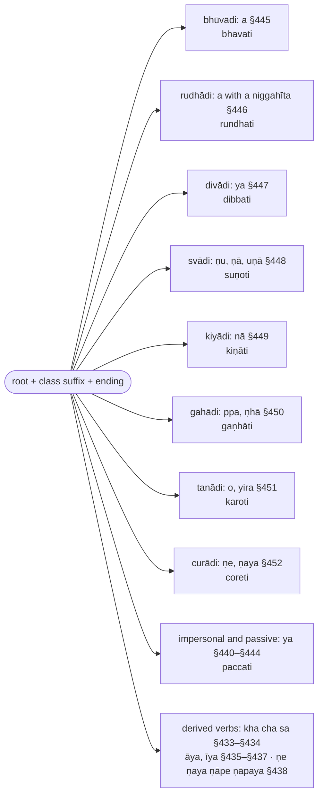

import { LinkCard } from "@astrojs/starlight/components";

:::note
`ākhyāta` ("what is declared") is the finite verb. The first section (§406–§431) sets out the two voices (`parassapada`, `attanopada`), the three persons, the eight tenses and moods and their endings; the second (§432–§457) the suffixes that come between root and ending — desiderative, denominative, causative, passive, and the `vikaraṇa` of the eight conjugation classes; the third and fourth (§458–§523) the reduplication of the `parokkhā` and the sound changes of particular roots.

Verb forms are glossed ▶️ (`vattamānā`), ⏯ (`pañcamī`, `sattamī`, `bhavissantī`), ⏮ (`parokkhā`, `hiyyattanī`, `ajjatanī`, `kālātipatti`), with the person 👆 🤘 🤟 and number ⨀ ⨂; roots are cited with `√` in the form Kaccāyana uses (`√gamu`, `√paca`).

:::

:::note[The eight sets of endings and their times]
Every set has twelve endings, six `parassapada` and six `attanopada` (§406–§407), in three persons (§408); the sets are named by the time or mood they express.

:::

:::note[Root, class suffix, ending]
A finite verb is a root (§457), a suffix that depends on the root's class or on the voice (§432–§452), and an ending; the classes are named after their first root.

:::

:::note[Reading D'Alwis]
This chapter is the one part of Kaccāyana that James D'Alwis translated, as "Lib. VI.—On Verbs" of his *Introduction to Kachchāyana's Grammar of the Pāli Language* (Colombo 1863), reproduced on this site as [D'Alwis: Kaccāyana (1863)](/kaccayana/alwis). His four chapters are Kaccāyana's four sections, each numbered afresh: Cap. I rules 1–26 are §406–§431, Cap. II 1–26 are §432–§457, Cap. III 1–24 are §458–§481, Cap. IV 1–42 are §482–§523. His Pāḷi is the Sinhalese recension that Senart printed in 1871. The footnotes below record where this translation's text or construal differs from his, and nothing more.
:::

## Paṭhamakaṇḍa (First Section)

### Ka

> Ākhyātasāgaramathajjatanītaraṅgaṃ, \
> Dhātujjalaṃ vikaraṇāgamakālamīnaṃ; \
> Lopānubandhariyamatthavibhāgatīraṃ, \
> Dhīrā taranti kavino puthubuddhināvā.

Now the ocean of the verb (`ākhyāta`), whose waves are the `ajjatanī` [and the other tenses], \
whose water is the roots (`dhātu`), whose fish are the conjugation signs (`vikaraṇa`), the augments (`āgama`) and the tenses (`kāla`), \
whose shore is elision (`lopa`), the indicatory letters (`anubandha`) and the analysis of meanings[^1] — \
the wise poets cross it in the ship of their broad understanding.

[^1]: `lopānubandhariyamatthavibhāgatīraṃ` is the CST reading; the syllables `-riyam-` between `anubandha` and `attha` are obscure and are left untranslated.

### Kha

> Vicittasaṅkhāraparikkhitaṃ imaṃ, \
> Ākhyātasaddaṃ vipulaṃ asesato; \
> Paṇamya sambuddhamanantagocaraṃ, \
> Sugocaraṃ yaṃ vadato suṇātha me.

This [verb], investigated in [its] manifold constructions, \
the vast word-class of the verb (`ākhyātasadda`), in its entirety — \
having bowed to the Fully Awakened One, whose range is boundless, \
hear it from me as I speak it, a range that is good going.

### Ga

> Adhikāre maṅgale ceva, nipphanne cāvadhāraṇe; \
> Anantare ca pādāne, athasaddo pavattati.

In [the sense of] a governing heading (`adhikāra`) and of auspiciousness (`maṅgala`), of completion (`nipphanna`) and of restriction (`avadhāraṇa`), \
of immediate sequence (`anantara`) and of taking up [a new subject] (`pādāna`): [in these six senses] the word `atha` is used.

### §406 (429): Atha pubbāni vibhattīnaṃ cha parassapadāni (Now, the first six of the inflections are `parassapada`) :badge[rūḷhī]{variant=note}

:::note[Analysis]

| option | before | from   | operation | to         | after  | context |
| ------ | ------ | ------ | --------- | ---------- | ------ | ------- |
|        |        | pubbāni cha (padāni) | (saññāni honti) | parassapadāni | | atha vibhattīnaṃ |
|        |        | the first six [words] | (are given the name) | `parassapada` | | now; of the [verbal] inflections |

:::

> Atha sabbāsaṃ vibhattīnaṃ yāni yāni pubbakāni cha padāni, tāni tāni parassapadasaññāni honti.

> Taṃ yathā? Ti anti, si tha, mi ma.

> Parassapadamiccanena kvattho? Kattari parassapadaṃ.

Now, of all the inflections, whichever six words are the first ones, those are named `parassapada`.[^2]

:::tip[Purpose]

`Parassapadamiccanena kvattho?` — what is the use of the term `parassapada`? It is the term of [§456 (430): Kattari parassapadaṃ](#m456).

:::

:::tip[Examples]

`Taṃ yathā?` — as follows: the first six of the `vattamānā`, on `paca`:

| lemma | inflected | vibhatti | meaning |
| ----- | --------- | -------- | ------- |
| ▶️🤟⨀(√paca + a + ti) | pacati | `ti` (vattamānā, parassapada) | he cooks |
| ▶️🤟⨂(√paca + a + anti) | pacanti | `anti` (vattamānā, parassapada) | they cook |
| ▶️🤘⨀(√paca + a + si) | pacasi | `si` (vattamānā, parassapada) | you cook |
| ▶️🤘⨂(√paca + a + tha) | pacatha | `tha` (vattamānā, parassapada) | you [all] cook |
| ▶️👆⨀(√paca + a + mi) | pacāmi | `mi` (vattamānā, parassapada) | I cook |
| ▶️👆⨂(√paca + a + ma) | pacāma | `ma` (vattamānā, parassapada) | we cook |

|     | paca + ti (vattamānā)        | rule |
| --- | ---------------------------- | ---- |
| →   | pac + (~~a~~) + ti           | §521 |
| →   | pac + (a) + ti               | §445 |
| →   | **pacati**                   |      |

> `pacati vā pacāpeti vā` \
> [(2V 1.5.2.1: Bhūtagāmasikkhāpada)](https://tipitaka2500.github.io/tipitaka/2V/1/1.5/1.5.2/1.5.2.1#347) \
▶️🤟⨀(pacati) 🔼(vā) ▶️🤟⨀(pacāpeti) 🔼(vā) \
cooks | or | has [it] cooked | or

:::

[^2]: Malai (1997) renders `parassapada` "active terminations" and `attanopada` "passive terminations"; the Pāḷi names are kept, as Nandisena (2005) keeps them ("word for another", "word for itself").

---

### §407 (439): Parāṇyattanopadāni (The latter [six] are `attanopada`) :badge[rūḷhī]{variant=note}

:::note[Analysis]

| option | before | from   | operation | to         | after  | context |
| ------ | ------ | ------ | --------- | ---------- | ------ | ------- |
|        |        | parāni cha (padāni) | (saññāni honti) | attanopadāni | | (vibhattīnaṃ) |
|        |        | the latter six [words] | (are given the name) | `attanopada` | | (of the inflections) |

:::

> Sabbāsaṃ vibhattīnaṃ yāni yāni parāni cha padāni. Tāni tāni attanopadasaññāni honti.

> Taṃ yathā? Te ante, se vhe, e mhe.

> Attanopadamiccanena kvattho? Attanopadāni bhāve ca kammani.

Of all the inflections, whichever six words are the latter ones, those are named `attanopada`.

:::tip[Purpose]

`Attanopadamiccanena kvattho?` — what is the use of the term `attanopada`? It is the term of [§453 (444): Attanopadāni bhāve ca kammani](#m453).

:::

:::tip[Examples]

`Taṃ yathā?` — the latter six of the `vattamānā`, on `paca`:

| lemma | inflected | vibhatti | meaning |
| ----- | --------- | -------- | ------- |
| ▶️🤟⨀(√paca + a + te) | pacate | `te` (vattamānā, attanopada) | he cooks |
| ▶️🤟⨂(√paca + a + ante) | pacante | `ante` (vattamānā, attanopada) | they cook |
| ▶️🤘⨀(√paca + a + se) | pacase | `se` (vattamānā, attanopada) | you cook |
| ▶️🤘⨂(√paca + a + vhe) | pacavhe | `vhe` (vattamānā, attanopada) | you [all] cook |
| ▶️👆⨀(√paca + a + e) | pace | `e` (vattamānā, attanopada) | I cook |
| ▶️👆⨂(√paca + a + mhe) | pacāmhe | `mhe` (vattamānā, attanopada) | we cook |

|     | paca + e (vattamānā)         | rule |
| --- | ---------------------------- | ---- |
| →   | pac + (~~a~~) + e            | §521 |
| →   | pac + (a) + e                | §445 |
| →   | pac + (~~a~~ + e)            | §12  |
| →   | **pace**                     |      |

> `abbudā jāyate pesi` \
> [(12S1 10.1.1: Indakasutta)](https://tipitaka2500.github.io/tipitaka/12S1/10/10.1/10.1.1#1453) \
🚻⑤⨀(abbuda) ▶️🤟⨀(jāyati) 🚺①⨀(pesi) \
from the abbuda | comes into being | the pesi [lump]

> `rañño taṃ vuccate aghaṃ` \
> [(22J 16.1.10: Gandhatindukajātaka)](https://tipitaka2500.github.io/tipitaka/22J/16/16.1/16.1.10#3599) \
🚹⑥⨀(rāja) 🚻①⨀(ta) 🔵▶️🤟⨀(vuccati) 🚻①⨀(agha) \
of the king | that | is called | misfortune

> `udakaṃ maññe ādittaṃ` \
> [(1V 1.2.8: Duṭṭhadosasikkhāpada)](https://tipitaka2500.github.io/tipitaka/1V/1/1.2/1.2.8#1569) \
🚻①⨀(udaka) ▶️👆⨀(maññati) 🚻①⨀(āditta) \
the water | I think | is ablaze

:::

---

### §408 (431): Dve dve paṭhama majjhimuttamapurisā (Two by two: first, middle and highest person) :badge[anvattha]{variant=note}

:::note[Analysis]

| option | before | from   | operation | to         | after  | context |
| ------ | ------ | ------ | --------- | ---------- | ------ | ------- |
|        |        | dve dve (padāni) | (saññāni honti) | paṭhama-majjhima-uttamapurisā | | (parassapadānaṃ attanopadānañca) |
|        |        | each two [words] | (are given the names) | `paṭhamapurisa`, `majjhimapurisa`, `uttamapurisa` | | (of the parassapada and the attanopada) |

:::

> Tāsaṃ sabbāsaṃ vibhattīnaṃ parassapadānaṃ, attanopadānañca dve dve padāni paṭhamamajjhimuttamapurisasaññāni honti.

> Taṃ yathā? Ti anti iti paṭhamapurisā, si tha iti majjhimapurisā, mi ma iti uttamapurisā. Attanopadānampi te ante iti paṭhamapurisā, se vhe iti majjhimapurisā, e mhe iti uttamapurisā. Evaṃ sabbattha.

> Paṭhamamajjhimuttamapurisamiccanena kvattho? Nāmamhi payujjamānepi tulyādhikaraṇe paṭhamo, tumhe majjhimo, amhe uttamo.

Of all those inflections, `parassapada` and `attanopada`, two words each are named `paṭhamapurisa`, `majjhimapurisa` and `uttamapurisa` (first, middle and highest person).

:::tip[Purpose]

`Paṭhamamajjhimuttamapurisamiccanena kvattho?` — what is the use of the three terms? They are the terms of [§410 (432): Nāmamhi payujjamānepi tulyādhikaraṇe paṭhamo](#m410), [§411 (436): Tumhe majjhimo](#m411) and [§412 (437): Amhe uttamo](#m412).

:::

:::tip[Examples]

`Taṃ yathā?` — the twelve of the `vattamānā`, in their pairs:

| lemma | inflected | vibhatti | meaning |
| ----- | --------- | -------- | ------- |
| ▶️🤟⨀(√paca + a + ti) | pacati | `ti`, paṭhamapurisa ⨀ (parassapada) | he cooks |
| ▶️🤟⨂(√paca + a + anti) | pacanti | `anti`, paṭhamapurisa ⨂ (parassapada) | they cook |
| ▶️🤘⨀(√paca + a + si) | pacasi | `si`, majjhimapurisa ⨀ (parassapada) | you cook |
| ▶️🤘⨂(√paca + a + tha) | pacatha | `tha`, majjhimapurisa ⨂ (parassapada) | you [all] cook |
| ▶️👆⨀(√paca + a + mi) | pacāmi | `mi`, uttamapurisa ⨀ (parassapada) | I cook |
| ▶️👆⨂(√paca + a + ma) | pacāma | `ma`, uttamapurisa ⨂ (parassapada) | we cook |
| ▶️🤟⨀(√paca + a + te) | pacate | `te`, paṭhamapurisa ⨀ (attanopada) | he cooks |
| ▶️🤟⨂(√paca + a + ante) | pacante | `ante`, paṭhamapurisa ⨂ (attanopada) | they cook |
| ▶️🤘⨀(√paca + a + se) | pacase | `se`, majjhimapurisa ⨀ (attanopada) | you cook |
| ▶️🤘⨂(√paca + a + vhe) | pacavhe | `vhe`, majjhimapurisa ⨂ (attanopada) | you [all] cook |
| ▶️👆⨀(√paca + a + e) | pace | `e`, uttamapurisa ⨀ (attanopada) | I cook |
| ▶️👆⨂(√paca + a + mhe) | pacāmhe | `mhe`, uttamapurisa ⨂ (attanopada) | we cook |

The three persons in the canon:

> `saggañca so gacchati sarīraṃ vihāya` \
> [(12S1 1.4.6: Saddhāsutta)](https://tipitaka2500.github.io/tipitaka/12S1/1/1.4/1.4.6#200) \
🚹②⨀(sagga) 🔼(ca) 🚹①⨀(ta) ▶️🤟⨀(gacchati) 🚻②⨀(sarīra) 🔽(vihāya) \
to heaven | and | he | goes | the body | having left

> `gacchatha tumhe, sāriputtā` \
> [(1V 1.2.13: Kuladūsakasikkhāpada)](https://tipitaka2500.github.io/tipitaka/1V/1/1.2/1.2.13#1757) \
⏯🤘⨂(gacchati) ⚧️①⨂(tumha) 🚹⓪⨂(sāriputta) \
go | you | Sāriputta [and Moggallāna]

> `āgamehi, bhante, yāva gharaṃ gacchāmi` \
> [(1V 1.4.1.6: Aññātakaviññattisikkhāpada)](https://tipitaka2500.github.io/tipitaka/1V/1/1.4/1.4.1/1.4.1.6#1974) \
⏯🤘⨀(āgameti) 🚹⓪⨀(bhavanta) 🔼(yāva) 🚻②⨀(ghara) ▶️👆⨀(gacchati) \
wait | venerable sir | until | home | I go

:::

---

### §409 (441): Sabbesamekābhidhāne paro puriso (When all [persons] are expressed together, the later person) :badge[vidhyaṅga]{variant=tip}

:::note[Analysis]

| option | before | from   | operation | to         | after  | context |
| ------ | ------ | ------ | --------- | ---------- | ------ | ------- |
|        |        | sabbesaṃ (purisānaṃ) | (gahetabbo) | paro puriso | | ekābhidhāne |
|        |        | of all [the persons] | (is to be taken) | the later person | | in a single expression |

:::

> Sabbesaṃ tiṇṇaṃ paṭhamamajjhimuttama purisānaṃ ekābhidhāne paro puriso gahetabbo.

> So ca paṭhati, tvañca paṭhasi, tumhe paṭhatha. So ca pacati, tvañca pacasi. Tumhe pacatha. Evaṃ sesāsu vibhattīsu paro puriso yojetabbo.

In a single expression of all three persons — `paṭhama`, `majjhima` and `uttama` — the later person is to be taken.[^3]

:::tip[Examples]

> `so ca paṭhati, tvañca paṭhasi, tumhe paṭhatha` \
🚹①⨀(ta) 🔼(ca) ▶️🤟⨀(paṭhati) ⚧️①⨀(tumha) 🔼(ca) ▶️🤘⨀(paṭhati) ⚧️①⨂(tumha) ▶️🤘⨂(paṭhati) \
he | and | reads | you | and | read | you [two] | read

> `so ca pacati, tvañca pacasi, tumhe pacatha` \
🚹①⨀(ta) 🔼(ca) ▶️🤟⨀(pacati) ⚧️①⨀(tumha) 🔼(ca) ▶️🤘⨀(pacati) ⚧️①⨂(tumha) ▶️🤘⨂(pacati) \
he | and | cooks | you | and | cook | you [two] | cook

`Evaṃ sesāsu vibhattīsu paro puriso yojetabbo`: so in the remaining inflections the later person is to be applied.

| lemma | inflected | vibhatti | meaning |
| ----- | --------- | -------- | ------- |
| ▶️🤘⨂(√paṭha + a + tha) | tumhe paṭhatha | `tha`, majjhimapurisa ⨂ (vattamānā) | you [two] read |
| ▶️🤘⨂(√paca + a + tha) | tumhe pacatha | `tha`, majjhimapurisa ⨂ (vattamānā) | you [two] cook |

:::

[^3]: [D'Alwis (1863)](/kaccayana/alwis) and Senart's edition run the vutti through all three persons and close with the highest, `… ahañca paṭhāmi mayaṃ paṭhāma`; the CST's shorter text is kept.

---

### §410 (432): Nāmamhi payujjamānepi tulyādhikaraṇe paṭhamo (With a co-referent noun, expressed or not: the first person) :badge[utsarga]{variant=success}

:::note[Analysis]

| option | before | from   | operation | to         | after  | context |
| ------ | ------ | ------ | --------- | ---------- | ------ | ------- |
|        |        | (ākhyāte) | (hoti) | paṭhamo (puriso) | | nāmamhi payujjamānepi (appayujjamānepi) tulyādhikaraṇe |
|        |        | (in the verb) | (is used) | the first person | | when a noun of the same reference is used, or [also] not used |

:::

> Nāmamhi payujjamānepi appayujjamānepi tulyādhikaraṇe paṭhamapuriso hoti.

> So gacchati, te gacchanti.

> Appayujjamānepi – gacchati, gacchanti.

> Tulyādhikaraṇeti kimatthaṃ? Tena haññase tvaṃ devadattena.

When a noun of the same reference is used, and also when it is not used, the `paṭhamapurisa` (first person) is used.

:::tip[Examples]

| lemma | inflected | vibhatti | meaning |
| ----- | --------- | -------- | ------- |
| ▶️🤟⨀(√gamu + a + ti) | so gacchati | `ti`, paṭhamapurisa ⨀ (vattamānā) | he goes |
| ▶️🤟⨂(√gamu + a + anti) | te gacchanti | `anti`, paṭhamapurisa ⨂ (vattamānā) | they go |
| ▶️🤟⨀(√gamu + a + ti) | gacchati | `ti`, paṭhamapurisa ⨀ (vattamānā) | [he] goes |
| ▶️🤟⨂(√gamu + a + anti) | gacchanti | `anti`, paṭhamapurisa ⨂ (vattamānā) | [they] go |

|     | gamu + ti (vattamānā)        | rule |
| --- | ---------------------------- | ---- |
| →   | gam + (~~u~~) + ti           | §521 |
| →   | ga + (m→cch) + ti            | §476 |
| →   | gacch + (a) + ti             | §445 |
| →   | **gacchati**                 |      |

> `na te gacchanti punabbhavaṃ` \
> [(18Sn 3.12: Dvayatānupassanāsutta)](https://tipitaka2500.github.io/tipitaka/18Sn/3/3.12#876) \
🔼(na) 🚹①⨂(ta) ▶️🤟⨂(gacchati) 🚹②⨀(punabbhava) \
not | they | go | to renewed existence

With the subject unexpressed (`appayujjamāne`):

> `aggiṃ āharissāmīti gāmaṃ gacchati` \
> [(2V 1.5.9.3: Vikālagāmappavisanasikkhāpada)](https://tipitaka2500.github.io/tipitaka/2V/1/1.5/1.5.9/1.5.9.3#1508) \
🚹②⨀(aggi) ⏯👆⨀(āharati) 🔼(iti) 🚹②⨀(gāma) ▶️🤟⨀(gacchati) \
fire | I shall fetch | so [thinking] | to the village | [he] goes

:::

:::danger[Counter-example]

By saying `tulyādhikaraṇe` (of the same reference): `tena … devadattena`, in the third form ③, does not share the verb's reference; the subject is `tvaṃ`, and the verb takes the middle person by [§411 (436): Tumhe majjhimo](#m411).

> `tena haññase tvaṃ devadattena` \
🚹③⨀(ta) 🔵▶️🤘⨀(haññati) ⚧️①⨀(tumha) 🚹③⨀(devadatta) \
by him | are struck | you | by Devadatta

|     | hana + se (vattamānā, attanopada) | rule |
| --- | --------------------------------- | ---- |
| →   | han + (~~a~~) + se                | §521 |
| →   | han + (ya) + se                   | §440 |
| →   | ha + (n + y → ññ) + a + se        | §441 |
| →   | **haññase**                       |      |

:::

---

### §411 (436): Tumhe majjhimo (With `tumha`: the middle person) :badge[apavada]{variant=success}

:::note[Analysis]

| option | before | from   | operation | to         | after  | context |
| ------ | ------ | ------ | --------- | ---------- | ------ | ------- |
|        |        | (ākhyāte) | (hoti) | majjhimo (puriso) | | tumhe (payujjamānepi appayujjamānepi tulyādhikaraṇe) |
|        |        | (in the verb) | (is used) | the middle person | | when `tumha` [is the co-referent word], used or not used |

:::

> Tumhe payujjamānepi appayujjamānepi tulyādhikaraṇe majjhimapuriso hoti.

> Tvaṃ yāsi, tumhe yātha.

> Appayujjamānepi – yāsi, yātha.

> Tulyādhikaraṇeti kimatthaṃ? Tayā paccate odano.

When `tumha` ("you") of the same reference is used, and also when it is not used, the `majjhimapurisa` (middle person) is used.

:::tip[Examples]

| lemma | inflected | vibhatti | meaning |
| ----- | --------- | -------- | ------- |
| ▶️🤘⨀(√yā + a + si) | tvaṃ yāsi | `si`, majjhimapurisa ⨀ (vattamānā) | you go |
| ▶️🤘⨂(√yā + a + tha) | tumhe yātha | `tha`, majjhimapurisa ⨂ (vattamānā) | you [all] go |
| ▶️🤘⨀(√yā + a + si) | yāsi | `si`, majjhimapurisa ⨀ (vattamānā) | [you] go |
| ▶️🤘⨂(√yā + a + tha) | yātha | `tha`, majjhimapurisa ⨂ (vattamānā) | [you all] go |

|     | yā + si (vattamānā)          | rule |
| --- | ---------------------------- | ---- |
| →   | yā + (a) + si                | §445 |
| →   | yā + (~~a~~) + si            | §12  |
| →   | **yāsi**                     |      |

> `idāni tvaṃ gacchasi pubbaciṇṇaṃ` \
> [(19Th1 19.1.1: Tālapuṭattheragāthā)](https://tipitaka2500.github.io/tipitaka/19Th1/19/19.1/19.1.1#1486) \
🔼(idāni) ⚧️①⨀(tumha) ▶️🤘⨀(gacchati) 🚻②⨀(pubbaciṇṇa) \
now | you | go | to what was practised before

> `kuhiṃ gacchasi brāhmaṇa` \
> [(23J 22.1.10.11: Mahārājapabba)](https://tipitaka2500.github.io/tipitaka/23J/22/22.1/22.1.10/22.1.10.11#3664) \
⚧️⑦⨀(kiṃ + hiṃ) ▶️🤘⨀(gacchati) 🚹⓪⨀(brāhmaṇa) \
where | are you going | brahmin

:::

:::danger[Counter-example]

By saying `tulyādhikaraṇe` (of the same reference) the pronoun `tayā` in the third form ③, the agent of a passive verb, does not make the verb middle person: the subject is `odano`, a noun, and the verb is first person by [§410 (432): Nāmamhi payujjamānepi tulyādhikaraṇe paṭhamo](#m410).

> `tayā paccate odano` \
⚧️③⨀(tumha) 🔵▶️🤟⨀(paccati) 🚹①⨀(odana) \
by you | is cooked | the rice

|     | paca + te (vattamānā, attanopada) | rule |
| --- | --------------------------------- | ---- |
| →   | pac + (~~a~~) + te                | §521 |
| →   | pac + (ya) + te                   | §440 |
| →   | pa + (c + y → cc) + a + te        | §441 |
| →   | **paccate**                       |      |

:::

---

### §412 (437): Amhe uttamo (With `amha`: the highest person) :badge[apavada]{variant=success}

:::note[Analysis]

| option | before | from   | operation | to         | after  | context |
| ------ | ------ | ------ | --------- | ---------- | ------ | ------- |
|        |        | (ākhyāte) | (hoti) | uttamo (puriso) | | amhe (payujjamānepi appayujjamānepi tulyādhikaraṇe) |
|        |        | (in the verb) | (is used) | the highest person | | when `amha` [is the co-referent word], used or not used |

:::

> Amhe payujjamānepi appayujjamānepi tulyādhikaraṇe uttamapuriso hoti.

> Ahaṃ yajāmi, mayaṃ yajāma.

> Appayujjamānepi – yajāmi, yajāma.

> Tulyādhikaraṇeti kimatthaṃ? Mayā ijjate buddho.

When `amha` ("I") of the same reference is used, and also when it is not used, the `uttamapurisa` (highest person) is used.

:::tip[Examples]

| lemma | inflected | vibhatti | meaning |
| ----- | --------- | -------- | ------- |
| ▶️👆⨀(√yaja + a + mi) | ahaṃ yajāmi | `mi`, uttamapurisa ⨀ (vattamānā) | I sacrifice |
| ▶️👆⨂(√yaja + a + ma) | mayaṃ yajāma | `ma`, uttamapurisa ⨂ (vattamānā) | we sacrifice |
| ▶️👆⨀(√yaja + a + mi) | yajāmi | `mi`, uttamapurisa ⨀ (vattamānā) | [I] sacrifice |
| ▶️👆⨂(√yaja + a + ma) | yajāma | `ma`, uttamapurisa ⨂ (vattamānā) | [we] sacrifice |

|     | yaja + mi (vattamānā)        | rule |
| --- | ---------------------------- | ---- |
| →   | yaj + (~~a~~) + mi           | §521 |
| →   | yaj + (a) + mi               | §445 |
| →   | yaj + (a→ā) + mi             | §478 |
| →   | **yajāmi**                   |      |

> `gacchāma, bhagini` \
> [(2V 1.5.3.7: Saṃvidhānasikkhāpada)](https://tipitaka2500.github.io/tipitaka/2V/1/1.5/1.5.3/1.5.3.7#599) \
⏯👆⨂(gacchati) 🚺⓪⨀(bhaginī) \
let us go | sister

> `āgamehi, bhante, yāva gharaṃ gacchāmi` \
> [(1V 1.4.1.6: Aññātakaviññattisikkhāpada)](https://tipitaka2500.github.io/tipitaka/1V/1/1.4/1.4.1/1.4.1.6#1974) \
⏯🤘⨀(āgameti) 🚹⓪⨀(bhavanta) 🔼(yāva) 🚻②⨀(ghara) ▶️👆⨀(gacchati) \
wait | venerable sir | until | home | I go

:::

:::danger[Counter-example]

By saying `tulyādhikaraṇe` (of the same reference) the pronoun `mayā` in the third form ③, the agent of a passive verb, does not make the verb highest person: the subject is `buddho`, and the verb is first person by [§410 (432): Nāmamhi payujjamānepi tulyādhikaraṇe paṭhamo](#m410).

> `mayā ijjate buddho` \
⚧️③⨀(amha) 🔵▶️🤟⨀(ijjati) 🚹①⨀(buddha) \
by me | is worshipped | the Buddha

|     | yaja + te (vattamānā, attanopada) | rule |
| --- | --------------------------------- | ---- |
| →   | yaj + (~~a~~) + te                | §521 |
| →   | yaj + (ya) + te                   | §440 |
| →   | (ya→i)j + ya + te                 | §503 |
| →   | i + (j + y → jj) + a + te         | §441 |
| →   | **ijjate**                        |      |

:::

---

### §413 (427): Kāle (`kāle`, "in [the sense of] time": a governing heading) :badge[sīhagatika]{variant=caution}

:::note[Analysis]

| option | before | from   | operation | to         | after  | context |
| ------ | ------ | ------ | --------- | ---------- | ------ | ------- |
|        |        |        | (adhikāro) |           |        | kāle    |
|        |        |        | (governing heading, to be supplied in the rules that follow) | | | in [the sense of] time |

:::

> ‘‘Kāle’’ iccetaṃ adhikāratthaṃ veditabbaṃ.

`Kāle` ("in time") is to be understood as having the sense of a governing heading (`adhikāra`).

:::tip[Examples]

The eight sets the heading governs, each assigned to its time by its own rule:

| lemma | inflected | vibhatti | meaning |
| ----- | --------- | -------- | ------- |
| ▶️🤟⨀(gacchati) | gacchati | vattamānā (§414) | he goes |
| ⏯🤟⨀(karoti) | karotu | pañcamī (§415) | let him do |
| ⏯🤟⨀(gacchati) | gaccheyya | sattamī (§416) | he should go |
| ⏮🤟⨀(āha) | āha | parokkhā (§417) | he said, it is told |
| ⏮🤟⨀(gacchati) | agamā | hiyyattanī (§418) | he went |
| ⏮🤟⨀(gacchati) | agamī | ajjatanī (§419) | he went [today] |
| ⏯🤟⨀(gacchati) | gacchissati | bhavissantī (§421) | he will go |
| ⏮🤟⨀(gacchati) | agacchissā | kālātipatti (§422) | he would have gone |

:::

:::note[The eight sets and Pāṇini's lakāras]

| set | rule | lakāra | Sanskrit tense or mood |
| --- | ---- | ------ | ---------------------- |
| `vattamānā` | §414 | laṭ | present |
| `pañcamī` | §415 | loṭ, with āśīrliṅ | imperative (`āṇatti`) and benedictive (`āsiṭṭha`) |
| `sattamī` | §416 | vidhiliṅ | optative, D'Alwis's "Potential" |
| `parokkhā` | §417 | liṭ (3.2.115 `parokṣe liṭ`) | perfect, with reduplication |
| `hiyyattanī` | §418 | laṅ (3.2.111 `anadyatane laṅ`) | imperfect, `hyastana` "of yesterday" |
| `ajjatanī` | §419 | luṅ (3.2.110) | aorist |
| `bhavissantī` | §421 | lṛṭ | future |
| `kālātipatti` | §422 | lṛṅ (3.3.139 `liṅnimitte lṛṅ kriyātipattau`) | conditional |

:::

---

### §414 (428): Vattamānā paccuppanne (The `vattamānā` in the present) :badge[utsarga]{variant=success}

:::note[Analysis]

| option | before | from   | operation | to         | after  | context |
| ------ | ------ | ------ | --------- | ---------- | ------ | ------- |
|        |        | (dhātuto) | (hoti) | vattamānā (vibhatti) | | paccuppanne (kāle) |
|        |        | (after a root) | (is used) | the `vattamānā` inflection | | in present (time) |

:::

> Paccuppanne kāle vattamānāvibhatti hoti.

> Pāṭaliputtaṃ gacchati, sāvatthiṃ pavisati.

In present time (`paccuppanna`), the `vattamānā` inflection is used.[^4]

:::tip[Examples]

| lemma | inflected | vibhatti | meaning |
| ----- | --------- | -------- | ------- |
| ▶️🤟⨀(√gamu + a + ti) | pāṭaliputtaṃ gacchati | `ti` (vattamānā) | he goes to Pāṭaliputta |
| ▶️🤟⨀(pa + √visa + a + ti) | sāvatthiṃ pavisati | `ti` (vattamānā) | he enters Sāvatthī |

> `yo koci avītarāgo taṃ vanasaṇḍaṃ pavisati` \
> [(1V Veranjakanda: Verañjakaṇḍa)](https://tipitaka2500.github.io/tipitaka/1V/1/Veranjakanda#27) \
🚹①⨀(ya) 🚹①⨀(ka + ci) 🚹①⨀(avītarāga) 🚹②⨀(ta) 🚹②⨀(vanasaṇḍa) ▶️🤟⨀(pavisati) \
whoever | anyone | not free of passion | that | forest grove | enters

> `aggiṃ āharissāmīti gāmaṃ gacchati` \
> [(2V 1.5.9.3: Vikālagāmappavisanasikkhāpada)](https://tipitaka2500.github.io/tipitaka/2V/1/1.5/1.5.9/1.5.9.3#1508) \
🚹②⨀(aggi) ⏯👆⨀(āharati) 🔼(iti) 🚹②⨀(gāma) ▶️🤟⨀(gacchati) \
fire | I shall fetch | so [thinking] | to the village | he goes

:::

[^4]: [D'Alwis (1863)](/kaccayana/alwis) and Senart's edition add a third example, `viharati jetavane`, which the CST lacks.

---

### §415 (451): Āṇatyā siṭṭhe’nuttakāle pañcamī (In command and blessing, time unstated: the `pañcamī`) :badge[utsarga]{variant=success}

:::note[Analysis]

| option | before | from   | operation | to         | after  | context |
| ------ | ------ | ------ | --------- | ---------- | ------ | ------- |
|        |        | (dhātuto) | (hoti) | pañcamī (vibhatti) | | āṇatti-āsiṭṭhe anuttakāle |
|        |        | (after a root) | (is used) | the `pañcamī` inflection | | in [the sense of] command and blessing, when the time is not stated |

:::

> Āṇatyatthe ca āsīsatthe ca anuttakāle pañcamī vibhatti hoti.

> Karotu kusalaṃ, sukhaṃ te hotu.

In the sense of a command (`āṇatti`) and of a blessing (`āsīsa`), when the time is not stated, the `pañcamī` inflection is used.[^5]

:::tip[Examples]

| lemma | inflected | vibhatti | meaning |
| ----- | --------- | -------- | ------- |
| ⏯🤟⨀(√kara + o + tu) | karotu kusalaṃ | `tu` (pañcamī) | let him do good |
| ⏯🤟⨀(√hū + a + tu) | sukhaṃ te hotu | `tu` (pañcamī) | may there be happiness for you |

|     | kara + tu (pañcamī)          | rule |
| --- | ---------------------------- | ---- |
| →   | kar + (~~a~~) + tu           | §521 |
| →   | kar + (o) + tu               | §451 |
| →   | **karotu**                   |      |

> `vacanīyamevāyasmā attānaṃ karotu` \
> [(1V 1.2.12: Dubbacasikkhāpada)](https://tipitaka2500.github.io/tipitaka/1V/1/1.2/1.2.12#1731) \
🚹②⨀(vacanīya) 🔼(eva) 🚹①⨀(āyasmantu) 🚹②⨀(atta) ⏯🤟⨀(karoti) \
admonishable | indeed | the venerable one | himself | let him make

> `sukhī hotu, brāhmaṇa, ambaṭṭho māṇavo` \
> [(6D 3.8: Pokkharasātibuddhūpasaṅkamana)](https://tipitaka2500.github.io/tipitaka/6D/3/3.8#418) \
🚹①⨀(sukhī) ⏯🤟⨀(hoti) 🚹⓪⨀(brāhmaṇa) 🚹①⨀(ambaṭṭha) 🚹①⨀(māṇava) \
happy | may he be | brahmin | Ambaṭṭha | the young man

:::

[^5]: Nandisena (2005) renders `anuttakāle` as a third coordinate sense, "in the meaning of command, in the meaning of blessing and in time that is not said"; the two `ca` join `āṇatyatthe` and `āsīsatthe` only. Senart's edition reads `āsiṭṭhatthe` and `subhaṃ te hotu` for the CST's `āsīsatthe` and `sukhaṃ te hotu`.

---

### §416 (454): Anumatiparikappatthesu sattamī (In the senses of permission and supposition: the `sattamī`) :badge[utsarga]{variant=success}

:::note[Analysis]

| option | before | from   | operation | to         | after  | context |
| ------ | ------ | ------ | --------- | ---------- | ------ | ------- |
|        |        | (dhātuto) | (hoti) | sattamī (vibhatti) | | anumati-parikappa-atthesu (anuttakāle) |
|        |        | (after a root) | (is used) | the `sattamī` inflection | | in the senses of permission and supposition, (when the time is not stated) |

The CST's sutta list prints `Anumatiparikappetthesu sattamī`; the heading follows its vutti section and the Rūpasiddhi, `Anumatiparikappatthesu`.

:::

> Anumatyatthe ca parikappatthe ca anuttakāle sattamī vibhatti hoti.

> Tvaṃ gaccheyyāsi, kimahaṃ kareyyāmi.

In the sense of permission (`anumati`) and of supposition (`parikappa`), when the time is not stated, the `sattamī` inflection is used.

:::tip[Examples]

| lemma | inflected | vibhatti | meaning |
| ----- | --------- | -------- | ------- |
| ⏯🤘⨀(√gamu + a + eyyāsi) | tvaṃ gaccheyyāsi | `eyyāsi` (sattamī) | you may go |
| ⏯👆⨀(√kara + eyyāmi) | kimahaṃ kareyyāmi | `eyyāmi` (sattamī) | what should I do? |

|     | gamu + eyyāsi (sattamī)      | rule |
| --- | ---------------------------- | ---- |
| →   | gam + (~~u~~) + eyyāsi       | §521 |
| →   | ga + (m→cch) + eyyāsi        | §476 |
| →   | gacch + (a) + eyyāsi         | §445 |
| →   | gacch + (~~a~~ + eyyāsi)     | §12  |
| →   | **gaccheyyāsi**              |      |

> `gaccheyyāsi pana tvaṃ, mārisa, tassa bhagavato upaṭṭhānaṃ` \
> [(12S1 6.1.6: Brahmalokasutta)](https://tipitaka2500.github.io/tipitaka/12S1/6/6.1/6.1.6#1064) \
⏯🤘⨀(gacchati) 🔼(pana) ⚧️①⨀(tumha) 🚹⓪⨀(mārisa) 🚹⑥⨀(ta) 🚹⑥⨀(bhagavantu) 🚻②⨀(upaṭṭhāna) \
you might go | then | you | good sir | of that | Blessed One | to attend

> `na cāpi appiyaṃ tuyhaṃ, kareyyāmi ahaṃ puna` \
> [(23J 20.1.1: Kusajātaka)](https://tipitaka2500.github.io/tipitaka/23J/20/20.1/20.1.1#652) \
🔼(na) 🔼(ca) 🔼(api) 🚻②⨀(appiya) ⚧️④⨀(tumha) ⏯👆⨀(karoti) ⚧️①⨀(amha) 🔼(puna) \
not | and | even | anything displeasing | to you | would I do | I | again

:::

---

### §417 (460): Apaccakkhe parokkhātīte (In the unwitnessed past: the `parokkhā`) :badge[utsarga]{variant=success}

:::note[Analysis]

| option | before | from   | operation | to         | after  | context |
| ------ | ------ | ------ | --------- | ---------- | ------ | ------- |
|        |        | (dhātuto) | (hoti) | parokkhā (vibhatti) | | apaccakkhe atīte (kāle) |
|        |        | (after a root) | (is used) | the `parokkhā` inflection | | in the past not witnessed |

:::

> Apaccakkhe atīte kāle parokkhāvibhatti hoti.

> Supine kilamāha, evaṃ kila porāṇāhu.

In unwitnessed (`apaccakkha`) past time (`atīta`), the `parokkhā` inflection is used.[^6]

:::tip[Examples]

| lemma | inflected | vibhatti | meaning |
| ----- | --------- | -------- | ------- |
| ⏮🤟⨀(√brū + a) | supine kilamāha | `a` (parokkhā) | in a dream, they say, he said |
| ⏮🤟⨂(√brū + u) | evaṃ kila porāṇāhu | `u` (parokkhā) | thus, they say, said the ancients |

|     | brū + a (parokkhā)           | rule |
| --- | ---------------------------- | ---- |
| →   | (brū→āha) + a                | §475 |
| →   | āh + (~~a~~ + a)             | §12  |
| →   | **āha**                      |      |

> `saccaṃ, bhikkhave, moggallāno āha` \
> [(1V 1.1.4.2: Vinītavatthu)](https://tipitaka2500.github.io/tipitaka/1V/1/1.1/1.1.4/1.1.4.2#764) \
🚻②⨀(sacca) 🚹⓪⨂(bhikkhu) 🚹①⨀(moggallāna) ⏮🤟⨀(āha) \
the truth | bhikkhus | Moggallāna | said

> `āhu sabbagihibandhanacchidaṃ` \
> [(8D 7.6: Lakkhaṇasutta)](https://tipitaka2500.github.io/tipitaka/8D/7/7.6#439) \
⏮🤟⨂(āha) 🚹②⨀(sabbagihibandhanacchida) \
they declare [him] | cutter of every household bond

:::

[^6]: Malai (1997) renders `apaccakkhe` "of indefinite time"; the Pāḷi says "not witnessed". [D'Alwis (1863)](/kaccayana/alwis) and Senart's edition read the first example `supine kila evam āha` for the CST's `supine kilamāha`.

---

### §418 (456): Hiyyopabhuti paccakkhe hiyyattanī (From yesterday back, [witnessed or not]: the `hiyyattanī`) :badge[utsarga]{variant=success}

:::note[Analysis]

| option | before | from   | operation | to         | after  | context |
| ------ | ------ | ------ | --------- | ---------- | ------ | ------- |
|        |        | (dhātuto) | (hoti) | hiyyattanī (vibhatti) | | hiyyo-pabhuti (atīte kāle) paccakkhe (vā apaccakkhe vā) |
|        |        | (after a root) | (is used) | the `hiyyattanī` inflection | | from yesterday onwards, (in past time,) witnessed (or not witnessed) |

:::

> Hiyyopabhuti atīte kāle paccakkhe vā apaccakkhe vā hiyyattanī vibhatti hoti.

> So agamā maggaṃ, te agamū maggaṃ.

In past time beginning from yesterday (`hiyyo pabhuti`), whether witnessed or not witnessed, the `hiyyattanī` inflection is used.

:::tip[Examples]

| lemma | inflected | vibhatti | meaning |
| ----- | --------- | -------- | ------- |
| ⏮🤟⨀(√gamu + a + ā) | so agamā maggaṃ | `ā` (hiyyattanī) | he went along the road |
| ⏮🤟⨂(√gamu + a + ū) | te agamū maggaṃ | `ū` (hiyyattanī) | they went along the road |

|     | gamu + ā (hiyyattanī)        | rule |
| --- | ---------------------------- | ---- |
| →   | gam + (~~u~~) + ā            | §521 |
| →   | gam + (a) + ā                | §445 |
| →   | gam + (~~a~~ + ā)            | §12  |
| →   | (a) + gamā                   | §519 |
| →   | **agamā**                    |      |

> `agamā rājagahaṃ buddho, magadhānaṃ giribbajaṃ` \
> [(18Sn 3.1: Pabbajjāsutta)](https://tipitaka2500.github.io/tipitaka/18Sn/3/3.1#475) \
⏮🤟⨀(gacchati) 🚻②⨀(rājagaha) 🚹①⨀(buddha) 🚹⑥⨂(magadha) 🚻②⨀(giribbaja) \
went | to Rājagaha | the Buddha | of the Magadhans | the mountain fold

:::

---

### §419 (469): Samīpe’jjatanī (In the near [past]: the `ajjatanī`) :badge[utsarga]{variant=success}

:::note[Analysis]

| option | before | from   | operation | to         | after  | context |
| ------ | ------ | ------ | --------- | ---------- | ------ | ------- |
|        |        | (dhātuto) | (hoti) | ajjatanī (vibhatti) | | samīpe (ajjappabhuti atīte kāle paccakkhe vā apaccakkhe vā) |
|        |        | (after a root) | (is used) | the `ajjatanī` inflection | | in the near [past] (from today onwards, witnessed or not witnessed) |

:::

> Ajjappabhuti atīte kāle paccakkhe vā apaccakkhe vā samīpe ajjatanīvibhatti hoti.

> So maggaṃ agamī, te maggaṃ agamuṃ.

In past time beginning from today, whether witnessed or not witnessed, in the near [past] (`samīpe`), the `ajjatanī` inflection is used.[^7]

:::tip[Examples]

| lemma | inflected | vibhatti | meaning |
| ----- | --------- | -------- | ------- |
| ⏮🤟⨀(√gamu + a + ī) | so maggaṃ agamī | `ī` (ajjatanī) | he went along the road |
| ⏮🤟⨂(√gamu + a + uṃ) | te maggaṃ agamuṃ | `uṃ` (ajjatanī) | they went along the road |

|     | gamu + ī (ajjatanī)          | rule |
| --- | ---------------------------- | ---- |
| →   | gam + (~~u~~) + ī            | §521 |
| →   | gam + (a) + ī                | §445 |
| →   | gam + (~~a~~ + ī)            | §12  |
| →   | (a) + gamī                   | §519 |
| →   | **agamī**                    |      |

> `agamī buddhavarassa santikaṃ` \
> [(19Th2 14.1: Subhājīvakambavanikātherīgāthā)](https://tipitaka2500.github.io/tipitaka/19Th2/14/14.1#485) \
⏮🤟⨀(gacchati) 🚹⑥⨀(buddhavara) 🚻②⨀(santika) \
she went | of the excellent Buddha | into the presence

> `agamuṃ satthu dassanaṃ` \
> [(3V 4.26: Pavāraṇāsaṅgaha)](https://tipitaka2500.github.io/tipitaka/3V/4/4.26#1119) \
⏮🤟⨂(gacchati) 🚹⑥⨀(satthu) 🚻②⨀(dassana) \
they went | of the Teacher | to the sight

> `vesāliṃ agamāsi` \
> [(1V 1.1.1.1: Sudinnabhāṇavāra)](https://tipitaka2500.github.io/tipitaka/1V/1/1.1/1.1.1/1.1.1.1#41) \
🚺②⨀(vesālī) ⏮🤟⨀(gacchati) \
to Vesālī | he went

:::

[^7]: Malai (1997) translates the vutti "a past event which happened before today"; the Pāḷi says `ajjappabhuti`, "beginning from today".

---

### §420 (471): Māyoge sabbakāle ca (And with `mā`, in every time) :badge[apavada]{variant=success}

:::note[Analysis]

| option | before | from   | operation | to         | after  | context |
| ------ | ------ | ------ | --------- | ---------- | ------ | ------- |
| ca     |        | (hiyyattanī-ajjatanī) | (honti) | | | mā-yoge sabbakāle |
| and    |        | (the `hiyyattanī` and `ajjatanī`) | (are used) | | | in construction with `mā`, in every time |

:::

> Hiyyattanīajjatanī iccetā vibhattiyo yadā māyogā, tadā sabbakāle ca honti.

> Mā gamā, mā vacā, mā gamī, mā vacī.

When these inflections, the `hiyyattanī` and the `ajjatanī`, are in construction with `mā`, then they are used in every time as well.

:::tip[Examples]

| lemma | inflected | vibhatti | meaning |
| ----- | --------- | -------- | ------- |
| ⏮🤟⨀(√gamu + a + ā) | mā gamā | `ā` (hiyyattanī) | let him not go |
| ⏮🤟⨀(√vaca + a + ā) | mā vacā | `ā` (hiyyattanī) | let him not speak |
| ⏮🤟⨀(√gamu + a + ī) | mā gamī | `ī` (ajjatanī) | let him not go |
| ⏮🤟⨀(√vaca + a + ī) | mā vacī | `ī` (ajjatanī) | let him not speak |

> `sabbe bhadrāni passantu, mā kiñci pāpamāgamā` \
> [(4V 5.1: Khuddakavatthu)](https://tipitaka2500.github.io/tipitaka/4V/5/5.1#1039) \
🚹①⨂(sabba) 🚻②⨂(bhadra) ⏯🤟⨂(passati) 🔼(mā) 🚻①⨀(kiṃ + ci) 🚻①⨀(pāpa) ⏮🤟⨀(āgacchati) \
all | good things | may they see | not | any | evil | let come

> `mā, bhikkhave, puññānaṃ bhāyittha` \
> [(16A7 2.1.9: Mettasutta)](https://tipitaka2500.github.io/tipitaka/16A7/2/2.1/2.1.9#401) \
🔼(mā) 🚹⓪⨂(bhikkhu) 🚻⑥⨂(puñña) ⏮🤘⨂(bhāyati) \
not | bhikkhus | of merits | be afraid

:::

> Caggahaṇena pañcamīvibhattipi hoti. Mā gacchāhi.

By the word `ca`, the `pañcamī` inflection also [is used with `mā`].[^8]

:::tip[Example]

| lemma | inflected | vibhatti | meaning |
| ----- | --------- | -------- | ------- |
| ⏯🤘⨀(√gamu + a + hi) | mā gacchāhi | `hi` (pañcamī) | do not go |

|     | gamu + hi (pañcamī)          | rule |
| --- | ---------------------------- | ---- |
| →   | gam + (~~u~~) + hi           | §521 |
| →   | ga + (m→cch) + hi            | §476 |
| →   | gacch + (a) + hi             | §445 |
| →   | gacch + (a→ā) + hi           | §478 |
| →   | **gacchāhi**                 |      |

> `mā te bhavantvantarāyā` \
> [(21Bu 2: Sumedhapatthanākathā)](https://tipitaka2500.github.io/tipitaka/21Bu/2#262) \
🔼(mā) ⚧️④⨀(tumha) ⏯🤟⨂(bhavati) 🚹①⨂(antarāya) \
not | for you | let there be | obstacles

:::

[^8]: Malai (1997) takes the `ca` as carrying the `hiyyattanī` and `ajjatanī` down from §418–§419; the vutti spends it on the `pañcamī`. The manuscript T reads the examples with the augment, `mā agamā, mā avacā, mā agami, mā avaci`.

---

### §421 (473): Anāgate bhavissantī (In the future: the `bhavissantī`) :badge[utsarga]{variant=success}

:::note[Analysis]

| option | before | from   | operation | to         | after  | context |
| ------ | ------ | ------ | --------- | ---------- | ------ | ------- |
|        |        | (dhātuto) | (hoti) | bhavissantī (vibhatti) | | anāgate (kāle) |
|        |        | (after a root) | (is used) | the `bhavissantī` inflection | | in future (time) |

:::

> Anāgate kāle bhavissantī vibhatti hoti.

> So gacchissati, karissati. Te gacchissanti, karissanti.

In future time (`anāgata`), the `bhavissantī` inflection is used.[^9]

:::tip[Examples]

| lemma | inflected | vibhatti | meaning |
| ----- | --------- | -------- | ------- |
| ⏯🤟⨀(√gamu + ssati) | so gacchissati | `ssati` (bhavissantī) | he will go |
| ⏯🤟⨀(√kara + ssati) | karissati | `ssati` (bhavissantī) | he will do |
| ⏯🤟⨂(√gamu + ssanti) | te gacchissanti | `ssanti` (bhavissantī) | they will go |
| ⏯🤟⨂(√kara + ssanti) | karissanti | `ssanti` (bhavissantī) | they will do |

|     | kara + ssati (bhavissantī)   | rule |
| --- | ---------------------------- | ---- |
| →   | kar + (~~a~~) + ssati        | §521 |
| →   | kar + (i) + ssati            | §516 |
| →   | **karissati**                |      |

|     | gamu + ssati (bhavissantī)   | rule |
| --- | ---------------------------- | ---- |
| →   | gam + (~~u~~) + ssati        | §521 |
| →   | ga + (m→cch) + ssati         | §476 |
| →   | gacch + (i) + ssati          | §516 |
| →   | **gacchissati**              |      |

> `bhikkhunī ekā gāmantaraṃ gacchissati` \
> [(2V 2.2.3: Ekagāmantaragamanasikkhāpada)](https://tipitaka2500.github.io/tipitaka/2V/2/2.2/2.2.3#2246) \
🚺①⨀(bhikkhunī) 🚺①⨀(eka) 🚻②⨀(gāmantara) ⏯🤟⨀(gacchati) \
a bhikkhunī | alone | the space between villages | will go

> `moghapuriso sabbamattikāmayaṃ kuṭikaṃ karissati` \
> [(1V 1.1.2: Dutiyapārājikasikkhāpada)](https://tipitaka2500.github.io/tipitaka/1V/1/1.1/1.1.2#194) \
🚹①⨀(moghapurisa) 🚺②⨀(sabbamattikāmaya) 🚺②⨀(kuṭikā) ⏯🤟⨀(karoti) \
the foolish man | all of clay | a hut | will make

:::

[^9]: [D'Alwis (1863)](/kaccayana/alwis) reads the second example `sā karissati` where the CST has `karissati` alone.

---

### §422 (475): Kriyātipanne’tīte kālātipatti (In the past, when the action has lapsed: the `kālātipatti`) :badge[utsarga]{variant=success}

:::note[Analysis]

| option | before | from   | operation | to         | after  | context |
| ------ | ------ | ------ | --------- | ---------- | ------ | ------- |
|        |        | (dhātuto) | (hoti) | kālātipatti (vibhatti) | | kriyātipanne atīte (kāle) |
|        |        | (after a root) | (is used) | the `kālātipatti` inflection | | when the action has lapsed, in past (time) |

:::

> Kriyātipannamatte atīte kāle kālātipatti vibhatti hoti.

> So ce taṃ yānaṃ alabhissā, agacchissā. Te ce taṃ yānaṃ alabhissaṃsu, agacchissaṃsu.

In the mere lapse of the action (`kriyātipanna`), in past time, the `kālātipatti` inflection is used.[^10]

:::tip[Examples]

> `so ce taṃ yānaṃ alabhissā, agacchissā` \
🚹①⨀(ta) 🔼(ce) 🚻②⨀(ta) 🚻②⨀(yāna) ⏮🤟⨀(labhati) ⏮🤟⨀(gacchati) \
he | if | that | vehicle | had got | he would have gone

> `te ce taṃ yānaṃ alabhissaṃsu, agacchissaṃsu` \
🚹①⨂(ta) 🔼(ce) 🚻②⨀(ta) 🚻②⨀(yāna) ⏮🤟⨂(labhati) ⏮🤟⨂(gacchati) \
they | if | that | vehicle | had got | they would have gone

| lemma | inflected | vibhatti | meaning |
| ----- | --------- | -------- | ------- |
| ⏮🤟⨀(√labha + ssā) | alabhissā | `ssā` (kālātipatti) | he would have got |
| ⏮🤟⨀(√gamu + ssā) | agacchissā | `ssā` (kālātipatti) | he would have gone |
| ⏮🤟⨂(√labha + ssaṃsu) | alabhissaṃsu | `ssaṃsu` (kālātipatti) | they would have got |
| ⏮🤟⨂(√gamu + ssaṃsu) | agacchissaṃsu | `ssaṃsu` (kālātipatti) | they would have gone |

|     | gamu + ssā (kālātipatti)     | rule |
| --- | ---------------------------- | ---- |
| →   | gam + (~~u~~) + ssā          | §521 |
| →   | ga + (m→cch) + ssā           | §476 |
| →   | gacch + (i) + ssā            | §516 |
| →   | (a) + gacchissā              | §519 |
| →   | **agacchissā**               |      |

> `api nu me etaṃ, bhikkhave, patirūpaṃ abhavissā` \
> [(10M 2.10: Kīṭāgirisutta)](https://tipitaka2500.github.io/tipitaka/10M/2/2.10#492) \
🔼(api nu) ⚧️④⨀(amha) 🚻①⨀(eta) 🚹⓪⨂(bhikkhu) 🚻①⨀(patirūpa) ⏮🤟⨀(bhavati) \
would | for me | this | bhikkhus | fitting | have been

> `saṅkhārā ca hidaṃ, bhikkhave, attā abhavissaṃsu` \
> [(3V 1.6: Pañcavaggiyakathā)](https://tipitaka2500.github.io/tipitaka/3V/1/1.6#92) \
🚹①⨂(saṅkhāra) 🔼(ca) 🔼(hi) 🚻①⨀(ima) 🚹⓪⨂(bhikkhu) 🚹①⨀(atta) ⏮🤟⨂(bhavati) \
formations | and | indeed | this | bhikkhus | self | had been

:::

[^10]: [D'Alwis (1863)](/kaccayana/alwis) reads the sutta `Kiriyātipanne` for the CST's `Kriyātipanne`.

---

### §423 (426): Vattamānā ti anti, si tha, mi ma, te ante, se vhe, e mhe (`vattamānā`: the twelve endings of the present) :badge[anvattha]{variant=note}

:::note[Analysis]

| option | before | from   | operation | to         | after  | context |
| ------ | ------ | ------ | --------- | ---------- | ------ | ------- |
|        |        | vattamānā | (iccesā saññā hoti) | ti anti, si tha, mi ma, te ante, se vhe, e mhe | | (dvādasannaṃ padānaṃ) |
|        |        | `vattamānā` | (is the name of) | `ti anti`, `si tha`, `mi ma`, `te ante`, `se vhe`, `e mhe` | | (these twelve words) |

:::

> Vattamānā iccesā saññā hoti ti anti, si tha, mi ma, te ante, se vhe, e mhe iccetesaṃ dvādasannaṃ padānaṃ.

> Vattamānā iccanena kvattho? Vattamānā paccuppanne.

`Vattamānā` is the name of these twelve words: `ti anti`, `si tha`, `mi ma`, `te ante`, `se vhe`, `e mhe`.

:::tip[Purpose]

`Vattamānā iccanena kvattho?` — what is the use of the term `vattamānā`? It is the term of [§414 (428): Vattamānā paccuppanne](#m414).

:::

:::tip[Examples]

The twelve on `paca`:

| lemma | inflected | vibhatti | meaning |
| ----- | --------- | -------- | ------- |
| ▶️🤟⨀(√paca + a + ti) | pacati | `ti` (vattamānā, parassapada) | he cooks |
| ▶️🤟⨂(√paca + a + anti) | pacanti | `anti` (vattamānā, parassapada) | they cook |
| ▶️🤘⨀(√paca + a + si) | pacasi | `si` (vattamānā, parassapada) | you cook |
| ▶️🤘⨂(√paca + a + tha) | pacatha | `tha` (vattamānā, parassapada) | you [all] cook |
| ▶️👆⨀(√paca + a + mi) | pacāmi | `mi` (vattamānā, parassapada) | I cook |
| ▶️👆⨂(√paca + a + ma) | pacāma | `ma` (vattamānā, parassapada) | we cook |
| ▶️🤟⨀(√paca + a + te) | pacate | `te` (vattamānā, attanopada) | he cooks |
| ▶️🤟⨂(√paca + a + ante) | pacante | `ante` (vattamānā, attanopada) | they cook |
| ▶️🤘⨀(√paca + a + se) | pacase | `se` (vattamānā, attanopada) | you cook |
| ▶️🤘⨂(√paca + a + vhe) | pacavhe | `vhe` (vattamānā, attanopada) | you [all] cook |
| ▶️👆⨀(√paca + a + e) | pace | `e` (vattamānā, attanopada) | I cook |
| ▶️👆⨂(√paca + a + mhe) | pacāmhe | `mhe` (vattamānā, attanopada) | we cook |

|     | paca + anti (vattamānā)      | rule |
| --- | ---------------------------- | ---- |
| →   | pac + (~~a~~) + anti         | §521 |
| →   | pac + (a) + anti             | §445 |
| →   | pac + (~~a~~ + anti)         | §12  |
| →   | **pacanti**                  |      |

> `chabbaggiyā bhikkhū atipakkhittamajjāni telāni pacanti` \
> [(3V 6.2: Mūlādibhesajjakathā)](https://tipitaka2500.github.io/tipitaka/3V/6/6.2#1226) \
🚹①⨂(chabbaggiya) 🚹①⨂(bhikkhu) 🚻②⨂(atipakkhittamajja) 🚻②⨂(tela) ▶️🤟⨂(pacati) \
the group-of-six | bhikkhus | with too much liquor added | oils | cook

:::

---

### §424 (450): Pañcamī tu antu, hitha, mima, taṃ antaṃ, ssu vho, e āmase (`pañcamī`: the twelve endings of command and blessing) :badge[rūḷhī]{variant=note}

:::note[Analysis]

| option | before | from   | operation | to         | after  | context |
| ------ | ------ | ------ | --------- | ---------- | ------ | ------- |
|        |        | pañcamī | (iccesā saññā hoti) | tu antu, hi tha, mi ma, taṃ antaṃ, ssu vho, e āmase | | (dvādasannaṃ padānaṃ) |
|        |        | `pañcamī` | (is the name of) | `tu antu`, `hi tha`, `mi ma`, `taṃ antaṃ`, `ssu vho`, `e āmase` | | (these twelve words) |

:::

> Pañcamīiccesā saññā hoti tu antu, hi tha, mima, taṃ antaṃ, ssu vho, e āmase iccetesaṃ dvādasannaṃ padānaṃ.

> Pañcamīiccanena kvattho? Āṇatyāsiṭṭhe, nuttakāle pañcamī.

`Pañcamī` is the name of these twelve words: `tu antu`, `hi tha`, `mi ma`, `taṃ antaṃ`, `ssu vho`, `e āmase`.

:::tip[Purpose]

`Pañcamīiccanena kvattho?` — what is the use of the term `pañcamī`? It is the term of [§415 (451): Āṇatyā siṭṭhe’nuttakāle pañcamī](#m415).

:::

:::tip[Examples]

| lemma | inflected | vibhatti | meaning |
| ----- | --------- | -------- | ------- |
| ⏯🤟⨀(√paca + a + tu) | pacatu | `tu` (pañcamī, parassapada) | let him cook |
| ⏯🤟⨂(√paca + a + antu) | pacantu | `antu` (pañcamī, parassapada) | let them cook |
| ⏯🤘⨀(√paca + a + hi) | paca, pacāhi | `hi` (pañcamī, parassapada) | cook! |
| ⏯🤘⨂(√paca + a + tha) | pacatha | `tha` (pañcamī, parassapada) | cook, [all of you]! |
| ⏯👆⨀(√paca + a + mi) | pacāmi | `mi` (pañcamī, parassapada) | let me cook |
| ⏯👆⨂(√paca + a + ma) | pacāma | `ma` (pañcamī, parassapada) | let us cook |
| ⏯🤟⨀(√paca + a + taṃ) | pacataṃ | `taṃ` (pañcamī, attanopada) | let him cook |
| ⏯🤟⨂(√paca + a + antaṃ) | pacantaṃ | `antaṃ` (pañcamī, attanopada) | let them cook |
| ⏯🤘⨀(√paca + a + ssu) | pacassu | `ssu` (pañcamī, attanopada) | cook! |
| ⏯🤘⨂(√paca + a + vho) | pacavho | `vho` (pañcamī, attanopada) | cook, [all of you]! |
| ⏯👆⨀(√paca + a + e) | pace | `e` (pañcamī, attanopada) | let me cook |
| ⏯👆⨂(√paca + a + āmase) | pacāmase | `āmase` (pañcamī, attanopada) | let us cook |

|     | paca + hi (pañcamī)          | rule |
| --- | ---------------------------- | ---- |
| →   | pac + (~~a~~) + hi           | §521 |
| →   | pac + (a) + hi               | §445 |
| →   | pac + (a→ā) + hi             | §478 |
| →   | **pacāhi**                   |      |
| →   | paca + (~~hi~~)              | §479 |
| →   | **paca**                     |      |

> `tena vāhanena gacchatu` \
> [(3V 8.6: Pajjotarājavatthu)](https://tipitaka2500.github.io/tipitaka/3V/8/8.6#1579) \
🚻③⨀(ta) 🚻③⨀(vāhana) ⏯🤟⨀(gacchati) \
by that | vehicle | let him go

> `sukhī hotu, brāhmaṇa, ambaṭṭho māṇavo` \
> [(6D 3.8: Pokkharasātibuddhūpasaṅkamana)](https://tipitaka2500.github.io/tipitaka/6D/3/3.8#418) \
🚹①⨀(sukhī) ⏯🤟⨀(hoti) 🚹⓪⨀(brāhmaṇa) 🚹①⨀(ambaṭṭha) 🚹①⨀(māṇava) \
happy | may he be | brahmin | Ambaṭṭha | the young man

:::

---

### §425 (453): Sattamī eyya eyyuṃ, eyyā si eyyā tha, eyyāmi eyyāma, etha eraṃ, etho eyyāvho, eyyaṃ eyyāmhe (`sattamī`: the twelve endings of permission and supposition) :badge[rūḷhī]{variant=note}

:::note[Analysis]

| option | before | from   | operation | to         | after  | context |
| ------ | ------ | ------ | --------- | ---------- | ------ | ------- |
|        |        | sattamī | (iccesā saññā hoti) | eyya eyyuṃ, eyyāsi eyyātha, eyyāmi eyyāma, etha eraṃ, etho eyyāvho, eyyaṃ eyyāmhe | | (dvādasannaṃ padānaṃ) |
|        |        | `sattamī` | (is the name of) | `eyya eyyuṃ`, `eyyāsi eyyātha`, `eyyāmi eyyāma`, `etha eraṃ`, `etho eyyāvho`, `eyyaṃ eyyāmhe` | | (these twelve words) |

:::

> Sattamī iccesā saññā hoti eyya eyyuṃ, eyyāsi eyyātha, eyyāmi eyyāma, etha eraṃ, etho, eyyāvho, eyyaṃ eyyāmhe iccetesaṃ dvādasannaṃ padānaṃ.

> Sattamī iccanena kvattho? Anumatiparikappatthesu sattamī.

`Sattamī` is the name of these twelve words: `eyya eyyuṃ`, `eyyāsi eyyātha`, `eyyāmi eyyāma`, `etha eraṃ`, `etho eyyāvho`, `eyyaṃ eyyāmhe`.

:::tip[Purpose]

`Sattamī iccanena kvattho?` — what is the use of the term `sattamī`? It is the term of [§416 (454): Anumatiparikappatthesu sattamī](#m416).

:::

:::tip[Examples]

| lemma | inflected | vibhatti | meaning |
| ----- | --------- | -------- | ------- |
| ⏯🤟⨀(√paca + a + eyya) | paceyya | `eyya` (sattamī, parassapada) | he should cook |
| ⏯🤟⨂(√paca + a + eyyuṃ) | paceyyuṃ | `eyyuṃ` (sattamī, parassapada) | they should cook |
| ⏯🤘⨀(√paca + a + eyyāsi) | paceyyāsi | `eyyāsi` (sattamī, parassapada) | you should cook |
| ⏯🤘⨂(√paca + a + eyyātha) | paceyyātha | `eyyātha` (sattamī, parassapada) | you [all] should cook |
| ⏯👆⨀(√paca + a + eyyāmi) | paceyyāmi | `eyyāmi` (sattamī, parassapada) | I should cook |
| ⏯👆⨂(√paca + a + eyyāma) | paceyyāma | `eyyāma` (sattamī, parassapada) | we should cook |
| ⏯🤟⨀(√paca + a + etha) | pacetha | `etha` (sattamī, attanopada) | he should cook |
| ⏯🤟⨂(√paca + a + eraṃ) | paceraṃ | `eraṃ` (sattamī, attanopada) | they should cook |
| ⏯🤘⨀(√paca + a + etho) | pacetho | `etho` (sattamī, attanopada) | you should cook |
| ⏯🤘⨂(√paca + a + eyyāvho) | paceyyāvho | `eyyāvho` (sattamī, attanopada) | you [all] should cook |
| ⏯👆⨀(√paca + a + eyyaṃ) | paceyyaṃ | `eyyaṃ` (sattamī, attanopada) | I should cook |
| ⏯👆⨂(√paca + a + eyyāmhe) | paceyyāmhe | `eyyāmhe` (sattamī, attanopada) | we should cook |

|     | paca + eyya (sattamī)        | rule |
| --- | ---------------------------- | ---- |
| →   | pac + (~~a~~) + eyya         | §521 |
| →   | pac + (a) + eyya             | §445 |
| →   | pac + (~~a~~ + eyya)         | §12  |
| →   | **paceyya**                  |      |

> `no ce sāmaṃ vā gaccheyya dūtaṃ vā pahiṇeyya` \
> [(1V 1.2.6: Kuṭikārasikkhāpada)](https://tipitaka2500.github.io/tipitaka/1V/1/1.2/1.2.6#1480) \
🔼(no) 🔼(ce) 🔼(sāmaṃ) 🔼(vā) ⏯🤟⨀(gacchati) 🚹②⨀(dūta) 🔼(vā) ⏯🤟⨀(pahiṇati) \
not | if | himself | either | he should go | a messenger | or | should send

> `gaccheyyāsi pana tvaṃ, mārisa` \
> [(12S1 6.1.6: Brahmalokasutta)](https://tipitaka2500.github.io/tipitaka/12S1/6/6.1/6.1.6#1064) \
⏯🤘⨀(gacchati) 🔼(pana) ⚧️①⨀(tumha) 🚹⓪⨀(mārisa) \
you might go | then | you | good sir

:::

---

### §426 (459): Parokkhā au ettha, aṃmha, tthare, ttho vho, iṃ mhe (`parokkhā`: the twelve endings of the unwitnessed past) :badge[anvattha]{variant=note}

:::note[Analysis]

| option | before | from   | operation | to         | after  | context |
| ------ | ------ | ------ | --------- | ---------- | ------ | ------- |
|        |        | parokkhā | (iccesā saññā hoti) | a u, e ttha, aṃ mha, ttha re, ttho vho, iṃ mhe | | (dvādasannaṃ padānaṃ) |
|        |        | `parokkhā` | (is the name of) | `a u`, `e ttha`, `aṃ mha`, `ttha re`, `ttho vho`, `iṃ mhe` | | (these twelve words) |

:::

> Parokkhā iccesā saññā hoti a u, ettha, aṃ mha, ttha re ttho vho, iṃ mhe iccetesaṃ dvādasannaṃ padānaṃ.

> Parokkhā iccanena kvattho? Apaccakkhe parokkhātīte.

`Parokkhā` is the name of these twelve words: `a u`, `e ttha`, `aṃ mha`, `ttha re`, `ttho vho`, `iṃ mhe`.[^11]

:::tip[Purpose]

`Parokkhā iccanena kvattho?` — what is the use of the term `parokkhā`? It is the term of [§417 (460): Apaccakkhe parokkhātīte](#m417).

:::

:::tip[Examples]

| lemma | inflected | vibhatti | meaning |
| ----- | --------- | -------- | ------- |
| ⏮🤟⨀(√paca + a + a) | papaca | `a` (parokkhā, parassapada) | he cooked, it is said |
| ⏮🤟⨂(√paca + a + u) | papacu | `u` (parokkhā, parassapada) | they cooked, it is said |
| ⏮🤘⨀(√paca + a + e) | papace | `e` (parokkhā, parassapada) | you cooked, it is said |
| ⏮🤘⨂(√paca + a + ttha) | papacittha | `ttha` (parokkhā, parassapada) | you [all] cooked, it is said |
| ⏮👆⨀(√paca + a + aṃ) | papacaṃ | `aṃ` (parokkhā, parassapada) | I cooked, it is said |
| ⏮👆⨂(√paca + a + mha) | papacimha | `mha` (parokkhā, parassapada) | we cooked, it is said |
| ⏮🤟⨀(√paca + a + ttha) | papacittha | `ttha` (parokkhā, attanopada) | he cooked, it is said |
| ⏮🤟⨂(√paca + a + re) | papacire | `re` (parokkhā, attanopada) | they cooked, it is said |
| ⏮🤘⨀(√paca + a + ttho) | papacittho | `ttho` (parokkhā, attanopada) | you cooked, it is said |
| ⏮🤘⨂(√paca + a + vho) | papacivho | `vho` (parokkhā, attanopada) | you [all] cooked, it is said |
| ⏮👆⨀(√paca + a + iṃ) | papaciṃ | `iṃ` (parokkhā, attanopada) | I cooked, it is said |
| ⏮👆⨂(√paca + a + mhe) | papacimhe | `mhe` (parokkhā, attanopada) | we cooked, it is said |

|     | paca + a (parokkhā)          | rule |
| --- | ---------------------------- | ---- |
| →   | pac + (~~a~~) + a            | §521 |
| →   | (pa)pac + a                  | §458, §459 |
| →   | papac + (a) + a              | §445 |
| →   | papac + (~~a~~ + a)          | §12  |
| →   | **papaca**                   |      |

> `abalaṃ taṃ balaṃ āhu` \
> [(12S1 11.1.4: Vepacittisutta)](https://tipitaka2500.github.io/tipitaka/12S1/11/11.1/11.1.4#1569) \
🚻②⨀(abala) 🚻②⨀(ta) 🚻②⨀(bala) ⏮🤟⨂(āha) \
no strength | that | strength | they have called

> `tatthappanādo tumulo babhūva` \
> [(23J 22.1.9.3: Akkhakaṇḍa)](https://tipitaka2500.github.io/tipitaka/23J/22/22.1/22.1.9/22.1.9.3#2773) \
🔼(tattha) 🚹①⨀(panāda) 🚹①⨀(tumula) ⏮🤟⨀(bhavati) \
there | an outcry | great | arose

:::

[^11]: [D'Alwis (1863)](/kaccayana/alwis) and Senart's edition, with S1 and S2, give the highest-person singular endings of this set and of the next two without the niggahīta (`a … i`, `a`, `a`); the CST's `aṃ`, `iṃ` are kept.

---

### §427 (455): Hiyyattanī āū, ottha, aṃmhā, tthatthuṃ, se vhaṃ, iṃ mhase (`hiyyattanī`: the twelve endings of the past before today) :badge[anvattha]{variant=note}

:::note[Analysis]

| option | before | from   | operation | to         | after  | context |
| ------ | ------ | ------ | --------- | ---------- | ------ | ------- |
|        |        | hiyyattanī | (iccesā saññā hoti) | ā ū, o ttha, aṃ mhā, ttha tthuṃ, se vhaṃ, iṃ mhase | | (dvādasannaṃ padānaṃ) |
|        |        | `hiyyattanī` | (is the name of) | `ā ū`, `o ttha`, `aṃ mhā`, `ttha tthuṃ`, `se vhaṃ`, `iṃ mhase` | | (these twelve words) |

:::

> Hiyyattanī iccesā saññā hoti ā ū, o ttha, aṃ mhā, ttha tthuṃ, se vhaṃ, iṃ mhase iccetesaṃ dvādasannaṃ padānaṃ.

> Hiyyattanī iccanena kvattho? Hiyyopabhuti paccakkhe hiyyattanī.

`Hiyyattanī` is the name of these twelve words: `ā ū`, `o ttha`, `aṃ mhā`, `ttha tthuṃ`, `se vhaṃ`, `iṃ mhase`.

:::tip[Purpose]

`Hiyyattanī iccanena kvattho?` — what is the use of the term `hiyyattanī`? It is the term of [§418 (456): Hiyyopabhuti paccakkhe hiyyattanī](#m418).

:::

:::tip[Examples]

| lemma | inflected | vibhatti | meaning |
| ----- | --------- | -------- | ------- |
| ⏮🤟⨀(√paca + a + ā) | apacā | `ā` (hiyyattanī, parassapada) | he cooked |
| ⏮🤟⨂(√paca + a + ū) | apacū | `ū` (hiyyattanī, parassapada) | they cooked |
| ⏮🤘⨀(√paca + a + o) | apaco | `o` (hiyyattanī, parassapada) | you cooked |
| ⏮🤘⨂(√paca + a + ttha) | apacattha | `ttha` (hiyyattanī, parassapada) | you [all] cooked |
| ⏮👆⨀(√paca + a + aṃ) | apacaṃ | `aṃ` (hiyyattanī, parassapada) | I cooked |
| ⏮👆⨂(√paca + a + mhā) | apacamhā | `mhā` (hiyyattanī, parassapada) | we cooked |
| ⏮🤟⨀(√paca + a + ttha) | apacattha | `ttha` (hiyyattanī, attanopada) | he cooked |
| ⏮🤟⨂(√paca + a + tthuṃ) | apacatthuṃ | `tthuṃ` (hiyyattanī, attanopada) | they cooked |
| ⏮🤘⨀(√paca + a + se) | apacase | `se` (hiyyattanī, attanopada) | you cooked |
| ⏮🤘⨂(√paca + a + vhaṃ) | apacavhaṃ | `vhaṃ` (hiyyattanī, attanopada) | you [all] cooked |
| ⏮👆⨀(√paca + a + iṃ) | apaciṃ | `iṃ` (hiyyattanī, attanopada) | I cooked |
| ⏮👆⨂(√paca + a + mhase) | apacamhase | `mhase` (hiyyattanī, attanopada) | we cooked |

|     | paca + ā (hiyyattanī)        | rule |
| --- | ---------------------------- | ---- |
| →   | pac + (~~a~~) + ā            | §521 |
| →   | pac + (a) + ā                | §445 |
| →   | pac + (~~a~~ + ā)            | §12  |
| →   | (a) + pacā                   | §519 |
| →   | **apacā**                    |      |

> `vesāliṃ agamā muni` \
> [(4V 5.1: Khuddakavatthu)](https://tipitaka2500.github.io/tipitaka/4V/5/5.1#1223) \
🚺②⨀(vesālī) ⏮🤟⨀(gacchati) 🚹①⨀(muni) \
to Vesālī | went | the sage

> `kosalānaṃ purā rammā, agamā dakkhiṇāpathaṃ` \
> [(18Sn Vatthugatha: Vatthugāthā)](https://tipitaka2500.github.io/tipitaka/18Sn/5/Vatthugatha#1164) \
🚹⑥⨂(kosala) 🚻⑤⨀(pura) 🚻⑤⨀(ramma) ⏮🤟⨀(gacchati) 🚹②⨀(dakkhiṇāpatha) \
of the Kosalans | from the city | delightful | he went | to the southern country

:::

---

### §428 (468): Ajjatanī ī uṃ, o ttha, iṃ mhā, ā ū, se vhaṃ, aṃ mhe (`ajjatanī`: the twelve endings of the near past) :badge[anvattha]{variant=note}

:::note[Analysis]

| option | before | from   | operation | to         | after  | context |
| ------ | ------ | ------ | --------- | ---------- | ------ | ------- |
|        |        | ajjatanī | (iccesā saññā hoti) | ī uṃ, o ttha, iṃ mhā, ā ū, se vhaṃ, aṃ mhe | | (dvādasannaṃ padānaṃ) |
|        |        | `ajjatanī` | (is the name of) | `ī uṃ`, `o ttha`, `iṃ mhā`, `ā ū`, `se vhaṃ`, `aṃ mhe` | | (these twelve words) |

The CST's sutta list prints the heading `Ajjatanī īñaṃ ottha`; the heading follows its vutti section and the Rūpasiddhi, `ī uṃ, o ttha`.

:::

> Ajjatanī iccesā saññā hoti ī uṃ, o ttha, iṃmhā, ā ū, sevhaṃ, aṃ mhe iccetesaṃ dvādasannaṃ padānaṃ.

> Ajjatanī iccanena kvattho? Samīpejjatanī.

`Ajjatanī` is the name of these twelve words: `ī uṃ`, `o ttha`, `iṃ mhā`, `ā ū`, `se vhaṃ`, `aṃ mhe`.

:::tip[Purpose]

`Ajjatanī iccanena kvattho?` — what is the use of the term `ajjatanī`? It is the term of [§419 (469): Samīpe’jjatanī](#m419).

:::

:::tip[Examples]

| lemma | inflected | vibhatti | meaning |
| ----- | --------- | -------- | ------- |
| ⏮🤟⨀(√paca + a + ī) | apacī | `ī` (ajjatanī, parassapada) | he cooked |
| ⏮🤟⨂(√paca + a + uṃ) | apacuṃ, apaciṃsu | `uṃ` (ajjatanī, parassapada) | they cooked |
| ⏮🤘⨀(√paca + a + o) | apaco | `o` (ajjatanī, parassapada) | you cooked |
| ⏮🤘⨂(√paca + a + ttha) | apacittha | `ttha` (ajjatanī, parassapada) | you [all] cooked |
| ⏮👆⨀(√paca + a + iṃ) | apaciṃ | `iṃ` (ajjatanī, parassapada) | I cooked |
| ⏮👆⨂(√paca + a + mhā) | apacimhā | `mhā` (ajjatanī, parassapada) | we cooked |
| ⏮🤟⨀(√paca + a + ā) | apacā | `ā` (ajjatanī, attanopada) | he cooked |
| ⏮🤟⨂(√paca + a + ū) | apacū | `ū` (ajjatanī, attanopada) | they cooked |
| ⏮🤘⨀(√paca + a + se) | apacise | `se` (ajjatanī, attanopada) | you cooked |
| ⏮🤘⨂(√paca + a + vhaṃ) | apacivhaṃ | `vhaṃ` (ajjatanī, attanopada) | you [all] cooked |
| ⏮👆⨀(√paca + a + aṃ) | apacaṃ | `aṃ` (ajjatanī, attanopada) | I cooked |
| ⏮👆⨂(√paca + a + mhe) | apacimhe | `mhe` (ajjatanī, attanopada) | we cooked |

|     | paca + ttha (ajjatanī)       | rule |
| --- | ---------------------------- | ---- |
| →   | pac + (~~a~~) + ttha         | §521 |
| →   | pac + (i) + ttha             | §516 |
| →   | (a) + pacittha               | §519 |
| →   | **apacittha**                |      |

> `tassa kukkuccaṃ ahosi` \
> [(1V 1.1.1.5: Vinītavatthu)](https://tipitaka2500.github.io/tipitaka/1V/1/1.1/1.1.1/1.1.1.5#145) \
🚹⑥⨀(ta) 🚻①⨀(kukkucca) ⏮🤟⨀(hoti) \
his | remorse | there was

> `agamuṃ satthu dassanaṃ` \
> [(3V 4.26: Pavāraṇāsaṅgaha)](https://tipitaka2500.github.io/tipitaka/3V/4/4.26#1119) \
⏮🤟⨂(gacchati) 🚹⑥⨀(satthu) 🚻②⨀(dassana) \
they went | of the Teacher | to the sight

> `mā, bhikkhave, puññānaṃ bhāyittha` \
> [(16A7 2.1.9: Mettasutta)](https://tipitaka2500.github.io/tipitaka/16A7/2/2.1/2.1.9#401) \
🔼(mā) 🚹⓪⨂(bhikkhu) 🚻⑥⨂(puñña) ⏮🤘⨂(bhāyati) \
not | bhikkhus | of merits | be afraid

:::

---

### §429 (472): Bhavissantī ssati ssanti, ssasi ssatha, ssāmi ssāma, ssate ssante, ssase ssavhe, ssaṃ ssāmhe (`bhavissantī`: the twelve endings of the future) :badge[anvattha]{variant=note}

:::note[Analysis]

| option | before | from   | operation | to         | after  | context |
| ------ | ------ | ------ | --------- | ---------- | ------ | ------- |
|        |        | bhavissantī | (iccesā saññā hoti) | ssati ssanti, ssasi ssatha, ssāmi ssāma, ssate ssante, ssase ssavhe, ssaṃ ssāmhe | | (dvādasannaṃ padānaṃ) |
|        |        | `bhavissantī` | (is the name of) | `ssati ssanti`, `ssasi ssatha`, `ssāmi ssāma`, `ssate ssante`, `ssase ssavhe`, `ssaṃ ssāmhe` | | (these twelve words) |

:::

> Bhavissantī iccesā saññā hoti ssati ssanti, ssasi ssatha, ssāmi ssāma, ssate ssante, ssase ssavhe, ssaṃ ssāmhe iccetesaṃ dvādasannaṃ padānaṃ.

> Bhavissantī iccanena kvattho? Anāgate bhavissantī.

`Bhavissantī` is the name of these twelve words: `ssati ssanti`, `ssasi ssatha`, `ssāmi ssāma`, `ssate ssante`, `ssase ssavhe`, `ssaṃ ssāmhe`.

:::tip[Purpose]

`Bhavissantī iccanena kvattho?` — what is the use of the term `bhavissantī`? It is the term of [§421 (473): Anāgate bhavissantī](#m421).

:::

:::tip[Examples]

| lemma | inflected | vibhatti | meaning |
| ----- | --------- | -------- | ------- |
| ⏯🤟⨀(√paca + ssati) | pacissati | `ssati` (bhavissantī, parassapada) | he will cook |
| ⏯🤟⨂(√paca + ssanti) | pacissanti | `ssanti` (bhavissantī, parassapada) | they will cook |
| ⏯🤘⨀(√paca + ssasi) | pacissasi | `ssasi` (bhavissantī, parassapada) | you will cook |
| ⏯🤘⨂(√paca + ssatha) | pacissatha | `ssatha` (bhavissantī, parassapada) | you [all] will cook |
| ⏯👆⨀(√paca + ssāmi) | pacissāmi | `ssāmi` (bhavissantī, parassapada) | I will cook |
| ⏯👆⨂(√paca + ssāma) | pacissāma | `ssāma` (bhavissantī, parassapada) | we will cook |
| ⏯🤟⨀(√paca + ssate) | pacissate | `ssate` (bhavissantī, attanopada) | he will cook |
| ⏯🤟⨂(√paca + ssante) | pacissante | `ssante` (bhavissantī, attanopada) | they will cook |
| ⏯🤘⨀(√paca + ssase) | pacissase | `ssase` (bhavissantī, attanopada) | you will cook |
| ⏯🤘⨂(√paca + ssavhe) | pacissavhe | `ssavhe` (bhavissantī, attanopada) | you [all] will cook |
| ⏯👆⨀(√paca + ssaṃ) | pacissaṃ | `ssaṃ` (bhavissantī, attanopada) | I will cook |
| ⏯👆⨂(√paca + ssāmhe) | pacissāmhe | `ssāmhe` (bhavissantī, attanopada) | we will cook |

|     | paca + ssati (bhavissantī)   | rule |
| --- | ---------------------------- | ---- |
| →   | pac + (~~a~~) + ssati        | §521 |
| →   | pac + (i) + ssati            | §516 |
| →   | **pacissati**                |      |

> `yattha kolaṃ pacissati` \
> [(22J 4.1.6: Sujātājātaka)](https://tipitaka2500.github.io/tipitaka/22J/4/4.1/4.1.6#910) \
🔼(yattha) 🚻②⨀(kola) ⏯🤟⨀(pacati) \
where | jujubes | she will cook

> `moghapuriso sabbamattikāmayaṃ kuṭikaṃ karissati` \
> [(1V 1.1.2: Dutiyapārājikasikkhāpada)](https://tipitaka2500.github.io/tipitaka/1V/1/1.1/1.1.2#194) \
🚹①⨀(moghapurisa) 🚺②⨀(sabbamattikāmaya) 🚺②⨀(kuṭikā) ⏯🤟⨀(karoti) \
the foolish man | all of clay | a hut | will make

:::

---

### §430 (474): Kālātipatti ssā ssaṃsu, sse ssatha, ssaṃ ssāmhā, ssatha ssisu, ssase ssavhe, ssiṃ ssāmhase (`kālātipatti`: the twelve endings of the unrealised) :badge[anvattha]{variant=note}

:::note[Analysis]

| option | before | from   | operation | to         | after  | context |
| ------ | ------ | ------ | --------- | ---------- | ------ | ------- |
|        |        | kālātipatti | (iccesā saññā hoti) | ssā ssaṃsu, sse ssatha, ssaṃ ssāmhā, ssatha ssisu, ssase ssavhe, ssiṃ ssāmhase | | (dvādasannaṃ padānaṃ) |
|        |        | `kālātipatti` | (is the name of) | `ssā ssaṃsu`, `sse ssatha`, `ssaṃ ssāmhā`, `ssatha ssisu`, `ssase ssavhe`, `ssiṃ ssāmhase` | | (these twelve words) |

The heading reads `ssāmhā` and `ssisu` with the CST's vutti and the Rūpasiddhi, against `ssāmā` in the CST's sutta list and `sissu` in its vutti section's heading; the number (474) is the list's, the vutti section printing (373).[^12]

:::

> Kālātipatti iccesā saññā hoti ssā ssaṃsu, sse ssatha, ssaṃ ssāmhā, ssatha ssisu, ssase ssavhe, ssiṃ ssāmhase iccetesaṃ dvādasannaṃ padānaṃ.

> Kālātipatti iccanena kvattho? Kriyātipanne’ tīte kālātipatti.

`Kālātipatti` is the name of these twelve words: `ssā ssaṃsu`, `sse ssatha`, `ssaṃ ssāmhā`, `ssatha ssisu`, `ssase ssavhe`, `ssiṃ ssāmhase`.

:::tip[Purpose]

`Kālātipatti iccanena kvattho?` — what is the use of the term `kālātipatti`? It is the term of [§422 (475): Kriyātipanne’tīte kālātipatti](#m422).

:::

:::tip[Examples]

| lemma | inflected | vibhatti | meaning |
| ----- | --------- | -------- | ------- |
| ⏮🤟⨀(√paca + ssā) | apacissā | `ssā` (kālātipatti, parassapada) | he would have cooked |
| ⏮🤟⨂(√paca + ssaṃsu) | apacissaṃsu | `ssaṃsu` (kālātipatti, parassapada) | they would have cooked |
| ⏮🤘⨀(√paca + sse) | apacisse | `sse` (kālātipatti, parassapada) | you would have cooked |
| ⏮🤘⨂(√paca + ssatha) | apacissatha | `ssatha` (kālātipatti, parassapada) | you [all] would have cooked |
| ⏮👆⨀(√paca + ssaṃ) | apacissaṃ | `ssaṃ` (kālātipatti, parassapada) | I would have cooked |
| ⏮👆⨂(√paca + ssāmhā) | apacissāmhā | `ssāmhā` (kālātipatti, parassapada) | we would have cooked |
| ⏮🤟⨀(√paca + ssatha) | apacissatha | `ssatha` (kālātipatti, attanopada) | he would have cooked |
| ⏮🤟⨂(√paca + ssisu) | apacissisu | `ssisu` (kālātipatti, attanopada) | they would have cooked |
| ⏮🤘⨀(√paca + ssase) | apacissase | `ssase` (kālātipatti, attanopada) | you would have cooked |
| ⏮🤘⨂(√paca + ssavhe) | apacissavhe | `ssavhe` (kālātipatti, attanopada) | you [all] would have cooked |
| ⏮👆⨀(√paca + ssiṃ) | apacissiṃ | `ssiṃ` (kālātipatti, attanopada) | I would have cooked |
| ⏮👆⨂(√paca + ssāmhase) | apacissāmhase | `ssāmhase` (kālātipatti, attanopada) | we would have cooked |

|     | paca + ssā (kālātipatti)     | rule |
| --- | ---------------------------- | ---- |
| →   | pac + (~~a~~) + ssā          | §521 |
| →   | pac + (i) + ssā              | §516 |
| →   | (a) + pacissā                | §519 |
| →   | **apacissā**                 |      |

> `gotamo ārādhako abhavissa` \
> [(10M 3.3: Mahāvacchasutta)](https://tipitaka2500.github.io/tipitaka/10M/3/3.3#569) \
🚹①⨀(gotama) 🚹①⨀(ārādhaka) ⏮🤟⨀(bhavati) \
Gotama | one who succeeds | would have been

> `api nu me etaṃ, bhikkhave, patirūpaṃ abhavissā` \
> [(10M 2.10: Kīṭāgirisutta)](https://tipitaka2500.github.io/tipitaka/10M/2/2.10#492) \
🔼(api nu) ⚧️④⨀(amha) 🚻①⨀(eta) 🚹⓪⨂(bhikkhu) 🚻①⨀(patirūpa) ⏮🤟⨀(bhavati) \
would | for me | this | bhikkhus | fitting | have been

:::

[^12]: [D'Alwis (1863)](/kaccayana/alwis) and Senart's edition, with T, S1 and S2, read `ssamhā`, `ssiṃsu` and `ssaṃ` for the CST's `ssāmhā`, `ssisu` and `ssiṃ`; the CST is kept.

---

### §431 (458): Hiyyattanī sattamī pañcamī vattamānā sabbadhātukaṃ (`hiyyattanī`, `sattamī`, `pañcamī` and `vattamānā` are `sabbadhātuka`) :badge[rūḷhī]{variant=note}

:::note[Analysis]

| option | before | from   | operation | to         | after  | context |
| ------ | ------ | ------ | --------- | ---------- | ------ | ------- |
|        |        | hiyyattanī sattamī pañcamī vattamānā | (saññā honti) | sabbadhātukaṃ | | |
|        |        | the `hiyyattanī`, `sattamī`, `pañcamī` and `vattamānā` | (are given the name) | `sabbadhātuka` | | |

:::

> Hiyyattanādayo catasso vibhattiyo sabbadhātuka saññā honti.

> Agamā, gaccheyya, gacchatu, gacchati.

> Sabbadhātuka iccanena kvattho? Ikārāgamo asabbadhātukamhi.

The four inflections beginning with the `hiyyattanī` are named `sabbadhātuka`.

:::tip[Purpose]

`Sabbadhātuka iccanena kvattho?` — what is the use of the term `sabbadhātuka`? It is the term of [§516 (466): Ikārāgamo asabbadhātukamhi](#m516).

:::

:::tip[Examples]

| lemma | inflected | vibhatti | meaning |
| ----- | --------- | -------- | ------- |
| ⏮🤟⨀(√gamu + a + ā) | agamā | `ā` (hiyyattanī) | he went |
| ⏯🤟⨀(√gamu + a + eyya) | gaccheyya | `eyya` (sattamī) | he should go |
| ⏯🤟⨀(√gamu + a + tu) | gacchatu | `tu` (pañcamī) | let him go |
| ▶️🤟⨀(√gamu + a + ti) | gacchati | `ti` (vattamānā) | he goes |

> `agamā rājagahaṃ buddho` \
> [(18Sn 3.1: Pabbajjāsutta)](https://tipitaka2500.github.io/tipitaka/18Sn/3/3.1#475) \
⏮🤟⨀(gacchati) 🚻②⨀(rājagaha) 🚹①⨀(buddha) \
went | to Rājagaha | the Buddha

> `no ce sāmaṃ vā gaccheyya` \
> [(1V 1.2.6: Kuṭikārasikkhāpada)](https://tipitaka2500.github.io/tipitaka/1V/1/1.2/1.2.6#1480) \
🔼(no) 🔼(ce) 🔼(sāmaṃ) 🔼(vā) ⏯🤟⨀(gacchati) \
not | if | himself | either | he should go

> `sakāni vā ñātikulāni gacchatu` \
> [(7D 6.6.7: Bhariyānaṃāmantanā)](https://tipitaka2500.github.io/tipitaka/7D/6/6.6/6.6.7#737) \
🚻②⨂(saka) 🔼(vā) 🚻②⨂(ñātikula) ⏯🤟⨀(gacchati) \
her own | either | family homes | let her go to

> `aggiṃ āharissāmīti gāmaṃ gacchati` \
> [(2V 1.5.9.3: Vikālagāmappavisanasikkhāpada)](https://tipitaka2500.github.io/tipitaka/2V/1/1.5/1.5.9/1.5.9.3#1508) \
🚹②⨀(aggi) ⏯👆⨀(āharati) 🔼(iti) 🚹②⨀(gāma) ▶️🤟⨀(gacchati) \
fire | I shall fetch | so [thinking] | to the village | he goes

:::

---

> _Iti ākhyātakappe paṭhamo kaṇḍo._

Thus ends the first section of the verb chapter.

---

## Dutiyakaṇḍa (Second Section)

### §432 (362): Dhātuliṅgehi parā paccayā (suffixes come after roots and stems: a governing statement) :badge[sīhagatika]{variant=caution}

:::note[Analysis]

| option | before | from   | operation | to         | after  | context |
| ------ | ------ | ------ | --------- | ---------- | ------ | ------- |
|        | dhātuliṅgehi | | parā (honti) | paccayā | | |
|        | after roots and after stems | | (come) after | the suffixes | | |

:::

> Dhātuliṅgaiccetehi parā paccayā honti.

> Karoti, gacchati. Yo koci karoti, taṃ añño ‘‘karohi karohi’’ iccevaṃ bravīti, atha vā karontaṃ payojayati = kāreti. Saṅgho pabbatamiva attānamācarati = pabbatāyati. Taḷākaṃ samuddamiva attānamācarati = samuddāyati, saddo cicciṭamiva attānamācarati = cicciṭāyati, vasiṭṭhassa apaccaṃ vāsiṭṭho. Evamaññepi yojetabbā.

After these, roots (`dhātu`) and stems (`liṅga`), come the suffixes (`paccaya`).[^13]

:::tip[Examples]

`Yo koci karoti, taṃ añño "karohi karohi" iccevaṃ bravīti, atha vā karontaṃ payojayati = kāreti`: someone does; another says to him "do, do!", or else sets the doer to work — he `kāreti`, causes to do. `Evamaññepi yojetabbā`: so others too are to be applied.

| lemma | inflected | vibhatti | meaning |
| ----- | --------- | -------- | ------- |
| ▶️🤟⨀(√kara + o + ti) | karoti | ti (vattamānā) | he does — the class suffix `o` after the root ([§451 (520): Tanādito oyirā](#m451)) |
| ▶️🤟⨀(√gamu + a + ti) | gacchati | ti (vattamānā) | he goes — the class suffix `a` ([§445 (433): Bhūvādito a](#m445)) |
| ▶️🤟⨀(√kara + ṇe + ti) | kāreti | ti (vattamānā) | he causes to do, has [it] done — the causative `ṇe` ([§438 (540): Dhātūhi ṇe ṇaya ṇāpe ṇāpayā kāritāni hetvatthe](#m438)) |
| ▶️🤟⨀(pabbata + āya + ti) | saṅgho pabbatāyati | ti (vattamānā) | the Saṅgha behaves like a mountain — `āya` after a stem ([§435 (536): Āya nāmato kattūpamānādācāre](#m435)) |
| ▶️🤟⨀(samudda + āya + ti) | taḷākaṃ samuddāyati | ti (vattamānā) | the lake behaves like the ocean |
| ▶️🤟⨀(cicciṭa + āya + ti) | saddo cicciṭāyati | ti (vattamānā) | the sound goes "cicciṭa": it hisses, sizzles |
| 🚹①⨀(vasiṭṭha + ṇa) | vāsiṭṭho | si (①⨀) | the descendant of Vasiṭṭha, the Vedic seer — the taddhita `ṇa` after a stem ([§344 (361): Vāṇa’pacce](/kaccayana/5-taddhitakappa#m344)) |

|     | √kara + o + ti            | rule |
| --- | ------------------------- | ---- |
| →   | kar + ~~a~~ + o + ti      | §521 |
| →   | **karoti**                |      |

|     | vasiṭṭha + ṇa + si        | rule |
| --- | ------------------------- | ---- |
| →   | vasiṭṭha + ~~ṇ~~a + si    | §396 |
| →   | v + (a→ā) + siṭṭha + a + si | §400 |
| →   | vāsiṭṭh + (~~a~~ + a) + si | §12 |
| →   | vāsiṭṭha + (si→o)         | §104 |
| →   | **vāsiṭṭho**              |      |

> `atha kho so guḷo udake pakkhitto cicciṭāyati ciṭiciṭāyati` \
> [(3V 6.13: Belaṭṭhakaccānavatthu)](https://tipitaka2500.github.io/tipitaka/3V/6/6.13#1289) \
🔼(atha) 🔼(kho) 🚹①⨀(ta) 🚹①⨀(guḷa) 🚻⑦⨀(udaka) 🚹①⨀(pakkhitta) ▶️🤟⨀(cicciṭa + āya + ti) ▶️🤟⨀(ciṭiciṭa + āya + ti) \
then | indeed | that | lump of molasses | into the water | thrown | hisses | sizzles

:::

[^13]: Malai (1997) translates `dhātuliṅgehi` "roots and genders"; `liṅga` here is the nominal stem. [D'Alwis (1863)](/kaccayana/alwis) and Senart's edition read `samuddo cicciṭāyati` for the CST's `saddo cicciṭāyati` and paraphrase the causative `taṃ kubbantaṃ añño karohi iccevaṃ bravīti`.

---

### §433 (528): Tija gupa kita mānehi kha cha sā vā (optionally `kha`, `cha`, `sa` after `tija`, `gupa`, `kita`, `māna`) :badge[apavada]{variant=success}

:::note[Analysis]

| option | before | from   | operation | to         | after  | context |
| ------ | ------ | ------ | --------- | ---------- | ------ | ------- |
| vā     | tija gupa kita mānehi | | (parā paccayā honti) | kha cha sā | | |
| optionally | after the roots `tija`, `gupa`, `kita`, `māna` | | (the suffixes come after) | `kha`\|`cha`\|`sa` | | |

The heading reads `mānehi` as one word with the CST's sutta list and the Rūpasiddhi; the CST's vutti section prints `māne hi`.

:::

> Tija gupa kita māna[^14] iccetehi dhātūhi kha cha sa iccete paccayā honti vā.

> Titikkhati, jigucchati, tikicchati, vīmaṃsati.

> Vāti kimatthaṃ? Tejati, gopati, māneti.

Optionally, after these roots — `tija` (to endure), `gupa` (to be disgusted), `kita` (to cure), `māna` (to investigate) — come these suffixes: `kha`, `cha` and `sa`.

:::tip[Examples]

| lemma | inflected | vibhatti | meaning |
| ----- | --------- | -------- | ------- |
| ▶️🤟⨀(√tija + kha + ti) | titikkhati | ti (vattamānā) | he endures, bears patiently |
| ▶️🤟⨀(√gupa + cha + ti) | jigucchati | ti (vattamānā) | he is disgusted, loathes |
| ▶️🤟⨀(√kita + cha + ti) | tikicchati | ti (vattamānā) | he cures, treats |
| ▶️🤟⨀(√māna + sa + ti) | vīmaṃsati | ti (vattamānā) | he investigates, examines |

|     | √tija + kha + ti               | rule |
| --- | ------------------------------ | ---- |
| →   | tij + ~~a~~ + kha + ti         | §521 |
| →   | (ti) + tij + kha + ti          | §458, §459 |
| →   | ti + ti + (j→k) + kha + ti     | §473 |
| →   | **titikkhati**                 |      |

|     | √gupa + cha + ti               | rule |
| --- | ------------------------------ | ---- |
| →   | gup + ~~a~~ + cha + ti         | §521 |
| →   | (gu) + gup + cha + ti          | §458, §459 |
| →   | (g→j) + u + gup + cha + ti     | §462 |
| →   | j + (u→i) + gup + cha + ti     | §465 |
| →   | ji + gu + (p→c) + cha + ti     | §472 |
| →   | **jigucchati**                 |      |

|     | √kita + cha + ti               | rule |
| --- | ------------------------------ | ---- |
| →   | kit + ~~a~~ + cha + ti         | §521 |
| →   | (ki) + kit + cha + ti          | §458, §459 |
| →   | (k→t) + i + kit + cha + ti     | §463 |
| →   | ti + ki + (t→c) + cha + ti     | §472 |
| →   | **tikicchati**                 |      |

|     | √māna + sa + ti                | rule |
| --- | ------------------------------ | ---- |
| →   | mān + ~~a~~ + sa + ti          | §521 |
| →   | (mā) + mān + sa + ti           | §458, §459 |
| →   | (m→v) + ā + mān + sa + ti      | §463 |
| →   | v + (ā→ī) + mān + sa + ti      | §465 |
| →   | vī + (mān→maṃ) + sa + ti       | §467 |
| →   | **vīmaṃsati**                  |      |

> `akkosaṃ vadhabandhañca, aduṭṭho yo titikkhati` \
> [(10M 5.8: Vāseṭṭhasutta)](https://tipitaka2500.github.io/tipitaka/10M/5/5.8#1432) \
🚹②⨀(akkosa) 🚹②⨀(vadhabandha) 🔼(ca) 🚹①⨀(aduṭṭha) 🚹①⨀(ya) ▶️🤟⨀(√tija + kha + ti) \
abuse | beating and bonds | and | without anger | who | endures

> `so tena pāpakena kammena aṭṭīyati harāyati jigucchati` \
> [(3V 1.50: Mātughātakavatthu)](https://tipitaka2500.github.io/tipitaka/3V/1/1.50#486) \
🚹①⨀(ta) 🚻③⨀(ta) 🚻③⨀(pāpaka) 🚻③⨀(kamma) ▶️🤟⨀(aṭṭa + īya + ti) ▶️🤟⨀(hiri + āya + ti) ▶️🤟⨀(√gupa + cha + ti) \
he | by that | evil | deed | is distressed | is ashamed | is disgusted

> `paṭiggaṇhāti vīmaṃsati paccāharati, āpatti saṃghādisesassa` \
> [(1V 1.2.5: Sañcarittasikkhāpada)](https://tipitaka2500.github.io/tipitaka/1V/1/1.2/1.2.5#1273) \
▶️🤟⨀(paṭi + √gaha + ṇhā + ti) ▶️🤟⨀(√māna + sa + ti) ▶️🤟⨀(pati + ā + √hara + a + ti) 🚺①⨀(āpatti) 🚹⑥⨀(saṃghādisesa) \
he accepts [the errand] | he inquires | he reports back | an offence | of saṃghādisesa

:::

:::danger[Counter-examples]

By saying `vā` (optionally) the suffix is not obligatory: the same roots also form `tejati`, `gopati` and `māneti` without it.

| lemma | inflected | vibhatti | meaning |
| ----- | --------- | -------- | ------- |
| ▶️🤟⨀(√tija + a + ti) | tejati | ti (vattamānā) | he sharpens |
| ▶️🤟⨀(√gupa + a + ti) | gopati | ti (vattamānā) | he guards |
| ▶️🤟⨀(√māna + a + ti) | māneti | ti (vattamānā) | he honours |

> `so tathāgataṃ sakkaroti garuṃ karoti māneti pūjeti` \
> [(7D 3.26: Yamakasālā)](https://tipitaka2500.github.io/tipitaka/7D/3/3.26#448) \
🚹①⨀(ta) 🚹②⨀(tathāgata) ▶️🤟⨀(sat + √kara + o + ti) 🚹②⨀(garu) ▶️🤟⨀(√kara + o + ti) ▶️🤟⨀(√māna + a + ti) ▶️🤟⨀(√pūja + ṇe + ti) \
he | the Tathāgata | honours | weighty | makes | esteems | venerates

:::

[^14]: CST4 prints `mānu`; the Rūpasiddhi and the vuttis of [§463 (532): Mānakitānaṃ vatattaṃ vā](#m463) and [§467 (533): Tato pāmānānaṃ vā maṃ sesu](#m467) read `māna`.

---

### §434 (534): Bhuja ghasa hara su pādīhi tumicchatthesu ([`kha`, `cha`, `sa`] after `bhuja`, `ghasa`, `hara`, `su`, `pā` and the like, in the sense of wishing to) :badge[apavada]{variant=success}

:::note[Analysis]

| option | before | from   | operation | to         | after  | context |
| ------ | ------ | ------ | --------- | ---------- | ------ | ------- |
| (vā)   | bhuja ghasa hara su pādīhi | | (parā paccayā honti) | (kha cha sā) | | tumicchatthesu |
| (optionally) | after the roots `bhuja`, `ghasa`, `hara`, `su`, `pā` and the like | | (the suffixes come after) | (`kha`\|`cha`\|`sa`) | | in the senses "wishing to [do]" |

:::

> Bhuja ghasa hara su pāiccevamādīhi dhātūhi tumicchatthesu kha cha sa iccete paccayā honti vā.

> Bhottumicchati=bubhukkhati, ghasitumicchati=jighacchati, haritumicchati=jigīsati, sotumicchati=sussusati, pātumicchati=pivāsati.

> Vāti kimatthaṃ? Bhottumicchati.

> Tumicchatthesūti kimatthaṃ? Bhuñjati.

Optionally, after the roots `bhuja` (to eat), `ghasa` (to eat), `hara` (to take), `su` (to hear), `pā` (to drink) and the like, in the senses of wishing to [do], come these suffixes, `kha`, `cha` and `sa`.[^15][^16]

:::tip[Examples]

Each example is given as the paraphrase with the infinitive (`bhottuṃ icchati`) and the one-word verb it equals.

| lemma | inflected | vibhatti | meaning |
| ----- | --------- | -------- | ------- |
| ▶️🤟⨀(√bhuja + kha + ti) | bubhukkhati | ti (vattamānā) | he wishes to eat, is hungry (= `bhottuṃ icchati`) |
| ▶️🤟⨀(√ghasa + cha + ti) | jighacchati | ti (vattamānā) | he wishes to eat, is hungry (= `ghasituṃ icchati`) |
| ▶️🤟⨀(√hara + sa + ti) | jigīsati | ti (vattamānā) | he wishes to take (= `harituṃ icchati`) |
| ▶️🤟⨀(√su + sa + ti) | sussusati | ti (vattamānā) | he wishes to hear (= `sotuṃ icchati`) |
| ▶️🤟⨀(√pā + sa + ti) | pivāsati | ti (vattamānā) | he wishes to drink, is thirsty (= `pātuṃ icchati`) |

|     | √bhuja + kha + ti              | rule |
| --- | ------------------------------ | ---- |
| →   | bhuj + ~~a~~ + kha + ti        | §521 |
| →   | (bhu) + bhuj + kha + ti        | §458, §459 |
| →   | (bh→b) + u + bhuj + kha + ti   | §461 |
| →   | bu + bhu + (j→k) + kha + ti    | §473 |
| →   | **bubhukkhati**                |      |

|     | √ghasa + cha + ti              | rule |
| --- | ------------------------------ | ---- |
| →   | ghas + ~~a~~ + cha + ti        | §521 |
| →   | (gha) + ghas + cha + ti        | §458, §459 |
| →   | (gh→g) + a + ghas + cha + ti   | §461 |
| →   | (g→j) + a + ghas + cha + ti    | §462 |
| →   | j + (a→i) + ghas + cha + ti    | §465 |
| →   | ji + gha + (s→c) + cha + ti    | §472 |
| →   | **jighacchati**                |      |

|     | √hara + sa + ti                | rule |
| --- | ------------------------------ | ---- |
| →   | (hara→gī) + sa + ti            | §474 |
| →   | (gi) + gī + sa + ti            | §458, §460 |
| →   | (g→j) + i + gī + sa + ti       | §462 |
| →   | **jigīsati**                   |      |

|     | √su + sa + ti                  | rule |
| --- | ------------------------------ | ---- |
| →   | (su) + su + sa + ti            | §458, §459 |
| →   | su + (s→ss) + u + sa + ti      | §28 |
| →   | **sussusati**                  |      |

|     | √pā + sa + ti                  | rule |
| --- | ------------------------------ | ---- |
| →   | (pa) + pā + sa + ti            | §458, §460 |
| →   | p + (a→i) + pā + sa + ti       | §465 |
| →   | pi + (pā→vā) + sa + ti         | §467 |
| →   | **pivāsati**                   |      |

> `na sussūsati, na sotaṃ odahati` \
> [(11M 1.5: Sunakkhattasutta)](https://tipitaka2500.github.io/tipitaka/11M/1/1.5#121) \
🔼(na) ▶️🤟⨀(√su + sa + ti) 🔼(na) 🚻②⨀(sota) ▶️🤟⨀(ava + √daha + a + ti) \
not | he wishes to hear | not | ear | he lends

:::

:::danger[Counter-example]

By saying `vā` (optionally) the suffix is not obligatory: the wish may be said as `bhottuṃ icchati`.

| lemma | inflected | vibhatti | meaning |
| ----- | --------- | -------- | ------- |
| 🔼(√bhuja + tuṃ) ▶️🤟⨀(√isu + a + ti) | bhottumicchati | ti (vattamānā) | he wishes to eat |

:::

:::danger[Counter-example]

By saying `tumicchatthesu` (in the senses "wishing to") the suffixes do not come when the action itself is stated: `bhuñjati`, "he eats".

| lemma | inflected | vibhatti | meaning |
| ----- | --------- | -------- | ------- |
| ▶️🤟⨀(√bhuja + ṃ + a + ti) | bhuñjati | ti (vattamānā) | he eats |

:::

[^15]: [D'Alwis (1863)](/kaccayana/alwis) and Senart's edition, with T, S1 and S2, read the sutta `Tumicchatthesu ca`; the CST's text without `ca` is kept. D'Alwis reads `jigiṃsati` for `jigīsati`, and both print `sussūsati` for the CST's `sussusati`.

[^16]: Nandisena (2005) translates `tumicchatthesu` "in the meanings of wanting and to do"; the compound is `tuṃ-icchā`, a wish expressed with the infinitive.

---

### §435 (536): Āya nāmato kattūpamānādācāre (`āya` after a noun to which the agent is likened, in the sense of behaving) :badge[apavada]{variant=success}

:::note[Analysis]

| option | before | from   | operation | to         | after  | context |
| ------ | ------ | ------ | --------- | ---------- | ------ | ------- |
|        | nāmato kattūpamānā | | (paccayo hoti) | āya | | ācāre |
|        | after a noun that is the standard to which the agent is compared | | (the suffix comes) | `āya` | | in the sense of behaving |

:::

> Nāmato kattūpamānā ācāratthe āyapaccayo hoti.

> Saṅgho pabbatamiva attānamācarati = pabbatāyati, taḷākaṃ samuddamiva attānamācarati = samuddāyati[^17], saddo cicciṭamiva attānamācarati = cicciṭāyati. Evamaññepi yojetabbā.

After a noun that is the agent's standard of comparison, in the sense of behaving, comes the suffix `āya`.

:::tip[Examples]

| lemma | inflected | vibhatti | meaning |
| ----- | --------- | -------- | ------- |
| ▶️🤟⨀(pabbata + āya + ti) | saṅgho pabbatāyati | ti (vattamānā) | the Saṅgha behaves like a mountain (`pabbatam iva attānam ācarati`) |
| ▶️🤟⨀(samudda + āya + ti) | taḷākaṃ samuddāyati | ti (vattamānā) | the lake behaves like the ocean |
| ▶️🤟⨀(cicciṭa + āya + ti) | saddo cicciṭāyati | ti (vattamānā) | the sound behaves like "cicciṭa" — it hisses, sizzles |

|     | pabbata + si + āya + ti        | rule |
| --- | ------------------------------ | ---- |
| →   | pabbata + ~~si~~ + āya + ti    | §317 |
| →   | pabbat + (~~a~~ + ā) + ya + ti | §12 |
| →   | **pabbatāyati**                |      |

> `so habyaseso udake pakkhitto cicciṭāyati ciṭiciṭāyati` \
> [(12S1 7.1.9: Sundarikasutta)](https://tipitaka2500.github.io/tipitaka/12S1/7/7.1/7.1.9#1192) \
🚹①⨀(ta) 🚹①⨀(habyasesa) 🚻⑦⨀(udaka) 🚹①⨀(pakkhitta) ▶️🤟⨀(cicciṭa + āya + ti) ▶️🤟⨀(ciṭiciṭa + āya + ti) \
that | remainder of the offering | into the water | thrown | hisses | sizzles

:::

[^17]: [D'Alwis (1863)](/kaccayana/alwis) and Senart's edition give two examples only, `pabbatāyati` and `cicciṭāyati`, without the CST's `taḷākaṃ samuddamiva attānamācarati = samuddāyati`.

---

### §436 (537): Īyūpamānā ca (and `īya` after a noun that is a standard of comparison) :badge[apavada]{variant=success}

:::note[Analysis]

| option | before | from   | operation | to         | after  | context |
| ------ | ------ | ------ | --------- | ---------- | ------ | ------- |
| ca     | (nāmato) upamānā | | (paccayo hoti) | īya | | (ācāre) |
| and    | after a noun that is a standard of comparison | | (the suffix comes) | `īya` | | (in the sense of behaving) |

:::

> Nāmato upamānā ācāratthe ca īyapaccayo hoti.

> Achattaṃ chattamiva ācarati =chattīyati, aputtaṃ puttamiva ācarati=puttīyati.

> Upamānāti kimatthaṃ? Dhammaṃ ācarati.

> Ācāreti kimatthaṃ? Achattaṃ chattamiva rakkhati[^18]. Evamaññepi yojetabbā.

After a noun that is a standard of comparison, in the sense of behaving, the suffix `īya` also comes.

:::tip[Examples]

| lemma | inflected | vibhatti | meaning |
| ----- | --------- | -------- | ------- |
| ▶️🤟⨀(chatta + īya + ti) | achattaṃ chattīyati | ti (vattamānā) | he treats what is not an umbrella as an umbrella (`chattam iva ācarati`) |
| ▶️🤟⨀(putta + īya + ti) | aputtaṃ puttīyati | ti (vattamānā) | he treats one who is not his son as a son |

|     | chatta + aṃ + īya + ti         | rule |
| --- | ------------------------------ | ---- |
| →   | chatta + ~~aṃ~~ + īya + ti     | §317 |
| →   | chatt + (~~a~~ + ī) + ya + ti  | §12 |
| →   | **chattīyati**                 |      |

:::

:::danger[Counter-example]

By saying `upamānā` (after a standard of comparison) the suffix does not come where nothing is likened to anything: in `dhammaṃ ācarati`, "he practises the Dhamma", the Dhamma is what is done, not what something is compared to, and the verb stays `ācarati`.

| lemma | inflected | vibhatti | meaning |
| ----- | --------- | -------- | ------- |
| 🚹②⨀(dhamma) ▶️🤟⨀(ā + √cara + a + ti) | dhammaṃ ācarati | ti (vattamānā) | he practises the Dhamma |

:::

:::danger[Counter-example]

By saying `ācāre` (in the sense of behaving) the suffix does not come when the comparison attends some other action: `achattaṃ chattam iva rakkhati`, "he guards what is not an umbrella as [he would] an umbrella", keeps its three words.

| lemma | inflected | vibhatti | meaning |
| ----- | --------- | -------- | ------- |
| 🚻②⨀(achatta) 🚻②⨀(chatta) 🔼(iva) ▶️🤟⨀(√rakkha + a + ti) | achattaṃ chattamiva rakkhati | ti (vattamānā) | he guards a non-umbrella as an umbrella |

:::

[^18]: [D'Alwis (1863)](/kaccayana/alwis) and Senart's edition read the counter-example `chattamiva rakkhati`, without the CST's `achattaṃ`.

---

### §437 (538): Nāmamhā’tticchatthe ([`īya`] after a noun in the sense of wishing [it] for oneself) :badge[apavada]{variant=success}

:::note[Analysis]

| option | before | from   | operation | to         | after  | context |
| ------ | ------ | ------ | --------- | ---------- | ------ | ------- |
|        | nāmamhā | | (paccayo hoti) | (īya) | | atticchatthe |
|        | after a noun | | (the suffix comes) | (`īya`) | | in the sense of wishing [that thing] for oneself |

:::

> Nāmamhā attano icchatthe īyapaccayo hoti.

> Attano pattamicchati = pattīyati. Evaṃ vatthīyati, parikkhārīyati, cīvarīyati, dhanīyati, ghaṭīyati[^19].

> Atticchattheti kimatthaṃ? Aññassa pattamicchati. Evamaññepi yojetabbā.

After a noun, in the sense of wishing for oneself, comes the suffix `īya`.

:::tip[Examples]

| lemma | inflected | vibhatti | meaning |
| ----- | --------- | -------- | ------- |
| ▶️🤟⨀(patta + īya + ti) | pattīyati | ti (vattamānā) | he wishes for a bowl for himself (`attano pattam icchati`) |
| ▶️🤟⨀(vattha + īya + ti) | vatthīyati | ti (vattamānā) | he wishes for cloth for himself |
| ▶️🤟⨀(parikkhāra + īya + ti) | parikkhārīyati | ti (vattamānā) | he wishes for requisites for himself |
| ▶️🤟⨀(cīvara + īya + ti) | cīvarīyati | ti (vattamānā) | he wishes for a robe for himself |
| ▶️🤟⨀(dhana + īya + ti) | dhanīyati | ti (vattamānā) | he wishes for wealth for himself |
| ▶️🤟⨀(ghaṭa + īya + ti) | ghaṭīyati | ti (vattamānā) | he wishes for a pot for himself |

|     | patta + aṃ + īya + ti          | rule |
| --- | ------------------------------ | ---- |
| →   | patta + ~~aṃ~~ + īya + ti      | §317 |
| →   | patt + (~~a~~ + ī) + ya + ti   | §12 |
| →   | **pattīyati**                  |      |

:::

:::danger[Counter-example]

By saying `atticchatthe` (in the sense of wishing for oneself) a wish on another's behalf keeps the sentence form: `aññassa pattam icchati`, "he wishes for a bowl for another".

| lemma | inflected | vibhatti | meaning |
| ----- | --------- | -------- | ------- |
| ⚧️④⨀(añña) 🚹②⨀(patta) ▶️🤟⨀(√isu + a + ti) | aññassa pattamicchati | ti (vattamānā) | he wants a bowl for someone else |

:::

[^19]: [D'Alwis (1863)](/kaccayana/alwis), Senart's edition and the Rūpasiddhi read `paṭīyati` for the CST's `ghaṭīyati`.

---

### §438 (540): Dhātūhi ṇe ṇaya ṇāpe ṇāpayā kāritāni hetvatthe (the causative suffixes `ṇe`, `ṇaya`, `ṇāpe`, `ṇāpaya` after roots, named `kārita`) :badge[utsarga]{variant=success}

:::note[Analysis]

| option | before | from   | operation | to         | after  | context |
| ------ | ------ | ------ | --------- | ---------- | ------ | ------- |
|        | dhātūhi | | (paccayā honti) kāritāni | ṇe ṇaya ṇāpe ṇāpayā | | hetvatthe |
|        | after [all] roots | | (the suffixes come), named `kārita` | `ṇe`\|`ṇaya`\|`ṇāpe`\|`ṇāpaya` | | in the sense of the `hetu` (causative agent) |

:::

> Sabbehi dhātūhi ṇeṇaya ṇāpe ṇāpaya iccete paccayā honti kāritasaññā ca hetvatthe.

> Yo koci karoti, taṃ añño ‘‘karohi karohi’’ iccevaṃ bravīti, atha vā karontaṃ payojayati = kāreti, kārayati, kārāpeti, kārāpayati. Ye keci karonti, te aññe ‘‘karotha karotha’’ iccevaṃ bruvanti = kārenti, kārayanti, kārāpenti, kārāpayanti. Yo koci pacati, taṃ añño ‘‘pacāhi pacāhi’’iccevaṃ bravīti, atha vā pacantaṃ payojayati = pāceti, pācayati, pācāpeti, pācāpayati. Ye keci pacanti, te aññe ‘‘pacatha pacatha’’ iccevaṃ bruvanti = pācenti, pācayanti, pācāpenti. Pācāpayanti. Evaṃ bhaṇeti, bhaṇayati, bhaṇāpeti, bhaṇāpayati. Bhaṇenti, bhaṇayanti, bhaṇāpenti, bhaṇāpayanti. Tathariva aññepi yojetabbā.

> Hetvattheti kimatthaṃ? Karoti, pacati.

> Atthaggahaṇena alapaccayo hoti, jotalati.

After all roots come these suffixes, `ṇe`, `ṇaya`, `ṇāpe`, `ṇāpaya`, and they are named `kārita`, in the sense of the causative agent (`hetu`).

:::tip[Examples]

`Yo koci karoti, taṃ añño "karohi karohi" iccevaṃ bravīti, atha vā karontaṃ payojayati = kāreti`: someone does; another says to him "do, do!", or else sets the doer to work — he `kāreti`, causes to do; in the plural, some do; others say to them "do, do!" — they `kārenti`. `Tathariva aññepi yojetabbā`: others too are to be applied in the same way.

| lemma | inflected | vibhatti | meaning |
| ----- | --------- | -------- | ------- |
| ▶️🤟⨀(√kara + ṇe\|ṇaya\|ṇāpe\|ṇāpaya + ti) | kāreti, kārayati, kārāpeti, kārāpayati | ti (vattamānā) | he causes to do, has [it] done |
| ▶️🤟⨂(√kara + ṇe\|ṇaya\|ṇāpe\|ṇāpaya + anti) | kārenti, kārayanti, kārāpenti, kārāpayanti | anti (vattamānā) | they cause to do |
| ▶️🤟⨀(√paca + ṇe\|ṇaya\|ṇāpe\|ṇāpaya + ti) | pāceti, pācayati, pācāpeti, pācāpayati | ti (vattamānā) | he has [food] cooked |
| ▶️🤟⨂(√paca + ṇe\|ṇaya\|ṇāpe\|ṇāpaya + anti) | pācenti, pācayanti, pācāpenti, pācāpayanti | anti (vattamānā) | they have [food] cooked |
| ▶️🤟⨀(√bhaṇa + ṇe\|ṇaya\|ṇāpe\|ṇāpaya + ti) | bhaṇeti, bhaṇayati, bhaṇāpeti, bhaṇāpayati | ti (vattamānā) | he makes [someone] speak |
| ▶️🤟⨂(√bhaṇa + ṇe\|ṇaya\|ṇāpe\|ṇāpaya + anti) | bhaṇenti, bhaṇayanti, bhaṇāpenti, bhaṇāpayanti | anti (vattamānā) | they make [others] speak |

|     | √kara + ṇe + ti                | rule |
| --- | ------------------------------ | ---- |
| →   | kar + ~~a~~ + ṇe + ti          | §521 |
| →   | kar + ~~ṇ~~e + ti              | §523 |
| →   | k + (a→ā) + r + e + ti         | §483 |
| →   | **kāreti**                     |      |

|     | √kara + ṇāpaya + anti          | rule |
| --- | ------------------------------ | ---- |
| →   | kar + ~~a~~ + ṇāpaya + anti    | §521 |
| →   | kar + ~~ṇ~~āpaya + anti        | §523 |
| →   | k + (a→ā) + r + āpaya + anti   | §483 |
| →   | kārāpay + (~~a~~ + a) + nti    | §12 |
| →   | **kārāpayanti**                |      |

|     | √paca + ṇāpe + ti              | rule |
| --- | ------------------------------ | ---- |
| →   | pac + ~~a~~ + ṇāpe + ti        | §521 |
| →   | pac + ~~ṇ~~āpe + ti            | §523 |
| →   | p + (a→ā) + c + āpe + ti       | §483 |
| →   | **pācāpeti**                   |      |

> `kāreyyāti karoti vā kārāpeti vā` \
> [(1V 1.2.6: Kuṭikārasikkhāpada)](https://tipitaka2500.github.io/tipitaka/1V/1/1.2/1.2.6#1459) \
⏯🤟⨀(√kara + ṇe + eyya) 🔼(iti) ▶️🤟⨀(√kara + o + ti) 🔼(vā) ▶️🤟⨀(√kara + ṇāpe + ti) 🔼(vā) \
"should have [it] made" | thus | he makes | or | he has [it] made | or

> `mātā rakkhati gopeti issariyaṃ kāreti vasaṃ vatteti` \
> [(1V 1.2.5: Sañcarittasikkhāpada)](https://tipitaka2500.github.io/tipitaka/1V/1/1.2/1.2.5#1253) \
🚺①⨀(mātu) ▶️🤟⨀(√rakkha + a + ti) ▶️🤟⨀(√gupa + ṇe + ti) 🚻②⨀(issariya) ▶️🤟⨀(√kara + ṇe + ti) 🚹②⨀(vasa) ▶️🤟⨀(√vatu + ṇe + ti) \
the mother | guards | protects | authority | exercises | control | exerts

> `āmāvasesaṃ pāceti` \
> [(3V 6.11: Yāgumadhugoḷakānujānana)](https://tipitaka2500.github.io/tipitaka/3V/6/6.11#1281) \
🚹②⨀(āmāvasesa) ▶️🤟⨀(√paca + ṇe + ti) \
the undigested remainder | it makes ripen: digests

:::

:::danger[Counter-examples]

By saying `hetvatthe` (in the sense of the causative agent) the suffixes do not come when the agent performs the action himself: `karoti`, `pacati`.

| lemma | inflected | vibhatti | meaning |
| ----- | --------- | -------- | ------- |
| ▶️🤟⨀(√kara + o + ti) | karoti | ti (vattamānā) | he does |
| ▶️🤟⨀(√paca + a + ti) | pacati | ti (vattamānā) | he cooks |

:::

`Atthaggahaṇena alapaccayo hoti, jotalati`: by the word `attha` the suffix `ala` also occurs: `jotalati`.[^20]

:::tip[Example]

| lemma | inflected | vibhatti | meaning |
| ----- | --------- | -------- | ------- |
| ▶️🤟⨀(√jota + ala + ti) | jotalati | ti (vattamānā) | it shines [on and on] (not attested in the Tipiṭaka) |

:::

[^20]: [D'Alwis (1863)](/kaccayana/alwis) and Senart's edition read `lappaccayo`, the suffix `la`, for the CST's `alapaccayo`, and add `haneti, hanayati, hanāpeti, hanāpayati` between the `paca` and the `bhaṇa` examples.

---

### §439 (539): Dhāturūpe nāmasmā ṇayo ca (and `ṇaya` after a noun when it is to take the form of a root) :badge[apavada]{variant=success}

:::note[Analysis]

| option | before | from   | operation | to         | after  | context |
| ------ | ------ | ------ | --------- | ---------- | ------ | ------- |
| ca     | nāmasmā | | (paccayo hoti, kāritasañño) | ṇayo | | dhāturūpe |
| and    | after a noun | | (the suffix comes, and is named `kārita`) | `ṇaya` | | when the form of a root [is to be made] |

:::

> Tasmā nāmasmā ṇayapaccayo hoti kāritasañño ca dhāturūpe sati.

> Hatthinā atikkamati maggaṃ = atihatthayati, vīṇāya upagāyati gītaṃ = upavīṇayati, daḷhaṃ karoti vīriyaṃ[^21] = daḷhayati, visuddhā hoti ratti = visuddhayati[^22].

> Caggahaṇena āra āla iccete paccayā honti. Santaṃ karoti = santārati[^23], upakkamaṃ karoti = upakkamālati.

After that noun comes the suffix `ṇaya`, and it is named `kārita`, when there is the form of a root.

:::tip[Examples]

Each example pairs the sentence with the one-word verb that replaces it.

| lemma | inflected | vibhatti | meaning |
| ----- | --------- | -------- | ------- |
| ▶️🤟⨀(ati + hatthi + ṇaya + ti) | atihatthayati | ti (vattamānā) | he passes along the road by elephant (`hatthinā atikkamati maggaṃ`) |
| ▶️🤟⨀(upa + vīṇā + ṇaya + ti) | upavīṇayati | ti (vattamānā) | he accompanies the song on the lute (`vīṇāya upagāyati gītaṃ`) |
| ▶️🤟⨀(daḷha + ṇaya + ti) | daḷhayati | ti (vattamānā) | he makes his effort firm (`daḷhaṃ karoti vīriyaṃ`) |
| ▶️🤟⨀(visuddha + ṇaya + ti) | visuddhayati | ti (vattamānā) | the night becomes clear (`visuddhā hoti ratti`) |

|     | ati + hatthi + nā + ṇaya + ti       | rule |
| --- | ----------------------------------- | ---- |
| →   | ati + hatthi + ~~nā~~ + ṇaya + ti   | §317 |
| →   | ati + hatthi + ~~ṇ~~aya + ti        | §523 |
| →   | ati + hatth + (~~i~~ + a) + ya + ti | §12 |
| →   | **atihatthayati**                   |      |

|     | daḷha + aṃ + ṇaya + ti              | rule |
| --- | ----------------------------------- | ---- |
| →   | daḷha + ~~aṃ~~ + ṇaya + ti          | §317 |
| →   | daḷha + ~~ṇ~~aya + ti               | §523 |
| →   | daḷh + (~~a~~ + a) + ya + ti        | §12 |
| →   | **daḷhayati**                       |      |

:::

`Caggahaṇena āra āla iccete paccayā honti`: by the word `ca` these suffixes, `āra` and `āla`, also occur.

:::tip[Examples]

| lemma | inflected | vibhatti | meaning |
| ----- | --------- | -------- | ------- |
| ▶️🤟⨀(santa + āra + ti) | santārati | ti (vattamānā) | he makes calm (`santaṃ karoti`) |
| ▶️🤟⨀(upakkama + āla + ti) | upakkamālati | ti (vattamānā) | he makes an effort (`upakkamaṃ karoti`) |

|     | santa + aṃ + āra + ti               | rule |
| --- | ----------------------------------- | ---- |
| →   | santa + ~~aṃ~~ + āra + ti           | §317 |
| →   | sant + (~~a~~ + ā) + ra + ti        | §12 |
| →   | **santārati**                       |      |

:::

[^22]: Nandisena (2005) renders `visuddhā hoti ratti` "(it) is pure as the night"; the Pāḷi says the night becomes clear.

[^21]: [D'Alwis (1863)](/kaccayana/alwis) and Senart's edition read `daḷhaṃ karoti vinayaṃ` for the CST's `vīriyaṃ`, and `vīṇāya upagāyati` without the object `gītaṃ`.

[^23]: [D'Alwis (1863)](/kaccayana/alwis) and Senart's edition print `antarārati` for the CST's `santārati`; T, S1 and S2 have `santarārati`.

---

### §440 (445): Bhāvakammesu yo (`ya` [after all roots] in the impersonal and the passive) :badge[utsarga]{variant=success}

:::note[Analysis]

| option | before | from   | operation | to         | after  | context |
| ------ | ------ | ------ | --------- | ---------- | ------ | ------- |
|        | (sabbehi dhātūhi) | | (paccayo hoti) | yo | | bhāvakammesu |
|        | (after all roots) | | (the suffix comes) | `ya` | | in the sense of `bhāva` (the bare action) and of `kamma` (the object) |

:::

> Sabbehi dhātūhi bhāvakammesu yapaccayo hoti.

> Ṭhīyate, bujjhate, paccate, labbhate, karīyate, yujjate, uccate.

> Bhāvakammesūti kimatthaṃ? Karoti, pacati, paṭhati.

After all roots, in the impersonal (`bhāva`) and the passive (`kamma`), comes the suffix `ya`.[^24]

:::tip[Examples]

| lemma | inflected | vibhatti | meaning |
| ----- | --------- | -------- | ------- |
| 🔵▶️🤟⨀(√ṭhā + ya + te) | ṭhīyate | te (vattamānā, attanopada) | there is standing (`bhāva`); `ā` → `ī` before `ya` by [§502 (493): Yamhi dā dhā mā ṭhā hā pā mahamathādīnamī](#m502) |
| 🔵▶️🤟⨀(√budha + ya + te) | bujjhate | te (vattamānā, attanopada) | it is understood (§441) |
| 🔵▶️🤟⨀(√paca + ya + te) | paccate | te (vattamānā, attanopada) | it is cooked (§441) |
| 🔵▶️🤟⨀(√labha + ya + te) | labbhate | te (vattamānā, attanopada) | it is obtained (§443) |
| 🔵▶️🤟⨀(√kara + ya + te) | karīyate | te (vattamānā, attanopada) | it is done (§442) |
| 🔵▶️🤟⨀(√yuja + ya + te) | yujjate | te (vattamānā, attanopada) | it is yoked; it fits (§441) |
| 🔵▶️🤟⨀(√vaca + ya + te) | uccate | te (vattamānā, attanopada) | it is said (§441; `va` → `u` by [§487 (478): Vaca vasa vahādīnamukāro vassa ye](#m487)) |

|     | √paca + ya + te                | rule |
| --- | ------------------------------ | ---- |
| →   | pac + ~~a~~ + ya + te          | §521 |
| →   | pa + (c + ya → cc) + te        | §441 |
| →   | **paccate**                    |      |

|     | √ṭhā + ya + te                 | rule |
| --- | ------------------------------ | ---- |
| →   | ṭh + (ā→ī) + ya + te           | §502 |
| →   | **ṭhīyate**                    |      |

|     | √kara + ya + te                | rule |
| --- | ------------------------------ | ---- |
| →   | kar + ~~a~~ + ya + te          | §521 |
| →   | kar + (ī) + ya + te            | §442 |
| →   | **karīyate**                   |      |

> `kassa sāsanamāgamma, labbhate taṃ asokatā` \
> [(19Th1 16.1.1: Adhimuttattheragāthā)](https://tipitaka2500.github.io/tipitaka/19Th1/16/16.1/16.1.1#1057) \
⚧️⑥⨀(ka) 🚻②⨀(sāsana) 🔽(āgamma) 🔵▶️🤟⨀(√labha + ya + te) ⚧️①⨀(ta) 🚺①⨀(asokatā) \
whose | teaching | having come to | is obtained | this | freedom from sorrow

:::

:::danger[Counter-examples]

By saying `bhāvakammesu` (in the impersonal and the passive) the suffix does not come in the active: `karoti`, `pacati`, `paṭhati`.

| lemma | inflected | vibhatti | meaning |
| ----- | --------- | -------- | ------- |
| ▶️🤟⨀(√kara + o + ti) | karoti | ti (vattamānā, parassapada) | he does |
| ▶️🤟⨀(√paca + a + ti) | pacati | ti (vattamānā, parassapada) | he cooks |
| ▶️🤟⨀(√paṭha + a + ti) | paṭhati | ti (vattamānā, parassapada) | he recites |

:::

[^24]: [D'Alwis (1863)](/kaccayana/alwis) and Senart's edition read `bujjhiyate` and `ijjate` for the CST's `bujjhate` and `yujjate`. D'Alwis and the manuscript T add `Yogahaṇena abhāvakammesu pi yappaccayo hoti. Daddallati`, which the CST lacks.

---

### §441 (447): Tassa cavaggayakāravakārattaṃ sadhātvantassa (that `ya`, with the root's final, becomes a `c`-group letter, `y` or `v`) :badge[apavada]{variant=success}

:::note[Analysis]

| option | before | from   | operation | to         | after  | context |
| ------ | ------ | ------ | --------- | ---------- | ------ | ------- |
|        | | tassa (yapaccayassa) sadhātvantassa | -ttaṃ (ādeso) | cavagga\|yakāra\|vakāra | | (yathāsambhavaṃ) |
|        | | of that suffix `ya` together with the root's final | becoming | a `c`-group letter \| `y` \| `v` | | (as each case allows) |

:::

> Tassa yapaccayassa cavaggayakāravakārattaṃ hoti dhātūnaṃ antena saha yathāsambhavaṃ.

> Vuccate, vuccante, uccate, uccante, paccate, paccante. Majjate, majjante, yujjate, yujjante[^25]. Bujjhate, bujjhante, kujjhate, kujjhante, ujjhate, ujjhante. Haññate, haññante. Kayyate, kayyante. Dibbate, dibbante.

That suffix `ya` becomes a letter of the `c` group, or `y`, or `v`, together with the final [consonant] of the root, as the case allows.

:::tip[Examples]

| lemma | inflected | vibhatti | meaning |
| ----- | --------- | -------- | ------- |
| 🔵▶️🤟⨀(√vaca + ya + te) | vuccate | te (vattamānā, attanopada) | it is said (`c` + `ya` → `cc`; `va` → `vu` by §487) |
| 🔵▶️🤟⨂(√vaca + ya + ante) | vuccante | ante (vattamānā, attanopada) | they are said |
| 🔵▶️🤟⨀(√vaca + ya + te) | uccate | te (vattamānā, attanopada) | it is said (`va` → `u` by §487) |
| 🔵▶️🤟⨂(√vaca + ya + ante) | uccante | ante (vattamānā, attanopada) | they are said |
| 🔵▶️🤟⨀(√paca + ya + te) | paccate | te (vattamānā, attanopada) | it is cooked |
| 🔵▶️🤟⨂(√paca + ya + ante) | paccante | ante (vattamānā, attanopada) | they are cooked |
| 🔵▶️🤟⨀(√mada + ya + te) | majjate | te (vattamānā, attanopada) | one is intoxicated (`d` + `ya` → `jj`) |
| 🔵▶️🤟⨂(√mada + ya + ante) | majjante | ante (vattamānā, attanopada) | they are intoxicated |
| 🔵▶️🤟⨀(√yuja + ya + te) | yujjate | te (vattamānā, attanopada) | it is yoked (`j` + `ya` → `jj`) |
| 🔵▶️🤟⨂(√yuja + ya + ante) | yujjante | ante (vattamānā, attanopada) | they are yoked |
| 🔵▶️🤟⨀(√budha + ya + te) | bujjhate | te (vattamānā, attanopada) | it is understood (`dh` + `ya` → `jjh`) |
| 🔵▶️🤟⨂(√budha + ya + ante) | bujjhante | ante (vattamānā, attanopada) | they are understood |
| 🔵▶️🤟⨀(√kudha + ya + te) | kujjhate | te (vattamānā, attanopada) | one is angered |
| 🔵▶️🤟⨂(√kudha + ya + ante) | kujjhante | ante (vattamānā, attanopada) | they are angered |
| 🔵▶️🤟⨀(√ujjha + ya + te) | ujjhate | te (vattamānā, attanopada) | it is abandoned |
| 🔵▶️🤟⨂(√ujjha + ya + ante) | ujjhante | ante (vattamānā, attanopada) | they are abandoned |
| 🔵▶️🤟⨀(√hana + ya + te) | haññate | te (vattamānā, attanopada) | it is struck, killed (`n` + `ya` → `ññ`) |
| 🔵▶️🤟⨂(√hana + ya + ante) | haññante | ante (vattamānā, attanopada) | they are struck |
| 🔵▶️🤟⨀(√kara + ya + te) | kayyate | te (vattamānā, attanopada) | it is done (`r` + `ya` → `yy`) |
| 🔵▶️🤟⨂(√kara + ya + ante) | kayyante | ante (vattamānā, attanopada) | they are done |
| 🔵▶️🤟⨀(√divu + ya + te) | dibbate | te (vattamānā, attanopada) | it is played [at dice] (`v` + `ya` → `vv` → `bb`) |
| 🔵▶️🤟⨂(√divu + ya + ante) | dibbante | ante (vattamānā, attanopada) | they are played |

|     | √vaca + ya + te                | rule |
| --- | ------------------------------ | ---- |
| →   | vac + ~~a~~ + ya + te          | §521 |
| →   | v + (a→u) + c + ya + te        | §487 |
| →   | vu + (c + ya → cc) + te        | §441 |
| →   | **vuccate**                    |      |

|     | √budha + ya + te               | rule |
| --- | ------------------------------ | ---- |
| →   | budh + ~~a~~ + ya + te         | §521 |
| →   | bu + (dh + ya → jjh) + te      | §441, §29 |
| →   | **bujjhate**                   |      |

|     | √kara + ya + te                | rule |
| --- | ------------------------------ | ---- |
| →   | kar + ~~a~~ + ya + te          | §521 |
| →   | ka + (r + ya → yy) + te        | §441 |
| →   | **kayyate**                    |      |

|     | √divu + ya + te                | rule |
| --- | ------------------------------ | ---- |
| →   | div + ~~u~~ + ya + te          | §521 |
| →   | di + (v + ya → vv) + te        | §441 |
| →   | di + (vv→bb) + te              | §20 |
| →   | **dibbate**                    |      |

> `rañño taṃ vuccate aghaṃ` \
> [(22J 16.1.10: Gandhatindukajātaka)](https://tipitaka2500.github.io/tipitaka/22J/16/16.1/16.1.10#3599) \
🚹⑥⨀(rāja) 🚻①⨀(ta) 🔵▶️🤟⨀(√vaca + ya + te) 🚻①⨀(agha) \
of a king | that | is called | misfortune

> `sakammunā haññati pāpadhammo` \
> [(10M 4.2: Raṭṭhapālasutta)](https://tipitaka2500.github.io/tipitaka/10M/4/4.2#883) \
🚻③⨀(sakamma) 🔵▶️🤟⨀(√hana + ya + ti) 🚹①⨀(pāpadhamma) \
by his own deed | is struck down | the evil-natured one

:::

[^25]: [D'Alwis (1863)](/kaccayana/alwis) and Senart's edition read `yujjhate, yujjhante` for the CST's `yujjate, yujjante`; Malai (1997) corrects to `yujjate`.

---

### §442 (448): Ivaṇṇāgamo vā (optionally an `i`-vowel is inserted [before `ya`]) :badge[apavada]{variant=success}

:::note[Analysis]

| option | before | from   | operation | to         | after  | context |
| ------ | ------ | ------ | --------- | ---------- | ------ | ------- |
| vā     | (sabbehi dhātūhi) | | āgamo | ivaṇṇa | (yamhi paccaye pare) | |
| optionally | (after all roots) | | insertion | `i`\|`ī` | (before the suffix `ya`) | |

The option marker `vā` makes this an alternative to [§441 (447): Tassa cavaggayakāravakārattaṃ sadhātvantassa](#m441).

:::

> Sabbehi dhātūhi yamhi paccaye, pare ivaṇṇāgamo hoti vā.

> Karīyate, karīyati, gacchīyate, gacchīyati.

> Vāti kimatthaṃ? Kayyate.

Optionally, after all roots, when the suffix `ya` follows, an `i`-vowel is inserted.[^26]

:::tip[Examples]

| lemma | inflected | vibhatti | meaning |
| ----- | --------- | -------- | ------- |
| 🔵▶️🤟⨀(√kara + ya + te) | karīyate | te (vattamānā, attanopada) | it is done |
| 🔵▶️🤟⨀(√kara + ya + ti) | karīyati | ti (vattamānā, parassapada by §518) | it is done |
| 🔵▶️🤟⨀(√gamu + ya + te) | gacchīyate | te (vattamānā, attanopada) | it is gone to |
| 🔵▶️🤟⨀(√gamu + ya + ti) | gacchīyati | ti (vattamānā, parassapada by §518) | it is gone to |

|     | √kara + ya + te                | rule |
| --- | ------------------------------ | ---- |
| →   | kar + ~~a~~ + ya + te          | §521 |
| →   | kar + (ī) + ya + te            | §442 |
| →   | **karīyate**                   |      |

|     | √gamu + ya + ti                | rule |
| --- | ------------------------------ | ---- |
| →   | gam + ~~u~~ + ya + ti          | §521 |
| →   | ga + (m→cch) + ya + ti         | §476 |
| →   | gacch + (ī) + ya + ti          | §442 |
| →   | **gacchīyati**                 |      |

> `karīyati hidaṃ buddhānaṃ sāsanaṃ` \
> [(9M 3.8: Mahāhatthipadopamasutta)](https://tipitaka2500.github.io/tipitaka/9M/3/3.8#1061) \
🔵▶️🤟⨀(√kara + ya + ti) 🔼(hi) 🚻①⨀(ima) 🚹⑥⨂(buddha) 🚻①⨀(sāsana) \
is carried out | indeed | this | of the Buddhas | teaching

:::

:::danger[Counter-example]

By saying `vā` (optionally) the insertion is not obligatory: without it the `ya` is assimilated to the root's final by [§441 (447): Tassa cavaggayakāravakārattaṃ sadhātvantassa](#m441), `kayyate`.

| lemma | inflected | vibhatti | meaning |
| ----- | --------- | -------- | ------- |
| 🔵▶️🤟⨀(√kara + ya + te) | kayyate | te (vattamānā, attanopada) | it is done |

:::

[^26]: [D'Alwis (1863)](/kaccayana/alwis) and Senart's edition read the examples `kariyyate, kariyyanti, gacchiyyate, gacchiyyanti` for the CST's `karīyate, karīyati, gacchīyate, gacchīyati`.

---

### §443 (449): Pubbarūpañca (and [`ya`] takes the form of the preceding [consonant]) :badge[apavada]{variant=success}

:::note[Analysis]

| option | before | from   | operation | to         | after  | context |
| ------ | ------ | ------ | --------- | ---------- | ------ | ------- |
| ca (vā) | (sabbehi dhātūhi) | (yapaccayo) | āpajjate | pubbarūpaṃ | | |
| and (optionally) | (after all roots) | (the suffix `ya`) | takes on | the form of the preceding [consonant] | | |

:::

> Sabbehi dhātūhi yapaccayo pubbarūpamāpajjate vā.

> Vuḍḍhate, phallate, dammate, sakkate, labbhate, dissate.

> Vāti kimatthaṃ? Damyate.[^27]

Optionally, after all roots the suffix `ya` takes the form of the preceding [consonant].

:::tip[Examples]

| lemma | inflected | vibhatti | meaning |
| ----- | --------- | -------- | ------- |
| 🔵▶️🤟⨀(√vaḍḍha + ya + te) | vuḍḍhate | te (vattamānā, attanopada) | it is increased; it grows (`a` → `u`, §517) |
| 🔵▶️🤟⨀(√phala + ya + te) | phallate | te (vattamānā, attanopada) | it is split; it bears fruit |
| 🔵▶️🤟⨀(√dama + ya + te) | dammate | te (vattamānā, attanopada) | it is tamed |
| 🔵▶️🤟⨀(√saka + ya + te) | sakkate | te (vattamānā, attanopada) | it is possible (`bhāva`) |
| 🔵▶️🤟⨀(√labha + ya + te) | labbhate | te (vattamānā, attanopada) | it is obtained |
| 🔵▶️🤟⨀(√disa + ya + te) | dissate | te (vattamānā, attanopada) | it is seen |

|     | √labha + ya + te               | rule |
| --- | ------------------------------ | ---- |
| →   | labh + ~~a~~ + ya + te         | §521 |
| →   | la + (bh + ya → bbh) + te      | §443, §29 |
| →   | **labbhate**                   |      |

|     | √disa + ya + te                | rule |
| --- | ------------------------------ | ---- |
| →   | dis + ~~a~~ + ya + te          | §521 |
| →   | di + (s + ya → ss) + te        | §443 |
| →   | **dissate**                    |      |

> `kāmesu adhipannānaṃ, dissate byasanaṃ bahuṃ` \
> [(19Th2 13.5: Subhākammāradhītutherīgāthā)](https://tipitaka2500.github.io/tipitaka/19Th2/13/13.5#429) \
🚹⑦⨂(kāma) 🚹⑥⨂(adhipanna) 🔵▶️🤟⨀(√disa + ya + te) 🚻①⨀(byasana) 🚻①⨀(bahu) \
in sensual pleasures | of those overpowered | is seen | misfortune | much

:::

:::danger[Counter-example]

By saying `vā` (optionally) the copying is not obligatory: `damyate`, "it is tamed", keeps the suffix unchanged beside `dammate`.

| lemma | inflected | vibhatti | meaning |
| ----- | --------- | -------- | ------- |
| 🔵▶️🤟⨀(√dama + ya + te) | damyate | te (vattamānā, attanopada) | it is tamed |

:::

[^27]: The CST's vutti ends at `dissate`; the counter-example `Vāti kimatthaṃ? Damyate` is printed from [D'Alwis (1863)](/kaccayana/alwis), Senart's edition and the manuscripts Malai (1997) cites.

---

### §444 (511): Tathā kattari ca (likewise in the active too [`ya` is so replaced]) :badge[apavada]{variant=success}

:::note[Analysis]

| option | before | from   | operation | to         | after  | context |
| ------ | ------ | ------ | --------- | ---------- | ------ | ------- |
| ca     | | (yapaccayassa sadhātvantassa) | tathā (ādeso kātabbo) | (cavagga\|yakāra\|vakāra, pubbarūpaṃ) | | kattari |
| and    | | (of the suffix `ya` with the root's final) | in the same way (the replacement is to be made) | (`c`-group \| `y` \| `v`; the preceding consonant) | | in the active |

:::

> Yathā heṭṭhā bhāvakammesu yapaccayassa ādeso hoti tathā kattaripi yapaccayassa ādeso kātabbo.

> Bujjhati, vijjhati, maññati, sibbati.

Just as earlier (`heṭṭhā`), in the impersonal and the passive, the suffix `ya` is replaced, so in the active too the replacement of the suffix `ya` is to be made.[^28]

:::tip[Examples]

| lemma | inflected | vibhatti | meaning |
| ----- | --------- | -------- | ------- |
| ▶️🤟⨀(√budha + ya + ti) | bujjhati | ti (vattamānā, parassapada) | he understands, awakens (`dh` + `ya` → `jjh`) |
| ▶️🤟⨀(√vidha + ya + ti) | vijjhati | ti (vattamānā, parassapada) | he pierces |
| ▶️🤟⨀(√mana + ya + ti) | maññati | ti (vattamānā, parassapada) | he thinks (`n` + `ya` → `ññ`) |
| ▶️🤟⨀(√sivu + ya + ti) | sibbati | ti (vattamānā, parassapada) | he sews (`v` + `ya` → `vv` → `bb`) |

|     | √mana + ya + ti                | rule |
| --- | ------------------------------ | ---- |
| →   | man + ~~a~~ + ya + ti          | §521 |
| →   | ma + (n + ya → ññ) + ti        | §444, §441 |
| →   | **maññati**                    |      |

|     | √sivu + ya + ti                | rule |
| --- | ------------------------------ | ---- |
| →   | siv + ~~u~~ + ya + ti          | §521 |
| →   | si + (v + ya → vv) + ti        | §444, §441 |
| →   | si + (vv→bb) + ti              | §20 |
| →   | **sibbati**                    |      |

> `dhammasmiṃ bhaññamānasmiṃ, atthaṃ bālo na bujjhati` \
> [(12S1 9.1.3: Kassapagottasutta)](https://tipitaka2500.github.io/tipitaka/12S1/9/9.1/9.1.3#1392) \
🚹⑦⨀(dhamma) 🚹⑦⨀(bhaññamāna) 🚹②⨀(attha) 🚹①⨀(bāla) 🔼(na) ▶️🤟⨀(√budha + ya + ti) \
while the Dhamma | is being spoken | the meaning | the fool | not | understands

> `sibbeyyāti sayaṃ sibbati` \
> [(2V 1.5.3.6: Cīvarasibbanasikkhāpada)](https://tipitaka2500.github.io/tipitaka/2V/1/1.5/1.5.3/1.5.3.6#583) \
⏯🤟⨀(√sivu + ya + eyya) 🔼(iti) 🔼(sayaṃ) ▶️🤟⨀(√sivu + ya + ti) \
"should sew" | thus | himself | he sews

:::

[^28]: Senart's edition reads the sutta `Yathā kattari ca`, with T, S1 and S2, and Malai (1997) argues for it; the CST's `Tathā`, which Nandisena (2005) and the Rūpasiddhi print, is kept.

---

### §445 (433): Bhūvādito a (`a` after the `bhū` class [in the active]) :badge[apavada]{variant=success}

:::note[Analysis]

| option | before | from   | operation | to         | after  | context |
| ------ | ------ | ------ | --------- | ---------- | ------ | ------- |
|        | bhūvādito | | (paccayo hoti) | a | | (kattari) |
|        | after the root-group beginning with `bhū` | | (the suffix comes) | `a` | | (in the active) |

:::

> Bhūiccevamādito dhātugaṇato apaccayo hoti kattari.

> Bhavati, paṭhati, pacati, jayati[^29].

After the root-group beginning with `bhū` (to be), the suffix `a` comes in the active.

:::tip[Examples]

| lemma | inflected | vibhatti | meaning |
| ----- | --------- | -------- | ------- |
| ▶️🤟⨀(√bhū + a + ti) | bhavati | ti (vattamānā, parassapada) | he is, becomes |
| ▶️🤟⨀(√paṭha + a + ti) | paṭhati | ti (vattamānā, parassapada) | he recites |
| ▶️🤟⨀(√paca + a + ti) | pacati | ti (vattamānā, parassapada) | he cooks |
| ▶️🤟⨀(√ji + a + ti) | jayati | ti (vattamānā, parassapada) | he conquers |

|     | √bhū + a + ti                  | rule |
| --- | ------------------------------ | ---- |
| →   | bh + (ū→o) + a + ti            | §485 |
| →   | bh + (o→av) + a + ti           | §513 |
| →   | **bhavati**                    |      |

|     | √paca + a + ti                 | rule |
| --- | ------------------------------ | ---- |
| →   | pac + ~~a~~ + a + ti           | §521 |
| →   | **pacati**                     |      |

|     | √ji + a + ti                   | rule |
| --- | ------------------------------ | ---- |
| →   | j + (i→e) + a + ti             | §485 |
| →   | j + (e→ay) + a + ti            | §514 |
| →   | **jayati**                     |      |

> `tassa taṃ kathinuddhāro, bhavati nāsanantiko` \
> [(3V 7.14: Palibodhāpalibodhakathā)](https://tipitaka2500.github.io/tipitaka/3V/7/7.14#1542) \
🚹⑥⨀(ta) 🚻①⨀(ta) 🚹①⨀(kathinuddhāra) ▶️🤟⨀(√bhū + a + ti) 🚹①⨀(nāsanantika) \
his | that | lifting of the kathina [privileges] | is | ending with the loss [of the robe]

> `agārikassa yāguṃ vā bhattaṃ vā khādanīyaṃ vā pacati` \
> [(2V 2.4.5.4: Gihiveyyāvaccasikkhāpada)](https://tipitaka2500.github.io/tipitaka/2V/2/2.4/2.4.5/2.4.5.4#3022) \
🚹④⨀(agārika) 🚺②⨀(yāgu) 🔼(vā) 🚻②⨀(bhatta) 🔼(vā) 🚻②⨀(khādanīya) 🔼(vā) ▶️🤟⨀(√paca + a + ti) \
for a householder | gruel | or | rice | or | food | or | she cooks

:::

:::note[Additional]

The eight class rules and their suffixes:

| class (`gaṇa`) | rule | first root | class suffix | example | Sanskrit class |
| -------------- | ---- | ---------- | ------------ | ------- | -------------- |
| `bhūvādi` | §445 | √bhū | `a` | bhavati | 1 (`bhvādi`) |
| `rudhādi` | [§446 (509): Rudhādito niggahitapubbañca](#m446) | √rudha | `a` with a niggahīta before the root's final (also `i`, `ī`, `e`, `o`) | rundhati | 7 (`rudhādi`) |
| `divādi` | [§447 (510): Divādito yo](#m447) | √divu | `ya` | dibbati | 4 (`divādi`) |
| `svādi` | [§448 (512): Svādito ṇu ṇā uṇā ca](#m448) | √su | `ṇu`, `ṇā`, `uṇā` | suṇoti, suṇāti | 5 (`svādi`) |
| `kiyādi` | [§449 (513): Kiyādito nā](#m449) | √kī | `nā` | kiṇāti | 9 (`kryādi`) |
| `gahādi` | [§450 (517): Gahādito ppa ṇhā](#m450) | √gaha | `ppa`, `ṇhā` | gheppati, gaṇhāti | none (Sanskrit `grah` is of the ninth, `gṛhṇāti`) |
| `tanādi` | [§451 (520): Tanādito oyirā](#m451) | √tanu | `o`, `yira` | tanoti, kayirati | 8 (`tanādi`) |
| `curādi` | [§452 (525): Curādito, ṇe ṇayā](#m452) | √cura | `ṇe`, `ṇaya` | coreti, corayati | 10 (`curādi`) |

:::

[^29]: [D'Alwis (1863)](/kaccayana/alwis) and Senart's edition read `yajati` for the CST's fourth example `jayati`.

---

### §446 (509): Rudhādito niggahitapubbañca ([`a`] after the `rudha` class, with a niggahīta before [the root's final]; and `i`, `ī`, `e`, `o`) :badge[apavada]{variant=success}

:::note[Analysis]

| option | before | from   | operation | to         | after  | context |
| ------ | ------ | ------ | --------- | ---------- | ------ | ------- |
| ca     | rudhādito | | (paccayo hoti) | (a) | | (kattari) |
|        | | | (āgamo) | niggahitapubbaṃ | | |
| and    | after the root-group beginning with `rudha` | | (the suffix comes) | (`a`) | | (in the active) |
|        | | | (insertion) | with a niggahīta before it | | |

:::

> Rudhaiccevamādito dhātugaṇato apaccayo hoti kattari, pubbe niggahitāgamo hoti.

> Rundhati, chindati, bhindati.

> Caggahaṇena i ī e o iccete paccayā honti niggahitapubbañca.

> Rundhiti, rundhīti, rundheti, rundhoti, sumbhoti, parisumbhoti.

After the root-group beginning with `rudha` (to obstruct), the suffix `a` comes in the active, and before [it] a niggahīta is inserted.[^30]

:::tip[Examples]

| lemma | inflected | vibhatti | meaning |
| ----- | --------- | -------- | ------- |
| ▶️🤟⨀(√rudha + ṃ + a + ti) | rundhati | ti (vattamānā, parassapada) | he obstructs |
| ▶️🤟⨀(√chida + ṃ + a + ti) | chindati | ti (vattamānā, parassapada) | he cuts |
| ▶️🤟⨀(√bhida + ṃ + a + ti) | bhindati | ti (vattamānā, parassapada) | he breaks |

|     | √rudha + a + ti                | rule |
| --- | ------------------------------ | ---- |
| →   | rudh + ~~a~~ + a + ti          | §521 |
| →   | ru + (ṃ) + dh + a + ti         | §446 |
| →   | ru + (ṃ→n) + dh + a + ti       | §31 |
| →   | **rundhati**                   |      |

|     | √chida + a + ti                | rule |
| --- | ------------------------------ | ---- |
| →   | chid + ~~a~~ + a + ti          | §521 |
| →   | chi + (ṃ) + d + a + ti         | §446 |
| →   | chi + (ṃ→n) + d + a + ti       | §31 |
| →   | **chindati**                   |      |

> `samaggaṃ saṃghaṃ bhindati, kappaṭṭhikaṃ kibbisaṃ pasavati, kappaṃ nirayamhi paccati` \
> [(4V 7.2.6: Pañcavatthuyācanakathā)](https://tipitaka2500.github.io/tipitaka/4V/7/7.2/7.2.6#1564) \
🚹②⨀(samagga) 🚹②⨀(saṃgha) ▶️🤟⨀(√bhida + ṃ + a + ti) 🚻②⨀(kappaṭṭhika) 🚻②⨀(kibbisa) ▶️🤟⨀(pa + √su + a + ti) 🚹②⨀(kappa) 🚹⑦⨀(niraya) 🔵▶️🤟⨀(√paca + ya + ti) \
the united | Saṅgha | he splits | lasting an aeon | evil | he begets | for an aeon | in hell | he is cooked

:::

`Caggahaṇena i ī e o iccete paccayā honti niggahitapubbañca`: by the word `ca` these suffixes, `i`, `ī`, `e`, `o`, also occur, and with a niggahīta before.

:::tip[Examples]

| lemma | inflected | vibhatti | meaning |
| ----- | --------- | -------- | ------- |
| ▶️🤟⨀(√rudha + ṃ + i + ti) | rundhiti | ti (vattamānā, parassapada) | he obstructs |
| ▶️🤟⨀(√rudha + ṃ + ī + ti) | rundhīti | ti (vattamānā, parassapada) | he obstructs |
| ▶️🤟⨀(√rudha + ṃ + e + ti) | rundheti | ti (vattamānā, parassapada) | he obstructs |
| ▶️🤟⨀(√rudha + ṃ + o + ti) | rundhoti | ti (vattamānā, parassapada) | he obstructs |
| ▶️🤟⨀(√subha + ṃ + o + ti) | sumbhoti | ti (vattamānā, parassapada) | he strikes |
| ▶️🤟⨀(pari + √subha + ṃ + o + ti) | parisumbhoti | ti (vattamānā, parassapada) | he strikes all around |

|     | √subha + o + ti                | rule |
| --- | ------------------------------ | ---- |
| →   | subh + ~~a~~ + o + ti          | §521 |
| →   | su + (ṃ) + bh + o + ti         | §446 |
| →   | su + (ṃ→m) + bh + o + ti       | §31 |
| →   | **sumbhoti**                   |      |

:::

[^30]: Malai (1997) writes that the niggahīta "is augmented to the first consonant of the root"; the Pāḷi says `pubbe`, before [the suffix]. [D'Alwis (1863)](/kaccayana/alwis) and Senart's edition lack `rundhoti` and `parisumbhoti`, and D'Alwis glosses `sumbhoti` "shines".

---

### §447 (510): Divādito yo (`ya` after the `divu` class [in the active]) :badge[apavada]{variant=success}

:::note[Analysis]

| option | before | from   | operation | to         | after  | context |
| ------ | ------ | ------ | --------- | ---------- | ------ | ------- |
|        | divādito | | (paccayo hoti) | yo | | (kattari) |
|        | after the root-group beginning with `divu` | | (the suffix comes) | `ya` | | (in the active) |

:::

> Divuiccevamādito dhātugaṇato yapaccayo hoti kattari.

> Dibbati, sibbati[^31], yujjhati, vijjhati, bujjhati.

After the root-group beginning with `divu` (to play; to shine), the suffix `ya` comes in the active.

:::tip[Examples]

| lemma | inflected | vibhatti | meaning |
| ----- | --------- | -------- | ------- |
| ▶️🤟⨀(√divu + ya + ti) | dibbati | ti (vattamānā, parassapada) | he plays [at dice]; it shines |
| ▶️🤟⨀(√sivu + ya + ti) | sibbati | ti (vattamānā, parassapada) | he sews (`v` + `ya` → `bb`) |
| ▶️🤟⨀(√yudha + ya + ti) | yujjhati | ti (vattamānā, parassapada) | he fights |
| ▶️🤟⨀(√vidha + ya + ti) | vijjhati | ti (vattamānā, parassapada) | he pierces |
| ▶️🤟⨀(√budha + ya + ti) | bujjhati | ti (vattamānā, parassapada) | he understands, awakens |

|     | √divu + ya + ti                | rule |
| --- | ------------------------------ | ---- |
| →   | div + ~~u~~ + ya + ti          | §521 |
| →   | di + (v + ya → vv) + ti        | §444, §441 |
| →   | di + (vv→bb) + ti              | §20 |
| →   | **dibbati**                    |      |

|     | √yudha + ya + ti               | rule |
| --- | ------------------------------ | ---- |
| →   | yudh + ~~a~~ + ya + ti         | §521 |
| →   | yu + (dh + ya → jjh) + ti      | §444, §441, §29 |
| →   | **yujjhati**                   |      |

> `tathāgatappavedito dhammavinayo loke dibbati` \
> [(17A10 2.3.6: Tayodhammasutta)](https://tipitaka2500.github.io/tipitaka/17A10/2/2.3/2.3.6#577) \
🚹①⨀(tathāgatappavedita) 🚹①⨀(dhammavinaya) 🚹⑦⨀(loka) ▶️🤟⨀(√divu + ya + ti) \
proclaimed by the Tathāgata | the Dhamma and discipline | in the world | shines

> `muṭṭhīhipi yujjhanti` \
> [(1V 1.2.13: Kuladūsakasikkhāpada)](https://tipitaka2500.github.io/tipitaka/1V/1/1.2/1.2.13#1753) \
🚹③⨂(muṭṭhi) 🔼(pi) ▶️🤟⨂(√yudha + ya + anti) \
with fists | even | they fight

:::

[^31]: CST4 prints `thibbati`; [D'Alwis (1863)](/kaccayana/alwis), Senart's edition, the manuscripts Malai cites, Nandisena (2005) and the Rūpasiddhi read `sibbati`.

---

### §448 (512): Svādito ṇu ṇā uṇā ca (`ṇu`, `ṇā` and `uṇā` after the `su` class [in the active]) :badge[apavada]{variant=success}

:::note[Analysis]

| option | before | from   | operation | to         | after  | context |
| ------ | ------ | ------ | --------- | ---------- | ------ | ------- |
| ca     | svādito | | (paccayā honti) | ṇu ṇā uṇā | | (kattari) |
| and    | after the root-group beginning with `su` | | (the suffixes come) | `ṇu`\|`ṇā`\|`uṇā` | | (in the active) |

:::

> Suiccevamādito dhātugaṇato ṇu ṇā uṇā iccete paccayā honti kattari.

> Abhisuṇoti, abhisuṇāti, saṃvuṇoti, saṃvuṇāti, āvuṇoti, āvuṇāti, pāpuṇoti, pāpuṇāti.

After the root-group beginning with `su` (to hear), the suffixes `ṇu`, `ṇā` and `uṇā` come in the active.[^32]

:::tip[Examples]

| lemma | inflected | vibhatti | meaning |
| ----- | --------- | -------- | ------- |
| ▶️🤟⨀(abhi + √su + ṇu + ti) | abhisuṇoti | ti (vattamānā, parassapada) | he listens to |
| ▶️🤟⨀(abhi + √su + ṇā + ti) | abhisuṇāti | ti (vattamānā, parassapada) | he listens to |
| ▶️🤟⨀(saṃ + √vu + ṇu + ti) | saṃvuṇoti | ti (vattamānā, parassapada) | he closes, restrains |
| ▶️🤟⨀(saṃ + √vu + ṇā + ti) | saṃvuṇāti | ti (vattamānā, parassapada) | he closes, restrains |
| ▶️🤟⨀(ā + √vu + ṇu + ti) | āvuṇoti | ti (vattamānā, parassapada) | he covers, shuts |
| ▶️🤟⨀(ā + √vu + ṇā + ti) | āvuṇāti | ti (vattamānā, parassapada) | he strings, threads |
| ▶️🤟⨀(pa + √apa + ṇu + ti) | pāpuṇoti | ti (vattamānā, parassapada) | he reaches, attains (`ṇu` → `ṇo` by §485; the `u` before it no rule supplies — a disputed example) |
| ▶️🤟⨀(pa + √apa + uṇā + ti) | pāpuṇāti | ti (vattamānā, parassapada) | he reaches, attains |

|     | abhi + √su + ṇu + ti           | rule |
| --- | ------------------------------ | ---- |
| →   | abhi + su + ṇ + (u→o) + ti     | §485 |
| →   | **abhisuṇoti**                 |      |

|     | pa + √apa + uṇā + ti           | rule |
| --- | ------------------------------ | ---- |
| →   | p + (~~a~~ + a) + pa + uṇā + ti | §12 |
| →   | p + (a→ā) + pa + uṇā + ti      | §15 |
| →   | pāp + ~~a~~ + uṇā + ti         | §521 |
| →   | **pāpuṇāti**                   |      |

> `so tattha ṭhito āsavānaṃ khayaṃ pāpuṇāti` \
> [(10M 1.2: Aṭṭhakanāgarasutta)](https://tipitaka2500.github.io/tipitaka/10M/1/1.2#33) \
🚹①⨀(ta) 🔼(tattha) 🚹①⨀(ṭhita) 🚹⑥⨂(āsava) 🚹②⨀(khaya) ▶️🤟⨀(pa + √apa + uṇā + ti) \
he | there | standing | of the taints | the destruction | attains

:::

[^32]: Malai (1997) suggests that the `ca` stands for the `kattari` carried down from §444.

---

### §449 (513): Kiyādito nā (`nā` after the `kī` class [in the active]) :badge[apavada]{variant=success}

:::note[Analysis]

| option | before | from   | operation | to         | after  | context |
| ------ | ------ | ------ | --------- | ---------- | ------ | ------- |
|        | kiyādito | | (paccayo hoti) | nā | | (kattari) |
|        | after the root-group beginning with `kī` | | (the suffix comes) | `nā` | | (in the active) |

:::

> Kīiccevamādito dhātugaṇato nāpaccayo hoti kattari.

> Kiṇāti, jināti, dhunāti, munāti, lunāti, punāti.

After the root-group beginning with `kī` (to buy), the suffix `nā` comes in the active.[^33]

:::tip[Examples]

| lemma | inflected | vibhatti | meaning |
| ----- | --------- | -------- | ------- |
| ▶️🤟⨀(√kī + nā + ti) | kiṇāti | ti (vattamānā, parassapada) | he buys (`ī` → `i`, `n` → `ṇ`: §517) |
| ▶️🤟⨀(√ji + nā + ti) | jināti | ti (vattamānā, parassapada) | he conquers, wins |
| ▶️🤟⨀(√dhu + nā + ti) | dhunāti | ti (vattamānā, parassapada) | he shakes off |
| ▶️🤟⨀(√muna + nā + ti) | munāti | ti (vattamānā, parassapada) | he knows |
| ▶️🤟⨀(√lū + nā + ti) | lunāti | ti (vattamānā, parassapada) | he reaps, cuts |
| ▶️🤟⨀(√pū + nā + ti) | punāti | ti (vattamānā, parassapada) | he purifies, winnows |

|     | √kī + nā + ti                  | rule |
| --- | ------------------------------ | ---- |
| →   | k + (ī→i) + nā + ti            | §517 |
| →   | ki + (n→ṇ) + ā + ti            | §517 |
| →   | **kiṇāti**                     |      |

|     | √lū + nā + ti                  | rule |
| --- | ------------------------------ | ---- |
| →   | l + (ū→u) + nā + ti            | §517 |
| →   | **lunāti**                     |      |

> `sabbadānaṃ dhammadānaṃ jināti` \
> [(18Dh 24.10: Sakkapañhavatthu)](https://tipitaka2500.github.io/tipitaka/18Dh/24/24.10#380) \
🚻②⨀(sabbadāna) 🚻①⨀(dhammadāna) ▶️🤟⨀(√ji + nā + ti) \
every gift | the gift of the Dhamma | surpasses

> `dhunāti pāpake dhamme, dumapattaṃva māluto` \
> [(19Th1 1.1.2: Mahākoṭṭhikattheragāthā)](https://tipitaka2500.github.io/tipitaka/19Th1/1/1.1/1.1.2#7) \
▶️🤟⨀(√dhu + nā + ti) 🚹②⨂(pāpaka) 🚹②⨂(dhamma) 🚻②⨀(dumapatta) 🔼(iva) 🚹①⨀(māluta) \
he shakes off | evil | states | a tree's leaf | as | the wind

:::

[^33]: [D'Alwis (1863)](/kaccayana/alwis) and Senart's edition lack `munāti`, which the CST has; the manuscript T reads `kīnāti` for `kiṇāti`.

---

### §450 (517): Gahādito ppa ṇhā (`ppa` and `ṇhā` after the `gaha` class [in the active]) :badge[apavada]{variant=success}

:::note[Analysis]

| option | before | from   | operation | to         | after  | context |
| ------ | ------ | ------ | --------- | ---------- | ------ | ------- |
|        | gahādito | | (paccayā honti) | ppa ṇhā | | (kattari) |
|        | after the root-group beginning with `gaha` | | (the suffixes come) | `ppa`\|`ṇhā` | | (in the active) |

:::

> Gahaiccevamādito dhātugaṇato ppaṇhā iccete paccayā honti kattari.

> Gheppati, gaṇhāti.

After the root-group beginning with `gaha` (to take), the suffixes `ppa` and `ṇhā` come in the active.[^34]

:::tip[Examples]

| lemma | inflected | vibhatti | meaning |
| ----- | --------- | -------- | ------- |
| ▶️🤟⨀(√gaha + ppa + ti) | gheppati | ti (vattamānā, parassapada) | he takes, seizes (not attested in the Tipiṭaka) |
| ▶️🤟⨀(√gaha + ṇhā + ti) | gaṇhāti | ti (vattamānā, parassapada) | he takes, seizes |

|     | √gaha + ppa + ti               | rule |
| --- | ------------------------------ | ---- |
| →   | (gaha→ghe) + ppa + ti          | §489 |
| →   | **gheppati**                   |      |

|     | √gaha + ṇhā + ti               | rule |
| --- | ------------------------------ | ---- |
| →   | gah + ~~a~~ + ṇhā + ti         | §521 |
| →   | ga + ~~h~~ + ṇhā + ti          | §490 |
| →   | **gaṇhāti**                    |      |

> `hatthena gaṇhāti, āpatti pārājikassa` \
> [(1V 1.1.2: Dutiyapārājikasikkhāpada)](https://tipitaka2500.github.io/tipitaka/1V/1/1.1/1.1.2#238) \
🚹③⨀(hattha) ▶️🤟⨀(√gaha + ṇhā + ti) 🚺①⨀(āpatti) 🚹⑥⨀(pārājika) \
with the hand | he takes | an offence | of pārājika

:::

[^34]: Senart's edition and [D'Alwis (1863)](/kaccayana/alwis) read the sutta `Gahādito ppa-ṇhā ca`, with a final `ca`; the CST has none and is kept.

---

### §451 (520): Tanādito oyirā (`o` and `yira` after the `tanu` class [in the active]) :badge[apavada]{variant=success}

:::note[Analysis]

| option | before | from   | operation | to         | after  | context |
| ------ | ------ | ------ | --------- | ---------- | ------ | ------- |
|        | tanādito | | (paccayā honti) | o yirā | | (kattari) |
|        | after the root-group beginning with `tanu` | | (the suffixes come) | `o`\|`yira` | | (in the active) |

:::

> Tanuiccevamādito dhātugaṇato o yira iccete paccayā honti kattari.

> Tanoti, tanohi, karoti, karohi, kayirati, kayirāhi.

After the root-group beginning with `tanu` (to stretch), the suffixes `o` and `yira` come in the active.

:::tip[Examples]

| lemma | inflected | vibhatti | meaning |
| ----- | --------- | -------- | ------- |
| ▶️🤟⨀(√tanu + o + ti) | tanoti | ti (vattamānā, parassapada) | he stretches, extends |
| ⏯🤘⨀(√tanu + o + hi) | tanohi | hi (pañcamī, parassapada) | stretch! |
| ▶️🤟⨀(√kara + o + ti) | karoti | ti (vattamānā, parassapada) | he does, makes |
| ⏯🤘⨀(√kara + o + hi) | karohi | hi (pañcamī, parassapada) | do! |
| ▶️🤟⨀(√kara + yira + ti) | kayirati | ti (vattamānā, parassapada) | he does, makes |
| ⏯🤘⨀(√kara + yira + hi) | kayirāhi | hi (pañcamī, parassapada) | do! (`a` → `ā`, §478) |

|     | √tanu + o + ti                 | rule |
| --- | ------------------------------ | ---- |
| →   | tan + ~~u~~ + o + ti           | §521 |
| →   | **tanoti**                     |      |

|     | √kara + yira + ti              | rule |
| --- | ------------------------------ | ---- |
| →   | kar + ~~a~~ + yira + ti        | §521 |
| →   | ka + ~~r~~ + yira + ti         | §517 |
| →   | **kayirati**                   |      |

|     | √kara + yira + hi              | rule |
| --- | ------------------------------ | ---- |
| →   | kar + ~~a~~ + yira + hi        | §521 |
| →   | ka + ~~r~~ + yira + hi         | §517 |
| →   | kayir + (a→ā) + hi             | §478 |
| →   | **kayirāhi**                   |      |

> `kuṭi kira me kayirati` \
> [(1V 1.2.6: Kuṭikārasikkhāpada)](https://tipitaka2500.github.io/tipitaka/1V/1/1.2/1.2.6#1480) \
🚺①⨀(kuṭi) 🔼(kira) ⚧️④⨀(amha) ▶️🤟⨀(√kara + yira + ti) \
a hut | it seems | for me | is being made

> `tesaṃ kayirāhi bhojanaṃ` \
> [(22J 9.1.11: Pūtimaṃsajātaka)](https://tipitaka2500.github.io/tipitaka/22J/9/9.1/9.1.11#1893) \
⚧️④⨂(ta) ⏯🤘⨀(√kara + yira + hi) 🚻②⨀(bhojana) \
for them | make | a meal

:::

---

### §452 (525): Curādito, ṇe ṇayā (`ṇe` and `ṇaya` after the `cura` class [in the active], named `kārita`) :badge[apavada]{variant=success}

:::note[Analysis]

| option | before | from   | operation | to         | after  | context |
| ------ | ------ | ------ | --------- | ---------- | ------ | ------- |
|        | curādito | | (paccayā honti) kāritasaññā ca | ṇe ṇayā | | (kattari) |
|        | after the root-group beginning with `cura` | | (the suffixes come, and are named `kārita`) | `ṇe`\|`ṇaya` | | (in the active) |

:::

> Curaiccevamādito dhātugaṇato ṇe ṇaya iccete paccayā honti kattari, kāritasaññā ca.

> Coreti, corayati, cinteti, cintayati, manteti, mantayati.

After the root-group beginning with `cura` (to steal), the suffixes `ṇe` and `ṇaya` come in the active, and they are named `kārita`.[^35]

:::tip[Examples]

| lemma | inflected | vibhatti | meaning |
| ----- | --------- | -------- | ------- |
| ▶️🤟⨀(√cura + ṇe + ti) | coreti | ti (vattamānā, parassapada) | he steals |
| ▶️🤟⨀(√cura + ṇaya + ti) | corayati | ti (vattamānā, parassapada) | he steals |
| ▶️🤟⨀(√cinta + ṇe + ti) | cinteti | ti (vattamānā, parassapada) | he thinks |
| ▶️🤟⨀(√cinta + ṇaya + ti) | cintayati | ti (vattamānā, parassapada) | he thinks |
| ▶️🤟⨀(√manta + ṇe + ti) | manteti | ti (vattamānā, parassapada) | he consults, discusses |
| ▶️🤟⨀(√manta + ṇaya + ti) | mantayati | ti (vattamānā, parassapada) | he consults, discusses |

|     | √cura + ṇe + ti                | rule |
| --- | ------------------------------ | ---- |
| →   | cur + ~~a~~ + ṇe + ti          | §521 |
| →   | cur + ~~ṇ~~e + ti              | §523 |
| →   | c + (u→o) + r + e + ti         | §483 |
| →   | **coreti**                     |      |

|     | √cinta + ṇaya + ti             | rule |
| --- | ------------------------------ | ---- |
| →   | cint + ~~a~~ + ṇaya + ti       | §521 |
| →   | cint + ~~ṇ~~aya + ti           | §523 |
| →   | **cintayati**                  |      |

> `sakko, bhikkhave, devānamindo sahassampi atthānaṃ muhuttena cinteti` \
> [(12S1 11.2.2: Sakkanāmasutta)](https://tipitaka2500.github.io/tipitaka/12S1/11/11.2/11.2.2#1619) \
🚹①⨀(sakka) 🚹⓪⨂(bhikkhu) 🚹①⨀(devānaminda) 🚻②⨀(sahassa) 🔼(pi) 🚹⑥⨂(attha) 🚹③⨀(muhutta) ▶️🤟⨀(√cinta + ṇe + ti) \
Sakka | bhikkhus | lord of the gods | a thousand | even | of matters | in a moment | thinks over

> `api nu so rājabhaṇitaṃ vā bhaṇati rājamantanaṃ vā manteti` \
> [(6D 3.6: Pubbakaisibhāvānuyoga)](https://tipitaka2500.github.io/tipitaka/6D/3/3.6#404) \
🔼(api) 🔼(nu) 🚹①⨀(ta) 🚻②⨀(rājabhaṇita) 🔼(vā) ▶️🤟⨀(√bhaṇa + a + ti) 🚻②⨀(rājamantana) 🔼(vā) ▶️🤟⨀(√manta + ṇe + ti) \
perhaps | ? | he | what a king says | or | says | what a king deliberates | or | deliberates

:::

[^35]: Nandisena (2005) renders the vutti without `kāritasaññā ca`, which [D'Alwis (1863)](/kaccayana/alwis) and Senart's edition also lack; the CST's clause is kept.

---

### §453 (444): Attanopadāni bhāve ca kammani (the `attanopada` endings in the impersonal and the passive) :badge[utsarga]{variant=success}

:::note[Analysis]

| option | before | from   | operation | to         | after  | context |
| ------ | ------ | ------ | --------- | ---------- | ------ | ------- |
| ca     | | | (honti) | attanopadāni | | bhāve kammani |
| and    | | | (are used) | the `attanopada` endings | | in the sense of `bhāva` and in the sense of `kamma` |

:::

> Bhāve ca kammani ca attanopadāni honti.

> Uccate, uccante, majjate[^36], majjante, yujjate, yujjante, kujjhate, kujjhante, labbhate, labbhante, kayyate, kayyante.

In the sense of the action (`bhāva`) and in the sense of the object (`kamma`), the `attanopada` endings are used.[^37]

:::tip[Examples]

| lemma | inflected | vibhatti | meaning |
| ----- | --------- | -------- | ------- |
| 🔵▶️🤟⨀(√vaca + ya + te) | uccate | te (vattamānā, attanopada) | it is said |
| 🔵▶️🤟⨂(√vaca + ya + ante) | uccante | ante (vattamānā, attanopada) | they are said |
| 🔵▶️🤟⨀(√mada + ya + te) | majjate | te (vattamānā, attanopada) | one is intoxicated |
| 🔵▶️🤟⨂(√mada + ya + ante) | majjante | ante (vattamānā, attanopada) | they are intoxicated |
| 🔵▶️🤟⨀(√yuja + ya + te) | yujjate | te (vattamānā, attanopada) | it is yoked |
| 🔵▶️🤟⨂(√yuja + ya + ante) | yujjante | ante (vattamānā, attanopada) | they are yoked |
| 🔵▶️🤟⨀(√kudha + ya + te) | kujjhate | te (vattamānā, attanopada) | one is angered |
| 🔵▶️🤟⨂(√kudha + ya + ante) | kujjhante | ante (vattamānā, attanopada) | they are angered |
| 🔵▶️🤟⨀(√labha + ya + te) | labbhate | te (vattamānā, attanopada) | it is obtained |
| 🔵▶️🤟⨂(√labha + ya + ante) | labbhante | ante (vattamānā, attanopada) | they are obtained |
| 🔵▶️🤟⨀(√kara + ya + te) | kayyate | te (vattamānā, attanopada) | it is done |
| 🔵▶️🤟⨂(√kara + ya + ante) | kayyante | ante (vattamānā, attanopada) | they are done |

|     | √labha + ya + ante             | rule |
| --- | ------------------------------ | ---- |
| →   | labh + ~~a~~ + ya + ante       | §521 |
| →   | la + (bh + y → bbh) + a + ante  | §443, §29 |
| →   | labbh + (~~a~~ + a) + nte      | §12 |
| →   | **labbhante**                  |      |

> `sakkateva jarāya paṭikammaṃ kātuṃ` \
> [(27Ne 4.1.3: Yuttihāravibhaṅga)](https://tipitaka2500.github.io/tipitaka/27Ne/4/4.1/4.1.3#163) \
🔵▶️🤟⨀(√saka + ya + te) 🔼(eva) 🚺⑥⨀(jarā) 🚻②⨀(paṭikamma) 🔼(√kara + tuṃ) \
it is possible | indeed | of old age | a remedy | to make

> `yena so dissate brahā` \
> [(19Pv 4.3: Nandakapetavatthu)](https://tipitaka2500.github.io/tipitaka/19Pv/4/4.3#719) \
🔼(yena) 🚹①⨀(ta) 🔵▶️🤟⨀(√disa + ya + te) 🚹①⨀(brahā) \
where | that | is seen | great [tree]

:::

[^36]: Nandisena (2005) glosses `majjate` "(it) is rubbed", from the root `majja`; it is taken here from `mada`, "is intoxicated".

[^37]: Senart's edition reads `sujjhate, sujjhante` for the CST's `yujjate, yujjante` and lacks `kujjhate, kujjhante`, and [D'Alwis (1863)](/kaccayana/alwis) reads `yujjhate, yujjhante`; the CST is kept.

---

### §454 (440): Kattari ca (and [the `attanopada` endings] in the active) :badge[utsarga]{variant=success}

:::note[Analysis]

| option | before | from   | operation | to         | after  | context |
| ------ | ------ | ------ | --------- | ---------- | ------ | ------- |
| ca     | | | (honti) | (attanopadāni) | | kattari |
| and    | | | (are used) | (the `attanopada` endings) | | in the active |

:::

> Kattari ca attanopadāni honti.

> Maññate, rocate, socate, bujjhate, jāyate.

In the active (`kattari`) too, the `attanopada` endings are used.[^38][^39]

:::tip[Examples]

| lemma | inflected | vibhatti | meaning |
| ----- | --------- | -------- | ------- |
| ▶️🤟⨀(√mana + ya + te) | maññate | te (vattamānā, attanopada) | he thinks |
| ▶️🤟⨀(√ruca + a + te) | rocate | te (vattamānā, attanopada) | it pleases |
| ▶️🤟⨀(√suca + a + te) | socate | te (vattamānā, attanopada) | he grieves |
| ▶️🤟⨀(√budha + ya + te) | bujjhate | te (vattamānā, attanopada) | he understands |
| ▶️🤟⨀(√jana + ya + te) | jāyate | te (vattamānā, attanopada) | he is born; it arises |

|     | √ruca + a + te                 | rule |
| --- | ------------------------------ | ---- |
| →   | ruc + ~~a~~ + a + te           | §521 |
| →   | r + (u→o) + c + a + te         | §485 |
| →   | **rocate**                     |      |

|     | √jana + ya + te                | rule |
| --- | ------------------------------ | ---- |
| →   | jan + ~~a~~ + ya + te          | §521 |
| →   | ja + (n→ā) + ya + te           | §585 |
| →   | **jāyate**                     |      |

> `abbudā jāyate pesi` \
> [(12S1 10.1.1: Indakasutta)](https://tipitaka2500.github.io/tipitaka/12S1/10/10.1/10.1.1#1453) \
🚹⑤⨀(abbuda) ▶️🤟⨀(√jana + ya + te) 🚺①⨀(pesi) \
from the abbuda | arises | the pesi

> `upekkhako sadā sato, na loke maññate samaṃ` \
> [(18Sn 4.10: Purābhedasutta)](https://tipitaka2500.github.io/tipitaka/18Sn/4/4.10#1032) \
🚹①⨀(upekkhaka) 🔼(sadā) 🚹①⨀(sata) 🔼(na) 🚹⑦⨀(loka) ▶️🤟⨀(√mana + ya + te) 🚹②⨀(sama) \
equanimous | always | mindful | not | in the world | he thinks [himself] | equal

> `kiṃ tuyhaṃ na rocate putta` \
> [(19Th2 15.1: Isidāsītherīgāthā)](https://tipitaka2500.github.io/tipitaka/19Th2/15/15.1#503) \
⚧️①⨀(kiṃ) ⚧️④⨀(tumha) 🔼(na) ▶️🤟⨀(√ruca + a + te) 🚹⓪⨀(putta) \
what | to you | not | is pleasing | son

:::

[^39]: [D'Alwis (1863)](/kaccayana/alwis) and Senart's edition add `sobhate` between `socate` and `bujjhate`; the CST's five examples are kept.

---

### §455 (530): Dhātuppaccayehi vibhattiyo (the endings come after the root-suffixes) :badge[utsarga]{variant=success}

:::note[Analysis]

| option | before | from   | operation | to         | after  | context |
| ------ | ------ | ------ | --------- | ---------- | ------ | ------- |
|        | dhātuppaccayehi | | (honti) | vibhattiyo | | |
|        | after the suffixes designated after a root, from `kha` to the `kārita` | | (come) | the endings | | |

:::

> Dhātuniddiṭṭhehi paccayehi khādikāritantehi vibhattiyo honti.

> Titikkhati, jigucchati, vīmaṃsati, samuddāyati, puttīyati, kāreti, pāceti.

After the suffixes designated after a root (`dhātuniddiṭṭha`), from `kha` to the `kārita`, the endings (`vibhatti`) come.[^40]

:::tip[Examples]

| lemma | inflected | vibhatti | meaning |
| ----- | --------- | -------- | ------- |
| ▶️🤟⨀(√tija + kha + ti) | titikkhati | ti (vattamānā) | he endures — `kha`, [§433 (528): Tija gupa kita mānehi kha cha sā vā](#m433) |
| ▶️🤟⨀(√gupa + cha + ti) | jigucchati | ti (vattamānā) | he is disgusted — `cha`, §433 |
| ▶️🤟⨀(√māna + sa + ti) | vīmaṃsati | ti (vattamānā) | he investigates — `sa`, §433 |
| ▶️🤟⨀(samudda + āya + ti) | samuddāyati | ti (vattamānā) | it behaves like the ocean — `āya`, [§435 (536): Āya nāmato kattūpamānādācāre](#m435) |
| ▶️🤟⨀(putta + īya + ti) | puttīyati | ti (vattamānā) | he treats [him] as a son — `īya`, [§436 (537): Īyūpamānā ca](#m436) |
| ▶️🤟⨀(√kara + ṇe + ti) | kāreti | ti (vattamānā) | he has [it] done — `ṇe`, [§438 (540): Dhātūhi ṇe ṇaya ṇāpe ṇāpayā kāritāni hetvatthe](#m438) |
| ▶️🤟⨀(√paca + ṇe + ti) | pāceti | ti (vattamānā) | he has [it] cooked — `ṇe`, §438 |

|     | samudda + si + āya + ti        | rule |
| --- | ------------------------------ | ---- |
| →   | samudda + ~~si~~ + āya + ti    | §317 |
| →   | samudd + (~~a~~ + ā) + ya + ti | §12 |
| →   | **samuddāyati**                | §455 |

> `yehi osadhehi so bhagavā devamanusse tikicchati` \
> [(28Mi 6.4.1: Anumānapañha)](https://tipitaka2500.github.io/tipitaka/28Mi/6/6.4/6.4.1#1398) \
🚻③⨂(ya) 🚻③⨂(osadha) 🚹①⨀(ta) 🚹①⨀(bhagavantu) 🚹②⨂(devamanussa) ▶️🤟⨀(√kita + cha + ti) \
with which | medicines | that | Blessed One | gods and humans | cures

:::

[^40]: Nandisena (2005) renders "after roots, whose meanings are indicated by the suffixes beginning with `kha` and ending with `kārita`", and Malai (1997) "after the roots and suffixes"; in the Pāḷi `dhātuniddiṭṭhehi` agrees with `paccayehi`. [D'Alwis (1863)](/kaccayana/alwis) and Senart's edition read `pācayati` for the CST's `kāreti, pāceti`.

---

### §456 (430): Kattari parassapadaṃ (the `parassapada` endings in the active) :badge[utsarga]{variant=success}

:::note[Analysis]

| option | before | from   | operation | to         | after  | context |
| ------ | ------ | ------ | --------- | ---------- | ------ | ------- |
|        | | | (hoti) | parassapadaṃ | | kattari |
|        | | | (is used) | the `parassapada` endings | | in the active |

:::

> Kattari parassapadaṃ hoti.

> Karoti, pacati, paṭhati, gacchati.

In the active (`kattari`), the `parassapada` endings are used.

:::tip[Examples]

| lemma | inflected | vibhatti | meaning |
| ----- | --------- | -------- | ------- |
| ▶️🤟⨀(√kara + o + ti) | karoti | ti (vattamānā, parassapada) | he does |
| ▶️🤟⨀(√paca + a + ti) | pacati | ti (vattamānā, parassapada) | he cooks |
| ▶️🤟⨀(√paṭha + a + ti) | paṭhati | ti (vattamānā, parassapada) | he recites |
| ▶️🤟⨀(√gamu + a + ti) | gacchati | ti (vattamānā, parassapada) | he goes |

|     | √gamu + a + ti                 | rule |
| --- | ------------------------------ | ---- |
| →   | gam + ~~u~~ + a + ti           | §521 |
| →   | ga + (m→cch) + a + ti          | §476 |
| →   | **gacchati**                   |      |

The six `parassapada` endings of the `vattamānā` on the stem `paca`:

| lemma | inflected | vibhatti | meaning |
| ----- | --------- | -------- | ------- |
| ▶️🤟⨀(√paca + a + ti) | pacati | ti (paṭhamapurisa ⨀) | he cooks |
| ▶️🤟⨂(√paca + a + anti) | pacanti | anti (paṭhamapurisa ⨂) | they cook |
| ▶️🤘⨀(√paca + a + si) | pacasi | si (majjhimapurisa ⨀) | you cook |
| ▶️🤘⨂(√paca + a + tha) | pacatha | tha (majjhimapurisa ⨂) | you cook |
| ▶️👆⨀(√paca + a + mi) | pacāmi | mi (uttamapurisa ⨀) | I cook |
| ▶️👆⨂(√paca + a + ma) | pacāma | ma (uttamapurisa ⨂) | we cook |

> `ahaṃ karomīti na tena maññati` \
> [(3V 10.9: Upālisaṃghasāmaggīpucchā)](https://tipitaka2500.github.io/tipitaka/3V/10/10.9#2031) \
⚧️①⨀(amha) ▶️👆⨀(√kara + o + mi) 🔼(iti) 🔼(na) ⚧️③⨀(ta) ▶️🤟⨀(√mana + ya + ti) \
I | do [it] | thus | not | by that | he conceives

:::

---

### §457 (424): Bhūvādayo dhātavo (`bhū` and the rest are `dhātu`, roots) :badge[anvattha]{variant=note}

:::note[Analysis]

| option | before | from   | operation | to         | after  | context |
| ------ | ------ | ------ | --------- | ---------- | ------ | ------- |
|        | | bhūvādayo | (saññā honti) | dhātavo | | |
|        | | `bhū` and the rest, the groups of words [expressing action] | (are named) | `dhātu`, roots | | |

:::

> Bhūiccevamādayo ye saddagaṇā, te dhātusaññā honti.

> Bhavati, bhavanti, carati, caranti, pacati, pacanti, cintayati, cintayanti, hoti, honti, gacchati, gacchanti[^41].

Those groups of words that begin with `bhū` (to be) are named `dhātu` (root).

:::tip[Examples]

The vutti shows six roots, each in the third person singular and plural of the `vattamānā`.

| lemma | inflected | vibhatti | meaning |
| ----- | --------- | -------- | ------- |
| ▶️🤟⨀(√bhū + a + ti) | bhavati | ti (vattamānā, parassapada) | he is, becomes |
| ▶️🤟⨂(√bhū + a + anti) | bhavanti | anti (vattamānā, parassapada) | they are |
| ▶️🤟⨀(√cara + a + ti) | carati | ti (vattamānā, parassapada) | he walks, practises |
| ▶️🤟⨂(√cara + a + anti) | caranti | anti (vattamānā, parassapada) | they walk |
| ▶️🤟⨀(√paca + a + ti) | pacati | ti (vattamānā, parassapada) | he cooks |
| ▶️🤟⨂(√paca + a + anti) | pacanti | anti (vattamānā, parassapada) | they cook |
| ▶️🤟⨀(√cinta + ṇaya + ti) | cintayati | ti (vattamānā, parassapada) | he thinks |
| ▶️🤟⨂(√cinta + ṇaya + anti) | cintayanti | anti (vattamānā, parassapada) | they think |
| ▶️🤟⨀(√hū + a + ti) | hoti | ti (vattamānā, parassapada) | he is |
| ▶️🤟⨂(√hū + a + anti) | honti | anti (vattamānā, parassapada) | they are |
| ▶️🤟⨀(√gamu + a + ti) | gacchati | ti (vattamānā, parassapada) | he goes |
| ▶️🤟⨂(√gamu + a + anti) | gacchanti | anti (vattamānā, parassapada) | they go |

|     | √bhū + a + anti                | rule |
| --- | ------------------------------ | ---- |
| →   | bh + (ū→o) + a + anti          | §485 |
| →   | bh + (o→av) + a + anti         | §513 |
| →   | bhav + (~~a~~ + a) + nti       | §12 |
| →   | **bhavanti**                   |      |

|     | √hū + a + ti                   | rule |
| --- | ------------------------------ | ---- |
| →   | h + (ū→o) + a + ti             | §485 |
| →   | ho + ~~a~~ + ti                | §510 |
| →   | **hoti**                       |      |

> `sokā na bhavanti tādino` \
> [(2V 1.5.3.2: Atthaṅgatasikkhāpada)](https://tipitaka2500.github.io/tipitaka/2V/1/1.5/1.5.3/1.5.3.2#518) \
🚹①⨂(soka) 🔼(na) ▶️🤟⨂(√bhū + a + anti) 🚹⑥⨀(tādī) \
sorrows | not | are | for such a one

:::

---

> _Iti ākhyātakappe dutiyo kaṇḍo._

Thus ends the second section of the verb chapter.

---

## Tatiyakaṇḍa (Third Section)

[^38]: [D'Alwis (1863)](/kaccayana/alwis) glosses the examples reflexively, `maññate` "he respects [himself]", `rocate` "it brightens [of itself]", `jāyate` "he produces [by his own effort]"; the table has "he thinks", "it pleases", "he is born".
[^41]: [D'Alwis (1863)](/kaccayana/alwis) and Senart's edition give seven examples, `bhavati, bhavanti, pacati, pacanti, carati, cintayati, gacchati`; the CST's twelve are kept.

### §458 (461): Kvacādivaṇṇānamekassarānaṃ dvebhāvo (Sometimes the root's first syllable is doubled) :badge[apavada]{variant=success}

:::note[Analysis]

| option | before | from   | operation | to         | after  | context |
| ------ | ------ | ------ | --------- | ---------- | ------ | ------- |
| kvaci  |        | ādivaṇṇānaṃ ekassarānaṃ (dhātūnaṃ) | dvebhāvo | (dvebhūtā) | | |
| sometimes | | the initial letters [of a root] that have one vowel | doubling | (the syllable twice) | | |

:::

> Ādibhūtānaṃ vaṇṇānaṃ ekassarānaṃ kvaci dvebhāvo hoti.

> Titikkhati, jigucchati[^42], tikicchati, vīmaṃsati, bubhukkhati, pivāsati, daddallati, dadāti[^43], jahāti, caṅkamati.

> Kvacīti kimatthaṃ?

> Kampati, calati.

Sometimes (`kvaci`) the initial letters [of a root] that have a single vowel are doubled (`dvebhāvo`).

:::tip[Examples]

| lemma | inflected | vibhatti | meaning |
| ----- | --------- | -------- | ------- |
| ▶️🤟⨀(√tija + kha + ti) | titikkhati | vattamānā | he endures |
| ▶️🤟⨀(√gupa + cha + ti) | jigucchati | vattamānā | he is disgusted |
| ▶️🤟⨀(√kita + cha + ti) | tikicchati | vattamānā | he treats, cures |
| ▶️🤟⨀(√māna + sa + ti) | vīmaṃsati | vattamānā | he investigates |
| ▶️🤟⨀(√bhuja + kha + ti) | bubhukkhati | vattamānā | he wishes to eat |
| ▶️🤟⨀(√pā + sa + ti) | pivāsati | vattamānā | he wishes to drink |
| ▶️🤟⨀(√jala + a + ti) | daddallati | vattamānā | he blazes |
| ▶️🤟⨀(√dā + a + ti) | dadāti | vattamānā | he gives |
| ▶️🤟⨀(√hā + a + ti) | jahāti | vattamānā | he abandons |
| ▶️🤟⨀(√kamu + a + ti) | caṅkamati | vattamānā | he walks up and down |

|     | tija + kha + ti                | rule |
| --- | ------------------------------ | ---- |
| →   | (ti) + tija + kha + ti         | §458 |
| →   | ti + tij + ~~a~~ + kha + ti    | §521 |
| →   | ti + ti(j→k) + kha + ti        | §473 |
| →   | **titikkhati**                 |      |

|     | gupa + cha + ti                | rule |
| --- | ------------------------------ | ---- |
| →   | (gu) + gupa + cha + ti         | §458 |
| →   | (g→j)u + gupa + cha + ti       | §462 |
| →   | j(u→i) + gupa + cha + ti       | §465 |
| →   | ji + gup + ~~a~~ + cha + ti    | §521 |
| →   | ji + gu(p→c) + cha + ti        | §472 |
| →   | **jigucchati**                 |      |

|     | kita + cha + ti                | rule |
| --- | ------------------------------ | ---- |
| →   | (ki) + kita + cha + ti         | §458 |
| →   | (k→t)i + kita + cha + ti       | §463 |
| →   | ti + kit + ~~a~~ + cha + ti    | §521 |
| →   | ti + ki(t→c) + cha + ti        | §472 |
| →   | **tikicchati**                 |      |

|     | māna + sa + ti                 | rule |
| --- | ------------------------------ | ---- |
| →   | (mā) + māna + sa + ti          | §458 |
| →   | (m→v)ā + māna + sa + ti        | §463 |
| →   | v(ā→ī) + māna + sa + ti        | §465 |
| →   | vī + (māna→maṃ) + sa + ti      | §467 |
| →   | **vīmaṃsati**                  |      |

|     | bhuja + kha + ti               | rule |
| --- | ------------------------------ | ---- |
| →   | (bhu) + bhuja + kha + ti       | §458 |
| →   | (bh→b)u + bhuja + kha + ti     | §461 |
| →   | bu + bhuj + ~~a~~ + kha + ti   | §521 |
| →   | bu + bhu(j→k) + kha + ti       | §473 |
| →   | **bubhukkhati**                |      |

|     | pā + sa + ti                   | rule |
| --- | ------------------------------ | ---- |
| →   | (pā) + pā + sa + ti            | §458 |
| →   | p(ā→a) + pā + sa + ti          | §460 |
| →   | p(a→i) + pā + sa + ti          | §465 |
| →   | pi + (pā→vā) + sa + ti         | §467 |
| →   | **pivāsati**                   |      |

|     | jala + a + ti                  | rule |
| --- | ------------------------------ | ---- |
| →   | (ja) + jala + a + ti           | §458 |
| →   | (j→d)a + (j→d)ala + a + ti     | §517 |
| →   | da + (d→dd)a(l→ll)a + a + ti   | §28  |
| →   | da + ddalla + ~~a~~ + ti       | §510 |
| →   | **daddallati**                 |      |

|     | dā + a + ti                    | rule |
| --- | ------------------------------ | ---- |
| →   | (dā) + dā + a + ti             | §458 |
| →   | d(ā→a) + dā + a + ti           | §460 |
| →   | da + dā + ~~a~~ + ti           | §510 |
| →   | **dadāti**                     |      |

|     | hā + a + ti                    | rule |
| --- | ------------------------------ | ---- |
| →   | (hā) + hā + a + ti             | §458 |
| →   | h(ā→a) + hā + a + ti           | §460 |
| →   | (h→j)a + hā + a + ti           | §464 |
| →   | ja + hā + ~~a~~ + ti           | §510 |
| →   | **jahāti**                     |      |

|     | kamu + a + ti                  | rule |
| --- | ------------------------------ | ---- |
| →   | (ka) + kamu + a + ti           | §458 |
| →   | (k→c)a + kamu + a + ti         | §462 |
| →   | ca + (ṃ) + kamu + a + ti       | §466 |
| →   | ca(ṃ→ṅ) + kam + ~~u~~ + a + ti | §31, §521 |
| →   | **caṅkamati**                  |      |

> `akkosaṃ vadhabandhañca, aduṭṭho yo titikkhati` \
> [(10M 5.8: Vāseṭṭhasutta)](https://tipitaka2500.github.io/tipitaka/10M/5/5.8#1432) \
🚹②⨀(akkosa) 🚹②⨀(vadhabandha) 🔼(ca) 🚹①⨀(aduṭṭha) 🚹①⨀(ya) ▶️🤟⨀(titikkhati) \
abuse | beating and binding | and | unangered | who | endures

> `aṭṭīyati harāyati jigucchati` \
> [(3V 1.49: Tiracchānagatavatthu)](https://tipitaka2500.github.io/tipitaka/3V/1/1.49#484) \
▶️🤟⨀(aṭṭīyati) ▶️🤟⨀(harāyati) ▶️🤟⨀(jigucchati) \
he is troubled | he is ashamed | he is disgusted

> `kālena sakkacca dadāti yāguṃ` \
> [(3V 6.11: Yāgumadhugoḷakānujānana)](https://tipitaka2500.github.io/tipitaka/3V/6/6.11#1282) \
🚹③⨀(kāla) 🔼(sakkacca) ▶️🤟⨀(dadāti) 🚺②⨀(yāgu) \
at the right time | respectfully | gives | rice-gruel

> `kusalo ca jahāti pāpakaṃ` \
> [(7D 3.25: Pukkusamallaputtavatthu)](https://tipitaka2500.github.io/tipitaka/7D/3/3.25#444) \
🚹①⨀(kusala) 🔼(ca) ▶️🤟⨀(jahāti) 🚻②⨀(pāpaka) \
the skilful one | and | abandons | evil

> `aññataro bhikkhu paṇidhāya caṅkamati` \
> [(1V 1.1.4.2: Vinītavatthu)](https://tipitaka2500.github.io/tipitaka/1V/1/1.1/1.1.4/1.1.4.2#718) \
🚹①⨀(aññatara) 🚹①⨀(bhikkhu) 🔽(paṇidhāya) ▶️🤟⨀(caṅkamati) \
a certain | bhikkhu | with a set purpose | walks up and down

:::

:::danger[Counter-examples]

By saying `kvaci` (sometimes) the doubling is confined to those places, and `kampati` and `calati` are not doubled.[^44]

| lemma | inflected | vibhatti | meaning |
| ----- | --------- | -------- | ------- |
| ▶️🤟⨀(√kampa + a + ti) | kampati | vattamānā | he trembles |
| ▶️🤟⨀(√cala + a + ti) | calati | vattamānā | he moves, wavers |

> `tadāyaṃ pathavī kampati saṅkampati sampakampati` \
> [(7D 3.16: Mahābhūmicālahetu)](https://tipitaka2500.github.io/tipitaka/7D/3/3.16#368) \
🔼(tadā) 🚺①⨀(ima) 🚺①⨀(pathavī) ▶️🤟⨀(kampati) ▶️🤟⨀(saṅkampati) ▶️🤟⨀(sampakampati) \
then | this | earth | trembles | shakes | quakes

> `anissito na calati` \
> [(18Sn 3.12: Dvayatānupassanāsutta)](https://tipitaka2500.github.io/tipitaka/18Sn/3/3.12#908) \
🚹①⨀(anissita) 🔼(na) ▶️🤟⨀(calati) \
the independent one | not | wavers

:::

[^44]: [D'Alwis (1863)](/kaccayana/alwis) and Senart's edition read the counter-example `kamati` for the CST's `kampati`; the CST is kept.

---

### §459 (462): Pubbo’bbhāso (The first [of the two] is called `abbhāsa`) :badge[rūḷhī]{variant=note}

:::note[Analysis]

| option | before | from   | operation | to         | after  | context |
| ------ | ------ | ------ | --------- | ---------- | ------ | ------- |
|        |        | (dvebhūtassa dhātussa) pubbo | (saññā) | abbhāso | | |
|        |        | the first [part] of a doubled root | (is named) | `abbhāsa` | | |

:::

> Dvebhūtassa dhātussa yo pubbo, so abbhāsasañño hoti.

> Dadhāti, dadāti, babhūva.

Of a root that has become two, that which stands first has the name `abbhāsa`.

:::tip[Examples]

| lemma | inflected | vibhatti | meaning |
| ----- | --------- | -------- | ------- |
| ▶️🤟⨀(√dhā + a + ti) | dadhāti | vattamānā | he places, holds |
| ▶️🤟⨀(√dā + a + ti) | dadāti | vattamānā | he gives |
| ⏮🤟⨀(√bhū + a) | babhūva | parokkhā | he was |

|     | dhā + a + ti                   | rule |
| --- | ------------------------------ | ---- |
| →   | (dhā) + dhā + a + ti           | §458 |
| →   | (dh→d)ā + dhā + a + ti         | §461 |
| →   | d(ā→a) + dhā + a + ti          | §460 |
| →   | da + dhā + ~~a~~ + ti          | §510 |
| →   | **dadhāti**                    |      |

|     | bhū + a (parokkhā 🤟⨀)         | rule |
| --- | ------------------------------ | ---- |
| →   | (bhū→bhūva) + a                | §475 |
| →   | (bhū) + bhūva + a              | §458 |
| →   | (bh→b)ū + bhūva + a            | §461 |
| →   | b(ū→a) + bhūva + a             | §465 |
| →   | ba + bhūv + ~~a~~ + a          | §12  |
| →   | **babhūva**                    |      |

> `tatthappanādo tumulo babhūva` \
> [(23J 22.1.9.3: Akkhakaṇḍa)](https://tipitaka2500.github.io/tipitaka/23J/22/22.1/22.1.9/22.1.9.3#2773) \
🔼(tattha) 🚹①⨀(panāda) 🚹①⨀(tumula) ⏮🤟⨀(bhavati) \
there | a shout | great | arose

:::

---

### §460 (506): Rasso ([The vowel of the `abbhāsa` is] short) :badge[apavada]{variant=success}

:::note[Analysis]

| option | before | from   | operation | to         | after  | context |
| ------ | ------ | ------ | --------- | ---------- | ------ | ------- |
|        |        | (abbhāse vattamānassa) (sarassa) | (hoti) | rasso | | (abbhāse) |
|        |        | (the vowel standing in the `abbhāsa`) | (becomes) | short | | (in the `abbhāsa`) |

:::

> Abbhāse vattamānassa sarassa rasso hoti.

> Dadhāti[^45], jahāti.

The vowel standing in the `abbhāsa` becomes short (`rasso`).

:::tip[Examples]

| lemma | inflected | vibhatti | meaning |
| ----- | --------- | -------- | ------- |
| ▶️🤟⨀(√dhā + a + ti) | dadhāti | vattamānā | he places, holds |
| ▶️🤟⨀(√hā + a + ti) | jahāti | vattamānā | he abandons |

|     | dā + dhā + a + ti              | rule |
| --- | ------------------------------ | ---- |
| →   | d(ā→a) + dhā + a + ti          | §460 |
| →   | da + dhā + ~~a~~ + ti          | §510 |
| →   | **dadhāti**                    |      |

|     | hā + hā + a + ti               | rule |
| --- | ------------------------------ | ---- |
| →   | h(ā→a) + hā + a + ti           | §460 |
| →   | (h→j)a + hā + a + ti           | §464 |
| →   | ja + hā + ~~a~~ + ti           | §510 |
| →   | **jahāti**                     |      |

> `āpadāsu na jahāti` \
> [(16A7 1.4.5: Paṭhamamittasutta)](https://tipitaka2500.github.io/tipitaka/16A7/1/1.4/1.4.5#194) \
🚺⑦⨂(āpadā) 🔼(na) ▶️🤟⨀(jahāti) \
in misfortunes | not | he abandons

:::

---

### §461 (464): Dutiyacatutthānaṃ paṭhamatatiyā (Second and fourth [letters in the `abbhāsa`] become first and third) :badge[apavada]{variant=success}

:::note[Analysis]

| option | before | from   | operation | to         | after  | context |
| ------ | ------ | ------ | --------- | ---------- | ------ | ------- |
|        |        | (abbhāsagatānaṃ) dutiyacatutthānaṃ | (honti) | paṭhamatatiyā | | (yathāsaṅkhyaṃ) |
|        |        | the second and fourth [letters of a group] (in the `abbhāsa`) | (become) | the first and third | | (respectively) |

:::

> Abbhāsagatānaṃ dutiyacatutthānaṃ paṭhamatatiyā honti.

> Ciccheda, bubhukkhati, babhūva, dadhāti.

The second and fourth [letters of a group] that stand in the `abbhāsa` become the first and third.

:::tip[Examples]

| lemma | inflected | vibhatti | meaning |
| ----- | --------- | -------- | ------- |
| ⏮🤟⨀(√chida + a) | ciccheda | parokkhā | he cut |
| ▶️🤟⨀(√bhuja + kha + ti) | bubhukkhati | vattamānā | he wishes to eat |
| ⏮🤟⨀(√bhū + a) | babhūva | parokkhā | he was |
| ▶️🤟⨀(√dhā + a + ti) | dadhāti | vattamānā | he places, holds |

|     | chida + a (parokkhā 🤟⨀)       | rule |
| --- | ------------------------------ | ---- |
| →   | (chi) + chida + a              | §458 |
| →   | (ch→c)i + chida + a            | §461 |
| →   | ci + (ch→cch)ida + a           | §28, §29 |
| →   | ci + cch(i→e)da + a            | §485 |
| →   | cicched + ~~a~~ + a            | §12  |
| →   | **ciccheda**                   |      |

The step of this rule in `bubhukkhati`, `babhūva` and `dadhāti`:

|     | bhu + bhuja + kha + ti         | rule |
| --- | ------------------------------ | ---- |
| →   | (bh→b)u + bhuja + kha + ti     | §461 |
| →   | **bubhukkhati** (§521, §473)   |      |

|     | bhū + bhūva + a                | rule |
| --- | ------------------------------ | ---- |
| →   | (bh→b)ū + bhūva + a            | §461 |
| →   | **babhūva** (§465, §12)        |      |

|     | dhā + dhā + a + ti             | rule |
| --- | ------------------------------ | ---- |
| →   | (dh→d)ā + dhā + a + ti         | §461 |
| →   | **dadhāti** (§460, §510)       |      |

> `ajesi yakkho naravīraseṭṭhaṃ, tatthappanādo tumulo babhūva` \
> [(23J 22.1.9.3: Akkhakaṇḍa)](https://tipitaka2500.github.io/tipitaka/23J/22/22.1/22.1.9/22.1.9.3#2773) \
⏮🤟⨀(jayati) 🚹①⨀(yakkha) 🚹②⨀(naravīraseṭṭha) 🔼(tattha) 🚹①⨀(panāda) 🚹①⨀(tumula) ⏮🤟⨀(bhavati) \
defeated | the yakkha | the best of heroes | there | a shout | great | arose

:::

---

### §462 (467): Kavaggassa cavaggo (`k` group [in the `abbhāsa`] becomes `c` group) :badge[apavada]{variant=success}

:::note[Analysis]

| option | before | from   | operation | to         | after  | context |
| ------ | ------ | ------ | --------- | ---------- | ------ | ------- |
|        |        | (abbhāse vattamānassa) kavaggassa | (hoti) | cavaggo | | (abbhāse) |
|        |        | a letter of the `k` group (standing in the `abbhāsa`) | (becomes) | the corresponding letter of the `c` group | | (in the `abbhāsa`) |

The CST's vutti section numbers this rule (476); the heading follows the CST sutta list and the Rūpasiddhi, (467).

:::

> Abbhāse vattamānassa kavaggassa cavaggo hoti.

> Cikicchati[^46], jigucchati, jighacchati, jigīsati, jaṅgamati, caṅkamati.

The `k` group standing in the `abbhāsa` becomes the `c` group.

:::tip[Examples]

| lemma | inflected | vibhatti | meaning |
| ----- | --------- | -------- | ------- |
| ▶️🤟⨀(√kita + cha + ti) | cikicchati | vattamānā | he is in doubt |
| ▶️🤟⨀(√gupa + cha + ti) | jigucchati | vattamānā | he is disgusted |
| ▶️🤟⨀(√ghasa + cha + ti) | jighacchati | vattamānā | he is hungry, wishes to eat |
| ▶️🤟⨀(√hara + sa + ti) | jigīsati | vattamānā | he wishes to take |
| ▶️🤟⨀(√gamu + a + ti) | jaṅgamati | vattamānā | he moves about |
| ▶️🤟⨀(√kamu + a + ti) | caṅkamati | vattamānā | he walks up and down |

|     | kita + cha + ti                | rule |
| --- | ------------------------------ | ---- |
| →   | (ki) + kita + cha + ti         | §458 |
| →   | (k→c)i + kita + cha + ti       | §462 |
| →   | ci + kit + ~~a~~ + cha + ti    | §521 |
| →   | ci + ki(t→c) + cha + ti        | §472 |
| →   | **cikicchati**                 |      |

|     | ghasa + cha + ti               | rule |
| --- | ------------------------------ | ---- |
| →   | (gha) + ghasa + cha + ti       | §458 |
| →   | (gh→g)a + ghasa + cha + ti     | §461 |
| →   | (g→j)a + ghasa + cha + ti      | §462 |
| →   | j(a→i) + ghasa + cha + ti      | §465 |
| →   | ji + ghas + ~~a~~ + cha + ti   | §521 |
| →   | ji + gha(s→c) + cha + ti       | §472 |
| →   | **jighacchati**                |      |

|     | hara + sa + ti                 | rule |
| --- | ------------------------------ | ---- |
| →   | (hara→gī) + sa + ti            | §474 |
| →   | (gī) + gī + sa + ti            | §458 |
| →   | (g→j)ī + gī + sa + ti          | §462 |
| →   | j(ī→i) + gī + sa + ti          | §460 |
| →   | **jigīsati**                   |      |

|     | gamu + a + ti                  | rule |
| --- | ------------------------------ | ---- |
| →   | (ga) + gamu + a + ti           | §458 |
| →   | (g→j)a + gamu + a + ti         | §462 |
| →   | ja + (ṃ) + gamu + a + ti       | §466 |
| →   | ja(ṃ→ṅ) + gam + ~~u~~ + a + ti | §31, §521 |
| →   | **jaṅgamati**                  |      |

> `anāpucchā purato caṅkamati vā tiṭṭhati vā nisīdati vā` \
> [(2V 2.4.4.3: Aphāsukaraṇasikkhāpada)](https://tipitaka2500.github.io/tipitaka/2V/2/2.4/2.4.4/2.4.4.3#2907) \
🔽(anāpucchā) 🔼(purato) ▶️🤟⨀(caṅkamati) 🔼(vā) ▶️🤟⨀(tiṭṭhati) 🔼(vā) ▶️🤟⨀(nisīdati) 🔼(vā) \
without asking | in front | walks up and down | or | stands | or | sits | or

> `kaṅkhati vicikicchati nādhimuccati na sampasīdati` \
> [(6D 3.7: Dvelakkhaṇādassana)](https://tipitaka2500.github.io/tipitaka/6D/3/3.7#412) \
▶️🤟⨀(kaṅkhati) ▶️🤟⨀(vicikicchati) 🔼(na) ▶️🤟⨀(adhimuccati) 🔼(na) ▶️🤟⨀(sampasīdati) \
he is uncertain | he doubts | not | he is convinced | not | he is confident

:::

:::note[Additional]

The `parokkhā` of `gamu`, `jagāma`:

|     | gamu + a (parokkhā 🤟⨀)        | rule |
| --- | ------------------------------ | ---- |
| →   | (ga) + gamu + a                | §458 |
| →   | (g→j)a + gamu + a              | §462 |
| →   | ja + g(a→ā)m + ~~u~~ + a       | §517, §521 |
| →   | **jagāma**                     |      |

> `rājā dudīpopi jagāma saggaṃ` \
> [(23J 22.1.6: Bhūridattajātaka)](https://tipitaka2500.github.io/tipitaka/23J/22/22.1/22.1.6#2241) \
🚹①⨀(rāja) 🚹①⨀(dudīpa) 🔼(api) ⏮🤟⨀(gacchati) 🚹②⨀(sagga) \
the king | Dudīpa | too | went | to heaven

:::

[^46]: Nandisena (2005) and [D'Alwis (1863)](/kaccayana/alwis) gloss `cikicchati` "he cures", as one with `tikicchati`; the table has "he is in doubt", the sense of `vicikicchati`.

---

### §463 (532): Mānakitānaṃ vatattaṃ vā (Optionally `v`, `t` for [the `abbhāsa` of] `māna`, `kita`) :badge[apavada]{variant=success}

:::note[Analysis]

| option | before | from   | operation | to         | after  | context |
| ------ | ------ | ------ | --------- | ---------- | ------ | ------- |
| vā     |        | mānakitānaṃ (abbhāsagatānaṃ) | (-ttaṃ) | va \| ta | | (yathāsaṅkhyaṃ) |
| optionally | | [the initial of] `māna`, `kita` (in the `abbhāsa`) | (becoming) | `v` \| `t` | | (respectively) |

:::

> Mānakita iccetesaṃ dhātūnaṃ abbhāsagatānaṃ vakāra takārattaṃ hoti vā yathāsaṅkhyaṃ.

> Vīmaṃsati, tikicchati.

> Vāti kimatthaṃ?

> Cikicchati.

Optionally, [the initial consonant] of the roots `māna` and `kita`, when it stands in the `abbhāsa`, becomes `v` and `t` respectively.

:::tip[Examples]

| lemma | inflected | vibhatti | meaning |
| ----- | --------- | -------- | ------- |
| ▶️🤟⨀(√māna + sa + ti) | vīmaṃsati | vattamānā | he investigates |
| ▶️🤟⨀(√kita + cha + ti) | tikicchati | vattamānā | he treats, cures |

The step of this rule in each:

|     | mā + māna + sa + ti            | rule |
| --- | ------------------------------ | ---- |
| →   | (m→v)ā + māna + sa + ti        | §463 |
| →   | v(ā→ī) + (māna→maṃ) + sa + ti  | §465, §467 |
| →   | **vīmaṃsati**                  |      |

|     | ki + kita + cha + ti           | rule |
| --- | ------------------------------ | ---- |
| →   | (k→t)i + kita + cha + ti       | §463 |
| →   | ti + ki(t→c) + ~~a~~ + cha + ti | §521, §472 |
| →   | **tikicchati**                 |      |

> `paṭiggaṇhāti vīmaṃsati paccāharati` \
> [(1V 1.2.5: Sañcarittasikkhāpada)](https://tipitaka2500.github.io/tipitaka/1V/1/1.2/1.2.5#1273) \
▶️🤟⨀(paṭiggaṇhāti) ▶️🤟⨀(vīmaṃsati) ▶️🤟⨀(paccāharati) \
he accepts [the message] | he investigates | he brings back [the answer]

> `yehi osadhehi so bhagavā devamanusse tikicchati` \
> [(28Mi 6.4.1: Anumānapañha)](https://tipitaka2500.github.io/tipitaka/28Mi/6/6.4/6.4.1#1398) \
🚻③⨂(ya) 🚻③⨂(osadha) 🚹①⨀(ta) 🚹①⨀(bhagavantu) 🚹②⨂(devamanussa) ▶️🤟⨀(tikicchati) \
with which | medicines | that | Blessed One | gods and men | treats

:::

:::danger[Counter-example]

By saying `vā` (optionally) the `t` is not forced: when the option is not taken, the `k` of the `abbhāsa` becomes `c` by [§462 (467): Kavaggassa cavaggo](#m462), `cikicchati`.

| lemma | inflected | vibhatti | meaning |
| ----- | --------- | -------- | ------- |
| ▶️🤟⨀(√kita + cha + ti) | cikicchati | vattamānā | he is in doubt |

:::

---

### §464 (504): Hassa jo (`h` [in the `abbhāsa`] becomes `j`) :badge[apavada]{variant=success}

:::note[Analysis]

| option | before | from   | operation | to         | after  | context |
| ------ | ------ | ------ | --------- | ---------- | ------ | ------- |
|        |        | (abbhāse vattamānassa) hassa | (hoti) | jo | | (abbhāse) |
|        |        | `h` (standing in the `abbhāsa`) | (becomes) | `j` | | (in the `abbhāsa`) |

:::

> Abbhāse vattamānassa hakārassa jo hoti.

> Jahāti, juhvati[^47], juhoti, jahāra.

The letter `h` standing in the `abbhāsa` becomes `j`.

:::tip[Examples]

| lemma | inflected | vibhatti | meaning |
| ----- | --------- | -------- | ------- |
| ▶️🤟⨀(√hā + a + ti) | jahāti | vattamānā | he abandons |
| ▶️🤟⨀(√hu + a + ti) | juhvati | vattamānā | he offers, sacrifices |
| ▶️🤟⨀(√hu + a + ti) | juhoti | vattamānā | he offers, sacrifices |
| ⏮🤟⨀(√hara + a) | jahāra | parokkhā | he took, carried off |

|     | hu + a + ti                    | rule |
| --- | ------------------------------ | ---- |
| →   | (hu) + hu + a + ti             | §458 |
| →   | (h→j)u + hu + a + ti           | §464 |
| →   | ju + h(u→v) + a + ti           | §18  |
| →   | **juhvati**                    |      |

|     | hu + a + ti                    | rule |
| --- | ------------------------------ | ---- |
| →   | (hu) + hu + a + ti             | §458 |
| →   | (h→j)u + hu + a + ti           | §464 |
| →   | ju + hu + ~~a~~ + ti           | §510 |
| →   | ju + h(u→o) + ti               | §485 |
| →   | **juhoti**                     |      |

|     | hara + a (parokkhā 🤟⨀)        | rule |
| --- | ------------------------------ | ---- |
| →   | (ha) + hara + a                | §458 |
| →   | (h→j)a + hara + a              | §464 |
| →   | ja + h(a→ā)ra + a              | §517 |
| →   | jahār + ~~a~~ + a              | §12  |
| →   | **jahāra**                     |      |

> `yaṃ catutthasmiṃ thane khīraṃ hoti tena aggiṃ juhati` \
> [(10M 1.1: Kandarakasutta)](https://tipitaka2500.github.io/tipitaka/10M/1/1.1#14) \
🚻①⨀(ya) 🚻⑦⨀(catuttha) 🚻⑦⨀(thana) 🚻①⨀(khīra) ▶️🤟⨀(hoti) 🚻③⨀(ta) 🚹②⨀(aggi) ▶️🤟⨀(juhati) \
what | in the fourth | teat | milk | there is | with that | the fire | he makes an oblation to

:::

---

### §465 (463): Antassivaṇṇākāro vā (The final [vowel of the `abbhāsa`] optionally becomes an `i`-vowel or `a`) :badge[apavada]{variant=success}

:::note[Analysis]

| option | before | from   | operation | to         | after  | context |
| ------ | ------ | ------ | --------- | ---------- | ------ | ------- |
| vā     |        | (abbhāsassa) antassa | (hoti) | ivaṇṇo \| akāro | | |
| optionally | | the final [vowel] (of the `abbhāsa`) | (becomes) | `i` or `ī` \| `a` | | |

The vutti carries the `vā` into [§468 (492): Ṭhā tiṭṭho](#m468), §469 and §470, whose suttas lack it.

:::

> Abbhāsassa antassa ivaṇṇo hoti, akāro vā.

> Jigucchati, pivāsati, vīmaṃsati, jighacchati, babhūva, dadhāti.

> Vāti kimatthaṃ?

> Bubhukkhati.

The final [vowel] of the `abbhāsa` becomes an `i`-vowel (`ivaṇṇa`), or optionally `a`.

:::tip[Examples]

| lemma | inflected | vibhatti | meaning |
| ----- | --------- | -------- | ------- |
| ▶️🤟⨀(√gupa + cha + ti) | jigucchati | vattamānā | he is disgusted |
| ▶️🤟⨀(√pā + sa + ti) | pivāsati | vattamānā | he wishes to drink |
| ▶️🤟⨀(√māna + sa + ti) | vīmaṃsati | vattamānā | he investigates |
| ▶️🤟⨀(√ghasa + cha + ti) | jighacchati | vattamānā | he is hungry |
| ⏮🤟⨀(√bhū + a) | babhūva | parokkhā | he was |
| ▶️🤟⨀(√dhā + a + ti) | dadhāti | vattamānā | he places, holds |

The step of this rule in each:

|     | ju + gupa + cha + ti           | rule |
| --- | ------------------------------ | ---- |
| →   | j(u→i) + gupa + cha + ti       | §465 |
| →   | **jigucchati** (§521, §472)    |      |

|     | pa + pā + sa + ti              | rule |
| --- | ------------------------------ | ---- |
| →   | p(a→i) + pā + sa + ti          | §465 |
| →   | **pivāsati** (§467)            |      |

|     | vā + māna + sa + ti            | rule |
| --- | ------------------------------ | ---- |
| →   | v(ā→ī) + māna + sa + ti        | §465 |
| →   | **vīmaṃsati** (§467)           |      |

|     | ja + ghasa + cha + ti          | rule |
| --- | ------------------------------ | ---- |
| →   | j(a→i) + ghasa + cha + ti      | §465 |
| →   | **jighacchati** (§521, §472)   |      |

|     | bū + bhūva + a                 | rule |
| --- | ------------------------------ | ---- |
| →   | b(ū→a) + bhūva + a             | §465 |
| →   | **babhūva** (§12)              |      |

> `so tena pāpakena kammena aṭṭīyati harāyati jigucchati` \
> [(3V 1.50: Mātughātakavatthu)](https://tipitaka2500.github.io/tipitaka/3V/1/1.50#486) \
🚹①⨀(ta) 🚻③⨀(ta) 🚻③⨀(pāpaka) 🚻③⨀(kamma) ▶️🤟⨀(aṭṭīyati) ▶️🤟⨀(harāyati) ▶️🤟⨀(jigucchati) \
he | by that | evil | deed | is troubled | is ashamed | is disgusted

:::

:::danger[Counter-example]

By saying `vā` (optionally) neither the `i`-vowel nor the `a` is forced: in `bubhukkhati` the `abbhāsa` keeps the `u` of the root.

| lemma | inflected | vibhatti | meaning |
| ----- | --------- | -------- | ------- |
| ▶️🤟⨀(√bhuja + kha + ti) | bubhukkhati | vattamānā | he wishes to eat |

:::

---

### §466 (489): Niggahitañca (And [optionally] a `niggahīta` [at the end of the `abbhāsa`]) :badge[apavada]{variant=success}

:::note[Analysis]

| option | before | from   | operation | to         | after  | context |
| ------ | ------ | ------ | --------- | ---------- | ------ | ------- |
| ca (vā) |       |        | (āgamo)   | niggahitaṃ |        | (abbhāsassa) ante |
| and (optionally) | |     | (insertion) | `ṃ`      |        | at the end (of the `abbhāsa`) |

:::

> Abbhāsassa ante niggahitāgamo hoti vā.

> Caṅkamati, cañcalati, jaṅgamati.

> Vāti kimatthaṃ?

> Pivāsati, daddallati.

Optionally, a `niggahīta` is inserted at the end of the `abbhāsa`.

:::tip[Examples]

| lemma | inflected | vibhatti | meaning |
| ----- | --------- | -------- | ------- |
| ▶️🤟⨀(√kamu + a + ti) | caṅkamati | vattamānā | he walks up and down |
| ▶️🤟⨀(√cala + a + ti) | cañcalati | vattamānā | he wavers, moves to and fro |
| ▶️🤟⨀(√gamu + a + ti) | jaṅgamati | vattamānā | he moves about, roams |

|     | cala + a + ti                  | rule |
| --- | ------------------------------ | ---- |
| →   | (ca) + cala + a + ti           | §458 |
| →   | ca + (ṃ) + cala + a + ti       | §466 |
| →   | ca(ṃ→ñ) + cal + ~~a~~ + a + ti | §31, §521 |
| →   | **cañcalati**                  |      |

The step of this rule in `caṅkamati` and `jaṅgamati`:

|     | ca + kamu + a + ti             | rule |
| --- | ------------------------------ | ---- |
| →   | ca + (ṃ) + kamu + a + ti       | §466 |
| →   | **caṅkamati** (§31, §521)      |      |

|     | ja + gamu + a + ti             | rule |
| --- | ------------------------------ | ---- |
| →   | ja + (ṃ) + gamu + a + ti       | §466 |
| →   | **jaṅgamati** (§31, §521)      |      |

> `aññataro bhikkhu paṇidhāya caṅkamati … paṇidhāya tiṭṭhati` \
> [(1V 1.1.4.2: Vinītavatthu)](https://tipitaka2500.github.io/tipitaka/1V/1/1.1/1.1.4/1.1.4.2#718) \
🚹①⨀(aññatara) 🚹①⨀(bhikkhu) 🔽(paṇidhāya) ▶️🤟⨀(caṅkamati) 🔽(paṇidhāya) ▶️🤟⨀(tiṭṭhati) \
a certain | bhikkhu | with a set purpose | walks up and down | with a set purpose | stands

:::

:::danger[Counter-examples]

By saying `vā` (optionally) the `niggahīta` is not inserted in every reduplication: `pivāsati` and `daddallati` have none.

| lemma | inflected | vibhatti | meaning |
| ----- | --------- | -------- | ------- |
| ▶️🤟⨀(√pā + sa + ti) | pivāsati | vattamānā | he wishes to drink |
| ▶️🤟⨀(√jala + a + ti) | daddallati | vattamānā | he blazes |

:::

---

### §467 (533): Tato pāmānānaṃ vā maṃ sesu (After it, `vā`, `maṃ` for `pā`, `māna` before `sa`) :badge[apavada]{variant=success}

:::note[Analysis]

| option | before | from   | operation | to         | after  | context |
| ------ | ------ | ------ | --------- | ---------- | ------ | ------- |
|        | tato (abbhāsato) | pāmānānaṃ | (ādesā) | vā \| maṃ | sesu | (yathāsaṅkhyaṃ) |
|        | after it (the `abbhāsa`) | `pā`, `māna` | (replaced by) | `vā` \| `maṃ` | before the suffix `sa` | (respectively) |

:::

> Tato abbhāsato pāmāna iccetesaṃ dhātūnaṃ vāmaṃ iccete ādesā honti yathāsaṅkhyaṃ sapaccaye pare.

> Pivāsati, vīmaṃsati.

After it, the `abbhāsa`, the roots `pā` and `māna` are replaced by `vā` and `maṃ` respectively when the suffix `sa` follows.[^48]

:::tip[Examples]

| lemma | inflected | vibhatti | meaning |
| ----- | --------- | -------- | ------- |
| ▶️🤟⨀(√pā + sa + ti) | pivāsati | vattamānā | he wishes to drink |
| ▶️🤟⨀(√māna + sa + ti) | vīmaṃsati | vattamānā | he investigates |

The step of this rule in each:

|     | pi + pā + sa + ti              | rule |
| --- | ------------------------------ | ---- |
| →   | pi + (pā→vā) + sa + ti         | §467 |
| →   | **pivāsati**                   |      |

|     | vī + māna + sa + ti            | rule |
| --- | ------------------------------ | ---- |
| →   | vī + (māna→maṃ) + sa + ti      | §467 |
| →   | **vīmaṃsati**                  |      |

> `paṭiggaṇhāti vīmaṃsati paccāharati, āpatti saṃghādisesassa` \
> [(1V 1.2.5: Sañcarittasikkhāpada)](https://tipitaka2500.github.io/tipitaka/1V/1/1.2/1.2.5#1274) \
▶️🤟⨀(paṭiggaṇhāti) ▶️🤟⨀(vīmaṃsati) ▶️🤟⨀(paccāharati) 🚺①⨀(āpatti) 🚹⑥⨀(saṃghādisesa) \
he accepts [the message] | he investigates | he brings back [the answer] | an offence | of saṅghādisesa

:::

[^48]: Senart's edition reads `ādesā honti vā yathāsaṅkhyaṃ` in the vutti, and [D'Alwis (1863)](/kaccayana/alwis) and Malai (1997) translate "optionally"; the CST's vutti has no `vā` and is kept.

---

### §468 (492): Ṭhā tiṭṭho ([Optionally] `tiṭṭha` for `ṭhā`) :badge[apavada]{variant=success}

:::note[Analysis]

| option | before | from   | operation | to         | after  | context |
| ------ | ------ | ------ | --------- | ---------- | ------ | ------- |
| (vā)   |        | ṭhā (dhātussa) | (ādeso) | tiṭṭho | | |
| (optionally) |  | the root `ṭhā` | (replaced by) | `tiṭṭha` | | |

The CST's vutti section numbers this rule (462); the heading follows the CST sutta list and the Rūpasiddhi, (492).

:::

> Ṭhā iccetassa dhātussa tiṭṭhādeso hoti vā.

> Tiṭṭhati, tiṭṭhatu, tiṭṭheyya, tiṭṭheyyuṃ.

> Vāti kimatthaṃ?

> Ṭhāti.

Optionally, the root `ṭhā` is replaced by `tiṭṭha`.

:::tip[Examples]

| lemma | inflected | vibhatti | meaning |
| ----- | --------- | -------- | ------- |
| ▶️🤟⨀(√ṭhā + a + ti) | tiṭṭhati | vattamānā | he stands |
| ⏯🤟⨀(√ṭhā + a + tu) | tiṭṭhatu | pañcamī | let him stand |
| ⏯🤟⨀(√ṭhā + a + eyya) | tiṭṭheyya | sattamī | he should stand |
| ⏯🤟⨂(√ṭhā + a + eyyuṃ) | tiṭṭheyyuṃ | sattamī | they should stand |

|     | ṭhā + a + ti                   | rule |
| --- | ------------------------------ | ---- |
| →   | (ṭhā→tiṭṭha) + a + ti          | §468 |
| →   | tiṭṭha + ~~a~~ + ti            | §510 |
| →   | **tiṭṭhati**                   |      |

|     | ṭhā + a + tu (pañcamī 🤟⨀)     | rule |
| --- | ------------------------------ | ---- |
| →   | (ṭhā→tiṭṭha) + a + tu          | §468 |
| →   | tiṭṭha + ~~a~~ + tu            | §510 |
| →   | **tiṭṭhatu**                   |      |

|     | ṭhā + a + eyya (sattamī 🤟⨀)   | rule |
| --- | ------------------------------ | ---- |
| →   | (ṭhā→tiṭṭha) + a + eyya        | §468 |
| →   | tiṭṭha + ~~a~~ + eyya          | §510 |
| →   | tiṭṭh + ~~a~~ + eyya           | §12  |
| →   | **tiṭṭheyya**                  |      |

|     | ṭhā + a + eyyuṃ (sattamī 🤟⨂)  | rule |
| --- | ------------------------------ | ---- |
| →   | (ṭhā→tiṭṭha) + a + eyyuṃ       | §468 |
| →   | tiṭṭha + ~~a~~ + eyyuṃ         | §510 |
| →   | tiṭṭh + ~~a~~ + eyyuṃ          | §12  |
| →   | **tiṭṭheyyuṃ**                 |      |

> `yo koci viññū dutiyo hoti, tiṭṭhati na nisīdati` \
> [(2V 1.5.3.10: Rahonisajjasikkhāpada)](https://tipitaka2500.github.io/tipitaka/2V/1/1.5/1.5.3/1.5.3.10#660) \
🚹①⨀(ya) 🚹①⨀(koci) 🚹①⨀(viññū) 🚹①⨀(dutiya) ▶️🤟⨀(hoti) ▶️🤟⨀(tiṭṭhati) 🔼(na) ▶️🤟⨀(nisīdati) \
who | any | intelligent | companion | there is | he stands | not | sits

> `tiṭṭhatu bhagavā kappaṃ, tiṭṭhatu sugato kappaṃ` \
> [(4V 11.2: Khuddānukhuddakasikkhāpadakathā)](https://tipitaka2500.github.io/tipitaka/4V/11/11.2#2207) \
⏯🤟⨀(tiṭṭhati) 🚹①⨀(bhagavantu) 🚹②⨀(kappa) ⏯🤟⨀(tiṭṭhati) 🚹①⨀(sugata) 🚹②⨀(kappa) \
let remain | the Blessed One | for the aeon | let remain | the Fortunate One | for the aeon

> `bhedanasaṃvattanikaṃ vā adhikaraṇaṃ samādāya paggayha tiṭṭheyya` \
> [(1V 1.2.10: Saṃghabhedasikkhāpada)](https://tipitaka2500.github.io/tipitaka/1V/1/1.2/1.2.10#1679) \
🚻②⨀(bhedanasaṃvattanika) 🔼(vā) 🚻②⨀(adhikaraṇa) 🔽(samādāya) 🔽(paggayha) ⏯🤟⨀(tiṭṭhati) \
conducive to schism | or | a legal issue | having taken up | having upheld | should persist

> `dve naḷakalāpiyo aññamaññaṃ nissāya tiṭṭheyyuṃ` \
> [(12S2 1.7.7: Naḷakalāpīsutta)](https://tipitaka2500.github.io/tipitaka/12S2/1/1.7/1.7.7#496) \
🚺①⨂(dvi) 🚺①⨂(naḷakalāpī) 🔼(aññamaññaṃ) 🔽(nissāya) ⏯🤟⨂(tiṭṭhati) \
two | sheaves of reeds | each other | leaning on | might stand

:::

:::danger[Counter-example]

By saying `vā` (optionally) the replacement is not forced: `ṭhā` itself carries the ending, `ṭhāti`.

| lemma | inflected | vibhatti | meaning |
| ----- | --------- | -------- | ------- |
| ▶️🤟⨀(√ṭhā + a + ti) | ṭhāti | vattamānā | he stands, stays |

|     | ṭhā + a + ti                   | rule |
| --- | ------------------------------ | ---- |
| →   | ṭhā + ~~a~~ + ti               | §510 |
| →   | **ṭhāti**                      |      |

> `asampajāno mātukucchismiṃ ṭhāti` \
> [(8D 5.1.3: Gabbhāvakkantidesanā)](https://tipitaka2500.github.io/tipitaka/8D/5/5.1/5.1.3#298) \
🚹①⨀(asampajāna) 🚹⑦⨀(mātukucchi) ▶️🤟⨀(ṭhāti) \
unaware | in the mother's womb | he stays

:::

---

### §469 (494): Pā pivo ([Optionally] `piva` for `pā`) :badge[apavada]{variant=success}

:::note[Analysis]

| option | before | from   | operation | to         | after  | context |
| ------ | ------ | ------ | --------- | ---------- | ------ | ------- |
| (vā)   |        | pā (dhātussa) | (ādeso) | pivo | | |
| (optionally) |  | the root `pā` | (replaced by) | `piva` | | |

:::

> Pā iccetassa dhātussa pivādeso hoti vā.

> Pivati, pivatu, piveyya, piveyyuṃ.

> Vāti kimatthaṃ?

> Pāti.

Optionally, the root `pā` is replaced by `piva`.[^49]

:::tip[Examples]

| lemma | inflected | vibhatti | meaning |
| ----- | --------- | -------- | ------- |
| ▶️🤟⨀(√pā + a + ti) | pivati | vattamānā | he drinks |
| ⏯🤟⨀(√pā + a + tu) | pivatu | pañcamī | let him drink |
| ⏯🤟⨀(√pā + a + eyya) | piveyya | sattamī | he should drink |
| ⏯🤟⨂(√pā + a + eyyuṃ) | piveyyuṃ | sattamī | they should drink |

|     | pā + a + ti                    | rule |
| --- | ------------------------------ | ---- |
| →   | (pā→piva) + a + ti             | §469 |
| →   | piva + ~~a~~ + ti              | §510 |
| →   | **pivati**                     |      |

|     | pā + a + tu (pañcamī 🤟⨀)      | rule |
| --- | ------------------------------ | ---- |
| →   | (pā→piva) + a + tu             | §469 |
| →   | piva + ~~a~~ + tu              | §510 |
| →   | **pivatu**                     |      |

|     | pā + a + eyya (sattamī 🤟⨀)    | rule |
| --- | ------------------------------ | ---- |
| →   | (pā→piva) + a + eyya           | §469 |
| →   | piva + ~~a~~ + eyya            | §510 |
| →   | piv + ~~a~~ + eyya             | §12  |
| →   | **piveyya**                    |      |

|     | pā + a + eyyuṃ (sattamī 🤟⨂)   | rule |
| --- | ------------------------------ | ---- |
| →   | (pā→piva) + a + eyyuṃ          | §469 |
| →   | piva + ~~a~~ + eyyuṃ           | §510 |
| →   | piv + ~~a~~ + eyyuṃ            | §12  |
| →   | **piveyyuṃ**                   |      |

> `theyyacitto ekena payogena pivati, āpatti pārājikassa` \
> [(1V 1.1.2: Dutiyapārājikasikkhāpada)](https://tipitaka2500.github.io/tipitaka/1V/1/1.1/1.1.2#231) \
🚹①⨀(theyyacitta) 🚹③⨀(eka) 🚹③⨀(payoga) ▶️🤟⨀(pivati) 🚺①⨀(āpatti) 🚹⑥⨀(pārājika) \
with intent to steal | with one | action | drinks | an offence | of defeat

> `pivatu, bhante, ayyo sāgato kāpotikaṃ pasannaṃ` \
> [(2V 1.5.6.1: Surāpānasikkhāpada)](https://tipitaka2500.github.io/tipitaka/2V/1/1.5/1.5.6/1.5.6.1#1020) \
⏯🤟⨀(pivati) 🚹⓪⨀(bhavanta) 🚹①⨀(ayya) 🚹①⨀(sāgata) 🚺②⨀(kāpotikā) 🚺②⨀(pasannā) \
let drink | venerable sir | the master | Sāgata | pigeon-coloured liquor | clear

> `yo piveyya, yathādhammo kāretabbo` \
> [(3V 6.2: Mūlādibhesajjakathā)](https://tipitaka2500.github.io/tipitaka/3V/6/6.2#1226) \
🚹①⨀(ya) ⏯🤟⨀(pivati) 🚹①⨀(yathādhamma) 🚹①⨀(kāretabba) \
who | should drink | according to the rule | is to be dealt with

> `yaṃ amusmiṃ taḷāke manussā vā piveyyuṃ, gopasū vā piveyyuṃ` \
> [(16A6 2.1.6: Hatthisāriputtasutta)](https://tipitaka2500.github.io/tipitaka/16A6/2/2.1/2.1.6#520) \
🔼(yaṃ) 🚻⑦⨀(amu) 🚻⑦⨀(taḷāka) 🚹①⨂(manussa) 🔼(vā) ⏯🤟⨂(pivati) 🚹①⨂(gopasu) 🔼(vā) ⏯🤟⨂(pivati) \
that | at that | pond | people | or | might drink | cattle | or | might drink

:::

:::danger[Counter-example]

By saying `vā` (optionally) the replacement is not forced: `pā` itself carries the ending, `pāti`.

| lemma | inflected | vibhatti | meaning |
| ----- | --------- | -------- | ------- |
| ▶️🤟⨀(√pā + a + ti) | pāti | vattamānā | he drinks |

:::

[^49]: [D'Alwis (1863)](/kaccayana/alwis) and Senart's edition read `Pā pibo` and `pibati`, `pibatu`, `pibeyya` in sutta and vutti, as the Rūpasiddhi does; the CST's `pivo` and its four examples are kept.

---

### §470 (514): Ñāssa jā jaṃ nā ([Optionally] `jā`, `jaṃ`, `nā` for `ñā`) :badge[apavada]{variant=success}

:::note[Analysis]

| option | before | from   | operation | to         | after  | context |
| ------ | ------ | ------ | --------- | ---------- | ------ | ------- |
| (vā)   |        | ñāssa  | (ādesā)   | jā \| jaṃ \| nā | | |
| (optionally) |  | the root `ñā` | (replaced by) | `jā` \| `jaṃ` \| `nā` | | |

:::

> Ñā iccetassa dhātussa jā jaṃ nā ādesā honti vā.

> Jānāti, jāneyya, jāniyā, jaññā, nāyati.

Optionally, the root `ñā` is replaced by `jā`, `jaṃ` and `nā`.[^50]

:::tip[Examples]

| lemma | inflected | vibhatti | meaning |
| ----- | --------- | -------- | ------- |
| ▶️🤟⨀(√ñā + nā + ti) | jānāti | vattamānā | he knows |
| ⏯🤟⨀(√ñā + nā + eyya) | jāneyya | sattamī | he should know |
| ⏯🤟⨀(√ñā + nā + eyya) | jāniyā | sattamī | he should know |
| ⏯🤟⨀(√ñā + nā + eyya) | jaññā | sattamī | he should know |
| ▶️🤟⨀(√ñā + nā + ti) | nāyati | vattamānā | he knows; it is known, is evident |

|     | ñā + nā + ti                   | rule |
| --- | ------------------------------ | ---- |
| →   | (ñā→jā) + nā + ti              | §470 |
| →   | **jānāti**                     |      |

|     | ñā + nā + eyya (sattamī 🤟⨀)   | rule |
| --- | ------------------------------ | ---- |
| →   | (ñā→jā) + nā + eyya            | §470 |
| →   | jā + n + ~~ā~~ + eyya          | §12  |
| →   | **jāneyya**                    |      |

|     | ñā + nā + eyya (sattamī 🤟⨀)   | rule |
| --- | ------------------------------ | ---- |
| →   | (ñā→jā) + nā + eyya            | §470 |
| →   | jā + nā + (eyya→iyā)           | §508 |
| →   | jā + n + ~~ā~~ + iyā           | §12  |
| →   | **jāniyā**                     |      |

|     | ñā + nā + eyya (sattamī 🤟⨀)   | rule |
| --- | ------------------------------ | ---- |
| →   | (ñā→jaṃ) + nā + eyya           | §470 |
| →   | jaṃ + ~~nā~~ + eyya            | §509 |
| →   | jaṃ + (eyya→ñā)                | §508 |
| →   | ja(ṃ→ñ) + ñā                   | §31  |
| →   | **jaññā**                      |      |

|     | ñā + nā + ti                   | rule |
| --- | ------------------------------ | ---- |
| →   | (ñā→nā) + nā + ti              | §470 |
| →   | nā + (nā→ya) + ti              | §509 |
| →   | **nāyati**                     |      |

> `chandañca ruciñca ādāya voharati jānāti no bhāsati` \
> [(1V 1.2.11: Bhedānuvattakasikkhāpada)](https://tipitaka2500.github.io/tipitaka/1V/1/1.2/1.2.11#1704) \
🚹②⨀(chanda) 🔼(ca) 🚺②⨀(ruci) 🔼(ca) 🔽(ādāya) ▶️🤟⨀(voharati) ▶️🤟⨀(jānāti) ⚧️⑥⨂(amha) ▶️🤟⨀(bhāsati) \
wish | and | preference | and | having taken up | he speaks | he knows | our | he says

> `chaḍḍitāchaḍḍitañca jāneyya` \
> [(1V 1.4.2.8: Rūpiyasikkhāpada)](https://tipitaka2500.github.io/tipitaka/1V/1/1.4/1.4.2/1.4.2.8#2213) \
🚻②⨀(chaḍḍitāchaḍḍita) 🔼(ca) ⏯🤟⨀(jānāti) \
what is thrown away and what is not | and | he should know

> `yaṃ jaññā— ‘sakkomi ajjeva gantun’ti` \
> [(3V 2.37: Gantabbavāra)](https://tipitaka2500.github.io/tipitaka/3V/2/2.37#794) \
🚻②⨀(ya) ⏯🤟⨀(jānāti) ▶️👆⨀(sakkoti) 🔼(ajja) 🔼(eva) 🔼(gantuṃ) 🔼(iti) \
which | he should know | I am able | today | itself | to go | thus

> `tesaṃ sabhāgadhammānaṃ, nāmamattaṃ na nāyati` \
> [(5V 3.1: Samuṭṭhānassuddāna)](https://tipitaka2500.github.io/tipitaka/5V/3/3.1#1077) \
🚹⑥⨂(ta) 🚹⑥⨂(sabhāgadhamma) 🚻①⨀(nāmamatta) 🔼(na) ▶️🤟⨀(nāyati) \
of those | things of the same kind | even the name | not | is known

:::

:::danger[Counter-example]

By saying `vā` (optionally) none of the three replacements is forced: `ñā` keeps its `ñ` in `viññāyati`.[^51]

| lemma | inflected | vibhatti | meaning |
| ----- | --------- | -------- | ------- |
| 🔵▶️🤟⨀(vi + √ñā + ya + ti) | viññāyati | vattamānā | it is known, is understood |

|     | vi + ñā + ya + te              | rule |
| --- | ------------------------------ | ---- |
| →   | vi + (ñ→ññ)ā + ya + te         | §28  |
| →   | viññāya + (te→ti)              | §518 |
| →   | **viññāyati**                  |      |

> `na cekassa bhāsitassa attho viññāyati` \
> [(4V 4.9.2: Ubbāhikāyavūpasamana)](https://tipitaka2500.github.io/tipitaka/4V/4/4.9/4.9.2#944) \
🔼(na) 🔼(ca) 🚹⑥⨀(eka) 🚹⑥⨀(bhāsita) 🚹①⨀(attha) 🔵▶️🤟⨀(viññāyati) \
not | and | of any one | spoken | the meaning | is understood

:::

[^51]: The CST's vutti ends at `nāyati`; [D'Alwis (1863)](/kaccayana/alwis) and Senart's edition continue it `Vāti kimatthaṃ? Viññāyati` (Senart `Viññāti`), the source of this counter-example.

---

### §471 (483): Disassa passa dissa dakkhā vā (Optionally `passa`, `dissa`, `dakkha` for `disa`) :badge[apavada]{variant=success}

:::note[Analysis]

| option | before | from   | operation | to         | after  | context |
| ------ | ------ | ------ | --------- | ---------- | ------ | ------- |
| vā     |        | disassa | (ādesā)  | passa \| dissa \| dakkha | | |
| optionally |    | the root `disa` | (replaced by) | `passa` \| `dissa` \| `dakkha` | | |

:::

> Disa iccetassa dhātussa passa dissa dakkha iccete ādesā honti vā.

> Passati, dissati, dakkhati, adakkha.

> Vāti kimatthaṃ?

> Addasa.

Optionally, the root `disa` is replaced by `passa`, `dissa` and `dakkha`.[^52][^53]

:::tip[Examples]

| lemma | inflected | vibhatti | meaning |
| ----- | --------- | -------- | ------- |
| ▶️🤟⨀(√disa + a + ti) | passati | vattamānā | he sees |
| ▶️🤟⨀(√disa + a + ti) | dissati | vattamānā | it is seen, appears |
| ▶️🤟⨀(√disa + a + ti) | dakkhati | vattamānā | he sees, will see |
| ⏮🤟⨀(√disa + a + ā) | adakkha | hiyyattanī | he saw |

|     | disa + a + ti                  | rule |
| --- | ------------------------------ | ---- |
| →   | (disa→passa) + a + ti          | §471 |
| →   | passa + ~~a~~ + ti             | §510 |
| →   | **passati**                    |      |

|     | disa + a + ti                  | rule |
| --- | ------------------------------ | ---- |
| →   | (disa→dissa) + a + ti          | §471 |
| →   | dissa + ~~a~~ + ti             | §510 |
| →   | **dissati**                    |      |

|     | disa + a + ti                  | rule |
| --- | ------------------------------ | ---- |
| →   | (disa→dakkha) + a + ti         | §471 |
| →   | dakkha + ~~a~~ + ti            | §510 |
| →   | **dakkhati**                   |      |

|     | disa + a + ā (hiyyattanī 🤟⨀)  | rule |
| --- | ------------------------------ | ---- |
| →   | (a) + disa + a + ā             | §519 |
| →   | a + (disa→dakkha) + a + ā      | §471 |
| →   | a + dakkha + ~~a~~ + ā         | §510 |
| →   | a + dakkh + ~~a~~ + ā          | §12  |
| →   | adakkh + (ā→a)                 | §517 |
| →   | **adakkha**                    |      |

> `orato ṭhito puriso pārato ṭhitaṃ purisaṃ na passati` \
> [(1V 1.1.1.1: Sudinnabhāṇavāra)](https://tipitaka2500.github.io/tipitaka/1V/1/1.1/1.1.1/1.1.1.1#56) \
🔼(orato) 🚹①⨀(ṭhita) 🚹①⨀(purisa) 🚻⑤⨀(pāra) 🚹②⨀(ṭhita) 🚹②⨀(purisa) 🔼(na) ▶️🤟⨀(passati) \
on this side | standing | a man | on the far side | standing | a man | not | sees

> `corānaṃ niviṭṭhokāso dissati, bhuttokāso dissati` \
> [(1V 1.4.3.9: Sāsaṅkasikkhāpada)](https://tipitaka2500.github.io/tipitaka/1V/1/1.4/1.4.3/1.4.3.9#2407) \
🚹⑥⨂(cora) 🚹①⨀(niviṭṭhokāsa) ▶️🤟⨀(dissati) 🚹①⨀(bhuttokāsa) ▶️🤟⨀(dissati) \
of thieves | a place where they camped | is seen | a place where they ate | is seen

> `sāvako evarūpaṃ ñassati vā dakkhati vā sakkhiṃ vā karissati` \
> [(1V 1.1.4.2: Vinītavatthu)](https://tipitaka2500.github.io/tipitaka/1V/1/1.1/1.1.4/1.1.4.2#745) \
🚹①⨀(sāvaka) 🚻②⨀(evarūpa) ⏯🤟⨀(jānāti) 🔼(vā) ⏯🤟⨀(dakkhati) 🔼(vā) 🚹②⨀(sakkhi) 🔼(vā) ⏯🤟⨀(karoti) \
a disciple | such a thing | will know | or | will see | or | witness | or | will make

:::

:::danger[Counter-example]

By saying `vā` (optionally) none of the three replacements is forced: `disa` itself carries the ending in `addasa`.

| lemma | inflected | vibhatti | meaning |
| ----- | --------- | -------- | ------- |
| ⏮🤟⨀(√disa + a + ā) | addasa | hiyyattanī | he saw |

|     | disa + a + ā (hiyyattanī 🤟⨀)  | rule |
| --- | ------------------------------ | ---- |
| →   | (a) + disa + a + ā             | §519 |
| →   | a + (d→dd)isa + a + ā          | §28  |
| →   | add(i→a)sa + a + ā             | §517 |
| →   | addasa + ~~a~~ + ā             | §510 |
| →   | addas + ~~a~~ + ā              | §12  |
| →   | addas + (ā→a)                  | §517 |
| →   | **addasa**                     |      |

> `addasa kho sudinno kalandaputto bhagavantaṃ` \
> [(1V 1.1.1.1: Sudinnabhāṇavāra)](https://tipitaka2500.github.io/tipitaka/1V/1/1.1/1.1.1/1.1.1.1#41) \
⏮🤟⨀(passati) 🔼(kho) 🚹①⨀(sudinna) 🚹①⨀(kalandaputta) 🚹②⨀(bhagavantu) \
saw | indeed | Sudinna | the Kalanda's son | the Blessed One

:::

[^52]: Nandisena (2005) and [D'Alwis (1863)](/kaccayana/alwis) gloss `dissati` "he sees"; the table has "it is seen, appears".

[^53]: [D'Alwis (1863)](/kaccayana/alwis) and Senart's edition give three examples, `passati, dissati, dakkhati`, without the CST's `adakkha`.

---

### §472 (531): Byañjanantassa co chappaccayesu ca (And a final consonant becomes `c` before `cha`) :badge[apavada]{variant=success}

:::note[Analysis]

| option | before | from   | operation | to         | after  | context |
| ------ | ------ | ------ | --------- | ---------- | ------ | ------- |
| ca     |        | byañjanantassa (dhātussa) | (hoti) | co | chappaccayesu | |
| and    |        | [the final consonant] of a root ending in a consonant | (becomes) | `c` | before the suffix `cha` | |

The CST's vutti section prints the sutta `chapaccayesu`; the heading follows the CST sutta list and the Rūpasiddhi, `chappaccayesu`.

:::

> Byañjanantassa dhātussa co hoti chapaccayesu paresu.

> Jigucchati, tikicchati, jighacchati.

[The final consonant] of a root ending in a consonant becomes `c` when the suffix `cha` follows.[^54]

:::tip[Examples]

| lemma | inflected | vibhatti | meaning |
| ----- | --------- | -------- | ------- |
| ▶️🤟⨀(√gupa + cha + ti) | jigucchati | vattamānā | he is disgusted |
| ▶️🤟⨀(√kita + cha + ti) | tikicchati | vattamānā | he treats, cures |
| ▶️🤟⨀(√ghasa + cha + ti) | jighacchati | vattamānā | he is hungry |

The step of this rule in each:

|     | ji + gup + cha + ti            | rule |
| --- | ------------------------------ | ---- |
| →   | ji + gu(p→c) + cha + ti        | §472 |
| →   | **jigucchati**                 |      |

|     | ti + kit + cha + ti            | rule |
| --- | ------------------------------ | ---- |
| →   | ti + ki(t→c) + cha + ti        | §472 |
| →   | **tikicchati**                 |      |

|     | ji + ghas + cha + ti           | rule |
| --- | ------------------------------ | ---- |
| →   | ji + gha(s→c) + cha + ti       | §472 |
| →   | **jighacchati**                |      |

> `aññataro nāgo nāgayoniyā aṭṭīyati harāyati jigucchati` \
> [(3V 1.49: Tiracchānagatavatthu)](https://tipitaka2500.github.io/tipitaka/3V/1/1.49#484) \
🚹①⨀(aññatara) 🚹①⨀(nāga) 🚺③⨀(nāgayoni) ▶️🤟⨀(aṭṭīyati) ▶️🤟⨀(harāyati) ▶️🤟⨀(jigucchati) \
a certain | nāga | by his nāga birth | is troubled | is ashamed | is disgusted

:::

[^54]: [D'Alwis (1863)](/kaccayana/alwis) renders the `ca` "&c.", as widening the rule to other suffixes; it is taken here, with the Nyāsa, as closing the carried `vā`.

---

### §473 (529): Ko khe ca (And `k` before `kha`) :badge[apavada]{variant=success}

:::note[Analysis]

| option | before | from   | operation | to         | after  | context |
| ------ | ------ | ------ | --------- | ---------- | ------ | ------- |
| ca     |        | (byañjanantassa dhātussa) | (hoti) | ko | khe | |
| and    |        | ([the final consonant] of a root ending in a consonant) | (becomes) | `k` | before the suffix `kha` | |

:::

> Byañjanantassa dhātussa ko hoti khapaccaye pare.

> Titikkhati, bubhukkhati.

[The final consonant] of a root ending in a consonant becomes `k` when the suffix `kha` follows.

:::tip[Examples]

| lemma | inflected | vibhatti | meaning |
| ----- | --------- | -------- | ------- |
| ▶️🤟⨀(√tija + kha + ti) | titikkhati | vattamānā | he endures |
| ▶️🤟⨀(√bhuja + kha + ti) | bubhukkhati | vattamānā | he wishes to eat |

The step of this rule in each:

|     | ti + tij + kha + ti            | rule |
| --- | ------------------------------ | ---- |
| →   | ti + ti(j→k) + kha + ti        | §473 |
| →   | **titikkhati**                 |      |

|     | bu + bhuj + kha + ti           | rule |
| --- | ------------------------------ | ---- |
| →   | bu + bhu(j→k) + kha + ti       | §473 |
| →   | **bubhukkhati**                |      |

> `yadā naṃ maññati bālo, bhayā myāyaṃ titikkhati` \
> [(12S1 11.1.4: Vepacittisutta)](https://tipitaka2500.github.io/tipitaka/12S1/11/11.1/11.1.4#1566) \
🔼(yadā) 🚹②⨀(ta) ▶️🤟⨀(maññati) 🚹①⨀(bāla) 🚻⑤⨀(bhaya) ⚧️②⨀(amha) 🚹①⨀(ima) ▶️🤟⨀(titikkhati) \
when | him | thinks | the fool | out of fear | me | this one | endures

:::

---

### §474 (535): Harassa gīse (`gī` for `hara` before `sa`) :badge[apavada]{variant=success}

:::note[Analysis]

| option | before | from   | operation | to         | after  | context |
| ------ | ------ | ------ | --------- | ---------- | ------ | ------- |
|        |        | harassa (sabbassa) | (ādeso) | gī | se | |
|        |        | the root `hara` (as a whole) | (replaced by) | `gī` | before the suffix `sa` | |

:::

> Hara iccetassa dhātussa sabbasseva gī ādeso hoti sapaccaye pare.

> Jigīsati.

Precisely the whole of the root `hara` is replaced by `gī` when the suffix `sa` follows.[^55]

:::tip[Example]

| lemma | inflected | vibhatti | meaning |
| ----- | --------- | -------- | ------- |
| ▶️🤟⨀(√hara + sa + ti) | jigīsati | vattamānā | he wishes to take |

|     | hara + sa + ti                 | rule |
| --- | ------------------------------ | ---- |
| →   | (hara→gī) + sa + ti            | §474 |
| →   | (gī) + gī + sa + ti            | §458 |
| →   | (g→j)ī + gī + sa + ti          | §462 |
| →   | j(ī→i) + gī + sa + ti          | §460 |
| →   | **jigīsati**                   |      |

> `pāpakammaṃ jigīsasi` \
> [(22J 16.1.1: Kiṃchandajātaka)](https://tipitaka2500.github.io/tipitaka/22J/16/16.1/16.1.1#3275) \
🚻②⨀(pāpakamma) ▶️🤘⨀(jigīsati) \
an evil deed | you seek after

> `uccāvacehupāyehi, paresamabhijigīsati` \
> [(19Th1 16.1.2: Pārāpariyattheragāthā)](https://tipitaka2500.github.io/tipitaka/19Th1/16/16.1/16.1.2#1080) \
🚹③⨂(uccāvaca) 🚹③⨂(upāya) 🚹⑥⨂(para) ▶️🤟⨀(abhijigīsati) \
by high and low | means | of others | he seeks to get [the goods]

:::

[^55]: [D'Alwis (1863)](/kaccayana/alwis) and Senart's edition read the sutta `Giṃ se` and the example `jigiṃsati`, here and at §462; the CST's `gī se`, `jigīsati` are kept.

---

### §475 (465): Brūbhūnamāhabhūvā parokkhāyaṃ (`āha`, `bhūva` for `brū`, `bhū` in the `parokkhā`) :badge[apavada]{variant=success}

:::note[Analysis]

| option | before | from   | operation | to         | after  | context |
| ------ | ------ | ------ | --------- | ---------- | ------ | ------- |
|        |        | brūbhūnaṃ | (ādesā) | āha \| bhūva | | parokkhāyaṃ (yathāsaṅkhyaṃ) |
|        |        | the roots `brū`, `bhū` | (replaced by) | `āha` \| `bhūva` | | in the `parokkhā` (respectively) |

:::

> Brūbhū iccetesaṃ dhātūnaṃ āhabhūva iccete ādesā honti yathāsaṅkhyaṃ parokkhāyaṃ vibhattiyaṃ.

> Āha, āhu, babhūva, babhūvu.

> Parokkhāyamiti kimatthaṃ?

> Abravuṃ[^56].

The roots `brū` and `bhū` are replaced by `āha` and `bhūva` respectively when a `parokkhā` inflection follows.

:::tip[Examples]

| lemma | inflected | vibhatti | meaning |
| ----- | --------- | -------- | ------- |
| ⏮🤟⨀(√brū + a) | āha | parokkhā | he said |
| ⏮🤟⨂(√brū + u) | āhu | parokkhā | they said |
| ⏮🤟⨀(√bhū + a) | babhūva | parokkhā | he was |
| ⏮🤟⨂(√bhū + u) | babhūvu | parokkhā | they were |

|     | brū + a (parokkhā 🤟⨀)         | rule |
| --- | ------------------------------ | ---- |
| →   | (brū→āha) + a                  | §475 |
| →   | āh + ~~a~~ + a                 | §12  |
| →   | **āha**                        |      |

|     | brū + u (parokkhā 🤟⨂)         | rule |
| --- | ------------------------------ | ---- |
| →   | (brū→āha) + u                  | §475 |
| →   | āh + ~~a~~ + u                 | §12  |
| →   | **āhu**                        |      |

|     | bhū + u (parokkhā 🤟⨂)         | rule |
| --- | ------------------------------ | ---- |
| →   | (bhū→bhūva) + u                | §475 |
| →   | (bhū) + bhūva + u              | §458 |
| →   | (bh→b)ū + bhūva + u            | §461 |
| →   | b(ū→a) + bhūva + u             | §465 |
| →   | ba + bhūv + ~~a~~ + u          | §12  |
| →   | **babhūvu**                    |      |

> `āyasmā upāli evamāha— “anāpatti, āvuso, supinantenā”ti` \
> [(1V 1.1.1.5: Vinītavatthu)](https://tipitaka2500.github.io/tipitaka/1V/1/1.1/1.1.1/1.1.1.5#182) \
🚹①⨀(āyasmantu) 🚹①⨀(upāli) 🔼(evaṃ) ⏮🤟⨀(brūti) 🚺①⨀(anāpatti) 🔼(āvuso) 🚻③⨀(supinanta) 🔼(iti) \
the venerable | Upāli | thus | said | no offence | friend | in a dream | thus

> `āhu byañjananimittakovidā` \
> [(8D 7.6: Lakkhaṇasutta)](https://tipitaka2500.github.io/tipitaka/8D/7/7.6#438) \
⏮🤟⨂(brūti) 🚹①⨂(byañjananimittakovida) \
they said | those skilled in marks and signs

:::

:::danger[Counter-example]

By saying `parokkhāyaṃ` (in the `parokkhā`) the replacements do not reach the other past sets: in the `ajjatanī` `brū` keeps its own shape, `abravuṃ`.

| lemma | inflected | vibhatti | meaning |
| ----- | --------- | -------- | ------- |
| ⏮🤟⨂(√brū + uṃ) | abravuṃ | ajjatanī | they said |

|     | brū + uṃ (ajjatanī 🤟⨂)        | rule |
| --- | ------------------------------ | ---- |
| →   | (a) + brū + uṃ                 | §519 |
| →   | a + br(ū→o) + uṃ               | §485 |
| →   | a + br(o→av) + uṃ              | §513 |
| →   | **abravuṃ**                    |      |

:::

[^56]: CST4 prints `abracuṃ`; `abravuṃ` is printed with the Rūpasiddhi's `abravi`, `abravuṃ`, and [D'Alwis (1863)](/kaccayana/alwis) reads `abruvuṃ`.

---

### §476 (442): Gamissanto ccho vā sabbāsu (Optionally `ccha` for the final of `gamu` in all [suffixes and inflections]) :badge[apavada]{variant=success}

:::note[Analysis]

| option | before | from   | operation | to         | after  | context |
| ------ | ------ | ------ | --------- | ---------- | ------ | ------- |
| vā     |        | gamissa anto (makāro) | (hoti) | ccho | | sabbāsu (paccayavibhattīsu) |
| optionally |    | the final of `gamu`, its `m` | (becomes) | `ccha` | | in all (suffixes and inflections) |

:::

> Gamu iccetassa dhātussa anto makāro ccho hoti vā sabbāsu paccayavibhattīsu.

> Gacchamāno, gacchanto.

> Gacchati, gameti.

> Gacchatu, gametu.

> Gaccheyya. Gameyya.

> Agacchā, agamā.

> Agacchī, agamī.

> Gacchissati, gamissati.

> Agacchissā, agamissā.

> Gamisseti kimatthaṃ?

> Icchati.

Optionally, the final of the root `gamu`, the letter `m`, becomes `ccha` in all suffixes and inflections.[^57]

:::tip[Examples]

The vutti gives the two participles and then, set by set, the form with the replacement beside the form without it.

| lemma | inflected | vibhatti | meaning |
| ----- | --------- | -------- | ------- |
| 🚹①⨀(√gamu + māna) | gacchamāno | (`māna` suffix) | going |
| 🚹①⨀(√gamu + anta) | gacchanto | (`anta` suffix) | going |
| ▶️🤟⨀(√gamu + a + ti) | gacchati | vattamānā | he goes |
| ▶️🤟⨀(√gamu + a + ti) | gameti | vattamānā | he goes (`a` → `e`, §510) |
| ⏯🤟⨀(√gamu + a + tu) | gacchatu | pañcamī | let him go |
| ⏯🤟⨀(√gamu + a + tu) | gametu | pañcamī | let him go |
| ⏯🤟⨀(√gamu + a + eyya) | gaccheyya | sattamī | he should go |
| ⏯🤟⨀(√gamu + a + eyya) | gameyya | sattamī | he should go |
| ⏮🤟⨀(√gamu + a + ā) | agacchā | hiyyattanī | he went |
| ⏮🤟⨀(√gamu + a + ā) | agamā | hiyyattanī | he went |
| ⏮🤟⨀(√gamu + a + ī) | agacchī | ajjatanī | he went |
| ⏮🤟⨀(√gamu + a + ī) | agamī | ajjatanī | he went |
| ⏯🤟⨀(√gamu + ssati) | gacchissati | bhavissantī | he will go |
| ⏯🤟⨀(√gamu + ssati) | gamissati | bhavissantī | he will go |
| ⏮🤟⨀(√gamu + ssā) | agacchissā | kālātipatti | he would have gone |
| ⏮🤟⨀(√gamu + ssā) | agamissā | kālātipatti | he would have gone |

|     | gamu + a + ti                  | rule |
| --- | ------------------------------ | ---- |
| →   | gam + ~~u~~ + a + ti           | §521 |
| →   | ga(m→ccha) + a + ti            | §476 |
| →   | gaccha + ~~a~~ + ti            | §510 |
| →   | **gacchati**                   |      |

|     | gamu + a + ti                  | rule |
| --- | ------------------------------ | ---- |
| →   | gam + ~~u~~ + a + ti           | §521 |
| →   | gam + (a→e) + ti               | §510 |
| →   | **gameti**                     |      |

|     | gamu + a + tu (pañcamī 🤟⨀)    | rule |
| --- | ------------------------------ | ---- |
| →   | ga(m→ccha) + ~~u~~ + a + tu    | §476, §521 |
| →   | gaccha + ~~a~~ + tu            | §510 |
| →   | **gacchatu**                   |      |

|     | gamu + a + eyya (sattamī 🤟⨀)  | rule |
| --- | ------------------------------ | ---- |
| →   | ga(m→ccha) + ~~u~~ + a + eyya  | §476, §521 |
| →   | gaccha + ~~a~~ + eyya          | §510 |
| →   | gacch + ~~a~~ + eyya           | §12  |
| →   | **gaccheyya**                  |      |

|     | gamu + a + ā (hiyyattanī 🤟⨀)  | rule |
| --- | ------------------------------ | ---- |
| →   | (a) + gamu + a + ā             | §519 |
| →   | a + ga(m→ccha) + ~~u~~ + a + ā | §476, §521 |
| →   | a + gaccha + ~~a~~ + ā         | §510 |
| →   | a + gacch + ~~a~~ + ā          | §12  |
| →   | **agacchā**                    |      |

|     | gamu + a + ī (ajjatanī 🤟⨀)    | rule |
| --- | ------------------------------ | ---- |
| →   | (a) + gamu + a + ī             | §519 |
| →   | a + ga(m→ccha) + ~~u~~ + a + ī | §476, §521 |
| →   | a + gaccha + ~~a~~ + ī         | §510 |
| →   | a + gacch + ~~a~~ + ī          | §12  |
| →   | **agacchī**                    |      |

|     | gamu + ssati (bhavissantī 🤟⨀) | rule |
| --- | ------------------------------ | ---- |
| →   | ga(m→ccha) + ~~u~~ + ssati     | §476, §521 |
| →   | gaccha + (i) + ssati           | §516 |
| →   | gacch + ~~a~~ + i + ssati      | §12  |
| →   | **gacchissati**                |      |

|     | gamu + ssā (kālātipatti 🤟⨀)   | rule |
| --- | ------------------------------ | ---- |
| →   | (a) + gamu + ssā               | §519 |
| →   | a + ga(m→ccha) + ~~u~~ + ssā   | §476, §521 |
| →   | a + gaccha + (i) + ssā         | §516 |
| →   | a + gacch + ~~a~~ + i + ssā    | §12  |
| →   | **agacchissā**                 |      |

|     | gamu + māna + si               | rule |
| --- | ------------------------------ | ---- |
| →   | ga(m→ccha) + ~~u~~ + māna + si | §476, §521 |
| →   | gacchamān + (a + si → o)       | §104 |
| →   | **gacchamāno**                 |      |

|     | gamu + anta + si               | rule |
| --- | ------------------------------ | ---- |
| →   | ga(m→ccha) + ~~u~~ + anta + si | §476, §521 |
| →   | gacch + ~~a~~ + anta + si      | §12  |
| →   | gacchant + (a + si → o)        | §104 |
| →   | **gacchanto**                  |      |

> `vāṇijja raṭṭhādhipa gacchamāno, pathe addasāsimhi bhojaputte` \
> [(23J 17.1.4: Saṅkhapālajātaka)](https://tipitaka2500.github.io/tipitaka/23J/17/17.1/17.1.4#150) \
🚺②⨀(vāṇijjā) 🚹⓪⨀(raṭṭhādhipa) 🚹①⨀(gacchamāna) 🚹⑦⨀(patha) ⏮👆⨂(passati) 🚹②⨂(bhojaputta) \
on trade | O lord of the realm | going | on the road | we saw | the hunters

> `bhārukacchaṃ gacchanto antarāmagge āyasmantaṃ upāliṃ passitvā` \
> [(1V 1.1.1.5: Vinītavatthu)](https://tipitaka2500.github.io/tipitaka/1V/1/1.1/1.1.1/1.1.1.5#182) \
🚹②⨀(bhārukaccha) 🚹①⨀(gacchanta) 🔼(antarāmagge) 🚹②⨀(āyasmantu) 🚹②⨀(upāli) 🔽(passitvā) \
to Bhārukaccha | going | on the way | the venerable | Upāli | having seen

> `vesāliṃ agamā muni` \
> [(4V 5.1: Khuddakavatthu)](https://tipitaka2500.github.io/tipitaka/4V/5/5.1#1223) \
🚺②⨀(vesālī) ⏮🤟⨀(gacchati) 🚹①⨀(muni) \
to Vesālī | went | the sage

> `agamī buddhavarassa santikaṃ` \
> [(19Th2 14.1: Subhājīvakambavanikātherīgāthā)](https://tipitaka2500.github.io/tipitaka/19Th2/14/14.1#485) \
⏮🤟⨀(gacchati) 🚹⑥⨀(buddhavara) 🚻②⨀(santika) \
she went | of the best of Buddhas | into the presence

> `api cāpi so purimadisaṃ agacchi` \
> [(22J 15.1.1: Mātaṅgajātaka)](https://tipitaka2500.github.io/tipitaka/22J/15/15.1/15.1.1#2866) \
🔼(api) 🔼(ca) 🔼(api) 🚹①⨀(ta) 🚺②⨀(purimadisā) ⏮🤟⨀(gacchati) \
moreover | and | also | he | to the eastern quarter | went

> `kathañhi nāma, bhikkhave, bhikkhunī ekā gāmantaraṃ gacchissati` \
> [(2V 2.2.3: Ekagāmantaragamanasikkhāpada)](https://tipitaka2500.github.io/tipitaka/2V/2/2.2/2.2.3#2246) \
🔼(kathaṃ) 🔼(hi) 🔼(nāma) 🚹⓪⨂(bhikkhu) 🚺①⨀(bhikkhunī) 🚺①⨀(eka) 🚻②⨀(gāmantara) ⏯🤟⨀(gacchati) \
how | indeed | ever | bhikkhus | a bhikkhunī | alone | between villages | will go

> `kilanto addhānaṃ gamissati` \
> [(3V 8.18: Visākhāvatthu)](https://tipitaka2500.github.io/tipitaka/3V/8/8.18#1658) \
🚹①⨀(kilanta) 🚻②⨀(addhāna) ⏯🤟⨀(gacchati) \
tired | the long road | he will travel

:::

:::danger[Counter-example]

By saying `gamissa` (of `gamu`) the rule reaches that root alone: the `ccha` of `icchati`, from the root `isu`, is the work of [§522 (476): Isuyamūnamanto ccho vā](#m522).

| lemma | inflected | vibhatti | meaning |
| ----- | --------- | -------- | ------- |
| ▶️🤟⨀(√isu + a + ti) | icchati | vattamānā | he wishes |

> `“ayyā icchati tekaṭulayāguṃ pātun”ti` \
> [(1V 1.1.2.2: Vinītavatthu)](https://tipitaka2500.github.io/tipitaka/1V/1/1.1/1.1.2/1.1.2.2#369) \
🚺①⨀(ayyā) ▶️🤟⨀(icchati) 🚺②⨀(tekaṭulayāgu) 🔼(pātuṃ) 🔼(iti) \
the lady | wishes | three-spice gruel | to drink | thus

:::

[^57]: [D'Alwis (1863)](/kaccayana/alwis) and Senart's edition add `agacchīyati, agamīyati` after the CST's last pair and read `agaccha`, `agacchi`, `agami` for its `agacchā`, `agacchī`, `agamī`; the CST is kept.

---

### §477 (479): Vacassajjatanimhi makāro o (The `a` of `vaca` becomes `o` in the `ajjatanī`) :badge[apavada]{variant=success}

:::note[Analysis]

| option | before | from   | operation | to         | after  | context |
| ------ | ------ | ------ | --------- | ---------- | ------ | ------- |
|        |        | vacassa akāro | (āpajjate) | o | | ajjatanimhi |
|        |        | the `a` of `vaca` | (becomes) | `o` | | in the `ajjatanī` |

The CST sutta list prints `makārā o`; the heading follows the CST's vutti section and the Rūpasiddhi, `makāro o`.

:::

> Vaca iccetassa dhātussa akāro ottamāpajjate ajjatanimhi vibhattimhi.

> Avoca.

> Avocuṃ.

> Ajjatanimhīti kimatthaṃ?

> Avaca, avacū.

The `a` of the root `vaca` becomes `o` when an `ajjatanī` inflection follows.[^58]

:::tip[Examples]

| lemma | inflected | vibhatti | meaning |
| ----- | --------- | -------- | ------- |
| ⏮🤟⨀(√vaca + ā) | avoca | ajjatanī | he said |
| ⏮🤟⨂(√vaca + uṃ) | avocuṃ | ajjatanī | they said |

|     | vaca + uṃ (ajjatanī 🤟⨂)       | rule |
| --- | ------------------------------ | ---- |
| →   | (a) + vaca + uṃ                | §519 |
| →   | a + v(a→o)ca + uṃ              | §477 |
| →   | a + voc + ~~a~~ + uṃ           | §521 |
| →   | **avocuṃ**                     |      |

|     | vaca + ā (ajjatanī 🤟⨀)        | rule |
| --- | ------------------------------ | ---- |
| →   | (a) + vaca + ā                 | §519 |
| →   | a + v(a→o)ca + ā               | §477 |
| →   | a + voc + ~~a~~ + ā            | §521 |
| →   | avoc + (ā→a)                   | §517 |
| →   | **avoca**                      |      |

> `“etha bhikkhavo”ti bhagavā avoca` \
> [(3V 1.11: Bhaddavaggiyavatthu)](https://tipitaka2500.github.io/tipitaka/3V/1/1.11#153) \
⏯🤘⨂(eti) 🚹⓪⨂(bhikkhu) 🔼(iti) 🚹①⨀(bhagavantu) ⏮🤟⨀(vacati) \
come | bhikkhus | thus | the Blessed One | said

> `te avocuṃ ‘vijānanti, taṃ atthaṃ sakyabhikkhavo’` \
> [(20Ap2 3.1: Kuṇḍalakesātherīapadāna)](https://tipitaka2500.github.io/tipitaka/20Ap2/3/3.1#733) \
🚹①⨂(ta) ⏮🤟⨂(vacati) ▶️🤟⨂(vijānāti) 🚹②⨀(ta) 🚹②⨀(attha) 🚹①⨂(sakyabhikkhu) \
they | said | they understand | that | matter | the Sakyan bhikkhus

:::

:::danger[Counter-examples]

By saying `ajjatanimhi` (in the `ajjatanī`) the `o` does not appear in the other past sets: in the `hiyyattanī` the root keeps its `a`, `avaca`, `avacū`.

| lemma | inflected | vibhatti | meaning |
| ----- | --------- | -------- | ------- |
| ⏮🤟⨀(√vaca + ā) | avaca | hiyyattanī | he said |
| ⏮🤟⨂(√vaca + ū) | avacū | hiyyattanī | they said |

|     | vaca + ā (hiyyattanī 🤟⨀)      | rule |
| --- | ------------------------------ | ---- |
| →   | (a) + vaca + ā                 | §519 |
| →   | a + vac + ~~a~~ + ā            | §521 |
| →   | avac + (ā→a)                   | §517 |
| →   | **avaca**                      |      |

> `māyasmā evaṃ avaca` \
> [(1V 1.2.13: Kuladūsakasikkhāpada)](https://tipitaka2500.github.io/tipitaka/1V/1/1.2/1.2.13#1765) \
🔼(mā) 🚹①⨀(āyasmantu) 🔼(evaṃ) ⏮🤟⨀(vacati) \
do not | the venerable one | thus | say

:::

[^58]: Senart's edition reads the sutta `Vacass'ajjatanismiṃ akāro o` and the counter-example `avacā, avacuṃ` for the CST's `avaca, avacū`, and [D'Alwis (1863)](/kaccayana/alwis) has `avacā`, `avacu`; the CST is kept.

---

### §478 (438): Akāro dīghaṃ hi mi mesu (`a` is lengthened before `hi`, `mi`, `ma`) :badge[utsarga]{variant=success}

:::note[Analysis]

| option | before | from   | operation | to         | after  | context |
| ------ | ------ | ------ | --------- | ---------- | ------ | ------- |
|        |        | akāro  | (āpajjate) | dīghaṃ   | hi mi mesu | |
|        |        | the `a` [before the inflection] | (becomes) | long | before `hi`, `mi`, `ma` | |

:::

> Akāro dīghamāpajjate himima iccetesu vibhattīsu.

> Gacchāhi, gacchāmi, gacchāma, gacchāmhe.

> Mikāraggahaṇena hivibhattimhi akāro kvaci na dīghamāpajjate.

> Gacchahi.

The letter `a` becomes long before the inflections `hi`, `mi` and `ma`.

:::tip[Examples]

| lemma | inflected | vibhatti | meaning |
| ----- | --------- | -------- | ------- |
| ⏯🤘⨀(√gamu + a + hi) | gacchāhi | pañcamī | go! |
| ▶️👆⨀(√gamu + a + mi) | gacchāmi | vattamānā | I go |
| ▶️👆⨂(√gamu + a + ma) | gacchāma | vattamānā | we go |
| ▶️👆⨂(√gamu + a + mhe) | gacchāmhe | vattamānā, attanopada | we go |

|     | gamu + a + hi (pañcamī 🤘⨀)    | rule |
| --- | ------------------------------ | ---- |
| →   | ga(m→ccha) + ~~u~~ + a + hi    | §476, §521 |
| →   | gaccha + ~~a~~ + hi            | §510 |
| →   | gacch(a→ā) + hi                | §478 |
| →   | **gacchāhi**                   |      |

|     | gamu + a + mi (vattamānā 👆⨀)  | rule |
| --- | ------------------------------ | ---- |
| →   | ga(m→ccha) + ~~u~~ + a + mi    | §476, §521 |
| →   | gaccha + ~~a~~ + mi            | §510 |
| →   | gacch(a→ā) + mi                | §478 |
| →   | **gacchāmi**                   |      |

|     | gamu + a + ma (vattamānā 👆⨂)  | rule |
| --- | ------------------------------ | ---- |
| →   | ga(m→ccha) + ~~u~~ + a + ma    | §476, §521 |
| →   | gaccha + ~~a~~ + ma            | §510 |
| →   | gacch(a→ā) + ma                | §478 |
| →   | **gacchāma**                   |      |

|     | gamu + a + mhe (vattamānā 👆⨂) | rule |
| --- | ------------------------------ | ---- |
| →   | ga(m→ccha) + ~~u~~ + a + mhe   | §476, §521 |
| →   | gaccha + ~~a~~ + mhe           | §510 |
| →   | gacch(a→ā) + mhe               | §478 |
| →   | **gacchāmhe**                  |      |

> `tameva bhagavantaṃ saraṇaṃ gacchāhi yamahaṃ saraṇaṃ gato` \
> [(10M 5.4: Ghoṭamukhasutta)](https://tipitaka2500.github.io/tipitaka/10M/5/5.4#1297) \
🚹②⨀(ta) 🔼(eva) 🚹②⨀(bhagavantu) 🚻②⨀(saraṇa) ⏯🤘⨀(gacchati) 🚹②⨀(ya) ⚧️①⨀(amha) 🚻②⨀(saraṇa) 🚹①⨀(gata) \
to that | very | Blessed One | for refuge | go | to whom | I | for refuge | have gone

> `āgamehi, bhante, yāva gharaṃ gacchāmi` \
> [(1V 1.4.1.6: Aññātakaviññattisikkhāpada)](https://tipitaka2500.github.io/tipitaka/1V/1/1.4/1.4.1/1.4.1.6#1974) \
⏯🤘⨀(āgameti) 🚹⓪⨀(bhavanta) 🔼(yāva) 🚻②⨀(ghara) ▶️👆⨀(gacchati) \
wait | venerable sir | until | home | I go

> `gacchāma, bhagini, gacchāmāyya` \
> [(2V 1.5.3.7: Saṃvidhānasikkhāpada)](https://tipitaka2500.github.io/tipitaka/2V/1/1.5/1.5.3/1.5.3.7#599) \
⏯👆⨂(gacchati) 🚺⓪⨀(bhaginī) ⏯👆⨂(gacchati) 🚹⓪⨀(ayya) \
let us go | sister | let us go | master

:::

By the mention of the letter `mi` (`mikāraggahaṇa`), before the inflection `hi` the `a` sometimes (`kvaci`) does not become long.

:::tip[Example]

| lemma | inflected | vibhatti | meaning |
| ----- | --------- | -------- | ------- |
| ⏯🤘⨀(√gamu + a + hi) | gacchahi | pañcamī | go! |

|     | gaccha + hi (pañcamī 🤘⨀)      | rule |
| --- | ------------------------------ | ---- |
| →   | gaccha + hi (no lengthening)   | §478 `kvaci` |
| →   | **gacchahi**                   |      |

:::

---

### §479 (452): Hi lopaṃ vā (Optionally `hi` is elided) :badge[apavada]{variant=success}

:::note[Analysis]

| option | before | from   | operation | to         | after  | context |
| ------ | ------ | ------ | --------- | ---------- | ------ | ------- |
| vā     |        | hi (vibhatti) | lopaṃ | ~~hi~~   |        |         |
| optionally |    | the inflection `hi` | elision | ~~`hi`~~ | |       |

The CST's vutti section prints the sutta `Ha lopaṃ vā`; the heading follows the CST sutta list and the Rūpasiddhi, `Hi lopaṃ vā`.

:::

> Hivibhatti lopamāpajjate vā.

> Gaccha, gacchāhi, gama, gamāhi, gamaya, gamayāhi.

> Hīti kimatthaṃ?

> Gacchati, gamayati.

Optionally, the inflection `hi` is elided.

:::tip[Examples]

| lemma | inflected | vibhatti | meaning |
| ----- | --------- | -------- | ------- |
| ⏯🤘⨀(√gamu + a + hi) | gaccha | pañcamī | go! |
| ⏯🤘⨀(√gamu + a + hi) | gacchāhi | pañcamī | go! |
| ⏯🤘⨀(√gamu + a + hi) | gama | pañcamī | go! |
| ⏯🤘⨀(√gamu + a + hi) | gamāhi | pañcamī | go! |
| ⏯🤘⨀(√gamu + ṇaya + hi) | gamaya | pañcamī | make go! |
| ⏯🤘⨀(√gamu + ṇaya + hi) | gamayāhi | pañcamī | make go! |

|     | gamu + a + hi (pañcamī 🤘⨀)    | rule |
| --- | ------------------------------ | ---- |
| →   | ga(m→ccha) + ~~u~~ + a + hi    | §476, §521 |
| →   | gaccha + ~~a~~ + hi            | §510 |
| →   | gaccha + ~~hi~~                | §479 |
| →   | **gaccha**                     |      |

|     | gamu + a + hi (pañcamī 🤘⨀)    | rule |
| --- | ------------------------------ | ---- |
| →   | ga(m→ccha) + ~~u~~ + a + hi    | §476, §521 |
| →   | gaccha + ~~a~~ + hi            | §510 |
| →   | gacch(a→ā) + hi                | §478 |
| →   | **gacchāhi**                   |      |

|     | gamu + a + hi (pañcamī 🤘⨀)    | rule |
| --- | ------------------------------ | ---- |
| →   | gam + ~~u~~ + a + hi           | §521 |
| →   | gama + ~~hi~~                  | §479 |
| →   | **gama**                       |      |

|     | gamu + a + hi (pañcamī 🤘⨀)    | rule |
| --- | ------------------------------ | ---- |
| →   | gam + ~~u~~ + a + hi           | §521 |
| →   | gam(a→ā) + hi                  | §478 |
| →   | **gamāhi**                     |      |

|     | gamu + ṇaya + hi (pañcamī 🤘⨀) | rule |
| --- | ------------------------------ | ---- |
| →   | gam + ~~u~~ + ~~ṇ~~aya + hi    | §521, §523 |
| →   | gamaya + ~~hi~~                | §479 |
| →   | **gamaya**                     |      |

|     | gamu + ṇaya + hi (pañcamī 🤘⨀) | rule |
| --- | ------------------------------ | ---- |
| →   | gam + ~~u~~ + ~~ṇ~~aya + hi    | §521, §523 |
| →   | gamay(a→ā) + hi                | §478 |
| →   | **gamayāhi**                   |      |

> `gaccha, bhante, lomena tvaṃ muttosi` \
> [(1V 1.1.2: Dutiyapārājikasikkhāpada)](https://tipitaka2500.github.io/tipitaka/1V/1/1.1/1.1.2#201) \
⏯🤘⨀(gacchati) 🚹⓪⨀(bhavanta) 🚻③⨀(loma) ⚧️①⨀(tumha) 🚹①⨀(mutta) ▶️🤘⨀(atthi) \
go | venerable sir | by a hair | you | freed | are

> `suvīra tattha gacchāhi, mañca tattheva pāpayā` \
> [(12S1 11.1.1: Suvīrasutta)](https://tipitaka2500.github.io/tipitaka/12S1/11/11.1/11.1.1#1531) \
🚹⓪⨀(suvīra) 🔼(tattha) ⏯🤘⨀(gacchati) ⚧️②⨀(amha) 🔼(ca) 🔼(tattha) 🔼(eva) ⏯🤘⨀(pāpeti) \
Suvīra | there | go | me | and | there | just | bring

:::

:::danger[Counter-examples]

By saying `hi` (the inflection `hi`) no other inflection is elided: the `ti` stands in `gacchati` and `gamayati`.[^59]

| lemma | inflected | vibhatti | meaning |
| ----- | --------- | -------- | ------- |
| ▶️🤟⨀(√gamu + a + ti) | gacchati | vattamānā | he goes |
| ▶️🤟⨀(√gamu + ṇaya + ti) | gamayati | vattamānā | he makes go |

:::

[^59]: [D'Alwis (1863)](/kaccayana/alwis) and Senart's edition read `gamehi` for the CST's `gamāhi` and the counter-example `gamīyati` for `gamayati`; the CST is kept.

---

### §480 (490): Hotissarehohe bhavissantimhissassa ca (`eha`, `oha`, `e` for the vowel of `hū` in the `bhavissantī`; `ssa` elided) :badge[apavada]{variant=success}

:::note[Analysis]

| option | before | from   | operation | to         | after  | context |
| ------ | ------ | ------ | --------- | ---------- | ------ | ------- |
|        |        | hotissaro | (āpajjate) | eha \| oha \| e | | bhavissantimhi |
| ca (vā) |       | ssassa | (lopo)    | ~~ssa~~    |        | (bhavissantimhi) |
|        |  | the vowel of `hoti`, i.e. of √hū | (becomes) | `eha` \| `oha` \| `e` | | in the `bhavissantī` |
| and (optionally) | | the `ssa` [of the inflection] | (elision) | ~~`ssa`~~ | | (in the `bhavissantī`) |

:::

> Hū iccetassa dhātussa saro eha oha ettamāpajjate bhavissantimhi, ssassa ca lopo hoti vā.

> Hehiti, hehinti, hohiti, hohinti, heti, henti, hehissati, hehissanti, hohissati, hohissanti, hessati, hessanti.

> Hūti kimatthaṃ?

> Bhavissati, bhavissanti.

> Bhavissantimhīti kimatthaṃ?

> Hoti[^60].

The vowel of the root `hū` becomes `eha`, `oha` or `e` when a `bhavissantī` inflection follows, and optionally the `ssa` is elided.

:::tip[Examples]

| lemma | inflected | vibhatti | meaning |
| ----- | --------- | -------- | ------- |
| ⏯🤟⨀(√hū + ssati) | hehiti | bhavissantī | he will be |
| ⏯🤟⨂(√hū + ssanti) | hehinti | bhavissantī | they will be |
| ⏯🤟⨀(√hū + ssati) | hohiti | bhavissantī | he will be |
| ⏯🤟⨂(√hū + ssanti) | hohinti | bhavissantī | they will be |
| ⏯🤟⨀(√hū + ssati) | heti | bhavissantī | he will be |
| ⏯🤟⨂(√hū + ssanti) | henti | bhavissantī | they will be |
| ⏯🤟⨀(√hū + ssati) | hehissati | bhavissantī | he will be |
| ⏯🤟⨂(√hū + ssanti) | hehissanti | bhavissantī | they will be |
| ⏯🤟⨀(√hū + ssati) | hohissati | bhavissantī | he will be |
| ⏯🤟⨂(√hū + ssanti) | hohissanti | bhavissantī | they will be |
| ⏯🤟⨀(√hū + ssati) | hessati | bhavissantī | he will be |
| ⏯🤟⨂(√hū + ssanti) | hessanti | bhavissantī | they will be |

|     | hū + ssati (bhavissantī 🤟⨀)   | rule |
| --- | ------------------------------ | ---- |
| →   | h(ū→eha) + ssati               | §480 |
| →   | heha + (i) + ssati             | §516 |
| →   | heh + ~~a~~ + i + ssati        | §12  |
| →   | hehi + ~~ssa~~ + ti            | §480 |
| →   | **hehiti**                     |      |

|     | hū + ssati (bhavissantī 🤟⨀)   | rule |
| --- | ------------------------------ | ---- |
| →   | h(ū→oha) + ssati               | §480 |
| →   | hoha + (i) + ssati             | §516 |
| →   | hoh + ~~a~~ + i + ssati        | §12  |
| →   | hohi + ~~ssa~~ + ti            | §480 |
| →   | **hohiti**                     |      |

|     | hū + ssati (bhavissantī 🤟⨀)   | rule |
| --- | ------------------------------ | ---- |
| →   | h(ū→e) + ssati                 | §480 |
| →   | he + ~~ssa~~ + ti              | §480 |
| →   | **heti**                       |      |

|     | hū + ssati (bhavissantī 🤟⨀)   | rule |
| --- | ------------------------------ | ---- |
| →   | h(ū→eha) + ssati               | §480 |
| →   | heha + (i) + ssati             | §516 |
| →   | heh + ~~a~~ + i + ssati        | §12  |
| →   | **hehissati**                  |      |

|     | hū + ssati (bhavissantī 🤟⨀)   | rule |
| --- | ------------------------------ | ---- |
| →   | h(ū→e) + ssati                 | §480 |
| →   | **hessati**                    |      |

> `imaṃ sujāta pūjehi, taṃ te atthāya hehiti` \
> [(19Vv 2.1.13: Cūḷarathavimānavatthu)](https://tipitaka2500.github.io/tipitaka/19Vv/2/2.1/2.1.13#855) \
🚹②⨀(ima) 🚹⓪⨀(sujāta) ⏯🤘⨀(pūjeti) 🚻①⨀(ta) ⚧️④⨀(tumha) 🚹④⨀(attha) ⏯🤟⨀(hoti) \
this one | Sujāta | honour | that | for you | for welfare | will be

> `pabbajjā vā hohiti, maraṇaṃ vā me` \
> [(19Th2 16.1: Sumedhātherīgāthā)](https://tipitaka2500.github.io/tipitaka/19Th2/16/16.1#555) \
🚺①⨀(pabbajjā) 🔼(vā) ⏯🤟⨀(hoti) 🚻①⨀(maraṇa) 🔼(vā) ⚧️⑥⨀(amha) \
going forth | either | will be | death | or | mine

> `parivāravā hessati sattumaddano` \
> [(8D 7.2: Lakkhaṇasutta)](https://tipitaka2500.github.io/tipitaka/8D/7/7.2#421) \
🚹①⨀(parivāravantu) ⏯🤟⨀(hoti) 🚹①⨀(sattumaddana) \
with a retinue | he will be | a crusher of foes

> `upatisso kolito ca, aggā hessanti sāvakā` \
> [(20Ap1 49.9: Dhammaruciyattheraapadāna)](https://tipitaka2500.github.io/tipitaka/20Ap1/49/49.9#6368) \
🚹①⨀(upatissa) 🚹①⨀(kolita) 🔼(ca) 🚹①⨂(agga) ⏯🤟⨂(hoti) 🚹①⨂(sāvaka) \
Upatissa | Kolita | and | chief | will be | disciples

:::

:::danger[Counter-examples]

By saying `hū` (the root `hū`) the rule does not touch `bhū`, whose future is `bhavissati`.

| lemma | inflected | vibhatti | meaning |
| ----- | --------- | -------- | ------- |
| ⏯🤟⨀(√bhū + ssati) | bhavissati | bhavissantī | he will be |
| ⏯🤟⨂(√bhū + ssanti) | bhavissanti | bhavissantī | they will be |

|     | bhū + ssati (bhavissantī 🤟⨀)  | rule |
| --- | ------------------------------ | ---- |
| →   | bh(ū→o) + ssati                | §485 |
| →   | bho + (i) + ssati              | §516 |
| →   | bh(o→av) + issati              | §513 |
| →   | **bhavissati**                 |      |

> `idheva me maraṇaṃ bhavissati pabbajjā vā` \
> [(1V 1.1.1.1: Sudinnabhāṇavāra)](https://tipitaka2500.github.io/tipitaka/1V/1/1.1/1.1.1/1.1.1.1#46) \
🔼(idha) 🔼(eva) ⚧️⑥⨀(amha) 🚻①⨀(maraṇa) ⏯🤟⨀(bhavati) 🚺①⨀(pabbajjā) 🔼(vā) \
here | itself | my | death | will be | going forth | or

:::

:::danger[Counter-example]

By saying `bhavissantimhi` (in the `bhavissantī`) the rule does not reach the other sets: in the `vattamānā` `hū` gives `hoti`.

| lemma | inflected | vibhatti | meaning |
| ----- | --------- | -------- | ------- |
| ▶️🤟⨀(√hū + a + ti) | hoti | vattamānā | he is |

|     | hū + a + ti                    | rule |
| --- | ------------------------------ | ---- |
| →   | hū + ~~a~~ + ti                | §510 |
| →   | h(ū→o) + ti                    | §485 |
| →   | **hoti**                       |      |

:::

---

### §481 (524): Karassa sappaccayassa kāho ([Optionally] `kāha` for `kara` with its `sa` [in the `bhavissantī`]) :badge[apavada]{variant=success}

:::note[Analysis]

| option | before | from   | operation | to         | after  | context |
| ------ | ------ | ------ | --------- | ---------- | ------ | ------- |
| (vā)   |        | karassa sappaccayassa | (ādeso) | kāho | | (bhavissantimhi) |
| niccaṃ |        | sassa  | (lopo)    | ~~sa~~     |        |         |
| (optionally) |  | `kara` together with the suffix `sa` | (replaced by) | `kāha` | | (in the `bhavissantī`) |
| always |        | the `sa` | (elision) | ~~`sa`~~ |        |         |

The CST's vutti section prints the sutta `sapaccayassa`; the heading follows the CST sutta list and the Rūpasiddhi, `sappaccayassa`.

:::

> Kara iccetassa dhātussa sapaccayassa kāhādeso hoti vā bhavissantimhi vibhattimhi, sassa ca niccaṃ lopo hoti.

> Kāhati, kāhiti, kāhasi, kāhisi, kāhāmi, kāhāma.

> Vāti kimatthaṃ?

> Karissati, karissanti.

> Sapaccayaggahaṇena aññehipi bhavissantiyā vibhattiyā khāmi khāma chāmi chāmaiccādayo ādesā honti.

> Vakkhāmi, vakkhāma, vacchāmi, vacchāma.

Optionally, the root `kara` together with its suffix `sa` is replaced by `kāha` when a `bhavissantī` inflection follows, and the `sa` is always elided.

:::tip[Examples]

| lemma | inflected | vibhatti | meaning |
| ----- | --------- | -------- | ------- |
| ⏯🤟⨀(√kara + ssati) | kāhati | bhavissantī | he will do |
| ⏯🤟⨀(√kara + ssati) | kāhiti | bhavissantī | he will do |
| ⏯🤘⨀(√kara + ssasi) | kāhasi | bhavissantī | you will do |
| ⏯🤘⨀(√kara + ssasi) | kāhisi | bhavissantī | you will do |
| ⏯👆⨀(√kara + ssāmi) | kāhāmi | bhavissantī | I will do |
| ⏯👆⨂(√kara + ssāma) | kāhāma | bhavissantī | we will do |

|     | kara + ssati (bhavissantī 🤟⨀) | rule |
| --- | ------------------------------ | ---- |
| →   | (kara→kāha) + ssati            | §481 |
| →   | kāha + ~~ssa~~ + ti            | §481 |
| →   | **kāhati**                     |      |

|     | kara + ssati (bhavissantī 🤟⨀) | rule |
| --- | ------------------------------ | ---- |
| →   | (kara→kāha) + ssati            | §481 |
| →   | kāha + (i) + ssati             | §516 |
| →   | kāh + ~~a~~ + i + ssati        | §12  |
| →   | kāhi + ~~ssa~~ + ti            | §481 |
| →   | **kāhiti**                     |      |

|     | kara + ssasi (bhavissantī 🤘⨀) | rule |
| --- | ------------------------------ | ---- |
| →   | (kara→kāha) + ssasi            | §481 |
| →   | kāha + ~~ssa~~ + si            | §481 |
| →   | **kāhasi**                     |      |

|     | kara + ssāmi (bhavissantī 👆⨀) | rule |
| --- | ------------------------------ | ---- |
| →   | (kara→kāha) + ssāmi            | §481 |
| →   | kāha + ~~ssā~~ + mi            | §481 |
| →   | kāh(a→ā) + mi                  | §478 |
| →   | **kāhāmi**                     |      |

> `sā caṇḍī kāhati kodhaṃ` \
> [(22J 3.5.7: Kāmavilāpajātaka)](https://tipitaka2500.github.io/tipitaka/22J/3/3.5/3.5.7#863) \
🚺①⨀(ta) 🚺①⨀(caṇḍī) ⏯🤟⨀(karoti) 🚹②⨀(kodha) \
she | the fierce one | will make | anger

> `akulaṃ kāhiti khippamattano` \
> [(8D 8.10: Ālasyassa cha ādīnavā)](https://tipitaka2500.github.io/tipitaka/8D/8/8.10#598) \
🚻②⨀(akula) ⏯🤟⨀(karoti) 🔼(khippaṃ) 🚹⑥⨀(attan) \
without family | he will make | quickly | his own

> `kiṃ kāhasi byañjanaṃ bahun”ti` \
> [(3V 1.14: Sāriputtamoggallānapabbajjākathā)](https://tipitaka2500.github.io/tipitaka/3V/1/1.14#222) \
🔼(kiṃ) ⏯🤘⨀(karoti) 🚻②⨀(byañjana) 🚻②⨀(bahu) 🔼(iti) \
what | will you do [with] | wording | much | thus

> `kāhāmi kusalaṃ bahuṃ` \
> [(19Vv 1.3.5.36: Sakkhalikadāyikāvimānavatthu)](https://tipitaka2500.github.io/tipitaka/19Vv/1/1.3/1.3.5/1.3.5.36#456) \
⏯👆⨀(karoti) 🚻②⨀(kusala) 🚻②⨀(bahu) \
I will do | good | much

:::

:::danger[Counter-examples]

By saying `vā` (optionally) the replacement is not forced: `kara` takes the ordinary future, `karissati`.

| lemma | inflected | vibhatti | meaning |
| ----- | --------- | -------- | ------- |
| ⏯🤟⨀(√kara + ssati) | karissati | bhavissantī | he will do |
| ⏯🤟⨂(√kara + ssanti) | karissanti | bhavissantī | they will do |

|     | kara + ssati (bhavissantī 🤟⨀) | rule |
| --- | ------------------------------ | ---- |
| →   | kar + ~~a~~ + ssati            | §521 |
| →   | kar + (i) + ssati              | §516 |
| →   | **karissati**                  |      |

> `kathañhi nāma so, bhikkhave, moghapuriso sabbamattikāmayaṃ kuṭikaṃ karissati` \
> [(1V 1.1.2: Dutiyapārājikasikkhāpada)](https://tipitaka2500.github.io/tipitaka/1V/1/1.1/1.1.2#194) \
🔼(kathaṃ) 🔼(hi) 🔼(nāma) 🚹①⨀(ta) 🚹⓪⨂(bhikkhu) 🚹①⨀(moghapurisa) 🚺②⨀(sabbamattikāmaya) 🚺②⨀(kuṭikā) ⏯🤟⨀(karoti) \
how | indeed | ever | that | bhikkhus | foolish man | made entirely of clay | a hut | will make

:::

By the mention of the suffix `sa` (`sapaccayaggahaṇa`), after other roots too the `bhavissantī` inflection takes the replacements `khāmi`, `khāma`, `chāmi`, `chāma` and the like.

:::tip[Examples]

| lemma | inflected | vibhatti | meaning |
| ----- | --------- | -------- | ------- |
| ⏯👆⨀(√vaca + ssāmi) | vakkhāmi | bhavissantī | I will say |
| ⏯👆⨂(√vaca + ssāma) | vakkhāma | bhavissantī | we will say |
| ⏯👆⨀(√vasa + ssāmi) | vacchāmi | bhavissantī | I will dwell |
| ⏯👆⨂(√vasa + ssāma) | vacchāma | bhavissantī | we will dwell |

|     | vaca + ssāmi (bhavissantī 👆⨀) | rule |
| --- | ------------------------------ | ---- |
| →   | vac + ~~a~~ + ssāmi            | §521 |
| →   | vac + (ssāmi→khāmi)            | §481 |
| →   | va(c→k) + khāmi                | §473 |
| →   | **vakkhāmi**                   |      |

|     | vasa + ssāmi (bhavissantī 👆⨀) | rule |
| --- | ------------------------------ | ---- |
| →   | vas + ~~a~~ + ssāmi            | §521 |
| →   | vas + (ssāmi→chāmi)            | §481 |
| →   | va(s→c) + chāmi                | §472 |
| →   | **vacchāmi**                   |      |

> `ahampāyasmante na kiñci vakkhāmi kalyāṇaṃ vā pāpakaṃ vā` \
> [(1V 1.2.12: Dubbacasikkhāpada)](https://tipitaka2500.github.io/tipitaka/1V/1/1.2/1.2.12#1731) \
⚧️①⨀(amha) 🔼(api) 🚹②⨂(āyasmantu) 🔼(na) 🚻②⨀(kiñci) ⏯👆⨀(vacati) 🚻②⨀(kalyāṇa) 🔼(vā) 🚻②⨀(pāpaka) 🔼(vā) \
I | too | to the venerable ones | not | anything | will say | good | or | bad | or

> `ettha dāni mayaṃ there bhikkhū kiṃ vakkhāma` \
> [(11M 4.6: Mahākammavibhaṅgasutta)](https://tipitaka2500.github.io/tipitaka/11M/4/4.6#895) \
🔼(ettha) 🔼(dāni) ⚧️①⨂(amha) 🚹②⨂(thera) 🚹②⨂(bhikkhu) 🔼(kiṃ) ⏯👆⨂(vacati) \
here | now | we | to the elder | bhikkhus | what | shall we say

> `ācariyo me, bhante, hohi, āyasmato nissāya vacchāmi` \
> [(3V 1.18: Ācariyavattakathā)](https://tipitaka2500.github.io/tipitaka/3V/1/1.18#319) \
🚹①⨀(ācariya) ⚧️⑥⨀(amha) 🚹⓪⨀(bhavanta) ⏯🤘⨀(hoti) 🚹⑥⨀(āyasmantu) 🔼(nissāya) ⏯👆⨀(vasati) \
teacher | my | venerable sir | be | on the venerable one | depending | I shall dwell

:::

---

> _Iti ākhyātakappe tatiyo kaṇḍo._

Thus ends the third section of the verb chapter.

---

## Catutthakaṇḍa (Fourth Section)

[^42]: [D'Alwis (1863)](/kaccayana/alwis) glosses `jigucchati` 'reproaches'; the table has 'he is disgusted'.
[^43]: [D'Alwis (1863)](/kaccayana/alwis) has nine examples here, without `dadāti`, which his text gives under [§460 (506): Rasso](#m460) instead.
[^45]: [D'Alwis (1863)](/kaccayana/alwis) reads three examples, `dadāti, dadhāti, jahāti`; the CST has `dadhāti, jahāti`.
[^47]: [D'Alwis (1863)](/kaccayana/alwis) reads `juvhati` for the CST's `juhvati`; the CST is kept.
[^50]: [D'Alwis (1863)](/kaccayana/alwis) glosses `nāyati` 'he knows'; the table has 'he knows; it is known, is evident'.
[^60]: [D'Alwis (1863)](/kaccayana/alwis) gives the pair `hoti, honti` where the CST has `hoti` alone.

### §482 (508): Dādantassaṃ mi mesu (the final of `dā` becomes `aṃ` before `mi`, `ma`) :badge[apavada]{variant=success}

:::note[Analysis]

| option | before | from   | operation | to         | after  | context |
| ------ | ------ | ------ | --------- | ---------- | ------ | ------- |
|        |        | dādantassa (dhātussa) | (hoti) | aṃ | mi mesu | |
|        |        | the final of the root `dā` | (becomes) | `aṃ` | before the endings `mi`, `ma` | |

:::

> Dā iccetassa dhātussa antassa aṃ hoti mima iccetesu.

> Dammi, damma.

The final of the root `dā` becomes `aṃ` before `mi` and `ma`.

:::tip[Examples]

| lemma | inflected | vibhatti | meaning |
| ----- | --------- | -------- | ------- |
| ▶️👆⨀(√dā + a + mi) | dammi | vattamānā | I give |
| ▶️👆⨂(√dā + a + ma) | damma | vattamānā | we give |

|     | √dā + a + mi (vattamānā 👆⨀) | rule |
| --- | ---------------------------- | ---- |
| →   | dā + ~~a~~ + mi              | §510 |
| →   | d + (ā→aṃ) + mi              | §482 |
| →   | da + (ṃ→m) + mi              | §31  |
| →   | **dammi**                    |      |

|     | √dā + a + ma (vattamānā 👆⨂) | rule |
| --- | ---------------------------- | ---- |
| →   | dā + ~~a~~ + ma              | §510 |
| →   | d + (ā→aṃ) + ma              | §482 |
| →   | da + (ṃ→m) + ma              | §31  |
| →   | **damma**                    |      |

> `ahaṃ tesaṃ dammi` \
> [(2V 1.5.6.9: Vikappanasikkhāpada)](https://tipitaka2500.github.io/tipitaka/2V/1/1.5/1.5.6/1.5.6.9#1146) \
⚧️①⨀(amha) ⚧️④⨂(ta) ▶️👆⨀(dadāti) \
I | to them | give

> `sumanā damma te mayaṃ` \
> [(23J 20.1.2: Soṇanandajātaka)](https://tipitaka2500.github.io/tipitaka/23J/20/20.1/20.1.2#681) \
🚹①⨂(sumana) ▶️👆⨂(dadāti) ⚧️④⨀(tumha) ⚧️①⨂(amha) \
glad | give | to you | we

:::

---

### §483 (527): Asaṃyogantassa vuddhi kārite (`vuddhi` of a root not ending in a conjunct, before the causative) :badge[apavada]{variant=success}

:::note[Analysis]

| option | before | from   | operation | to         | after  | context |
| ------ | ------ | ------ | --------- | ---------- | ------ | ------- |
|        |        | asaṃyogantassa (dhātussa) | vuddhi | (ā\|e\|o) | kārite | |
|        |        | a root not ending in a conjunct consonant | strengthening | (`a`→`ā`, `i`→`e`, `u`→`o`) | before a `kārita` (causative) suffix | |

:::

> Asaṃyogantassa dhātussa kārite vuddhi hoti.

> Kāreti, kārenti, kārayati, kārayanti, kārāpeti, kārāpenti, kārāpayati, kārāpayanti.

> Asaṃyogantasseti kimatthaṃ? Cintayati, mantayati.

A root that does not end in a conjunct takes `vuddhi` (strengthening) before a `kārita` (causative) suffix.

:::tip[Examples]

| lemma | inflected | vibhatti | meaning |
| ----- | --------- | -------- | ------- |
| ▶️🤟⨀(√kara + ṇe + ti) | kāreti | vattamānā | he causes to do, has [it] done |
| ▶️🤟⨂(√kara + ṇe + anti) | kārenti | vattamānā | they cause to do |
| ▶️🤟⨀(√kara + ṇaya + ti) | kārayati | vattamānā | he causes to do |
| ▶️🤟⨂(√kara + ṇaya + anti) | kārayanti | vattamānā | they cause to do |
| ▶️🤟⨀(√kara + ṇāpe + ti) | kārāpeti | vattamānā | he has [it] done |
| ▶️🤟⨂(√kara + ṇāpe + anti) | kārāpenti | vattamānā | they have [it] done |
| ▶️🤟⨀(√kara + ṇāpaya + ti) | kārāpayati | vattamānā | he has [it] done |
| ▶️🤟⨂(√kara + ṇāpaya + anti) | kārāpayanti | vattamānā | they have [it] done |

|     | √kara + ṇe + ti (vattamānā 🤟⨀) | rule |
| --- | ------------------------------- | ---- |
| →   | k + (a→ā) + ra + ṇe + ti        | §483 |
| →   | kāra + ~~ṇ~~e + ti              | §523 |
| →   | kār + (~~a~~ + e) + ti          | §12  |
| →   | **kāreti**                      |      |

|     | √kara + ṇāpe + anti (vattamānā 🤟⨂) | rule |
| --- | ----------------------------------- | ---- |
| →   | k + (a→ā) + ra + ṇāpe + anti        | §483 |
| →   | kāra + ~~ṇ~~āpe + anti              | §523 |
| →   | kār + (~~a~~ + āpe) + anti          | §12  |
| →   | kārāp + (e + ~~a~~) + nti           | §13  |
| →   | **kārāpenti**                       |      |

> `mātā rakkhati gopeti issariyaṃ kāreti vasaṃ vatteti` \
> [(1V 1.2.5: Sañcarittasikkhāpada)](https://tipitaka2500.github.io/tipitaka/1V/1/1.2/1.2.5#1253) \
🚺①⨀(mātu) ▶️🤟⨀(rakkhati) ▶️🤟⨀(gopeti) 🚻②⨀(issariya) ▶️🤟⨀(kāreti) 🚹②⨀(vasa) ▶️🤟⨀(vatteti) \
the mother | protects | guards | authority | exercises | control | wields

> `āvāhānipi kārāpeti` \
> [(1V 1.2.5: Sañcarittasikkhāpada)](https://tipitaka2500.github.io/tipitaka/1V/1/1.2/1.2.5#1220) \
🚻②⨂(āvāha) 🔼(pi) ▶️🤟⨀(kārāpeti) \
marriages | too | he has arranged

:::

:::danger[Counter-examples]

By saying `asaṃyogantassa` (of one not ending in a conjunct) the rule does not reach `cinta` and `manta`, which end in the conjunct `nt`: `cintayati`, `mantayati`.

| lemma | inflected | vibhatti | meaning |
| ----- | --------- | -------- | ------- |
| ▶️🤟⨀(√cinta + ṇaya + ti) | cintayati | vattamānā | he thinks |
| ▶️🤟⨀(√manta + ṇaya + ti) | mantayati | vattamānā | he consults |

> `naraṃ upasaṅkamitvā evaṃ cintayati` \
> [(28Mi 5.5.10: Dhammadesanāyaappossukkapañha)](https://tipitaka2500.github.io/tipitaka/28Mi/5/5.5/5.5.10#1038) \
🚹②⨀(nara) 🔽(upasaṅkamitvā) 🔼(evaṃ) ▶️🤟⨀(cintayati) \
a man | having approached | thus | he thinks

:::

---

### §484 (542): Ghaṭādīnaṃ vā (optionally for `ghaṭa` and the like) :badge[apavada]{variant=success}

:::note[Analysis]

| option | before | from   | operation | to         | after  | context |
| ------ | ------ | ------ | --------- | ---------- | ------ | ------- |
| vā     |        | ghaṭādīnaṃ (dhātūnaṃ asaṃyogantānaṃ) | (vuddhi) | (ā\|e\|o) | (kārite) | |
| optionally |    | the roots `ghaṭa` and the like (not ending in a conjunct) | (strengthening) | (`ā`\|`e`\|`o`) | (before a `kārita` suffix) | |

The option marker `vā` makes the `vuddhi` of [§483 (527): Asaṃyogantassa vuddhi kārite](#m483) optional for these roots.

:::

> Ghaṭādīnaṃ dhātūnaṃ asaṃyogantānaṃ vuddhi hoti vā kārite.

> Ghāṭeti, ghaṭeti, ghāṭayati, ghaṭayati, ghāṭāpeti, ghaṭāpeti, ghāṭāpayati, ghaṭāpayati, gāmeti, gameti, gāmayati, gamayati, gāmāpeti, gamāpeti. Gāmāpayati, gamāpayati.

> Ghaṭādīnamiti kimatthaṃ? Kāreti.

Optionally, the roots `ghaṭa` and the like, not ending in a conjunct consonant, take `vuddhi` before a `kārita` suffix.

:::tip[Examples]

| lemma | inflected | vibhatti | meaning |
| ----- | --------- | -------- | ------- |
| ▶️🤟⨀(√ghaṭa + ṇe + ti) | ghāṭeti | vattamānā | he sets [one] striving |
| ▶️🤟⨀(√ghaṭa + ṇe + ti) | ghaṭeti | vattamānā | he sets [one] striving |
| ▶️🤟⨀(√ghaṭa + ṇaya + ti) | ghāṭayati | vattamānā | he sets [one] striving |
| ▶️🤟⨀(√ghaṭa + ṇaya + ti) | ghaṭayati | vattamānā | he sets [one] striving |
| ▶️🤟⨀(√ghaṭa + ṇāpe + ti) | ghāṭāpeti | vattamānā | he has [one] strive |
| ▶️🤟⨀(√ghaṭa + ṇāpe + ti) | ghaṭāpeti | vattamānā | he has [one] strive |
| ▶️🤟⨀(√ghaṭa + ṇāpaya + ti) | ghāṭāpayati | vattamānā | he has [one] strive |
| ▶️🤟⨀(√ghaṭa + ṇāpaya + ti) | ghaṭāpayati | vattamānā | he has [one] strive |
| ▶️🤟⨀(√gamu + ṇe + ti) | gāmeti | vattamānā | he makes go, sends |
| ▶️🤟⨀(√gamu + ṇe + ti) | gameti | vattamānā | he makes go, brings [to] |
| ▶️🤟⨀(√gamu + ṇaya + ti) | gāmayati | vattamānā | he makes go |
| ▶️🤟⨀(√gamu + ṇaya + ti) | gamayati | vattamānā | he makes go |
| ▶️🤟⨀(√gamu + ṇāpe + ti) | gāmāpeti | vattamānā | he has [one] go |
| ▶️🤟⨀(√gamu + ṇāpe + ti) | gamāpeti | vattamānā | he has [one] go |
| ▶️🤟⨀(√gamu + ṇāpaya + ti) | gāmāpayati | vattamānā | he has [one] go |
| ▶️🤟⨀(√gamu + ṇāpaya + ti) | gamāpayati | vattamānā | he has [one] go |

|     | √ghaṭa + ṇe + ti (vattamānā 🤟⨀) | rule |
| --- | -------------------------------- | ---- |
| →   | gh + (a→ā) + ṭa + ṇe + ti        | §484 |
| →   | ghāṭa + ~~ṇ~~e + ti              | §523 |
| →   | ghāṭ + (~~a~~ + e) + ti          | §12  |
| →   | **ghāṭeti**                      |      |

When the option is not taken:

|     | √ghaṭa + ṇe + ti (vattamānā 🤟⨀) | rule |
| --- | -------------------------------- | ---- |
| →   | ghaṭa + ~~ṇ~~e + ti              | §523 |
| →   | ghaṭ + (~~a~~ + e) + ti          | §12  |
| →   | **ghaṭeti**                      |      |

> `byantiṃ karoti anabhāvaṃ gameti` \
> [(8D 10.4: Catukka)](https://tipitaka2500.github.io/tipitaka/8D/10/10.4#898) \
🚻②⨀(byanti) ▶️🤟⨀(karoti) 🚹②⨀(anabhāva) ▶️🤟⨀(gameti) \
an end | he makes | to non-existence | he brings

> `yuñjati ghaṭeti vāyamati` \
> [(27Pe 7.2: Hārasampātabhūmi)](https://tipitaka2500.github.io/tipitaka/27Pe/7/7.2#891) \
▶️🤟⨀(yuñjati) ▶️🤟⨀(ghaṭeti) ▶️🤟⨀(vāyamati) \
applies himself | strives | makes effort

:::

:::danger[Counter-example]

`kara` is not among `ghaṭa` and the like, so it takes the `vuddhi` of [§483 (527): Asaṃyogantassa vuddhi kārite](#m483) without option: `kāreti`.

| lemma | inflected | vibhatti | meaning |
| ----- | --------- | -------- | ------- |
| ▶️🤟⨀(√kara + ṇe + ti) | kāreti | vattamānā | he causes to do |

:::

---

### §485 (434): Aññesu ca (and before the other suffixes) :badge[utsarga]{variant=success}

:::note[Analysis]

| option | before | from   | operation | to         | after  | context |
| ------ | ------ | ------ | --------- | ---------- | ------ | ------- |
| ca     |        | (sabbesaṃ dhātūnaṃ asaṃyogantānaṃ) | (vuddhi) | (e\|o) | aññesu (paccayesu) | |
| and    |        | (all roots not ending in a conjunct) | (strengthening) | (`e`\|`o`) | before the other suffixes | |

:::

> Aññesu ca paccayesu sabbesaṃ dhātūnaṃ asaṃyogantānaṃ vuddhi hoti.

> Jayati, hoti, bhavati.

> Caggahaṇena ṇupaccayassāpi vuddhi hoti. Abhisuṇoti.

And before the other suffixes, all roots not ending in a conjunct consonant take `vuddhi`.

:::tip[Examples]

| lemma | inflected | vibhatti | meaning |
| ----- | --------- | -------- | ------- |
| ▶️🤟⨀(√ji + a + ti) | jayati | vattamānā | he conquers |
| ▶️🤟⨀(√hū + a + ti) | hoti | vattamānā | he is, becomes |
| ▶️🤟⨀(√bhū + a + ti) | bhavati | vattamānā | he is, becomes |

|     | √ji + a + ti (vattamānā 🤟⨀) | rule |
| --- | ---------------------------- | ---- |
| →   | j + (i→e) + a + ti           | §485 |
| →   | j + (e→ay) + a + ti          | §514 |
| →   | **jayati**                   |      |

|     | √hū + a + ti (vattamānā 🤟⨀) | rule |
| --- | ---------------------------- | ---- |
| →   | h + (ū→o) + a + ti           | §485 |
| →   | ho + ~~a~~ + ti              | §510 |
| →   | **hoti**                     |      |

|     | √bhū + a + ti (vattamānā 🤟⨀) | rule |
| --- | ----------------------------- | ---- |
| →   | bh + (ū→o) + a + ti           | §485 |
| →   | bh + (o→av) + a + ti          | §513 |
| →   | **bhavati**                   |      |

:::

> Caggahaṇena ṇupaccayassāpi vuddhi hoti. Abhisuṇoti.

By the word `ca`, the suffix `ṇu` too takes `vuddhi`.

:::tip[Example]

| lemma | inflected | vibhatti | meaning |
| ----- | --------- | -------- | ------- |
| ▶️🤟⨀(abhi + √su + ṇu + ti) | abhisuṇoti | vattamānā | he listens to |

|     | abhi + √su + ṇu + ti (vattamānā 🤟⨀) | rule |
| --- | ------------------------------------ | ---- |
| →   | abhisu + ṇ + (u→o) + ti              | §485 |
| →   | **abhisuṇoti**                       |      |

:::

---

### §486 (543): Guha dusānaṃ dīghaṃ (lengthening for `guha`, `dusa` before the causative) :badge[apavada]{variant=success}

:::note[Analysis]

| option | before | from   | operation | to         | after  | context |
| ------ | ------ | ------ | --------- | ---------- | ------ | ------- |
|        |        | guha dusānaṃ (dhātūnaṃ saro) | dīghaṃ | (ū) | (kārite) | |
|        |        | the vowel of the roots `guha`, `dusa` | lengthening | (`ū`) | (before a `kārita` suffix) | |

:::

> Guha dusa iccetesaṃ dhātūnaṃ saro dīghamāpajjate kārite.

> Gūhayati, dūsayati.

The vowel of the roots `guha` and `dusa` is lengthened before a `kārita` suffix.

:::tip[Examples]

| lemma | inflected | vibhatti | meaning |
| ----- | --------- | -------- | ------- |
| ▶️🤟⨀(√guha + ṇaya + ti) | gūhayati | vattamānā | he hides, conceals |
| ▶️🤟⨀(√dusa + ṇaya + ti) | dūsayati | vattamānā | he spoils, corrupts |

|     | √guha + ṇaya + ti (vattamānā 🤟⨀) | rule |
| --- | --------------------------------- | ---- |
| →   | g + (u→ū) + ha + ṇaya + ti        | §486 |
| →   | gūha + ~~ṇ~~aya + ti              | §523 |
| →   | gūh + (~~a~~ + aya) + ti          | §12  |
| →   | **gūhayati**                      |      |

|     | √dusa + ṇaya + ti (vattamānā 🤟⨀) | rule |
| --- | --------------------------------- | ---- |
| →   | d + (u→ū) + sa + ṇaya + ti        | §486 |
| →   | dūsa + ~~ṇ~~aya + ti              | §523 |
| →   | dūs + (~~a~~ + aya) + ti          | §12  |
| →   | **dūsayati**                      |      |

> `kulāni dūseti` \
> [(1V 1.2.13: Kuladūsakasikkhāpada)](https://tipitaka2500.github.io/tipitaka/1V/1/1.2/1.2.13#1769) \
🚻②⨂(kula) ▶️🤟⨀(dūseti) \
families | he corrupts

:::

---

### §487 (478): Vaca vasa vahādīnamukāro vassa ye (`u` for the `va` of `vaca`, `vasa`, `vaha` etc. before `ya`) :badge[apavada]{variant=success}

:::note[Analysis]

| option | before | from   | operation | to         | after  | context |
| ------ | ------ | ------ | --------- | ---------- | ------ | ------- |
|        |        | vaca vasa vahādīnaṃ vassa | (hoti) | ukāro | ye (paccaye) | |
|        |        | the `va` of `vaca`, `vasa`, `vaha` and the like | (becomes) | `u` | before the suffix `ya` | |

:::

> Vaca vasa vahaiccevamādīnaṃ dhātūnaṃ vakārassa ukāro hoti yapaccaye pare.

> Uccate, vuccati, vussati[^61], vuyhati.

The letter `v` of the roots `vaca`, `vasa`, `vaha` and the like becomes `u` when the suffix `ya` follows.

:::tip[Examples]

| lemma | inflected | vibhatti | meaning |
| ----- | --------- | -------- | ------- |
| 🔵▶️🤟⨀(√vaca + ya + te) | uccate | vattamānā attanopada | it is said, is called |
| 🔵▶️🤟⨀(√vaca + ya + ti) | vuccati | vattamānā parassapada | it is said, is called |
| 🔵▶️🤟⨀(√vasa + ya + ti) | vussati | vattamānā parassapada | it is lived |
| 🔵▶️🤟⨀(√vaha + ya + ti) | vuyhati | vattamānā parassapada | he is carried away |

|     | √vaca + ya + te (vattamānā 🤟⨀) | rule |
| --- | ------------------------------- | ---- |
| →   | (va→u) + c + ya + te            | §487 |
| →   | u + (c + ya → cc) + a + te      | §441 |
| →   | **uccate**                      |      |

|     | √vaca + ya + te (vattamānā 🤟⨀) | rule |
| --- | ------------------------------- | ---- |
| →   | (va→u) + c + ya + te            | §487 |
| →   | u + (c + ya → cc) + a + te      | §441 |
| →   | (v) + ucca + te                 | §35  |
| →   | vucca + (te→ti)                 | §518 |
| →   | **vuccati**                     |      |

|     | √vasa + ya + te (vattamānā 🤟⨀) | rule |
| --- | ------------------------------- | ---- |
| →   | (va→u) + s + ya + te            | §487 |
| →   | u + (s + ya → ss) + a + te      | §441 |
| →   | (v) + ussa + (te→ti)            | §35, §518 |
| →   | **vussati**                     |      |

|     | √vaha + ya + te (vattamānā 🤟⨀) | rule |
| --- | ------------------------------- | ---- |
| →   | (va→u) + h + ya + te            | §487 |
| →   | u + (hy→yh) + a + te            | §488 |
| →   | (v) + uyha + (te→ti)            | §35, §518 |
| →   | **vuyhati**                     |      |

> `ayaṃ vuccati, bhikkhave, puggalo attantapo` \
> [(10M 1.1: Kandarakasutta)](https://tipitaka2500.github.io/tipitaka/10M/1/1.1#12) \
⚧️①⨀(ima) 🔵▶️🤟⨀(vuccati) 🚹⓪⨂(bhikkhu) 🚹①⨀(puggala) 🚹①⨀(attantapa) \
this | is called | bhikkhus | person | a self-tormentor

> `nibbānogadhañhi, rādha, brahmacariyaṃ vussati` \
> [(13S3 2.1.1: Mārasutta)](https://tipitaka2500.github.io/tipitaka/13S3/2/2.1/2.1.1#823) \
🚻①⨀(nibbānogadha) 🔼(hi) 🚹⓪⨀(rādha) 🚻①⨀(brahmacariya) 🔵▶️🤟⨀(vussati) \
merging in nibbāna | indeed | Rādha | the holy life | is lived[^62]

> `so tattha anusotampi vuyhati` \
> [(11M 3.10: Devadūtasutta)](https://tipitaka2500.github.io/tipitaka/11M/3/3.10#751) \
🚹①⨀(ta) 🔼(tattha) 🚹②⨀(anusota) 🔼(pi) 🔵▶️🤟⨀(vuyhati) \
he | there | with the current | too | is swept along

> `katamā uccate` \
> [(27Pe 7.2: Hārasampātabhūmi)](https://tipitaka2500.github.io/tipitaka/27Pe/7/7.2#789) \
🚺①⨀(katama) 🔵▶️🤟⨀(uccati) \
which | is [so] called

:::

[^61]: CST4 prints `gussati`; the sutta names the root `vasa`, and Senart's edition, the manuscripts and [D'Alwis (1863)](/kaccayana/alwis) read `vussati`.

[^62]: Nandisena (2005) glosses `vussati` "(he) causes to live"; it is the passive of `vasa`, "it is lived".

---

### §488 (481): Ha vipariyayo lo vā (`h` transposed before `ya`; optionally `l` for `ya`) :badge[apavada]{variant=success}

:::note[Analysis]

| option | before | from   | operation | to         | after  | context |
| ------ | ------ | ------ | --------- | ---------- | ------ | ------- |
|        |        | ha (hakārassa) | vipariyayo | (yh) | (ye) | |
| vā     |        | (yapaccayassa) | (hoti) | lo | | |
|        |        | the `h` [of the root] | transposition | (`hy`→`yh`) | (before `ya`) | |
| optionally |    | (the suffix `ya`) | (becomes) | `la` | | |

The vutti carries the `vā` into [§491 (523): Karassa kāsattamajjatanimhi](#m491), §492 and §499–§501, whose suttas lack it.
:::

> Hakārassa vipariyayo hoti yapaccaye pare, yapaccayassa ca lo hoti vā.

> Vulhati, vuyhati.

When the suffix `ya` follows, the letter `h` is transposed, and optionally the suffix `ya` becomes `la`.[^63]

:::tip[Examples]

| lemma | inflected | vibhatti | meaning |
| ----- | --------- | -------- | ------- |
| 🔵▶️🤟⨀(√vaha + ya + ti) | vulhati | vattamānā | he is carried away |
| 🔵▶️🤟⨀(√vaha + ya + ti) | vuyhati | vattamānā | he is carried away |

|     | √vaha + ya + te (vattamānā 🤟⨀) | rule |
| --- | ------------------------------- | ---- |
| →   | (va→u) + h + ya + te            | §487 |
| →   | uh + (ya→la) + te               | §488 |
| →   | u + (hl→lh) + a + te            | §488 |
| →   | (v) + ulha + (te→ti)            | §35, §518 |
| →   | **vulhati**                     |      |

When the option is not taken:

|     | √vaha + ya + te (vattamānā 🤟⨀) | rule |
| --- | ------------------------------- | ---- |
| →   | (va→u) + h + ya + te            | §487 |
| →   | u + (hy→yh) + a + te            | §488 |
| →   | (v) + uyha + (te→ti)            | §35, §518 |
| →   | **vuyhati**                     |      |

> `sa ve ghosena vuyhati` \
> [(15A4 2.2.5: Rūpasutta)](https://tipitaka2500.github.io/tipitaka/15A4/2/2.2/2.2.5#480) \
🚹①⨀(ta) 🔼(ve) 🚹③⨀(ghosa) 🔵▶️🤟⨀(vuyhati) \
he | indeed | by report | is carried away

:::

[^63]: Senart's edition, followed by Malai (1997), spells the example `vuḷhati`, and S1 and S2 read `ḷo` in the sutta, for the CST's `vulhati` and `lo`; the CST is kept.

---

### §489 (519): Gahassa ghe ppe (`ghe` for the whole of `gaha` before `ppa`) :badge[apavada]{variant=success}

:::note[Analysis]

| option | before | from   | operation | to         | after  | context |
| ------ | ------ | ------ | --------- | ---------- | ------ | ------- |
|        |        | gahassa (sabbassa) | (ādeso) | ghe | ppe (paccaye) | |
|        |        | the whole of the root `gaha` | (replaced by) | `ghe` | before the suffix `ppa` | |

:::

> Gaha iccetassa dhātussa sabbassa ghekāro hoti ppapaccaye pare.

> Gheppati.

The whole of the root `gaha` becomes `ghe` when the suffix `ppa` follows.

:::tip[Example]

| lemma | inflected | vibhatti | meaning |
| ----- | --------- | -------- | ------- |
| ▶️🤟⨀(√gaha + ppa + ti) | gheppati | vattamānā | he takes, seizes |

|     | √gaha + ppa + ti (vattamānā 🤟⨀) | rule |
| --- | -------------------------------- | ---- |
| →   | (gaha→ghe) + ppa + ti            | §489 |
| →   | **gheppati**                     |      |

:::

---

### §490 (518): Halo po ṇhāmhi (elision of `h` before `ṇhā`) :badge[apavada]{variant=success}

:::note[Analysis]

| option | before | from   | operation | to         | after  | context |
| ------ | ------ | ------ | --------- | ---------- | ------ | ------- |
|        |        | (gahassa) ha | lopo | ~~ha~~ | ṇhāmhi (paccaye) | |
|        |        | the `h` (of `gaha`) | elision | ~~`h`~~ | before the suffix `ṇhā` | |

The CST's vutti section prints `Halo po`; its sutta list and the Rūpasiddhi print `Halopo`, "elision of `h`", as one word.

:::

> Gaha iccetassa dhātussa hakārassa lopo hoti ṇhāmhi paccaye pare.

> Gaṇhāti.

The letter `h` of the root `gaha` is elided when the suffix `ṇhā` follows.

:::tip[Example]

| lemma | inflected | vibhatti | meaning |
| ----- | --------- | -------- | ------- |
| ▶️🤟⨀(√gaha + ṇhā + ti) | gaṇhāti | vattamānā | he takes, grasps |

|     | √gaha + ṇhā + ti (vattamānā 🤟⨀) | rule |
| --- | -------------------------------- | ---- |
| →   | ga + ~~ha~~ + ṇhā + ti           | §490 |
| →   | **gaṇhāti**                      |      |

> `hatthena gaṇhāti, āpatti pārājikassa` \
> [(1V 1.1.2: Dutiyapārājikasikkhāpada)](https://tipitaka2500.github.io/tipitaka/1V/1/1.1/1.1.2#238) \
🚹③⨀(hattha) ▶️🤟⨀(gaṇhāti) 🚺①⨀(āpatti) 🚻⑥⨀(pārājika) \
with the hand | he takes | an offence | of pārājika

:::

---

### §491 (523): Karassa kāsattamajjatanimhi (optionally `kāsa` for `kara` in the `ajjatanī`) :badge[apavada]{variant=success}

:::note[Analysis]

| option | before | from   | operation | to         | after  | context |
| ------ | ------ | ------ | --------- | ---------- | ------ | ------- |
| (vā)   |        | karassa (sabbassa) | kāsattaṃ | kāsa | | ajjatanimhi (vibhattimhi) |
| (optionally) |  | the whole of the root `kara` | becoming `kāsa` | `kāsa` | | before an `ajjatanī` ending |

:::

> Kara iccetassa dhātussa sabbassa kāsattaṃ hoti vā ajjatanimhi vibhattimhi.

> Akāsi, akāsuṃ. Akari, akaruṃ.

> Kāsattamitibhāvaniddesena aññatthāpi sāgamo hoti. Ahosi, adāsi.

Optionally, the whole of the root `kara` becomes `kāsa` before an `ajjatanī` ending.

:::tip[Examples]

| lemma | inflected | vibhatti | meaning |
| ----- | --------- | -------- | ------- |
| ⏮🤟⨀(√kara + ī) | akāsi | ajjatanī | he did, made |
| ⏮🤟⨂(√kara + uṃ) | akāsuṃ | ajjatanī | they did |
| ⏮🤟⨀(√kara + ī) | akari | ajjatanī | he did |
| ⏮🤟⨂(√kara + uṃ) | akaruṃ | ajjatanī | they did |

|     | √kara + ī (ajjatanī 🤟⨀)   | rule |
| --- | -------------------------- | ---- |
| →   | (a) + kara + ī             | §519 |
| →   | a + (kara→kāsa) + ī        | §491 |
| →   | akās + (~~a~~ + ī)         | §12  |
| →   | akās + (ī→i)               | §517 |
| →   | **akāsi**                  |      |

|     | √kara + uṃ (ajjatanī 🤟⨂)  | rule |
| --- | -------------------------- | ---- |
| →   | (a) + kara + uṃ            | §519 |
| →   | a + (kara→kāsa) + uṃ       | §491 |
| →   | akās + (~~a~~ + uṃ)        | §12  |
| →   | **akāsuṃ**                 |      |

When the option is not taken:

|     | √kara + ī (ajjatanī 🤟⨀)   | rule |
| --- | -------------------------- | ---- |
| →   | (a) + kara + ī             | §519 |
| →   | akar + (~~a~~ + ī)         | §12  |
| →   | akar + (ī→i)               | §517 |
| →   | **akari**                  |      |

> `nimittampi akāsi` \
> [(1V 1.1.1.2: Makkaṭīvatthu)](https://tipitaka2500.github.io/tipitaka/1V/1/1.1/1.1.1/1.1.1.2#75) \
🚻②⨀(nimitta) 🔼(pi) ⏮🤟⨀(karoti) \
a sign | even | she made

> `māsu tvaṃ akari pāpaṃ` \
> [(22J 2.8.2: Cūḷanandiyajātaka)](https://tipitaka2500.github.io/tipitaka/22J/2/2.8/2.8.2#573) \
🔼(mā su) ⚧️①⨀(tumha) ⏮🤘⨀(karoti) 🚻②⨀(pāpa) \
do not | you | do | evil

> `akaruṃ te ca kañcukaṃ` \
> [(20Ap1 3.2: Upavānattheraapadāna)](https://tipitaka2500.github.io/tipitaka/20Ap1/3/3.2#928) \
⏮🤟⨂(karoti) ⚧️①⨂(ta) 🔼(ca) 🚹②⨀(kañcuka) \
made | they | and | a casing

:::

> Kāsattamitibhāvaniddesena aññatthāpi sāgamo hoti. Ahosi, adāsi.

By the statement in the abstract, `kāsattaṃ` (`bhāvaniddesa`), the augment `s` occurs elsewhere too.[^64]

:::tip[Examples]

| lemma | inflected | vibhatti | meaning |
| ----- | --------- | -------- | ------- |
| ⏮🤟⨀(√hū + ī) | ahosi | ajjatanī | he was, became |
| ⏮🤟⨀(√dā + ī) | adāsi | ajjatanī | he gave |

|     | √hū + ī (ajjatanī 🤟⨀)     | rule |
| --- | -------------------------- | ---- |
| →   | (a) + hū + ī               | §519 |
| →   | a + h + (ū→o) + ī          | §485 |
| →   | aho + (s) + ī              | §491 |
| →   | ahos + (ī→i)               | §517 |
| →   | **ahosi**                  |      |

|     | √dā + ī (ajjatanī 🤟⨀)     | rule |
| --- | -------------------------- | ---- |
| →   | (a) + dā + ī               | §519 |
| →   | adā + (s) + ī              | §491 |
| →   | adās + (ī→i)               | §517 |
| →   | **adāsi**                  |      |

> `so bhikkhu tathā akāsi. tassa kukkuccaṃ ahosi` \
> [(1V 1.1.1.5: Vinītavatthu)](https://tipitaka2500.github.io/tipitaka/1V/1/1.1/1.1.1/1.1.1.5#163) \
🚹①⨀(ta) 🚹①⨀(bhikkhu) 🔼(tathā) ⏮🤟⨀(karoti) 🚹⑥⨀(ta) 🚻①⨀(kukkucca) ⏮🤟⨀(hoti) \
that | bhikkhu | so | did | his | remorse | there was

> `ekadesaṃ tassā makkaṭiyā adāsi` \
> [(1V 1.1.1.2: Makkaṭīvatthu)](https://tipitaka2500.github.io/tipitaka/1V/1/1.1/1.1.1/1.1.1.2#76) \
🚹②⨀(ekadesa) 🚺④⨀(ta) 🚺④⨀(makkaṭī) ⏮🤟⨀(dadāti) \
one part | to that | monkey | he gave

:::

[^64]: Nandisena (2005) takes `aññatthāpi` as "also when there are other (inflections)"; the examples `ahosi` and `adāsi` are `ajjatanī` forms of other roots.

---

### §492 (499): Asasmā mimānaṃ mhimhā’ ntalopo ca (after `asa`, `mhi`, `mha` for `mi`, `ma`, and elision of the final) :badge[apavada]{variant=success}

:::note[Analysis]

| option | before | from   | operation | to         | after  | context |
| ------ | ------ | ------ | --------- | ---------- | ------ | ------- |
| (vā)   | asasmā | mimānaṃ | (ādesā) | mhi\|mha | | |
| ca     |        | (dhātu)antassa | lopo | ~~sa~~ | | |
| (optionally) | after the root `asa` | the endings `mi`, `ma` | (replaced by) | `mhi`\|`mha` | | |
| and    |        | the final of the root | elision | ~~`s`~~ | | |

:::

> Asa iccetāya dhātuyā mima iccetesaṃ vibhattīnaṃ mhimhādesā honti vā, dhātvantassa lopo ca.

> Amhi, amha, asmi, asma.

Optionally, after the root `asa` the endings `mi` and `ma` are replaced by `mhi` and `mha`, and the final of the root is elided.

:::tip[Examples]

| lemma | inflected | vibhatti | meaning |
| ----- | --------- | -------- | ------- |
| ▶️👆⨀(√asa + a + mi) | amhi | vattamānā | I am |
| ▶️👆⨂(√asa + a + ma) | amha | vattamānā | we are |
| ▶️👆⨀(√asa + a + mi) | asmi | vattamānā | I am |
| ▶️👆⨂(√asa + a + ma) | asma | vattamānā | we are |

|     | √asa + a + mi (vattamānā 👆⨀) | rule |
| --- | ----------------------------- | ---- |
| →   | as + ~~a~~ + mi               | §510 |
| →   | a + ~~s~~ + (mi→mhi)          | §492 |
| →   | **amhi**                      |      |

|     | √asa + a + ma (vattamānā 👆⨂) | rule |
| --- | ----------------------------- | ---- |
| →   | as + ~~a~~ + ma               | §510 |
| →   | a + ~~s~~ + (ma→mha)          | §492 |
| →   | **amha**                      |      |

When the option is not taken:

|     | √asa + a + mi (vattamānā 👆⨀) | rule |
| --- | ----------------------------- | ---- |
| →   | as + ~~a~~ + mi               | §510 |
| →   | **asmi**                      |      |

> `ahamamhi kantasallā` \
> [(19Th2 10.1: Kisāgotamītherīgāthā)](https://tipitaka2500.github.io/tipitaka/19Th2/10/10.1#295) \
⚧️①⨀(amha) ▶️👆⨀(atthi) 🚺①⨀(kantasalla) \
I | am | one whose dart is drawn out

> `āgatā kho mayaṃ, mārisa, amha` \
> [(12S1 6.1.6: Brahmalokasutta)](https://tipitaka2500.github.io/tipitaka/12S1/6/6.1/6.1.6#1064) \
🚹①⨂(āgata) 🔼(kho) ⚧️①⨂(amha) 🚹⓪⨀(mārisa) ▶️👆⨂(atthi) \
come | indeed | we | sir | are

> `sacāhaṃ bālo paraneyyo asmi` \
> [(22J 15.1.9: Somanassajātaka)](https://tipitaka2500.github.io/tipitaka/22J/15/15.1/15.1.9#3086) \
🔼(sace) ⚧️①⨀(amha) 🚹①⨀(bāla) 🚹①⨀(paraneyya) ▶️👆⨀(atthi) \
if | I | a fool | led by others | am

:::

---

### §493 (498): Thassa tthattaṃ (`ttha` for `tha` after `asa`) :badge[apavada]{variant=success}

:::note[Analysis]

| option | before | from   | operation | to         | after  | context |
| ------ | ------ | ------ | --------- | ---------- | ------ | ------- |
|        | (asasmā) | thassa (vibhattissa) | tthattaṃ | ttha | | |
| (ca)   |        | (dhātu)antassa | (lopo) | ~~sa~~ | | |
|        | (after the root `asa`) | the ending `tha` | becoming `ttha` | `ttha` | | |
| (and)  |        | (the final of the root) | (elision) | ~~`s`~~ | | |

The CST's sutta list prints `tthatthaṃ`; the heading follows its vutti section and the Rūpasiddhi, `tthattaṃ`.

:::

> Asa iccetāya dhātuyā thassa vibhattissa tthattaṃ hoti, dhātvantassa lopo ca.

> Attha.

After the root `asa`, the ending `tha` becomes `ttha`, and the final of the root is elided.

:::tip[Example]

| lemma | inflected | vibhatti | meaning |
| ----- | --------- | -------- | ------- |
| ▶️🤘⨂(√asa + a + tha) | attha | vattamānā | you (plural) are |

|     | √asa + a + tha (vattamānā 🤘⨂) | rule |
| --- | ------------------------------ | ---- |
| →   | as + ~~a~~ + tha               | §510 |
| →   | a + ~~s~~ + (tha→ttha)         | §493 |
| →   | **attha**                      |      |

> `tumhe khvattha, bhaṇe, mayā diṭṭhadhammike atthe anusāsitā` \
> [(3V 5.1: Soṇakoḷivisavatthu)](https://tipitaka2500.github.io/tipitaka/3V/5/5.1#1127) \
⚧️①⨂(tumha) 🔼(kho) ▶️🤘⨂(atthi) 🔼(bhaṇe) ⚧️③⨀(amha) 🚹⑦⨀(diṭṭhadhammika) 🚹⑦⨀(attha) 🚹①⨂(anusāsita) \
you | indeed | are | I say | by me | in this-life | welfare | instructed

:::

---

### §494 (495): Tissa tthittaṃ (`tthi` for `ti` after `asa`) :badge[apavada]{variant=success}

:::note[Analysis]

| option | before | from   | operation | to         | after  | context |
| ------ | ------ | ------ | --------- | ---------- | ------ | ------- |
|        | (asasmā) | tissa (vibhattissa) | tthittaṃ | tthi | | |
| (ca)   |        | (dhātu)antassa | (lopo) | ~~sa~~ | | |
|        | (after the root `asa`) | the ending `ti` | becoming `tthi` | `tthi` | | |
| (and)  |        | (the final of the root) | (elision) | ~~`s`~~ | | |

:::

> Asa iccetāya dhātuyā tissa vibhattissa tthittaṃ hoti, dhātvantassa lopo ca.

> Atthi.

After the root `asa`, the ending `ti` becomes `tthi`, and the final of the root is elided.

:::tip[Example]

| lemma | inflected | vibhatti | meaning |
| ----- | --------- | -------- | ------- |
| ▶️🤟⨀(√asa + a + ti) | atthi | vattamānā | he is; there is |

|     | √asa + a + ti (vattamānā 🤟⨀) | rule |
| --- | ----------------------------- | ---- |
| →   | as + ~~a~~ + ti               | §510 |
| →   | a + ~~s~~ + (ti→tthi)         | §494 |
| →   | **atthi**                     |      |

> `atthi paro loko` \
> [(6D 1.3.1.4: Amarāvikkhepavāda)](https://tipitaka2500.github.io/tipitaka/6D/1/1.3/1.3.1/1.3.1.4#108) \
▶️🤟⨀(atthi) 🚹①⨀(para) 🚹①⨀(loka) \
there is | another | world

:::

---

### §495 (500): Tussa tthuttaṃ (`tthu` for `tu` after `asa`) :badge[apavada]{variant=success}

:::note[Analysis]

| option | before | from   | operation | to         | after  | context |
| ------ | ------ | ------ | --------- | ---------- | ------ | ------- |
|        | (asasmā) | tussa (vibhattissa) | tthuttaṃ | tthu | | |
| (ca)   |        | (dhātu)antassa | (lopo) | ~~sa~~ | | |
|        | (after the root `asa`) | the ending `tu` | becoming `tthu` | `tthu` | | |
| (and)  |        | (the final of the root) | (elision) | ~~`s`~~ | | |

:::

> Asa iccetāya dhātuyā tussa vibhattissa tthuttaṃ hoti, dhātvantassa lopo ca.

> Atthu.

After the root `asa`, the ending `tu` becomes `tthu`, and the final of the root is elided.

:::tip[Example]

| lemma | inflected | vibhatti | meaning |
| ----- | --------- | -------- | ------- |
| ⏯🤟⨀(√asa + a + tu) | atthu | pañcamī | let it be; may there be |

|     | √asa + a + tu (pañcamī 🤟⨀) | rule |
| --- | --------------------------- | ---- |
| →   | as + ~~a~~ + tu             | §510 |
| →   | a + ~~s~~ + (tu→tthu)       | §495 |
| →   | **atthu**                   |      |

> `namatthu mahāgovindassa brāhmaṇassa` \
> [(7D 6.6.8: Mahāgovindapabbajjā)](https://tipitaka2500.github.io/tipitaka/7D/6/6.6/6.6.8#738) \
🚻①⨀(nama) ⏯🤟⨀(atthi) 🚹④⨀(mahāgovinda) 🚹④⨀(brāhmaṇa) \
homage | be | to Mahāgovinda | the brahmin

> `dhī taṃ jammi jare atthu` \
> [(14S5 4.5.1: Jarādhammasutta)](https://tipitaka2500.github.io/tipitaka/14S5/4/4.5/4.5.1#1141) \
🔼(dhī) ⚧️②⨀(tumha) 🚺⓪⨀(jammi) 🚺⓪⨀(jarā) ⏯🤟⨀(atthi) \
shame | on you | wretched | old age | be

:::

---

### §496 (497): Simhi ca (and before `si` [the final of `asa` is elided]) :badge[apavada]{variant=success}

:::note[Analysis]

| option | before | from   | operation | to         | after  | context |
| ------ | ------ | ------ | --------- | ---------- | ------ | ------- |
| ca     | (asasseva) | (dhātu)antassa | (lopo) | ~~sa~~ | simhi (vibhattimhi) | |
| and    | (of the root `asa` alone) | (the final of the root) | (elision) | ~~`s`~~ | before the ending `si` | |

:::

> Asasseva dhātussa simhi vibhattimhi antassa lopo ca hoti.

> Ko nu tvamasi mārisa.

And of the root `asa` alone, the final is elided when the ending `si` follows.

:::tip[Example]

| lemma | inflected | vibhatti | meaning |
| ----- | --------- | -------- | ------- |
| ▶️🤘⨀(√asa + a + si) | asi | vattamānā | you are |

|     | √asa + a + si (vattamānā 🤘⨀) | rule |
| --- | ----------------------------- | ---- |
| →   | as + ~~a~~ + si               | §510 |
| →   | a + ~~s~~ + si                | §496 |
| →   | **asi**                       |      |

> `vaṇṇavā yasavā sirimā, ko nu tvamasi mārisa` \
> [(7D 6.6.3: Brahmunāsākacchā)](https://tipitaka2500.github.io/tipitaka/7D/6/6.6/6.6.3#703) \
🚹①⨀(vaṇṇavantu) 🚹①⨀(yasavantu) 🚹①⨀(sirimantu) ⚧️①⨀(ka) 🔼(nu) ⚧️①⨀(tumha) ▶️🤘⨀(atthi) 🚹⓪⨀(mārisa) \
handsome | famed | glorious | who | then | you | are | sir

:::

---

### §497 (477): Labhasmā ī iṃnaṃ ttha tthaṃ (after `labha`, `ttha`, `tthaṃ` for the `ajjatanī` `ī`, `iṃ`) :badge[apavada]{variant=success}

:::note[Analysis]

| option | before | from   | operation | to         | after  | context |
| ------ | ------ | ------ | --------- | ---------- | ------ | ------- |
|        | labhasmā | ī iṃnaṃ (vibhattīnaṃ) | (ādesā) | ttha\|tthaṃ | | (yathāsaṅkhyaṃ) |
| (ca)   |        | (dhātu)antassa | (lopo) | ~~bha~~ | | |
|        | after the root `labha` | the endings `ī`, `iṃ` | (replaced by) | `ttha`\|`tthaṃ` | | (respectively) |
| (and)  |        | (the final of the root) | (elision) | ~~`bh`~~ | | |

:::

> Labha iccetāya dhātuyā ī iṃnaṃ vibhattīnaṃ ttha tthaṃ ādesā honti, dhātvantassa lopo ca.

> Alattha, alatthaṃ.

After the root `labha` the endings `ī` and `iṃ` are replaced by `ttha` and `tthaṃ`, and the final of the root is elided.

:::tip[Examples]

| lemma | inflected | vibhatti | meaning |
| ----- | --------- | -------- | ------- |
| ⏮🤟⨀(√labha + ī) | alattha | ajjatanī | he obtained |
| ⏮👆⨀(√labha + iṃ) | alatthaṃ | ajjatanī | I obtained |

|     | √labha + ī (ajjatanī 🤟⨀)      | rule |
| --- | ------------------------------ | ---- |
| →   | (a) + labha + ī                | §519 |
| →   | a + la + ~~bha~~ + (ī→ttha)    | §497 |
| →   | **alattha**                    |      |

|     | √labha + iṃ (ajjatanī 👆⨀)     | rule |
| --- | ------------------------------ | ---- |
| →   | (a) + labha + iṃ               | §519 |
| →   | a + la + ~~bha~~ + (iṃ→tthaṃ)  | §497 |
| →   | **alatthaṃ**                   |      |

> `alattha kho sudinno kalandaputto bhagavato santike pabbajjaṃ` \
> [(1V 1.1.1.1: Sudinnabhāṇavāra)](https://tipitaka2500.github.io/tipitaka/1V/1/1.1/1.1.1/1.1.1.1#51) \
⏮🤟⨀(labhati) 🔼(kho) 🚹①⨀(sudinna) 🚹①⨀(kalandaputta) 🚹⑥⨀(bhagavantu) 🚻⑦⨀(santika) 🚺②⨀(pabbajjā) \
obtained | indeed | Sudinna | the Kalanda's son | of the Blessed One | in the presence | the going forth

> `upasampadaṃ alatthaṃ` \
> [(3V 5.12: Mahākaccānassapañcavaraparidassana)](https://tipitaka2500.github.io/tipitaka/3V/5/5.12#1179) \
🚺②⨀(upasampadā) ⏮👆⨀(labhati) \
the higher ordination | I obtained

:::

---

### §498 (480): Kusasmā dī cchi (after `kusa`, `cchi` for the `ajjatanī` `ī`) :badge[apavada]{variant=success}

:::note[Analysis]

| option | before | from   | operation | to         | after  | context |
| ------ | ------ | ------ | --------- | ---------- | ------ | ------- |
|        | kusasmā | (d)ī (vibhattissa) | (ādeso) | cchi | | |
| (ca)   |        | (dhātu)antassa | (lopo) | ~~sa~~ | | |
|        | after the root `kusa` | the ending `ī` | (replaced by) | `cchi` | | |
| (and)  |        | (the final of the root) | (elision) | ~~`s`~~ | | |

:::

> Kusa iccetāya dhātuyā īvibhattissa cchihoti, dhātvantassa lopo ca.

> Akkocchi.

After the root `kusa`[^65] the ending `ī` becomes `cchi`, and the final of the root is elided.

:::tip[Example]

| lemma | inflected | vibhatti | meaning |
| ----- | --------- | -------- | ------- |
| ⏮🤟⨀(ā + √kusa + ī) | akkocchi | ajjatanī | he reviled, abused |

|     | ā + √kusa + ī (ajjatanī 🤟⨀)   | rule |
| --- | ------------------------------ | ---- |
| →   | ā + ku + ~~sa~~ + (ī→cchi)     | §498 |
| →   | ā + k + (u→o) + cchi           | §485 |
| →   | (ā→a) + (k→kk) + occhi         | §26, §28 |
| →   | **akkocchi**                   |      |

> `akkocchi maṃ avadhi maṃ, ajini maṃ ahāsi me` \
> [(3V 10.2: Dīghāvuvatthu)](https://tipitaka2500.github.io/tipitaka/3V/10/10.2#1982) \
⏮🤟⨀(akkosati) ⚧️②⨀(amha) ⏮🤟⨀(vadhati) ⚧️②⨀(amha) ⏮🤟⨀(jināti) ⚧️②⨀(amha) ⏮🤟⨀(harati) ⚧️⑥⨀(amha) \
he abused | me | he struck | me | he defeated | me | he robbed | me

:::

[^65]: [D'Alwis (1863)](/kaccayana/alwis) and Senart's edition read the root as `kudha`, `Kudhasmā dī cchi`, and D'Alwis glosses `akkocchi` "he has angered"; the CST's `kusa` is kept.

---

### §499 (507): Dādhātussa dajjaṃ (optionally `dajja` for the whole root `dā`) :badge[apavada]{variant=success}

:::note[Analysis]

| option | before | from   | operation | to         | after  | context |
| ------ | ------ | ------ | --------- | ---------- | ------ | ------- |
| (vā)   |        | dādhātussa (sabbassa) | (ādeso) | dajjaṃ | | |
| (optionally) |  | the whole of the root `dā` | (replaced by) | `dajja` | | |

:::

> Dā iccetassa dhātussa sabbassa dajjādeso hoti vā.

> Dajjāmi, dajjeyya, dadāmi, dadeyya.

Optionally, the whole of the root `dā` is replaced by `dajja`.[^66]

:::tip[Examples]

| lemma | inflected | vibhatti | meaning |
| ----- | --------- | -------- | ------- |
| ▶️👆⨀(√dā + a + mi) | dajjāmi | vattamānā | I give |
| ⏯🤟⨀(√dā + a + eyya) | dajjeyya | sattamī | he would give |
| ▶️👆⨀(√dā + a + mi) | dadāmi | vattamānā | I give |
| ⏯🤟⨀(√dā + a + eyya) | dadeyya | sattamī | he would give |

|     | √dā + a + mi (vattamānā 👆⨀)  | rule |
| --- | ----------------------------- | ---- |
| →   | (dā→dajja) + a + mi           | §499 |
| →   | dajja + ~~a~~ + mi            | §510 |
| →   | dajj + (a→ā) + mi             | §478 |
| →   | **dajjāmi**                   |      |

|     | √dā + a + eyya (sattamī 🤟⨀)  | rule |
| --- | ----------------------------- | ---- |
| →   | (dā→dajja) + a + eyya         | §499 |
| →   | dajja + ~~a~~ + eyya          | §510 |
| →   | dajj + (~~a~~ + eyya)         | §12  |
| →   | **dajjeyya**                  |      |

When the option is not taken:

|     | √dā + a + mi (vattamānā 👆⨀)  | rule |
| --- | ----------------------------- | ---- |
| →   | (da)dā + a + mi               | §458, §460 |
| →   | dadā + ~~a~~ + mi             | §510 |
| →   | **dadāmi**                    |      |

|     | √dā + a + eyya (sattamī 🤟⨀)  | rule |
| --- | ----------------------------- | ---- |
| →   | (da)dā + a + eyya             | §458, §460 |
| →   | dadā + ~~a~~ + eyya           | §510 |
| →   | dad + (~~ā~~ + eyya)          | §12  |
| →   | **dadeyya**                   |      |

> `kiṃ dajjaṃ kenupaṭṭheyyaṃ` \
> [(1V 1.2.4.1: Vinītavatthuuddānagāthā)](https://tipitaka2500.github.io/tipitaka/1V/1/1.2/1.2.4/1.2.4.1#1211) \
⚧️②⨀(kiṃ) ⏯👆⨀(dadāti) ⚧️③⨀(kiṃ) ⏯👆⨀(upaṭṭhāti) \
what | should I give | with what | should I attend

> `sakko ce me varaṃ dajjā` \
> [(7D 8.1: Pañcasikhagītagāthā)](https://tipitaka2500.github.io/tipitaka/7D/8/8.1#840) \
🚹①⨀(sakka) 🔼(ce) ⚧️④⨀(amha) 🚹②⨀(vara) ⏯🤟⨀(dadāti) \
Sakka | if | to me | a boon | should grant

> `no ce aññassa vā dadeyya` \
> [(1V 1.2.6: Kuṭikārasikkhāpada)](https://tipitaka2500.github.io/tipitaka/1V/1/1.2/1.2.6#1498) \
🔼(no) 🔼(ce) 🚹④⨀(añña) 🔼(vā) ⏯🤟⨀(dadāti) \
not | if | to another | or | he should give

> `bhayameva dadāmi vo` \
> [(12S1 11.1.10: Samuddakasutta)](https://tipitaka2500.github.io/tipitaka/12S1/11/11.1/11.1.10#1605) \
🚻②⨀(bhaya) 🔼(eva) ▶️👆⨀(dadāti) ⚧️④⨂(tumha) \
fear | only | I give | to you

:::

[^66]: Senart's edition and [D'Alwis (1863)](/kaccayana/alwis) read the sutta with a final `vā`, `Dādhātussa dajjaṃ vā`; the CST, without it, is kept.

---

### §500 (486): Vadassa vajjaṃ (optionally `vajja` for the whole root `vada`) :badge[apavada]{variant=success}

:::note[Analysis]

| option | before | from   | operation | to         | after  | context |
| ------ | ------ | ------ | --------- | ---------- | ------ | ------- |
| (vā)   |        | vadassa (sabbassa) | (ādeso) | vajjaṃ | | |
| (optionally) |  | the whole of the root `vada` | (replaced by) | `vajja` | | |

:::

> Vada iccetassa dhātussa sabbassa vajjādeso hoti vā.

> Vajjāmi, vajjeyya, vadāmi, vadeyya.

Optionally, the whole of the root `vada` is replaced by `vajja`.

:::tip[Examples]

| lemma | inflected | vibhatti | meaning |
| ----- | --------- | -------- | ------- |
| ▶️👆⨀(√vada + a + mi) | vajjāmi | vattamānā | I say |
| ⏯🤟⨀(√vada + a + eyya) | vajjeyya | sattamī | he would say |
| ▶️👆⨀(√vada + a + mi) | vadāmi | vattamānā | I say |
| ⏯🤟⨀(√vada + a + eyya) | vadeyya | sattamī | he would say |

|     | √vada + a + mi (vattamānā 👆⨀) | rule |
| --- | ------------------------------ | ---- |
| →   | (vada→vajja) + a + mi          | §500 |
| →   | vajja + ~~a~~ + mi             | §510 |
| →   | vajj + (a→ā) + mi              | §478 |
| →   | **vajjāmi**                    |      |

|     | √vada + a + eyya (sattamī 🤟⨀) | rule |
| --- | ------------------------------ | ---- |
| →   | (vada→vajja) + a + eyya        | §500 |
| →   | vajja + ~~a~~ + eyya           | §510 |
| →   | vajj + (~~a~~ + eyya)          | §12  |
| →   | **vajjeyya**                   |      |

When the option is not taken:

|     | √vada + a + mi (vattamānā 👆⨀) | rule |
| --- | ------------------------------ | ---- |
| →   | vada + ~~a~~ + mi              | §510 |
| →   | vad + (a→ā) + mi               | §478 |
| →   | **vadāmi**                     |      |

> `na ca, bhikkhave, vutto vajjemīti vattabbo` \
> [(1V 1.1.2.2: Vinītavatthu)](https://tipitaka2500.github.io/tipitaka/1V/1/1.1/1.1.2/1.1.2.2#332) \
🔼(na) 🔼(ca) 🚹⓪⨂(bhikkhu) 🚹①⨀(vutta) ▶️👆⨀(vadati) 🔼(iti) 🚹①⨀(vattabba) \
not | and | bhikkhus | being told | I will tell | thus | should be said

> `yena naṃ vajjā na tassa atthi` \
> [(12S1 1.2.10: Samiddhisutta)](https://tipitaka2500.github.io/tipitaka/12S1/1/1.2/1.2.10#85) \
⚧️③⨀(ya) ⚧️②⨀(ta) ⏯🤟⨀(vadati) 🔼(na) ⚧️⑥⨀(ta) ▶️🤟⨀(atthi) \
by which | him | one might describe | not | for him | there is

> `maṃsaṃ aparibhoganti vadāmi` \
> [(10M 1.5: Jīvakasutta)](https://tipitaka2500.github.io/tipitaka/10M/1/1.5#107) \
🚻②⨀(maṃsa) 🚻②⨀(aparibhoga) 🔼(iti) ▶️👆⨀(vadati) \
meat | not to be eaten | thus | I say

> `yo vadeyya, āpatti dukkaṭassa` \
> [(1V 1.1.2.2: Vinītavatthu)](https://tipitaka2500.github.io/tipitaka/1V/1/1.1/1.1.2/1.1.2.2#332) \
⚧️①⨀(ya) ⏯🤟⨀(vadati) 🚺①⨀(āpatti) 🚻⑥⨀(dukkaṭa) \
whoever | should say | an offence | of wrong-doing

:::

---

### §501 (443): Gamissa ghammaṃ (optionally `ghamma` for the whole root `gamu`) :badge[apavada]{variant=success}

:::note[Analysis]

| option | before | from   | operation | to         | after  | context |
| ------ | ------ | ------ | --------- | ---------- | ------ | ------- |
| (vā)   |        | gamissa (sabbassa) | (ādeso) | ghammaṃ | | |
| (optionally) |  | the whole of the root `gamu` | (replaced by) | `ghamma` | | |

:::

> Gamu iccetassa dhātussa sabbassa ghammādeso hoti vā.

> Ghammatu. Ghammāhi, ghammāmi.

> Vāti kimatthaṃ? Gacchatu, gacchāhi, gacchāmi.

Optionally, the whole of the root `gamu` is replaced by `ghamma`.

:::tip[Examples]

| lemma | inflected | vibhatti | meaning |
| ----- | --------- | -------- | ------- |
| ⏯🤟⨀(√gamu + a + tu) | ghammatu | pañcamī | let him go |
| ⏯🤘⨀(√gamu + a + hi) | ghammāhi | pañcamī | go! |
| ⏯👆⨀(√gamu + a + mi) | ghammāmi | pañcamī | let me go (or vattamānā, "I go") |

|     | √gamu + a + tu (pañcamī 🤟⨀)  | rule |
| --- | ----------------------------- | ---- |
| →   | (gamu→ghamma) + a + tu        | §501 |
| →   | ghamma + ~~a~~ + tu           | §510 |
| →   | **ghammatu**                  |      |

|     | √gamu + a + hi (pañcamī 🤘⨀)  | rule |
| --- | ----------------------------- | ---- |
| →   | (gamu→ghamma) + a + hi        | §501 |
| →   | ghamma + ~~a~~ + hi           | §510 |
| →   | ghamm + (a→ā) + hi            | §478 |
| →   | **ghammāhi**                  |      |

|     | √gamu + a + mi (pañcamī 👆⨀)   | rule |
| --- | ------------------------------ | ---- |
| →   | (gamu→ghamma) + a + mi         | §501 |
| →   | ghamma + ~~a~~ + mi            | §510 |
| →   | ghamm + (a→ā) + mi             | §478 |
| →   | **ghammāmi**                   |      |

:::

:::danger[Counter-examples]

When the option is not taken, `gamu` takes the `cch` of [§476 (442): Gamissanto ccho vā sabbāsu](#m476).

| lemma | inflected | vibhatti | meaning |
| ----- | --------- | -------- | ------- |
| ⏯🤟⨀(√gamu + a + tu) | gacchatu | pañcamī | let him go |
| ⏯🤘⨀(√gamu + a + hi) | gacchāhi | pañcamī | go! |
| ⏯👆⨀(√gamu + a + mi) | gacchāmi | pañcamī | let me go |

|     | √gamu + a + tu (pañcamī 🤟⨀)  | rule |
| --- | ----------------------------- | ---- |
| →   | ga + (mu→cch) + a + tu        | §476 |
| →   | gaccha + ~~a~~ + tu           | §510 |
| →   | **gacchatu**                  |      |

> `tena vāhanena gacchatu` \
> [(3V 8.6: Pajjotarājavatthu)](https://tipitaka2500.github.io/tipitaka/3V/8/8.6#1579) \
⚧️③⨀(ta) 🚻③⨀(vāhana) ⏯🤟⨀(gacchati) \
by that | vehicle | let him go

> `tameva bhagavantaṃ saraṇaṃ gacchāhi` \
> [(10M 5.4: Ghoṭamukhasutta)](https://tipitaka2500.github.io/tipitaka/10M/5/5.4#1297) \
⚧️②⨀(ta) 🔼(eva) 🚹②⨀(bhagavantu) 🚻②⨀(saraṇa) ⏯🤘⨀(gacchati) \
that | very | Blessed One | as refuge | go to

:::

---

### §502 (493): Yamhi dā dhā mā ṭhā hā pā mahamathādīnamī (before `ya`, `ī` for the final of `dā`, `dhā`, `mā`, `ṭhā`, `hā`, `pā`, `maha`, `matha` etc.) :badge[apavada]{variant=success}

:::note[Analysis]

| option | before | from   | operation | to         | after  | context |
| ------ | ------ | ------ | --------- | ---------- | ------ | ------- |
|        |        | dā dhā mā ṭhā hā pā mahamathādīnaṃ (dhātūnaṃ anto) | (āpajjate) | ī | yamhi (paccaye) | |
|        |        | the final of the roots `dā`, `dhā`, `mā`, `ṭhā`, `hā`, `pā`, `maha`, `matha` and the like | (becomes) | `ī` | before the suffix `ya` | |

:::

> Yamhi paccaye pare dā dhā mā ṭhā hā pā maha matha iccevamādīnaṃ dhātūnaṃ anto īkāramāpajjate.

> Dīyati, dhīyati, mīyati, ṭhīyati, hīyati, pīyati, mahīyati, mathīyati.

When the suffix `ya` follows, the final of the roots `dā`, `dhā`, `mā`, `ṭhā`, `hā`, `pā`, `maha`, `matha` and the like becomes `ī`.

:::tip[Examples]

| lemma | inflected | vibhatti | meaning |
| ----- | --------- | -------- | ------- |
| 🔵▶️🤟⨀(√dā + ya + ti) | dīyati | vattamānā | it is given |
| 🔵▶️🤟⨀(√dhā + ya + ti) | dhīyati | vattamānā | it is placed |
| 🔵▶️🤟⨀(√mā + ya + ti) | mīyati | vattamānā | it is measured |
| 🔵▶️🤟⨀(√ṭhā + ya + ti) | ṭhīyati | vattamānā | standing is done; it is stood |
| 🔵▶️🤟⨀(√hā + ya + ti) | hīyati | vattamānā | it is abandoned; it wanes |
| 🔵▶️🤟⨀(√pā + ya + ti) | pīyati | vattamānā | it is drunk |
| 🔵▶️🤟⨀(√maha + ya + ti) | mahīyati | vattamānā | he is honoured |
| 🔵▶️🤟⨀(√matha + ya + ti) | mathīyati | vattamānā | it is churned |

|     | √dā + ya + te (vattamānā 🤟⨀) | rule |
| --- | ----------------------------- | ---- |
| →   | d + (ā→ī) + ya + te           | §502 |
| →   | dīya + (te→ti)                | §518 |
| →   | **dīyati**                    |      |

|     | √maha + ya + te (vattamānā 🤟⨀) | rule |
| --- | ------------------------------- | ---- |
| →   | mah + (a→ī) + ya + te           | §502 |
| →   | mahīya + (te→ti)                | §518 |
| →   | **mahīyati**                    |      |

> `evarūpaṃ bhojanaṃ dīyati` \
> [(7D 10.5: Uttaramāṇavavatthu)](https://tipitaka2500.github.io/tipitaka/7D/10/10.5#1142) \
🚻①⨀(evarūpa) 🚻①⨀(bhojana) 🔵▶️🤟⨀(dīyati) \
such | food | is given

> `ekā pana gandhārapure mahīyati` \
> [(7D 3.40: Dhātuthūpapūjā)](https://tipitaka2500.github.io/tipitaka/7D/3/3.40#530) \
🚺①⨀(eka) 🔼(pana) 🚻⑦⨀(gandhārapura) 🔵▶️🤟⨀(mahīyati) \
one [tooth] | moreover | in the city of Gandhāra | is honoured

> `na hīyati saccaparakkamo muni` \
> [(15A3 1.4.10: Ādhipateyyasutta)](https://tipitaka2500.github.io/tipitaka/15A3/1/1.4/1.4.10#267) \
🔼(na) 🔵▶️🤟⨀(hīyati) 🚹①⨀(saccaparakkama) 🚹①⨀(muni) \
not | falls away | of true endeavour | the sage

> `nidhi nāma nidhīyati` \
> [(18Kh 8: Nidhikaṇḍasutta)](https://tipitaka2500.github.io/tipitaka/18Kh/8#79) \
🚹①⨀(nidhi) 🔼(nāma) 🔵▶️🤟⨀(nidhīyati) \
a treasure | so called | is laid down

:::

---

### §503 (485): Yajassādissi (`i` for the initial of `yaja` before `ya`) :badge[apavada]{variant=success}

:::note[Analysis]

| option | before | from   | operation | to         | after  | context |
| ------ | ------ | ------ | --------- | ---------- | ------ | ------- |
|        |        | yajassa ādissa | (ādeso) | i | (yapaccaye) | |
|        |        | the initial [`y`] of the root `yaja` | (replaced by) | `i` | (before the suffix `ya`) | |

:::

> Yaja iccetassa dhātussa ādissa ikārādeso hoti yapaccaye pare.

> Ijjate mayā buddho.

The initial of the root `yaja` is replaced by `i` when the suffix `ya` follows.

:::tip[Example]

| lemma | inflected | vibhatti | meaning |
| ----- | --------- | -------- | ------- |
| 🔵▶️🤟⨀(√yaja + ya + te) | ijjate mayā buddho | vattamānā, attanopada | the Buddha is worshipped by me |

> `ijjate mayā buddho` \
🔵▶️🤟⨀(√yaja + ya + te) ⚧️③⨀(amha) 🚹①⨀(buddha) \
is worshipped | by me | the Buddha

|     | yaja + ya + te            | rule |
| --- | ------------------------- | ---- |
| →   | (y→i)aja + ya + te        | §503 |
| →   | i + ~~a~~ + ja + ya + te  | §13  |
| →   | ij + ~~a~~ + ya + te      | §521 |
| →   | i + (j + ya → jja) + te   | §441 |
| →   | **ijjate**                |      |

:::

---

### §504 (470): Sabbato uṃ iṃsu (after all roots, `uṃ` becomes `iṃsu`) :badge[utsarga]{variant=success}

:::note[Analysis]

| option | before | from   | operation | to         | after  | context |
| ------ | ------ | ------ | --------- | ---------- | ------ | ------- |
|        | sabbato | uṃ    | (ādeso)   | iṃsu       |        |         |
|        | after all roots | the ending `uṃ` | (replaced by) | `iṃsu` | | |

:::

> Sabbehi dhātūhi uṃvibhattissa iṃsuādeso hoti.

> Upasaṅkamiṃsu, nisīdiṃsu.

After all roots the ending `uṃ` is replaced by `iṃsu`.

:::tip[Examples]

| lemma | inflected | vibhatti | meaning |
| ----- | --------- | -------- | ------- |
| ⏮🤟⨂(upa + saṃ + √kamu + a + uṃ) | upasaṅkamiṃsu | ajjatanī, parassapada | they approached |
| ⏮🤟⨂(ni + √sada + a + uṃ) | nisīdiṃsu | ajjatanī, parassapada | they sat down |

|     | upa + saṃ + kamu + a + uṃ       | rule |
| --- | ------------------------------- | ---- |
| →   | upasaṃkam + ~~u~~ + a + uṃ      | §521 |
| →   | upasaṃkam + a + (uṃ→iṃsu)       | §504 |
| →   | upasaṃkam + ~~a~~ + iṃsu        | §510 |
| →   | upasa(ṃ→ṅ)kamiṃsu               | §31  |
| →   | **upasaṅkamiṃsu**               |      |

|     | ni + sada + a + uṃ              | rule |
| --- | ------------------------------- | ---- |
| →   | nisad + ~~a~~ + a + uṃ          | §521 |
| →   | nis(a→ī)d + a + uṃ              | §517 |
| →   | nisīd + a + (uṃ→iṃsu)           | §504 |
| →   | nisīd + ~~a~~ + iṃsu            | §510 |
| →   | **nisīdiṃsu**                   |      |

> `ekāheneva bandhumatiṃ rājadhāniṃ upasaṅkamiṃsu` \
> [(7D 1.16: Cārikāanujānana)](https://tipitaka2500.github.io/tipitaka/7D/1/1.16#176) \
🚻③⨀(ekāha) 🔼(eva) 🚺②⨀(bandhumatī) 🚺②⨀(rājadhānī) ⏮🤟⨂(upasaṅkamati) \
in a single day | just | Bandhumatī | the royal city | they approached

> `bhagavantaṃ abhivādetvā ekamantaṃ nisīdiṃsu` \
> [(1V 1.1.4: Catutthapārājikasikkhāpada)](https://tipitaka2500.github.io/tipitaka/1V/1/1.1/1.1.4#539) \
🚹②⨀(bhagavantu) 🔽(abhivādetvā) 🔼(ekamantaṃ) ⏮🤟⨂(nisīdati) \
the Blessed One | having paid homage to | to one side | they sat down

:::

:::note[Additional]

`uṃ` stands unchanged in `agamuṃ` (§419), `avocuṃ` (§477), `akāsuṃ`, `akaruṃ` (§491) and `agacchuṃ`, `ahesuṃ` (§517):

> `tāva mahantā puñjā ahesuṃ` \
> [(1V 1.1.1.1: Sudinnabhāṇavāra)](https://tipitaka2500.github.io/tipitaka/1V/1/1.1/1.1.1/1.1.1.1#56) \
🔼(tāva) 🚹①⨂(mahanta) 🚹①⨂(puñja) ⏮🤟⨂(hoti) \
so | great | heaps | there were

:::

---

### §505 (482): Jaramarānaṃ jīra jīyya mīyyā vā (optionally `jīra`, `jīyya` for `jara` and `mīyya` for `mara`) :badge[apavada]{variant=success}

:::note[Analysis]

| option | before | from   | operation | to         | after  | context |
| ------ | ------ | ------ | --------- | ---------- | ------ | ------- |
| vā     |        | jaramarānaṃ | (ādesā) | jīra\|jīyya\|mīyyā | | |
| optionally |    | the roots `jara` and `mara` | (replaced by) | `jīra`\|`jīyya`\|`mīyya` | | |

The heading follows the CST's sutta list and the Rūpasiddhi in spelling `jīyya`, `mīyya`; the CST's vutti section prints `jiyya`, `miyya`, and the vutti is quoted as printed.[^67]

The vutti carries the `vā` into [§506 (496): Sabbatthā’sassādilopo ca](#m506) to §512, whose suttas lack it.
:::

> Jara mara iccetesaṃ dhātūnaṃ jīra jiyya miyyādesā honti vā.

> Jīrati, jīranti, jiyyati, jiyyanti, miyyati, miyyanti, marati, maranti.

Optionally, the roots `jara` and `mara` are replaced by `jīra`, `jiyya` and `miyya`.

:::tip[Examples]

| lemma | inflected | vibhatti | meaning |
| ----- | --------- | -------- | ------- |
| ▶️🤟⨀(√jara + a + ti) | jīrati | vattamānā, parassapada | grows old, wears out |
| ▶️🤟⨂(√jara + a + anti) | jīranti | vattamānā, parassapada | they grow old |
| ▶️🤟⨀(√jara + a + ti) | jiyyati | vattamānā, parassapada | grows old, decays |
| ▶️🤟⨂(√jara + a + anti) | jiyyanti | vattamānā, parassapada | they decay |
| ▶️🤟⨀(√mara + a + ti) | miyyati | vattamānā, parassapada | dies |
| ▶️🤟⨂(√mara + a + anti) | miyyanti | vattamānā, parassapada | they die |
| ▶️🤟⨀(√mara + a + ti) | marati | vattamānā, parassapada | dies (option not taken) |
| ▶️🤟⨂(√mara + a + anti) | maranti | vattamānā, parassapada | they die (option not taken) |

|     | jara + a + ti              | rule |
| --- | -------------------------- | ---- |
| →   | (jara→jīra) + a + ti       | §505 |
| →   | jīr + ~~a~~ + a + ti       | §521 |
| →   | **jīrati**                 |      |

|     | jara + a + ti              | rule |
| --- | -------------------------- | ---- |
| →   | (jara→jiyya) + a + ti      | §505 |
| →   | jiyy + ~~a~~ + a + ti      | §521 |
| →   | **jiyyati**                |      |

|     | mara + a + ti              | rule |
| --- | -------------------------- | ---- |
| →   | (mara→miyya) + a + ti      | §505 |
| →   | miyy + ~~a~~ + a + ti      | §521 |
| →   | **miyyati**                |      |

> `kaṇṇo jīrati` \
> [(3V 8.14: Cīvararajanakathā)](https://tipitaka2500.github.io/tipitaka/3V/8/8.14#1638) \
🚹①⨀(kaṇṇa) ▶️🤟⨀(jīrati) \
the edge | wears out

> `appaṃ vata jīvitaṃ idaṃ, oraṃ vassasatāpi miyyati` \
> [(18Sn 4.6: Jarāsutta)](https://tipitaka2500.github.io/tipitaka/18Sn/4/4.6#977) \
🚻①⨀(appa) 🔼(vata) 🚻①⨀(jīvita) 🚻①⨀(ima) 🔼(oraṃ) 🚻⑤⨀(vassasata) 🔼(api) ▶️🤟⨀(miyyati) \
short | indeed | life | this | short of | a hundred years | even | one dies

> `yo evaṃ marati so dhanaṃ vā labhati` \
> [(1V 1.1.3: Tatiyapārājikasikkhāpada)](https://tipitaka2500.github.io/tipitaka/1V/1/1.1/1.1.3#430) \
🚹①⨀(ya) 🔼(evaṃ) ▶️🤟⨀(marati) 🚹①⨀(ta) 🚻②⨀(dhana) 🔼(vā) ▶️🤟⨀(labhati) \
who | thus | dies | he | wealth | or | obtains

> `jāyati ca jīyati ca mīyati ca cavati ca upapajjati ca` \
> [(7D 1.11: Bodhisattaabhinivesa)](https://tipitaka2500.github.io/tipitaka/7D/1/1.11#112) \
▶️🤟⨀(jāyati) 🔼(ca) ▶️🤟⨀(jīyati) 🔼(ca) ▶️🤟⨀(mīyati) 🔼(ca) ▶️🤟⨀(cavati) 🔼(ca) ▶️🤟⨀(upapajjati) 🔼(ca) \
is born | and | grows old | and | dies | and | passes away | and | is reborn | and

:::

[^67]: Senart's edition, followed by Malai (1997), and Nandisena's heading print the short `jiyya miyyā`; the Sinhalese manuscripts and [D'Alwis (1863)](/kaccayana/alwis) have the long vowel, and a manuscript Malai marks B2 reads `jīya mīyā` with a single `y`.

---

### §506 (496): Sabbatthā’sassādilopo ca (and the initial of `asa` is elided everywhere) :badge[apavada]{variant=success}

:::note[Analysis]

| option | before | from   | operation | to         | after  | context |
| ------ | ------ | ------ | --------- | ---------- | ------ | ------- |
| ca (vā) |       | asassa ādi | lopo    | ~~a~~      |        | sabbattha |
| and (optionally) | | the initial [`a`] of the root `asa` | elision | ~~`a`~~ | | everywhere — before all endings and suffixes |

:::

> Sabbattha vibhattipaccayesu asa iccetassa dhātussa ādissa lopo hoti vā.

> Siyā, santi, sante[^68], samāno.

> Vāti kimatthaṃ? Asi.

Everywhere, before endings and suffixes, the initial of the root `asa` is optionally elided.

:::tip[Examples]

| lemma | inflected | vibhatti | meaning |
| ----- | --------- | -------- | ------- |
| ⏯🤟⨀(√asa + a + eyya) | siyā | sattamī, parassapada | there may be, it might be |
| ▶️🤟⨂(√asa + a + anti) | santi | vattamānā, parassapada | they are, there are |
| 🚹⑦⨀(√asa + anta) | sante | suffix `anta` (§565), ⑦⨀ | when there is, [something] being |
| 🚹①⨀(√asa + māna) | samāno | suffix `māna` (§565), ①⨀ | being, one who is |

|     | asa + a + eyya             | rule |
| --- | -------------------------- | ---- |
| →   | as + ~~a~~ + a + eyya      | §521 |
| →   | as + ~~a~~ + eyya          | §510 |
| →   | ~~a~~s + eyya              | §506 |
| →   | s + (eyya→iyā)             | §517 |
| →   | **siyā**                   |      |

|     | asa + a + anti             | rule |
| --- | -------------------------- | ---- |
| →   | as + ~~a~~ + a + anti      | §521 |
| →   | as + ~~a~~ + anti          | §510 |
| →   | ~~a~~s + anti              | §506 |
| →   | **santi**                  |      |

|     | asa + a + māna + si        | rule |
| --- | -------------------------- | ---- |
| →   | as + ~~a~~ + a + māna + si | §521 |
| →   | ~~a~~s + a + māna + si     | §506 |
| →   | samāna + (si→o)            | §104 |
| →   | **samāno**                 |      |

> `santi, bhante, samaṇabrāhmaṇā lajjino kukkuccakā sikkhākāmā` \
> [(1V 1.1.2: Dutiyapārājikasikkhāpada)](https://tipitaka2500.github.io/tipitaka/1V/1/1.1/1.1.2#201) \
▶️🤟⨂(atthi) 🚹⓪⨀(bhavanta) 🚹①⨂(samaṇabrāhmaṇa) 🚹①⨂(lajjī) 🚹①⨂(kukkuccaka) 🚹①⨂(sikkhākāma) \
there are | venerable sir | ascetics and brahmins | scrupulous | conscientious | keen on training

> `sante patirūpe gāhake dātabbaṃ` \
> [(3V 8.28: Vassaṃvuṭṭhānaṃanuppannacīvarakathā)](https://tipitaka2500.github.io/tipitaka/3V/8/8.28#1722) \
🚹⑦⨀(santa) 🚹⑦⨀(patirūpa) 🚹⑦⨀(gāhaka) 🚻①⨀(dātabba) \
there being | a suitable | recipient | it is to be given

> `suddhadiṭṭhi samāno` \
> [(1V 1.2.8: Duṭṭhadosasikkhāpada)](https://tipitaka2500.github.io/tipitaka/1V/1/1.2/1.2.8#1608) \
🚹①⨀(suddhadiṭṭhi) 🚹①⨀(samāna) \
one who sees [him] as pure | being

:::

:::danger[Counter-example]

When the option is not taken, `asi` keeps its initial and loses its final instead, by [§496 (497): Simhi ca](#m496).

| lemma | inflected | vibhatti | meaning |
| ----- | --------- | -------- | ------- |
| ▶️🤘⨀(√asa + a + si) | asi | vattamānā, parassapada | you are |

|     | asa + a + si               | rule |
| --- | -------------------------- | ---- |
| →   | as + ~~a~~ + a + si        | §521 |
| →   | as + ~~a~~ + si            | §510 |
| →   | a + ~~s~~ + si             | §496 |
| →   | **asi**                    |      |

> `nihato tvamasi antakā` \
> [(3V 1.8: Mārakathā)](https://tipitaka2500.github.io/tipitaka/3V/1/1.8#134) \
🚹①⨀(nihata) ⚧️①⨀(tumha) ▶️🤘⨀(atthi) 🚹⓪⨀(antaka) \
struck down | you | are | O Ender

:::

---

### §507 (501): Asabbadhātuke bhū (`bhū` for `asa` in the `asabbadhātuka`) :badge[apavada]{variant=success}

:::note[Analysis]

| option | before | from   | operation | to         | after  | context |
| ------ | ------ | ------ | --------- | ---------- | ------ | ------- |
| (vā)   |        | (asassa) | (ādeso) | bhū        |        | asabbadhātuke |
| (optionally) |  | (the whole root `asa`) | (replaced by) | `bhū` | | before an `asabbadhātuka` ending |

:::

> Asasseva dhātussa bhūhoti vā asabbadhātuke.

> Bhavissati. Bhavissanti.

> Vāti kimatthaṃ? Āsuṃ.

Optionally, the root `asa` alone becomes `bhū` before an `asabbadhātuka` ending.

:::tip[Examples]

| lemma | inflected | vibhatti | meaning |
| ----- | --------- | -------- | ------- |
| ⏯🤟⨀(√asa + a + ssati) | bhavissati | bhavissantī, parassapada | will be |
| ⏯🤟⨂(√asa + a + ssanti) | bhavissanti | bhavissantī, parassapada | they will be |

|     | asa + ssati                       | rule |
| --- | --------------------------------- | ---- |
| →   | (asa→bhū) + ssati                 | §507 |
| →   | bhū + a + ssati                   | §445 |
| →   | bhū + a + (i) + ssati             | §516 |
| →   | bh(ū→o) + a + i + ssati           | §485 |
| →   | bh(o→av) + a + i + ssati          | §513 |
| →   | bhav + ~~a~~ + i + ssati          | §510 |
| →   | **bhavissati**                    |      |

> `idheva me maraṇaṃ bhavissati pabbajjā vā` \
> [(1V 1.1.1.1: Sudinnabhāṇavāra)](https://tipitaka2500.github.io/tipitaka/1V/1/1.1/1.1.1/1.1.1.1#46) \
🔼(idha) 🔼(eva) ⚧️⑥⨀(amha) 🚻①⨀(maraṇa) ⏯🤟⨀(bhavati) 🚺①⨀(pabbajjā) 🔼(vā) \
here | just | my | death | will be | going forth | or

:::

:::danger[Counter-example]

When the option is not taken, `asa` stands before the `asabbadhātuka` ending: `āsuṃ`.

| lemma | inflected | vibhatti | meaning |
| ----- | --------- | -------- | ------- |
| ⏮🤟⨂(√asa + a + uṃ) | āsuṃ | ajjatanī, parassapada | they were |

|     | asa + a + uṃ                      | rule |
| --- | --------------------------------- | ---- |
| →   | as + ~~a~~ + a + uṃ               | §521 |
| →   | as + ~~a~~ + uṃ                   | §510 |
| →   | (a) + as + uṃ                     | §519 |
| →   | (a + ~~a~~)s + uṃ                 | §12  |
| →   | (a→ā)s + uṃ                       | §15  |
| →   | **āsuṃ**                          |      |

> `yā tattha devatā āsuṃ, tāsaṃ dakkhiṇamādise` \
> [(3V 6.15: Sunidhavassakāravatthu)](https://tipitaka2500.github.io/tipitaka/3V/6/6.15#1301) \
🚺①⨂(ya) 🔼(tattha) 🚺①⨂(devatā) ⏮🤟⨂(atthi) 🚺④⨂(ta) 🚺②⨀(dakkhiṇā) ⏯🤟⨀(ādisati) \
which | there | deities | were | to them | the offering | let him dedicate

:::

---

### §508 (515): Eyyassa ñāto iyā ñā (`iyā`, `ñā` for `eyya` after `ñā`) :badge[apavada]{variant=success}

:::note[Analysis]

| option | before | from   | operation | to         | after  | context |
| ------ | ------ | ------ | --------- | ---------- | ------ | ------- |
| (vā)   | ñāto   | eyyassa | (ādesā)  | iyā\|ñā    |        |         |
| (optionally) | after the root `ñā` | the ending `eyya` | (replaced by) | `iyā`\|`ñā` | | |

The CST's sutta list prints `Yeyyassa`; the heading follows its vutti section and the Rūpasiddhi, `Eyyassa`.[^69]

:::

> Eyyassa vibhattissa ñā iccetāya dhātuyā parassa iyā ñā ādesā honti vā.

> Jāniyā, jaññā.

> Vāti kimatthaṃ? Jāneyya.

Optionally, the ending `eyya` after the root `ñā` is replaced by `iyā` and `ñā`.

:::tip[Examples]

| lemma | inflected | vibhatti | meaning |
| ----- | --------- | -------- | ------- |
| ⏯🤟⨀(√ñā + nā + eyya) | jāniyā | sattamī, parassapada | he may know, should understand |
| ⏯🤟⨀(√ñā + nā + eyya) | jaññā | sattamī, parassapada | he may know, should understand |

|     | ñā + nā + eyya               | rule |
| --- | ---------------------------- | ---- |
| →   | (ñā→jā) + nā + eyya          | §470 |
| →   | jā + nā + (eyya→iyā)         | §508 |
| →   | jā + n + ~~ā~~ + iyā         | §12  |
| →   | **jāniyā**                   |      |

|     | ñā + nā + eyya               | rule |
| --- | ---------------------------- | ---- |
| →   | (ñā→jaṃ) + nā + eyya         | §470 |
| →   | jaṃ + ~~nā~~ + eyya          | §509 |
| →   | jaṃ + (eyya→ñā)              | §508 |
| →   | ja(ṃ→ñ) + ñā                 | §31  |
| →   | **jaññā**                    |      |

> `kaṇhavāranayeneva, sukkavāraṃ vijāniyā` \
> [(4V 1.7.6: Paṭippassambhetabbatecattālīsaka)](https://tipitaka2500.github.io/tipitaka/4V/1/1.7/1.7.6#361) \
🚹③⨀(kaṇhavāranaya) 🔼(eva) 🚹②⨀(sukkavāra) ⏯🤟⨀(vijānāti) \
by the method of the dark section | just | the bright section | one should understand

> `yaṃ jaññā— sakkomi ajjeva gantunti` \
> [(3V 2.37: Gantabbavāra)](https://tipitaka2500.github.io/tipitaka/3V/2/2.37#794) \
⚧️②⨀(ya) ⏯🤟⨀(jānāti) ▶️👆⨀(sakkoti) 🔼(ajja) 🔼(eva) 🔼(gantuṃ) 🔼(iti) \
which | he should know | I am able | today | itself | to go | thus

:::

:::danger[Counter-example]

When the option is not taken, `eyya` stands unchanged: `jāneyya`.

| lemma | inflected | vibhatti | meaning |
| ----- | --------- | -------- | ------- |
| ⏯🤟⨀(√ñā + nā + eyya) | jāneyya | sattamī, parassapada | he should know |

|     | ñā + nā + eyya               | rule |
| --- | ---------------------------- | ---- |
| →   | (ñā→jā) + nā + eyya          | §470 |
| →   | jā + n + ~~ā~~ + eyya        | §12  |
| →   | **jāneyya**                  |      |

> `chaḍḍitāchaḍḍitañca jāneyya` \
> [(1V 1.4.2.8: Rūpiyasikkhāpada)](https://tipitaka2500.github.io/tipitaka/1V/1/1.4/1.4.2/1.4.2.8#2213) \
🚻②⨀(chaḍḍitāchaḍḍita) 🔼(ca) ⏯🤟⨀(jānāti) \
what has been discarded and what not | and | he should know

:::

[^69]: Senart's edition reads the sutta `Eyyassa ñāto iyā-ññā vā`, and [D'Alwis (1863)](/kaccayana/alwis) renders it "Optionally iyà, and aññà for eyya after ñà"; the CST, without the `vā` and with `ñā`, is kept.

---

### §509 (516): Nāssa lopo yakārattaṃ (the `nā` after `ñā` is elided, or becomes `ya`) :badge[apavada]{variant=success}

:::note[Analysis]

| option | before | from   | operation | to         | after  | context |
| ------ | ------ | ------ | --------- | ---------- | ------ | ------- |
| (vā)   | (ñāto) | nāssa  | lopo\|yakārattaṃ | ~~nā~~\|ya | |         |
| (optionally) | (after the root `ñā`) | the suffix `nā` | elision\|becoming the letter `ya` | ~~`nā`~~\|`ya` | | |

:::

> Ñā iccetāya dhātuyā parassa nāpaccayassa lopo hoti vā, yakārattañca.

> Jaññā, nāyati.

> Vāti kimatthaṃ? Jānāti.

Optionally, the suffix `nā` after the root `ñā` is elided, and it becomes the letter `ya`.

:::tip[Examples]

| lemma | inflected | vibhatti | meaning |
| ----- | --------- | -------- | ------- |
| ⏯🤟⨀(√ñā + nā + eyya) | jaññā | sattamī, parassapada | he may know |
| ▶️🤟⨀(√ñā + nā + ti) | nāyati | vattamānā, parassapada | he knows; it is known, is evident |

|     | ñā + nā + eyya               | rule |
| --- | ---------------------------- | ---- |
| →   | (ñā→jaṃ) + nā + eyya         | §470 |
| →   | jaṃ + ~~nā~~ + eyya          | §509 |
| →   | jaṃ + (eyya→ñā)              | §508 |
| →   | ja(ṃ→ñ) + ñā                 | §31  |
| →   | **jaññā**                    |      |

|     | ñā + nā + ti                 | rule |
| --- | ---------------------------- | ---- |
| →   | (ñā→nā) + nā + ti            | §470 |
| →   | nā + (nā→ya) + ti            | §509 |
| →   | **nāyati**                   |      |

> `tesaṃ sabhāgadhammānaṃ, nāmamattaṃ na nāyati` \
> [(5V 3.1: Samuṭṭhānassuddāna)](https://tipitaka2500.github.io/tipitaka/5V/3/3.1#1077) \
🚹⑥⨂(ta) 🚹⑥⨂(sabhāgadhamma) 🚻①⨀(nāmamatta) 🔼(na) ▶️🤟⨀(nāyati) \
of those | of the like rules | even the name | not | is known

:::

:::danger[Counter-example]

When the option is not taken, `nā` stands: `jānāti`.

| lemma | inflected | vibhatti | meaning |
| ----- | --------- | -------- | ------- |
| ▶️🤟⨀(√ñā + nā + ti) | jānāti | vattamānā, parassapada | he knows |

|     | ñā + nā + ti                 | rule |
| --- | ---------------------------- | ---- |
| →   | (ñā→jā) + nā + ti            | §470 |
| →   | **jānāti**                   |      |

:::

---

### §510 (487): Lopañcettamakāro (the suffix `a` is elided, or becomes `e`) :badge[apavada]{variant=success}

:::note[Analysis]

| option | before | from   | operation | to         | after  | context |
| ------ | ------ | ------ | --------- | ---------- | ------ | ------- |
| ca (vā) |       | akāro  | lopaṃ\|ettaṃ | ~~a~~\|e |        |         |
| and (optionally) | | the suffix `a` | elision\|becoming `e` | ~~`a`~~\|`e` | | |

:::

> Akārapaccayo lopamāpajjate, ettañca hoti vā.

> Vajjemi, vademi, vajjāmi, vadāmi.

The suffix `a` undergoes elision, and optionally becomes `e`.

:::tip[Examples]

| lemma | inflected | vibhatti | meaning |
| ----- | --------- | -------- | ------- |
| ▶️👆⨀(√vada + a + mi) | vajjemi | vattamānā, parassapada | I say |
| ▶️👆⨀(√vada + a + mi) | vademi | vattamānā, parassapada | I say |
| ▶️👆⨀(√vada + a + mi) | vajjāmi | vattamānā, parassapada | I say (option not taken, §478) |
| ▶️👆⨀(√vada + a + mi) | vadāmi | vattamānā, parassapada | I say (option not taken, §478) |

|     | vada + a + mi                | rule |
| --- | ---------------------------- | ---- |
| →   | (vada→vajja) + a + mi        | §500 |
| →   | vajj + ~~a~~ + a + mi        | §521 |
| →   | vajj + (a→e) + mi            | §510 |
| →   | **vajjemi**                  |      |

|     | vada + a + mi                | rule |
| --- | ---------------------------- | ---- |
| →   | vad + ~~a~~ + a + mi         | §521 |
| →   | vad + (a→e) + mi             | §510 |
| →   | **vademi**                   |      |

|     | vada + a + mi                | rule |
| --- | ---------------------------- | ---- |
| →   | vad + ~~a~~ + a + mi         | §521 |
| →   | vad + (a→ā) + mi             | §478 |
| →   | **vadāmi**                   |      |

> `ahaṃ, bhante, tā devatā evaṃ vademi` \
> [(17A8 1.3.2: Dutiyauggasutta)](https://tipitaka2500.github.io/tipitaka/17A8/1/1.3/1.3.2#235) \
⚧️①⨀(amha) 🚹⓪⨀(bhavanta) 🚺②⨂(ta) 🚺②⨂(devatā) 🔼(evaṃ) ▶️👆⨀(vadati) \
I | venerable sir | those | deities | thus | address

> `tīhi kho ahaṃ, jīvaka, ṭhānehi maṃsaṃ aparibhoganti vadāmi` \
> [(10M 1.5: Jīvakasutta)](https://tipitaka2500.github.io/tipitaka/10M/1/1.5#107) \
🚻③⨂(ti) 🔼(kho) ⚧️①⨀(amha) 🚹⓪⨀(jīvaka) 🚻③⨂(ṭhāna) 🚻②⨀(maṃsa) 🚻②⨀(aparibhoga) 🔼(iti) ▶️👆⨀(vadati) \
for three | indeed | I | Jīvaka | reasons | meat | not to be eaten | thus | I say

:::

:::note[Additional]

The elision, for which the vutti gives no example, in `hoti`:

|     | hū + a + ti                  | rule |
| --- | ---------------------------- | ---- |
| →   | hū + ~~a~~ + ti              | §510 |
| →   | h(ū→o) + ti                  | §485 |
| →   | **hoti**                     |      |

:::

---

### §511 (521): Uttamokāro (the suffix `o` becomes `u`) :badge[apavada]{variant=success}

:::note[Analysis]

| option | before | from   | operation | to         | after  | context |
| ------ | ------ | ------ | --------- | ---------- | ------ | ------- |
| (vā)   |        | okāro  | uttaṃ     | u          |        |         |
| (optionally) |  | the suffix `o` | becoming `u` | `u` | | |

:::

> Okārapaccayo uttamāpajjate vā.

> Kurute, karoti.

> Okāroti kimatthaṃ? Hoti.

Optionally, the suffix `o` becomes `u`.

:::tip[Examples]

| lemma | inflected | vibhatti | meaning |
| ----- | --------- | -------- | ------- |
| ▶️🤟⨀(√kara + o + te) | kurute | vattamānā, attanopada | he does, makes [for himself] |
| ▶️🤟⨀(√kara + o + ti) | karoti | vattamānā, parassapada | he does, makes (option not taken) |

|     | kara + o + te                | rule |
| --- | ---------------------------- | ---- |
| →   | kar + ~~a~~ + o + te         | §521 |
| →   | kar + (o→u) + te             | §511 |
| →   | k(a→u)r + u + te             | §512 |
| →   | **kurute**                   |      |

|     | kara + o + ti                | rule |
| --- | ---------------------------- | ---- |
| →   | kar + ~~a~~ + o + ti         | §521 |
| →   | **karoti**                   |      |

> `ubho puññañca pāpañca, yaṃ macco kurute idha` \
> [(12S1 3.1.4: Piyasutta)](https://tipitaka2500.github.io/tipitaka/12S1/3/3.1/3.1.4#600) \
🚻②⨂(ubho) 🚻②⨀(puñña) 🔼(ca) 🚻②⨀(pāpa) 🔼(ca) 🚻②⨀(ya) 🚹①⨀(macca) ▶️🤟⨀(kurute) 🔼(idha) \
both | merit | and | evil | and | which | a mortal | does | here

:::

:::danger[Counter-example]

The `o` of `hoti` is not the suffix `o` but the `vuddhi` of the root `hū` by [§485 (434): Aññesu ca](#m485), so the rule does not apply.

| lemma | inflected | vibhatti | meaning |
| ----- | --------- | -------- | ------- |
| ▶️🤟⨀(√hū + a + ti) | hoti | vattamānā, parassapada | he is, it is |

|     | hū + a + ti                  | rule |
| --- | ---------------------------- | ---- |
| →   | hū + ~~a~~ + ti              | §510 |
| →   | h(ū→o) + ti                  | §485 |
| →   | **hoti**                     |      |

:::

---

### §512 (522): Karassākāro ca (and the `a` of `kara` [becomes `u`]) :badge[apavada]{variant=success}

:::note[Analysis]

| option | before | from   | operation | to         | after  | context |
| ------ | ------ | ------ | --------- | ---------- | ------ | ------- |
| ca (vā) |       | karassa akāro | (uttaṃ) | (u)     |        |         |
| and (optionally) | | the `a` of the root `kara` | (becoming `u`) | (`u`) | | |

:::

> Kara iccetassa dhātussa akāro uttamāpajjate vā.

> Kurute, karoti[^70], kubbanti[^71], kayirati.

> Karasseti kimatthaṃ? Sarati, marati.

Optionally, the `a` of the root `kara` becomes `u`.

:::tip[Examples]

| lemma | inflected | vibhatti | meaning |
| ----- | --------- | -------- | ------- |
| ▶️🤟⨀(√kara + o + te) | kurute | vattamānā, attanopada | he does [for himself] |
| ▶️🤟⨀(√kara + o + ti) | karoti | vattamānā, parassapada | he does (option not taken) |
| ▶️🤟⨂(√kara + o + anti) | kubbanti | vattamānā, parassapada | they do |
| 🔵▶️🤟⨀(√kara + yira + ti) | kayirati | vattamānā, parassapada | is done, is made (option not taken) |

|     | kara + o + anti              | rule |
| --- | ---------------------------- | ---- |
| →   | kar + ~~a~~ + o + anti       | §521 |
| →   | kar + (o→u) + anti           | §511 |
| →   | k(a→u)r + u + anti           | §512 |
| →   | kur + (u→v) + anti           | §71  |
| →   | ku + ~~r~~ + v + anti        | §517 |
| →   | ku + (v→bb) + anti           | §20  |
| →   | **kubbanti**                 |      |

|     | kara + yira + ti             | rule |
| --- | ---------------------------- | ---- |
| →   | kar + ~~a~~ + yira + ti      | §521 |
| →   | ka + ~~r~~ + yira + ti       | §517 |
| →   | **kayirati**                 |      |

> `evañhi dhīrā kubbanti, nāvakaṅkhanti jīvitaṃ` \
> [(12S1 4.3.3: Godhikasutta)](https://tipitaka2500.github.io/tipitaka/12S1/4/4.3/4.3.3#892) \
🔼(evaṃ) 🔼(hi) 🚹①⨂(dhīra) ▶️🤟⨂(karoti) 🔼(na) ▶️🤟⨂(avakaṅkhati) 🚻②⨀(jīvita) \
thus | indeed | the wise | act | not | they long for | life

> `kuṭi kira me kayirati adesitavatthukā` \
> [(1V 1.2.6: Kuṭikārasikkhāpada)](https://tipitaka2500.github.io/tipitaka/1V/1/1.2/1.2.6#1480) \
🚺①⨀(kuṭi) 🔼(kira) ⚧️⑥⨀(amha) 🔵▶️🤟⨀(kayirati) 🚺①⨀(adesitavatthuka) \
a hut | it seems | my | is being built | on an unapproved site

:::

:::danger[Counter-examples]

`sara` and `mara` are not `kara`, so their `a` is not changed.

| lemma | inflected | vibhatti | meaning |
| ----- | --------- | -------- | ------- |
| ▶️🤟⨀(√sara + a + ti) | sarati | vattamānā, parassapada | he remembers |
| ▶️🤟⨀(√mara + a + ti) | marati | vattamānā, parassapada | he dies |

:::

[^70]: CST4 prints `taroti`; Senart's edition, [D'Alwis (1863)](/kaccayana/alwis) and Nandisena (2005) read `karoti`.

[^71]: CST4 prints `tubbanti`; the manuscripts Malai cites and Nandisena (2005) read `kubbanti`, Senart's edition and D'Alwis (1863) the singular `kubbati`.

---

### §513 (435): O ava sare (a root-final `o` becomes `ava` before a vowel) :badge[utsarga]{variant=success}

:::note[Analysis]

| option | before | from   | operation | to         | after  | context |
| ------ | ------ | ------ | --------- | ---------- | ------ | ------- |
|        |        | o (dhātvantassa) | (ādeso) | ava     | sare   |         |
|        |        | a root-final `o` | (replaced by) | `ava` | before a vowel | |

:::

> Okārassa dhātvantassa sare pare avādeso hoti.

> Cavati. Bhavati.

> Oti kimatthaṃ? Jayati.

A root-final `o` is replaced by `ava` when a vowel follows.

:::tip[Examples]

| lemma | inflected | vibhatti | meaning |
| ----- | --------- | -------- | ------- |
| ▶️🤟⨀(√cu + a + ti) | cavati | vattamānā, parassapada | falls away, passes away |
| ▶️🤟⨀(√bhū + a + ti) | bhavati | vattamānā, parassapada | is, becomes |

|     | cu + a + ti                  | rule |
| --- | ---------------------------- | ---- |
| →   | c(u→o) + a + ti              | §485 |
| →   | c(o→av) + a + ti             | §513 |
| →   | **cavati**                   |      |

|     | bhū + a + ti                 | rule |
| --- | ---------------------------- | ---- |
| →   | bh(ū→o) + a + ti             | §485 |
| →   | bh(o→av) + a + ti            | §513 |
| →   | **bhavati**                  |      |

> `jāyati ca jīyati ca mīyati ca cavati ca upapajjati ca` \
> [(7D 1.11: Bodhisattaabhinivesa)](https://tipitaka2500.github.io/tipitaka/7D/1/1.11#112) \
▶️🤟⨀(jāyati) 🔼(ca) ▶️🤟⨀(jīyati) 🔼(ca) ▶️🤟⨀(mīyati) 🔼(ca) ▶️🤟⨀(cavati) 🔼(ca) ▶️🤟⨀(upapajjati) 🔼(ca) \
is born | and | grows old | and | dies | and | passes away | and | is reborn | and

:::

:::danger[Counter-example]

`ji` ends, after `vuddhi`, in `e`, not `o`, and takes the `aya` of [§514 (491): E aya](#m514).

| lemma | inflected | vibhatti | meaning |
| ----- | --------- | -------- | ------- |
| ▶️🤟⨀(√ji + a + ti) | jayati | vattamānā, parassapada | conquers |

|     | ji + a + ti                  | rule |
| --- | ---------------------------- | ---- |
| →   | j(i→e) + a + ti              | §485 |
| →   | j(e→ay) + a + ti             | §514 |
| →   | **jayati**                   |      |

:::

:::danger[Counter-example]

In `hoti` no vowel follows the `o`, the suffix `a` having been elided by [§510 (487): Lopañcettamakāro](#m510), so the rule does not apply.[^72]

| lemma | inflected | vibhatti | meaning |
| ----- | --------- | -------- | ------- |
| ▶️🤟⨀(√hū + a + ti) | hoti | vattamānā, parassapada | is |

|     | hū + a + ti                  | rule |
| --- | ---------------------------- | ---- |
| →   | hū + ~~a~~ + ti              | §510 |
| →   | h(ū→o) + ti                  | §485 |
| →   | **hoti**                     |      |

:::

[^72]: The CST's vutti has `Oti kimatthaṃ? Jayati` alone; the Sinhalese manuscript, the Saddanīti, [D'Alwis (1863)](/kaccayana/alwis) and Senart's edition add `Sareti kimatthaṃ? Hoti` and read `ava hoti vā`, an option the CST does not have.

---

### §514 (491): E aya (a root-final `e` becomes `aya` [before a vowel]) :badge[utsarga]{variant=success}

:::note[Analysis]

| option | before | from   | operation | to         | after  | context |
| ------ | ------ | ------ | --------- | ---------- | ------ | ------- |
|        |        | e (dhātvantassa) | (ādeso) | aya     | (sare) |         |
|        |        | a root-final `e` | (replaced by) | `aya` | (before a vowel) | |

:::

> Ekārassa dhātvantassa sare pare ayādeso hoti.

> Nayati, jayati.

A root-final `e` is replaced by `aya` when a vowel follows.

:::tip[Examples]

| lemma | inflected | vibhatti | meaning |
| ----- | --------- | -------- | ------- |
| ▶️🤟⨀(√nī + a + ti) | nayati | vattamānā, parassapada | leads, guides |
| ▶️🤟⨀(√ji + a + ti) | jayati | vattamānā, parassapada | conquers |

|     | nī + a + ti                  | rule |
| --- | ---------------------------- | ---- |
| →   | n(ī→e) + a + ti              | §485 |
| →   | n(e→ay) + a + ti             | §514 |
| →   | **nayati**                   |      |

|     | ji + a + ti                  | rule |
| --- | ---------------------------- | ---- |
| →   | j(i→e) + a + ti              | §485 |
| →   | j(e→ay) + a + ti             | §514 |
| →   | **jayati**                   |      |

> `anayaṃ nayati dummedho, adhurāyaṃ niyuñjati` \
> [(22J 13.1.7: Akittijātaka)](https://tipitaka2500.github.io/tipitaka/22J/13/13.1/13.1.7#2481) \
🚹②⨀(anaya) ▶️🤟⨀(nayati) 🚹①⨀(dummedha) 🚺⑦⨀(adhurā) ▶️🤟⨀(niyuñjati) \
to misfortune | leads | the fool | in what is not his task | he engages

:::

:::danger[Counter-example]

In `neti` no vowel follows the `e`, the suffix `a` having been elided by [§510 (487): Lopañcettamakāro](#m510), so the rule does not apply.[^73]

| lemma | inflected | vibhatti | meaning |
| ----- | --------- | -------- | ------- |
| ▶️🤟⨀(√nī + a + ti) | neti | vattamānā, parassapada | leads, guides |

|     | nī + a + ti                  | rule |
| --- | ---------------------------- | ---- |
| →   | nī + ~~a~~ + ti              | §510 |
| →   | n(ī→e) + ti                  | §485 |
| →   | **neti**                     |      |

> `todeyyo brāhmaṇo iminā nayena neti` \
> [(15A4 4.4.7: Vassakārasutta)](https://tipitaka2500.github.io/tipitaka/15A4/4/4.4/4.4.7#1149) \
🚹①⨀(todeyya) 🚹①⨀(brāhmaṇa) 🚹③⨀(ima) 🚹③⨀(naya) ▶️🤟⨀(neti) \
Todeyya | the brahmin | by this | line of reasoning | leads [them]

:::

[^73]: The CST's vutti has `Nayati, jayati` alone; the Sinhalese manuscript, [D'Alwis (1863)](/kaccayana/alwis) and Senart's edition add `Sareti kimatthaṃ? Neti` and read `ayādeso hoti vā`, an option the CST does not have.

---

### §515 (541): Te āvāyā kārite (those two become `āva`, `āya` in the causative) :badge[apavada]{variant=success}

:::note[Analysis]

| option | before | from   | operation | to         | after  | context |
| ------ | ------ | ------ | --------- | ---------- | ------ | ------- |
|        |        | te (o e) | (ādese pāpuṇanti) | āva\|āyā | | kārite |
|        |        | those two, the root-final `o` and `e` | (take the replacements) | `āva`\|`āya` | | in the causative |

:::

> Te o e iccete āva āyādese pāpuṇanti kārite.

> Lāveti, nāyeti.

> Yogavibhāgena aññasmimpi ekārassa āyādeso hoti.

> Gāyati, gāyanti.

Those two, `o` and `e`, take the replacements `āva` and `āya` before a `kārita` suffix.

:::tip[Examples]

| lemma | inflected | vibhatti | meaning |
| ----- | --------- | -------- | ------- |
| ▶️🤟⨀(√lū + ṇe + ti) | lāveti | vattamānā, parassapada, causative | has [something] cut, reaped |
| ▶️🤟⨀(√nī + ṇe + ti) | nāyeti | vattamānā, parassapada, causative | has [someone] led |

|     | lū + ṇe + ti                 | rule |
| --- | ---------------------------- | ---- |
| →   | l(ū→o) + ṇe + ti             | §483 |
| →   | l(o→āv) + ṇe + ti            | §515 |
| →   | lāv + ~~ṇ~~e + ti            | §523 |
| →   | **lāveti**                   |      |

|     | nī + ṇe + ti                 | rule |
| --- | ---------------------------- | ---- |
| →   | n(ī→e) + ṇe + ti             | §483 |
| →   | n(e→āy) + ṇe + ti            | §515 |
| →   | nāy + ~~ṇ~~e + ti            | §523 |
| →   | **nāyeti**                   |      |

| lemma | inflected | vibhatti | meaning |
| ----- | --------- | -------- | ------- |
| ▶️🤟⨀(√bhū + ṇe + ti) | bhāveti | vattamānā, parassapada, causative | develops, cultivates |

|     | bhū + ṇe + ti                | rule |
| --- | ---------------------------- | ---- |
| →   | bh(ū→o) + ṇe + ti            | §483 |
| →   | bh(o→āv) + ṇe + ti           | §515 |
| →   | bhāv + ~~ṇ~~e + ti           | §523 |
| →   | **bhāveti**                  |      |

> `tamevūpekkhaṃ bhāveti` \
> [(10M 1.4.1: Kāmādīnavakathā)](https://tipitaka2500.github.io/tipitaka/10M/1/1.4/1.4.1#82) \
🚺②⨀(ta) 🔼(eva) 🚺②⨀(upekkhā) ▶️🤟⨀(bhāveti) \
that | very | equanimity | he develops

:::

By splitting the rule (`yogavibhāga`), the letter `e` has the replacement `āya` elsewhere too.

:::tip[Examples]

| lemma | inflected | vibhatti | meaning |
| ----- | --------- | -------- | ------- |
| ▶️🤟⨀(√ge + a + ti) | gāyati | vattamānā, parassapada | sings |
| ▶️🤟⨂(√ge + a + anti) | gāyanti | vattamānā, parassapada | they sing |

|     | ge + a + ti                  | rule |
| --- | ---------------------------- | ---- |
| →   | g(e→āy) + a + ti             | §515 |
| →   | **gāyati**                   |      |

> `naccantipi gāyantipi vādentipi lāsentipi` \
> [(1V 1.2.13: Kuladūsakasikkhāpada)](https://tipitaka2500.github.io/tipitaka/1V/1/1.2/1.2.13#1753) \
▶️🤟⨂(naccati) 🔼(pi) ▶️🤟⨂(gāyati) 🔼(pi) ▶️🤟⨂(vādeti) 🔼(pi) ▶️🤟⨂(lāseti) 🔼(pi) \
they dance | too | they sing | too | they play music | too | they perform | too

:::

---

### §516 (466): Ikārāgamo asabbadhātukamhi (the augment `i` in the `asabbadhātuka`) :badge[utsarga]{variant=success}

:::note[Analysis]

| option | before | from   | operation | to         | after  | context |
| ------ | ------ | ------ | --------- | ---------- | ------ | ------- |
|        |        |        | ikārāgamo | i          |        | asabbadhātukamhi |
|        |        |        | augment | `i` | | before an `asabbadhātuka` ending |

:::

> Sabbasmiṃ asabbadhātukamhi ikārāgamo hoti.

> Gamissati, karissati, labhissati, pacissati.

> Asabbadhātukamhīti kimatthaṃ? Gacchati, karoti, labhati, pacati.

Before every `asabbadhātuka` ending the augment `i` is inserted.

:::tip[Examples]

| lemma | inflected | vibhatti | meaning |
| ----- | --------- | -------- | ------- |
| ⏯🤟⨀(√gamu + a + ssati) | gamissati | bhavissantī, parassapada | will go |
| ⏯🤟⨀(√kara + o + ssati) | karissati | bhavissantī, parassapada | will do |
| ⏯🤟⨀(√labha + a + ssati) | labhissati | bhavissantī, parassapada | will get |
| ⏯🤟⨀(√paca + a + ssati) | pacissati | bhavissantī, parassapada | will cook |

|     | gamu + a + ssati             | rule |
| --- | ---------------------------- | ---- |
| →   | gam + ~~u~~ + a + ssati      | §521 |
| →   | gam + a + (i) + ssati        | §516 |
| →   | gam + ~~a~~ + i + ssati      | §510 |
| →   | **gamissati**                |      |

|     | kara + o + ssati             | rule |
| --- | ---------------------------- | ---- |
| →   | kar + ~~a~~ + o + ssati      | §521 |
| →   | kar + o + (i) + ssati        | §516 |
| →   | kar + ~~o~~ + i + ssati      | §517 |
| →   | **karissati**                |      |

> `kilanto addhānaṃ gamissati` \
> [(3V 8.18: Visākhāvatthu)](https://tipitaka2500.github.io/tipitaka/3V/8/8.18#1658) \
🚹①⨀(kilanta) 🚻②⨀(addhāna) ⏯🤟⨀(gacchati) \
tired | the road | he will travel

> `tatthevimaṃ paṭinetha, yattha kolaṃ pacissati` \
> [(22J 4.1.6: Sujātājātaka)](https://tipitaka2500.github.io/tipitaka/22J/4/4.1/4.1.6#910) \
🔼(tattha) 🔼(eva) 🚹②⨀(ima) ⏯🤘⨂(paṭineti) 🔼(yattha) 🚻②⨀(kola) ⏯🤟⨀(pacati) \
there | just | him | lead back | where | jujube | he will cook

:::

:::danger[Counter-examples]

The endings of the `vattamānā` are `sabbadhātuka` by [§431 (458): Hiyyattanī sattamī pañcamī vattamānā sabbadhātukaṃ](#m431), so the augment does not appear.

| lemma | inflected | vibhatti | meaning |
| ----- | --------- | -------- | ------- |
| ▶️🤟⨀(√gamu + a + ti) | gacchati | vattamānā, parassapada | goes |
| ▶️🤟⨀(√kara + o + ti) | karoti | vattamānā, parassapada | does |
| ▶️🤟⨀(√labha + a + ti) | labhati | vattamānā, parassapada | gets |
| ▶️🤟⨀(√paca + a + ti) | pacati | vattamānā, parassapada | cooks |

:::

---

### §517 (488): Kvaci dhātuvibhattippaccayānaṃ dīghaviparītādesalopāgamā ca (sometimes lengthening, transposition, replacement, elision and augment of roots, endings and suffixes) :badge[vidhyaṅga]{variant=tip}

:::note[Analysis]

| option | before | from   | operation | to         | after  | context |
| ------ | ------ | ------ | --------- | ---------- | ------ | ------- |
| kvaci … ca |    | dhātuvibhattippaccayānaṃ | dīgha\|viparīta\|ādesa\|lopa\|āgamā | | | (jinavacanānurūpaṃ) |
| sometimes, and | | of roots, endings and suffixes | lengthening\|transposition\|replacement\|elision\|augment | | | (in conformity with the Buddha's word) |

The heading follows the CST's sutta list and the Rūpasiddhi, `dhātuvibhattippaccayānaṃ`; the CST's vutti section prints `dhātuvibhattipaccayānaṃ`, and the vutti is quoted as printed.

The vutti carries the `kvaci` into [§518 (446): Attanopadāni parassapadattaṃ](#m518) to §521, whose suttas lack it.
:::

> Idha ākhyāte aniddiṭṭhesu sādhanesu[^74] kvaci dhātuvibhattipaccayānaṃ dīghaviparītādesalopāgamaiccetāni kāriyāni jinavacanānurūpāni kātabbāni.

> Jāyati[^75], kareyya, jāniyā, siyā, kare, gacche, jaññā, vakkhetha, dakkhetha, dicchati[^76], agacchi, agacchuṃ[^77], ahosi, ahesuṃ iccevamādīni aññānipi sādhanāni yojetabbāni.

Here in the verb [chapter], for derivations that have not been taught, these operations — lengthening (`dīgha`), transposition (`viparīta`), replacement (`ādesa`), elision (`lopa`) and augment (`āgama`) — of roots, endings and suffixes are sometimes to be carried out, in conformity with the word of the Jina.

`Jāyati` and the rest, and other derivations too, are to be applied.

:::tip[Examples]

| lemma | inflected | vibhatti | meaning |
| ----- | --------- | -------- | ------- |
| ▶️🤟⨀(√jana + ya + ti) | jāyati | vattamānā, parassapada | is born, arises |
| ⏯🤟⨀(√kara + o + eyya) | kareyya | sattamī, parassapada | he would do |
| ⏯🤟⨀(√ñā + nā + eyya) | jāniyā | sattamī, parassapada | he may know |
| ⏯🤟⨀(√asa + a + eyya) | siyā | sattamī, parassapada | there may be |
| ⏯🤟⨀(√kara + o + eyya) | kare | sattamī, parassapada | he would do |
| ⏯🤟⨀(√gamu + a + eyya) | gacche | sattamī, parassapada | he would go |
| ⏯🤟⨀(√ñā + nā + eyya) | jaññā | sattamī, parassapada | he may know |
| ⏯🤘⨂(√vaca + a + ssatha) | vakkhetha | bhavissantī, parassapada | you will say |
| ⏯🤘⨂(√disa + a + ssatha) | dakkhetha | bhavissantī, parassapada | you will see |
| ▶️🤟⨀(√dā + sa + ti) | dicchati | vattamānā, parassapada | wishes to give, gives freely |
| ⏮🤟⨀(√gamu + a + ī) | agacchi | ajjatanī, parassapada | he went |
| ⏮🤟⨂(√gamu + a + uṃ) | agacchuṃ | ajjatanī, parassapada | they went |
| ⏮🤟⨀(√hū + a + ī) | ahosi | ajjatanī, parassapada | he was |
| ⏮🤟⨂(√hū + a + uṃ) | ahesuṃ | ajjatanī, parassapada | they were |

|     | kara + o + eyya              | rule |
| --- | ---------------------------- | ---- |
| →   | kar + ~~a~~ + o + eyya       | §521 |
| →   | kar + ~~o~~ + eyya           | §517 |
| →   | **kareyya**                  |      |

|     | gamu + a + eyya              | rule |
| --- | ---------------------------- | ---- |
| →   | gam + ~~u~~ + a + eyya       | §521 |
| →   | ga(m→cch) + a + eyya         | §476 |
| →   | gacch + ~~a~~ + eyya         | §510 |
| →   | gacch + (eyya→e)             | §517 |
| →   | **gacche**                   |      |

|     | hū + a + ī                   | rule |
| --- | ---------------------------- | ---- |
| →   | hū + ~~a~~ + ī               | §510 |
| →   | (a) + hū + ī                 | §519 |
| →   | ahū + (s) + ī                | §491 |
| →   | ah(ū→o) + s + ī              | §485 |
| →   | ahos + (ī→i)                 | §517 |
| →   | **ahosi**                    |      |

> `yo kareyya, āpatti dukkaṭassa` \
> [(1V 1.1.2: Dutiyapārājikasikkhāpada)](https://tipitaka2500.github.io/tipitaka/1V/1/1.1/1.1.2#194) \
⚧️①⨀(ya) ⏯🤟⨀(karoti) 🚺①⨀(āpatti) 🚻⑥⨀(dukkaṭa) \
whoever | should make [one] | an offence | of wrong-doing

> `yassa saṃgho kare kammaṃ` \
> [(3V 9.36: Appaṭinissaggeukkhepanīyakammapaṭippassaddhikathā)](https://tipitaka2500.github.io/tipitaka/3V/9/9.36#1914) \
⚧️④⨀(ya) 🚹①⨀(saṃgha) ⏯🤟⨀(karoti) 🚻②⨀(kamma) \
against whom | the Saṅgha | would carry out | a formal act

> `etehi tīhi ṭhānehi, gacche devāna santike` \
> [(18Dh 17.4: Mahāmoggallānapañhavatthu)](https://tipitaka2500.github.io/tipitaka/18Dh/17/17.4#243) \
🚻③⨂(eta) 🚻③⨂(ti) 🚻③⨂(ṭhāna) ⏯🤟⨀(gacchati) 🚹⑥⨂(deva) 🚻⑦⨀(santika) \
by these | three | means | one would go | of the gods | into the presence

> `api cāpi so purimadisaṃ agacchi` \
> [(22J 15.1.1: Mātaṅgajātaka)](https://tipitaka2500.github.io/tipitaka/22J/15/15.1/15.1.1#2866) \
🔼(api) 🔼(ca) 🔼(api) 🚹①⨀(ta) 🚺②⨀(purimadisā) ⏮🤟⨀(gacchati) \
and | moreover | also | he | to the eastern quarter | went

> `sudinno kalandaputto tuṇhī ahosi` \
> [(1V 1.1.1.1: Sudinnabhāṇavāra)](https://tipitaka2500.github.io/tipitaka/1V/1/1.1/1.1.1/1.1.1.1#47) \
🚹①⨀(sudinna) 🚹①⨀(kalandaputta) 🔼(tuṇhī) ⏮🤟⨀(hoti) \
Sudinna | the Kalanda's son | silent | was

:::

[^74]: The Sinhalese manuscripts and Senart's edition read `anipphannesu` for the CST's `aniddiṭṭhesu`. Nandisena (2005) and Malai (1997) render `sādhanesu` "the examples"; the Pāḷi means the formations to be accomplished, the "derivations" of the translation.

[^76]: Nandisena (2005) and D'Alwis (1863) gloss `dicchati` "he sees"; it is the desiderative of `dā`, "he wishes to give".

---

### §518 (446): Attanopadāni parassapadattaṃ (`attanopada` endings become `parassapada`) :badge[apavada]{variant=success}

:::note[Analysis]

| option | before | from   | operation | to         | after  | context |
| ------ | ------ | ------ | --------- | ---------- | ------ | ------- |
| (kvaci) |       | attanopadāni | (āpajjante) | parassapadattaṃ | |       |
| (sometimes) |   | the `attanopada` endings | (take on) | the form of the `parassapada` | | |

:::

> Attanopadāni kvaci parassapadattamāpajjante.

> Vuccati, labbhati, paccati.

> Kvacīti kimatthaṃ? Karīyate, labbhate, paccate.

Sometimes the `attanopada` endings take on the form of the `parassapada`.[^78]

:::tip[Examples]

| lemma | inflected | vibhatti | meaning |
| ----- | --------- | -------- | ------- |
| 🔵▶️🤟⨀(√vaca + ya + te) | vuccati | vattamānā, attanopada → parassapada | is said, is called |
| 🔵▶️🤟⨀(√labha + ya + te) | labbhati | vattamānā, attanopada → parassapada | is obtained |
| 🔵▶️🤟⨀(√paca + ya + te) | paccati | vattamānā, attanopada → parassapada | is cooked, is tormented |

|     | vaca + ya + te               | rule |
| --- | ---------------------------- | ---- |
| →   | vaca + ya + (te→ti)          | §518 |
| →   | vac + ~~a~~ + ya + ti        | §521 |
| →   | v(a→u)c + ya + ti            | §487 |
| →   | vu(c + ya → cc) + ti         | §441 |
| →   | **vuccati**                  |      |

|     | labha + ya + te              | rule |
| --- | ---------------------------- | ---- |
| →   | labha + ya + (te→ti)         | §518 |
| →   | labh + ~~a~~ + ya + ti       | §521 |
| →   | labh + (ya→bha) + ti         | §443 |
| →   | la(bh→b)bha + ti             | §517 |
| →   | **labbhati**                 |      |

|     | paca + ya + te               | rule |
| --- | ---------------------------- | ---- |
| →   | paca + ya + (te→ti)          | §518 |
| →   | pac + ~~a~~ + ya + ti        | §521 |
| →   | pa(c + ya → cc) + ti         | §441 |
| →   | **paccati**                  |      |

> `ayaṃ vuccati, bhikkhave, puggalo attantapo` \
> [(10M 1.1: Kandarakasutta)](https://tipitaka2500.github.io/tipitaka/10M/1/1.1#12) \
🚹①⨀(ima) 🔵▶️🤟⨀(vuccati) 🚹⓪⨂(bhikkhu) 🚹①⨀(puggala) 🚹①⨀(attantapa) \
this | is called | bhikkhus | a person | a self-tormentor

> `kappaṃ nirayamhi paccati` \
> [(4V 7.2.6: Pañcavatthuyācanakathā)](https://tipitaka2500.github.io/tipitaka/4V/7/7.2/7.2.6#1564) \
🚹②⨀(kappa) 🚹⑦⨀(niraya) 🔵▶️🤟⨀(paccati) \
for an aeon | in hell | he is tormented

:::

:::danger[Counter-examples]

When the option is not taken, the `attanopada` endings of [§453 (444): Attanopadāni bhāve ca kammani](#m453) stand: `karīyate`, `labbhate`, `paccate`.

| lemma | inflected | vibhatti | meaning |
| ----- | --------- | -------- | ------- |
| 🔵▶️🤟⨀(√kara + ya + te) | karīyate | vattamānā, attanopada | is done |
| 🔵▶️🤟⨀(√labha + ya + te) | labbhate | vattamānā, attanopada | is obtained |
| 🔵▶️🤟⨀(√paca + ya + te) | paccate | vattamānā, attanopada | is cooked |

> `kassa sāsanamāgamma, labbhate taṃ asokatā` \
> [(19Th1 16.1.1: Adhimuttattheragāthā)](https://tipitaka2500.github.io/tipitaka/19Th1/16/16.1/16.1.1#1057) \
⚧️⑥⨀(ka) 🚻②⨀(sāsana) 🔽(āgamma) 🔵▶️🤟⨀(labbhate) ⚧️①⨀(ta) 🚺①⨀(asokatā) \
whose | teaching | having come to | is obtained | that | freedom from sorrow

:::

[^78]: Senart's edition and [D'Alwis (1863)](/kaccayana/alwis) give five examples and five counter-examples, adding `karīyati`, `sijjhati` and `vuccate`, `sijjhate`; the CST's three and three are kept.

---

### §519 (457): Akārāgamo hiyyattanīajjatanīkālātipattīsu (the augment `a` in the `hiyyattanī`, `ajjatanī` and `kālātipatti`) :badge[apavada]{variant=success}

:::note[Analysis]

| option | before | from   | operation | to         | after  | context |
| ------ | ------ | ------ | --------- | ---------- | ------ | ------- |
| (kvaci) |       |        | akārāgamo | a          |        | hiyyattanī ajjatanī kālātipattīsu |
| (sometimes) |   |        | augment | `a` | | before the endings of the `hiyyattanī`, `ajjatanī` and `kālātipatti` |

The heading spells `hiyyattanī` with the CST's vutti section and the Rūpasiddhi; the CST's sutta list prints `hiyyatthanī`.

:::

> Kvaci akārāgamo hoti hiyyattanī ajjatanīkālātipatti iccetāsu vibhattīsu.

> Agamā, agamī, agamissā.

> Kvacīti kimatthaṃ? Gamā, gamī, gamissā.

Sometimes the augment `a` is added before the endings of the `hiyyattanī`, the `ajjatanī` and the `kālātipatti`.

:::tip[Examples]

| lemma | inflected | vibhatti | meaning |
| ----- | --------- | -------- | ------- |
| ⏮🤟⨀(√gamu + a + ā) | agamā | hiyyattanī, parassapada | he went |
| ⏮🤟⨀(√gamu + a + ī) | agamī | ajjatanī, parassapada | he went |
| ⏮🤟⨀(√gamu + a + ssā) | agamissā | kālātipatti, parassapada | he would have gone |

|     | gamu + a + ā                 | rule |
| --- | ---------------------------- | ---- |
| →   | gam + ~~u~~ + a + ā          | §521 |
| →   | gam + ~~a~~ + ā              | §510 |
| →   | (a) + gamā                   | §519 |
| →   | **agamā**                    |      |

|     | gamu + a + ī                 | rule |
| --- | ---------------------------- | ---- |
| →   | gam + ~~u~~ + a + ī          | §521 |
| →   | gam + ~~a~~ + ī              | §510 |
| →   | (a) + gamī                   | §519 |
| →   | **agamī**                    |      |

|     | gamu + a + ssā               | rule |
| --- | ---------------------------- | ---- |
| →   | gam + ~~u~~ + a + ssā        | §521 |
| →   | gam + a + (i) + ssā          | §516 |
| →   | gam + ~~a~~ + i + ssā        | §510 |
| →   | (a) + gamissā                | §519 |
| →   | **agamissā**                 |      |

> `vesāliṃ agamā muni` \
> [(4V 5.1: Khuddakavatthu)](https://tipitaka2500.github.io/tipitaka/4V/5/5.1#1223) \
🚺②⨀(vesālī) ⏮🤟⨀(gacchati) 🚹①⨀(muni) \
to Vesālī | went | the sage

> `agamī buddhavarassa santikaṃ` \
> [(19Th2 14.1: Subhājīvakambavanikātherīgāthā)](https://tipitaka2500.github.io/tipitaka/19Th2/14/14.1#485) \
⏮🤟⨀(gacchati) 🚹⑥⨀(buddhavara) 🚻②⨀(santika) \
she went | of the excellent Buddha | into the presence

:::

:::danger[Counter-examples]

When the option is not taken, the endings stand without the augment: `gamā`, `gamī`, `gamissā`.

| lemma | inflected | vibhatti | meaning |
| ----- | --------- | -------- | ------- |
| ⏮🤟⨀(√gamu + a + ā) | gamā | hiyyattanī, parassapada | he went |
| ⏮🤟⨀(√gamu + a + ī) | gamī | ajjatanī, parassapada | he went |
| ⏮🤟⨀(√gamu + a + ssā) | gamissā | kālātipatti, parassapada | he would have gone |

> `mā niddāya vasaṃ gamī` \
> [(12S1 9.1.2: Upaṭṭhānasutta)](https://tipitaka2500.github.io/tipitaka/12S1/9/9.1/9.1.2#1385) \
🔼(mā) 🚺⑥⨀(niddā) 🚹②⨀(vasa) ⏮🤟⨀(gacchati) \
do not | of sleep | under the power | fall

:::

---

### §520 (502): Brūto ī timhi (the augment `ī` after `brū` before `ti`) :badge[apavada]{variant=success}

:::note[Analysis]

| option | before | from   | operation | to         | after  | context |
| ------ | ------ | ------ | --------- | ---------- | ------ | ------- |
| (kvaci) | brūto |        | (īkār)āgamo | ī        | timhi  |         |
| (sometimes) | after the root `brū` | | augment | `ī` | before the ending `ti` | |

:::

> Brū iccetāya dhātuyā īkārāgamo hoti timhi vibhattimhi.

> Bravīti.

After the root `brū` the augment `ī` is inserted when the ending `ti` follows.

:::tip[Example]

| lemma | inflected | vibhatti | meaning |
| ----- | --------- | -------- | ------- |
| ▶️🤟⨀(√brū + a + ti) | bravīti | vattamānā, parassapada | he says |

|     | brū + a + ti                 | rule |
| --- | ---------------------------- | ---- |
| →   | brū + a + (ī) + ti           | §520 |
| →   | br(ū→o) + a + ī + ti         | §485 |
| →   | br(o→av) + a + ī + ti        | §513 |
| →   | brav + ~~a~~ + ī + ti        | §510 |
| →   | **bravīti**                  |      |

> `adhiṭṭhānoti tamoti bhagavā bravīti` \
> [(27Pe 7.2: Hārasampātabhūmi)](https://tipitaka2500.github.io/tipitaka/27Pe/7/7.2#808) \
🚹①⨀(adhiṭṭhāna) 🔼(iti) 🚹①⨀(tama) 🔼(iti) 🚹①⨀(bhagavantu) ▶️🤟⨀(bravīti) \
"resolve" | thus | "darkness" | thus | the Blessed One | says

:::

---

### §521 (425): Dhātussanto lopo’nekasarassa (the final of a polysyllabic root is elided) :badge[apavada]{variant=success}

:::note[Analysis]

| option | before | from   | operation | to         | after  | context |
| ------ | ------ | ------ | --------- | ---------- | ------ | ------- |
| (kvaci) |       | dhātussa anto | lopo | ~~anto~~   |        | anekasarassa |
| (sometimes) |   | the final [vowel] of a root | elision | ~~final~~ | | of a root with more than one vowel |

:::

> Dhātussa anto kvaci lopo hoti anekasarassa.

> Gacchati, sarati, marati.

> Anekasarasseti kimatthaṃ? Pāti, yāti, vāti.

> Kvacīti kimatthaṃ? Mahīyati, mathīyati.

Sometimes the final[^79] of a root that has more than one vowel is elided.[^80]

:::tip[Examples]

| lemma | inflected | vibhatti | meaning |
| ----- | --------- | -------- | ------- |
| ▶️🤟⨀(√gamu + a + ti) | gacchati | vattamānā, parassapada | he goes |
| ▶️🤟⨀(√sara + a + ti) | sarati | vattamānā, parassapada | he remembers |
| ▶️🤟⨀(√mara + a + ti) | marati | vattamānā, parassapada | he dies |

|     | gamu + a + ti                | rule |
| --- | ---------------------------- | ---- |
| →   | gam + ~~u~~ + a + ti         | §521 |
| →   | ga(m→cch) + a + ti           | §476 |
| →   | **gacchati**                 |      |

|     | sara + a + ti                | rule |
| --- | ---------------------------- | ---- |
| →   | sar + ~~a~~ + a + ti         | §521 |
| →   | **sarati**                   |      |

> `yaṃ kālaṃ sarati, taṃ kālaṃ ārocetuṃ` \
> [(3V 2.17: Pakkhagaṇanādiuggahaṇānujānana)](https://tipitaka2500.github.io/tipitaka/3V/2/2.17#660) \
🚹②⨀(ya) 🚹②⨀(kāla) ▶️🤟⨀(sarati) 🚹②⨀(ta) 🚹②⨀(kāla) 🔼(ārocetuṃ) \
which | time | he remembers | that | time | to announce

:::

:::danger[Counter-examples]

`pā`, `yā` and `vā` have one vowel only, so their final is not elided.

| lemma | inflected | vibhatti | meaning |
| ----- | --------- | -------- | ------- |
| ▶️🤟⨀(√pā + a + ti) | pāti | vattamānā, parassapada | he drinks; he protects |
| ▶️🤟⨀(√yā + a + ti) | yāti | vattamānā, parassapada | he goes |
| ▶️🤟⨀(√vā + a + ti) | vāti | vattamānā, parassapada | it blows |

|     | pā + a + ti                  | rule |
| --- | ---------------------------- | ---- |
| →   | pā + ~~a~~ + ti              | §510 |
| →   | **pāti**                     |      |

> `ādāya cīvaraṃ yāti` \
> [(3V 7.14: Palibodhāpalibodhakathā)](https://tipitaka2500.github.io/tipitaka/3V/7/7.14#1539) \
🔽(ādāya) 🚻②⨀(cīvara) ▶️🤟⨀(yāti) \
having taken | the robe | he goes

:::

:::danger[Counter-examples]

`maha` and `matha` keep their final before `ya` and change it to `ī` by [§502 (493): Yamhi dā dhā mā ṭhā hā pā mahamathādīnamī](#m502).

| lemma | inflected | vibhatti | meaning |
| ----- | --------- | -------- | ------- |
| 🔵▶️🤟⨀(√maha + ya + ti) | mahīyati | vattamānā, attanopada → parassapada | is honoured |
| 🔵▶️🤟⨀(√matha + ya + ti) | mathīyati | vattamānā, attanopada → parassapada | is churned |

|     | maha + ya + ti               | rule |
| --- | ---------------------------- | ---- |
| →   | mah(a→ī) + ya + ti           | §502 |
| →   | **mahīyati**                 |      |

> `ekā pana gandhārapure mahīyati` \
> [(7D 3.40: Dhātuthūpapūjā)](https://tipitaka2500.github.io/tipitaka/7D/3/3.40#530) \
🚺①⨀(eka) 🔼(pana) 🚻⑦⨀(gandhārapura) 🔵▶️🤟⨀(mahīyati) \
one [tooth] | moreover | in the city of Gandhāra | is honoured

:::

[^79]: Nandisena (2005) renders `anto` "the end (consonant) of the root"; the examples lose their final vowel, `gam-u`, `sar-a`, `mar-a`.

[^80]: Senart's edition and [D'Alwis (1863)](/kaccayana/alwis) add `pacati`, `carati` to the examples and `dāti`, `bhāti` to the counter-examples; the CST's three and three are kept.

---

### §522 (476): Isuyamūnamanto ccho vā (optionally `ccha` for the final of `isu`, `yamu`) :badge[apavada]{variant=success}

:::note[Analysis]

| option | before | from   | operation | to         | after  | context |
| ------ | ------ | ------ | --------- | ---------- | ------ | ------- |
| vā     |        | isuyamūnaṃ anto | (ādeso) | ccho    |        |         |
| optionally |    | the final [consonant] of the roots `isu` and `yamu` | (replaced by) | `ccha` | | |

:::

> Isu yamu iccetesaṃ dhātūnaṃ anto ccho hoti vā.

> Icchati, niyacchati.

> Vāti kimatthaṃ? Esati, niyamati.

Optionally, the final of the roots `isu` and `yamu` becomes `ccha`.

:::tip[Examples]

| lemma | inflected | vibhatti | meaning |
| ----- | --------- | -------- | ------- |
| ▶️🤟⨀(√isu + a + ti) | icchati | vattamānā, parassapada | he wishes |
| ▶️🤟⨀(ni + √yamu + a + ti) | niyacchati | vattamānā, parassapada | he restrains, controls |

|     | isu + a + ti                 | rule |
| --- | ---------------------------- | ---- |
| →   | is + ~~u~~ + a + ti          | §521 |
| →   | i(s→cch) + a + ti            | §522 |
| →   | **icchati**                  |      |

|     | ni + yamu + a + ti           | rule |
| --- | ---------------------------- | ---- |
| →   | niyam + ~~u~~ + a + ti       | §521 |
| →   | niya(m→cch) + a + ti         | §522 |
| →   | **niyacchati**               |      |

> `ayyā icchati tekaṭulayāguṃ pātuṃ` \
> [(1V 1.1.2.2: Vinītavatthu)](https://tipitaka2500.github.io/tipitaka/1V/1/1.1/1.1.2/1.1.2.2#369) \
🚺①⨀(ayyā) ▶️🤟⨀(icchati) 🚺②⨀(tekaṭulayāgu) 🔼(pātuṃ) \
the lady | wishes | rice-gruel with three spices | to drink

:::

:::danger[Counter-examples]

When the option is not taken, the final stands: `esati`, `niyamati`.

| lemma | inflected | vibhatti | meaning |
| ----- | --------- | -------- | ------- |
| ▶️🤟⨀(√isu + a + ti) | esati | vattamānā, parassapada | he seeks |
| ▶️🤟⨀(ni + √yamu + a + ti) | niyamati | vattamānā, parassapada | he restrains |

|     | isu + a + ti                 | rule |
| --- | ---------------------------- | ---- |
| →   | is + ~~u~~ + a + ti          | §521 |
| →   | (i→e)s + a + ti              | §485 |
| →   | **esati**                    |      |

> `esati paṃsukūlāni, anuruddho anāsavo` \
> [(19Th1 16.1.9: Anuruddhattheragāthā)](https://tipitaka2500.github.io/tipitaka/19Th1/16/16.1/16.1.9#1240) \
▶️🤟⨀(esati) 🚻②⨂(paṃsukūla) 🚹①⨀(anuruddha) 🚹①⨀(anāsava) \
seeks | rag-robes | Anuruddha | free of defilements

:::

---

### §523 (526): Kāritānaṃ ṇo lopaṃ (the `ṇ` of the causative suffixes is elided) :badge[utsarga]{variant=success}

:::note[Analysis]

| option | before | from   | operation | to         | after  | context |
| ------ | ------ | ------ | --------- | ---------- | ------ | ------- |
|        |        | kāritānaṃ ṇo | lopaṃ | ~~ṇ~~       |        |         |
|        |        | the `ṇ` of the `kārita` suffixes | elision | ~~`ṇ`~~ | | |

:::

> Kāritaiccetesaṃ paccayānaṃ ṇo lopamāpajjate.

> Kāreti, kārayati, kārāpeti, kārāpayati.

> Sāsanatthaṃ samuddiṭṭhaṃ, mayākhyātaṃ samāsato; \
> Sakaṃ buddhivisesena, cintayantu vicakkhaṇā.

The `ṇ` of the `kārita` (causative) suffixes undergoes elision.

:::tip[Examples]

| lemma | inflected | vibhatti | meaning |
| ----- | --------- | -------- | ------- |
| ▶️🤟⨀(√kara + ṇe + ti) | kāreti | vattamānā, parassapada, causative | he has [it] done, makes [someone] do |
| ▶️🤟⨀(√kara + ṇaya + ti) | kārayati | vattamānā, parassapada, causative | he has [it] done |
| ▶️🤟⨀(√kara + ṇāpe + ti) | kārāpeti | vattamānā, parassapada, causative | he has [it] done |
| ▶️🤟⨀(√kara + ṇāpaya + ti) | kārāpayati | vattamānā, parassapada, causative | he has [it] done |

|     | kara + ṇe + ti               | rule |
| --- | ---------------------------- | ---- |
| →   | kar + ~~a~~ + ṇe + ti        | §521 |
| →   | k(a→ā)r + ṇe + ti            | §483 |
| →   | kār + ~~ṇ~~e + ti            | §523 |
| →   | **kāreti**                   |      |

|     | kara + ṇāpe + ti             | rule |
| --- | ---------------------------- | ---- |
| →   | kar + ~~a~~ + ṇāpe + ti      | §521 |
| →   | k(a→ā)r + ṇāpe + ti          | §483 |
| →   | kār + ~~ṇ~~āpe + ti          | §523 |
| →   | **kārāpeti**                 |      |

> `māturakkhitā nāma mātā rakkhati gopeti issariyaṃ kāreti vasaṃ vatteti` \
> [(1V 1.2.5: Sañcarittasikkhāpada)](https://tipitaka2500.github.io/tipitaka/1V/1/1.2/1.2.5#1253) \
🚺①⨀(māturakkhita) 🔼(nāma) 🚺①⨀(mātu) ▶️🤟⨀(rakkhati) ▶️🤟⨀(gopeti) 🚻②⨀(issariya) ▶️🤟⨀(kāreti) 🚹②⨀(vasa) ▶️🤟⨀(vatteti) \
"guarded by her mother" | means | the mother | guards | protects | authority | exercises | control | wields

> `āvāhānipi kārāpeti, vivāhānipi kārāpeti` \
> [(1V 1.2.5: Sañcarittasikkhāpada)](https://tipitaka2500.github.io/tipitaka/1V/1/1.2/1.2.5#1220) \
🚻②⨂(āvāha) 🔼(pi) ▶️🤟⨀(kārāpeti) 🚻②⨂(vivāha) 🔼(pi) ▶️🤟⨀(kārāpeti) \
marriages of taking a bride | too | he arranges | marriages of giving a bride | too | he arranges

:::

:::note[Additional]

The verse with which the vutti closes the chapter:

> Sāsanatthaṃ samuddiṭṭhaṃ, mayākhyātaṃ samāsato; \
> Sakaṃ buddhivisesena, cintayantu vicakkhaṇā.

For the sake of the Teaching, the verb has been set out by me in brief; \
by the excellence of their own understanding let the discerning think it through.[^81]

:::

[^81]: Malai (1997) renders `samuddiṭṭhaṃ` "laid down (by the teacher)", apart from `mayā`; both `samuddiṭṭhaṃ` and `samāsato` construe with `mayā`.
[^68]: [D'Alwis (1863)](/kaccayana/alwis) reads `santo` for the CST's `sante`.
[^77]: [D'Alwis (1863)](/kaccayana/alwis) lacks `agacchi` and reads `āgacchuṃ`, "they have come", for the CST's `agacchuṃ`.
[^75]: [D'Alwis (1863)](/kaccayana/alwis) reports that his commentator derives `jāyati` from `ji`, "to conquer"; the form is `jana` with `ya` and lengthening.

---

> _Iti ākhyātakappe catuttho kaṇḍo._

Thus ends the fourth section of the verb chapter.

---

> _Ākhyātakappo niṭṭhito._

The verb chapter is finished.

---
