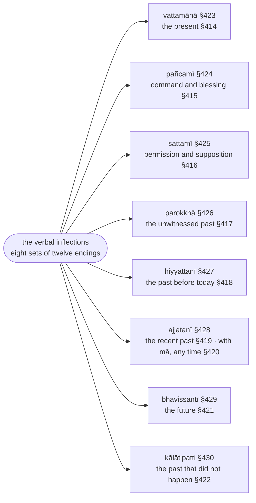

import { LinkCard } from "@astrojs/starlight/components";

:::note
`ākhyāta` ("what is declared") is the finite verb. The first section (§406–§431) sets out the two voices (`parassapada`, `attanopada`), the three persons, the eight tenses and moods and their endings; the second (§432–§457) the suffixes that come between root and ending — desiderative, denominative, causative, passive, and the `vikaraṇa` of the eight conjugation classes; the third and fourth (§458–§523) the reduplication of the `parokkhā` and the sound changes of particular roots.

Verb forms are glossed ▶️ (`vattamānā`), ⏯ (`pañcamī`, `sattamī`, `bhavissantī`), ⏮ (`parokkhā`, `hiyyattanī`, `ajjatanī`, `kālātipatti`), with the person 👆 🤘 🤟 and number ⨀ ⨂; roots are cited with `√` in the form Kaccāyana uses (`√gamu`, `√paca`).

:::

:::note[The eight sets of endings and their times]
Every set has twelve endings, six `parassapada` and six `attanopada` (§406–§407), in three persons (§408); the sets are named by the time or mood they express.

:::

:::note[Root, class suffix, ending]
A finite verb is a root (§457), a suffix that depends on the root's class or on the voice (§432–§452), and an ending; the classes are named after their first root.

:::

:::note[Reading D'Alwis]
This chapter is the one part of Kaccāyana that James D'Alwis translated, as "Lib. VI.—On Verbs" of his *Introduction to Kachchāyana's Grammar of the Pāli Language* (Colombo 1863), reproduced on this site as [D'Alwis: Kaccāyana (1863)](/kaccayana/alwis). His four chapters are Kaccāyana's four sections, each numbered afresh: Cap. I rules 1–26 are §406–§431, Cap. II 1–26 are §432–§457, Cap. III 1–24 are §458–§481, Cap. IV 1–42 are §482–§523. The translation has been collated with his, sutta by sutta, and the footnotes below record where he bears on a reading or a construal. Three things to know when comparing:

* **His Pāli is the Sinhalese recension.** D'Alwis worked from Sinhalese manuscripts and printed the chapter's Pāli text (in Sinhalese characters) at the end of his book; wherever it can be compared it agrees with the text Senart printed in 1871 against the Chaṭṭha Saṅgāyana. Readings that the footnotes once ascribed to "Senart's edition" are therefore the Sinhalese tradition's, attested in 1863, and he is cited as their earliest witness.
* **His names for the tenses and persons.** He renders the `ajjatanī` with the English perfect ("he has gone"), the `hiyyattanī` as a simple past, the `parokkhā` as reported speech ("it is said he …", his "Indefinite Past"), the `kālātipatti` as a conditional ("he would go"), the `sattamī` as "Potential" and the `pañcamī` as "Imperative"; and he renumbers the persons to the European order, so that his "first person" is the `uttamapurisa` and his "third" the `paṭhamapurisa`.
* **Option markers.** He renders `vā` "optionally" and `kvaci` "sometimes" (or "in certain instances") and glosses the counter-examples of both "[to shew that the change is optional]", drawing no distinction between the two markers or between an open and a restricted option; his notes, however, already adopt the Rūpasiddhi's distribution of senses at §433, and his footnotes carry the Pāṇini parallels that the Analyses below now cite.

:::

## Paṭhamakaṇḍa (First Section)

### Ka

> Ākhyātasāgaramathajjatanītaraṅgaṃ, \
> Dhātujjalaṃ vikaraṇāgamakālamīnaṃ; \
> Lopānubandhariyamatthavibhāgatīraṃ, \
> Dhīrā taranti kavino puthubuddhināvā.

Now the ocean of the verb (`ākhyāta`), whose waves are the `ajjatanī` [and the other tenses], \
whose water is the roots (`dhātu`), whose fish are the conjugation signs (`vikaraṇa`), the augments (`āgama`) and the tenses (`kāla`), \
whose shore is elision (`lopa`), the indicatory letters (`anubandha`) and the analysis of meanings[^1] — \
the wise poets cross it in the ship of their broad understanding.

[^1]: `lopānubandhariyamatthavibhāgatīraṃ` is the CST reading. The syllables `-riyam-` between `anubandha` and `attha` are obscure: they may be `ariya`, "noble", with its first vowel elided after `anubandha` (§12) and an `m` inserted before `attha` (§35), "the noble analysis of meanings", or a corruption of `niyama`, "restriction", a term the grammarians use constantly; the metre (Vasantatilakā) wants two short syllables here and admits either. The rendering leaves the word untranslated.

### Kha

> Vicittasaṅkhāraparikkhitaṃ imaṃ, \
> Ākhyātasaddaṃ vipulaṃ asesato; \
> Paṇamya sambuddhamanantagocaraṃ, \
> Sugocaraṃ yaṃ vadato suṇātha me.

This [verb], hedged about with manifold constructions, \
the vast word-class of the verb (`ākhyātasadda`), in its entirety — \
having bowed to the Fully Awakened One, whose range is boundless, \
hear it from me as I speak it, a range that is good going.

### Ga

> Adhikāre maṅgale ceva, nipphanne cāvadhāraṇe; \
> Anantare ca pādāne, athasaddo pavattati.

In [the sense of] a governing heading (`adhikāra`) and of auspiciousness (`maṅgala`), of what follows as a result (`nipphanna`) and of emphasis (`avadhāraṇa`), \
of immediate sequence (`anantara`) and of taking up [a new subject] (`pādāna`): [in these six senses] the word `atha` is used.

:::note[The word atha]

The third verse explains the `atha` ("now") with which the first verse and the first sutta, §406, begin. The Rūpasiddhi reads it there as `anantara`, immediate sequence — "now, next after the taddhita" — and the tradition also hears in it the `maṅgala`, the auspicious word with which a new subject is opened.

:::

### §406 (429): Atha pubbāni vibhattīnaṃ cha parassapadāni (Now, the first six of the inflections are `parassapada`) :badge[rūḷhī]{variant=note}

:::note[Analysis]

| option | before | from   | operation | to         | after  | context |
| ------ | ------ | ------ | --------- | ---------- | ------ | ------- |
|        |        | pubbāni cha (padāni) | (saññāni honti) | parassapadāni | | atha vibhattīnaṃ |
|        |        | the first six [words] | (are given the name) | `parassapada` | | now; of the [verbal] inflections |

`atha` ("now") opens the chapter: the verb (`ākhyāta`) follows the taddhita, and the verse Ga above lists the senses of the word — the Rūpasiddhi takes it here as `anantara`, immediate sequence, "next after the taddhita". `vibhattīnaṃ` ("of the inflections") are the verbal inflections: eight sets of twelve endings, which [§423 (426): Vattamānā ti anti, si tha, mi ma, te ante, se vhe, e mhe](#m423) to [§430 (474): Kālātipatti ssā ssaṃsu, sse ssatha, ssaṃ ssāmhā, ssatha ssisu, ssase ssavhe, ssiṃ ssāmhase](#m430) list, as [§55 (63): Si yo, aṃ yo, nā hi, sa naṃ, smā hi, sa naṃ, smiṃ su](/kaccayana/2-namakappa#m55) listed the noun's fourteen. Each set falls into two halves of six, and `pubbāni cha` ("the first six") of every set — `ti anti, si tha, mi ma` in the vattamānā — receive the name `parassapada`; the vutti supplies `padāni` ("words", the endings) and `saññāni honti` ("are so named"). `parassapada` is "the word for another" (Sanskrit `parasmaipada`, the active voice): the name is a label inherited from the Sanskrit grammarians, not a description of what the endings do in Pāli, where the two sets differ little in sense, so the definition is `rūḷhī`.[^2] The vutti's question `Parassapadamiccanena kvattho?` points to the rule that uses the term, [§456 (430): Kattari parassapadaṃ](#m456). There is no option marker.

:::

> Atha sabbāsaṃ vibhattīnaṃ yāni yāni pubbakāni cha padāni, tāni tāni parassapadasaññāni honti.

> Taṃ yathā? Ti anti, si tha, mi ma.

> Parassapadamiccanena kvattho? Kattari parassapadaṃ.

Now (`atha`), of all the [verbal] inflections, whichever six words come first [in each set], those are named `parassapada` ("word for another", the active endings).

:::tip[Purpose]

`Parassapadamiccanena kvattho?` — what is the use of the term `parassapada`? It is the term of [§456 (430): Kattari parassapadaṃ](#m456): when what the verb expresses is the agent (`kattā`, [§281 (294): Yo karoti sa kattā](/kaccayana/3-karakakappa#m281)), the endings are `parassapada`. The rule is Pāṇini's 1.3.78 `śeṣāt kartari parasmaipadam`, "otherwise — when the agent [is expressed] — the parasmaipada" ([D'Alwis (1863)](/kaccayana/alwis)).

:::

:::tip[Examples]

`Taṃ yathā?` — "as follows": the first six of the `vattamānā` (present). They are shown here on the root `paca` ("cook"), the verb the Rūpasiddhi runs through every tense, as the tables of §423–§430 will do.

| lemma | inflected | vibhatti | meaning |
| ----- | --------- | -------- | ------- |
| ▶️🤟⨀(√paca + a + ti) | pacati | `ti` (vattamānā, parassapada) | he cooks |
| ▶️🤟⨂(√paca + a + anti) | pacanti | `anti` (vattamānā, parassapada) | they cook |
| ▶️🤘⨀(√paca + a + si) | pacasi | `si` (vattamānā, parassapada) | you cook |
| ▶️🤘⨂(√paca + a + tha) | pacatha | `tha` (vattamānā, parassapada) | you [all] cook |
| ▶️👆⨀(√paca + a + mi) | pacāmi | `mi` (vattamānā, parassapada) | I cook |
| ▶️👆⨂(√paca + a + ma) | pacāma | `ma` (vattamānā, parassapada) | we cook |

|     | paca + ti (vattamānā)        | rule |
| --- | ---------------------------- | ---- |
| →   | pac + (~~a~~) + ti           | §521 |
| →   | pac + (a) + ti               | §445 |
| →   | **pacati**                   |      |

The root's final vowel is elided by [§521 (425): Dhātussanto lopo’nekasarassa](#m521); the conjugation sign `a` is added by [§445 (433): Bhūvādito a](#m445); the ending follows the sign by [§455 (530): Dhātuppaccayehi vibhattiyo](#m455). Before `mi` and `ma` the `a` is lengthened by [§478 (438): Akāro dīghaṃ hi mi mesu](#m478).

> `pacati vā pacāpeti vā` \
> [(2V 1.5.2.1: Bhūtagāmasikkhāpada)](https://tipitaka2500.github.io/tipitaka/2V/1/1.5/1.5.2/1.5.2.1#347) \
▶️🤟⨀(pacati) 🔼(vā) ▶️🤟⨀(pacāpeti) 🔼(vā) \
cooks | or | has [it] cooked | or

:::

[^2]: Malai (1997) renders `parassapada` "active terminations" and `attanopada` "passive terminations" throughout. Kaccāyana assigns the `attanopada` to the impersonal, the passive and the active alike ([§453 (444): Attanopadāni bhāve ca kammani](#m453), [§454 (440): Kattari ca](#m454), `maññate`) and lets the passive take `parassapada` ([§518 (446): Attanopadāni parassapadattaṃ](#m518), `vuccati`), so "passive terminations" misdescribes the set; the Pāli names are kept, as Nandisena (2005) keeps them ("word for another", "word for itself"). [D'Alwis (1863)](/kaccayana/alwis) explains the names as transitive and reflexive voices but notes that Pāli, like Vedic Sanskrit, uses one for the other — `icchate` for `icchati`, `saye` for `sayeyya`. Malai also gives `anantara`, among the senses of `atha` in verse Ga, as "pause"; the Rūpasiddhi's "immediate sequence" is kept. D'Alwis reports that some take that stanza for a commentator's interpolation explaining the particle, and compares Kātyāyana's remark that `om` and `atha` both open a chapter; his own paraphrase of it gives five senses and omits `anantara`, the very one the Rūpasiddhi picks here.

---

### §407 (439): Parāṇyattanopadāni (The latter [six] are `attanopada`) :badge[rūḷhī]{variant=note}

:::note[Analysis]

| option | before | from   | operation | to         | after  | context |
| ------ | ------ | ------ | --------- | ---------- | ------ | ------- |
|        |        | parāni cha (padāni) | (saññāni honti) | attanopadāni | | (vibhattīnaṃ) |
|        |        | the latter six [words] | (are given the name) | `attanopada` | | (of the inflections) |

The sutta is `parāni attanopadāni` run together: the final `i` of `parāni` ("the latter ones") becomes `y` before the vowel by [§21 (21): Ivaṇṇo yaṃ navā](/kaccayana/1-sandhikappa#m21) — the CST spells the result `parāṇy-`, with a retroflex that the vutti's `parāni` does not have.[^3] `vibhattīnaṃ` and `cha padāni` continue from [§406 (429): Atha pubbāni vibhattīnaṃ cha parassapadāni](#m406): the latter six of each set of twelve — `te ante, se vhe, e mhe` in the vattamānā — are `attanopada`, "the word for oneself" (Sanskrit `ātmanepada`, the middle voice). In Pāli these endings are chiefly a feature of verse and of the passive; as with `parassapada` the name is a label, so `rūḷhī`. Their use is given by [§453 (444): Attanopadāni bhāve ca kammani](#m453) — in the impersonal (`bhāva`) and passive (`kamma`) constructions — and extended to the active by [§454 (440): Kattari ca](#m454). No option marker.

:::

> Sabbāsaṃ vibhattīnaṃ yāni yāni parāni cha padāni. Tāni tāni attanopadasaññāni honti.

> Taṃ yathā? Te ante, se vhe, e mhe.

> Attanopadamiccanena kvattho? Attanopadāni bhāve ca kammani.

Of all the [verbal] inflections, whichever six words come last [in each set], those are named `attanopada` ("word for oneself", the middle endings).

:::tip[Purpose]

`Attanopadamiccanena kvattho?` — what is the use of the term `attanopada`? It is the term of [§453 (444): Attanopadāni bhāve ca kammani](#m453): these endings are used when the verb expresses the bare action (`bhāva`) or the object (`kamma`, [§280 (285): Yaṃ karoti taṃ kammaṃ](/kaccayana/3-karakakappa#m280)), and by [§454 (440): Kattari ca](#m454) the agent as well.

:::

:::tip[Examples]

`Taṃ yathā?` — the latter six of the `vattamānā`, on `paca`:

| lemma | inflected | vibhatti | meaning |
| ----- | --------- | -------- | ------- |
| ▶️🤟⨀(√paca + a + te) | pacate | `te` (vattamānā, attanopada) | he cooks |
| ▶️🤟⨂(√paca + a + ante) | pacante | `ante` (vattamānā, attanopada) | they cook |
| ▶️🤘⨀(√paca + a + se) | pacase | `se` (vattamānā, attanopada) | you cook |
| ▶️🤘⨂(√paca + a + vhe) | pacavhe | `vhe` (vattamānā, attanopada) | you [all] cook |
| ▶️👆⨀(√paca + a + e) | pace | `e` (vattamānā, attanopada) | I cook |
| ▶️👆⨂(√paca + a + mhe) | pacāmhe | `mhe` (vattamānā, attanopada) | we cook |

|     | paca + e (vattamānā)         | rule |
| --- | ---------------------------- | ---- |
| →   | pac + (~~a~~) + e            | §521 |
| →   | pac + (a) + e                | §445 |
| →   | pac + (~~a~~ + e)            | §12  |
| →   | **pace**                     |      |

Before the vowel of `e` the conjugation sign is elided by [§12 (13): Sarā sare lopaṃ](/kaccayana/1-sandhikappa#m12); before `mhe` it is lengthened by [§478 (438): Akāro dīghaṃ hi mi mesu](#m478), whose vutti lists `gacchāmhe`.

> `abbudā jāyate pesi` \
> [(12S1 10.1.1: Indakasutta)](https://tipitaka2500.github.io/tipitaka/12S1/10/10.1/10.1.1#1453) \
🚻⑤⨀(abbuda) ▶️🤟⨀(jāyati) 🚺①⨀(pesī) \
from the abbuda | comes into being | the pesī [lump]

> `rañño taṃ vuccate aghaṃ` \
> [(22J 16.1.10: Gandhatindukajātaka)](https://tipitaka2500.github.io/tipitaka/22J/16/16.1/16.1.10#3599) \
🚹⑥⨀(rāja) 🚻①⨀(ta) 🔵▶️🤟⨀(vuccati) 🚻①⨀(agha) \
of the king | that | is called | misfortune

> `udakaṃ maññe ādittaṃ` \
> [(1V 1.2.8: Duṭṭhadosasikkhāpada)](https://tipitaka2500.github.io/tipitaka/1V/1/1.2/1.2.8#1569) \
🚻①⨀(udaka) ▶️👆⨀(maññati) 🚻①⨀(āditta) \
the water | I think | is ablaze

The second is the passive use of §453, the third the first-person `e`.

:::

[^3]: Malai (1997) likewise notes that `parāṇi` should read `parāni`; Nandisena (2005) prints the CST's `parāṇy` in the sutta and `parāni` in the vutti without comment.

---

### §408 (431): Dve dve paṭhama majjhimuttamapurisā (Two by two: first, middle and highest person) :badge[anvattha]{variant=note}

:::note[Analysis]

| option | before | from   | operation | to         | after  | context |
| ------ | ------ | ------ | --------- | ---------- | ------ | ------- |
|        |        | dve dve (padāni) | (saññāni honti) | paṭhama-majjhima-uttamapurisā | | (parassapadānaṃ attanopadānañca) |
|        |        | each two [words] | (are given the names) | `paṭhamapurisa`, `majjhimapurisa`, `uttamapurisa` | | (of the parassapada and the attanopada) |

`dve dve` ("two and two", a pair at a time) takes the six of each half in order: the first pair is `paṭhamapurisa`, the "first person", the second `majjhimapurisa`, the "middle person", the third `uttamapurisa`, the "highest" or last person. Kaccāyana's `dve dve` answers Pāṇini's `trīṇi trīṇi` (1.4.101 `tiṅas trīṇi trīṇi prathamamadhyamottamāḥ`): the middle member of each Sanskrit triplet, the dual, has no Pāli counterpart ([D'Alwis (1863)](/kaccayana/alwis)). The count runs from the one spoken about to the speaker, the reverse of the English habit: the Pāli first person is `so pacati`, "he cooks", the middle person "you", the highest person "I". This translation keeps the Pāli names with their literal glosses, so that `paṭhamapurisa` is never the English "first person". D'Alwis renumbers to the European order, so that his "first person" is the `uttamapurisa` and his "third" the `paṭhamapurisa`. The names describe the place of each pair in the set, hence `anvattha`. `Evaṃ sabbattha` ("so everywhere") extends the naming to all eight sets — ninety-six endings, thirty-two to each person, as the Rūpasiddhi counts. `tāsaṃ sabbāsaṃ vibhattīnaṃ` and the two voices continue from [§406 (429): Atha pubbāni vibhattīnaṃ cha parassapadāni](#m406) and [§407 (439): Parāṇyattanopadāni](#m407). The question at the end names the three rules that use the terms, §410–§412. No option marker.

:::

> Tāsaṃ sabbāsaṃ vibhattīnaṃ parassapadānaṃ, attanopadānañca dve dve padāni paṭhamamajjhimuttamapurisasaññāni honti.

> Taṃ yathā? Ti anti iti paṭhamapurisā, si tha iti majjhimapurisā, mi ma iti uttamapurisā. Attanopadānampi te ante iti paṭhamapurisā, se vhe iti majjhimapurisā, e mhe iti uttamapurisā. Evaṃ sabbattha.

> Paṭhamamajjhimuttamapurisamiccanena kvattho? Nāmamhi payujjamānepi tulyādhikaraṇe paṭhamo, tumhe majjhimo, amhe uttamo.

Of all those inflections, `parassapada` and `attanopada` alike, each two words [in turn] are named `paṭhamapurisa` ("first person" — the one spoken of), `majjhimapurisa` ("middle person" — the one spoken to) and `uttamapurisa` ("highest person" — the speaker).

:::tip[Purpose]

`Paṭhamamajjhimuttamapurisamiccanena kvattho?` — what is the use of the three terms? They are the terms of [§410 (432): Nāmamhi payujjamānepi tulyādhikaraṇe paṭhamo](#m410), [§411 (436): Tumhe majjhimo](#m411) and [§412 (437): Amhe uttamo](#m412), which say when each person is used.

:::

:::tip[Examples]

`Taṃ yathā?` — the twelve of the `vattamānā`, in their pairs:

| lemma | inflected | vibhatti | meaning |
| ----- | --------- | -------- | ------- |
| ▶️🤟⨀(√paca + a + ti) | pacati | `ti`, paṭhamapurisa ⨀ (parassapada) | he cooks |
| ▶️🤟⨂(√paca + a + anti) | pacanti | `anti`, paṭhamapurisa ⨂ (parassapada) | they cook |
| ▶️🤘⨀(√paca + a + si) | pacasi | `si`, majjhimapurisa ⨀ (parassapada) | you cook |
| ▶️🤘⨂(√paca + a + tha) | pacatha | `tha`, majjhimapurisa ⨂ (parassapada) | you [all] cook |
| ▶️👆⨀(√paca + a + mi) | pacāmi | `mi`, uttamapurisa ⨀ (parassapada) | I cook |
| ▶️👆⨂(√paca + a + ma) | pacāma | `ma`, uttamapurisa ⨂ (parassapada) | we cook |
| ▶️🤟⨀(√paca + a + te) | pacate | `te`, paṭhamapurisa ⨀ (attanopada) | he cooks |
| ▶️🤟⨂(√paca + a + ante) | pacante | `ante`, paṭhamapurisa ⨂ (attanopada) | they cook |
| ▶️🤘⨀(√paca + a + se) | pacase | `se`, majjhimapurisa ⨀ (attanopada) | you cook |
| ▶️🤘⨂(√paca + a + vhe) | pacavhe | `vhe`, majjhimapurisa ⨂ (attanopada) | you [all] cook |
| ▶️👆⨀(√paca + a + e) | pace | `e`, uttamapurisa ⨀ (attanopada) | I cook |
| ▶️👆⨂(√paca + a + mhe) | pacāmhe | `mhe`, uttamapurisa ⨂ (attanopada) | we cook |

The three persons in the canon:

> `saggañca so gacchati sarīraṃ vihāya` \
> [(12S1 1.4.6: Saddhāsutta)](https://tipitaka2500.github.io/tipitaka/12S1/1/1.4/1.4.6#200) \
🚹②⨀(sagga) 🔼(ca) 🚹①⨀(ta) ▶️🤟⨀(gacchati) 🚻②⨀(sarīra) 🔽(vihāya) \
to heaven | and | he | goes | the body | having left

> `gacchatha tumhe, sāriputtā` \
> [(1V 1.2.13: Kuladūsakasikkhāpada)](https://tipitaka2500.github.io/tipitaka/1V/1/1.2/1.2.13#1757) \
▶️🤘⨂(gacchati) ⚧️①⨂(tumha) 🚹⓪⨂(sāriputta) \
go | you | Sāriputta [and Moggallāna]

> `āgamehi, bhante, yāva gharaṃ gacchāmi` \
> [(1V 1.4.1.6: Aññātakaviññattisikkhāpada)](https://tipitaka2500.github.io/tipitaka/1V/1/1.4/1.4.1/1.4.1.6#1974) \
⏯🤘⨀(āgameti) 🚹⓪⨀(bhavanta) 🔼(yāva) 🚻②⨀(ghara) ▶️👆⨀(gacchati) \
wait | venerable sir | until | home | I go

:::

---

### §409 (441): Sabbesamekābhidhāne paro puriso (When all [persons] are expressed together, the later person) :badge[vidhyaṅga]{variant=tip}

:::note[Analysis]

| option | before | from   | operation | to         | after  | context |
| ------ | ------ | ------ | --------- | ---------- | ------ | ------- |
|        |        | sabbesaṃ (purisānaṃ) | (gahetabbo) | paro puriso | | ekābhidhāne |
|        |        | of all [the persons] | (is to be taken) | the later person | | in a single expression |

The sutta is `sabbesaṃ ekābhidhāne`, the `ṃ` becoming `m` before the vowel by [§34 (52): Madā sare](/kaccayana/1-sandhikappa#m34). `ekābhidhāna` is "one expression": a single verb made to cover subjects of different persons — "he and you", or "he, you and I". `paro` ("the later") is the later in the order of [§408 (431): Dve dve paṭhama majjhimuttamapurisā](#m408), `paṭhama`, `majjhima`, `uttama`: when a first person (he) and a middle person (you) share a verb, the middle person is used; when the highest person (I) is among them, the highest — as English "he and I" takes "we". The vutti's `evaṃ sesāsu vibhattīsu` carries the instruction to all eight sets. The Rūpasiddhi adds a condition the sutta leaves unsaid: the actions must be of one time (`ekakālānam eva`) — `so ca pacati, tvañca pacissasi, ahañca paciṃ` cannot merge into `mayaṃ pacimhā`. A rule about how the person is chosen rather than about any form, it is `vidhyaṅga`. No option marker.

:::

> Sabbesaṃ tiṇṇaṃ paṭhamamajjhimuttama purisānaṃ ekābhidhāne paro puriso gahetabbo.

> So ca paṭhati, tvañca paṭhasi, tumhe paṭhatha. So ca pacati, tvañca pacasi. Tumhe pacatha. Evaṃ sesāsu vibhattīsu paro puriso yojetabbo.

When all three persons — `paṭhama`, `majjhima` and `uttama` — [or any two of them] are expressed in a single statement, the later person is to be taken.

:::tip[Examples]

> `so ca paṭhati, tvañca paṭhasi, tumhe paṭhatha` \
🚹①⨀(ta) 🔼(ca) ▶️🤟⨀(paṭhati) ⚧️①⨀(tumha) 🔼(ca) ▶️🤘⨀(paṭhati) ⚧️①⨂(tumha) ▶️🤘⨂(paṭhati) \
he | and | reads | you | and | read | you [two] | read

> `so ca pacati, tvañca pacasi, tumhe pacatha` \
🚹①⨀(ta) 🔼(ca) ▶️🤟⨀(pacati) ⚧️①⨀(tumha) 🔼(ca) ▶️🤘⨀(pacati) ⚧️①⨂(tumha) ▶️🤘⨂(pacati) \
he | and | cooks | you | and | cook | you [two] | cook

"He reads and you read" is said with one verb as `tumhe paṭhatha`, "you [two] read": of the first and the middle person, the middle is the later. `Evaṃ sesāsu vibhattīsu` — so in the remaining seven sets: `so ca apacā, tvañca apaco, tumhe apacattha` in the hiyyattanī, and the rest.

| lemma | inflected | vibhatti | meaning |
| ----- | --------- | -------- | ------- |
| ▶️🤘⨂(√paṭha + a + tha) | tumhe paṭhatha | `tha`, majjhimapurisa ⨂ (vattamānā) | you [two] read |
| ▶️🤘⨂(√paca + a + tha) | tumhe pacatha | `tha`, majjhimapurisa ⨂ (vattamānā) | you [two] cook |

:::

:::note[Additional]

The CST's vutti shows only the middle person prevailing over the first.[^4] The Rūpasiddhi completes the set: `so ca pacati, ahañca pacāmi` — `mayaṃ pacāma`; `tvañca pacasi, ahañca pacāmi` — `mayaṃ pacāma`; `so ca pacati, tvañca pacasi, ahañca pacāmi` — `mayaṃ pacāma`. Wherever the highest person is present it is taken, in the plural. [D'Alwis (1863)](/kaccayana/alwis) sums the rule up the same way: the verb takes the plural of the highest person present, failing which the middle — `so ca tvaṃ pacatha`, "you [two] cook" — and notes the same usage in Marathi.

:::

[^4]: [D'Alwis (1863)](/kaccayana/alwis) and Senart's edition, which Malai (1997) follows, run the vutti itself through all three persons and close with the highest: `So ca paṭhati te ca paṭhanti tvañca paṭhasi tumhe ca paṭhatha ahañca paṭhāmi mayaṃ paṭhāma; so pacati … mayaṃ pacāma` — each person's plural added in turn, so that the rule's outcome for all three is shown where the CST leaves it to inference. D'Alwis, working from Sinhalese manuscripts, is the earliest printed witness to this long recension, eight years before Senart (his second series lacks the `ca`s, `so pacati, te pacanti …`, probably his own abbreviation); he accordingly renders `paro puriso` "the highest (or first) person", which the closing `mayaṃ paṭhāma` makes natural, where the CST's `tumhe paṭhatha`, the middle prevailing over the first, requires "the later person". Malai records no variant, so the manuscripts he cites (T, B1, S1, S2) agree. Nandisena (2005) prints the CST's shorter text and supplies the highest person in a note.

---

### §410 (432): Nāmamhi payujjamānepi tulyādhikaraṇe paṭhamo (With a co-referent noun, expressed or not: the first person) :badge[utsarga]{variant=success}

:::note[Analysis]

| option | before | from   | operation | to         | after  | context |
| ------ | ------ | ------ | --------- | ---------- | ------ | ------- |
|        |        | (ākhyāte) | (hoti) | paṭhamo (puriso) | | nāmamhi payujjamānepi (appayujjamānepi) tulyādhikaraṇe |
|        |        | (in the verb) | (is used) | the first person | | when a noun of the same reference is used, or [also] not used |

`nāma` here is any noun or pronoun other than `tumha` and `amha`, which the next two rules take out (the Rūpasiddhi: `tumhāmhasaddavajjite`). `tulyādhikaraṇa`, "having the same substratum", is the noun that refers to the very thing the verb expresses — the agent in the active, the object in the passive — that is, the subject, standing in the first form ① by [§284 (283): Liṅgatthe paṭhamā](/kaccayana/3-karakakappa#m284). [D'Alwis (1863)](/kaccayana/alwis) simply renders `tulyādhikaraṇa` "the Nominative". `payujjamāne pi` is "even when [such a noun] is used", and the `pi` ("also") lets the vutti add `appayujjamāne pi`, "also when it is not": a Pāli verb needs no expressed subject, and `gacchati` alone is a sentence. This is the default person and the general rule for the choice of person, so `utsarga`; [§411 (436): Tumhe majjhimo](#m411) and [§412 (437): Amhe uttamo](#m412) are its exceptions. Pāṇini has the same three rules in the opposite order — 1.4.105 `yuṣmady upapade samānādhikaraṇe sthāniny api madhyamaḥ`, 1.4.107 `asmady uttamaḥ`, 1.4.108 `śeṣe prathamaḥ` — and word for word (`samānādhikaraṇe` is `tulyādhikaraṇe`, `sthāniny api` the `payujjamāne pi appayujjamāne pi`): there the third person is what is left over (`śeṣe`), here it is the default (D'Alwis 1863). No option marker.

:::

> Nāmamhi payujjamānepi appayujjamānepi tulyādhikaraṇe paṭhamapuriso hoti.

> So gacchati, te gacchanti.

> Appayujjamānepi – gacchati, gacchanti.

> Tulyādhikaraṇeti kimatthaṃ? Tena haññase tvaṃ devadattena.

When a noun of the same reference [as the verb's subject] is used, and also when it is not used, the `paṭhamapurisa` (first person — he, she, it, they) is employed.

:::tip[Examples]

| lemma | inflected | vibhatti | meaning |
| ----- | --------- | -------- | ------- |
| ▶️🤟⨀(√gamu + a + ti) | so gacchati | `ti`, paṭhamapurisa ⨀ (vattamānā) | he goes |
| ▶️🤟⨂(√gamu + a + anti) | te gacchanti | `anti`, paṭhamapurisa ⨂ (vattamānā) | they go |
| ▶️🤟⨀(√gamu + a + ti) | gacchati | `ti`, paṭhamapurisa ⨀ (vattamānā) | [he] goes |
| ▶️🤟⨂(√gamu + a + anti) | gacchanti | `anti`, paṭhamapurisa ⨂ (vattamānā) | [they] go |

|     | gamu + ti (vattamānā)        | rule |
| --- | ---------------------------- | ---- |
| →   | gam + (~~u~~) + ti           | §521 |
| →   | ga + (m→cch) + ti            | §476 |
| →   | gacch + (a) + ti             | §445 |
| →   | **gacchati**                 |      |

The final `m` of `gamu` becomes `cch` by [§476 (442): Gamissanto ccho vā sabbāsu](#m476), optionally: `gameti` stands beside `gacchati`.

> `na te gacchanti punabbhavaṃ` \
> [(18Sn 3.12: Dvayatānupassanāsutta)](https://tipitaka2500.github.io/tipitaka/18Sn/3/3.12#876) \
🔼(na) 🚹①⨂(ta) ▶️🤟⨂(gacchati) 🚹②⨀(punabbhava) \
not | they | go | to renewed existence

With the subject unexpressed (`appayujjamāne`):

> `aggiṃ āharissāmīti gāmaṃ gacchati` \
> [(2V 1.5.9.3: Vikālagāmappavisanasikkhāpada)](https://tipitaka2500.github.io/tipitaka/2V/1/1.5/1.5.9/1.5.9.3#1508) \
🚹②⨀(aggi) ⏯👆⨀(āharati) 🔼(iti) 🚹②⨀(gāma) ▶️🤟⨀(gacchati) \
fire | I shall fetch | so [thinking] | to the village | [he] goes

:::

:::danger[Counter-example]

By saying `tulyādhikaraṇe` (of the same reference) a noun that does not share the verb's reference does not fix its person. In `tena haññase tvaṃ devadattena` the nouns `tena … devadattena` stand in the third form ③ as the agent of a passive verb; the subject is `tvaṃ`, and the verb takes the middle person by [§411 (436): Tumhe majjhimo](#m411). D'Alwis (1863) renders it "By that Devadatta thou art killed", the pronoun qualifying the name.

> `tena haññase tvaṃ devadattena` \
🚹③⨀(ta) 🔵▶️🤘⨀(haññati) ⚧️①⨀(tumha) 🚹③⨀(devadatta) \
by him | are struck | you | by Devadatta

|     | hana + se (vattamānā, attanopada) | rule |
| --- | --------------------------------- | ---- |
| →   | han + (~~a~~) + se                | §521 |
| →   | han + (ya) + se                   | §440 |
| →   | ha + (n + y → ññ) + a + se        | §441 |
| →   | **haññase**                       |      |

The passive takes the suffix `ya` by [§440 (445): Bhāvakammesu yo](#m440), which merges with the root's final by [§441 (447): Tassa cavaggayakāravakārattaṃ sadhātvantassa](#m441), and the attanopada ending by [§453 (444): Attanopadāni bhāve ca kammani](#m453).

:::

---

### §411 (436): Tumhe majjhimo (With `tumha`: the middle person) :badge[apavada]{variant=success}

:::note[Analysis]

| option | before | from   | operation | to         | after  | context |
| ------ | ------ | ------ | --------- | ---------- | ------ | ------- |
|        |        | (ākhyāte) | (hoti) | majjhimo (puriso) | | tumhe (payujjamānepi appayujjamānepi tulyādhikaraṇe) |
|        |        | (in the verb) | (is used) | the middle person | | when `tumha` [is the co-referent word], used or not used |

`tumhe` is the seventh form ⑦⨀ of `tumha` ("you"): "when `tumha` [is the word of the same reference]". `payujjamānepi appayujjamānepi tulyādhikaraṇe` continue from [§410 (432): Nāmamhi payujjamānepi tulyādhikaraṇe paṭhamo](#m410). The rule overrides §410 for the pronoun of the person addressed, in either number — `tvaṃ`, `tumhe` — hence `apavada`. No option marker.

:::

> Tumhe payujjamānepi appayujjamānepi tulyādhikaraṇe majjhimapuriso hoti.

> Tvaṃ yāsi, tumhe yātha.

> Appayujjamānepi – yāsi, yātha.

> Tulyādhikaraṇeti kimatthaṃ? Tayā paccate odano.

When `tumha` ("you") of the same reference [as the verb] is used, and also when it is not used, the `majjhimapurisa` (middle person — you) is employed.

:::tip[Examples]

| lemma | inflected | vibhatti | meaning |
| ----- | --------- | -------- | ------- |
| ▶️🤘⨀(√yā + a + si) | tvaṃ yāsi | `si`, majjhimapurisa ⨀ (vattamānā) | you go |
| ▶️🤘⨂(√yā + a + tha) | tumhe yātha | `tha`, majjhimapurisa ⨂ (vattamānā) | you [all] go |
| ▶️🤘⨀(√yā + a + si) | yāsi | `si`, majjhimapurisa ⨀ (vattamānā) | [you] go |
| ▶️🤘⨂(√yā + a + tha) | yātha | `tha`, majjhimapurisa ⨂ (vattamānā) | [you all] go |

|     | yā + si (vattamānā)          | rule |
| --- | ---------------------------- | ---- |
| →   | yā + (a) + si                | §445 |
| →   | yā + (~~a~~) + si            | §12  |
| →   | **yāsi**                     |      |

The monosyllabic root keeps its vowel — [§521 (425): Dhātussanto lopo’nekasarassa](#m521) gives `yāti` as its counter-example — and the conjugation sign is lost after it by [§12 (13): Sarā sare lopaṃ](/kaccayana/1-sandhikappa#m12).

> `idāni tvaṃ gacchasi pubbaciṇṇaṃ` \
> [(19Th1 19.1.1: Tālapuṭattheragāthā)](https://tipitaka2500.github.io/tipitaka/19Th1/19/19.1/19.1.1#1486) \
🔼(idāni) ⚧️①⨀(tumha) ▶️🤘⨀(gacchati) 🚻②⨀(pubbaciṇṇa) \
now | you | go | to what was practised before

> `kuhiṃ gacchasi brāhmaṇa` \
> [(23J 22.1.10.11: Mahārājapabba)](https://tipitaka2500.github.io/tipitaka/23J/22/22.1/22.1.10/22.1.10.11#3664) \
⚧️⑦⨀(kiṃ + hiṃ) ▶️🤘⨀(gacchati) 🚹⓪⨀(brāhmaṇa) \
where | are you going | brahmin

:::

:::danger[Counter-example]

By saying `tulyādhikaraṇe` (of the same reference) the pronoun `tayā` in the third form ③, the agent of a passive verb, does not make the verb middle person: the subject is `odano`, a noun, and the verb is first person by [§410 (432): Nāmamhi payujjamānepi tulyādhikaraṇe paṭhamo](#m410).

> `tayā paccate odano` \
⚧️③⨀(tumha) 🔵▶️🤟⨀(paccati) 🚹①⨀(odana) \
by you | is cooked | the rice

|     | paca + te (vattamānā, attanopada) | rule |
| --- | --------------------------------- | ---- |
| →   | pac + (~~a~~) + te                | §521 |
| →   | pac + (ya) + te                   | §440 |
| →   | pa + (c + y → cc) + a + te        | §441 |
| →   | **paccate**                       |      |

:::

---

### §412 (437): Amhe uttamo (With `amha`: the highest person) :badge[apavada]{variant=success}

:::note[Analysis]

| option | before | from   | operation | to         | after  | context |
| ------ | ------ | ------ | --------- | ---------- | ------ | ------- |
|        |        | (ākhyāte) | (hoti) | uttamo (puriso) | | amhe (payujjamānepi appayujjamānepi tulyādhikaraṇe) |
|        |        | (in the verb) | (is used) | the highest person | | when `amha` [is the co-referent word], used or not used |

`amhe` is the seventh form ⑦⨀ of `amha` ("I"): "when `amha` [is the word of the same reference]". `payujjamānepi appayujjamānepi tulyādhikaraṇe` continue from [§410 (432): Nāmamhi payujjamānepi tulyādhikaraṇe paṭhamo](#m410). The rule overrides §410 for the speaker's pronoun, `ahaṃ` and `mayaṃ` — `apavada`. `uttama` is "highest" or "last": the person that closes each set of six and, by [§409 (441): Sabbesamekābhidhāne paro puriso](#m409), prevails over the other two. No option marker.

:::

> Amhe payujjamānepi appayujjamānepi tulyādhikaraṇe uttamapuriso hoti.

> Ahaṃ yajāmi, mayaṃ yajāma.

> Appayujjamānepi – yajāmi, yajāma.

> Tulyādhikaraṇeti kimatthaṃ? Mayā ijjate buddho.

When `amha` ("I") of the same reference [as the verb] is used, and also when it is not used, the `uttamapurisa` (highest person — I, we) is employed.

:::tip[Examples]

| lemma | inflected | vibhatti | meaning |
| ----- | --------- | -------- | ------- |
| ▶️👆⨀(√yaja + a + mi) | ahaṃ yajāmi | `mi`, uttamapurisa ⨀ (vattamānā) | I sacrifice |
| ▶️👆⨂(√yaja + a + ma) | mayaṃ yajāma | `ma`, uttamapurisa ⨂ (vattamānā) | we sacrifice |
| ▶️👆⨀(√yaja + a + mi) | yajāmi | `mi`, uttamapurisa ⨀ (vattamānā) | [I] sacrifice |
| ▶️👆⨂(√yaja + a + ma) | yajāma | `ma`, uttamapurisa ⨂ (vattamānā) | [we] sacrifice |

|     | yaja + mi (vattamānā)        | rule |
| --- | ---------------------------- | ---- |
| →   | yaj + (~~a~~) + mi           | §521 |
| →   | yaj + (a) + mi               | §445 |
| →   | yaj + (a→ā) + mi             | §478 |
| →   | **yajāmi**                   |      |

> `gacchāma, bhagini` \
> [(2V 1.5.3.7: Saṃvidhānasikkhāpada)](https://tipitaka2500.github.io/tipitaka/2V/1/1.5/1.5.3/1.5.3.7#599) \
▶️👆⨂(gacchati) 🚺⓪⨀(bhaginī) \
we go | sister

> `āgamehi, bhante, yāva gharaṃ gacchāmi` \
> [(1V 1.4.1.6: Aññātakaviññattisikkhāpada)](https://tipitaka2500.github.io/tipitaka/1V/1/1.4/1.4.1/1.4.1.6#1974) \
⏯🤘⨀(āgameti) 🚹⓪⨀(bhavanta) 🔼(yāva) 🚻②⨀(ghara) ▶️👆⨀(gacchati) \
wait | venerable sir | until | home | I go

:::

:::danger[Counter-example]

By saying `tulyādhikaraṇe` (of the same reference) the pronoun `mayā` in the third form ③, the agent of a passive verb, does not make the verb highest person: the subject is `buddho`, and the verb is first person by [§410 (432): Nāmamhi payujjamānepi tulyādhikaraṇe paṭhamo](#m410). The same sentence is the vutti's example under [§503 (485): Yajassādissi](#m503).

> `mayā ijjate buddho` \
⚧️③⨀(amha) 🔵▶️🤟⨀(ijjati) 🚹①⨀(buddha) \
by me | is worshipped | the Buddha

|     | yaja + te (vattamānā, attanopada) | rule |
| --- | --------------------------------- | ---- |
| →   | yaj + (~~a~~) + te                | §521 |
| →   | yaj + (ya) + te                   | §440 |
| →   | (ya→i)j + ya + te                 | §503 |
| →   | i + (j + y → jj) + a + te         | §441 |
| →   | **ijjate**                        |      |

:::

---

### §413 (427): Kāle (`kāle`, "in [the sense of] time": a governing heading) :badge[sīhagatika]{variant=caution}

:::note[Analysis]

| option | before | from   | operation | to         | after  | context |
| ------ | ------ | ------ | --------- | ---------- | ------ | ------- |
|        |        |        | (adhikāro) |           |        | kāle    |
|        |        |        | (governing heading, to be supplied in the rules that follow) | | | in [the sense of] time |

An `adhikāra` sutta, like [§256 (0): Kāle](/kaccayana/2-namakappa#m256) in the Nāmakappa and [§131 (0): Itthipumanapuṃsakasaṅkhyaṃ](/kaccayana/2-namakappa#m131): the single word `kāle` ("in time", ⑦⨀ of `kāla`) lays down no operation but is to be read into the rules that follow, [§414 (428): Vattamānā paccuppanne](#m414) to [§422 (475): Kriyātipanne’tīte kālātipatti](#m422), each of which assigns one of the eight sets of endings to a time or a mood — their vuttis all say `… kāle … vibhatti hoti`. The Rūpasiddhi: `ayam adhikāro; ito paraṃ tyādivibhattividhāne sabbattha vattate`, "this is a governing heading; from here on it applies throughout the prescription of the `ti`-endings"; it also glosses `kāla` as `kriyā`, action — the doing (`kāra`) whose `r` has become `l`. Unlike the `Kāle` of the Nāmakappa, this one the Rūpasiddhi keeps and numbers (427). A heading that reaches forward over the following suttas is `sīhagatika`.

:::

> ‘‘Kāle’’ iccetaṃ adhikāratthaṃ veditabbaṃ.

The word `kāle` ("in [the sense of] time") is to be understood as having the force of an `adhikāra` (governing heading) [for the rules that follow].

:::tip[Examples]

The eight sets the heading governs, each assigned to its time by its own rule:

| lemma | inflected | vibhatti | meaning |
| ----- | --------- | -------- | ------- |
| ▶️🤟⨀(gacchati) | gacchati | vattamānā (§414) | he goes |
| ⏯🤟⨀(karoti) | karotu | pañcamī (§415) | let him do |
| ⏯🤟⨀(gacchati) | gaccheyya | sattamī (§416) | he should go |
| ⏮🤟⨀(āha) | āha | parokkhā (§417) | he said, it is told |
| ⏮🤟⨀(gacchati) | agamā | hiyyattanī (§418) | he went |
| ⏮🤟⨀(gacchati) | agamī | ajjatanī (§419) | he went [today] |
| ⏯🤟⨀(gacchati) | gacchissati | bhavissantī (§421) | he will go |
| ⏮🤟⨀(gacchati) | agacchissā | kālātipatti (§422) | he would have gone |

[§420 (471): Māyoge sabbakāle ca](#m420) frees the two past sets from the heading after the particle `mā`.

:::

:::note[The eight sets and Pāṇini's lakāras]

The eight sets are the Sanskrit tenses and moods under Pāli names, as [D'Alwis (1863)](/kaccayana/alwis) set them out in the notes to his first chapter; the sūtra numbers are his. Pāli has no periphrastic future (luṭ, the "definite" future), no Vedic leṭ and no separate benedictive (āśīrliṅ), which the `pañcamī` absorbs: Pāli, he says, "differs from the Sanskrit merely in the absence of those elaborations, by which the Imperative is distinguished into 'commanding' and 'blessing,' and by which also the Future is divided into the 'definite' and the 'indefinite'"; where the Prakrit, on Cowell's account, keeps only "the present, the second future, and the Imperative", Pāli "has nearly all the tenses known to the Sanskrit".

| set | rule | lakāra | Sanskrit tense or mood |
| --- | ---- | ------ | ---------------------- |
| `vattamānā` | §414 | laṭ | present |
| `pañcamī` | §415 | loṭ, with āśīrliṅ | imperative (`āṇatti`) and benedictive (`āsiṭṭha`) |
| `sattamī` | §416 | vidhiliṅ | optative, D'Alwis's "Potential" |
| `parokkhā` | §417 | liṭ (3.2.115 `parokṣe liṭ`) | perfect, with reduplication |
| `hiyyattanī` | §418 | laṅ (3.2.111 `anadyatane laṅ`) | imperfect, `hyastana` "of yesterday" |
| `ajjatanī` | §419 | luṅ (3.2.110) | aorist |
| `bhavissantī` | §421 | lṛṭ | future |
| `kālātipatti` | §422 | lṛṅ (3.3.139 `liṅnimitte lṛṅ kriyātipattau`) | conditional |

:::

---

### §414 (428): Vattamānā paccuppanne (The `vattamānā` in the present) :badge[utsarga]{variant=success}

:::note[Analysis]

| option | before | from   | operation | to         | after  | context |
| ------ | ------ | ------ | --------- | ---------- | ------ | ------- |
|        |        | (dhātuto) | (hoti) | vattamānā (vibhatti) | | paccuppanne (kāle) |
|        |        | (after a root) | (is used) | the `vattamānā` inflection | | in present (time) |

`kāle` is supplied from the heading [§413 (427): Kāle](#m413), as in every rule to §422. `paccuppanna` is `paṭi` + `uppanna`, "arisen in dependence [on its conditions]": the Rūpasiddhi glosses it "come about from its cause, having gained its own nature, not yet past" — the present. It adds that by common usage the vattamānā also serves for what borders on the present, the immediate past and future, and for the past in narration. The set of endings is [§423 (426): Vattamānā ti anti, si tha, mi ma, te ante, se vhe, e mhe](#m423), and the name `vattamānā`, "the ongoing", says what the set is for. This is the first of the eight rules that assign a set of endings to a time; each states its assignment without a restricting condition, so they are `utsarga`. No option marker: the present is always the vattamānā.

:::

> Paccuppanne kāle vattamānāvibhatti hoti.

> Pāṭaliputtaṃ gacchati, sāvatthiṃ pavisati.

In present time (`paccuppanna`), the `vattamānā` inflection is used.[^5]

:::tip[Examples]

| lemma | inflected | vibhatti | meaning |
| ----- | --------- | -------- | ------- |
| ▶️🤟⨀(√gamu + a + ti) | pāṭaliputtaṃ gacchati | `ti` (vattamānā) | he goes to Pāṭaliputta |
| ▶️🤟⨀(pa + √visa + a + ti) | sāvatthiṃ pavisati | `ti` (vattamānā) | he enters Sāvatthī |

> `yo koci avītarāgo taṃ vanasaṇḍaṃ pavisati` \
> [(1V Veranjakanda: Verañjakaṇḍa)](https://tipitaka2500.github.io/tipitaka/1V/1/Veranjakanda#27) \
🚹①⨀(ya) 🚹①⨀(ka + ci) 🚹①⨀(avītarāga) 🚹②⨀(ta) 🚹②⨀(vanasaṇḍa) ▶️🤟⨀(pavisati) \
whoever | anyone | not free of passion | that | forest grove | enters

> `aggiṃ āharissāmīti gāmaṃ gacchati` \
> [(2V 1.5.9.3: Vikālagāmappavisanasikkhāpada)](https://tipitaka2500.github.io/tipitaka/2V/1/1.5/1.5.9/1.5.9.3#1508) \
🚹②⨀(aggi) ⏯👆⨀(āharati) 🔼(iti) 🚹②⨀(gāma) ▶️🤟⨀(gacchati) \
fire | I shall fetch | so [thinking] | to the village | he goes

:::

[^5]: [D'Alwis (1863)](/kaccayana/alwis) and Senart's vutti, followed by Malai (1997), have a third example, `viharati jetavane`, "he dwells in the Jeta grove" — a reading of the Sinhalese tradition, in print eight years before Senart — which the CST lacks and on which nothing turns; Nandisena (2005) prints the CST's two.

---

### §415 (451): Āṇatyā siṭṭhe’nuttakāle pañcamī (In command and blessing, time unstated: the `pañcamī`) :badge[utsarga]{variant=success}

:::note[Analysis]

| option | before | from   | operation | to         | after  | context |
| ------ | ------ | ------ | --------- | ---------- | ------ | ------- |
|        |        | (dhātuto) | (hoti) | pañcamī (vibhatti) | | āṇatti-āsiṭṭhe anuttakāle |
|        |        | (after a root) | (is used) | the `pañcamī` inflection | | in [the sense of] command and blessing, when the time is not stated |

The sutta is `āṇatti āsiṭṭhe anuttakāle`: the `i` of `āṇatti` becomes `y` before the vowel by [§21 (21): Ivaṇṇo yaṃ navā](/kaccayana/1-sandhikappa#m21), giving `āṇatyāsiṭṭhe`, and the `a` of `anuttakāle` is elided after `e` by [§12 (13): Sarā sare lopaṃ](/kaccayana/1-sandhikappa#m12), which the CST marks with an apostrophe. `āṇatti` is a command; `āsiṭṭha`, "what is wished for" (the past participle of `āsiṃsati`), a blessing or wish — the vutti says `āsīsattha`; `anuttakāla`, "time not stated" (`an` + `utta`, "not spoken"), is the Rūpasiddhi's "without naming a time", a present not otherwise specified. `kāle` from [§413 (427): Kāle](#m413) still governs, and the Rūpasiddhi takes the second `kāla` in `anuttakāle` as widening the rule to injunction, invitation, request, permission, prayer and "the time having come". The one Pāli set does the work of two Sanskrit moods, the imperative (loṭ) for `āṇatti` and the benedictive (āśīrliṅ) for `āsiṭṭha` ([D'Alwis (1863)](/kaccayana/alwis), who defends treating the moods as tenses — "susceptible of all times", in Williams's words — which is what the heading `kāle` and the `anuttakāle` here do). The set of endings is [§424 (450): Pañcamī tu antu, hitha, mima, taṃ antaṃ, ssu vho, e āmase](#m424); the name `pañcamī`, "fifth", is a label. No option marker.

:::

> Āṇatyatthe ca āsīsatthe ca anuttakāle pañcamī vibhatti hoti.

> Karotu kusalaṃ, sukhaṃ te hotu.

In the sense of a command (`āṇatti`) and of a blessing (`āsīsā`), when the time is not stated, the `pañcamī` inflection is used.[^6]

:::tip[Examples]

| lemma | inflected | vibhatti | meaning |
| ----- | --------- | -------- | ------- |
| ⏯🤟⨀(√kara + o + tu) | karotu kusalaṃ | `tu` (pañcamī) | let him do good |
| ⏯🤟⨀(√hū + a + tu) | sukhaṃ te hotu | `tu` (pañcamī) | may there be happiness for you |

|     | kara + tu (pañcamī)          | rule |
| --- | ---------------------------- | ---- |
| →   | kar + (~~a~~) + tu           | §521 |
| →   | kar + (o) + tu               | §451 |
| →   | **karotu**                   |      |

`kara` belongs to the `tanādi` group and takes the conjugation sign `o` by [§451 (520): Tanādito oyirā](#m451).

> `vacanīyamevāyasmā attānaṃ karotu` \
> [(1V 1.2.12: Dubbacasikkhāpada)](https://tipitaka2500.github.io/tipitaka/1V/1/1.2/1.2.12#1731) \
🚹②⨀(vacanīya) 🔼(eva) 🚹①⨀(āyasmantu) 🚹②⨀(atta) ⏯🤟⨀(karoti) \
admonishable | indeed | the venerable one | himself | let him make

> `sukhī hotu, brāhmaṇa, ambaṭṭho māṇavo` \
> [(6D 3.8: Pokkharasātibuddhūpasaṅkamana)](https://tipitaka2500.github.io/tipitaka/6D/3/3.8#418) \
🚹①⨀(sukhī) ⏯🤟⨀(hoti) 🚹⓪⨀(brāhmaṇa) 🚹①⨀(ambaṭṭha) 🚹①⨀(māṇava) \
happy | may he be | brahmin | Ambaṭṭha | the young man

The first is a command, the second a blessing.

:::

[^6]: U Nandisena (2005) renders `anuttakāle` as a third coordinate sense, "in the meaning of command, in the meaning of blessing and in time that is not said". The two `ca` of the vutti join `āṇatyatthe` and `āsīsatthe` only; `anuttakāle` stands outside the pair as a locative of circumstance, and the next rule, §416, carries it in the same role (`anuttakāle sattamī vibhatti hoti`), where an independent "sense" would have nothing to mean. His own note, that the phrase leaves the time unspecified, agrees in substance. Malai (1997) construes the phrase as the translation does — "a command and blessing, when time is not referred to" — so the two translators part here and Malai sides with the translation; his text (Senart's) reads `āsiṭṭhatthe` and `subhaṃ te hotu` where the manuscripts he cites have `āsīsatthe` (or `āsiṃsatthe`) and `sukhaṃ` with the CST, which does not touch the rule. [D'Alwis (1863)](/kaccayana/alwis) construes the phrase likewise, "in the sense of both commanding and blessing, without any distinction of time"; his example reads `sukhaṃ te hotu` with the CST.

---

### §416 (454): Anumatiparikappatthesu sattamī (In the senses of permission and supposition: the `sattamī`) :badge[utsarga]{variant=success}

:::note[Analysis]

| option | before | from   | operation | to         | after  | context |
| ------ | ------ | ------ | --------- | ---------- | ------ | ------- |
|        |        | (dhātuto) | (hoti) | sattamī (vibhatti) | | anumati-parikappa-atthesu (anuttakāle) |
|        |        | (after a root) | (is used) | the `sattamī` inflection | | in the senses of permission and supposition, (when the time is not stated) |

`anumati` is permission or consent, `parikappa` supposition — a hypothesis, a deliberation, the "should", "would" and "may" of English; `atthesu`, "in the senses". `anuttakāle` continues from [§415 (451): Āṇatyā siṭṭhe’nuttakāle pañcamī](#m415) (the Rūpasiddhi: `anuttakāle'ti vattate`), and `kāle` from [§413 (427): Kāle](#m413). The CST's list of suttas prints the heading `Anumatiparikappetthesu sattamī`; its vutti section and the Rūpasiddhi (454) print `Anumatiparikappatthesu`, which the vutti's own gloss `anumatyatthe ca parikappatthe ca` confirms, and the heading follows them. The set of endings is [§425 (453): Sattamī eyya eyyuṃ, eyyā si eyyā tha, eyyāmi eyyāma, etha eraṃ, etho eyyāvho, eyyaṃ eyyāmhe](#m425); `sattamī`, "seventh", is a label like `pañcamī`. The set is the Sanskrit optative (vidhiliṅ), the "Potential" of [D'Alwis (1863)](/kaccayana/alwis). The vutti's two examples show the two senses: `tvaṃ gaccheyyāsi`, "you may go", and `kimahaṃ kareyyāmi`, "what should I do?". No option marker.

:::

> Anumatyatthe ca parikappatthe ca anuttakāle sattamī vibhatti hoti.

> Tvaṃ gaccheyyāsi, kimahaṃ kareyyāmi.

In the sense of permission (`anumati`) and of supposition (`parikappa`), when the time is not stated, the `sattamī` inflection is used.

:::tip[Examples]

| lemma | inflected | vibhatti | meaning |
| ----- | --------- | -------- | ------- |
| ⏯🤘⨀(√gamu + a + eyyāsi) | tvaṃ gaccheyyāsi | `eyyāsi` (sattamī) | you may go |
| ⏯👆⨀(√kara + eyyāmi) | kimahaṃ kareyyāmi | `eyyāmi` (sattamī) | what should I do? |

|     | gamu + eyyāsi (sattamī)      | rule |
| --- | ---------------------------- | ---- |
| →   | gam + (~~u~~) + eyyāsi       | §521 |
| →   | ga + (m→cch) + eyyāsi        | §476 |
| →   | gacch + (a) + eyyāsi         | §445 |
| →   | gacch + (~~a~~ + eyyāsi)     | §12  |
| →   | **gaccheyyāsi**              |      |

> `gaccheyyāsi pana tvaṃ, mārisa, tassa bhagavato upaṭṭhānaṃ` \
> [(12S1 6.1.6: Brahmalokasutta)](https://tipitaka2500.github.io/tipitaka/12S1/6/6.1/6.1.6#1064) \
⏯🤘⨀(gacchati) 🔼(pana) ⚧️①⨀(tumha) 🚹⓪⨀(mārisa) 🚹⑥⨀(ta) 🚹⑥⨀(bhagavantu) 🚻②⨀(upaṭṭhāna) \
you might go | then | you | good sir | of that | Blessed One | to attend

> `na cāpi appiyaṃ tuyhaṃ, kareyyāmi ahaṃ puna` \
> [(23J 20.1.1: Kusajātaka)](https://tipitaka2500.github.io/tipitaka/23J/20/20.1/20.1.1#652) \
🔼(na) 🔼(ca) 🔼(api) 🚻②⨀(appiya) ⚧️④⨀(tumha) ⏯👆⨀(karoti) ⚧️①⨀(amha) 🔼(puna) \
not | and | even | anything displeasing | to you | would I do | I | again

:::

---

### §417 (460): Apaccakkhe parokkhātīte (In the unwitnessed past: the `parokkhā`) :badge[utsarga]{variant=success}

:::note[Analysis]

| option | before | from   | operation | to         | after  | context |
| ------ | ------ | ------ | --------- | ---------- | ------ | ------- |
|        |        | (dhātuto) | (hoti) | parokkhā (vibhatti) | | apaccakkhe atīte (kāle) |
|        |        | (after a root) | (is used) | the `parokkhā` inflection | | in the past not witnessed |

The sutta is `parokkhā atīte` run together. `atīta`, "gone by", is the past; `apaccakkha`, "not before the eyes" (`akkha`), is what the speaker has not witnessed and knows by report — hence the `kila` ("they say"; the canon's spelling is `kira`) of both examples. The name `parokkhā`, "beyond the eye", says the same, and the Rūpasiddhi explains it so. This is the Sanskrit perfect, Pāṇini's 3.2.115 `parokṣe liṭ`, with the same reduplication ([§458 (461): Kvacādivaṇṇānamekassarānaṃ dvebhāvo](#m458), [§459 (462): Pubbo’bbhāso](#m459)); Kaccāyana drops Pāṇini's "not of today" (`anadyatane`, carried over from 3.2.111), as [D'Alwis (1863)](/kaccayana/alwis) observed. This is the tense of legend and hearsay; in the canon it survives in a handful of forms, chiefly `āha` and `āhu` ("he said", "they said"), `babhūva`. `kāle` from [§413 (427): Kāle](#m413). The set of endings is [§426 (459): Parokkhā au ettha, aṃmha, tthare, ttho vho, iṃ mhe](#m426). No option marker.

:::

> Apaccakkhe atīte kāle parokkhāvibhatti hoti.

> Supine kilamāha, evaṃ kila porāṇāhu.

In past time (`atīta`) that was not witnessed (`apaccakkha`), the `parokkhā` inflection is used.[^7]

:::tip[Examples]

| lemma | inflected | vibhatti | meaning |
| ----- | --------- | -------- | ------- |
| ⏮🤟⨀(√brū + a) | supine kilamāha | `a` (parokkhā) | in a dream, they say, he said |
| ⏮🤟⨂(√brū + u) | evaṃ kila porāṇāhu | `u` (parokkhā) | thus, they say, said the ancients |

|     | brū + a (parokkhā)           | rule |
| --- | ---------------------------- | ---- |
| →   | (brū→āha) + a                | §475 |
| →   | āh + (~~a~~ + a)             | §12  |
| →   | **āha**                      |      |

In the parokkhā the root `brū` ("say") is replaced as a whole by `āha` by [§475 (465): Brūbhūnamāhabhūvā parokkhāyaṃ](#m475), and the ending merges with its final vowel: `āha`, `āhu`. `kilamāha` is `kila āha` with the `m` of [§35 (34): Ya va ma da na ta ra lā cāgamā](/kaccayana/1-sandhikappa#m35) between the vowels; `porāṇāhu` is `porāṇā āhu`.

> `saccaṃ, bhikkhave, moggallāno āha` \
> [(1V 1.1.4.2: Vinītavatthu)](https://tipitaka2500.github.io/tipitaka/1V/1/1.1/1.1.4/1.1.4.2#764) \
🚻②⨀(sacca) 🚹⓪⨂(bhikkhu) 🚹①⨀(moggallāna) ⏮🤟⨀(āha) \
the truth | bhikkhus | Moggallāna | said

> `āhu sabbagihibandhanacchidaṃ` \
> [(8D 7.6: Lakkhaṇasutta)](https://tipitaka2500.github.io/tipitaka/8D/7/7.6#439) \
⏮🤟⨂(āha) 🚹②⨀(sabbagihibandhanacchida) \
they declare [him] | cutter of every household bond

:::

[^7]: Malai (1997) renders `apaccakkhe` "of indefinite time" ("a past event of indefinite time"); Nandisena (2005) has "that which is not seen", with the translation. The word (`a` + `paṭi` + `akkha`, "not before the eyes"), the name `parokkhā`, "beyond the eye", and the `kila` of both examples all say "unwitnessed, known by report"; "indefinite time" describes a use of the tense, not the sutta. [D'Alwis (1863)](/kaccayana/alwis) glosses the word "unperceived (by the narrator)" but labels the tense "the indefinite past", the description Malai later wrote into the definition. D'Alwis and Senart read the first example `supine kila evam āha`; B1 and T have `kilamāha` with the CST.

---

### §418 (456): Hiyyopabhuti paccakkhe hiyyattanī (From yesterday back, [witnessed or not]: the `hiyyattanī`) :badge[utsarga]{variant=success}

:::note[Analysis]

| option | before | from   | operation | to         | after  | context |
| ------ | ------ | ------ | --------- | ---------- | ------ | ------- |
|        |        | (dhātuto) | (hoti) | hiyyattanī (vibhatti) | | hiyyo-pabhuti (atīte kāle) paccakkhe (vā apaccakkhe vā) |
|        |        | (after a root) | (is used) | the `hiyyattanī` inflection | | from yesterday onwards, (in past time,) witnessed (or not witnessed) |

`hiyyo` is "yesterday", `pabhuti` "onwards, beginning from":[^8] the past from yesterday backwards, as against the "today" of the next rule. `atīte kāle` continues from [§417 (460): Apaccakkhe parokkhātīte](#m417), `kāle` from [§413 (427): Kāle](#m413). The sutta says `paccakkhe`, "witnessed", the vutti `paccakkhe vā apaccakkhe vā`, "witnessed or not": this `vā … vā` is "whether … or", not an option marker. The sutta's word marks the contrast with the parokkhā, which is only for the unwitnessed; the vutti makes clear that the hiyyattanī is not restricted by that distinction. `hiyyattanī` is "of yesterday" (`hiyyo` + `ttana` + `ī`, formed like `ajjatana`). It is the Sanskrit imperfect, Pāṇini's 3.2.111 `anadyatane laṅ`, whose grammarians' name `hyastana`, "of yesterday", is the same word as `hiyyattanī` ([D'Alwis (1863)](/kaccayana/alwis)). The set of endings is [§427 (455): Hiyyattanī āū, ottha, aṃmhā, tthatthuṃ, se vhaṃ, iṃ mhase](#m427). The `a` before the root in `agamā` is the augment of [§519 (457): Akārāgamo hiyyattanīajjatanīkālātipattīsu](#m519), which is `kvaci`: `gamā` stands beside `agamā`. The rule itself has no option marker.

:::

> Hiyyopabhuti atīte kāle paccakkhe vā apaccakkhe vā hiyyattanī vibhatti hoti.

> So agamā maggaṃ, te agamū maggaṃ.

In past time from yesterday back (`hiyyo pabhuti`), whether witnessed or not witnessed, the `hiyyattanī` inflection is used.

:::tip[Examples]

| lemma | inflected | vibhatti | meaning |
| ----- | --------- | -------- | ------- |
| ⏮🤟⨀(√gamu + a + ā) | so agamā maggaṃ | `ā` (hiyyattanī) | he went along the road |
| ⏮🤟⨂(√gamu + a + ū) | te agamū maggaṃ | `ū` (hiyyattanī) | they went along the road |

|     | gamu + ā (hiyyattanī)        | rule |
| --- | ---------------------------- | ---- |
| →   | gam + (~~u~~) + ā            | §521 |
| →   | gam + (a) + ā                | §445 |
| →   | gam + (~~a~~ + ā)            | §12  |
| →   | (a) + gamā                   | §519 |
| →   | **agamā**                    |      |

The `m` of `gamu` is left unchanged here: [§476 (442): Gamissanto ccho vā sabbāsu](#m476) is optional, and `agacchā` stands beside `agamā`.

> `agamā rājagahaṃ buddho, magadhānaṃ giribbajaṃ` \
> [(18Sn 3.1: Pabbajjāsutta)](https://tipitaka2500.github.io/tipitaka/18Sn/3/3.1#475) \
⏮🤟⨀(gacchati) 🚻②⨀(rājagaha) 🚹①⨀(buddha) 🚹⑥⨂(magadha) 🚻②⨀(giribbaja) \
went | to Rājagaha | the Buddha | of the Magadhans | the mountain fold

:::

[^8]: Nandisena's edition records the Sinhalese reading `Hīyoppabhuti` for the sutta's `Hiyyopabhuti`.

---

### §419 (469): Samīpe’jjatanī (In the near [past]: the `ajjatanī`) :badge[utsarga]{variant=success}

:::note[Analysis]

| option | before | from   | operation | to         | after  | context |
| ------ | ------ | ------ | --------- | ---------- | ------ | ------- |
|        |        | (dhātuto) | (hoti) | ajjatanī (vibhatti) | | samīpe (ajjappabhuti atīte kāle paccakkhe vā apaccakkhe vā) |
|        |        | (after a root) | (is used) | the `ajjatanī` inflection | | in the near [past] (from today onwards, witnessed or not witnessed) |

The sutta is `samīpe ajjatanī`, the `a` elided after `e` by [§12 (13): Sarā sare lopaṃ](/kaccayana/1-sandhikappa#m12). `samīpa` is "near": the vutti glosses it `ajjappabhuti`, "from today [backwards]", the past close to the present, witnessed or not; `atīte kāle paccakkhe vā apaccakkhe vā` continue from [§418 (456): Hiyyopabhuti paccakkhe hiyyattanī](#m418), `kāle` from [§413 (427): Kāle](#m413). `ajjatanī` is "of today" (`ajja` + `tana` + `ī`). The set of endings is [§428 (468): Ajjatanī ī uṃ, o ttha, iṃ mhā, ā ū, se vhaṃ, aṃ mhe](#m428). In the canon this is the ordinary narrative past — `agamāsi`, `avoca`, `ahosi` — and far outruns the hiyyattanī; the vutti's `agamī` mostly appears with an inserted `s` and a lengthened vowel, `agamāsi`, which the Rūpasiddhi derives by a division of [§491 (523): Karassa kāsattamajjatanimhi](#m491) and by [§517 (488): Kvaci dhātuvibhattippaccayānaṃ dīghaviparītādesalopāgamā ca](#m517). Its Sanskrit counterpart is the aorist (luṅ), which Pāṇini leaves unrestricted (3.2.110); Kaccāyana's "of today" is the grammarians' `adyatana`, but canonical usage agrees with Pāṇini ([D'Alwis (1863)](/kaccayana/alwis)). D'Alwis renders the `ajjatanī` with the English perfect, "he has gone", and quotes the chapter's opening verse for its prominence — `ajjatanītaraṅgaṃ`, the wave on the ocean of verbs. The augment `a` is again that of [§519 (457): Akārāgamo hiyyattanīajjatanīkālātipattīsu](#m519). No option marker.

:::

> Ajjappabhuti atīte kāle paccakkhe vā apaccakkhe vā samīpe ajjatanīvibhatti hoti.

> So maggaṃ agamī, te maggaṃ agamuṃ.

In past time from today back, near [to the present], whether witnessed or not witnessed, the `ajjatanī` inflection is used.[^9]

:::tip[Examples]

| lemma | inflected | vibhatti | meaning |
| ----- | --------- | -------- | ------- |
| ⏮🤟⨀(√gamu + a + ī) | so maggaṃ agamī | `ī` (ajjatanī) | he went along the road |
| ⏮🤟⨂(√gamu + a + uṃ) | te maggaṃ agamuṃ | `uṃ` (ajjatanī) | they went along the road |

|     | gamu + ī (ajjatanī)          | rule |
| --- | ---------------------------- | ---- |
| →   | gam + (~~u~~) + ī            | §521 |
| →   | gam + (a) + ī                | §445 |
| →   | gam + (~~a~~ + ī)            | §12  |
| →   | (a) + gamī                   | §519 |
| →   | **agamī**                    |      |

The plural `uṃ` may become `iṃsu` by [§504 (470): Sabbato uṃ iṃsu](#m504): `agamiṃsu` beside `agamuṃ`.

> `agamī buddhavarassa santikaṃ` \
> [(19Th2 14.1: Subhājīvakambavanikātherīgāthā)](https://tipitaka2500.github.io/tipitaka/19Th2/14/14.1#485) \
⏮🤟⨀(gacchati) 🚹⑥⨀(buddhavara) 🚻②⨀(santika) \
she went | of the excellent Buddha | into the presence

> `agamuṃ satthu dassanaṃ` \
> [(3V 4.26: Pavāraṇāsaṅgaha)](https://tipitaka2500.github.io/tipitaka/3V/4/4.26#1119) \
⏮🤟⨂(gacchati) 🚹⑥⨀(satthu) 🚻②⨀(dassana) \
they went | of the Teacher | to the sight

> `vesāliṃ agamāsi` \
> [(1V 1.1.1.1: Sudinnabhāṇavāra)](https://tipitaka2500.github.io/tipitaka/1V/1/1.1/1.1.1/1.1.1.1#41) \
🚺②⨀(vesālī) ⏮🤟⨀(gacchati) \
to Vesālī | he went

:::

:::note[When "today" begins]

Where "today" begins the sutta does not say. [D'Alwis (1863)](/kaccayana/alwis) quotes a verse of his Bālāvatāra for "the farthest limit of this past time": `pacchimo 'tītarattiyā yāmo addham amussa vā, kālo siyā tv ajjatano veyyākaraṇadassinaṃ` — for those who follow the grammarians, today's time begins with the last watch of the night just past, or with its half (from about 3 a.m., or 5 a.m.) — so that the `ajjatanī` reaches back before dawn. The verse is not in the CSCD Bālāvatāra on this site, whose text has no verb chapter.

:::

[^9]: Malai (1997) translates the vutti "a past event which happened before today", which inverts `ajjappabhuti` ("from today") and would make the `ajjatanī` repeat the `hiyyattanī` of §418 (`hiyyo pabhuti`); `ajja` and `samīpe` place the tense on the present's side of `hiyyo`. Nandisena (2005), "beginning today … in proximity", reads it as the translation does; [D'Alwis (1863)](/kaccayana/alwis) too: "time approximately (or recently) past from this day".

---

### §420 (471): Māyoge sabbakāle ca (And with `mā`, in every time) :badge[apavada]{variant=success}

:::note[Analysis]

| option | before | from   | operation | to         | after  | context |
| ------ | ------ | ------ | --------- | ---------- | ------ | ------- |
| ca     |        | (hiyyattanī-ajjatanī) | (honti) | | | mā-yoge sabbakāle |
| and    |        | (the `hiyyattanī` and `ajjatanī`) | (are used) | | | in construction with `mā`, in every time |

`māyoge` is `mā` + `yoge`, "in construction with `mā`", the prohibitive particle. The vutti supplies the subject, `hiyyattanī ajjatanī iccetā vibhattiyo`: the two past sets of [§418 (456): Hiyyopabhuti paccakkhe hiyyattanī](#m418) and [§419 (469): Samīpe’jjatanī](#m419) lose their reference to past time after `mā` and serve for every time — `mā gamā` is "do not go", "let him not go", never "he did not go" — which suspends for them the heading [§413 (427): Kāle](#m413). By saying `ca` ("and") the rule is extended: `Caggahaṇena pañcamīvibhattipi hoti`, the pañcamī too is used with `mā`, `mā gacchāhi`.[^10] The canon bears this out: `mā` with the ajjatanī is the common prohibition (`mā … bhāyittha`, `mā … avaca`), with the hiyyattanī the verse form (`mā … āgamā`), with the pañcamī frequent (`mā te bhavantvantarāyā`). No `vā`: after `mā` these are the forms, and the sattamī is not among them.

:::

> Hiyyattanīajjatanī iccetā vibhattiyo yadā māyogā, tadā sabbakāle ca honti.

> Mā gamā, mā vacā, mā gamī, mā vacī.

When these inflections, the `hiyyattanī` and the `ajjatanī`, are joined with `mā`, they are used in every time as well.

:::tip[Examples]

| lemma | inflected | vibhatti | meaning |
| ----- | --------- | -------- | ------- |
| ⏮🤟⨀(√gamu + a + ā) | mā gamā | `ā` (hiyyattanī) | let him not go |
| ⏮🤟⨀(√vaca + a + ā) | mā vacā | `ā` (hiyyattanī) | let him not speak |
| ⏮🤟⨀(√gamu + a + ī) | mā gamī | `ī` (ajjatanī) | let him not go |
| ⏮🤟⨀(√vaca + a + ī) | mā vacī | `ī` (ajjatanī) | let him not speak |

The forms are those of §418 and §419 without the augment `a` — [§519 (457): Akārāgamo hiyyattanīajjatanīkālātipattīsu](#m519) is `kvaci`, and after `mā` the augment is usually dropped — and the sense is present or future.

> `sabbe bhadrāni passantu, mā kiñci pāpamāgamā` \
> [(4V 5.1: Khuddakavatthu)](https://tipitaka2500.github.io/tipitaka/4V/5/5.1#1039) \
🚹①⨂(sabba) 🚻②⨂(bhadra) ⏯🤟⨂(passati) 🔼(mā) 🚻①⨀(kiṃ + ci) 🚻①⨀(pāpa) ⏮🤟⨀(āgacchati) \
all | good things | may they see | not | any | evil | let come

> `mā, bhikkhave, puññānaṃ bhāyittha` \
> [(16A7 2.1.9: Mettasutta)](https://tipitaka2500.github.io/tipitaka/16A7/2/2.1/2.1.9#401) \
🔼(mā) 🚹⓪⨂(bhikkhu) 🚻⑥⨂(puñña) ⏮🤘⨂(bhāyati) \
not | bhikkhus | of merits | be afraid

The first is the hiyyattanī `ā` (`āgamā`, "may [no evil] come"), the second the ajjatanī `ttha` of the second person plural.

:::

> Caggahaṇena pañcamīvibhattipi hoti. Mā gacchāhi.

By the word `ca`, the `pañcamī` inflection also [is used with `mā`].

:::tip[Example]

| lemma | inflected | vibhatti | meaning |
| ----- | --------- | -------- | ------- |
| ⏯🤘⨀(√gamu + a + hi) | mā gacchāhi | `hi` (pañcamī) | do not go |

|     | gamu + hi (pañcamī)          | rule |
| --- | ---------------------------- | ---- |
| →   | gam + (~~u~~) + hi           | §521 |
| →   | ga + (m→cch) + hi            | §476 |
| →   | gacch + (a) + hi             | §445 |
| →   | gacch + (a→ā) + hi           | §478 |
| →   | **gacchāhi**                 |      |

The `a` is lengthened before `hi` by [§478 (438): Akāro dīghaṃ hi mi mesu](#m478); the `hi` may also be dropped altogether by [§479 (452): Hi lopaṃ vā](#m479), `mā gaccha`.

> `mā te bhavantvantarāyā` \
> [(21Bu 2: Sumedhapatthanākathā)](https://tipitaka2500.github.io/tipitaka/21Bu/2#262) \
🔼(mā) ⚧️④⨀(tumha) ⏯🤟⨂(bhavati) 🚹①⨂(antarāya) \
not | for you | let there be | obstacles

:::

[^10]: Malai (1997) suggests instead that the `ca` carries the `hiyyattanī` and `ajjatanī` down from §418–§419. But the vutti names the two sets as its subject without appeal to the `ca` and spends the `ca` on the `pañcamī` (`Casaddaggahaṇena pañcamīvibhatti hoti`), as Nandisena (2005) also renders it; Malai does not press the alternative. The manuscript T reads the examples with the augment, `mā agamā, mā avacā, mā agami, mā avaci`, the form the note on the examples allows.

---

### §421 (473): Anāgate bhavissantī (In the future: the `bhavissantī`) :badge[utsarga]{variant=success}

:::note[Analysis]

| option | before | from   | operation | to         | after  | context |
| ------ | ------ | ------ | --------- | ---------- | ------ | ------- |
|        |        | (dhātuto) | (hoti) | bhavissantī (vibhatti) | | anāgate (kāle) |
|        |        | (after a root) | (is used) | the `bhavissantī` inflection | | in future (time) |

`anāgata`, "not [yet] come", is the future; `kāle` from [§413 (427): Kāle](#m413). `bhavissantī` is "the one that will be" (from `bhavissati`): the set of endings is [§429 (472): Bhavissantī ssati ssanti, ssasi ssatha, ssāmi ssāma, ssate ssante, ssase ssavhe, ssaṃ ssāmhe](#m429), all beginning with `ssa`. Because the bhavissantī is not `sabbadhātuka` ([§431 (458): Hiyyattanī sattamī pañcamī vattamānā sabbadhātukaṃ](#m431)) the root takes the augment `i` of [§516 (466): Ikārāgamo asabbadhātukamhi](#m516) before these endings: `gacchissati`, `karissati`. No option marker.

:::

> Anāgate kāle bhavissantī vibhatti hoti.

> So gacchissati, karissati. Te gacchissanti, karissanti.

In future time (`anāgata`), the `bhavissantī` inflection is used.[^11]

:::tip[Examples]

| lemma | inflected | vibhatti | meaning |
| ----- | --------- | -------- | ------- |
| ⏯🤟⨀(√gamu + ssati) | so gacchissati | `ssati` (bhavissantī) | he will go |
| ⏯🤟⨀(√kara + ssati) | karissati | `ssati` (bhavissantī) | he will do |
| ⏯🤟⨂(√gamu + ssanti) | te gacchissanti | `ssanti` (bhavissantī) | they will go |
| ⏯🤟⨂(√kara + ssanti) | karissanti | `ssanti` (bhavissantī) | they will do |

|     | kara + ssati (bhavissantī)   | rule |
| --- | ---------------------------- | ---- |
| →   | kar + (~~a~~) + ssati        | §521 |
| →   | kar + (i) + ssati            | §516 |
| →   | **karissati**                |      |

|     | gamu + ssati (bhavissantī)   | rule |
| --- | ---------------------------- | ---- |
| →   | gam + (~~u~~) + ssati        | §521 |
| →   | ga + (m→cch) + ssati         | §476 |
| →   | gacch + (i) + ssati          | §516 |
| →   | **gacchissati**              |      |

> `bhikkhunī ekā gāmantaraṃ gacchissati` \
> [(2V 2.2.3: Ekagāmantaragamanasikkhāpada)](https://tipitaka2500.github.io/tipitaka/2V/2/2.2/2.2.3#2246) \
🚺①⨀(bhikkhunī) 🚺①⨀(eka) 🚻②⨀(gāmantara) ⏯🤟⨀(gacchati) \
a bhikkhunī | alone | to the next village | will go

> `moghapuriso sabbamattikāmayaṃ kuṭikaṃ karissati` \
> [(1V 1.1.2: Dutiyapārājikasikkhāpada)](https://tipitaka2500.github.io/tipitaka/1V/1/1.1/1.1.2#194) \
🚹①⨀(moghapurisa) 🚺②⨀(sabbamattikāmaya) 🚺②⨀(kuṭikā) ⏯🤟⨀(karoti) \
the foolish man | all of clay | a hut | will make

:::

---

### §422 (475): Kriyātipanne’tīte kālātipatti (In the past, when the action has lapsed: the `kālātipatti`) :badge[utsarga]{variant=success}

:::note[Analysis]

| option | before | from   | operation | to         | after  | context |
| ------ | ------ | ------ | --------- | ---------- | ------ | ------- |
|        |        | (dhātuto) | (hoti) | kālātipatti (vibhatti) | | kriyātipanne atīte (kāle) |
|        |        | (after a root) | (is used) | the `kālātipatti` inflection | | when the action has lapsed, in past (time) |

The sutta is `kriyātipanne atīte`, the `a` elided after `e` by [§12 (13): Sarā sare lopaṃ](/kaccayana/1-sandhikappa#m12).[^12] `kriyā-atipanna` is "the action having passed by" — having failed to come about: the verb states what would have happened had its condition been met, and the Rūpasiddhi glosses it as "the utter non-arising of the action through the lack of an effective cause". Hence the `ce` ("if") and the two clauses of the examples. Pāṇini's conditional, 3.3.139 `liṅnimitte lṛṅ kriyātipattau`, uses the same word for the same failure of the action ([D'Alwis (1863)](/kaccayana/alwis), who reports the Sinhalese commentary on the Bālāvatāra's definition, "the uncertain or the doubtful assertion of an action", and labels the tense the "Conditional"). `atīte` continues from §417–§419 and `kāle` from [§413 (427): Kāle](#m413): the failed action is spoken of as past, and the vutti's `-matte` ("merely") says that it is the action's lapse alone that places the statement there. `kālātipatti` is "the lapse of time"; the set of endings is [§430 (474): Kālātipatti ssā ssaṃsu, sse ssatha, ssaṃ ssāmhā, ssatha ssisu, ssase ssavhe, ssiṃ ssāmhase](#m430), which takes the augments `a` of [§519 (457): Akārāgamo hiyyattanīajjatanīkālātipattīsu](#m519) and `i` of [§516 (466): Ikārāgamo asabbadhātukamhi](#m516). No option marker.

:::

> Kriyātipannamatte atīte kāle kālātipatti vibhatti hoti.

> So ce taṃ yānaṃ alabhissā, agacchissā. Te ce taṃ yānaṃ alabhissaṃsu, agacchissaṃsu.

In past time, merely by the action's having lapsed [unrealised] (`kriyātipanna`), the `kālātipatti` inflection is used.

:::tip[Examples]

> `so ce taṃ yānaṃ alabhissā, agacchissā` \
🚹①⨀(ta) 🔼(ce) 🚻②⨀(ta) 🚻②⨀(yāna) ⏮🤟⨀(labhati) ⏮🤟⨀(gacchati) \
he | if | that | vehicle | had got | he would have gone

> `te ce taṃ yānaṃ alabhissaṃsu, agacchissaṃsu` \
🚹①⨂(ta) 🔼(ce) 🚻②⨀(ta) 🚻②⨀(yāna) ⏮🤟⨂(labhati) ⏮🤟⨂(gacchati) \
they | if | that | vehicle | had got | they would have gone

| lemma | inflected | vibhatti | meaning |
| ----- | --------- | -------- | ------- |
| ⏮🤟⨀(√labha + ssā) | alabhissā | `ssā` (kālātipatti) | he would have got |
| ⏮🤟⨀(√gamu + ssā) | agacchissā | `ssā` (kālātipatti) | he would have gone |
| ⏮🤟⨂(√labha + ssaṃsu) | alabhissaṃsu | `ssaṃsu` (kālātipatti) | they would have got |
| ⏮🤟⨂(√gamu + ssaṃsu) | agacchissaṃsu | `ssaṃsu` (kālātipatti) | they would have gone |

|     | gamu + ssā (kālātipatti)     | rule |
| --- | ---------------------------- | ---- |
| →   | gam + (~~u~~) + ssā          | §521 |
| →   | ga + (m→cch) + ssā           | §476 |
| →   | gacch + (i) + ssā            | §516 |
| →   | (a) + gacchissā              | §519 |
| →   | **agacchissā**               |      |

The canon prefers the short `ssa` (`abhavissa`), which [§517 (488): Kvaci dhātuvibhattippaccayānaṃ dīghaviparītādesalopāgamā ca](#m517) allows; the long form is attested too:

> `api nu me etaṃ, bhikkhave, patirūpaṃ abhavissā` \
> [(10M 2.10: Kīṭāgirisutta)](https://tipitaka2500.github.io/tipitaka/10M/2/2.10#492) \
🔼(api nu) ⚧️④⨀(amha) 🚻①⨀(eta) 🚹⓪⨂(bhikkhu) 🚻①⨀(patirūpa) ⏮🤟⨀(bhavati) \
would | for me | this | bhikkhus | fitting | have been

> `saṅkhārā ca hidaṃ, bhikkhave, attā abhavissaṃsu` \
> [(3V 1.6: Pañcavaggiyakathā)](https://tipitaka2500.github.io/tipitaka/3V/1/1.6#92) \
🚹①⨂(saṅkhāra) 🔼(ca) 🔼(hi) 🚻①⨀(ima) 🚹⓪⨂(bhikkhu) 🚹①⨀(atta) ⏮🤟⨂(bhavati) \
formations | and | indeed | this | bhikkhus | self | had been

:::

---

### §423 (426): Vattamānā ti anti, si tha, mi ma, te ante, se vhe, e mhe (`vattamānā`: the twelve endings of the present) :badge[anvattha]{variant=note}

:::note[Analysis]

| option | before | from   | operation | to         | after  | context |
| ------ | ------ | ------ | --------- | ---------- | ------ | ------- |
|        |        | vattamānā | (iccesā saññā hoti) | ti anti, si tha, mi ma, te ante, se vhe, e mhe | | (dvādasannaṃ padānaṃ) |
|        |        | `vattamānā` | (is the name of) | `ti anti`, `si tha`, `mi ma`, `te ante`, `se vhe`, `e mhe` | | (these twelve words) |

The first of the eight tables of endings, §423–§430, each of which names twelve `padāni` ("words"): the first six are the `parassapada` of [§406 (429): Atha pubbāni vibhattīnaṃ cha parassapadāni](#m406), the last six the `attanopada` of [§407 (439): Parāṇyattanopadāni](#m407), and within each six the pairs of [§408 (431): Dve dve paṭhama majjhimuttamapurisā](#m408) run first person singular and plural, middle person singular and plural, highest person singular and plural. The name `vattamānā`, "the ongoing", is given, says the Rūpasiddhi, because the domain of these endings is the present (`vattamānatthavisayattā`): it describes the set, hence `anvattha`. Its use is [§414 (428): Vattamānā paccuppanne](#m414). In the Rūpasiddhi this table (426) opens the verb chapter, before `Kāle`. No option marker.

:::

> Vattamānā iccesā saññā hoti ti anti, si tha, mi ma, te ante, se vhe, e mhe iccetesaṃ dvādasannaṃ padānaṃ.

> Vattamānā iccanena kvattho? Vattamānā paccuppanne.

`Vattamānā` is the name of these twelve words: `ti anti`, `si tha`, `mi ma`, `te ante`, `se vhe`, `e mhe`.

:::tip[Purpose]

`Vattamānā iccanena kvattho?` — what is the use of the term `vattamānā`? It is the term of [§414 (428): Vattamānā paccuppanne](#m414).

:::

:::tip[Examples]

The twelve on `paca` ("cook"), as the Rūpasiddhi gives them:

| lemma | inflected | vibhatti | meaning |
| ----- | --------- | -------- | ------- |
| ▶️🤟⨀(√paca + a + ti) | pacati | `ti` (vattamānā, parassapada) | he cooks |
| ▶️🤟⨂(√paca + a + anti) | pacanti | `anti` (vattamānā, parassapada) | they cook |
| ▶️🤘⨀(√paca + a + si) | pacasi | `si` (vattamānā, parassapada) | you cook |
| ▶️🤘⨂(√paca + a + tha) | pacatha | `tha` (vattamānā, parassapada) | you [all] cook |
| ▶️👆⨀(√paca + a + mi) | pacāmi | `mi` (vattamānā, parassapada) | I cook |
| ▶️👆⨂(√paca + a + ma) | pacāma | `ma` (vattamānā, parassapada) | we cook |
| ▶️🤟⨀(√paca + a + te) | pacate | `te` (vattamānā, attanopada) | he cooks |
| ▶️🤟⨂(√paca + a + ante) | pacante | `ante` (vattamānā, attanopada) | they cook |
| ▶️🤘⨀(√paca + a + se) | pacase | `se` (vattamānā, attanopada) | you cook |
| ▶️🤘⨂(√paca + a + vhe) | pacavhe | `vhe` (vattamānā, attanopada) | you [all] cook |
| ▶️👆⨀(√paca + a + e) | pace | `e` (vattamānā, attanopada) | I cook |
| ▶️👆⨂(√paca + a + mhe) | pacāmhe | `mhe` (vattamānā, attanopada) | we cook |

|     | paca + anti (vattamānā)      | rule |
| --- | ---------------------------- | ---- |
| →   | pac + (~~a~~) + anti         | §521 |
| →   | pac + (a) + anti             | §445 |
| →   | pac + (~~a~~ + anti)         | §12  |
| →   | **pacanti**                  |      |

Before an ending beginning with a vowel (`anti`, `ante`, `e`) the conjugation sign `a` is elided by [§12 (13): Sarā sare lopaṃ](/kaccayana/1-sandhikappa#m12); before `mi`, `ma` and `mhe` it is lengthened by [§478 (438): Akāro dīghaṃ hi mi mesu](#m478).

> `chabbaggiyā bhikkhū atipakkhittamajjāni telāni pacanti` \
> [(3V 6.2: Mūlādibhesajjakathā)](https://tipitaka2500.github.io/tipitaka/3V/6/6.2#1226) \
🚹①⨂(chabbaggiya) 🚹①⨂(bhikkhu) 🚻②⨂(atipakkhittamajja) 🚻②⨂(tela) ▶️🤟⨂(pacati) \
the group-of-six | bhikkhus | with too much liquor added | oils | cook

:::

---

### §424 (450): Pañcamī tu antu, hitha, mima, taṃ antaṃ, ssu vho, e āmase (`pañcamī`: the twelve endings of command and blessing) :badge[rūḷhī]{variant=note}

:::note[Analysis]

| option | before | from   | operation | to         | after  | context |
| ------ | ------ | ------ | --------- | ---------- | ------ | ------- |
|        |        | pañcamī | (iccesā saññā hoti) | tu antu, hi tha, mi ma, taṃ antaṃ, ssu vho, e āmase | | (dvādasannaṃ padānaṃ) |
|        |        | `pañcamī` | (is the name of) | `tu antu`, `hi tha`, `mi ma`, `taṃ antaṃ`, `ssu vho`, `e āmase` | | (these twelve words) |

The CST heading runs two of the pairs together, `hitha`, `mima`; the vutti separates `hi tha`. The twelve are arranged as in [§423 (426): Vattamānā ti anti, si tha, mi ma, te ante, se vhe, e mhe](#m423), and `mi`, `ma` are the same as the present's. The name `pañcamī`, "fifth", says nothing of command: it is the Kātantra's name for the imperative, inherited by Kaccāyana, and with `sattamī`, "seventh", it records a position in an older enumeration — Pāṇini's lakāras without the Vedic leṭ (laṭ, liṭ, luṭ, lṛṭ, loṭ, laṅ, liṅ, luṅ, lṛṅ) give exactly imperative fifth, optative seventh — not in the Kātantra's own order (`vartamānā`, `saptamī`, `pañcamī`, `hyastanī` …) or in Kaccāyana's, so the name is kept as a label — `rūḷhī`. The Bālāvatāra calls the two `pubbācariyasaññā`, names of the former teachers; the Mahāsaddanīti traces them to the Sanskrit grammarians, "such as the Kātantra, &c., which place the Imperative as a fifth tense of the verb"; [D'Alwis (1863)](/kaccayana/alwis), who reports both, saw the difficulty — in Pāṇini's full list of ten, with leṭ fifth, the optative liṅ is eighth, not seventh — and left it unresolved. Its use is [§415 (451): Āṇatyā siṭṭhe’nuttakāle pañcamī](#m415). Two rules shape the forms: before `hi` (as before `mi`, `ma`) the conjugation sign is lengthened by [§478 (438): Akāro dīghaṃ hi mi mesu](#m478), and `hi` may be dropped altogether by [§479 (452): Hi lopaṃ vā](#m479), so that `paca` and `pacāhi` stand side by side. No option marker.

:::

> Pañcamīiccesā saññā hoti tu antu, hi tha, mima, taṃ antaṃ, ssu vho, e āmase iccetesaṃ dvādasannaṃ padānaṃ.

> Pañcamīiccanena kvattho? Āṇatyāsiṭṭhe, nuttakāle pañcamī.

`Pañcamī` is the name of these twelve words: `tu antu`, `hi tha`, `mi ma`, `taṃ antaṃ`, `ssu vho`, `e āmase`.

:::tip[Purpose]

`Pañcamīiccanena kvattho?` — what is the use of the term `pañcamī`? It is the term of [§415 (451): Āṇatyā siṭṭhe’nuttakāle pañcamī](#m415).

:::

:::tip[Examples]

| lemma | inflected | vibhatti | meaning |
| ----- | --------- | -------- | ------- |
| ⏯🤟⨀(√paca + a + tu) | pacatu | `tu` (pañcamī, parassapada) | let him cook |
| ⏯🤟⨂(√paca + a + antu) | pacantu | `antu` (pañcamī, parassapada) | let them cook |
| ⏯🤘⨀(√paca + a + hi) | paca, pacāhi | `hi` (pañcamī, parassapada) | cook! |
| ⏯🤘⨂(√paca + a + tha) | pacatha | `tha` (pañcamī, parassapada) | cook, [all of you]! |
| ⏯👆⨀(√paca + a + mi) | pacāmi | `mi` (pañcamī, parassapada) | let me cook |
| ⏯👆⨂(√paca + a + ma) | pacāma | `ma` (pañcamī, parassapada) | let us cook |
| ⏯🤟⨀(√paca + a + taṃ) | pacataṃ | `taṃ` (pañcamī, attanopada) | let him cook |
| ⏯🤟⨂(√paca + a + antaṃ) | pacantaṃ | `antaṃ` (pañcamī, attanopada) | let them cook |
| ⏯🤘⨀(√paca + a + ssu) | pacassu | `ssu` (pañcamī, attanopada) | cook! |
| ⏯🤘⨂(√paca + a + vho) | pacavho | `vho` (pañcamī, attanopada) | cook, [all of you]! |
| ⏯👆⨀(√paca + a + e) | pace | `e` (pañcamī, attanopada) | let me cook |
| ⏯👆⨂(√paca + a + āmase) | pacāmase | `āmase` (pañcamī, attanopada) | let us cook |

|     | paca + hi (pañcamī)          | rule |
| --- | ---------------------------- | ---- |
| →   | pac + (~~a~~) + hi           | §521 |
| →   | pac + (a) + hi               | §445 |
| →   | pac + (a→ā) + hi             | §478 |
| →   | **pacāhi**                   |      |
| →   | paca + (~~hi~~)              | §479 |
| →   | **paca**                     |      |

> `tena vāhanena gacchatu` \
> [(3V 8.6: Pajjotarājavatthu)](https://tipitaka2500.github.io/tipitaka/3V/8/8.6#1579) \
🚻③⨀(ta) 🚻③⨀(vāhana) ⏯🤟⨀(gacchati) \
by that | vehicle | let him go

> `sukhī hotu, brāhmaṇa, ambaṭṭho māṇavo` \
> [(6D 3.8: Pokkharasātibuddhūpasaṅkamana)](https://tipitaka2500.github.io/tipitaka/6D/3/3.8#418) \
🚹①⨀(sukhī) ⏯🤟⨀(hoti) 🚹⓪⨀(brāhmaṇa) 🚹①⨀(ambaṭṭha) 🚹①⨀(māṇava) \
happy | may he be | brahmin | Ambaṭṭha | the young man

:::

---

### §425 (453): Sattamī eyya eyyuṃ, eyyā si eyyā tha, eyyāmi eyyāma, etha eraṃ, etho eyyāvho, eyyaṃ eyyāmhe (`sattamī`: the twelve endings of permission and supposition) :badge[rūḷhī]{variant=note}

:::note[Analysis]

| option | before | from   | operation | to         | after  | context |
| ------ | ------ | ------ | --------- | ---------- | ------ | ------- |
|        |        | sattamī | (iccesā saññā hoti) | eyya eyyuṃ, eyyāsi eyyātha, eyyāmi eyyāma, etha eraṃ, etho eyyāvho, eyyaṃ eyyāmhe | | (dvādasannaṃ padānaṃ) |
|        |        | `sattamī` | (is the name of) | `eyya eyyuṃ`, `eyyāsi eyyātha`, `eyyāmi eyyāma`, `etha eraṃ`, `etho eyyāvho`, `eyyaṃ eyyāmhe` | | (these twelve words) |

The CST heading splits two endings oddly, `eyyā si eyyā tha`; the vutti has `eyyāsi eyyātha`, and the heading is kept as the CST prints it. The twelve are arranged as in [§423 (426): Vattamānā ti anti, si tha, mi ma, te ante, se vhe, e mhe](#m423). The name `sattamī`, "seventh", is again a position in the older enumeration explained under [§424 (450): Pañcamī tu antu, hitha, mima, taṃ antaṃ, ssu vho, e āmase](#m424) — the optative is seventh in Pāṇini's lakāras once the Vedic leṭ is left out, second in the Kātantra's own order — and so a label — `rūḷhī`. Its use is [§416 (454): Anumatiparikappatthesu sattamī](#m416). Every ending begins with `e`, before which the conjugation sign `a` is elided by [§12 (13): Sarā sare lopaṃ](/kaccayana/1-sandhikappa#m12); and `eyya` is often cut down to `e` by [§517 (488): Kvaci dhātuvibhattippaccayānaṃ dīghaviparītādesalopāgamā ca](#m517), whose vutti gives `kare`, `gacche` — the Rūpasiddhi lists `pace` beside `paceyya` throughout. No option marker.

:::

> Sattamī iccesā saññā hoti eyya eyyuṃ, eyyāsi eyyātha, eyyāmi eyyāma, etha eraṃ, etho, eyyāvho, eyyaṃ eyyāmhe iccetesaṃ dvādasannaṃ padānaṃ.

> Sattamī iccanena kvattho? Anumatiparikappatthesu sattamī.

`Sattamī` is the name of these twelve words: `eyya eyyuṃ`, `eyyāsi eyyātha`, `eyyāmi eyyāma`, `etha eraṃ`, `etho eyyāvho`, `eyyaṃ eyyāmhe`.

:::tip[Purpose]

`Sattamī iccanena kvattho?` — what is the use of the term `sattamī`? It is the term of [§416 (454): Anumatiparikappatthesu sattamī](#m416).

:::

:::tip[Examples]

| lemma | inflected | vibhatti | meaning |
| ----- | --------- | -------- | ------- |
| ⏯🤟⨀(√paca + a + eyya) | paceyya | `eyya` (sattamī, parassapada) | he should cook |
| ⏯🤟⨂(√paca + a + eyyuṃ) | paceyyuṃ | `eyyuṃ` (sattamī, parassapada) | they should cook |
| ⏯🤘⨀(√paca + a + eyyāsi) | paceyyāsi | `eyyāsi` (sattamī, parassapada) | you should cook |
| ⏯🤘⨂(√paca + a + eyyātha) | paceyyātha | `eyyātha` (sattamī, parassapada) | you [all] should cook |
| ⏯👆⨀(√paca + a + eyyāmi) | paceyyāmi | `eyyāmi` (sattamī, parassapada) | I should cook |
| ⏯👆⨂(√paca + a + eyyāma) | paceyyāma | `eyyāma` (sattamī, parassapada) | we should cook |
| ⏯🤟⨀(√paca + a + etha) | pacetha | `etha` (sattamī, attanopada) | he should cook |
| ⏯🤟⨂(√paca + a + eraṃ) | paceraṃ | `eraṃ` (sattamī, attanopada) | they should cook |
| ⏯🤘⨀(√paca + a + etho) | pacetho | `etho` (sattamī, attanopada) | you should cook |
| ⏯🤘⨂(√paca + a + eyyāvho) | paceyyāvho | `eyyāvho` (sattamī, attanopada) | you [all] should cook |
| ⏯👆⨀(√paca + a + eyyaṃ) | paceyyaṃ | `eyyaṃ` (sattamī, attanopada) | I should cook |
| ⏯👆⨂(√paca + a + eyyāmhe) | paceyyāmhe | `eyyāmhe` (sattamī, attanopada) | we should cook |

|     | paca + eyya (sattamī)        | rule |
| --- | ---------------------------- | ---- |
| →   | pac + (~~a~~) + eyya         | §521 |
| →   | pac + (a) + eyya             | §445 |
| →   | pac + (~~a~~ + eyya)         | §12  |
| →   | **paceyya**                  |      |

> `no ce sāmaṃ vā gaccheyya dūtaṃ vā pahiṇeyya` \
> [(1V 1.2.6: Kuṭikārasikkhāpada)](https://tipitaka2500.github.io/tipitaka/1V/1/1.2/1.2.6#1480) \
🔼(no) 🔼(ce) 🔼(sāmaṃ) 🔼(vā) ⏯🤟⨀(gacchati) 🚹②⨀(dūta) 🔼(vā) ⏯🤟⨀(pahiṇati) \
not | if | himself | either | he should go | a messenger | or | should send

> `gaccheyyāsi pana tvaṃ, mārisa` \
> [(12S1 6.1.6: Brahmalokasutta)](https://tipitaka2500.github.io/tipitaka/12S1/6/6.1/6.1.6#1064) \
⏯🤘⨀(gacchati) 🔼(pana) ⚧️①⨀(tumha) 🚹⓪⨀(mārisa) \
you might go | then | you | good sir

:::

---

### §426 (459): Parokkhā au ettha, aṃmha, tthare, ttho vho, iṃ mhe (`parokkhā`: the twelve endings of the unwitnessed past) :badge[anvattha]{variant=note}

:::note[Analysis]

| option | before | from   | operation | to         | after  | context |
| ------ | ------ | ------ | --------- | ---------- | ------ | ------- |
|        |        | parokkhā | (iccesā saññā hoti) | a u, e ttha, aṃ mha, ttha re, ttho vho, iṃ mhe | | (dvādasannaṃ padānaṃ) |
|        |        | `parokkhā` | (is the name of) | `a u`, `e ttha`, `aṃ mha`, `ttha re`, `ttho vho`, `iṃ mhe` | | (these twelve words) |

The CST heading runs the short endings together — `au`, `ettha`, `aṃmha`, `tthare` are `a u`, `e ttha`, `aṃ mha`, `ttha re` — and the vutti spaces them; the twelve are arranged as in [§423 (426): Vattamānā ti anti, si tha, mi ma, te ante, se vhe, e mhe](#m423). The name `parokkhā`, "beyond the eye" (`paro` + `akkha`), describes the set: it reports what the speaker's senses did not reach, as the Rūpasiddhi explains (`akkhānaṃ indriyānaṃ paraṃ parokkhā`) — `anvattha`. Its use is [§417 (460): Apaccakkhe parokkhātīte](#m417). The forms double the root's first syllable by [§458 (461): Kvacādivaṇṇānamekassarānaṃ dvebhāvo](#m458) and [§459 (462): Pubbo’bbhāso](#m459) — `papaca`, `babhūva` — and, the parokkhā not being `sabbadhātuka` ([§431 (458): Hiyyattanī sattamī pañcamī vattamānā sabbadhātukaṃ](#m431)), take the augment `i` of [§516 (466): Ikārāgamo asabbadhātukamhi](#m516) before an ending that begins with a consonant: `papacittha`, `papacimha`. The doubling is that of the Sanskrit perfect (liṭ), with which [D'Alwis (1863)](/kaccayana/alwis) identifies the set (see §417). `brū` becomes `āha` in this tense by [§475 (465): Brūbhūnamāhabhūvā parokkhāyaṃ](#m475). No option marker.

:::

> Parokkhā iccesā saññā hoti a u, ettha, aṃ mha, ttha re ttho vho, iṃ mhe iccetesaṃ dvādasannaṃ padānaṃ.

> Parokkhā iccanena kvattho? Apaccakkhe parokkhātīte.

`Parokkhā` is the name of these twelve words: `a u`, `e ttha`, `aṃ mha`, `ttha re`, `ttho vho`, `iṃ mhe`.[^13]

:::tip[Purpose]

`Parokkhā iccanena kvattho?` — what is the use of the term `parokkhā`? It is the term of [§417 (460): Apaccakkhe parokkhātīte](#m417).

:::

:::tip[Examples]

| lemma | inflected | vibhatti | meaning |
| ----- | --------- | -------- | ------- |
| ⏮🤟⨀(√paca + a + a) | papaca | `a` (parokkhā, parassapada) | he cooked, it is said |
| ⏮🤟⨂(√paca + a + u) | papacu | `u` (parokkhā, parassapada) | they cooked, it is said |
| ⏮🤘⨀(√paca + a + e) | papace | `e` (parokkhā, parassapada) | you cooked, it is said |
| ⏮🤘⨂(√paca + a + ttha) | papacittha | `ttha` (parokkhā, parassapada) | you [all] cooked, it is said |
| ⏮👆⨀(√paca + a + aṃ) | papacaṃ | `aṃ` (parokkhā, parassapada) | I cooked, it is said |
| ⏮👆⨂(√paca + a + mha) | papacimha | `mha` (parokkhā, parassapada) | we cooked, it is said |
| ⏮🤟⨀(√paca + a + ttha) | papacittha | `ttha` (parokkhā, attanopada) | he cooked, it is said |
| ⏮🤟⨂(√paca + a + re) | papacire | `re` (parokkhā, attanopada) | they cooked, it is said |
| ⏮🤘⨀(√paca + a + ttho) | papacittho | `ttho` (parokkhā, attanopada) | you cooked, it is said |
| ⏮🤘⨂(√paca + a + vho) | papacivho | `vho` (parokkhā, attanopada) | you [all] cooked, it is said |
| ⏮👆⨀(√paca + a + iṃ) | papaciṃ | `iṃ` (parokkhā, attanopada) | I cooked, it is said |
| ⏮👆⨂(√paca + a + mhe) | papacimhe | `mhe` (parokkhā, attanopada) | we cooked, it is said |

|     | paca + a (parokkhā)          | rule |
| --- | ---------------------------- | ---- |
| →   | pac + (~~a~~) + a            | §521 |
| →   | (pa)pac + a                  | §458, §459 |
| →   | papac + (a) + a              | §445 |
| →   | papac + (~~a~~ + a)          | §12  |
| →   | **papaca**                   |      |

The doubled syllable is the `abbhāsa` of §459; its vowel is shortened by [§460 (506): Rasso](#m460) and its consonant, if aspirated, softened by [§461 (464): Dutiyacatutthānaṃ paṭhamatatiyā](#m461) — `babhūva` from `bhū`. The Rūpasiddhi gives the third person plural as `papacū`, lengthening the `u` by §517.

> `abalaṃ taṃ balaṃ āhu` \
> [(12S1 11.1.4: Vepacittisutta)](https://tipitaka2500.github.io/tipitaka/12S1/11/11.1/11.1.4#1569) \
🚻①⨀(abala) 🚻①⨀(ta) 🚻①⨀(bala) ⏮🤟⨂(āha) \
no strength | that | strength | they have called

> `tatthappanādo tumulo babhūva` \
> [(23J 22.1.9.3: Akkhakaṇḍa)](https://tipitaka2500.github.io/tipitaka/23J/22/22.1/22.1.9/22.1.9.3#2773) \
🔼(tattha) 🚹①⨀(appanāda) 🚹①⨀(tumula) ⏮🤟⨀(bhavati) \
there | an outcry | tumultuous | arose

:::

[^13]: [D'Alwis (1863)](/kaccayana/alwis) and Senart's edition, followed by Malai (1997), give the highest-person singular endings of this set and of the next two without the niggahīta — `parokkhā` `a … i`, `hiyyattanī` `a`, `ajjatanī` `a` — with the Sinhalese manuscripts S1 and S2: the reading is the Sinhalese tradition's, in print in 1863, eight years before Senart. Nandisena (2005) prints `aṃ`, `iṃ` with the CST but records the same `amha`, `imhe`, `amhā` from his Sinhalese manuscript for the `parokkhā` and the `hiyyattanī`. B1 and T have `aṃ`, `iṃ` with the CST (T also `mha` for the `hiyyattanī`'s `mhā` and `o` for the `ajjatanī`'s `ū`). The Rūpasiddhi's paradigms (`papacaṃ`, `apacaṃ`, `apaciṃ`) and the attested first persons (`agamiṃ`, `avacaṃ`) support the niggahīta, and the tables keep it.

---

### §427 (455): Hiyyattanī āū, ottha, aṃmhā, tthatthuṃ, se vhaṃ, iṃ mhase (`hiyyattanī`: the twelve endings of the past before today) :badge[anvattha]{variant=note}

:::note[Analysis]

| option | before | from   | operation | to         | after  | context |
| ------ | ------ | ------ | --------- | ---------- | ------ | ------- |
|        |        | hiyyattanī | (iccesā saññā hoti) | ā ū, o ttha, aṃ mhā, ttha tthuṃ, se vhaṃ, iṃ mhase | | (dvādasannaṃ padānaṃ) |
|        |        | `hiyyattanī` | (is the name of) | `ā ū`, `o ttha`, `aṃ mhā`, `ttha tthuṃ`, `se vhaṃ`, `iṃ mhase` | | (these twelve words) |

The CST heading again runs pairs together (`āū`, `ottha`, `aṃmhā`, `tthatthuṃ`), the vutti spaces them; the arrangement is that of [§423 (426): Vattamānā ti anti, si tha, mi ma, te ante, se vhe, e mhe](#m423). The name `hiyyattanī`, "of yesterday" (`hiyyo` + `ttana` + `ī`), describes the set — `anvattha`. Its use is [§418 (456): Hiyyopabhuti paccakkhe hiyyattanī](#m418). The forms take the augment `a` of [§519 (457): Akārāgamo hiyyattanīajjatanīkālātipattīsu](#m519) before the root; as the hiyyattanī is `sabbadhātuka` ([§431 (458): Hiyyattanī sattamī pañcamī vattamānā sabbadhātukaṃ](#m431)) it takes no `i` before a consonant, `apacattha`, `apacamhā` — contrast the ajjatanī's `apacittha`, `apacimhā`. No option marker.

:::

> Hiyyattanī iccesā saññā hoti ā ū, o ttha, aṃ mhā, ttha tthuṃ, se vhaṃ, iṃ mhase iccetesaṃ dvādasannaṃ padānaṃ.

> Hiyyattanī iccanena kvattho? Hiyyopabhuti paccakkhe hiyyattanī.

`Hiyyattanī` is the name of these twelve words: `ā ū`, `o ttha`, `aṃ mhā`, `ttha tthuṃ`, `se vhaṃ`, `iṃ mhase`.

:::tip[Purpose]

`Hiyyattanī iccanena kvattho?` — what is the use of the term `hiyyattanī`? It is the term of [§418 (456): Hiyyopabhuti paccakkhe hiyyattanī](#m418).

:::

:::tip[Examples]

| lemma | inflected | vibhatti | meaning |
| ----- | --------- | -------- | ------- |
| ⏮🤟⨀(√paca + a + ā) | apacā | `ā` (hiyyattanī, parassapada) | he cooked |
| ⏮🤟⨂(√paca + a + ū) | apacū | `ū` (hiyyattanī, parassapada) | they cooked |
| ⏮🤘⨀(√paca + a + o) | apaco | `o` (hiyyattanī, parassapada) | you cooked |
| ⏮🤘⨂(√paca + a + ttha) | apacattha | `ttha` (hiyyattanī, parassapada) | you [all] cooked |
| ⏮👆⨀(√paca + a + aṃ) | apacaṃ | `aṃ` (hiyyattanī, parassapada) | I cooked |
| ⏮👆⨂(√paca + a + mhā) | apacamhā | `mhā` (hiyyattanī, parassapada) | we cooked |
| ⏮🤟⨀(√paca + a + ttha) | apacattha | `ttha` (hiyyattanī, attanopada) | he cooked |
| ⏮🤟⨂(√paca + a + tthuṃ) | apacatthuṃ | `tthuṃ` (hiyyattanī, attanopada) | they cooked |
| ⏮🤘⨀(√paca + a + se) | apacase | `se` (hiyyattanī, attanopada) | you cooked |
| ⏮🤘⨂(√paca + a + vhaṃ) | apacavhaṃ | `vhaṃ` (hiyyattanī, attanopada) | you [all] cooked |
| ⏮👆⨀(√paca + a + iṃ) | apaciṃ | `iṃ` (hiyyattanī, attanopada) | I cooked |
| ⏮👆⨂(√paca + a + mhase) | apacamhase | `mhase` (hiyyattanī, attanopada) | we cooked |

|     | paca + ā (hiyyattanī)        | rule |
| --- | ---------------------------- | ---- |
| →   | pac + (~~a~~) + ā            | §521 |
| →   | pac + (a) + ā                | §445 |
| →   | pac + (~~a~~ + ā)            | §12  |
| →   | (a) + pacā                   | §519 |
| →   | **apacā**                    |      |

The augment is `kvaci`: the Rūpasiddhi gives `pacā` beside `apacā` for every form.

> `vesāliṃ agamā muni` \
> [(4V 5.1: Khuddakavatthu)](https://tipitaka2500.github.io/tipitaka/4V/5/5.1#1223) \
🚺②⨀(vesālī) ⏮🤟⨀(gacchati) 🚹①⨀(muni) \
to Vesālī | went | the sage

> `kosalānaṃ purā rammā, agamā dakkhiṇāpathaṃ` \
> [(18Sn Vatthugatha: Vatthugāthā)](https://tipitaka2500.github.io/tipitaka/18Sn/5/Vatthugatha#1164) \
🚹⑥⨂(kosala) 🚻⑤⨀(pura) 🚻⑤⨀(ramma) ⏮🤟⨀(gacchati) 🚹②⨀(dakkhiṇāpatha) \
of the Kosalans | from the city | delightful | he went | to the Southern Road

:::

---

### §428 (468): Ajjatanī ī uṃ, o ttha, iṃ mhā, ā ū, se vhaṃ, aṃ mhe (`ajjatanī`: the twelve endings of the near past) :badge[anvattha]{variant=note}

:::note[Analysis]

| option | before | from   | operation | to         | after  | context |
| ------ | ------ | ------ | --------- | ---------- | ------ | ------- |
|        |        | ajjatanī | (iccesā saññā hoti) | ī uṃ, o ttha, iṃ mhā, ā ū, se vhaṃ, aṃ mhe | | (dvādasannaṃ padānaṃ) |
|        |        | `ajjatanī` | (is the name of) | `ī uṃ`, `o ttha`, `iṃ mhā`, `ā ū`, `se vhaṃ`, `aṃ mhe` | | (these twelve words) |

The CST's list of suttas prints the heading as `Ajjatanī īñaṃ ottha …`, a corruption; its vutti section and the Rūpasiddhi (468) have `ī uṃ, o ttha`, which the Rūpasiddhi's paradigm (`apacī`, `apacuṃ`, `apaco`) bears out and [D'Alwis (1863)](/kaccayana/alwis) confirms from the Sinhalese manuscripts (`ī uṃ`), and the heading follows them. The arrangement is that of [§423 (426): Vattamānā ti anti, si tha, mi ma, te ante, se vhe, e mhe](#m423). The name `ajjatanī`, "of today" (`ajja` + `tana` + `ī`), describes the set — `anvattha`. Its use is [§419 (469): Samīpe’jjatanī](#m419). The forms take the augment `a` of [§519 (457): Akārāgamo hiyyattanīajjatanīkālātipattīsu](#m519), and, the ajjatanī not being `sabbadhātuka` ([§431 (458): Hiyyattanī sattamī pañcamī vattamānā sabbadhātukaṃ](#m431)), the augment `i` of [§516 (466): Ikārāgamo asabbadhātukamhi](#m516) before an ending beginning with a consonant: `apacittha`, `apacimhā`. The plural `uṃ` may become `iṃsu` by [§504 (470): Sabbato uṃ iṃsu](#m504), and `vaca` takes `o` for its `a` in this tense by [§477 (479): Vacassajjatanimhi makāro o](#m477), `avoca`. No option marker.

:::

> Ajjatanī iccesā saññā hoti ī uṃ, o ttha, iṃmhā, ā ū, sevhaṃ, aṃ mhe iccetesaṃ dvādasannaṃ padānaṃ.

> Ajjatanī iccanena kvattho? Samīpejjatanī.

`Ajjatanī` is the name of these twelve words: `ī uṃ`, `o ttha`, `iṃ mhā`, `ā ū`, `se vhaṃ`, `aṃ mhe`.

:::tip[Purpose]

`Ajjatanī iccanena kvattho?` — what is the use of the term `ajjatanī`? It is the term of [§419 (469): Samīpe’jjatanī](#m419).

:::

:::tip[Examples]

| lemma | inflected | vibhatti | meaning |
| ----- | --------- | -------- | ------- |
| ⏮🤟⨀(√paca + a + ī) | apacī | `ī` (ajjatanī, parassapada) | he cooked |
| ⏮🤟⨂(√paca + a + uṃ) | apacuṃ, apaciṃsu | `uṃ` (ajjatanī, parassapada) | they cooked |
| ⏮🤘⨀(√paca + a + o) | apaco | `o` (ajjatanī, parassapada) | you cooked |
| ⏮🤘⨂(√paca + a + ttha) | apacittha | `ttha` (ajjatanī, parassapada) | you [all] cooked |
| ⏮👆⨀(√paca + a + iṃ) | apaciṃ | `iṃ` (ajjatanī, parassapada) | I cooked |
| ⏮👆⨂(√paca + a + mhā) | apacimhā | `mhā` (ajjatanī, parassapada) | we cooked |
| ⏮🤟⨀(√paca + a + ā) | apacā | `ā` (ajjatanī, attanopada) | he cooked |
| ⏮🤟⨂(√paca + a + ū) | apacū | `ū` (ajjatanī, attanopada) | they cooked |
| ⏮🤘⨀(√paca + a + se) | apacise | `se` (ajjatanī, attanopada) | you cooked |
| ⏮🤘⨂(√paca + a + vhaṃ) | apacivhaṃ | `vhaṃ` (ajjatanī, attanopada) | you [all] cooked |
| ⏮👆⨀(√paca + a + aṃ) | apacaṃ | `aṃ` (ajjatanī, attanopada) | I cooked |
| ⏮👆⨂(√paca + a + mhe) | apacimhe | `mhe` (ajjatanī, attanopada) | we cooked |

|     | paca + ttha (ajjatanī)       | rule |
| --- | ---------------------------- | ---- |
| →   | pac + (~~a~~) + ttha         | §521 |
| →   | pac + (i) + ttha             | §516 |
| →   | (a) + pacittha               | §519 |
| →   | **apacittha**                |      |

The Rūpasiddhi shortens the `ī` of the first person to `i` by §517 (`apaci` beside `apacī`) and gives every form with and without the augment.

> `tassa kukkuccaṃ ahosi` \
> [(1V 1.1.1.5: Vinītavatthu)](https://tipitaka2500.github.io/tipitaka/1V/1/1.1/1.1.1/1.1.1.5#145) \
🚹⑥⨀(ta) 🚻①⨀(kukkucca) ⏮🤟⨀(hoti) \
his | remorse | there was

> `agamuṃ satthu dassanaṃ` \
> [(3V 4.26: Pavāraṇāsaṅgaha)](https://tipitaka2500.github.io/tipitaka/3V/4/4.26#1119) \
⏮🤟⨂(gacchati) 🚹⑥⨀(satthu) 🚻②⨀(dassana) \
they went | of the Teacher | to the sight

> `mā, bhikkhave, puññānaṃ bhāyittha` \
> [(16A7 2.1.9: Mettasutta)](https://tipitaka2500.github.io/tipitaka/16A7/2/2.1/2.1.9#401) \
🔼(mā) 🚹⓪⨂(bhikkhu) 🚻⑥⨂(puñña) ⏮🤘⨂(bhāyati) \
not | bhikkhus | of merits | be afraid

The last shows the second person plural `ttha` with its `i`, and the use with `mā` of [§420 (471): Māyoge sabbakāle ca](#m420).

:::

---

### §429 (472): Bhavissantī ssati ssanti, ssasi ssatha, ssāmi ssāma, ssate ssante, ssase ssavhe, ssaṃ ssāmhe (`bhavissantī`: the twelve endings of the future) :badge[anvattha]{variant=note}

:::note[Analysis]

| option | before | from   | operation | to         | after  | context |
| ------ | ------ | ------ | --------- | ---------- | ------ | ------- |
|        |        | bhavissantī | (iccesā saññā hoti) | ssati ssanti, ssasi ssatha, ssāmi ssāma, ssate ssante, ssase ssavhe, ssaṃ ssāmhe | | (dvādasannaṃ padānaṃ) |
|        |        | `bhavissantī` | (is the name of) | `ssati ssanti`, `ssasi ssatha`, `ssāmi ssāma`, `ssate ssante`, `ssase ssavhe`, `ssaṃ ssāmhe` | | (these twelve words) |

The twelve are the endings of the present with `ssa` prefixed — `ssati` is `ssa` + `ti` — arranged as in [§423 (426): Vattamānā ti anti, si tha, mi ma, te ante, se vhe, e mhe](#m423), except that the highest person singular of the attanopada is `ssaṃ`. The name `bhavissantī`, "that which will be" (from `bhavissati`), describes the set, as the Rūpasiddhi says (`taṃkāladīpakattā`) — `anvattha`. Its use is [§421 (473): Anāgate bhavissantī](#m421). Because the bhavissantī is not `sabbadhātuka` ([§431 (458): Hiyyattanī sattamī pañcamī vattamānā sabbadhātukaṃ](#m431)), the root takes the augment `i` of [§516 (466): Ikārāgamo asabbadhātukamhi](#m516): `pacissati`, the very example of that rule. Two roots have special futures: `hū` by [§480 (490): Hotissarehohe bhavissantimhissassa ca](#m480) (`hehiti`, `hohiti`, `hessati`) and `asa`, which becomes `bhū` in this tense by [§507 (501): Asabbadhātuke bhū](#m507) (`bhavissati`). No option marker.

:::

> Bhavissantī iccesā saññā hoti ssati ssanti, ssasi ssatha, ssāmi ssāma, ssate ssante, ssase ssavhe, ssaṃ ssāmhe iccetesaṃ dvādasannaṃ padānaṃ.

> Bhavissantī iccanena kvattho? Anāgate bhavissantī.

`Bhavissantī` is the name of these twelve words: `ssati ssanti`, `ssasi ssatha`, `ssāmi ssāma`, `ssate ssante`, `ssase ssavhe`, `ssaṃ ssāmhe`.

:::tip[Purpose]

`Bhavissantī iccanena kvattho?` — what is the use of the term `bhavissantī`? It is the term of [§421 (473): Anāgate bhavissantī](#m421).

:::

:::tip[Examples]

| lemma | inflected | vibhatti | meaning |
| ----- | --------- | -------- | ------- |
| ⏯🤟⨀(√paca + ssati) | pacissati | `ssati` (bhavissantī, parassapada) | he will cook |
| ⏯🤟⨂(√paca + ssanti) | pacissanti | `ssanti` (bhavissantī, parassapada) | they will cook |
| ⏯🤘⨀(√paca + ssasi) | pacissasi | `ssasi` (bhavissantī, parassapada) | you will cook |
| ⏯🤘⨂(√paca + ssatha) | pacissatha | `ssatha` (bhavissantī, parassapada) | you [all] will cook |
| ⏯👆⨀(√paca + ssāmi) | pacissāmi | `ssāmi` (bhavissantī, parassapada) | I will cook |
| ⏯👆⨂(√paca + ssāma) | pacissāma | `ssāma` (bhavissantī, parassapada) | we will cook |
| ⏯🤟⨀(√paca + ssate) | pacissate | `ssate` (bhavissantī, attanopada) | he will cook |
| ⏯🤟⨂(√paca + ssante) | pacissante | `ssante` (bhavissantī, attanopada) | they will cook |
| ⏯🤘⨀(√paca + ssase) | pacissase | `ssase` (bhavissantī, attanopada) | you will cook |
| ⏯🤘⨂(√paca + ssavhe) | pacissavhe | `ssavhe` (bhavissantī, attanopada) | you [all] will cook |
| ⏯👆⨀(√paca + ssaṃ) | pacissaṃ | `ssaṃ` (bhavissantī, attanopada) | I will cook |
| ⏯👆⨂(√paca + ssāmhe) | pacissāmhe | `ssāmhe` (bhavissantī, attanopada) | we will cook |

|     | paca + ssati (bhavissantī)   | rule |
| --- | ---------------------------- | ---- |
| →   | pac + (~~a~~) + ssati        | §521 |
| →   | pac + (i) + ssati            | §516 |
| →   | **pacissati**                |      |

> `yattha kolaṃ pacissati` \
> [(22J 4.1.6: Sujātājātaka)](https://tipitaka2500.github.io/tipitaka/22J/4/4.1/4.1.6#910) \
🔼(yattha) 🚻②⨀(kola) ⏯🤟⨀(pacati) \
where | jujubes | she will cook

> `moghapuriso sabbamattikāmayaṃ kuṭikaṃ karissati` \
> [(1V 1.1.2: Dutiyapārājikasikkhāpada)](https://tipitaka2500.github.io/tipitaka/1V/1/1.1/1.1.2#194) \
🚹①⨀(moghapurisa) 🚺②⨀(sabbamattikāmaya) 🚺②⨀(kuṭikā) ⏯🤟⨀(karoti) \
the foolish man | all of clay | a hut | will make

:::

---

### §430 (474): Kālātipatti ssā ssaṃsu, sse ssatha, ssaṃ ssāmhā, ssatha ssisu, ssase ssavhe, ssiṃ ssāmhase (`kālātipatti`: the twelve endings of the unrealised) :badge[anvattha]{variant=note}

:::note[Analysis]

| option | before | from   | operation | to         | after  | context |
| ------ | ------ | ------ | --------- | ---------- | ------ | ------- |
|        |        | kālātipatti | (iccesā saññā hoti) | ssā ssaṃsu, sse ssatha, ssaṃ ssāmhā, ssatha ssisu, ssase ssavhe, ssiṃ ssāmhase | | (dvādasannaṃ padānaṃ) |
|        |        | `kālātipatti` | (is the name of) | `ssā ssaṃsu`, `sse ssatha`, `ssaṃ ssāmhā`, `ssatha ssisu`, `ssase ssavhe`, `ssiṃ ssāmhase` | | (these twelve words) |

The heading and its number need a word. The CST's list of suttas prints `ssaṃ ssāmā` for the highest person plural, its vutti section `ssaṃ ssāmhā` in the sutta and the vutti alike, and the Rūpasiddhi `ssaṃssāmhā`; the paradigm has `apacissāmhā`, and `ssāmhā` is read here. For the third person plural of the attanopada the vutti section's heading prints `sissu`, its vutti and the list and the Rūpasiddhi `ssisu` (`apacissisu`), which is read.[^14] As to the Rūpasiddhi number, the CST's vutti section gives (373) and its list (474); the Rūpasiddhi's printed "484" is a slip, since its sequence runs 473, this sutta, 475, and 484 is its `Sadassa sīdattaṃ` further on — so (474). The twelve are arranged as in [§423 (426): Vattamānā ti anti, si tha, mi ma, te ante, se vhe, e mhe](#m423). The name `kālātipatti`, "the lapse of time" (`kāla` + `atipatti`), describes the set: the action's time has passed without the action, as the Rūpasiddhi explains — `anvattha`. Its use is [§422 (475): Kriyātipanne’tīte kālātipatti](#m422). The forms take both augments, `a` by [§519 (457): Akārāgamo hiyyattanīajjatanīkālātipattīsu](#m519) and `i` by [§516 (466): Ikārāgamo asabbadhātukamhi](#m516), and the canon mostly shortens `ssā` to `ssa` (`abhavissa`) by [§517 (488): Kvaci dhātuvibhattippaccayānaṃ dīghaviparītādesalopāgamā ca](#m517). No option marker.

:::

> Kālātipatti iccesā saññā hoti ssā ssaṃsu, sse ssatha, ssaṃ ssāmhā, ssatha ssisu, ssase ssavhe, ssiṃ ssāmhase iccetesaṃ dvādasannaṃ padānaṃ.

> Kālātipatti iccanena kvattho? Kriyātipanne’ tīte kālātipatti.

`Kālātipatti` is the name of these twelve words: `ssā ssaṃsu`, `sse ssatha`, `ssaṃ ssāmhā`, `ssatha ssisu`, `ssase ssavhe`, `ssiṃ ssāmhase`.

:::tip[Purpose]

`Kālātipatti iccanena kvattho?` — what is the use of the term `kālātipatti`? It is the term of [§422 (475): Kriyātipanne’tīte kālātipatti](#m422).

:::

:::tip[Examples]

| lemma | inflected | vibhatti | meaning |
| ----- | --------- | -------- | ------- |
| ⏮🤟⨀(√paca + ssā) | apacissā | `ssā` (kālātipatti, parassapada) | he would have cooked |
| ⏮🤟⨂(√paca + ssaṃsu) | apacissaṃsu | `ssaṃsu` (kālātipatti, parassapada) | they would have cooked |
| ⏮🤘⨀(√paca + sse) | apacisse | `sse` (kālātipatti, parassapada) | you would have cooked |
| ⏮🤘⨂(√paca + ssatha) | apacissatha | `ssatha` (kālātipatti, parassapada) | you [all] would have cooked |
| ⏮👆⨀(√paca + ssaṃ) | apacissaṃ | `ssaṃ` (kālātipatti, parassapada) | I would have cooked |
| ⏮👆⨂(√paca + ssāmhā) | apacissāmhā | `ssāmhā` (kālātipatti, parassapada) | we would have cooked |
| ⏮🤟⨀(√paca + ssatha) | apacissatha | `ssatha` (kālātipatti, attanopada) | he would have cooked |
| ⏮🤟⨂(√paca + ssisu) | apacissisu | `ssisu` (kālātipatti, attanopada) | they would have cooked |
| ⏮🤘⨀(√paca + ssase) | apacissase | `ssase` (kālātipatti, attanopada) | you would have cooked |
| ⏮🤘⨂(√paca + ssavhe) | apacissavhe | `ssavhe` (kālātipatti, attanopada) | you [all] would have cooked |
| ⏮👆⨀(√paca + ssiṃ) | apacissiṃ | `ssiṃ` (kālātipatti, attanopada) | I would have cooked |
| ⏮👆⨂(√paca + ssāmhase) | apacissāmhase | `ssāmhase` (kālātipatti, attanopada) | we would have cooked |

|     | paca + ssā (kālātipatti)     | rule |
| --- | ---------------------------- | ---- |
| →   | pac + (~~a~~) + ssā          | §521 |
| →   | pac + (i) + ssā              | §516 |
| →   | (a) + pacissā                | §519 |
| →   | **apacissā**                 |      |

> `gotamo ārādhako abhavissa` \
> [(10M 3.3: Mahāvacchasutta)](https://tipitaka2500.github.io/tipitaka/10M/3/3.3#569) \
🚹①⨀(gotama) 🚹①⨀(ārādhaka) ⏮🤟⨀(bhavati) \
Gotama | one who succeeds | would have been

> `api nu me etaṃ, bhikkhave, patirūpaṃ abhavissā` \
> [(10M 2.10: Kīṭāgirisutta)](https://tipitaka2500.github.io/tipitaka/10M/2/2.10#492) \
🔼(api nu) ⚧️④⨀(amha) 🚻①⨀(eta) 🚹⓪⨂(bhikkhu) 🚻①⨀(patirūpa) ⏮🤟⨀(bhavati) \
would | for me | this | bhikkhus | fitting | have been

The first has the short `ssa`, the second the `ssā` of the table.

:::

[^14]: Nandisena's edition records the Sinhalese readings `ssiṃsu` for `ssisu`, `ssaṃ` for `ssiṃ` (each in the sutta and the vutti alike) and `ssamhā` for `ssāmhā`. In that tradition the third person plural of the `attanopada` is `ssiṃsu`, parallel to the `iṃsu` of the `ajjatanī`, and its first person singular `ssaṃ`, identical with the `parassapada`'s, so that the paradigm differs from the one given here in two forms. Malai's edition (1997) shows that set more widely attested: Senart's heading and vutti read `ssamhā`, `ssiṃsu` and `ssaṃ`, and of the manuscripts Malai cites only B1 has `ssisu`, `ssiṃ` and only B1 and T `ssāmhā` — so Senart, T, S1 and S2 join Nandisena's Sinhalese manuscript, and the two translators print different paradigms, Nandisena the CST's and Malai Senart's. [D'Alwis (1863)](/kaccayana/alwis), from Sinhalese manuscripts, already prints `ssamhā`, `ssiṃsu`, `ssaṃ`, so the paradigm was the received one in Ceylon before Senart, whose text is the Sinhalese tradition's. The forms given here rest on the Rūpasiddhi (474: `ssaṃssāmhā … ssatha ssisu … ssiṃssāmhase`, with the paradigm `abhavissisu`, `abhavissiṃ`), on B1 and on the CST; the Rūpasiddhi's own `abhavissamha` beside `abhavissāmhā` shows that the short `ssamhā` was known to it too. Both paradigms are traditional.

---

### §431 (458): Hiyyattanī sattamī pañcamī vattamānā sabbadhātukaṃ (`hiyyattanī`, `sattamī`, `pañcamī` and `vattamānā` are `sabbadhātuka`) :badge[rūḷhī]{variant=note}

:::note[Analysis]

| option | before | from   | operation | to         | after  | context |
| ------ | ------ | ------ | --------- | ---------- | ------ | ------- |
|        |        | hiyyattanī sattamī pañcamī vattamānā | (saññā honti) | sabbadhātukaṃ | | |
|        |        | the `hiyyattanī`, `sattamī`, `pañcamī` and `vattamānā` | (are given the name) | `sabbadhātuka` | | |

Four of the eight sets — the endings of §427, §425, §424 and §423 — are grouped under one name, `sabbadhātuka`, "belonging to all roots"; the other four, the `parokkhā`, `ajjatanī`, `bhavissantī` and `kālātipatti`, are by implication `asabbadhātuka`, as the Rūpasiddhi spells out (`na sabbadhātukaṃ asabbadhātukaṃ`). The term is the Sanskrit grammarians' `sārvadhātuka`, and in Pāli its name does not tell what the class does; it exists for two rules that treat the two groups differently — [§516 (466): Ikārāgamo asabbadhātukamhi](#m516), which inserts `i` before the `asabbadhātuka` endings only (`gamissati`, `karissati`, but `gacchati`, `karoti`), and [§507 (501): Asabbadhātuke bhū](#m507), which replaces `asa` ("be") by `bhū` before them (`bhavissati`, but `atthi`) — so it is `rūḷhī`. The Rūpasiddhi adds that the conjugation sign `a` of [§445 (433): Bhūvādito a](#m445) is wanted only before the `sabbadhātuka` endings. The division is Pāṇini's: 3.4.113 `tiṅśit sārvadhātukam`, before which the class sign is used (3.1.68 `kartari śap` — the `a` of §445), and 3.4.114 `ārdhadhātukaṃ śeṣaḥ`, before which the augment `iṭ` is inserted (7.2.35 `ārdhadhātukasyeḍ valādeḥ` — the `i` of §516); Kaccāyana assigns whole tense sets to the two classes where Pāṇini classifies affixes ([D'Alwis (1863)](/kaccayana/alwis) for the identification, "applicable to all the radicals"). The name is opaque, then, but the class is a real one: the endings before which the full present stem, root and sign, is used. The four examples run through the four sets. No option marker.

:::

> Hiyyattanādayo catasso vibhattiyo sabbadhātuka saññā honti.

> Agamā, gaccheyya, gacchatu, gacchati.

> Sabbadhātuka iccanena kvattho? Ikārāgamo asabbadhātukamhi.

The four inflections beginning with the `hiyyattanī` [— the `hiyyattanī`, `sattamī`, `pañcamī` and `vattamānā` —] are named `sabbadhātuka`.

:::tip[Purpose]

`Sabbadhātuka iccanena kvattho?` — what is the use of the term `sabbadhātuka`? It is the term of [§516 (466): Ikārāgamo asabbadhātukamhi](#m516), whose vutti sets `gamissati`, `karissati`, `labhissati`, `pacissati` — with the augment `i` before an `asabbadhātuka` ending — against `gacchati`, `karoti`, `labhati`, `pacati`; and of [§507 (501): Asabbadhātuke bhū](#m507).

:::

:::tip[Examples]

| lemma | inflected | vibhatti | meaning |
| ----- | --------- | -------- | ------- |
| ⏮🤟⨀(√gamu + a + ā) | agamā | `ā` (hiyyattanī) | he went |
| ⏯🤟⨀(√gamu + a + eyya) | gaccheyya | `eyya` (sattamī) | he should go |
| ⏯🤟⨀(√gamu + a + tu) | gacchatu | `tu` (pañcamī) | let him go |
| ▶️🤟⨀(√gamu + a + ti) | gacchati | `ti` (vattamānā) | he goes |

None of the four takes the `i` of §516; the `asabbadhātuka` forms of the same root are `gacchissati`, `agacchissā`, and the ajjatanī's `agamittha`.

> `agamā rājagahaṃ buddho` \
> [(18Sn 3.1: Pabbajjāsutta)](https://tipitaka2500.github.io/tipitaka/18Sn/3/3.1#475) \
⏮🤟⨀(gacchati) 🚻②⨀(rājagaha) 🚹①⨀(buddha) \
went | to Rājagaha | the Buddha

> `no ce sāmaṃ vā gaccheyya` \
> [(1V 1.2.6: Kuṭikārasikkhāpada)](https://tipitaka2500.github.io/tipitaka/1V/1/1.2/1.2.6#1480) \
🔼(no) 🔼(ce) 🔼(sāmaṃ) 🔼(vā) ⏯🤟⨀(gacchati) \
not | if | himself | either | he should go

> `sakāni vā ñātikulāni gacchatu` \
> [(7D 6.6.7: Bhariyānaṃāmantanā)](https://tipitaka2500.github.io/tipitaka/7D/6/6.6/6.6.7#737) \
🚻②⨂(saka) 🔼(vā) 🚻②⨂(ñātikula) ⏯🤟⨀(gacchati) \
her own | either | family homes | let her go to

> `aggiṃ āharissāmīti gāmaṃ gacchati` \
> [(2V 1.5.9.3: Vikālagāmappavisanasikkhāpada)](https://tipitaka2500.github.io/tipitaka/2V/1/1.5/1.5.9/1.5.9.3#1508) \
🚹②⨀(aggi) ⏯👆⨀(āharati) 🔼(iti) 🚹②⨀(gāma) ▶️🤟⨀(gacchati) \
fire | I shall fetch | so [thinking] | to the village | he goes

:::

---

> _Iti ākhyātakappe paṭhamo kaṇḍo._

Thus ends the first section of the verb chapter.

---

## Dutiyakaṇḍa (Second Section)

[^11]: [D'Alwis (1863)](/kaccayana/alwis) gives the second example a feminine subject, `sā karissati`, "she will do", where the CST has `karissati` alone; whether his manuscript's or his own supplement, nothing turns on it.
[^12]: [D'Alwis (1863)](/kaccayana/alwis) reads the sutta `Kiriyātipanne`, the svarabhakti spelling of the Sinhalese tradition, for the CST's `Kriyātipanne`.

### §432 (362): Dhātuliṅgehi parā paccayā (suffixes come after roots and stems: a governing statement) :badge[sīhagatika]{variant=caution}

:::note[Analysis]

| option | before | from   | operation | to         | after  | context |
| ------ | ------ | ------ | --------- | ---------- | ------ | ------- |
|        | dhātuliṅgehi | | parā (honti) | paccayā | | |
|        | after roots and after stems | | (come) after | the suffixes | | |

`Dhātuliṅgehi` is the pair `dhātu` + `liṅga` in the fifth form plural: after roots (`dhātu`, the term [§457 (424): Bhūvādayo dhātavo](#m457) will define) and after stems (`liṅga`, the nominal stem of [§52 (60): Jinavacanayuttaṃ hi](/kaccayana/2-namakappa#m52) and [§53 (61): Liṅgañca nippajjate](/kaccayana/2-namakappa#m53)). `parā paccayā` "the suffixes are subsequent": the rule prescribes no operation of its own; it fixes the position of every suffix (`paccaya`) the grammar teaches — a suffix stands after the root or stem it is added to, never before it. It is an `adhikāra`, a heading whose words are read into the rules that follow: the Rūpasiddhi says that `dhātu` from this sutta continues into the rules for the root-suffixes, and that `parā paccayā` is a governing statement (`adhikāro`) over them all. Its glance falls both ways. Backwards, it covers the taddhita suffixes added to stems — the vutti's `vāsiṭṭho` is [§344 (361): Vāṇa’pacce](/kaccayana/5-taddhitakappa#m344), and in the Rūpasiddhi this rule (362) stands between that sutta (361) and [§396 (363): Tesaṃ ṇo lopaṃ](/kaccayana/5-taddhitakappa#m396), at the first suffix taught after a stem. Forwards, it covers every verbal suffix of this chapter: the class suffixes `o` and `a` of `karoti`, `gacchati`, the causative `ṇe` of `kāreti`, the denominative `āya` of `pabbatāyati`. A rule that governs material before and after it is `sīhagatika`; and since it states no operation it is not the general rule (`utsarga`) that a later rule could except from. There is no option marker.

:::

> Dhātuliṅgaiccetehi parā paccayā honti.

> Karoti, gacchati. Yo koci karoti, taṃ añño ‘‘karohi karohi’’ iccevaṃ bravīti, atha vā karontaṃ payojayati = kāreti. Saṅgho pabbatamiva attānamācarati = pabbatāyati. Taḷākaṃ samuddamiva attānamācarati = samuddāyati, saddo cicciṭamiva attānamācarati = cicciṭāyati, vasiṭṭhassa apaccaṃ vāsiṭṭho. Evamaññepi yojetabbā.

After these two, roots (`dhātu`) and stems (`liṅga`), come the suffixes (`paccaya`).[^15] [Every suffix this grammar teaches is added after the root or stem, not before it.]

:::tip[Examples]

The vutti runs through one suffix of each kind: a class suffix after a root (`karoti`, `gacchati`), a causative suffix after a root (`kāreti`), a denominative suffix after a stem (`pabbatāyati`, `samuddāyati`, `cicciṭāyati`) and a taddhita suffix after a stem (`vāsiṭṭho`). The causative is glossed by a paraphrase: "someone does [something]; another says to him 'do it, do it!', or else sets the doer to work — [that other] `kāreti`, causes to do". The denominatives are glossed by comparison: "the Saṅgha conducts itself like a mountain — `pabbatāyati`".

| lemma | inflected | vibhatti | meaning |
| ----- | --------- | -------- | ------- |
| ▶️🤟⨀(√kara + o + ti) | karoti | ti (vattamānā) | he does — the class suffix `o` after the root ([§451 (520): Tanādito oyirā](#m451)) |
| ▶️🤟⨀(√gamu + a + ti) | gacchati | ti (vattamānā) | he goes — the class suffix `a` ([§445 (433): Bhūvādito a](#m445)) |
| ▶️🤟⨀(√kara + ṇe + ti) | kāreti | ti (vattamānā) | he causes to do, has [it] done — the causative `ṇe` ([§438 (540): Dhātūhi ṇe ṇaya ṇāpe ṇāpayā kāritāni hetvatthe](#m438)) |
| ▶️🤟⨀(pabbata + āya + ti) | saṅgho pabbatāyati | ti (vattamānā) | the Saṅgha behaves like a mountain — `āya` after a stem ([§435 (536): Āya nāmato kattūpamānādācāre](#m435)) |
| ▶️🤟⨀(samudda + āya + ti) | taḷākaṃ samuddāyati | ti (vattamānā) | the lake behaves like the ocean |
| ▶️🤟⨀(cicciṭa + āya + ti) | saddo cicciṭāyati | ti (vattamānā) | the sound goes "cicciṭa": it hisses, sizzles |
| 🚹①⨀(vasiṭṭha + ṇa) | vāsiṭṭho | si (①⨀) | the descendant of Vasiṭṭha, the Vedic seer — the taddhita `ṇa` after a stem ([§344 (361): Vāṇa’pacce](/kaccayana/5-taddhitakappa#m344)) |

|     | √kara + o + ti            | rule |
| --- | ------------------------- | ---- |
| →   | kar + ~~a~~ + o + ti      | §521 |
| →   | **karoti**                |      |

|     | vasiṭṭha + ṇa + si        | rule |
| --- | ------------------------- | ---- |
| →   | vasiṭṭha + ~~ṇ~~a + si    | §396 |
| →   | v + (a→ā) + siṭṭha + a + si | §400 |
| →   | vāsiṭṭh + (~~a~~ + a) + si | §12 |
| →   | vāsiṭṭha + (si→o)         | §104 |
| →   | **vāsiṭṭho**              |      |

> `atha kho so guḷo udake pakkhitto cicciṭāyati ciṭiciṭāyati` \
> [(3V 6.13: Belaṭṭhakaccānavatthu)](https://tipitaka2500.github.io/tipitaka/3V/6/6.13#1289) \
🔼(atha) 🔼(kho) 🚹①⨀(ta) 🚹①⨀(guḷa) 🚻⑦⨀(udaka) 🚹①⨀(pakkhitta) ▶️🤟⨀(cicciṭa + āya + ti) ▶️🤟⨀(ciṭiciṭa + āya + ti) \
then | indeed | that | lump of molasses | into the water | thrown | hisses | sizzles

:::

[^15]: Malai (1997) translates `liṅga` "genders" ("Suffixes follow roots and genders"); Nandisena (2005) has "bases", as here, and [D'Alwis (1863)](/kaccayana/alwis) already rendered `dhātuliṅgehi` "verbal and nominal roots" — `liṅga` as the nominal stem. `liṅga` is Kaccāyana's technical term for the nominal stem that takes `si yo …` and the taddhita suffixes ([§53 (61): Liṅgañca nippajjate](/kaccayana/2-namakappa#m53)), and the vutti's own `vasiṭṭhassa apaccaṃ vāsiṭṭho` shows a suffix after a stem; a suffix cannot follow a gender. In the examples the Sinhalese tradition (D'Alwis 1863, Senart 1871) reads `samuddo cicciṭāyati`, "the sea acts like cicciṭa" (D'Alwis: "the Sea (roars) acts-like chichchita"), and has `samuddamiva attānamācarati` without the subject `taḷākaṃ`, which B1 and T add with the CST; Malai's preference for the manuscripts' `saddo` (S1, S2, B1, T) agrees with the CST. The same tradition paraphrases the causative `taṃ kubbantaṃ añño karohi iccevaṃ bravīti` — "another bids the doer, do", with `kubbantaṃ` and a single `karohi` — where B1, S1, S2, T, the Nyāsa and the CST have `taṃ añño ‘‘karohi karohi’’`; so again at [§438 (540): Dhātūhi ṇe ṇaya ṇāpe ṇāpayā kāritāni hetvatthe](#m438).

---

### §433 (528): Tija gupa kita mānehi kha cha sā vā (optionally `kha`, `cha`, `sa` after `tija`, `gupa`, `kita`, `māna`) :badge[apavada]{variant=success}

:::note[Analysis]

| option | before | from   | operation | to         | after  | context |
| ------ | ------ | ------ | --------- | ---------- | ------ | ------- |
| vā     | tija gupa kita mānehi | | (parā paccayā honti) | kha cha sā | | |
| optionally | after the roots `tija`, `gupa`, `kita`, `māna` | | (the suffixes come after) | `kha`\|`cha`\|`sa` | | |

The heading reads `mānehi` as one word, the fifth form plural closing the list of four roots, as the CST's table of suttas and the Rūpasiddhi (528) print it; the CST's vutti section prints `māne hi`, a spacing this chapter does not follow. `parā paccayā` continue from [§432 (362): Dhātuliṅgehi parā paccayā](#m432). `kha cha sā` are the three suffixes (`sā` is `sa` in the plural that closes the list). The roots are cited in the shape of the root-lists: `tija` (to endure; to sharpen), `gupa` (to guard; to be disgusted), `kita` (to cure), `māna` (to investigate; to honour). The sutta does not say `yathāsaṅkhyaṃ` (respectively), and with four roots and three suffixes the pairing is fixed by the vutti's examples: `kha` after `tija` (`titikkhati`), `cha` after `gupa` and `kita` (`jigucchati`, `tikicchati`), `sa` after `māna` (`vīmaṃsati`). The option marker `vā` opens an option: each root is also used without the suffix, as an ordinary verb of the `bhū` class by [§445 (433): Bhūvādito a](#m445) — the vutti's `tejati`, `gopati`, `māneti` — and both formations are good Pāli. The suffixed verbs have the root's sense narrowed: enduring, loathing, healing, examining. These are the first of the `dhātuppaccaya`, the root-suffixes, after which the endings are added by [§455 (530): Dhātuppaccayehi vibhattiyo](#m455); the doubling of the root's first syllable that all four examples show is [§458 (461): Kvacādivaṇṇānamekassarānaṃ dvebhāvo](#m458) and the rules that follow it.

:::

> Tija gupa kita māna[^16] iccetehi dhātūhi kha cha sa iccete paccayā honti vā.

> Titikkhati, jigucchati, tikicchati, vīmaṃsati.

> Vāti kimatthaṃ? Tejati, gopati, māneti.

Optionally, after these roots — `tija` (to endure), `gupa` (to be disgusted), `kita` (to cure), `māna` (to investigate) — come these suffixes: `kha`, `cha` and `sa`.

:::tip[Examples]

| lemma | inflected | vibhatti | meaning |
| ----- | --------- | -------- | ------- |
| ▶️🤟⨀(√tija + kha + ti) | titikkhati | ti (vattamānā) | he endures, bears patiently |
| ▶️🤟⨀(√gupa + cha + ti) | jigucchati | ti (vattamānā) | he is disgusted, loathes |
| ▶️🤟⨀(√kita + cha + ti) | tikicchati | ti (vattamānā) | he cures, treats |
| ▶️🤟⨀(√māna + sa + ti) | vīmaṃsati | ti (vattamānā) | he investigates, examines |

The suffix is added to the root, whose final vowel is elided by [§521 (425): Dhātussanto lopo’nekasarassa](#m521); the first syllable is then doubled by [§458 (461): Kvacādivaṇṇānamekassarānaṃ dvebhāvo](#m458) and the doubled syllable (the `abbhāsa`, [§459 (462): Pubbo’bbhāso](#m459)) is reshaped by §461–§467; the root's final consonant becomes `k` before `kha` by [§473 (529): Ko khe ca](#m473) and `c` before `cha` by [§472 (531): Byañjanantassa co chappaccayesu ca](#m472); the ending comes last by [§455 (530): Dhātuppaccayehi vibhattiyo](#m455).

|     | √tija + kha + ti               | rule |
| --- | ------------------------------ | ---- |
| →   | tij + ~~a~~ + kha + ti         | §521 |
| →   | (ti) + tij + kha + ti          | §458, §459 |
| →   | ti + ti + (j→k) + kha + ti     | §473 |
| →   | **titikkhati**                 |      |

|     | √gupa + cha + ti               | rule |
| --- | ------------------------------ | ---- |
| →   | gup + ~~a~~ + cha + ti         | §521 |
| →   | (gu) + gup + cha + ti          | §458, §459 |
| →   | (g→j) + u + gup + cha + ti     | §462 |
| →   | j + (u→i) + gup + cha + ti     | §465 |
| →   | ji + gu + (p→c) + cha + ti     | §472 |
| →   | **jigucchati**                 |      |

|     | √kita + cha + ti               | rule |
| --- | ------------------------------ | ---- |
| →   | kit + ~~a~~ + cha + ti         | §521 |
| →   | (ki) + kit + cha + ti          | §458, §459 |
| →   | (k→t) + i + kit + cha + ti     | §463 |
| →   | ti + ki + (t→c) + cha + ti     | §472 |
| →   | **tikicchati**                 |      |

|     | √māna + sa + ti                | rule |
| --- | ------------------------------ | ---- |
| →   | mān + ~~a~~ + sa + ti          | §521 |
| →   | (mā) + mān + sa + ti           | §458, §459 |
| →   | (m→v) + ā + mān + sa + ti      | §463 |
| →   | v + (ā→ī) + mān + sa + ti      | §465 |
| →   | vī + (mān→maṃ) + sa + ti       | §467 |
| →   | **vīmaṃsati**                  |      |

> `akkosaṃ vadhabandhañca, aduṭṭho yo titikkhati` \
> [(10M 5.8: Vāseṭṭhasutta)](https://tipitaka2500.github.io/tipitaka/10M/5/5.8#1432) \
🚹②⨀(akkosa) 🚹②⨀(vadhabandha) 🔼(ca) 🚹①⨀(aduṭṭha) 🚹①⨀(ya) ▶️🤟⨀(√tija + kha + ti) \
abuse | beating and bonds | and | without anger | who | endures

> `so tena pāpakena kammena aṭṭīyati harāyati jigucchati` \
> [(3V 1.50: Mātughātakavatthu)](https://tipitaka2500.github.io/tipitaka/3V/1/1.50#486) \
🚹①⨀(ta) 🚻③⨀(ta) 🚻③⨀(pāpaka) 🚻③⨀(kamma) ▶️🤟⨀(aṭṭa + īya + ti) ▶️🤟⨀(hiri + āya + ti) ▶️🤟⨀(√gupa + cha + ti) \
he | by that | evil | deed | is distressed | is ashamed | is disgusted

> `paṭiggaṇhāti vīmaṃsati paccāharati, āpatti saṃghādisesassa` \
> [(1V 1.2.5: Sañcarittasikkhāpada)](https://tipitaka2500.github.io/tipitaka/1V/1/1.2/1.2.5#1273) \
▶️🤟⨀(paṭi + √gaha + ṇhā + ti) ▶️🤟⨀(√māna + sa + ti) ▶️🤟⨀(pati + ā + √hara + a + ti) 🚺①⨀(āpatti) 🚹⑥⨀(saṃghādisesa) \
he accepts [the errand] | he inquires | he reports back | an offence | of saṃghādisesa

:::

:::danger[Counter-examples]

By saying `vā` (optionally) the suffix is not obligatory: the same roots also form ordinary verbs with the class suffix `a` of [§445 (433): Bhūvādito a](#m445), their vowel strengthened by [§485 (434): Aññesu ca](#m485) (`tejati`, `gopati`), and in `māneti` the `a` has become `e` by [§510 (487): Lopañcettamakāro](#m510).

| lemma | inflected | vibhatti | meaning |
| ----- | --------- | -------- | ------- |
| ▶️🤟⨀(√tija + a + ti) | tejati | ti (vattamānā) | he sharpens |
| ▶️🤟⨀(√gupa + a + ti) | gopati | ti (vattamānā) | he guards |
| ▶️🤟⨀(√māna + a + ti) | māneti | ti (vattamānā) | he honours |

> `so tathāgataṃ sakkaroti garuṃ karoti māneti pūjeti` \
> [(7D 3.26: Yamakasālā)](https://tipitaka2500.github.io/tipitaka/7D/3/3.26#448) \
🚹①⨀(ta) 🚹②⨀(tathāgata) ▶️🤟⨀(sat + √kara + o + ti) 🚹②⨀(garu) ▶️🤟⨀(√kara + o + ti) ▶️🤟⨀(√māna + a + ti) ▶️🤟⨀(√pūja + ṇe + ti) \
he | the Tathāgata | honours | weighty | makes | esteems | venerates

:::

:::note[Additional]

The Rūpasiddhi (528) reads the `vā` as a `vavatthitavibhāsā`, an option settled by usage rather than free: `kha` after `tija` only in the sense of enduring (`khanti`), `cha` after `gupa` only in the sense of loathing (`nindā` — hence [D'Alwis's](/kaccayana/alwis) "he reproaches"; in usage the verb is "loathes"), `cha` after `kita`, `sa` after `māna` — so that `tejati` "sharpens" and `titikkhati` "endures" are not two forms of one meaning but two meanings of one root. D'Alwis (1863) already adopted the Rūpasiddhi's distribution of meanings for the unsuffixed forms — `tejati` "he sharpens", `gopati` "he protects", `māneti` "he offers": "In the above translation I have adopted his explanations" (n. 273). The formation answers to the Sanskrit desiderative in `san`, which likewise doubles the root (`titikṣate`, `jugupsate`, `cikitsati`, `mīmāṃsate`).

:::

[^16]: CST4 prints `mānu`; the Rūpasiddhi (528) and the vutti of [§463 (532): Mānakitānaṃ vatattaṃ vā](#m463) (`Mānakita iccetesaṃ dhātūnaṃ`) and [§467 (533): Tato pāmānānaṃ vā maṃ sesu](#m467) (`pāmāna iccetesaṃ dhātūnaṃ`) read `māna`.

---

### §434 (534): Bhuja ghasa hara su pādīhi tumicchatthesu ([`kha`, `cha`, `sa`] after `bhuja`, `ghasa`, `hara`, `su`, `pā` and the like, in the sense of wishing to) :badge[apavada]{variant=success}

:::note[Analysis]

| option | before | from   | operation | to         | after  | context |
| ------ | ------ | ------ | --------- | ---------- | ------ | ------- |
| (vā)   | bhuja ghasa hara su pādīhi | | (parā paccayā honti) | (kha cha sā) | | tumicchatthesu |
| (optionally) | after the roots `bhuja`, `ghasa`, `hara`, `su`, `pā` and the like | | (the suffixes come after) | (`kha`\|`cha`\|`sa`) | | in the senses "wishing to [do]" |

`Pādīhi` is `pā` + `ādi` ("and the like") in the fifth form plural: the list is open. [D'Alwis (1863)](/kaccayana/alwis) divides the sutta otherwise, `supa` + `ādīhi`, "after `bhuja`, `ghasa`, `hara`, `supa`, &c.", and accordingly glosses `sussūsati` "he wishes to sleep" (`supituṃ icchati`); but the vutti names five roots, `su` "to hear" among them, the Rūpasiddhi has `su savaṇe, sotumicchati sussūsati` (under 535), and in the canon `sussūsati` is "wishes to hear, listens" (`na sussūsati, na sotaṃ odahati`, cited below), never "wishes to sleep". `Tumicchatthesu`[^17] is `tuṃ` + `icchā` + `attha` in the seventh form plural, "in the senses [made of] an infinitive in `tuṃ` and wishing": the meaning that a sentence would express with the infinitive of [§561 (636): Icchatthesu samānakattukesu tave tuṃ vā](/kaccayana/7-kibbidhanakappa#m561) and the verb `icchati`, as `bhottuṃ icchati` "he wishes to eat". The suffixes `kha cha sa` and the `vā` are carried over (`anuvutti`) from [§433 (528): Tija gupa kita mānehi kha cha sā vā](#m433): the vutti supplies `vā`, which the CST's sutta lacks. Again the pairing is by usage: `kha` after `bhuja` (`bubhukkhati`), `cha` after `ghasa` (`jighacchati`), `sa` after `hara`, `su` and `pā` (`jigīsati`, `sussusati`, `pivāsati`). The carried `vā` opens the option: the periphrasis `bhottumicchati` stays good Pāli beside `bubhukkhati`, as the first counter-example says. The second counter-example, `bhuñjati`, shows that without the sense of wishing there is no suffix; the Rūpasiddhi adds that a wish expressed with a noun (`bhojanam icchati`, "he wants food") does not take it either — the infinitive is part of the meaning.

:::

> Bhuja ghasa hara su pāiccevamādīhi dhātūhi tumicchatthesu kha cha sa iccete paccayā honti vā.

> Bhottumicchati=bubhukkhati, ghasitumicchati=jighacchati, haritumicchati=jigīsati, sotumicchati=sussusati, pātumicchati=pivāsati.

> Vāti kimatthaṃ? Bhottumicchati.

> Tumicchatthesūti kimatthaṃ? Bhuñjati.

After the roots `bhuja` (to eat), `ghasa` (to eat), `hara` (to take), `su` (to hear), `pā` (to drink) and the like, [optionally,] come these suffixes `kha`, `cha` and `sa`, in the senses "wishing to [do the action]".[^18]

:::tip[Examples]

Each example is given as the paraphrase with the infinitive (`bhottuṃ icchati`) and the one-word verb it equals.

| lemma | inflected | vibhatti | meaning |
| ----- | --------- | -------- | ------- |
| ▶️🤟⨀(√bhuja + kha + ti) | bubhukkhati | ti (vattamānā) | he wishes to eat, is hungry (= `bhottuṃ icchati`) |
| ▶️🤟⨀(√ghasa + cha + ti) | jighacchati | ti (vattamānā) | he wishes to eat, is hungry (= `ghasituṃ icchati`) |
| ▶️🤟⨀(√hara + sa + ti) | jigīsati | ti (vattamānā) | he wishes to take (= `harituṃ icchati`) |
| ▶️🤟⨀(√su + sa + ti) | sussusati | ti (vattamānā) | he wishes to hear (= `sotuṃ icchati`) |
| ▶️🤟⨀(√pā + sa + ti) | pivāsati | ti (vattamānā) | he wishes to drink, is thirsty (= `pātuṃ icchati`) |

|     | √bhuja + kha + ti              | rule |
| --- | ------------------------------ | ---- |
| →   | bhuj + ~~a~~ + kha + ti        | §521 |
| →   | (bhu) + bhuj + kha + ti        | §458, §459 |
| →   | (bh→b) + u + bhuj + kha + ti   | §461 |
| →   | bu + bhu + (j→k) + kha + ti    | §473 |
| →   | **bubhukkhati**                |      |

|     | √ghasa + cha + ti              | rule |
| --- | ------------------------------ | ---- |
| →   | ghas + ~~a~~ + cha + ti        | §521 |
| →   | (gha) + ghas + cha + ti        | §458, §459 |
| →   | (gh→g) + a + ghas + cha + ti   | §461 |
| →   | (g→j) + a + ghas + cha + ti    | §462 |
| →   | j + (a→i) + ghas + cha + ti    | §465 |
| →   | ji + gha + (s→c) + cha + ti    | §472 |
| →   | **jighacchati**                |      |

|     | √hara + sa + ti                | rule |
| --- | ------------------------------ | ---- |
| →   | (hara→gī) + sa + ti            | §474 |
| →   | (gi) + gī + sa + ti            | §458, §460 |
| →   | (g→j) + i + gī + sa + ti       | §462 |
| →   | **jigīsati**                   |      |

|     | √su + sa + ti                  | rule |
| --- | ------------------------------ | ---- |
| →   | (su) + su + sa + ti            | §458, §459 |
| →   | su + (s→ss) + u + sa + ti      | §28 |
| →   | **sussusati**                  |      |

|     | √pā + sa + ti                  | rule |
| --- | ------------------------------ | ---- |
| →   | (pa) + pā + sa + ti            | §458, §460 |
| →   | p + (a→i) + pā + sa + ti       | §465 |
| →   | pi + (pā→vā) + sa + ti         | §467 |
| →   | **pivāsati**                   |      |

`bubhukkhati` keeps the `u` of its doubled syllable: it is the vutti's own counter-example to the `vā` of [§465 (463): Antassivaṇṇākāro vā](#m465). In `jigīsati` the whole root `hara` is replaced by `gī` before `sa` by [§474 (535): Harassa gīse](#m474), and it is the replacement that is doubled. The Tipiṭaka's form of `sussusati` is `sussūsati`, with the long vowel that [§517 (488): Kvaci dhātuvibhattippaccayānaṃ dīghaviparītādesalopāgamā ca](#m517) allows; `bubhukkhati`, `jighacchati` and `pivāsati` are not attested there as finite verbs, but their participles are — `bubhukkhito`, `jighacchito` (with the noun `jighacchā`, "hunger") — while thirst is `pipāsā`, formed from `pā` without the `vā` of §467; `jigīsati` is canonical in other persons and with prefixes (`jigīsasi`, `abhijigīsati`, the participle `jigīsamāno`; see [§474 (535): Harassa gīse](#m474)).

> `na sussūsati, na sotaṃ odahati` \
> [(11M 1.5: Sunakkhattasutta)](https://tipitaka2500.github.io/tipitaka/11M/1/1.5#121) \
🔼(na) ▶️🤟⨀(√su + sa + ti) 🔼(na) 🚻②⨀(sota) ▶️🤟⨀(ava + √daha + a + ti) \
not | he wishes to hear | not | ear | he lends

:::

:::danger[Counter-example]

By saying `vā` (optionally) the suffix is not forced on the root: the wish may be said in two words, with the infinitive `bhottuṃ` ([§561 (636): Icchatthesu samānakattukesu tave tuṃ vā](/kaccayana/7-kibbidhanakappa#m561)) and the verb `icchati`.

| lemma | inflected | vibhatti | meaning |
| ----- | --------- | -------- | ------- |
| 🔼(√bhuja + tuṃ) ▶️🤟⨀(√isu + a + ti) | bhottumicchati | ti (vattamānā) | he wishes to eat |

:::

:::danger[Counter-example]

By saying `tumicchatthesu` (in the senses "wishing to") the suffixes do not come when the action itself is stated: `bhuñjati` "he eats" takes the class suffix `a` with the niggahīta of [§446 (509): Rudhādito niggahitapubbañca](#m446).

| lemma | inflected | vibhatti | meaning |
| ----- | --------- | -------- | ------- |
| ▶️🤟⨀(√bhuja + ṃ + a + ti) | bhuñjati | ti (vattamānā) | he eats |

:::

[^17]: Nandisena's edition records the Sinhalese reading `Tumicchatthesu ca` for the sutta, which he himself prints without the `ca`, as the CST does. Malai's edition (1997) shows the `ca` to be the majority reading: the sutta ends `tumicchatthesu ca` in [D'Alwis (1863)](/kaccayana/alwis) ("*Also* after bhuja …", the earliest witness), in Senart's edition and in T, S1 and S2, while B1, the CST, the Nyāsa and the Rūpasiddhi's heading lack the `ca` — though the Rūpasiddhi's vutti (534) has `tumicchatthesu ca kha cha sa iccete paccayā honti vā`. Malai takes the `ca` as standing for the `vā` the vutti supplies (`Vāti kimatthaṃ? Bhottumicchati`), which explains how the option enters the vutti; without it the `vā` is carried silently from §433, as the Analysis says, and no operation changes either way. He also reports that the Suttaniddesa knows a reading in which the `ca` extends the suffixes to senses other than wishing (`atumicchatthesu pi`), "according to some texts". D'Alwis's vutti has the `vā` ("optionally", "Wherefore 'optionally'?") with T, B1, S1 and S2, where Senart's printed vutti lacks it — one of the three places in this section where his text parts from Senart's. Both print `sussūsati` with the Tipiṭaka's long `ū` for the CST's `sussusati`. For `jigīsati` D'Alwis reads `jigiṃsati`, "written in all the Pali works" so — a canonical form beside `jigīsati` (Ja 253 `jigiṃse`, the DPD's headword) — and asks whether it should not be `jihiṃsati`: a query modelled on the Sanskrit desiderative of `hṛ`, `jihīrṣati`, that overlooks Kaccāyana's own [§474 (535): Harassa gīse](#m474). The puzzle behind it is real, for `jigīsati` is in form the Sanskrit `jigīṣati`, the desiderative of `ji` "to win", which the grammarians attach to `hara` only by that replacement rule — the Rūpasiddhi's `yogavibhāga` at 535, which draws `vijigīsati` from `ji`, half admits it. Senart's `jighiṃsati` for `jigīsati` is against §474.

[^18]: U Nandisena (2005) translates `tumicchatthesu` "in the meanings of wanting and to do", asking whether the compound is a `dvanda`. Every example is `X-tuṃ icchati`, and the counter-example `bhuñjati` fails only because wish-plus-infinitive is absent: the compound is `tuṃ-icchā`, a wish expressed with the infinitive — one sense, not two — and the Rūpasiddhi's exclusion of `bhojanam icchati` confirms that the infinitive belongs to the meaning. D'Alwis (1863) construes it the same way, "in desideratives with tun", his note calling `tuṃ` "the sign of the Infinitive".

---

### §435 (536): Āya nāmato kattūpamānādācāre (`āya` after a noun to which the agent is likened, in the sense of behaving) :badge[apavada]{variant=success}

:::note[Analysis]

| option | before | from   | operation | to         | after  | context |
| ------ | ------ | ------ | --------- | ---------- | ------ | ------- |
|        | nāmato kattūpamānā | | (paccayo hoti) | āya | | ācāre |
|        | after a noun that is the standard to which the agent is compared | | (the suffix comes) | `āya` | | in the sense of behaving |

`Kattūpamānādācāre` is `kattu-upamānā` + `d` + `ācāre`: the fifth form singular `kattūpamānā`, "after [a noun that is] the agent's standard of comparison", joined to `ācāre`, "in the sense of conduct" (`ācāra`, seventh form), by the inserted `d` of [§35 (34): Ya va ma da na ta ra lā cāgamā](/kaccayana/1-sandhikappa#m35). An `upamāna` is the thing something is likened to ("that by which one compares", says the Rūpasiddhi); the `kattā` is the agent of the behaving. In `saṅgho pabbatam iva attānam ācarati`, "the Saṅgha conducts itself like a mountain", the Saṅgha is the agent and the mountain its standard; the noun `pabbata` takes `āya`, the `iva` of the paraphrase falls away because its meaning is now expressed (`vuttatthānam appayogo`), and the result is the verb `pabbatāyati`. The rule is Pāṇini's 3.1.11 `kartuḥ kyaṅ salopaś ca`, read with 3.1.10 `upamānād ācāre`: the denominative `kyaṅ` after the noun to which the *agent* is compared, in the sense of conduct (`śyenāyate`, "behaves like a hawk") — `kartuḥ` is `kattu-`, `ācāre` is `ācāre`, and Kaccāyana's `āya` packages `kyaṅ` with the lengthening of the noun's final that Pāṇini gives separately (7.4.25). [D'Alwis (1863)](/kaccayana/alwis) first drew the parallel (n. 276). `Nāmato` "after a noun" opens the group of rules that make verbs from nouns (§435–§437, §439). The noun's inflection is elided before the suffix as in a compound ([§317 (332): Tesaṃ vibhattiyo lopā ca](/kaccayana/4-samasakappa#m317)), the final `a` of the stem is elided before the `ā` of the suffix by [§12 (13): Sarā sare lopaṃ](/kaccayana/1-sandhikappa#m12), and the endings come after the suffix by [§455 (530): Dhātuppaccayehi vibhattiyo](#m455). There is no option marker; the next rule adds `īya` for the case where the object, not the agent, is compared.

:::

> Nāmato kattūpamānā ācāratthe āyapaccayo hoti.

> Saṅgho pabbatamiva attānamācarati = pabbatāyati, taḷākaṃ samuddamiva attānamācarati = samuddāyati[^19], saddo cicciṭamiva attānamācarati = cicciṭāyati. Evamaññepi yojetabbā.

After a noun that is the standard to which the agent is compared, in the sense of behaving [like it], comes the suffix `āya`.

:::tip[Examples]

| lemma | inflected | vibhatti | meaning |
| ----- | --------- | -------- | ------- |
| ▶️🤟⨀(pabbata + āya + ti) | saṅgho pabbatāyati | ti (vattamānā) | the Saṅgha behaves like a mountain (`pabbatam iva attānam ācarati`) |
| ▶️🤟⨀(samudda + āya + ti) | taḷākaṃ samuddāyati | ti (vattamānā) | the lake behaves like the ocean |
| ▶️🤟⨀(cicciṭa + āya + ti) | saddo cicciṭāyati | ti (vattamānā) | the sound behaves like "cicciṭa" — it hisses, sizzles |

|     | pabbata + si + āya + ti        | rule |
| --- | ------------------------------ | ---- |
| →   | pabbata + ~~si~~ + āya + ti    | §317 |
| →   | pabbat + (~~a~~ + ā) + ya + ti | §12 |
| →   | **pabbatāyati**                |      |

`cicciṭa` is the noise itself, made into a noun; the Vinaya and the Saṃyutta use the verb of a hot object dropped into water, and the second verb of the pair, `ciṭiciṭāyati`, is formed the same way.

> `so habyaseso udake pakkhitto cicciṭāyati ciṭiciṭāyati` \
> [(12S1 7.1.9: Sundarikasutta)](https://tipitaka2500.github.io/tipitaka/12S1/7/7.1/7.1.9#1192) \
🚹①⨀(ta) 🚹①⨀(habyasesa) 🚻⑦⨀(udaka) 🚹①⨀(pakkhitta) ▶️🤟⨀(cicciṭa + āya + ti) ▶️🤟⨀(ciṭiciṭa + āya + ti) \
that | remainder of the offering | into the water | thrown | hisses | sizzles

:::

---

### §436 (537): Īyūpamānā ca (and `īya` after a noun that is a standard of comparison) :badge[apavada]{variant=success}

:::note[Analysis]

| option | before | from   | operation | to         | after  | context |
| ------ | ------ | ------ | --------- | ---------- | ------ | ------- |
| ca     | (nāmato) upamānā | | (paccayo hoti) | īya | | (ācāre) |
| and    | after a noun that is a standard of comparison | | (the suffix comes) | `īya` | | (in the sense of behaving) |

`Īyūpamānā` is `īya` + `upamānā`, the `a` + `u` giving `ū` by [§12 (13): Sarā sare lopaṃ](/kaccayana/1-sandhikappa#m12) and [§15 (17): Dīghaṃ](/kaccayana/1-sandhikappa#m15). `nāmato` and `ācāre` continue from [§435 (536): Āya nāmato kattūpamānādācāre](#m435). By saying `ca` this rule is an extension of §435: beside `āya`, the suffix `īya` also comes after a noun of comparison in the sense of behaving. The Rūpasiddhi draws the difference from the wording: `upamānā` is repeated without `kattu`, so the standard need no longer be what the agent is likened to — it may be what the object is likened to. The Bālāvatāra makes it explicit — the standard is `dutiyantaṃ nāmaṃ`, "a noun in the second form", the object — as [D'Alwis (1863)](/kaccayana/alwis) reports (n. 278). The rule is Pāṇini's 3.1.10 `upamānād ācāre`, `kyac` after the noun to which the object is compared, in the sense of conduct (`putrīyati chātram`, "treats the pupil as a son"), and `īya` is `kyac` with the `ī` of 7.4.33 built in; D'Alwis drew that parallel too (n. 277). In `achattaṃ chattam iva ācarati`, "he treats what is not an umbrella as an umbrella", and `aputtaṃ puttam iva ācarati`, "[the teacher] treats one who is not his son as a son", the comparison falls on the object, and the noun takes `īya`: `chattīyati`, `puttīyati`. The two counter-examples mark the two conditions: no comparison (`dhammaṃ ācarati`), no sense of conduct (`rakkhati`).

:::

> Nāmato upamānā ācāratthe ca īyapaccayo hoti.

> Achattaṃ chattamiva ācarati =chattīyati, aputtaṃ puttamiva ācarati=puttīyati.

> Upamānāti kimatthaṃ? Dhammaṃ ācarati.

> Ācāreti kimatthaṃ? Achattaṃ chattamiva rakkhati[^20]. Evamaññepi yojetabbā.

After a noun that is a standard of comparison, in the sense of behaving, the suffix `īya` also comes.

:::tip[Examples]

| lemma | inflected | vibhatti | meaning |
| ----- | --------- | -------- | ------- |
| ▶️🤟⨀(chatta + īya + ti) | achattaṃ chattīyati | ti (vattamānā) | he treats what is not an umbrella as an umbrella (`chattam iva ācarati`) |
| ▶️🤟⨀(putta + īya + ti) | aputtaṃ puttīyati | ti (vattamānā) | he treats one who is not his son as a son |

|     | chatta + aṃ + īya + ti         | rule |
| --- | ------------------------------ | ---- |
| →   | chatta + ~~aṃ~~ + īya + ti     | §317 |
| →   | chatt + (~~a~~ + ī) + ya + ti  | §12 |
| →   | **chattīyati**                 |      |

Neither verb occurs in the Tipiṭaka; they are the grammarians' illustrations, and the Rūpasiddhi completes the second with its subject, `puttīyati sissam ācariyo`, "the teacher treats the pupil as a son".

:::

:::danger[Counter-example]

By saying `upamānā` (after a standard of comparison) the suffix does not come where nothing is likened to anything: in `dhammaṃ ācarati`, "he practises the Dhamma", the Dhamma is what is done, not what something is compared to, and the verb stays `ācarati`.

| lemma | inflected | vibhatti | meaning |
| ----- | --------- | -------- | ------- |
| 🚹②⨀(dhamma) ▶️🤟⨀(ā + √cara + a + ti) | dhammaṃ ācarati | ti (vattamānā) | he practises the Dhamma |

:::

:::danger[Counter-example]

By saying `ācāre` (in the sense of behaving) the suffix does not come when the comparison attends some other action: `achattaṃ chattam iva rakkhati`, "he guards what is not an umbrella as [he would] an umbrella", keeps its three words.

| lemma | inflected | vibhatti | meaning |
| ----- | --------- | -------- | ------- |
| 🚻②⨀(achatta) 🚻②⨀(chatta) 🔼(iva) ▶️🤟⨀(√rakkha + a + ti) | achattaṃ chattamiva rakkhati | ti (vattamānā) | he guards a non-umbrella as an umbrella |

:::

---

### §437 (538): Nāmamhā’tticchatthe ([`īya`] after a noun in the sense of wishing [it] for oneself) :badge[apavada]{variant=success}

:::note[Analysis]

| option | before | from   | operation | to         | after  | context |
| ------ | ------ | ------ | --------- | ---------- | ------ | ------- |
|        | nāmamhā | | (paccayo hoti) | (īya) | | atticchatthe |
|        | after a noun | | (the suffix comes) | (`īya`) | | in the sense of wishing [that thing] for oneself |

`Nāmamhā’tticchatthe` is `nāmamhā` + `atticchatthe`, the initial `a` of the second word elided after `ā` by [§12 (13): Sarā sare lopaṃ](/kaccayana/1-sandhikappa#m12) — the apostrophe marks the elision. `Atticchattha` is `attano icchā` + `attha`, "the sense of one's own wish": `attano pattam icchati`, "he wishes for a bowl for himself", is said in one word as `pattīyati`. `īya` continues from [§436 (537): Īyūpamānā ca](#m436) ("`īyo`'ti vattate", the Rūpasiddhi); `nāmamhā` restates `nāmato` in the singular. There is no option marker. The counter-example fixes `attano`: wishing a bowl for someone else, `aññassa pattam icchati`, has no one-word form. The Sanskrit denominative in `kyac` (`putrīyati`, "he wishes for a son") is the parallel: the rule is Pāṇini's 3.1.8 `supa ātmanaḥ kyac`, "`kyac` after a noun [in the sense of wishing it] for oneself" (`putrīyati` = `putram ātmana icchati`), and `attano icchatthe` is `ātmanaḥ` word for word, as [D'Alwis (1863)](/kaccayana/alwis) noted (n. 280, through the Laghukaumudī).

:::

> Nāmamhā attano icchatthe īyapaccayo hoti.

> Attano pattamicchati = pattīyati. Evaṃ vatthīyati, parikkhārīyati, cīvarīyati, dhanīyati, ghaṭīyati[^21].

> Atticchattheti kimatthaṃ? Aññassa pattamicchati. Evamaññepi yojetabbā.

After a noun, in the sense of wishing [that thing] for oneself, comes the suffix `īya`.

:::tip[Examples]

| lemma | inflected | vibhatti | meaning |
| ----- | --------- | -------- | ------- |
| ▶️🤟⨀(patta + īya + ti) | pattīyati | ti (vattamānā) | he wishes for a bowl for himself (`attano pattam icchati`) |
| ▶️🤟⨀(vattha + īya + ti) | vatthīyati | ti (vattamānā) | he wishes for cloth for himself |
| ▶️🤟⨀(parikkhāra + īya + ti) | parikkhārīyati | ti (vattamānā) | he wishes for requisites for himself |
| ▶️🤟⨀(cīvara + īya + ti) | cīvarīyati | ti (vattamānā) | he wishes for a robe for himself |
| ▶️🤟⨀(dhana + īya + ti) | dhanīyati | ti (vattamānā) | he wishes for wealth for himself |
| ▶️🤟⨀(ghaṭa + īya + ti) | ghaṭīyati | ti (vattamānā) | he wishes for a pot for himself |

|     | patta + aṃ + īya + ti          | rule |
| --- | ------------------------------ | ---- |
| →   | patta + ~~aṃ~~ + īya + ti      | §317 |
| →   | patt + (~~a~~ + ī) + ya + ti   | §12 |
| →   | **pattīyati**                  |      |

The six are the grammarians' stock illustrations (the Rūpasiddhi adds `paṭīyati` and `puttīyati`); none is attested in the Tipiṭaka.

:::

:::danger[Counter-example]

By saying `atticchatthe` (in the sense of wishing for oneself) a wish on another's behalf keeps the sentence form: `aññassa pattam icchati`, "he wishes for a bowl for another".

| lemma | inflected | vibhatti | meaning |
| ----- | --------- | -------- | ------- |
| ⚧️④⨀(añña) 🚹②⨀(patta) ▶️🤟⨀(√isu + a + ti) | aññassa pattamicchati | ti (vattamānā) | he wants a bowl for someone else |

:::

---

### §438 (540): Dhātūhi ṇe ṇaya ṇāpe ṇāpayā kāritāni hetvatthe (the causative suffixes `ṇe`, `ṇaya`, `ṇāpe`, `ṇāpaya` after roots, named `kārita`) :badge[utsarga]{variant=success}

:::note[Analysis]

| option | before | from   | operation | to         | after  | context |
| ------ | ------ | ------ | --------- | ---------- | ------ | ------- |
|        | dhātūhi | | (paccayā honti) kāritāni | ṇe ṇaya ṇāpe ṇāpayā | | hetvatthe |
|        | after [all] roots | | (the suffixes come), named `kārita` | `ṇe`\|`ṇaya`\|`ṇāpe`\|`ṇāpaya` | | in the sense of the `hetu` (causative agent) |

`Dhātūhi` "after roots" — the vutti adds `sabbehi`, "all": the rule names no class and no condition on the root, so it is the general rule (`utsarga`) for the causative, and the rules that strengthen or leave the root vowel ([§483 (527): Asaṃyogantassa vuddhi kārite](#m483), [§484 (542): Ghaṭādīnaṃ vā](#m484), [§486 (543): Guha dusānaṃ dīghaṃ](#m486)) are its exceptions. `Ṇāpayā` is `ṇāpaya` in the plural that closes the list of four. `Kāritāni` "[they are] `kārita`": the technical name of the causative suffixes, transparent as "made to do" (`√kara` + the causative + `ta`). The `ṇ` with which each is written is an indicator (`anubandha`), not a sound of the word: it is elided by [§523 (526): Kāritānaṃ ṇo lopaṃ](#m523), and it marks the suffixes before which the root vowel is strengthened (`vuddhi`, [§483 (527): Asaṃyogantassa vuddhi kārite](#m483)) — `kara` → `kār-`, `paca` → `pāc-`. `Hetvatthe` is `hetu` + `atthe`, "in the sense of the `hetu`", the causative agent defined at [§282 (295): Yo kāreti sa hetu](/kaccayana/3-karakakappa#m282): the one who makes another act, whether by telling him to (`karohi karohi`) or by employing him (`payojayati`), as the vutti's paraphrase spells out. Behind that definition stands Pāṇini's 1.4.55 `tatprayojako hetuś ca`, "the instigator [of the independent agent] is called `hetu` too" — a parallel [D'Alwis (1863)](/kaccayana/alwis) drew (n. 282). The four suffixes give four equivalent forms — `kāreti`, `kārayati`, `kārāpeti`, `kārāpayati` — and the vutti gives them for three roots in the singular and the plural. There is no option marker. The vutti's closing remark, `Atthaggahaṇena alapaccayo hoti`, is a further statement and is treated below.

:::

> Sabbehi dhātūhi ṇeṇaya ṇāpe ṇāpaya iccete paccayā honti kāritasaññā ca hetvatthe.

> Yo koci karoti, taṃ añño ‘‘karohi karohi’’ iccevaṃ bravīti, atha vā karontaṃ payojayati = kāreti, kārayati, kārāpeti, kārāpayati. Ye keci karonti, te aññe ‘‘karotha karotha’’ iccevaṃ bruvanti = kārenti, kārayanti, kārāpenti, kārāpayanti. Yo koci pacati, taṃ añño ‘‘pacāhi pacāhi’’iccevaṃ bravīti, atha vā pacantaṃ payojayati = pāceti, pācayati, pācāpeti, pācāpayati. Ye keci pacanti, te aññe ‘‘pacatha pacatha’’ iccevaṃ bruvanti = pācenti, pācayanti, pācāpenti. Pācāpayanti. Evaṃ bhaṇeti, bhaṇayati, bhaṇāpeti, bhaṇāpayati. Bhaṇenti, bhaṇayanti, bhaṇāpenti, bhaṇāpayanti. Tathariva aññepi yojetabbā.

> Hetvattheti kimatthaṃ? Karoti, pacati.

> Atthaggahaṇena alapaccayo hoti, jotalati.

After all roots, in the sense of the causative agent (`hetu`), come these suffixes — `ṇe`, `ṇaya`, `ṇāpe`, `ṇāpaya` — and they are named `kārita` (causative).

:::tip[Examples]

The vutti glosses the causative by a paraphrase: "someone does [something]; another says to him 'do it, do it!' (`karohi karohi`), or else sets the doer to work (`karontaṃ payojayati`) — [that other one] `kāreti`, causes to do"; and in the plural, "some do; others say to them 'do it, do it!' — they `kārenti`". Command and employment are the two ways of being a `hetu`.

| lemma | inflected | vibhatti | meaning |
| ----- | --------- | -------- | ------- |
| ▶️🤟⨀(√kara + ṇe\|ṇaya\|ṇāpe\|ṇāpaya + ti) | kāreti, kārayati, kārāpeti, kārāpayati | ti (vattamānā) | he causes to do, has [it] done |
| ▶️🤟⨂(√kara + ṇe\|ṇaya\|ṇāpe\|ṇāpaya + anti) | kārenti, kārayanti, kārāpenti, kārāpayanti | anti (vattamānā) | they cause to do |
| ▶️🤟⨀(√paca + ṇe\|ṇaya\|ṇāpe\|ṇāpaya + ti) | pāceti, pācayati, pācāpeti, pācāpayati | ti (vattamānā) | he has [food] cooked |
| ▶️🤟⨂(√paca + ṇe\|ṇaya\|ṇāpe\|ṇāpaya + anti) | pācenti, pācayanti, pācāpenti, pācāpayanti | anti (vattamānā) | they have [food] cooked |
| ▶️🤟⨀(√bhaṇa + ṇe\|ṇaya\|ṇāpe\|ṇāpaya + ti) | bhaṇeti, bhaṇayati, bhaṇāpeti, bhaṇāpayati | ti (vattamānā) | he makes [someone] speak |
| ▶️🤟⨂(√bhaṇa + ṇe\|ṇaya\|ṇāpe\|ṇāpaya + anti) | bhaṇenti, bhaṇayanti, bhaṇāpenti, bhaṇāpayanti | anti (vattamānā) | they make [others] speak |

The root loses its final vowel ([§521 (425): Dhātussanto lopo’nekasarassa](#m521)), the suffix its `ṇ` ([§523 (526): Kāritānaṃ ṇo lopaṃ](#m523)), and the root vowel is strengthened ([§483 (527): Asaṃyogantassa vuddhi kārite](#m483)); before `anti` the `a` of `ṇaya` and `ṇāpaya` is elided by [§12 (13): Sarā sare lopaṃ](/kaccayana/1-sandhikappa#m12). `bhaṇa` keeps its short `a` in the vutti's `bhaṇeti`, which places it among the `ghaṭādi` roots, whose strengthening is optional by [§484 (542): Ghaṭādīnaṃ vā](#m484).

|     | √kara + ṇe + ti                | rule |
| --- | ------------------------------ | ---- |
| →   | kar + ~~a~~ + ṇe + ti          | §521 |
| →   | kar + ~~ṇ~~e + ti              | §523 |
| →   | k + (a→ā) + r + e + ti         | §483 |
| →   | **kāreti**                     |      |

|     | √kara + ṇāpaya + anti          | rule |
| --- | ------------------------------ | ---- |
| →   | kar + ~~a~~ + ṇāpaya + anti    | §521 |
| →   | kar + ~~ṇ~~āpaya + anti        | §523 |
| →   | k + (a→ā) + r + āpaya + anti   | §483 |
| →   | kārāpay + (~~a~~ + a) + nti    | §12 |
| →   | **kārāpayanti**                |      |

|     | √paca + ṇāpe + ti              | rule |
| --- | ------------------------------ | ---- |
| →   | pac + ~~a~~ + ṇāpe + ti        | §521 |
| →   | pac + ~~ṇ~~āpe + ti            | §523 |
| →   | p + (a→ā) + c + āpe + ti       | §483 |
| →   | **pācāpeti**                   |      |

The Vinaya's word-commentary on `kāreyya` ("should have [a hut] built") sets the simple and the causative verb side by side:

> `kāreyyāti karoti vā kārāpeti vā` \
> [(1V 1.2.6: Kuṭikārasikkhāpada)](https://tipitaka2500.github.io/tipitaka/1V/1/1.2/1.2.6#1459) \
⏯🤟⨀(√kara + ṇe + eyya) 🔼(iti) ▶️🤟⨀(√kara + o + ti) 🔼(vā) ▶️🤟⨀(√kara + ṇāpe + ti) 🔼(vā) \
"should have made" | thus | he makes | or | he has [it] made | or

> `mātā rakkhati gopeti issariyaṃ kāreti vasaṃ vatteti` \
> [(1V 1.2.5: Sañcarittasikkhāpada)](https://tipitaka2500.github.io/tipitaka/1V/1/1.2/1.2.5#1253) \
🚺①⨀(mātu) ▶️🤟⨀(√rakkha + a + ti) ▶️🤟⨀(√gupa + ṇe + ti) 🚻②⨀(issariya) ▶️🤟⨀(√kara + ṇe + ti) 🚹②⨀(vasa) ▶️🤟⨀(√vatu + ṇe + ti) \
the mother | guards | protects | authority | exercises | control | exerts

> `āmāvasesaṃ pāceti` \
> [(3V 6.11: Yāgumadhugoḷakānujānana)](https://tipitaka2500.github.io/tipitaka/3V/6/6.11#1281) \
🚹②⨀(āmāvasesa) ▶️🤟⨀(√paca + ṇe + ti) \
the undigested remainder | it makes ripen: digests

:::

:::danger[Counter-examples]

By saying `hetvatthe` (in the sense of the causative agent) the suffixes do not come when the agent performs the action himself: `karoti` "he does", `pacati` "he cooks" keep their class suffixes ([§451 (520): Tanādito oyirā](#m451), [§445 (433): Bhūvādito a](#m445)).

| lemma | inflected | vibhatti | meaning |
| ----- | --------- | -------- | ------- |
| ▶️🤟⨀(√kara + o + ti) | karoti | ti (vattamānā) | he does |
| ▶️🤟⨀(√paca + a + ti) | pacati | ti (vattamānā) | he cooks |

:::

`Atthaggahaṇena alapaccayo hoti, jotalati`: by the word `attha` [in `hetvatthe`] the suffix `ala` also occurs, [as in] `jotalati`.[^22]

:::tip[Example]

The `attha` ("sense") of the sutta is read as admitting a further suffix of the same kind: `ala`, added to `√jota` "to shine" for a continued or intensified shining. D'Alwis (1863) and Nandisena (2005) take the verb instead as a causative, "he causes to glitter", "(he) causes to shine" — the `attha` being that of the `hetu` under which the rule stands; the verb is unattested, and either reading is possible.

| lemma | inflected | vibhatti | meaning |
| ----- | --------- | -------- | ------- |
| ▶️🤟⨀(√jota + ala + ti) | jotalati | ti (vattamānā) | it shines [on and on]; or "makes shine" (not attested in the Tipiṭaka) |

:::

:::note[Additional]

The Rūpasiddhi (540) limits the four suffixes by the root's final: after roots ending in `u` or `ū` only `ṇe` and `ṇaya` (`bhāveti`, `bhāvayati`); after roots ending in `ā` only the two with `p` (`dāpeti`, `dāpayati`); after the rest all four — the vutti's `kara`, `paca`, `bhaṇa`. It adds that the causative raises the valency of the root: an intransitive root becomes transitive (`gacchati` → `gameti` "makes go"), a transitive one takes two objects (`pāceti devadattaṃ odanaṃ`, "he has Devadatta cook the rice"), which is why the person made to act stands in the second form as an object ([§300 (286): Gati buddhi bhuja paṭha hara kara sayādīnaṃ kārite vā](/kaccayana/3-karakakappa#m300)). The suffixes answer to the Sanskrit `ṇic` (`kārayati`); the forms with `p` continue the `āpaya` of roots in `ā` (`sthāpayati`) and have spread in Pāli to every root.

:::

[^22]: The Sinhalese tradition ([D'Alwis (1863)](/kaccayana/alwis), Senart 1871), followed by Malai (1997), reads `lappaccayo` — the suffix `la` ("the affix la may be understood; as Jotalati", D'Alwis) — where T, B1 and the CST have `ala` (S1 `ṇala`); `jota` + `ala` with the root's final `a` elided and `jota` + `la` both give `jotalati`, so the segmentation makes no difference of form. Nandisena (2005) reads `ala` with the CST. The same tradition's vutti adds `haneti, hanayati, hanāpeti, hanāpayati` ("He causes to kill") between the `paca` and the `bhaṇa` examples, D'Alwis being the earlier witness, and paraphrases the causative as at §432 with `kubbantaṃ`, "the doer", and a single `karohi` in the singular ("another bids the doer 'do'"; the plural keeps `karotha karotha`, "bid the doers 'do, do'"), where the CST has `taṃ añño ‘‘karohi karohi’’`.

---

### §439 (539): Dhāturūpe nāmasmā ṇayo ca (and `ṇaya` after a noun when it is to take the form of a root) :badge[apavada]{variant=success}

:::note[Analysis]

| option | before | from   | operation | to         | after  | context |
| ------ | ------ | ------ | --------- | ---------- | ------ | ------- |
| ca     | nāmasmā | | (paccayo hoti, kāritasañño) | ṇayo | | dhāturūpe |
| and    | after a noun | | (the suffix comes, and is named `kārita`) | `ṇaya` | | when the form of a root [is to be made] |

`Dhāturūpe` "in [the making of] the form of a root", the Rūpasiddhi glosses "when the form of a root is to be produced, or when a phrase like `taṃ karoti`, `tena atikkamati` is to be used [as one verb]": that is, when a noun is to be used as a verb. `Nāmasmā` "after a noun"; `ṇayo` is `ṇaya` in the first form. The vutti's `kāritasañño` continues the name from [§438 (540): Dhātūhi ṇe ṇaya ṇāpe ṇāpayā kāritāni hetvatthe](#m438): the suffix is a `kārita`, so its `ṇ` is elided by [§523 (526): Kāritānaṃ ṇo lopaṃ](#m523), and what remains is `aya` added to the noun after its inflection has been dropped ([§317 (332): Tesaṃ vibhattiyo lopā ca](/kaccayana/4-samasakappa#m317)) and its final vowel elided before the `a` ([§12 (13): Sarā sare lopaṃ](/kaccayana/1-sandhikappa#m12)): `hatthi` → `atihatthayati`, `vīṇā` → `upavīṇayati`. The meaning is whatever the sentence had: "does X" (`daḷhaṃ karoti` → `daḷhayati`), "does by X" (`hatthinā atikkamati` → `atihatthayati`), "becomes X" (`visuddhā hoti` → `visuddhayati`). By saying `ca` this rule is extended within itself: the vutti's `Caggahaṇena āra āla iccete paccayā honti` adds two more suffixes for the same use, `āra` (`santārati`) and `āla` (`upakkamālati`). No option marker. This is the last of the noun-to-verb rules (§435–§437, §439).

:::

> Tasmā nāmasmā ṇayapaccayo hoti kāritasañño ca dhāturūpe sati.

> Hatthinā atikkamati maggaṃ = atihatthayati, vīṇāya upagāyati gītaṃ = upavīṇayati, daḷhaṃ karoti vīriyaṃ[^23] = daḷhayati, visuddhā hoti ratti = visuddhayati[^24].

> Caggahaṇena āra āla iccete paccayā honti. Santaṃ karoti = santārati[^25], upakkamaṃ karoti = upakkamālati.

After that noun [which is to serve as a root], when the form of a root is [to be made], comes the suffix `ṇaya`, and it is named `kārita`.

:::tip[Examples]

Each example pairs the sentence with the one-word verb that replaces it.

| lemma | inflected | vibhatti | meaning |
| ----- | --------- | -------- | ------- |
| ▶️🤟⨀(ati + hatthi + ṇaya + ti) | atihatthayati | ti (vattamānā) | he passes along the road by elephant (`hatthinā atikkamati maggaṃ`) |
| ▶️🤟⨀(upa + vīṇā + ṇaya + ti) | upavīṇayati | ti (vattamānā) | he accompanies the song on the lute (`vīṇāya upagāyati gītaṃ`) |
| ▶️🤟⨀(daḷha + ṇaya + ti) | daḷhayati | ti (vattamānā) | he makes his effort firm (`daḷhaṃ karoti vīriyaṃ`) |
| ▶️🤟⨀(visuddha + ṇaya + ti) | visuddhayati | ti (vattamānā) | the night becomes clear (`visuddhā hoti ratti`) |

|     | ati + hatthi + nā + ṇaya + ti       | rule |
| --- | ----------------------------------- | ---- |
| →   | ati + hatthi + ~~nā~~ + ṇaya + ti   | §317 |
| →   | ati + hatthi + ~~ṇ~~aya + ti        | §523 |
| →   | ati + hatth + (~~i~~ + a) + ya + ti | §12 |
| →   | **atihatthayati**                   |      |

|     | daḷha + aṃ + ṇaya + ti              | rule |
| --- | ----------------------------------- | ---- |
| →   | daḷha + ~~aṃ~~ + ṇaya + ti          | §317 |
| →   | daḷha + ~~ṇ~~aya + ti               | §523 |
| →   | daḷh + (~~a~~ + a) + ya + ti        | §12 |
| →   | **daḷhayati**                       |      |

None of the four is attested in the Tipiṭaka; the Rūpasiddhi adds `pamāṇayati`, `amissayati`, `kusalayati`.

:::

`Caggahaṇena āra āla iccete paccayā honti`: by the word `ca` the suffixes `āra` and `āla` also occur [after a noun that is to take the form of a root].

:::tip[Examples]

| lemma | inflected | vibhatti | meaning |
| ----- | --------- | -------- | ------- |
| ▶️🤟⨀(santa + āra + ti) | santārati | ti (vattamānā) | he makes calm (`santaṃ karoti`) |
| ▶️🤟⨀(upakkama + āla + ti) | upakkamālati | ti (vattamānā) | he makes an effort (`upakkamaṃ karoti`) |

|     | santa + aṃ + āra + ti               | rule |
| --- | ----------------------------------- | ---- |
| →   | santa + ~~aṃ~~ + āra + ti           | §317 |
| →   | sant + (~~a~~ + ā) + ra + ti        | §12 |
| →   | **santārati**                       |      |

:::

[^24]: U Nandisena (2005) renders the paraphrase "(it) is pure as the night". In `visuddhā hoti ratti` the night is the subject and `visuddhā` its predicate, so the denominative means "is, becomes clear" with the night as its agent; there is no comparison — the `āya` of behaving like something belongs to [§435 (536): Āya nāmato kattūpamānādācāre](#m435), not to this rule.

---

### §440 (445): Bhāvakammesu yo (`ya` [after all roots] in the impersonal and the passive) :badge[utsarga]{variant=success}

:::note[Analysis]

| option | before | from   | operation | to         | after  | context |
| ------ | ------ | ------ | --------- | ---------- | ------ | ------- |
|        | (sabbehi dhātūhi) | | (paccayo hoti) | yo | | bhāvakammesu |
|        | (after all roots) | | (the suffix comes) | `ya` | | in the sense of `bhāva` (the bare action) and of `kamma` (the object) |

`Bhāvakammesu` is the pair `bhāva` + `kamma` in the seventh form plural. `Bhāva` is the action stated by itself, with neither agent nor object as its subject — the impersonal, always in the third person singular: `ṭhīyate` "there is standing", `bhūyate devadattena` "there is being on Devadatta's part". `Kamma` is the object ([§280 (285): Yaṃ karoti taṃ kammaṃ](/kaccayana/3-karakakappa#m280)) made the subject — the passive proper: `paccate odano devadattena`, "the rice is cooked by Devadatta". `Yo` is `ya` in the first form. `Sabbehi dhātūhi` is the vutti's, `dhātu` continuing from [§438 (540): Dhātūhi ṇe ṇaya ṇāpe ṇāpayā kāritāni hetvatthe](#m438): the suffix is prescribed for every root without condition, so the rule is the general rule (`utsarga`) of the passive, and the `ya` of the active `divādi` class ([§447 (510): Divādito yo](#m447)) is a different assignment of the same suffix. In these two senses the endings are the `attanopada` of [§453 (444): Attanopadāni bhāve ca kammani](#m453) (`paccate`), which in places become `parassapada` by [§518 (446): Attanopadāni parassapadattaṃ](#m518) (`paccati`). The shape of `ya` in the word is settled by the three rules that follow: assimilated to the root's final by §441, with an inserted `ī` by §442, or copying the preceding consonant by §443; the vutti's seven examples show all three. There is no option marker.

:::

> Sabbehi dhātūhi bhāvakammesu yapaccayo hoti.

> Ṭhīyate, bujjhate, paccate, labbhate, karīyate, yujjate, uccate.

> Bhāvakammesūti kimatthaṃ? Karoti, pacati, paṭhati.

After all roots, in the sense of the bare action (`bhāva`) and in the sense of the object (`kamma`), comes the suffix `ya`.[^26]

:::tip[Examples]

| lemma | inflected | vibhatti | meaning |
| ----- | --------- | -------- | ------- |
| 🔵▶️🤟⨀(√ṭhā + ya + te) | ṭhīyate | te (vattamānā, attanopada) | there is standing (`bhāva`); `ā` → `ī` before `ya` by [§502 (493): Yamhi dā dhā mā ṭhā hā pā mahamathādīnamī](#m502) |
| 🔵▶️🤟⨀(√budha + ya + te) | bujjhate | te (vattamānā, attanopada) | it is understood (§441) |
| 🔵▶️🤟⨀(√paca + ya + te) | paccate | te (vattamānā, attanopada) | it is cooked (§441) |
| 🔵▶️🤟⨀(√labha + ya + te) | labbhate | te (vattamānā, attanopada) | it is obtained (§443) |
| 🔵▶️🤟⨀(√kara + ya + te) | karīyate | te (vattamānā, attanopada) | it is done (§442) |
| 🔵▶️🤟⨀(√yuja + ya + te) | yujjate | te (vattamānā, attanopada) | it is yoked; it fits (§441) |
| 🔵▶️🤟⨀(√vaca + ya + te) | uccate | te (vattamānā, attanopada) | it is said (§441; `va` → `u` by [§487 (478): Vaca vasa vahādīnamukāro vassa ye](#m487)) |

|     | √paca + ya + te                | rule |
| --- | ------------------------------ | ---- |
| →   | pac + ~~a~~ + ya + te          | §521 |
| →   | pa + (c + ya → cc) + te        | §441 |
| →   | **paccate**                    |      |

|     | √ṭhā + ya + te                 | rule |
| --- | ------------------------------ | ---- |
| →   | ṭh + (ā→ī) + ya + te           | §502 |
| →   | **ṭhīyate**                    |      |

|     | √kara + ya + te                | rule |
| --- | ------------------------------ | ---- |
| →   | kar + ~~a~~ + ya + te          | §521 |
| →   | kar + (ī) + ya + te            | §442 |
| →   | **karīyate**                   |      |

> `kassa sāsanamāgamma, labbhate taṃ asokatā` \
> [(19Th1 16.1.1: Adhimuttattheragāthā)](https://tipitaka2500.github.io/tipitaka/19Th1/16/16.1/16.1.1#1057) \
⚧️⑥⨀(ka) 🚻②⨀(sāsana) 🔽(āgamma) 🔵▶️🤟⨀(√labha + ya + te) ⚧️①⨀(ta) 🚺①⨀(asokatā) \
whose | teaching | having followed | is obtained | this | freedom from sorrow

:::

:::danger[Counter-examples]

By saying `bhāvakammesu` (in the impersonal and the passive) the suffix does not come in the active, when the agent is the subject: `karoti`, `pacati`, `paṭhati` take the class suffixes of [§451 (520): Tanādito oyirā](#m451) and [§445 (433): Bhūvādito a](#m445).

| lemma | inflected | vibhatti | meaning |
| ----- | --------- | -------- | ------- |
| ▶️🤟⨀(√kara + o + ti) | karoti | ti (vattamānā, parassapada) | he does |
| ▶️🤟⨀(√paca + a + ti) | pacati | ti (vattamānā, parassapada) | he cooks |
| ▶️🤟⨀(√paṭha + a + ti) | paṭhati | ti (vattamānā, parassapada) | he recites |

:::

[^26]: The Sinhalese tradition ([D'Alwis (1863)](/kaccayana/alwis), Senart 1871), followed by Malai (1997), reads `bujjhiyate` (the manuscripts `bujjhate`) and `ijjate` (B1 `yujjate` with the CST); Nandisena (2005) prints the CST's list and records `ijjate` from his Sinhalese manuscript. `ijjate` is a good passive — `yaja` + `ya` with [§503 (485): Yajassādissi](#m503), the `mayā ijjate buddho` of §412 — but a different example; `bujjhiyate` would need §441 and §442 at once and is rightly absent from the manuscripts. T, with the manuscript Malai marks A, adds a purpose-clause on the sutta's `yo`: `Yogahaṇena abhāvakammesu pi yappaccayo hoti. Daddallati` — `ya` also outside the impersonal and the passive, in the intensive `daddallati`. D'Alwis's text has the clause too ("By the insertion of *yo* [in the rule] the affix *ya* is admissible in other than the substantive and passive voices; as daddallati"), where Senart's printed text does not, so it rests on three witnesses, T, Malai's A and D'Alwis, and here D'Alwis is independent of Senart. He explains the clause through the Sanskrit intensive: the `ya` is that of `yaṅ` (Pāṇini 7.4.82 `guṇo yaṅlukoḥ`, on the intensive's reduplication; cf. `jājvalyate`), "confined to verbs indicating the repetition of an act, or its intensity" (n. 285) — the "Frequentative" whose peculiarities, his chapter Notes add, Kaccāyana "has not shewn".

---

### §441 (447): Tassa cavaggayakāravakārattaṃ sadhātvantassa (that `ya`, with the root's final, becomes a `c`-group letter, `y` or `v`) :badge[apavada]{variant=success}

:::note[Analysis]

| option | before | from   | operation | to         | after  | context |
| ------ | ------ | ------ | --------- | ---------- | ------ | ------- |
|        | | tassa (yapaccayassa) sadhātvantassa | -ttaṃ (ādeso) | cavagga\|yakāra\|vakāra | | (yathāsambhavaṃ) |
|        | | of that suffix `ya` together with the root's final | becoming | a `c`-group letter \| `y` \| `v` | | (as each case allows) |

`Tassa` "of that" is the `ya` of [§440 (445): Bhāvakammesu yo](#m440), as the vutti says (`yapaccayassa`). `Sadhātvantassa` is `sa` + `dhātu` + `anta` + `ssa`, "together with the root's final [consonant]": the substituend is the cluster made of the root's last consonant and `ya`, and the whole of it is replaced. `Cavaggayakāravakārattaṃ` is `cavagga-yakāra-vakāra` + `tta`, "becoming a letter of the `c` group (`c ch j jh ñ`), the letter `y`, or the letter `v`". The vutti's `yathāsambhavaṃ` "as the case allows" governs the choice: the `c`-group letter is the one that corresponds to the root's final — `c` for `c` (`pac` → `pacc`), `j` for `j` or `d` (`yuj` → `yujj`, `mad` → `majj`), `jh` for `dh` (`budh` → `bujjh`), `ñ` for `n` (`han` → `haññ`); `y` for `r` (`kar` → `kayy`); `v` for `v` (`div` → `divv`). The result is a doubled consonant, its first member unaspirated by [§29 (42): Vagge ghosāghosānaṃ tatiyapaṭhamā](/kaccayana/1-sandhikappa#m29), and `vv` is written `bb` by the `bbo vissa` remark under [§20 (27): Do dhassa ca](/kaccayana/1-sandhikappa#m20). The sutta has no option marker, but the Rūpasiddhi (447) reads the `vā` of the next rule back into it "by the lion's glance" (`sīhagatiyā`): assimilation (§441), insertion of `ī` (§442) and the copying of the preceding consonant (§443) are three shapes of one suffix, distributed by usage (`vavatthitavibhāsā`), so that `kayyate` and `karīyate` stand side by side. The vutti gives each example in the singular and the plural (`te`, `ante`).

:::

> Tassa yapaccayassa cavaggayakāravakārattaṃ hoti dhātūnaṃ antena saha yathāsambhavaṃ.

> Vuccate, vuccante, uccate, uccante, paccate, paccante. Majjate[^27], majjante, yujjate, yujjante[^28]. Bujjhate, bujjhante, kujjhate, kujjhante, ujjhate, ujjhante. Haññate, haññante. Kayyate, kayyante. Dibbate, dibbante.

That suffix `ya` becomes a letter of the `c` group, or `y`, or `v`, together with the final [consonant] of the root, as the case allows.

:::tip[Examples]

| lemma | inflected | vibhatti | meaning |
| ----- | --------- | -------- | ------- |
| 🔵▶️🤟⨀(√vaca + ya + te) | vuccate | te (vattamānā, attanopada) | it is said (`c` + `ya` → `cc`; `va` → `vu` by §487) |
| 🔵▶️🤟⨂(√vaca + ya + ante) | vuccante | ante (vattamānā, attanopada) | they are said |
| 🔵▶️🤟⨀(√vaca + ya + te) | uccate | te (vattamānā, attanopada) | it is said (`va` → `u` by §487) |
| 🔵▶️🤟⨂(√vaca + ya + ante) | uccante | ante (vattamānā, attanopada) | they are said |
| 🔵▶️🤟⨀(√paca + ya + te) | paccate | te (vattamānā, attanopada) | it is cooked |
| 🔵▶️🤟⨂(√paca + ya + ante) | paccante | ante (vattamānā, attanopada) | they are cooked |
| 🔵▶️🤟⨀(√mada + ya + te) | majjate | te (vattamānā, attanopada) | one is intoxicated (`d` + `ya` → `jj`) |
| 🔵▶️🤟⨂(√mada + ya + ante) | majjante | ante (vattamānā, attanopada) | they are intoxicated |
| 🔵▶️🤟⨀(√yuja + ya + te) | yujjate | te (vattamānā, attanopada) | it is yoked (`j` + `ya` → `jj`) |
| 🔵▶️🤟⨂(√yuja + ya + ante) | yujjante | ante (vattamānā, attanopada) | they are yoked |
| 🔵▶️🤟⨀(√budha + ya + te) | bujjhate | te (vattamānā, attanopada) | it is understood (`dh` + `ya` → `jjh`) |
| 🔵▶️🤟⨂(√budha + ya + ante) | bujjhante | ante (vattamānā, attanopada) | they are understood |
| 🔵▶️🤟⨀(√kudha + ya + te) | kujjhate | te (vattamānā, attanopada) | one is angered |
| 🔵▶️🤟⨂(√kudha + ya + ante) | kujjhante | ante (vattamānā, attanopada) | they are angered |
| 🔵▶️🤟⨀(√ujjha + ya + te) | ujjhate | te (vattamānā, attanopada) | it is abandoned |
| 🔵▶️🤟⨂(√ujjha + ya + ante) | ujjhante | ante (vattamānā, attanopada) | they are abandoned |
| 🔵▶️🤟⨀(√hana + ya + te) | haññate | te (vattamānā, attanopada) | it is struck, killed (`n` + `ya` → `ññ`) |
| 🔵▶️🤟⨂(√hana + ya + ante) | haññante | ante (vattamānā, attanopada) | they are struck |
| 🔵▶️🤟⨀(√kara + ya + te) | kayyate | te (vattamānā, attanopada) | it is done (`r` + `ya` → `yy`) |
| 🔵▶️🤟⨂(√kara + ya + ante) | kayyante | ante (vattamānā, attanopada) | they are done |
| 🔵▶️🤟⨀(√divu + ya + te) | dibbate | te (vattamānā, attanopada) | it is played [at dice] (`v` + `ya` → `vv` → `bb`) |
| 🔵▶️🤟⨂(√divu + ya + ante) | dibbante | ante (vattamānā, attanopada) | they are played |

|     | √vaca + ya + te                | rule |
| --- | ------------------------------ | ---- |
| →   | vac + ~~a~~ + ya + te          | §521 |
| →   | v + (a→u) + c + ya + te        | §487 |
| →   | vu + (c + ya → cc) + te        | §441 |
| →   | **vuccate**                    |      |

|     | √budha + ya + te               | rule |
| --- | ------------------------------ | ---- |
| →   | budh + ~~a~~ + ya + te         | §521 |
| →   | bu + (dh + ya → jjh) + te      | §441, §29 |
| →   | **bujjhate**                   |      |

|     | √kara + ya + te                | rule |
| --- | ------------------------------ | ---- |
| →   | kar + ~~a~~ + ya + te          | §521 |
| →   | ka + (r + ya → yy) + te        | §441 |
| →   | **kayyate**                    |      |

|     | √divu + ya + te                | rule |
| --- | ------------------------------ | ---- |
| →   | div + ~~u~~ + ya + te          | §521 |
| →   | di + (v + ya → vv) + te        | §441 |
| →   | di + (vv→bb) + te              | §20 |
| →   | **dibbate**                    |      |

The `attanopada` forms are rare in the canon outside verse, where `vuccate` is common; prose prefers the `parassapada` of [§518 (446): Attanopadāni parassapadattaṃ](#m518), `vuccati`, `haññati`.

> `rañño taṃ vuccate aghaṃ` \
> [(22J 16.1.10: Gandhatindukajātaka)](https://tipitaka2500.github.io/tipitaka/22J/16/16.1/16.1.10#3599) \
🚹⑥⨀(rāja) 🚻①⨀(ta) 🔵▶️🤟⨀(√vaca + ya + te) 🚻①⨀(agha) \
of a king | that | is called | misfortune

> `sakammunā haññati pāpadhammo` \
> [(10M 4.2: Raṭṭhapālasutta)](https://tipitaka2500.github.io/tipitaka/10M/4/4.2#883) \
🚻③⨀(sakamma) 🔵▶️🤟⨀(√hana + ya + ti) 🚹①⨀(pāpadhamma) \
by his own deed | is struck down | the evil-doer

:::

[^27]: `majjate` may equally be taken from `majja` (Sanskrit `mṛj`, "to rub, polish"), "it is polished": both roots yield `majj-` under this rule, `d + ya` and `j + ya` alike giving `jj`, and the vutti has no gloss. A transitive `majja` sits naturally in a rule for the passive, while `mada` gives the impersonal "one is intoxicated" that [§453 (444): Attanopadāni bhāve ca kammani](#m453) illustrates with the same pair; the root-lists carry both, and the table keeps `mada`, with [D'Alwis (1863)](/kaccayana/alwis), whose gloss is "is intoxicated".

---

### §442 (448): Ivaṇṇāgamo vā (optionally an `i`-vowel is inserted [before `ya`]) :badge[apavada]{variant=success}

:::note[Analysis]

| option | before | from   | operation | to         | after  | context |
| ------ | ------ | ------ | --------- | ---------- | ------ | ------- |
| vā     | (sabbehi dhātūhi) | | āgamo | ivaṇṇa | (yamhi paccaye pare) | |
| optionally | (after all roots) | | insertion | `i`\|`ī` | (before the suffix `ya`) | |

`Ivaṇṇāgamo` is `ivaṇṇa` + `āgama`, "insertion of an `i`-vowel": an `i` or `ī` — the CST vutti's forms and the Rūpasiddhi's `īkārāgamo` show `ī`, D'Alwis's and Senart's `kariyyate` and the Rūpasiddhi's own `kariyyati`, `gamiyyati` the short vowel, which is why the sutta says `ivaṇṇa` and not `īkāra`[^29] — placed between the root and the `ya`, which then keeps its own shape instead of assimilating. `Sabbehi dhātūhi` and `yamhi paccaye pare` are supplied by the vutti from [§440 (445): Bhāvakammesu yo](#m440) and [§441 (447): Tassa cavaggayakāravakārattaṃ sadhātvantassa](#m441) ("`dhātūhi, tasmiṃ, ye`'ti ca vattate", the Rūpasiddhi). The option marker `vā` opens an option: the alternative is the assimilation of §441 — `kayyate` beside `karīyate`, as the vutti's own counter-example shows — and the copying of §443 (`gammate` beside `gacchīyate`); both forms are good Pāli, the choice being settled by usage (`vavatthitavibhāsā`, the Rūpasiddhi). The pairs `karīyate, karīyati` and `gacchīyate, gacchīyati` show the same stem with the `attanopada` of [§453 (444): Attanopadāni bhāve ca kammani](#m453) and with the `parassapada` that [§518 (446): Attanopadāni parassapadattaṃ](#m518) admits. In `gacchīyate` the `m` of `gamu` has become `cch` by [§476 (442): Gamissanto ccho vā sabbāsu](#m476) before the suffix.

:::

> Sabbehi dhātūhi yamhi paccaye, pare ivaṇṇāgamo hoti vā.

> Karīyate, karīyati, gacchīyate, gacchīyati.

> Vāti kimatthaṃ? Kayyate.

Optionally, after all roots, when the suffix `ya` follows, an `i`-vowel is inserted.

:::tip[Examples]

| lemma | inflected | vibhatti | meaning |
| ----- | --------- | -------- | ------- |
| 🔵▶️🤟⨀(√kara + ya + te) | karīyate | te (vattamānā, attanopada) | it is done |
| 🔵▶️🤟⨀(√kara + ya + ti) | karīyati | ti (vattamānā, parassapada by §518) | it is done |
| 🔵▶️🤟⨀(√gamu + ya + te) | gacchīyate | te (vattamānā, attanopada) | it is gone to |
| 🔵▶️🤟⨀(√gamu + ya + ti) | gacchīyati | ti (vattamānā, parassapada by §518) | it is gone to |

|     | √kara + ya + te                | rule |
| --- | ------------------------------ | ---- |
| →   | kar + ~~a~~ + ya + te          | §521 |
| →   | kar + (ī) + ya + te            | §442 |
| →   | **karīyate**                   |      |

|     | √gamu + ya + ti                | rule |
| --- | ------------------------------ | ---- |
| →   | gam + ~~u~~ + ya + ti          | §521 |
| →   | ga + (m→cch) + ya + ti         | §476 |
| →   | gacch + (ī) + ya + ti          | §442 |
| →   | **gacchīyati**                 |      |

> `karīyati hidaṃ buddhānaṃ sāsanaṃ` \
> [(9M 3.8: Mahāhatthipadopamasutta)](https://tipitaka2500.github.io/tipitaka/9M/3/3.8#1061) \
🔵▶️🤟⨀(√kara + ya + ti) 🔼(hi) 🚻①⨀(ima) 🚹⑥⨂(buddha) 🚻①⨀(sāsana) \
is carried out | indeed | this | of the Buddhas | teaching

:::

:::danger[Counter-example]

By saying `vā` (optionally) the insertion is not obligatory: without it the `ya` is assimilated to the root's final by [§441 (447): Tassa cavaggayakāravakārattaṃ sadhātvantassa](#m441), `kayyate`.

| lemma | inflected | vibhatti | meaning |
| ----- | --------- | -------- | ------- |
| 🔵▶️🤟⨀(√kara + ya + te) | kayyate | te (vattamānā, attanopada) | it is done |

:::

[^29]: The Sinhalese tradition ([D'Alwis (1863)](/kaccayana/alwis), Senart 1871), followed by Malai (1997), reads `kariyyate, kariyyanti, gacchiyyate, gacchiyyanti` — short `i` with the `y` doubled, as S1, S2 and T also spell it (T `kariyyati`); B1 has the CST's `karīyate … gacchīyati`, which Nandisena (2005) also prints. The Rūpasiddhi gives both vowels, `īkārāgamo, yakārassa dvittaṃ, karīyyate … karīyati vā … ikārāgame kariyyati` (448) and `ikārāgame gamiyyati, gamiyyanti` (449), so those forms are the `i` alternative the sutta's `ivaṇṇa` covers, not an error. The plural endings are another matter: every manuscript (B1, S1, S2, T) pairs the singular `-te` with the singular `-ti`, as the CST does and as the Analysis reads the pairs; the plurals `kariyyanti, gacchiyyanti` are D'Alwis's and Senart's alone (D'Alwis "kariyyate, karìyanti; gachchhìyate, gachchhiyyanti").

---

### §443 (449): Pubbarūpañca (and [`ya`] takes the form of the preceding [consonant]) :badge[apavada]{variant=success}

:::note[Analysis]

| option | before | from   | operation | to         | after  | context |
| ------ | ------ | ------ | --------- | ---------- | ------ | ------- |
| ca (vā) | (sabbehi dhātūhi) | (yapaccayo) | āpajjate | pubbarūpaṃ | | |
| and (optionally) | (after all roots) | (the suffix `ya`) | takes on | the form of the preceding [consonant] | | |

`Pubbarūpaṃ` "the form of the preceding": the `y` of the suffix becomes the same consonant as the root's final, so that the two make a doubled consonant — `labh + ya` → `labbha`, `dis + ya` → `dissa`, `phal + ya` → `phalla`, `dam + ya` → `damma`, `sak + ya` → `sakka`, `vaḍḍh + ya` → `vuḍḍha`, the first of a doubled aspirate unaspirated by [§29 (42): Vagge ghosāghosānaṃ tatiyapaṭhamā](/kaccayana/1-sandhikappa#m29). `Sabbehi dhātūhi` and `yapaccayo` are carried from the two rules before; the `vā` the vutti supplies is carried from [§442 (448): Ivaṇṇāgamo vā](#m442). By saying `ca` this rule adds a third shape of the suffix to the two of §441 and §442, and the carried `vā` keeps all three available — and, as the vutti's counter-example `damyate` shows, leaves the suffix free to stand unchanged: the Rūpasiddhi (449) assigns this one to roots whose final is not covered by §441 — the `k`, `ṭ` and `p` groups, `y`, `l` and `s` — and gives `gammate` beside `gamīyate`. In `vuḍḍhate` the root vowel has become `u` by [§517 (488): Kvaci dhātuvibhattippaccayānaṃ dīghaviparītādesalopāgamā ca](#m517).

:::

> Sabbehi dhātūhi yapaccayo pubbarūpamāpajjate vā.

> Vuḍḍhate, phallate, dammate, sakkate, labbhate, dissate.

> Vāti kimatthaṃ? Damyate.[^30]

And, optionally, after all roots the suffix `ya` takes the form of the preceding [consonant].

:::tip[Examples]

| lemma | inflected | vibhatti | meaning |
| ----- | --------- | -------- | ------- |
| 🔵▶️🤟⨀(√vaḍḍha + ya + te) | vuḍḍhate | te (vattamānā, attanopada) | it is increased; it grows (`a` → `u`, §517) |
| 🔵▶️🤟⨀(√phala + ya + te) | phallate | te (vattamānā, attanopada) | it is split; it bears fruit |
| 🔵▶️🤟⨀(√dama + ya + te) | dammate | te (vattamānā, attanopada) | it is tamed |
| 🔵▶️🤟⨀(√saka + ya + te) | sakkate | te (vattamānā, attanopada) | it is possible (`bhāva`) |
| 🔵▶️🤟⨀(√labha + ya + te) | labbhate | te (vattamānā, attanopada) | it is obtained |
| 🔵▶️🤟⨀(√disa + ya + te) | dissate | te (vattamānā, attanopada) | it is seen |

|     | √labha + ya + te               | rule |
| --- | ------------------------------ | ---- |
| →   | labh + ~~a~~ + ya + te         | §521 |
| →   | la + (bh + ya → bbh) + te      | §443, §29 |
| →   | **labbhate**                   |      |

|     | √disa + ya + te                | rule |
| --- | ------------------------------ | ---- |
| →   | dis + ~~a~~ + ya + te          | §521 |
| →   | di + (s + ya → ss) + te        | §443 |
| →   | **dissate**                    |      |

> `kāmesu adhipannānaṃ, dissate byasanaṃ bahuṃ` \
> [(19Th2 13.5: Subhākammāradhītutherīgāthā)](https://tipitaka2500.github.io/tipitaka/19Th2/13/13.5#429) \
🚹⑦⨂(kāma) 🚹⑥⨂(adhipanna) 🔵▶️🤟⨀(√disa + ya + te) 🚻①⨀(byasana) 🚻①⨀(bahu) \
in sensual pleasures | of those sunk | is seen | misfortune | much

:::

:::danger[Counter-example]

By saying `vā` (optionally) the copying is not obligatory: `dama` + `ya` may stand with the suffix neither assimilated ([§441 (447): Tassa cavaggayakāravakārattaṃ sadhātvantassa](#m441)), nor preceded by `ī` ([§442 (448): Ivaṇṇāgamo vā](#m442)), nor copied — `damyate` "it is tamed", beside the `dammate` of the examples.

| lemma | inflected | vibhatti | meaning |
| ----- | --------- | -------- | ------- |
| 🔵▶️🤟⨀(√dama + ya + te) | damyate | te (vattamānā, attanopada) | it is tamed |

:::

[^30]: The CST's vutti ends at `dissate` and has no counter-example, as the Rūpasiddhi (449) has none. [D'Alwis (1863)](/kaccayana/alwis) ("*Q.* Wherefore 'optionally'? … damyate") and Senart's edition, followed by Malai (1997), continue `Vāti kimatthaṃ? Damyate`, and Malai records no variant, so the manuscripts he cites have it; Nandisena's edition records the same sentence from the Sinhalese manuscript and the Saddanīti, though his own text ends with the CST's. With every witness but the CST behind it the counter-example is printed as the vutti's text: `ya` neither assimilated (§441), nor preceded by `ī` (§442), nor copied (§443), but left as `-mya-`, `damyate` "it is tamed" — which gives the rule the structure of [§442 (448): Ivaṇṇāgamo vā](#m442) with its `Vāti kimatthaṃ? Kayyate`.

---

### §444 (511): Tathā kattari ca (likewise in the active too [`ya` is so replaced]) :badge[apavada]{variant=success}

:::note[Analysis]

| option | before | from   | operation | to         | after  | context |
| ------ | ------ | ------ | --------- | ---------- | ------ | ------- |
| ca     | | (yapaccayassa sadhātvantassa) | tathā (ādeso kātabbo) | (cavagga\|yakāra\|vakāra, pubbarūpaṃ) | | kattari |
| and    | | (of the suffix `ya` with the root's final) | in the same way (the replacement is to be made) | (`c`-group \| `y` \| `v`; the preceding consonant) | | in the active |

`Tathā`[^31] "in the same way", `kattari` "in the active, when the agent is the subject" ([§281 (294): Yo karoti sa kattā](/kaccayana/3-karakakappa#m281)), `ca` "too". This is a rule of transfer (`atidesa`): the replacements prescribed for the `ya` of the impersonal and the passive in [§441 (447): Tassa cavaggayakāravakārattaṃ sadhātvantassa](#m441) and [§443 (449): Pubbarūpañca](#m443) are to be made also for the `ya` that is the class suffix of the `divādi` roots in the active ([§447 (510): Divādito yo](#m447)): `budh + ya` → `bujjh-`, `vidh + ya` → `vijjh-`, `man + ya` → `maññ-`, `siv + ya` → `sibb-`. The vutti's `heṭṭhā` "below" means "earlier in the text", the passive rules standing before this one. By saying `ca` the rule extends those replacements to a new domain; there is no option marker. The consequence is that active and passive stems of these roots coincide: `bujjhati` "he understands" and `bujjhati`/`bujjhate` "it is understood" differ only in voice, which the ending or the construction must show.

:::

> Yathā heṭṭhā bhāvakammesu yapaccayassa ādeso hoti tathā kattaripi yapaccayassa ādeso kātabbo.

> Bujjhati, vijjhati, maññati, sibbati.

Just as, above, in the impersonal and the passive the suffix `ya` is replaced, so in the active too the replacement of the suffix `ya` is to be made.

:::tip[Examples]

| lemma | inflected | vibhatti | meaning |
| ----- | --------- | -------- | ------- |
| ▶️🤟⨀(√budha + ya + ti) | bujjhati | ti (vattamānā, parassapada) | he understands, awakens (`dh` + `ya` → `jjh`) |
| ▶️🤟⨀(√vidha + ya + ti) | vijjhati | ti (vattamānā, parassapada) | he pierces |
| ▶️🤟⨀(√mana + ya + ti) | maññati | ti (vattamānā, parassapada) | he thinks (`n` + `ya` → `ññ`) |
| ▶️🤟⨀(√sivu + ya + ti) | sibbati | ti (vattamānā, parassapada) | he sews (`v` + `ya` → `vv` → `bb`) |

|     | √mana + ya + ti                | rule |
| --- | ------------------------------ | ---- |
| →   | man + ~~a~~ + ya + ti          | §521 |
| →   | ma + (n + ya → ññ) + ti        | §444, §441 |
| →   | **maññati**                    |      |

|     | √sivu + ya + ti                | rule |
| --- | ------------------------------ | ---- |
| →   | siv + ~~u~~ + ya + ti          | §521 |
| →   | si + (v + ya → vv) + ti        | §444, §441 |
| →   | si + (vv→bb) + ti              | §20 |
| →   | **sibbati**                    |      |

> `dhammasmiṃ bhaññamānasmiṃ, atthaṃ bālo na bujjhati` \
> [(12S1 9.1.3: Kassapagottasutta)](https://tipitaka2500.github.io/tipitaka/12S1/9/9.1/9.1.3#1392) \
🚹⑦⨀(dhamma) 🚹⑦⨀(bhaññamāna) 🚹②⨀(attha) 🚹①⨀(bāla) 🔼(na) ▶️🤟⨀(√budha + ya + ti) \
while the Dhamma | is being spoken | the meaning | the fool | not | understands

> `sibbeyyāti sayaṃ sibbati` \
> [(2V 1.5.3.6: Cīvarasibbanasikkhāpada)](https://tipitaka2500.github.io/tipitaka/2V/1/1.5/1.5.3/1.5.3.6#583) \
⏯🤟⨀(√sivu + ya + eyya) 🔼(iti) 🔼(sayaṃ) ▶️🤟⨀(√sivu + ya + ti) \
"should sew" | thus | himself | he sews

:::

[^31]: Nandisena's edition records the variant `Yathā kattari ca` (Sī, K) for the sutta's `Tathā kattari ca`, which he prints. Senart's edition also reads `Yathā`, with T, S1 and S2, so that only B1, the CST and the Rūpasiddhi (511) have `Tathā`; Malai (1997) argues for `yathā` — it marks the standard of comparison (`upamājotaka`), `tathā` the thing compared (`upameyyajotaka`), and wherever `yathā` stands `tathā` is understood. But the sutta states the target of the transfer, `kattari`, which the correlative `tathā` introduces (the vutti's `yathā heṭṭhā … tathā kattaripi`); `yathā` would name the standard and leave the rule without its main clause. Buddhappiya reads `Tathā`, Nandisena prints it, and the heading keeps it against the manuscript majority. [D'Alwis's (1863)](/kaccayana/alwis) rule, "And likewise in the active voice", answers to `tathā`, but an English "likewise" cannot prove his text's reading, and Senart, who otherwise follows it, prints `Yathā`.

---

### §445 (433): Bhūvādito a (`a` after the `bhū` class [in the active]) :badge[apavada]{variant=success}

:::note[Analysis]

| option | before | from   | operation | to         | after  | context |
| ------ | ------ | ------ | --------- | ---------- | ------ | ------- |
|        | bhūvādito | | (paccayo hoti) | a | | (kattari) |
|        | after the root-group beginning with `bhū` | | (the suffix comes) | `a` | | (in the active) |

`Bhūvādito` is `bhū` + `ādi` + `to`, "after [the group] beginning with `bhū`", with the `v` inserted between the vowels by [§35 (34): Ya va ma da na ta ra lā cāgamā](/kaccayana/1-sandhikappa#m35); the vutti glosses it `dhātugaṇato`, "after the root-group". The roots are sorted into groups (`gaṇa`) by the suffix they take before the endings in the active, each group named after its first root, and this is the first and largest: the `a` group. The suffix `a` — the Rūpasiddhi's term for these class suffixes is `vikaraṇa` — stands between root and ending: `bhū` + `a` + `ti`. `Kattari` "in the active" is carried over from [§444 (511): Tathā kattari ca](#m444) and runs through the eight class rules §445–§452; in the impersonal and the passive every class takes `ya` instead, by [§440 (445): Bhāvakammesu yo](#m440). The rule names a group, so it is a special rule under the governing statement of [§432 (362): Dhātuliṅgehi parā paccayā](#m432); it has no option marker. The sound changes in the examples belong to other rules: `bhū` → `bho` by the strengthening of [§485 (434): Aññesu ca](#m485) and `o` → `av` before the `a` by [§513 (435): O ava sare](#m513); `ji` → `je` → `jay` by §485 and [§514 (491): E aya](#m514); a root of more than one syllable drops its citation vowel by [§521 (425): Dhātussanto lopo’nekasarassa](#m521), so `paca` + `a` gives `pac-a-ti`. The `a` itself is elided or becomes `e` in places by [§510 (487): Lopañcettamakāro](#m510).

:::

> Bhūiccevamādito dhātugaṇato apaccayo hoti kattari.

> Bhavati, paṭhati, pacati, jayati[^32].

After the root-group beginning with `bhū` (to be), the suffix `a` comes in the active.

:::tip[Examples]

| lemma | inflected | vibhatti | meaning |
| ----- | --------- | -------- | ------- |
| ▶️🤟⨀(√bhū + a + ti) | bhavati | ti (vattamānā, parassapada) | he is, becomes |
| ▶️🤟⨀(√paṭha + a + ti) | paṭhati | ti (vattamānā, parassapada) | he recites |
| ▶️🤟⨀(√paca + a + ti) | pacati | ti (vattamānā, parassapada) | he cooks |
| ▶️🤟⨀(√ji + a + ti) | jayati | ti (vattamānā, parassapada) | he conquers |

|     | √bhū + a + ti                  | rule |
| --- | ------------------------------ | ---- |
| →   | bh + (ū→o) + a + ti            | §485 |
| →   | bh + (o→av) + a + ti           | §513 |
| →   | **bhavati**                    |      |

|     | √paca + a + ti                 | rule |
| --- | ------------------------------ | ---- |
| →   | pac + ~~a~~ + a + ti           | §521 |
| →   | **pacati**                     |      |

|     | √ji + a + ti                   | rule |
| --- | ------------------------------ | ---- |
| →   | j + (i→e) + a + ti             | §485 |
| →   | j + (e→ay) + a + ti            | §514 |
| →   | **jayati**                     |      |

> `tassa taṃ kathinuddhāro, bhavati nāsanantiko` \
> [(3V 7.14: Palibodhāpalibodhakathā)](https://tipitaka2500.github.io/tipitaka/3V/7/7.14#1542) \
🚹⑥⨀(ta) 🚹①⨀(ta) 🚹①⨀(kathinuddhāra) ▶️🤟⨀(√bhū + a + ti) 🚹①⨀(nāsanantika) \
his | that | lifting of the kathina [privileges] | is | ending with the loss [of the robe]

> `agārikassa yāguṃ vā bhattaṃ vā khādanīyaṃ vā pacati` \
> [(2V 2.4.5.4: Gihiveyyāvaccasikkhāpada)](https://tipitaka2500.github.io/tipitaka/2V/2/2.4/2.4.5/2.4.5.4#3022) \
🚹④⨀(agārika) 🚺②⨀(yāgu) 🔼(vā) 🚻②⨀(bhatta) 🔼(vā) 🚻②⨀(khādanīya) 🔼(vā) ▶️🤟⨀(√paca + a + ti) \
for a householder | gruel | or | rice | or | food | or | she cooks

:::

:::note[Additional]

The eight class rules and their suffixes:

| class (`gaṇa`) | rule | first root | class suffix | example | Sanskrit class |
| -------------- | ---- | ---------- | ------------ | ------- | -------------- |
| `bhūvādi` | §445 | √bhū | `a` | bhavati | 1 (`bhvādi`) |
| `rudhādi` | [§446 (509): Rudhādito niggahitapubbañca](#m446) | √rudha | `a` with a niggahīta before the root's final (also `i`, `ī`, `e`, `o`) | rundhati | 7 (`rudhādi`) |
| `divādi` | [§447 (510): Divādito yo](#m447) | √divu | `ya` | dibbati | 4 (`divādi`) |
| `svādi` | [§448 (512): Svādito ṇu ṇā uṇā ca](#m448) | √su | `ṇu`, `ṇā`, `uṇā` | suṇoti, suṇāti | 5 (`svādi`) |
| `kiyādi` | [§449 (513): Kiyādito nā](#m449) | √kī | `nā` | kiṇāti | 9 (`kryādi`) |
| `gahādi` | [§450 (517): Gahādito ppa ṇhā](#m450) | √gaha | `ppa`, `ṇhā` | gheppati, gaṇhāti | none (Sanskrit `grah` is of the ninth, `gṛhṇāti`) |
| `tanādi` | [§451 (520): Tanādito oyirā](#m451) | √tanu | `o`, `yira` | tanoti, kayirati | 8 (`tanādi`) |
| `curādi` | [§452 (525): Curādito, ṇe ṇayā](#m452) | √cura | `ṇe`, `ṇaya` | coreti, corayati | 10 (`curādi`) |

The Rūpasiddhi counts seven groups, taking the `gahādi` with the `kiyādi`; the Sanskrit grammarians count ten; Kaccāyana has no separate class for the reduplicating roots (`juhoti`, `dadāti`, handled by the doubling rules §458–§464) or for the roots that take no suffix (`atthi`, §492–§496), and the Sanskrit `tud` class (`a` after a weak root) falls together with this one. The table of correspondences goes back to [D'Alwis (1863, p. 23)](/kaccayana/alwis), who also reports the Dhātumañjūsā's remark that the Sanskrit second, third and sixth classes are comprehended in the Pāli first — the statement just made, with its source — and explains, after Bopp, why the first and the sixth fall together: both add `a` to the root and differ only by the strengthening (`guṇa`) of the root vowel, which a root with `a` cannot show. In the impersonal and the passive all eight take `ya` ([§440 (445): Bhāvakammesu yo](#m440)).

:::

---

### §446 (509): Rudhādito niggahitapubbañca ([`a`] after the `rudha` class, with a niggahīta before [the root's final]; and `i`, `ī`, `e`, `o`) :badge[apavada]{variant=success}

:::note[Analysis]

| option | before | from   | operation | to         | after  | context |
| ------ | ------ | ------ | --------- | ---------- | ------ | ------- |
| ca     | rudhādito | | (paccayo hoti) | (a) | | (kattari) |
|        | | | (āgamo) | niggahitapubbaṃ | | |
| and    | after the root-group beginning with `rudha` | | (the suffix comes) | (`a`) | | (in the active) |
|        | | | (insertion) | with a niggahīta before it | | |

`Rudhādito` is `rudha` + `ādi` + `to`; the suffix `a` is carried over from [§445 (433): Bhūvādito a](#m445), as the vutti's `apaccayo` shows, and so is `kattari`. `Niggahitapubbaṃ` "having a niggahīta before it": with this group the suffix `a` comes with a niggahīta inserted in front of it — that is, into the root, after its vowel and before its final consonant (the Rūpasiddhi: "the niggahīta, being dependent on a vowel, stands after the root's vowel")[^33] — which then becomes the nasal of the following consonant's group by [§31 (49): Vaggantaṃ vā vagge](/kaccayana/1-sandhikappa#m31): `ruṃdh` → `rundh`, `chiṃd` → `chind`, `bhiṃd` → `bhind`, `bhuṃj` → `bhuñj`, `suṃbh` → `sumbh`. The strengthening of §485 does not reach these roots, since the inserted nasal makes the final a conjunct. By saying `ca` the rule is extended within itself: the vutti's `Caggahaṇena i ī e o iccete paccayā honti niggahitapubbañca` adds four more suffixes for the same group, `i`, `ī`, `e`, `o`, each likewise with the niggahīta — `rundhiti`, `rundhīti`, `rundheti`, `rundhoti`, `sumbhoti`. There is no option marker. This is the nasal-infix class of Sanskrit (`rudhādi`, the seventh).

:::

> Rudhaiccevamādito dhātugaṇato apaccayo hoti kattari, pubbe niggahitāgamo hoti.

> Rundhati, chindati, bhindati.

> Caggahaṇena i ī e o iccete paccayā honti niggahitapubbañca.

> Rundhiti, rundhīti, rundheti, rundhoti, sumbhoti, parisumbhoti.

After the root-group beginning with `rudha` (to obstruct), the suffix `a` comes in the active, and a niggahīta is inserted before [the root's final consonant].

:::tip[Examples]

| lemma | inflected | vibhatti | meaning |
| ----- | --------- | -------- | ------- |
| ▶️🤟⨀(√rudha + ṃ + a + ti) | rundhati | ti (vattamānā, parassapada) | he obstructs |
| ▶️🤟⨀(√chida + ṃ + a + ti) | chindati | ti (vattamānā, parassapada) | he cuts |
| ▶️🤟⨀(√bhida + ṃ + a + ti) | bhindati | ti (vattamānā, parassapada) | he breaks |

|     | √rudha + a + ti                | rule |
| --- | ------------------------------ | ---- |
| →   | rudh + ~~a~~ + a + ti          | §521 |
| →   | ru + (ṃ) + dh + a + ti         | §446 |
| →   | ru + (ṃ→n) + dh + a + ti       | §31 |
| →   | **rundhati**                   |      |

|     | √chida + a + ti                | rule |
| --- | ------------------------------ | ---- |
| →   | chid + ~~a~~ + a + ti          | §521 |
| →   | chi + (ṃ) + d + a + ti         | §446 |
| →   | chi + (ṃ→n) + d + a + ti       | §31 |
| →   | **chindati**                   |      |

> `samaggaṃ saṃghaṃ bhindati, kappaṭṭhikaṃ kibbisaṃ pasavati, kappaṃ nirayamhi paccati` \
> [(4V 7.2.6: Pañcavatthuyācanakathā)](https://tipitaka2500.github.io/tipitaka/4V/7/7.2/7.2.6#1564) \
🚹②⨀(samagga) 🚹②⨀(saṃgha) ▶️🤟⨀(√bhida + ṃ + a + ti) 🚻②⨀(kappaṭṭhika) 🚻②⨀(kibbisa) ▶️🤟⨀(pa + √su + a + ti) 🚹②⨀(kappa) 🚹⑦⨀(niraya) 🔵▶️🤟⨀(√paca + ya + ti) \
the united | Saṅgha | he splits | lasting an aeon | evil | he begets | for an aeon | in hell | he is cooked

:::

`Caggahaṇena i ī e o iccete paccayā honti niggahitapubbañca`: by the word `ca` the suffixes `i`, `ī`, `e` and `o` also occur [after this group], with a niggahīta before them.

:::tip[Examples]

| lemma | inflected | vibhatti | meaning |
| ----- | --------- | -------- | ------- |
| ▶️🤟⨀(√rudha + ṃ + i + ti) | rundhiti | ti (vattamānā, parassapada) | he obstructs |
| ▶️🤟⨀(√rudha + ṃ + ī + ti) | rundhīti | ti (vattamānā, parassapada) | he obstructs |
| ▶️🤟⨀(√rudha + ṃ + e + ti) | rundheti | ti (vattamānā, parassapada) | he obstructs |
| ▶️🤟⨀(√rudha + ṃ + o + ti) | rundhoti | ti (vattamānā, parassapada) | he obstructs |
| ▶️🤟⨀(√subha + ṃ + o + ti) | sumbhoti | ti (vattamānā, parassapada) | he strikes |
| ▶️🤟⨀(pari + √subha + ṃ + o + ti) | parisumbhoti | ti (vattamānā, parassapada) | he strikes down |

|     | √subha + o + ti                | rule |
| --- | ------------------------------ | ---- |
| →   | subh + ~~a~~ + o + ti          | §521 |
| →   | su + (ṃ) + bh + o + ti         | §446 |
| →   | su + (ṃ→m) + bh + o + ti       | §31 |
| →   | **sumbhoti**                   |      |

The root-lists cite this root with its nasal already in place (`sumbha`); the vutti places `sumbhoti` here to show the `o` suffix with the niggahīta. Of these forms only `rundhati`, `chindati` and `bhindati` are common in the canon; `rundhiti` and its companions are not attested.

:::

[^33]: Malai (1997) writes that the niggahīta "is augmented to the first consonant of the root"; his own examples `rundhati`, `bhindati`, `chindati` place it after the root vowel and before the final consonant, as the vutti's `pubbe` (before the suffix `a`) and §31 require, so the phrasing is a slip. Nandisena (2005) derives `ruṃdh + a + ti` → `rundhati`, as here, and so does [D'Alwis (1863)](/kaccayana/alwis), whose vutti has "a niggahīta augment before [the final letter of the root]" and whose chapter Notes say the same after Bopp. The Sinhalese tradition's vutti (D'Alwis 1863, Senart 1871) lacks `rundhoti` and `parisumbhoti`, which B1 adds with the CST; D'Alwis orders the examples `rundhati, bhindati, chindati`, and S1, S2 read `sumbheti` for `rundheti`. D'Alwis glosses `sumbhoti` "shines", confusing it with `sobhati`: the `rudhādi` root is `subha`/`sumbha` "to strike" (`bhūmiṃ sumbhāmi vegasā`, Ja 359; the CST's `parisumbhoti`, "knocks down").

---

### §447 (510): Divādito yo (`ya` after the `divu` class [in the active]) :badge[apavada]{variant=success}

:::note[Analysis]

| option | before | from   | operation | to         | after  | context |
| ------ | ------ | ------ | --------- | ---------- | ------ | ------- |
|        | divādito | | (paccayo hoti) | yo | | (kattari) |
|        | after the root-group beginning with `divu` | | (the suffix comes) | `ya` | | (in the active) |

`Divādito` is `divu` + `ādi` + `to`, the citation vowel `u` of the root's name elided before `ā`; `yo` is `ya` in the first form; `kattari` is carried from [§444 (511): Tathā kattari ca](#m444). This is the `ya` that §444 has already said is replaced like the `ya` of the passive: with the root's final it becomes a `c`-group letter, `y` or `v` by [§441 (447): Tassa cavaggayakāravakārattaṃ sadhātvantassa](#m441) — `div + ya` → `dibb-`, `yudh + ya` → `yujjh-`, `vidh + ya` → `vijjh-`, `budh + ya` → `bujjh-`. The root vowel is not strengthened before `ya` (the Rūpasiddhi: "`yappaccayaparattā na vuddhi`"). Hence the active and the passive stems of a `divādi` root are alike: `bujjhati` "he understands" beside `bujjhati`, `bujjhate` "it is understood". There is no option marker. This is the `ya` class of Sanskrit (`divādi`, the fourth).

:::

> Divuiccevamādito dhātugaṇato yapaccayo hoti kattari.

> Dibbati, sibbati[^34], yujjhati, vijjhati, bujjhati.

After the root-group beginning with `divu` (to play; to shine), the suffix `ya` comes in the active.

:::tip[Examples]

| lemma | inflected | vibhatti | meaning |
| ----- | --------- | -------- | ------- |
| ▶️🤟⨀(√divu + ya + ti) | dibbati | ti (vattamānā, parassapada) | he plays [at dice]; it shines |
| ▶️🤟⨀(√sivu + ya + ti) | sibbati | ti (vattamānā, parassapada) | he sews (`v` + `ya` → `bb`) |
| ▶️🤟⨀(√yudha + ya + ti) | yujjhati | ti (vattamānā, parassapada) | he fights |
| ▶️🤟⨀(√vidha + ya + ti) | vijjhati | ti (vattamānā, parassapada) | he pierces |
| ▶️🤟⨀(√budha + ya + ti) | bujjhati | ti (vattamānā, parassapada) | he understands, awakens |

|     | √divu + ya + ti                | rule |
| --- | ------------------------------ | ---- |
| →   | div + ~~u~~ + ya + ti          | §521 |
| →   | di + (v + ya → vv) + ti        | §444, §441 |
| →   | di + (vv→bb) + ti              | §20 |
| →   | **dibbati**                    |      |

|     | √yudha + ya + ti               | rule |
| --- | ------------------------------ | ---- |
| →   | yudh + ~~a~~ + ya + ti         | §521 |
| →   | yu + (dh + ya → jjh) + ti      | §444, §441, §29 |
| →   | **yujjhati**                   |      |

> `tathāgatappavedito dhammavinayo loke dibbati` \
> [(17A10 2.3.6: Tayodhammasutta)](https://tipitaka2500.github.io/tipitaka/17A10/2/2.3/2.3.6#577) \
🚹①⨀(tathāgatappavedita) 🚹①⨀(dhammavinaya) 🚹⑦⨀(loka) ▶️🤟⨀(√divu + ya + ti) \
proclaimed by the Tathāgata | the Dhamma and discipline | in the world | shines

> `muṭṭhīhipi yujjhanti` \
> [(1V 1.2.13: Kuladūsakasikkhāpada)](https://tipitaka2500.github.io/tipitaka/1V/1/1.2/1.2.13#1753) \
🚹③⨂(muṭṭhi) 🔼(pi) ▶️🤟⨂(√yudha + ya + anti) \
with fists | even | they fight

:::

[^34]: CST4 prints `thibbati` "he spits" (`thivu`), a form that could be made in the same way (`v` + `ya` → `bb`) but that no other witness has: [D'Alwis (1863)](/kaccayana/alwis), Senart's edition and the manuscripts Malai cites (T, B1, S1, S2) read `sibbati`, as do Nandisena (2005) and the Rūpasiddhi's `divādi` paradigm (510: `sivu tantasantāne, sibbati, sibbanti`), and Malai (1997) cites `sibbati` from Vin IV 62. The repetition of the example of [§444 (511): Tathā kattari ca](#m444) is normal in these vuttis and no ground for preferring a reading no witness shares, so `sibbati` is read.

---

### §448 (512): Svādito ṇu ṇā uṇā ca (`ṇu`, `ṇā` and `uṇā` after the `su` class [in the active]) :badge[apavada]{variant=success}

:::note[Analysis]

| option | before | from   | operation | to         | after  | context |
| ------ | ------ | ------ | --------- | ---------- | ------ | ------- |
| ca     | svādito | | (paccayā honti) | ṇu ṇā uṇā | | (kattari) |
| and    | after the root-group beginning with `su` | | (the suffixes come) | `ṇu`\|`ṇā`\|`uṇā` | | (in the active) |

`Svādito` is `su` + `ādi` + `to`, the `u` becoming `v` before the vowel by [§18 (20): Vamodudantānaṃ](/kaccayana/1-sandhikappa#m18); `kattari` is carried from [§444 (511): Tathā kattari ca](#m444). Three suffixes are named, and they stand as alternatives after one root: `abhisuṇoti` and `abhisuṇāti`, `saṃvuṇoti` and `saṃvuṇāti`. The `ca` is unexplained: it has no `Caggahaṇena` sentence in the vutti to extend the rule, and neither the vutti nor the Rūpasiddhi (512) says what it does. It may join the third suffix, `uṇā`, to the two before it — though [§450 (517): Gahādito ppa ṇhā](#m450) and [§452 (525): Curādito, ṇe ṇayā](#m452) list two suffixes with no `ca` — or, as Malai (1997) suggests, mark the `kattari` carried down from §444; both are guesses.[^35] The `ṇ` of these suffixes is their own consonant, not an indicator like the `ṇ` of the `kārita` ([§438 (540): Dhātūhi ṇe ṇaya ṇāpe ṇāpayā kāritāni hetvatthe](#m438)), and it stays. `ṇu` is strengthened to `ṇo` before the endings by the `ca` of [§485 (434): Aññesu ca](#m485) (`Caggahaṇena ṇupaccayassāpi vuddhi hoti. Abhisuṇoti`), while the root vowel of the `svādi` roots is left short. `uṇā` supplies the `u` that separates root and suffix in `pāpuṇāti` (`pa` + `apa` + `uṇā`); `pāpuṇoti` beside it, which the vutti pairs with it as it pairs `suṇoti` and `suṇāti`, would need `ṇu` (→ `ṇo`) after that same `u` — a combination none of the three suffixes yields, and the example is disputed. There is no option marker. These are the `nu` class of Sanskrit (`svādi`, the fifth).

:::

> Suiccevamādito dhātugaṇato ṇu ṇā uṇā iccete paccayā honti kattari.

> Abhisuṇoti, abhisuṇāti, saṃvuṇoti, saṃvuṇāti, āvuṇoti, āvuṇāti, pāpuṇoti[^36], pāpuṇāti.

After the root-group beginning with `su` (to hear), the suffixes `ṇu`, `ṇā` and `uṇā` come in the active.

:::tip[Examples]

| lemma | inflected | vibhatti | meaning |
| ----- | --------- | -------- | ------- |
| ▶️🤟⨀(abhi + √su + ṇu + ti) | abhisuṇoti | ti (vattamānā, parassapada) | he listens to |
| ▶️🤟⨀(abhi + √su + ṇā + ti) | abhisuṇāti | ti (vattamānā, parassapada) | he listens to |
| ▶️🤟⨀(saṃ + √vu + ṇu + ti) | saṃvuṇoti | ti (vattamānā, parassapada) | he closes, restrains |
| ▶️🤟⨀(saṃ + √vu + ṇā + ti) | saṃvuṇāti | ti (vattamānā, parassapada) | he closes, restrains |
| ▶️🤟⨀(ā + √vu + ṇu + ti) | āvuṇoti | ti (vattamānā, parassapada) | he strings, threads |
| ▶️🤟⨀(ā + √vu + ṇā + ti) | āvuṇāti | ti (vattamānā, parassapada) | he strings, threads |
| ▶️🤟⨀(pa + √apa + ṇu + ti) | pāpuṇoti | ti (vattamānā, parassapada) | he reaches, attains (`ṇu` → `ṇo` by §485; the `u` before it no rule supplies — a disputed example) |
| ▶️🤟⨀(pa + √apa + uṇā + ti) | pāpuṇāti | ti (vattamānā, parassapada) | he reaches, attains |

|     | abhi + √su + ṇu + ti           | rule |
| --- | ------------------------------ | ---- |
| →   | abhi + su + ṇ + (u→o) + ti     | §485 |
| →   | **abhisuṇoti**                 |      |

|     | pa + √apa + uṇā + ti           | rule |
| --- | ------------------------------ | ---- |
| →   | p + (~~a~~ + a) + pa + uṇā + ti | §12 |
| →   | p + (a→ā) + pa + uṇā + ti      | §15 |
| →   | pāp + ~~a~~ + uṇā + ti         | §521 |
| →   | **pāpuṇāti**                   |      |

Of the eight, the canon uses `pāpuṇāti` constantly, `suṇoti` and `suṇāti` for the simple root, and the compounds with `vu` chiefly in their other tenses (`āvuṇitvā`, `saṃvuto`).

> `so tattha ṭhito āsavānaṃ khayaṃ pāpuṇāti` \
> [(10M 1.2: Aṭṭhakanāgarasutta)](https://tipitaka2500.github.io/tipitaka/10M/1/1.2#33) \
🚹①⨀(ta) 🔼(tattha) 🚹①⨀(ṭhita) 🚹⑥⨂(āsava) 🚹②⨀(khaya) ▶️🤟⨀(pa + √apa + uṇā + ti) \
he | there | standing | of the taints | the destruction | attains

:::

[^36]: The teachers hold `pāpuṇoti` to be no proper example (`na yuttaṃ`): from `pa` + `apa` the suffixes `ṇu`, `ṇā` and `uṇā` give `pāpuṇāti` but not `pāpuṇoti`, which would need `uṇā` and `ṇu` together, or an `u` that no rule supplies. The Nyāsa, the Rūpasiddhi (512, which has `pāpuṇāti` alone) and the Saddanīti all omit it, and the Tipiṭaka has `pāpuṇāti` and `pappoti` but no `pāpuṇoti`. Malai (1997) adds the Suttaniddesa to the works that omit it, as Nandisena (2005) also notes, and reports D. L. Barua's conjecture of a suffix `uṇu` (`āpuṇāti`, `āpuṇoti`) — the one systematic way to reach `pāpuṇoti` — which he rejects because no manuscript, edition or commentary knows an `uṇu`; all witnesses read `uṇā`. Both translators, then, hold the example faulty, with the teachers; [D'Alwis (1863)](/kaccayana/alwis) prints all eight, `pāpuṇoti` included, without comment.

[^35]: Malai (1997), in his general notes, observes that the vutti "of all the versions" does not take up this `ca` and suggests that it stands for the `kattari` continuing from §444. Buddhappiya's remark under Rūpasiddhi 512 concerns the `ca` of [§485 (434): Aññesu ca](#m485), not this one, and `kattari` is carried through §445–§452 in any case. Nandisena (2005) translates the rule without comment on the `ca`, and D'Alwis (1863) renders it "And" and gives it no work either. His note on `ṇā`, "some Pali writers use this na short" (his table of class suffixes has `nu, na, una`), records a tradition of `ṇa` for `ṇā` that none of the witnesses here shows.

---

### §449 (513): Kiyādito nā (`nā` after the `kī` class [in the active]) :badge[apavada]{variant=success}

:::note[Analysis]

| option | before | from   | operation | to         | after  | context |
| ------ | ------ | ------ | --------- | ---------- | ------ | ------- |
|        | kiyādito | | (paccayo hoti) | nā | | (kattari) |
|        | after the root-group beginning with `kī` | | (the suffix comes) | `nā` | | (in the active) |

`Kiyādito` is `kī` + `ādi` + `to`, the `ī` shortened and `y` inserted before the vowel; `kattari` is carried from [§444 (511): Tathā kattari ca](#m444). The suffix is `nā` with the dental `n`; the retroflex of `kiṇāti` and the short root vowels of `kiṇāti`, `dhunāti`, `lunāti`, `punāti` are both changes that the Rūpasiddhi refers to the general licence of [§517 (488): Kvaci dhātuvibhattippaccayānaṃ dīghaviparītādesalopāgamā ca](#m517): a long root vowel is shortened before `nā`, and after `kī` the `n` becomes `ṇ`. The root vowel is not strengthened, the suffix following it directly ("`nāparattā na vuddhi`"). There is no option marker. This is the `nā` class of Sanskrit (`kryādi`, the ninth).

:::

> Kīiccevamādito dhātugaṇato nāpaccayo hoti kattari.

> Kiṇāti, jināti, dhunāti, munāti, lunāti, punāti.

After the root-group beginning with `kī` (to buy), the suffix `nā` comes in the active.[^37]

:::tip[Examples]

| lemma | inflected | vibhatti | meaning |
| ----- | --------- | -------- | ------- |
| ▶️🤟⨀(√kī + nā + ti) | kiṇāti | ti (vattamānā, parassapada) | he buys (`ī` → `i`, `n` → `ṇ`: §517) |
| ▶️🤟⨀(√ji + nā + ti) | jināti | ti (vattamānā, parassapada) | he conquers, wins |
| ▶️🤟⨀(√dhu + nā + ti) | dhunāti | ti (vattamānā, parassapada) | he shakes off |
| ▶️🤟⨀(√muna + nā + ti) | munāti | ti (vattamānā, parassapada) | he knows |
| ▶️🤟⨀(√lū + nā + ti) | lunāti | ti (vattamānā, parassapada) | he reaps, cuts |
| ▶️🤟⨀(√pū + nā + ti) | punāti | ti (vattamānā, parassapada) | he purifies, winnows |

|     | √kī + nā + ti                  | rule |
| --- | ------------------------------ | ---- |
| →   | k + (ī→i) + nā + ti            | §517 |
| →   | ki + (n→ṇ) + ā + ti            | §517 |
| →   | **kiṇāti**                     |      |

|     | √lū + nā + ti                  | rule |
| --- | ------------------------------ | ---- |
| →   | l + (ū→u) + nā + ti            | §517 |
| →   | **lunāti**                     |      |

> `sabbadānaṃ dhammadānaṃ jināti` \
> [(18Dh 24.10: Sakkapañhavatthu)](https://tipitaka2500.github.io/tipitaka/18Dh/24/24.10#380) \
🚻②⨀(sabbadāna) 🚻①⨀(dhammadāna) ▶️🤟⨀(√ji + nā + ti) \
every gift | the gift of the Dhamma | surpasses

> `dhunāti pāpake dhamme, dumapattaṃva māluto` \
> [(19Th1 1.1.2: Mahākoṭṭhikattheragāthā)](https://tipitaka2500.github.io/tipitaka/19Th1/1/1.1/1.1.2#7) \
▶️🤟⨀(√dhu + nā + ti) 🚹②⨂(pāpaka) 🚹②⨂(dhamma) 🚻②⨀(dumapatta) 🔼(iva) 🚹①⨀(māluta) \
he shakes off | evil | states | a tree's leaf | as | the wind

:::

[^37]: The Sinhalese tradition's list ([D'Alwis (1863)](/kaccayana/alwis), Senart 1871), followed by Malai (1997), lacks `munāti`, which B1 and T add with the CST; Nandisena (2005) prints it (his Sinhalese manuscript reads `muṇāti`, `luṇāti`, `puṇati`). T reads `kīnāti` for `kiṇāti` — the form the rule itself yields before the licence of §517 shortens the vowel and retroflexes the `n`, which confirms that those two changes are no part of the rule.

---

### §450 (517): Gahādito ppa ṇhā (`ppa` and `ṇhā` after the `gaha` class [in the active]) :badge[apavada]{variant=success}

:::note[Analysis]

| option | before | from   | operation | to         | after  | context |
| ------ | ------ | ------ | --------- | ---------- | ------ | ------- |
|        | gahādito | | (paccayā honti) | ppa ṇhā | | (kattari) |
|        | after the root-group beginning with `gaha` | | (the suffixes come) | `ppa`\|`ṇhā` | | (in the active) |

`Gahādito` is `gaha` + `ādi` + `to`, the final `a` elided before `ā` by [§12 (13): Sarā sare lopaṃ](/kaccayana/1-sandhikappa#m12); `kattari` is carried from [§444 (511): Tathā kattari ca](#m444). Two suffixes, each with its own treatment of the root: before `ppa` the whole of `gaha` becomes `ghe` by [§489 (519): Gahassa ghe ppe](#m489), giving `gheppati`; before `ṇhā` its `h` is elided by [§490 (518): Halo po ṇhāmhi](#m490), giving `gaṇhāti`. The Rūpasiddhi remarks that `ādi` here means "of this kind" rather than "and the following" — the group has in effect the one root, and it treats the rule under the `kiyādi`. The Saddanīti goes further and calls the `ādi` a mistake, and the Dhātumañjūsā knows no `gahādi` class, so that `gaha` with `ṇhā` is a `kiyādi` verb, `gaṇhāti` like `kiṇāti` — as [D'Alwis (1863, pp. 20, 23)](/kaccayana/alwis) reports: "except gah it is difficult to discover any other Pali radical which comes under this class". There is no option marker; the two forms stand side by side, `gaṇhāti` being the living one.[^38]

:::

> Gahaiccevamādito dhātugaṇato ppaṇhā iccete paccayā honti kattari.

> Gheppati, gaṇhāti.

After the root-group beginning with `gaha` (to take), the suffixes `ppa` and `ṇhā` come in the active.

:::tip[Examples]

| lemma | inflected | vibhatti | meaning |
| ----- | --------- | -------- | ------- |
| ▶️🤟⨀(√gaha + ppa + ti) | gheppati | ti (vattamānā, parassapada) | he takes, seizes (not attested in the Tipiṭaka) |
| ▶️🤟⨀(√gaha + ṇhā + ti) | gaṇhāti | ti (vattamānā, parassapada) | he takes, seizes |

|     | √gaha + ppa + ti               | rule |
| --- | ------------------------------ | ---- |
| →   | (gaha→ghe) + ppa + ti          | §489 |
| →   | **gheppati**                   |      |

|     | √gaha + ṇhā + ti               | rule |
| --- | ------------------------------ | ---- |
| →   | gah + ~~a~~ + ṇhā + ti         | §521 |
| →   | ga + ~~h~~ + ṇhā + ti          | §490 |
| →   | **gaṇhāti**                    |      |

> `hatthena gaṇhāti, āpatti pārājikassa` \
> [(1V 1.1.2: Dutiyapārājikasikkhāpada)](https://tipitaka2500.github.io/tipitaka/1V/1/1.1/1.1.2#238) \
🚹③⨀(hattha) ▶️🤟⨀(√gaha + ṇhā + ti) 🚺①⨀(āpatti) 🚹⑥⨀(pārājika) \
with the hand | he takes | an offence | of pārājika

:::

[^38]: Senart's sutta ends in `ca`, `Gahādito ppa-ṇhā ca`, and Malai (1997) prints it so while reporting that all the manuscripts he cites omit the `ca`; the CST has none, nor does Nandisena (2005). Senart's `ca` is [D'Alwis's (1863)](/kaccayana/alwis) — his rule reads "*And* ppa and nhà, after gah, &c.", the leading "And" rendering a `ca` as it does at §448 — and no manuscript has it. A `ca` here would have no work.

---

### §451 (520): Tanādito oyirā (`o` and `yira` after the `tanu` class [in the active]) :badge[apavada]{variant=success}

:::note[Analysis]

| option | before | from   | operation | to         | after  | context |
| ------ | ------ | ------ | --------- | ---------- | ------ | ------- |
|        | tanādito | | (paccayā honti) | o yirā | | (kattari) |
|        | after the root-group beginning with `tanu` | | (the suffixes come) | `o`\|`yira` | | (in the active) |

`Tanādito` is `tanu` + `ādi` + `to`; `oyirā` is the pair `o` + `yira` in the first form plural; `kattari` is carried from [§444 (511): Tathā kattari ca](#m444). `o` is the class suffix of `tanoti` and `karoti`; `yira` occurs after `kara` alone (the Rūpasiddhi: "`karato vāyaṃ yirappaccayo`"), in `kayirati` and in the optative `kayirā`, the `r` of the root being elided before it under the licence of [§517 (488): Kvaci dhātuvibhattippaccayānaṃ dīghaviparītādesalopāgamā ca](#m517). The `o` becomes `u` by [§511 (521): Uttamokāro](#m511) (`kurute`), and the `a` of `kara` becomes `u` by [§512 (522): Karassākāro ca](#m512) (`kubbanti`). The vutti pairs each present form with its imperative: before the `hi` of [§424 (450): Pañcamī tu antu, hitha, mima, taṃ antaṃ, ssu vho, e āmase](#m424) the `o` stands unchanged (`tanohi`, `karohi`), while the `a` of `yira` is lengthened by [§478 (438): Akāro dīghaṃ hi mi mesu](#m478) (`kayirāhi`). There is no option marker. This is the `u` class of Sanskrit (`tanādi`, the eighth), whose `kṛ` likewise makes `karoti`.

:::

> Tanuiccevamādito dhātugaṇato o yira iccete paccayā honti kattari.

> Tanoti, tanohi, karoti, karohi, kayirati, kayirāhi.

After the root-group beginning with `tanu` (to stretch), the suffixes `o` and `yira` come in the active.

:::tip[Examples]

| lemma | inflected | vibhatti | meaning |
| ----- | --------- | -------- | ------- |
| ▶️🤟⨀(√tanu + o + ti) | tanoti | ti (vattamānā, parassapada) | he stretches, extends |
| ⏯🤘⨀(√tanu + o + hi) | tanohi | hi (pañcamī, parassapada) | stretch! |
| ▶️🤟⨀(√kara + o + ti) | karoti | ti (vattamānā, parassapada) | he does, makes |
| ⏯🤘⨀(√kara + o + hi) | karohi | hi (pañcamī, parassapada) | do! |
| ▶️🤟⨀(√kara + yira + ti) | kayirati | ti (vattamānā, parassapada) | he does, makes |
| ⏯🤘⨀(√kara + yira + hi) | kayirāhi | hi (pañcamī, parassapada) | do! (`a` → `ā`, §478) |

|     | √tanu + o + ti                 | rule |
| --- | ------------------------------ | ---- |
| →   | tan + ~~u~~ + o + ti           | §521 |
| →   | **tanoti**                     |      |

|     | √kara + yira + ti              | rule |
| --- | ------------------------------ | ---- |
| →   | kar + ~~a~~ + yira + ti        | §521 |
| →   | ka + ~~r~~ + yira + ti         | §517 |
| →   | **kayirati**                   |      |

|     | √kara + yira + hi              | rule |
| --- | ------------------------------ | ---- |
| →   | kar + ~~a~~ + yira + hi        | §521 |
| →   | ka + ~~r~~ + yira + hi         | §517 |
| →   | kayir + (a→ā) + hi             | §478 |
| →   | **kayirāhi**                   |      |

In the canon `kayirati` serves as a passive, "is being made" (the Rūpasiddhi derives that use separately, from the passive `ya` with the `r` and `y` transposed); the active `yira` forms are the optative `kayirā` and the imperative `kayirāhi`.

> `kuṭi kira me kayirati` \
> [(1V 1.2.6: Kuṭikārasikkhāpada)](https://tipitaka2500.github.io/tipitaka/1V/1/1.2/1.2.6#1480) \
🚺①⨀(kuṭi) 🔼(kira) ⚧️④⨀(amha) ▶️🤟⨀(√kara + yira + ti) \
a hut | it seems | for me | is being made

> `tesaṃ kayirāhi bhojanaṃ` \
> [(22J 9.1.11: Pūtimaṃsajātaka)](https://tipitaka2500.github.io/tipitaka/22J/9/9.1/9.1.11#1893) \
⚧️④⨂(ta) ⏯🤘⨀(√kara + yira + hi) 🚻②⨀(bhojana) \
for them | make | a meal

:::

---

### §452 (525): Curādito, ṇe ṇayā (`ṇe` and `ṇaya` after the `cura` class [in the active], named `kārita`) :badge[apavada]{variant=success}

:::note[Analysis]

| option | before | from   | operation | to         | after  | context |
| ------ | ------ | ------ | --------- | ---------- | ------ | ------- |
|        | curādito | | (paccayā honti) kāritasaññā ca | ṇe ṇayā | | (kattari) |
|        | after the root-group beginning with `cura` | | (the suffixes come, and are named `kārita`) | `ṇe`\|`ṇaya` | | (in the active) |

`Curādito` is `cura` + `ādi` + `to` (the CST punctuates the heading with a comma after it, kept here); `ṇe ṇayā` is the pair `ṇe` + `ṇaya` in the first form plural; `kattari` is carried from [§444 (511): Tathā kattari ca](#m444). The two suffixes are the first pair of the causative suffixes of [§438 (540): Dhātūhi ṇe ṇaya ṇāpe ṇāpayā kāritāni hetvatthe](#m438), and the vutti says of them `kāritasaññā ca`, "and they are named `kārita`": their `ṇ` is elided by [§523 (526): Kāritānaṃ ṇo lopaṃ](#m523) and the root vowel is strengthened by [§483 (527): Asaṃyogantassa vuddhi kārite](#m483) — `cura` → `cor-`, `coreti`, `corayati` — except where the root ends in a conjunct, as `cinta` and `manta`, which are §483's own counter-examples: `cinteti`, `manteti`. [D'Alwis (1863)](/kaccayana/alwis) already states the indicator value of the `ṇ`, with the Bālāvatāra as his source: the `ṇ` of the seventh class's suffixes denotes the substitution of `vuddhi` for the root vowel. A `curādi` verb therefore has the form of a causative without the causative meaning. There is no option marker; `ṇe` and `ṇaya` alternate freely (`coreti`, `corayati`). This is the `ṇic` class of Sanskrit (`curādi`, the tenth), and the last of the eight class rules.

:::

> Curaiccevamādito dhātugaṇato ṇe ṇaya iccete paccayā honti kattari, kāritasaññā ca.

> Coreti, corayati, cinteti, cintayati, manteti, mantayati.

After the root-group beginning with `cura` (to steal), the suffixes `ṇe` and `ṇaya` come in the active, and they are named `kārita`.[^39]

:::tip[Examples]

| lemma | inflected | vibhatti | meaning |
| ----- | --------- | -------- | ------- |
| ▶️🤟⨀(√cura + ṇe + ti) | coreti | ti (vattamānā, parassapada) | he steals |
| ▶️🤟⨀(√cura + ṇaya + ti) | corayati | ti (vattamānā, parassapada) | he steals |
| ▶️🤟⨀(√cinta + ṇe + ti) | cinteti | ti (vattamānā, parassapada) | he thinks |
| ▶️🤟⨀(√cinta + ṇaya + ti) | cintayati | ti (vattamānā, parassapada) | he thinks |
| ▶️🤟⨀(√manta + ṇe + ti) | manteti | ti (vattamānā, parassapada) | he consults, discusses |
| ▶️🤟⨀(√manta + ṇaya + ti) | mantayati | ti (vattamānā, parassapada) | he consults, discusses |

|     | √cura + ṇe + ti                | rule |
| --- | ------------------------------ | ---- |
| →   | cur + ~~a~~ + ṇe + ti          | §521 |
| →   | cur + ~~ṇ~~e + ti              | §523 |
| →   | c + (u→o) + r + e + ti         | §483 |
| →   | **coreti**                     |      |

|     | √cinta + ṇaya + ti             | rule |
| --- | ------------------------------ | ---- |
| →   | cint + ~~a~~ + ṇaya + ti       | §521 |
| →   | cint + ~~ṇ~~aya + ti           | §523 |
| →   | **cintayati**                  |      |

> `sakko, bhikkhave, devānamindo sahassampi atthānaṃ muhuttena cinteti` \
> [(12S1 11.2.2: Sakkanāmasutta)](https://tipitaka2500.github.io/tipitaka/12S1/11/11.2/11.2.2#1619) \
🚹①⨀(sakka) 🚹⓪⨂(bhikkhu) 🚹①⨀(devānaminda) 🚻②⨀(sahassa) 🔼(pi) 🚹⑥⨂(attha) 🚹③⨀(muhutta) ▶️🤟⨀(√cinta + ṇe + ti) \
Sakka | bhikkhus | lord of the gods | a thousand | even | of matters | in a moment | thinks over

> `api nu so rājabhaṇitaṃ vā bhaṇati rājamantanaṃ vā manteti` \
> [(6D 3.6: Pubbakaisibhāvānuyoga)](https://tipitaka2500.github.io/tipitaka/6D/3/3.6#404) \
🔼(api) 🔼(nu) 🚹①⨀(ta) 🚻②⨀(rājabhaṇita) 🔼(vā) ▶️🤟⨀(√bhaṇa + a + ti) 🚻②⨀(rājamantana) 🔼(vā) ▶️🤟⨀(√manta + ṇe + ti) \
? | indeed | he | what a king says | or | says | what a king deliberates | or | deliberates

:::

[^39]: U Nandisena (2005) renders the vutti without its `kāritasaññā ca`. The clause is what lets [§483 (527): Asaṃyogantassa vuddhi kārite](#m483) and [§523 (526): Kāritānaṃ ṇo lopaṃ](#m523) reach `coreti`, and the translation keeps it. The Sinhalese tradition's vutti ([D'Alwis (1863)](/kaccayana/alwis): "the affixes ne and naya come after the radicals of chura, &c. class"; Senart's printed text) omits the clause — the text Nandisena's rendering matches — but all four manuscripts Malai cites (B1, S1, S2, T) have `kāritasaññā ca` after `kattari`, with the CST, and Malai (1997) calls the addition "very significant"; his reason, that the suffixes serve "also in causal sense", is loose — the clause gives the `curādi` verbs the `kārita` operations, not a causal meaning — but the conclusion is the same, so Malai sides with the translation against Nandisena here.

---

### §453 (444): Attanopadāni bhāve ca kammani (the `attanopada` endings in the impersonal and the passive) :badge[utsarga]{variant=success}

:::note[Analysis]

| option | before | from   | operation | to         | after  | context |
| ------ | ------ | ------ | --------- | ---------- | ------ | ------- |
| ca     | | | (honti) | attanopadāni | | bhāve kammani |
| and    | | | (are used) | the `attanopada` endings | | in the sense of `bhāva` and in the sense of `kamma` |

`Attanopadāni` are the second six endings of each set of twelve, named at [§407 (439): Parāṇyattanopadāni](#m407) — in the `vattamānā` of [§423 (426): Vattamānā ti anti, si tha, mi ma, te ante, se vhe, e mhe](#m423) they are `te ante, se vhe, e mhe`. This sutta is the answer that §407 gave to its own question of purpose (`Attanopadamiccanena kvattho? Attanopadāni bhāve ca kammani`). `Bhāve ca kammani` names the two senses of [§440 (445): Bhāvakammesu yo](#m440), the bare action and the object as subject; the `ca` joins them, and the Rūpasiddhi gives it a further job — the endings serve also for the `kammakattā`, the object presented as acting of itself (`paccate odano sayam eva`, "the rice cooks by itself"). The rule assigns the endings to these senses without restriction, so it is the general rule (`utsarga`), and the two rules that follow are its extensions: [§518 (446): Attanopadāni parassapadattaṃ](#m518) lets these endings become `parassapada` in places (`vuccati`, `labbhati`), and [§454 (440): Kattari ca](#m454) admits them in the active too. The examples are the `ya`-stems of [§441 (447): Tassa cavaggayakāravakārattaṃ sadhātvantassa](#m441) in the singular and the plural.

:::

> Bhāve ca kammani ca attanopadāni honti.

> Uccate, uccante, majjate[^40], majjante, yujjate, yujjante, kujjhate, kujjhante, labbhate, labbhante, kayyate, kayyante.

In the sense of the bare action (`bhāva`) and in the sense of the object (`kamma`), the `attanopada` endings are used.[^41]

:::tip[Examples]

| lemma | inflected | vibhatti | meaning |
| ----- | --------- | -------- | ------- |
| 🔵▶️🤟⨀(√vaca + ya + te) | uccate | te (vattamānā, attanopada) | it is said |
| 🔵▶️🤟⨂(√vaca + ya + ante) | uccante | ante (vattamānā, attanopada) | they are said |
| 🔵▶️🤟⨀(√mada + ya + te) | majjate | te (vattamānā, attanopada) | one is intoxicated |
| 🔵▶️🤟⨂(√mada + ya + ante) | majjante | ante (vattamānā, attanopada) | they are intoxicated |
| 🔵▶️🤟⨀(√yuja + ya + te) | yujjate | te (vattamānā, attanopada) | it is yoked |
| 🔵▶️🤟⨂(√yuja + ya + ante) | yujjante | ante (vattamānā, attanopada) | they are yoked |
| 🔵▶️🤟⨀(√kudha + ya + te) | kujjhate | te (vattamānā, attanopada) | one is angered |
| 🔵▶️🤟⨂(√kudha + ya + ante) | kujjhante | ante (vattamānā, attanopada) | they are angered |
| 🔵▶️🤟⨀(√labha + ya + te) | labbhate | te (vattamānā, attanopada) | it is obtained |
| 🔵▶️🤟⨂(√labha + ya + ante) | labbhante | ante (vattamānā, attanopada) | they are obtained |
| 🔵▶️🤟⨀(√kara + ya + te) | kayyate | te (vattamānā, attanopada) | it is done |
| 🔵▶️🤟⨂(√kara + ya + ante) | kayyante | ante (vattamānā, attanopada) | they are done |

|     | √labha + ya + ante             | rule |
| --- | ------------------------------ | ---- |
| →   | labh + ~~a~~ + ya + ante       | §521 |
| →   | la + (bh + y → bbh) + a + ante  | §443, §29 |
| →   | labbh + (~~a~~ + a) + nte      | §12 |
| →   | **labbhante**                  |      |

The `bhāva` use is impersonal and singular: `sakkate`, "it is possible", in the Netti below has no subject at all.

> `sakkateva jarāya paṭikammaṃ kātuṃ` \
> [(27Ne 4.1.3: Yuttihāravibhaṅga)](https://tipitaka2500.github.io/tipitaka/27Ne/4/4.1/4.1.3#163) \
🔵▶️🤟⨀(√saka + ya + te) 🔼(eva) 🚺⑥⨀(jarā) 🚻②⨀(paṭikamma) 🔼(√kara + tuṃ) \
it is possible | indeed | of old age | a remedy | to make

> `yena so dissate brahā` \
> [(19Pv 4.3: Nandakapetavatthu)](https://tipitaka2500.github.io/tipitaka/19Pv/4/4.3#719) \
🔼(yena) 🚹①⨀(ta) 🔵▶️🤟⨀(√disa + ya + te) 🚹①⨀(brahā) \
where | that | is seen | great [tree]

:::

[^40]: U Nandisena (2005) glosses `majjate` "(it) is rubbed", from `majja` (Sanskrit `mṛj`, "to wipe, polish"). `mada` ("to be intoxicated", Sanskrit `madyate`) and `majja` both give `majjate` under [§441 (447): Tassa cavaggayakāravakārattaṃ sadhātvantassa](#m441), and the vutti supplies no context; the impersonal reading from `mada` suits the `bhāva` this sutta illustrates, the passive from `majja` its `kamma`, and either is defensible; [D'Alwis (1863)](/kaccayana/alwis) reads `mada`, "is intoxicated".

[^41]: Senart's list, followed by Malai (1997), has `sujjhate, sujjhante` ("is purified") where the CST has `yujjate, yujjante`, and lacks `kujjhate, kujjhante`; the manuscripts split three ways — B1 `yujjate` with the CST (and B1 alone adds `kujjhate`), S1, S2 and T `yujjhate` — and D'Alwis (1863), whose text otherwise agrees with Senart's, here sides with S1, S2 and T: `yujjhate` "is fought", `yujjhante`, in Senart's order and without `kujjhate`. `yujjate` and `sujjhate` both illustrate the impersonal and the passive, and `yujjhate` (S1, S2, T; D'Alwis "is fought") is equally well formed: `yudha` + `ya` → `yujjh-` by §441 whether the `ya` is the passive suffix of §440 or the class suffix of §447, as the Analyses of §444 and §447 say, so the stem serves both voices — "there is fighting, it is fought" — a different example, not a wrong one. Nandisena (2005) prints the CST's list, as here.

---

### §454 (440): Kattari ca (and [the `attanopada` endings] in the active) :badge[utsarga]{variant=success}

:::note[Analysis]

| option | before | from   | operation | to         | after  | context |
| ------ | ------ | ------ | --------- | ---------- | ------ | ------- |
| ca     | | | (honti) | (attanopadāni) | | kattari |
| and    | | | (are used) | (the `attanopada` endings) | | in the active |

`Kattari` "in the active", when the agent ([§281 (294): Yo karoti sa kattā](/kaccayana/3-karakakappa#m281)) is the subject; `attanopadāni` is carried over from [§453 (444): Attanopadāni bhāve ca kammani](#m453). By saying `ca` this rule is an extension of §453: the `attanopada` endings serve in the active as well, beside the `parassapada` that [§456 (430): Kattari parassapadaṃ](#m456) assigns to it. The Rūpasiddhi (440) reads the `ca` as also marking a limit — "in some places" (`katthaci nivattanatthaṃ`): not every active verb has its `attanopada` forms in use.[^42] In the canon they are chiefly the third person singular in `-te`, and chiefly in verse: `jāyate`, `maññate`, `rocate`. The rule states no condition, so it is `utsarga` like §453 and §456. The examples are two `bhūvādi` stems with the vowel strengthened by [§485 (434): Aññesu ca](#m485) (`rocate`, `socate`) and three `divādi` stems in `ya` ([§447 (510): Divādito yo](#m447)), the last with the `ā` of `jāyati` given to `jana` before `ya` by [§585 (619): Janādīnamā timhi ca](/kaccayana/7-kibbidhanakappa#m585).

:::

> Kattari ca attanopadāni honti.

> Maññate, rocate, socate, bujjhate, jāyate.

In the active too the `attanopada` endings are used.[^43]

:::tip[Examples]

| lemma | inflected | vibhatti | meaning |
| ----- | --------- | -------- | ------- |
| ▶️🤟⨀(√mana + ya + te) | maññate | te (vattamānā, attanopada) | he thinks |
| ▶️🤟⨀(√ruca + a + te) | rocate | te (vattamānā, attanopada) | it pleases |
| ▶️🤟⨀(√suca + a + te) | socate | te (vattamānā, attanopada) | he grieves |
| ▶️🤟⨀(√budha + ya + te) | bujjhate | te (vattamānā, attanopada) | he understands |
| ▶️🤟⨀(√jana + ya + te) | jāyate | te (vattamānā, attanopada) | he is born; it arises |

|     | √ruca + a + te                 | rule |
| --- | ------------------------------ | ---- |
| →   | ruc + ~~a~~ + a + te           | §521 |
| →   | r + (u→o) + c + a + te         | §485 |
| →   | **rocate**                     |      |

|     | √jana + ya + te                | rule |
| --- | ------------------------------ | ---- |
| →   | jan + ~~a~~ + ya + te          | §521 |
| →   | ja + (n→ā) + ya + te           | §585 |
| →   | **jāyate**                     |      |

> `abbudā jāyate pesi` \
> [(12S1 10.1.1: Indakasutta)](https://tipitaka2500.github.io/tipitaka/12S1/10/10.1/10.1.1#1453) \
🚹⑤⨀(abbuda) ▶️🤟⨀(√jana + ya + te) 🚺①⨀(pesi) \
from the abbuda | arises | the pesi

> `upekkhako sadā sato, na loke maññate samaṃ` \
> [(18Sn 4.10: Purābhedasutta)](https://tipitaka2500.github.io/tipitaka/18Sn/4/4.10#1032) \
🚹①⨀(upekkhaka) 🔼(sadā) 🚹①⨀(sata) 🔼(na) 🚹⑦⨀(loka) ▶️🤟⨀(√mana + ya + te) 🚹②⨀(sama) \
equanimous | always | mindful | not | in the world | he thinks [himself] | equal

> `kiṃ tuyhaṃ na rocate putta` \
> [(19Th2 15.1: Isidāsītherīgāthā)](https://tipitaka2500.github.io/tipitaka/19Th2/15/15.1#503) \
⚧️①⨀(kiṃ) ⚧️④⨀(tumha) 🔼(na) ▶️🤟⨀(√ruca + a + te) 🚹⓪⨀(putta) \
what | to you | not | is pleasing | son

:::

[^43]: The Sinhalese tradition's vutti (D'Alwis 1863, Senart 1871), followed by Malai (1997), adds `sobhate` ("shines"; D'Alwis "it illumines") between `socate` and `bujjhate`, and Malai records no variant, so his manuscripts have it; the CST and Nandisena (2005) have the five given here. A sixth `bhūvādi` example of the same type (`subha` + `a` with the vowel strengthened, `attanopada` in the active), it adds nothing to the rule.

---

### §455 (530): Dhātuppaccayehi vibhattiyo (the endings come after the root-suffixes) :badge[utsarga]{variant=success}

:::note[Analysis]

| option | before | from   | operation | to         | after  | context |
| ------ | ------ | ------ | --------- | ---------- | ------ | ------- |
|        | dhātuppaccayehi | | (honti) | vibhattiyo | | |
|        | after the suffixes prescribed in the sense of a root, from `kha` to the `kārita` | | (come) | the endings | | |

`Dhātuppaccayehi` is `dhātu` + `paccaya` in the fifth form plural, "after the root-suffixes", which the vutti defines: the suffixes prescribed in the sense of a root (`dhātuniddiṭṭhehi`), from `kha` [§433] to the `kārita` [§438] — the desiderative `kha cha sa` of §433–§434, the denominative `āya` and `īya` of §435–§437, the causative `ṇe ṇaya ṇāpe ṇāpaya` of §438, and the `ṇaya`, `āra`, `āla` after nouns of §439. A root or noun with one of these added is a `dhāturūpa`, a stem that behaves as a root, and the endings of §423–§430 are added to it as to a root. The Rūpasiddhi explains why the rule is needed: the endings are prescribed after roots, and a noun with `āya` is no root, so without this rule `pabbatāyati` could not be formed. The rule states no condition, so it is `utsarga`. The class suffixes of §445–§452 are not `dhātuppaccaya` in this sense — they come between root and ending but do not make a new stem.

:::

> Dhātuniddiṭṭhehi paccayehi khādikāritantehi vibhattiyo honti.

> Titikkhati, jigucchati, vīmaṃsati, samuddāyati, puttīyati, kāreti, pāceti.

After the suffixes that are prescribed in the sense of a root — from `kha` to the `kārita` suffixes — the endings (`vibhatti`) come.[^44]

:::tip[Examples]

| lemma | inflected | vibhatti | meaning |
| ----- | --------- | -------- | ------- |
| ▶️🤟⨀(√tija + kha + ti) | titikkhati | ti (vattamānā) | he endures — `kha`, [§433 (528): Tija gupa kita mānehi kha cha sā vā](#m433) |
| ▶️🤟⨀(√gupa + cha + ti) | jigucchati | ti (vattamānā) | he is disgusted — `cha`, §433 |
| ▶️🤟⨀(√māna + sa + ti) | vīmaṃsati | ti (vattamānā) | he investigates — `sa`, §433 |
| ▶️🤟⨀(samudda + āya + ti) | samuddāyati | ti (vattamānā) | it behaves like the ocean — `āya`, [§435 (536): Āya nāmato kattūpamānādācāre](#m435) |
| ▶️🤟⨀(putta + īya + ti) | puttīyati | ti (vattamānā) | he treats [him] as a son — `īya`, [§436 (537): Īyūpamānā ca](#m436) |
| ▶️🤟⨀(√kara + ṇe + ti) | kāreti | ti (vattamānā) | he has [it] done — `ṇe`, [§438 (540): Dhātūhi ṇe ṇaya ṇāpe ṇāpayā kāritāni hetvatthe](#m438) |
| ▶️🤟⨀(√paca + ṇe + ti) | pāceti | ti (vattamānā) | he has [it] cooked — `ṇe`, §438 |

|     | samudda + si + āya + ti        | rule |
| --- | ------------------------------ | ---- |
| →   | samudda + ~~si~~ + āya + ti    | §317 |
| →   | samudd + (~~a~~ + ā) + ya + ti | §12 |
| →   | **samuddāyati**                | §455 |

> `yehi osadhehi so bhagavā devamanusse tikicchati` \
> [(28Mi 6.4.1: Anumānapañha)](https://tipitaka2500.github.io/tipitaka/28Mi/6/6.4/6.4.1#1398) \
🚻③⨂(ya) 🚻③⨂(osadha) 🚹①⨀(ta) 🚹①⨀(bhagavantu) 🚹②⨂(devamanussa) ▶️🤟⨀(√kita + cha + ti) \
with which | medicines | that | Blessed One | gods and humans | cures

:::

[^44]: U Nandisena (2005) makes the roots the thing indicated — "after roots, whose meanings are indicated by the suffixes beginning with `kha` and ending with `kārita`" — with a query against his own rendering. `dhātuniddiṭṭhehi` agrees with `paccayehi`: it is the suffixes that are designated as root, which is why the Rūpasiddhi says the rule is needed for `pabbatāyati`, whose stem is no root. His note on the span of the suffixes, down to the `āla` of §439, agrees with the one given here. Malai (1997) errs in the other direction, taking the compound as a `dvanda`, "after the roots and suffixes", and `dhātuniddiṭṭhehi paccayehi` as suffixes "used after roots": a `dvanda` would need `dhātūhi ca paccayehi ca`, and the list "from `kha` to the `kārita`" is a list of suffixes only. The two translators thus differ from the reading given here and from each other; [D'Alwis (1863)](/kaccayana/alwis) already wavers between them — "Verbal terminations after radicals and affixes" in the rule (Malai's `dvanda`), "come after the radicals ending with affixes [beginning] from kh, &c., and ending with the kàrita" in the vutti (the stem reading). The Sinhalese tradition's vutti (D'Alwis 1863, Senart 1871; identical with the CST's in the defining sentence) further has a gloss for `samuddāyati`, `taṭākaṃ samuddaṃ iva attānaṃ ācarati` ("the lake conducts itself like the sea"), and `pācayati` for the CST's `kāreti, pāceti`, where B1, S1 and S2 read with the CST, T sharing the lake gloss. D'Alwis's "he treats (him) as a son of his own" for `puttīyati` mixes the `īya` of comparison (§436) with that of wishing for oneself (§437).

---

### §456 (430): Kattari parassapadaṃ (the `parassapada` endings in the active) :badge[utsarga]{variant=success}

:::note[Analysis]

| option | before | from   | operation | to         | after  | context |
| ------ | ------ | ------ | --------- | ---------- | ------ | ------- |
|        | | | (hoti) | parassapadaṃ | | kattari |
|        | | | (is used) | the `parassapada` endings | | in the active |

`Parassapadaṃ`, in the singular as a collective, are the first six endings of each set of twelve, named at [§406 (429): Atha pubbāni vibhattīnaṃ cha parassapadāni](#m406) — in the `vattamānā`, `ti anti, si tha, mi ma`; this sutta is the answer §406 gave to its question of purpose (`Parassapadamiccanena kvattho? Kattari parassapadaṃ`). `Kattari` "in the active", when the agent is the subject. The rule assigns the endings to a sense without condition: it is the general rule (`utsarga`) of the active voice, of which [§454 (440): Kattari ca](#m454) (the `attanopada` in the active) is the extension, and it is the rule under which all the class suffixes of §445–§452 were prescribed `kattari`. In the Rūpasiddhi (430) it is the first operating rule of the verb, standing right after the naming of the two sets of endings.

:::

> Kattari parassapadaṃ hoti.

> Karoti, pacati, paṭhati, gacchati.

In the active (`kattari`), the `parassapada` endings are used.

:::tip[Examples]

| lemma | inflected | vibhatti | meaning |
| ----- | --------- | -------- | ------- |
| ▶️🤟⨀(√kara + o + ti) | karoti | ti (vattamānā, parassapada) | he does |
| ▶️🤟⨀(√paca + a + ti) | pacati | ti (vattamānā, parassapada) | he cooks |
| ▶️🤟⨀(√paṭha + a + ti) | paṭhati | ti (vattamānā, parassapada) | he recites |
| ▶️🤟⨀(√gamu + a + ti) | gacchati | ti (vattamānā, parassapada) | he goes |

|     | √gamu + a + ti                 | rule |
| --- | ------------------------------ | ---- |
| →   | gam + ~~u~~ + a + ti           | §521 |
| →   | ga + (m→cch) + a + ti          | §476 |
| →   | **gacchati**                   |      |

The six `parassapada` endings of the `vattamānā` on the stem `paca`, the `a` lengthened before `mi` and `ma` by [§478 (438): Akāro dīghaṃ hi mi mesu](#m478):

| lemma | inflected | vibhatti | meaning |
| ----- | --------- | -------- | ------- |
| ▶️🤟⨀(√paca + a + ti) | pacati | ti (paṭhamapurisa ⨀) | he cooks |
| ▶️🤟⨂(√paca + a + anti) | pacanti | anti (paṭhamapurisa ⨂) | they cook |
| ▶️🤘⨀(√paca + a + si) | pacasi | si (majjhimapurisa ⨀) | you cook |
| ▶️🤘⨂(√paca + a + tha) | pacatha | tha (majjhimapurisa ⨂) | you cook |
| ▶️👆⨀(√paca + a + mi) | pacāmi | mi (uttamapurisa ⨀) | I cook |
| ▶️👆⨂(√paca + a + ma) | pacāma | ma (uttamapurisa ⨂) | we cook |

> `ahaṃ karomīti na tena maññati` \
> [(3V 10.9: Upālisaṃghasāmaggīpucchā)](https://tipitaka2500.github.io/tipitaka/3V/10/10.9#2031) \
⚧️①⨀(amha) ▶️👆⨀(√kara + o + mi) 🔼(iti) 🔼(na) ⚧️③⨀(ta) ▶️🤟⨀(√mana + ya + ti) \
I | do [it] | thus | not | by that | he conceives

:::

---

### §457 (424): Bhūvādayo dhātavo (`bhū` and the rest are `dhātu`, roots) :badge[anvattha]{variant=note}

:::note[Analysis]

| option | before | from   | operation | to         | after  | context |
| ------ | ------ | ------ | --------- | ---------- | ------ | ------- |
|        | | bhūvādayo | (saññā honti) | dhātavo | | |
|        | | `bhū` and the rest, the groups of words [expressing action] | (are named) | `dhātu`, roots | | |

`Bhūvādayo` is `bhū` + `ādayo`, "those beginning with `bhū`", with the `v` inserted between the vowels by [§35 (34): Ya va ma da na ta ra lā cāgamā](/kaccayana/1-sandhikappa#m35) (the Rūpasiddhi also allows `bhū-vā-ādayo`, "`bhū` and its like"); `dhātavo` is `dhātu` in the first form plural. The vutti glosses the subject as "the groups of words (`saddagaṇā`) beginning with `bhū`" — the Rūpasiddhi adds `kriyāvācino`, "expressing action" — that is, the roots listed in the root-lists and sorted into the eight groups of §445–§452. The name is transparent (`anvattha`): `dhātu`, from `√dhā` "to hold, bear", is the element that bears the meaning of an action and every form built on it, as the `dhātu` of a body or of the earth is its element; the same word names the elements and the relics. The definition closes the second section, whose rules have used the term throughout (`dhātūhi`, `dhātuppaccayehi`), and the third and fourth sections operate on roots by name (`Ṭhā tiṭṭho`, `Pā pivo`, `Karassa …`). The wording is Pāṇini's first rule on the verb, `bhūvādayo dhātavaḥ` (1.3.1). There is no option marker; a definition has none.

:::

> Bhūiccevamādayo ye saddagaṇā, te dhātusaññā honti.

> Bhavati, bhavanti, carati, caranti, pacati, pacanti, cintayati, cintayanti, hoti, honti, gacchati, gacchanti[^45].

Those groups of words that begin with `bhū` (to be) are named `dhātu` (root).

:::tip[Examples]

The vutti shows six roots, each in the third person singular and plural of the `vattamānā`: four of the `bhū` class ([§445 (433): Bhūvādito a](#m445)) and one of the `cura` class ([§452 (525): Curādito, ṇe ṇayā](#m452)).

| lemma | inflected | vibhatti | meaning |
| ----- | --------- | -------- | ------- |
| ▶️🤟⨀(√bhū + a + ti) | bhavati | ti (vattamānā, parassapada) | he is, becomes |
| ▶️🤟⨂(√bhū + a + anti) | bhavanti | anti (vattamānā, parassapada) | they are |
| ▶️🤟⨀(√cara + a + ti) | carati | ti (vattamānā, parassapada) | he walks, practises |
| ▶️🤟⨂(√cara + a + anti) | caranti | anti (vattamānā, parassapada) | they walk |
| ▶️🤟⨀(√paca + a + ti) | pacati | ti (vattamānā, parassapada) | he cooks |
| ▶️🤟⨂(√paca + a + anti) | pacanti | anti (vattamānā, parassapada) | they cook |
| ▶️🤟⨀(√cinta + ṇaya + ti) | cintayati | ti (vattamānā, parassapada) | he thinks |
| ▶️🤟⨂(√cinta + ṇaya + anti) | cintayanti | anti (vattamānā, parassapada) | they think |
| ▶️🤟⨀(√hū + a + ti) | hoti | ti (vattamānā, parassapada) | he is |
| ▶️🤟⨂(√hū + a + anti) | honti | anti (vattamānā, parassapada) | they are |
| ▶️🤟⨀(√gamu + a + ti) | gacchati | ti (vattamānā, parassapada) | he goes |
| ▶️🤟⨂(√gamu + a + anti) | gacchanti | anti (vattamānā, parassapada) | they go |

|     | √bhū + a + anti                | rule |
| --- | ------------------------------ | ---- |
| →   | bh + (ū→o) + a + anti          | §485 |
| →   | bh + (o→av) + a + anti         | §513 |
| →   | bhav + (~~a~~ + a) + nti       | §12 |
| →   | **bhavanti**                   |      |

|     | √hū + a + ti                   | rule |
| --- | ------------------------------ | ---- |
| →   | h + (ū→o) + a + ti             | §485 |
| →   | ho + ~~a~~ + ti                | §510 |
| →   | **hoti**                       |      |

> `sokā na bhavanti tādino` \
> [(2V 1.5.3.2: Atthaṅgatasikkhāpada)](https://tipitaka2500.github.io/tipitaka/2V/1/1.5/1.5.3/1.5.3.2#518) \
🚹①⨂(soka) 🔼(na) ▶️🤟⨂(√bhū + a + anti) 🚹⑥⨀(tādī) \
sorrows | not | are | for such a one

:::

:::note[Additional]

How Kaccāyana cites a root. The vutti names a root in the shape the root-lists (`dhātupāṭha`) give it, followed by `iccetassa dhātussa` for a single root (`Gamu iccetassa dhātussa`, [§476 (442): Gamissanto ccho vā sabbāsu](#m476)) or `iccevamādito dhātugaṇato` for a group (`Rudha iccevamādito`, [§446 (509): Rudhādito niggahitapubbañca](#m446)). A root of one syllable ending in a vowel stands bare: `bhū`, `hū`, `su`, `kī`, `ji`, `dā`, `ṭhā`, `pā`, `brū`, `ñā`. A root ending in a consonant carries a citation vowel — `a` for most (`paca`, `kara`, `rudha`, `vaca`, `tija`, `gupa`, `kita`, `māna`, `bhuja`, `ghasa`, `hara`, `gaha`, `cura`), `u` for some (`gamu`, `divu`, `sivu`, `tanu`, `yamu`) — which is not part of the word: [§521 (425): Dhātussanto lopo’nekasarassa](#m521) elides the final of a root of more than one syllable before the suffixes and endings, so that `paca` + `a` + `ti` is `pacati`, and `gamu` + `a` + `ti` (with `m` → `cch`) is `gacchati`. The root-lists and the Rūpasiddhi also use `i` as a citation vowel (`rudhi`, `chidi`, `bhidi`) to mark the roots that take the niggahīta of §446, the Sanskrit convention for the `idit` roots. On this site a root is written with `√` in Kaccāyana's shape — `√bhū`, `√gamu`, `√paca`, `√kara` — and a verb form is glossed as its parts, root + class suffix + ending (`▶️🤟⨀(√paca + a + ti)`); the eight groups are named from their first root, `bhūvādi`, `rudhādi`, `divādi`, `svādi`, `kiyādi`, `gahādi`, `tanādi`, `curādi`. [D'Alwis (1863)](/kaccayana/alwis) opens his chapter Notes with the roots "distinguished into different conjugations, the same as in the Sanskrit, by anubandhas, or characteristic letters affixed to them"; in Kaccāyana the groups are told apart by the class suffix each takes, not by indicator letters, and these citation vowels are the nearest thing the root-lists have to an `anubandha`.

:::

---

> _Iti ākhyātakappe dutiyo kaṇḍo._

Thus ends the second section of the verb chapter.

---

## Tatiyakaṇḍa (Third Section)

[^19]: [D'Alwis (1863)](/kaccayana/alwis) and Senart give two examples only, `pabbatāyati` and `cicciṭāyati`; the middle sentence, `taḷākaṃ samuddamiva attānamācarati = samuddāyati`, is B1's with the CST, and S1 and S2 have the bare `samuddāyati`.
[^20]: The counter-example reads `Achattaṃ chattamiva rakkhati` with B1, S1, S2 and T; [D'Alwis (1863)](/kaccayana/alwis) ("Chatta miva rakkhati") and Senart lack the `achattaṃ`. D'Alwis's reason for the first counter-example — that `dhammam ācarati` is "mere conformation to a model" rather than "exact likeness" — misses the point, which is that nothing is compared.
[^21]: The CST's `ghaṭīyati` ("he wishes for a pot for himself") is the Burmese reading (B1); [D'Alwis (1863)](/kaccayana/alwis) ("He desires clothes for himself"), Senart with S1, S2 and T, and the Rūpasiddhi (538) read `paṭīyati`, "he wants a cloth for himself".
[^23]: `daḷhaṃ karoti vīriyaṃ` is the reading of B1, S1, S2 and the Rūpasiddhi (539) with the CST; [D'Alwis (1863)](/kaccayana/alwis) ("He excels in vinaya") and Senart read `vinayaṃ`. The same tradition has `vīṇāya upagāyati` without the object `gītaṃ`, which B1 alone adds with the CST.
[^25]: The paraphrases `santaṃ karoti` and `upakkamaṃ karoti` are B1's and the CST's. D'Alwis (1863) and Senart print `antarārati`, which D'Alwis glossed "he incurs danger" — as if from `antarāya` — and T, S1, S2 and Nandisena's Sinhalese manuscript `santarārati`: corruptions of `santārati`.
[^28]: D'Alwis (1863), glossing "is fought", and Senart read `yujjhate, yujjhante` here for the CST's `yujjate, yujjante`; Malai (1997) corrects to `yujjate`, "as shown in all the versions". Both are well formed under this rule, `yuja` + `ya` giving `jj` and `yudha` + `ya` `jjh` (see the note under [§453 (444): Attanopadāni bhāve ca kammani](#m453)). D'Alwis's remark that `dibbate` "is put in to shew the promiscuous use of b and v" mistakes the regular `vv` → `bb` of [§20 (27): Do dhassa ca](/kaccayana/1-sandhikappa#m20) for a licence.
[^32]: [D'Alwis (1863)](/kaccayana/alwis) ("yajati 'sacrifices'") and Senart read `yajati` for the fourth example; all the manuscripts (B1, S1, S2, T) and the Nyāsa have the CST's `jayati`, whose `ji` → `je` → `jay` shows the strengthening of §485 and the `ay` of §514 that the other three examples do not.
[^42]: [D'Alwis (1863)](/kaccayana/alwis) gives each example a reflexive supplement — "he respects [himself]", "it brightens [of itself]", "he understands [by himself]", "he produces [by his own effort]" — reading into the Pāli `attanopada` the Sanskrit value of the ātmanepada, action whose fruit accrues to the agent (Pāṇini 1.3.72 `svaritañitaḥ kartrabhiprāye kriyāphale`), which Pāli has lost: `maññate` and `maññati` are the same "he thinks". Nothing in the vutti or in usage supports the supplements — the Rūpasiddhi's `katthaci`, "in some places", limits distribution, not meaning — and his glosses give the Sanskrit sense rather than the Pāli: `maññate` "he respects" (confused with `māneti`), `rocate` "it brightens" (Sanskrit `ruc`; the Pāli verb is "pleases", as the Examples' citation `kiṃ tuyhaṃ na rocate` shows), `jāyate` "he produces" (it is "is born, arises"), `sobhate` "it illumines" ("shines").
[^45]: [D'Alwis (1863)](/kaccayana/alwis) and Senart give seven forms — `bhavati, bhavanti, pacati, pacanti, carati, cintayati, gacchati`, the last three in the singular only and no `hoti, honti`; the twelve of the CST are the manuscripts' (B1, S1, S2, T add `caranti, cintayanti, hoti, honti, gacchanti`, and T also `jayati, jayanti`).

### §458 (461): Kvacādivaṇṇānamekassarānaṃ dvebhāvo (Sometimes the root's first syllable is doubled) :badge[apavada]{variant=success}

:::note[Analysis]

| option | before | from   | operation | to         | after  | context |
| ------ | ------ | ------ | --------- | ---------- | ------ | ------- |
| kvaci  |        | ādivaṇṇānaṃ ekassarānaṃ (dhātūnaṃ) | dvebhāvo | (dvebhūtā) | | |
| sometimes | | the initial letters [of a root] that have one vowel | doubling | (the syllable twice) | | |

The sutta is `kvaci ādivaṇṇānaṃ ekassarānaṃ dvebhāvo`. `ādivaṇṇā ekassarā` ("initial letters having a single vowel") is the first syllable of a root — its opening consonant together with the first vowel: `ti` of `tija`, `gu` of `gupa`, `bhū` of `bhū`, `pā` of `pā`. The wording follows Pāṇini's 6.1.1 `ekāco dve prathamasya`, "of the first single-vowel unit [of the root] there are two", where the one vowel likewise qualifies the unit that is doubled, not the root; [D'Alwis (1863, p. 25)](/kaccayana/alwis) construes it with the root — "the primary letter of a monosyllabic radical" — which gives the right results only because every root concerned is a monosyllable in the Sanskrit sense, whereas in Kaccāyana's own terms `gupa`, `tija`, `kita` and `kamu` are roots of more than one vowel ([§521 (425): Dhātussanto lopo’nekasarassa](#m521)), and a syllable, not a letter, is what is doubled. `dvebhāvo` ("the state of being two") is doubling: the syllable is said twice, and the copy that stands first is named `abbhāsa` by the next rule, [§459 (462): Pubbo’bbhāso](#m459), which the rules down to [§467 (533): Tato pāmānānaṃ vā maṃ sesu](#m467) then reshape. `dhātūnaṃ` ("of roots") is supplied: roots have been the subject since [§457 (424): Bhūvādayo dhātavo](#m457). The option marker `kvaci` restricts. Doubling is not a general property of the verb; it belongs to fixed places, which the vutti's examples map out: the desideratives formed with `kha`, `cha` and `sa` by [§433 (528): Tija gupa kita mānehi kha cha sā vā](#m433) and [§434 (534): Bhuja ghasa hara su pādīhi tumicchatthesu](#m434) (`titikkhati` … `pivāsati`); the `parokkhā` of every root (`babhūva`, [§475 (465): Brūbhūnamāhabhūvā parokkhāyaṃ](#m475)); a few roots of the `a` class which double even in the `vattamānā` (`dadāti`, `jahāti`, and `juhoti` of [§464 (504): Hassa jo](#m464) — the roots that Sanskrit grammar sets apart as its third class); and the intensives (`daddallati`, `caṅkamati`, `cañcalati`, `jaṅgamati`). The Rūpasiddhi (461) sums this up in a verse: before `kha`, `cha` and `sa` and in the `parokkhā` all roots double; with the `a` suffix only `juhoti` and its like; and here and there in `kicca` forms. Pāṇini's domains are the same: the perfect (6.1.8 `liṭi dhātor anabhyāsasya`) and the desiderative and intensive (6.1.9 `sanyaṅoḥ`), to which Pāli adds the `juhoti` class. Outside these places a root is not doubled — `kampati`, `calati` — and that is what `kvaci` secures.

:::

> Ādibhūtānaṃ vaṇṇānaṃ ekassarānaṃ kvaci dvebhāvo hoti.

> Titikkhati, jigucchati[^46], tikicchati, vīmaṃsati, bubhukkhati, pivāsati, daddallati, dadāti[^47], jahāti, caṅkamati.

> Kvacīti kimatthaṃ?

> Kampati, calati.

Sometimes (`kvaci`) the initial letters [of a root] that have a single vowel — its first syllable — are doubled (`dvebhāvo`).

:::tip[Examples]

The first four are desideratives with the suffixes `kha`, `cha`, `sa` of §433, the next two with those of §434; `daddallati` and `caṅkamati` are intensives; `dadāti` and `jahāti` are plain `vattamānā` forms of roots that double. In every case the endings come by [§455 (530): Dhātuppaccayehi vibhattiyo](#m455) and [§423 (426): Vattamānā ti anti, si tha, mi ma, te ante, se vhe, e mhe](#m423).

| lemma | inflected | vibhatti | meaning |
| ----- | --------- | -------- | ------- |
| ▶️🤟⨀(√tija + kha + ti) | titikkhati | vattamānā | he endures |
| ▶️🤟⨀(√gupa + cha + ti) | jigucchati | vattamānā | he is disgusted |
| ▶️🤟⨀(√kita + cha + ti) | tikicchati | vattamānā | he treats, cures |
| ▶️🤟⨀(√māna + sa + ti) | vīmaṃsati | vattamānā | he investigates |
| ▶️🤟⨀(√bhuja + kha + ti) | bubhukkhati | vattamānā | he wishes to eat |
| ▶️🤟⨀(√pā + sa + ti) | pivāsati | vattamānā | he wishes to drink |
| ▶️🤟⨀(√jala + a + ti) | daddallati | vattamānā | he blazes |
| ▶️🤟⨀(√dā + a + ti) | dadāti | vattamānā | he gives |
| ▶️🤟⨀(√hā + a + ti) | jahāti | vattamānā | he abandons |
| ▶️🤟⨀(√kamu + a + ti) | caṅkamati | vattamānā | he walks up and down |

In each derivation the first row is this rule; the changes to the doubled syllable are the work of §460–§467, and the changes to the root's final consonant before `kha` and `cha` of [§472 (531): Byañjanantassa co chappaccayesu ca](#m472) and [§473 (529): Ko khe ca](#m473). The final vowel of a root of more than one syllable (`tija`, `gupa`, `kamu`) is dropped by [§521 (425): Dhātussanto lopo’nekasarassa](#m521), and the `a` suffix after a stem in a vowel by [§510 (487): Lopañcettamakāro](#m510).

|     | tija + kha + ti                | rule |
| --- | ------------------------------ | ---- |
| →   | (ti) + tija + kha + ti         | §458 |
| →   | ti + tij + ~~a~~ + kha + ti    | §521 |
| →   | ti + ti(j→k) + kha + ti        | §473 |
| →   | **titikkhati**                 |      |

|     | gupa + cha + ti                | rule |
| --- | ------------------------------ | ---- |
| →   | (gu) + gupa + cha + ti         | §458 |
| →   | (g→j)u + gupa + cha + ti       | §462 |
| →   | j(u→i) + gupa + cha + ti       | §465 |
| →   | ji + gup + ~~a~~ + cha + ti    | §521 |
| →   | ji + gu(p→c) + cha + ti        | §472 |
| →   | **jigucchati**                 |      |

|     | kita + cha + ti                | rule |
| --- | ------------------------------ | ---- |
| →   | (ki) + kita + cha + ti         | §458 |
| →   | (k→t)i + kita + cha + ti       | §463 |
| →   | ti + kit + ~~a~~ + cha + ti    | §521 |
| →   | ti + ki(t→c) + cha + ti        | §472 |
| →   | **tikicchati**                 |      |

|     | māna + sa + ti                 | rule |
| --- | ------------------------------ | ---- |
| →   | (mā) + māna + sa + ti          | §458 |
| →   | (m→v)ā + māna + sa + ti        | §463 |
| →   | v(ā→ī) + māna + sa + ti        | §465 |
| →   | vī + (māna→maṃ) + sa + ti      | §467 |
| →   | **vīmaṃsati**                  |      |

|     | bhuja + kha + ti               | rule |
| --- | ------------------------------ | ---- |
| →   | (bhu) + bhuja + kha + ti       | §458 |
| →   | (bh→b)u + bhuja + kha + ti     | §461 |
| →   | bu + bhuj + ~~a~~ + kha + ti   | §521 |
| →   | bu + bhu(j→k) + kha + ti       | §473 |
| →   | **bubhukkhati**                |      |

|     | pā + sa + ti                   | rule |
| --- | ------------------------------ | ---- |
| →   | (pā) + pā + sa + ti            | §458 |
| →   | p(ā→a) + pā + sa + ti          | §460 |
| →   | p(a→i) + pā + sa + ti          | §465 |
| →   | pi + (pā→vā) + sa + ti         | §467 |
| →   | **pivāsati**                   |      |

|     | jala + a + ti                  | rule |
| --- | ------------------------------ | ---- |
| →   | (ja) + jala + a + ti           | §458 |
| →   | (j→d)a + (j→d)ala + a + ti     | §517 |
| →   | da + (d→dd)a(l→ll)a + a + ti   | §28  |
| →   | da + ddalla + ~~a~~ + ti       | §510 |
| →   | **daddallati**                 |      |

|     | dā + a + ti                    | rule |
| --- | ------------------------------ | ---- |
| →   | (dā) + dā + a + ti             | §458 |
| →   | d(ā→a) + dā + a + ti           | §460 |
| →   | da + dā + ~~a~~ + ti           | §510 |
| →   | **dadāti**                     |      |

|     | hā + a + ti                    | rule |
| --- | ------------------------------ | ---- |
| →   | (hā) + hā + a + ti             | §458 |
| →   | h(ā→a) + hā + a + ti           | §460 |
| →   | (h→j)a + hā + a + ti           | §464 |
| →   | ja + hā + ~~a~~ + ti           | §510 |
| →   | **jahāti**                     |      |

|     | kamu + a + ti                  | rule |
| --- | ------------------------------ | ---- |
| →   | (ka) + kamu + a + ti           | §458 |
| →   | (k→c)a + kamu + a + ti         | §462 |
| →   | ca + (ṃ) + kamu + a + ti       | §466 |
| →   | ca(ṃ→ṅ) + kam + ~~u~~ + a + ti | §31, §521 |
| →   | **caṅkamati**                  |      |

The `d` of `daddallati` for the `j` of `jala` ("to blaze") has no rule of its own; it falls under the general licence of [§517 (488): Kvaci dhātuvibhattippaccayānaṃ dīghaviparītādesalopāgamā ca](#m517), and the doublings under [§28 (40): Para dvebhāvo ṭhāne](/kaccayana/1-sandhikappa#m28).[^48] `bubhukkhati`, `pivāsati` and `daddallati` are grammarians' words, not found in the Tipiṭaka; the rest are common.

> `akkosaṃ vadhabandhañca, aduṭṭho yo titikkhati` \
> [(10M 5.8: Vāseṭṭhasutta)](https://tipitaka2500.github.io/tipitaka/10M/5/5.8#1432) \
🚹②⨀(akkosa) 🚹②⨀(vadhabandha) 🔼(ca) 🚹①⨀(aduṭṭha) 🚹①⨀(ya) ▶️🤟⨀(titikkhati) \
abuse | beating and binding | and | unangered | who | endures

> `aṭṭīyati harāyati jigucchati` \
> [(3V 1.49: Tiracchānagatavatthu)](https://tipitaka2500.github.io/tipitaka/3V/1/1.49#484) \
▶️🤟⨀(aṭṭīyati) ▶️🤟⨀(harāyati) ▶️🤟⨀(jigucchati) \
he is troubled | he is ashamed | he is disgusted

> `kālena sakkacca dadāti yāguṃ` \
> [(3V 6.11: Yāgumadhugoḷakānujānana)](https://tipitaka2500.github.io/tipitaka/3V/6/6.11#1282) \
🚹③⨀(kāla) 🔼(sakkacca) ▶️🤟⨀(dadāti) 🚺②⨀(yāgu) \
at the right time | respectfully | gives | rice-gruel

> `kusalo ca jahāti pāpakaṃ` \
> [(7D 3.25: Pukkusamallaputtavatthu)](https://tipitaka2500.github.io/tipitaka/7D/3/3.25#444) \
🚹①⨀(kusala) 🔼(ca) ▶️🤟⨀(jahāti) 🚻②⨀(pāpaka) \
the skilful one | and | abandons | evil

> `aññataro bhikkhu paṇidhāya caṅkamati` \
> [(1V 1.1.4.2: Vinītavatthu)](https://tipitaka2500.github.io/tipitaka/1V/1/1.1/1.1.4/1.1.4.2#718) \
🚹①⨀(aññatara) 🚹①⨀(bhikkhu) 🔽(paṇidhāya) ▶️🤟⨀(caṅkamati) \
a certain | bhikkhu | with a set purpose | walks up and down

:::

:::note[Desiderative and intensive]

The reduplicated verbs of this rule are Pāli's share of two Sanskrit formations: the desiderative — `bubhukkhati` "he wishes to eat", `pivāsati` "he wishes to drink", `jigīsati` "he wishes to take" — and the intensive — `daddallati`, `caṅkamati`, `cañcalati`, `jaṅgamati`, in which the doubling marks repeated or vigorous action; `titikkhati`, `jigucchati`, `tikicchati` and `vīmaṃsati` are desideratives in form whose senses have settled ([§433 (528): Tija gupa kita mānehi kha cha sā vā](#m433)). D'Alwis (1863, pp. 31–34), surveying the derived conjugations in his notes to this section, observes that Pāli has all five of Sanskrit's — passive, causative, denominative, desiderative and intensive — and that the last two are made, as in Sanskrit, by doubling the root's first syllable, the intensive belonging mostly to verbs of shining and the like (`daddallati`). He adds from Moggallāna that a verb already reduplicated is not doubled a second time when it is itself made desiderative — `titikkhisati` "he wishes to endure", `jigucchisati` — and that a desiderative may in turn take the causative, `bubhukkhāpeti`; and from Lassen that Prakrit keeps only relics of these formations (`jugucchaï`, Sanskrit `jugupsate`).

:::

:::danger[Counter-examples]

By saying `kvaci` (sometimes) the doubling is confined to the places listed above. A root of the `a` class in its ordinary `vattamānā` is not doubled: `kampati`, not `caṅkampati`;[^49] `calati`, not `cañcalati` — though `cañcalati` does exist as an intensive ([§466 (489): Niggahitañca](#m466)), with its own sense of wavering.

| lemma | inflected | vibhatti | meaning |
| ----- | --------- | -------- | ------- |
| ▶️🤟⨀(√kampa + a + ti) | kampati | vattamānā | he trembles |
| ▶️🤟⨀(√cala + a + ti) | calati | vattamānā | he moves, wavers |

> `tadāyaṃ pathavī kampati saṅkampati sampakampati` \
> [(7D 3.16: Mahābhūmicālahetu)](https://tipitaka2500.github.io/tipitaka/7D/3/3.16#368) \
🔼(tadā) 🚺①⨀(ima) 🚺①⨀(pathavī) ▶️🤟⨀(kampati) ▶️🤟⨀(saṅkampati) ▶️🤟⨀(sampakampati) \
then | this | earth | trembles | shakes | quakes

> `anissito na calati` \
> [(18Sn 3.12: Dvayatānupassanāsutta)](https://tipitaka2500.github.io/tipitaka/18Sn/3/3.12#908) \
🚹①⨀(anissita) 🔼(na) ▶️🤟⨀(calati) \
the independent one | not | wavers

:::

[^49]: The counter-example of the Sinhalese tradition ([D'Alwis 1863](/kaccayana/alwis), p. 25, and Senart 1871), followed by Malai (1997), is `kamati` (root `kamu`) — D'Alwis's text is the earliest witness for it, so the reading is the tradition's and not Senart's alone; only B1 and S2 read `kampati` (root `kampa`) with the CST, which Nandisena (2005) also prints. Both serve, but `kamati` is the sharper: it is the same root `kamu` undoubled beside the doubled `caṅkamati` of the examples, exactly as `calati` stands beside `cañcalati` (§466), whereas `caṅkampati` is a form no one would expect — the CST's `kampati` may be a scribal "correction" of the rarer `kamati`. The CST's pairing is kept.

---

### §459 (462): Pubbo’bbhāso (The first [of the two] is called `abbhāsa`) :badge[rūḷhī]{variant=note}

:::note[Analysis]

| option | before | from   | operation | to         | after  | context |
| ------ | ------ | ------ | --------- | ---------- | ------ | ------- |
|        |        | (dvebhūtassa dhātussa) pubbo | (saññā) | abbhāso | | |
|        |        | the first [part] of a doubled root | (is named) | `abbhāsa` | | |

The sutta is `pubbo abbhāso`. `dvebhūtassa dhātussa` ("of a root that has become two") is supplied from [§458 (461): Kvacādivaṇṇānamekassarānaṃ dvebhāvo](#m458): of the two copies of the first syllable, the one that stands first (`pubbo`) receives the technical name `abbhāsa` (Sanskrit `abhyāsa`, "repetition") — the rule is Pāṇini's 6.1.4 `pūrvo 'bhyāsaḥ` in Pāli dress, as [D'Alwis (1863, p. 25)](/kaccayana/alwis) already noted. The name is a label, not a description of the operation, and it is what the next eight rules act on: `abbhāse` ("in the `abbhāsa`", §460, §462, §464), `abbhāsagatānaṃ` ("of those in the `abbhāsa`", §461, §463), `abbhāsassa` (§465, §466), `tato abbhāsato` ("after the `abbhāsa`", §467). The other copy — the root proper — is untouched by those rules and keeps its full shape: in `dadhāti` the first `da` is the `abbhāsa`, the `dhā` the root. There is no option marker: a rule that confers a name is not optional.

:::

> Dvebhūtassa dhātussa yo pubbo, so abbhāsasañño hoti.

> Dadhāti, dadāti, babhūva.

Of a root that has become two [by doubling], the part that stands first has the name `abbhāsa`.

:::tip[Examples]

| lemma | inflected | vibhatti | meaning |
| ----- | --------- | -------- | ------- |
| ▶️🤟⨀(√dhā + a + ti) | dadhāti | vattamānā | he places, holds |
| ▶️🤟⨀(√dā + a + ti) | dadāti | vattamānā | he gives |
| ⏮🤟⨀(√bhū + a) | babhūva | parokkhā | he was |

In `dadhāti` and `dadāti` the `abbhāsa` is the `da`, in `babhūva` the `ba`; the rules that give the `abbhāsa` these shapes are named in the derivations. `dadāti` is derived under §458.

|     | dhā + a + ti                   | rule |
| --- | ------------------------------ | ---- |
| →   | (dhā) + dhā + a + ti           | §458 |
| →   | (dh→d)ā + dhā + a + ti         | §461 |
| →   | d(ā→a) + dhā + a + ti          | §460 |
| →   | da + dhā + ~~a~~ + ti          | §510 |
| →   | **dadhāti**                    |      |

|     | bhū + a (parokkhā 🤟⨀)         | rule |
| --- | ------------------------------ | ---- |
| →   | (bhū→bhūva) + a                | §475 |
| →   | (bhū) + bhūva + a              | §458 |
| →   | (bh→b)ū + bhūva + a            | §461 |
| →   | b(ū→a) + bhūva + a             | §465 |
| →   | ba + bhūv + ~~a~~ + a          | §12  |
| →   | **babhūva**                    |      |

The `parokkhā` ending `a` (🤟⨀) is from [§426 (459): Parokkhā au ettha, aṃmha, tthare, ttho vho, iṃ mhe](#m426); `bhū` becomes `bhūva` before it by [§475 (465): Brūbhūnamāhabhūvā parokkhāyaṃ](#m475), and the two `a` meet under [§12 (13): Sarā sare lopaṃ](/kaccayana/1-sandhikappa#m12). `dadhāti` ("he holds") is a grammarians' form; the Tipiṭaka has the root in compounds such as `vidahati` and `saddahati`, with the vowel shortened.

> `tatthappanādo tumulo babhūva` \
> [(23J 22.1.9.3: Akkhakaṇḍa)](https://tipitaka2500.github.io/tipitaka/23J/22/22.1/22.1.9/22.1.9.3#2773) \
🔼(tattha) 🚹①⨀(appanāda) 🚹①⨀(tumula) ⏮🤟⨀(bhavati) \
there | a great shout | tumultuous | arose

:::

---

### §460 (506): Rasso ([The vowel of the `abbhāsa` is] short) :badge[apavada]{variant=success}

:::note[Analysis]

| option | before | from   | operation | to         | after  | context |
| ------ | ------ | ------ | --------- | ---------- | ------ | ------- |
|        |        | (abbhāse vattamānassa) (sarassa) | (hoti) | rasso | | (abbhāse) |
|        |        | (the vowel standing in the `abbhāsa`) | (becomes) | short | | (in the `abbhāsa`) |

The one word `rasso` ("short", the term of [§4 (4): Lahumattā tayo rassā](/kaccayana/1-sandhikappa#m4)) is completed from its surroundings: `abbhāse` continues from [§459 (462): Pubbo’bbhāso](#m459), and the vutti supplies `vattamānassa sarassa`, "of the vowel standing [there]". The one-word rule is Pāṇini's 7.4.59 `hrasvaḥ`, which likewise leaves "of the abhyāsa" to be understood from the rules around it ([D'Alwis 1863, p. 25](/kaccayana/alwis)). Whatever the length of the root's first vowel, its copy in the `abbhāsa` is short: `dā` gives `da`, `hā` gives `ha`, the `gī` that replaces `hara` ([§474 (535): Harassa gīse](#m474)) gives `ji`. There is no option marker; the shortening is obligatory. The vowel may then be changed further — to `i` or `a` by [§465 (463): Antassivaṇṇākāro vā](#m465). In the Rūpasiddhi (506) this rule stands among the forms of `hā`, after [§464 (504): Hassa jo](#m464).

:::

> Abbhāse vattamānassa sarassa rasso hoti.

> Dadhāti[^50], jahāti.

The vowel standing in the `abbhāsa` becomes short (`rasso`).

:::tip[Examples]

| lemma | inflected | vibhatti | meaning |
| ----- | --------- | -------- | ------- |
| ▶️🤟⨀(√dhā + a + ti) | dadhāti | vattamānā | he places, holds |
| ▶️🤟⨀(√hā + a + ti) | jahāti | vattamānā | he abandons |

The full derivations are given under §459 (`dadhāti`) and §458 (`jahāti`); the step of this rule is the shortening of the doubled `ā`.

|     | dā + dhā + a + ti              | rule |
| --- | ------------------------------ | ---- |
| →   | d(ā→a) + dhā + a + ti          | §460 |
| →   | da + dhā + ~~a~~ + ti          | §510 |
| →   | **dadhāti**                    |      |

|     | hā + hā + a + ti               | rule |
| --- | ------------------------------ | ---- |
| →   | h(ā→a) + hā + a + ti           | §460 |
| →   | (h→j)a + hā + a + ti           | §464 |
| →   | ja + hā + ~~a~~ + ti           | §510 |
| →   | **jahāti**                     |      |

> `āpadāsu na jahāti` \
> [(16A7 1.4.5: Paṭhamamittasutta)](https://tipitaka2500.github.io/tipitaka/16A7/1/1.4/1.4.5#194) \
🚺⑦⨂(āpadā) 🔼(na) ▶️🤟⨀(jahāti) \
in misfortunes | not | he abandons

:::

---

### §461 (464): Dutiyacatutthānaṃ paṭhamatatiyā (Second and fourth [letters in the `abbhāsa`] become first and third) :badge[apavada]{variant=success}

:::note[Analysis]

| option | before | from   | operation | to         | after  | context |
| ------ | ------ | ------ | --------- | ---------- | ------ | ------- |
|        |        | (abbhāsagatānaṃ) dutiyacatutthānaṃ | (honti) | paṭhamatatiyā | | (yathāsaṅkhyaṃ) |
|        |        | the second and fourth [letters of a group] (in the `abbhāsa`) | (become) | the first and third | | (respectively) |

`dutiya`, `catuttha`, `paṭhama` and `tatiya` count the places in a `vagga` of [§7 (9): Vaggā pañcapañcaso mantā](/kaccayana/1-sandhikappa#m7): the second letters are the aspirates `kh ch ṭh th ph`, the fourth `gh jh ḍh dh bh`; the first are `k c ṭ t p`, the third `g j ḍ d b`. `abbhāsagatānaṃ` ("of those that have gone into the `abbhāsa`") is supplied from [§459 (462): Pubbo’bbhāso](#m459), and the pairing is `yathāsaṅkhyaṃ` (in order): a second becomes the first of its own group, a fourth the third — the aspirate of the doubled syllable loses its aspiration, while the root keeps it: `ba-bhūva`, `da-dhāti`, `ci-ccheda`. Pāṇini's 8.4.54 `abhyāse car ca` says the same by sound classes — the `jhal` of the abhyāsa become `car` or `jaś` — where Kaccāyana counts places in the `vagga`; [D'Alwis (1863, p. 26)](/kaccayana/alwis) paraphrases the rule in just these terms ("when the abbhāsa is an aspirate, it is changed into a non-aspirate") and gives the parallel. It is the same pairing as the doubling rule of sandhi, [§29 (42): Vagge ghosāghosānaṃ tatiyapaṭhamā](/kaccayana/1-sandhikappa#m29). There is no option marker: the change is obligatory, and no reduplicated form in Pāli keeps an aspirate in the `abbhāsa`.

:::

> Abbhāsagatānaṃ dutiyacatutthānaṃ paṭhamatatiyā honti.

> Ciccheda, bubhukkhati, babhūva, dadhāti.

The second and fourth [letters of a group] that stand in the `abbhāsa` become the first and third respectively.

:::tip[Examples]

| lemma | inflected | vibhatti | meaning |
| ----- | --------- | -------- | ------- |
| ⏮🤟⨀(√chida + a) | ciccheda | parokkhā | he cut |
| ▶️🤟⨀(√bhuja + kha + ti) | bubhukkhati | vattamānā | he wishes to eat |
| ⏮🤟⨀(√bhū + a) | babhūva | parokkhā | he was |
| ▶️🤟⨀(√dhā + a + ti) | dadhāti | vattamānā | he places, holds |

|     | chida + a (parokkhā 🤟⨀)       | rule |
| --- | ------------------------------ | ---- |
| →   | (chi) + chida + a              | §458 |
| →   | (ch→c)i + chida + a            | §461 |
| →   | ci + (ch→cch)ida + a           | §28, §29 |
| →   | ci + cch(i→e)da + a            | §485 |
| →   | cicched + ~~a~~ + a            | §12  |
| →   | **ciccheda**                   |      |

The root's `ch` is doubled after the `abbhāsa` by [§28 (40): Para dvebhāvo ṭhāne](/kaccayana/1-sandhikappa#m28), and the double of an aspirate is unaspirated + aspirated by §29; the `i` of `chida` takes the `vuddhi` `e` by [§485 (434): Aññesu ca](#m485). The other three are derived under §458 (`bubhukkhati`) and §459 (`babhūva`, `dadhāti`); the step of this rule in each is the loss of aspiration in the doubled syllable:

|     | bhu + bhuja + kha + ti         | rule |
| --- | ------------------------------ | ---- |
| →   | (bh→b)u + bhuja + kha + ti     | §461 |
| →   | **bubhukkhati** (§521, §473)   |      |

|     | bhū + bhūva + a                | rule |
| --- | ------------------------------ | ---- |
| →   | (bh→b)ū + bhūva + a            | §461 |
| →   | **babhūva** (§465, §12)        |      |

|     | dhā + dhā + a + ti             | rule |
| --- | ------------------------------ | ---- |
| →   | (dh→d)ā + dhā + a + ti         | §461 |
| →   | **dadhāti** (§460, §510)       |      |

Of the four only `babhūva` is found in the Tipiṭaka:

> `ajesi yakkho naravīraseṭṭhaṃ, tatthappanādo tumulo babhūva` \
> [(23J 22.1.9.3: Akkhakaṇḍa)](https://tipitaka2500.github.io/tipitaka/23J/22/22.1/22.1.9/22.1.9.3#2773) \
⏮🤟⨀(jayati) 🚹①⨀(yakkha) 🚹②⨀(naravīraseṭṭha) 🔼(tattha) 🚹①⨀(appanāda) 🚹①⨀(tumula) ⏮🤟⨀(bhavati) \
defeated | the yakkha | the best of heroes | there | a great shout | tumultuous | arose

:::

---

### §462 (467): Kavaggassa cavaggo (`k` group [in the `abbhāsa`] becomes `c` group) :badge[apavada]{variant=success}

:::note[Analysis]

| option | before | from   | operation | to         | after  | context |
| ------ | ------ | ------ | --------- | ---------- | ------ | ------- |
|        |        | (abbhāse vattamānassa) kavaggassa | (hoti) | cavaggo | | (abbhāse) |
|        |        | a letter of the `k` group (standing in the `abbhāsa`) | (becomes) | the corresponding letter of the `c` group | | (in the `abbhāsa`) |

`abbhāse vattamānassa` continues from [§460 (506): Rasso](#m460). A guttural in the doubled syllable is replaced by the palatal of the same place in its group: `k` by `c`, `g` by `j` (and `kh`, `gh`, already unaspirated by [§461 (464): Dutiyacatutthānaṃ paṭhamatatiyā](#m461), likewise by `c`, `j`: `ji-ghacchati`). The root itself keeps its guttural: `ca-ṅkamati`, `ja-ṅgamati`, `ji-gucchati`. There is no option marker; the change is obligatory, and it is the same law of reduplication that Sanskrit has (`cakāra`, `jagāma`). Pāṇini states it in one rule together with the treatment of `h`, 7.4.62 `kuhoś cuḥ`, "for a velar and for `h` [in the abhyāsa], a palatal", which Kaccāyana divides between this sutta and [§464 (504): Hassa jo](#m464) (`jahāti`, `juhoti`). The Padarūpasiddhi's number for this rule is 467, as the CST's own table of suttas also has it; the heading of the CST's vutti section prints (476).

:::

> Abbhāse vattamānassa kavaggassa cavaggo hoti.

> Cikicchati[^51], jigucchati, jighacchati, jigīsati, jaṅgamati, caṅkamati.

A letter of the `k` group standing in the `abbhāsa` becomes [the corresponding letter of] the `c` group.

:::tip[Examples]

| lemma | inflected | vibhatti | meaning |
| ----- | --------- | -------- | ------- |
| ▶️🤟⨀(√kita + cha + ti) | cikicchati | vattamānā | he is in doubt |
| ▶️🤟⨀(√gupa + cha + ti) | jigucchati | vattamānā | he is disgusted |
| ▶️🤟⨀(√ghasa + cha + ti) | jighacchati | vattamānā | he is hungry, wishes to eat |
| ▶️🤟⨀(√hara + sa + ti) | jigīsati | vattamānā | he wishes to take |
| ▶️🤟⨀(√gamu + a + ti) | jaṅgamati | vattamānā | he moves about |
| ▶️🤟⨀(√kamu + a + ti) | caṅkamati | vattamānā | he walks up and down |

`jigucchati` and `caṅkamati` are derived under §458. `cikicchati` is `kita` + `cha` with the ordinary treatment of the `k`; `tikicchati` of §458 is the same word when the option of [§463 (532): Mānakitānaṃ vatattaṃ vā](#m463) is taken instead.

|     | kita + cha + ti                | rule |
| --- | ------------------------------ | ---- |
| →   | (ki) + kita + cha + ti         | §458 |
| →   | (k→c)i + kita + cha + ti       | §462 |
| →   | ci + kit + ~~a~~ + cha + ti    | §521 |
| →   | ci + ki(t→c) + cha + ti        | §472 |
| →   | **cikicchati**                 |      |

|     | ghasa + cha + ti               | rule |
| --- | ------------------------------ | ---- |
| →   | (gha) + ghasa + cha + ti       | §458 |
| →   | (gh→g)a + ghasa + cha + ti     | §461 |
| →   | (g→j)a + ghasa + cha + ti      | §462 |
| →   | j(a→i) + ghasa + cha + ti      | §465 |
| →   | ji + ghas + ~~a~~ + cha + ti   | §521 |
| →   | ji + gha(s→c) + cha + ti       | §472 |
| →   | **jighacchati**                |      |

|     | hara + sa + ti                 | rule |
| --- | ------------------------------ | ---- |
| →   | (hara→gī) + sa + ti            | §474 |
| →   | (gī) + gī + sa + ti            | §458 |
| →   | (g→j)ī + gī + sa + ti          | §462 |
| →   | j(ī→i) + gī + sa + ti          | §460 |
| →   | **jigīsati**                   |      |

|     | gamu + a + ti                  | rule |
| --- | ------------------------------ | ---- |
| →   | (ga) + gamu + a + ti           | §458 |
| →   | (g→j)a + gamu + a + ti         | §462 |
| →   | ja + (ṃ) + gamu + a + ti       | §466 |
| →   | ja(ṃ→ṅ) + gam + ~~u~~ + a + ti | §31, §521 |
| →   | **jaṅgamati**                  |      |

In `jigīsati` the whole root `hara` has first become `gī` by [§474 (535): Harassa gīse](#m474), and it is this replacement that is doubled — the Rūpasiddhi (535) notes that a replacement counts as the root for the purpose.[^52] The `ṃ` of `jaṅgamati` and `caṅkamati` is inserted by [§466 (489): Niggahitañca](#m466) and takes the nasal of the following group by [§31 (49): Vaggantaṃ vā vagge](/kaccayana/1-sandhikappa#m31).

> `anāpucchā purato caṅkamati vā tiṭṭhati vā nisīdati vā` \
> [(2V 2.4.4.3: Aphāsukaraṇasikkhāpada)](https://tipitaka2500.github.io/tipitaka/2V/2/2.4/2.4.4/2.4.4.3#2907) \
🔼(anāpucchā) 🔼(purato) ▶️🤟⨀(caṅkamati) 🔼(vā) ▶️🤟⨀(tiṭṭhati) 🔼(vā) ▶️🤟⨀(nisīdati) 🔼(vā) \
without asking | in front | walks up and down | or | stands | or | sits | or

`cikicchati` is found only with the prefix `vi`:

> `kaṅkhati vicikicchati nādhimuccati na sampasīdati` \
> [(6D 3.7: Dvelakkhaṇādassana)](https://tipitaka2500.github.io/tipitaka/6D/3/3.7#412) \
▶️🤟⨀(kaṅkhati) ▶️🤟⨀(vicikicchati) 🔼(na) ▶️🤟⨀(adhimuccati) 🔼(na) ▶️🤟⨀(sampasīdati) \
he is uncertain | he doubts | not | he is convinced | not | he is confident

:::

:::note[Additional]

The Rūpasiddhi's example for this rule (467) is the `parokkhā` of `gamu`, `jagāma` ("he went"), in which the `abbhāsa` `ga` becomes `ja` and the root vowel is lengthened in the third person singular by [§517 (488): Kvaci dhātuvibhattippaccayānaṃ dīghaviparītādesalopāgamā ca](#m517): `so gāmaṃ jagāma`. The `m` of `gamu` is not replaced here, since [§476 (442): Gamissanto ccho vā sabbāsu](#m476) does not reach the `parokkhā`.

|     | gamu + a (parokkhā 🤟⨀)        | rule |
| --- | ------------------------------ | ---- |
| →   | (ga) + gamu + a                | §458 |
| →   | (g→j)a + gamu + a              | §462 |
| →   | ja + g(a→ā)m + ~~u~~ + a       | §517, §521 |
| →   | **jagāma**                     |      |

> `rājā dudīpopi jagāma saggaṃ` \
> [(23J 22.1.6: Bhūridattajātaka)](https://tipitaka2500.github.io/tipitaka/23J/22/22.1/22.1.6#2241) \
🚹①⨀(rāja) 🚹①⨀(dudīpa) 🔼(api) ⏮🤟⨀(gacchati) 🚹②⨀(sagga) \
the king | Dudīpa | too | went | to heaven

:::

[^51]: U Nandisena (2005) glosses `cikicchati` "he cures", here and in the counter-example of [§463 (532): Mānakitānaṃ vatattaṃ vā](#m463), making it one with `tikicchati`, and [D'Alwis (1863, p. 26)](/kaccayana/alwis) likewise glosses it 'cures' in both places. The Rūpasiddhi (532) assigns the `t`-form to curing (`rogaṃ tikicchati`) and the `c`-form, which `Kavaggassa cavaggo` yields when the `t` is not taken, to doubting (`vicikicchati`); the canon knows only `vicikicchati` for the latter, the Digital Pāli Dictionary divides the two in the same way (`cikicchati` "has doubt, is uncertain", `tikicchati` "heals, cures"), and the gloss follows that distribution.

[^52]: The example of the Sinhalese tradition ([D'Alwis 1863](/kaccayana/alwis), p. 26, and Senart 1871), followed by Malai (1997), is `jigiṃsati` — D'Alwis prints it `jiginsati` and orders the last three examples `caṅkamati, jigiṃsati, jaṅgamati` — which Malai cites from the PTS Jātaka (Ja V 7); Nandisena's Sinhalese manuscript reads the same, with the sutta `Gīṃ se` at §474, while the CST, the Rūpasiddhi (535) and Nandisena's own text have `jigīsati`, which is kept — see the note to [§474 (535): Harassa gīse](#m474).

---

### §463 (532): Mānakitānaṃ vatattaṃ vā (Optionally `v`, `t` for [the `abbhāsa` of] `māna`, `kita`) :badge[apavada]{variant=success}

:::note[Analysis]

| option | before | from   | operation | to         | after  | context |
| ------ | ------ | ------ | --------- | ---------- | ------ | ------- |
| vā     |        | mānakitānaṃ (abbhāsagatānaṃ) | (-ttaṃ) | va \| ta | | (yathāsaṅkhyaṃ) |
| optionally | | [the initial of] `māna`, `kita` (in the `abbhāsa`) | (becoming) | `v` \| `t` | | (respectively) |

`vatattaṃ` is `va-ta-ttaṃ`, "the state of being `v` and `t`": the `m` with which `māna` ("to investigate") opens becomes `v` in the doubled syllable, and the `k` of `kita` becomes `t` — `yathāsaṅkhyaṃ`, in the order named. `abbhāsagatānaṃ` continues from [§461 (464): Dutiyacatutthānaṃ paṭhamatatiyā](#m461): only the copy is affected, the root keeps `m` and `k` (`vī-maṃsati`, `ti-kicchati`). The rule is an exception to the ordinary treatment of the `abbhāsa`, under which `k` would become `c` by [§462 (467): Kavaggassa cavaggo](#m462). The option marker `vā` opens the alternative: when it is not taken, `kita` + `cha` follows §462 and gives `cikicchati`, which the vutti quotes as the answer to `Vāti kimatthaṃ?`. For `māna` no alternative is shown — a form with `m` kept (`mīmaṃsati`, the Sanskrit `mīmāṃsate`) is not Pāli. Sanskrit keeps both consonants (`mīmāṃsate`, `cikitsati`): the `v` and `t` of this rule are Pāli's own dissimilations, and the `cikicchati` of the counter-example is the Sanskrit shape — which is why the `vā` here is an option of usage, not of grammar. The two outcomes from `kita` are in fact two words: the Rūpasiddhi (532) glosses `rogaṃ tikicchati`, "he treats a disease", against `vicikicchati`, "he doubts", and calls the `vā` a `vavatthitavibhāsā`, an option that usage has settled — the root `kita` has both senses.

:::

> Mānakita iccetesaṃ dhātūnaṃ abbhāsagatānaṃ vakāra takārattaṃ hoti vā yathāsaṅkhyaṃ.

> Vīmaṃsati, tikicchati.

> Vāti kimatthaṃ?

> Cikicchati.

Optionally, [the initial consonant] of the roots `māna` and `kita`, when it stands in the `abbhāsa`, becomes `v` and `t` respectively.

:::tip[Examples]

| lemma | inflected | vibhatti | meaning |
| ----- | --------- | -------- | ------- |
| ▶️🤟⨀(√māna + sa + ti) | vīmaṃsati | vattamānā | he investigates |
| ▶️🤟⨀(√kita + cha + ti) | tikicchati | vattamānā | he treats, cures |

Both are derived in full under §458; the step of this rule is the second row of each:

|     | mā + māna + sa + ti            | rule |
| --- | ------------------------------ | ---- |
| →   | (m→v)ā + māna + sa + ti        | §463 |
| →   | v(ā→ī) + (māna→maṃ) + sa + ti  | §465, §467 |
| →   | **vīmaṃsati**                  |      |

|     | ki + kita + cha + ti           | rule |
| --- | ------------------------------ | ---- |
| →   | (k→t)i + kita + cha + ti       | §463 |
| →   | ti + ki(t→c) + ~~a~~ + cha + ti | §521, §472 |
| →   | **tikicchati**                 |      |

> `paṭiggaṇhāti vīmaṃsati paccāharati` \
> [(1V 1.2.5: Sañcarittasikkhāpada)](https://tipitaka2500.github.io/tipitaka/1V/1/1.2/1.2.5#1273) \
▶️🤟⨀(paṭiggaṇhāti) ▶️🤟⨀(vīmaṃsati) ▶️🤟⨀(paccāharati) \
he accepts [the message] | he investigates | he brings back [the answer]

> `yehi osadhehi so bhagavā devamanusse tikicchati` \
> [(28Mi 6.4.1: Anumānapañha)](https://tipitaka2500.github.io/tipitaka/28Mi/6/6.4/6.4.1#1398) \
🚻③⨂(ya) 🚻③⨂(osadha) 🚹①⨀(ta) 🚹①⨀(bhagavantu) 🚹②⨂(devamanussa) ▶️🤟⨀(tikicchati) \
with which | medicines | that | Blessed One | gods and men | treats

:::

:::danger[Counter-example]

By saying `vā` (optionally) the `t` is not forced on every reduplication of `kita`: when the option is not taken the `k` of the `abbhāsa` becomes `c` by [§462 (467): Kavaggassa cavaggo](#m462), giving `cikicchati` — the verb of doubt, which the Tipiṭaka has as `vicikicchati` (cited under §462).

| lemma | inflected | vibhatti | meaning |
| ----- | --------- | -------- | ------- |
| ▶️🤟⨀(√kita + cha + ti) | cikicchati | vattamānā | he is in doubt |

:::

---

### §464 (504): Hassa jo (`h` [in the `abbhāsa`] becomes `j`) :badge[apavada]{variant=success}

:::note[Analysis]

| option | before | from   | operation | to         | after  | context |
| ------ | ------ | ------ | --------- | ---------- | ------ | ------- |
|        |        | (abbhāse vattamānassa) hassa | (hoti) | jo | | (abbhāse) |
|        |        | `h` (standing in the `abbhāsa`) | (becomes) | `j` | | (in the `abbhāsa`) |

`abbhāse vattamānassa` continues from [§462 (467): Kavaggassa cavaggo](#m462), across §463. The `h` of a doubled syllable is replaced by `j`; the root keeps its `h`: `ja-hāti`, `ju-hoti`, `ja-hāra`. There is no option marker, and the change is obligatory — the same law as in Sanskrit `jahāti`, `juhoti`. The roots concerned are `hā` ("to abandon", `jahāti`) and `hu` ("to offer", `juhoti`), which double in the `vattamānā` as `dā` does, and any root in `h` in its `parokkhā` (`hara`, `jahāra`). In the Rūpasiddhi (504) the rule stands among the forms of `hu`, with [§460 (506): Rasso](#m460) two rules later.

:::

> Abbhāse vattamānassa hakārassa jo hoti.

> Jahāti, juhvati[^53], juhoti, jahāra.

The letter `h` standing in the `abbhāsa` becomes `j`.

:::tip[Examples]

| lemma | inflected | vibhatti | meaning |
| ----- | --------- | -------- | ------- |
| ▶️🤟⨀(√hā + a + ti) | jahāti | vattamānā | he abandons |
| ▶️🤟⨀(√hu + a + ti) | juhvati | vattamānā | he offers, sacrifices |
| ▶️🤟⨀(√hu + a + ti) | juhoti | vattamānā | he offers, sacrifices |
| ⏮🤟⨀(√hara + a) | jahāra | parokkhā | he took, carried off |

`jahāti` is derived under §458. `juhvati` and `juhoti` are the two `vattamānā` shapes of `hu`: in the first the `u` of the root becomes `v` before the `a` suffix, in the second the suffix is dropped and the `u` takes its `vuddhi`.

|     | hu + a + ti                    | rule |
| --- | ------------------------------ | ---- |
| →   | (hu) + hu + a + ti             | §458 |
| →   | (h→j)u + hu + a + ti           | §464 |
| →   | ju + h(u→v) + a + ti           | §18  |
| →   | **juhvati**                    |      |

|     | hu + a + ti                    | rule |
| --- | ------------------------------ | ---- |
| →   | (hu) + hu + a + ti             | §458 |
| →   | (h→j)u + hu + a + ti           | §464 |
| →   | ju + hu + ~~a~~ + ti           | §510 |
| →   | ju + h(u→o) + ti               | §485 |
| →   | **juhoti**                     |      |

|     | hara + a (parokkhā 🤟⨀)        | rule |
| --- | ------------------------------ | ---- |
| →   | (ha) + hara + a                | §458 |
| →   | (h→j)a + hara + a              | §464 |
| →   | ja + h(a→ā)ra + a              | §517 |
| →   | jahār + ~~a~~ + a              | §12  |
| →   | **jahāra**                     |      |

The `v` of `juhvati` is the `u` before a vowel of [§18 (20): Vamodudantānaṃ](/kaccayana/1-sandhikappa#m18) (the Rūpasiddhi reaches it through [§71 (505): Yavakārā ca](/kaccayana/2-namakappa#m71)); the `o` of `juhoti` is the `vuddhi` of [§485 (434): Aññesu ca](#m485); the long `ā` of `jahāra` is the third-person lengthening of [§517 (488): Kvaci dhātuvibhattippaccayānaṃ dīghaviparītādesalopāgamā ca](#m517), as in `jagāma` (§462). None of the three forms of `hu` and `hara` is found in the Tipiṭaka, which has the root `hu` in the shape `juhati` — the `abbhāsa` `ju` of this rule, with the root vowel dropped:

> `yaṃ catutthasmiṃ thane khīraṃ hoti tena aggiṃ juhati` \
> [(10M 1.1: Kandarakasutta)](https://tipitaka2500.github.io/tipitaka/10M/1/1.1#14) \
🚻①⨀(ya) 🚹⑦⨀(catuttha) 🚹⑦⨀(thana) 🚻①⨀(khīra) ▶️🤟⨀(hoti) 🚻③⨀(ta) 🚹②⨀(aggi) ▶️🤟⨀(juhati) \
what | in the fourth | teat | milk | there is | with that | the fire | he feeds

`jahāti` is cited under §458 and §460.

:::

---

### §465 (463): Antassivaṇṇākāro vā (The final [vowel of the `abbhāsa`] becomes an `i`-vowel, or optionally `a`) :badge[apavada]{variant=success}

:::note[Analysis]

| option | before | from   | operation | to         | after  | context |
| ------ | ------ | ------ | --------- | ---------- | ------ | ------- |
| vā     |        | (abbhāsassa) antassa | (hoti) | ivaṇṇo \| akāro | | |
| optionally | | the final [vowel] (of the `abbhāsa`) | (becomes) | `i` or `ī` \| `a` | | |

The sutta is `antassa ivaṇṇo akāro vā`. `antassa` ("of the final") is the vowel that closes the doubled syllable; `abbhāsassa` is supplied, the term continuing from [§459 (462): Pubbo’bbhāso](#m459). `ivaṇṇo` is the `i` sound in either length — the `ī` of `vīmaṃsati` is covered as well as the `i` of `jigucchati` — by the Bālāvatāra's rule of reading (¶19), which [D'Alwis (1863, p. 26)](/kaccayana/alwis) quotes for this very word: `vaṇṇaggahaṇaṃ sabbattha rassadīghasaṅgahaṇatthaṃ`, "the mention of `vaṇṇa` is everywhere for the inclusion of both short and long". The option marker `vā` opens an option, and here it ranges over three outcomes, which usage has fixed (the Rūpasiddhi, 463, calls it a `vavatthitavibhāsā`): before the desiderative suffixes `kha`, `cha`, `sa` the `abbhāsa` vowel is `i` or `ī`, whatever the root has (`gu` → `ji`, `pa` → `pi`, `gha` → `ji`, `mā` → `vī`); in the `parokkhā` of `bhū` it is `a` (`bū` → `ba`, `babhūva`), and in `dadhāti` the `a` produced by the shortening of [§460 (506): Rasso](#m460) stays; and in `bubhukkhati` it is neither — the `u` of `bhuja` is kept, which is the case the vutti gives for `Vāti kimatthaṃ?`. The alternative that `vā` leaves open is therefore the vowel unchanged. Pāṇini has the two halves of the rule as separate sūtras: 7.4.79 `sanyataḥ`, the `a` of the abhyāsa becomes `i` before the desiderative `san` (`jigamiṣati`, `pipāsati`), and 7.4.73 `bhavater aḥ` for `babhūva`; and his `bubhukṣati`, where the `u` is untouched because `sanyataḥ` speaks only of `a`, answers Kaccāyana's counter-example `bubhukkhati`. In the Rūpasiddhi this rule stands immediately after `Pubbo’bbhāso` (462), before [§461 (464): Dutiyacatutthānaṃ paṭhamatatiyā](#m461).

:::

> Abbhāsassa antassa ivaṇṇo hoti, akāro vā.

> Jigucchati, pivāsati, vīmaṃsati, jighacchati, babhūva, dadhāti.

> Vāti kimatthaṃ?

> Bubhukkhati.

The final [vowel] of the `abbhāsa` becomes an `i`-vowel (`i` or `ī`), or optionally `a`.

:::tip[Examples]

| lemma | inflected | vibhatti | meaning |
| ----- | --------- | -------- | ------- |
| ▶️🤟⨀(√gupa + cha + ti) | jigucchati | vattamānā | he is disgusted |
| ▶️🤟⨀(√pā + sa + ti) | pivāsati | vattamānā | he wishes to drink |
| ▶️🤟⨀(√māna + sa + ti) | vīmaṃsati | vattamānā | he investigates |
| ▶️🤟⨀(√ghasa + cha + ti) | jighacchati | vattamānā | he is hungry |
| ⏮🤟⨀(√bhū + a) | babhūva | parokkhā | he was |
| ▶️🤟⨀(√dhā + a + ti) | dadhāti | vattamānā | he places, holds |

All six are derived in full above (§458, §459, §462); the step of this rule is the change of the doubled vowel:

|     | ju + gupa + cha + ti           | rule |
| --- | ------------------------------ | ---- |
| →   | j(u→i) + gupa + cha + ti       | §465 |
| →   | **jigucchati** (§521, §472)    |      |

|     | pa + pā + sa + ti              | rule |
| --- | ------------------------------ | ---- |
| →   | p(a→i) + pā + sa + ti          | §465 |
| →   | **pivāsati** (§467)            |      |

|     | vā + māna + sa + ti            | rule |
| --- | ------------------------------ | ---- |
| →   | v(ā→ī) + māna + sa + ti        | §465 |
| →   | **vīmaṃsati** (§467)           |      |

|     | ja + ghasa + cha + ti          | rule |
| --- | ------------------------------ | ---- |
| →   | j(a→i) + ghasa + cha + ti      | §465 |
| →   | **jighacchati** (§521, §472)   |      |

|     | bū + bhūva + a                 | rule |
| --- | ------------------------------ | ---- |
| →   | b(ū→a) + bhūva + a             | §465 |
| →   | **babhūva** (§12)              |      |

In `babhūva` the `a` is the only way to the attested form: the shortening of §460 alone would give `bubhūva`. In `dadhāti` the `a` of the `abbhāsa` is what §460 has already produced, and this rule leaves it as `a` rather than turning it into `i`.

> `so tena pāpakena kammena aṭṭīyati harāyati jigucchati` \
> [(3V 1.50: Mātughātakavatthu)](https://tipitaka2500.github.io/tipitaka/3V/1/1.50#486) \
🚹①⨀(ta) 🚻③⨀(ta) 🚻③⨀(pāpaka) 🚻③⨀(kamma) ▶️🤟⨀(aṭṭīyati) ▶️🤟⨀(harāyati) ▶️🤟⨀(jigucchati) \
he | by that | evil | deed | is troubled | is ashamed | is disgusted

:::

:::danger[Counter-example]

By saying `vā` (optionally) neither the `i`-vowel nor the `a` is forced on every `abbhāsa`: in `bubhukkhati` ("he wishes to eat", `bhuja` + `kha` of §434) the doubled syllable keeps the `u` of the root, and only the loss of aspiration ([§461 (464): Dutiyacatutthānaṃ paṭhamatatiyā](#m461)) affects it.

| lemma | inflected | vibhatti | meaning |
| ----- | --------- | -------- | ------- |
| ▶️🤟⨀(√bhuja + kha + ti) | bubhukkhati | vattamānā | he wishes to eat |

:::

---

### §466 (489): Niggahitañca (And [optionally] a `niggahīta` [at the end of the `abbhāsa`]) :badge[apavada]{variant=success}

:::note[Analysis]

| option | before | from   | operation | to         | after  | context |
| ------ | ------ | ------ | --------- | ---------- | ------ | ------- |
| ca (vā) |       |        | (āgamo)   | niggahitaṃ |        | (abbhāsassa) ante |
| and (optionally) | |     | (insertion) | `ṃ`      |        | at the end (of the `abbhāsa`) |

The sutta is `niggahitaṃ ca`. `abbhāsassa` continues from [§465 (463): Antassivaṇṇākāro vā](#m465), and so does the `vā` which the vutti supplies (`hoti vā`); `āgamo` (insertion) and `ante` ("at the end") are the vutti's. By saying `ca` this rule is an extension of §465: besides the change of its vowel, the `abbhāsa` may take a `niggahīta` after it. The `ṃ` then becomes the nasal of the group of the consonant that follows, by [§31 (49): Vaggantaṃ vā vagge](/kaccayana/1-sandhikappa#m31): `ṅ` before `k` and `g` (`caṅkamati`, `jaṅgamati`), `ñ` before `c` (`cañcalati`). The forms are the intensives, in which doubling with a nasal marks repeated or vigorous action — walking to and fro, wavering, roaming. The carried `vā` makes the insertion optional; the vutti's counter-examples are the reduplications without it, `pivāsati` and `daddallati`. The Rūpasiddhi states the rule separately as its 489, in the Ākhyāta section, and reads the `vā` as a `vavatthitavibhāsā`, an option settled by usage and confined to `kama` and the like (`tena kamādīnam evetaṃ`): `caṅkamati` beside `kamati`. The number is the CST's as well, in its table of suttas and its vutti section alike. The sandhi rule of the same wording is Kaccāyana's [§37 (57): Niggahitañca](/kaccayana/1-sandhikappa#m37), and the Bālāvatāra (¶31) treats the insertion of `ṃ` under sandhi.

:::

> Abbhāsassa ante niggahitāgamo hoti vā.

> Caṅkamati, cañcalati, jaṅgamati.

> Vāti kimatthaṃ?

> Pivāsati, daddallati.

And optionally a `niggahīta` (`ṃ`) is inserted at the end of the `abbhāsa`.

:::tip[Examples]

| lemma | inflected | vibhatti | meaning |
| ----- | --------- | -------- | ------- |
| ▶️🤟⨀(√kamu + a + ti) | caṅkamati | vattamānā | he walks up and down |
| ▶️🤟⨀(√cala + a + ti) | cañcalati | vattamānā | he wavers, moves to and fro |
| ▶️🤟⨀(√gamu + a + ti) | jaṅgamati | vattamānā | he moves about, roams |

|     | cala + a + ti                  | rule |
| --- | ------------------------------ | ---- |
| →   | (ca) + cala + a + ti           | §458 |
| →   | ca + (ṃ) + cala + a + ti       | §466 |
| →   | ca(ṃ→ñ) + cal + ~~a~~ + a + ti | §31, §521 |
| →   | **cañcalati**                  |      |

`caṅkamati` and `jaṅgamati` are derived under §458 and §462; the step of this rule in each:

|     | ca + kamu + a + ti             | rule |
| --- | ------------------------------ | ---- |
| →   | ca + (ṃ) + kamu + a + ti       | §466 |
| →   | **caṅkamati** (§31, §521)      |      |

|     | ja + gamu + a + ti             | rule |
| --- | ------------------------------ | ---- |
| →   | ja + (ṃ) + gamu + a + ti       | §466 |
| →   | **jaṅgamati** (§31, §521)      |      |

Only `caṅkamati` is common in the Tipiṭaka; `cañcalati` and `jaṅgamati` are known only from the grammarians.

> `aññataro bhikkhu paṇidhāya caṅkamati … paṇidhāya tiṭṭhati` \
> [(1V 1.1.4.2: Vinītavatthu)](https://tipitaka2500.github.io/tipitaka/1V/1/1.1/1.1.4/1.1.4.2#718) \
🚹①⨀(aññatara) 🚹①⨀(bhikkhu) 🔽(paṇidhāya) ▶️🤟⨀(caṅkamati) 🔽(paṇidhāya) ▶️🤟⨀(tiṭṭhati) \
a certain | bhikkhu | with a set purpose | walks up and down | with a set purpose | stands

:::

:::danger[Counter-examples]

By saying `vā` (optionally) the `niggahīta` is not inserted in every reduplication: the desiderative `pivāsati` and the intensive `daddallati` have none — not `piṃvāsati`, not `daṃdallati`.

| lemma | inflected | vibhatti | meaning |
| ----- | --------- | -------- | ------- |
| ▶️🤟⨀(√pā + sa + ti) | pivāsati | vattamānā | he wishes to drink |
| ▶️🤟⨀(√jala + a + ti) | daddallati | vattamānā | he blazes |

:::

---

### §467 (533): Tato pāmānānaṃ vā maṃ sesu (After it, `vā`, `maṃ` for `pā`, `māna` before `sa`) :badge[apavada]{variant=success}

:::note[Analysis]

| option | before | from   | operation | to         | after  | context |
| ------ | ------ | ------ | --------- | ---------- | ------ | ------- |
|        | tato (abbhāsato) | pāmānānaṃ | (ādesā) | vā \| maṃ | sesu | (yathāsaṅkhyaṃ) |
|        | after it (the `abbhāsa`) | `pā`, `māna` | (replaced by) | `vā` \| `maṃ` | before the suffix `sa` | (respectively) |

`tato` ("after that") is glossed `abbhāsato`: the rule acts on the root as it stands after its doubled syllable, not on the `abbhāsa` — `pi-vā-sati`, `vī-maṃ-sati`. `pāmānānaṃ` is "of `pā` and `māna`", and `vā maṃ` are the two replacements: this `vā` is not the option marker but the substitute for `pā`, as `maṃ` is for `māna`, paired `yathāsaṅkhyaṃ` (in order). `sesu` is "before `sa`", the desiderative suffix of [§433 (528): Tija gupa kita mānehi kha cha sā vā](#m433) and [§434 (534): Bhuja ghasa hara su pādīhi tumicchatthesu](#m434); the Rūpasiddhi (533) takes the plural (`sesu` for `se`) as a signal that number may be interchanged in usage. The rule has no option marker: given the doubling and the suffix `sa`, the replacements are obligatory, and the vutti offers no alternative form.[^54] It completes the two desideratives whose `abbhāsa` §463 and §465 have shaped, `pivāsati` ("he wishes to drink", from `pātumicchati`) and `vīmaṃsati` ("he investigates").

:::

> Tato abbhāsato pāmāna iccetesaṃ dhātūnaṃ vāmaṃ iccete ādesā honti yathāsaṅkhyaṃ sapaccaye pare.

> Pivāsati, vīmaṃsati.

After it — the `abbhāsa` — the roots `pā` and `māna` are replaced by `vā` and `maṃ` respectively when the suffix `sa` follows.

:::tip[Examples]

| lemma | inflected | vibhatti | meaning |
| ----- | --------- | -------- | ------- |
| ▶️🤟⨀(√pā + sa + ti) | pivāsati | vattamānā | he wishes to drink |
| ▶️🤟⨀(√māna + sa + ti) | vīmaṃsati | vattamānā | he investigates |

Both are derived in full under §458; this rule supplies the last step of each:

|     | pi + pā + sa + ti              | rule |
| --- | ------------------------------ | ---- |
| →   | pi + (pā→vā) + sa + ti         | §467 |
| →   | **pivāsati**                   |      |

|     | vī + māna + sa + ti            | rule |
| --- | ------------------------------ | ---- |
| →   | vī + (māna→maṃ) + sa + ti      | §467 |
| →   | **vīmaṃsati**                  |      |

`vīmaṃsati` is frequent in the Tipiṭaka; `pivāsati` is not found there, which has the noun `pipāsā` ("thirst") instead.

> `paṭiggaṇhāti vīmaṃsati paccāharati, āpatti saṃghādisesassa` \
> [(1V 1.2.5: Sañcarittasikkhāpada)](https://tipitaka2500.github.io/tipitaka/1V/1/1.2/1.2.5#1274) \
▶️🤟⨀(paṭiggaṇhāti) ▶️🤟⨀(vīmaṃsati) ▶️🤟⨀(paccāharati) 🚺①⨀(āpatti) 🚹⑥⨀(saṃghādisesa) \
he accepts [the message] | he investigates | he brings back [the answer] | an offence | of saṅghādisesa

:::

[^54]: So the CST's vutti (`ādesā honti yathāsaṅkhyaṃ`) and the Rūpasiddhi (533, `ādesā honti yathākkamaṃ`), and Nandisena (2005) translates without an option. Senart's vutti reads `ādesā honti vā yathāsaṅkhyaṃ`, and Malai (1997) accordingly has "optionally become"; he records no variant. [D'Alwis (1863, p. 27)](/kaccayana/alwis) also translates "optionally they receive after the abbhāsa the substitutions vā and maṃ", so the `vā` is the Sinhalese tradition's reading and not Senart's alone (his rule line, by contrast, takes the sutta's `vā` correctly as the substitute for `pā`). The `vā` is not idle: the root left untouched would give `pipāsati`, the desiderative that the canon's `pipāsā`, `pipāsita` presuppose and that the Tipiṭaka has in place of the grammarians' `pivāsati` — so either the Sinhalese tradition (D'Alwis 1863, Senart 1871) read the rule as optional to admit it, or the `vā` is the common scribal `hoti vā` intrusion.

---

### §468 (492): Ṭhā tiṭṭho ([Optionally] `tiṭṭha` for `ṭhā`) :badge[apavada]{variant=success}

:::note[Analysis]

| option | before | from   | operation | to         | after  | context |
| ------ | ------ | ------ | --------- | ---------- | ------ | ------- |
| (vā)   |        | ṭhā (dhātussa) | (ādeso) | tiṭṭho | | |
| (optionally) |  | the root `ṭhā` | (replaced by) | `tiṭṭha` | | |

The sutta names the root in its bare shape, `ṭhā` ("to stand"), and its replacement, `tiṭṭha`; `dhātussa` and `ādeso` are the vutti's. The `vā` the vutti adds (`hoti vā`) is not in the sutta: it is anuvutti from [§465 (463): Antassivaṇṇākāro vā](#m465), carried through [§466 (489): Niggahitañca](#m466) and over §467 — the Rūpasiddhi too (492) notes `‘‘vā’’ti vattate` before this rule. The option is open: with the replacement the root has the shape `tiṭṭha` through the four `sabbadhātuka` sets of [§431 (458): Hiyyattanī sattamī pañcamī vattamānā sabbadhātukaṃ](#m431) (`tiṭṭhati`, `tiṭṭhatu`, `tiṭṭheyya`); without it `ṭhā` itself carries the ending (`ṭhāti`), which the vutti gives as the `Vāti kimatthaṃ?` case. Both are Pāli, though `tiṭṭhati` is far the commoner. Since `tiṭṭha` ends in `a`, the `a` suffix of [§445 (433): Bhūvādito a](#m445) is dropped after it by [§510 (487): Lopañcettamakāro](#m510). Sanskrit `tiṣṭhati` is historically a reduplication of the root (`ti-ṣṭha`); Kaccāyana treats it as a replacement of the whole root rather than as a case of [§458 (461): Kvacādivaṇṇānamekassarānaṃ dvebhāvo](#m458) — as Pāṇini does too: his 7.3.78 (`pāghrādhmāsthāmnādāṇdṛśyarti…` → `piba jighra dhama tiṣṭha mana yaccha paśya …`) supplies `tiṣṭha` for `sthā`, `piba` for `pā` and `paśya` for `dṛś` before the present-stem (`śit`) affixes, the three replacements that Kaccāyana spreads over this rule, [§469 (494): Pā pivo](#m469) and [§471 (483): Disassa passa dissa dakkhā vā](#m471). Kaccāyana's `vā` does the work of Pāṇini's restriction to the present system: outside it Pāli too keeps the root (`aṭṭhāsi`, `addasa`). The Padarūpasiddhi's number for the rule is 492, as in the CST's table of suttas; the CST's vutti section prints (462).

:::

> Ṭhā iccetassa dhātussa tiṭṭhādeso hoti vā.

> Tiṭṭhati, tiṭṭhatu, tiṭṭheyya, tiṭṭheyyuṃ.

> Vāti kimatthaṃ?

> Ṭhāti.

Optionally, the root `ṭhā` is replaced by `tiṭṭha`.

:::tip[Examples]

| lemma | inflected | vibhatti | meaning |
| ----- | --------- | -------- | ------- |
| ▶️🤟⨀(√ṭhā + a + ti) | tiṭṭhati | vattamānā | he stands |
| ⏯🤟⨀(√ṭhā + a + tu) | tiṭṭhatu | pañcamī | let him stand |
| ⏯🤟⨀(√ṭhā + a + eyya) | tiṭṭheyya | sattamī | he should stand |
| ⏯🤟⨂(√ṭhā + a + eyyuṃ) | tiṭṭheyyuṃ | sattamī | they should stand |

|     | ṭhā + a + ti                   | rule |
| --- | ------------------------------ | ---- |
| →   | (ṭhā→tiṭṭha) + a + ti          | §468 |
| →   | tiṭṭha + ~~a~~ + ti            | §510 |
| →   | **tiṭṭhati**                   |      |

|     | ṭhā + a + tu (pañcamī 🤟⨀)     | rule |
| --- | ------------------------------ | ---- |
| →   | (ṭhā→tiṭṭha) + a + tu          | §468 |
| →   | tiṭṭha + ~~a~~ + tu            | §510 |
| →   | **tiṭṭhatu**                   |      |

|     | ṭhā + a + eyya (sattamī 🤟⨀)   | rule |
| --- | ------------------------------ | ---- |
| →   | (ṭhā→tiṭṭha) + a + eyya        | §468 |
| →   | tiṭṭha + ~~a~~ + eyya          | §510 |
| →   | tiṭṭh + ~~a~~ + eyya           | §12  |
| →   | **tiṭṭheyya**                  |      |

|     | ṭhā + a + eyyuṃ (sattamī 🤟⨂)  | rule |
| --- | ------------------------------ | ---- |
| →   | (ṭhā→tiṭṭha) + a + eyyuṃ       | §468 |
| →   | tiṭṭha + ~~a~~ + eyyuṃ         | §510 |
| →   | tiṭṭh + ~~a~~ + eyyuṃ          | §12  |
| →   | **tiṭṭheyyuṃ**                 |      |

The endings are those of [§423 (426): Vattamānā ti anti, si tha, mi ma, te ante, se vhe, e mhe](#m423), [§424 (450): Pañcamī tu antu, hitha, mima, taṃ antaṃ, ssu vho, e āmase](#m424) and [§425 (453): Sattamī eyya eyyuṃ, eyyā si eyyā tha, eyyāmi eyyāma, etha eraṃ, etho eyyāvho, eyyaṃ eyyāmhe](#m425).

> `yo koci viññū dutiyo hoti, tiṭṭhati na nisīdati` \
> [(2V 1.5.3.10: Rahonisajjasikkhāpada)](https://tipitaka2500.github.io/tipitaka/2V/1/1.5/1.5.3/1.5.3.10#660) \
🚹①⨀(ya) 🚹①⨀(koci) 🚹①⨀(viññū) 🚹①⨀(dutiya) ▶️🤟⨀(hoti) ▶️🤟⨀(tiṭṭhati) 🔼(na) ▶️🤟⨀(nisīdati) \
who | any | intelligent | companion | there is | he stands | not | sits

> `tiṭṭhatu bhagavā kappaṃ, tiṭṭhatu sugato kappaṃ` \
> [(4V 11.2: Khuddānukhuddakasikkhāpadakathā)](https://tipitaka2500.github.io/tipitaka/4V/11/11.2#2207) \
⏯🤟⨀(tiṭṭhati) 🚹①⨀(bhagavantu) 🚹②⨀(kappa) ⏯🤟⨀(tiṭṭhati) 🚹①⨀(sugata) 🚹②⨀(kappa) \
let remain | the Blessed One | for the aeon | let remain | the Fortunate One | for the aeon

> `bhedanasaṃvattanikaṃ vā adhikaraṇaṃ samādāya paggayha tiṭṭheyya` \
> [(1V 1.2.10: Saṃghabhedasikkhāpada)](https://tipitaka2500.github.io/tipitaka/1V/1/1.2/1.2.10#1679) \
🚻②⨀(bhedanasaṃvattanika) 🔼(vā) 🚻②⨀(adhikaraṇa) 🔽(samādāya) 🔽(paggayha) ⏯🤟⨀(tiṭṭhati) \
conducive to schism | or | a legal issue | having taken up | having upheld | should persist

> `dve naḷakalāpiyo aññamaññaṃ nissāya tiṭṭheyyuṃ` \
> [(12S2 1.7.7: Naḷakalāpīsutta)](https://tipitaka2500.github.io/tipitaka/12S2/1/1.7/1.7.7#496) \
🚺①⨂(dvi) 🚺①⨂(naḷakalāpī) 🔼(aññamaññaṃ) 🔽(nissāya) ⏯🤟⨂(tiṭṭhati) \
two | sheaves of reeds | each other | leaning on | might stand

:::

:::danger[Counter-example]

By saying `vā` (optionally) the replacement is not forced: `ṭhā` may carry the ending itself, the `a` suffix being dropped by §510 as after `tiṭṭha`.

| lemma | inflected | vibhatti | meaning |
| ----- | --------- | -------- | ------- |
| ▶️🤟⨀(√ṭhā + a + ti) | ṭhāti | vattamānā | he stands, stays |

|     | ṭhā + a + ti                   | rule |
| --- | ------------------------------ | ---- |
| →   | ṭhā + ~~a~~ + ti               | §510 |
| →   | **ṭhāti**                      |      |

> `asampajāno mātukucchismiṃ ṭhāti` \
> [(8D 5.1.3: Gabbhāvakkantidesanā)](https://tipitaka2500.github.io/tipitaka/8D/5/5.1/5.1.3#298) \
🚹①⨀(asampajāna) 🚹⑦⨀(mātukucchi) ▶️🤟⨀(ṭhāti) \
unaware | in the mother's womb | he stays

:::

---

### §469 (494): Pā pivo ([Optionally] `piva` for `pā`) :badge[apavada]{variant=success}

:::note[Analysis]

| option | before | from   | operation | to         | after  | context |
| ------ | ------ | ------ | --------- | ---------- | ------ | ------- |
| (vā)   |        | pā (dhātussa) | (ādeso) | pivo | | |
| (optionally) |  | the root `pā` | (replaced by) | `piva` | | |

The rule is the twin of [§468 (492): Ṭhā tiṭṭho](#m468): the root `pā` ("to drink") is replaced as a whole by `piva`, and the `vā` of the vutti is the same carried option, from [§465 (463): Antassivaṇṇākāro vā](#m465). When the option is taken the root has the shape `piva` through the `sabbadhātuka` sets (`pivati`, `pivatu`, `piveyya`), the `a` suffix being dropped after it by [§510 (487): Lopañcettamakāro](#m510); when it is not, `pā` carries the ending, `pāti`. Here the option is one of grammar rather than of usage: `pivati` is the living form, while `pāti` as "he drinks" is not found in the Tipiṭaka (the `pāti` of the canon is the noun, "bowl"). The Padarūpasiddhi (494) reads the sutta as `Pā pibo`[^55], derives `pibati`, and reaches `pivati` by turning the `b` into `v` under [§517 (488): Kvaci dhātuvibhattippaccayānaṃ dīghaviparītādesalopāgamā ca](#m517); the CST's Kaccāyana has `pivo` and reaches `pivati` directly. (Sanskrit `pibati` is again an old reduplication, `pi-ba`.) The root is the `pā` of the desiderative `pivāsati` ([§467 (533): Tato pāmānānaṃ vā maṃ sesu](#m467)) and of the passive `pīyati` ([§502 (493): Yamhi dā dhā mā ṭhā hā pā mahamathādīnamī](#m502)).

:::

> Pā iccetassa dhātussa pivādeso hoti vā.

> Pivati, pivatu, piveyya, piveyyuṃ.

> Vāti kimatthaṃ?

> Pāti.

Optionally, the root `pā` is replaced by `piva`.

:::tip[Examples]

| lemma | inflected | vibhatti | meaning |
| ----- | --------- | -------- | ------- |
| ▶️🤟⨀(√pā + a + ti) | pivati | vattamānā | he drinks |
| ⏯🤟⨀(√pā + a + tu) | pivatu | pañcamī | let him drink |
| ⏯🤟⨀(√pā + a + eyya) | piveyya | sattamī | he should drink |
| ⏯🤟⨂(√pā + a + eyyuṃ) | piveyyuṃ | sattamī | they should drink |

|     | pā + a + ti                    | rule |
| --- | ------------------------------ | ---- |
| →   | (pā→piva) + a + ti             | §469 |
| →   | piva + ~~a~~ + ti              | §510 |
| →   | **pivati**                     |      |

|     | pā + a + tu (pañcamī 🤟⨀)      | rule |
| --- | ------------------------------ | ---- |
| →   | (pā→piva) + a + tu             | §469 |
| →   | piva + ~~a~~ + tu              | §510 |
| →   | **pivatu**                     |      |

|     | pā + a + eyya (sattamī 🤟⨀)    | rule |
| --- | ------------------------------ | ---- |
| →   | (pā→piva) + a + eyya           | §469 |
| →   | piva + ~~a~~ + eyya            | §510 |
| →   | piv + ~~a~~ + eyya             | §12  |
| →   | **piveyya**                    |      |

|     | pā + a + eyyuṃ (sattamī 🤟⨂)   | rule |
| --- | ------------------------------ | ---- |
| →   | (pā→piva) + a + eyyuṃ          | §469 |
| →   | piva + ~~a~~ + eyyuṃ           | §510 |
| →   | piv + ~~a~~ + eyyuṃ            | §12  |
| →   | **piveyyuṃ**                   |      |

> `theyyacitto ekena payogena pivati, āpatti pārājikassa` \
> [(1V 1.1.2: Dutiyapārājikasikkhāpada)](https://tipitaka2500.github.io/tipitaka/1V/1/1.1/1.1.2#231) \
🚹①⨀(theyyacitta) 🚹③⨀(eka) 🚹③⨀(payoga) ▶️🤟⨀(pivati) 🚺①⨀(āpatti) 🚹⑥⨀(pārājika) \
with intent to steal | with one | effort | drinks | an offence | of defeat

> `pivatu, bhante, ayyo sāgato kāpotikaṃ pasannaṃ` \
> [(2V 1.5.6.1: Surāpānasikkhāpada)](https://tipitaka2500.github.io/tipitaka/2V/1/1.5/1.5.6/1.5.6.1#1020) \
⏯🤟⨀(pivati) 🚹⓪⨀(bhavanta) 🚹①⨀(ayya) 🚹①⨀(sāgata) 🚺②⨀(kāpotikā) 🚺②⨀(pasannā) \
let drink | venerable sir | the master | Sāgata | pigeon-coloured | clear liquor

> `yo piveyya, yathādhammo kāretabbo` \
> [(3V 6.2: Mūlādibhesajjakathā)](https://tipitaka2500.github.io/tipitaka/3V/6/6.2#1226) \
🚹①⨀(ya) ⏯🤟⨀(pivati) 🔼(yathādhammo) 🚹①⨀(kāretabba) \
who | should drink | according to the rule | is to be dealt with

> `yaṃ amusmiṃ taḷāke manussā vā piveyyuṃ, gopasū vā piveyyuṃ` \
> [(16A6 2.1.6: Hatthisāriputtasutta)](https://tipitaka2500.github.io/tipitaka/16A6/2/2.1/2.1.6#520) \
🔼(yaṃ) 🚹⑦⨀(amu) 🚹⑦⨀(taḷāka) 🚹①⨂(manussa) 🔼(vā) ⏯🤟⨂(pivati) 🚹①⨂(gopasu) 🔼(vā) ⏯🤟⨂(pivati) \
that | at that | pond | people | or | might drink | cattle | or | might drink

:::

:::danger[Counter-example]

By saying `vā` (optionally) the replacement is not forced, and `pā` itself may carry the ending: `pāti`, formed like `ṭhāti` of §468. The form is the grammarians'; the Tipiṭaka drinks with `pivati`.

| lemma | inflected | vibhatti | meaning |
| ----- | --------- | -------- | ------- |
| ▶️🤟⨀(√pā + a + ti) | pāti | vattamānā | he drinks |

:::

[^55]: Nandisena's edition records `Pā pibo` as the reading of the Sinhalese manuscript as well as of the Rūpasiddhi (Rū, Sī), against the CST's `pivo`, which he prints. The Sinhalese tradition in print ([D'Alwis 1863](/kaccayana/alwis), p. 27, and Senart 1871) also reads `pibo`, `pibati` in sutta and vutti, with S1 and S2, and Malai (1997) prints `pibati` (citing it from the PTS Majjhima, M I 342, where `pivati` is a variant); B1 and T have `pivo` with the CST. The witnesses thus divide evenly, with the Rūpasiddhi and the Sinhalese tradition on the side of `pibo`, the historically older form (Sanskrit `pibati`); `pivo` remains defensible as the CST's text and the living Pāli spelling, and it is kept. D'Alwis's and Senart's vuttis stop at `pibeyya` (D'Alwis: `pibati`, `pibatu`, `pibeyya`); the fourth example is the manuscripts' (T, B1 `piveyyuṃ`, S1, S2 `pibeyyuṃ`) and the CST's.

---

### §470 (514): Ñāssa jā jaṃ nā ([Optionally] `jā`, `jaṃ`, `nā` for `ñā`) :badge[apavada]{variant=success}

:::note[Analysis]

| option | before | from   | operation | to         | after  | context |
| ------ | ------ | ------ | --------- | ---------- | ------ | ------- |
| (vā)   |        | ñāssa  | (ādesā)   | jā \| jaṃ \| nā | | |
| (optionally) |  | the root `ñā` | (replaced by) | `jā` \| `jaṃ` \| `nā` | | |

`ñāssa` is "of `ñā`" ("to know"), a root of the `kī` class that takes the suffix `nā` by [§449 (513): Kiyādito nā](#m449); `ādesā` is the vutti's, and the `vā` it adds (`honti vā`) is the option carried since [§465 (463): Antassivaṇṇākāro vā](#m465). Three replacements are offered, and usage distributes them — the Rūpasiddhi (514) puts the distribution in a verse: `jā` stands before the suffix `nā` (`jānāti`, `jāneyya`, `jāniyā`); `jaṃ` where that suffix is dropped and the `eyya` of the `sattamī` becomes `ñā` — [§508 (515): Eyyassa ñāto iyā ñā](#m508) and [§509 (516): Nāssa lopo yakārattaṃ](#m509) — so that `jaṃ` + `ñā` gives `jaññā`; and `nā` where the suffix `nā` becomes `ya` by §509, `nāyati` ("he knows", or in the canon's usage "is known, is evident").[^56] The option not taken leaves `ñā` with its palatal nasal: the Rūpasiddhi's `viññāyati`, `aññāsi` (the `ajjatanī` with the `s` of [§491 (523): Karassa kāsattamajjatanimhi](#m491)), and the `ñatvā`, `ñāta` of the Kibbidhāna. The vutti of §509 sets `jaññā` and `nāyati` beside `jānāti` from the same root.

:::

> Ñā iccetassa dhātussa jā jaṃ nā ādesā honti vā.

> Jānāti, jāneyya, jāniyā, jaññā, nāyati.

Optionally, the root `ñā` is replaced by `jā`, `jaṃ` and `nā`.

:::tip[Examples]

| lemma | inflected | vibhatti | meaning |
| ----- | --------- | -------- | ------- |
| ▶️🤟⨀(√ñā + nā + ti) | jānāti | vattamānā | he knows |
| ⏯🤟⨀(√ñā + nā + eyya) | jāneyya | sattamī | he should know |
| ⏯🤟⨀(√ñā + nā + eyya) | jāniyā | sattamī | he should know |
| ⏯🤟⨀(√ñā + nā + eyya) | jaññā | sattamī | he should know |
| ▶️🤟⨀(√ñā + nā + ti) | nāyati | vattamānā | he knows; it is known, is evident |

|     | ñā + nā + ti                   | rule |
| --- | ------------------------------ | ---- |
| →   | (ñā→jā) + nā + ti              | §470 |
| →   | **jānāti**                     |      |

|     | ñā + nā + eyya (sattamī 🤟⨀)   | rule |
| --- | ------------------------------ | ---- |
| →   | (ñā→jā) + nā + eyya            | §470 |
| →   | jā + n + ~~ā~~ + eyya          | §12  |
| →   | **jāneyya**                    |      |

|     | ñā + nā + eyya (sattamī 🤟⨀)   | rule |
| --- | ------------------------------ | ---- |
| →   | (ñā→jā) + nā + eyya            | §470 |
| →   | jā + nā + (eyya→iyā)           | §508 |
| →   | jā + n + ~~ā~~ + iyā           | §12  |
| →   | **jāniyā**                     |      |

|     | ñā + nā + eyya (sattamī 🤟⨀)   | rule |
| --- | ------------------------------ | ---- |
| →   | (ñā→jaṃ) + nā + eyya           | §470 |
| →   | jaṃ + ~~nā~~ + eyya            | §509 |
| →   | jaṃ + (eyya→ñā)                | §508 |
| →   | ja(ṃ→ñ) + ñā                   | §31  |
| →   | **jaññā**                      |      |

|     | ñā + nā + ti                   | rule |
| --- | ------------------------------ | ---- |
| →   | (ñā→nā) + nā + ti              | §470 |
| →   | nā + (nā→ya) + ti              | §509 |
| →   | **nāyati**                     |      |

The `ṃ` of `jaṃ` becomes `ñ` before `ñ` by [§31 (49): Vaggantaṃ vā vagge](/kaccayana/1-sandhikappa#m31). `jāniyā` as a verb is the grammarians' form; the `jāniyā` of the Tipiṭaka (`vadhena vā bandhena vā jāniyā vā`) is the noun `jāni`, "confiscation", in the third form.

> `chandañca ruciñca ādāya voharati jānāti no bhāsati` \
> [(1V 1.2.11: Bhedānuvattakasikkhāpada)](https://tipitaka2500.github.io/tipitaka/1V/1/1.2/1.2.11#1704) \
🚹②⨀(chanda) 🔼(ca) 🚺②⨀(ruci) 🔼(ca) 🔽(ādāya) ▶️🤟⨀(voharati) ▶️🤟⨀(jānāti) ⚧️⑥⨂(amha) ▶️🤟⨀(bhāsati) \
wish | and | preference | and | having taken up | he speaks | he knows | our | he says

> `chaḍḍitāchaḍḍitañca jāneyya` \
> [(1V 1.4.2.8: Rūpiyasikkhāpada)](https://tipitaka2500.github.io/tipitaka/1V/1/1.4/1.4.2/1.4.2.8#2213) \
🚻②⨀(chaḍḍitāchaḍḍita) 🔼(ca) ⏯🤟⨀(jānāti) \
what is thrown away and what is not | and | he should know

> `yaṃ jaññā— ‘sakkomi ajjeva gantun’ti` \
> [(3V 2.37: Gantabbavāra)](https://tipitaka2500.github.io/tipitaka/3V/2/2.37#794) \
🚻②⨀(ya) ⏯🤟⨀(jānāti) ▶️👆⨀(sakkoti) 🔼(ajja) 🔼(eva) 🔼(gantuṃ) 🔼(iti) \
which | he should know | I am able | today | itself | to go | thus

> `tesaṃ sabhāgadhammānaṃ, nāmamattaṃ na nāyati` \
> [(5V 3.1: Samuṭṭhānassuddāna)](https://tipitaka2500.github.io/tipitaka/5V/3/3.1#1077) \
🚹⑥⨂(ta) 🚹⑥⨂(sabhāgadhamma) 🚻①⨀(nāmamatta) 🔼(na) ▶️🤟⨀(nāyati) \
of those | things of the same kind | even the name | not | is known

:::

:::danger[Counter-example]

By saying `vā` (optionally) none of the three replacements is forced: `ñā` may keep its palatal nasal and carry the passive `ya` of [§440 (445): Bhāvakammesu yo](#m440), `viññāyati` "it is understood" — the form the Rūpasiddhi (514) names for the option not taken, with `aññāsi`. The CST's vutti ends at `nāyati`; the Sinhalese tradition — [D'Alwis (1863)](/kaccayana/alwis), Senart, Nandisena's manuscript — and the Saddanīti supply the counter-example.[^57]

| lemma | inflected | vibhatti | meaning |
| ----- | --------- | -------- | ------- |
| 🔵▶️🤟⨀(vi + √ñā + ya + ti) | viññāyati | vattamānā | it is known, is understood |

|     | vi + ñā + ya + te              | rule |
| --- | ------------------------------ | ---- |
| →   | vi + (ñ→ññ)ā + ya + te         | §28  |
| →   | viññāya + (te→ti)              | §518 |
| →   | **viññāyati**                  |      |

> `na cekassa bhāsitassa attho viññāyati` \
> [(4V 4.9.2: Ubbāhikāyavūpasamana)](https://tipitaka2500.github.io/tipitaka/4V/4/4.9/4.9.2#944) \
🔼(na) 🔼(ca) 🚹⑥⨀(eka) 🚹⑥⨀(bhāsita) 🚹①⨀(attha) 🔵▶️🤟⨀(viññāyati) \
not | and | of any one | spoken | the meaning | is understood

:::

[^57]: Nandisena's edition records that the Sinhalese manuscript and the Saddanīti continue the vutti with `Vāti kimatthaṃ? Viññāyati` and add the distribution `jādeso nāmhi, jaṃ ñāmhi, nābhāvo timhi` — `jā` before `nā`, `jaṃ` before `ñā`, `nā` before `ti`; the Siamese edition notes that the `vā` is carried into the rule (`vāggahaṇam ihānuvattate`). Senart's vutti too ends `Vāti kimatthaṃ? Viññāti`, which Malai (1997) renders "viññāyati" — `viññāti` is no form, since the suffix `nā` cannot go without §509, and Malai silently corrects it — and [D'Alwis (1863, p. 28)](/kaccayana/alwis), the earliest witness, already prints it correctly spelt ("Wherefore 'optionally'? viññāyati 'is well-known'"), so the counter-example stands on four witnesses, D'Alwis, Senart, the Sinhalese manuscript and the Saddanīti, against the CST's silence; Nandisena's own text ends at `nāyati` with the CST. Senart's heading `jā-jana-nā` is a misprint Malai corrects to `jā-jaṃ-nā`.

---

### §471 (483): Disassa passa dissa dakkhā vā (Optionally `passa`, `dissa`, `dakkha` for `disa`) :badge[apavada]{variant=success}

:::note[Analysis]

| option | before | from   | operation | to         | after  | context |
| ------ | ------ | ------ | --------- | ---------- | ------ | ------- |
| vā     |        | disassa | (ādesā)  | passa \| dissa \| dakkha | | |
| optionally |    | the root `disa` | (replaced by) | `passa` \| `dissa` \| `dakkha` | | |

`disassa` is "of `disa`" ("to see"), and three whole-root replacements are named, the `ā` of `dakkhā` being the plural ending of the group. Here the `vā` stands in the sutta itself, and it opens an option: when it is not taken the root remains `disa`, with its `i` changed to `a` under [§517 (488): Kvaci dhātuvibhattippaccayānaṃ dīghaviparītādesalopāgamā ca](#m517) — the `addasa` of `Vāti kimatthaṃ?`. Usage distributes the three shapes (the Rūpasiddhi, 483, again speaks of a `vavatthitavibhāsā`): `passa` is the ordinary present system in the active (`passati`, `passatu`, `passeyya`); `dissa` is the root in the sense of the `kamma`, "is seen, appears"[^58] — the same shape that [§440 (445): Bhāvakammesu yo](#m440) with [§443 (449): Pubbarūpañca](#m443) produces in `dissate`, here given directly and used with the `parassapada` ending by [§518 (446): Attanopadāni parassapadattaṃ](#m518); `dakkha` is the active form of the future and the past (`dakkhati` "he will see", `adakkha` "he saw"). The past of `disa` has still other shapes in the canon (`addasā`, `addakkhi`), all under §517.

:::

> Disa iccetassa dhātussa passa dissa dakkha iccete ādesā honti vā.

> Passati, dissati, dakkhati, adakkha.

> Vāti kimatthaṃ?

> Addasa.

Optionally, the root `disa` is replaced by `passa`, `dissa` and `dakkha`.

:::tip[Examples]

| lemma | inflected | vibhatti | meaning |
| ----- | --------- | -------- | ------- |
| ▶️🤟⨀(√disa + a + ti) | passati | vattamānā | he sees |
| ▶️🤟⨀(√disa + a + ti) | dissati | vattamānā | it is seen, appears |
| ▶️🤟⨀(√disa + a + ti) | dakkhati | vattamānā | he sees, will see |
| ⏮🤟⨀(√disa + a + ā) | adakkha | hiyyattanī | he saw |

|     | disa + a + ti                  | rule |
| --- | ------------------------------ | ---- |
| →   | (disa→passa) + a + ti          | §471 |
| →   | passa + ~~a~~ + ti             | §510 |
| →   | **passati**                    |      |

|     | disa + a + ti                  | rule |
| --- | ------------------------------ | ---- |
| →   | (disa→dissa) + a + ti          | §471 |
| →   | dissa + ~~a~~ + ti             | §510 |
| →   | **dissati**                    |      |

|     | disa + a + ti                  | rule |
| --- | ------------------------------ | ---- |
| →   | (disa→dakkha) + a + ti         | §471 |
| →   | dakkha + ~~a~~ + ti            | §510 |
| →   | **dakkhati**                   |      |

|     | disa + a + ā (hiyyattanī 🤟⨀)  | rule |
| --- | ------------------------------ | ---- |
| →   | (a) + disa + a + ā             | §519 |
| →   | a + (disa→dakkha) + a + ā      | §471 |
| →   | a + dakkha + ~~a~~ + ā         | §510 |
| →   | a + dakkh + ~~a~~ + ā          | §12  |
| →   | adakkh + (ā→a)                 | §517 |
| →   | **adakkha**                    |      |

The augment `a` of the past sets is inserted by [§519 (457): Akārāgamo hiyyattanīajjatanīkālātipattīsu](#m519); the `hiyyattanī` ending `ā` (🤟⨀) is from [§427 (455): Hiyyattanī āū, ottha, aṃmhā, tthatthuṃ, se vhaṃ, iṃ mhase](#m427), and its shortening is one of the liberties of §517 — the Rūpasiddhi derives `addasā` and `addasa` side by side in the same way, and [D'Alwis (1863, p. 28)](/kaccayana/alwis) notes of the counter-example that it "is sometimes written addasā". `adakkha` itself is not found in the Tipiṭaka, which has `addakkhi`;[^59] the other three forms are among the commonest verbs of the canon.

> `orato ṭhito puriso pārato ṭhitaṃ purisaṃ na passati` \
> [(1V 1.1.1.1: Sudinnabhāṇavāra)](https://tipitaka2500.github.io/tipitaka/1V/1/1.1/1.1.1/1.1.1.1#56) \
🔼(orato) 🚹①⨀(ṭhita) 🚹①⨀(purisa) 🔼(pārato) 🚹②⨀(ṭhita) 🚹②⨀(purisa) 🔼(na) ▶️🤟⨀(passati) \
on this side | standing | a man | on the far side | standing | a man | not | sees

> `corānaṃ niviṭṭhokāso dissati, bhuttokāso dissati` \
> [(1V 1.4.3.9: Sāsaṅkasikkhāpada)](https://tipitaka2500.github.io/tipitaka/1V/1/1.4/1.4.3/1.4.3.9#2407) \
🚹⑥⨂(cora) 🚹①⨀(niviṭṭhokāsa) ▶️🤟⨀(dissati) 🚹①⨀(bhuttokāsa) ▶️🤟⨀(dissati) \
of thieves | a place where they camped | is seen | a place where they ate | is seen

> `sāvako evarūpaṃ ñassati vā dakkhati vā sakkhiṃ vā karissati` \
> [(1V 1.1.4.2: Vinītavatthu)](https://tipitaka2500.github.io/tipitaka/1V/1/1.1/1.1.4/1.1.4.2#745) \
🚹①⨀(sāvaka) 🚻②⨀(evarūpa) ⏯🤟⨀(jānāti) 🔼(vā) ⏯🤟⨀(dakkhati) 🔼(vā) 🚺②⨀(sakkhi) 🔼(vā) ⏯🤟⨀(karoti) \
a disciple | such a thing | will know | or | will see | or | witness | or | will bear

:::

:::danger[Counter-example]

By saying `vā` (optionally) none of the three replacements is forced. `disa` may keep its own consonants and carry the ending; then, in the past, its `i` becomes `a` and the `d` is doubled after the augment.

| lemma | inflected | vibhatti | meaning |
| ----- | --------- | -------- | ------- |
| ⏮🤟⨀(√disa + a + ā) | addasa | hiyyattanī | he saw |

|     | disa + a + ā (hiyyattanī 🤟⨀)  | rule |
| --- | ------------------------------ | ---- |
| →   | (a) + disa + a + ā             | §519 |
| →   | a + (d→dd)isa + a + ā          | §28  |
| →   | add(i→a)sa + a + ā             | §517 |
| →   | addasa + ~~a~~ + ā             | §510 |
| →   | addas + ~~a~~ + ā              | §12  |
| →   | addas + (ā→a)                  | §517 |
| →   | **addasa**                     |      |

> `addasa kho sudinno kalandaputto bhagavantaṃ` \
> [(1V 1.1.1.1: Sudinnabhāṇavāra)](https://tipitaka2500.github.io/tipitaka/1V/1/1.1/1.1.1/1.1.1.1#41) \
⏮🤟⨀(passati) 🔼(kho) 🚹①⨀(sudinna) 🚹①⨀(kalandaputta) 🚹②⨀(bhagavantu) \
saw | indeed | Sudinna | the Kalanda's son | the Blessed One

:::

[^58]: U Nandisena (2005) glosses `dissati` "(he) sees" and notes that in Kaccāyana it may be either voice, presumably because the vutti lists it under the active ending `ti` without comment; [D'Alwis (1863, p. 28)](/kaccayana/alwis) too glosses 'sees'. The Rūpasiddhi (483) confines `dissa` to the `kamma` in the `sabbadhātuka` (`dissādeso kammani sabbadhātuke eva … dissate, dissante; dissati, dissanti`), the canon has no active `dissati`, and the Digital Pāli Dictionary gives "is seen; seems; appears", recording an active "sees" only from this vutti; the passive gloss stands.

[^59]: The list of the Sinhalese tradition ([D'Alwis 1863](/kaccayana/alwis), p. 28, and Senart 1871), followed by Malai (1997), has only `passati, dissati, dakkhati`; B1 adds `adakkha` as the CST has it, and Nandisena (2005) prints it; T adds `addakkha`, and S2 puts `addakkhā` before `addasa`. The doubled `dd` of T and S2 is what the augment produces in `addasa` and in the canonical `addakkhi`, so the CST's `adakkha` is the odd spelling among the witnesses; the derivation is unaffected.

---

### §472 (531): Byañjanantassa co chappaccayesu ca (And a final consonant becomes `c` before `cha`) :badge[apavada]{variant=success}

:::note[Analysis]

| option | before | from   | operation | to         | after  | context |
| ------ | ------ | ------ | --------- | ---------- | ------ | ------- |
| ca     |        | byañjanantassa (dhātussa) | (hoti) | co | chappaccayesu | |
| and    |        | [the final consonant] of a root ending in a consonant | (becomes) | `c` | before the suffix `cha` | |

`byañjanantassa` is "of [a root] ending in a consonant", `dhātussa` being supplied by the vutti; what the rule changes is that final consonant itself — the `p` of `gupa`, the `t` of `kita`, the `s` of `ghasa`, once the vowel that follows it has been dropped by [§521 (425): Dhātussanto lopo’nekasarassa](#m521). `co` is the letter `c`, and `chappaccayesu` "before the suffix `cha`" of [§433 (528): Tija gupa kita mānehi kha cha sā vā](#m433) and [§434 (534): Bhuja ghasa hara su pādīhi tumicchatthesu](#m434). The `ca` is read by the Nyāsa, and by Malai (1997) after it, as cancelling the `vā` that has run since [§465 (463): Antassivaṇṇākāro vā](#m465): the next rule, [§473 (529): Ko khe ca](#m473), which does for `kha` what this does for `cha`, has a `ca` of its own to carry `byañjanantassa` across (the Rūpasiddhi, which has the two in the other order, 529 and 531, carries the word in the same way), so this `ca` needs another job, and stopping the option is the ordinary one — which is why the vutti has no `vā`.[^60] There is no option marker: before `cha` the final consonant is always `c`, an assimilation of the same kind as the doubling of sandhi, [§28 (40): Para dvebhāvo ṭhāne](/kaccayana/1-sandhikappa#m28) and [§29 (42): Vagge ghosāghosānaṃ tatiyapaṭhamā](/kaccayana/1-sandhikappa#m29), applied to a suffix. The CST's table of suttas and the Rūpasiddhi print `chappaccayesu`, the CST's vutti section `chapaccayesu` — the same word with and without the doubled `p`.

:::

> Byañjanantassa dhātussa co hoti chapaccayesu paresu.

> Jigucchati, tikicchati, jighacchati.

And [the final consonant] of a root ending in a consonant becomes `c` when the suffix `cha` follows.

:::tip[Examples]

| lemma | inflected | vibhatti | meaning |
| ----- | --------- | -------- | ------- |
| ▶️🤟⨀(√gupa + cha + ti) | jigucchati | vattamānā | he is disgusted |
| ▶️🤟⨀(√kita + cha + ti) | tikicchati | vattamānā | he treats, cures |
| ▶️🤟⨀(√ghasa + cha + ti) | jighacchati | vattamānā | he is hungry |

All three are derived in full under §458 and §462; this rule supplies the step at which the root's last consonant meets the suffix:

|     | ji + gup + cha + ti            | rule |
| --- | ------------------------------ | ---- |
| →   | ji + gu(p→c) + cha + ti        | §472 |
| →   | **jigucchati**                 |      |

|     | ti + kit + cha + ti            | rule |
| --- | ------------------------------ | ---- |
| →   | ti + ki(t→c) + cha + ti        | §472 |
| →   | **tikicchati**                 |      |

|     | ji + ghas + cha + ti           | rule |
| --- | ------------------------------ | ---- |
| →   | ji + gha(s→c) + cha + ti       | §472 |
| →   | **jighacchati**                |      |

`jighacchati` itself is not found in the Tipiṭaka, though its noun `jighacchā` ("hunger") is common; for the other two see the citations under §458 and §463.

> `aññataro nāgo nāgayoniyā aṭṭīyati harāyati jigucchati` \
> [(3V 1.49: Tiracchānagatavatthu)](https://tipitaka2500.github.io/tipitaka/3V/1/1.49#484) \
🚹①⨀(aññatara) 🚹①⨀(nāga) 🚺③⨀(nāgayoni) ▶️🤟⨀(aṭṭīyati) ▶️🤟⨀(harāyati) ▶️🤟⨀(jigucchati) \
a certain | nāga | by his nāga birth | is troubled | is ashamed | is disgusted

:::

:::note[Sanskrit]

Seen from Sanskrit, this rule and [§473 (529): Ko khe ca](#m473) undo an analysis. The desiderative suffix is `sa` (Sanskrit `-sa`), and `kha` and `cha` are that `s` fused with the root's final consonant: `bhuj-sa` → `bhukṣa` → `bhukkha` (Sanskrit `bubhukṣati`, Pāli `bubhukkhati`), `tij-sa` → `tikṣa` → `tikkha` (`titikṣate`, `titikkhati`); `gup-sa` → `gupsa` → `guccha` (`jugupsate`, `jigucchati`), `kit-sa` → `kitsa` → `kiccha` (`cikitsati`, `tikicchati`), `ghas-sa` → `ghatsa` → `ghaccha` (`jighatsati`, `jighacchati`). The `k` that §473 supplies and the `c` of this rule are thus the root's own last consonant in its assimilated shape, and the aspirate is what remains of the `s`. Kaccāyana, starting from the Pāli surface and treating `kha` and `cha` as suffixes in their own right ([§433 (528): Tija gupa kita mānehi kha cha sā vā](#m433), [§434 (534): Bhuja ghasa hara su pādīhi tumicchatthesu](#m434)), needs these two rules to put the consonant back. [D'Alwis (1863, p. 34)](/kaccayana/alwis), in his notes to this section, already saw the `s` behind them: "the affix s is the same as in the Sanskrit. But this is sometimes changed in the Pali into kh, or chh."

:::

[^60]: So the Nyāsa, followed by Malai (1997); Nandisena (2005) translates the rule without comment on the `ca`. [D'Alwis (1863, p. 28)](/kaccayana/alwis) took it a third way, as "&c." widening the environment to unnamed suffixes ("[when followed by the] affixes chh., &."), and complained that "the Vutti is deficient in explaining the &c."; read with the Nyāsa there is nothing to explain. Read either way — as closing the option or as binding the rule to §473 — the result is an obligatory `c`. The Kaccāyanavaṇṇanā, Malai reports, takes the plural `chappaccayesu` to include the `cha` of §434 with that of §433, as the Analysis does.

---

### §473 (529): Ko khe ca (And `k` before `kha`) :badge[apavada]{variant=success}

:::note[Analysis]

| option | before | from   | operation | to         | after  | context |
| ------ | ------ | ------ | --------- | ---------- | ------ | ------- |
| ca     |        | (byañjanantassa dhātussa) | (hoti) | ko | khe | |
| and    |        | ([the final consonant] of a root ending in a consonant) | (becomes) | `k` | before the suffix `kha` | |

`ko` is the letter `k`, `khe` "before `kha`", the first of the three desiderative suffixes of [§433 (528): Tija gupa kita mānehi kha cha sā vā](#m433) and [§434 (534): Bhuja ghasa hara su pādīhi tumicchatthesu](#m434). `byañjanantassa dhātussa` continues from [§472 (531): Byañjanantassa co chappaccayesu ca](#m472), and by saying `ca` this rule is an extension of it: before `kha` the root's final consonant becomes `k`, as before `cha` it becomes `c`. Between them the two rules state that the final consonant assimilates to the suffix, and the third suffix, `sa`, needs no such rule since the roots that take it end in a vowel or are replaced before it (`pā`, `māna`, `hara`, §467, §474). No option marker; the change is obligatory. In the Rūpasiddhi this is the first rule of its desiderative group (529), stated as `ko khe ca` with `byañjanantassa` understood from the rule that there follows it. The Sanskrit history of the two suffixes — `kha` and `cha` as the desiderative `s` fused with the root's final consonant — is set out in the note under [§472 (531): Byañjanantassa co chappaccayesu ca](#m472).

:::

> Byañjanantassa dhātussa ko hoti khapaccaye pare.

> Titikkhati, bubhukkhati.

[The final consonant] of a root ending in a consonant becomes `k` when the suffix `kha` follows.

:::tip[Examples]

| lemma | inflected | vibhatti | meaning |
| ----- | --------- | -------- | ------- |
| ▶️🤟⨀(√tija + kha + ti) | titikkhati | vattamānā | he endures |
| ▶️🤟⨀(√bhuja + kha + ti) | bubhukkhati | vattamānā | he wishes to eat |

Both are derived in full under §458; the step of this rule:

|     | ti + tij + kha + ti            | rule |
| --- | ------------------------------ | ---- |
| →   | ti + ti(j→k) + kha + ti        | §473 |
| →   | **titikkhati**                 |      |

|     | bu + bhuj + kha + ti           | rule |
| --- | ------------------------------ | ---- |
| →   | bu + bhu(j→k) + kha + ti       | §473 |
| →   | **bubhukkhati**                |      |

> `yadā naṃ maññati bālo, bhayā myāyaṃ titikkhati` \
> [(12S1 11.1.4: Vepacittisutta)](https://tipitaka2500.github.io/tipitaka/12S1/11/11.1/11.1.4#1566) \
🔼(yadā) 🚹②⨀(ta) ▶️🤟⨀(maññati) 🚹①⨀(bāla) 🚻⑤⨀(bhaya) ⚧️②⨀(amha) 🚹①⨀(ima) ▶️🤟⨀(titikkhati) \
when | him | thinks | the fool | out of fear | me | this one | endures

:::

---

### §474 (535): Harassa gīse (`gī` for `hara` before `sa`) :badge[apavada]{variant=success}

:::note[Analysis]

| option | before | from   | operation | to         | after  | context |
| ------ | ------ | ------ | --------- | ---------- | ------ | ------- |
|        |        | harassa (sabbassa) | (ādeso) | gī | se | |
|        |        | the root `hara` (as a whole) | (replaced by) | `gī` | before the suffix `sa` | |

The sutta is `harassa gī se`: the root `hara` ("to take, carry") is replaced by `gī`[^61] before the desiderative suffix `sa` that [§434 (534): Bhuja ghasa hara su pādīhi tumicchatthesu](#m434) gives it in the sense `haritumicchati`, "he wishes to take". `sabbassa` ("of the whole") and `ādeso` are the vutti's: not a letter but the entire root is exchanged. There is no option marker; the replacement is obligatory. What is then doubled by [§458 (461): Kvacādivaṇṇānamekassarānaṃ dvebhāvo](#m458) is the replacement — the Rūpasiddhi (535) remarks that a substitute counts as the root — and the `abbhāsa` `gī` becomes `jī` by [§462 (467): Kavaggassa cavaggo](#m462) and `ji` by [§460 (506): Rasso](#m460). The Rūpasiddhi also reads `gī se` as a separate statement (`yogavibhāga`) so as to apply it to the root `ji` ("to conquer"), giving `vijigīsati`, "he wishes to conquer" — which is in fact where Sanskrit `jigīṣati` belongs; Kaccāyana derives the Pāli word from `hara`.

:::

> Hara iccetassa dhātussa sabbasseva gī ādeso hoti sapaccaye pare.

> Jigīsati.

The whole of the root `hara` is replaced by `gī` when the suffix `sa` follows.

:::tip[Example]

| lemma | inflected | vibhatti | meaning |
| ----- | --------- | -------- | ------- |
| ▶️🤟⨀(√hara + sa + ti) | jigīsati | vattamānā | he wishes to take |

|     | hara + sa + ti                 | rule |
| --- | ------------------------------ | ---- |
| →   | (hara→gī) + sa + ti            | §474 |
| →   | (gī) + gī + sa + ti            | §458 |
| →   | (g→j)ī + gī + sa + ti          | §462 |
| →   | j(ī→i) + gī + sa + ti          | §460 |
| →   | **jigīsati**                   |      |

The vutti of §434 glosses it `haritumicchati`. The verb is canonical in the sense "seeks to get, covets", which fits that gloss: the second person `jigīsasi` in the Jātaka, `abhijigīsati` with a prefix in the Theragāthā and the Jātaka, the optative `jigīse` (Vinaya, Jātaka), the participles `jigīsato` (Suttanipāta, Aṅguttara), `jigīsamāno` (Dīgha) and `nijigīsāno` (Suttanipāta). The third person `jigīsati` itself, the grammarians' citation form, happens not to occur.

> `pāpakammaṃ jigīsasi` \
> [(22J 16.1.1: Kiṃchandajātaka)](https://tipitaka2500.github.io/tipitaka/22J/16/16.1/16.1.1#3275) \
🚻②⨀(pāpakamma) ▶️🤘⨀(jigīsati) \
an evil deed | you seek after

> `uccāvacehupāyehi, paresamabhijigīsati` \
> [(19Th1 16.1.2: Pārāpariyattheragāthā)](https://tipitaka2500.github.io/tipitaka/19Th1/16/16.1/16.1.2#1080) \
🚹③⨂(uccāvaca) 🚹③⨂(upāya) 🚹⑥⨂(para) ▶️🤟⨀(abhijigīsati) \
by high and low | means | of others | he seeks to get [the goods]

:::

[^61]: Nandisena's edition records the Sinhalese readings `Gīṃ se` for the sutta's `gī se` and `jigiṃsati` for the example; [D'Alwis (1863, p. 28)](/kaccayana/alwis), the earliest printed witness, reads the sutta "Gin for hara, when sa" — `Giṃ se`, with the vowel short — and the example `jigiṃsati` with that tradition, and Senart's edition, followed by Malai (1997), also reads `jigiṃsati` at §462 (at §434 Senart has `jighiṃsati`), which Malai cites from the PTS Jātaka (Ja V 7). The CST's canon has only `jigīs-` (`jigīsasi`, `abhijigīsati`, `jigīsato`) and no `jigiṃs-`, though Malai's citation, and the Digital Pāli Dictionary's headword `jigiṃsati` with the Jātaka line `na taṃ yāce yassa piyaṃ jigiṃse`, show that the nasalised spelling is at least an editorial reality in the PTS text; the Rūpasiddhi (535) reads `gī` and `bhikkhaṃ jigīsati`, Nandisena prints `jigīsati`, and the CST's forms are kept.

---

### §475 (465): Brūbhūnamāhabhūvā parokkhāyaṃ (`āha`, `bhūva` for `brū`, `bhū` in the `parokkhā`) :badge[apavada]{variant=success}

:::note[Analysis]

| option | before | from   | operation | to         | after  | context |
| ------ | ------ | ------ | --------- | ---------- | ------ | ------- |
|        |        | brūbhūnaṃ | (ādesā) | āha \| bhūva | | parokkhāyaṃ (yathāsaṅkhyaṃ) |
|        |        | the roots `brū`, `bhū` | (replaced by) | `āha` \| `bhūva` | | in the `parokkhā` (respectively) |

The sutta is `brū-bhūnaṃ āha-bhūvā parokkhāyaṃ`: the roots `brū` ("to say") and `bhū` ("to be") are replaced by `āha` and `bhūva` respectively (`yathāsaṅkhyaṃ`) when an inflection of the `parokkhā` follows — the set of [§426 (459): Parokkhā au ettha, aṃmha, tthare, ttho vho, iṃ mhe](#m426), used for the unwitnessed past by [§417 (460): Apaccakkhe parokkhātīte](#m417). There is no option marker: in the `parokkhā` these are the shapes, and the vutti's counter-example shows `brū` unchanged in another past set. `āha` replaces the whole root and, ending in `a`, absorbs the endings `a` (🤟⨀) and `u` (🤟⨂) by [§12 (13): Sarā sare lopaṃ](/kaccayana/1-sandhikappa#m12); it is the one `parokkhā` in everyday use in the canon — `āha` "he said", `āhu` "they said" (the vutti of §417 quotes `evaṃ kila porāṇāhu`), beside `āhaṃsu`. `bhūva` keeps the root and is then doubled by [§458 (461): Kvacādivaṇṇānamekassarānaṃ dvebhāvo](#m458), giving the `babhūva` that §459, §461 and §465 have already shaped. The CST prints the counter-example as `abracuṃ`, a misprint for `abravuṃ` (or for the `abruvuṃ` of the Sinhalese tradition).

:::

> Brūbhū iccetesaṃ dhātūnaṃ āhabhūva iccete ādesā honti yathāsaṅkhyaṃ parokkhāyaṃ vibhattiyaṃ.

> Āha, āhu, babhūva, babhūvu.

> Parokkhāyamiti kimatthaṃ?

> Abravuṃ[^62].

The roots `brū` and `bhū` are replaced by `āha` and `bhūva` respectively when a `parokkhā` inflection follows.

:::tip[Examples]

| lemma | inflected | vibhatti | meaning |
| ----- | --------- | -------- | ------- |
| ⏮🤟⨀(√brū + a) | āha | parokkhā | he said |
| ⏮🤟⨂(√brū + u) | āhu | parokkhā | they said |
| ⏮🤟⨀(√bhū + a) | babhūva | parokkhā | he was |
| ⏮🤟⨂(√bhū + u) | babhūvu | parokkhā | they were |

|     | brū + a (parokkhā 🤟⨀)         | rule |
| --- | ------------------------------ | ---- |
| →   | (brū→āha) + a                  | §475 |
| →   | āh + ~~a~~ + a                 | §12  |
| →   | **āha**                        |      |

|     | brū + u (parokkhā 🤟⨂)         | rule |
| --- | ------------------------------ | ---- |
| →   | (brū→āha) + u                  | §475 |
| →   | āh + ~~a~~ + u                 | §12  |
| →   | **āhu**                        |      |

|     | bhū + u (parokkhā 🤟⨂)         | rule |
| --- | ------------------------------ | ---- |
| →   | (bhū→bhūva) + u                | §475 |
| →   | (bhū) + bhūva + u              | §458 |
| →   | (bh→b)ū + bhūva + u            | §461 |
| →   | b(ū→a) + bhūva + u             | §465 |
| →   | ba + bhūv + ~~a~~ + u          | §12  |
| →   | **babhūvu**                    |      |

`babhūva` is derived under §459. `āha` and `āhu` are frequent; `babhūva` occurs once, in verse (cited under §459), and `babhūvu` not at all.

> `āyasmā upāli evamāha— “anāpatti, āvuso, supinantenā”ti` \
> [(1V 1.1.1.5: Vinītavatthu)](https://tipitaka2500.github.io/tipitaka/1V/1/1.1/1.1.1/1.1.1.5#182) \
🚹①⨀(āyasmantu) 🚹①⨀(upāli) 🔼(evaṃ) ⏮🤟⨀(brūti) 🚺①⨀(anāpatti) 🚹⓪⨀(āvuso) 🚹③⨀(supinanta) 🔼(iti) \
the venerable | Upāli | thus | said | no offence | friend | in a dream | thus

> `āhu byañjananimittakovidā` \
> [(8D 7.6: Lakkhaṇasutta)](https://tipitaka2500.github.io/tipitaka/8D/7/7.6#438) \
⏮🤟⨂(brūti) 🚹①⨂(byañjananimittakovida) \
they said | those skilled in marks and signs

:::

:::danger[Counter-example]

By saying `parokkhāyaṃ` (in the `parokkhā`) the replacements do not reach the other past sets. In the `ajjatanī` — the set [D'Alwis (1863, p. 29)](/kaccayana/alwis) too names for the counter-example, pointing to [§419 (469): Samīpe’jjatanī](#m419) — `brū` keeps its own shape: the `ū` takes its `vuddhi` `o` by [§485 (434): Aññesu ca](#m485), which becomes `av` before the vowel of the ending by [§513 (435): O ava sare](#m513).

| lemma | inflected | vibhatti | meaning |
| ----- | --------- | -------- | ------- |
| ⏮🤟⨂(√brū + uṃ) | abravuṃ | ajjatanī | they said |

|     | brū + uṃ (ajjatanī 🤟⨂)        | rule |
| --- | ------------------------------ | ---- |
| →   | (a) + brū + uṃ                 | §519 |
| →   | a + br(ū→o) + uṃ               | §485 |
| →   | a + br(o→av) + uṃ              | §513 |
| →   | **abravuṃ**                    |      |

:::

[^62]: CST4 prints `abracuṃ`, which is no form of any root; the Rūpasiddhi (465) gives the `ajjatanī` of `brū` as `abravi`, `abravuṃ`, and that form is printed. [D'Alwis (1863, p. 29)](/kaccayana/alwis) reads `abruvuṃ` 'they have said' — compare the Sanskrit imperfect `abruvan`, with `ū` → `uv` before the vowel and no `vuddhi` — a manuscript reading rather than a conjecture, and possibly what the CST's `abracuṃ` garbles, since a `c`/`v` confusion could produce it from either form; neither occurs in the canon, and the Digital Pāli Dictionary's headword `abravuṃ` rests on the grammars.

---

### §476 (442): Gamissanto ccho vā sabbāsu (Optionally `ccha` for the final of `gamu` in all [suffixes and inflections]) :badge[apavada]{variant=success}

:::note[Analysis]

| option | before | from   | operation | to         | after  | context |
| ------ | ------ | ------ | --------- | ---------- | ------ | ------- |
| vā     |        | gamissa anto (makāro) | (hoti) | ccho | | sabbāsu (paccayavibhattīsu) |
| optionally |    | the final of `gamu`, its `m` | (becomes) | `ccha` | | in all (suffixes and inflections) |

The sutta is `gamissa anto ccho vā sabbāsu`. `gamissa anto` is the final of the root `gamu` ("to go"): its `m`, as the vutti says (`makāro`), the `u` being a marker vowel that [§521 (425): Dhātussanto lopo’nekasarassa](#m521) drops. `ccho` is the replacement `ccha`, and `sabbāsu` is completed by the vutti as `paccayavibhattīsu`, "in all suffixes and inflections": the suffixes are those of the participles, `māna` and `anta` (§565 of the Kibbidhāna, `gacchamāno`, `gacchanto`), the inflections the eight sets of §423–§430, of which the vutti runs through seven.[^63] The option marker `vā` opens the alternative: the `m` kept — `gameti` (with the `a` suffix turned into `e` by [§510 (487): Lopañcettamakāro](#m510)), `gametu`, `gameyya`, `agamā`, `agamī`, `gamissati`, `agamissā`. Both series are good Pāli, but usage distributes them, and the Rūpasiddhi (442) reads the `vā` as a `vavatthitavibhāsā` with a verse: before `māna` and `anta` in the active the change is obligatory (there is no `gamamāno`); elsewhere it is optional; and in the `parokkhā` it does not occur at all — `jagāma`, [§462 (467): Kavaggassa cavaggo](#m462) — which is why the vutti's series stops at seven sets, a gap [D'Alwis (1863, p. 29)](/kaccayana/alwis) already remarked ("these examples do not illustrate the parokkhā"). In the canon the `ccha` forms are the everyday verb, and `agamā`, `agamī`, `gamissati` are common beside them, while `gameti` and `gameyya` are met only as the causative "makes go" formed with the `ṇe` of [§438 (540): Dhātūhi ṇe ṇaya ṇāpe ṇāpayā kāritāni hetvatthe](#m438) — D'Alwis notes of `gameti`, `gametu`, `gameyya` that they "may be also the causatives". A third shape of the root, `ghamma`, is given by [§501 (443): Gamissa ghammaṃ](#m501).

:::

> Gamu iccetassa dhātussa anto makāro ccho hoti vā sabbāsu paccayavibhattīsu.

> Gacchamāno, gacchanto.

> Gacchati, gameti.

> Gacchatu, gametu.

> Gaccheyya. Gameyya.

> Agacchā, agamā.

> Agacchī, agamī.

> Gacchissati, gamissati.

> Agacchissā, agamissā.

> Gamisseti kimatthaṃ?

> Icchati.

Optionally, the final [letter] of the root `gamu` — its `m` — becomes `ccha` in all suffixes and inflections.

:::tip[Examples]

The vutti gives the two participles and then, set by set, the form with the replacement beside the form without it.

| lemma | inflected | vibhatti | meaning |
| ----- | --------- | -------- | ------- |
| 🚹①⨀(√gamu + māna) | gacchamāno | (`māna` suffix) | going |
| 🚹①⨀(√gamu + anta) | gacchanto | (`anta` suffix) | going |
| ▶️🤟⨀(√gamu + a + ti) | gacchati | vattamānā | he goes |
| ▶️🤟⨀(√gamu + a + ti) | gameti | vattamānā | he goes (`a` → `e`, §510) |
| ⏯🤟⨀(√gamu + a + tu) | gacchatu | pañcamī | let him go |
| ⏯🤟⨀(√gamu + a + tu) | gametu | pañcamī | let him go |
| ⏯🤟⨀(√gamu + a + eyya) | gaccheyya | sattamī | he should go |
| ⏯🤟⨀(√gamu + a + eyya) | gameyya | sattamī | he should go |
| ⏮🤟⨀(√gamu + a + ā) | agacchā | hiyyattanī | he went |
| ⏮🤟⨀(√gamu + a + ā) | agamā | hiyyattanī | he went |
| ⏮🤟⨀(√gamu + a + ī) | agacchī | ajjatanī | he went |
| ⏮🤟⨀(√gamu + a + ī) | agamī | ajjatanī | he went |
| ⏯🤟⨀(√gamu + ssati) | gacchissati | bhavissantī | he will go |
| ⏯🤟⨀(√gamu + ssati) | gamissati | bhavissantī | he will go |
| ⏮🤟⨀(√gamu + ssā) | agacchissā | kālātipatti | he would have gone |
| ⏮🤟⨀(√gamu + ssā) | agamissā | kālātipatti | he would have gone |

|     | gamu + a + ti                  | rule |
| --- | ------------------------------ | ---- |
| →   | gam + ~~u~~ + a + ti           | §521 |
| →   | ga(m→ccha) + a + ti            | §476 |
| →   | gaccha + ~~a~~ + ti            | §510 |
| →   | **gacchati**                   |      |

|     | gamu + a + ti                  | rule |
| --- | ------------------------------ | ---- |
| →   | gam + ~~u~~ + a + ti           | §521 |
| →   | gam + (a→e) + ti               | §510 |
| →   | **gameti**                     |      |

In each of the following the form without the replacement (`gametu`, `gameyya`, `agamā`, `agamī`, `gamissati`, `agamissā`) arises by the same steps with the row of §476 omitted; `gametu` and `gameyya` take the `e` of §510 as `gameti` does.

|     | gamu + a + tu (pañcamī 🤟⨀)    | rule |
| --- | ------------------------------ | ---- |
| →   | ga(m→ccha) + ~~u~~ + a + tu    | §476, §521 |
| →   | gaccha + ~~a~~ + tu            | §510 |
| →   | **gacchatu**                   |      |

|     | gamu + a + eyya (sattamī 🤟⨀)  | rule |
| --- | ------------------------------ | ---- |
| →   | ga(m→ccha) + ~~u~~ + a + eyya  | §476, §521 |
| →   | gaccha + ~~a~~ + eyya          | §510 |
| →   | gacch + ~~a~~ + eyya           | §12  |
| →   | **gaccheyya**                  |      |

|     | gamu + a + ā (hiyyattanī 🤟⨀)  | rule |
| --- | ------------------------------ | ---- |
| →   | (a) + gamu + a + ā             | §519 |
| →   | a + ga(m→ccha) + ~~u~~ + a + ā | §476, §521 |
| →   | a + gaccha + ~~a~~ + ā         | §510 |
| →   | a + gacch + ~~a~~ + ā          | §12  |
| →   | **agacchā**                    |      |

|     | gamu + a + ī (ajjatanī 🤟⨀)    | rule |
| --- | ------------------------------ | ---- |
| →   | (a) + gamu + a + ī             | §519 |
| →   | a + ga(m→ccha) + ~~u~~ + a + ī | §476, §521 |
| →   | a + gaccha + ~~a~~ + ī         | §510 |
| →   | a + gacch + ~~a~~ + ī          | §12  |
| →   | **agacchī**                    |      |

|     | gamu + ssati (bhavissantī 🤟⨀) | rule |
| --- | ------------------------------ | ---- |
| →   | ga(m→ccha) + ~~u~~ + ssati     | §476, §521 |
| →   | gaccha + (i) + ssati           | §516 |
| →   | gacch + ~~a~~ + i + ssati      | §12  |
| →   | **gacchissati**                |      |

|     | gamu + ssā (kālātipatti 🤟⨀)   | rule |
| --- | ------------------------------ | ---- |
| →   | (a) + gamu + ssā               | §519 |
| →   | a + ga(m→ccha) + ~~u~~ + ssā   | §476, §521 |
| →   | a + gaccha + (i) + ssā         | §516 |
| →   | a + gacch + ~~a~~ + i + ssā    | §12  |
| →   | **agacchissā**                 |      |

|     | gamu + māna + si               | rule |
| --- | ------------------------------ | ---- |
| →   | ga(m→ccha) + ~~u~~ + māna + si | §476, §521 |
| →   | gacchamān + (a + si → o)       | §104 |
| →   | **gacchamāno**                 |      |

|     | gamu + anta + si               | rule |
| --- | ------------------------------ | ---- |
| →   | ga(m→ccha) + ~~u~~ + anta + si | §476, §521 |
| →   | gacch + ~~a~~ + anta + si      | §12  |
| →   | gacchant + (a + si → o)        | §104 |
| →   | **gacchanto**                  |      |

The augment `a` of the past sets is that of [§519 (457): Akārāgamo hiyyattanīajjatanīkālātipattīsu](#m519), the inserted `i` of the future sets that of [§516 (466): Ikārāgamo asabbadhātukamhi](#m516); the participial suffixes `māna` and `anta` are given by §565 of the Kibbidhāna (`Vattamāne mānantā`), and their `si` becomes `o` by [§104 (66): So](/kaccayana/2-namakappa#m104). Of the sixteen finite forms the canon has `gacchati`, `gacchatu`, `gaccheyya`, `agamā`, `agamī`, `gacchissati` and `gamissati` freely, `agacchī` in the shortened shape `agacchi`, and `gametu`, `agacchā`, `agacchissā`, `agamissā` not at all.

> `vāṇijja raṭṭhādhipa gacchamāno, pathe addasāsimhi bhojaputte` \
> [(23J 17.1.4: Saṅkhapālajātaka)](https://tipitaka2500.github.io/tipitaka/23J/17/17.1/17.1.4#150) \
🚺②⨀(vāṇijjā) 🚹⓪⨀(raṭṭhādhipa) 🚹①⨀(gacchamāna) 🚹⑦⨀(patha) ⏮👆⨂(passati) 🚹②⨂(bhojaputta) \
on trade | O lord of the realm | going | on the road | we saw | the hunters' sons

> `bhārukacchaṃ gacchanto antarāmagge āyasmantaṃ upāliṃ passitvā` \
> [(1V 1.1.1.5: Vinītavatthu)](https://tipitaka2500.github.io/tipitaka/1V/1/1.1/1.1.1/1.1.1.5#182) \
🚻②⨀(bhārukaccha) 🚹①⨀(gacchanta) 🚹⑦⨀(antarāmagga) 🚹②⨀(āyasmantu) 🚹②⨀(upāli) 🔽(passitvā) \
to Bhārukaccha | going | on the way | the venerable | Upāli | having seen

> `vesāliṃ agamā muni` \
> [(4V 5.1: Khuddakavatthu)](https://tipitaka2500.github.io/tipitaka/4V/5/5.1#1223) \
🚺②⨀(vesālī) ⏮🤟⨀(gacchati) 🚹①⨀(muni) \
to Vesālī | went | the sage

> `agamī buddhavarassa santikaṃ` \
> [(19Th2 14.1: Subhājīvakambavanikātherīgāthā)](https://tipitaka2500.github.io/tipitaka/19Th2/14/14.1#485) \
⏮🤟⨀(gacchati) 🚹⑥⨀(buddhavara) 🚻②⨀(santika) \
she went | of the best of Buddhas | into the presence

> `api cāpi so purimadisaṃ agacchi` \
> [(22J 15.1.1: Mātaṅgajātaka)](https://tipitaka2500.github.io/tipitaka/22J/15/15.1/15.1.1#2866) \
🔼(api) 🔼(ca) 🔼(api) 🚹①⨀(ta) 🚺②⨀(purimadisā) ⏮🤟⨀(gacchati) \
moreover | and | also | he | to the eastern quarter | went

> `kathañhi nāma, bhikkhave, bhikkhunī ekā gāmantaraṃ gacchissati` \
> [(2V 2.2.3: Ekagāmantaragamanasikkhāpada)](https://tipitaka2500.github.io/tipitaka/2V/2/2.2/2.2.3#2246) \
🔼(kathaṃ) 🔼(hi) 🔼(nāma) 🚹⓪⨂(bhikkhu) 🚺①⨀(bhikkhunī) 🚺①⨀(eka) 🚻②⨀(gāmantara) ⏯🤟⨀(gacchati) \
how | indeed | ever | bhikkhus | a bhikkhunī | alone | to another village | will go

> `kilanto addhānaṃ gamissati` \
> [(3V 8.18: Visākhāvatthu)](https://tipitaka2500.github.io/tipitaka/3V/8/8.18#1658) \
🚹①⨀(kilanta) 🚻②⨀(addhāna) ⏯🤟⨀(gacchati) \
tired | the long road | he will travel

:::

:::danger[Counter-example]

By saying `gamissa` (of `gamu`) the rule reaches the `m` of that root alone. The `cch` of `icchati` ("he wishes") is not its work: there the final `s` of the root `isu` becomes `ccha` by [§522 (476): Isuyamūnamanto ccho vā](#m522), which has its own rule and its own option.

| lemma | inflected | vibhatti | meaning |
| ----- | --------- | -------- | ------- |
| ▶️🤟⨀(√isu + a + ti) | icchati | vattamānā | he wishes |

> `“ayyā icchati tekaṭulayāguṃ pātun”ti` \
> [(1V 1.1.2.2: Vinītavatthu)](https://tipitaka2500.github.io/tipitaka/1V/1/1.1/1.1.2/1.1.2.2#369) \
🚺①⨀(ayyā) ▶️🤟⨀(icchati) 🚺②⨀(tekaṭulayāgu) 🔼(pātuṃ) 🔼(iti) \
the lady | wishes | three-spice gruel | to drink | thus

:::

:::note[Pāṇini]

Pāṇini treats `iṣ`, `gam` and `yam` together — 7.3.77 `iṣugamiyamāṃ chaḥ`, "`ch` for `iṣ`, `gam`, `yam`" (`icchati`, `gacchati`, `yacchati`) — and confines the `ch` to the present system, the `śit` affixes. Kaccāyana gives `gamu` a rule of its own reaching every suffix and inflection (`gacchissati`, `agacchi`, `gacchamāno`), leaves `isu` and `yamu` to [§522 (476): Isuyamūnamanto ccho vā](#m522), and chooses `icchati` as the counter-example here. D'Alwis (1863, p. 29) took the choice as a pointed contrast — "the object here was to shew the difference between the Pali and the Sanskrit in which latter ish and gam come under the same rule" (he cites the sūtra and Laghukaumudī 533) — and as proof "that this Pali writer had a previous knowledge of Sanskrit Grammar".

:::

[^63]: The CST's vutti ends at `agacchissā, agamissā`, and Nandisena (2005) prints it so. The Sinhalese tradition ([D'Alwis 1863](/kaccayana/alwis), p. 29, and Senart 1871), printed by Malai (1997), adds two passive forms, `agacchīyati; agamīyati` 'he is gone' — D'Alwis has the same two, with the augment, so they are the tradition's text and not a slip of Senart's — which Malai corrects to `gacchīyati; gamīyati`, the augment belonging to the past sets only; they show `sabbāsu paccayavibhattīsu` reaching the passive suffix `ya` (with the `ī` of §442) as well as the participial suffixes. In the finite forms the same tradition has the short vowels `agaccha`, `agacchi`, `agami` (D'Alwis and Senart alike; both keep `agamā` long), where the manuscripts Malai cites, the Sinhalese among them, confirm the CST's long ones: `agacchā` (T, B1, S1, S2), `agacchī, agamī` (B1). Both are canonical (`agacchi`, `agamā`, `agamī`).

---

### §477 (479): Vacassajjatanimhi makāro o (The `a` of `vaca` becomes `o` in the `ajjatanī`) :badge[apavada]{variant=success}

:::note[Analysis]

| option | before | from   | operation | to         | after  | context |
| ------ | ------ | ------ | --------- | ---------- | ------ | ------- |
|        |        | vacassa akāro | (āpajjate) | o | | ajjatanimhi |
|        |        | the `a` of `vaca` | (becomes) | `o` | | in the `ajjatanī` |

The sutta is `vacassa ajjatanimhi akāro o`. `vacassa` is "of `vaca`" ("to say"); `ajjatanimhi` "when an `ajjatanī` inflection follows" — the set of [§428 (468): Ajjatanī ī uṃ, o ttha, iṃ mhā, ā ū, se vhaṃ, aṃ mhe](#m428), used for the recent past by [§419 (469): Samīpe’jjatanī](#m419); `akāro` is the letter `a` — the root vowel of `vaca`, the only vowel it has once its final `a` has been dropped by [§521 (425): Dhātussanto lopo’nekasarassa](#m521) — and `o` is what it becomes. The `m` of `makāro` is not part of the word: it is the consonant that sandhi inserts between the `i` of `ajjatanimhi` and the `a` of `akāro` by [§34 (52): Madā sare](/kaccayana/1-sandhikappa#m34).[^64] The CST's vutti section and the Padarūpasiddhi (479) print the heading as `Vacassajjatanimhi makāro o`, which this chapter follows; the CST's table of suttas has `makārā o`, a misprint. There is no option marker: in the `ajjatanī` the `o` is obligatory, and the `hiyyattanī` (`avaca`, `avacū`) shows the `a` unchanged. The same root has the `u` of [§487 (478): Vaca vasa vahādīnamukāro vassa ye](#m487) in the passive (`vuccati`) and the `kha` of [§481 (524): Karassa sappaccayassa kāho](#m481) in the future (`vakkhati`).

:::

> Vaca iccetassa dhātussa akāro ottamāpajjate ajjatanimhi vibhattimhi.

> Avoca.

> Avocuṃ.

> Ajjatanimhīti kimatthaṃ?

> Avaca, avacū.

The `a` of the root `vaca` becomes `o` when an `ajjatanī` inflection follows.

:::tip[Examples]

| lemma | inflected | vibhatti | meaning |
| ----- | --------- | -------- | ------- |
| ⏮🤟⨀(√vaca + ā) | avoca | ajjatanī | he said |
| ⏮🤟⨂(√vaca + uṃ) | avocuṃ | ajjatanī | they said |

|     | vaca + uṃ (ajjatanī 🤟⨂)       | rule |
| --- | ------------------------------ | ---- |
| →   | (a) + vaca + uṃ                | §519 |
| →   | a + v(a→o)ca + uṃ              | §477 |
| →   | a + voc + ~~a~~ + uṃ           | §521 |
| →   | **avocuṃ**                     |      |

|     | vaca + ā (ajjatanī 🤟⨀)        | rule |
| --- | ------------------------------ | ---- |
| →   | (a) + vaca + ā                 | §519 |
| →   | a + v(a→o)ca + ā               | §477 |
| →   | a + voc + ~~a~~ + ā            | §521 |
| →   | avoc + (ā→a)                   | §517 |
| →   | **avoca**                      |      |

`avocuṃ` is the `ajjatanī` third person plural `uṃ` (🤟⨂) of §428. For `avoca` the Rūpasiddhi (479) takes the `ā` of the same set — the third person singular of the `attanopada`, admitted in the active by [§518 (446): Attanopadāni parassapadattaṃ](#m518) — and shortens it under [§517 (488): Kvaci dhātuvibhattippaccayānaṃ dīghaviparītādesalopāgamā ca](#m517); with the `parassapada` `ī` the same root gives `avoci`. `avoca` is among the most frequent verbs of the canon (`etadavoca`, "said this"); `avocuṃ` is the regular plural.

> `“etha bhikkhavo”ti bhagavā avoca` \
> [(3V 1.11: Bhaddavaggiyavatthu)](https://tipitaka2500.github.io/tipitaka/3V/1/1.11#153) \
⏯🤘⨂(eti) 🚹⓪⨂(bhikkhu) 🔼(iti) 🚹①⨀(bhagavantu) ⏮🤟⨀(vacati) \
come | bhikkhus | thus | the Blessed One | said

> `te avocuṃ ‘vijānanti, taṃ atthaṃ sakyabhikkhavo’` \
> [(20Ap2 3.1: Kuṇḍalakesātherīapadāna)](https://tipitaka2500.github.io/tipitaka/20Ap2/3/3.1#733) \
🚹①⨂(ta) ⏮🤟⨂(vacati) ▶️🤟⨂(vijānāti) 🚹②⨀(ta) 🚹②⨀(attha) 🚹①⨂(sakyabhikkhu) \
they | said | they understand | that | matter | the Sakyan bhikkhus

:::

:::danger[Counter-examples]

By saying `ajjatanimhi` (in the `ajjatanī`) the `o` does not appear in the other past sets. In the `hiyyattanī` — the `ā` and `ū` (🤟⨀, 🤟⨂) of [§427 (455): Hiyyattanī āū, ottha, aṃmhā, tthatthuṃ, se vhaṃ, iṃ mhase](#m427) — the root keeps its `a`: `avacā` shortened to `avaca`, and `avacū`. With `mā` the `hiyyattanī` serves for a prohibition by [§420 (471): Māyoge sabbakāle ca](#m420), which is how the canon most often has it.

| lemma | inflected | vibhatti | meaning |
| ----- | --------- | -------- | ------- |
| ⏮🤟⨀(√vaca + ā) | avaca | hiyyattanī | he said |
| ⏮🤟⨂(√vaca + ū) | avacū | hiyyattanī | they said |

|     | vaca + ā (hiyyattanī 🤟⨀)      | rule |
| --- | ------------------------------ | ---- |
| →   | (a) + vaca + ā                 | §519 |
| →   | a + vac + ~~a~~ + ā            | §521 |
| →   | avac + (ā→a)                   | §517 |
| →   | **avaca**                      |      |

> `māyasmā evaṃ avaca` \
> [(1V 1.2.13: Kuladūsakasikkhāpada)](https://tipitaka2500.github.io/tipitaka/1V/1/1.2/1.2.13#1765) \
🔼(mā) 🚹①⨀(āyasmantu) 🔼(evaṃ) ⏮🤟⨀(vacati) \
do not | the venerable one | thus | say

:::

[^64]: [D'Alwis (1863, p. 29)](/kaccayana/alwis) is the earliest witness for the parsing — his rule line is "The a in vach [becomes] o before Ajjatanī" — and Senart's heading reads `Vacass'ajjatanismiṃ akāro o`, with a plain `akāro` and no `m`, which Malai (1997) prints (B1 has the CST's `makāro`); Nandisena (2005) prints `ajjatanimhi-m-akāro`, marking the `m` as the sandhi consonant — all three confirm it. Senart's counter-example is `avacā; avacuṃ`, where B1, T and S2 read `avacū` with the CST, and D'Alwis has `avacā` 'he spoke', `avacu` 'they spoke' (the length mark dropped, for `avacū`), the `hiyyattanī` pair: `avacuṃ` is itself an `ajjatanī` (`uṃ`) and cannot answer "why in the `ajjatanī`?", while `avacū` is the `hiyyattanī` the counter-example needs. T reads `avoci` for `avoca`, the `parassapada` form noted above.

---

### §478 (438): Akāro dīghaṃ hi mi mesu (`a` is lengthened before `hi`, `mi`, `ma`) :badge[utsarga]{variant=success}

:::note[Analysis]

| option | before | from   | operation | to         | after  | context |
| ------ | ------ | ------ | --------- | ---------- | ------ | ------- |
|        |        | akāro  | (āpajjate) | dīghaṃ   | hi mi mesu | |
|        |        | the `a` [before the inflection] | (becomes) | long | before `hi`, `mi`, `ma` | |

`akāro` is the `a` with which the stem ends when the inflection is added — the `a` suffix of [§445 (433): Bhūvādito a](#m445) (`bhava-`, `paca-`), or the `a` in which a replacement ends (`gaccha`, `tiṭṭha`, `kāha`); `dīghaṃ` is "long" ([§5 (5): Aññe dīghā](/kaccayana/1-sandhikappa#m5)): `a` becomes `ā`. `hi mi mesu` names the inflections before which this happens: `hi`, the second person singular of the `pañcamī` ([§424 (450): Pañcamī tu antu, hitha, mima, taṃ antaṃ, ssu vho, e āmase](#m424)), and `mi`, `ma`, the first person singular and plural of the `vattamānā` ([§423 (426): Vattamānā ti anti, si tha, mi ma, te ante, se vhe, e mhe](#m423)) and of the `pañcamī`. The vutti's fourth example, `gacchāmhe`, extends the lengthening to `mhe`, the first person plural of the `attanopada` — the endings that begin with `m`. There is no option marker, and the rule is general: every `gacchāmi`, `bhavāma`, `pacāhi` of the language rests on it, which is why it is classed here as an `utsarga`; the Rūpasiddhi (438) states it right after the rules of person, with `bhavāmi`, `bhavāma`. The vutti then adds a rider on `hi`, translated below: before that ending the lengthening is only usual, not invariable.

:::

> Akāro dīghamāpajjate himima iccetesu vibhattīsu.

> Gacchāhi, gacchāmi, gacchāma, gacchāmhe.

> Mikāraggahaṇena hivibhattimhi akāro kvaci na dīghamāpajjate.

> Gacchahi.

The `a` [that precedes the inflection] becomes long before the inflections `hi`, `mi` and `ma`.

:::tip[Examples]

| lemma | inflected | vibhatti | meaning |
| ----- | --------- | -------- | ------- |
| ⏯🤘⨀(√gamu + a + hi) | gacchāhi | pañcamī | go! |
| ▶️👆⨀(√gamu + a + mi) | gacchāmi | vattamānā | I go |
| ▶️👆⨂(√gamu + a + ma) | gacchāma | vattamānā | we go |
| ▶️👆⨂(√gamu + a + mhe) | gacchāmhe | vattamānā, attanopada | we go |

|     | gamu + a + hi (pañcamī 🤘⨀)    | rule |
| --- | ------------------------------ | ---- |
| →   | ga(m→ccha) + ~~u~~ + a + hi    | §476, §521 |
| →   | gaccha + ~~a~~ + hi            | §510 |
| →   | gacch(a→ā) + hi                | §478 |
| →   | **gacchāhi**                   |      |

|     | gamu + a + mi (vattamānā 👆⨀)  | rule |
| --- | ------------------------------ | ---- |
| →   | ga(m→ccha) + ~~u~~ + a + mi    | §476, §521 |
| →   | gaccha + ~~a~~ + mi            | §510 |
| →   | gacch(a→ā) + mi                | §478 |
| →   | **gacchāmi**                   |      |

|     | gamu + a + ma (vattamānā 👆⨂)  | rule |
| --- | ------------------------------ | ---- |
| →   | ga(m→ccha) + ~~u~~ + a + ma    | §476, §521 |
| →   | gaccha + ~~a~~ + ma            | §510 |
| →   | gacch(a→ā) + ma                | §478 |
| →   | **gacchāma**                   |      |

|     | gamu + a + mhe (vattamānā 👆⨂) | rule |
| --- | ------------------------------ | ---- |
| →   | ga(m→ccha) + ~~u~~ + a + mhe   | §476, §521 |
| →   | gaccha + ~~a~~ + mhe           | §510 |
| →   | gacch(a→ā) + mhe               | §478 |
| →   | **gacchāmhe**                  |      |

> `tameva bhagavantaṃ saraṇaṃ gacchāhi yamahaṃ saraṇaṃ gato` \
> [(10M 5.4: Ghoṭamukhasutta)](https://tipitaka2500.github.io/tipitaka/10M/5/5.4#1297) \
🚹②⨀(ta) 🔼(eva) 🚹②⨀(bhagavantu) 🚻②⨀(saraṇa) ⏯🤘⨀(gacchati) 🚹②⨀(ya) ⚧️①⨀(amha) 🚻②⨀(saraṇa) 🚹①⨀(gata) \
to that | very | Blessed One | for refuge | go | to whom | I | for refuge | have gone

> `āgamehi, bhante, yāva gharaṃ gacchāmi` \
> [(1V 1.4.1.6: Aññātakaviññattisikkhāpada)](https://tipitaka2500.github.io/tipitaka/1V/1/1.4/1.4.1/1.4.1.6#1974) \
⏯🤘⨀(āgameti) 🚹⓪⨀(bhavanta) 🔼(yāva) 🚻②⨀(ghara) ▶️👆⨀(gacchati) \
wait | venerable sir | until | home | I go

> `gacchāma, bhagini, gacchāmāyya` \
> [(2V 1.5.3.7: Saṃvidhānasikkhāpada)](https://tipitaka2500.github.io/tipitaka/2V/1/1.5/1.5.3/1.5.3.7#599) \
▶️👆⨂(gacchati) 🚺⓪⨀(bhaginī) ▶️👆⨂(gacchati) 🚹⓪⨀(ayya) \
let us go | sister | let us go | master

`gacchāmhe` is the grammarians' `attanopada`; the canon says `gacchāma`.

:::

By the [separate] mention of `mi` (`mikāraggahaṇa`), before the inflection `hi` the `a` sometimes (`kvaci`) does not become long: `gacchahi`.

:::tip[Example]

The vutti reads the wording of the sutta as a hint: the lengthening before `mi` and `ma` is constant — there is no `gacchami` — and `hi` is joined to them as the place where it is usual but not without exception, so that `gacchahi` may stand beside `gacchāhi`. That explanation is this translation's inference: the vutti gives none, Malai (1997) translates the rider without comment, [D'Alwis (1863, p. 30)](/kaccayana/alwis) translates it too but confesses that it "is not intelligible" to him, and the Rūpasiddhi (438) omits it altogether, treating `hi` only under its 452 ([§479 (452): Hi lopaṃ vā](#m479)). The next rule, [§479 (452): Hi lopaṃ vā](#m479), gives the third possibility, `gaccha`, which the canon in fact prefers.

| lemma | inflected | vibhatti | meaning |
| ----- | --------- | -------- | ------- |
| ⏯🤘⨀(√gamu + a + hi) | gacchahi | pañcamī | go! |

|     | gaccha + hi (pañcamī 🤘⨀)      | rule |
| --- | ------------------------------ | ---- |
| →   | gaccha + hi (no lengthening)   | §478 `kvaci` |
| →   | **gacchahi**                   |      |

:::

---

### §479 (452): Hi lopaṃ vā (Optionally `hi` is elided) :badge[apavada]{variant=success}

:::note[Analysis]

| option | before | from   | operation | to         | after  | context |
| ------ | ------ | ------ | --------- | ---------- | ------ | ------- |
| vā     |        | hi (vibhatti) | lopaṃ | ~~hi~~   |        |         |
| optionally |    | the inflection `hi` | elision | ~~`hi`~~ | |       |

`hi` is the second person singular of the `pañcamī`, [§424 (450): Pañcamī tu antu, hitha, mima, taṃ antaṃ, ssu vho, e āmase](#m424), the ending of command; `lopaṃ` is elision. The option marker `vā` opens the alternative: when the option is not taken `hi` stands, and the `a` before it is lengthened by [§478 (438): Akāro dīghaṃ hi mi mesu](#m478) — `gacchāhi` beside `gaccha`, `gamāhi` beside `gama`, `gamayāhi` beside `gamaya`. Both are good Pāli, though the canon prefers the shorter: Ruiz-Falqués (reference chapter, §3.3) counts `gaccha` 189 times against `gacchāhi` 9, and observes that here the form introduced by `vā` is the commoner one; `gama` and `gamaya`, with the `m` of `gamu` kept ([§476 (442): Gamissanto ccho vā sabbāsu](#m476)) and with the causative `ṇaya` of [§438 (540): Dhātūhi ṇe ṇaya ṇāpe ṇāpayā kāritāni hetvatthe](#m438), are the grammarians' illustrations. The Rūpasiddhi (452) states the rule for `hi` after an `a` only (`akārato paro hi`), which is why `karohi`, `hohi`, `dehi` keep their ending; Kaccāyana's vutti has no such restriction, but its examples are all of stems in `a`. The CST's table of suttas and the Rūpasiddhi print the heading `Hi lopaṃ vā`, which this chapter follows; the CST's vutti section has `Ha lopaṃ vā`, a misprint.

:::

> Hivibhatti lopamāpajjate vā.

> Gaccha, gacchāhi, gama, gamāhi, gamaya, gamayāhi.

> Hīti kimatthaṃ?

> Gacchati, gamayati.

Optionally, the inflection `hi` is elided.

:::tip[Examples]

| lemma | inflected | vibhatti | meaning |
| ----- | --------- | -------- | ------- |
| ⏯🤘⨀(√gamu + a + hi) | gaccha | pañcamī | go! |
| ⏯🤘⨀(√gamu + a + hi) | gacchāhi | pañcamī | go! |
| ⏯🤘⨀(√gamu + a + hi) | gama | pañcamī | go! |
| ⏯🤘⨀(√gamu + a + hi) | gamāhi | pañcamī | go! |
| ⏯🤘⨀(√gamu + ṇaya + hi) | gamaya | pañcamī | make go! |
| ⏯🤘⨀(√gamu + ṇaya + hi) | gamayāhi | pañcamī | make go! |

|     | gamu + a + hi (pañcamī 🤘⨀)    | rule |
| --- | ------------------------------ | ---- |
| →   | ga(m→ccha) + ~~u~~ + a + hi    | §476, §521 |
| →   | gaccha + ~~a~~ + hi            | §510 |
| →   | gaccha + ~~hi~~                | §479 |
| →   | **gaccha**                     |      |

|     | gamu + a + hi (pañcamī 🤘⨀)    | rule |
| --- | ------------------------------ | ---- |
| →   | ga(m→ccha) + ~~u~~ + a + hi    | §476, §521 |
| →   | gaccha + ~~a~~ + hi            | §510 |
| →   | gacch(a→ā) + hi                | §478 |
| →   | **gacchāhi**                   |      |

|     | gamu + a + hi (pañcamī 🤘⨀)    | rule |
| --- | ------------------------------ | ---- |
| →   | gam + ~~u~~ + a + hi           | §521 |
| →   | gama + ~~hi~~                  | §479 |
| →   | **gama**                       |      |

|     | gamu + a + hi (pañcamī 🤘⨀)    | rule |
| --- | ------------------------------ | ---- |
| →   | gam + ~~u~~ + a + hi           | §521 |
| →   | gam(a→ā) + hi                  | §478 |
| →   | **gamāhi**                     |      |

|     | gamu + ṇaya + hi (pañcamī 🤘⨀) | rule |
| --- | ------------------------------ | ---- |
| →   | gam + ~~u~~ + ~~ṇ~~aya + hi    | §521, §523 |
| →   | gamaya + ~~hi~~                | §479 |
| →   | **gamaya**                     |      |

|     | gamu + ṇaya + hi (pañcamī 🤘⨀) | rule |
| --- | ------------------------------ | ---- |
| →   | gam + ~~u~~ + ~~ṇ~~aya + hi    | §521, §523 |
| →   | gamay(a→ā) + hi                | §478 |
| →   | **gamayāhi**                   |      |

The `ṇ` of the causative suffix is dropped by [§523 (526): Kāritānaṃ ṇo lopaṃ](#m523); its `vuddhi` is optional for `gamu`, a root of the `ghaṭādi` group ([§484 (542): Ghaṭādīnaṃ vā](#m484)), so `gamaya` stands beside `gāmaya`.

> `gaccha, bhante, lomena tvaṃ muttosi` \
> [(1V 1.1.2: Dutiyapārājikasikkhāpada)](https://tipitaka2500.github.io/tipitaka/1V/1/1.1/1.1.2#201) \
⏯🤘⨀(gacchati) 🚹⓪⨀(bhavanta) 🚻③⨀(loma) ⚧️①⨀(tumha) 🚹①⨀(mutta) ▶️🤘⨀(atthi) \
go | venerable sir | by a hair | you | freed | are

> `suvīra tattha gacchāhi, mañca tattheva pāpayā` \
> [(12S1 11.1.1: Suvīrasutta)](https://tipitaka2500.github.io/tipitaka/12S1/11/11.1/11.1.1#1531) \
🚹⓪⨀(suvīra) 🔼(tattha) ⏯🤘⨀(gacchati) ⚧️②⨀(amha) 🔼(ca) 🔼(tattha) 🔼(eva) ⏯🤘⨀(pāpeti) \
Suvīra | there | go | me | and | there | too | bring

:::

:::danger[Counter-examples]

By saying `hi` (the inflection `hi`) no other inflection is elided: the `ti` of the `vattamānā` stands in `gacchati` and in the causative `gamayati`.[^65]

| lemma | inflected | vibhatti | meaning |
| ----- | --------- | -------- | ------- |
| ▶️🤟⨀(√gamu + a + ti) | gacchati | vattamānā | he goes |
| ▶️🤟⨀(√gamu + ṇaya + ti) | gamayati | vattamānā | he makes go |

:::

[^65]: The examples of the Sinhalese tradition ([D'Alwis 1863](/kaccayana/alwis), p. 30, and Senart 1871), followed by Malai (1997), have `gamehi` (B1 `gamāhi` with the CST) and the counter-example `gamīyati` (D'Alwis `gamiyati` 'he is gone', the length mark dropped), which all four manuscripts Malai cites and the CST give as `gamayati`; Nandisena (2005) prints the CST's forms. `gamehi` is a legitimate alternative (the `e` of §510, as in `gameti`), but the pairing `gama`/`gamāhi` is what the rule illustrates, and `gamayati` pairs with `gamaya`/`gamayāhi` where a passive `gamīyati` would not — though both sets serve the rule, since `gamīyati` shows as well as `gamayati` that only `hi`, not `ti`, is elided. The manuscripts confirm the CST; `gamehi` and `gamīyati` are the printed Sinhalese text of 1863 and 1871.

---

### §480 (490): Hotissarehohe bhavissantimhissassa ca (`eha`, `oha`, `e` for the vowel of `hū` in the `bhavissantī`; `ssa` elided) :badge[apavada]{variant=success}

:::note[Analysis]

| option | before | from   | operation | to         | after  | context |
| ------ | ------ | ------ | --------- | ---------- | ------ | ------- |
|        |        | hotissaro | (āpajjate) | eha \| oha \| e | | bhavissantimhi |
| ca (vā) |       | ssassa | (lopo)    | ~~ssa~~    |        | (bhavissantimhi) |
|        |  | the vowel of `hoti`, i.e. of √hū | (becomes) | `eha` \| `oha` \| `e` | | in the `bhavissantī` |
| and (optionally) | | the `ssa` [of the inflection] | (elision) | ~~`ssa`~~ | | (in the `bhavissantī`) |

The sutta is `hotissaro eha oha e bhavissantimhi ssassa ca`. `hotissaro` is "the vowel of `hoti`": the root `hū` ("to be") is named by its `vattamānā` form — a habit of the Indian grammarians that [D'Alwis (1863, p. 30)](/kaccayana/alwis) remarks on here ("Eastern Grammarians frequently give the inflected verb in the third person when strictly the root should be given") — and its vowel is the `ū`. Three replacements are offered for it, `eha`, `oha` and `e`, when an inflection of the `bhavissantī` follows — the set of [§429 (472): Bhavissantī ssati ssanti, ssasi ssatha, ssāmi ssāma, ssate ssante, ssase ssavhe, ssaṃ ssāmhe](#m429), used for the future by [§421 (473): Anāgate bhavissantī](#m421). `ssassa ca` is "and of the `ssa`" — the `ssa` with which every ending of that set begins — and the operation, `lopo` (elision), is not in the sutta: it is anuvutti from [§479 (452): Hi lopaṃ vā](#m479), together with the `vā`, as the Rūpasiddhi (490) says in so many words. By saying `ca` the rule adds this second operation to the first. The carried `vā` belongs to the elision, the clause in which the vutti places it — so too D'Alwis (1863), whose vutti runs "optionally the ssa in bhavissanti terminations is elided, when the vowel in the radical hu is changed into eha, oha, e": the `ssa` may be elided (`hehiti`) or kept (`hehissati`), and the Rūpasiddhi's forms for the option not taken are the unelided `hehissati`, `hohissati`, `hessati` (`lopābhāve`). The change of the vowel has no such counterpart — the texts know no future of `hū` with its `ū` unchanged — though a `vā` at the end of a rule can be read over both its clauses. With `eha` and `oha` the `i` of [§516 (466): Ikārāgamo asabbadhātukamhi](#m516) is inserted before the ending (`hehi-ti`, `hohi-ssati`); with `e` it is not (`heti`, `hessati`). Three shapes, with and without `ssa`, in singular and plural, give the vutti's twelve forms; `hessati` and `hehiti` are common in the canon, `hohiti` rare, and `heti`, `henti` and the plural `hehinti`, `hohinti` are not found. The Padarūpasiddhi (490) prints the same words as `Hotissare’hohe bhavissantimhi ssassa ca`.

:::

> Hū iccetassa dhātussa saro eha oha ettamāpajjate bhavissantimhi, ssassa ca lopo hoti vā.

> Hehiti, hehinti, hohiti, hohinti, heti, henti, hehissati, hehissanti, hohissati, hohissanti, hessati, hessanti.

> Hūti kimatthaṃ?

> Bhavissati, bhavissanti.

> Bhavissantimhīti kimatthaṃ?

> Hoti[^66].

The vowel of the root `hū` becomes `eha`, `oha` or `e` when a `bhavissantī` inflection follows, and [optionally] the `ssa` [of that inflection] is elided.

:::tip[Examples]

| lemma | inflected | vibhatti | meaning |
| ----- | --------- | -------- | ------- |
| ⏯🤟⨀(√hū + ssati) | hehiti | bhavissantī | he will be |
| ⏯🤟⨂(√hū + ssanti) | hehinti | bhavissantī | they will be |
| ⏯🤟⨀(√hū + ssati) | hohiti | bhavissantī | he will be |
| ⏯🤟⨂(√hū + ssanti) | hohinti | bhavissantī | they will be |
| ⏯🤟⨀(√hū + ssati) | heti | bhavissantī | he will be |
| ⏯🤟⨂(√hū + ssanti) | henti | bhavissantī | they will be |
| ⏯🤟⨀(√hū + ssati) | hehissati | bhavissantī | he will be |
| ⏯🤟⨂(√hū + ssanti) | hehissanti | bhavissantī | they will be |
| ⏯🤟⨀(√hū + ssati) | hohissati | bhavissantī | he will be |
| ⏯🤟⨂(√hū + ssanti) | hohissanti | bhavissantī | they will be |
| ⏯🤟⨀(√hū + ssati) | hessati | bhavissantī | he will be |
| ⏯🤟⨂(√hū + ssanti) | hessanti | bhavissantī | they will be |

|     | hū + ssati (bhavissantī 🤟⨀)   | rule |
| --- | ------------------------------ | ---- |
| →   | h(ū→eha) + ssati               | §480 |
| →   | heha + (i) + ssati             | §516 |
| →   | heh + ~~a~~ + i + ssati        | §12  |
| →   | hehi + ~~ssa~~ + ti            | §480 |
| →   | **hehiti**                     |      |

|     | hū + ssati (bhavissantī 🤟⨀)   | rule |
| --- | ------------------------------ | ---- |
| →   | h(ū→oha) + ssati               | §480 |
| →   | hoha + (i) + ssati             | §516 |
| →   | hoh + ~~a~~ + i + ssati        | §12  |
| →   | hohi + ~~ssa~~ + ti            | §480 |
| →   | **hohiti**                     |      |

|     | hū + ssati (bhavissantī 🤟⨀)   | rule |
| --- | ------------------------------ | ---- |
| →   | h(ū→e) + ssati                 | §480 |
| →   | he + ~~ssa~~ + ti              | §480 |
| →   | **heti**                       |      |

|     | hū + ssati (bhavissantī 🤟⨀)   | rule |
| --- | ------------------------------ | ---- |
| →   | h(ū→eha) + ssati               | §480 |
| →   | heha + (i) + ssati             | §516 |
| →   | heh + ~~a~~ + i + ssati        | §12  |
| →   | **hehissati**                  |      |

|     | hū + ssati (bhavissantī 🤟⨀)   | rule |
| --- | ------------------------------ | ---- |
| →   | h(ū→e) + ssati                 | §480 |
| →   | **hessati**                    |      |

`hohissati` follows `hehissati` with `oha`; the plurals take `ssanti` in place of `ssati`, so that after the elision of `ssa` the ending `nti` remains (`hehinti`, `hohinti`, `henti`). The Rūpasiddhi carries the same shapes through the other persons (`hehisi`, `hehāmi`, `hesi`, `hema` …).

> `imaṃ sujāta pūjehi, taṃ te atthāya hehiti` \
> [(19Vv 2.1.13: Cūḷarathavimānavatthu)](https://tipitaka2500.github.io/tipitaka/19Vv/2/2.1/2.1.13#855) \
🚹②⨀(ima) 🚹⓪⨀(sujāta) ⏯🤘⨀(pūjeti) 🚻①⨀(ta) ⚧️④⨀(tumha) 🚹④⨀(attha) ⏯🤟⨀(hoti) \
this one | Sujāta | honour | that | for you | for welfare | will be

> `pabbajjā vā hohiti, maraṇaṃ vā me` \
> [(19Th2 16.1: Sumedhātherīgāthā)](https://tipitaka2500.github.io/tipitaka/19Th2/16/16.1#555) \
🚺①⨀(pabbajjā) 🔼(vā) ⏯🤟⨀(hoti) 🚻①⨀(maraṇa) 🔼(vā) ⚧️⑥⨀(amha) \
going forth | either | will be | death | or | mine

> `parivāravā hessati sattumaddano` \
> [(8D 7.2: Lakkhaṇasutta)](https://tipitaka2500.github.io/tipitaka/8D/7/7.2#421) \
🚹①⨀(parivāravantu) ⏯🤟⨀(hoti) 🚹①⨀(sattumaddana) \
with a great retinue | he will be | a crusher of foes

> `upatisso kolito ca, aggā hessanti sāvakā` \
> [(20Ap1 49.9: Dhammaruciyattheraapadāna)](https://tipitaka2500.github.io/tipitaka/20Ap1/49/49.9#6368) \
🚹①⨀(upatissa) 🚹①⨀(kolita) 🔼(ca) 🚹①⨂(agga) ⏯🤟⨂(hoti) 🚹①⨂(sāvaka) \
Upatissa | Kolita | and | chief | will be | disciples

:::

:::danger[Counter-examples]

By saying `hū` (the root `hū`) the rule does not touch the other root of being, `bhū`, whose future is regular: the `ū` takes its `vuddhi` `o` by [§485 (434): Aññesu ca](#m485), which becomes `av` before the inserted `i` by [§513 (435): O ava sare](#m513).

| lemma | inflected | vibhatti | meaning |
| ----- | --------- | -------- | ------- |
| ⏯🤟⨀(√bhū + ssati) | bhavissati | bhavissantī | he will be |
| ⏯🤟⨂(√bhū + ssanti) | bhavissanti | bhavissantī | they will be |

|     | bhū + ssati (bhavissantī 🤟⨀)  | rule |
| --- | ------------------------------ | ---- |
| →   | bh(ū→o) + ssati                | §485 |
| →   | bho + (i) + ssati              | §516 |
| →   | bh(o→av) + issati              | §513 |
| →   | **bhavissati**                 |      |

> `idheva me maraṇaṃ bhavissati pabbajjā vā` \
> [(1V 1.1.1.1: Sudinnabhāṇavāra)](https://tipitaka2500.github.io/tipitaka/1V/1/1.1/1.1.1/1.1.1.1#46) \
🔼(idha) 🔼(eva) ⚧️⑥⨀(amha) 🚻①⨀(maraṇa) ⏯🤟⨀(bhavati) 🚺①⨀(pabbajjā) 🔼(vā) \
here | itself | my | death | will be | going forth | or

:::

:::danger[Counter-example]

By saying `bhavissantimhi` (in the `bhavissantī`) the rule does not reach the other sets: in the `vattamānā` `hū` gives `hoti`, whose `o` is the plain `vuddhi` of [§485 (434): Aññesu ca](#m485) after the `a` suffix has been dropped by [§510 (487): Lopañcettamakāro](#m510).

| lemma | inflected | vibhatti | meaning |
| ----- | --------- | -------- | ------- |
| ▶️🤟⨀(√hū + a + ti) | hoti | vattamānā | he is |

|     | hū + a + ti                    | rule |
| --- | ------------------------------ | ---- |
| →   | hū + ~~a~~ + ti                | §510 |
| →   | h(ū→o) + ti                    | §485 |
| →   | **hoti**                       |      |

:::

---

### §481 (524): Karassa sappaccayassa kāho ([Optionally] `kāha` for `kara` with its `sa` [in the `bhavissantī`]) :badge[apavada]{variant=success}

:::note[Analysis]

| option | before | from   | operation | to         | after  | context |
| ------ | ------ | ------ | --------- | ---------- | ------ | ------- |
| (vā)   |        | karassa sappaccayassa | (ādeso) | kāho | | (bhavissantimhi) |
| niccaṃ |        | sassa  | (lopo)    | ~~sa~~     |        |         |
| (optionally) |  | `kara` together with the suffix `sa` | (replaced by) | `kāha` | | (in the `bhavissantī`) |
| always |        | the `sa` | (elision) | ~~`sa`~~ |        |         |

`karassa` is "of `kara`" ("to do, make"); `sappaccayassa` "having the suffix `sa`" — the `ss(a)` with which every `bhavissantī` ending begins, here treated as a suffix `sa` standing between root and ending; `kāho` is the replacement `kāha`. The vutti supplies `vā` and `bhavissantimhi`, both carried from [§480 (490): Hotissarehohe bhavissantimhissassa ca](#m480) (so the Rūpasiddhi, 524: `‘‘vā, lopo, bhavissantimhi ssassa cā’’ti ca vattate`), and adds a second statement, `sassa ca niccaṃ lopo hoti`: once `kāha` is chosen the `sa` is elided always — `niccaṃ` cancels the carried `vā` for this operation, so that there is `kāhati` but no `kāhassati`. For the replacement itself the `vā` stands, and the option is open: `karissati`, `karissanti`, with the regular `i` of [§516 (466): Ikārāgamo asabbadhātukamhi](#m516), are the vutti's own `Vāti kimatthaṃ?`, and both futures of `kara` are frequent in the canon. `kāha` in its turn may take that `i` or not (`kāhati`, `kāhiti`; `kāhasi`, `kāhisi`), and before `mi` and `ma` its `a` is lengthened by [§478 (438): Akāro dīghaṃ hi mi mesu](#m478). The vutti's last sentence reads the mention of the suffix as a signal that other roots too replace the `ssa` of their future (below). The CST's table of suttas and the Rūpasiddhi print `sappaccayassa`, the CST's vutti section `sapaccayassa` — the same word with and without the doubled `p`.

:::

> Kara iccetassa dhātussa sapaccayassa kāhādeso hoti vā bhavissantimhi vibhattimhi, sassa ca niccaṃ lopo hoti.

> Kāhati, kāhiti, kāhasi, kāhisi, kāhāmi, kāhāma.

> Vāti kimatthaṃ?

> Karissati, karissanti.

> Sapaccayaggahaṇena aññehipi bhavissantiyā vibhattiyā khāmi khāma chāmi chāmaiccādayo ādesā honti.

> Vakkhāmi, vakkhāma, vacchāmi, vacchāma.

Optionally, the root `kara` together with its suffix `sa` is replaced by `kāha` when a `bhavissantī` inflection follows, and the `sa` is always elided.

:::tip[Examples]

| lemma | inflected | vibhatti | meaning |
| ----- | --------- | -------- | ------- |
| ⏯🤟⨀(√kara + ssati) | kāhati | bhavissantī | he will do |
| ⏯🤟⨀(√kara + ssati) | kāhiti | bhavissantī | he will do |
| ⏯🤘⨀(√kara + ssasi) | kāhasi | bhavissantī | you will do |
| ⏯🤘⨀(√kara + ssasi) | kāhisi | bhavissantī | you will do |
| ⏯👆⨀(√kara + ssāmi) | kāhāmi | bhavissantī | I will do |
| ⏯👆⨂(√kara + ssāma) | kāhāma | bhavissantī | we will do |

|     | kara + ssati (bhavissantī 🤟⨀) | rule |
| --- | ------------------------------ | ---- |
| →   | (kara→kāha) + ssati            | §481 |
| →   | kāha + ~~ssa~~ + ti            | §481 |
| →   | **kāhati**                     |      |

|     | kara + ssati (bhavissantī 🤟⨀) | rule |
| --- | ------------------------------ | ---- |
| →   | (kara→kāha) + ssati            | §481 |
| →   | kāha + (i) + ssati             | §516 |
| →   | kāh + ~~a~~ + i + ssati        | §12  |
| →   | kāhi + ~~ssa~~ + ti            | §481 |
| →   | **kāhiti**                     |      |

|     | kara + ssasi (bhavissantī 🤘⨀) | rule |
| --- | ------------------------------ | ---- |
| →   | (kara→kāha) + ssasi            | §481 |
| →   | kāha + ~~ssa~~ + si            | §481 |
| →   | **kāhasi**                     |      |

|     | kara + ssāmi (bhavissantī 👆⨀) | rule |
| --- | ------------------------------ | ---- |
| →   | (kara→kāha) + ssāmi            | §481 |
| →   | kāha + ~~ssā~~ + mi            | §481 |
| →   | kāh(a→ā) + mi                  | §478 |
| →   | **kāhāmi**                     |      |

`kāhisi` follows `kāhiti` with `ssasi`, `kāhāma` follows `kāhāmi` with `ssāma`. All six are found in the canon, mostly in verse:

> `sā caṇḍī kāhati kodhaṃ` \
> [(22J 3.5.7: Kāmavilāpajātaka)](https://tipitaka2500.github.io/tipitaka/22J/3/3.5/3.5.7#863) \
🚺①⨀(ta) 🚺①⨀(caṇḍī) ⏯🤟⨀(karoti) 🚹②⨀(kodha) \
she | the fierce one | will make | anger

> `akulaṃ kāhiti khippamattano` \
> [(8D 8.10: Ālasyassa cha ādīnavā)](https://tipitaka2500.github.io/tipitaka/8D/8/8.10#598) \
🚻②⨀(akula) ⏯🤟⨀(karoti) 🔼(khippaṃ) 🚹⑥⨀(attan) \
without family | he will make | quickly | himself

> `kiṃ kāhasi byañjanaṃ bahun”ti` \
> [(3V 1.14: Sāriputtamoggallānapabbajjākathā)](https://tipitaka2500.github.io/tipitaka/3V/1/1.14#222) \
🔼(kiṃ) ⏯🤘⨀(karoti) 🚻②⨀(byañjana) 🚻②⨀(bahu) 🔼(iti) \
what | will you do [with] | wording | much | thus

> `kāhāmi kusalaṃ bahuṃ` \
> [(19Vv 1.3.5.36: Sakkhalikadāyikāvimānavatthu)](https://tipitaka2500.github.io/tipitaka/19Vv/1/1.3/1.3.5/1.3.5.36#456) \
⏯👆⨀(karoti) 🚻②⨀(kusala) 🚻②⨀(bahu) \
I will do | good | much

:::

:::danger[Counter-examples]

By saying `vā` (optionally) the replacement is not forced: `kara` may take the ordinary future, its final `a` dropped by [§521 (425): Dhātussanto lopo’nekasarassa](#m521) and the `i` of §516 inserted before `ssati`.

| lemma | inflected | vibhatti | meaning |
| ----- | --------- | -------- | ------- |
| ⏯🤟⨀(√kara + ssati) | karissati | bhavissantī | he will do |
| ⏯🤟⨂(√kara + ssanti) | karissanti | bhavissantī | they will do |

|     | kara + ssati (bhavissantī 🤟⨀) | rule |
| --- | ------------------------------ | ---- |
| →   | kar + ~~a~~ + ssati            | §521 |
| →   | kar + (i) + ssati              | §516 |
| →   | **karissati**                  |      |

> `kathañhi nāma so, bhikkhave, moghapuriso sabbamattikāmayaṃ kuṭikaṃ karissati` \
> [(1V 1.1.2: Dutiyapārājikasikkhāpada)](https://tipitaka2500.github.io/tipitaka/1V/1/1.1/1.1.2#194) \
🔼(kathaṃ) 🔼(hi) 🔼(nāma) 🚹①⨀(ta) 🚹⓪⨂(bhikkhu) 🚹①⨀(moghapurisa) 🚺②⨀(sabbamattikāmaya) 🚺②⨀(kuṭikā) ⏯🤟⨀(karoti) \
how | indeed | ever | that | bhikkhus | foolish man | made entirely of clay | a hut | will make

:::

By the mention of the suffix `sa` (`sapaccayaggahaṇa`), after other roots too the `bhavissantī` inflection takes the replacements `khāmi`, `khāma`, `chāmi`, `chāma` and the like.

:::tip[Examples]

The rule needed only say "`kara` in the `bhavissantī`"; that it names the suffix `sa` as well is taken as a hint (the Rūpasiddhi, 524, calls the word superfluous, `adhikabhūta`) that the `ssa` of the future may be replaced after other roots: by `khā` after `vaca`, `muca`, `bhuja` (`vakkhati`, `mokkhati`, `bhokkhati`) and by `chā` after `vasa`, `chidi`, `labha` (`vacchati`, `checchati`, `lacchati`). The root's final consonant then assimilates to the new suffix as before the desiderative suffixes — `c` becomes `k` before `kh` by [§473 (529): Ko khe ca](#m473), `s` becomes `c` before `ch` by [§472 (531): Byañjanantassa co chappaccayesu ca](#m472). The vutti's `vacchāmi` is therefore the future of `vasa` ("to dwell"), not of `vaca`: "I shall stay" — the distribution [D'Alwis (1863, p. 31)](/kaccayana/alwis) also makes, 'I shall relate' for `vakkhāmi`, `vakkhāma` and 'I shall dwell' for `vacchāmi`, `vacchāma`.

| lemma | inflected | vibhatti | meaning |
| ----- | --------- | -------- | ------- |
| ⏯👆⨀(√vaca + ssāmi) | vakkhāmi | bhavissantī | I will say |
| ⏯👆⨂(√vaca + ssāma) | vakkhāma | bhavissantī | we will say |
| ⏯👆⨀(√vasa + ssāmi) | vacchāmi | bhavissantī | I will dwell |
| ⏯👆⨂(√vasa + ssāma) | vacchāma | bhavissantī | we will dwell |

|     | vaca + ssāmi (bhavissantī 👆⨀) | rule |
| --- | ------------------------------ | ---- |
| →   | vac + ~~a~~ + ssāmi            | §521 |
| →   | vac + (ssāmi→khāmi)            | §481 |
| →   | va(c→k) + khāmi                | §473 |
| →   | **vakkhāmi**                   |      |

|     | vasa + ssāmi (bhavissantī 👆⨀) | rule |
| --- | ------------------------------ | ---- |
| →   | vas + ~~a~~ + ssāmi            | §521 |
| →   | vas + (ssāmi→chāmi)            | §481 |
| →   | va(s→c) + chāmi                | §472 |
| →   | **vacchāmi**                   |      |

> `ahampāyasmante na kiñci vakkhāmi kalyāṇaṃ vā pāpakaṃ vā` \
> [(1V 1.2.12: Dubbacasikkhāpada)](https://tipitaka2500.github.io/tipitaka/1V/1/1.2/1.2.12#1731) \
⚧️①⨀(amha) 🔼(api) 🚹②⨂(āyasmantu) 🔼(na) 🚻②⨀(kiñci) ⏯👆⨀(vacati) 🚻②⨀(kalyāṇa) 🔼(vā) 🚻②⨀(pāpaka) 🔼(vā) \
I | too | to the venerable ones | not | anything | will say | good | or | bad | or

> `ettha dāni mayaṃ there bhikkhū kiṃ vakkhāma` \
> [(11M 4.6: Mahākammavibhaṅgasutta)](https://tipitaka2500.github.io/tipitaka/11M/4/4.6#895) \
🔼(ettha) 🔼(dāni) ⚧️①⨂(amha) 🚹②⨂(thera) 🚹②⨂(bhikkhu) 🔼(kiṃ) ⏯👆⨂(vacati) \
here | now | we | to the elder | bhikkhus | what | shall we say

> `ācariyo me, bhante, hohi, āyasmato nissāya vacchāmi` \
> [(3V 1.18: Ācariyavattakathā)](https://tipitaka2500.github.io/tipitaka/3V/1/1.18#319) \
🚹①⨀(ācariya) ⚧️⑥⨀(amha) 🚹⓪⨀(bhavanta) ⏯🤘⨀(hoti) 🚹②⨀(āyasmantu) 🔼(nissāya) ⏯👆⨀(vasati) \
teacher | my | venerable sir | be | on the venerable one | depending | I shall dwell

:::

---

> _Iti ākhyātakappe tatiyo kaṇḍo._

Thus ends the third section of the verb chapter.

---

## Catutthakaṇḍa (Fourth Section)

[^46]: [D'Alwis (1863, p. 25)](/kaccayana/alwis) glosses `jigucchati` 'reproaches', after the sense of `nindā` under which the Rūpasiddhi (528, quoted under [§433 (528): Tija gupa kita mānehi kha cha sā vā](#m433)) lets `gupa` take `cha`; in the canon the verb is one of loathing (`aṭṭīyati harāyati jigucchati`), and `nindā` there is best taken as the disgust that finds fault, which is how §433 glosses it. His other glosses agree with the table's — `daddallati` 'illumines intensely' and `caṅkamati` 'walks repeatedly' bring out the intensive sense.
[^47]: [D'Alwis (1863, p. 25)](/kaccayana/alwis) has nine examples here, without `dadāti`; his text gives it instead as the first example of [§460 (506): Rasso](#m460), `dadāti, dadhāti, jahāti`, where the CST has `dadhāti, jahāti` alone.
[^50]: [D'Alwis (1863, p. 25)](/kaccayana/alwis) reads three examples, `dadāti, dadhāti, jahāti`; the `dadāti` is the one his list at [§458 (461): Kvacādivaṇṇānamekassarānaṃ dvebhāvo](#m458) lacks.
[^53]: [D'Alwis (1863, p. 26)](/kaccayana/alwis) reads `juvhati`, remarking that "in the Pali the v and h change positions in composition" — the regular metathesis of Sanskrit `hv` to Pāli `vh`, as in `jivhā` for `jihvā` and `avheti` for `āhvayati`. The CST keeps the Sanskrit order (`juhvati` is in Sanskrit the third person plural of `hu`), here and in its uṇādi vutti (`huvati juhvati etenāti homo`); neither spelling occurs in the canon, and the derivation through §18, `u` → `v` before a vowel, is unaffected.
[^56]: [D'Alwis (1863, p. 27)](/kaccayana/alwis) glosses `nāyati` 'he knows', as the vutti's placing of the word among the active forms in `ti` suggests and as the Rūpasiddhi's `dhammaṃ vijānāti, vināyati vā` (514) implies; in the canon the form is passive in sense (`nāmamattaṃ na nāyati` — its three occurrences all with `na`), and the Digital Pāli Dictionary has "is known; is evident". The gloss gives both.
[^66]: [D'Alwis (1863, p. 31)](/kaccayana/alwis) gives the pair `hoti, honti` 'he is', 'they are' where the CST has `hoti` alone.
[^48]: Historically `daddallati` answers to the Sanskrit intensive of `jval` (`jājvalyate`, `jājvalati`; the Digital Pāli Dictionary gives it as the intensive of `jalati`), and [D'Alwis (1863, p. 34)](/kaccayana/alwis) already read its `ll` as `l` + the intensive suffix `ya` (`dad-dal` + `(y)a-ti`), Sanskrit's `yaṅ` — so that the double `l` is, in origin, an assimilated `ly` rather than the doubling of §28, which is the rule Kaccāyana's own apparatus offers for it.

### §482 (508): Dādantassaṃ mi mesu (the final of `dā` becomes `aṃ` before `mi`, `ma`) :badge[apavada]{variant=success}

:::note[Analysis]

| option | before | from   | operation | to         | after  | context |
| ------ | ------ | ------ | --------- | ---------- | ------ | ------- |
|        |        | dādantassa (dhātussa) | (hoti) | aṃ | mi mesu | |
|        |        | the final of the root `dā` | (becomes) | `aṃ` | before the endings `mi`, `ma` | |

`Dādantassaṃ` is `dā` + `antassa` + `aṃ`, "of the final of `dā`, `aṃ`": the letter `d` is inserted between `dā` and `antassa` by [§35 (34): Ya va ma da na ta ra lā cāgamā](/kaccayana/1-sandhikappa#m35), and the `a` of `antassa` merges with the `aṃ` by [§12 (13): Sarā sare lopaṃ](/kaccayana/1-sandhikappa#m12). `mi mesu` is `mi` and `ma`, the first-person (`uttamapurisa`) endings of the `parassapada` in the `vattamānā` of [§423 (426): Vattamānā ti anti, si tha, mi ma, te ante, se vhe, e mhe](#m423) (and again in the `pañcamī` of [§424 (450): Pañcamī tu antu, hitha, mima, taṃ antaṃ, ssu vho, e āmase](#m424)). The root `dā` ("to give") otherwise forms its present by doubling, `dadāti`, under [§458 (461): Kvacādivaṇṇānamekassarānaṃ dvebhāvo](#m458); before `mi` and `ma` its final `ā` becomes `aṃ`, and the `niggahīta` becomes the `m` of the following letter's class by [§31 (49): Vaggantaṃ vā vagge](/kaccayana/1-sandhikappa#m31): `dammi`, `damma`. Neither the sutta nor the vutti has an option marker, yet `dadāmi`, `dadāma` are the commoner forms; the Rūpasiddhi (508) accordingly reads a `vā` into the rule (`‘‘Vā’’ti vattate`) and adds a third pair, `demi`, `dema`, with the `e` that [§510 (487): Lopañcettamakāro](#m510) gives the `a` suffix. This rule opens the fourth section of the chapter, which treats the sound changes of particular roots and endings.

:::

> Dā iccetassa dhātussa antassa aṃ hoti mima iccetesu.

> Dammi, damma.

The final [`ā`] of the root `dā` ("to give") becomes `aṃ` before the endings `mi` and `ma`.

:::tip[Examples]

| lemma | inflected | vibhatti | meaning |
| ----- | --------- | -------- | ------- |
| ▶️👆⨀(√dā + a + mi) | dammi | vattamānā | I give |
| ▶️👆⨂(√dā + a + ma) | damma | vattamānā | we give |

The `vikaraṇa` `a` is that of [§445 (433): Bhūvādito a](#m445); it drops before the ending by §510, so that the ending meets the root's final `ā` directly.

|     | √dā + a + mi (vattamānā 👆⨀) | rule |
| --- | ---------------------------- | ---- |
| →   | dā + ~~a~~ + mi              | §510 |
| →   | d + (ā→aṃ) + mi              | §482 |
| →   | da + (ṃ→m) + mi              | §31  |
| →   | **dammi**                    |      |

|     | √dā + a + ma (vattamānā 👆⨂) | rule |
| --- | ---------------------------- | ---- |
| →   | dā + ~~a~~ + ma              | §510 |
| →   | d + (ā→aṃ) + ma              | §482 |
| →   | da + (ṃ→m) + ma              | §31  |
| →   | **damma**                    |      |

> `ahaṃ tesaṃ dammi` \
> [(2V 1.5.6.9: Vikappanasikkhāpada)](https://tipitaka2500.github.io/tipitaka/2V/1/1.5/1.5.6/1.5.6.9#1146) \
⚧️①⨀(amha) ⚧️④⨂(ta) ▶️👆⨀(dadāti) \
I | to them | give

> `sumanā damma te mayaṃ` \
> [(23J 20.1.2: Soṇanandajātaka)](https://tipitaka2500.github.io/tipitaka/23J/20/20.1/20.1.2#681) \
🚹①⨂(sumana) ▶️👆⨂(dadāti) ⚧️④⨀(tumha) ⚧️①⨂(amha) \
glad | give | to you | we

:::

:::note[Additional]

Three first-person presents of `dā` are in use: `dammi`, `damma` by this rule; `dadāmi`, `dadāma` with the doubling of §458 (the option §458's `kvaci` leaves); and `demi`, `dema`, which the Rūpasiddhi (508) derives by carrying a `vā` into this rule and letting the `a` suffix become `e` by §510 while the `ā` is elided.

:::

---

### §483 (527): Asaṃyogantassa vuddhi kārite (`vuddhi` of a root not ending in a conjunct, before the causative) :badge[apavada]{variant=success}

:::note[Analysis]

| option | before | from   | operation | to         | after  | context |
| ------ | ------ | ------ | --------- | ---------- | ------ | ------- |
|        |        | asaṃyogantassa (dhātussa) | vuddhi | (ā\|e\|o) | kārite | |
|        |        | a root not ending in a conjunct consonant | strengthening | (`a`→`ā`, `i`→`e`, `u`→`o`) | before a `kārita` (causative) suffix | |

`asaṃyoganta` is "whose end is not a conjunct": `saṃyoga` is two or more consonants together, as the `nt` of `cinta` and `manta`; `kara`, ending in the single `r`, qualifies. `vuddhi` is defined in the Taddhita chapter by [§405 (365): Ayuvaṇṇānañcāyo vuddhi](/kaccayana/5-taddhitakappa#m405): `a` becomes `ā`, `i`/`ī` become `e`, `u`/`ū` become `o`. `kārita` are the causative suffixes `ṇe`, `ṇaya`, `ṇāpe`, `ṇāpaya` of [§438 (540): Dhātūhi ṇe ṇaya ṇāpe ṇāpayā kāritāni hetvatthe](#m438), to which [§452 (525): Curādito, ṇe ṇayā](#m452) adds the `ṇe`, `ṇaya` of the `cura` group; their `ṇ` is a mere marker and is dropped by [§523 (526): Kāritānaṃ ṇo lopaṃ](#m523). The `vuddhi` falls on the vowel of the root: `kara` becomes `kāra`, and with the four suffixes gives the four causatives `kāreti`, `kārayati`, `kārāpeti`, `kārāpayati`. There is no option marker: outside the `ghaṭādi` group of the next rule the strengthening is obligatory — `kāreti`, never `kareti`. The Rūpasiddhi (527) shows the same on `cura`: `coreti`, with `u` become `o`.

:::

> Asaṃyogantassa dhātussa kārite vuddhi hoti.

> Kāreti, kārenti, kārayati, kārayanti, kārāpeti, kārāpenti, kārāpayati, kārāpayanti.

> Asaṃyogantasseti kimatthaṃ? Cintayati, mantayati.

[The vowel of] a root that does not end in a conjunct consonant takes `vuddhi` (strengthening: `a` to `ā`, `i` to `e`, `u` to `o`) before a `kārita` (causative) suffix.

:::tip[Examples]

| lemma | inflected | vibhatti | meaning |
| ----- | --------- | -------- | ------- |
| ▶️🤟⨀(√kara + ṇe + ti) | kāreti | vattamānā | he causes to do, has [it] done |
| ▶️🤟⨂(√kara + ṇe + anti) | kārenti | vattamānā | they cause to do |
| ▶️🤟⨀(√kara + ṇaya + ti) | kārayati | vattamānā | he causes to do |
| ▶️🤟⨂(√kara + ṇaya + anti) | kārayanti | vattamānā | they cause to do |
| ▶️🤟⨀(√kara + ṇāpe + ti) | kārāpeti | vattamānā | he has [it] done |
| ▶️🤟⨂(√kara + ṇāpe + anti) | kārāpenti | vattamānā | they have [it] done |
| ▶️🤟⨀(√kara + ṇāpaya + ti) | kārāpayati | vattamānā | he has [it] done |
| ▶️🤟⨂(√kara + ṇāpaya + anti) | kārāpayanti | vattamānā | they have [it] done |

|     | √kara + ṇe + ti (vattamānā 🤟⨀) | rule |
| --- | ------------------------------- | ---- |
| →   | k + (a→ā) + ra + ṇe + ti        | §483 |
| →   | kāra + ~~ṇ~~e + ti              | §523 |
| →   | kār + (~~a~~ + e) + ti          | §12  |
| →   | **kāreti**                      |      |

|     | √kara + ṇāpe + anti (vattamānā 🤟⨂) | rule |
| --- | ----------------------------------- | ---- |
| →   | k + (a→ā) + ra + ṇāpe + anti        | §483 |
| →   | kāra + ~~ṇ~~āpe + anti              | §523 |
| →   | kār + (~~a~~ + āpe) + anti          | §12  |
| →   | kārāp + (e + ~~a~~) + nti           | §13  |
| →   | **kārāpenti**                       |      |

The `ṇaya` and `ṇāpaya` forms are not attested in the Tipiṭaka; `kāreti` and `kārāpeti` are frequent:

> `mātā rakkhati gopeti issariyaṃ kāreti vasaṃ vatteti` \
> [(1V 1.2.5: Sañcarittasikkhāpada)](https://tipitaka2500.github.io/tipitaka/1V/1/1.2/1.2.5#1253) \
🚺①⨀(mātu) ▶️🤟⨀(rakkhati) ▶️🤟⨀(gopeti) 🚻②⨀(issariya) ▶️🤟⨀(kāreti) 🚹②⨀(vasa) ▶️🤟⨀(vatteti) \
the mother | protects | guards | authority | exercises | control | wields

> `āvāhānipi kārāpeti` \
> [(1V 1.2.5: Sañcarittasikkhāpada)](https://tipitaka2500.github.io/tipitaka/1V/1/1.2/1.2.5#1220) \
🚹②⨂(āvāha) 🔼(pi) ▶️🤟⨀(kārāpeti) \
marriages | too | he has arranged

:::

:::danger[Counter-examples]

By saying `asaṃyogantassa` (of one not ending in a conjunct) the rule does not reach `cinta` ("to think") and `manta` ("to consult"), which end in the conjunct `nt`: they take the `ṇaya` of §452 without strengthening — `cintayati`, not `centayati`. `cintayati` and `mantayati` are not causatives in sense; but the `ṇe`, `ṇaya` that the `curādi` roots take by [§452 (525): Curādito, ṇe ṇayā](#m452) are the causative suffixes in shape and are named `kārita` there too (see [§523 (526): Kāritānaṃ ṇo lopaṃ](#m523)), which is why the vutti can cite them under `kārite`. [D'Alwis (1863, p. 35)](/kaccayana/alwis), who glossed `mantayati` "he causes to deliberate", already asked of `cintayati` whether it "can be the causal form" (his fn 315).

| lemma | inflected | vibhatti | meaning |
| ----- | --------- | -------- | ------- |
| ▶️🤟⨀(√cinta + ṇaya + ti) | cintayati | vattamānā | he thinks |
| ▶️🤟⨀(√manta + ṇaya + ti) | mantayati | vattamānā | he consults |

> `naraṃ upasaṅkamitvā evaṃ cintayati` \
> [(28Mi 5.5.10: Dhammadesanāyaappossukkapañha)](https://tipitaka2500.github.io/tipitaka/28Mi/5/5.5/5.5.10#1038) \
🚹②⨀(nara) 🔽(upasaṅkamitvā) 🔼(evaṃ) ▶️🤟⨀(cintayati) \
a man | having approached | thus | he thinks

:::

---

### §484 (542): Ghaṭādīnaṃ vā (optionally for `ghaṭa` and the like) :badge[apavada]{variant=success}

:::note[Analysis]

| option | before | from   | operation | to         | after  | context |
| ------ | ------ | ------ | --------- | ---------- | ------ | ------- |
| vā     |        | ghaṭādīnaṃ (dhātūnaṃ asaṃyogantānaṃ) | (vuddhi) | (ā\|e\|o) | (kārite) | |
| optionally |    | the roots `ghaṭa` and the like (not ending in a conjunct) | (strengthening) | (`ā`\|`e`\|`o`) | (before a `kārita` suffix) | |

`asaṃyogantānaṃ`, `vuddhi` and `kārite` continue from [§483 (527): Asaṃyogantassa vuddhi kārite](#m483). `ghaṭādi` is "`ghaṭa` and the like", a group of roots that the vutti illustrates with `ghaṭa` ("to strive, to join") and `gamu` ("to go"). The option marker `vā` opens an option: for these roots the strengthening of §483 may be made or not — `ghāṭeti` beside `ghaṭeti`, `gāmeti` beside `gameti` — and both forms are recognised. The Rūpasiddhi (542) calls this `vā` a `vavatthitavibhāsā`, a settled option: usage decides which root takes which form, and the canon bears this out — `gameti` occurs 58 times, `gāmeti` not at all. The `ghaṭādi` are the `mit` roots of the Sanskrit Dhātupāṭha (the gaṇasūtra `ghaṭādayo mitaḥ`, with the roots in `-am` such as `gam`), for which Pāṇini 6.4.92 `mitāṃ hrasvaḥ` forbids the causative lengthening altogether — `ghaṭayati`, `gamayati`, never `ghāṭayati`; Kaccāyana turns the prohibition into an option, and usage keeps to the Sanskrit side. [D'Alwis (1863, p. 35)](/kaccayana/alwis) first drew the parallel. Roots outside the group keep the obligatory `vuddhi` of §483.

:::

> Ghaṭādīnaṃ dhātūnaṃ asaṃyogantānaṃ vuddhi hoti vā kārite.

> Ghāṭeti, ghaṭeti, ghāṭayati, ghaṭayati, ghāṭāpeti, ghaṭāpeti, ghāṭāpayati, ghaṭāpayati, gāmeti, gameti, gāmayati, gamayati, gāmāpeti, gamāpeti. Gāmāpayati, gamāpayati.

> Ghaṭādīnamiti kimatthaṃ? Kāreti.

Optionally, the roots `ghaṭa` ("to strive") and the like, when they do not end in a conjunct consonant, take `vuddhi` before a `kārita` suffix.

:::tip[Examples]

| lemma | inflected | vibhatti | meaning |
| ----- | --------- | -------- | ------- |
| ▶️🤟⨀(√ghaṭa + ṇe + ti) | ghāṭeti | vattamānā | he sets [one] striving |
| ▶️🤟⨀(√ghaṭa + ṇe + ti) | ghaṭeti | vattamānā | he sets [one] striving |
| ▶️🤟⨀(√ghaṭa + ṇaya + ti) | ghāṭayati | vattamānā | he sets [one] striving |
| ▶️🤟⨀(√ghaṭa + ṇaya + ti) | ghaṭayati | vattamānā | he sets [one] striving |
| ▶️🤟⨀(√ghaṭa + ṇāpe + ti) | ghāṭāpeti | vattamānā | he has [one] strive |
| ▶️🤟⨀(√ghaṭa + ṇāpe + ti) | ghaṭāpeti | vattamānā | he has [one] strive |
| ▶️🤟⨀(√ghaṭa + ṇāpaya + ti) | ghāṭāpayati | vattamānā | he has [one] strive |
| ▶️🤟⨀(√ghaṭa + ṇāpaya + ti) | ghaṭāpayati | vattamānā | he has [one] strive |
| ▶️🤟⨀(√gamu + ṇe + ti) | gāmeti | vattamānā | he makes go, sends |
| ▶️🤟⨀(√gamu + ṇe + ti) | gameti | vattamānā | he makes go, brings [to] |
| ▶️🤟⨀(√gamu + ṇaya + ti) | gāmayati | vattamānā | he makes go |
| ▶️🤟⨀(√gamu + ṇaya + ti) | gamayati | vattamānā | he makes go |
| ▶️🤟⨀(√gamu + ṇāpe + ti) | gāmāpeti | vattamānā | he has [one] go |
| ▶️🤟⨀(√gamu + ṇāpe + ti) | gamāpeti | vattamānā | he has [one] go |
| ▶️🤟⨀(√gamu + ṇāpaya + ti) | gāmāpayati | vattamānā | he has [one] go |
| ▶️🤟⨀(√gamu + ṇāpaya + ti) | gamāpayati | vattamānā | he has [one] go |

|     | √ghaṭa + ṇe + ti (vattamānā 🤟⨀) | rule |
| --- | -------------------------------- | ---- |
| →   | gh + (a→ā) + ṭa + ṇe + ti        | §484 |
| →   | ghāṭa + ~~ṇ~~e + ti              | §523 |
| →   | ghāṭ + (~~a~~ + e) + ti          | §12  |
| →   | **ghāṭeti**                      |      |

When the option is not taken:

|     | √ghaṭa + ṇe + ti (vattamānā 🤟⨀) | rule |
| --- | -------------------------------- | ---- |
| →   | ghaṭa + ~~ṇ~~e + ti              | §523 |
| →   | ghaṭ + (~~a~~ + e) + ti          | §12  |
| →   | **ghaṭeti**                      |      |

> `byantiṃ karoti anabhāvaṃ gameti` \
> [(8D 10.4: Catukka)](https://tipitaka2500.github.io/tipitaka/8D/10/10.4#898) \
🚺②⨀(byanti) ▶️🤟⨀(karoti) 🚹②⨀(anabhāva) ▶️🤟⨀(gameti) \
an end | he makes | to non-existence | he brings

> `yuñjati ghaṭeti vāyamati` \
> [(27Pe 7.2: Hārasampātabhūmi)](https://tipitaka2500.github.io/tipitaka/27Pe/7/7.2#891) \
▶️🤟⨀(yuñjati) ▶️🤟⨀(ghaṭeti) ▶️🤟⨀(vāyamati) \
applies himself | strives | makes effort

:::

:::danger[Counter-example]

By saying `ghaṭādīnaṃ` (of `ghaṭa` and the like) the option is confined to that group; `kara` is not in it and takes the strengthening of §483 without alternative — `kāreti`, never `kareti`.

| lemma | inflected | vibhatti | meaning |
| ----- | --------- | -------- | ------- |
| ▶️🤟⨀(√kara + ṇe + ti) | kāreti | vattamānā | he causes to do |

:::

---

### §485 (434): Aññesu ca (and before the other suffixes) :badge[utsarga]{variant=success}

:::note[Analysis]

| option | before | from   | operation | to         | after  | context |
| ------ | ------ | ------ | --------- | ---------- | ------ | ------- |
| ca     |        | (sabbesaṃ dhātūnaṃ asaṃyogantānaṃ) | (vuddhi) | (e\|o) | aññesu (paccayesu) | |
| and    |        | (all roots not ending in a conjunct) | (strengthening) | (`e`\|`o`) | before the other suffixes | |

`aññesu` is "before the others", and the vutti supplies `paccayesu`: before suffixes other than the `kārita` of §483–§484 — in the examples the `vikaraṇa` `a` of [§445 (433): Bhūvādito a](#m445). `asaṃyogantānaṃ` and `vuddhi` continue from [§483 (527): Asaṃyogantassa vuddhi kārite](#m483). By saying `ca` this rule is an extension of §483: the strengthening stated for the causative is carried to every other suffix, and the vutti gives the `ca` a second task in its closing sentence (`Caggahaṇena …`), the strengthening of the suffix `ṇu` itself. Though the vutti says "all roots", its examples are roots in `i` and `ū` — `ji`, `hū`, `bhū` — whose final becomes `e`, `o` and then, before the `a` of the suffix, `ay`, `av` by [§514 (491): E aya](#m514) and [§513 (435): O ava sare](#m513); the `a` of `paca` or `gamu` is not lengthened (`pacati`, not `pācati`). The Rūpasiddhi (434) makes the limit explicit: it carries the `vā` of [§484 (542): Ghaṭādīnaṃ vā](#m484) into this rule as a settled option and confines the strengthening to the vowels `i`, `ī`, `u`, `ū`, whether they end the root (`ji`, `bhū`) or stand as its light penult (`kusa`, whose `u` becomes `o` in `akkocchi`, [§498 (480): Kusasmā dī cchi](#m498)). Read so, this is the general `vuddhi` rule of the chapter, of which §483–§484 are the causative case and [§486 (543): Guha dusānaṃ dīghaṃ](#m486) the exception. On Kaccāyana's own text, whose vutti says `sabbesaṃ dhātūnaṃ` without a `vā`, the `ca` may rather be read — as Malai (1997) reads it — as cancelling the option of §484, so that the strengthening before other suffixes is obligatory; it is the Rūpasiddhi's carried `vā`, with its verse confining the vuddhi to `i`, `ī`, `u`, `ū`, that keeps `pacati` from becoming `pācati`, and either account is defensible.[^67]

:::

> Aññesu ca paccayesu sabbesaṃ dhātūnaṃ asaṃyogantānaṃ vuddhi hoti.

> Jayati, hoti, bhavati.

> Caggahaṇena ṇupaccayassāpi vuddhi hoti. Abhisuṇoti.

Before the other suffixes too, [the vowel of] every root that does not end in a conjunct consonant takes `vuddhi`.

:::tip[Examples]

| lemma | inflected | vibhatti | meaning |
| ----- | --------- | -------- | ------- |
| ▶️🤟⨀(√ji + a + ti) | jayati | vattamānā | he conquers |
| ▶️🤟⨀(√hū + a + ti) | hoti | vattamānā | he is, becomes |
| ▶️🤟⨀(√bhū + a + ti) | bhavati | vattamānā | he is, becomes |

|     | √ji + a + ti (vattamānā 🤟⨀) | rule |
| --- | ---------------------------- | ---- |
| →   | j + (i→e) + a + ti           | §485 |
| →   | j + (e→ay) + a + ti          | §514 |
| →   | **jayati**                   |      |

|     | √hū + a + ti (vattamānā 🤟⨀) | rule |
| --- | ---------------------------- | ---- |
| →   | h + (ū→o) + a + ti           | §485 |
| →   | ho + ~~a~~ + ti              | §510 |
| →   | **hoti**                     |      |

|     | √bhū + a + ti (vattamānā 🤟⨀) | rule |
| --- | ----------------------------- | ---- |
| →   | bh + (ū→o) + a + ti           | §485 |
| →   | bh + (o→av) + a + ti          | §513 |
| →   | **bhavati**                   |      |

`hoti` drops the `a` suffix by [§510 (487): Lopañcettamakāro](#m510), where `bhavati` keeps it and resolves the `o` before it. `jayati` itself is not attested in the Tipiṭaka, which uses `jināti`; `hoti` and `bhavati` are everywhere.

:::

> Caggahaṇena ṇupaccayassāpi vuddhi hoti. Abhisuṇoti.

By the word `ca`, the suffix `ṇu` too takes `vuddhi`: its `u` becomes `o`.

:::tip[Example]

`ṇu` is the `vikaraṇa` of the `su` group given by [§448 (512): Svādito ṇu ṇā uṇā ca](#m448); its `ṇ` is real, unlike the marker `ṇ` of the causatives, and stays.

| lemma | inflected | vibhatti | meaning |
| ----- | --------- | -------- | ------- |
| ▶️🤟⨀(abhi + √su + ṇu + ti) | abhisuṇoti | vattamānā | he listens to |

|     | abhi + √su + ṇu + ti (vattamānā 🤟⨀) | rule |
| --- | ------------------------------------ | ---- |
| →   | abhisu + ṇ + (u→o) + ti              | §485 |
| →   | **abhisuṇoti**                       |      |

The Tipiṭaka does not have `abhisuṇoti` or `suṇoti`; its form is `suṇāti`, with the `ṇā` of §448.

:::

[^67]: Malai (1997): "the word `ca` cancels the word `vā` occurring in the preceding rule", adding that the vutti gives the `ca` a further job (the `ṇu` of `abhisuṇoti`). Nandisena (2005) translates the vutti as it stands, without an option and without comment on the `ca`, and so does [D'Alwis (1863)](/kaccayana/alwis) — "all roots receive vuddhi substitutions before other affixes" — who gives the `ca` no task but the `ṇu` (his text adds `saṃvuṇoti`, the second example of the vutti of [§448 (512): Svādito ṇu ṇā uṇā ca](#m448), to the CST's `abhisuṇoti`). The account in the Analysis is Buddhappiya's (Rūpasiddhi 434: `ito vā saddo anuvattetabbo, so ca vavatthitavibhāsattho`), correctly attributed; Malai's is the plain reading of Kaccāyana.

---

### §486 (543): Guha dusānaṃ dīghaṃ (lengthening for `guha`, `dusa` before the causative) :badge[apavada]{variant=success}

:::note[Analysis]

| option | before | from   | operation | to         | after  | context |
| ------ | ------ | ------ | --------- | ---------- | ------ | ------- |
|        |        | guha dusānaṃ (dhātūnaṃ saro) | dīghaṃ | (ū) | (kārite) | |
|        |        | the vowel of the roots `guha`, `dusa` | lengthening | (`ū`) | (before a `kārita` suffix) | |

`guha dusānaṃ` is the sixth form plural of the pair `guha` ("to hide, conceal") + `dusa` ("to be spoilt, to offend"); `dīghaṃ` is "long": their vowel `u` becomes `ū`. `kārite` continues from [§483 (527): Asaṃyogantassa vuddhi kārite](#m483). The rule is an exception to §483 — the Rūpasiddhi (543) calls it `vuddhāpavādo`: the strengthening of `u` would give `o` (`gohayati`, `dosayati`), and these two roots lengthen instead, `gūhayati`, `dūsayati`. There is no option marker: before the causative these roots always have `ū`.

:::

> Guha dusa iccetesaṃ dhātūnaṃ saro dīghamāpajjate kārite.

> Gūhayati, dūsayati.

The vowel of the roots `guha` ("to hide") and `dusa` ("to spoil") is lengthened before a `kārita` suffix.

:::tip[Examples]

| lemma | inflected | vibhatti | meaning |
| ----- | --------- | -------- | ------- |
| ▶️🤟⨀(√guha + ṇaya + ti) | gūhayati | vattamānā | he hides, conceals |
| ▶️🤟⨀(√dusa + ṇaya + ti) | dūsayati | vattamānā | he spoils, corrupts |

|     | √guha + ṇaya + ti (vattamānā 🤟⨀) | rule |
| --- | --------------------------------- | ---- |
| →   | g + (u→ū) + ha + ṇaya + ti        | §486 |
| →   | gūha + ~~ṇ~~aya + ti              | §523 |
| →   | gūh + (~~a~~ + aya) + ti          | §12  |
| →   | **gūhayati**                      |      |

|     | √dusa + ṇaya + ti (vattamānā 🤟⨀) | rule |
| --- | --------------------------------- | ---- |
| →   | d + (u→ū) + sa + ṇaya + ti        | §486 |
| →   | dūsa + ~~ṇ~~aya + ti              | §523 |
| →   | dūs + (~~a~~ + aya) + ti          | §12  |
| →   | **dūsayati**                      |      |

Neither `ṇaya` form is attested in the Tipiṭaka, which has the `ṇe` form of the same causative with the same long vowel:

> `kulāni dūseti` \
> [(1V 1.2.13: Kuladūsakasikkhāpada)](https://tipitaka2500.github.io/tipitaka/1V/1/1.2/1.2.13#1769) \
🚻②⨂(kula) ▶️🤟⨀(dūseti) \
families | he corrupts

:::

---

### §487 (478): Vaca vasa vahādīnamukāro vassa ye (`u` for the `va` of `vaca`, `vasa`, `vaha` etc. before `ya`) :badge[apavada]{variant=success}

:::note[Analysis]

| option | before | from   | operation | to         | after  | context |
| ------ | ------ | ------ | --------- | ---------- | ------ | ------- |
|        |        | vaca vasa vahādīnaṃ vassa | (hoti) | ukāro | ye (paccaye) | |
|        |        | the `va` of `vaca`, `vasa`, `vaha` and the like | (becomes) | `u` | before the suffix `ya` | |

The sutta is `vaca vasa vahādīnam ukāro vassa ye`: "of `vaca`, `vasa`, `vaha` and the like, `u` for `va` before `ya`". `vassa` is "of the letter `v`" (`vakārassa` in the vutti), and with the `v` the `a` it carries gives way, so that `vac` + `ya` becomes `uc` + `ya`; the Rūpasiddhi (478) reads `vassa` as `va` + `assa`, "of `v` and of `a`", to say so expressly. `ye` is the suffix `ya` of [§440 (445): Bhāvakammesu yo](#m440), which the root's final then assimilates by [§441 (447): Tassa cavaggayakāravakārattaṃ sadhātvantassa](#m441): `c` + `ya` gives `cc`, `s` + `ya` gives `ss`. `ādi` ("and the like") takes in other roots beginning `va`; the Rūpasiddhi names `vaḍḍha`, whose `vuḍḍhate` is the example of [§443 (449): Pubbarūpañca](#m443). There is no option marker: the change is obligatory — `vuccati`, never `vaccati`. The bare `uccate` is the form the rule yields; the everyday `vuccati` adds the augment `v` of [§35 (34): Ya va ma da na ta ra lā cāgamā](/kaccayana/1-sandhikappa#m35) and takes the `parassapada` ending for the `attanopada` by [§518 (446): Attanopadāni parassapadattaṃ](#m518).

:::

> Vaca vasa vahaiccevamādīnaṃ dhātūnaṃ vakārassa ukāro hoti yapaccaye pare.

> Uccate, vuccati, vussati[^68], vuyhati.

The `va` of the roots `vaca` ("to speak"), `vasa` ("to dwell"), `vaha` ("to carry") and the like becomes `u` when the suffix `ya` follows.

:::tip[Examples]

| lemma | inflected | vibhatti | meaning |
| ----- | --------- | -------- | ------- |
| 🔵▶️🤟⨀(√vaca + ya + te) | uccate | vattamānā attanopada | it is said, is called |
| 🔵▶️🤟⨀(√vaca + ya + ti) | vuccati | vattamānā parassapada | it is said, is called |
| 🔵▶️🤟⨀(√vasa + ya + ti) | vussati | vattamānā parassapada | it is lived |
| 🔵▶️🤟⨀(√vaha + ya + ti) | vuyhati | vattamānā parassapada | he is carried away |

The `ya` is the passive suffix of §440, the `te` the `attanopada` ending it takes by [§453 (444): Attanopadāni bhāve ca kammani](#m453); all four forms are passive, `vussati` "it is lived" as much as `vuccati` "it is said".[^69]

|     | √vaca + ya + te (vattamānā 🤟⨀) | rule |
| --- | ------------------------------- | ---- |
| →   | (va→u) + c + ya + te            | §487 |
| →   | u + (c + ya → cc) + a + te      | §441 |
| →   | **uccate**                      |      |

|     | √vaca + ya + te (vattamānā 🤟⨀) | rule |
| --- | ------------------------------- | ---- |
| →   | (va→u) + c + ya + te            | §487 |
| →   | u + (c + ya → cc) + a + te      | §441 |
| →   | (v) + ucca + te                 | §35  |
| →   | vucca + (te→ti)                 | §518 |
| →   | **vuccati**                     |      |

|     | √vasa + ya + te (vattamānā 🤟⨀) | rule |
| --- | ------------------------------- | ---- |
| →   | (va→u) + s + ya + te            | §487 |
| →   | u + (s + ya → ss) + a + te      | §441 |
| →   | (v) + ussa + (te→ti)            | §35, §518 |
| →   | **vussati**                     |      |

|     | √vaha + ya + te (vattamānā 🤟⨀) | rule |
| --- | ------------------------------- | ---- |
| →   | (va→u) + h + ya + te            | §487 |
| →   | u + (hy→yh) + a + te            | §488 |
| →   | (v) + uyha + (te→ti)            | §35, §518 |
| →   | **vuyhati**                     |      |

> `ayaṃ vuccati, bhikkhave, puggalo attantapo` \
> [(10M 1.1: Kandarakasutta)](https://tipitaka2500.github.io/tipitaka/10M/1/1.1#12) \
⚧️①⨀(ima) 🔵▶️🤟⨀(vuccati) 🚹⓪⨂(bhikkhu) 🚹①⨀(puggala) 🚹①⨀(attantapa) \
this | is called | bhikkhus | person | a self-tormentor

> `nibbānogadhañhi, rādha, brahmacariyaṃ vussati` \
> [(13S3 2.1.1: Mārasutta)](https://tipitaka2500.github.io/tipitaka/13S3/2/2.1/2.1.1#823) \
🚻①⨀(nibbānogadha) 🔼(hi) 🚹⓪⨀(rādha) 🚻①⨀(brahmacariya) 🔵▶️🤟⨀(vussati) \
merging in nibbāna | indeed | Rādha | the holy life | is lived

> `so tattha anusotampi vuyhati` \
> [(11M 3.10: Devadūtasutta)](https://tipitaka2500.github.io/tipitaka/11M/3/3.10#751) \
🚹①⨀(ta) 🔼(tattha) 🚹②⨀(anusota) 🔼(pi) 🔵▶️🤟⨀(vuyhati) \
he | there | with the current | too | is swept along

> `katamā uccate` \
> [(27Pe 7.2: Hārasampātabhūmi)](https://tipitaka2500.github.io/tipitaka/27Pe/7/7.2#789) \
🚺①⨀(katama) 🔵▶️🤟⨀(vuccati) \
which | is [so] called

:::

[^68]: CST4 prints `gussati`; the root `vasa` named in the sutta gives `vussati`, the form the CST itself quotes at §302 (`bhagavati brahmacariyaṃ vussati`) and the Tipiṭaka attests. [D'Alwis (1863)](/kaccayana/alwis), Senart's edition and all the manuscripts Malai cites (T, B1, S1, S2) read `vussati`, as does Nandisena (2005), so every witness confirms the emendation. Senart alone has `vuccate` for the manuscripts' and the CST's `vuccati`, which D'Alwis too has — the same form with and without [§518 (446): Attanopadāni parassapadattaṃ](#m518).

[^69]: U Nandisena (2005) glosses `vussati` "(he) causes to live". The rule operates before the passive `ya` of §440, and `vussati` is the passive of `vasa` — `brahmacariyaṃ vussati`, "the holy life is lived", in the citation above — not a causative; the gloss is a slip. D'Alwis (1863) had it right, "is inhabited".

---

### §488 (481): Ha vipariyayo lo vā (`h` transposed before `ya`; optionally `l` for `ya`) :badge[apavada]{variant=success}

:::note[Analysis]

| option | before | from   | operation | to         | after  | context |
| ------ | ------ | ------ | --------- | ---------- | ------ | ------- |
|        |        | ha (hakārassa) | vipariyayo | (yh) | (ye) | |
| vā     |        | (yapaccayassa) | (hoti) | lo | | |
|        |        | the `h` [of the root] | transposition | (`hy`→`yh`) | (before `ya`) | |
| optionally |    | (the suffix `ya`) | (becomes) | `la` | | |

`ha` is the `h` of a root such as `vaha` or `gaha`; `vipariyaya` is "transposition": the `h` and the `y` of the suffix change places, `vuhya-` becoming `vuyha-`. `ye` ("before `ya`") continues from [§487 (478): Vaca vasa vahādīnamukāro vassa ye](#m487). `lo vā` is "optionally `l`", which the vutti applies to the suffix: `ya` may become `la`, and the `l`, standing in for `ya`, is transposed as `ya` would be — `vulhati`. The option marker `vā` governs the `l` alone: the transposition is obligatory (`vuyhati`, never `vuhyati`), and the alternative the `vā` leaves open is the suffix `ya` unchanged, as §440 gives it — `vuyhati`. The Rūpasiddhi (481) treats the `vā` as a settled option (`vavatthitavibhāsā`): `gayhati`, the passive of `gaha`, never becomes `galhati`.

:::

> Hakārassa vipariyayo hoti yapaccaye pare, yapaccayassa ca lo hoti vā.

> Vulhati, vuyhati.

When the suffix `ya` follows, the letter `h` [of the root] is transposed [with its `y`]; and, optionally, the suffix `ya` becomes `la`.

:::tip[Examples]

| lemma | inflected | vibhatti | meaning |
| ----- | --------- | -------- | ------- |
| 🔵▶️🤟⨀(√vaha + ya + ti) | vulhati | vattamānā | he is carried away |
| 🔵▶️🤟⨀(√vaha + ya + ti) | vuyhati | vattamānā | he is carried away |

|     | √vaha + ya + te (vattamānā 🤟⨀) | rule |
| --- | ------------------------------- | ---- |
| →   | (va→u) + h + ya + te            | §487 |
| →   | uh + (ya→la) + te               | §488 |
| →   | u + (hl→lh) + a + te            | §488 |
| →   | (v) + ulha + (te→ti)            | §35, §518 |
| →   | **vulhati**                     |      |

When the option is not taken:

|     | √vaha + ya + te (vattamānā 🤟⨀) | rule |
| --- | ------------------------------- | ---- |
| →   | (va→u) + h + ya + te            | §487 |
| →   | u + (hy→yh) + a + te            | §488 |
| →   | (v) + uyha + (te→ti)            | §35, §518 |
| →   | **vuyhati**                     |      |

`vulhati` is spelt with a dental `l` in the CST and in the Rūpasiddhi alike, and Nandisena (2005) prints it so; Senart's edition, followed by Malai (1997), spells it `vuḷhati`, and S1, S2 (with the manuscript Malai marks A) read `ḷo` in the sutta — the Sinhalese spelling, which matches the canon's participle `vūḷha` (`vuḷha`) from the same root, where the dental is the Burmese.[^70] The form itself is not attested in the Tipiṭaka, which has only `vuyhati`:

> `sa ve ghosena vuyhati` \
> [(15A4 2.2.5: Rūpasutta)](https://tipitaka2500.github.io/tipitaka/15A4/2/2.2/2.2.5#480) \
🚹①⨀(ta) 🔼(ve) 🚹③⨀(ghosa) 🔵▶️🤟⨀(vuyhati) \
he | indeed | by report | is carried away

:::

[^70]: A spelling variant only, but one that connects the school form to an attested word: retroflex `ḷ` with Senart, Malai (1997) and the Sinhalese manuscripts, dental `l` with the CST, the Rūpasiddhi and Nandisena (2005). Malai also corrects Senart's `havipariyaye` in the heading to `havipariyayo`.

---

### §489 (519): Gahassa ghe ppe (`ghe` for the whole of `gaha` before `ppa`) :badge[apavada]{variant=success}

:::note[Analysis]

| option | before | from   | operation | to         | after  | context |
| ------ | ------ | ------ | --------- | ---------- | ------ | ------- |
|        |        | gahassa (sabbassa) | (ādeso) | ghe | ppe (paccaye) | |
|        |        | the whole of the root `gaha` | (replaced by) | `ghe` | before the suffix `ppa` | |

`gaha` ("to take, grasp") heads the `gahādi` group of [§450 (517): Gahādito ppa ṇhā](#m450), whose roots take the two `vikaraṇa` `ppa` and `ṇhā`.[^71] Before `ppa` the whole root — `sabbassa`, supplied by the vutti — is replaced by `ghe`: `gheppati`. Before `ṇhā` the next rule drops only the `h`: `gaṇhāti`. There is no option marker: with `ppa` the form is always `gheppati`; the choice lies in §450, between `ppa` and `ṇhā`.

:::

> Gaha iccetassa dhātussa sabbassa ghekāro hoti ppapaccaye pare.

> Gheppati.

The whole of the root `gaha` ("to take") becomes `ghe` when the suffix `ppa` follows.

:::tip[Example]

| lemma | inflected | vibhatti | meaning |
| ----- | --------- | -------- | ------- |
| ▶️🤟⨀(√gaha + ppa + ti) | gheppati | vattamānā | he takes, seizes |

|     | √gaha + ppa + ti (vattamānā 🤟⨀) | rule |
| --- | -------------------------------- | ---- |
| →   | (gaha→ghe) + ppa + ti            | §489 |
| →   | **gheppati**                     |      |

`gheppati` is not attested in the Tipiṭaka, where the `ṇhā` form `gaṇhāti` of the next rule serves.

:::

[^71]: U Nandisena (2005) assigns `ppa` and `ṇhā` to the `kiyādi` group as its conjugational signs. Kaccāyana gives them a group of their own, the `gahādi` of [§450 (517): Gahādito ppa ṇhā](#m450); the `kiyādi` roots of [§449 (513): Kiyādito nā](#m449) take `nā`.

---

### §490 (518): Halo po ṇhāmhi (elision of `h` before `ṇhā`) :badge[apavada]{variant=success}

:::note[Analysis]

| option | before | from   | operation | to         | after  | context |
| ------ | ------ | ------ | --------- | ---------- | ------ | ------- |
|        |        | (gahassa) ha | lopo | ~~ha~~ | ṇhāmhi (paccaye) | |
|        |        | the `h` (of `gaha`) | elision | ~~`h`~~ | before the suffix `ṇhā` | |

The sutta is two words, `halopo` ("elision of `h`") and `ṇhāmhi` ("before `ṇhā`"); the CST's vutti section prints the first as `Halo po`, its sutta list and the Rūpasiddhi (518) as `Halopo`. `gahassa` continues from [§489 (519): Gahassa ghe ppe](#m489). Before the `vikaraṇa` `ṇhā` of [§450 (517): Gahādito ppa ṇhā](#m450) the `h` of `gaha` is elided, and `ga` + `ṇhā` + `ti` gives `gaṇhāti`. There is no option marker. The Rūpasiddhi (518) adds that the `ā` may be shortened (`gaṇhati`), and that in the passive, where `ya` follows and not `ṇhā`, the `h` stays and is transposed by [§488 (481): Ha vipariyayo lo vā](#m488): `gayhati`.

:::

> Gaha iccetassa dhātussa hakārassa lopo hoti ṇhāmhi paccaye pare.

> Gaṇhāti.

The letter `h` of the root `gaha` is elided when the suffix `ṇhā` follows.

:::tip[Example]

| lemma | inflected | vibhatti | meaning |
| ----- | --------- | -------- | ------- |
| ▶️🤟⨀(√gaha + ṇhā + ti) | gaṇhāti | vattamānā | he takes, grasps |

|     | √gaha + ṇhā + ti (vattamānā 🤟⨀) | rule |
| --- | -------------------------------- | ---- |
| →   | ga + ~~ha~~ + ṇhā + ti           | §490 |
| →   | **gaṇhāti**                      |      |

> `hatthena gaṇhāti, āpatti pārājikassa` \
> [(1V 1.1.2: Dutiyapārājikasikkhāpada)](https://tipitaka2500.github.io/tipitaka/1V/1/1.1/1.1.2#238) \
🚹③⨀(hattha) ▶️🤟⨀(gaṇhāti) 🚺①⨀(āpatti) 🚻⑥⨀(pārājika) \
with the hand | he takes | an offence | of pārājika

:::

---

### §491 (523): Karassa kāsattamajjatanimhi (optionally `kāsa` for `kara` in the `ajjatanī`) :badge[apavada]{variant=success}

:::note[Analysis]

| option | before | from   | operation | to         | after  | context |
| ------ | ------ | ------ | --------- | ---------- | ------ | ------- |
| (vā)   |        | karassa (sabbassa) | kāsattaṃ | kāsa | | ajjatanimhi (vibhattimhi) |
| (optionally) |  | the whole of the root `kara` | becoming `kāsa` | `kāsa` | | before an `ajjatanī` ending |

`Karassa kāsattam ajjatanimhi` is "of `kara`, `kāsa`-ness, in the `ajjatanī`": the whole root (`sabbassa`, supplied by the vutti) is replaced by `kāsa` before the endings of [§428 (468): Ajjatanī ī uṃ, o ttha, iṃ mhā, ā ū, se vhaṃ, aṃ mhe](#m428). The `vā` is the vutti's: the sutta does not state it, and it is carried down from [§488 (481): Ha vipariyayo lo vā](#m488), the last rule to state it, skipping §489–§490 where it has no work — the frog-leap `anuvutti` (`maṇḍūkagati`) the Rūpasiddhi names when it carries the same `vā` into §498 and §499, and which it applies here too (`‘‘Vā’’ti vattate`). It opens an option: `akāsi`, `akāsuṃ` with the replacement, `akari`, `akaruṃ` without, and both are Pāli. The `a` in front of the forms is the augment of [§519 (457): Akārāgamo hiyyattanīajjatanīkālātipattīsu](#m519). The sutta says `kāsattaṃ`, an abstract ("the state of being `kāsa`"), where `kāso` would have served; the vutti's second sentence draws a consequence from that manner of statement (`bhāvaniddesa`).

:::

> Kara iccetassa dhātussa sabbassa kāsattaṃ hoti vā ajjatanimhi vibhattimhi.

> Akāsi, akāsuṃ. Akari, akaruṃ.

> Kāsattamitibhāvaniddesena aññatthāpi sāgamo hoti. Ahosi, adāsi.

Optionally, the whole of the root `kara` ("to do, make") becomes `kāsa` when an ending of the `ajjatanī` follows.

:::tip[Examples]

| lemma | inflected | vibhatti | meaning |
| ----- | --------- | -------- | ------- |
| ⏮🤟⨀(√kara + ī) | akāsi | ajjatanī | he did, made |
| ⏮🤟⨂(√kara + uṃ) | akāsuṃ | ajjatanī | they did |
| ⏮🤟⨀(√kara + ī) | akari | ajjatanī | he did |
| ⏮🤟⨂(√kara + uṃ) | akaruṃ | ajjatanī | they did |

The `ajjatanī` is not `sabbadhātuka` ([§431 (458): Hiyyattanī sattamī pañcamī vattamānā sabbadhātukaṃ](#m431)), and the `vikaraṇa` `o` of [§451 (520): Tanādito oyirā](#m451) does not appear before its endings; the Rūpasiddhi drops it by [§517 (488): Kvaci dhātuvibhattippaccayānaṃ dīghaviparītādesalopāgamā ca](#m517), and the same rule shortens the ending `ī` to `i`, as its vutti's own `agacchi` and `ahosi` show.

|     | √kara + ī (ajjatanī 🤟⨀)   | rule |
| --- | -------------------------- | ---- |
| →   | (a) + kara + ī             | §519 |
| →   | a + (kara→kāsa) + ī        | §491 |
| →   | akās + (~~a~~ + ī)         | §12  |
| →   | akās + (ī→i)               | §517 |
| →   | **akāsi**                  |      |

|     | √kara + uṃ (ajjatanī 🤟⨂)  | rule |
| --- | -------------------------- | ---- |
| →   | (a) + kara + uṃ            | §519 |
| →   | a + (kara→kāsa) + uṃ       | §491 |
| →   | akās + (~~a~~ + uṃ)        | §12  |
| →   | **akāsuṃ**                 |      |

When the option is not taken:

|     | √kara + ī (ajjatanī 🤟⨀)   | rule |
| --- | -------------------------- | ---- |
| →   | (a) + kara + ī             | §519 |
| →   | akar + (~~a~~ + ī)         | §12  |
| →   | akar + (ī→i)               | §517 |
| →   | **akari**                  |      |

> `nimittampi akāsi` \
> [(1V 1.1.1.2: Makkaṭīvatthu)](https://tipitaka2500.github.io/tipitaka/1V/1/1.1/1.1.1/1.1.1.2#75) \
🚻②⨀(nimitta) 🔼(pi) ⏮🤟⨀(karoti) \
a sign | even | she made

> `māsu tvaṃ akari pāpaṃ` \
> [(22J 2.8.2: Cūḷanandiyajātaka)](https://tipitaka2500.github.io/tipitaka/22J/2/2.8/2.8.2#573) \
🔼(mā su) ⚧️①⨀(tumha) ⏮🤘⨀(karoti) 🚻②⨀(pāpa) \
do not | you | do | evil

> `akaruṃ te ca kañcukaṃ` \
> [(20Ap1 3.2: Upavānattheraapadāna)](https://tipitaka2500.github.io/tipitaka/20Ap1/3/3.2#928) \
⏮🤟⨂(karoti) ⚧️①⨂(ta) 🔼(ca) 🚹②⨀(kañcuka) \
made | they | and | a casing

In the second verse `akari` stands with `mā` as a prohibition, the use of the past endings that [§420 (471): Māyoge sabbakāle ca](#m420) allows. `akāsuṃ` is not attested; the Tipiṭaka's plural is `akaṃsu`.

:::

> Kāsattamitibhāvaniddesena aññatthāpi sāgamo hoti. Ahosi, adāsi.

Because the rule is stated as an abstract (`kāsattaṃ`, "`kāsa`-ness", a `bhāvaniddesa`) rather than as a plain replacement, the augment `s` occurs elsewhere too — after other roots in the `ajjatanī`: `ahosi`, `adāsi`.[^72]

:::tip[Examples]

| lemma | inflected | vibhatti | meaning |
| ----- | --------- | -------- | ------- |
| ⏮🤟⨀(√hū + ī) | ahosi | ajjatanī | he was, became |
| ⏮🤟⨀(√dā + ī) | adāsi | ajjatanī | he gave |

|     | √hū + ī (ajjatanī 🤟⨀)     | rule |
| --- | -------------------------- | ---- |
| →   | (a) + hū + ī               | §519 |
| →   | a + h + (ū→o) + ī          | §485 |
| →   | aho + (s) + ī              | §491 |
| →   | ahos + (ī→i)               | §517 |
| →   | **ahosi**                  |      |

|     | √dā + ī (ajjatanī 🤟⨀)     | rule |
| --- | -------------------------- | ---- |
| →   | (a) + dā + ī               | §519 |
| →   | adā + (s) + ī              | §491 |
| →   | adās + (ī→i)               | §517 |
| →   | **adāsi**                  |      |

> `so bhikkhu tathā akāsi. tassa kukkuccaṃ ahosi` \
> [(1V 1.1.1.5: Vinītavatthu)](https://tipitaka2500.github.io/tipitaka/1V/1/1.1/1.1.1/1.1.1.5#163) \
🚹①⨀(ta) 🚹①⨀(bhikkhu) 🔼(tathā) ⏮🤟⨀(karoti) 🚹⑥⨀(ta) 🚻①⨀(kukkucca) ⏮🤟⨀(hoti) \
that | bhikkhu | so | did | his | remorse | there was

> `ekadesaṃ tassā makkaṭiyā adāsi` \
> [(1V 1.1.1.2: Makkaṭīvatthu)](https://tipitaka2500.github.io/tipitaka/1V/1/1.1/1.1.1/1.1.1.2#76) \
🚹②⨀(ekadesa) 🚺④⨀(ta) 🚺④⨀(makkaṭī) ⏮🤟⨀(dadāti) \
one part | to that | monkey | he gave

:::

[^72]: U Nandisena (2005) takes `aññatthāpi` as "also when there are other (inflections)". Both examples, `ahosi` and `adāsi`, are `ajjatanī` forms of other roots (`hū`, `dā`), so "elsewhere" means after other roots in the same tense; the Rūpasiddhi derives `ahosi` from `hū` by `yogavibhāga` of this very rule in the `ajjatanī`. [D'Alwis (1863, p. 37)](/kaccayana/alwis) saw the difficulty — "in other places" ought to mean other endings, yet the examples are `ajjatanī` — and left it unresolved (his fn 317), the more so as he rendered `kāsattaṃ` "the form of kàsa" and so missed the `bhāvaniddesa` on which the sentence turns; Nandisena's rendering is one way out of it, the Rūpasiddhi's the other.

---

### §492 (499): Asasmā mimānaṃ mhimhā’ ntalopo ca (after `asa`, `mhi`, `mha` for `mi`, `ma`, and elision of the final) :badge[apavada]{variant=success}

:::note[Analysis]

| option | before | from   | operation | to         | after  | context |
| ------ | ------ | ------ | --------- | ---------- | ------ | ------- |
| (vā)   | asasmā | mimānaṃ | (ādesā) | mhi\|mha | | |
| ca     |        | (dhātu)antassa | lopo | ~~sa~~ | | |
| (optionally) | after the root `asa` | the endings `mi`, `ma` | (replaced by) | `mhi`\|`mha` | | |
| and    |        | the final of the root | elision | ~~`s`~~ | | |

The sutta is `asasmā mimānaṃ mhi mhā antalopo ca`: "after `asa`, `mhi` and `mha` for `mi` and `ma`, and elision of the final". `asa` ("to be") is the root of `atthi`; its `vikaraṇa` `a` ([§445 (433): Bhūvādito a](#m445)) is dropped by [§510 (487): Lopañcettamakāro](#m510) — the Rūpasiddhi's `appaccayalopo` — so that the ending meets the `s` directly, `as` + `mi`. Two operations follow: the endings `mi`, `ma` become `mhi`, `mha`, and the root's final `s` is elided (`antalopo`, the vutti's `dhātvantassa lopo`). By saying `ca` the sutta joins the second operation to the first rather than extending an earlier rule; and the `antalopo` then runs on through §493–§496 as the operation they share. The `vā` is again the vutti's, carried by the frog-leap from [§488 (481): Ha vipariyayo lo vā](#m488) as in [§491 (523): Karassa kāsattamajjatanimhi](#m491) (the Rūpasiddhi, 499: `‘‘Vā’’ti vattate`); it opens an option — `amhi`, `amha` with the change, `asmi`, `asma` without, and when the option is not taken nothing happens at all: the ending stays and the `s` with it.

:::

> Asa iccetāya dhātuyā mima iccetesaṃ vibhattīnaṃ mhimhādesā honti vā, dhātvantassa lopo ca.

> Amhi, amha, asmi, asma.

Optionally, after the root `asa` ("to be") the endings `mi` and `ma` are replaced by `mhi` and `mha`, and the final [`s`] of the root is elided.

:::tip[Examples]

| lemma | inflected | vibhatti | meaning |
| ----- | --------- | -------- | ------- |
| ▶️👆⨀(√asa + a + mi) | amhi | vattamānā | I am |
| ▶️👆⨂(√asa + a + ma) | amha | vattamānā | we are |
| ▶️👆⨀(√asa + a + mi) | asmi | vattamānā | I am |
| ▶️👆⨂(√asa + a + ma) | asma | vattamānā | we are |

The final `a` of the root as cited, `asa`, is only for pronunciation; once the `vikaraṇa` `a` is dropped by §510 the ending stands after the `s`.

|     | √asa + a + mi (vattamānā 👆⨀) | rule |
| --- | ----------------------------- | ---- |
| →   | as + ~~a~~ + mi               | §510 |
| →   | a + ~~s~~ + (mi→mhi)          | §492 |
| →   | **amhi**                      |      |

|     | √asa + a + ma (vattamānā 👆⨂) | rule |
| --- | ----------------------------- | ---- |
| →   | as + ~~a~~ + ma               | §510 |
| →   | a + ~~s~~ + (ma→mha)          | §492 |
| →   | **amha**                      |      |

When the option is not taken:

|     | √asa + a + mi (vattamānā 👆⨀) | rule |
| --- | ----------------------------- | ---- |
| →   | as + ~~a~~ + mi               | §510 |
| →   | **asmi**                      |      |

> `ahamamhi kantasallā` \
> [(19Th2 10.1: Kisāgotamītherīgāthā)](https://tipitaka2500.github.io/tipitaka/19Th2/10/10.1#295) \
⚧️①⨀(amha) ▶️👆⨀(atthi) 🚺①⨀(kantasallā) \
I | am | one whose dart is drawn out

> `āgatā kho mayaṃ, mārisa, amha` \
> [(12S1 6.1.6: Brahmalokasutta)](https://tipitaka2500.github.io/tipitaka/12S1/6/6.1/6.1.6#1064) \
🚹①⨂(āgata) 🔼(kho) ⚧️①⨂(amha) 🚹⓪⨀(mārisa) ▶️👆⨂(atthi) \
come | indeed | we | sir | are

> `sacāhaṃ bālo paraneyyo asmi` \
> [(22J 15.1.9: Somanassajātaka)](https://tipitaka2500.github.io/tipitaka/22J/15/15.1/15.1.9#3086) \
🔼(sace) ⚧️①⨀(amha) 🚹①⨀(bāla) 🚹①⨀(paraneyya) ▶️👆⨀(atthi) \
if | I | a fool | led by others | am

In `ahamamhi` the `niggahīta` of `ahaṃ` becomes `m` before the vowel by [§34 (52): Madā sare](/kaccayana/1-sandhikappa#m34); the two first-person singulars more often appear fused to the preceding word (`tuṭṭhosmi`, `gatomhi`). `asma` is not attested.

:::

---

### §493 (498): Thassa tthattaṃ (`ttha` for `tha` after `asa`) :badge[apavada]{variant=success}

:::note[Analysis]

| option | before | from   | operation | to         | after  | context |
| ------ | ------ | ------ | --------- | ---------- | ------ | ------- |
|        | (asasmā) | thassa (vibhattissa) | tthattaṃ | ttha | | |
| (ca)   |        | (dhātu)antassa | (lopo) | ~~sa~~ | | |
|        | (after the root `asa`) | the ending `tha` | becoming `ttha` | `ttha` | | |
| (and)  |        | (the final of the root) | (elision) | ~~`s`~~ | | |

`asasmā` and `antalopo` continue from [§492 (499): Asasmā mimānaṃ mhimhā’ ntalopo ca](#m492) — the Rūpasiddhi marks both as carried (`‘‘Asasmā, antalopo’’ti ca vattate`). `tha` is the second-person plural ending of the `vattamānā` ([§423 (426): Vattamānā ti anti, si tha, mi ma, te ante, se vhe, e mhe](#m423)); after `asa` it becomes `ttha` and the root's `s` is dropped: `attha`, "you are". The reading `tthattaṃ` ("`ttha`-ness") is that of the CST's vutti section and of the Rūpasiddhi (498), and it is exactly parallel to the `tthittaṃ` and `tthuttaṃ` of the next two rules; the CST's sutta list prints `tthatthaṃ`, a misprint this chapter does not follow. There is no option marker, and the `vā` of §492 is not carried on: `attha` is the only form.

:::

> Asa iccetāya dhātuyā thassa vibhattissa tthattaṃ hoti, dhātvantassa lopo ca.

> Attha.

After the root `asa`, the ending `tha` becomes `ttha`, and the final [`s`] of the root is elided.

:::tip[Example]

| lemma | inflected | vibhatti | meaning |
| ----- | --------- | -------- | ------- |
| ▶️🤘⨂(√asa + a + tha) | attha | vattamānā | you (plural) are |

|     | √asa + a + tha (vattamānā 🤘⨂) | rule |
| --- | ------------------------------ | ---- |
| →   | as + ~~a~~ + tha               | §510 |
| →   | a + ~~s~~ + (tha→ttha)         | §493 |
| →   | **attha**                      |      |

> `tumhe khvattha, bhaṇe, mayā diṭṭhadhammike atthe anusāsitā` \
> [(3V 5.1: Soṇakoḷivisavatthu)](https://tipitaka2500.github.io/tipitaka/3V/5/5.1#1127) \
⚧️①⨂(tumha) 🔼(kho) ▶️🤘⨂(atthi) 🔼(bhaṇe) ⚧️③⨀(amha) 🚹⑦⨀(diṭṭhadhammika) 🚹⑦⨀(attha) 🚹①⨂(anusāsita) \
you | indeed | are | my men | by me | in this-life | welfare | instructed

`khvattha` is `kho attha`, the `o` becoming `v` before the vowel by [§18 (20): Vamodudantānaṃ](/kaccayana/1-sandhikappa#m18); the verb `attha` is not to be confused with the noun `attha` ("welfare", "meaning") later in the same sentence.

:::

---

### §494 (495): Tissa tthittaṃ (`tthi` for `ti` after `asa`) :badge[apavada]{variant=success}

:::note[Analysis]

| option | before | from   | operation | to         | after  | context |
| ------ | ------ | ------ | --------- | ---------- | ------ | ------- |
|        | (asasmā) | tissa (vibhattissa) | tthittaṃ | tthi | | |
| (ca)   |        | (dhātu)antassa | (lopo) | ~~sa~~ | | |
|        | (after the root `asa`) | the ending `ti` | becoming `tthi` | `tthi` | | |
| (and)  |        | (the final of the root) | (elision) | ~~`s`~~ | | |

`asasmā` and `antalopo` continue from [§492 (499): Asasmā mimānaṃ mhimhā’ ntalopo ca](#m492). `ti` is the third-person singular ending of the `vattamānā` ([§423 (426): Vattamānā ti anti, si tha, mi ma, te ante, se vhe, e mhe](#m423)); after `asa` it becomes `tthi` and the root's `s` is dropped: `atthi`, "he is", "there is" — the commonest verb form in the canon. No option marker: `atthi` has no alternative. Its plural `santi` is made the other way, by dropping the root's initial ([§506 (496): Sabbatthā’sassādilopo ca](#m506)).

:::

> Asa iccetāya dhātuyā tissa vibhattissa tthittaṃ hoti, dhātvantassa lopo ca.

> Atthi.

After the root `asa`, the ending `ti` becomes `tthi`, and the final [`s`] of the root is elided.

:::tip[Example]

| lemma | inflected | vibhatti | meaning |
| ----- | --------- | -------- | ------- |
| ▶️🤟⨀(√asa + a + ti) | atthi | vattamānā | he is; there is |

|     | √asa + a + ti (vattamānā 🤟⨀) | rule |
| --- | ----------------------------- | ---- |
| →   | as + ~~a~~ + ti               | §510 |
| →   | a + ~~s~~ + (ti→tthi)         | §494 |
| →   | **atthi**                     |      |

> `atthi paro loko` \
> [(6D 1.3.1.4: Amarāvikkhepavāda)](https://tipitaka2500.github.io/tipitaka/6D/1/1.3/1.3.1/1.3.1.4#108) \
▶️🤟⨀(atthi) 🚹①⨀(para) 🚹①⨀(loka) \
there is | another | world

:::

---

### §495 (500): Tussa tthuttaṃ (`tthu` for `tu` after `asa`) :badge[apavada]{variant=success}

:::note[Analysis]

| option | before | from   | operation | to         | after  | context |
| ------ | ------ | ------ | --------- | ---------- | ------ | ------- |
|        | (asasmā) | tussa (vibhattissa) | tthuttaṃ | tthu | | |
| (ca)   |        | (dhātu)antassa | (lopo) | ~~sa~~ | | |
|        | (after the root `asa`) | the ending `tu` | becoming `tthu` | `tthu` | | |
| (and)  |        | (the final of the root) | (elision) | ~~`s`~~ | | |

`asasmā` and `antalopo` continue from [§492 (499): Asasmā mimānaṃ mhimhā’ ntalopo ca](#m492). `tu` is the third-person singular ending of the `pañcamī` ([§424 (450): Pañcamī tu antu, hitha, mima, taṃ antaṃ, ssu vho, e āmase](#m424)); after `asa` it becomes `tthu` and the root's `s` is dropped: `atthu`, "let there be", "may it be". No option marker. In the texts `atthu` is most often met fused with `namo`: `namatthu`, "homage be".

:::

> Asa iccetāya dhātuyā tussa vibhattissa tthuttaṃ hoti, dhātvantassa lopo ca.

> Atthu.

After the root `asa`, the ending `tu` becomes `tthu`, and the final [`s`] of the root is elided.

:::tip[Example]

| lemma | inflected | vibhatti | meaning |
| ----- | --------- | -------- | ------- |
| ⏯🤟⨀(√asa + a + tu) | atthu | pañcamī | let it be; may there be |

|     | √asa + a + tu (pañcamī 🤟⨀) | rule |
| --- | --------------------------- | ---- |
| →   | as + ~~a~~ + tu             | §510 |
| →   | a + ~~s~~ + (tu→tthu)       | §495 |
| →   | **atthu**                   |      |

> `namatthu mahāgovindassa brāhmaṇassa` \
> [(7D 6.6.8: Mahāgovindapabbajjā)](https://tipitaka2500.github.io/tipitaka/7D/6/6.6/6.6.8#738) \
🚻①⨀(nama) ⏯🤟⨀(atthi) 🚹④⨀(mahāgovinda) 🚹④⨀(brāhmaṇa) \
homage | be | to Mahāgovinda | the brahmin

> `dhī taṃ jammi jare atthu` \
> [(14S5 4.5.1: Jarādhammasutta)](https://tipitaka2500.github.io/tipitaka/14S5/4/4.5/4.5.1#1141) \
🔼(dhī) ⚧️②⨀(ta) 🚺⓪⨀(jammī) 🚺⓪⨀(jarā) ⏯🤟⨀(atthi) \
shame | on you | wretched | old age | be

`namatthu` is `namo atthu` with the `o` of `namo` elided before the vowel by [§12 (13): Sarā sare lopaṃ](/kaccayana/1-sandhikappa#m12).

:::

---

### §496 (497): Simhi ca (and before `si` [the final of `asa` is elided]) :badge[apavada]{variant=success}

:::note[Analysis]

| option | before | from   | operation | to         | after  | context |
| ------ | ------ | ------ | --------- | ---------- | ------ | ------- |
| ca     | (asasseva) | (dhātu)antassa | (lopo) | ~~sa~~ | simhi (vibhattimhi) | |
| and    | (of the root `asa` alone) | (the final of the root) | (elision) | ~~`s`~~ | before the ending `si` | |

`si` is the second-person singular ending of the `vattamānā` ([§423 (426): Vattamānā ti anti, si tha, mi ma, te ante, se vhe, e mhe](#m423)). By saying `ca` this rule extends the `antalopo` of §492–§495 to the ending `si`, but with nothing put in the ending's place: `as` + `si` gives `asi`, "you are". The vutti's `asasseva`, "of `asa` alone", keeps the elision from spreading to other roots in `s` before `si`. There is no option marker.

:::

> Asasseva dhātussa simhi vibhattimhi antassa lopo ca hoti.

> Ko nu tvamasi mārisa.

And of the root `asa` alone, the final [`s`] is elided when the ending `si` follows.

:::tip[Example]

| lemma | inflected | vibhatti | meaning |
| ----- | --------- | -------- | ------- |
| ▶️🤘⨀(√asa + a + si) | asi | vattamānā | you are |

|     | √asa + a + si (vattamānā 🤘⨀) | rule |
| --- | ----------------------------- | ---- |
| →   | as + ~~a~~ + si               | §510 |
| →   | a + ~~s~~ + si                | §496 |
| →   | **asi**                       |      |

> `vaṇṇavā yasavā sirimā, ko nu tvamasi mārisa` \
> [(7D 6.6.3: Brahmunāsākacchā)](https://tipitaka2500.github.io/tipitaka/7D/6/6.6/6.6.3#703) \
🚹①⨀(vaṇṇavantu) 🚹①⨀(yasavantu) 🚹①⨀(sirimantu) ⚧️①⨀(ka) 🔼(nu) ⚧️①⨀(tumha) ▶️🤘⨀(atthi) 🚹⓪⨀(mārisa) \
handsome | famed | glorious | who | then | you | are | sir

The vutti's sentence is this verse's second line; `tvamasi` is `tvaṃ asi`, the `niggahīta` becoming `m` before the vowel by [§34 (52): Madā sare](/kaccayana/1-sandhikappa#m34).

:::

---

### §497 (477): Labhasmā ī iṃnaṃ ttha tthaṃ (after `labha`, `ttha`, `tthaṃ` for the `ajjatanī` `ī`, `iṃ`) :badge[apavada]{variant=success}

:::note[Analysis]

| option | before | from   | operation | to         | after  | context |
| ------ | ------ | ------ | --------- | ---------- | ------ | ------- |
|        | labhasmā | ī iṃnaṃ (vibhattīnaṃ) | (ādesā) | ttha\|tthaṃ | | (yathāsaṅkhyaṃ) |
| (ca)   |        | (dhātu)antassa | (lopo) | ~~bha~~ | | |
|        | after the root `labha` | the endings `ī`, `iṃ` | (replaced by) | `ttha`\|`tthaṃ` | | (respectively) |
| (and)  |        | (the final of the root) | (elision) | ~~`bh`~~ | | |

`ī` and `iṃ` are endings of the `ajjatanī` of [§428 (468): Ajjatanī ī uṃ, o ttha, iṃ mhā, ā ū, se vhaṃ, aṃ mhe](#m428): `ī` the third-person singular, `iṃ` the first-person singular. After `labha` ("to get, obtain") they become `ttha` and `tthaṃ` in that order, and the root's final `bh` is dropped — the `antalopo` that has run from [§492 (499): Asasmā mimānaṃ mhimhā’ ntalopo ca](#m492): `alattha`, "he obtained", `alatthaṃ`, "I obtained". The `a` in front is the augment of [§519 (457): Akārāgamo hiyyattanīajjatanīkālātipattīsu](#m519). Neither the sutta nor the vutti has an option marker; the Rūpasiddhi (477) carries the `vā` on and sets `alabhi`, `alabhiṃ` beside these forms, as the canon does too.

:::

> Labha iccetāya dhātuyā ī iṃnaṃ vibhattīnaṃ ttha tthaṃ ādesā honti, dhātvantassa lopo ca.

> Alattha, alatthaṃ.

After the root `labha` ("to obtain") the endings `ī` and `iṃ` are replaced by `ttha` and `tthaṃ` respectively, and the final [`bh`] of the root is elided.

:::tip[Examples]

| lemma | inflected | vibhatti | meaning |
| ----- | --------- | -------- | ------- |
| ⏮🤟⨀(√labha + ī) | alattha | ajjatanī | he obtained |
| ⏮👆⨀(√labha + iṃ) | alatthaṃ | ajjatanī | I obtained |

|     | √labha + ī (ajjatanī 🤟⨀)      | rule |
| --- | ------------------------------ | ---- |
| →   | (a) + labha + ī                | §519 |
| →   | a + la + ~~bha~~ + (ī→ttha)    | §497 |
| →   | **alattha**                    |      |

|     | √labha + iṃ (ajjatanī 👆⨀)     | rule |
| --- | ------------------------------ | ---- |
| →   | (a) + labha + iṃ               | §519 |
| →   | a + la + ~~bha~~ + (iṃ→tthaṃ)  | §497 |
| →   | **alatthaṃ**                   |      |

> `alattha kho sudinno kalandaputto bhagavato santike pabbajjaṃ` \
> [(1V 1.1.1.1: Sudinnabhāṇavāra)](https://tipitaka2500.github.io/tipitaka/1V/1/1.1/1.1.1/1.1.1.1#51) \
⏮🤟⨀(labhati) 🔼(kho) 🚹①⨀(sudinna) 🚹①⨀(kalandaputta) 🚹⑥⨀(bhagavantu) 🚻⑦⨀(santika) 🚺②⨀(pabbajjā) \
obtained | indeed | Sudinna | the Kalanda's son | of the Blessed One | in the presence | the going forth

> `upasampadaṃ alatthaṃ` \
> [(3V 5.12: Mahākaccānassapañcavaraparidassana)](https://tipitaka2500.github.io/tipitaka/3V/5/5.12#1179) \
🚺②⨀(upasampadā) ⏮👆⨀(labhati) \
the higher ordination | I obtained

:::

---

### §498 (480): Kusasmā dī cchi (after `kusa`, `cchi` for the `ajjatanī` `ī`) :badge[apavada]{variant=success}

:::note[Analysis]

| option | before | from   | operation | to         | after  | context |
| ------ | ------ | ------ | --------- | ---------- | ------ | ------- |
|        | kusasmā | (d)ī (vibhattissa) | (ādeso) | cchi | | |
| (ca)   |        | (dhātu)antassa | (lopo) | ~~sa~~ | | |
|        | after the root `kusa` | the ending `ī` | (replaced by) | `cchi` | | |
| (and)  |        | (the final of the root) | (elision) | ~~`s`~~ | | |

`Kusasmā dī cchi` is `kusasmā ī cchi`, "after `kusa`, `cchi` for `ī`", with the letter `d` inserted between `kusasmā` and `ī` by [§35 (34): Ya va ma da na ta ra lā cāgamā](/kaccayana/1-sandhikappa#m35), as in `dādantassaṃ` of [§482 (508): Dādantassaṃ mi mesu](#m482). `ī` is the third-person singular of the `ajjatanī` ([§428 (468): Ajjatanī ī uṃ, o ttha, iṃ mhā, ā ū, se vhaṃ, aṃ mhe](#m428)); `antalopo` continues from [§492 (499): Asasmā mimānaṃ mhimhā’ ntalopo ca](#m492). `kusa`[^73] ("to abuse, revile") is used with the prefix `ā`, `akkosati`; in `akkocchi`, "he reviled", the `s` goes and `ī` becomes `cchi`, the `u` takes the strengthening to `o` of [§485 (434): Aññesu ca](#m485), and after the prefix the `k` is doubled and the `ā` shortened by [§28 (40): Para dvebhāvo ṭhāne](/kaccayana/1-sandhikappa#m28) and [§26 (38): Rassaṃ](/kaccayana/1-sandhikappa#m26), as in `akkosati` itself. There is no option marker in sutta or vutti; the Rūpasiddhi (480) again carries the `vā` by the frog-leap (`maṇḍūkagatiyā ‘‘vā’’ti`) and gives `akkosi` as the alternative.

:::

> Kusa iccetāya dhātuyā īvibhattissa cchihoti, dhātvantassa lopo ca.

> Akkocchi.

After the root `kusa` ("to revile") the ending `ī` becomes `cchi`, and the final [`s`] of the root is elided.

:::tip[Example]

| lemma | inflected | vibhatti | meaning |
| ----- | --------- | -------- | ------- |
| ⏮🤟⨀(ā + √kusa + ī) | akkocchi | ajjatanī | he reviled, abused |

The augment `a` of [§519 (457): Akārāgamo hiyyattanīajjatanīkālātipattīsu](#m519) is absorbed in the prefix `ā`.

|     | ā + √kusa + ī (ajjatanī 🤟⨀)   | rule |
| --- | ------------------------------ | ---- |
| →   | ā + ku + ~~sa~~ + (ī→cchi)     | §498 |
| →   | ā + k + (u→o) + cchi           | §485 |
| →   | (ā→a) + (k→kk) + occhi         | §26, §28 |
| →   | **akkocchi**                   |      |

> `akkocchi maṃ avadhi maṃ, ajini maṃ ahāsi me` \
> [(3V 10.2: Dīghāvuvatthu)](https://tipitaka2500.github.io/tipitaka/3V/10/10.2#1982) \
⏮🤟⨀(akkosati) ⚧️②⨀(amha) ⏮🤟⨀(vadhati) ⚧️②⨀(amha) ⏮🤟⨀(jināti) ⚧️②⨀(amha) ⏮🤟⨀(harati) ⚧️⑥⨀(amha) \
he abused | me | he struck | me | he defeated | me | he robbed | me

The verse is the one the Dhammapada also carries; the Sandhi chapter quotes it at [§11 (14): Naye paraṃ yutte](/kaccayana/1-sandhikappa#m11) for its unjoined `maṃ`.

:::

[^73]: The Sinhalese tradition — [D'Alwis (1863)](/kaccayana/alwis), "Chchhi for i, after kudha … the root kudha", and Senart's sutta and vutti, `Kudhasmā dī cchi … Kudha iccetāya dhātuyā` — names the root `kudha` ("to be angry"), with S2, T and the Nyāsa; B1, S1, the CST and the Rūpasiddhi (480, `akkocchi maṃ, akkosi vā`) read `kusa`. D'Alwis prints `kudha` and glosses `akkocchi` accordingly, "he has angered", but notes that where the word means "abused", as in the Dhammapada, it "is derived from kusa, and not from kudha" (his fn 318) — the earliest statement of the difficulty, made from inside the `kudha` tradition eight years before Senart printed it. Malai (1997) prints Senart's text but argues that `akkocchi` must be derived from `kusa`, "to scold", not from `kudha`, and notes that the PED faults Kaccāyana for deriving it from `kudha` — a criticism aimed at the reading the Sinhalese tradition prints; Nandisena (2005) prints `kusa`. The sense of `akkocchi` ("abused", Dhp 3) requires `kusa`, and Buddhappiya's `akkosi vā` shows he read it so; but the `kudha` reading is old enough to stand in the Nyāsa, and it is recorded here. All three translators thus reach the root read here, though neither D'Alwis's nor Malai's printed text does.

---

### §499 (507): Dādhātussa dajjaṃ (optionally `dajja` for the whole root `dā`) :badge[apavada]{variant=success}

:::note[Analysis]

| option | before | from   | operation | to         | after  | context |
| ------ | ------ | ------ | --------- | ---------- | ------ | ------- |
| (vā)   |        | dādhātussa (sabbassa) | (ādeso) | dajjaṃ | | |
| (optionally) |  | the whole of the root `dā` | (replaced by) | `dajja` | | |

`Dādhātussa dajjaṃ` is "of the root `dā`, `dajja`": the whole root (`sabbassa`, supplied by the vutti) is replaced by `dajja`, and before any ending, since the `vibhatti` heading of the chapter still runs (the Rūpasiddhi says so of the parallel `vajja`, 486: `sabbāsu vibhattīsu`). The `vā` is once more the vutti's, carried down by the frog-leap — the Rūpasiddhi (507) says it in as many words, `maṇḍūkagatiyā ‘‘vā’’ti vattate`[^74] — and it opens an option: the alternative is the doubled `dadā` of [§458 (461): Kvacādivaṇṇānamekassarānaṃ dvebhāvo](#m458), `dadāmi`, `dadeyya`. Both are Pāli, and the Rūpasiddhi calls the option settled (`vavatthitavibhāsā`): the canon has `dajjā`, `dajjaṃ`, `dajjuṃ` — `dajja` with the `sattamī` endings reshaped by [§517 (488): Kvaci dhātuvibhattippaccayānaṃ dīghaviparītādesalopāgamā ca](#m517) — but `dadāmi` rather than `dajjāmi`.

:::

> Dā iccetassa dhātussa sabbassa dajjādeso hoti vā.

> Dajjāmi, dajjeyya, dadāmi, dadeyya.

Optionally, the whole of the root `dā` ("to give") is replaced by `dajja`.

:::tip[Examples]

| lemma | inflected | vibhatti | meaning |
| ----- | --------- | -------- | ------- |
| ▶️👆⨀(√dā + a + mi) | dajjāmi | vattamānā | I give |
| ⏯🤟⨀(√dā + a + eyya) | dajjeyya | sattamī | he would give |
| ▶️👆⨀(√dā + a + mi) | dadāmi | vattamānā | I give |
| ⏯🤟⨀(√dā + a + eyya) | dadeyya | sattamī | he would give |

`eyya` is the third-person singular of the `sattamī` ([§425 (453): Sattamī eyya eyyuṃ, eyyā si eyyā tha, eyyāmi eyyāma, etha eraṃ, etho eyyāvho, eyyaṃ eyyāmhe](#m425)); the `a` before `mi` is lengthened by [§478 (438): Akāro dīghaṃ hi mi mesu](#m478).

|     | √dā + a + mi (vattamānā 👆⨀)  | rule |
| --- | ----------------------------- | ---- |
| →   | (dā→dajja) + a + mi           | §499 |
| →   | dajja + ~~a~~ + mi            | §510 |
| →   | dajj + (a→ā) + mi             | §478 |
| →   | **dajjāmi**                   |      |

|     | √dā + a + eyya (sattamī 🤟⨀)  | rule |
| --- | ----------------------------- | ---- |
| →   | (dā→dajja) + a + eyya         | §499 |
| →   | dajja + ~~a~~ + eyya          | §510 |
| →   | dajj + (~~a~~ + eyya)         | §12  |
| →   | **dajjeyya**                  |      |

When the option is not taken:

|     | √dā + a + mi (vattamānā 👆⨀)  | rule |
| --- | ----------------------------- | ---- |
| →   | (da)dā + a + mi               | §458, §460 |
| →   | dadā + ~~a~~ + mi             | §510 |
| →   | **dadāmi**                    |      |

|     | √dā + a + eyya (sattamī 🤟⨀)  | rule |
| --- | ----------------------------- | ---- |
| →   | (da)dā + a + eyya             | §458, §460 |
| →   | dadā + ~~a~~ + eyya           | §510 |
| →   | dad + (~~ā~~ + eyya)          | §12  |
| →   | **dadeyya**                   |      |

> `kiṃ dajjaṃ kenupaṭṭheyyaṃ` \
> [(1V 1.2.4.1: Vinītavatthuuddānagāthā)](https://tipitaka2500.github.io/tipitaka/1V/1/1.2/1.2.4/1.2.4.1#1211) \
⚧️②⨀(kiṃ) ⏯👆⨀(dadāti) ⚧️③⨀(kiṃ) ⏯👆⨀(upaṭṭhāti) \
what | should I give | with what | should I attend

> `sakko ce me varaṃ dajjā` \
> [(7D 8.1: Pañcasikhagītagāthā)](https://tipitaka2500.github.io/tipitaka/7D/8/8.1#840) \
🚹①⨀(sakka) 🔼(ce) ⚧️④⨀(amha) 🚹②⨀(vara) ⏯🤟⨀(dadāti) \
Sakka | if | to me | a boon | should grant

> `no ce aññassa vā dadeyya` \
> [(1V 1.2.6: Kuṭikārasikkhāpada)](https://tipitaka2500.github.io/tipitaka/1V/1/1.2/1.2.6#1498) \
🔼(no) 🔼(ce) 🚹④⨀(añña) 🔼(vā) ⏯🤟⨀(dadāti) \
not | if | to another | or | he should give

> `bhayameva dadāmi vo` \
> [(12S1 11.1.10: Samuddakasutta)](https://tipitaka2500.github.io/tipitaka/12S1/11/11.1/11.1.10#1605) \
🚻②⨀(bhaya) 🔼(eva) ▶️👆⨀(dadāti) ⚧️④⨂(tumha) \
fear | only | I give | to you

`dajjaṃ` and `dajjā` are `dajjeyyaṃ` and `dajjeyya` with the ending reshaped by §517 (the Rūpasiddhi, 508: `eyyassa āttaṃ`); the vutti's own `dajjāmi` and `dajjeyya` are not attested.

:::

[^74]: Senart prints the sutta with a final `vā`, `Dādhātussa dajjaṃ vā`, and Malai (1997) keeps it while reporting that all the manuscripts he cites (B1, T, S1, S2, with one more of his witnesses) omit it; the CST, the Rūpasiddhi (507) and Nandisena (2005) have no `vā` in the sutta. But [D'Alwis (1863)](/kaccayana/alwis) had it too — his rule line is "Optionally dajja for the root dà", where for the next rule, whose vutti equally has `hoti vā`, he gives a bare "Vajja for vada", so he is tracking his sutta text and not importing the vutti's `vā` — and the reading is thus the Sinhalese tradition's, attested eight years before Senart printed it. The manuscripts Malai cites and Buddhappiya's explicit frog-leap are against that tradition, not against Senart alone.

---

### §500 (486): Vadassa vajjaṃ (optionally `vajja` for the whole root `vada`) :badge[apavada]{variant=success}

:::note[Analysis]

| option | before | from   | operation | to         | after  | context |
| ------ | ------ | ------ | --------- | ---------- | ------ | ------- |
| (vā)   |        | vadassa (sabbassa) | (ādeso) | vajjaṃ | | |
| (optionally) |  | the whole of the root `vada` | (replaced by) | `vajja` | | |

`Vadassa vajjaṃ` is "of `vada`, `vajja`": the whole of the root `vada` ("to say, speak") is replaced by `vajja` before any ending, exactly as `dā` by `dajja` in [§499 (507): Dādhātussa dajjaṃ](#m499). The `vā` is the vutti's, carried down as there; it opens an option whose other branch is the root unchanged — `vadāmi`, `vadeyya`. The canon has both: `vadāmi` and `vadeyya` are among its commonest verb forms, and `vajja` appears as `vajjā` (the `sattamī` with `eyya` reshaped by [§517 (488): Kvaci dhātuvibhattippaccayānaṃ dīghaviparītādesalopāgamā ca](#m517)) and as `vajjemi`, `vajjehi`, where the `a` suffix has become `e` by [§510 (487): Lopañcettamakāro](#m510). Two look-alikes are unrelated: `vajjati`, "is played" (of an instrument), is the passive of this same `vada` with `d` + `ya` become `jj` by [§441 (447): Tassa cavaggayakāravakārattaṃ sadhātvantassa](#m441), and `vajjeti`, "avoids", is another root.

:::

> Vada iccetassa dhātussa sabbassa vajjādeso hoti vā.

> Vajjāmi, vajjeyya, vadāmi, vadeyya.

Optionally, the whole of the root `vada` ("to say") is replaced by `vajja`.

:::tip[Examples]

| lemma | inflected | vibhatti | meaning |
| ----- | --------- | -------- | ------- |
| ▶️👆⨀(√vada + a + mi) | vajjāmi | vattamānā | I say |
| ⏯🤟⨀(√vada + a + eyya) | vajjeyya | sattamī | he would say |
| ▶️👆⨀(√vada + a + mi) | vadāmi | vattamānā | I say |
| ⏯🤟⨀(√vada + a + eyya) | vadeyya | sattamī | he would say |

|     | √vada + a + mi (vattamānā 👆⨀) | rule |
| --- | ------------------------------ | ---- |
| →   | (vada→vajja) + a + mi          | §500 |
| →   | vajja + ~~a~~ + mi             | §510 |
| →   | vajj + (a→ā) + mi              | §478 |
| →   | **vajjāmi**                    |      |

|     | √vada + a + eyya (sattamī 🤟⨀) | rule |
| --- | ------------------------------ | ---- |
| →   | (vada→vajja) + a + eyya        | §500 |
| →   | vajja + ~~a~~ + eyya           | §510 |
| →   | vajj + (~~a~~ + eyya)          | §12  |
| →   | **vajjeyya**                   |      |

When the option is not taken:

|     | √vada + a + mi (vattamānā 👆⨀) | rule |
| --- | ------------------------------ | ---- |
| →   | vada + ~~a~~ + mi              | §510 |
| →   | vad + (a→ā) + mi               | §478 |
| →   | **vadāmi**                     |      |

> `na ca, bhikkhave, vutto vajjemīti vattabbo` \
> [(1V 1.1.2.2: Vinītavatthu)](https://tipitaka2500.github.io/tipitaka/1V/1/1.1/1.1.2/1.1.2.2#332) \
🔼(na) 🔼(ca) 🚹⓪⨂(bhikkhu) 🚹①⨀(vutta) ▶️👆⨀(vadati) 🔼(iti) 🚹①⨀(vattabba) \
not | and | bhikkhus | one who is told | I will tell | thus | should say

> `yena naṃ vajjā na tassa atthi` \
> [(12S1 1.2.10: Samiddhisutta)](https://tipitaka2500.github.io/tipitaka/12S1/1/1.2/1.2.10#85) \
⚧️③⨀(ya) ⚧️②⨀(ta) ⏯🤟⨀(vadati) 🔼(na) ⚧️⑥⨀(ta) ▶️🤟⨀(atthi) \
by which | him | one might describe | not | for him | there is

> `maṃsaṃ aparibhoganti vadāmi` \
> [(10M 1.5: Jīvakasutta)](https://tipitaka2500.github.io/tipitaka/10M/1/1.5#107) \
🚻②⨀(maṃsa) 🚻②⨀(aparibhoga) 🔼(iti) ▶️👆⨀(vadati) \
meat | not to be eaten | thus | I say

> `yo vadeyya, āpatti dukkaṭassa` \
> [(1V 1.1.2.2: Vinītavatthu)](https://tipitaka2500.github.io/tipitaka/1V/1/1.1/1.1.2/1.1.2.2#332) \
⚧️①⨀(ya) ⏯🤟⨀(vadati) 🚺①⨀(āpatti) 🚻⑥⨀(dukkaṭa) \
whoever | should say | an offence | of wrong-doing

`vajjemi` is the `vajjāmi` of the vutti with the `e` that §510 gives the `a` suffix in place of its lengthening; the Rūpasiddhi lists all four, `vajjemi, vajjāmi, vademi, vadāmi`.

:::

---

### §501 (443): Gamissa ghammaṃ (optionally `ghamma` for the whole root `gamu`) :badge[apavada]{variant=success}

:::note[Analysis]

| option | before | from   | operation | to         | after  | context |
| ------ | ------ | ------ | --------- | ---------- | ------ | ------- |
| (vā)   |        | gamissa (sabbassa) | (ādeso) | ghammaṃ | | |
| (optionally) |  | the whole of the root `gamu` | (replaced by) | `ghamma` | | |

`gamissa` is the sixth form of the root the vutti cites as `gamu` ("to go"); the final vowel of a root as cited is an indicatory letter and not part of it, so the sutta and the vutti name the same root, as at [§476 (442): Gamissanto ccho vā sabbāsu](#m476). The whole root (`sabbassa`) is replaced by `ghamma`. The `vā` is the vutti's, carried down as in §491–§500, and this time the vutti also asks `Vāti kimatthaṃ?`, so the alternative is named: when the option is not taken, the `m` of `gamu` becomes `cch` by §476 and the ordinary `gacchati` forms result. The vutti's examples are the three persons of one set, the `pañcamī`: `ghammatu` (third person, `tu`), `ghammāhi` (second person, `hi`) and `ghammāmi` (first person, `mi`) — `mi` belongs to the vattamānā and the pañcamī alike, and [D'Alwis (1863, p. 39)](/kaccayana/alwis) accordingly glosses `ghammāmi` and its counter-example `gacchāmi` "let me go", completing the series that `gacchatu, gacchāhi, gacchāmi` repeats; the `ā` before `hi` and `mi` is the lengthening of [§478 (438): Akāro dīghaṃ hi mi mesu](#m478). None of the `ghamma` forms is attested in the Tipiṭaka, and the Rūpasiddhi (443) gives only `ghammati, ghammanti iccādi`.

:::

> Gamu iccetassa dhātussa sabbassa ghammādeso hoti vā.

> Ghammatu. Ghammāhi, ghammāmi.

> Vāti kimatthaṃ? Gacchatu, gacchāhi, gacchāmi.

Optionally, the whole of the root `gamu` ("to go") is replaced by `ghamma`.

:::tip[Examples]

| lemma | inflected | vibhatti | meaning |
| ----- | --------- | -------- | ------- |
| ⏯🤟⨀(√gamu + a + tu) | ghammatu | pañcamī | let him go |
| ⏯🤘⨀(√gamu + a + hi) | ghammāhi | pañcamī | go! |
| ⏯👆⨀(√gamu + a + mi) | ghammāmi | pañcamī | let me go (or vattamānā, "I go") |

`tu`, `hi` and `mi` are the third-, second- and first-person singular of the `pañcamī` ([§424 (450): Pañcamī tu antu, hitha, mima, taṃ antaṃ, ssu vho, e āmase](#m424)) — `mi` is also the first person of the vattamānā, so `ghammāmi` may equally be read "I go"; `hi` may also be dropped altogether by [§479 (452): Hi lopaṃ vā](#m479), giving `ghamma`.

|     | √gamu + a + tu (pañcamī 🤟⨀)  | rule |
| --- | ----------------------------- | ---- |
| →   | (gamu→ghamma) + a + tu        | §501 |
| →   | ghamma + ~~a~~ + tu           | §510 |
| →   | **ghammatu**                  |      |

|     | √gamu + a + hi (pañcamī 🤘⨀)  | rule |
| --- | ----------------------------- | ---- |
| →   | (gamu→ghamma) + a + hi        | §501 |
| →   | ghamma + ~~a~~ + hi           | §510 |
| →   | ghamm + (a→ā) + hi            | §478 |
| →   | **ghammāhi**                  |      |

|     | √gamu + a + mi (pañcamī 👆⨀)   | rule |
| --- | ------------------------------ | ---- |
| →   | (gamu→ghamma) + a + mi         | §501 |
| →   | ghamma + ~~a~~ + mi            | §510 |
| →   | ghamm + (a→ā) + mi             | §478 |
| →   | **ghammāmi**                   |      |

:::

:::danger[Counter-examples]

By saying `vā` (optionally) the replacement is not obligatory; where it is not made, `gamu` takes the `cch` of [§476 (442): Gamissanto ccho vā sabbāsu](#m476) and the everyday forms stand.

| lemma | inflected | vibhatti | meaning |
| ----- | --------- | -------- | ------- |
| ⏯🤟⨀(√gamu + a + tu) | gacchatu | pañcamī | let him go |
| ⏯🤘⨀(√gamu + a + hi) | gacchāhi | pañcamī | go! |
| ⏯👆⨀(√gamu + a + mi) | gacchāmi | pañcamī | let me go |

|     | √gamu + a + tu (pañcamī 🤟⨀)  | rule |
| --- | ----------------------------- | ---- |
| →   | ga + (mu→cch) + a + tu        | §476 |
| →   | gaccha + ~~a~~ + tu           | §510 |
| →   | **gacchatu**                  |      |

> `tena vāhanena gacchatu` \
> [(3V 8.6: Pajjotarājavatthu)](https://tipitaka2500.github.io/tipitaka/3V/8/8.6#1579) \
⚧️③⨀(ta) 🚻③⨀(vāhana) ⏯🤟⨀(gacchati) \
by that | vehicle | let him go

> `tameva bhagavantaṃ saraṇaṃ gacchāhi` \
> [(10M 5.4: Ghoṭamukhasutta)](https://tipitaka2500.github.io/tipitaka/10M/5/5.4#1297) \
⚧️②⨀(ta) 🔼(eva) 🚹②⨀(bhagavantu) 🚻②⨀(saraṇa) ⏯🤘⨀(gacchati) \
that | very | Blessed One | as refuge | go to

:::

---

### §502 (493): Yamhi dā dhā mā ṭhā hā pā mahamathādīnamī (before `ya`, `ī` for the final of `dā`, `dhā`, `mā`, `ṭhā`, `hā`, `pā`, `maha`, `matha` etc.) :badge[apavada]{variant=success}

:::note[Analysis]

| option | before | from   | operation | to         | after  | context |
| ------ | ------ | ------ | --------- | ---------- | ------ | ------- |
|        |        | dā dhā mā ṭhā hā pā mahamathādīnaṃ (dhātūnaṃ anto) | (āpajjate) | ī | yamhi (paccaye) | |
|        |        | the final of the roots `dā`, `dhā`, `mā`, `ṭhā`, `hā`, `pā`, `maha`, `matha` and the like | (becomes) | `ī` | before the suffix `ya` | |

`Yamhi` is "before `ya`", the suffix of [§440 (445): Bhāvakammesu yo](#m440) that marks the impersonal and the passive — the Rūpasiddhi (493) says so, `bhāvakammavisaye`. The roots are `dā` ("to give"), `dhā` ("to place"), `mā` ("to measure"), `ṭhā` ("to stand"), `hā` ("to abandon") and `pā` ("to drink"), all ending in `ā`, and `maha` ("to honour") and `matha` ("to churn"), whose final `a` counts as their end; `ādi` ("and the like") lets the list grow. That final becomes `ī`: `dī` + `ya` + `ti`, `dīyati`. There is no option marker — the Rūpasiddhi calls the rule obligatory, `niccatthoyam ārambho` — and it is what these roots have in place of the `ī` augment that [§442 (448): Ivaṇṇāgamo vā](#m442) offers others before `ya` (`karīyati`): here the `ī` replaces the final rather than following it. With the two roots in `a` the root's end survives the addition of `ya`, and [§521 (425): Dhātussanto lopo’nekasarassa](#m521) cites `mahīyati`, `mathīyati` as the cases its `kvaci` spares from final-elision.

:::

> Yamhi paccaye pare dā dhā mā ṭhā hā pā maha matha iccevamādīnaṃ dhātūnaṃ anto īkāramāpajjate.

> Dīyati, dhīyati, mīyati, ṭhīyati, hīyati, pīyati, mahīyati, mathīyati.

When the suffix `ya` follows, the final of the roots `dā` ("to give"), `dhā` ("to place"), `mā` ("to measure"), `ṭhā` ("to stand"), `hā` ("to abandon"), `pā` ("to drink"), `maha` ("to honour"), `matha` ("to churn") and the like becomes `ī`.

:::tip[Examples]

| lemma | inflected | vibhatti | meaning |
| ----- | --------- | -------- | ------- |
| 🔵▶️🤟⨀(√dā + ya + ti) | dīyati | vattamānā | it is given |
| 🔵▶️🤟⨀(√dhā + ya + ti) | dhīyati | vattamānā | it is placed |
| 🔵▶️🤟⨀(√mā + ya + ti) | mīyati | vattamānā | it is measured |
| 🔵▶️🤟⨀(√ṭhā + ya + ti) | ṭhīyati | vattamānā | standing is done; it is stood |
| 🔵▶️🤟⨀(√hā + ya + ti) | hīyati | vattamānā | it is abandoned; it wanes |
| 🔵▶️🤟⨀(√pā + ya + ti) | pīyati | vattamānā | it is drunk |
| 🔵▶️🤟⨀(√maha + ya + ti) | mahīyati | vattamānā | he is honoured |
| 🔵▶️🤟⨀(√matha + ya + ti) | mathīyati | vattamānā | it is churned |

The `attanopada` ending `te` of [§453 (444): Attanopadāni bhāve ca kammani](#m453) becomes the `parassapada` `ti` by [§518 (446): Attanopadāni parassapadattaṃ](#m518); `dīyate`, `ṭhīyate` are the forms with it unchanged, as the vutti of §440 gives them.

|     | √dā + ya + te (vattamānā 🤟⨀) | rule |
| --- | ----------------------------- | ---- |
| →   | d + (ā→ī) + ya + te           | §502 |
| →   | dīya + (te→ti)                | §518 |
| →   | **dīyati**                    |      |

|     | √maha + ya + te (vattamānā 🤟⨀) | rule |
| --- | ------------------------------- | ---- |
| →   | mah + (a→ī) + ya + te           | §502 |
| →   | mahīya + (te→ti)                | §518 |
| →   | **mahīyati**                    |      |

> `evarūpaṃ bhojanaṃ dīyati` \
> [(7D 10.5: Uttaramāṇavavatthu)](https://tipitaka2500.github.io/tipitaka/7D/10/10.5#1142) \
🚻①⨀(evarūpa) 🚻①⨀(bhojana) 🔵▶️🤟⨀(dīyati) \
such | food | is given

> `ekā pana gandhārapure mahīyati` \
> [(7D 3.40: Dhātuthūpapūjā)](https://tipitaka2500.github.io/tipitaka/7D/3/3.40#530) \
🚺①⨀(eka) 🔼(pana) 🚻⑦⨀(gandhārapura) 🔵▶️🤟⨀(mahīyati) \
one [tooth] | moreover | in the city of Gandhāra | is honoured

> `na hīyati saccaparakkamo muni` \
> [(15A3 1.4.10: Ādhipateyyasutta)](https://tipitaka2500.github.io/tipitaka/15A3/1/1.4/1.4.10#267) \
🔼(na) 🔵▶️🤟⨀(hīyati) 🚹①⨀(saccaparakkama) 🚹①⨀(muni) \
not | falls away | of true endeavour | the sage

> `nidhi nāma nidhīyati` \
> [(18Kh 8: Nidhikaṇḍasutta)](https://tipitaka2500.github.io/tipitaka/18Kh/8#79) \
🚹①⨀(nidhi) 🔼(nāma) 🔵▶️🤟⨀(nidhīyati) \
a treasure | so called | is laid down

`dhīyati` is attested only with a prefix, as in `nidhīyati`. `ṭhīyati`, `pīyati` and `mathīyati` are not attested; and the frequent `mīyati` of the texts ("dies", as in `jāyati ca jīyati ca mīyati ca`) is the `mīya` that [§505 (482): Jaramarānaṃ jīra jīyya mīyyā vā](#m505) gives for `mara`, not the passive of `mā`.

:::

---

### §503 (485): Yajassādissi (`i` for the initial of `yaja` before `ya`) :badge[apavada]{variant=success}

:::note[Analysis]

| option | before | from   | operation | to         | after  | context |
| ------ | ------ | ------ | --------- | ---------- | ------ | ------- |
|        |        | yajassa ādissa | (ādeso) | i | (yapaccaye) | |
|        |        | the initial [`y`] of the root `yaja` | (replaced by) | `i` | (before the suffix `ya`) | |

`Yajassādissi` is `yajassa ādissa i`: "of `yaja`, of its initial, `i`". `yaja` ("to sacrifice, to worship") is the root; its initial is the letter `y` (the Rūpasiddhi glosses `ādissa yakārassa`). `yapaccaye pare` (before the suffix `ya`) is carried over from [§502 (493): Yamhi dā dhā mā ṭhā hā pā mahamathādīnamī](#m502), and `ādeso` is supplied by the vutti. Once the `y` has become `i`, the `a` that followed it is elided ([§13 (15): Vā paro asarūpā](/kaccayana/1-sandhikappa#m13)), so that the root stands as `ija`; the `j` and the passive `ya` then give `jja` by [§441 (447): Tassa cavaggayakāravakārattaṃ sadhātvantassa](#m441). There is no option marker: before `ya` the root is always `ijja`, while before other suffixes it keeps its `y` (`yajati`, `yajatu`). The change is the Pāli counterpart of the Sanskrit `saṃprasāraṇa` of `yaj` to `ij` in the passive `ijyate`.

:::

> Yaja iccetassa dhātussa ādissa ikārādeso hoti yapaccaye pare.

> Ijjate mayā buddho.

The initial [letter] of the root `yaja` ("to worship, to sacrifice") is replaced by `i` when the suffix `ya` [of the passive] follows.

:::tip[Example]

| lemma | inflected | vibhatti | meaning |
| ----- | --------- | -------- | ------- |
| 🔵▶️🤟⨀(√yaja + ya + te) | ijjate mayā buddho | vattamānā, attanopada | the Buddha is worshipped by me |

> `ijjate mayā buddho` \
🔵▶️🤟⨀(√yaja + ya + te) ⚧️③⨀(amha) 🚹①⨀(buddha) \
is worshipped | by me | the Buddha

The suffix `ya` is that of the passive ([§440 (445): Bhāvakammesu yo](#m440)); `te` is the third-person singular of the vattamānā ([§423 (426): Vattamānā ti anti, si tha, mi ma, te ante, se vhe, e mhe](#m423)), an attanopada ending because the verb is passive ([§453 (444): Attanopadāni bhāve ca kammani](#m453)); `mayā` is the third form of `amha` ([§145 (238): Nāmhi tayā mayā](/kaccayana/2-namakappa#m145)) marking the agent. The same sentence, with the words in the other order, is the counter-example of [§412 (437): Amhe uttamo](#m412).

|     | yaja + ya + te            | rule |
| --- | ------------------------- | ---- |
| →   | (y→i)aja + ya + te        | §503 |
| →   | i + ~~a~~ + ja + ya + te  | §13  |
| →   | ij + ~~a~~ + ya + te      | §521 |
| →   | i + (j + ya → jja) + te   | §441 |
| →   | **ijjate**                |      |

The sentence is the grammarians' own; `ijjate` is not attested in the Tipiṭaka, where the root keeps its `y` (`yajati`, `yajanti`, `yiṭṭhaṃ`). The Rūpasiddhi (485) adds the school forms `ijjataṃ`, `ijjetha`, `ijjittha`, `ijjissate`.

:::

---

### §504 (470): Sabbato uṃ iṃsu (after all roots, `uṃ` becomes `iṃsu`) :badge[utsarga]{variant=success}

:::note[Analysis]

| option | before | from   | operation | to         | after  | context |
| ------ | ------ | ------ | --------- | ---------- | ------ | ------- |
|        | sabbato | uṃ    | (ādeso)   | iṃsu       |        |         |
|        | after all roots | the ending `uṃ` | (replaced by) | `iṃsu` | | |

`sabbato` is "after all [roots]", which the vutti spells out as `sabbehi dhātūhi`; `uṃ` is the third-person plural parassapada ending of the ajjatanī ([§428 (468): Ajjatanī ī uṃ, o ttha, iṃ mhā, ā ū, se vhaṃ, aṃ mhe](#m428)), and `iṃsu` the ending that replaces it; `ādeso` is supplied. The rule states no condition beyond "all roots", so it is the general rule for this ending, and the sutta and its vutti carry no option marker. Yet `uṃ` itself survives in the grammar's own examples — `agamuṃ` ([§419 (469): Samīpe’jjatanī](#m419)), `avocuṃ` ([§477 (479): Vacassajjatanimhi makāro o](#m477)), `akāsuṃ`, `akaruṃ` ([§491 (523): Karassa kāsattamajjatanimhi](#m491)), `agacchuṃ`, `ahesuṃ` ([§517 (488): Kvaci dhātuvibhattippaccayānaṃ dīghaviparītādesalopāgamā ca](#m517)) — and the Rūpasiddhi (470) reads the rule with `vā`, pairing `abhaviṃsu` with `abhavuṃ` and `apaciṃsu` with `apacuṃ`. In Kaccāyana's own arrangement the surviving `uṃ` forms fall under the `kvaci` of §517. In the canon `iṃsu` is by far the commoner shape of this ending.

:::

> Sabbehi dhātūhi uṃvibhattissa iṃsuādeso hoti.

> Upasaṅkamiṃsu, nisīdiṃsu.

After all roots the ending `uṃ` [of the ajjatanī, third-person plural] is replaced by `iṃsu`.

:::tip[Examples]

| lemma | inflected | vibhatti | meaning |
| ----- | --------- | -------- | ------- |
| ⏮🤟⨂(upa + saṃ + √kamu + a + uṃ) | upasaṅkamiṃsu | ajjatanī, parassapada | they approached |
| ⏮🤟⨂(ni + √sada + a + uṃ) | nisīdiṃsu | ajjatanī, parassapada | they sat down |

|     | upa + saṃ + kamu + a + uṃ       | rule |
| --- | ------------------------------- | ---- |
| →   | upasaṃkam + ~~u~~ + a + uṃ      | §521 |
| →   | upasaṃkam + a + (uṃ→iṃsu)       | §504 |
| →   | upasaṃkam + ~~a~~ + iṃsu        | §510 |
| →   | upasa(ṃ→ṅ)kamiṃsu               | §31  |
| →   | **upasaṅkamiṃsu**               |      |

|     | ni + sada + a + uṃ              | rule |
| --- | ------------------------------- | ---- |
| →   | nisad + ~~a~~ + a + uṃ          | §521 |
| →   | nis(a→ī)d + a + uṃ              | §517 |
| →   | nisīd + a + (uṃ→iṃsu)           | §504 |
| →   | nisīd + ~~a~~ + iṃsu            | §510 |
| →   | **nisīdiṃsu**                   |      |

The suffix `a` is that of the bhūvādi roots ([§445 (433): Bhūvādito a](#m445)) and is elided before the vowel of `iṃsu` by [§510 (487): Lopañcettamakāro](#m510); the niggahīta of `saṃ` becomes `ṅ` before `k` by [§31 (49): Vaggantaṃ vā vagge](/kaccayana/1-sandhikappa#m31); `sada` ("to sit") has the shape `sīda` in all its present-stem forms (`nisīdati`), a change licensed by §517. Neither example carries the augment `a` of [§519 (457): Akārāgamo hiyyattanīajjatanīkālātipattīsu](#m519), which is `kvaci`.

> `ekāheneva bandhumatiṃ rājadhāniṃ upasaṅkamiṃsu` \
> [(7D 1.16: Cārikāanujānana)](https://tipitaka2500.github.io/tipitaka/7D/1/1.16#176) \
🚹③⨀(ekāha) 🔼(eva) 🚺②⨀(bandhumatī) 🚺②⨀(rājadhānī) ⏮🤟⨂(upasaṅkamati) \
in a single day | just | Bandhumatī | the royal city | they approached

> `bhagavantaṃ abhivādetvā ekamantaṃ nisīdiṃsu` \
> [(1V 1.1.4: Catutthapārājikasikkhāpada)](https://tipitaka2500.github.io/tipitaka/1V/1/1.1/1.1.4#539) \
🚹②⨀(bhagavantu) 🔽(abhivādetvā) 🔼(ekamantaṃ) ⏮🤟⨂(nisīdati) \
the Blessed One | having paid homage to | to one side | they sat down

:::

:::note[Additional]

The ending is not replaced everywhere: `uṃ` stands unchanged in `agamuṃ` (§419), `avocuṃ` (§477), `akāsuṃ`, `akaruṃ` (§491) and `agacchuṃ`, `ahesuṃ` (§517), and these forms are canonical too.

> `tāva mahantā puñjā ahesuṃ` \
> [(1V 1.1.1.1: Sudinnabhāṇavāra)](https://tipitaka2500.github.io/tipitaka/1V/1/1.1/1.1.1/1.1.1.1#56) \
🔼(tāva) 🚹①⨂(mahanta) 🚹①⨂(puñja) ⏮🤟⨂(hoti) \
so | great | heaps | there were

:::

---

### §505 (482): Jaramarānaṃ jīra jīyya mīyyā vā (optionally `jīra`, `jīyya` for `jara` and `mīyya` for `mara`) :badge[apavada]{variant=success}

:::note[Analysis]

| option | before | from   | operation | to         | after  | context |
| ------ | ------ | ------ | --------- | ---------- | ------ | ------- |
| vā     |        | jaramarānaṃ | (ādesā) | jīra\|jīyya\|mīyyā | | |
| optionally |    | the roots `jara` and `mara` | (replaced by) | `jīra`\|`jīyya`\|`mīyya` | | |

`jaramarānaṃ` is "of `jara` and `mara`", the roots "to grow old, to decay" and "to die"; `jīra jīyya mīyyā` are the three replacements (`ādesā` supplied), of which the first two belong to `jara` and the third to `mara`, as the vutti's pairing and its examples show. The option marker `vā` opens an option: the roots may also stand unchanged, and `marati`, `maranti` — listed by the vutti as the last pair — are good Pāli, while `jarati` is found only in the grammars. Ruiz-Falqués (reference chapter, §3.3) counts the canon's forms — `jīrati` 9, `jīranti` 8, `jiyyati` 3, `jīyati` 16, `jīyanti` 30; `marati` 25, `maranti` 4, `miyyati` 3, `mīyati` 20, `mīyanti` 21 — and concludes that this `vā` marks an open option with no preference. The heading follows the CST's sutta list and the Rūpasiddhi (482) in spelling the replacements `jīyya`, `mīyya`, with a long vowel; the CST's vutti section spells the sutta, the vutti and the examples with a short one (`jiyya miyyā`, `jiyyati`, `miyyati`), and the vutti is quoted here as printed.[^75] Both spellings are canonical (`miyyati` at Sn 4.6, `jīyati`, `mīyati` far more often); the commonest forms, with a single `y`, the Rūpasiddhi derives from `jīyya`, `mīyya` by eliding one `y` under §517.

:::

> Jara mara iccetesaṃ dhātūnaṃ jīra jiyya miyyādesā honti vā.

> Jīrati, jīranti, jiyyati, jiyyanti, miyyati, miyyanti, marati, maranti.

Optionally, the roots `jara` ("to grow old") and `mara` ("to die") are replaced by `jīra`, `jiyya` and `miyya` — `jīra` and `jiyya` standing for `jara`, `miyya` for `mara`.

:::tip[Examples]

| lemma | inflected | vibhatti | meaning |
| ----- | --------- | -------- | ------- |
| ▶️🤟⨀(√jara + a + ti) | jīrati | vattamānā, parassapada | grows old, wears out |
| ▶️🤟⨂(√jara + a + anti) | jīranti | vattamānā, parassapada | they grow old |
| ▶️🤟⨀(√jara + a + ti) | jiyyati | vattamānā, parassapada | grows old, decays |
| ▶️🤟⨂(√jara + a + anti) | jiyyanti | vattamānā, parassapada | they decay |
| ▶️🤟⨀(√mara + a + ti) | miyyati | vattamānā, parassapada | dies |
| ▶️🤟⨂(√mara + a + anti) | miyyanti | vattamānā, parassapada | they die |
| ▶️🤟⨀(√mara + a + ti) | marati | vattamānā, parassapada | dies (option not taken) |
| ▶️🤟⨂(√mara + a + anti) | maranti | vattamānā, parassapada | they die (option not taken) |

|     | jara + a + ti              | rule |
| --- | -------------------------- | ---- |
| →   | (jara→jīra) + a + ti       | §505 |
| →   | jīr + ~~a~~ + a + ti       | §521 |
| →   | **jīrati**                 |      |

|     | jara + a + ti              | rule |
| --- | -------------------------- | ---- |
| →   | (jara→jiyya) + a + ti      | §505 |
| →   | jiyy + ~~a~~ + a + ti      | §521 |
| →   | **jiyyati**                |      |

|     | mara + a + ti              | rule |
| --- | -------------------------- | ---- |
| →   | (mara→miyya) + a + ti      | §505 |
| →   | miyy + ~~a~~ + a + ti      | §521 |
| →   | **miyyati**                |      |

When the option is not taken the root stands, its final `a` elided before the suffix `a` of [§445 (433): Bhūvādito a](#m445) by [§521 (425): Dhātussanto lopo’nekasarassa](#m521): `mar + a + ti`, `marati`.

> `kaṇṇo jīrati` \
> [(3V 8.14: Cīvararajanakathā)](https://tipitaka2500.github.io/tipitaka/3V/8/8.14#1638) \
🚹①⨀(kaṇṇa) ▶️🤟⨀(jīrati) \
the edge | wears out

> `appaṃ vata jīvitaṃ idaṃ, oraṃ vassasatāpi miyyati` \
> [(18Sn 4.6: Jarāsutta)](https://tipitaka2500.github.io/tipitaka/18Sn/4/4.6#977) \
🚻①⨀(appa) 🔼(vata) 🚻①⨀(jīvita) 🚻①⨀(ima) 🔼(oraṃ) 🚻⑤⨀(vassasata) 🔼(api) ▶️🤟⨀(miyyati) \
short | indeed | life | this | short of | a hundred years | even | one dies

> `yo evaṃ marati so dhanaṃ vā labhati` \
> [(1V 1.1.3: Tatiyapārājikasikkhāpada)](https://tipitaka2500.github.io/tipitaka/1V/1/1.1/1.1.3#430) \
🚹①⨀(ya) 🔼(evaṃ) ▶️🤟⨀(marati) 🚹①⨀(ta) 🚻②⨀(dhana) 🔼(vā) ▶️🤟⨀(labhati) \
who | thus | dies | he | wealth | or | obtains

The forms with a single `y`, which the Rūpasiddhi derives from `jīyya`, `mīyya` by §517, are the ones the canon prefers:

> `jāyati ca jīyati ca mīyati ca cavati ca upapajjati ca` \
> [(7D 1.11: Bodhisattaabhinivesa)](https://tipitaka2500.github.io/tipitaka/7D/1/1.11#112) \
▶️🤟⨀(jāyati) 🔼(ca) ▶️🤟⨀(jīyati) 🔼(ca) ▶️🤟⨀(mīyati) 🔼(ca) ▶️🤟⨀(cavati) 🔼(ca) ▶️🤟⨀(upapajjati) 🔼(ca) \
is born | and | grows old | and | dies | and | passes away | and | is reborn | and

:::

[^75]: Nandisena's edition records two further readings of the sutta: `Jīra jīyya mīyyā`, with the long vowel of the heading here, in the Sinhalese manuscript (Sī), and `Jīra jīya mīya`, with a single `y`, in the source he marks K. Malai's apparatus (1997) adds witnesses to each: S1 and S2 read `jīra-jīyya-mīyyā` with the Sinhalese manuscript, the CST's sutta list and the Rūpasiddhi (482); a manuscript he marks B2 reads `jīra-jīya-mīyā` with K; and Senart's text, which Malai prints, has the short `jiyya miyyā` of the CST's vutti section, as Nandisena's own heading does. [D'Alwis (1863)](/kaccayana/alwis) is a witness of 1863 for the long vowel in the rule, "Optionally jìra (or) jìyya, and mìyya", with the Sinhalese manuscripts; his examples are mixed — `jīyyati`, `jīyyanti` with the double `y`, but `mīyati`, `mīyanti`, the canon's own forms, where the CST's vutti has `miyyati, miyyanti` — and whether that is his manuscript or his hand cannot be told. No sense turns on the spelling.

---

### §506 (496): Sabbatthā’sassādilopo ca (and the initial of `asa` is elided everywhere) :badge[apavada]{variant=success}

:::note[Analysis]

| option | before | from   | operation | to         | after  | context |
| ------ | ------ | ------ | --------- | ---------- | ------ | ------- |
| ca (vā) |       | asassa ādi | lopo    | ~~a~~      |        | sabbattha |
| and (optionally) | | the initial [`a`] of the root `asa` | elision | ~~`a`~~ | | everywhere — before all endings and suffixes |

The sutta is `sabbattha asassa ādilopo ca`: "everywhere, of `asa`, elision of the initial, and". `asa` is the root "to be" (`atthi`); its initial is the `a`, which the vutti's `ādissa lopo` removes; `sabbattha` the vutti unpacks as `vibhattipaccayesu`, "before the endings and the suffixes". The `vā` of the vutti is not in the sutta: it is carried over (`anuvutti`) from [§505 (482): Jaramarānaṃ jīra jīyya mīyyā vā](#m505), and runs on through the vuttis of §507–§512. By saying `ca` the rule reaches beyond the endings of this chapter to the suffixes as well — the Rūpasiddhi (496) reads `sabbattha vibhattippaccayesu ca` — so that the participles `santo`, `sante` (with `anta`) and `samāno` (with `māna`), made by [§565 (646): Vattamāne mānantā](/kaccayana/7-kibbidhanakappa#m565), lose the `a` as `santi` and `siyā` do. The `ca` also sets this rule beside [§492 (499): Asasmā mimānaṃ mhimhā’ ntalopo ca](#m492) to [§496 (497): Simhi ca](#m496), which elide the *final* `s` of the root (`amhi`, `attha`, `atthi`, `atthu`, `asi`): the root appears either without its initial (`santi`, `siyā`) or without its final (`atthi`, `asi`). The Rūpasiddhi calls this `vā` a `vavatthitavibhāsā`, a "settled option": the two treatments are distributed over different endings — `santi` is never `asanti`, `atthi` never `tthi` — rather than both being open for one and the same word.

:::

> Sabbattha vibhattipaccayesu asa iccetassa dhātussa ādissa lopo hoti vā.

> Siyā, santi, sante[^76], samāno.

> Vāti kimatthaṃ? Asi.

Everywhere — before all endings and suffixes — the initial [`a`] of the root `asa` ("to be") is optionally elided.

:::tip[Examples]

| lemma | inflected | vibhatti | meaning |
| ----- | --------- | -------- | ------- |
| ⏯🤟⨀(√asa + a + eyya) | siyā | sattamī, parassapada | there may be, it might be |
| ▶️🤟⨂(√asa + a + anti) | santi | vattamānā, parassapada | they are, there are |
| 🚹⑦⨀(√asa + anta) | sante | suffix `anta` (§565), ⑦⨀ | when there is, [something] being |
| 🚹①⨀(√asa + māna) | samāno | suffix `māna` (§565), ①⨀ | being, one who is |

|     | asa + a + eyya             | rule |
| --- | -------------------------- | ---- |
| →   | as + ~~a~~ + a + eyya      | §521 |
| →   | as + ~~a~~ + eyya          | §510 |
| →   | ~~a~~s + eyya              | §506 |
| →   | s + (eyya→iyā)             | §517 |
| →   | **siyā**                   |      |

|     | asa + a + anti             | rule |
| --- | -------------------------- | ---- |
| →   | as + ~~a~~ + a + anti      | §521 |
| →   | as + ~~a~~ + anti          | §510 |
| →   | ~~a~~s + anti              | §506 |
| →   | **santi**                  |      |

|     | asa + a + māna + si        | rule |
| --- | -------------------------- | ---- |
| →   | as + ~~a~~ + a + māna + si | §521 |
| →   | ~~a~~s + a + māna + si     | §506 |
| →   | samāna + (si→o)            | §104 |
| →   | **samāno**                 |      |

`eyya` is the third-person singular of the sattamī ([§425 (453): Sattamī eyya eyyuṃ, eyyā si eyyā tha, eyyāmi eyyāma, etha eraṃ, etho eyyāvho, eyyaṃ eyyāmhe](#m425)); its change to `iyā` is one of the replacements §517 allows, and `siyā` is that rule's own example. `sante` is the seventh form of `santa` by [§108 (90): Smāsmiṃnaṃ vā](/kaccayana/2-namakappa#m108), `samāno` the first form by [§104 (66): So](/kaccayana/2-namakappa#m104).

> `santi, bhante, samaṇabrāhmaṇā lajjino kukkuccakā sikkhākāmā` \
> [(1V 1.1.2: Dutiyapārājikasikkhāpada)](https://tipitaka2500.github.io/tipitaka/1V/1/1.1/1.1.2#201) \
▶️🤟⨂(atthi) 🚹⓪⨀(bhavanta) 🚹①⨂(samaṇabrāhmaṇa) 🚹①⨂(lajjī) 🚹①⨂(kukkuccaka) 🚹①⨂(sikkhākāma) \
there are | venerable sir | ascetics and brahmins | scrupulous | conscientious | keen on training

> `sante patirūpe gāhake dātabbaṃ` \
> [(3V 8.28: Vassaṃvuṭṭhānaṃanuppannacīvarakathā)](https://tipitaka2500.github.io/tipitaka/3V/8/8.28#1722) \
🚹⑦⨀(santa) 🚹⑦⨀(patirūpa) 🚹⑦⨀(gāhaka) 🚻①⨀(dātabba) \
there being | a suitable | recipient | it is to be given

> `suddhadiṭṭhi samāno` \
> [(1V 1.2.8: Duṭṭhadosasikkhāpada)](https://tipitaka2500.github.io/tipitaka/1V/1/1.2/1.2.8#1608) \
🚹①⨀(suddhadiṭṭhi) 🚹①⨀(samāna) \
one who sees [him] as pure | being

:::

:::danger[Counter-example]

By saying `vā` (optionally) the initial is not always elided: `asi` ("you are"), the second-person singular of the vattamānā, keeps its `a` and loses its final `s` instead, by [§496 (497): Simhi ca](#m496).

| lemma | inflected | vibhatti | meaning |
| ----- | --------- | -------- | ------- |
| ▶️🤘⨀(√asa + a + si) | asi | vattamānā, parassapada | you are |

|     | asa + a + si               | rule |
| --- | -------------------------- | ---- |
| →   | as + ~~a~~ + a + si        | §521 |
| →   | as + ~~a~~ + si            | §510 |
| →   | a + ~~s~~ + si             | §496 |
| →   | **asi**                    |      |

> `nihato tvamasi antakā` \
> [(3V 1.8: Mārakathā)](https://tipitaka2500.github.io/tipitaka/3V/1/1.8#134) \
🚹①⨀(nihata) ⚧️①⨀(tumha) ▶️🤘⨀(atthi) 🚹⓪⨀(antaka) \
struck down | you | are | O Ender

:::

---

### §507 (501): Asabbadhātuke bhū (`bhū` for `asa` in the `asabbadhātuka`) :badge[apavada]{variant=success}

:::note[Analysis]

| option | before | from   | operation | to         | after  | context |
| ------ | ------ | ------ | --------- | ---------- | ------ | ------- |
| (vā)   |        | (asassa) | (ādeso) | bhū        |        | asabbadhātuke |
| (optionally) |  | (the whole root `asa`) | (replaced by) | `bhū` | | before an `asabbadhātuka` ending |

`asabbadhātuke` is "before an `asabbadhātuka` [ending]": [§431 (458): Hiyyattanī sattamī pañcamī vattamānā sabbadhātukaṃ](#m431) gives the name `sabbadhātuka` to four of the eight sets of endings, and the other four — parokkhā, ajjatanī, bhavissantī and kālātipatti — are by default `asabbadhātuka`. `bhū` is the root "to be, become" that replaces `asa`; `asassa` continues from [§506 (496): Sabbatthā’sassādilopo ca](#m506), sharpened by the vutti to `asasseva`, "of `asa` alone" (the whole root, not a letter of it), and `ādeso` is supplied. The `vā`, again supplied by the vutti, is carried from [§505 (482): Jaramarānaṃ jīra jīyya mīyyā vā](#m505) and opens an option: before the asabbadhātuka endings `asa` may give way to `bhū` (`bhavissati`, and the Rūpasiddhi adds `abhavissa`) or stand (`āsi`, `āsuṃ`, the ajjatanī). In practice the roots share one paradigm: `asa` supplies chiefly the vattamānā (`atthi`), the sattamī (`siyā`, `assa`), the pañcamī (`atthu`) and the ajjatanī (`āsi`), while `bhū` and `hū` (`hoti`) furnish the rest.

:::

> Asasseva dhātussa bhūhoti vā asabbadhātuke.

> Bhavissati. Bhavissanti.

> Vāti kimatthaṃ? Āsuṃ.

Optionally, the root `asa` alone is replaced by `bhū` when an `asabbadhātuka` ending [one not named `sabbadhātuka` by §431] follows.

:::tip[Examples]

| lemma | inflected | vibhatti | meaning |
| ----- | --------- | -------- | ------- |
| ⏯🤟⨀(√asa + a + ssati) | bhavissati | bhavissantī, parassapada | will be |
| ⏯🤟⨂(√asa + a + ssanti) | bhavissanti | bhavissantī, parassapada | they will be |

|     | asa + ssati                       | rule |
| --- | --------------------------------- | ---- |
| →   | (asa→bhū) + ssati                 | §507 |
| →   | bhū + a + ssati                   | §445 |
| →   | bhū + a + (i) + ssati             | §516 |
| →   | bh(ū→o) + a + i + ssati           | §485 |
| →   | bh(o→av) + a + i + ssati          | §513 |
| →   | bhav + ~~a~~ + i + ssati          | §510 |
| →   | **bhavissati**                    |      |

`ssati` is the third-person singular of the bhavissantī ([§429 (472): Bhavissantī ssati ssanti, ssasi ssatha, ssāmi ssāma, ssate ssante, ssase ssavhe, ssaṃ ssāmhe](#m429)); the augment `i` is that of [§516 (466): Ikārāgamo asabbadhātukamhi](#m516); the vuddhi of `ū` to `o` is by [§485 (434): Aññesu ca](#m485) and its change to `av` before a vowel by [§513 (435): O ava sare](#m513).

> `idheva me maraṇaṃ bhavissati pabbajjā vā` \
> [(1V 1.1.1.1: Sudinnabhāṇavāra)](https://tipitaka2500.github.io/tipitaka/1V/1/1.1/1.1.1/1.1.1.1#46) \
🔼(idha) 🔼(eva) ⚧️⑥⨀(amha) 🚻①⨀(maraṇa) ⏯🤟⨀(bhavati) 🚺①⨀(pabbajjā) 🔼(vā) \
here | just | my | death | will be | or going forth

:::

:::danger[Counter-example]

By saying `vā` (optionally) `asa` may keep its own shape before an asabbadhātuka ending: in `āsuṃ` ("they were", ajjatanī) the root stands, lengthened by the augment `a` of [§519 (457): Akārāgamo hiyyattanīajjatanīkālātipattīsu](#m519), and its `uṃ` is one the replacement of [§504 (470): Sabbato uṃ iṃsu](#m504) has passed over.

| lemma | inflected | vibhatti | meaning |
| ----- | --------- | -------- | ------- |
| ⏮🤟⨂(√asa + a + uṃ) | āsuṃ | ajjatanī, parassapada | they were |

|     | asa + a + uṃ                      | rule |
| --- | --------------------------------- | ---- |
| →   | as + ~~a~~ + a + uṃ               | §521 |
| →   | as + ~~a~~ + uṃ                   | §510 |
| →   | (a) + as + uṃ                     | §519 |
| →   | (a + ~~a~~)s + uṃ                 | §12  |
| →   | (a→ā)s + uṃ                       | §15  |
| →   | **āsuṃ**                          |      |

> `yā tattha devatā āsuṃ, tāsaṃ dakkhiṇamādise` \
> [(3V 6.15: Sunidhavassakāravatthu)](https://tipitaka2500.github.io/tipitaka/3V/6/6.15#1301) \
🚺①⨂(ya) 🔼(tattha) 🚺①⨂(devatā) ⏮🤟⨂(atthi) 🚺④⨂(ta) 🚺②⨀(dakkhiṇā) ⏯🤟⨀(ādisati) \
which | there | deities | were | to them | the offering | let him dedicate

:::

:::note[The paradigms of asa, bhū and hū]

[D'Alwis (1863, pp. 46–49)](/kaccayana/alwis) sets the three roots side by side through all eight tense sets, parassapada and attanopada, and his tables give the distribution that the Analysis states in a sentence. `asa` supplies only the vattamānā (`atthi … asmi, amhi`), the pañcamī (`atthu … asmi`), the sattamī (`siyā, assa … siyuṃ, assu, assatha, assāma`) and the ajjatanī (`āsi, āsi, āsiṃ; āsiṃsu` or `āsuṃ`, `āsittha`, `āsimha` — the set of the counter-example above), and has no attanopada at all; `hū` has attanopada forms only in the hiyyattanī (`ahuvattha, ahuvase, ahuviṃ …`, "so far as my observation goes", his fn 323); and the sattamī of `hū` that the Rūpasiddhi conjugates (`heyya, heyyuṃ …`) he could not find in the texts, which have `huveyya` instead (`huveyya pāvuso`, which he cites from the Mahāvagga), while its kālātipatti (`ahavissa …`) he likewise owes to the Rūpasiddhi alone (his fn 326). The essay around the tables argues that `hū` is a root distinct from `bhū`, cognate with Latin `habeo` and English "have"; that view is of its time — `hoti` is `bhavati` with its labial lost, as the Prākrit grammarians said — and the pairing of `bhū` and `hū` in Kaccāyana's own rules (§475, §480 for the futures of `hū`, and this rule) is a grammarian's arrangement of one root's two shapes, not evidence of two roots.

:::

---

### §508 (515): Eyyassa ñāto iyā ñā (`iyā`, `ñā` for `eyya` after `ñā`) :badge[apavada]{variant=success}

:::note[Analysis]

| option | before | from   | operation | to         | after  | context |
| ------ | ------ | ------ | --------- | ---------- | ------ | ------- |
| (vā)   | ñāto   | eyyassa | (ādesā)  | iyā\|ñā    |        |         |
| (optionally) | after the root `ñā` | the ending `eyya` | (replaced by) | `iyā`\|`ñā` | | |

`eyyassa` is the third-person singular ending of the sattamī ([§425 (453): Sattamī eyya eyyuṃ, eyyā si eyyā tha, eyyāmi eyyāma, etha eraṃ, etho eyyāvho, eyyaṃ eyyāmhe](#m425)); `ñāto` "after the root `ñā`" ("to know"), and `iyā ñā` the two replacements (`ādesā` supplied). The `vā` of the vutti is carried from [§505 (482): Jaramarānaṃ jīra jīyya mīyyā vā](#m505) — the Rūpasiddhi (515) prints it in the sutta itself, `Eyyassa ñāto iyā ñā vā`[^77] — and opens an option: `jāneyya`, with the ending unchanged, is as good as `jāniyā` and `jaññā`. The two results differ in what happens to the suffix `nā` of [§449 (513): Kiyādito nā](#m449): before `iyā` it stays (`jā-n-iyā`), before `ñā` it is elided by [§509 (516): Nāssa lopo yakārattaṃ](#m509) and the root takes the shape `jaṃ` of [§470 (514): Ñāssa jā jaṃ nā](#m470), whose niggahīta becomes `ñ` before the `ñ` of the ending — the Rūpasiddhi notes `ñādese ñāssa jaṃādeso`, "when `ñā` replaces [the ending], `ñā` becomes `jaṃ`". The CST's sutta list prints `Yeyyassa`, which is no word; the vutti (`Eyyassa vibhattissa`) and the Rūpasiddhi read `Eyyassa`, and this chapter follows them.

:::

> Eyyassa vibhattissa ñā iccetāya dhātuyā parassa iyā ñā ādesā honti vā.

> Jāniyā, jaññā.

> Vāti kimatthaṃ? Jāneyya.

Optionally, the ending `eyya` standing after the root `ñā` ("to know") is replaced by `iyā` and by `ñā`.

:::tip[Examples]

| lemma | inflected | vibhatti | meaning |
| ----- | --------- | -------- | ------- |
| ⏯🤟⨀(√ñā + nā + eyya) | jāniyā | sattamī, parassapada | he may know, should understand |
| ⏯🤟⨀(√ñā + nā + eyya) | jaññā | sattamī, parassapada | he may know, should understand |

|     | ñā + nā + eyya               | rule |
| --- | ---------------------------- | ---- |
| →   | (ñā→jā) + nā + eyya          | §470 |
| →   | jā + nā + (eyya→iyā)         | §508 |
| →   | jā + n + ~~ā~~ + iyā         | §12  |
| →   | **jāniyā**                   |      |

|     | ñā + nā + eyya               | rule |
| --- | ---------------------------- | ---- |
| →   | (ñā→jaṃ) + nā + eyya         | §470 |
| →   | jaṃ + ~~nā~~ + eyya          | §509 |
| →   | jaṃ + (eyya→ñā)              | §508 |
| →   | ja(ṃ→ñ) + ñā                 | §31  |
| →   | **jaññā**                    |      |

The bare `jāniyā` is not attested as a verb in the Tipiṭaka (the `jāniyā` of `vadhena vā bandhena vā jāniyā vā garahāya vā` is the noun `jāni`, "loss", in the third form); the prefixed `vijāniyā`, the Rūpasiddhi's own example, is.

> `kaṇhavāranayeneva, sukkavāraṃ vijāniyā` \
> [(4V 1.7.6: Paṭippassambhetabbatecattālīsaka)](https://tipitaka2500.github.io/tipitaka/4V/1/1.7/1.7.6#361) \
🚹③⨀(kaṇhavāranaya) 🔼(eva) 🚹②⨀(sukkavāra) ⏯🤟⨀(vijānāti) \
by the method of the dark section | just | the bright section | one should understand

> `yaṃ jaññā— sakkomi ajjeva gantunti` \
> [(3V 2.37: Gantabbavāra)](https://tipitaka2500.github.io/tipitaka/3V/2/2.37#794) \
⚧️②⨀(ya) ⏯🤟⨀(jānāti) ▶️👆⨀(sakkoti) 🔼(ajja) 🔼(eva) 🔼(gantuṃ) 🔼(iti) \
which | he should know | I am able | today | itself | to go | thus

:::

:::danger[Counter-example]

By saying `vā` (optionally) the ending may keep its shape: `jāneyya`, with `eyya` unchanged and the `ā` of `nā` elided before it, stands beside `jāniyā` and `jaññā`.

| lemma | inflected | vibhatti | meaning |
| ----- | --------- | -------- | ------- |
| ⏯🤟⨀(√ñā + nā + eyya) | jāneyya | sattamī, parassapada | he should know |

|     | ñā + nā + eyya               | rule |
| --- | ---------------------------- | ---- |
| →   | (ñā→jā) + nā + eyya          | §470 |
| →   | jā + n + ~~ā~~ + eyya        | §12  |
| →   | **jāneyya**                  |      |

> `chaḍḍitāchaḍḍitañca jāneyya` \
> [(1V 1.4.2.8: Rūpiyasikkhāpada)](https://tipitaka2500.github.io/tipitaka/1V/1/1.4/1.4.2/1.4.2.8#2213) \
🚻②⨀(chaḍḍitāchaḍḍita) 🔼(ca) ⏯🤟⨀(jānāti) \
what has been discarded and what not | and | he should know

:::

[^77]: The Sinhalese tradition carries the `vā` in the sutta: [D'Alwis (1863)](/kaccayana/alwis) renders the rule "Optionally iyà, and aññà for eyya after ñà", and Senart's sutta is `Eyyassa ñāto iyā-ññā vā` — Malai (1997) corrects `ññā` to `ñā` — with S1 and S2 by implication; B1 and T omit it with the CST, and Nandisena (2005) prints the sutta without it. D'Alwis's "aññà" shows how the Sinhalese `iyāññā` was read — as `iyā` + `aññā`, a replacement that yields `jaññā` from `jā` + `aññā` directly (the `nā` elided by §509 as before, the `ā` of `jā` by §12), without the `jaṃ` shape of §470 and the assimilation of its niggahīta — so Senart's `ññā` is that reading and not a slip, and Malai's emendation normalises to the CST rather than restoring what the tradition read. The witnesses divide, the Sinhalese side having the `vā` in the sutta with the Rūpasiddhi; either way the option is stated, and the derivation holds for the CST's text.

---

### §509 (516): Nāssa lopo yakārattaṃ (the `nā` after `ñā` is elided, or becomes `ya`) :badge[apavada]{variant=success}

:::note[Analysis]

| option | before | from   | operation | to         | after  | context |
| ------ | ------ | ------ | --------- | ---------- | ------ | ------- |
| (vā)   | (ñāto) | nāssa  | lopo\|yakārattaṃ | ~~nā~~\|ya | |         |
| (optionally) | (after the root `ñā`) | the suffix `nā` | elision\|becoming the letter `ya` | ~~`nā`~~\|`ya` | | |

`nāssa` is the suffix `nā` of the kiyādi class ([§449 (513): Kiyādito nā](#m449)), `lopo` its elision, `yakārattaṃ` its "becoming the letter `ya`" (`yakāra`, the letter `y` with its inherent `a`). `ñāto` continues from [§508 (515): Eyyassa ñāto iyā ñā](#m508) — the vutti says `ñā iccetāya dhātuyā parassa` — and so does the `vā`, carried down from [§505 (482): Jaramarānaṃ jīra jīyya mīyyā vā](#m505); the `ca` of the vutti's `yakārattañca` joins the two operations. The elision gives `jaññā` (see §508); the change to `ya` gives `nāyati`, where the root has itself become `nā` by [§470 (514): Ñāssa jā jaṃ nā](#m470), so that `nāyati` ("is known") looks like a passive in `ya`. The option not taken is `jānāti`, with `nā` intact. The Rūpasiddhi (516) states how the option is settled (`vavatthitavibhāsā`): before the `ñā` that replaces `eyya` the elision is constant (`jaññā`, never `jānaññā`), in the ajjatanī and the like it is free (`aññāsi` beside `sañjāni`), elsewhere it does not occur; and the change to `ya` is for the form `nāyati`.

:::

> Ñā iccetāya dhātuyā parassa nāpaccayassa lopo hoti vā, yakārattañca.

> Jaññā, nāyati.

> Vāti kimatthaṃ? Jānāti.

Optionally, the suffix `nā` standing after the root `ñā` is elided; and it [optionally] becomes the letter `ya`.

:::tip[Examples]

| lemma | inflected | vibhatti | meaning |
| ----- | --------- | -------- | ------- |
| ⏯🤟⨀(√ñā + nā + eyya) | jaññā | sattamī, parassapada | he may know |
| ▶️🤟⨀(√ñā + nā + ti) | nāyati | vattamānā, parassapada | he knows; it is known, is evident |

|     | ñā + nā + eyya               | rule |
| --- | ---------------------------- | ---- |
| →   | (ñā→jaṃ) + nā + eyya         | §470 |
| →   | jaṃ + ~~nā~~ + eyya          | §509 |
| →   | jaṃ + (eyya→ñā)              | §508 |
| →   | ja(ṃ→ñ) + ñā                 | §31  |
| →   | **jaññā**                    |      |

|     | ñā + nā + ti                 | rule |
| --- | ---------------------------- | ---- |
| →   | (ñā→nā) + nā + ti            | §470 |
| →   | nā + (nā→ya) + ti            | §509 |
| →   | **nāyati**                   |      |

> `tesaṃ sabhāgadhammānaṃ, nāmamattaṃ na nāyati` \
> [(5V 3.1: Samuṭṭhānassuddāna)](https://tipitaka2500.github.io/tipitaka/5V/3/3.1#1077) \
🚹⑥⨂(ta) 🚹⑥⨂(sabhāgadhamma) 🚻①⨀(nāmamatta) 🔼(na) ▶️🤟⨀(nāyati) \
of those | of the like rules | even the name | not | is known

:::

:::danger[Counter-example]

By saying `vā` (optionally) the suffix may stay: `jānāti`, with `nā` in place after the `jā` of §470, is the ordinary present.

| lemma | inflected | vibhatti | meaning |
| ----- | --------- | -------- | ------- |
| ▶️🤟⨀(√ñā + nā + ti) | jānāti | vattamānā, parassapada | he knows |

|     | ñā + nā + ti                 | rule |
| --- | ---------------------------- | ---- |
| →   | (ñā→jā) + nā + ti            | §470 |
| →   | **jānāti**                   |      |

:::

---

### §510 (487): Lopañcettamakāro (the suffix `a` is elided, or becomes `e`) :badge[apavada]{variant=success}

:::note[Analysis]

| option | before | from   | operation | to         | after  | context |
| ------ | ------ | ------ | --------- | ---------- | ------ | ------- |
| ca (vā) |       | akāro  | lopaṃ\|ettaṃ | ~~a~~\|e |        |         |
| and (optionally) | | the suffix `a` | elision\|becoming `e` | ~~`a`~~\|`e` | | |

The sutta is `lopaṃ ca ettaṃ akāro`: "the letter `a` [undergoes] elision and `e`-ness". `akāro` here is the suffix `a` of [§445 (433): Bhūvādito a](#m445) — the Rūpasiddhi (487) remarks that in this stretch of rules on the class suffixes (`vikaraṇa`) "the letter `a`" means that suffix — and `ca` joins the two things that happen to it. The `vā` of the vutti is carried from [§505 (482): Jaramarānaṃ jīra jīyya mīyyā vā](#m505). The elision is what removes the suffix wherever a vowel follows it — before the endings `anti`, `eyya`, `uṃ`, before the augment `i` — and after a root ending in a long vowel (`hoti`, `pāti`, `dammi`); the Rūpasiddhi derives `hoti` by this very rule, and states in a verse that the suffix `a` (and no other class suffix) is elided, "by settled option". The change to `e` is seen before the consonant-initial endings `mi`, `ma`, `ti` and the rest: `vajjemi`, `vademi`, and the Rūpasiddhi's `vadeti`, `vadenti`. When the option is not taken the `a` stands, and before `mi` and `ma` it is lengthened by [§478 (438): Akāro dīghaṃ hi mi mesu](#m478): `vajjāmi`, `vadāmi`. The `vajja` of the examples is the replacement of `vada` allowed by [§500 (486): Vadassa vajjaṃ](#m500).

:::

> Akārapaccayo lopamāpajjate, ettañca hoti vā.

> Vajjemi, vademi, vajjāmi, vadāmi.

The suffix `a` [of §445] undergoes elision, and optionally becomes `e`.

:::tip[Examples]

| lemma | inflected | vibhatti | meaning |
| ----- | --------- | -------- | ------- |
| ▶️👆⨀(√vada + a + mi) | vajjemi | vattamānā, parassapada | I say |
| ▶️👆⨀(√vada + a + mi) | vademi | vattamānā, parassapada | I say |
| ▶️👆⨀(√vada + a + mi) | vajjāmi | vattamānā, parassapada | I say (option not taken, §478) |
| ▶️👆⨀(√vada + a + mi) | vadāmi | vattamānā, parassapada | I say (option not taken, §478) |

|     | vada + a + mi                | rule |
| --- | ---------------------------- | ---- |
| →   | (vada→vajja) + a + mi        | §500 |
| →   | vajj + ~~a~~ + a + mi        | §521 |
| →   | vajj + (a→e) + mi            | §510 |
| →   | **vajjemi**                  |      |

|     | vada + a + mi                | rule |
| --- | ---------------------------- | ---- |
| →   | vad + ~~a~~ + a + mi         | §521 |
| →   | vad + (a→e) + mi             | §510 |
| →   | **vademi**                   |      |

|     | vada + a + mi                | rule |
| --- | ---------------------------- | ---- |
| →   | vad + ~~a~~ + a + mi         | §521 |
| →   | vad + (a→ā) + mi             | §478 |
| →   | **vadāmi**                   |      |

`vajjemi` and `vajjāmi` are school forms; `vademi` and `vadāmi` are canonical.

> `ahaṃ, bhante, tā devatā evaṃ vademi` \
> [(17A8 1.3.2: Dutiyauggasutta)](https://tipitaka2500.github.io/tipitaka/17A8/1/1.3/1.3.2#235) \
⚧️①⨀(amha) 🚹⓪⨀(bhavanta) 🚺②⨂(ta) 🚺②⨂(devatā) 🔼(evaṃ) ▶️👆⨀(vadati) \
I | venerable sir | those | deities | thus | address

> `tīhi kho ahaṃ, jīvaka, ṭhānehi maṃsaṃ aparibhoganti vadāmi` \
> [(10M 1.5: Jīvakasutta)](https://tipitaka2500.github.io/tipitaka/10M/1/1.5#107) \
🚻③⨂(ti) 🔼(kho) ⚧️①⨀(amha) 🚹⓪⨀(jīvaka) 🚻③⨂(ṭhāna) 🚻②⨀(maṃsa) 🚻②⨀(aparibhoga) 🔼(iti) ▶️👆⨀(vadati) \
for three | indeed | I | Jīvaka | reasons | meat | not to be eaten | thus | I say

:::

:::note[Additional]

The elision named first in the sutta has no example in the vutti, but every derivation in this chapter uses it: the suffix `a` disappears before a vowel-initial ending (`pac + ~~a~~ + anti`, `gam + ~~a~~ + issati`, `as + ~~a~~ + eyya`) and after a root in a long vowel, where nothing is left to show it was ever there. The Rūpasiddhi's derivation of `hoti`, the counter-example of [§511 (521): Uttamokāro](#m511), runs:

|     | hū + a + ti                  | rule |
| --- | ---------------------------- | ---- |
| →   | hū + ~~a~~ + ti              | §510 |
| →   | h(ū→o) + ti                  | §485 |
| →   | **hoti**                     |      |

`pāti`, `yāti`, `vāti`, the counter-examples of [§521 (425): Dhātussanto lopo’nekasarassa](#m521), arise the same way.

:::

---

### §511 (521): Uttamokāro (the suffix `o` becomes `u`) :badge[apavada]{variant=success}

:::note[Analysis]

| option | before | from   | operation | to         | after  | context |
| ------ | ------ | ------ | --------- | ---------- | ------ | ------- |
| (vā)   |        | okāro  | uttaṃ     | u          |        |         |
| (optionally) |  | the suffix `o` | becoming `u` | `u` | | |

The sutta is `uttaṃ okāro`: "the letter `o` [undergoes] `u`-ness". `okāro` is the class suffix `o` of the tanādi roots ([§451 (520): Tanādito oyirā](#m451)), as the counter-example shows: the `o` of `hoti`, which is the vuddhi of `hū` by [§485 (434): Aññesu ca](#m485), is not touched. The `vā` of the vutti is the one carried from [§505 (482): Jaramarānaṃ jīra jīyya mīyyā vā](#m505). It opens an option — `karoti` keeps the `o`, `kurute` (with the help of the next rule) takes `u` — which the Rūpasiddhi (521) again treats as settled (`vavatthitavibhāsā`): `u` throughout the attanopada (`kurute`, `tanute`) and in `kubbanti` beside `karonti`, `o` in the parassapada singular (`karoti`, `tanoti`).

:::

> Okārapaccayo uttamāpajjate vā.

> Kurute, karoti.

> Okāroti kimatthaṃ? Hoti.

Optionally, the suffix `o` [of §451] becomes `u`.

:::tip[Examples]

| lemma | inflected | vibhatti | meaning |
| ----- | --------- | -------- | ------- |
| ▶️🤟⨀(√kara + o + te) | kurute | vattamānā, attanopada | he does, makes [for himself] |
| ▶️🤟⨀(√kara + o + ti) | karoti | vattamānā, parassapada | he does, makes (option not taken) |

|     | kara + o + te                | rule |
| --- | ---------------------------- | ---- |
| →   | kar + ~~a~~ + o + te         | §521 |
| →   | kar + (o→u) + te             | §511 |
| →   | k(a→u)r + u + te             | §512 |
| →   | **kurute**                   |      |

|     | kara + o + ti                | rule |
| --- | ---------------------------- | ---- |
| →   | kar + ~~a~~ + o + ti         | §521 |
| →   | **karoti**                   |      |

`te` is the attanopada ending of the vattamānā ([§423 (426): Vattamānā ti anti, si tha, mi ma, te ante, se vhe, e mhe](#m423)), used in the active by [§454 (440): Kattari ca](#m454); the `u` of the root is by [§512 (522): Karassākāro ca](#m512).

> `ubho puññañca pāpañca, yaṃ macco kurute idha` \
> [(12S1 3.1.4: Piyasutta)](https://tipitaka2500.github.io/tipitaka/12S1/3/3.1/3.1.4#600) \
🚻②⨂(ubho) 🚻②⨀(puñña) 🔼(ca) 🚻②⨀(pāpa) 🔼(ca) 🚻②⨀(ya) 🚹①⨀(macca) ▶️🤟⨀(kurute) 🔼(idha) \
both | merit | and | evil | and | which | a mortal | does | here

:::

:::danger[Counter-example]

By saying `okāro` (the suffix `o`) the rule reaches the class suffix only. The `o` of `hoti` is not a suffix but the vuddhi of the root `hū` (§485), made after the suffix `a` has been elided by [§510 (487): Lopañcettamakāro](#m510), and it never becomes `u`.[^78]

| lemma | inflected | vibhatti | meaning |
| ----- | --------- | -------- | ------- |
| ▶️🤟⨀(√hū + a + ti) | hoti | vattamānā, parassapada | he is, it is |

|     | hū + a + ti                  | rule |
| --- | ---------------------------- | ---- |
| →   | hū + ~~a~~ + ti              | §510 |
| →   | h(ū→o) + ti                  | §485 |
| →   | **hoti**                     |      |

:::

---

### §512 (522): Karassākāro ca (and the `a` of `kara` [becomes `u`]) :badge[apavada]{variant=success}

:::note[Analysis]

| option | before | from   | operation | to         | after  | context |
| ------ | ------ | ------ | --------- | ---------- | ------ | ------- |
| ca (vā) |       | karassa akāro | (uttaṃ) | (u)     |        |         |
| and (optionally) | | the `a` of the root `kara` | (becoming `u`) | (`u`) | | |

`Karassākāro ca` is `karassa akāro ca`: "and the `a` of `kara`" — the root "to do, to make", whose vowel is meant, not a suffix this time. `uttaṃ` (the change to `u`, `uttamāpajjate` in the vutti) continues from [§511 (521): Uttamokāro](#m511), and the `vā` from [§505 (482): Jaramarānaṃ jīra jīyya mīyyā vā](#m505). By saying `ca` this rule is an extension of §511: not only the suffix `o` but the root vowel before it becomes `u`, so that `kar + o + te` yields `kurute` and not `karute`. The vutti's four examples show the option taken twice — `kurute`, and `kubbanti`, where `u` + `u` before the plural `anti` end as `bb` — and not taken twice: `karoti`, and `kayirati`, made with the other tanādi suffix `yira` of [§451 (520): Tanādito oyirā](#m451), where the `a` stays. The CST prints the two middle examples as `taroti`, `tubbanti`, a misprint of `t` for `k` (the Rūpasiddhi, 522, has `kubbanti, karonti … kurute, kubbante … kayirati`); they are corrected below.

:::

> Kara iccetassa dhātussa akāro uttamāpajjate vā.

> Kurute, karoti[^79], kubbanti[^80], kayirati.

> Karasseti kimatthaṃ? Sarati, marati.

Optionally, the `a` of the root `kara` ("to do, to make") also becomes `u`.

:::tip[Examples]

| lemma | inflected | vibhatti | meaning |
| ----- | --------- | -------- | ------- |
| ▶️🤟⨀(√kara + o + te) | kurute | vattamānā, attanopada | he does [for himself] |
| ▶️🤟⨀(√kara + o + ti) | karoti | vattamānā, parassapada | he does (option not taken) |
| ▶️🤟⨂(√kara + o + anti) | kubbanti | vattamānā, parassapada | they do |
| 🔵▶️🤟⨀(√kara + yira + ti) | kayirati | vattamānā, parassapada | is done, is made (option not taken) |

|     | kara + o + anti              | rule |
| --- | ---------------------------- | ---- |
| →   | kar + ~~a~~ + o + anti       | §521 |
| →   | kar + (o→u) + anti           | §511 |
| →   | k(a→u)r + u + anti           | §512 |
| →   | kur + (u→v) + anti           | §71  |
| →   | ku + ~~r~~ + v + anti        | §517 |
| →   | ku + (v→bb) + anti           | §20  |
| →   | **kubbanti**                 |      |

|     | kara + yira + ti             | rule |
| --- | ---------------------------- | ---- |
| →   | kar + ~~a~~ + yira + ti      | §521 |
| →   | ka + ~~r~~ + yira + ti       | §517 |
| →   | **kayirati**                 |      |

In `kubbanti` the `u` that the suffix has become turns into `v` before the vowel of `anti` by [§71 (505): Yavakārā ca](/kaccayana/2-namakappa#m71); the `r` of the root is elided before it (one of the elisions [§517 (488): Kvaci dhātuvibhattippaccayānaṃ dīghaviparītādesalopāgamā ca](#m517) allows), and `v` after a vowel becomes `bb` — the change `bbo vassa` listed in the vutti of [§20 (27): Do dhassa ca](/kaccayana/1-sandhikappa#m20), whose own example is `kubbato`. In `kayirati` the `r` of the root is likewise dropped before `yira`.

> `evañhi dhīrā kubbanti, nāvakaṅkhanti jīvitaṃ` \
> [(12S1 4.3.3: Godhikasutta)](https://tipitaka2500.github.io/tipitaka/12S1/4/4.3/4.3.3#892) \
🔼(evaṃ) 🔼(hi) 🚹①⨂(dhīra) ▶️🤟⨂(karoti) 🔼(na) ▶️🤟⨂(avakaṅkhati) 🚻②⨀(jīvita) \
thus | indeed | the wise | act | not | they long for | life

> `kuṭi kira me kayirati adesitavatthukā` \
> [(1V 1.2.6: Kuṭikārasikkhāpada)](https://tipitaka2500.github.io/tipitaka/1V/1/1.2/1.2.6#1480) \
🚺①⨀(kuṭi) 🔼(kira) ⚧️⑥⨀(amha) 🔵▶️🤟⨀(kayirati) 🚺①⨀(adesitavatthuka) \
a hut | it seems | my | is being built | on an unapproved site

:::

:::danger[Counter-examples]

By saying `karassa` (of `kara`) the rule is confined to this root. The `a` of other roots — `sara` ("to remember, to flow"), `mara` ("to die") — is not changed.

| lemma | inflected | vibhatti | meaning |
| ----- | --------- | -------- | ------- |
| ▶️🤟⨀(√sara + a + ti) | sarati | vattamānā, parassapada | he remembers |
| ▶️🤟⨀(√mara + a + ti) | marati | vattamānā, parassapada | he dies |

:::

[^79]: CST4 prints `taroti`; the rule concerns `kara`, and `karoti` shows the option not taken beside `kurute`, as the Padarūpasiddhi (522) pairs `kubbanti` with `karonti`. The Sinhalese tradition ([D'Alwis 1863](/kaccayana/alwis), Senart 1871), followed by Malai (1997), and Nandisena (2005) read `karoti`, so the emendation rests on Kaccāyana witnesses and not on the Rūpasiddhi alone. Senart's list, which D'Alwis also gives — `kurute, karoti, kubbate, kubbati, kayirati` (his `kairati` a misprint) — is fuller, and `kubbate`, the `attanopada` singular with both changes to `u`, is a sound form the Rūpasiddhi also lists (`kurute, kubbante`); the list is not wrong, only longer, and it is the tradition's, not Senart's expansion.

[^80]: CST4 prints `tubbanti`; read `kubbanti`, the form the Padarūpasiddhi (522) derives under this rule. All four manuscripts Malai cites (B1, S1, S2, T) read `kubbanti`, as does Nandisena (2005); Senart and D'Alwis (1863) have the singular `kubbati` — the Sinhalese text's reading, not Senart's own — which Malai (1997) corrects to the manuscripts' plural.

---

### §513 (435): O ava sare (a root-final `o` becomes `ava` before a vowel) :badge[utsarga]{variant=success}

:::note[Analysis]

| option | before | from   | operation | to         | after  | context |
| ------ | ------ | ------ | --------- | ---------- | ------ | ------- |
|        |        | o (dhātvantassa) | (ādeso) | ava     | sare   |         |
|        |        | a root-final `o` | (replaced by) | `ava` | before a vowel | |

`o` is the letter at the end of a root (`dhātvantassa`, supplied by the vutti) — not, as a rule, an original final, but the `o` that [§485 (434): Aññesu ca](#m485) makes of a final `u` or `ū` by vuddhi (`cu` → `co`, `bhū` → `bho`); `ava` is its replacement (`ādeso` supplied), and `sare` the condition "before a vowel", which in practice is the `a` of the suffix of [§445 (433): Bhūvādito a](#m445). `ava` is the letter-name spelling of `av`: `bho + a + ti` gives `bhav-a-ti`, the `a` heard after the `v` being the suffix. There is no option marker; the rule is obligatory, and it is the general rule for a final `o`, which [§515 (541): Te āvāyā kārite](#m515) overrides in the causative. In the Rūpasiddhi this rule (435) follows directly on `Bhūvādito a` (433) and `Aññesu ca` (434), and `bhavati` is derived there.

:::

> Okārassa dhātvantassa sare pare avādeso hoti.

> Cavati. Bhavati.

> Oti kimatthaṃ? Jayati.

A root-final `o` is replaced by `ava` when a vowel follows.

:::tip[Examples]

| lemma | inflected | vibhatti | meaning |
| ----- | --------- | -------- | ------- |
| ▶️🤟⨀(√cu + a + ti) | cavati | vattamānā, parassapada | falls away, passes away |
| ▶️🤟⨀(√bhū + a + ti) | bhavati | vattamānā, parassapada | is, becomes |

|     | cu + a + ti                  | rule |
| --- | ---------------------------- | ---- |
| →   | c(u→o) + a + ti              | §485 |
| →   | c(o→av) + a + ti             | §513 |
| →   | **cavati**                   |      |

|     | bhū + a + ti                 | rule |
| --- | ---------------------------- | ---- |
| →   | bh(ū→o) + a + ti             | §485 |
| →   | bh(o→av) + a + ti            | §513 |
| →   | **bhavati**                  |      |

> `jāyati ca jīyati ca mīyati ca cavati ca upapajjati ca` \
> [(7D 1.11: Bodhisattaabhinivesa)](https://tipitaka2500.github.io/tipitaka/7D/1/1.11#112) \
▶️🤟⨀(jāyati) 🔼(ca) ▶️🤟⨀(jīyati) 🔼(ca) ▶️🤟⨀(mīyati) 🔼(ca) ▶️🤟⨀(cavati) 🔼(ca) ▶️🤟⨀(upapajjati) 🔼(ca) \
is born | and | grows old | and | dies | and | passes away | and | is reborn | and

:::

:::danger[Counter-example]

By saying `o` the rule applies to a final `o` alone. The root `ji` ("to conquer") ends, after vuddhi, in `e`, and before a vowel that `e` becomes `aya` by the next rule, [§514 (491): E aya](#m514), not `ava`.

| lemma | inflected | vibhatti | meaning |
| ----- | --------- | -------- | ------- |
| ▶️🤟⨀(√ji + a + ti) | jayati | vattamānā, parassapada | conquers |

|     | ji + a + ti                  | rule |
| --- | ---------------------------- | ---- |
| →   | j(i→e) + a + ti              | §485 |
| →   | j(e→ay) + a + ti             | §514 |
| →   | **jayati**                   |      |

:::

:::danger[Counter-example]

By saying `sare` (before a vowel) the `o` is left where no vowel follows: in `hoti` the suffix `a` has been elided by [§510 (487): Lopañcettamakāro](#m510), the ending `ti` comes straight after the `o`, and the `o` stays. The CST's vutti has no counter-example for `sare`; the Sinhalese manuscript and the Saddanīti supply `hoti`.[^81]

| lemma | inflected | vibhatti | meaning |
| ----- | --------- | -------- | ------- |
| ▶️🤟⨀(√hū + a + ti) | hoti | vattamānā, parassapada | is |

|     | hū + a + ti                  | rule |
| --- | ---------------------------- | ---- |
| →   | hū + ~~a~~ + ti              | §510 |
| →   | h(ū→o) + ti                  | §485 |
| →   | **hoti**                     |      |

:::

[^81]: Nandisena's edition records the reading of the Sinhalese manuscript and the Saddanīti, `Sareti kimatthaṃ? Hoti. Oti kimatthaṃ? Jayati`; the CST prints the second counter-example only. The Sinhalese tradition — [D'Alwis (1863)](/kaccayana/alwis), whose vutti has both questions, and Senart's edition, followed by Malai (1997) — carries both as well, so the reading printed here stands on four witnesses against the CST; Nandisena's own text has the CST's single one. The Sinhalese vutti also reads `ava hoti vā` (D'Alwis: "optionally becomes ava"; Malai: "optionally"), where the CST, the Rūpasiddhi (435) and Nandisena have no option: `hoti` is not an option left untaken but the result of [§510 (487): Lopañcettamakāro](#m510) eliding the suffix, and the `vā` is the carried option of §505 run one rule too far; the rule is kept obligatory.

---

### §514 (491): E aya (a root-final `e` becomes `aya` [before a vowel]) :badge[utsarga]{variant=success}

:::note[Analysis]

| option | before | from   | operation | to         | after  | context |
| ------ | ------ | ------ | --------- | ---------- | ------ | ------- |
|        |        | e (dhātvantassa) | (ādeso) | aya     | (sare) |         |
|        |        | a root-final `e` | (replaced by) | `aya` | (before a vowel) | |

`dhātvantassa` ("of the root's final") and `sare pare` ("when a vowel follows") continue from [§513 (435): O ava sare](#m513): the rule is the twin of the last for the other vuddhi vowel. `e` is what [§485 (434): Aññesu ca](#m485) makes of a final `i` or `ī` (`ji` → `je`, `nī` → `ne`), and `aya` — that is, `ay` — replaces it before the suffix `a`: `ne + a + ti` gives `nay-a-ti`. No option marker: obligatory. A different form of the same verbs arises when the suffix `a` is elided by [§510 (487): Lopañcettamakāro](#m510), for then no vowel follows the `e` and it stays: `neti` beside `nayati`, `jeti` beside `jayati` — the Rūpasiddhi (491) gives `neti, nenti` first and adds `lopābhāve nayati`, "when there is no elision, `nayati`".

:::

> Ekārassa dhātvantassa sare pare ayādeso hoti.

> Nayati, jayati.

A root-final `e` is replaced by `aya` when a vowel follows.

:::tip[Examples]

| lemma | inflected | vibhatti | meaning |
| ----- | --------- | -------- | ------- |
| ▶️🤟⨀(√nī + a + ti) | nayati | vattamānā, parassapada | leads, guides |
| ▶️🤟⨀(√ji + a + ti) | jayati | vattamānā, parassapada | conquers |

|     | nī + a + ti                  | rule |
| --- | ---------------------------- | ---- |
| →   | n(ī→e) + a + ti              | §485 |
| →   | n(e→ay) + a + ti             | §514 |
| →   | **nayati**                   |      |

|     | ji + a + ti                  | rule |
| --- | ---------------------------- | ---- |
| →   | j(i→e) + a + ti              | §485 |
| →   | j(e→ay) + a + ti             | §514 |
| →   | **jayati**                   |      |

`jayati` is not attested in the Tipiṭaka (which has `jeti`, `jināti`, `jayaṃ`); `nayati` is.

> `anayaṃ nayati dummedho, adhurāyaṃ niyuñjati` \
> [(22J 13.1.7: Akittijātaka)](https://tipitaka2500.github.io/tipitaka/22J/13/13.1/13.1.7#2481) \
🚹②⨀(anaya) ▶️🤟⨀(nayati) 🚹①⨀(dummedha) 🚹⑦⨀(adhurā) ▶️🤟⨀(niyuñjati) \
to misfortune | leads | the fool | in what is not his task | he engages

:::

:::danger[Counter-example]

By saying `sare` (before a vowel) the `e` is left where no vowel follows: when the suffix `a` is elided by [§510 (487): Lopañcettamakāro](#m510) the `e` stands, `neti` beside `nayati`, `jeti` beside `jayati`. The CST's vutti has no counter-example; the Sinhalese manuscript supplies `neti`.[^82]

| lemma | inflected | vibhatti | meaning |
| ----- | --------- | -------- | ------- |
| ▶️🤟⨀(√nī + a + ti) | neti | vattamānā, parassapada | leads, guides |

|     | nī + a + ti                  | rule |
| --- | ---------------------------- | ---- |
| →   | nī + ~~a~~ + ti              | §510 |
| →   | n(ī→e) + ti                  | §485 |
| →   | **neti**                     |      |

> `todeyyo brāhmaṇo iminā nayena neti` \
> [(15A4 4.4.7: Vassakārasutta)](https://tipitaka2500.github.io/tipitaka/15A4/4/4.4/4.4.7#1149) \
🚹①⨀(todeyya) 🚹①⨀(brāhmaṇa) 🚹③⨀(ima) 🚹③⨀(naya) ▶️🤟⨀(neti) \
Todeyya | the brahmin | by this | line of reasoning | leads [them]

:::

[^82]: Nandisena's edition records the Sinhalese reading of the vutti's examples, `Nayati, jayati. Sareti kimatthaṃ? Neti`; the CST prints the two examples without the counter-example. [D'Alwis (1863)](/kaccayana/alwis) and Senart's vutti, followed by Malai (1997), have the same counter-example, so it stands on three witnesses, all of the Sinhalese tradition; Nandisena's own text follows the CST. The Sinhalese `ayādeso hoti vā` (D'Alwis: "optionally becomes aya"; Malai: "optionally becomes `aya`"), against the CST, the Rūpasiddhi (491) and Nandisena, has no work: `neti` arises by the elision of the suffix (the Rūpasiddhi's `neti, nenti … lopābhāve nayati`), not by an option left untaken, and the rule is kept obligatory.

---

### §515 (541): Te āvāyā kārite (those two become `āva`, `āya` in the causative) :badge[apavada]{variant=success}

:::note[Analysis]

| option | before | from   | operation | to         | after  | context |
| ------ | ------ | ------ | --------- | ---------- | ------ | ------- |
|        |        | te (o e) | (ādese pāpuṇanti) | āva\|āyā | | kārite |
|        |        | those two, the root-final `o` and `e` | (take the replacements) | `āva`\|`āya` | | in the causative |

`te` ("those two") picks up the `o` of [§513 (435): O ava sare](#m513) and the `e` of [§514 (491): E aya](#m514); `āvāyā` is `āva āyā`, their two replacements, matched in order; `kārite` "in the causative" — before the `kārita` suffixes `ṇe`, `ṇaya`, `ṇāpe`, `ṇāpaya` of [§438 (540): Dhātūhi ṇe ṇaya ṇāpe ṇāpayā kāritāni hetvatthe](#m438). In the causative the root vowel takes vuddhi by [§483 (527): Asaṃyogantassa vuddhi kārite](#m483) (`lū` → `lo`, `nī` → `ne`), and before the vowel of the suffix that `o` and `e` become `āv` and `āy` instead of the `av` and `ay` of §513–§514: `lāveti`, `nāyeti`, with the `ṇ` of the suffix removed by [§523 (526): Kāritānaṃ ṇo lopaṃ](#m523). No option marker: obligatory. The vutti's last sentence adds, `yogavibhāgena` — by splitting the sutta so that `Te āvāyā` stands as a rule without `kārite` — that `e` becomes `āya` in another case too, outside the causative: `gāyati` from the root `ge` ("to sing"); the Rūpasiddhi (541, and at `jhe`) applies the same split to `jhāyati` and `vāyati`, and calls it a special provision (`visesavidhāna`).

:::

> Te o e iccete āva āyādese pāpuṇanti kārite.

> Lāveti, nāyeti.

> Yogavibhāgena aññasmimpi ekārassa āyādeso hoti.

> Gāyati, gāyanti.

Those two, [the root-final] `o` and `e`, take the replacements `āva` and `āya` [respectively] in the causative.

:::tip[Examples]

| lemma | inflected | vibhatti | meaning |
| ----- | --------- | -------- | ------- |
| ▶️🤟⨀(√lū + ṇe + ti) | lāveti | vattamānā, parassapada, causative | has [something] cut, reaped |
| ▶️🤟⨀(√nī + ṇe + ti) | nāyeti | vattamānā, parassapada, causative | has [someone] led |

|     | lū + ṇe + ti                 | rule |
| --- | ---------------------------- | ---- |
| →   | l(ū→o) + ṇe + ti             | §483 |
| →   | l(o→āv) + ṇe + ti            | §515 |
| →   | lāv + ~~ṇ~~e + ti            | §523 |
| →   | **lāveti**                   |      |

|     | nī + ṇe + ti                 | rule |
| --- | ---------------------------- | ---- |
| →   | n(ī→e) + ṇe + ti             | §483 |
| →   | n(e→āy) + ṇe + ti            | §515 |
| →   | nāy + ~~ṇ~~e + ti            | §523 |
| →   | **nāyeti**                   |      |

`lū` is the root of `lunāti` ("reaps", [§449 (513): Kiyādito nā](#m449)); neither `lāveti` nor `nāyeti` is attested in the Tipiṭaka. The Rūpasiddhi's example for the rule is `bhāveti` ("develops, cultivates"), the causative of `bhū`, which is:

| lemma | inflected | vibhatti | meaning |
| ----- | --------- | -------- | ------- |
| ▶️🤟⨀(√bhū + ṇe + ti) | bhāveti | vattamānā, parassapada, causative | develops, cultivates |

|     | bhū + ṇe + ti                | rule |
| --- | ---------------------------- | ---- |
| →   | bh(ū→o) + ṇe + ti            | §483 |
| →   | bh(o→āv) + ṇe + ti           | §515 |
| →   | bhāv + ~~ṇ~~e + ti           | §523 |
| →   | **bhāveti**                  |      |

> `tamevūpekkhaṃ bhāveti` \
> [(10M 1.4.1: Kāmādīnavakathā)](https://tipitaka2500.github.io/tipitaka/10M/1/1.4/1.4.1#82) \
🚺②⨀(ta) 🔼(eva) 🚺②⨀(upekkhā) ▶️🤟⨀(bhāveti) \
that | very | equanimity | he develops

:::

By splitting the rule (`yogavibhāga`), `e` takes the replacement `āya` in another case as well [outside the causative].

:::tip[Examples]

| lemma | inflected | vibhatti | meaning |
| ----- | --------- | -------- | ------- |
| ▶️🤟⨀(√ge + a + ti) | gāyati | vattamānā, parassapada | sings |
| ▶️🤟⨂(√ge + a + anti) | gāyanti | vattamānā, parassapada | they sing |

|     | ge + a + ti                  | rule |
| --- | ---------------------------- | ---- |
| →   | g(e→āy) + a + ti             | §515 |
| →   | **gāyati**                   |      |

> `naccantipi gāyantipi vādentipi lāsentipi` \
> [(1V 1.2.13: Kuladūsakasikkhāpada)](https://tipitaka2500.github.io/tipitaka/1V/1/1.2/1.2.13#1753) \
▶️🤟⨂(naccati) 🔼(pi) ▶️🤟⨂(gāyati) 🔼(pi) ▶️🤟⨂(vādeti) 🔼(pi) ▶️🤟⨂(lāseti) 🔼(pi) \
they dance | too | they sing | too | they play music | too | they perform | too

:::

---

### §516 (466): Ikārāgamo asabbadhātukamhi (the augment `i` in the `asabbadhātuka`) :badge[utsarga]{variant=success}

:::note[Analysis]

| option | before | from   | operation | to         | after  | context |
| ------ | ------ | ------ | --------- | ---------- | ------ | ------- |
|        |        |        | ikārāgamo | i          |        | asabbadhātukamhi |
|        |        |        | augment | `i` | | before an `asabbadhātuka` ending |

`ikārāgamo` is "the augment `i`" — an `āgama`, a letter inserted, not a replacement of anything — and `asabbadhātukamhi` "before an `asabbadhātuka` [ending]", the four sets that [§431 (458): Hiyyattanī sattamī pañcamī vattamānā sabbadhātukaṃ](#m431) leaves outside the `sabbadhātuka`: parokkhā, ajjatanī, bhavissantī, kālātipatti. §431's vutti names this rule as the purpose of the term. The `i` is inserted between the stem and the ending, `gam-a-i-ssati`, the suffix `a` giving way to it ([§510 (487): Lopañcettamakāro](#m510)). The sutta has no option marker and the vutti says `sabbasmiṃ`, "in every [asabbadhātuka]"; yet the augment is missing from many asabbadhātuka forms the grammar itself teaches — `akāsi` (§491), `avoca` (§477), `āsuṃ` (§507), `agamī` (§519), `ahosi` (§517) — and the Rūpasiddhi (466) reads the rule with `kvaci` and confines it to consonant-initial endings (`ssati`, `ttha`, `mha`: `babhūvittha`, `apacittha`), its verse adding that even before those it sometimes fails, as `sessati`, `nessati` show. In Kaccāyana's own arrangement the exceptions fall under the `kvaci` of [§517 (488): Kvaci dhātuvibhattippaccayānaṃ dīghaviparītādesalopāgamā ca](#m517).

:::

> Sabbasmiṃ asabbadhātukamhi ikārāgamo hoti.

> Gamissati, karissati, labhissati, pacissati.

> Asabbadhātukamhīti kimatthaṃ? Gacchati, karoti, labhati, pacati.

Before every `asabbadhātuka` ending the augment `i` is inserted.

:::tip[Examples]

| lemma | inflected | vibhatti | meaning |
| ----- | --------- | -------- | ------- |
| ⏯🤟⨀(√gamu + a + ssati) | gamissati | bhavissantī, parassapada | will go |
| ⏯🤟⨀(√kara + o + ssati) | karissati | bhavissantī, parassapada | will do |
| ⏯🤟⨀(√labha + a + ssati) | labhissati | bhavissantī, parassapada | will get |
| ⏯🤟⨀(√paca + a + ssati) | pacissati | bhavissantī, parassapada | will cook |

|     | gamu + a + ssati             | rule |
| --- | ---------------------------- | ---- |
| →   | gam + ~~u~~ + a + ssati      | §521 |
| →   | gam + a + (i) + ssati        | §516 |
| →   | gam + ~~a~~ + i + ssati      | §510 |
| →   | **gamissati**                |      |

|     | kara + o + ssati             | rule |
| --- | ---------------------------- | ---- |
| →   | kar + ~~a~~ + o + ssati      | §521 |
| →   | kar + o + (i) + ssati        | §516 |
| →   | kar + ~~o~~ + i + ssati      | §517 |
| →   | **karissati**                |      |

`ssati` is the third-person singular of the bhavissantī ([§429 (472): Bhavissantī ssati ssanti, ssasi ssatha, ssāmi ssāma, ssate ssante, ssase ssavhe, ssaṃ ssāmhe](#m429)). After `kara` the class suffix is the `o` of [§451 (520): Tanādito oyirā](#m451), whose elision before the augment is one of the elisions §517 licenses (its own example is `kareyya`); `gamu` keeps its `m` because [§476 (442): Gamissanto ccho vā sabbāsu](#m476) is optional (`gacchissati` is the other form).

> `kilanto addhānaṃ gamissati` \
> [(3V 8.18: Visākhāvatthu)](https://tipitaka2500.github.io/tipitaka/3V/8/8.18#1658) \
🚹①⨀(kilanta) 🚻②⨀(addhāna) ⏯🤟⨀(gacchati) \
tired | the road | he will travel

> `tatthevimaṃ paṭinetha, yattha kolaṃ pacissati` \
> [(22J 4.1.6: Sujātājātaka)](https://tipitaka2500.github.io/tipitaka/22J/4/4.1/4.1.6#910) \
🔼(tattha) 🔼(eva) 🚹②⨀(ima) ⏯🤘⨂(paṭineti) 🔼(yattha) 🚻②⨀(kola) ⏯🤟⨀(pacati) \
there | just | him | lead back | where | jujube | he will cook

:::

:::danger[Counter-examples]

By saying `asabbadhātukamhi` (before an `asabbadhātuka` ending) the augment does not appear before the endings of the vattamānā, pañcamī, sattamī and hiyyattanī, which §431 names `sabbadhātuka`.

| lemma | inflected | vibhatti | meaning |
| ----- | --------- | -------- | ------- |
| ▶️🤟⨀(√gamu + a + ti) | gacchati | vattamānā, parassapada | goes |
| ▶️🤟⨀(√kara + o + ti) | karoti | vattamānā, parassapada | does |
| ▶️🤟⨀(√labha + a + ti) | labhati | vattamānā, parassapada | gets |
| ▶️🤟⨀(√paca + a + ti) | pacati | vattamānā, parassapada | cooks |

:::

---

### §517 (488): Kvaci dhātuvibhattippaccayānaṃ dīghaviparītādesalopāgamā ca (sometimes lengthening, change, replacement, elision and augment of roots, endings and suffixes) :badge[vidhyaṅga]{variant=tip}

:::note[Analysis]

| option | before | from   | operation | to         | after  | context |
| ------ | ------ | ------ | --------- | ---------- | ------ | ------- |
| kvaci … ca |    | dhātuvibhattippaccayānaṃ | dīgha\|viparīta\|ādesa\|lopa\|āgamā | | | (jinavacanānurūpaṃ) |
| sometimes, and | | of roots, endings and suffixes | lengthening\|change\|replacement\|elision\|augment | | | (in conformity with the Buddha's word) |

The compound `dhātuvibhattippaccayānaṃ` is "of roots (`dhātu`), endings (`vibhatti`) and suffixes (`paccaya`)" — everything a verb form is made of; `dīghaviparītādesalopāgamā` lists five operations: `dīgha` lengthening, `viparīta` change of one vowel into another (the Rūpasiddhi's examples include the shortening of a long vowel, `o` to `e`, `o` to `a`), `ādesa` replacement, `lopa` elision, `āgama` augment. The vutti supplies the frame: "here in the verb chapter, for the derivations (`sādhana`) not [explicitly] taught, these operations are to be performed in conformity with the Jina's word". The appeal to the `jinavacana` rather than to Sanskrit is what [D'Alwis (1863, p. 45)](/kaccayana/alwis), in the Notes to his Cap. IV, singled out as the mark of Kaccāyana's treatment of Pāli as a language in its own right — against Moggallāna's Sanskrit-modelled classification of the verb classes and his reference of the student "to the Sanskrit" for what is omitted, the Prākrit grammarians' `śeṣaṃ saṃskṛtāt`, "the rest as in Sanskrit", with which Vararuci closes. `kvaci` restricts: the licence reaches only such forms as the canon attests — the rule is a warrant for recording usage, not for inventing forms — and `ca` gathers the five operations under the one `kvaci`, the Rūpasiddhi (488) adding that they hold in the kita as well. `kvaci` then runs on as an adhikāra: the vuttis of [§518 (446): Attanopadāni parassapadattaṃ](#m518), [§519 (457): Akārāgamo hiyyattanīajjatanīkālātipattīsu](#m519) and [§521 (425): Dhātussanto lopo’nekasarassa](#m521) supply it from here. The rule is the counterpart of [§403 (354): Kvacādimajjhuttarānaṃ dīgharassā paccayesu ca](/kaccayana/5-taddhitakappa#m403) and [§404 (370): Tesu vuddhilopāgamavikāraviparītādesā ca](/kaccayana/5-taddhitakappa#m404) for nouns; Ruiz-Falqués (reference chapter, §3.4) notes that the Burmese tradition calls these three the `mahāsuttas`, "great rules", and that in them `kvaci` plays exactly the restrictive role Vimalabuddhi assigns it. The heading follows the CST's sutta list and the Rūpasiddhi, `dhātuvibhattippaccayānaṃ` with a double `p`; the CST's vutti section prints `dhātuvibhattipaccayānaṃ`, and its vutti is quoted as printed.

:::

> Idha ākhyāte aniddiṭṭhesu sādhanesu[^83] kvaci dhātuvibhattipaccayānaṃ dīghaviparītādesalopāgamaiccetāni kāriyāni jinavacanānurūpāni kātabbāni.

> Jāyati[^84], kareyya, jāniyā, siyā, kare, gacche, jaññā, vakkhetha, dakkhetha, dicchati[^85], agacchi, agacchuṃ[^86], ahosi, ahesuṃ iccevamādīni aññānipi sādhanāni yojetabbāni.

Here in the verb [chapter], for derivations that have not been [explicitly] taught, these operations — lengthening (`dīgha`), change (`viparīta`), replacement (`ādesa`), elision (`lopa`) and augment (`āgama`) — of roots, endings and suffixes are sometimes to be carried out, in conformity with the word of the Jina.

`Jāyati` and the rest, and other such derivations besides, are to be construed [by this rule].

:::tip[Examples]

| lemma | inflected | vibhatti | meaning |
| ----- | --------- | -------- | ------- |
| ▶️🤟⨀(√jana + ya + ti) | jāyati | vattamānā, parassapada | is born, arises |
| ⏯🤟⨀(√kara + o + eyya) | kareyya | sattamī, parassapada | he would do |
| ⏯🤟⨀(√ñā + nā + eyya) | jāniyā | sattamī, parassapada | he may know |
| ⏯🤟⨀(√asa + a + eyya) | siyā | sattamī, parassapada | there may be |
| ⏯🤟⨀(√kara + o + eyya) | kare | sattamī, parassapada | he would do |
| ⏯🤟⨀(√gamu + a + eyya) | gacche | sattamī, parassapada | he would go |
| ⏯🤟⨀(√ñā + nā + eyya) | jaññā | sattamī, parassapada | he may know |
| ⏯🤘⨂(√vaca + a + ssatha) | vakkhetha | bhavissantī, parassapada | you will say |
| ⏯🤘⨂(√disa + a + ssatha) | dakkhetha | bhavissantī, parassapada | you will see |
| ▶️🤟⨀(√dā + sa + ti) | dicchati | vattamānā, parassapada | wishes to give, gives freely |
| ⏮🤟⨀(√gamu + a + ī) | agacchi | ajjatanī, parassapada | he went |
| ⏮🤟⨂(√gamu + a + uṃ) | agacchuṃ | ajjatanī, parassapada | they went |
| ⏮🤟⨀(√hū + a + ī) | ahosi | ajjatanī, parassapada | he was |
| ⏮🤟⨂(√hū + a + uṃ) | ahesuṃ | ajjatanī, parassapada | they were |

|     | kara + o + eyya              | rule |
| --- | ---------------------------- | ---- |
| →   | kar + ~~a~~ + o + eyya       | §521 |
| →   | kar + ~~o~~ + eyya           | §517 |
| →   | **kareyya**                  |      |

|     | gamu + a + eyya              | rule |
| --- | ---------------------------- | ---- |
| →   | gam + ~~u~~ + a + eyya       | §521 |
| →   | ga(m→cch) + a + eyya         | §476 |
| →   | gacch + ~~a~~ + eyya         | §510 |
| →   | gacch + (eyya→e)             | §517 |
| →   | **gacche**                   |      |

|     | hū + a + ī                   | rule |
| --- | ---------------------------- | ---- |
| →   | hū + ~~a~~ + ī               | §510 |
| →   | (a) + hū + ī                 | §519 |
| →   | ahū + (s) + ī                | §491 |
| →   | ah(ū→o) + s + ī              | §485 |
| →   | ahos + (ī→i)                 | §517 |
| →   | **ahosi**                    |      |

> `yo kareyya, āpatti dukkaṭassa` \
> [(1V 1.1.2: Dutiyapārājikasikkhāpada)](https://tipitaka2500.github.io/tipitaka/1V/1/1.1/1.1.2#194) \
⚧️①⨀(ya) ⏯🤟⨀(karoti) 🚺①⨀(āpatti) 🚻⑥⨀(dukkaṭa) \
whoever | should make [one] | an offence | of wrong-doing

> `yassa saṃgho kare kammaṃ` \
> [(3V 9.36: Appaṭinissaggeukkhepanīyakammapaṭippassaddhikathā)](https://tipitaka2500.github.io/tipitaka/3V/9/9.36#1914) \
⚧️④⨀(ya) 🚹①⨀(saṃgha) ⏯🤟⨀(karoti) 🚻②⨀(kamma) \
against whom | the Saṅgha | would carry out | a formal act

> `etehi tīhi ṭhānehi, gacche devāna santike` \
> [(18Dh 17.4: Mahāmoggallānapañhavatthu)](https://tipitaka2500.github.io/tipitaka/18Dh/17/17.4#243) \
🚻③⨂(eta) 🚻③⨂(ti) 🚻③⨂(ṭhāna) ⏯🤟⨀(gacchati) 🚹⑥⨂(deva) 🚻⑦⨀(santika) \
by these | three | means | one would go | of the gods | into the presence

> `api cāpi so purimadisaṃ agacchi` \
> [(22J 15.1.1: Mātaṅgajātaka)](https://tipitaka2500.github.io/tipitaka/22J/15/15.1/15.1.1#2866) \
🔼(api) 🔼(ca) 🔼(api) 🚹①⨀(ta) 🚺②⨀(purimadisā) ⏮🤟⨀(gacchati) \
and | moreover | he | to the eastern quarter | went

> `sudinno kalandaputto tuṇhī ahosi` \
> [(1V 1.1.1.1: Sudinnabhāṇavāra)](https://tipitaka2500.github.io/tipitaka/1V/1/1.1/1.1.1/1.1.1.1#47) \
🚹①⨀(sudinna) 🚹①⨀(kalandaputta) 🔼(tuṇhī) ⏮🤟⨀(hoti) \
Sudinna | the Kalanda's son | silent | was

`vakkhetha`, `dakkhetha`, `dicchati` and `agacchuṃ` are not attested in the Tipiṭaka.

:::

:::note[Additional]

The vutti's fourteen forms illustrate the five operations of the sutta, several of them more than one:

- **`dīgha`, lengthening** — `jāyati`: the root `jana` ("to be born") loses its `n` before the `ya` of [§447 (510): Divādito yo](#m447) and its `a` is lengthened, `jā-ya-ti` (the Rūpasiddhi's verse: "lengthening of roots before `ya`").
- **`viparīta`, change of a vowel** — `ahesuṃ`: the `o` of `aho-` (the vuddhi of `hū`) becomes `e`; `agacchi`, `ahosi`: the ending `ī` of the ajjatanī is shortened to `i`; `dicchati`: the `ā` of `dā` becomes `i` before the desiderative suffix; `vakkhetha`, `dakkhetha`: the `a` before the `tha` of the ending becomes `e`.
- **`ādesa`, replacement** — `kare`, `gacche`: the ending `eyya` becomes `e`; `jāniyā`, `siyā`: `eyya` becomes `iyā` (which [§508 (515): Eyyassa ñāto iyā ñā](#m508) states for `ñā` alone); `jaññā`: `eyya` becomes `ñā`; `vakkhetha`, `dakkhetha`: the `ssa` of the bhavissantī appears as `kha`, the replacement [§481 (524): Karassa sappaccayassa kāho](#m481) records for `vakkhāmi`, `vakkhāma`, after `vaca` and after the `dakkha` of [§471 (483): Disassa passa dissa dakkhā vā](#m471); `dicchati`: the desiderative `sa` of [§434 (534): Bhuja ghasa hara su pādīhi tumicchatthesu](#m434) appears as `ccha`.
- **`lopa`, elision** — `kareyya`, `kare`: the suffix `o` before `eyya`; `siyā`: the initial of `asa` (as [§506 (496): Sabbatthā’sassādilopo ca](#m506) teaches); `jaññā`: the suffix `nā` (as [§509 (516): Nāssa lopo yakārattaṃ](#m509) teaches); `agacchuṃ`: the suffix `a` before `uṃ`, the ending itself escaping the replacement of [§504 (470): Sabbato uṃ iṃsu](#m504).
- **`āgama`, augment** — `ahosi`, `ahesuṃ`: the `s` between root and ending, which [§491 (523): Karassa kāsattamajjatanimhi](#m491) extends to `hū` by its `bhāvaniddesa`; `agacchi`, `agacchuṃ`, `ahosi`, `ahesuṃ`: the `a` of [§519 (457): Akārāgamo hiyyattanīajjatanīkālātipattīsu](#m519).

The Rūpasiddhi (488) turns the rule into a set of verses cataloguing the changes it covers — the shortening of `ā` before `nā` in the kiyādi roots (`kiṇāti`), `ñcha` for `ccha` (`agañchi`), `gā` for `gamu` in the ajjatanī (`ajjhagā`), the augment `u` before `ttha` and `mha` (`agamuttha`), `e` for `eyya`, `eyyāsi`, `eyyāmi`, `āha` for `brū`, the lengthening of the unreduplicated syllable in the parokkhā (`babhūva`), and the constant elision of an ending's initial vowel after `e` or `o` (`vajjenti`, `karonti`).

:::

[^83]: Nandisena's edition records the Sinhalese reading `anipphannesu` ("not [yet] formed") for `aniddiṭṭhesu`, the same licence in other words. Malai's apparatus (1997) shows that reading to be the manuscript majority: S1, S2 and T have `anipphannesu` (Senart's `anipannesu` is a misprint Malai corrects), and only B1 reads `aniddiṭṭhesu` with the CST, which Nandisena prints — the Burmese line stands alone. Malai further confirms `lopa` in the sutta (B1, S1, S2, T) against Senart's omission. Nandisena renders `sādhanesu` "in the examples", with a query against it, and Malai likewise has "the examples" ("the examples which are not explained … the other examples should be explained in the same way"), so the two translators agree against the rendering here; but "examples" is loose for `sādhana`, the formation to be accomplished — the derived form itself, the "derivation" of the translation — and Malai's own general note lists the seven `sādhana` (`kattusādhana` …) in the technical sense used here. [D'Alwis (1863)](/kaccayana/alwis) took `sādhanesu` the same way — "in certain instances, which are not here treated of, under the different voices of the verb" — the technical `sādhana` (`kattu-`, `kamma-`, `bhāva-sādhana`), not "examples".

[^85]: U Nandisena (2005) glosses `dicchati` "he sees", as D'Alwis (1863) had already glossed it. It is the desiderative of `dā`, `dātum icchati` "he wishes to give", formed with the `sa` of [§434 (534): Bhuja ghasa hara su pādīhi tumicchatthesu](#m434) (whose list is open) and shaped by this rule, `ā` becoming `i` and `sa` `ccha`; it is no form of `disa`.

---

### §518 (446): Attanopadāni parassapadattaṃ (`attanopada` endings become `parassapada`) :badge[apavada]{variant=success}

:::note[Analysis]

| option | before | from   | operation | to         | after  | context |
| ------ | ------ | ------ | --------- | ---------- | ------ | ------- |
| (kvaci) |       | attanopadāni | (āpajjante) | parassapadattaṃ | |       |
| (sometimes) |   | the `attanopada` endings | (take on) | the form of the `parassapada` | | |

`attanopadāni` are the second six endings of each set, named by [§407 (439): Parāṇyattanopadāni](#m407) and prescribed for the passive and the impersonal by [§453 (444): Attanopadāni bhāve ca kammani](#m453); `parassapadattaṃ` is "the state of being `parassapada`", the first six ([§406 (429): Atha pubbāni vibhattīnaṃ cha parassapadāni](#m406)). The rule lets a passive take the active endings — `vuccati` for `vuccate` — and it is under this rule that the ordinary Pāli passive, which is nearly always in `-ti`, is formed. `kvaci` is not in the sutta; the vutti supplies it from [§517 (488): Kvaci dhātuvibhattippaccayānaṃ dīghaviparītādesalopāgamā ca](#m517), the first of the rules that share its adhikāra. It restricts: the attanopada endings remain available in the passive, and the vutti's counter-examples `karīyate`, `labbhate`, `paccate` keep them. The Rūpasiddhi (446) adds `akattariyevetaṃ`, "this is only in the non-agent [voices]": it is the passive and impersonal endings that turn parassapada, while the attanopada that [§454 (440): Kattari ca](#m454) allows in the active (`maññate`, `rocate`) is a different matter. As at [§248 (260): Kvaci to pañcamyatthe](/kaccayana/2-namakappa#m248), the restriction says nothing about frequency — the `-ti` passive far outnumbers the `-te` passive in the canon.

:::

> Attanopadāni kvaci parassapadattamāpajjante.

> Vuccati, labbhati, paccati.

> Kvacīti kimatthaṃ? Karīyate, labbhate, paccate.

Sometimes the `attanopada` endings take on the form of the `parassapada`.[^87]

:::tip[Examples]

| lemma | inflected | vibhatti | meaning |
| ----- | --------- | -------- | ------- |
| 🔵▶️🤟⨀(√vaca + ya + te) | vuccati | vattamānā, attanopada → parassapada | is said, is called |
| 🔵▶️🤟⨀(√labha + ya + te) | labbhati | vattamānā, attanopada → parassapada | is obtained |
| 🔵▶️🤟⨀(√paca + ya + te) | paccati | vattamānā, attanopada → parassapada | is cooked, is tormented |

|     | vaca + ya + te               | rule |
| --- | ---------------------------- | ---- |
| →   | vaca + ya + (te→ti)          | §518 |
| →   | vac + ~~a~~ + ya + ti        | §521 |
| →   | v(a→u)c + ya + ti            | §487 |
| →   | vu(c + ya → cc) + ti         | §441 |
| →   | **vuccati**                  |      |

|     | labha + ya + te              | rule |
| --- | ---------------------------- | ---- |
| →   | labha + ya + (te→ti)         | §518 |
| →   | labh + ~~a~~ + ya + ti       | §521 |
| →   | labh + (ya→bha) + ti         | §443 |
| →   | la(bh→b)bha + ti             | §517 |
| →   | **labbhati**                 |      |

|     | paca + ya + te               | rule |
| --- | ---------------------------- | ---- |
| →   | paca + ya + (te→ti)          | §518 |
| →   | pac + ~~a~~ + ya + ti        | §521 |
| →   | pa(c + ya → cc) + ti         | §441 |
| →   | **paccati**                  |      |

The passive suffix `ya` is that of [§440 (445): Bhāvakammesu yo](#m440). In `vuccati` the `a` of `vaca` becomes `u` by [§487 (478): Vaca vasa vahādīnamukāro vassa ye](#m487), which the Rūpasiddhi reads two ways — with `v` itself becoming `u` and the following vowel elided it yields `uccate`, with `vassa` taken as "of the `a` of `va`" it yields `vuccati` — and `c` + `ya` give `cc` by [§441 (447): Tassa cavaggayakāravakārattaṃ sadhātvantassa](#m441). In `labbhati` the `ya` takes the form of the preceding consonant by [§443 (449): Pubbarūpañca](#m443) and the first `bh` loses its aspiration, a change the Rūpasiddhi refers to §517.

> `ayaṃ vuccati, bhikkhave, puggalo attantapo` \
> [(10M 1.1: Kandarakasutta)](https://tipitaka2500.github.io/tipitaka/10M/1/1.1#12) \
🚹①⨀(ima) 🔵▶️🤟⨀(vuccati) 🚹⓪⨂(bhikkhu) 🚹①⨀(puggala) 🚹①⨀(attantapa) \
this | is called | bhikkhus | a person | a self-tormentor

> `kappaṃ nirayamhi paccati` \
> [(4V 7.2.6: Pañcavatthuyācanakathā)](https://tipitaka2500.github.io/tipitaka/4V/7/7.2/7.2.6#1564) \
🚹②⨀(kappa) 🚹⑦⨀(niraya) 🔵▶️🤟⨀(paccati) \
for an aeon | in hell | he is tormented

:::

:::danger[Counter-examples]

By saying `kvaci` (sometimes) the change is not obligatory: the passive may keep its attanopada ending, and the vutti's `karīyate`, `labbhate`, `paccate` are the forms of [§453 (444): Attanopadāni bhāve ca kammani](#m453) untouched, `karīyate` with the augment `ī` of [§442 (448): Ivaṇṇāgamo vā](#m442).

| lemma | inflected | vibhatti | meaning |
| ----- | --------- | -------- | ------- |
| 🔵▶️🤟⨀(√kara + ya + te) | karīyate | vattamānā, attanopada | is done |
| 🔵▶️🤟⨀(√labha + ya + te) | labbhate | vattamānā, attanopada | is obtained |
| 🔵▶️🤟⨀(√paca + ya + te) | paccate | vattamānā, attanopada | is cooked |

> `kassa sāsanamāgamma, labbhate taṃ asokatā` \
> [(19Th1 16.1.1: Adhimuttattheragāthā)](https://tipitaka2500.github.io/tipitaka/19Th1/16/16.1/16.1.1#1057) \
⚧️⑥⨀(ka) 🚻②⨀(sāsana) 🔽(āgamma) 🔵▶️🤟⨀(labbhate) ⚧️①⨀(ta) 🚺①⨀(asokatā) \
whose | teaching | having come to | is obtained | that | freedom from sorrow

:::

[^87]: The Sinhalese tradition ([D'Alwis 1863](/kaccayana/alwis), Senart 1871), followed by Malai (1997), has five examples and five counter-examples where the CST has three: `Vuccati; labbhati; paccati; karīyati; sijjhati. Kvacīti kimatthaṃ? Vuccate; labbhate; paccate; karīyate; sijjhate` — D'Alwis's lists are Senart's exactly, so the symmetrical list was attested in 1863 and is not Senart's expansion; Malai notes no variant. Nandisena (2005) prints the CST's three and three. The doctrine is the same, but the symmetrical list, every word in both shapes, shows the option more plainly.

---

### §519 (457): Akārāgamo hiyyattanīajjatanīkālātipattīsu (the augment `a` in the `hiyyattanī`, `ajjatanī` and `kālātipatti`) :badge[apavada]{variant=success}

:::note[Analysis]

| option | before | from   | operation | to         | after  | context |
| ------ | ------ | ------ | --------- | ---------- | ------ | ------- |
| (kvaci) |       |        | akārāgamo | a          |        | hiyyattanī ajjatanī kālātipattīsu |
| (sometimes) |   |        | augment | `a` | | before the endings of the `hiyyattanī`, `ajjatanī` and `kālātipatti` |

`akārāgamo` is "the augment `a`", and the locative compound names the three sets of endings before which it appears — the hiyyattanī ([§427 (455): Hiyyattanī āū, ottha, aṃmhā, tthatthuṃ, se vhaṃ, iṃ mhase](#m427)), the ajjatanī ([§428 (468): Ajjatanī ī uṃ, o ttha, iṃ mhā, ā ū, se vhaṃ, aṃ mhe](#m428)) and the kālātipatti ([§430 (474): Kālātipatti ssā ssaṃsu, sse ssatha, ssaṃ ssāmhā, ssatha ssisu, ssase ssavhe, ssiṃ ssāmhase](#m430)) — the three sets whose meaning is past ([§418 (456): Hiyyopabhuti paccakkhe hiyyattanī](#m418), [§419 (469): Samīpe’jjatanī](#m419), [§422 (475): Kriyātipanne’tīte kālātipatti](#m422)). The parokkhā, also past, is left out: `āha`, `babhūva` have no augment. The sutta does not say where the `a` goes; the Rūpasiddhi (457) says `dhātūnamādimhi`, at the head of the root, and argues in a verse that it can be nowhere else — so between a prefix and the root, as `udapādi` (`ud` + `a` + `pādi`) and `ajjhagā` (`adhi` + `a` + `gā`) show, while `upasaṅkamiṃsu` (§504) lacks it. `kvaci` is supplied by the vutti from [§517 (488): Kvaci dhātuvibhattippaccayānaṃ dīghaviparītādesalopāgamā ca](#m517): the augment is not constant, and the forms without it, `gamā`, `gamī`, `gamissā`, are equally Pāli — regularly so after the prohibitive `mā` ([§420 (471): Māyoge sabbakāle ca](#m420)). The heading spells `hiyyattanī` as the CST's vutti section, §427 and the Rūpasiddhi do; the CST's sutta list prints `hiyyatthanī`.

:::

> Kvaci akārāgamo hoti hiyyattanī ajjatanīkālātipatti iccetāsu vibhattīsu.

> Agamā, agamī, agamissā.

> Kvacīti kimatthaṃ? Gamā, gamī, gamissā.

Sometimes the augment `a` is added [at the head of the root] before the endings of the `hiyyattanī`, the `ajjatanī` and the `kālātipatti`.

:::tip[Examples]

| lemma | inflected | vibhatti | meaning |
| ----- | --------- | -------- | ------- |
| ⏮🤟⨀(√gamu + a + ā) | agamā | hiyyattanī, parassapada | he went |
| ⏮🤟⨀(√gamu + a + ī) | agamī | ajjatanī, parassapada | he went |
| ⏮🤟⨀(√gamu + a + ssā) | agamissā | kālātipatti, parassapada | he would have gone |

|     | gamu + a + ā                 | rule |
| --- | ---------------------------- | ---- |
| →   | gam + ~~u~~ + a + ā          | §521 |
| →   | gam + ~~a~~ + ā              | §510 |
| →   | (a) + gamā                   | §519 |
| →   | **agamā**                    |      |

|     | gamu + a + ī                 | rule |
| --- | ---------------------------- | ---- |
| →   | gam + ~~u~~ + a + ī          | §521 |
| →   | gam + ~~a~~ + ī              | §510 |
| →   | (a) + gamī                   | §519 |
| →   | **agamī**                    |      |

|     | gamu + a + ssā               | rule |
| --- | ---------------------------- | ---- |
| →   | gam + ~~u~~ + a + ssā        | §521 |
| →   | gam + a + (i) + ssā          | §516 |
| →   | gam + ~~a~~ + i + ssā        | §510 |
| →   | (a) + gamissā                | §519 |
| →   | **agamissā**                 |      |

The three examples are the ones §418, §419 and [§476 (442): Gamissanto ccho vā sabbāsu](#m476) use; `gamu` keeps its `m` because §476 is optional (`agacchā`, `agacchī`, `agacchissā` are the other forms). `agamissā` is not attested; the grammar's own `agacchissā` (§422) is the canonical shape.

> `vesāliṃ agamā muni` \
> [(4V 5.1: Khuddakavatthu)](https://tipitaka2500.github.io/tipitaka/4V/5/5.1#1223) \
🚺②⨀(vesālī) ⏮🤟⨀(gacchati) 🚹①⨀(muni) \
to Vesālī | went | the sage

> `agamī buddhavarassa santikaṃ` \
> [(19Th2 14.1: Subhājīvakambavanikātherīgāthā)](https://tipitaka2500.github.io/tipitaka/19Th2/14/14.1#485) \
⏮🤟⨀(gacchati) 🚹⑥⨀(buddhavara) 🚻②⨀(santika) \
she went | of the excellent Buddha | into the presence

:::

:::danger[Counter-examples]

By saying `kvaci` (sometimes) the augment is not required: the same endings stand without it in `gamā`, `gamī`, `gamissā`.

| lemma | inflected | vibhatti | meaning |
| ----- | --------- | -------- | ------- |
| ⏮🤟⨀(√gamu + a + ā) | gamā | hiyyattanī, parassapada | he went |
| ⏮🤟⨀(√gamu + a + ī) | gamī | ajjatanī, parassapada | he went |
| ⏮🤟⨀(√gamu + a + ssā) | gamissā | kālātipatti, parassapada | he would have gone |

> `mā niddāya vasaṃ gamī` \
> [(12S1 9.1.2: Upaṭṭhānasutta)](https://tipitaka2500.github.io/tipitaka/12S1/9/9.1/9.1.2#1385) \
🔼(mā) 🚺⑥⨀(niddā) 🚹②⨀(vasa) ⏮🤟⨀(gacchati) \
do not | of sleep | under the power | fall

:::

:::note[Additional]

For the three examples [D'Alwis (1863, p. 43)](/kaccayana/alwis) has `agamā` "he went", `agamī` "he has gone", `agamissā` "he would go" — the hiyyattanī his "Definite Past", the ajjatanī his "Present Perfect" (so `akāsi` "he has done", `alattha` "he has got", `ahosi` "has been" throughout the chapter), the kālātipatti his "Conditional"; this translation glosses the ajjatanī as a simple past and the kālātipatti as the unfulfilled past, "he would have gone", which is what [§422 (475): Kriyātipanne’tīte kālātipatti](#m422) says the set means. His key to the tense names, and to his numbering of the persons, stands in the note *Reading D'Alwis* at the head of the chapter.

:::

---

### §520 (502): Brūto ī timhi (the augment `ī` after `brū` before `ti`) :badge[apavada]{variant=success}

:::note[Analysis]

| option | before | from   | operation | to         | after  | context |
| ------ | ------ | ------ | --------- | ---------- | ------ | ------- |
| (kvaci) | brūto |        | (īkār)āgamo | ī        | timhi  |         |
| (sometimes) | after the root `brū` | | augment | `ī` | before the ending `ti` | |

`brūto` is "after the root `brū`" ("to say"); `ī` the augment (`īkārāgamo`, the vutti), `timhi` "before the ending `ti`", the third-person singular of the vattamānā. The vutti carries no marker, but the `kvaci` adhikāra of [§517 (488): Kvaci dhātuvibhattippaccayānaṃ dīghaviparītādesalopāgamā ca](#m517) that the vuttis of §518, §519 and §521 repeat does not stop at this rule, and the Rūpasiddhi (502) writes `kvaci` into its statement of it, giving `brūti` beside `bravīti`. The augment stands between the stem and the ending: the root takes vuddhi by [§485 (434): Aññesu ca](#m485), its `o` becomes `av` before the suffix `a` by [§513 (435): O ava sare](#m513), and that `a` gives way to the `ī` ([§510 (487): Lopañcettamakāro](#m510)): `brav-ī-ti`. Before the plural `anti` the root shows `uv` instead ([§70 (30): Jhalānamiyuvā sare vā](/kaccayana/2-namakappa#m70)): `bruvanti`; in the parokkhā it is replaced by `āha` ([§475 (465): Brūbhūnamāhabhūvā parokkhāyaṃ](#m475)).

:::

> Brū iccetāya dhātuyā īkārāgamo hoti timhi vibhattimhi.

> Bravīti.

After the root `brū` ("to say") the augment `ī` is inserted when the ending `ti` follows.

:::tip[Example]

| lemma | inflected | vibhatti | meaning |
| ----- | --------- | -------- | ------- |
| ▶️🤟⨀(√brū + a + ti) | bravīti | vattamānā, parassapada | he says |

|     | brū + a + ti                 | rule |
| --- | ---------------------------- | ---- |
| →   | brū + a + (ī) + ti           | §520 |
| →   | br(ū→o) + a + ī + ti         | §485 |
| →   | br(o→av) + a + ī + ti        | §513 |
| →   | brav + ~~a~~ + ī + ti        | §510 |
| →   | **bravīti**                  |      |

The form is that of the grammatical literature; the Tipiṭaka has it once, in the Peṭakopadesa.

> `adhiṭṭhānoti tamoti bhagavā bravīti` \
> [(27Pe 7.2: Hārasampātabhūmi)](https://tipitaka2500.github.io/tipitaka/27Pe/7/7.2#808) \
🚹①⨀(adhiṭṭhāna) 🔼(iti) 🚹①⨀(tama) 🔼(iti) 🚹①⨀(bhagavantu) ▶️🤟⨀(bravīti) \
"resolve" | thus | "darkness" | thus | the Blessed One | says

:::

---

### §521 (425): Dhātussanto lopo’nekasarassa (the final of a polysyllabic root is elided) :badge[apavada]{variant=success}

:::note[Analysis]

| option | before | from   | operation | to         | after  | context |
| ------ | ------ | ------ | --------- | ---------- | ------ | ------- |
| (kvaci) |       | dhātussa anto | lopo | ~~anto~~   |        | anekasarassa |
| (sometimes) |   | the final [vowel] of a root | elision | ~~final~~ | | of a root with more than one vowel |

The sutta is `dhātussa anto lopo anekasarassa`: "of a root, the final [undergoes] elision — of one with more than one vowel". `anekasara` is `na eka sara`, "not one vowel": `gamu`, `sara`, `mara`, `paca` are such roots, `pā`, `yā`, `vā` are not. The final that is elided is the vowel with which a root is cited — the `u` of `gamu`, the `a` of `sara` — a vowel that serves to pronounce the root and to mark its class, and that disappears before every suffix[^88]; this is the step `sar + ~~a~~ + a + ti` that opens nearly every derivation in this chapter, and in the Rūpasiddhi the rule stands accordingly among the first rules of the verb section (425), immediately after the definition of the root and before any class suffix is added. `kvaci` is supplied by the vutti from [§517 (488): Kvaci dhātuvibhattippaccayānaṃ dīghaviparītādesalopāgamā ca](#m517) and restricts: `maha`, `matha` and their like keep their final before `ya` and change it to `ī` by [§502 (493): Yamhi dā dhā mā ṭhā hā pā mahamathādīnamī](#m502) — `mahīyati`, not `mahyati` — and the Rūpasiddhi names `mahīyati samatho` as what `kvaci` is for. A monosyllabic root keeps its vowel, and it is the suffix `a` that is elided instead, by [§510 (487): Lopañcettamakāro](#m510): `pāti`. The CST prints `anekasarassa` with a single `s` in the sutta and vutti alike (the Rūpasiddhi has `anekassarassa`, as [§458 (461): Kvacādivaṇṇānamekassarānaṃ dvebhāvo](#m458) does).

:::

> Dhātussa anto kvaci lopo hoti anekasarassa.

> Gacchati, sarati, marati.

> Anekasarasseti kimatthaṃ? Pāti, yāti, vāti.

> Kvacīti kimatthaṃ? Mahīyati, mathīyati.

Sometimes the final of a root that has more than one vowel is elided.[^89]

:::tip[Examples]

| lemma | inflected | vibhatti | meaning |
| ----- | --------- | -------- | ------- |
| ▶️🤟⨀(√gamu + a + ti) | gacchati | vattamānā, parassapada | he goes |
| ▶️🤟⨀(√sara + a + ti) | sarati | vattamānā, parassapada | he remembers |
| ▶️🤟⨀(√mara + a + ti) | marati | vattamānā, parassapada | he dies |

|     | gamu + a + ti                | rule |
| --- | ---------------------------- | ---- |
| →   | gam + ~~u~~ + a + ti         | §521 |
| →   | ga(m→cch) + a + ti           | §476 |
| →   | **gacchati**                 |      |

|     | sara + a + ti                | rule |
| --- | ---------------------------- | ---- |
| →   | sar + ~~a~~ + a + ti         | §521 |
| →   | **sarati**                   |      |

The suffix `a` is that of [§445 (433): Bhūvādito a](#m445); the `cch` of `gacchati` is by [§476 (442): Gamissanto ccho vā sabbāsu](#m476).

> `yaṃ kālaṃ sarati, taṃ kālaṃ ārocetuṃ` \
> [(3V 2.17: Pakkhagaṇanādiuggahaṇānujānana)](https://tipitaka2500.github.io/tipitaka/3V/2/2.17#660) \
🚹②⨀(ya) 🚹②⨀(kāla) ▶️🤟⨀(sarati) 🚹②⨀(ta) 🚹②⨀(kāla) 🔼(ārocetuṃ) \
which | time | he remembers | that | time | to announce

:::

:::danger[Counter-examples]

By saying `anekasarassa` (of a root with more than one vowel) a monosyllabic root keeps its final: `pā` ("to drink; to protect"), `yā` ("to go"), `vā` ("to blow") stand whole, and the suffix `a` is elided after them by [§510 (487): Lopañcettamakāro](#m510).

| lemma | inflected | vibhatti | meaning |
| ----- | --------- | -------- | ------- |
| ▶️🤟⨀(√pā + a + ti) | pāti | vattamānā, parassapada | he drinks; he protects |
| ▶️🤟⨀(√yā + a + ti) | yāti | vattamānā, parassapada | he goes |
| ▶️🤟⨀(√vā + a + ti) | vāti | vattamānā, parassapada | it blows |

|     | pā + a + ti                  | rule |
| --- | ---------------------------- | ---- |
| →   | pā + ~~a~~ + ti              | §510 |
| →   | **pāti**                     |      |

> `ādāya cīvaraṃ yāti` \
> [(3V 7.14: Palibodhāpalibodhakathā)](https://tipitaka2500.github.io/tipitaka/3V/7/7.14#1539) \
🔽(ādāya) 🚻②⨀(cīvara) ▶️🤟⨀(yāti) \
having taken | the robe | he goes

:::

:::danger[Counter-examples]

By saying `kvaci` (sometimes) the elision is not universal: before the passive `ya`, `maha` ("to honour") and `matha` ("to churn") do not lose their final but change it to `ī` by [§502 (493): Yamhi dā dhā mā ṭhā hā pā mahamathādīnamī](#m502).

| lemma | inflected | vibhatti | meaning |
| ----- | --------- | -------- | ------- |
| 🔵▶️🤟⨀(√maha + ya + ti) | mahīyati | vattamānā, attanopada → parassapada | is honoured |
| 🔵▶️🤟⨀(√matha + ya + ti) | mathīyati | vattamānā, attanopada → parassapada | is churned |

|     | maha + ya + ti               | rule |
| --- | ---------------------------- | ---- |
| →   | mah(a→ī) + ya + ti           | §502 |
| →   | **mahīyati**                 |      |

> `ekā pana gandhārapure mahīyati` \
> [(7D 3.40: Dhātuthūpapūjā)](https://tipitaka2500.github.io/tipitaka/7D/3/3.40#530) \
🚺①⨀(eka) 🔼(pana) 🚻⑦⨀(gandhārapura) 🔵▶️🤟⨀(mahīyati) \
one [tooth] | moreover | in the city of Gandhāra | is honoured

:::

[^88]: U Nandisena (2005) translates "elision of the end (consonant) of the root", though his own note on `gamu` says that its final `u` is what goes. [D'Alwis (1863)](/kaccayana/alwis) supplies the word, "the final [vowel] of a root of many vowels", and so reads `anto` as the translation does. The examples lose only their citation vowel (`gam-u`, `sar-a`, `mar-a`); the elision of a root's final consonant is the `ntalopo` of [§492 (499): Asasmā mimānaṃ mhimhā’ ntalopo ca](#m492) and its companions for `asa`.

[^89]: The Sinhalese tradition (D'Alwis 1863, Senart 1871), followed by Malai (1997), adds `pacati`, `carati` to the examples and `dāti`, `bhāti` (T `ṭhāti`, `hāti`) to the monosyllabic counter-examples; D'Alwis's lists, `gacchati, pacati, sarati, marati, carati` and `pāti, yāti, dāti, bhāti, vāti`, are Senart's exactly, so the fuller vutti is the tradition's and not his — the roots `dā`, `bhā`, `ṭhā`, `hā` are those [§502 (493): Yamhi dā dhā mā ṭhā hā pā mahamathādīnamī](#m502) later names; Nandisena (2005) prints the CST's three and three. The doctrine is the same.

---

### §522 (476): Isuyamūnamanto ccho vā (optionally `ccha` for the final of `isu`, `yamu`) :badge[apavada]{variant=success}

:::note[Analysis]

| option | before | from   | operation | to         | after  | context |
| ------ | ------ | ------ | --------- | ---------- | ------ | ------- |
| vā     |        | isuyamūnaṃ anto | (ādeso) | ccho    |        |         |
| optionally |    | the final [consonant] of the roots `isu` and `yamu` | (replaced by) | `ccha` | | |

`isuyamūnaṃ` is "of `isu` and `yamu`" — the roots "to wish, to seek" and "to restrain" — and `anto` their final, which is the `s` and the `m` that remain when the citation vowel has gone by [§521 (425): Dhātussanto lopo’nekasarassa](#m521); `ccho` is the replacement (`ādeso` supplied), as the `ccha` that [§476 (442): Gamissanto ccho vā sabbāsu](#m476) gives the `m` of `gamu`. The two rules §476 and §522 are the Pāli counterpart of Pāṇini 7.3.77 `iṣugamiyamāṃ chaḥ`, which gives `ch` to the same three roots `iṣ`, `gam`, `yam` before the class sign `śa` (`icchati`, `gacchati`, `yacchati`) — obligatorily, where Kaccāyana leaves `esati`, `niyamati` beside the `ccha` forms. [D'Alwis (1863, p. 45)](/kaccayana/alwis), in the Notes to his Cap. IV, cites the Sanskrit rule but misstates the contrast — "the Pali receives it only in the verb gam" — which his own rendering of this rule, `icchati` "wishes", `niyacchati` "regulates", contradicts. The option marker `vā` opens an option: `icchati` or `esati`, `niyacchati` or `niyamati`. When the `ccha` is not taken, the `i` of `isu` takes vuddhi by [§485 (434): Aññesu ca](#m485) — `esati` — while the `a` of `yamu` has none to take. The Rūpasiddhi (476) calls the option settled (`vavatthitavibhāsā`): `icchati` always has `ccha` and `esati` is felt as a verb of its own ("seeks"), while `niyacchati` and `niyamati` both occur; and by splitting the sutta (`anto ccho vā` alone) it reaches `acchati` ("sits") from `āsa`.

:::

> Isu yamu iccetesaṃ dhātūnaṃ anto ccho hoti vā.

> Icchati, niyacchati.

> Vāti kimatthaṃ? Esati, niyamati.

Optionally, the final of the roots `isu` ("to wish") and `yamu` ("to restrain") becomes `ccha`.

:::tip[Examples]

| lemma | inflected | vibhatti | meaning |
| ----- | --------- | -------- | ------- |
| ▶️🤟⨀(√isu + a + ti) | icchati | vattamānā, parassapada | he wishes |
| ▶️🤟⨀(ni + √yamu + a + ti) | niyacchati | vattamānā, parassapada | he restrains, controls |

|     | isu + a + ti                 | rule |
| --- | ---------------------------- | ---- |
| →   | is + ~~u~~ + a + ti          | §521 |
| →   | i(s→cch) + a + ti            | §522 |
| →   | **icchati**                  |      |

|     | ni + yamu + a + ti           | rule |
| --- | ---------------------------- | ---- |
| →   | niyam + ~~u~~ + a + ti       | §521 |
| →   | niya(m→cch) + a + ti         | §522 |
| →   | **niyacchati**               |      |

`niyacchati` is not attested in the Tipiṭaka; `icchati` is everywhere.

> `ayyā icchati tekaṭulayāguṃ pātuṃ` \
> [(1V 1.1.2.2: Vinītavatthu)](https://tipitaka2500.github.io/tipitaka/1V/1/1.1/1.1.2/1.1.2.2#369) \
🚺①⨀(ayyā) ▶️🤟⨀(icchati) 🚺②⨀(tekaṭulayāgu) 🔼(pātuṃ) \
the lady | wishes | rice-gruel with three spices | to drink

:::

:::danger[Counter-examples]

By saying `vā` (optionally) the roots may keep their final: `esati`, with the vuddhi of `i` to `e` by [§485 (434): Aññesu ca](#m485), and `niyamati`.

| lemma | inflected | vibhatti | meaning |
| ----- | --------- | -------- | ------- |
| ▶️🤟⨀(√isu + a + ti) | esati | vattamānā, parassapada | he seeks |
| ▶️🤟⨀(ni + √yamu + a + ti) | niyamati | vattamānā, parassapada | he restrains |

|     | isu + a + ti                 | rule |
| --- | ---------------------------- | ---- |
| →   | is + ~~u~~ + a + ti          | §521 |
| →   | (i→e)s + a + ti              | §485 |
| →   | **esati**                    |      |

> `esati paṃsukūlāni, anuruddho anāsavo` \
> [(19Th1 16.1.9: Anuruddhattheragāthā)](https://tipitaka2500.github.io/tipitaka/19Th1/16/16.1/16.1.9#1240) \
▶️🤟⨀(esati) 🚻②⨂(paṃsukūla) 🚹①⨀(anuruddha) 🚹①⨀(anāsava) \
seeks | rag-robes | Anuruddha | free of defilements

:::

---

### §523 (526): Kāritānaṃ ṇo lopaṃ (the `ṇ` of the causative suffixes is elided) :badge[utsarga]{variant=success}

:::note[Analysis]

| option | before | from   | operation | to         | after  | context |
| ------ | ------ | ------ | --------- | ---------- | ------ | ------- |
|        |        | kāritānaṃ ṇo | lopaṃ | ~~ṇ~~       |        |         |
|        |        | the `ṇ` of the `kārita` suffixes | elision | ~~`ṇ`~~ | | |

`kāritānaṃ` is "of the `kārita` [suffixes]" — the causative suffixes `ṇe`, `ṇaya`, `ṇāpe`, `ṇāpaya` of [§438 (540): Dhātūhi ṇe ṇaya ṇāpe ṇāpayā kāritāni hetvatthe](#m438), together with the `ṇe`, `ṇaya` of the curādi roots, which [§452 (525): Curādito, ṇe ṇayā](#m452) also names `kārita`, and the `ṇaya` of [§439 (539): Dhāturūpe nāmasmā ṇayo ca](#m439); `ṇo` is their initial `ṇ`, `lopaṃ` its elision. The `ṇ` is never pronounced: it is an `anubandha`, a tag that marks the suffix as one that triggers the vuddhi of the root vowel by [§483 (527): Asaṃyogantassa vuddhi kārite](#m483) (the Rūpasiddhi puts it that "a suffix carrying the marker `ṇ` is to be seen as a `kārita`"), and once the suffix has been recognised this rule removes it, leaving `e`, `aya`, `āpe`, `āpaya`. There is no option marker: the elision is obligatory and applies to every kārita suffix, which makes this a general rule and the fitting close of the chapter — the four examples are the four causatives of `kara` with which [§432 (362): Dhātuliṅgehi parā paccayā](#m432) and §438 began. The vutti ends with a verse in which the author signs off the Ākhyātakappa.

:::

> Kāritaiccetesaṃ paccayānaṃ ṇo lopamāpajjate.

> Kāreti, kārayati, kārāpeti, kārāpayati.

> Sāsanatthaṃ samuddiṭṭhaṃ, mayākhyātaṃ samāsato; \
> Sakaṃ buddhivisesena, cintayantu vicakkhaṇā.

The `ṇ` of the `kārita` (causative) suffixes undergoes elision.

:::tip[Examples]

| lemma | inflected | vibhatti | meaning |
| ----- | --------- | -------- | ------- |
| ▶️🤟⨀(√kara + ṇe + ti) | kāreti | vattamānā, parassapada, causative | he has [it] done, makes [someone] do |
| ▶️🤟⨀(√kara + ṇaya + ti) | kārayati | vattamānā, parassapada, causative | he has [it] done |
| ▶️🤟⨀(√kara + ṇāpe + ti) | kārāpeti | vattamānā, parassapada, causative | he has [it] done |
| ▶️🤟⨀(√kara + ṇāpaya + ti) | kārāpayati | vattamānā, parassapada, causative | he has [it] done |

|     | kara + ṇe + ti               | rule |
| --- | ---------------------------- | ---- |
| →   | kar + ~~a~~ + ṇe + ti        | §521 |
| →   | k(a→ā)r + ṇe + ti            | §483 |
| →   | kār + ~~ṇ~~e + ti            | §523 |
| →   | **kāreti**                   |      |

|     | kara + ṇāpe + ti             | rule |
| --- | ---------------------------- | ---- |
| →   | kar + ~~a~~ + ṇāpe + ti      | §521 |
| →   | k(a→ā)r + ṇāpe + ti          | §483 |
| →   | kār + ~~ṇ~~āpe + ti          | §523 |
| →   | **kārāpeti**                 |      |

`kārayati` and `kārāpayati` run the same way with `ṇaya` and `ṇāpaya`; the endings are those of [§455 (530): Dhātuppaccayehi vibhattiyo](#m455), added after the suffix. `kāreti` and `kārāpeti` are common in the canon; the `-aya-` forms are rarer.

> `māturakkhitā nāma mātā rakkhati gopeti issariyaṃ kāreti vasaṃ vatteti` \
> [(1V 1.2.5: Sañcarittasikkhāpada)](https://tipitaka2500.github.io/tipitaka/1V/1/1.2/1.2.5#1253) \
🚺①⨀(māturakkhitā) 🔼(nāma) 🚺①⨀(mātu) ▶️🤟⨀(rakkhati) ▶️🤟⨀(gopeti) 🚻②⨀(issariya) ▶️🤟⨀(kāreti) 🚹②⨀(vasa) ▶️🤟⨀(vatteti) \
"guarded by her mother" | means | the mother | guards | protects | authority | exercises | control | wields

> `āvāhānipi kārāpeti, vivāhānipi kārāpeti` \
> [(1V 1.2.5: Sañcarittasikkhāpada)](https://tipitaka2500.github.io/tipitaka/1V/1/1.2/1.2.5#1220) \
🚹②⨂(āvāha) 🔼(pi) ▶️🤟⨀(kārāpeti) 🚹②⨂(vivāha) 🔼(pi) ▶️🤟⨀(kārāpeti) \
marriages of taking a bride | too | he arranges | marriages of giving a bride | too | he arranges

:::

:::note[Additional]

The verse with which the vutti closes the chapter:

> Sāsanatthaṃ samuddiṭṭhaṃ, mayākhyātaṃ samāsato; \
> Sakaṃ buddhivisesena, cintayantu vicakkhaṇā.

For the sake of the Teaching, the verb has been set out by me in brief; \
by the excellence of their own understanding let the discerning think it through.

`mayākhyātaṃ` is `mayā ākhyātaṃ`, "the `ākhyāta` [chapter], by me";[^90] `samāsato` "in brief"; `vicakkhaṇā` "the discerning", who are asked to work out for themselves what the rules leave unsaid — the licence of [§517 (488): Kvaci dhātuvibhattippaccayānaṃ dīghaviparītādesalopāgamā ca](#m517) made into a farewell.

:::

[^90]: Malai (1997) renders `samuddiṭṭhaṃ` "laid down (by the teacher)", apart from `mayā`: "the verbs which are laid down (by the teacher) and have been briefly explained here by me". But `samuddiṭṭhaṃ` and `samāsato` both construe with `mayā`, and the verse names no second agent; Nandisena (2005), "it has been shown by me this verb chapter in brief", and [D'Alwis (1863)](/kaccayana/alwis), "the verb has been (thus) briefly illustrated by me", take it as the translation does.
[^76]: [D'Alwis (1863, p. 39)](/kaccayana/alwis) reads `santo`, the first form of the same participle, for the CST's `sante`.
[^78]: [D'Alwis (1863, p. 40)](/kaccayana/alwis), who identifies the suffix rightly ("the affix o, see Cap. ii. § 20", that is §451), found this counter-example "not very intelligible" (his fn 320); the point is that the `o` of `hoti` is the strengthened root vowel, not the `o` suffix the rule names.
[^86]: D'Alwis (1863, p. 42) lists thirteen forms where the CST has fourteen: his list lacks `agacchi` and reads `āgacchuṃ` "they have come", with a long initial as if from `ā` + `gacchuṃ`, for the CST's `agacchuṃ` "they went". No other witness in the apparatus varies here.
[^84]: D'Alwis (1863) reports that "the commentator deduces this from the root ji, to conquer" (his fn 321). A derivation from `ji` yields `jayati` (§485, §514), the counter-example of §513; `jāyati` "is born" is `jana` + `ya` with the lengthening described in the Additional aside below and in the Rūpasiddhi's verse (`dīgho dhātūnaṃ yamhi`), and the commentary he used was wrong.

---

> _Iti ākhyātakappe catuttho kaṇḍo._

Thus ends the fourth section of the verb chapter.

---

> _Ākhyātakappo niṭṭhito._

The verb chapter is finished.

---
