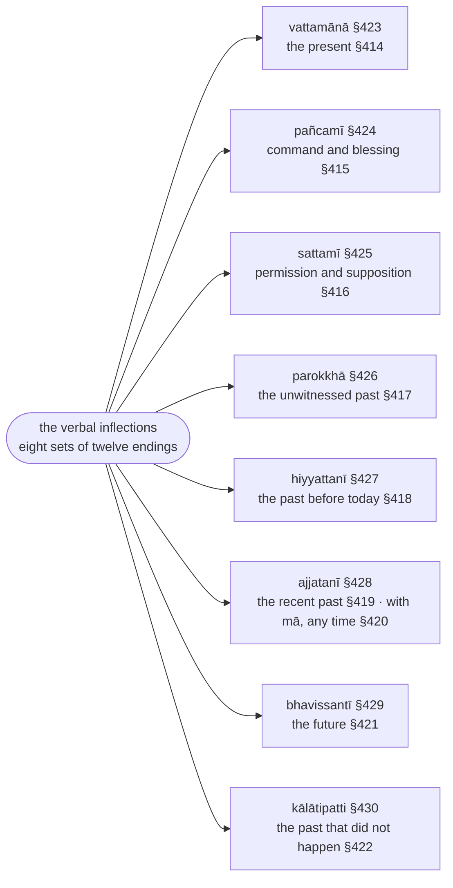
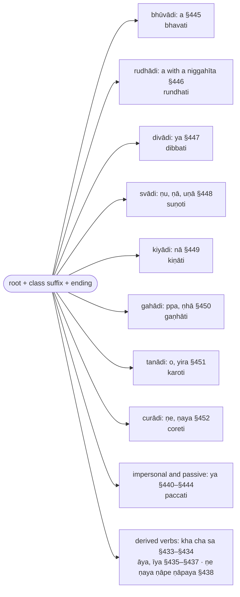

import { LinkCard } from "@astrojs/starlight/components";
import AnchorRedirect from "../../../../components/AnchorRedirect.astro";

:::note
`ākhyāta` ("what is declared") is the finite verb. The first section (§406–§431) sets out the two voices (`parassapada`, `attanopada`), the three persons, the eight tenses and moods and their endings; the second (§432–§457) the suffixes that come between root and ending — desiderative, denominative, causative, passive, and the `vikaraṇa` of the eight conjugation classes; the third and fourth (§458–§523) the reduplication of the `parokkhā` and the sound changes of particular roots.

Verb forms are glossed ▶️ (`vattamānā`), ⏯ (`pañcamī`, `sattamī`, `bhavissantī`), ⏮ (`parokkhā`, `hiyyattanī`, `ajjatanī`, `kālātipatti`), with the person 👆 🤘 🤟 and number ⨀ ⨂; roots are cited with `√` in the form Kaccāyana uses (`√gamu`, `√paca`).

:::

:::note[The eight sets of endings and their times]
Every set has twelve endings, six `parassapada` and six `attanopada` (§406–§407), in three persons (§408); the sets are named by the time or mood they express.

:::

:::note[Root, class suffix, ending]
A finite verb is a root (§457), a suffix that depends on the root's class or on the voice (§432–§452), and an ending; the classes are named after their first root.

:::

:::note[Reading D'Alwis]
This chapter is the one part of Kaccāyana that James D'Alwis translated, as "Lib. VI.—On Verbs" of his *Introduction to Kachchāyana's Grammar of the Pāli Language* (Colombo 1863), reproduced on this site as [D'Alwis: Kaccāyana (1863)](/kaccayana/alwis). His four chapters are Kaccāyana's four sections, each numbered afresh: Cap. I rules 1–26 are §406–§431, Cap. II 1–26 are §432–§457, Cap. III 1–24 are §458–§481, Cap. IV 1–42 are §482–§523. His Pāḷi is the Sinhalese recension that Senart printed in 1871. The footnotes below record where this translation's text or construal differs from his, and nothing more.
:::

## Sections

- [Paṭhamakaṇḍa (First Section) (§406–§431)](/kaccayana/6-akhyatakappa/1-pathamakanda/)
- [Dutiyakaṇḍa (Second Section) (§432–§457)](/kaccayana/6-akhyatakappa/2-dutiyakanda/)
- [Tatiyakaṇḍa (Third Section) (§458–§481)](/kaccayana/6-akhyatakappa/3-tatiyakanda/)
- [Catutthakaṇḍa (Fourth Section) (§482–§523)](/kaccayana/6-akhyatakappa/4-catutthakanda/)

<AnchorRedirect base="/kaccayana/6-akhyatakappa/" prefix="m" map={{"1-pathamakanda": [406, 431], "2-dutiyakanda": [432, 457], "3-tatiyakanda": [458, 481], "4-catutthakanda": [482, 523]}} />
