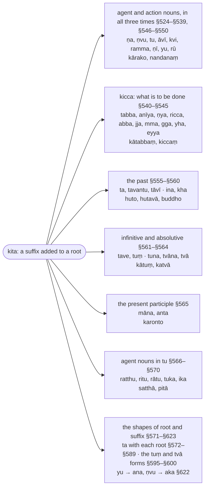

import { LinkCard } from "@astrojs/starlight/components";

:::note
`kita` suffixes are added to a root itself (not to a noun, as `taddhita` suffixes are) and make nouns, participles and the verbal forms that are not finite: `kumbhakāro` ("pot-maker") from `√kara` + `ṇa`, `kato` ("done") from `√kara` + `ta`, `kātuṃ` ("to do"), `katvā` ("having done"). The five sections give the suffixes by sense (§524–§570) and the changes of root and suffix (§571–§623).

Derived words are glossed as their parts, `🚹①⨀(√kara + ṇa)`; the `ṇ` of a suffix is a marker (`anubandha`) that is dropped and signals `vuddhi` of the root vowel.

:::

:::note[The kita suffixes by sense]
The primary suffixes are grouped by what they make from the root; the tree gives each group's rules, its suffixes and an example.

:::

## Paṭhamakaṇḍa (First Section)

### Ka

> Buddhaṃ ñāṇasamuddaṃ, sabbaññuṃ lokahetu’khīṇamatiṃ; \
> Vanditvā pubbamahaṃ, vakkhāmi sasādhanaṃ hi kitakappaṃ.

The Buddha, an ocean of knowledge, the All-knowing, whose understanding for the sake of the world is never exhausted —\
having first venerated him, I shall indeed set forth the `kita` chapter together with its derivations.

### Kha

> Sādhanamūlaṃ hi payogaṃ, \
> Āhu payogamūlamatthañca; \
> Atthesu visāradamatayo, \
> Sāsanassudharā jinassa matā.

For usage, they say, is rooted in derivation,\
and meaning is rooted in usage;\
those whose understanding is sure in meanings\
are reckoned the bearers of the Conqueror's teaching.[^1]

[^1]: `sāsanassudharā` is taken as `sāsanassa dharā`, "bearers of the teaching", the `u` filling the metre.

### Ga

> Andho desakavikalo, \
> Ghatamadhutelāni bhājanena vinā; \
> Naṭṭho naṭṭhāni yathā, \
> Payogavikalo tathā attho.

A blind man without a guide,\
ghee, honey and oil without a vessel —\
as he is lost and they are lost,\
so is meaning lost that lacks its usage.

### Gha

> Tasmā saṃrakkhaṇatthaṃ, munivacanatthassa dullabhassāhaṃ; \
> Vakkhāmi sissakahitaṃ, kitakappaṃ sādhanena yutaṃ.

Therefore, to safeguard the meaning of the Sage's word, so hard to come by, I\
shall set forth, for the good of pupils, the `kita` chapter furnished with derivations.

### §524 (561): Dhātuyā kammādimhi ṇo (`ṇa` after a root preceded by its object and the like) :badge[utsarga]{variant=success}

:::note[Analysis]

| option | before | from   | operation | to         | after  | context |
| ------ | ------ | ------ | --------- | ---------- | ------ | ------- |
|        | dhātuyā | | (paccayo hoti) | ṇo | | kammādimhi (ādimhi sati) |
|        | after a root | | (the suffix is added) | `ṇa` | | when the object or the like stands first |

:::

> Dhātuyā kammādimhi ṇapaccayo hoti.

> Kammaṃ karotīti kammakāro, evaṃ kumbhakāro, mālākāro, kaṭṭhakāro, rathakāro, rajatakāro, suvaṇṇakāro, pattaggāho, tantavāyo, dhaññamāyo, dhammakāmo, dhammacāro.

After a root, when its object or the like stands before it, the suffix `ṇa` is added.

:::tip[Examples]

The vutti glosses the first word, `kammaṃ karotīti kammakāro`, "he does work, hence `kammakāro`", and the rest likewise (`evaṃ`).[^2]

| lemma | inflected | meaning |
| ----- | --------- | ------- |
| 🚹①⨀(kamma + √kara + ṇa) | kammakāro | a workman: he does work |
| 🚹①⨀(kumbha + √kara + ṇa) | kumbhakāro | a potter: he makes pots |
| 🚹①⨀(mālā + √kara + ṇa) | mālākāro | a garland-maker |
| 🚹①⨀(kaṭṭha + √kara + ṇa) | kaṭṭhakāro | a woodworker |
| 🚹①⨀(ratha + √kara + ṇa) | rathakāro | a chariot-maker |
| 🚹①⨀(rajata + √kara + ṇa) | rajatakāro | a silversmith |
| 🚹①⨀(suvaṇṇa + √kara + ṇa) | suvaṇṇakāro | a goldsmith |
| 🚹①⨀(patta + √gaha + ṇa) | pattaggāho | one who takes the bowl |
| 🚹①⨀(tanta + √ve + ṇa) | tantavāyo | a weaver: he weaves thread |
| 🚹①⨀(dhañña + √mā + ṇa) | dhaññamāyo | a grain-measurer |
| 🚹①⨀(dhamma + √kamu + ṇa) | dhammakāmo | a lover of the Dhamma |
| 🚹①⨀(dhamma + √cara + ṇa) | dhammacāro | one who practises the Dhamma |

|     | kumbha + aṃ, √kara + ṇa           | rule |
| --- | --------------------------------- | ---- |
| →   | kar + ~~a~~ + ṇa                  | §521 |
| →   | kar + ~~ṇ~~a                      | §621, §523 |
| →   | k(a→ā)r + a                       | §483 |
| →   | kāra + si                         | §601, §55 |
| →   | kumbhaṃ + kāra + si (compound, ②) | §327, §316 |
| →   | kumbha + ~~aṃ~~ + kāra + ~~si~~   | §317, §318 |
| →   | kumbhakāra + si                   | §601, §55 |
| →   | kumbhakāra + (si→o)               | §104 |
| →   | **kumbhakāro**                    |  |

> `atha kho so kumbhakāro bhikkhūnaṃ bahū patte karonto` \
> [(1V 1.4.3.2: Ūnapañcabandhanasikkhāpada)](https://tipitaka2500.github.io/tipitaka/1V/1/1.4/1.4.3/1.4.3.2#2273) \
🔼(atha kho) 🚹①⨀(ta) 🚹①⨀(kumbha + √kara + ṇa) 🚹④⨂(bhikkhu) 🚹②⨂(bahu) 🚹②⨂(patta) 🚹①⨀(karonta) \
then | that | potter | for the bhikkhus | many | bowls | making

:::

[^2]: Senart's edition glosses in three tenses, `kammaṃ karoti akāsi karissatīti kammakāro`, and closes the list with `puññakāro`; the CST is kept.

---

### §525 (565): Saññāyama nu (in a name, `a` [after the root] and the augment `nu` [in the word before]) :badge[apavada]{variant=success}

:::note[Analysis]

| option | before | from   | operation | to         | after  | context |
| ------ | ------ | ------ | --------- | ---------- | ------ | ------- |
|        | (dhātuyā kammādimhi) | | (paccayo hoti) | a | | saññāyaṃ |
|        | | (nāmamhi) | (āgamo) | nu | | |
|        | (after a root preceded by its object) | | (the suffix is added) | `a` | | when a name is meant |
|        | | (in the [preceding] noun) | (augment) | `nu` | | |

:::

> Saññāyamabhidheyyāyaṃ dhātuyā kammādimhi akārapaccayo hoti, nāmamhi ca nukārāgamo hoti.

> Ariṃ dametīti arindamo, rājā. Vessaṃ taratīti vessantaro, rājā. Taṇhaṃ karotīti taṇhaṅkaro, bhagavā. Medhaṃ karotīti medhaṅkaro, bhagavā. Saraṇaṃ karotīti saraṇaṅkaro, bhagavā. Dīpaṃ karotīti dīpaṅkaro, bhagavā.

When a name is to be expressed, after a root preceded by its object or the like the suffix `a` is added, and in the noun the augment `nu` is inserted.

:::tip[Examples]

| lemma | inflected | meaning |
| ----- | --------- | ------- |
| 🚹①⨀(ari + √damu + a) | arindamo | Arindama, "he tames enemies" (`ariṃ dameti`), a king |
| 🚹①⨀(vessa + √tara + a) | vessantaro | Vessantara, "he crosses the merchants' quarter" (`vessaṃ tarati`), a king |
| 🚹①⨀(taṇhā + √kara + a) | taṇhaṅkaro | Taṇhaṅkara, "he makes [an end of] craving" (`taṇhaṃ karoti`), a Buddha |
| 🚹①⨀(medhā + √kara + a) | medhaṅkaro | Medhaṅkara, "he makes wisdom", a Buddha |
| 🚹①⨀(saraṇa + √kara + a) | saraṇaṅkaro | Saraṇaṅkara, "he makes a refuge", a Buddha |
| 🚹①⨀(dīpa + √kara + a) | dīpaṅkaro | Dīpaṅkara, "he makes light", a Buddha |

|     | ari + aṃ, √damu + a       | rule |
| --- | ------------------------- | ---- |
| →   | dam + ~~u~~ + a           | §525, §521 |
| →   | ariṃ + dama (compound, ②) | §327, §316 |
| →   | ari + ~~aṃ~~ + dama       | §317, §318 |
| →   | ari + (nu) + dama         | §525 |
| →   | ari + n + ~~u~~ + dama    | §404 |
| →   | ari + (n→ṃ) + dama        | §537 |
| →   | ari + (ṃ→n) + dama        | §31 |
| →   | arindama + si             | §601, §55 |
| →   | arindama + (si→o)         | §104 |
| →   | **arindamo**              |  |

> `taṇhaṅkaro medhaṅkaro, athopi saraṇaṅkaro; dīpaṅkaro ca sambuddho` \
> [(21Bu 28: Buddhapakiṇṇakakaṇḍa)](https://tipitaka2500.github.io/tipitaka/21Bu/28#1061) \
🚹①⨀(taṇhā + √kara + a) 🚹①⨀(medhā + √kara + a) 🔼(atho pi) 🚹①⨀(saraṇa + √kara + a) 🚹①⨀(dīpa + √kara + a) 🔼(ca) 🚹①⨀(sambuddha) \
Taṇhaṅkara | Medhaṅkara | and also | Saraṇaṅkara | Dīpaṅkara | and | the Fully Awakened

> `ekatālīsakappamhi, eko āsiṃ arindamo` \
> [(20Ap1 5.4: Sanniṭṭhāpakattheraapadāna)](https://tipitaka2500.github.io/tipitaka/20Ap1/5/5.4#1289) \
🚹⑦⨀(ekatālīsakappa) ⚧️①⨀(eka) ⏮👆⨀(atthi) 🚹①⨀(ari + √damu + a) \
in the forty-first aeon | one | I was | Arindama

:::

---

### §526 (567): Pure dadā ca iṃ (`a` after `dadā` with `pura` before it, and `iṃ` for the `a` of `pura`) :badge[apavada]{variant=success}

:::note[Analysis]

| option | before | from   | operation | to         | after  | context |
| ------ | ------ | ------ | --------- | ---------- | ------ | ------- |
|        | pure (ādimhi) dadā (dhātuyā) | | (paccayo hoti) | (a) | | (saññāyaṃ) |
| ca     | | (purasaddassa akārassa) | (ādeso) | iṃ | | |
|        | after `dadā` with `pura` standing first | | (the suffix is added) | (`a`) | | (when a name is meant) |
| and    | | (the `a` of the word `pura`) | (replaced by) | `iṃ` | | |

:::

> Purasadde ādimhi dada iccetāya dhātuyā akārapaccayo hoti, purasaddassa akārassa ca iṃ hoti.

> Pure dānaṃ adāsīti purindado devarājā.

When the word `pura` stands first, after the root `dada` the suffix `a` is added, and the `a` of the word `pura` becomes `iṃ`.

:::tip[Example]

| lemma | inflected | meaning |
| ----- | --------- | ------- |
| 🚹①⨀(pura + √dada + a) | purindado | Purindada, "he gave gifts in former times" (`pure dānaṃ adāsi`), a name of Sakka, king of the gods |

|     | pure, √dada + a           | rule |
| --- | ------------------------- | ---- |
| →   | dad + ~~a~~ + a           | §526, §521 |
| →   | pure + dada (compound, ⑦) | §327, §316 |
| →   | pura + ~~e~~ + dada       | §317, §318 |
| →   | pur + (a→iṃ) + dada       | §526 |
| →   | puri + (ṃ→n) + dada       | §31 |
| →   | purindada + si            | §601, §55 |
| →   | purindada + (si→o)        | §104 |
| →   | **purindado**             |  |

> `vasūnaṃ vāsavo seṭṭho, sakkopāgā purindado` \
> [(7D 7.1: Devatāsannipāta)](https://tipitaka2500.github.io/tipitaka/7D/7/7.1#797) \
🚹⑥⨂(vasu) 🚹①⨀(vāsava) 🚹①⨀(seṭṭha) 🚹①⨀(sakka) ⏮🤟⨀(upāgacchati) 🚹①⨀(pura + √dada + a) \
of the Vasus | Vāsava | the chief | Sakka | came | Purindada

:::

---

### §527 (568): Sabbato ṇvu tvāvī vā (`ṇvu`, `tu`, `āvī` [and `a`] after every root, with or without a preceding object) :badge[utsarga]{variant=success}

:::note[Analysis]

| option | before | from   | operation | to         | after  | context |
| ------ | ------ | ------ | --------- | ---------- | ------ | ------- |
| vā     | sabbato (dhātuto) | | (paccayā honti) | (a)\|ṇvu\|tu\|āvī | | (kammādimhi\|akammādimhi) |
| optionally | after every root | | (the suffixes are added) | (`a`)\|`ṇvu`\|`tu`\|`āvī` | | (with or without a preceding object) |

:::

> Sabbato dhātuto kammādimhi vā akammādimhi vā akāra ṇvu tu āvī iccete paccayā honti.

> Taṃ karotīti takkaro, hitaṃ karotīti hitakaro, vineti ettha, etenāti vā vinayo nissāya naṃ vasatīti nissayo.

> Ṇvumhi – rathaṃ karotīti rathakārako, annaṃ dadātīti annadāyako, vineti satteti vināyako, karotīti kārako, dadātīti dāyako, netīti nāyako.

> Tumhi – taṃ karotīti takkattā, tassa kattāti vā takkattā. Bhojanaṃ dadātīti bhojanadātā, bhojanassa dātāti vā bhojanadātā. Karotīti kattā. Saratīti saritā.

> Āvīmhi – bhayaṃ passatīti bhayadassāvī iccevamādi.

After every root, whether or not an object or the like stands before it, the suffixes `a`, `ṇvu`, `tu` and `āvī` are added.[^3]

:::tip[Examples]

The vutti groups the words by suffix: `a`, then `ṇvumhi`, "with `ṇvu`", `tumhi`, "with `tu`", and `āvīmhi`, "with `āvī`"; with `tu` it glosses twice, `taṃ karoti`, "he does that", or `tassa kattā`, "the doer of that".[^4]

| lemma | inflected | meaning |
| ----- | --------- | ------- |
| 🚹①⨀(ta + √kara + a) | takkaro | one who does that (`taṃ karoti`)[^5] |
| 🚹①⨀(hita + √kara + a) | hitakaro | one who does good |
| 🚹①⨀(vi + √nī + a) | vinayo | discipline: one trains in it, or by it (`vineti ettha, etena`) |
| 🚹①⨀(ni + √si + a) | nissayo | one relied upon (a teacher); a support: relying on him one dwells (`nissāya naṃ vasati`) |
| 🚹①⨀(ratha + √kara + ṇvu) | rathakārako | a chariot-maker |
| 🚹①⨀(anna + √dā + ṇvu) | annadāyako | a giver of food |
| 🚹①⨀(vi + √nī + ṇvu) | vināyako | a guide: he trains beings (`vineti satte`) |
| 🚹①⨀(√kara + ṇvu) | kārako | a doer |
| 🚹①⨀(√dā + ṇvu) | dāyako | a giver |
| 🚹①⨀(√nī + ṇvu) | nāyako | a leader |
| 🚹①⨀(ta + √kara + tu) | takkattā | the doer of that |
| 🚹①⨀(bhojana + √dā + tu) | bhojanadātā | the giver of food |
| 🚹①⨀(√kara + tu) | kattā | a doer |
| 🚹①⨀(√sara + tu) | saritā | one who remembers |
| 🚹①⨀(bhaya + √disa + āvī) | bhayadassāvī | one who sees danger |

|     | √kara + ṇvu       | rule |
| --- | ----------------- | ---- |
| →   | kar + ~~a~~ + ṇvu | §521 |
| →   | kar + ~~ṇ~~vu     | §621, §523 |
| →   | k(a→ā)r + vu      | §483 |
| →   | kār + (vu→aka)    | §622 |
| →   | kāraka + si       | §601, §55 |
| →   | kāraka + (si→o)   | §104 |
| →   | **kārako**        |  |

|     | √kara + tu            | rule |
| --- | --------------------- | ---- |
| →   | kar + ~~a~~ + tu      | §521 |
| →   | ka(r→t) + tu          | §619 |
| →   | kattu + si            | §601, §55 |
| →   | katt + (u→ā) + ~~si~~ | §199 |
| →   | **kattā**             |  |

|     | vi + √nī + a      | rule |
| --- | ----------------- | ---- |
| →   | n(ī→e) + a        | §485 |
| →   | n(e→aya) + a      | §514 |
| →   | nay + (~~a~~ + a) | §83 |
| →   | vinaya + si       | §601, §55 |
| →   | vinaya + (si→o)   | §104 |
| →   | **vinayo**        |  |

> `bahumpi ce saṃhita bhāsamāno, na takkaro hoti naro pamatto` \
> [(18Dh 1.14: Dvesahāyakabhikkhuvatthu)](https://tipitaka2500.github.io/tipitaka/18Dh/1/1.14#20) \
🚻②⨀(bahu) 🔼(pi ce) 🚺②⨀(saṃhitā) 🚹①⨀(bhāsamāna) 🔼(na) 🚹①⨀(ta + √kara + a) ▶️🤟⨀(hoti) 🚹①⨀(nara) 🚹①⨀(pamatta) \
much | even if | the scripture | reciting | not | a doer of it | is | the man | heedless

> `ayaṃ kho brahmadatto kāsirājā bahuno amhākaṃ anatthassa kārako` \
> [(3V 10.2: Dīghāvuvatthu)](https://tipitaka2500.github.io/tipitaka/3V/10/10.2#1963) \
🚹①⨀(ima) 🔼(kho) 🚹①⨀(brahmadatta) 🚹①⨀(kāsirāja) 🚹⑥⨀(bahu) ⚧️⑥⨂(amha) 🚹⑥⨀(anattha) 🚹①⨀(√kara + ṇvu) \
this | indeed | Brahmadatta | king of Kāsi | of much | our | harm | the doer

> `aṇumattesu vajjesu bhayadassāvī` \
> [(2V 1.5.3.1: Ovādasikkhāpada)](https://tipitaka2500.github.io/tipitaka/2V/1/1.5/1.5.3/1.5.3.1#496) \
🚻⑦⨂(aṇumatta) 🚻⑦⨂(vajja) 🚹①⨀(bhaya + √disa + āvī) \
in the slightest | faults | seeing danger

:::

[^5]: Nandisena (2005) glosses `takkaro` "a thief"; the vutti derives it from `taṃ karoti`, "one who does that".

[^4]: Senart's edition adds `bhavatīti bhāvo` to the `a` group and `dadātīti dātā` to the `tu` group, and prints `rathakāro` for `rathakārako`; the CST is kept.

[^3]: Senart's vutti ends `paccayā honti vā`, a `vā` the CST's `honti` lacks; Malai (1997) accordingly translates the suffixes as "optionally used", and Nandisena (2005) renders the sutta's `vā` "sometimes", where the vutti reads it `kammādimhi vā akammādimhi vā`.

---

### §528 (577): Visa ruja padādito ṇa (`ṇa` after `visa`, `ruja`, `pada` and the like [without a preceding object]) :badge[apavada]{variant=success}

:::note[Analysis]

| option | before | from   | operation | to         | after  | context |
| ------ | ------ | ------ | --------- | ---------- | ------ | ------- |
|        | visa ruja padādito (dhātuto) | | (paccayo hoti) | ṇa | | |
|        | after `visa`, `ruja`, `pada` and the like | | (the suffix is added) | `ṇa` | | |

:::

> Visa ruja padaiccevamādīhi dhātūhi ṇa paccayo hoti.

> Pavisatīti paveso, rujatīti rogo, uppajjatīti uppādo, phusatīti phasso, ucatīti oko, bhavatīti bhāvo, ayatīti āyo, sammā bujjhatīti sambodho, viharatīti vihāro.

After the roots `visa`, `ruja`, `pada` and the like, the suffix `ṇa` is added.

:::tip[Examples]

The vutti glosses each word as an agent, `pavisatīti paveso`, "it enters, hence `paveso`".[^6]

| lemma | inflected | meaning |
| ----- | --------- | ------- |
| 🚹①⨀(pa + √visa + ṇa) | paveso | entering, an entrance (`pavisati`) |
| 🚹①⨀(√ruja + ṇa) | rogo | disease: it afflicts (`rujati`) |
| 🚹①⨀(u + √pada + ṇa) | uppādo | arising (`uppajjati`) |
| 🚹①⨀(√phusa + ṇa) | phasso | contact: it touches (`phusati`) |
| 🚹①⨀(√uca + ṇa) | oko | an abode (`ucati`) |
| 🚹①⨀(√bhū + ṇa) | bhāvo | being, a state (`bhavati`) |
| 🚹①⨀(√aya + ṇa) | āyo | income: it comes in (`ayati`) |
| 🚹①⨀(saṃ + √budha + ṇa) | sambodho | full awakening (`sammā bujjhati`) |
| 🚹①⨀(vi + √hara + ṇa) | vihāro | a dwelling (`viharati`) |

|     | √ruja + ṇa       | rule |
| --- | ---------------- | ---- |
| →   | ruj + ~~a~~ + ṇa | §521 |
| →   | ruj + ~~ṇ~~a     | §621, §523 |
| →   | r(u→o)j + a      | §483 |
| →   | ro(j→g) + a      | §623 |
| →   | roga + si        | §601, §55 |
| →   | roga + (si→o)    | §104 |
| →   | **rogo**         |  |

|     | √bhū + ṇa          | rule |
| --- | ------------------ | ---- |
| →   | bhū + (~~ṇ~~)a     | §621, §523 |
| →   | bh(ū→o) + a        | §483 |
| →   | bh(o→āva) + a      | §515 |
| →   | bhāv + (~~a~~ + a) | §83 |
| →   | bhāva + si         | §601, §55 |
| →   | bhāva + (si→o)     | §104 |
| →   | **bhāvo**          |  |

> `rogo bhavissati, ārogyaṃ bhavissati` \
> [(6D 1.2.3: Mahāsīla)](https://tipitaka2500.github.io/tipitaka/6D/1/1.2/1.2.3#52) \
🚹①⨀(√ruja + ṇa) ⏯🤟⨀(bhavati) 🚻①⨀(ārogya) ⏯🤟⨀(bhavati) \
disease | there will be | health | there will be

> `phasso hetu, phasso paccayo vedanākkhandhassa paññāpanāya` \
> [(11M 1.9: Mahāpuṇṇamasutta)](https://tipitaka2500.github.io/tipitaka/11M/1/1.9#205) \
🚹①⨀(√phusa + ṇa) 🚹①⨀(hetu) 🚹①⨀(√phusa + ṇa) 🚹①⨀(paccaya) 🚹⑥⨀(vedanākkhandha) 🚻④⨀(paññāpana) \
contact | the cause | contact | the condition | of the aggregate of feeling | for the manifestation

:::

[^6]: Malai (1997) renders the words as causatives, "that which makes entered: `paveso`", "that which causes speaking: `oko`"; the vutti's glosses are active, `pavisatīti paveso`, "it enters", `ucatīti oko`, "it dwells". Senart's edition lacks `bhavatīti bhāvo`.

---

### §529 (580): Bhāve ca (and `ṇa` in the sense of the action itself) :badge[utsarga]{variant=success}

:::note[Analysis]

| option | before | from   | operation | to         | after  | context |
| ------ | ------ | ------ | --------- | ---------- | ------ | ------- |
| ca     | (sabbadhātūhi) | | (paccayo hoti) | (ṇa) | | bhāve |
| and    | (after all roots) | | (the suffix is added) | (`ṇa`) | | in the sense of the action itself |

:::

> Bhāvatthābhidheyye sabbadhātūhi ṇapaccayo hoti.

> Paccate, pacanaṃ vā pāko[^7], cajate, cajanaṃ vā cāgo, evaṃ yāgo, yogo, bhāgo, paridāho.

When the sense of the action itself (`bhāva`) is to be expressed, the suffix `ṇa` is added after all roots.

:::tip[Examples]

The vutti glosses each word both ways, `paccate, pacanaṃ vā pāko`, "it is cooked, or cooking, hence `pāko`", and the rest likewise (`evaṃ`).[^8]

| lemma | inflected | meaning |
| ----- | --------- | ------- |
| 🚹①⨀(√paca + ṇa) | pāko | cooking (`paccate`, `pacanaṃ`) |
| 🚹①⨀(√caja + ṇa) | cāgo | giving up (`cajate`, `cajanaṃ`) |
| 🚹①⨀(√yaja + ṇa) | yāgo | sacrificing |
| 🚹①⨀(√yuja + ṇa) | yogo | yoking, application |
| 🚹①⨀(√bhaja + ṇa) | bhāgo | sharing, a share |
| 🚹①⨀(pari + √daha + ṇa) | paridāho | burning |

|     | √paca + ṇa       | rule |
| --- | ---------------- | ---- |
| →   | pac + ~~a~~ + ṇa | §521 |
| →   | pac + ~~ṇ~~a     | §621, §523 |
| →   | p(a→ā)c + a      | §483 |
| →   | pā(c→k) + a      | §623 |
| →   | pāka + si        | §601, §55 |
| →   | pāka + (si→o)    | §104 |
| →   | **pāko**         |  |

> `yo tassāyeva taṇhāya asesavirāganirodho, cāgo, paṭinissaggo, mutti, anālayo` \
> [(3V 1.6: Pañcavaggiyakathā)](https://tipitaka2500.github.io/tipitaka/3V/1/1.6#73) \
⚧️①⨀(ya) 🚺⑥⨀(ta) 🔼(eva) 🚺⑥⨀(taṇhā) 🚹①⨀(asesavirāganirodha) 🚹①⨀(√caja + ṇa) 🚹①⨀(paṭinissagga) 🚺①⨀(mutti) 🚹①⨀(anālaya) \
which | of that | very | craving | the remainderless fading and ceasing | giving up | relinquishing | release | non-attachment

> `āraññikenāvuso, bhikkhunā abhidhamme abhivinaye yogo karaṇīyo` \
> [(10M 2.9: Goliyānisutta)](https://tipitaka2500.github.io/tipitaka/10M/2/2.9#482) \
🚹③⨀(āraññika) 🚹⓪⨀(āvuso) 🚹③⨀(bhikkhu) 🚹⑦⨀(abhidhamma) 🚹⑦⨀(abhivinaya) 🚹①⨀(√yuja + ṇa) 🚹①⨀(√kara + anīya) \
by a forest-dwelling | friend | bhikkhu | in the higher Dhamma | in the higher discipline | application | is to be made

:::

[^7]: CST4 prints `pāto`; the Rūpasiddhi (580) and Senart's edition read `pāko`.

[^8]: Senart's edition adds `bhūyate bhavanaṃ vā bhāvo` after `cāgo` and `rāgo` at the end of the list; the CST is kept.

---

### §530 (584): Kvi ca (and `kvi` [after all roots]) :badge[utsarga]{variant=success}

:::note[Analysis]

| option | before | from   | operation | to         | after  | context |
| ------ | ------ | ------ | --------- | ---------- | ------ | ------- |
| ca     | (sabbadhātūhi) | | (paccayo hoti) | kvi | | |
| and    | (after all roots) | | (the suffix is added) | `kvi` | | |

:::

> Sabbadhātūhi kvipaccayo hoti.

> Sambhavatīti sambhū, visesena bhavatīti vibhū, bhujena gacchatīti bhujago, saṃ attānaṃ khanati, saṃ suṭṭhu[^9] khanatīti vā saṅkho.

After all roots the suffix `kvi` is added.

:::tip[Examples]

The vutti glosses `saṅkho` two ways, `saṃ attānaṃ khanati`, "it digs itself in", or `saṃ suṭṭhu khanati`, "it digs well".[^10]

| lemma | inflected | meaning |
| ----- | --------- | ------- |
| 🚹①⨀(saṃ + √bhū + kvi) | sambhū | one who comes into being together (`sambhavati`) |
| 🚹①⨀(vi + √bhū + kvi) | vibhū | one who exists eminently, a lord (`visesena bhavati`) |
| 🚹①⨀(bhuja + √gamu + kvi) | bhujago | a snake: it goes by its coils (`bhujena gacchati`) |
| 🚹①⨀(saṃ + √khanu + kvi) | saṅkho | a conch: it digs itself in, or digs well (`saṃ attānaṃ khanati`, `saṃ suṭṭhu khanati`) |

|     | bhuja + nā, √gamu + kvi    | rule |
| --- | -------------------------- | ---- |
| →   | gam + ~~u~~ + kvi          | §521 |
| →   | ga~~m~~ + kvi              | §615 |
| →   | ga + ~~kvi~~               | §639 |
| →   | bhujena + ga (compound, ③) | §103, §327, §316 |
| →   | bhuja + ~~nā~~ + ga        | §317, §318 |
| →   | bhujaga + si               | §601, §55 |
| →   | bhujaga + (si→o)           | §104 |
| →   | **bhujago**                |  |

|     | saṃ + √khanu + kvi       | rule |
| --- | ------------------------ | ---- |
| →   | saṃ + khan + ~~u~~ + kvi | §521 |
| →   | saṃ + kha~~n~~ + kvi     | §615 |
| →   | saṃ + kha + ~~kvi~~      | §639 |
| →   | sa(ṃ→ṅ)kha               | §31 |
| →   | saṅkha + si              | §601, §55 |
| →   | saṅkha + (si→o)          | §104 |
| →   | **saṅkho**               |  |

> `bhujanto gacchatīti bhujago; urena gacchatīti urago` \
> [(24Mn 1.1: Kāmasuttaniddesa)](https://tipitaka2500.github.io/tipitaka/24Mn/1/1.1#27) \
🚹①⨀(bhujanta) ▶️🤟⨀(gacchati) 🔼(iti) 🚹①⨀(bhuja + √gamu + kvi) 🚹③⨀(ura) ▶️🤟⨀(gacchati) 🔼(iti) 🚹①⨀(ura + √gamu + kvi) \
coiling | it goes | thus | a snake | on its breast | it goes | thus | a serpent

> `muttā maṇi veḷuriyo saṅkho silā pavālaṃ` \
> [(2V 1.5.9.2: Ratanasikkhāpada)](https://tipitaka2500.github.io/tipitaka/2V/1/1.5/1.5.9/1.5.9.2#1487) \
🚺①⨀(muttā) 🚹①⨀(maṇi) 🚹①⨀(veḷuriya) 🚹①⨀(saṃ + √khanu + kvi) 🚺①⨀(silā) 🚻①⨀(pavāla) \
pearl | gem | beryl | conch | stone | coral

:::

[^9]: CST4 prints `saṃ saṭṭhu`; Senart's edition, T and B1 read `saṃsuṭṭhu`.

[^10]: Senart's edition adds `abhibhū` and `urago` to the list and glosses `saṅkho` `saṃsuṭṭhu samuddapariyantato bhūmiṃ khanatīti saṅkho`, "it digs well into the ground at the ocean's edge"; the CST is kept.

---

### §531 (589): Dharādīhi rammo (`ramma` after `dhara` and the like) :badge[apavada]{variant=success}

:::note[Analysis]

| option | before | from   | operation | to         | after  | context |
| ------ | ------ | ------ | --------- | ---------- | ------ | ------- |
|        | dharādīhi (dhātūhi) | | (paccayo hoti) | rammo | | |
|        | after `dhara` and the like | | (the suffix is added) | `ramma` | | |

:::

> Dharaiccevamādīhi dhātūhi rammapaccayo hoti.

> Dharati tenāti dhammo, karīyate tanti kammaṃ.

After the roots `dhara` and the like, the suffix `ramma` is added.

:::tip[Examples]

| lemma | inflected | meaning |
| ----- | --------- | ------- |
| 🚹①⨀(√dhara + ramma) | dhammo | the Dhamma: by it one is upheld (`dharati tena`) |
| 🚻①⨀(√kara + ramma) | kammaṃ | an act: it is done (`karīyate taṃ`) |

|     | √dhara + ramma       | rule |
| --- | -------------------- | ---- |
| →   | dhar + (~~a~~) + ramma | §521 |
| →   | dha~~r~~ + ~~r~~amma | §539 |
| →   | dh~~a~~ + amma       | §83 |
| →   | dhamma + si          | §601, §55 |
| →   | dhamma + (si→o)      | §104 |
| →   | **dhammo**           |  |

|     | √kara + ramma                | rule |
| --- | ---------------------------- | ---- |
| →   | kar + (~~a~~) + ramma        | §521 |
| →   | ka~~r~~ + ~~r~~amma          | §539 |
| →   | k~~a~~ + amma                | §83 |
| →   | kamma + si                   | §601, §55 |
| →   | kamma + (si→aṃ)              | §219 |
| →   | **kammaṃ**                   |      |

> `manāpaṃ vo, gahapatayo, satthāraṃ alabhantehi ayaṃ apaṇṇako dhammo samādāya vattitabbo` \
> [(10M 1.10: Apaṇṇakasutta)](https://tipitaka2500.github.io/tipitaka/10M/1/1.10#256) \
🚹②⨀(manāpa) ⚧️③⨂(tumha) 🚹⓪⨂(gahapati) 🚹②⨀(satthu) 🚹③⨂(alabhanta) 🚹①⨀(ima) 🚹①⨀(apaṇṇaka) 🚹①⨀(√dhara + ramma) 🔽(samādāya) 🚹①⨀(vattitabba) \
a pleasing | by you | householders | teacher | not finding | this | incontrovertible | teaching | having taken up | is to be practised

:::

---

### §532 (590): Tassīlādīsu ṇītvāvī ca (`ṇī`, `tu`, `āvī` in the sense of habit and the like) :badge[utsarga]{variant=success}

:::note[Analysis]

| option | before | from   | operation | to         | after  | context |
| ------ | ------ | ------ | --------- | ---------- | ------ | ------- |
| ca     | (sabbehi dhātūhi) | | (paccayā honti) | ṇī\|tu\|āvī | | tassīlādīsu (atthesu) |
| and    | (after all roots) | | (the suffixes are added) | `ṇī`\|`tu`\|`āvī` | | in the senses of habit and the like |

:::

> Sabbehi dhātūhi tassīlādīsvatthesu ṇī tu āvī iccete paccayā honti.

> Piyaṃ pasaṃsituṃ sīlaṃ yassa rañño, so hoti rājā piyapasaṃsī, brahmaṃ carituṃ sīlaṃ yassa puggalassa so hoti puggalo brahmacārī, pasayha pavattituṃ sīlaṃ yassa rañño, so hoti rājā pasayhapavattā[^11], bhayaṃ passituṃ sīlaṃ yassa samaṇassa, so hoti samaṇo bhayadassāvī iccevamādi.

After all roots, in the senses of "that is his habit" and the like, the suffixes `ṇī`, `tu` and `āvī` are added.

:::tip[Examples]

The vutti gives each word its analysis in full: `piyaṃ pasaṃsituṃ sīlaṃ yassa rañño, so hoti rājā piyapasaṃsī`, "the king whose habit is to praise what is dear is a king `piyapasaṃsī`", and so on.

| lemma | inflected | meaning |
| ----- | --------- | ------- |
| 🚹①⨀(piya + pa + √saṃsa + ṇī) | piyapasaṃsī | [a king] whose habit is to praise what is dear |
| 🚹①⨀(brahma + √cara + ṇī) | brahmacārī | [a person] whose habit is to live the holy life |
| 🚹①⨀(pasayha + pa + √vatu + tu) | pasayhapavattā | [a king] whose habit is to act by force |
| 🚹①⨀(bhaya + √disa + āvī) | bhayadassāvī | [an ascetic] whose habit is to see danger |

|     | brahma + aṃ, √cara + ṇī      | rule |
| --- | ---------------------------- | ---- |
| →   | car + ~~a~~ + ṇī             | §521 |
| →   | car + ~~ṇ~~ī                 | §621, §523 |
| →   | c + (a→ā) + rī               | §483 |
| →   | brahmaṃ + cārī (compound, ②) | §327, §316 |
| →   | brahma + ~~aṃ~~ + cārī       | §317, §318 |
| →   | brahmacārī + si              | §601, §55 |
| →   | brahmacārī + ~~si~~          | §220 |
| →   | **brahmacārī**               |      |

> `abrahmacariyaṃ pahāya brahmacārī samaṇo gotamo` \
> [(6D 1.2.1: Cūḷasīla)](https://tipitaka2500.github.io/tipitaka/6D/1/1.2/1.2.1#12) \
🚻②⨀(abrahmacariya) 🔽(pahāya) 🚹①⨀(brahma + √cara + ṇī) 🚹①⨀(samaṇa) 🚹①⨀(gotama) \
the unholy life | having given up | living the holy life | the ascetic | Gotama

> `pasayhapavattā hoti` \
> [(5V 17.2: Nappaṭippassambhanavagga)](https://tipitaka2500.github.io/tipitaka/5V/17/17.2#1970) \
🚹①⨀(pasayha + pa + √vatu + tu) ▶️🤟⨀(hoti) \
one who acts by force | he is

:::

[^11]: CST4 prints `pasayhapavatthā`; Senart's edition and the Rūpasiddhi (590) read `pasayhapavattā`.

---

### §533 (591): Sadda kudha cala maṇḍattha rucādīhi yu (`yu` after roots meaning sound, anger, motion, adorning, and after `ruca` etc.) :badge[apavada]{variant=success}

:::note[Analysis]

| option | before | from   | operation | to         | after  | context |
| ------ | ------ | ------ | --------- | ---------- | ------ | ------- |
|        | sadda kudha cala maṇḍattha (dhātūhi) rucādīhi | | (paccayo hoti) | yu | | (tassīlādīsu) |
|        | after roots meaning sound, anger, motion, adorning, and after `ruca` and the like | | (the suffix is added) | `yu` | | (in the senses of habit and the like) |

The CST's vutti section prints the sutta `Sadda ku dha cala maṇḍattharudhādīhiyu`, with `rudhādīhi`; the heading follows the CST sutta list and the Rūpasiddhi, with the vutti's own `rucādīhi`.

:::

> Sadda kudha cala maṇḍatthehi ca rucādīhi ca dhātūhi yupaccayo hoti tassīlādīsvatthesu.

> Ghosanasīlo ghosano, bhāsanasīlo bhāsano. Evaṃ viggaho kātabbo. Kodhano, dosano, calano, kampano, phandano, maṇḍano, vibhūsano, rocano, jotano, vaḍḍhano.

After roots meaning sound, anger, motion and adornment, and after `ruca` and the like, the suffix `yu` is added in the senses of "that is his habit" and the like.

:::tip[Examples]

`Ghosanasīlo ghosano`, "one whose habit is shouting, `ghosano`"; `evaṃ viggaho kātabbo`, "the analysis is to be made in the same way".

| lemma | inflected | meaning |
| ----- | --------- | ------- |
| 🚹①⨀(√ghusa + yu) | ghosano | one given to shouting (`ghosanasīlo`) |
| 🚹①⨀(√bhāsa + yu) | bhāsano | one given to talking (`bhāsanasīlo`) |
| 🚹①⨀(√kudha + yu) | kodhano | irascible |
| 🚹①⨀(√dusa + yu) | dosano | given to hatred[^12] |
| 🚹①⨀(√cala + yu) | calano | restless, given to moving |
| 🚹①⨀(√kampa + yu) | kampano | given to trembling |
| 🚹①⨀(√phanda + yu) | phandano | given to quivering |
| 🚹①⨀(√maṇḍa + yu) | maṇḍano | given to adorning |
| 🚹①⨀(vi + √bhūsa + yu) | vibhūsano | given to decorating |
| 🚹①⨀(√ruca + yu) | rocano | given to shining, bright |
| 🚹①⨀(√juta + yu) | jotano | given to shining |
| 🚹①⨀(√vaḍḍha + yu) | vaḍḍhano | given to growing |

|     | √kudha + yu                  | rule |
| --- | ---------------------------- | ---- |
| →   | kudh + (~~a~~) + yu          | §521 |
| →   | k(u→o)dh + yu                | §485 |
| →   | kodh + (yu→ana)              | §622 |
| →   | kodhana + si                 | §601, §55 |
| →   | kodhana + (si→o)             | §104 |
| →   | **kodhano**                  |      |

> `idha pana, bhikkhave, bhikkhu kodhano hoti upanāhī` \
> [(4V 4.8: Adhikaraṇa)](https://tipitaka2500.github.io/tipitaka/4V/4/4.8#892) \
🔼(idha pana) 🚹⓪⨂(bhikkhu) 🚹①⨀(bhikkhu) 🚹①⨀(√kudha + yu) ▶️🤟⨀(hoti) 🚹①⨀(upanāhī) \
here moreover | bhikkhus | a bhikkhu | irascible | is | resentful

:::

[^12]: Senart's edition reads `rosano` for the CST's `dosano` and `vassano` for `vaḍḍhano`; the CST is kept.

---

### §534 (592): Pārādigamimhā rū (`rū` after `gamu` preceded by `pāra` and the like) :badge[apavada]{variant=success}

:::note[Analysis]

| option | before | from   | operation | to         | after  | context |
| ------ | ------ | ------ | --------- | ---------- | ------ | ------- |
|        | pārādigamimhā (dhātumhā) | | (paccayo hoti) | rū | | (tassīlādīsu) |
|        | after `gamu` with `pāra` and the like before it | | (the suffix is added) | `rū` | | (in the senses of habit and the like) |

The CST's vutti section numbers the sutta 562; the heading's 592 follows the CST sutta list and the Rūpasiddhi.

:::

> Gamu iccetamhā dhātumhā pārasaddādimhā rūpaccayo hoti tassīlādīsvatthesu.

> Bhavassa pāraṃ bhavapāraṃ, bhavapāraṃ gantuṃ sīlaṃ yassa purisassa, so hoti puriso bhavapāragū.

> Tassīlādīsvīti kimatthaṃ? Pāraṅgato.

> Pārādigamimhāti kimatthaṃ? Anugāmī.

After the root `gamu` preceded by the word `pāra` and the like, the suffix `rū` is added in the senses of "that is his habit" and the like.

:::tip[Example]

The vutti: `bhavassa pāraṃ bhavapāraṃ`, "the far shore of existence, `bhavapāraṃ`"; `bhavapāraṃ gantuṃ sīlaṃ yassa purisassa, so hoti puriso bhavapāragū`, "the man whose habit is to go to the far shore of existence is a man `bhavapāragū`".

| lemma | inflected | meaning |
| ----- | --------- | ------- |
| 🚹①⨀(bhavapāra + √gamu + rū) | bhavapāragū | one whose way is to go to the far shore of existence |

|     | bhavapāra + aṃ, √gamu + rū    | rule |
| --- | ----------------------------- | ---- |
| →   | gam + (~~u~~) + rū            | §521 |
| →   | ga~~m~~ + ~~r~~ū              | §539 |
| →   | g~~a~~ + ū                    | §83 |
| →   | bhavapāraṃ + gū (compound, ②) | §316, §327 |
| →   | bhavapāra + ~~aṃ~~ + gū       | §317, §318 |
| →   | bhavapāragū + si              | §601, §55  |
| →   | bhavapāragū + ~~si~~          | §220       |
| →   | **bhavapāragū**               |  |

> `tiṇṇaṃ vedānaṃ pāragū` \
> [(6D 3.2: Ambaṭṭhamāṇava)](https://tipitaka2500.github.io/tipitaka/6D/3/3.2#349) \
⚧️⑥⨂(ti) 🚹⑥⨂(veda) 🚹①⨀(pāra + √gamu + rū) \
of the three | Vedas | a master

:::

:::danger[Counter-example]

Why does the sutta say `tassīlādīsu`? `pāraṅgato`, "gone to the far shore", names no habit, and takes the `ta` of [§557 (606): Budhagamāditthe kattari](#m557).[^13]

| lemma | inflected | meaning |
| ----- | --------- | ------- |
| 🚹①⨀(pāra + √gamu + ta) | pāraṅgato | gone to the far shore |

> `tiṇṇo pāraṅgato jhāyī, anejo akathaṃkathī` \
> [(10M 5.8: Vāseṭṭhasutta)](https://tipitaka2500.github.io/tipitaka/10M/5/5.8#1447) \
🚹①⨀(tiṇṇa) 🚹①⨀(pāra + √gamu + ta) 🚹①⨀(jhāyī) 🚹①⨀(aneja) 🚹①⨀(akathaṃkathī) \
crossed over | gone to the far shore | a meditator | unstirred | free of doubt

:::

:::danger[Counter-example]

Why does the sutta say `pārādigamimhā`? `anugāmī`, "one who follows", has `anu`, not `pāra`, before `gamu`, and takes the `ṇī` of [§532 (590): Tassīlādīsu ṇītvāvī ca](#m532).

| lemma | inflected | meaning |
| ----- | --------- | ------- |
| 🚹①⨀(anu + √gamu + ṇī) | anugāmī | one whose habit is to follow |

:::

[^13]: T glosses `pāraṃ gacchatīti pāragato`, "one who goes to the far shore", and Malai (1997) translates it so; the CST has the bare `pāraṅgato`.

---

### §535 (593): Bhikkhādito ca (and [`rū`] after `bhikkha` and the like) :badge[apavada]{variant=success}

:::note[Analysis]

| option | before | from   | operation | to         | after  | context |
| ------ | ------ | ------ | --------- | ---------- | ------ | ------- |
| ca     | bhikkhādito (dhātuto) | | (paccayo hoti) | (rū) | | (tassīlādīsu) |
| and    | after `bhikkha` and the like | | (the suffix is added) | (`rū`) | | (in the senses of habit and the like) |

:::

> Bhikkhaiccevamādīhi dhātūhi rūpaccayo hoti tassīlādīsvatthesu.

> Bhikkhanasīlo yācanasīlo bhikkhu, vijānanasīlo viññū.

After the roots `bhikkha` and the like, the suffix `rū` is added in the senses of "that is his habit" and the like.

:::tip[Examples]

| lemma | inflected | meaning |
| ----- | --------- | ------- |
| 🚹①⨀(√bhikkha + rū) | bhikkhu | a bhikkhu: one whose way is to beg (`bhikkhanasīlo`, `yācanasīlo`) |
| 🚹①⨀(vi + √ñā + rū) | viññū | a discerning person: one whose way is to understand (`vijānanasīlo`) |

|     | √bhikkha + rū                | rule |
| --- | ---------------------------- | ---- |
| →   | bhikkh + (~~a~~ + rū)        | §521 |
| →   | bhikkh + ~~r~~ū              | §539 |
| →   | bhikkh + (ū→u)               | §517 |
| →   | bhikkhu + si (①⨀)           | §601, §55 |
| →   | bhikkhu + ~~si~~             | §220 |
| →   | **bhikkhu**                  |      |

|     | vi + √ñā + rū                | rule |
| --- | ---------------------------- | ---- |
| →   | ñā + ~~r~~ū                  | §539 |
| →   | ñ~~ā~~ + ū                   | §83 |
| →   | vi + (ñ→ññ)ū                 | §28 |
| →   | viññū + si                   | §601, §55  |
| →   | viññū + ~~si~~               | §220       |
| →   | **viññū**                    |      |

> `viññū paṭibalā subhāsitadubbhāsitaṃ duṭṭhullāduṭṭhullaṃ ājānituṃ` \
> [(1V 1.2.3: Duṭṭhullavācāsikkhāpada)](https://tipitaka2500.github.io/tipitaka/1V/1/1.2/1.2.3#1139) \
🚺①⨀(vi + √ñā + rū) 🚺①⨀(paṭibala) 🚻②⨀(subhāsitadubbhāsita) 🚻②⨀(duṭṭhullāduṭṭhulla) 🔼(ājānituṃ) \
discerning | competent | what is well and ill spoken | what is lewd and not lewd | to understand

:::

---

### §536 (594): Hanatyādīnaṃ ṇuko (`ṇuka` at the end of `hana` and the like) :badge[apavada]{variant=success}

:::note[Analysis]

| option | before | from   | operation | to         | after  | context |
| ------ | ------ | ------ | --------- | ---------- | ------ | ------- |
|        | hanatyādīnaṃ (dhātūnaṃ ante) | | (paccayo hoti) | ṇuko | | (tassīlādīsu) |
|        | at the end of `hana` and the like | | (the suffix is added) | `ṇuka` | | (in the senses of habit and the like) |

The CST's vutti section prints the sutta `Tanatyādīnaṃ ṇuko`; the heading follows the CST sutta list, the Rūpasiddhi and the vutti's own `hanatyādīnaṃ`.[^14]

:::

> Hanatyādīnaṃ dhātūnaṃ ante ṇukapaccayo hoti tassīlādīsvatthesu.

> Āhananasīlo āghātuko, karaṇasīlo kāruko.

At the end of the roots `hana` and the like, the suffix `ṇuka` is added in the senses of "that is his habit" and the like.

:::tip[Examples]

| lemma | inflected | meaning |
| ----- | --------- | ------- |
| 🚹①⨀(ā + √hana + ṇuka) | āghātuko | one given to striking, murderous (`āhananasīlo`) |
| 🚹①⨀(√kara + ṇuka) | kāruko | a craftsman: one given to making (`karaṇasīlo`) |

|     | ā + √hana + ṇuka        | rule |
| --- | ----------------------- | ---- |
| →   | ā + (hana→ghāta) + ṇuka | §591 |
| →   | āghāt~~a~~ + ~~ṇ~~uka   | §83, §523 |
| →   | āghātuka + si           | §601, §55 |
| →   | āghātuka + (si→o)       | §104 |
| →   | **āghātuko**            |  |

|     | √kara + ṇuka       | rule |
| --- | ------------------ | ---- |
| →   | kar + ~~a~~ + ṇuka | §521 |
| →   | kar + ~~ṇ~~uka     | §621, §523 |
| →   | k + (a→ā) + ruka   | §483 |
| →   | kāruka + si        | §601, §55 |
| →   | kāruka + (si→o)    | §104 |
| →   | **kāruko**         |      |

:::

[^14]: Senart's sutta reads `Hantyādīnaṃ`, and his vutti lacks the `ante` that the CST, B1, S1 and S2 have; the CST is kept.

---

### §537 (566): Nu niggahitaṃ padante (the augment `nu` becomes niggahīta at the end of a word) :badge[apavada]{variant=success}

:::note[Analysis]

| option | before | from   | operation | to         | after  | context |
| ------ | ------ | ------ | --------- | ---------- | ------ | ------- |
|        |        | nu (āgamo) | (āpajjate) | niggahitaṃ | | padante |
|        |        | the augment `nu` | (becomes) | niggahīta | | at the end of a word |

:::

> Padante nukārāgamo niggahitamāpajjate.

> Ariṃ dametīti arindamo, rājā. Vessaṃ taratīti vessantaro, rājā. Pabhaṃ karotīti pabhaṅkaro, bhagavā.

At the end of a word the augment `nu` becomes niggahīta.

:::tip[Examples]

| lemma | inflected | meaning |
| ----- | --------- | ------- |
| 🚹①⨀(ari + √damu + a) | arindamo | Arindama, "he tames enemies", a king |
| 🚹①⨀(vessa + √tara + a) | vessantaro | Vessantara, a king |
| 🚹①⨀(pabhā + √kara + a) | pabhaṅkaro | Pabhaṅkara, "he makes light" (`pabhaṃ karoti`), the Blessed One |

|     | pabhā + aṃ, √kara + a          | rule |
| --- | ------------------------------ | ---- |
| →   | kar + ~~a~~ + a                | §525, §521 |
| →   | pabhaṃ + kara (compound, ②)    | §316, §327 |
| →   | pabhā + ~~aṃ~~ + kara          | §317, §318 |
| →   | pabhā + (nu) + kara            | §525 |
| →   | pabhā + (nu→ṃ) + kara          | §537 |
| →   | pabh(ā→a) + ṃ + kara           | §26 |
| →   | pabha + (ṃ→ṅ) + kara           | §31 |
| →   | pabhaṅkara + si                | §601, §55 |
| →   | pabhaṅkara + (si→o)            | §104 |
| →   | **pabhaṅkaro**                 |      |

> `esa devamanussānaṃ, sammūḷhānaṃ pabhaṅkaro` \
> [(12S1 10.1.7: Punabbasusutta)](https://tipitaka2500.github.io/tipitaka/12S1/10/10.1/10.1.7#1489) \
🚹①⨀(eta) 🚹⑥⨂(devamanussa) 🚹⑥⨂(sammūḷha) 🚹①⨀(pabhā + √kara + a) \
this one | for gods and men | bewildered | the maker of light

> `nimi candakumāro ca, sivi vessantaro saso` \
> [(21Cp 1.1.10: Sasapaṇḍitacariya)](https://tipitaka2500.github.io/tipitaka/21Cp/1/1.1/1.1.10#158) \
🚹①⨀(nimi) 🚹①⨀(candakumāra) 🔼(ca) 🚹①⨀(sivi) 🚹①⨀(vessa + √tara + a) 🚹①⨀(sasa) \
Nimi | prince Canda | and | Sivi | Vessantara | the hare

:::

---

### §538 (595): Saṃhanāññāya vā ro gho (`ra` after `hana` with `saṃ`, or after another root; `hana` becomes `gha`) :badge[apavada]{variant=success}

:::note[Analysis]

| option | before | from   | operation | to         | after  | context |
| ------ | ------ | ------ | --------- | ---------- | ------ | ------- |
| vā     | saṃhanā \| aññāya (dhātuyā) | | (paccayo hoti) | ro | | |
|        |        | hanassa | (ādeso) | gho | | |
| or     | after `hana` with `saṃ`, or after another root | | (the suffix is added) | `ra` | | |
|        |        | `hana` | (replaced by) | `gha` | | |

:::

> Saṃpubbāya hana iccetāya dhātuyā, aññāya vā dhātuyā rapaccayo, hanassa ca gho hoti.

> Samaggaṃ kammaṃ samupagacchatīti saṅgho, samantato nagarassa bāhire[^15] khaññatīti parikhā, antaṃ karotīti antako.

> Saṃiti kimatthaṃ? Upahananaṃ upaghāto.

After the root `hana` preceded by `saṃ`, or after another root, the suffix `ra` is added, and `hana` becomes `gha`.[^16]

:::tip[Examples]

| lemma | inflected | meaning |
| ----- | --------- | ------- |
| 🚹①⨀(saṃ + √hana + ra) | saṅgho | the Saṅgha: it comes together for a united act (`samaggaṃ kammaṃ samupagacchati`) |
| 🚺①⨀(pari + √khana + ra) | parikhā | a moat: it is dug all round outside the city (`samantato nagarassa bāhire khaññati`) |
| 🚹①⨀(anta + √kara + ra) | antako | Death, the Ender: he makes an end (`antaṃ karoti`) |

|     | saṃ + √hana + ra             | rule |
| --- | ---------------------------- | ---- |
| →   | saṃ + (hana→gha) + ra        | §538 |
| →   | saṃ + gh~~a~~ + ~~r~~a       | §539 |
| →   | sa(ṃ→ṅ)gha                   | §31 |
| →   | saṅgha + si                  | §601, §55 |
| →   | saṅgha + (si→o)              | §104 |
| →   | **saṅgho**                   |      |

|     | anta + aṃ, √kara + ra        | rule |
| --- | ---------------------------- | ---- |
| →   | kar + (~~a~~) + ra           | §521 |
| →   | ka~~r~~ + ~~r~~a             | §539 |
| →   | k~~a~~ + a                   | §83 |
| →   | antaṃ + ka (compound, ②)     | §316, §327 |
| →   | anta + ~~aṃ~~ + ka           | §317, §318 |
| →   | antaka + si                  | §601, §55 |
| →   | antaka + (si→o)              | §104 |
| →   | **antako**                   |      |

|     | pari + √khana + ra       | rule |
| --- | ------------------------ | ---- |
| →   | pari + khan + (~~a~~) + ra | §521 |
| →   | pari + kha~~n~~ + ~~r~~a | §539 |
| →   | pari + kh~~a~~ + a       | §83 |
| →   | parikha + ā              | §237 |
| →   | parikh~~a~~ + ā          | §83 |
| →   | parikhā + si             | §601, §55  |
| →   | parikhā + ~~si~~         | §220       |
| →   | **parikhā**              |  |

> `antako kurute vasaṃ` \
> [(18Dh 4.4: Patipūjikakumārivatthu)](https://tipitaka2500.github.io/tipitaka/18Dh/4/4.4#52) \
🚹①⨀(anta + √kara + ra) ▶️🤟⨀(kurute) 🚹②⨀(vasa) \
the Ender | brings | under his power

> `gaccha, bhante, saṃgho taṃ patimānetī` \
> [(1V 1.1.3.2: Vinītavatthu)](https://tipitaka2500.github.io/tipitaka/1V/1/1.1/1.1.3/1.1.3.2#461) \
⏯🤘⨀(gacchati) 🚹⓪⨀(bhavanta) 🚹①⨀(saṃ + √hana + ra) ⚧️②⨀(tumha) ▶️🤟⨀(patimāneti) \
go | venerable sir | the Saṅgha | you | awaits

:::

:::danger[Counter-example]

Why does the sutta say `saṃ`? `upaghāto`, "striking at" (`upahananaṃ`), has `upa`, not `saṃ`, before `hana`, and takes the `ṇa` of [§529 (580): Bhāve ca](#m529) with the `ghāta` of [§591 (544): Hanassa ghāto](#m591).

| lemma | inflected | meaning |
| ----- | --------- | ------- |
| 🚹①⨀(upa + √hana + ṇa) | upaghāto | injury, harm |

> `mayhaṃ kho avihesā bhavissati parassa ca puggalassa upaghāto` \
> [(11M 1.3: Kintisutta)](https://tipitaka2500.github.io/tipitaka/11M/1/1.3#79) \
⚧️④⨀(amha) 🔼(kho) 🚺①⨀(avihesā) ⏯🤟⨀(bhavati) 🚹⑥⨀(para) 🔼(ca) 🚹⑥⨀(puggala) 🚹①⨀(upa + √hana + ṇa) \
for me | indeed | no trouble | there will be | of the other | but | person | harm

:::

[^15]: CST4 prints `māhire`; the Rūpasiddhi (595) reads `bāhiye`.

[^16]: Senart's vutti closes with a further question, `Vāti kimatthaṃ? Antakaro`, which the CST lacks; Malai (1997) translates it, and Nandisena (2005) renders the `vā` "sometimes".

---

### §539 (558): Ramhi ranto rādino (before an `r`-suffix the root's final, with the `r`, is elided) :badge[apavada]{variant=success}

:::note[Analysis]

| option | before | from   | operation | to         | after  | context |
| ------ | ------ | ------ | --------- | ---------- | ------ | ------- |
|        |        | (dhātv)anto rādi(no) | no (lopo) | ~~dhātvanto~~ ~~r~~ | ramhi (paccaye pare) | |
|        |        | the root's final, with the initial `r` [of the suffix] | is elided | ~~final~~ ~~`r`~~ | when `ra` [an `r`-suffix] follows | |

:::

> Ramhi paccaye pare sabbo dhātvanto rakārādi lopo hoti.

> Antako, pāragū, satthā, diṭṭho iccevamādi.

When the suffix `ra` follows, the whole final of the root, together with the initial `r`, is elided.[^17]

:::tip[Examples]

| lemma | inflected | meaning |
| ----- | --------- | ------- |
| 🚹①⨀(anta + √kara + ra) | antako | Death, the Ender (§538) |
| 🚹①⨀(pāra + √gamu + rū) | pāragū | one gone to the far shore, a master (§534) |
| 🚹①⨀(√sāsa + ratthu) | satthā | the Teacher: he instructs (§566) |
| 🚹①⨀(√disa + ta) | diṭṭho | seen: `ta` becomes `riṭṭha` (§572) |

|     | √sāsa + ratthu               | rule |
| --- | ---------------------------- | ---- |
| →   | sā + (~~sa~~) + (~~r~~)atthu | §539 |
| →   | s + (~~ā~~) + atthu          | §83  |
| →   | satthu + si                  | §601, §55 |
| →   | satth + (u→ā) + ~~si~~       | §199 |
| →   | **satthā**                   |      |

|     | √disa + ta                   | rule |
| --- | ---------------------------- | ---- |
| →   | dis + ~~a~~ + ta             | §521 |
| →   | dis + (ta→riṭṭha)            | §572 |
| →   | di~~s~~ + ~~r~~iṭṭha         | §539 |
| →   | d~~i~~ + iṭṭha               | §83 |
| →   | diṭṭha + si                  | §601, §55 |
| →   | diṭṭha + (si→o)              | §104 |
| →   | **diṭṭho**                   |      |

> `satthā devamanussānaṃ buddho bhagavā` \
> [(1V Veranjakanda: Verañjakaṇḍa)](https://tipitaka2500.github.io/tipitaka/1V/1/Veranjakanda#2) \
🚹①⨀(√sāsa + ratthu) 🚹⑥⨂(devamanussa) 🚹①⨀(buddha) 🚹①⨀(bhagavantu) \
the teacher | of gods and men | awakened | blessed

:::

[^17]: Malai (1997) construes `rādi` as the suffixes "`ra` etc." and translates "the final syllable of all roots and the suffixes `ra` etc. … are elided"; the vutti's `rakārādi` is the `r` that begins the suffix.

---

### §540 (545): Bhāvakammesu tabbānīyā (`tabba`, `anīya` in the senses of the action itself and of the object) :badge[utsarga]{variant=success}

:::note[Analysis]

| option | before | from   | operation | to         | after  | context |
| ------ | ------ | ------ | --------- | ---------- | ------ | ------- |
|        | (sabbadhātūhi) | | (paccayā honti) | tabba\|anīya | | bhāvakammesu (atthesu) |
|        | (after all roots) | | (the suffixes are added) | `tabba`\|`anīya` | | in the senses of the action itself and of the object |

:::

> Bhāvakamma iccetesvatthesu tabba anīya iccete paccayā honti sabbadhātūhi.

> Bhavitabbaṃ, bhavanīyaṃ, āsitabbaṃ, āsanīyaṃ, pajjitabbaṃ, pajjanīyaṃ, kattabbaṃ, karaṇīyaṃ, gantabbaṃ, gamanīyaṃ.

In the senses of the action itself (`bhāva`) and of the object (`kamma`), the suffixes `tabba` and `anīya` are added after all roots.

:::tip[Examples]

The vutti pairs each root's two forms.[^18]

| lemma | inflected | meaning |
| ----- | --------- | ------- |
| 🚻①⨀(√bhū + tabba) | bhavitabbaṃ | there must be; it is to be |
| 🚻①⨀(√bhū + anīya) | bhavanīyaṃ | (the same) |
| 🚻①⨀(√āsa + tabba) | āsitabbaṃ | one should sit |
| 🚻①⨀(√āsa + anīya) | āsanīyaṃ | (the same) |
| 🚻①⨀(√pada + tabba) | pajjitabbaṃ | it is to be reached |
| 🚻①⨀(√pada + anīya) | pajjanīyaṃ | (the same) |
| 🚻①⨀(√kara + tabba) | kattabbaṃ | it is to be done |
| 🚻①⨀(√kara + anīya) | karaṇīyaṃ | (the same) |
| 🚻①⨀(√gamu + tabba) | gantabbaṃ | one must go; it is to be gone to |
| 🚻①⨀(√gamu + anīya) | gamanīyaṃ | (the same) |

|     | √bhū + tabba            | rule |
| --- | ----------------------- | ---- |
| →   | bhū + (i) + tabba       | §605 |
| →   | bh(ū→o) + itabba        | §485 |
| →   | bh(o→ava) + itabba      | §513 |
| →   | bhav + (~~a~~ + itabba) | §83, §11 |
| →   | bhavitabba + si         | §601, §55 |
| →   | bhavitabba + (si→aṃ)    | §219 |
| →   | **bhavitabbaṃ**         |  |

|     | √kara + anīya       | rule |
| --- | ------------------- | ---- |
| →   | kar + ~~a~~ + anīya | §521 |
| →   | kar + a(n→ṇ)īya     | §549 |
| →   | karaṇīya + si       | §601, §55 |
| →   | karaṇīya + (si→aṃ)  | §219 |
| →   | **karaṇīyaṃ**       |  |

|     | √gamu + tabba       | rule |
| --- | ------------------- | ---- |
| →   | gam + ~~u~~ + tabba | §521 |
| →   | ga(m→n) + tabba     | §596 |
| →   | gantabba + si       | §601, §55 |
| →   | gantabba + (si→aṃ)  | §219 |
| →   | **gantabbaṃ**       |  |

> `samaṇena bhavitabbaṃ abyāvaṭena` \
> [(1V 1.2.5: Sañcarittasikkhāpada)](https://tipitaka2500.github.io/tipitaka/1V/1/1.2/1.2.5#1226) \
🚹③⨀(samaṇa) 🚻①⨀(√bhū + tabba) 🚹③⨀(abyāvaṭa) \
by an ascetic | there should be being | unconcerned

> `taṃ karaṇīyaṃ tīretvā` \
> [(1V 1.1.1.1: Sudinnabhāṇavāra)](https://tipitaka2500.github.io/tipitaka/1V/1/1.1/1.1.1/1.1.1.1#43) \
🚻②⨀(ta) 🚻②⨀(√kara + anīya) 🔽(tīretvā) \
that | business | having finished

> `ahañcamhi bahubhaṇḍā bahuparikkhārā, bahinagarañca gantabbaṃ` \
> [(1V 1.2.5: Sañcarittasikkhāpada)](https://tipitaka2500.github.io/tipitaka/1V/1/1.2/1.2.5#1236) \
⚧️①⨀(amha) 🔼(ca) ▶️👆⨀(atthi) 🚺①⨀(bahubhaṇḍā) 🚺①⨀(bahuparikkhārā) 🚻②⨀(bahinagara) 🔼(ca) 🚻①⨀(√gamu + tabba) \
I | and | am | with much property | with many requisites | out of town | and | there is going to be done

:::

[^18]: Senart's edition reads `kātabbaṃ` for the CST's `kattabbaṃ`, glosses the first pair `bhūyate, abhavittha, bhavissate`, and adds a fifth pair, `ramitabbaṃ, ramaṇīyaṃ`; the CST is kept.

---

### §541 (552): Ṇyo ca (and `ṇya` [in the same senses]; by `ca`, `teyya` too) :badge[utsarga]{variant=success}

:::note[Analysis]

| option | before | from   | operation | to         | after  | context |
| ------ | ------ | ------ | --------- | ---------- | ------ | ------- |
| ca     | (sabbadhātūhi) | | (paccayo hoti) | ṇyo | | (bhāvakammesu) |
| and    | (after all roots) | | (the suffix is added) | `ṇya` | | (in the senses of the action and of the object) |

:::

> Bhāvakammesu sabbadhātūhi ṇyapaccayo hoti.

> Kattabbaṃ kāriyaṃ, jetabbaṃ jeyyaṃ, netabbaṃ neyyaṃ, iccevamādi.

In the senses of the action itself and of the object, the suffix `ṇya` is added after all roots.

:::tip[Examples]

The vutti glosses each word by its `tabba` form: `kattabbaṃ kāriyaṃ`, "`kāriyaṃ` is `kattabbaṃ`, to be done".

| lemma | inflected | meaning |
| ----- | --------- | ------- |
| 🚻①⨀(√kara + ṇya) | kāriyaṃ | to be done (`kattabbaṃ`) |
| 🚻①⨀(√ji + ṇya) | jeyyaṃ | to be conquered (`jetabbaṃ`)[^19] |
| 🚻①⨀(√nī + ṇya) | neyyaṃ | to be led, to be inferred (`netabbaṃ`) |

|     | √kara + ṇya       | rule |
| --- | ----------------- | ---- |
| →   | kar + ~~a~~ + ṇya | §521 |
| →   | kar + ~~ṇ~~ya     | §621, §523 |
| →   | k(a→ā)r + ya      | §483 |
| →   | kār + (i) + ya    | §605 |
| →   | kāriya + si       | §601, §55 |
| →   | kāriya + (si→aṃ)  | §219 |
| →   | **kāriyaṃ**       |  |

|     | √nī + ṇya       | rule |
| --- | --------------- | ---- |
| →   | nī + ~~ṇ~~ya    | §621, §523 |
| →   | n + (ī→e) + ya  | §483 |
| →   | ne + (y→yy)a    | §28 |
| →   | neyya + si      | §601, §55 |
| →   | neyya + (si→aṃ) | §219 |
| →   | **neyyaṃ**      |      |

> `dvayajja kiccaṃ ubhayañca kāriyaṃ` \
> [(19Vv 2.3.6: Gopālavimānavatthu)](https://tipitaka2500.github.io/tipitaka/19Vv/2/2.3/2.3.6#1014) \
🚻①⨀(dvaya) 🔼(ajja) 🚻①⨀(√kara + ricca) 🚻①⨀(ubhaya) 🔼(ca) 🚻①⨀(√kara + ṇya) \
two things | today | to be done | both | and | to be carried out

> `ākāsānañcāyatanaṃ neyyaṃ` \
> [(9M 5.3: Mahāvedallasutta)](https://tipitaka2500.github.io/tipitaka/9M/5/5.3#1518) \
🚻①⨀(ākāsānañcāyatana) 🚻①⨀(√nī + ṇya) \
the base of infinite space | is to be known

:::

> Caggahaṇena teyyapaccayo hoti. Ñātabbaṃ ñāteyyaṃ, daṭṭheyyaṃ, patteyyaṃ iccevamādi.

By the word `ca` the suffix `teyya` is added.[^20]

:::tip[Examples]

| lemma | inflected | meaning |
| ----- | --------- | ------- |
| 🚻①⨀(√ñā + teyya) | ñāteyyaṃ | to be known (`ñātabbaṃ`) |
| 🚻①⨀(√disa + teyya) | daṭṭheyyaṃ | to be seen |
| 🚻①⨀(pa + √āpa + teyya) | patteyyaṃ | to be reached |

|     | √ñā + teyya                  | rule |
| --- | ---------------------------- | ---- |
| →   | ñā + teyya                   | §541 |
| →   | ñāteyya + si                 | §601, §55 |
| →   | ñāteyya + (si→aṃ)            | §219 |
| →   | **ñāteyyaṃ**                 |      |

> `nāhaṃ taṃ gamanena lokassa antaṃ ñāteyyaṃ daṭṭheyyaṃ patteyyanti vadāmi` \
> [(12S1 2.3.6: Rohitassasutta)](https://tipitaka2500.github.io/tipitaka/12S1/2/2.3/2.3.6#528) \
🔼(na) ⚧️①⨀(amha) 🚹②⨀(ta) 🚻③⨀(gamana) 🚹⑥⨀(loka) 🚹②⨀(anta) 🚻①⨀(√ñā + teyya) 🚻①⨀(√disa + teyya) 🚻①⨀(pa + √āpa + teyya) 🔼(iti) ▶️👆⨀(vadati) \
not | I | that | by travelling | of the world | the end | can be known | can be seen | can be reached | thus | say

:::

[^19]: Senart's edition reads `cetabbaṃ ceyyaṃ`, from `√ci`, for the CST's `jetabbaṃ jeyyaṃ`; the CST is kept.

[^20]: T reads `tayyapaccayo`, `ñātayyaṃ, daṭṭhayyaṃ, pattayyaṃ`, and Senart's edition has other examples, `soteyyaṃ, diṭṭheyyaṃ, pateyyaṃ`; the CST is kept.

---

### §542 (557): Karamhā ricca (`ricca` after `kara`) :badge[apavada]{variant=success}

:::note[Analysis]

| option | before | from   | operation | to         | after  | context |
| ------ | ------ | ------ | --------- | ---------- | ------ | ------- |
|        | karamhā (dhātumhā) | | (paccayo hoti) | ricca | | (bhāvakammesu) |
|        | after `kara` | | (the suffix is added) | `ricca` | | (in the senses of the action and of the object) |

:::

> Kara iccetamhā dhātumhā riccapaccayo hoti bhāvakammesu.

> Kattabbaṃ kiccaṃ.

After the root `kara` the suffix `ricca` is added in the senses of the action itself and of the object.

:::tip[Example]

| lemma | inflected | meaning |
| ----- | --------- | ------- |
| 🚻①⨀(√kara + ricca) | kiccaṃ | what is to be done, a duty (`kattabbaṃ`) |

|     | √kara + ricca                | rule |
| --- | ---------------------------- | ---- |
| →   | kar + (~~a~~) + ricca        | §521 |
| →   | ka~~r~~ + ~~r~~icca          | §539 |
| →   | k~~a~~ + icca                | §83 |
| →   | kicca + si                   | §601, §55 |
| →   | kicca + (si→aṃ)              | §219 |
| →   | **kiccaṃ**                   |      |

> `aññataraṃ vā panassa kiccaṃ hoti karaṇīyaṃ vā` \
> [(3V 3.3: Sattāhakaraṇīyānujānana)](https://tipitaka2500.github.io/tipitaka/3V/3/3.3#832) \
🚻①⨀(aññatara) 🔼(vā pana) ⚧️⑥⨀(ta) 🚻①⨀(√kara + ricca) ▶️🤟⨀(hoti) 🚻①⨀(√kara + anīya) 🔼(vā) \
some | or else | his | duty | there is | business | or

:::

---

### §543 (555): Bhūto’bba (after `bhū`, `abba` for `ṇya` together with the `ū`) :badge[apavada]{variant=success}

:::note[Analysis]

| option | before | from   | operation | to         | after  | context |
| ------ | ------ | ------ | --------- | ---------- | ------ | ------- |
|        | bhūto (dhātuyā) | (ṇyapaccayassa ūkārena saha) | (ādeso) | abba | | (bhāvakammesu) |
|        | after `bhū` | (the suffix `ṇya` together with the `ū`) | (replaced by) | `abba` | | (in the senses of the action and of the object) |

:::

> Bhū iccetāya dhātuyā ṇyapaccayassa ūkārena saha abbādeso hoti bhāvakammesu.

> Bhavitabbo bhabbo, bhavitabbaṃ bhabbaṃ.

After the root `bhū`, the suffix `ṇya` together with the `ū` is replaced by `abba`, in the senses of the action itself and of the object.

:::tip[Examples]

| lemma | inflected | meaning |
| ----- | --------- | ------- |
| 🚹①⨀(√bhū + ṇya) | bhabbo | able, capable (`bhavitabbo`) |
| 🚻①⨀(√bhū + ṇya) | bhabbaṃ | possible (`bhavitabbaṃ`) |

|     | √bhū + ṇya                   | rule |
| --- | ---------------------------- | ---- |
| →   | bh + (ū + ṇya → abba)        | §543 |
| →   | bhabba + si                  | §601, §55 |
| →   | bhabba + (si→o)              | §104 |
| →   | **bhabbo**                   |      |

> `bhabbo nu kho so, gahapati, hīnāyāvattitvā kāme paribhuñjituṃ` \
> [(3V 1.7: Pabbajjākathā)](https://tipitaka2500.github.io/tipitaka/3V/1/1.7#117) \
🚹①⨀(√bhū + ṇya) 🔼(nu kho) 🚹①⨀(ta) 🚹⓪⨀(gahapati) 🔽(hīnāya āvattitvā) 🚹②⨂(kāma) 🔼(paribhuñjituṃ) \
able | is he? | he | householder | having returned to the low life | sensual pleasures | to enjoy

> `atthi kammaṃ abhabbaṃ abhabbābhāsaṃ, atthi kammaṃ abhabbaṃ bhabbābhāsaṃ` \
> [(11M 4.6: Mahākammavibhaṅgasutta)](https://tipitaka2500.github.io/tipitaka/11M/4/4.6#917) \
▶️🤟⨀(atthi) 🚻①⨀(kamma) 🚻①⨀(a + √bhū + ṇya) 🚻①⨀(abhabbābhāsa) ▶️🤟⨀(atthi) 🚻①⨀(kamma) 🚻①⨀(a + √bhū + ṇya) 🚻①⨀(bhabbābhāsa) \
there is | action | incapable | that appears incapable | there is | action | incapable | that appears capable

:::

---

### §544 (556): Vada mada gamu yuja garahākārādīhi jja mma gga yheyyā gāro vā (`jja`, `mma`, `gga`, `yha`, `eyya` for `ṇya` with the root's final, after `vada` etc.; `gāra` for `gara`) :badge[apavada]{variant=success}

:::note[Analysis]

| option | before | from   | operation | to         | after  | context |
| ------ | ------ | ------ | --------- | ---------- | ------ | ------- |
| vā     | vada mada gamu yuja garahākārādīhi (dhātūhi) | (ṇyapaccayassa dhātvantena saha) | (ādesā) | jja\|mma\|gga\|yha\|eyya | | (yathāsaṅkhyaṃ, bhāvakammesu) |
|        |        | gara(ssa) | (ādeso) | gāro | | |
| optionally | after `vada`, `mada`, `gamu`, `yuja`, `garaha` and roots ending in `ā`, and the like | (the suffix `ṇya` together with the root's final) | (replaced by) | `jja`\|`mma`\|`gga`\|`yha`\|`eyya` | | (respectively; in the senses of the action and of the object) |
|        |        | `gara` [of `garaha`] | (replaced by) | `gāra` | | |

:::

> Vada mada gamu yuja garahākārantaiccevamādīhi dhātūhi ṇyapaccayassa yathāsaṅkhyaṃ jja mma gga yha eyyādesā honti vā dhātvantena saha, garassa[^21] ca gāro hoti bhāvakammesu.

> Vattabbaṃ vajjaṃ, madanīyaṃ majjaṃ, gamanīyaṃ gammaṃ, yojanīyaṃ yoggaṃ, garahitabbaṃ gārayhaṃ, dātabbaṃ deyyaṃ, pātabbaṃ peyyaṃ, hātabbaṃ heyyaṃ, mātabbaṃ meyyaṃ, ñātabbaṃ ñeyyaṃ, iccevamādi.

After the roots `vada`, `mada`, `gamu`, `yuja`, `garaha`, those ending in `ā`, and the like, the suffix `ṇya` together with the final of the root is optionally replaced by `jja`, `mma`, `gga`, `yha` and `eyya` respectively; and `gara` becomes `gāra`; in the senses of the action itself and of the object.[^22]

:::tip[Examples]

| lemma | inflected | meaning |
| ----- | --------- | ------- |
| 🚻①⨀(√vada + ṇya) | vajjaṃ | what is to be said; a fault (`vattabbaṃ`) |
| 🚻①⨀(√mada + ṇya) | majjaṃ | an intoxicant: what intoxicates (`madanīyaṃ`) |
| 🚻①⨀(√gamu + ṇya) | gammaṃ | to be gone to; common, vulgar (`gamanīyaṃ`) |
| 🚻①⨀(√yuja + ṇya) | yoggaṃ | to be yoked; fit, a conveyance (`yojanīyaṃ`) |
| 🚻①⨀(√garaha + ṇya) | gārayhaṃ | blameworthy (`garahitabbaṃ`) |
| 🚻①⨀(√dā + ṇya) | deyyaṃ | to be given (`dātabbaṃ`) |
| 🚻①⨀(√pā + ṇya) | peyyaṃ | to be drunk (`pātabbaṃ`) |
| 🚻①⨀(√hā + ṇya) | heyyaṃ | to be abandoned (`hātabbaṃ`) |
| 🚻①⨀(√mā + ṇya) | meyyaṃ | to be measured (`mātabbaṃ`) |
| 🚻①⨀(√ñā + ṇya) | ñeyyaṃ | to be known (`ñātabbaṃ`) |

|     | √vada + ṇya                  | rule |
| --- | ---------------------------- | ---- |
| →   | vad + (~~a~~) + ṇya          | §521 |
| →   | vad + (~~ṇ~~)ya              | §621, §523 |
| →   | v(a→ā)d + ya                 | §483 |
| →   | vā + (d + ya → jja)          | §544 |
| →   | v(ā→a)jja                    | §26  |
| →   | vajja + si                   | §601, §55 |
| →   | vajja + (si→aṃ)              | §219 |
| →   | **vajjaṃ**                   |      |

|     | √garaha + ṇya         | rule |
| --- | --------------------- | ---- |
| →   | garah + ~~a~~ + ṇya   | §521 |
| →   | garah + ~~ṇ~~ya       | §621, §523 |
| →   | gara + (h + ya → yha) | §544 |
| →   | (gara→gāra) + yha     | §544 |
| →   | gārayha + si          | §601, §55 |
| →   | gārayha + (si→aṃ)     | §219 |
| →   | **gārayhaṃ**          |      |

|     | √dā + ṇya                    | rule |
| --- | ---------------------------- | ---- |
| →   | d + (ā + ṇya → eyya)         | §544 |
| →   | deyya + si                   | §601, §55 |
| →   | deyya + (si→aṃ)              | §219 |
| →   | **deyyaṃ**                   |      |

> `yo gāmantaṃ osareyya, vajjaṃ naṃ phuseyya` \
> [(1V 1.2.10: Saṃghabhedasikkhāpada)](https://tipitaka2500.github.io/tipitaka/1V/1/1.2/1.2.10#1673) \
⚧️①⨀(ya) 🚹②⨀(gāmanta) ⏯🤟⨀(osarati) 🚻①⨀(√vada + ṇya) ⚧️②⨀(ta) ⏯🤟⨀(phusati) \
whoever | the village | should go down to | a fault | him | would touch

> `puññaṃ ākaṅkhamānena, deyyaṃ hoti vijānatā` \
> [(12S1 1.4.2: Maccharisutta)](https://tipitaka2500.github.io/tipitaka/12S1/1/1.4/1.4.2#144) \
🚻②⨀(puñña) 🚹③⨀(ākaṅkhamāna) 🚻①⨀(√dā + ṇya) ▶️🤟⨀(hoti) 🚹③⨀(vijānanta) \
merit | by one desiring | to be given | it is | by one who understands

> `gārayhaṃ, āvuso, dhammaṃ āpajjiṃ asappāyaṃ pāṭidesanīyaṃ` \
> [(2V 1.6.1: Paṭhamapāṭidesanīyasikkhāpada)](https://tipitaka2500.github.io/tipitaka/2V/1/1.6/1.6.1#1602) \
🚹②⨀(√garaha + ṇya) 🚹⓪⨀(āvuso) 🚹②⨀(dhamma) ⏮👆⨀(āpajjati) 🚹②⨀(asappāya) 🚹②⨀(pāṭidesanīya) \
a blameworthy | friend | thing | I have committed | unbecoming | to be confessed

:::

[^21]: CST4 prints `garassaṃ ca gāro hoti`; the Rūpasiddhi (556) reads `garassa ca gārādeso`, and Senart's edition `garahassa ca gāro hoti`.

[^22]: Malai (1997) attaches the option to the `gāra` change alone, "the root `garaha` … is optionally changed into `gāra`"; in the vutti the `vā` follows `honti` and governs the replacements.

---

### §545 (548): Te kiccā (those [suffixes] are called `kicca`) :badge[anvattha]{variant=note}

:::note[Analysis]

| option | before | from   | operation | to         | after  | context |
| ------ | ------ | ------ | --------- | ---------- | ------ | ------- |
|        |        | te (tabbādayo riccantā paccayā) | (saññā honti) | kiccā | | |
|        |        | those [suffixes, from `tabba` to `ricca`] | (are named) | `kicca` | | |

:::

> Ye paccayā tabbādayo riccantā, te kiccasaññāti veditabbā.

> Kiccasaññāya kiṃpayojanaṃ? Bhāvakammesu kiccattakhatthā.

The suffixes beginning with `tabba` and ending with `ricca` are to be understood as having the name `kicca`.

:::tip[Purpose]

`Kiccasaññāya kiṃpayojanaṃ?` — "What is the use of the name `kicca`?" `Bhāvakammesu kiccattakhatthā`, "in the senses of the action itself and of the object, the `kicca` suffixes, `ta` and the suffixes with the sense of `kha`": [§625 (605): Bhāvakammesu kiccattakkhatthā](/kaccayana/8-unadikappa#m625).[^23]

:::

:::tip[Kaccāyana Reference]

<LinkCard title="§625 (605): Bhāvakammesu kiccattakkhatthā" href="/kaccayana/8-unadikappa#m625" description="the `kicca` suffixes, `tta` and the `kha`-type suffixes denote `bhāva` and `kamma`" />

:::

:::tip[Examples]

The five `kicca` suffixes, each with a word from `√kara` or `√ñā`:

| lemma | inflected | meaning |
| ----- | --------- | ------- |
| 🚻①⨀(√kara + tabba) | kattabbaṃ | to be done — `tabba` (§540) |
| 🚻①⨀(√kara + anīya) | karaṇīyaṃ | to be done — `anīya` (§540) |
| 🚻①⨀(√kara + ṇya) | kāriyaṃ | to be done — `ṇya` (§541) |
| 🚻①⨀(√ñā + teyya) | ñāteyyaṃ | to be known — `teyya` (§541) |
| 🚻①⨀(√kara + ricca) | kiccaṃ | to be done — `ricca` (§542) |

> `evañca pana, bhikkhave, kātabbaṃ` \
> [(1V 1.2.13: Kuladūsakasikkhāpada)](https://tipitaka2500.github.io/tipitaka/1V/1/1.2/1.2.13#1758) \
🔼(evaṃ ca pana) 🚹⓪⨂(bhikkhu) 🚻①⨀(√kara + tabba) \
and thus | bhikkhus | it is to be done

:::

[^23]: Senart's edition and Nandisena (2005) quote the rule as `Bhāvakammesu kiccaktakhatthā`, with `kta` for the CST's `tta`.

---

### §546 (562): Aññe kita (the other [suffixes] are called `kita`) :badge[rūḷhī]{variant=note}

:::note[Analysis]

| option | before | from   | operation | to         | after  | context |
| ------ | ------ | ------ | --------- | ---------- | ------ | ------- |
|        |        | aññe (paccayā) | (saññā honti) | kita | | |
|        |        | the other [suffixes] | (are named) | `kita` | | |

:::

> Aññe paccayā kita eva saññā honti.

> Kita saññāya kiṃpayojanaṃ? Kattari kita.

The other suffixes have just the name `kita`.[^24]

:::tip[Purpose]

`Kita saññāya kiṃpayojanaṃ?` — "What is the use of the name `kita`?" `Kattari kita`, "`kita` in the sense of the agent": [§624 (563): Kattari kita](/kaccayana/8-unadikappa#m624).

:::

:::tip[Kaccāyana Reference]

<LinkCard title="§624 (563): Kattari kita" href="/kaccayana/8-unadikappa#m624" description="the `kita` suffixes denote the agent" />

:::

:::tip[Examples]

A `kita` word from each of the agent suffixes met so far:

| lemma | inflected | meaning |
| ----- | --------- | ------- |
| 🚹①⨀(kumbha + √kara + ṇa) | kumbhakāro | a potter — `ṇa` (§524) |
| 🚹①⨀(ta + √kara + a) | takkaro | a doer of that — `a` (§527) |
| 🚹①⨀(√kara + ṇvu) | kārako | a doer — `ṇvu` (§527) |
| 🚹①⨀(√kara + tu) | kattā | a doer — `tu` (§527) |
| 🚹①⨀(bhaya + √disa + āvī) | bhayadassāvī | one who sees danger — `āvī` (§527) |
| 🚹①⨀(brahma + √cara + ṇī) | brahmacārī | one living the holy life — `ṇī` (§532) |
| 🚹①⨀(√kudha + yu) | kodhano | irascible — `yu` (§533) |
| 🚹①⨀(pāra + √gamu + rū) | pāragū | a master — `rū` (§534) |

> `ahañhi dāyako kārako saṃghupaṭṭhāko` \
> [(3V 3.3: Sattāhakaraṇīyānujānana)](https://tipitaka2500.github.io/tipitaka/3V/3/3.3#826) \
⚧️①⨀(amha) 🔼(hi) 🚹①⨀(√dā + ṇvu) 🚹①⨀(√kara + ṇvu) 🚹①⨀(saṃghupaṭṭhāka) \
I | indeed | a giver | a doer | an attendant of the Saṅgha

:::

[^24]: Senart's edition and Nandisena (2005) read the term `kit` in sutta and vutti, `Aññe kit`, `Kattari kit`; the CST's `kita` is kept.

---

### §547 (596): Nandādīhi yu (`yu` after `nanda` and the like [in the senses of the action and of the object]) :badge[apavada]{variant=success}

:::note[Analysis]

| option | before | from   | operation | to         | after  | context |
| ------ | ------ | ------ | --------- | ---------- | ------ | ------- |
|        | nandādīhi (dhātūhi) | | (paccayo hoti) | yu | | (bhāvakammesu) |
|        | after `nanda` and the like | | (the suffix is added) | `yu` | | (in the senses of the action and of the object) |

:::

> Nandādīhi dhātūhi yupaccayo hoti bhāvakammesu.

> Nandīyate nandanaṃ, nanditabbaṃ[^25] vā nandanaṃ, gahaṇīyaṃ gahaṇaṃ, caritabbaṃ caraṇaṃ, evaṃ sabbattha yojetabbā.

After the roots `nanda` and the like, the suffix `yu` is added in the senses of the action itself and of the object.

:::tip[Examples]

The vutti glosses the first word both ways, `nandīyate nandanaṃ`, "delighting is done, `nandanaṃ`", `nanditabbaṃ vā nandanaṃ`, "or what is to be delighted in, `nandanaṃ`", and closes `evaṃ sabbattha yojetabbā`, "so it is to be applied everywhere".

| lemma | inflected | meaning |
| ----- | --------- | ------- |
| 🚻①⨀(√nanda + yu) | nandanaṃ | delighting; what is delighted in — Nandana, the garden of the gods |
| 🚻①⨀(√gaha + yu) | gahaṇaṃ | taking; what is to be taken (`gahaṇīyaṃ`) |
| 🚻①⨀(√cara + yu) | caraṇaṃ | conduct; what is to be practised (`caritabbaṃ`) |

|     | √cara + yu                   | rule |
| --- | ---------------------------- | ---- |
| →   | car + (~~a~~) + yu           | §521 |
| →   | car + (yu→ana)               | §622 |
| →   | cara(n→ṇ)a                   | §549 |
| →   | caraṇa + si                  | §601, §55 |
| →   | caraṇa + (si→aṃ)             | §219 |
| →   | **caraṇaṃ**                  |      |

> `na te sukhaṃ pajānanti, ye na passanti nandanaṃ` \
> [(12S1 1.2.1: Nandanasutta)](https://tipitaka2500.github.io/tipitaka/12S1/1/1.2/1.2.1#40) \
🔼(na) ⚧️①⨂(ta) 🚻②⨀(sukha) ▶️🤟⨂(pajānāti) ⚧️①⨂(ya) 🔼(na) ▶️🤟⨂(passati) 🚻②⨀(√nanda + yu) \
not | they | happiness | know | who | not | see | Nandana

> `sahavāso, vippavāso, anārocanā, ūne gaṇe caraṇaṃ` \
> [(4V 2.4: Mānattacārikavatta)](https://tipitaka2500.github.io/tipitaka/4V/2/2.4#470) \
🚹①⨀(sahavāsa) 🚹①⨀(vippavāsa) 🚺①⨀(anārocanā) 🚹⑦⨀(ūna) 🚹⑦⨀(gaṇa) 🚻①⨀(√cara + yu) \
living together | living apart | not announcing | in an incomplete | group | conduct

:::

[^25]: CST4 prints `ninditabbaṃ`; Senart's edition reads `nanditabbaṃ`, which the gloss of `nandanaṃ` requires. For the third pair Senart's edition alone reads `varitabbaṃ varaṇaṃ`; the CST's `caritabbaṃ caraṇaṃ` is kept.

---

### §548 (597): Kattukaraṇapadesesu ca (and [`yu`] in the senses of agent, instrument and place) :badge[utsarga]{variant=success}

:::note[Analysis]

| option | before | from   | operation | to         | after  | context |
| ------ | ------ | ------ | --------- | ---------- | ------ | ------- |
| ca     | (sabbadhātūhi) | | (paccayo hoti) | (yu) | | kattukaraṇapadesesu (atthesu) |
| and    | (after all roots) | | (the suffix is added) | (`yu`) | | in the senses of agent, instrument and place |

:::

> Kattukaraṇapadesa iccetesvatthesu ca yupaccayo hoti.

> Kattari tāva – rajaṃ haratīti rajoharaṇaṃ toyaṃ.

> Karaṇe tāva – karoti tenāti karaṇaṃ.

> Padese tāva – tiṭṭhanti tasminti ṭhānaṃ. Evaṃ sabbattha yojetabbā.

In the senses of the agent, the instrument and the place as well, the suffix `yu` is added.

:::tip[Examples]

`Kattari tāva`, "first, in the sense of the agent"; `karaṇe tāva`, "in the sense of the instrument"; `padese tāva`, "in the sense of the place"; `evaṃ sabbattha yojetabbā`, "so it is to be applied everywhere".

| lemma | inflected | meaning |
| ----- | --------- | ------- |
| 🚻①⨀(raja + √hara + yu) | rajoharaṇaṃ toyaṃ | water that carries off dirt (agent: `rajaṃ harati`) |
| 🚻①⨀(√kara + yu) | karaṇaṃ | an instrument: one acts by it (`karoti tena`) |
| 🚻①⨀(√ṭhā + yu) | ṭhānaṃ | a place: they stand in it (`tiṭṭhanti tasmiṃ`) |

|     | √ṭhā + yu                    | rule |
| --- | ---------------------------- | ---- |
| →   | ṭhā + (yu→ana)               | §622 |
| →   | ṭh~~ā~~ + ana                | §12 |
| →   | ṭh(a→ā)na                    | §15 |
| →   | ṭhāna + si                   | §601, §55 |
| →   | ṭhāna + (si→aṃ)              | §219 |
| →   | **ṭhānaṃ**                   |      |

|     | raja + aṃ, √hara + yu          | rule |
| --- | ------------------------------ | ---- |
| →   | har + (~~a~~) + yu             | §521 |
| →   | har + (yu→ana)                 | §622 |
| →   | hara(n→ṇ)a                     | §549 |
| →   | rajaṃ + haraṇa (compound, ②)   | §316, §327 |
| →   | raj(a→o) + ~~aṃ~~ + haraṇa     | §317, §183 |
| →   | rajoharaṇa + si                | §601, §55 |
| →   | rajoharaṇa + (si→aṃ)           | §219 |
| →   | **rajoharaṇaṃ**                |      |

> `tā, mahārāja, rajoharaṇaṃ karissāmā` \
> [(4V 11.3: Brahmadaṇḍakathā)](https://tipitaka2500.github.io/tipitaka/4V/11/11.3#2211) \
🚺②⨂(ta) 🚹⓪⨀(mahārāja) 🚻②⨀(raja + √hara + yu) ⏯👆⨂(karoti) \
those | great king | into dust-cloths | we shall make

> `pabbājanīyakammassa karaṇaṃ` \
> [(1V 1.2.13: Kuladūsakasikkhāpada)](https://tipitaka2500.github.io/tipitaka/1V/1/1.2/1.2.13#1760) \
🚻⑥⨀(pabbājanīyakamma) 🚻①⨀(√kara + yu) \
of the act of banishment | the carrying out

:::

---

### §549 (550): Rahādito ṇa (`ṇ` for the `n` [of `ana`] after roots ending in `r`, `h` and the like) :badge[apavada]{variant=success}

:::note[Analysis]

| option | before | from   | operation | to         | after  | context |
| ------ | ------ | ------ | --------- | ---------- | ------ | ------- |
|        | rahādito (dhātuto) | (anādesassa) nassa | (hoti) | ṇa | | |
|        | after [a root ending in] `r`, `h` and the like | the `n` (of the replacement `ana`) | (becomes) | `ṇ` | | |

:::

> Rakārahakārādyantehi dhātūhi anādesassa nassa ṇo hoti.

> Karoti tenāti karaṇaṃ, pūreti tenāti pūraṇaṃ. Gahaṇīyaṃ tenāti gahaṇaṃ. Evamaññepi yojetabbā.

After roots ending in `r`, `h` and the like, the `n` of the replacement `ana` becomes `ṇ`.[^26]

:::tip[Examples]

The vutti glosses `karoti tenāti karaṇaṃ`, "one acts by it, hence `karaṇaṃ`", and closes `evamaññepi yojetabbā`, "so others too are to be construed".

| lemma | inflected | meaning |
| ----- | --------- | ------- |
| 🚻①⨀(√kara + yu) | karaṇaṃ | an instrument: one acts by it (`karoti tena`) |
| 🚻①⨀(√pūra + yu) | pūraṇaṃ | a means of filling (`pūreti tena`) |
| 🚻①⨀(√gaha + yu) | gahaṇaṃ | a means of taking (`gahaṇīyaṃ tena`) |

|     | √kara + yu                     | rule |
| --- | ------------------------------ | ---- |
| →   | kar + ~~a~~ + (yu→ana)         | §521, §622 |
| →   | kara + (n→ṇ) + a               | §549 |
| →   | karaṇa + si                    | §601, §55 |
| →   | karaṇa + (si→aṃ)               | §219 |
| →   | **karaṇaṃ**                    |      |

|     | √gaha + yu                   | rule |
| --- | ---------------------------- | ---- |
| →   | gah + (~~a~~) + yu           | §521 |
| →   | gah + (yu→ana)               | §622 |
| →   | gaha(n→ṇ)a                   | §549 |
| →   | gahaṇa + si                  | §601, §55 |
| →   | gahaṇa + (si→aṃ)             | §219 |
| →   | **gahaṇaṃ**                  |      |

> `abhiniggaṇhanā, abhinippīḷanā, gahaṇaṃ, chupanaṃ` \
> [(1V 1.2.2: Kāyasaṃsaggasikkhāpada)](https://tipitaka2500.github.io/tipitaka/1V/1/1.2/1.2.2#1008) \
🚺①⨀(abhiniggaṇhanā) 🚺①⨀(abhinippīḷanā) 🚻①⨀(√gaha + yu) 🚻①⨀(√chupa + yu) \
seizing | pressing | taking hold | touching

:::

[^26]: Senart's sutta reads `Rahādito no ṇa`, with `no`, "of the `n`", which the CST and B1 lack; the CST is kept.

---

> _Iti kibbidhānakappe paṭhamo kaṇḍo._

Thus ends the first section of the `kibbidhāna` chapter.

---

## Dutiyakaṇḍa (Second Section)

### §550 (546): Ṇādayo tekālikā (`ṇa` and the rest belong to all three times) :badge[vidhyaṅga]{variant=tip}

:::note[Analysis]

| option | before | from   | operation | to         | after  | context |
| ------ | ------ | ------ | --------- | ---------- | ------ | ------- |
|        |        | ṇādayo (paccayā yupaccayantā) | (veditabbā) | tekālikā | | |
|        |        | the suffixes `ṇa` and the rest (down to `yu`) | (are to be understood as) | belonging to the three times | | |

The CST sutta list numbers this rule 549, the Rūpasiddhi's number of [§620 (549): Tuṃ tuna tabbesu vā](#m620); the heading's 546 follows the Rūpasiddhi and the CST's vutti section.

:::

> Ṇādayo paccayā yupaccayantā tekālikāti veditabbā.

> Kumbhaṃ karoti akāsi karissatīti kumbhakāro, karoti akāsi karissati tenāti karaṇaṃ. Evamaññepi yojetabbā.

The suffixes `ṇa` and the rest, down to the suffix `yu`, are to be understood as belonging to all three times (`tekālika`).

:::tip[Examples]

| lemma | inflected | meaning |
| ----- | --------- | ------- |
| 🚹①⨀(kumbha + √kara + ṇa) | kumbhaṃ karoti akāsi karissatīti kumbhakāro | he makes, made or will make a pot: `kumbhakāro`, a potter |
| 🚻①⨀(√kara + yu) | karoti akāsi karissati tenāti karaṇaṃ | one does, did or will do by means of it: `karaṇaṃ`, an instrument |

The vutti glosses each word in the three tenses, `karoti`, `akāsi`, `karissati`, and closes `evamaññepi yojetabbā`, "so others too are to be construed".

|     | kumbha + aṃ, √kara + ṇa           | rule |
| --- | --------------------------------- | ---- |
| →   | kar + ~~a~~ + ṇa                  | §521 |
| →   | kar + ~~ṇ~~a                      | §621, §523 |
| →   | k(a→ā)r + a                       | §483 |
| →   | kāra + si                         | §601, §55 |
| →   | kumbhaṃ + kāra + si (compound, ②) | §327, §316 |
| →   | kumbha + ~~aṃ~~ + kāra + ~~si~~   | §317, §318 |
| →   | kumbhakāra + si                   | §601, §55 |
| →   | kumbhakāra + (si→o)               | §104 |
| →   | **kumbhakāro**                    |  |

|     | √kara + yu                     | rule |
| --- | ------------------------------ | ---- |
| →   | kar + ~~a~~ + (yu→ana)         | §521, §622 |
| →   | kara + (n→ṇ) + a               | §549 |
| →   | karaṇa + si                    | §601, §55 |
| →   | karaṇa + (si→aṃ)               | §219 |
| →   | **karaṇaṃ**                    |      |

> `atha kho so kumbhakāro bhikkhūnaṃ bahū patte karonto` \
> [(1V 1.4.3.2: Ūnapañcabandhanasikkhāpada)](https://tipitaka2500.github.io/tipitaka/1V/1/1.4/1.4.3/1.4.3.2#2273) \
🔼(atha) 🔼(kho) 🚹①⨀(ta) 🚹①⨀(kumbha + √kara + ṇa) 🚹④⨂(bhikkhu) 🚹②⨂(bahu) 🚹②⨂(patta) 🚹①⨀(√kara + anta) \
then | indeed | that | potter | for the bhikkhus | many | bowls | making

:::

---

### §551 (598): Saññāyaṃ dā dhāto i (`i` after `dā`, `dhā` when a name is meant) :badge[apavada]{variant=success}

:::note[Analysis]

| option | before | from   | operation | to         | after  | context |
| ------ | ------ | ------ | --------- | ---------- | ------ | ------- |
|        | dā dhāto |      | (paccayo hoti) | i     |        | saññāyaṃ (abhidheyyāyaṃ) |
|        | after `dā`, `dhā` | | (the suffix is added) | `i` | | when a name (`saññā`) is meant |

:::

> Saññāyamabhidheyyāyaṃ dā dhāto ipaccayo hoti.

> Paṭhamaṃ ādīyatīti ādi, udakaṃ dadhātīti udadhi[^27], mahodakāni dadhātīti mahodadhi, vālāni dadhāti tasminti vāladhi, sammā dhīyatīti sandhi.

When a name is what is meant, after the roots `dā` and `dhā` the suffix `i` is added.

:::tip[Examples]

| lemma | inflected | meaning |
| ----- | --------- | ------- |
| 🚹①⨀(ā + √dā + i) | paṭhamaṃ ādīyatīti ādi | it is taken up first: `ādi`, the beginning |
| 🚹①⨀(udaka + √dhā + i) | udakaṃ dadhātīti udadhi | it holds water: `udadhi`, the ocean |
| 🚹①⨀(mahā + udaka + √dhā + i) | mahodakāni dadhātīti mahodadhi | it holds great waters: `mahodadhi`, the great ocean |
| 🚹①⨀(vāla + √dhā + i) | vālāni dadhāti tasminti vāladhi | it bears hairs on it: `vāladhi`, a tail |
| 🚹①⨀(saṃ + √dhā + i) | sammā dhīyatīti sandhi | it is properly placed: `sandhi`, a joint, junction |

|     | udaka + √dhā + i       | rule |
| --- | ---------------------- | ---- |
| →   | (udaka→uda) + dhā + i  | §404 |
| →   | uda + dh + (~~ā~~) + i | §83 |
| →   | udadhi + si (①⨀)       | §601, §55 |
| →   | udadhi + ~~si~~        | §220 |
| →   | **udadhi**             |      |

|     | saṃ + √dhā + i               | rule |
| --- | ---------------------------- | ---- |
| →   | saṃ + dh + (~~ā~~) + i       | §83  |
| →   | sa + (ṃ→n) + dhi             | §31  |
| →   | sandhi + si                  | §601, §55 |
| →   | sandhi + ~~si~~              | §220 |
| →   | **sandhi**                   |      |

> `codanāya okāsakammaṃ ādi, kiriyā majjhe, samatho pariyosānaṃ` \
> [(5V 13.1: Anuvijjakaanuyoga)](https://tipitaka2500.github.io/tipitaka/5V/13/13.1#1796) \
🚺⑥⨀(codanā) 🚻①⨀(okāsakamma) 🚹①⨀(ā + √dā + i) 🚺①⨀(√kara + ririya) 🚹⑦⨀(majjha) 🚹①⨀(samatha) 🚻①⨀(pariyosāna) \
of an accusation | the asking of leave | is the beginning | the procedure | in the middle | the settlement | the end

> `bhesmā hi udadhi mahā` \
> [(18It 3.4.10: Devadattasutta)](https://tipitaka2500.github.io/tipitaka/18It/3/3.4/3.4.10#628) \
🚹①⨀(bhesma) 🔼(hi) 🚹①⨀(udaka + √dhā + i) 🚹①⨀(mahanta) \
fearsome | indeed | the ocean | great

> `viveko tassa vāladhi` \
> [(16A6 1.5.1: Nāgasutta)](https://tipitaka2500.github.io/tipitaka/16A6/1/1.5/1.5.1#292) \
🚹①⨀(viveka) 🚹⑥⨀(ta) 🚹①⨀(vāla + √dhā + i) \
seclusion | his | tail

:::

[^27]: CST4 prints `udami`; the Rūpasiddhi (598) reads `udadhi`.

---

### §552 (609): Ti kiccā’siṭṭhe (`ti`, and the `kita` suffixes, in a name given as a blessing) :badge[apavada]{variant=success}

:::note[Analysis]

| option | before | from   | operation | to         | after  | context |
| ------ | ------ | ------ | --------- | ---------- | ------ | ------- |
|        | (sabbadhātūhi) | | (paccayo hoti) | ti    |        | (saññāyaṃ) āsiṭṭhe |
| ca     |        |        | (paccayā honti) | kit (kitapaccayā) | | (āsiṭṭhe) |
|        | (after all roots) | | (the suffix is added) | `ti` | | (when a name is meant) as a blessing |
| and    |        |        | (the suffixes are added) | the `kita` suffixes | | (as a blessing) |

The CST's vutti section prints the sutta `Ti kita cāsiṭṭhe`; the heading's `kiccā` (`kit` + `ca`) follows the CST sutta list and the Rūpasiddhi, and the vutti resolves it `kita ca`.[^28]

:::

> Saññāyamabhidheyyāyaṃ sabbadhātūhi tipaccayo hoti, kita ca āsiṭṭhe.

> Jino enaṃ[^29] bujjhatūti jinabuddhi, dhanaṃ assa bhavatūti dhanabhūti, bhavatūti bhūto, bhavatūti bhāvo, dhammo enaṃ dadātūti dhammadinno, vaḍḍhatūti vaḍḍhamāno. Evamaññepi yojetabbā.

When a name is what is meant, after all roots the suffix `ti` is added, and the `kita` [suffixes], when a blessing is expressed.

:::tip[Examples]

The vutti glosses each name with a wish, `jino enaṃ bujjhatūti jinabuddhi`, "may the Conqueror know him, hence `Jinabuddhi`", and closes `evamaññepi yojetabbā`, "so others too are to be construed".

| lemma | inflected | meaning |
| ----- | --------- | ------- |
| 🚺①⨀(jina + √budha + ti) | jino enaṃ bujjhatūti jinabuddhi | "may the Conqueror know him": `Jinabuddhi` |
| 🚺①⨀(dhana + √bhū + ti) | dhanaṃ assa bhavatūti dhanabhūti | "may wealth be his": `Dhanabhūti` |
| 🚹①⨀(√bhū + ta) | bhavatūti bhūto | "may he be": `Bhūta` |
| 🚹①⨀(√bhū + ṇa) | bhavatūti bhāvo | "may he be": `Bhāva` |
| 🚹①⨀(dhamma + √dā + ta) | dhammo enaṃ dadātūti dhammadinno | "may the Dhamma give him": `Dhammadinna` |
| 🚹①⨀(√vaḍḍha + māna) | vaḍḍhatūti vaḍḍhamāno | "may he prosper": `Vaḍḍhamāna` |

|     | dhana + √bhū + ti              | rule |
| --- | ------------------------------ | ---- |
| →   | dhanabhūti + si                | §601, §55 |
| →   | dhanabhūti + ~~si~~            | §220 |
| →   | **dhanabhūti**                 |      |

|     | jina + √budha + ti             | rule |
| --- | ------------------------------ | ---- |
| →   | jina + budh + (~~a~~) + ti     | §521 |
| →   | jina + budh + (t→dh) + i       | §576 |
| →   | jina + bu + (dh→d) + dhi       | §611 |
| →   | jinabuddhi + si                | §601, §55  |
| →   | jinabuddhi + ~~si~~            | §220       |
| →   | **jinabuddhi**                 |      |

|     | √bhū + ṇa          | rule |
| --- | ------------------ | ---- |
| →   | bhū + (~~ṇ~~)a     | §621, §523 |
| →   | bh(ū→o) + a        | §483 |
| →   | bh(o→āva) + a      | §515 |
| →   | bhāv + (~~a~~ + a) | §83 |
| →   | bhāva + si         | §601, §55 |
| →   | bhāva + (si→o)     | §104 |
| →   | **bhāvo**          |  |

|     | dhamma + √dā + ta              | rule |
| --- | ------------------------------ | ---- |
| →   | dhamma + dā + (ta→inna)        | §582 |
| →   | dhamma + d + (~~ā~~) + inna    | §83  |
| →   | dhammadinna + si               | §601, §55  |
| →   | dhammadinna + (si→o)           | §104       |
| →   | **dhammadinno**                |      |

> `atha kho dhammadinno upāsako pañcahi upāsakasatehi saddhiṃ yena bhagavā tenupasaṅkami` \
> [(14S5 11.6.3: Dhammadinnasutta)](https://tipitaka2500.github.io/tipitaka/14S5/11/11.6/11.6.3#2105) \
🔼(atha) 🔼(kho) 🚹①⨀(dhamma + √dā + ta) 🚹①⨀(upāsaka) ⚧️③⨂(pañca) 🚻③⨂(upāsakasata) 🔼(saddhiṃ) ⚧️③⨀(ya) 🚹①⨀(bhagavantu) ⚧️③⨀(ta) ⏮🤟⨀(upasaṅkamati) \
then | indeed | Dhammadinna | the lay follower | with five | hundreds of lay followers | together | where | the Blessed One | there | approached

:::

[^29]: CST4 prints `janaṃ` in both wishes; the Rūpasiddhi (609) reads `enaṃ`, and Senart's edition `etaṃ`. Senart's edition also reads `āyuvaḍḍhamāno` for `vaḍḍhamāno`.

[^28]: Senart's edition and Nandisena (2005) read `Ti kit c' āsiṭṭhe`; Malai (1997) translates "the suffixes `ti` and `kicca` are used to denote the sense of benediction", taking `kiccā` as the `kicca` suffixes.

---

### §553 (599): Itthiyamatiyavo vā (Optionally `a`, `ti`, `yu` in the feminine) :badge[apavada]{variant=success}

:::note[Analysis]

| option | before | from   | operation | to         | after  | context |
| ------ | ------ | ------ | --------- | ---------- | ------ | ------- |
| vā     | (sabbadhātūhi) | | (paccayā honti) | a ti yavo | | itthiyaṃ (abhidheyyāyaṃ) |
| optionally | (after all roots) | | (the suffixes are added) | `a`, `ti`, `yu` | | when the feminine is meant |

:::

> Itthiyamabhidheyyāyaṃ sabbadhātūhi akāra ti yu iccete paccayā honti vā.

> Jīratīti[^30] jarā, maññatīti mati, cetayatīti cetanā, vedayatīti vedanā. Evamaññepi yojetabbā.

Optionally, when the feminine is what is meant, after all roots the suffixes `a`, `ti` and `yu` are added.

:::tip[Examples]

`Evamaññepi yojetabbā`, "so others too are to be construed".[^31]

| lemma | inflected | meaning |
| ----- | --------- | ------- |
| 🚺①⨀(√jara + a) | jīratīti jarā | it decays: `jarā`, ageing |
| 🚺①⨀(√mana + ti) | maññatīti mati | one thinks [by it]: `mati`, thought |
| 🚺①⨀(√cita + yu) | cetayatīti cetanā | one intends [by it]: `cetanā`, intention |
| 🚺①⨀(√vida + yu) | vedayatīti vedanā | one feels [by it]: `vedanā`, feeling |

|     | √jara + a                    | rule |
| --- | ---------------------------- | ---- |
| →   | jar + (~~a~~) + a            | §521 |
| →   | jara + ā (①⨀)                | §237 |
| →   | jar + (~~a~~) + ā            | §83  |
| →   | jarā + si                    | §601, §55  |
| →   | jarā + ~~si~~                | §220       |
| →   | **jarā**                     |      |

|     | √mana + ti                   | rule |
| --- | ---------------------------- | ---- |
| →   | man + (~~a~~) + ti           | §521 |
| →   | ma + (~~n~~) + ti            | §586 |
| →   | mati + si                    | §601, §55 |
| →   | mati + ~~si~~                | §220 |
| →   | **mati**                     |      |

|     | √cita + yu                   | rule |
| --- | ---------------------------- | ---- |
| →   | cita + (yu→ana)              | §622 |
| →   | cit + (~~a~~) + ana          | §521 |
| →   | c + (i→e) + t + ana          | §485 |
| →   | cetana + ā (①⨀)              | §237 |
| →   | cetan + (~~a~~) + ā          | §83  |
| →   | cetanā + si                  | §601, §55  |
| →   | cetanā + ~~si~~              | §220       |
| →   | **cetanā**                   |      |

> `cetanāhaṃ, bhikkhave, kammaṃ vadāmi` \
> [(16A6 2.1.9: Nibbedhikasutta)](https://tipitaka2500.github.io/tipitaka/16A6/2/2.1/2.1.9#587) \
🚺②⨀(√cita + yu) ⚧️①⨀(amha) 🚹⓪⨂(bhikkhu) 🚻②⨀(kamma) ▶️👆⨀(vadati) \
intention | I | bhikkhus | action | call

:::

[^30]: CST4 prints `Jīratītī`.

[^31]: Senart's edition adds `saratīti sarā` and `coratīti corā` to the `a` examples; the CST is kept.

---

### §554 (601): Karato ririya (`ririya` after `kara`) :badge[apavada]{variant=success}

:::note[Analysis]

| option | before | from   | operation | to         | after  | context |
| ------ | ------ | ------ | --------- | ---------- | ------ | ------- |
| (vā)   | karato |        | (paccayo hoti) | ririya |       | (itthiyaṃ anitthiyaṃ vā abhidheyyāyaṃ) |
| (optionally) | after `kara` | | (the suffix is added) | `ririya` | | (whether the feminine or a non-feminine is meant) |

:::

> Karato itthiyamanitthiyaṃ vā abhidheyyāyaṃ[^32] ririyapaccayo[^33] hoti vā.

> Kattabbā kiriyā, karaṇīyaṃ kiriyaṃ.

Optionally, after [the root] `kara`, whether the feminine or a non-feminine is what is meant, the suffix `ririya` is added.

:::tip[Examples]

| lemma | inflected | meaning |
| ----- | --------- | ------- |
| 🚺①⨀(√kara + ririya) | kattabbā kiriyā | what is to be done: `kiriyā`, an action |
| 🚻①⨀(√kara + ririya) | karaṇīyaṃ kiriyaṃ | what is to be done: `kiriyaṃ`, an action |

|     | √kara + ririya                 | rule |
| --- | ------------------------------ | ---- |
| →   | ka + (~~ra~~) + (~~r~~)iriya   | §539 |
| →   | k + (~~a~~) + iriya            | §83  |
| →   | kiriya + ā (①⨀)                | §237 |
| →   | kiriy + (~~a~~) + ā            | §83  |
| →   | kiriyā + si                    | §601, §55  |
| →   | kiriyā + ~~si~~                | §220       |
| →   | **kiriyā**                     |      |

|     | kiriya + si (①⨀, neuter)       | rule |
| --- | ------------------------------ | ---- |
| →   | kiriya + (si→aṃ)               | §601, §219 |
| →   | **kiriyaṃ**                    |      |

> `yā yebhuyyasikākammassa kiriyā karaṇaṃ upagamanaṃ` \
> [(4V 4.9.3: Yebhuyyasikāvinaya)](https://tipitaka2500.github.io/tipitaka/4V/4/4.9/4.9.3#959) \
🚺①⨀(ya) 🚻⑥⨀(yebhuyyasikākamma) 🚺①⨀(√kara + ririya) 🚻①⨀(√kara + yu) 🚻①⨀(upa + √gamu + yu) \
which | of the act by majority | the doing | the performing | the undertaking

> `ahañhi, sīha, kiriyaṃ vadāmi` \
> [(3V 6.19: Sīhasenāpativatthu)](https://tipitaka2500.github.io/tipitaka/3V/6/6.19#1323) \
⚧️①⨀(amha) 🔼(hi) 🚹⓪⨀(sīha) 🚻②⨀(√kara + ririya) ▶️👆⨀(vadati) \
I | indeed | Sīha | action | proclaim

:::

[^32]: CST4 prints `abhikheyyāyaṃ`.

[^33]: CST4 prints `rirīyapaccayo`; the sutta, the Rūpasiddhi and the result `kiriyā` have short `i`.

---

### §555 (612): Atīte tatavantutāvī (`ta`, `tavantu`, `tāvī` in the past) :badge[utsarga]{variant=success}

:::note[Analysis]

| option | before | from   | operation | to         | after  | context |
| ------ | ------ | ------ | --------- | ---------- | ------ | ------- |
|        | (sabbadhātūhi) | | (paccayā honti) | ta tavantu tāvī | | atīte (kāle) |
|        | (after all roots) | | (the suffixes are added) | `ta`, `tavantu`, `tāvī` | | in past time |

:::

> Atīte kāle sabbadhātūhi tatavantutāvī iccete paccayā honti.

> Huto, hutavā, hutāvī. Vusito, vusitavā, vusitāvī. Bhutto, bhuttavā, bhuttāvī.

In past time, after all roots the suffixes `ta`, `tavantu` and `tāvī` are added.[^34]

:::tip[Examples]

| lemma | inflected | meaning |
| ----- | --------- | ------- |
| 🚹①⨀(√hu + ta) | huto | he who has offered [an oblation][^35] |
| 🚹①⨀(√hu + tavantu) | hutavā | he who has offered |
| 🚹①⨀(√hu + tāvī) | hutāvī | he who has offered |
| 🚹①⨀(√vasa + ta) | vusito | he who has lived [the holy life] |
| 🚹①⨀(√vasa + tavantu) | vusitavā | he who has lived |
| 🚹①⨀(√vasa + tāvī) | vusitāvī | he who has lived |
| 🚹①⨀(√bhuja + ta) | bhutto | he who has eaten |
| 🚹①⨀(√bhuja + tavantu) | bhuttavā | he who has eaten |
| 🚹①⨀(√bhuja + tāvī) | bhuttāvī | he who has eaten |

|     | √hu + tavantu + si (①⨀)        | rule |
| --- | ------------------------------ | ---- |
| →   | hutava + (ntu + si→ā)          | §124 |
| →   | **hutavā**                     |      |

|     | √vasa + ta                     | rule |
| --- | ------------------------------ | ---- |
| →   | vas + ~~a~~ + ta               | §521 |
| →   | vas + (i) + ta                 | §605 |
| →   | (va→vu)s + ita                 | §575 |
| →   | vusita + si                    | §601, §55 |
| →   | vusita + (si→o)                | §104 |
| →   | **vusito**                     |      |

|     | √bhuja + ta                    | rule |
| --- | ------------------------------ | ---- |
| →   | bhuj + ~~a~~ + ta              | §521 |
| →   | bhu + ~~j~~ + ta               | §578 |
| →   | bhu + (t→tt)a                  | §578 |
| →   | bhutta + si                    | §601, §55 |
| →   | bhutta + (si→o)                | §104 |
| →   | **bhutto**                     |      |

> `yo pana bhikkhu bhuttāvī pavārito` \
> [(2V 1.5.4.5: Pavāraṇāsikkhāpada)](https://tipitaka2500.github.io/tipitaka/2V/1/1.5/1.5.4/1.5.4.5#768) \
⚧️①⨀(ya) 🔼(pana) 🚹①⨀(bhikkhu) 🚹①⨀(√bhuja + tāvī) 🚹①⨀(pavārita) \
whichever | but | bhikkhu | having eaten | has refused [more food]

> `bhikkhu arahaṃ khīṇāsavo vusitavā katakaraṇīyo` \
> [(3V 5.1.1: Soṇassapabbajjā)](https://tipitaka2500.github.io/tipitaka/3V/5/5.1/5.1.1#1134) \
🚹①⨀(bhikkhu) 🚹①⨀(arahanta) 🚹①⨀(khīṇāsava) 🚹①⨀(√vasa + tavantu) 🚹①⨀(katakaraṇīya) \
a bhikkhu | an arahant | whose taints are destroyed | who has lived [the life] | who has done what was to be done

:::

[^35]: S1, S2 and T derive `huto` from `hū`, "to be" (`ahosīti huto`), where the table takes `hu`, "to offer".

[^34]: T and S2 read `honti vā` in the vutti; the CST, B1 and Senart's edition have no `vā`.

---

### §556 (622): Bhāvakammesu ta (`ta` in the sense of `bhāva` and `kamma` [in the past]) :badge[utsarga]{variant=success}

:::note[Analysis]

| option | before | from   | operation | to         | after  | context |
| ------ | ------ | ------ | --------- | ---------- | ------ | ------- |
|        | (sabbadhātūhi) | | (paccayo hoti) | ta     |        | bhāvakammesu (atīte kāle) |
|        | (after all roots) | | (the suffix is added) | `ta` | | in the senses of `bhāva` and `kamma` (in past time) |

:::

> Bhāvakammesu atīte kāle tapaccayo hoti sabbadhātūhi.

> Bhāve tāva – tassa gītaṃ, naccaṃ, naṭṭaṃ, hasitaṃ.

> Kammani tāva – tena bhāsitaṃ, desitaṃ.

In the senses of the action itself (`bhāva`) and of the object (`kamma`), in past time, the suffix `ta` is added after all roots.

:::tip[Examples]

The vutti sorts its examples: `bhāve tāva`, "first in the sense of `bhāva`", and `kammani tāva`, "then in the sense of `kamma`".

| lemma | inflected | meaning |
| ----- | --------- | ------- |
| 🚻①⨀(√ge + ta) | tassa gītaṃ | his singing |
| 🚻①⨀(√naṭa + ta) | naccaṃ | dancing: the flinging about of the limbs (T `gattassa vikkhepanaṃ`) |
| 🚻①⨀(√naṭa + ta) | naṭṭaṃ | dancing: the bending of the body (T `gattassa viṇāmanaṃ`)[^36] |
| 🚻①⨀(√hasa + ta) | hasitaṃ | laughing |
| 🚻①⨀(√bhāsa + ta) | tena bhāsitaṃ | what was spoken by him |
| 🚻①⨀(√disa + ṇe + ta) | desitaṃ | what was taught [by him] |

|     | √ge + ta                       | rule |
| --- | ------------------------------ | ---- |
| →   | (ge→gī) + ta                   | §608 |
| →   | gīta + si                      | §601, §55 |
| →   | gīta + (si→aṃ)                 | §219 |
| →   | **gītaṃ**                      |      |

|     | √hasa + ta                     | rule |
| --- | ------------------------------ | ---- |
| →   | has + (~~a~~) + ta             | §521 |
| →   | has + (i) + ta                 | §605 |
| →   | hasita + si                    | §601, §55 |
| →   | hasita + (si→aṃ)               | §219 |
| →   | **hasitaṃ**                    |      |

> `yā pana bhikkhunī naccaṃ vā gītaṃ vā vāditaṃ vā dassanāya gaccheyya` \
> [(2V 2.4.1.10: Naccagītasikkhāpada)](https://tipitaka2500.github.io/tipitaka/2V/2/2.4/2.4.1/2.4.1.10#2665) \
🚺①⨀(ya) 🔼(pana) 🚺①⨀(bhikkhunī) 🚻②⨀(√naṭa + ta) 🔼(vā) 🚻②⨀(√ge + ta) 🔼(vā) 🚻②⨀(√vada + ṇe + ta) 🔼(vā) 🚻④⨀(dassana) ⏯🤟⨀(gacchati) \
whichever | but | bhikkhunī | dancing | or | singing | or | music | or | to see | should go

> `pubbe hasitaṃ lapitaṃ kīḷitaṃ samanussarāmi` \
> [(1V 1.1.1.3: Santhatabhāṇavāra)](https://tipitaka2500.github.io/tipitaka/1V/1/1.1/1.1.1/1.1.1.3#94) \
🔼(pubbe) 🚻②⨀(√hasa + ta) 🚻②⨀(√lapa + ta) 🚻②⨀(√kīḷa + ta) ▶️👆⨀(samanussarati) \
formerly | laughing | chatting | playing | I recall

> `yathā yathā kho ahaṃ bhagavatā dhammaṃ desitaṃ ājānāmi` \
> [(1V 1.1.1.1: Sudinnabhāṇavāra)](https://tipitaka2500.github.io/tipitaka/1V/1/1.1/1.1.1/1.1.1.1#41) \
🔼(yathā yathā) 🔼(kho) ⚧️①⨀(amha) 🚹③⨀(bhagavantu) 🚹②⨀(dhamma) 🚹②⨀(√disa + ṇe + ta) ▶️👆⨀(ājānāti) \
in whatever way | indeed | I | by the Blessed One | the Dhamma | taught | understand

:::

[^36]: Senart's edition reads `naccaṃ: naṭṭitaṃ` for the CST's `naccaṃ, naṭṭaṃ` and adds `karayitthāti kataṃ`, "it was done", to the `kamma` group; the CST is kept.

---

### §557 (606): Budhagamāditthe kattari (`ta` in the agent sense after roots meaning "know", "go" and the like, in all times) :badge[apavada]{variant=success}

:::note[Analysis]

| option | before | from   | operation | to         | after  | context |
| ------ | ------ | ------ | --------- | ---------- | ------ | ------- |
|        | budhagamādi(to) | | (paccayo hoti) | (ta) | | (tad)atthe kattari (sabbakāle) |
|        | after roots meaning `budha`, `gamu` and the like | | (the suffix is added) | (`ta`) | | when that meaning is understood, of the agent (in all times) |

:::

> Budhagamuiccevamādīhi dhātūhi tadatthe gamyamāne tapaccayo hoti kattari sabbakāle.

> Sabbe saṅkhatāsaṅkhate dhamme bujjhati abujjhi bujjhissatīti buddho, saraṇaṅgato, samathaṅgato, amataṅgato[^37], jānāti ajāni jānissatīti ñāto, iccevamādi.

After the roots `budha`, `gamu` and the like, when that meaning is understood, the suffix `ta` is added in the sense of the agent, in all times.

:::tip[Examples]

| lemma | inflected | meaning |
| ----- | --------- | ------- |
| 🚹①⨀(√budha + ta) | sabbe saṅkhatāsaṅkhate dhamme bujjhati abujjhi bujjhissatīti buddho | he awakens to, awakened to and will awaken to all conditioned and unconditioned phenomena: `buddho`, the Awakened One |
| 🚹①⨀(saraṇaṃ + √gamu + ta) | saraṇaṅgato | one gone for refuge |
| 🚹①⨀(samathaṃ + √gamu + ta) | samathaṅgato | one gone to calm |
| 🚹①⨀(amataṃ + √gamu + ta) | amataṅgato | one gone to the deathless |
| 🚹①⨀(√ñā + ta) | jānāti ajāni jānissatīti ñāto | he knows, knew and will know: `ñāto`, one who knows |

|     | √budha + ta                    | rule |
| --- | ------------------------------ | ---- |
| →   | budh + (~~a~~) + ta            | §521 |
| →   | budh + (t→dh) + a              | §576 |
| →   | bu + (dh→d) + dha              | §611 |
| →   | buddha + si                    | §601, §55 |
| →   | buddha + (si→o)                | §104 |
| →   | **buddho**                     |      |

|     | saraṇaṃ + √gamu + ta           | rule |
| --- | ------------------------------ | ---- |
| →   | saraṇaṃ + gam + ~~u~~ + ta     | §521 |
| →   | saraṇaṃ + ga + ~~m~~ + ta      | §586 |
| →   | saraṇaṃ + gata (compound, ②)   | §316, §327 |
| →   | saraṇa + (ṃ→ṅ) + gata          | §31  |
| →   | saraṇaṅgata + si               | §601, §55 |
| →   | saraṇaṅgata + (si→o)           | §104 |
| →   | **saraṇaṅgato**                |      |

> `buddho so bhagavā bodhāya dhammaṃ deseti` \
> [(8D 2.4: Nigrodhassapajjhāyana)](https://tipitaka2500.github.io/tipitaka/8D/2/2.4#171) \
🚹①⨀(√budha + ta) 🚹①⨀(ta) 🚹①⨀(bhagavantu) 🚹④⨀(bodha) 🚹②⨀(dhamma) ▶️🤟⨀(deseti) \
awakened | that | Blessed One | for awakening | the Dhamma | teaches

> `uppajji lokasaraṇo, araṇo amataṅgato` \
> [(20Ap2 4.5: Sukkātherīapadāna)](https://tipitaka2500.github.io/tipitaka/20Ap2/4/4.5#1333) \
⏮🤟⨀(uppajjati) 🚹①⨀(lokasaraṇa) 🚹①⨀(araṇa) 🚹①⨀(amataṃ + √gamu + ta) \
arose | the refuge of the world | without defilements | gone to the deathless

:::

[^37]: CST4 prints `amathaṅgato`; the Tipiṭaka's word is `amataṅgato`.

---

### §558 (602): Jito ina sabbattha (`ina` after `ji`, in all times) :badge[apavada]{variant=success}

:::note[Analysis]

| option | before | from   | operation | to         | after  | context |
| ------ | ------ | ------ | --------- | ---------- | ------ | ------- |
|        | jito   |        | (paccayo hoti) | ina    |        | sabbattha (sabbakāle kattari) |
|        | after `ji` |    | (the suffix is added) | `ina` | | everywhere (in all times, of the agent) |

:::

> Ji iccetāya dhātuyā inapaccayo hoti sabbakāle kattari.

> Pāpake akusale dhamme jināti ajini jinissatīti jino.

After the root `ji` the suffix `ina` is added, in all times, in the sense of the agent.

:::tip[Example]

| lemma | inflected | meaning |
| ----- | --------- | ------- |
| 🚹①⨀(√ji + ina) | pāpake akusale dhamme jināti ajini jinissatīti jino | he conquers, conquered and will conquer evil unwholesome states: `jino`, the Conqueror |

|     | √ji + ina                      | rule |
| --- | ------------------------------ | ---- |
| →   | j + (~~i~~) + ina              | §83  |
| →   | jina + si                      | §601, §55 |
| →   | jina + (si→o)                  | §104 |
| →   | **jino**                       |      |

> `jitā me pāpakā dhammā, tasmāhamupaka jino` \
> [(3V 1.6: Pañcavaggiyakathā)](https://tipitaka2500.github.io/tipitaka/3V/1/1.6#62) \
🚹①⨂(√ji + ta) ⚧️③⨀(amha) 🚹①⨂(pāpaka) 🚹①⨂(dhamma) 🔼(tasmā) ⚧️①⨀(amha) 🚹⓪⨀(upaka) 🚹①⨀(√ji + ina) \
conquered | by me | evil | states | therefore | I | Upaka | am a conqueror

:::

---

### §559 (603): Supato ca (And `ina` after `supa`, of the agent and in `bhāva`) :badge[apavada]{variant=success}

:::note[Analysis]

| option | before | from   | operation | to         | after  | context |
| ------ | ------ | ------ | --------- | ---------- | ------ | ------- |
| ca     | supato |        | (paccayo hoti) | (ina)  |        | (kattari) bhāve ca |
| and    | after `supa` |  | (the suffix is added) | (`ina`) | | (of the agent), and in `bhāva` |

:::

> Supa iccetāya dhātuyā inapaccayo hoti kattari, bhāve ca.

> Supatīti supinaṃ, supīyate supinaṃ.

After the root `supa` the suffix `ina` is added, in the sense of the agent, and in the sense of `bhāva`.[^38]

:::tip[Examples]

| lemma | inflected | meaning |
| ----- | --------- | ------- |
| 🚻①⨀(√supa + ina) | supatīti supinaṃ | it sleeps: `supinaṃ`, a dream (agent) |
| 🚻①⨀(√supa + ina) | supīyate supinaṃ | sleeping is done: `supinaṃ`, a dream (`bhāva`) |

|     | √supa + ina                    | rule |
| --- | ------------------------------ | ---- |
| →   | sup + (~~a~~) + ina            | §521 |
| →   | supina + si (①⨀)               | §601, §55 |
| →   | supina + (si→aṃ)               | §219 |
| →   | **supinaṃ**                    |      |

> `pāpakaṃ supinaṃ passati` \
> [(3V 8.19: Nisīdanādianujānana)](https://tipitaka2500.github.io/tipitaka/3V/8/8.19#1671) \
🚻②⨀(pāpaka) 🚻②⨀(√supa + ina) ▶️🤟⨀(passati) \
a bad | dream | he sees

:::

[^38]: Senart's edition prints the masculine `supino` in both glosses and adds the quotation `ko attho supinena te?`, "what use is a dream to you?"; the CST's neuter `supinaṃ` is kept.

---

### §560 (604): Īsaṃdusūhi kha (`kha` after a root preceded by `īsaṃ`, `du`, `su`) :badge[apavada]{variant=success}

:::note[Analysis]

| option | before | from   | operation | to         | after  | context |
| ------ | ------ | ------ | --------- | ---------- | ------ | ------- |
|        | īsaṃdusūhi (saddādīhi sabbadhātūhi) | | (paccayo hoti) | kha | | |
|        | after all roots preceded by the words `īsaṃ`, `du`, `su` | | (the suffix is added) | `kha` | | |

:::

> Īsaṃdususaddādīhi sabbadhātūhi khapaccayo hoti.

> Īsassayo, dussayo, sussayo bhavatā, īsakkaraṃ, dukkaraṃ, sukaraṃ, bhavatā.

After all roots preceded by the words `īsaṃ`, `du` and `su`, the suffix `kha` is added.[^39]

:::tip[Examples]

| lemma | inflected | meaning |
| ----- | --------- | ------- |
| 🚹①⨀(īsaṃ + √sī + kha) | īsassayo | lying with a little [effort]: slightly hard lying (`īsaṃ sayanaṃ`) |
| 🚹①⨀(du + √sī + kha) | dussayo | hard lying (`duṭṭhu sayanaṃ`) |
| 🚹①⨀(su + √sī + kha) | sussayo bhavatā | easy lying for you (`suṭṭhu sayanaṃ`) |
| 🚻①⨀(īsaṃ + √kara + kha) | īsakkaraṃ | to be done with a little [effort] |
| 🚻①⨀(du + √kara + kha) | dukkaraṃ | hard to do |
| 🚻①⨀(su + √kara + kha) | sukaraṃ bhavatā | easy for you to do |

|     | du + √kara + kha               | rule |
| --- | ------------------------------ | ---- |
| →   | du + kara + (~~kh~~)a          | §517 |
| →   | du + kar + (~~a~~) + a         | §521 |
| →   | du + (k→kk)ara                 | §28  |
| →   | dukkara + si (①⨀)              | §601, §55 |
| →   | dukkara + (si→aṃ)              | §219 |
| →   | **dukkaraṃ**                   |      |

|     | īsaṃ + √kara + kha             | rule |
| --- | ------------------------------ | ---- |
| →   | īsaṃ + kar + (~~a~~) + (~~kh~~)a | §517, §521 |
| →   | īsa + (~~ṃ~~) + kara           | §39  |
| →   | īsa + (k→kk)ara                | §28  |
| →   | īsakkara + si                  | §601, §55 |
| →   | īsakkara + (si→aṃ)             | §219 |
| →   | **īsakkaraṃ**                  |      |

|     | su + √sī + kha                 | rule |
| --- | ------------------------------ | ---- |
| →   | su + sī + (~~kh~~)a            | §517 |
| →   | su + s + (ī→e) + a             | §485 |
| →   | su + s + (e→aya) + a           | §514 |
| →   | su + say + (~~a~~) + a         | §83  |
| →   | su + (s→ss)aya                 | §28  |
| →   | sussaya + si                   | §601, §55  |
| →   | sussaya + (si→o)               | §104       |
| →   | **sussayo**                    |      |

> `nayidaṃ sukaraṃ agāraṃ ajjhāvasatā ekantaparipuṇṇaṃ ekantaparisuddhaṃ saṅkhalikhitaṃ brahmacariyaṃ carituṃ` \
> [(1V 1.1.1.1: Sudinnabhāṇavāra)](https://tipitaka2500.github.io/tipitaka/1V/1/1.1/1.1.1/1.1.1.1#41) \
🔼(na) 🚻①⨀(ima) 🚻①⨀(su + √kara + kha) 🚻②⨀(agāra) 🚹③⨀(ajjhāvasanta) 🚻②⨀(ekantaparipuṇṇa) 🚻②⨀(ekantaparisuddha) 🚻②⨀(saṅkhalikhita) 🚻②⨀(brahmacariya) 🔼(√cara + tuṃ) \
not | this | easy | a house | by one dwelling in | utterly perfect | utterly pure | polished like a shell | the holy life | to live

> `nāvuso, dukkaraṃ aññaṃ byākātuṃ` \
> [(1V 1.1.4.2: Vinītavatthu)](https://tipitaka2500.github.io/tipitaka/1V/1/1.1/1.1.4/1.1.4.2#724) \
🔼(na) 🔼(āvuso) 🚻①⨀(du + √kara + kha) 🚺②⨀(aññā) 🔼(vi + ā + √kara + tuṃ) \
no | friend | hard | final knowledge | to declare

:::

[^39]: Senart's edition reads `saddupapadehi` for the CST's `saddādīhi` and closes the vutti `khappaccayo hoti bhāvakammesu`; the CST is kept.

---

### §561 (636): Icchatthesu samānakattukesu tave tuṃ vā (Optionally `tave`, `tuṃ` with a verb of wishing that has the same agent) :badge[apavada]{variant=success}

:::note[Analysis]

| option | before | from   | operation | to         | after  | context |
| ------ | ------ | ------ | --------- | ---------- | ------ | ------- |
| vā     | (sabbadhātūhi) | | (paccayā honti) | tave tuṃ | icchatthesu samānakattukesu | (sabbakāle kattari) |
| optionally | (after all roots) | | (the suffixes are added) | `tave`, `tuṃ` | [governed by a word] meaning "wish" with the same agent | (in all times, of the agent) |

:::

> Icchatthesu samānakattukesu sabbadhātūhitavetuṃ iccete paccayā honti sabbakāle kattari.

> Puññāni kātave, saddhammaṃ sotu micchati.

With [words] in the sense of wishing that have the same agent, after all roots the suffixes `tave` and `tuṃ` are added, in all times, in the sense of the agent.[^40]

:::tip[Examples]

| lemma | inflected | meaning |
| ----- | --------- | ------- |
| 🔼(√kara + tave) | puññāni kātave | [he wishes] to do meritorious deeds |
| 🔼(√su + tuṃ) | saddhammaṃ sotu micchati | he wishes to hear the true Dhamma |

|     | √kara + tave     | rule |
| --- | ---------------- | ---- |
| →   | (kara→kā) + tave | §595 |
| →   | kātave + si      | §54 |
| →   | kātave + ~~si~~  | §221 |
| →   | **kātave**       |      |

|     | √su + tuṃ + icchati       | rule |
| --- | ------------------------- | ---- |
| →   | s + (u→o) + tuṃ + icchati | §485 |
| →   | sotuṃ + si + icchati      | §55 |
| →   | sotuṃ + ~~si~~ + icchati  | §221 |
| →   | sotu + (ṃ→m) + icchati    | §34 |
| →   | **sotumicchati**          |      |

> `alaṃ puññāni kātave` \
> [(19Vv 1.4.6: Vihāravimānavatthu)](https://tipitaka2500.github.io/tipitaka/19Vv/1/1.4/1.4.6#591) \
🔼(alaṃ) 🚻②⨂(puñña) 🔼(√kara + tave) \
fitting | meritorious deeds | to do

> `dassanakāmo sīlavataṃ, saddhammaṃ sotumicchati` \
> [(15A3 1.5.2: Tiṭhānasutta)](https://tipitaka2500.github.io/tipitaka/15A3/1/1.5/1.5.2#276) \
🚹①⨀(dassanakāma) 🚹⑥⨂(sīlavantu) 🚹②⨀(saddhamma) 🔼(√su + tuṃ) ▶️🤟⨀(icchati) \
desiring the sight | of the virtuous | the true Dhamma | to hear | he wishes

:::

[^40]: Malai (1997) attaches the wishing to the roots in his rendering of the sutta; the Pāḷi's `icchatthesu samānakattukesu` is the locative of the governing words. Senart's edition reads `sotave` for the CST's `sotu micchati`; the CST is kept.

---

### §562 (638): Arahasakkādīsu ca (And in the sense of `arahati`, `sakkā` and the like) :badge[apavada]{variant=success}

:::note[Analysis]

| option | before | from   | operation | to         | after  | context |
| ------ | ------ | ------ | --------- | ---------- | ------ | ------- |
| ca     | (sabbadhātūhi) | | (paccayo hoti) | tuṃ    | arahasakkādīsu (atthesu) | |
| and    | (after all roots) | | (the suffix is added) | `tuṃ` | [with words] in the senses of `arahati`, `sakkā` and the like | |

:::

> Arahasakkādīsu ca atthesu sabbadhātūhi tuṃpaccayo hoti.

> Ko taṃ ninditumarahati, sakkā jetuṃ dhanena vā. Evamaññepi yojetabbā.

And in the senses of `arahati` ("is worthy to"), `sakkā` ("it is possible to") and the like, after all roots the suffix `tuṃ` is added.

:::tip[Examples]

| lemma | inflected | meaning |
| ----- | --------- | ------- |
| 🔼(√ninda + tuṃ) | ko taṃ ninditumarahati | who is worthy to blame him? |
| 🔼(√ji + tuṃ) | sakkā jetuṃ dhanena vā | or it is possible to conquer [him] by wealth |

|     | √ninda + tuṃ + arahati       | rule |
| --- | ---------------------------- | ---- |
| →   | nind + ~~a~~ + tuṃ + arahati | §521 |
| →   | nind + (i) + tuṃ + arahati   | §605 |
| →   | nindituṃ + si + arahati      | §55 |
| →   | nindituṃ + ~~si~~ + arahati  | §221 |
| →   | ninditu + (ṃ→m) + arahati    | §34 |
| →   | **ninditumarahati**          |      |

|     | √ji + tuṃ       | rule |
| --- | --------------- | ---- |
| →   | j + (i→e) + tuṃ | §485 |
| →   | jetuṃ + si      | §54 |
| →   | jetuṃ + ~~si~~  | §221 |
| →   | **jetuṃ**       |      |

> `nekkhaṃ jambonadasseva, ko taṃ ninditumarahati` \
> [(15A4 1.1.6: Appassutasutta)](https://tipitaka2500.github.io/tipitaka/15A4/1/1.1/1.1.6#42) \
🚻①⨀(nekkha) 🚻⑥⨀(jambonada) 🔼(iva) ⚧️①⨀(ka) ⚧️②⨀(ta) 🔼(√ninda + tuṃ) ▶️🤟⨀(arahati) \
a coin | of Jambu-river gold | like | who | him | to blame | is worthy

> `na cāpi mantayuddhena, sakkā jetuṃ dhanena vā` \
> [(12S1 3.3.5: Pabbatūpamasutta)](https://tipitaka2500.github.io/tipitaka/12S1/3/3.3/3.3.5#762) \
🔼(na) 🔼(ca) 🔼(api) 🚻③⨀(mantayuddha) 🔼(sakkā) 🔼(√ji + tuṃ) 🚻③⨀(dhana) 🔼(vā) \
not | and | even | by a battle of counsel | is it possible | to conquer | by wealth | or

:::

---

### §563 (639): Pattavacane alamatthesu ca (And with `alaṃ` in the sense of "enough", when what is attained is expressed) :badge[apavada]{variant=success}

:::note[Analysis]

| option | before | from   | operation | to         | after  | context |
| ------ | ------ | ------ | --------- | ---------- | ------ | ------- |
| ca     | (sabbadhātūhi) | | (paccayo hoti) | (tuṃ)  | alamatthesu | pattavacane |
| and    | (after all roots) | | (the suffix is added) | (`tuṃ`) | [with words] in the senses of `alaṃ` | when what is attained is expressed |

:::

> Pattavacane alamatthesu sabbadhātūhi tuṃpaccayo hoti.

> Alameva dānāni dātuṃ, alameva puññāni kātuṃ.

When what is attained is expressed, [with words] in the senses of `alaṃ` ("enough"), after all roots the suffix `tuṃ` is added.[^41]

:::tip[Examples]

| lemma | inflected | meaning |
| ----- | --------- | ------- |
| 🔼(√dā + tuṃ) | alameva dānāni dātuṃ | it is indeed fitting to give gifts |
| 🔼(√kara + tuṃ) | alameva puññāni kātuṃ | it is indeed fitting to do meritorious deeds |

|     | √kara + tuṃ     | rule |
| --- | --------------- | ---- |
| →   | (kara→kā) + tuṃ | §595 |
| →   | kātuṃ + si      | §54 |
| →   | kātuṃ + ~~si~~  | §221 |
| →   | **kātuṃ**       |      |

> `yāvañcidaṃ, bhante, alameva dānāni dātuṃ alaṃ puññāni kātuṃ` \
> [(16A5 1.4.1: Sumanasutta)](https://tipitaka2500.github.io/tipitaka/16A5/1/1.4/1.4.1#139) \
🔼(yāvañcidaṃ) 🔼(bhante) 🔼(alaṃ) 🔼(eva) 🚻②⨂(dāna) 🔼(√dā + tuṃ) 🔼(alaṃ) 🚻②⨂(puñña) 🔼(√kara + tuṃ) \
to such a degree | venerable sir | fitting | indeed | gifts | to give | fitting | meritorious deeds | to do

:::

[^41]: Nandisena (2005) renders `alamatthesu` by the three senses of `alaṃ`, `bhūsana`, `pariyatti` and `nivāraṇa`; the Pāḷi's `pattavacane` confines the rule to the sense of sufficiency. Senart's edition reads `pattavacane sati alamatthesu ca` for the CST's `pattavacane alamatthesu`; the CST is kept.

---

### §564 (640): Pubbakāle’ kakattukānaṃ tuna tvāna tvāvā (Optionally `tuna`, `tvāna`, `tvā` for the earlier action of one and the same agent) :badge[apavada]{variant=success}

:::note[Analysis]

| option | before | from   | operation | to         | after  | context |
| ------ | ------ | ------ | --------- | ---------- | ------ | ------- |
| vā     | (dhātūnaṃ) ekakattukānaṃ | | (paccayā honti) | tuna tvāna tvā | | pubbakāle |
| optionally | after roots [of actions] having one and the same agent | | (the suffixes are added) | `tuna`, `tvāna`, `tvā` | | for the earlier action |

:::

> Pubbakāle ekakattukānaṃ dhātūnaṃ tunatvāna tvā iccete paccayā honti vā.

> Kātuna kammaṃ gacchati, akātuna puññaṃ kilissati, sattā sutvāna dhammaṃ modanti, ripuṃ jitvāna vasati, dhammaṃ sutvāna’ssa etadahosi, ito sutvāna amutra kathayanti, sutvā jānissāma. Evaṃ sabbattha yojetabbā.

In the earlier time, after roots having one and the same agent, the suffixes `tuna`, `tvāna` and `tvā` are optionally added.[^42]

:::tip[Examples]

| lemma | inflected | meaning |
| ----- | --------- | ------- |
| 🔽(√kara + tuna) | kātuna kammaṃ gacchati | having done the work, he goes |
| 🔽(na + √kara + tuna) | akātuna puññaṃ kilissati | not having done merit, he suffers |
| 🔽(√su + tvāna) | sattā sutvāna dhammaṃ modanti | beings, having heard the Dhamma, rejoice |
| 🔽(√ji + tvāna) | ripuṃ jitvāna vasati | having conquered the enemy, he dwells |
| 🔽(√su + tvāna) | dhammaṃ sutvāna’ssa etadahosi | having heard the Dhamma, this occurred to him |
| 🔽(√su + tvāna) | ito sutvāna amutra kathayanti | having heard here, they tell it there |
| 🔽(√su + tvā) | sutvā jānissāma | having heard, we shall know |

|     | √kara + tuna     | rule |
| --- | ---------------- | ---- |
| →   | (kara→kā) + tuna | §595 |
| →   | kātuna + si      | §54 |
| →   | kātuna + ~~si~~  | §221 |
| →   | **kātuna**       |      |

|     | √kara + tvā       | rule |
| --- | ----------------- | ---- |
| →   | kar + ~~a~~ + tvā | §521 |
| →   | ka + ~~r~~ + tvā  | §587 |
| →   | katvā + si        | §54 |
| →   | katvā + ~~si~~    | §221 |
| →   | **katvā**         |      |

> `sutvāna dhammaṃ labhatippasādaṃ` \
> [(12S1 9.1.10: Sajjhāyasutta)](https://tipitaka2500.github.io/tipitaka/12S1/9/9.1/9.1.10#1422) \
🔽(√su + tvāna) 🚹②⨀(dhamma) ▶️🤟⨀(labhati) 🚹②⨀(pasāda) \
having heard | the Dhamma | he gains | confidence

> `sutvānassa etadahosi` \
> [(4V 12.1: Paṭhamabhāṇavāra)](https://tipitaka2500.github.io/tipitaka/4V/12/12.1#2244) \
🔽(√su + tvāna) ⚧️⑥⨀(ta) 🚻①⨀(eta) ⏮🤟⨀(hoti) \
having heard | to him | this | occurred

> `ito sutvā amutra akkhātā` \
> [(9M 5.1: Sāleyyakasutta)](https://tipitaka2500.github.io/tipitaka/9M/5/5.1#1451) \
🔼(ito) 🔽(√su + tvā) 🔼(amutra) 🚹①⨀(akkhātu) \
here | having heard | there | a teller

> `evaṃ ekekaṃ mūlaṃ kātuna baddhacakkaṃ parivattakaṃ kattabbaṃ` \
> [(1V 1.1.4: Catutthapārājikasikkhāpada)](https://tipitaka2500.github.io/tipitaka/1V/1/1.1/1.1.4#654) \
🔼(evaṃ) 🚻②⨀(ekeka) 🚻②⨀(mūla) 🔽(√kara + tuna) 🚻①⨀(baddhacakka) 🚻①⨀(parivattaka) 🚻①⨀(√kara + tabba) \
thus | each one | the root | making | the linked cycle | revolving | is to be made

:::

[^42]: Senart's edition reads `tūna` (`kātūna`, `akātūna`) for the CST's `tuna`, `kilamissanti` for its `kilissati` and `sutvā mayaṃ jānissāma` for its `sutvā jānissāma`; the CST is kept.

---

### §565 (646): Vattamāne mānantā (`māna`, `anta` in the present) :badge[utsarga]{variant=success}

:::note[Analysis]

| option | before | from   | operation | to         | after  | context |
| ------ | ------ | ------ | --------- | ---------- | ------ | ------- |
|        | (sabbadhātūhi) | | (paccayā honti) | māna anta | | vattamāne (kāle) |
|        | (after all roots) | | (the suffixes are added) | `māna`, `anta` | | in present time |

:::

> Vattamāne kāle sabbadhātūhi mānaanta iccete paccayā honti.

> Saramāno rodati. Gacchanto gaṇhāti.

In present time, after all roots the suffixes `māna` and `anta` are added.[^43]

:::tip[Examples]

| lemma | inflected | meaning |
| ----- | --------- | ------- |
| 🚹①⨀(√sara + māna) | saramāno rodati | remembering, he weeps |
| 🚹①⨀(√gamu + anta) | gacchanto gaṇhāti | while going, he takes |

|     | √sara + a + māna               | rule |
| --- | ------------------------------ | ---- |
| →   | sar + (~~a~~) + a + māna       | §521 |
| →   | saramāna + si (①⨀)             | §601, §55 |
| →   | saramāna + (si→o)              | §104 |
| →   | **saramāno**                   |      |

|     | √gamu + a + anta               | rule |
| --- | ------------------------------ | ---- |
| →   | gam + ~~u~~ + a + anta         | §521 |
| →   | ga + (m→cch) + a + anta        | §476 |
| →   | gacch + (~~a~~ + anta)         | §510  |
| →   | gacchanta + si (①⨀)            | §55, §601 |
| →   | gacchanta + (si→o)             | §104 |
| →   | gacchant + (~~a~~ + o)         | §83  |
| →   | **gacchanto**                  |      |

> `saramāno santiṃ āpattiṃ nāvikareyya` \
> [(3V 2.2: Pātimokkhuddesānujānana)](https://tipitaka2500.github.io/tipitaka/3V/2/2.2#584) \
🚹①⨀(√sara + māna) 🚺②⨀(santa + ī) 🚺②⨀(āpatti) 🔼(na) ⏯🤟⨀(āvikaroti) \
remembering | an existing | offence | not | should he disclose

> `aññataro bhikkhu gāmakaṃ gacchanto aññataraṃ bhikkhuṃ etadavoca` \
> [(1V 1.1.2.2: Vinītavatthu)](https://tipitaka2500.github.io/tipitaka/1V/1/1.1/1.1.2/1.1.2.2#332) \
🚹①⨀(aññatara) 🚹①⨀(bhikkhu) 🚹②⨀(gāmaka) 🚹①⨀(√gamu + anta) 🚹②⨀(aññatara) 🚹②⨀(bhikkhu) 🚻②⨀(eta) ⏮🤟⨀(vadati) \
a certain | bhikkhu | to a village | going | a certain | bhikkhu | this | said

> `puññāni karonto abhiramassu` \
> [(1V 1.1.1.1: Sudinnabhāṇavāra)](https://tipitaka2500.github.io/tipitaka/1V/1/1.1/1.1.1/1.1.1.1#47) \
🚻②⨂(puñña) 🚹①⨀(√kara + anta) ⏯🤘⨀(abhiramati) \
meritorious deeds | doing | enjoy yourself

> `kālaṃ kurumāno` \
> [(15A3 3.2.4: Āneñjasutta)](https://tipitaka2500.github.io/tipitaka/15A3/3/3.2/3.2.4#916) \
🚹②⨀(kāla) 🚹①⨀(√kara + māna) \
his time | making (dying)

:::

[^43]: Senart's edition reads the examples as four glossed participles, `saratīti saramāno, rudatīti rodamāno, gacchatīti gacchanto, gaṇhātīti gaṇhanto`, for the CST's two sentences `saramāno rodati, gacchanto gaṇhāti`; the CST is kept.

---

### §566 (574): Sāsādīhi ratthu (`ratthu` after `sāsa` and the like) :badge[apavada]{variant=success}

:::note[Analysis]

| option | before | from   | operation | to         | after  | context |
| ------ | ------ | ------ | --------- | ---------- | ------ | ------- |
|        | sāsādīhi |      | (paccayo hoti) | ratthu |        |         |
|        | after `sāsa` and the like | | (the suffix is added) | `ratthu` | | |

:::

> Sāsaiccevamādīhi dhātūhi ratthupaccayo hoti.

> Sāsatīti satthā, sāsati hiṃsatīti vā satthā.

After the roots `sāsa` and the like the suffix `ratthu` is added.

:::tip[Examples]

| lemma | inflected | meaning |
| ----- | --------- | ------- |
| 🚹①⨀(√sāsa + ratthu) | sāsatīti satthā | he instructs: `satthā`, the teacher |
| 🚹①⨀(√sāsa + ratthu) | sāsati hiṃsatīti vā satthā | he instructs, or he destroys: `satthā` |

|     | √sāsa + ratthu               | rule |
| --- | ---------------------------- | ---- |
| →   | sā + (~~sa~~) + (~~r~~)atthu | §539 |
| →   | s + (~~ā~~) + atthu          | §83  |
| →   | satthu + si                  | §601, §55 |
| →   | satth + (u→ā) + ~~si~~       | §199 |
| →   | **satthā**                   |      |

> `satthā devamanussānaṃ buddho bhagavā` \
> [(1V Veranjakanda: Verañjakaṇḍa)](https://tipitaka2500.github.io/tipitaka/1V/1/Veranjakanda#2) \
🚹①⨀(√sāsa + ratthu) 🚹⑥⨂(devamanussa) 🚹①⨀(√budha + ta) 🚹①⨀(bhagavantu) \
teacher | of gods and humans | awakened | blessed

:::

---

### §567 (575): Pātitoritu (`ritu` after `pā`) :badge[apavada]{variant=success}

:::note[Analysis]

| option | before | from   | operation | to         | after  | context |
| ------ | ------ | ------ | --------- | ---------- | ------ | ------- |
|        | pātito |        | (paccayo hoti) | ritu   |        |         |
|        | after `pā` (`pāti`, "protects") | | (the suffix is added) | `ritu` | | |

:::

> Pā iccetāya dhātuyā ritupaccayo hoti.

> Pāti puttanti pitā.

After the root `pā` the suffix `ritu` is added.[^44]

:::tip[Example]

| lemma | inflected | meaning |
| ----- | --------- | ------- |
| 🚹①⨀(√pā + ritu) | pāti puttanti pitā | he protects the son: `pitā`, the father |

|     | √pā + ritu                     | rule |
| --- | ------------------------------ | ---- |
| →   | pā + (~~r~~ + itu)             | §539 |
| →   | p + (~~ā~~ + itu)              | §83  |
| →   | pitu + si (①⨀)                 | §601, §55 |
| →   | pit + (u→ā) + ~~si~~           | §199 |
| →   | **pitā**                       |      |

> `pamatto appamattaṃ maṃ, pitā puttaṃ acodayi` \
> [(23J 17.1.1: Tesakuṇajātaka)](https://tipitaka2500.github.io/tipitaka/23J/17/17.1/17.1.1#3) \
🚹①⨀(pamatta) 🚹②⨀(appamatta) ⚧️②⨀(amha) 🚹①⨀(√pā + ritu) 🚹②⨀(putta) ⏮🤟⨀(codeti) \
heedless | heedful | me | the father | his son | urged

:::

[^44]: Senart's edition reads the sutta `Pādito ritu` and the vutti `pā iccevamādito dhātugaṇato`, "after the group of roots `pā` and so on", for the CST's `Pātito ritu` and `pā iccetāya dhātuyā`; the CST is kept.

---

### §568 (576): Mānādīhi rātu (`rātu` after `māna` and the like) :badge[apavada]{variant=success}

:::note[Analysis]

| option | before | from   | operation | to         | after  | context |
| ------ | ------ | ------ | --------- | ---------- | ------ | ------- |
|        | mānādīhi |      | (paccayo hoti) | rātu (ritu ca) |  |         |
|        | after `māna` and the like | | (the suffix is added) | `rātu` (and `ritu`) | | |

:::

> Mānaiccevamādīhi dhātūhi rātupaccayo hoti, ritu paccayo ca.

> Dhammena puttaṃ mānetīti mātā, pubbe bhāsatīti bhātā, mātāpitūhi dhārīyatīti dhītā.

After the roots `māna` and the like the suffix `rātu` is added, and the suffix `ritu` as well.

:::tip[Examples]

| lemma | inflected | meaning |
| ----- | --------- | ------- |
| 🚺①⨀(√māna + rātu) | dhammena puttaṃ mānetīti mātā | she honours the son with Dhamma: `mātā`, the mother |
| 🚹①⨀(√bhāsa + rātu) | pubbe bhāsatīti bhātā | he speaks before [the others]: `bhātā`, the brother |
| 🚺①⨀(√dhara + ritu) | mātāpitūhi dhārīyatīti dhītā | she is supported by mother and father: `dhītā`, the daughter[^45] |

|     | √māna + rātu                   | rule |
| --- | ------------------------------ | ---- |
| →   | mā + (~~na~~) + (~~r~~)ātu     | §539 |
| →   | m + (~~ā~~) + ātu              | §83  |
| →   | mātu + si                      | §601, §55 |
| →   | māt + (u→ā) + ~~si~~           | §199 |
| →   | **mātā**                       |      |

|     | √dhara + ritu                  | rule |
| --- | ------------------------------ | ---- |
| →   | dha + (~~ra~~) + (~~r~~)itu    | §539 |
| →   | dh + (~~a~~) + itu             | §83  |
| →   | dh + (i→ī) + tu                | §517 |
| →   | dhītu + si                     | §601, §55 |
| →   | dhīt + (u→ā) + ~~si~~          | §199 |
| →   | **dhītā**                      |      |

> `kiṃsu mātā pitā bhātā, vandanti naṃ patiṭṭhitaṃ` \
> [(12S1 1.8.11: Araṇasutta)](https://tipitaka2500.github.io/tipitaka/12S1/1/1.8/1.8.11#364) \
⚧️①⨀(kiṃ) 🔼(su) 🚺①⨀(√māna + rātu) 🚹①⨀(√pā + ritu) 🚹①⨀(√bhāsa + rātu) ▶️🤟⨂(vandati) ⚧️②⨀(ta) 🚹②⨀(patiṭṭhita) \
what | indeed | mother | father | brother | venerate | him | established

> `dhītā me atthi, sā mayā posetabbā` \
> [(1V 1.1.1.3: Santhatabhāṇavāra)](https://tipitaka2500.github.io/tipitaka/1V/1/1.1/1.1.1/1.1.1.3#95) \
🚺①⨀(√dhara + ritu) ⚧️⑥⨀(amha) ▶️🤟⨀(atthi) 🚺①⨀(ta) ⚧️③⨀(amha) 🚺①⨀(posetabba) \
a daughter | mine | there is | she | by me | is to be supported

:::

[^45]: Nandisena (2005) glosses `dhītā` "sister"; the word is "daughter".

---

### §569 (610): Āgamā tuko (`tuka` after `gamu` preceded by `ā`) :badge[apavada]{variant=success}

:::note[Analysis]

| option | before | from   | operation | to         | after  | context |
| ------ | ------ | ------ | --------- | ---------- | ------ | ------- |
|        | āgamā (āiccādimhā gamito) | | (paccayo hoti) | tuko | | |
|        | after `gamu` preceded by `ā` | | (the suffix is added) | `tuka` | | |

:::

> Āiccādimhā gamito tukapaccayo hoti.

> Āgacchatīti āgantuko, bhikkhu.

After `gamu` preceded by `ā` and the like, the suffix `tuka` is added.

:::tip[Example]

| lemma | inflected | meaning |
| ----- | --------- | ------- |
| 🚹①⨀(ā + √gamu + tuka) | āgacchatīti āgantuko bhikkhu | he arrives: `āgantuko`, a newly arrived bhikkhu |

|     | ā + √gamu + tuka               | rule |
| --- | ------------------------------ | ---- |
| →   | ā + gam + (~~u~~) + tuka       | §521 |
| →   | ā + ga + (m→n) + tuka          | §596 |
| →   | āgantuka + si                  | §601, §55 |
| →   | āgantuka + (si→o)              | §104 |
| →   | **āgantuko**                   |      |

> `āgantuko bhikkhu na vīthikusalo na gocarakusalo kilanto piṇḍāya carati` \
> [(3V 8.18: Visākhāvatthu)](https://tipitaka2500.github.io/tipitaka/3V/8/8.18#1657) \
🚹①⨀(ā + √gamu + tuka) 🚹①⨀(bhikkhu) 🔼(na) 🚹①⨀(vīthikusala) 🔼(na) 🚹①⨀(gocarakusala) 🚹①⨀(√kilama + ta) 🚹④⨀(piṇḍa) ▶️🤟⨀(carati) \
a newly arrived | bhikkhu | not | knowing the streets | not | knowing the alms-round | tired | for alms | walks

:::

---

### §570 (611): Bhabbe ika (`ika` [after `gamu`] in the sense of `bhabba`, "about to") :badge[apavada]{variant=success}

:::note[Analysis]

| option | before | from   | operation | to         | after  | context |
| ------ | ------ | ------ | --------- | ---------- | ------ | ------- |
|        | (gamito) |      | (paccayo hoti) | ika    |        | bhabbe  |
|        | (after `gamu`) | | (the suffix is added) | `ika` | | in the sense of `bhabba` ("fit to", "about to") |

:::

> Gamu iccetamhā dhātumhā ikapaccayo hoti bhabbe.

> Gamissati gantuṃ bhabboti gamiko, bhikkhu.

After the root `gamu` the suffix `ika` is added in the sense of `bhabba` ("fit to", "about to").

:::tip[Example]

| lemma | inflected | meaning |
| ----- | --------- | ------- |
| 🚹①⨀(√gamu + ika) | gamissati gantuṃ bhabboti gamiko bhikkhu | he will go, he is about to go: `gamiko`, a departing bhikkhu |

|     | √gamu + ika                    | rule |
| --- | ------------------------------ | ---- |
| →   | gam + (~~u~~) + ika            | §521 |
| →   | gamika + si (①⨀)               | §601, §55 |
| →   | gamika + (si→o)                | §104 |
| →   | **gamiko**                     |      |

> `gamiko bhikkhu attano bhattaṃ pariyesamāno` \
> [(3V 8.18: Visākhāvatthu)](https://tipitaka2500.github.io/tipitaka/3V/8/8.18#1658) \
🚹①⨀(√gamu + ika) 🚹①⨀(bhikkhu) 🚹⑥⨀(atta) 🚻②⨀(bhatta) 🚹①⨀(pari + √esa + māna) \
a departing | bhikkhu | his own | meal | seeking

:::

---

> _Iti kibbidhānakappe dutiyo kaṇḍo._

Thus ends the second section of the `kibbidhāna` chapter.

---

## Tatiyakaṇḍa (Third Section)

### §571 (624): Paccayādaniṭṭhā nipātanā sijjhanti (Forms the suffix rules do not reach are established by direct statement) :badge[vidhyaṅga]{variant=tip}

:::note[Analysis]

| option | before | from   | operation | to         | after  | context |
| ------ | ------ | ------ | --------- | ---------- | ------ | ------- |
|        |        | paccayā-d-aniṭṭhā (sappaccayā saddā) | sijjhanti | nipātanā | | (saṅkhyā-nāma-samāsa-taddhita-ākhyāta-kitakappamhi) |
|        |        | [words with a suffix] not brought to completion through the suffix [rules] | are established | by `nipātana` (direct statement) | | (in the numeral, noun, compound, taddhita, verb and kita chapters) |

:::

> Saṅkhyānāmasamāsataddhitākhyātakitakappamhi sappaccayā ye saddā aniṭṭhaṅgatā, te sādhanena nirakkhitvā sakehi sakehi nāmehi nipātanā sijjhanti.

> Saṅkhyāyaṃ tāva – ekassa ekā[^46] hoti, dasassa ca dakārassa rakārādeso hoti. Eko ca dasa ca ekārasa.

> Dvissa bā hoti, dasassa ca dakārassa rakārādeso hoti, dve ca dasa ca bārasa.

> Dvissa bā hoti, dasassa ca vīsaṃ hoti. Dve ca vīsañca bāvīsaṃ.

> Chassa so hoti, dasassa ca dakārassa ḷo hoti, cha ca dasa ca soḷasa.

> Chaāyatanamhi chassa saḷo hoti, saḷāyatanaṃ. Evaṃ sesā saṅkhyā kātabbā.

> Nāmike tāva-ima samāna apara iccetehi jjajju paccayā honti, ima samānasaddānañca akārasakārādesā honti. Imasmiṃ kāle ajja, ajju, samāne kāle sajja, sajju, aparasmiṃ kāle aparajja, aparajju.

> Samāse tāva – bhūmigato, apāyagato, issarakataṃ. Sallaviddho, kathinadussaṃ, corabhayaṃ, dhaññarāsi, saṃsāradukkhaṃ, pubbāparaṃ.

> Taddhite tāva – vāsiṭṭho, bhāradvājo, bhaggavo, paṇḍavo, kāleyyo.

> Ākhyāte tāva – ‘‘asa bhāve’’ti dhātuto vattamānesu ekavacanabahuvacanesu ekavacanassa tissa sso hoti antena saha, bahuvacanassa antissa ssu hoti antena saha. Evamassa vacanīyo, evamassu vacanīyā.

> Āṇattiyaṃ hissa ssu hoti vā, gacchassu, gacchāhi.

> Kitake tāva – vada hanaiccevamādīhi dhātūhi kapaccayo hoti, vadassa ca vādo hoti, hanassa ca ghāto hoti. Vādako, ghātako.

> Naṭadhātuto tapaccayassa[^47] cca ṭṭādesā honti antena saha. Naccaṃ, naṭṭaṃ. Iccevamādayo nipātanā sijjhanti.

In the chapters on numerals, nouns, compounds, `taddhita`, verbs and `kita`, those words with a suffix that have not reached completion are, having been examined through their derivation (`sādhana`), established by direct statement (`nipātana`), each under its own name.[^48]

:::tip[Examples]

**Numerals.** First, among the numerals: `eka` becomes `ekā`, and the `d` of `dasa` is replaced by `r`: one and ten, `ekārasa`. `dvi` becomes `bā`, and the `d` of `dasa` is replaced by `r`: two and ten, `bārasa`. `dvi` becomes `bā`, and `dasa` becomes `vīsaṃ`: two and twenty, `bāvīsaṃ`. `cha` becomes `so`, and the `d` of `dasa` becomes `ḷ`: six and ten, `soḷasa`. In `chaāyatana`, `cha` becomes `saḷ`: `saḷāyatanaṃ`. The remaining numerals are to be formed in the same way.

| lemma | inflected | meaning |
| ----- | --------- | ------- |
| ⚧️①⨂(eka + dasa) | eko ca dasa ca ekārasa | one and ten: eleven |
| ⚧️①⨂(dvi + dasa) | dve ca dasa ca bārasa | two and ten: twelve |
| ⚧️①⨀(dvi + vīsati) | dve ca vīsañca bāvīsaṃ | two and twenty: twenty-two |
| ⚧️①⨂(cha + dasa) | cha ca dasa ca soḷasa | six and ten: sixteen |
| 🚻①⨀(cha + āyatana) | saḷāyatanaṃ | the six sense-fields |

|     | eka + dasa                  | rule |
| --- | --------------------------- | ---- |
| →   | (eka→ekā) + dasa            | §571 |
| →   | ekā + (d→r)asa              | §571 |
| →   | **ekārasa**                 |      |

|     | cha + dasa                  | rule |
| --- | --------------------------- | ---- |
| →   | (cha→so) + dasa             | §571 |
| →   | so + (d→ḷ)asa               | §571 |
| →   | **soḷasa**                  |      |

> `nāmarūpapaccayā saḷāyatanaṃ` \
> [(3V 1.1: Bodhikathā)](https://tipitaka2500.github.io/tipitaka/3V/1/1.1#3) \
🚹⑤⨀(nāmarūpapaccaya) 🚻①⨀(cha + āyatana) \
with name-and-form as condition | the six sense-fields

**Nouns.** Among the nouns: after `ima`, `samāna` and `apara` the suffixes `jja` and `jju` are added, and the words `ima` and `samāna` are replaced by `a` and `sa`: at this time, `ajja`, `ajju`; at the same time, `sajja`, `sajju`; at another time, `aparajja`, `aparajju`.

| lemma | inflected | meaning |
| ----- | --------- | ------- |
| ⚧️⑦⨀(ima + jja) | imasmiṃ kāle ajja | at this time: today |
| ⚧️⑦⨀(ima + jju) | ajju | today |
| ⚧️⑦⨀(samāna + jja) | samāne kāle sajja | at the same time: at once |
| ⚧️⑦⨀(samāna + jju) | sajju | at once, instantly |
| ⚧️⑦⨀(apara + jja) | aparasmiṃ kāle aparajja | at another time: the next day |
| ⚧️⑦⨀(apara + jju) | aparajju | the next day |

|     | ima + jja                   | rule |
| --- | --------------------------- | ---- |
| →   | (ima→a) + jja               | §571 |
| →   | **ajja**                    |      |

|     | samāna + jju                | rule |
| --- | --------------------------- | ---- |
| →   | (samāna→sa) + jju           | §571 |
| →   | **sajju**                   |      |

> `kataṃ me ajja bhattakiccaṃ` \
> [(10M 4.2: Raṭṭhapālasutta)](https://tipitaka2500.github.io/tipitaka/10M/4/4.2#850) \
🚻①⨀(√kara + ta) ⚧️③⨀(amha) ⚧️⑦⨀(ima + jja) 🚻①⨀(bhattakicca) \
done | by me | today | the meal

> `ajja paṭiggahitaṃ aparajju khāditaṃ hoti` \
> [(2V 1.5.4.8: Sannidhikārakasikkhāpada)](https://tipitaka2500.github.io/tipitaka/2V/1/1.5/1.5.4/1.5.4.8#816) \
⚧️⑦⨀(ima + jja) 🚻①⨀(paṭiggahita) ⚧️⑦⨀(apara + jju) 🚻①⨀(khādita) ▶️🤟⨀(hoti) \
today | received | the next day | eaten | is

**Compounds.** Among the compounds:

| lemma | inflected | meaning |
| ----- | --------- | ------- |
| 🚹①⨀(bhūmi + gata) | bhūmigato | gone to the ground, standing on the ground |
| 🚹①⨀(apāya + gata) | apāyagato | gone to a state of loss |
| 🚻①⨀(issara + kata) | issarakataṃ | made by a lord (by God) |
| 🚹①⨀(salla + viddha) | sallaviddho | pierced by an arrow |
| 🚻①⨀(kathina + dussa) | kathinadussaṃ | cloth for the `kathina` |
| 🚻①⨀(cora + bhaya) | corabhayaṃ | fear of thieves |
| 🚹①⨀(dhañña + rāsi) | dhaññarāsi | a heap of grain |
| 🚻①⨀(saṃsāra + dukkha) | saṃsāradukkhaṃ | the suffering of `saṃsāra` |
| 🚻①⨀(pubba + apara) | pubbāparaṃ | before and after; sequence |

> `atthāpatti bhūmigato āpajjati, no vehāsagato` \
> [(5V 7.2: Dukavāra)](https://tipitaka2500.github.io/tipitaka/5V/7/7.2#1446) \
▶️🤟⨀(atthi) 🚺①⨀(āpatti) 🚹①⨀(bhūmi + gata) ▶️🤟⨀(āpajjati) 🔼(no) 🚹①⨀(vehāsa + gata) \
there is | an offence | [one] standing on the ground | incurs | not | [one] up in the air

**Secondary derivation.** Among the `taddhita`:

| lemma | inflected | meaning |
| ----- | --------- | ------- |
| 🚹①⨀(vasiṭṭha + ṇa) | vāsiṭṭho | a descendant of Vasiṭṭha |
| 🚹①⨀(bharadvāja + ṇa) | bhāradvājo | a descendant of Bharadvāja |
| 🚹①⨀(bhaggu + ṇava) | bhaggavo | a descendant of Bhaggu |
| 🚹①⨀(paṇḍu + ṇava) | paṇḍavo | a descendant of Paṇḍu; [the mountain] Paṇḍava |
| 🚹①⨀(kālā + ṇeyya) | kāleyyo | a descendant of Kālā (not attested in the Tipiṭaka)[^49] |

> `vāsiṭṭho mayā diṭṭho` \
> [(1V 1.2.9: Dutiyaduṭṭhadosasikkhāpada)](https://tipitaka2500.github.io/tipitaka/1V/1/1.2/1.2.9#1644) \
🚹①⨀(vasiṭṭha + ṇa) ⚧️③⨀(amha) 🚹①⨀(√disa + ta) \
Vāsiṭṭha | by me | was seen

**Verbs.** Among the verbs: after the root `asa` in the sense of being, in the present-tense singular and plural, the singular `ti` together with the [root's] final becomes `ssa`, and the plural `anti` together with the final becomes `ssu`: `evamassa vacanīyo`, `evamassu vacanīyā`. In a command, `hi` optionally becomes `ssu`: `gacchassu`, `gacchāhi`.

| lemma | inflected | meaning |
| ----- | --------- | ------- |
| ⏯🤟⨀(√asa + ti) | evamassa vacanīyo | he should be told thus |
| ⏯🤟⨂(√asa + anti) | evamassu vacanīyā | they should be told thus |
| ⏯🤘⨀(√gamu + a + hi) | gacchassu | go! |
| ⏯🤘⨀(√gamu + a + hi) | gacchāhi | go! |

|     | √asa + ti                   | rule |
| --- | --------------------------- | ---- |
| →   | as + (~~a~~) + ti           | §521 |
| →   | a + (s + ti → ssa)          | §571 |
| →   | **assa**                    |      |

|     | gaccha + hi                 | rule |
| --- | --------------------------- | ---- |
| →   | gaccha + (hi→ssu)           | §571 |
| →   | **gacchassu**               |      |

> `so bhikkhu bhikkhūhi evamassa vacanīyo` \
> [(1V 1.2.10: Saṃghabhedasikkhāpada)](https://tipitaka2500.github.io/tipitaka/1V/1/1.2/1.2.10#1679) \
🚹①⨀(ta) 🚹①⨀(bhikkhu) 🚹③⨂(bhikkhu) 🔼(evaṃ) ⏯🤟⨀(atthi) 🚹①⨀(vacanīya) \
that | bhikkhu | by the bhikkhus | thus | should be | addressed

> `te bhikkhū bhikkhūhi evamassu vacanīyā` \
> [(1V 1.2.11: Bhedānuvattakasikkhāpada)](https://tipitaka2500.github.io/tipitaka/1V/1/1.2/1.2.11#1706) \
🚹①⨂(ta) 🚹①⨂(bhikkhu) 🚹③⨂(bhikkhu) 🔼(evaṃ) ⏯🤟⨂(atthi) 🚹①⨂(vacanīya) \
those | bhikkhus | by the bhikkhus | thus | should be | addressed

> `gacchassu, dāyajjaṃ yācāhī` \
> [(3V 1.41: Rāhulavatthu)](https://tipitaka2500.github.io/tipitaka/3V/1/1.41#465) \
⏯🤘⨀(gacchati) 🚻②⨀(dāyajja) ⏯🤘⨀(yācati) \
go | the inheritance | ask for

**Primary derivation.** Among the `kita`: after the roots `vada`, `hana` and the like the suffix `ka` is added, and `vada` becomes `vāda` and `hana` becomes `ghāta`: `vādako`, `ghātako`. After the root `naṭa` the suffix `ta` together with the [root's] final is replaced by `cca` and `ṭṭa`: `naccaṃ`, `naṭṭaṃ`. These and the like are established by direct statement.

| lemma | inflected | meaning |
| ----- | --------- | ------- |
| 🚹①⨀(√vada + ka) | vādako | a speaker, a proponent |
| 🚹①⨀(√hana + ka) | ghātako | a killer |
| 🚻①⨀(√naṭa + ta) | naccaṃ | dancing |
| 🚻①⨀(√naṭa + ta) | naṭṭaṃ | dancing |

|     | √naṭa + ta                  | rule |
| --- | --------------------------- | ---- |
| →   | naṭ + (~~a~~) + ta          | §521 |
| →   | na + (ṭ + ta → cca)         | §571 |
| →   | **nacca**                   |      |

|     | √naṭa + ta                  | rule |
| --- | --------------------------- | ---- |
| →   | naṭ + (~~a~~) + ta          | §521 |
| →   | na + (ṭ + ta → ṭṭa)         | §571 |
| →   | **naṭṭa**                   |      |

> `naccaṃ vā gītaṃ vā vāditaṃ vā dassanāya gaccheyya` \
> [(2V 2.4.1.10: Naccagītasikkhāpada)](https://tipitaka2500.github.io/tipitaka/2V/2/2.4/2.4.1/2.4.1.10#2665) \
🚻②⨀(√naṭa + ta) 🔼(vā) 🚻②⨀(gīta) 🔼(vā) 🚻②⨀(vādita) 🔼(vā) 🚻④⨀(dassana) ⏯🤟⨀(gacchati) \
dancing | or | singing | or | music | or | to see | she should go

:::

[^46]: CST4 prints `etā`; the manuscripts B1, S1, S2 and T read `ekā`.

[^47]: CST4 prints `tapañcayassa`.

[^48]: Nandisena (2005) renders `sādhanena nirakkhitvā` "having shown them by `sādhana`"; the Pāḷi says "having examined [them] through their derivation". Senart's edition reads `parikkhitvā` for the CST's `nirakkhitvā`; the CST is kept.

[^49]: Senart's edition reads `koleyyo` for the CST's `kāleyyo`; the CST is kept.

---

### §572 (625): Sāsa disato tassa riṭṭho ca (`riṭṭha` for `ta` after `sāsa`, `disa`; and `raṭṭha`, `raṭṭhuṃ`) :badge[apavada]{variant=success}

:::note[Analysis]

| option | before | from   | operation | to         | after  | context |
| ------ | ------ | ------ | --------- | ---------- | ------ | ------- |
| ca     | sāsa disato | tassa | (ādeso) | riṭṭho | | (ṭhāne) |
| and    | after `sāsa`, `disa` [and the like] | the suffix `ta` | (replaced by) | `riṭṭha` | | (in its place) |

:::

> Sāsa disaiccevamādīhi dhātūhi tapaccayassa riṭṭhādeso hoti ṭhāne.

> Anusiṭṭho so mayā, diṭṭhaṃ me rūpaṃ.

> Caggahaṇena kiccatakārassa ca tuṃ paccayassa ca raṭṭharaṭṭhuṃ ādesā honti. Dassanīyaṃ daṭṭhabbaṃ. Daṭṭhuṃ vihāraṃ gacchanti samaṇānaṃ.

After the roots `sāsa` ("to instruct") and `disa` ("to see") and the like, the suffix `ta` is replaced by `riṭṭha` where that is its place.

:::tip[Examples]

| lemma | inflected | meaning |
| ----- | --------- | ------- |
| 🚹①⨀(anu + √sāsa + ta) | anusiṭṭho so mayā | he has been instructed by me |
| 🚻①⨀(√disa + ta) | diṭṭhaṃ me rūpaṃ | the form has been seen by me |

|     | anu + √sāsa + ta                 | rule |
| --- | -------------------------------- | ---- |
| →   | anu + sās + ~~a~~ + ta           | §521 |
| →   | anu + sās + (ta→riṭṭha)          | §572 |
| →   | anu + sā + ~~s~~ + ~~r~~iṭṭha    | §539 |
| →   | anus + (~~ā~~ + i)ṭṭha           | §83  |
| →   | **anusiṭṭha**                    |      |

|     | √disa + ta                       | rule |
| --- | -------------------------------- | ---- |
| →   | dis + ~~a~~ + ta                 | §521 |
| →   | dis + (ta→riṭṭha)                | §572 |
| →   | di + ~~s~~ + ~~r~~iṭṭha          | §539 |
| →   | d + (~~i~~ + i)ṭṭha              | §83  |
| →   | **diṭṭha**                       |      |

> `anusiṭṭho so mayā` \
> [(3V 1.63: Upasampadāvidhi)](https://tipitaka2500.github.io/tipitaka/3V/1/1.63#524) \
🚹①⨀(anu + √sāsa + ta) 🚹①⨀(ta) ⚧️③⨀(amha) \
instructed | he | by me

> `adiṭṭhaṃ diṭṭhaṃ me` \
> [(2V 1.5.1.1: Musāvādasikkhāpada)](https://tipitaka2500.github.io/tipitaka/2V/1/1.5/1.5.1/1.5.1.1#9) \
🚻①⨀(a + diṭṭha) 🚻①⨀(√disa + ta) ⚧️③⨀(amha) \
the unseen | [as] seen | by me

:::

By the mention of `ca`, the `ta` of the `kicca` [suffix] and the suffix `tuṃ` are replaced by `raṭṭha` and `raṭṭhuṃ`.

:::tip[Examples]

| lemma | inflected | meaning |
| ----- | --------- | ------- |
| 🚻①⨀(√disa + tabba) | dassanīyaṃ daṭṭhabbaṃ | worth seeing: to be seen |
| 🔼(√disa + tuṃ) | daṭṭhuṃ vihāraṃ gacchanti samaṇānaṃ | they go to see the monastery of the monks |

|     | √disa + tabba                         | rule |
| --- | ------------------------------------- | ---- |
| →   | dis + ~~a~~ + tabba                   | §521 |
| →   | dis + (ta→raṭṭha) + bba               | §572 |
| →   | di + ~~s~~ + ~~r~~aṭṭha + bba         | §539 |
| →   | d + (~~i~~ + a)ṭṭhabba                | §83  |
| →   | **daṭṭhabba**                         |      |

|     | √disa + tuṃ              | rule |
| --- | ------------------------ | ---- |
| →   | dis + ~~a~~ + tuṃ        | §521 |
| →   | dis + (tuṃ→raṭṭhuṃ)      | §572 (`ca`) |
| →   | di + ~~s~~ + ~~r~~aṭṭhuṃ | §539 |
| →   | d + (~~i~~ + a)ṭṭhuṃ     | §83 |
| →   | daṭṭhuṃ + si             | §54 |
| →   | daṭṭhuṃ + ~~si~~         | §221 |
| →   | **daṭṭhuṃ**              |      |

> `evametaṃ yathābhūtaṃ sammappaññāya daṭṭhabbaṃ` \
> [(3V 1.6: Pañcavaggiyakathā)](https://tipitaka2500.github.io/tipitaka/3V/1/1.6#99) \
🔼(evaṃ) 🚻①⨀(eta) 🔼(yathābhūtaṃ) 🚺③⨀(sammappaññā) 🚻①⨀(√disa + tabba) \
thus | this | as it really is | with right wisdom | is to be seen

> `lokassa anto ñātuṃ vā daṭṭhuṃ vā` \
> [(12S1 2.3.6: Rohitassasutta)](https://tipitaka2500.github.io/tipitaka/12S1/2/2.3/2.3.6#528) \
🚹⑥⨀(loka) 🚹①⨀(anta) 🔼(√ñā + tuṃ) 🔼(vā) 🔼(√disa + tuṃ) 🔼(vā) \
of the world | the end | to know | or | to see | or

:::

:::note[Additional]

| lemma | inflected | meaning |
| ----- | --------- | ------- |
| 🚺①⨀(anu + √sāsa + ti) | anusiṭṭhi | instruction |
| 🚺①⨀(√disa + ti) | diṭṭhi | view |
| 🔽(√disa + tvā) | daṭṭhā | having seen |

:::

---

### §573 (626): Sādisanta puccha bhanja hansādīhiṭṭho (`ṭṭha` for `ta` with the root's final, after roots in `s`, `puccha`, `bhanja`, `hansa`) :badge[apavada]{variant=success}

:::note[Analysis]

| option | before | from   | operation | to         | after  | context |
| ------ | ------ | ------ | --------- | ---------- | ------ | ------- |
|        | santa puccha bhanja hansādīhi | (tassa) sādi | (ādeso) | ṭṭho | | (ṭhāne) |
|        | after roots ending in `s`, and after `puccha`, `bhanja`, `hansa` and the like | (`ta`) together with the consonant before it | (replaced by) | `ṭṭha` | | (in its place) |

The CST's sutta list prints `hantādīhi`; the heading reads `hansādīhi` with the CST's vutti section and the Rūpasiddhi.

:::

> Sakāranta puccha bhanja hansa iccevamādīhi dhātūhi tapaccayassa sahādibyañjanena ṭṭhādeso hoti ṭhāne.

> Tuṭṭho, ahinā daṭṭho naro, mayā puṭṭho, bhaṭṭho, pabhaṭṭho, haṭṭho, pahaṭṭho, yiṭṭho. Evamaññepi dhātavo sabbattha yojetabbā.

After roots ending in `s`, and after `puccha` ("to ask"), `bhanja` ("to break, to crush"), `hansa` ("to be thrilled") and the like, the suffix `ta` together with the consonant before it is replaced by `ṭṭha` where that is its place.

:::tip[Examples]

| lemma | inflected | meaning |
| ----- | --------- | ------- |
| 🚹①⨀(√tusa + ta) | tuṭṭho | pleased, content |
| 🚹①⨀(√ḍasa + ta) | ahinā daṭṭho naro | a man bitten by a snake |
| 🚹①⨀(√puccha + ta) | mayā puṭṭho | asked by me |
| 🚹①⨀(√bhanja + ta) | bhaṭṭho | fallen |
| 🚹①⨀(pa + √bhanja + ta) | pabhaṭṭho | fallen away |
| 🚹①⨀(√hansa + ta) | haṭṭho | thrilled, glad |
| 🚹①⨀(pa + √hansa + ta) | pahaṭṭho | delighted |
| 🚹①⨀(√yaja + ta) | yiṭṭho | sacrificed, offered |

|     | √tusa + ta                    | rule |
| --- | ----------------------------- | ---- |
| →   | tus + ~~a~~ + ta              | §521 |
| →   | tu + (s + ta → ṭṭha)          | §573 |
| →   | **tuṭṭha**                    |      |

|     | √puccha + ta                  | rule |
| --- | ----------------------------- | ---- |
| →   | pucch + ~~a~~ + ta            | §521 |
| →   | pu + (cch + ta → ṭṭha)        | §573 |
| →   | **puṭṭha**                    |      |

|     | hansa + ta                    | rule |
| --- | ----------------------------- | ---- |
| →   | ha + (ns + ta → ṭṭha)         | §573 |
| →   | **haṭṭha**                    |      |

|     | √yaja + ta                    | rule |
| --- | ----------------------------- | ---- |
| →   | yaj + ~~a~~ + ta              | §521 |
| →   | ya + (j + ta → ṭṭha)          | §573 (`ādi`) |
| →   | y(a→i)ṭṭha                    | §610 |
| →   | **yiṭṭha**                    |      |

Other roots too are to be construed in the same way everywhere.[^50]

> `aññataro bhikkhu ahinā daṭṭho hoti` \
> [(2V 1.5.9.3: Vikālagāmappavisanasikkhāpada)](https://tipitaka2500.github.io/tipitaka/2V/1/1.5/1.5.9/1.5.9.3#1508) \
🚹①⨀(aññatara) 🚹①⨀(bhikkhu) 🚹③⨀(ahi) 🚹①⨀(√ḍasa + ta) ▶️🤟⨀(hoti) \
a certain | bhikkhu | by a snake | bitten | is

> `haṭṭho udaggo` \
> [(1V 1.1.1.1: Sudinnabhāṇavāra)](https://tipitaka2500.github.io/tipitaka/1V/1/1.1/1.1.1/1.1.1.1#51) \
🚹①⨀(√hansa + ta) 🚹①⨀(udagga) \
thrilled | elated

:::

[^50]: Senart's edition glosses each word of the list and adds `saṃsaṭṭho`, `visiṭṭho` (T `vissaṭṭho`) and `pavesayitthāti paviṭṭho`, which the CST lacks; the CST's list is kept.

---

### §574 (613): Vasato uttha (`uttha` for `ta` with the root's final, after `vasa`) :badge[apavada]{variant=success}

:::note[Analysis]

| option | before | from   | operation | to         | after  | context |
| ------ | ------ | ------ | --------- | ---------- | ------ | ------- |
|        | vasato | (tassa sādi) | (ādeso) | uttha | | (ṭhāne) |
|        | after `vasa` | (`ta` together with the consonant before it) | (replaced by) | `uttha` | | (in its place) |

The heading reads the dental `uttha` with the CST's sutta list and the Rūpasiddhi; the CST's vutti section prints `uṭṭha`.[^51]

:::

> Vasa iccetamhā dhātumhā takārapaccayassa sahādibyañjanena uṭṭhādeso[^52] hoti ṭhāne.

> Vassaṃvuṭṭho.

After the root `vasa` ("to dwell"), the suffix `ta` together with the consonant before it is replaced by `uttha` where that is its place.

:::tip[Example]

| lemma | inflected | meaning |
| ----- | --------- | ------- |
| 🚹①⨀(vassa + √vasa + ta) | vassaṃvuṭṭho | who has spent the rains [retreat] (`vassaṃvuttho`) |

|     | vassaṃ + √vasa + ta              | rule |
| --- | -------------------------------- | ---- |
| →   | vassaṃ + vas + ~~a~~ + ta        | §521 |
| →   | vassaṃ + va + (s + ta → uttha)   | §574 |
| →   | vassaṃ + v + (~~a~~ + u)ttha     | §83  |
| →   | **vassaṃvuttha**                 |      |

> `kāsīsu vassaṃvuṭṭho` \
> [(1V 1.2.13: Kuladūsakasikkhāpada)](https://tipitaka2500.github.io/tipitaka/1V/1/1.2/1.2.13#1754) \
🚹⑦⨂(kāsī) 🚹①⨀(vassa + √vasa + ta) \
among the Kāsīs | having spent the rains

> `vuttho me, bhante, sāvatthiyaṃ vassāvāso` \
> [(17A9 1.2.1: Sīhanādasutta)](https://tipitaka2500.github.io/tipitaka/17A9/1/1.2/1.2.1#87) \
🚹①⨀(√vasa + ta) ⚧️③⨀(amha) 🚹⓪⨀(bhavanta) 🚺⑦⨀(sāvatthī) 🚹①⨀(vassāvāsa) \
spent | by me | venerable sir | at Sāvatthī | the rains residence

:::

[^52]: CST4's vutti section prints the retroflex `uṭṭha` here and in §575, and `vassaṃvuṭṭho`; its sutta list and the Rūpasiddhi read the dental `uttha`, which the heading follows.

[^51]: Nandisena (2005) heads the rule `Vasato uṭṭha` and reads `vassaṃvuṭṭho`, with Senart's edition and B1; T, S1 and S2 read the dental `uttha`, `vassaṃ vuttho`.

---

### §575 (614): Vassa vā vu (Optionally `vu`, that is `u`, for the `va` of `vasa`) :badge[apavada]{variant=success}

:::note[Analysis]

| option | before | from   | operation | to         | after  | context |
| ------ | ------ | ------ | --------- | ---------- | ------ | ------- |
| vā     |        | vassa  | (ādeso)   | vu         | (tapaccaye pare) | (vasasseva) |
| optionally |    | the `va` [of `vasa`] | (replaced by) | `vu`, i.e. `u` | (before `ta`) | (of `vasa` alone) |

:::

> Vasasseva dhātussa tapaccaye pare vakārassa ukārādeso hoti vā.

> Vusitaṃ brahmacariyaṃ, uṭṭho. Vuṭṭho[^53] vā.

Of the root `vasa` alone, when the suffix `ta` follows, the letter `va` is optionally replaced by the letter `u`.[^54]

:::tip[Examples]

| lemma | inflected | meaning |
| ----- | --------- | ------- |
| 🚻①⨀(√vasa + i + ta) | vusitaṃ brahmacariyaṃ | the holy life has been lived |
| 🚹①⨀(√vasa + ta) | uṭṭho | dwelt (`uttho`) |
| 🚹①⨀(√vasa + ta) | vuṭṭho | dwelt (`vuttho`; the option not taken) |

|     | √vasa + ta                       | rule |
| --- | -------------------------------- | ---- |
| →   | vas + ~~a~~ + ta                 | §521 |
| →   | vas + (i) + ta                   | §605 |
| →   | (va→vu)s + ita                   | §575 |
| →   | **vusita**                       |      |

|     | √vasa + ta                       | rule |
| --- | -------------------------------- | ---- |
| →   | vas + ~~a~~ + ta                 | §521 |
| →   | va + (s + ta → uttha)            | §574 |
| →   | (va→u) + uttha                   | §575 |
| →   | (~~u~~ + u)ttha                  | §83  |
| →   | **uttha**                        |      |

> `khīṇā jāti, vusitaṃ brahmacariyaṃ` \
> [(1V Veranjakanda: Verañjakaṇḍa)](https://tipitaka2500.github.io/tipitaka/1V/1/Veranjakanda#17) \
🚺①⨀(√khī + ta) 🚺①⨀(√jana + ti) 🚻①⨀(√vasa + i + ta) 🚻①⨀(brahmacariya) \
exhausted | birth | lived | the holy life

:::

[^53]: CST4 prints `Vuṭho`.

[^54]: Nandisena (2005) reads the sutta as `vā-v-u` and renders "u or v"; the vutti says `ukārādeso`, `u` alone.

---

### §576 (607): Dha ḍha bha he hi dhaḍḍhā ca (`dha`, `ḍha` for `ta` after roots in `dh`, `ḍh`, `bh`, `h`) :badge[apavada]{variant=success}

:::note[Analysis]

| option | before | from   | operation | to         | after  | context |
| ------ | ------ | ------ | --------- | ---------- | ------ | ------- |
| ca     | dha ḍha bha hehi | (tassa) | (ādesā) | dha \| ḍhā | | (yathākkamaṃ) |
| and    | after roots ending in `dh`, `ḍh`, `bh`, `h` | (`ta`) | (replaced by) | `dha` \| `ḍha` | | (in order) |

The CST's vutti section prints `ye hi` for `hehi`; the heading follows its sutta list and the Rūpasiddhi.

:::

> Dha ḍha bha haiccevamantehi dhātūhi takārapaccayassa yathākkamaṃ dha ḍhādesā honti.

> Yathā? Buddho bhagavā, vuḍḍho[^55] bhikkhu, laddhaṃ me pattacīvaraṃ[^56], agginā daḍḍhaṃ vanaṃ.

After roots ending in `dh`, `ḍh`, `bh` and `h`, the suffix `ta` is replaced by `dha` and `ḍha` respectively.[^57]

:::tip[Examples]

| lemma | inflected | meaning |
| ----- | --------- | ------- |
| 🚹①⨀(√budha + ta) | buddho bhagavā | the Awakened One, the Blessed One |
| 🚹①⨀(√vaḍḍha + ta) | vuḍḍho bhikkhu | an elder bhikkhu: one grown [in years] |
| 🚻①⨀(√labha + ta) | laddhaṃ me pattacīvaraṃ | I have obtained bowl and robe |
| 🚻①⨀(√daha + ta) | agginā daḍḍhaṃ vanaṃ | the forest burnt by fire |

|     | budha + ta                       | rule |
| --- | -------------------------------- | ---- |
| →   | budh + (~~a~~) + ta              | §521 |
| →   | budh + (ta→dha)                  | §576 |
| →   | bu(dh→d) + dha                   | §611 |
| →   | **buddha**                       |      |

|     | vaḍḍha + ta                      | rule |
| --- | -------------------------------- | ---- |
| →   | vaḍḍh + (~~a~~) + ta             | §521 |
| →   | vaḍḍh + (ta→ḍha)                 | §576 |
| →   | va(ḍḍh→ḍ) + ḍha                  | §612 |
| →   | v(a→u)ḍḍha                       | §517 |
| →   | **vuḍḍha**                       |      |

|     | labha + ta                       | rule |
| --- | -------------------------------- | ---- |
| →   | labh + (~~a~~) + ta              | §521 |
| →   | labh + (ta→dha)                  | §576 |
| →   | la(bh→d) + dha                   | §611 |
| →   | **laddha**                       |      |

|     | daha + ta                        | rule |
| --- | -------------------------------- | ---- |
| →   | dah + (~~a~~) + ta               | §521 |
| →   | dah + (ta→ḍha)                   | §576 |
| →   | da(h→ḍ) + ḍha                    | §612 |
| →   | **daḍḍha**                       |      |

> `vigarahi buddho bhagavā` \
> [(1V 1.1.1.1: Sudinnabhāṇavāra)](https://tipitaka2500.github.io/tipitaka/1V/1/1.1/1.1.1/1.1.1.1#70) \
⏮🤟⨀(vigarahati) 🚹①⨀(√budha + ta) 🚹①⨀(bhagavantu) \
rebuked | the Awakened One | the Blessed One

> `nanu tvaṃ, āvuso, vuḍḍho vīsativassosi` \
> [(4V 12.2: Dutiyabhāṇavāra)](https://tipitaka2500.github.io/tipitaka/4V/12/12.2#2254) \
🔼(nanu) ⚧️①⨀(tumha) 🔼(āvuso) 🚹①⨀(√vaḍḍha + ta) 🚹①⨀(vīsativassa) ▶️🤘⨀(atthi) \
surely | you | friend | senior | of twenty years | are

> `laddhaṃ me cakkhuṃ amānusaṃ` \
> [(22J 15.1.3: Sivijātaka)](https://tipitaka2500.github.io/tipitaka/22J/15/15.1/15.1.3#2935) \
🚻①⨀(√labha + ta) ⚧️③⨀(amha) 🚻①⨀(cakkhu) 🚻①⨀(amānusa) \
obtained | by me | an eye | superhuman

> `senāsanaṃ agginā daḍḍhaṃ hoti` \
> [(3V 3.7: Antarāyeanāpattivassacchedavāra)](https://tipitaka2500.github.io/tipitaka/3V/3/3.7#882) \
🚻①⨀(senāsana) 🚹③⨀(aggi) 🚻①⨀(√daha + ta) ▶️🤟⨀(hoti) \
the dwelling | by fire | burnt | is

:::

[^56]: CST4 prints `patthacīvaraṃ`; the Burmese text and Senart's edition read `pattacīvaraṃ`.

[^55]: CST4 prints `vaḍḍho bhikkhu`; Senart's edition, B1 and T read `vuḍḍho`, which is read here.

[^57]: Malai (1997) reads the sutta's `ca` as cancelling the `vā` of [§575 (614): Vassa vā vu](#m575); Nandisena (2005) renders it "also".

---

### §577 (628): Bhanjato ggo ca (And `gga` for `ta` with the root's final, after `bhanja`) :badge[apavada]{variant=success}

:::note[Analysis]

| option | before | from   | operation | to         | after  | context |
| ------ | ------ | ------ | --------- | ---------- | ------ | ------- |
| ca     | bhanjato | (tassa sādi) | (ādeso) | ggo | | |
| and    | after `bhanja` | (`ta` together with the consonant before it) | (replaced by) | `gga` | | |

The CST's vutti section prints `gvo` for `ggo`; the heading follows its sutta list and the Rūpasiddhi.

:::

> Bhanjato dhātumhā takārapaccayassa ggo ādeso hoti sahādibyañjanena.

> Bhaggo.

After the root `bhanja` ("to break"), the suffix `ta` together with the consonant before it is replaced by `gga`.[^58]

:::tip[Example]

| lemma | inflected | meaning |
| ----- | --------- | ------- |
| 🚹①⨀(√bhanja + ta) | bhaggo | broken |
| 🚹①⨀(pa + √bhanja + ta) | pabhaggo rukkho | a tree broken down (Senart's vutti) |

|     | √bhanja + ta                     | rule |
| --- | -------------------------------- | ---- |
| →   | bhanj + ~~a~~ + ta               | §521 |
| →   | bha + (nj + ta → gga)            | §577 |
| →   | **bhagga**                       |      |

> `sabbā te phāsukā bhaggā` \
> [(18Dh 11.8: Udānavatthu)](https://tipitaka2500.github.io/tipitaka/18Dh/11/11.8#165) \
🚺①⨂(sabba) ⚧️⑥⨀(tumha) 🚺①⨂(phāsukā) 🚺①⨂(√bhanja + ta) \
all | your | rafters | broken

:::

[^58]: Malai (1997) renders "the root `bhaja` together with the preceding consonant is changed into `ggo`"; the Pāḷi replaces the suffix, `takārapaccayassa ggo ādeso hoti`. Senart's edition adds the example `pabhaggo rukkho`, which the CST lacks.

---

### §578 (560): Bhujādīnamanto no dvi ca (After `bhuja` etc. the final is dropped and the `ta` doubled) :badge[apavada]{variant=success}

:::note[Analysis]

| option | before | from   | operation | to         | after  | context |
| ------ | ------ | ------ | --------- | ---------- | ------ | ------- |
| ca     |        | bhujādīnaṃ anto | no (hoti) | ~~anto~~ | (tapaccaye) | |
|        |        | (tassa) | dvi (dvebhāvo) | tta | | |
| and    |        | the final [consonant] of `bhuja` and the like | is not [there] | ~~final~~ | (before `ta`) | |
|        |        | (the `ta`) | doubling | `tta` | | |

:::

> Bhujaiccevamādīnaṃ dhātūnaṃ anto no hoti, tapaccayassa ca dvebhāvo[^59] hoti.

> Bhutto, bhuttāvī, catto, satto, ratto, yutto, vivitto.

The final [consonant] of the roots `bhuja` ("to eat") and the like is elided, and the suffix `ta` is doubled.[^60]

:::tip[Examples]

| lemma | inflected | meaning |
| ----- | --------- | ------- |
| 🚹①⨀(√bhuja + ta) | bhutto | eaten; who has eaten |
| 🚹①⨀(√bhuja + tāvī) | bhuttāvī | who has eaten |
| 🚹①⨀(√caja + ta) | catto | given up |
| 🚹①⨀(√sanja + ta) | satto | clinging, attached |
| 🚹①⨀(√ranja + ta) | ratto | dyed; impassioned |
| 🚹①⨀(√yuja + ta) | yutto | yoked; engaged |
| 🚹①⨀(vi + √vica + ta) | vivitto | secluded |

|     | √bhuja + ta                      | rule |
| --- | -------------------------------- | ---- |
| →   | bhuj + ~~a~~ + ta                | §521 |
| →   | bhu + ~~j~~ + ta                 | §578 |
| →   | bhu + (t→tt)a                    | §578 |
| →   | **bhutta**                       |      |

|     | √bhuja + tāvī                    | rule |
| --- | -------------------------------- | ---- |
| →   | bhuj + ~~a~~ + tāvī              | §521 |
| →   | bhu + ~~j~~ + tāvī               | §578 |
| →   | bhu + (t→tt)āvī                  | §578 |
| →   | **bhuttāvī**                     |      |

|     | √sanja + ta                      | rule |
| --- | -------------------------------- | ---- |
| →   | sanj + ~~a~~ + ta                | §521 |
| →   | sa + ~~nj~~ + ta                 | §578 |
| →   | sa + (t→tt)a                     | §578 |
| →   | **satta**                        |      |

> `raṭṭhapiṇḍo bhutto` \
> [(1V 1.1.4: Catutthapārājikasikkhāpada)](https://tipitaka2500.github.io/tipitaka/1V/1/1.1/1.1.4#546) \
🚹①⨀(raṭṭhapiṇḍa) 🚹①⨀(√bhuja + ta) \
the country's almsfood | was eaten

> `bhikkhū bhuttāvī pavāritā` \
> [(2V 1.5.4.5: Pavāraṇāsikkhāpada)](https://tipitaka2500.github.io/tipitaka/2V/1/1.5/1.5.4/1.5.4.5#765) \
🚹①⨂(bhikkhu) 🚹①⨂(√bhuja + tāvī) 🚹①⨂(pavārita) \
the bhikkhus | having eaten | having refused [more]

> `rāgo me catto vanto mutto pahīno` \
> [(1V 1.1.4: Catutthapārājikasikkhāpada)](https://tipitaka2500.github.io/tipitaka/1V/1/1.1/1.1.4#626) \
🚹①⨀(rāga) ⚧️③⨀(amha) 🚹①⨀(√caja + ta) 🚹①⨀(√vamu + ta) 🚹①⨀(√muca + ta) 🚹①⨀(pa + √hā + ta) \
passion | by me | given up | vomited forth | released | abandoned

> `ratto duṭṭho ca mūḷho ca` \
> [(5V 14.1: Anuvijjakassapaṭipatti)](https://tipitaka2500.github.io/tipitaka/5V/14/14.1#1828) \
🚹①⨀(√ranja + ta) 🚹①⨀(√dusa + ta) 🔼(ca) 🚹①⨀(√muha + ta) 🔼(ca) \
impassioned | corrupted | and | deluded | and

:::

[^59]: CST4 prints `dvitāvo`; §579–§580 have `dvebhāvo`.

[^60]: Senart's edition adds `bhuttavā` and `patati etthāti patto` to the CST's list; the CST is kept.

---

### §579 (629): Vaca vāvu (`u` for the `va` of `vaca`, the final dropped and the `ta` doubled) :badge[apavada]{variant=success}

:::note[Analysis]

| option | before | from   | operation | to         | after  | context |
| ------ | ------ | ------ | --------- | ---------- | ------ | ------- |
| vā     |        | vaca (vakārassa) | (ādeso) | vu, i.e. `u` | (tapaccaye) | |
|        |        | (anto cakāro) | (no) | ~~c~~ | | |
|        |        | (tassa) | (dvi) | tta | | |
| optionally |    | the `va` of `vaca` | (replaced by) | `u` | (before `ta`) | |
|        |        | (the final `c`) | (is elided) | | | |
|        |        | (the `ta`) | (doubled) | `tta` | | |

The `vā` does not make the doubling optional (both `vuttaṃ` and `uttaṃ` have it); the vutti's `uttaṃ vā` gives the form without the initial `v`.

:::

> Vaca iccetassa dhātussa[^61] vakārassa ukārādeso hoti anto cakāro no hoti, tapaccayassa ca dvebhāvo hoti vā.

> Vuttaṃ bhagavatā, uttaṃ vā.

Of the root `vaca` ("to speak"), the letter `va` is replaced by `u`, the final `c` is elided, and the suffix `ta` is doubled — optionally.

:::tip[Examples]

| lemma | inflected | meaning |
| ----- | --------- | ------- |
| 🚻①⨀(√vaca + ta) | vuttaṃ bhagavatā | said by the Blessed One |
| 🚻①⨀(√vaca + ta) | uttaṃ | said |

|     | √vaca + ta                       | rule |
| --- | -------------------------------- | ---- |
| →   | vac + ~~a~~ + ta                 | §521 |
| →   | (va→u) + c + ta                  | §579 |
| →   | u + ~~c~~ + ta                   | §579 |
| →   | u + (t→tt)a                      | §579      |
| →   | **utta**                         |      |
| →   | (v) + utta = **vutta**           | Rūpasiddhi 629: `vakārāgamo` |

> `vuttañhetaṃ bhagavatā vuttamarahatāti me sutaṃ` \
> [(18It 1.1.1: Lobhasutta)](https://tipitaka2500.github.io/tipitaka/18It/1/1.1/1.1.1#2) \
🚻①⨀(√vaca + ta) 🔼(hi) 🚻①⨀(eta) 🚹③⨀(bhagavantu) 🚻①⨀(√vaca + ta) 🚹③⨀(arahanta) 🔼(iti) ⚧️③⨀(amha) 🚻①⨀(suta) \
said | indeed | this | by the Blessed One | said | by the Arahant | thus | by me | heard

:::

[^61]: CST4 prints `dhātvassa`.

---

### §580 (630): Gupādīnañca (And after `gupa` etc. [the final is dropped and the `ta` doubled]) :badge[apavada]{variant=success}

:::note[Analysis]

| option | before | from   | operation | to         | after  | context |
| ------ | ------ | ------ | --------- | ---------- | ------ | ------- |
| ca     |        | gupādīnaṃ (anto byañjano) | (no) | ~~anto~~ | (tapaccaye) | |
|        |        | (tassa) | (dvi) | tta | | |
| and    |        | the final consonant of `gupa` and the like | (is elided) | | (before `ta`) | |
|        |        | (the `ta`) | (doubled) | `tta` | | |

:::

> Gupaiccevamādīnaṃ dhātūnaṃ anto ca byañjano no hoti, tapaccayassa ca dvebhāvo hoti.

> Sugutto, catto, litto, santatto, utto, vivitto, sitto. Evamaññepi yojetabbā.

And the final consonant of the roots `gupa` ("to guard") and the like is elided, and the suffix `ta` is doubled.[^62][^63]

:::tip[Examples]
`Evamaññepi yojetabbā`, "so others too are to be construed".

| lemma | inflected | meaning |
| ----- | --------- | ------- |
| 🚹①⨀(su + √gupa + ta) | sugutto | well guarded |
| 🚹①⨀(√caja + ta) | catto | given up |
| 🚹①⨀(√lipa + ta) | litto | smeared |
| 🚹①⨀(saṃ + √tapa + ta) | santatto | heated, scorched |
| 🚹①⨀(√vaca + ta) | utto | said (as §579's `uttaṃ`) |
| 🚹①⨀(vi + √vica + ta) | vivitto | secluded |
| 🚹①⨀(√sica + ta) | sitto | sprinkled |

|     | su + √gupa + ta                  | rule |
| --- | -------------------------------- | ---- |
| →   | su + gup + ~~a~~ + ta            | §521 |
| →   | su + gu + ~~p~~ + ta             | §580 |
| →   | su + gu + (t→tt)a                | §580 |
| →   | **sugutta**                      |      |

|     | √vaca + ta                       | rule |
| --- | -------------------------------- | ---- |
| →   | vac + ~~a~~ + ta                 | §521 |
| →   | (va→u) + c + ta                  | §579 |
| →   | u + ~~c~~ + ta                   | §579 |
| →   | u + (t→tt)a                      | §579 |
| →   | **utta**                         |      |

> `sīlakkhandho sugutto hoti surakkhito` \
> [(5V 17.2: Nappaṭippassambhanavagga)](https://tipitaka2500.github.io/tipitaka/5V/17/17.2#1972) \
🚹①⨀(sīlakkhandha) 🚹①⨀(su + √gupa + ta) ▶️🤟⨀(hoti) 🚹①⨀(su + √rakkha + i + ta) \
the aggregate of virtue | well guarded | is | well protected

> `kaṇhasappo agginā santatto` \
> [(2V 1.5.6.6: Jotikasikkhāpada)](https://tipitaka2500.github.io/tipitaka/2V/1/1.5/1.5.6/1.5.6.6#1067) \
🚹①⨀(kaṇhasappa) 🚹③⨀(aggi) 🚹①⨀(saṃ + √tapa + ta) \
a black snake | by the fire | scorched

:::

[^62]: Senart's edition reads `cintetīti citto` for the CST's `catto`, adds `ābhuso dippatīti āditto` and omits `utto`, which S1, S2 and T carry and gloss from `vaca` (`uccatīti utto`); the CST's list is kept.

[^63]: Senart's edition closes the vutti `dvibhāvo hoti vā`, a `vā` the CST's vutti lacks, and Malai (1997) accordingly renders "the suffix `ta` is optionally doubled"; the CST is kept.

---

### §581 (616): Tarādīhi iṇṇo (`iṇṇa` for `ta` after `tara` etc., the final dropped) :badge[apavada]{variant=success}

:::note[Analysis]

| option | before | from   | operation | to         | after  | context |
| ------ | ------ | ------ | --------- | ---------- | ------ | ------- |
|        | tarādīhi | (tassa) | (ādeso) | iṇṇo | | |
|        |        | (anto byañjano) | (no) | ~~anto~~ | | |
|        | after `tara` and the like | (the `ta`) | (replaced by) | `iṇṇa` | | |
|        |        | (the final consonant) | (is elided) | | | |

:::

> Taraiccevamādīhi dhātūhi tapaccayassa iṇṇādeso hoti, anto ca byañjano no hoti.

> Taratīti tiṇṇo, uttaratīti uttiṇṇo, saṃpūratīti sampuṇṇo, turatīti tuṇṇo, parijīratīti parijiṇṇo, ākiratīti ākiṇṇo.

After the roots `tara` ("to cross") and the like, the suffix `ta` is replaced by `iṇṇa`, and the final consonant [of the root] is elided.

:::tip[Examples]

| lemma | inflected | meaning |
| ----- | --------- | ------- |
| 🚹①⨀(√tara + ta) | taratīti tiṇṇo | he crosses: one who has crossed over |
| 🚹①⨀(ud + √tara + ta) | uttaratīti uttiṇṇo | he comes out: emerged |
| 🚹①⨀(saṃ + √pūra + ta) | saṃpūratīti sampuṇṇo | it fills up: full |
| 🚹①⨀(√tura + ta) | turatīti tuṇṇo | he hurries: quick[^64] |
| 🚹①⨀(pari + √jara + ta) | parijīratīti parijiṇṇo | he decays: worn out, aged |
| 🚹①⨀(ā + √kira + ta) | ākiratīti ākiṇṇo | he strews: strewn, crowded |

|     | √tara + ta                       | rule |
| --- | -------------------------------- | ---- |
| →   | tar + ~~a~~ + ta                 | §521 |
| →   | ta + ~~r~~ + (ta→iṇṇa)           | §581 |
| →   | t + (~~a~~ + i)ṇṇa               | §83  |
| →   | **tiṇṇa**                        |      |

|     | saṃ + √pūra + ta                 | rule |
| --- | -------------------------------- | ---- |
| →   | saṃ + pūr + ~~a~~ + ta           | §521 |
| →   | saṃ + pū + ~~r~~ + (ta→iṇṇa)     | §581 |
| →   | saṃ + pū + (~~i~~)ṇṇa            | §83, §13 |
| →   | saṃ + p(ū→u)ṇṇa                  | §26  |
| →   | sa(ṃ→m) + puṇṇa                  | §31  |
| →   | **sampuṇṇa**                     |      |

|     | ā + √kira + ta                   | rule |
| --- | -------------------------------- | ---- |
| →   | ā + kir + ~~a~~ + ta             | §521 |
| →   | ā + ki + ~~r~~ + (ta→iṇṇa)       | §581 |
| →   | ā + ki + (~~i~~)ṇṇa              | §83, §13 |
| →   | **ākiṇṇa**                       |      |

> `tiṇṇo tiṇṇehi saha purāṇajaṭilehi` \
> [(3V 1.13: Bimbisārasamāgamakathā)](https://tipitaka2500.github.io/tipitaka/3V/1/1.13#213) \
🚹①⨀(√tara + ta) 🚹③⨂(√tara + ta) 🔼(saha) 🚹③⨂(purāṇajaṭila) \
crossed over | with those who had crossed | together | with the former matted-hair ascetics

> `imehi manussehi ākiṇṇo` \
> [(2V 1.5.1.6: Dutiyasahaseyyasikkhāpada)](https://tipitaka2500.github.io/tipitaka/2V/1/1.5/1.5.1/1.5.1.6#183) \
🚹③⨂(ima) 🚹③⨂(manussa) 🚹①⨀(ā + √kira + ta) \
by these | people | crowded

:::

[^64]: Senart's edition, T, S1 and S2 read `tudatīti tuṇṇo` for the CST's `turatīti tuṇṇo`; the CST is kept.

---

### §582 (631): Bhidādito inna anna īṇāvā (Optionally `inna`, `anna`, `īṇa` for `ta` after `bhida` etc., the final dropped) :badge[apavada]{variant=success}

:::note[Analysis]

| option | before | from   | operation | to         | after  | context |
| ------ | ------ | ------ | --------- | ---------- | ------ | ------- |
| vā     | bhidādito | (tassa) | (ādesā) | inna \| anna \| īṇa | | |
|        |        | (anto byañjano) | (no) | ~~anto~~ | | |
| optionally | after `bhida` and the like | (the `ta`) | (replaced by) | `inna` \| `anna` \| `īṇa` | | |
|        |        | (the final consonant) | (is elided) | | | |

:::

> Bhidiiccevamādīhi dhātūhi tapaccayassa inna anna īṇādesā honti vā, anto ca byañjano no hoti.

> Bhinditabboti bhinno, chindīyatīti chinno, ucchindīyitthāti ucchinno, dīyatīti dinno, nisīdatīti nisinno, suṭṭhu chādīyatīti suchanno, khidatīti khinno, rodatīti runno, khīṇā jāti.

> Vāti kimatthaṃ? Bhijjatīti bhitti.

After the roots `bhida` ("to split") and the like, the suffix `ta` is optionally replaced by `inna`, `anna` and `īṇa`, and the final consonant [of the root] is elided.

:::tip[Examples]

| lemma | inflected | meaning |
| ----- | --------- | ------- |
| 🚹①⨀(√bhida + ta) | bhinditabboti bhinno | it is to be broken: broken |
| 🚹①⨀(√chida + ta) | chindīyatīti chinno | it is cut: cut |
| 🚹①⨀(ud + √chida + ta) | ucchindīyitthāti ucchinno | it was cut off: cut off |
| 🚹①⨀(√dā + ta) | dīyatīti dinno | it is given: given |
| 🚹①⨀(ni + √sada + ta) | nisīdatīti nisinno | he sits down: seated |
| 🚹①⨀(su + √chada + ta) | suṭṭhu chādīyatīti suchanno | it is well covered: well thatched |
| 🚹①⨀(√khida + ta) | khidatīti khinno | he is downcast: dejected |
| 🚹①⨀(√ruda + ta) | rodatīti runno | he weeps: wept, weeping (`ruṇṇa` in the Tipiṭaka)[^65] |
| 🚺①⨀(√khī + ta) | khīṇā jāti | birth is exhausted |

|     | √bhida + ta                      | rule |
| --- | -------------------------------- | ---- |
| →   | bhid + ~~a~~ + ta                | §521 |
| →   | bhi + ~~d~~ + (ta→inna)          | §582 |
| →   | bh + (~~i~~ + i)nna              | §83  |
| →   | **bhinna**                       |      |

|     | √dā + ta                         | rule |
| --- | -------------------------------- | ---- |
| →   | d + (~~ā~~ + inna)               | §582, §83 |
| →   | **dinna**                        |      |

|     | ni + √sada + ta                  | rule |
| --- | -------------------------------- | ---- |
| →   | ni + (sada→sīda) + ta            | §609 |
| →   | ni + sīd + ~~a~~ + ta            | §521 |
| →   | ni + sī + ~~d~~ + (ta→inna)      | §582 |
| →   | ni + s + (~~ī~~ + i)nna          | §83  |
| →   | **nisinna**                      |      |

|     | su + √chada + ta                 | rule |
| --- | -------------------------------- | ---- |
| →   | su + chad + ~~a~~ + ta           | §521 |
| →   | su + cha + ~~d~~ + (ta→anna)     | §582 |
| →   | su + ch + (~~a~~ + a)nna         | §83  |
| →   | **suchanna**                     |      |

|     | √khī + ta                        | rule |
| --- | -------------------------------- | ---- |
| →   | kh + (~~ī~~ + īṇa)               | §582, §83 |
| →   | **khīṇa**                        |      |

> `patto bhinno hoti` \
> [(1V 1.4.3.2: Ūnapañcabandhanasikkhāpada)](https://tipitaka2500.github.io/tipitaka/1V/1/1.4/1.4.3/1.4.3.2#2276) \
🚹①⨀(patta) 🚹①⨀(√bhida + ta) ▶️🤟⨀(hoti) \
the bowl | broken | is

> `dārakassa dinno` \
> [(1V 1.4.2.8: Rūpiyasikkhāpada)](https://tipitaka2500.github.io/tipitaka/1V/1/1.4/1.4.2/1.4.2.8#2204) \
🚹④⨀(dāraka) 🚹①⨀(√dā + ta) \
to the child | given

> `ekamantaṃ nisinno` \
> [(10M 1.2: Aṭṭhakanāgarasutta)](https://tipitaka2500.github.io/tipitaka/10M/1/1.2#28) \
🔼(ekamantaṃ) 🚹①⨀(ni + √sada + ta) \
to one side | seated

> `yassa kāmāsavo khīṇo` \
> [(18It 3.1.8: Dutiyaāsavasutta)](https://tipitaka2500.github.io/tipitaka/18It/3/3.1/3.1.8#370) \
⚧️⑥⨀(ya) 🚹①⨀(kāmāsava) 🚹①⨀(√khī + ta) \
whose | taint of sensuality | is exhausted

:::

:::danger[Counter-example]

What is `vā` for? In `bhitti` the option is not taken and the suffix `ti` keeps its `t`.

| lemma | inflected | meaning |
| ----- | --------- | ------- |
| 🚺①⨀(√bhida + ti) | bhijjatīti bhitti | it is split: a wall |

|     | √bhida + ti                      | rule |
| --- | -------------------------------- | ---- |
| →   | bhid + ~~a~~ + ti                | §521 |
| →   | bhi + ~~d~~ + ti                 | §578 |
| →   | bhi + (t→tt)i                    | §578 |
| →   | **bhitti**                       |      |

> `gerukaparikammakatā bhitti` \
> [(3V 1.15: Upajjhāyavattakathā)](https://tipitaka2500.github.io/tipitaka/3V/1/1.15#263) \
🚺①⨀(gerukaparikammakata) 🚺①⨀(√bhida + ti) \
finished with red-ochre plaster | a wall

:::

[^65]: T reads `rundhitabboti runno`, from `rudha`, for the CST's `rodatīti runno`; Senart's list also has `sambhinno`, `channo` and `acchanno`.

---

### §583 (617): Susa paca sakato kkha kkā ca (`kkha`, `kka` for `ta` after `susa`, `paca`, `saka`, the final dropped) :badge[apavada]{variant=success}

:::note[Analysis]

| option | before | from   | operation | to         | after  | context |
| ------ | ------ | ------ | --------- | ---------- | ------ | ------- |
| ca     | susa paca sakato | (tassa) | (ādesā) | kkha \| kkā | | |
|        |        | (anto byañjano) | (no) | ~~anto~~ | | |
| and    | after `susa`, `paca`, `saka` [and the like] | (the `ta`) | (replaced by) | `kkha` \| `kka` | | |
|        |        | (the final consonant) | (is elided) | | | |

:::

> Susa paca sakaiccevamādīhi dhātūhi tapaccayassa kkhakkādesā honti, anto ca byañjano no hoti.

> Sussatīti sukkhaṃ, kaṭṭhaṃ, paccatīti pakkaṃ, phalaṃ. Sakati samattheti, pūjetīti vā sakko, sujampati.

After the roots `susa` ("to dry"), `paca` ("to cook, to ripen"), `saka` ("to be able") and the like, the suffix `ta` is replaced by `kkha` and `kka`, and the final consonant [of the root] is elided.[^66]

:::tip[Examples]

| lemma | inflected | meaning |
| ----- | --------- | ------- |
| 🚻①⨀(√susa + ta) | sussatīti sukkhaṃ, kaṭṭhaṃ | it dries up: dry — [dry] wood |
| 🚻①⨀(√paca + ta) | paccatīti pakkaṃ, phalaṃ | it ripens: ripe — [ripe] fruit |
| 🚹①⨀(√saka + ta) | sakati samattheti, pūjetīti vā sakko, sujampati | he is able, he is capable — or he honours: Sakka, husband of Sujā |

|     | √susa + ta                       | rule |
| --- | -------------------------------- | ---- |
| →   | sus + (~~a~~) + ta               | §521 |
| →   | su + ~~s~~ + (ta→kkha)           | §583 |
| →   | **sukkha**                       |      |

|     | √paca + ta                       | rule |
| --- | -------------------------------- | ---- |
| →   | pac + (~~a~~) + ta               | §521 |
| →   | pa + ~~c~~ + (ta→kka)            | §583 |
| →   | **pakka**                        |      |

|     | √saka + ta                       | rule |
| --- | -------------------------------- | ---- |
| →   | sak + (~~a~~) + ta               | §521 |
| →   | sa + ~~k~~ + (ta→kka)            | §583 |
| →   | **sakka**                        |      |

> `sukkhaṃ kaṭṭhaṃ koḷāpaṃ` \
> [(9M 4.6: Mahāsaccakasutta)](https://tipitaka2500.github.io/tipitaka/9M/4/4.6#1246) \
🚻①⨀(√susa + ta) 🚻①⨀(kaṭṭha) 🚻①⨀(koḷāpa) \
dry | a log | sapless

> `idaṃ vatvāna maghavā, devarājā sujampati` \
> [(12S1 11.2.10: Saṃghavandanāsutta)](https://tipitaka2500.github.io/tipitaka/12S1/11/11.2/11.2.10#1679) \
⚧️②⨀(ima) 🔽(vatvāna) 🚹①⨀(maghavantu) 🚹①⨀(devarāja) 🚹①⨀(sujā + pati) \
this | having said | Maghavā | king of the gods | Sujā's husband

> `atha kho sakko devānamindo` \
> [(3V 1.12: Uruvelapāṭihāriyakathā)](https://tipitaka2500.github.io/tipitaka/3V/1/1.12#174) \
🔼(atha) 🔼(kho) 🚹①⨀(√saka + ta) 🚹⑥⨂(deva) 🚹①⨀(inda) \
then | indeed | Sakka | of the gods | the lord

:::

[^66]: Senart's edition reads `susa paca saka iccetehi dhātūhi` for the CST's `iccevamādīhi` and `sakkomīti sakko'haṃ` for the CST's third example; the CST is kept.

---

### §584 (618): Pakkamādīhi nto ca (`nta` for `ta` after `pakkama` etc., the final dropped; and `nti` for `ti`) :badge[apavada]{variant=success}

:::note[Analysis]

| option | before | from   | operation | to         | after  | context |
| ------ | ------ | ------ | --------- | ---------- | ------ | ------- |
| ca     | pakkamādīhi | (tassa) | (ādeso) | nto | | |
|        |        | (anto) | (no) | ~~anto~~ | | |
| and    | after `pakkama` and the like | (the `ta`) | (replaced by) | `nta` | | |
|        |        | (the final) | (is elided) | | | |

:::

> Pakkamaiccevamādīhi dhātūhi tapaccayassa nto ādeso hoti, anto ca no hoti.

> Pakkamatīti pakkanto, vibbhamatīti vibbhanto, saṅkanto, khanto, santo, danto, vanto.

> Caggahaṇaṃ kimatthaṃ? Teheva dhātūhi tapaccayassanti hoti. Anto ca no hoti. Kanti, khanti. Evaṃ sabbattha.

After the roots `pakkama` ("to set out") and the like, the suffix `ta` is replaced by `nta`, and the final [consonant of the root] is elided.

:::tip[Examples]

| lemma | inflected | meaning |
| ----- | --------- | ------- |
| 🚹①⨀(pa + √kamu + ta) | pakkamatīti pakkanto | he sets out: departed |
| 🚹①⨀(vi + √bhamu + ta) | vibbhamatīti vibbhanto | he strays: gone astray, disrobed |
| 🚹①⨀(saṃ + √kamu + ta) | saṅkanto | gone over, transferred |
| 🚹①⨀(√khamu + ta) | khanto | who has endured; patient |
| 🚹①⨀(√samu + ta) | santo | calmed |
| 🚹①⨀(√damu + ta) | danto | tamed |
| 🚹①⨀(√vamu + ta) | vanto | vomited forth; cast off |

|     | pa + √kamu + ta                  | rule |
| --- | -------------------------------- | ---- |
| →   | pa + kam + ~~u~~ + ta            | §521 |
| →   | pa + ka + ~~m~~ + (ta→nta)       | §584 |
| →   | pa + (k→kk)anta                  | §28  |
| →   | **pakkanta**                     |      |

|     | √khamu + ta                      | rule |
| --- | -------------------------------- | ---- |
| →   | kham + ~~u~~ + ta                | §521 |
| →   | kha + ~~m~~ + (ta→nta)           | §584 |
| →   | **khanta**                       |      |

> `upajjhāyo pakkanto vā hoti, vibbhanto vā` \
> [(3V 1.22: Nissayapaṭippassaddhikathā)](https://tipitaka2500.github.io/tipitaka/3V/1/1.22#366) \
🚹①⨀(upajjhāya) 🚹①⨀(pa + √kamu + ta) 🔼(vā) ▶️🤟⨀(hoti) 🚹①⨀(vi + √bhamu + ta) 🔼(vā) \
the preceptor | departed | or | is | disrobed | or

> `santo danto niyato brahmacārī` \
> [(18Dh 10.9: Santatimahāmattavatthu)](https://tipitaka2500.github.io/tipitaka/18Dh/10/10.9#152) \
🚹①⨀(√samu + ta) 🚹①⨀(√damu + ta) 🚹①⨀(niyata) 🚹①⨀(brahmacārī) \
calmed | tamed | restrained | living the holy life

:::

:::tip[Purpose]

What is the mention of `ca` for? After those same roots the suffix `ta` becomes `nti`,[^67] and the final is elided: `kanti`, `khanti`. So everywhere.

| lemma | inflected | meaning |
| ----- | --------- | ------- |
| 🚺①⨀(√kamu + ti) | kanti | going, stepping (Sanskrit krānti; not attested in the Tipiṭaka)[^68] |
| 🚺①⨀(√khamu + ti) | khanti | patience |

|     | √khamu + ti                      | rule |
| --- | -------------------------------- | ---- |
| →   | kham + ~~u~~ + ti                | §521 |
| →   | kha + ~~m~~ + (ti→nti)           | §584 |
| →   | **khanti**                       |      |

> `khanti ca soraccañca` \
> [(8D 10.2: Duka)](https://tipitaka2500.github.io/tipitaka/8D/10/10.2#797) \
🚺①⨀(√khamu + ti) 🔼(ca) 🚻①⨀(soracca) 🔼(ca) \
patience | and | gentleness | and

:::

[^67]: Malai (1997) prints `tippaccayassa nti-ādeso`, making `ti` the suffix replaced, though every version he reports reads `tappaccayassa`; the transmitted `tapaccayassa` is kept.

[^68]: Nandisena (2005) glosses `kanti` "liking"; the rule's root is `kamu`, "to step", and Senart's edition glosses `kamanaṃ kanti`, "going".

---

### §585 (619): Janādīnamā timhi ca (`ā` for the final of `jana` etc. before `ta`, and before `ti`) :badge[apavada]{variant=success}

:::note[Analysis]

| option | before | from   | operation | to         | after  | context |
| ------ | ------ | ------ | --------- | ---------- | ------ | ------- |
| ca     |        | janādīnaṃ (antassa byañjanassa) | (āttaṃ) | ā | (tapaccaye pare), timhi | |
| and    |        | the final consonant of `jana` and the like | (becomes) | `ā` | (before `ta`), and before `ti` | |

:::

> Janaiccevamādīnaṃ dhātūnaṃ antassa byañjanassa āttaṃ hoti tapaccaye pare, timhi ca.

> Ajanīti jāto, jananaṃ jāti.

> Timhīti kimatthaṃ? Aññasmimpi paccaye pare ākāranivattanatthaṃ. Janitvā, janitā, janituṃ, janitabbaṃ iccevamādi.

The final consonant of the roots `jana` ("to be born") and the like becomes `ā` when the suffix `ta` follows, and when `ti` follows.

:::tip[Examples]

| lemma | inflected | meaning |
| ----- | --------- | ------- |
| 🚹①⨀(√jana + ta) | ajanīti jāto | he was born: born |
| 🚺①⨀(√jana + ti) | jananaṃ jāti | being born: birth |

|     | √jana + ta                       | rule |
| --- | -------------------------------- | ---- |
| →   | jan + ~~a~~ + ta                 | §521 |
| →   | ja + (n→ā) + ta                  | §585 |
| →   | j + (~~a~~ + ā)ta                | §83  |
| →   | **jāta**                         |      |

|     | √jana + ti                       | rule |
| --- | -------------------------------- | ---- |
| →   | jan + ~~a~~ + ti                 | §521 |
| →   | ja + (n→ā) + ti                  | §585 |
| →   | j + (~~a~~ + ā)ti                | §83  |
| →   | jāti + si                        | §601, §55 |
| →   | jāti + ~~si~~                    | §220 |
| →   | **jāti**                         |      |

> `yato ahaṃ, bhante, jāto` \
> [(1V 1.2.8: Duṭṭhadosasikkhāpada)](https://tipitaka2500.github.io/tipitaka/1V/1/1.2/1.2.8#1570) \
⚧️⑤⨀(ya + to) ⚧️①⨀(amha) 🚹⓪⨀(bhavanta) 🚹①⨀(√jana + ta) \
since | I | venerable sir | was born

> `bhavapaccayā jāti` \
> [(3V 1.1: Bodhikathā)](https://tipitaka2500.github.io/tipitaka/3V/1/1.1#3) \
🚹⑤⨀(bhavapaccaya) 🚺①⨀(√jana + ti) \
with existence as condition | birth

:::

:::danger[Counter-examples]

What is `timhi` for? To exclude the `ā` before any other suffix: `janitvā`, `janitā`, `janituṃ`, `janitabbaṃ` and the like.

| lemma | inflected | meaning |
| ----- | --------- | ------- |
| 🔽(√jana + i + tvā) | janitvā | having given birth |
| 🚹①⨀(√jana + i + tu) | janitā | a begetter |
| 🔼(√jana + i + tuṃ) | janituṃ | to give birth |
| 🚻①⨀(√jana + i + tabba) | janitabbaṃ | to be brought forth |

:::

---

### §586 (600): Gama khana hana ramādīnamanto (The final of `gama`, `khana`, `hana`, `ramu` etc. [is optionally dropped before `ta`, `ti`]) :badge[apavada]{variant=success}

:::note[Analysis]

| option | before | from   | operation | to         | after  | context |
| ------ | ------ | ------ | --------- | ---------- | ------ | ------- |
| (vā)   |        | gama khana hana ramādīnaṃ anto (byañjano) | (no) | ~~anto~~ | (tapaccaye pare timhi ca) | |
| (optionally) |  | the final consonant of `gama`, `khana`, `hana`, `ramu` and the like | (is elided) | | (before `ta` and before `ti`) | |

The vutti's `vā` is carried from [§582 (631): Bhidādito inna anna īṇāvā](#m582), the section's last option marker.

:::

> Gama khana hana ramuiccevamādīnaṃ dhātūnaṃ anto byañjano no hoti vā tapaccaye pare timhi ca.

> Sundaraṃ nibbānaṃ gacchatīti sugato. Sundaraṃ nibbānaṃ gacchatīti sugati, khataṃ, khati. Upahataṃ, upahati. Rato, rati, mato, mati.

> Vāti kimatthaṃ? Ramato, ramati.

The final consonant of the roots `gama` ("to go"), `khana` ("to dig"), `hana` ("to strike"), `ramu` ("to delight") and the like is optionally elided when the suffix `ta` follows, and when `ti` follows.

:::tip[Examples]

| lemma | inflected | meaning |
| ----- | --------- | ------- |
| 🚹①⨀(su + √gamu + ta) | sundaraṃ nibbānaṃ gacchatīti sugato | he goes to the good nibbāna: the Well-gone One |
| 🚺①⨀(su + √gamu + ti) | sundaraṃ nibbānaṃ gacchatīti sugati | going to the good nibbāna: a good destination |
| 🚻①⨀(√khana + ta) | khataṃ | dug; injured |
| 🚺①⨀(√khana + ti) | khati | digging (not attested in the Tipiṭaka) |
| 🚻①⨀(upa + √hana + ta) | upahataṃ | injured, impaired |
| 🚺①⨀(upa + √hana + ti) | upahati | injury (not attested in the Tipiṭaka) |
| 🚹①⨀(√ramu + ta) | rato | delighted, devoted |
| 🚺①⨀(√ramu + ti) | rati | delight |
| 🚹①⨀(√mana + ta) | mato | thought; held [as a view][^69] |
| 🚺①⨀(√mana + ti) | mati | thought; intelligence |

|     | su + √gamu + ta                  | rule |
| --- | -------------------------------- | ---- |
| →   | su + gam + (~~u~~) + ta          | §521 |
| →   | su + ga + ~~m~~ + ta             | §586 |
| →   | **sugata**                       |      |

|     | √ramu + ti                       | rule |
| --- | -------------------------------- | ---- |
| →   | ram + (~~u~~) + ti               | §521 |
| →   | ra + ~~m~~ + ti                  | §586 |
| →   | **rati**                         |      |

|     | upa + √hana + ta                 | rule |
| --- | -------------------------------- | ---- |
| →   | upa + han + (~~a~~) + ta         | §521 |
| →   | upa + ha + ~~n~~ + ta            | §586 |
| →   | **upahata**                      |      |

> `khataṃ upahataṃ attānaṃ pariharati` \
> [(5V 15.2: Agatiagantabba)](https://tipitaka2500.github.io/tipitaka/5V/15/15.2#1847) \
🚹②⨀(√khana + ta) 🚹②⨀(upa + √hana + ta) 🚹②⨀(atta) ▶️🤟⨀(pariharati) \
maimed | wounded | himself | he carries about

> `natthi tuyhaṃ sugati` \
> [(2V 1.5.1.2: Omasavādasikkhāpada)](https://tipitaka2500.github.io/tipitaka/2V/1/1.5/1.5.1/1.5.1.2#45) \
🔼(na) ▶️🤟⨀(atthi) ⚧️④⨀(tumha) 🚺①⨀(su + √gamu + ti) \
not | there is | for you | a good destination

> `rato mano kassapa` \
> [(3V 1.13: Bimbisārasamāgamakathā)](https://tipitaka2500.github.io/tipitaka/3V/1/1.13#206) \
🚹①⨀(√ramu + ta) 🚹①⨀(mana) 🚹⓪⨀(kassapa) \
delighting | the mind | Kassapa

:::

:::danger[Counter-examples]

What is `vā` for? In `ramato` and `ramati` the `m` stands.[^70]

| lemma | inflected | meaning |
| ----- | --------- | ------- |
| 🚹⑥⨀(√ramu + a + nta) | ramato | of one who delights |
| ▶️🤟⨀(√ramu + a + ti) | ramati | he delights |

> `ariyappavedite dhamme, sadā ramati paṇḍito` \
> [(18Dh 6.4: Mahākappinattheravatthu)](https://tipitaka2500.github.io/tipitaka/18Dh/6/6.4#85) \
🚹⑦⨀(ariyappavedita) 🚹⑦⨀(dhamma) 🔼(sadā) ▶️🤟⨀(ramati) 🚹①⨀(paṇḍita) \
proclaimed by the noble ones | in the Dhamma | always | delights | the wise man

:::

[^70]: Malai (1997) and Nandisena (2005), after Senart's glosses `ramatīti ramato, ramaṇaṃ ramati`, render the pair as two nouns, "one who delights" and "pleasure"; the table reads `ramato` as the participle and `ramati` as the verb.

[^69]: Senart's edition glosses `maññatīti mato, mati` and reads `samaggarati, abhirato, abhirati` for the CST's `rato, rati`; S1 and S2 add `maratīti mato`.

---

### §587 (632): Rakāro ca (And a final `r` [is dropped before `ta`, `ti`]) :badge[apavada]{variant=success}

:::note[Analysis]

| option | before | from   | operation | to         | after  | context |
| ------ | ------ | ------ | --------- | ---------- | ------ | ------- |
| ca     |        | rakāro (dhātūnaṃ antabhūto) | (no) | ~~r~~ | (tapaccaye pare timhi ca) | |
| and    |        | the letter `r` standing at the end of a root | (is elided) | | (before `ta` and before `ti`) | |

:::

> Rakāro ca dhātūnamantabhūto no hoti tapaccaye, pare timhi ca.

> Pakārena karīyatīti pakato, paṭhamaṃ karīyatīti pakati, visarīyatīti visato, visati.

And the letter `r` standing at the end of a root is elided when the suffix `ta` follows, and when `ti` follows.

:::tip[Examples]

| lemma | inflected | meaning |
| ----- | --------- | ------- |
| 🚹①⨀(pa + √kara + ta) | pakārena karīyatīti pakato | it is done in a [certain] way: made, wrought |
| 🚺①⨀(pa + √kara + ti) | paṭhamaṃ karīyatīti pakati | it is done first: nature, original state |
| 🚹①⨀(vi + √sara + ta) | visarīyatīti visato | it is spread out: spread, diffused (`visaṭa`)[^71] |
| 🚺①⨀(vi + √sara + ti) | visati | spreading (not attested in the Tipiṭaka) |

|     | pa + √kara + ta                  | rule |
| --- | -------------------------------- | ---- |
| →   | pa + kar + ~~a~~ + ta            | §521 |
| →   | pa + ka + ~~r~~ + ta             | §587 |
| →   | **pakata**                       |      |

|     | pa + √kara + ti                  | rule |
| --- | -------------------------------- | ---- |
| →   | pa + kar + ~~a~~ + ti            | §521 |
| →   | pa + ka + ~~r~~ + ti             | §587 |
| →   | pakati + si                      | §601, §55 |
| →   | pakati + ~~si~~                  | §220 |
| →   | **pakati**                       |      |

> `kenāyaṃ pakato satto` \
> [(12S1 5.1.10: Vajirāsutta)](https://tipitaka2500.github.io/tipitaka/12S1/5/5.1/5.1.10#998) \
⚧️③⨀(ka) ⚧️①⨀(ima) 🚹①⨀(pa + √kara + ta) 🚹①⨀(satta) \
by whom | this | made | being

> `aññā pakati ahosi` \
> [(4V 7.2.1: Pakāsanīyakamma)](https://tipitaka2500.github.io/tipitaka/4V/7/7.2/7.2.1#1525) \
🚺①⨀(añña) 🚺①⨀(pa + √kara + ti) ⏮🤟⨀(hoti) \
other | [his] nature | was

> `kataṃ karaṇīyaṃ` \
> [(1V Veranjakanda: Verañjakaṇḍa)](https://tipitaka2500.github.io/tipitaka/1V/1/Veranjakanda#17) \
🚻①⨀(√kara + ta) 🚻①⨀(√kara + anīya) \
done | what had to be done

:::

[^71]: Senart's edition glosses `visesena saratīti visato`, from `sara`, "to remember", and Malai (1997) renders "one who remembers specifically"; the CST's `visarīyatīti` is the passive of `visarati`, "spreads".

---

### §588 (620): Ṭhāpānami ī ca (`i`, `ī` for the `ā` of `ṭhā`, `pā` before `ta`, and before `ti`) :badge[apavada]{variant=success}

:::note[Analysis]

| option | before | from   | operation | to         | after  | context |
| ------ | ------ | ------ | --------- | ---------- | ------ | ------- |
| ca     |        | ṭhāpānaṃ (antassa ākārassa) | (ādesā) | i \| ī | (tapaccaye pare timhi ca) | (yathāsaṅkhyaṃ) |
| and    |        | the final `ā` of `ṭhā`, `pā` | (replaced by) | `i` \| `ī` | (before `ta` and before `ti`) | (respectively) |

:::

> Ṭhā pā iccetesaṃ dhātūnaṃ antassa ākārassa ikāra īkārādesā honti yathāsaṅkhyaṃ tapaccaye pare, timhi ca.

> Yatra ṭhito, ṭhiti, pīto, pīti.

The final `ā` of the roots `ṭhā` ("to stand") and `pā` ("to drink") is replaced by `i` and `ī` respectively when the suffix `ta` follows, and when `ti` follows.[^72]

:::tip[Examples]

| lemma | inflected | meaning |
| ----- | --------- | ------- |
| 🚹①⨀(√ṭhā + ta) | yatra ṭhito | standing where |
| 🚺①⨀(√ṭhā + ti) | ṭhiti | standing; persistence |
| 🚹①⨀(√pā + ta) | pīto | drunk |
| 🚺①⨀(√pā + ti) | pīti | drinking; (as the word is used) joy |

|     | ṭhā + ta                         | rule |
| --- | -------------------------------- | ---- |
| →   | ṭh(ā→i) + ta                     | §588 |
| →   | **ṭhita**                        |      |

|     | pā + ti                          | rule |
| --- | -------------------------------- | ---- |
| →   | p(ā→ī) + ti                      | §588 |
| →   | **pīti**                         |      |

> `orato ṭhito puriso` \
> [(1V 1.1.1.1: Sudinnabhāṇavāra)](https://tipitaka2500.github.io/tipitaka/1V/1/1.1/1.1.1/1.1.1.1#56) \
⚧️⑤⨀(ora + to) 🚹①⨀(√ṭhā + ta) 🚹①⨀(purisa) \
on this side | standing | a man

> `yassa natthi dhuvaṃ ṭhiti` \
> [(10M 4.2: Raṭṭhapālasutta)](https://tipitaka2500.github.io/tipitaka/10M/4/4.2#853) \
⚧️⑥⨀(ya) 🔼(na) ▶️🤟⨀(atthi) 🚻①⨀(dhuva) 🚺①⨀(√ṭhā + ti) \
of which | not | there is | lasting | persistence

> `majjaṃ maññe tayā pītaṃ` \
> [(2V 1.5.8.7: Sañciccasikkhāpada)](https://tipitaka2500.github.io/tipitaka/2V/1/1.5/1.5.8/1.5.8.7#1385) \
🚻①⨀(majja) 🔼(maññe) ⚧️③⨀(tumha) 🚻①⨀(√pā + ta) \
liquor | I suppose | by you | was drunk

> `pamuditāya pīti jāyissati` \
> [(3V 8.18: Visākhāvatthu)](https://tipitaka2500.github.io/tipitaka/3V/8/8.18#1664) \
🚺⑥⨀(pamudita) 🚺①⨀(√pā + ti) ⏯🤟⨀(jāyati) \
for [me,] gladdened | joy | will arise

:::

[^72]: Malai (1997) reads the `ca` as joining the two replacements `i` and `ī`; Nandisena (2005) renders it "also".

---

### §589 (621): Hantehi ho hassa ḷo vā adahanahānaṃ (`ha` for `ta` after roots in `h`, whose `h` optionally becomes `ḷ`; not `daha`, `naha`) :badge[apavada]{variant=success}

:::note[Analysis]

| option | before | from   | operation | to         | after  | context |
| ------ | ------ | ------ | --------- | ---------- | ------ | ------- |
|        | hantehi | (tassa) | (ādeso) | ho | | |
| vā     |        | hassa (dhātvantassa) | (ādeso) | ḷo | | adahanahānaṃ |
|        | after roots ending in `h` | (the `ta`) | (replaced by) | `ha` | | |
| optionally |    | the `h` [at the end of the root] | (replaced by) | `ḷ` | | not of `daha`, `naha` |

:::

> Hakārantehi dhātūhi tapaccayassa hakārādeso hoti, hakārassa dhātvantassa ḷo hoti vā adahanahānaṃ.

> Āruhitthāti āruḷho. Gāḷho, bāḷho. Mūḷho[^73].

> Adahanahānamiti kimatthaṃ? Dayhatīti daḍḍho, saṃsuṭṭhu nayhatīti sannaddho.

After roots ending in `h`, the suffix `ta` is replaced by `ha`, and the `h` at the end of the root optionally becomes `ḷ` — but not that of `daha` ("to burn") and `naha` ("to bind").

:::tip[Examples]

| lemma | inflected | meaning |
| ----- | --------- | ------- |
| 🚹①⨀(ā + √ruha + ta) | āruhitthāti āruḷho | he climbed: mounted, climbed up |
| 🚹①⨀(√gāha + ta) | gāḷho | plunged in; deep, severe[^74] |
| 🚹①⨀(√baha + ta) | bāḷho | grown; strong, intense[^75] |
| 🚹①⨀(√muha + ta) | mūḷho | deluded, confused |

|     | ā + √ruha + ta                   | rule |
| --- | -------------------------------- | ---- |
| →   | ā + ruh + (~~a~~) + ta           | §521 |
| →   | ā + ruh + (ta→ha)                | §589 |
| →   | ā + ru(h→ḷ) + ha                 | §589 |
| →   | **āruḷha**                       |      |

|     | muha + ta                        | rule |
| --- | -------------------------------- | ---- |
| →   | muh + (~~a~~) + ta               | §521 |
| →   | muh + (ta→ha)                    | §589 |
| →   | mu(h→ḷ) + ha                     | §589 |
| →   | m(u→ū)ḷha                        | §517 |
| →   | **mūḷha**                        |      |

> `chadanesupi āruḷhā acchanti` \
> [(4V 7.2.5: Nāḷāgiripesana)](https://tipitaka2500.github.io/tipitaka/4V/7/7.2/7.2.5#1552) \
🚻⑦⨂(chadana) 🔼(pi) 🚹①⨂(ā + √ruha + ta) ▶️🤟⨂(acchati) \
on the roofs | too | climbed up | they sit

> `aññataro gāḷho rogātaṅko phusati` \
> [(15A4 4.4.4: Abhayasutta)](https://tipitaka2500.github.io/tipitaka/15A4/4/4.4/4.4.4#1119) \
🚹①⨀(aññatara) 🚹①⨀(√gāha + ta) 🚹①⨀(rogātaṅka) ▶️🤟⨀(phusati) \
some | severe | disease | afflicts [him]

> `bāḷhā vedanā vattanti māraṇantikā` \
> [(7D 3.12: Veḷuvagāmavassūpagamana)](https://tipitaka2500.github.io/tipitaka/7D/3/3.12#350) \
🚺①⨂(√baha + ta) 🚺①⨂(vedanā) ▶️🤟⨂(vattati) 🚺①⨂(māraṇantika) \
severe | feelings | occur | deadly

> `ratto duṭṭho ca mūḷho ca` \
> [(5V 14.1: Anuvijjakassapaṭipatti)](https://tipitaka2500.github.io/tipitaka/5V/14/14.1#1828) \
🚹①⨀(√ranja + ta) 🚹①⨀(√dusa + ta) 🔼(ca) 🚹①⨀(√muha + ta) 🔼(ca) \
impassioned | corrupted | and | deluded | and

:::

:::danger[Counter-examples]

What is `adahanahānaṃ` for? In `daḍḍho` and `sannaddho` the `h` of `daha` and `naha` does not become `ḷ`.

| lemma | inflected | meaning |
| ----- | --------- | ------- |
| 🚹①⨀(√daha + ta) | dayhatīti daḍḍho | it is burnt: burnt |
| 🚹①⨀(saṃ + √naha + ta) | saṃsuṭṭhu nayhatīti sannaddho | it is bound well together: girded, armed |

|     | saṃ + √naha + ta                 | rule |
| --- | -------------------------------- | ---- |
| →   | saṃ + nah + (~~a~~) + ta         | §521 |
| →   | sa(ṃ→n) + nah + ta               | §31  |
| →   | sannah + (ta→dha)                | §576 |
| →   | sanna(h→d) + dha                 | §611 |
| →   | **sannaddha**                    |      |

> `gāmo agginā daḍḍho hoti` \
> [(3V 3.7: Antarāyeanāpattivassacchedavāra)](https://tipitaka2500.github.io/tipitaka/3V/3/3.7#881) \
🚹①⨀(gāma) 🚹③⨀(aggi) 🚹①⨀(√daha + ta) ▶️🤟⨀(hoti) \
the village | by fire | burnt | is

> `sannaddho khattiyo tapati` \
> [(12S2 10.1.11: Mahākappinasutta)](https://tipitaka2500.github.io/tipitaka/12S2/10/10.1/10.1.11#1305) \
🚹①⨀(saṃ + √naha + ta) 🚹①⨀(khattiya) ▶️🤟⨀(tapati) \
armed | the warrior | shines

:::

[^73]: CST4 prints `Mūḷo`; the Rūpasiddhi and the Tipiṭaka have `mūḷho`.

[^75]: Malai (1997) renders `bāḷho` "one who has prospered", after the glosses from `baha`, "to grow"; Nandisena (2005) has "that which is strong".

[^74]: Senart's edition glosses `agahīti gāḷho`, from `gaha`, "to take", and Malai (1997) renders "one who has taken"; Nandisena (2005) has "that which is mixed". S1 and S2 gloss `gāhatīti gāḷho`, from `gāha`, "to plunge", as the table does.

---

> _Iti kibbidhānakappe tatiyo kaṇḍo._

Thus ends the third section of the `kibbidhāna` chapter.

---

## Catutthakaṇḍa (Fourth Section)

### §590 (579): Ṇamhiranjassa jo bhāvakaraṇesu (`nj` of `ranja` becomes `j` before a `ṇ` suffix, in the senses of action and instrument) :badge[apavada]{variant=success}

:::note[Analysis]

| option | before | from   | operation | to         | after  | context |
| ------ | ------ | ------ | --------- | ---------- | ------ | ------- |
|        |        | ranjassa (antabhūtassa njakārassa) | (ādeso) | jo | ṇamhi (paccaye) | bhāvakaraṇesu |
|        |        | the final `nj` of the root `ranja` | (replaced by) | `j` | a suffix marked with `ṇ` | in the senses of action and instrument |

:::

> Ṇamhi paccaye pare ranjaiccetassa dhātussa antabhūtassa njakārassa jo ādeso hoti bhāvakaraṇesu.

> Rañjanaṃ rāgo, ranjanti etenāti rāgo.

> Bhāvakaraṇesūti kimatthaṃ? Ranjatīti raṅgo.

When a suffix marked with `ṇ` follows, the `nj` at the end of the root `ranja` ("to dye") is replaced by `j`, in the senses of action (`bhāva`) and instrument (`karaṇa`).

:::tip[Examples]

| lemma | inflected | meaning |
| ----- | --------- | ------- |
| 🚹①⨀(√ranja + ṇa) | rañjanaṃ rāgo | dyeing, attachment: `rāga` — the action (`bhāva`) |
| 🚹①⨀(√ranja + ṇa) | ranjanti etenāti rāgo | "they find delight by this": `rāga` — the instrument (`karaṇa`) |

|     | √ranja + ṇa (bhāve, §529) | rule |
| --- | ------------------------- | ---- |
| →   | ra + (nj→j) + a + ṇa      | §590 |
| →   | raj + ~~a~~ + ṇa          | §521 |
| →   | raj + ~~ṇ~~a              | §621, §523 |
| →   | r + (a→ā) + ja            | §483 |
| →   | rā + (j→g) + a            | §623 |
| →   | rāga + si                 | §601, §55 |
| →   | rāga + (si→o)             | §104 |
| →   | **rāgo**                  |      |

> `rāgo, doso, moho — ime kho, āvuso, tayo dhammā` \
> [(15A3 2.2.8: Aññatitthiyasutta)](https://tipitaka2500.github.io/tipitaka/15A3/2/2.2/2.2.8#588) \
🚹①⨀(√ranja + ṇa) 🚹①⨀(√dusa + ṇa) 🚹①⨀(√muha + ṇa) 🚹①⨂(ima) 🔼(kho) 🔼(āvuso) ⚧️①⨂(ti) 🚹①⨂(dhamma) \
attachment | hatred | delusion | these | indeed | friends | three | qualities

:::

:::danger[Counter-example]

What is `bhāvakaraṇesu` for? In `raṅgo`, formed in the sense of the agent, the `nj` stays.[^76]

| lemma | inflected | meaning |
| ----- | --------- | ------- |
| 🚹①⨀(√ranja + ṇa) | ranjatīti raṅgo | colour, dye — "that which colours" (`kattā`) |

|     | √ranja + ṇa (kattari)     | rule |
| --- | ------------------------- | ---- |
| →   | ranj + ~~a~~ + ṇa         | §521 |
| →   | ranj + ~~ṇ~~a             | §621, §523 |
| →   | ra + (n→ṃ) + ja           | §607 |
| →   | raṃ + (j→g) + a           | §623 |
| →   | ra + (ṃ→ṅ) + ga           | §31  |
| →   | raṅga + si                | §601, §55 |
| →   | raṅga + (si→o)            | §104 |
| →   | **raṅgo**                 |      |

:::

[^76]: Senart's edition reads `rañjati etthāti raṅgo` for the CST's `ranjatīti raṅgo`, and Malai (1997) accordingly renders "that in which something is dyed"; the CST is kept.

---

### §591 (544): Hanassa ghāto (`ghāta` for `hana` before a `ṇ` suffix) :badge[apavada]{variant=success}

:::note[Analysis]

| option | before | from   | operation | to         | after  | context |
| ------ | ------ | ------ | --------- | ---------- | ------ | ------- |
|        |        | hanassa (sabbassa) | (ādeso) | ghāto | (ṇamhi paccaye) | |
|        |        | the whole of the root `hana` | (replaced by) | `ghāta` | (a suffix marked with `ṇ`) | |

:::

> Hana iccetassa dhātussa sabbassa ghātādeso hoti ṇamhi paccaye pare.

> Upahanatīti upaghāto, gāvo hanatīti goghātako.

The whole of the root `hana` ("to strike", "to kill") is replaced by `ghāta` when a suffix marked with `ṇ` follows.

:::tip[Examples]

| lemma | inflected | meaning |
| ----- | --------- | ------- |
| 🚹①⨀(upa + √hana + ṇa) | upahanatīti upaghāto | "it strikes at": injury, harm |
| 🚹①⨀(go + √hana + ṇvu) | gāvo hanatīti goghātako | "he kills cattle": a butcher |

|     | upa + √hana + ṇa         | rule |
| --- | ------------------------ | ---- |
| →   | upa + (hana→ghāta) + ṇa  | §591 |
| →   | upa + ghāta + ~~ṇ~~a     | §523 |
| →   | upa + ghāt + (~~a~~ + a) | §83 |
| →   | upaghāta + si            | §601, §55 |
| →   | upaghāta + (si→o)        | §104 |
| →   | **upaghāto**             |      |

|     | go + √hana + ṇvu          | rule |
| --- | ------------------------- | ---- |
| →   | go + (hana→ghāta) + ṇvu   | §591 |
| →   | go + ghāta + ~~ṇ~~vu      | §523 |
| →   | go + ghāta + (vu→aka)     | §622 |
| →   | go + ghāt + (~~a~~ + aka) | §83 |
| →   | goghātaka + si            | §601, §55 |
| →   | goghātaka + (si→o)        | §104 |
| →   | **goghātako**             |      |

> `parassa ca puggalassa upaghāto` \
> [(11M 1.3: Kintisutta)](https://tipitaka2500.github.io/tipitaka/11M/1/1.3#79) \
🚹⑥⨀(para) 🔼(ca) 🚹⑥⨀(puggala) 🚹①⨀(upa + √hana + ṇa) \
of the other | and | person | harm

> `rājagahe goghātako ahosi` \
> [(1V 1.1.4.2: Vinītavatthu)](https://tipitaka2500.github.io/tipitaka/1V/1/1.1/1.1.4/1.1.4.2#745) \
🚻⑦⨀(rājagaha) 🚹①⨀(go + √hana + ṇvu) ⏮🤟⨀(hoti) \
in Rājagaha | a butcher | he was

:::

---

### §592 (503): Vadho vā sabbattha (Optionally `vadha` for `hana` everywhere) :badge[apavada]{variant=success}

:::note[Analysis]

| option | before | from   | operation | to         | after  | context |
| ------ | ------ | ------ | --------- | ---------- | ------ | ------- |
| vā     |        | (hanassa) | (ādeso) | vadho | | sabbattha (ṭhānesu) |
| optionally |    | (the root `hana`) | (replaced by) | `vadha` | | everywhere, in every position |

:::

> Hana iccetassa dhātussa vadhādeso hoti vā sabbattha ṭhānesu.

> Hanatīti vadho, vadhako, avadhi, ahani vā.

Optionally, the root `hana` is replaced by `vadha` everywhere, in [all] positions.

:::tip[Examples]

| lemma | inflected | meaning |
| ----- | --------- | ------- |
| 🚹①⨀(√hana + a) | hanatīti vadho | "he strikes": killing, slaughter |
| 🚹①⨀(√hana + ṇvu) | vadhako | a killer, executioner |
| ⏮🤟⨀(a + √hana + ī) | avadhi | he struck, he killed (`ajjatanī`) |
| ⏮🤟⨀(a + √hana + ī) | ahani | he struck, he killed — the option not taken |

|     | √hana + a (kattari, §527) | rule |
| --- | ------------------------- | ---- |
| →   | (hana→vadha) + a          | §592 |
| →   | vadh + (~~a~~ + a)        | §83 |
| →   | vadha + si                | §601, §55 |
| →   | vadha + (si→o)            | §104 |
| →   | **vadho**                 |      |

|     | √hana + ṇvu (§527)   | rule |
| --- | -------------------- | ---- |
| →   | (hana→vadha) + ṇvu   | §592 |
| →   | vadha + ~~ṇ~~vu      | §523 |
| →   | vadha + (vu→aka)     | §622 |
| →   | vadh + (~~a~~ + aka) | §83 |
| →   | vadhaka + si         | §601, §55 |
| →   | vadhaka + (si→o)     | §104 |
| →   | **vadhako**          |      |

|     | √hana + ī (ajjatanī 🤟⨀, §428) | rule |
| --- | ----------------------------- | ---- |
| →   | (hana→vadha) + ī              | §592 |
| →   | vadh + (~~a~~ + ī)            | §83 |
| →   | (a) + vadhī                   | §519 |
| →   | avadh + (ī→i)                 | §517 |
| →   | **avadhi**                    |      |

> `devadattena kira bhagavato vadho payutto` \
> [(4V 7.2.4: Lohituppādakakamma)](https://tipitaka2500.github.io/tipitaka/4V/7/7.2/7.2.4#1545) \
🚹③⨀(devadatta) 🔼(kira) 🚹⑥⨀(bhagavantu) 🚹①⨀(√hana + a) 🚹①⨀(payutta) \
by Devadatta | it is said | of the Blessed One | the killing | has been plotted

> `akkocchi maṃ avadhi maṃ, ajini maṃ ahāsi me` \
> [(3V 10.2: Dīghāvuvatthu)](https://tipitaka2500.github.io/tipitaka/3V/10/10.2#1982) \
⏮🤟⨀(akkosati) ⚧️②⨀(amha) ⏮🤟⨀(hanati) ⚧️②⨀(amha) ⏮🤟⨀(jināti) ⚧️②⨀(amha) ⏮🤟⨀(harati) ⚧️⑥⨀(amha) \
he abused | me | he struck | me | he defeated | me | he robbed | of me

> `vadhako paṭiggaṇhāti` \
> [(1V 1.1.3: Tatiyapārājikasikkhāpada)](https://tipitaka2500.github.io/tipitaka/1V/1/1.1/1.1.3#423) \
🚹①⨀(√hana + ṇvu) ▶️🤟⨀(paṭiggaṇhāti) \
the killer | accepts [the commission]

:::

---

### §593 (564): Ākārantānamāyo (`āya` for the final `ā` of a root before a `ṇ` suffix) :badge[apavada]{variant=success}

:::note[Analysis]

| option | before | from   | operation | to         | after  | context |
| ------ | ------ | ------ | --------- | ---------- | ------ | ------- |
|        |        | ākārantānaṃ (dhātūnaṃ antassa ākārassa) | (ādeso) | āyo | (ṇamhi paccaye) | |
|        |        | the final `ā` of roots ending in `ā` | (replaced by) | `āya` | (a suffix marked with `ṇ`) | |

`ṇamhi paccaye pare` is carried from [§590 (579): Ṇamhiranjassa jo bhāvakaraṇesu](#m590).

:::

> Ākārantānaṃ dhātūnaṃ antassa ākārassa āyādeso hoti ṇamhi paccaye pare.

> Dadātīti dāyako, dānaṃ dātuṃ sīlaṃ yassāti dānadāyī, majjaṃ dātuṃ sīlaṃ yassāti majjadāyī, nagaraṃ yātuṃ sīlaṃ yassāti nagarayāyī.

The final `ā` of a root ending in `ā` is replaced by `āya` when a suffix marked with `ṇ` follows.

:::tip[Examples]

| lemma | inflected | meaning |
| ----- | --------- | ------- |
| 🚹①⨀(√dā + ṇvu) | dadātīti dāyako | "he gives": a giver, a donor |
| 🚹①⨀(dāna + √dā + ṇī) | dānaṃ dātuṃ sīlaṃ yassāti dānadāyī | "one whose habit is to give gifts": a giver of gifts |
| 🚹①⨀(majja + √dā + ṇī) | majjaṃ dātuṃ sīlaṃ yassāti majjadāyī | one whose habit is to give liquor |
| 🚹①⨀(nagara + √yā + ṇī) | nagaraṃ yātuṃ sīlaṃ yassāti nagarayāyī | one whose habit is to go to town |

|     | √dā + ṇvu (§527)    | rule |
| --- | ------------------- | ---- |
| →   | d + (ā→āya) + ṇvu   | §593 |
| →   | dāya + ~~ṇ~~vu      | §523 |
| →   | dāya + (vu→aka)     | §622 |
| →   | dāy + (~~a~~ + aka) | §83 |
| →   | dāyaka + si         | §601, §55 |
| →   | dāyaka + (si→o)     | §104 |
| →   | **dāyako**          |      |

|     | dāna + dā + ṇī (§532)     | rule |
| --- | ------------------------- | ---- |
| →   | dāna + d + (ā→āya) + ṇī   | §593 |
| →   | dānadāya + (~~ṇ~~)ī       | §523 |
| →   | dānadāy + (~~a~~) + ī     | §83  |
| →   | dānadāyī + si             | §601, §55 |
| →   | dānadāyī + ~~si~~         | §220 |
| →   | **dānadāyī**              |      |

> `ahañhi dāyako kārako saṃghupaṭṭhāko` \
> [(3V 3.3: Sattāhakaraṇīyānujānana)](https://tipitaka2500.github.io/tipitaka/3V/3/3.3#826) \
⚧️①⨀(amha) 🔼(hi) 🚹①⨀(√dā + ṇvu) 🚹①⨀(√kara + ṇvu) 🚹①⨀(saṃgha + upaṭṭhāka) \
I | indeed | a donor | a builder | an attendant of the Saṅgha

:::

---

### §594 (582): Pura samupa parīhi karotissa kha kharā vā tappaccayesuca (Optionally `kha`, `khara` for `kara` after `pura`, `saṃ`, `upa`, `pari`, before `ta` and before a `ṇ` suffix) :badge[apavada]{variant=success}

:::note[Analysis]

| option | before | from   | operation | to         | after  | context |
| ------ | ------ | ------ | --------- | ---------- | ------ | ------- |
| vā     | pura samupa parīhi | karotissa | (ādesā) | kha \| kharā | tappaccayesu, (ṇamhi) ca | |
| optionally | after `pura`, `saṃ`, `upa`, `pari` | the root `kara` (`karoti`) | (replaced by) | `kha` \| `khara` | before a `ta` suffix, and (`ca`) before a `ṇ` suffix | |

:::

> Pura saṃ upa pari iccetehi karotissa dhātussa kha kharādesā honti vā tapaccaye pare, ṇamhi ca.

> Pure karīyatīti purakkhato, sammā karīyatīti saṅkhato, upagantvā karīyatīti upakkhato, parisamantato karotīti parikkhāro, saṃkarīyatīti saṅkhāro.

> Vāti kimatthaṃ? Upagantvā karotīti upakāro.

Optionally, after `pura`, `saṃ`, `upa` and `pari`[^77] the root `kara` (`karoti`) is replaced by `kha` and `khara` when the suffix `ta` follows, and (`ca`) when `ṇ` follows.

:::tip[Examples]

| lemma | inflected | meaning |
| ----- | --------- | ------- |
| 🚹①⨀(pura + √kara + ta) | pure karīyatīti purakkhato | "he is placed in front": honoured, attended |
| 🚹①⨀(saṃ + √kara + ta) | sammā karīyatīti saṅkhato | "it is thoroughly made": constructed, conditioned |
| 🚹①⨀(upa + √kara + ta) | upagantvā karīyatīti upakkhato | "having approached, it is made": prepared |
| 🚹①⨀(pari + √kara + ṇa) | parisamantato karotīti parikkhāro | "it acts all round": a requisite, equipment |
| 🚹①⨀(saṃ + √kara + ṇa) | saṃkarīyatīti saṅkhāro | "it is put together": a formation, a condition |

|     | pura + √kara + ta (kammani, §556) | rule |
| --- | -------------------------------- | ---- |
| →   | pura + (kara→kha) + ta           | §594 |
| →   | pura + (kh→kkh)ata               | §29  |
| →   | purakkhata + si                  | §601, §55 |
| →   | purakkhata + (si→o)              | §104 |
| →   | **purakkhato**                   |      |

|     | saṃ + √kara + ta                 | rule |
| --- | -------------------------------- | ---- |
| →   | saṃ + (kara→kha) + ta            | §594 |
| →   | sa + (ṃ→ṅ) + khata               | §31  |
| →   | saṅkhata + si                    | §601, §55 |
| →   | saṅkhata + (si→o)                | §104 |
| →   | **saṅkhato**                     |      |

|     | pari + √kara + ṇa                | rule |
| --- | -------------------------------- | ---- |
| →   | pari + (kara→khara) + ṇa         | §594 |
| →   | pari + khar + ~~a~~ + ṇa         | §521 |
| →   | pari + khar + ~~ṇ~~a             | §621, §523 |
| →   | pari + kh + (a→ā) + ra           | §483 |
| →   | pari + (kh→kkh)āra               | §29  |
| →   | parikkhāra + si                  | §601, §55 |
| →   | parikkhāra + (si→o)              | §104 |
| →   | **parikkhāro**                   |      |

> `purakkhato bhikkhugaṇassa majjhe` \
> [(7D 3.25: Pukkusamallaputtavatthu)](https://tipitaka2500.github.io/tipitaka/7D/3/3.25#441) \
🚹①⨀(pura + √kara + ta) 🚹⑥⨀(bhikkhugaṇa) 🚹⑦⨀(majjha) \
honoured | of the company of bhikkhus | in the midst

> `ariyo kho, āvuso visākha, aṭṭhaṅgiko maggo saṅkhato` \
> [(9M 5.4: Cūḷavedallasutta)](https://tipitaka2500.github.io/tipitaka/9M/5/5.4#1590) \
🚹①⨀(ariya) 🔼(kho) 🔼(āvuso) 🚹⓪⨀(visākha) 🚹①⨀(aṭṭhaṅgika) 🚹①⨀(magga) 🚹①⨀(saṃ + √kara + ta) \
noble | indeed | friend | Visākha | eightfold | path | conditioned

> `mahāyañño upakkhaṭo hoti` \
> [(6D 5.1: Khāṇumatakabrāhmaṇagahapatikā)](https://tipitaka2500.github.io/tipitaka/6D/5/5.1#493) \
🚹①⨀(mahāyañña) 🚹①⨀(upa + √kara + ta) ▶️🤟⨀(hoti) \
a great sacrifice | prepared | is

> `garuko ca hoti parikkhāro` \
> [(1V 1.1.2: Dutiyapārājikasikkhāpada)](https://tipitaka2500.github.io/tipitaka/1V/1/1.1/1.1.2#271) \
🚹①⨀(garuka) 🔼(ca) ▶️🤟⨀(hoti) 🚹①⨀(pari + √kara + ṇa) \
weighty | and | is | the requisite

> `samanupassanā saṅkhāro so` \
> [(13S3 1.2.3.9: Pālileyyasutta)](https://tipitaka2500.github.io/tipitaka/13S3/1/1.2/1.2.3/1.2.3.9#438) \
🚺①⨀(samanupassanā) 🚹①⨀(saṃ + √kara + ṇa) 🚹①⨀(ta) \
the regarding | a formation | that [is]

:::

:::danger[Counter-example]

By saying `vā` (optionally) the replacement is not made in `upagantvā karotīti upakāro`, "having come up, he does [service]: help", where the root keeps `kara`.

| lemma | inflected | meaning |
| ----- | --------- | ------- |
| 🚹①⨀(upa + √kara + ṇa) | upagantvā karotīti upakāro | help, service; a helper[^78] |

|     | upa + √kara + ṇa          | rule |
| --- | ------------------------- | ---- |
| →   | upa + kar + ~~a~~ + ṇa    | §521 |
| →   | upa + kar + ~~ṇ~~a        | §621, §523 |
| →   | upa + k + (a→ā) + ra      | §483 |
| →   | upakāra + si              | §601, §55 |
| →   | upakāra + (si→o)          | §104 |
| →   | **upakāro**               |      |

> `upakāro mitto suhado veditabbo` \
> [(8D 8.12: Suhadamitta)](https://tipitaka2500.github.io/tipitaka/8D/8/8.12#612) \
🚹①⨀(upa + √kara + ṇa) 🚹①⨀(mitta) 🚹①⨀(suhada) 🚹①⨀(veditabba) \
a helper | friend | good-hearted | is to be known

:::

[^78]: Nandisena (2005) renders the gloss "having approached, it is made: that which is prepared", after T's passive `upagantvā kariyittha so'ti upakāro`; the CST's `karoti` is active.

[^77]: Senart's edition reads `iccetehi upasagganipātehi` for the CST's `iccetehi`; the CST is kept.

---

### §595 (637): Tave tunādīsu kā (`kā` for `kara` before `tave`, `tuna` and the like) :badge[apavada]{variant=success}

:::note[Analysis]

| option | before | from   | operation | to         | after  | context |
| ------ | ------ | ------ | --------- | ---------- | ------ | ------- |
| (vā)   |        | (karotissa) | (ādeso) | kā | tave tunādīsu (paccayesu) | |
| (optionally) |  | (the root `kara`) | (replaced by) | `kā` | before the suffixes `tave`, `tuna` and the like | |

The `vā` the vutti supplies makes this an alternative to [§620 (549): Tuṃ tuna tabbesu vā](#m620) (`kattuṃ`, `kattuna`).

:::

> Tave tunaiccevamādīsu paccayesu karotissa dhātussa kā ādeso hoti vā.

> Kātave, kātuṃ, kattuṃ vā, kātuna, kattuna vā.

Optionally, before the suffixes `tave`, `tuna` and the like, the root `kara` (`karoti`) is replaced by `kā`.

:::tip[Examples]

| lemma | inflected | meaning |
| ----- | --------- | ------- |
| 🔼(√kara + tave) | kātave | to do, to make (infinitive) |
| 🔼(√kara + tuṃ) | kātuṃ | to do, to make |
| 🔼(√kara + tuṃ) | kattuṃ | to do, to make — the option not taken (§620) |
| 🔽(√kara + tuna) | kātuna | having done |
| 🔽(√kara + tuna) | kattuna | having done — the option not taken (§620) |

|     | √kara + tave     | rule |
| --- | ---------------- | ---- |
| →   | (kara→kā) + tave | §595 |
| →   | kātave + si      | §54 |
| →   | kātave + ~~si~~  | §221 |
| →   | **kātave**       |      |

|     | √kara + tuṃ     | rule |
| --- | --------------- | ---- |
| →   | (kara→kā) + tuṃ | §595 |
| →   | kātuṃ + si      | §54 |
| →   | kātuṃ + ~~si~~  | §221 |
| →   | **kātuṃ**       |      |

When the option is not taken:

|     | √kara + tuṃ           | rule |
| --- | --------------------- | ---- |
| →   | kar + ~~a~~ + tuṃ     | §521 |
| →   | ka + (r→t) + tuṃ      | §620 |
| →   | kattuṃ + si           | §54  |
| →   | kattuṃ + ~~si~~       | §221 |
| →   | **kattuṃ**            |      |

> `alaṃ puññāni kātave` \
> [(19Vv 1.4.6: Vihāravimānavatthu)](https://tipitaka2500.github.io/tipitaka/19Vv/1/1.4/1.4.6#591) \
🔼(alaṃ) 🚻②⨂(puñña) 🔼(√kara + tave) \
enough | merits | to make

> `na sakkoti aññaṃ vikkāyikaṃ bhaṇḍaṃ kātuṃ` \
> [(1V 1.4.3.2: Ūnapañcabandhanasikkhāpada)](https://tipitaka2500.github.io/tipitaka/1V/1/1.4/1.4.3/1.4.3.2#2273) \
🔼(na) ▶️🤟⨀(sakkoti) 🚻②⨀(añña) 🚻②⨀(vikkāyika) 🚻②⨀(bhaṇḍa) 🔼(√kara + tuṃ) \
not | he is able | other | for sale | goods | to make

> `kattuṃ jānāti khattiyo` \
> [(22J 16.1.5: Sambhavajātaka)](https://tipitaka2500.github.io/tipitaka/22J/16/16.1/16.1.5#3435) \
🔼(√kara + tuṃ) ▶️🤟⨀(jānāti) 🚹①⨀(khattiya) \
to do | knows | the warrior

> `ekekaṃ mūlaṃ kātuna` \
> [(1V 1.1.4: Catutthapārājikasikkhāpada)](https://tipitaka2500.github.io/tipitaka/1V/1/1.1/1.1.4#654) \
🚻②⨀(ekeka) 🚻②⨀(mūla) 🔽(√kara + tuna) \
each one | the base | having made

:::

---

### §596 (551): Gama khana hanādīnaṃ tuṃ tabbādīsu na (Optionally `n` for the final of `gama`, `khana`, `hana` etc. before `tuṃ`, `tabba` and the like) :badge[apavada]{variant=success}

:::note[Analysis]

| option | before | from   | operation | to         | after  | context |
| ------ | ------ | ------ | --------- | ---------- | ------ | ------- |
| (vā)   |        | gama khana hanādīnaṃ (dhātūnaṃ antassa) | (ādeso) | na | tuṃ tabbādīsu (paccayesu) | |
| (optionally) |  | the final of the roots `gama`, `khana`, `hana` and the like | (replaced by) | `n` | before the suffixes `tuṃ`, `tabba` and the like | |

:::

> Gama khana hanaiccevamādīnaṃ dhātūnaṃ antassa nakāro hoti vā tuṃ tabbādīsu paccayesu.

> Gantuṃ, gamituṃ, gantabbaṃ, gamitabbaṃ. Khantuṃ. Khanituṃ, khantabbaṃ, khanitabbaṃ. Hantuṃ, hanituṃ, hantabbaṃ. Hanitabbaṃ. Mantuṃ, manituṃ, mantabbaṃ, manitabbaṃ.

> Ādiggahaṇaṃ kimatthaṃ? Tunaggahaṇatthaṃ. Gantuna, khantuna, hantuna, mantuna.

Optionally, the final of the roots `gama`, `khana`, `hana` and the like becomes `n` when the suffixes `tuṃ`, `tabba` and the like follow.

:::tip[Examples]

| lemma | inflected | meaning |
| ----- | --------- | ------- |
| 🔼(√gamu + tuṃ) | gantuṃ | to go |
| 🔼(√gamu + tuṃ) | gamituṃ | to go — the option not taken, with the `i` of §605 |
| 🚻①⨀(√gamu + tabba) | gantabbaṃ | to be gone to; one should go |
| 🚻①⨀(√gamu + tabba) | gamitabbaṃ | to be gone to — the option not taken |
| 🔼(√khana + tuṃ) | khantuṃ | to dig |
| 🔼(√khana + tuṃ) | khanituṃ | to dig — the option not taken |
| 🚻①⨀(√khana + tabba) | khantabbaṃ | to be dug |
| 🚻①⨀(√khana + tabba) | khanitabbaṃ | to be dug — the option not taken |
| 🔼(√hana + tuṃ) | hantuṃ | to strike, to kill |
| 🔼(√hana + tuṃ) | hanituṃ | to strike — the option not taken |
| 🚻①⨀(√hana + tabba) | hantabbaṃ | to be struck, to be killed |
| 🚻①⨀(√hana + tabba) | hanitabbaṃ | to be struck — the option not taken |
| 🔼(√mana + tuṃ) | mantuṃ | to think |
| 🔼(√mana + tuṃ) | manituṃ | to think — the option not taken |
| 🚻①⨀(√mana + tabba) | mantabbaṃ | to be thought |
| 🚻①⨀(√mana + tabba) | manitabbaṃ | to be thought — the option not taken |

|     | √gamu + tuṃ            | rule |
| --- | ---------------------- | ---- |
| →   | gam + ~~u~~ + tuṃ      | §521 |
| →   | ga + (m→n) + tuṃ       | §596 |
| →   | gantuṃ + si            | §54  |
| →   | gantuṃ + ~~si~~        | §221 |
| →   | **gantuṃ**             |      |

|     | √gamu + tabba       | rule |
| --- | ------------------- | ---- |
| →   | gam + ~~u~~ + tabba | §521 |
| →   | ga(m→n) + tabba     | §596 |
| →   | gantabba + si       | §601, §55 |
| →   | gantabba + (si→aṃ)  | §219 |
| →   | **gantabbaṃ**       |  |

When the option is not taken:

|     | √gamu + tuṃ            | rule |
| --- | ---------------------- | ---- |
| →   | gam + ~~u~~ + tuṃ      | §521 |
| →   | gam + (i) + tuṃ        | §605 |
| →   | gamituṃ + si           | §54  |
| →   | gamituṃ + ~~si~~       | §221 |
| →   | **gamituṃ**            |      |

> `ārāmaṃ vā vihāraṃ vā gantuṃ` \
> [(1V 1.2.2: Kāyasaṃsaggasikkhāpada)](https://tipitaka2500.github.io/tipitaka/1V/1/1.2/1.2.2#995) \
🚹②⨀(ārāma) 🔼(vā) 🚹②⨀(vihāra) 🔼(vā) 🔼(√gamu + tuṃ) \
to a park | or | to a monastery | or | to go

> `pahoti hantuṃ vā bandhituṃ vā` \
> [(15A3 2.5.9: Loṇakapallasutta)](https://tipitaka2500.github.io/tipitaka/15A3/2/2.5/2.5.9#847) \
▶️🤟⨀(pahoti) 🔼(√hana + tuṃ) 🔼(vā) 🔼(√bandha + tuṃ) 🔼(vā) \
he is able | to kill | or | to bind | or

:::

:::tip[Purpose]

`Ādiggahaṇaṃ kimatthaṃ? Tunaggahaṇatthaṃ.` — "What is the word `ādi` (and the like) for? To take in `tuna`."

| lemma | inflected | meaning |
| ----- | --------- | ------- |
| 🔽(√gamu + tuna) | gantuna | having gone |
| 🔽(√khana + tuna) | khantuna | having dug |
| 🔽(√hana + tuna) | hantuna | having struck |
| 🔽(√mana + tuna) | mantuna | having thought |

The same `n` before `tvā`:

> `sūkaraṃ hantvā maṃsaṃ khāditvā` \
> [(1V 1.1.2.2: Vinītavatthu)](https://tipitaka2500.github.io/tipitaka/1V/1/1.1/1.1.2/1.1.2.2#355) \
🚹②⨀(sūkara) 🔽(√hana + tvā) 🚻②⨀(maṃsa) 🔽(√khāda + tvā) \
a pig | having killed | the meat | having eaten

:::

---

### §597 (641): Sabbehi tunādīnaṃ yo (Optionally `ya` for `tuna` and the like after any root) :badge[apavada]{variant=success}

:::note[Analysis]

| option | before | from   | operation | to         | after  | context |
| ------ | ------ | ------ | --------- | ---------- | ------ | ------- |
| (vā)   | sabbehi (dhātūhi) | tunādīnaṃ (paccayānaṃ) | (ādeso) | yo | | |
| (optionally) | after all roots | the suffixes `tuna` and the like | (replaced by) | `ya` | | |

:::

> Sabbehi dhātūhi tunādīnaṃ paccayānaṃ yakārādeso hoti vā.

> Abhivandiya, abhivanditvā, ohāya, ohitvā, upanīya, upanetvā, passiya, passitvā, uddissa, uddisitvā, ādāya, ādiyitvā.

Optionally, after all roots the suffixes `tuna` and the like are replaced by `ya`.

:::tip[Examples]

| lemma | inflected | meaning |
| ----- | --------- | ------- |
| 🔽(abhi + √vanda + ya) | abhivandiya | having saluted |
| 🔽(abhi + √vanda + tvā) | abhivanditvā | having saluted — the option not taken |
| 🔽(ava + √hā + ya) | ohāya | having left, having abandoned |
| 🔽(ava + √hā + tvā) | ohitvā | having left — the option not taken |
| 🔽(upa + √nī + ya) | upanīya | having brought up to, having led on |
| 🔽(upa + √nī + tvā) | upanetvā | having brought up to — the option not taken |
| 🔽(√disa + ya) | passiya | having seen |
| 🔽(√disa + tvā) | passitvā | having seen — the option not taken |
| 🔽(u + √disa + ya) | uddissa | having pointed out; aiming at, on account of |
| 🔽(u + √disa + tvā) | uddisitvā | having pointed out, having recited — the option not taken |
| 🔽(ā + √dā + ya) | ādāya | having taken |
| 🔽(ā + √dā + tvā) | ādiyitvā | having taken — the option not taken |

|     | abhi + √vanda + tvā          | rule |
| --- | ---------------------------- | ---- |
| →   | abhi + vand + ~~a~~ + tvā    | §521 |
| →   | abhi + vand + (tvā→ya)       | §597 |
| →   | abhi + vand + (i) + ya       | §605 |
| →   | abhivandiya + si             | §54  |
| →   | abhivandiya + ~~si~~         | §221 |
| →   | **abhivandiya**              |      |

|     | ava + √hā + tvā    | rule |
| --- | ------------------ | ---- |
| →   | (ava→o) + hā + tvā | §50 |
| →   | o + hā + (tvā→ya)  | §597 |
| →   | ohāya + si         | §54 |
| →   | ohāya + ~~si~~     | §221 |
| →   | **ohāya**          |      |

|     | u + √disa + tvā              | rule |
| --- | ---------------------------- | ---- |
| →   | u + dis + ~~a~~ + tvā        | §521 |
| →   | u + dis + (tvā→ya)           | §597 |
| →   | u + di + (s + y→ss) + a      | §443, §444 |
| →   | u + (d→dd)issa               | §28  |
| →   | uddissa + si                 | §54  |
| →   | uddissa + ~~si~~             | §221 |
| →   | **uddissa**                  |      |

|     | ā + √dā + tvā     | rule |
| --- | ----------------- | ---- |
| →   | ā + dā + (tvā→ya) | §597 |
| →   | ādāya + si        | §54 |
| →   | ādāya + ~~si~~    | §221 |
| →   | **ādāya**         |      |

> `passiya varapuññalakkhaṇaṃ` \
> [(19Th2 14.1: Subhājīvakambavanikātherīgāthā)](https://tipitaka2500.github.io/tipitaka/19Th2/14/14.1#485) \
🔽(√disa + ya) 🚻②⨀(varapuññalakkhaṇa) \
having seen | the marks of excellent merit

> `ekakaṃ ohāya pakkamiṃsu` \
> [(3V 1.65: Cattāriakaraṇīya)](https://tipitaka2500.github.io/tipitaka/3V/1/1.65#539) \
🚹②⨀(ekaka) 🔽(ava + √hā + ya) ⏮🤟⨂(pakkamati) \
[him] alone | having left | they departed

> `āsajja upanīya vācā bhāsitā` \
> [(9M 4.6: Mahāsaccakasutta)](https://tipitaka2500.github.io/tipitaka/9M/4/4.6#1236) \
🔽(ā + √sada + ya) 🔽(upa + √nī + ya) 🚺①⨀(vācā) 🚺①⨀(bhāsita) \
offensively | pointedly | speech | spoken

> `manussaṃ uddissa opātaṃ khanati` \
> [(1V 1.1.3: Tatiyapārājikasikkhāpada)](https://tipitaka2500.github.io/tipitaka/1V/1/1.1/1.1.3#435) \
🚹②⨀(manussa) 🔽(u + √disa + ya) 🚹②⨀(opāta) ▶️🤟⨀(khanati) \
a man | aiming at | a pit | he digs

> `pattacīvaraṃ ādāya vesāliṃ piṇḍāya pāvisi` \
> [(1V 1.1.1.2: Makkaṭīvatthu)](https://tipitaka2500.github.io/tipitaka/1V/1/1.1/1.1.1/1.1.1.2#75) \
🚻②⨀(pattacīvara) 🔽(ā + √dā + ya) 🚺②⨀(vesālī) 🚹④⨀(piṇḍa) ⏮🤟⨀(pavisati) \
bowl and robe | having taken | Vesālī | for alms | he entered

> `assamaṃ abhivanditvā` \
> [(20Ap1 41.8: Todeyyattheraapadāna)](https://tipitaka2500.github.io/tipitaka/20Ap1/41/41.8#5115) \
🚹②⨀(assama) 🔽(abhi + √vanda + tvā) \
the hermitage | having saluted

:::

---

### §598 (643): Canantehi raccaṃ (Optionally `racca` for `tuna` and the like after roots ending in `c` and `n`) :badge[apavada]{variant=success}

:::note[Analysis]

| option | before | from   | operation | to         | after  | context |
| ------ | ------ | ------ | --------- | ---------- | ------ | ------- |
| (vā)   | canantehi (dhātūhi) | (tunādīnaṃ paccayānaṃ) | (ādeso) | raccaṃ | | |
| (optionally) | after roots ending in `c` and `n` | (the suffixes `tuna` and the like) | (replaced by) | `racca` | | |

:::

> Cakāranakārantehi dhātūhi tunādīnaṃ paccayānaṃ raccādeso hoti vā.

> Vivicca, āhacca, uhacca.

> Vāti kimatthaṃ? Hantvā.

Optionally, after roots ending in `c` and `n` the suffixes `tuna` and the like are replaced by `racca`.[^79]

:::tip[Examples]

| lemma | inflected | meaning |
| ----- | --------- | ------- |
| 🔽(vi + √vica + racca) | vivicca | having separated from, secluded from |
| 🔽(ā + √hana + racca) | āhacca | having struck against, having reached |
| 🔽(u + √hana + racca) | uhacca | having struck up, having uprooted |

|     | vi + √vica + tvā                | rule |
| --- | ------------------------------- | ---- |
| →   | vi + vic + ~~a~~ + tvā          | §521 |
| →   | vi + vic + (tvā→racca)          | §598 |
| →   | vi + vi + (~~c~~ + ~~r~~)acca   | §539 |
| →   | vivicca + si                    | §54  |
| →   | vivicca + ~~si~~                | §221 |
| →   | **vivicca**                     |      |

|     | ā + √hana + tvā                 | rule |
| --- | ------------------------------- | ---- |
| →   | ā + han + ~~a~~ + tvā           | §521 |
| →   | ā + han + (tvā→racca)           | §598 |
| →   | ā + ha + (~~n~~ + ~~r~~)acca    | §539 |
| →   | āhacca + si                     | §54  |
| →   | āhacca + ~~si~~                 | §221 |
| →   | **āhacca**                      |      |

> `vivicceva kāmehi vivicca akusalehi dhammehi` \
> [(1V Veranjakanda: Verañjakaṇḍa)](https://tipitaka2500.github.io/tipitaka/1V/1/Veranjakanda#14) \
🔽(vi + √vica + racca) 🔼(eva) 🚹⑤⨂(kāma) 🔽(vi + √vica + racca) 🚹⑤⨂(akusala) 🚹⑤⨂(dhamma) \
secluded | quite | from sensual pleasures | secluded | from unwholesome | states

> `aṭṭhimiñjaṃ āhacca tiṭṭhati` \
> [(3V 1.41: Rāhulavatthu)](https://tipitaka2500.github.io/tipitaka/3V/1/1.41#471) \
🚺②⨀(aṭṭhimiñjā) 🔽(ā + √hana + racca) ▶️🤟⨀(tiṭṭhati) \
the marrow | having reached | it remains

> `indakhīlaṃ ūhacca manejā` \
> [(7D 7: Mahāsamayasutta)](https://tipitaka2500.github.io/tipitaka/7D/7#752) \
🚹②⨀(indakhīla) 🔽(u + √hana + racca) 🚹①⨂(maneja) \
the Indra-post | having uprooted | the unmoved ones

> `attānudiṭṭhiṃ uhacca` \
> [(20Ap1 54.10: Mogharājattheraapadāna)](https://tipitaka2500.github.io/tipitaka/20Ap1/54/54.10#7318) \
🚺②⨀(attānudiṭṭhi) 🔽(u + √hana + racca) \
the view of a self | having uprooted

:::

:::danger[Counter-example]

By saying `vā` (optionally) the replacement is not made in `hantvā`.

| lemma | inflected | meaning |
| ----- | --------- | ------- |
| 🔽(√hana + tvā) | hantvā | having struck, having killed |

> `gāviṃ hantvā maṃsaṃ khāditvā` \
> [(1V 1.1.2.2: Vinītavatthu)](https://tipitaka2500.github.io/tipitaka/1V/1/1.1/1.1.2/1.1.2.2#354) \
🚺②⨀(gāvī) 🔽(√hana + tvā) 🚻②⨀(maṃsa) 🔽(√khāda + tvā) \
a cow | having killed | the meat | having eaten

:::

[^79]: Senart's edition reads `upahacca` for the CST's `uhacca`; the CST is kept.

---

### §599 (644): Disā svāna svāntalopo ca (`svāna`, `svā` for `tuna` and the like after `disa`, and the final is elided) :badge[apavada]{variant=success}

:::note[Analysis]

| option | before | from   | operation | to         | after  | context |
| ------ | ------ | ------ | --------- | ---------- | ------ | ------- |
|        | disā (dhātuyā) | (tunādīnaṃ paccayānaṃ) | (ādesā) | svāna \| svā | | |
| ca     |        | (dhātvantassa) | antalopo | ~~s~~ | | |
|        | after the root `disa` | (the suffixes `tuna` and the like) | (replaced by) | `svāna` \| `svā` | | |
| and    |        | (the final of the root) | elision | ~~`s`~~ | | |

:::

> Disa iccetāya dhātuyā tunādīnaṃ paccayānaṃ svānasvādesā honti, antalopo ca.

> Disvāna, disvā.

After the root `disa` the suffixes `tuna` and the like are replaced by `svāna` and `svā`, and the final is elided.

:::tip[Examples]

| lemma | inflected | meaning |
| ----- | --------- | ------- |
| 🔽(√disa + svāna) | disvāna | having seen |
| 🔽(√disa + svā) | disvā | having seen |

|     | √disa + tvāna            | rule |
| --- | ------------------------ | ---- |
| →   | dis + ~~a~~ + tvāna      | §521 |
| →   | dis + (tvāna→svāna)      | §599 |
| →   | di + ~~s~~ + svāna       | §599 |
| →   | disvāna + si             | §54  |
| →   | disvāna + ~~si~~         | §221 |
| →   | **disvāna**              |      |

|     | √disa + tvā              | rule |
| --- | ------------------------ | ---- |
| →   | dis + ~~a~~ + tvā        | §521 |
| →   | dis + (tvā→svā)          | §599 |
| →   | di + ~~s~~ + svā         | §599 |
| →   | disvā + si               | §54  |
| →   | disvā + ~~si~~           | §221 |
| →   | **disvā**                |      |

> `disvāna yenāyasmā sudinno tenupasaṅkami` \
> [(1V 1.1.1.1: Sudinnabhāṇavāra)](https://tipitaka2500.github.io/tipitaka/1V/1/1.1/1.1.1/1.1.1.1#55) \
🔽(√disa + svāna) 🔼(yena) 🚹①⨀(āyasmantu) 🚹①⨀(sudinna) 🔼(tena) ⏮🤟⨀(upasaṅkamati) \
having seen | where | the venerable | Sudinna [was] | there | he approached

> `cakkhunā rūpaṃ disvā` \
> [(6D 2.4.3.2.1: Indriyasaṃvara)](https://tipitaka2500.github.io/tipitaka/6D/2/2.4/2.4.3/2.4.3.2/2.4.3.2.1#304) \
🚻③⨀(cakkhu) 🚻②⨀(rūpa) 🔽(√disa + svā) \
with the eye | a form | having seen

:::

---

### §600 (645): Ma ha da bhehi mma yha jja bbha ddhā ca (Optionally `mma`, `yha`, `jja`, `bbha`, `ddhā` for `tuna` and the like after roots ending in `m`, `h`, `d`, `bh`, and the final is elided) :badge[apavada]{variant=success}

:::note[Analysis]

| option | before | from   | operation | to         | after  | context |
| ------ | ------ | ------ | --------- | ---------- | ------ | ------- |
| (vā)   | ma ha da bhehi (dhātūhi) | (tunādīnaṃ paccayānaṃ) | (ādesā) | mma \| yha \| jja \| bbha \| ddhā | | (yathākkamaṃ) |
| ca     |        | (dhātvantassa) | (antalopo) | ~~m~~ ~~h~~ ~~d~~ ~~bh~~ | | |
| (optionally) | after roots ending in `m`, `h`, `d`, `bh` | (the suffixes `tuna` and the like) | (replaced by) | `mma` \| `yha` \| `jja` \| `bbha` \| `ddhā` | | (in that order) |
| and    |        | (the final of the root) | (elision) | ~~`m`~~ ~~`h`~~ ~~`d`~~ ~~`bh`~~ | | |

:::

> Ma ha da bha iccevamantehi dhātūhi tunādīnaṃ paccayānaṃ mma yha jja bbha ddhā ādesā honti vā antalopo ca.

> Āgamma, āgamitvā, okkamma. Okkamitvā, paggayha, paggaṇhitvā, uppajja, uppajjitvā, ārabbha, ārabhitvā, āraddhā[^80], ārabhitvā.

Optionally, after roots ending in `m`, `h`, `d` and `bh`[^81] the suffixes `tuna` and the like are replaced by `mma`, `yha`, `jja`, `bbha` and `ddhā` [respectively], and the final is elided.

:::tip[Examples]

| lemma | inflected | meaning |
| ----- | --------- | ------- |
| 🔽(ā + √gamu + mma) | āgamma | having come to; depending on, owing to |
| 🔽(ā + √gamu + tvā) | āgamitvā | having come to — the option not taken |
| 🔽(ava + √kamu + mma) | okkamma | having stepped aside from, having turned off |
| 🔽(ava + √kamu + tvā) | okkamitvā | having stepped aside — the option not taken |
| 🔽(pa + √gaha + yha) | paggayha | having taken up, having held up |
| 🔽(pa + √gaha + tvā) | paggaṇhitvā | having taken up — the option not taken |
| 🔽(u + √pada + jja) | uppajja | having arisen |
| 🔽(u + √pada + tvā) | uppajjitvā | having arisen — the option not taken |
| 🔽(ā + √rabha + bbha) | ārabbha | having begun; concerning, with reference to |
| 🔽(ā + √rabha + tvā) | ārabhitvā | having begun — the option not taken |
| 🔽(ā + √rabha + ddhā) | āraddhā | having begun |
| 🔽(ā + √rabha + tvā) | ārabhitvā | having begun — the option not taken |

|     | ā + √gamu + tvā              | rule |
| --- | ---------------------------- | ---- |
| →   | ā + gam + ~~u~~ + tvā        | §521 |
| →   | ā + gam + (tvā→mma)          | §600 |
| →   | ā + ga + ~~m~~ + mma         | §600 |
| →   | āgamma + si                  | §54  |
| →   | āgamma + ~~si~~              | §221 |
| →   | **āgamma**                   |      |

|     | pa + √gaha + tvā             | rule |
| --- | ---------------------------- | ---- |
| →   | pa + gah + ~~a~~ + tvā       | §521 |
| →   | pa + gah + (tvā→yha)         | §600 |
| →   | pa + ga + ~~h~~ + yha        | §600 |
| →   | pa + (g→gg) + ayha           | §28  |
| →   | paggayha + si                | §54  |
| →   | paggayha + ~~si~~            | §221 |
| →   | **paggayha**                 |      |

|     | u + √pada + tvā              | rule |
| --- | ---------------------------- | ---- |
| →   | u + pad + ~~a~~ + tvā        | §521 |
| →   | u + pad + (tvā→jja)          | §600 |
| →   | u + pa + ~~d~~ + jja         | §600 |
| →   | u + (p→pp)ajja               | §28  |
| →   | uppajja + si                 | §54  |
| →   | uppajja + ~~si~~             | §221 |
| →   | **uppajja**                  |      |

|     | ā + √rabha + tvā             | rule |
| --- | ---------------------------- | ---- |
| →   | ā + rabh + ~~a~~ + tvā       | §521 |
| →   | ā + rabh + (tvā→bbha)        | §600 |
| →   | ā + ra + ~~bh~~ + bbha       | §600 |
| →   | ārabbha + si                 | §54  |
| →   | ārabbha + ~~si~~             | §221 |
| →   | **ārabbha**                  |      |

> `taṃ āgamma assaddhā honti` \
> [(1V 1.2.13: Kuladūsakasikkhāpada)](https://tipitaka2500.github.io/tipitaka/1V/1/1.2/1.2.13#1772) \
🚹②⨀(ta) 🔽(ā + √gamu + mma) 🚹①⨂(assaddha) ▶️🤟⨂(hoti) \
him | owing to | without faith | they become

> `maggā okkamma yena aññataro vanasaṇḍo` \
> [(3V 1.11: Bhaddavaggiyavatthu)](https://tipitaka2500.github.io/tipitaka/3V/1/1.11#152) \
🚹⑤⨀(magga) 🔽(ava + √kamu + mma) 🔼(yena) 🚹①⨀(aññatara) 🚹①⨀(vanasaṇḍa) \
from the road | having turned aside | where | a certain | grove [was]

> `samādāya paggayha tiṭṭheyya` \
> [(1V 1.2.10: Saṃghabhedasikkhāpada)](https://tipitaka2500.github.io/tipitaka/1V/1/1.2/1.2.10#1679) \
🔽(saṃ + ā + √dā + ya) 🔽(pa + √gaha + yha) ⏯🤟⨀(tiṭṭhati) \
having taken up | having held up | he should persist

> `latā uppajja tiṭṭhati` \
> [(18Dh 24.2: Sūkarapotikāvatthu)](https://tipitaka2500.github.io/tipitaka/18Dh/24/24.2#366) \
🚺①⨀(latā) 🔽(u + √pada + jja) ▶️🤟⨀(tiṭṭhati) \
the creeper | having sprung up | stands

> `te kulaputte ārabbha bhikkhū āmantesi` \
> [(10M 2.8: Naḷakapānasutta)](https://tipitaka2500.github.io/tipitaka/10M/2/2.8#436) \
🚹②⨂(ta) 🚹②⨂(kulaputta) 🔽(ā + √rabha + bbha) 🚹②⨂(bhikkhu) ⏮🤟⨀(āmanteti) \
those | young men | concerning | the bhikkhus | he addressed

> `uppajjitvā nirujjhanti` \
> [(7D 3.36: Parinibbutakathā)](https://tipitaka2500.github.io/tipitaka/7D/3/3.36#493) \
🔽(u + √pada + tvā) ▶️🤟⨂(nirujjhati) \
having arisen | they cease

:::

[^80]: CST4 prints `āraddha`, as does Senart's edition; `āraddhā` follows the Padarūpasiddhi (645), which reads the sutta's fifth replacement as `ddhā`.

[^81]: Nandisena (2005) renders "after the roots ending in ma, ha, da, ma, and others"; `iccevamantehi` closes the list at four finals. He and Malai (1997) give the fifth replacement as `ddha`, with the vutti's `āraddha`; the sutta reads `ddhā`.

---

### §601 (334): Taddhitasamāsakitakā nāmaṃ vā’ tave tunādīsu ca (Derivatives, compounds and `kita` words count as nouns, except those in `tave`, `tuna` and the like) :badge[saññaṅga]{variant=tip}

:::note[Analysis]

| option | before | from   | operation | to         | after  | context |
| ------ | ------ | ------ | --------- | ---------- | ------ | ------- |
|        |        | taddhitasamāsakitakā (saddā) | (daṭṭhabbā) | nāmaṃ va | | atave tunādīsu ca |
|        |        | words ending in a `taddhita` suffix, a compound, or a `kita` suffix | (are to be regarded as) | just like a `nāma` | | except those ending in `tave`, `tuna` and the like |

`nāmaṃ vā’ tave` is `nāmaṃ va atave`, "just like a noun, not in `tave` [and the like]": the `vā` is not the option marker.

:::

> Taddhitasamāsakitakaiccevamantā saddānāmaṃva daṭṭhabbā tave tuna tvāna tvādipaccayante vajjetvā.

> Vāsiṭṭho, pattadhammo, kumbhakāro iccevamādi.

Words ending in a `taddhita` suffix, a compound, or a `kita` suffix are to be regarded just like nouns (`nāma`), leaving aside those that end in the suffixes `tave`, `tuna`, `tvāna`, `tvā` and the like.

:::tip[Examples]

| lemma | inflected | meaning |
| ----- | --------- | ------- |
| 🚹①⨀(vasiṭṭha + ṇa) | vāsiṭṭho | a descendant of Vasiṭṭha — a `taddhita` word ([§344 (361): Vāṇa’pacce](/kaccayana/5-taddhitakappa#m344)) |
| 🚹①⨀(patta + dhamma) | pattadhammo | one who has attained the Dhamma — a compound |
| 🚹①⨀(kumbha + √kara + ṇa) | kumbhakāro | a potter — a `kita` word ([§524 (561): Dhātuyā kammādimhi ṇo](#m524)) |

|     | kumbha + aṃ, √kara + ṇa           | rule |
| --- | --------------------------------- | ---- |
| →   | kar + ~~a~~ + ṇa                  | §521 |
| →   | kar + ~~ṇ~~a                      | §621, §523 |
| →   | k(a→ā)r + a                       | §483 |
| →   | kāra + si                         | §601, §55 |
| →   | kumbhaṃ + kāra + si (compound, ②) | §327, §316 |
| →   | kumbha + ~~aṃ~~ + kāra + ~~si~~   | §317, §318 |
| →   | kumbhakāra + si                   | §601, §55 |
| →   | kumbhakāra + (si→o)               | §104 |
| →   | **kumbhakāro**                    |  |

> `vāsiṭṭho diṭṭho hoti` \
> [(1V 1.2.9: Dutiyaduṭṭhadosasikkhāpada)](https://tipitaka2500.github.io/tipitaka/1V/1/1.2/1.2.9#1644) \
🚹①⨀(vasiṭṭha + ṇa) 🚹①⨀(diṭṭha) ▶️🤟⨀(hoti) \
Vāsiṭṭha | seen | has been

> `diṭṭhadhammo pattadhammo viditadhammo` \
> [(3V 1.6: Pañcavaggiyakathā)](https://tipitaka2500.github.io/tipitaka/3V/1/1.6#85) \
🚹①⨀(diṭṭha + dhamma) 🚹①⨀(patta + dhamma) 🚹①⨀(vidita + dhamma) \
who has seen the Dhamma | who has attained the Dhamma | who has understood the Dhamma

> `so kumbhakāro bhikkhūnaṃ bahū patte karonto` \
> [(1V 1.4.3.2: Ūnapañcabandhanasikkhāpada)](https://tipitaka2500.github.io/tipitaka/1V/1/1.4/1.4.3/1.4.3.2#2273) \
🚹①⨀(ta) 🚹①⨀(kumbha + √kara + ṇa) 🚹④⨂(bhikkhu) 🚹②⨂(bahu) 🚹②⨂(patta) 🚹①⨀(karonta) \
that | potter | for the bhikkhus | many | bowls | making

:::

---

### §602 (6): Dumhi garu (The syllable before a conjunct is `garu`, heavy) :badge[anvattha]{variant=note}

:::note[Analysis]

| option | before | from   | operation | to         | after  | context |
| ------ | ------ | ------ | --------- | ---------- | ------ | ------- |
|        |        | (yo pubbo akkharo) | (daṭṭhabbo) | garu | dumhi (akkhare) | |
|        |        | (the preceding syllable) | (is to be regarded as) | heavy | before a `du`, a conjunct | |

:::

> Dumhi akkhare yo pubbo akkharo, so garukova daṭṭhabbo.

> Bhitvā, chitvā, datvā, hutvā.

When a `du` (conjunct) `akkhara` follows, the `akkhara` before it is indeed to be regarded as `garu` (heavy).[^82]

:::tip[Examples]

| lemma | inflected | meaning |
| ----- | --------- | ------- |
| 🔽(√bhidi + tvā) | bhitvā | having broken — `bhi` heavy before `tv` |
| 🔽(√chidi + tvā) | chitvā | having cut — `chi` heavy before `tv` |
| 🔽(√dā + tvā) | datvā | having given — `da` heavy before `tv` |
| 🔽(√hū + tvā) | hutvā | having been — `hu` heavy before `tv` |

|     | √dā + tvā       | rule |
| --- | --------------- | ---- |
| →   | d + (ā→a) + tvā | §26 |
| →   | datvā + si      | §54 |
| →   | datvā + ~~si~~  | §221 |
| →   | **datvā**       |      |

|     | √hū + tvā       | rule |
| --- | --------------- | ---- |
| →   | h + (ū→u) + tvā | §26 |
| →   | hutvā + si      | §54 |
| →   | hutvā + ~~si~~  | §221 |
| →   | **hutvā**       |      |

> `bhogaṃ datvā vāseti` \
> [(1V 1.2.5: Sañcarittasikkhāpada)](https://tipitaka2500.github.io/tipitaka/1V/1/1.2/1.2.5#1265) \
🚹②⨀(bhoga) 🔽(√dā + tvā) ▶️🤟⨀(vāseti) \
wealth | having given | he keeps [her]

> `heṭṭhā hutvā silaṃ uccāresi` \
> [(1V 1.1.3.2: Vinītavatthu)](https://tipitaka2500.github.io/tipitaka/1V/1/1.1/1.1.3/1.1.3.2#469) \
🔼(heṭṭhā) 🔽(√hū + tvā) 🚺②⨀(silā) ⏮🤟⨀(uccāreti) \
below | being | a stone | he lifted

> `chetvā khīlaṃ chetvā palighaṃ` \
> [(7D 7: Mahāsamayasutta)](https://tipitaka2500.github.io/tipitaka/7D/7#752) \
🔽(√chidi + tvā) 🚹②⨀(khīla) 🔽(√chidi + tvā) 🚹②⨀(paligha) \
having cut | the stake | having cut | the bar

:::

[^82]: Senart's edition reads `bhitvā, jitvā, datvā` for the CST's four examples, and T adds `hitvā`; the CST is kept.

---

### §603 (7): Dīgho ca (And a long vowel is `garu`, heavy) :badge[anvattha]{variant=note}

:::note[Analysis]

| option | before | from   | operation | to         | after  | context |
| ------ | ------ | ------ | --------- | ---------- | ------ | ------- |
| ca     |        | dīgho (saro) | (daṭṭhabbo) | (garu) | | |
| and    |        | a long vowel | (is to be regarded as) | (heavy) | | |

:::

> Dīgho ca saro garukova daṭṭhabbo.

> Āhāro, nadī, vadhū, te dhammā, opanayiko.

And a long vowel is indeed to be regarded as `garu` (heavy).

:::tip[Examples]

| lemma | inflected | meaning |
| ----- | --------- | ------- |
| 🚹①⨀(ā + √hara + ṇa) | āhāro | food, nutriment — `ā` heavy |
| 🚺①⨀(nadī) | nadī | a river — `ī` heavy |
| 🚺①⨀(vadhū) | vadhū | a young woman, a daughter-in-law — `ū` heavy |
| 🚹①⨂(ta) 🚹①⨂(dhamma) | te dhammā | those things — `e` heavy |
| 🚹①⨀(upanaya + ṇika) | opanayiko | leading onward — `o` heavy |

> `kabaḷīkāro āhāro` \
> [(8D 10.4: Catukka)](https://tipitaka2500.github.io/tipitaka/8D/10/10.4#907) \
🚹①⨀(kabaḷīkāra) 🚹①⨀(ā + √hara + ṇa) \
made into morsels | food

> `yena vaggumudā nadī tenupasaṅkami` \
> [(1V 1.1.3: Tatiyapārājikasikkhāpada)](https://tipitaka2500.github.io/tipitaka/1V/1/1.1/1.1.3#378) \
🔼(yena) 🚺①⨀(vaggumudā) 🚺①⨀(nadī) 🔼(tena) ⏮🤟⨀(upasaṅkamati) \
where | the Vaggumudā | river [was] | there | he went

> `tena hi, vadhu` \
> [(1V 1.1.1.1: Sudinnabhāṇavāra)](https://tipitaka2500.github.io/tipitaka/1V/1/1.1/1.1.1/1.1.1.1#56) \
🔼(tena) 🔼(hi) 🚺⓪⨀(vadhū) \
then | indeed | daughter-in-law!

> `ye te dhammā ādikalyāṇā` \
> [(4V 4.9.2: Ubbāhikāyavūpasamana)](https://tipitaka2500.github.io/tipitaka/4V/4/4.9/4.9.2#944) \
🚹①⨂(ya) 🚹①⨂(ta) 🚹①⨂(dhamma) 🚹①⨂(ādikalyāṇa) \
which | those | teachings | good in the beginning

> `ehipassiko opaneyyiko` \
> [(7D 3.10: Dhammādāsadhammapariyāya)](https://tipitaka2500.github.io/tipitaka/7D/3/3.10#335) \
🚹①⨀(ehipassika) 🚹①⨀(upanaya + ṇika) \
inviting one to come and see | leading onward

:::

---

### §604 (684): Akkharehi kāra (The suffix `kāra` after the names of letters) :badge[utsarga]{variant=success}

:::note[Analysis]

| option | before | from   | operation | to         | after  | context |
| ------ | ------ | ------ | --------- | ---------- | ------ | ------- |
|        | akkharehi (akkharatthehi) | | (paccayo hoti) | kāra | | (payoge sati) |
|        | after [words] that denote letters | | (the suffix is added) | `kāra` | | (when there is occasion to use them) |

:::

> Akkharatthehi akkharābhidheyyehi kārapaccayo hoti payoge sati.

> A eva akāro, ā eva ākāro, ya eva yakāro.

After [words] whose meaning is a letter, which denote a letter, the suffix `kāra`[^83] is added when there is occasion to use [them].

:::tip[Examples]

| lemma | inflected | meaning |
| ----- | --------- | ------- |
| 🚹①⨀(a + kāra) | a eva akāro | "just `a`": the letter `a` |
| 🚹①⨀(ā + kāra) | ā eva ākāro | "just `ā`": the letter `ā` |
| 🚹①⨀(ya + kāra) | ya eva yakāro | "just `y`": the letter `y` |

|     | a + kāra + si            | rule |
| --- | ------------------------ | ---- |
| →   | akāra + si (as a `nāma`) | §604, §601 |
| →   | akāra + (si→o)           | §104 |
| →   | **akāro**                |      |

:::

[^83]: Senart's edition and the Sinhalese manuscript read `Akkharehi kāraṃ` for the CST's `kāra`; the CST is kept.

---

### §605 (547): Yathāgamamikāro (The augment `i` between root and suffix, as the texts have it) :badge[utsarga]{variant=success}

:::note[Analysis]

| option | before | from   | operation | to         | after  | context |
| ------ | ------ | ------ | --------- | ---------- | ------ | ------- |
|        | (sabbadhātūhi) | | ikāra (āgamo) | i | (sabbapaccayesu) | yathāgamaṃ |
|        | (after all roots) | | the augment | `i` | (before all suffixes) | as the texts have it |

:::

> Yathāgamaṃ sabbadhātūhi sabbapaccayesu ikārāgamo hoti.

> Kāriyaṃ, bhavitabbaṃ, janitabbaṃ, viditabbaṃ, karitvā, icchitaṃ.

As the texts have it, the augment `i` is inserted after all roots before all suffixes.

:::tip[Examples]

| lemma | inflected | meaning |
| ----- | --------- | ------- |
| 🚻①⨀(√kara + ṇya) | kāriyaṃ | to be done; a duty, business |
| 🚻①⨀(√bhū + tabba) | bhavitabbaṃ | to be; it must be |
| 🚻①⨀(√jana + tabba) | janitabbaṃ | to be produced |
| 🚻①⨀(√vida + tabba) | viditabbaṃ | to be known[^84] |
| 🔽(√kara + tvā) | karitvā | having done |
| 🚻①⨀(√isu + ta) | icchitaṃ | wished for, desired |

|     | √kara + ṇya       | rule |
| --- | ----------------- | ---- |
| →   | kar + ~~a~~ + ṇya | §521 |
| →   | kar + ~~ṇ~~ya     | §621, §523 |
| →   | k(a→ā)r + ya      | §483 |
| →   | kār + (i) + ya    | §605 |
| →   | kāriya + si       | §601, §55 |
| →   | kāriya + (si→aṃ)  | §219 |
| →   | **kāriyaṃ**       |  |

|     | √bhū + tabba            | rule |
| --- | ----------------------- | ---- |
| →   | bhū + (i) + tabba       | §605 |
| →   | bh(ū→o) + itabba        | §485 |
| →   | bh(o→ava) + itabba      | §513 |
| →   | bhav + (~~a~~ + itabba) | §83, §11 |
| →   | bhavitabba + si         | §601, §55 |
| →   | bhavitabba + (si→aṃ)    | §219 |
| →   | **bhavitabbaṃ**         |  |

|     | √kara + tvā       | rule |
| --- | ----------------- | ---- |
| →   | kar + ~~a~~ + tvā | §521 |
| →   | kar + (i) + tvā   | §605 |
| →   | karitvā + si      | §54 |
| →   | karitvā + ~~si~~  | §221 |
| →   | **karitvā**       |      |

|     | is + ta (§556)             | rule |
| --- | -------------------------- | ---- |
| →   | i + (s→cch) + ta           | §522 |
| →   | icch + (i) + ta            | §605 |
| →   | icchita + si               | §601, §55 |
| →   | icchita + (si→aṃ)          | §219 |
| →   | **icchitaṃ**               |      |

> `hoti bhogehi kāriyaṃ` \
> [(23J 22.1.6: Bhūridattajātaka)](https://tipitaka2500.github.io/tipitaka/23J/22/22.1/22.1.6#2143) \
▶️🤟⨀(hoti) 🚹③⨂(bhoga) 🚻①⨀(√kara + ṇya) \
there is | with wealth | business [to be done]

> `samaṇena bhavitabbaṃ abyāvaṭena` \
> [(1V 1.2.5: Sañcarittasikkhāpada)](https://tipitaka2500.github.io/tipitaka/1V/1/1.2/1.2.5#1226) \
🚹③⨀(samaṇa) 🚻①⨀(√bhū + tabba) 🚹③⨀(abyāvaṭa) \
by a recluse | it must be | unconcerned

> `ayoniso manasi karitvā` \
> [(1V 1.1.1.3: Santhatabhāṇavāra)](https://tipitaka2500.github.io/tipitaka/1V/1/1.1/1.1.1/1.1.1.3#82) \
🔼(ayoniso) 🚹⑦⨀(mana) 🔽(√kara + tvā) \
unwisely | in mind | having made

> `yaṃ vata no ahosi icchitaṃ` \
> [(6D 4.5: Brāhmaṇapaññatti)](https://tipitaka2500.github.io/tipitaka/6D/4/4.5#477) \
🚻①⨀(ya) 🔼(vata) ⚧️⑥⨂(amha) ⏮🤟⨀(hoti) 🚻①⨀(√isu + ta) \
what | indeed | our | was | wished for

:::

[^84]: Senart's edition, the Nyāsa and the Sinhalese manuscript read `viditaṃ` for the CST's `viditabbaṃ`; the CST is kept.

---

### §606 (642): Dadhantato yo kvaci (Sometimes the augment `y` after a root ending in `d` or `dh`, before `tuna` and the like) :badge[apavada]{variant=success}

:::note[Analysis]

| option | before | from   | operation | to         | after  | context |
| ------ | ------ | ------ | --------- | ---------- | ------ | ------- |
| kvaci  | dadhantato (dhātuyā) | | (yakāra) āgamo | yo | (tunādīsu paccayesu) | (yathāgamaṃ) |
| sometimes | after a root ending in `d` or `dh` | | the augment | `y` | (before `tuna` and the like) | (as the texts have it) |

:::

> Dakāradhakārantāya dhātuyā yathāgamaṃ yakārāgamo hoti kvaci tunādīsu paccayesu.

> Buddho loke uppajjitvā, dhammaṃ bujjhitvā.

> Dadhantatoti kimatthaṃ? Labhitvā.

> Kvacīti kimatthaṃ? Uppādetvā.

After a root ending in the letter `d` or `dh`, as the texts have it, the augment `y` is sometimes inserted before the suffixes `tuna` and the like.

:::tip[Examples]

> `buddho loke uppajjitvā` \
🚹①⨀(buddha) 🚹⑦⨀(loka) 🔽(u + √pada + tvā) \
the Buddha | in the world | having arisen

> `dhammaṃ bujjhitvā` \
🚹②⨀(dhamma) 🔽(√budha + tvā) \
the Dhamma | having understood

|     | u + √pada + tvā              | rule |
| --- | ---------------------------- | ---- |
| →   | u + pad + ~~a~~ + tvā        | §521 |
| →   | u + pad + (y) + tvā          | §606 |
| →   | u + pa + (d + y→jj) + tvā    | §441, §444 |
| →   | u + (p→pp)ajj + tvā          | §28  |
| →   | uppajj + (i) + tvā           | §605 |
| →   | uppajjitvā + si              | §54  |
| →   | uppajjitvā + ~~si~~          | §221 |
| →   | **uppajjitvā**               |      |

|     | √budha + tvā                 | rule |
| --- | ---------------------------- | ---- |
| →   | budh + ~~a~~ + tvā           | §521 |
| →   | budh + (y) + tvā             | §606 |
| →   | bu + (dh + y→jjh) + tvā      | §441, §444 |
| →   | bujjh + (i) + tvā            | §605 |
| →   | bujjhitvā + si               | §54  |
| →   | bujjhitvā + ~~si~~           | §221 |
| →   | **bujjhitvā**                |      |

> `uppajjitvā nirujjhanti` \
> [(7D 3.36: Parinibbutakathā)](https://tipitaka2500.github.io/tipitaka/7D/3/3.36#493) \
🔽(u + √pada + tvā) ▶️🤟⨂(nirujjhati) \
having arisen | they cease

> `sāmaṃ saccāni bujjhitvā` \
> [(20Ap1 1.3: Sāriputtattheraapadāna)](https://tipitaka2500.github.io/tipitaka/20Ap1/1/1.3#348) \
🔼(sāmaṃ) 🚻②⨂(sacca) 🔽(√budha + tvā) \
by himself | the truths | having understood

:::

:::danger[Counter-example]

By saying `dadhantato` (after a root ending in `d` or `dh`) the augment is not inserted in `labhitvā`, whose root ends in `bh`.

| lemma | inflected | meaning |
| ----- | --------- | ------- |
| 🔽(√labha + tvā) | labhitvā | having obtained |

> `visagataṃ piṇḍapātaṃ labhitvā` \
> [(1V 1.1.3.2: Vinītavatthu)](https://tipitaka2500.github.io/tipitaka/1V/1/1.1/1.1.3/1.1.3.2#467) \
🚹②⨀(visagata) 🚹②⨀(piṇḍapāta) 🔽(√labha + tvā) \
poisoned | almsfood | having received

:::

:::danger[Counter-example]

By saying `kvaci` (sometimes) the augment is not inserted in `uppādetvā`, the causative of the same root.

| lemma | inflected | meaning |
| ----- | --------- | ------- |
| 🔽(u + √pada + ṇe + tvā) | uppādetvā | having produced, having caused to arise[^85] |

> `avijjaṃ pahāya vijjaṃ uppādetvā` \
> [(9M 1.9: Sammādiṭṭhisutta)](https://tipitaka2500.github.io/tipitaka/9M/1/1.9#264) \
🚺②⨀(avijjā) 🔽(pa + √hā + ya) 🚺②⨀(vijjā) 🔽(u + √pada + ṇe + tvā) \
ignorance | having abandoned | knowledge | having produced

:::

[^85]: Nandisena's edition records the reading `uppāditvā` (K) for the CST's `uppādetvā`.

---

> _Iti kibbidhānakappe catuttho kaṇḍo._

Thus ends the fourth section of the `kibbidhāna` chapter.

---

## Pañcamakaṇḍa (Fifth Section)

### §607 (578): Niggahita saṃyogādino (`n` heading a conjunct becomes `niggahīta`) :badge[utsarga]{variant=success}

:::note[Analysis]

| option | before | from   | operation | to         | after  | context |
| ------ | ------ | ------ | --------- | ---------- | ------ | ------- |
|        |        | saṃyogādi no (nakāro) | (āpajjate) | niggahita(ṃ) | | |
|        |        | the `n` that stands at the head of a conjunct | (becomes) | `niggahīta` (`ṃ`) | | |

The CST's sutta list and the Rūpasiddhi print `saṃyogādi no` as two words, `no` being the letter `n`; the heading keeps the vutti section's `saṃyogādino`.[^86]

:::

> Saṃyogādibhūto nakāro niggahitamāpajjate.

> Raṅgo, bhaṅgo, saṅgo.

The letter `n` that stands at the beginning of a conjunct (`saṃyoga`) becomes `niggahīta` (`ṃ`).

:::tip[Examples]

| lemma | inflected | meaning |
| ----- | --------- | ------- |
| 🚹①⨀(√ranja + ṇa) | raṅgo | dye, colour; a stage[^87] |
| 🚹①⨀(√bhanja + ṇa) | bhaṅgo | breaking, a break |
| 🚹①⨀(√sanja + ṇa) | saṅgo | clinging, attachment |

|     | √ranja + ṇa                   | rule |
| --- | ----------------------------- | ---- |
| →   | ranj + ~~a~~ + ṇa             | §521 |
| →   | ranj + ~~ṇ~~a                 | §621, §523 |
| →   | ra + (n→ṃ) + ja               | §607 |
| →   | raṃ + (j→g) + a               | §623 |
| →   | ra + (ṃ→ṅ) + ga               | §31  |
| →   | raṅga + si                    | §601, §55 |
| →   | raṅga + (si→o)                | §104 |
| →   | **raṅgo**                     |      |

`bhaṅgo` and `saṅgo` follow the same steps from `bhanja` and `sanja`.

> `‘saṅgo’ti, bhikkhave, kāmānametaṃ adhivacanaṃ` \
> [(16A6 1.3.3: Bhayasutta)](https://tipitaka2500.github.io/tipitaka/16A6/1/1.3/1.3.3#142) \
🚹①⨀(√sanja + ṇa) 🔼(iti) 🚹⓪⨂(bhikkhu) 🚹⑥⨂(kāma) 🚻①⨀(eta) 🚻①⨀(adhivacana) \
clinging | thus | bhikkhus | of sensual pleasures | this | a designation

> `mā majjhe bhaṅgo ahosīti` \
> [(3V 1.15: Upajjhāyavattakathā)](https://tipitaka2500.github.io/tipitaka/3V/1/1.15#258) \
🔼(mā) 🚹⑦⨀(majjha) 🚹①⨀(√bhanja + ṇa) ⏮🤟⨀(hoti) 🔼(iti) \
not | in the middle | a break | let there be | thus

:::

[^86]: Senart's edition and the Sinhalese manuscript read `Niggahītaṃ` for the CST's `Niggahita`.

[^87]: Nandisena (2005) glosses `raṅgo` "dancing place", the sense of Senart's gloss `rañjati etthāti raṅgo` at §590; the CST's `ranjatīti raṅgo` gives the agent, "dye, colour".

---

### §608 (623): Sabbattha ge gī (`gī` for the root `ge` everywhere) :badge[apavada]{variant=success}

:::note[Analysis]

| option | before | from   | operation | to         | after  | context |
| ------ | ------ | ------ | --------- | ---------- | ------ | ------- |
|        |        | ge (iccetassa dhātussa) | (ādeso) | gī | | sabbattha (ṭhāne) |
|        |        | the root `ge` | (replaced by) | `gī` | | in every position |

The CST's sutta list prints `Sabbattha ge hī`; the heading follows its vutti section and the Rūpasiddhi, `gī`.

:::

> Ge iccetassa dhātussa gī ādeso hoti sabbattha ṭhāne.

> Gītaṃ gāyati.

The root `ge` is replaced by `gī` everywhere, in [every] position.[^88]

:::tip[Example]

> `gītaṃ gāyati` \
🚻②⨀(√ge + ta) ▶️🤟⨀(√ge + a + ti) \
a song | he sings

|     | √ge + ta                      | rule |
| --- | ----------------------------- | ---- |
| →   | (ge→gī) + ta                  | §608 |
| →   | gīta + aṃ (②⨀)                | §601, §55 |
| →   | gīt + (~~a~~ + aṃ)            | §83  |
| →   | **gītaṃ**                     |      |

> `naccaṃ vā gītaṃ vā vāditaṃ vā dassanāya gaccheyya` \
> [(2V 2.4.1.10: Naccagītasikkhāpada)](https://tipitaka2500.github.io/tipitaka/2V/2/2.4/2.4.1/2.4.1.10#2665) \
🚻②⨀(nacca) 🔼(vā) 🚻②⨀(√ge + ta) 🔼(vā) 🚻②⨀(vādita) 🔼(vā) 🚻④⨀(dassana) ⏯🤟⨀(gacchati) \
dancing | or | singing | or | music | or | to see | should go

:::

[^88]: Nandisena (2005) and Malai (1997) list `gāyati` as a second example, as Senart's `Gītaṃ; gāyati` punctuates it; here the vutti is read as one sentence, "he sings a song".

---

### §609 (484): Sadassa sīdattaṃ (`sīda` for the root `sada` everywhere) :badge[apavada]{variant=success}

:::note[Analysis]

| option | before | from   | operation | to         | after  | context |
| ------ | ------ | ------ | --------- | ---------- | ------ | ------- |
|        |        | sadassa (dhātussa) | sīdattaṃ (ādeso) | sīda | | (sabbattha ṭhāne) |
|        |        | the root `sada` | becomes (is replaced by) | `sīda` | | (in every position) |

The CST's sutta list prints `sīdatthaṃ`; the heading follows its vutti section and the Rūpasiddhi, `sīdattaṃ`.

:::

> Sada iccetassa dhātussa sīdādeso hoti sabbattha ṭhāne.

> Nisinno, nisīdati.

The root `sada` is replaced by `sīda` everywhere, in [every] position.

:::tip[Examples]

| lemma | inflected | meaning |
| ----- | --------- | ------- |
| 🚹①⨀(ni + √sada + ta) | nisinno | seated, sitting |
| ▶️🤟⨀(ni + √sada + a + ti) | nisīdati | sits down |

|     | ni + √sada + ta                | rule |
| --- | ------------------------------ | ---- |
| →   | ni + (sada→sīda) + ta          | §609 |
| →   | ni + sīd + ~~a~~ + ta          | §521 |
| →   | ni + sī + ~~d~~ + (ta→inna)    | §582 |
| →   | ni + s + (~~ī~~ + inna)        | §83  |
| →   | nisinna + si                   | §601, §55 |
| →   | nisinna + (si→o)               | §104 |
| →   | **nisinno**                    |      |

|     | ni + √sada + a + ti               | rule |
| --- | --------------------------------- | ---- |
| →   | ni + (sada→sīda) + a + ti         | §609 |
| →   | ni + sīd + ~~a~~ + a + ti         | §521 |
| →   | **nisīdati**                      |      |

> `ekamantaṃ nisinno kho dasamo gahapati aṭṭhakanāgaro` \
> [(10M 1.2: Aṭṭhakanāgarasutta)](https://tipitaka2500.github.io/tipitaka/10M/1/1.2#28) \
🚻②⨀(ekamanta) 🚹①⨀(ni + √sada + ta) 🔼(kho) 🚹①⨀(dasama) 🚹①⨀(gahapati) 🚹①⨀(aṭṭhakanāgara) \
to one side | seated | indeed | Dasama | the householder | of Aṭṭhakanāgara

> `araññagato vā rukkhamūlagato vā suññāgāragato vā nisīdati` \
> [(1V 1.1.3: Tatiyapārājikasikkhāpada)](https://tipitaka2500.github.io/tipitaka/1V/1/1.1/1.1.3#385) \
🚹①⨀(araññagata) 🔼(vā) 🚹①⨀(rukkhamūlagata) 🔼(vā) 🚹①⨀(suññāgāragata) 🔼(vā) ▶️🤟⨀(ni + √sada + a + ti) \
gone to the forest | or | gone to the foot of a tree | or | gone to an empty hut | or | sits down

:::

---

### §610 (627): Yajassa sarassi ṭṭhe (the vowel of `yaja` becomes `i` before `ṭṭha`) :badge[apavada]{variant=success}

:::note[Analysis]

| option | before | from   | operation | to         | after  | context |
| ------ | ------ | ------ | --------- | ---------- | ------ | ------- |
|        |        | yajassa sarassa | (ādeso) | i | ṭṭhe | |
|        |        | the vowel of the root `yaja` | (replaced by) | `i` | before `ṭṭha` | |

:::

> Yaja iccetassa dhātussa sarassa ikārādeso hoti ṭṭhe pare.

> Yiṭṭho, yiṭṭhā.

> Ṭṭheti kimatthaṃ?

> Yajanaṃ.

The vowel of the root `yaja` is replaced by the letter `i` when `ṭṭha` follows.

:::tip[Examples]

| lemma | inflected | meaning |
| ----- | --------- | ------- |
| 🚹①⨀(√yaja + ta) | yiṭṭho | sacrificed, offered |
| 🚹①⨂(√yaja + ta) | yiṭṭhā | offered (of many offerings) |

|     | √yaja + ta           | rule |
| --- | -------------------- | ---- |
| →   | yaj + ~~a~~ + ta     | §521 |
| →   | ya + (j + ta → ṭṭha) | §573 (`ādi`) |
| →   | y(a→i)ṭṭha           | §610 |
| →   | yiṭṭha + si          | §601, §55 |
| →   | yiṭṭha + (si→o)      | §104 |
| →   | **yiṭṭho**           |      |

> `yaññā yiṭṭhā ye vipulā pasatthā` \
> [(23J 21.1.5: Mahāsutasomajātaka)](https://tipitaka2500.github.io/tipitaka/23J/21/21.1/21.1.5#1251) \
🚹①⨂(yañña) 🚹①⨂(√yaja + ta) 🚹①⨂(ya) 🚹①⨂(vipula) 🚹①⨂(pasattha) \
sacrifices | offered | which | abundant | praised

> `natthi dinnaṃ, natthi yiṭṭhaṃ, natthi hutaṃ` \
> [(6D 2.3.3: Ajitakesakambalavāda)](https://tipitaka2500.github.io/tipitaka/6D/2/2.3/2.3.3#250) \
🔼(na) ▶️🤟⨀(atthi) 🚻①⨀(√dā + ta) 🔼(na) ▶️🤟⨀(atthi) 🚻①⨀(√yaja + ta) 🔼(na) ▶️🤟⨀(atthi) 🚻①⨀(√hu + ta) \
not | there is | what is given | not | there is | what is offered | not | there is | what is sacrificed

:::

:::danger[Counter-example]

By saying `ṭṭhe` (before `ṭṭha`) the vowel is not changed in `yajanaṃ`, where `yu` follows.

| lemma | inflected | meaning |
| ----- | --------- | ------- |
| 🚻①⨀(√yaja + yu) | yajanaṃ | sacrificing, an act of worship |

:::

---

### §611 (608): Hacatutthānamantānaṃ do dhe (root-final `h` and fourth letters become `d` before `dh`) :badge[apavada]{variant=success}

:::note[Analysis]

| option | before | from   | operation | to         | after  | context |
| ------ | ------ | ------ | --------- | ---------- | ------ | ------- |
|        |        | hacatutthānaṃ antānaṃ (dhātvantānaṃ) | (ādeso) | do | dhe | |
|        |        | root-final `h` and the fourth letters `gh`, `jh`, `ḍh`, `dh`, `bh` | (replaced by) | `d` | before `dh` | |

:::

> Hacatutthānaṃ dhātvantānaṃ do ādeso hoti dhe pare.

> Sannaddho, kuddho, yuddho, siddho, laddho, āraddho.

The root-final letters `h` and the fourth [letters of the classes] are replaced by `d` when `dh` follows.

:::tip[Examples]

| lemma | inflected | meaning |
| ----- | --------- | ------- |
| 🚹①⨀(saṃ + √naha + ta) | sannaddho | girt, armed |
| 🚹①⨀(√kudha + ta) | kuddho | angered |
| 🚹①⨀(√yudha + ta) | yuddho | fought; having fought |
| 🚹①⨀(√sidha + ta) | siddho | accomplished; cooked |
| 🚹①⨀(√vidha + ta) | viddho | pierced (Senart's vutti) |
| 🚹①⨀(√labha + ta) | laddho | obtained |
| 🚹①⨀(ā + √rabha + ta) | āraddho | begun, undertaken |

|     | labha + ta                    | rule |
| --- | ----------------------------- | ---- |
| →   | labh + (~~a~~) + ta           | §521 |
| →   | labh + (ta→dha)               | §576 |
| →   | la + (bh→d) + dha             | §611 |
| →   | laddha + si                   | §601, §55 |
| →   | laddha + (si→o)               | §104 |
| →   | **laddho**                    |      |

|     | saṃ + √naha + ta              | rule |
| --- | ----------------------------- | ---- |
| →   | saṃ + nah + (~~a~~) + ta      | §521 |
| →   | saṃ + nah + (ta→dha)          | §576 |
| →   | saṃ + na(h→d) + dha           | §611 |
| →   | sa(ṃ→n) + naddha              | §31  |
| →   | sannaddha + si                | §601, §55 |
| →   | sannaddha + (si→o)            | §104 |
| →   | **sannaddho**                 |      |

> `sannaddho khattiyo tapati` \
> [(12S2 10.1.11: Mahākappinasutta)](https://tipitaka2500.github.io/tipitaka/12S2/10/10.1/10.1.11#1305) \
🚹①⨀(saṃ + √naha + ta) 🚹①⨀(khattiya) ▶️🤟⨀(tapati) \
armed | the warrior | shines

> `kuto tayā, āvuso, piṇḍo laddho` \
> [(2V 1.5.5.1: Acelakasikkhāpada)](https://tipitaka2500.github.io/tipitaka/2V/1/1.5/1.5.5/1.5.5.1#866) \
⚧️⑤⨀(kiṃ + to) ⚧️③⨀(tumha) 🚹⓪⨀(āvuso) 🚹①⨀(piṇḍa) 🚹①⨀(√labha + ta) \
from where | by you | friend | almsfood | obtained

:::

---

### §612 (615): Ḍo ḍhakāre (and `ḍ` before `ḍh`) :badge[apavada]{variant=success}

:::note[Analysis]

| option | before | from   | operation | to         | after  | context |
| ------ | ------ | ------ | --------- | ---------- | ------ | ------- |
|        |        | (hacatutthānaṃ dhātvantānaṃ) | (ādeso) | ḍo | ḍhakāre | |
|        |        | (root-final `h` and fourth letters) | (replaced by) | `ḍ` | before the letter `ḍh` | |

The CST's sutta list prints `Ḍho ḍhakāre`; the heading follows its vutti section and the Rūpasiddhi, `Ḍo`.

:::

> Hacatutthānaṃ dhātvantānaṃ ḍo ādeso hoti ḍhakāre pare.

> Dayhatīti daḍḍho, vaḍḍhatīti vuḍḍho.

> Ḍhakāreti kimatthaṃ?

> Dāho.

The root-final letters `h` and the fourth [letters of the classes] are replaced by `ḍ` when the letter `ḍh` follows.

:::tip[Examples]

| lemma | inflected | meaning |
| ----- | --------- | ------- |
| 🚹①⨀(√daha + ta) | dayhatīti daḍḍho | "it is burnt" (`dayhati`), hence `daḍḍho`, burnt |
| 🚹①⨀(√vaḍḍha + ta) | vaḍḍhatīti vuḍḍho | "he grows [old]" (`vaḍḍhati`), hence `vuḍḍho`, aged, senior |

|     | √daha + ta       | rule |
| --- | ---------------- | ---- |
| →   | dah + ~~a~~ + ta | §521 |
| →   | dah + (ta→ḍha)   | §576 |
| →   | da + (h→ḍ) + ḍha | §612 |
| →   | daḍḍha + si      | §601, §55 |
| →   | daḍḍha + (si→o)  | §104 |
| →   | **daḍḍho**       |      |

|     | √vaḍḍha + ta         | rule |
| --- | -------------------- | ---- |
| →   | vaḍḍh + ~~a~~ + ta   | §521 |
| →   | vaḍḍh + (ta→ḍha)     | §576 |
| →   | va + (~~ḍ~~ḍh) + ḍha | §517 |
| →   | va + (ḍh→ḍ) + ḍha    | §612 |
| →   | v + (a→u) + ḍḍha     | §517 |
| →   | vuḍḍha + si          | §601, §55 |
| →   | vuḍḍha + (si→o)      | §104 |
| →   | **vuḍḍho**           |      |

> `gāmo agginā daḍḍho hoti` \
> [(3V 3.7: Antarāyeanāpattivassacchedavāra)](https://tipitaka2500.github.io/tipitaka/3V/3/3.7#881) \
🚹①⨀(gāma) 🚹③⨀(aggi) 🚹①⨀(√daha + ta) ▶️🤟⨀(hoti) \
the village | by fire | burnt | is

> `nanu tvaṃ, āvuso, vuḍḍho vīsativassosi` \
> [(4V 12.2: Dutiyabhāṇavāra)](https://tipitaka2500.github.io/tipitaka/4V/12/12.2#2254) \
🔼(nanu) ⚧️①⨀(tumha) 🚹⓪⨀(āvuso) 🚹①⨀(√vaḍḍha + ta) 🚹①⨀(vīsativassa) ▶️🤘⨀(atthi) \
surely | you | friend | senior | of twenty years | are

:::

:::danger[Counter-example]

By saying `ḍhakāre` (before the letter `ḍh`) the `h` of `daha` is not changed in `dāho`, where `ṇa` follows.

| lemma | inflected | meaning |
| ----- | --------- | ------- |
| 🚹①⨀(√daha + ṇa) | dāho | burning, heat |

|     | √daha + ṇa       | rule |
| --- | ---------------- | ---- |
| →   | dah + ~~a~~ + ṇa | §521 |
| →   | dah + ~~ṇ~~a     | §621, §523 |
| →   | d + (a→ā) + ha   | §483 |
| →   | dāha + si        | §601, §55 |
| →   | dāha + (si→o)    | §104 |
| →   | **dāho**         |      |

:::

---

### §613 (583): Gahassa ghara ṇe vā (Optionally `ghara` for `gaha` before `ṇa`) :badge[apavada]{variant=success}

:::note[Analysis]

| option | before | from   | operation | to         | after  | context |
| ------ | ------ | ------ | --------- | ---------- | ------ | ------- |
| vā     |        | gahassa (sabbassa) | (ādeso) | ghara | ṇe | |
| optionally |    | the whole of the root `gaha` | (replaced by) | `ghara` | before `ṇa` | |

:::

> Gaha iccetassa dhātussa sabbassa gharādeso hoti vā ṇapaccaye pare.

> Gharaṃ, gharāni.

> Vāti kimatthaṃ?

> Gāho.

Optionally, the whole of the root `gaha` is replaced by `ghara` when the suffix `ṇa` follows.

:::tip[Examples]

| lemma | inflected | meaning |
| ----- | --------- | ------- |
| 🚻①⨀(√gaha + ṇa) | gharaṃ | a house |
| 🚻①⨂(√gaha + ṇa) | gharāni | houses |

|     | √gaha + ṇa        | rule |
| --- | ----------------- | ---- |
| →   | (gaha→ghara) + ṇa | §613 |
| →   | ghar + ~~a~~ + ṇa | §521 |
| →   | ghar + ~~ṇ~~a     | §523 |
| →   | ghara + si        | §601, §55 |
| →   | ghara + (si→aṃ)   | §219 |
| →   | **gharaṃ**        |      |

> `ehi, tāta sudinna, gharaṃ gamissāma` \
> [(1V 1.1.1.1: Sudinnabhāṇavāra)](https://tipitaka2500.github.io/tipitaka/1V/1/1.1/1.1.1/1.1.1.1#55) \
⏯🤘⨀(eti) 🚹⓪⨀(tāta) 🚹⓪⨀(sudinna) 🚻②⨀(√gaha + ṇa) ⏯👆⨂(gacchati) \
come | dear | Sudinna | home | we shall go

> `amhākaṃ gharāni āgantvā` \
> [(2V 1.5.4.5: Pavāraṇāsikkhāpada)](https://tipitaka2500.github.io/tipitaka/2V/1/1.5/1.5.4/1.5.4.5#765) \
⚧️⑥⨂(amha) 🚻②⨂(√gaha + ṇa) 🔽(āgantvā) \
our | houses | having come to

:::

:::danger[Counter-example]

By saying `vā` (optionally) the replacement is not made in `gāho`.

| lemma | inflected | meaning |
| ----- | --------- | ------- |
| 🚹①⨀(√gaha + ṇa) | gāho | grasping, a grasp; one who grasps |

|     | √gaha + ṇa                    | rule |
| --- | ----------------------------- | ---- |
| →   | gah + ~~a~~ + ṇa              | §521 |
| →   | gah + ~~ṇ~~a                  | §621, §523 |
| →   | g + (a→ā) + ha                | §483 |
| →   | gāha + si                     | §601, §55 |
| →   | gāha + (si→o)                 | §104 |
| →   | **gāho**                      |      |

> `gāho— idaṃ vuccati macchariyaṃ` \
> [(24Mn 1.10: Purābhedasuttaniddesa)](https://tipitaka2500.github.io/tipitaka/24Mn/1/1.10#840) \
🚹①⨀(√gaha + ṇa) 🚻①⨀(ima) 🔵▶️🤟⨀(vuccati) 🚻①⨀(macchariya) \
grasping | this | is called | stinginess

:::

---

### §614 (581): Dahassa do ḷaṃ (Optionally `ḷ` for the `d` of `daha` [before `ṇa`]) :badge[apavada]{variant=success}

:::note[Analysis]

| option | before | from   | operation | to         | after  | context |
| ------ | ------ | ------ | --------- | ---------- | ------ | ------- |
| (vā)   |        | dahassa do | (ḷattaṃ āpajjate) | ḷaṃ | (ṇe) | |
| (optionally) |  | the `d` of the root `daha` | (becomes) | `ḷ` | (before `ṇa`) | |

:::

> Daha iccetassa dhātussa dakāro ḷattamāpajjate vā ṇapaccaye pare.

> Paridahanaṃ pariḷāho.

> Vāti kimatthaṃ?

> Paridāho.

Optionally, the letter `d` of the root `daha` becomes `ḷ` when the suffix `ṇa` follows.

:::tip[Example]

`Paridahanaṃ pariḷāho` — "burning all round: `pariḷāho`".[^89]

| lemma | inflected | meaning |
| ----- | --------- | ------- |
| 🚹①⨀(pari + √daha + ṇa) | pariḷāho | burning all round; fever, the heat of passion |

|     | pari + √daha + ṇa                 | rule |
| --- | --------------------------------- | ---- |
| →   | pari + (d→ḷ) + aha + ṇa           | §614 |
| →   | pari + ḷah + ~~a~~ + ṇa           | §521 |
| →   | pari + ḷah + ~~ṇ~~a               | §621, §523 |
| →   | pari + ḷ + (a→ā) + ha             | §483 |
| →   | pariḷāha + si                     | §601, §55 |
| →   | pariḷāha + (si→o)                 | §104 |
| →   | **pariḷāho**                      |      |

> `pariḷāho kāyasmiṃ okkami` \
> [(8D 4.7: Itthipurisaliṅgapātubhāva)](https://tipitaka2500.github.io/tipitaka/8D/4/4.7#262) \
🚹①⨀(pari + √daha + ṇa) 🚹⑦⨀(kāya) ⏮🤟⨀(okkamati) \
a fever | in the body | entered

:::

:::danger[Counter-example]

By saying `vā` (optionally) the `d` is not changed in `paridāho`.

| lemma | inflected | meaning |
| ----- | --------- | ------- |
| 🚹①⨀(pari + √daha + ṇa) | paridāho | burning, fever |

> `yo kileso ca paridāho` \
> [(27Pe 7.2: Hārasampātabhūmi)](https://tipitaka2500.github.io/tipitaka/27Pe/7/7.2#709) \
🚹①⨀(ya) 🚹①⨀(kilesa) 🔼(ca) 🚹①⨀(pari + √daha + ṇa) \
which | defilement | and | fever

:::

[^89]: Nandisena (2005) prints `paridahanaṃ, pariḷāho` as two examples under the one gloss "burning"; `paridahanaṃ` keeps its `d` and is the gloss of `pariḷāho`. Senart's sutta reads `laṃ` for the CST's `ḷaṃ`.

---

### §615 (586): Dhātvantassa lopo kvimhi (a root's final consonant is elided before `kvi`) :badge[utsarga]{variant=success}

:::note[Analysis]

| option | before | from   | operation | to         | after  | context |
| ------ | ------ | ------ | --------- | ---------- | ------ | ------- |
|        |        | dhātvantassa (byañjanassa) | lopo | ~~dhātvanta~~ | kvimhi | |
|        |        | the final consonant of a root | elision | ~~final consonant~~ | before `kvi` | |

:::

> Dhātvantassa byañjanassa lopo hoti kvimhi paccaye pare.

> Bhujena gacchatīti, bhujago.

> Urena gacchatīti urago, turago, saṅkho.

The final consonant of a root is elided when the suffix `kvi` follows.

:::tip[Examples]

| lemma | inflected | meaning |
| ----- | --------- | ------- |
| 🚹①⨀(bhuja + √gamu + kvi) | bhujena gacchatīti bhujago | "it goes by its coils (`bhuja`)", hence `bhujago`, a snake |
| 🚹①⨀(ura + √gamu + kvi) | urena gacchatīti urago | "it goes on its breast (`ura`)", hence `urago`, a snake |
| 🚹①⨀(tura + √gamu + kvi) | turago | "it goes swiftly (`tura`)": a horse |
| 🚹①⨀(saṃ + √khanu + kvi) | saṅkho | a conch shell |

|     | bhuja + nā, √gamu + kvi    | rule |
| --- | -------------------------- | ---- |
| →   | gam + ~~u~~ + kvi          | §521 |
| →   | ga~~m~~ + kvi              | §615 |
| →   | ga + ~~kvi~~               | §639 |
| →   | bhujena + ga (compound, ③) | §103, §327, §316 |
| →   | bhuja + ~~nā~~ + ga        | §317, §318 |
| →   | bhujaga + si               | §601, §55 |
| →   | bhujaga + (si→o)           | §104 |
| →   | **bhujago**                |  |

|     | saṃ + √khanu + kvi       | rule |
| --- | ------------------------ | ---- |
| →   | saṃ + khan + ~~u~~ + kvi | §521 |
| →   | saṃ + kha~~n~~ + kvi     | §615 |
| →   | saṃ + kha + ~~kvi~~      | §639 |
| →   | sa(ṃ→ṅ)kha               | §31 |
| →   | saṅkha + si              | §601, §55 |
| →   | saṅkha + (si→o)          | §104 |
| →   | **saṅkho**               |  |

> `bhujanto gacchatīti bhujago; urena gacchatīti urago` \
> [(24Mn 1.1: Kāmasuttaniddesa)](https://tipitaka2500.github.io/tipitaka/24Mn/1/1.1#27) \
🚹①⨀(bhujanta) ▶️🤟⨀(gacchati) 🔼(iti) 🚹①⨀(bhuja + √gamu + kvi) 🚹③⨀(ura) ▶️🤟⨀(gacchati) 🔼(iti) 🚹①⨀(ura + √gamu + kvi) \
bending | it goes | thus | a snake | on the breast | it goes | thus | a snake

> `muttā maṇi veḷuriyo saṅkho silā pavālaṃ` \
> [(2V 1.5.9.2: Ratanasikkhāpada)](https://tipitaka2500.github.io/tipitaka/2V/1/1.5/1.5.9/1.5.9.2#1487) \
🚺①⨀(muttā) 🚹①⨀(maṇi) 🚹①⨀(veḷuriya) 🚹①⨀(saṃ + √khanu + kvi) 🚺①⨀(silā) 🚻①⨀(pavāla) \
pearl | gem | beryl | conch | crystal | coral

:::

---

### §616 (587): Vidante ū (`ū` inserted at the end of `vida` [before `kvi`]) :badge[apavada]{variant=success}

:::note[Analysis]

| option | before | from   | operation | to         | after  | context |
| ------ | ------ | ------ | --------- | ---------- | ------ | ------- |
|        | vidante |       | (ūkāra)āgamo | ū | (kvimhi) | |
|        | at the end of the root `vida` | | augment | `ū` | (before `kvi`) | |

:::

> Vida iccetassa dhātussa ante ūkārāgamo hoti kvimhi paccaye pare.

> Lokaṃ vidati jānātīti lokavidū.

At the end of the root `vida` the augment (`āgama`) `ū` is inserted when the suffix `kvi` follows.

:::tip[Example]

| lemma | inflected | meaning |
| ----- | --------- | ------- |
| 🚹①⨀(loka + √vida + kvi) | lokaṃ vidati jānātīti lokavidū | "he knows (`vidati`, that is `jānāti`) the world", hence `lokavidū`, the knower of the world |

|     | loka + aṃ, √vida + kvi     | rule |
| --- | -------------------------- | ---- |
| →   | vid + ~~a~~ + kvi          | §521 |
| →   | vid + (ū) + kvi            | §616 |
| →   | vidū + ~~kvi~~             | §639 |
| →   | lokaṃ + vidū (compound, ②) | §327, §316 |
| →   | loka + ~~aṃ~~ + vidū       | §317, §318 |
| →   | lokavidū + si              | §601, §55 |
| →   | lokavidū + ~~si~~          | §220 |
| →   | **lokavidū**               |      |

> `sugato lokavidū anuttaro purisadammasārathi` \
> [(1V Veranjakanda: Verañjakaṇḍa)](https://tipitaka2500.github.io/tipitaka/1V/1/Veranjakanda#2) \
🚹①⨀(sugata) 🚹①⨀(loka + √vida + kvi) 🚹①⨀(anuttara) 🚹①⨀(purisadammasārathi) \
the Well-gone One | knower of the world | unsurpassed | trainer of persons fit to be tamed

:::

---

### §617 (633): Na ma ka rānamantānaṃ niyuttatamhi (final `n`, `m`, `k`, `r` kept before a `t` suffix with `i`) :badge[apavada]{variant=success}

:::note[Analysis]

| option | before | from   | operation | to         | after  | context |
| ------ | ------ | ------ | --------- | ---------- | ------ | ------- |
|        |        | na ma ka rānaṃ antānaṃ (dhātvantānaṃ) | (lopo) n(a) (hoti) | | iyuttatamhi | |
|        |        | the root-final letters `n`, `m`, `k`, `r` | (elision) does not [take place] | | before a `t` [suffix] joined with `i` | |

`lopo` is the elision of these finals by [§583 (617): Susa paca sakato kkha kkā ca](#m583), [§586 (600): Gama khana hana ramādīnamanto](#m586) and [§587 (632): Rakāro ca](#m587).

:::

> Nakāra makāra kakāra rakārānaṃ dhātvantānaṃ lopo na hoti ikārayutte tapaccaye pare.

> Hanituṃ[^90], gamito, ramito, sakito, sarito, karitvā.

> Iyuttatamhīti kimatthaṃ?

> Gato, sato.

The root-final letters `n`, `m`, `k` and `r` are not elided when the suffix `ta` joined with the letter `i` follows.

:::tip[Examples]

| lemma | inflected | meaning |
| ----- | --------- | ------- |
| 🔼(√hana + i + tuṃ) | hanituṃ | to kill |
| 🚹①⨀(√gamu + i + ta) | gamito | gone |
| 🚹①⨀(√ramu + i + ta) | ramito | delighting, taking delight |
| 🚹①⨀(√saka + i + ta) | sakito | honoured (`saka pūjāyaṃ`)[^91] |
| 🚹①⨀(√sara + i + ta) | sarito | remembered |
| 🔽(√kara + i + tvā) | karitvā | having done |

|     | √gamu + ta                      | rule |
| --- | ------------------------------- | ---- |
| →   | gam + ~~u~~ + ta                | §521 |
| →   | gam + (i) + ta                  | §605 |
| →   | gam + i + ta, the `m` kept      | §617 |
| →   | gamita + si                     | §601, §55 |
| →   | gamita + (si→o)                 | §104 |
| →   | **gamito**                      |      |

> `vanante ramito siyā` \
> [(18Dh 21.9: Ekavihārittheravatthu)](https://tipitaka2500.github.io/tipitaka/18Dh/21/21.9#328) \
🚻⑦⨀(vananta) 🚹①⨀(√ramu + i + ta) ⏯🤟⨀(atthi) \
in the forest region | delighting | one should be

> `ayoniso manasi karitvā` \
> [(1V 1.1.1.3: Santhatabhāṇavāra)](https://tipitaka2500.github.io/tipitaka/1V/1/1.1/1.1.1/1.1.1.3#82) \
🔼(ayoniso) 🚹⑦⨀(mana) 🔽(√kara + i + tvā) \
unwisely | in mind | having made

:::

:::danger[Counter-examples]

By saying `iyuttatamhi` (before a `t` joined with `i`) the finals are elided in `gato` and `sato`, where no `i` stands between root and suffix.[^92]

| lemma | inflected | meaning |
| ----- | --------- | ------- |
| 🚹①⨀(√gamu + ta) | gato | gone |
| 🚹①⨀(√sara + ta) | sato | mindful, remembering |

|     | √gamu + ta                      | rule |
| --- | ------------------------------- | ---- |
| →   | gam + (~~u~~) + ta              | §521 |
| →   | ga + ~~m~~ + ta                 | §586 |
| →   | gata + si                       | §601, §55 |
| →   | gata + (si→o)                   | §104 |
| →   | **gato**                        |      |

> `gharaṃ gato ito vā ekaṃ sāṭakaṃ pahiṇissāmi` \
> [(1V 1.4.1.6: Aññātakaviññattisikkhāpada)](https://tipitaka2500.github.io/tipitaka/1V/1/1.4/1.4.1/1.4.1.6#1974) \
🚻②⨀(√gaha + ṇa) 🚹①⨀(√gamu + ta) ⚧️⑤⨀(ima + to) 🔼(vā) ⚧️②⨀(eka) 🚹②⨀(sāṭaka) ⏯👆⨀(pahiṇati) \
home | gone | from this [pair] | or | one | cloth | I shall send

:::

[^90]: CST4 prints `Hanibhuṃ`; the Rūpasiddhi cites `hanituṃ` under this rule.

[^91]: Senart's edition reads `aṅkito, saṅkito` for the CST's `sakito`, and the Rūpasiddhi has `saṅkito` ("suspected", from `saki`); the CST is kept, with the Nyāsa's root `saka`, "to honour".

[^92]: Senart's edition has four counter-examples, `gato, sato, kato, hato`, for the CST's two.

---

### §618 (571): Na ka gattaṃ ca jāṇvumhi (`c`, `j` do not become `k`, `g` before `ṇvu`) :badge[apavada]{variant=success}

:::note[Analysis]

| option | before | from   | operation | to         | after  | context |
| ------ | ------ | ------ | --------- | ---------- | ------ | ------- |
|        |        | cajā (dhātvantā) | na (āpajjante) | kagattaṃ | ṇvumhi | |
|        |        | root-final `c` and `j` | do not become | `k` and `g` | before `ṇvu` | |

The CST's sutta list prints `Na ka vatthaṃ ca jā ṇvumhi`; the heading keeps its vutti section's `gattaṃ`, which the vutti's `gakārattaṃ` requires and the Rūpasiddhi divides `Na kagattaṃ cajā ṇvumhi`.

:::

> Cakāra jakārā kakāra gakārattaṃ nāpajjante ṇvumhi paccaye pare.

> Pacatīti pācako, yajatīti yājako.

The letters `c` and `j` do not become `k` and `g` when the suffix `ṇvu` follows.

:::tip[Examples]

| lemma | inflected | meaning |
| ----- | --------- | ------- |
| 🚹①⨀(√paca + ṇvu) | pacatīti pācako | "he cooks", hence `pācako`, a cook |
| 🚹①⨀(√yaja + ṇvu) | yajatīti yājako | "he sacrifices", hence `yājako`, a sacrificer |

|     | √paca + ṇvu                     | rule |
| --- | ------------------------------- | ---- |
| →   | pac + ~~a~~ + ṇvu               | §521 |
| →   | pac + ~~ṇ~~vu                   | §621, §523 |
| →   | p + (a→ā) + c + vu              | §483 |
| →   | pāc + (vu→aka)                  | §622 |
| →   | pāc + aka, the `c` kept         | §618 |
| →   | pācaka + si                     | §601, §55 |
| →   | pācaka + (si→o)                 | §104 |
| →   | **pācako**                      |      |

> `yājako so na brāhmaṇo` \
> [(10M 5.8: Vāseṭṭhasutta)](https://tipitaka2500.github.io/tipitaka/10M/5/5.8#1427) \
🚹①⨀(√yaja + ṇvu) 🚹①⨀(ta) 🔼(na) 🚹①⨀(brāhmaṇa) \
a sacrificer | he | not | a brahmin

:::

---

### §619 (573): Karassa ca tattaṃ tusmiṃ (and the `r` of `kara` becomes `t` before `tu`) :badge[apavada]{variant=success}

:::note[Analysis]

| option | before | from   | operation | to         | after  | context |
| ------ | ------ | ------ | --------- | ---------- | ------ | ------- |
| ca     |        | karassa (antassa rakārassa) | tattaṃ | (`t`) | tusmiṃ | |
| and    |        | the final `r` of the root `kara` | becomes | `t` | before `tu` | |

The CST's sutta list prints `thusmiṃ`; the heading follows its vutti section and the Rūpasiddhi, `tusmiṃ`.

:::

> Kara iccetassa dhātussa antassa rakārassa takārattaṃ hoti tupaccaye pare.

> Karotīti kattā, karontīti kattāro.

The final letter `r` of the root `kara` becomes the letter `t` when the suffix `tu` follows.

:::tip[Examples]

| lemma | inflected | meaning |
| ----- | --------- | ------- |
| 🚹①⨀(√kara + tu) | karotīti kattā | "he does", hence `kattā`, the doer, the agent |
| 🚹①⨂(√kara + tu) | karontīti kattāro | "they do", hence `kattāro`, the doers |

|     | √kara + tu            | rule |
| --- | --------------------- | ---- |
| →   | kar + ~~a~~ + tu      | §521 |
| →   | ka(r→t) + tu          | §619 |
| →   | kattu + si            | §601, §55 |
| →   | katt + (u→ā) + ~~si~~ | §199 |
| →   | **kattā**             |  |

|     | kattu (①⨂)                      | rule |
| --- | ------------------------------- | ---- |
| →   | katt + (u→ār)                   | §200 |
| →   | kattār + yo                     | §601, §55 |
| →   | kattār + (yo→o)                 | §205 |
| →   | **kattāro**                     |      |

> `sarasi tvaṃ, dabba, evarūpaṃ kattā` \
> [(1V 1.2.8: Duṭṭhadosasikkhāpada)](https://tipitaka2500.github.io/tipitaka/1V/1/1.2/1.2.8#1570) \
▶️🤘⨀(sarati) ⚧️①⨀(tumha) 🚹⓪⨀(dabba) 🚻②⨀(evarūpa) 🚹①⨀(√kara + tu) \
do you remember | you | Dabba | such a thing | as the doer

> `pubbakā isayo mantānaṃ kattāro mantānaṃ pavattāro` \
> [(6D 13.2: Vāseṭṭhamāṇavānuyoga)](https://tipitaka2500.github.io/tipitaka/6D/13/13.2#903) \
🚹①⨂(pubbaka) 🚹①⨂(isi) 🚹⑥⨂(manta) 🚹①⨂(√kara + tu) 🚹⑥⨂(manta) 🚹①⨂(pa + √vaca + tu) \
ancient | seers | of the hymns | makers | of the hymns | proclaimers

:::

---

### §620 (549): Tuṃ tuna tabbesu vā (Optionally [`t` for the `r` of `kara`] before `tuṃ`, `tuna`, `tabba`) :badge[apavada]{variant=success}

:::note[Analysis]

| option | before | from   | operation | to         | after  | context |
| ------ | ------ | ------ | --------- | ---------- | ------ | ------- |
| vā     |        | (karassa antassa rakārassa) | (tattaṃ) | (`t`) | tuṃ tuna tabbesu | |
| optionally |    | (the final `r` of the root `kara`) | (becomes) | `t` | before `tuṃ`, `tuna`, `tabba` | |

The option marker `vā` makes this an alternative to [§595 (637): Tave tunādīsu kā](#m595) (`kātuṃ`, `kātuna`, `kātabbaṃ`).

:::

> Kara iccetassa dhātussa antassa rakārassa takārattaṃ hoti vā tuṃ tuna tabba iccetesu paccayesu.

> Kattuṃ, kātuṃ, kattuna. Kātuna, kattabbaṃ, kātabbaṃ.

Optionally, the final letter `r` of the root `kara` becomes the letter `t` when the suffixes `tuṃ`, `tuna` and `tabba` follow.

:::tip[Examples]

| lemma | inflected | meaning |
| ----- | --------- | ------- |
| 🔼(√kara + tuṃ) | kattuṃ | to do |
| 🔼(√kara + tuṃ) | kātuṃ | to do (by §595) |
| 🔽(√kara + tuna) | kattuna | having done |
| 🔽(√kara + tuna) | kātuna | having done (by §595) |
| 🚻①⨀(√kara + tabba) | kattabbaṃ | to be done |
| 🚻①⨀(√kara + tabba) | kātabbaṃ | to be done (by §595) |

|     | √kara + tuṃ                     | rule |
| --- | ------------------------------- | ---- |
| →   | kar + ~~a~~ + tuṃ               | §521 |
| →   | ka + (r→t) + tuṃ                | §620 |
| →   | kattuṃ + si                     | §54  |
| →   | kattuṃ + ~~si~~                 | §221 |
| →   | **kattuṃ**                      |      |

|     | √kara + tabba       | rule |
| --- | ------------------- | ---- |
| →   | kar + ~~a~~ + tabba | §521 |
| →   | ka + (r→t) + tabba  | §620 |
| →   | kattabba + si       | §601, §55 |
| →   | kattabba + (si→aṃ)  | §219 |
| →   | **kattabbaṃ**       |      |

When the option is not taken:

|     | √kara + tuṃ     | rule |
| --- | --------------- | ---- |
| →   | (kara→kā) + tuṃ | §595 |
| →   | kātuṃ + si      | §54 |
| →   | kātuṃ + ~~si~~  | §221 |
| →   | **kātuṃ**       |      |

> `kattuṃ jānāti khattiyo` \
> [(22J 16.1.5: Sambhavajātaka)](https://tipitaka2500.github.io/tipitaka/22J/16/16.1/16.1.5#3435) \
🔼(√kara + tuṃ) ▶️🤟⨀(jānāti) 🚹①⨀(khattiya) \
to do | knows | the warrior

> `puññāni ca kātuṃ` \
> [(1V 1.1.1.1: Sudinnabhāṇavāra)](https://tipitaka2500.github.io/tipitaka/1V/1/1.1/1.1.1/1.1.1.1#57) \
🚻②⨂(puñña) 🔼(ca) 🔼(√kara + tuṃ) \
merits | and | to make

One sentence of the Vinaya has both `kātuna` and `kattabbaṃ`:

> `ekekaṃ mūlaṃ kātuna baddhacakkaṃ parivattakaṃ kattabbaṃ` \
> [(1V 1.1.4: Catutthapārājikasikkhāpada)](https://tipitaka2500.github.io/tipitaka/1V/1/1.1/1.1.4#654) \
🚻②⨀(ekeka) 🚻②⨀(mūla) 🔽(√kara + tuna) 🚻①⨀(baddhacakka) 🚻①⨀(parivattaka) 🚻①⨀(√kara + tabba) \
each one | root | having made | a linked wheel | revolving | should be made

:::

---

### §621 (553): Kāritaṃ viya ṇānubandho (a suffix marked with `ṇ` counts as a causative) :badge[vidhyaṅga]{variant=tip}

:::note[Analysis]

| option | before | from   | operation | to         | after  | context |
| ------ | ------ | ------ | --------- | ---------- | ------ | ------- |
| (vā)   |        | ṇānubandho (paccayo) | (daṭṭhabbo) | kāritaṃ viya | | |
| (optionally) |  | a suffix carrying the indicatory letter `ṇ` | (is to be regarded as) | like a causative suffix | | |

:::

> Ṇakārānubandho paccayo kāritaṃ viya daṭṭhabbo vā.

> Dāho, deho, vāho, bāho, cāgo, vāro, cāro, parikkhāro, dāyako, nāyako, lāvako, bhāvako, kārī, ghātī, dāyī.

> Vāti kimatthaṃ?

> Upakkharo.

Optionally, a suffix that has the letter `ṇ` as its indicatory letter (`anubandha`) is to be regarded like a causative (`kārita`).

:::tip[Examples]

The first eight words have the suffix `ṇa`, the next four `ṇvu`, the last three `ṇī`.[^93]

| lemma | inflected | meaning |
| ----- | --------- | ------- |
| 🚹①⨀(√daha + ṇa) | dāho | burning, heat |
| 🚹①⨀(√diha + ṇa) | deho | the body |
| 🚹①⨀(√vaha + ṇa) | vāho | a carrier; a load; a current |
| 🚹①⨀(√baha + ṇa) | bāho | the arm |
| 🚹①⨀(√caja + ṇa) | cāgo | giving up; generosity |
| 🚹①⨀(√vara + ṇa) | vāro | a turn, an occasion |
| 🚹①⨀(√cara + ṇa) | cāro | going about, conduct |
| 🚹①⨀(pari + √kara + ṇa) | parikkhāro | a requisite, equipment |
| 🚹①⨀(√dā + ṇvu) | dāyako | a giver, a donor |
| 🚹①⨀(√nī + ṇvu) | nāyako | a leader |
| 🚹①⨀(√lū + ṇvu) | lāvako | a reaper |
| 🚹①⨀(√bhū + ṇvu) | bhāvako | one who develops [a practice] |
| 🚹①⨀(√kara + ṇī) | kārī | a doer |
| 🚹①⨀(√hana + ṇī) | ghātī | a killer |
| 🚹①⨀(√dā + ṇī) | dāyī | a giver |

|     | √diha + ṇa                      | rule |
| --- | ------------------------------- | ---- |
| →   | dih + ~~a~~ + ṇa                | §521 |
| →   | dih + ~~ṇ~~a                    | §621, §523 |
| →   | d + (i→e) + ha                  | §483 |
| →   | deha + si                       | §601, §55 |
| →   | deha + (si→o)                   | §104 |
| →   | **deho**                        |      |

|     | √nī + ṇvu                       | rule |
| --- | ------------------------------- | ---- |
| →   | nī + ~~ṇ~~vu                    | §621, §523 |
| →   | n + (ī→e) + vu                  | §483 |
| →   | n + (e→āya) + vu                | §515 |
| →   | nāya + (vu→aka)                 | §622 |
| →   | nāy + ~~a~~ + aka               | §83  |
| →   | nāyaka + si                     | §601, §55 |
| →   | nāyaka + (si→o)                 | §104 |
| →   | **nāyako**                      |      |

|     | √kara + ṇī                      | rule |
| --- | ------------------------------- | ---- |
| →   | kar + ~~a~~ + ṇī                | §521 |
| →   | kar + ~~ṇ~~ī                    | §621, §523 |
| →   | k + (a→ā) + rī                  | §483 |
| →   | kārī + si                       | §601, §55 |
| →   | kārī + ~~si~~                   | §220 |
| →   | **kārī**                        |      |

> `deho me jotate sadā` \
> [(20Ap1 42.6: Ekadīpiyattheraapadāna)](https://tipitaka2500.github.io/tipitaka/20Ap1/42/42.6#5388) \
🚹①⨀(√diha + ṇa) ⚧️⑥⨀(amha) ▶️🤟⨀(jotati) 🔼(sadā) \
body | my | shines | always

> `ahañhi dāyako kārako saṃghupaṭṭhāko` \
> [(3V 3.3: Sattāhakaraṇīyānujānana)](https://tipitaka2500.github.io/tipitaka/3V/3/3.3#826) \
⚧️①⨀(amha) 🔼(hi) 🚹①⨀(√dā + ṇvu) 🚹①⨀(√kara + ṇvu) 🚹①⨀(saṃghupaṭṭhāka) \
I | indeed | a donor | a worker | a supporter of the Saṅgha

> `pañcannaṃ jaṭilasatānaṃ nāyako hoti` \
> [(3V 1.12: Uruvelapāṭihāriyakathā)](https://tipitaka2500.github.io/tipitaka/3V/1/1.12#155) \
⚧️⑥⨂(pañca) 🚻⑥⨂(jaṭilasata) 🚹①⨀(√nī + ṇvu) ▶️🤟⨀(hoti) \
of five | hundreds of matted-hair ascetics | the leader | is

> `sīlesu paripūrakārī hoti samādhismiṃ mattaso kārī` \
> [(15A3 2.4.6: Paṭhamasikkhāsutta)](https://tipitaka2500.github.io/tipitaka/15A3/2/2.4/2.4.6#746) \
🚻⑦⨂(sīla) 🚹①⨀(paripūra + √kara + ṇī) ▶️🤟⨀(hoti) 🚹⑦⨀(samādhi) 🔼(mattaso) 🚹①⨀(√kara + ṇī) \
in the precepts | one who fulfils | he is | in concentration | in a measure | a doer

:::

:::danger[Counter-example]

By saying `vā` (optionally) the causative treatment is not given in `upakkharo`, which keeps its short `a`.[^94]

| lemma | inflected | meaning |
| ----- | --------- | ------- |
| 🚹①⨀(upa + √kara + ṇa) | upakkharo | a fitting, the gear [of a chariot] |

:::

[^93]: Senart's edition, with the Sinhalese manuscript, lacks `bāho` and `cāro` and has `nādo`, `bodho` and `dhāro` instead; the CST's list is kept.

[^94]: Nandisena (2005) glosses `upakkharo` "a doer close to someone, assistant"; in the canon `upakkhara` is the fitting of a cart.

---

### §622 (570): Anakā yu ṇvūnaṃ (`ana`, `aka` for `yu`, `ṇvu`) :badge[utsarga]{variant=success}

:::note[Analysis]

| option | before | from   | operation | to         | after  | context |
| ------ | ------ | ------ | --------- | ---------- | ------ | ------- |
|        |        | yu ṇvūnaṃ (paccayānaṃ) | (ādesā) | anakā | | (yathāsaṅkhyaṃ) |
|        |        | the suffixes `yu` and `ṇvu` | (replaced by) | `ana` and `aka` | | (respectively) |

:::

> Yuṇvu iccetesaṃ paccayānaṃ ana aka iccete ādesā honti.

> Nandanaṃ, kārako.

The suffixes `yu` and `ṇvu` are replaced by `ana` and `aka` [respectively].[^95]

:::tip[Examples]

| lemma | inflected | meaning |
| ----- | --------- | ------- |
| 🚻①⨀(√nanda + yu) | nandanaṃ | delighting; the Nandana grove |
| 🚹①⨀(√kara + ṇvu) | kārako | a doer, a maker |

|     | √nanda + yu                     | rule |
| --- | ------------------------------- | ---- |
| →   | nand + ~~a~~ + (yu→ana)         | §521, §622 |
| →   | nandana + si                    | §601, §55 |
| →   | nandana + (si→aṃ)               | §219 |
| →   | **nandanaṃ**                    |      |

|     | √kara + ṇvu       | rule |
| --- | ----------------- | ---- |
| →   | kar + ~~a~~ + ṇvu | §521 |
| →   | kar + ~~ṇ~~vu     | §621, §523 |
| →   | k(a→ā)r + vu      | §483 |
| →   | kār + (vu→aka)    | §622 |
| →   | kāraka + si       | §601, §55 |
| →   | kāraka + (si→o)   | §104 |
| →   | **kārako**        |  |

> `ye na passanti nandanaṃ` \
> [(12S1 1.2.1: Nandanasutta)](https://tipitaka2500.github.io/tipitaka/12S1/1/1.2/1.2.1#40) \
🚹①⨂(ya) 🔼(na) ▶️🤟⨂(passati) 🚻②⨀(√nanda + yu) \
who | not | see | Nandana

> `bahuno amhākaṃ anatthassa kārako` \
> [(3V 10.2: Dīghāvuvatthu)](https://tipitaka2500.github.io/tipitaka/3V/10/10.2#1963) \
🚹⑥⨀(bahu) ⚧️⑥⨂(amha) 🚹⑥⨀(anattha) 🚹①⨀(√kara + ṇvu) \
of much | our | harm | the doer

:::

[^95]: Senart's edition reads `Nanditabbanti nandanaṃ vanaṃ; bhūyate bhavanaṃ; gayhate gahaṇaṃ; naḷaṃ karotīti naḷakārako` for the CST's `nandanaṃ, kārako`; the CST is kept.

---

### §623 (554): Ka gā ca jānaṃ (`k`, `g` for root-final `c`, `j` before a `ṇ`-marked suffix) :badge[apavada]{variant=success}

:::note[Analysis]

| option | before | from   | operation | to         | after  | context |
| ------ | ------ | ------ | --------- | ---------- | ------ | ------- |
|        |        | ca jānaṃ (dhātvantānaṃ) | (ādesā) | ka gā | (ṇānubandhe paccaye) | (yathāsaṅkhyaṃ) |
|        |        | root-final `c` and `j` | (replaced by) | `k` and `g` | (before a suffix marked with `ṇ`) | (respectively) |

`ṇānubandhe paccaye pare` is carried from [§621 (553): Kāritaṃ viya ṇānubandho](#m621).

:::

> Ca ja iccetesaṃ dhātvantānaṃ kakāragakārādesā honti ṇānubandhe paccaye pare.

> Pāko, yogo.

The root-final letters `c` and `j` are replaced by the letters `k` and `g` [respectively] when a suffix with the indicatory letter `ṇ` follows.

:::tip[Examples]

| lemma | inflected | meaning |
| ----- | --------- | ------- |
| 🚹①⨀(√paca + ṇa) | pāko | cooking; ripening |
| 🚹①⨀(√yuja + ṇa) | yogo | yoking, a bond; effort |

|     | √paca + ṇa       | rule |
| --- | ---------------- | ---- |
| →   | pac + ~~a~~ + ṇa | §521 |
| →   | pac + ~~ṇ~~a     | §621, §523 |
| →   | p(a→ā)c + a      | §483 |
| →   | pā(c→k) + a      | §623 |
| →   | pāka + si        | §601, §55 |
| →   | pāka + (si→o)    | §104 |
| →   | **pāko**         |  |

|     | √yuja + ṇa                      | rule |
| --- | ------------------------------- | ---- |
| →   | yuj + ~~a~~ + ṇa                | §521 |
| →   | yuj + ~~ṇ~~a                    | §621, §523 |
| →   | y + (u→o) + ja                  | §483 |
| →   | yo + (j→g) + a                  | §623 |
| →   | yoga + si                       | §601, §55 |
| →   | yoga + (si→o)                   | §104 |
| →   | **yogo**                        |      |

> `abhidhamme abhivinaye yogo karaṇīyo` \
> [(10M 2.9: Goliyānisutta)](https://tipitaka2500.github.io/tipitaka/10M/2/2.9#482) \
🚹⑦⨀(abhidhamma) 🚹⑦⨀(abhivinaya) 🚹①⨀(√yuja + ṇa) 🚹①⨀(√kara + anīya) \
in the higher Dhamma | in the higher Vinaya | effort | should be made

:::

---

> _Iti kibbidhānakappe pañcamo kaṇḍo._

Thus ends the fifth section of the `kibbidhāna` chapter.

---

> _Kitakappo niṭṭhito._

The `kita` chapter is finished.

---
