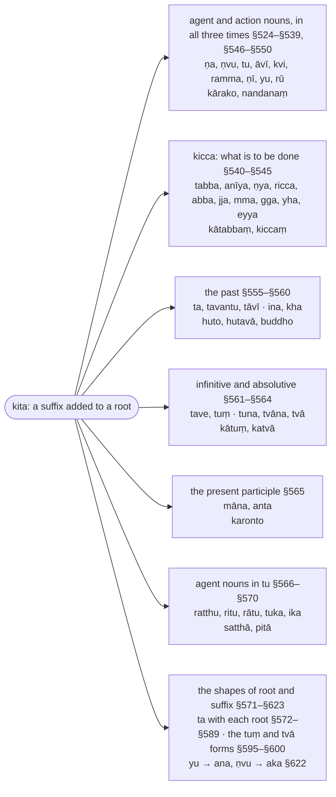

import { LinkCard } from "@astrojs/starlight/components";
import AnchorRedirect from "../../../../components/AnchorRedirect.astro";

:::note
`kita` suffixes are added to a root itself (not to a noun, as `taddhita` suffixes are) and make nouns, participles and the verbal forms that are not finite: `kumbhakāro` ("pot-maker") from `√kara` + `ṇa`, `kato` ("done") from `√kara` + `ta`, `kātuṃ` ("to do"), `katvā` ("having done"). The five sections give the suffixes by sense (§524–§570) and the changes of root and suffix (§571–§623).

Derived words are glossed as their parts, `🚹①⨀(√kara + ṇa)`; the `ṇ` of a suffix is a marker (`anubandha`) that is dropped and signals `vuddhi` of the root vowel.

:::

:::note[The kita suffixes by sense]
The primary suffixes are grouped by what they make from the root; the tree gives each group's rules, its suffixes and an example.

:::

## Sections

- [Paṭhamakaṇḍa (First Section) (§524–§549)](/kaccayana/7-kibbidhanakappa/1-pathamakanda/)
- [Dutiyakaṇḍa (Second Section) (§550–§570)](/kaccayana/7-kibbidhanakappa/2-dutiyakanda/)
- [Tatiyakaṇḍa (Third Section) (§571–§589)](/kaccayana/7-kibbidhanakappa/3-tatiyakanda/)
- [Catutthakaṇḍa (Fourth Section) (§590–§606)](/kaccayana/7-kibbidhanakappa/4-catutthakanda/)
- [Pañcamakaṇḍa (Fifth Section) (§607–§623)](/kaccayana/7-kibbidhanakappa/5-pancamakanda/)

<AnchorRedirect base="/kaccayana/7-kibbidhanakappa/" prefix="m" map={{"1-pathamakanda": [524, 549], "2-dutiyakanda": [550, 570], "3-tatiyakanda": [571, 589], "4-catutthakanda": [590, 606], "5-pancamakanda": [607, 623]}} />
