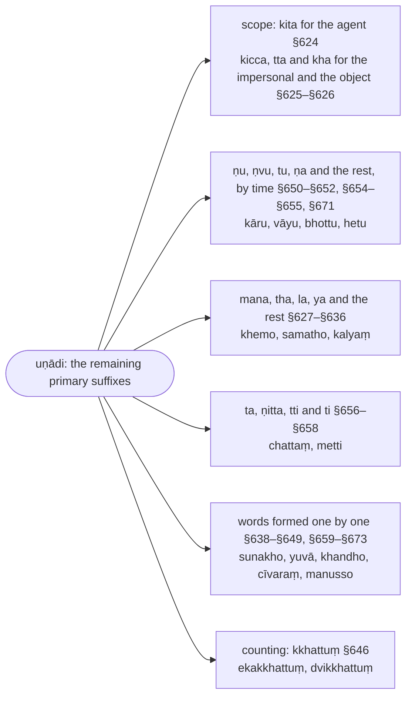

import { LinkCard } from "@astrojs/starlight/components";

:::note
The `uṇādi` suffixes ("`u` and the rest") are the primary suffixes not covered by the `kita` rules of the previous chapter: `kāru` ("artisan") from `√kara` + `u`, `bhikkhu` from `√bhikkha` + `u`, and a long tail of words whose derivation the grammar records one by one. The Chaṭṭha Saṅgāyana edition counts this chapter as the sixth section of the `kibbidhāna` chapter; its last line closes the whole Kaccāyana.

:::

:::note[What the uṇādi rules do]
The chapter first states the scope of the primary suffixes (§624–§626) and then records, suffix by suffix and word by word, the formations the earlier rules do not reach.

:::

## Chaṭṭhakaṇḍa (Sixth Section)

### §624 (563): Kattari kita (the `kita` suffixes denote the agent) :badge[utsarga]{variant=success}

:::note[Analysis]

| option | before | from   | operation | to         | after  | context |
| ------ | ------ | ------ | --------- | ---------- | ------ | ------- |
|        | (dhātūhi) |     | (paccayā honti) | kita | | kattari |
|        | (after a root) | | (suffixes are used) | the `kita` suffixes | | in the sense of the agent |

`kita` is the class name that [§546 (562): Aññe kita](/kaccayana/7-kibbidhanakappa#m546) gives to every primary suffix that is not a `kicca` suffix — `ṇa`, `a`, `ṇvu`, `tu`, `āvī`, `yu`, `ṇī`, `ta`, `tuṃ`, `tvā` and the rest; that rule's vutti asked what the name is for and answered with this sutta (`Kita saññāya kiṃpayojanaṃ? Kattari kita`). `kattari` is the seventh form of `kattu`, the agent kāraka defined by [§281 (294): Yo karoti sa kattā](/kaccayana/3-karakakappa#m281); the supplied `dhātūhi … paccayā honti` is the frame of the whole Kibbidhānakappa, stated by [§432 (362): Dhātuliṅgehi parā paccayā](/kaccayana/6-akhyatakappa#m432). The sutta is a scope statement rather than an operation, and it has no option marker: unless a rule assigns a `kita` suffix another sense — `ṇa` in `bhāva` by [§529 (580): Bhāve ca](/kaccayana/7-kibbidhanakappa#m529), `yu` in `kattu`, `karaṇa` and `padesa` by [§548 (597): Kattukaraṇapadesesu ca](/kaccayana/7-kibbidhanakappa#m548), `ta` in the agent sense after `budha`, `gamu` and the like by [§557 (606): Budhagamāditthe kattari](/kaccayana/7-kibbidhanakappa#m557) — a word made with one of them names the doer of the action, and by [§550 (546): Ṇādayo tekālikā](/kaccayana/7-kibbidhanakappa#m550) it does so for all three times. The Padarūpasiddhi calls the rule a `niyama`, a restriction; the next sutta gives the complementary statement for the non-agent senses. With this sutta the CST opens the Uṇādikappa, the sixth section of the Kibbidhānakappa, which gathers the words made with `u` (the `ṇu` of `kāru`, taught at [§650 (651): Kāle vattamānātīte ṇvādayo](#m650)) and the other miscellaneous suffixes — `uṇādi`, "`u` and so on".

:::

> Kattuiccetasmiṃ atthe kita paccayā honti.

> Kāru, kāruko, kārako, pācako, kattā, janitā, pacitā, netā.

The `kita` suffixes are used in the sense of the agent (`kattu`).

:::tip[Examples]

| lemma | inflected | meaning |
| ----- | --------- | ------- |
| 🚹①⨀(√kara + ṇu) | kāru | a maker, an artisan |
| 🚹①⨀(√kara + ṇuka) | kāruko | a craftsman, one given to making |
| 🚹①⨀(√kara + ṇvu) | kārako | a doer |
| 🚹①⨀(√paca + ṇvu) | pācako | a cook |
| 🚹①⨀(√kara + tu) | kattā | a doer, a maker |
| 🚹①⨀(√jana + tu) | janitā | a begetter |
| 🚹①⨀(√paca + tu) | pacitā | one who cooks |
| 🚹①⨀(√nī + tu) | netā | a leader |

`ṇu` is taught at [§650 (651): Kāle vattamānātīte ṇvādayo](#m650), `ṇuka` at [§536 (594): Hanatyādīnaṃ ṇuko](/kaccayana/7-kibbidhanakappa#m536), `ṇvu` and `tu` at [§527 (568): Sabbato ṇvu tvāvī vā](/kaccayana/7-kibbidhanakappa#m527). A suffix marked with `ṇ` strengthens the root vowel as a causative would ([§621 (553): Kāritaṃ viya ṇānubandho](/kaccayana/7-kibbidhanakappa#m621), [§483 (527): Asaṃyogantassa vuddhi kārite](/kaccayana/6-akhyatakappa#m483)) and then drops ([§523 (526): Kāritānaṃ ṇo lopaṃ](/kaccayana/6-akhyatakappa#m523)); `ṇvu` becomes `aka` by [§622 (570): Anakā yu ṇvūnaṃ](/kaccayana/7-kibbidhanakappa#m622); the `r` of `kara` becomes `t` before `tu` by [§619 (573): Karassa ca tattaṃ tusmiṃ](/kaccayana/7-kibbidhanakappa#m619); `i` is inserted before `tu` by [§605 (547): Yathāgamamikāro](/kaccayana/7-kibbidhanakappa#m605); and the `tu` stems take `ā` for `si` by [§199 (158): Satthupitādīnamā sismiṃ silopo ca](/kaccayana/2-namakappa#m199).

|     | kara + ṇvu                | rule |
| --- | ------------------------- | ---- |
| →   | kar + ~~a~~ + ṇvu         | §83  |
| →   | k(a→ā)r + ~~ṇ~~vu         | §621, §483, §523 |
| →   | kār + (vu→aka)            | §622 |
| →   | kāraka + (si→o)           | §104 |
| →   | **kārako**                |      |

|     | kara + tu                 | rule |
| --- | ------------------------- | ---- |
| →   | kar + ~~a~~ + tu          | §83  |
| →   | ka(r→t) + tu              | §619 |
| →   | katt + (u→ā) + ~~si~~     | §199 |
| →   | **kattā**                 |      |

> `ayaṃ kho brahmadatto kāsirājā bahuno amhākaṃ anatthassa kārako` \
> [(3V 10.2: Dīghāvuvatthu)](https://tipitaka2500.github.io/tipitaka/3V/10/10.2#1963) \
🚹①⨀(ima) 🔼(kho) 🚹①⨀(brahmadatta) 🚹①⨀(kāsirāja) 🚹⑥⨀(bahu) ⚧️⑥⨂(amha) 🚹⑥⨀(anattha) 🚹①⨀(√kara + ṇvu) \
this | indeed | Brahmadatta | the king of Kāsi | of much | our | harm | the doer

> `sarasi tvaṃ, dabba, evarūpaṃ kattā` \
> [(1V 1.2.8: Duṭṭhadosasikkhāpada)](https://tipitaka2500.github.io/tipitaka/1V/1/1.2/1.2.8#1570) \
▶️🤘⨀(sarati) ⚧️①⨀(tumha) 🚹⓪⨀(dabba) 🚻②⨀(evarūpa) 🚹①⨀(√kara + tu) \
do you remember | you | Dabba | such a thing | [being] the doer

> `netā vinetā anunetā, tādiso labhate yasaṃ` \
> [(8D 8.13: Chaddisāpaṭicchādanakaṇḍa)](https://tipitaka2500.github.io/tipitaka/8D/8/8.13#635) \
🚹①⨀(√nī + tu) 🚹①⨀(vi + √nī + tu) 🚹①⨀(anu + √nī + tu) 🚹①⨀(ta + √dusa) ▶️🤟⨀(labhati) 🚹②⨀(yasa) \
a leader | a trainer | a conciliator | such a one | obtains | fame

:::

---

### §625 (605): Bhāvakammesu kiccattakkhatthā (the `kicca` suffixes, `tta` and the `kha`-type suffixes denote `bhāva` and `kamma`) :badge[utsarga]{variant=success}

:::note[Analysis]

| option | before | from   | operation | to         | after  | context |
| ------ | ------ | ------ | --------- | ---------- | ------ | ------- |
|        | (dhātūhi) |     | (paccayā honti) | kicca\|tta\|khatthā | | bhāvakammesu |
|        | (after a root) | | (suffixes are used) | the `kicca` suffixes \| `tta` \| those with the sense of `kha` | | in the senses of the action itself and of the object |

`kiccattakkhatthā` is `kicca` + `tta` + `khatthā`, three names for the suffixes that do not denote the agent. `kicca` is the class name that [§545 (548): Te kiccā](/kaccayana/7-kibbidhanakappa#m545) gives to `tabba`, `anīya`, `ṇya`, `teyya` and `ricca` (§540–§544); that vutti asked what the name is for and answered with this sutta (`Kiccasaññāya kiṃpayojanaṃ? Bhāvakammesu kiccattakhatthā`). `tta` is the participle suffix `ta` of [§556 (622): Bhāvakammesu ta](/kaccayana/7-kibbidhanakappa#m556), written with a doubled `t` here and in §626 and §643 — the Padarūpasiddhi writes it `kta`, as Sanskrit grammar does. `khatthā` is `kha` + `atthā`, "those with the sense of `kha`", the suffix `kha` of [§560 (604): Īsaṃdusūhi kha](/kaccayana/7-kibbidhanakappa#m560) and whatever does the same work; the vutti lists the three as `kicca tta khattha`. `bhāvakammesu` names the two senses: the bare action (`bhāva`) and the object (`kamma`, [§280 (285): Yaṃ karoti taṃ kammaṃ](/kaccayana/3-karakakappa#m280)). The heading follows the CST's sutta list and the Padarūpasiddhi (605, and its quotations of the rule under 559 and 635), which read the compound `kiccattakkhatthā` with the doubling of `kh` after the vowel; the CST's vutti section prints `kiccatta khatthā` as two words, and §545's vutti quotes the rule as `kiccattakhatthā`. There is no option marker: the Padarūpasiddhi again calls the rule a `niyama` — these suffixes are confined to `bhāva` and `kamma`, as those of §624 are confined to the agent. The next sutta is the one exception.

:::

> Bhāvakammaiccetesvatthesu kicca tta khattha iccete paccayā honti.

> Upasampādetabbaṃ upasampādanīyaṃ bhavatā, sayitabbaṃ bhavatā, kattabbaṃ bhavatā, bhottabbo odano bhavatā, asitabbaṃ bhojanaṃ bhavatā, asitaṃ bhavatā, sayitaṃ bhavatā, pacitaṃ bhavatā, asitaṃ asanaṃ bhavatā, sayitaṃ sayanaṃ bhavatā, pacito odano bhavatā, kiñcissayo, īsassayo, dussayo, sussayo bhavatā.

In the senses of the action itself (`bhāva`) and of the object (`kamma`), the suffixes called `kicca`, [the participle suffix] `tta`, and those that have the sense of `kha` are used.

:::tip[Examples]

In every sentence `bhavatā` (by you, sir) is the agent, in the third form ③, because the suffix expresses the action or its object and not the doer. The `kicca` forms come first, then `tta`, then the `kha` words.

| lemma | inflected | meaning |
| ----- | --------- | ------- |
| 🚻①⨀(upa + saṃ + √pada + ṇe + tabba) | upasampādetabbaṃ upasampādanīyaṃ bhavatā | ordination is to be conferred by you (`tabba`, `anīya`; `bhāva`) |
| 🚻①⨀(√sī + tabba) | sayitabbaṃ bhavatā | lying down is to be done by you (`bhāva`) |
| 🚻①⨀(√kara + tabba) | kattabbaṃ bhavatā | it is to be done by you (`bhāva`) |
| 🚹①⨀(√bhuja + tabba) | bhottabbo odano bhavatā | the rice is to be eaten by you (`kamma`) |
| 🚻①⨀(√asa + tabba) | asitabbaṃ bhojanaṃ bhavatā | the food is to be eaten by you (`kamma`) |
| 🚻①⨀(√asa + tta) | asitaṃ bhavatā | eating was done by you (`bhāva`) |
| 🚻①⨀(√sī + tta) | sayitaṃ bhavatā | lying down was done by you (`bhāva`) |
| 🚻①⨀(√paca + tta) | pacitaṃ bhavatā | cooking was done by you (`bhāva`) |
| 🚻①⨀(√asa + tta) | asitaṃ asanaṃ bhavatā | the food was eaten by you (`kamma`) |
| 🚻①⨀(√sī + tta) | sayitaṃ sayanaṃ bhavatā | the bed was lain on by you (`kamma`) |
| 🚹①⨀(√paca + tta) | pacito odano bhavatā | the rice was cooked by you (`kamma`) |
| 🚹①⨀(kiñci + √sī + kha) | kiñcissayo | lying is somewhat [hard] (`kha`; `bhāva`) |
| 🚹①⨀(īsaṃ + √sī + kha) | īsassayo | lying is [possible] with a little [effort] |
| 🚹①⨀(du + √sī + kha) | dussayo | lying is hard; hard to lie on |
| 🚹①⨀(su + √sī + kha) | sussayo bhavatā | lying is easy for you |

`tabba` and `anīya` are the suffixes of [§540 (545): Bhāvakammesu tabbānīyā](/kaccayana/7-kibbidhanakappa#m540); `upasampādetabbaṃ` adds the causative `ṇe` of [§438 (540): Dhātūhi ṇe ṇaya ṇāpe ṇāpayā kāritāni hetvatthe](/kaccayana/6-akhyatakappa#m438) to `upa` + `saṃ` + `pada`. The `kha` words are those of §560: the `kh` of the suffix is a marker and is dropped by [§517 (488): Kvaci dhātuvibhattippaccayānaṃ dīghaviparītādesalopāgamā ca](/kaccayana/6-akhyatakappa#m517), the root vowel takes `vuddhi` ([§405 (365): Ayuvaṇṇānañcāyo vuddhi](/kaccayana/5-taddhitakappa#m405)), the `e` becomes `ay` before the vowel by [§514 (491): E aya](/kaccayana/6-akhyatakappa#m514), and the `s` is doubled after the short vowel of `su`, `du`, `kiñci` by [§28 (40): Para dvebhāvo ṭhāne](/kaccayana/1-sandhikappa#m28). The Padarūpasiddhi (605) fills the class with the everyday `dukkaraṃ`, `sukaraṃ`, `dubbharo`, `subharo`, `durakkhaṃ`, `duddaso`, `sudassaṃ`, `duranubodho`, `subodhaṃ`.

|     | su + sī + kha             | rule |
| --- | ------------------------- | ---- |
| →   | su + sī + ~~kh~~a         | §517 |
| →   | su + s(ī→e) + a           | §405 |
| →   | su + s(e→ay) + a          | §514 |
| →   | su + (s→ss)aya            | §28  |
| →   | sussaya + (si→o)          | §104 |
| →   | **sussayo**               |      |

|     | paca + ta                 | rule |
| --- | ------------------------- | ---- |
| →   | pac + ~~a~~ + ta          | §83  |
| →   | pac + (i) + ta            | §605 |
| →   | pacita + (si→o)           | §104 |
| →   | **pacito**                |      |

> `na, bhikkhave, ūnavīsativasso puggalo upasampādetabbo` \
> [(2V 1.5.8.7: Sañciccasikkhāpada)](https://tipitaka2500.github.io/tipitaka/2V/1/1.5/1.5.8/1.5.8.7#1379) \
🔼(na) 🚹⓪⨂(bhikkhu) 🚹①⨀(ūnavīsativassa) 🚹①⨀(puggala) 🚹①⨀(upa + saṃ + √pada + ṇe + tabba) \
not | bhikkhus | under twenty years old | a person | is to be ordained

> `asitaṃ pītaṃ khāyitaṃ sāyitaṃ sammā pariṇāmaṃ gacchati` \
> [(16A5 1.3.9: Caṅkamasutta)](https://tipitaka2500.github.io/tipitaka/16A5/1/1.3/1.3.9#123) \
🚻①⨀(√asa + tta) 🚻①⨀(√pā + tta) 🚻①⨀(√khāda + tta) 🚻①⨀(√sāya + tta) 🔼(sammā) 🚹②⨀(pariṇāma) ▶️🤟⨀(gacchati) \
what is eaten | drunk | chewed | tasted | properly | to digestion | goes

> `nayidaṃ sukaraṃ agāraṃ ajjhāvasatā` \
> [(1V 1.1.1.1: Sudinnabhāṇavāra)](https://tipitaka2500.github.io/tipitaka/1V/1/1.1/1.1.1/1.1.1.1#41) \
🔼(na) 🚻①⨀(ima) 🚻①⨀(su + √kara + kha) 🚻②⨀(agāra) 🚹③⨀(ajjhāvasanta) \
not | this | easy to do | the household life | by one living in

:::

---

### §626 (634): Kammani dutiyāya tto (`tta` denotes the agent when the object stands in the second form) :badge[apavada]{variant=success}

:::note[Analysis]

| option | before | from   | operation | to         | after  | context |
| ------ | ------ | ------ | --------- | ---------- | ------ | ------- |
|        |        | (dhātūhi) | (paccayo hoti) | tto | | kammani dutiyāya (kattari) |
|        |        | (after a root) | (a suffix is used) | `tta` | | when the object is in ② (denoting the agent) |

`tto` is `tta`, the participle suffix `ta` of §556 in the spelling of §625 (the Padarūpasiddhi's `kto`). `kammani dutiyāya` is "when the object is in the second form": the object (`kamma`, [§280 (285): Yaṃ karoti taṃ kammaṃ](/kaccayana/3-karakakappa#m280)) stands in the inflection that [§297 (284): Kammatthe dutiyā](/kaccayana/3-karakakappa#m297) gives it, and the vutti supplies `kattari`: in that construction the participle names the agent, and agrees with it in the first form ①. This is the one exception to the `niyama` of [§625 (605): Bhāvakammesu kiccattakkhatthā](#m625): by §625 alone `dinno` would agree with the gift (`dānaṃ dinnaṃ devadattena`, "the gift was given by Devadatta"); when the gift keeps its second form the participle is drawn to the giver (`dānaṃ dinno devadatto`). [§557 (606): Budhagamāditthe kattari](/kaccayana/7-kibbidhanakappa#m557) gives `ta` the agent sense after `budha`, `gamu` and the like without this condition (`buddho`, `saraṇaṃ gato`). There is no option marker; the Padarūpasiddhi reads the sutta as `Kammani dutiyāyaṃ kto`, with the seventh form spelt out.

:::

> Kammani iccetasmiṃ atthe dutiyāyaṃ vibhattiyaṃ kattari ttapaccayo hoti.

> Dānaṃ dinno devadatto, sīlaṃ rakkhito devadatto, bhattaṃ bhutto devadatto, garuṃ upāsito devadatto.

When the object (`kamma`) stands in the second inflection ②, the suffix `tta` denotes the agent.

:::tip[Examples]

In each sentence the object stands in the second form ② and the participle agrees with the agent `devadatto` in the first form ①.

> `dānaṃ dinno devadatto` \
🚻②⨀(dāna) 🚹①⨀(√dā + tta) 🚹①⨀(devadatta) \
a gift | has given | Devadatta

> `sīlaṃ rakkhito devadatto` \
🚻②⨀(sīla) 🚹①⨀(√rakkha + tta) 🚹①⨀(devadatta) \
the precepts | has kept | Devadatta

> `bhattaṃ bhutto devadatto` \
🚻②⨀(bhatta) 🚹①⨀(√bhuja + tta) 🚹①⨀(devadatta) \
the meal | has eaten | Devadatta

> `garuṃ upāsito devadatto` \
🚹②⨀(garu) 🚹①⨀(upa + √āsa + tta) 🚹①⨀(devadatta) \
the teacher | has attended on | Devadatta

`dinno` takes `inna` for `ta` by [§582 (631): Bhidādito inna anna īṇāvā](/kaccayana/7-kibbidhanakappa#m582); `bhutto` loses the `j` of `bhuja` and doubles the `t` by [§578 (560): Bhujādīnamanto no dvi ca](/kaccayana/7-kibbidhanakappa#m578); `rakkhito` and `upāsito` insert `i` by [§605 (547): Yathāgamamikāro](/kaccayana/7-kibbidhanakappa#m605).

|     | dā + ta                    | rule |
| --- | -------------------------- | ---- |
| →   | d + ~~ā~~ + (ta→inna)      | §582 |
| →   | dinna + (si→o)             | §104 |
| →   | **dinno**                  |      |

|     | bhuja + ta                 | rule |
| --- | -------------------------- | ---- |
| →   | bhuj + ~~a~~ + ta          | §83  |
| →   | bhu + ~~j~~ + (ta→tta)     | §578 |
| →   | bhutta + (si→o)            | §104 |
| →   | **bhutto**                 |      |

None of the vutti's four sentences is attested in the Tipiṭaka. The construction itself is common with the participles of §557, where the object likewise keeps its second form:

> `rājā māgadho seniyo bimbisāro saputto sabhariyo sapariso sāmacco pāṇehi saraṇaṃ gato` \
> [(6D 4.3: Buddhaguṇakathā)](https://tipitaka2500.github.io/tipitaka/6D/4/4.3#465) \
🚹①⨀(rāja) 🚹①⨀(māgadha) 🚹①⨀(seniya) 🚹①⨀(bimbisāra) 🚹①⨀(saputta) 🚹①⨀(sabhariya) 🚹①⨀(saparisa) 🚹①⨀(sāmacca) 🚹③⨂(pāṇa) 🚻②⨀(saraṇa) 🚹①⨀(√gamu + ta) \
the king | of Magadha | Seniya | Bimbisāra | with his sons | with his wives | with his retinue | with his ministers | with his life | refuge | has gone to

:::

:::note[Additional]

The Padarūpasiddhi (634) draws a further lesson from this sutta: since the rule has to provide specially for an object in the second form beside a participle, an object that the verb form already expresses (`abhihita`) takes the first form, not the second — `Idameva vacanaṃ ñāpakaṃ abhihite kammādimhi dutiyādīnamabhāvassa`, "this statement itself is the indicator that when the object and the rest are [already] expressed, the second and the other forms are absent". The rule of [§297 (284): Kammatthe dutiyā](/kaccayana/3-karakakappa#m297) thus applies to an unexpressed object only.

:::

---

### §627 (652): Khyādīhi mana ma ca to vā (`mana` after `khi` and the like; and optionally `t` for its `m`) :badge[apavada]{variant=success}

:::note[Analysis]

| option | before | from   | operation | to         | after  | context |
| ------ | ------ | ------ | --------- | ---------- | ------ | ------- |
|        | khyādīhi | (dhātūhi) | (paccayo hoti) | mana | | |
| ca vā  |        | massa  | (ādeso)   | to         |        |         |
|        | after `khi` and the like | (roots) | (a suffix is used) | `mana` | | |
| and, optionally | | the `m` [of `mana`] | (replaced by) | `t` | | |

`khyādīhi` is `khi` + `ādīhi`, "after `khi` and the like", the `i` becoming `y` before the vowel ([§21 (21): Ivaṇṇo yaṃ navā](/kaccayana/1-sandhikappa#m21)); the vutti spells the list out — `khi`, `bhī`, `su`, `ru`, `hu`, `vā`, `dhū`, `hi`, `lū`, `pī`, `ada` — and leaves it open with `ādi`. The suffix is `mana`, but its `na` is dropped as a marker ([§517 (488): Kvaci dhātuvibhattippaccayānaṃ dīghaviparītādesalopāgamā ca](/kaccayana/6-akhyatakappa#m517)), so that the words show `ma`, and the root vowel of `khi`, `su`, `hu`, `hi`, `lū`, `pī` takes `vuddhi` by [§485 (434): Aññesu ca](/kaccayana/6-akhyatakappa#m485) (`khemo`, `somo`, `homo`, `hemo`, `lomo`, `pemo`); `bhī` too is strengthened here (`bhemo`), though the next sutta gives it `bhīmo`. `ma ca to vā` is the second operation: "and, optionally, `t` for the `m`". The `ca` joins it to the first. The `vā` cannot open a choice between two shapes of one word — `ada` gives only `attā` and `ātumā`, never a form with `m` — so it marks, as in [§13 (15): Vā paro asarūpā](/kaccayana/1-sandhikappa#m13), an option of limited range: the change of `m` to `t` reaches `ada` alone and not the other roots of the list, which keep `ma`. The Padarūpasiddhi (652) says so in a verse and names the device `vavatthitavibhāsā`, an option whose range is settled by usage: `Adadhātuparasseva, makārassa takāratā; tadaññato na hotāyaṃ, vavatthitavibhāsato`. The heading follows the CST's sutta list and the Padarūpasiddhi, `mana`; the CST's vutti section prints `māna` in the sutta while its vutti reads `mana paccayo`.

:::

> Khi bhī su ru hu vā dhū hi lū pī adaiccevamādīhi dhātūhi mana paccayo hoti, massa ca to hoti vā.

> Khīyanti upaddavā etthāti khemo, bhāyitabboti bhemo, bhāyanti etasmāti vā bhemo, raṃsiyo abhissavetīti somo, ravati gacchatīti romo, huvati juhvati etenāti homo, paṭilomavasena vāti gacchatīti vāmo, lāmakavasena vāti gacchati pavattatīti vā vāmo, dhunāti kampatīti dhūmo, seṭṭhabhāvena hinoti pavattati cittaṃ etasminti hemo, lunitabboti lomo, maṃsacammāni lunāti chindatīti vā lomo, piyanaṃ pemo, piyāyitabboti vā pemo, sukhadukkhaṃ adati bhakkhatīti attā, jātijarāmaraṇādīhi adīyate bhakkhīyateti vā attā, ātumā.

After the roots `khi`, `bhī`, `su`, `ru`, `hu`, `vā`, `dhū`, `hi`, `lū`, `pī`, `ada` and the like, the suffix `mana` is used; and optionally its `m` becomes `t`.

:::tip[Examples]

The vutti glosses each word with a sentence that shows the root's meaning; the meaning column gives that gloss and the word's ordinary sense.

| lemma | inflected | meaning |
| ----- | --------- | ------- |
| 🚹①⨀(√khi + mana) | khemo | "disturbances are destroyed (`khīyanti`) here": safety |
| 🚹①⨀(√bhī + mana) | bhemo | "to be feared", or "they fear at it": a terror (not attested; §628 gives `bhīmo`) |
| 🚹①⨀(√su + mana) | somo | "it pours out (`abhissaveti`) rays": the moon |
| 🚹①⨀(√ru + mana) | romo | "it goes (`ravati`)": body hair |
| 🚹①⨀(√hu + mana) | homo | "one offers (`juhoti`) with it": an oblation |
| 🚹①⨀(√vā + mana) | vāmo | "it goes (`vāti`) the contrary way", or "the inferior way": left; contrary |
| 🚹①⨀(√dhū + mana) | dhūmo | "it shakes (`dhunāti`), it trembles": smoke |
| 🚹①⨀(√hi + mana) | hemo | "the mind moves (`hinoti`) towards it as the best": gold |
| 🚹①⨀(√lū + mana) | lomo | "to be cut (`lunitabbo`)", or "it cuts flesh and skin": hair |
| 🚹①⨀(√pī + mana) | pemo | "pleasing (`piyanaṃ`)", or "to be held dear": love |
| 🚹①⨀(√ada + mana) | attā | "it devours (`adati`) pleasure and pain", or "it is devoured by birth, ageing and death": the self |
| 🚹①⨀(√ada + mana) | ātumā | the same, with the vowel lengthened and `u` inserted (§517): the self |

|     | khi + mana                | rule |
| --- | ------------------------- | ---- |
| →   | khi + ma~~na~~            | §517 |
| →   | kh(i→e) + ma              | §485 |
| →   | khema + (si→o)            | §104 |
| →   | **khemo**                 |      |

|     | ada + mana                | rule |
| --- | ------------------------- | ---- |
| →   | ad + ~~a~~ + ma~~na~~     | §83, §517 |
| →   | ad + (m→t)a               | §627 |
| →   | a(d→t)ta                  | §29  |
| →   | atta + (si→ā)             | §189 |
| →   | **attā**                  |      |

`attā` and `ātumā` take `ā` for `si` as members of the `atta` group ([§189 (113): Syā ca](/kaccayana/2-namakappa#m189)); in `ātumā` the `a` of the root is lengthened and `u` inserted by §517.

> `dhajo rathassa paññāṇaṃ, dhūmo paññāṇamaggino` \
> [(12S1 1.8.2: Rathasutta)](https://tipitaka2500.github.io/tipitaka/12S1/1/1.8/1.8.2#338) \
🚹①⨀(dhaja) 🚹⑥⨀(√raha + tha) 🚻①⨀(paññāṇa) 🚹①⨀(√dhū + mana) 🚻①⨀(paññāṇa) 🚹⑥⨀(aggi) \
a banner | of a chariot | the mark | smoke | the mark | of a fire

> `attā hi attano nātho` \
> [(18Dh 12.4: Kumārakassapamātuttherivatthu)](https://tipitaka2500.github.io/tipitaka/18Dh/12/12.4#172) \
🚹①⨀(√ada + mana) 🔼(hi) 🚹⑥⨀(atta) 🚹①⨀(nātha) \
oneself | indeed | of oneself | the protector

:::

---

### §628 (653): Samādīhi tha mā (`tha` and `ma` after `samu` and the like) :badge[apavada]{variant=success}

:::note[Analysis]

| option | before | from   | operation | to         | after  | context |
| ------ | ------ | ------ | --------- | ---------- | ------ | ------- |
|        | samādīhi | (dhātūhi) | (paccayā honti) | tha\|mā | | |
|        | after `samu` and the like | (roots) | (suffixes are used) | `tha` \| `ma` | | |

`tha mā` is the pair `tha` and `ma` in the plural. `samādīhi` is `samu` + `ādīhi`; the vutti lists `samu`, `damu`, `dara`, `raha`, `du`, `hi`, `si`, `bhī`, `dā`, `yā`, `sā`, `ṭhā`, `bhasa` (the `u` of `samu`, `damu` is the marker with which Kaccāyana cites these roots). `tha` goes with the first four (`samatho`, `damatho`, `daratho`, `ratho`), `ma` with the rest; which root takes which the words themselves decide. Beside the suffix the roots undergo small changes fixed by usage ([§517 (488): Kvaci dhātuvibhattippaccayānaṃ dīghaviparītādesalopāgamā ca](/kaccayana/6-akhyatakappa#m517)): the `h` of `raha` drops (`ratho`), the `i` of `si` is lengthened (`sīmā`), the `ṭh` of `ṭhā` becomes `th` (`thāmo`), and there is no `vuddhi` in `himo`, `bhīmo`, `dumo` where §627 would have given `hemo`, `bhemo`. There is no option marker in Kaccāyana's sutta; the Padarūpasiddhi (653) reads the rule with a carried `vā`, and adds `sapatho`, `āvasatho`, `yūtho`, `brahmā`, `usmā` to the list.

:::

> Samu damu dara raha du hi si bhī dā yā sā ṭhābhasaiccevamādīhi dhātūhi tha ma paccayā honti.

> Sametīti samatho, damatīti damatho, damanaṃ vā damatho, damitabboti vā damatho, daratīti daratho, jiṇṇabhāvaṃ rahissati gaṇhissatīti ratho, dabbasambhāre rahati gaṇhātīti vā ratho, davati gacchatīti dumo, davati vuddhi viruḷhi gacchati pavattatīti uddhaṃ vā dumo, pathavīpabbatādīsu gacchati patatīti himo, kammavācāya bandhati etthāti sīmā. Bandhitabbāti vā sīmā. Bhāyanti etasmāti bhīmo, satte avakhaṇḍenti nivārenti etenāti dāmo, mūsikādīhi khādīyati avakhaṇḍīyatīti vā dāmo, yāti gacchatīti yāmo, paresaṃ cittaṃ gaṇhituṃ samatthetīti sāmo, tiṭṭhanti etenāti thāmo, bhasati bhasmīkarīyatīti bhasmā.

After the roots `samu`, `damu`, `dara`, `raha`, `du`, `hi`, `si`, `bhī`, `dā`, `yā`, `sā`, `ṭhā`, `bhasa` and the like, the suffixes `tha` and `ma` are used.

:::tip[Examples]

| lemma | inflected | meaning |
| ----- | --------- | ------- |
| 🚹①⨀(√samu + tha) | samatho | "it calms (`sameti`)": calm, tranquillity |
| 🚹①⨀(√damu + tha) | damatho | "it tames (`damati`)", "taming", or "to be tamed": taming, self-control |
| 🚹①⨀(√dara + tha) | daratho | "it burns (`darati`)": distress |
| 🚹①⨀(√raha + tha) | ratho | "it will take on (`rahissati`) decay", or "it holds the materials": a chariot |
| 🚹①⨀(√du + ma) | dumo | "it goes (`davati`)", or "it goes upward in growth": a tree |
| 🚹①⨀(√hi + ma) | himo | "it goes, falls on the earth and mountains": snow, frost |
| 🚺①⨀(√si + ma) | sīmā | "one binds (`bandhati`) [the Saṅgha] here by the formal act", or "to be bound": a boundary |
| 🚹①⨀(√bhī + ma) | bhīmo | "they fear (`bhāyanti`) at it": terrible |
| 🚹①⨀(√dā + ma) | dāmo | "with it they restrain (`avakhaṇḍenti`) beings", or "it is gnawed through by mice": a rope, a bond |
| 🚹①⨀(√yā + ma) | yāmo | "it goes (`yāti`)": a watch of the night |
| 🚹①⨀(√sā + ma) | sāmo | "it is able (`samattheti`) to seize others' minds": dark, dusky |
| 🚹①⨀(√ṭhā + ma) | thāmo | "by it they stand firm (`tiṭṭhanti`)": strength |
| 🚹①⨀(√bhasa + ma) | bhasmā | "it falls (`bhasati`), it is reduced to ashes": ash |

|     | samu + tha                | rule |
| --- | ------------------------- | ---- |
| →   | sama + tha                | (the `u` is Kaccāyana's marker) |
| →   | samatha + (si→o)          | §104 |
| →   | **samatho**               |      |

|     | raha + tha                | rule |
| --- | ------------------------- | ---- |
| →   | ra + ~~ha~~ + tha         | §517 |
| →   | ratha + (si→o)            | §104 |
| →   | **ratho**                 |      |

`bhasmā` takes `ā` for `si` like `brahmā`, by [§189 (113): Syā ca](/kaccayana/2-namakappa#m189); `sīmā` is feminine and keeps its `ā` ([§220 (74): Sesato lopaṃ gasipi](/kaccayana/2-namakappa#m220)).

> `samatho ca vipassanā ca` \
> [(8D 10.2: Duka)](https://tipitaka2500.github.io/tipitaka/8D/10/10.2#806) \
🚹①⨀(√samu + tha) 🔼(ca) 🚺①⨀(vipassanā) 🔼(ca) \
calm | and | insight | and

> `āpadāsu kho, mahārāja, thāmo veditabbo` \
> [(12S1 3.2.1: Sattajaṭilasutta)](https://tipitaka2500.github.io/tipitaka/12S1/3/3.2/3.2.1#634) \
🚺⑦⨂(āpadā) 🔼(kho) 🚹⓪⨀(mahārāja) 🚹①⨀(√ṭhā + ma) 🚹①⨀(veditabba) \
in adversities | indeed | great king | strength | is to be known

> `abhikkantā, bhante, ratti, nikkhanto paṭhamo yāmo` \
> [(4V 9.1: Pātimokkhuddesayācana)](https://tipitaka2500.github.io/tipitaka/4V/9/9.1#1854) \
🚺①⨀(abhikkantā) 🚹⓪⨀(bhante) 🚺①⨀(ratti) 🚹①⨀(nikkhanta) 🚹①⨀(paṭhama) 🚹①⨀(√yā + ma) \
advanced | venerable sir | the night | passed | the first | watch

:::

---

### §629 (569): Gahassu’padhasse vā (optionally `e` for the penultimate `a` of `gaha`) :badge[apavada]{variant=success}

:::note[Analysis]

| option | before | from   | operation | to         | after  | context |
| ------ | ------ | ------ | --------- | ---------- | ------ | ------- |
| vā     |        | gahassa upadhassa (akārassa) | (ādeso) | e | | |
| optionally |    | the penultimate [`a`] of `gaha` | (replaced by) | `e` | | |

`Gahassu’padhasse` is `gahassa upadhassa e`. `upadhā` is the Sanskrit grammarians' name for the letter before the last of a word — `antakkharato pubbakkharassa parasamaññā`, as the Padarūpasiddhi (569) glosses it — one of the foreign terms that [§9 (11): Parasamaññā payoge](/kaccayana/1-sandhikappa#m9) admits; in `gaha` (`g`, `a`, `h`, `a`) it is the `a` after `g`. The suffix is the `a` of [§527 (568): Sabbato ṇvu tvāvī vā](/kaccayana/7-kibbidhanakappa#m527) in the sense of the object, "what is held" (the Padarūpasiddhi glosses `gayhatīti gehaṃ`); the root's final `a` is elided before it by [§83 (67): Saralopo’ mādesa paccayādimhi saralope tu pakati](/kaccayana/2-namakappa#m83). The option marker `vā` opens an option: `gehaṃ` with the change and `gahaṃ` without it are both good Pāli, the second chiefly in compounds (`gahapati`, `gahaṭṭha`). A third shape of the same root, `gharaṃ`, comes from [§613 (583): Gahassa ghara ṇe vā](/kaccayana/7-kibbidhanakappa#m613), which replaces the whole root before `ṇa`.

:::

> Gaha iccetassa dhātussa upadhassa akārassa etta hoti vā.

> Dabbasambhāra[^1] gaṇhātīti gehaṃ, gahaṃ.

Optionally, the `a` that is the penultimate letter (`upadhā`) of the root `gaha` becomes `e`.

:::tip[Examples]

| lemma | inflected | meaning |
| ----- | --------- | ------- |
| 🚻①⨀(√gaha + a) | gehaṃ | "it holds (`gaṇhāti`) the building materials": a house (with `e`) |
| 🚻①⨀(√gaha + a) | gahaṃ | a house (the option not taken) |

|     | gaha + a                  | rule |
| --- | ------------------------- | ---- |
| →   | g(a→e)ha + a              | §629 |
| →   | geh + ~~a~~ + a           | §83  |
| →   | geha + (si→aṃ)            | §219 |
| →   | **gehaṃ**                 |      |

When the option is not taken the same steps give `gahaṃ`.

> `nanu nāma, tāta sudinna, sakaṃ gehaṃ gantabbaṃ` \
> [(1V 1.1.1.1: Sudinnabhāṇavāra)](https://tipitaka2500.github.io/tipitaka/1V/1/1.1/1.1.1/1.1.1.1#55) \
🔼(nanu) 🔼(nāma) 🚹⓪⨀(tāta) 🚹⓪⨀(sudinna) 🚻②⨀(saka) 🚻②⨀(√gaha + a) 🚻①⨀(gantabba) \
surely | indeed | dear | Sudinna | your own | house | should be gone to

:::

[^1]: CST4 prints `Dabbasambhāra gaṇhātīti`, leaving the object without its inflection; §628 glosses `ratho` with `dabbasambhāre rahati gaṇhātīti`, and the Padarūpasiddhi (569) glosses `gehaṃ` simply as `gayhatīti`.

---

### §630 (654): Masussa sussa cchara ccherā (`cchara`, `cchera` for the `su` of `masu`) :badge[apavada]{variant=success}

:::note[Analysis]

| option | before | from   | operation | to         | after  | context |
| ------ | ------ | ------ | --------- | ---------- | ------ | ------- |
|        |        | masussa sussa | (ādesā) | cchara\|ccherā | | |
|        |        | the `su` of `masu` | (replaced by) | `cchara` \| `cchera` | | |

`pāṭipadika` (Sanskrit `prātipadika`) is a nominal base — a stem that is not a root and takes no verbal suffix. The vutti calls `masu` such a base, and the rule works on the base itself, replacing its `su` (the Padarūpasiddhi, 654, prefers to treat `masu` as a root, `masu macchere`, "to be stingy", with the vanishing suffix `kvi`; the vutti's gloss `maccharati` is that verb). The two replacements are a pair, not an option: `cchara` gives `maccharo`, `cchera` gives `macchero`, and the next sutta's `ca` adds `cchariya`, giving the common `macchariyaṃ`. The same kind of rule — a fixed nominal base reshaped by replacement — recurs at [§647 (663): Sunassunassoṇa vānuvānūnunakhunānā](#m647), [§648 (664): Taruṇassa susu ca](#m648) and [§649 (665): Yuvassuvassuvuvānunūnā](#m649). No option marker.

:::

> Masu iccetassa pāṭipadikassa sussa ccharaccherādesā honti.

> Maccharatīti maccharo, evaṃ macchero.

The `su` of the nominal base (`pāṭipadika`) `masu` is replaced by `cchara` and `cchera`.

:::tip[Examples]

| lemma | inflected | meaning |
| ----- | --------- | ------- |
| 🚹①⨀(macchara) | maccharo | "he is stingy (`maccharati`)": stinginess, envy |
| 🚹①⨀(macchera) | macchero | the same |

|     | masu                      | rule |
| --- | ------------------------- | ---- |
| →   | ma + (su→cchara)          | §630 |
| →   | macchara + (si→o)         | §104 |
| →   | **maccharo**              |      |

Neither word occurs on its own in the Tipiṭaka, which prefers `macchariyaṃ` (§631); `macchara` appears as the last member of a compound:

> `saṅgāhako mittakaro, vadaññū vītamaccharo` \
> [(8D 8.13: Chaddisāpaṭicchādanakaṇḍa)](https://tipitaka2500.github.io/tipitaka/8D/8/8.13#635) \
🚹①⨀(saṅgāhaka) 🚹①⨀(mittakara) 🚹①⨀(vadaññū) 🚹①⨀(vīta + macchara) \
hospitable | a maker of friends | open-handed | free from stinginess

:::

---

### §631 (655): Āpubbacarassa ca (and [`cchariya`, `cchara`, `cchera`] for `cara` after `ā`, the `ā` shortened) :badge[apavada]{variant=success}

:::note[Analysis]

| option | before | from   | operation | to         | after  | context |
| ------ | ------ | ------ | --------- | ---------- | ------ | ------- |
| ca     | āpubba- | carassa | (ādesā)  | (cchariya\|cchara\|cchera) | | |
|        |        | (āpubbassa) | (rasso) | (a) |  |         |
| and    | preceded by `ā` | the root `cara` | (replaced by) | (`cchariya` \| `cchara` \| `cchera`) | | |
|        |        | (the preceding `ā`) | (shortened) | (`a`) | | |

`Āpubbacarassa` is `ā-pubba-carassa`, "of `cara` having `ā` before it". The sutta names only the substituend; the replacements `cchara`, `cchera` are carried over from [§630 (654): Masussa sussa cchara ccherā](#m630), and the vutti adds `cchariya` and the shortening of the prefix. By saying `ca` this rule is an extension of §630 in both directions: the replacements of `masu` are given to `ā` + `cara` as well, and — the vutti's `Caggahaṇena masussa sussāpi cchariyādeso hoti` — the new replacement `cchariya` is given back to `masu`, yielding `macchariyaṃ`. `Ābhuso caritabbaṃ`, "to be practised intensely", is the vutti's etymology of `acchariya`, a marvel; the Padarūpasiddhi (655) adds the popular one, `accharaṃ paharituṃ yuttaṃ`, "fit to snap one's fingers at". The three words are all made, so there is no option to mark.

:::

> Āpubbassa cara iccetassa dhātussa cchariyaccharaccherā desā honti, āpubbassa ca rasso hoti.

> Ābhuso caritabbanti acchariyaṃ. Evaṃ accharaṃ, accheraṃ.

> Caggahaṇena masussa sussāpi cchariyādeso hoti, macchariyaṃ.

The root `cara` preceded by `ā` is replaced by `cchariya`, `cchara` and `cchera`, and the preceding `ā` is shortened.

:::tip[Examples]

| lemma | inflected | meaning |
| ----- | --------- | ------- |
| 🚻①⨀(acchariya) | acchariyaṃ | "to be practised intensely (`ābhuso caritabbaṃ`)": a marvel; wonderful |
| 🚻①⨀(acchara) | accharaṃ | the same (in the Tipiṭaka `accharā`, a snap of the fingers, a moment) |
| 🚻①⨀(acchera) | accheraṃ | the same |

|     | ā + cara                  | rule |
| --- | ------------------------- | ---- |
| →   | ā + (cara→cchariya)       | §631 |
| →   | (ā→a) + cchariya          | §631 |
| →   | acchariya + (si→aṃ)       | §219 |
| →   | **acchariyaṃ**            |      |

> `acchariyaṃ, bhante, abbhutaṃ, bhante` \
> [(6D 1.5: Vivaṭṭakathādi)](https://tipitaka2500.github.io/tipitaka/6D/1/1.5#223) \
🚻①⨀(acchariya) 🚹⓪⨀(bhante) 🚻①⨀(abbhuta) 🚹⓪⨀(bhante) \
wonderful | venerable sir | marvellous | venerable sir

> `passa mātali accheraṃ, cittaṃ kammaphalaṃ idaṃ` \
> [(19Vv 1.4.9: Pītavimānavatthu)](https://tipitaka2500.github.io/tipitaka/19Vv/1/1.4/1.4.9#640) \
⏯🤘⨀(passati) 🚹⓪⨀(mātali) 🚻①⨀(acchera) 🚻①⨀(citta) 🚻①⨀(kammaphala) 🚻①⨀(ima) \
see | Mātali | the marvel | wonderful | fruit of action | this

> `balavā puriso appakasireneva accharaṃ pahareyya` \
> [(11M 5.10: Indriyabhāvanāsutta)](https://tipitaka2500.github.io/tipitaka/11M/5/5.10#1278) \
🚹①⨀(balavantu) 🚹①⨀(purisa) 🚹③⨀(appakasira) 🔼(eva) 🚺②⨀(accharā) ⏯🤟⨀(paharati) \
a strong | man | with little effort | just | a finger-snap | might make

:::

By the word `ca`, the `su` of `masu` too is replaced by `cchariya`: `macchariyaṃ`.

:::tip[Example]

| lemma | inflected | meaning |
| ----- | --------- | ------- |
| 🚻①⨀(macchariya) | macchariyaṃ | stinginess, selfishness |

> `pariggahaṃ paṭicca macchariyaṃ, macchariyaṃ paṭicca ārakkho` \
> [(7D 2.1: Paṭiccasamuppāda)](https://tipitaka2500.github.io/tipitaka/7D/2/2.1#206) \
🚹②⨀(pariggaha) 🔼(paṭicca) 🚻①⨀(macchariya) 🚻②⨀(macchariya) 🔼(paṭicca) 🚹①⨀(ārakkha) \
possession | dependent on | stinginess | stinginess | dependent on | guarding

:::

---

### §632 (656): Ala kala salehi layā (`la` and `ya` after `ala`, `kala`, `sala`) :badge[apavada]{variant=success}

:::note[Analysis]

| option | before | from   | operation | to         | after  | context |
| ------ | ------ | ------ | --------- | ---------- | ------ | ------- |
|        | ala kala salehi | (dhātūhi) | (paccayā honti) | la\|yā | | |
|        | after `ala`, `kala`, `sala` | (roots) | (suffixes are used) | `la` \| `ya` | | |

`layā` is the pair `la` and `ya`. The three roots are `ala` "to be able, to suffice" (`alati samattheti`), `kala` "to count" (`kalitabbaṃ saṅkhyātabbaṃ`) and `sala` "to go" (`salati gacchati`), the meanings the vutti's glosses give them. The root's final `a` is elided before the suffix ([§83 (67): Saralopo’ mādesa paccayādimhi saralope tu pakati](/kaccayana/2-namakappa#m83)), so that the `l` of the root meets the `l` or `y` of the suffix: `allaṃ`, `alyaṃ`. Both suffixes apply to each root, giving six words; there is no option marker. The `la` words are everyday Pāli, the `ya` words (`alyaṃ`, `kalyaṃ`, `salyaṃ`) are the Sanskrit shapes and are not found in the Tipiṭaka, though `kalyāṇa` of the next sutta builds on the same `kala` + `ya`.

:::

> Ala kala sala iccetehi dhātūhi la yapaccayā honti.

> Alati samatthetīti allaṃ, kalitabbaṃ saṅkhyātabbanti kallaṃ, salati gacchati pavisatīti sallaṃ. Evaṃ alyaṃ, kalyaṃ, salyaṃ.

After the roots `ala`, `kala` and `sala`, the suffixes `la` and `ya` are used.

:::tip[Examples]

| lemma | inflected | meaning |
| ----- | --------- | ------- |
| 🚻①⨀(√ala + la) | allaṃ | "it is able (`alati samattheti`)": wet, fresh |
| 🚻①⨀(√kala + la) | kallaṃ | "to be counted (`kalitabbaṃ saṅkhyātabbaṃ`)": fit, proper |
| 🚻①⨀(√sala + la) | sallaṃ | "it goes, it enters (`salati gacchati pavisati`)": an arrow, a dart |
| 🚻①⨀(√ala + ya) | alyaṃ | the same as `allaṃ` (not attested) |
| 🚻①⨀(√kala + ya) | kalyaṃ | the same as `kallaṃ` (not attested) |
| 🚻①⨀(√sala + ya) | salyaṃ | the same as `sallaṃ` (not attested) |

|     | sala + la                 | rule |
| --- | ------------------------- | ---- |
| →   | sal + ~~a~~ + la          | §83  |
| →   | salla + (si→aṃ)           | §219 |
| →   | **sallaṃ**                |      |

> `allaṃ kaṭṭhaṃ sasnehaṃ udake nikkhittaṃ` \
> [(9M 4.6: Mahāsaccakasutta)](https://tipitaka2500.github.io/tipitaka/9M/4/4.6#1244) \
🚻①⨀(√ala + la) 🚻①⨀(kaṭṭha) 🚻①⨀(sasneha) 🚻⑦⨀(udaka) 🚻①⨀(nikkhitta) \
a wet | log | sappy | in water | placed

> `kallaṃ nu taṃ samanupassituṃ` \
> [(3V 1.6: Pañcavaggiyakathā)](https://tipitaka2500.github.io/tipitaka/3V/1/1.6#94) \
🚻①⨀(√kala + la) 🔼(nu) 🚻②⨀(ta) 🔼(samanupassituṃ) \
fit | is it? | that | to regard

> `na tāvāhaṃ imaṃ sallaṃ āharissāmi` \
> [(10M 2.3: Cūḷamālukyasutta)](https://tipitaka2500.github.io/tipitaka/10M/2/2.3#331) \
🔼(na) 🔼(tāva) ⚧️①⨀(amha) 🚹②⨀(ima) 🚹②⨀(√sala + la) ⏯👆⨀(āharati) \
not | yet | I | this | arrow | shall remove

:::

---

### §633 (657): Yāṇa lāṇā (`yāṇa` and `lāṇa` after `kala` and `sala`) :badge[apavada]{variant=success}

:::note[Analysis]

| option | before | from   | operation | to         | after  | context |
| ------ | ------ | ------ | --------- | ---------- | ------ | ------- |
|        | (tehi kala salehi) | (dhātūhi) | (paccayā honti) | yāṇa\|lāṇā | | |
|        | (after those, `kala` and `sala`) | (roots) | (suffixes are used) | `yāṇa` \| `lāṇa` | | |

The sutta names only the suffixes; the roots continue from [§632 (656): Ala kala salehi layā](#m632), and the vutti restricts them to the last two — `Tehi kala sala iccetehi`, "after those, `kala` and `sala`" — so that `ala` does not take them. `yāṇa` and `lāṇa` are the `ya` and `la` of §632 lengthened and extended with `ṇa`; the words keep the glosses of §632 (`kalitabbaṃ saṅkhyātabbaṃ` again for `kalyāṇaṃ`). `paṭisalyāṇaṃ`, "retiring", takes the prefix `paṭi` and the plural verb of its gloss: "having drawn back from the group (`gaṇato paṭikkamitvā`) they go (`salanti`) here". No option marker. The Tipiṭaka writes the last word with a dental, `paṭisallāna` (`paṭisallānā vuṭṭhito`); the Padarūpasiddhi (657) gives `kallāṇo` where Kaccāyana's vutti has `sallāṇo`, and offers a second derivation of `paṭisallāṇaṃ` from `lī` "to cling" with `yu`.

:::

> Tehi kala sala iccetehi dhātūhi yāṇa lāṇapaccayā honti.

> Kalitabbaṃ saṅkhyātabbanti kalyāṇaṃ, gaṇato paṭikkamitvā salanti etthāti paṭisalyāṇaṃ. Evaṃ sallāṇo, paṭisallāṇo.

After those [two] roots, `kala` and `sala`, the suffixes `yāṇa` and `lāṇa` are used.

:::tip[Examples]

| lemma | inflected | meaning |
| ----- | --------- | ------- |
| 🚻①⨀(√kala + yāṇa) | kalyāṇaṃ | "to be counted, reckoned": good, lovely; a good deed |
| 🚻①⨀(paṭi + √sala + yāṇa) | paṭisalyāṇaṃ | "having withdrawn from the company they go here": retirement, seclusion |
| 🚹①⨀(√sala + lāṇa) | sallāṇo | the same as `salyaṃ`: going, retiring (not attested) |
| 🚹①⨀(paṭi + √sala + lāṇa) | paṭisallāṇo | seclusion (in the Tipiṭaka `paṭisallāna`) |

|     | kala + yāṇa               | rule |
| --- | ------------------------- | ---- |
| →   | kal + ~~a~~ + yāṇa        | §83  |
| →   | kalyāṇa + (si→aṃ)         | §219 |
| →   | **kalyāṇaṃ**              |      |

> `kataṃ tayā kalyāṇaṃ, akataṃ tayā pāpaṃ` \
> [(1V 1.1.3: Tatiyapārājikasikkhāpada)](https://tipitaka2500.github.io/tipitaka/1V/1/1.1/1.1.3#393) \
🚻①⨀(kata) ⚧️③⨀(tumha) 🚻①⨀(√kala + yāṇa) 🚻①⨀(akata) ⚧️③⨀(tumha) 🚻①⨀(pāpa) \
done | by you | good | not done | by you | evil

> `paṭisallānā vuṭṭhito` \
> [(1V 1.1.3: Tatiyapārājikasikkhāpada)](https://tipitaka2500.github.io/tipitaka/1V/1/1.1/1.1.3#382) \
🚻⑤⨀(paṭi + √sala + lāṇa) 🚹①⨀(vuṭṭhita) \
from seclusion | risen

:::

---

### §634 (658): Mathissa thassa lo ca (`l` for the `th` of `matha`; and the augment `k`) :badge[apavada]{variant=success}

:::note[Analysis]

| option | before | from   | operation | to         | after  | context |
| ------ | ------ | ------ | --------- | ---------- | ------ | ------- |
|        |        | mathissa thassa | (ādeso) | lo | (la) | |
| ca     | (lato) |        | (āgamo)   | (ko)       |        |         |
|        |        | the `th` of `matha` | (replaced by) | `l` | (before the suffix `la`) | |
| and    | (after the `la`) | | (augment) | (`k`) | | |

`Mathissa` is the sixth form of `mathi`, the root `matha` "to churn, to stir" (`mathati viloḷati`) cited with a final `i`; `thassa lo` is "`l` for its `th`". The suffix is the `la` of [§632 (656): Ala kala salehi layā](#m632), carried down: `matha` + `la` gives `mal` + `la`, `mallo`, when the `th` has become `l` and the root's final `a` has gone ([§83 (67): Saralopo’ mādesa paccayādimhi saralope tu pakati](/kaccayana/2-namakappa#m83)); the Padarūpasiddhi (658) makes the `ca` supply that suffix. In Kaccāyana's own vutti the `ca` does a different job: `Caggahaṇena lato ko ca āgamo hoti`, "by the word `ca` there is also the augment `k` after the `la`", giving `mallako` beside `mallo` — the same word with the suffix `ka` that adds nothing to the sense, "as `hīnako` for `hīno`" (Padarūpasiddhi). No option marker.

:::

> Matha iccetassa dhātussa thassa lādesohoti. Aññamaññaṃ mathati viloḷatīti mallo, mallaṃ.

> Caggahaṇena lato ko ca āgamo hoti. Mallako, mallakaṃ.

The `th` of the root `matha` is replaced by `l`.

:::tip[Examples]

| lemma | inflected | meaning |
| ----- | --------- | ------- |
| 🚹①⨀(√matha + la) | mallo | "they churn (`mathati viloḷati`) one another": a wrestler |
| 🚻①⨀(√matha + la) | mallaṃ | the same, neuter |

|     | matha + la                | rule |
| --- | ------------------------- | ---- |
| →   | ma(th→l)a + la            | §634 |
| →   | mal + ~~a~~ + la          | §83  |
| →   | malla + (si→o)            | §104 |
| →   | **mallo**                 |      |

In the Tipiṭaka `mallo` is also the clan name of the Mallas:

> `rojo mallo āyasmato ānandassa sahāyo hoti` \
> [(3V 6.24: Rojamallavatthu)](https://tipitaka2500.github.io/tipitaka/3V/6/6.24#1360) \
🚹①⨀(roja) 🚹①⨀(√matha + la) 🚹⑥⨀(āyasmantu) 🚹⑥⨀(ānanda) 🚹①⨀(sahāya) ▶️🤟⨀(hoti) \
Roja | the Malla | of the venerable | Ānanda | a friend | is

:::

By the word `ca`, the augment `k` also comes after the `la`: `mallako`, `mallakaṃ`.

:::tip[Examples]

| lemma | inflected | meaning |
| ----- | --------- | ------- |
| 🚹①⨀(√matha + la + ka) | mallako | a wrestler; a bowl |
| 🚻①⨀(√matha + la + ka) | mallakaṃ | the same, neuter |

|     | malla + ka                | rule |
| --- | ------------------------- | ---- |
| →   | malla + (k)a              | §634 |
| →   | mallaka + (si→o)          | §104 |
| →   | **mallako**               |      |

:::

---

### §635 (559): Pesātisaggapattakālesukiccā (the `kicca` suffixes in the senses of command, permission and due time) :badge[apavada]{variant=success}

:::note[Analysis]

| option | before | from   | operation | to         | after  | context |
| ------ | ------ | ------ | --------- | ---------- | ------ | ------- |
|        | (dhātūhi) |     | (paccayā honti) | kiccā | | pesātisaggapattakālesu |
|        | (after a root) | | (suffixes are used) | the `kicca` suffixes | | in the senses of command, permission and the time having come |

The sutta is `pesa-atisagga-pattakālesu kiccā`, which the CST prints as one word (the Padarūpasiddhi, 559, prints `Pesātisaggapattakālesu kiccā`). `kiccā` are the suffixes named by [§545 (548): Te kiccā](/kaccayana/7-kibbidhanakappa#m545) — `tabba`, `anīya`, `ṇya`, `teyya`, `ricca` — which [§625 (605): Bhāvakammesu kiccattakkhatthā](#m625) confines to the action and the object; this rule adds three senses in which they are used, the Padarūpasiddhi's definitions being: `pesa`, a command — an order or an entreaty of the kind "this is to be done by you" (`kattabbamidaṃ bhavatā`); `atisagga`, permission — allowing what may be done to one who asks "what should I do?" (`kimidaṃ mayā kattabbaṃ`); and `pattakāla`, "the time has come" — telling someone who has not attended to a duty at its proper time that the time is now (`samayārocana`). It matches Pāṇini's `preṣātisargaprāptakāleṣu kṛtyāś ca` (3.3.163). The Padarūpasiddhi pairs the vutti's examples with the senses in order: `kattabbaṃ`, `karaṇīyaṃ` for command, `bhottabbaṃ`, `bhojanīyaṃ` for permission, `ajjhayitabbaṃ`, `ajjhayanīyaṃ` — with `adhi` + `i`, "to study" — for the time that has come. No option marker; the next sutta adds two further senses.

:::

> Pesa atisagga pattakāla iccetesvatthesu kiccapaccayā honti.

> Kattabbaṃ kammaṃ bhavatā, karaṇīyaṃ kiccaṃ bhavatā, bhottabbaṃ bhojanaṃ bhavatā, bhojanīyaṃ bhojanaṃ bhavatā, ajjhayitabbaṃ ajjheyyaṃ bhavatā, ajjhayanīyaṃ ajjheyyaṃ bhavatā.

In the senses of command (`pesa`), permission (`atisagga`) and the time having come (`pattakāla`), the `kicca` suffixes are used.

:::tip[Examples]

| lemma | inflected | meaning |
| ----- | --------- | ------- |
| 🚻①⨀(√kara + tabba) | kattabbaṃ kammaṃ bhavatā | the work is to be done by you (a command) |
| 🚻①⨀(√kara + anīya) | karaṇīyaṃ kiccaṃ bhavatā | the task is to be done by you (a command) |
| 🚻①⨀(√bhuja + tabba) | bhottabbaṃ bhojanaṃ bhavatā | the food may be eaten by you (a permission) |
| 🚻①⨀(√bhuja + anīya) | bhojanīyaṃ bhojanaṃ bhavatā | the food may be eaten by you (a permission) |
| 🚻①⨀(adhi + √i + tabba) | ajjhayitabbaṃ ajjheyyaṃ bhavatā | the lesson is [now] to be studied by you (the time has come) |
| 🚻①⨀(adhi + √i + anīya) | ajjhayanīyaṃ ajjheyyaṃ bhavatā | the lesson is [now] to be studied by you (the time has come) |

`ajjheyyaṃ`, "what is to be studied", is `adhi` + `i` + `ṇya` (🚻①⨀(adhi + √i + ṇya)), the object of the last two sentences. `anīya` takes `ṇ` after the `r`-final `kara` by [§549 (550): Rahādito ṇa](/kaccayana/7-kibbidhanakappa#m549); the `adhi` of the study words becomes `ajjh` before a vowel by [§45 (25): Ajjho adhi](/kaccayana/1-sandhikappa#m45), and its `i` is strengthened to `e` and then `ay` ([§405 (365): Ayuvaṇṇānañcāyo vuddhi](/kaccayana/5-taddhitakappa#m405), [§514 (491): E aya](/kaccayana/6-akhyatakappa#m514)).

|     | kara + anīya              | rule |
| --- | ------------------------- | ---- |
| →   | kar + ~~a~~ + anīya       | §83  |
| →   | kar + a(n→ṇ)īya           | §549 |
| →   | karaṇīya + (si→aṃ)        | §219 |
| →   | **karaṇīyaṃ**             |      |

|     | adhi + i + tabba          | rule |
| --- | ------------------------- | ---- |
| →   | (adhi→ajjh) + i + tabba   | §45  |
| →   | ajjh + (i→e) + tabba      | §405 |
| →   | ajjh + (e→ay) + (i) + tabba | §514, §605 |
| →   | ajjhayitabba + (si→aṃ)    | §219 |
| →   | **ajjhayitabbaṃ**         |      |

> `kattabbaṃ kusalaṃ, caritabbaṃ brahmacariyaṃ` \
> [(7D 6.6.5: Chakhattiyaāmantanā)](https://tipitaka2500.github.io/tipitaka/7D/6/6.6/6.6.5#731) \
🚻①⨀(√kara + tabba) 🚻①⨀(kusala) 🚻①⨀(√cara + tabba) 🚻①⨀(brahmacariya) \
is to be done | good | is to be lived | the holy life

> `natthi cassa kiñci uttari karaṇīyaṃ` \
> [(1V 1.2.8: Duṭṭhadosasikkhāpada)](https://tipitaka2500.github.io/tipitaka/1V/1/1.2/1.2.8#1556) \
🔼(na) ▶️🤟⨀(atthi) 🔼(ca) ⚧️⑥⨀(ima) 🚻①⨀(kiṃ + ci) 🔼(uttari) 🚻①⨀(√kara + anīya) \
not | there is | and | for him | anything | further | to be done

:::

---

### §636 (659): Avassakā’dhamiṇesu ṇī ca (`ṇī`, and the `kicca` suffixes, in the senses of necessity and of a debtor) :badge[apavada]{variant=success}

:::note[Analysis]

| option | before | from   | operation | to         | after  | context |
| ------ | ------ | ------ | --------- | ---------- | ------ | ------- |
| ca     | (dhātūhi) |     | (paccayo hoti) | ṇī (kiccā) | | avassakā’dhamiṇesu |
| and    | (after a root) | | (a suffix is used) | `ṇī` (and the `kicca` suffixes) | | in the senses of necessity and of a debtor |

`Avassakā’dhamiṇesu` is `avassaka-adhamiṇesu`. `avassaka` is what cannot be avoided, a necessity — the adverb `avassaṃ`, "without fail", stands in every example; `adhamiṇa` (Sanskrit `adhamarṇa`, "whose debt is beneath him") is a debtor, one bound to repay. `ṇī` is the suffix of [§532 (590): Tassīlādīsu ṇītvāvī ca](/kaccayana/7-kibbidhanakappa#m532), which there marks a habit (`brahmacārī`); here it marks an obligation, and the word is predicated of the person with `asi`, "you are": `kārīsi` is `kārī asi`, "you are one who must do". By saying `ca` the rule is an extension of [§635 (559): Pesātisaggapattakālesukiccā](#m635): the `kicca` suffixes carried down from it (`kiccā ca` in the vutti, `‘‘Kiccā’’ti vattate` in the Padarūpasiddhi) serve in these two senses as well as `ṇī`, so that `dātabbaṃ me bhavatā sataṃ iṇaṃ` says what `dāyīsi me sataṃ iṇaṃ` says. The pair of senses is Pāṇini's `āvaśyakādhamarṇyayor ṇiniḥ` (3.3.170) beside `arhe kṛtyatṛcaś ca` (3.3.169). No option marker.

:::

> Avassaka adhamiṇa iccetesvatthesu ṇīpaccayo hoti, kiccā ca.

> Avassake[^2] tāva – kārīsi me kammaṃ avassaṃ hārīsi me bhāraṃ avassaṃ.

> Adhamiṇe – dāyīsi me sataṃ iṇaṃ, dhārīsi me sahassaṃ iṇaṃ.

> Kiccā ca – dātabbaṃ me bhavatā sataṃ iṇaṃ. Dhārayitabbaṃ me bhavatā sahassaṃ iṇaṃ, kattabbaṃ me bhavatā gehaṃ, karaṇīyaṃ me bhavatā kiccaṃ, kāriyaṃ me bhavatā sayanaṃ.

In the senses of necessity (`avassaka`) and of a debtor (`adhamiṇa`), the suffix `ṇī` is used, and the `kicca` suffixes as well.

:::tip[Examples]

In the sense of necessity (`avassake`):

| lemma | inflected | meaning |
| ----- | --------- | ------- |
| 🚹①⨀(√kara + ṇī) | kārīsi me kammaṃ avassaṃ | you are bound (`kārī asi`) to do my work without fail |
| 🚹①⨀(√hara + ṇī) | hārīsi me bhāraṃ avassaṃ | you are bound to carry my load without fail |

In the sense of a debtor (`adhamiṇe`):

| lemma | inflected | meaning |
| ----- | --------- | ------- |
| 🚹①⨀(√dā + ṇī) | dāyīsi me sataṃ iṇaṃ | you are bound to pay me a hundred, a debt |
| 🚹①⨀(√dhara + ṇī) | dhārīsi me sahassaṃ iṇaṃ | you are bound to pay me a thousand, a debt |

And with the `kicca` suffixes:

| lemma | inflected | meaning |
| ----- | --------- | ------- |
| 🚻①⨀(√dā + tabba) | dātabbaṃ me bhavatā sataṃ iṇaṃ | a hundred, a debt, is to be paid me by you |
| 🚻①⨀(√dhara + ṇe + tabba) | dhārayitabbaṃ me bhavatā sahassaṃ iṇaṃ | a thousand, a debt, is to be paid me by you |
| 🚻①⨀(√kara + tabba) | kattabbaṃ me bhavatā gehaṃ | a house is to be built for me by you |
| 🚻①⨀(√kara + anīya) | karaṇīyaṃ me bhavatā kiccaṃ | a task is to be done for me by you |
| 🚻①⨀(√kara + ṇya) | kāriyaṃ me bhavatā sayanaṃ | a bed is to be made for me by you |

The `ṇ` of `ṇī` strengthens the root vowel and drops ([§621 (553): Kāritaṃ viya ṇānubandho](/kaccayana/7-kibbidhanakappa#m621), [§523 (526): Kāritānaṃ ṇo lopaṃ](/kaccayana/6-akhyatakappa#m523)); the `ā` of `dā` becomes `āy` before it by [§593 (564): Ākārantānamāyo](/kaccayana/7-kibbidhanakappa#m593) (`dāyī`, as `dāyako`); the `si` of these `ī` stems is elided by [§220 (74): Sesato lopaṃ gasipi](/kaccayana/2-namakappa#m220), and the `a` of `asi` after the `ī` by [§13 (15): Vā paro asarūpā](/kaccayana/1-sandhikappa#m13).

|     | kara + ṇī                 | rule |
| --- | ------------------------- | ---- |
| →   | kar + ~~a~~ + ṇī          | §83  |
| →   | k(a→ā)r + ~~ṇ~~ī          | §621, §483, §523 |
| →   | kārī + ~~si~~             | §220 |
| →   | kārī + (~~a~~si)          | §13  |
| →   | **kārīsi**                |      |

None of the vutti's sentences is attested. The Tipiṭaka has the `ṇī` words in the habitual sense of §532, and the `kicca` forms of a debt or an obligation:

> `sīlesu paripūrakārī hoti samādhismiṃ mattaso kārī` \
> [(15A3 2.4.6: Paṭhamasikkhāsutta)](https://tipitaka2500.github.io/tipitaka/15A3/2/2.4/2.4.6#746) \
🚻⑦⨂(sīla) 🚹①⨀(paripūra + √kara + ṇī) ▶️🤟⨀(hoti) 🚹⑦⨀(samādhi) 🔼(mattaso) 🚹①⨀(√kara + ṇī) \
in the precepts | one who acts fully | is | in concentration | to a limited extent | one who acts

> `sace, gahapati, bhojanaṃ dātabbaṃ detha` \
> [(1V 1.1.1.1: Sudinnabhāṇavāra)](https://tipitaka2500.github.io/tipitaka/1V/1/1.1/1.1.1/1.1.1.1#59) \
🔼(sace) 🚹⓪⨀(gahapati) 🚻①⨀(bhojana) 🚻①⨀(√dā + tabba) ⏯🤘⨂(deti) \
if | householder | food | is to be given | give

:::

[^2]: CST4 prints `Avassate tāva`; the heading of the first group of examples is the seventh form of the sutta's `avassaka`, `Avassake`, parallel to `Adhamiṇe` below.

---

### §637 (0): Arahasakkādīhi tuṃ (`tuṃ` with any root when `arahati`, `sakkā` and the like are used) :badge[apavada]{variant=success}

:::note[Analysis]

| option | before | from   | operation | to         | after  | context |
| ------ | ------ | ------ | --------- | ---------- | ------ | ------- |
|        | arahasakkādīhi (payoge sati) | (sabbadhātūhi) | (paccayo hoti) | tuṃ | | |
|        | in construction with `araha`, `sakka` and the like | (after any root) | (a suffix is used) | `tuṃ` | | |

`arahasakkādīhi` is a fifth form plural, "from `araha`, `sakka` and the like", and the vutti reads it as "when they are used [in the sentence]" (`payoge sati`): `araha` stands for the verb `arahati`, "is fit, deserves", `sakka` for the uninflected `sakkā`, "it is possible", and the list's third member `bhabba`, "capable", is the participle of [§543 (555): Bhūto’bba](/kaccayana/7-kibbidhanakappa#m543) that [§570 (611): Bhabbe ika](/kaccayana/7-kibbidhanakappa#m570) names as a sense. With any root (`sabbadhātūhi`) in such a sentence the infinitive suffix `tuṃ` is used. This repeats [§562 (638): Arahasakkādīsu ca](/kaccayana/7-kibbidhanakappa#m562), which gave `tuṃ` "in the senses of `araha`, `sakka` and the like" (`ko taṃ ninditumarahati`, `sakkā jetuṃ dhanena vā`) and with [§561 (636): Icchatthesu samānakattukesu tave tuṃ vā](/kaccayana/7-kibbidhanakappa#m561) and [§563 (639): Pattavacane alamatthesu ca](/kaccayana/7-kibbidhanakappa#m563) covers the uses of the infinitive; the Padarūpasiddhi therefore has no separate rule for it, which is why the CST numbers it `(0)`. No option marker. `bhavaṃ`, "you, sir", is the subject of each example in the first form ①; the vutti's last example is the one with `bhabba`.

:::

> Araha sakka bhabbaiccevamādīhi payoge sati sabbadhātūhi tuṃpaccayo hoti.

> Arahā bhavaṃ vattuṃ, arahā bhavaṃ kattuṃ, sakkā bhavaṃ hantuṃ, sakkā bhavaṃ janetuṃ, janituṃ, bhavituṃ, sakkā bhavaṃ dātuṃ, sakkā bhavaṃ gantuṃ, bhabbo[^3] bhavaṃ janetuṃ iccevamādi.

When `araha`, `sakka`, `bhabba` and the like are used [in the sentence], the suffix `tuṃ` is added to any root.

:::tip[Examples]

| lemma | inflected | meaning |
| ----- | --------- | ------- |
| 🔼(√vada + tuṃ) | arahā bhavaṃ vattuṃ | you, sir, are fit to speak |
| 🔼(√kara + tuṃ) | arahā bhavaṃ kattuṃ | you are fit to act |
| 🔼(√hana + tuṃ) | sakkā bhavaṃ hantuṃ | you can strike |
| 🔼(√jana + ṇe + tuṃ) | sakkā bhavaṃ janetuṃ | you can beget |
| 🔼(√jana + tuṃ) | janituṃ | to be born |
| 🔼(√bhū + tuṃ) | bhavituṃ | to be, to become |
| 🔼(√dā + tuṃ) | sakkā bhavaṃ dātuṃ | you can give |
| 🔼(√gamu + tuṃ) | sakkā bhavaṃ gantuṃ | you can go |
| 🔼(√jana + ṇe + tuṃ) | bhabbo bhavaṃ janetuṃ | you are capable of begetting |

> `arahā bhavaṃ vattuṃ` \
🚹①⨀(arahanta) 🚹①⨀(bhavanta) 🔼(√vada + tuṃ) \
fit | you, sir | to speak

`vattuṃ` assimilates the `d` of `vada` to the `t` ([§29 (42): Vagge ghosāghosānaṃ tatiyapaṭhamā](/kaccayana/1-sandhikappa#m29)); `kattuṃ` takes `t` for the `r` of `kara` by [§620 (549): Tuṃ tuna tabbesu vā](/kaccayana/7-kibbidhanakappa#m620) (beside `kātuṃ`); `hantuṃ` and `gantuṃ` keep or make a final `n` by [§596 (551): Gama khana hanādīnaṃ tuṃ tabbādīsu na](/kaccayana/7-kibbidhanakappa#m596); `janituṃ` and `bhavituṃ` insert `i` by [§605 (547): Yathāgamamikāro](/kaccayana/7-kibbidhanakappa#m605), and `janetuṃ` is the causative in `ṇe` ([§438 (540): Dhātūhi ṇe ṇaya ṇāpe ṇāpayā kāritāni hetvatthe](/kaccayana/6-akhyatakappa#m438)).

|     | gamu + tuṃ                | rule |
| --- | ------------------------- | ---- |
| →   | gam + tuṃ                 | (the `u` is Kaccāyana's marker) |
| →   | ga(m→n) + tuṃ             | §596 |
| →   | **gantuṃ**                |      |

|     | bhū + tuṃ                 | rule |
| --- | ------------------------- | ---- |
| →   | bh(ū→o) + (i) + tuṃ       | §485, §605 |
| →   | bh(o→av) + ituṃ           | §513 |
| →   | **bhavituṃ**              |      |

> `na hi so sakkā hantuṃ` \
> [(23J 17.1.5: Cūḷasutasomajātaka)](https://tipitaka2500.github.io/tipitaka/23J/17/17.1/17.1.5#216) \
🔼(na) 🔼(hi) 🚹①⨀(ta) 🔼(sakkā) 🔼(√hana + tuṃ) \
not | indeed | he | can | be killed

:::

[^3]: CST4 prints `tabbo bhavaṃ janetuṃ`; the vutti's list of words runs `araha sakka bhabba`, and the last example is the one with `bhabba`, so `bhabbo` is read.

---

### §638 (660): Vajādīhipabbajjādayo nippajjante (`pabbajjā` and the like are formed from `vaja` and the like as they stand) :badge[vidhyaṅga]{variant=tip}

:::note[Analysis]

| option | before | from   | operation | to         | after  | context |
| ------ | ------ | ------ | --------- | ---------- | ------ | ------- |
|        | vajādīhi (dhātūhi upasaggapaccayādīhi ca) | | nippajjante | pabbajjādayo | | |
|        | from `vaja` and the like (roots, with prefixes, suffixes and so on) | | are formed as they stand | `pabbajjā` and the like | | |

The sutta is `vajādīhi pabbajjādayo nippajjante`, "from `vaja` and the like, `pabbajjā` and the like are produced". `nippajjante` is the language of `nipātana`: the words are not derived step by step but laid down in the shape usage gives them, as [§571 (624): Paccayādaniṭṭhā nipātanā sijjhanti](/kaccayana/7-kibbidhanakappa#m571) provides for every part of the grammar and [§51 (59): Anupadiṭṭhānaṃ vuttayogato](/kaccayana/1-sandhikappa#m51) for sandhi — which is why the rule is an instruction on procedure rather than an operation. The vutti names the ingredients — a root of the `vaja` class, a prefix, a suffix — and glosses each word with the sentence that gives its root's meaning; the Padarūpasiddhi (660) calls the list an `ākatigaṇa`, "a class known by its type", that is, open-ended, each member made "by the prescription of suffix, replacement, elision, augment, prohibition and gender as attested". Most of the forty-six words are feminine action nouns in `ṇya` ([§541 (552): Ṇyo ca](/kaccayana/7-kibbidhanakappa#m541)), the root's final consonant fusing with the `y` — `dy`, `jy` to `jj`, `thy`, `sy`, `hy` to `cch` — as [§544 (556): Vada mada gamu yuja garahākārādīhi jja mma gga yheyyā gāro vā](/kaccayana/7-kibbidhanakappa#m544) does for `vajjaṃ` and `majjaṃ`; others take the feminine `a` of [§553 (599): Itthiyamatiyavo vā](/kaccayana/7-kibbidhanakappa#m553), the `ririya` of [§554 (601): Karato ririya](/kaccayana/7-kibbidhanakappa#m554), or the `ya` and `cha` that the Padarūpasiddhi names; `vajjhā` first turns `hana` into `vadha` by [§592 (503): Vadho vā sabbattha](/kaccayana/7-kibbidhanakappa#m592), and `maccu`, `saccaṃ`, `niccaṃ` end the list with masculine and neuter words. No option marker.

:::

> Vajaiccevamādīhi dhātūhi, upasaggapaccayādīhi ca pabbajjādayo saddā nippajjante.

> Paṭhamameva vajitabbāti pabbajjā, iñjanaṃ ejjā, samajjanaṃ samajjā, nisīdanaṃ nisajjā, vijānanaṃ vijjā visajjanaṃ visajjā, padanaṃ pajjā, hananaṃ vajjhā, esanaṃ icchā, atiesanaṃ aticchā, sadanaṃ sajjā, sayanti etthāti seyyā, sammā cittaṃ nidheti etāyāti saddhā, caritabbā cariyā, karaṇaṃ kiriyā, rujanaṃ rucchā, padanaṃ pacchā, riñcanaṃ ricchā, tikicchanaṃ titicchā, saṃkocanaṃ saṃkucchā, madanaṃ macchā, labhanaṃ lacchā, raditabbāti[^4] racchā, radanaṃ vilekhanaṃ vāracchā, adho bhāgena gacchatīti tiracchā, tiracchāno, ajanaṃ acchā, titikkhatīti titikkhā, saha āgamanaṃ sāgacchā, duṭṭhu bhakkhanaṃ dobhacchā, duṭṭhu rosanaṃ durucchā, pucchanaṃ pucchā, muhanaṃ mucchā, vasanaṃ vacchā, kacanaṃ kacchā, saha kathanaṃ sākacchā, tudanaṃ tucchā, visanaṃ vicchā, pisanaṃ picchillā, sukhadukkhaṃ mudati bhakkhatīti maccho, sattānaṃ pāṇaṃ museti cajetīti maccu, satanaṃ saccaṃ, uddhaṃ dhunāti kampatīti uddhaccaṃ, naṭanaṃ naccaṃ, nitanaṃ niccaṃ, tathanaṃ tacchaṃ iccevamādi.

From the roots `vaja` and the like, together with prefixes, suffixes and so on, the words `pabbajjā` and the like are formed as they stand.

:::tip[Examples]

The meaning column gives the vutti's gloss (in quotation marks, with the verb or action noun it uses) and then the word's ordinary sense. Where the vutti's gloss names the root but the suffix is not stated, the lemma shows the root and the result.

| lemma | inflected | meaning |
| ----- | --------- | ------- |
| 🚺①⨀(pa + √vaja + ṇya) | pabbajjā | "to be gone into (`vajitabbā`) first of all": the going forth |
| 🚺①⨀(√iñja + ṇya) | ejjā | "moving (`iñjanaṃ`)": agitation (the Tipiṭaka has `ejā`) |
| 🚺①⨀(saṃ + √aja + ṇya) | samajjā | "assembling (`samajjanaṃ`)": a festival |
| 🚺①⨀(ni + √sada + ṇya) | nisajjā | "sitting down (`nisīdanaṃ`)": sitting |
| 🚺①⨀(√vida + ṇya) | vijjā | "knowing (`vijānanaṃ`)": knowledge |
| 🚺①⨀(vi + √saja + ṇya) | visajjā | "releasing (`visajjanaṃ`)": giving out; an answer |
| 🚺①⨀(√pada + ṇya) | pajjā | "going (`padanaṃ`)": a way |
| 🚺①⨀(√hana + ṇya) | vajjhā | "killing (`hananaṃ`)": execution |
| 🚺①⨀(√isu + a) | icchā | "seeking (`esanaṃ`)": wish, desire |
| 🚺①⨀(ati + √isu + a) | aticchā | "seeking beyond (`atiesanaṃ`)": passing on [to the next house] |
| 🚺①⨀(√sada + ṇya) | sajjā | "settling (`sadanaṃ`)": readiness |
| 🚺①⨀(√sī + ṇya) | seyyā | "they lie (`sayanti`) here": a bed |
| 🚺①⨀(saṃ + √dhā + a) | saddhā | "by it one rightly settles (`nidheti`) the mind": faith |
| 🚺①⨀(√cara + ṇya) | cariyā | "to be practised (`caritabbā`)": conduct |
| 🚺①⨀(√kara + ririya) | kiriyā | "doing (`karaṇaṃ`)": action |
| 🚺①⨀(√ruja + cha) | rucchā | "hurting (`rujanaṃ`)": sickness |
| 🔼(√pada + cha) | pacchā | "going (`padanaṃ`)": after, behind |
| 🚺①⨀(√riñca + cha) | ricchā | "leaving out (`riñcanaṃ`)": neglect |
| 🚺①⨀(√tikiccha + a) | titicchā | "curing (`tikicchanaṃ`)": healing |
| 🚺①⨀(saṃ + √kuca + cha) | saṃkucchā | "contracting (`saṃkocanaṃ`)": shrinking |
| 🚺①⨀(√mada + cha) | macchā | "intoxication (`madanaṃ`)" |
| 🚺①⨀(√labha + cha) | lacchā | "obtaining (`labhanaṃ`)": gain |
| 🚺①⨀(√rada + cha) | racchā | "to be scraped (`raditabbā`)", or "scraping, scratching (`radanaṃ vilekhanaṃ`)": a carriage road |
| 🚺①⨀(tiracchā) | tiracchā | "it goes (`gacchati`) with its lower part [level]": an animal |
| 🚹①⨀(tiracchāna) | tiracchāno | the same |
| 🚺①⨀(√aja + cha) | acchā | "going (`ajanaṃ`)" |
| 🚺①⨀(√titikkha + a) | titikkhā | "one endures (`titikkhati`)": forbearance |
| 🚺①⨀(saha + ā + √gamu + cha) | sāgacchā | "coming (`āgamanaṃ`) together": a meeting |
| 🚺①⨀(du + √bhakkha + cha) | dobhacchā | "eating (`bhakkhanaṃ`) badly": bad eating |
| 🚺①⨀(du + √rusa + cha) | durucchā | "being angered (`rosanaṃ`) badly": ill temper |
| 🚺①⨀(√puccha + a) | pucchā | "asking (`pucchanaṃ`)": a question |
| 🚺①⨀(√muha + cha) | mucchā | "being dazed (`muhanaṃ`)": fainting; infatuation |
| 🚺①⨀(√vasa + cha) | vacchā | "dwelling (`vasanaṃ`)" |
| 🚺①⨀(√kaca + cha) | kacchā | "binding (`kacanaṃ`)": a girdle; the armpit |
| 🚺①⨀(saha + √katha + ṇya) | sākacchā | "talking (`kathanaṃ`) together": conversation |
| 🚺①⨀(√tuda + cha) | tucchā | "pricking (`tudanaṃ`)" |
| 🚺①⨀(√visa + cha) | vicchā | "entering (`visanaṃ`)" |
| 🚺①⨀(√pisa + cha) | picchillā | "crushing (`pisanaṃ`)": slimy, slippery |
| 🚹①⨀(√muda + cha) | maccho | "it enjoys (`mudati`), devours pleasure and pain": a fish |
| 🚹①⨀(√musa → maccu) | maccu | "it makes beings lose (`museti`), give up their life": death |
| 🚻①⨀(√sata + ya) | saccaṃ | "being so (`satanaṃ`)": truth |
| 🚻①⨀(u + √dhu → uddhacca) | uddhaccaṃ | "it shakes (`dhunāti`), trembles upward": restlessness |
| 🚻①⨀(√naṭa + ya) | naccaṃ | "dancing (`naṭanaṃ`)": dance |
| 🚻①⨀(√nita + ya) | niccaṃ | "being constant (`nitanaṃ`)": permanent |
| 🚻①⨀(√tatha + ya) | tacchaṃ | "being so (`tathanaṃ`)": real, true |

|     | pa + vaja + ṇya           | rule |
| --- | ------------------------- | ---- |
| →   | pa + vaj + ~~a~~ + ~~ṇ~~ya | §83, §523 |
| →   | pa + va(jy→jj)a           | §638 |
| →   | pa + (v→vv)ajja           | §28  |
| →   | pa(vv→bb)ajja             | §638 |
| →   | pabbajj + (a→ā)           | §638 |
| →   | **pabbajjā**              |      |

The `ṇ` of `ṇya` would strengthen the root vowel ([§621 (553): Kāritaṃ viya ṇānubandho](/kaccayana/7-kibbidhanakappa#m621)); that the `vuddhi` is withheld (`pabbajjā`, not `pavājjā`), that `vv` becomes `bb` and that the word is feminine are all part of what `nippajjante` accepts.

> `idheva me maraṇaṃ bhavissati pabbajjā vā` \
> [(1V 1.1.1.1: Sudinnabhāṇavāra)](https://tipitaka2500.github.io/tipitaka/1V/1/1.1/1.1.1/1.1.1.1#46) \
🔼(idha) 🔼(eva) ⚧️⑥⨀(amha) 🚻①⨀(maraṇa) ⏯🤟⨀(bhavati) 🚺①⨀(pa + √vaja + ṇya) 🔼(vā) \
right here | indeed | my | death | will be | or the going forth

> `saddhā dutiyā purisassa hoti` \
> [(12S1 1.4.6: Saddhāsutta)](https://tipitaka2500.github.io/tipitaka/12S1/1/1.4/1.4.6#200) \
🚺①⨀(saṃ + √dhā + a) 🚺①⨀(dutiya) 🚹⑥⨀(purisa) ▶️🤟⨀(hoti) \
faith | the companion | of a person | is

:::

[^4]: CST4 prints `radihabbāti racchā`; the gloss is the participle of necessity of `rada`, `raditabbā`, "to be scraped", matching the `vajitabbā`, `caritabbā` of the same list.

---

### §639 (585): Kvilopo ca (and the elision of `kvi`; the words again formed as they stand) :badge[utsarga]{variant=success}

:::note[Analysis]

| option | before | from   | operation | to         | after  | context |
| ------ | ------ | ------ | --------- | ---------- | ------ | ------- |
| ca     |        | kvi    | lopo      | ~~kvi~~    |        |         |
|        |        | (vibhū-ādayo) | (puna nippajjante) | | | |
| and    |        | the suffix `kvi` | elision | ~~`kvi`~~ | | |
|        |        | (`vibhū` and the like) | (are again formed as they stand) | | | |

`kvi` is the suffix that [§530 (584): Kvi ca](/kaccayana/7-kibbidhanakappa#m530) adds after any root; it is never seen, because the whole of it is elided — `Kvino sabbassa lopo hoti`, as the Padarūpasiddhi (585) puts this rule — and the root's final consonant may go with it by [§615 (586): Dhātvantassa lopo kvimhi](/kaccayana/7-kibbidhanakappa#m615) (`bhujago`, `turago`, `saṅkho`) or take an augment by [§616 (587): Vidante ū](/kaccayana/7-kibbidhanakappa#m616) (`lokavidū`). What remains is the bare root, used as a noun (`vibhū`, `pabhā`) or as the last member of a compound (`sayambhū`, `bhujago`). By saying `ca`, and by `puna ca nippajjante`, the rule carries `nippajjante` down from [§638 (660): Vajādīhipabbajjādayo nippajjante](#m638): the further changes the words show are accepted as they stand — the lengthening in `sandhū`, `saha` shortened to `sa` and the `s` of `bhāsa` dropped in `sabhā`, `pari` + `tanu` yielding the adverb `parito`. The vutti's gloss of `abhibhū`, `abhivitvā bhavatīti`, is printed so by the CST (the expected shape is `abhibhavitvā`, "having overcome"). No option marker: `kvi` is always elided.

:::

> Kvilopo hoti, puna ca nippajjante.

> Vividhehi sīlādiguṇehi bhavatīti vibhū, visesena vā bhavatīti vibhū, sayaṃ attanā bhavatīti sayambhū, abhivitvā bhavatīti abhibhū, saṃ suṭṭhu dhunāti kampatīti sandhū, visesena bhāti dibbatīti vibhā, nissesena bhāti dibbatīti nibhā, pakārena bhāti dibbatīti pabhā, saha bhāsanti etthāti sabhā, ābhuso bhāti dibbatīti ābhā, bhujena kuṭilena gacchatīti bhujago, turitaturito gacchatīti turago, saṃ suṭṭhu pathaviṃ khanatīti saṅkho, visesena yamati uparamatīti viyo, suṭṭhu manati jānātīti sumo, pari samantato tanoti vitthāretīti parito iccevamādi.

The [suffix] `kvi` is elided, and [the words] are again formed as they stand.

:::tip[Examples]

| lemma | inflected | meaning |
| ----- | --------- | ------- |
| 🚹①⨀(vi + √bhū + kvi) | vibhū | "he is (`bhavati`) by various virtues such as morality", or "he is eminently": a lord |
| 🚹①⨀(sayaṃ + √bhū + kvi) | sayambhū | "he comes to be by himself (`sayaṃ attanā`)": self-existent, self-awakened |
| 🚹①⨀(abhi + √bhū + kvi) | abhibhū | "having overcome, he is": an overlord |
| 🚹①⨀(saṃ + √dhu + kvi) | sandhū | "he shakes (`dhunāti`) thoroughly" |
| 🚺①⨀(vi + √bhā + kvi) | vibhā | "it shines (`bhāti`) eminently": radiance |
| 🚺①⨀(ni + √bhā + kvi) | nibhā | "it shines completely": lustre |
| 🚺①⨀(pa + √bhā + kvi) | pabhā | "it shines forth": light |
| 🚺①⨀(saha + √bhāsa + kvi) | sabhā | "together (`saha`) they speak (`bhāsanti`) here": an assembly hall |
| 🚺①⨀(ā + √bhā + kvi) | ābhā | "it shines intensely (`ābhuso`)": radiance |
| 🚹①⨀(bhuja + √gamu + kvi) | bhujago | "it goes (`gacchati`) with a crooked body (`bhujena`)": a snake |
| 🚹①⨀(tura + √gamu + kvi) | turago | "it goes very swiftly (`turitaturito`)": a horse |
| 🚹①⨀(saṃ + √khanu + kvi) | saṅkho | "it digs (`khanati`) the earth thoroughly": a conch |
| 🚹①⨀(vi + √yamu + kvi) | viyo | "he restrains (`yamati`), desists eminently" |
| 🚹①⨀(su + √mana + kvi) | sumo | "he knows (`manati jānāti`) well" |
| 🔼(pari + √tanu + kvi) | parito | "it stretches (`tanoti`) all around (`samantato`)": all around |

|     | bhuja + gamu + kvi        | rule |
| --- | ------------------------- | ---- |
| →   | bhuja + gam + ~~kvi~~     | §639 |
| →   | bhuja + ga + ~~m~~        | §615 |
| →   | bhujaga + (si→o)          | §104 |
| →   | **bhujago**               |      |

|     | saha + bhāsa + kvi        | rule |
| --- | ------------------------- | ---- |
| →   | saha + bhās + ~~kvi~~     | §639 |
| →   | saha + bhā + ~~s~~        | §615 |
| →   | (saha→sa) + bhā           | §639 |
| →   | sabhā + ~~si~~            | §220 |
| →   | **sabhā**                 |      |

> `ahamasmi brahmā mahābrahmā abhibhū anabhibhūto` \
> [(6D 1.3.1.2: Ekaccasassatavāda)](https://tipitaka2500.github.io/tipitaka/6D/1/1.3/1.3.1/1.3.1.2#78) \
⚧️①⨀(amha) ▶️👆⨀(atthi) 🚹①⨀(brahma) 🚹①⨀(mahābrahma) 🚹①⨀(abhi + √bhū + kvi) 🚹①⨀(anabhibhūta) \
I | am | Brahmā | the Great Brahmā | the overlord | unvanquished

> `nesā sabhā yattha na santi santo` \
> [(12S1 7.2.12: Khomadussasutta)](https://tipitaka2500.github.io/tipitaka/12S1/7/7.2/7.2.12#1294) \
🔼(na) 🚺①⨀(eta) 🚺①⨀(saha + √bhāsa + kvi) 🔼(yattha) 🔼(na) ▶️🤟⨂(atthi) 🚹①⨂(santa) \
not | that | an assembly | where | not | are | the good

The Niddesa gives the vutti's own etymology of the snake's name:

> `bhujanto gacchatīti bhujago; urena gacchatīti urago` \
> [(24Mn 1.1: Kāmasuttaniddesa)](https://tipitaka2500.github.io/tipitaka/24Mn/1/1.1#27) \
🚹①⨀(bhujanta) ▶️🤟⨀(gacchati) 🔼(iti) 🚹①⨀(bhuja + √gamu + kvi) 🚹③⨀(ura) ▶️🤟⨀(gacchati) 🔼(iti) 🚹①⨀(ura + √gamu + kvi) \
bending | it goes | thus | a snake | on its breast | it goes | thus | a serpent

:::

---

### §640 (0): Sacajānaṃ kagā ṇānubandhe (`k`, `g` for a root-final `c`, `j` before a `ṇ`-marked suffix) :badge[apavada]{variant=success}

:::note[Analysis]

| option | before | from   | operation | to         | after  | context |
| ------ | ------ | ------ | --------- | ---------- | ------ | ------- |
|        |        | sacajānaṃ (dhātūnaṃ antānaṃ) cajānaṃ | (ādesā) | kagā | ṇānubandhe (paccaye) | (yathāsaṅkhyaṃ) |
|        |        | the final `c`, `j` of roots having `c`, `j` | (replaced by) | `k`, `g` | before a suffix marked with `ṇ` | (respectively) |

`Sacajānaṃ` is `sa-ca-jānaṃ`, "of [roots] having `c` or `j`", and the vutti narrows it to their finals; `kagā` are `k` and `g`, paired with `c` and `j` in order (`yathāsaṅkhyaṃ`). `ṇānubandhe` is "when [a suffix] whose `anubandha` is `ṇ` follows": the `ṇ` of `ṇa`, `ṇvu`, `ṇī`, `ṇuka` is a letter bound on to the suffix as a marker, telling that the suffix strengthens the root vowel as a causative would ([§621 (553): Kāritaṃ viya ṇānubandho](/kaccayana/7-kibbidhanakappa#m621), [§483 (527): Asaṃyogantassa vuddhi kārite](/kaccayana/6-akhyatakappa#m483)) before it drops ([§523 (526): Kāritānaṃ ṇo lopaṃ](/kaccayana/6-akhyatakappa#m523)). The rule repeats, for the uṇādi list, [§623 (554): Ka gā ca jānaṃ](/kaccayana/7-kibbidhanakappa#m623), the sutta that closes the Kibbidhānakappa proper; the Padarūpasiddhi quotes this wording as a rule (under its 647) but numbers only 554, whence the CST's `(0)`. In all fourteen examples the suffix is `ṇa` — [§528 (577): Visa ruja padādito ṇa](/kaccayana/7-kibbidhanakappa#m528) for `oko`, `rogo`, [§529 (580): Bhāve ca](/kaccayana/7-kibbidhanakappa#m529) for the action nouns — and the vowel is strengthened where the root ends in a single consonant (`u` to `o` in `oko`, `soko`, `yogo`, `bhogo`, `rogo`; `i` to `e` in `seko`, `viveko`; `a` to `ā` in `pāko`, `cāgo`, `rāgo`, `bhāgo`) but not in `bhaṅgo`, `raṅgo`, `saṅgo`, whose roots end in a conjunct; there the nasal becomes `niggahīta` by [§607 (578): Niggahita saṃyogādino](/kaccayana/7-kibbidhanakappa#m607) and `ṅ` before the `g` by [§31 (49): Vaggantaṃ vā vagge](/kaccayana/1-sandhikappa#m31). `rāgo` drops the nasal of `rañja` in the sense of the action or the instrument by [§590 (579): Ṇamhiranjassa jo bhāvakaraṇesu](/kaccayana/7-kibbidhanakappa#m590), which is why the agent noun keeps it as `raṅgo`. Before `ṇvu` the change is barred by [§618 (571): Na ka gattaṃ ca jāṇvumhi](/kaccayana/7-kibbidhanakappa#m618) (`pācako`, `yājako`). No option marker.

:::

> Saca jānaṃ dhātūnamantānaṃ cajānaṃ kagādesā honti yathāsaṅkhyaṃ ṇānubandhe paccaye pare.

> Oko, pāko, seko, soko, viveko, cāgo, yogo, bhogo, rogo, rāgo, bhāgo, bhaṅgo, raṅgo, saṅgo.

The `c` and `j` that are the finals of roots having `c` and `j` are replaced by `k` and `g` respectively, when a suffix marked with `ṇ` follows.

:::tip[Examples]

| lemma | inflected | meaning |
| ----- | --------- | ------- |
| 🚹①⨀(√uca + ṇa) | oko | an abode |
| 🚹①⨀(√paca + ṇa) | pāko | cooking; ripening |
| 🚹①⨀(√sica + ṇa) | seko | sprinkling |
| 🚹①⨀(√suca + ṇa) | soko | grief |
| 🚹①⨀(vi + √vica + ṇa) | viveko | seclusion |
| 🚹①⨀(√caja + ṇa) | cāgo | giving up; generosity |
| 🚹①⨀(√yuja + ṇa) | yogo | a yoke; a bond; exertion |
| 🚹①⨀(√bhuja + ṇa) | bhogo | enjoyment; wealth |
| 🚹①⨀(√ruja + ṇa) | rogo | disease |
| 🚹①⨀(√rañja + ṇa) | rāgo | passion; dye |
| 🚹①⨀(√bhaja + ṇa) | bhāgo | a share |
| 🚹①⨀(√bhañja + ṇa) | bhaṅgo | breaking; a breaker |
| 🚹①⨀(√rañja + ṇa) | raṅgo | dye, colour; a stage |
| 🚹①⨀(√sañja + ṇa) | saṅgo | attachment, a snare |

|     | paca + ṇa                 | rule |
| --- | ------------------------- | ---- |
| →   | pac + ~~a~~ + ṇa          | §83  |
| →   | pa(c→k) + ṇa              | §640 |
| →   | p(a→ā)k + ~~ṇ~~a          | §621, §483, §523 |
| →   | pāka + (si→o)             | §104 |
| →   | **pāko**                  |      |

|     | sañja + ṇa                | rule |
| --- | ------------------------- | ---- |
| →   | sañ + ~~a~~ + ṇa          | §83  |
| →   | sañ(j→g) + ~~ṇ~~a         | §640, §523 |
| →   | sa(ñ→ṃ)ga                 | §607 |
| →   | sa(ṃ→ṅ)ga + (si→o)        | §31, §104 |
| →   | **saṅgo**                 |      |

> `rāgo, doso, moho — ime kho, āvuso, tayo dhammā` \
> [(15A3 2.2.8: Aññatitthiyasutta)](https://tipitaka2500.github.io/tipitaka/15A3/2/2.2/2.2.8#588) \
🚹①⨀(√rañja + ṇa) 🚹①⨀(dosa) 🚹①⨀(moha) 🚹①⨂(ima) 🔼(kho) 🚹⓪⨀(āvuso) ⚧️①⨂(ti) 🚹①⨂(dhamma) \
passion | hatred | delusion | these | indeed | friend | three | things

> `sukho viveko tuṭṭhassa, sutadhammassa passato` \
> [(3V 1.3: Mucalindakathā)](https://tipitaka2500.github.io/tipitaka/3V/1/1.3#18) \
🚹①⨀(sukha) 🚹①⨀(vi + √vica + ṇa) 🚹⑥⨀(tuṭṭha) 🚹⑥⨀(sutadhamma) 🚹⑥⨀(passanta) \
pleasant | seclusion | for the contented | who has heard the Dhamma | who sees

> `katamo ca, bhikkhave, soko` \
> [(7D 9.4.5.1: Dukkhasaccaniddesa)](https://tipitaka2500.github.io/tipitaka/7D/9/9.4/9.4.5/9.4.5.1#1040) \
🚹①⨀(katama) 🔼(ca) 🚹⓪⨂(bhikkhu) 🚹①⨀(√suca + ṇa) \
which | and | bhikkhus | is grief

:::

---

### §641 (572): Nudādīhi yuṇvūnamanānanākānanakā sakāritehi ca (`ana`, `ānana`, `aka`, `ānanaka` for `yu` and `ṇvu` after `nuda` etc., and after causatives) :badge[apavada]{variant=success}

:::note[Analysis]

| option | before | from   | operation | to         | after  | context |
| ------ | ------ | ------ | --------- | ---------- | ------ | ------- |
| ca     | nudādīhi (dhātūhi) sakāritehi ca | yuṇvūnaṃ | (ādesā) | ana ānana aka ānanakā | | (yathāsaṅkhyaṃ kattari bhāvakaraṇesu ca) |
| and    | after `nuda` and the like, and after causative stems | of `yu` and `ṇvu` | (replaced by) | `ana`, `ānana`, `aka`, `ānanaka` | | (respectively; as agent, action and instrument) |

`yuṇvūnamanānanākānanakā` is `yu-ṇvūnaṃ ana-ānana-aka-ānanakā`: for the two suffixes `yu` and `ṇvu`, the four shapes `ana`, `ānana`, `aka`, `ānanaka`, "respectively" (`yathāsaṅkhyaṃ`) — the first pair for `yu`, the second for `ṇvu`. [§622 (570): Anakā yu ṇvūnaṃ](/kaccayana/7-kibbidhanakappa#m622) already turns `yu` into `ana` and `ṇvu` into `aka` everywhere; this rule adds, for the roots it lists, the longer shapes `ānana` (`sañjānanaṃ`, `kānanaṃ`) and `ānanaka` (`sañjānanako`), and by `sakāritehi ca` — "and after [stems] having a causative [suffix]", the `ṇe`, `ṇaya`, `ṇāpe`, `ṇāpaya` of [§438 (540): Dhātūhi ṇe ṇaya ṇāpe ṇāpayā kāritāni hetvatthe](/kaccayana/6-akhyatakappa#m438) — lets the two suffixes follow a stem that is itself already root plus suffix: `phandāpanaṃ`, `phandāpayako`. The Padarūpasiddhi (572) draws the general lesson in a verse: because the rule provides for causatives, the `kicca` and `kita` suffixes are to be understood after derived stems too. The vutti's list runs `nuda`, `sūda`, `jana`, `su`, `lū`, `hu`, `pu`, `bhū`, `ñā`, `asa` (printed `a sa`), `sa`, `samu`, then the causatives `phandāpe`, `cetāpe`, `āṇāpe`, and it ends with `kattari, bhāvakaraṇesu ca`: `yu` serves for the agent (the masculine nouns in `-ano`) as well as for the action and the instrument (the neuters in `-anaṃ`), the three senses that [§547 (596): Nandādīhi yu](/kaccayana/7-kibbidhanakappa#m547) and [§548 (597): Kattukaraṇapadesesu ca](/kaccayana/7-kibbidhanakappa#m548) give it, while `ṇvu` stays with the agent (§624). The `ṇ` of `savaṇo`, `ñāṇo`, `samaṇo` is the usage of those words, not a rule ([§549 (550): Rahādito ṇa](/kaccayana/7-kibbidhanakappa#m549) reaches only `r`- and `h`-final roots). By saying `ca` the rule is an extension of §622 to the causatives; there is no option marker.

:::

> Nuda sūda jana su lū hu pu bhū ñā a sa samuiccevamādīhi dhātūhi, phanda citi āṇa iccevamādīhi sakāritehi ca yuṇvūnaṃ paccayānaṃ ana ānana aka ānanakādesā honti yathāsaṅkhyaṃ kattari, bhāvakaraṇesu ca.

> Kattari tāva – panudatīti panūdano. Evaṃ sūdano, janano, savaṇo, lavano, havano, pavano, bhavano, ñāṇo, asano, samaṇo.

> Bhāve ca – panudate panūdanaṃ. Evaṃ sūdanaṃ, jananaṃ, savaṇaṃ, lavanaṃ, havanaṃ, pavanaṃ, bhavanaṃ, ñāṇaṃ, asanaṃ, samaṇaṃ, sañjānanaṃ, kuyate kānanaṃ.

> Kārite ca – phandāpīyate phandāpanaṃ, cetāpīyate cetāpanaṃ, āṇāpīyate āṇāpanaṃ.

> Karaṇe – nudanti anenāti nūdanaṃ, evaṃ sūdanaṃ, jananaṃ, savaṇaṃ, lavanaṃ[^5], havanaṃ, pavanaṃ, bhavanaṃ[^6], ñāṇaṃ, asanaṃ, samaṇaṃ[^7].

> Puna kattari – nudatīti nūdako, sūdatīti sūdako[^8], janetīti janako, suṇotīti sāvako, lunātīti lāvako, juhotīti hāvako, punātīti pāvako, bhavatīti bhāvako, jānātīti jānako, asatīti asako, upāsatīti upāsako, sametīti samako.

> Kārite tu – phandāpayatīti phandāpayako. Evaṃ āṇāpayako, cetāpayako, sañjānanako.

After the roots `nuda`, `sūda`, `jana`, `su`, `lū`, `hu`, `pu`, `bhū`, `ñā`, `asa`, `sa`, `samu` and the like, and after causative stems such as `phandāpe`, `cetāpe`, `āṇāpe`, the suffixes `yu` and `ṇvu` are replaced by `ana`, `ānana`, `aka` and `ānanaka` respectively, in the sense of the agent, and also in the senses of the action and the instrument.

:::tip[Examples]

In the sense of the agent (`kattari`), `yu` as `ana`:

| lemma | inflected | meaning |
| ----- | --------- | ------- |
| 🚹①⨀(pa + √nuda + yu) | panūdano | "he dispels (`panudati`)": a dispeller |
| 🚹①⨀(√sūda + yu) | sūdano | one who sets in order, a cook |
| 🚹①⨀(√jana + yu) | janano | a producer |
| 🚹①⨀(√su + yu) | savaṇo | a hearer |
| 🚹①⨀(√lū + yu) | lavano | a reaper |
| 🚹①⨀(√hu + yu) | havano | one who offers |
| 🚹①⨀(√pu + yu) | pavano | a purifier; the wind |
| 🚹①⨀(√bhū + yu) | bhavano | one who becomes |
| 🚹①⨀(√ñā + yu) | ñāṇo | a knower |
| 🚹①⨀(√asa + yu) | asano | an eater |
| 🚹①⨀(√samu + yu) | samaṇo | "he is calmed (`sameti`)": an ascetic |

In the sense of the action (`bhāve`), the same words in the neuter, and `ānana`:

| lemma | inflected | meaning |
| ----- | --------- | ------- |
| 🚻①⨀(pa + √nuda + yu) | panūdanaṃ | "dispelling is done (`panudate`)": dispelling |
| 🚻①⨀(√sūda + yu) | sūdanaṃ | setting in order |
| 🚻①⨀(√jana + yu) | jananaṃ | producing |
| 🚻①⨀(√su + yu) | savaṇaṃ | hearing |
| 🚻①⨀(√lū + yu) | lavanaṃ | reaping |
| 🚻①⨀(√hu + yu) | havanaṃ | offering |
| 🚻①⨀(√pu + yu) | pavanaṃ | purifying |
| 🚻①⨀(√bhū + yu) | bhavanaṃ | being, becoming |
| 🚻①⨀(√ñā + yu) | ñāṇaṃ | knowing |
| 🚻①⨀(√asa + yu) | asanaṃ | eating |
| 🚻①⨀(√samu + yu) | samaṇaṃ | calming |
| 🚻①⨀(saṃ + √ñā + yu) | sañjānanaṃ | recognizing (`ānana`) |
| 🚻①⨀(√ku + yu) | kānanaṃ | "it is made to resound (`kuyate`)": a forest (`ānana`) |

After causative stems (`kārite`):

| lemma | inflected | meaning |
| ----- | --------- | ------- |
| 🚻①⨀(√phanda + ṇāpe + yu) | phandāpanaṃ | "it is caused to tremble (`phandāpīyate`)": making tremble |
| 🚻①⨀(√citi + ṇāpe + yu) | cetāpanaṃ | "it is caused to be thought of (`cetāpīyate`)": bartering |
| 🚻①⨀(√āṇa + ṇāpe + yu) | āṇāpanaṃ | "it is commanded (`āṇāpīyate`)": commanding |

In the sense of the instrument (`karaṇe`):

| lemma | inflected | meaning |
| ----- | --------- | ------- |
| 🚻①⨀(√nuda + yu) | nūdanaṃ | "they dispel (`nudanti`) with it": a means of dispelling |
| 🚻①⨀(√sūda + yu) | sūdanaṃ | a means of cleaning |
| 🚻①⨀(√jana + yu) | jananaṃ | a means of producing |
| 🚻①⨀(√su + yu) | savaṇaṃ | a means of hearing |
| 🚻①⨀(√lū + yu) | lavanaṃ | a means of reaping |
| 🚻①⨀(√hu + yu) | havanaṃ | a means of offering |
| 🚻①⨀(√pu + yu) | pavanaṃ | a means of purifying |
| 🚻①⨀(√bhū + yu) | bhavanaṃ | a means of being |
| 🚻①⨀(√ñā + yu) | ñāṇaṃ | a means of knowing |
| 🚻①⨀(√asa + yu) | asanaṃ | a means of eating |
| 🚻①⨀(√samu + yu) | samaṇaṃ | a means of calming |

Again in the sense of the agent (`puna kattari`), `ṇvu` as `aka`:

| lemma | inflected | meaning |
| ----- | --------- | ------- |
| 🚹①⨀(√nuda + ṇvu) | nūdako | "he dispels (`nudati`)": a dispeller |
| 🚹①⨀(√sūda + ṇvu) | sūdako | a cook |
| 🚹①⨀(√jana + ṇvu) | janako | "he begets (`janeti`)": a begetter, a father |
| 🚹①⨀(√su + ṇvu) | sāvako | "he hears (`suṇoti`)": a hearer, a disciple |
| 🚹①⨀(√lū + ṇvu) | lāvako | "he reaps (`lunāti`)": a reaper |
| 🚹①⨀(√hu + ṇvu) | hāvako | "he offers (`juhoti`)": one who offers |
| 🚹①⨀(√pu + ṇvu) | pāvako | "it purifies (`punāti`)": fire |
| 🚹①⨀(√bhū + ṇvu) | bhāvako | "he becomes (`bhavati`)": one who develops |
| 🚹①⨀(√ñā + ṇvu) | jānako | "he knows (`jānāti`)": a knower |
| 🚹①⨀(√asa + ṇvu) | asako | "he eats (`asati`)": an eater |
| 🚹①⨀(upa + √asa + ṇvu) | upāsako | "he attends on (`upāsati`)": a lay follower |
| 🚹①⨀(√samu + ṇvu) | samako | "he calms (`sameti`)": one who calms |

And after causative stems (`kārite tu`), `ṇvu` as `aka` and `ānanaka`:

| lemma | inflected | meaning |
| ----- | --------- | ------- |
| 🚹①⨀(√phanda + ṇāpaya + ṇvu) | phandāpayako | "he causes to tremble (`phandāpayati`)" |
| 🚹①⨀(√āṇa + ṇāpaya + ṇvu) | āṇāpayako | one who commands |
| 🚹①⨀(√citi + ṇāpaya + ṇvu) | cetāpayako | one who has [a thing] exchanged |
| 🚹①⨀(saṃ + √ñā + ṇvu) | sañjānanako | one who recognizes (`ānanaka`) |

The `u` of `nuda` is lengthened in `panūdano`, `nūdako` by [§517 (488): Kvaci dhātuvibhattippaccayānaṃ dīghaviparītādesalopāgamā ca](/kaccayana/6-akhyatakappa#m517); the `ā` of `ñā` becomes `jā` with the class sign `nā` in `jānako` ([§470 (514): Ñāssa jā jaṃ nā](/kaccayana/6-akhyatakappa#m470), [§449 (513): Kiyādito nā](/kaccayana/6-akhyatakappa#m449)); the strengthened `o` of `su`, `lū`, `hu`, `pu`, `bhū` becomes `āv` before the vowel of `aka` by [§515 (541): Te āvāyā kārite](/kaccayana/6-akhyatakappa#m515), as in the ordinary `sāvako`.

|     | su + ṇvu                  | rule |
| --- | ------------------------- | ---- |
| →   | s(u→o) + ~~ṇ~~vu          | §621, §483, §523 |
| →   | so + (vu→aka)             | §641 |
| →   | s(o→āv) + aka             | §515 |
| →   | sāvaka + (si→o)           | §104 |
| →   | **sāvako**                |      |

|     | ku + yu                   | rule |
| --- | ------------------------- | ---- |
| →   | ku + (yu→ānana)           | §641 |
| →   | k + ~~u~~ + ānana         | §83  |
| →   | kānana + (si→aṃ)          | §219 |
| →   | **kānanaṃ**               |      |

> `ahañcamhi na bhagavato sāvako` \
> [(1V 1.1.4.2: Vinītavatthu)](https://tipitaka2500.github.io/tipitaka/1V/1/1.1/1.1.4/1.1.4.2#724) \
⚧️①⨀(amha) 🔼(ca) ▶️👆⨀(atthi) 🔼(na) 🚹⑥⨀(bhagavantu) 🚹①⨀(√su + ṇvu) \
I | and | am | not | of the Blessed One | a disciple

> `laddhā hi so upādānaṃ, mahā hutvāna pāvako` \
> [(12S1 3.1.1: Daharasutta)](https://tipitaka2500.github.io/tipitaka/12S1/3/3.1/3.1.1#586) \
🔽(laddhā) 🔼(hi) 🚹①⨀(ta) 🚻②⨀(upādāna) 🚹①⨀(mahanta) 🔽(hutvāna) 🚹①⨀(√pu + ṇvu) \
having got | indeed | it | fuel | great | having become | the fire

> `eko attavasī khippaṃ, pavisissāmi kānanaṃ` \
> [(19Th1 10.1.2: Ekavihāriyattheragāthā)](https://tipitaka2500.github.io/tipitaka/19Th1/10/10.1/10.1.2#843) \
🚹①⨀(eka) 🚹①⨀(attavasī) 🔼(khippaṃ) ⏯👆⨀(pavisati) 🚻②⨀(√ku + yu) \
alone | self-controlled | quickly | I shall enter | the forest

:::

[^5]: CST4 prints `lavaṇaṃ`; the agent and action lists have `lavano`, `lavanaṃ`, and `lū` is not a root that takes `ṇ`.

[^6]: CST4 prints `bhaganaṃ`; the parallel lists have `bhavano`, `bhavanaṃ`, from `bhū`.

[^7]: CST4 prints `savaṇaṃ` a second time at the end of the instrument list; the other two lists end with `samaṇo`, `samaṇaṃ`, from `samu`, and `savaṇaṃ` already stands fourth.

[^8]: CST4 prints `sūdadhakā`; the word is `sūdako`, the `ṇvu` counterpart of `sūdano`.

---

### §642 (588): I ya ta ma ki e sāna’mantassaro dīghaṃ kvaci du sa ssa guṇaṃ do raṃ sakkhī ca (lengthened pronoun + `disa`, `risa`, `dikkha`, `dī`: `īdiso`, `tādiso`, `kīdiso`) :badge[apavada]{variant=success}

:::note[Analysis]

| option | before | from   | operation | to         | after  | context |
| ------ | ------ | ------ | --------- | ---------- | ------ | ------- |
|        |        | i ya ta ma ki e sānaṃ antassaro | (āpajjate) | dīghaṃ | (dusassa) | (sabbanāmānaṃ) |
| kvaci  |        | dusassa (ukāro) | (āpajjate) | guṇaṃ | | |
|        |        | (dusassa) do | (āpajjate) | raṃ | | |
| ca     |        | (dusassa antassa) sassa | (ādesā) | sa\|kkha\|ī | | (yathāsambhavaṃ) |
|        |        | the final vowel of `i`, `ya`, `ta`, `ma`, `ki`, `e`, `sa` | (undergoes) | lengthening | (before `dusa`) | (pronouns) |
| sometimes |     | the `u` of `dusa` | (undergoes) | `guṇa` | | |
|        |        | the `d` of `dusa` | (becomes) | `r` | | |
| and    |        | the final `s` of `dusa` | (replaced by) | `sa` \| `kkha` \| `ī` | | (as each word allows) |

The sutta is `i ya ta ma ki e sānaṃ anta-ssaro dīghaṃ, kvaci dusassa guṇaṃ, do raṃ, sa kkha ī ca`, and it describes one family of words, the correlatives of likeness: "such as this", "such as which", "such as that", "such as me", "of what kind", "such as this [near]", "of the same kind". The first member is a pronoun in a clipped shape that the vutti simply lists — `i` for `ima`, `ya`, `ta`, `ma` for `amha`, `ki` for `kiṃ`, `e` for `eta`, `sa` for `samāna` — and whose final vowel is lengthened before the second member: `ī-`, `yā-`, `tā-`, `mā-`, `kī-`, `e-` (already long), `sā-`; the Padarūpasiddhi (588) has each clipping made `nipātanena`, by fiat. The second member is the root the vutti calls `dusa`, "to see" — the `disa` of [§471 (483): Disassa passa dissa dakkhā vā](/kaccayana/6-akhyatakappa#m471), cited here with `u` as Sanskrit `dṛś` might suggest — with the vanishing suffix `kvi` of [§639 (585): Kvilopo ca](#m639): "one sees (`passati`) him like this one" (`imamiva naṃ passati`) is `īdiso`. `dusassa guṇaṃ` is "the `u` of `dusa` takes `guṇa`", by which the vutti means the vowel change that gives `disa`; `do raṃ`, "`r` for its `d`" (`īriso`, `tāriso`); `sa kkha ī ca`, "and `sa`, `kkha`, `ī` for its [final] `s`" — the shapes `-disa`, `-dikkha`, `-dī` — `yathāsambhavaṃ`, as each word allows. The option marker `kvaci` restricts: the changes to the root are not general — `tādiso` stands beside `tāriso`, `tādikkho`, `tādī`, and no other root is touched. The `ca` has a second job, which the vutti's last paragraph states: it extends the `kvaci` to the lengthening itself, so that "the final vowel of those same words is long only in some places" — `idiso`, `sadiso`, `sariso`, `sarikkho` keep the short vowel beside `īdiso`, `sādiso`, `sāriso`. The vutti closes the rule statement with `Ete saddā sakena sakena nāmena yathānuparodhena buddhasāsane pacchā puna nippajjante`, "these words are then formed [as they stand], each under its own name, as the Buddha's dispensation admits them": canonical usage settles which shapes exist. The Padarūpasiddhi reads the sutta with `disassa guṇaṃ` and takes `guṇa` as "subordinate member", the pronoun being lengthened when it stands as the standard of comparison (`upamānupapada`) before `disa`; by its `ca` it adds `tumhādiso`, `khandhādisā`, with a full noun as first member.

:::

> Iya ta ma ki e sa iccetesaṃ sabbanāmānamanto saro dīghamāpajjate, kvaci dusa iccetassa dhātussa ukāro guṇamāpajjate, dakāro rakāramāpajjate, dhātvantassa sassa ca sa kkha ī iccete ādesā honti yathāsambhavaṃ. Ete saddā sakena sakena nāmena yathānuparodhena buddhasāsane pacchā puna nippajjante.

> Imamiva naṃ passatīti īdiso, yamiva naṃ passatīti yādiso, tamiva naṃ passatīti tādiso, mamiva naṃ passatīti mādiso, kimiva naṃ passatīti kīdiso, etamiva naṃ passatīti ediso, samānamiva naṃ passatīti sādiso. Imamiva naṃ passatīti īriso, yamiva naṃ passatīti yāriso, tamiva naṃ passatīti tāriso, mamiva naṃ passatīti māriso, kimiva naṃ passatīti kīriso, etamiva naṃ passatīti eriso, samānamiva naṃ passatīti sāriso. Imamiva naṃ passatīti īdikkho, yamiva naṃ passatīti yādikkho, tamiva naṃ passatīti tādikkho, evaṃ mādikkho, kīdikkho, edikkho, sādikkho. Īdī, yādī, tādī, mādī, kīdī, edī, sādī.

> Caggahaṇena tesameva saddānaṃ iyaiccevamādīnamanto ca saro kvaci dīghatthamāhu. Īdikkho, yādikkho, tādikkho, mādikkho, kīdikkho, edikkho, sādikkho. Idiso, sadiso, sariso, sarikkho.

The final vowel of the pronouns `i` (`ima`), `ya`, `ta`, `ma` (`amha`), `ki` (`kiṃ`), `e` (`eta`) and `sa` (`samāna`) is lengthened [before `dusa`]; in some places the `u` of the root `dusa` takes `guṇa`, its `d` becomes `r`, and its final `s` is replaced by `sa`, `kkha` and `ī`, as each word allows. These words are then formed as they stand, each under its own name, as the Buddha's dispensation admits them.

:::tip[Examples]

Each word is glossed "one sees (`passati`) him (`naṃ`) like (`iva`) this / which / that / me / what / this / the same". With `-disa`:

| lemma | inflected | meaning |
| ----- | --------- | ------- |
| 🚹①⨀(ima + √dusa) | īdiso | such as this, like this |
| 🚹①⨀(ya + √dusa) | yādiso | such as which, whatever kind |
| 🚹①⨀(ta + √dusa) | tādiso | such as that, of that kind |
| 🚹①⨀(amha + √dusa) | mādiso | such as me, like me |
| 🚹①⨀(kiṃ + √dusa) | kīdiso | of what kind? |
| 🚹①⨀(eta + √dusa) | ediso | such as this |
| 🚹①⨀(samāna + √dusa) | sādiso | of the same kind, similar |

With `r` for `d`:

| lemma | inflected | meaning |
| ----- | --------- | ------- |
| 🚹①⨀(ima + √dusa) | īriso | such as this |
| 🚹①⨀(ya + √dusa) | yāriso | such as which |
| 🚹①⨀(ta + √dusa) | tāriso | such as that |
| 🚹①⨀(amha + √dusa) | māriso | such as me (in the Tipiṭaka a form of address, "sir") |
| 🚹①⨀(kiṃ + √dusa) | kīriso | of what kind? |
| 🚹①⨀(eta + √dusa) | eriso | such as this |
| 🚹①⨀(samāna + √dusa) | sāriso | of the same kind |

With `kkha` for the final `s`:

| lemma | inflected | meaning |
| ----- | --------- | ------- |
| 🚹①⨀(ima + √dusa) | īdikkho | such as this |
| 🚹①⨀(ya + √dusa) | yādikkho | such as which |
| 🚹①⨀(ta + √dusa) | tādikkho | such as that |
| 🚹①⨀(amha + √dusa) | mādikkho | such as me |
| 🚹①⨀(kiṃ + √dusa) | kīdikkho | of what kind? |
| 🚹①⨀(eta + √dusa) | edikkho | such as this |
| 🚹①⨀(samāna + √dusa) | sādikkho | of the same kind |

With `ī` for the final `s`:

| lemma | inflected | meaning |
| ----- | --------- | ------- |
| 🚹①⨀(ima + √dusa) | īdī | such as this |
| 🚹①⨀(ya + √dusa) | yādī | such as which |
| 🚹①⨀(ta + √dusa) | tādī | such as that; unshakeable (an epithet of the Buddha) |
| 🚹①⨀(amha + √dusa) | mādī | such as me |
| 🚹①⨀(kiṃ + √dusa) | kīdī | of what kind? |
| 🚹①⨀(eta + √dusa) | edī | such as this |
| 🚹①⨀(samāna + √dusa) | sādī | of the same kind |

|     | ima + dusa + kvi          | rule |
| --- | ------------------------- | ---- |
| →   | (ima→i) + dusa + ~~kvi~~  | §642, §639 |
| →   | (i→ī) + dusa              | §642 |
| →   | ī + d(u→i)sa              | §642 |
| →   | īdisa + (si→o)            | §104 |
| →   | **īdiso**                 |      |

|     | ta + dusa + kvi           | rule |
| --- | ------------------------- | ---- |
| →   | (ta→tā) + d(u→i)sa + ~~kvi~~ | §642, §639 |
| →   | tā + (d→r)isa             | §642 |
| →   | tārisa + (si→o)           | §104 |
| →   | **tāriso**                |      |

|     | ta + dusa + kvi           | rule |
| --- | ------------------------- | ---- |
| →   | tā + di(sa→kkha) + ~~kvi~~ | §642, §639 |
| →   | tādikkha + (si→o)         | §104 |
| →   | **tādikkho**              |      |

|     | ta + dusa + kvi           | rule |
| --- | ------------------------- | ---- |
| →   | tā + d(isa→ī) + ~~kvi~~   | §642, §639 |
| →   | tādī + ~~si~~             | §220 |
| →   | **tādī**                  |      |

> `kīdiso, bhaṇe dovārika, vejjo` \
> [(3V 8.2: Seṭṭhibhariyāvatthu)](https://tipitaka2500.github.io/tipitaka/3V/8/8.2#1564) \
🚹①⨀(kiṃ + √dusa) 🔼(bhaṇe) 🚹⓪⨀(dovārika) 🚹①⨀(vejja) \
of what kind | I say | doorkeeper | the physician

> `so tādiso sīlavisuddhiyā ṭhito` \
> [(3V 10.9: Upālisaṃghasāmaggīpucchā)](https://tipitaka2500.github.io/tipitaka/3V/10/10.9#2027) \
🚹①⨀(ta) 🚹①⨀(ta + √dusa) 🚺⑦⨀(sīlavisuddhi) 🚹①⨀(ṭhita) \
he | such a one | in purity of virtue | established

> `īdiso nirayo āsi, yattha dūsī apaccatha` \
> [(9M 5.10: Māratajjanīyasutta)](https://tipitaka2500.github.io/tipitaka/9M/5/5.10#1754) \
🚹①⨀(ima + √dusa) 🚹①⨀(niraya) ⏮🤟⨀(atthi) 🔼(yattha) 🚹①⨀(dūsī) ⏮🤟⨀(paccati) \
such | the hell | was | where | Dūsī | was cooked

> `na mādisā tuyhaṃ dadanti jamma` \
> [(22J 15.1.1: Mātaṅgajātaka)](https://tipitaka2500.github.io/tipitaka/22J/15/15.1/15.1.1#2855) \
🔼(na) 🚹①⨂(amha + √dusa) ⚧️④⨀(tumha) ▶️🤟⨂(dadāti) 🚹⓪⨀(jamma) \
not | such as I | to you | give | wretch

> `pāragū sabbadhammānaṃ, buddho tādī pavuccati` \
> [(10M 5.1: Brahmāyusutta)](https://tipitaka2500.github.io/tipitaka/10M/5/5.1#1184) \
🚹①⨀(pāragū) 🚹⑥⨂(sabbadhamma) 🚹①⨀(buddha) 🚹①⨀(ta + √dusa) 🔵▶️🤟⨀(pavuccati) \
gone beyond | of all things | the awakened one | such, unshakeable | is called

:::

By the word `ca`, [the teachers] say that the final vowel of those same words `i`, `ya` and so on is long [only] in some places.

:::tip[Examples]

The `ca` paragraph repeats the `kkha` forms with the long vowel and sets four short forms beside them:

| lemma | inflected | meaning |
| ----- | --------- | ------- |
| 🚹①⨀(ima + √dusa) | idiso | such as this (short `i`; not attested) |
| 🚹①⨀(samāna + √dusa) | sadiso | of the same kind, equal (short `a`) |
| 🚹①⨀(samāna + √dusa) | sariso | the same, with `r` |
| 🚹①⨀(samāna + √dusa) | sarikkho | the same, with `r` and `kkha` |

> `na me ācariyo atthi, sadiso me na vijjati` \
> [(3V 1.6: Pañcavaggiyakathā)](https://tipitaka2500.github.io/tipitaka/3V/1/1.6#58) \
🔼(na) ⚧️⑥⨀(amha) 🚹①⨀(ācariya) ▶️🤟⨀(atthi) 🚹①⨀(samāna + √dusa) ⚧️⑥⨀(amha) 🔼(na) ▶️🤟⨀(vijjati) \
not | my | teacher | there is | an equal | of me | not | is found

> `seyyo na tena maññeyya, nīceyyo atha vāpi sarikkho` \
> [(18Sn 4.14: Tuvaṭakasutta)](https://tipitaka2500.github.io/tipitaka/18Sn/4/4.14#1099) \
🚹①⨀(seyya) 🔼(na) 🚹③⨀(ta) ⏯🤟⨀(maññati) 🚹①⨀(nīceyya) 🔼(atha) 🔼(vā) 🔼(api) 🚹①⨀(samāna + √dusa) \
better | not | by that | one should think oneself | lower | or | even | equal

:::

---

### §643 (635): Bhyādīhi mati budhi pūjādīhi ca tto (`tta` after `bhī` etc., and after roots of thinking, knowing and honouring) :badge[apavada]{variant=success}

:::note[Analysis]

| option | before | from   | operation | to         | after  | context |
| ------ | ------ | ------ | --------- | ---------- | ------ | ------- |
| ca     | bhyādīhi, mati budhi pūjādīhi | (dhātūhi) | (paccayo hoti) | tto | | |
| and    | after `bhī` and the like, and after the `mati`, `budhi` and `pūjā` groups | (roots) | (a suffix is used) | `tta` | | |

`Bhyādīhi` is `bhī` + `ādīhi` with the `ī` made `y` before the vowel ([§21 (21): Ivaṇṇo yaṃ navā](/kaccayana/1-sandhikappa#m21)); the vutti's members of that class are `bhī`, `supa`, `mida`. `mati budhi pūjādīhi` names three further classes by a representative noun each: `mati`, roots of thinking and intending (`saṃ` + `mana`, `saṃ` + `kappa`, `saṃ` + `pada`, `ava` + `dhara`), `budhi`, roots of knowing (`budha`, `i`, `vida`, `takka`), and `pūjā`, roots of honouring (`pūja`, `cāya`, `māna`, `ci`, `vanda`, `sakkāra`) — the Padarūpasiddhi (635) says `matyādayo icchatthā, budhiādayo ñāṇatthā`, and has the Sanskrit rule `matibuddhipūjārthebhyaś ca` behind it. `tto` is the participle suffix `tta` of [§625 (605): Bhāvakammesu kiccattakkhatthā](#m625). Its point is time: [§556 (622): Bhāvakammesu ta](/kaccayana/7-kibbidhanakappa#m556) gives `ta` in the action and the object for the past only (`atīte kāle`), whereas after these roots the participle is not tied to the past — the vutti glosses each word of the `mati` and `pūjā` groups twice, once with a present passive (`saṃkappīyate`, `pūjīyate`) and once with a past (`saṃkappīyittha`, `pūjīyittha`), and the `bhī` and `budhi` words with a participle of necessity (`bhāyitabbo`, `bujjhitabbo`): `sammato`, "esteemed", `buddho`, "who knows", `vidito`, "known", hold for all times. The Padarūpasiddhi adds that the words nonetheless keep to `bhāva` and `kamma`, since §625 says so. By saying `ca` the three groups are joined to `bhī` and the like; there is no option marker.

:::

> Bhīiccevamādīhi dhātūhi, mati. Budhi pūjādito ca tta paccayo hoti.[^9]

> Bhāyitabboti bhīto, supitabboti sutto, mijjitabbo sinehetabboti mitto, sammannitabboti sammato, saṃ suṭṭhu mānitabbo pūjetabboti sammato, sammānīyitthāti sammato, saṃkappīyateti saṅkappito, saṃkappīyitthāti saṅkappito, sampādīyateti sampādito, sampādīyitthāti sampādito, avadhārīyateti avadhārito, avadhārīyitthāti avadhārito, bujjhitabbo ñātabboti buddho, ajjhayitabboti ito, etabbo gantabboti ito, viditabbo ñātabboti vidito, takkīyateti takkito, pūjīyateti pūjito, pūjīyitthāti pūjito, apacāyitabboti apacāyito, mānitabbo pūjetabboti mānito, apacīyateti apacito, vandīyateti vandito, vandīyitthāti vandito, sakkarīyateti sakkārito, sakkarīyitthāti sakkārito.

After the roots `bhī` and the like, and after the roots of the `mati`, `budhi` and `pūjā` classes, the suffix `tta` is used.

:::tip[Examples]

After `bhī` and the like:

| lemma | inflected | meaning |
| ----- | --------- | ------- |
| 🚹①⨀(√bhī + tta) | bhīto | "to be feared (`bhāyitabbo`)": frightened |
| 🚹①⨀(√supa + tta) | sutto | "to be slept (`supitabbo`)": asleep |
| 🚹①⨀(√mida + tta) | mitto | "to be made affectionate (`mijjitabbo sinehetabbo`)": a friend |

After the `mati` class, thinking and intending:

| lemma | inflected | meaning |
| ----- | --------- | ------- |
| 🚹①⨀(saṃ + √mana + tta) | sammato | "to be agreed upon (`sammannitabbo`)": authorized, approved |
| 🚹①⨀(saṃ + √māna + tta) | sammato | "to be well honoured (`mānitabbo pūjetabbo`)", or "was honoured (`sammānīyittha`)": esteemed |
| 🚹①⨀(saṃ + √kappa + tta) | saṅkappito | "is intended (`saṃkappīyate`)", or "was intended": intended |
| 🚹①⨀(saṃ + √pada + ṇe + tta) | sampādito | "is accomplished (`sampādīyate`)", or "was accomplished": accomplished |
| 🚹①⨀(ava + √dhara + ṇe + tta) | avadhārito | "is ascertained (`avadhārīyate`)", or "was ascertained": ascertained |

After the `budhi` class, knowing:

| lemma | inflected | meaning |
| ----- | --------- | ------- |
| 🚹①⨀(√budha + tta) | buddho | "to be known, to be understood (`bujjhitabbo ñātabbo`)": the Awakened One |
| 🚹①⨀(adhi + √i + tta) | ito | "to be studied (`ajjhayitabbo`)": studied |
| 🚹①⨀(√i + tta) | ito | "to be gone to (`etabbo gantabbo`)": gone |
| 🚹①⨀(√vida + tta) | vidito | "to be known (`viditabbo ñātabbo`)": known |
| 🚹①⨀(√takka + tta) | takkito | "is reasoned (`takkīyate`)": reasoned |

After the `pūjā` class, honouring:

| lemma | inflected | meaning |
| ----- | --------- | ------- |
| 🚹①⨀(√pūja + tta) | pūjito | "is honoured (`pūjīyate`)", or "was honoured": honoured |
| 🚹①⨀(apa + √cāya + tta) | apacāyito | "to be revered (`apacāyitabbo`)": revered |
| 🚹①⨀(√māna + tta) | mānito | "to be honoured (`mānitabbo pūjetabbo`)": esteemed |
| 🚹①⨀(apa + √ci + tta) | apacito | "is revered (`apacīyate`)": revered |
| 🚹①⨀(√vanda + tta) | vandito | "is saluted (`vandīyate`)", or "was saluted": saluted |
| 🚹①⨀(√sakkāra + tta) | sakkārito | "is honoured (`sakkarīyate`)", or "was honoured": honoured |

`sammato` loses the final `n` of `mana` before `ta` by [§586 (600): Gama khana hana ramādīnamanto](/kaccayana/7-kibbidhanakappa#m586) (as `mato`, `mati`); `buddho` makes `ta` into `dha` after the `dh` of `budha` by [§576 (607): Dha ḍha bha he hi dhaḍḍhā ca](/kaccayana/7-kibbidhanakappa#m576); `sutto` doubles the `t` and drops the `p` of `supa` like the `gupa` words of [§580 (630): Gupādīnañca](/kaccayana/7-kibbidhanakappa#m580); the rest insert `i` by [§605 (547): Yathāgamamikāro](/kaccayana/7-kibbidhanakappa#m605).

|     | saṃ + mana + ta           | rule |
| --- | ------------------------- | ---- |
| →   | saṃ + ma + ~~na~~ + ta    | §586 |
| →   | sa(ṃ→m)mata + (si→o)      | §31, §104 |
| →   | **sammato**               |      |

|     | budha + ta                | rule |
| --- | ------------------------- | ---- |
| →   | budh + ~~a~~ + ta         | §83  |
| →   | budh + (ta→dha)           | §576 |
| →   | bu(dh→d)dha + (si→o)      | §29, §104 |
| →   | **buddho**                |      |

> `disvāna bhīto aṭṭhāsi` \
> [(2V 1.5.9.1: Antepurasikkhāpada)](https://tipitaka2500.github.io/tipitaka/2V/1/1.5/1.5.9/1.5.9.1#1449) \
🔽(disvāna) 🚹①⨀(√bhī + tta) ⏮🤟⨀(tiṭṭhati) \
having seen | frightened | he stood

> `sammato saṃghena āyasmā dabbo mallaputto senāsanapaññāpako ca bhattuddesako ca` \
> [(1V 1.2.8: Duṭṭhadosasikkhāpada)](https://tipitaka2500.github.io/tipitaka/1V/1/1.2/1.2.8#1561) \
🚹①⨀(saṃ + √mana + tta) 🚹③⨀(saṃgha) 🚹①⨀(āyasmantu) 🚹①⨀(dabba) 🚹①⨀(mallaputta) 🚹①⨀(senāsanapaññāpaka) 🔼(ca) 🚹①⨀(bhattuddesaka) 🔼(ca) \
authorized | by the Saṅgha | the venerable | Dabba | Mallaputta | as assigner of lodgings | and | as distributor of meals | and

> `sakkato garukato mānito pūjito apacito` \
> [(1V 1.1.4: Catutthapārājikasikkhāpada)](https://tipitaka2500.github.io/tipitaka/1V/1/1.1/1.1.4#542) \
🚹①⨀(sakkata) 🚹①⨀(garukata) 🚹①⨀(√māna + tta) 🚹①⨀(√pūja + tta) 🚹①⨀(apa + √ci + tta) \
honoured | respected | esteemed | venerated | revered

:::

[^9]: CST4 prints `mati. Budhi pūjādito ca`, a full stop splitting the list of three classes; the Padarūpasiddhi (635) reads `mati budhi pūjādīhi ca`.

---

### §644 (661): Vepu sī dava vamu ku dā bhū hvādīhi thu ttima ṇimā nibbatte (`thu`, `ttima`, `ṇima`, "produced by", after `vepu`, `sī`, `dava`, `vamu`, `ku`, `dā`, `bhū`, `hu` etc.) :badge[apavada]{variant=success}

:::note[Analysis]

| option | before | from   | operation | to         | after  | context |
| ------ | ------ | ------ | --------- | ---------- | ------ | ------- |
|        | vepu sī dava vamu ku dā bhū hvādīhi | (dhātūhi) | (paccayā honti) | thu\|ttima\|ṇimā | | nibbatte (yathāsambhavaṃ) |
|        | after `vepu`, `sī`, `dava`, `vamu`, `ku`, `dā`, `bhū`, `hu` and the like | (roots) | (suffixes are used) | `thu` \| `ttima` \| `ṇima` | | in the sense "produced by" (as each allows) |

`hvādīhi` is `hu` + `ādīhi`, the `u` becoming `v` before the vowel ([§18 (20): Vamodudantānaṃ](/kaccayana/1-sandhikappa#m18)); the vutti spells it `hu iccevamādīhi`. `nibbatte` is "in the sense of what is produced (`nibbatta`)": each word names what comes of the action its root denotes — `vepanaṃ vepo, tena nibbatto vepathu`, "trembling is `vepa`; what is produced by it is `vepathu`, a tremor". `yathāsambhavaṃ`, "as each allows", distributes the three suffixes: `thu` after `vepu`, `sī`, `dava`, `vamu`, `ttima` after `ku`, `dā`, `bhū`, and `ṇima` after `hu`; the Padarūpasiddhi (661) reads the first four roots as one group and pairs the rest with the suffixes in order (`yathākkamaṃ`). The roots show the small changes of usage ([§517 (488): Kvaci dhātuvibhattippaccayānaṃ dīghaviparītādesalopāgamā ca](/kaccayana/6-akhyatakappa#m517)): an `a` inserted before `thu` (or, the Padarūpasiddhi suggests, the suffix read as `athu`), `ku` standing for `kara` (`kutti` is `karaṇaṃ`), the `ā` of `dā` shortened, `bhū` strengthened in `bhottimaṃ`; in `ohāvimaṃ` the prefix `ava` becomes `o` by [§50 (45): O avassa](/kaccayana/1-sandhikappa#m50) and the `ṇ` of `ṇima` strengthens `hu` to `ho`, which becomes `āv` before the vowel ([§621 (553): Kāritaṃ viya ṇānubandho](/kaccayana/7-kibbidhanakappa#m621), [§515 (541): Te āvāyā kārite](/kaccayana/6-akhyatakappa#m515)). The heading is kept as the CST's vutti section prints it: its sutta list has `bhūtvādīhi`, but the vutti's `hu` and the Padarūpasiddhi's `hvādito` confirm `hvādīhi`; `thu ttima ṇimā` against the list's `thuttima ṇimā` is a matter of spacing. No option marker. None of the eight words occurs in the Tipiṭaka; the `thu` words are the Sanskrit nouns in `-athu` (`vepathu`, `vamathu`), the `ttima` and `ṇima` words those in `-tima` and `-ima` (`kṛttima`, `dattima`).

:::

> Vepu sī dava vamu ku dā bhū huiccevamādīhi dhātūhi yathāsambhavaṃ thu ttima ṇimapaccayā honti nibbattatthe.

> Vepanaṃ vepo, tena nibbatto vepathu, sayanaṃ sayo, tena nibbatto sayathu, davanaṃ davo, tena nibbatto davathu. Vamanaṃ vamo, tena nibbatto vamathu. Kutti karaṇaṃ, tena nibbattaṃ kuttimaṃ. Dāti dānaṃ, tena nibbattaṃ dattimaṃ. Bhūti bhavanaṃ, tena nibbattaṃ bhottimaṃ. Avahuti avahanaṃ, tena nibbattaṃ ohāvimaṃ.

After the roots `vepu`, `sī`, `dava`, `vamu`, `ku`, `dā`, `bhū`, `hu` and the like, as each allows, the suffixes `thu`, `ttima` and `ṇima` are used in the sense of what is produced [by the action].

:::tip[Examples]

| lemma | inflected | meaning |
| ----- | --------- | ------- |
| 🚹①⨀(√vepu + thu) | vepathu | "trembling (`vepanaṃ`) is `vepa`; what is produced by it": a tremor |
| 🚹①⨀(√sī + thu) | sayathu | "lying is `saya`; what is produced by it": sleep |
| 🚹①⨀(√dava + thu) | davathu | "burning is `dava`; what is produced by it": fever, heat |
| 🚹①⨀(√vamu + thu) | vamathu | "vomiting is `vama`; what is produced by it": vomit |
| 🚻①⨀(√ku + ttima) | kuttimaṃ | "`kutti` is making; what is produced by it": made, artificial |
| 🚻①⨀(√dā + ttima) | dattimaṃ | "`dā` is giving; what is produced by it": what comes of giving |
| 🚻①⨀(√bhū + ttima) | bhottimaṃ | "`bhū` is being; what is produced by it": what comes of being |
| 🚻①⨀(ava + √hu + ṇima) | ohāvimaṃ | "`avahu` is pouring down; what is produced by it" |

|     | vepu + thu                | rule |
| --- | ------------------------- | ---- |
| →   | vep + (a) + thu           | §517 (the `u` is Kaccāyana's marker) |
| →   | vepathu + ~~si~~          | §220 |
| →   | **vepathu**               |      |

|     | ava + hu + ṇima           | rule |
| --- | ------------------------- | ---- |
| →   | (ava→o) + hu + ṇima       | §50  |
| →   | o + h(u→o) + ~~ṇ~~ima     | §621, §483, §523 |
| →   | o + h(o→āv) + ima         | §515 |
| →   | ohāvima + (si→aṃ)         | §219 |
| →   | **ohāvimaṃ**              |      |

:::

---

### §645 (662): Akkose namhāni (`āni` in reproach, when `na` is present) :badge[apavada]{variant=success}

:::note[Analysis]

| option | before | from   | operation | to         | after  | context |
| ------ | ------ | ------ | --------- | ---------- | ------ | ------- |
|        | namhi (paṭisedhayutte) | (dhātūhi) | (paccayo hoti) | āni | | akkose |
|        | when the negative `na` is present | (after a root) | (a suffix is used) | `āni` | | in reproach |

`namhāni` is `namhi āni`, the `i` lost before the `ā` ([§12 (13): Sarā sare lopaṃ](/kaccayana/1-sandhikappa#m12)). `akkose` is "in [the sense of] reproach, abuse"; `namhi paṭisedhayutte`, "when [the word] is joined with the prohibitive `na`", means that the suffix is used only in a compound with the negative, whose `na` becomes `a` by [§333 (344): Attaṃ nassa tappurise](/kaccayana/4-samasakappa#m333). The word so made is an imprecation: `agamāni te jamma desaṃ`, "no going to the region for you, wretch!", with `te` the fourth form of `tumha` and `jamma` the vocative of contempt; the Padarūpasiddhi (662) construes it as a sentence, "the region is not to be gone to by you, wretch" (`na gamitabbo te jamma deso`), and derives the word by adding `āni`, treating the result as a noun and compounding it with `na`. The rule is Pāṇini's `ākrośe nañy aniḥ` (3.3.112, `akaraṇis te vṛṣala`). The `ṇ` of `akarāṇi` is that of [§549 (550): Rahādito ṇa](/kaccayana/7-kibbidhanakappa#m549) after the `r` of `kara`. No option marker. The two counter-examples remove the negative and the reproach in turn, and in each the ordinary action noun in `ti` ([§553 (599): Itthiyamatiyavo vā](/kaccayana/7-kibbidhanakappa#m553)) takes the place of `āni`.

:::

> Akkosaiccetasmiṃ atthe namhi paṭisedhayutte ānipaccayo hoti dhātūhi.

> Na gamitabbaṃ agamāni te jamma desaṃ, na kattabbaṃ akarāṇi te jamma kammaṃ.

> Namhīti kimatthaṃ? Vipatti te jamma, vikati te jamma.

> Akkoseti kimatthaṃ? Na gantabbā agati te.

In the sense of reproach (`akkosa`), when [the word] is joined with the negative `na`, the suffix `āni` is added to a root.

:::tip[Examples]

> `agamāni te jamma desaṃ` \
🚺①⨀(na + √gamu + āni) ⚧️④⨀(tumha) 🚹⓪⨀(jamma) 🚹②⨀(desa) \
no going | for you | wretch | to the region

> `akarāṇi te jamma kammaṃ` \
🚺①⨀(na + √kara + āni) ⚧️④⨀(tumha) 🚹⓪⨀(jamma) 🚻②⨀(kamma) \
no doing | for you | wretch | of the deed

The vutti gives the sense of each with a participle of necessity: `na gamitabbaṃ`, "it is not to be gone to", `na kattabbaṃ`, "it is not to be done" — "you shall not go to the region, wretch!", "you shall not do the deed, wretch!".

|     | na + kara + āni           | rule |
| --- | ------------------------- | ---- |
| →   | (na→a) + kar + ~~a~~ + āni | §333, §83 |
| →   | akar + ā(n→ṇ)i            | §549 |
| →   | akarāṇi + ~~si~~          | §220 |
| →   | **akarāṇi**               |      |

Neither word is attested in the Tipiṭaka; the vocative of abuse is:

> `adhammena tuvaṃ jamma, brahmadattassa kujjhasi` \
> [(22J 16.1.10: Gandhatindukajātaka)](https://tipitaka2500.github.io/tipitaka/22J/16/16.1/16.1.10#3617) \
🚹③⨀(adhamma) ⚧️①⨀(tumha) 🚹⓪⨀(jamma) 🚹⑥⨀(brahmadatta) ▶️🤘⨀(kujjhati) \
unjustly | you | wretch | with Brahmadatta | are angry

:::

:::danger[Counter-examples]

By saying `namhi` (when `na` is present) the suffix is not used in a reproach that lacks the negative; there the ordinary action noun stands, here the feminine in `ti`.

| lemma | inflected | meaning |
| ----- | --------- | ------- |
| 🚺①⨀(vi + √pada + ti) | vipatti te jamma | ruin to you, wretch! |
| 🚺①⨀(vi + √kara + ti) | vikati te jamma | deformity to you, wretch! |

:::

:::danger[Counter-example]

By saying `akkose` (in reproach) the suffix is not used when the negative is present but no abuse is meant: `na gantabbā agati te`, "there is no going for you", is a plain statement, and the word is `agati`, with `ti`.

| lemma | inflected | meaning |
| ----- | --------- | ------- |
| 🚺①⨀(na + √gamu + ti) | agati te | there is no going for you; you have no access |

> `yattha agati nevāpikassa ca nevāpikaparisāya ca` \
> [(9M 3.5: Nivāpasutta)](https://tipitaka2500.github.io/tipitaka/9M/3/3.5#911) \
🔼(yattha) 🚺①⨀(na + √gamu + ti) 🚹⑥⨀(nevāpika) 🔼(ca) 🚺⑥⨀(nevāpikaparisā) 🔼(ca) \
where | no access | of the sower | and | of the sower's company | and

:::

---

### §646 (419): Ekādito sakissa kkhattuṃ (`kkhattuṃ` for `sakiṃ` after `eka` and the other numerals: "once", "twice") :badge[apavada]{variant=success}

:::note[Analysis]

| option | before | from   | operation | to         | after  | context |
| ------ | ------ | ------ | --------- | ---------- | ------ | ------- |
|        | ekādito | sakissa | (ādeso)  | kkhattuṃ   |        |         |
|        | after `eka` and the like | `sakiṃ` ("once") | (replaced by) | `kkhattuṃ` | | |

`ekādito` is "after `eka` and the like", the numerals `eka`, `dvi`, `ti`, `catu` and the rest; `sakissa` is the sixth form of `sakiṃ`, the uninflected word "once", and `kkhattuṃ` (Sanskrit `kṛtvas`) is the suffix that stands in its place, so that `eka` + `sakiṃ` "one time" is `ekakkhattuṃ`. The vutti glosses the sense: `ekassa padatthassa sakiṃ vāraṃ`, "one occurrence (`sakiṃ vāraṃ`) of one thing"; `dvinnaṃ padatthānaṃ sakiṃ vāraṃ`, "one occurrence of two things", that is "twice", and so on to ten, and `Iccevamādayo saddā yojetabbā`, "such words are to be formed likewise". The result is again uninflected, an adverb of repetition; the suffix is written with its initial `k` doubled, so that no doubling rule is needed after the numeral's final vowel (`chakkhattuṃ` from `cha`). The Padarūpasiddhi (419) places the rule among the numeral taddhitas, immediately after [§392 (418): Dvādito ko’nekattheca](/kaccayana/5-taddhitakappa#m392), words it "after a numeral, in the sense of 'times' (`vāra`), `kkhattuṃ` in place of `sakiṃ`", and adds `satakkhattuṃ`, `sahassakkhattuṃ`, `bahukkhattuṃ`, `katikkhattuṃ`. No option marker: with a numeral `sakiṃ` does not appear, and `ekakkhattuṃ` itself is not found in the Tipiṭaka, which uses `sakiṃ` for "once" and the `kkhattuṃ` words from `dvikkhattuṃ` up.

:::

> Ekādito sakissa kkhattuṃ hoti.

> Ekassa padatthassa sakiṃ vāraṃ ekakkhattuṃ, dvinnaṃ padatthānaṃ sakiṃ vāraṃ dvikkhattuṃ, tiṇṇaṃ padatthānaṃ sakiṃ vāraṃ tikkhattuṃ, evaṃ catukkhattuṃ, pañcakkhattuṃ, chakkhattuṃ, sattakkhattuṃ, aṭṭhakkhattuṃ, navakkhattuṃ, dasakkhattuṃ. Iccevamādayo saddā yojetabbā.

After `eka` and the other [numerals], `kkhattuṃ` stands in place of `sakiṃ` ("once").

:::tip[Examples]

| lemma | inflected | meaning |
| ----- | --------- | ------- |
| 🔼(eka + kkhattuṃ) | ekakkhattuṃ | once |
| 🔼(dvi + kkhattuṃ) | dvikkhattuṃ | twice |
| 🔼(ti + kkhattuṃ) | tikkhattuṃ | three times |
| 🔼(catu + kkhattuṃ) | catukkhattuṃ | four times |
| 🔼(pañca + kkhattuṃ) | pañcakkhattuṃ | five times |
| 🔼(cha + kkhattuṃ) | chakkhattuṃ | six times |
| 🔼(satta + kkhattuṃ) | sattakkhattuṃ | seven times |
| 🔼(aṭṭha + kkhattuṃ) | aṭṭhakkhattuṃ | eight times |
| 🔼(nava + kkhattuṃ) | navakkhattuṃ | nine times |
| 🔼(dasa + kkhattuṃ) | dasakkhattuṃ | ten times |

|     | ti + sakiṃ                | rule |
| --- | ------------------------- | ---- |
| →   | ti + (sakiṃ→kkhattuṃ)     | §646 |
| →   | **tikkhattuṃ**            |      |

> `rattiyā paṭhamaṃ yāmaṃ tikkhattuṃ saddamanussāvehi` \
> [(1V 1.2.6: Kuṭikārasikkhāpada)](https://tipitaka2500.github.io/tipitaka/1V/1/1.2/1.2.6#1430) \
🚺⑥⨀(ratti) 🚹②⨀(paṭhama) 🚹②⨀(√yā + ma) 🔼(ti + kkhattuṃ) 🚹②⨀(sadda) ⏯🤘⨀(anussāveti) \
of the night | in the first | watch | three times | a call | make heard

> `pañcakkhattuṃ codetvā dvikkhattuṃ ṭhātabbaṃ` \
> [(1V 1.4.1.10: Rājasikkhāpada)](https://tipitaka2500.github.io/tipitaka/1V/1/1.4/1.4.1/1.4.1.10#2089) \
🔼(pañca + kkhattuṃ) 🔽(codetvā) 🔼(dvi + kkhattuṃ) 🚻①⨀(ṭhātabba) \
five times | having prompted | twice | one should stand

> `bhagavato kāyaṃ sattakkhattuṃ bhogehi parikkhipitvā` \
> [(3V 1.3: Mucalindakathā)](https://tipitaka2500.github.io/tipitaka/3V/1/1.3#17) \
🚹⑥⨀(bhagavantu) 🚹②⨀(kāya) 🔼(satta + kkhattuṃ) 🚹③⨂(bhoga) 🔽(parikkhipitvā) \
of the Blessed One | the body | seven times | with his coils | having encircled

:::

---

### §647 (663): Sunassunassoṇa vānuvānūnunakhunānā (`soṇo`, `svāno`, `suvāno`, `sūno`, `sunakho`, `suno`, `sā`, `sāno`: the shapes of `suna`, "dog") :badge[apavada]{variant=success}

:::note[Analysis]

| option | before | from   | operation | to         | after  | context |
| ------ | ------ | ------ | --------- | ---------- | ------ | ------- |
|        |        | sunassa unassa | (ādesā) | oṇa\|vāna\|uvāna\|ūna\|unakha\|una\|ā\|ānā | | |
|        |        | the `una` of `suna` | (replaced by) | `oṇa` \| `vāna` \| `uvāna` \| `ūna` \| `unakha` \| `una` \| `ā` \| `āna` | | |

The sutta is `sunassa unassa oṇa-vāna-uvāna-ūna-unakha-una-ā-ānā`: eight replacements for the `una` of `suna`, "dog", each of which the vutti shows in a word. `suna` is a nominal base (`pāṭipadika`, as in [§630 (654): Masussa sussa cchara ccherā](#m630)), though the vutti's gloss derives it from `su`, "to hear" — `sāmikassa saddaṃ suṇāti`, "it hears its master's voice". Among the replacements is `una` itself, so that `suno`, the base with `si` made `o`, counts as one of the forms; `ā` and `āna` (`sā`, `sāno`) are the nominative and the stem of the Sanskrit `śvan` taken over as Pāli. The heading is kept as the CST's vutti section prints it, `Sunassunassoṇa vānuvānūnunakhunānā`, which matches the vutti's list exactly; the CST's sutta list has `Sunassunasso ṇa vānuvānūnanakhunānā`, dropping the `u` of `unakha`, and the Padarūpasiddhi (663) — which confirms the number — has a different list, `oṇa vāna uvāna una unakha uṇa ā āna`, with `suno`, `suṇo` for Kaccāyana's `sūno`, `suno`. No option marker: all eight words are made. [§648 (664): Taruṇassa susu ca](#m648) and [§649 (665): Yuvassuvassuvuvānunūnā](#m649) treat two more nominal bases in the same way.

:::

> Suna iccetassa pāṭipadikassa unassa oṇa vāna uvāna ūna unakha una ā ānādesā honti.

> Sāmikassa saddaṃ suṇātīti soṇo, sāmikassa saddaṃ suṇātīti svāno, evaṃ suvāno, sūno, sunakho, suno, sā, sāno.

The `una` of the nominal base (`pāṭipadika`) `suna` is replaced by `oṇa`, `vāna`, `uvāna`, `ūna`, `unakha`, `una`, `ā` and `āna`.

:::tip[Examples]

| lemma | inflected | meaning |
| ----- | --------- | ------- |
| 🚹①⨀(suna → soṇa) | soṇo | "it hears (`suṇāti`) its master's voice": a dog |
| 🚹①⨀(suna → svāna) | svāno | a dog |
| 🚹①⨀(suna → suvāna) | suvāno | a dog |
| 🚹①⨀(suna → sūna) | sūno | a dog |
| 🚹①⨀(suna → sunakha) | sunakho | a dog |
| 🚹①⨀(suna → suna) | suno | a dog (the base unchanged) |
| 🚹①⨀(suna → sā) | sā | a dog |
| 🚹①⨀(suna → sāna) | sāno | a dog |

|     | suna                      | rule |
| --- | ------------------------- | ---- |
| →   | s + (una→oṇa)             | §647 |
| →   | soṇa + (si→o)             | §104 |
| →   | **soṇo**                  |      |

|     | suna                      | rule |
| --- | ------------------------- | ---- |
| →   | s + (una→ā)               | §647 |
| →   | sā + ~~si~~               | §220 |
| →   | **sā**                    |      |

`soṇo` is also a personal name in the Tipiṭaka (Soṇa Koḷivisa); as "dog" it appears in lists of animals:

> `kukkuṭā sūkarā soṇā siṅgālā` \
> [(11M 3.9: Bālapaṇḍitasutta)](https://tipitaka2500.github.io/tipitaka/11M/3/3.9#685) \
🚹①⨂(kukkuṭa) 🚹①⨂(sūkara) 🚹①⨂(suna → soṇa) 🚹①⨂(siṅgāla) \
cocks | pigs | dogs | jackals

> `jeguccho sunakho paṭikūlo` \
> [(3V 6.10: Hatthimaṃsādipaṭikkhepakathā)](https://tipitaka2500.github.io/tipitaka/3V/6/6.10#1273) \
🚹①⨀(jeguccha) 🚹①⨀(suna → sunakha) 🚹①⨀(paṭikūla) \
disgusting | a dog | repulsive

> `khādanti naṃ suvānā ca, siṅgālā ca vakā kimī` \
> [(18Sn 1.11: Vijayasutta)](https://tipitaka2500.github.io/tipitaka/18Sn/1/1.11#233) \
▶️🤟⨂(khādati) ⚧️②⨀(ta) 🚹①⨂(suna → suvāna) 🔼(ca) 🚹①⨂(siṅgāla) 🔼(ca) 🚹①⨂(vaka) 🚹①⨂(kimi) \
they eat | it | dogs | and | jackals | and | wolves | worms

:::

---

### §648 (664): Taruṇassa susu ca (and `susu` for `taruṇa`, "young") :badge[apavada]{variant=success}

:::note[Analysis]

| option | before | from   | operation | to         | after  | context |
| ------ | ------ | ------ | --------- | ---------- | ------ | ------- |
| ca     |        | taruṇassa | (ādeso) | susu       |        |         |
| and    |        | the base `taruṇa` | (replaced by) | `susu` | | |

`taruṇa`, "young, tender", is a nominal base (`pāṭipadika`) like the `suna` of [§647 (663): Sunassunassoṇa vānuvānūnunakhunānā](#m647), and here the whole of it is replaced by `susu`, a stem in `u` whose `si` is elided by [§220 (74): Sesato lopaṃ gasipi](/kaccayana/2-namakappa#m220). By saying `ca` the replacement is added beside the base rather than put in its place: the Padarūpasiddhi (664) glosses the `ca` as `aniyamattha`, "not restricting" — `susu, taruṇo vā`, "`susu`, or `taruṇo`" — so that `taruṇo` remains in use and the rule opens an option without writing `vā`. The example is the stock description of a young man in the suttas, `daharo … susu kāḷakeso bhadrena yobbanena samannāgato paṭhamena vayasā`, "young, a youth with black hair, endowed with the blessing of youth, in the first stage of life", where the CST often prints `susukāḷakeso` as one word. [§649 (665): Yuvassuvassuvuvānunūnā](#m649) treats `yuva`, the other word for a young man, in the same way.

:::

> Taruṇaiccetassa pāṭipadikassa susu ādeso hoti.

> Susu kāḷakeso.

The nominal base (`pāṭipadika`) `taruṇa` is replaced by `susu`.

:::tip[Example]

| lemma | inflected | meaning |
| ----- | --------- | ------- |
| 🚹①⨀(taruṇa → susu) | susu kāḷakeso | young, black-haired |

|     | taruṇa                    | rule |
| --- | ------------------------- | ---- |
| →   | (taruṇa→susu)             | §648 |
| →   | susu + ~~si~~             | §220 |
| →   | **susu**                  |      |

> `daharo tvaṃ, bhikkhu, pabbajito susu kāḷakeso, bhadrena yobbanena samannāgato` \
> [(12S1 1.2.10: Samiddhisutta)](https://tipitaka2500.github.io/tipitaka/12S1/1/1.2/1.2.10#68) \
🚹①⨀(dahara) ⚧️①⨀(tumha) 🚹⓪⨀(bhikkhu) 🚹①⨀(pabbajita) 🚹①⨀(taruṇa → susu) 🚹①⨀(kāḷakesa) 🚻③⨀(bhadra) 🚻③⨀(yobbana) 🚹①⨀(samannāgata) \
young | you | bhikkhu | gone forth | a youth | black-haired | with the blessing | of youth | endowed

> `samaṇo khalu, bho, gotamo daharova samāno yuvā susukāḷakeso` \
> [(6D 4.3: Buddhaguṇakathā)](https://tipitaka2500.github.io/tipitaka/6D/4/4.3#446) \
🚹①⨀(samaṇa) 🔼(khalu) 🚹⓪⨀(bhavanta) 🚹①⨀(gotama) 🚹①⨀(dahara) 🔼(eva) 🚹①⨀(samāna) 🚹①⨀(yuva) 🚹①⨀(susu + kāḷakesa) \
the ascetic | indeed | sir | Gotama | young | quite | being | a youth | black-haired

:::

---

### §649 (665): Yuvassuvassuvuvānunūnā (`uva`, `uvāna`, `una`, `ūna` for the `uva` of `yuva`) :badge[apavada]{variant=success}

:::note[Analysis]

| option | before | from   | operation | to         | after  | context |
| ------ | ------ | ------ | --------- | ---------- | ------ | ------- |
|        |        | yuvassa uvassa (pāṭipadikassa) | (ādesā) | uva\|uvāna\|una\|ūnā | | |
|        |        | the `uva` of the nominal stem `yuva` | (replaced by) | `uva`\|`uvāna`\|`una`\|`ūna` | | |

`Yuvassuvassuvuvānunūnā` resolves to `yuvassa uvassa uva-uvāna-una-ūnā`: "of `yuva`, of its `uva`: `uva`, `uvāna`, `una`, `ūna`". `pāṭipadikassa` ("of the nominal stem", a stem as opposed to a root) and `ādesā` ("replacements") are supplied by the vutti, exactly as in the two rules before it, [§647 (663): Sunassunassoṇa vānuvānūnunakhunānā](#m647), which replaces the `una` of `suna`, and [§648 (664): Taruṇassa susu ca](#m648), which replaces the whole of `taruṇa`; the three rules together settle the words for "dog", "boy" and "youth". The four replacements give four stems: `yuva` (the first replacement, `uva` for `uva`, changes nothing and is listed so that the plain stem stays available), `yuvāna`, `yuna` and `yūna`. Their first form singular then follows the noun rules: `si` becomes `ā` after `yuva` by [§152 (136): Pumantassā simhi](/kaccayana/2-namakappa#m152), whose `anta` the Rūpasiddhi extends from `puma` to `yuva` and `maghava`, and `o` after the three stems in `a` by [§104 (66): So](/kaccayana/2-namakappa#m104). There is no option marker; the option lies in the plurality of replacements, all four of which the vutti presents as good forms.

:::

> Yuva iccetassa pāṭipadikassa uvassa uvauvāna unaūnādesā honti.

> Yuvā, yuvāno, yuno, yūno.

The `uva` of the nominal stem `yuva` ("young"; "a youth") is replaced by `uva`, `uvāna`, `una` and `ūna`.

:::tip[Examples]

| lemma | inflected | meaning |
| ----- | --------- | ------- |
| 🚹①⨀(yuva) | yuvā | a youth, a young man |
| 🚹①⨀(y + uvāna) | yuvāno | a youth |
| 🚹①⨀(y + una) | yuno | a youth |
| 🚹①⨀(y + ūna) | yūno | a youth |

|     | yuva + si (①⨀)             | rule |
| --- | -------------------------- | ---- |
| →   | y + (uva→uva) + si         | §649 |
| →   | yuva + (si→ā)              | §152 |
| →   | yuv + (~~a~~ + ā)          | §83  |
| →   | **yuvā**                   |      |

|     | yuva + si (①⨀)             | rule |
| --- | -------------------------- | ---- |
| →   | y + (uva→uvāna) + si       | §649 |
| →   | yuvāna + (si→o)            | §104 |
| →   | **yuvāno**                 |      |

|     | yuva + si (①⨀)             | rule |
| --- | -------------------------- | ---- |
| →   | y + (uva→ūna) + si         | §649 |
| →   | yūna + (si→o)              | §104 |
| →   | **yūno**                   |      |

`yuno` follows `yūno` with the short replacement `una`. Only `yuvā` is common in the Tipiṭaka, often beside the `susu` of §648:

> `bhikkhu daharo hoti yuvā susu kāḷakeso` \
> [(16A5 2.1.4: Samayasutta)](https://tipitaka2500.github.io/tipitaka/16A5/2/2.1/2.1.4#335) \
🚹①⨀(bhikkhu) 🚹①⨀(dahara) ▶️🤟⨀(hoti) 🚹①⨀(yuva) 🚹①⨀(susu) 🚹①⨀(kāḷakesa) \
a bhikkhu | young | is | a youth | a lad | black-haired

:::

---

### §650 (651): Kāle vattamānātīte ṇvādayo (`ṇu` and the rest in present and past time) :badge[utsarga]{variant=success}

:::note[Analysis]

| option | before | from   | operation | to         | after  | context |
| ------ | ------ | ------ | --------- | ---------- | ------ | ------- |
|        | (dhātūhi) |     | (paccayā honti) | ṇvādayo | | kāle vattamānātīte |
|        | (after roots) |   | (suffixes are added) | `ṇu` and the rest | | in present and past time |

`vattamānātīte` is `vattamāna` + `atīte`, "in present [and] past [time]", and `ṇvādayo` is `ṇu` + `ādayo`, "`ṇu` and the rest", which the vutti spells out as `ṇu`, `yu` and `ta`. `Kāle` ("in time") stands in the sutta itself, as it does in the governing rule [§413 (427): Kāle](/kaccayana/6-akhyatakappa#m413) of the Ākhyāta chapter. This rule and the five that follow sort the uṇādi suffixes by time: §650 gives the suffixes of present and past time, [§651 (647): Bhavissati gamādīhi ṇī ghiṇa](#m651) to [§655 (650): Sese ssaṃ ntumānānā](#m655) those of the future, `bhavissati` being carried through them. It answers [§550 (546): Ṇādayo tekālikā](/kaccayana/7-kibbidhanakappa#m550), which makes the kita suffixes `ṇa` and the rest valid for all three times: the uṇādi `ṇu`, `yu`, `ta` are confined to two, and the vutti therefore glosses each word twice, with a past and a present verb (`akāsi, karotīti kāru`). The `ṇ` of `ṇu` is a marker: it is elided and causes vuddhi of the root vowel as a causative sign would ([§621 (553): Kāritaṃ viya ṇānubandho](/kaccayana/7-kibbidhanakappa#m621)), so `kara` + `ṇu` is `kāru`. The `yu` of this rule is not turned into `ana` — [§622 (570): Anakā yu ṇvūnaṃ](/kaccayana/7-kibbidhanakappa#m622) governs the kita `yu` — so `vā` + `yu` is simply `vāyu`; the vutti glosses the root `vā` (of `vāyati`, "blows", which the root list of the Dhātupāṭha gives in the sense of going) by its meaning, `agacchi, gacchatīti`. The `ta` is the participle suffix of [§555 (612): Atīte tatavantutāvī](/kaccayana/7-kibbidhanakappa#m555) and [§556 (622): Bhāvakammesu ta](/kaccayana/7-kibbidhanakappa#m556), here allowed a present sense as well: `bhūtaṃ`, "what is" as much as "what has been". No option marker: the rule is a plain assignment of the three suffixes to the two times.

:::

> Kāle vattamānatthe ca atītatthe ca ṇu yu tapaccayā honti.

> Akāsi, karotīti kāru, agacchi, gacchatīti, vāyu, abhavi, bhavatīti bhūtaṃ.

In the sense of present time and of past time, the suffixes `ṇu`, `yu` and `ta` are added [to a root].

:::tip[Examples]

| lemma | inflected | meaning |
| ----- | --------- | ------- |
| 🚹①⨀(√kara + ṇu) | akāsi, karotīti kāru | "he made", "he makes": `kāru`, a craftsman |
| 🚹①⨀(√vā + yu) | agacchi, gacchatīti vāyu | "it went (blew)", "it goes (blows)": `vāyu`, wind |
| 🚻①⨀(√bhū + ta) | abhavi, bhavatīti bhūtaṃ | "it was", "it is": `bhūtaṃ`, what has come to be; a being |

|     | kara + ṇu                       | rule |
| --- | ------------------------------- | ---- |
| →   | k + (a→ā) + ra + (~~ṇ~~ + u)    | §621, §523 |
| →   | kār + (~~a~~ + u)               | §83  |
| →   | **kāru**                        |      |

|     | vā + yu                         | rule |
| --- | ------------------------------- | ---- |
| →   | vā + yu                         | §650 |
| →   | **vāyu**                        |      |

|     | bhū + ta                        | rule |
| --- | ------------------------------- | ---- |
| →   | bhūta + (si→aṃ)                 | §219 |
| →   | **bhūtaṃ**                      |      |

`kāru` (Sanskrit `kāru`) is not attested in the Tipiṭaka; the other two are common.

> `somo yamo candimā vāyu sūriyo` \
> [(23J 22.1.6: Bhūridattajātaka)](https://tipitaka2500.github.io/tipitaka/23J/22/22.1/22.1.6#2237) \
🚹①⨀(soma) 🚹①⨀(yama) 🚹①⨀(candimā) 🚹①⨀(√vā + yu) 🚹①⨀(sūriya) \
Soma | Yama | the moon | the wind | the sun

> `yaṃ taṃ jātaṃ bhūtaṃ saṅkhataṃ palokadhammaṃ` \
> [(4V 11.1: Saṅgītinidāna)](https://tipitaka2500.github.io/tipitaka/4V/11/11.1#2178) \
⚧️①⨀(ya) ⚧️①⨀(ta) 🚻①⨀(jāta) 🚻①⨀(√bhū + ta) 🚻①⨀(saṅkhata) 🚻①⨀(palokadhamma) \
what | that | born | come to be | conditioned | subject to decay

:::

---

### §651 (647): Bhavissati gamādīhi ṇī ghiṇa (`ṇī`, `ghiṇ` after `gamu` and the like, in the future sense) :badge[apavada]{variant=success}

:::note[Analysis]

| option | before | from   | operation | to         | after  | context |
| ------ | ------ | ------ | --------- | ---------- | ------ | ------- |
|        | gamādīhi (dhātūhi) | | (paccayā honti) | ṇī\|ghiṇa | | bhavissati (kāle) |
|        | after `gamu` and the like | | (suffixes are added) | `ṇī`\|`ghiṇ` | | in the future sense |

`bhavissati` ("it will be") names future time by a finite verb, as [§421 (473): Anāgate bhavissantī](/kaccayana/6-akhyatakappa#m421) names the future ending set; the vutti glosses it `bhavissatikālatthe`, "in the sense of future time", and it is carried down through §652–§655. `gamādīhi` are the roots `gamu` ("go"), `bhaja` ("resort to"), `su` ("flow") and `ṭhā` ("stand"), the list being open (`iccevamādīhi`). `ṇī` is the habitual-agent suffix of [§532 (590): Tassīlādīsu ṇītvāvī ca](/kaccayana/7-kibbidhanakappa#m532) (`kārī`, "one whose way is to do"), here with the sense turned to the future — the vutti's gloss is `āyatiṃ gamituṃ sīlaṃ yassa`, "he whose way it will be to go". `ghiṇa` is the suffix `i` with two markers, `gh` and `ṇ`, both elided, so that `passāvi` and `paṭṭhāyi` end in a short `i`. The `ṇ` of both suffixes causes vuddhi by [§621 (553): Kāritaṃ viya ṇānubandho](/kaccayana/7-kibbidhanakappa#m621): `gam` becomes `gām`, `bhaj` `bhāj`, `su` `so` and then `sāv` by [§515 (541): Te āvāyā kārite](/kaccayana/6-akhyatakappa#m515), and `ṭhā` takes `āya` by [§593 (564): Ākārantānamāyo](/kaccayana/7-kibbidhanakappa#m593). The `j` of `bhāj` is not turned into `g`: the Rūpasiddhi reads [§618 (571): Na ka gattaṃ ca jāṇvumhi](/kaccayana/7-kibbidhanakappa#m618) as blocking [§640 (0): Sacajānaṃ kagā ṇānubandhe](#m640) here. No option marker.

:::

> Bhavissatikālatthe gamu bhaja su ṭhāiccevamādīhi dhātūhi ṇī ghiṇa paccayā honti.

> Āyatiṃ gamituṃ sīlaṃ yassa, so hotīti gāmī, āyatiṃ bhajituṃ sīlaṃ yassa, so hotīti bhājī, āyatiṃ passavituṃ[^20] sīlaṃ yassa, so hotīti passāvi, āyatiṃ paṭṭhāyituṃ sīlaṃ yassa, so hotīti paṭṭhāyi.

In the sense of future time, after the roots `gamu` ("go"), `bhaja` ("resort to"), `su` ("flow"), `ṭhā` ("stand") and the like, the suffixes `ṇī` and `ghiṇ` are added.

:::tip[Examples]

| lemma | inflected | meaning |
| ----- | --------- | ------- |
| 🚹①⨀(√gamu + ṇī) | āyatiṃ gamituṃ sīlaṃ yassa, so hotīti gāmī | "he whose way it will be to go, in future": `gāmī`, one who will go |
| 🚹①⨀(√bhaja + ṇī) | āyatiṃ bhajituṃ sīlaṃ yassa, so hotīti bhājī | "he whose way it will be to resort to": `bhājī`, one who will resort |
| 🚹①⨀(pa + √su + ghiṇ) | āyatiṃ passavituṃ sīlaṃ yassa, so hotīti passāvi | "he whose way it will be to flow forth": `passāvi`, one who will flow forth |
| 🚹①⨀(pa + √ṭhā + ghiṇ) | āyatiṃ paṭṭhāyituṃ sīlaṃ yassa, so hotīti paṭṭhāyi | "he whose way it will be to set out": `paṭṭhāyi`, one who will set out |

|     | gamu + ṇī                       | rule |
| --- | ------------------------------- | ---- |
| →   | gam + ṇī                        | the marker `u` dropped |
| →   | g + (a→ā) + m + (~~ṇ~~ + ī)     | §621, §523 |
| →   | **gāmī**                        |      |

|     | pa + su + ghiṇ                  | rule |
| --- | ------------------------------- | ---- |
| →   | pa + s + (u→o) + (~~gh~~ ~~ṇ~~ + i) | §621, §523 |
| →   | pa + s + (o→āv) + i             | §515 |
| →   | pa + (s→ss) + āvi               | §28  |
| →   | **passāvi**                     |      |

|     | pa + ṭhā + ghiṇ                 | rule |
| --- | ------------------------------- | ---- |
| →   | pa + ṭh + (ā→āya) + (~~gh~~ ~~ṇ~~ + i) | §593, §523 |
| →   | pa + (ṭh→ṭṭh) + āyi             | §28  |
| →   | **paṭṭhāyi**                    |      |

`gāmī` occurs in the Tipiṭaka in just this future sense; the other three are not attested.

> `so kuhiṃ gāmī bhavissati` \
> [(9M 1.2.1: Dassanāpahātabbaāsava)](https://tipitaka2500.github.io/tipitaka/9M/1/1.2/1.2.1#58) \
🚹①⨀(ta) 🔼(kuhiṃ) 🚹①⨀(√gamu + ṇī) ⏯🤟⨀(bhavati) \
he | where | going | will be

:::

[^20]: CST4 prints `passāpituṃ`; the Rūpasiddhi reads `passavituṃ`, the infinitive of the root `su` ("flow") that the sutta names.

---

### §652 (648): Kriyāyaṃ ṇvu tavo (`ṇvu`, `tu` when an action is the purpose, in the future sense) :badge[apavada]{variant=success}

:::note[Analysis]

| option | before | from   | operation | to         | after  | context |
| ------ | ------ | ------ | --------- | ---------- | ------ | ------- |
|        | (dhātūhi) |     | (paccayā honti) | ṇvu\|tavo | | kriyāyaṃ (bhavissatikāle) |
|        | (after roots) |   | (suffixes are added) | `ṇvu`\|`tu` | | when an action [is the purpose] (in the future sense) |

`kriyāyaṃ` is the seventh form of `kriyā` ("action"): "when there is an action" — that is, when the action of the root is undertaken for the sake of another action, as the Rūpasiddhi glosses it (`kiriyatthāyaṃ`). `tavo` is `tu` in the first form plural, paired with `ṇvu`; both are the agent suffixes of [§527 (568): Sabbato ṇvu tvāvī vā](/kaccayana/7-kibbidhanakappa#m527) (`kārako`, `kattā`), and `bhavissatikāle` continues from [§651 (647): Bhavissati gamādīhi ṇī ghiṇa](#m651). The agent noun so formed names a person as about to do something: `kārako vajati`, "the doer goes", means "he goes in order to do it", and the vutti shows this by the reported thought `karissanti`, "[thinking] 'I shall do it'". The rules §651–§655 are the Kaccāyana's counterpart of Pāṇini's rules on the future in the sense of purpose (3.3.10–13). `ṇvu` becomes `aka` by [§622 (570): Anakā yu ṇvūnaṃ](/kaccayana/7-kibbidhanakappa#m622) with vuddhi from its `ṇ` (§621); before `tu` the `r` of `kara` would become `t` ([§619 (573): Karassa ca tattaṃ tusmiṃ](/kaccayana/7-kibbidhanakappa#m619)), and `bhuja` gives `bhottu` by the same assimilation and the vuddhi of [§517 (488): Kvaci dhātuvibhattippaccayānaṃ dīghaviparītādesalopāgamā ca](/kaccayana/6-akhyatakappa#m517). No option marker.

:::

> Kriyāyamatthe ṇvu tu iccete paccayā honti bhavissatikāle.

> ‘‘Karissa’’nti kārako vajati, ‘‘bhuñjissa’’nti bhottā vajati.

When [the action of the root is undertaken for the sake of] an action (`kriyā`), the suffixes `ṇvu` and `tu` are added [to the root] in the sense of future time.

:::tip[Examples]

| lemma | inflected | meaning |
| ----- | --------- | ------- |
| 🚹①⨀(√kara + ṇvu) | ‘‘karissa’’nti kārako vajati | "'I shall do it': the doer goes" — he goes in order to do it |
| 🚹①⨀(√bhuja + tu) | ‘‘bhuñjissa’’nti bhottā vajati | "'I shall eat': the eater goes" — he goes in order to eat |

|     | kara + ṇvu                      | rule |
| --- | ------------------------------- | ---- |
| →   | kara + (ṇvu→aka)                | §622 |
| →   | k + (a→ā) + ra + aka            | §621 |
| →   | kār + (~~a~~ + aka)             | §83  |
| →   | kāraka + (si→o)                 | §104 |
| →   | **kārako**                      |      |

|     | bhuja + tu                      | rule |
| --- | ------------------------------- | ---- |
| →   | bh + (u→o) + (j→t) + tu         | §517 |
| →   | bhottu + (si→ā)                 | §199 |
| →   | **bhottā**                      |      |

The vutti's sentences are stock illustrations; `kārako` itself is common.

> `bahuno amhākaṃ anatthassa kārako` \
> [(3V 10.2: Dīghāvuvatthu)](https://tipitaka2500.github.io/tipitaka/3V/10/10.2#1963) \
🚹⑥⨀(bahu) ⚧️⑥⨂(amha) 🚹⑥⨀(anattha) 🚹①⨀(√kara + ṇvu) \
of much | our | harm | the doer

:::

---

### §653 (306): Bhāvavācimhi catutthī (the fourth form ④ with a word of action, for the purpose) :badge[apavada]{variant=success}

:::note[Analysis]

| option | before | from   | operation | to         | after  | context |
| ------ | ------ | ------ | --------- | ---------- | ------ | ------- |
|        |        | bhāvavācimhi | (hoti) | catutthī (vibhatti) | | (bhavissatikāle) |
|        |        | with a word expressing an action | (is used) | the fourth form ④ | | (in the future sense) |

`bhāvavācī` is a word that expresses `bhāva`, the bare action: the action nouns `pāko` ("cooking"), `bhogo` ("eating"), `naccaṃ` ("dancing") that the vutti forms with the `ṇa` of [§529 (580): Bhāve ca](/kaccayana/7-kibbidhanakappa#m529) (`paccate, pacanaṃ vā pāko`, exactly as that rule's vutti puts it). `bhavissatikāle` continues from [§651 (647): Bhavissati gamādīhi ṇī ghiṇa](#m651): the action is one still to be done, the purpose of the going. Elsewhere the fourth form marks the `sampadāna`, the one for whom something is done ([§293 (85, 301): Sampadāne catutthī](/kaccayana/3-karakakappa#m293)); this rule extends it to the purpose: `pākāya vajati`, "he goes for cooking", that is, in order to cook (the Rūpasiddhi: `pacituṃ gacchatīti attho`). The ④⨀ inflection `sa` takes the shape `āya` after a stem in `a` by [§109 (304): Āya catutthekavacanassatu](/kaccayana/2-namakappa#m109). It is the only rule of the chapter that prescribes an inflection rather than a suffix, and the Rūpasiddhi accordingly numbers it among the kāraka rules (306). No option marker.

:::

> Bhāvavācimhi catutthīvibhatti hoti bhavissatikāle,

> Pacissate, pacanaṃ vā pāko, pākāya vajati.

> Bhuñjissate, bhojanaṃ vā bhogo, bhogāya vajati.

> Naccissate, naccanaṃ vā naccaṃ, naccāya vajati.

With a word that expresses an action (`bhāva`), the fourth form ④ is used in the sense of future time [to express the purpose of another action].

:::tip[Examples]

In each sentence the action noun carries the sense of purpose and stands in the fourth form singular ④⨀; `vajati` is "he goes".

| lemma | inflected | meaning |
| ----- | --------- | ------- |
| 🚹④⨀(√paca + ṇa) | pacissate, pacanaṃ vā pāko, pākāya vajati | "it will be cooked", or "cooking": `pāko`; he goes for cooking, to cook |
| 🚹④⨀(√bhuja + ṇa) | bhuñjissate, bhojanaṃ vā bhogo, bhogāya vajati | "it will be eaten", or "eating": `bhogo`; he goes for eating, to eat |
| 🚻④⨀(√naṭa + ta) | naccissate, naccanaṃ vā naccaṃ, naccāya vajati | "it will be danced", or "dancing": `naccaṃ`; he goes for dancing, to dance |

|     | paca + ṇa                       | rule |
| --- | ------------------------------- | ---- |
| →   | p + (a→ā) + (c→k) + (~~ṇ~~ + a) | §621, §623, §523 |
| →   | pāk + (~~a~~ + a)               | §83  |
| →   | pāka + (sa→āya) (④⨀)            | §109 |
| →   | **pākāya**                      |      |

|     | bhuja + ṇa                      | rule |
| --- | ------------------------------- | ---- |
| →   | bh + (u→o) + (j→g) + (~~ṇ~~ + a) | §621, §623, §523 |
| →   | bhog + (~~a~~ + a)              | §83  |
| →   | bhoga + (sa→āya) (④⨀)           | §109 |
| →   | **bhogāya**                     |      |

`naccaṃ` is `naṭa` + `ta` with `ta` replaced by `cca`, one of the irregular formations that [§571 (624): Paccayādaniṭṭhā nipātanā sijjhanti](/kaccayana/7-kibbidhanakappa#m571) lists (`naṭadhātuto tapaccayassa cca ṭṭādesā`). The fourth form of purpose after an action noun is common, though not with `vajati`:

> `pañcasu kāmaguṇesu bhogāya cittaṃ namati` \
> [(16A5 3.5.8: Sappurisadānasutta)](https://tipitaka2500.github.io/tipitaka/16A5/3/3.5/3.5.8#861) \
⚧️⑦⨂(pañca) 🚹⑦⨂(kāmaguṇa) 🚹④⨀(√bhuja + ṇa) 🚻①⨀(citta) ▶️🤟⨀(namati) \
in the five | strands of sensual pleasure | to enjoyment | the mind | inclines

:::

---

### §654 (649): Kammani ṇo (`ṇa` with the object as first member, in the future sense) :badge[apavada]{variant=success}

:::note[Analysis]

| option | before | from   | operation | to         | after  | context |
| ------ | ------ | ------ | --------- | ---------- | ------ | ------- |
|        | kammani (upapade) | (dhātūhi) | (paccayo hoti) | ṇo | | (bhavissatikāle) |
|        | with the object as the preceding word | (after a root) | (suffix is added) | `ṇa` | | (in the future sense) |

`kammani` is the seventh form of `kamma`, the object; the vutti adds `upapade`, "as the preceding word": the object of the root stands as the first member of the compound, as in `kammakāro`, "one who does work". `bhavissatikāle` continues from [§651 (647): Bhavissati gamādīhi ṇī ghiṇa](#m651). The suffix is the `ṇa` of [§524 (561): Dhātuyā kammādimhi ṇo](/kaccayana/7-kibbidhanakappa#m524), which forms the same compounds for all three times ([§550 (546): Ṇādayo tekālikā](/kaccayana/7-kibbidhanakappa#m550)); this rule gives it the sense of purpose in the future, `nagarakāro vajati`, "the city-builder goes" — he goes to build a city — and the vutti pairs each compound with the future verb it stands for (`nagaraṃ karissati`). The `ṇ` is a marker for vuddhi ([§621 (553): Kāritaṃ viya ṇānubandho](/kaccayana/7-kibbidhanakappa#m621)): `kāra`, `lāva` (with `o` → `āva` by [§515 (541): Te āvāyā kārite](/kaccayana/6-akhyatakappa#m515)), `vāpa`; the roots in `ā` take `āya` by [§593 (564): Ākārantānamāyo](/kaccayana/7-kibbidhanakappa#m593), `dāya`, `pāya`. No option marker.

:::

> Kammani upapade ṇapaccayo hoti bhavissatikāle.

> Nagaraṃ karissati nagarakāro vajati, sāliṃ lāvissati sālilāvo vajati, dhaññaṃ vapissati dhaññavāpo vajati, bhogaṃ dadissati bhogadāyo vajati, sindhuṃ pivissati sindhupāyo vajati.

When the object (`kamma`) stands as the preceding word (`upapada`), the suffix `ṇa` is added [to the root] in the sense of future time.

:::tip[Examples]

In each pair the first sentence is the future verb with its object in the second form ②⨀ (`nagaraṃ karissati`, "he will build a city"), the second the compound that replaces it, in the first form ①⨀ as the subject of `vajati`, "he goes".

| lemma | inflected | meaning |
| ----- | --------- | ------- |
| 🚹①⨀(nagara + √kara + ṇa) | nagaraṃ karissati nagarakāro vajati | "he will build a city": the city-builder goes, i.e. he goes to build a city |
| 🚹①⨀(sāli + √lū + ṇa) | sāliṃ lāvissati sālilāvo vajati | "he will reap the rice": the rice-reaper goes, to reap rice |
| 🚹①⨀(dhañña + √vapa + ṇa) | dhaññaṃ vapissati dhaññavāpo vajati | "he will sow grain": the grain-sower goes, to sow grain |
| 🚹①⨀(bhoga + √dā + ṇa) | bhogaṃ dadissati bhogadāyo vajati | "he will give wealth": the wealth-giver goes, to give wealth |
| 🚹①⨀(sindhu + √pā + ṇa) | sindhuṃ pivissati sindhupāyo vajati | "he will drink [from] the river": the river-drinker goes, to drink from the river |

|     | nagara + kara + ṇa              | rule |
| --- | ------------------------------- | ---- |
| →   | nagara + k + (a→ā) + ra + (~~ṇ~~ + a) | §621, §523 |
| →   | nagarakār + (~~a~~ + a)         | §83  |
| →   | nagarakāra + (si→o)             | §104 |
| →   | **nagarakāro**                  |      |

|     | sāli + lū + ṇa                  | rule |
| --- | ------------------------------- | ---- |
| →   | sāli + l + (ū→o) + (~~ṇ~~ + a)  | §621, §523 |
| →   | sāli + l + (o→āv) + a           | §515 |
| →   | sālilāva + (si→o)               | §104 |
| →   | **sālilāvo**                    |      |

|     | bhoga + dā + ṇa                 | rule |
| --- | ------------------------------- | ---- |
| →   | bhoga + d + (ā→āya) + (~~ṇ~~ + a) | §593, §523 |
| →   | bhogadāy + (~~a~~ + a)          | §83  |
| →   | bhogadāya + (si→o)              | §104 |
| →   | **bhogadāyo**                   |      |

The five compounds are the vutti's own stock examples and are not attested in the Tipiṭaka.

:::

---

### §655 (650): Sese ssaṃ ntumānānā (`ssaṃ`, `ntu`, `māna`, `āna` in the remaining [future] sense) :badge[apavada]{variant=success}

:::note[Analysis]

| option | before | from   | operation | to         | after  | context |
| ------ | ------ | ------ | --------- | ---------- | ------ | ------- |
|        | (kammūpapade) | (dhātūhi) | (paccayā honti) | ssaṃ\|ntu\|māna\|ānā | | sese (bhavissatikāle) |
|        | (with the object as the preceding word) | (after roots) | (suffixes are added) | `ssaṃ`\|`ntu`\|`māna`\|`āna` | | in the remaining sense (in the future) |

`sese` is "in the remainder": the future sense that the three rules before this one leave over — not an agent by habit (§651), not the purpose of a going (§652–§654) — which the Rūpasiddhi glosses `aparisamattatthe`, "where the sense is not yet completed": the action is impending or under way, "he goes, going to do the work". `bhavissatikāle` continues from [§651 (647): Bhavissati gamādīhi ṇī ghiṇa](#m651) and `kammūpapade` from [§654 (649): Kammani ṇo](#m654), both supplied by the vutti. The four suffixes are participial: `ssaṃ` is the future stem `ssa` of [§429 (472): Bhavissantī ssati ssanti, ssasi ssatha, ssāmi ssāma, ssate ssante, ssase ssavhe, ssaṃ ssāmhe](/kaccayana/6-akhyatakappa#m429) used as a participle (`karissaṃ`, "about to do"), `ntu` and `māna` are the present participle suffixes of [§565 (646): Vattamāne mānantā](/kaccayana/7-kibbidhanakappa#m565) (`karonto`, `kurumāno`), and `āna` is the older middle participle in `-āna` (`karāno`), rare in Pāli. The object and the participle do not compound (`kammaṃ karissaṃ` stays two words; the Rūpasiddhi: `sāpekkhattā na samāso`). Each root keeps its own conjugational sign before `ntu` and `māna`: the `o` of the `tanādi` class in `karonto` ([§451 (520): Tanādito oyirā](/kaccayana/6-akhyatakappa#m451)), the niggahīta of the `rudhādi` class in `bhuñjanto` ([§446 (509): Rudhādito niggahitapubbañca](/kaccayana/6-akhyatakappa#m446)), and the `u` for `a` and `o` of `kurumāno` ([§511 (521): Uttamokāro](/kaccayana/6-akhyatakappa#m511), [§512 (522): Karassākāro ca](/kaccayana/6-akhyatakappa#m512)). No option marker.

:::

> Sesaiccetasmiṃ atthe ssaṃ ntu māna āna iccete paccayā honti bhavissatikāle kammūpapade.

> Kammaṃ karissati kammaṃ karissaṃ, evaṃ kammaṃ karonto, kammaṃ kurumāno, kammaṃ karāno vajati.

> Bhojanaṃ bhuñjissati bhojanaṃ bhuñjissaṃ, evaṃ bhojanaṃ bhuñjanto, bhojanaṃ bhuñjamāno, bhojanaṃ bhuñjāno vajati.

> Khādanaṃ khādissati khādanaṃ khādissaṃ, evaṃ khādanaṃ khādanto, khādanaṃ khādamāno, khādanaṃ khādāno vajati.

> Maggaṃ carissati maggaṃ carissaṃ, evaṃ maggaṃ caranto, maggaṃ caramāno, maggaṃ carāno vajati.

> Bhikkhaṃ bhikkhissati bhikkhaṃ bhikkhissaṃ, evaṃ bhikkhaṃ bhikkhanto, bhikkhaṃ bhikkhamāno, bhikkhaṃ bhikkhāno vajati.

In the remaining sense (`sesa`) [of future time, where the preceding rules do not apply], the suffixes `ssaṃ`, `ntu`, `māna` and `āna` are added [to the root] in the sense of future time, when the object stands as the preceding word.

:::tip[Examples]

The vutti gives each root with all four suffixes: first the future verb with its object (`kammaṃ karissati`, "he will do the work"), then the four participles, each with the object in the second form ②⨀ and `vajati`, "he goes".

| lemma | inflected | meaning |
| ----- | --------- | ------- |
| 🚹①⨀(√kara + ssaṃ) | kammaṃ karissati kammaṃ karissaṃ vajati | "he will do the work": he goes, going to do the work |
| 🚹①⨀(√kara + ntu) | kammaṃ karonto vajati | he goes, doing the work |
| 🚹①⨀(√kara + māna) | kammaṃ kurumāno vajati | he goes, doing the work |
| 🚹①⨀(√kara + āna) | kammaṃ karāno vajati | he goes, doing the work |
| 🚹①⨀(√bhuja + ssaṃ) | bhojanaṃ bhuñjissati bhojanaṃ bhuñjissaṃ vajati | "he will eat the meal": he goes, going to eat the meal |
| 🚹①⨀(√bhuja + ntu) | bhojanaṃ bhuñjanto vajati | he goes, eating the meal |
| 🚹①⨀(√bhuja + māna) | bhojanaṃ bhuñjamāno vajati | he goes, eating the meal |
| 🚹①⨀(√bhuja + āna) | bhojanaṃ bhuñjāno vajati | he goes, eating the meal |
| 🚹①⨀(√khāda + ssaṃ) | khādanaṃ khādissati khādanaṃ khādissaṃ vajati | "he will eat the food": he goes, going to eat the food |
| 🚹①⨀(√khāda + ntu) | khādanaṃ khādanto vajati | he goes, eating the food |
| 🚹①⨀(√khāda + māna) | khādanaṃ khādamāno vajati | he goes, eating the food |
| 🚹①⨀(√khāda + āna) | khādanaṃ khādāno vajati | he goes, eating the food |
| 🚹①⨀(√cara + ssaṃ) | maggaṃ carissati maggaṃ carissaṃ vajati | "he will walk the road": he goes, going to walk the road |
| 🚹①⨀(√cara + ntu) | maggaṃ caranto vajati | he goes, walking the road |
| 🚹①⨀(√cara + māna) | maggaṃ caramāno vajati | he goes, walking the road |
| 🚹①⨀(√cara + āna) | maggaṃ carāno vajati | he goes, walking the road |
| 🚹①⨀(√bhikkha + ssaṃ) | bhikkhaṃ bhikkhissati bhikkhaṃ bhikkhissaṃ vajati | "he will beg for alms": he goes, going to beg for alms |
| 🚹①⨀(√bhikkha + ntu) | bhikkhaṃ bhikkhanto vajati | he goes, begging for alms |
| 🚹①⨀(√bhikkha + māna) | bhikkhaṃ bhikkhamāno vajati | he goes, begging for alms |
| 🚹①⨀(√bhikkha + āna) | bhikkhaṃ bhikkhāno vajati | he goes, begging for alms |

|     | kara + ssaṃ                     | rule |
| --- | ------------------------------- | ---- |
| →   | kar + (i) + ssaṃ                | §516 |
| →   | karissaṃ + ~~si~~               | §220 |
| →   | **karissaṃ**                    |      |

|     | kara + ntu                      | rule |
| --- | ------------------------------- | ---- |
| →   | kar + (o) + ntu                 | §451 |
| →   | karo + nt + (u→a) + si          | §94  |
| →   | karonta + (si→o)                | §104 |
| →   | **karonto**                     |      |

|     | kara + māna                     | rule |
| --- | ------------------------------- | ---- |
| →   | kar + (o) + māna                | §451 |
| →   | k + (a→u) + r + (o→u) + māna    | §512, §511 |
| →   | kurumāna + (si→o)               | §104 |
| →   | **kurumāno**                    |      |

|     | bhuja + a + ntu                 | rule |
| --- | ------------------------------- | ---- |
| →   | bhu + (ṃ) + j + a + ntu         | §446 |
| →   | bhu + (ṃ→ñ) + janta + si        | §31  |
| →   | bhuñjanta + (si→o)              | §94, §104 |
| →   | **bhuñjanto**                   |      |

The Rūpasiddhi also reads `ssaṃ` and `ntu` together as one suffix `ssantu`, inflected like `guṇavantu` (`karissaṃ`, `karissanto`, `karissantā` …). In the Tipiṭaka `karissaṃ` occurs only as the first person of the future verb; the `ntu` and `māna` participles are everywhere, the `āna` forms are not found.

> `puññāni karonto abhiramassu` \
> [(1V 1.1.1.1: Sudinnabhāṇavāra)](https://tipitaka2500.github.io/tipitaka/1V/1/1.1/1.1.1/1.1.1.1#47) \
🚻②⨂(puñña) 🚹①⨀(√kara + ntu) ⏯🤘⨀(abhiramati) \
merits | doing | enjoy yourself

> `aparihīno kālaṃ kurumāno` \
> [(15A3 3.2.4: Āneñjasutta)](https://tipitaka2500.github.io/tipitaka/15A3/3/3.2/3.2.4#916) \
🚹①⨀(aparihīna) 🚹②⨀(kāla) 🚹①⨀(√kara + māna) \
without having fallen away | his time | making (dying)

> `na bhuñjamāno sabbaṃ hatthaṃ mukhe pakkhipissāmi` \
> [(2V 1.7.5.2: Dutiyaanāhaṭasikkhāpada)](https://tipitaka2500.github.io/tipitaka/2V/1/1.7/1.7.5/1.7.5.2#1895) \
🔼(na) 🚹①⨀(√bhuja + māna) 🚹②⨀(sabba) 🚹②⨀(hattha) 🚻⑦⨀(mukha) ⏯👆⨀(pakkhipati) \
not | eating | the whole | hand | into the mouth | I shall put

> `yathāpi bhikkhu bhikkhanto` \
> [(21Bu 2: Sumedhapatthanākathā)](https://tipitaka2500.github.io/tipitaka/21Bu/2#216) \
🔼(yathā) 🔼(api) 🚹①⨀(bhikkhu) 🚹①⨀(√bhikkha + ntu) \
just | as | a bhikkhu | begging

:::

---

### §656 (666): Chadādīhi ta traṇa (`ta`, `traṇ` after `chada` and the like) :badge[apavada]{variant=success}

:::note[Analysis]

| option | before | from   | operation | to         | after  | context |
| ------ | ------ | ------ | --------- | ---------- | ------ | ------- |
|        | chadādīhi (dhātūhi) | | (paccayā honti) | ta\|traṇa | | (yathāsambhavaṃ) |
|        | after `chada` and the like | | (suffixes are added) | `ta`\|`traṇ` | | (as each root admits) |

`traṇa` is the suffix `tra` with the marker `ṇ`, which is elided and here causes no vuddhi (the `ṇ` acts "like a causative sign" only optionally, [§621 (553): Kāritaṃ viya ṇānubandho](/kaccayana/7-kibbidhanakappa#m621)): `chatraṃ`, `sutraṃ`, `putro`. It is the suffix behind Pāli's rare `-tra` doublets — Sanskrit `chattra`, `citra`, `sūtra`, `netra`, `pattra`, `tantra`, `mitra`, `putra`, `gotra`, `dātra` — each set beside the assimilated `-tta` form that `ta` yields in Pāli: `chattaṃ`/`chatraṃ`, `cittaṃ`/`citraṃ`, and so on down the list. `yathāsambhavaṃ`, "as each admits", is the vutti's caution that not every root takes both, and that the glosses (a bowl is "what food falls into", a son "purifies his family") are etymologies of the traditional kind. Before `ta` the root-final consonant assimilates (`chad` + `ta` → `chatta`, `pad` + `ta` → `patta`, `mad` + `ta` → `matta`, `vat` + `ta` → `vatta`) or is dropped with doubling of the `t` — for `yuja` by [§578 (560): Bhujādīnamanto no dvi ca](/kaccayana/7-kibbidhanakappa#m578) (`yottaṃ`), for `gupa` by [§580 (630): Gupādīnañca](/kaccayana/7-kibbidhanakappa#m580) (`guttaṃ`, `gottaṃ`) — while a root ending in a vowel doubles the `t` by [§28 (40): Para dvebhāvo ṭhāne](/kaccayana/1-sandhikappa#m28) (`suttaṃ`, `putto`, `mattā`, `dāttaṃ`) and `nī` takes the vuddhi `e` (`nettaṃ`); before `tra` the root-final consonant is simply dropped (`chatraṃ`, `citraṃ`, `patraṃ`). All of these changes fall under the licence of [§517 (488): Kvaci dhātuvibhattippaccayānaṃ dīghaviparītādesalopāgamā ca](/kaccayana/6-akhyatakappa#m517). The CST prints the root list with several roots split or run together (`Cha da ci ti … vatumida … ka la … ve pu`); it is `chada citi su nī vida pada tanu yata ada mada yuja vatu mida mā pu kala vara vepu gupa dā`. No option marker.

:::

> Chada citi su nī vida pada tanu yata ada mada yuja vatu mida mā pu kala vara vepu gupa dā iccevamādīhi dhātūhi tatraṇa iccete paccayā honti yathāsambhavaṃ.

> Ātapaṃ chādetīti chattaṃ, chatraṃ.

> Ārammaṇaṃ cintetīti cittaṃ, citraṃ. Cintenti sampayuttadhammā etenāti[^21] vā cittaṃ, citraṃ.

> Atthe abhissavetīti suttaṃ, sutraṃ. Atthe sūcetīti vā suttaṃ, sutraṃ.

> Satte netīti nettaṃ, netraṃ. Satte icchitaṭṭhānaṃ nenti etenāti vā nettaṃ, netraṃ.

> Pakārena vidatīti pavittaṃ, pavitraṃ. Vividhena ākārena maṅga pāpaṃ punāti, sodhetīti pavittaṃ, pavitraṃ. Sucibhāvaṃ vā pāpuṇātīti pavittaṃ, pavitraṃ.

> Padati pāpuṇātīti patto, patro. Āhārā patanti ettha bhājaneti pattaṃ, patraṃ. Padati pavattatīti vā pattaṃ, patraṃ.

> Tanoti vitthāretīti tantaṃ, tantraṃ, tanitabbaṃ vitthāretabbanti vā tantaṃ, tantraṃ[^22].

> Yatatīti yattaṃ, yatraṃ. Yatati vīriyaṃ karoti etenāti vā yattaṃ, yatraṃ. Yatanaṃ vā yattaṃ, yatraṃ.

> Sukhadukkhaṃ adati bhakkhatīti attā, atrā.

> Madatīti mattaṃ, matraṃ.

> Vatthuṃ yujjanti etenāti yottaṃ, yotraṃ.

> Vattatīti vattaṃ, vatraṃ.

> Midati sinehaṃ karotīti mittaṃ. Mitraṃ. Midati sinehati etāyāti mettā, metrā.

> Pari samantato sabbākārena minanti etāyāti mattā, matrā. Mānanaṃ vā mattaṃ, matraṃ.

> Attano kulaṃ punāti sodhetīti putto, putro.

> Kalitabbaṃ saṅkhyātabbanti kalattaṃ, kalatraṃ.

> Saṃsuṭṭhu vāreti etenāti varattaṃ, varatraṃ.

> Vepati kampatīti vettaṃ, vetraṃ.

> Gopitabbaṃ rakkhitabbanti guttaṃ. Gutraṃ, gottaṃ, gotraṃ.

> Dāti avakhaṇḍati etenāti dāttaṃ, dātraṃ iccevamādi.

After the roots `chada` ("cover"), `citi` ("think"), `su` ("flow; hear"), `nī` ("lead"), `vida` ("know"), `pada` ("go"), `tanu` ("stretch"), `yata` ("strive"), `ada` ("eat"), `mada` ("be intoxicated"), `yuja` ("yoke"), `vatu` ("go on"), `mida` ("be affectionate"), `mā` ("measure"), `pu` ("purify"), `kala` ("count"), `vara` ("restrain"), `vepu` ("tremble"), `gupa` ("guard"), `dā` ("cut") and the like, the suffixes `ta` and `traṇ` are added, as each root admits.

:::tip[Examples]

Each row gives the `ta` form and the `traṇ` form of one word, with the vutti's gloss.

| lemma | inflected | meaning |
| ----- | --------- | ------- |
| 🚻①⨀(√chada + ta \| traṇ) | chattaṃ, chatraṃ | "it shields from the heat" (`ātapaṃ chādeti`): a parasol |
| 🚻①⨀(√citi + ta \| traṇ) | cittaṃ, citraṃ | "it thinks of an object"; or "the associated states think by it": the mind |
| 🚻①⨀(√su + ta \| traṇ) | suttaṃ, sutraṃ | "it pours forth meanings"; or "it indicates meanings": a discourse; a thread |
| 🚻①⨀(√nī + ta \| traṇ) | nettaṃ, netraṃ | "it leads beings"; or "beings are led by it to the place they wish": the eye |
| 🚻①⨀(pa + √vida + ta \| traṇ) | pavittaṃ, pavitraṃ | "it knows in [many] ways"; or, from `pu`, "it cleanses evil", "it attains purity": pure |
| 🚹①⨀(√pada + ta \| traṇ) | patto, patro | "it goes, it reaches": a bowl |
| 🚻①⨀(√pada + ta \| traṇ) | pattaṃ, patraṃ | "food falls into this vessel"; or "it goes on": a bowl; a leaf |
| 🚻①⨀(√tanu + ta \| traṇ) | tantaṃ, tantraṃ | "it stretches out"; or "to be stretched out": a loom; a thread |
| 🚻①⨀(√yata + ta \| traṇ) | yattaṃ, yatraṃ | "it strives"; "one exerts energy by it"; or "striving": effort |
| 🚹①⨀(√ada + ta \| traṇ) | attā, atrā | "it eats up pleasure and pain": the self |
| 🚻①⨀(√mada + ta \| traṇ) | mattaṃ, matraṃ | "it is intoxicated": intoxicated |
| 🚻①⨀(√yuja + ta \| traṇ) | yottaṃ, yotraṃ | "things are yoked by it": a yoke-strap, a rope |
| 🚻①⨀(√vatu + ta \| traṇ) | vattaṃ, vatraṃ | "it goes on": a duty, a practice |
| 🚻①⨀(√mida + ta \| traṇ) | mittaṃ, mitraṃ | "he is affectionate": a friend |
| 🚺①⨀(√mida + ta \| traṇ) | mettā, metrā | "one is affectionate by it": loving-kindness |
| 🚺①⨀(√mā + ta \| traṇ) | mattā, matrā | "things are measured by it in every way": measure, moderation |
| 🚻①⨀(√mā + ta \| traṇ) | mattaṃ, matraṃ | "measuring": a measure, an amount |
| 🚹①⨀(√pu + ta \| traṇ) | putto, putro | "he purifies his family": a son |
| 🚻①⨀(√kala + ta \| traṇ) | kalattaṃ, kalatraṃ | "to be reckoned": a wife |
| 🚻①⨀(√vara + ta \| traṇ) | varattaṃ, varatraṃ | "one restrains well by it": a leather strap |
| 🚻①⨀(√vepu + ta \| traṇ) | vettaṃ, vetraṃ | "it trembles": a cane |
| 🚻①⨀(√gupa + ta \| traṇ) | guttaṃ, gutraṃ; gottaṃ, gotraṃ | "to be guarded": guarded; a clan |
| 🚻①⨀(√dā + ta \| traṇ) | dāttaṃ, dātraṃ | "one cuts with it": a sickle |

|     | chada + ta                      | rule |
| --- | ------------------------------- | ---- |
| →   | chad + (~~a~~ + ta)             | §83  |
| →   | cha + (d→t) + ta                | §517 |
| →   | chatta + (si→aṃ)                | §219 |
| →   | **chattaṃ**                     |      |

|     | chada + traṇa                   | rule |
| --- | ------------------------------- | ---- |
| →   | cha + (~~d~~) + tra + (~~ṇ~~)   | §517, §523 |
| →   | chatra + (si→aṃ)                | §219 |
| →   | **chatraṃ**                     |      |

|     | su + ta                         | rule |
| --- | ------------------------------- | ---- |
| →   | su + (t→tt) + a                 | §28  |
| →   | sutta + (si→aṃ)                 | §219 |
| →   | **suttaṃ**                      |      |

|     | nī + ta                         | rule |
| --- | ------------------------------- | ---- |
| →   | n + (ī→e) + (t→tt) + a          | §517, §28 |
| →   | netta + (si→aṃ)                 | §219 |
| →   | **nettaṃ**                      |      |

|     | yuja + ta                       | rule |
| --- | ------------------------------- | ---- |
| →   | yu + (~~j~~) + (t→tt) + a       | §578 |
| →   | y + (u→o) + tta                 | §517 |
| →   | yotta + (si→aṃ)                 | §219 |
| →   | **yottaṃ**                      |      |

|     | gupa + ta                       | rule |
| --- | ------------------------------- | ---- |
| →   | gu + (~~p~~) + (t→tt) + a       | §580 |
| →   | g + (u→o) + tta                 | §517 |
| →   | gotta + (si→aṃ)                 | §219 |
| →   | **gottaṃ**                      |      |

|     | pu + ta                         | rule |
| --- | ------------------------------- | ---- |
| →   | pu + (t→tt) + a                 | §28  |
| →   | putta + (si→o)                  | §104 |
| →   | **putto**                       |      |

The `-tta` forms are everywhere in the Tipiṭaka; of the `-tra` forms only `citraṃ` occurs.

> `chattaṃ nāma tīṇi chattāni` \
> [(2V 1.7.6.7: Chattapāṇisikkhāpada)](https://tipitaka2500.github.io/tipitaka/2V/1/1.7/1.7.6/1.7.6.7#1979) \
🚻①⨀(√chada + ta) 🔼(nāma) 🚻①⨂(ti) 🚻①⨂(√chada + ta) \
a parasol | namely | three | parasols

> `nettaṃ yācitumāgato` \
> [(21Cp 1.1.8: Sivirājacariya)](https://tipitaka2500.github.io/tipitaka/21Cp/1/1.1/1.1.8#69) \
🚻②⨀(√nī + ta) 🔼(yācituṃ) 🚹①⨀(āgata) \
an eye | to ask for | he has come

> `tantaṃ vināti` \
> [(18Ud 3.7: Sakkudānasutta)](https://tipitaka2500.github.io/tipitaka/18Ud/3/3.7#212) \
🚻②⨀(√tanu + ta) ▶️🤟⨀(vināti) \
the loom | he weaves

> `hirī īsā mano yottaṃ` \
> [(12S1 7.2.1: Kasibhāradvājasutta)](https://tipitaka2500.github.io/tipitaka/12S1/7/7.2/7.2.1#1223) \
🚺①⨀(hirī) 🚺①⨀(īsā) 🚹①⨀(mana) 🚻①⨀(√yuja + ta) \
conscience | the pole | mind | the yoke-strap

> `setaṃ citraṃ kilāsinaṃ` \
> [(22J 16.1.6: Mahākapijātaka)](https://tipitaka2500.github.io/tipitaka/22J/16/16.1/16.1.6#3439) \
🚹②⨀(seta) 🚹②⨀(√citi + traṇ) 🚹②⨀(kilāsī) \
white | blotched | leprous

> `yo varattaṃ na khādati` \
> [(22J 2.10.2: Sunakhajātaka)](https://tipitaka2500.github.io/tipitaka/22J/2/2.10/2.10.2#638) \
⚧️①⨀(ya) 🚻②⨀(√vara + ta) 🔼(na) ▶️🤟⨀(khādati) \
who | the leather strap | not | chews through

:::

[^21]: CST4 prints `ethenāti`.

[^22]: CST4 prints `tantra`.

---

### §657 (667): Vadādīhi ṇitto gaṇe (`ṇitta` after `vada` and the like in the sense of a group) :badge[apavada]{variant=success}

:::note[Analysis]

| option | before | from   | operation | to         | after  | context |
| ------ | ------ | ------ | --------- | ---------- | ------ | ------- |
|        | vadādīhi (dhātūhi) | | (paccayo hoti) | ṇitto | | gaṇe |
|        | after `vada` and the like | | (suffix is added) | `ṇitta` | | in the sense of a group |

`ṇitto` is the suffix `ṇitta` in the first form: `itta` with the marker `ṇ`, which is elided and lengthens the root vowel by [§621 (553): Kāritaṃ viya ṇānubandho](/kaccayana/7-kibbidhanakappa#m621): `vad` → `vād` + `itta`, `vādittaṃ`. `gaṇe` is "in the sense of a group (`gaṇa`)": the word names a collection of what the root denotes — `vāditānaṃ gaṇo`, "a group of things sounded", is music; `cārittaṃ` the whole of what is to be practised, conduct; `vārittaṃ` the whole of what is to be avoided, restraint. The roots are `vada` ("sound, speak"), `cara` ("move, practise") and `vara` ("restrain, forbid"), the list open. No option marker.

:::

> Vada cara varaiccevamādīhi dhātūhi ṇittapaccayo hoti gaṇatthe.

> Vāditānaṃ gaṇo vādittaṃ. Evaṃ cārittaṃ, vārittaṃ, iccevamādi.

After the roots `vada` ("sound, speak"), `cara` ("move, practise"), `vara` ("restrain") and the like, the suffix `ṇitta` is added in the sense of a group (`gaṇa`).

:::tip[Examples]

| lemma | inflected | meaning |
| ----- | --------- | ------- |
| 🚻①⨀(√vada + ṇitta) | vāditānaṃ gaṇo vādittaṃ | "a group of things sounded": music |
| 🚻①⨀(√cara + ṇitta) | cārittaṃ | conduct, what is to be practised |
| 🚻①⨀(√vara + ṇitta) | vārittaṃ | restraint, what is to be avoided |

|     | vada + ṇitta                    | rule |
| --- | ------------------------------- | ---- |
| →   | v + (a→ā) + da + (~~ṇ~~ + itta) | §621, §523 |
| →   | vād + (~~a~~ + itta)            | §83  |
| →   | vāditta + (si→aṃ)               | §219 |
| →   | **vādittaṃ**                    |      |

`cārittaṃ` and `vārittaṃ` follow in the same way. The Tipiṭaka has the pair together, and `cārittaṃ` in the sense of frequenting families; `vādittaṃ` is not attested (the canon says `vāditaṃ`).

> `cārittaṃ atha vārittaṃ` \
> [(19Th1 10.1.7: (Apara) Gotamattheragāthā)](https://tipitaka2500.github.io/tipitaka/19Th1/10/10.1/10.1.7#900) \
🚻①⨀(√cara + ṇitta) 🔼(atha) 🚻①⨀(√vara + ṇitta) \
what is to be practised | and | what is to be avoided

> `kulesu cārittaṃ āpajjeyya` \
> [(2V 1.5.5.6: Cārittasikkhāpada)](https://tipitaka2500.github.io/tipitaka/2V/1/1.5/1.5.5/1.5.5.6#934) \
🚻⑦⨂(kula) 🚻②⨀(√cara + ṇitta) ⏯🤟⨀(āpajjati) \
among families | visiting | should engage in

:::

---

### §658 (668): Midādīhi ttitiyo (`tti`, `ti` after `mida` and the like) :badge[apavada]{variant=success}

:::note[Analysis]

| option | before | from   | operation | to         | after  | context |
| ------ | ------ | ------ | --------- | ---------- | ------ | ------- |
|        | midādīhi (dhātūhi) | | (paccayā honti) | tti\|tiyo | | |
|        | after `mida` and the like | | (suffixes are added) | `tti`\|`ti` | | |

`ttitiyo` is `tti` + `ti` + `yo`, the pair of suffixes in the first form plural. Both make feminine nouns in `-i`: `tti` where the root-final consonant is dropped (`metti`, `ratti`), `ti` where it assimilates or stands (`patti`, `tanti`, `dhāti`) — the Rūpasiddhi adds `yathābhidhānaṃ`, "according to usage", since the vutti does not say which root takes which. The `e` of `metti` for the `i` of `mida` is the vuddhi that the licence of [§517 (488): Kvaci dhātuvibhattippaccayānaṃ dīghaviparītādesalopāgamā ca](/kaccayana/6-akhyatakappa#m517) allows. Compare the kita `ti` of [§552 (609): Ti kiccā’siṭṭhe](/kaccayana/7-kibbidhanakappa#m552), which forms names and benedictions (`jinabuddhi`, `dhanabhūti`). The roots are `mida` ("be affectionate"), `pada` ("go"), `ranja` ("be coloured, delight"), `tanu` ("stretch") and `dhā` ("hold"). No option marker; the vutti's `vā` introduces alternative glosses of the same word (`tanti` as "what stretches out" or "what extends one's family"), not alternative forms.

:::

> Mida pada ranja tanu dhāiccevamādīhi dhātūhi tti ti iccete paccayā honti.

> Midati sinehatīti metti, padati gacchatīti patti, ranjati etthāti ratti, tanoti vitthāretīti tanti, attano kulaṃ tanoti vitthāretīti vā tanti, paresaṃ itthīnaṃ puttaṃ dhāretīti dhāti, khīraṃ dhāretīti vā dhāti, attano sabhāvaṃ dhāretīti vā dhāti iccevamādi.

After the roots `mida` ("be affectionate"), `pada` ("go"), `ranja` ("be coloured, delight"), `tanu` ("stretch"), `dhā` ("hold") and the like, the suffixes `tti` and `ti` are added.

:::tip[Examples]

| lemma | inflected | meaning |
| ----- | --------- | ------- |
| 🚺①⨀(√mida + tti) | midati sinehatīti metti | "one is affectionate": friendship |
| 🚺①⨀(√pada + ti) | padati gacchatīti patti | "one goes [on foot]": a foot-soldier; infantry; attainment |
| 🚺①⨀(√ranja + tti) | ranjati etthāti ratti | "one delights in this": night |
| 🚺①⨀(√tanu + ti) | tanoti vitthāretīti tanti | "it stretches out"; or "it extends one's family": a string; a line, a tradition |
| 🚺①⨀(√dhā + ti) | paresaṃ itthīnaṃ puttaṃ dhāretīti dhāti | "she holds another woman's child"; or "she holds milk"; or "she keeps her own nature": a nurse |

|     | mida + tti                      | rule |
| --- | ------------------------------- | ---- |
| →   | mi + (~~d~~) + tti              | §517 |
| →   | m + (i→e) + tti                 | §517 |
| →   | metti + ~~si~~                  | §220 |
| →   | **metti**                       |      |

|     | pada + ti                       | rule |
| --- | ------------------------------- | ---- |
| →   | pad + (~~a~~ + ti)              | §83  |
| →   | pa + (d→t) + ti                 | §517 |
| →   | **patti**                       |      |

|     | ranja + tti                     | rule |
| --- | ------------------------------- | ---- |
| →   | ra + (~~nj~~) + tti             | §517 |
| →   | **ratti**                       |      |

|     | dhā + ti                        | rule |
| --- | ------------------------------- | ---- |
| →   | dhāti + ~~si~~                  | §220 |
| →   | **dhāti**                       |      |

> `metti sandhīyate puna` \
> [(22J 4.5.3: Kuntinījātaka)](https://tipitaka2500.github.io/tipitaka/22J/4/4.5/4.5.3#1104) \
🚺①⨀(√mida + tti) 🔵▶️🤟⨀(sandhīyati) 🔼(puna) \
friendship | is joined | again

> `cattāro purisā sarahatthā patti` \
> [(2V 1.5.5.8: Uyyuttasenāsikkhāpada)](https://tipitaka2500.github.io/tipitaka/2V/1/1.5/1.5.5/1.5.5.8#989) \
⚧️①⨂(catu) 🚹①⨂(purisa) 🚹①⨂(sarahattha) 🚺①⨀(√pada + ti) \
four | men | arrows in hand | [make] an infantry unit

> `yāva ratti vibhāyati` \
> [(2V 1.5.7.5: Ūnavīsativassasikkhāpada)](https://tipitaka2500.github.io/tipitaka/2V/1/1.5/1.5.7/1.5.7.5#1213) \
🔼(yāva) 🚺①⨀(√ranja + tti) ▶️🤟⨀(vibhāyati) \
until | the night | grows light

> `pāyantī nāma mātā vā hoti dhāti vā` \
> [(2V 2.4.7.2: Pāyantisikkhāpada)](https://tipitaka2500.github.io/tipitaka/2V/2/2.4/2.4.7/2.4.7.2#3195) \
🚺①⨀(pāyantī) 🔼(nāma) 🚺①⨀(mātu) 🔼(vā) ▶️🤟⨀(hoti) 🚺①⨀(√dhā + ti) 🔼(vā) \
a woman giving suck | namely | a mother | or | is | a nurse | or

:::

---

### §659 (669): Usu ranja daṃsānaṃ daṃsassa daḍḍhoḍha ṭhā ca (`daḍḍha` for `daṃsa`; and `ḍha`, `ṭha` after `usu`, `ranja`) :badge[apavada]{variant=success}

:::note[Analysis]

| option | before | from   | operation | to         | after  | context |
| ------ | ------ | ------ | --------- | ---------- | ------ | ------- |
|        |        | daṃsassa (dhātussa) | (ādeso) | daḍḍho | | usu ranja daṃsānaṃ |
| ca     | (usu ranja dhātūhi) | | (paccayā honti) | ḍha\|ṭhā | | |
|        |        | of the root `daṃsa` | (replaced by) | `daḍḍha` | | among `usu`, `ranja`, `daṃsa` |
| and    | (after `usu`, `ranja`) | | (suffixes are added) | `ḍha`\|`ṭha` | | |

The sutta is `usu-ranja-daṃsānaṃ daṃsassa daḍḍho, ḍha ṭhā ca`: of the three roots named, `daṃsa` ("bite") is replaced as a whole by `daḍḍha`, and (`ca`) the suffixes `ḍha` and `ṭha` are added — after the other two, as the vutti's examples show (`uḍḍho`, `raṭṭhaṃ`). The `ca` joins the two operations of one sutta, as it does in [§660 (670): Sūvusānamūvusānamatothoca](#m660) and [§664 (674): Khādāmagamānaṃ kha ndha’ndha gandhā](#m664), rather than extending the rule before it, and the vutti renders it `ḍha ṭhapaccayā ca honti`. The replacement of a whole root by a finished word is the device of [§647 (663): Sunassunassoṇa vānuvānūnunakhunānā](#m647) again; the Rūpasiddhi makes it under the suffix `kvi` of [§530 (584): Kvi ca](/kaccayana/7-kibbidhanakappa#m530), which is then elided by [§639 (585): Kvilopo ca](#m639), so that `daḍḍha` stands as the word itself. Before `ḍha` and `ṭha` the root-final consonant is dropped and the suffix consonant doubled, the first of the pair being the unaspirated letter by [§28 (40): Para dvebhāvo ṭhāne](/kaccayana/1-sandhikappa#m28) and [§29 (42): Vagge ghosāghosānaṃ tatiyapaṭhamā](/kaccayana/1-sandhikappa#m29). No option marker.

:::

> Usu ranja daṃsa iccetesaṃ dhātūnaṃ daṃsassa daḍḍhādeso hoti, ḍha ṭhapaccayā ca honti.

> Usīyate uḍḍho, ranjanti etthāti raṭṭhaṃ, daṃsīyateti daḍḍho.

Among the roots `usu` ("burn"), `ranja` ("be coloured, delight") and `daṃsa` ("bite"), `daṃsa` is replaced by `daḍḍha`; and [after the other two] the suffixes `ḍha` and `ṭha` are added.

:::tip[Examples]

| lemma | inflected | meaning |
| ----- | --------- | ------- |
| 🚹①⨀(√usu + ḍha) | usīyate uḍḍho | "it is burnt": `uḍḍho`, what is burnt |
| 🚻①⨀(√ranja + ṭha) | ranjanti etthāti raṭṭhaṃ | "[people] delight in this": a country, a realm |
| 🚹①⨀(√daṃsa → daḍḍha) | daṃsīyateti daḍḍho | "it is bitten [consumed]": `daḍḍho`, bitten; in usage, burnt |

|     | usu + ḍha                       | rule |
| --- | ------------------------------- | ---- |
| →   | u + (~~s~~) + ḍha               | §517 |
| →   | u + (ḍh→ḍḍh) + a                | §28, §29 |
| →   | uḍḍha + (si→o)                  | §104 |
| →   | **uḍḍho**                       |      |

|     | ranja + ṭha                     | rule |
| --- | ------------------------------- | ---- |
| →   | ra + (~~nj~~) + ṭha             | §517 |
| →   | ra + (ṭh→ṭṭh) + a               | §28, §29 |
| →   | raṭṭha + (si→aṃ)                | §219 |
| →   | **raṭṭhaṃ**                     |      |

|     | daṃsa + kvi                     | rule |
| --- | ------------------------------- | ---- |
| →   | (daṃsa→daḍḍha) + kvi            | §659 |
| →   | daḍḍha + ~~kvi~~                | §639 |
| →   | daḍḍha + (si→o)                 | §104 |
| →   | **daḍḍho**                      |      |

`uḍḍho` is not attested in the Tipiṭaka, where `daḍḍho` is the participle "burnt" of `dahati`; this rule assigns the word to `daṃsa` instead.

> `rājāva raṭṭhaṃ vijitaṃ pahāya` \
> [(3V 10.2: Dīghāvuvatthu)](https://tipitaka2500.github.io/tipitaka/3V/10/10.2#1989) \
🚹①⨀(rāja) 🔼(iva) 🚻②⨀(√ranja + ṭha) 🚻②⨀(vijita) 🔽(pahāya) \
a king | like | realm | conquered | having abandoned

> `gāmo agginā daḍḍho hoti` \
> [(3V 3.7: Antarāyeanāpattivassacchedavāra)](https://tipitaka2500.github.io/tipitaka/3V/3/3.7#881) \
🚹①⨀(gāma) 🚹③⨀(aggi) 🚹①⨀(√daṃsa → daḍḍha) ▶️🤟⨀(hoti) \
the village | by fire | burnt | is

:::

---

### §660 (670): Sūvusānamūvusānamatothoca (`at` for the `ū`, `u`, `asa` of `sū`, `vu`, `asa`; and `tha`) :badge[apavada]{variant=success}

:::note[Analysis]

| option | before | from   | operation | to         | after  | context |
| ------ | ------ | ------ | --------- | ---------- | ------ | ------- |
|        |        | sūvusānaṃ ūvusānaṃ | (ādeso) | ato | | |
| ca     |        |        | (paccayo hoti) | tho | | |
|        |        | the `ū`, `u`, `asa` of `sū`, `vu`, `asa` | (replaced by) | `at` | | |
| and    |        |        | (suffix is added) | `tha` | | |

`Sūvusānamūvusānamatothoca` is `sū-vu-asānaṃ ū-u-asānaṃ ato tho ca`: the `ū` of `sū`, the `u` of `vu` and the whole of `asa` become `at`, and (`ca`) the suffix `tha` is added, so that `s-at-tha`, `v-at-tha`, `at-tha` result. `ato` is the replacement `at` cited with a stem vowel, in the first form; `tho` the suffix `tha` in the same form. The `ca` again joins the two operations of the sutta. Read this way the words come out with the same `-ttha` as `satthaṃ` "weapon", `vatthaṃ` "cloth", `attho` "meaning", though the Rūpasiddhi also allows the plainer derivation from the roots `sasu` ("hurt"), `vasa` ("cover") and `ara` ("go") with the `tha` of [§628 (653): Samādīhi tha mā](#m628) and loss of the root-final. No option marker.

:::

> Sūvu asa iccetesaṃ dhātūnaṃ ūuasānaṃ atādeso hoti, thapaccayo ca.

> Savati hiṃsati etenāti satthaṃ, hirottappaṃ saṃvarati etenāti vatthaṃ, saddānurūpaṃ asati bhavatīti attho,

Of the roots `sū` ("hurt"), `vu` ("cover") and `asa` ("be"), the `ū`, the `u` and [the whole of] `asa` are replaced by `at`, and the suffix `tha` is added.

:::tip[Examples]

| lemma | inflected | meaning |
| ----- | --------- | ------- |
| 🚻①⨀(√sū + tha) | savati hiṃsati etenāti satthaṃ | "one hurts with it": a weapon, a knife |
| 🚻①⨀(√vu + tha) | hirottappaṃ saṃvarati etenāti vatthaṃ | "one guards one's modesty with it": a cloth, clothing |
| 🚹①⨀(√asa + tha) | saddānurūpaṃ asati bhavatīti attho | "it exists in accordance with the word": meaning |

|     | sū + tha                        | rule |
| --- | ------------------------------- | ---- |
| →   | s + (ū→at) + tha                | §660 |
| →   | sattha + (si→aṃ)                | §219 |
| →   | **satthaṃ**                     |      |

|     | vu + tha                        | rule |
| --- | ------------------------------- | ---- |
| →   | v + (u→at) + tha                | §660 |
| →   | vattha + (si→aṃ)                | §219 |
| →   | **vatthaṃ**                     |      |

|     | asa + tha                       | rule |
| --- | ------------------------------- | ---- |
| →   | (asa→at) + tha                  | §660 |
| →   | attha + (si→o)                  | §104 |
| →   | **attho**                       |      |

> `satthaṃ vā āhara, visaṃ vā khāda` \
> [(1V 1.1.3: Tatiyapārājikasikkhāpada)](https://tipitaka2500.github.io/tipitaka/1V/1/1.1/1.1.3#404) \
🚻②⨀(√sū + tha) 🔼(vā) ⏯🤘⨀(āharati) 🚻②⨀(visa) 🔼(vā) ⏯🤘⨀(khādati) \
a knife | or | bring | poison | or | eat

> `suddhaṃ vatthaṃ apagatakāḷakaṃ` \
> [(3V 1.11: Bhaddavaggiyavatthu)](https://tipitaka2500.github.io/tipitaka/3V/1/1.11#153) \
🚻①⨀(suddha) 🚻①⨀(√vu + tha) 🚻①⨀(apagatakāḷaka) \
clean | cloth | free of stains

> `vadeyyātha, bhante, yena attho` \
> [(1V 1.2.4: Attakāmapāricariyasikkhāpada)](https://tipitaka2500.github.io/tipitaka/1V/1/1.2/1.2.4#1180) \
⏯🤘⨂(vadati) 🚹⓪⨀(bhavanta) ⚧️③⨀(ya) 🚹①⨀(√asa + tha) \
you should say | venerable sir | of what | [you have] need

:::

---

### §661 (671): Ranjudādīhi dha didda kirā kvaci jadalopoca (`dha`, `da`, `idda`, `ka`, `ira` after `ranja`, `uda` and the like; sometimes `j`, `d` elided) :badge[apavada]{variant=success}

:::note[Analysis]

| option | before | from   | operation | to         | after  | context |
| ------ | ------ | ------ | --------- | ---------- | ------ | ------- |
|        | ranjudādīhi (dhātūhi) | | (paccayā honti) | dha\|da\|idda\|ka\|irā | | |
| kvaci ca | | ja da (dhātvantānaṃ) | lopo | ~~ja~~ ~~da~~ | | (puna nippajjante) |
|        | after `ranja`, `uda` and the like | | (suffixes are added) | `dha`\|`da`\|`idda`\|`ka`\|`ira` | | |
| sometimes, and | | a root-final `j`, `d` | elision | ~~`j`~~ ~~`d`~~ | | (then formed as usage has them) |

`Ranjudādīhi` is `ranja-uda-ādīhi`, `dha didda kirā` is `dha da idda ka irā` (the five suffixes in the first form plural), and `jadalopo ca` is `ja-da-lopo ca`, "and the elision of `j` and `d`". `kvaci` restricts the elision: it is a licence for particular words, not a rule for all of them — `randhaṃ` drops its `j`, `indo`, `cando`, `mando` their `d`, while `khuddo`, `chiddo`, `ruddo` and `samuddo` keep the `d` and double it. Here the marker restricts nothing outside the sutta; it says of the sutta's own elision that it happens "in some places" (Ruiz-Falqués, reference chapter §3.4). `puna nippajjante`, "they are then formed [as usage has them]", is the vutti's formula for words that need a further adjustment after the suffix, as in [§638 (660): Vajādīhipabbajjādayo nippajjante](#m638) and again in §665 and §673. The roots `idi`, `cadi`, `madi`, `chidi`, `rudi` carry a marker `i`, which by the convention of the root lists inserts a niggahīta before the final consonant (`indati`, `candati`, `mandati` in the vutti's own glosses) — an insertion the licence of [§517 (488): Kvaci dhātuvibhattippaccayānaṃ dīghaviparītādesalopāgamā ca](/kaccayana/6-akhyatakappa#m517) covers — and the niggahīta then becomes the nasal of the following group by [§31 (49): Vaggantaṃ vā vagge](/kaccayana/1-sandhikappa#m31). `ka` after `susa`, `suca`, `vaca` drops the root-final and doubles or, in `soko`, takes the vuddhi `o`.

:::

> Ranja uda idi cadi madi khuda chidi rudi dala susa suca vaca vaja iccevamādīhi dhātūhi dha da idda ka ira iccete paccayā honti, kvaci ja da lopo ca, puna nippajjante.

> Rañjitabbanti randhaṃ, ranjayitthāti vā randhaṃ, attani sannissitānaṃ macchamakarānaṃ pītisomanassaṃ undati pasavati janetīti samuddo, indati paramissariyaṃ karotīti indo, indattaṃ adhipatibhāvaṃ karotīti vā indo, canditabbo icchitabboti cando, mandati hāsetīti mando, maditabbo hāsetabboti vā mando, khudati pipāsetīti khuddo, chinditabboti chiddo, rudati hiṃsatīti ruddo, dalati duggatabhāvaṃ gacchatīti daliddo, sussatīti sukkaṃ, sucatīti soko, vacitabbanti vakkaṃ, appaṭihato hutvā vajati gacchatīti vajiraṃ iccevamādi.

After the roots `ranja` ("be coloured, delight"), `uda` ("be wet, flow"), `idi` ("rule"), `cadi` ("shine; desire"), `madi` ("be glad"), `khuda` ("be hungry"), `chidi` ("cut"), `rudi` ("hurt; weep"), `dala` ("split; be wretched"), `susa` ("dry up"), `suca` ("grieve"), `vaca` ("speak"), `vaja` ("go") and the like, the suffixes `dha`, `da`, `idda`, `ka` and `ira` are added; and in some places the root-final `j` or `d` is elided. [The words] are then formed [as usage has them].

:::tip[Examples]

| lemma | inflected | meaning |
| ----- | --------- | ------- |
| 🚻①⨀(√ranja + dha) | rañjitabbanti randhaṃ, ranjayitthāti vā randhaṃ | "to be dyed"; or "it was dyed": an opening, a weak spot |
| 🚹①⨀(saṃ + √uda + da) | attani sannissitānaṃ macchamakarānaṃ pītisomanassaṃ undati pasavati janetīti samuddo | "it makes joy and gladness well up in the fish and sea-monsters that live in it": the ocean |
| 🚹①⨀(√idi + da) | indati paramissariyaṃ karotīti indo, indattaṃ adhipatibhāvaṃ karotīti vā indo | "he rules, exercises supreme lordship"; or "he exercises the lordship of a ruler": Inda; a lord |
| 🚹①⨀(√cadi + da) | canditabbo icchitabboti cando | "to be desired": the moon |
| 🚹①⨀(√madi + da) | mandati hāsetīti mando, maditabbo hāsetabboti vā mando | "he gladdens"; or "he is to be gladdened": dull, slow |
| 🚹①⨀(√khuda + da) | khudati pipāsetīti khuddo | "he hungers, thirsts": small, petty |
| 🚹①⨀(√chidi + da) | chinditabboti chiddo | "to be cut": pierced; a hole |
| 🚹①⨀(√rudi + da) | rudati hiṃsatīti ruddo | "he hurts": fierce |
| 🚹①⨀(√dala + idda) | dalati duggatabhāvaṃ gacchatīti daliddo | "he splits, falls into wretchedness": poor |
| 🚻①⨀(√susa + ka) | sussatīti sukkaṃ | "it dries up": dry; white, bright |
| 🚹①⨀(√suca + ka) | sucatīti soko | "he grieves": grief |
| 🚻①⨀(√vaca + ka) | vacitabbanti vakkaṃ | "to be spoken": speech; in usage, the kidney |
| 🚻①⨀(√vaja + ira) | appaṭihato hutvā vajati gacchatīti vajiraṃ | "unimpeded, it goes": a diamond, a thunderbolt |

|     | ranja + dha                     | rule |
| --- | ------------------------------- | ---- |
| →   | ran + (~~j~~) + dha             | §661 |
| →   | randha + (si→aṃ)                | §219 |
| →   | **randhaṃ**                     |      |

|     | idi + da                        | rule |
| --- | ------------------------------- | ---- |
| →   | i + (ṃ) + d + da                | §517 (the marker `i` inserts a niggahīta) |
| →   | iṃ + (~~d~~) + da               | §661 |
| →   | i + (ṃ→n) + da                  | §31  |
| →   | inda + (si→o)                   | §104 |
| →   | **indo**                        |      |

|     | chidi + da                      | rule |
| --- | ------------------------------- | ---- |
| →   | chid + da                       | the `d` is kept (`kvaci`) |
| →   | chidda + (si→o)                 | §104 |
| →   | **chiddo**                      |      |

|     | dala + idda                     | rule |
| --- | ------------------------------- | ---- |
| →   | dal + (~~a~~ + idda)            | §83  |
| →   | dalidda + (si→o)                | §104 |
| →   | **daliddo**                     |      |

|     | suca + ka                       | rule |
| --- | ------------------------------- | ---- |
| →   | su + (~~c~~) + ka               | §517 |
| →   | s + (u→o) + ka                  | §517 |
| →   | soka + (si→o)                   | §104 |
| →   | **soko**                        |      |

|     | vaja + ira                      | rule |
| --- | ------------------------------- | ---- |
| →   | vaj + (~~a~~ + ira)             | §83  |
| →   | vajira + (si→aṃ)                | §219 |
| →   | **vajiraṃ**                     |      |

> `randhaṃ na passanti samekkhamānā` \
> [(19Th1 10.1.3: Mahākappinattheragāthā)](https://tipitaka2500.github.io/tipitaka/19Th1/10/10.1/10.1.3#852) \
🚻②⨀(√ranja + dha) 🔼(na) ▶️🤟⨂(passati) 🚹①⨂(samekkhamāna) \
a weak spot | not | they see | though looking closely

> `sabbo samuddo asīmo` \
> [(3V 2.9: Gāmasīmādi)](https://tipitaka2500.github.io/tipitaka/3V/2/2.9#619) \
🚹①⨀(sabba) 🚹①⨀(saṃ + √uda + da) 🚹①⨀(asīma) \
the whole | ocean | without a boundary

> `nakkhattānaṃ mukhaṃ cando` \
> [(3V 6.23: Keṇiyajaṭilavatthu)](https://tipitaka2500.github.io/tipitaka/3V/6/6.23#1358) \
🚻⑥⨂(nakkhatta) 🚻①⨀(mukha) 🚹①⨀(√cadi + da) \
of the stars | the chief | the moon

> `mando hāsetabbo` \
> [(5V 14.1: Anuvijjakassapaṭipatti)](https://tipitaka2500.github.io/tipitaka/5V/14/14.1#1823) \
🚹①⨀(√madi + da) 🚹①⨀(hāsetabba) \
the dull one | is to be encouraged

> `so daliddo kammakāro` \
> [(2V 1.5.4.3: Paramparabhojanasikkhāpada)](https://tipitaka2500.github.io/tipitaka/2V/1/1.5/1.5.4/1.5.4.3#717) \
🚹①⨀(ta) 🚹①⨀(√dala + idda) 🚹①⨀(kammakāra) \
that | poor | labourer

:::

---

### §662 (672): Paṭito hissa heraṇa hīraṇa (`heraṇ`, `hīraṇ` for `hi` after `paṭi`) :badge[apavada]{variant=success}

:::note[Analysis]

| option | before | from   | operation | to         | after  | context |
| ------ | ------ | ------ | --------- | ---------- | ------ | ------- |
|        | paṭito | hissa (dhātussa) | (ādesā) | heraṇa\|hīraṇa | | |
|        | after `paṭi` | of the root `hi` | (replaced by) | `heraṇ`\|`hīraṇ` | | |

The root `hi` ("go; send"), when preceded by `paṭi` ("against, back"), is replaced by `heraṇ` or `hīraṇ`; the `ṇ` is a marker, elided, whose vuddhi here falls on the first syllable of the compound, `paṭi` → `pāṭi` — the Rūpasiddhi brings this under the general licence [§404 (370): Tesu vuddhilopāgamavikāraviparītādesā ca](/kaccayana/5-taddhitakappa#m404) — and the word is completed with the `kvi` of [§530 (584): Kvi ca](/kaccayana/7-kibbidhanakappa#m530), elided by [§639 (585): Kvilopo ca](#m639). The result is `pāṭiheraṃ`, `pāṭihīraṃ`, "a marvel", glossed as what "goes on after crushing the opposition" (`paṭipakkhe madditvā gacchati`); the commoner `pāṭihāriyaṃ` is made from `hara` with `ṇya` instead (so the Rūpasiddhi). There is no option marker: the two replacements give two forms, both in use.

:::

> Paṭi iccetasmā hissa dhātussa heraṇa hīraṇa ādesā honti.

> Paṭipakkhe madditvā gacchati pavattatīti pāṭiheraṃ, pāṭihīraṃ.

After `paṭi`, the root `hi` ("go") is replaced by `heraṇ` and `hīraṇ`.

:::tip[Examples]

| lemma | inflected | meaning |
| ----- | --------- | ------- |
| 🚻①⨀(paṭi + √hi + kvi) | paṭipakkhe madditvā gacchati pavattatīti pāṭiheraṃ | "it goes on, crushing the opposition": a marvel, a miracle |
| 🚻①⨀(paṭi + √hi + kvi) | pāṭihīraṃ | a marvel, a miracle |

|     | paṭi + hi + kvi                 | rule |
| --- | ------------------------------- | ---- |
| →   | paṭi + (hi→heraṇa) + kvi        | §662 |
| →   | p + (a→ā) + ṭi + hera + (~~ṇ~~) + ~~kvi~~ | §404, §523, §639 |
| →   | pāṭihera + (si→aṃ)              | §219 |
| →   | **pāṭiheraṃ**                   |      |

`pāṭihīraṃ` follows with the replacement `hīraṇa`. Both forms are found in the verse books, beside the prose `pāṭihāriyaṃ`.

> `pāṭiheraṃ daṭṭhukāmā` \
> [(20Ap1 3.2: Upavānattheraapadāna)](https://tipitaka2500.github.io/tipitaka/20Ap1/3/3.2#945) \
🚻②⨀(paṭi + √hi + kvi) 🚹①⨂(daṭṭhukāma) \
the marvel | wishing to see

> `disvāna taṃ pāṭihīraṃ` \
> [(20Ap1 52.9: Sabbaphaladāyakattheraapadāna)](https://tipitaka2500.github.io/tipitaka/20Ap1/52/52.9#6761) \
🔽(disvāna) 🚻②⨀(ta) 🚻②⨀(paṭi + √hi + kvi) \
having seen | that | marvel

> `paṭhamaṃ pāṭihāriyaṃ` \
> [(3V 1.12: Uruvelapāṭihāriyakathā)](https://tipitaka2500.github.io/tipitaka/3V/1/1.12#170) \
🚻①⨀(paṭhama) 🚻①⨀(paṭi + √hara + ṇya) \
the first | miracle

:::

---

### §663 (673): Kaḍyādīhi ko (`ka` after `kaḍi` and the like) :badge[apavada]{variant=success}

:::note[Analysis]

| option | before | from   | operation | to         | after  | context |
| ------ | ------ | ------ | --------- | ---------- | ------ | ------- |
|        | kaḍyādīhi (dhātūhi) | | (paccayo hoti) | ko | | (saha paccayena nippajjante yathāsambhavaṃ) |
|        | after `kaḍi` and the like | | (suffix is added) | `ka` | | (formed together with the suffix, as each admits) |

`Kaḍyādīhi` is `kaḍi-ādīhi`, the `i` having become `y` before the vowel by [§21 (21): Ivaṇṇo yaṃ navā](/kaccayana/1-sandhikappa#m21). All twenty roots of the vutti's list end in the marker `i` (`kaḍi`, `ghaḍi`, `vaḍi` …), which inserts a niggahīta before the final consonant, as in §661 (`kaṇḍati`, `ghaṇḍati` in the glosses); the suffix `ka` is then added and — `saha paccayena nippajjante`, "they are formed together with the suffix" — its `k` is dropped, leaving `a`, while the niggahīta becomes `ṇ` before the `ḍ` by [§31 (49): Vaggantaṃ vā vagge](/kaccayana/1-sandhikappa#m31): `kaṇḍo`, `ghaṇḍo`, `vaṇḍo`. `yathāsambhavaṃ` ("as each admits") lets the `ka` stand where usage has it: `paṇḍako`, the vutti's own example, and the Rūpasiddhi's `meṇḍako`. The CST's list of suttas prints `Kaḍhādīhi ko`; the vutti section and the Rūpasiddhi read `Kaḍyādīhi`, which the vutti's own root list `Kaḍi …` requires. No option marker.

:::

> Kaḍi ghaḍi vaḍi karaḍi maḍi saḍi kuṭhi bhaḍi paḍi daḍi raḍi taḍi isiḍi caḍi gaḍi aḍi laḍi meḍi eraḍi khaḍi iccevamādīhi dhātūhi kapaccayo hoti saha paccayena ca nippajjante yathāsambhavaṃ.

> Kaṇḍitabbo chinditabboti kaṇḍo, ghaṇḍitabbo ghaṭetabboti ghaṇḍo, vaṇḍanti etthāti vaṇḍo, karaṇḍitabbo bhājetabboti karaṇḍo, maṇḍīyate vibhūsīyate etenāti maṇḍo, saṇḍanti gumbanti etthāti saṇḍo, aṅgamaṅgāni kuṇṭhati chindatīti kuṭṭhaṃ, bhaṇḍitabbanti bhaṇḍaṃ, paṇḍati liṅgavekallabhāvaṃ gacchatīti paṇḍako.

> Daṇḍati āṇaṃ karoti etenāti daṇḍo, raṇḍati hiṃsatīti raṇḍo, visesena taṇḍati cāleti paresaṃ viññūnaṃ hadayaṃ kampetīti vitaṇḍo, isiṇḍati paresaṃ maddatīti isiṇḍo, caṇḍati caṇḍikkabhāvaṃ karotīti caṇḍo, gaṇḍati sannicayati samūhaṃ karoti etthāti gaṇḍo, aṇḍīyati nibbattīyatīti aṇḍo, laṇḍitabbo jigucchitabboti laṇḍo, meṇḍati kuṭilabhāvaṃ gacchatīti meṇḍo, eraṇḍati rogaṃ hiṃsatīti eraṇḍo, khaṇḍitabbo chinditabboti khaṇḍo iccevamādi.

After the roots `kaḍi` ("cut") and the like [the twenty roots listed], the suffix `ka` is added; and [the words] are formed together with the suffix, as each admits.

:::tip[Examples]

| lemma | inflected | meaning |
| ----- | --------- | ------- |
| 🚹①⨀(√kaḍi + ka) | kaṇḍitabbo chinditabboti kaṇḍo | "to be cut": an arrow; a section |
| 🚹①⨀(√ghaḍi + ka) | ghaṇḍitabbo ghaṭetabboti ghaṇḍo | "to be struck": a bell; a bee |
| 🚹①⨀(√vaḍi + ka) | vaṇḍanti etthāti vaṇḍo | "[the leaves] hold together on this": a stalk |
| 🚹①⨀(√karaḍi + ka) | karaṇḍitabbo bhājetabboti karaṇḍo | "to be apportioned": a basket, a casket |
| 🚹①⨀(√maḍi + ka) | maṇḍīyate vibhūsīyate etenāti maṇḍo | "one is adorned by it": an ornament; the cream, the best part |
| 🚹①⨀(√saḍi + ka) | saṇḍanti gumbanti etthāti saṇḍo | "[trees] cluster in this": a grove, a thicket |
| 🚻①⨀(√kuṭhi + ka) | aṅgamaṅgāni kuṇṭhati chindatīti kuṭṭhaṃ | "it cuts off limb after limb": leprosy |
| 🚻①⨀(√bhaḍi + ka) | bhaṇḍitabbanti bhaṇḍaṃ | "to be stored up": goods |
| 🚹①⨀(√paḍi + ka) | paṇḍati liṅgavekallabhāvaṃ gacchatīti paṇḍako | "he falls into deficiency of sex": a eunuch (the `ka` kept) |
| 🚹①⨀(√daḍi + ka) | daṇḍati āṇaṃ karoti etenāti daṇḍo | "one commands by it": a staff; punishment |
| 🚹①⨀(√raḍi + ka) | raṇḍati hiṃsatīti raṇḍo | "he hurts": `raṇḍo`, one who hurts |
| 🚹①⨀(vi + √taḍi + ka) | visesena taṇḍati cāleti paresaṃ viññūnaṃ hadayaṃ kampetīti vitaṇḍo | "he especially shakes the hearts of other wise men": a sophist |
| 🚹①⨀(√isiḍi + ka) | isiṇḍati paresaṃ maddatīti isiṇḍo | "he crushes others": `isiṇḍo`, a crusher |
| 🚹①⨀(√caḍi + ka) | caṇḍati caṇḍikkabhāvaṃ karotīti caṇḍo | "he behaves fiercely": fierce |
| 🚹①⨀(√gaḍi + ka) | gaṇḍati sannicayati samūhaṃ karoti etthāti gaṇḍo | "[matter] collects, gathers in this": a boil |
| 🚹①⨀(√aḍi + ka) | aṇḍīyati nibbattīyatīti aṇḍo | "it is brought forth": an egg |
| 🚹①⨀(√laḍi + ka) | laṇḍitabbo jigucchitabboti laṇḍo | "to be loathed": dung |
| 🚹①⨀(√meḍi + ka) | meṇḍati kuṭilabhāvaṃ gacchatīti meṇḍo | "it goes crooked": a ram |
| 🚹①⨀(√eraḍi + ka) | eraṇḍati rogaṃ hiṃsatīti eraṇḍo | "it destroys disease": the castor-oil plant |
| 🚹①⨀(√khaḍi + ka) | khaṇḍitabbo chinditabboti khaṇḍo | "to be cut": a piece; broken |

|     | kaḍi + ka                       | rule |
| --- | ------------------------------- | ---- |
| →   | ka + (ṃ) + ḍ + ka               | §517 (the marker `i` inserts a niggahīta) |
| →   | kaṃḍ + (~~k~~ + a)              | §663 |
| →   | ka + (ṃ→ṇ) + ḍa                 | §31  |
| →   | kaṇḍa + (si→o)                  | §104 |
| →   | **kaṇḍo**                       |      |

|     | paḍi + ka                       | rule |
| --- | ------------------------------- | ---- |
| →   | pa + (ṃ) + ḍ + ka               | §517 |
| →   | pa + (ṃ→ṇ) + ḍaka               | §31  |
| →   | paṇḍaka + (si→o)                | §104 |
| →   | **paṇḍako**                     |      |

The eighteen other words follow `kaṇḍo`; `kuṭṭhaṃ` alone has `ṭṭh` for the `ṭh` of `kuṭhi`, doubled by [§28 (40): Para dvebhāvo ṭhāne](/kaccayana/1-sandhikappa#m28) once the niggahīta is dropped.

> `na taṃ kaṇḍaṃ jānāmi yenamhi viddho` \
> [(10M 2.3: Cūḷamālukyasutta)](https://tipitaka2500.github.io/tipitaka/10M/2/2.3#331) \
🔼(na) 🚹②⨀(ta) 🚹②⨀(√kaḍi + ka) ▶️👆⨀(jānāti) ⚧️③⨀(ya) ▶️👆⨀(atthi) 🚹①⨀(viddha) \
not | that | arrow | I know | by which | I am | pierced

> `kuṭṭhaṃ, gaṇḍo, kilāso, soso, apamāro` \
> [(3V 1.26: Pañcābādhavatthu)](https://tipitaka2500.github.io/tipitaka/3V/1/1.26#422) \
🚻①⨀(√kuṭhi + ka) 🚹①⨀(√gaḍi + ka) 🚹①⨀(kilāsa) 🚹①⨀(sosa) 🚹①⨀(apamāra) \
leprosy | boils | eczema | consumption | epilepsy

> `oṭṭho meṇḍo goṇo gadrabho` \
> [(2V 1.5.1.3: Pesuññasikkhāpada)](https://tipitaka2500.github.io/tipitaka/2V/1/1.5/1.5.1/1.5.1.3#135) \
🚹①⨀(oṭṭha) 🚹①⨀(√meḍi + ka) 🚹①⨀(goṇa) 🚹①⨀(gadrabha) \
a camel | a ram | an ox | a donkey

> `eraṇḍo anto rukkhānaṃ` \
> [(22J 3.5.5: Antajātaka)](https://tipitaka2500.github.io/tipitaka/22J/3/3.5/3.5.5#856) \
🚹①⨀(√eraḍi + ka) 🚹①⨀(anta) 🚹⑥⨂(rukkha) \
the castor-oil plant | the lowest | of trees

:::

---

### §664 (674): Khādāmagamānaṃ kha ndha’ndha gandhā (`khandha`, `andha`, `gandha` for `khāda`, `ama`, `gamu`) :badge[apavada]{variant=success}

:::note[Analysis]

| option | before | from   | operation | to         | after  | context |
| ------ | ------ | ------ | --------- | ---------- | ------ | ------- |
|        |        | khādāmagamānaṃ (dhātūnaṃ) | (ādesā) | khandha\|andha\|gandhā | | (ko) |
|        |        | of the roots `khāda`, `ama`, `gamu` | (replaced by) | `khandha`\|`andha`\|`gandha` | | (with the suffix `ka`) |

`Khādāmagamānaṃ` is `khāda-ama-gamānaṃ`, and `kha ndha’ndha gandhā` is `khandha-andha-gandhā`: the CST's spacing and apostrophe mark the `a` of `andha` elided after `khandha` by [§12 (13): Sarā sare lopaṃ](/kaccayana/1-sandhikappa#m12). Each root is replaced as a whole by the word that follows it in order (`yathāsaṅkhyaṃ`): `khāda` ("eat") by `khandha`, `ama` ("go; be ill") by `andha`, `gamu` ("go") by `gandha`. The `ka` continues from [§663 (673): Kaḍyādīhi ko](#m663) — the vutti says `kapaccayo ca hoti`, the Rūpasiddhi `‘‘Ko’’ti vattate` — and is dropped as there, or kept: `khandhako`, `andhako`, `gandhako`. The glosses are etymologies of the commentarial kind: the aggregates are "what is devoured" by birth, ageing and death, the blind man "goes to the failing" of a limb, scent "goes to this place and that on the wind". No option marker.

:::

> Khāda ama gamu iccetesaṃ dhātūnaṃ khandha andha gandhādesā honti, kapaccayo ca hoti.

> Jātijarāmaraṇādīhi saṃsāradukkhehi khāditabboti khandho, amati aṅgamaṅgassa rujjanabhāvaṃ gacchatīti andho, cakkhunā amati rujjatīti vā andho, taṃ taṃ ṭhānaṃ vātena gacchatīti gandho. Evaṃ khandhako, andhako, gandhako.

The roots `khāda` ("eat"), `ama` ("go; be ill") and `gamu` ("go") are replaced by `khandha`, `andha` and `gandha` [respectively], and the suffix `ka` is added.

:::tip[Examples]

| lemma | inflected | meaning |
| ----- | --------- | ------- |
| 🚹①⨀(√khāda → khandha + ka) | jātijarāmaraṇādīhi saṃsāradukkhehi khāditabboti khandho | "to be devoured by the sufferings of the round — birth, ageing, death and the rest": an aggregate; a mass; the shoulder |
| 🚹①⨀(√ama → andha + ka) | amati aṅgamaṅgassa rujjanabhāvaṃ gacchatīti andho, cakkhunā amati rujjatīti vā andho | "he goes to the failing of a limb"; or "he is afflicted in the eye": blind |
| 🚹①⨀(√gamu → gandha + ka) | taṃ taṃ ṭhānaṃ vātena gacchatīti gandho | "it goes to this place and that on the wind": scent |
| 🚹①⨀(√khāda → khandha + ka) | khandhako | with the `ka` kept: a section [of the Vinaya] |
| 🚹①⨀(√ama → andha + ka) | andhako | a gadfly; an Andhaka |
| 🚹①⨀(√gamu → gandha + ka) | gandhako | fragrant |

|     | khāda + ka                      | rule |
| --- | ------------------------------- | ---- |
| →   | (khāda→khandha) + ka            | §664 |
| →   | khandha + (~~k~~ + a)           | §663 |
| →   | khandh + (~~a~~ + a)            | §83  |
| →   | khandha + (si→o)                | §104 |
| →   | **khandho**                     |      |

|     | gamu + ka                       | rule |
| --- | ------------------------------- | ---- |
| →   | (gamu→gandha) + ka              | §664 |
| →   | gandhaka + (si→o)               | §104 |
| →   | **gandhako**                    |      |

> `yo mahantataro khandho so palujjeyya` \
> [(14S5 3.2.3: Cundasutta)](https://tipitaka2500.github.io/tipitaka/14S5/3/3.2/3.2.3#827) \
⚧️①⨀(ya) 🚹①⨀(mahantatara) 🚹①⨀(√khāda → khandha + ka) ⚧️①⨀(ta) ⏯🤟⨀(palujjati) \
which | the largest | trunk | that | would break off

> `na, bhikkhave, andho pabbājetabbo` \
> [(3V 1.57: Napabbājetabbadvattiṃsavāra)](https://tipitaka2500.github.io/tipitaka/3V/1/1.57#502) \
🔼(na) 🚹⓪⨂(bhikkhu) 🚹①⨀(√ama → andha + ka) 🚹①⨀(pabbājetabba) \
not | bhikkhus | a blind man | is to be given the going forth

> `na vaṇṇo na gandho na raso paññāyati` \
> [(3V 6.2: Mūlādibhesajjakathā)](https://tipitaka2500.github.io/tipitaka/3V/6/6.2#1226) \
🔼(na) 🚹①⨀(vaṇṇa) 🔼(na) 🚹①⨀(√gamu → gandha + ka) 🔼(na) 🚹①⨀(rasa) 🔵▶️🤟⨀(paññāyati) \
not | colour | not | smell | not | taste | is perceived

:::

---

### §665 (675): Paṭādīhyalaṃ (`ala` after `paṭa` and the like) :badge[apavada]{variant=success}

:::note[Analysis]

| option | before | from   | operation | to         | after  | context |
| ------ | ------ | ------ | --------- | ---------- | ------ | ------- |
|        | paṭādīhi (dhātūhi pāṭipadikehi ca) | | (paccayo hoti) | alaṃ | | (uttarapadesu; pacchā puna nippajjante) |
|        | after `paṭa` and the like (roots, and nominal stems) | | (suffix is added) | `ala` | | (as the latter member; the words then formed) |

`Paṭādīhyalaṃ` is `paṭādīhi alaṃ`, the `i` having become `y` before the vowel by [§21 (21): Ivaṇṇo yaṃ navā](/kaccayana/1-sandhikappa#m21). `alaṃ` is the suffix `ala` in the first form, but the vutti's glosses play on the particle `alaṃ`, "fit, capable, enough": `paṭe alaṃ`, "fit for spreading", is `paṭalaṃ`, `mekhe kaṭivicitte alaṃ`, "fit for the adornment of the waist", is `mekhalaṃ`, and so on through the list. Each word is thus analysed as a first member with `alaṃ` as its `uttarapada` ("latter member"), which is why the vutti adds `uttarapadesu` and admits nominal stems (`pāṭipadikehi ca`) beside roots: `pañca` → `pañcālo`, `puthu` → `puthulo`, `bahu` → `bahulo`. `pacchā puna nippajjante`, "afterwards they are formed [as usage has them]", covers the adjustments — the lengthening in `caṇḍālo`, `pañcālo`, `mulālaṃ`, `bilālaṃ`, the `ḷ` of `aggaḷaṃ` and `vāḷo`, the loss of the suffix's `a` after `sadda` and `bahu` — all within the licence of [§404 (370): Tesu vuddhilopāgamavikāraviparītādesā ca](/kaccayana/5-taddhitakappa#m404). The vutti gives `kusalaṃ` four glosses of its own; the Rūpasiddhi adds a derivation from `kusa` grass and `lā` ("cut"). No option marker; the `vā` of the glosses introduces alternative etymologies of the same word.

:::

> Paṭa kala kusa kada bhaganda mekha vakka takka palla sadda mūla bila vida caḍi[^23] pañca vā vasa paci maca musa gotthu puthu bahu maṅga baha kamba samba aggaiccevamādīhi dhātūhi pāṭipadikehi ca uttarapadesu alapaccayo hoti, pacchā puna nippajjante.

> Paṭe alanti paṭalaṃ, kale alanti kalalaṃ, pāpake akusale dhamme kusati chindatīti kusalaṃ, kusabhūte yathāsabhāvadhamme alanti vā kusalaṃ, kuse uddissa dāne alanti vā kusalaṃ, kuse sañcaye dhammasamudāye alanti vā kusalaṃ, kadde madde alanti kadalaṃ, bhagande secane alanti bhagandalaṃ, bhagande muttakarīsaharaṇe alanti vā bhagandalaṃ, mekhe kaṭivicitte alanti mekhalaṃ, vakke rukkhatace alanti vakkalaṃ, takke rukkhasilese alanti takkalaṃ, palle ninnaṭṭhāne alanti pallalaṃ, sadde harite alanti saddalaṃ, mūle patiṭṭhāne alanti mulālaṃ, biḷe nissaye alanti bilālaṃ, vide vijjamāne alanti vidalaṃ, caṇḍe alanti caṇḍālo, pañcannaṃ rājūnaṃ alanti pañcālo, vā gatigandhanesu alanti vālaṃ, vā padagamane alanti vā vāḷo, vase acchādane alanti vasalo, pace vitthāre alanti pacalo, mace corakamme alanti macalo, muse theyye, muse pāṇacāge vā alanti musalo, gotte vaṃse siṅgālajātiyaṃ alanti gotthulo, puthumhi vitthāre alanti puthulo, bahumhi saṅkhyāne alanti bahulo, bahumhi vuddhimhi alanti vā bahulo, maṅgamhi gamane alanti maṅgalaṃ, bahumhi vuddhimhi alanti bahalaṃ, kambamhi sañcalane alanti kambalaṃ.

> Sambamhi maṇḍale alanti sambalaṃ, agge gatikoṭille alanti aggaḷaṃ. Iccevamādayo aññepi saddā bhavanti.

After the roots `paṭa` ("go, spread") and the like [the roots listed], and after nominal stems, the suffix `ala` is added as the latter member [of the word]; afterwards [the words] are formed [as usage has them].

:::tip[Examples]

Each gloss has the shape "`X-e alaṃ`", "fit for X", which the meaning column keeps.

| lemma | inflected | meaning |
| ----- | --------- | ------- |
| 🚻①⨀(√paṭa + ala) | paṭe alanti paṭalaṃ | "fit for spreading": a layer, a film |
| 🚻①⨀(√kala + ala) | kale alanti kalalaṃ | "fit for `kala`": mud; the first stage of the embryo |
| 🚻①⨀(√kusa + ala) | pāpake akusale dhamme kusati chindatīti kusalaṃ | "it cuts off evil, unwholesome states"; or "fit for states that are `kusa`, as they really are"; "fit for a gift dedicated to `kusa`"; "fit for the accumulation of good states": wholesome; skilful |
| 🚻①⨀(√kada + ala) | kadde madde alanti kadalaṃ | "fit for mud and mire": the plantain |
| 🚻①⨀(√bhaganda + ala) | bhagande secane alanti bhagandalaṃ | "fit for `bhaganda`, discharge"; or "for passing urine and faeces": fistula |
| 🚻①⨀(√mekha + ala) | mekhe kaṭivicitte alanti mekhalaṃ | "fit for the adornment of the waist": a girdle |
| 🚻①⨀(√vakka + ala) | vakke rukkhatace alanti vakkalaṃ | "fit for tree-bark": bark cloth |
| 🚻①⨀(√takka + ala) | takke rukkhasilese alanti takkalaṃ | "fit for tree-resin": the `takkala` bulb |
| 🚻①⨀(√palla + ala) | palle ninnaṭṭhāne alanti pallalaṃ | "fit for a low place": a marsh, a pond |
| 🚻①⨀(√sadda + ala) | sadde harite alanti saddalaṃ | "fit for greenness": fresh grass |
| 🚻①⨀(√mūla + ala) | mūle patiṭṭhāne alanti mulālaṃ | "fit for the root, the base": lotus root |
| 🚻①⨀(√bila + ala) | biḷe nissaye alanti bilālaṃ | "fit for a hole, a resort": a cat |
| 🚻①⨀(√vida + ala) | vide vijjamāne alanti vidalaṃ | "fit for what is": a split bamboo |
| 🚹①⨀(√caḍi + ala) | caṇḍe alanti caṇḍālo | "fit for fierceness": an outcaste |
| 🚹①⨀(pañca + ala) | pañcannaṃ rājūnaṃ alanti pañcālo | "fit for five kings": a Pañcāla |
| 🚻①⨀(√vā + ala) | vā gatigandhanesu alanti vālaṃ | "fit for `vā`, going and blowing": a hair [of the tail] |
| 🚹①⨀(√vā + ala) | vā padagamane alanti vā vāḷo | "fit for `vā`, going on foot": a beast of prey |
| 🚹①⨀(√vasa + ala) | vase acchādane alanti vasalo | "fit for `vasa`, covering": an outcaste, a wretch |
| 🚹①⨀(√paci + ala) | pace vitthāre alanti pacalo | "fit for `paca`, spreading": `pacalo` |
| 🚹①⨀(√maca + ala) | mace corakamme alanti macalo | "fit for `maca`, thieving": `macalo` |
| 🚹①⨀(√musa + ala) | muse theyye, muse pāṇacāge vā alanti musalo | "fit for `musa`, theft, or for the taking of life": a pestle, a club |
| 🚹①⨀(gotthu + ala) | gotte vaṃse siṅgālajātiyaṃ alanti gotthulo | "fit for the clan, the lineage of jackals": a jackal |
| 🚹①⨀(puthu + ala) | puthumhi vitthāre alanti puthulo | "fit for `puthu`, breadth": broad |
| 🚹①⨀(bahu + ala) | bahumhi saṅkhyāne alanti bahulo, bahumhi vuddhimhi alanti vā bahulo | "fit for `bahu`, in number"; or "in growth": abundant |
| 🚻①⨀(√maṅga + ala) | maṅgamhi gamane alanti maṅgalaṃ | "fit for `maṅga`, going [forward]": good fortune, a blessing |
| 🚻①⨀(√baha + ala) | bahumhi vuddhimhi alanti bahalaṃ | "fit for `baha`, growth": thick, dense |
| 🚻①⨀(√kamba + ala) | kambamhi sañcalane alanti kambalaṃ | "fit for `kamba`, moving about": a woollen blanket |
| 🚻①⨀(√samba + ala) | sambamhi maṇḍale alanti sambalaṃ | "fit for `samba`, a circle": provisions [for a journey] |
| 🚻①⨀(√agga + ala) | agge gatikoṭille alanti aggaḷaṃ | "fit for `agga`, crooked going": a bolt, a bar; a patch |

|     | paṭa + ala                      | rule |
| --- | ------------------------------- | ---- |
| →   | paṭ + (~~a~~ + ala)             | §83  |
| →   | paṭala + (si→aṃ)                | §219 |
| →   | **paṭalaṃ**                     |      |

|     | caḍi + ala                      | rule |
| --- | ------------------------------- | ---- |
| →   | ca + (ṃ→ṇ) + ḍ + ala            | §517, §31 |
| →   | caṇḍ + (a→ā) + la               | §404 |
| →   | caṇḍāla + (si→o)                | §104 |
| →   | **caṇḍālo**                     |      |

|     | pañca + ala                     | rule |
| --- | ------------------------------- | ---- |
| →   | pañc + (~~a~~ + ala)            | §83  |
| →   | pañc + (a→ā) + la               | §404 |
| →   | pañcāla + (si→o)                | §104 |
| →   | **pañcālo**                     |      |

|     | bahu + ala                      | rule |
| --- | ------------------------------- | ---- |
| →   | bahu + (~~a~~ + la)             | §404 |
| →   | bahula + (si→o)                 | §104 |
| →   | **bahulo**                      |      |

|     | agga + ala                      | rule |
| --- | ------------------------------- | ---- |
| →   | agg + (~~a~~ + ala)             | §83  |
| →   | agga + (l→ḷ) + a                | §404 |
| →   | aggaḷa + (si→aṃ)                | §219 |
| →   | **aggaḷaṃ**                     |      |

> `paṭhamaṃ kalalaṃ hoti` \
> [(12S1 10.1.1: Indakasutta)](https://tipitaka2500.github.io/tipitaka/12S1/10/10.1/10.1.1#1453) \
🔼(paṭhamaṃ) 🚻①⨀(√kala + ala) ▶️🤟⨀(hoti) \
first | the embryo | there is

> `mahantaṃ ninnaṃ pallalaṃ` \
> [(9M 2.9: Dvedhāvitakkasutta)](https://tipitaka2500.github.io/tipitaka/9M/2/2.9#729) \
🚻①⨀(mahanta) 🚻①⨀(ninna) 🚻①⨀(√palla + ala) \
a great | low-lying | marsh

> `caṇḍālo veno nesādo rathakāro pukkuso` \
> [(2V 1.5.1.3: Pesuññasikkhāpada)](https://tipitaka2500.github.io/tipitaka/2V/1/1.5/1.5.1/1.5.1.3#117) \
🚹①⨀(√caḍi + ala) 🚹①⨀(vena) 🚹①⨀(nesāda) 🚹①⨀(rathakāra) 🚹①⨀(pukkusa) \
an outcaste | a bamboo-worker | a hunter | a chariot-maker | a scavenger

> `taṃ jaññā vasalo iti` \
> [(18Sn 1.7: Vasalasutta)](https://tipitaka2500.github.io/tipitaka/18Sn/1/1.7#136) \
🚹②⨀(ta) ⏯🤟⨀(jānāti) 🚹①⨀(√vasa + ala) 🔼(iti) \
him | one should know | a wretch | thus

> `parittaṃ sambalaṃ ādāya` \
> [(12S2 1.7.3: Puttamaṃsasutta)](https://tipitaka2500.github.io/tipitaka/12S2/1/1.7/1.7.3#450) \
🚻②⨀(paritta) 🚻②⨀(√samba + ala) 🔽(ādāya) \
scanty | provisions | taking

> `navarattaṃ kambalaṃ pārutā` \
> [(1V 1.2.3.2: Vinītavatthu)](https://tipitaka2500.github.io/tipitaka/1V/1/1.2/1.2.3/1.2.3.2#1169) \
🚻②⨀(navaratta) 🚻②⨀(√kamba + ala) 🚺①⨀(pārutā) \
a newly dyed | woollen blanket | wrapped in

`paṭalaṃ`, `kadalaṃ`, `vakkalaṃ`, `takkalaṃ`, `saddalaṃ`, `mulālaṃ`, `bilālaṃ`, `vidalaṃ`, `vāḷo`, `pacalo`, `macalo`, `gotthulo` and `puthulo` do not occur in the Tipiṭaka in these shapes.

:::

[^23]: CST4 prints `caḍaṃ`; the Rūpasiddhi reads `caḍi`, the root of `caṇḍālo` (compare `caḍi` in §663).

---

### §666 (676): Puthassa puthu pathā mo vā (`puthu`, `patha` for `putha`; in some places `ama`) :badge[apavada]{variant=success}

:::note[Analysis]

| option | before | from   | operation | to         | after  | context |
| ------ | ------ | ------ | --------- | ---------- | ------ | ------- |
|        |        | puthassa (pāṭipadikassa) | (ādesā) | puthu\|pathā | | |
| vā     |        |        | (paccayo hoti) | (a)mo | | (kvaci) |
|        |        | of the nominal stem `putha` | (replaced by) | `puthu`\|`patha` | | |
| in some places | |      | (suffix is added) | `ama` | | |

`pathā mo` is `pathā amo` run together, the `a` of `amo` elided after `pathā` by [§12 (13): Sarā sare lopaṃ](/kaccayana/1-sandhikappa#m12): the nominal stem `putha` ("broad, wide") is replaced by `puthu` and `patha`, and the suffix `ama` is added. The vutti renders the sutta's `vā` as `kvaci` — `kvaci amapaccayo hoti`, "in some places the suffix `ama` occurs" — and the Rūpasiddhi says so in as many words (`kvacatthoyaṃ vāsaddo`, "this `vā` has the sense of `kvaci`"). The marker therefore restricts rather than opens (reference chapter, §2): `ama` is confined to the one word `pathamo`, "first", "born ahead" (`pathame jāto`), and does not offer an alternative to the replacements. The replacements themselves give the doublets for "earth": `puthavī` with the stem unchanged, `puthuvī` and `pathavī` with `puthu` and `patha`, all three built with the feminine `ī` of [§238 (187): Nadādito vā ī](/kaccayana/2-namakappa#m238) and a `v` inserted before it by [§35 (34): Ya va ma da na ta ra lā cāgamā](/kaccayana/1-sandhikappa#m35). `puthujjano`, "the ordinary person" who "generates many defilements", shows `puthu` ("many") as the first member of a compound, the `j` of `jana` doubled by [§28 (40): Para dvebhāvo ṭhāne](/kaccayana/1-sandhikappa#m28). `paṭhamo` beside `pathamo` is the interchange of dental and retroflex met in `pati`/`paṭi` ([§48 (43): Kvaci paṭi patissa](/kaccayana/1-sandhikappa#m48)); the canon writes `paṭhamo` and `pathavī`.

:::

> Putha iccetassa pāṭipadikassa puthu pathādesā honti, kvaci amapaccayo hoti.

> Putha hutvā jātanti puthavī pathame jāto pathamo, pathavī, paṭhamo vā, puthu kilese janetīti puthujjano, puthu hutvā jātanti puthuvī[^24], pathavī vā.

The nominal stem `putha` ("broad, wide") is replaced by `puthu` and `patha`; and in some places the suffix `ama` is added.

:::tip[Examples]

| lemma | inflected | meaning |
| ----- | --------- | ------- |
| 🚺①⨀(putha + ī) | putha hutvā jātanti puthavī | "born having become broad": the earth |
| 🚹①⨀(putha → patha + ama) | pathame jāto pathamo | "born at the beginning": first |
| 🚺①⨀(putha → patha + ī) | pathavī | the earth |
| 🚹①⨀(putha → patha + ama) | paṭhamo | first (with `ṭh`) |
| 🚹①⨀(putha → puthu + jana) | puthu kilese janetīti puthujjano | "he generates many defilements": an ordinary person |
| 🚺①⨀(putha → puthu + ī) | puthu hutvā jātanti puthuvī | "born having become broad": the earth |
| 🚺①⨀(putha → patha + ī) | pathavī | the earth |

|     | putha + ī                       | rule |
| --- | ------------------------------- | ---- |
| →   | (putha→patha) + ī               | §666 |
| →   | patha + (v) + ī                 | §35  |
| →   | pathavī + ~~si~~                | §220 |
| →   | **pathavī**                     |      |

|     | putha + ama                     | rule |
| --- | ------------------------------- | ---- |
| →   | (putha→patha) + ama             | §666 |
| →   | path + (~~a~~ + ama)            | §83  |
| →   | pathama + (si→o)                | §104 |
| →   | **pathamo**                     |      |

|     | putha + jana                    | rule |
| --- | ------------------------------- | ---- |
| →   | (putha→puthu) + jana            | §666 |
| →   | puthu + (j→jj) + ana            | §28  |
| →   | puthujjana + (si→o)             | §104 |
| →   | **puthujjano**                  |      |

`puthavī` keeps the stem and takes the `ī` and the `v` in the same way; `puthuvī` follows `pathavī` with the replacement `puthu`.

> `nabhato puthavī yathā` \
> [(19Th1 18.1.1: Mahākassapattheragāthā)](https://tipitaka2500.github.io/tipitaka/19Th1/18/18.1/18.1.1#1436) \
🚻⑤⨀(nabha) 🚺①⨀(putha + ī) 🔼(yathā) \
from the sky | the earth | as

> `jātā ca pathavī ajātā ca pathavī` \
> [(2V 1.5.1.10: Pathavīkhaṇanasikkhāpada)](https://tipitaka2500.github.io/tipitaka/2V/1/1.5/1.5.1/1.5.1.10#325) \
🚺①⨀(jātā) 🔼(ca) 🚺①⨀(putha → patha + ī) 🚺①⨀(ajātā) 🔼(ca) 🚺①⨀(putha → patha + ī) \
natural | and | earth | unnatural | and | earth

> `ayaṃ, bhikkhave, paṭhamo mahācoro` \
> [(1V 1.1.4: Catutthapārājikasikkhāpada)](https://tipitaka2500.github.io/tipitaka/1V/1/1.1/1.1.4#542) \
🚹①⨀(ima) 🚹⓪⨂(bhikkhu) 🚹①⨀(putha → patha + ama) 🚹①⨀(mahācora) \
this | bhikkhus | the first | great thief

> `puthujjano tathāgatassa vaṇṇaṃ vadamāno` \
> [(6D 1.2.1: Cūḷasīla)](https://tipitaka2500.github.io/tipitaka/6D/1/1.2/1.2.1#9) \
🚹①⨀(putha → puthu + jana) 🚹⑥⨀(tathāgata) 🚹②⨀(vaṇṇa) 🚹①⨀(vadamāna) \
an ordinary person | of the Tathāgata | praise | speaking

:::

[^24]: CST4 prints `pathavī, pathavī vā`; the first is read as `puthuvī`, the form that the replacement `puthu` yields and that the gloss `puthu hutvā jātaṃ` calls for.

---

### §667 (677): Sasvādīhi tu davo (`tu`, `du` after `sasu` and the like) :badge[apavada]{variant=success}

:::note[Analysis]

| option | before | from   | operation | to         | after  | context |
| ------ | ------ | ------ | --------- | ---------- | ------ | ------- |
|        | sasvādīhi (dhātūhi) | | (paccayā honti) | tu\|davo | | |
|        | after `sasu` and the like | | (suffixes are added) | `tu`\|`du` | | |

`Sasvādīhi` is `sasu-ādīhi`, the `u` having become `v` before the vowel by [§18 (20): Vamodudantānaṃ](/kaccayana/1-sandhikappa#m18); `tu davo` is the pair of suffixes `tu` and `du` in the first form plural (`davo`), as `nu ṇutavo` is in [§671 (681): Hanādīhi nu ṇutavo](#m671). The `tu` is the suffix, not the contrastive particle `tu`, and the rule has no option marker. `tu` is the agent suffix of [§527 (568): Sabbato ṇvu tvāvī vā](/kaccayana/7-kibbidhanakappa#m527) (`kattā`), here yielding `sattu`, "enemy", with the root-final `s` turned into `t` under the licence of [§517 (488): Kvaci dhātuvibhattippaccayānaṃ dīghaviparītādesalopāgamā ca](/kaccayana/6-akhyatakappa#m517), just as the `r` of `kara` becomes `t` before `tu` by [§619 (573): Karassa ca tattaṃ tusmiṃ](/kaccayana/7-kibbidhanakappa#m619). `du` makes `daddu`, `addu` and `maddu`, the root-final `a` dropping so that the two `d` meet. The roots are `sasu` ("hurt"), `dada` ("give"), `ada` ("eat") and `mada` ("be intoxicated; be soft").

:::

> Sasu dada ada madaiccevamādīhi dhātūhi tu du iccete paccayā honti.

> Aññe satte sasati hiṃsatīti sattu, dukkhaṃ dadātīti daddu, dukkhena adati bhakkhati etthāti addu, dukkhaṃ adati anubhavati jano etenāti vā addu, dukkhaṃ bhājanaṃ ādhāraṃ bhāvatīti vā addu, madati ummattaṃ karotīti maddu, madati maddabhāvaṃ karotīti vā maddu.

After the roots `sasu` ("hurt"), `dada` ("give"), `ada` ("eat"), `mada` ("be intoxicated") and the like, the suffixes `tu` and `du` are added.

:::tip[Examples]

| lemma | inflected | meaning |
| ----- | --------- | ------- |
| 🚹①⨀(√sasu + tu) | aññe satte sasati hiṃsatīti sattu | "he hurts other beings": an enemy |
| 🚺①⨀(√dada + du) | dukkhaṃ dadātīti daddu | "it gives pain": ringworm |
| 🚹①⨀(√ada + du) | dukkhena adati bhakkhati etthāti addu, dukkhaṃ adati anubhavati jano etenāti vā addu, dukkhaṃ bhājanaṃ ādhāraṃ bhāvatīti vā addu | "one eats with difficulty in it"; or "a person suffers pain by it"; or "it is a vessel, a receptacle of pain": a shackle |
| 🚹①⨀(√mada + du) | madati ummattaṃ karotīti maddu, madati maddabhāvaṃ karotīti vā maddu | "it maddens"; or "it makes soft": `maddu`, an intoxicant; soft |

|     | sasu + tu                       | rule |
| --- | ------------------------------- | ---- |
| →   | sa + (s→t) + tu                 | §517 |
| →   | sattu + ~~si~~                  | §220 |
| →   | **sattu**                       |      |

|     | dada + du                       | rule |
| --- | ------------------------------- | ---- |
| →   | dad + (~~a~~) + du              | §83  |
| →   | daddu + ~~si~~                  | §220 |
| →   | **daddu**                       |      |

`addu` and `maddu` follow `daddu`; neither is attested in the Tipiṭaka. The canon's `sattu` is "barley-meal", a homonym of the vutti's "enemy" (Sanskrit `śatru`); `daddu` appears in the lists of diseases.

> `odano, kummāso, sattu, maccho, maṃsaṃ` \
> [(2V 1.5.4.5: Pavāraṇāsikkhāpada)](https://tipitaka2500.github.io/tipitaka/2V/1/1.5/1.5.4/1.5.4.5#778) \
🚹①⨀(odana) 🚹①⨀(kummāsa) 🚹①⨀(√sasu + tu) 🚹①⨀(maccha) 🚻①⨀(maṃsa) \
boiled rice | barley gruel | barley-meal | fish | meat

> `daddu kacchu ca me natthi` \
> [(20Ap1 34.6: Pabhaṅkarattheraapadāna)](https://tipitaka2500.github.io/tipitaka/20Ap1/34/34.6#3789) \
🚺①⨀(√dada + du) 🚺①⨀(kacchu) 🔼(ca) ⚧️④⨀(amha) 🔼(na) ▶️🤟⨀(atthi) \
ringworm | itch | and | for me | not | there is

:::

---

### §668 (678): Jhādīhi īvaro (`īvara` after `ci`, `pā`, `dhā` and the like) :badge[apavada]{variant=success}

:::note[Analysis]

| option | before | from   | operation | to         | after  | context |
| ------ | ------ | ------ | --------- | ---------- | ------ | ------- |
|        | (ci pā dhā)ādīhi (dhātūhi) | | (paccayo hoti) | īvaro | | |
|        | after `ci`, `pā`, `dhā` and the like | | (suffix is added) | `īvara` | | |

The heading is a puzzle. The CST's vutti section and the Padarūpasiddhi (678) both print `Jhādīhi īvaro`, and this chapter keeps that reading; but the CST's own list of suttas prints `Cyādīhi īvaro`, that is `ci-ādīhi`, "after `ci` and the like", which is exactly what the vutti says (`Ci pā dhā iccevamādīhi`) and what the examples require, since no root `jhā` appears among them. `Jhādīhi` is most easily explained as a corruption of `cyādīhi` (in the Burmese script a `c` with subscript `y` and a `jh` are easily confused), and the sutta is read here as the vutti reads it. `īvara` is a rare suffix, making three nouns: `cīvaraṃ`, "robe", glossed as what is "heaped up" (`cīyati`, the rag-robe collected piece by piece); `pīvaro`, "plump, well-fed", from `pā` ("drink"); and `dhīvaro`, "fisherman", from `dhā` ("hold"), he who keeps himself alive by holding [his nets]. The root-final vowel is elided before the `ī` by [§83 (67): Saralopo’ mādesa paccayādimhi saralope tu pakati](/kaccayana/2-namakappa#m83). No option marker; the `vā` of `pātabbaṃ rakkhitabbanti vā pīvaraṃ` offers a second gloss (from `pā`, "protect"), not a second form.

:::

> Ci pā dhāiccevamādīhi dhātūhi īvarapaccayo hoti.

> Cīyatīti cīvaraṃ, pivatīti pīvaro, pātabbaṃ rakkhitabbanti vā pīvaraṃ. Dhāreti dhāretvā jīvitaṃ kappetīti dhīvaro, dhīvaraṃ.

After the roots `ci` ("heap up"), `pā` ("drink; protect"), `dhā` ("hold") and the like, the suffix `īvara` is added.

:::tip[Examples]

| lemma | inflected | meaning |
| ----- | --------- | ------- |
| 🚻①⨀(√ci + īvara) | cīyatīti cīvaraṃ | "it is heaped up": a robe |
| 🚹①⨀(√pā + īvara) | pivatīti pīvaro | "he drinks": plump, well-fed |
| 🚻①⨀(√pā + īvara) | pātabbaṃ rakkhitabbanti vā pīvaraṃ | or "to be protected": `pīvaraṃ` |
| 🚹①⨀(√dhā + īvara) | dhāreti dhāretvā jīvitaṃ kappetīti dhīvaro | "he holds, and by holding makes his living": a fisherman |
| 🚻①⨀(√dhā + īvara) | dhīvaraṃ | the same, in the neuter |

|     | ci + īvara                      | rule |
| --- | ------------------------------- | ---- |
| →   | c + (~~i~~ + īvara)             | §83  |
| →   | cīvara + (si→aṃ)                | §219 |
| →   | **cīvaraṃ**                     |      |

|     | pā + īvara                      | rule |
| --- | ------------------------------- | ---- |
| →   | p + (~~ā~~ + īvara)             | §83  |
| →   | pīvara + (si→o)                 | §104 |
| →   | **pīvaro**                      |      |

`dhīvaro` follows `pīvaro`. Only `cīvaraṃ` is attested in the Tipiṭaka, and everywhere; the canon's fisherman is `kevaṭṭo`, the Rūpasiddhi's gloss of `dhīvaro`.

> `bahuṃ tumhākaṃ cīvaraṃ uppannaṃ` \
> [(1V 1.1.2: Dutiyapārājikasikkhāpada)](https://tipitaka2500.github.io/tipitaka/1V/1/1.1/1.1.2#208) \
🚻①⨀(bahu) ⚧️⑥⨂(tumha) 🚻①⨀(√ci + īvara) 🚻①⨀(uppanna) \
much | your | robe-cloth | has come in

:::

---

### §669 (679): Munādīhi ci (`i` after `muna` and the like, and after nominal stems) :badge[apavada]{variant=success}

:::note[Analysis]

| option | before | from   | operation | to         | after  | context |
| ------ | ------ | ------ | --------- | ---------- | ------ | ------- |
| ca     | munādīhi (dhātūhi pāṭipadikehi ca) | | (paccayo hoti) | i | | |
| and    | after `muna` and the like (roots, and nominal stems) | | (suffix is added) | `i` | | |

`ci` is `ca` + `i`: "and [the suffix] `i`". By saying `ca` the rule extends its base beyond roots to nominal stems — `pāṭipadikehi ca` in the vutti, and the Rūpasiddhi makes the connection explicit (`casaddena pāṭipadikehi ca`): `mahāli` and `bhaddāli`, names of a Licchavi and of a monk, and `maṇi` are formed from stems, not roots, and the two rules that follow, [§670 (680): Vidādīhyūro](#m670) and [§672 (682): Kuṭādīhi ṭho](#m672), carry the `pāṭipadikehi ca` on. The suffix `i` makes masculine and feminine nouns in `-i`: the root-final `a` is elided before it by [§83 (67): Saralopo’ mādesa paccayādimhi saralope tu pakati](/kaccayana/2-namakappa#m83), and there is no vuddhi (`muni`, not `moni`), which the Rūpasiddhi puts down to the `vā` governing the vuddhi rules of the Taddhita chapter ([§400 (364): Vuddhādisarassa vā’saṃyogantassa saṇe ca](/kaccayana/5-taddhitakappa#m400)). `maṇi` shows `n` → `ṇ` by the irregular formation of [§571 (624): Paccayādaniṭṭhā nipātanā sijjhanti](/kaccayana/7-kibbidhanakappa#m571). The vutti prints the last root and the following word run together (`manaiiccevamādīhi`, for `mana iccevamādīhi`). The roots are `muna` ("know"), `yata` ("strive"), `agga` ("go crookedly"), `pata` ("go; fall"), `kava` ("compose"), `suca` ("be pure"), `ruca` ("shine"); the stems `mahāla`, `bhaddāla`, `mana`.

:::

> Muna yata agga pata kava suca ruca mahāla bhaddāla mana iccevamādīhi dhātūhi, pāṭipadikehi ca ipaccayo hoti.

> Atthānatthaṃ munāti, ñeyyadhammaṃ lakkhaṇādivasena vā jānātīti muni, yatati vīriyaṃ karotīti yati, aggati kuṭilabhāvaṃ gacchatīti aggi, patati seṭṭho hutvā purato gacchatīti pati, kabyaṃ bandhatīti kavi, kantaṃ manāpavacanaṃ vadatīti vā kavi.

> Sucati parisuddhaṃ bhavatīti suci, rucati dibbatīti ruci, mahantaṃ vibhāvaṃ bhogakkhandhaṃ lātīti mahāli, bhaddaṃ yasaṃ lātīti bhaddāli, manaṃ tattha ratane nayatīti maṇi.

After the roots `muna` ("know"), `yata` ("strive"), `agga` ("go crookedly"), `pata` ("go; fall"), `kava` ("compose"), `suca` ("be pure"), `ruca` ("shine") and the like, and after nominal stems such as `mahāla`, `bhaddāla` and `mana`, the suffix `i` is added.

:::tip[Examples]

| lemma | inflected | meaning |
| ----- | --------- | ------- |
| 🚹①⨀(√muna + i) | atthānatthaṃ munāti, ñeyyadhammaṃ lakkhaṇādivasena vā jānātīti muni | "he knows good from harm"; or "he knows what is to be known by way of its characteristics": a sage |
| 🚹①⨀(√yata + i) | yatati vīriyaṃ karotīti yati | "he strives, makes effort": an ascetic |
| 🚹①⨀(√agga + i) | aggati kuṭilabhāvaṃ gacchatīti aggi | "it goes crookedly": fire |
| 🚹①⨀(√pata + i) | patati seṭṭho hutvā purato gacchatīti pati | "he goes in front as the chief": a lord; a husband |
| 🚹①⨀(√kava + i) | kabyaṃ bandhatīti kavi, kantaṃ manāpavacanaṃ vadatīti vā kavi | "he composes poetry"; or "he speaks lovely, pleasing words": a poet |
| 🚹①⨀(√suca + i) | sucati parisuddhaṃ bhavatīti suci | "he is pure": pure, clean |
| 🚺①⨀(√ruca + i) | rucati dibbatīti ruci | "it shines": liking, inclination; brightness |
| 🚹①⨀(mahāla + i) | mahantaṃ vibhāvaṃ bhogakkhandhaṃ lātīti mahāli | "he takes a great fortune, a mass of wealth": Mahāli |
| 🚹①⨀(bhaddāla + i) | bhaddaṃ yasaṃ lātīti bhaddāli | "he takes good repute": Bhaddāli |
| 🚹①⨀(mana + i) | manaṃ tattha ratane nayatīti maṇi | "it leads the mind to itself, the jewel": a gem |

|     | muna + i                        | rule |
| --- | ------------------------------- | ---- |
| →   | mun + (~~a~~ + i)               | §83  |
| →   | muni + ~~si~~                   | §220 |
| →   | **muni**                        |      |

|     | mana + i                        | rule |
| --- | ------------------------------- | ---- |
| →   | man + (~~a~~ + i)               | §83  |
| →   | ma + (n→ṇ) + i                  | §571 |
| →   | maṇi + ~~si~~                   | §220 |
| →   | **maṇi**                        |      |

The others follow `muni`.

> `bhavasaṅkhāramavassaji muni` \
> [(7D 3.15: Āyusaṅkhāraossajjana)](https://tipitaka2500.github.io/tipitaka/7D/3/3.15#363) \
🚹②⨀(bhavasaṅkhāra) ⏮🤟⨀(avassajati) 🚹①⨀(√muna + i) \
the formation of existence | relinquished | the sage

> `joti nāma aggi vuccati` \
> [(2V 1.5.6.6: Jotikasikkhāpada)](https://tipitaka2500.github.io/tipitaka/2V/1/1.5/1.5.6/1.5.6.6#1080) \
🚹①⨀(joti) 🔼(nāma) 🚹①⨀(√agga + i) 🔵▶️🤟⨀(vuccati) \
"joti" | namely | fire | is called

> `kavi gāthānamāsayo` \
> [(12S1 1.6.10: Kavisutta)](https://tipitaka2500.github.io/tipitaka/12S1/1/1.6/1.6.10#307) \
🚹①⨀(√kava + i) 🚺⑥⨂(gāthā) 🚹①⨀(āsaya) \
the poet | of verses | the source

> `saddhā, ruci, anussavo` \
> [(10M 5.5: Caṅkīsutta)](https://tipitaka2500.github.io/tipitaka/10M/5/5.5#1328) \
🚺①⨀(saddhā) 🚺①⨀(√ruca + i) 🚹①⨀(anussava) \
faith | inclination | oral tradition

> `muttā vā maṇi vā` \
> [(1V 1.4.1.10: Rājasikkhāpada)](https://tipitaka2500.github.io/tipitaka/1V/1/1.4/1.4.1/1.4.1.10#2082) \
🚺①⨀(muttā) 🔼(vā) 🚹①⨀(mana + i) 🔼(vā) \
a pearl | or | a gem | or

:::

---

### §670 (680): Vidādīhyūro (`ūra` after `vida` and the like) :badge[apavada]{variant=success}

:::note[Analysis]

| option | before | from   | operation | to         | after  | context |
| ------ | ------ | ------ | --------- | ---------- | ------ | ------- |
|        | vidādīhi (dhātūhi pāṭipadikehi ca) | | (paccayo hoti) | ūro | | |
|        | after `vida` and the like (roots, and nominal stems) | | (suffix is added) | `ūra` | | |

`Vidādīhyūro` is `vidādīhi ūro`, the `i` having become `y` before the vowel by [§21 (21): Ivaṇṇo yaṃ navā](/kaccayana/1-sandhikappa#m21). The vutti again admits nominal stems (`pāṭipadikehi ca`), carrying the `ca` of [§669 (679): Munādīhi ci](#m669) forward. Before the `ū` the root-final vowel is elided by [§83 (67): Saralopo’ mādesa paccayādimhi saralope tu pakati](/kaccayana/2-namakappa#m83): `vidūro`, `vallūro`, `masūro`, `mayūro`, and `du` + `ūra` is `dūro`. The roots cited with a marker `i`, `sida` (that is `sidi`) and `udi`, take the niggahīta met in §661 and §663: `sindūro`, `undūro`; `kapu` doubles its `p` before the suffix ([§28 (40): Para dvebhāvo ṭhāne](/kaccayana/1-sandhikappa#m28)): `kappūro`. `vedūro`, "beryl", is not made by this rule at all: the vutti glosses it as "born in the region of Vidūra", a taddhita derivative of `vidūra` with the `ṇa` of [§352 (376): Ṇa rāgā tasse damaññatthesu ca](/kaccayana/5-taddhitakappa#m352) and its vuddhi `i` → `e`. The vutti prints three roots run together (`dukukapu`, for `du ku kapu`). No option marker; the `vā` of the glosses introduces alternative etymologies.

:::

> Vida valla masa sida du ku kapu maya udi khajja kuraiccevamādīhi dhātūhi, pāṭipadikehi ca ūrapaccayo hoti.

> Vidituṃ alanti vidūro, vidūraṭṭhāne jāto vedūro, vallati vallabhāvena bhavatīti vallūro, vallati aññamaññaṃ bandhatīti vā vallūro, āmasitabboti masūro, sindati siṅgārabhāvaṃ gacchatīti sindūro, sindati virocatīti vā sindūro, gamituṃ alaṃ anāsannattāti dūro, kuti saddaṃ karotīti kūro, attano gandhena aññaṃ gandhaṃ kapati hanati hiṃsatīti kappūro, kappati rogāpanayane samatthetīti vā kappūro, mahiyaṃ ravatīti mayūro, mahiyaṃ yāti gacchatīti mayūro, paṃsuṃ undati pasavatīti undūro, khajjitabbo khāditabboti khajjūro, kurati akkosatīti kurūro.

After the roots `vida` ("know"), `valla` ("cover; bind"), `masa` ("touch"), `sida` ("adorn"), `du` ("go"), `ku` ("sound"), `kapu` ("destroy"), `maya` ("go"), `udi` ("be wet"), `khajja` ("eat"), `kura` ("abuse") and the like, and after nominal stems, the suffix `ūra` is added.

:::tip[Examples]

| lemma | inflected | meaning |
| ----- | --------- | ------- |
| 🚹①⨀(√vida + ūra) | vidituṃ alanti vidūro | "[far enough] to be hard to know": distant |
| 🚹①⨀(vidūra + ṇa) | vidūraṭṭhāne jāto vedūro | "born in the region of Vidūra": beryl (a taddhita from `vidūra`) |
| 🚹①⨀(√valla + ūra) | vallati vallabhāvena bhavatīti vallūro, vallati aññamaññaṃ bandhatīti vā vallūro | "it becomes creeper-like"; or "it binds together": dried meat |
| 🚹①⨀(√masa + ūra) | āmasitabboti masūro | "to be handled": a lentil; a cushion |
| 🚹①⨀(√sida + ūra) | sindati siṅgārabhāvaṃ gacchatīti sindūro, sindati virocatīti vā sindūro | "it becomes an adornment"; or "it shines": red lead, vermilion |
| 🚹①⨀(√du + ūra) | gamituṃ alaṃ anāsannattāti dūro | "[a place] it takes some going to reach, since it is not near": far |
| 🚹①⨀(√ku + ūra) | kuti saddaṃ karotīti kūro | "it makes a sound": boiled rice |
| 🚹①⨀(√kapu + ūra) | attano gandhena aññaṃ gandhaṃ kapati hanati hiṃsatīti kappūro, kappati rogāpanayane samatthetīti vā kappūro | "by its own scent it destroys another scent"; or "it is able to remove disease": camphor |
| 🚹①⨀(√maya + ūra) | mahiyaṃ ravatīti mayūro, mahiyaṃ yāti gacchatīti mayūro | "it cries on the earth"; or "it walks on the earth": a peacock |
| 🚹①⨀(√udi + ūra) | paṃsuṃ undati pasavatīti undūro | "it moistens, throws up dust": a rat |
| 🚹①⨀(√khajja + ūra) | khajjitabbo khāditabboti khajjūro | "to be eaten": the date palm |
| 🚹①⨀(√kura + ūra) | kurati akkosatīti kurūro | "he abuses": cruel |

|     | vida + ūra                      | rule |
| --- | ------------------------------- | ---- |
| →   | vid + (~~a~~ + ūra)             | §83  |
| →   | vidūra + (si→o)                 | §104 |
| →   | **vidūro**                      |      |

|     | du + ūra                        | rule |
| --- | ------------------------------- | ---- |
| →   | d + (~~u~~ + ūra)               | §83  |
| →   | dūra + (si→o)                   | §104 |
| →   | **dūro**                        |      |

|     | sida + ūra                      | rule |
| --- | ------------------------------- | ---- |
| →   | si + (ṃ) + d + (~~a~~ + ūra)    | §517, §83 |
| →   | si + (ṃ→n) + dūra               | §31  |
| →   | sindūra + (si→o)                | §104 |
| →   | **sindūro**                     |      |

|     | kapu + ūra                      | rule |
| --- | ------------------------------- | ---- |
| →   | ka + (p→pp) + (~~u~~ + ūra)     | §28, §83 |
| →   | kappūra + (si→o)                | §104 |
| →   | **kappūro**                     |      |

Of the list, `dūro`, `undūro` and `mayūro` are found in the Tipiṭaka; `vidūre` occurs as a locative in the Niddesa.

> `dūro kho, bhante, maggo` \
> [(28Mi 2.1: Pubbayogādi)](https://tipitaka2500.github.io/tipitaka/28Mi/2/2.1#60) \
🚹①⨀(√du + ūra) 🔼(kho) 🚹⓪⨀(bhavanta) 🚹①⨀(magga) \
far | indeed | venerable sir | the road

> `majjārasamāgato viya undūro` \
> [(28Mi 2.1: Pubbayogādi)](https://tipitaka2500.github.io/tipitaka/28Mi/2/2.1#83) \
🚹①⨀(majjārasamāgata) 🔼(viya) 🚹①⨀(√udi + ūra) \
having met a cat | like | a rat

> `haṃsā koñcā mayūrā ca` \
> [(12S2 10.1.6: Lakuṇḍakabhaddiyasutta)](https://tipitaka2500.github.io/tipitaka/12S2/10/10.1/10.1.6#1278) \
🚹①⨂(haṃsa) 🚹①⨂(koñca) 🚹①⨂(√maya + ūra) 🔼(ca) \
geese | herons | peacocks | and

:::

---

### §671 (681): Hanādīhi nu ṇutavo (`nu`, `ṇu`, `tu` after `hana` and the like) :badge[apavada]{variant=success}

:::note[Analysis]

| option | before | from   | operation | to         | after  | context |
| ------ | ------ | ------ | --------- | ---------- | ------ | ------- |
|        | hanādīhi (dhātūhi) | | (paccayā honti) | nu\|ṇu\|tavo | | |
|        | after `hana` and the like | | (suffixes are added) | `nu`\|`ṇu`\|`tu` | | |

`nu ṇutavo` is `nu ṇu tavo`, three suffixes in `u`, the last in the first form plural as `davo` was in [§667 (677): Sasvādīhi tu davo](#m667). Here the `ṇ` of `ṇu` is not a marker but the retroflex nasal of the suffix itself — `haṇu`, `jāṇu`, `bhāṇu`, `reṇu`, `khāṇu`, `aṇu`, `veṇu` all keep it — where in [§650 (651): Kāle vattamānātīte ṇvādayo](#m650) the `ṇ` of `ṇu` was elided and left `kāru`; `nu` is its dental counterpart (`hanu`, `dhenu`), and the vutti offers `haṇu, hanu vā` as the two forms of "jaw". Before `ṇu` the root-final consonant is dropped, with lengthening of the root vowel in `jāṇu` and `khāṇu` and the vuddhi `e` in `reṇu`; before `tu` the roots `si`, `ki`, `hi` likewise take `e` (`setu`, `ketu`, `hetu`) while `dhā` is unchanged (`dhātu`). All these changes fall under the licence of [§517 (488): Kvaci dhātuvibhattippaccayānaṃ dīghaviparītādesalopāgamā ca](/kaccayana/6-akhyatakappa#m517). The CST prints the vutti's suffix list as `nu ṇu ku`, a misprint for the sutta's `tu`, and its root list run together (`bhāri`, `vedhā`, `siki`, for `bhā ri`, `ve dhā`, `si ki`); the `dhe` ("drink") that `dhenu` needs, which the Rūpasiddhi supplies, is missing from it, `ve` standing twice. No option marker.

:::

> Hana jana bhā ri khanu ama ve ve dhā si ki hi iccevamādīhi dhātūhi nu ṇu tu[^25] iccete paccayā honti.

> Bhojanaṃ hanati hiṃsati etenāti haṇu, hanu vā. Gamanaṃ janetīti[^26] jāṇu, bhāti[^27] dibbatīti bhāṇu, nivāte riti gacchatīti reṇu, khaṇitabbo avadāritabboti khāṇu.

> Aṅgamaṅgassa rujjanabhāvaṃ vijjhanabhāvaṃ amati gacchatīti aṇu, veṇu, veti tantasantāne bhavatīti veṇu, bahisāre alanti vā veṇu, vacchaṃ pāyetīti dhenu, atthaṃ dhāretīti dhātu, gamanapacanādikaṃ kriyaṃ dhāretīti vā dhātu, sīyati bandhīyatīti setu, uddhaṃ gacchati pavattatīti ketu, attano phalaṃ hinoti pavattatīti hetu.

After the roots `hana` ("strike"), `jana` ("produce"), `bhā` ("shine"), `ri` ("go"), `khanu` ("dig"), `ama` ("go"), `ve` ("weave"), `dhā` ("hold"), `si` ("bind"), `ki` ("rise"), `hi` ("send forth") and the like, the suffixes `nu`, `ṇu` and `tu` are added.

:::tip[Examples]

| lemma | inflected | meaning |
| ----- | --------- | ------- |
| 🚺①⨀(√hana + ṇu) | bhojanaṃ hanati hiṃsati etenāti haṇu | "one crushes food with it": the jaw |
| 🚺①⨀(√hana + nu) | hanu vā | or `hanu`, the jaw |
| 🚹①⨀(√jana + ṇu) | gamanaṃ janetīti jāṇu | "it produces going": the knee |
| 🚹①⨀(√bhā + ṇu) | bhāti dibbatīti bhāṇu | "it shines, is radiant": a ray; the sun |
| 🚹①⨀(√ri + ṇu) | nivāte riti gacchatīti reṇu | "it drifts in still air": dust |
| 🚹①⨀(√khanu + ṇu) | khaṇitabbo avadāritabboti khāṇu | "to be dug out, torn up": a stump |
| 🚹①⨀(√ama + ṇu) | aṅgamaṅgassa rujjanabhāvaṃ vijjhanabhāvaṃ amati gacchatīti aṇu | "it goes to the breaking and piercing of limb after limb": minute; an atom |
| 🚹①⨀(√ve + ṇu) | veṇu, veti tantasantāne bhavatīti veṇu, bahisāre alanti vā veṇu | "it serves in the weaving of threads"; or "it is fit for having its pith outside": bamboo |
| 🚺①⨀(√dhe + nu) | vacchaṃ pāyetīti dhenu | "she suckles the calf": a milch cow |
| 🚺①⨀(√dhā + tu) | atthaṃ dhāretīti dhātu, gamanapacanādikaṃ kriyaṃ dhāretīti vā dhātu | "it holds a meaning"; or "it holds an action such as going or cooking": a root; an element |
| 🚹①⨀(√si + tu) | sīyati bandhīyatīti setu | "it is bound together": a bridge, a causeway |
| 🚹①⨀(√ki + tu) | uddhaṃ gacchati pavattatīti ketu | "it goes up, rises": a banner |
| 🚹①⨀(√hi + tu) | attano phalaṃ hinoti pavattatīti hetu | "it sends forth its own fruit": a cause |

|     | jana + ṇu                       | rule |
| --- | ------------------------------- | ---- |
| →   | ja + (~~n~~) + ṇu               | §517 |
| →   | j + (a→ā) + ṇu                  | §517 |
| →   | jāṇu + ~~si~~                   | §220 |
| →   | **jāṇu**                        |      |

|     | hana + nu                       | rule |
| --- | ------------------------------- | ---- |
| →   | ha + (~~n~~) + nu               | §517 |
| →   | hanu + ~~si~~                   | §220 |
| →   | **hanu**                        |      |

|     | ri + ṇu                         | rule |
| --- | ------------------------------- | ---- |
| →   | r + (i→e) + ṇu                  | §517 |
| →   | reṇu + ~~si~~                   | §220 |
| →   | **reṇu**                        |      |

|     | si + tu                         | rule |
| --- | ------------------------------- | ---- |
| →   | s + (i→e) + tu                  | §517 |
| →   | setu + ~~si~~                   | §220 |
| →   | **setu**                        |      |

`ketu` and `hetu` follow `setu`; `dhātu`, `bhāṇu` and `dhenu` add the suffix to an unchanged root.

> `sīlaṃ setu mahesakkho` \
> [(19Th1 12.1.1: Sīlavattheragāthā)](https://tipitaka2500.github.io/tipitaka/19Th1/12/12.1/12.1.1#932) \
🚻①⨀(sīla) 🚹①⨀(√si + tu) 🚹①⨀(mahesakkha) \
virtue | a bridge | of great power

> `taṃ kissa hetu` \
> [(10M 1.10: Apaṇṇakasutta)](https://tipitaka2500.github.io/tipitaka/10M/1/1.10#258) \
🚻①⨀(ta) ⚧️⑥⨀(kiṃ) 🚹①⨀(√hi + tu) \
that | of what | the reason

> `saṅkhatā ca dhātu asaṅkhatā ca dhātu` \
> [(8D 11.2: Dasuttarasutta)](https://tipitaka2500.github.io/tipitaka/8D/11/11.2#1157) \
🚺①⨀(saṅkhatā) 🔼(ca) 🚺①⨀(√dhā + tu) 🚺①⨀(asaṅkhatā) 🔼(ca) 🚺①⨀(√dhā + tu) \
the conditioned | and | element | the unconditioned | and | element

> `tuvaṃ satthā ca ketu ca` \
> [(20Ap1 1.3: Sāriputtattheraapadāna)](https://tipitaka2500.github.io/tipitaka/20Ap1/1/1.3#225) \
⚧️①⨀(tumha) 🚹①⨀(satthu) 🔼(ca) 🚹①⨀(√ki + tu) 🔼(ca) \
you | the teacher | and | the banner | and

> `na tesaṃ jāṇu nadati` \
> [(20Ap1 49.7: Pulinuppādakattheraapadāna)](https://tipitaka2500.github.io/tipitaka/20Ap1/49/49.7#6317) \
🔼(na) ⚧️⑥⨂(ta) 🚹①⨀(√jana + ṇu) ▶️🤟⨀(nadati) \
not | their | knee | creaks

> `ahiṃ khāṇuṃ kaṇṭakaṭṭhānaṃ` \
> [(9M 1.2.5: Parivajjanāpahātabbaāsava)](https://tipitaka2500.github.io/tipitaka/9M/1/1.2/1.2.5#74) \
🚹②⨀(ahi) 🚹②⨀(√khanu + ṇu) 🚻②⨀(kaṇṭakaṭṭhāna) \
a snake | a stump | a thorny place

> `gambhīraṃ duddasaṃ aṇuṃ` \
> [(3V 1.5: Brahmayācanakathā)](https://tipitaka2500.github.io/tipitaka/3V/1/1.5#27) \
🚹②⨀(gambhīra) 🚹②⨀(duddasa) 🚹②⨀(√ama + ṇu) \
deep | hard to see | subtle

:::

[^25]: CST4 prints `ku`; the sutta and the Rūpasiddhi read `tu`.

[^26]: CST4 prints `janetītī`, and likewise `gacchatītī`, `bhavatītī`, `pāyetītī`, `dhāretītī` (twice), `sīyatī bandhīyatītī` and `pavattatītī` (twice), with a final `ī` for `i`; all are corrected here.

[^27]: CST4 prints `bhāṇu dibbatīti bhāṇu`; the first word is read as `bhāti`, the verb of the root `bhā` that the gloss needs (the Rūpasiddhi: `bhātīti bhāṇu`).

---

### §672 (682): Kuṭādīhi ṭho (`ṭha` after `kuṭa` and the like) :badge[apavada]{variant=success}

:::note[Analysis]

| option | before | from   | operation | to         | after  | context |
| ------ | ------ | ------ | --------- | ---------- | ------ | ------- |
|        | kuṭādīhi (dhātūhi pāṭipadikehi ca) | | (paccayo hoti) | ṭho | | |
|        | after `kuṭa` and the like (roots, and nominal stems) | | (suffix is added) | `ṭha` | | |

The suffix is the `ṭha` of [§659 (669): Usu ranja daṃsānaṃ daṃsassa daḍḍhoḍha ṭhā ca](#m659), now after `kuṭa` ("cut"), `kusa` ("cut; fill") and `kaṭa` ("crush"). The root-final `ṭ` of `kuṭa` and `kaṭa` meets the `ṭh` and gives `ṭṭh` (`kuṭṭhaṃ`, `kaṭṭhaṃ`), while the `s` of `kusa` is dropped, the `ṭh` doubled by [§28 (40): Para dvebhāvo ṭhāne](/kaccayana/1-sandhikappa#m28) and [§29 (42): Vagge ghosāghosānaṃ tatiyapaṭhamā](/kaccayana/1-sandhikappa#m29), and the `u` raised to `o` (`koṭṭho`), under the licence of [§517 (488): Kvaci dhātuvibhattippaccayānaṃ dīghaviparītādesalopāgamā ca](/kaccayana/6-akhyatakappa#m517). `pāṭipadikehi ca` is carried on from [§669 (679): Munādīhi ci](#m669), though the vutti gives no example from a stem; the Rūpasiddhi adds `kaṇṭho` from `kaṇa`. `kuṭṭhaṃ`, "leprosy", was derived in [§663 (673): Kaḍyādīhi ko](#m663) from `kuṭhi` with `ka`; here it comes from `kuṭa` with `ṭha` — the two derivations of one word stand side by side, as the vutti's `yathāsambhavaṃ` allows. No option marker.

:::

> Kuṭa kusa kaṭaiccevamādīhi dhātūhi, pāṭipadikehi ca ṭhapaccayo hoti[^28].

> Aṅgamaṅgaṃ kuṭati chindatīti kuṭṭhaṃ, dhaññena chādetabbo pūretabboti koṭṭho, kaṭitabbaṃ madditabbanti, kaṭṭhaṃ.

After the roots `kuṭa` ("cut"), `kusa` ("cut; fill"), `kaṭa` ("crush") and the like, and after nominal stems, the suffix `ṭha` is added.

:::tip[Examples]

| lemma | inflected | meaning |
| ----- | --------- | ------- |
| 🚻①⨀(√kuṭa + ṭha) | aṅgamaṅgaṃ kuṭati chindatīti kuṭṭhaṃ | "it cuts off limb after limb": leprosy |
| 🚹①⨀(√kusa + ṭha) | dhaññena chādetabbo pūretabboti koṭṭho | "to be covered, to be filled with grain": a storeroom, a granary |
| 🚻①⨀(√kaṭa + ṭha) | kaṭitabbaṃ madditabbanti kaṭṭhaṃ | "to be crushed": wood; a stick |

|     | kuṭa + ṭha                      | rule |
| --- | ------------------------------- | ---- |
| →   | kuṭ + (~~a~~ + ṭha)             | §83  |
| →   | kuṭṭha + (si→aṃ)                | §219 |
| →   | **kuṭṭhaṃ**                     |      |

|     | kusa + ṭha                      | rule |
| --- | ------------------------------- | ---- |
| →   | ku + (~~s~~) + ṭha              | §517 |
| →   | ku + (ṭh→ṭṭh) + a               | §28, §29 |
| →   | k + (u→o) + ṭṭha                | §517 |
| →   | koṭṭha + (si→o)                 | §104 |
| →   | **koṭṭho**                      |      |

`kaṭṭhaṃ` follows `kuṭṭhaṃ`.

> `santi te evarūpā ābādhā — kuṭṭhaṃ, gaṇḍo` \
> [(3V 1.63: Upasampadāvidhi)](https://tipitaka2500.github.io/tipitaka/3V/1/1.63#515) \
▶️🤟⨂(atthi) ⚧️⑥⨀(tumha) 🚹①⨂(evarūpa) 🚹①⨂(ābādha) 🚻①⨀(√kuṭa + ṭha) 🚹①⨀(gaṇḍa) \
are there | your | of this kind | diseases | leprosy | boils

> `koṭṭho mayhaṃ na vijjati` \
> [(22J 14.1.1: Sālikedārajātaka)](https://tipitaka2500.github.io/tipitaka/22J/14/14.1/14.1.1#2554) \
🚹①⨀(√kusa + ṭha) ⚧️⑥⨀(amha) 🔼(na) 🔵▶️🤟⨀(vijjati) \
a granary | mine | not | is found

> `tattha jātakaṃ kaṭṭhaṃ vā lataṃ vā chindati` \
> [(1V 1.1.2: Dutiyapārājikasikkhāpada)](https://tipitaka2500.github.io/tipitaka/1V/1/1.1/1.1.2#231) \
🔼(tattha) 🚻②⨀(jātaka) 🚻②⨀(√kaṭa + ṭha) 🔼(vā) 🚺②⨀(latā) 🔼(vā) ▶️🤟⨀(chindati) \
there | growing | a stick | or | a creeper | or | he cuts

:::

[^28]: CST4 prints `hotī`, and in the examples `chindatītī` and `pūretabbotī`, with a final `ī` for `i`.

---

### §673 (683): Manu pūra suṇādīhi ussa nusisā (`ussa`, `nusa`, `isa` after `manu`, `pūra`, `suṇa` and the like) :badge[apavada]{variant=success}

:::note[Analysis]

| option | before | from   | operation | to         | after  | context |
| ------ | ------ | ------ | --------- | ---------- | ------ | ------- |
|        | manu pūra suṇādīhi (dhātūhi pāṭipadikehi ca) | | (paccayā honti) | ussa\|nusa\|isā | | (puna nippajjante) |
|        | after `manu`, `pūra`, `suṇa` and the like (roots, and nominal stems) | | (suffixes are added) | `ussa`\|`nusa`\|`isa` | | (then formed as usage has them) |

`ussa nusisā` is `ussa nusa isā`, the three suffixes in the first form plural, `nusa` and `isā` run together by [§12 (13): Sarā sare lopaṃ](/kaccayana/1-sandhikappa#m12). The last sutta of the Kaccāyana closes, like [§661 (671): Ranjudādīhi dha didda kirā kvaci jadalopoca](#m661) and [§665 (675): Paṭādīhyalaṃ](#m665), with `puna nippajjante`: after the suffix the words are finished as usage requires, and the Rūpasiddhi lists the finishing touches — for `manusso` the final `u` of `manu` is dropped before `ussa`; for `mānuso` the whole `nu` is dropped before the `n` of `nusa` and the remaining `a` lengthened; for `puriso` the `ū` of `pūra` is shortened; for `poso` the `r` and the `i` are dropped and the `ū` raised to `o`; for `suṇisā` the feminine `ā` of [§237 (176): Itthīyamato āpaccayo](/kaccayana/2-namakappa#m237) is added. Nominal stems are admitted once more (`pāṭipadikehi ca`). The roots are `manu` ("know"), `pūra` ("fill"), `suṇa` ("hurt"), `kusu` ("despise"), `ila` ("shake"), `ala` ("be able"), `maha` ("honour"), `si` ("bind") and `ki` ("hurt"), and the glosses are the traditional etymologies: a human being is one who "knows the wholesome from the unwholesome" (`manati`), a man one who "fills his parents' hearts" (`pūreti`), a daughter-in-law one "to be hurt by her parents-in-law" (`suṇitabbā`). The CST prints the first suffix as `usa` in the vutti and the second and third `mānuso` as `mānusso`; both are corrected below. No option marker; the `vā` of the glosses introduces alternative etymologies of the same word.

:::

> Manu pūra suṇa kusu ila ala maha si ki iccevamādīhi dhātūhi, pāṭipadikehi ca ussa[^29] nusa isa iccete paccayā honti, puna nippajjante.

> Kusalākusale dhamme manati jānātīti manusso, mānuso. Kāraṇā kāraṇaṃ manati jānātīti vā manusso, mānuso[^30]. Atthānatthaṃ manati jānātīti vā manusso, mānuso.

> Mātāpitūnaṃ hadayaṃ pūretīti puriso, attano manorathaṃ pūretīti vā puriso, pūretīti vā poso, sasurehi suṇitabbā hiṃsitabbāti suṇisā, dvinnaṃ jānānaṃ kulasantānaṃ karotīti vā suṇisā, kucchitabbanti karīsaṃ, gabbhaṃ vimocetīti suriso, tamandhakāravidhamanena sattānaṃ bhayaṃ surati hiṃsatīti sūriyo, rogaṃ hiṃsatīti sirīso, ilati kampatīti illiso, taṇhāya dubbalo hutvā ilati kampatīti vā illigho, pāpakaraṇe alati samatthetīti alaso, mahitabbo pūjetabboti mahiso, sīyati bandhīyatīti sīsaṃ, kitabbaṃ hiṃsitabbanti kisaṃ, iccevamādi.

After the roots `manu` ("know"), `pūra` ("fill"), `suṇa` ("hurt"), `kusu` ("despise"), `ila` ("shake"), `ala` ("be able"), `maha` ("honour"), `si` ("bind"), `ki` ("hurt") and the like, and after nominal stems, the suffixes `ussa`, `nusa` and `isa` are added; [the words] are then formed [as usage has them].

:::tip[Examples]

| lemma | inflected | meaning |
| ----- | --------- | ------- |
| 🚹①⨀(√manu + ussa) | kusalākusale dhamme manati jānātīti manusso | "he knows wholesome and unwholesome states"; or "he knows the cause from what is not the cause"; or "he knows good from harm": a human being |
| 🚹①⨀(√manu + nusa) | mānuso | a human being |
| 🚹①⨀(√pūra + isa) | mātāpitūnaṃ hadayaṃ pūretīti puriso, attano manorathaṃ pūretīti vā puriso | "he fills his parents' hearts"; or "he fulfils his own wish": a man, a person |
| 🚹①⨀(√pūra + isa) | pūretīti vā poso | "he fulfils": a man |
| 🚺①⨀(√suṇa + isa) | sasurehi suṇitabbā hiṃsitabbāti suṇisā, dvinnaṃ jānānaṃ kulasantānaṃ karotīti vā suṇisā | "to be hurt by her parents-in-law"; or "she carries on the family line of two [houses]": a daughter-in-law |
| 🚻①⨀(√kusu + isa) | kucchitabbanti karīsaṃ | "to be despised": excrement |
| 🚹①⨀(√sura + isa) | gabbhaṃ vimocetīti suriso | "it releases the womb": `suriso` |
| 🚹①⨀(√sura + isa) | tamandhakāravidhamanena sattānaṃ bhayaṃ surati hiṃsatīti sūriyo | "by dispelling the gloom of darkness it destroys the fear of beings": the sun |
| 🚹①⨀(sirīsa) | rogaṃ hiṃsatīti sirīso | "it destroys disease": the sirīsa tree (formed by `nipātana`) |
| 🚹①⨀(√ila + isa) | ilati kampatīti illiso | "he trembles": Illisa, the miser |
| 🚹①⨀(√ila + isa) | taṇhāya dubbalo hutvā ilati kampatīti vā illigho | or "weakened by craving, he trembles": `illigho` (so the CST; a variant of `illiso`) |
| 🚹①⨀(√ala + isa) | pāpakaraṇe alati samatthetīti alaso | "he is capable [only] in doing evil": lazy |
| 🚹①⨀(√maha + isa) | mahitabbo pūjetabboti mahiso | "to be honoured": a buffalo |
| 🚻①⨀(√si + isa) | sīyati bandhīyatīti sīsaṃ | "it is bound [to the body]": the head |
| 🚻①⨀(√ki + isa) | kitabbaṃ hiṃsitabbanti kisaṃ | "to be hurt, worn down": thin, lean |

|     | manu + ussa                     | rule |
| --- | ------------------------------- | ---- |
| →   | man + (~~u~~ + ussa)            | §83  |
| →   | manussa + (si→o)                | §104 |
| →   | **manusso**                     |      |

|     | manu + nusa                     | rule |
| --- | ------------------------------- | ---- |
| →   | ma + (~~nu~~) + nusa            | §517 |
| →   | m + (a→ā) + nusa                | §517 |
| →   | mānusa + (si→o)                 | §104 |
| →   | **mānuso**                      |      |

|     | pūra + isa                      | rule |
| --- | ------------------------------- | ---- |
| →   | pūr + (~~a~~ + isa)             | §83  |
| →   | p + (ū→u) + risa                | §517 |
| →   | purisa + (si→o)                 | §104 |
| →   | **puriso**                      |      |

|     | pūra + isa                      | rule |
| --- | ------------------------------- | ---- |
| →   | pū + (~~r~~) + (~~i~~) + sa     | §517 |
| →   | p + (ū→o) + sa                  | §517 |
| →   | posa + (si→o)                   | §104 |
| →   | **poso**                        |      |

|     | suṇa + isa                      | rule |
| --- | ------------------------------- | ---- |
| →   | suṇ + (~~a~~ + isa)             | §83  |
| →   | suṇisa + ā                      | §237 |
| →   | suṇis + (~~a~~ + ā)             | §83  |
| →   | suṇisā + ~~si~~                 | §220 |
| →   | **suṇisā**                      |      |

|     | si + isa                        | rule |
| --- | ------------------------------- | ---- |
| →   | s + (~~i~~ + isa)               | §83  |
| →   | s + (i→ī) + sa                  | §517 |
| →   | sīsa + (si→aṃ)                  | §219 |
| →   | **sīsaṃ**                       |      |

`karīsaṃ` and `sirīso` are formed by `nipātana` ([§571 (624): Paccayādaniṭṭhā nipātanā sijjhanti](/kaccayana/7-kibbidhanakappa#m571)); `suriso`, `illiso` and `illigho` are not attested in the Tipiṭaka, the rest are common.

> `manusso tasmiṃ papatati` \
> [(1V 1.1.3: Tatiyapārājikasikkhāpada)](https://tipitaka2500.github.io/tipitaka/1V/1/1.1/1.1.3#435) \
🚹①⨀(√manu + ussa) 🚹⑦⨀(ta) ▶️🤟⨀(papatati) \
a human being | into it | falls

> `yaṃ mānuso vissase amānusamhi` \
> [(22J 15.1.10: Campeyyajātaka)](https://tipitaka2500.github.io/tipitaka/22J/15/15.1/15.1.10#3115) \
⚧️①⨀(ya) 🚹①⨀(√manu + nusa) ⏯🤟⨀(vissasati) 🚹⑦⨀(amānusa) \
that | a human | should trust | in a non-human

> `viññū puriso iti paṭisañcikkhati` \
> [(10M 1.10: Apaṇṇakasutta)](https://tipitaka2500.github.io/tipitaka/10M/1/1.10#259) \
🚹①⨀(viññū) 🚹①⨀(√pūra + isa) 🔼(iti) ▶️🤟⨀(paṭisañcikkhati) \
a wise | man | thus | reflects

> `tasmā hi paṇḍito poso` \
> [(4V 6.1.1: Vihārānujānana)](https://tipitaka2500.github.io/tipitaka/4V/6/6.1/6.1.1#1265) \
🔼(tasmā) 🔼(hi) 🚹①⨀(paṇḍita) 🚹①⨀(√pūra + isa) \
therefore | indeed | a wise | man

> `bhariyā ca putto ca suṇisā ca dāso ca` \
> [(3V 6.21: Meṇḍakagahapativatthu)](https://tipitaka2500.github.io/tipitaka/3V/6/6.21#1349) \
🚺①⨀(bhariyā) 🔼(ca) 🚹①⨀(putta) 🔼(ca) 🚺①⨀(√suṇa + isa) 🔼(ca) 🚹①⨀(dāsa) 🔼(ca) \
wife | and | son | and | daughter-in-law | and | slave | and

> `yato uggacchati sūriyo` \
> [(8D 9.1: Paṭhamabhāṇavāra)](https://tipitaka2500.github.io/tipitaka/8D/9/9.1#650) \
🔼(yato) ▶️🤟⨀(uggacchati) 🚹①⨀(√sura + isa) \
from where | rises | the sun

> `alaso ca hoti` \
> [(13S4 3.1.2: Purisasutta)](https://tipitaka2500.github.io/tipitaka/13S4/3/3.1/3.1.2#1241) \
🚹①⨀(√ala + isa) 🔼(ca) ▶️🤟⨀(hoti) \
lazy | and | he is

> `sīsaṃ vā ukkhipissāmi` \
> [(1V 1.1.2: Dutiyapārājikasikkhāpada)](https://tipitaka2500.github.io/tipitaka/1V/1/1.1/1.1.2#260) \
🚻②⨀(√si + isa) 🔼(vā) ⏯👆⨀(ukkhipati) \
my head | or | I shall raise

:::

[^29]: CST4 prints `usa`; the sutta and the Rūpasiddhi read `ussa`, the suffix that gives `manusso` its `ss`.

[^30]: CST4 prints `mānusso` here and in the next gloss; the first gloss and the Rūpasiddhi read `mānuso`, the form the suffix `nusa` yields.

---

> _Iti kibbidhānakappe uṇādikappo chaṭṭho kaṇḍo._

Thus ends the `uṇādi` chapter, the sixth section of the `kibbidhāna` chapter.

---

> _Uṇādikappo niṭṭhito._

The `uṇādi` chapter is finished.

---

> _Kaccāyanapakaraṇaṃ niṭṭhitaṃ._

The Kaccāyana treatise is finished.

---
