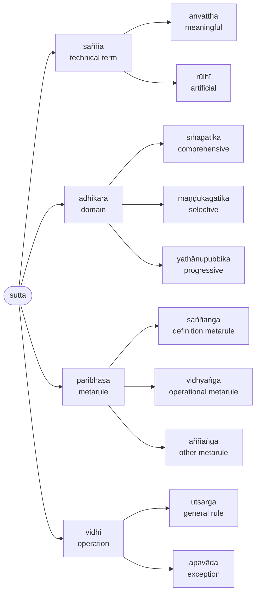
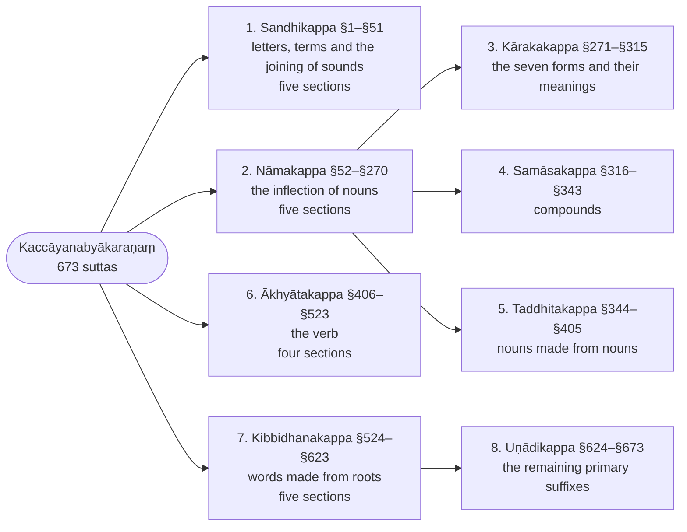

import { LinkCard } from '@astrojs/starlight/components';
import { Badge } from '@astrojs/starlight/components';

> Namo tassa bhagavato arahato sammāsambuddhassa

Homage to the Blessed One, the Worthy One, the Fully Enlightened One.

> Mahākaccāyanasaddāpāṭha

The text of Mahākaccāyana's words.

## Types of rules (`sutta`)

The text of Kaccāyana consists of a number of rules (`sutta`) divided into chapters (`kappa`). Each sutta is headed by its number, §1–§673, and in parentheses by the number of the rule in the [Padarūpasiddhi](/rupasiddhi/) that restates it; `(0)` marks a sutta the Padarūpasiddhi does not state. Rules are classified into the following:

* `saññā` (technical term)
  * `anvattha` (meaningful) <Badge text="anvattha" variant="note" />
  * `rūḷhī` (artificial)  <Badge text="rūḷhī" variant="note" />
* `adhikāra` (domain)
  * `sīhagatika` (comprehensive) <Badge text="sīhagatika" variant="caution" />
  * `maṇḍūkagatika` (selective) <Badge text="maṇḍūkagatika" variant="caution" />
  * `yathānupubbika` (progressive) <Badge text="yathānupubbika" variant="caution" />
* `paribhāsā` (metarule)
  * `saññaṅga` (definition metarule) <Badge text="saññaṅga" variant="tip" />
  * `vidhyaṅga` (operational metarule) <Badge text="vidhyaṅga" variant="tip" />
  * `aññaṅga` (other metarule) <Badge text="aññaṅga" variant="tip" />
* `vidhi` (operation)
  * `utsarga` (general rule) <Badge text="utsarga" variant="success" />
  * `apavāda` (exception) <Badge text="apavāda" variant="success" />

:::note[The kinds of rule]
The classification above as a tree; the badge on each sutta heading names its kind.

:::

## Table of Contents

:::note[The eight chapters]
The Kaccāyana's 673 suttas fall into eight chapters; the Chaṭṭha Saṅgāyana edition counts the third to fifth as further sections of the noun chapter and the eighth as a section of the seventh.

:::

<LinkCard
  title="1. Sandhikappa (`sandhi` chapter)"
  href="1-sandhikappa"
  description="`sandhi` is derived from `saṃ` + `dhā` meaning “putting together” and is used to refer to the transformation that result from the joining together of two words (or two parts of a word) for the sake of euphony."
/>

<LinkCard
  title="2. Nāmakappa (Noun chapter)"
  href="2-namakappa"
  description='nāma` means "name" and in this text it is used to refer to "nouns". This chapter talks about the different types of nouns and how they are inflected to form words that are used in sentences.'
/>

<LinkCard
  title="3. Kārakakappa (Kāraka chapter)"
  href="3-karakakappa"
  description="The kāraka chapter defines the relations a noun bears to the action of its sentence — agent, object, instrument, recipient, source, owner and location — and assigns the seven inflection forms to them."
/>

<LinkCard
  title="4. Samāsakappa (Compound chapter)"
  href="4-samasakappa"
  description="The samāsa chapter defines the compound and its six kinds — abyayībhāva, kammadhāraya, digu, tappurisa, bahubbīhi, dvanda — and the changes the members undergo."
/>

<LinkCard
  title="5. Taddhitakappa (Secondary derivation chapter)"
  href="5-taddhitakappa"
  description="The taddhita chapter gives the suffixes added to nouns to form new nouns — of descent, relation, possession, abstraction, comparison and number — and the sound changes that accompany them."
/>

<LinkCard
  title="6. Ākhyātakappa (Verb chapter)"
  href="6-akhyatakappa"
  description="The ākhyāta chapter treats the finite verb: its persons and voices, the eight sets of endings for tense and mood, the conjugation classes and their suffixes, and the changes roots undergo."
/>

<LinkCard
  title="7. Kibbidhānakappa (Primary derivation chapter)"
  href="7-kibbidhanakappa"
  description="The kibbidhāna chapter gives the kita suffixes added directly to roots — agent nouns, participles, infinitives, absolutives, gerundives — and the changes of the root before them."
/>

<LinkCard
  title="8. Uṇādikappa (Uṇādi suffixes chapter)"
  href="8-unadikappa"
  description="The uṇādi chapter gives the remaining primary suffixes — u, ṇu, yu, tu, ta, tha, ma, ra, ṇa and the rest — with the words they form."
/>
