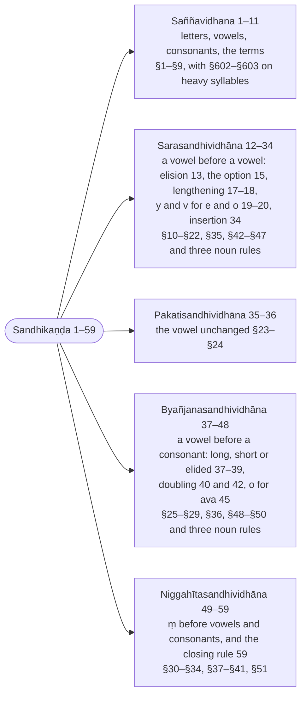

import { LinkCard } from "@astrojs/starlight/components";

:::note
The first section of the Padarūpasiddhi gathers Kaccāyana's definitions (`saññā`) and the sandhi rules of the Sandhikappa in Buddhappiya's own order — vowel sandhi, the cases where the vowel stays unchanged (`pakati`), consonant sandhi, niggahīta sandhi — and derives every example word it cites, quoting the rules by their wording. Each sutta carries the Kaccāyana number it corresponds to and a card to the Kaccāyana page, where the rule's own analysis, examples and counter-examples are.

:::

:::note[The five parts of the Sandhikaṇḍa]
Buddhappiya's order for the sandhi rules, with the Rūpasiddhi numbers and the Kaccāyana rules each part draws on.

:::

> Tattha jinasāsanādhigamassa akkharakosallamūlakattā taṃ sampādetabbanti dassetuṃ abhidheyyappayojanavākyamidamuccate.

There [after the opening verses], since the understanding of the Conqueror's teaching has skill in letters (`akkharakosalla`) as its root, this sentence, which states the subject-matter (`abhidheyya`) and the purpose (`payojana`) [of the grammar], is spoken in order to show that that [skill] is to be acquired.

---

### 1 (§1): Attho akkharasaññāto (Meaning is represented by `akkhara`) :badge[sīhagatika]{variant=caution}

:::tip[Kaccāyana]
<LinkCard title="§1 (1): Attho akkharasaññāto" href="/kaccayana/1-sandhikappa#m1" description="Meaning is represented by `akkhara`" />
:::

> Yo koci lokiyalokuttarādibhedo vacanattho, so sabbo akkhareheva saññāyate. Sithiladhanitādiakkharavipattiyañhi atthassa dunnayatā hoti, tasmā akkharakosallaṃ bahūpakāraṃ buddhavacanesu, ettha padānipi akkharasannipātarūpattā akkharesveva saṅgayhanti.

Whatever meaning of a word there is, of the kinds worldly (`lokiya`), supramundane (`lokuttara`) and the rest — all of it is made known (`saññāyate`) only through letters (`akkhara`). For when there is a fault in a letter — unaspirated (`sithila`), aspirated (`dhanita`) and the like — the meaning becomes hard to make out; therefore skill in letters is of great help in the words of the Buddha. Here words (`pada`) too, since in form they are collections of letters, are included just under "letters".

:::tip[Examples]

Words that differ only in an unaspirated and an aspirated letter:

| lemma | inflected | meaning |
| ----- | --------- | ------- |
| 🚹①⨀(gata) | gato | gone |
| 🚻①⨀(ghata) | ghataṃ | ghee |
| 🚹①⨀(kara) | karo | a hand; a doer |
| 🚹①⨀(khara) | kharo | rough, harsh |

:::

> Tasmā akkharakosallaṃ, sampādeyya hitatthiko; \
> Upaṭṭhahaṃ garuṃ sammā, uṭṭhānādīhi pañcahi.

Therefore one who seeks his welfare should acquire skill in letters, \
attending the teacher rightly with the five [duties] beginning with rising.

---

## Saññāvidhāna (Definitions)

> Tatthādo tāva saddalakkhaṇe vohāraviññāpanatthaṃ saññāvidhānamārabhīyate.

There, first of all, in order to make known the technical usage (`vohāra`) in the science of words (`saddalakkhaṇa`), the assignment of technical terms (`saññāvidhāna`) is begun.

---

### 2 (§2): Akkharāpādayo ekacattālīsaṃ (41 akkhara starting with `a`) :badge[anvattha]{variant=note}

:::tip[Kaccāyana]
<LinkCard title="§2 (2): Akkharāpādayo ekacattālīsaṃ" href="/kaccayana/1-sandhikappa#m2" description="41 akkhara starting with `a`" />
:::

> Akkharā api ādayo ekacattālīsaṃ, te ca kho jinavacanānurūpā akārādayo niggahītantā ekacattālīsamattā vaṇṇā paccekaṃ akkharā nāma honti. Taṃ yathā – a[^1] ā i ī u ū e o, ka kha ga gha ṅa, ca cha ja jha ña, ṭa ṭha ḍa ḍha ṇa, ta tha da dha na, pa pha ba bha ma, ya ra lava sa ha ḷa aṃ-iti akkharā.

[^1]: CST4 prints the list from `ā`, dropping the `a` that heads the forty-one letters; it is supplied from the sutta's own `akārādayo`.

The letters (`akkhara`) too, beginning with `a`, are forty-one; and those forty-one sounds (`vaṇṇa`) indeed, suited to the Conqueror's word, from `a` to the `niggahīta`, are each called `akkhara`. Namely: a ā i ī u ū e o, ka kha ga gha ṅa, ca cha ja jha ña, ṭa ṭha ḍa ḍha ṇa, ta tha da dha na, pa pha ba bha ma, ya ra la va sa ha ḷa, aṃ — these are the letters.

> Nakkharantīti akkharā, a ādi yesaṃ te ādayo. Akārādīnamanukkamo panesa ṭhānādikkamasannissito, tathā hi ṭhānakaraṇappayatanehi vaṇṇā jāyante, tattha cha ṭhānāni kaṇṭhatālumuddhadantaoṭṭhanāsikāvasena.

They are `akkhara` because they do not wear away (`na kharanti`); `ādayo` are those whose beginning is `a`. And this sequence of `a` and the rest rests on the sequence of place (`ṭhāna`) and so on: for sounds are produced by place, organ (`karaṇa`) and effort (`payatana`). Of these, the places are six: throat, palate, head, teeth, lips and nose.

> Tattha – a vaṇṇa ka vagga ha kārā kaṇṭhajā.

Of these: the `a`-vaṇṇa, the `ka`-group and `ha` are born in the throat.

> I vaṇṇa ca vagga ya kārā tālujā. Ṭa vagga ra kāra ḷa kārā muddhajā. Ta vagga la kāra sa kārā dantajā. U vaṇṇa pa vaggā oṭṭhajā. E kāro kaṇṭhatālujo. O kāro kaṇṭhoṭṭhajo.

The `i`-vaṇṇa, the `ca`-group and `ya` are born at the palate. The `ṭa`-group, `ra` and `ḷa` are born at the head. The `ta`-group, `la` and `sa` are born at the teeth. The `u`-vaṇṇa and the `pa`-group are born at the lips. `e` is born at throat and palate. `o` is born at throat and lips.

> Va kāro dantoṭṭhajo.

`va` is born at teeth and lips.

> Niggahītaṃ nāsikaṭṭhānajaṃ.

The `niggahīta` is born at the place of the nose.

> Ṅa ña ṇa na mā sakaṭṭhānajā, nāsikaṭṭhānajā cāti.

`ṅa`, `ña`, `ṇa`, `na` and `ma` are born both at their own place and at the place of the nose.

:::tip[Examples]

The forty-one letters by place of articulation:

| place (`ṭhāna`) | letters |
| --- | --- |
| throat (`kaṇṭha`) | a ā, ka kha ga gha ṅa, ha |
| palate (`tālu`) | i ī, ca cha ja jha ña, ya |
| head (`muddha`) | ṭa ṭha ḍa ḍha ṇa, ra, ḷa |
| teeth (`danta`) | ta tha da dha na, la, sa |
| lips (`oṭṭha`) | u ū, pa pha ba bha ma |
| throat and palate | e |
| throat and lips | o |
| teeth and lips | va |
| nose (`nāsikā`) | aṃ; and ṅa ña ṇa na ma, which are also born at their own place |

:::

> Ha kāraṃ pañcameheva, antaṭṭhāhi ca saṃyutaṃ; \
> Orasanti vadantettha, kaṇṭhajaṃ tadasaṃyutaṃ.

`ha` joined just with the fifth [letters] and with the semivowels (`antaṭṭha`) \
they here call chest-born (`orasa`); unjoined, it is throat-born.

> Karaṇaṃ jivhāmajjhaṃ tālujānaṃ, jivhopaggaṃ muddhajānaṃ, jivhāggaṃ dantajānaṃ, sesā sakaṭṭhānakaraṇā.

The organ (`karaṇa`) is the middle of the tongue for those born at the palate, the part near the tip of the tongue for those born at the head, the tip of the tongue for those born at the teeth; the rest have their own place as organ.

> Payatanaṃ saṃvutādikaraṇaviseso. Saṃvutattama kārassa, vivaṭattaṃ sesasarānaṃ sa kāraha kārānañca, phuṭṭhaṃ vaggānaṃ, īsaṃphuṭṭhaṃ yaralavānanti.

Effort (`payatana`) is the particular manner of the organ: closed (`saṃvuta`) and so on. Closure belongs to `a`; openness (`vivaṭa`) to the other vowels and to `sa` and `ha`; contact (`phuṭṭha`) to the group letters; slight contact (`īsaṃphuṭṭha`) to `ya`, `ra`, `la` and `va`.

> Evaṃ ṭhānakaraṇappayatanasutikālabhinnesu akkharesu sarā nissayā, itare nissitā. Tattha –

Thus, among the letters, which differ in place, organ, effort, sound (`suti`) and duration (`kāla`), the vowels are the support (`nissaya`) and the others the supported (`nissita`). On this –

> Nissayādo sarā vuttā, byañjanā nissitā tato; \
> Vaggekajā bahuttādo, tato ṭhānalahukkamā.

The vowels are stated first, as the support, and then the consonants, the supported; \
the group letters and then the single-born, for their greater number and so on; and thereafter in the order of place and of lightness.

> Vuttañca –

And it is said:

> ‘‘Pañcannaṃ pana ṭhānānaṃ, paṭipāṭivasāpi ca; \
> Nissayādippabhedehi, vutto tesamanukkamo’’ti.

"And by way of the sequence of the five places too, \
and by the distinctions of support and the rest, their order has been stated."

> Ekenādhikā cattālīsaṃ ekacattālīsaṃ, etena gaṇanaparicchedena –

Forty exceeded by one is forty-one; by this delimitation of the number –

> Adhikakkharavantāni, ekatālīsato ito; \
> Na buddhavacanānīti, dīpetācariyāsabho.

[Texts] that have more letters than these forty-one \
are not the word of the Buddha — so the bull among teachers makes known.[^2]

> Api ggahaṇaṃ heṭṭhā vuttānaṃ apekkhākaraṇatthaṃ.

The word `api` ("too") is for the purpose of referring back to those [letters] stated before.

[^2]: [Rachiwong (1995)](/rupasiddhi/rachiwong) reads this verse as aimed at the forty-three letters of the Moggallāna grammar; here the bull among teachers is Kaccāyana and the verse glosses his `ekacattālīsaṃ`.

---

### 3 (§3): Tatthodantā sarā aṭṭha ([From `akkhara`] eight ending with `o`: `sara`) :badge[anvattha]{variant=note}

:::tip[Kaccāyana]
<LinkCard title="§3 (3): Tatthodantā sarā aṭṭha" href="/kaccayana/1-sandhikappa#m3" description="[From `akkhara`] eight ending with `o`: `sara`" />
:::

> Tattha tesu akkharesu a kārādīsu o kārantā aṭṭha akkharā sarā nāma honti. Taṃ yathā – a ā i ī u ū e o-iti sarā.

There, among those letters beginning with `a`, the eight letters that end with `o` are called `sara` (vowels). Namely: a ā i ī u ū e o — these are the vowels.

:::tip[Examples]

| `sara` | measure | `rassa` \| `dīgha` |
| --- | --- | --- |
| a | one | short |
| ā | two | long |
| i | one | short |
| ī | two | long |
| u | one | short |
| ū | two | long |
| e | two | long |
| o | two | long |

:::

> O anto yesaṃ te odantā, da kāro sandhijo, saranti gacchantīti sarā, byañjane sārentītipi sarā.

Those whose end is `o` are `odantā`; the `d` is born of sandhi. They are `sara` because they go (`saranti`), [that is,] move; or again `sara` because they make the consonants move (`sārenti`).

> ‘‘Tatthā’’ti vattate.

`Tattha` ("among these") continues.

---

### 4 (§4): Lahumattā tayo rassā (3 short vowels: `rassa`) :badge[anvattha]{variant=note}

:::tip[Kaccāyana]
<LinkCard title="§4 (4): Lahumattā tayo rassā" href="/kaccayana/1-sandhikappa#m4" description="3 short vowels: `rassa`" />
:::

> Tattha aṭṭhasu saresu lahumattā tayo sarā rassā nāma honti. Taṃ yathā – a i u-iti rassā.

There, among the eight vowels, the three vowels of light measure are called `rassa` (short). Namely: a i u — these are the short vowels.

:::tip[Examples]

| `rassa` | measure | as in |
| --- | --- | --- |
| a | one | 🚹①⨀(nara) naro, a man |
| i | one | 🚹①⨀(aggi) aggi, fire |
| u | one | 🚹①⨀(bhikkhu) bhikkhu, a monk |

:::

> Lahukā mattā pamāṇaṃ yesaṃ te lahumattā, mattā saddo cettha accharāsaṅghātaakkhinimīlanasaṅkhātaṃ kālaṃ vadati, tāya mattāya e kamattā rassā, dvimattā dīghā, aḍḍhamattā byañjanā. Lahu ggahaṇañcettha chandasi diyaḍḍhamattassāpi gahaṇatthaṃ. Rassakālayogato rassā, rassakālavanto vā rassā.

Those whose measure (`mattā`), their quantity, is light are `lahumattā`. And the word `mattā` here denotes the time reckoned as a snap of the fingers or a blink of the eye; by that measure the short vowels have one measure, the long ones two measures, the consonants half a measure. And the word `lahu` ("light") here is for the inclusion, in verse (`chandasi`), even of [a vowel] of one and a half measures. They are `rassa` because of their connection with a short time, or `rassa` because they possess a short time.

> Sararassa ggahaṇāni ca vattante.

The words `sara` and `rassa` also continue.

---

### 5 (§5): Aññe dīghā (Other [`sarā`] are `dīgha`) :badge[anvattha]{variant=note}

:::tip[Kaccāyana]
<LinkCard title="§5 (5): Aññe dīghā" href="/kaccayana/1-sandhikappa#m5" description="Other [`sarā`] are `dīgha`" />
:::

> Tattha aṭṭhasu saresu rassehi aññe dvimattā pañca sarā dīghā nāma honti. Taṃ yathā – ā ī ū e o-iti dīghā.

There, among the eight vowels, the five vowels other than the short ones, having two measures, are called `dīgha` (long). Namely: ā ī ū e o — these are the long vowels.

> Añña ggahaṇaṃ diyaḍḍhamattikānampi saṅgahaṇatthaṃ. Dīghakāle niyuttā, tabbanto vā dīghā. Kvaci saṃyogapubbā ekārokārā rassā iva vuccante. Yathā – ettha, seyyo, oṭṭho, sotthi.

The word `añña` ("other") is used so as to include also [vowels] of one and a half measures. They are `dīgha` because they are set in a long time, or because they possess it. In some places (`kvaci`) `e` and `o` standing before a conjunct are pronounced as if they were short. For example: `ettha`, `seyyo`, `oṭṭho`, `sotthi`.

:::tip[Examples]

| lemma | inflected | meaning |
| ----- | --------- | ------- |
| 🔼(ettha) | ettha | here — `e` before `tth` |
| 🚹①⨀(seyya) | seyyo | better — `e` before `yy` |
| 🚹①⨀(oṭṭha) | oṭṭho | a lip; a camel — `o` before `ṭṭh` |
| 🚺①⨀(sotthi) | sotthi | safety — `o` before `tth` |

:::

> Kvacī ti kiṃ? Maṃ ce tvaṃ nikhaṇaṃ vane. Putto tyāhaṃ mahārāja.

Why `kvaci`? [Because of] `maṃ ce tvaṃ nikhaṇaṃ vane`, `putto tyāhaṃ mahārāja`.

:::danger[Counter-examples]

The `e` of `ce` before `tv` and the `o` of `putto` before `ty` keep their two measures:

> `mañce tvaṃ nikhaṇaṃ vane` \
> [(23J 22.1.1: Mūgapakkhajātaka)](https://tipitaka2500.github.io/tipitaka/23J/22/22.1/22.1.1#1319) \
⚧️②⨀(amha) 🔼(ce) ⚧️①⨀(tumha) 🚹①⨀(nikhaṇanta) 🚻⑦⨀(vana) \
me | if | you | burying | in the forest

> `putto tyāhaṃ mahārāja` \
> [(22J 1.1.7: Kaṭṭhahārijātaka)](https://tipitaka2500.github.io/tipitaka/22J/1/1.1/1.1.7#14) \
🚹①⨀(putta) ⚧️⑥⨀(tumha) ⚧️①⨀(amha) 🚹⓪⨀(mahārāja) \
son | your | I [am] | great king

:::

---

### 6 (§602): Dumhi garu (The syllable before a conjunct is `garu`, heavy) :badge[anvattha]{variant=note}

:::tip[Kaccāyana]
<LinkCard title="§602 (6): Dumhi garu" href="/kaccayana/7-kibbidhanakappa#m602" description="The syllable before a conjunct is `garu`, heavy" />
:::

> Dvinnaṃ samūho du, tasmiṃ dumhi. Saṃyogabhūte akkhare pare yo pubbo rassakkharo, so garusañño hoti. Yathā – datvā, hitvā, bhutvā.

A group of two is `du`; `dumhi` [is] "in that". When a letter that is a conjunct (`saṃyoga`) follows, the short letter that precedes receives the designation `garu` (heavy). For example: `datvā`, `hitvā`, `bhutvā`.

:::tip[Examples]

| lemma | inflected | meaning |
| ----- | --------- | ------- |
| 🔽(√dā + tvā) | datvā | having given — short `da` heavy before `tv` |
| 🔽(√hā + tvā) | hitvā | having abandoned — short `hi` heavy before `tv` |
| 🔽(√bhuja + tvā) | bhutvā | having eaten — short `bhu` heavy before `tv` |

:::

> ‘‘Garū’’ti vattate.

`garu` continues.

---

### 7 (§603): Dīgho ca (And a long vowel is `garu`, heavy) :badge[anvattha]{variant=note}

:::tip[Kaccāyana]
<LinkCard title="§603 (7): Dīgho ca" href="/kaccayana/7-kibbidhanakappa#m603" description="And a long vowel is `garu`, heavy" />
:::

> Dīgho ca saro garusañño hoti. Yathā – nāvā, nadī, vadhū, dve, tayo. Garukato añño ‘‘lahuko’’ti veditabbo.

And a long vowel receives the designation `garu`. For example: `nāvā`, `nadī`, `vadhū`, `dve`, `tayo`. What is other than a heavy one is to be understood as `lahuka` (light).

:::tip[Examples]

| lemma | inflected | meaning |
| ----- | --------- | ------- |
| 🚺①⨀(nāvā) | nāvā | a boat — `ā` heavy |
| 🚺①⨀(nadī) | nadī | a river — `ī` heavy |
| 🚺①⨀(vadhū) | vadhū | a young woman — `ū` heavy |
| ⚧️①⨂(dvi) | dve | two — `e` heavy |
| 🚹①⨂(ti) | tayo | three — `o` heavy; `ta` before it light |

:::

---

### 8 (§6): Sesā byañjanā (Remaining are `byañjanā`) :badge[anvattha]{variant=note}

:::tip[Kaccāyana]
<LinkCard title="§6 (8): Sesā byañjanā" href="/kaccayana/1-sandhikappa#m6" description="Remaining are `byañjanā`" />
:::

> Ṭhapetvā aṭṭha sare sesā aḍḍhamattā akkharā ka kārādayo niggahītantā tettiṃsa byañjanā nāma honti. Vuttehi aññe sesā. Byañjīyati etehi atthoti byañjanā. Taṃ yathā – ka kha ga gha ṅa, ca cha ja jha ña, ṭa ṭha ḍa ḍha ṇa, ta tha da dha na, pa pha ba bha ma, ya ra lava sa ha ḷa aṃ-iti byañjanā. Ka kārādīsvakāro uccāraṇattho.

Setting aside the eight vowels, the remaining letters of half a measure, from `ka` to the `niggahīta`, thirty-three, are called `byañjana` (consonants). "Remaining" means other than those already stated. They are `byañjana` because meaning is made manifest (`byañjīyati`) by them. Namely: ka kha ga gha ṅa, ca cha ja jha ña, ṭa ṭha ḍa ḍha ṇa, ta tha da dha na, pa pha ba bha ma, ya ra la va sa ha ḷa, aṃ — these are the consonants. The `a` in `ka` and the rest is for the sake of pronunciation.

:::tip[Examples]

| class | letters | count |
| --- | --- | --- |
| the five groups (`vagga`) | ka kha ga gha ṅa, ca cha ja jha ña, ṭa ṭha ḍa ḍha ṇa, ta tha da dha na, pa pha ba bha ma | 25 |
| the ungrouped (`avagga`) | ya ra la va sa ha ḷa | 7 |
| the `niggahīta` | aṃ | 1 |

:::

> ‘‘Byañjanā’’ti vattate.

`byañjanā` continues.

---

### 9 (§7): Vaggā pañcapañcaso mantā (`vagga`: 5 by 5 [byañjane] ending with `ma`) :badge[anvattha]{variant=note}

:::tip[Kaccāyana]
<LinkCard title="§7 (9): Vaggā pañcapañcaso mantā" href="/kaccayana/1-sandhikappa#m7" description="`vagga`: 5 by 5 [byañjane] ending with `ma`" />
:::

> Tesaṃ kho byañjanānaṃ ka kārādayo ma kārantā pañcavīsati byañjanā pañcapañcavibhāgena vaggā nāma honti. Taṃ yathā – ka kha ga gha ṅa, ca cha ja jha ña, ṭa ṭha ḍa ḍha ṇa, ta tha da dha na, pa pha ba bha ma-iti vaggā.

Of those consonants indeed, the twenty-five from `ka` to `ma`, divided five by five, are called `vagga` (groups). Namely: ka kha ga gha ṅa, ca cha ja jha ña, ṭa ṭha ḍa ḍha ṇa, ta tha da dha na, pa pha ba bha ma — these are the groups.

:::tip[Examples]

| group | first | second | third | fourth | fifth |
| --- | --- | --- | --- | --- | --- |
| `ka`-vagga | ka | kha | ga | gha | ṅa |
| `ca`-vagga | ca | cha | ja | jha | ña |
| `ṭa`-vagga | ṭa | ṭha | ḍa | ḍha | ṇa |
| `ta`-vagga | ta | tha | da | dha | na |
| `pa`-vagga | pa | pha | ba | bha | ma |

:::

> Te pana paṭhamakkharavasena ka vaggaca vaggādivohāraṃ gatā, vaggo ti samūho, tattha pañcapañcavibhāgenāti vā pañca pañca etesamatthīti vā pañcapañcaso, mo anto yesaṃ te mantā.

And these have come to be called, after their first letter, the `ka`-group, the `ca`-group and so on. `vagga` means a collection. In [the sutta], `pañcapañcaso` means either "by a division of five each" or "those which have five each"; `mantā` are those whose end is `ma`.

---

### 10 (§8): Aṃiti niggahītaṃ (`aṃ` represents `niggahita`) :badge[anvattha]{variant=note}

:::tip[Kaccāyana]
<LinkCard title="§8 (10): Aṃ iti niggahitaṃ" href="/kaccayana/1-sandhikappa#m8" description="`aṃ` represents `niggahita`" />
:::

> A kāro uccāraṇattho, iti saddo panānantaravuttanidassanattho, aṃiti yaṃ a kārato paraṃ vuttaṃ bindu, taṃ niggahītaṃ nāma hoti. Rassassaraṃ nissāya gayhati, karaṇaṃ niggahetvā gayhatīti vā niggahītaṃ.

The `a` is for pronunciation; the word `iti`, moreover, serves to point to what has just been uttered: the dot (`bindu`) that is uttered after the `a` in `aṃ` is called `niggahīta`. It is `niggahīta` because it is pronounced (`gayhati`) in dependence on a short vowel, or because it is pronounced with the organ (`karaṇa`) checked (`niggahetvā`).

:::tip[Examples]

The `niggahīta` after each of the three short vowels:

| lemma | inflected | meaning |
| ----- | --------- | ------- |
| 🚹②⨀(buddha) | buddhaṃ | the Buddha — `aṃ` |
| 🚹②⨀(aggi) | aggiṃ | the fire — `iṃ` |
| 🚹②⨀(bhikkhu) | bhikkhuṃ | the monk — `uṃ` |

:::

> Karaṇaṃ niggahetvāna, mukhenāvivaṭena yaṃ; \
> Vuccate niggahītanti, vuttaṃ bindu sarānugaṃ.

That which is spoken with the organ checked and with the mouth not opened \
is called `niggahīta`: the dot pronounced following a vowel.

> Idha avuttānaṃ parasamaññānampi payojane sati gahaṇatthaṃ paribhāsamāha.

So that the technical terms of other [grammars] that are not stated here may also be taken up when there is a use for them, he states a `paribhāsā` (an interpretive rule).

---

### 11 (§9): Parasamaññā payoge (Other grammatical terms when applicable) :badge[saññaṅga]{variant=tip}

:::tip[Kaccāyana]
<LinkCard title="§9 (11): Parasamaññā payoge" href="/kaccayana/1-sandhikappa#m9" description="Other grammatical terms when applicable" />
:::

> Yā ca pana parasmiṃ sakkataganthe, paresaṃ vā veyyākaraṇānaṃ samaññā ghosāghosalopasavaṇṇasaṃyogaliṅgādikā, tā payoge sati etthāpi yujjante.

And whatever technical terms (`samaññā`) there are in another [treatise], the Sanskrit book, or belonging to other grammarians — `ghosa`, `aghosa`, `lopa`, `savaṇṇa`, `saṃyoga`, `liṅga` and the rest — these are applied here too when there is a use for them.

> Parasmiṃ, paresaṃ vā samaññā parasamaññā, veyyākaraṇe, veyyākaraṇamadhītānaṃ vā samaññātyattho. Payujjanaṃ payogo, viniyogo.

`parasamaññā` are terms in another [work], or terms of others — that is, terms in a grammar, or of those who have studied grammar. `payoga` is applying, employment.

> Tattha vaggānaṃ paṭhamadutiyā, sa kāro ca aghosā. Vaggānaṃ tatiyacatutthapañcamā, ya ra lava ha ḷā cāti ekavīsati ghosā nāma.

Among these, the first and second [letters] of the groups, and `sa`, are `aghosa` (unvoiced). The third, fourth and fifth of the groups, and `ya ra la va ha ḷa` — twenty-one — are called `ghosa` (voiced).

> Ettha ca vaggānaṃ dutiyacatutthā dhanitā tipi vuccanti, itare sithilā ti. Vināso lopo. Rassassarā sakadīghehi aññamaññaṃ savaṇṇā nāma, ye sarūpā tipi vuccanti. Sarānantaritāni byañjanāni saṃyogo. Dhātuppaccayavibhattivajjitamatthavaṃ liṅgaṃ. Vibhatyantaṃ padaṃ. Iccevamādi.

And here the second and fourth of the groups are also called `dhanita` (aspirated), the others `sithila` (unaspirated). `lopa` (elision) is disappearance. The short vowels together with their own long ones are mutually `savaṇṇa` (homogeneous), and these are also called `sarūpa` (of the same form). Consonants not separated by a vowel are a `saṃyoga` (conjunct). A meaningful [element] other than a root, a suffix or an inflection is a `liṅga` (stem). What ends in an inflection is a `pada` (word). And so on.

:::tip[Examples]

The borrowed terms as Buddhappiya defines them:

| term | definition | e.g. |
| --- | --- | --- |
| `aghosa` (unvoiced) | first and second of each group, and `sa` | ka kha, ca cha, ṭa ṭha, ta tha, pa pha, sa — eleven |
| `ghosa` (voiced) | third, fourth and fifth of each group, and ya ra la va ha ḷa | ga gha ṅa … ba bha ma, ya ra la va ha ḷa — twenty-one |
| `dhanita` (aspirated) | second and fourth of each group | kha gha, cha jha, ṭha ḍha, tha dha, pha bha |
| `sithila` (unaspirated) | the other group letters | ka ga ṅa, ca ja ña, … |
| `lopa` (elision) | disappearance of a letter | `lok~~a~~ + aggapuggalo` at [13 (§12): Sarā sare lopaṃ](/rupasiddhi/1-sandhikanda#r13) |
| `savaṇṇa` = `sarūpa` (homogeneous) | a short vowel and its own long | a–ā, i–ī, u–ū |
| `saṃyoga` (conjunct) | consonants with no vowel between them | `tv` in `datvā`, `tth` in `ettha` |
| `liṅga` (stem) | a meaningful element that is not a root, suffix or inflection | `purisa` in `puriso` |
| `pada` (word) | what ends in an inflection | `puriso` |

:::

---

> _Iti saññāvidhānaṃ._

Thus the assignment of technical terms.

---

## Sarasandhividhāna (Vowel sandhi)

> Atha sarasandhi vuccate.

Now vowel sandhi (`sarasandhi`) is stated.

> Loka aggapuggalo, paññā indriyaṃ, tīṇi imāni, no hi etaṃ, bhikkhunī ovādo, mātu upaṭṭhānaṃ, sametu āyasmā, abhibhū āyatanaṃ, dhanā me atthi, sabbe eva, tayo assu dhammā, asanto ettha na dissanti itīdha sarādisaññāyaṃ sabbasandhikaraṇaṭṭhāne byañjanaviyojanatthaṃ paribhāsamāha.

Here, in `loka aggapuggalo`, `paññā indriyaṃ`, `tīṇi imāni`, `no hi etaṃ`, `bhikkhunī ovādo`, `mātu upaṭṭhānaṃ`, `sametu āyasmā`, `abhibhū āyatanaṃ`, `dhanā me atthi`, `sabbe eva`, `tayo assu dhammā` and `asanto ettha na dissanti`, the designations `sara` and the rest having been made, he states a `paribhāsā` for the purpose of separating the consonant [from its vowel] at every place where sandhi is to be made.

---

### 12 (§10): Pubbamadhoṭhitamassaraṃ sarena viyojaye (In preceeding [word], detach vowel from vowelless [consonant]) :badge[vidhyaṅga]{variant=tip}

:::tip[Kaccāyana]
<LinkCard title="§10 (12): Pubbamadhoṭhita massaraṃ sarena viyojaye" href="/kaccayana/1-sandhikappa#m10" description="In preceeding [word], detach vowel from vowelless [consonant]" />
:::

> Sarenā ti nissakke karaṇavacanaṃ, sahayoge vā, sandhitabbe sarasahitaṃ pubbabyañjanaṃ anatikkamanto adhoṭhitamassarañca katvā sarato viyojayeti sarato byañjanaṃ viyojetabbaṃ. Ettha ca assara ggahaṇasāmatthiyena ‘‘byañjana’’nti laddhaṃ.

`sarena` is an instrumental form ③ in the sense of separation (`nissakka`), or in [the sense of] accompaniment (`sahayoga`). In [what is] to be joined, not passing over the preceding consonant together with its vowel, one should make it stand below (`adhoṭhita`) and vowelless (`assara`) and separate it from the vowel — that is, the consonant is to be separated from the vowel. And here, by the force of the word `assara` ("vowelless"), "consonant" is obtained.

:::tip[Examples]

The twelve phrases of the section's opening, with the final consonant of the first word detached from its vowel:

| words to be joined | separated by §10 |
| --- | --- |
| loka aggapuggalo | lok + a + aggapuggalo |
| paññā indriyaṃ | paññ + ā + indriyaṃ |
| tīṇi imāni | tīṇ + i + imāni |
| no hi etaṃ | no h + i + etaṃ |
| bhikkhunī ovādo | bhikkhun + ī + ovādo |
| mātu upaṭṭhānaṃ | māt + u + upaṭṭhānaṃ |
| sametu āyasmā | samet + u + āyasmā |
| abhibhū āyatanaṃ | abhibh + ū + āyatanaṃ |
| dhanā me atthi | dhanā m + e + atthi |
| sabbe eva | sabb + e + eva |
| tayo assu dhammā | tay + o + assu dhammā |
| asanto ettha na dissanti | asant + o + ettha na dissanti |

:::

---

### 13 (§12): Sarā sare lopaṃ (Vowel, before vowel, is elided) :badge[utsarga]{variant=success}

:::tip[Kaccāyana]
<LinkCard title="§12 (13): Sarā sare lopaṃ" href="/kaccayana/1-sandhikappa#m12" description="Vowel, before vowel, is elided" />
:::

> Sarā kho sabbepi sare pare ṭhite lopaṃ papponti. Lopo ti adassanaṃ anuccāraṇaṃ. Ettha sarā ti kāriyīniddeso. Bahuvacanaṃ panettha ekekasmiṃ sare pare bahūnaṃ lopañāpanatthaṃ. Sare ti nimittaniddeso, nimittasattamī cāyaṃ, nimittopādānasāmatthiyato vaṇṇakālabyavadhāne sandhikāriyaṃ na hoti. Lopa nti kāriyaniddeso, idaṃ pana suttaṃ upari paralopavidhānato pubbalopavidhānanti daṭṭhabbaṃ, evaṃ sabbattha sattamīniddese pubbasseva vidhi, na parassa vidhānanti veditabbaṃ.

Vowels indeed, even all of them, when a vowel stands next, undergo elision (`lopa`). `lopa` is non-appearance, non-pronunciation. Here `sarā` designates the thing operated on (`kāriyī`). And the plural here is for making known the elision of many [vowels] before each single following vowel. `sare` designates the condition (`nimitta`), and this is a locative ⑦ of condition (`nimittasattamī`); by the force of taking [the following vowel] as the condition, the sandhi operation does not take place when a letter or a [lapse of] time intervenes (`vaṇṇakālabyavadhāna`). `lopaṃ` designates the operation (`kāriya`). This sutta, moreover, is to be seen as prescribing the elision of the preceding [vowel], because the elision of the following one is prescribed further on; and so it is to be understood that everywhere, when the designation is in the locative, the operation is on the preceding [element] alone, and no operation is prescribed for the following one.

:::tip[Examples]

The elision applied to three of the phrases separated at [12 (§10): Pubbamadhoṭhitamassaraṃ sarena viyojaye](/rupasiddhi/1-sandhikanda#r12):

|     | loka + aggapuggalo              | rule |
| --- | ------------------------------- | ---- |
| →   | lok + (a) + (a) + ggapuggalo    | §10  |
| →   | lok + (~~a~~ + a) + ggapuggalo  | §12  |
| →   | (lok + a) + ggapuggalo          | §11  |
| →   | **lokaggapuggalo**              |      |

|     | tayo + assu                | rule |
| --- | -------------------------- | ---- |
| →   | tay + (o) + (a) + ssu      | §10  |
| →   | tay + (~~o~~ + a) + ssu    | §12  |
| →   | (tay + a) + ssu            | §11  |
| →   | **tayassu**                |      |

|     | dhanā me + atthi           | rule |
| --- | -------------------------- | ---- |
| →   | dhanā m + (e) + (a) + tthi | §10  |
| →   | dhanā m + (~~e~~ + a) + tthi | §12 |
| →   | dhanā (m + a) + tthi       | §11  |
| →   | **dhanā matthi**           |      |

:::

> ‘‘Assaraṃ, adhoṭhita’’nti ca vattate, siliṭṭhakathane paribhāsamāha.

`assaraṃ` and `adhoṭhitaṃ` also continue; for smooth utterance (`siliṭṭhakathana`) he states a `paribhāsā`.

---

### 14 (§11): Naye paraṃ yutte (To conclude, attach next) :badge[vidhyaṅga]{variant=tip}

:::tip[Kaccāyana]
<LinkCard title="§11 (14): Naye paraṃ yutte" href="/kaccayana/1-sandhikappa#m11" description="To conclude, attach next" />
:::

> Sararahitaṃ kho byañjanaṃ adhoṭhitaṃ parakkharaṃ naye yutte ṭhāneti paranayanaṃ kātabbaṃ. Ettha yutta ggahaṇaṃ niggahītanisedhanatthaṃ, tena ‘‘akkocchi maṃ avadhi ma’’ntiādīsu paranayanasandeho na hoti.

Indeed, a consonant deprived of its vowel, standing below, one should carry to the following letter in a fitting place (`yutte`): that is, the carrying-over to the following (`paranayana`) is to be done. Here the word `yutta` is for excluding the `niggahīta`; hence in `akkocchi maṃ avadhi maṃ` and the like there is no doubt about the carrying-over.

> Lokaggapuggalo, paññindriyaṃ, tīṇimāni, nohetaṃ, bhikkhunovādo, mātupaṭṭhānaṃ, sametāyasmā, abhibhāyatanaṃ, dhanā matthi, sabbeva, tayassu dhammā, asantettha na dissanti.

`lokaggapuggalo`, `paññindriyaṃ`, `tīṇimāni`, `nohetaṃ`, `bhikkhunovādo`, `mātupaṭṭhānaṃ`, `sametāyasmā`, `abhibhāyatanaṃ`, `dhanā matthi`, `sabbeva`, `tayassu dhammā`, `asantettha na dissanti`.

:::tip[Examples]

| words | elided by §12 | carried over by §11 | meaning |
| --- | --- | --- | --- |
| loka aggapuggalo | ~~a~~ | **lokaggapuggalo** | the foremost person in the world |
| paññā indriyaṃ | ~~ā~~ | **paññindriyaṃ** | the faculty of wisdom |
| tīṇi imāni | ~~i~~ | **tīṇimāni** | these three |
| no hi etaṃ | ~~i~~ | **nohetaṃ** | certainly not |
| bhikkhunī ovādo | ~~ī~~ | **bhikkhunovādo** | the exhortation of the nuns |
| mātu upaṭṭhānaṃ | ~~u~~ | **mātupaṭṭhānaṃ** | attending on one's mother |
| sametu āyasmā | ~~u~~ | **sametāyasmā** | let the venerable one agree |
| abhibhū āyatanaṃ | ~~ū~~ | **abhibhāyatanaṃ** | the base of mastery |
| dhanā me atthi | ~~e~~ | **dhanā matthi** | I have riches |
| sabbe eva | ~~e~~ | **sabbeva** | all indeed |
| tayo assu dhammā | ~~o~~ | **tayassu dhammā** | three things indeed |
| asanto ettha na dissanti | ~~o~~ | **asantettha na dissanti** | the bad are not seen here |

> `tayassu dhammā jahitā bhavanti` \
> [(18Kh 6: Ratanasutta)](https://tipitaka2500.github.io/tipitaka/18Kh/6#54) \
🚹①⨂(ti) 🔼(assu) 🚹①⨂(dhamma) 🚹①⨂(jahita) ▶️🤟⨂(bhavati) \
three | indeed | things | abandoned | are

> `asantettha na dissanti` \
> [(18Dh 21.8: Cūḷasubhaddāvatthu)](https://tipitaka2500.github.io/tipitaka/18Dh/21/21.8#327) \
🚹①⨂(asanta) 🔼(ettha) 🔼(na) 🔵▶️🤟⨂(dissati) \
the bad | here | not | are seen

> `sametāyasmā saṃghena` \
> [(1V 1.2.10: Saṃghabhedasikkhāpada)](https://tipitaka2500.github.io/tipitaka/1V/1/1.2/1.2.10#1679) \
⏯🤟⨀(sameti) 🚹①⨀(āyasmantu) 🚹③⨀(saṃgha) \
let … be reconciled | the venerable one | with the Saṅgha

:::

:::danger[Counter-example]

The `niggahīta` of `maṃ` is not carried to the following vowel:

> `akkocchi maṃ avadhi maṃ` \
> [(3V 10.2: Dīghāvuvatthu)](https://tipitaka2500.github.io/tipitaka/3V/10/10.2#1982) \
⏮🤟⨀(akkosati) ⚧️②⨀(amha) ⏮🤟⨀(vadhati) ⚧️②⨀(amha) \
he abused | me | he struck | me

:::

> Yassa idāni, saññā iti, chāyā iva, kathā eva kā, iti api, assamaṇī asi, cakkhu indriyaṃ, akataññū asi, ākāse iva, te api, vande ahaṃ, so ahaṃ, cattāro ime, vasalo iti, moggallāno āsi bījako, pāto evātīdha pubbalope sampatte ‘‘sare’’ti adhikāro, idha pana ‘‘atthavasā vibhattivipariṇāmo’’ti katvā ‘‘saro, saramhā, lopa’’nti ca vattamāne –

Here, in `yassa idāni`, `saññā iti`, `chāyā iva`, `kathā eva kā`, `iti api`, `assamaṇī asi`, `cakkhu indriyaṃ`, `akataññū asi`, `ākāse iva`, `te api`, `vande ahaṃ`, `so ahaṃ`, `cattāro ime`, `vasalo iti`, `moggallāno āsi bījako` and `pāto eva`, when the elision of the preceding [vowel] is due, `sare` is the governing word (`adhikāra`); but here, having applied [the maxim] "the inflection changes according to the sense" (`atthavasā vibhattivipariṇāmo`), and while `saro` [①], `saramhā` [⑤] and `lopaṃ` continue –

---

### 15 (§13): Vā paro asarūpā (Optionally, next dissimilar [vowel]) :badge[apavada]{variant=success}

:::tip[Kaccāyana]
<LinkCard title="§13 (15): Vā paro asarūpā" href="/kaccayana/1-sandhikappa#m13" description="Optionally, next dissimilar [vowel]" />
:::

> Asamānarūpamhā saramhā paro saro lopaṃ pappoti vā. Samānaṃ rūpaṃ assāti sarūpo, na sarūpo asarūpo, asavaṇṇo. Yasmā pana mariyādāyaṃ, abhividhimhi ca vattamāno ā upasaggo viya vā saddo dvidhā vattate, katthaci vikappe, katthaci yathāvavatthitarūpapariggahe, idha pana pacchime, tato niccamaniccamasantañca vidhimettha vā saddo dīpeti. ‘‘Naye paraṃ yutte’’ti paraṃ netabbaṃ.

After a vowel of dissimilar form, the following vowel optionally (`vā`) undergoes elision. `sarūpa` is that which has the same form; `asarūpa` is what is not `sarūpa`, non-homogeneous (`asavaṇṇa`). Now since, like the prefix `ā` used for an exclusive limit (`mariyādā`) and for an inclusive limit (`abhividhi`), the word `vā` is used in two ways — in some places for an open option (`vikappa`), in some places for the delimitation of forms as they are fixed (`yathāvavatthitarūpapariggaha`) — and here in the latter, therefore the word `vā` here indicates a mandatory (`nicca`), a non-mandatory (`anicca`) and a non-existent (`asanta`) operation. By [14 (§11): Naye paraṃ yutte](/rupasiddhi/1-sandhikanda#r14) the [consonant] is to be carried to the following.

> Yassadāni yassa idāni, saññāti saññā iti, chāyāva chāyā iva, kathāva kā kathā eva kā, itīpi iti api, assamaṇīsi assamaṇī asi. Cakkhundriya miti niccaṃ. Akataññūsi akataññū asi, ākāseva ākāse iva, tepi te api, vandehaṃ vande ahaṃ, sohaṃ so ahaṃ, cattārome cattāro ime, vasaloti vasalo iti, moggallānosi bījako moggallāno āsi bījako, pātova pāto eva.

`yassadāni` from `yassa idāni`, `saññāti` from `saññā iti`, `chāyāva` from `chāyā iva`, `kathāva kā` from `kathā eva kā`, `itīpi` from `iti api`, `assamaṇīsi` from `assamaṇī asi`. `cakkhundriyaṃ` — always (`niccaṃ`). `akataññūsi` from `akataññū asi`, `ākāseva` from `ākāse iva`, `tepi` from `te api`, `vandehaṃ` from `vande ahaṃ`, `sohaṃ` from `so ahaṃ`, `cattārome` from `cattāro ime`, `vasaloti` from `vasalo iti`, `moggallānosi bījako` from `moggallāno āsi bījako`, `pātova` from `pāto eva`.

:::tip[Examples]

| words | following vowel elided | result | domain |
| --- | --- | --- | --- |
| yassa idāni | ~~i~~ | **yassadāni** | `idāni` after `a`: the verse's first exception |
| saññā iti | ~~i~~ | **saññāti** | `iti` after `ā` |
| chāyā iva | ~~i~~ | **chāyāva** | `iva` after `ā` |
| kathā eva kā | ~~e~~ | **kathāva kā** | `eva` after `ā` |
| iti api | ~~a~~ | **itīpi** | with `ī` by [18 (§16): Pubbo ca](/rupasiddhi/1-sandhikanda#r18) |
| assamaṇī asi | ~~a~~ | **assamaṇīsi** | `anicca`: `assamaṇī asi` also stands |
| cakkhu indriyaṃ | ~~i~~ | **cakkhundriyaṃ** | `nicca`, Buddhappiya's own label |
| akataññū asi | ~~a~~ | **akataññūsi** | `anicca` |
| ākāse iva | ~~i~~ | **ākāseva** | `anicca` |
| te api | ~~a~~ | **tepi** | `anicca` |
| vande ahaṃ | ~~a~~ | **vandehaṃ** | `anicca` |
| so ahaṃ | ~~a~~ | **sohaṃ** | `anicca` |
| cattāro ime | ~~i~~ | **cattārome** | `anicca` |
| vasalo iti | ~~i~~ | **vasaloti** | `anicca`: the canon has `vasalo iti` |
| moggallāno āsi bījako | ~~ā~~ | **moggallānosi bījako** | `āsi`: the verse's second exception |
| pāto eva | ~~e~~ | **pātova** | `eva` after `o`: the second exception |

|     | yassa + idāni                | rule |
| --- | ---------------------------- | ---- |
| →   | yass + (a) + (i) + dāni      | §10  |
| →   | yass + (a + ~~i~~) + dāni    | §13  |
| →   | (yass + a) + dāni            | §11  |
| →   | **yassadāni**                |      |

|     | cakkhu + indriyaṃ                 | rule |
| --- | --------------------------------- | ---- |
| →   | cakkh + (u) + (i + n) + driyaṃ    | §10  |
| →   | cakkh + (u + ~~i~~) + n + driyaṃ  | §13  |
| →   | (cakkh + u + n) + driyaṃ          | §11  |
| →   | **cakkhundriyaṃ**                 |      |

|     | moggallāno + āsi                 | rule |
| --- | -------------------------------- | ---- |
| →   | moggallān + (o) + (ā) + si       | §10  |
| →   | moggallān + (o + ~~ā~~) + si     | §13  |
| →   | (moggallān + o) + si             | §11  |
| →   | **moggallānosi**                 |      |

> `yassadāni` \
> [(1V 1.1.3: Tatiyapārājikasikkhāpada)](https://tipitaka2500.github.io/tipitaka/1V/1/1.1/1.1.3#382) \
🚹⑥⨀(ya) 🔼(idāni) \
for whom | now

> `assamaṇīsi` \
> [(1V 1.1.2.2: Vinītavatthu)](https://tipitaka2500.github.io/tipitaka/1V/1/1.1/1.1.2/1.1.2.2#303) \
🚺①⨀(assamaṇī) ▶️🤘⨀(atthi) \
no nun | you are

> `akataññūsi` \
> [(18Dh 26.1: Pasādabahulabrāhmaṇavatthu)](https://tipitaka2500.github.io/tipitaka/18Dh/26/26.1#411) \
🚹①⨀(akataññū) ▶️🤘⨀(atthi) \
a knower of the unmade | you are

> `taṃ jaññā vasalo iti` \
> [(18Sn 1.7: Vasalasutta)](https://tipitaka2500.github.io/tipitaka/18Sn/1/1.7#136) \
🚹②⨀(ta) ⏯🤟⨀(jānāti) 🚹①⨀(vasala) 🔼(iti) \
him | one should know | an outcast | as

> `moggallānosi bījako` \
> [(23J 22.1.8: Mahānāradakassapajātaka)](https://tipitaka2500.github.io/tipitaka/23J/22/22.1/22.1.8#2676) \
🚹①⨀(moggallāna) ⏮🤟⨀(atthi) 🚹①⨀(bījaka) \
Moggallāna | was | Bījaka

> `pātova sannipatitvā` \
> [(20Ap1 1.3: Sāriputtattheraapadāna)](https://tipitaka2500.github.io/tipitaka/20Ap1/1/1.3#197) \
🔼(pāto) 🔼(eva) 🔽(sannipatitvā) \
early in the morning | just | having assembled

:::

> Idha na bhavati – pañcindriyāni, saddhindriyaṃ, sattuttamo, ekūnavīsati, yassete, sugatovādo, diṭṭhāsavo, diṭṭhogho, cakkhāyatanaṃ, taṃ kutettha labbhā iccādi.

Here it does not apply: `pañcindriyāni`, `saddhindriyaṃ`, `sattuttamo`, `ekūnavīsati`, `yassete`, `sugatovādo`, `diṭṭhāsavo`, `diṭṭhogho`, `cakkhāyatanaṃ`, `taṃ kutettha labbhā` and so on.

:::danger[Counter-examples]

The following vowel is not elided; the preceding one drops by [13 (§12): Sarā sare lopaṃ](/rupasiddhi/1-sandhikanda#r13):

| words | preceding vowel elided by §12 | result | never |
| --- | --- | --- | --- |
| pañca indriyāni | ~~a~~ | **pañcindriyāni** | pañcandriyāni |
| saddhā indriyaṃ | ~~ā~~ | **saddhindriyaṃ** | saddhāndriyaṃ |
| satta uttamo | ~~a~~ | **sattuttamo** | sattattamo |
| eka ūna vīsati | ~~a~~ | **ekūnavīsati** | ekanavīsati |
| yassa ete | ~~a~~ | **yassete** | yassate |
| sugata ovādo | ~~a~~ | **sugatovādo** | sugatavādo |
| diṭṭhi āsavo | ~~i~~ | **diṭṭhāsavo** | diṭṭhisavo |
| diṭṭhi ogho | ~~i~~ | **diṭṭhogho** | diṭṭhigho |
| cakkhu āyatanaṃ | ~~u~~ | **cakkhāyatanaṃ** | cakkhuyatanaṃ |
| kuto ettha | ~~o~~ | **kutettha** | kutottha |

> `taṃ kutettha labbhā` \
> [(1V Veranjakanda: Verañjakaṇḍa)](https://tipitaka2500.github.io/tipitaka/1V/1/Veranjakanda#36) \
🚻①⨀(ta) 🔼(kuto) 🔼(ettha) 🔼(labbhā) \
that | whence | here | could be had

> `yassete` \
> [(12S1 10.1.12: Āḷavakasutta)](https://tipitaka2500.github.io/tipitaka/12S1/10/10.1/10.1.12#1520) \
🚹⑥⨀(ya) 🚹①⨂(eta) \
whose | these

:::

> Bhavati ca vavatthitavibhāsāya.

And on the restricted option (`vavatthitavibhāsā`) there is [this]:

> Avaṇṇato sarodānī-tīvevādiṃ vinā paro; \
> Na luppataññato dīgho, āsevādivivajjito.

After an `a`-vaṇṇa the following vowel is not elided, except `idāni`, `iti`, `iva`, `eva` and the like; \
after another [vowel] a following long vowel is not elided, leaving aside `āsi`, `eva` and the like.

> Bandhussa iva, upa ikkhati, upa ito, ava icca, jina īritaṃ, na upeti, canda udayo, yathā udake itīdha pubbāvaṇṇassarānaṃ lope kate ‘‘paro, asarūpe’’ti ca vattate, tathā ‘‘ivaṇṇo yaṃ navā’’ti ito ivaṇṇa ggahaṇañca, ‘‘vamodudantāna’’nti ito u ggahaṇañca sīhagatiyā idhānuvattetabbaṃ.

Here, in `bandhussa iva`, `upa ikkhati`, `upa ito`, `ava icca`, `jina īritaṃ`, `na upeti`, `canda udayo` and `yathā udake`, when the elision of the preceding `a`-vaṇṇa vowels has been made, `paro` and `asarūpe` continue; likewise the word `ivaṇṇa` from [21 (§21): Ivaṇṇo yaṃ navā](/rupasiddhi/1-sandhikanda#r21) and the word `u` from [20 (§18): Vamodudantānaṃ](/rupasiddhi/1-sandhikanda#r20) are to be carried here by a lion's glance (`sīhagati`).

---

### 16 (§14): Kvacāsavaṇṇaṃ lutte (Occasionally, different vaṇṇa after elision) :badge[apavada]{variant=success}

:::tip[Kaccāyana]
<LinkCard title="§14 (16): Kvacāsavaṇṇaṃ lutte" href="/kaccayana/1-sandhikappa#m14" description="Occasionally, different vaṇṇa after elision" />
:::

:::note[Analysis]

The subject of the rule, `ivaṇṇa` and `u`, is fetched by a lion's glance from [21 (§21): Ivaṇṇo yaṃ navā](/rupasiddhi/1-sandhikanda#r21) and [20 (§18): Vamodudantānaṃ](/rupasiddhi/1-sandhikanda#r20), rules stated only later.

:::

> I vaṇṇabhūto, u kārabhūto ca paro saro asarūpe pubbassare lutte kvaci asavaṇṇaṃ pappoti. Natthi savaṇṇā etesanti asavaṇṇā, ekārokārā, tattha ṭhānāsannavasena ivaṇṇukārānamekārokārā honti.

A following vowel that is an `i`-vaṇṇa, or that is `u`, when the preceding dissimilar vowel has been elided, in some places (`kvaci`) becomes the non-homogeneous [vowel]. `asavaṇṇa` are those that have no homogeneous [vowels], `e` and `o`; there, by nearness of place, `i`-vaṇṇa and `u` become `e` and `o`.

> Bandhusseva, upekkhati, upeto, avecca, jineritaṃ, nopeti, candodayo, yathodake.

`bandhusseva`, `upekkhati`, `upeto`, `avecca`, `jineritaṃ`, `nopeti`, `candodayo`, `yathodake`.

:::tip[Examples]

| words | elided by §12 | changed by §14 | result | meaning |
| --- | --- | --- | --- | --- |
| bandhussa iva | ~~a~~ | i→e | **bandhusseva** | like a kinsman's |
| upa ikkhati | ~~a~~ | i→e | **upekkhati** | he looks on |
| upa ito | ~~a~~ | i→e | **upeto** | endowed with |
| ava icca | ~~a~~ | i→e | **avecca** | having understood |
| jina īritaṃ | ~~a~~ | ī→e | **jineritaṃ** | spoken by the Conqueror |
| na upeti | ~~a~~ | u→o | **nopeti** | it does not approach |
| canda udayo | ~~a~~ | u→o | **candodayo** | moonrise |
| yathā udake | ~~ā~~ | u→o | **yathodake** | as in water |

|     | bandhussa + iva               | rule |
| --- | ----------------------------- | ---- |
| →   | bandhuss + (a) + (i) + va     | §10  |
| →   | bandhuss + (~~a~~ + i) + va   | §12  |
| →   | bandhuss + (i→e) + va         | §14  |
| →   | (bandhuss + e) + va           | §11  |
| →   | **bandhusseva**               |      |

|     | canda + udayo                 | rule |
| --- | ----------------------------- | ---- |
| →   | cand + (a) + (u) + dayo       | §10  |
| →   | cand + (~~a~~ + u) + dayo     | §12  |
| →   | cand + (u→o) + dayo           | §14  |
| →   | (cand + o) + dayo             | §11  |
| →   | **candodayo**                 |      |

> `yathodake āvile appasanne` \
> [(22J 2.4.5: Anabhiratijātaka)](https://tipitaka2500.github.io/tipitaka/22J/2/2.4/2.4.5#450) \
🔼(yathā) 🚻⑦⨀(udaka) 🚻⑦⨀(āvila) 🚻⑦⨀(appasanna) \
as | in water | muddy | unclear

:::

> Kvacī ti kiṃ? Tatrime, yassindriyāni, mahiddhiko, sabbītiyo, tenupasaṅkami, lokuttaro. Lutte ti kiṃ? Cha ime dhammā, yathā idaṃ, kusalassa upasampadā. Asarūpe ti kiṃ? Cattārimāni, mātupaṭṭhānaṃ.

Why `kvaci`? [Because of] `tatrime`, `yassindriyāni`, `mahiddhiko`, `sabbītiyo`, `tenupasaṅkami`, `lokuttaro`. Why `lutte`? [Because of] `cha ime dhammā`, `yathā idaṃ`, `kusalassa upasampadā`. Why `asarūpe`? [Because of] `cattārimāni`, `mātupaṭṭhānaṃ`.

:::danger[Counter-examples]

The surviving `i` or `u` unchanged:

| words | result | not |
| --- | --- | --- |
| tatra ime | **tatrime** | tatreme |
| yassa indriyāni | **yassindriyāni** | yassendriyāni |
| mahā iddhiko | **mahiddhiko** | maheddhiko |
| sabba ītiyo | **sabbītiyo** | sabbetiyo |
| tena upasaṅkami | **tenupasaṅkami** | tenopasaṅkami |
| loka uttaro | **lokuttaro** | lokottaro |

> `yassindriyāni samathaṅgatāni` \
> [(18Dh 7.5: Mahākaccāyanattheravatthu)](https://tipitaka2500.github.io/tipitaka/18Dh/7/7.5#101) \
🚹⑥⨀(ya) 🚻①⨂(indriya) 🚻①⨂(samathaṅgata) \
whose | faculties | have come to calm

`lutte`: `cha ime dhammā`, `yathā idaṃ`, `kusalassa upasampadā` stand unjoined, nothing elided.

> `kusalassa upasampadā` \
> [(7D 1.16: Cārikāanujānana)](https://tipitaka2500.github.io/tipitaka/7D/1/1.16#179) \
🚻⑥⨀(kusala) 🚺①⨀(upasampadā) \
of the good | the undertaking

`asarūpe`: in `cattāri imāni` and `mātu upaṭṭhānaṃ` the homogeneous `i` and `u` drop by [13 (§12): Sarā sare lopaṃ](/rupasiddhi/1-sandhikanda#r13), giving `cattārimāni` and `mātupaṭṭhānaṃ`.

:::

> Ettha ca satipi heṭṭhā vā ggahaṇe kvaci karaṇato avaṇṇe eva lutte idha vuttavidhi hotīti daṭṭhabbaṃ. Tato idha na bhavati – diṭṭhupādānaṃ, pañcahupāli, mudindriyaṃ, yo missaroti.

And here, although the word `vā` stands in the rule before, because `kvaci` is used it is to be understood that the operation stated here takes place only when an `a`-vaṇṇa has been elided. Hence it does not apply here: `diṭṭhupādānaṃ`, `pañcahupāli`, `mudindriyaṃ`, `yo missaro`.

:::danger[Counter-examples]

After the elision of `i`, `e` or `u` the survivor is unchanged:

| words | elided by §12 | result | not |
| --- | --- | --- | --- |
| diṭṭhi upādānaṃ | ~~i~~ | **diṭṭhupādānaṃ** | diṭṭhopādānaṃ |
| pañcahi upāli | ~~i~~ | **pañcahupāli** | pañcahopāli |
| mudu indriyaṃ | ~~u~~ | **mudindriyaṃ** | mudendriyaṃ |
| yo me issaro | ~~e~~ | **yo missaro** | yo messaro |

> `yo missaro tattha ahosi rājā` \
> [(23J 22.1.9.9: Kāḷāgirikaṇḍa)](https://tipitaka2500.github.io/tipitaka/23J/22/22.1/22.1.9/22.1.9.9#2948) \
🚹①⨀(ya) ⚧️⑥⨀(amha) 🚹①⨀(issara) 🔼(tattha) ⏮🤟⨀(hoti) 🚹①⨀(rāja) \
who | my | lord | there | was | king

> `mudindriyaṃ` \
> [(27Ne 4.2.2: Vicayahārasampāta)](https://tipitaka2500.github.io/tipitaka/27Ne/4/4.2/4.2.2#489) \
🚹②⨀(mudindriya) \
one of dull faculties

:::

> Tatra ayaṃ, buddha anussati, sa atthikā, paññavā assa, tadā ahaṃ, yāni idha bhūtāni, gacchāmi iti, ati ito, kikī iva, bahu upakāraṃ, madhu udakaṃ, su upadhāritaṃ, yopi ayaṃ, idāni ahaṃ, sace ayaṃ, appassuto ayaṃ, itara itarena, saddhā idha vittaṃ, kamma upanissayo, tathā upamaṃ, ratti uparato, vi upasamo iccatra pubbassarānaṃ lope kate –

Here, in `tatra ayaṃ`, `buddha anussati`, `sa atthikā`, `paññavā assa`, `tadā ahaṃ`, `yāni idha bhūtāni`, `gacchāmi iti`, `ati ito`, `kikī iva`, `bahu upakāraṃ`, `madhu udakaṃ`, `su upadhāritaṃ`, `yopi ayaṃ`, `idāni ahaṃ`, `sace ayaṃ`, `appassuto ayaṃ`, `itara itarena`, `saddhā idha vittaṃ`, `kamma upanissayo`, `tathā upamaṃ`, `ratti uparato` and `vi upasamo`, when the elision of the preceding vowels has been made –

> ‘‘Kvacī’’ti adhikāro, ‘‘paro, lutte’’ti ca vattate.

`kvaci` is the governing word (`adhikāra`); `paro` and `lutte` also continue.

---

### 17 (§15): Dīghaṃ (Long) :badge[apavada]{variant=success}

:::tip[Kaccāyana]
<LinkCard title="§15 (17): Dīghaṃ" href="/kaccayana/1-sandhikappa#m15" description="Long" />
:::

> Saro kho paro pubbassare lutte kvaci dīghabhāvaṃ pappotīti ṭhānāsannavasena rassassarānaṃ savaṇṇadīgho.

A following vowel indeed, when the preceding vowel has been elided, in some places becomes long — that is, by nearness of place the short vowels take their homogeneous long (`savaṇṇadīgha`).

> Tatrāyaṃ, buddhānussati, sātthikā, paññavāssa, tadāhaṃ, yānīdha bhūtāni, gacchāmīti, atīto, kikīva, ba hūpakāraṃ, madhūdakaṃ, sūpadhāritaṃ, yopāyaṃ, idānāhaṃ, sacāyaṃ, appassutāyaṃ, itarītarena, saddhīdha vittaṃ, kammūpanissayo, tathūpamaṃ, rattūparato, vūpasamo.

`tatrāyaṃ`, `buddhānussati`, `sātthikā`, `paññavāssa`, `tadāhaṃ`, `yānīdha bhūtāni`, `gacchāmīti`, `atīto`, `kikīva`, `bahūpakāraṃ`, `madhūdakaṃ`, `sūpadhāritaṃ`, `yopāyaṃ`, `idānāhaṃ`, `sacāyaṃ`, `appassutāyaṃ`, `itarītarena`, `saddhīdha vittaṃ`, `kammūpanissayo`, `tathūpamaṃ`, `rattūparato`, `vūpasamo`.

:::tip[Examples]

| words | elided by §12 | lengthened by §15 | result | meaning |
| --- | --- | --- | --- | --- |
| tatra ayaṃ | ~~a~~ | a→ā | **tatrāyaṃ** | there this |
| buddha anussati | ~~a~~ | a→ā | **buddhānussati** | recollection of the Buddha |
| sa atthikā | ~~a~~ | a→ā | **sātthikā** | with a purpose |
| paññavā assa | ~~ā~~ | a→ā | **paññavāssa** | let him be wise |
| tadā ahaṃ | ~~ā~~ | a→ā | **tadāhaṃ** | then I |
| yāni idha bhūtāni | ~~i~~ | i→ī | **yānīdha bhūtāni** | whatever beings here |
| gacchāmi iti | ~~i~~ | i→ī | **gacchāmīti** | "I go" |
| ati ito | ~~i~~ | i→ī | **atīto** | past |
| kikī iva | ~~ī~~ | i→ī | **kikīva** | like a blue jay |
| bahu upakāraṃ | ~~u~~ | u→ū | **bahūpakāraṃ** | of great help |
| madhu udakaṃ | ~~u~~ | u→ū | **madhūdakaṃ** | honey-water |
| su upadhāritaṃ | ~~u~~ | u→ū | **sūpadhāritaṃ** | well considered |
| yopi ayaṃ | ~~i~~ | a→ā | **yopāyaṃ** | and whoever this |
| idāni ahaṃ | ~~i~~ | a→ā | **idānāhaṃ** | now I |
| sace ayaṃ | ~~e~~ | a→ā | **sacāyaṃ** | if this |
| appassuto ayaṃ | ~~o~~ | a→ā | **appassutāyaṃ** | this one of little learning |
| itara itarena | ~~a~~ | i→ī | **itarītarena** | with one or the other |
| saddhā idha vittaṃ | ~~ā~~ | i→ī | **saddhīdha vittaṃ** | faith is wealth here |
| kamma upanissayo | ~~a~~ | u→ū | **kammūpanissayo** | the support of kamma |
| tathā upamaṃ | ~~ā~~ | u→ū | **tathūpamaṃ** | like that |
| ratti uparato | ~~i~~ | u→ū | **rattūparato** | abstaining at night |
| vi upasamo | ~~i~~ | u→ū | **vūpasamo** | calming |

|     | tatra + ayaṃ               | rule |
| --- | -------------------------- | ---- |
| →   | tatr + (a) + (a) + yaṃ     | §10  |
| →   | tatr + (~~a~~ + a) + yaṃ   | §12  |
| →   | tatr + (a→ā) + yaṃ         | §15  |
| →   | (tatr + ā) + yaṃ           | §11  |
| →   | **tatrāyaṃ**               |      |

|     | saddhā + idha                | rule |
| --- | ---------------------------- | ---- |
| →   | saddh + (ā) + (i) + dha      | §10  |
| →   | saddh + (~~ā~~ + i) + dha    | §12  |
| →   | saddh + (i→ī) + dha          | §15  |
| →   | (saddh + ī) + dha            | §11  |
| →   | **saddhīdha**                |      |

> `yānīdha bhūtāni samāgatāni` \
> [(18Kh 6: Ratanasutta)](https://tipitaka2500.github.io/tipitaka/18Kh/6#45) \
🚻①⨂(ya) 🔼(idha) 🚻①⨂(bhūta) 🚻①⨂(samāgata) \
whatever | here | beings | assembled

> `saddhīdha vittaṃ purisassa seṭṭhaṃ` \
> [(12S1 1.8.3: Vittasutta)](https://tipitaka2500.github.io/tipitaka/12S1/1/1.8/1.8.3#340) \
🚺①⨀(saddhā) 🔼(idha) 🚻①⨀(vitta) 🚹⑥⨀(purisa) 🚻①⨀(seṭṭha) \
faith | here | wealth | of a man | the best

> `kikīva aṇḍaṃ rakkheyya` \
> [(20Ap1 2.6: Rāhulattheraapadāna)](https://tipitaka2500.github.io/tipitaka/20Ap1/2/2.6#788) \
🚺①⨀(kikī) 🔼(iva) 🚻②⨀(aṇḍa) ⏯🤟⨀(rakkhati) \
a blue jay | like | its egg | would guard

> `paññavāssa yathā mūgo` \
> [(19Th1 8.1.1: Mahākaccāyanattheragāthā)](https://tipitaka2500.github.io/tipitaka/19Th1/8/8.1/8.1.1#794) \
🚹①⨀(paññavantu) ⏯🤟⨀(atthi) 🔼(yathā) 🚹①⨀(mūga) \
wise | let him be | as if | dumb

:::

> Kvacī ti kiṃ? Aciraṃ vata’yaṃ kāyo, kimpimāya, tīṇimāni, pañcasupādānakkhandhesu, tassattho, pañcaṅgiko, munindo, satindriyaṃ, lahuṭṭhānaṃ, gacchāmahaṃ, tatridaṃ, pañcahupāli, natthaññaṃ. Lutte ti kiṃ? Yathā ayaṃ, nimi iva rājā, kikī iva, su upadhāritaṃ.

Why `kvaci`? [Because of] `aciraṃ vatayaṃ kāyo`, `kimpimāya`, `tīṇimāni`, `pañcasupādānakkhandhesu`, `tassattho`, `pañcaṅgiko`, `munindo`, `satindriyaṃ`, `lahuṭṭhānaṃ`, `gacchāmahaṃ`, `tatridaṃ`, `pañcahupāli`, `natthaññaṃ`. Why `lutte`? [Because of] `yathā ayaṃ`, `nimi iva rājā`, `kikī iva`, `su upadhāritaṃ`.

:::danger[Counter-examples]

The survivor keeps its short measure:

| words | result | not |
| --- | --- | --- |
| aciraṃ vata ayaṃ kāyo | **aciraṃ vatayaṃ kāyo** | vatāyaṃ |
| kiṃ pi imāya | **kimpimāya** | kimpīmāya |
| tīṇi imāni | **tīṇimāni** | tīṇīmāni |
| pañcasu upādānakkhandhesu | **pañcasupādānakkhandhesu** | pañcasūpādāna° |
| tassa attho | **tassattho** | tassāttho |
| pañca aṅgiko | **pañcaṅgiko** | pañcāṅgiko |
| muni indo | **munindo** | munīndo |
| sati indriyaṃ | **satindriyaṃ** | satīndriyaṃ |
| lahu uṭṭhānaṃ | **lahuṭṭhānaṃ** | lahūṭṭhānaṃ |
| gacchāmi ahaṃ | **gacchāmahaṃ** | gacchāmāhaṃ |
| tatra idaṃ | **tatridaṃ** | tatrīdaṃ |
| pañcahi upāli | **pañcahupāli** | pañcahūpāli |
| natthi aññaṃ | **natthaññaṃ** | natthāññaṃ |

> `aciraṃ vatayaṃ kāyo` \
> [(18Dh 3.7: Pūtigattatissattheravatthu)](https://tipitaka2500.github.io/tipitaka/18Dh/3/3.7#44) \
🔼(aciraṃ) 🔼(vata) 🚹①⨀(ima) 🚹①⨀(kāya) \
before long | alas | this | body

> `kimpimāya aññaṃ kiñci adeyyaṃ bhavissati` \
> [(3V 6.9: Manussamaṃsapaṭikkhepakathā)](https://tipitaka2500.github.io/tipitaka/3V/6/6.9#1268) \
🔼(kiṃ) 🔼(pi) 🚺③⨀(ima) 🚻①⨀(añña) 🚻①⨀(kiñci) 🚻①⨀(adeyya) ⏯🤟⨀(bhavati) \
what | even | by this [woman] | other | anything | not to be given | will there be

`lutte`: `yathā ayaṃ`, `nimi iva rājā`, `kikī iva` and `su upadhāritaṃ` stand as they are, nothing elided.

:::

> Lokassa iti, deva iti, vi ati patanti, vi ati nāmenti, saṅghāṭi api, jīvitahetu api, vijju iva, kiṃsu idha vittaṃ, sādhu iti itīdha parassarānaṃ lope kate –

Here, in `lokassa iti`, `deva iti`, `vi ati patanti`, `vi ati nāmenti`, `saṅghāṭi api`, `jīvitahetu api`, `vijju iva`, `kiṃsu idha vittaṃ` and `sādhu iti`, when the elision of the following vowels has been made –

> ‘‘Lutte, dīgha’’nti ca vattate.

`lutte` and `dīghaṃ` also continue.

---

### 18 (§16): Pubbo ca (And previous) :badge[apavada]{variant=success}

:::tip[Kaccāyana]
<LinkCard title="§16 (18): Pubbo ca" href="/kaccayana/1-sandhikappa#m16" description="And previous" />
:::

> Pubbo saro parassare lutte kvacidīghaṃ pappoti. Ca ggahaṇaṃ luttadīghaggahaṇānukaḍḍhanatthaṃ, taṃ ‘‘cā nukaḍḍhitamuttaratra nānuvattate’’ti ñāpanatthaṃ.

The preceding vowel, when the following vowel has been elided, in some places becomes long. The word `ca` is for dragging in (`anukaḍḍhana`) the words `lutte` and `dīghaṃ`, and that in order to make known [the maxim] "what is dragged in by `ca` does not continue further on".

> Lokassāti, devāti, vītipatanti, vītināmenti, saṅghāṭīpi, jīvitahetūpi, vijjūva, kiṃsūdha vittaṃ, sādhūti.

`lokassāti`, `devāti`, `vītipatanti`, `vītināmenti`, `saṅghāṭīpi`, `jīvitahetūpi`, `vijjūva`, `kiṃsūdha vittaṃ`, `sādhūti`.

:::tip[Examples]

| words | following vowel elided by §13 | lengthened by §16 | result | meaning |
| --- | --- | --- | --- | --- |
| lokassa iti | ~~i~~ | a→ā | **lokassāti** | "of the world" |
| deva iti | ~~i~~ | a→ā | **devāti** | "O king" |
| vi ati patanti | ~~a~~ | i→ī | **vītipatanti** | they flit about |
| vi ati nāmenti | ~~a~~ | i→ī | **vītināmenti** | they pass [the time] |
| saṅghāṭi api | ~~a~~ | i→ī | **saṅghāṭīpi** | the outer robe too |
| jīvitahetu api | ~~a~~ | u→ū | **jīvitahetūpi** | even for life's sake |
| vijju iva | ~~i~~ | u→ū | **vijjūva** | like lightning |
| kiṃsu idha vittaṃ | ~~i~~ | u→ū | **kiṃsūdha vittaṃ** | what here is wealth |
| sādhu iti | ~~i~~ | u→ū | **sādhūti** | "good" |

|     | lokassa + iti               | rule |
| --- | --------------------------- | ---- |
| →   | lokass + (a) + (i) + ti     | §10  |
| →   | lokass + (a + ~~i~~) + ti   | §13  |
| →   | lokass + (a→ā) + ti         | §16  |
| →   | (lokass + ā) + ti           | §11  |
| →   | **lokassāti**               |      |

|     | kiṃsu + idha                | rule |
| --- | --------------------------- | ---- |
| →   | kiṃs + (u) + (i) + dha      | §10  |
| →   | kiṃs + (u + ~~i~~) + dha    | §13  |
| →   | kiṃs + (u→ū) + dha          | §16  |
| →   | (kiṃs + ū) + dha            | §11  |
| →   | **kiṃsūdha**                |      |

> `vītipatanti` \
> [(18Sn 3.11: Nālakasutta)](https://tipitaka2500.github.io/tipitaka/18Sn/3/3.11#826) \
▶️🤟⨂(vītipatati) \
they flit about

> `kiṃsūdha vittaṃ purisassa seṭṭhaṃ` \
> [(12S1 1.8.3: Vittasutta)](https://tipitaka2500.github.io/tipitaka/12S1/1/1.8/1.8.3#339) \
🔼(kiṃsu) 🔼(idha) 🚻①⨀(vitta) 🚹⑥⨀(purisa) 🚻①⨀(seṭṭha) \
what | here | wealth | of a man | the best

> `jīvitahetūpi` \
> [(21Cp 2.1.5: Mahiṃsarājacariya)](https://tipitaka2500.github.io/tipitaka/21Cp/2/2.1/2.1.5#210) \
🔼(jīvitahetu) 🔼(pi) \
for life's sake | even

> `vijjūva` \
> [(21Bu 17: Dhammadassībuddhavaṃsa)](https://tipitaka2500.github.io/tipitaka/21Bu/17#743) \
🚺①⨀(vijju) 🔼(iva) \
lightning | like

:::

> Kvacī ti kiṃ? Yassadāni, itissa, idānipi, tesupi, cakkhundriyaṃ, kinnumāva.

Why `kvaci`? [Because of] `yassadāni`, `itissa`, `idānipi`, `tesupi`, `cakkhundriyaṃ`, `kinnumāva`.

:::danger[Counter-examples]

The preceding vowel not lengthened:

| words | result | not |
| --- | --- | --- |
| yassa idāni | **yassadāni** | yassādāni |
| iti assa | **itissa** | itīssa |
| idāni api | **idānipi** | idānīpi |
| tesu api | **tesupi** | tesūpi |
| cakkhu indriyaṃ | **cakkhundriyaṃ** | cakkhūndriyaṃ |
| kiṃ nu imā eva | **kinnumāva** | kinnūmāva |

> `itissa muhuttampi` \
> [(2V 1.5.8.7: Sañciccasikkhāpada)](https://tipitaka2500.github.io/tipitaka/2V/1/1.5/1.5.8/1.5.8.7#1381) \
🔼(iti) 🚹⑥⨀(ima) 🚹②⨀(muhutta) 🔼(pi) \
thus | for him | a moment | even

> `kinnumāva samaṇiyo` \
> [(2V 2.2.10: Sikkhaṃpaccācikkhaṇasikkhāpada)](https://tipitaka2500.github.io/tipitaka/2V/2/2.2/2.2.10#2323) \
🚻①⨀(kiṃ) 🔼(nu) 🚺①⨂(ima) 🔼(eva) 🚺①⨂(samaṇī) \
what | indeed | these | only | nuns

:::

> Adhigato kho me ayaṃ dhammo, putto te ahaṃ, te assa pahīnā, pabbate ahaṃ, ye assa itīdha pubbalope sampatte –

Here, in `adhigato kho me ayaṃ dhammo`, `putto te ahaṃ`, `te assa pahīnā`, `pabbate ahaṃ` and `ye assa`, when the elision of the preceding vowel is due –

---

### 19 (§17): Yamedantassādeso (`y` from `e` ending: replacement) :badge[apavada]{variant=success}

:::tip[Kaccāyana]
<LinkCard title="§17 (19): Yamedantassādeso" href="/kaccayana/1-sandhikappa#m17" description="`y` from `e` ending: replacement" />
:::

> Ekārassa padantabhūtassa ṭhāne sare pare kvaci ya kārādeso hoti. A kāremeteyesaddādissevāyaṃ vidhi, ya nti yaṃ rūpaṃ, e eva anto edanto, ādesiṭṭhāne ādissatīti ādeso. ‘‘Byañjane’’ti adhikicca ‘‘dīgha’’nti dīgho.

In place of an `e` that stands at the end of a word, when a vowel follows, there is in some places (`kvaci`) the replacement `ya`. This operation applies only to words such as `me`, `te` and `ye` before an `a`. `yaṃ` means the form `ya`; `edanta` is that whose end is `e` itself; `ādesa` (replacement) is what is directed into the place of the thing replaced. The lengthening is by [37 (§25): Dīghaṃ](/rupasiddhi/1-sandhikanda#r37) under the governing word `byañjane`.

> Adhigato kho myāyaṃ dhammo, putto tyāhaṃ, tyāssa pahīnā, pabbatyāhaṃ, yyāssa.

`adhigato kho myāyaṃ dhammo`, `putto tyāhaṃ`, `tyāssa pahīnā`, `pabbatyāhaṃ`, `yyāssa`.

:::tip[Examples]

| words | `e`→`y` by §17 | lengthened by §25 | result | meaning |
| --- | --- | --- | --- | --- |
| me ayaṃ | my + ayaṃ | a→ā | **myāyaṃ** | by me this |
| te ahaṃ | ty + ahaṃ | a→ā | **tyāhaṃ** | your … I |
| te assa | ty + assa | a→ā | **tyāssa** | they … of him |
| pabbate ahaṃ | pabbaty + ahaṃ | a→ā | **pabbatyāhaṃ** | on the mountain I |
| ye assa | yy + assa | a→ā | **yyāssa** | those who … of him |

|     | me + ayaṃ                 | rule |
| --- | ------------------------- | ---- |
| →   | (m + e) + (a) + yaṃ       | §10  |
| →   | m + (e→y) + a + yaṃ       | §17  |
| →   | m + y + (a→ā) + yaṃ       | §25  |
| →   | (m + y + ā) + yaṃ         | §11  |
| →   | **myāyaṃ**                |      |

|     | te + ahaṃ                 | rule |
| --- | ------------------------- | ---- |
| →   | (t + e) + (a) + haṃ       | §10  |
| →   | t + (e→y) + a + haṃ       | §17  |
| →   | t + y + (a→ā) + haṃ       | §25  |
| →   | (t + y + ā) + haṃ         | §11  |
| →   | **tyāhaṃ**                |      |

> `adhigato kho myāyaṃ dhammo` \
> [(3V 1.5: Brahmayācanakathā)](https://tipitaka2500.github.io/tipitaka/3V/1/1.5#25) \
🚹①⨀(adhigata) 🔼(kho) ⚧️③⨀(amha) 🚹①⨀(ima) 🚹①⨀(dhamma) \
attained | indeed | by me | this | Dhamma

> `putto tyāhaṃ mahārāja` \
> [(22J 1.1.7: Kaṭṭhahārijātaka)](https://tipitaka2500.github.io/tipitaka/22J/1/1.1/1.1.7#14) \
🚹①⨀(putta) ⚧️⑥⨀(tumha) ⚧️①⨀(amha) 🚹⓪⨀(mahārāja) \
son | your | I [am] | great king

> `tyāssa pahīnā honti` \
> [(11M 4.10: Dhātuvibhaṅgasutta)](https://tipitaka2500.github.io/tipitaka/11M/4/4.10#1037) \
🚹①⨂(ta) 🚹⑥⨀(ima) 🚹①⨂(pahīna) ▶️🤟⨂(hoti) \
they | for him | abandoned | are

> `pabbatyāhaṃ` \
> [(23J 22.1.3: Suvaṇṇasāmajātaka)](https://tipitaka2500.github.io/tipitaka/23J/22/22.1/22.1.3#1717) \
🚹⑦⨀(pabbata) ⚧️①⨀(amha) \
on the mountain | I

> `yyāssa diṭṭhānugatiṃ āpajjeyyuṃ` \
> [(15A3 2.4.11: Saṅkavāsutta)](https://tipitaka2500.github.io/tipitaka/15A3/2/2.4/2.4.11#781) \
🚹①⨂(ya) 🚹⑥⨀(ima) 🚺②⨀(diṭṭhānugati) ⏯🤟⨂(āpajjati) \
those who | his | imitation | would fall into

:::

> Kvacī ti kiṃ? Te nāgatā, puttā matthi. Anta ggahaṇaṃ kiṃ? Dhammacakkaṃ pavattento, damento cittaṃ.

Why `kvaci`? [Because of] `te nāgatā`, `puttā matthi`. Why the word `anta`? [Because of] `dhammacakkaṃ pavattento`, `damento cittaṃ`.

:::danger[Counter-examples]

`te anāgatā` gives `tenāgatā` by [15 (§13): Vā paro asarūpā](/rupasiddhi/1-sandhikanda#r15), `puttā me atthi` gives `puttā matthi` by [13 (§12): Sarā sare lopaṃ](/rupasiddhi/1-sandhikanda#r13):

> `puttā matthi dhanaṃ matthi` \
> [(18Dh 5.3: Ānandaseṭṭhivatthu)](https://tipitaka2500.github.io/tipitaka/18Dh/5/5.3#67) \
🚹①⨂(putta) ⚧️⑥⨀(amha) ▶️🤟⨀(atthi) 🚻①⨀(dhana) ⚧️⑥⨀(amha) ▶️🤟⨀(atthi) \
sons | mine | there are | wealth | mine | there is

`anta`: in `pavattento` (`pavatte` + `anta`) and `damento` (`dame` + `anta`) the `e` inside the word is not replaced:

> `dhammacakkaṃ pavattento` \
> [(20Ap1 40.1.6: Dānakathā)](https://tipitaka2500.github.io/tipitaka/20Ap1/40/40.1/40.1.6#4365) \
🚻②⨀(dhammacakka) 🚹①⨀(pavattenta) \
the wheel of Dhamma | setting in motion

:::

> Yāvatako assa kāyo, tāvatako assa byāmo, ko attho, atha kho assa, ahaṃ kho ajja, yo ayaṃ, so assa, so eva, yato adhikaraṇaṃ, anu addhamāsaṃ, anu eti, su āgataṃ, su ākāro, du ākāro, cakkhu āpāthaṃ, bahu ābādho, pātu akāsi, na tu evātīdha –

Here, in `yāvatako assa kāyo`, `tāvatako assa byāmo`, `ko attho`, `atha kho assa`, `ahaṃ kho ajja`, `yo ayaṃ`, `so assa`, `so eva`, `yato adhikaraṇaṃ`, `anu addhamāsaṃ`, `anu eti`, `su āgataṃ`, `su ākāro`, `du ākāro`, `cakkhu āpāthaṃ`, `bahu ābādho`, `pātu akāsi` and `na tu eva` –

---

### 20 (§18): Vamodudantānaṃ (`v` from `o` or `u` ending) :badge[apavada]{variant=success}

:::tip[Kaccāyana]
<LinkCard title="§18 (20): Vamodudantānaṃ" href="/kaccayana/1-sandhikappa#m18" description="`v` from `o` or `u` ending" />
:::

> Okārukārānaṃ antabhūtānaṃ sare pare kvaci va kārādeso hoti. Ka kha ya ta saddādio kārassedaṃ gahaṇaṃ.

For an `o` or `u` that stands at the end [of a word], when a vowel follows, there is in some places (`kvaci`) the replacement `va`. This [`o`] means the `o` of the words `ka`, `kha`, `ya`, `ta` and the like.

> Yāvatakvassa kāyo, tāvatakvassa byāmo, kvattho, atha khvassa, ahaṃ khvajja, yvāyaṃ, svassa, sveva, yatvādhikaraṇaṃ, anvaddhamāsaṃ, anvebhi[^3], svāgataṃ, svākāro, dvākāro, cakkhvāpāthaṃ, bahvābādho, pātvākāsi, na tveva.

[^3]: CST4 prints `anvebhi`; the lead-in at the end of the previous rule has `anu eti`, so `anveti` is read.

`yāvatakvassa kāyo`, `tāvatakvassa byāmo`, `kvattho`, `atha khvassa`, `ahaṃ khvajja`, `yvāyaṃ`, `svassa`, `sveva`, `yatvādhikaraṇaṃ`, `anvaddhamāsaṃ`, `anveti`, `svāgataṃ`, `svākāro`, `dvākāro`, `cakkhvāpāthaṃ`, `bahvābādho`, `pātvākāsi`, `na tveva`.

:::tip[Examples]

| words | replaced by §18 | result | meaning |
| --- | --- | --- | --- |
| yāvatako assa kāyo | o→v | **yāvatakvassa kāyo** | as long as his body |
| tāvatako assa byāmo | o→v | **tāvatakvassa byāmo** | so long his arm-span |
| ko attho | o→v | **kvattho** | what is the point |
| atha kho assa | o→v | **atha khvassa** | and then his |
| ahaṃ kho ajja | o→v | **ahaṃ khvajja** | I indeed today |
| yo ayaṃ | o→v | **yvāyaṃ** | whoever this |
| so assa | o→v | **svassa** | that of his |
| so eva | o→v | **sveva** | that very |
| yato adhikaraṇaṃ | o→v | **yatvādhikaraṇaṃ** | on account of which |
| anu addhamāsaṃ | u→v | **anvaddhamāsaṃ** | every half-month |
| anu eti | u→v | **anveti** | he follows |
| su āgataṃ | u→v | **svāgataṃ** | welcome |
| su ākāro | u→v | **svākāro** | of good disposition |
| du ākāro | u→v | **dvākāro** | of bad disposition |
| cakkhu āpāthaṃ | u→v | **cakkhvāpāthaṃ** | the range of the eye |
| bahu ābādho | u→v | **bahvābādho** | sickly |
| pātu akāsi | u→v | **pātvākāsi** | he made manifest |
| na tu eva | u→v | **na tveva** | but not |

|     | kho + assa                  | rule |
| --- | --------------------------- | ---- |
| →   | (kh + o) + (a) + ssa        | §10  |
| →   | kh + (o→v) + a + ssa        | §18  |
| →   | (kh + v + a) + ssa          | §11  |
| →   | **khvassa**                 |      |

|     | pātu + akāsi                | rule |
| --- | --------------------------- | ---- |
| →   | pāt + (u) + (a) + kāsi      | §10  |
| →   | pāt + (u→v) + a + kāsi      | §18  |
| →   | pāt + v + (a→ā) + kāsi      | §25  |
| →   | (pāt + v + ā) + kāsi        | §11  |
| →   | **pātvākāsi**               |      |

> `yāvatakvassa kāyo` \
> [(7D 1.3: Dvattiṃsamahāpurisalakkhaṇā)](https://tipitaka2500.github.io/tipitaka/7D/1/1.3#70) \
🚹①⨀(yāvataka) 🚹⑥⨀(ima) 🚹①⨀(kāya) \
as long as | his | body

> `atha khvassa` \
> [(13S3 1.2.4.7: Khemakasutta)](https://tipitaka2500.github.io/tipitaka/13S3/1/1.2/1.2.4/1.2.4.7#554) \
🔼(atha kho) 🚹⑥⨀(ima) \
and then | his

> `ahaṃ khvajja` \
> [(15A3 2.2.10: Uposathasutta)](https://tipitaka2500.github.io/tipitaka/15A3/2/2.2/2.2.10#615) \
⚧️①⨀(amha) 🔼(kho) 🔼(ajja) \
I | indeed | today

> `yatvādhikaraṇamenaṃ` \
> [(6D 10.2: Samādhikkhandha)](https://tipitaka2500.github.io/tipitaka/6D/10/10.2#785) \
🔼(yato) 🚻①⨀(adhikaraṇa) 🚹②⨀(eta) \
on account of which | reason | him

> `anvaddhamāsaṃ` \
> [(2V 1.5.3.1: Ovādasikkhāpada)](https://tipitaka2500.github.io/tipitaka/2V/1/1.5/1.5.3/1.5.3.1#501) \
🔼(anu) 🚹②⨀(addhamāsa) \
every | half-month

> `bahvābādho` \
> [(4V 4.8: Adhikaraṇa)](https://tipitaka2500.github.io/tipitaka/4V/4/4.8#901) \
🚹①⨀(bahvābādha) \
sickly

> `pātvākāsi` \
> [(1V 1.1.4.2: Vinītavatthu)](https://tipitaka2500.github.io/tipitaka/1V/1/1.1/1.1.4/1.1.4.2#743) \
🔼(pātu) ⏮🤟⨀(karoti) \
manifest | he made

:::

> Kvacī ti kiṃ? Ko attho, atha kho aññatarā, yohaṃ, sohaṃ, cattārome, sāgataṃ, sādhāvuso, hotūti. Anta ggahaṇaṃ kiṃ? Savanīyaṃ, viravanti.

Why `kvaci`? [Because of] `ko attho`, `atha kho aññatarā`, `yohaṃ`, `sohaṃ`, `cattārome`, `sāgataṃ`, `sādhāvuso`, `hotūti`. Why the word `anta`? [Because of] `savanīyaṃ`, `viravanti`.

:::danger[Counter-examples]

The same words left unjoined or with an elision:

| words | result | how |
| --- | --- | --- |
| ko attho | **ko attho** | unjoined |
| atha kho aññatarā | **atha kho aññatarā** | unjoined |
| yo ahaṃ | **yohaṃ** | following `a` elided by §13 |
| so ahaṃ | **sohaṃ** | following `a` elided by §13 |
| cattāro ime | **cattārome** | following `i` elided by §13 |
| su āgataṃ | **sāgataṃ** | `u` elided by §12 |
| sādhu āvuso | **sādhāvuso** | `u` elided by §12 |
| hotu iti | **hotūti** | following `i` elided by §13, `u` lengthened by §16 |

> `sohaṃ` \
> [(1V 1.1.1.1: Sudinnabhāṇavāra)](https://tipitaka2500.github.io/tipitaka/1V/1/1.1/1.1.1/1.1.1.1#42) \
🚹①⨀(ta) ⚧️①⨀(amha) \
that | I

> `sādhāvuso` \
> [(3V 4.25: Bhaṇḍanakārakavatthu)](https://tipitaka2500.github.io/tipitaka/3V/4/4.25#1108) \
🔼(sādhu) 🔼(āvuso) \
good | friends

> `idaṃ ayyassa hotūti` \
> [(1V 1.4.2.8: Rūpiyasikkhāpada)](https://tipitaka2500.github.io/tipitaka/1V/1/1.4/1.4.2/1.4.2.8#2213) \
🚻①⨀(ima) 🚹⑥⨀(ayya) ⏯🤟⨀(hoti) 🔼(iti) \
this | for the master | let it be | thus

`anta`: in `savanīyaṃ` (`√su` + `anīya`) and `viravanti` (`vi` + `√ru` + `a` + `nti`) the `u` inside the word is not replaced.

:::

> Paṭisanthāravutti assa, sabbā vitti anubhuyyate, vi añjanaṃ, vi ākato, nadī āsanno itīdha maṇḍūkagatiyā ‘‘asarūpe’’ti vattate.

Here, in `paṭisanthāravutti assa`, `sabbā vitti anubhuyyate`, `vi añjanaṃ`, `vi ākato` and `nadī āsanno`, by a frog's leap (`maṇḍūkagati`) `asarūpe` continues.

---

### 21 (§21): Ivaṇṇo yaṃ navā (`i` sound to `y` rarely) :badge[apavada]{variant=success}

:::tip[Kaccāyana]
<LinkCard title="§21 (21): Ivaṇṇo yaṃ navā" href="/kaccayana/1-sandhikappa#m21" description="`i` sound to `y` rarely" />
:::

:::note[Analysis]

`asarūpe` is carried into this rule from [15 (§13): Vā paro asarūpā](/rupasiddhi/1-sandhikanda#r15) by a frog's leap over the rules between.

:::

> Pubbo ivaṇṇo asarūpe sare pare ya kāraṃ pappoti navā. I eva vaṇṇo ivaṇṇo, navā saddo kvaci saddapariyāyo.

A preceding `i`-vaṇṇa, when a dissimilar vowel follows, in some places (`navā`) becomes `ya`. `ivaṇṇa` is the vaṇṇa that is `i` itself; the word `navā` is a synonym (`pariyāya`) of the word `kvaci`.

> Paṭisanthāravutyassa, sabbā vityānubhuyyate, byañjanaṃ, byākato, nadyāsanno.

`paṭisanthāravutyassa`, `sabbā vityānubhuyyate`, `byañjanaṃ`, `byākato`, `nadyāsanno`.

:::tip[Examples]

| words | replaced by §21 | result | meaning |
| --- | --- | --- | --- |
| paṭisanthāravutti assa | i→y | **paṭisanthāravutyassa** | let him be of friendly conduct |
| sabbā vitti anubhuyyate | i→y | **sabbā vityānubhuyyate** | every joy is enjoyed |
| vi añjanaṃ | i→y | **byañjanaṃ** | a mark; a consonant |
| vi ākato | i→y | **byākato** | declared |
| nadī āsanno | ī→y | **nadyāsanno** | near the river |

|     | vutti + assa                 | rule |
| --- | ---------------------------- | ---- |
| →   | vut + (t + i) + (a) + ssa    | §10  |
| →   | vut + t + (i→y) + a + ssa    | §21  |
| →   | (vut + t + y + a) + ssa      | §11  |
| →   | **vutyassa**                 |      |

|     | vi + añjanaṃ                 | rule |
| --- | ---------------------------- | ---- |
| →   | (v + i) + (a) + ñjanaṃ       | §10  |
| →   | v + (i→y) + a + ñjanaṃ       | §21  |
| →   | (v + y + a) + ñjanaṃ         | §11  |
| →   | **byañjanaṃ**                |      |

> `paṭisanthāravutyassa` \
> [(18Dh 25.7: Sambahulabhikkhuvatthu)](https://tipitaka2500.github.io/tipitaka/18Dh/25/25.7#403) \
🚹①⨀(paṭisanthāravutti) ⏯🤟⨀(atthi) \
of friendly conduct | let him be

> `byākato` \
> [(8D 1.2: Korakkhattiyavatthu)](https://tipitaka2500.github.io/tipitaka/8D/1/1.2#17) \
🚹①⨀(byākata) \
declared

:::

> Navā ti kiṃ? Pañcahaṅgehi, tāni attani, gacchāmahaṃ, muttacāgī anuddhato. Asarūpe ti kiṃ? Itihidaṃ, aggīva, atthīti.

Why `navā`? [Because of] `pañcahaṅgehi`, `tāni attani`, `gacchāmahaṃ`, `muttacāgī anuddhato`. Why `asarūpe`? [Because of] `itihidaṃ`, `aggīva`, `atthīti`.

:::danger[Counter-examples]

The `i` elided by [13 (§12): Sarā sare lopaṃ](/rupasiddhi/1-sandhikanda#r13), or the words left unjoined:

| words | result | how |
| --- | --- | --- |
| pañcahi aṅgehi | **pañcahaṅgehi** | `i` elided by §12 |
| tāni attani | **tāni attani** | unjoined |
| gacchāmi ahaṃ | **gacchāmahaṃ** | `i` elided by §12 |
| muttacāgī anuddhato | **muttacāgī anuddhato** | unjoined |

> `pañcahaṅgehi samannāgato` \
> [(1V 1.4.2.8: Rūpiyasikkhāpada)](https://tipitaka2500.github.io/tipitaka/1V/1/1.4/1.4.2/1.4.2.8#2213) \
⚧️③⨂(pañca) 🚻③⨂(aṅga) 🚹①⨀(samannāgata) \
with five | factors | endowed

> `tāni attani passati` \
> [(22J 2.8.2: Cūḷanandiyajātaka)](https://tipitaka2500.github.io/tipitaka/22J/2/2.8/2.8.2#574) \
🚻②⨂(ta) 🚹⑦⨀(atta) ▶️🤟⨀(passati) \
those | in himself | he sees

> `gacchāmahaṃ` \
> [(3V 6.21: Meṇḍakagahapativatthu)](https://tipitaka2500.github.io/tipitaka/3V/6/6.21#1348) \
▶️👆⨀(gacchati) ⚧️①⨀(amha) \
I go | I

`asarūpe`: in `iti hi idaṃ`, `aggi iva` and `atthi iti` the first `i` drops by [13 (§12): Sarā sare lopaṃ](/rupasiddhi/1-sandhikanda#r13), with lengthening by [17 (§15): Dīghaṃ](/rupasiddhi/1-sandhikanda#r17) in `aggīva` and `atthīti`:

> `aggīva` \
> [(8D 8.12: Suhadamitta)](https://tipitaka2500.github.io/tipitaka/8D/8/8.12#619) \
🚹①⨀(aggi) 🔼(iva) \
fire | like

:::

> Ati antaṃ, ati odātā, pati ayo, pati āharati, pati eti, iti assa, iti etaṃ, itiādi itīdha ‘‘ivaṇṇo yaṃ navā’’ti ya kārādese sampatte –

Here, in `ati antaṃ`, `ati odātā`, `pati ayo`, `pati āharati`, `pati eti`, `iti assa`, `iti etaṃ` and `iti ādi`, when the replacement by `ya` by [21 (§21): Ivaṇṇo yaṃ navā](/rupasiddhi/1-sandhikanda#r21) is due –

---

### 22 (§19): Sabbo canti (`c` from entire `ti`) :badge[apavada]{variant=success}

:::tip[Kaccāyana]
<LinkCard title="§19 (22): Sabbo caṃti" href="/kaccayana/1-sandhikappa#m19" description="`c` from entire `ti`" />
:::

> Atipatiitīnaṃ ti saddassedaṃ gahaṇaṃ.

This [`ti`] means the sound `ti` of `ati`, `pati` and `iti`.

> Sabbo ti icceso saddo sare pare kvaci ca kāraṃ pappoti. Tī ti niddesato akataya kārassevāyaṃ vidhi, itarathā kvaci ggahaṇassa ca ‘‘atissa cantassā’’tisuttassa ca niratthakatā siyā. ‘‘Paradvebhāvo ṭhāne’’ti dvittaṃ.

The whole of this sound `ti`, when a vowel follows, in some places (`kvaci`) becomes `ca`. Since the designation is `ti`, this operation is only for a `ti` whose [`i`] has not been made `ya`; otherwise the word `kvaci` and the sutta [23 (§47): Atissa cantassa](/rupasiddhi/1-sandhikanda#r23) would both be pointless. The doubling is by [40 (§28): Paradvebhāvo ṭhāne](/rupasiddhi/1-sandhikanda#r40).

> Accantaṃ, accodātā, paccayo, paccāharati, pacceti, iccassa, iccetaṃ, iccādi.

`accantaṃ`, `accodātā`, `paccayo`, `paccāharati`, `pacceti`, `iccassa`, `iccetaṃ`, `iccādi`.

:::tip[Examples]

| words | `ti`→`c` by §19 | doubled by §28 | result | meaning |
| --- | --- | --- | --- | --- |
| ati antaṃ | ac + antaṃ | cc | **accantaṃ** | utterly; the very end |
| ati odātā | ac + odātā | cc | **accodātā** | too fair |
| pati ayo | pac + ayo | cc | **paccayo** | a condition |
| pati āharati | pac + āharati | cc | **paccāharati** | he brings back |
| pati eti | pac + eti | cc | **pacceti** | he goes back to |
| iti assa | ic + assa | cc | **iccassa** | thus to him |
| iti etaṃ | ic + etaṃ | cc | **iccetaṃ** | thus this |
| iti ādi | ic + ādi | cc | **iccādi** | and so on |

|     | ati + antaṃ                 | rule |
| --- | --------------------------- | ---- |
| →   | a + (ti) + (a) + ntaṃ       | §10  |
| →   | a + (ti→c) + a + ntaṃ       | §19  |
| →   | (a + c→cc) + a + ntaṃ       | §28  |
| →   | a + (cc + a) + ntaṃ         | §11  |
| →   | **accantaṃ**                |      |

|     | iti + etaṃ                  | rule |
| --- | --------------------------- | ---- |
| →   | i + (ti) + (e) + taṃ        | §10  |
| →   | i + (ti→c) + e + taṃ        | §19  |
| →   | (i + c→cc) + e + taṃ        | §28  |
| →   | i + (cc + e) + taṃ          | §11  |
| →   | **iccetaṃ**                 |      |

> `accodātā` \
> [(2V 1.5.1.2: Omasavādasikkhāpada)](https://tipitaka2500.github.io/tipitaka/2V/1/1.5/1.5.1/1.5.1.2#88) \
🚹①⨂(accodāta) \
too fair-skinned

> `paccāharati` \
> [(1V 1.2.5: Sañcarittasikkhāpada)](https://tipitaka2500.github.io/tipitaka/1V/1/1.2/1.2.5#1273) \
▶️🤟⨀(paccāharati) \
he brings back

> `iccassa vacanīyaṃ` \
> [(7D 2.1: Paṭiccasamuppāda)](https://tipitaka2500.github.io/tipitaka/7D/2/2.1#191) \
🔼(iti) 🚹⑥⨀(ima) 🚻①⨀(vacanīya) \
thus | to him | should be said

> `iccetaṃ kusalaṃ` \
> [(1V 1.2.10: Saṃghabhedasikkhāpada)](https://tipitaka2500.github.io/tipitaka/1V/1/1.2/1.2.10#1679) \
🔼(iti) 🚻①⨀(eta) 🚻①⨀(kusala) \
thus | this | is good

:::

> Kvacī ti kiṃ? Itissa, iti ākaṅkhamānena.

Why `kvaci`? [Because of] `itissa`, `iti ākaṅkhamānena`.

:::danger[Counter-examples]

`iti assa` gives `itissa` by [15 (§13): Vā paro asarūpā](/rupasiddhi/1-sandhikanda#r15); `iti ākaṅkhamānena` stays unjoined:

> `itissa muhuttampi` \
> [(2V 1.5.8.7: Sañciccasikkhāpada)](https://tipitaka2500.github.io/tipitaka/2V/1/1.5/1.5.8/1.5.8.7#1381) \
🔼(iti) 🚹⑥⨀(ima) 🚹②⨀(muhutta) 🔼(pi) \
thus | for him | a moment | even

:::

> ‘‘Te na vāivaṇṇe’’ti ito ‘‘na ivaṇṇe’’ti ca vattate.

From [26 (§46): Te na vā ivaṇṇe](/rupasiddhi/1-sandhikanda#r26) the words `na` and `ivaṇṇe` also continue.

---

### 23 (§47): Atissa cantassa (`ati` not replaced with `c`) :badge[apavada]{variant=success}

:::tip[Kaccāyana]
<LinkCard title="§47 (23): Atissa canatassa" href="/kaccayana/1-sandhikappa#m47" description="`ati` not replaced with `c`" />
:::

:::note[Analysis]

The `na` and `ivaṇṇe` of this prohibition are carried from [26 (§46): Te na vā ivaṇṇe](/rupasiddhi/1-sandhikanda#r26), a rule Buddhappiya states only after it.

:::

> Ati iccetassa antabhūtassa ti saddassa ivaṇṇe pare ‘‘sabbo caṃ tī’’ti vuttarūpaṃ na hoti. Atissā ti ati upasaggānukaraṇametaṃ. Tenevettha vibhattilopābhāvo. Ettha ca anta saddo saddavidhinisedhappakaraṇato ati saddantabhūtaṃ ti saddameva vadati, na ivaṇṇanti daṭṭhabbaṃ, itarathā idaṃ suttameva niratthakaṃ siyā.

For the sound `ti` that is the end of `ati`, when an `i`-vaṇṇa follows, the form stated by [22 (§19): Sabbo canti](/rupasiddhi/1-sandhikanda#r22) does not arise. `atissa` is an imitation (`anukaraṇa`) of the prefix `ati`; for that very reason there is no elision of its inflection here. And here the word `anta` ("end"), since the context is one of forbidding an operation on a sound, is to be understood as denoting only the sound `ti` at the end of the word `ati`, not the `i`-vaṇṇa; otherwise this sutta itself would be pointless.

> ‘‘I vaṇṇo yaṃ navā’’tīdha, asarūpādhikārato; \
> Ivaṇṇassa sarūpasmiṃ, yā deso ca na sambhave.

Here, since in [21 (§21): Ivaṇṇo yaṃ navā](/rupasiddhi/1-sandhikanda#r21) the governance of `asarūpe` holds, \
the replacement of an `i`-vaṇṇa by `ya` before a homogeneous [vowel] also cannot arise.

> Ca kāro anuttasamuccayattho, tena itipatī namantassa ca na hoti. Ati isigaṇo atīsigaṇo, evaṃ atīto, atīritaṃ, itīti, itīdaṃ, patīto.

The word `ca` has the sense of adding what is not stated; hence [the change to `c`] does not take place for the end of `iti` and `pati` either. `ati isigaṇo` gives `atīsigaṇo`; likewise `atīto`, `atīritaṃ`, `itīti`, `itīdaṃ`, `patīto`.

:::tip[Examples]

| words | elided by §12 | lengthened by §15 | result | meaning |
| --- | --- | --- | --- | --- |
| ati isigaṇo | ~~i~~ | i→ī | **atīsigaṇo** | beyond the company of sages |
| ati ito | ~~i~~ | i→ī | **atīto** | past |
| ati īritaṃ | ~~i~~ | — | **atīritaṃ** | uttered beyond |
| iti iti | ~~i~~ | i→ī | **itīti** | "thus" |
| iti idaṃ | ~~i~~ | i→ī | **itīdaṃ** | thus this |
| pati ito | ~~i~~ | i→ī | **patīto** | gone back |

|     | ati + isigaṇo                  | rule |
| --- | ------------------------------ | ---- |
| →   | a + (t + i) + (i) + sigaṇo     | §10  |
| →   | a + t + (~~i~~ + i) + sigaṇo   | §12  |
| →   | a + t + (i→ī) + sigaṇo         | §15  |
| →   | a + (t + ī) + sigaṇo           | §11  |
| →   | **atīsigaṇo**                  |      |

:::

> Abhi akkhānaṃ, abhi uggato, abhi okāso itīdha ya kāre sampatte –

Here, in `abhi akkhānaṃ`, `abhi uggato` and `abhi okāso`, when [the replacement by] `ya` is due –

> ‘‘Sare’’ti vattate.

`sare` continues.

---

### 24 (§44): Abbho abhi (from `abbh` to `abhi`) :badge[apavada]{variant=success}

:::tip[Kaccāyana]
<LinkCard title="§44 (24): Abbho abhi" href="/kaccayana/1-sandhikappa#m44" description="from `abbh` to `abhi`" />
:::

> Abhiiccetassa sabbassa sare pare abbhā deso hoti.

For the whole of `abhi`, when a vowel follows, there is the replacement `abbha`.

> ‘‘Abhī’’ti paṭhamantassa, vuttiyaṃ chaṭṭhiyojanaṃ; \
> Ādesāpekkhato vuttaṃ, ‘‘aṃmo’’tiādike viya.

Of `abhi`, ending in the first form ①, the construal in the sixth ⑥ in the vutti \
is stated with regard to the replacement, as in `Aṃ mo` and the like.

> Pubbassaralopo, abbhakkhānaṃ, abbhuggato, abbhokāso.

[Then] the elision of the preceding vowel: `abbhakkhānaṃ`, `abbhuggato`, `abbhokāso`.

:::tip[Examples]

| words | replaced by §44 | elided by §12 | result | meaning |
| --- | --- | --- | --- | --- |
| abhi akkhānaṃ | abbha + akkhānaṃ | ~~a~~ | **abbhakkhānaṃ** | slander |
| abhi uggato | abbha + uggato | ~~a~~ | **abbhuggato** | risen; spread abroad |
| abhi okāso | abbha + okāso | ~~a~~ | **abbhokāso** | the open air |

|     | abhi + akkhānaṃ                     | rule |
| --- | ----------------------------------- | ---- |
| →   | (abhi→abbha) + akkhānaṃ             | §44  |
| →   | abbh + (a) + (a + k) + khānaṃ       | §10  |
| →   | abbh + (~~a~~ + a) + k + khānaṃ     | §12  |
| →   | (abbh + a + k) + khānaṃ             | §11  |
| →   | **abbhakkhānaṃ**                    |      |

> `abbhakkhānaṃ` \
> [(2V 1.5.7.10: Kaṇṭakasikkhāpada)](https://tipitaka2500.github.io/tipitaka/2V/1/1.5/1.5.7/1.5.7.10#1280) \
🚻①⨀(abbhakkhāna) \
slander

> `abbhuggato` \
> [(1V Veranjakanda: Verañjakaṇḍa)](https://tipitaka2500.github.io/tipitaka/1V/1/Veranjakanda#2) \
🚹①⨀(abbhuggata) \
spread abroad

> `abbhokāso` \
> [(5V 7.5: Pañcakavāra)](https://tipitaka2500.github.io/tipitaka/5V/7/7.5#1516) \
🚹①⨀(abbhokāsa) \
the open air

:::

> Adhi agamā, adhi upagato, adhi ogāhetvā itīdha

Here, in `adhi agamā`, `adhi upagato` and `adhi ogāhetvā` –

---

### 25 (§45): Ajjho adhi (from `adhi` to `ajjh`) :badge[apavada]{variant=success}

:::tip[Kaccāyana]
<LinkCard title="§45 (25): Ajjho adhi" href="/kaccayana/1-sandhikappa#m45" description="from `adhi` to `ajjh`" />
:::

> Adhi iccetassa sabbassa sare pare ajjhā deso hoti. Ajjhagamā, ajjhupagato, ajjhogāhetvā.

For the whole of `adhi`, when a vowel follows, there is the replacement `ajjha`: `ajjhagamā`, `ajjhupagato`, `ajjhogāhetvā`.

:::tip[Examples]

| words | replaced by §45 | elided by §12 | result | meaning |
| --- | --- | --- | --- | --- |
| adhi agamā | ajjha + agamā | ~~a~~ | **ajjhagamā** | he attained |
| adhi upagato | ajjha + upagato | ~~a~~ | **ajjhupagato** | gone over to |
| adhi ogāhetvā | ajjha + ogāhetvā | ~~a~~ | **ajjhogāhetvā** | having plunged into |

|     | adhi + upagato                   | rule |
| --- | -------------------------------- | ---- |
| →   | (adhi→ajjha) + upagato           | §45  |
| →   | ajjh + (a) + (u) + pagato        | §10  |
| →   | ajjh + (~~a~~ + u) + pagato      | §12  |
| →   | (ajjh + u) + pagato              | §11  |
| →   | **ajjhupagato**                  |      |

> `ajjhagamā` \
> [(12S1 8.1.2: Aratīsutta)](https://tipitaka2500.github.io/tipitaka/12S1/8/8.1/8.1.2#1311) \
⏮🤟⨀(adhigacchati) \
he attained

> `ajjhupagato` \
> [(17A10 1.5.8: Pabbajitaabhiṇhasutta)](https://tipitaka2500.github.io/tipitaka/17A10/1/1.5/1.5.8#337) \
🚹①⨀(ajjhupagata) \
gone over to

> `ajjhogāhetvā` \
> [(1V 1.1.1.1: Sudinnabhāṇavāra)](https://tipitaka2500.github.io/tipitaka/1V/1/1.1/1.1.1/1.1.1.1#62) \
🔽(ajjhogāhetvā) \
having plunged into

:::

> Abhi icchitaṃ, adhi īritaṃ itīdha

Here, in `abhi icchitaṃ` and `adhi īritaṃ` –

> ‘‘Abbho abhi, ajjho adhī’’ti ca vattate.

[24 (§44): Abbho abhi](/rupasiddhi/1-sandhikanda#r24) and [25 (§45): Ajjho adhi](/rupasiddhi/1-sandhikanda#r25) also continue.

---

### 26 (§46): Te na vā ivaṇṇe (those rules do not apply before `i` sound) :badge[apavada]{variant=success}

:::tip[Kaccāyana]
<LinkCard title="§46 (26): Te na vā ivaṇṇe" href="/kaccayana/1-sandhikappa#m46" description="those rules do not apply before `i` sound" />
:::

> Te ca kho abhiadhi iccete upasaggā i vaṇṇe pare abbho ajjhoiti vuttarūpā na honti vā. Saralopaparanayanāni.

And those prefixes `abhi` and `adhi` indeed, when an `i`-vaṇṇa follows, optionally (`vā`) do not take the forms `abbha` and `ajjha` stated [above]. [Then] the elision of the vowel and the carrying-over [apply].

> Abhicchitaṃ, adhīritaṃ.

`abhicchitaṃ`, `adhīritaṃ`.

:::tip[Examples]

| words | not replaced | elided by §12 | result | meaning |
| --- | --- | --- | --- | --- |
| abhi icchitaṃ | abhi kept | ~~i~~ | **abhicchitaṃ** | desired |
| adhi īritaṃ | adhi kept | ~~i~~ | **adhīritaṃ** | uttered |

|     | abhi + icchitaṃ                   | rule |
| --- | --------------------------------- | ---- |
| →   | abh + (i) + (i + c) + chitaṃ      | §10  |
| →   | abh + (~~i~~ + i) + c + chitaṃ    | §12  |
| →   | (abh + i + c) + chitaṃ            | §11  |
| →   | **abhicchitaṃ**                   |      |

|     | adhi + īritaṃ                     | rule |
| --- | --------------------------------- | ---- |
| →   | adh + (i) + (ī) + ritaṃ           | §10  |
| →   | adh + (~~i~~ + ī) + ritaṃ         | §12  |
| →   | (adh + ī) + ritaṃ                 | §11  |
| →   | **adhīritaṃ**                     |      |

:::

> Vā ti kiṃ? Abbhīritaṃ, ajjhiṇamutto, ajjhiṭṭho.

Why `vā`? [Because of] `abbhīritaṃ`, `ajjhiṇamutto`, `ajjhiṭṭho`.

:::danger[Counter-examples]

The replacements of [24 (§44): Abbho abhi](/rupasiddhi/1-sandhikanda#r24) and [25 (§45): Ajjho adhi](/rupasiddhi/1-sandhikanda#r25) made before an `i`-vaṇṇa:

| words | replaced | elided by §12 | result | meaning |
| --- | --- | --- | --- | --- |
| abhi īritaṃ | abbha + īritaṃ | ~~a~~ | **abbhīritaṃ** | proclaimed |
| adhi iṇamutto | ajjha + iṇamutto | ~~a~~ | **ajjhiṇamutto** | freed from debt |
| adhi iṭṭho | ajjha + iṭṭho | ~~a~~ | **ajjhiṭṭho** | requested |

> `ajjhiṭṭho` \
> [(18Sn Parayanatthutigatha: Pārāyanatthutigāthā)](https://tipitaka2500.github.io/tipitaka/18Sn/5/Parayanatthutigatha#1333) \
🚹①⨀(ajjhiṭṭha) \
requested

:::

> Ekamidha ahantīdha

Here, in `ekamidha ahaṃ` –

---

### 27 (§20): Do dhassa ca (And `d` from `dha`) :badge[apavada]{variant=success}

:::tip[Kaccāyana]
<LinkCard title="§20 (27): Do dhassa ca" href="/kaccayana/1-sandhikappa#m20" description="And `d` from `dha`" />
:::

> Dha iccetassa sare pare kvaci da kāro hoti. Eka saddato parassa idha ssa dha kārassevāyaṃ, saralopadīghā. Ekamidāhaṃ. Kvacī ti kiṃ? Idheva.

For `dha`, when a vowel follows, there is in some places (`kvaci`) `da`. This [applies] only to the `dha` of `idha` following the word `eka`; [then] the elision of the vowel and the lengthening [apply]: `ekamidāhaṃ`. Why `kvaci`? [Because of] `idheva`.

:::tip[Example]

> `ekamidāhaṃ bhikkhave samayaṃ` \
> [(4V 11.1: Saṅgītinidāna)](https://tipitaka2500.github.io/tipitaka/4V/11/11.1#2176) \
🚹②⨀(eka) 🔼(idha) ⚧️①⨀(amha) 🚹⓪⨂(bhikkhu) 🚹②⨀(samaya) \
one | here | I | bhikkhus | time

|     | ekaṃ + idha + ahaṃ                       | rule |
| --- | ---------------------------------------- | ---- |
| →   | eka + (ṃ→m) + idha + ahaṃ                | §34  |
| →   | ekam + i + (dha→da) + ahaṃ               | §20  |
| →   | ekam + i + d + (a) + (a) + haṃ           | §10  |
| →   | ekam + i + d + (~~a~~ + a) + haṃ         | §12  |
| →   | ekam + i + d + (a→ā) + haṃ               | §15  |
| →   | ekam + i + (d + ā) + haṃ                 | §11  |
| →   | **ekamidāhaṃ**                           |      |

:::

:::danger[Counter-example]

`idha eva` gives `idheva` by [13 (§12): Sarā sare lopaṃ](/rupasiddhi/1-sandhikanda#r13), the `dh` unchanged:

> `idheva` \
> [(1V 1.1.1.1: Sudinnabhāṇavāra)](https://tipitaka2500.github.io/tipitaka/1V/1/1.1/1.1.1/1.1.1.1#46) \
🔼(idha) 🔼(eva) \
here | just

:::

> Ca saddena kvaci sādhu ssa dha ssa ha kāro, yathā – sāhu dassanaṃ.

By the word `ca`, in some places the `dha` of `sādhu` becomes `ha`; for example, `sāhu dassanaṃ`.

:::tip[Example]

> `sāhu dassanamariyānaṃ` \
> [(18Dh 15.8: Sakkavatthu)](https://tipitaka2500.github.io/tipitaka/18Dh/15/15.8#222) \
🔼(sāhu) 🚻①⨀(dassana) 🚹⑥⨂(ariya) \
good | the sight | of the noble

|     | sādhu                       | rule |
| --- | --------------------------- | ---- |
| →   | sā + (dhu→hu)               | §20  |
| →   | **sāhu**                    |      |

:::

> Yathā eva tathā evātīdha

Here, in `yathā eva` and `tathā eva` –

> ‘‘Navā’’ti vattate, ‘‘saramhā’’ti ca.

`navā` continues, and `saramhā`.

---

### 28 (§22): Evādissa ri pubbo ca rasso (`eva` becomes `riva`, and previous becomes short) :badge[apavada]{variant=success}

:::tip[Kaccāyana]
<LinkCard title="§22 (28): Evādissa ri pubbo ca rasso" href="/kaccayana/1-sandhikappa#m22" description="`eva` becomes `riva`, and previous becomes short" />
:::

:::note[Analysis]

`navā` is carried into this rule from [21 (§21): Ivaṇṇo yaṃ navā](/rupasiddhi/1-sandhikanda#r21), over the rules between, and `saramhā` from [15 (§13): Vā paro asarūpā](/rupasiddhi/1-sandhikanda#r15).

:::

> Yathātathā dvayaparassedaṃ gahaṇaṃ. Dīghasaramhā parassa eva saddādibhūtassa e kārassa ri kāro hoti, pubbo ca saro rasso hoti navā. Yathariva, tathariva. Navā ti kiṃ? Yatheva, tatheva.

This [`eva`] means the one that follows the two words `yathā` and `tathā`. For the `e` that is the beginning of the word `eva` following a long vowel there is `ri`, and the preceding vowel becomes short, in some places (`navā`). `yathariva`, `tathariva`. Why `navā`? [Because of] `yatheva`, `tatheva`.

:::tip[Examples]

| words | `e`→`ri` and `ā`→`a` by §22 | result | meaning |
| --- | --- | --- | --- |
| yathā eva | yatha + riva | **yathariva** | just as |
| tathā eva | tatha + riva | **tathariva** | just so |

|     | yathā + eva                  | rule |
| --- | ---------------------------- | ---- |
| →   | yath + (ā) + (e) + va        | §10  |
| →   | yath + ā + (e→ri) + va       | §22  |
| →   | yath + (ā→a) + ri + va       | §22  |
| →   | (yath + a) + ri + va         | §11  |
| →   | **yathariva**                |      |

> `yathariva bhotā gotamena` \
> [(6D 3.2.1: Paṭhamaibbhavāda)](https://tipitaka2500.github.io/tipitaka/6D/3/3.2/3.2.1#357) \
🔼(yathā) 🔼(eva) 🚹③⨀(bhavanta) 🚹③⨀(gotama) \
as | just | with the honourable | Gotama

> `tathariva` \
> [(31Dht 2.7: Sattamanaya Sampayuttenavippayuttapadaniddesa)](https://tipitaka2500.github.io/tipitaka/31Dht/2/2.7#398) \
🔼(tathā) 🔼(eva) \
so | just

:::

:::danger[Counter-examples]

`yatheva`, `tatheva`, with the `ā` elided by [13 (§12): Sarā sare lopaṃ](/rupasiddhi/1-sandhikanda#r13):

|     | yathā + eva                  | rule |
| --- | ---------------------------- | ---- |
| →   | yath + (ā) + (e) + va        | §10  |
| →   | yath + (~~ā~~ + e) + va      | §12  |
| →   | (yath + e) + va              | §11  |
| →   | **yatheva**                  |      |

:::

> Ti antaṃ,ti addhaṃ, aggi agāre, sattamī atthe, pañcamī antaṃ, du aṅgikaṃ, bhikkhu āsane, puthu āsane, sayambhū āsane itīdha yavā desesu sampattesu –

Here, in `ti antaṃ`, `ti addhaṃ`, `aggi agāre`, `sattamī atthe`, `pañcamī antaṃ`, `du aṅgikaṃ`, `bhikkhu āsane`, `puthu āsane` and `sayambhū āsane`, when the replacements `ya` and `va` are due –

> ‘‘Saññā’’ti vattate.

`saññā` (designation) continues.

---

### 29 (§58): Ivaṇṇuvaṇṇā jhalā (`jha`: `i`-words, `la`: `u`-words) :badge[rūḷhī]{variant=note}

:::tip[Kaccāyana]
<LinkCard title="§58 (29): Ivaṇṇuvaṇṇā jhalā" href="/kaccayana/2-namakappa#m58" description="`jha`: `i`-words, `la`: `u`-words" />
:::

> Ivaṇṇauvaṇṇaiccete yathākkamaṃ jhala saññā honti. Vaṇṇa ggahaṇaṃ savaṇṇaggahaṇatthaṃ.

`i`-vaṇṇa and `u`-vaṇṇa respectively receive the designations `jha` and `la`. The word `vaṇṇa` is for the inclusion of the homogeneous [vowels].

:::tip[Examples]

The stems named `jha` and `la` in the phrases of the lead-in:

| designation | vowel | lemma | in |
| --- | --- | --- | --- |
| `jha` | i | ⚧️(ti) | ti antaṃ, ti addhaṃ |
| `jha` | i | 🚹(aggi) | aggi agāre |
| `jha` | ī | 🚺(sattamī) | sattamī atthe |
| `jha` | ī | 🚺(pañcamī) | pañcamī antaṃ |
| `la` | u | ⚧️(du) | du aṅgikaṃ |
| `la` | u | 🚹(bhikkhu) | bhikkhu āsane |
| `la` | u | 🚹(puthu) | puthu āsane |
| `la` | ū | 🚹(sayambhū) | sayambhū āsane |

:::

> Jhalasaññā pasaññāva, na liṅgantaṃva nissitā; \
> Ākhyāte liṅgamajjhe ca, dviliṅgante ca dassanā.

The designations `jha` and `la`, like the designation `pa`, do not depend on the end of a stem alone, \
since they are seen in a verb, in the middle of a stem, and at the end of two stems.

---

### 30 (§70): Jhalānamiyuvā sare vā (Optionally, `iya`, `uva` for `jha`, `la` before vowel) :badge[apavada]{variant=success}

:::tip[Kaccāyana]
<LinkCard title="§70 (30): Jhalānamiyuvā sare vā" href="/kaccayana/2-namakappa#m70" description="Optionally, `iya`, `uva` for `jha`, `la` before vowel" />
:::

> Jhala iccetesaṃ iyauva iccete ādesā honti vā sare pare, saralopo.

For `jha` and `la` there are the replacements `iya` and `uva`, optionally (`vā`), when a vowel follows; [then] the elision of the vowel.

> Tiyantaṃ, tiyaddhaṃ, aggiyāgāre, sattamiyatthe, pañcamiyantaṃ, duvaṅgikaṃ, bhikkhuvāsane, puthuvāsane, sayambhuvāsane.

`tiyantaṃ`, `tiyaddhaṃ`, `aggiyāgāre`, `sattamiyatthe`, `pañcamiyantaṃ`, `duvaṅgikaṃ`, `bhikkhuvāsane`, `puthuvāsane`, `sayambhuvāsane`.

:::tip[Examples]

| words | replaced by §70 | elided by §12 | result | meaning |
| --- | --- | --- | --- | --- |
| ti antaṃ | tiya + antaṃ | ~~a~~ | **tiyantaṃ** | three ends |
| ti addhaṃ | tiya + addhaṃ | ~~a~~ | **tiyaddhaṃ** | three halves |
| aggi agāre | aggiya + agāre | ~~a~~ | **aggiyāgāre** | in the fire-hall |
| sattamī atthe | sattamiya + atthe | ~~a~~ | **sattamiyatthe** | in the sense of the seventh form |
| pañcamī antaṃ | pañcamiya + antaṃ | ~~a~~ | **pañcamiyantaṃ** | ending in the fifth form |
| du aṅgikaṃ | duva + aṅgikaṃ | ~~a~~ | **duvaṅgikaṃ** | two-factored |
| bhikkhu āsane | bhikkhuva + āsane | ~~a~~ | **bhikkhuvāsane** | on the monk's seat |
| puthu āsane | puthuva + āsane | ~~a~~ | **puthuvāsane** | on a broad seat |
| sayambhū āsane | sayambhuva + āsane | ~~a~~ | **sayambhuvāsane** | on the Self-existent's seat |

|     | ti + antaṃ                   | rule |
| --- | ---------------------------- | ---- |
| →   | t + (i→iya) + antaṃ          | §70  |
| →   | tiy + (a) + (a + n) + taṃ    | §10  |
| →   | tiy + (~~a~~ + a) + n + taṃ  | §12  |
| →   | (tiy + a + n) + taṃ          | §11  |
| →   | **tiyantaṃ**                 |      |

|     | bhikkhu + āsane                    | rule |
| --- | ---------------------------------- | ---- |
| →   | bhikkh + (u→uva) + āsane           | §70  |
| →   | bhikkhuv + (a) + (ā) + sane        | §10  |
| →   | bhikkhuv + (~~a~~ + ā) + sane      | §12  |
| →   | (bhikkhuv + ā) + sane              | §11  |
| →   | **bhikkhuvāsane**                  |      |

> `duvaṅgikaṃ` \
> [(29Dhs 2.1.2.1: Catukkanaya)](https://tipitaka2500.github.io/tipitaka/29Dhs/2/2.1/2.1.2/2.1.2.1#571) \
🚻①⨀(duvaṅgika) \
two-factored

:::

> Vā ti kiṃ? Agyāgāre, sattamīatthe, bhikkhuāsane nisīdati.

Why `vā`? [Because of] `agyāgāre`, `sattamīatthe`, `bhikkhuāsane nisīdati`.

:::danger[Counter-examples]

`aggi agāre` gives `agyāgāre` by [21 (§21): Ivaṇṇo yaṃ navā](/rupasiddhi/1-sandhikanda#r21); `sattamī atthe`, `bhikkhu āsane nisīdati` stand unjoined:

|     | aggi + agāre                       | rule |
| --- | ---------------------------------- | ---- |
| →   | agg + (i) + (a) + gāre             | §10  |
| →   | agg + (i→y) + a + gāre             | §21  |
| →   | a + (gg→g) + y + a + gāre          | §41  |
| →   | a + g + y + (a→ā) + gāre           | §25  |
| →   | (a + g + y + ā) + gāre             | §11  |
| →   | **agyāgāre**                       |      |

> `agyāgāre` \
> [(3V 1.12: Uruvelapāṭihāriyakathā)](https://tipitaka2500.github.io/tipitaka/3V/1/1.12#156) \
🚻⑦⨀(agyāgāra) \
in the fire-hall

:::

> Go ajinaṃ, go eḷakaṃ itīdha

Here, in `go ajinaṃ` and `go eḷakaṃ` –

> ‘‘Go, avo, samāse’’ti ca vattate.

`go`, `avo` and `samāse` also continue.

---

### 31 (§78): O sare ca (And `o` before vowel) :badge[apavada]{variant=success}

:::tip[Kaccāyana]
<LinkCard title="§78 (31): O sare ca" href="/kaccayana/2-namakappa#m78" description="And `o` before vowel" />
:::

:::note[Analysis]

`go`, `avo` and `samāse` are carried here from the Nāmakaṇḍa: [174 (§73): Gāva se](/rupasiddhi/2-namakanda#r174), [170 (§75): Avaṃmhi ca](/rupasiddhi/2-namakanda#r170) and [175 (§77): Tato namaṃ patimhālutte ca samāse](/rupasiddhi/2-namakanda#r175).

:::

> Go iccetassa o kārassa sare pare avā deso hoti samāse. Gavājinaṃ, gaveḷakaṃ. Ca saddaggahaṇena uvaṇṇassa uvaavā desā. Yathā – bhuvi, pasavo.

For the `o` of `go`, when a vowel follows, in a compound, there is the replacement `ava`: `gavājinaṃ`, `gaveḷakaṃ`. By the word `ca`, for a `u`-vaṇṇa there are the replacements `uva` and `ava`; for example, `bhuvi`, `pasavo`.

:::tip[Examples]

| words | replaced by §78 | elided by §12 | result | meaning |
| --- | --- | --- | --- | --- |
| go ajinaṃ | gava + ajinaṃ | ~~a~~, then `a`→`ā` by §15 | **gavājinaṃ** | a cow-hide |
| go eḷakaṃ | gava + eḷakaṃ | ~~a~~ | **gaveḷakaṃ** | cattle and goats |

|     | go + ajinaṃ                     | rule |
| --- | ------------------------------- | ---- |
| →   | g + (o→ava) + ajinaṃ            | §78  |
| →   | gav + (a) + (a) + jinaṃ         | §10  |
| →   | gav + (~~a~~ + a) + jinaṃ       | §12  |
| →   | gav + (a→ā) + jinaṃ             | §15  |
| →   | (gav + ā) + jinaṃ               | §11  |
| →   | **gavājinaṃ**                   |      |

|     | go + eḷakaṃ                     | rule |
| --- | ------------------------------- | ---- |
| →   | g + (o→ava) + eḷakaṃ            | §78  |
| →   | gav + (a) + (e) + ḷakaṃ         | §10  |
| →   | gav + (~~a~~ + e) + ḷakaṃ       | §12  |
| →   | (gav + e) + ḷakaṃ               | §11  |
| →   | **gaveḷakaṃ**                   |      |

The `uva` and `ava` of a `u`-vaṇṇa:

| lemma | inflected | meaning |
| ----- | --------- | ------- |
| 🚺⑦⨀(bhū) | bhuvi | on the earth — `ū` to `uva` before `i` |
| 🚹①⨂(pasu) | pasavo | cattle — `u` to `ava` before `o` |

:::

> Putha evātīdha

Here, in `putha eva` –

---

### 32 (§42): Go sare puthassāgamo kvaci (Occasionally, insertion of `g` after `putha` before vowel) :badge[apavada]{variant=success}

:::tip[Kaccāyana]
<LinkCard title="§42 (32): Gosare puthassāgamo kvaci" href="/kaccayana/1-sandhikappa#m42" description="Occasionally, insertion of `g` after `putha` before vowel" />
:::

> Putha iccetassa nipātassa ante kvaci ga kārāgamo hoti sare pare. Āgacchatīti āgamo, asantuppatti āgamo. Ettha ca ‘‘sare’’ti nimittāsannavasena puthassa anteti labbhati. Puthageva, putha eva.

At the end of the particle `putha`, when a vowel follows, there is in some places (`kvaci`) the augment (`āgama`) `ga`. An `āgama` is what comes in (`āgacchati`): the arising of something not [previously] present is an `āgama`. And here, from `sare`, by proximity to the condition (`nimittāsanna`), "at the end of `putha`" is obtained. `puthageva`, `putha eva`.

:::tip[Example]

|     | putha + eva                 | rule |
| --- | --------------------------- | ---- |
| →   | putha + (g) + eva           | §42  |
| →   | **puthageva**               |      |

🔼(putha) 🔼(eva) — separately | indeed: `puthageva`, "quite apart".

:::

:::danger[Counter-example]

`putha eva` also stands, without the augment.

:::

> Pā evātīdha

Here, in `pā eva` –

> ‘‘Sare, go, āgamo, kvacī’’ti ca vattate.

`sare`, `go`, `āgamo` and `kvaci` also continue.

---

### 33 (§43): Pāssa canto rasso (And after finishing [inserting `g`], `pā` is shortened) :badge[apavada]{variant=success}

:::tip[Kaccāyana]
<LinkCard title="§43 (33): Pāssa canto rasso" href="/kaccayana/1-sandhikappa#m43" description="And after finishing [inserting `g`], `pā` is shortened" />
:::

> Pā iccetassa ante sare pare kvaci ga kārāgamo hoti, pā ssa anto ca saro rasso hoti. Pageva vutyassa, pā eva.

At the end of `pā`, when a vowel follows, there is in some places (`kvaci`) the augment `ga`, and the final vowel of `pā` becomes short. `pageva vutyassa`, `pā eva`.

:::tip[Example]

> `pageva vutyassa` \
🔼(pā + eva) 🚺①⨀(vutti) ⚧️⑥⨀(ima) \
all the more | the conduct | of this one

|     | pā + eva                    | rule |
| --- | --------------------------- | ---- |
| →   | pā + (g) + eva              | §43  |
| →   | p + (ā→a) + g + eva         | §43  |
| →   | **pageva**                  |      |

:::

:::danger[Counter-example]

`pā eva` also stands, without the augment and the shortening.

:::

> ‘‘Vā, sare’’ti ca vattate.

`vā` and `sare` also continue.

---

### 34 (§35): Yava ma da na ta ra lā cāgamā (And `y`, `v`, `m`, `d`, `n`, `t`, `r`, `l` insertion) :badge[apavada]{variant=success}

:::tip[Kaccāyana]
<LinkCard title="§35 (34): Ya va ma da na ta ra lā cāgamā" href="/kaccayana/1-sandhikappa#m35" description="And `y`, `v`, `m`, `d`, `n`, `t`, `r`, `l` insertion" />
:::

> Sare pare ya kārādayo aṭṭha āgamā honti vā. Ca saddena ga kārāgamo ca, vavatthitavibhāsatthoyaṃ vā saddo.

When a vowel follows, the eight augments beginning with `ya` come in, optionally (`vā`). By the word `ca`, the augment `ga` too. This word `vā` has the sense of a restricted option (`vavatthitavibhāsā`).

> Tattha yakārāgamo yathā dibho ikārekārādīsu. Yathā idaṃ yathayidaṃ, byañjaneti adhikicca ‘‘rassa’’nti rassattaṃ, yathā idaṃ vā, yathā eva, yathāyeva, yatheva, evaṃ māyidaṃ, māyevaṃ, taṃyidaṃ, taṃyeva, nayidaṃ, nayimassa, nayimāni, navayime dhammā, buddhānaṃyeva, santiyeva, bodhiyāyeva, satiyeva, pathavīyeva, dhātuyeva, tesuyeva, soyeva, pāṭiyekkaṃ.

Among these, the augment `y` comes after `yathā` and the like, before `i`, `e` and the like. `yathā idaṃ` gives `yathayidaṃ`, with the shortening by [38 (§26): Rassaṃ](/rupasiddhi/1-sandhikanda#r38) under the governing word `byañjane`, or `yathā idaṃ`. `yathā eva` gives `yathāyeva`, or `yatheva`; likewise `māyidaṃ`, `māyevaṃ`, `taṃyidaṃ`, `taṃyeva`, `nayidaṃ`, `nayimassa`, `nayimāni`, `navayime dhammā`, `buddhānaṃyeva`, `santiyeva`, `bodhiyāyeva`, `satiyeva`, `pathavīyeva`, `dhātuyeva`, `tesuyeva`, `soyeva`, `pāṭiyekkaṃ`.

:::tip[Examples]

The augment `y`:

| words | result | meaning |
| --- | --- | --- |
| yathā idaṃ | **yathayidaṃ** (`ā` shortened by §26), or yathā idaṃ | just as this |
| yathā eva | **yathāyeva**, or yatheva by §12 | just so |
| mā idaṃ | **māyidaṃ** | not this |
| mā evaṃ | **māyevaṃ** | not so |
| taṃ idaṃ | **taṃyidaṃ** | that this |
| taṃ eva | **taṃyeva** | that very |
| na idaṃ | **nayidaṃ** | not this |
| na imassa | **nayimassa** | not of this |
| na imāni | **nayimāni** | not these |
| nava ime dhammā | **navayime dhammā** | these nine things |
| buddhānaṃ eva | **buddhānaṃyeva** | of the Buddhas alone |
| santi eva | **santiyeva** | there are indeed |
| bodhiyā eva | **bodhiyāyeva** | of awakening alone |
| sati eva | **satiyeva** | mindfulness alone |
| pathavī eva | **pathavīyeva** | the earth alone |
| dhātu eva | **dhātuyeva** | the element alone |
| tesu eva | **tesuyeva** | in those alone |
| so eva | **soyeva** | that very one |
| pāṭi ekkaṃ | **pāṭiyekkaṃ** | separately |

|     | yathā + idaṃ                 | rule |
| --- | ---------------------------- | ---- |
| →   | yathā + (y) + idaṃ           | §35  |
| →   | yath + (ā→a) + y + idaṃ      | §26  |
| →   | **yathayidaṃ**               |      |

> `yathayidaṃ` \
> [(1V Veranjakanda: Verañjakaṇḍa)](https://tipitaka2500.github.io/tipitaka/1V/1/Veranjakanda#29) \
🔼(yathā) 🚻①⨀(ima) \
just as | this

> `māyidaṃ` \
> [(1V 1.1.2.2: Vinītavatthu)](https://tipitaka2500.github.io/tipitaka/1V/1/1.1/1.1.2/1.1.2.2#301) \
🔼(mā) 🚻①⨀(ima) \
not | this

> `nayidaṃ` \
> [(1V 1.1.1.1: Sudinnabhāṇavāra)](https://tipitaka2500.github.io/tipitaka/1V/1/1.1/1.1.1/1.1.1.1#41) \
🔼(na) 🚻①⨀(ima) \
not | this

> `pāṭiyekkaṃ` \
> [(5V 12.1: Codanādipucchāvissajjanā)](https://tipitaka2500.github.io/tipitaka/5V/12/12.1#1771) \
🔼(pāṭiyekkaṃ) \
separately

:::

> Tathā sare vipari yādito ca. Vi añjanā viyañjanā, byañjanā vā, evaṃ viyākāsi, byākāsi. Pariantaṃ pariyantaṃ, evaṃ pariyādānaṃ, pariyuṭṭhānaṃ, pariyesati, pariyosānamiti niccaṃ. Ni āyogo niyāyogo. Idha na bhavati, parikkhato, upaparikkhati.

Likewise, before a vowel, after `vi`, `pari` and the like. `vi añjanā` gives `viyañjanā`, or `byañjanā`; likewise `viyākāsi`, `byākāsi`. `pari antaṃ` gives `pariyantaṃ`; likewise `pariyādānaṃ`, `pariyuṭṭhānaṃ`, `pariyesati`, `pariyosānaṃ` — always (`niccaṃ`). `ni āyogo` gives `niyāyogo`. Here it does not apply: `parikkhato`, `upaparikkhati`.

:::tip[Examples]

| words | result | domain | meaning |
| --- | --- | --- | --- |
| vi añjanā | **viyañjanā**, or byañjanā by §21 | `anicca` | the marks |
| vi ākāsi | **viyākāsi**, or byākāsi by §21 | `anicca` | he declared |
| pari antaṃ | **pariyantaṃ** | `nicca` | the limit |
| pari ādānaṃ | **pariyādānaṃ** | `nicca` | exhaustion |
| pari uṭṭhānaṃ | **pariyuṭṭhānaṃ** | `nicca` | obsession |
| pari esati | **pariyesati** | `nicca` | he seeks |
| pari osānaṃ | **pariyosānaṃ** | `nicca` | the conclusion |
| ni āyogo | **niyāyogo** | — | application |
| pari khato | **parikkhato** (no `y`) | `asanta` | dug round |
| upa pari ikkhati | **upaparikkhati** (no `y`) | `asanta` | he investigates |

> `viyañjanā` \
> [(10M 5.2: Selasutta)](https://tipitaka2500.github.io/tipitaka/10M/5/5.2#1208) \
🚻①⨂(viyañjana) \
the marks

:::

> Vakāro ti saddādito avaṇṇukāresu. Ti aṅgulaṃ tivaṅgulaṃ, evaṃ tivaṅgikaṃ, bhūvādayo, migī bhantā vudikkhati, pavuccati, pāguññavujutā.

The augment `v` comes after `ti` and the like, before an `a`-vaṇṇa and `u`. `ti aṅgulaṃ` gives `tivaṅgulaṃ`; likewise `tivaṅgikaṃ`, `bhūvādayo`, `migī bhantā vudikkhati`, `pavuccati`, `pāguññavujutā`.

:::tip[Examples]

| words | result | meaning |
| --- | --- | --- |
| ti aṅgulaṃ | **tivaṅgulaṃ** | three finger-breadths |
| ti aṅgikaṃ | **tivaṅgikaṃ** | three-factored |
| bhū ādayo | **bhūvādayo** | the roots `bhū` and the rest |
| migī bhantā udikkhati | **migī bhantā vudikkhati** | a startled doe looks up |
| pa uccati | **pavuccati** | is called |
| pāguñña ujutā | **pāguññavujutā** | proficiency and uprightness |

> `migī bhantāvudikkhati` \
> [(23J 18.1.2: Ummādantījātaka)](https://tipitaka2500.github.io/tipitaka/23J/18/18.1/18.1.2#319) \
🚺①⨀(migī) 🚺①⨀(bhanta) ▶️🤟⨀(udikkhati) \
a doe | startled | looks up

:::

> Makāro lahu ppabhutito sare chandānurakkhaṇādimhi. Lahu essati lahumessati, evaṃ garumessati, idhamāhu, kena te idha mijjhati, bhadro kasāmiva, ākāse mabhipūjayi, ekamekassa, yena midhekacce, āsatimeva.

The augment `m` comes after `lahu` and the like, before a vowel, for the sake of the metre and so on. `lahu essati` gives `lahumessati`; likewise `garumessati`, `idhamāhu`, `kena te idha mijjhati`, `bhadro kasāmiva`, `ākāse mabhipūjayi`, `ekamekassa`, `yena midhekacce`, `āsatimeva`.

:::tip[Examples]

| words | result | meaning |
| --- | --- | --- |
| lahu essati | **lahumessati** | it will go lightly |
| garu essati | **garumessati** | it will go heavily |
| idha āhu | **idhamāhu** | here they said |
| kena te idha ijjhati | **kena te idha mijjhati** | by what does it prosper for you here |
| bhadro kasā iva | **bhadro kasāmiva** | like a thoroughbred [under] the whip |
| ākāse abhipūjayi | **ākāse mabhipūjayi** | he honoured in the sky |
| eka ekassa | **ekamekassa** | of each one |
| yena idha ekacce | **yena midhekacce** | by which here some |
| āsati eva | **āsatimeva** | it remains, just so |

> `sittā te lahumessati` \
> [(18Dh 25.7: Sambahulabhikkhuvatthu)](https://tipitaka2500.github.io/tipitaka/18Dh/25/25.7#396) \
🚺①⨀(sitta) ⚧️④⨀(tumha) 🚺①⨀(lahu) ⏯🤟⨀(eti) \
bailed out | for you | light | it will go

> `kena te idha mijjhati` \
> [(19Vv 1.1.1: Paṭhamapīṭhavimānavatthu)](https://tipitaka2500.github.io/tipitaka/19Vv/1/1.1/1.1.1#3) \
⚧️③⨀(ka) ⚧️④⨀(tumha) 🔼(idha) ▶️🤟⨀(ijjhati) \
by what | for you | here | does it prosper

> `asso bhadro kasāmiva` \
> [(18Dh 10.10: Pilotikatissattheravatthu)](https://tipitaka2500.github.io/tipitaka/18Dh/10/10.10#153) \
🚹①⨀(assa) 🚹①⨀(bhadra) 🚺①⨀(kasā) 🔼(iva) \
a horse | thoroughbred | the whip | like

> `yena midhekacce` \
> [(9M 5.1: Sāleyyakasutta)](https://tipitaka2500.github.io/tipitaka/9M/5/5.1#1443) \
🔼(yena) 🔼(idha) 🚹①⨂(ekacca) \
by which | here | some

:::

> Dakāro u upasagga saki kenaci kiñci kismiñci koci sammā yāva tāva puna ya te’tattasādīhi. U upasaggato niccaṃ, u aggo udaggo, evaṃ udayo, udapādi, udāhaṭaṃ, udito, udīritaṃ, udeti.

The augment `d` comes after the prefix `u`, `saki`, `kenaci`, `kiñci`, `kismiñci`, `koci`, `sammā`, `yāva`, `tāva`, `puna`, `ya`, `ta`, `eta`, `atta`, `sa` and the like. After the prefix `u` always (`niccaṃ`): `u aggo` gives `udaggo`; likewise `udayo`, `udapādi`, `udāhaṭaṃ`, `udito`, `udīritaṃ`, `udeti`.

:::tip[Examples]

After the prefix `u`, always:

| words | result | meaning |
| --- | --- | --- |
| u aggo | **udaggo** | elated |
| u ayo | **udayo** | rising |
| u apādi | **udapādi** | arose |
| u āhaṭaṃ | **udāhaṭaṃ** | cited |
| u ito | **udito** | risen |
| u īritaṃ | **udīritaṃ** | uttered |
| u eti | **udeti** | it rises |

:::

> Nipātato ca, saki eva sakideva, evaṃ sakadāgāmi, mahāvuttisuttena i kārassa a kāro. Tathā kenacideva, kiñcideva, kismiñcideva, kocideva, sammā attho sammadattho, rassattaṃ. Evaṃ sammadakkhāto, sammadaññā vimuttānaṃ, sammadeva, yāvadatthaṃ, yāvadeva, tāvadeva, punadeva.

And after a particle: `saki eva` gives `sakideva`; likewise `sakadāgāmi`, where the `a` for the `i` is by the `mahāvutti` rule. So too `kenacideva`, `kiñcideva`, `kismiñcideva`, `kocideva`; `sammā attho` gives `sammadattho`, with shortening; likewise `sammadakkhāto`, `sammadaññā vimuttānaṃ`, `sammadeva`, `yāvadatthaṃ`, `yāvadeva`, `tāvadeva`, `punadeva`.

:::tip[Examples]

| words | result | meaning |
| --- | --- | --- |
| saki eva | **sakideva** | once only |
| saki āgāmī | **sakadāgāmī** (`i` to `a` by the `mahāvutti`) | a once-returner |
| kenaci eva | **kenacideva** | by anyone at all |
| kiñci eva | **kiñcideva** | anything at all |
| kismiñci eva | **kismiñcideva** | in anything at all |
| koci eva | **kocideva** | anyone at all |
| sammā attho | **sammadattho** (`ā` shortened by §26) | the true goal |
| sammā akkhāto | **sammadakkhāto** | well taught |
| sammā aññā vimuttānaṃ | **sammadaññā vimuttānaṃ** | of those freed by right knowledge |
| sammā eva | **sammadeva** | rightly indeed |
| yāva atthaṃ | **yāvadatthaṃ** | as much as needed |
| yāva eva | **yāvadeva** | only so far as |
| tāva eva | **tāvadeva** | just so long |
| puna eva | **punadeva** | once again |

|     | sammā + attho                | rule |
| --- | ---------------------------- | ---- |
| →   | sammā + (d) + attho          | §35  |
| →   | samm + (ā→a) + d + attho     | §26  |
| →   | **sammadattho**              |      |

> `sakideva` \
> [(3V 1.12: Uruvelapāṭihāriyakathā)](https://tipitaka2500.github.io/tipitaka/3V/1/1.12#187) \
🔼(saki) 🔼(eva) \
once | only

> `sammadattho vipaccati` \
> [(23J 17.1.1: Tesakuṇajātaka)](https://tipitaka2500.github.io/tipitaka/23J/17/17.1/17.1.1#37) \
🚹①⨀(sammadattha) ▶️🤟⨀(vipaccati) \
the true goal | ripens

> `sammadaññāvimuttānaṃ` \
> [(18Dh 4.11: Godhikattheraparinibbānavatthu)](https://tipitaka2500.github.io/tipitaka/18Dh/4/4.11#61) \
🚹⑥⨂(sammadaññāvimutta) \
of those freed by right knowledge

> `sammadeva` \
> [(3V 1.11: Bhaddavaggiyavatthu)](https://tipitaka2500.github.io/tipitaka/3V/1/1.11#153) \
🔼(sammā) 🔼(eva) \
rightly | indeed

> `yāvadeva` \
> [(2V 1.5.8.2: Vilekhanasikkhāpada)](https://tipitaka2500.github.io/tipitaka/2V/1/1.5/1.5.8/1.5.8.2#1319) \
🔼(yāva) 🔼(eva) \
so far | only

> `punadeva` \
> [(1V 1.2.5: Sañcarittasikkhāpada)](https://tipitaka2500.github.io/tipitaka/1V/1/1.2/1.2.5#1224) \
🔼(puna) 🔼(eva) \
again | indeed

:::

> Nāmato, yadatthaṃ, tadatthaṃ, yadantarā, tadantarā, tadaṅgavimutti, etadatthaṃ, attadatthaṃ, sadatthapasuto siyā. Yatetattasehi samāseyeva.

After a noun: `yadatthaṃ`, `tadatthaṃ`, `yadantarā`, `tadantarā`, `tadaṅgavimutti`, `etadatthaṃ`, `attadatthaṃ`, `sadatthapasuto siyā`. After `ya`, `ta`, `eta`, `atta` and `sa` only in a compound.

:::tip[Examples]

| words | result | meaning |
| --- | --- | --- |
| ya atthaṃ | **yadatthaṃ** | for which purpose |
| ta atthaṃ | **tadatthaṃ** | for that purpose |
| ya antarā | **yadantarā** | in which interval |
| ta antarā | **tadantarā** | in that interval |
| ta aṅgavimutti | **tadaṅgavimutti** | liberation by that factor |
| eta atthaṃ | **etadatthaṃ** | for this purpose |
| atta atthaṃ | **attadatthaṃ** | one's own good |
| sa atthapasuto | **sadatthapasuto** | intent on one's own good |

> `sadatthapasuto siyā` \
> [(18Dh 12.10: Attadatthattheravatthu)](https://tipitaka2500.github.io/tipitaka/18Dh/12/12.10#178) \
🚹①⨀(sa + attha + pasuta) ⏯🤟⨀(atthi) \
intent on one's own good | one should be

:::

> Ādi saddena aññadatthaṃ, manasādaññā vimuttānaṃ, bahudeva rattiṃ, ahudeva bhayaṃ.

By the word `ādi` ("and the like"): `aññadatthaṃ`, `manasādaññā vimuttānaṃ`, `bahudeva rattiṃ`, `ahudeva bhayaṃ`.

:::tip[Examples]

| words | result | meaning |
| --- | --- | --- |
| añña atthaṃ | **aññadatthaṃ** | for another purpose |
| manasā aññā vimuttānaṃ | **manasādaññā vimuttānaṃ** | of those freed by knowledge with the mind |
| bahu eva rattiṃ | **bahudeva rattiṃ** | much of the night indeed |
| ahu eva bhayaṃ | **ahudeva bhayaṃ** | there was just fear |

> `bahudeva rattiṃ` \
> [(3V 5.12: Mahākaccānassapañcavaraparidassana)](https://tipitaka2500.github.io/tipitaka/3V/5/5.12#1181) \
🔼(bahu) 🔼(eva) 🚺②⨀(ratti) \
much | indeed | of the night

> `ahudeva bhayaṃ` \
> [(6D 2.2: Komārabhaccajīvakakathā)](https://tipitaka2500.github.io/tipitaka/6D/2/2.2#236) \
⏮🤟⨀(hoti) 🔼(eva) 🚻①⨀(bhaya) \
there was | just | fear

:::

> Vā ti kiṃ? Kenaci atthakāmena, sammā aññāya, yāvāhaṃ, tāvāhaṃ, punāparaṃ, attatthaṃ.

Why `vā`? [Because of] `kenaci atthakāmena`, `sammā aññāya`, `yāvāhaṃ`, `tāvāhaṃ`, `punāparaṃ`, `attatthaṃ`.

:::danger[Counter-examples]

The same words without the augment, unjoined or with the elision of [13 (§12): Sarā sare lopaṃ](/rupasiddhi/1-sandhikanda#r13) and the lengthening of [17 (§15): Dīghaṃ](/rupasiddhi/1-sandhikanda#r17):

| words | result | how |
| --- | --- | --- |
| kenaci atthakāmena | **kenaci atthakāmena** | unjoined |
| sammā aññāya | **sammā aññāya** | unjoined |
| yāva ahaṃ | **yāvāhaṃ** | `a` elided by §12, `a` lengthened by §15 |
| tāva ahaṃ | **tāvāhaṃ** | `a` elided by §12, `a` lengthened by §15 |
| puna aparaṃ | **punāparaṃ** | `a` elided by §12, `a` lengthened by §15 |
| atta atthaṃ | **attatthaṃ** | `a` elided by §12 |

> `punāparaṃ` \
> [(19Pv 2.8: Cūḷaseṭṭhipetavatthu)](https://tipitaka2500.github.io/tipitaka/19Pv/2/2.8#274) \
🔼(puna) 🚻②⨀(apara) \
again | further

> `attatthaṃ` \
> [(12S2 1.3.2: Dutiyadasabalasutta)](https://tipitaka2500.github.io/tipitaka/12S2/1/1.3/1.3.2#132) \
🚹②⨀(atta + attha) \
one's own good

:::

> Nakāro āyatādimhi. Ito āyati ito nāyati, ciraṃ nāyati.

The augment `n` comes before `āyati` and the like: `ito āyati` gives `ito nāyati`; `ciraṃ nāyati`.

:::tip[Examples]

| words | result | meaning |
| --- | --- | --- |
| ito āyati | **ito nāyati** | he comes from here |
| ciraṃ āyati | **ciraṃ nāyati** | he comes after a long time |

:::

> Takāro yasmā tasmā ajjādito ihaggādimhi. Yasmātiha, tasmātiha, ajjatagge.

The augment `t` comes after `yasmā`, `tasmā`, `ajja` and the like, before `iha`, `agga` and the like: `yasmātiha`, `tasmātiha`, `ajjatagge`.

:::tip[Examples]

| words | result | meaning |
| --- | --- | --- |
| yasmā iha | **yasmātiha** | since … here |
| tasmā iha | **tasmātiha** | therefore … here |
| ajja agge | **ajjatagge** | from today onwards |

> `tasmātiha bhikkhave` \
> [(3V 1.6: Pañcavaggiyakathā)](https://tipitaka2500.github.io/tipitaka/3V/1/1.6#99) \
🔼(tasmā) 🔼(iha) 🚹⓪⨂(bhikkhu) \
therefore | here | bhikkhus

> `ajjatagge` \
> [(1V 1.1.1.1: Sudinnabhāṇavāra)](https://tipitaka2500.github.io/tipitaka/1V/1/1.1/1.1.1/1.1.1.1#58) \
🔼(ajja) 🚻⑦⨀(agga) \
today | from the start

:::

> Rakāro ni dupātu puna dhī pāta caturādito. Ni antaraṃ nirantaraṃ, evaṃ nirālayo, nirindhano, nirīhakaṃ, niruttaro, nirojaṃ. Du atikkamo duratikkamo, durāgataṃ, duruttaṃ. Pāturahosi, pāturahesuṃ. Punarāgaccheyya, punaruttaṃ, punareva, punareti. Dhiratthu. Pātarāso.

The augment `r` comes after `ni`, `du`, `pātu`, `puna`, `dhī`, `pāta`, `catu` and the like. `ni antaraṃ` gives `nirantaraṃ`; likewise `nirālayo`, `nirindhano`, `nirīhakaṃ`, `niruttaro`, `nirojaṃ`. `du atikkamo` gives `duratikkamo`; `durāgataṃ`, `duruttaṃ`. `pāturahosi`, `pāturahesuṃ`. `punarāgaccheyya`, `punaruttaṃ`, `punareva`, `punareti`. `dhiratthu`. `pātarāso`.

:::tip[Examples]

| words | result | meaning |
| --- | --- | --- |
| ni antaraṃ | **nirantaraṃ** | uninterrupted |
| ni ālayo | **nirālayo** | free from attachment |
| ni indhano | **nirindhano** | without fuel |
| ni īhakaṃ | **nirīhakaṃ** | motionless |
| ni uttaro | **niruttaro** | unsurpassed |
| ni ojaṃ | **nirojaṃ** | without nourishment |
| du atikkamo | **duratikkamo** | hard to overcome |
| du āgataṃ | **durāgataṃ** | unwelcome |
| du uttaṃ | **duruttaṃ** | ill spoken |
| pātu ahosi | **pāturahosi** | it appeared |
| pātu ahesuṃ | **pāturahesuṃ** | they appeared |
| puna āgaccheyya | **punarāgaccheyya** | he would come again |
| puna uttaṃ | **punaruttaṃ** | repeated |
| puna eva | **punareva** | again indeed |
| puna eti | **punareti** | he comes again |
| dhī atthu | **dhiratthu** | shame on it! |
| pāta āso | **pātarāso** | the morning meal |

> `pāturahosi` \
> [(3V 1.5: Brahmayācanakathā)](https://tipitaka2500.github.io/tipitaka/3V/1/1.5#29) \
🔼(pātu) ⏮🤟⨀(hoti) \
manifest | became

> `dhiratthu` \
> [(2V 1.7.7.9: Nīcāsanasikkhāpada)](https://tipitaka2500.github.io/tipitaka/2V/1/1.7/1.7.7/1.7.7.9#2050) \
🔼(dhiratthu) \
shame on it!

:::

> Catu saddādito, caturaṅgikaṃ, caturārakkhā, caturiddhipādapaṭilābho, caturoghanittharaṇatthaṃ. Bhatturatthe, vuttiresā, pathavīdhāturevesā.

After the word `catu` and the like: `caturaṅgikaṃ`, `caturārakkhā`, `caturiddhipādapaṭilābho`, `caturoghanittharaṇatthaṃ`. [And] `bhatturatthe`, `vuttiresā`, `pathavīdhāturevesā`.

:::tip[Examples]

| words | result | meaning |
| --- | --- | --- |
| catu aṅgikaṃ | **caturaṅgikaṃ** | fourfold |
| catu ārakkhā | **caturārakkhā** | the four protections |
| catu iddhipādapaṭilābho | **caturiddhipādapaṭilābho** | attainment of the four bases of power |
| catu oghanittharaṇatthaṃ | **caturoghanittharaṇatthaṃ** | for crossing the four floods |
| bhattu atthe | **bhatturatthe** | in the master's interest |
| vutti esā | **vuttiresā** | this is the livelihood |
| pathavīdhātu eva esā | **pathavīdhāturevesā** | this is just the earth element |

> `bhatturatthe parakkanto` \
> [(22J 3.4.1: Abbhantarajātaka)](https://tipitaka2500.github.io/tipitaka/22J/3/3.4/3.4.1#798) \
🚹⑥⨀(bhattu) 🚹⑦⨀(attha) 🚹①⨀(parakkanta) \
of the master | in the interest | striving

> `pathavīdhāturevesā` \
> [(9M 3.8: Mahāhatthipadopamasutta)](https://tipitaka2500.github.io/tipitaka/9M/3/3.8#1058) \
🚺①⨀(pathavīdhātu) 🔼(eva) 🚺①⨀(eta) \
the earth element | just | this

:::

> Tathā sarato ivevesu chandānurakkhaṇe. Nakkhattarājāriva tārakānaṃ, vijjurivabbhakūṭe, āraggeriva sāsapo, sāsaporiva āragge, usabhoriva, sabbhireva samāsetha.

Likewise after a vowel, before `iva` and `eva`, for the sake of the metre: `nakkhattarājāriva tārakānaṃ`, `vijjurivabbhakūṭe`, `āraggeriva sāsapo`, `sāsaporiva āragge`, `usabhoriva`, `sabbhireva samāsetha`.

:::tip[Examples]

| words | result | meaning |
| --- | --- | --- |
| nakkhattarājā iva tārakānaṃ | **nakkhattarājāriva tārakānaṃ** | like the moon among the stars |
| vijju iva abbhakūṭe | **vijjurivabbhakūṭe** | like lightning in a cloud-bank |
| āragge iva sāsapo | **āraggeriva sāsapo** | like a mustard seed on an awl's point |
| sāsapo iva āragge | **sāsaporiva āragge** | like a mustard seed on an awl's point |
| usabho iva | **usabhoriva** | like a bull |
| sabbhi eva samāsetha | **sabbhireva samāsetha** | one should keep company only with the good |

> `nakkhattarājāriva tārakānaṃ` \
> [(22J 11.1.2: Juṇhajātaka)](https://tipitaka2500.github.io/tipitaka/22J/11/11.1/11.1.2#2132) \
🚹①⨀(nakkhattarāja) 🔼(iva) 🚺⑥⨂(tārakā) \
the king of the stars | like | among the stars

> `āraggeriva sāsapo` \
> [(10M 5.8: Vāseṭṭhasutta)](https://tipitaka2500.github.io/tipitaka/10M/5/5.8#1434) \
🚻⑦⨀(āragga) 🔼(iva) 🚹①⨀(sāsapa) \
on an awl's point | like | a mustard seed

> `sāsaporiva āraggā` \
> [(10M 5.8: Vāseṭṭhasutta)](https://tipitaka2500.github.io/tipitaka/10M/5/5.8#1440) \
🚹①⨀(sāsapa) 🔼(iva) 🚻⑤⨀(āragga) \
a mustard seed | like | from an awl's point

> `usabhoriva chetva bandhanāni` \
> [(18Sn 1.2: Dhaniyasutta)](https://tipitaka2500.github.io/tipitaka/18Sn/1/1.2#31) \
🚹①⨀(usabha) 🔼(iva) 🔽(chetvā) 🚻②⨂(bandhana) \
a bull | like | having broken | the bonds

> `sabbhireva samāsetha` \
> [(12S1 1.4.1: Sabbhisutta)](https://tipitaka2500.github.io/tipitaka/12S1/1/1.4/1.4.1#128) \
🚹③⨂(santa) 🔼(eva) ⏯🤟⨀(samāsati) \
with the good | only | one should keep company

:::

> Vā ti kiṃ? Dvādhiṭṭhitaṃ, pātvākāsi, punapi.

Why `vā`? [Because of] `dvādhiṭṭhitaṃ`, `pātvākāsi`, `punapi`.

:::danger[Counter-examples]

`du`, `pātu` and `puna` without the augment, by [20 (§18): Vamodudantānaṃ](/rupasiddhi/1-sandhikanda#r20) or [13 (§12): Sarā sare lopaṃ](/rupasiddhi/1-sandhikanda#r13):

| words | result | how |
| --- | --- | --- |
| du adhiṭṭhitaṃ | **dvādhiṭṭhitaṃ** | `u` to `v` by §18, `a` lengthened by §25 |
| pātu akāsi | **pātvākāsi** | `u` to `v` by §18, `a` lengthened by §25 |
| puna api | **punapi** | `a` elided by §12 |

> `dvādhiṭṭhitaṃ` \
> [(3V 8.30: Duggahitasuggahitādikathā)](https://tipitaka2500.github.io/tipitaka/3V/8/8.30#1739) \
🚻①⨀(dvādhiṭṭhita) \
wrongly determined

> `pātvākāsi` \
> [(1V 1.1.4.2: Vinītavatthu)](https://tipitaka2500.github.io/tipitaka/1V/1/1.1/1.1.4/1.1.4.2#743) \
🔼(pātu) ⏮🤟⨀(karoti) \
manifest | he made

:::

> Lakāro chasaṅkhyāhi. Laḷānamaviseso. Cha abhiññā chaḷabhiññā, chaḷaṅgaṃ, chaḷāsīti, chaḷaṃsā, saḷāyatanaṃ.

The augment `l` comes after the numeral `cha`; there is no distinction between `l` and `ḷ`. `cha abhiññā` gives `chaḷabhiññā`; `chaḷaṅgaṃ`, `chaḷāsīti`, `chaḷaṃsā`, `saḷāyatanaṃ`.

:::tip[Examples]

| words | result | meaning |
| --- | --- | --- |
| cha abhiññā | **chaḷabhiññā** | having the six higher knowledges |
| cha aṅgaṃ | **chaḷaṅgaṃ** | sixfold |
| cha āsīti | **chaḷāsīti** | eighty-six |
| cha aṃsā | **chaḷaṃsā** | six-sided |
| cha āyatanaṃ | **saḷāyatanaṃ** (with `sa` for `cha`) | the six sense-bases |

> `chaḷabhiññā` \
> [(12S1 8.1.7: Pavāraṇāsutta)](https://tipitaka2500.github.io/tipitaka/12S1/8/8.1/8.1.7#1339) \
🚹①⨂(chaḷabhiñña) \
having the six higher knowledges

> `saḷāyatanaṃ` \
> [(3V 1.1: Bodhikathā)](https://tipitaka2500.github.io/tipitaka/3V/1/1.1#3) \
🚻①⨀(saḷāyatana) \
the six sense-bases

:::

> Vā ti kiṃ? Cha abhiññā.

Why `vā`? [Because of] `cha abhiññā`.

:::danger[Counter-example]

`cha abhiññā` also stands, unjoined.

:::

---

> _Iti sarasandhividhānaṃ niṭṭhitaṃ._

Thus ends the treatment of vowel sandhi.

---

## Pakatisandhividhāna (Unchanged forms)

> Atha sarānameva sandhikāriye sampatte pakatibhāvo vuccate.

Now, when a sandhi operation on the vowels themselves is due, the original state (`pakatibhāva`) is stated.

> ‘‘Sarā, pakatī’’ti ca vattate.

`sarā` (vowels) and `pakati` (the original state) also continue.

---

### 35 (§24): Sare kvaci (Occasionally after vowel) :badge[apavada]{variant=success}

:::tip[Kaccāyana]
<LinkCard title="§24 (35): Sare kvaci" href="/kaccayana/1-sandhikappa#m24" description="Occasionally after vowel" />
:::

> Sarā kho sare pare kvaci chandabhedāsukhuccāraṇaṭṭhāne, sandhicchārahitaṭṭhāne ca pakatirūpāni honti, na lopādesavikāramāpajjanteti attho.

Vowels, when a vowel follows, in some places keep their original form (`pakatirūpa`): where the metre would be broken or the pronunciation made awkward, and wherever there is no wish for sandhi (`sandhicchārahitaṭṭhāna`). The meaning is that they undergo no alteration by elision (`lopa`) or replacement (`ādesa`).

> Tattha pakatiṭṭhānaṃ nāma ālapanantā anitismiṃ acchandānurakkhaṇe asamāse padantadīghā ca ikārukārā ca nāmapadantātītakriyādimhīti evamādi.

Here the places of the original form (`pakatiṭṭhāna`) are, for instance: the endings of vocatives (`ālapananta`), when `iti` does not follow and the metre does not have to be kept; word-final long vowels outside a compound; and the vowels `i` and `u` at the end of a noun (`nāmapada`) or of a past-tense verb (`atītakriyā`), and the like.

> Ālapanantesu tāva – katamā cānanda aniccasaññā, katamā cānanda ādīnavasaññā, sāriputta idhekacco, ehi sivika uṭṭhehi, upāsakā idhekacco, bhoti ayye, bhikkhu arogaṃ tava sīlaṃ, siñca bhikkhu imaṃ nāvaṃ, bhikkhave evaṃ vadāmi, pañcime gahapatayo ānisaṃsā iccevamādīsu pakatibhāvo, pubbassaralopayavā desādayo na honti.

:::tip[Examples]

First, at the ending of a vocative: in the following and the like the original form remains; the elision of the preceding vowel, the replacement by `y` or `v` and the other operations do not take place.

> `katamā cānanda aniccasaññā` (no `sandhi` for `ānanda + aniccasaññā`) \
> [(17A10 2.1.10: Girimānandasutta)](https://tipitaka2500.github.io/tipitaka/17A10/2/2.1/2.1.10#431) \
🚺①⨀(katama) 🔼(ca) 🚹⓪⨀(ānanda) 🚺①⨀(aniccasaññā) \
which | and | Ānanda | the perception of impermanence

> `katamā cānanda ādīnavasaññā` (no `sandhi` for `ānanda + ādīnavasaññā`) \
> [(17A10 2.1.10: Girimānandasutta)](https://tipitaka2500.github.io/tipitaka/17A10/2/2.1/2.1.10#434) \
🚺①⨀(katama) 🔼(ca) 🚹⓪⨀(ānanda) 🚺①⨀(ādīnavasaññā) \
which | and | Ānanda | the perception of danger

> `sāriputta idhekacco` (no `sandhi` for `sāriputta + idhekacco`) \
> [(17A9 1.2.2: Saupādisesasutta)](https://tipitaka2500.github.io/tipitaka/17A9/1/1.2/1.2.2#107) \
🚹⓪⨀(sāriputta) 🔼(idha) 🚹①⨀(ekacca) \
Sāriputta | here | a certain one

> `ehi sivika uṭṭhehi` (no `sandhi` for `sivika + uṭṭhehi`) \
⏯🤘⨀(eti) 🚹⓪⨀(sivika) ⏯🤘⨀(uṭṭhahati) \
come | Sivika | get up

> `upāsakā idhekacco` (no `sandhi` for `upāsakā + idhekacco`) \
🚹⓪⨂(upāsaka) 🔼(idha) 🚹①⨀(ekacca) \
lay followers | here | a certain one

> `bhoti ayye` (no `sandhi` for `bhoti + ayye`) \
🚺⓪⨀(bhotī) 🚺⓪⨀(ayyā) \
madam | lady

> `bhikkhu arogaṃ tava sīlaṃ` (no `sandhi` for `bhikkhu + arogaṃ`) \
🚹⓪⨀(bhikkhu) 🚻①⨀(aroga) ⚧️⑥⨀(tumha) 🚻①⨀(sīla) \
bhikkhu | unimpaired | your | virtue

> `siñca bhikkhu imaṃ nāvaṃ` (no `sandhi` for `bhikkhu + imaṃ`) \
> [(18Dh 25.7: Sambahulabhikkhuvatthu)](https://tipitaka2500.github.io/tipitaka/18Dh/25/25.7#396) \
⏯🤘⨀(siñcati) 🚹⓪⨀(bhikkhu) 🚺②⨀(ima) 🚺②⨀(nāvā) \
bail out | bhikkhu | this | boat

> `bhikkhave evaṃ vadāmi` (no `sandhi` for `bhikkhave + evaṃ`) \
🚹⓪⨂(bhikkhu) 🔼(evaṃ) ▶️👆⨀(vadati) \
bhikkhus | thus | I say

> `pañcime gahapatayo ānisaṃsā` (no `sandhi` for `gahapatayo + ānisaṃsā`; `pañca + ime` does join) \
> [(3V 6.14: Pāṭaligāmavatthu)](https://tipitaka2500.github.io/tipitaka/3V/6/6.14#1295) \
⚧️①⨂(pañca) 🚹①⨂(ima) 🚹⓪⨂(gahapati) 🚹①⨂(ānisaṃsa) \
five | these | householders | benefits

:::

> Kvaci ggahaṇena iti smiṃ chandānurakkhaṇe sandhi hoti, yathā – sakkā devīti, namo te buddha vīratthu.

:::tip[Examples]

By the word `kvaci` there is sandhi before `iti` and where the metre is to be kept, as in the following.

> `sakkā devīti` (`devi + iti`, the vocative joined before `iti`) \
🔼(sakkā) 🚺⓪⨀(devī) 🔼(iti) \
it is possible | O queen | (end of quotation)

> `namo te buddha vīratthu` (`vīra + atthu`, joined for the metre) \
> [(12S1 2.1.9: Candimasutta)](https://tipitaka2500.github.io/tipitaka/12S1/2/2.1/2.1.9#413) \
🚹①⨀(nama) ⚧️④⨀(tumha) 🚹⓪⨀(buddha) 🚹⓪⨀(vīra) ⏯🤟⨀(atthi) \
homage | to you | Buddha | hero | be

|     | devi + iti            | rule |
| --- | --------------------- | ---- |
| →   | devi + (~~i~~)ti      | §13  |
| →   | dev(i→ī) + ti         | §16  |
| →   | **devīti**            |      |

|     | vīra + atthu          | rule |
| --- | --------------------- | ---- |
| →   | vīr(~~a~~) + atthu    | §12  |
| →   | **vīratthu**          |      |

:::

> Sare ti kiṃ? Sādhu mahārājāti, evaṃ kira bhikkhūti.

:::danger[Counter-examples]

By saying `sare` (before a vowel) the vocative is not kept before a consonant.

> `sādhu mahārājāti` (`mahārāja + iti`) \
🔼(sādhu) 🚹⓪⨀(mahārāja) 🔼(iti) \
good | great king | (end of quotation)

> `evaṃ kira bhikkhūti` (`bhikkhu + iti`) \
🔼(evaṃ) 🔼(kira) 🚹⓪⨀(bhikkhu) 🔼(iti) \
so | it seems | bhikkhu | (end of quotation)

|     | mahārāja + iti           | rule |
| --- | ------------------------ | ---- |
| →   | mahārāja + (~~i~~)ti     | §13  |
| →   | mahārāj(a→ā) + ti        | §25  |
| →   | **mahārājāti**           |      |

:::

> Asamāse padantadīghesu – āyasmā ānando gāthā ajjhabhāsi, devā ābhassarā yathā, tevijjā iddhippattā ca, bhagavā uṭṭhāyāsanā, bhagavā etadavoca, abhivādetvā ekamantaṃ aṭṭhāsi, gantvā olokento, bhūtavādī atthavādī, yaṃ itthī arahā assa, sāmāvatī āha, pāpakārī ubhayattha tappati, nadī ottharati, ye te bhikkhū appicchā, bhikkhū āmantesi, bhikkhū ujjhāyiṃsu, bhikkhū evamāhaṃsu, imasmiṃ gāme ārakkhakā, sabbe ime, katame ekādasa, gambhīre odakantike, appamādo amatapadaṃ, saṅgho āgacchatu, ko imaṃ pathaviṃ viccessati, āloko udapādi, eko ekāya, cattāro oghā.

:::tip[Examples]

For word-final long vowels outside a compound:

> `āyasmā ānando gāthā ajjhabhāsi` (no `sandhi` for `āyasmā + ānando`, `gāthā + ajjhabhāsi`) \
🚹①⨀(āyasmantu) 🚹①⨀(ānanda) 🚺②⨂(gāthā) ⏮🤟⨀(ajjhabhāsati) \
the venerable | Ānanda | verses | spoke

> `devā ābhassarā yathā` (no `sandhi` for `devā + ābhassarā`) \
> [(12S1 4.2.8: Piṇḍasutta)](https://tipitaka2500.github.io/tipitaka/12S1/4/4.2/4.2.8#861) \
🚹①⨂(deva) 🚹①⨂(ābhassara) 🔼(yathā) \
gods | of streaming radiance | like

> `tevijjā iddhippattā ca` (no `sandhi` for `tevijjā + iddhippattā`; the Tipiṭaka spells `iddhipattā`) \
> [(12S1 6.1.5: Aññatarabrahmasutta)](https://tipitaka2500.github.io/tipitaka/12S1/6/6.1/6.1.5#1059) \
🚹①⨂(tevijja) 🚹①⨂(iddhippatta) 🔼(ca) \
masters of the three knowledges | attained to power | and

> `bhagavā uṭṭhāyāsanā` (no `sandhi` for `bhagavā + uṭṭhāya`; `uṭṭhāya + āsanā` does join) \
> [(1V 1.2.8: Duṭṭhadosasikkhāpada)](https://tipitaka2500.github.io/tipitaka/1V/1/1.2/1.2.8#1570) \
🚹①⨀(bhagavantu) 🔽(uṭṭhāya) 🚻⑤⨀(āsana) \
the Blessed One | having risen | from the seat

> `bhagavā etadavoca` (no `sandhi` for `bhagavā + etad`) \
> [(1V Veranjakanda: Verañjakaṇḍa)](https://tipitaka2500.github.io/tipitaka/1V/1/Veranjakanda#36) \
🚹①⨀(bhagavantu) 🚻②⨀(eta) ⏮🤟⨀(vacati) \
the Blessed One | this | said

> `abhivādetvā ekamantaṃ aṭṭhāsi` (no `sandhi` for `abhivādetvā + ekamantaṃ`) \
> [(1V 1.2.8: Duṭṭhadosasikkhāpada)](https://tipitaka2500.github.io/tipitaka/1V/1/1.2/1.2.8#1569) \
🔽(abhivādetvā) 🔼(ekamantaṃ) ⏮🤟⨀(tiṭṭhati) \
having paid homage | to one side | stood

> `gantvā olokento` (no `sandhi` for `gantvā + olokento`) \
🔽(gantvā) 🚹①⨀(olokenta) \
having gone | looking

> `bhūtavādī atthavādī` (no `sandhi` for `bhūtavādī + atthavādī`) \
> [(6D 1.2.1: Cūḷasīla)](https://tipitaka2500.github.io/tipitaka/6D/1/1.2/1.2.1#16) \
🚹①⨀(bhūtavādī) 🚹①⨀(atthavādī) \
a speaker of fact | a speaker of what is beneficial

> `yaṃ itthī arahā assa` (no `sandhi` for `itthī + arahā`) \
🚻①⨀(ya) 🚺①⨀(itthī) 🚹①⨀(arahanta) ⏯🤟⨀(atthi) \
that | a woman | an arahant | should be

> `sāmāvatī āha` (no `sandhi` for `sāmāvatī + āha`) \
🚺①⨀(sāmāvatī) ⏮🤟⨀(āha) \
Sāmāvatī | said

> `pāpakārī ubhayattha tappati` (no `sandhi` for `pāpakārī + ubhayattha`) \
> [(18Dh 1.12: Devadattavatthu)](https://tipitaka2500.github.io/tipitaka/18Dh/1/1.12#18) \
🚹①⨀(pāpakārī) 🔼(ubhayattha) ▶️🤟⨀(tappati) \
the evil-doer | in both places | grieves

> `nadī ottharati` (no `sandhi` for `nadī + ottharati`) \
🚺①⨀(nadī) ▶️🤟⨀(ottharati) \
the river | overflows

> `ye te bhikkhū appicchā` (no `sandhi` for `bhikkhū + appicchā`) \
> [(1V 1.1.2: Dutiyapārājikasikkhāpada)](https://tipitaka2500.github.io/tipitaka/1V/1/1.1/1.1.2#203) \
🚹①⨂(ya) 🚹①⨂(ta) 🚹①⨂(bhikkhu) 🚹①⨂(appiccha) \
who | those | bhikkhus | of few wishes

> `bhikkhū āmantesi` (no `sandhi` for `bhikkhū + āmantesi`) \
> [(1V 1.1.1.1: Sudinnabhāṇavāra)](https://tipitaka2500.github.io/tipitaka/1V/1/1.1/1.1.1/1.1.1.1#71) \
🚹②⨂(bhikkhu) ⏮🤟⨀(āmanteti) \
the bhikkhus | he addressed

> `bhikkhū ujjhāyiṃsu` (no `sandhi` for `bhikkhū + ujjhāyiṃsu`) \
🚹①⨂(bhikkhu) ⏮🤟⨂(ujjhāyati) \
the bhikkhus | complained

> `bhikkhū evamāhaṃsu` (no `sandhi` for `bhikkhū + evaṃ`) \
> [(1V 1.1.2: Dutiyapārājikasikkhāpada)](https://tipitaka2500.github.io/tipitaka/1V/1/1.1/1.1.2#208) \
🚹①⨂(bhikkhu) 🔼(evaṃ) ⏮🤟⨂(āha) \
the bhikkhus | thus | said

> `imasmiṃ gāme ārakkhakā` (no `sandhi` for `gāme + ārakkhakā`) \
🚹⑦⨀(ima) 🚹⑦⨀(gāma) 🚹①⨂(ārakkhaka) \
in this | village | guards

> `sabbe ime` (no `sandhi` for `sabbe + ime`) \
🚹①⨂(sabba) 🚹①⨂(ima) \
all | these

> `katame ekādasa` (no `sandhi` for `katame + ekādasa`) \
> [(17A11 1.2.5: Mettāsutta)](https://tipitaka2500.github.io/tipitaka/17A11/1/1.2/1.2.5#141) \
🚹①⨂(katama) ⚧️①⨂(ekādasa) \
which | eleven

> `gambhīre odakantike` (no `sandhi` for `gambhīre + odakantike`) \
> [(18Kh 8: Nidhikaṇḍasutta)](https://tipitaka2500.github.io/tipitaka/18Kh/8#78) \
🚹⑦⨀(gambhīra) 🚹⑦⨀(odakantika) \
in a deep [pit] | reaching down to the water

> `appamādo amatapadaṃ` (no `sandhi` for `appamādo + amatapadaṃ`) \
> [(18Dh 2.1: Sāmāvatīvatthu)](https://tipitaka2500.github.io/tipitaka/18Dh/2/2.1#23) \
🚹①⨀(appamāda) 🚻①⨀(amatapada) \
heedfulness | the path to the deathless

> `saṅgho āgacchatu` (no `sandhi` for `saṅgho + āgacchatu`) \
🚹①⨀(saṅgha) ⏯🤟⨀(āgacchati) \
the Saṅgha | let it come

> `ko imaṃ pathaviṃ viccessati` (no `sandhi` for `ko + imaṃ`; the Tipiṭaka spells `vicessati`) \
> [(18Dh 4.1: Pathavikathāpasutapañcasatabhikkhuvatthu)](https://tipitaka2500.github.io/tipitaka/18Dh/4/4.1#48) \
🚹①⨀(ka) 🚺②⨀(ima) 🚺②⨀(pathavī) ⏯🤟⨀(vicinati) \
who | this | earth | will comprehend

> `āloko udapādi` (no `sandhi` for `āloko + udapādi`) \
> [(3V 1.6: Pañcavaggiyakathā)](https://tipitaka2500.github.io/tipitaka/3V/1/1.6#75) \
🚹①⨀(āloka) ⏮🤟⨀(uppajjati) \
light | arose

> `eko ekāya` (no `sandhi` for `eko + ekāya`) \
> [(1V 1.3.1: Paṭhamaaniyatasikkhāpada)](https://tipitaka2500.github.io/tipitaka/1V/1/1.3/1.3.1#1803) \
🚹①⨀(eka) 🚺③⨀(eka) \
one [man] | with one [woman]

> `cattāro oghā` (no `sandhi` for `cattāro + oghā`) \
> [(8D 10.4: Catukka)](https://tipitaka2500.github.io/tipitaka/8D/10/10.4#921) \
🚹①⨂(catu) 🚹①⨂(ogha) \
four | floods

:::

> Nipātesupi – are ahampi, sace imassa kāyassa, no abhikkamo, aho acchariyo, atho anto ca, atha kho āyasmā, atho oṭṭhavacittakā, tato āmantayī satthā.

:::tip[Examples]

Among particles too:

> `are ahampi` (no `sandhi` for `are + ahaṃ`) \
🔼(are) ⚧️①⨀(amha) 🔼(api) \
hey | I | too

> `sace imassa kāyassa` (no `sandhi` for `sace + imassa`) \
🔼(sace) 🚹⑥⨀(ima) 🚹⑥⨀(kāya) \
if | of this | body

> `no abhikkamo` (no `sandhi` for `no + abhikkamo`) \
> [(10M 5.7: Dhanañjānisutta)](https://tipitaka2500.github.io/tipitaka/10M/5/5.7#1392) \
🔼(no) 🚹①⨀(abhikkama) \
not | increase

> `aho acchariyo` (no `sandhi` for `aho + acchariyo`) \
🔼(aho) 🚹①⨀(acchariya) \
oh | wonderful

> `atho anto ca` (no `sandhi` for `atho + anto`) \
🔼(atho) 🚹①⨀(anta) 🔼(ca) \
and further | the end | and

> `atha kho āyasmā` (no `sandhi` for `kho + āyasmā`) \
🔼(atha) 🔼(kho) 🚹①⨀(āyasmantu) \
then | indeed | the venerable one

> `atho oṭṭhavacittakā` (no `sandhi` for `atho + oṭṭhavacittakā`) \
> [(8D 9.1: Paṭhamabhāṇavāra)](https://tipitaka2500.github.io/tipitaka/8D/9/9.1#687) \
🔼(atho) 🚹①⨂(oṭṭhavacittaka) \
and further | the Oṭṭhavacittaka [birds]

> `tato āmantayī satthā` (no `sandhi` for `tato + āmantayī`) \
> [(7D 7.1: Devatāsannipāta)](https://tipitaka2500.github.io/tipitaka/7D/7/7.1#759) \
🔼(tato) ⏮🤟⨀(āmanteti) 🚹①⨀(satthu) \
then | addressed [them] | the Teacher

:::

> Kvaci ggahaṇena a kāra itīvevetthādīsu sandhipi. Yathā – āgatattha, āgatamhā, katamāssu cattāro, appassutāyaṃ puriso, itthīti, ca marīva, sabbeva, sveva, eseva nayo, parisuddhetthāyasmanto, nettha, taṃ kutettha labbhā, sacesa brāhmaṇa, tathūpamaṃ, yathāha.

:::tip[Examples]

By the word `kvaci` there is sandhi as well before the letter `a`, `iti`, `iva`, `eva`, `ettha` and the like. For example:

| lemma | from | inflected | rule | meaning |
| ----- | ---- | --------- | ---- | ------- |
| 🚹①⨂(āgata) ▶️🤘⨂(atthi) | āgatā attha | āgatattha | §12 | you have come |
| 🚹①⨂(āgata) ▶️👆⨂(atthi) | āgatā amhā | āgatamhā | §12 | we have come |
| 🚹①⨂(katama) 🔼(assu) 🚹①⨂(catu) | katamā assu cattāro | katamāssu cattāro | §12, §15 | which then are the four? |
| 🚹①⨀(appassuta) 🚹①⨀(ima) 🚹①⨀(purisa) | appassuto ayaṃ puriso | appassutāyaṃ puriso | §12, §15 | this man is of little learning |
| 🚺①⨀(itthī) 🔼(iti) | itthī iti | itthīti | §13 | "a woman" |
| 🚺①⨀(camarī) 🔼(iva) | camarī iva | camarīva | §13 | like a yak-cow |
| 🚹①⨂(sabba) 🔼(eva) | sabbe eva | sabbeva | §12 | all indeed |
| 🚹①⨀(ta) 🔼(eva) | so eva | sveva | §18 | he himself |
| 🚹①⨀(eta) 🔼(eva) 🚹①⨀(naya) | eso eva nayo | eseva nayo | §12 | this very method |
| 🚹①⨂(parisuddha) 🔼(ettha) 🚹①⨂(āyasmantu) | parisuddhā ettha āyasmanto | parisuddhetthāyasmanto | §12 | the venerable ones are pure in this |
| 🔼(na) 🔼(ettha) | na ettha | nettha | §12 | not here |
| 🚻①⨀(ta) 🔼(kuto) 🔼(ettha) 🔼(labbhā) | taṃ kuto ettha labbhā | taṃ kutettha labbhā | §12 | how could that be got here? |
| 🔼(sace) 🚹①⨀(eta) 🚹⓪⨀(brāhmaṇa) | sace eso brāhmaṇa | sacesa brāhmaṇa | §12, §27 | if this, brahmin |
| 🔼(tathā) 🚹②⨀(upama) | tathā upamaṃ | tathūpamaṃ | §12, §15 | similar to that |
| 🔼(yathā) ⏮🤟⨀(āha) | yathā āha | yathāha | §12 | as he said |

Citations for the phrases the Tipiṭaka has in this shape:

> `appassutāyaṃ puriso` \
> [(18Dh 11.7: Lāḷudāyītheravatthu)](https://tipitaka2500.github.io/tipitaka/18Dh/11/11.7#163) \
🚹①⨀(appassuta) 🚹①⨀(ima) 🚹①⨀(purisa) \
of little learning | this | man

> `parisuddhetthāyasmanto` \
> [(1V 1.1.4.2: Vinītavatthu)](https://tipitaka2500.github.io/tipitaka/1V/1/1.1/1.1.4/1.1.4.2#769) \
🚹①⨂(parisuddha) 🔼(ettha) 🚹①⨂(āyasmantu) \
pure | in this | the venerable ones

> `taṃ kutettha labbhā` \
> [(1V Veranjakanda: Verañjakaṇḍa)](https://tipitaka2500.github.io/tipitaka/1V/1/Veranjakanda#36) \
🚻①⨀(ta) 🔼(kuto) 🔼(ettha) 🔼(labbhā) \
that | whence | here | could be got

:::

> Asamāse ti kiṃ? Jivhāyatanaṃ, avijjogho, itthindriyaṃ, abhibhāyatanaṃ, bhayatupaṭṭhānaṃ. Acchandānurakkhaṇe ti kiṃ? Saddhīdha vittaṃ purisassa seṭṭhaṃ, yo missaro.

:::danger[Counter-examples]

By saying `asamāse` (outside a compound) the long final joins inside a compound.

| lemma | from | inflected | rule | meaning |
| ----- | ---- | --------- | ---- | ------- |
| 🚻①⨀(jivhāyatana) | jivhā + āyatanaṃ | jivhāyatanaṃ | §12 | the tongue base |
| 🚹①⨀(avijjogha) | avijjā + ogho | avijjogho | §12 | the flood of ignorance |
| 🚻①⨀(itthindriya) | itthī + indriyaṃ | itthindriyaṃ | §12 | the faculty of femininity |
| 🚻①⨀(abhibhāyatana) | abhibhū + āyatanaṃ | abhibhāyatanaṃ | §12 | a base of mastery |
| 🚻①⨀(bhayatupaṭṭhāna) | bhayato + upaṭṭhānaṃ | bhayatupaṭṭhānaṃ | §12 | the appearance as fearful |

By saying `acchandānurakkhaṇe` (where the metre need not be kept) sandhi is made where the metre requires it.

> `saddhīdha vittaṃ purisassa seṭṭhaṃ` (`saddhā + idha`) \
> [(12S1 1.8.3: Vittasutta)](https://tipitaka2500.github.io/tipitaka/12S1/1/1.8/1.8.3#340) \
🚺①⨀(saddhā) 🔼(idha) 🚻①⨀(vitta) 🚹⑥⨀(purisa) 🚻①⨀(seṭṭha) \
faith | here | wealth | of a man | the best

> `yo missaro` (`yo + issaro`) \
> [(23J 22.1.9.9: Kāḷāgirikaṇḍa)](https://tipitaka2500.github.io/tipitaka/23J/22/22.1/22.1.9/22.1.9.9#2948) \
🚹①⨀(ya) 🚹①⨀(issara) \
who | lord

|     | saddhā + idha              | rule |
| --- | -------------------------- | ---- |
| →   | saddh(~~ā~~) + idha        | §12  |
| →   | saddh + (i→ī)dha           | §15  |
| →   | **saddhīdha**              |      |

:::

> Nāmapadantaikārukāresu – gāthāhi ajjhabhāsi, pupphāni āhariṃsu, satthu adāsi.

:::tip[Examples]

For `i` and `u` at the end of a noun: the following.

> `gāthāhi ajjhabhāsi` (no `sandhi` for `gāthāhi + ajjhabhāsi`) \
> [(1V 1.2.6: Kuṭikārasikkhāpada)](https://tipitaka2500.github.io/tipitaka/1V/1/1.2/1.2.6#1424) \
🚺③⨂(gāthā) ⏮🤟⨀(ajjhabhāsati) \
in verses | he spoke

> `pupphāni āhariṃsu` (no `sandhi` for `pupphāni + āhariṃsu`) \
🚻②⨂(puppha) ⏮🤟⨂(āharati) \
flowers | they brought

> `satthu adāsi` (no `sandhi` for `satthu + adāsi`) \
🚹④⨀(satthu) ⏮🤟⨀(deti) \
to the teacher | he gave

:::

> Kvacī ti kiṃ? Manasākāsi.

:::danger[Counter-example]

By saying `kvaci` (in some places) the vowel is not kept in the following.

> `manasākāsi` (`manasā + akāsi`) \
> [(3V 1.1: Bodhikathā)](https://tipitaka2500.github.io/tipitaka/3V/1/1.1#2) \
🚹③⨀(mana) ⏮🤟⨀(karoti) \
with the mind | he did

|     | manasā + akāsi            | rule |
| --- | ------------------------- | ---- |
| →   | manas(~~ā~~) + akāsi      | §12  |
| →   | manas + (a→ā)kāsi         | §15  |
| →   | **manasākāsi**            |      |

:::

---

### 36 (§23): Sarā pakati byañjane (Vowel before consonant retains original form) :badge[utsarga]{variant=success}

:::tip[Kaccāyana]
<LinkCard title="§23 (36): Sarā pakati byañjane" href="/kaccayana/1-sandhikappa#m23" description="Vowel before consonant retains original form" />
:::

> Sarā kho byañjane pare pakatirūpā hontīti yebhuyyena dīgharassalopehi vikārābhāvo. Yathā – accayo, paccayo, bhāsati vā karoti vā, vedanākkhandho, bhāgyavā, bhadro kasāmiva, dīyati, tuṇhībhūto, so dhammaṃ deseti.

Vowels, when a consonant follows, keep their original form: that is, for the most part (`yebhuyyena`) there is no alteration by lengthening, shortening or elision. For example the following.

:::tip[Examples]

| lemma | inflected | the vowel left alone | meaning |
| ----- | --------- | -------------------- | ------- |
| 🚹①⨀(accaya) | accayo | `a` before `cc` | passing, transgression |
| 🚹①⨀(paccaya) | paccayo | `a` before `cc` | condition |
| ▶️🤟⨀(bhāsati) 🔼(vā) ▶️🤟⨀(karoti) 🔼(vā) | bhāsati vā karoti vā | `i` before `v`, `ā` before `k` | speaks or acts |
| 🚹①⨀(vedanākkhandha) | vedanākkhandho | `ā` before `kkh` | the aggregate of feeling |
| 🚹①⨀(bhāgyavantu) | bhāgyavā | `ā` before `gy` | fortunate |
| 🚹①⨀(bhadra) 🚺①⨀(kasā) 🔼(iva) | bhadro kasāmiva | `o` before `k`, `ā` before `m` | like a good [horse under] the whip |
| 🔵▶️🤟⨀(dīyati) | dīyati | `ī` before `y` | is given |
| 🚹①⨀(tuṇhībhūta) | tuṇhībhūto | `ī` before `bh` | fallen silent |
| 🚹①⨀(ta) 🚹②⨀(dhamma) ▶️🤟⨀(deseti) | so dhammaṃ deseti | `o` before `dh`, `aṃ` before `d` | he teaches the Dhamma |

> `bhāsati vā karoti vā` \
> [(18Dh 1.1: Cakkhupālattheravatthu)](https://tipitaka2500.github.io/tipitaka/18Dh/1/1.1#2) \
▶️🤟⨀(bhāsati) 🔼(vā) ▶️🤟⨀(karoti) 🔼(vā) \
speaks | or | acts | or

> `bhadro kasāmiva` \
> [(18Dh 10.10: Pilotikatissattheravatthu)](https://tipitaka2500.github.io/tipitaka/18Dh/10/10.10#153) \
🚹①⨀(bhadra) 🚺①⨀(kasā) 🔼(iva) \
a good [horse] | the whip | like

:::

---

> _Iti pakatisandhividhānaṃ niṭṭhitaṃ._

Thus ends the treatment of the sandhi of the original form (`pakatisandhi`).

---

## Byañjanasandhividhāna (Consonant sandhi)

> Atha byañjanasandhi vuccate.

Now consonant sandhi (`byañjanasandhi`) is stated.

> ‘‘Byañjane’’ti adhikāro, ‘‘sarā, kvacī’’ti ca vattate.

`byañjane` (before a consonant) is the governing word (`adhikāra`), and `sarā` (vowels) and `kvaci` (in some places) continue.

---

### 37 (§25): Dīghaṃ (Long) :badge[apavada]{variant=success}

:::tip[Kaccāyana]
<LinkCard title="§25 (37): Dīghaṃ" href="/kaccayana/1-sandhikappa#m25" description="Long" />
:::

> Sarā kho byañjane pare kvaci dīghaṃ pappontīti suttasukhuccāraṇachandānurakkhaṇaṭṭhānesu dīgho.

Vowels, when a consonant follows, in some places become long: the lengthening takes place in a canonical passage, for ease of pronunciation, and in order to keep the metre.

> Tyassa pahīnā tyāssa pahīnā, svassa svāssa, madhuva maññati bālo madhuvā maññatī bālo, tathā evaṃ gāme munī care, khantī paramaṃ tapo titikkhā, na maṅkū bhavissāmi, svākkhāto, yvāhaṃ, kāmato jāyatī soko, kāmato jāyatī bhayaṃ, sakko ujū ca suhujū ca, anūpaghāto, dūrakkhaṃ, dūramaṃ, sūrakkhaṃ, dūharatā.

:::tip[Examples]

The lengthened vowel is marked in the derivation column.

| lemma | derivation | rule | meaning |
| ----- | ---------- | ---- | ------- |
| 🚹①⨂(ta) 🚹⑥⨀(ta) 🚹①⨂(pahīna) | te + assa → ty(a→ā)ssa → **tyāssa pahīnā** | §17, §25 | those are abandoned for him |
| 🚹①⨀(ta) 🚹⑥⨀(ta) | so + assa → sv(a→ā)ssa → **svāssa** | §18, §25 | he, for him |
| 🚻①⨀(madhu) 🔼(iva) ▶️🤟⨀(maññati) 🚹①⨀(bāla) | madhu + iva → madhuv(a→ā); maññat(i→ī) → **madhuvā maññatī bālo** | §13, §25 | the fool thinks it is like honey |
| 🔼(evaṃ) 🚹⑦⨀(gāma) 🚹①⨀(muni) ⏯🤟⨀(carati) | mun(i→ī) → **evaṃ gāme munī care** | §25 | so should the sage go about the village |
| 🚺①⨀(khanti) 🚻①⨀(parama) 🚹①⨀(tapa) 🚺①⨀(titikkhā) | khant(i→ī) → **khantī paramaṃ tapo titikkhā** | §25 | patience, forbearance, is the highest austerity |
| 🔼(na) 🚹①⨀(maṅku) ⏯👆⨀(bhavati) | maṅk(u→ū) → **na maṅkū bhavissāmi** | §25 | I shall not be downcast |
| 🚹①⨀(svākkhāta) | su + akkhāto → sv(a→ā)kkhāto → **svākkhāto** | §18, §25 | well proclaimed |
| 🚹①⨀(ya) ⚧️①⨀(amha) | yo + ahaṃ → yv(a→ā)haṃ → **yvāhaṃ** | §18, §25 | I who |
| 🚹⑤⨀(kāma) ▶️🤟⨀(jāyati) 🚹①⨀(soka) | jāyat(i→ī) → **kāmato jāyatī soko** | §25 | from sensual desire grief is born |
| 🚹⑤⨀(kāma) ▶️🤟⨀(jāyati) 🚻①⨀(bhaya) | jāyat(i→ī) → **kāmato jāyatī bhayaṃ** | §25 | from sensual desire fear is born |
| 🚹①⨀(sakka) 🚹①⨀(uju) 🔼(ca) 🚹①⨀(suhuju) 🔼(ca) | uj(u→ū), suhuj(u→ū) → **sakko ujū ca suhujū ca** | §25 | able, upright and truly upright |
| 🚹①⨀(anūpaghāta) | anu + upaghāto → an(u→ū)paghāto → **anūpaghāto** | §12, §25 | not harming |
| 🚻①⨀(dūrakkha) | du + rakkhaṃ → d(u→ū)rakkhaṃ → **dūrakkhaṃ** | §25 | hard to guard |
| 🚻①⨀(dūrama) | du + ramaṃ → d(u→ū)ramaṃ → **dūramaṃ** | §25 | hard to take delight in |
| 🚻①⨀(sūrakkha) | su + rakkhaṃ → s(u→ū)rakkhaṃ → **sūrakkhaṃ** | §25 | well guarded |
| 🚺①⨀(dūharatā) | du + haratā → d(u→ū)haratā → **dūharatā** | §25 | the state of being hard to remove |

The verse lines as the Tipiṭaka has them:

> `tyāssa pahīnā` \
> [(11M 4.10: Dhātuvibhaṅgasutta)](https://tipitaka2500.github.io/tipitaka/11M/4/4.10#1037) \
🚹①⨂(ta) 🚹⑥⨀(ta) 🚹①⨂(pahīna) \
those | for him | abandoned

> `madhuṃvā maññati bālo` (the Tipiṭaka's reading of Buddhappiya's `madhuvā maññatī bālo`) \
> [(18Dh 5.10: Uppalavaṇṇattherīvatthu)](https://tipitaka2500.github.io/tipitaka/18Dh/5/5.10#74) \
🚻②⨀(madhu) 🔼(iva) ▶️🤟⨀(maññati) 🚹①⨀(bāla) \
honey | like | thinks | the fool

> `evaṃ gāme munī care` \
> [(18Dh 4.5: Macchariyakosiyaseṭṭhivatthu)](https://tipitaka2500.github.io/tipitaka/18Dh/4/4.5#53) \
🔼(evaṃ) 🚹⑦⨀(gāma) 🚹①⨀(muni) ⏯🤟⨀(carati) \
so | in the village | the sage | should go about

> `khantī paramaṃ tapo titikkhā` \
> [(7D 1.16: Cārikāanujānana)](https://tipitaka2500.github.io/tipitaka/7D/1/1.16#178) \
🚺①⨀(khanti) 🚻①⨀(parama) 🚹①⨀(tapa) 🚺①⨀(titikkhā) \
patience | the highest | austerity | forbearance

> `yvāhaṃ` \
> [(3V 10.2: Dīghāvuvatthu)](https://tipitaka2500.github.io/tipitaka/3V/10/10.2#1971) \
🚹①⨀(ya) ⚧️①⨀(amha) \
who | I

> `kāmato jāyatī soko, kāmato jāyatī bhayaṃ` \
> [(18Dh 16.5: Anitthigandhakumāravatthu)](https://tipitaka2500.github.io/tipitaka/18Dh/16/16.5#233) \
🚹⑤⨀(kāma) ▶️🤟⨀(jāyati) 🚹①⨀(soka) 🚹⑤⨀(kāma) ▶️🤟⨀(jāyati) 🚻①⨀(bhaya) \
from sensual desire | is born | grief | from sensual desire | is born | fear

> `sakko ujū ca suhujū ca` \
> [(18Kh 9: Mettasutta)](https://tipitaka2500.github.io/tipitaka/18Kh/9#95) \
🚹①⨀(sakka) 🚹①⨀(uju) 🔼(ca) 🚹①⨀(suhuju) 🔼(ca) \
able | upright | and | truly upright | and

> `anūpaghāto` \
> [(7D 1.16: Cārikāanujānana)](https://tipitaka2500.github.io/tipitaka/7D/1/1.16#180) \
🚹①⨀(anūpaghāta) \
not harming

:::

> Kvacī ti kiṃ? Tyajja, svassa, patiliyyati.

:::danger[Counter-examples]

By saying `kvaci` (in some places) the vowel is not lengthened in the following.

| lemma | derivation | rule | meaning |
| ----- | ---------- | ---- | ------- |
| 🚹①⨂(ta) 🔼(ajja) | te + ajja → **tyajja** (no lengthening) | §17 | they today |
| 🚹①⨀(ta) 🚹⑥⨀(ta) | so + assa → **svassa** (no lengthening) | §18 | he, for him |
| ▶️🤟⨀(patilīyati) | pati + liyyati → **patiliyyati** (the `i` of `pati` not lengthened) | | withdraws |

> `tyajja` \
> [(22J 8.1.2: Aṭṭhasaddajātaka)](https://tipitaka2500.github.io/tipitaka/22J/8/8.1/8.1.2#1683) \
🚹①⨂(ta) 🔼(ajja) \
they | today

:::

> Yiṭṭhaṃ vā hutaṃ vā loke, yadi vā sāvake, puggalā dhammadasā te, bhovādī nāma so hoti, yathābhāvī guṇena so itīdha –

In `yiṭṭhaṃ vā hutaṃ vā loke`, `yadi vā sāvake`, `puggalā dhammadasā te`, `bhovādī nāma so hoti`, `yathābhāvī guṇena so` — here,

> Pubbasmiṃyevādhikāre –

under the very same governing word (`adhikāra`) as before —

---

### 38 (§26): Rassaṃ (Short) :badge[apavada]{variant=success}

:::tip[Kaccāyana]
<LinkCard title="§26 (38): Rassaṃ" href="/kaccayana/1-sandhikappa#m26" description="Short" />
:::

> Sarā kho byañjane pare kvaci rassaṃ pappontīti chandānurakkhaṇe, āgame, saṃyoge ca rassattaṃ.

Vowels, when a consonant follows, in some places become short: the shortening takes place to keep the metre, before an inserted letter (`āgama`), and before a conjunct (`saṃyoga`).

> Chandānurakkhaṇe tāva yiṭṭhaṃva hutaṃva loke, yadiva sāvake, puggala dhammadasā te, bhovādi nāma so hoti, yathābhāvi guṇena so.

:::tip[Examples]

First, to keep the metre:

| lemma | derivation | rule | meaning |
| ----- | ---------- | ---- | ------- |
| 🚻①⨀(yiṭṭha) 🔼(vā) 🚻①⨀(huta) 🔼(vā) 🚹⑦⨀(loka) | v(ā→a), v(ā→a) → **yiṭṭhaṃva hutaṃva loke** | §26 | whatever is sacrificed or offered in the world |
| 🔼(yadi) 🔼(vā) 🚹②⨂(sāvaka) | v(ā→a) → **yadiva sāvake** | §26 | or [their] disciples |
| 🚹①⨂(puggala) 🚹①⨂(dhammadasa) 🚹①⨂(ta) | puggal(ā→a) → **puggala dhammadasā te** | §26 | those persons are seers of the Dhamma |
| 🚹①⨀(bhovādī) 🔼(nāma) 🚹①⨀(ta) ▶️🤟⨀(hoti) | bhovād(ī→i) → **bhovādi nāma so hoti** | §26 | he is indeed one who says "bho" |
| 🚹①⨀(yathābhāvī) 🚹③⨀(guṇa) 🚹①⨀(ta) | yathābhāv(ī→i) → **yathābhāvi guṇena so** | §26 | he is such by his quality |

> `yiṭṭhaṃ va hutaṃ va loke` \
> [(18Dh 8.7: Sāriputtatherassa sahāyakabrāhmaṇavatthu)](https://tipitaka2500.github.io/tipitaka/18Dh/8/8.7#116) \
🚻①⨀(yiṭṭha) 🔼(vā) 🚻①⨀(huta) 🔼(vā) 🚹⑦⨀(loka) \
sacrificed | or | offered | or | in the world

> `yadi va sāvake` \
> [(18Dh 14.9: Kassapadasabalassasuvaṇṇacetiyavatthu)](https://tipitaka2500.github.io/tipitaka/18Dh/14/14.9#209) \
🔼(yadi) 🔼(vā) 🚹②⨂(sāvaka) \
if | or | disciples

> `bhovādi nāma so hoti` \
> [(10M 5.8: Vāseṭṭhasutta)](https://tipitaka2500.github.io/tipitaka/10M/5/5.8#1429) \
🚹①⨀(bhovādī) 🔼(nāma) 🚹①⨀(ta) ▶️🤟⨀(hoti) \
one who says "bho" | indeed | he | is

:::

> Āgame yathayidaṃ, sammadakkhāto.

:::tip[Examples]

Before an inserted letter:

| lemma | derivation | rule | meaning |
| ----- | ---------- | ---- | ------- |
| 🔼(yathā) 🚻①⨀(ima) | yathā + idaṃ → yath(ā→a) + (y) + idaṃ → **yathayidaṃ** | §35, §26 | just as this |
| 🔼(sammā) 🚹①⨀(akkhāta) | sammā + akkhāto → samm(ā→a) + (d) + akkhāto → **sammadakkhāto** | §35, §26 | rightly proclaimed |

> `yathayidaṃ` \
> [(1V Veranjakanda: Verañjakaṇḍa)](https://tipitaka2500.github.io/tipitaka/1V/1/Veranjakanda#29) \
🔼(yathā) 🚻①⨀(ima) \
just as | this

> `sammadakkhāto` \
> [(8D 10.1: Ekaka)](https://tipitaka2500.github.io/tipitaka/8D/10/10.1#782) \
🔼(sammā) 🚹①⨀(akkhāta) \
rightly | proclaimed

:::

> Saṃyoge parākamo parakkamo, āsādo assādo, evaṃ taṇhakkhayo, jhānassa lābhimhi, vasimhi, thullaccayo.

:::tip[Examples]

Before a conjunct:

| lemma | derivation | rule | meaning |
| ----- | ---------- | ---- | ------- |
| 🚹①⨀(parakkama) | parā + kamo → par(ā→a) + (k→kk)amo → **parakkamo** | §28, §26 | exertion |
| 🚹①⨀(assāda) | ā + sādo → (ā→a) + (s→ss)ādo → **assādo** | §28, §26 | enjoyment |
| 🚹①⨀(taṇhakkhaya) | taṇhā + khayo → taṇh(ā→a) + (kh→kkh)ayo → **taṇhakkhayo** | §28, §26 | the destruction of craving |
| 🚻⑥⨀(jhāna) 🚹①⨀(lābhī) ▶️👆⨀(atthi) | lābhī + amhi → lābh(ī→i) + (~~a~~)mhi → **jhānassa lābhimhi** | §13, §26 | I am an obtainer of jhāna |
| 🚹①⨀(vasī) ▶️👆⨀(atthi) | vasī + amhi → vas(ī→i) + (~~a~~)mhi → **vasimhi** | §13, §26 | I am a master |
| 🚹①⨀(thullaccaya) | thūla + accayo → th(ū→u)l(~~a~~) + (l→ll)accayo → **thullaccayo** | §12, §28, §26 | a grave offence |

:::

> Kvacī ti kiṃ? Māyidaṃ, manasā daññā vimuttānaṃ, yathākkamaṃ, ākhyātikaṃ, dīyyati, sūyyati.

:::danger[Counter-examples]

By saying `kvaci` (in some places) the long vowel is kept in the following.

| lemma | inflected | the vowel kept | meaning |
| ----- | --------- | -------------- | ------- |
| 🔼(mā) 🚻①⨀(ima) | māyidaṃ | `ā` before inserted `y` | not this |
| 🚹③⨀(mana) 🔽(aññāya) 🚹⑥⨂(vimutta) | manasā daññā vimuttānaṃ | `ā` before inserted `d` | of those released through understanding by the mind |
| 🔼(yathākkamaṃ) | yathākkamaṃ | `ā` before `kk` | in due order |
| 🚻①⨀(ākhyātika) | ākhyātikaṃ | `ā` before `khy` | the verb |
| 🔵▶️🤟⨀(dīyati) | dīyyati | `ī` before `yy` | is given |
| 🔵▶️🤟⨀(sūyati) | sūyyati | `ū` before `yy` | is heard |

> `māyidaṃ` \
> [(1V 1.1.2.2: Vinītavatthu)](https://tipitaka2500.github.io/tipitaka/1V/1/1.1/1.1.2/1.1.2.2#301) \
🔼(mā) 🚻①⨀(ima) \
not | this

:::

> Eso kho byantiṃ kāhiti, so gacchaṃ na nivattati iccatra –

In `eso kho byantiṃ kāhiti` and `so gacchaṃ na nivattati` — here,

> Tasmiṃyevādhikāre –

under that very same governing word —

---

### 39 (§27): Lopañca tatrākāro (After elision, in that place `a`) :badge[apavada]{variant=success}

:::tip[Kaccāyana]
<LinkCard title="§27 (39): Lopañca tatrākāro" href="/kaccayana/1-sandhikappa#m27" description="After elision, in that place `a`" />
:::

> Sarā kho byañjane pare kvaci lopaṃ papponti, tatra lutte ṭhāne a kārāgamo ca hoti. Etata saddantokārassevāyaṃ lopo.

Vowels, when a consonant follows, in some places are elided, and in that place, where [the vowel] has been elided, the letter `a` is inserted. This elision is only of the final `o` of the words `eta` and `ta`.

> Esa kho byantiṃ kāhiti, sa gacchaṃ na nivattati, evaṃ esa dhammo, esa pattosi, sa muni, sa sīlavā.

:::tip[Examples]

| lemma | derivation | rule | meaning |
| ----- | ---------- | ---- | ------- |
| 🚹①⨀(eta) 🔼(kho) 🚻②⨀(byanti) ⏯🤟⨀(karoti) | eso + kho → es(~~o~~) + kho → es + (a) + kho → **esa kho byantiṃ kāhiti** | §27 | this one will make an end |
| 🚹①⨀(ta) 🚹①⨀(gacchanta) 🔼(na) ▶️🤟⨀(nivattati) | so + gacchaṃ → s(~~o~~) + gacchaṃ → s + (a) + gacchaṃ → **sa gacchaṃ na nivattati** | §27 | he, going, does not turn back |
| 🚹①⨀(eta) 🚹①⨀(dhamma) | eso + dhammo → **esa dhammo** | §27 | this is the nature of things |
| 🚹①⨀(eta) 🚹①⨀(patta) ▶️🤘⨀(atthi) | eso + pattosi → **esa pattosi** | §27 | this you have attained |
| 🚹①⨀(ta) 🚹①⨀(muni) | so + muni → **sa muni** | §27 | that sage |
| 🚹①⨀(ta) 🚹①⨀(sīlavantu) | so + sīlavā → **sa sīlavā** | §27 | he is virtuous |

> `esa kho byanti kāhiti` (the Tipiṭaka spells `byanti`) \
> [(18Dh 24.7: Cūḷadhanuggahapaṇḍitavatthu)](https://tipitaka2500.github.io/tipitaka/18Dh/24/24.7#376) \
🚹①⨀(eta) 🔼(kho) 🚻②⨀(byanti) ⏯🤟⨀(karoti) \
this one | indeed | an end | will make

> `esa pattosi` \
> [(18Dh 10.4: Koṇḍadhānattheravatthu)](https://tipitaka2500.github.io/tipitaka/18Dh/10/10.4#144) \
🚹①⨀(eta) 🚹①⨀(patta) ▶️🤘⨀(atthi) \
this | attained | you are

> `sa sīlavā` \
> [(18Dh 6.9: Dhammikattheravatthu)](https://tipitaka2500.github.io/tipitaka/18Dh/6/6.9#90) \
🚹①⨀(ta) 🚹①⨀(sīlavantu) \
he | virtuous

:::

> Kvacī ti kiṃ? Eso dhammo, so muni, so sīlavā.

:::danger[Counter-examples]

By saying `kvaci` (in some places) the `o` also stands in the following.

| lemma | inflected | meaning |
| ----- | --------- | ------- |
| 🚹①⨀(eta) 🚹①⨀(dhamma) | eso dhammo | this is the nature of things |
| 🚹①⨀(ta) 🚹①⨀(muni) | so muni | that sage |
| 🚹①⨀(ta) 🚹①⨀(sīlavantu) | so sīlavā | he is virtuous |

:::

> Ca saddena eta saddantassa sarepi kvaci lopo. Yathā – esa attho, esa ābhogo, esa idāni.

:::tip[Examples]

By the word `ca` the final of the word `eta` is in some places elided before a vowel too. For example:

| lemma | derivation | rule | meaning |
| ----- | ---------- | ---- | ------- |
| 🚹①⨀(eta) 🚹①⨀(attha) | eso + attho → es(~~o~~) + (a) + attho → **esa attho** | §27 | this is the meaning |
| 🚹①⨀(eta) 🚹①⨀(ābhoga) | eso + ābhogo → **esa ābhogo** | §27 | this is the inclination |
| 🚹①⨀(eta) 🔼(idāni) | eso + idāni → **esa idāni** | §27 | this one now |

:::

> Vipariṇāmena ‘‘saramhā, byañjanassā’’ti ca vattate.

With a change of inflection form (`vipariṇāma`), `saramhā` (after a vowel) and `byañjanassa` (of a consonant) also continue.

---

### 40 (§28): Paradvebhāvo ṭhāne (Next doubled in place) :badge[apavada]{variant=success}

:::tip[Kaccāyana]
<LinkCard title="§28 (40): Para dvebhāvo ṭhāne" href="/kaccayana/1-sandhikappa#m28" description="Next doubled in place" />
:::

> Saramhā parassa byañjanassa dvebhāvo hoti ṭhāne. Dvinnaṃ bhāvo dvibhāvo, so eva dvebhāvo.

After a vowel the consonant that follows is doubled, in the [proper] place. `dvibhāva` is "being two" (`dvinnaṃ bhāvo`), and `dvebhāva` is the same word.

> Ettha ca ṭhānaṃ nāma rassākārato paraṃ pa pati paṭikamukusa kudha kī gaha juta ñāsi su sambhū sara sasādīnamādibyañjanānaṃ dvebhāvaṃ, tika taya tiṃsa vatādīnamādi ca, vatu vaṭudisādīnamantañca, u du ni-upasagga ta catu cha santasaddādesādiparañca, apadantā nākāradīghato ya kārādi ca,

And here the "place" (`ṭhāna`) is:

- after a short `a`, the doubling of the initial consonant of `pa`, `pati`, `paṭi`, `kamu`, `kusa`, `kudha`, `kī`, `gaha`, `juta`, `ñā`, `si`, `su`, `sambhū`, `sara`, `sasa` and the like;
- and the initial of `tika`, `taya`, `tiṃsa`, `vata` and the like;
- and the final of `vatu`, `vaṭu`, `disa` and the like;
- and what follows the prefixes `u`, `du`, `ni`, and `ta`, `catu`, `cha`, the replacement of the word `santa` and the like;
- and `y` and the like after a long vowel other than `ā` that is not at the end of a word;

> Yavataṃ talanādīna-mādeso ca sayādinaṃ; \
> Saha dhātvantassādeso, sīsakāro tapādito.

and the replacement of `t`, `l`, `n` and the rest that carry a `y`; the replacement, together with the root-final, in [forms with] `ya` and the like; \
and the `s` of `sī` after `tapa` and the like;

> Chandānurakkhaṇe ca – ghara jhe dhaṃsu bhamādīnamādi ca, rassākārato vaggānaṃ catutthadutiyā ca iccevamādi.

and to keep the metre; and the initial of `ghara`, `jhe`, `dhaṃsu`, `bhama` and the like, and the fourth and second letters of the classes after a short `a` — and so on.

> Tattha pa pati paṭīsu tāva – idha pamādo idhappamādo, evaṃ appamādo, vippayutto, suppasanno, sammā padhānaṃ sammappadhānaṃ, rassattaṃ, appativattiyo, adhipatippaccayo, suppatiṭṭhito, appaṭipuggalo, vippaṭisāro, suppaṭipanno, suppaṭipatti.

:::tip[Examples]

Of these, first for `pa`, `pati` and `paṭi`: `idha pamādo` becomes `idhappamādo`, and in the same way the rest; in `sammappadhānaṃ` there is shortening.

| lemma | derivation | rule | meaning |
| ----- | ---------- | ---- | ------- |
| 🔼(idha) 🚹①⨀(pamāda) | idha + pamādo → idha + (p→pp)amādo → **idhappamādo** | §28 | negligence here |
| 🚹①⨀(appamāda) | a + pamādo → a + (p→pp)amādo → **appamādo** | §28 | heedfulness |
| 🚹①⨀(vippayutta) | vi + payutto → **vippayutto** | §28 | disjoined |
| 🚹①⨀(suppasanna) | su + pasanno → **suppasanno** | §28 | very clear |
| 🚻①⨀(sammappadhāna) | sammā + padhānaṃ → samm(ā→a) + (p→pp)adhānaṃ → **sammappadhānaṃ** | §28, §26 | right endeavour |
| 🚹①⨀(appativattiya) | a + pativattiyo → **appativattiyo** | §28 | not to be turned back |
| 🚹①⨀(adhipatippaccaya) | adhipati + paccayo → **adhipatippaccayo** | §28 | the predominance condition |
| 🚹①⨀(suppatiṭṭhita) | su + patiṭṭhito → **suppatiṭṭhito** | §28 | well established |
| 🚹①⨀(appaṭipuggala) | a + paṭipuggalo → **appaṭipuggalo** | §28 | without a peer |
| 🚹①⨀(vippaṭisāra) | vi + paṭisāro → **vippaṭisāro** | §28 | remorse |
| 🚹①⨀(suppaṭipanna) | su + paṭipanno → **suppaṭipanno** | §28 | practising well |
| 🚺①⨀(suppaṭipatti) | su + paṭipatti → **suppaṭipatti** | §28 | good practice |

:::

> Kamādidhātūsu – pakkamo, paṭikkamo, hetukkamo, ākamati akkamati, evaṃ parakkamati, yathākkamaṃ.

:::tip[Examples]

For the roots `kamu` and the rest:

| lemma | derivation | rule | meaning |
| ----- | ---------- | ---- | ------- |
| 🚹①⨀(pakkama) | pa + kamo → pa + (k→kk)amo → **pakkamo** | §28 | departure |
| 🚹①⨀(paṭikkama) | paṭi + kamo → **paṭikkamo** | §28 | stepping back |
| 🚹①⨀(hetukkama) | hetu + kamo → **hetukkamo** | §28 | the sequence of causes |
| ▶️🤟⨀(akkamati) | ā + kamati → (ā→a) + (k→kk)amati → **akkamati** | §28, §26 | treads upon |
| ▶️🤟⨀(parakkamati) | parā + kamati → par(ā→a) + (k→kk)amati → **parakkamati** | §28, §26 | strives |
| 🔼(yathākkamaṃ) | yathā + kamaṃ → yathā + (k→kk)amaṃ → **yathākkamaṃ** | §28 | in due order |

:::

> Pakkosati, paṭikkosati, anukkosati, ākosati, akkosati.

:::tip[Examples]

`kusa`:

| lemma | derivation | rule | meaning |
| ----- | ---------- | ---- | ------- |
| ▶️🤟⨀(pakkosati) | pa + kosati → **pakkosati** | §28 | calls, summons |
| ▶️🤟⨀(paṭikkosati) | paṭi + kosati → **paṭikkosati** | §28 | objects to |
| ▶️🤟⨀(anukkosati) | anu + kosati → **anukkosati** | §28 | calls after |
| ▶️🤟⨀(akkosati) | ā + kosati → (ā→a) + (k→kk)osati → **akkosati** | §28, §26 | abuses |

:::

> Akkuddho, atikkodho.

:::tip[Examples]

`kudha`:

| lemma | derivation | rule | meaning |
| ----- | ---------- | ---- | ------- |
| 🚹①⨀(akkuddha) | a + kuddho → **akkuddho** | §28 | not angered |
| 🚹①⨀(atikkodha) | ati + kodho → **atikkodho** | §28 | excessive anger |

:::

> Dhanakkīto, vikkayo, anukkayo.

:::tip[Examples]

`kī`:

| lemma | derivation | rule | meaning |
| ----- | ---------- | ---- | ------- |
| 🚹①⨀(dhanakkīta) | dhana + kīto → **dhanakkīto** | §28 | bought with money |
| 🚹①⨀(vikkaya) | vi + kayo → **vikkayo** | §28 | sale |
| 🚹①⨀(anukkaya) | anu + kayo → **anukkayo** | §28 | buying in turn |

:::

> Paggaho, viggaho, anuggaho, niggaho, candaggaho, diṭṭhiggāho.

:::tip[Examples]

`gaha`:

| lemma | derivation | rule | meaning |
| ----- | ---------- | ---- | ------- |
| 🚹①⨀(paggaha) | pa + gaho → **paggaho** | §28 | exertion |
| 🚹①⨀(viggaha) | vi + gaho → **viggaho** | §28 | quarrel |
| 🚹①⨀(anuggaha) | anu + gaho → **anuggaho** | §28 | assistance |
| 🚹①⨀(niggaha) | ni + gaho → **niggaho** | §28 | restraint |
| 🚹①⨀(candaggaha) | canda + gaho → **candaggaho** | §28 | eclipse of the moon |
| 🚹①⨀(diṭṭhiggāha) | diṭṭhi + gāho → **diṭṭhiggāho** | §28 | clinging to a view |

:::

> Pajjoto, vijjotati, ujjoto.

:::tip[Examples]

`juta`:

| lemma | derivation | rule | meaning |
| ----- | ---------- | ---- | ------- |
| 🚹①⨀(pajjota) | pa + joto → **pajjoto** | §28 | a lamp |
| ▶️🤟⨀(vijjotati) | vi + jotati → **vijjotati** | §28 | shines forth |
| 🚹①⨀(ujjota) | u + joto → **ujjoto** | §28 | radiance |

:::

> Kataññū, viññū, paññāṇaṃ, viññāṇaṃ, anuññā, manuññā, samaññā.

:::tip[Examples]

`ñā`:

| lemma | derivation | rule | meaning |
| ----- | ---------- | ---- | ------- |
| 🚹①⨀(kataññū) | kata + ñū → **kataññū** | §28 | grateful |
| 🚹①⨀(viññū) | vi + ñū → **viññū** | §28 | discerning |
| 🚻①⨀(paññāṇa) | pa + ñāṇaṃ → **paññāṇaṃ** | §28 | a mark, a sign |
| 🚻①⨀(viññāṇa) | vi + ñāṇaṃ → **viññāṇaṃ** | §28 | consciousness |
| 🚺①⨀(anuññā) | anu + ñā → **anuññā** | §28 | permission |
| 🚺①⨀(manuññā) | manu + ñā → **manuññā** | §28 | pleasing |
| 🚺①⨀(samaññā) | sama + ñā → **samaññā** | §28 | designation |

:::

> Avassayo, nissayo, samussayo.

:::tip[Examples]

`si`:

| lemma | derivation | rule | meaning |
| ----- | ---------- | ---- | ------- |
| 🚹①⨀(avassaya) | ava + sayo → **avassayo** | §28 | support |
| 🚹①⨀(nissaya) | ni + sayo → **nissayo** | §28 | reliance |
| 🚹①⨀(samussaya) | samu + sayo → **samussayo** | §28 | accumulation; the body |

:::

> Appassuto, vissuto, bahussuto, āsavā assavā.

:::tip[Examples]

`su`:

| lemma | derivation | rule | meaning |
| ----- | ---------- | ---- | ------- |
| 🚹①⨀(appassuta) | appa + suto → **appassuto** | §28 | of little learning |
| 🚹①⨀(vissuta) | vi + suto → **vissuto** | §28 | renowned |
| 🚹①⨀(bahussuta) | bahu + suto → **bahussuto** | §28 | very learned |
| 🚹①⨂(assava) | ā + savā → (ā→a) + (s→ss)avā → **assavā** | §28, §26 | attentive, obedient |

:::

> Passambhanto, vissambhati.

:::tip[Examples]

`sambhū`:

| lemma | derivation | rule | meaning |
| ----- | ---------- | ---- | ------- |
| 🚹①⨀(passambhanta) | pa + sambhanto → **passambhanto** | §28 | becoming calm |
| ▶️🤟⨀(vissambhati) | vi + sambhati → **vissambhati** | §28 | is confident |

:::

> Aṭṭassaro, vissarati, anussarati.

:::tip[Examples]

`sara`:

| lemma | derivation | rule | meaning |
| ----- | ---------- | ---- | ------- |
| 🚹①⨀(aṭṭassara) | aṭṭa + saro → **aṭṭassaro** | §28 | a cry of distress |
| ▶️🤟⨀(vissarati) | vi + sarati → **vissarati** | §28 | forgets |
| ▶️🤟⨀(anussarati) | anu + sarati → **anussarati** | §28 | recollects |

:::

> Passasanto, vissasanto, mahussasanto, āsāso assāso.

:::tip[Examples]

`sasa`:

| lemma | derivation | rule | meaning |
| ----- | ---------- | ---- | ------- |
| 🚹①⨀(passasanta) | pa + sasanto → **passasanto** | §28 | breathing out |
| 🚹①⨀(vissasanta) | vi + sasanto → **vissasanto** | §28 | trusting |
| 🚹①⨀(mahussasanta) | mahu + sasanto → **mahussasanto** | §28 | sighing deeply |
| 🚹①⨀(assāsa) | ā + sāso → (ā→a) + (s→ss)āso → **assāso** | §28, §26 | breathing in; comfort |

:::

> Avissajjento, vissajjento, pariccajanto, upaddavo, upakkiliṭṭho, mittaddu, āyabbayo, udabbahi iccādi.

:::tip[Examples]

| lemma | derivation | rule | meaning |
| ----- | ---------- | ---- | ------- |
| 🚹①⨀(avissajjenta) | avi + sajjento → **avissajjento** | §28 | not letting go |
| 🚹①⨀(vissajjenta) | vi + sajjento → **vissajjento** | §28 | giving away; answering |
| 🚹①⨀(pariccajanta) | pari + cajanto → **pariccajanto** | §28 | giving up |
| 🚹①⨀(upaddava) | upa + davo → **upaddavo** | §28 | misfortune |
| 🚹①⨀(upakkiliṭṭha) | upa + kiliṭṭho → **upakkiliṭṭho** | §28 | defiled |
| 🚹①⨀(mittaddu) | mitta + du → **mittaddu** | §28 | a betrayer of friends |
| 🚹①⨀(āyabbaya) | āya + vayo → āya + (v→bb)ayo → **āyabbayo** | §28 | income and expenditure |
| ⏮🤟⨀(udabbahati) | uda + vahi → uda + (v→bb)ahi → **udabbahi** | §28 | pulled out |

:::

> Saramhā ti kiṃ? Sampayutto, sampatijāto, sampaṭicchannaṃ, saṅkamanto, saṅgaho.

:::danger[Counter-examples]

By saying `saramhā` (after a vowel) there is no doubling after a `niggahīta`.

| lemma | inflected | meaning |
| ----- | --------- | ------- |
| 🚹①⨀(sampayutta) | sampayutto | conjoined |
| 🚹①⨀(sampatijāta) | sampatijāto | just born |
| 🚻①⨀(sampaṭicchanna) | sampaṭicchannaṃ | concealed |
| 🚹①⨀(saṅkamanta) | saṅkamanto | passing over |
| 🚹①⨀(saṅgaha) | saṅgaho | inclusion; support |

:::

> Ṭhāne ti kiṃ? Mā ca pamādo, patigayhati, vacīpakopaṃ rakkheyya, ye pamattā yathā matā, manopakopaṃ rakkheyya, idha modati, pecca modati.

:::danger[Counter-examples]

By saying `ṭhāne` (in the [proper] place) the consonant is left single in the following.

> `mā ca pamādo` (no doubling of `pa`) \
> [(4V 7.2.5: Nāḷāgiripesana)](https://tipitaka2500.github.io/tipitaka/4V/7/7.2/7.2.5#1554) \
🔼(mā) 🔼(ca) 🚹①⨀(pamāda) \
not | and | negligence

> `patigayhati` (no doubling of `pati`) \
🔵▶️🤟⨀(patigayhati) \
is received

> `vacīpakopaṃ rakkheyya` (no doubling of `pa`) \
> [(18Dh 17.8: Chabbaggiyavatthu)](https://tipitaka2500.github.io/tipitaka/18Dh/17/17.8#251) \
🚹②⨀(vacīpakopa) ⏯🤟⨀(rakkhati) \
anger in speech | one should guard against

> `ye pamattā yathā matā` (no doubling of `pa`) \
> [(18Dh 2.1: Sāmāvatīvatthu)](https://tipitaka2500.github.io/tipitaka/18Dh/2/2.1#23) \
🚹①⨂(ya) 🚹①⨂(pamatta) 🔼(yathā) 🚹①⨂(mata) \
those who | are negligent | as if | dead

> `manopakopaṃ rakkheyya` (no doubling of `pa`) \
> [(18Dh 17.8: Chabbaggiyavatthu)](https://tipitaka2500.github.io/tipitaka/18Dh/17/17.8#252) \
🚹②⨀(manopakopa) ⏯🤟⨀(rakkhati) \
anger in mind | one should guard against

> `idha modati pecca modati` (no doubling of `m`) \
> [(18Dh 1.11: Dhammikaupāsakavatthu)](https://tipitaka2500.github.io/tipitaka/18Dh/1/1.11#17) \
🔼(idha) ▶️🤟⨀(modati) 🔼(pecca) ▶️🤟⨀(modati) \
here | rejoices | hereafter | rejoices

:::

> Tikādīsu – kusalattikaṃ, pītittikaṃ, hetuttikaṃ, vedanāttikaṃ, lokattayaṃ, bodhittayaṃ, vatthuttayaṃ. Ekattiṃsa, dvattiṃsa, catuttiṃsa. Sīlabbataṃ, subbato, sappītiko, samannāgato, punappunaṃ iccādi.

:::tip[Examples]

For `tika` and the rest:

| lemma | derivation | rule | meaning |
| ----- | ---------- | ---- | ------- |
| 🚻①⨀(kusalattika) | kusala + tikaṃ → kusala + (t→tt)ikaṃ → **kusalattikaṃ** | §28 | the triad of the wholesome |
| 🚻①⨀(pītittika) | pīti + tikaṃ → **pītittikaṃ** | §28 | the triad of rapture |
| 🚻①⨀(hetuttika) | hetu + tikaṃ → **hetuttikaṃ** | §28 | the triad of roots |
| 🚻①⨀(vedanāttika) | vedanā + tikaṃ → **vedanāttikaṃ** | §28 | the triad of feeling |
| 🚻①⨀(lokattaya) | loka + tayaṃ → **lokattayaṃ** | §28 | the three worlds |
| 🚻①⨀(bodhittaya) | bodhi + tayaṃ → **bodhittayaṃ** | §28 | the three awakenings |
| 🚻①⨀(vatthuttaya) | vatthu + tayaṃ → **vatthuttayaṃ** | §28 | the three objects [of refuge] |
| ⚧️①⨀(ekattiṃsa) | eka + tiṃsa → **ekattiṃsa** | §28 | thirty-one |
| ⚧️①⨀(dvattiṃsa) | dva + tiṃsa → **dvattiṃsa** | §28 | thirty-two |
| ⚧️①⨀(catuttiṃsa) | catu + tiṃsa → **catuttiṃsa** | §28 | thirty-four |
| 🚻①⨀(sīlabbata) | sīla + vataṃ → sīla + (v→bb)ataṃ → **sīlabbataṃ** | §28 | precepts and observances |
| 🚹①⨀(subbata) | su + vato → **subbato** | §28 | of good conduct |
| 🚹①⨀(sappītika) | sa + pītiko → **sappītiko** | §28 | accompanied by rapture |
| 🚹①⨀(samannāgata) | samanu + āgato → saman(~~u~~) + (n→nn)āgato → **samannāgato** | §12, §28 | endowed with |
| 🔼(punappunaṃ) | puna + punaṃ → **punappunaṃ** | §28 | again and again |

:::

> Vatu vaṭu disādīnamante yathā – vattati, vaṭṭati, dassanaṃ, phasso iccādi.

:::tip[Examples]

At the end of `vatu`, `vaṭu`, `disa` and the like, for example:

| lemma | derivation | rule | meaning |
| ----- | ---------- | ---- | ------- |
| ▶️🤟⨀(vattati) | vat + ti → va(t→tt)i → **vattati** | §28 | goes on, exists |
| ▶️🤟⨀(vaṭṭati) | vaṭ + ti → va(ṭ→ṭṭ)i → **vaṭṭati** | §28 | is proper |
| 🚻①⨀(dassana) | das + anaṃ → da(s→ss)anaṃ → **dassanaṃ** | §28 | seeing |
| 🚹①⨀(phassa) | phas + o → pha(s→ss)o → **phasso** | §28 | contact |

:::

> U du ni upasaggādiparesu – ukaṃso ukkaṃso. Dukaraṃ dukkaraṃ, nikaṅkho nikkaṅkho[^4].

[^4]: CST4 prints the second form as `nikkaṅkhe`; the source form `nikaṅkho` requires `nikkaṅkho`.

:::tip[Examples]

After the prefixes `u`, `du`, `ni` and the rest: `ukaṃso` becomes `ukkaṃso`, `dukaraṃ` `dukkaraṃ`, `nikaṅkho` `nikkaṅkho`.

| lemma | derivation | rule | meaning |
| ----- | ---------- | ---- | ------- |
| 🚹①⨀(ukkaṃsa) | u + kaṃso → u + (k→kk)aṃso → **ukkaṃso** | §28 | excellence |
| 🚻①⨀(dukkara) | du + karaṃ → **dukkaraṃ** | §28 | hard to do |
| 🚹①⨀(nikkaṅkha) | ni + kaṅkho → **nikkaṅkho** | §28 | free from doubt |

:::

> Evaṃ uggataṃ, duccaritaṃ, nijjaṭaṃ, uññātaṃ, unnati, uttaro, dukkaro, niddaro, unnato, duppañño, dubbalo, nimmalo, uyyutto, dullabho, nibbatto, ussāho, dussaho, nissāro.

:::tip[Examples]

In the same way:

| lemma | derivation | rule | meaning |
| ----- | ---------- | ---- | ------- |
| 🚻①⨀(uggata) | u + gataṃ → **uggataṃ** | §28 | risen |
| 🚻①⨀(duccarita) | du + caritaṃ → **duccaritaṃ** | §28 | misconduct |
| 🚻①⨀(nijjaṭa) | ni + jaṭaṃ → **nijjaṭaṃ** | §28 | disentangled |
| 🚻①⨀(uññāta) | u + ñātaṃ → **uññātaṃ** | §28 | despised |
| 🚺①⨀(unnati) | u + nati → **unnati** | §28 | elevation |
| 🚹①⨀(uttara) | u + taro → **uttaro** | §28 | higher |
| 🚹①⨀(dukkara) | du + karo → **dukkaro** | §28 | difficult |
| 🚹①⨀(niddara) | ni + daro → **niddaro** | §28 | free from anguish |
| 🚹①⨀(unnata) | u + nato → **unnato** | §28 | raised |
| 🚹①⨀(duppañña) | du + pañño → **duppañño** | §28 | foolish |
| 🚹①⨀(dubbala) | du + balo → **dubbalo** | §28 | weak |
| 🚹①⨀(nimmala) | ni + malo → **nimmalo** | §28 | stainless |
| 🚹①⨀(uyyutta) | u + yutto → **uyyutto** | §28 | on the march |
| 🚹①⨀(dullabha) | du + labho → **dullabho** | §28 | hard to obtain |
| 🚹①⨀(nibbatta) | ni + vatto → ni + (v→bb)atto → **nibbatto** | §28 | arisen |
| 🚹①⨀(ussāha) | u + sāho → **ussāho** | §28 | effort |
| 🚹①⨀(dussaha) | du + saho → **dussaho** | §28 | hard to bear |
| 🚹①⨀(nissāra) | ni + sāro → **nissāro** | §28 | without substance |

:::

> Tathā takkaro, tajjo, tanninno, tappabhavo, tammayo.

:::tip[Examples]

Likewise, after `ta`:

| lemma | derivation | rule | meaning |
| ----- | ---------- | ---- | ------- |
| 🚹①⨀(takkara) | ta + karo → **takkaro** | §28 | the doer of that |
| 🚹①⨀(tajja) | ta + jo → **tajjo** | §28 | related to that |
| 🚹①⨀(tanninna) | ta + ninno → **tanninno** | §28 | inclining to that |
| 🚹①⨀(tappabhava) | ta + pabhavo → **tappabhavo** | §28 | originating from that |
| 🚹①⨀(tammaya) | ta + mayo → **tammayo** | §28 | made of that, identified with that |

:::

> Catukkaṃ, catuddisaṃ, catuppādo, catubbidhaṃ, catussālaṃ.

:::tip[Examples]

After `catu`:

| lemma | derivation | rule | meaning |
| ----- | ---------- | ---- | ------- |
| 🚻①⨀(catukka) | catu + kaṃ → **catukkaṃ** | §28 | a set of four |
| 🚻①⨀(catuddisa) | catu + disaṃ → **catuddisaṃ** | §28 | the four quarters |
| 🚹①⨀(catuppāda) | catu + pādo → **catuppādo** | §28 | four-footed |
| 🚻①⨀(catubbidha) | catu + vidhaṃ → catu + (v→bb)idhaṃ → **catubbidhaṃ** | §28 | fourfold |
| 🚻①⨀(catussāla) | catu + sālaṃ → **catussālaṃ** | §28 | a building with four halls |

:::

> Chakkaṃ, channavuti, chappadikā, chabbassāni.

:::tip[Examples]

After `cha`:

| lemma | derivation | rule | meaning |
| ----- | ---------- | ---- | ------- |
| 🚻①⨀(chakka) | cha + kaṃ → **chakkaṃ** | §28 | a set of six |
| 🚺①⨀(channavuti) | cha + navuti → **channavuti** | §28 | ninety-six |
| 🚺①⨀(chappadikā) | cha + padikā → **chappadikā** | §28 | six-footed |
| 🚻①⨂(chabbassa) | cha + vassāni → cha + (v→bb)assāni → **chabbassāni** | §28 | six years |

:::

> Sakkāro, sakkato, saddiṭṭhi, sappuriso, mahabbalo.

:::tip[Examples]

After the `sa` that replaces `santa`, and the like:

| lemma | derivation | rule | meaning |
| ----- | ---------- | ---- | ------- |
| 🚹①⨀(sakkāra) | sa + kāro → **sakkāro** | §28 | honour |
| 🚹①⨀(sakkata) | sa + kato → **sakkato** | §28 | honoured |
| 🚺①⨀(saddiṭṭhi) | sa + diṭṭhi → **saddiṭṭhi** | §28 | right view |
| 🚹①⨀(sappurisa) | sa + puriso → **sappuriso** | §28 | a good man |
| 🚹①⨀(mahabbala) | mahā + balo → mah(ā→a) + (b→bb)alo → **mahabbalo** | §28, §26 | very powerful |

:::

> Ṭhāne ti kiṃ? Nikāyo, nidānaṃ, nivāso, nivāto, tato, catuvīsati, chasaṭṭhi.

:::danger[Counter-examples]

By saying `ṭhāne` (in the [proper] place) the consonant is not doubled in the following.

| lemma | inflected | meaning |
| ----- | --------- | ------- |
| 🚹①⨀(nikāya) | nikāyo | a collection |
| 🚻①⨀(nidāna) | nidānaṃ | a source |
| 🚹①⨀(nivāsa) | nivāso | a dwelling |
| 🚹①⨀(nivāta) | nivāto | humility |
| 🔼(tato) | tato | from that |
| 🚺①⨀(catuvīsati) | catuvīsati | twenty-four |
| 🚺①⨀(chasaṭṭhi) | chasaṭṭhi | sixty-six |

:::

> Yakārādimhi – nīyyati, sūyyati, abhibhūyya, viceyya, vineyya, dheyyaṃ, neyyaṃ, seyyo, jeyyo, veyyākaraṇo.

:::tip[Examples]

For `y` and the like:

| lemma | derivation | rule | meaning |
| ----- | ---------- | ---- | ------- |
| 🔵▶️🤟⨀(nīyati) | nī + yati → nī + (y→yy)ati → **nīyyati** | §28 | is led |
| 🔵▶️🤟⨀(sūyati) | sū + yati → **sūyyati** | §28 | is heard |
| 🔽(abhibhūyya) | abhibhū + ya → **abhibhūyya** | §28 | having overcome |
| 🔽(viceyya) | vice + ya → **viceyya** | §28 | having discerned |
| 🔽(vineyya) | vine + ya → **vineyya** | §28 | having removed |
| 🚻①⨀(dheyya) | dhe + yaṃ → **dheyyaṃ** | §28 | a domain |
| 🚻①⨀(neyya) | ne + yaṃ → **neyyaṃ** | §28 | to be inferred |
| 🚹①⨀(seyya) | se + yo → **seyyo** | §28 | better |
| 🚹①⨀(jeyya) | je + yo → **jeyyo** | §28 | to be conquered |
| 🚹①⨀(veyyākaraṇa) | ve + yākaraṇo → **veyyākaraṇo** | §28 | a grammarian |

:::

> Ādi saddena etto, ettāvatā.

:::tip[Examples]

By the word `ādi` (and the like): `etto`, `ettāvatā`.

| lemma | derivation | rule | meaning |
| ----- | ---------- | ---- | ------- |
| 🔼(etto) | e + to → e + (t→tt)o → **etto** | §28 | from here |
| 🔼(ettāvatā) | e + tāvatā → **ettāvatā** | §28 | to this extent |

:::

> Anākāra ggahaṇaṃ kiṃ? Mālāya, dolāya, samādāya.

:::danger[Counter-examples]

By the word `anākāra` (other than `ā`) the `y` after `ā` is not doubled.

| lemma | inflected | meaning |
| ----- | --------- | ------- |
| 🚺③⨀(mālā) | mālāya | with a garland |
| 🚺③⨀(dolā) | dolāya | with a swing |
| 🔽(samādāya) | samādāya | having taken up |

:::

> Ṭhāne ti kiṃ? Upanīyati, sūyati, toyaṃ.

:::danger[Counter-examples]

By saying `ṭhāne` (in the [proper] place) the `y` stays single in the following.

| lemma | inflected | meaning |
| ----- | --------- | ------- |
| 🔵▶️🤟⨀(upanīyati) | upanīyati | is led on |
| 🔵▶️🤟⨀(sūyati) | sūyati | is heard |
| 🚻①⨀(toya) | toyaṃ | water |

:::

> Yavatamādese – jāti andho, vipali āso, ani āyo, yadi evaṃ, api ekacce, api ekadā iccatra, i kārassa ‘‘ivaṇṇo yaṃ navā’’ti ya kāre kate –

For the replacement of the consonants that carry a `y`: in `jāti andho`, `vipali āso`, `ani āyo`, `yadi evaṃ`, `api ekacce`, `api ekadā` — here, when the `i` has been made `y` by [21 (§21): Ivaṇṇo yaṃ navā](/rupasiddhi/1-sandhikanda#r21) —

> ‘‘Sabbassa so dāmhi vā’’ti ito maṇḍūkagatiyā vā ti vattate.

from [277 (§260): Sabbassa so dāmhi vā](/rupasiddhi/2-namakanda#r277), by a frog's leap (`maṇḍūkagati`), the word `vā` continues.

---

### 41 (§269): Yavataṃ talanadakārānaṃ byañjanāni calañajakārattaṃ (`t`, `l`, `ṇ`, `d` with `y` become `c`, `l`, `ñ`, `j`) :badge[apavada]{variant=success}

:::tip[Kaccāyana]
<LinkCard title="§269 (41): Yavataṃ ta la ṇa dakārānaṃ byañjanāni ca la ña jakārattaṃ" href="/kaccayana/2-namakappa#m269" description="`t`, `l`, `ṇ`, `d` with `y` become `c`, `l`, `ñ`, `j`" />
:::

> Ya kāravantānaṃ talanada kārānaṃ saṃyogabyañjanāni yathākkamaṃ calañaja kārattamāpajjante vā.

The conjunct consonants `t`, `l`, `n` and `d` that carry a `y` become, in that order, `c`, `l`, `ñ` and `j` — optionally.

> Kāra ggahaṇaṃ ya vataṃ sa kāra ka ca ṭa pa vaggānaṃ sa kārakacaṭapa vaggādesatthaṃ, tathā ya vataṃ ta dha ṇa kārānaṃ cha jhaña kārādesatthañca, tato yavatamādesassa anena dvibhāvo.

The word `kāra` is for the replacement of an `s` or a letter of the `k`, `c`, `ṭ` or `p` class that carries a `y` by [that] `s` or class letter, and likewise for the replacement of a `t`, `dh` or `ṇ` that carries a `y` by `ch`, `jh` or `ñ`; and then the replacement of the consonant that carried the `y` is doubled by this [rule], [40 (§28): Paradvebhāvo ṭhāne](/rupasiddhi/1-sandhikanda#r40).

> Jaccandho, vipallāso, aññāyo, yajjevaṃ, appekacce appekadā.

:::tip[Examples]

| lemma | derivation | rule | meaning |
| ----- | ---------- | ---- | ------- |
| 🚹①⨀(jaccandha) | jāti + andho → jāt(i→y)andho → jā(ty→cc)andho → j(ā→a)ccandho → **jaccandho** | §21, §269, §28, §26 | blind from birth |
| 🚹①⨀(vipallāsa) | vipali + āso → vipal(i→y)āso → vipa(ly→ll)āso → **vipallāso** | §21, §269 | distortion |
| 🚹①⨀(aññāya) | ani + āyo → an(i→y)āyo → a(ny→ññ)āyo → **aññāyo** | §21, §269 | unjust conduct |
| 🔼(yadi) 🔼(evaṃ) | yadi + evaṃ → yad(i→y)evaṃ → ya(dy→jj)evaṃ → **yajjevaṃ** | §21, §269 | if so |
| 🔼(api) 🚹①⨂(ekacca) | api + ekacce → ap(i→y)ekacce → a(py→pp)ekacce → **appekacce** | §21, §269 | some, however |
| 🔼(api) 🔼(ekadā) | api + ekadā → a(py→pp)ekadā → **appekadā** | §21, §269 | sometimes |

:::

> Vā ti kiṃ? Paṭisanthāravutyassa, bālyaṃ, ālasyaṃ.

:::danger[Counter-examples]

By saying `vā` (optionally) the conjunct with `y` may stand unchanged.

| lemma | inflected | the conjunct kept | meaning |
| ----- | --------- | ----------------- | ------- |
| 🚺①⨀(paṭisanthāravutti) ⏯🤟⨀(atthi) | paṭisanthāravutyassa | `ty` | one's conduct should be one of kindly welcome |
| 🚻①⨀(bālya) | bālyaṃ | `ly` | foolishness |
| 🚻①⨀(ālasya) | ālasyaṃ | `sy` | laziness |

> `paṭisanthāravutyassa` \
> [(18Dh 25.7: Sambahulabhikkhuvatthu)](https://tipitaka2500.github.io/tipitaka/18Dh/25/25.7#403) \
🚺①⨀(paṭisanthāravutti) ⏯🤟⨀(atthi) \
conduct of kindly welcome | should be

:::

> Saramhā ti kiṃ? Añāyo, ākāsānañcāyatanaṃ.

:::danger[Counter-examples]

By saying `saramhā` (after a vowel) the replacement is single in the following.

| lemma | inflected | meaning |
| ----- | --------- | ------- |
| 🚹①⨀(añāya) | añāyo | injustice |
| 🚻①⨀(ākāsānañcāyatana) | ākāsānañcāyatanaṃ | the base of infinite space |

:::

> Tapā dito si mhi – tapassī, yasassī.

:::tip[Examples]

After `tapa` and the like, before `sī`:

| lemma | derivation | rule | meaning |
| ----- | ---------- | ---- | ------- |
| 🚹①⨀(tapassī) | tapa + sī → tapa + (s→ss)ī → **tapassī** | §28 | an ascetic |
| 🚹①⨀(yasassī) | yasa + sī → **yasassī** | §28 | famous |

:::

> Chandānurakkhaṇe – nappajjahe vaṇṇabalaṃ purāṇaṃ, ujjugatesu seyyo, gacchanti suggatinti.

:::tip[Examples]

To keep the metre:

| lemma | derivation | rule | meaning |
| ----- | ---------- | ---- | ------- |
| 🔼(na) ⏯🤟⨀(pajahati) 🚻②⨀(vaṇṇabala) 🚻②⨀(purāṇa) | na + pajahe → na + (p→pp)a(j→jj)ahe → **nappajjahe vaṇṇabalaṃ purāṇaṃ** | §28 | he would not give up his old complexion and strength |
| 🚹⑦⨂(ujjugata) 🔼(seyyo) | ujugatesu → u(j→jj)ugatesu → **ujjugatesu seyyo** | §28 | better [than a gift] to the upright |
| ▶️🤟⨂(gacchati) 🚺②⨀(suggati) 🔼(iti) | sugatiṃ → su(g→gg)atiṃ → **gacchanti suggatinti** | §28 | "they go to a good destination" |

> `nappajjahe vaṇṇabalaṃ purāṇaṃ` \
> [(22J 4.1.3: Ekarājajātaka)](https://tipitaka2500.github.io/tipitaka/22J/4/4.1/4.1.3#893) \
🔼(na) ⏯🤟⨀(pajahati) 🚻②⨀(vaṇṇabala) 🚻②⨀(purāṇa) \
not | would give up | complexion and strength | former

> `ujjugatesu seyyo` \
> [(18Dh 8.7: Sāriputtatherassa sahāyakabrāhmaṇavatthu)](https://tipitaka2500.github.io/tipitaka/18Dh/8/8.7#116) \
🚹⑦⨂(ujjugata) 🔼(seyyo) \
to the upright | better

> `gacchanti suggatiṃ` \
> [(12S1 2.3.1: Sivasutta)](https://tipitaka2500.github.io/tipitaka/12S1/2/2.3/2.3.1#483) \
▶️🤟⨂(gacchati) 🚺②⨀(suggati) \
they go | to a good destination

:::

> Vaggacatutthadutiyesu pana tasmiṃyevādhikāre ‘‘paradvebhāvo ṭhāne’’ti ca vattate.

But for the fourth and second letters of the classes, under that very same governing word, [the rule] [40 (§28): Paradvebhāvo ṭhāne](/rupasiddhi/1-sandhikanda#r40) also continues.

> Vaggacatutthadutiyānaṃ sadisavasena dvibhāve sampatte niyamatthamāha.

When the doubling of the fourth and second letters of the classes by way of a like letter would apply, he states [the next rule] as a restriction (`niyama`).

---

### 42 (§29): Vagge ghosāghosānaṃ tatiyapaṭhamā (Voiced and unvoiced groups: third and first) :badge[apavada]{variant=success}

:::tip[Kaccāyana]
<LinkCard title="§29 (42): Vagge ghosāghosānaṃ tatiyapaṭhamā" href="/kaccayana/1-sandhikappa#m29" description="Voiced and unvoiced groups: third and first" />
:::

> Saramhā parabhūtānaṃ vagge ghosāghosānaṃ byañjanānaṃ yathākkamaṃ vaggatatiya paṭhamakkharā dvibhāvaṃ gacchanti ṭhāneti ṭhānāsannavasena tabbagge tatiyapaṭhamāva honti.

Of the voiced and unvoiced consonants of a class that stand after a vowel, the third and the first letters of the class respectively undergo the doubling, in the [proper] place — that is, by nearness of place [of articulation] it is the third and first letters of that same class that appear.

> Ettha ca sampatte niyamattā ghosāghosa ggahaṇena catutthadutiyāva adhippetā, itarathā aniṭṭhappasaṅgosiyā. Tena ‘‘kataññū, tannayo, tammayo’’tiādīsu vaggapañcamānaṃ satipi ghosatte tatiyappasaṅgona hoti, ṭhānādhikārato vā.

And here, since the rule is a restriction (`niyama`) on a doubling that would already apply, by the words `ghosa` and `aghosa` only the fourth and second letters are meant; otherwise an unwanted consequence would follow. Hence in `kataññū`, `tannayo`, `tammayo` and the like, although the fifth letters of the classes are voiced, there is no occasion for a third letter — or else [they are excluded] by the governing word `ṭhāne`.

> Gharādīsu pa u du niādiparacatutthesu tāva – pagharati paggharati, evaṃ uggharati, ugghāṭeti, dugghoso, nigghoso, eseva cajjhānaphalo, paṭhamajjhānaṃ, abhijjhāyati, ujjhāyati, viddhaṃseti, uddhaṃsito, uddhāro, niddhāro, niddhano, niddhuto, vibbhanto, ubbhato, dubbhikkhaṃ, nibbhayaṃ, tabbhāvo, catuddhā, catubbhi[^5], chaddhā, saddhammo, sabbhūto, mahaddhano, mahabbhayaṃ.

[^5]: CST4 prints `cabhubbhi`; the word is `catubbhi`, ③⨂ of `catu`.

:::tip[Examples]

First, for `ghara` and the like, in the fourth letters after `pa`, `u`, `du`, `ni` and the rest: `pagharati` becomes `paggharati`, and in the same way the others.

| lemma | derivation | rule | meaning |
| ----- | ---------- | ---- | ------- |
| ▶️🤟⨀(paggharati) | pa + gharati → pa + (gh→ggh)arati → **paggharati** | §29 | trickles |
| ▶️🤟⨀(uggharati) | u + gharati → **uggharati** | §29 | oozes out |
| ▶️🤟⨀(ugghāṭeti) | u + ghāṭeti → **ugghāṭeti** | §29 | unfastens |
| 🚹①⨀(dugghosa) | du + ghoso → **dugghoso** | §29 | an ill sound |
| 🚹①⨀(nigghosa) | ni + ghoso → **nigghoso** | §29 | an utterance |
| 🚹①⨀(eta) 🔼(eva) 🔼(ca) 🚹①⨀(jhānaphala) | ca + jhānaphalo → ca + (jh→jjh)ānaphalo → **eseva cajjhānaphalo** | §29 | and just this is the fruit of jhāna |
| 🚻①⨀(paṭhamajjhāna) | paṭhama + jhānaṃ → **paṭhamajjhānaṃ** | §29 | the first jhāna |
| ▶️🤟⨀(abhijjhāyati) | abhi + jhāyati → **abhijjhāyati** | §29 | covets |
| ▶️🤟⨀(ujjhāyati) | u + jhāyati → **ujjhāyati** | §29 | complains |
| ▶️🤟⨀(viddhaṃseti) | vi + dhaṃseti → vi + (dh→ddh)aṃseti → **viddhaṃseti** | §29 | destroys |
| 🚹①⨀(uddhaṃsita) | u + dhaṃsito → **uddhaṃsito** | §29 | ruined |
| 🚹①⨀(uddhāra) | u + dhāro → **uddhāro** | §29 | removal |
| 🚹①⨀(niddhāra) | ni + dhāro → **niddhāro** | §29 | specification |
| 🚹①⨀(niddhana) | ni + dhano → **niddhano** | §29 | penniless |
| 🚹①⨀(niddhuta) | ni + dhuto → **niddhuto** | §29 | shaken off |
| 🚹①⨀(vibbhanta) | vi + bhanto → vi + (bh→bbh)anto → **vibbhanto** | §29 | gone astray |
| 🚹①⨀(ubbhata) | u + bhato → **ubbhato** | §29 | withdrawn |
| 🚻①⨀(dubbhikkha) | du + bhikkhaṃ → **dubbhikkhaṃ** | §29 | famine |
| 🚻①⨀(nibbhaya) | ni + bhayaṃ → **nibbhayaṃ** | §29 | fearless |
| 🚹①⨀(tabbhāva) | ta + bhāvo → **tabbhāvo** | §29 | that state |
| 🔼(catuddhā) | catu + dhā → **catuddhā** | §29 | in four ways |
| ⚧️③⨂(catu) | catu + bhi → **catubbhi** | §29 | by four |
| 🔼(chaddhā) | cha + dhā → **chaddhā** | §29 | in six ways |
| 🚹①⨀(saddhamma) | sa + dhammo → **saddhammo** | §29 | the true Dhamma |
| 🚹①⨀(sabbhūta) | sa + bhūto → **sabbhūto** | §29 | real |
| 🚹①⨀(mahaddhana) | mahā + dhano → mah(ā→a) + (dh→ddh)ano → **mahaddhano** | §29, §26 | very rich |
| 🚻①⨀(mahabbhaya) | mahā + bhayaṃ → mah(ā→a) + (bh→bbh)ayaṃ → **mahabbhayaṃ** | §29, §26 | great danger |

:::

> Yavata mādesādīsu – bojjhaṅgā, āsabbhaṃ, bujjhitabbaṃ, bujjhati.

:::tip[Examples]

In the replacements of consonants carrying a `y`, and the like:

| lemma | derivation | rule | meaning |
| ----- | ---------- | ---- | ------- |
| 🚹①⨂(bojjhaṅga) | bodhi + aṅgā → bodh(i→y)aṅgā → bo(dhy→jjh)aṅgā → **bojjhaṅgā** | §21, §269, §29 | the factors of awakening |
| 🚻①⨀(āsabbha) | āsabha + ya → āsa(bhy→bbh)aṃ → **āsabbhaṃ** | §269, §29 | befitting a bull |
| 🚻①⨀(bujjhitabba) | budh + ya → bu(dhy→jjh)itabbaṃ → **bujjhitabbaṃ** | §269, §29 | to be understood |
| ▶️🤟⨀(bujjhati) | budh + ya + ti → bu(dhy→jjh)ati → **bujjhati** | §269, §29 | understands |

:::

> Ṭhāne ti kiṃ? Sīlavantassa jhāyino, ye jhānappasutā dhīrā, nidhānaṃ, mahādhanaṃ.

:::danger[Counter-examples]

By saying `ṭhāne` (in the [proper] place) the aspirate is left single in the following.

> `sīlavantassa jhāyino` (no doubling of `jh`) \
> [(18Dh 8.9: Saṅkiccasāmaṇeravatthu)](https://tipitaka2500.github.io/tipitaka/18Dh/8/8.9#118) \
🚹⑥⨀(sīlavantu) 🚹⑥⨀(jhāyī) \
of the virtuous | meditator

> `ye jhānappasutā dhīrā` (no doubling of `jh`; the Tipiṭaka spells `jhānapasutā`) \
> [(18Dh 14.2: Devorohaṇavatthu)](https://tipitaka2500.github.io/tipitaka/18Dh/14/14.2#195) \
🚹①⨂(ya) 🚹①⨂(jhānappasuta) 🚹①⨂(dhīra) \
those who | are devoted to jhāna | the wise

| lemma | inflected | meaning |
| ----- | --------- | ------- |
| 🚻①⨀(nidhāna) | nidhānaṃ | a treasure store |
| 🚻①⨀(mahādhana) | mahādhanaṃ | great wealth |

:::

> Rassākāratoparaṃ vaggadutiyesu – pañca khandhā pañcakkhandhā, evaṃrūpakkhandho, akkhamo, abhikkhaṇaṃ, avikkhepo, jātikkhettaṃ, dhātukkhobho, āyukkhayo. Setachattaṃ setacchattaṃ, evaṃ sabbacchannaṃ, vicchinnaṃ, bodhicchāyā, jambucchāyā, samucchedo. Tatra ṭhito tatraṭṭhito, evaṃ thalaṭṭhaṃ, jalaṭṭhaṃ, adhiṭṭhitaṃ, niṭṭhitaṃ, cattāriṭṭhānāni, garuṭṭhāniyo, samuṭṭhito, suppaṭṭhāno. Yasatthero, yattha, tattha, pattharati, vitthāro, abhitthuto, vitthambhito, anutthunaṃ, catuttho, kuttha. Papphoṭeti, mahapphalaṃ, nipphalaṃ, vipphāro, paripphuseyya, madhupphāṇitaṃ.

:::tip[Examples]

For the second letters of the classes after a short `a`: `pañca khandhā` becomes `pañcakkhandhā`, `setachattaṃ` `setacchattaṃ`, `tatra ṭhito` `tatraṭṭhito`, and in the same way the rest.

| lemma | derivation | rule | meaning |
| ----- | ---------- | ---- | ------- |
| 🚹①⨂(pañcakkhandha) | pañca + khandhā → pañca + (kh→kkh)andhā → **pañcakkhandhā** | §29 | the five aggregates |
| 🚹①⨀(rūpakkhandha) | rūpa + khandho → **rūpakkhandho** | §29 | the aggregate of form |
| 🚹①⨀(akkhama) | a + khamo → **akkhamo** | §29 | impatient |
| 🔼(abhikkhaṇaṃ) | abhi + khaṇaṃ → **abhikkhaṇaṃ** | §29 | constantly |
| 🚹①⨀(avikkhepa) | avi + khepo → **avikkhepo** | §29 | non-distraction |
| 🚻①⨀(jātikkhetta) | jāti + khettaṃ → **jātikkhettaṃ** | §29 | the field of birth |
| 🚹①⨀(dhātukkhobha) | dhātu + khobho → **dhātukkhobho** | §29 | disturbance of the elements |
| 🚹①⨀(āyukkhaya) | āyu + khayo → **āyukkhayo** | §29 | the end of life |
| 🚻①⨀(setacchatta) | seta + chattaṃ → seta + (ch→cch)attaṃ → **setacchattaṃ** | §29 | the white parasol |
| 🚻①⨀(sabbacchanna) | sabba + channaṃ → **sabbacchannaṃ** | §29 | completely covered |
| 🚻①⨀(vicchinna) | vi + chinnaṃ → **vicchinnaṃ** | §29 | cut off |
| 🚺①⨀(bodhicchāyā) | bodhi + chāyā → **bodhicchāyā** | §29 | the shade of the Bodhi tree |
| 🚺①⨀(jambucchāyā) | jambu + chāyā → **jambucchāyā** | §29 | the shade of a rose-apple tree |
| 🚹①⨀(samuccheda) | samu + chedo → **samucchedo** | §29 | cutting off |
| 🚹①⨀(tatraṭṭhita) | tatra + ṭhito → tatra + (ṭh→ṭṭh)ito → **tatraṭṭhito** | §29 | standing there |
| 🚻①⨀(thalaṭṭha) | thala + ṭhaṃ → **thalaṭṭhaṃ** | §29 | standing on dry land |
| 🚻①⨀(jalaṭṭha) | jala + ṭhaṃ → **jalaṭṭhaṃ** | §29 | standing in the water |
| 🚻①⨀(adhiṭṭhita) | adhi + ṭhitaṃ → **adhiṭṭhitaṃ** | §29 | resolved upon |
| 🚻①⨀(niṭṭhita) | ni + ṭhitaṃ → **niṭṭhitaṃ** | §29 | finished |
| 🚻①⨂(catu) 🚻①⨂(ṭhāna) | cattāri + ṭhānāni → **cattāriṭṭhānāni** | §29 | the four states |
| 🚹①⨀(garuṭṭhāniya) | garu + ṭhāniyo → **garuṭṭhāniyo** | §29 | one in a teacher's place |
| 🚹①⨀(samuṭṭhita) | samu + ṭhito → **samuṭṭhito** | §29 | arisen |
| 🚹①⨀(suppaṭṭhāna) | suppa + ṭhāno → **suppaṭṭhāno** | §29 | well established |
| 🚹①⨀(yasatthera) | yasa + thero → yasa + (th→tth)ero → **yasatthero** | §29 | the Elder Yasa |
| 🔼(yattha) | ya + tha → **yattha** | §29 | where |
| 🔼(tattha) | ta + tha → **tattha** | §29 | there |
| ▶️🤟⨀(pattharati) | pa + tharati → **pattharati** | §29 | spreads out |
| 🚹①⨀(vitthāra) | vi + thāro → **vitthāro** | §29 | extent, detail |
| 🚹①⨀(abhitthuta) | abhi + thuto → **abhitthuto** | §29 | praised |
| 🚹①⨀(vitthambhita) | vi + thambhito → **vitthambhito** | §29 | inflated |
| 🚹①⨀(anutthunanta) | anu + thunaṃ → **anutthunaṃ** | §29 | lamenting |
| 🚹①⨀(catuttha) | catu + tho → **catuttho** | §29 | fourth |
| 🔼(kuttha) | ku + tha → **kuttha** | §29 | where |
| ▶️🤟⨀(papphoṭeti) | pa + phoṭeti → pa + (ph→pph)oṭeti → **papphoṭeti** | §29 | shakes off |
| 🚻①⨀(mahapphala) | maha + phalaṃ → **mahapphalaṃ** | §29 | of great fruit |
| 🚻①⨀(nipphala) | ni + phalaṃ → **nipphalaṃ** | §29 | fruitless |
| 🚹①⨀(vipphāra) | vi + phāro → **vipphāro** | §29 | pervasion |
| ⏯🤟⨀(paripphusati) | pari + phuseyya → **paripphuseyya** | §29 | would touch all over |
| 🚻①⨀(madhupphāṇita) | madhu + phāṇitaṃ → **madhupphāṇitaṃ** | §29 | honey and molasses |

> `cattāri ṭhānāni naro pamatto` (the Tipiṭaka prints the words apart) \
> [(18Dh 22.4: Khemakaseṭṭhiputtavatthu)](https://tipitaka2500.github.io/tipitaka/18Dh/22/22.4#333) \
🚻②⨂(catu) 🚻②⨂(ṭhāna) 🚹①⨀(nara) 🚹①⨀(pamatta) \
four | states | a man | negligent

:::

> Ākārato – ākhāto ākkhāto, evaṃ taṇhākkhayo, āṇākkhettaṃ, saññākkhandho, āchādayati, ācchādayati, evaṃ ācchindati, nāvāṭṭhaṃ, āttharati, āpphoṭeti.

:::tip[Examples]

After `ā`: `ākhāto` becomes `ākkhāto`, `āchādayati` `ācchādayati`, and in the same way the rest.

| lemma | derivation | rule | meaning |
| ----- | ---------- | ---- | ------- |
| 🚹①⨀(ākkhāta) | ā + khāto → ā + (kh→kkh)āto → **ākkhāto** | §29 | proclaimed |
| 🚹①⨀(taṇhākkhaya) | taṇhā + khayo → **taṇhākkhayo** | §29 | the destruction of craving |
| 🚻①⨀(āṇākkhetta) | āṇā + khettaṃ → **āṇākkhettaṃ** | §29 | the field of authority |
| 🚹①⨀(saññākkhandha) | saññā + khandho → **saññākkhandho** | §29 | the aggregate of perception |
| ▶️🤟⨀(ācchādeti) | ā + chādayati → ā + (ch→cch)ādayati → **ācchādayati** | §29 | covers, clothes |
| ▶️🤟⨀(ācchindati) | ā + chindati → **ācchindati** | §29 | snatches away |
| 🚻①⨀(nāvāṭṭha) | nāvā + ṭhaṃ → nāvā + (ṭh→ṭṭh)aṃ → **nāvāṭṭhaṃ** | §29 | standing in a boat |
| ▶️🤟⨀(āttharati) | ā + tharati → ā + (th→tth)arati → **āttharati** | §29 | spreads over |
| ▶️🤟⨀(āpphoṭeti) | ā + phoṭeti → ā + (ph→pph)oṭeti → **āpphoṭeti** | §29 | claps |

:::

> Saramhā ti kiṃ? Saṅkhāro, taṅkhaṇe, sañchannaṃ, taṇṭhānaṃ, santhuto, tamphalaṃ.

:::danger[Counter-examples]

By saying `saramhā` (after a vowel) there is no doubling after a `niggahīta`.

| lemma | inflected | meaning |
| ----- | --------- | ------- |
| 🚹①⨀(saṅkhāra) | saṅkhāro | a formation |
| 🚹⑦⨀(taṅkhaṇa) | taṅkhaṇe | at that moment |
| 🚻①⨀(sañchanna) | sañchannaṃ | covered |
| 🚻①⨀(taṇṭhāna) | taṇṭhānaṃ | that place |
| 🚹①⨀(santhuta) | santhuto | acquainted |
| 🚻①⨀(tamphala) | tamphalaṃ | that fruit |

:::

> Ṭhāne ti kiṃ? Pūvakhajjakaṃ, tassa chaviyādīni chinditvā, yathā ṭhitaṃ, kathaṃ, kammaphalaṃ.

:::danger[Counter-examples]

By saying `ṭhāne` (in the [proper] place) the second letters stay single in the following.

| lemma | inflected | meaning |
| ----- | --------- | ------- |
| 🚻①⨀(pūvakhajjaka) | pūvakhajjakaṃ | cakes and sweetmeats |
| 🚹⑥⨀(ta) 🚻②⨂(chaviyādi) 🔽(chinditvā) | tassa chaviyādīni chinditvā | having cut his skin and the rest |
| 🔼(yathā) 🚻①⨀(ṭhita) | yathā ṭhitaṃ | as it stands |
| 🔼(kathaṃ) | kathaṃ | how |
| 🚻①⨀(kammaphala) | kammaphalaṃ | the fruit of action |

:::

> Nikamati, nipatti, nicayo, nicarati, nitaraṇaṃ iccatra – ‘‘do dhassa cā’’ti ettha caggahaṇassa bahulatthattā tena ca ggahaṇena yathāpayogaṃ bahudhā ādeso siyā.

In `nikamati`, `nipatti`, `nicayo`, `nicarati`, `nitaraṇaṃ` — here, since the word `ca` in [27 (§20): Do dhassa ca](/rupasiddhi/1-sandhikanda#r27) has the sense of `bahula` ("variously"), by that word `ca` there may be replacement in many ways, according to usage.

> Yathā – ni upasaggato kamu pada ci cara tarānaṃ paṭhamassa vaggadutiyo iminā dvittaṃ, nikkhamati, nipphatti, nicchayo, niccharati, nittharaṇaṃ.

:::tip[Examples]

For example, after the prefix `ni` the first letter of `kamu`, `pada`, `ci`, `cara`, `tara` becomes the second of its class, and by this [rule] it is doubled.

| lemma | derivation | rule | meaning |
| ----- | ---------- | ---- | ------- |
| ▶️🤟⨀(nikkhamati) | ni + kamati → ni + (k→kh)amati → ni + (kh→kkh)amati → **nikkhamati** | §20, §29 | goes out |
| 🚺①⨀(nipphatti) | ni + patti → ni + (p→ph)atti → ni + (ph→pph)atti → **nipphatti** | §20, §29 | accomplishment |
| 🚹①⨀(nicchaya) | ni + cayo → ni + (c→ch)ayo → ni + (ch→cch)ayo → **nicchayo** | §20, §29 | decision |
| ▶️🤟⨀(niccharati) | ni + carati → ni + (c→ch)arati → **niccharati** | §20, §29 | issues forth |
| 🚻①⨀(nittharaṇa) | ni + taraṇaṃ → ni + (t→th)araṇaṃ → **nittharaṇaṃ** | §20, §29 | crossing over |

:::

> Tathā bo vassa kuva diva siva vajādīnaṃ dvirūpassāti va kāradvayassa ba kāradvayaṃ, yathā – kubbanto, evaṃ kubbāno, kubbanti, sadhātvantayādesassa dvittaṃ. Divati dibbati, evaṃ dibbanto, sibbati, sibbanto, pavajati pabbajati, pabbajanto, nivānaṃ nibbānaṃ, nibbuto, nibbindati, udabbayaṃ iccādi.

:::tip[Examples]

Likewise `b` for `v`: for the doubled `v` of `kuva`, `diva`, `siva`, `vaja` and the like — that is, for the pair of `v`s — a pair of `b`s; for example `kubbanto`, and so `kubbāno`, `kubbanti`, where the replacement of `ya` together with the root-final is doubled. `divati` becomes `dibbati`, and so `dibbanto`; `sibbati`, `sibbanto`; `pavajati` becomes `pabbajati`, `pabbajanto`; `nivānaṃ` becomes `nibbānaṃ`; `nibbuto`, `nibbindati`, `udabbayaṃ`, and so on.

| lemma | derivation | rule | meaning |
| ----- | ---------- | ---- | ------- |
| 🚹①⨀(kubbanta) | kuv + ya + anto → ku(vv→bb)anto → **kubbanto** | §20, §28 | doing |
| 🚹①⨀(kubbāna) | ku(vv→bb)āno → **kubbāno** | §20, §28 | doing |
| ▶️🤟⨂(kubbati) | ku(vv→bb)anti → **kubbanti** | §20, §28 | they do |
| ▶️🤟⨀(dibbati) | divati → di(vv→bb)ati → **dibbati** | §20, §28 | plays |
| 🚹①⨀(dibbanta) | di(vv→bb)anto → **dibbanto** | §20, §28 | playing |
| ▶️🤟⨀(sibbati) | si(vv→bb)ati → **sibbati** | §20, §28 | sews |
| 🚹①⨀(sibbanta) | si(vv→bb)anto → **sibbanto** | §20, §28 | sewing |
| ▶️🤟⨀(pabbajati) | pavajati → pa(vv→bb)ajati → **pabbajati** | §20, §28 | goes forth |
| 🚹①⨀(pabbajanta) | pa(vv→bb)ajanto → **pabbajanto** | §20, §28 | going forth |
| 🚻①⨀(nibbāna) | nivānaṃ → ni(vv→bb)ānaṃ → **nibbānaṃ** | §20, §28 | nibbāna |
| 🚹①⨀(nibbuta) | ni(vv→bb)uto → **nibbuto** | §20, §28 | quenched |
| ▶️🤟⨀(nibbindati) | ni(vv→bb)indati → **nibbindati** | §20, §28 | becomes disenchanted |
| 🚹②⨀(udabbaya) | uda + vayaṃ → uda(vv→bb)ayaṃ → **udabbayaṃ** | §20, §28 | rise and fall |

:::

> Lo rassa pari taruṇādīnaṃ kvaci. Paripanno palipanno, evaṃ palibodho, pallaṅkaṃ, taruṇo taluno, mahāsālo, māluto, sukhumālo.

:::tip[Examples]

`l` for the `r` of `pari`, `taruṇa` and the like, in some places: `paripanno` becomes `palipanno`, `taruṇo` `taluno`, and so the rest.

| lemma | derivation | rule | meaning |
| ----- | ---------- | ---- | ------- |
| 🚹①⨀(palipanna) | pa(r→l)ipanno → **palipanno** | §20 | sunk into |
| 🚹①⨀(palibodha) | pa(r→l)ibodho → **palibodho** | §20 | an obstruction |
| 🚹②⨀(pallaṅka) | pa(ry→ll)aṅkaṃ → **pallaṅkaṃ** | §20 | the cross-legged posture |
| 🚹①⨀(taluna) | ta(r→l)uno → **taluno** | §20 | tender |
| 🚹①⨀(mahāsāla) | mahāsā(r→l)o → **mahāsālo** | §20 | very wealthy |
| 🚹①⨀(māluta) | mā(r→l)uto → **māluto** | §20 | wind |
| 🚹①⨀(sukhumāla) | sukhumā(r→l)o → **sukhumālo** | §20 | delicate |

:::

> Ṭo tassa dukkatādīnaṃ kvaci. Yathā – dukkataṃ dukkaṭaṃ, evaṃ sukaṭaṃ, pahaṭo, patthaṭo, uddhaṭo, visaṭo iccādi.

:::tip[Examples]

`ṭ` for the `t` of `dukkata` and the like, in some places: `dukkataṃ` becomes `dukkaṭaṃ`, and so the rest.

| lemma | derivation | rule | meaning |
| ----- | ---------- | ---- | ------- |
| 🚻①⨀(dukkaṭa) | dukka(t→ṭ)aṃ → **dukkaṭaṃ** | §20 | a wrong deed |
| 🚻①⨀(sukaṭa) | suka(t→ṭ)aṃ → **sukaṭaṃ** | §20 | well done |
| 🚹①⨀(pahaṭa) | paha(t→ṭ)o → **pahaṭo** | §20 | struck |
| 🚹①⨀(patthaṭa) | pattha(t→ṭ)o → **patthaṭo** | §20 | spread out |
| 🚹①⨀(uddhaṭa) | uddha(t→ṭ)o → **uddhaṭo** | §20 | pulled out |
| 🚹①⨀(visaṭa) | visa(t→ṭ)o → **visaṭo** | §20 | spread wide |

:::

> Ko tassa niyatādīnaṃ kvaci. Niyato niyako.

:::tip[Example]

`k` for the `t` of `niyata` and the like, in some places: `niyato` becomes `niyako`.

| lemma | derivation | rule | meaning |
| ----- | ---------- | ---- | ------- |
| 🚹①⨀(niyaka) | niya(t→k)o → **niyako** | §20 | one's own |

:::

> Yo jassa nijādissa vā, nijaṃputtaṃ niyaṃputtaṃ.

:::tip[Example]

`y` for the `j` of `nija` and the like, optionally: `nijaṃputtaṃ` becomes `niyaṃputtaṃ`.

| lemma | derivation | rule | meaning |
| ----- | ---------- | ---- | ------- |
| 🚹②⨀(niya) 🚹②⨀(putta) | ni(j→y)aṃputtaṃ → **niyaṃputtaṃ** | §20 | one's own son |

:::

> Ko gassa kulūpagādīnaṃ, kulūpago kulūpako.

:::tip[Example]

`k` for the `g` of `kulūpaga` and the like: `kulūpago` becomes `kulūpako`.

| lemma | derivation | rule | meaning |
| ----- | ---------- | ---- | ------- |
| 🚹①⨀(kulūpaka) | kulūpa(g→k)o → **kulūpako** | §20 | one who frequents families |

:::

> Tathā ṇo nassa pa pariādito. Panidhānaṃ paṇidhānaṃ, evaṃ paṇipāto, paṇāmo, paṇītaṃ, pariṇato, pariṇāmo, ninnayo niṇṇayo, evaṃ uṇṇato, oṇato iccādi.

:::tip[Examples]

Likewise `ṇ` for `n` after `pa`, `pari` and the rest: `panidhānaṃ` becomes `paṇidhānaṃ`, `ninnayo` `niṇṇayo`, and so the rest.

| lemma | derivation | rule | meaning |
| ----- | ---------- | ---- | ------- |
| 🚻①⨀(paṇidhāna) | pa(n→ṇ)idhānaṃ → **paṇidhānaṃ** | §20 | aspiration |
| 🚹①⨀(paṇipāta) | pa(n→ṇ)ipāto → **paṇipāto** | §20 | prostration |
| 🚹①⨀(paṇāma) | pa(n→ṇ)āmo → **paṇāmo** | §20 | bowing down |
| 🚻①⨀(paṇīta) | pa(n→ṇ)ītaṃ → **paṇītaṃ** | §20 | excellent |
| 🚹①⨀(pariṇata) | pari(n→ṇ)ato → **pariṇato** | §20 | matured |
| 🚹①⨀(pariṇāma) | pari(n→ṇ)āmo → **pariṇāmo** | §20 | change |
| 🚹①⨀(niṇṇaya) | ni(nn→ṇṇ)ayo → **niṇṇayo** | §20 | decision |
| 🚹①⨀(uṇṇata) | u(nn→ṇṇ)ato → **uṇṇato** | §20 | raised |
| 🚹①⨀(oṇata) | o(n→ṇ)ato → **oṇato** | §20 | bent down |

:::

> Patiaggi, patihaññati itīdha –

In `pati aggi`, `pati haññati` — here,

---

### 43 (§48): Kvaci paṭi patissa (Occasionally, `pati` becomes `paṭi`) :badge[apavada]{variant=success}

:::tip[Kaccāyana]
<LinkCard title="§48 (43): Kvaci paṭi patissa" href="/kaccayana/1-sandhikappa#m48" description="Occasionally, `pati` becomes `paṭi`" />
:::

> Pati iccetassa upasaggassa sare vā byañjane vā pare kvaci paṭi ādeso hoti pubbassaralopo. Paṭaggi, paṭihaññati.

The prefix `pati`, when a vowel or a consonant follows, is in some places replaced by `paṭi`; the preceding vowel is elided. `paṭaggi`, `paṭihaññati`.

:::tip[Examples]

| lemma | derivation | rule | meaning |
| ----- | ---------- | ---- | ------- |
| 🚹①⨀(paṭaggi) | pati + aggi → (pati→paṭi) + aggi → paṭ(~~i~~) + aggi → **paṭaggi** | §48, §12 | a counter-fire |
| 🔵▶️🤟⨀(paṭihaññati) | pati + haññati → (pati→paṭi) + haññati → **paṭihaññati** | §48 | is repelled |

> `paṭaggi` \
> [(4V 5.1: Khuddakavatthu)](https://tipitaka2500.github.io/tipitaka/4V/5/5.1#1244) \
🚹①⨀(paṭaggi) \
a counter-fire

:::

> Kvacī ti kiṃ? Paccattaṃ, patilīyati.

:::danger[Counter-examples]

By saying `kvaci` (in some places) `pati` is not replaced in the following.

| lemma | derivation | rule | meaning |
| ----- | ---------- | ---- | ------- |
| 🚻①⨀(paccatta) | pati + attaṃ → pa(ti→c) + (c→cc)attaṃ → **paccattaṃ** | §19, §28 | individual, one's own |
| ▶️🤟⨀(patilīyati) | pati + līyati → **patilīyati** | | withdraws |

:::

> Puthajano puthabhūtaṃ itīdha ‘‘anto’’ti vattate.

In `putha jano`, `putha bhūtaṃ` — here the word `anto` (the final) continues.

---

### 44 (§49): Puthassu byañjane (`putha` ending becomes `u` before consonant) :badge[apavada]{variant=success}

:::tip[Kaccāyana]
<LinkCard title="§49 (44): Puthassu byañjane" href="/kaccayana/1-sandhikappa#m49" description="`putha` ending becomes `u` before consonant" />
:::

:::note[Analysis]

The word `anto`, said to continue into this rule, comes from [33 (§43): Pāssa canto rasso](/rupasiddhi/1-sandhikanda#r33).

:::

> Putha iccetassa anto saro u kāro hoti byañjane pare, dvittaṃ. Puthujjano, puthubhūtaṃ.

The final vowel of `putha` becomes `u` when a consonant follows; [then] the doubling. `puthujjano`, `puthubhūtaṃ`.

:::tip[Examples]

| lemma | derivation | rule | meaning |
| ----- | ---------- | ---- | ------- |
| 🚹①⨀(puthujjana) | putha + jano → puth(a→u) + jano → puthu + (j→jj)ano → **puthujjano** | §49, §28 | an ordinary person |
| 🚻①⨀(puthubhūta) | putha + bhūtaṃ → puth(a→u) + bhūtaṃ → **puthubhūtaṃ** | §49 | widespread |

:::

> Byañjane ti kiṃ? Putha ayaṃ. ‘‘Puthassa a putha’’iti[^6] samāseneva siddhe puna anta ggahaṇādhikārena kvaci aputhantassāpi uttaṃ sare.

[^6]: CST4 prints `‘‘Puthassa a putha’’iti samāseneva siddhe`; the quoted words are taken as a citation of [676 (§666): Puthassa puthupathāmo vā](/rupasiddhi/7-kibbidhanakanda#r676).

:::danger[Counter-example]

By saying `byañjane` (before a consonant) the `a` of `putha` stays before a vowel.

| lemma | inflected | meaning |
| ----- | --------- | ------- |
| 🔼(putha) 🚹①⨀(ima) | putha ayaṃ | this one apart |

:::

:::tip[Purpose]

Since [`puthujjano`] would be established by the compound alone, by [676 (§666): Puthassa puthupathāmo vā](/rupasiddhi/7-kibbidhanakanda#r676), the inclusion of `anta` (the final) is made again by way of the governing word, so that in some places even the final of a word other than `putha` becomes `u` before a vowel.

:::

> Mano aññaṃ manuññaṃ, evaṃ imaṃ evumaṃ, paralopo, iti evaṃ itvevaṃ, u kārassa va kāro.

:::tip[Examples]

`mano aññaṃ` becomes `manuññaṃ`; `evaṃ imaṃ` becomes `evumaṃ`, with elision of the following vowel; `iti evaṃ` becomes `itvevaṃ`, with `v` for the `u`.

| lemma | derivation | rule | meaning |
| ----- | ---------- | ---- | ------- |
| 🚻①⨀(manuñña) | mano + aññaṃ → man(o→u) + aññaṃ → manu + (~~a~~)ññaṃ → **manuññaṃ** | §49, §13 | pleasing |
| 🔼(evaṃ) 🚹②⨀(ima) | evaṃ + imaṃ → ev(aṃ→u) + imaṃ → evu + (~~i~~)maṃ → **evumaṃ** | §49, §13 | thus this |
| 🔼(iti) 🔼(evaṃ) | iti + evaṃ → it(i→u) + evaṃ → it(u→v) + evaṃ → **itvevaṃ** | §49, §18 | thus, in this way |

:::

> Avakāso, avanaddho, avavadati, avasānamitīdha –

In `avakāso`, `avanaddho`, `avavadati`, `avasānaṃ` — here,

> ‘‘Kvaci byañjane’’ti ca vattate.

and `kvaci byañjane` (in some places, before a consonant) continues.

---

### 45 (§50): O avassa (From `ava` to `o`) :badge[apavada]{variant=success}

:::tip[Kaccāyana]
<LinkCard title="§50 (45): O avassa" href="/kaccayana/1-sandhikappa#m50" description="From `ava` to `o`" />
:::

> Ava iccetassa upasaggassa o kāro hoti kvaci byañjane pare. Okāso, onaddho, ovadati, osānaṃ.

The prefix `ava` becomes `o` in some places when a consonant follows. `okāso`, `onaddho`, `ovadati`, `osānaṃ`.

:::tip[Examples]

| lemma | derivation | rule | meaning |
| ----- | ---------- | ---- | ------- |
| 🚹①⨀(okāsa) | ava + kāso → (ava→o) + kāso → **okāso** | §50 | opportunity, room |
| 🚹①⨀(onaddha) | ava + naddho → **onaddho** | §50 | covered over |
| ▶️🤟⨀(ovadati) | ava + vadati → **ovadati** | §50 | advises |
| 🚻①⨀(osāna) | ava + sānaṃ → **osānaṃ** | §50 | ending |

:::

> Kvacī ti kiṃ? Avasānaṃ, avasussatu.

:::danger[Counter-examples]

By saying `kvaci` (in some places) `ava` stays in the following.

| lemma | inflected | meaning |
| ----- | --------- | ------- |
| 🚻①⨀(avasāna) | avasānaṃ | ending |
| ⏯🤟⨀(avasussati) | avasussatu | let it dry up |

:::

> Byañjane ti kiṃ? Avayāgamanaṃ, avekkhati.

:::danger[Counter-examples]

By saying `byañjane` (before a consonant) there is no `o` before a vowel.

| lemma | derivation | rule | meaning |
| ----- | ---------- | ---- | ------- |
| 🚻①⨀(avayāgamana) | ava + āgamanaṃ → ava + (y) + āgamanaṃ → **avayāgamanaṃ** | §35 | coming down |
| ▶️🤟⨀(avekkhati) | ava + ikkhati → av(~~a~~) + (i→e)kkhati → **avekkhati** | §12, §14 | looks at |

:::

> Avagate sūriye, avagacchati, avagahetvā itīdha –

In `avagate sūriye`, `avagacchati`, `avagahetvā` — here,

> ‘‘Avasse’’ti vattate oggahaṇañca.

`avassa` (of `ava`) continues, and the word `o` as well.

---

### 46 (§79): Tabbiparītūpapade byañjane ca (And inverse of that in `upapada` [auxilliary word] before consonant) :badge[apavada]{variant=success}

:::tip[Kaccāyana]
<LinkCard title="§79 (46): Tabbiparītūpapade byañjane ca" href="/kaccayana/2-namakappa#m79" description="And inverse of that in `upapada` [auxilliary word] before consonant" />
:::

> Ava saddassa upapade tiṭṭhamānassa tassokārassa viparīto ca hoti byañjane pare.

Of the word `ava` standing as an `upapada`, that `o` has its reverse as well, when a consonant follows.

> Tassa viparīto tabbiparīto, upoccāritaṃ padaṃ upapadaṃ, okāraviparīto ti ukārassetaṃ adhivacanaṃ. Ca saddo katthaci nivattanattho, dvittaṃ. Uggate sūriye, uggacchati, u ggahetvā.

`tabbiparīta` is "the reverse of that" (`tassa viparīto`); an `upapada` is a word pronounced alongside [another]; "the reverse of the letter `o`" is a name for the letter `u`. The word `ca` has the sense of blocking (`nivattana`) in some places. [Then] the doubling. `uggate sūriye`, `uggacchati`, `uggahetvā`.

:::tip[Examples]

| lemma | derivation | rule | meaning |
| ----- | ---------- | ---- | ------- |
| 🚹⑦⨀(uggata) 🚹⑦⨀(sūriya) | ava + gate → (ava→o→u) + gate → u + (g→gg)ate → **uggate sūriye** | §50, §79, §28 | when the sun has risen |
| ▶️🤟⨀(uggacchati) | ava + gacchati → u + (g→gg)acchati → **uggacchati** | §50, §79, §28 | rises |
| 🔽(uggahetvā) | ava + gahetvā → u + (g→gg)ahetvā → **uggahetvā** | §50, §79, §28 | having learnt |

:::

> Atippakho tāva, parasataṃ, parasahassaṃ itīdha –

In `atippa kho tāva`, `para sataṃ`, `para sahassaṃ` — here,

> ‘‘Āgamo’’ti vattate.

`āgamo` (insertion) continues.

---

### 47 (§36): Kvaci o byañjane (Occasionally, `o` before consonant) :badge[apavada]{variant=success}

:::tip[Kaccāyana]
<LinkCard title="§36 (47): Kvaci o byañjane" href="/kaccayana/1-sandhikappa#m36" description="Occasionally, `o` before consonant" />
:::

:::note[Analysis]

The word `āgamo`, said to continue into this rule, comes from [34 (§35): Yava ma da na ta ra lā cāgamā](/rupasiddhi/1-sandhikanda#r34).

:::

> Byañjane pare kvaci okārāgamo hotīti atippa para saddehi okārāgamo ‘‘yavamada’’iccādisutte ca saddena atippa to ga kārāgamo ca.

When a consonant follows, in some places the letter `o` is inserted — that is, the `o` is inserted after the words `atippa` and `para`; and by the word `ca` in the rule [34 (§35): Yava ma da na ta ra lā cāgamā](/rupasiddhi/1-sandhikanda#r34) the letter `g` is inserted after `atippa` as well.

> Atippago kho tāva, parosataṃ, parosahassaṃ, ettha ‘‘sarā sare lopa’’nti pubbassaralopo.

:::tip[Examples]

`atippago kho tāva`, `parosataṃ`, `parosahassaṃ`; here the preceding vowel is elided by [13 (§12): Sarā sare lopaṃ](/rupasiddhi/1-sandhikanda#r13).

| lemma | derivation | rule | meaning |
| ----- | ---------- | ---- | ------- |
| 🔼(atippago) 🔼(kho) 🔼(tāva) | atippa + kho → atippa + (g) + (o) + kho → **atippago kho tāva** | §35, §36 | it is still too early |
| 🚻①⨀(parosata) | para + sataṃ → para + (o) + sataṃ → par(~~a~~) + o + sataṃ → **parosataṃ** | §36, §12 | more than a hundred |
| 🚻①⨀(parosahassa) | para + sahassaṃ → par(~~a~~) + (o) + sahassaṃ → **parosahassaṃ** | §36, §12 | more than a thousand |

> `atippago kho tāva` \
> [(6D 9.1: Poṭṭhapādaparibbājakavatthu)](https://tipitaka2500.github.io/tipitaka/6D/9/9.1#686) \
🔼(atippago) 🔼(kho) 🔼(tāva) \
too early | indeed | still

:::

> Manamayaṃ, ayamayaṃ itīdha ‘‘manogaṇādīna’’nti vattate.

In `manamayaṃ`, `ayamayaṃ` — here the word `manogaṇādīnaṃ` (of the `mano`-group and the rest) continues.

---

### 48 (§183): Etesamo lope (`o` for the final of these when the inflection is elided) :badge[apavada]{variant=success}

:::tip[Kaccāyana]
<LinkCard title="§183 (48): Etesamo lope" href="/kaccayana/2-namakappa#m183" description="`o` for the final of these when the inflection is elided" />
:::

:::note[Analysis]

The word `manogaṇādīnaṃ`, said to continue into this rule, is from [95 (§181): Manogaṇādito smiṃnānamiā](/rupasiddhi/2-namakanda#r95), stated later; the governing `vā` taken by a lion's glance is the one carried at [40 (§28): Paradvebhāvo ṭhāne](/rupasiddhi/1-sandhikanda#r40) from [277 (§260): Sabbassa so dāmhi vā](/rupasiddhi/2-namakanda#r277).

:::

> Etesaṃ manogaṇādīnamanto ottamāpajjate vibhattilope kate.

The final of these, the words of the `mano`-group and the rest, becomes `o` when the inflection has been elided.

> Manomayaṃ, ayomayaṃ, evaṃ manoseṭṭhā, ayopatto, tapodhano, tamonudo, siroruho, tejokasiṇaṃ, rajojallaṃ, ahorattaṃ, rahogato.

:::tip[Examples]

`manomayaṃ`, `ayomayaṃ`, and in the same way the rest.

| lemma | derivation | rule | meaning |
| ----- | ---------- | ---- | ------- |
| 🚻①⨀(manomaya) | mana + mayaṃ → man(a→o) + mayaṃ → **manomayaṃ** | §183 | made of mind |
| 🚻①⨀(ayomaya) | aya + mayaṃ → ay(a→o) + mayaṃ → **ayomayaṃ** | §183 | made of iron |
| 🚹①⨂(manoseṭṭha) | mana + seṭṭhā → **manoseṭṭhā** | §183 | having mind as chief |
| 🚹①⨀(ayopatta) | aya + patto → **ayopatto** | §183 | an iron bowl |
| 🚹①⨀(tapodhana) | tapa + dhano → **tapodhano** | §183 | one whose wealth is austerity |
| 🚹①⨀(tamonuda) | tama + nudo → **tamonudo** | §183 | dispeller of darkness |
| 🚹①⨀(siroruha) | sira + ruho → **siroruho** | §183 | hair of the head |
| 🚻①⨀(tejokasiṇa) | teja + kasiṇaṃ → **tejokasiṇaṃ** | §183 | the fire kasiṇa |
| 🚻①⨀(rajojalla) | raja + jallaṃ → **rajojallaṃ** | §183 | dust and dirt |
| 🚻①⨀(ahoratta) | aha + rattaṃ → **ahorattaṃ** | §183 | day and night |
| 🚹①⨀(rahogata) | raha + gato → **rahogato** | §183 | gone into seclusion |

:::

> Ādi saddena āpodhātu, vāyodhātu.

:::tip[Examples]

By the word `ādi` (and the rest): `āpodhātu`, `vāyodhātu`.

| lemma | derivation | rule | meaning |
| ----- | ---------- | ---- | ------- |
| 🚺①⨀(āpodhātu) | āpa + dhātu → āp(a→o) + dhātu → **āpodhātu** | §183 | the water element |
| 🚺①⨀(vāyodhātu) | vāya + dhātu → vāy(a→o) + dhātu → **vāyodhātu** | §183 | the air element |

:::

> Sīhagatiyā vā dhikārato idha na bhavati, manamattena manacchaṭṭhānaṃ, ayakapallaṃ, tamavinodano, manaāyatanaṃ.

:::danger[Counter-examples]

By a lion's glance (`sīhagati`), from the governing `vā`, [the `o`] does not occur here:

| lemma | inflected | meaning |
| ----- | --------- | ------- |
| 🚹③⨀(manamatta) | manamattena | by mere mind |
| 🚹⑥⨂(manacchaṭṭha) | manacchaṭṭhānaṃ | of those with mind as the sixth |
| 🚻①⨀(ayakapalla) | ayakapallaṃ | an iron pan |
| 🚹①⨀(tamavinodana) | tamavinodano | dispelling darkness |
| 🚻①⨀(manāyatana) | manaāyatanaṃ | the mind base |

:::

---

> _Iti byañjanasandhividhānaṃ niṭṭhitaṃ._

Thus ends the treatment of consonant sandhi.

---

## Niggahītasandhividhāna (Niggahīta sandhi)

> Atha niggahītasandhi vuccate.

Now `niggahīta` sandhi is stated.

> Taṇhaṃ karo, raṇaṃ jaho, saṃ ṭhito, jutiṃ dharo, saṃ mato itīdha ‘‘niggahīta’’nti adhikāro, ‘‘byañjane’’ti vattate.

In `taṇhaṃ karo`, `raṇaṃ jaho`, `saṃ ṭhito`, `jutiṃ dharo`, `saṃ mato` — here `niggahītaṃ` is the governing word, and `byañjane` (before a consonant) continues.

---

### 49 (§31): Vaggantaṃ vā vagge (Optionally, Before group, to end of group) :badge[apavada]{variant=success}

:::tip[Kaccāyana]
<LinkCard title="§31 (49): Vaggantaṃ vā vagge" href="/kaccayana/1-sandhikappa#m31" description="Optionally, Before group, to end of group" />
:::

:::note[Analysis]

`niggahītaṃ`, the governing word of this section, is taken from [58 (§30): Aṃ byañjane niggahītaṃ](/rupasiddhi/1-sandhikanda#r58), which Buddhappiya states last; `byañjane` continues from [36 (§23): Sarā pakati byañjane](/rupasiddhi/1-sandhikanda#r36).

:::

> Vaggabhūte byañjane pare niggahītaṃ kho vaggantaṃ vā pappotīti nimittānusvarānaṃ ṭhānāsannavasena tabbaggapañcamo hoti. Vavatthitavibhāsatthoyaṃ vā saddo. Tena ‘‘taṇhaṅkaro, raṇañjaho, saṇṭhito, jutindharo, sammato’’tiādīsu niccaṃ.

When a class consonant follows, the `niggahīta` optionally becomes the final of the class: that is, by the nearness in place [of articulation] of the conditioning consonant and the `anusvāra`, it becomes the fifth letter of that class. This word `vā` has the sense of a restricted option (`vavatthitavibhāsā`). Hence in `taṇhaṅkaro`, `raṇañjaho`, `saṇṭhito`, `jutindharo`, `sammato` and the like [the change] is obligatory (`nicca`).

:::tip[Examples]

The `nicca` cases:

| lemma | derivation | rule | meaning |
| ----- | ---------- | ---- | ------- |
| 🚹①⨀(taṇhaṅkara) | taṇhaṃ + karo → taṇha(ṃ→ṅ) + karo → **taṇhaṅkaro** | §31 | Taṇhaṅkara [a former Buddha] |
| 🚹①⨀(raṇañjaha) | raṇaṃ + jaho → raṇa(ṃ→ñ) + jaho → **raṇañjaho** | §31 | one who has abandoned strife |
| 🚹①⨀(saṇṭhita) | saṃ + ṭhito → sa(ṃ→ṇ) + ṭhito → **saṇṭhito** | §31 | settled |
| 🚹①⨀(jutindhara) | jutiṃ + dharo → juti(ṃ→n) + dharo → **jutindharo** | §31 | bearer of light |
| 🚹①⨀(sammata) | saṃ + mato → sa(ṃ→m) + mato → **sammato** | §31 | agreed upon |

:::

> Taṅkaroti taṃ karoti, taṅkhaṇaṃ taṃkhaṇaṃ, saṅgaho saṃgaho, taṅghataṃ taṃ ghataṃ. Dhammañcare dhammaṃ care, tañchannaṃ taṃ channaṃ, tañjātaṃ taṃ jātaṃ, taññāṇaṃ taṃ ñāṇaṃ. Taṇṭhānaṃ taṃ ṭhānaṃ, taṇḍahati taṃ ḍahati[^7]. Tantanoti taṃ tanoti, tanthiraṃ taṃ thiraṃ, tandānaṃ taṃ dānaṃ, tandhanaṃ taṃ dhanaṃ, tanniccutaṃ taṃ niccutaṃ. Tampatto taṃ patto, tamphalaṃ taṃ phalaṃ, tesambodho tesaṃ bodho, sambhūto saṃbhūto, tammittaṃ taṃ mittaṃ. Kiṅkato kiṃ kato, dātuṅgato dātuṃ gatoti evamādīsu vikappena.

[^7]: CST4 prints `bhaṃ ḍahati`; the source form of `taṇḍahati` is `taṃ ḍahati`.

:::tip[Examples]

In `taṅkaroti` for `taṃ karoti` and the like, [the change is] by free option (`vikappa`).

| lemma | derivation | rule | meaning |
| ----- | ---------- | ---- | ------- |
| 🚻②⨀(ta) ▶️🤟⨀(karoti) | taṃ karoti → ta(ṃ→ṅ)karoti → **taṅkaroti** | §31 | he does that |
| 🚹②⨀(taṅkhaṇa) | taṃ khaṇaṃ → ta(ṃ→ṅ)khaṇaṃ → **taṅkhaṇaṃ** | §31 | that moment |
| 🚹①⨀(saṅgaha) | saṃ gaho → sa(ṃ→ṅ)gaho → **saṅgaho** | §31 | inclusion |
| 🚻②⨀(ta) 🚻②⨀(ghata) | taṃ ghataṃ → ta(ṃ→ṅ)ghataṃ → **taṅghataṃ** | §31 | that ghee |
| 🚹②⨀(dhamma) ⏯🤟⨀(carati) | dhammaṃ care → dhamma(ṃ→ñ)care → **dhammañcare** | §31 | one should live by the Dhamma |
| 🚻①⨀(ta) 🚻①⨀(channa) | taṃ channaṃ → ta(ṃ→ñ)channaṃ → **tañchannaṃ** | §31 | that is covered |
| 🚻①⨀(ta) 🚻①⨀(jāta) | taṃ jātaṃ → ta(ṃ→ñ)jātaṃ → **tañjātaṃ** | §31 | that has arisen |
| 🚻①⨀(ta) 🚻①⨀(ñāṇa) | taṃ ñāṇaṃ → ta(ṃ→ñ)ñāṇaṃ → **taññāṇaṃ** | §31 | that knowledge |
| 🚻①⨀(ta) 🚻①⨀(ṭhāna) | taṃ ṭhānaṃ → ta(ṃ→ṇ)ṭhānaṃ → **taṇṭhānaṃ** | §31 | that place |
| 🚻②⨀(ta) ▶️🤟⨀(ḍahati) | taṃ ḍahati → ta(ṃ→ṇ)ḍahati → **taṇḍahati** | §31 | burns that |
| 🚻②⨀(ta) ▶️🤟⨀(tanoti) | taṃ tanoti → ta(ṃ→n)tanoti → **tantanoti** | §31 | stretches that |
| 🚻①⨀(ta) 🚻①⨀(thira) | taṃ thiraṃ → ta(ṃ→n)thiraṃ → **tanthiraṃ** | §31 | that is firm |
| 🚻①⨀(ta) 🚻①⨀(dāna) | taṃ dānaṃ → ta(ṃ→n)dānaṃ → **tandānaṃ** | §31 | that gift |
| 🚻①⨀(ta) 🚻①⨀(dhana) | taṃ dhanaṃ → ta(ṃ→n)dhanaṃ → **tandhanaṃ** | §31 | that wealth |
| 🚻①⨀(ta) 🚻①⨀(niccuta) | taṃ niccutaṃ → ta(ṃ→n)niccutaṃ → **tanniccutaṃ** | §31 | that is imperishable |
| 🚻②⨀(ta) 🚹①⨀(patta) | taṃ patto → ta(ṃ→m)patto → **tampatto** | §31 | having reached that |
| 🚻①⨀(ta) 🚻①⨀(phala) | taṃ phalaṃ → ta(ṃ→m)phalaṃ → **tamphalaṃ** | §31 | that fruit |
| 🚹⑥⨂(ta) 🚹①⨀(bodha) | tesaṃ bodho → tesa(ṃ→m)bodho → **tesambodho** | §31 | their awakening |
| 🚹①⨀(sambhūta) | saṃ bhūto → sa(ṃ→m)bhūto → **sambhūto** | §31 | arisen |
| 🚻①⨀(ta) 🚻①⨀(mitta) | taṃ mittaṃ → ta(ṃ→m)mittaṃ → **tammittaṃ** | §31 | that friend |
| 🚻①⨀(kiṃ) 🚹①⨀(kata) | kiṃ kato → ki(ṃ→ṅ)kato → **kiṅkato** | §31 | done what? |
| 🔼(dātuṃ) 🚹①⨀(gata) | dātuṃ gato → dātu(ṃ→ṅ)gato → **dātuṅgato** | §31 | gone to give |

:::

> Idha na bhavati, na taṃ kammaṃ kataṃ sādhu, saraṇaṃ gacchāmi.

:::danger[Counter-examples]

Here it does not occur:

> `na taṃ kammaṃ kataṃ sādhu` (no `sandhi` for `taṃ + kammaṃ`) \
> [(12S1 2.3.2: Khemasutta)](https://tipitaka2500.github.io/tipitaka/12S1/2/2.3/2.3.2#489) \
🔼(na) 🚻①⨀(ta) 🚻①⨀(kamma) 🚻①⨀(kata) 🔼(sādhu) \
not | that | deed | done | well

> `saraṇaṃ gacchāmi` (no `sandhi` for `saraṇaṃ + gacchāmi`) \
> [(1V Veranjakanda: Verañjakaṇḍa)](https://tipitaka2500.github.io/tipitaka/1V/1/Veranjakanda#18) \
🚻②⨀(saraṇa) ▶️👆⨀(gacchati) \
for refuge | I go

:::

> Sati copari vā ggahaṇe vijjhantare vā idha vā ggahaṇakaraṇamatthantaraviññāpanatthaṃ, tena niggahītassa saṃ upasaggapumantassa le la kāro. Yathā – paṭisaṃlīno paṭisallīno, evaṃ paṭisallāṇo, sallakkhaṇā, sallekho, sallāpo, puṃliṅgaṃ pulliṅgaṃ.

And since there is a word `vā` further on, or in another rule, the making of the word `vā` here is to indicate a further meaning: by it the `niggahīta` at the end of the prefix `saṃ` and of `puṃ` becomes `l` before `l`. For example `paṭisaṃlīno` becomes `paṭisallīno`, and so `paṭisallāṇo`, `sallakkhaṇā`, `sallekho`, `sallāpo`; `puṃliṅgaṃ` becomes `pulliṅgaṃ`.

:::tip[Examples]

| lemma | derivation | rule | meaning |
| ----- | ---------- | ---- | ------- |
| 🚹①⨀(paṭisallīna) | paṭisaṃ + līno → paṭisa(ṃ→l)līno → **paṭisallīno** | §31 | secluded |
| 🚹①⨀(paṭisallāṇa) | paṭisaṃ + lāṇo → **paṭisallāṇo** | §31 | seclusion |
| 🚺①⨀(sallakkhaṇā) | saṃ + lakkhaṇā → **sallakkhaṇā** | §31 | discernment |
| 🚹①⨀(sallekha) | saṃ + lekho → **sallekho** | §31 | effacement |
| 🚹①⨀(sallāpa) | saṃ + lāpo → **sallāpo** | §31 | conversation |
| 🚹②⨀(pulliṅga) | puṃ + liṅgaṃ → pu(ṃ→l)liṅgaṃ → **pulliṅgaṃ** | §31 | the masculine gender |

> `paṭisallīno` \
> [(6D 6.1: Brāhmaṇadūtavatthu)](https://tipitaka2500.github.io/tipitaka/6D/6/6.1#598) \
🚹①⨀(paṭisallīna) \
secluded

:::

> Paccattaṃ eva, taṃ eva, taṃ hi tassa, evaṃ hi vo[^8] itīdha ‘‘vā’’ti adhikāro.

[^8]: CST4 prints `tañhi tassa, evañhi vo` here; the lead-in needs the unjoined `taṃ hi tassa`, `evaṃ hi vo`.

In `paccattaṃ eva`, `taṃ eva`, `taṃ hi tassa`, `evaṃ hi vo` — here `vā` is the governing word.

---

### 50 (§32): Ehe ñaṃ (Before `e` or `h`, becomes `ñ`) :badge[apavada]{variant=success}

:::tip[Kaccāyana]
<LinkCard title="§32 (50): Ehe ñaṃ" href="/kaccayana/1-sandhikappa#m32" description="Before `e` or `h`, becomes `ñ`" />
:::

> E kāraha kāre pare niggahītaṃ kho ña kāraṃ pappoti vā, e kāre ñā desassa dvibhāvo.

When the letter `e` or `h` follows, the `niggahīta` optionally becomes the letter `ñ`; before `e` the replacing `ñ` is doubled.

> Paccattaññeva paccattaṃ eva, taññeva taṃ eva, tañhi tassa taṃ hi tassa, evañhi vo evaṃ hi vo[^9].

[^9]: CST4 prints the source forms of the last two pairs as `tañhi tassa`, `evañhi vo`; the derivation requires `taṃ hi tassa`, `evaṃ hi vo`.

:::tip[Examples]

| lemma | derivation | rule | meaning |
| ----- | ---------- | ---- | ------- |
| 🚻①⨀(paccatta) 🔼(eva) | paccattaṃ eva → paccatta(ṃ→ñ)eva → paccatta(ñ→ññ)eva → **paccattaññeva** | §32, §28 | individually indeed |
| 🚻①⨀(ta) 🔼(eva) | taṃ eva → ta(ṃ→ñ)eva → ta(ñ→ññ)eva → **taññeva** | §32, §28 | that very |
| 🚻①⨀(ta) 🔼(hi) 🚹⑥⨀(ta) | taṃ hi tassa → ta(ṃ→ñ)hi tassa → **tañhi tassa** | §32 | for that, of his |
| 🔼(evaṃ) 🔼(hi) ⚧️③⨂(tumha) | evaṃ hi vo → eva(ṃ→ñ)hi vo → **evañhi vo** | §32 | for thus, by you |

> `paccattaññeva` \
> [(6D 1.3.1.1: Sassatavāda)](https://tipitaka2500.github.io/tipitaka/6D/1/1.3/1.3.1/1.3.1.1#71) \
🚻①⨀(paccatta) 🔼(eva) \
individually | indeed

> `taññeva` \
> [(1V 1.1.1.5: Vinītavatthu)](https://tipitaka2500.github.io/tipitaka/1V/1/1.1/1.1.1/1.1.1.5#152) \
🚻①⨀(ta) 🔼(eva) \
that | very

> `tañhi tassa` \
> [(9M 1.3: Dhammadāyādasutta)](https://tipitaka2500.github.io/tipitaka/9M/1/1.3#88) \
🚻①⨀(ta) 🔼(hi) 🚹⑥⨀(ta) \
that | for | of his

> `evañhi vo` \
> [(3V 2.10: Uposathabhedādi)](https://tipitaka2500.github.io/tipitaka/3V/2/2.10#623) \
🔼(evaṃ) 🔼(hi) ⚧️③⨂(tumha) \
thus | for | by you

:::

> Vavatthitavibhāsattā vā saddassa evahi nipātato aññattha na hoti, yathā – evametaṃ, evaṃ hoti.

:::danger[Counter-examples]

Since the word `vā` is a restricted option, [the change] does not occur elsewhere than before the particles `eva` and `hi`; for example `evametaṃ`, `evaṃ hoti`.

> `evametaṃ` \
> [(1V 1.1.4.2: Vinītavatthu)](https://tipitaka2500.github.io/tipitaka/1V/1/1.1/1.1.4/1.1.4.2#769) \
🔼(evaṃ) 🚻①⨀(eta) \
so | this

> `evaṃ hoti` (no `sandhi`) \
🔼(evaṃ) ▶️🤟⨀(hoti) \
so | it is

:::

> Saṃyogo, saṃyojanaṃ, saṃyato, saṃyācikāya, yaṃ yadeva, ānantarikaṃ yamāhu itīdha ‘‘ña’’miti vattate.

In `saṃyogo`, `saṃyojanaṃ`, `saṃyato`, `saṃyācikāya`, `yaṃ yadeva`, `ānantarikaṃ yamāhu` — here the word `ñaṃ` continues.

---

### 51 (§33): Sa ye ca (And `y`) :badge[apavada]{variant=success}

:::tip[Kaccāyana]
<LinkCard title="§33 (51): Sa ye ca" href="/kaccayana/1-sandhikappa#m33" description="And `y`" />
:::

> Niggahītaṃ kho ya kāre pare saha ya kārena ña kāraṃ pappoti vā, ñā desassa dvittaṃ.

When the letter `y` follows, the `niggahīta` together with the `y` optionally becomes the letter `ñ`; the replacing `ñ` is doubled.

> Saññogo saṃyogo, saññojanaṃ saṃyojanaṃ, saññato saṃyato, saññācikāya saṃyācikāya, yaññadeva yaṃ yadeva, ānantarikaññamāhu ānantarikaṃ yamāhu.

:::tip[Examples]

| lemma | derivation | rule | meaning |
| ----- | ---------- | ---- | ------- |
| 🚹①⨀(saññoga) | saṃyogo → sa(ṃy→ñ)ogo → sa(ñ→ññ)ogo → **saññogo** | §33, §28 | attachment |
| 🚻①⨀(saññojana) | saṃyojanaṃ → sa(ñ→ññ)ojanaṃ → **saññojanaṃ** | §33, §28 | a fetter |
| 🚹①⨀(saññata) | saṃyato → **saññato** | §33, §28 | restrained |
| 🚺③⨀(saññācikā) | saṃyācikāya → **saññācikāya** | §33, §28 | by one's own begging |
| 🚻①⨀(ya) 🚻①⨀(ya) 🔼(eva) | yaṃ yadeva → ya(ṃy→ñ)adeva → **yaññadeva** | §33, §28 | whatever it is |
| 🚹②⨀(ānantarika) 🚹②⨀(ya) ⏮🤟⨂(āha) | ānantarikaṃ yamāhu → ānantarika(ṃy→ñ)amāhu → **ānantarikaññamāhu** | §33, §28 | which they call "immediate" |

> `saññogo` \
> [(26Ps 1.2.1: Assādadiṭṭhiniddesa)](https://tipitaka2500.github.io/tipitaka/26Ps/1/1.2/1.2.1#742) \
🚹①⨀(saññoga) \
attachment

> `saññācikāya` \
> [(1V 1.2.6: Kuṭikārasikkhāpada)](https://tipitaka2500.github.io/tipitaka/1V/1/1.2/1.2.6#1437) \
🚺③⨀(saññācikā) \
by one's own begging

> `yaññadeva` \
> [(3V 6.14: Pāṭaligāmavatthu)](https://tipitaka2500.github.io/tipitaka/3V/6/6.14#1294) \
🚻①⨀(ya) 🚻①⨀(ya) 🔼(eva) \
whatever | which | indeed

> `samādhimānantarikaññamāhu` (the Ratanasutta's line, with `samādhiṃ` joined before it) \
> [(18Kh 6: Ratanasutta)](https://tipitaka2500.github.io/tipitaka/18Kh/6#49) \
🚹②⨀(samādhi) 🚹②⨀(ānantarika) 🚹②⨀(ya) ⏮🤟⨂(āha) \
the concentration | immediate | which | they call

:::

> Vā saddassa vavatthitavibhāsattāva saṃ padantato ca sabbanāmaya kāraparato ca niggahītā aññattha na hoti. Yathā – etaṃ yojanaṃ, taṃ yānaṃ, saraṇaṃ yanti.

:::danger[Counter-examples]

Just because the word `vā` is a restricted option, [the change] does not occur elsewhere than for the `niggahīta` at the end of the word `saṃ` and for a `niggahīta` followed by the `y` of a pronoun. For example:

| lemma | inflected | meaning |
| ----- | --------- | ------- |
| 🚻①⨀(eta) 🚻①⨀(yojana) | etaṃ yojanaṃ | that league |
| 🚻①⨀(ta) 🚻①⨀(yāna) | taṃ yānaṃ | that vehicle |
| 🚻②⨀(saraṇa) ▶️🤟⨂(yāti) | saraṇaṃ yanti | they go for refuge |

> `saraṇaṃ yanti` \
> [(18Dh 14.6: Aggidattabrāhmaṇavatthu)](https://tipitaka2500.github.io/tipitaka/18Dh/14/14.6#202) \
🚻②⨀(saraṇa) ▶️🤟⨂(yāti) \
for refuge | they go

:::

> Ettha ca ‘‘saha ye cā’’ti vattabbe ‘‘sa ye cā’’ti vacanato suttantesu sukhuccāraṇatthamakkharalopopīti daṭṭhabbaṃ, tena paṭisaṅkhāya yoniso paṭisaṅkhā yoniso, sayaṃ abhiññāya sacchikatvā sayaṃ abhiññā sacchikatvā, pariyesanāya pariyesanātiādi sijjhati.

:::tip[Examples]

And here, since `sa ye ca` is said where `saha ye ca` should have been said, it is to be understood that in the suttantas a letter is also elided for ease of pronunciation. By this `paṭisaṅkhā yoniso` for `paṭisaṅkhāya yoniso`, `sayaṃ abhiññā sacchikatvā` for `sayaṃ abhiññāya sacchikatvā`, `pariyesanā` for `pariyesanāya` and the like are established.

| lemma | derivation | meaning |
| ----- | ---------- | ------- |
| 🔽(paṭisaṅkhāya) 🔼(yoniso) | paṭisaṅkhā(~~ya~~) yoniso → **paṭisaṅkhā yoniso** | reflecting wisely |
| 🔼(sayaṃ) 🔽(abhiññāya) 🔽(sacchikatvā) | sayaṃ abhiññā(~~ya~~) sacchikatvā → **sayaṃ abhiññā sacchikatvā** | having realised it by his own direct knowledge |
| 🚺③⨀(pariyesanā) | pariyesanā(~~ya~~) → **pariyesanā** | by seeking |

> `paṭisaṅkhā yoniso` \
> [(9M 1.2.2: Saṃvarāpahātabbaāsava)](https://tipitaka2500.github.io/tipitaka/9M/1/1.2/1.2.2#65) \
🔽(paṭisaṅkhāya) 🔼(yoniso) \
reflecting | wisely

> `sayaṃ abhiññā sacchikatvā` \
> [(1V Veranjakanda: Verañjakaṇḍa)](https://tipitaka2500.github.io/tipitaka/1V/1/Veranjakanda#2) \
🔼(sayaṃ) 🔽(abhiññāya) 🔽(sacchikatvā) \
by himself | with direct knowledge | having realised

:::

> Taṃ ahaṃ brūmi, yaṃ āhu, dhanaṃ eva, kiṃ etaṃ, nindituṃ arahati, yaṃ aniccaṃ, taṃ anattā, etaṃ avoca, etaṃ eva iccatra –

In `taṃ ahaṃ brūmi`, `yaṃ āhu`, `dhanaṃ eva`, `kiṃ etaṃ`, `nindituṃ arahati`, `yaṃ aniccaṃ`, `taṃ anattā`, `etaṃ avoca`, `etaṃ eva` — here,

---

### 52 (§34): Madā sare (Before vowel, `m` or `d`) :badge[apavada]{variant=success}

:::tip[Kaccāyana]
<LinkCard title="§34 (52): Madā sare" href="/kaccayana/1-sandhikappa#m34" description="Before vowel, `m` or `d`" />
:::

> Niggahītassa kho sare pare ma kārada kārādesā honti vā. Ettha ca vā saddādhikārassa vavatthitavibhāsattā da kāro yateta saddato parasseva.

When a vowel follows, the `niggahīta` is optionally replaced by the letters `m` and `d`. And here, since the governing word `vā` is a restricted option, the `d` is only for [the `niggahīta`] that follows the words `ya`, `ta` and `eta`.

> Tamahaṃ brūmi, yamāhu, dhanameva, kimetaṃ, ninditumarahati, yadaniccaṃ, tadanattā, etadavoca, etadeva.

:::tip[Examples]

| lemma | derivation | rule | meaning |
| ----- | ---------- | ---- | ------- |
| 🚹②⨀(ta) ⚧️①⨀(amha) ▶️👆⨀(brūti) | taṃ ahaṃ → ta(ṃ→m)ahaṃ → **tamahaṃ brūmi** | §34 | him I call |
| 🚻②⨀(ya) ⏮🤟⨂(āha) | yaṃ āhu → ya(ṃ→m)āhu → **yamāhu** | §34 | which they have called |
| 🚻①⨀(dhana) 🔼(eva) | dhanaṃ eva → dhana(ṃ→m)eva → **dhanameva** | §34 | wealth indeed |
| 🚻①⨀(kiṃ) 🚻①⨀(eta) | kiṃ etaṃ → ki(ṃ→m)etaṃ → **kimetaṃ** | §34 | what is this? |
| 🔼(nindituṃ) ▶️🤟⨀(arahati) | nindituṃ arahati → ninditu(ṃ→m)arahati → **ninditumarahati** | §34 | deserves blame |
| 🚻①⨀(ya) 🚻①⨀(anicca) | yaṃ aniccaṃ → ya(ṃ→d)aniccaṃ → **yadaniccaṃ** | §34 | what is impermanent |
| 🚻①⨀(ta) 🚹①⨀(anatta) | taṃ anattā → ta(ṃ→d)anattā → **tadanattā** | §34 | that is not-self |
| 🚻②⨀(eta) ⏮🤟⨀(vacati) | etaṃ avoca → eta(ṃ→d)avoca → **etadavoca** | §34 | he said this |
| 🚻①⨀(eta) 🔼(eva) | etaṃ eva → eta(ṃ→d)eva → **etadeva** | §34 | this very |

> `tamahaṃ brūmi` \
> [(10M 5.8: Vāseṭṭhasutta)](https://tipitaka2500.github.io/tipitaka/10M/5/5.8#1429) \
🚹②⨀(ta) ⚧️①⨀(amha) ▶️👆⨀(brūti) \
him | I | call

> `yamāhu` \
> [(18It 3.5.9: Dānasutta)](https://tipitaka2500.github.io/tipitaka/18It/3/3.5/3.5.9#709) \
🚻②⨀(ya) ⏮🤟⨂(āha) \
which | they have called

> `kimetaṃ` \
> [(6D 3.2.4: Dāsiputtavāda)](https://tipitaka2500.github.io/tipitaka/6D/3/3.2/3.2.4#371) \
🚻①⨀(kiṃ) 🚻①⨀(eta) \
what | this

> `ninditumarahati` \
> [(15A4 1.1.6: Appassutasutta)](https://tipitaka2500.github.io/tipitaka/15A4/1/1.1/1.1.6#42) \
🔼(nindituṃ) ▶️🤟⨀(arahati) \
to blame | deserves

> `yadaniccaṃ` \
> [(11M 1.6: Āneñjasappāyasutta)](https://tipitaka2500.github.io/tipitaka/11M/1/1.6#140) \
🚻①⨀(ya) 🚻①⨀(anicca) \
what | impermanent

> `etadavoca` \
> [(10M 1.1: Kandarakasutta)](https://tipitaka2500.github.io/tipitaka/10M/1/1.1#2) \
🚻②⨀(eta) ⏮🤟⨀(vacati) \
this | he said

:::

> Vā ti kiṃ? Taṃ ahaṃ, etaṃ eva, akkocchi maṃ avadhi maṃ.

:::danger[Counter-examples]

By saying `vā` (optionally) the `niggahīta` also stands before the vowel.

| lemma | inflected | meaning |
| ----- | --------- | ------- |
| 🚹②⨀(ta) ⚧️①⨀(amha) | taṃ ahaṃ | him I |
| 🚻①⨀(eta) 🔼(eva) | etaṃ eva | this very |
| ⏮🤟⨀(akkosati) ⚧️②⨀(amha) ⏮🤟⨀(vadhati) ⚧️②⨀(amha) | akkocchi maṃ avadhi maṃ | he abused me, he struck me |

> `akkocchi maṃ avadhi maṃ` (no `sandhi`) \
> [(3V 10.2: Dīghāvuvatthu)](https://tipitaka2500.github.io/tipitaka/3V/10/10.2#1982) \
⏮🤟⨀(akkosati) ⚧️②⨀(amha) ⏮🤟⨀(vadhati) ⚧️②⨀(amha) \
he abused | me | he struck | me

:::

> Ettha ca madā ti yogavibhāgena byañjanepi vā ma kāro. Tena ‘‘buddhama saraṇama gacchāmī’’tiādi sijjhati.

:::tip[Example]

And here, by splitting the rule (`yogavibhāga`) at `madā`, [there is] optionally the letter `m` before a consonant as well. By this `buddhama saraṇama gacchāmi` and the like are established.

| lemma | derivation | rule | meaning |
| ----- | ---------- | ---- | ------- |
| 🚹②⨀(buddha) 🚻②⨀(saraṇa) ▶️👆⨀(gacchati) | buddhaṃ saraṇaṃ gacchāmi → buddha(ṃ→m) saraṇa(ṃ→m) gacchāmi → **buddhama saraṇama gacchāmi** | §34 | I go to the Buddha for refuge |

:::

> Tāsaṃ ahaṃ santike, vidūnaṃ aggaṃ, tassa adāsiṃ ahaṃ itīdha ‘‘sare’’ti vattate.

In `tāsaṃ ahaṃ santike`, `vidūnaṃ aggaṃ`, `tassa adāsiṃ ahaṃ` — here `sare` (before a vowel) continues.

---

### 53 (§38): Kvaci lopaṃ (Occasionally, elision) :badge[apavada]{variant=success}

:::tip[Kaccāyana]
<LinkCard title="§38 (53): Kvaci lopaṃ" href="/kaccayana/1-sandhikappa#m38" description="Occasionally, elision" />
:::

> Niggahītaṃ kho sare pare lopaṃ pappoti kvaci chandānurakkhaṇe sukhuccāraṇaṭṭhāne. Pubbassaralopo, parassa asaṃyogantassa dīgho.

When a vowel follows, the `niggahīta` is in some places elided — to keep the metre and where the pronunciation is eased. [Then] the preceding vowel is elided, and the following vowel, when it is not followed by a conjunct, is lengthened.

> Tāsāhaṃ santike, vidūnaggaṃ, tassa adāsāhaṃ, tathāgatāhaṃ, evāhaṃ, kyāhaṃ.

:::tip[Examples]

| lemma | derivation | rule | meaning |
| ----- | ---------- | ---- | ------- |
| 🚺⑥⨂(tā) ⚧️①⨀(amha) 🚻⑦⨀(santika) | tāsaṃ ahaṃ → tāsa(~~ṃ~~) + ahaṃ → tās(~~a~~) + ahaṃ → tās + (a→ā)haṃ → **tāsāhaṃ santike** | §38, §12, §15 | I, in their presence |
| 🚹⑥⨂(vidū) 🚻①⨀(agga) | vidūnaṃ aggaṃ → vidūna(~~ṃ~~) + aggaṃ → vidūn(~~a~~) + aggaṃ → **vidūnaggaṃ** (no lengthening before `gg`) | §38, §12 | the foremost of the wise |
| 🚹④⨀(ta) ⏮👆⨀(deti) ⚧️①⨀(amha) | adāsiṃ ahaṃ → adāsi(~~ṃ~~) + ahaṃ → adās(~~i~~) + ahaṃ → adās + (a→ā)haṃ → **tassa adāsāhaṃ** | §38, §12, §15 | I gave to him |
| 🚹②⨀(tathāgata) ⚧️①⨀(amha) | tathāgataṃ ahaṃ → tathāgata(~~ṃ~~) + ahaṃ → tathāgat(~~a~~) + (a→ā)haṃ → **tathāgatāhaṃ** | §38, §12, §15 | the Tathāgata, I |
| 🔼(evaṃ) ⚧️①⨀(amha) | evaṃ ahaṃ → ev(~~a~~) + (a→ā)haṃ → **evāhaṃ** | §38, §12, §15 | thus I |
| 🚻①⨀(kiṃ) ⚧️①⨀(amha) | kiṃ ahaṃ → ki(~~ṃ~~) + ahaṃ → k(i→y)ahaṃ → ky(a→ā)haṃ → **kyāhaṃ** | §38, §21, §25 | what [shall] I |

> `tāsāhaṃ santike` \
> [(2V 2.2.10: Sikkhaṃpaccācikkhaṇasikkhāpada)](https://tipitaka2500.github.io/tipitaka/2V/2/2.2/2.2.10#2323) \
🚺⑥⨂(tā) ⚧️①⨀(amha) 🚻⑦⨀(santika) \
of them | I | in the presence

> `kyāhaṃ` \
> [(1V 1.2.4.2: Vinītavatthu)](https://tipitaka2500.github.io/tipitaka/1V/1/1.2/1.2.4/1.2.4.2#1216) \
🚻①⨀(kiṃ) ⚧️①⨀(amha) \
what | I

:::

> Kvacī ti kiṃ? Evamassa, kimahaṃ.

:::danger[Counter-examples]

By saying `kvaci` (in some places) the `niggahīta` is not elided in the following.

| lemma | derivation | rule | meaning |
| ----- | ---------- | ---- | ------- |
| 🔼(evaṃ) ⏯🤟⨀(atthi) | evaṃ assa → eva(ṃ→m)assa → **evamassa** | §34 | so it would be |
| 🚻①⨀(kiṃ) ⚧️①⨀(amha) | kiṃ ahaṃ → ki(ṃ→m)ahaṃ → **kimahaṃ** | §34 | what [shall] I |

:::

> Ariyasaccānaṃ dassanaṃ, etaṃ buddhānaṃ sāsanaṃ, saṃratto, saṃrāgo, saṃrambho, avisaṃhāro, ciraṃ pavāsiṃ, gantuṃ kāmo, gantuṃ mano itīdha ‘‘kvaci lopa’’nti vattate.

In `ariyasaccānaṃ dassanaṃ`, `etaṃ buddhānaṃ sāsanaṃ`, `saṃratto`, `saṃrāgo`, `saṃrambho`, `avisaṃhāro`, `ciraṃ pavāsiṃ`, `gantuṃ kāmo`, `gantuṃ mano` — here `kvaci lopaṃ` (in some places, elision) continues.

---

### 54 (§39): Byañjane ca (And before consonant) :badge[apavada]{variant=success}

:::tip[Kaccāyana]
<LinkCard title="§39 (54): Byañjane ca" href="/kaccayana/1-sandhikappa#m39" description="And before consonant" />
:::

> Niggahītaṃ kho byañjane ca pare lopaṃ pappoti kvaci chandānurakkhaṇādimhi. Ra kāraha kāresu upasaggantassa dīgho.

When a consonant follows too, the `niggahīta` is in some places elided, for the metre and the like. Before `r` and `h` the final of the prefix is lengthened.

> Ariyasaccāna dassanaṃ, etaṃ buddhāna sāsanaṃ, sāratto, sārāgo, sārambho, avisāhāro, cirappavāsiṃ, dvittaṃ, gantukāmo, gantumano.

:::tip[Examples]

In `cirappavāsiṃ` there is doubling.

| lemma | derivation | rule | meaning |
| ----- | ---------- | ---- | ------- |
| 🚻⑥⨂(ariyasacca) 🚻①⨀(dassana) | ariyasaccānaṃ dassanaṃ → ariyasaccāna(~~ṃ~~) dassanaṃ → **ariyasaccāna dassanaṃ** | §39 | the seeing of the noble truths |
| 🚻①⨀(eta) 🚹⑥⨂(buddha) 🚻①⨀(sāsana) | buddhānaṃ sāsanaṃ → buddhāna(~~ṃ~~) sāsanaṃ → **etaṃ buddhāna sāsanaṃ** | §39 | this is the teaching of the Buddhas |
| 🚹①⨀(sāratta) | saṃ + ratto → sa(~~ṃ~~) + ratto → s(a→ā)ratto → **sāratto** | §39, §25 | impassioned |
| 🚹①⨀(sārāga) | saṃ + rāgo → s(a→ā)rāgo → **sārāgo** | §39, §25 | passion |
| 🚹①⨀(sārambha) | saṃ + rambho → s(a→ā)rambho → **sārambho** | §39, §25 | violence |
| 🚹①⨀(avisāhāra) | avisaṃ + hāro → avis(a→ā)hāro → **avisāhāro** | §39, §25 | non-distraction |
| 🚹②⨀(cirappavāsī) | ciraṃ + pavāsiṃ → cira(~~ṃ~~) + (p→pp)avāsiṃ → **cirappavāsiṃ** | §39, §28 | one long absent from home |
| 🚹①⨀(gantukāma) | gantuṃ + kāmo → gantu(~~ṃ~~)kāmo → **gantukāmo** | §39 | wishing to go |
| 🚹①⨀(gantumana) | gantuṃ + mano → gantu(~~ṃ~~)mano → **gantumano** | §39 | minded to go |

> `ariyasaccāna dassanaṃ` \
> [(18Kh 5: Maṅgalasutta)](https://tipitaka2500.github.io/tipitaka/18Kh/5#41) \
🚻⑥⨂(ariyasacca) 🚻①⨀(dassana) \
of the noble truths | the seeing

> `etaṃ buddhāna sāsanaṃ` \
> [(18Dh 14.4: Ānandattherapañhavatthu)](https://tipitaka2500.github.io/tipitaka/18Dh/14/14.4#197) \
🚻①⨀(eta) 🚹⑥⨂(buddha) 🚻①⨀(sāsana) \
this | of the Buddhas | the teaching

> `cirappavāsiṃ` \
> [(18Dh 16.9: Nandiyavatthu)](https://tipitaka2500.github.io/tipitaka/18Dh/16/16.9#237) \
🚹②⨀(cirappavāsī) \
one long absent from home

:::

> Kvacī ti kiṃ? Etaṃ maṅgalamuttamaṃ.

:::danger[Counter-example]

By saying `kvaci` (in some places) the `niggahīta` is not elided in the following.

> `etaṃ maṅgalamuttamaṃ` \
> [(18Kh 5: Maṅgalasutta)](https://tipitaka2500.github.io/tipitaka/18Kh/5#33) \
🚻①⨀(eta) 🚻①⨀(maṅgala) 🚻①⨀(uttama) \
this | blessing | the highest

:::

> Kataṃ iti, kiṃ iti, abhinanduṃ iti, uttattaṃ iva, cakkaṃ iva, kaliṃ idāni, kiṃ idāni, tvaṃ asi, idaṃ api, uttariṃ api, dātuṃ api, sadisaṃ eva itīdha ‘‘niggahītamhā, lopa’’nti ca vattate.

In `kataṃ iti`, `kiṃ iti`, `abhinanduṃ iti`, `uttattaṃ iva`, `cakkaṃ iva`, `kaliṃ idāni`, `kiṃ idāni`, `tvaṃ asi`, `idaṃ api`, `uttariṃ api`, `dātuṃ api`, `sadisaṃ eva` — here the words continue as `niggahītamhā` (after a `niggahīta`) and `lopaṃ` (elision).

---

### 55 (§40): Paro vā saro (Optionally, next vowel) :badge[apavada]{variant=success}

:::tip[Kaccāyana]
<LinkCard title="§40 (55): Paro vāsaro" href="/kaccayana/1-sandhikappa#m40" description="Optionally, next vowel" />
:::

> Niggahītamhā paro saro lopaṃ pappoti vā. Niggahītassa vaggantattaṃ.

After a `niggahīta` the following vowel is optionally elided. [Then] the `niggahīta` becomes the final of the class.

> Katanti, kinti, abhinandunti, uttattaṃva, cakkaṃva, kalindāni, kindāni, tvaṃsi, idampi, uttarimpi, dātumpi, sadisaṃva.

:::tip[Examples]

| lemma | derivation | rule | meaning |
| ----- | ---------- | ---- | ------- |
| 🚻①⨀(kata) 🔼(iti) | kataṃ iti → kataṃ (~~i~~)ti → kata(ṃ→n)ti → **katanti** | §40, §31 | "done" |
| 🚻①⨀(kiṃ) 🔼(iti) | kiṃ iti → kiṃ (~~i~~)ti → ki(ṃ→n)ti → **kinti** | §40, §31 | "what?" |
| ⏮🤟⨂(abhinandati) 🔼(iti) | abhinanduṃ iti → abhinandu(ṃ→n)ti → **abhinandunti** | §40, §31 | "they rejoiced" |
| 🚻①⨀(uttatta) 🔼(iva) | uttattaṃ iva → uttattaṃ (~~i~~)va → **uttattaṃva** | §40 | like molten [gold] |
| 🚻①⨀(cakka) 🔼(iva) | cakkaṃ iva → cakkaṃ (~~i~~)va → **cakkaṃva** | §40 | like a wheel |
| 🚹②⨀(kali) 🔼(idāni) | kaliṃ idāni → kaliṃ (~~i~~)dāni → kali(ṃ→n)dāni → **kalindāni** | §40, §31 | now the losing throw |
| 🚻①⨀(kiṃ) 🔼(idāni) | kiṃ idāni → ki(ṃ→n)dāni → **kindāni** | §40, §31 | what now? |
| ⚧️①⨀(tumha) ▶️🤘⨀(atthi) | tvaṃ asi → tvaṃ (~~a~~)si → **tvaṃsi** | §40 | you are |
| 🚻①⨀(ima) 🔼(api) | idaṃ api → idaṃ (~~a~~)pi → ida(ṃ→m)pi → **idampi** | §40, §31 | this too |
| 🔼(uttariṃ) 🔼(api) | uttariṃ api → uttari(ṃ→m)pi → **uttarimpi** | §40, §31 | further too |
| 🔼(dātuṃ) 🔼(api) | dātuṃ api → dātu(ṃ→m)pi → **dātumpi** | §40, §31 | even to give |
| 🚻①⨀(sadisa) 🔼(eva) | sadisaṃ eva → sadisaṃ (~~e~~)va → **sadisaṃva** | §40 | just like |

> `cakkaṃva` \
> [(18Dh 1.1: Cakkhupālattheravatthu)](https://tipitaka2500.github.io/tipitaka/18Dh/1/1.1#2) \
🚻①⨀(cakka) 🔼(iva) \
a wheel | like

> `tvaṃsi` \
> [(19Vv 2.3.9: Maṭṭhakuṇḍalīvimānavatthu)](https://tipitaka2500.github.io/tipitaka/19Vv/2/2.3/2.3.9#1077) \
⚧️①⨀(tumha) ▶️🤘⨀(atthi) \
you | are

:::

> Vā ti kiṃ? Kataṃ iti, kimiti, dātumapi, sāmaṃ eva.

:::danger[Counter-examples]

By saying `vā` (optionally) the vowel also stands.

| lemma | inflected | meaning |
| ----- | --------- | ------- |
| 🚻①⨀(kata) 🔼(iti) | kataṃ iti | "done" |
| 🚻①⨀(kiṃ) 🔼(iti) | kimiti | "what?" |
| 🔼(dātuṃ) 🔼(api) | dātumapi | even to give |
| 🔼(sāmaṃ) 🔼(eva) | sāmaṃ eva | by oneself indeed |

:::

> Ayampi vā saddassa vavatthitavibhāsattā itīvīdānisīpevādito aññattha na hoti. Yathā – ahaṃ ettha, etaṃ ahosi.

:::danger[Counter-examples]

This too, since the word `vā` is a restricted option, does not occur elsewhere than before `iti`, `iva`, `idāni`, `asi`, `api`, `eva` and the like. For example:

| lemma | inflected | meaning |
| ----- | --------- | ------- |
| ⚧️①⨀(amha) 🔼(ettha) | ahaṃ ettha | I, here |
| 🚻①⨀(eta) ⏮🤟⨀(hoti) | etaṃ ahosi | this was |

:::

> Evaṃ assa te āsavā, pupphaṃ assā uppajjati itīdha sare pare lutte vipariṇāmena ‘‘parasmiṃ, sare, lutte’’ti ca vattate.

In `evaṃ assa te āsavā`, `pupphaṃ assā uppajjati` — here, when the following vowel has been elided, the words continue with a change of inflection form as `parasmiṃ sare lutte` (when the following vowel has been elided).

---

### 56 (§41): Byañjano ca visaññogo (And consonant detached) :badge[apavada]{variant=success}

:::tip[Kaccāyana]
<LinkCard title="§41 (56): Byañjano ca visaññogo" href="/kaccayana/1-sandhikappa#m41" description="And consonant detached" />
:::

> Niggahītamhā parasmiṃ sare lutte byañjano saññogo ce, visaññogova hotīti saṃyogekadesassa purimabyañjanassa lopo.

When the vowel following a `niggahīta` has been elided, if the consonant is a conjunct, it simply becomes non-conjunct: that is, the former consonant, one member of the conjunct, is elided.

> Dvinnaṃ byañjanānamekatra ṭhiti saññogo, idha pana saṃyujjatīti saññogo, purimo vaṇṇo, vigato saññogo assāti visaññogo, paro.

A `saññoga` is two consonants standing in one place; here, however, `saññoga` is "that which is conjoined", the former letter, and `visaññoga` "that whose conjunct has gone", the latter.

> Evaṃ sa te āsavā, pupphaṃsā uppajjati.

:::tip[Examples]

| lemma | derivation | rule | meaning |
| ----- | ---------- | ---- | ------- |
| 🔼(evaṃ) 🚹④⨀(ta) 🚹①⨂(ta) 🚹①⨂(āsava) | evaṃ assa → evaṃ (~~a~~)ssa → evaṃ (~~s~~)sa → **evaṃ sa te āsavā** | §40, §41 | thus for him those taints |
| 🚻①⨀(puppha) 🚺⑥⨀(ta) ▶️🤟⨀(uppajjati) | pupphaṃ assā → pupphaṃ (~~a~~)ssā → pupphaṃ (~~s~~)sā → **pupphaṃsā uppajjati** | §40, §41 | her menstruation arises |

> `evaṃsa te āsavā` \
> [(9M 1.2.2: Saṃvarāpahātabbaāsava)](https://tipitaka2500.github.io/tipitaka/9M/1/1.2/1.2.2#65) \
🔼(evaṃ) 🚹④⨀(ta) 🚹①⨂(ta) 🚹①⨂(āsava) \
thus | for him | those | taints

> `pupphaṃsā uppajji` (the Tipiṭaka's wording of Buddhappiya's `pupphaṃsā uppajjati`) \
> [(1V 1.1.1.1: Sudinnabhāṇavāra)](https://tipitaka2500.github.io/tipitaka/1V/1/1.1/1.1.1/1.1.1.1#61) \
🚻①⨀(puppha) 🚺⑥⨀(ta) ⏮🤟⨀(uppajjati) \
menstruation | her | arose

:::

> Lutte ti kiṃ? Evamassa.

:::danger[Counter-example]

By saying `lutte` (when elided) the conjunct is kept where the vowel is not elided.

| lemma | inflected | meaning |
| ----- | --------- | ------- |
| 🔼(evaṃ) 🚹④⨀(ta) | evamassa | thus for him |

:::

> Ca saddena tiṇṇaṃ byañjanānaṃ sarūpasaṃyogopi visaññogo hoti. Yathā – agyāgāraṃ, vutyassa.

:::tip[Examples]

By the word `ca` a conjunct of three consonants of like form also becomes non-conjunct. For example:

| lemma | derivation | rule | meaning |
| ----- | ---------- | ---- | ------- |
| 🚻①⨀(agyāgāra) | aggi + agāraṃ → agg(i→y)agāraṃ → aggy(a→ā)gāraṃ → a(gg→g)yāgāraṃ → **agyāgāraṃ** | §21, §15, §41 | a fire-hall |
| 🚺①⨀(vutti) 🚹⑥⨀(ta) | vutti + assa → vutt(i→y)assa → vu(tt→t)yassa → **vutyassa** | §21, §41 | his conduct |

> `agyāgāraṃ` \
> [(2V 1.5.6.1: Surāpānasikkhāpada)](https://tipitaka2500.github.io/tipitaka/2V/1/1.5/1.5.6/1.5.6.1#1019) \
🚻①⨀(agyāgāra) \
a fire-hall

:::

> Cakkhu udapādi, ava siro, yāvacidha bhikkhave, aṇuthūlāni, ta sampayuttā itīdha[^10] ‘‘sare, āgamo, kvaci, byañjane’’ti ca vattate.

[^10]: CST4 prints `ibhīdha` for `itīdha`.

In `cakkhu udapādi`, `ava siro`, `yāva cidha bhikkhave`, `aṇu thūlāni`, `ta sampayuttā` — here the words `sare` (before a vowel), `āgamo` (insertion), `kvaci` (in some places) and `byañjane` (before a consonant) continue.

---

### 57 (§37): Niggahitañca (And `niggahita`) :badge[apavada]{variant=success}

:::tip[Kaccāyana]
<LinkCard title="§37 (57): Niggahitañca" href="/kaccayana/1-sandhikappa#m37" description="And `niggahita`" />
:::

:::note[Analysis]

The word `āgamo`, said to continue into this rule, comes from [34 (§35): Yava ma da na ta ra lā cāgamā](/rupasiddhi/1-sandhikanda#r34).

:::

> Niggahītañca āgamo hoti sare vā byañjane vā kvaci sukhuccāraṇaṭṭhāne. Niggahītassa rassānugatattā rassatoyevāyaṃ.

And a `niggahīta` is inserted, before a vowel or a consonant, in some places, where it eases pronunciation. Since the `niggahīta` is a follower of a short vowel, this [insertion] is only after a short vowel.

> Cakkhuṃ udapādi, avaṃsiro, yāvañcidha bhikkhave, aṇuṃthūlāni, taṃsampayuttā, evaṃ taṅkhaṇe, taṃsabhāvo.

:::tip[Examples]

| lemma | derivation | rule | meaning |
| ----- | ---------- | ---- | ------- |
| 🚻①⨀(cakkhu) ⏮🤟⨀(uppajjati) | cakkhu udapādi → cakkhu + (ṃ) udapādi → **cakkhuṃ udapādi** | §37 | vision arose |
| 🚹①⨀(avaṃsira) | ava siro → ava + (ṃ) siro → **avaṃsiro** | §37 | head downwards |
| 🔼(yāva) 🔼(ca) 🔼(idha) 🚹⓪⨂(bhikkhu) | yāva cidha → yāva + (ṃ) cidha → yāva(ṃ→ñ)cidha → **yāvañcidha bhikkhave** | §37, §31 | and in so far as here, bhikkhus |
| 🚻①⨂(aṇuṃthūla) | aṇu thūlāni → aṇu + (ṃ) thūlāni → **aṇuṃthūlāni** | §37 | fine and coarse |
| 🚹①⨂(taṃsampayutta) | ta sampayuttā → ta + (ṃ) sampayuttā → **taṃsampayuttā** | §37 | associated with that |
| 🚹⑦⨀(taṅkhaṇa) | ta khaṇe → ta + (ṃ) khaṇe → ta(ṃ→ṅ)khaṇe → **taṅkhaṇe** | §37, §31 | at that moment |
| 🚹①⨀(taṃsabhāva) | ta sabhāvo → ta + (ṃ) sabhāvo → **taṃsabhāvo** | §37 | of that nature |

> `cakkhuṃ udapādi` \
> [(3V 1.6: Pañcavaggiyakathā)](https://tipitaka2500.github.io/tipitaka/3V/1/1.6#75) \
🚻①⨀(cakkhu) ⏮🤟⨀(uppajjati) \
vision | arose

:::

> Kvacī ti kiṃ? Na hi etehi, idha ceva.

:::danger[Counter-examples]

By saying `kvaci` (in some places) no `niggahīta` is inserted in the following.

> `na hi etehi` (no `niggahīta` after `hi`) \
> [(18Dh 23.2: Hatthācariyapubbakabhikkhuvatthu)](https://tipitaka2500.github.io/tipitaka/18Dh/23/23.2#348) \
🔼(na) 🔼(hi) 🚻③⨂(eta) \
not | for | by these

> `idha ceva` (no `niggahīta` after `idha`) \
> [(19Vv 1.2.1: Dāsivimānavatthu)](https://tipitaka2500.github.io/tipitaka/19Vv/1/1.2/1.2.1#192) \
🔼(idha) 🔼(ca) 🔼(eva) \
here | and | indeed

:::

> Evaṃ vutte, taṃ sādhu, ekaṃ samayaṃ bhagavā, aggiṃva sandhamaṃ[^11] itīdha lopādesakāriye sampatte yebhuyyena tadapavādatthamāha.

[^11]: CST4 prints `sanamaṃ`; the word is `sandhamaṃ`.

In `evaṃ vutte`, `taṃ sādhu`, `ekaṃ samayaṃ bhagavā`, `aggiṃva sandhamaṃ` — here, where the operation of elision or replacement would apply, he states [the next rule] as their exception for the most part (`yebhuyyena`).

---

### 58 (§30): Aṃ byañjane niggahītaṃ (`ṃ` before consonant [remains] niggahita) :badge[utsarga]{variant=success}

:::tip[Kaccāyana]
<LinkCard title="§30 (58): Aṃ byañjane niggahitaṃ" href="/kaccayana/1-sandhikappa#m30" description="`ṃ` before consonant [remains] niggahita" />
:::

> Niggahītaṃ kho byañjane pare aṃiti hoti.

The `niggahīta`, when a consonant follows, is `aṃ`.

> A kāro uccāraṇattho, ‘‘saralopo’’tiādinā pubbassaralopo vā.

The letter `a` is for pronunciation; or else the preceding vowel is elided by the rule beginning `saralopo`, [67 (§83): Saralopo’mādesappaccayādimhi saralope tu pakati](/rupasiddhi/2-namakanda#r67).

> Evaṃ vutte, taṃ sādhu, ekaṃ samayaṃ bhagavā, aggiṃva sandhamaṃ.

:::tip[Examples]

The `niggahīta` stands unchanged before `v`, `s` and `bh`.

| lemma | inflected | meaning |
| ----- | --------- | ------- |
| 🔼(evaṃ) 🚻⑦⨀(vutta) | evaṃ vutte | when this was said |
| 🚻①⨀(ta) 🔼(sādhu) | taṃ sādhu | that is good |
| 🚹②⨀(eka) 🚹②⨀(samaya) 🚹①⨀(bhagavantu) | ekaṃ samayaṃ bhagavā | at one time the Blessed One |
| 🚹②⨀(aggi) 🔼(iva) 🚹①⨀(sandhamanta) | aggiṃva sandhamaṃ | like [a smith] blowing on a fire |

> `evaṃ vutte` (no `sandhi`) \
> [(1V 1.1.1.1: Sudinnabhāṇavāra)](https://tipitaka2500.github.io/tipitaka/1V/1/1.1/1.1.1/1.1.1.1#43) \
🔼(evaṃ) 🚻⑦⨀(vutta) \
thus | when said

:::

> Idha avuttavisesānampi vuttanayātidesatthamatidesamāha.

Here, in order to extend the method already stated to the particular cases not stated as well, he gives an extension rule (`atidesa`).

---

### 59 (§51): Anupadiṭṭhānaṃ vuttayogato (Following previously articulated grammatical rules) :badge[vidhyaṅga]{variant=tip}

:::tip[Kaccāyana]
<LinkCard title="§51 (59): Anupadiṭṭhānaṃ vuttayogato" href="/kaccayana/1-sandhikappa#m51" description="Following previously articulated grammatical rules" />
:::

> Ye idha amhehi visesato na upadiṭṭhā upasagganipātādayo, tesaṃ vuttayogato vuttanayena sarasandhādīsu vuttanayānusārena rūpasiddhi veditabbā.

For those prefixes, particles and the like which we have not separately treated here, the formation of the forms (`rūpasiddhi`) is to be understood from the rules already stated, by the method stated, in accordance with the method set out under vowel sandhi and the rest.

> Tena ‘‘do dhassa cā’’ti sutte ca saddena pariyādīnaṃ rahanādivaṇṇassa vipariyayo yavādīhi, yathā – pariyudāhāsi payirudāhāsi, ariyassa ayirassa, bahvābādho bavhābādho, na abhineyya anabhineyya.

:::tip[Examples]

Thus, by the word `ca` in the rule [27 (§20): Do dhassa ca](/rupasiddhi/1-sandhikanda#r27), in `pari` and the like the letters `r`, `h`, `n` and so on exchange places (`vipariyaya`) with `y`, `v` and so on: `pariyudāhāsi` becomes `payirudāhāsi`, `ariyassa` `ayirassa`, `bahvābādho` `bavhābādho`, `na abhineyya` `anabhineyya`.

| lemma | derivation | rule | meaning |
| ----- | ---------- | ---- | ------- |
| ⏮🤟⨀(pariyudāharati) | pariyudāhāsi → pa(riy→yir)udāhāsi → **payirudāhāsi** | §20 | he uttered |
| 🚹④⨀(ayira) | ariyassa → a(riy→yir)assa → **ayirassa** | §20 | to the master |
| 🚹①⨀(bavhābādha) | bahvābādho → ba(hv→vh)ābādho → **bavhābādho** | §20 | sickly |
| 🔼(na) ⏯🤟⨀(abhineti) | na abhineyya → (na→an)abhineyya → **anabhineyya** | §20 | he would not bring |

> `payirudāhāsi` \
> [(7D 6.2: Aṭṭhayathābhuccavaṇṇa)](https://tipitaka2500.github.io/tipitaka/7D/6/6.2#653) \
⏮🤟⨀(pariyudāharati) \
he uttered

> `bavhābādho` \
> [(11M 3.9: Bālapaṇḍitasutta)](https://tipitaka2500.github.io/tipitaka/11M/3/3.9#691) \
🚹①⨀(bavhābādha) \
sickly

> `anabhineyya` \
> [(1V 1.2.6: Kuṭikārasikkhāpada)](https://tipitaka2500.github.io/tipitaka/1V/1/1.2/1.2.6#1437) \
🔼(na) ⏯🤟⨀(abhineti) \
not | would bring

:::

> ‘‘Taṃ imināpi jānāthā’’ti ettha ‘‘paro vā saro’’ti sare lutte ‘‘tatrākāro’’ti yogavibhāgena a kāro niggahītassa da kāro, tadamināpi jānātha iccādi.

:::tip[Example]

In `taṃ imināpi jānātha`, when the following vowel has been elided by [55 (§40): Paro vā saro](/rupasiddhi/1-sandhikanda#r55), an `a` [is inserted] by splitting the rule at `tatrākāro`, [39 (§27): Lopañca tatrākāro](/rupasiddhi/1-sandhikanda#r39), and the `niggahīta` becomes `d`: `tadamināpi jānātha`, and so on.

|     | taṃ + imināpi jānātha        | rule |
| --- | ---------------------------- | ---- |
| →   | taṃ + (~~i~~)mināpi           | §40  |
| →   | taṃ + (a)mināpi               | §27  |
| →   | ta(ṃ→d) + amināpi             | §34  |
| →   | **tadamināpi jānātha**        |      |

> `tadamināpi jānātha` \
> [(4V 7.3.1: Saṃghabhedakathā)](https://tipitaka2500.github.io/tipitaka/4V/7/7.3/7.3.1#1586) \
🚻②⨀(ta) 🚹③⨀(ima) 🔼(api) ⏯🤘⨂(jānāti) \
that | by this | too | know

:::

---

> _Iti niggahītasandhividhānaṃ niṭṭhitaṃ._

Thus ends the treatment of `niggahīta` sandhi.

---

> Saññāvidhānaṃ sarasandhi sandhi, \
> Nisedhanaṃ byañjanasandhi sandhi; \
> Yo niggahītassa ca sandhikappe, \
> Sunicchayo sopi mayettha vutto.

The laying down of terms, the joining that is vowel sandhi, \
the withholding [of sandhi], the joining that is consonant sandhi, \
and whatever sure determination there is of the `niggahīta` in the chapter on sandhi — \
that too has been set out by me here.

> _Iti rūpasiddhiyaṃ sandhikaṇḍo paṭhamo._

Thus ends the Sandhikaṇḍa, the first chapter of the Rūpasiddhi.

---
