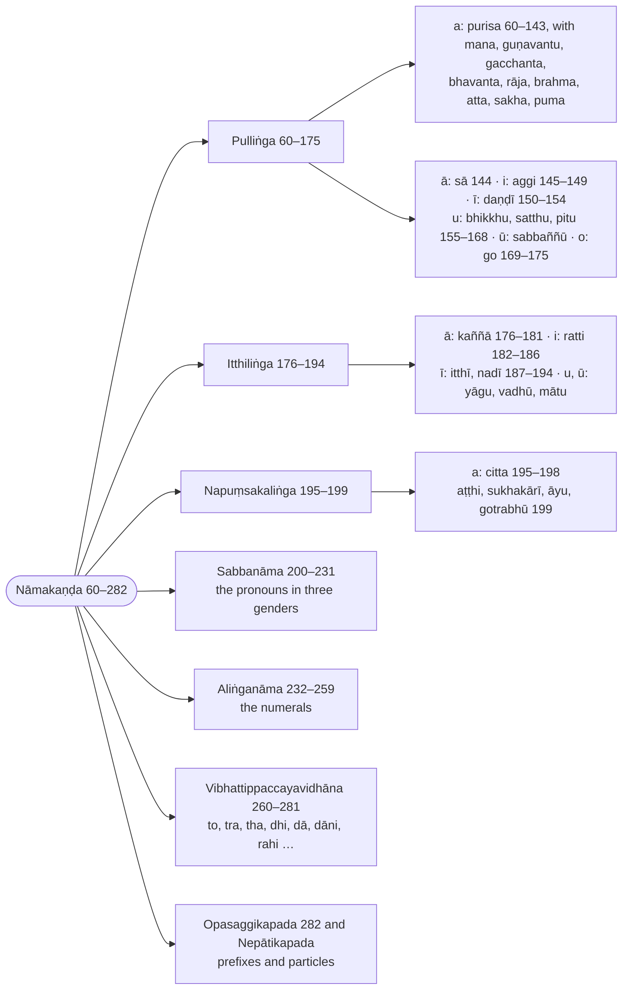

import { LinkCard } from "@astrojs/starlight/components";

:::note
Where Kaccāyana orders his noun rules by operation, Buddhappiya orders them by lemma: the masculine lemmas in `a`, `ā`, `i`, `ī`, `u`, `ū`, `o`, each with its paradigm (`padamālā`) and the derivation of every form; then the feminine and neuter lemmas, the pronouns (`sabbanāma`), the genderless words (numerals), the suffixes that take the place of an inflection (`to`, `tra`, `dā` …), the prefixes and the particles. Kaccāyana's rules are quoted where each form needs them, so a rule may appear more than once; the paradigms are set out as inflection tables.

:::

:::note[Reading Rachiwong]
This section is one of the three that Phramaha Sriporn Rachiwong translated in her Pune thesis *Rūpasiddhi: A Study of Some Aspects* (1995), reproduced on this site as [Rachiwong: Rūpasiddhi (1995)](/rupasiddhi/rachiwong). Her rules are headed `(K-N)`, K the Kaccāyana sutta and N the rule's number in the Thai edition of the Padarūpasiddhi (Bangkok 1984), her base text; her N is the number used on this page. Her notes compare that Thai edition (Rūp T.) with the Burmese Buddhasāsanasamiti edition (B., the Chaṭṭha Saṅgāyana text these pages print) and the Sinhalese Mahārūpasiddhi (S.). The footnotes below record where this translation's text or construal differs from hers, and nothing more; her own translation and notes are on her page.
:::

:::note[Buddhappiya's order of the nouns]
The Nāmakaṇḍa proceeds by gender and by the final of the lemma, giving each model noun its paradigm; the ranges are Rūpasiddhi numbers.

:::

> Atha nāmikavibhatyāvatāro vuccate.

Now the introduction to the nominal inflections (`nāmikavibhatti`) is set forth.

> Atthābhimukhaṃ namanato, attani catthassa nāmanato nāmaṃ, dabbābhidhānaṃ.

A noun is called `nāma` because it bends (`namati`) towards a meaning, and because it makes a meaning bend towards itself: it is the naming of a substance (`dabba`).

> Taṃ pana duvidhaṃ anvattharuḷhīvasena, tividhaṃ pumitthinapuṃsakaliṅgavasena. Yathā – rukkho, mālā, dhanaṃ.

Now it is of two kinds, as [`anvattha`](/introduction#types-of-suttas) and [`ruḷhī`](/introduction#types-of-suttas); and of three kinds by gender, masculine, feminine and neuter, as `rukkho` (a tree), `mālā` (a garland), `dhanaṃ` (wealth).

> Catubbidhaṃ sāmaññaguṇakriyāyadicchāvasena, yathā – rukkho, nīlo, pācako, sirivaḍḍhotiādi.

It is of four kinds, by way of a genus (`sāmañña`), a quality (`guṇa`), an action (`kriyā`) or an arbitrary wish (`yadicchā`), as `rukkho` (a tree), `nīlo` (blue), `pācako` (a cook), `Sirivaḍḍho` (a personal name), and so on.

> Aṭṭhavidhaṃ avaṇṇivaṇṇuvaṇṇokāraniggahītantapakatibhedena.

It is of eight kinds by the division of its lemmas (`pakati`), which end in the `a`-sounds (`a`, `ā`), the `i`-sounds (`i`, `ī`), the `u`-sounds (`u`, `ū`), `o`, and the niggahīta.

## Pulliṅga (Masculine nouns)

> Tattha paṭhamaṃ a kārantamhā pulliṅgā jātinimittā purisa saddā syā divibhattiyo parā yojīyante.

Among these, first, the inflections `si` and the rest are attached after the masculine word `purisa` (a man), which ends in `a` and is applied on the ground of a genus (`jātinimitta`).

---

### 60 (§52): Jinavacanayuttañhi (Suitable for the teachings of the Conqueror) :badge[sīhagatika]{variant=caution}

:::tip[Kaccāyana]
<LinkCard title="§52 (60): Jinavacanayuttaṃ hi" href="/kaccayana/2-namakappa#m52" description="Suitable for the teachings of the Conqueror" />
:::

> Adhikāro yaṃ. Tattha pañca māre jitavāti jino, buddho. Jinassa vacanaṃ jinavacanaṃ, tassa jinavacanassa yuttaṃ jinavacanayuttaṃ, tepiṭakassa buddhavacanassa māgadhikāya sabhāvaniruttiyā yuttaṃ anurūpamevāti idaṃ adhikāratthaṃ veditabbaṃ.

This is an [`adhikāra`](/introduction#types-of-suttas). In it, he conquered the five Māras, hence `jina`, the Conqueror: the Buddha. The word of the Conqueror is `jinavacana`; what is suited to that word of the Conqueror is `jinavacanayutta`. This is to be understood as the sense of the governing rule: [what is taught here] is suited, indeed conformable, to the Māgadhan natural language (`sabhāvanirutti`) of the Buddha's word in the three Piṭakas.

> Sā māgadhī mūlabhāsā, narā yāyādikappikā; \
> Brahmāno ca’ssutālāpā, sambuddhā cāpi bhāsare.

That Māgadhī is the root language, in which the people of the first aeon, \
the Brahmās, those who have never heard speech, and the Fully Awakened Ones too, speak.

> Adhikāro pana tividho sīhagatikamaṇḍūkagatikayathānupubbikavasena, ayaṃ pana sīhagatiko pubbāparavilokanato, yathānupubbikoyeva vā.

Now an `adhikāra` is of three kinds: [`sīhagatika`](/introduction#types-of-suttas), [`maṇḍūkagatika`](/introduction#types-of-suttas) and [`yathānupubbika`](/introduction#types-of-suttas). This one, however, is `sīhagatika`, since it looks both backward and forward; or else it is simply `yathānupubbika`.

> Sakkatavisadisaṃ katvā jinavacanānurūpavasena pakatiṭṭhapanatthaṃ paribhāsamāha.

In order to set up the lemmas (`pakati`) in conformity with the Conqueror's word, making them unlike Sanskrit, he states a [`paribhāsā`](/introduction#types-of-suttas):

---

### 61 (§53): Liṅgañca nipaccate (And lemmas are derived) :badge[sīhagatika]{variant=caution}

:::tip[Kaccāyana]
<LinkCard title="§53 (61): Liṅgañca nippajjate" href="/kaccayana/2-namakappa#m53" description="And lemmas are derived" />
:::

> Liṅgaṃ pāṭipadikaṃ, yathā yathā jinavacanayuttañhi liṅgaṃ, tathā tathā idha liṅgaṃ nipaccate ṭhapīyati. Ca saddena dhātavo cāti jinavacanānurūpato ‘‘purisa’’iti liṅge ṭhapite tato tassa dhātuppaccayavibhattivajjitassa atthavato saddassa ‘‘parasamaññā payoge’’ti paribhāsato liṅgasaññāyaṃ –

`liṅga` is the nominal lemma (`pāṭipadika`). In whatever way a lemma is suited to the Conqueror's word, in that way the lemma is here `nipaccate`: it is set up. By the word `ca`, roots too. When, in conformity with the Conqueror's word, the lemma `purisa` has been set up, then — that meaningful word, free of root, suffix and inflection, receiving the name `liṅga` by the [`paribhāsā`](/introduction#types-of-suttas) [§9 (11): Parasamaññā payoge](/kaccayana/1-sandhikappa#m9) —

> Ito paraṃ vibhattippaccayādividhāne sabbattha liṅga ggahaṇamanuvattate.

from here on, in the prescription of inflections, suffixes and the like, the word `liṅga` is carried over (`anuvattate`) throughout.

---

### 62 (§54): Tato ca vibhattiyo (And their inflections) :badge[sīhagatika]{variant=caution}

:::tip[Kaccāyana]
<LinkCard title="§54 (62): Tato ca vibhattiyo" href="/kaccayana/2-namakappa#m54" description="And their inflections" />
:::

> Tato jinavacanayuttehi liṅgehi parā vibhattiyo honti. Ca saddaggahaṇena tavetunādipaccayantanipātatopi. Kammādivasena, ekattādivasena ca liṅgatthaṃ vibhajantīti vibhattiyo.

After those lemmas suited to the Conqueror's word come the inflections (`vibhatti`). By the mention of `ca`, also after words ending in the suffixes `tave`, `tuna`[^1] and the like, and after particles. They divide (`vibhajanti`) the meaning of the lemma by way of the object and the rest and by way of oneness and the rest: hence `vibhatti`.

> Kā ca pana tā vibhattiyo? ‘‘Vibhattiyo’’ti adhikāro.

And what, then, are those inflections? `vibhattiyo` is the [`adhikāra`](/introduction#types-of-suttas).

[^1]: The Thai edition read by [Rachiwong (1995)](/rupasiddhi/rachiwong) has `tūna` (`kātūna`) for the CST's `tuna`, here and in the Kibbidhāna gloss; the CST is kept.

---

### 63 (§55): Siyo, aṃyo, nāhi, sanaṃ, smāhi, sanaṃ, smiṃsu (inflection forms) :badge[rūḷhī]{variant=note}

:::tip[Kaccāyana]
<LinkCard title="§55 (63): Si yo, aṃ yo, nā hi, sa naṃ, smā hi, sa naṃ, smiṃ su" href="/kaccayana/2-namakappa#m55" description="inflection forms" />
:::

> Syādayo dvisatta vibhattiyo nāma honti. Tattha si, yo iti paṭhamā, aṃ, yo iti dutiyā, nā, hi iti tatiyā, sa, naṃ iti catutthī, smā, hi iti pañcamī, sa, naṃ iti chaṭṭhī, smiṃ, su iti sattamī.

`si` and the rest, twice seven in number, are called `vibhatti` (inflections). Among them `si` and `yo` are the first form ①, `aṃ` and `yo` the second ②, `nā` and `hi` the third ③, `sa` and `naṃ` the fourth ④, `smā` and `hi` the fifth ⑤, `sa` and `naṃ` the sixth ⑥, `smiṃ` and `su` the seventh ⑦.

| symbol | ⨀ | ⨂ | inflection form |
| :-: | :-: | :-: | --- |
| ① | `si` | `yo` | `paṭhamā` ("first") |
| ② | `aṃ` | `yo` | `dutiyā` ("second") |
| ③ | `nā` | `hi` | `tatiyā` ("third") |
| ④ | `sa` | `naṃ` | `catutthī` ("fourth") |
| ⑤ | `smā` | `hi` | `pañcamī` ("fifth") |
| ⑥ | `sa` | `naṃ` | `chaṭṭhī` ("sixth") |
| ⑦ | `smiṃ` | `su` | `sattamī` ("seventh") |

> Idaṃ pana saññādhikāraparibhāsāvidhisuttesu saññāsutta nti daṭṭhabbaṃ, vuttañhi vuttiyaṃ ‘‘vibhattiiccanena kvattho, amhassa mamaṃ savibhattissa se’’ti, itarathā purimasuttena ekayogo kattabboti. Ettha ca paṭhamādivohāro, ekavacanādivohāro ca anvatthavasena, parasamaññāvasena vā siddhoti veditabbo.

Now, among [`saññā`](/introduction#types-of-suttas), [`adhikāra`](/introduction#types-of-suttas), [`paribhāsā`](/introduction#types-of-suttas) and [`vidhi`](/introduction#types-of-suttas) suttas, this is to be seen as a defining sutta; for it is said in the vutti, "What is the use of the term `vibhatti`? [The rule] [§120 (243): Amhassa mamaṃ savibhattissa se](/kaccayana/2-namakappa#m120)." Otherwise it would have to be made one rule (`ekayoga`) with the preceding sutta.[^2] And here the usage "first" and the rest, and the usage "singular" and the rest, are to be understood as established either by transparent meaning (`anvattha`) or by the terminology of other [grammarians] (`parasamaññā`).

> Ekassa vacanaṃ ekavacanaṃ, bahūnaṃ vacanaṃ bahuvacanaṃ, dvinnaṃ pūraṇī dutiyātiādi, itarathā purimasutte ca saddena saññākaraṇe appakataniratthakavidhippasaṅgo siyā.

The expression of one is the singular (`ekavacana`), the expression of many the plural (`bahuvacana`); `dutiyā` ("second") is the ordinal of two, and so on. Otherwise, if the naming were done by the `ca` of the preceding sutta, there would arise a prescription that is beside the point and without purpose.

> ‘‘Jinavacanayuttañhi, liṅgañca nipaccate’’ti ca vattate. Idha pana padanipphādanampi jinavacanassāvirodhenāti ñāpetuṃ paribhāsantaramāha.

And [60 (§52): Jinavacanayuttañhi](/rupasiddhi/2-namakanda#r60) and [61 (§53): Liṅgañca nipaccate](/rupasiddhi/2-namakanda#r61) continue. Now, to make known that here the formation of words (`pada`) too is without conflict with the Conqueror's word, he states a further interpretive rule:

:::tip[Example]

| lemma | inflected | meaning |
| ----- | --------- | ------- |
| ⚧️④⨀(amha) | mamaṃ | to me (`amha` + `sa` replaced as a whole) |

:::

[^2]: [Rachiwong (1995)](/rupasiddhi/rachiwong) renders `itarathā purimasuttena ekayogo kattabbo` as "Alternatively, this rule should be joined with the previous rules"; here it is "otherwise it would have to be made one rule with the preceding sutta". She also refers `paribhāsantaramāha` to this sutta itself; here it announces [64 (§56): Tadanuparodhena](/rupasiddhi/2-namakanda#r64).

---

### 64 (§56): Tadanuparodhena (those word endings) :badge[sīhagatika]{variant=caution}

:::tip[Kaccāyana]
<LinkCard title="§56 (64): Tadanuparodhena" href="/kaccayana/2-namakappa#m56" description="those word endings" />
:::

> Yathā yathā tesaṃ jinavacanānaṃ uparodho na hoti, tathā tathā idha liṅgaṃ, ca saddenākhyātañca nipaccate, nipphādīyatīti attho. Teneva idha ca ākhyāte ca dvivacanāggahaṇaṃ, sakkatavisadisato vibhattippaccayādividhānañca katanti daṭṭhabbaṃ.

In whatever way there is no obstruction of those words of the Conqueror, in that way the lemma — and, by the word `ca`, the verb (`ākhyāta`) too — is here `nipaccate`; the meaning is: is formed. For that very reason it is to be seen that here and among verbs the dual is not admitted, and the prescription of inflections, suffixes and the rest is made in a way unlike Sanskrit.

> Tattha avisesena sabbasyādivibhattippasaṅge ‘‘vatticchānupubbikā saddappavattī’’ti vatticchāvasā –

There, when all the inflections `si` and the rest would apply without distinction, by [the maxim] "the occurrence of words follows the speaker's intention", according to the speaker's intention (`vatticchā`) —

---

### 65 (§284): Liṅgatthe paṭhamā (the first form ① for the bare meaning of the lemma) :badge[utsarga]{variant=success}

:::tip[Kaccāyana]
<LinkCard title="§284 (283): Liṅgatthe paṭhamā" href="/kaccayana/3-karakakappa#m284" description="the first form ① for the bare meaning of the lemma" />
:::

> Liṅgatthābhidhānamatte paṭhamāvibhatti hotīti paṭhamā. Tatthāpi aniyamenekavacanabahuvacanappasaṅge ‘‘ekamhī vattabbe ekavacana’’nti paribhāsato liṅgatthassekattavacanicchāyaṃ paṭhamekavacanaṃ si.

In the mere expression of the meaning of the lemma (`liṅgattha`) the first inflection ① is used: hence the first. There too, when singular and plural would apply without restriction, by the interpretive rule "when one is to be expressed, the singular", when there is the wish to express the singleness of the lemma's meaning, [the inflection is] the first-form singular `si`.

> ‘‘Ato nenā’’ti ito ‘‘ato’’ti vattate, liṅga ggahaṇañca.

From [79 (§103): Ato nena](/rupasiddhi/2-namakanda#r79) the word `ato` ("after `a`") continues, and the word `liṅga` as well.

---

### 66 (§104): So (`si` to `o`) :badge[apavada]{variant=success}

:::tip[Kaccāyana]
<LinkCard title="§104 (66): So" href="/kaccayana/2-namakappa#m104" description="`si` to `o`" />
:::

> Si, oiti dvipadamidaṃ. Liṅgassa a kārato parassa si vacanassa o kāro hoti.

This is two words: `si` and `o`. The inflection `si` following the `a` of the lemma becomes the letter `o`.

> Suttesu hi paṭhamāniddiṭṭhassa kāriyino chaṭṭhīvipariṇāmena vivaraṇaṃ ādesāpekkhanti daṭṭhabbaṃ.

For in the suttas, what undergoes the operation (`kāriyī`) is stated in the first form, and its explanation, converting it to the sixth form, is to be understood as looking to the [`ādesa`](/introduction#types-of-vidhi-operation).

> Ettha ca sī ti vibhatti gayhate vibhattikāriyavidhippakaraṇato, ‘‘tato ca vibhattiyo’’ti ito vibhatti ggahaṇānuvattanato vā, evaṃ sabbattha syā dīnaṃ kāriyavidhāne vibhattiyevāti daṭṭhabbaṃ.

And here `si` is taken as the inflection, because this section prescribes operations on inflections, or because the word `vibhatti` continues from [62 (§54): Tato ca vibhattiyo](/rupasiddhi/2-namakanda#r62). In the same way, everywhere that an operation is prescribed for `si` and the rest, it is the inflection alone that is to be understood.

> ‘‘Vā paro asarūpā’’ti paralope sampatte tadapavādena pubbalopamāha.

When elision of the following [vowel] would apply by [§13 (15): Vā paro asarūpā](/kaccayana/1-sandhikappa#m13), he states the elision of the preceding [vowel] as an exception to it:

:::tip[Example]

|     | purisa + si (①⨀)       | rule |
| --- | ---------------------- | ---- |
| →   | purisa + (si→o)        | §104 |
| →   | puris + a + o          | (the two vowels meet: 67 decides which is elided) |

:::

---

### 67 (§83): Saralopo’mādesappaccayādimhi saralope tu pakati (in vowel elision in `aṃ` [inflections], replacements, suffixes etc., that elided vowel can be restored) :badge[utsarga]{variant=success}

:::tip[Kaccāyana]
<LinkCard title="§83 (67): Saralopo’ mādesa paccayādimhi saralope tu pakati" href="/kaccayana/2-namakappa#m83" description="in vowel elision in `aṃ` [inflections], replacements, suffixes etc., that elided vowel can be restored" />
:::

> Pubbassarassa lopo hoti aṃ vacane, ādesappaccayādibhūte ca sare pare, saralope kate tu parasarassa pakatibhāvo hoti. Ettha ca ‘‘saralope’’ti punaggahaṇaṃ imināva katasaralopanimitteyeva parassa vikāre sampatte pakatibhāvatthaṃ. Parasarassa pakatibhāvavidhānasāmatthiyato amādesappaccayādibhūte sare paretipi siddhaṃ.

The preceding vowel is elided when the inflection `aṃ`, or a vowel that is an [`ādesa`](/introduction#types-of-vidhi-operation), a suffix (`paccaya`) or the like, follows; but when that vowel elision has been made, the following vowel keeps its natural form (`pakatibhāva`).[^3] And here the repetition of `saralope` ("when the vowel is elided") is so that the natural form is kept only where a modification of the following vowel would apply because of an elision made by this very rule. And from the force of prescribing the natural form for the following vowel it is also established that [the elision takes place] when the vowel that follows is `aṃ`, a replacement, a suffix or the like.

> Tyādivibhattiyo cettha, paccayattena gayhare; \
> Ādiggahaṇamākhyāta-kitakesvāgamatthidaṃ.

And here the inflections `ti` and the rest are taken as suffixes; \
the word `ādi` is for the augments in verbs and in `kita` words.

> Paccayasāhacariyā, cādeso pakatīparo; \
> Padantassaralopo na, tena’bbhāhādike pare.

And by its company with `paccaya`, the replacement is one that follows a lemma; \
hence a word-final vowel is not elided before `abbha`, `āha` and the like.

> Tu ggahaṇaṃ bhikkhunī ādīsu saralopanivattanatthaṃ, ‘‘naye paraṃ yutte’’ti paraṃ netabbaṃ. Puriso tiṭṭhati.

The word `tu` is to block the vowel elision in `bhikkhunī` and the like. By [§11 (14): Naye paraṃ yutte](/kaccayana/1-sandhikappa#m11) the following [letter] is to be joined on: `puriso tiṭṭhati`.

> Puriso ca puriso cāti purisa purisaiti vattabbe –

When `puriso ca puriso ca` ("a man and a man") is to be said, as `purisa purisa` —

:::tip[Examples]

| lemma | inflected | meaning |
| ----- | --------- | ------- |
| 🚹①⨀(purisa) | puriso tiṭṭhati | the man stands |
| 🚺①⨀(bhikkhunī) | bhikkhunī | a nun (the `u` kept, the `i` of `inī` elided) |

|     | purisa + si (①⨀)       | rule |
| --- | ---------------------- | ---- |
| →   | purisa + (si→o)        | §104 |
| →   | puris + (~~a~~ + o)    | §83  |
| →   | puriso                 | §11  |
| →   | **puriso**             |      |

:::

[^3]: [Rachiwong (1995)](/rupasiddhi/rachiwong) renders `saralope tu pakati` as "when, however, the vowel is elided, the word remains in its base form"; here `parasarassa pakatibhāvo hoti` is that the following vowel keeps its natural form. Her rendering of the verse also drops `āgama`: `ādiggahaṇamākhyātakitakesvāgamatthaṃ` is "the word `ādi` is for the augments in verbs and `kita` words".

---

### 68 (§388): Sarūpānamekasesvasakiṃ (of like forms occurring more than once, one alone remains) :badge[utsarga]{variant=success}

:::tip[Kaccāyana]
<LinkCard title="§388 (68): Sarūpānamekasesvasakiṃ" href="/kaccayana/5-taddhitakappa#m388" description="of like forms occurring more than once, one alone remains" />
:::

> Sarūpānaṃ samānarūpānaṃ padabyañjanānaṃ majjhe ekova sissate, aññe lopamāpajjante asakinti ekaseso. Ettha ca ‘‘sarūpāna’’nti vuttattāva siddhe asakimpayoge punāsakiṃ gahaṇaṃ e kavibhattivisayānamevāsakimpayoge evāyanti dassanatthaṃ, na ca vicchāpayoge’tippasaṅgo. ‘‘Vaggā pañcapañcaso mantā’’ti ettha ‘‘pañcapañcaso’’ti niddeseneva vicchāpayogasiddhiyā ñāpitattā, atha vā sahavacanicchāya’maya’mekaseso.

Among words and sounds of the same form (`sarūpa`), of like form, one alone remains and the others are elided, [when they occur] more than once (`asakiṃ`): [this is] `ekasesa`, the remaining of one. And here, although the occurrence more than once is already established by the mere saying of `sarūpānaṃ`, the further mention of `asakiṃ` is to show that this [`ekasesa`] holds only in a repeated occurrence of words that carry one and the same inflection, and that there is no over-application to a distributive use (`vicchā`), because the validity of the distributive use has already been made known by the very statement `pañcapañcaso` in [§7 (9): Vaggā pañcapañcaso mantā](/kaccayana/1-sandhikappa#m7). Or else this `ekasesa` [takes place] when there is the wish to speak of [the things] together (`sahavacanicchā`).

> Yogavibhāgato cettha, ekasesvasakiṃ iti; \
> Virūpekaseso hoti, vā ‘‘pitūna’’ntiādisu.

And here, by splitting the rule and reading `ekasesvasakiṃ` [alone], \
there is optionally an `ekasesa` of unlike forms, as in `pitūnaṃ` and the like.

> Tattheva liṅgatthassa ba huttavacanicchāyaṃ ‘‘bahumhi vattabbe bahuvacana’’nti paṭhamābahuvacanaṃ yo, purisa yo itīdha ‘‘ato, vā’’ti ca vattate.

In that very [lemma],[^4] when there is the wish to express the plurality of the lemma's meaning, by [the maxim] "when many are to be expressed, the plural", [the inflection is] the first-form plural `yo`; and here, in `purisa` + `yo`, `ato` and `vā` continue.

:::tip[Examples]

| lemma | inflected | meaning |
| ----- | --------- | ------- |
| 🚹⑥⨂(pitu) | pitūnaṃ | of the parents (for `mātāpitūnaṃ`, by the split rule) |

|     | purisa purisa + yo (①⨂)    | rule |
| --- | -------------------------- | ---- |
| →   | ~~purisa~~ purisa + yo     | §388 |
| →   | purisa + yo                | (continued under 69) |

:::

[^4]: CST4 prints `Tattheva` here and at each repetition of the formula through the paradigm of `purisa`; the Thai and Sinhalese editions read by [Rachiwong (1995)](/rupasiddhi/rachiwong) have `tatheva` ("likewise"). The CST is kept.

---

### 69 (§107): Sabbayonīnamāe (For both `yo`: `ā`, `e`) :badge[utsarga]{variant=success}

:::tip[Kaccāyana]
<LinkCard title="§107 (69): Sabbayonīnamāe" href="/kaccayana/2-namakappa#m107" description="For both `yo`: `ā`, `e`" />
:::

> A kārantato liṅgamhā paresaṃ sabbesaṃ paṭhamāyonīnaṃ, dutiyāyonīnañca yayākkamaṃ ākārekārādesā honti vāti ā kāro, sabba ggahaṇaṃ sabbādesatthaṃ, saralopādi purimasadisameva, purisā tiṭṭhanti.

After a lemma ending in `a`, all the `yo` inflections of the first form ① and the `yo` inflections of the second form ② are optionally replaced by `ā` and `e` respectively; hence [here] `ā`. The word `sabba` ("all") is so that the whole [inflection] is replaced. The vowel elision and the rest are just as before: `purisā tiṭṭhanti`.

> Vā icceva rūpā rūpāni, aggayo, munayo.

Precisely because of `vā`: `rūpā` and `rūpāni`; `aggayo`, `munayo`.

> Vā saddoyaṃ vavatthitavibhāsattho[^5], tena cettha –

This word `vā` has the sense of a `vavatthitavibhāsā` (restricted option); and hence on this point —

> Niccameva ca pulliṅge, aniccañca napuṃsake; \
> Asantaṃ jhe katatte tu, vidhiṃ dīpeti vā suti.

obligatory indeed in the masculine, and not obligatory in the neuter, \
but inapplicable for a `jha` lemma made to end in `a`: such is the operation the word `vā` shows.

> Tatthevālapanavacanicchāyaṃ ‘‘liṅgatthe paṭhamā’’ti vattate.

In that very [lemma], when there is the wish to express address, [65 (§284): Liṅgatthe paṭhamā](/rupasiddhi/2-namakanda#r65) continues.

:::tip[Examples]

| lemma | inflected | meaning |
| ----- | --------- | ------- |
| 🚹①⨂(purisa) | purisā tiṭṭhanti | the men stand (`nicca`) |
| 🚻①⨂(rūpa) | rūpā, rūpāni | forms (`anicca`) |
| 🚹①⨂(aggi) | aggayo | fires (`asanta`: the `a` of `agga` + `yo` is not a lemma's `a`) |
| 🚹①⨂(muni) | munayo | sages (`asanta`) |

|     | purisa + yo (①⨂)       | rule |
| --- | ---------------------- | ---- |
| →   | purisa + (yo→ā)        | §107 |
| →   | puris + (~~a~~ + ā)    | §83  |
| →   | **purisā**             |      |

:::

[^5]: CST4 prints `vavatthitapibhāsattho`.

---

### 70 (§285): Ālapane ca (and in address ⓪) :badge[utsarga]{variant=success}

:::tip[Kaccāyana]
<LinkCard title="§285 (70): Ālapane ca" href="/kaccayana/3-karakakappa#m285" description="and in address ⓪" />
:::

> A bhimukhaṃ katvā lapanaṃ ālapanaṃ, sambodhanaṃ. Tasmiṃ ālapanatthādhike liṅgatthābhidhānamatte ca paṭhamāvibhatti hoti. Pure viya ekavacanādi.

Speaking (`lapana`) having turned face to face (`abhimukhaṃ katvā`) is `ālapana`, address (`sambodhana`). In the mere expression of the lemma's meaning with that sense of address added, too, the first inflection ① is used. The singular and the rest as before.

> Purisa si iccatra –

Here, in `purisa` + `si` —

:::tip[Example]

| lemma | inflected | meaning |
| ----- | --------- | ------- |
| 🚹⓪⨀(purisa) | bho purisa | man! (`purisa` + `si`, completed under 71–74) |

:::

---

### 71 (§57): Ālapane si gasañño (for vocatives `si` is called `ga`) :badge[rūḷhī]{variant=note}

:::tip[Kaccāyana]
<LinkCard title="§57 (71): Ālapane si ga sañño" href="/kaccayana/2-namakappa#m57" description="for vocatives `si` is called `ga`" />
:::

> Ālapanatthe vihito si ga sañño hotīti ga saññāyaṃ ‘‘bho ge tū’’ti ito ‘‘ge’’ti vattate.

The `si` prescribed in the sense of address is named `ga`; so, [the `si`] being named `ga`, the word `ge` ("before `ga`") continues from [110 (§243): Bho ge tu](/rupasiddhi/2-namakanda#r110).

---

### 72 (§244): Akārapitādyantānamā (`ā` for a final `a` and for the final of `pitu` and the like [before `ga`]) :badge[apavada]{variant=success}

:::tip[Kaccāyana]
<LinkCard title="§244 (72): Akārapitādyantānamā" href="/kaccayana/2-namakappa#m244" description="`ā` for a final `a` and for the final of `pitu` and the like [before `ga`]" />
:::

:::note[Analysis]

`rassaṃ` continues from [152 (§245): Jhalapā rassaṃ](/rupasiddhi/2-namakanda#r152), which Buddhappiya states later.

:::

> Liṅgassa sambandhī a kāro ca pitusatthu iccevamādīnamanto ca ā kārattamāpajjate ge pare.

The `a` belonging to the lemma, and the final of `pitu`, `satthu` and the like, become the letter `ā` when `ga` follows.

> ‘‘Ge, rassa’’miti ca vattate.

`ge` and `rassaṃ` ("short") continue.

:::tip[Examples]

| lemma | inflected | meaning |
| ----- | --------- | ------- |
| 🚹⓪⨀(pitu) | bho pitā | father! |

|     | purisa + ga (⓪⨀)       | rule |
| --- | ---------------------- | ---- |
| →   | puris + (a→ā) + ga     | §244 |
| →   | purisā + ga            | (continued under 73 and 74) |

:::

---

### 73 (§246): Ākāro vā (Optionally, `ā` [is shortened before `ga`]) :badge[apavada]{variant=success}

:::tip[Kaccāyana]
<LinkCard title="§246 (73): Ākāro vā" href="/kaccayana/2-namakappa#m246" description="Optionally, `ā` [is shortened before `ga`]" />
:::

> Liṅgassa sambandhī ā kāro rassamāpajjate ge pare vikappena, adūraṭṭhassālapanevāyaṃ.

The `ā` belonging to the lemma becomes short when `ga` follows, optionally (`vikappena`); and this [shortening] is only in addressing one who is not far off.

:::tip[Examples]

|     | purisā + ga (⓪⨀)       | rule |
| --- | ---------------------- | ---- |
| →   | puris + (ā→a) + ga     | §246 |
| →   | purisa + ga            | (the `ga` is elided under 74) |

:::

---

### 74 (§220): Sesato lopaṃ gasipi (after the rest, `ga` and `si` too are elided) :badge[utsarga]{variant=success}

:::tip[Kaccāyana]
<LinkCard title="§220 (74): Sesato lopaṃ gasipi" href="/kaccayana/2-namakappa#m220" description="after the rest, `ga` and `si` too are elided" />
:::

> ‘‘Siṃ, so, syā ca, sakhato gasse vā, ghate cā’’ti evamādīhi niddiṭṭhehi añño seso nāma, tato sesato liṅgamhā gasi iccete lopamāpajjante.

What is other than [the lemmas] specified by [§219 (195): Siṃ](/kaccayana/2-namakappa#m219), [§104 (66): So](/kaccayana/2-namakappa#m104), [§189 (113): Syā ca](/kaccayana/2-namakappa#m189), [§113 (132): Sakhato gasse vā](/kaccayana/2-namakappa#m113), [§114 (178): Ghate ca](/kaccayana/2-namakappa#m114) and the like is called the rest (`sesa`); after such a remaining lemma, `ga` and `si` are elided.

> Api ggahaṇaṃ dutiyatthasampiṇḍanatthaṃ, ettha ca satipi si ggahaṇe ga[^6] iti vacanameva ñāpakamaññatthāpi si ggahaṇe ālapanāggahaṇassa. Keci ālapanābhibyattiyā bhavanta saddaṃ vā he saddaṃ vā payujjante. Bho purisa tiṭṭha, he purisā vā.

The word `api` is for gathering in the second item [`si`]. And here, though `si` is mentioned, the very use of the word `ga` is the indicator (`ñāpaka`) that elsewhere too, where `si` is mentioned, the [`si` of] address is not included. Some, to make the address explicit, employ the word `bhavanta` or the word `he`: `bho purisa tiṭṭha` ("stand, man!"), or `he purisā`.

> Bahuvacane na viseso, bhavanto purisā tiṭṭhatha.

In the plural there is no difference: `bhavanto purisā tiṭṭhatha` ("stand, men!").

> Tattheva kammatthavacanicchāyaṃ ‘‘vā’’ti[^7] vattate.

In that very [lemma], when there is the wish to express the sense of the object (`kamma`), `vā` continues.

:::tip[Examples]

| lemma | inflected | meaning |
| ----- | --------- | ------- |
| 🚹⓪⨀(purisa) | bho purisa tiṭṭha | stand, man! |
| 🚹⓪⨀(purisa) | he purisā | O man! |
| 🚹⓪⨂(bhavanta) 🚹⓪⨂(purisa) | bhavanto purisā tiṭṭhatha | stand, men! |

|     | purisa + ga (⓪⨀)       | rule |
| --- | ---------------------- | ---- |
| →   | puris + (a→ā) + ga     | §244 |
| →   | puris + (ā→a) + ga     | §246 (optional) |
| →   | purisa + ~~ga~~        | §220 |
| →   | **bho purisa**, **bho purisā** | |

|     | purisa + yo (⓪⨂)       | rule |
| --- | ---------------------- | ---- |
| →   | purisa + (yo→ā)        | §107 |
| →   | puris + (~~a~~ + ā)    | §83  |
| →   | **bhavanto purisā**    |      |

:::

[^6]: CST4 prints `va iti vacanameva`; `ga` is read, as in the Thai text translated by [Rachiwong (1995)](/rupasiddhi/rachiwong).

[^7]: CST4 prints `‘‘va,’’ti vattate`; `vā` is read.

---

### 75 (§280): Yaṃ karoti taṃ kammaṃ (what one does: `kamma`) :badge[anvattha]{variant=note}

:::tip[Kaccāyana]
<LinkCard title="§280 (285): Yaṃ karoti taṃ kammaṃ" href="/kaccayana/3-karakakappa#m280" description="what one does: `kamma`" />
:::

> Yaṃ vā karoti, yaṃ vā vikaroti, yaṃ vā pāpuṇāti, taṃ kārakaṃ kriyānimittaṃ kammasaññaṃ hoti.

What one makes, or what one alters, or what one reaches — that `kāraka` (participant in the action), the occasion of the action, is termed `kamma` (the object).

---

### 76 (§297): Kammatthe dutiyā (② for the `kamma` [object]) :badge[utsarga]{variant=success}

:::tip[Kaccāyana]
<LinkCard title="§297 (284): Kammatthe dutiyā" href="/kaccayana/3-karakakappa#m297" description="② for the `kamma` [object]" />
:::

> Kammatthe dutiyāvibhatti hoti. Pure viya dutiyekavacanaṃ aṃ, ‘‘saralopo’’tiādinā sare lutte ‘‘dīgha’’nti dīghe sampatte pakatibhāvo ca, purisaṃ passa.

In the sense of the object the second inflection ② is used. As before, [the inflection is] the second-form singular `aṃ`; when the vowel has been elided by [§83 (67): Saralopo’ mādesa paccayādimhi saralope tu pakati](/kaccayana/2-namakappa#m83) and lengthening would apply by [§15 (17): Dīghaṃ](/kaccayana/1-sandhikappa#m15), there is also the keeping of the natural form: `purisaṃ passa` ("see the man").

> Bahuvacane ‘‘sabbayonīnamāe’’ti yo vacanasse kāro, purise passa.

In the plural, `e` for the inflection `yo` by [§107 (69): Sabbayonīnamāe](/kaccayana/2-namakappa#m107): `purise passa` ("see the men").

> Tattheva kattuvacanicchāyaṃ –

In that very [lemma], when there is the wish to express the agent —

:::tip[Examples]

| lemma | inflected | meaning |
| ----- | --------- | ------- |
| 🚹②⨀(purisa) | purisaṃ passa | see the man |
| 🚹②⨂(purisa) | purise passa | see the men |

|     | purisa + aṃ (②⨀)       | rule |
| --- | ---------------------- | ---- |
| →   | puris + (~~a~~ + aṃ)   | §83  |
| →   | purisaṃ (not lengthened) | §83 `pakati` |
| →   | **purisaṃ**            |      |

|     | purisa + yo (②⨂)       | rule |
| --- | ---------------------- | ---- |
| →   | purisa + (yo→e)        | §107 |
| →   | puris + (~~a~~ + e)    | §83  |
| →   | **purise**             |      |

:::

---

### 77 (§281): Yo karoti sa kattā (the one who does: `kattā`) :badge[anvattha]{variant=note}

:::tip[Kaccāyana]
<LinkCard title="§281 (294): Yo karoti sa kattā" href="/kaccayana/3-karakakappa#m281" description="the one who does: `kattā`" />
:::

:::note[Analysis]

`tatiyā` continues from [83 (§286): Karaṇe tatiyā](/rupasiddhi/2-namakanda#r83), which Buddhappiya states later.

:::

> Yo attappadhāno kriyaṃ karoti, so kattusañño hoti.

He who, himself the principal (`attappadhāna`), performs the action is termed `kattā` (the agent).

> ‘‘Tatiyā’’ti vattate.

`tatiyā` ("the third") continues.

---

### 78 (§288): Kattari ca (and for the agent) :badge[utsarga]{variant=success}

:::tip[Kaccāyana]
<LinkCard title="§288 (293): Kattari ca" href="/kaccayana/3-karakakappa#m288" description="and for the agent" />
:::

> Kattari ca kārake tatiyāvibhatti hotīti tatiyekavacanaṃ nā.

For the agent `kāraka` too the third inflection ③ is used; so [the inflection is] the third-form singular `nā`.

---

### 79 (§103): Ato nena (From `a`, `nā` becomes `ena`) :badge[apavada]{variant=success}

:::tip[Kaccāyana]
<LinkCard title="§103 (79): Ato nena" href="/kaccayana/2-namakappa#m103" description="From `a`, `nā` becomes `ena`" />
:::

> Enā ti avibhattikaniddeso. A kārantato liṅgamhā parassa nā vacanassa enā deso hoti, saralopādi, purisena kataṃ.

`Enā` is a citation without inflection (`avibhattikaniddesa`).[^8] The inflection `nā` following a lemma ending in `a` is replaced by `ena`; the vowel elision and the rest: `purisena kataṃ` ("done by the man").

> Bahuvacanamhi –

In the plural —

:::tip[Example]

| lemma | inflected | meaning |
| ----- | --------- | ------- |
| 🚹③⨀(purisa) | purisena kataṃ | done by the man |

|     | purisa + nā (③⨀)       | rule |
| --- | ---------------------- | ---- |
| →   | purisa + (nā→ena)      | §103 |
| →   | puris + (~~a~~ + ena)  | §83  |
| →   | **purisena**           |      |

:::

[^8]: [Rachiwong (1995)](/rupasiddhi/rachiwong) takes `Enāti avibhattikaniddeso` to say that the inflection is not denoted by the word `ena`; here it says that `ena` is cited without an inflection.

---

### 80 (§101): Suhisvakāro e (In `su`, `hi`, `a` becomes `e`) :badge[apavada]{variant=success}

:::tip[Kaccāyana]
<LinkCard title="§101 (80): Suhisvakāro e" href="/kaccayana/2-namakappa#m101" description="In `su`, `hi`, `a` becomes `e`" />
:::

> Su, hi iccetesu vibhattirūpesu paresu liṅgassa sambandhī a kāro e ttamāpajjate.

When the inflection-shapes `su` and `hi` follow, the `a` belonging to the lemma becomes `e`.

---

### 81 (§99): Smāhismiṃnaṃ mhābhimhi vā (Optionally, `smā`, `hi`, `smiṃ` become `mhā`, `bhi`, `mhi`) :badge[apavada]{variant=success}

:::tip[Kaccāyana]
<LinkCard title="§99 (81): Smāhismiṃnaṃ mhābhimhi vā" href="/kaccayana/2-namakappa#m99" description="Optionally, `smā`, `hi`, `smiṃ` become `mhā`, `bhi`, `mhi`" />
:::

> Sabbato liṅgamhā smā hi smiṃ iccetesaṃ yathākkamaṃ mhā, bhi, mhi iccete ādesā honti vā, purisehi, purisebhi kataṃ.

After every lemma, `smā`, `hi` and `smiṃ` are optionally replaced by `mhā`, `bhi` and `mhi` respectively: `purisehi`, `purisebhi kataṃ` ("done by the men").

> Tattheva karaṇavacanicchāyaṃ –

In that very [lemma], when there is the wish to express the instrument —

:::tip[Examples]

| lemma | inflected | meaning |
| ----- | --------- | ------- |
| 🚹③⨂(purisa) | purisehi kataṃ | done by the men |
| 🚹③⨂(purisa) | purisebhi kataṃ | done by the men |

|     | purisa + hi (③⨂)       | rule |
| --- | ---------------------- | ---- |
| →   | puris + (a→e) + hi     | §101 |
| →   | purise + (hi→bhi)      | §99 (optional) |
| →   | **purisehi**, **purisebhi** | |

:::

---

### 82 (§279): Yena vā kayirate taṃ karaṇaṃ (that by which [the action] is done: `karaṇa`) :badge[anvattha]{variant=note}

:::tip[Kaccāyana]
<LinkCard title="§279 (292): Yena vā kayirate taṃ karaṇaṃ" href="/kaccayana/3-karakakappa#m279" description="that by which [the action] is done: `karaṇa`" />
:::

> Yena vā kayirate, yena vā passati, yena vā suṇāti, taṃ kārakaṃ karaṇasaññaṃ hoti.

That by which [something] is done,[^9] or by which one sees, or by which one hears — that `kāraka` is termed `karaṇa` (the instrument).

[^9]: The sutta as [Rachiwong (1995)](/rupasiddhi/rachiwong) prints it from the Thai edition reads `kariyate` for the CST's `kayirate`; the CST is kept.

---

### 83 (§286): Karaṇe tatiyā (the third form ③ for the instrument) :badge[utsarga]{variant=success}

:::tip[Kaccāyana]
<LinkCard title="§286 (291): Karaṇe tatiyā" href="/kaccayana/3-karakakappa#m286" description="the third form ③ for the instrument" />
:::

> Karaṇakārake tatiyāvibhatti hoti, sesaṃ kattusamaṃ, āviṭṭhena purisena so puññaṃ karoti, purisehi, purisebhi.

For the instrument `kāraka` the third inflection ③ is used; the rest is the same as for the agent: `āviṭṭhena purisena so puññaṃ karoti` ("through the possessed man he does a good deed"); `purisehi`, `purisebhi`.

> Tattheva sampadānavacanicchāyaṃ –

In that very [lemma], when there is the wish to express the recipient —

:::tip[Examples]

| lemma | inflected | meaning |
| ----- | --------- | ------- |
| 🚹③⨀(purisa) | āviṭṭhena purisena so puññaṃ karoti | through the possessed man he does a good deed |
| 🚹③⨂(purisa) | purisehi, purisebhi | through the men |

:::

---

### 84 (§276): Yassa dātukāmo rocate dhārayate vā taṃ sampadānaṃ (the one to whom one wishes to give, who is pleased, or to whom one owes: `sampadāna`) :badge[anvattha]{variant=note}

:::tip[Kaccāyana]
<LinkCard title="§276 (302): Yassa dātukāmo rocate dhārayate vā taṃ sampadānaṃ" href="/kaccayana/3-karakakappa#m276" description="the one to whom one wishes to give, who is pleased, or to whom one owes: `sampadāna`" />
:::

> Yassa vā dātukāmo, yassa vā rocate, yassa vā dhārayate, taṃ kārakaṃ sampadānasaññaṃ hoti.

The one to whom one wishes to give, or to whom [something] is pleasing, or to whom one owes[^10] — that `kāraka` is termed `sampadāna` (the recipient).

[^10]: [Rachiwong (1995)](/rupasiddhi/rachiwong) renders `yassa vā rocate, yassa vā dhārayate` as "one who entertains by something or one from whom something is borne"; here it is the one to whom [something] is pleasing and the one to whom one owes.

---

### 85 (§293): Sampadāne catutthī (④ for the `sampadāna` [recipient]) :badge[utsarga]{variant=success}

:::tip[Kaccāyana]
<LinkCard title="§293 (85, 301): Sampadāne catutthī" href="/kaccayana/3-karakakappa#m293" description="④ for the `sampadāna` [recipient]" />
:::

> Sampadānakārake catutthīvibhatti hotīti catutthiyā ekavacanaṃ sa.

For the recipient `kāraka` the fourth inflection ④ is used; so [the inflection is] the fourth-form singular `sa`.

---

### 86 (§61): Sāgamo se (Before `sa` inflections: insert `s`) :badge[utsarga]{variant=success}

:::tip[Kaccāyana]
<LinkCard title="§61 (86): Sāgamo se" href="/kaccayana/2-namakappa#m61" description="Before `sa` inflections: insert `s`" />
:::

:::note[Analysis]

`dīghaṃ` continues from [147 (§88): Yosu katanikāralopesu dīghaṃ](/rupasiddhi/2-namakanda#r147), which Buddhappiya states later.

:::

> Sabbato liṅgamhā sa kārāgamo hoti se vibhattimhi pare. Purisassa dhanaṃ dadāti.

After every lemma the augment `s` is inserted when the inflection `sa` follows: `purisassa dhanaṃ dadāti` ("he gives wealth to the man").

> Bahuvacanamhi ‘‘dīgha’’nti vattate.

In the plural, `dīghaṃ` ("long") continues.[^11]

:::tip[Example]

| lemma | inflected | meaning |
| ----- | --------- | ------- |
| 🚹④⨀(purisa) | purisassa dhanaṃ dadāti | he gives wealth to the man |

|     | purisa + sa (④⨀)       | rule |
| --- | ---------------------- | ---- |
| →   | purisa + (s) + sa      | §61  |
| →   | **purisassa**          |      |

:::

[^11]: [Rachiwong (1995)](/rupasiddhi/rachiwong) refers this `dīghaṃ` to [§15 (17): Dīghaṃ](/kaccayana/1-sandhikappa#m15); it is the `dīghaṃ` of [§88 (147): Yosu katanikāralopesu dīghaṃ](/kaccayana/2-namakappa#m88).

---

### 87 (§89): Sunaṃhisu ca (And in `su`, `naṃ`, `hi`) :badge[apavada]{variant=success}

:::tip[Kaccāyana]
<LinkCard title="§89 (87): Sunaṃhisu ca" href="/kaccayana/2-namakappa#m89" description="And in `su`, `naṃ`, `hi`" />
:::

> Su naṃ hi iccetesu paresu liṅgassa antabhūtā sabbe rassasarā dīghamāpajjante, ca ggahaṇamikārukārānaṃ kvaci nivattanatthaṃ. Purisānaṃ.

When `su`, `naṃ` or `hi` follows, all short vowels standing at the end of a lemma become long; the word `ca` is to block [the lengthening] of `i` and `u` in some places. `purisānaṃ`.

> Tatthevāpādānavacanicchāyaṃ –

In that very [lemma], when there is the wish to express the point of departure —

:::tip[Examples]

| lemma | inflected | meaning |
| ----- | --------- | ------- |
| 🚹④⨂(purisa) | purisānaṃ | to the men |

|     | purisa + naṃ (④⨂)      | rule |
| --- | ---------------------- | ---- |
| →   | puris + (a→ā) + naṃ    | §89  |
| →   | **purisānaṃ**          |      |

:::

---

### 88 (§271): Yasmā dapeti bhayamādatte vā tadapādānaṃ (that from which one departs, fears or takes: `apādāna`) :badge[anvattha]{variant=note}

:::tip[Kaccāyana]
<LinkCard title="§271 (88, 308): Yasmā dapeti bhayamādatte vā tadapādānaṃ" href="/kaccayana/3-karakakappa#m271" description="that from which one departs, fears or takes: `apādāna`" />
:::

> Yasmā vā avadhibhūtā apeti, yasmā vā bhayaṃ, yasmā vā ādatte, taṃ kārakaṃ apādānasaññaṃ hoti.

That from which, as a limit (`avadhi`), one departs, or from which fear [arises], or from which one takes — that `kāraka` is termed `apādāna` (the point of departure).

---

### 89 (§295): Apādāne pañcamī (⑤ for the `apādāna` [point of departure]) :badge[utsarga]{variant=success}

:::tip[Kaccāyana]
<LinkCard title="§295 (307): Apādāne pañcamī" href="/kaccayana/3-karakakappa#m295" description="⑤ for the `apādāna` [point of departure]" />
:::

:::note[Analysis]

`ato` continues from [79 (§103): Ato nena](/rupasiddhi/2-namakanda#r79); `sabbesaṃ` and `ā e` from [69 (§107): Sabbayonīnamāe](/rupasiddhi/2-namakanda#r69).

:::

> Apādānakārake pañcamīvibhatti hotīti pañcamiyā ekavacanaṃ smā.

For the point-of-departure `kāraka` the fifth inflection ⑤ is used; so [the inflection is] the fifth-form singular `smā`.

> ‘‘Ato, sabbesaṃ, ā e’’ti ca vattate.

`ato`, `sabbesaṃ` and `ā e` continue.

---

### 90 (§108): Smāsmiṃna vā (Optionally, for `smā`, `smiṃ`) :badge[apavada]{variant=success}

:::tip[Kaccāyana]
<LinkCard title="§108 (90): Smāsmiṃnaṃ vā" href="/kaccayana/2-namakappa#m108" description="Optionally, for `smā`, `smiṃ`" />
:::

> A kārantato liṅgamhā sabbesaṃ smā smiṃ iccetesaṃ yathākkamaṃ ākārekārādesā honti vā, aññattha mhā deso. Purisā apeti, purisamhā, purisasmā.

After a lemma ending in `a`, the whole of `smā` and `smiṃ` are optionally replaced by `ā` and `e` respectively; elsewhere [there is] the replacement `mhā`. `purisā apeti` ("he goes away from the man"), `purisamhā`, `purisasmā`.

> Bahuvacane sabbattha tatiyāsamaṃ, hi ssa bhi ādeso hoti. Purisehi, purisebhi apeti.

In the plural, everywhere the same as the third form; `hi` is replaced by `bhi`. `purisehi`, `purisebhi apeti`.

> Tattheva sāmivacanicchāyaṃ –

In that very [lemma], when there is the wish to express the owner —

:::tip[Examples]

| lemma | inflected | meaning |
| ----- | --------- | ------- |
| 🚹⑤⨀(purisa) | purisā apeti | he goes away from the man |
| 🚹⑤⨀(purisa) | purisamhā, purisasmā | from the man |
| 🚹⑤⨂(purisa) | purisehi, purisebhi apeti | he goes away from the men |

|     | purisa + smā (⑤⨀)      | rule |
| --- | ---------------------- | ---- |
| →   | purisa + (smā→ā)       | §108 |
| →   | puris + (~~a~~ + ā)    | §83  |
| →   | **purisā**             |      |

|     | purisa + smā (⑤⨀)      | rule |
| --- | ---------------------- | ---- |
| →   | purisa + (smā→mhā)     | §99 (optional) |
| →   | **purisamhā**, or unchanged **purisasmā** | |

:::

---

### 91 (§283): Yassa vā pariggaho taṃ sāmi (the one whose possession [a thing] is: `sāmī`) :badge[anvattha]{variant=note}

:::tip[Kaccāyana]
<LinkCard title="§283 (316): Yassa vā pariggaho taṃ sāmī" href="/kaccayana/3-karakakappa#m283" description="the one whose possession [a thing] is: `sāmī`" />
:::

> Yassa vā pariggaho, taṃ sāmisaññaṃ hoti.

Optionally, the one whose possession (`pariggaha`) [a thing] is — that is termed `sāmī` (the owner).

---

### 92 (§301): Sāmismiṃ chaṭṭhī (⑥ for the `sāmī` [owner]) :badge[utsarga]{variant=success}

:::tip[Kaccāyana]
<LinkCard title="§301 (315): Sāmismiṃ chaṭṭhī" href="/kaccayana/3-karakakappa#m301" description="⑥ for the `sāmī` [owner]" />
:::

> Sāmismiṃ chaṭṭhīvibhatti hoti. Ṭhapetvā āyā desaṃ sabbattha catutthīchaṭṭhīnaṃ samānaṃ rūpaṃ. Purisassa etaṃ dhanaṃ, purisānaṃ.

For the owner the sixth inflection ⑥ is used. Except for the replacement `āya`, the fourth and the sixth form have the same shape everywhere. `purisassa etaṃ dhanaṃ` ("this wealth is the man's"), `purisānaṃ`.

> Tattheva okāsavacanicchāyaṃ –

In that very [lemma], when there is the wish to express the location —

:::tip[Examples]

| lemma | inflected | meaning |
| ----- | --------- | ------- |
| 🚹⑥⨀(purisa) | purisassa etaṃ dhanaṃ | this wealth is the man's |
| 🚹⑥⨂(purisa) | purisānaṃ | of the men |

:::

---

### 93 (§278): Yodhāro tamokāsaṃ (the support of the action: `okāsa`) :badge[anvattha]{variant=note}

:::tip[Kaccāyana]
<LinkCard title="§278 (320): Yodhāro tamokāsaṃ" href="/kaccayana/3-karakakappa#m278" description="the support of the action: `okāsa`" />
:::

> Yo kattukammānaṃ kriyāya ādhāro, taṃ kārakaṃ okāsasaññaṃ hoti.

What is the support (`ādhāra`) of the action of agent and object — that `kāraka` is termed `okāsa` (the location).

---

### 94 (§302): Okāse sattamī (⑦ for the `okāsa` [location]) :badge[utsarga]{variant=success}

:::tip[Kaccāyana]
<LinkCard title="§302 (319): Okāse sattamī" href="/kaccayana/3-karakakappa#m302" description="⑦ for the `okāsa` [location]" />
:::

> Okāsakārake sattamīvibhatti hotīti sattamiyā ekavacanaṃ smiṃ, tassa ‘‘smāsmiṃnaṃ vā’’ti e kāro, mhi ādeso ca, purise patiṭṭhitaṃ, purisamhi, purisasmiṃ.

For the location `kāraka` the seventh inflection ⑦ is used; so [the inflection is] the seventh-form singular `smiṃ`; of it, `e` by [§108 (90): Smāsmiṃnaṃ vā](/kaccayana/2-namakappa#m108), and the replacement `mhi`: `purise patiṭṭhitaṃ` ("established in the man"), `purisamhi`, `purisasmiṃ`.

> Bahuvacane ‘‘suhisvakāro e’’ti e kāro, purisesu.

In the plural, `e` by [§101 (80): Suhisvakāro e](/kaccayana/2-namakappa#m101): `purisesu`.

> Puriso, purisā, bho purisa bho purisā vā, bhavanto purisā, purisaṃ, purise, purisena, purisehi purisebhi, purisassa, purisānaṃ, purisā purisasmā purisamhā, purisehi purisebhi, purisassa, purisānaṃ, purise purisasmiṃ purisamhi, purisesu.

The whole paradigm of `purisa` ("a man"):

| | ⨀ | ⨂ |
| --- | --- | --- |
| ① | puriso | purisā |
| ⓪ | bho purisa, bho purisā | bhavanto purisā |
| ② | purisaṃ | purise |
| ③ | purisena | purisehi, purisebhi |
| ④ | purisassa | purisānaṃ |
| ⑤ | purisā, purisasmā, purisamhā | purisehi, purisebhi |
| ⑥ | purisassa | purisānaṃ |
| ⑦ | purise, purisasmiṃ, purisamhi | purisesu |

> Tathā sugato, sugatā, bho sugata bho sugatā vā, bhavanto sugatā, sugataṃ, sugate, sugatena, sugatehi sugatebhi, sugatassa, sugatānaṃ, sugatā sugatasmā sugatamhā, sugatehi sugatebhi, sugatassa, sugatānaṃ, sugate sugatasmiṃ sugatamhi, sugatesu.

In the same way `sugata` ("the Well-gone One"):

| | ⨀ | ⨂ |
| --- | --- | --- |
| ① | sugato | sugatā |
| ⓪ | bho sugata, bho sugatā | bhavanto sugatā |
| ② | sugataṃ | sugate |
| ③ | sugatena | sugatehi, sugatebhi |
| ④ | sugatassa | sugatānaṃ |
| ⑤ | sugatā, sugatasmā, sugatamhā | sugatehi, sugatebhi |
| ⑥ | sugatassa | sugatānaṃ |
| ⑦ | sugate, sugatasmiṃ, sugatamhi | sugatesu |

> Evaṃ surā’sura naro’raga nāga yakkhā, \
> Gandhabba kinnara manussa pisāca petā; \
> Mātaṅga jaṅgama turaṅga varāha sīhā, \
> Byaggha’ccha kacchapa taraccha miga’ssa soṇā.

So too `sura` (god), `asura` (titan), `nara` (man), `uraga` (snake), `nāga` (nāga), `yakkha` (yakkha), \
`gandhabba` (celestial musician), `kinnara` (kinnara), `manussa` (human being), `pisāca` (goblin), `peta` (ghost); \
`mātaṅga` (elephant), `jaṅgama` (moving creature), `turaṅga` (horse), `varāha` (boar), `sīha` (lion), \
`byaggha` (tiger), `accha` (bear), `kacchapa` (tortoise), `taraccha` (hyena), `miga` (deer), `assa` (horse), `soṇa` (dog).

> Āloka loka nilayā’nila cāga yogā, vāyāma gāma \
> Nigamā’gama dhamma kāmā; \
> Saṅgho’gha ghosa paṭighā’sava kodha lobhā, \
> Sārambha thambha mada māna pamāda makkhā.

`āloka` (light), `loka` (world), `nilaya` (abode), `anila` (wind), `cāga` (generosity), `yoga` (bond), `vāyāma` (endeavour), `gāma` (village), \
`nigama` (market town), `āgama` (scripture), `dhamma` (teaching), `kāma` (sense pleasure); \
`saṅgha` (community), `ogha` (flood), `ghosa` (sound), `paṭigha` (repulsion), `āsava` (defilement), `kodha` (anger), `lobha` (greed), \
`sārambha` (aggressiveness), `thambha` (obstinacy), `mada` (intoxication), `māna` (conceit), `pamāda` (negligence), `makkha` (denigration).

> Punnāga pūga panasā’sana campaka’mbā, \
> Hintāla tāla bakula’jjuna kiṃsukā ca; \
> Mandāra kunda pucimanda karañja rukkhā, \
> Ñeyyā mayūra sakunaṇḍaja koñca haṃsā –

`punnāga` (Alexandrian laurel), `pūga` (betel palm), `panasa` (jackfruit), `asana` (asana tree), `campaka` (champak), `amba` (mango), \
`hintāla` (marsh date palm), `tāla` (palmyra palm), `bakula` (bakula), `ajjuna` (arjuna), and `kiṃsuka` (bastard teak); \
`mandāra` (coral tree), `kunda` (jasmine), `pucimanda` (neem), `karañja` (Indian beech), `rukkha` (tree) \
are to be known [as such], and `mayūra` (peacock), `sakuṇa` (bird), `aṇḍaja` (egg-born bird), `koñca` (crane), `haṃsa` (swan) —

> Iccādayopi.

and others like these.

> Manogaṇādissa tu nāsasmāsmiṃsu viseso. Aññattha purisasamaṃ.

But the `mano`-group and the like differ before `nā`, `sa`, `smā` and `smiṃ`. Elsewhere they are the same as `purisa`.

> Mano, manā, he mana he manā vā, bhavanto manā, manaṃ, mane.

`mano` ("mind"), `manā`; `he mana` or `he manā`, `bhavanto manā`; `manaṃ`, `mane`.

> ‘‘Vā’’ti vattate.

`vā` continues.

:::tip[Examples]

| lemma | inflected | meaning |
| ----- | --------- | ------- |
| 🚹⑦⨀(purisa) | purise patiṭṭhitaṃ | established in the man |
| 🚹⑦⨀(purisa) | purisamhi, purisasmiṃ | in the man |
| 🚹⑦⨂(purisa) | purisesu | among the men |
| 🚹①⨀(mana) | mano | mind (the `si` elided, the final made `o`) |
| 🚹①⨂(mana) | manā | minds |
| 🚹⓪⨀(mana) | he mana, he manā | O mind! |
| 🚹②⨀(mana) | manaṃ | mind |
| 🚹②⨂(mana) | mane | minds |

|     | purisa + smiṃ (⑦⨀)     | rule |
| --- | ---------------------- | ---- |
| →   | purisa + (smiṃ→e)      | §108 |
| →   | puris + (~~a~~ + e)    | §83  |
| →   | **purise**             |      |

|     | purisa + smiṃ (⑦⨀)     | rule |
| --- | ---------------------- | ---- |
| →   | purisa + (smiṃ→mhi)    | §99 (optional) |
| →   | **purisamhi**, or unchanged **purisasmiṃ** | |

|     | purisa + su (⑦⨂)       | rule |
| --- | ---------------------- | ---- |
| →   | puris + (a→e) + su     | §101 |
| →   | **purisesu**           |      |

|     | mana + si (①⨀)         | rule |
| --- | ---------------------- | ---- |
| →   | mana + ~~si~~          | §220 |
| →   | man + (a→o)            | §183 |
| →   | **mano**               |      |

:::

---

### 95 (§181): Manogaṇādito smiṃnānamiā (`i`, `ā` for `smiṃ`, `nā` after the `mano`-group) :badge[apavada]{variant=success}

:::tip[Kaccāyana]
<LinkCard title="§181 (95): Manogaṇādito smiṃnānamiā" href="/kaccayana/2-namakappa#m181" description="`i`, `ā` for `smiṃ`, `nā` after the `mano`-group" />
:::

> Manopabhuti gaṇo manogaṇo, manogaṇādito smiṃ, nā iccetesaṃ yathākkamaṃ ikārākārādesā honti vā. Ādi ggahaṇena bilapadā ditopi.

The group beginning with `mano`[^12] is the `manogaṇa`; after the `mano`-group and the like, `smiṃ` and `nā` are optionally replaced by `i` and `ā` respectively. By the word `ādi`, also after `bila`, `pada` and the like.

> ‘‘Manogaṇādito’’ti vattate.

`manogaṇādito` ("after the `mano`-group and the like") continues.

[^12]: The Thai edition read by [Rachiwong (1995)](/rupasiddhi/rachiwong) has `manoppabhūti` for the CST's `manopabhuti`; the CST is kept.

---

### 96 (§184): Sa sare vāgamo (Optionally `s` inserted before a vowel) :badge[apavada]{variant=success}

:::tip[Kaccāyana]
<LinkCard title="§184 (96): Sa sare vāgamo" href="/kaccayana/2-namakappa#m184" description="Optionally `s` inserted before a vowel" />
:::

> Eteheva manogaṇādīhi sare pare sā gamo hoti vā. Manasā, manena.

After these same lemmas of the `mano`-group and the like, when a vowel follows, the augment `s` is optionally inserted: `manasā`, `manena`.

> Vavatthitavibhāsatthoyaṃ vā saddo, tena ‘‘mano manā manaṃ mane manaāyatana’’ntiādīsu na hoti. ‘‘Mānasikaṃ, cetasika’’ntiādīsu niccaṃ. Manehi, manebhi.

This word `vā` has the sense of a `vavatthitavibhāsā` (restricted option): hence in `mano`, `manā`, `manaṃ`, `mane`, `manaāyatanaṃ` and the like it does not occur, and in `mānasikaṃ`, `cetasikaṃ` and the like it is obligatory. `manehi`, `manebhi`.

> ‘‘Manogaṇādito, vā’’ti ca vattate.

`manogaṇādito` and `vā` continue.[^13]

:::tip[Examples]

| lemma | inflected | meaning |
| ----- | --------- | ------- |
| 🚹③⨀(mana) | manasā | by the mind (`anicca`: the option taken) |
| 🚹③⨀(mana) | manena | by the mind (`anicca`: the option not taken) |
| 🚹③⨂(mana) | manehi, manebhi | by the minds |
| 🚻①⨀(mana + ṇika) | mānasikaṃ | mental (`nicca`) |
| 🚻①⨀(ceta + ṇika) | cetasikaṃ | mental (`nicca`) |
| 🚻①⨀(mana + āyatana) | manaāyatanaṃ | the mind-base (`asanta`) |

|     | mana + nā (③⨀)         | rule |
| --- | ---------------------- | ---- |
| →   | mana + (nā→ā)          | §181 |
| →   | mana + (s) + ā         | §184 |
| →   | **manasā**             |      |

|     | mana + nā (③⨀)         | rule |
| --- | ---------------------- | ---- |
| →   | mana + (nā→ena)        | §103 |
| →   | man + (~~a~~ + ena)    | §83  |
| →   | **manena**             |      |

:::

[^13]: The Thai and Sinhalese editions read by [Rachiwong (1995)](/rupasiddhi/rachiwong) carry over `vā` alone, `vāti vattate`, for the CST's `‘‘Manogaṇādito, vā’’ti ca vattate`; the CST is kept.

---

### 97 (§182): Sassa co (`o` for `sa` [after the `mano`-group]) :badge[apavada]{variant=success}

:::tip[Kaccāyana]
<LinkCard title="§182 (97): Sassa co" href="/kaccayana/2-namakappa#m182" description="`o` for `sa` [after the `mano`-group]" />
:::

:::note[Analysis]

`savibhattissa` continues from [243 (§120): Amhassa mamaṃ savibhattissa se](/rupasiddhi/2-namakanda#r243) and `ntussa` from [99 (§122): Ntussa nto](/rupasiddhi/2-namakanda#r99), both stated later.

:::

> Manogaṇādito parassa sa ssa vibhattissa o kāro hoti vā. Sā gamo.

After the `mano`-group and the like the inflection `sa` optionally becomes `o`; [and there is] the augment `s`.

> Manaso manassa, manānaṃ, manā manasmā manamhā, manehi manebhi, manaso manassa, manānaṃ, manasi mane manasmiṃ manamhi, manesu.

The paradigm of `mana` ("mind"), with the forms given under 94 and 96:

| | ⨀ | ⨂ |
| --- | --- | --- |
| ① | mano | manā |
| ⓪ | he mana, he manā | bhavanto manā |
| ② | manaṃ | mane |
| ③ | manasā, manena | manehi, manebhi |
| ④ | manaso, manassa | manānaṃ |
| ⑤ | manā, manasmā, manamhā | manehi, manebhi |
| ⑥ | manaso, manassa | manānaṃ |
| ⑦ | manasi, mane, manasmiṃ, manamhi | manesu |

> Evaṃ vaco vayo tejo, \
> Tapo ceto tamo yaso; \
> Ayo payo siro chando, \
> Saro uro raho aho –

In the same way `vaco` (speech), `vayo` (age), `tejo` (heat), \
`tapo` (austerity), `ceto` (mind), `tamo` (darkness), `yaso` (fame), \
`ayo` (iron), `payo` (milk), `siro` (head), `chando` (metre), \
`saro` (lake), `uro` (chest), `raho` (solitude), `aho` (day) —

> Iccādi manogaṇo.

and the like are the `mano`-group.

> Guṇavantu saddassa bhedo. Guṇavantu si itīdha –

The word `guṇavantu` ("virtuous") differs. Here, in `guṇavantu` + `si` —

> ‘‘Savibhattissa, ntussā’’ti ca adhikāro.

`savibhattissa` ("together with its inflection") and `ntussa` ("of `ntu`") are the governing words.[^14]

:::tip[Examples]

| lemma | inflected | meaning |
| ----- | --------- | ------- |
| 🚹④⨀(mana) | manaso | to the mind |
| 🚹④⨀(mana) | manassa | to the mind |
| 🚹①⨀(vaca) | vaco | speech |
| 🚹①⨀(teja) | tejo | heat |

|     | mana + sa (④⨀)         | rule |
| --- | ---------------------- | ---- |
| →   | mana + (sa→o)          | §182 |
| →   | mana + (s) + o         | §184 |
| →   | **manaso**             |      |

|     | mana + sa (④⨀)         | rule |
| --- | ---------------------- | ---- |
| →   | mana + (s) + sa        | §61  |
| →   | **manassa**            |      |

:::

[^14]: The Thai and Sinhalese editions read by [Rachiwong (1995)](/rupasiddhi/rachiwong) have `savibhattissa ntussanto, sabbasseva ntussāti ca` for the CST's `‘‘Savibhattissa, ntussā’’ti ca adhikāro`; the CST is kept.

---

### 98 (§124): Ā simhi (`ā` for `ntu` before `si`) :badge[apavada]{variant=success}

:::tip[Kaccāyana]
<LinkCard title="§124 (98): Ā simhi" href="/kaccayana/2-namakappa#m124" description="`ā` for `ntu` before `si`" />
:::

:::note[Analysis]

`yomhi paṭhame` is fetched from [233 (§121): Mayaṃ yomhi paṭhame](/rupasiddhi/2-namakanda#r233), which Buddhappiya states later.

:::

> Sabbasseva ntu paccayassa savibhattissa ā ādeso hoti simhi vibhattimhi. Guṇavā.

The whole of the suffix `ntu` together with its inflection is replaced by `ā` when the inflection `si` follows: `guṇavā`.

> ‘‘Yomhi, paṭhame’’sīhagatiyā ‘‘vā’’ti ca vattate.

`yomhi paṭhame` ("before the `yo` of the first form") — by a lion's glance — and `vā` continue.[^15]

:::tip[Example]

| lemma | inflected | meaning |
| ----- | --------- | ------- |
| 🚹①⨀(guṇavantu) | guṇavā | a virtuous man |

|     | guṇavantu + si (①⨀)    | rule |
| --- | ---------------------- | ---- |
| →   | guṇava + (ntu + si→ā)  | §124 |
| →   | **guṇavā**             |      |

:::

[^15]: [Rachiwong (1995)](/rupasiddhi/rachiwong) takes the `vā` too as fetched by the lion's glance, from [103 (§123): Ntassa se vā](/rupasiddhi/2-namakanda#r103); here the lion's glance fetches `yomhi paṭhame` alone.

---

### 99 (§122): Ntussa nto (`ntu` becomes `nto` before `yo` of the first form) :badge[apavada]{variant=success}

:::tip[Kaccāyana]
<LinkCard title="§122 (99): Ntussa nto" href="/kaccayana/2-namakappa#m122" description="`ntu` becomes `nto` before `yo` of the first form" />
:::

:::note[Analysis]

`sunaṃhisu` continues from [87 (§89): Sunaṃhisu ca](/rupasiddhi/2-namakanda#r87), `attaṃ` from [252 (§90): Pañcādīnamattaṃ](/rupasiddhi/2-namakanda#r252), which Buddhappiya states later.

:::

> Sabbasseva ntu paccayassa savibhattissa nto ādeso hoti vā yo mhi paṭhame, guṇavanto tiṭṭhanti.

The whole of the suffix `ntu` together with its inflection is optionally replaced by `nto` before the `yo` of the first form: `guṇavanto tiṭṭhanti` ("the virtuous stand").

> ‘‘Sunaṃhisu, atta’’nti ca vattate.

`sunaṃhisu` ("before `su`, `naṃ`, `hi`") and `attaṃ` ("becoming `a`") continue.

:::tip[Examples]

| lemma | inflected | meaning |
| ----- | --------- | ------- |
| 🚹①⨂(guṇavantu) | guṇavanto tiṭṭhanti | the virtuous stand |

|     | guṇavantu + yo (①⨂)      | rule |
| --- | ------------------------ | ---- |
| →   | guṇava + (ntu + yo→nto)  | §122 |
| →   | **guṇavanto**            |      |

:::

---

### 100 (§92): Ntussanto yosu ca (And `ntu` ending in `yo`) :badge[apavada]{variant=success}

:::tip[Kaccāyana]
<LinkCard title="§92 (100): Ntussanto yosuca" href="/kaccayana/2-namakappa#m92" description="And `ntu` ending in `yo`" />
:::

:::note[Analysis]

`aṃ` continues from [198 (§125): Aṃ napuṃsake](/rupasiddhi/2-namakanda#r198), which Buddhappiya states later.

:::

> Ntu paccayassa anto u kāro a ttamāpajjate sunaṃhi yo iccetesu, ca ggahaṇena aññesu aṃ nā smāsmiṃ su ca. Guṇavantā, chaṭṭhiyā siddhepi antā dese puna anta ggahaṇakaraṇato yo naṃ i kāro ca kvaci. Guṇavanti.

The final `u` of the suffix `ntu` becomes `a` before `su`, `naṃ`, `hi` and `yo`; by the word `ca`, also before the others, `aṃ`, `nā`, `smā`, `smiṃ`. `guṇavantā`. Although the replacement of the final is already established by the sixth form, from the further mention of `anta` ("final") the `yo` inflections also become `i` in some places: `guṇavanti`.

> ‘‘A’’miti vattate.

`aṃ` continues.

:::tip[Examples]

| lemma | inflected | meaning |
| ----- | --------- | ------- |
| 🚹①⨂(guṇavantu) | guṇavantā | the virtuous |
| 🚹①⨂(guṇavantu) | guṇavanti | the virtuous (`yo` made `i`, in some places) |

|     | guṇavantu + yo (①⨂)      | rule |
| --- | ------------------------ | ---- |
| →   | guṇavant + (u→a) + yo    | §92  |
| →   | guṇavanta + (yo→ā)       | §107 |
| →   | guṇavant + (~~a~~ + ā)   | §83  |
| →   | **guṇavantā**            |      |

|     | guṇavantu + yo (①⨂)      | rule |
| --- | ------------------------ | ---- |
| →   | guṇavant + (u→a) + (yo→i) | §92 |
| →   | guṇavant + (~~a~~ + i)   | §83  |
| →   | **guṇavanti**            |      |

:::

---

### 101 (§126): Avaṇṇā ca ge (`aṃ`, `a`, `ā` for `ntu` before `ga`) :badge[apavada]{variant=success}

:::tip[Kaccāyana]
<LinkCard title="§126 (101): Avaṇṇā ca ge" href="/kaccayana/2-namakappa#m126" description="`aṃ`, `a`, `ā` for `ntu` before `ga`" />
:::

> Sabbasseva ntu paccayassa savibhattissa aṃ a vaṇṇaiccete ādesā honti ge pare.

The whole of the suffix `ntu` together with its inflection is replaced by `aṃ` and by the `a`-sounds (`a`, `ā`)[^16] when `ga` follows.

> Bho guṇavaṃ bho guṇava bho guṇavā, bhavanto guṇavanto guṇavantā, guṇavantaṃ, guṇavante.

The address and second forms:

| | ⨀ | ⨂ |
| --- | --- | --- |
| ⓪ | bho guṇavaṃ, bho guṇava, bho guṇavā | bhavanto guṇavanto, guṇavantā |
| ② | guṇavantaṃ | guṇavante |

> ‘‘Vā’’ti vattate.

`vā` continues.

:::tip[Examples]

| lemma | inflected | meaning |
| ----- | --------- | ------- |
| 🚹⓪⨀(guṇavantu) | bho guṇavaṃ, bho guṇava, bho guṇavā | virtuous one! |
| 🚹⓪⨂(guṇavantu) | bhavanto guṇavanto, guṇavantā | virtuous ones! |
| 🚹②⨀(guṇavantu) | guṇavantaṃ | the virtuous man |
| 🚹②⨂(guṇavantu) | guṇavante | the virtuous men |

|     | guṇavantu + ga (⓪⨀)      | rule |
| --- | ------------------------ | ---- |
| →   | guṇava + (ntu + ga→aṃ)   | §126 |
| →   | **bho guṇavaṃ**          |      |

|     | guṇavantu + aṃ (②⨀)      | rule |
| --- | ------------------------ | ---- |
| →   | guṇavant + (u→a) + aṃ    | §92  |
| →   | guṇavant + (~~a~~ + aṃ)  | §83  |
| →   | **guṇavantaṃ**           |      |

:::

[^16]: The Thai and Sinhalese editions read by [Rachiwong (1995)](/rupasiddhi/rachiwong) have `aṃ a ā ādesā honti` for the CST's `aṃ a vaṇṇaiccete ādesā honti`; the CST is kept.

---

### 102 (§127): Totitā sasmiṃnāsu (`to`, `ti`, `tā` for `ntu` before `sa`, `smiṃ`, `nā`) :badge[apavada]{variant=success}

:::tip[Kaccāyana]
<LinkCard title="§127 (102): To titā sasmiṃnāsu" href="/kaccayana/2-namakappa#m127" description="`to`, `ti`, `tā` for `ntu` before `sa`, `smiṃ`, `nā`" />
:::

> Sabbasseva ntu paccayassa savibhattissa toti tā ādesā honti vā sasmiṃnā iccetesu yathāsaṅkhyaṃ. Guṇavatā guṇavantena, guṇavantehi guṇavantebhi.

The whole of the suffix `ntu` together with its inflection is optionally replaced by `to`, `ti` and `tā` before `sa`, `smiṃ` and `nā` respectively: `guṇavatā`, `guṇavantena`; `guṇavantehi`, `guṇavantebhi`.

:::tip[Examples]

| lemma | inflected | meaning |
| ----- | --------- | ------- |
| 🚹③⨀(guṇavantu) | guṇavatā | by the virtuous man |
| 🚹③⨀(guṇavantu) | guṇavantena | by the virtuous man |
| 🚹③⨂(guṇavantu) | guṇavantehi, guṇavantebhi | by the virtuous men |

|     | guṇavantu + nā (③⨀)      | rule |
| --- | ------------------------ | ---- |
| →   | guṇava + (ntu + nā→tā)   | §127 |
| →   | **guṇavatā**             |      |

|     | guṇavantu + nā (③⨀)      | rule |
| --- | ------------------------ | ---- |
| →   | guṇavant + (u→a) + nā    | §92  |
| →   | guṇavanta + (nā→ena)     | §103 |
| →   | guṇavant + (~~a~~ + ena) | §83  |
| →   | **guṇavantena**          |      |

:::

---

### 103 (§123): Ntassa se vā (Optionally `ntassa` for `ntu` before `sa`) :badge[apavada]{variant=success}

:::tip[Kaccāyana]
<LinkCard title="§123 (103): Ntassa se vā" href="/kaccayana/2-namakappa#m123" description="Optionally `ntassa` for `ntu` before `sa`" />
:::

> Sabbasseva ntu paccayassa savibhattissa ntassa iccayamādeso hoti vā se vibhattimhi. Guṇavantassa guṇavato.

The whole of the suffix `ntu` together with its inflection is optionally replaced by this `ntassa` when the inflection `sa` follows: `guṇavantassa`, `guṇavato`.

:::tip[Examples]

| lemma | inflected | meaning |
| ----- | --------- | ------- |
| 🚹④⨀(guṇavantu) | guṇavantassa | to the virtuous man |
| 🚹④⨀(guṇavantu) | guṇavato | to the virtuous man (by 102) |

|     | guṇavantu + sa (④⨀)        | rule |
| --- | -------------------------- | ---- |
| →   | guṇava + (ntu + sa→ntassa) | §123 |
| →   | **guṇavantassa**           |      |

|     | guṇavantu + sa (④⨀)        | rule |
| --- | -------------------------- | ---- |
| →   | guṇava + (ntu + sa→to)     | §127 |
| →   | **guṇavato**               |      |

:::

---

### 104 (§128): Naṃmhi taṃ vā (Optionally `taṃ` for `ntu` before `naṃ`) :badge[apavada]{variant=success}

:::tip[Kaccāyana]
<LinkCard title="§128 (104): Naṃmhi taṃ vā" href="/kaccayana/2-namakappa#m128" description="Optionally `taṃ` for `ntu` before `naṃ`" />
:::

> Sabbasseva ntu paccayassa savibhattissa taṃ ādeso hoti vā naṃ mhi vibhattimhi. Guṇavataṃ guṇavantānaṃ.

The whole of the suffix `ntu` together with its inflection is optionally replaced by `taṃ` when the inflection `naṃ` follows: `guṇavataṃ`, `guṇavantānaṃ`.[^17]

> ‘‘Amha tumha ntu’’iccādinā smā vacanassa nābyapadeso.

By [§270 (120): Amha tumha ntu rāja brahmatta sakha satthu pitādīhi smā nāva](/kaccayana/2-namakappa#m270) the inflection `smā` is designated `nā`.

> Guṇavatā guṇavantā guṇavantasmā guṇavantamhā, guṇavantehi guṇavantebhi, guṇavantassa guṇavato, guṇavataṃ guṇavantānaṃ, guṇavati guṇavante guṇavantasmiṃ guṇavantamhi[^18], guṇavantesu.

The whole paradigm of `guṇavantu` ("virtuous"), with the forms of 98–103:

| | ⨀ | ⨂ |
| --- | --- | --- |
| ① | guṇavā | guṇavanto, guṇavantā |
| ⓪ | bho guṇavaṃ, bho guṇava, bho guṇavā | bhavanto guṇavanto, guṇavantā |
| ② | guṇavantaṃ | guṇavante |
| ③ | guṇavatā, guṇavantena | guṇavantehi, guṇavantebhi |
| ④ | guṇavantassa, guṇavato | guṇavataṃ, guṇavantānaṃ |
| ⑤ | guṇavatā, guṇavantā, guṇavantasmā, guṇavantamhā | guṇavantehi, guṇavantebhi |
| ⑥ | guṇavantassa, guṇavato | guṇavataṃ, guṇavantānaṃ |
| ⑦ | guṇavati, guṇavante, guṇavantasmiṃ, guṇavantamhi | guṇavantesu |

> Evaṃ gaṇavā kulavā balavā yasavā dhanavā sutavā bhagavā himavā phalavā sīlavā paññavā iccādayo.

In the same way `gaṇavā` (having a following), `kulavā` (of good family), `balavā` (strong), `yasavā` (famous), `dhanavā` (wealthy), `sutavā` (learned), `bhagavā` (the Blessed One), `himavā` (the Himalaya), `phalavā` (fruitful), `sīlavā` (virtuous), `paññavā` (wise), and so on.

> Himavantu saddato si mhi kate –

When `si` has been added after the word `himavantu` —

> ‘‘Attaṃ, ntussa’nto’’ti ca vattamāne –

with `attaṃ` ("becoming `a`") and `ntussa anto` ("the final of `ntu`") in force —

:::tip[Examples]

| lemma | inflected | meaning |
| ----- | --------- | ------- |
| 🚹④⨂(guṇavantu) | guṇavataṃ | to the virtuous men |
| 🚹④⨂(guṇavantu) | guṇavantānaṃ | to the virtuous men |
| 🚹⑤⨀(guṇavantu) | guṇavatā | from the virtuous man (the `smā` designated `nā`) |
| 🚹⑦⨀(guṇavantu) | guṇavati | in the virtuous man |
| 🚹①⨀(bhagavantu) | bhagavā | the Blessed One |

|     | guṇavantu + naṃ (④⨂)     | rule |
| --- | ------------------------ | ---- |
| →   | guṇava + (ntu + naṃ→taṃ) | §128 |
| →   | **guṇavataṃ**            |      |

|     | guṇavantu + naṃ (④⨂)     | rule |
| --- | ------------------------ | ---- |
| →   | guṇavant + (u→a) + naṃ   | §92  |
| →   | guṇavant + (a→ā) + naṃ   | §89  |
| →   | **guṇavantānaṃ**         |      |

:::

[^18]: CST4 prints `guṇavantamhī`; the Thai text read by [Rachiwong (1995)](/rupasiddhi/rachiwong) has `guṇavantamhi`.

[^17]: The Thai edition read by [Rachiwong (1995)](/rupasiddhi/rachiwong) has `Naṃhi taṃ vā` for the CST's `Naṃmhi taṃ vā`, and `Raññaṃ naṃhi vā` at [119 (§136): Raññaṃ naṃ mhī vā](/rupasiddhi/2-namakanda#r119); the CST is kept.

---

### 105 (§94): Simhī vā (Optionally in `si`) :badge[apavada]{variant=success}

:::tip[Kaccāyana]
<LinkCard title="§94 (105): Simhi vā" href="/kaccayana/2-namakappa#m94" description="Optionally in `si`" />
:::

> Ntu paccayassa anto a ttaṃ hoti vā si mhi vibhattimhi. Himavanto, himavā, sesaṃ samaṃ.

The final of the suffix `ntu` optionally becomes `a` when the inflection `si` follows: `himavanto`, `himavā`; the rest is the same.

> Puna vā ggahaṇakaraṇaṃ himavantu saddato aññatra attanisedhanatthaṃ, vavatthitavibhāsatthoyaṃ vā saddo. Tena guṇavantādīsu nātippasaṅgo.

The repeated mention of `vā` is to forbid the becoming-`a` elsewhere than after the word `himavantu`; this word `vā` has the sense of a `vavatthitavibhāsā` (restricted option). Hence there is no over-application to `guṇavantu` and the like.

> Evaṃ satimā dhitimā gatimā matimā mutimā muttimā jutimā sirimā hirimā thutimā ratimā yatimā sucimā kalimā balimā kasimā rucimā buddhimā cakkhumā bandhumā hetumā setumā ketumā rāhumā bhāṇumā khāṇumā vijjumā iccādayo.

In the same way `satimā` (mindful), `dhitimā` (steadfast), `gatimā` (of retentive mind), `matimā` (wise), `mutimā` (intelligent), `muttimā` (liberated), `jutimā` (radiant), `sirimā` (glorious), `hirimā` (having a sense of shame), `thutimā` (praised), `ratimā` (delighting), `yatimā` (having ascetics), `sucimā` (pure), `kalimā` (unlucky), `balimā` (having offerings), `kasimā` (a ploughman), `rucimā` (bright), `buddhimā` (intelligent), `cakkhumā` (having eyes), `bandhumā` (having kinsmen), `hetumā` (having a cause), `setumā` (having a bridge), `ketumā` (having a banner), `rāhumā` (having Rāhu), `bhāṇumā` (radiant), `khāṇumā` (having stumps), `vijjumā` (having lightning), and so on.

> Tattha satimantu bandhumantu saddānaṃ aṃse su rūpabhedo. ‘‘Attaṃ, ntussā’’ti ca vattate.

Among these, the words `satimantu` and `bandhumantu` differ in form before `aṃ` and `sa`. `attaṃ` and `ntussa` continue.

:::tip[Examples]

| lemma | inflected | meaning |
| ----- | --------- | ------- |
| 🚹①⨀(himavantu) | himavanto | the Himalaya (`anicca`: the option taken) |
| 🚹①⨀(himavantu) | himavā | the Himalaya (`anicca`: the option not taken) |
| 🚹①⨀(satimantu) | satimā | a mindful man |
| 🚹①⨀(cakkhumantu) | cakkhumā | one who has eyes |

|     | himavantu + si (①⨀)      | rule |
| --- | ------------------------ | ---- |
| →   | himavant + (u→a) + si    | §94  |
| →   | himavanta + (si→o)       | §104 |
| →   | himavant + (~~a~~ + o)   | §83  |
| →   | **himavanto**            |      |

:::

---

### 106 (§93): Sabbassa vā aṃsesu (Optionally for all in `aṃ`, `sa`) :badge[apavada]{variant=success}

:::tip[Kaccāyana]
<LinkCard title="§93 (106): Sabbassa vā aṃsesu" href="/kaccayana/2-namakappa#m93" description="Optionally for all in `aṃ`, `sa`" />
:::

> Sabbasseva ntu paccayassa a ttaṃ hoti vā aṃsa iccetesu. Idhāpi vā saddassa vavatthitavibhāsattā nātippasaṅgo. Satimaṃ satimantaṃ, bandhumaṃ bandhumantaṃ, satimassa satimato satimantassa, bandhumassa bandhumato bandhumantassa, sesaṃ samaṃ.

The whole of the suffix `ntu` optionally becomes `a` before `aṃ` and `sa`. Here too, because the word `vā` is a `vavatthitavibhāsā`, there is no over-application. `satimaṃ`, `satimantaṃ`; `bandhumaṃ`, `bandhumantaṃ`; `satimassa`, `satimato`, `satimantassa`; `bandhumassa`, `bandhumato`, `bandhumantassa`; the rest is the same.

> Gacchanta saddassa bhedo, gacchanta si,

The word `gacchanta` ("going") differs: `gacchanta` + `si`,

> ‘‘Vā’’ti vattate.

`vā` continues.

:::tip[Examples]

| lemma | inflected | meaning |
| ----- | --------- | ------- |
| 🚹②⨀(satimantu) | satimaṃ, satimantaṃ | the mindful man |
| 🚹②⨀(bandhumantu) | bandhumaṃ, bandhumantaṃ | the man with kinsmen |
| 🚹④⨀(satimantu) | satimassa, satimato, satimantassa | to the mindful man |
| 🚹④⨀(bandhumantu) | bandhumassa, bandhumato, bandhumantassa | to the man with kinsmen |

|     | satimantu + aṃ (②⨀)      | rule |
| --- | ------------------------ | ---- |
| →   | satima + (ntu→a) + aṃ    | §93  |
| →   | satim + (~~a~~ + aṃ)     | §83  |
| →   | **satimaṃ**              |      |

|     | satimantu + sa (④⨀)      | rule |
| --- | ------------------------ | ---- |
| →   | satima + (ntu→a) + sa    | §93  |
| →   | satima + (s) + sa        | §61  |
| →   | **satimassa**            |      |

:::

---

### 107 (§186): Simhi gacchantādīnaṃ ntasaddo aṃ (`nta` of `gacchanta` and the like becomes `aṃ` before `si`) :badge[apavada]{variant=success}

:::tip[Kaccāyana]
<LinkCard title="§186 (107): Simhigacchantādīnaṃ ntasaddo aṃ" href="/kaccayana/2-namakappa#m186" description="`nta` of `gacchanta` and the like becomes `aṃ` before `si`" />
:::

> Gacchanti ccevamādīnaṃ anta ppaccayantānaṃ nta saddo aṃrūpaṃ āpajjate vā si mhi vibhattimhi. Saralopasi lopā, so gacchaṃ, gacchanto vā gaṇhāti.

Of `gacchanta` and the like, which end in the suffix `anta`, the sound `nta` optionally takes the form `aṃ` when the inflection `si` follows. The vowel elision and the elision of `si`: `so gacchaṃ`, or `gacchanto gaṇhāti` ("he, going, takes").

> ‘‘Gacchantādīnaṃ, ntasaddo’’ti ca vattamāne –

With `gacchantādīnaṃ` and `ntasaddo` in force —

:::tip[Examples]

| lemma | inflected | meaning |
| ----- | --------- | ------- |
| 🚹①⨀(gacchanta) | so gacchaṃ gaṇhāti | he, going, takes |
| 🚹①⨀(gacchanta) | so gacchanto gaṇhāti | he, going, takes |

|     | gacchanta + si (①⨀)      | rule |
| --- | ------------------------ | ---- |
| →   | gaccha + (nta→aṃ) + si   | §186 |
| →   | gacch + (~~a~~ + aṃ) + si | §83 |
| →   | gacchaṃ + ~~si~~         | §220 |
| →   | **gacchaṃ**              |      |

|     | gacchanta + si (①⨀)      | rule |
| --- | ------------------------ | ---- |
| →   | gacchanta + (si→o)       | §104 |
| →   | gacchant + (~~a~~ + o)   | §83  |
| →   | **gacchanto**            |      |

:::

---

### 108 (§187): Sesesu ntuva (in the remaining [inflections], like `ntu`) :badge[vidhyaṅga]{variant=tip}

:::tip[Kaccāyana]
<LinkCard title="§187 (108): Sesesu ntuva" href="/kaccayana/2-namakappa#m187" description="in the remaining [inflections], like `ntu`" />
:::

:::note[Analysis]

`bhavato` continues from [192 (§242): Bhavato bhoto](/rupasiddhi/2-namakanda#r192), which Buddhappiya states later.

:::

> Gacchantā dīnaṃ nta saddo ntu paccayova daṭṭhabbo sesesu vibhattippaccayesu, asmi mhi kāriyātidesoyaṃ. Sesaṃ guṇavantu samaṃ.

The sound `nta` of `gacchanta` and the like is to be seen as just the suffix `ntu` in the remaining inflections and suffixes: this is a transfer of operations (`kāriyātidesa`) for [inflections] other than `si`. The rest is the same as `guṇavantu`.

> Te gacchanto gacchantā, bho gacchaṃ bho gaccha bho gacchā, bhavanto gacchanto gacchantā, [gacchaṃ] gacchantaṃ, gacchante, gacchatā gacchantena, gacchantehi gacchantebhi, gacchato gacchantassa, gacchataṃ gacchantānaṃ, gacchatā gacchantasmā gacchantamhā, gacchantehi gacchantebhi, gacchato gacchantassa, gacchataṃ gacchantānaṃ, gacchati gacchante gacchantasmiṃ gacchantamhi[^19], gacchantesu.

The paradigm of `gacchanta` ("going"), with the singular of 107:

| | ⨀ | ⨂ |
| --- | --- | --- |
| ① | gacchaṃ, gacchanto | gacchanto, gacchantā |
| ⓪ | bho gacchaṃ, bho gaccha, bho gacchā | bhavanto gacchanto, gacchantā |
| ② | gacchaṃ, gacchantaṃ | gacchante |
| ③ | gacchatā, gacchantena | gacchantehi, gacchantebhi |
| ④ | gacchato, gacchantassa | gacchataṃ, gacchantānaṃ |
| ⑤ | gacchatā, gacchantasmā, gacchantamhā | gacchantehi, gacchantebhi |
| ⑥ | gacchato, gacchantassa | gacchataṃ, gacchantānaṃ |
| ⑦ | gacchati, gacchante, gacchantasmiṃ, gacchantamhi | gacchantesu |

> Evaṃ mahaṃ caraṃ tiṭṭhaṃ, dadaṃ bhuñjaṃ suṇaṃ pacaṃ; \
> Jayaṃ jīraṃ cavaṃ mīyaṃ, saraṃ kubbaṃ japaṃ vajaṃ –

In the same way `mahaṃ` (great), `caraṃ` (wandering), `tiṭṭhaṃ` (standing), `dadaṃ` (giving), `bhuñjaṃ` (eating), `suṇaṃ` (hearing), `pacaṃ` (cooking); \
`jayaṃ` (conquering), `jīraṃ` (growing old), `cavaṃ` (passing away)[^20], `mīyaṃ` (dying), `saraṃ` (remembering), `kubbaṃ` (doing), `japaṃ` (reciting), `vajaṃ` (going) —

> Iccādayo.

and others like these.

> Bhavanta saddassa ga yo nā sa vacanesu viseso. So bhavaṃ.

The word `bhavanta` ("the venerable one") differs in the inflections `ga`, `yo`, `nā` and `sa`. `so bhavaṃ` ("he, the venerable one").

> ‘‘Bhavato’’ti vattate.

`bhavato` ("of `bhavanta`") continues.

:::tip[Examples]

| lemma | inflected | meaning |
| ----- | --------- | ------- |
| 🚹③⨀(gacchanta) | gacchatā | by the one going |
| 🚹④⨀(gacchanta) | gacchato | to the one going |
| 🚹⑦⨀(gacchanta) | gacchati | in the one going |
| 🚹①⨀(mahanta) | mahaṃ | great |
| 🚹①⨀(bhavanta) | so bhavaṃ | he, the venerable one |

|     | gacchanta + nā (③⨀)      | rule |
| --- | ------------------------ | ---- |
| →   | gaccha + (nta→ntu) + nā  | §187 |
| →   | gaccha + (ntu + nā→tā)   | §127 |
| →   | **gacchatā**             |      |

|     | bhavanta + si (①⨀)       | rule |
| --- | ------------------------ | ---- |
| →   | bhava + (nta→aṃ) + si    | §186 |
| →   | bhav + (~~a~~ + aṃ) + ~~si~~ | §83, §220 |
| →   | **bhavaṃ**               |      |

:::

[^19]: CST4 prints `gacchantamhī`; the Thai text read by [Rachiwong (1995)](/rupasiddhi/rachiwong) has `gacchantamhi`.

[^20]: [Rachiwong (1995)](/rupasiddhi/rachiwong) prints `vacaṃ` ("speaking") for the CST's `cavaṃ`; the CST is kept.

---

### 109 (§0): Obhāvo kvaci yosu vakārassa (`o` for the `va` [of `bhavanta`] before `yo`, in some places) :badge[apavada]{variant=success}

:::note[Analysis]

This sutta has no counterpart in the CST's Kaccāyana.

:::

> Bhavanta iccetassa va kārassa o bhāvo hoti kvaci yo iccetesu. Te bhonto bhavanto bhavantā.

The letter `va` of `bhavanta` becomes `o` in some places before the `yo` inflections: `te bhonto` ("those venerable ones"), `bhavanto`, `bhavantā`.

> ‘‘Bhavato’’ti vattate.

`bhavato` ("of `bhavanta`") continues.

:::tip[Examples]

| lemma | inflected | meaning |
| ----- | --------- | ------- |
| 🚹①⨂(bhavanta) | te bhonto | those venerable ones |
| 🚹①⨂(bhavanta) | bhavanto, bhavantā | the venerable ones |

|     | bhavanta + yo (①⨂)       | rule |
| --- | ------------------------ | ---- |
| →   | bha + (va→o) + nta + yo  | 109  |
| →   | bho + (nta→ntu) + yo     | §187 |
| →   | bho + (ntu + yo→nto)     | §122 |
| →   | **bhonto**               |      |

:::

---

### 110 (§243): Bho ge tu (`bho` [for `bhavanta`] before `ga`; and further forms) :badge[apavada]{variant=success}

:::tip[Kaccāyana]
<LinkCard title="§243 (110): Bho ge tu" href="/kaccayana/2-namakappa#m243" description="`bho` [for `bhavanta`] before `ga`; and further forms" />
:::

> Sabbasseva bhavanta saddassa bho hoti ge pare. Tu saddena bhante, bhontādi ca, ga lopo, bho bhante bhonta bhontā, bhonto bhavanto bhavantā, bhavantaṃ, bhonte bhavante.

The whole of the word `bhavanta` becomes `bho` when `ga` follows. By the word `tu`, also `bhante`, `bhonta` and the like; `ga` is elided: `bho`, `bhante`, `bhonta`, `bhontā`; `bhonto`, `bhavanto`, `bhavantā`; `bhavantaṃ`; `bhonte`, `bhavante`.

> Nāse su ‘‘obhāvo kvacī’’ti yogavibhāgena o bhāvo.

Before `nā` and `sa`, by splitting the rule [109] as `obhāvo kvaci`, [the `va`] becomes `o`.

> Bhotā bhavatā bhavantena, bhoto bhavato bhavantassa iccādi.

`bhotā`, `bhavatā`, `bhavantena`; `bhoto`, `bhavato`, `bhavantassa`; and so on.

The paradigm of `bhavanta` ("the venerable one"); the fifth and seventh forms, left to `iccādi`, follow `guṇavantu`:

| | ⨀ | ⨂ |
| --- | --- | --- |
| ① | bhavaṃ | bhonto, bhavanto, bhavantā |
| ⓪ | bho, bhante, bhonta, bhontā | bhonto, bhavanto, bhavantā |
| ② | bhavantaṃ | bhonte, bhavante |
| ③ | bhotā, bhavatā, bhavantena | bhavantehi, bhavantebhi |
| ④ | bhoto, bhavato, bhavantassa | bhavataṃ, bhavantānaṃ |
| ⑤ | bhotā, bhavatā, bhavantā, bhavantasmā, bhavantamhā | bhavantehi, bhavantebhi |
| ⑥ | bhoto, bhavato, bhavantassa | bhavataṃ, bhavantānaṃ |
| ⑦ | bhavati, bhavante, bhavantasmiṃ, bhavantamhi | bhavantesu |

:::tip[Examples]

| lemma | inflected | meaning |
| ----- | --------- | ------- |
| 🚹⓪⨀(bhavanta) | bho, bhante, bhonta, bhontā | sir! venerable sir! |
| 🚹⓪⨂(bhavanta) | bhonto, bhavanto, bhavantā | sirs! |
| 🚹②⨀(bhavanta) | bhavantaṃ | the venerable one |
| 🚹②⨂(bhavanta) | bhonte, bhavante | the venerable ones |
| 🚹③⨀(bhavanta) | bhotā, bhavatā, bhavantena | by the venerable one |
| 🚹④⨀(bhavanta) | bhoto, bhavato, bhavantassa | to the venerable one |

|     | bhavanta + ga (⓪⨀)       | rule |
| --- | ------------------------ | ---- |
| →   | (bhavanta→bho) + ga      | §243 |
| →   | bho + ~~ga~~             | §220 |
| →   | **bho**                  |      |

|     | bhavanta + nā (③⨀)       | rule |
| --- | ------------------------ | ---- |
| →   | bha + (va→o) + nta + nā  | 109 (split as `obhāvo kvaci`) |
| →   | bho + (nta→ntu) + nā     | §187 |
| →   | bho + (ntu + nā→tā)      | §127 |
| →   | **bhotā**                |      |

:::

---

### 111 (§0): Bhadantassa bhaddanta bhante (`bhaddanta`, `bhante` for `bhadanta` [before `ga` and `yo`, in some places]) :badge[apavada]{variant=success}

:::note[Analysis]

This sutta has no counterpart in the CST's Kaccāyana.

:::

> Sabbasseva bhadanta saddassa bhaddanta bhante iccete ādesā honti kvaci ge pare yo su ca. Bho bhaddanta bhante, bhadanta bhadantā vā iccādi purisa saddasamaṃ.

The whole of the word `bhadanta` ("venerable") is in some places replaced by `bhaddanta` and `bhante` when `ga` follows, and before the `yo` inflections: `bho bhaddanta`, `bhante`; or `bhadanta`, `bhadantā`; and so on, the same as the word `purisa`.

:::tip[Examples]

| lemma | inflected | meaning |
| ----- | --------- | ------- |
| 🚹⓪⨀(bhadanta) | bho bhaddanta, bhante | venerable sir! |
| 🚹⓪⨀(bhadanta) | bho bhadanta | venerable sir! (the option not taken) |
| 🚹①⨂(bhadanta) | bhadantā | the venerable ones |

|     | bhadanta + ga (⓪⨀)          | rule |
| --- | --------------------------- | ---- |
| →   | (bhadanta→bhaddanta) + ga   | 111  |
| →   | bhaddanta + ~~ga~~          | §220 |
| →   | **bho bhaddanta**           |      |

:::

---

### 112 (§185): Santasaddassa so bhe bo cante (`sa` for `santa` before `bh`, with `b` inserted) :badge[apavada]{variant=success}

:::tip[Kaccāyana]
<LinkCard title="§185 (112): Santasaddassa so bhe bo cante" href="/kaccayana/2-namakappa#m185" description="`sa` for `santa` before `bh`, with `b` inserted" />
:::

:::note[Analysis]

The governing word `brahmattasakharājādito` is the opening of [115 (§188): Brahmattasakharājādito amānaṃ](/rupasiddhi/2-namakanda#r115), which Buddhappiya states later.

:::

> Sabbasseva santa saddassa sa saddādeso hoti bha kāre pare, ante ca ba kārāgamo hoti.

The whole of the word `santa` is replaced by the word `sa` when the letter `bh` follows, and at its end the augment `b` is inserted.[^21]

> Ca saddaggahaṇena abha kārepi samāse kvaci sa kārādeso. Sabbhi.

By the mention of the word `ca`, in a compound the replacement `sa` occurs in some places even when `bh` does not follow. `sabbhi` ("with the good").

> Bhe ti kiṃ? Santehi, sesaṃ gacchanta saddasamaṃ.

Why `bhe`? `santehi`. The rest is the same as the word `gacchanta`.

> Atthi rāja brahma atta sakha saddādīnaṃ bhedo, tatheva syā dyuppatti, ‘‘rāja si’’iti ṭhite –

There is a difference for the words `rāja` ("king"), `brahma` ("Brahmā"), `atta` ("self"), `sakha` ("friend") and the like. The inflections `si` and the rest are added in the same way; when `rāja` + `si` stands —

> ‘‘Brahmattasakharājādito’’ti adhikāro.

`brahmattasakharājādito` ("after `brahma`, `atta`, `sakha`, `rāja` and the like") is the governing word.

:::tip[Example]

| lemma | inflected | meaning |
| ----- | --------- | ------- |
| 🚹③⨂(santa) | sabbhi | with the good |

|     | santa + hi (③⨂)          | rule |
| --- | ------------------------ | ---- |
| →   | santa + (hi→bhi)         | §99  |
| →   | (santa→sa) + bhi         | §185 |
| →   | sa + (b) + bhi           | §185 |
| →   | **sabbhi**               |      |

:::

:::danger[Counter-example]

The form before `hi`, where `bh` does not follow.

| lemma | inflected | meaning |
| ----- | --------- | ------- |
| 🚹③⨂(santa) | santehi | by the good |

:::

[^21]: [Rachiwong (1995)](/rupasiddhi/rachiwong) prints the sutta as `so bhe bho cante` and renders the augment as `bha`; the CST's `bo`, `bakārāgamo`, is kept.

---

### 113 (§189): Syā ca (and `ā` for `si`) :badge[apavada]{variant=success}

:::tip[Kaccāyana]
<LinkCard title="§189 (113): Syā ca" href="/kaccayana/2-namakappa#m189" description="and `ā` for `si`" />
:::

> Brahma atta sakha rāja iccevamādito si vacanassa ā kāro hoti. Ādi saddena ātumā disaddato ca. Saralopādi. Rājā tiṭṭhati.

After `brahma`, `atta`, `sakha`, `rāja` and the like the inflection `si` becomes the letter `ā`. By the word `ādi`, also after the word `ātuma` and the like. The vowel elision and the rest: `rājā tiṭṭhati` ("the king stands").

:::tip[Examples]

| lemma | inflected | meaning |
| ----- | --------- | ------- |
| 🚹①⨀(rāja) | rājā tiṭṭhati | the king stands |
| 🚹①⨀(ātuma) | ātumā | the self |

|     | rāja + si (①⨀)           | rule |
| --- | ------------------------ | ---- |
| →   | rāja + (si→ā)            | §189 |
| →   | rāj + (~~a~~ + ā)        | §83  |
| →   | **rājā**                 |      |

:::

---

### 114 (§190): Yonamāno (`āno` for `yo`) :badge[apavada]{variant=success}

:::tip[Kaccāyana]
<LinkCard title="§190 (114): Yonamāno" href="/kaccayana/2-namakappa#m190" description="`āno` for `yo`" />
:::

> Brahmattasakharājā dito yo naṃ āno ādeso hoti. Rājāno tiṭṭhanti, bho rāja bho rājā, bhavanto rājāno.

After `brahma`, `atta`, `sakha`, `rāja` and the like the `yo` inflections are replaced by `āno`: `rājāno tiṭṭhanti` ("the kings stand"); `bho rāja`, `bho rājā`; `bhavanto rājāno`.

> ‘‘Vā’’ti vattate.

`vā` continues.

:::tip[Examples]

| lemma | inflected | meaning |
| ----- | --------- | ------- |
| 🚹①⨂(rāja) | rājāno tiṭṭhanti | the kings stand |
| 🚹⓪⨀(rāja) | bho rāja, bho rājā | king! |
| 🚹⓪⨂(rāja) | bhavanto rājāno | kings! |

|     | rāja + yo (①⨂)           | rule |
| --- | ------------------------ | ---- |
| →   | rāja + (yo→āno)          | §190 |
| →   | rāj + (~~a~~ + āno)      | §83  |
| →   | **rājāno**               |      |

:::

---

### 115 (§188): Brahmattasakharājādito amānaṃ (`ānaṃ` for `aṃ` after `brahma`, `atta`, `sakha`, `rāja` and the like) :badge[apavada]{variant=success}

:::tip[Kaccāyana]
<LinkCard title="§188 (115): Brahmatta sakha rājādito amānaṃ" href="/kaccayana/2-namakappa#m188" description="`ānaṃ` for `aṃ` after `brahma`, `atta`, `sakha`, `rāja` and the like" />
:::

:::note[Analysis]

`savibhattissa` continues from [243 (§120): Amhassa mamaṃ savibhattissa se](/rupasiddhi/2-namakanda#r243); `rājassa` from [117 (§169): Rājassa rāju sunaṃhisu ca](/rupasiddhi/2-namakanda#r117) and [118 (§135): Rājassa raññorājino se](/rupasiddhi/2-namakanda#r118), all stated later.

:::

> Brahmā dīhi parassa aṃvacanassa ānaṃ hoti vā. Rājānaṃ passa rājaṃ vā, rājāno.

After `brahma` and the rest the inflection `aṃ` optionally becomes `ānaṃ`: `rājānaṃ passa` ("see the king"), or `rājaṃ`; `rājāno`.

> ‘‘Savibhattissa, rājassā’’ti ca vattate.

`savibhattissa` ("together with its inflection") and `rājassa` ("of `rāja`") continue.

:::tip[Examples]

| lemma | inflected | meaning |
| ----- | --------- | ------- |
| 🚹②⨀(rāja) | rājānaṃ passa | see the king |
| 🚹②⨀(rāja) | rājaṃ passa | see the king |
| 🚹②⨂(rāja) | rājāno | the kings |

|     | rāja + aṃ (②⨀)           | rule |
| --- | ------------------------ | ---- |
| →   | rāja + (aṃ→ānaṃ)         | §188 |
| →   | rāj + (~~a~~ + ānaṃ)     | §83  |
| →   | **rājānaṃ**              |      |

:::

---

### 116 (§137): Nāmhi raññā vā (Optionally `raññā` for `rāja` before `nā`) :badge[apavada]{variant=success}

:::tip[Kaccāyana]
<LinkCard title="§137 (116): Nāmhi raññā vā" href="/kaccayana/2-namakappa#m137" description="Optionally `raññā` for `rāja` before `nā`" />
:::

> Sabbasseva rāja saddassa savibhattissa raññā ādeso hoti vā nā mhi vibhattimhi. Raññā kataṃ rājena vā.

The whole of the word `rāja` together with its inflection is optionally replaced by `raññā` when the inflection `nā` follows: `raññā kataṃ` ("done by the king"), or `rājena`.

:::tip[Examples]

| lemma | inflected | meaning |
| ----- | --------- | ------- |
| 🚹③⨀(rāja) | raññā kataṃ | done by the king |
| 🚹③⨀(rāja) | rājena kataṃ | done by the king |

|     | rāja + nā (③⨀)           | rule |
| --- | ------------------------ | ---- |
| →   | (rāja + nā→raññā)        | §137 |
| →   | **raññā**                |      |

:::

---

### 117 (§169): Rājassa rāju sunaṃhisu ca (`rāju` for `rāja` before `su`, `naṃ`, `hi`) :badge[apavada]{variant=success}

:::tip[Kaccāyana]
<LinkCard title="§169 (117): Rājassa rāju sunaṃhisu ca" href="/kaccayana/2-namakappa#m169" description="`rāju` for `rāja` before `su`, `naṃ`, `hi`" />
:::

> Sabbassa rāja saddassa rāju ādeso hoti su naṃ hi iccetesu vacanesu. Ca saddo vikappanattho, ‘‘sunaṃhisu cā’’ti dīgho, rājūhi rājūbhi, rājehi rājebhi vā.

The whole of the word `rāja` is replaced by `rāju` before the inflections `su`, `naṃ` and `hi`. The word `ca` has the sense of an option; the lengthening is by [§89 (87): Sunaṃhisu ca](/kaccayana/2-namakappa#m89): `rājūhi`, `rājūbhi`; or `rājehi`, `rājebhi`.

> ‘‘Savibhattissā’’ti adhikāro.

`savibhattissa` ("together with its inflection") is the governing word.

:::tip[Examples]

| lemma | inflected | meaning |
| ----- | --------- | ------- |
| 🚹③⨂(rāja) | rājūhi, rājūbhi | by the kings |
| 🚹③⨂(rāja) | rājehi, rājebhi | by the kings (the `ca`: the option not taken) |

|     | rāja + hi (③⨂)           | rule |
| --- | ------------------------ | ---- |
| →   | (rāja→rāju) + hi         | §169 |
| →   | rāj + (u→ū) + hi         | §89  |
| →   | rājū + (hi→bhi)          | §99 (optional) |
| →   | **rājūhi**, **rājūbhi**  |      |

:::

---

### 118 (§135): Rājassa raññorājino se (`rañño`, `rājino` for `rāja` before `sa`) :badge[apavada]{variant=success}

:::tip[Kaccāyana]
<LinkCard title="§135 (118): Rājassa rañño rājino se" href="/kaccayana/2-namakappa#m135" description="`rañño`, `rājino` for `rāja` before `sa`" />
:::

> Sabbasseva rāja saddassa savibhattissa rañño rājino iccete ādesā honti se vibhattimhi. Rañño, rājino deti.

The whole of the word `rāja` together with its inflection is replaced by `rañño` and `rājino` when the inflection `sa` follows: `rañño`, `rājino deti` ("he gives to the king").

> ‘‘Rājassā’’ti vattate.

`rājassa` ("of `rāja`") continues.

:::tip[Examples]

| lemma | inflected | meaning |
| ----- | --------- | ------- |
| 🚹④⨀(rāja) | rañño deti | he gives to the king |
| 🚹④⨀(rāja) | rājino deti | he gives to the king |

|     | rāja + sa (④⨀)           | rule |
| --- | ------------------------ | ---- |
| →   | (rāja + sa→rañño)        | §135 |
| →   | **rañño**                |      |

:::

---

### 119 (§136): Raññaṃ naṃ mhī vā (Optionally `raññaṃ` for `rāja` before `naṃ`) :badge[apavada]{variant=success}

:::tip[Kaccāyana]
<LinkCard title="§136 (119): Raññaṃ naṃ mhi vā" href="/kaccayana/2-namakappa#m136" description="Optionally `raññaṃ` for `rāja` before `naṃ`" />
:::

> Sabbasseva rāja saddassa savibhattissa raññaṃ ādeso hoti vā naṃ mhi vibhattimhi. Raññaṃ rājūnaṃ rājānaṃ.

The whole of the word `rāja` together with its inflection is optionally replaced by `raññaṃ` when the inflection `naṃ` follows: `raññaṃ`, `rājūnaṃ`, `rājānaṃ`.

> Pañcamiyaṃ –

In the fifth form —

:::tip[Examples]

| lemma | inflected | meaning |
| ----- | --------- | ------- |
| 🚹④⨂(rāja) | raññaṃ | to the kings |
| 🚹④⨂(rāja) | rājūnaṃ | to the kings (by 117) |
| 🚹④⨂(rāja) | rājānaṃ | to the kings (the `ca` of 117 withholding `rāju`) |

|     | rāja + naṃ (④⨂)          | rule |
| --- | ------------------------ | ---- |
| →   | (rāja + naṃ→raññaṃ)      | §136 |
| →   | **raññaṃ**               |      |

|     | rāja + naṃ (④⨂)          | rule |
| --- | ------------------------ | ---- |
| →   | (rāja→rāju) + naṃ        | §169 |
| →   | rāj + (u→ū) + naṃ        | §89  |
| →   | **rājūnaṃ**              |      |

:::

---

### 120 (§270): Amhatumhanturājabrahmattasakhasatthupitādīhi smā nāva (After `amha`, `tumha`, `ntu`, `rāja`, `brahma`, `atta`, `sakha`, `satthu`, `pitu` etc., `smā` has the form of `nā`) :badge[apavada]{variant=success}

:::tip[Kaccāyana]
<LinkCard title="§270 (120): Amha tumha ntu rāja brahmatta sakha satthu pitādīhi smā nāva" href="/kaccayana/2-namakappa#m270" description="After `amha`, `tumha`, `ntu`, `rāja`, `brahma`, `atta`, `sakha`, `satthu`, `pitu` etc., `smā` has the form of `nā`" />
:::

> Amhatumhanturājabrahmattasakhasatthupituiccevamādīhi smā vacanaṃ nā va daṭṭhabbanti smā vacanassa nābhāvātideso. Atideso pana chabbidho.

After `amha`, `tumha`, `ntu`, `rāja`, `brahma`, `atta`, `sakha`, `satthu`, `pitu` and the like the inflection `smā` is to be regarded as just like `nā`: this is a transfer (`atidesa`) that gives the inflection `smā` the nature of `nā`.[^22] Now transfer is of six kinds.

> Vuttañca –

And it is said:

> ‘‘Byapadeso nimittañca, taṃrūpaṃ taṃsabhāvatā; \
> Suttañceva tathā kāri-yātidesoti chabbidho’’ti.

"Designation and conditioning context, its form, its nature, \
the rule itself, and likewise the operation — thus transfer is sixfold."

> Tatrāyaṃ brahmattasakhā dīsu pāṭhasāmatthiyato rūpātideso. Sesaṃ tatiyāsamaṃ.

Among these, this one, for `brahma`, `atta`, `sakha` and the rest, is a transfer of form (`rūpātidesa`), by the force of the wording. The rest is the same as the third form.

> Raññā apeti, rājūhi rājūbhi, rājehi rājebhi, rañño, rājino santakaṃ, raññaṃ rājūnaṃ rājānaṃ.

`raññā apeti` ("he goes away from the king"); `rājūhi`, `rājūbhi`, `rājehi`, `rājebhi`; `rañño`, `rājino santakaṃ` ("the king's property"); `raññaṃ`, `rājūnaṃ`, `rājānaṃ`.

> ‘‘Rājassā’’ti vattate.

`rājassa` ("of `rāja`") continues.

:::tip[Examples]

| lemma | inflected | meaning |
| ----- | --------- | ------- |
| 🚹⑤⨀(rāja) | raññā apeti | he goes away from the king |
| 🚹⑤⨂(rāja) | rājūhi, rājūbhi, rājehi, rājebhi | from the kings |
| 🚹⑥⨀(rāja) | rañño, rājino santakaṃ | the king's property |
| 🚹⑥⨂(rāja) | raññaṃ, rājūnaṃ, rājānaṃ | of the kings |

|     | rāja + smā (⑤⨀)          | rule |
| --- | ------------------------ | ---- |
| →   | rāja + (smā→nā)          | §270 |
| →   | (rāja + nā→raññā)        | §137 |
| →   | **raññā**                |      |

:::

[^22]: The Thai edition read by [Rachiwong (1995)](/rupasiddhi/rachiwong) has `nābyapadeso`, and the Sinhalese `nābyapadesātideso`, for the CST's `nābhāvātideso`; the CST is kept.

---

### 121 (§138): Smiṃmhi raññe rājini (`raññe`, `rājini` for `rāja` before `smiṃ`) :badge[apavada]{variant=success}

:::tip[Kaccāyana]
<LinkCard title="§138 (121): Smiṃmhi raññe rājini" href="/kaccayana/2-namakappa#m138" description="`raññe`, `rājini` for `rāja` before `smiṃ`" />
:::

:::note[Analysis]

`e` continues from [135 (§192): Smime](/rupasiddhi/2-namakanda#r135), which Buddhappiya states later.

:::

> Sabbasseva rāja saddassa savibhattissa raññerājini iccete ādesā honti smiṃ mhi vibhattimhi. Raññe, rājini patiṭṭhitaṃ, rājūsu rājesu.

The whole of the word `rāja` together with its inflection is replaced by `raññe` and `rājini` when the inflection `smiṃ` follows: `raññe`, `rājini patiṭṭhitaṃ` ("established in the king"); `rājūsu`, `rājesu`.

The whole paradigm of `rāja` ("king"), from 113–121:

| | ⨀ | ⨂ |
| --- | --- | --- |
| ① | rājā | rājāno |
| ⓪ | bho rāja, bho rājā | bhavanto rājāno |
| ② | rājānaṃ, rājaṃ | rājāno |
| ③ | raññā, rājena | rājūhi, rājūbhi, rājehi, rājebhi |
| ④ | rañño, rājino | raññaṃ, rājūnaṃ, rājānaṃ |
| ⑤ | raññā | rājūhi, rājūbhi, rājehi, rājebhi |
| ⑥ | rañño, rājino | raññaṃ, rājūnaṃ, rājānaṃ |
| ⑦ | raññe, rājini | rājūsu, rājesu |

> Brahma saddassa ca ga nā sa smiṃ su viseso. Brahmā, brahmāno.

The word `brahma` ("Brahmā") too differs before `ga`, `nā`, `sa` and `smiṃ`. `brahmā`, `brahmāno`.

> Ālapane ca ‘‘e’’ti vattate.

And in address, `e` continues.[^23]

:::tip[Examples]

| lemma | inflected | meaning |
| ----- | --------- | ------- |
| 🚹⑦⨀(rāja) | raññe patiṭṭhitaṃ | established in the king |
| 🚹⑦⨀(rāja) | rājini patiṭṭhitaṃ | established in the king |
| 🚹⑦⨂(rāja) | rājūsu, rājesu | among the kings |
| 🚹①⨀(brahma) | brahmā | Brahmā |
| 🚹①⨂(brahma) | brahmāno | Brahmās |

|     | rāja + smiṃ (⑦⨀)         | rule |
| --- | ------------------------ | ---- |
| →   | (rāja + smiṃ→raññe)      | §138 |
| →   | **raññe**                |      |

|     | rāja + su (⑦⨂)           | rule |
| --- | ------------------------ | ---- |
| →   | (rāja→rāju) + su         | §169 |
| →   | rāj + (u→ū) + su         | §89  |
| →   | **rājūsu**               |      |

:::

[^23]: [Rachiwong (1995)](/rupasiddhi/rachiwong) takes `ālapane ca` as a second carried item, the sutta [70 (§285): Ālapane ca](/rupasiddhi/2-namakanda#r70); here `ālapane` is "in address" and `e` alone is carried.

---

### 122 (§193): Brahmato gassa ca (and `e` for `ga` after `brahma`) :badge[apavada]{variant=success}

:::tip[Kaccāyana]
<LinkCard title="§193 (122): Brahmato gassa ca" href="/kaccayana/2-namakappa#m193" description="and `e` for `ga` after `brahma`" />
:::

> Brahma saddato ga ssa ca e kāro hoti, ca ggahaṇaṃ e ggahaṇānukaḍḍhanatthaṃ, bho brahme, bhavanto brahmāno, brahmānaṃ brahmaṃ, brahmāno.

After the word `brahma` the `ga` too becomes the letter `e`; the word `ca` is to draw along the word `e`. `bho brahme`, `bhavanto brahmāno`; `brahmānaṃ`, `brahmaṃ`; `brahmāno`.

> Vipariṇāmena ‘‘brahmassa, anto’’ti ca vattate.

With a change of inflection, `brahmassa` ("of `brahma`") and `anto` ("the final") continue.

:::tip[Examples]

| lemma | inflected | meaning |
| ----- | --------- | ------- |
| 🚹⓪⨀(brahma) | bho brahme | Brahmā! |
| 🚹⓪⨂(brahma) | bhavanto brahmāno | Brahmās! |
| 🚹②⨀(brahma) | brahmānaṃ, brahmaṃ | Brahmā |
| 🚹②⨂(brahma) | brahmāno | Brahmās |

|     | brahma + ga (⓪⨀)         | rule |
| --- | ------------------------ | ---- |
| →   | brahma + (ga→e)          | §193 |
| →   | brahm + (~~a~~ + e)      | §83  |
| →   | **bho brahme**           |      |

:::

---

### 123 (§198): Uttaṃ sanāsu (`u` before `sa`, `nā`) :badge[apavada]{variant=success}

:::tip[Kaccāyana]
<LinkCard title="§198 (123): Uttaṃ sanāsu" href="/kaccayana/2-namakappa#m198" description="`u` before `sa`, `nā`" />
:::

> Brahma saddassa anto u ttamāpajjate sa nā iccetesu vacanesu. Utta miti bhāvaniddeso katthaci abhāvadassanattho. Brahmunā, brahmehi brahmebhi.

The final of the word `brahma` becomes `u` before the inflections `sa` and `nā`. `uttaṃ` ("`u`-ness"), a statement in the abstract, is to show that in some places [the change] does not occur. `brahmunā`; `brahmehi`, `brahmebhi`.

> Sa smiṃ u tte kate ‘‘ivaṇṇuvaṇṇā jhalā’’ti la saññāyaṃ –

Before `sa`, when the `u` has been made, [the lemma] being named `la` by [§58 (29): Ivaṇṇuvaṇṇā jhalā](/kaccayana/2-namakappa#m58) —

:::tip[Examples]

| lemma | inflected | meaning |
| ----- | --------- | ------- |
| 🚹③⨀(brahma) | brahmunā | by Brahmā |
| 🚹③⨂(brahma) | brahmehi, brahmebhi | by the Brahmās |

|     | brahma + nā (③⨀)         | rule |
| --- | ------------------------ | ---- |
| →   | brahm + (a→u) + nā       | §198 |
| →   | **brahmunā**             |      |

:::

---

### 124 (§117): Jhalato sassa no vā (`jha`, `la`: `sa` to `no`) :badge[apavada]{variant=success}

:::tip[Kaccāyana]
<LinkCard title="§117 (124): Jhalato sassano vā" href="/kaccayana/2-namakappa#m117" description="`jha`, `la`: `sa` to `no`" />
:::

> Jhala saññehi ivaṇṇuvaṇṇehi parassa sa iccetassa vacanassa no iccādeso hoti vā. Brahmuno brahmassa, brahmānaṃ brahmūnaṃ vā, utta miti yogavibhāgena aññatthāpi uttaṃ.

After [lemmas in] the `i`-sounds and `u`-sounds named `jha` and `la`, the inflection `sa` is optionally replaced by `no`: `brahmuno`, `brahmassa`; `brahmānaṃ` or `brahmūnaṃ` — by splitting the rule [123] as `uttaṃ`, the `u` also [occurs] elsewhere.

> Pañcamiyaṃ nābhāvātideso. Brahmunā, brahmehi brahmebhi, brahmuno brahmassa, brahmānaṃ brahmūnaṃ vā.

In the fifth form, the transfer that gives [`smā`] the nature of `nā`: `brahmunā`; `brahmehi`, `brahmebhi`; `brahmuno`, `brahmassa`; `brahmānaṃ` or `brahmūnaṃ`.

:::tip[Examples]

| lemma | inflected | meaning |
| ----- | --------- | ------- |
| 🚹④⨀(brahma) | brahmuno, brahmassa | to Brahmā |
| 🚹④⨂(brahma) | brahmānaṃ, brahmūnaṃ | to the Brahmās |
| 🚹⑤⨀(brahma) | brahmunā | from Brahmā |
| 🚹⑥⨀(brahma) | brahmuno, brahmassa | Brahmā's |

|     | brahma + sa (④⨀)         | rule |
| --- | ------------------------ | ---- |
| →   | brahm + (a→u) + sa       | §198 |
| →   | brahmu + (sa→no)         | §117 |
| →   | **brahmuno**             |      |

|     | brahma + naṃ (④⨂)        | rule |
| --- | ------------------------ | ---- |
| →   | brahm + (a→u) + naṃ      | §198 (split as `uttaṃ`) |
| →   | brahm + (u→ū) + naṃ      | §89  |
| →   | **brahmūnaṃ**            |      |

:::

---

### 125 (§197): Brahmato tu smiṃ ni (but after `brahma`, `ni` for `smiṃ`) :badge[apavada]{variant=success}

:::tip[Kaccāyana]
<LinkCard title="§197 (125): Brahmato tu smiṃ ni" href="/kaccayana/2-namakappa#m197" description="but after `brahma`, `ni` for `smiṃ`" />
:::

> Brahma saddato smiṃ vacanassa ni hoti. Tu saddena kammacammamuddhā dito ca kvaci. Brahmani, brahmesu.

After the word `brahma` the inflection `smiṃ` becomes `ni`. By the word `tu`, also after `kamma` ("action"), `camma` ("hide"), `muddha` ("head") and the like, in some places. `brahmani`, `brahmesu`.

The whole paradigm of `brahma` ("Brahmā"), from 113–125:

| | ⨀ | ⨂ |
| --- | --- | --- |
| ① | brahmā | brahmāno |
| ⓪ | bho brahme | bhavanto brahmāno |
| ② | brahmānaṃ, brahmaṃ | brahmāno |
| ③ | brahmunā | brahmehi, brahmebhi |
| ④ | brahmuno, brahmassa | brahmānaṃ, brahmūnaṃ |
| ⑤ | brahmunā | brahmehi, brahmebhi |
| ⑥ | brahmuno, brahmassa | brahmānaṃ, brahmūnaṃ |
| ⑦ | brahmani | brahmesu |

> Atta saddassa tatiyādīsveva viseso.

The word `atta` ("self") differs only in the third form and the following.

> Attā, attāno, bho atta bho attā, bhavanto attāno, attānaṃ attaṃ, attāno.

`attā`, `attāno`; `bho atta`, `bho attā`, `bhavanto attāno`; `attānaṃ`, `attaṃ`; `attāno`.

> Nā mhi ‘‘akammantassa cā’’ti ettha ca saddena atta ntassa attaṃ vā. Attanā attena vā.

Before `nā`, by the word `ca` in [§160 (197): A kammantassa ca](/kaccayana/2-namakappa#m160), the final of `atta` optionally becomes `a`: `attanā`, or `attena`.

:::tip[Examples]

| lemma | inflected | meaning |
| ----- | --------- | ------- |
| 🚹⑦⨀(brahma) | brahmani | in Brahmā |
| 🚹⑦⨂(brahma) | brahmesu | among the Brahmās |
| 🚹①⨀(atta) | attā | the self |
| 🚹①⨂(atta) | attāno | the selves |
| 🚹②⨀(atta) | attānaṃ, attaṃ | the self |
| 🚹③⨀(atta) | attanā, attena | by the self |

|     | brahma + smiṃ (⑦⨀)       | rule |
| --- | ------------------------ | ---- |
| →   | brahma + (smiṃ→ni)       | §197 |
| →   | **brahmani**             |      |

|     | atta + nā (③⨀)           | rule |
| --- | ------------------------ | ---- |
| →   | att + (a→a) + nā         | §160 (by its `ca`; `nā` is kept) |
| →   | **attanā**               |      |

|     | atta + nā (③⨀)           | rule |
| --- | ------------------------ | ---- |
| →   | atta + (nā→ena)          | §103 |
| →   | att + (~~a~~ + ena)      | §83  |
| →   | **attena**               |      |

:::

---

### 126 (§211): Attanto hismimanattaṃ (`atta` final becomes `ana` before `hi`) :badge[apavada]{variant=success}

:::tip[Kaccāyana]
<LinkCard title="§211 (126): Attanto hismimanattaṃ" href="/kaccayana/2-namakappa#m211" description="`atta` final becomes `ana` before `hi`" />
:::

:::note[Analysis]

`tato` continues from [129 (§212): Tato smiṃ ni](/rupasiddhi/2-namakanda#r129), which Buddhappiya states later; `attato` glosses it.

:::

> Atta saddassa anto ana ttamāpajjate hi smiṃ pare. Attanehi attanebhi.

The final of the word `atta` becomes `ana` when `hi` follows: `attanehi`, `attanebhi`.

> ‘‘Tato, attato’’ti ca vattate.

`tato` ("after that") and `attato` ("after `atta`") continue.

:::tip[Example]

| lemma | inflected | meaning |
| ----- | --------- | ------- |
| 🚹③⨂(atta) | attanehi, attanebhi | by the selves |

|     | atta + hi (③⨂)           | rule |
| --- | ------------------------ | ---- |
| →   | att + (a→ana) + hi       | §211 |
| →   | attan + (a→e) + hi       | §101 |
| →   | **attanehi**             |      |

:::

---

### 127 (§213): Sassa no (after `atta`, `sa` becomes `no`) :badge[apavada]{variant=success}

:::tip[Kaccāyana]
<LinkCard title="§213 (127): Sassa no" href="/kaccayana/2-namakappa#m213" description="after `atta`, `sa` becomes `no`" />
:::

> Tato atta saddato sa ssa vibhattissa no hoti. Attano, attānaṃ.

After that word `atta` the inflection `sa` becomes `no`: `attano`; `attānaṃ`.

:::tip[Examples]

| lemma | inflected | meaning |
| ----- | --------- | ------- |
| 🚹④⨀(atta) | attano | to oneself |
| 🚹④⨂(atta) | attānaṃ | to the selves |

|     | atta + sa (④⨀)           | rule |
| --- | ------------------------ | ---- |
| →   | atta + (sa→no)           | §213 |
| →   | **attano**               |      |

:::

---

### 128 (§214): Smā nā (after `atta`, `smā` becomes `nā`) :badge[apavada]{variant=success}

:::tip[Kaccāyana]
<LinkCard title="§214 (128): Smā nā" href="/kaccayana/2-namakappa#m214" description="after `atta`, `smā` becomes `nā`" />
:::

> Tato atta saddato smā vacanassa nā hoti. Attanā apeti.

After that word `atta` the inflection `smā` becomes `nā`: `attanā apeti` ("he departs from himself").

> Nābhāvātideseneva siddhepi uttarasuttena ekayogamakatvā bhinnayogakaraṇaṃ atthantaraviññāpanatthaṃ, tena attantata kārassa ra kāro ja kāre kvaci. Atrajo attajo vā. Attanehi attanebhi, attano, attānaṃ.

Although [this form] is already established by the transfer that gives [`smā`] the nature of `nā`, the making of a separate rule, instead of one rule with the sutta that follows, is to convey a further meaning: thereby the letter `t` at the end of `atta` becomes `r` before `ja` in some places. `atrajo`, or `attajo`. `attanehi`, `attanebhi`; `attano`; `attānaṃ`.

> ‘‘Attato’’ti vattate.

`attato` ("after `atta`") continues.

:::tip[Examples]

| lemma | inflected | meaning |
| ----- | --------- | ------- |
| 🚹⑤⨀(atta) | attanā apeti | he departs from himself |
| 🚹⑤⨂(atta) | attanehi, attanebhi | from the selves |
| 🚹⑥⨀(atta) | attano | one's own |
| 🚹⑥⨂(atta) | attānaṃ | of the selves |
| 🚹①⨀(atraja) | atrajo, attajo | own son |

|     | atta + smā (⑤⨀)          | rule |
| --- | ------------------------ | ---- |
| →   | atta + (smā→nā)          | §214 |
| →   | **attanā**               |      |

|     | atta + ja + si (①⨀)      | rule |
| --- | ------------------------ | ---- |
| →   | at + (t→r) + a + ja + si | §214 (in some places) |
| →   | atraja + (si→o)          | §104 |
| →   | atraj + (~~a~~ + o)      | §83  |
| →   | **atrajo**               |      |

:::

---

### 129 (§212): Tato smiṃ ni (after `atta`, `smiṃ` becomes `ni`) :badge[apavada]{variant=success}

:::tip[Kaccāyana]
<LinkCard title="§212 (129): Tato smiṃ ni" href="/kaccayana/2-namakappa#m212" description="after `atta`, `smiṃ` becomes `ni`" />
:::

:::note[Analysis]

`yonaṃ` continues from [114 (§190): Yonamāno](/rupasiddhi/2-namakanda#r114).

:::

> Tato atta saddato smiṃ vacanassa ni hoti. Attani, attesu.

After that word `atta` the inflection `smiṃ` becomes `ni`: `attani`; `attesu`.[^24]

The whole paradigm of `atta` ("self"), from 125–129:

| | ⨀ | ⨂ |
| --- | --- | --- |
| ① | attā | attāno |
| ⓪ | bho atta, bho attā | bhavanto attāno |
| ② | attānaṃ, attaṃ | attāno |
| ③ | attanā, attena | attanehi, attanebhi |
| ④ | attano | attānaṃ |
| ⑤ | attanā | attanehi, attanebhi |
| ⑥ | attano | attānaṃ |
| ⑦ | attani | attesu |

> Sakha saddassa bhedo. Sakhā, sakhāno.

The word `sakha` ("friend") differs. `sakhā`, `sakhāno`.

> ‘‘Yona’’miti vattate.

`yonaṃ` ("of the `yo` inflections") continues.

:::tip[Examples]

| lemma | inflected | meaning |
| ----- | --------- | ------- |
| 🚹⑦⨀(atta) | attani | in oneself |
| 🚹⑦⨂(atta) | attesu | among the selves |
| 🚹①⨀(sakha) | sakhā | a friend |
| 🚹①⨂(sakha) | sakhāno | friends |

|     | atta + smiṃ (⑦⨀)         | rule |
| --- | ------------------------ | ---- |
| →   | atta + (smiṃ→ni)         | §212 |
| →   | **attani**               |      |

|     | atta + su (⑦⨂)           | rule |
| --- | ------------------------ | ---- |
| →   | att + (a→e) + su         | §101 |
| →   | **attesu**               |      |

:::

[^24]: The Thai text read by [Rachiwong (1995)](/rupasiddhi/rachiwong) has `attanesu` for the CST's `attesu`; the CST is kept.

---

### 130 (§191): Sakhato cāyono (and after `sakha`, `āyo` and `no`) :badge[apavada]{variant=success}

:::tip[Kaccāyana]
<LinkCard title="§191 (130): Sakhato cāyo no" href="/kaccayana/2-namakappa#m191" description="and after `sakha`, `āyo` and `no`" />
:::

> Sakha saddato yo naṃ āyo no ādesā ca honti. Sakhāyo.

After the word `sakha` the `yo` inflections are also replaced by `āyo` and `no`. `sakhāyo`.

:::tip[Example]

| lemma | inflected | meaning |
| ----- | --------- | ------- |
| 🚹①⨂(sakha) | sakhāyo | friends |

|     | sakha + yo (①⨂)        | rule |
| --- | ---------------------- | ---- |
| →   | sakha + (yo → āyo)     | §191 |
| →   | sakh~~a~~ + āyo        | §83  |
| →   | **sakhāyo**            |      |

:::

---

### 131 (§194): Sakhantassi nonānaṃsesu (`i` for the final of `sakha` before `no`, `nā`, `naṃ`, `sa`) :badge[apavada]{variant=success}

:::tip[Kaccāyana]
<LinkCard title="§194 (131): Sakhantassi no nā naṃ sesu" href="/kaccayana/2-namakappa#m194" description="`i` for the final of `sakha` before `no`, `nā`, `naṃ`, `sa`" />
:::

> Sakha saddantassa i kārādeso hoti nonānaṃsa iccetesu paresu. Sakhino tiṭṭhanti.

The final of the word `sakha` is replaced by the letter `i` when `no`, `nā`, `naṃ` or `sa` follows. `sakhino tiṭṭhanti` (the friends stand).

> Ālapane ga saññāyaṃ –

In address, when [`si`] has been named `ga` —

:::tip[Example]

| lemma | inflected | meaning |
| ----- | --------- | ------- |
| 🚹①⨂(sakha) | sakhino tiṭṭhanti | the friends stand |

|     | sakha + yo (①⨂)        | rule |
| --- | ---------------------- | ---- |
| →   | sakha + (yo → no)      | §191 |
| →   | sakh(a → i) + no       | §194 |
| →   | **sakhino**            |      |

:::

---

### 132 (§113): Sakhato gasse vā (optionally `e` for `ga` after `sakha`) :badge[apavada]{variant=success}

:::tip[Kaccāyana]
<LinkCard title="§113 (132): Sakhato gasse vā" href="/kaccayana/2-namakappa#m113" description="optionally `e` for `ga` after `sakha`" />
:::

:::note[Analysis]

`āro` continues from [134 (§195): Āro himhi vā](/rupasiddhi/2-namakanda#r134), which Buddhappiya states later.

:::

> Sakha to ga ssa a kāra ā kāra i kāra īkārae kārādesā honti. Vā saddena aññasmāpi kvaci e kāro. Yathā – bhaddante ise iti.

After `sakha` the `ga` is replaced by the letters `a`, `ā`, `i`, `ī` and `e`. By the word `vā` there is `e` after other [lemmas] too, in some places; for example `bhaddante` (venerable sir) and `ise` (O seer).

> A ca ā ca i ca ī ca e cātipi e, pubbassarānaṃ kamena lopo.

The `e` is also "`a` and `ā` and `i` and `ī` and `e`"; the preceding vowels are elided in turn.

> Bho sakha bho sakhā bho sakhi bho sakhī bho sakhe, bhavanto sakhāno sakhāyo sakhino.

`bho sakha`, `bho sakhā`, `bho sakhi`, `bho sakhī`, `bho sakhe` (O friend); `bhavanto sakhāno`, `sakhāyo`, `sakhino` (O friends).

> ‘‘Sakhantassa, āro cā’’ti ca vattate.

`sakhantassa` ("of the final of `sakha`") and `āro` ("`āra`") continue.

:::tip[Examples]

| lemma | inflected | meaning |
| ----- | --------- | ------- |
| 🚹⓪⨀(sakha) | bho sakha, bho sakhā, bho sakhi, bho sakhī, bho sakhe | O friend |
| 🚹⓪⨂(sakha) | bhavanto sakhāno, sakhāyo, sakhino | O friends |
| 🚹⓪⨀(bhadanta) | bhaddante | venerable sir |
| 🚹⓪⨀(isi) | ise | O seer |

|     | sakha + si (⓪⨀, `ga`)  | rule |
| --- | ---------------------- | ---- |
| →   | sakha + (ga → e)       | §113 |
| →   | sakh~~a~~ + e          | §83  |
| →   | **sakhe**              |      |

:::

---

### 133 (§196): Sunamaṃsu vā (optionally [`āra`] before `su`, `naṃ`, `aṃ`) :badge[apavada]{variant=success}

:::tip[Kaccāyana]
<LinkCard title="§196 (133): Sunamaṃsu vā" href="/kaccayana/2-namakappa#m196" description="optionally [`āra`] before `su`, `naṃ`, `aṃ`" />
:::

> Sakha ntassa āro hoti[^25] vā sunaṃ aṃ iccetesu paresu. Sakhāraṃ sakhānaṃ sakhaṃ, sakhāno sakhāyo sakhino, sakhinā.

The final of `sakha` optionally becomes `āra` when `su`, `naṃ` or `aṃ` follows. `sakhāraṃ`, `sakhānaṃ`, `sakhaṃ` (②⨀); `sakhāno`, `sakhāyo`, `sakhino` (②⨂); `sakhinā` (③⨀).

> ‘‘Sakhantassā’’ti vattate.

`sakhantassa` ("of the final of `sakha`") continues.

:::tip[Examples]

| lemma | inflected | meaning |
| ----- | --------- | ------- |
| 🚹②⨀(sakha) | sakhāraṃ, sakhānaṃ, sakhaṃ | the friend |
| 🚹②⨂(sakha) | sakhāno, sakhāyo, sakhino | the friends |
| 🚹③⨀(sakha) | sakhinā | by the friend |

|     | sakha + aṃ (②⨀)        | rule |
| --- | ---------------------- | ---- |
| →   | sakh(a → āra) + aṃ     | §196 |
| →   | sakhār~~a~~ + aṃ       | §83  |
| →   | **sakhāraṃ**           |      |

|     | sakha + aṃ (②⨀)        | rule |
| --- | ---------------------- | ---- |
| →   | sakha + (aṃ → ānaṃ)    | §188 |
| →   | sakh~~a~~ + ānaṃ       | §83  |
| →   | **sakhānaṃ**           |      |

|     | sakha + nā (③⨀)        | rule |
| --- | ---------------------- | ---- |
| →   | sakh(a → i) + nā       | §194 |
| →   | **sakhinā**            |      |

:::

[^25]: CST4 prints `bhoti` for `hoti`.
---

### 134 (§195): Āro himhi vā (optionally `āra` before `hi`) :badge[apavada]{variant=success}

:::tip[Kaccāyana]
<LinkCard title="§195 (134): Āro himhi vā" href="/kaccayana/2-namakappa#m195" description="optionally `āra` before `hi`" />
:::

> Sakha ntassa āro hoti vā hi mhi vibhattimhi. Sakhārehi sakhārebhi, sakhehi sakhebhi.

The final of `sakha` optionally becomes `āra` before the inflection `hi`. `sakhārehi`, `sakhārebhi`, `sakhehi`, `sakhebhi` (③⨂).

> I kārādese ‘‘jhalato sassa no vā’’ti no. Sakhino sakhissa, sakhārānaṃ sakhīnaṃ.

When the replacement by `i` has been made, `no` [for `sa`] by [§117 (124): Jhalato sassano vā](/kaccayana/2-namakappa#m117): `sakhino`, `sakhissa` (④⨀); `sakhārānaṃ`, `sakhīnaṃ` (④⨂).

> Smā vacanassa nā bhāvo. Sakhinā, sakhārehi sakhārebhi sakhehi sakhebhi, sakhino sakhissa, sakhārānaṃ sakhīnaṃ.

The inflection `smā` has the form of `nā` [by [§270 (120): Amha tumha ntu rāja brahmatta sakha satthu pitādīhi smā nāva](/kaccayana/2-namakappa#m270)]: `sakhinā` (⑤⨀); `sakhārehi`, `sakhārebhi`, `sakhehi`, `sakhebhi` (⑤⨂); `sakhino`, `sakhissa` (⑥⨀); `sakhārānaṃ`, `sakhīnaṃ` (⑥⨂).

> ‘‘Sakhato’’ti ca vattate.

And "`sakhato`" (after `sakha`) continues.

:::tip[Examples]

| lemma | inflected | meaning |
| ----- | --------- | ------- |
| 🚹③⨂(sakha) | sakhārehi, sakhārebhi, sakhehi, sakhebhi | by the friends |
| 🚹④⨀(sakha) | sakhino, sakhissa | to the friend |
| 🚹④⨂(sakha) | sakhārānaṃ, sakhīnaṃ | to the friends |
| 🚹⑤⨀(sakha) | sakhinā | from the friend |
| 🚹⑥⨀(sakha) | sakhino, sakhissa | of the friend |
| 🚹⑥⨂(sakha) | sakhārānaṃ, sakhīnaṃ | of the friends |

|     | sakha + hi (③⨂)        | rule |
| --- | ---------------------- | ---- |
| →   | sakh(a → āra) + hi     | §195 |
| →   | sakhār(a → e) + hi     | §101 |
| →   | **sakhārehi**          |      |

|     | sakha + sa (④⨀)        | rule |
| --- | ---------------------- | ---- |
| →   | sakh(a → i) + sa       | §194 |
| →   | sakhi + (sa → no)      | §117 |
| →   | **sakhino**            |      |

|     | sakha + sa (④⨀)        | rule |
| --- | ---------------------- | ---- |
| →   | sakh(a → i) + sa       | §194 |
| →   | sakhi + (s) + sa       | §61  |
| →   | **sakhissa**           |      |

|     | sakha + naṃ (④⨂)       | rule |
| --- | ---------------------- | ---- |
| →   | sakh(a → āra) + naṃ    | §196 |
| →   | sakhār(a → ā) + naṃ    | §89  |
| →   | **sakhārānaṃ**         |      |

|     | sakha + naṃ (④⨂)       | rule |
| --- | ---------------------- | ---- |
| →   | sakh(a → i) + naṃ      | §194 |
| →   | sakh(i → ī) + naṃ      | §89  |
| →   | **sakhīnaṃ**           |      |

:::

---

### 135 (§192): Smime (`e` for `smiṃ`) :badge[apavada]{variant=success}

:::tip[Kaccāyana]
<LinkCard title="§192 (135): Smime" href="/kaccayana/2-namakappa#m192" description="`e` for `smiṃ`" />
:::

> Sakha to smiṃ vacanassa e kāro hoti. Niccatthoyamārambho. Sakhe, sakhāresu sakhesu.

After `sakha` the inflection `smiṃ` becomes the letter `e`. This rule is begun in the sense of `nicca` (invariable). `sakhe` (⑦⨀); `sakhāresu`, `sakhesu` (⑦⨂).

> Ātuma saddassa paṭhamādutiyāsu atta saddasseva rūpanayo. Ātumā, ātumāno, bho ātuma bho ātumā, bhavanto ātumāno, ātumānaṃ ātumaṃ, ātumāno, ātumena iccādi purisa samaṃ.

In the first and second forms the word `ātuma` (self) follows the pattern of the word `atta`: `ātumā`, `ātumāno`; `bho ātuma`, `bho ātumā`; `bhavanto ātumāno`; `ātumānaṃ`, `ātumaṃ`; `ātumāno`. `ātumena` and the rest are the same as `purisa`.

> Puma saddassa bhedo. Puma si,

The word `puma` (male) differs. With `puma` and `si`:

> ‘‘Savibhattissā’’ti adhikāro.

"`savibhattissa`" (together with its inflection) governs [from [§120 (243): Amhassa mamaṃ savibhattissa se](/kaccayana/2-namakappa#m120)].

:::tip[Examples]

| lemma | inflected | meaning |
| ----- | --------- | ------- |
| 🚹⑦⨀(sakha) | sakhe | in the friend |
| 🚹⑦⨂(sakha) | sakhāresu, sakhesu | in the friends |

|     | sakha + smiṃ (⑦⨀)      | rule |
| --- | ---------------------- | ---- |
| →   | sakha + (smiṃ → e)     | §192 |
| →   | sakh~~a~~ + e          | §83  |
| →   | **sakhe**              |      |

|     | sakha + su (⑦⨂)        | rule |
| --- | ---------------------- | ---- |
| →   | sakh(a → āra) + su     | §196 |
| →   | sakhār(a → e) + su     | §101 |
| →   | **sakhāresu**          |      |

The forms of `sakha` (friend), gathered from Rūp 130–135:

| | ⨀ | ⨂ |
| --- | --- | --- |
| ① | sakhā | sakhāno, sakhāyo, sakhino |
| ⓪ | bho sakha, bho sakhā, bho sakhi, bho sakhī, bho sakhe | bhavanto sakhāno, sakhāyo, sakhino |
| ② | sakhāraṃ, sakhānaṃ, sakhaṃ | sakhāno, sakhāyo, sakhino |
| ③ | sakhinā | sakhārehi, sakhārebhi, sakhehi, sakhebhi |
| ④ | sakhino, sakhissa | sakhārānaṃ, sakhīnaṃ |
| ⑤ | sakhinā | sakhārehi, sakhārebhi, sakhehi, sakhebhi |
| ⑥ | sakhino, sakhissa | sakhārānaṃ, sakhīnaṃ |
| ⑦ | sakhe | sakhāresu, sakhesu |

The forms of `ātuma` (self) that he gives:

| | ⨀ | ⨂ |
| --- | --- | --- |
| ① | ātumā | ātumāno |
| ⓪ | bho ātuma, bho ātumā | bhavanto ātumāno |
| ② | ātumānaṃ, ātumaṃ | ātumāno |
| ③ | ātumena | (as `purisa`) |

:::

---

### 136 (§152): Pumantassā simhi (`ā` for the final of `puma` before `si`) :badge[apavada]{variant=success}

:::tip[Kaccāyana]
<LinkCard title="§152 (136): Pumantassā simhi" href="/kaccayana/2-namakappa#m152" description="`ā` for the final of `puma` before `si`" />
:::

:::note[Analysis]

`Savibhattissa` (together with its inflection) governs here from Kaccāyana's [§120 (243): Amhassa mamaṃ savibhattissa se](/kaccayana/2-namakappa#m120), which Buddhappiya states at [243 (§120): Amhassa mamaṃ savibhattissa se](/rupasiddhi/2-namakanda#r243).

:::

> Puma saddassa savibhattissa ā kārādeso hoti si mhi vibhattimhi. Anta ggahaṇena maghavayuvā dīnamantassa ca. Pumā.

[The final of] the word `puma` together with its inflection is replaced by the letter `ā` before the inflection `si`. By the mention of `anta` (final), [the same holds] for the final of `maghava`, `yuva` and the like. `pumā`.

> ‘‘Pumantassā’’ti adhikāro.

"`pumantassa`" (of the final of `puma`) governs [what follows].

:::tip[Example]

| lemma | inflected | meaning |
| ----- | --------- | ------- |
| 🚹①⨀(puma) | pumā | the male |
| 🚹①⨀(yuva) | yuvā | the youth |

|     | puma + si (①⨀)         | rule |
| --- | ---------------------- | ---- |
| →   | pum + (a + si → ā)     | §152 |
| →   | **pumā**               |      |

:::

---

### 137 (§155): Yosvāno (`āno` before `yo`) :badge[apavada]{variant=success}

:::tip[Kaccāyana]
<LinkCard title="§155 (137): Yosvāno" href="/kaccayana/2-namakappa#m155" description="`āno` before `yo`" />
:::

> Puma ntassa savibhattissa āno ādeso hoti yo su vibhattīsu. Pumāno.

The final of `puma` together with its inflection is replaced by `āno` before the `yo` inflections. `pumāno`.

:::tip[Example]

| lemma | inflected | meaning |
| ----- | --------- | ------- |
| 🚹①⨂(puma) | pumāno | the males |

|     | puma + yo (①⨂)         | rule |
| --- | ---------------------- | ---- |
| →   | pum + (a + yo → āno)   | §155 |
| →   | **pumāno**             |      |

:::

---

### 138 (§153): Amālapanekavacane (`aṃ` in the vocative singular) :badge[apavada]{variant=success}

:::tip[Kaccāyana]
<LinkCard title="§153 (138): Amālapanekavacane" href="/kaccayana/2-namakappa#m153" description="`aṃ` in the vocative singular" />
:::

> Puma ntassa savibhattissa aṃ hoti ālapanekavacane pare. He pumaṃ, he pumāno, pumaṃ, pumāno.

The final of `puma` together with its inflection becomes `aṃ` when the vocative singular follows. `he pumaṃ` (⓪⨀), `he pumāno` (⓪⨂); `pumaṃ` (②⨀), `pumāno` (②⨂).

> ‘‘Ā, vā’’ti ca vattate.

And "`ā`" and "`vā`" continue [from [§158 (143): Susmimā vā](/kaccayana/2-namakappa#m158)].

:::tip[Examples]

| lemma | inflected | meaning |
| ----- | --------- | ------- |
| 🚹⓪⨀(puma) | he pumaṃ | O male |
| 🚹⓪⨂(puma) | he pumāno | O males |
| 🚹②⨀(puma) | pumaṃ | the male |
| 🚹②⨂(puma) | pumāno | the males |

|     | puma + si (⓪⨀, `ga`)   | rule |
| --- | ---------------------- | ---- |
| →   | pum + (a + ga → aṃ)    | §153 |
| →   | **pumaṃ**              |      |

|     | puma + aṃ (②⨀)         | rule |
| --- | ---------------------- | ---- |
| →   | pum~~a~~ + aṃ          | §83  |
| →   | **pumaṃ**              |      |

:::

---

### 139 (§159): U nāmhi ca (and `u` before `nā`) :badge[apavada]{variant=success}

:::tip[Kaccāyana]
<LinkCard title="§159 (139): Unāmhi ca" href="/kaccayana/2-namakappa#m159" description="and `u` before `nā`" />
:::

:::note[Analysis]

The `ā` and `vā` of this gloss are carried from Kaccāyana's §158, which Buddhappiya states below as [143 (§158): Susmimā vā](/rupasiddhi/2-namakanda#r143).

:::

> Puma ntassa āu ādesā honti vā nā mhi vibhattimhi. Ca saddena pumakammathāmantassa cu’kāro vā sasmā su. Pumānā pumunā pumena vā.

The final of `puma` is optionally replaced by `ā` or `u` before the inflection `nā`. By the word `ca`, the final of `puma`, `kamma` and `thāma` also optionally becomes `u` before `sa` and `smā`.[^26] `pumānā`, `pumunā`, or `pumena`.

> ‘‘Āne’’ti vattate.

"`āne`" continues [from [§156 (142): Āne smiṃmhi vā](/kaccayana/2-namakappa#m156)].

:::tip[Examples]

| lemma | inflected | meaning |
| ----- | --------- | ------- |
| 🚹③⨀(puma) | pumānā, pumunā, pumena | by the male |

|     | puma + nā (③⨀)         | rule |
| --- | ---------------------- | ---- |
| →   | pum(a → ā) + nā        | §159 |
| →   | **pumānā**             |      |

|     | puma + nā (③⨀)         | rule |
| --- | ---------------------- | ---- |
| →   | pum(a → u) + nā        | §159 |
| →   | **pumunā**             |      |

|     | puma + nā (③⨀)         | rule |
| --- | ---------------------- | ---- |
| →   | puma + (nā → ena)      | §103 |
| →   | pum~~a~~ + ena         | §83  |
| →   | **pumena**             |      |

:::

[^26]: CST4 prints `sasmā su` with a space; the word is `sasmāsu`, "before `sa` and `smā`", agreeing with `vibhattīsu`, as [Rachiwong (1995)](/rupasiddhi/rachiwong) also reads it.

---

### 140 (§157): Hivibhattimhi ca (and before the `hi` inflection) :badge[apavada]{variant=success}

:::tip[Kaccāyana]
<LinkCard title="§157 (140): Hivibhattimhi ca" href="/kaccayana/2-namakappa#m157" description="and before the `hi` inflection" />
:::

:::note[Analysis]

`Āne` is carried from Kaccāyana's §156, which Buddhappiya states below as [142 (§156): Āne smiṃmhi vā](/rupasiddhi/2-namakanda#r142).

:::

> Puma ntassa hi vibhattimhī ca āne ādeso hoti. Vibhatti ggahaṇaṃ savibhattiggahaṇanivattanatthaṃ. Pumānehi pumānebhi.

The final of `puma` is replaced by `āne` before the inflection `hi` as well. The mention of `vibhatti` (inflection) is for cancelling the mention of `savibhattissa` (together with its inflection). `pumānehi`, `pumānebhi`.

> Ca saddena yuvamaghavā dīnamantassa vā ānā deso hoti sabbavibhattīsu. ‘‘U nāmhi cā’’ti ettha ca saddena pumantassukāro vā sasmā su vibhattīsu. ‘‘Jhalato sassa no vā’’ti no. Pumuno pumassa, pumānaṃ.

By the word `ca`, the final of `yuva`, `maghava` and the like is optionally replaced by `āna` in all the inflections. By the word `ca` in [§159 (139): Unāmhi ca](/kaccayana/2-namakappa#m159) the final of `puma` optionally becomes `u` before the inflections `sa` and `smā`. `no` [for `sa`] by [§117 (124): Jhalato sassano vā](/kaccayana/2-namakappa#m117). `pumuno`, `pumassa` (④⨀); `pumānaṃ` (④⨂).

> ‘‘Smā, nā’’ti vattate.

"`smā`" and "`nā`" continue [from [§214 (128): Smā nā](/kaccayana/2-namakappa#m214)].

:::tip[Examples]

| lemma | inflected | meaning |
| ----- | --------- | ------- |
| 🚹③⨂(puma) | pumānehi, pumānebhi | by the males |
| 🚹④⨀(puma) | pumuno, pumassa | to the male |
| 🚹④⨂(puma) | pumānaṃ | to the males |

|     | puma + hi (③⨂)         | rule |
| --- | ---------------------- | ---- |
| →   | pum(a → āne) + hi      | §157 |
| →   | **pumānehi**           |      |

|     | puma + sa (④⨀)         | rule |
| --- | ---------------------- | ---- |
| →   | pum(a → u) + sa        | §159 |
| →   | pumu + (sa → no)       | §117 |
| →   | **pumuno**             |      |

:::

---

### 141 (§215): Jhalato ca (and after `jha`, `la`: `smā` becomes `nā`) :badge[apavada]{variant=success}

:::tip[Kaccāyana]
<LinkCard title="§215 (141): Jhalato ca" href="/kaccayana/2-namakappa#m215" description="and after `jha`, `la`: `smā` becomes `nā`" />
:::

> Jhala iccetehi smā vacanassa nā hoti. Ca ggahaṇaṃ kvaci nivattanatthaṃ. Pumānā pumunā pumā pumasmā pumamhā, pumānehi pumānebhi pumehi pumebhi, pumuno pumassa, pumānaṃ.

After the `jha` and `la` [lemmas] the inflection `smā` becomes `nā`. The mention of `ca` is for cancelling [the `nā`] in some places. `pumānā`, `pumunā`, `pumā`, `pumasmā`, `pumamhā` (⑤⨀); `pumānehi`, `pumānebhi`, `pumehi`, `pumebhi` (⑤⨂); `pumuno`, `pumassa` (⑥⨀); `pumānaṃ` (⑥⨂).

:::tip[Examples]

| lemma | inflected | meaning |
| ----- | --------- | ------- |
| 🚹⑤⨀(puma) | pumānā, pumunā, pumā, pumasmā, pumamhā | from the male |
| 🚹⑤⨂(puma) | pumānehi, pumānebhi, pumehi, pumebhi | from the males |
| 🚹⑥⨀(puma) | pumuno, pumassa | of the male |
| 🚹⑥⨂(puma) | pumānaṃ | of the males |

|     | puma + smā (⑤⨀)        | rule |
| --- | ---------------------- | ---- |
| →   | pum(a → u) + smā       | §159 |
| →   | pumu + (smā → nā)      | §215 |
| →   | **pumunā**             |      |

:::

---

### 142 (§156): Āne smiṃmhi vā (optionally `āne` before `smiṃ`) :badge[apavada]{variant=success}

:::tip[Kaccāyana]
<LinkCard title="§156 (142): Āne smiṃmhi vā" href="/kaccayana/2-namakappa#m156" description="optionally `āne` before `smiṃ`" />
:::

> Puma ntassa savibhattissa āne ādeso hoti vā smiṃmhi vibhattimhi. Pumāne pume pumasmiṃ pumamhi.

The final of `puma` together with its inflection is optionally replaced by `āne` before the inflection `smiṃ`. `pumāne`, `pume`, `pumasmiṃ`, `pumamhi`.

:::tip[Examples]

| lemma | inflected | meaning |
| ----- | --------- | ------- |
| 🚹⑦⨀(puma) | pumāne, pume, pumasmiṃ, pumamhi | in the male |

|     | puma + smiṃ (⑦⨀)       | rule |
| --- | ---------------------- | ---- |
| →   | pum + (a + smiṃ → āne) | §156 |
| →   | **pumāne**             |      |

:::

---

### 143 (§158): Susmimā vā (optionally `ā` before `su`) :badge[apavada]{variant=success}

:::tip[Kaccāyana]
<LinkCard title="§158 (143): Susmimā vā" href="/kaccayana/2-namakappa#m158" description="optionally `ā` before `su`" />
:::

> Puma ntassa su iccetasmiṃ pare ā ādeso hoti vā. Pumāsu pumesu.

The final of `puma` is optionally replaced by `ā` when `su` follows. `pumāsu`, `pumesu`.

> Yuvādīsu ‘‘yuva si’’ itīdha –

Among `yuva` and the like, here with `yuva` and `si` —

> ‘‘Pumantassā simhī’’ti ettha anta ggahaṇena ākāro, ‘‘hivibhattimhi cā’’ti sutte ca saddena ānā deso ca.

By the mention of `anta` in [§152 (136): Pumantassā simhi](/kaccayana/2-namakappa#m152) there is `ā`, and by the word `ca` in the sutta [§157 (140): Hivibhattimhi ca](/kaccayana/2-namakappa#m157) the replacement by `āna` as well.

> Yuvā yuvāno, yuvānā yuvā, he yuva he yuvā he yuvāna he yuvānā, bhavanto yuvānā, yuvānaṃ yuvaṃ, yuvāne yuve.

`yuvā` (①⨀); `yuvāno`, `yuvānā`, `yuvā` (①⨂); `he yuva`, `he yuvā`, `he yuvāna`, `he yuvānā` (⓪⨀); `bhavanto yuvānā` (⓪⨂); `yuvānaṃ`, `yuvaṃ` (②⨀); `yuvāne`, `yuve` (②⨂).

> ‘‘Akammantassa cā’’ti ettha ca saddena yuvamaghavā dīnamantassa ā hoti vā nāsu iccetesūti ā ttaṃ.

By the word `ca` in [§160 (197): A kammantassa ca](/kaccayana/2-namakappa#m160) the final of `yuva`, `maghava` and the like optionally becomes `ā` before `nā` and `su`; hence the `ā`.

> Yuvānā yuvena yuvānena vā, yuvānehi yuvānebhi yuvehi yuvebhi, yuvānassa yuvassa, yuvānānaṃ yuvānaṃ, yuvānā yuvānasmā yuvānamhā, yuvānehi yuvānebhi yuvehi yuvebhi, yuvānassa yuvassa, yuvānānaṃ yuvānaṃ, yuvāne yuvānasmiṃ yuvānamhi yuve yuvamhi yuvasmiṃ, yuvānesu yuvāsu yuvesu.

The remaining forms of `yuva` (youth), 🚹(yuva):

| | ⨀ | ⨂ |
| --- | --- | --- |
| ① | yuvā | yuvāno, yuvānā, yuvā |
| ⓪ | he yuva, he yuvā, he yuvāna, he yuvānā | bhavanto yuvānā |
| ② | yuvānaṃ, yuvaṃ | yuvāne, yuve |
| ③ | yuvānā, yuvena, yuvānena | yuvānehi, yuvānebhi, yuvehi, yuvebhi |
| ④ | yuvānassa, yuvassa | yuvānānaṃ, yuvānaṃ |
| ⑤ | yuvānā, yuvānasmā, yuvānamhā | yuvānehi, yuvānebhi, yuvehi, yuvebhi |
| ⑥ | yuvānassa, yuvassa | yuvānānaṃ, yuvānaṃ |
| ⑦ | yuvāne, yuvānasmiṃ, yuvānamhi, yuve, yuvamhi, yuvasmiṃ | yuvānesu, yuvāsu, yuvesu |

> Evaṃ maghavā maghavāno, maghavānā iccādi yuva saddasamaṃ.

In the same way `maghavā`, `maghavāno`, `maghavānā` (Maghavā) and the rest are the same as the word `yuva`.

:::tip[Examples]

| lemma | inflected | meaning |
| ----- | --------- | ------- |
| 🚹⑦⨂(puma) | pumāsu, pumesu | among the males |
| 🚹①⨀(yuva) | yuvā | the youth |
| 🚹③⨀(yuva) | yuvānā, yuvena, yuvānena | by the youth |
| 🚹⑦⨂(yuva) | yuvānesu, yuvāsu, yuvesu | among the youths |
| 🚹①⨂(maghava) | maghavāno, maghavānā | (the) Maghavās |

|     | puma + su (⑦⨂)         | rule |
| --- | ---------------------- | ---- |
| →   | pum(a → ā) + su        | §158 |
| →   | **pumāsu**             |      |

|     | yuva + hi (③⨂)         | rule |
| --- | ---------------------- | ---- |
| →   | yuv(a → āna) + hi      | §157 (`ca`) |
| →   | yuvān(a → e) + hi      | §101 |
| →   | **yuvānehi**           |      |

|     | yuva + su (⑦⨂)         | rule |
| --- | ---------------------- | ---- |
| →   | yuv(a → ā) + su        | §160 (`ca`) |
| →   | **yuvāsu**             |      |

The forms of `puma` (male) gathered from Rūp 136–143:

| | ⨀ | ⨂ |
| --- | --- | --- |
| ① | pumā | pumāno |
| ⓪ | he pumaṃ | he pumāno |
| ② | pumaṃ | pumāno |
| ③ | pumānā, pumunā, pumena | pumānehi, pumānebhi |
| ④ | pumuno, pumassa | pumānaṃ |
| ⑤ | pumānā, pumunā, pumā, pumasmā, pumamhā | pumānehi, pumānebhi, pumehi, pumebhi |
| ⑥ | pumuno, pumassa | pumānaṃ |
| ⑦ | pumāne, pume, pumasmiṃ, pumamhi | pumāsu, pumesu |

:::

---

> _Akārantaṃ._

Thus lemmas ending in `a`.

---
> Ā kāranto pulliṅgo sā saddo.

A masculine ending in `ā` is the word `sā` (dog).

> Sā si, si lopo, sā sunakho.

`sā` with `si`; `si` is elided [by [§220 (74): Sesato lopaṃ gasipi](/kaccayana/2-namakappa#m220)]: `sā sunakho` (a dog).

> Bahuvacane –

In the plural —

---

### 144 (§84): Agho rassamekavacanayosvapi ca (a final other than `gha` is short before the singular [inflections] and `yo` as well) :badge[apavada]{variant=success}

:::tip[Kaccāyana]
<LinkCard title="§84 (144): Agho rassamekavacanayosvapi ca" href="/kaccayana/2-namakappa#m84" description="a final other than `gha` is short before the singular [inflections] and `yo` as well" />
:::

> Gha saññakaā kāravajjito liṅgassanto saro rassamāpajjate ekavacanesu yo su ca paresūti rassattaṃ. Api ggahaṇaṃ si mhi nivattanatthaṃ. Sesaṃ neyyaṃ.

The final vowel of a lemma, excepting the `ā` that bears the name `gha`, becomes short when a singular [inflection] or a `yo` follows — hence the shortening. The mention of `api` is for excluding [the shortening] before `si`. The rest is to be inferred.

> Sā tiṭṭhanti, he sa he sā, he sā, saṃ, se, sena, sāhi sābhi, sassa sāya, sānaṃ, sā sasmā samhā, sāhi sābhi, sassa, sānaṃ, se sasmiṃ samhi, sāsu.

The paradigm of `sā` (dog), 🚹(sā):

| | ⨀ | ⨂ |
| --- | --- | --- |
| ① | sā | sā (`sā tiṭṭhanti`, the dogs stand) |
| ⓪ | he sa, he sā | he sā |
| ② | saṃ | se |
| ③ | sena | sāhi, sābhi |
| ④ | sassa, sāya | sānaṃ |
| ⑤ | sā, sasmā, samhā | sāhi, sābhi |
| ⑥ | sassa | sānaṃ |
| ⑦ | se, sasmiṃ, samhi | sāsu |

> Evaṃ paccakkhadhammā gāṇḍīvadhanvāpabhutayo.

In the same way `paccakkhadhammā` (one who has seen the Dhamma for himself), `gāṇḍīvadhanvā` (Gāṇḍīva-bowman)[^27] and the like.

:::tip[Examples]

| lemma | inflected | meaning |
| ----- | --------- | ------- |
| 🚹①⨂(sā) | sā tiṭṭhanti | the dogs stand |
| 🚹②⨀(sā) | saṃ | the dog |
| 🚹③⨂(sā) | sāhi, sābhi | by the dogs |
| 🚹①⨀(paccakkhadhamma) | paccakkhadhammā | one who has seen the Dhamma for himself |
| 🚹①⨀(gāṇḍīvadhanva) | gāṇḍīvadhanvā | the Gāṇḍīva-bowman |

|     | sā + yo (①⨂)           | rule |
| --- | ---------------------- | ---- |
| →   | s(ā → a) + yo          | §84  |
| →   | sa + (yo → ā)          | §107 |
| →   | s~~a~~ + ā             | §83  |
| →   | **sā**                 |      |

|     | sā + aṃ (②⨀)           | rule |
| --- | ---------------------- | ---- |
| →   | s(ā → a) + aṃ          | §84  |
| →   | s~~a~~ + aṃ            | §83  |
| →   | **saṃ**                |      |

|     | sā + hi (③⨂)           | rule |
| --- | ---------------------- | ---- |
| →   | sā + hi                | (no shortening: `hi` is neither singular nor `yo`) |
| →   | **sāhi**               |      |

:::

[^27]: The Thai edition read by [Rachiwong (1995)](/rupasiddhi/rachiwong) spells the name `gaṇḍīvadhanvā` and gives the vocative of `sā` as `he sa he sā` only; the CST is kept.

---

> _Ākārantaṃ._

Thus lemmas ending in `ā`.

---
> I kāranto pulliṅgo aggi saddo. Syā dyuppatti, aggi si,

A masculine ending in `i` is the word `aggi` (fire). The inflections `si` and the rest are added: `aggi` with `si`.

> ‘‘Anto, simhi, vā’’ti ca vattate.

"`anto`" (the final), "`simhi`" (before `si`) and "`vā`" continue [`anto` from [§92 (100): Ntussanto yosu ca](/kaccayana/2-namakappa#m92), `simhi` and `vā` from [§94 (105): Simhi vā](/kaccayana/2-namakappa#m94)].

---

### 145 (§95): Aggissini (`aggi` to `ini`) :badge[apavada]{variant=success}

:::tip[Kaccāyana]
<LinkCard title="§95 (145): Aggissini" href="/kaccayana/2-namakappa#m95" description="`aggi` to `ini`" />
:::

> Aggi ssa anto ini hoti vā si mhi vibhattimhi. ‘‘Sesato lopaṃ gasipī’’ti si lopo. Aggini aggi.

The final of `aggi` optionally becomes `ini` before the inflection `si`. By [§220 (74): Sesato lopaṃ gasipi](/kaccayana/2-namakappa#m220) `si` is elided. `aggini`, `aggi`.

> Bahuvacane ‘‘ivaṇṇuvaṇṇā jhalā’’ti jhala saññāyaṃ –

In the plural, when [the final] has been named `jha` or `la` by [§58 (29): Ivaṇṇuvaṇṇā jhalā](/kaccayana/2-namakappa#m58) —

> ‘‘Jhalato, vā’’ti ca vattate.

"`jhalato`" (after a `jha` or `la` [lemma]) and "`vā`" continue [from [§117 (124): Jhalato sassano vā](/kaccayana/2-namakappa#m117)].

:::tip[Examples]

| lemma | inflected | meaning |
| ----- | --------- | ------- |
| 🚹①⨀(aggi) | aggini, aggi | fire |

|     | aggi + si (①⨀)         | rule |
| --- | ---------------------- | ---- |
| →   | agg(i → ini) + si      | §95  |
| →   | aggini + ~~si~~        | §220 |
| →   | **aggini**             |      |

|     | aggi + si (①⨀)         | rule |
| --- | ---------------------- | ---- |
| →   | aggi + ~~si~~          | §220 |
| →   | **aggi**               |      |

:::

---

### 146 (§118): Ghapato ca yonaṃ lopo (And `gha`, `pa`: elision of `yo`) :badge[apavada]{variant=success}

:::tip[Kaccāyana]
<LinkCard title="§118 (146): Ghapato ca yonaṃ lopo" href="/kaccayana/2-namakappa#m118" description="And `gha`, `pa`: elision of `yo`" />
:::

> Ghapa saññehi itthivācakehi ākārivaṇṇuvaṇṇehi, jhala saññehi ca paresaṃ yo vacanānaṃ lopo hoti vā. Vavatthitavibhāsāyaṃ.

After [lemmas ending in] `ā`, `i`, `ī`, `u`, `ū` that denote the feminine and bear the names `gha` and `pa`, and after those named `jha` and `la`, the `yo` inflections are optionally elided.[^28] [This is] a `vavatthitavibhāsā` (restricted option).

[^28]: [Rachiwong (1995)](/rupasiddhi/rachiwong) renders the gloss "after gha, pa, and the vowel 'ā', 'i' vaṇṇa and 'u' vaṇṇa which express the feminine gender, and which are called 'jha' and 'la'", running the two classes into one; the Pāḷi names two, the feminine finals called `gha` and `pa` and the finals called `jha` and `la`.

---

### 147 (§88): Yosu katanikāralopesu dīghaṃ (In `yo` [inflections] replaced with `ni` or elided, [end vowel] is lengthened) :badge[utsarga]{variant=success}

:::tip[Kaccāyana]
<LinkCard title="§88 (147): Yosu katanikāralopesu dīghaṃ" href="/kaccayana/2-namakappa#m88" description="In `yo` [inflections] replaced with `ni` or elided, [end vowel] is lengthened" />
:::

> Liṅgassantabhūtā sabbe rassasarā yo su katanikāralopesu dīghamāpajjante. Katā ni kāralopā yesaṃ te katanikāralopā. Aggī.

All short vowels that are the final of a lemma become long before the `yo`s whose replacement by `ni` or elision has been made. Those of which the replacement by the letter `ni` or the [`lopa`](/introduction#types-of-vidhi-operation) has been made (`kata`) are `katanikāralopa`.[^29] `aggī`.

> ‘‘Pañcādīnamatta’’nti ito ‘‘atta’’miti vattate.

From [§90 (252): Pañcādīnamattaṃ](/kaccayana/2-namakappa#m90) "`attaṃ`" (becoming `a`) continues.

:::tip[Example]

| lemma | inflected | meaning |
| ----- | --------- | ------- |
| 🚹①⨂(aggi) | aggī | fires |

|     | aggi + yo (①⨂)         | rule |
| --- | ---------------------- | ---- |
| →   | aggi + ~~yo~~          | §118 |
| →   | agg(i → ī)             | §88  |
| →   | **aggī**               |      |

:::

[^29]: [Rachiwong (1995)](/rupasiddhi/rachiwong) renders `katanikāralopa` as "those from which 'ni' is elided"; the compound covers both operations on a `yo`, replacement by `ni` and elision.

---

### 148 (§96): Yosvakatarasso jho (For `yo`, `jha` non-short becomes `a`) :badge[apavada]{variant=success}

:::tip[Kaccāyana]
<LinkCard title="§96 (148): Yosvakatarasso jho" href="/kaccayana/2-namakappa#m96" description="For `yo`, `jha` non-short becomes `a`" />
:::

:::note[Analysis]

The `attaṃ` (becoming `a`) of this gloss is carried from Kaccāyana's §90, which Buddhappiya states at [252 (§90): Pañcādīnamattaṃ](/rupasiddhi/2-namakanda#r252).

:::

> Yo su paresu akatarasso jho a ttamāpajjate. Aggayo.

When the `yo`s follow, a `jha` [final] that has not been made short becomes `a`. `aggayo`.

> Jho ti kiṃ? Rattiyo.

> Ālapanepevaṃ. He aggi, he aggī he aggayo.

In address too it is the same: `he aggi` (⓪⨀); `he aggī`, `he aggayo` (⓪⨂).

> Dutiyekavacane pubbassaralope sampatte –

In the second form singular, when the elision of the preceding vowel would apply —

:::tip[Examples]

| lemma | inflected | meaning |
| ----- | --------- | ------- |
| 🚹①⨂(aggi) | aggayo | fires |
| 🚹⓪⨀(aggi) | he aggi | O fire |
| 🚹⓪⨂(aggi) | he aggī, he aggayo | O fires |

|     | aggi + yo (①⨂)         | rule |
| --- | ---------------------- | ---- |
| →   | agg(i → a) + yo        | §96  |
| →   | **aggayo**             |      |

:::

:::danger[Counter-example]

By saying `jho` (a `jha` [final]) the rule does not apply to the feminine `i`.

| lemma | inflected | meaning |
| ----- | --------- | ------- |
| 🚺①⨂(ratti) | rattiyo | nights |

:::

---

### 149 (§82): Aṃ mo niggahītaṃ jhalapehi (`aṃ`, `ma` become `ṃ` for `jha`, `la`, `pa`) :badge[utsarga]{variant=success}

:::tip[Kaccāyana]
<LinkCard title="§82 (149): Aṃmo niggahitaṃ jhalapehi" href="/kaccayana/2-namakappa#m82" description="`aṃ`, `ma` become `ṃ` for `jha`, `la`, `pa`" />
:::

> Jhalapa iccetehi parassa aṃ vacanassa, ma kārassa ca niggahītaṃ ādeso hoti. Aggiṃ.

After [lemmas] named `jha`, `la` and `pa`, the inflection `aṃ`, and the letter `m`, are replaced by niggahīta. `aggiṃ`.

> Aggī aggayo, agginā, aggīhi aggībhi, ‘‘sunaṃhisu cā’’ti ettha ca ggahaṇena katthaci dīghābhāvo. Aggihi aggibhi.

`aggī`, `aggayo` (②⨂); `agginā` (③⨀); `aggīhi`, `aggībhi` (③⨂) — and by the mention of `ca` in [§89 (87): Sunaṃhisu ca](/kaccayana/2-namakappa#m89) there is in some places no lengthening: `aggihi`, `aggibhi`.

> ‘‘Jhalato sassa no vā’’ti no. Aggino aggissa, aggīnaṃ.

`no` [for `sa`] by [§117 (124): Jhalato sassano vā](/kaccayana/2-namakappa#m117): `aggino`, `aggissa` (④⨀); `aggīnaṃ` (④⨂).[^30]

> ‘‘Smā nā’’ti vattamāne ‘‘jhalato cā’’ti vikappena nā. Agginā aggismā aggimhā, aggīhi aggībhi aggihi aggibhi, aggino aggissa, aggīnaṃ agginaṃ, aggimhi aggismiṃ, aggīsu aggisu.

With [§214 (128): Smā nā](/kaccayana/2-namakappa#m214) continuing, `nā` [for `smā`] by option, by [§215 (141): Jhalato ca](/kaccayana/2-namakappa#m215): `agginā`, `aggismā`, `aggimhā` (⑤⨀); `aggīhi`, `aggībhi`, `aggihi`, `aggibhi` (⑤⨂); `aggino`, `aggissa` (⑥⨀); `aggīnaṃ`, `agginaṃ` (⑥⨂); `aggimhi`, `aggismiṃ` (⑦⨀); `aggīsu`, `aggisu` (⑦⨂).

> Evamaññepi –

In the same way others too —

> Joti pāṇi gaṇṭhi muṭṭhi, kucchi vatthi sāli vīhi; \
> Byādhi odhi bodhi sandhi, rāsi kesi sāti dīpi.

> Isi muni maṇi dhani yati giri ravi kavi, \
> Kapi asi masi nidhi vidhi ahi kimi pati; \
> Hari ari timi kali bali jaladhi gahapati, \
> Urudhiti varamati nirupadhi adhipati.

> Añjali sārathi atithi samādhi udadhippabhutayo.

The masculine nouns in `i` that inflect like `aggi`:

| word | meaning | word | meaning |
| --- | --- | --- | --- |
| joti | light, fire | pāṇi | hand |
| gaṇṭhi | knot | muṭṭhi | fist |
| kucchi | belly | vatthi | bladder |
| sāli | rice | vīhi | paddy |
| byādhi | disease | odhi | limit |
| bodhi | awakening | sandhi | junction |
| rāsi | heap | kesi | Kesi (a name) |
| sāti | Sāti (a name) | dīpi | leopard |
| isi | seer | muni | sage |
| maṇi | jewel | dhani | rich man |
| yati | ascetic | giri | mountain |
| ravi | sun | kavi | poet |
| kapi | monkey | asi | sword |
| masi | soot | nidhi | treasure |
| vidhi | rule, method | ahi | snake |
| kimi | worm | pati | lord, husband |
| hari | Hari (Vishnu) | ari | enemy |
| timi | great fish | kali | misfortune, losing die |
| bali | offering | jaladhi | ocean |
| gahapati | householder | urudhiti | one of great firmness |
| varamati | one of excellent understanding | nirupadhi | one free from attachments |
| adhipati | overlord | añjali | cupped hands |
| sārathi | charioteer | atithi | guest |
| samādhi | concentration | udadhi | ocean |

— and the like.[^31]

:::tip[Examples]

| lemma | inflected | meaning |
| ----- | --------- | ------- |
| 🚹②⨀(aggi) | aggiṃ | the fire |
| 🚹③⨀(aggi) | agginā | by the fire |
| 🚹③⨂(aggi) | aggīhi, aggībhi, aggihi, aggibhi | by the fires |
| 🚹④⨀(aggi) | aggino, aggissa | to the fire |
| 🚹⑤⨀(aggi) | agginā, aggismā, aggimhā | from the fire |
| 🚹⑦⨀(aggi) | aggimhi, aggismiṃ | in the fire |

|     | aggi + aṃ (②⨀)         | rule |
| --- | ---------------------- | ---- |
| →   | aggi + (aṃ → ṃ)        | §82  |
| →   | **aggiṃ**              |      |

|     | aggi + sa (④⨀)         | rule |
| --- | ---------------------- | ---- |
| →   | aggi + (sa → no)       | §117 |
| →   | **aggino**             |      |

|     | aggi + smā (⑤⨀)        | rule |
| --- | ---------------------- | ---- |
| →   | aggi + (smā → nā)      | §215 |
| →   | **agginā**             |      |

|     | aggi + hi (③⨂)         | rule |
| --- | ---------------------- | ---- |
| →   | agg(i → ī) + hi        | §89  |
| →   | **aggīhi**             |      |

The paradigm of `aggi` (fire), 🚹(aggi), gathered from Rūp 145–149:

| | ⨀ | ⨂ |
| --- | --- | --- |
| ① | aggini, aggi | aggī, aggayo |
| ⓪ | he aggi | he aggī, he aggayo |
| ② | aggiṃ | aggī, aggayo |
| ③ | agginā | aggīhi, aggībhi, aggihi, aggibhi |
| ④ | aggino, aggissa | aggīnaṃ, agginaṃ |
| ⑤ | agginā, aggismā, aggimhā | aggīhi, aggībhi, aggihi, aggibhi |
| ⑥ | aggino, aggissa | aggīnaṃ, agginaṃ |
| ⑦ | aggimhi, aggismiṃ | aggīsu, aggisu |

:::

[^30]: For the CST's `‘‘Jhalato sassa no vā’’ti no` the Thai and Sinhalese editions read by [Rachiwong (1995)](/rupasiddhi/rachiwong) have `‘‘jhalato sassa no vā’’ti sassa no, jhala-iccetehi parassa`; the CST is kept.

[^31]: The text read by [Rachiwong (1995)](/rupasiddhi/rachiwong) has `gaṇḍi` for `gaṇṭhi`, lacks the line `Byādhi odhi bodhi sandhi, rāsi kesi sāti dīpi`, and gives the ⑥⨂ as `aggīnaṃ` alone; the CST is kept.

[^32]: [Rachiwong (1995)](/rupasiddhi/rachiwong) renders `niyamatthamāha` as "being told as a general rule"; a `niyama` is a restriction.

---

> _Ikārantaṃ._

Thus lemmas ending in `i`.

---
> Ī kāranto pulliṅgo da ṇḍīsaddo.

A masculine ending in `ī` is the word `daṇḍī` (staff-bearer).

> ‘‘Daṇḍī si’’ itīdha –

Here, with `daṇḍī` and `si` —

> ‘‘Agho rassamekavacanayosvapi cā’’ti rassatte sampatte etthevāpi ggahaṇena si smiṃ tadabhāve siddhe niyamatthamāha.

when the shortening by [§84 (144): Agho rassamekavacanayosvapi ca](/kaccayana/2-namakappa#m84) would apply, and its absence before `si` is already established by the mention of `api` in that very rule, he states [the following rule] as a restriction (`niyama`).[^32]

> ‘‘Rassa’’nti vattamāne –

With "`rassaṃ`" (short) continuing —

---

### 150 (§85): Na sismimanapuṃsakāni (No [shortening] for non-neuter words before `si`) :badge[apavada]{variant=success}

:::tip[Kaccāyana]
<LinkCard title="§85 (150): Na sismimanapuṃsakāni" href="/kaccayana/2-namakappa#m85" description="No [shortening] for non-neuter words before `si`" />
:::

> Si smiṃ napuṃsakavajjitāni liṅgāni na rassamāpajjanteti rassattābhāvo, si lopo. Daṇḍī tiṭṭhati.

Before `si`, lemmas other than neuters do not become short — hence there is no shortening; `si` is elided. `daṇḍī tiṭṭhati` (the staff-bearer stands).

> Anapuṃsakānī ti kiṃ? Sukhakāri dānaṃ.

> Ettha ca –

And on this —

> Visadāvisadākāra-vohārobhayamuttakā; \
> Pumādijānane hetu-bhāvato liṅgamīritā.

[Words] of distinct form, of indistinct form, and in usage free of both \
are called `liṅga` (gender), because they are the cause of knowing "male" and the rest.

> Yo lope daṇḍī tiṭṭhanti.

When `yo` is elided, `daṇḍī tiṭṭhanti` (the staff-bearers stand).

> Itaratra ‘‘agho rassa’’miccādinā rassatte kate –

Otherwise, when the shortening has been made by [§84 (144): Agho rassamekavacanayosvapi ca](/kaccayana/2-namakappa#m84) —

> ‘‘Jhato, katarassā’’ti ca vattate.

"`jhato`" (after a `jha`) and "`katarassā`" (made short) continue [from [§224 (153): Naṃ jhato katarassā](/kaccayana/2-namakappa#m224)].

:::tip[Examples]

| lemma | inflected | meaning |
| ----- | --------- | ------- |
| 🚹①⨀(daṇḍī) | daṇḍī tiṭṭhati | the staff-bearer stands |
| 🚹①⨂(daṇḍī) | daṇḍī tiṭṭhanti | the staff-bearers stand |

|     | daṇḍī + si (①⨀)        | rule |
| --- | ---------------------- | ---- |
| →   | daṇḍī + si             | §85 (no shortening) |
| →   | daṇḍī + ~~si~~         | §220 |
| →   | **daṇḍī**              |      |

|     | daṇḍī + yo (①⨂)        | rule |
| --- | ---------------------- | ---- |
| →   | daṇḍī + ~~yo~~         | §118 |
| →   | **daṇḍī**              |      |

:::

:::danger[Counter-example]

By saying `anapuṃsakāni` (non-neuters) the rule does not stop the shortening of a neuter before `si`.

| lemma | inflected | meaning |
| ----- | --------- | ------- |
| 🚻①⨀(sukhakārī) | sukhakāri dānaṃ | a gift that brings happiness |

:::

---

### 151 (§225): Yonaṃ no (`yo` becomes `no` [after a shortened `jha`]) :badge[apavada]{variant=success}

:::tip[Kaccāyana]
<LinkCard title="§225 (151): Yonaṃ no" href="/kaccayana/2-namakappa#m225" description="`yo` becomes `no` [after a shortened `jha`]" />
:::

> Sabbesaṃ yo naṃ sālapanānaṃ jha to katarassā paresaṃ no iccādeso hoti. Daṇḍino tiṭṭhanti.

All the `yo`s, including that of address, that follow a `jha` [final] made short are replaced by `no`. `daṇḍino tiṭṭhanti` (the staff-bearers stand).

> Katarassā ti kiṃ? Aggayo.

> Adhikāraṃ vinā ‘‘yonaṃ, \
> No’’ti yogavibhāgato; \
> Kvaci akatarassāpi, \
> No sāramatino yathā.

By splitting the rule to read "`yonaṃ` \
`no`" without the governing word [`katarassā`], \
in some places `no` [stands] even after [a lemma] not made short, \
as in `sāramatino`.

> Ālapane ‘‘ge’’ti vattate.

In address, "`ge`" (before `ga`) continues [from [§243 (110): Bho ge tu](/kaccayana/2-namakappa#m243)].

:::tip[Examples]

| lemma | inflected | meaning |
| ----- | --------- | ------- |
| 🚹①⨂(daṇḍī) | daṇḍino tiṭṭhanti | the staff-bearers stand |
| 🚹①⨂(sāramati) | sāramatino | those who see the essential |

|     | daṇḍī + yo (①⨂)        | rule |
| --- | ---------------------- | ---- |
| →   | daṇḍ(ī → i) + yo       | §84  |
| →   | daṇḍi + (yo → no)      | §225 |
| →   | **daṇḍino**            |      |

> `asāre sāramatino` \
> [(18Dh 1.8: Sāriputtattheravatthu)](https://tipitaka2500.github.io/tipitaka/18Dh/1/1.8#12) \
🚻⑦⨀(asāra) 🚹①⨂(sāramati) \
in the unessential | those who see the essential

:::

:::danger[Counter-example]

By saying `katarassā` (made short) the rule does not apply to a `jha` that is short by nature.

| lemma | inflected | meaning |
| ----- | --------- | ------- |
| 🚹①⨂(aggi) | aggayo | fires |

:::

---

### 152 (§245): Jhalapā rassaṃ (`jha`, `la`, `pa` [finals] are shortened [before `ga`]) :badge[apavada]{variant=success}

:::tip[Kaccāyana]
<LinkCard title="§245 (152): Jhalapā rassaṃ" href="/kaccayana/2-namakappa#m245" description="`jha`, `la`, `pa` [finals] are shortened [before `ga`]" />
:::

> Jhalapa iccete rassamāpajjante ge pare. Bho daṇḍi.

The finals named `jha`, `la` and `pa` become short when `ga` follows. `bho daṇḍi`.

> ‘‘Agho rassa’’ntiādināva siddhepi rassatte punārambho niyamattho, tena ‘‘bho go’’tiādīsu na bhavati. Daṇḍī daṇḍino.

Although the shortening is established by [§84 (144): Agho rassamekavacanayosvapi ca](/kaccayana/2-namakappa#m84) itself, the fresh statement is in the sense of a restriction (`niyama`); hence it does not take place in `bho go` and the like.[^33] `daṇḍī`, `daṇḍino` (⓪⨂).

> Dutiyāyaṃ rassatte kate ‘‘a’’miti vattate, ‘‘ghapato smiṃ yaṃ vā’’ti ito maṇḍūkagatiyā ‘‘vā’’ti vattate.

In the second form, when the shortening has been made, "`aṃ`" continues [from [§223 (188): Aṃ yamīto pasaññato](/kaccayana/2-namakappa#m223)], and by a frog's leap from [§216 (180): Ghapato smiṃ yaṃ vā](/kaccayana/2-namakappa#m216) "`vā`" continues.

:::tip[Examples]

| lemma | inflected | meaning |
| ----- | --------- | ------- |
| 🚹⓪⨀(daṇḍī) | bho daṇḍi | O staff-bearer |
| 🚹⓪⨂(daṇḍī) | daṇḍī, daṇḍino | O staff-bearers |

|     | daṇḍī + si (⓪⨀, `ga`)  | rule |
| --- | ---------------------- | ---- |
| →   | daṇḍ(ī → i) + ga       | §245 |
| →   | daṇḍi + ~~ga~~         | §220 |
| →   | **bho daṇḍi**          |      |

:::

[^33]: [Rachiwong (1995)](/rupasiddhi/rachiwong) has "in the examples like 'bhotī' etc." where the CST reads `bho go`; the CST is kept.

---

### 153 (§224): Naṃ jhato katarassā (`aṃ` becomes `naṃ` after a shortened `jha`) :badge[apavada]{variant=success}

:::tip[Kaccāyana]
<LinkCard title="§224 (153): Naṃ jhato katarassā" href="/kaccayana/2-namakappa#m224" description="`aṃ` becomes `naṃ` after a shortened `jha`" />
:::

:::note[Analysis]

The `aṃ` and `vā` of this gloss are carried from Kaccāyana's §223 and §216, which Buddhappiya states below as [188 (§223): Aṃ yamīto pasaññato](/rupasiddhi/2-namakanda#r188) and [180 (§216): Ghapato smiṃ yaṃ vā](/rupasiddhi/2-namakanda#r180).

:::

> Jha to katarassā parassa aṃ vacanassa naṃ hoti vā. Daṇḍinaṃ daṇḍiṃ, daṇḍī daṇḍino, daṇḍinā, daṇḍīhi daṇḍībhi, daṇḍino daṇḍissa, daṇḍīnaṃ.

After a `jha` [final] made short, the inflection `aṃ` optionally becomes `naṃ`. `daṇḍinaṃ`, `daṇḍiṃ` (②⨀); `daṇḍī`, `daṇḍino` (②⨂); `daṇḍinā` (③⨀); `daṇḍīhi`, `daṇḍībhi` (③⨂); `daṇḍino`, `daṇḍissa` (④⨀); `daṇḍīnaṃ` (④⨂).

> ‘‘Jhalato cā’’ti nā. Daṇḍinā daṇḍismā daṇḍimhā, daṇḍīhi daṇḍībhi, daṇḍino daṇḍissa, daṇḍīnaṃ.

`nā` [for `smā`] by [§215 (141): Jhalato ca](/kaccayana/2-namakappa#m215): `daṇḍinā`, `daṇḍismā`, `daṇḍimhā` (⑤⨀); `daṇḍīhi`, `daṇḍībhi` (⑤⨂); `daṇḍino`, `daṇḍissa` (⑥⨀); `daṇḍīnaṃ` (⑥⨂).

> ‘‘Jhato, katarassā’’ti ca vattate, pure viya ‘‘vā’’ti ca.

"`jhato`" and "`katarassā`" continue, and, as before, "`vā`".

:::tip[Examples]

| lemma | inflected | meaning |
| ----- | --------- | ------- |
| 🚹②⨀(daṇḍī) | daṇḍinaṃ, daṇḍiṃ | the staff-bearer |
| 🚹③⨀(daṇḍī) | daṇḍinā | by the staff-bearer |
| 🚹④⨀(daṇḍī) | daṇḍino, daṇḍissa | to the staff-bearer |
| 🚹⑤⨀(daṇḍī) | daṇḍinā, daṇḍismā, daṇḍimhā | from the staff-bearer |

|     | daṇḍī + aṃ (②⨀)        | rule |
| --- | ---------------------- | ---- |
| →   | daṇḍ(ī → i) + aṃ       | §84  |
| →   | daṇḍi + (aṃ → naṃ)     | §224 |
| →   | **daṇḍinaṃ**           |      |

|     | daṇḍī + aṃ (②⨀)        | rule |
| --- | ---------------------- | ---- |
| →   | daṇḍ(ī → i) + aṃ       | §84  |
| →   | daṇḍi + (aṃ → ṃ)       | §82  |
| →   | **daṇḍiṃ**             |      |

:::

---

### 154 (§226): Smiṃ ni (`smiṃ` becomes `ni` [after a shortened `jha`]) :badge[apavada]{variant=success}

:::tip[Kaccāyana]
<LinkCard title="§226 (154): Smiṃni" href="/kaccayana/2-namakappa#m226" description="`smiṃ` becomes `ni` [after a shortened `jha`]" />
:::

> Jha to katarassā parassa smiṃ vacanassa ni iccādeso hoti vā. Daṇḍini daṇḍismiṃ daṇḍimhi, daṇḍīsu.

After a `jha` [final] made short, the inflection `smiṃ` is optionally replaced by `ni`. `daṇḍini`, `daṇḍismiṃ`, `daṇḍimhi` (⑦⨀); `daṇḍīsu` (⑦⨂).

> Evamaññānipi –

In the same way others too —

> Dhammī saṅghī ñāṇī hatthī, cakkī pakkhī dāṭhī raṭṭhī; \
> Chattī mālī vammī yogī, bhāgī bhogī kāmī sāmī.

> Dhajī gaṇī sasī kuṭṭhī, jaṭī yānī sukhī sikhī; \
> Dantī mantī karī cāgī, kusalī musalī balī.

> Pāpakārī sattughātī, mālyakārī dīghajīvī; \
> Dhammacārī sīghayāyī, sīhanādī bhūmisāyī –

> Iccādīni ī kārantanāmāni.

The nouns in `ī` that inflect like `daṇḍī`:

| word | meaning | word | meaning |
| --- | --- | --- | --- |
| dhammī | righteous one | saṅghī | one with a following |
| ñāṇī | one with knowledge | hatthī | elephant |
| cakkī | wheel-bearer | pakkhī | bird |
| dāṭhī | tusked one | raṭṭhī | one with a realm |
| chattī | one with a parasol | mālī | garlanded one |
| vammī | armoured one | yogī | yogin |
| bhāgī | sharer | bhogī | wealthy one; serpent |
| kāmī | lover | sāmī | owner, lord |
| dhajī | one with a banner | gaṇī | leader of a group |
| sasī | moon | kuṭṭhī | leper |
| jaṭī | one with matted hair | yānī | one with a vehicle |
| sukhī | happy one | sikhī | crested one; fire |
| dantī | tusker | mantī | counsellor |
| karī | elephant | cāgī | generous one |
| kusalī | virtuous one | musalī | club-bearer |
| balī | strong one | pāpakārī | evil-doer |
| sattughātī | enemy-slayer | mālyakārī | garland-maker |
| dīghajīvī | long-lived one | dhammacārī | one who lives by the Dhamma |
| sīghayāyī | swift-goer | sīhanādī | lion-roarer |
| bhūmisāyī | one who sleeps on the ground | | |

— these and the like are the nouns ending in `ī`.[^34]

> Gāmaṇī saddassa tu sattamiyaṃ bhedo.

But the word `gāmaṇī` (village headman) differs in the seventh form.

> Gāmaṇī, gāmaṇī gāmaṇino, bho gāmaṇi, bhonto gāmaṇī bhonto gāmaṇino, gāmaṇinaṃ gāmaṇiṃ, gāmaṇī gāmaṇino.

The forms of `gāmaṇī` (village headman), 🚹(gāmaṇī), that he gives:

| | ⨀ | ⨂ |
| --- | --- | --- |
| ① | gāmaṇī | gāmaṇī, gāmaṇino |
| ⓪ | bho gāmaṇi | bhonto gāmaṇī, bhonto gāmaṇino |
| ② | gāmaṇinaṃ, gāmaṇiṃ | gāmaṇī, gāmaṇino |

> Sesaṃ daṇḍī samaṃ. Ni ādesābhāvova viseso. Evaṃ senānī sudhī ppabhutayo.

The rest is the same as `daṇḍī`. The only difference is the absence of the replacement `ni` [in the seventh form]. In the same way `senānī` (general), `sudhī` (wise man) and the like.

:::tip[Examples]

| lemma | inflected | meaning |
| ----- | --------- | ------- |
| 🚹⑦⨀(daṇḍī) | daṇḍini, daṇḍismiṃ, daṇḍimhi | in the staff-bearer |
| 🚹⑦⨂(daṇḍī) | daṇḍīsu | among the staff-bearers |

|     | daṇḍī + smiṃ (⑦⨀)      | rule |
| --- | ---------------------- | ---- |
| →   | daṇḍ(ī → i) + smiṃ     | §84  |
| →   | daṇḍi + (smiṃ → ni)    | §226 |
| →   | **daṇḍini**            |      |

The paradigm of `daṇḍī` (staff-bearer), 🚹(daṇḍī), gathered from Rūp 150–154:

| | ⨀ | ⨂ |
| --- | --- | --- |
| ① | daṇḍī | daṇḍī, daṇḍino |
| ⓪ | bho daṇḍi | daṇḍī, daṇḍino |
| ② | daṇḍinaṃ, daṇḍiṃ | daṇḍī, daṇḍino |
| ③ | daṇḍinā | daṇḍīhi, daṇḍībhi |
| ④ | daṇḍino, daṇḍissa | daṇḍīnaṃ |
| ⑤ | daṇḍinā, daṇḍismā, daṇḍimhā | daṇḍīhi, daṇḍībhi |
| ⑥ | daṇḍino, daṇḍissa | daṇḍīnaṃ |
| ⑦ | daṇḍini, daṇḍismiṃ, daṇḍimhi | daṇḍīsu |

:::

[^34]: The Thai edition read by [Rachiwong (1995)](/rupasiddhi/rachiwong) has `dhammavādī` for `dhammacārī` and orders the last line `dhammavādī sīhanādī bhūmisāyī sīghayāyī`; the CST is kept.

---

> _Īkārantaṃ._

Thus lemmas ending in `ī`.

---
> U kāranto pulliṅgo bhikkhu saddo.

A masculine ending in `u` is the word `bhikkhu` (monk).

> Tatheva bhikkhu saddato si, si lopo. So bhikkhu.

In the same way, `si` after the word `bhikkhu`; `si` is elided: `so bhikkhu` (the monk).

> Bahuvacane ‘‘ghapato ca yonaṃ lopo’’ti yo lopo, ‘‘yosu kata’’iccādinā dīgho. Te bhikkhū.

In the plural `yo` is elided by [§118 (146): Ghapato ca yonaṃ lopo](/kaccayana/2-namakappa#m118) and [the final] lengthened by [§88 (147): Yosu katanikāralopesu dīghaṃ](/kaccayana/2-namakappa#m88): `te bhikkhū` (the monks).

> Lopābhāve ‘‘vā, yona’’nti ca vattate.

When the elision does not take place, "`vā`" and "`yonaṃ`" continue [from [§117 (124): Jhalato sassano vā](/kaccayana/2-namakappa#m117) and [§118 (146): Ghapato ca yonaṃ lopo](/kaccayana/2-namakappa#m118)].

---

### 155 (§119): Lato vokāro ca (And from `la`: becomes `vo`) :badge[apavada]{variant=success}

:::tip[Kaccāyana]
<LinkCard title="§119 (155): Lato vokāro ca" href="/kaccayana/2-namakappa#m119" description="And from `la`: becomes `vo`" />
:::

> La saññato paresaṃ yo vacanānaṃ vo kārādeso hoti vā. Kāra ggahaṇena yo naṃ no ca hoti. Ca saddaggahaṇaṃ katthaci nivattanatthaṃ. Atha vā ca ggahaṇaṃ noggahaṇānuvattanatthaṃ, tena jantusabbaññū ādito yonaṃ no ca hoti. Vā saddo vavatthitavibhāsattho. Tena –

The `yo` inflections that follow a [final] named `la` are optionally replaced by `vo`. By the mention of `kāra` the `yo`s also become `no`. The mention of the word `ca` is for cancellation in some places. Or else the mention of `ca` is for carrying on the mention of `no` [from [§225 (151): Yonaṃ no](/kaccayana/2-namakappa#m225)]; by it the `yo`s after `jantu`, `sabbaññū` and the like also become `no`. The word `vā` has the sense of a `vavatthitavibhāsā` (restricted option). Hence —

> Bhikkhuppabhutito niccaṃ, vo yonaṃ hetuādito; \
> Vibhāsā na ca vo no ca, amuppabhutito bhave.

After `bhikkhu` and the like, `vo` for the `yo`s is invariable; after `hetu` and the like \
it is optional; and neither `vo` nor `no` occurs after `amu` and the like.

> ‘‘Attaṃ, akatarasso’’ti ca vattate.

"`attaṃ`" (becoming `a`) and "`akatarasso`" (not made short) continue [`attaṃ` from [§90 (252): Pañcādīnamattaṃ](/kaccayana/2-namakappa#m90); `akatarasso` from [§96 (148): Yosvakatarasso jho](/kaccayana/2-namakappa#m96)].

---

### 156 (§97): Vevosu lo ca (In `ve`, `vo`, `la`-words too) :badge[apavada]{variant=success}

:::tip[Kaccāyana]
<LinkCard title="§97 (156): Vevosu lo ca" href="/kaccayana/2-namakappa#m97" description="In `ve`, `vo`, `la`-words too" />
:::

> Ve vo iccetesu ca paresu akatarasso lo attamāpajjate. Bhikkhavo, bho bhikkhu, bhavanto bhikkhū.

When `ve` or `vo` follows as well, a `la` [final] that has not been made short becomes `a`. `bhikkhavo` (①⨂); `bho bhikkhu` (⓪⨀); `bhavanto bhikkhū` (⓪⨂).

> Lopābhāve –

When the elision does not take place —

:::tip[Examples]

| lemma | inflected | meaning |
| ----- | --------- | ------- |
| 🚹①⨂(bhikkhu) | bhikkhavo | monks |
| 🚹⓪⨀(bhikkhu) | bho bhikkhu | O monk |
| 🚹⓪⨂(bhikkhu) | bhavanto bhikkhū | O monks |

|     | bhikkhu + yo (①⨂)      | rule |
| --- | ---------------------- | ---- |
| →   | bhikkhu + (yo → vo)    | §119 |
| →   | bhikkh(u → a) + vo     | §97  |
| →   | **bhikkhavo**          |      |

:::

---

### 157 (§116): Akatarassā lato yvālapanassa vevo (From `la`-words not made short `yo` vocative inflections become `ve`, `vo`) :badge[apavada]{variant=success}

:::tip[Kaccāyana]
<LinkCard title="§116 (157): Akatarassā lato yvālapanassa vevo" href="/kaccayana/2-namakappa#m116" description="From `la`-words not made short `yo` vocative inflections become `ve`, `vo`" />
:::

> Akatarassā la to parassa ālapane vihitassa yo iccetassa ve vo ādesā honti. A ttaṃ. Bhavanto bhikkhave bhikkhavo. ‘‘Aṃ mo niggahītaṃ jhalapehī’’ti niggahītaṃ.

The `yo` prescribed in address that follows a `la` [final] not made short is replaced by `ve` and `vo`. [The final] becomes `a`. `bhavanto bhikkhave`, `bhikkhavo` (O monks). Niggahīta [for `aṃ`] by [§82 (149): Aṃmo niggahitaṃ jhalapehi](/kaccayana/2-namakappa#m82).

> Bhikkhuṃ, bhikkhū bhikkhavo, bhikkhunā, bhikkhūhi bhikkhūbhi bhikkhuhi bhikkhubhi, bhikkhuno bhikkhussa, bhikkhūnaṃ bhikkhunaṃ, bhikkhunā bhikkhusmā bhikkhumhā, bhikkhūhi bhikkhūbhi bhikkhuhi bhikkhubhi, bhikkhuno bhikkhussa, bhikkhūnaṃ bhikkhunaṃ, bhikkhumhi bhikkhusmiṃ, bhikkhūsu bhikkhusu.

The paradigm of `bhikkhu` (monk), 🚹(bhikkhu):

| | ⨀ | ⨂ |
| --- | --- | --- |
| ① | bhikkhu | bhikkhū, bhikkhavo |
| ⓪ | bho bhikkhu | bhavanto bhikkhū, bhikkhave, bhikkhavo |
| ② | bhikkhuṃ | bhikkhū, bhikkhavo |
| ③ | bhikkhunā | bhikkhūhi, bhikkhūbhi, bhikkhuhi, bhikkhubhi |
| ④ | bhikkhuno, bhikkhussa | bhikkhūnaṃ, bhikkhunaṃ |
| ⑤ | bhikkhunā, bhikkhusmā, bhikkhumhā | bhikkhūhi, bhikkhūbhi, bhikkhuhi, bhikkhubhi |
| ⑥ | bhikkhuno, bhikkhussa | bhikkhūnaṃ, bhikkhunaṃ |
| ⑦ | bhikkhumhi, bhikkhusmiṃ | bhikkhūsu, bhikkhusu |

> Evaṃ setu ketu rāhu bhānu paṅgu ucchu veḷu maccu sindhu bandhu neru meru sattu kāru hetu jantu ruru paṭu iccādayo.

In the same way `setu` (bridge), `ketu` (banner), `rāhu` (Rāhu), `bhānu` (sun), `paṅgu` (cripple)[^35], `ucchu` (sugar-cane), `veḷu` (bamboo), `maccu` (death), `sindhu` (river, ocean), `bandhu` (kinsman), `neru` (Neru), `meru` (Meru), `sattu` (enemy), `kāru` (artisan), `hetu` (cause), `jantu` (creature), `ruru` (a deer), `paṭu` (clever one) and the like.

> Hetujantu saddānaṃ paṭhamādutiyāsu viseso.

The words `hetu` and `jantu` differ in the first and second forms.

> Hetu, hetū hetavo hetuyo, bho hetu, bhonto hetū hetave hetavo, hetuṃ, hetū hetavo hetuyo. Sesaṃ bhikkhu samaṃ.

The forms of `hetu` (cause), 🚹(hetu):

| | ⨀ | ⨂ |
| --- | --- | --- |
| ① | hetu | hetū, hetavo, hetuyo |
| ⓪ | bho hetu | bhonto hetū, hetave, hetavo |
| ② | hetuṃ | hetū, hetavo, hetuyo |

The rest is the same as `bhikkhu`.

> Jantu, jantū jantavo. Kāra ggahaṇena yonaṃ no ca hoti. Jantuno jantuyo, bho jantu, jantū jantave jantavo, jantuṃ, jantū jantavo jantuno jantuyo iccādi.

`jantu` (①⨀); `jantū`, `jantavo` — and by the mention of `kāra` [in §119] the `yo`s also become `no`: `jantuno`, `jantuyo` (①⨂). The forms of `jantu` (creature), 🚹(jantu):

| | ⨀ | ⨂ |
| --- | --- | --- |
| ① | jantu | jantū, jantavo, jantuno, jantuyo |
| ⓪ | bho jantu | jantū, jantave, jantavo |
| ② | jantuṃ | jantū, jantavo, jantuno, jantuyo |

— and so on.

> Satthu saddassa bhedo. ‘‘Satthu si’’itīdha –

The word `satthu` (teacher) differs. Here, with `satthu` and `si` —

> ‘‘Anto’’ti vattate.

"`anto`" (the final) continues.

:::tip[Examples]

| lemma | inflected | meaning |
| ----- | --------- | ------- |
| 🚹⓪⨂(bhikkhu) | bhavanto bhikkhave, bhikkhavo | O monks |
| 🚹②⨀(bhikkhu) | bhikkhuṃ | the monk |
| 🚹④⨀(bhikkhu) | bhikkhuno, bhikkhussa | to the monk |
| 🚹⑤⨀(bhikkhu) | bhikkhunā, bhikkhusmā, bhikkhumhā | from the monk |
| 🚹①⨂(hetu) | hetū, hetavo, hetuyo | causes |
| 🚹①⨂(jantu) | jantū, jantavo, jantuno, jantuyo | creatures |

|     | bhikkhu + yo (⓪⨂)      | rule |
| --- | ---------------------- | ---- |
| →   | bhikkhu + (yo → ve)    | §116 |
| →   | bhikkh(u → a) + ve     | §97  |
| →   | **bhikkhave**          |      |

|     | bhikkhu + aṃ (②⨀)      | rule |
| --- | ---------------------- | ---- |
| →   | bhikkhu + (aṃ → ṃ)     | §82  |
| →   | **bhikkhuṃ**           |      |

|     | bhikkhu + sa (④⨀)      | rule |
| --- | ---------------------- | ---- |
| →   | bhikkhu + (sa → no)    | §117 |
| →   | **bhikkhuno**          |      |

:::

[^35]: The Thai edition read by [Rachiwong (1995)](/rupasiddhi/rachiwong) has `bhāṇu saṅku` for `bhānu paṅgu`; the CST is kept.

---

### 158 (§199): Satthupitādīnamā sismiṃ silopo ca (`ā` for the final of `satthu`, `pitu` and the like before `si`, and `si` elided) :badge[apavada]{variant=success}

:::tip[Kaccāyana]
<LinkCard title="§199 (158): Satthupitādīnamā sismiṃ silopo ca" href="/kaccayana/2-namakappa#m199" description="`ā` for the final of `satthu`, `pitu` and the like before `si`, and `si` elided" />
:::

> Satthu pitu mātu bhātu dhītu kattu iccevamādīnamanto ā ttamāpajjate si smiṃ, si lopo ca hoti. Satthā.

The final of `satthu` (teacher), `pitu` (father), `mātu` (mother), `bhātu` (brother), `dhītu` (daughter), `kattu` (doer) and the like becomes `ā` before `si`, and `si` is elided. `satthā`.

> ‘‘Satthu pitādīna’’nti adhikāro.

"`satthupitādīnaṃ`" (of `satthu`, `pitu` and the like) governs [what follows].

:::tip[Example]

| lemma | inflected | meaning |
| ----- | --------- | ------- |
| 🚹①⨀(satthu) | satthā | the teacher |

|     | satthu + si (①⨀)       | rule |
| --- | ---------------------- | ---- |
| →   | satth(u → ā) + si      | §199 |
| →   | satthā + ~~si~~        | §199 |
| →   | **satthā**             |      |

:::

---

### 159 (§200): Aññesvārattaṃ (`āra` in the other inflections) :badge[apavada]{variant=success}

:::tip[Kaccāyana]
<LinkCard title="§200 (159): Aññesvārattaṃ" href="/kaccayana/2-namakappa#m200" description="`āra` in the other inflections" />
:::

> Satthu pitā dīnamanto si vacanato aññesu vacanesu āra ttamāpajjate. Āratta mitibhāvaniddesena katthaci aniyamaṃ dasseti.

The final of `satthu`, `pitu` and the like becomes `āra` in the inflections other than the inflection `si`. By the statement in the abstract, "`ārattaṃ`" (`āra`-ness), he shows that in some places [the replacement] is not fixed.

> Āra ggahaṇamanuvattate.

The mention of `āra` continues.

---

### 160 (§205): Tato yonamo tu (after that, `o` for `yo`; and elsewhere too) :badge[apavada]{variant=success}

:::tip[Kaccāyana]
<LinkCard title="§205 (160): Tato yonamo tu" href="/kaccayana/2-namakappa#m205" description="after that, `o` for `yo`; and elsewhere too" />
:::

> Tato ārā desato sabbesaṃ yo naṃ o kārādeso hoti.

After that replacement `āra`, all the `yo`s are replaced by the letter `o`.

> Tu ggahaṇena aññehipi catuubhanadīgavā dīhi yo namo kāro hoti, saralopādi. Satthāro.

By the mention of `tu`, the `yo`s become `o` after others too — `catu` (four), `ubha` (both), `nadī` (river), `go` (cow) and the like. Elision of the vowel and so on. `satthāro`.

> Ālapane ‘‘akārapitādyantānamā’’ti āttaṃ. ‘‘Ge rassa’’nti adhikicca ‘‘ākāro vā’’ti vikappena rassattaṃ, ga lopo.[^36] Bho sattha bho satthā, bhavanto satthāro, satthāraṃ, satthāre satthāro.

In address, `ā` by [§244 (72): Akārapitādyantānamā](/kaccayana/2-namakappa#m244). With "`ge rassaṃ`" governing, the shortening by option by [§246 (73): Ākāro vā](/kaccayana/2-namakappa#m246), and the elision of `ga`. `bho sattha`, `bho satthā` (⓪⨀); `bhavanto satthāro` (⓪⨂); `satthāraṃ` (②⨀); `satthāre`, `satthāro` (②⨂).

> ‘‘Tato’’ti ca vattate.

And "`tato`" (after that) continues.

:::tip[Examples]

| lemma | inflected | meaning |
| ----- | --------- | ------- |
| 🚹①⨂(satthu) | satthāro | teachers |
| 🚹⓪⨀(satthu) | bho sattha, bho satthā | O teacher |
| 🚹⓪⨂(satthu) | bhavanto satthāro | O teachers |
| 🚹②⨂(satthu) | satthāre, satthāro | the teachers |

|     | satthu + yo (①⨂)       | rule |
| --- | ---------------------- | ---- |
| →   | satth(u → āra) + yo    | §200 |
| →   | satthāra + (yo → o)    | §205 |
| →   | satthār~~a~~ + o       | §83  |
| →   | **satthāro**           |      |

|     | satthu + si (⓪⨀, `ga`) | rule |
| --- | ---------------------- | ---- |
| →   | satth(u → ā) + ga      | §244 |
| →   | satth(ā → a) + ga      | §246 |
| →   | sattha + ~~ga~~        | §220 |
| →   | **bho sattha**         |      |

:::

[^36]: CST4 prints `va lopo` for `ga lopo`; so the Thai text read by [Rachiwong (1995)](/rupasiddhi/rachiwong).

---

### 161 (§207): Nā ā (`ā` for `nā`) :badge[apavada]{variant=success}

:::tip[Kaccāyana]
<LinkCard title="§207 (161): Nā ā" href="/kaccayana/2-namakappa#m207" description="`ā` for `nā`" />
:::

> Tato ārā desato nā vacanassa ā kārādeso hoti. Satthārā, satthunāti āratta mitibhāvaniddesena siddhaṃ. Satthārehi satthārebhi.

After that replacement `āra`, the inflection `nā` is replaced by the letter `ā`. `satthārā`; `satthunā` is established by the statement in the abstract, "`ārattaṃ`". `satthārehi`, `satthārebhi` (③⨂).

> ‘‘Vā naṃmhī’’ti ito ‘‘vā’’ti vattate.

From [§201 (163): Vā naṃmhi](/kaccayana/2-namakappa#m201) "`vā`" continues.

:::tip[Examples]

| lemma | inflected | meaning |
| ----- | --------- | ------- |
| 🚹③⨀(satthu) | satthārā, satthunā | by the teacher |
| 🚹③⨂(satthu) | satthārehi, satthārebhi | by the teachers |

|     | satthu + nā (③⨀)       | rule |
| --- | ---------------------- | ---- |
| →   | satth(u → āra) + nā    | §200 |
| →   | satthāra + (nā → ā)    | §207 |
| →   | satthār~~a~~ + ā       | §83  |
| →   | **satthārā**           |      |

|     | satthu + hi (③⨂)       | rule |
| --- | ---------------------- | ---- |
| →   | satth(u → āra) + hi    | §200 |
| →   | satthār(a → e) + hi    | §101 |
| →   | **satthārehi**         |      |

:::

---

### 162 (§203): U sasmiṃ salopo ca (`u` before `sa`, and `sa` elided) :badge[apavada]{variant=success}

:::tip[Kaccāyana]
<LinkCard title="§203 (162): Usasmiṃ salopo ca" href="/kaccayana/2-namakappa#m203" description="`u` before `sa`, and `sa` elided" />
:::

> Satthu pitu iccevamādīnamantassa u ttaṃ hoti vā sa smiṃ, sa lopo ca hoti. Ārā desāpavādoyaṃ. Satthu, aññattha bhāvaniddesenārābhāvo. Satthussa satthuno.

The final of `satthu`, `pitu` and the like optionally becomes `u` before `sa`, and `sa` is elided. This is an exception to the replacement `āra`. `satthu`; elsewhere, by the statement in the abstract, there is no `āra`: `satthussa`, `satthuno`.

> ‘‘Āratta’’nti vattate.

"`ārattaṃ`" (`āra`-ness) continues.

:::tip[Examples]

| lemma | inflected | meaning |
| ----- | --------- | ------- |
| 🚹④⨀(satthu) | satthu, satthussa, satthuno | to the teacher |

|     | satthu + sa (④⨀)       | rule |
| --- | ---------------------- | ---- |
| →   | satthu + ~~sa~~        | §203 |
| →   | **satthu**             |      |

|     | satthu + sa (④⨀)       | rule |
| --- | ---------------------- | ---- |
| →   | satthu + (s) + sa      | §61  |
| →   | **satthussa**          |      |

|     | satthu + sa (④⨀)       | rule |
| --- | ---------------------- | ---- |
| →   | satthu + (sa → no)     | §117 |
| →   | **satthuno**           |      |

:::

---

### 163 (§201): Vā naṃmhi (optionally [`āra`] before `naṃ`) :badge[apavada]{variant=success}

:::tip[Kaccāyana]
<LinkCard title="§201 (163): Vā naṃmhi" href="/kaccayana/2-namakappa#m201" description="optionally [`āra`] before `naṃ`" />
:::

> Satthu pitu ādīnamanto āra ttamāpajjate vā naṃ mhi vibhattimhi. Satthārānaṃ.

The final of `satthu`, `pitu` and the like optionally becomes `āra` before the inflection `naṃ`. `satthārānaṃ`.

> Ārā bhāve ‘‘vā naṃmhī’’ti vattate.

When the `āra` is absent, "`vā naṃmhi`" (optionally, before `naṃ`) continues.

:::tip[Example]

| lemma | inflected | meaning |
| ----- | --------- | ------- |
| 🚹④⨂(satthu) | satthārānaṃ | to the teachers |

|     | satthu + naṃ (④⨂)      | rule |
| --- | ---------------------- | ---- |
| →   | satth(u → āra) + naṃ   | §201 |
| →   | satthār(a → ā) + naṃ   | §89  |
| →   | **satthārānaṃ**        |      |

:::

---

### 164 (§202): Satthunattañca (and `a` for the final of `satthu` [before `naṃ`]) :badge[apavada]{variant=success}

:::tip[Kaccāyana]
<LinkCard title="§202 (164): Satthunattañca" href="/kaccayana/2-namakappa#m202" description="and `a` for the final of `satthu` [before `naṃ`]" />
:::

> Satthu saddantassa, pitā dīnamantassa ca a ttaṃ hoti vā naṃ mhi vibhattimhi, puna satthu ggahaṇaṃ satthuno niccavidhānatthaṃ. Satthānaṃ.

The final of the word `satthu`, and the final of `pitu` and the like, optionally becomes `a` before the inflection `naṃ`; the renewed mention of `satthu` is for prescribing [the `a`] invariably for `satthu`. `satthānaṃ`.[^37]

> ‘‘Amhatumhanturājabrahmattasakhasatthupitādīhi smā nāvā’’ti smā vacanassanā bhāvo. Satthārā, satthārehi satthārebhi, satthu satthuno satthussa, satthārānaṃ satthānaṃ.

By [§270 (120): Amha tumha ntu rāja brahmatta sakha satthu pitādīhi smā nāva](/kaccayana/2-namakappa#m270) the inflection `smā` has the form of `nā`. `satthārā` (⑤⨀); `satthārehi`, `satthārebhi` (⑤⨂); `satthu`, `satthuno`, `satthussa` (⑥⨀); `satthārānaṃ`, `satthānaṃ` (⑥⨂).

> ‘‘Ārato’’ti vattate.

"`ārato`" (after the `āra`) continues.

:::tip[Examples]

| lemma | inflected | meaning |
| ----- | --------- | ------- |
| 🚹④⨂(satthu) | satthānaṃ, satthārānaṃ | to the teachers |
| 🚹⑤⨀(satthu) | satthārā | from the teacher |
| 🚹⑥⨀(satthu) | satthu, satthuno, satthussa | of the teacher |
| 🚹⑥⨂(satthu) | satthārānaṃ, satthānaṃ | of the teachers |

|     | satthu + naṃ (④⨂)      | rule |
| --- | ---------------------- | ---- |
| →   | satth(u → a) + naṃ     | §202 |
| →   | satth(a → ā) + naṃ     | §89  |
| →   | **satthānaṃ**          |      |

|     | satthu + smā (⑤⨀)      | rule |
| --- | ---------------------- | ---- |
| →   | satthu + (smā, as nā)  | §270 |
| →   | satth(u → āra) + nā    | §200 |
| →   | satthāra + (nā → ā)    | §207 |
| →   | satthār~~a~~ + ā       | §83  |
| →   | **satthārā**           |      |

:::

[^37]: The Thai and Sinhalese editions read by [Rachiwong (1995)](/rupasiddhi/rachiwong) have `Satthunāttañca` and `āttaṃ hoti vā`; the CST's `Satthunattañca`, `attaṃ` is kept.

---

### 165 (§206): Tato smimi (after that, `i` for `smiṃ`) :badge[apavada]{variant=success}

:::tip[Kaccāyana]
<LinkCard title="§206 (165): Tato smimi" href="/kaccayana/2-namakappa#m206" description="after that, `i` for `smiṃ`" />
:::

> Tato ārā desato smiṃ vacanassa i kārādeso hoti. Puna tato ggahaṇena aññasmāpi smiṃ vacanassa i kāro. Yathā – bhuvi, divi.

After that replacement `āra`, the inflection `smiṃ` is replaced by the letter `i`. By the renewed mention of `tato`, the inflection `smiṃ` becomes `i` after others too; for example `bhuvi` (on the earth), `divi` (in the sky).

:::tip[Examples]

| lemma | inflected | meaning |
| ----- | --------- | ------- |
| 🚺⑦⨀(bhū) | bhuvi | on the earth |
| 🚹⑦⨀(diva) | divi | in the sky |

:::

---

### 166 (§208): Āro rassamikāre (`āra` shortened before `i`) :badge[apavada]{variant=success}

:::tip[Kaccāyana]
<LinkCard title="§208 (166): Āro rassamikāre" href="/kaccayana/2-namakappa#m208" description="`āra` shortened before `i`" />
:::

> Ārā deso rassamāpajjate ikāre pare, satthari, satthāresu.

The replacement `āra` becomes short when the letter `i` follows: `satthari` (⑦⨀); `satthāresu` (⑦⨂).

> Evaṃ kattā, kattāro, bho katta bho kattā, bhavanto kattāro, kattāraṃ, kattāre kattāro, kattārā, kattārehi kattārebhi. ‘‘U sasmiṃ salopo cā’’ti u ttaṃ, salopo ca. Kattu kattuno kattussa, kattārānaṃ kattānaṃ kattūnaṃ kattunaṃ, kattārā, kattārehi kattārebhi, kattu kattuno kattussa, kattārānaṃ kattānaṃ kattūnaṃ kattunaṃ, kattari, kattāresu, ārā bhāve kattūsu kattusu.

In the same way the paradigm of `kattu` (doer), 🚹(kattu):

| | ⨀ | ⨂ |
| --- | --- | --- |
| ① | kattā | kattāro |
| ⓪ | bho katta, bho kattā | bhavanto kattāro |
| ② | kattāraṃ | kattāre, kattāro |
| ③ | kattārā | kattārehi, kattārebhi |
| ④ | kattu, kattuno, kattussa | kattārānaṃ, kattānaṃ, kattūnaṃ, kattunaṃ |
| ⑤ | kattārā | kattārehi, kattārebhi |
| ⑥ | kattu, kattuno, kattussa | kattārānaṃ, kattānaṃ, kattūnaṃ, kattunaṃ |
| ⑦ | kattari | kattāresu, kattūsu, kattusu |

`u` and the elision of `sa` are by [§203 (162): Usasmiṃ salopo ca](/kaccayana/2-namakappa#m203); when the `āra` is absent, `kattūsu`, `kattusu`.

> Evaṃ –

In the same way —

> Bhattu vattu netu sotu, ñātu jetu chettu bhettu. Dātu dhātu nattu boddhu, viññāpetu ādayopi.

`bhattu` (husband, supporter), `vattu` (speaker), `netu` (leader), `sotu` (hearer), `ñātu` (knower), `jetu` (conqueror), `chettu` (cutter), `bhettu` (breaker), `dātu` (giver), `dhātu` (upholder), `nattu` (grandson), `boddhu` (knower)[^38], `viññāpetu` (instructor) and the like as well.

> ‘‘U sasmiṃ salopo cā’’ti vattate.

"`u sasmiṃ salopo ca`" continues.

:::tip[Examples]

| lemma | inflected | meaning |
| ----- | --------- | ------- |
| 🚹⑦⨀(satthu) | satthari | in the teacher |
| 🚹⑦⨂(satthu) | satthāresu | among the teachers |
| 🚹①⨀(kattu) | kattā | the doer |
| 🚹④⨂(kattu) | kattārānaṃ, kattānaṃ, kattūnaṃ, kattunaṃ | to the doers |
| 🚹⑦⨂(kattu) | kattāresu, kattūsu, kattusu | among the doers |

|     | satthu + su (⑦⨂)       | rule |
| --- | ---------------------- | ---- |
| →   | satth(u → āra) + su    | §200 |
| →   | satthār(a → e) + su    | §101 |
| →   | **satthāresu**         |      |

|     | kattu + naṃ (④⨂)       | rule |
| --- | ---------------------- | ---- |
| →   | katt(u → ū) + naṃ      | §89  |
| →   | **kattūnaṃ**           |      |

The paradigm of `satthu` (teacher), 🚹(satthu), gathered from Rūp 158–166:

| | ⨀ | ⨂ |
| --- | --- | --- |
| ① | satthā | satthāro |
| ⓪ | bho sattha, bho satthā | bhavanto satthāro |
| ② | satthāraṃ | satthāre, satthāro |
| ③ | satthārā, satthunā | satthārehi, satthārebhi |
| ④ | satthu, satthuno, satthussa | satthārānaṃ, satthānaṃ |
| ⑤ | satthārā | satthārehi, satthārebhi |
| ⑥ | satthu, satthuno, satthussa | satthārānaṃ, satthānaṃ |
| ⑦ | satthari | satthāresu |

:::

[^38]: The Thai edition read by [Rachiwong (1995)](/rupasiddhi/rachiwong) has `bodhetu` for `boddhu`; the CST is kept.

---

### 167 (§204): Sakamandhātādīnañca (and for `sakkamandhātu` and the like) :badge[apavada]{variant=success}

:::tip[Kaccāyana]
<LinkCard title="§204 (167): Sakkamandhātādīnañca" href="/kaccayana/2-namakappa#m204" description="and for `sakkamandhātu` and the like" />
:::

> Sakamandhātu iccevamādīnamanto ca u ttamāpajjate sa smiṃ, sa lopo ca, niccaṃ punabbidhānā. Sakamandhātu viya assa rājino vibhavo, sesaṃ samaṃ. Evaṃ mahāmandhātuppabhutayo.

The final of `Sakamandhātu` and the like also becomes `u` before `sa`, and `sa` is elided — invariably, because of the renewed prescription. `Sakamandhātu viya assa rājino vibhavo` (this king's wealth is like Sakka-Mandhātā's); the rest is the same. In the same way `Mahāmandhātu` and the like.

> Pitu saddassa bhedo. Si mhi ā ttaṃ, si lopo, pitā.

The word `pitu` (father) differs. Before `si`, `ā` and the elision of `si`: `pitā`.

> Yo mhi ‘‘āro, rassa’’nti ca vattate.

Before `yo`, "`āro`" (`āra`) and "`rassaṃ`" (short) continue.

:::tip[Examples]

| lemma | inflected | meaning |
| ----- | --------- | ------- |
| 🚹⑥⨀(sakamandhātu) | Sakamandhātu viya assa rājino vibhavo | this king's wealth is like Sakka-Mandhātā's |
| 🚹①⨀(pitu) | pitā | the father |

|     | sakamandhātu + sa (⑥⨀) | rule |
| --- | ---------------------- | ---- |
| →   | sakamandhātu + ~~sa~~  | §204 |
| →   | **sakamandhātu**       |      |

|     | pitu + si (①⨀)         | rule |
| --- | ---------------------- | ---- |
| →   | pit(u → ā) + ~~si~~    | §199 |
| →   | **pitā**               |      |

:::

---

### 168 (§209): Pitādīnamasimhi (for `pitu` and the like, before any inflection but `si`) :badge[apavada]{variant=success}

:::tip[Kaccāyana]
<LinkCard title="§209 (168): Pitādīnamasimhi" href="/kaccayana/2-namakappa#m209" description="for `pitu` and the like, before any inflection but `si`" />
:::

> Pitā dīnamārā deso rassamāpajjate asi mhi vibhattimhi. Si smiṃ ārā desābhāvepi asimhī ti adhikavacanamatthantaraviññāpanatthaṃ, tena to ādimhi pitā dīnamikāro ca. Yathā – pitito, mātito, bhātito, dhītito, pitipakkho, mātipakkhoti.

The replacement `āra` of `pitu` and the like becomes short before an inflection that is not `si`. Although there is no replacement `āra` before `si`, the surplus wording "`asimhi`" is for making another point known: by it the final of `pitu` and the like also becomes `i` before `to` and the like; for example `pitito` (from the father), `mātito` (from the mother), `bhātito` (from the brother), `dhītito` (from the daughter), `pitipakkho` (the father's side), `mātipakkho` (the mother's side).

> Pitaro, sesaṃ kattu samaṃ. Bho pita bho pitā, bhavanto pitaro, pitaraṃ, pitare pitaro, pitarā pitunā, pitarehi pitarebhi. Bhāvaniddesena ārā desābhāve pitūhi pitūbhi pituhi pitubhi, pitu pituno pitussa, pitarānaṃ pitānaṃ pitūnaṃ, dīghābhāve pitunaṃ vā, pitarā, pitarehi pitarebhi pitūhi pitūbhi pituhi pitubhi, pitu pituno pitussa, pitarānaṃ pitānaṃ pitūnaṃ pitunaṃ, pitari, pitaresu pitūsu pitusu.

`pitaro` (①⨂); the rest is the same as `kattu`. The paradigm of `pitu` (father), 🚹(pitu):

| | ⨀ | ⨂ |
| --- | --- | --- |
| ① | pitā | pitaro |
| ⓪ | bho pita, bho pitā | bhavanto pitaro |
| ② | pitaraṃ | pitare, pitaro |
| ③ | pitarā, pitunā | pitarehi, pitarebhi, pitūhi, pitūbhi, pituhi, pitubhi |
| ④ | pitu, pituno, pitussa | pitarānaṃ, pitānaṃ, pitūnaṃ, pitunaṃ |
| ⑤ | pitarā | pitarehi, pitarebhi, pitūhi, pitūbhi, pituhi, pitubhi |
| ⑥ | pitu, pituno, pitussa | pitarānaṃ, pitānaṃ, pitūnaṃ, pitunaṃ |
| ⑦ | pitari | pitaresu, pitūsu, pitusu |

When, by the statement in the abstract, the replacement `āra` is absent: `pitūhi`, `pitūbhi`, `pituhi`, `pitubhi`; or, when there is no lengthening, `pitunaṃ`.

> Evaṃ bhātā, bhātaro iccādi.

In the same way `bhātā`, `bhātaro` (brother) and so on.

:::tip[Examples]

| lemma | inflected | meaning |
| ----- | --------- | ------- |
| 🚹①⨂(pitu) | pitaro | fathers |
| 🚹②⨀(pitu) | pitaraṃ | the father |
| 🚹③⨀(pitu) | pitarā, pitunā | by the father |
| 🚹⑤⨀(pitu) | pitito | from the father |
| 🚹①⨀(pitipakkha) | pitipakkho | the father's side |

|     | pitu + yo (①⨂)         | rule |
| --- | ---------------------- | ---- |
| →   | pit(u → āra) + yo      | §200 |
| →   | pit(āra → ara) + yo    | §209 |
| →   | pitara + (yo → o)      | §205 |
| →   | pitar~~a~~ + o         | §83  |
| →   | **pitaro**             |      |

|     | pitu + to               | rule |
| --- | ---------------------- | ---- |
| →   | pit(u → i) + to        | §209 |
| →   | **pitito**             |      |

:::

---

> _Ukārantaṃ._

Thus lemmas ending in `u`.

---
> Ū kāranto pulliṅgo abhibhū saddo.

A masculine ending in `ū` is the word `abhibhū` (conqueror).

> Tatheva syā dyuppatti, si lopo. So abhibhū, yo lope kate te abhibhū.

In the same way the inflections `si` and the rest are added, and `si` is elided: `so abhibhū` (the conqueror). When `yo` has been elided, `te abhibhū` (the conquerors).

> ‘‘Agho rassa’’ntiādinā rassattaṃ, vo kāro. Katarassattā a ttābhāvo. Abhibhuvo, bho abhibhu, bhavanto abhibhū abhibhuvo.

The shortening by [§84 (144): Agho rassamekavacanayosvapi ca](/kaccayana/2-namakappa#m84) and `vo` [by [§119 (155): Lato vokāro ca](/kaccayana/2-namakappa#m119)]. Because [the final] has been made short, there is no `a` [by [§97 (156): Vevosu lo ca](/kaccayana/2-namakappa#m97)]: `abhibhuvo` (①⨂); `bho abhibhu` (⓪⨀); `bhavanto abhibhū`, `abhibhuvo` (⓪⨂).

|     | abhibhū + yo (①⨂)      | rule |
| --- | ---------------------- | ---- |
| →   | abhibh(ū → u) + yo     | §84  |
| →   | abhibhu + (yo → vo)    | §119 |
| →   | **abhibhuvo**          |      |

> Katarassattā ve ādeso na hoti. Sesaṃ bhikkhu saddasamaṃ, rassattameva viseso. Abhibhuṃ, abhibhū abhibhuvo, abhibhunā, abhibhūhi abhibhūbhi, abhibhuno abhibhussa, abhibhūnaṃ iccādi.

Because [the final] has been made short, the replacement `ve` [of [§116 (157): Akatarassā lato yvālapanassa vevo](/kaccayana/2-namakappa#m116)] does not take place. The rest is the same as the word `bhikkhu`; the shortening is the only difference. The forms of `abhibhū` (conqueror), 🚹(abhibhū), that he gives:

| | ⨀ | ⨂ |
| --- | --- | --- |
| ① | abhibhū | abhibhū, abhibhuvo |
| ⓪ | bho abhibhu | bhavanto abhibhū, abhibhuvo |
| ② | abhibhuṃ | abhibhū, abhibhuvo |
| ③ | abhibhunā | abhibhūhi, abhibhūbhi |
| ④ | abhibhuno, abhibhussa | abhibhūnaṃ |

— and so on.

> Evaṃ sayambhū, vessabhū, parābhibhū, sahabhūādayo. Sahabhū saddassa yo naṃ no ādesova viseso. Sahabhū, sahabhū sahabhuvo sahabhuno iccādi.

In the same way `sayambhū` (the Self-existent), `vessabhū` (Vessabhū), `parābhibhū` (conqueror of others), `sahabhū` (arising together) and the like. The word `sahabhū` differs only in the replacement of the `yo`s by `no`: `sahabhū` (①⨀); `sahabhū`, `sahabhuvo`, `sahabhuno` (①⨂) and so on.

> Tathā sabbaññū saddassa yo sveva viseso. So sabbaññū te sabbaññū, yo lopābhāve rassattaṃ, ‘‘lato vokāro cā’’ti ettha kāra ggahaṇena yo naṃ no ādeso. Vā dhikārassa vavatthitavibhāsattā na ca vo kāro. Sabbaññuno, bho sabbaññu, bhonto sabbaññū sabbaññuno, sabbaññuṃ, sabbaññū sabbaññuno iccādi.

Likewise the word `sabbaññū` (omniscient one) differs only before the `yo`s. `so sabbaññū` (①⨀), `te sabbaññū` (①⨂); when `yo` is not elided, the shortening, and by the mention of `kāra` in [§119 (155): Lato vokāro ca](/kaccayana/2-namakappa#m119) the replacement of the `yo`s by `no`. And because the governing `vā` is a `vavatthitavibhāsā` (restricted option), there is no `vo`. `sabbaññuno` (①⨂); `bho sabbaññu` (⓪⨀); `bhonto sabbaññū`, `sabbaññuno` (⓪⨂); `sabbaññuṃ` (②⨀); `sabbaññū`, `sabbaññuno` (②⨂) and so on.

|     | sabbaññū + yo (①⨂)     | rule |
| --- | ---------------------- | ---- |
| →   | sabbaññ(ū → u) + yo    | §84  |
| →   | sabbaññu + (yo → no)   | §119 (`kāra`) |
| →   | **sabbaññuno**         |      |

The forms of `sabbaññū` (omniscient one), 🚹(sabbaññū), that he gives:

| | ⨀ | ⨂ |
| --- | --- | --- |
| ① | sabbaññū | sabbaññū, sabbaññuno |
| ⓪ | bho sabbaññu | bhonto sabbaññū, sabbaññuno |
| ② | sabbaññuṃ | sabbaññū, sabbaññuno |

> Evaṃ maggaññū dhammaññū atthaññū kālaññū rattaññū mattaññū kataññū tathaññū viññū vidū vedagū pāragū iccādayo.

In the same way `maggaññū` (knower of the path), `dhammaññū` (knower of the Dhamma), `atthaññū` (knower of the meaning), `kālaññū` (knower of the right time), `rattaññū` (one of long standing), `mattaññū` (knower of moderation), `kataññū` (grateful one), `tathaññū` (knower of the truth), `viññū` (discerning one), `vidū` (wise one), `vedagū` (master of knowledge), `pāragū` (one gone beyond) and the like.

> _Ūkārantaṃ._

Thus lemmas ending in `ū`.

---
> E kāranto appasiddho.

[A masculine] ending in `e` is hardly found.

> O kāranto pulliṅgo go saddo.

A masculine ending in `o` is the word `go` (cow, ox).

> Tato syā dyuppatti, si lopo, go gacchati.

After it the inflections `si` and the rest are added, and `si` is elided: `go gacchati` (the ox goes).

> ‘‘Gāva se’’ti ito ‘‘go’’ti adhikāro, ‘‘āvā’’ti ca vattate.

From [§73 (174): Gāva se](/kaccayana/2-namakappa#m73) "`go`" governs, and "`āva`" continues.

---

### 169 (§74): Yosu ca (And in `yo` inflections) :badge[apavada]{variant=success}

:::tip[Kaccāyana]
<LinkCard title="§74 (169): Yosu ca" href="/kaccayana/2-namakappa#m74" description="And in `yo` inflections" />
:::

:::note[Analysis]

The governing `go` and the `āva` of this gloss come from Kaccāyana's §73, which Buddhappiya states below as [174 (§73): Gāva se](/rupasiddhi/2-namakanda#r174).

:::

> Go iccetassa o kārassa āvā deso hoti yo su. Ca saddena nā smā smiṃsu iccetesu ca. ‘‘Tato yonamo tū’’ti ettha tu ggahaṇena yonamokāro, saralopādi. Gāvo tiṭṭhanti.

The letter `o` of `go` is replaced by `āva` before the `yo`s. By the word `ca`, also before `nā`, `smā`, `smiṃ` and `su`. By the mention of `tu` in [§205 (160): Tato yonamo tu](/kaccayana/2-namakappa#m205) the `yo`s become `o`; elision of the vowel and so on. `gāvo tiṭṭhanti` (the oxen stand).

:::tip[Example]

| lemma | inflected | meaning |
| ----- | --------- | ------- |
| 🚹①⨂(go) | gāvo tiṭṭhanti | the oxen stand |

|     | go + yo (①⨂)           | rule |
| --- | ---------------------- | ---- |
| →   | g(o → āva) + yo        | §74  |
| →   | gāva + (yo → o)        | §205 (`tu`) |
| →   | gāv~~a~~ + o           | §83  |
| →   | **gāvo**               |      |

:::

---

### 170 (§75): Avaṃmhi ca (And for `aṃ` inflections) :badge[apavada]{variant=success}

:::tip[Kaccāyana]
<LinkCard title="§75 (170): Avamhi ca" href="/kaccayana/2-namakappa#m75" description="And for `aṃ` inflections" />
:::

> Go iccetassa o kārassa āva ava iccete ādesā honti aṃ mhi vibhattimhi. Ca saddena[^39] yo nā sa smāsmiṃsu iccetesu ca avā deso hoti. Gavo gacchanti, he go, he gāvo he gavo.

The letter `o` of `go` is replaced by `āva` and `ava` before the inflection `aṃ`. By the word `ca` the replacement `ava` also takes place before `yo`, `nā`, `sa`, `smā`, `smiṃ` and `su`. `gavo gacchanti` (the oxen go); `he go` (⓪⨀); `he gāvo`, `he gavo` (⓪⨂).

> Dutiyāyaṃ ‘‘aṃmhī’’ ti vattate.

In the second form, "`aṃmhi`" (before `aṃ`) continues.

:::tip[Examples]

| lemma | inflected | meaning |
| ----- | --------- | ------- |
| 🚹①⨂(go) | gavo gacchanti | the oxen go |
| 🚹⓪⨀(go) | he go | O ox |
| 🚹⓪⨂(go) | he gāvo, he gavo | O oxen |

|     | go + yo (①⨂)           | rule |
| --- | ---------------------- | ---- |
| →   | g(o → ava) + yo        | §75 (`ca`) |
| →   | gava + (yo → o)        | §205 (`tu`) |
| →   | gav~~a~~ + o           | §83  |
| →   | **gavo**               |      |

:::

[^39]: CST4 prints `Seddena` for `Ca saddena`.

---

### 171 (§76): Āvassu vā (Optionally, from `āva` to `u`) :badge[apavada]{variant=success}

:::tip[Kaccāyana]
<LinkCard title="§76 (171): Āvassu vā" href="/kaccayana/2-namakappa#m76" description="Optionally, from `āva` to `u`" />
:::

> Āva iccetassa gāvā desassa antasarassa u kārādeso hoti vā aṃ mhi vibhattimhi. Āvassa a āva, tassa āva saddantassa. ‘‘Aṃmo’’tiādinā niggahītaṃ. Gāvuṃ gāvaṃ gavaṃ, gāvo gavo.

The final vowel of `āva`, the replacement of `go`, is optionally replaced by the letter `u` before the inflection `aṃ`. [In the sutta] "`āvassa`" [means] the `a` of `āva` is `āva`; of that, the final of the word `āva`. Niggahīta [for `aṃ`] by [§82 (149): Aṃmo niggahitaṃ jhalapehi](/kaccayana/2-namakappa#m82). `gāvuṃ`, `gāvaṃ`, `gavaṃ` (②⨀); `gāvo`, `gavo` (②⨂).

> ‘‘Goṇa, vā’’ti vattate.

"`goṇa`" and "`vā`" continue [from [§80 (173): Goṇa naṃmhi vā](/kaccayana/2-namakappa#m80)].

:::tip[Examples]

| lemma | inflected | meaning |
| ----- | --------- | ------- |
| 🚹②⨀(go) | gāvuṃ, gāvaṃ, gavaṃ | the ox |
| 🚹②⨂(go) | gāvo, gavo | the oxen |

|     | go + aṃ (②⨀)           | rule |
| --- | ---------------------- | ---- |
| →   | g(o → āva) + aṃ        | §75  |
| →   | gāv(a → u) + aṃ        | §76  |
| →   | gāvu + (aṃ → ṃ)        | §82  |
| →   | **gāvuṃ**              |      |

|     | go + aṃ (②⨀)           | rule |
| --- | ---------------------- | ---- |
| →   | g(o → āva) + aṃ        | §75  |
| →   | gāv~~a~~ + aṃ          | §83  |
| →   | **gāvaṃ**              |      |

:::

---

### 172 (§81): Suhināsu ca (And in `su`, `hi`, `nā` [inflections]) :badge[apavada]{variant=success}

:::tip[Kaccāyana]
<LinkCard title="§81 (172): Suhināsu ca" href="/kaccayana/2-namakappa#m81" description="And in `su`, `hi`, `nā` [inflections]" />
:::

> Su hi nā iccetesu sabbassa go saddassa goṇā deso hoti vā. Ca saddena sesesu ca. Goṇo, goṇā, he goṇa he goṇā, goṇaṃ, goṇe, goṇena, goṇehi goṇebhi, goṇassa.

Before `su`, `hi` and `nā` the whole word `go` is optionally replaced by `goṇa`. By the word `ca`, in the remaining [inflections] as well. `goṇo`, `goṇā` (①); `he goṇa`, `he goṇā` (⓪); `goṇaṃ`, `goṇe` (②); `goṇena` (③⨀); `goṇehi`, `goṇebhi` (③⨂); `goṇassa` (④⨀).

:::tip[Examples]

| lemma | inflected | meaning |
| ----- | --------- | ------- |
| 🚹①⨀(go) | goṇo | the ox |
| 🚹③⨀(go) | goṇena | by the ox |
| 🚹③⨂(go) | goṇehi, goṇebhi | by the oxen |
| 🚹④⨀(go) | goṇassa | to the ox |

|     | go + nā (③⨀)           | rule |
| --- | ---------------------- | ---- |
| →   | (go → goṇa) + nā       | §81  |
| →   | goṇa + (nā → ena)      | §103 |
| →   | goṇ~~a~~ + ena         | §83  |
| →   | **goṇena**             |      |

|     | go + hi (③⨂)           | rule |
| --- | ---------------------- | ---- |
| →   | (go → goṇa) + hi       | §81  |
| →   | goṇ(a → e) + hi        | §101 |
| →   | **goṇehi**             |      |

:::

---

### 173 (§80): Goṇa naṃmhi vā (Optionally, `goṇa` before `naṃ` inflections) :badge[apavada]{variant=success}

:::tip[Kaccāyana]
<LinkCard title="§80 (173): Goṇa naṃmhi vā" href="/kaccayana/2-namakappa#m80" description="Optionally, `goṇa` before `naṃ` inflections" />
:::

> Sabbassa go saddassa goṇā deso hoti vā naṃ mhi vibhattimhi. Goṇānaṃ, goṇā goṇasmā goṇamhā, goṇehi goṇebhi, goṇassa, goṇānaṃ, goṇe goṇasmiṃ goṇamhi, goṇesu.

The whole word `go` is optionally replaced by `goṇa` before the inflection `naṃ`. `goṇānaṃ` (④⨂); `goṇā`, `goṇasmā`, `goṇamhā` (⑤⨀); `goṇehi`, `goṇebhi` (⑤⨂); `goṇassa` (⑥⨀); `goṇānaṃ` (⑥⨂); `goṇe`, `goṇasmiṃ`, `goṇamhi` (⑦⨀); `goṇesu` (⑦⨂).

> Goṇā desābhāve gāvena gavena, gohi gobhi.

When the replacement `goṇa` is absent: `gāvena`, `gavena` (③⨀); `gohi`, `gobhi` (③⨂).

:::tip[Examples]

| lemma | inflected | meaning |
| ----- | --------- | ------- |
| 🚹④⨂(go) | goṇānaṃ | to the oxen |
| 🚹⑤⨀(go) | goṇā, goṇasmā, goṇamhā | from the ox |
| 🚹⑦⨂(go) | goṇesu | among the oxen |
| 🚹③⨀(go) | gāvena, gavena | by the ox |
| 🚹③⨂(go) | gohi, gobhi | by the oxen |

|     | go + naṃ (④⨂)          | rule |
| --- | ---------------------- | ---- |
| →   | (go → goṇa) + naṃ      | §80  |
| →   | goṇ(a → ā) + naṃ       | §89  |
| →   | **goṇānaṃ**            |      |

|     | go + nā (③⨀)           | rule |
| --- | ---------------------- | ---- |
| →   | g(o → āva) + nā        | §74 (`ca`) |
| →   | gāva + (nā → ena)      | §103 |
| →   | gāv~~a~~ + ena         | §83  |
| →   | **gāvena**             |      |

:::

---

### 174 (§73): Gāva se (`go` to `gāva` before `s`) :badge[apavada]{variant=success}

:::tip[Kaccāyana]
<LinkCard title="§73 (174): Gāva se" href="/kaccayana/2-namakappa#m73" description="`go` to `gāva` before `s`" />
:::

> ‘‘Go āva se’’iti tipadamidaṃ. Gossa o go, go saddokārassa āvā deso hoti se vibhattimhi. Gāvassa gavassa.

This is three words: "`go`", "`āva`", "`se`". "`go`" [means] the `o` of `go`: the letter `o` of the word `go` is replaced by `āva` before the inflection `sa`. `gāvassa`, `gavassa`.

> Naṃ mhi ‘‘go, avā’’ti ca vattate.

Before `naṃ`, "`go`" and "`ava`" continue.

:::tip[Examples]

| lemma | inflected | meaning |
| ----- | --------- | ------- |
| 🚹④⨀(go) | gāvassa, gavassa | to the ox |

|     | go + sa (④⨀)           | rule |
| --- | ---------------------- | ---- |
| →   | g(o → āva) + sa        | §73  |
| →   | gāva + (s) + sa        | §61  |
| →   | **gāvassa**            |      |

:::

---

### 175 (§77): Tato namaṃ patimhālutte ca samāse (From that, `naṃ` becomes `aṃ` before `pati` when inflections are not elided in a compound) :badge[apavada]{variant=success}

:::tip[Kaccāyana]
<LinkCard title="§77 (175): Tato namaṃ patimhā lutte ca samāse" href="/kaccayana/2-namakappa#m77" description="From that, `naṃ` becomes `aṃ` before `pati` when inflections are not elided in a compound" />
:::

> Tato go saddato parassa naṃ vacanassa aṃ ādeso hoti, go saddokārassa avā deso ca pati mhi pare alutte ca samāse. Ca saddena asamāsepi aṃ avā desā. Gavaṃpatissa therassa, gavaṃ.

After that word `go`, the inflection `naṃ` is replaced by `aṃ`, and the letter `o` of the word `go` by `ava`, when `pati` follows in a compound in which [the inflection] is not elided. By the word `ca` the replacements `aṃ` and `ava` take place outside a compound as well. `Gavaṃpatissa therassa` (of the Elder Gavampati); `gavaṃ` (of cows).

> ‘‘Suhināsu cā’’ti ettha ca saddena naṃmhi gu ādeso. ‘‘No ca dvādito naṃmhī’’ti sutte ca saddena na kārāgamo ca. Gunnaṃgonaṃ vā.

By the word `ca` in [§81 (172): Suhināsu ca](/kaccayana/2-namakappa#m81) there is the replacement `gu` before `naṃ`, and by the word `ca` in the sutta [§67 (229): No ca dvādito naṃmhi](/kaccayana/2-namakappa#m67) the augment `n` as well. `gunnaṃ`, or `gonaṃ`.

> Gāvā gāvamhā gāvasmā gavā gavamhā gavasmā, gohi gobhi, gāvassa gavassa, gavaṃ gunnaṃ gonaṃ, gāve gāvamhi gāvasmiṃ gave gavamhi gavasmiṃ, gāvesu gavesu gosu.

The paradigm of `go` (cow, ox), 🚹(go), gathered from Rūp 169–175:

| | ⨀ | ⨂ |
| --- | --- | --- |
| ① | go | gāvo, gavo |
| ⓪ | he go | he gāvo, he gavo |
| ② | gāvuṃ, gāvaṃ, gavaṃ | gāvo, gavo |
| ③ | gāvena, gavena | gohi, gobhi |
| ④ | gāvassa, gavassa | gavaṃ, gunnaṃ, gonaṃ |
| ⑤ | gāvā, gāvamhā, gāvasmā, gavā, gavamhā, gavasmā | gohi, gobhi |
| ⑥ | gāvassa, gavassa | gavaṃ, gunnaṃ, gonaṃ |
| ⑦ | gāve, gāvamhi, gāvasmiṃ, gave, gavamhi, gavasmiṃ | gāvesu, gavesu, gosu |

:::tip[Examples]

| lemma | inflected | meaning |
| ----- | --------- | ------- |
| 🚹⑥⨀(gavaṃpati) | Gavaṃpatissa therassa | of the Elder Gavampati |
| 🚹④⨂(go) | gavaṃ, gunnaṃ, gonaṃ | to the cows |
| 🚹⑤⨀(go) | gāvā, gāvamhā, gāvasmā, gavā, gavamhā, gavasmā | from the ox |
| 🚹⑦⨂(go) | gāvesu, gavesu, gosu | among the oxen |

|     | go + naṃ + pati (compound) | rule |
| --- | ---------------------- | ---- |
| →   | g(o → ava) + (naṃ → aṃ) + pati | §77 |
| →   | gav~~a~~ + aṃ + pati   | §83  |
| →   | **gavaṃpati**          |      |

|     | go + naṃ (④⨂)          | rule |
| --- | ---------------------- | ---- |
| →   | (go → gu) + naṃ        | §81 (`ca`) |
| →   | gu + (n) + naṃ         | §67 (`ca`) |
| →   | **gunnaṃ**             |      |

|     | go + smiṃ (⑦⨀)         | rule |
| --- | ---------------------- | ---- |
| →   | g(o → āva) + smiṃ      | §74 (`ca`) |
| →   | gāva + (smiṃ → e)      | §108 |
| →   | gāv~~a~~ + e           | §83  |
| →   | **gāve**               |      |

:::

---

> _Okārantaṃ._

Thus lemmas ending in `o`.

---
> Puriso guṇavā rājā, sā’ggi daṇḍī ca bhikkhu ca; \
> Satthā’bhibhū ca sabbaññū, goti pulliṅgasaṅgaho.

`puriso`, `guṇavā`, `rājā`, `sā`, `aggi`, `daṇḍī` and `bhikkhu`, \
`satthā`, `abhibhū` and `sabbaññū`, `go`: this is the summary of the masculine.

> _Pulliṅgaṃ niṭṭhitaṃ._

The masculine gender is finished.

---

## Itthiliṅga (Feminine nouns)

> Atha itthiliṅgāni vuccante.

Now the feminine [lemmas] are stated.[^40]

> A kāranto itthiliṅgasaddo appasiddho.

A feminine word ending in `a` is not well known.

> Ā kāranto itthiliṅgo kaññā saddo. ‘‘Kañña’’iti ṭhite –

A feminine ending in `ā` is the word `kaññā` (girl). When `kañña` stands [as the lemma] —

[^40]: The Thai and Sinhalese editions read by [Rachiwong (1995)](/rupasiddhi/rachiwong) have `itthīliṅgāni` for the CST's `itthiliṅgāni`, and `itthī-` likewise elsewhere; the CST is kept.

---

### 176 (§237): Itthiyamato āppaccayo (In the feminine, the suffix `ā` after `a`) :badge[utsarga]{variant=success}

:::tip[Kaccāyana]
<LinkCard title="§237 (176): Itthīyamato āpaccayo" href="/kaccayana/2-namakappa#m237" description="In the feminine, the suffix `ā` after `a`" />
:::

> Itthiyaṃ vattamānā a kārantato liṅgamhā paro ā ppaccayo hoti.

After a lemma ending in `a` that is used in the feminine, the suffix `ā` is added.

> Pakatyatthajotakā itthi-ppaccayā syādayo viya; \
> Ṇādayo paccayatthassa, sakatthassāpi vācakā.

The feminine suffixes, like `si` and the rest, [only] bring out the meaning of the base; \
`ṇa` and the rest express the meaning of the suffix and [the base's] own meaning as well.

> ‘‘Saralopo’’tiādinā pubbassare lutte, paranayane ca kate ‘‘dhātuppaccayavibhattivajjitamatthavaṃ liṅga’’nti vuttattāva paccayantassāpi aliṅgattā vibhattuppattiyamasampattāyaṃ ‘‘taddhitasamāsakitakā nāmaṃ vā’tavetunādīsu cā’’ti ettha va ggahaṇena itthippaccayantassāpi nāmabyapadeso. Pure viya syā dyuppatti, ‘‘sesato lopaṃ gasipī’’ti si lopo. Sā kaññā.

When the preceding vowel has been elided by [§83 (67): Saralopo’ mādesa paccayādimhi saralope tu pakati](/kaccayana/2-namakappa#m83) and the following [vowel] joined on [by [§11 (14): Naye paraṃ yutte](/kaccayana/1-sandhikappa#m11)], since it was indeed said [at [61 (§53): Liṅgañca nipaccate](/rupasiddhi/2-namakanda#r61)] that "a `liṅga` is a meaningful [word] without root, suffix or inflection", and even a form ending in a suffix is therefore not a `liṅga`, the addition of an inflection would not apply.[^41] So by the word `vā`[^42] in [§601 (334): Taddhitasamāsakitakā nāmaṃ vā’ tave tunādīsu ca](/kaccayana/7-kibbidhanakappa#m601) a form ending in a feminine suffix is also designated a noun. As before, the inflections `si` and the rest are added, and `si` is elided by [§220 (74): Sesato lopaṃ gasipi](/kaccayana/2-namakappa#m220). `sā kaññā` (the girl).

> Bahuvacane ‘‘ālapane si gasañño’’ti ito ‘‘sañño’’, ‘‘te itthikhyā po’’ti ito ‘‘itthikhyā’’ti ca vattate.

In the plural, "`sañño`" (named) continues from [§57 (71): Ālapane si ga sañño](/kaccayana/2-namakappa#m57), and "`itthikhyā`" (designating the feminine) from [§59 (182): Te itthikhyā po](/kaccayana/2-namakappa#m59).

:::tip[Example]

| lemma | inflected | meaning |
| ----- | --------- | ------- |
| 🚺①⨀(kañña + ā) | sā kaññā | the girl |

|     | kañña + ā              | rule |
| --- | ---------------------- | ---- |
| →   | kaññ~~a~~ + ā          | §237, §83 |
| →   | kaññā (a noun)         | §601 |
| →   | kaññā + si             | §601, §55 |
| →   | kaññā + ~~si~~ (①⨀)    | §220 |
| →   | **kaññā**              |      |

:::

[^41]: [Rachiwong (1995)](/rupasiddhi/rachiwong) renders `paccayantassāpi aliṅgattā vibhattuppattiyamasampattāyaṃ` as the inflection "does not indicate gender" and so "does not occur"; the Pāḷi says that the suffixed form is not a `liṅga`, so that no inflection would arise.

[^42]: CST4 prints `va ggahaṇena`, "by the word `vā`"; [Rachiwong (1995)](/rupasiddhi/rachiwong) translates "by the word 'ca'", presupposing `caggahaṇena`. The CST is kept.

---

### 177 (§60): Ā gho (`gha`: `a`-words) :badge[rūḷhī]{variant=note}

:::tip[Kaccāyana]
<LinkCard title="§60 (177): Ā gho" href="/kaccayana/2-namakappa#m60" description="`gha`: `a`-words" />
:::

> Liṅgassanto ā kāro yadā itthikhyo, tadā gha sañño hotīti gha saññāyaṃ ‘‘ghapato ca yonaṃ lopo’’ti vikappena yo lopo. Tā kaññā kaññāyo.

The final letter `ā` of a lemma, when it designates the feminine, is named `gha`; when it has received the name `gha`, `yo` is elided by option by [§118 (146): Ghapato ca yonaṃ lopo](/kaccayana/2-namakappa#m118). `tā kaññā`, `kaññāyo` (the girls).

> Ālapane ‘‘sakhato gasse vā’’ti ito ‘‘gassā’’ti vattate.

In address, "`gassa`" (of `ga`) continues from [§113 (132): Sakhato gasse vā](/kaccayana/2-namakappa#m113).

:::tip[Examples]

| lemma | inflected | meaning |
| ----- | --------- | ------- |
| 🚺①⨂(kaññā) | tā kaññā, kaññāyo | the girls |

|     | kaññā + yo (①⨂)        | rule |
| --- | ---------------------- | ---- |
| →   | kaññā + ~~yo~~         | §118 |
| →   | **kaññā**              |      |

|     | kaññā + yo (①⨂)        | rule |
| --- | ---------------------- | ---- |
| →   | kaññā + yo             | (no shortening: `gha` is exempt from §84) |
| →   | **kaññāyo**            |      |

:::

---

### 178 (§114): Ghate ca (And from `gha`) :badge[apavada]{variant=success}

:::tip[Kaccāyana]
<LinkCard title="§114 (178): Ghate ca" href="/kaccayana/2-namakappa#m114" description="And from `gha`" />
:::

> Gha to parassa ga ssa e kāro hoti, saralopādi. Bhoti kaññe, bhotiyo kaññā kaññāyo.

The `ga` that follows a `gha` [final] becomes the letter `e`; elision of the vowel and so on. `bhoti kaññe` (⓪⨀); `bhotiyo kaññā`, `kaññāyo` (⓪⨂).

> Aṃmhi saralopapakatibhāvā kaññaṃ, kaññā kaññāyo.

Before `aṃ`, by the elision of the vowel and the unchanged state [of the following vowel]: `kaññaṃ` (②⨀); `kaññā`, `kaññāyo` (②⨂).

> Tatiyādīsu ‘‘āya catutthekavacanassa tū’’ti ito ‘‘āyo, ekavacanāna’’nti ca vattate.

In the third form and the rest, "`āyo`" and "`ekavacanānaṃ`" (of the singular [inflections]) continue from [§109 (304): Āya catutthekavacanassatu](/kaccayana/2-namakappa#m109).

:::tip[Examples]

| lemma | inflected | meaning |
| ----- | --------- | ------- |
| 🚺⓪⨀(kaññā) | bhoti kaññe | O girl |
| 🚺⓪⨂(kaññā) | bhotiyo kaññā, kaññāyo | O girls |
| 🚺②⨀(kaññā) | kaññaṃ | the girl |
| 🚺②⨂(kaññā) | kaññā, kaññāyo | the girls |

|     | kaññā + si (⓪⨀, `ga`)  | rule |
| --- | ---------------------- | ---- |
| →   | kaññā + (ga → e)       | §114 |
| →   | kaññ~~ā~~ + e          | §83  |
| →   | **kaññe**              |      |

|     | kaññā + aṃ (②⨀)        | rule |
| --- | ---------------------- | ---- |
| →   | kaññ~~ā~~ + aṃ         | §83  |
| →   | **kaññaṃ**             |      |

:::

---

### 179 (§111): Ghato nādīnaṃ (From `gha` in `nā` etc.) :badge[apavada]{variant=success}

:::tip[Kaccāyana]
<LinkCard title="§111 (179): Ghato nādīnaṃ" href="/kaccayana/2-namakappa#m111" description="From `gha` in `nā` etc." />
:::

> Gha saññato liṅgassākārā paresaṃ nā dīnaṃ smiṃ pariyantānaṃ ekavacanānaṃ vibhattigaṇānaṃ āyā deso hoti. Saralopaparanayanāni. Kaññāya, kaññāhi kaññābhi, kaññāya, kaññānaṃ, kaññāya, kaññāhi kaññābhi, kaññāya, kaññānaṃ.

After the letter `ā` of a lemma that is named `gha`, the group of singular inflections beginning with `nā` and ending with `smiṃ` is replaced by `āya`. Elision of the vowel and joining on of the following. `kaññāya` (③⨀); `kaññāhi`, `kaññābhi` (③⨂); `kaññāya` (④⨀); `kaññānaṃ` (④⨂); `kaññāya` (⑤⨀); `kaññāhi`, `kaññābhi` (⑤⨂); `kaññāya` (⑥⨀); `kaññānaṃ` (⑥⨂).

> Smiṃ mhi –

Before `smiṃ` —

:::tip[Examples]

| lemma | inflected | meaning |
| ----- | --------- | ------- |
| 🚺③⨀(kaññā) | kaññāya | by the girl |
| 🚺③⨂(kaññā) | kaññāhi, kaññābhi | by the girls |
| 🚺④⨂(kaññā) | kaññānaṃ | to the girls |

|     | kaññā + nā (③⨀)        | rule |
| --- | ---------------------- | ---- |
| →   | kaññā + (nā → āya)     | §111 |
| →   | kaññ~~ā~~ + āya        | §83  |
| →   | **kaññāya**            |      |

:::

---

### 180 (§216): Ghapato smiṃ yaṃ vā (optionally, after `gha`, `pa`: `smiṃ` becomes `yaṃ`) :badge[apavada]{variant=success}

:::tip[Kaccāyana]
<LinkCard title="§216 (180): Ghapato smiṃ yaṃ vā" href="/kaccayana/2-namakappa#m216" description="optionally, after `gha`, `pa`: `smiṃ` becomes `yaṃ`" />
:::

> Ghapa to parassa smiṃ vacanassa yaṃ hoti vā, aññatthāyādeso. Kaññāyaṃ kaññāya, kaññāsu.

After a `gha` or `pa` [final] the inflection `smiṃ` optionally becomes `yaṃ`; elsewhere, the replacement `āya`. `kaññāyaṃ`, `kaññāya` (⑦⨀); `kaññāsu` (⑦⨂).

> Evamaññepi –

In the same way others too —

> Saddhā medhā paññā vijjā, cintā mantā vīṇā taṇhā; \
> Icchā mucchā ejā māyā, mettā mattā sikkhā bhikkhā.

> Jaṅghā gīvā jivhā vācā, \
> Chāyā āsā gaṅgā nāvā; \
> Gāthā senā lekhā sālā, \
> Mālā velā pūjā khiḍḍā.

> Pipāsā vedanā saññā, cetanā tasiṇā pajā; \
> Devatā vaṭṭakā godhā, balākā parisā sabhā.

> Ūkāsephālikā laṅkā, salākā vālikā sikhā; \
> Visākhā visikhā sākhā, vacā vañjhā jaṭā ghaṭā.

> Jeṭṭhā soṇḍā vitaṇḍā ca, karuṇā vanitā latā; \
> Kathā niddā sudhā rādhā, vāsanā siṃsapā papā.

> Pabhā sīmā khamā jāyā, \
> Khattiyā sakkharā surā; \
> Dolā tulā silā līlā, \
> Lāle’lā mekhalā kalā.

> Vaḷavā’lambusā mūsā, mañjūsā sulasā disā; \
> Nāsā juṇhā guhā īhā, lasikā vasudhādayo.

The feminine nouns in `ā` that inflect like `kaññā`:[^43]

| word | meaning | word | meaning |
| --- | --- | --- | --- |
| saddhā | faith | medhā | wisdom |
| paññā | understanding | vijjā | knowledge |
| cintā | thought | mantā | intelligence |
| vīṇā | lute | taṇhā | craving |
| icchā | wish | mucchā | fainting |
| ejā | craving, agitation | māyā | deceit |
| mettā | loving-kindness | mattā | measure |
| sikkhā | training | bhikkhā | alms |
| jaṅghā | calf | gīvā | neck |
| jivhā | tongue | vācā | speech |
| chāyā | shade | āsā | hope |
| gaṅgā | the Ganges | nāvā | boat |
| gāthā | verse | senā | army |
| lekhā | line, writing | sālā | hall |
| mālā | garland | velā | time; shore |
| pūjā | worship | khiḍḍā | play |
| pipāsā | thirst | vedanā | feeling |
| saññā | perception | cetanā | intention |
| tasiṇā | craving | pajā | people, offspring |
| devatā | deity | vaṭṭakā | quail |
| godhā | iguana | balākā | crane |
| parisā | assembly | sabhā | council hall |
| ūkā | louse | sephālikā | the sephālikā shrub |
| laṅkā | Laṅkā | salākā | ticket, stick |
| vālikā | sand | sikhā | crest |
| visākhā | Visākhā (an asterism) | visikhā | street |
| sākhā | branch | vacā | sweet flag |
| vañjhā | barren woman | jaṭā | matted hair |
| ghaṭā | cluster | jeṭṭhā | eldest sister |
| soṇḍā | elephant's trunk | vitaṇḍā | sophistry |
| karuṇā | compassion | vanitā | woman |
| latā | creeper | kathā | talk |
| niddā | sleep | sudhā | nectar; plaster |
| rādhā | Rādhā (an asterism) | vāsanā | latent disposition |
| siṃsapā | the siṃsapā tree | papā | watering place |
| pabhā | radiance | sīmā | boundary |
| khamā | patience | jāyā | wife |
| khattiyā | khattiya woman | sakkharā | sugar; gravel |
| surā | liquor | dolā | swing, cradle |
| tulā | scales | silā | rock |
| līlā | grace | lālā | saliva |
| elā | cardamom | mekhalā | girdle |
| kalā | fraction | vaḷavā | mare |
| alambusā | Alambusā (a nymph) | mūsā | crucible |
| mañjūsā | casket | sulasā | Sulasā (a name) |
| disā | direction | nāsā | nose |
| juṇhā | moonlit night | guhā | cave |
| īhā | exertion | lasikā | synovial fluid |
| vasudhā | earth | | |

— and the like.

> Ammādīnaṃ ālapaneva rūpabhedo. Ammā, ammā ammāyo.

`ammā` (mother) and the like differ in form only in address. `ammā` (①⨀); `ammā`, `ammāyo` (①⨂).

> Ga ssa ‘‘ghate cā’’ti e kāre sampatte –

When the `e` for `ga` by [§114 (178): Ghate ca](/kaccayana/2-namakappa#m114) would apply[^44] —

:::tip[Examples]

| lemma | inflected | meaning |
| ----- | --------- | ------- |
| 🚺⑦⨀(kaññā) | kaññāyaṃ, kaññāya | in the girl |
| 🚺⑦⨂(kaññā) | kaññāsu | among the girls |

|     | kaññā + smiṃ (⑦⨀)      | rule |
| --- | ---------------------- | ---- |
| →   | kaññā + (smiṃ → yaṃ)   | §216 |
| →   | **kaññāyaṃ**           |      |

|     | kaññā + smiṃ (⑦⨀)      | rule |
| --- | ---------------------- | ---- |
| →   | kaññā + (smiṃ → āya)   | §111 |
| →   | kaññ~~ā~~ + āya        | §83  |
| →   | **kaññāya**            |      |

The paradigm of `kaññā` (girl), 🚺(kaññā), gathered from Rūp 176–180:

| | ⨀ | ⨂ |
| --- | --- | --- |
| ① | kaññā | kaññā, kaññāyo |
| ⓪ | bhoti kaññe | bhotiyo kaññā, kaññāyo |
| ② | kaññaṃ | kaññā, kaññāyo |
| ③ | kaññāya | kaññāhi, kaññābhi |
| ④ | kaññāya | kaññānaṃ |
| ⑤ | kaññāya | kaññāhi, kaññābhi |
| ⑥ | kaññāya | kaññānaṃ |
| ⑦ | kaññāyaṃ, kaññāya | kaññāsu |

:::

[^43]: The text read by [Rachiwong (1995)](/rupasiddhi/rachiwong) has `sevālikā` for `sephālikā`, `vācā` for `vacā` and `musā` for `mūsā`; the CST is kept.

[^44]: [Rachiwong (1995)](/rupasiddhi/rachiwong) renders `sampatte` here as "is substituted" and `asavaṇṇe sampatte` at [187 (§238): Nadādito vā ī](/rupasiddhi/2-namakanda#r187) as "when 'asavaṇṇa' occurs"; `sampatte` is "when [the change] would apply".

---

### 181 (§115): Na ammādito (Not for `amma` etc.) :badge[apavada]{variant=success}

:::tip[Kaccāyana]
<LinkCard title="§115 (181): Na ammādito" href="/kaccayana/2-namakappa#m115" description="Not for `amma` etc." />
:::

> Ammā annā iccevamādito parassa gassa ālapanekavacanassa na ekārattaṃ hoti. ‘‘Ākāro vā’’ti rassattaṃ.

After `ammā`, `annā` and the like, the `ga` of the vocative singular does not become `e`. Shortening by [§246 (73): Ākāro vā](/kaccayana/2-namakappa#m246).

> Bhoti amma bhoti ammā, bhotiyo ammā ammāyo. Evaṃ annā, annā annāyo, bhoti anna bhoti annā, bhotiyo annā annāyo. Ambā, ambā ambāyo, bhoti amba bhoti ambā, bhotiyo ambā ambāyo iccādi.

The forms of `ammā`, `annā`, `ambā` (mother), 🚺(ammā):

| | ⨀ | ⨂ |
| --- | --- | --- |
| ① | ammā | ammā, ammāyo |
| ⓪ | bhoti amma, bhoti ammā | bhotiyo ammā, ammāyo |
| ① | annā | annā, annāyo |
| ⓪ | bhoti anna, bhoti annā | bhotiyo annā, annāyo |
| ① | ambā | ambā, ambāyo |
| ⓪ | bhoti amba, bhoti ambā | bhotiyo ambā, ambāyo |

— and so on.

:::tip[Examples]

| lemma | inflected | meaning |
| ----- | --------- | ------- |
| 🚺⓪⨀(ammā) | bhoti amma, bhoti ammā | O mother |
| 🚺⓪⨀(annā) | bhoti anna, bhoti annā | O mother |
| 🚺⓪⨀(ambā) | bhoti amba, bhoti ambā | O mother |

|     | ammā + si (⓪⨀, `ga`)   | rule |
| --- | ---------------------- | ---- |
| →   | ammā + ga              | §115 (no `e`) |
| →   | amm(ā → a) + ga        | §246 |
| →   | amma + ~~ga~~          | §220 |
| →   | **bhoti amma**         |      |

:::

---

> _Ākārantaṃ._

Thus lemmas ending in `ā`.

---
> I kāranto itthiliṅgo ratti saddo; \
> Tatheva syā dyuppatti, si lopo, ratti.

A feminine ending in `i` is the word `ratti` (night); \
in the same way the inflections `si` and the rest are added, and `si` is elided: `ratti`.

> Bahuvacane ‘‘saññā, ivaṇṇuvaṇṇā’’ti ca vattate.

In the plural, "`saññā`" (named) and "`ivaṇṇuvaṇṇā`" (the vowels `i` and `u`) continue [`saññā` from [§57 (71): Ālapane si ga sañño](/kaccayana/2-namakappa#m57); `ivaṇṇuvaṇṇā` from [§58 (29): Ivaṇṇuvaṇṇā jhalā](/kaccayana/2-namakappa#m58)].

---

### 182 (§59): Te itthikhyā po (Those [sounds] are called `pa` for feminine words) :badge[rūḷhī]{variant=note}

:::tip[Kaccāyana]
<LinkCard title="§59 (182): Te itthikhyā po" href="/kaccayana/2-namakappa#m59" description="Those [sounds] are called `pa` for feminine words" />
:::

> Itthiyā ākhyā saññā itthikhyā, liṅgassantā te ivaṇṇuvaṇṇā yadā itthikhyā, tadā pa saññā hontīti pa saññāyaṃ ‘‘ghapato cā’’tiādinā yo lopo, ‘‘yosu kata’’iccādinā dīgho. Rattī rattiyo ratyo vā, he ratti, he rattī he rattiyo.

`itthikhyā` is the designation (`ākhyā`), the name, of the feminine (`itthī`): those vowels `i` and `u` that are the final of a lemma, when they designate the feminine, are named `pa`. When [the final] has received the name `pa`, `yo` is elided by [§118 (146): Ghapato ca yonaṃ lopo](/kaccayana/2-namakappa#m118) and [the final] lengthened by [§88 (147): Yosu katanikāralopesu dīghaṃ](/kaccayana/2-namakappa#m88). `rattī`, `rattiyo`, or `ratyo` (①⨂); `he ratti` (⓪⨀); `he rattī`, `he rattiyo` (⓪⨂).

> ‘‘Aṃmo’’tiādinā niggahītaṃ, rattiṃ, rattī rattiyo; \
> Tatiyādīsu ‘‘ekavacanānaṃ, nādīna’’nti ca vattate.

Niggahīta [for `aṃ`] by [§82 (149): Aṃmo niggahitaṃ jhalapehi](/kaccayana/2-namakappa#m82): `rattiṃ` (②⨀); `rattī`, `rattiyo` (②⨂). \
In the third form and the rest, "`ekavacanānaṃ`" and "`nādīnaṃ`" continue.

:::tip[Examples]

| lemma | inflected | meaning |
| ----- | --------- | ------- |
| 🚺①⨂(ratti) | rattī, rattiyo, ratyo | nights |
| 🚺⓪⨀(ratti) | he ratti | O night |
| 🚺②⨀(ratti) | rattiṃ | the night |

|     | ratti + yo (①⨂)        | rule |
| --- | ---------------------- | ---- |
| →   | ratti + ~~yo~~         | §118 |
| →   | ratt(i → ī)            | §88  |
| →   | **rattī**              |      |

|     | ratti + yo (①⨂)        | rule |
| --- | ---------------------- | ---- |
| →   | ratti + (yo → o)       | §205 (`tu`) |
| →   | ratt(i → y) + o        | §72  |
| →   | **ratyo**              |      |

|     | ratti + aṃ (②⨀)        | rule |
| --- | ---------------------- | ---- |
| →   | ratti + (aṃ → ṃ)       | §82  |
| →   | **rattiṃ**             |      |

:::

---

### 183 (§112): Pato yā (From `pa` to `yā`) :badge[apavada]{variant=success}

:::tip[Kaccāyana]
<LinkCard title="§112 (183): Pato yā" href="/kaccayana/2-namakappa#m112" description="From `pa` to `yā`" />
:::

:::note[Analysis]

The `ekavacanānaṃ` and `nādīnaṃ` of this gloss are carried from [179 (§111): Ghato nādīnaṃ](/rupasiddhi/2-namakanda#r179).

:::

> Pa saññato ivaṇṇuvaṇṇehi paresaṃ nā dīnamekavacanānaṃ vibhattigaṇānaṃ yā ādeso hoti. Rattiyā, rattīhi rattībhi rattihi rattibhi, rattiyā, rattīnaṃ rattinaṃ.

After the vowels `i` and `u` named `pa`, the group of singular inflections beginning with `nā` is replaced by `yā`. `rattiyā` (③⨀); `rattīhi`, `rattībhi`, `rattihi`, `rattibhi` (③⨂); `rattiyā` (④⨀); `rattīnaṃ`, `rattinaṃ` (④⨂).

> Pañcamiyaṃ –

In the fifth form —

:::tip[Examples]

| lemma | inflected | meaning |
| ----- | --------- | ------- |
| 🚺③⨀(ratti) | rattiyā | by night |
| 🚺③⨂(ratti) | rattīhi, rattībhi, rattihi, rattibhi | by nights |
| 🚺④⨂(ratti) | rattīnaṃ, rattinaṃ | to the nights |

|     | ratti + nā (③⨀)        | rule |
| --- | ---------------------- | ---- |
| →   | ratti + (nā → yā)      | §112 |
| →   | **rattiyā**            |      |

:::

---

### 184 (§68): Amā pato smiṃsmānaṃ vā (`aṃ`, `ā` from `smiṃ`, `smā` [inflections] of `pa` [words]) :badge[apavada]{variant=success}

:::tip[Kaccāyana]
<LinkCard title="§68 (184): Amā pato smiṃsmānaṃ vā" href="/kaccayana/2-namakappa#m68" description="`aṃ`, `ā` from `smiṃ`, `smā` [inflections] of `pa` [words]" />
:::

> Pa iccetasmā paresaṃ smiṃ smā iccetesaṃ yathākkamaṃ aṃ ā ādesā honti vā. Vavatthitavibhāsatthoyaṃ vā saddo, tena u vaṇṇantato na honti, i vaṇṇantatopi yathāpayogaṃ.

After a `pa` [final], `smiṃ` and `smā` are optionally replaced by `aṃ` and `ā` respectively. This word `vā` has the sense of a `vavatthitavibhāsā` (restricted option); hence [the replacements] do not occur after a final `u`, and after a final `i` too [only] according to usage.

> ‘‘Sare, yakāro’’ti ca vattate, sīhamaṇḍūkagatīhi yovacanekavacana ggahaṇañca.

"`sare`" (before a vowel) and "`yakāro`"[^45] (the letter `y`) continue, and by the lion's glance and the frog's leap the mention of the `yo` inflection and of the singular [inflections] as well.

[^45]: [Rachiwong (1995)](/rupasiddhi/rachiwong) has `yavakāro` here, the name of [§71 (505): Yavakārā ca](/kaccayana/2-namakappa#m71); the CST's `yakāro` is kept.

---

### 185 (§72): Pasaññassa ca (And for `pa`) :badge[apavada]{variant=success}

:::tip[Kaccāyana]
<LinkCard title="§72 (185): Pasaññassa ca" href="/kaccayana/2-namakappa#m72" description="And for `pa`" />
:::

:::note[Analysis]

The `sare` and `yakāro` of this gloss are carried from Kaccāyana's [§70 (30): Jhalānamiyuvā sare vā](/kaccayana/2-namakappa#m70) and [§71 (505): Yavakārā ca](/kaccayana/2-namakappa#m71), the two rules before §72 in his order.

:::

> Pa saññassa i vaṇṇassa yo vacanekavacanavibhattīnamādese sare pare ya kāro hoti. Ettha ca ya kārassevādhikārato pasañña ggahaṇena i vaṇṇova gayhati, ca ggahaṇaṃ ‘‘ratto’’tiādīsu nivattanatthaṃ. Ratyā rattiyā, rattīhi rattībhi rattihi rattibhi, rattiyā, rattīnaṃ rattinaṃ. Smiṃ vacane a mādesaya kārādesā, ratyaṃ. ‘‘Ghapato smiṃ yaṃ vā’’ti yaṃ ādeso, rattiyaṃ.

The vowel `i` named `pa` becomes the letter `y` before a vowel that is the replacement of the `yo` inflection or of a singular inflection. And here, since only the letter `y` is governing, by the mention of `pa` the vowel `i` alone is taken; the mention of `ca` is for excluding [the change] in `ratto` and the like. `ratyā`, `rattiyā` (⑤⨀); `rattīhi`, `rattībhi`, `rattihi`, `rattibhi` (⑤⨂); `rattiyā` (⑥⨀); `rattīnaṃ`, `rattinaṃ` (⑥⨂). Before the inflection `smiṃ`, the replacement `aṃ` and the replacement `y`: `ratyaṃ`. The replacement `yaṃ` by [§216 (180): Ghapato smiṃ yaṃ vā](/kaccayana/2-namakappa#m216): `rattiyaṃ`.

> Aññattha ‘‘aṃ, smiṃ, vā’’ti ca vattate.

Elsewhere, "`aṃ`", "`smiṃ`" and "`vā`" continue.

:::tip[Examples]

| lemma | inflected | meaning |
| ----- | --------- | ------- |
| 🚺⑤⨀(ratti) | ratyā, rattiyā | from the night |
| 🚺⑥⨀(ratti) | rattiyā | of the night |
| 🚺⑦⨀(ratti) | ratyaṃ, rattiyaṃ | at night |

|     | ratti + smiṃ (⑦⨀)      | rule |
| --- | ---------------------- | ---- |
| →   | ratti + (smiṃ → aṃ)    | §68  |
| →   | ratt(i → y) + aṃ       | §72  |
| →   | **ratyaṃ**             |      |

|     | ratti + smiṃ (⑦⨀)      | rule |
| --- | ---------------------- | ---- |
| →   | ratti + (smiṃ → yaṃ)   | §216 |
| →   | **rattiyaṃ**           |      |

:::

---

### 186 (§69): Ādito o ca (And `o` from `ādi`) :badge[apavada]{variant=success}

:::tip[Kaccāyana]
<LinkCard title="§69 (186): Ādito o ca" href="/kaccayana/2-namakappa#m69" description="And `o` from `ādi`" />
:::

> Ādi iccetasmā smiṃ vacanassa aṃ oādesā honti vā. Ca saddena aññasmāpi ā aṃ oādesā. Ratyā rattiṃ ratto rattiyā, rattīsu rattisu.

After `ādi` the inflection `smiṃ` is optionally replaced by `aṃ` and `o`. By the word `ca`, after others too there are the replacements `ā`, `aṃ` and `o`. `ratyā`, `rattiṃ`, `ratto`, `rattiyā` (⑦⨀); `rattīsu`, `rattisu` (⑦⨂).

> Evamaññānipi –

In the same way others too —

> Patti yutti vutti kitti, mutti titti khanti kanti; \
> Santi tanti siddhi suddhi, iddhi vuddhi buddhi bodhi.

> Bhūmi jāti pīti sūti, nandi sandhi sāṇi koṭi; \
> Diṭṭhi vuḍḍhi tuṭṭhi yaṭṭhi, pāḷi āḷi nāḷi keḷi; \
> Sati mati gati cuti, dhiti yuvati vikati.

> Rati ruci rasmi asani vasani osadhi aṅguli dhūli du ndubhi doṇi aṭavi chavi ādīni i kārantanāmāni.

The feminine nouns in `i` that inflect like `ratti`:

| word | meaning | word | meaning |
| --- | --- | --- | --- |
| patti | attainment | yutti | fitness |
| vutti | livelihood, conduct | kitti | fame |
| mutti | release | titti | satisfaction |
| khanti | patience | kanti | loveliness |
| santi | peace | tanti | string; text |
| siddhi | success | suddhi | purity |
| iddhi | power | vuddhi | growth |
| buddhi | intelligence | bodhi | awakening |
| bhūmi | earth, ground | jāti | birth |
| pīti | joy | sūti | birth-giving |
| nandi | delight | sandhi | junction |
| sāṇi | screen | koṭi | end, point |
| diṭṭhi | view | vuḍḍhi[^46] | increase |
| tuṭṭhi | contentment | yaṭṭhi | staff |
| pāḷi | line; text | āḷi | dyke |
| nāḷi | tube; measure | keḷi | sport |
| sati | mindfulness | mati | thought |
| gati | going; destiny | cuti | passing away |
| dhiti | resolve | yuvati | young woman |
| vikati | variation | rati | delight |
| ruci | liking | rasmi | ray; rein |
| asani | thunderbolt | vasani[^47] | dwelling |
| osadhi | medicinal herb | aṅguli | finger |
| dhūli | dust | dundubhi | drum |
| doṇi | trough, boat | aṭavi | forest |
| chavi | skin, complexion | | |

— these and the like are the nouns ending in `i`.

:::tip[Examples]

| lemma | inflected | meaning |
| ----- | --------- | ------- |
| 🚺⑦⨀(ratti) | ratyā, rattiṃ, ratto, rattiyā, ratyaṃ, rattiyaṃ | at night |
| 🚺⑦⨂(ratti) | rattīsu, rattisu | in the nights |

|     | ratti + smiṃ (⑦⨀)      | rule |
| --- | ---------------------- | ---- |
| →   | ratti + (smiṃ → o)     | §69 (`ca`) |
| →   | ratt~~i~~ + o          | §83  |
| →   | **ratto**              |      |

|     | ratti + smiṃ (⑦⨀)      | rule |
| --- | ---------------------- | ---- |
| →   | ratti + (smiṃ → aṃ)    | §69 (`ca`) |
| →   | ratti + (aṃ → ṃ)       | §82  |
| →   | **rattiṃ**             |      |

The paradigm of `ratti` (night), 🚺(ratti), gathered from Rūp 182–186:

| | ⨀ | ⨂ |
| --- | --- | --- |
| ① | ratti | rattī, rattiyo, ratyo |
| ⓪ | he ratti | he rattī, he rattiyo |
| ② | rattiṃ | rattī, rattiyo |
| ③ | rattiyā | rattīhi, rattībhi, rattihi, rattibhi |
| ④ | rattiyā | rattīnaṃ, rattinaṃ |
| ⑤ | ratyā, rattiyā | rattīhi, rattībhi, rattihi, rattibhi |
| ⑥ | rattiyā | rattīnaṃ, rattinaṃ |
| ⑦ | ratyaṃ, rattiyaṃ, ratyā, rattiṃ, ratto, rattiyā | rattīsu, rattisu |

:::

[^46]: The Thai edition read by [Rachiwong (1995)](/rupasiddhi/rachiwong) has `vuṭṭhi` (rain) for the CST's `vuḍḍhi`; the CST is kept.

[^47]: The Thai edition read by [Rachiwong (1995)](/rupasiddhi/rachiwong) has `vasati` for the CST's `vasani`; the CST is kept.

---

> _Ikārantaṃ._

Thus lemmas ending in `i`.

---
> Ī kāranto itthiliṅgo itthī saddo; \
> ‘‘Ittha’’itīdha ‘‘itthiyaṃ, paccayo’’ti ca vattate.

A feminine ending in `ī` is the word `itthī` (woman); \
here, with `ittha` [as the lemma], "`itthiyaṃ`" (in the feminine) and "`paccayo`" (suffix) continue [from [§237 (176): Itthīyamato āpaccayo](/kaccayana/2-namakappa#m237)].

---

### 187 (§238): Nadādito vā ī (`ī` after `nadī` and the like, and optionally after others) :badge[apavada]{variant=success}

:::tip[Kaccāyana]
<LinkCard title="§238 (187): Nadādito vā ī" href="/kaccayana/2-namakappa#m238" description="`ī` after `nadī` and the like, and optionally after others" />
:::

> Nadā dito vā anadā dito vā itthiyaṃ vattamānā liṅgamhā īppaccayo hoti. Vā ggahaṇamanadā disampiṇḍanatthaṃ, tena puthugavā dito ca ī.

After a lemma used in the feminine, whether of the `nadī` class or not of the `nadī` class, the suffix `ī` is added. The mention of `vā` is for adding in [the lemmas] not of the `nadī` class; by it there is `ī` after `puthu`, `go` and the like as well.

> Saralope ‘‘kvacāsavaṇṇaṃ lutte’’ti asavaṇṇe sampatte pakatibhāvo nāmabyapadeso, syā dyuppatti. Itthī, itthī ‘‘agho rassa’’ntiādinā rassattaṃ, itthiyo. Sambodhane ‘‘jhalapā rassa’’nti rassattaṃ. Bhoti itthi, bhotiyo itthī itthiyo.

When the vowel is elided and the change to a dissimilar vowel by [§14 (16): Kvacāsavaṇṇaṃ lutte](/kaccayana/1-sandhikappa#m14) would apply, [the `ī`] keeps its form; [the word] is treated as a noun, and the inflections `si` and the rest are added. `itthī` (①⨀); `itthī` (①⨂), and with the shortening by [§84 (144): Agho rassamekavacanayosvapi ca](/kaccayana/2-namakappa#m84), `itthiyo`. In address, the shortening by [§245 (152): Jhalapā rassaṃ](/kaccayana/2-namakappa#m245): `bhoti itthi` (⓪⨀); `bhotiyo itthī`, `itthiyo` (⓪⨂).

> Dutiyekavacane ‘‘ghapato smiṃ yaṃ vā’’ti ito ‘‘vā’’ti vattate.

In the second form singular, "`vā`" continues from [§216 (180): Ghapato smiṃ yaṃ vā](/kaccayana/2-namakappa#m216).

:::tip[Examples]

| lemma | inflected | meaning |
| ----- | --------- | ------- |
| 🚺①⨀(ittha + ī) | itthī | woman |
| 🚺①⨂(itthī) | itthī, itthiyo | women |
| 🚺⓪⨀(itthī) | bhoti itthi | O woman |
| 🚺⓪⨂(itthī) | bhotiyo itthī, itthiyo | O women |

|     | ittha + ī              | rule |
| --- | ---------------------- | ---- |
| →   | itth~~a~~ + ī          | §238, §83 |
| →   | itthī (a noun)         | §601 |
| →   | itthī + si             | §55  |
| →   | itthī + ~~si~~ (①⨀)    | §220 |
| →   | **itthī**              |      |

|     | itthī + yo (①⨂)        | rule |
| --- | ---------------------- | ---- |
| →   | itth(ī → i) + yo       | §84  |
| →   | **itthiyo**            |      |

:::

---

### 188 (§223): Aṃ yamīto pasaññato (`aṃ` becomes `yaṃ` after feminine `ī`) :badge[apavada]{variant=success}

:::tip[Kaccāyana]
<LinkCard title="§223 (188): Aṃ yamīto pasaññato" href="/kaccayana/2-namakappa#m223" description="`aṃ` becomes `yaṃ` after feminine `ī`" />
:::

> Pa saññato ī kārato parassa aṃ vacanassa yaṃ hoti vā. Itthiyaṃ itthiṃ, itthī itthiyo, itthiyā, itthīhi itthībhi, itthiyā, itthīnaṃ, itthiyā, itthīhi itthībhi, itthiyā, itthīnaṃ, itthiyaṃ itthiyā, itthīsu.

After a letter `ī` named `pa`, the inflection `aṃ` optionally becomes `yaṃ`. The paradigm of `itthī` (woman), 🚺(itthī):

| | ⨀ | ⨂ |
| --- | --- | --- |
| ① | itthī | itthī, itthiyo |
| ⓪ | bhoti itthi | bhotiyo itthī, itthiyo |
| ② | itthiyaṃ, itthiṃ | itthī, itthiyo |
| ③ | itthiyā | itthīhi, itthībhi |
| ④ | itthiyā | itthīnaṃ |
| ⑤ | itthiyā | itthīhi, itthībhi |
| ⑥ | itthiyā | itthīnaṃ |
| ⑦ | itthiyaṃ, itthiyā | itthīsu |

> Evaṃ nadī, nadī. Yo lopābhāve ‘‘tato yonamo tū’’ti ettha tu saddena yonamokāro ca, ‘‘pasaññassa cā’’ti īkārassa ya kāro, ‘‘yavataṃ talana’’iccādinā dyassa ja kāro, dvittaṃ. Najjo sandanti, nadiyo.

In the same way `nadī` (river) (①⨀); `nadī` (①⨂). When `yo` is not elided, by the word `tu` in [§205 (160): Tato yonamo tu](/kaccayana/2-namakappa#m205) the `yo`s also become `o`; by [§72 (185): Pasaññassa ca](/kaccayana/2-namakappa#m72) the letter `ī` becomes `y`; by [§269 (41): Yavataṃ ta la ṇa dakārānaṃ byañjanāni ca la ña jakārattaṃ](/kaccayana/2-namakappa#m269) `dy` becomes `j`; and doubling. `najjo sandanti` (the rivers flow); `nadiyo`.

> Ettha cevaṃ sijjhantānaṃ najjo ādīnaṃ vuttiyaṃ ānattaggahaṇādinā nipphādanaṃ atraja sugatā dīnaṃ viya nipphādanūpāyantaradassanatthanti daṭṭhabbaṃ.

And here it should be understood that the formation, in the [Kaccāyana] vutti, of `najjo` and the rest — which are formed in this way — by means of the mention of `ānatta` [in [§98 (189): Mātulādīnamānattamīkāre](/kaccayana/2-namakappa#m98)] and the like is meant to show another means of forming them, as with `atrajo`, `sugato` and the like.

> He nadi, he nadī he najjo he nadiyo, nadiyaṃ nadiṃ, nadī najjo nadiyo.

`he nadi` (⓪⨀); `he nadī`, `he najjo`, `he nadiyo` (⓪⨂); `nadiyaṃ`, `nadiṃ` (②⨀); `nadī`, `najjo`, `nadiyo` (②⨂).

> Amādisutte ā pato ti yogavibhāgena kvaci nāsānañcāttaṃ, tena na jaccā vasalo hoti, pathabyā ekarajjenāti ādi ca sijjhati, pure viya ya kāraja kārādesadvittāni.

By splitting off "`ā pato`" in the sutta [§68 (184): Amā pato smiṃsmānaṃ vā](/kaccayana/2-namakappa#m68), `nā` and `sa` also become `ā` in some places; by this `na jaccā vasalo hoti` (not by birth is one an outcast), `pathabyā ekarajjena`[^48] (than sole kingship over the earth) and the like are established. As before, the replacements `y` and `j` and the doubling.

> Najjā kataṃ nadiyā, nadīhi nadībhi, najjā nadiyā, nadīnaṃ, najjā nadiyā, nadīhi nadībhi, najjā nadiyā, nadīnaṃ, najjaṃ nadiyaṃ nadiyā, nadīsu.

The paradigm of `nadī` (river), 🚺(nadī):

| | ⨀ | ⨂ |
| --- | --- | --- |
| ① | nadī | nadī, najjo, nadiyo |
| ⓪ | he nadi | he nadī, he najjo, he nadiyo |
| ② | nadiyaṃ, nadiṃ | nadī, najjo, nadiyo |
| ③ | najjā (`najjā kataṃ`, made by the river), nadiyā | nadīhi, nadībhi |
| ④ | najjā, nadiyā | nadīnaṃ |
| ⑤ | najjā, nadiyā | nadīhi, nadībhi |
| ⑥ | najjā, nadiyā | nadīnaṃ |
| ⑦ | najjaṃ, nadiyaṃ, nadiyā | nadīsu |

> Aññepi –

Others too —

> Mahī vetaraṇī vāpī, pāṭalī kadalī ghaṭī; \
> Nārī kumārī taruṇī, vāruṇī brāhmaṇī sakhī.

> Gandhabbī kinnarī nāgī, devī yakkhī ajī migī; \
> Vānarī sūkarī sīhī, haṃsī kākī ca kukkuṭī –

> Iccādayo itthī saddasamā.

The feminine nouns in `ī` that inflect like `itthī`:

| word | meaning | word | meaning |
| --- | --- | --- | --- |
| mahī | earth | vetaraṇī | the Vetaraṇī (a river) |
| vāpī | reservoir | pāṭalī | trumpet-flower tree |
| kadalī | plantain | ghaṭī | water-jar |
| nārī | woman | kumārī | girl |
| taruṇī | young woman | vāruṇī | liquor |
| brāhmaṇī | brahmin woman | sakhī | female friend |
| gandhabbī | female gandhabba | kinnarī | female kinnara |
| nāgī | female nāga | devī | queen; goddess |
| yakkhī | female yakkha | ajī | she-goat |
| migī | doe | vānarī | female monkey |
| sūkarī | sow | sīhī | lioness |
| haṃsī | female goose | kākī | female crow |
| kukkuṭī | hen | | |

— these and the like are the same as the word `itthī`.

> Tatheva mātula saddato īppaccaye kate –

In the same way, when the suffix `ī` has been added after the word `mātula` (maternal uncle) —

:::tip[Examples]

| lemma | inflected | meaning |
| ----- | --------- | ------- |
| 🚺②⨀(itthī) | itthiyaṃ, itthiṃ | the woman |
| 🚺③⨀(itthī) | itthiyā | by the woman |
| 🚺①⨂(nadī) | nadī, najjo, nadiyo | rivers |
| 🚺③⨀(nadī) | najjā, nadiyā | by the river |
| 🚺⑦⨀(nadī) | najjaṃ, nadiyaṃ, nadiyā | in the river |

|     | itthī + aṃ (②⨀)        | rule |
| --- | ---------------------- | ---- |
| →   | itth(ī → i) + aṃ       | §84  |
| →   | itthi + (aṃ → yaṃ)     | §223 |
| →   | **itthiyaṃ**           |      |

|     | nadī + yo (①⨂)         | rule |
| --- | ---------------------- | ---- |
| →   | nadī + (yo → o)        | §205 (`tu`) |
| →   | nad(ī → y) + o         | §72  |
| →   | na(dy → j) + o         | §269 |
| →   | na(j → jj) + o         | §28 |
| →   | **najjo**              |      |

|     | nadī + nā (③⨀)         | rule |
| --- | ---------------------- | ---- |
| →   | nadī + (nā → ā)        | §68 (`ā pato`, split) |
| →   | nad(ī → y) + ā         | §72  |
| →   | na(dy → j) + ā         | §269           |
| →   | na(j → jj) + ā         | §28            |
| →   | **najjā**              |      |

|     | nadī + smiṃ (⑦⨀)       | rule |
| --- | ---------------------- | ---- |
| →   | nadī + (smiṃ → aṃ)     | §68  |
| →   | nad(ī → y) + aṃ        | §72  |
| →   | na(dy → j) + aṃ        | §269           |
| →   | na(j → jj) + aṃ        | §28            |
| →   | **najjaṃ**             |      |

> `na najjo sandanti` \
> [(13S3 3.1.1: Vātasutta)](https://tipitaka2500.github.io/tipitaka/13S3/3/3.1/3.1.1#908) \
🔼(na) 🚺①⨂(nadī) ▶️🤟⨂(sandati) \
not | rivers | flow

> `na jaccā vasalo hoti` \
> [(18Sn 1.7: Vasalasutta)](https://tipitaka2500.github.io/tipitaka/18Sn/1/1.7#156) \
🔼(na) 🚺③⨀(jāti) 🚹①⨀(vasala) ▶️🤟⨀(hoti) \
not | by birth | an outcast | is

> `pathabyā ekarajjena` \
> [(18Dh 13.11: Anāthapiṇḍikaputtakālavatthu)](https://tipitaka2500.github.io/tipitaka/18Dh/13/13.11#191) \
🚺⑥⨀(pathavī) 🚻③⨀(ekarajja) \
over the earth | than sole kingship

:::

[^48]: The Thai edition read by [Rachiwong (1995)](/rupasiddhi/rachiwong) has `puthabyā ekarajjena`; the CST's `pathabyā` (Dhp 178) is kept.

---

### 189 (§98): Mātulādīnamānattamīkāre (`mātula` etc. endings become `āna` before `ī`) :badge[apavada]{variant=success}

:::tip[Kaccāyana]
<LinkCard title="§98 (189): Mātulādīnamānattamīkāre" href="/kaccayana/2-namakappa#m98" description="`mātula` etc. endings become `āna` before `ī`" />
:::

> Mātula ayyakavaruṇa iccevamādīnamanto āna ttamāpajjate īkāre paccaye pare, antāpekkhāyaṃ chaṭṭhī, saralopādi. Mātulānī, evaṃ ayyakānī, varuṇānī, sesaṃ itthī saddasamaṃ.

The final of `mātula`, `ayyaka`, `varuṇa` and the like becomes `āna` when the suffix `ī` follows — the sixth form [of the sutta] is with reference to the final; elision of the vowel and so on. `mātulānī` (uncle's wife), and likewise `ayyakānī` (grandmother), `varuṇānī` (Varuṇa's wife); the rest is the same as the word `itthī`.

> Anadā dīsu puthu saddato īppaccayo. ‘‘O sare cā’’ti ettha ca saddena u kārassa avā deso. Puthavī, puthaviyo. Sasmā smiṃ su puthabyā puthaviyā, puthabyā puthaviyā, puthabyaṃ puthaviyaṃ puthaviyā iccādi.

Among [lemmas] not of the `nadī` class, the suffix `ī` after the word `puthu` (broad). By the word `ca` in [§78 (31): O sare ca](/kaccayana/2-namakappa#m78) the letter `u` is replaced by `ava`. `puthavī` (earth), `puthaviyo`. Before `sa`, `smā` and `smiṃ`: `puthabyā`, `puthaviyā` (④ and ⑥); `puthabyā`, `puthaviyā` (⑤); `puthabyaṃ`, `puthaviyaṃ`, `puthaviyā` (⑦) and so on.

> Go saddato ‘‘nadādito vā ī’’ti īppaccayo. Mahāvuttinā vā ‘‘gāva se’’ti ettha gāva iti yogavibhāgena vā o kārassa āvā deso. Gāvī, gāvī gāviyo iccādi itthī saddasamaṃ.

After the word `go` the suffix `ī` by [§238 (187): Nadādito vā ī](/kaccayana/2-namakappa#m238). Either by the general provision (`mahāvutti`), or by splitting off "`gāva`" in [§73 (174): Gāva se](/kaccayana/2-namakappa#m73), the letter `o` is replaced by `āva`.[^49] `gāvī` (cow); `gāvī`, `gāviyo`, and so on, the same as the word `itthī`.

> ‘‘Mānava’’itīdha ‘‘itthiyaṃ, vā, ī’’ti ca vattate.

Here, with `mānava` (young man), "`itthiyaṃ`", "`vā`" and "`ī`" continue.

:::tip[Examples]

| lemma | inflected | meaning |
| ----- | --------- | ------- |
| 🚺①⨀(mātula + ī) | mātulānī | uncle's wife |
| 🚺①⨀(ayyaka + ī) | ayyakānī | grandmother |
| 🚺①⨀(varuṇa + ī) | varuṇānī | Varuṇa's wife |
| 🚺①⨀(puthu + ī) | puthavī | earth |
| 🚺⑦⨀(puthavī) | puthabyaṃ, puthaviyaṃ, puthaviyā | on the earth |
| 🚺①⨀(go + ī) | gāvī | cow |

|     | mātula + ī             | rule |
| --- | ---------------------- | ---- |
| →   | mātul(a → āna) + ī     | §98  |
| →   | mātulān~~a~~ + ī       | §83  |
| →   | **mātulānī**           |      |

|     | puthu + ī              | rule |
| --- | ---------------------- | ---- |
| →   | puth(u → ava) + ī      | §78 (`ca`) |
| →   | puthav~~a~~ + ī        | §83  |
| →   | **puthavī**            |      |

|     | go + ī                 | rule |
| --- | ---------------------- | ---- |
| →   | g(o → āva) + ī         | §73 (`gāva`, split) |
| →   | gāv~~a~~ + ī           | §83  |
| →   | **gāvī**               |      |

:::

[^49]: [Rachiwong (1995)](/rupasiddhi/rachiwong) takes `mahāvuttinā vā` with the suffix `ī` and `yogavibhāgena vā` alone with the `āva`; here both `vā`s are read of the `āva`.

---

### 190 (§239): Ṇava ṇika ṇeyya ṇantuhi (`ī` after `ṇava`, `ṇika`, `ṇeyya`, `ṇa` and `ntu`) :badge[apavada]{variant=success}

:::tip[Kaccāyana]
<LinkCard title="§239 (190): Ṇava ṇika ṇeyya ṇa ntuhi" href="/kaccayana/2-namakappa#m239" description="`ī` after `ṇava`, `ṇika`, `ṇeyya`, `ṇa` and `ntu`" />
:::

> Ṇava ṇika ṇeyya ṇantu ppaccayantehi itthiyaṃ vattamānehi liṅgehi īppaccayo hoti. Vā dhikāro katthaci nivattanattho, saralopādi. Mānavī, evaṃ nāvikī, venateyyī, gotamī.

After lemmas ending in the suffixes `ṇava`, `ṇika`, `ṇeyya`, `ṇa` and `ntu` that are used in the feminine, the suffix `ī` is added. The governance of `vā` is for withdrawing [the `ī`] in some places; elision of the vowel and so on. `mānavī` (young woman), and likewise `nāvikī` (boatwoman), `venateyyī` (female descendant of Vinatā), `gotamī` (woman of the Gotama clan).

> ‘‘Guṇavantu ī’’itīdha ‘‘vā’’ti vattate.

Here, with `guṇavantu` and `ī`, "`vā`" continues.

:::tip[Examples]

| lemma | inflected | meaning |
| ----- | --------- | ------- |
| 🚺①⨀(mānava + ī) | mānavī | young woman |
| 🚺①⨀(nāvika + ī) | nāvikī | boatwoman |
| 🚺①⨀(venateyya + ī) | venateyyī | female descendant of Vinatā |
| 🚺①⨀(gotama + ī) | gotamī | woman of the Gotama clan |

|     | mānava + ī             | rule |
| --- | ---------------------- | ---- |
| →   | mānav~~a~~ + ī         | §239, §83 |
| →   | **mānavī**             |      |

:::

---

### 191 (§241): Ntussa tamīkāre ([Optionally] `ta` for `ntu` before `ī`) :badge[apavada]{variant=success}

:::tip[Kaccāyana]
<LinkCard title="§241 (191): Ntussa tamīkāre" href="/kaccayana/2-namakappa#m241" description="[Optionally] `ta` for `ntu` before `ī`" />
:::

> Sabbasseva ntu ppaccayassa ta kāro hoti vā ī kārappaccaye pare, aññattha saralopādi. Guṇavatī, guṇavatī guṇavatiyo, guṇavantī, guṇavantī guṇavantiyo iccādi itthī saddasamaṃ.

The whole of the suffix `ntu` optionally becomes the letter `ta` when the suffix `ī` follows; elsewhere, elision of the vowel and so on. `guṇavatī` (①⨀); `guṇavatī`, `guṇavatiyo` (①⨂); `guṇavantī`; `guṇavantī`, `guṇavantiyo`, and so on, the same as the word `itthī`.

> Evaṃ kulavatī, sīlavatī, yasavatī, rūpavatī, satimatī, gottamatī.

In the same way `kulavatī` (of good family), `sīlavatī` (virtuous), `yasavatī` (famed), `rūpavatī` (beautiful), `satimatī` (mindful), `gottamatī`[^50] (of good lineage).

> Mahanta saddato ‘‘nadādito vā ī’’ti ī ppaccayo, ntu byapadeso vikappena ta kārādeso. Mahatī mahantī.

After the word `mahanta` the suffix `ī` by [§238 (187): Nadādito vā ī](/kaccayana/2-namakappa#m238); [its `nta`] is treated as `ntu`, and the replacement by `ta` is by option. `mahatī`, `mahantī` (great).

> ‘‘Bhavanta ī’’itīdha ‘‘īkāre’’ti vattate.

Here, with `bhavanta` and `ī`, "`īkāre`" (before the letter `ī`) continues.

:::tip[Examples]

| lemma | inflected | meaning |
| ----- | --------- | ------- |
| 🚺①⨀(guṇavantu + ī) | guṇavatī, guṇavantī | virtuous woman |
| 🚺①⨂(guṇavatī) | guṇavatī, guṇavatiyo | virtuous women |
| 🚺①⨀(mahanta + ī) | mahatī, mahantī | great |

|     | guṇavantu + ī          | rule |
| --- | ---------------------- | ---- |
| →   | guṇava + (ntu → ta) + ī | §241 |
| →   | guṇavat~~a~~ + ī       | §83  |
| →   | **guṇavatī**           |      |

|     | guṇavantu + ī          | rule |
| --- | ---------------------- | ---- |
| →   | guṇavant~~u~~ + ī      | §83  |
| →   | **guṇavantī**          |      |

:::

[^50]: The Thai and Sinhalese editions read by [Rachiwong (1995)](/rupasiddhi/rachiwong) have `gomatī` for the CST's `gottamatī`; the CST is kept.

---

### 192 (§242): Bhavato bhoto (`bhota` for `bhavanta` before the feminine `ī`) :badge[apavada]{variant=success}

:::tip[Kaccāyana]
<LinkCard title="§242 (192): Bhavato bhoto" href="/kaccayana/2-namakappa#m242" description="`bhota` for `bhavanta` before the feminine `ī`" />
:::

> Sabbasseva bhavanta saddassa bhotā deso hoti īkāre itthigate pare. Sā bhotī, bhotī bhotiyo, he bhoti, he bhotī bhotiyo iccādi.

The whole of the word `bhavanta` is replaced by `bhota` when the letter `ī` belonging to the feminine follows. `sā bhotī` (①⨀); `bhotī`, `bhotiyo` (①⨂); `he bhoti` (⓪⨀); `he bhotī`, `bhotiyo` (⓪⨂), and so on.

> ‘‘Bhikkhu’’ itīdha ‘‘itthiya’’nti vattate ‘‘vā’’ti ca.

Here, with `bhikkhu`, "`itthiyaṃ`" (in the feminine) continues, and "`vā`" as well.

:::tip[Examples]

| lemma | inflected | meaning |
| ----- | --------- | ------- |
| 🚺①⨀(bhavanta + ī) | sā bhotī | the lady |
| 🚺①⨂(bhotī) | bhotī, bhotiyo | the ladies |
| 🚺⓪⨀(bhotī) | he bhoti | madam |

|     | bhavanta + ī           | rule |
| --- | ---------------------- | ---- |
| →   | (bhavanta → bhota) + ī | §242 |
| →   | bhot~~a~~ + ī          | §83  |
| →   | **bhotī**              |      |

:::

---

### 193 (§240): Patibhikkhurājīkārantehi inī (`inī` after `pati`, `bhikkhu`, `rāja` and lemmas in `ī`) :badge[apavada]{variant=success}

:::tip[Kaccāyana]
<LinkCard title="§240 (193): Pati bhikkhurājīkārantehi inī" href="/kaccayana/2-namakappa#m240" description="`inī` after `pati`, `bhikkhu`, `rāja` and lemmas in `ī`" />
:::

> Pati bhikkhu rāja iccetehi ī kārantehi ca itthiyaṃ vattamānehi liṅgehi inī ppaccayo hoti.

After the lemmas `pati`, `bhikkhu`, `rāja`, and after those ending in the letter `ī`, when used in the feminine, the suffix `inī` is added.

> ‘‘Saralopo’mādesa’’iccādisutte tu ggahaṇena kvaci pubbalopassa nisedhanato ‘‘vā paro asarūpā’’ti saralopo. Bhikkhunī, bhikkhunī bhikkhuniyo iccādi.

Because the mention of `tu` in the sutta [§83 (67): Saralopo’ mādesa paccayādimhi saralope tu pakati](/kaccayana/2-namakappa#m83) forbids the elision of the preceding [vowel] in some places, elision of the vowel is by [§13 (15): Vā paro asarūpā](/kaccayana/1-sandhikappa#m13). `bhikkhunī` (nun) (①⨀); `bhikkhunī`, `bhikkhuniyo` (①⨂), and so on.

> Gahapati saddato inī, ‘‘atta’’miti vattate.

`inī` after the word `gahapati` (householder); "`attaṃ`" (becoming `a`) continues.

:::tip[Examples]

| lemma | inflected | meaning |
| ----- | --------- | ------- |
| 🚺①⨀(bhikkhu + inī) | bhikkhunī | nun |
| 🚺①⨂(bhikkhunī) | bhikkhunī, bhikkhuniyo | nuns |

|     | bhikkhu + inī          | rule |
| --- | ---------------------- | ---- |
| →   | bhikkhu + inī          | §240 |
| →   | bhikkhu + ~~i~~nī      | §13 (the `tu` of §83 blocks `~~u~~`) |
| →   | **bhikkhunī**          |      |

:::

---

### 194 (§91): Patissinīmhi (For `pati` with `inī`) :badge[utsarga]{variant=success}

:::tip[Kaccāyana]
<LinkCard title="§91 (194): Patissinīmhi" href="/kaccayana/2-namakappa#m91" description="For `pati` with `inī`" />
:::

:::note[Analysis]

The `attaṃ` that continues into this rule is that of [252 (§90): Pañcādīnamattaṃ](/rupasiddhi/2-namakanda#r252), which Buddhappiya states only later.

:::

> Pati saddassa anto a ttamāpajjate inī ppaccaye pare. Tatheva parasare lutte ‘‘pubbo cā’’ti dīgho, gahapatānī.

The final of the word `pati` becomes `a` when the suffix `inī` follows. In the same way, when the following vowel has been elided, lengthening by [§16 (18): Pubbo ca](/kaccayana/1-sandhikappa#m16): `gahapatānī` (householder's wife).

> Tatheva rāja saddato inī, saralopapakatibhāvā, rājinī. Ī kārantesu daṇḍī saddato inī, saralopādi, daṇḍinī, daṇḍinī daṇḍiniyo, evaṃ hatthinī, medhāvinī, tapassinī, piyabhāṇinī iccādi.

In the same way `inī` after the word `rāja`; by the elision of the vowel and the unchanged state, `rājinī` (queen). Among the lemmas in `ī`, `inī` after the word `daṇḍī`; elision of the vowel and so on: `daṇḍinī` (staff-bearing woman); `daṇḍinī`, `daṇḍiniyo`; likewise `hatthinī` (she-elephant), `medhāvinī` (wise woman), `tapassinī` (female ascetic), `piyabhāṇinī` (woman of pleasant speech) and so on.

> ‘‘Pokkharinī’’ itīdha ‘‘tesu vuddhī’’tiādinā i kārana kārānaṃ a kāraṇa kārādesā, pokkharaṇī, pokkharaṇī. ‘‘Tato yonamo tū’’ti sutte tu ggahaṇena yonamokāro ca, ī kārassa ya kāro, ‘‘yavata’’miccādisutte kāra ggahaṇena ṇya ssa ña kāro, dvittaṃ. Pokkharañño pokkharaṇiyo vā iccādi.

Here, in `pokkharinī`, by [§404 (370): Tesu vuddhilopāgamavikāraviparītādesā ca](/kaccayana/5-taddhitakappa#m404) the letters `i` and `n` are replaced by `a` and `ṇ`: `pokkharaṇī` (lotus pond) (①⨀); `pokkharaṇī` (①⨂). By the mention of `tu` in the sutta [§205 (160): Tato yonamo tu](/kaccayana/2-namakappa#m205) the `yo`s also become `o`; the letter `ī` becomes `y`; by the mention of `kāra` in the sutta [§269 (41): Yavataṃ ta la ṇa dakārānaṃ byañjanāni ca la ña jakārattaṃ](/kaccayana/2-namakappa#m269) `ṇy` becomes `ñ`; and doubling. `pokkharañño`, or `pokkharaṇiyo`, and so on.

> Vā dhikāro anuttasamuccayattho, tena vidū yakkhā ditopi inī, paracittavidunī, saraloparassattāni, paracittavidunī paracittaviduniyo, yakkhinī yakkhiniyo, sīhinī sīhiniyo iccādi.

The governance of `vā` is for gathering in what is not stated; by it `inī` is added after `vidū` (knower), `yakkha` and the like as well: `paracittavidunī` (a woman who knows the minds of others), with the elision of the vowel and the shortening[^51]; `paracittavidunī`, `paracittaviduniyo`; `yakkhinī`, `yakkhiniyo` (female yakkha); `sīhinī`, `sīhiniyo` (lioness), and so on.

:::tip[Examples]

| lemma | inflected | meaning |
| ----- | --------- | ------- |
| 🚺①⨀(gahapati + inī) | gahapatānī | householder's wife |
| 🚺①⨀(rāja + inī) | rājinī | queen |
| 🚺①⨀(daṇḍī + inī) | daṇḍinī | staff-bearing woman |
| 🚺①⨂(pokkhara + inī) | pokkharaṇī, pokkharañño, pokkharaṇiyo | lotus ponds |
| 🚺①⨀(paracittavidū + inī) | paracittavidunī | woman who knows others' minds |
| 🚺①⨀(yakkha + inī) | yakkhinī | female yakkha |

|     | gahapati + inī         | rule |
| --- | ---------------------- | ---- |
| →   | gahapat(i → a) + inī   | §91  |
| →   | gahapata + ~~i~~nī     | §13  |
| →   | gahapat(a → ā) + nī    | §16  |
| →   | **gahapatānī**         |      |

|     | rāja + inī             | rule |
| --- | ---------------------- | ---- |
| →   | rāj~~a~~ + inī         | §83  |
| →   | **rājinī**             |      |

|     | pokkhara + inī         | rule |
| --- | ---------------------- | ---- |
| →   | pokkhar~~a~~ + inī     | §83  |
| →   | pokkhar + (i → a)(n → ṇ)ī | §404 |
| →   | **pokkharaṇī**         |      |

|     | pokkharaṇī + yo (①⨂)   | rule |
| --- | ---------------------- | ---- |
| →   | pokkharaṇī + (yo → o)  | §205 (`tu`) |
| →   | pokkharaṇ(ī → y) + o   | §72  |
| →   | pokkhara(ṇy → ñ) + o   | §269 |
| →   | pokkhara(ñ → ññ) + o   | §28 |
| →   | **pokkharañño**        |      |

|     | paracittavidū + inī    | rule |
| --- | ---------------------- | ---- |
| →   | paracittavidū + ~~i~~nī | §13 |
| →   | paracittavid(ū → u) + nī | shortening |
| →   | **paracittavidunī**    |      |

:::

[^51]: The Thai edition read by [Rachiwong (1995)](/rupasiddhi/rachiwong) has `paraloparassattāni`, "elision of the following [vowel] and shortening", for the CST's `saraloparassattāni`; the CST is kept.

[^52]: The Thai edition read by [Rachiwong (1995)](/rupasiddhi/rachiwong) adds `mātuhi`, `mātubhi` at ⑤⨂; CST4 has the four forms printed here.

---

> _Īkārantaṃ._

Thus lemmas ending in `ī`.

---
> U kāranto itthiliṅgo yāgu saddo.

A feminine ending in `u` is the word `yāgu` (rice gruel).

> Tassa ratti saddasseva rūpanayo. Amādesādiabhāvova viseso.

Its pattern of forms is just that of the word `ratti`. The only difference is the absence of the replacement `aṃ` and the rest.

> Yāgu, yāgū yāguyo, he yāgu, he yāgū yāguyo, yāguṃ, yāgū yāguyo, yāguyā, yāgūhi yāgūbhi yāguhi yāgubhi, yāguyā, yāgūnaṃ yāgunaṃ, yāguyā, yāgūhi yāgūbhi yāguhi yāgubhi, yāguyā, yāgūnaṃ yāgunaṃ, yāguyaṃ yāguyā, yāgūsu yāgusu.

The paradigm of `yāgu` (rice gruel), 🚺(yāgu):

| | ⨀ | ⨂ |
| --- | --- | --- |
| ① | yāgu | yāgū, yāguyo |
| ⓪ | he yāgu | he yāgū, yāguyo |
| ② | yāguṃ | yāgū, yāguyo |
| ③ | yāguyā | yāgūhi, yāgūbhi, yāguhi, yāgubhi |
| ④ | yāguyā | yāgūnaṃ, yāgunaṃ |
| ⑤ | yāguyā | yāgūhi, yāgūbhi, yāguhi, yāgubhi |
| ⑥ | yāguyā | yāgūnaṃ, yāgunaṃ |
| ⑦ | yāguyaṃ, yāguyā | yāgūsu, yāgusu |

> Evaṃ dhātu dhenu kāsu daddu kacchu kaṇḍu rajju kareṇu piyaṅgu sassuādīni.

In the same way `dhātu` (element), `dhenu` (cow), `kāsu` (pit), `daddu` (ringworm), `kacchu` (scab), `kaṇḍu` (itch), `rajju` (rope), `kareṇu` (she-elephant), `piyaṅgu` (the piyaṅgu plant), `sassu` (mother-in-law) and the like.

> Mātu saddassa bhedo. Tassa pitu saddasseva rūpanayo. ‘‘Āratta’’miti bhāvaniddesena ārā desābhāve ‘‘pato yā’’ti yā desova viseso.

The word `mātu` (mother) differs. Its pattern of forms is just that of the word `pitu`. The only difference is the replacement `yā` by [§112 (183): Pato yā](/kaccayana/2-namakappa#m112) when, by the statement in the abstract "`ārattaṃ`", the replacement `āra` is absent.

> Mātā, mātaro, bhoti māta, bhoti mātā bhotiyo mātaro, mātaraṃ, mātare mātaro, mātarā mātuyā matyā, ‘‘tesu vuddhī’’tiādinā u kāralopo, rassattañca. Mātarehi mātarebhi mātūhi mātūbhi mātuhi mātubhi, mātu mātussa mātuyā, mātarānaṃ mātānaṃ mātūnaṃ mātunaṃ, mātarā mātuyā, mātarehi mātarebhi mātūhi mātūbhi, mātu mātussa mātuyā, mātarānaṃ mātānaṃ mātūnaṃ mātunaṃ, mātari, mātaresu mātūsu mātusu.

The paradigm of `mātu` (mother), 🚺(mātu):

| | ⨀ | ⨂ |
| --- | --- | --- |
| ① | mātā | mātaro |
| ⓪ | bhoti māta, bhoti mātā | bhotiyo mātaro |
| ② | mātaraṃ | mātare, mātaro |
| ③ | mātarā, mātuyā, matyā | mātarehi, mātarebhi, mātūhi, mātūbhi, mātuhi, mātubhi |
| ④ | mātu, mātussa, mātuyā | mātarānaṃ, mātānaṃ, mātūnaṃ, mātunaṃ |
| ⑤ | mātarā, mātuyā | mātarehi, mātarebhi, mātūhi, mātūbhi[^52] |
| ⑥ | mātu, mātussa, mātuyā | mātarānaṃ, mātānaṃ, mātūnaṃ, mātunaṃ |
| ⑦ | mātari | mātaresu, mātūsu, mātusu |

In `matyā`, by [§404 (370): Tesu vuddhilopāgamavikāraviparītādesā ca](/kaccayana/5-taddhitakappa#m404) and the rest, the letter `u` is elided, and there is shortening.

|     | mātu + nā (③⨀)         | rule |
| --- | ---------------------- | ---- |
| →   | mātu + (nā → yā)       | §112 |
| →   | māt~~u~~ + yā          | §404 |
| →   | m(ā → a)t + yā         | §404 |
| →   | **matyā**              |      |

> Evaṃ dhītā, dhītaro, duhitā, duhitaro iccādi.

In the same way `dhītā`, `dhītaro` (daughter), `duhitā`, `duhitaro` (daughter) and so on.

> _Ukārantaṃ._

Thus lemmas ending in `u`.

---
> Ū kāranto itthiliṅgo jambū saddo.

A feminine ending in `ū` is the word `jambū` (rose-apple tree).

> Jambū, jambū jambuyo, he jambu, he jambū jambuyo, jambuṃ, jambū jambuyo iccādi itthī saddasamaṃ.

The forms of `jambū` (rose-apple tree), 🚺(jambū):

| | ⨀ | ⨂ |
| --- | --- | --- |
| ① | jambū | jambū, jambuyo |
| ⓪ | he jambu | he jambū, jambuyo |
| ② | jambuṃ | jambū, jambuyo |

— and so on, the same as the word `itthī`.

> Evaṃ vadhū ca sarabhū, sarabū sutanū camū; \
> Vāmūrū nāganāsūrū, samāni khalu jambuyā.

Likewise `vadhū` (young wife) and `sarabhū` (the Sarabhū river), `sarabū` (lizard), `sutanū` (slender woman), `camū` (army), \
`vāmūrū` (woman of shapely thighs), `nāganāsūrū` (woman with thighs like an elephant's trunk) are indeed the same as `jambū`.

> _Ūkārantaṃ._

Thus lemmas ending in `ū`.

---
> O kāranto itthiliṅgo go saddo.

A feminine ending in `o` is the word `go` (cow).

> Tassa pulliṅgago saddasseva rūpanayo.

Its pattern of forms is just that of the masculine word `go`.

> Kaññā ratti nadī itthī, mātulānī ca bhikkhunī; \
> Daṇḍinī yāgu mātā ca, jambū gotitthisaṅgaho.

`kaññā`, `ratti`, `nadī`, `itthī`, `mātulānī` and `bhikkhunī`, \
`daṇḍinī`, `yāgu` and `mātā`, `jambū`, `go`: this is the summary of the feminine.

## Napuṃsakaliṅga (Neuter nouns)

> Atha napuṃsakaliṅgāni vuccante.

Now the neuter lemmas are stated.

> A kāranto napuṃsakaliṅgo citta saddo.

The neuter lemma ending in `a` is the word `citta` ("mind").

> Pure viya syā dyuppatti, ‘‘citta si’’ itīdha –

As before, the inflections `si` and the rest are added; here, with `citta` + `si` —

> ‘‘Napuṃsakehi, ato nicca’’nti ca vattate.

"`napuṃsakehi`" (after neuters) and "`ato niccaṃ`" (always, after `a`) continue.

---

### 195 (§219): Siṃ (neuter `si` becomes `aṃ`) :badge[apavada]{variant=success}

:::tip[Kaccāyana]
<LinkCard title="§219 (195): Siṃ" href="/kaccayana/2-namakappa#m219" description="neuter `si` becomes `aṃ`" />
:::

:::note[Analysis]

`napuṃsakehi` continues from [199 (§217): Yonaṃ ni napuṃsakehi](/rupasiddhi/2-namakanda#r199) and `ato niccaṃ` from [196 (§218): Ato niccaṃ](/rupasiddhi/2-namakanda#r196), both stated later on this page.

:::

> Si, aṃ iti dvipadamidaṃ. A kārantehi napuṃsakaliṅgehi parassa si vacanassa aṃ hoti niccaṃ. Saralopapakatibhāvādi, cittaṃ.

This [sutta] is two words, `si` and `aṃ`. After neuter lemmas ending in `a`, the inflection `si` (①⨀) always becomes `aṃ`. Elision of the vowel, the unchanged state and the rest: `cittaṃ`.

:::tip[Example]

| lemma | inflected | meaning |
| ----- | --------- | ------- |
| 🚻①⨀(citta) | cittaṃ | mind |

|     | citta + si (🚻①⨀)     | rule |
| --- | --------------------- | ---- |
| →   | citta + (si→aṃ)       | §219 |
| →   | citt + (~~a~~ + aṃ)   | §83  |
| →   | **cittaṃ**            |      |

:::

> Bahuvacane ‘‘yonaṃ ni napuṃsakehī’’ti vattate.

In the plural, "`Yonaṃ ni napuṃsakehi`" ([199 (§217): Yonaṃ ni napuṃsakehi](/rupasiddhi/2-namakanda#r199)) continues.

---

### 196 (§218): Ato niccaṃ (always, after neuter `a`) :badge[apavada]{variant=success}

:::tip[Kaccāyana]
<LinkCard title="§218 (196): Ato niccaṃ" href="/kaccayana/2-namakappa#m218" description="always, after neuter `a`" />
:::

> A kārantehi napuṃsakaliṅgehi yo naṃ niccaṃ ni hoti. ‘‘Sabbayonīnamāe’’ti ni ssa vā ā kāro. Aññattha ‘‘yosu kata’’iccādinā dīgho. Cittā cittāni.

After neuter lemmas ending in `a`, the `yo` [inflections] (①⨂, ②⨂) always become `ni`. By [§107 (69): Sabbayonīnamāe](/kaccayana/2-namakappa#m107) the `ni` optionally becomes `ā`. Elsewhere, lengthening by [§88 (147): Yosu katanikāralopesu dīghaṃ](/kaccayana/2-namakappa#m88) and the rest: `cittā`, `cittāni`.

> Yonaṃ nibhāve cāette, siddhepi avisesato; \
> ‘‘Ato nicca’’nti ārambhā, āettaṃ kvacidevidha.

Although, once `yo` has become `ni`, the change to `ā` and `e` too would follow without distinction, \
because the rule `Ato niccaṃ` has been undertaken, the change to `ā` and `e` is here only in some places.[^53]

> Ālapane ga lopo. He citta, he cittā cittāni, dutiyāyaṃ ni ssa vikappenekāro. Cittaṃ, citte cittāni. Sesaṃ purisa saddena samaṃ.

In address, the `ga` is elided: `he citta`; `he cittā`, `he cittāni`. In the second form the `ni` optionally becomes `e`: `cittaṃ`; `citte`, `cittāni`. The rest is the same as the word `purisa`.

The inflection of 🚻(citta); the rows from ③ onwards are those of `purisa`:

| | ⨀ | ⨂ |
| --- | --- | --- |
| ① | cittaṃ | cittā, cittāni |
| ⓪ | he citta | he cittā, he cittāni |
| ② | cittaṃ | citte, cittāni |
| ③ | cittena | cittehi, cittebhi |
| ④ | cittassa | cittānaṃ |
| ⑤ | cittā, cittasmā, cittamhā | cittehi, cittebhi |
| ⑥ | cittassa | cittānaṃ |
| ⑦ | citte, cittasmiṃ, cittamhi | cittesu |

:::tip[Examples]

| lemma | inflected | meaning |
| ----- | --------- | ------- |
| 🚻①⨂(citta) | cittāni | minds |
| 🚻①⨂(citta) | cittā | minds (by §107, occasionally) |
| 🚻⓪⨀(citta) | he citta | O mind |
| 🚻②⨂(citta) | citte | minds (by §107, occasionally) |
| 🚻②⨂(citta) | cittāni | minds |

|     | citta + yo (🚻①⨂)     | rule |
| --- | --------------------- | ---- |
| →   | citta + (yo→ni)       | §218 |
| →   | citt + (a→ā) + ni     | §88  |
| →   | **cittāni**           |      |

|     | citta + yo (🚻①⨂)     | rule |
| --- | --------------------- | ---- |
| →   | citta + (yo→ni)       | §218 |
| →   | citta + (ni→ā)        | §107 |
| →   | citt + (~~a~~ + ā)    | §83  |
| →   | **cittā**             |      |

|     | citta + ga (🚻⓪⨀)     | rule |
| --- | --------------------- | ---- |
| →   | citta + ~~ga~~        | §220 |
| →   | **he citta**          |      |

|     | citta + yo (🚻②⨂)     | rule |
| --- | --------------------- | ---- |
| →   | citta + (yo→ni)       | §218 |
| →   | citta + (ni→e)        | §107 |
| →   | citt + (~~a~~ + e)    | §83  |
| →   | **citte**             |      |

:::

> Evamaññānipi –

In the same way other [neuter lemmas in `a`] too —

> Puñña pāpa phala rūpa sādhanaṃ, \
> Sota ghāna sukha dukkha kāraṇaṃ; \
> Dāna sīla dhana jhāna locanaṃ, \
> Mūla kūla bala jālamaṅgalaṃ.

`puñña` (merit), `pāpa` (evil), `phala` (fruit), `rūpa` (form), `sādhana` (accomplishing); \
`sota` (ear), `ghāna` (nose), `sukha` (pleasure), `dukkha` (pain), `kāraṇa` (cause); \
`dāna` (giving), `sīla` (virtue), `dhana` (wealth), `jhāna` (absorption), `locana` (eye); \
`mūla` (root), `kūla` (bank), `bala` (strength), `jāla` (net), `maṅgala` (blessing).

> Naḷina liṅga mukha’ṅga jala’mbujaṃ, \
> Pulina dhañña hirañña padā’mataṃ; \
> Paduma vaṇṇa susāna vanā’yudhaṃ, \
> Hadaya cīvara vattha kuli’ndriyaṃ.

`naḷina` (lotus), `liṅga` (mark), `mukha` (face), `aṅga` (limb), `jala` (water), `ambuja` (lotus); \
`pulina` (sandbank), `dhañña` (grain), `hirañña` (gold), `pada` (foot; word), `amata` (the deathless); \
`paduma` (lotus), `vaṇṇa` (colour), `susāna` (cemetery), `vana` (forest), `āyudha` (weapon)[^54]; \
`hadaya` (heart), `cīvara` (robe), `vattha` (cloth), `kula` (family), `indriya` (faculty).

> Nayana vadana yāno’dāna sopāna pānaṃ, \
> Bhavana bhuvana lohā’lāta tuṇḍa’ṇḍa pīṭhaṃ; \
> Karaṇa maraṇa ñāṇā’rammaṇā’rañña tāṇaṃ, \
> Caraṇa nagara tīracchatta chiddo’dakāni –

`nayana` (eye), `vadana` (face), `yāna` (vehicle), `udāna` (utterance), `sopāna` (staircase), `pāna` (drink); \
`bhavana` (dwelling), `bhuvana` (world), `loha` (metal), `alāta` (firebrand), `tuṇḍa` (beak), `aṇḍa` (egg), `pīṭha` (seat); \
`karaṇa` (instrument), `maraṇa` (death), `ñāṇa` (knowledge), `ārammaṇa` (object), `arañña` (wilderness), `tāṇa` (shelter); \
`caraṇa` (foot; conduct), `nagara` (city), `tīra` (shore), `chatta` (parasol), `chidda` (hole), `udaka` (water) —

> Iccādīni.

and so on.

> Kamma saddassa tatiyekavacanādīsu rūpabhedo.

The word `kamma` ("action") differs in form from the third form singular onwards.

> Kammaṃ, kammā kammāni, he kamma, he kammā kammāni, kammaṃ, kamme kammāni.

The forms of 🚻(kamma):

| | ⨀ | ⨂ |
| --- | --- | --- |
| ① | kammaṃ | kammā, kammāni |
| ⓪ | he kamma | he kammā, he kammāni |
| ② | kammaṃ | kamme, kammāni |

> ‘‘Vā, u, nāmhi, cā’’ti ca vattate.

And "`vā`", "`u`", "`nāmhi`" and "`ca`" continue.

[^53]: [Rachiwong (1995)](/rupasiddhi/rachiwong) takes the stanza's `nibhāve cāette` as two coordinated changes of `yo`, to `ni` and to `ā`, `e`; here `ā` and `e` replace the `ni`.

[^54]: The text printed by [Rachiwong (1995)](/rupasiddhi/rachiwong) has `puṇṇa` for `vaṇṇa`, `āvudha` for `āyudha` and `ālāta` for `alāta` in these stanzas; the CST's readings are kept.

---

### 197 (§160): A kammantassa ca (and `a` for the final of `kamma` [before `nā`]) :badge[apavada]{variant=success}

:::tip[Kaccāyana]
<LinkCard title="§160 (197): A kammantassa ca" href="/kaccayana/2-namakappa#m160" description="and `a` for the final of `kamma` [before `nā`]" />
:::

:::note[Analysis]

`vā` continues from [143 (§158): Susmimā vā](/rupasiddhi/2-namakanda#r143); `u`, `nāmhi` and `ca` from [139 (§159): U nāmhi ca](/rupasiddhi/2-namakanda#r139).

:::

> Kamma saddantassa u kāra a kārādesā honti vā nā mhi vibhattimhi. Anta ggahaṇena thāmaddhā dīnamantassapi u ttaṃ. Ca saddaggahaṇena yuva maghavā namantassa ā hoti kvaci nā su iccetesu. Kammunā kammanā kammena vā, kammehi kammebhi.

The final of the word `kamma` ("action") is optionally replaced by `u` and by `a` when the inflection `nā` (③⨀) follows. By the mention of `anta` ("final"), the final of `thāma` ("strength"), `addhā` ("road; time") and the like also becomes `u`. By the mention of the word `ca`, the final of `yuva` ("youth") and `maghava` ("Maghavā") becomes `ā` in some places (`kvaci`) before `nā` and `su`. `kammunā`, `kammanā`, or `kammena`; `kammehi`, `kammebhi`.

> Sasmā su ‘‘u nāmhi cā’’ti ettha ca saddena puma kammathāma ntassa cukāro vā sasmā sūti u ttaṃ. Kammuno kammassa, kammānaṃ, kammunā kammā kammamhā kammasmā, kammehi kammebhi, kammuno kammassa, kammānaṃ.

Before `sa` and `smā`: by the word `ca` in [§159 (139): Unāmhi ca](/kaccayana/2-namakappa#m159) — "the final of `puma`, `kamma` and `thāma` optionally becomes `u` before `sa` and `smā` too" — there is the change to `u`. `kammuno`, `kammassa`; `kammānaṃ`; `kammunā`, `kammā`, `kammamhā`, `kammasmā`; `kammehi`, `kammebhi`; `kammuno`, `kammassa`; `kammānaṃ`.

> Smiṃ vacane ‘‘brahmato tu smiṃnī’’ti ettha tu saddena kvaci ni hoti. Kammani kamme kammamhi kammasmiṃ, kammesu.

For the inflection `smiṃ`: by the word `tu` in [§197 (125): Brahmato tu smiṃ ni](/kaccayana/2-namakappa#m197), `ni` occurs in some places (`kvaci`). `kammani`, `kamme`, `kammamhi`, `kammasmiṃ`; `kammesu`.

The inflection of 🚻(kamma):

| | ⨀ | ⨂ |
| --- | --- | --- |
| ① | kammaṃ | kammā, kammāni |
| ⓪ | he kamma | he kammā, he kammāni |
| ② | kammaṃ | kamme, kammāni |
| ③ | kammunā, kammanā, kammena | kammehi, kammebhi |
| ④ | kammuno, kammassa | kammānaṃ |
| ⑤ | kammunā, kammā, kammamhā, kammasmā | kammehi, kammebhi |
| ⑥ | kammuno, kammassa | kammānaṃ |
| ⑦ | kammani, kamme, kammamhi, kammasmiṃ | kammesu |

> Evaṃ thāmunā thāmena thāmasā vā, thāmuno thāmassa, thāmunā thāmā. Addhunā, addhuno iccādi purimasamaṃ.

In the same way `thāmunā`, `thāmena`, or `thāmasā`; `thāmuno`, `thāmassa`; `thāmunā`, `thāmā`. `addhunā`, `addhuno` and so on, the same as the preceding.

:::tip[Examples]

| lemma | inflected | meaning |
| ----- | --------- | ------- |
| 🚻③⨀(kamma) | kammunā | by action |
| 🚻③⨀(kamma) | kammanā | by action |
| 🚻③⨀(kamma) | kammena | by action (by §103) |
| 🚻④⨀(kamma) | kammuno | to action (by the `ca` of §159 and §117) |
| 🚻⑤⨀(kamma) | kammunā | from action (by the `ca` of §159 and §215) |
| 🚻⑦⨀(kamma) | kammani | in action (by the `tu` of §197, `kvaci`) |
| 🚹③⨀(thāma) | thāmunā, thāmena, thāmasā | by strength |
| 🚹③⨀(addhā) | addhunā | by the road; by time |
| 🚹④⨀(addhā) | addhuno | to the road; to time |

|     | kamma + nā (🚻③⨀)      | rule |
| --- | ---------------------- | ---- |
| →   | kamm + (a→u) + nā      | §160 |
| →   | **kammunā**            |      |

|     | kamma + nā (🚻③⨀)      | rule |
| --- | ---------------------- | ---- |
| →   | kamm + (a→a) + nā      | §160 |
| →   | **kammanā**            |      |

|     | kamma + nā (🚻③⨀)      | rule |
| --- | ---------------------- | ---- |
| →   | kamma + (nā→ena)       | §103 |
| →   | kamm + (~~a~~ + ena)   | §83  |
| →   | **kammena**            |      |

|     | kamma + sa (🚻④⨀)      | rule |
| --- | ---------------------- | ---- |
| →   | kamm + (a→u) + sa      | §159 |
| →   | kammu + (sa→no)        | §117 |
| →   | **kammuno**            |      |

|     | kamma + smā (🚻⑤⨀)     | rule |
| --- | ---------------------- | ---- |
| →   | kamm + (a→u) + smā     | §159 |
| →   | kammu + (smā→nā)       | §215 |
| →   | **kammunā**            |      |

|     | kamma + smiṃ (🚻⑦⨀)    | rule |
| --- | ---------------------- | ---- |
| →   | kamma + (smiṃ→ni)      | §197 |
| →   | **kammani**            |      |

:::

> Guṇavantu si, ‘‘savibhattissa, ntussa, simhī’’ti ca vattate.

`guṇavantu` + `si`: and "`savibhattissa`" (together with its inflection), "`ntussa`" (of the suffix `ntu`) and "`simhi`" (before `si`) continue.

---

### 198 (§125): Aṃ napuṃsake (`aṃ` for `ntu` before `si` in the neuter) :badge[apavada]{variant=success}

:::tip[Kaccāyana]
<LinkCard title="§125 (198): Aṃ napuṃsake" href="/kaccayana/2-namakappa#m125" description="`aṃ` for `ntu` before `si` in the neuter" />
:::

:::note[Analysis]

`savibhattissa`, `ntussa` and `simhi` continue from [98 (§124): Ā simhi](/rupasiddhi/2-namakanda#r98).

:::

> Napuṃsake vattamānassa liṅgassa sambandhino ntu ppaccayassa savibhattissa aṃ hoti si mhi vibhattimhi. Guṇavaṃ cittaṃ.

The suffix `ntu` belonging to a lemma used in the neuter, together with its inflection, becomes `aṃ` when the inflection `si` (①⨀) follows: `guṇavaṃ cittaṃ` ("a virtuous mind").

> Yo mhi ‘‘ntussanto yosu cā’’ti a ttaṃ, i kāro ca. Guṇavanti, guṇavantāni, sesaṃ ñeyyaṃ.

Before `yo`, by [§92 (100): Ntussanto yosuca](/kaccayana/2-namakappa#m92) there is the change to `a`, and the letter `i`: `guṇavanti`, `guṇavantāni`; the rest is to be understood.

> Gacchanta si, ‘‘simhi gacchantādīnaṃ ntasaddo a’’miti aṃ. Gacchaṃ gacchantaṃ, gacchantā gacchantāni.

`gacchanta` + `si`: by [§186 (107): Simhigacchantādīnaṃ ntasaddo aṃ](/kaccayana/2-namakappa#m186) there is `aṃ`: `gacchaṃ`, `gacchantaṃ` ("going"); `gacchantā`, `gacchantāni`.

:::tip[Examples]

| lemma | inflected | meaning |
| ----- | --------- | ------- |
| 🚻①⨀(guṇavantu) | guṇavaṃ cittaṃ | a virtuous mind |
| 🚻①⨂(guṇavantu) | guṇavanti | virtuous (things) |
| 🚻①⨂(guṇavantu) | guṇavantāni | virtuous (things) |
| 🚻①⨀(gacchanta) | gacchaṃ | going |
| 🚻①⨀(gacchanta) | gacchantaṃ | going (when the `vā` of §186 is not taken) |
| 🚻①⨂(gacchanta) | gacchantā, gacchantāni | going (things) |

|     | guṇavantu + si (🚻①⨀)      | rule |
| --- | -------------------------- | ---- |
| →   | guṇava + (ntu + si → aṃ)   | §125 |
| →   | **guṇavaṃ**                |      |

|     | guṇavantu + yo (🚻①⨂)      | rule |
| --- | -------------------------- | ---- |
| →   | guṇavant + (u→a) + yo      | §92  |
| →   | guṇavanta + (yo→i)         | §92  |
| →   | guṇavant + (~~a~~ + i)     | §83  |
| →   | **guṇavanti**              |      |

|     | guṇavantu + yo (🚻①⨂)      | rule |
| --- | -------------------------- | ---- |
| →   | guṇavant + (u→a) + yo      | §92  |
| →   | guṇavanta + (yo→ni)        | §218 |
| →   | guṇavant + (a→ā) + ni      | §88  |
| →   | **guṇavantāni**            |      |

|     | gacchanta + si (🚻①⨀)      | rule |
| --- | -------------------------- | ---- |
| →   | gaccha + (nta→aṃ) + si     | §186 |
| →   | gacch + (~~a~~ + aṃ) + si  | §83  |
| →   | gacchaṃ + ~~si~~           | §220 |
| →   | **gacchaṃ**                |      |

|     | gacchanta + si (🚻①⨀)      | rule |
| --- | -------------------------- | ---- |
| →   | gacchanta + (si→aṃ)        | §219 |
| →   | gacchant + (~~a~~ + aṃ)    | §83  |
| →   | **gacchantaṃ**             |      |

:::

---

> _Akārantaṃ._

Thus lemmas ending in `a`.

---
> Ā kāranto napuṃsakaliṅgo assaddhā saddo.

The neuter lemma ending in `ā` is the word `assaddhā` ("faithless").

> ‘‘Assaddhā’’iti ṭhite –

When `assaddhā` stands [as the lemma] —

> ‘‘Samāsassā’’ti adhikicca ‘‘saro rasso napuṃsake’’ti samāsantassa rassattaṃ, samāsattā nāmabyapadeso, syā dyuppatti. Sesaṃ citta samaṃ.

Taking "`samāsassa`" ("of a compound") as the governing word, by [§342 (337): Saro rasso napuṃsake](/kaccayana/4-samasakappa#m342) the final of the compound is shortened; because it is a compound it is treated as a noun; the inflections `si` and the rest are added. The rest is the same as `citta`.

|     | assaddhā + si (🚻①⨀)      | rule |
| --- | ------------------------- | ---- |
| →   | assaddh + (ā→a) + si      | §342 |
| →   | assaddha + (si→aṃ)        | §219 |
| →   | assaddh + (~~a~~ + aṃ)    | §83  |
| →   | **assaddhaṃ**             |      |

> Assaddhaṃ kulaṃ, assaddhā assaddhāni kulāni iccādi.

`assaddhaṃ kulaṃ` ("a faithless family"); `assaddhā`, `assaddhāni kulāni`, and so on.

> Tathā mukhanāsikā saddo. Tassa dvandekattā sabbatthekavacanameva. Mukhanāsikaṃ, he mukhanāsika, mukhanāsikaṃ, mukhanāsikena iccādi.

Likewise the word `mukhanāsikā` ("mouth and nose"). Because it is a `dvanda` [compound] taken as a unit, it is singular only throughout: `mukhanāsikaṃ`, `he mukhanāsika`, `mukhanāsikaṃ`, `mukhanāsikena` and so on.

> _Ākārantaṃ._

Thus lemmas ending in `ā`.

---
> I kāranto napuṃsakaliṅgo aṭṭhi saddo.

The neuter lemma ending in `i` is the word `aṭṭhi` ("bone").

> Syā dyuppatti, si lopo, aṭṭhi.

The inflections `si` and the rest are added; `si` is elided: `aṭṭhi`.

> ‘‘Vā’’ti vattate.

"`vā`" continues.

---

### 199 (§217): Yonaṃ ni napuṃsakehi (`yo` becomes `ni` after neuters) :badge[apavada]{variant=success}

:::tip[Kaccāyana]
<LinkCard title="§217 (199): Yonaṃ ni napuṃsakehi" href="/kaccayana/2-namakappa#m217" description="`yo` becomes `ni` after neuters" />
:::

> Napuṃsakaliṅgehi paresaṃ sabbesaṃ yonaṃ ni hoti vā.

After neuter lemmas, all the `yo` [inflections] optionally become `ni`.[^55]

> Aṭṭhīni, aññattha niccaṃ yo lopo, dīgho ca, aṭṭhī, tathā he aṭṭhi, he aṭṭhī aṭṭhīni, aṭṭhiṃ, aṭṭhī aṭṭhīni, aṭṭhinā iccādi aggi saddasamaṃ.

`aṭṭhīni`; elsewhere the `yo` is always elided, and lengthening: `aṭṭhī`. Likewise `he aṭṭhi`; `he aṭṭhī`, `he aṭṭhīni`; `aṭṭhiṃ`; `aṭṭhī`, `aṭṭhīni`; `aṭṭhinā` and so on, the same as the word `aggi`.

The inflection of 🚻(aṭṭhi); the rows from ③ onwards are those of `aggi`:

| | ⨀ | ⨂ |
| --- | --- | --- |
| ① | aṭṭhi | aṭṭhī, aṭṭhīni |
| ⓪ | he aṭṭhi | he aṭṭhī, he aṭṭhīni |
| ② | aṭṭhiṃ | aṭṭhī, aṭṭhīni |
| ③ | aṭṭhinā | aṭṭhīhi, aṭṭhībhi, aṭṭhihi, aṭṭhibhi |
| ④ | aṭṭhino, aṭṭhissa | aṭṭhīnaṃ, aṭṭhinaṃ |
| ⑤ | aṭṭhinā, aṭṭhismā, aṭṭhimhā | aṭṭhīhi, aṭṭhībhi, aṭṭhihi, aṭṭhibhi |
| ⑥ | aṭṭhino, aṭṭhissa | aṭṭhīnaṃ, aṭṭhinaṃ |
| ⑦ | aṭṭhimhi, aṭṭhismiṃ | aṭṭhīsu, aṭṭhisu |

> Evaṃ satthi dadhi vāri akkhi acchi acci iccādīni.

In the same way `satthi` (thigh), `dadhi` (curds), `vāri` (water), `akkhi` (eye), `acchi` (eye), `acci` (flame) and so on.

:::tip[Examples]

| lemma | inflected | meaning |
| ----- | --------- | ------- |
| 🚻①⨂(aṭṭhi) | aṭṭhīni | bones |
| 🚻①⨂(aṭṭhi) | aṭṭhī | bones (by §118) |
| 🚻⓪⨂(aṭṭhi) | he aṭṭhī, he aṭṭhīni | O bones |
| 🚻②⨀(aṭṭhi) | aṭṭhiṃ | bone |
| 🚻③⨀(aṭṭhi) | aṭṭhinā | by a bone |

|     | aṭṭhi + yo (🚻①⨂)     | rule |
| --- | --------------------- | ---- |
| →   | aṭṭhi + (yo→ni)       | §217 |
| →   | aṭṭh + (i→ī) + ni     | §88  |
| →   | **aṭṭhīni**           |      |

|     | aṭṭhi + yo (🚻①⨂)     | rule |
| --- | --------------------- | ---- |
| →   | aṭṭhi + ~~yo~~        | §118 |
| →   | aṭṭh + (i→ī)          | §88  |
| →   | **aṭṭhī**             |      |

:::

---

> _Ikārantaṃ._

Thus lemmas ending in `i`.

---
> Ī kāranto napuṃsakaliṅgo sukhakārī saddo.

The neuter lemma ending in `ī` is the word `sukhakārī` ("bringing happiness").

> ‘‘Sukhakārī si’’[^56] itīdha anapuṃsakattābhāvā si smimpi ‘‘agho rassa’’miccādinā rassattaṃ, si lopo. Sukhakāri dānaṃ, sukhakārī sukhakārīni, he sukhakāri, he sukhakārī he sukhakārīni, sukhakārinaṃ sukhakāriṃ, sukhakārī sukhakārīni.

When we have `sukhakārī` + `si`: because it is not non-neuter, even before `si` and `smiṃ` there is shortening by [§84 (144): Agho rassamekavacanayosvapi ca](/kaccayana/2-namakappa#m84) and the rest, and `si` is elided: `sukhakāri dānaṃ` ("a gift that brings happiness"); `sukhakārī`, `sukhakārīni`; `he sukhakāri`; `he sukhakārī`, `he sukhakārīni`; `sukhakārinaṃ`, `sukhakāriṃ`; `sukhakārī`, `sukhakārīni`.

|     | sukhakārī + si (🚻①⨀)      | rule |
| --- | -------------------------- | ---- |
| →   | sukhakār + (ī→i) + si      | §84  |
| →   | sukhakāri + ~~si~~         | §220 |
| →   | **sukhakāri**              |      |

| | ⨀ | ⨂ |
| --- | --- | --- |
| ① | sukhakāri | sukhakārī, sukhakārīni |
| ⓪ | he sukhakāri | he sukhakārī, he sukhakārīni |
| ② | sukhakārinaṃ, sukhakāriṃ | sukhakārī, sukhakārīni |

> Sesaṃ daṇḍī saddasamaṃ. Evaṃ sīghayāyī ādīni.

The rest is the same as the word `daṇḍī`. In the same way `sīghayāyī` ("swift-going") and the like.

> _Īkārantaṃ._

Thus lemmas ending in `ī`.

---
> U kāranto napuṃsakaliṅgo āyu saddo. Tassa aṭṭhi saddasseva rūpanayo.

The neuter lemma ending in `u` is the word `āyu` ("life"). The course of its forms is just that of the word `aṭṭhi`.

> Āyu, āyū āyūni, he āyu, he āyū he āyūni, āyuṃ, āyū āyūni, āyunā āyusāti manogaṇādittā siddhaṃ. Āyūhi āyūbhi, āyuno āyussa, āyūnamiccādi.

The inflection of 🚻(āyu):

| | ⨀ | ⨂ |
| --- | --- | --- |
| ① | āyu | āyū, āyūni |
| ⓪ | he āyu | he āyū, he āyūni |
| ② | āyuṃ | āyū, āyūni |
| ③ | āyunā, āyusā | āyūhi, āyūbhi |
| ④ | āyuno, āyussa | āyūnaṃ |

and so on. `āyusā` is established because [`āyu`] belongs to the `mano`-group and the like.

|     | āyu + nā (🚻③⨀)       | rule |
| --- | --------------------- | ---- |
| →   | āyu + (nā→ā)          | §181 |
| →   | āyu + (s) + ā         | §184 |
| →   | **āyusā**             |      |

> Evaṃ cakkhu vasu dhanu dāru tipu madhu hiṅgu siggu vatthu matthu jatu ambu assuādīni.

In the same way `cakkhu` (eye), `vasu` (wealth), `dhanu` (bow), `dāru` (wood), `tipu` (tin), `madhu` (honey), `hiṅgu` (asafoetida), `siggu`[^57] (horse-radish tree), `vatthu` (thing; site), `matthu` (whey), `jatu` (lac), `ambu` (water), `assu` (tear) and the like.

> _Ukārantaṃ._

Thus lemmas ending in `u`.

---
> Ū kāranto na puṃsakaliṅgo gotrabhū saddo.

The neuter lemma ending in `ū` is the word `gotrabhū` ("become of the lineage").

> Gotrabhū si, napuṃsakattā rassattaṃ, si lopo. Gotrabhu cittaṃ, gotrabhū gotrabhūni, he gotrabhu, he gotrabhū he gotrabhūni, gotrabhuṃ, gotrabhū gotrabhūni, gotrabhunā iccādi pulliṅge abhibhū saddasamaṃ.

`gotrabhū` + `si`: because it is neuter, shortening; `si` is elided: `gotrabhu cittaṃ` ("the change-of-lineage mind"); `gotrabhū`, `gotrabhūni`; `he gotrabhu`; `he gotrabhū`, `he gotrabhūni`; `gotrabhuṃ`; `gotrabhū`, `gotrabhūni`; `gotrabhunā` and so on, the same as the word `abhibhū` in the masculine.

| | ⨀ | ⨂ |
| --- | --- | --- |
| ① | gotrabhu | gotrabhū, gotrabhūni |
| ⓪ | he gotrabhu | he gotrabhū, he gotrabhūni |
| ② | gotrabhuṃ | gotrabhū, gotrabhūni |
| ③ | gotrabhunā | gotrabhūhi, gotrabhūbhi |

> Evaṃ abhibhū sayambhū dhammaññūādīni.

In the same way `abhibhū` (overlord), `sayambhū` (self-existent), `dhammaññū` (knower of the Dhamma) and the like.

> _Ūkārantaṃ._

Thus lemmas ending in `ū`.

---
> O kāranto napuṃsakaliṅgo cittagosa ddo.

The neuter lemma ending in `o` is the word `cittago` ("having brindled cows").

> ‘‘Cittā gāvo assa kulassā’’ti atthe bahubbīhisamāse kate ‘‘saro rasso napuṃsake’’ti okārassa ṭhānappayatanāsannattā rassattamukāro, syā dyuppatti, si lopo. Cittagu kulaṃ, cittagū cittagūni iccādi āyu saddasamaṃ.

When the `bahubbīhi` compound has been made in the sense "this family's cows are brindled", by [§342 (337): Saro rasso napuṃsake](/kaccayana/4-samasakappa#m342) the `o` is shortened, and its short [counterpart] is `u`, because `u` is the nearest to it in place and manner of articulation; the inflections `si` and the rest are added; `si` is elided: `cittagu kulaṃ` ("a family with brindled cows"); `cittagū`, `cittagūni` and so on, the same as the word `āyu`.

|     | cittago + si (🚻①⨀)     | rule |
| --- | ----------------------- | ---- |
| →   | cittag + (o→u) + si     | §342 |
| →   | cittagu + ~~si~~        | §220 |
| →   | **cittagu**             |      |

> _Okārantaṃ._

Thus lemmas ending in `o`.

---
> Cittaṃ kammañca assaddha-mathaṭṭhi sukhakāri ca; \
> Āyu gotrabhū dhammaññū, cittagūti napuṃsake.

`citta` and `kamma`, `assaddha`, then `aṭṭhi` and `sukhakāri`, \
`āyu`, `gotrabhū`, `dhammaññū`, `cittagu`: [these are the models] in the neuter.

> _Napuṃsakaliṅgaṃ niṭṭhitaṃ._

The neuter gender is finished.

[^55]: [Rachiwong (1995)](/rupasiddhi/rachiwong) renders `sabbesaṃ` as "entire"; it is "of all [the `yo`s]".

[^56]: CST4 prints `Sukhabhārī si`; the lemma is `sukhakārī`, as the forms that follow show, so the Thai edition read by [Rachiwong (1995)](/rupasiddhi/rachiwong).

[^57]: The text printed by [Rachiwong (1995)](/rupasiddhi/rachiwong) has `siṅgu` for the CST's `siggu`; the CST is kept.

---

## Sabbanāma (Pronouns)

> Atha sabbanāmāni vuccante.

Now the pronouns (`sabbanāma`) are stated.

> Sabba, katara, katama, ubhaya, itara, añña, aññatara, aññatama, pubba, para, apara, dakkhiṇa, uttara, adhara, ya, ta, eta, ima, amu, kiṃ, eka, ubha, dvi, ti, catu, tumha, amha iti sattavīsati sabbanāmāni, tāni sabbanāmattā tiliṅgāni.

`sabba` (all), `katara` (which of two), `katama` (which of many), `ubhaya` (both), `itara` (the other), `añña` (another), `aññatara` (a certain one), `aññatama` (one or other), `pubba` (former; east), `para` (other; further), `apara` (another; west), `dakkhiṇa` (southern; right), `uttara` (northern; upper), `adhara` (lower), `ya` (which), `ta` (that), `eta` (this), `ima` (this), `amu` (that yonder), `kiṃ` (what), `eka` (one), `ubha` (both), `dvi` (two), `ti` (three), `catu` (four), `tumha` (you) and `amha` (I): these twenty-seven are the pronouns; being pronouns, they are of three genders.

> Tattha sabba saddo niravasesattho, so yadā pulliṅgavisiṭṭhatthābhidhāyī, tadā rūpanayo. Pure viya syā dyuppatti, ‘‘so’’ti si ssa o kāro, saralopaparanayanāni. Sabbo jano.

Among them the word `sabba` means "without remainder". When it expresses a meaning qualified as masculine, the course of its forms is as follows. As before, the inflections `si` and the rest are added; by [66 (§104): So](/rupasiddhi/2-namakanda#r66) the `si` becomes `o`; elision of the vowel and carrying over of what follows: `sabbo jano` ("all the people").

> Bahuvacane ‘‘sabba yo’’ itīdha ‘‘parasamaññā payoge’’ti sabbādīnaṃ sabbanāmasaññā.

In the plural, when we have `sabba` + `yo`, by [§9 (11): Parasamaññā payoge](/kaccayana/1-sandhikappa#m9) `sabba` and the rest receive the technical name `sabbanāma` ("pronoun").

> ‘‘Yo’’ti vattate.

"`yo`" continues.

---

### 200 (§164): Sabbanāmakārate paṭhamo (`e` for the first `yo` after a pronoun in `a`) :badge[apavada]{variant=success}

:::tip[Kaccāyana]
<LinkCard title="§164 (200): Sabbanāmakārate paṭhamo" href="/kaccayana/2-namakappa#m164" description="`e` for the first `yo` after a pronoun in `a`" />
:::

> Sabbesaṃ itthipumanapuṃsakānaṃ nāmāni sabbanāmāni, tesaṃ sabbesaṃ sabbanāmasaññānaṃ liṅgānaṃ a kārato paro paṭhamo yo e ttamāpajjate. Sabbe purisā.

The names of all [things] — feminine, masculine and neuter — are `sabbanāma` ("pronouns"). After the final `a` of all those lemmas that bear the name `sabbanāma`, the first `yo` (①⨂) becomes `e`: `sabbe purisā` ("all men").

:::tip[Example]

| lemma | inflected | meaning |
| ----- | --------- | ------- |
| 🚹①⨂(sabba) | sabbe purisā | all men |

|     | sabba + yo (🚹①⨂)     | rule |
| --- | --------------------- | ---- |
| →   | sabba + (yo→e)        | §164 |
| →   | sabb + (~~a~~ + e)    | §83  |
| →   | **sabbe**             |      |

:::

> Akārato ti kiṃ? Sabbā amū.

:::danger[Counter-example]

Why "`akārato`" (after `a`)? `sabbā amū` ("all those [women] yonder").

| lemma | inflected | meaning |
| ----- | --------- | ------- |
| 🚺①⨂(sabba) | sabbā | all (women) |
| 🚺①⨂(amu) | amū | those yonder |

:::

> He sabba sabbā, he sabbe, sabbaṃ, sabbe, sabbena, sabbehi sabbebhi.

`he sabba`, `he sabbā`; `he sabbe`; `sabbaṃ`; `sabbe`; `sabbena`; `sabbehi`, `sabbebhi`.

> Catutthekavacane āyā dese sampatte –

In the fourth form singular, when the replacement by `āya` would apply —

> ‘‘Ato, ā e, smāsmiṃnaṃ, āya catutthekavacanassā’’ti ca vattate.

"`ato`" (after `a`), "`ā e`", "`smāsmiṃnaṃ`" and "`āya catutthekavacanassa`" continue.

---

### 201 (§110): Tayo neva ca sabbanāmehi (And not the 3 [replacements] with pronouns ending in `a`) :badge[apavada]{variant=success}

:::tip[Kaccāyana]
<LinkCard title="§110 (201): Tayo neva ca sabbanāmehi" href="/kaccayana/2-namakappa#m110" description="And not the 3 [replacements] with pronouns ending in `a`" />
:::

:::note[Analysis]

The three replacements are those of [69 (§107): Sabbayonīnamāe](/rupasiddhi/2-namakanda#r69), [90 (§108): Smāsmiṃna vā](/rupasiddhi/2-namakanda#r90) and [304 (§109): Āya catutthekavacanassa tu](/rupasiddhi/3-karakakanda#r304); `ato` continues from [79 (§103): Ato nena](/rupasiddhi/2-namakanda#r79).

:::

> A kārantehi sabbanāmehi paresaṃ smā smiṃ iccetesaṃ, catutthekavacanassa ca ā e āya iccete ādesā neva hontīti āyā desābhāvo. Ca ggahaṇaṃ katthaci paṭisedhanivattanatthaṃ, tena pubbādīhi smā smiṃnaṃ ā e ca honti. Sabbassa.

After pronouns ending in `a`, these replacements — `ā` and `e` for `smā` and `smiṃ`, and `āya` for the fourth form singular — do not occur at all; hence there is no replacement by `āya`. The mention of `ca` is for cancelling the prohibition in some places; hence after `pubba` and the like `ā` and `e` do occur for `smā` and `smiṃ`. `sabbassa` ("of all; to all").

:::tip[Examples]

| lemma | inflected | meaning |
| ----- | --------- | ------- |
| 🚹④⨀(sabba) | sabbassa | to all (not `sabbāya`) |
| 🚹⑤⨀(pubba) | pubbā | from the former (by the `ca`, §108) |

|     | sabba + sa (🚹④⨀)     | rule |
| --- | --------------------- | ---- |
| →   | sabba + (s) + sa      | §61 (the `āya` of §109 denied by §110) |
| →   | **sabbassa**          |      |

:::

> ‘‘Akāro, e’’ti ca vattate.

And "`akāro`" (the `a`) and "`e`" continue.

---

### 202 (§102): Sabbanāmānaṃ naṃmhi ca (And pronouns in `naṃ`) :badge[apavada]{variant=success}

:::tip[Kaccāyana]
<LinkCard title="§102 (202): Sabbanāmānaṃ naṃmhi ca" href="/kaccayana/2-namakappa#m102" description="And pronouns in `naṃ`" />
:::

:::note[Analysis]

`akāro` and `e` continue from [80 (§101): Suhisvakāro e](/rupasiddhi/2-namakanda#r80).

:::

> Sabbesaṃ sabbanāmānaṃ a kāro e ttamāpajjate naṃ mhi vibhattimhi.

The final `a` of all pronouns becomes `e` when the inflection `naṃ` (④⨂, ⑥⨂) follows.

:::tip[Examples]

| lemma | inflected | meaning |
| ----- | --------- | ------- |
| 🚹④⨂(sabba) | sabbesaṃ | to all (with the `saṃ` of the next rule) |

|     | sabba + naṃ (🚹④⨂)      | rule |
| --- | ----------------------- | ---- |
| →   | sabb + (a→e) + naṃ      | §102 |
| →   | sabbe + naṃ             | (the `naṃ` is replaced under 203) |

:::

> ‘‘Sabbanāmato’’ti ca vattate.

And "`sabbanāmato`" (after a pronoun) continues.

---

### 203 (§168): Sabbato naṃ saṃsānaṃ (`saṃ`, `sānaṃ` for `naṃ` after any pronoun) :badge[apavada]{variant=success}

:::tip[Kaccāyana]
<LinkCard title="§168 (203): Sabbato naṃ saṃ sānaṃ" href="/kaccayana/2-namakappa#m168" description="`saṃ`, `sānaṃ` for `naṃ` after any pronoun" />
:::

> Sabbato sabbanāmato parassa naṃ vacanassa saṃ sānaṃ iccete ādesā honti.

After every pronoun, the inflection `naṃ` (④⨂, ⑥⨂) is replaced by `saṃ` and `sānaṃ`.

> Sabbesaṃ sabbesānaṃ, sabbasmā sabbamhā, sabbehi sabbebhi, sabbassa, sabbesaṃ sabbesānaṃ, sabbasmiṃ sabbamhi, sabbesu.

The inflection of 🚹(sabba):

| | ⨀ | ⨂ |
| --- | --- | --- |
| ① | sabbo | sabbe |
| ⓪ | he sabba, he sabbā | he sabbe |
| ② | sabbaṃ | sabbe |
| ③ | sabbena | sabbehi, sabbebhi |
| ④ | sabbassa | sabbesaṃ, sabbesānaṃ |
| ⑤ | sabbasmā, sabbamhā | sabbehi, sabbebhi |
| ⑥ | sabbassa | sabbesaṃ, sabbesānaṃ |
| ⑦ | sabbasmiṃ, sabbamhi | sabbesu |

:::tip[Examples]

| lemma | inflected | meaning |
| ----- | --------- | ------- |
| 🚹④⨂(sabba) | sabbesaṃ, sabbesānaṃ | to all |
| 🚹⑤⨀(sabba) | sabbasmā, sabbamhā | from all (no `sabbā`, by 201) |
| 🚹⑦⨀(sabba) | sabbasmiṃ, sabbamhi | in all (no `sabbe`, by 201) |
| 🚺①⨀(sabba) | sabbā pajā | all people |

|     | sabba + naṃ (🚹④⨂)      | rule |
| --- | ----------------------- | ---- |
| →   | sabb + (a→e) + naṃ      | §102 |
| →   | sabbe + (naṃ→saṃ)       | §168 |
| →   | **sabbesaṃ**            |      |

|     | sabba + naṃ (🚹④⨂)      | rule |
| --- | ----------------------- | ---- |
| →   | sabb + (a→e) + naṃ      | §102 |
| →   | sabbe + (naṃ→sānaṃ)     | §168 |
| →   | **sabbesānaṃ**          |      |

|     | sabba + si (🚺①⨀)        | rule |
| --- | ------------------------ | ---- |
| →   | sabba + (ā) + si         | §237 |
| →   | sabb + (~~a~~ + ā) + si  | §83  |
| →   | sabbā + ~~si~~           | §220 |
| →   | **sabbā**                |      |

:::

> Itthiyaṃ ‘‘itthiyamato āppaccayo’’ti ā ppaccayo. Aññaṃ kaññā saddasamaṃ aññatra sa naṃ smiṃ vacanehi. Sabbā pajā, sabbā sabbāyo, he sabbe, he sabbā sabbāyo, sabbaṃ, sabbā sabbāyo, sabbāya, sabbāhi sabbābhi.

In the feminine, by [§237 (176): Itthīyamato āpaccayo](/kaccayana/2-namakappa#m237) the suffix `ā` [is added]. Apart from the inflections `sa`, `naṃ` and `smiṃ`, the rest is the same as the word `kaññā`: `sabbā pajā` ("all people"); `sabbā`, `sabbāyo`; `he sabbe`; `he sabbā`, `he sabbāyo`; `sabbaṃ`; `sabbā`, `sabbāyo`; `sabbāya`; `sabbāhi`, `sabbābhi`.

> Catutthekavacane ‘‘sabbanāmato vā’’, sabbato ko ti ito ‘‘sabbato’’ti ca vattate.

In the fourth form singular: "`sabbanāmato`" and "`vā`" continue, and from [224 (§178): Sabbato ko](/rupasiddhi/2-namakanda#r224) "`sabbato`" continues.

---

### 204 (§179): Ghapato smiṃsānaṃ saṃsā (`saṃ`, `sā` for `smiṃ`, `sa` after `gha`, `pa` pronouns) :badge[apavada]{variant=success}

:::tip[Kaccāyana]
<LinkCard title="§179 (204): Ghapato smiṃ sānaṃ saṃsā" href="/kaccayana/2-namakappa#m179" description="`saṃ`, `sā` for `smiṃ`, `sa` after `gha`, `pa` pronouns" />
:::

> Sabbato sabbanāmato ghapa saññato smiṃ sa iccetesaṃ yathākkamaṃ saṃsā ādesā honti vā.

After every pronoun that bears the name `gha` or `pa`, the inflections `smiṃ` (⑦⨀) and `sa` (④⨀, ⑥⨀) are optionally replaced by `saṃ` and `sā`, respectively.

:::tip[Examples]

|     | sabbā + sa (🚺④⨀)      | rule |
| --- | ---------------------- | ---- |
| →   | sabbā + (sa→sā)        | §179 |
| →   | sabbā + sā             | (continued under 205 and 206) |

|     | sabbā + smiṃ (🚺⑦⨀)    | rule |
| --- | ---------------------- | ---- |
| →   | sabbā + (smiṃ→saṃ)     | §179 |
| →   | sabbā + saṃ            | (continued under 205 and 207) |

:::

> ‘‘Saṃsāsvekavacanesu cā’’ti vattate.

"`Saṃsāsvekavacanesu ca`" ([206 (§62): Saṃsāsvekavacanesu ca](/rupasiddhi/2-namakanda#r206)) continues.

---

### 205 (§66): Gho rassaṃ (`gha` becomes short) :badge[apavada]{variant=success}

:::tip[Kaccāyana]
<LinkCard title="§66 (205): Gho rassaṃ" href="/kaccayana/2-namakappa#m66" description="`gha` becomes short" />
:::

> Gha sañño ā kāro rassamāpajjate saṃsā svekavacanesu vibhattādesesu paresu.

The `ā` that bears the name `gha` is shortened when the singular replacements of inflections `saṃ` and `sā` follow.

:::tip[Examples]

|     | sabbā + sa (🚺④⨀)      | rule |
| --- | ---------------------- | ---- |
| →   | sabbā + (sa→sā)        | §179 |
| →   | sabb + (ā→a) + sā      | §66  |
| →   | sabba + sā             | (the `s` is added under 206) |

|     | sabbā + smiṃ (🚺⑦⨀)    | rule |
| --- | ---------------------- | ---- |
| →   | sabbā + (smiṃ→saṃ)     | §179 |
| →   | sabb + (ā→a) + saṃ     | §66  |
| →   | sabba + saṃ            | (the `s` is added under 206; finished under 207) |

:::

> ‘‘Sāgamo’’ti vattate.

"`sāgamo`" (the augment `s`) continues.

---

### 206 (§62): Saṃsāsvekavacanesu ca (And in `saṃ`, `sā` singular inflections) :badge[utsarga]{variant=success}

:::tip[Kaccāyana]
<LinkCard title="§62 (206): Saṃsāsvekavacanesu ca" href="/kaccayana/2-namakappa#m62" description="And in `saṃ`, `sā` singular inflections" />
:::

:::note[Analysis]

`sāgamo` continues from [86 (§61): Sāgamo se](/rupasiddhi/2-namakanda#r86).

:::

> Saṃ sā iccetesu ekavacanaṭṭhānasambhūtesu vibhattādesesu paresu liṅgamhā sa kārāgamo hoti.

When the replacements of inflections `saṃ` and `sā`, arisen in the place of a singular inflection, follow, the augment `s` is [inserted] after the lemma.

> Sabbassā sabbāya, sabbāsaṃ sabbāsānaṃ, sabbāya, sabbāhi sabbābhi, sabbassā sabbāya, sabbāsaṃ sabbāsānaṃ.

`sabbassā`, `sabbāya`; `sabbāsaṃ`, `sabbāsānaṃ`; `sabbāya`; `sabbāhi`, `sabbābhi`; `sabbassā`, `sabbāya`; `sabbāsaṃ`, `sabbāsānaṃ`.

:::tip[Examples]

| lemma | inflected | meaning |
| ----- | --------- | ------- |
| 🚺④⨀(sabba) | sabbassā, sabbāya | to all (women) |
| 🚺④⨂(sabba) | sabbāsaṃ, sabbāsānaṃ | to all (women) |
| 🚺⑤⨀(sabba) | sabbāya | from all (women) |
| 🚺⑤⨂(sabba) | sabbāhi, sabbābhi | from all (women) |
| 🚺⑥⨀(sabba) | sabbassā, sabbāya | of all (women) |
| 🚺⑥⨂(sabba) | sabbāsaṃ, sabbāsānaṃ | of all (women) |

|     | sabbā + sa (🚺④⨀)      | rule |
| --- | ---------------------- | ---- |
| →   | sabbā + (sa→sā)        | §179 |
| →   | sabb + (ā→a) + sā      | §66  |
| →   | sabba + (s) + sā       | §62  |
| →   | **sabbassā**           |      |

|     | sabbā + sa (🚺④⨀)      | rule |
| --- | ---------------------- | ---- |
| →   | sabbā + (sa→āya)       | §111 |
| →   | sabb + (~~ā~~ + āya)   | §83  |
| →   | **sabbāya**            |      |

|     | sabbā + naṃ (🚺④⨂)     | rule |
| --- | ---------------------- | ---- |
| →   | sabbā + (naṃ→saṃ)      | §168 |
| →   | **sabbāsaṃ**           |      |

:::

> Smiṃ mhi ‘‘sabbanāmato, ghapato’’ti ca vattate.

For `smiṃ`: and "`sabbanāmato`" and "`ghapato`" continue.

---

### 207 (§180): Netāhi smimāyayā (No `āya`, `yā` for `smiṃ` after these) :badge[apavada]{variant=success}

:::tip[Kaccāyana]
<LinkCard title="§180 (207): Netāhi smimāya yā" href="/kaccayana/2-namakappa#m180" description="No `āya`, `yā` for `smiṃ` after these" />
:::

> Etehi sabbanāmehi ghapa saññehi parassa smiṃ vacanassa neva āya yā desā hontīti āyā bhāvo. Vā dhikārato kvaci hoti dakkhiṇāya uttarāyāti ādi.

After these pronouns that bear the names `gha` and `pa`, the inflection `smiṃ` (⑦⨀) is not at all replaced by `āya` or `yā`; hence there is no `āya`. By the governing `vā`, [the replacement] does occur in some places: `dakkhiṇāya` ("in the south"), `uttarāya` ("in the north") and the like.

> Saṃya mādesā, sabbassaṃ sabbāyaṃ, sabbāsu.

The replacements `saṃ` and `yaṃ`: `sabbassaṃ`, `sabbāyaṃ`; `sabbāsu`.[^58]

The inflection of 🚺(sabbā):

| | ⨀ | ⨂ |
| --- | --- | --- |
| ① | sabbā | sabbā, sabbāyo |
| ⓪ | he sabbe | he sabbā, he sabbāyo |
| ② | sabbaṃ | sabbā, sabbāyo |
| ③ | sabbāya | sabbāhi, sabbābhi |
| ④ | sabbassā, sabbāya | sabbāsaṃ, sabbāsānaṃ |
| ⑤ | sabbāya | sabbāhi, sabbābhi |
| ⑥ | sabbassā, sabbāya | sabbāsaṃ, sabbāsānaṃ |
| ⑦ | sabbassaṃ, sabbāyaṃ | sabbāsu |

:::tip[Examples]

| lemma | inflected | meaning |
| ----- | --------- | ------- |
| 🚺⑦⨀(sabba) | sabbassaṃ | in all (women) |
| 🚺⑦⨀(sabba) | sabbāyaṃ | in all (women), by §216 |
| 🚺⑦⨀(dakkhiṇa) | dakkhiṇāya | in the south (the `āya` admitted `kvaci`) |
| 🚺⑦⨀(uttara) | uttarāya | in the north (the `āya` admitted `kvaci`) |
| 🚺⑦⨂(sabba) | sabbāsu | in all (women) |

|     | sabbā + smiṃ (🚺⑦⨀)    | rule |
| --- | ---------------------- | ---- |
| →   | sabbā + (smiṃ→saṃ)     | §179 |
| →   | sabb + (ā→a) + saṃ     | §66  |
| →   | sabba + (s) + saṃ      | §62  |
| →   | **sabbassaṃ**          |      |

|     | sabbā + smiṃ (🚺⑦⨀)    | rule |
| --- | ---------------------- | ---- |
| →   | sabbā + (smiṃ→yaṃ)     | §216 |
| →   | **sabbāyaṃ**           |      |

|     | dakkhiṇā + smiṃ (🚺⑦⨀)   | rule |
| --- | ------------------------ | ---- |
| →   | dakkhiṇā + (smiṃ→āya)    | §111 (the `āya` admitted `kvaci` by the governing `vā`) |
| →   | dakkhiṇ + (~~ā~~ + āya)  | §83  |
| →   | **dakkhiṇāya**           |      |

:::

> Napuṃsake sabbaṃ cittaṃ, sabbāni, he sabba, he sabbāni, sabbaṃ, sabbāni. Sesaṃ pulliṅge viya ñeyyaṃ.

In the neuter: `sabbaṃ cittaṃ` ("every mind"); `sabbāni`; `he sabba`; `he sabbāni`; `sabbaṃ`; `sabbāni`. The rest is to be understood as in the masculine.

| | ⨀ | ⨂ |
| --- | --- | --- |
| ① | sabbaṃ | sabbāni |
| ⓪ | he sabba | he sabbāni |
| ② | sabbaṃ | sabbāni |

> Evaṃ katarā dīnaṃ aññatama saddapariyantānaṃ tīsupi liṅgesu rūpanayo.

In the same way runs the course of the forms of `katara` and the rest, down to the word `aññatama`, in all three genders.

> Tattha katarakatama saddā pucchanatthā.

Among them, the words `katara` and `katama` have the sense of a question ("which of two?", "which of many?").

> Ubhaya saddo dviavayavasamudāyavacano.

The word `ubhaya` denotes a whole made up of two parts ("both").

> Itara saddo vuttappaṭiyogavacano.

The word `itara` denotes the counterpart of what has been mentioned ("the other").

> Añña saddo adhikatāparavacano.

The word `añña` denotes what is other than the matter in hand ("another").[^59]

> Aññatara aññatama saddā aniyamatthā.

The words `aññatara` and `aññatama` have an indefinite sense ("a certain one", "one or other").

> ‘‘Yo, sabbanāmakārate paṭhamo’’ti ca vattate.

And "`yo`" and "`Sabbanāmakārate paṭhamo`" ([200 (§164): Sabbanāmakārate paṭhamo](/rupasiddhi/2-namakanda#r200)) continue.

[^58]: [Rachiwong (1995)](/rupasiddhi/rachiwong) renders `saṃyamādesā` as "the sound 'saṃ' is changed into 'yaṃ'"; it is "the replacements `saṃ` and `yaṃ`".

[^59]: [Rachiwong (1995)](/rupasiddhi/rachiwong) glosses `itara` as "other than that which is described" and `añña` as "additional reference"; here `vuttappaṭiyogavacano` is "the counterpart of what has been mentioned" and `adhikatāparavacano` "what is other than the matter in hand".

---

### 208 (§165): Dvandaṭṭhā vā (Optionally [`e`] after [a pronoun] standing in a `dvanda`) :badge[apavada]{variant=success}

:::tip[Kaccāyana]
<LinkCard title="§165 (208): Dvandaṭṭhā vā" href="/kaccayana/2-namakappa#m165" description="Optionally [`e`] after [a pronoun] standing in a `dvanda`" />
:::

> Dvandasamāsaṭṭhā sabbanāmakārato paro paṭhamo yo e ttamāpajjate vā. Kataro ca katamo cāti katarakatame, katarakatamā vā iccādi.

After the final `a` of a pronoun standing in a `dvanda` compound, the first `yo` (①⨂) optionally becomes `e`. "Which of two and which of many?" — `katarakatame`, or `katarakatamā`, and so on.

> Pubbā dayo disādivavatthānavacanā.

`pubba` and the rest denote the fixing of direction and the like.

> Pubbo kālo. Bahuvacane ‘‘dhātuliṅgehi parā paccayā’’ti ettha parā ti niddesato pubbādīhi yo vacanassa vikappenekāro.

`pubbo kālo` ("the former time"). In the plural, because of the wording `parā` in [§432 (362): Dhātuliṅgehi parā paccayā](/kaccayana/6-akhyatakappa#m432), the inflection `yo` after `pubba` and the rest becomes `e` optionally.

> Pubbe pubbā, he pubba, he pubbe he pubbā, pubbaṃ, pubbe, pubbena, pubbehi pubbebhi, pubbassa, pubbesaṃ pubbesānaṃ. ‘‘Smāsmiṃnaṃ vā’’ti vikappenākārekārā. Pubbā pubbasmā pubbamhā, pubbehi pubbebhi, pubbassa, pubbesaṃ pubbesānaṃ, pubbe pubbasmiṃ pubbamhi, pubbesu.

The inflection of 🚹(pubba):

| | ⨀ | ⨂ |
| --- | --- | --- |
| ① | pubbo | pubbe, pubbā |
| ⓪ | he pubba | he pubbe, he pubbā |
| ② | pubbaṃ | pubbe |
| ③ | pubbena | pubbehi, pubbebhi |
| ④ | pubbassa | pubbesaṃ, pubbesānaṃ |
| ⑤ | pubbā, pubbasmā, pubbamhā | pubbehi, pubbebhi |
| ⑥ | pubbassa | pubbesaṃ, pubbesānaṃ |
| ⑦ | pubbe, pubbasmiṃ, pubbamhi | pubbesu |

By [§108 (90): Smāsmiṃnaṃ vā](/kaccayana/2-namakappa#m108) there are optionally `ā` and `e`.

:::tip[Examples]

| lemma | inflected | meaning |
| ----- | --------- | ------- |
| 🚹①⨂(katara + katama) | katarakatame | which of two and which of many? |
| 🚹①⨂(katara + katama) | katarakatamā | which of two and which of many? (by §107) |
| 🚹①⨀(pubba) | pubbo kālo | the former time |
| 🚹①⨂(pubba) | pubbe, pubbā | the former (ones) |
| 🚹⑤⨀(pubba) | pubbā, pubbasmā, pubbamhā | from the former |
| 🚹⑦⨀(pubba) | pubbe, pubbasmiṃ, pubbamhi | in the former |

|     | katarakatama + yo (🚹①⨂)    | rule |
| --- | --------------------------- | ---- |
| →   | katarakatama + (yo→e)       | §165 |
| →   | katarakatam + (~~a~~ + e)   | §83  |
| →   | **katarakatame**            |      |

|     | katarakatama + yo (🚹①⨂)    | rule |
| --- | --------------------------- | ---- |
| →   | katarakatama + (yo→ā)       | §107 |
| →   | katarakatam + (~~a~~ + ā)   | §83  |
| →   | **katarakatamā**            |      |

|     | pubba + si (🚹①⨀)           | rule |
| --- | --------------------------- | ---- |
| →   | pubba + (si→o)              | §104 |
| →   | pubb + (~~a~~ + o)          | §83  |
| →   | **pubbo**                   |      |

|     | pubba + smā (🚹⑤⨀)      | rule |
| --- | ----------------------- | ---- |
| →   | pubba + (smā→ā)         | §108 |
| →   | pubb + (~~a~~ + ā)      | §83  |
| →   | **pubbā**               |      |

|     | pubba + smiṃ (🚹⑦⨀)     | rule |
| --- | ----------------------- | ---- |
| →   | pubba + (smiṃ→e)        | §108 |
| →   | pubb + (~~a~~ + e)      | §83  |
| →   | **pubbe**               |      |

:::

> Itthiyaṃ pubbā disā, pubbā pubbāyo iccādi sabbā saddasamaṃ.

In the feminine: `pubbā disā` ("the eastern direction"); `pubbā`, `pubbāyo`, and so on, the same as the word `sabbā`.

> Napuṃsake pubbaṃ ṭhānaṃ, pubbāni, he pubba, he pubbāni, pubbaṃ, pubbāni, sesaṃ pulliṅgasamaṃ. Evaṃ parāparadakkhiṇuttarādhara saddā.

In the neuter: `pubbaṃ ṭhānaṃ` ("the former place"); `pubbāni`; `he pubba`; `he pubbāni`; `pubbaṃ`; `pubbāni`; the rest is the same as the masculine. In the same way the words `para`, `apara`, `dakkhiṇa`, `uttara` and `adhara`.

> ‘‘Sabbanāmato, dvandaṭṭhā’’ti ca vattate.

And "`sabbanāmato`" and "`dvandaṭṭhā`" continue.

---

### 209 (§166): Nāññaṃ sabbanāmikaṃ (No other pronominal operation [in a `dvanda`]) :badge[apavada]{variant=success}

:::tip[Kaccāyana]
<LinkCard title="§166 (209): Nāññaṃ sabbanāmikaṃ" href="/kaccayana/2-namakappa#m166" description="No other pronominal operation [in a `dvanda`]" />
:::

> Dvandaṭṭhā sabbanāmato parassa yo vacanassa ṭhapetvā e ttaṃ aññaṃ sabbanāmikaṃ kāriyaṃ na hotīti saṃsāna mādesābhāvo. Pubbāparānaṃ, pubbuttarānaṃ adharuttarānaṃ, ‘‘nāññaṃ sabbanāmika’’nti vinādhikārena yogena tatiyāsamāsepi. Māsapubbāya, māsapubbānaṃ.

After a pronoun standing in a `dvanda`, apart from the change of the inflection `yo` to `e`, no other pronominal operation takes place; hence there is no replacement by `saṃ` and `sānaṃ`: `pubbāparānaṃ` ("of the former and the latter"), `pubbuttarānaṃ` ("of the east and the north"), `adharuttarānaṃ` ("of the lower and the upper"). By applying "`Nāññaṃ sabbanāmikaṃ`" without its governing word, in a compound of the third form too: `māsapubbāya` ("of the one a month senior"), `māsapubbānaṃ`.[^60]

:::tip[Examples]

| lemma | inflected | meaning |
| ----- | --------- | ------- |
| 🚹⑥⨂(pubba + apara) | pubbāparānaṃ | of the former and the latter |
| 🚹⑥⨂(pubba + uttara) | pubbuttarānaṃ | of the east and the north |
| 🚹⑥⨂(adhara + uttara) | adharuttarānaṃ | of the lower and the upper |
| 🚺⑥⨀(māsa + pubba) | māsapubbāya | of the woman a month senior |
| 🚺⑥⨂(māsa + pubba) | māsapubbānaṃ | of the women a month senior |

|     | pubba + apara + naṃ (🚹⑥⨂)            | rule |
| --- | ------------------------------------- | ---- |
| →   | pubb + (~~a~~ + a) + para + naṃ       | §12  |
| →   | pubb + (a→ā) + para + naṃ             | §15  |
| →   | pubbāpara + naṃ (no `saṃ`, `sānaṃ`)   | §166 |
| →   | pubbāpar + (a→ā) + naṃ                | §89  |
| →   | **pubbāparānaṃ**                      |      |

|     | pubba + uttara + naṃ (🚹⑥⨂)           | rule |
| --- | ------------------------------------- | ---- |
| →   | pubb + (~~a~~ + u) + ttara + naṃ      | §12  |
| →   | pubbuttara + naṃ (no `saṃ`, `sānaṃ`)  | §166 |
| →   | pubbuttar + (a→ā) + naṃ               | §89  |
| →   | **pubbuttarānaṃ**                     |      |

|     | māsapubbā + sa (🚺⑥⨀)       | rule |
| --- | --------------------------- | ---- |
| →   | māsapubbā + sa (no `sā`)    | §166 |
| →   | māsapubbā + (sa→āya)        | §111 |
| →   | māsapubb + (~~ā~~ + āya)    | §83  |
| →   | **māsapubbāya**             |      |

:::

> ‘‘Nāññaṃ sabbanāmika’’nti ca vattate.

And "`Nāññaṃ sabbanāmikaṃ`" continues.

[^60]: [Rachiwong (1995)](/rupasiddhi/rachiwong) renders `vinādhikārena yogena` as "Not taking 'nāññaṃ sabbanāmikaṃ' as governing, … by yogavibhāga"; here the rule is applied without its governing word.

---

### 210 (§167): Bahubbīhimhi ca (And in a `bahubbīhi`) :badge[apavada]{variant=success}

:::tip[Kaccāyana]
<LinkCard title="§167 (210): Bahubbīhimhi ca" href="/kaccayana/2-namakappa#m167" description="And in a `bahubbīhi`" />
:::

> Bahubbīhimhi ca samāse sabbanāmikavidhānaṃ nāññaṃ hoti. Piyapubbāya, piyapubbānaṃ, piyapubbe.

And in a `bahubbīhi` compound too, no other pronominal treatment takes place: `piyapubbāya` ("of the woman whose former [husband] was dear"), `piyapubbānaṃ`, `piyapubbe`.

> Ca saddaggahaṇena disatthasabbanāmānaṃ bahubbīhimhi sabbanāmikavidhānaṃva hoti.

By the mention of the word `ca`, for pronouns with the sense of a direction the pronominal treatment does take place in a `bahubbīhi`.

> Dakkhiṇassā ca pubbassā ca yadantarāḷanti atthe bahubbīhi, dakkhiṇapubbassaṃ, dakkhiṇapubbassā, evaṃ uttarapubbassaṃ, uttarapubbassā iccādi.

A `bahubbīhi` in the sense "the [direction] that lies between the south and the east": `dakkhiṇapubbassaṃ` ("in the south-east"), `dakkhiṇapubbassā` ("of the south-east"); in the same way `uttarapubbassaṃ`, `uttarapubbassā` ("north-east") and so on.

:::tip[Examples]

| lemma | inflected | meaning |
| ----- | --------- | ------- |
| 🚺⑥⨀(piya + pubba) | piyapubbāya | of the woman whose former [husband] was dear |
| 🚺⑥⨂(piya + pubba) | piyapubbānaṃ | of the women whose former [husbands] were dear |
| 🚹⑦⨀(piya + pubba) | piyapubbe | in the man whose former [wife] was dear |
| 🚺⑦⨀(dakkhiṇa + pubba) | dakkhiṇapubbassaṃ | in the south-east |
| 🚺⑥⨀(dakkhiṇa + pubba) | dakkhiṇapubbassā | of the south-east |
| 🚺⑦⨀(uttara + pubba) | uttarapubbassaṃ | in the north-east |
| 🚺⑥⨀(uttara + pubba) | uttarapubbassā | of the north-east |

|     | piyapubbā + sa (🚺⑥⨀)           | rule |
| --- | ------------------------------- | ---- |
| →   | piyapubbā + sa (no `sā`)        | §167 |
| →   | piyapubbā + (sa→āya)            | §111 |
| →   | piyapubb + (~~ā~~ + āya)        | §83  |
| →   | **piyapubbāya**                 |      |

|     | piyapubbā + naṃ (🚺⑥⨂)              | rule |
| --- | ----------------------------------- | ---- |
| →   | piyapubbā + naṃ (no `saṃ`, `sānaṃ`) | §167 |
| →   | **piyapubbānaṃ**                    |      |

|     | piyapubba + smiṃ (🚹⑦⨀)                 | rule |
| --- | --------------------------------------- | ---- |
| →   | piyapubba + smiṃ (not barred by §110)   | §167 |
| →   | piyapubba + (smiṃ→e)                    | §108 |
| →   | piyapubb + (~~a~~ + e)                  | §83  |
| →   | **piyapubbe**                           |      |

|     | dakkhiṇapubbā + smiṃ (🚺⑦⨀)     | rule |
| --- | ------------------------------- | ---- |
| →   | dakkhiṇapubbā + (smiṃ→saṃ)      | §179 |
| →   | dakkhiṇapubb + (ā→a) + saṃ      | §66  |
| →   | dakkhiṇapubba + (s) + saṃ       | §62  |
| →   | **dakkhiṇapubbassaṃ**           |      |

:::

> Yateta saddādīnamālapane rūpaṃ na sambhavati. Ya saddo aniyamattho.

For the words `ya`, `ta`, `eta` and the rest no form occurs in address. The word `ya` has an indefinite sense ("who", "which", "whatever").

> Yo puriso, ye purisā, yaṃ, ye. Yā kaññā, yā yāyo, yaṃ, yā yāyo. Yaṃ cittaṃ, yāni, yaṃ, yāni. Sesaṃ sabbattha sabba saddasamaṃ.

The first and second forms of `ya` in the three genders; the rest is everywhere the same as the word `sabba`:

| | 🚹 ⨀ | 🚹 ⨂ | 🚺 ⨀ | 🚺 ⨂ | 🚻 ⨀ | 🚻 ⨂ |
| --- | --- | --- | --- | --- | --- | --- |
| ① | yo puriso | ye purisā | yā kaññā | yā, yāyo | yaṃ cittaṃ | yāni |
| ② | yaṃ | ye | yaṃ | yā, yāyo | yaṃ | yāni |

> Ta eta ima amu kiṃ iccete parammukha samīpa accantasamīpadūra pucchanatthavacanā.

`ta`, `eta`, `ima`, `amu` and `kiṃ` denote, respectively, what is out of sight ("that"), what is near ("this"), what is very near ("this here"), what is far ("that yonder") and a question ("who?", "what?").

> Ta saddassa bhedo. ‘‘Ta si’’ itīdha –

The word `ta` differs. When we have `ta` + `si` —

> ‘‘Anapuṃsakassāyaṃ simhīti, sa’’miti ca vattate.

"`Anapuṃsakassāyaṃ simhi`" ([218 (§172): Anapuṃsakassāyaṃ simhi](/rupasiddhi/2-namakanda#r218)) and "`saṃ`" continue.

---

### 211 (§174): Etatesaṃ to (`s` for the `t` of `eta`, `ta` [before `si`]) :badge[apavada]{variant=success}

:::tip[Kaccāyana]
<LinkCard title="§174 (211): Etatesaṃ to" href="/kaccayana/2-namakappa#m174" description="`s` for the `t` of `eta`, `ta` [before `si`]" />
:::

:::note[Analysis]

`saṃ` continues from [223 (§173): Amussa mo saṃ](/rupasiddhi/2-namakanda#r223), which Buddhappiya states only later.

:::

> Eta ta iccetesaṃ anapuṃsakānaṃ ta kāro sa kāramāpajjate si mhi vibhattimhi. So puriso.

The `t` of `eta` and `ta`, when they are not neuter, becomes `s` when the inflection `si` (①⨀) follows: `so puriso` ("that man").[^61]

:::tip[Example]

| lemma | inflected | meaning |
| ----- | --------- | ------- |
| 🚹①⨀(ta) | so puriso | that man |

|     | ta + si (🚹①⨀)        | rule |
| --- | --------------------- | ---- |
| →   | (t→s) + a + si        | §174 |
| →   | sa + (si→o)           | §104 |
| →   | s + (~~a~~ + o)       | §83  |
| →   | **so**                |      |

:::

> Sabbanāma ggahaṇañca, ito ta ggahaṇañca vattate.

The mention of `sabbanāma` and, from here on, the mention of `ta` continue.

[^61]: The Thai edition read by [Rachiwong (1995)](/rupasiddhi/rachiwong) adds `eso puriso` before `so puriso` here; CST4 has `so puriso` alone.

---

### 212 (§175): Tassa vā nattaṃ sabbattha (Optionally `n` for the `t` of `ta` everywhere) :badge[apavada]{variant=success}

:::tip[Kaccāyana]
<LinkCard title="§175 (212): Tassa vā nattaṃ sabbattha" href="/kaccayana/2-namakappa#m175" description="Optionally `n` for the `t` of `ta` everywhere" />
:::

> Ta iccetassa sabbanāmassa ta kārassa na ttaṃ hoti vā sabbattha liṅgesu. Ne te, naṃ taṃ, ne te, nena tena, nehi nebhi tehi tebhi.

The `t` of the pronoun `ta` optionally becomes `n`, everywhere — in all genders: `ne`, `te`; `naṃ`, `taṃ`; `ne`, `te`; `nena`, `tena`; `nehi`, `nebhi`, `tehi`, `tebhi`.

:::tip[Examples]

| lemma | inflected | meaning |
| ----- | --------- | ------- |
| 🚹①⨂(ta) | ne, te | they |
| 🚹②⨀(ta) | naṃ, taṃ | him |
| 🚹②⨂(ta) | ne, te | them |
| 🚹③⨀(ta) | nena, tena | by him |
| 🚹③⨂(ta) | nehi, nebhi, tehi, tebhi | by them |

|     | ta + yo (🚹①⨂)        | rule |
| --- | --------------------- | ---- |
| →   | (t→n) + a + yo        | §175 |
| →   | na + (yo→e)           | §164 |
| →   | n + (~~a~~ + e)       | §83  |
| →   | **ne**                |      |

|     | ta + aṃ (🚹②⨀)        | rule |
| --- | --------------------- | ---- |
| →   | (t→n) + a + aṃ        | §175 |
| →   | n + (~~a~~ + aṃ)      | §83  |
| →   | **naṃ**               |      |

:::

> ‘‘Sabbassa, tassa vā sabbatthā’’ti ca vattate.

And "`sabbassa`" and "`tassa vā sabbattha`" continue.

---

### 213 (§176): Sasmāsmiṃsaṃsāsvattaṃ (`a` [for `ta`] before `sa`, `smā`, `smiṃ`, `saṃ`, `sā`) :badge[apavada]{variant=success}

:::tip[Kaccāyana]
<LinkCard title="§176 (213): Sasmāsmiṃsaṃsāsvattaṃ" href="/kaccayana/2-namakappa#m176" description="`a` [for `ta`] before `sa`, `smā`, `smiṃ`, `saṃ`, `sā`" />
:::

:::note[Analysis]

`sabbassa` continues from [220 (§170): Sabbassimasse vā](/rupasiddhi/2-namakanda#r220), which Buddhappiya states only later.

:::

> Ta iccetassa sabbanāmassa sabbasseva a ttaṃ hoti vā sa smā smiṃ saṃ sā iccetesu vacanesu sabbattha liṅgesu. Assa nassa tassa, nesaṃ tesaṃ nesānaṃ tesānaṃ.

The whole of the pronoun `ta` optionally becomes `a` before the inflections `sa`, `smā`, `smiṃ` and [the replacements] `saṃ`, `sā`, in all genders: `assa`, `nassa`, `tassa`; `nesaṃ`, `tesaṃ`, `nesānaṃ`, `tesānaṃ`.

:::tip[Examples]

| lemma | inflected | meaning |
| ----- | --------- | ------- |
| 🚹④⨀(ta) | assa, nassa, tassa | to him |
| 🚹④⨂(ta) | nesaṃ, tesaṃ, nesānaṃ, tesānaṃ | to them |

|     | ta + sa (🚹④⨀)        | rule |
| --- | --------------------- | ---- |
| →   | (ta→a) + sa           | §176 |
| →   | a + (s) + sa          | §61  |
| →   | **assa**              |      |

|     | ta + sa (🚹④⨀)        | rule |
| --- | --------------------- | ---- |
| →   | (t→n) + a + sa        | §175 |
| →   | na + (s) + sa         | §61  |
| →   | **nassa**             |      |

|     | ta + sa (🚹④⨀)        | rule |
| --- | --------------------- | ---- |
| →   | ta + (s) + sa         | §61  |
| →   | **tassa**             |      |

|     | ta + naṃ (🚹④⨂)       | rule |
| --- | --------------------- | ---- |
| →   | (t→n) + a + naṃ       | §175 |
| →   | n + (a→e) + naṃ       | §102 |
| →   | ne + (naṃ→saṃ)        | §168 |
| →   | **nesaṃ**             |      |

|     | ta + naṃ (🚹④⨂)       | rule |
| --- | --------------------- | ---- |
| →   | t + (a→e) + naṃ       | §102 |
| →   | te + (naṃ→saṃ)        | §168 |
| →   | **tesaṃ**             |      |

:::

> ‘‘Smāhismiṃnaṃ mhābhimhi vā’’ti ito ‘‘smāsmiṃnaṃ, mhāmhī’’ti ca vattate.

From [§99 (81): Smāhismiṃnaṃ mhābhimhi vā](/kaccayana/2-namakappa#m99) "`smāsmiṃnaṃ`" and "`mhāmhi`" continue.

---

### 214 (§100): Na timehi katākārehi (Not for `ta`, `ima` that have become `a`) :badge[apavada]{variant=success}

:::tip[Kaccāyana]
<LinkCard title="§100 (214): Na timehi katākārehi" href="/kaccayana/2-namakappa#m100" description="Not for `ta`, `ima` that have become `a`" />
:::

> Ta ima iccetehi katākārehi paresaṃ smāsmiṃ naṃ mhā mhi iccete ādesā na honti.

After `ta` and `ima` that have become `a`, the replacements `mhā` and `mhi` for `smā` and `smiṃ` do not occur.

> Asmā nasmā tasmā namhā tamhā, nehi nebhi tehi tebhi, assa nassa tassa, nesaṃ tesaṃ nesānaṃ tesānaṃ, asmiṃ nasmiṃ tasmiṃ namhi tamhi, nesu tesu.

The inflection of 🚹(ta); there is no vocative:

| | ⨀ | ⨂ |
| --- | --- | --- |
| ① | so | ne, te |
| ② | naṃ, taṃ | ne, te |
| ③ | nena, tena | nehi, nebhi, tehi, tebhi |
| ④ | assa, nassa, tassa | nesaṃ, tesaṃ, nesānaṃ, tesānaṃ |
| ⑤ | asmā, nasmā, tasmā, namhā, tamhā | nehi, nebhi, tehi, tebhi |
| ⑥ | assa, nassa, tassa | nesaṃ, tesaṃ, nesānaṃ, tesānaṃ |
| ⑦ | asmiṃ, nasmiṃ, tasmiṃ, namhi, tamhi | nesu, tesu |

:::tip[Examples]

| lemma | inflected | meaning |
| ----- | --------- | ------- |
| 🚹⑤⨀(ta) | asmā | from that (no `amhā`) |
| 🚹⑤⨀(ta) | nasmā, tasmā, namhā, tamhā | from that |
| 🚹⑦⨀(ta) | asmiṃ | in that (no `amhi`) |
| 🚹⑦⨀(ta) | nasmiṃ, tasmiṃ, namhi, tamhi | in that |
| 🚹⑦⨂(ta) | nesu, tesu | in them |

|     | ta + smā (🚹⑤⨀)       | rule |
| --- | --------------------- | ---- |
| →   | (ta→a) + smā          | §176 |
| →   | a + smā (no `mhā`)    | §100 |
| →   | **asmā**              |      |

|     | ta + smiṃ (🚹⑦⨀)      | rule |
| --- | --------------------- | ---- |
| →   | (ta→a) + smiṃ         | §176 |
| →   | a + smiṃ (no `mhi`)   | §100 |
| →   | **asmiṃ**             |      |

:::

> Itthiyaṃ ‘‘tā si’’ itīdha sā desasi lopā. Sā kaññā, nattaṃ. Nā tā nāyo tāyo, naṃ taṃ, nā tā nāyo tāyo, nāya tāya, nāhi tāhi nābhi tābhi.

In the feminine, when we have `tā` + `si`, there is the replacement by `s` and the elision of `si`: `sā kaññā` ("that girl"); the change to `n`: `nā`, `tā`, `nāyo`, `tāyo`; `naṃ`, `taṃ`; `nā`, `tā`, `nāyo`, `tāyo`; `nāya`, `tāya`; `nāhi`, `tāhi`, `nābhi`, `tābhi`.

|     | tā + si (🚺①⨀)        | rule |
| --- | --------------------- | ---- |
| →   | (t→s) + ā + si        | §174 |
| →   | sā + ~~si~~           | §220 |
| →   | **sā**                |      |

> ‘‘Etimāsamī’’ti ito etimā ggahaṇañca ‘‘tassā vā’’ti ito ta ggahaṇañca pañcamiyantavasena vattate ‘‘vā’’ti ca.

From [217 (§63): Etimāsami](/rupasiddhi/2-namakanda#r217) the mention of `etā` and `imā`, and from [216 (§64): Tassā vā](/rupasiddhi/2-namakanda#r216) the mention of `tā`, continue in the form of a fifth-form ending, and "`vā`" as well.

---

### 215 (§65): Tato sassa ssāya (From those, of `sa` inflections there is `ssāya`) :badge[apavada]{variant=success}

:::tip[Kaccāyana]
<LinkCard title="§65 (215): Tato sassa ssāya" href="/kaccayana/2-namakappa#m65" description="From those, of `sa` inflections there is `ssāya`" />
:::

> Tato tā etā imā to parassa sa ssa vibhattissa ssāyā deso hoti vā.

After those — `tā`, `etā`, `imā` — the inflection `sa` (④⨀, ⑥⨀) is optionally replaced by `ssāya`.

> ‘‘Saṃsāsvekavacanesu ca, i’’iti ca vattate.

"`Saṃsāsvekavacanesu ca`" ([206 (§62): Saṃsāsvekavacanesu ca](/rupasiddhi/2-namakanda#r206)) and "`i`" continue.

---

### 216 (§64): Tassā vā (Optionally, for `tā`) :badge[apavada]{variant=success}

:::tip[Kaccāyana]
<LinkCard title="§64 (216): Tassā vā" href="/kaccayana/2-namakappa#m64" description="Optionally, for `tā`" />
:::

> Tā iccetassa itthiyaṃ vattamānassa antassa i kāro hoti vā saṃ sā svekavacanesu vibhattādesesu. Tissāya tassāya assāya nassāya assā nassā tissā tassā nāya tāya, nāsaṃ tāsaṃ.

The final of `tā`, used in the feminine, optionally becomes `i` before the singular replacements of inflections `saṃ` and `sā`: `tissāya`, `tassāya`, `assāya`, `nassāya`, `assā`, `nassā`, `tissā`, `tassā`, `nāya`, `tāya`; `nāsaṃ`, `tāsaṃ`.

> Pañcamīchaṭṭhīsu tatiyācatutthīsamaṃ. Sattamiyaṃ assaṃ nassaṃ tissaṃ tassaṃ nāyaṃ tāyaṃ, nāsu tāsu.

In the fifth and sixth forms, the same as the third and fourth. In the seventh: `assaṃ`, `nassaṃ`, `tissaṃ`, `tassaṃ`, `nāyaṃ`, `tāyaṃ`; `nāsu`, `tāsu`.

The inflection of 🚺(tā); there is no vocative:

| | ⨀ | ⨂ |
| --- | --- | --- |
| ① | sā | nā, tā, nāyo, tāyo |
| ② | naṃ, taṃ | nā, tā, nāyo, tāyo |
| ③ | nāya, tāya | nāhi, tāhi, nābhi, tābhi |
| ④ | tissāya, tassāya, assāya, nassāya, assā, nassā, tissā, tassā, nāya, tāya | nāsaṃ, tāsaṃ |
| ⑤ | nāya, tāya | nāhi, tāhi, nābhi, tābhi |
| ⑥ | tissāya, tassāya, assāya, nassāya, assā, nassā, tissā, tassā, nāya, tāya | nāsaṃ, tāsaṃ |
| ⑦ | assaṃ, nassaṃ, tissaṃ, tassaṃ, nāyaṃ, tāyaṃ | nāsu, tāsu |

:::tip[Examples]

| lemma | inflected | meaning |
| ----- | --------- | ------- |
| 🚺④⨀(ta) | tissāya, tissā | to her (with `i`) |
| 🚺④⨀(ta) | tassāya, tassā | to her (with `a`) |
| 🚺④⨀(ta) | assāya, nassāya, assā, nassā | to her (by §176, §175) |
| 🚺④⨀(ta) | nāya, tāya | to her (by §111) |
| 🚺⑦⨀(ta) | tissaṃ, tassaṃ, assaṃ, nassaṃ | in her |
| 🚺⑦⨀(ta) | nāyaṃ, tāyaṃ | in her (by §216) |

|     | tā + sa (🚺④⨀)        | rule |
| --- | --------------------- | ---- |
| →   | tā + (sa→ssāya)       | §65  |
| →   | t + (ā→i) + ssāya     | §64  |
| →   | **tissāya**           |      |

|     | tā + sa (🚺④⨀)        | rule |
| --- | --------------------- | ---- |
| →   | tā + (sa→sā)          | §179 |
| →   | t + (ā→i) + sā        | §64  |
| →   | ti + (s) + sā         | §62  |
| →   | **tissā**             |      |

|     | tā + sa (🚺④⨀)        | rule |
| --- | --------------------- | ---- |
| →   | tā + (sa→ssāya)       | §65  |
| →   | t + (ā→a) + ssāya     | §66  |
| →   | **tassāya**           |      |

|     | tā + sa (🚺④⨀)        | rule |
| --- | --------------------- | ---- |
| →   | tā + (sa→sā)          | §179 |
| →   | t + (ā→a) + sā        | §66  |
| →   | ta + (s) + sā         | §62  |
| →   | **tassā**             |      |

|     | tā + sa (🚺④⨀)        | rule |
| --- | --------------------- | ---- |
| →   | t + (ā→a) + sa        | §66  |
| →   | ta + (sa→ssāya)       | §65  |
| →   | (ta→a) + ssāya        | §176 |
| →   | **assāya**            |      |

|     | tā + sa (🚺④⨀)        | rule |
| --- | --------------------- | ---- |
| →   | tā + (sa→sā)          | §179 |
| →   | t + (ā→a) + sā        | §66  |
| →   | ta + (s) + sā         | §62  |
| →   | (ta→a) + ssā          | §176 |
| →   | **assā**              |      |

|     | tā + sa (🚺④⨀)        | rule |
| --- | --------------------- | ---- |
| →   | (t→n) + ā + sa        | §175 |
| →   | nā + (sa→āya)         | §111 |
| →   | n + (~~ā~~ + āya)     | §83  |
| →   | **nāya**              |      |

|     | tā + smiṃ (🚺⑦⨀)      | rule |
| --- | --------------------- | ---- |
| →   | tā + (smiṃ→saṃ)       | §179 |
| →   | t + (ā→i) + saṃ       | §64  |
| →   | ti + (s) + saṃ        | §62  |
| →   | **tissaṃ**            |      |

:::

> Napuṃsake si mhisā desābhāvā nattaṃ. Naṃ taṃ, nāni tāni, naṃ taṃ, nāni tāni, nena tena iccādi pulliṅgasamaṃ.

In the neuter, because there is no replacement by `s` before `si`, the change to `n`: `naṃ`, `taṃ`; `nāni`, `tāni`; `naṃ`, `taṃ`; `nāni`, `tāni`; `nena`, `tena` and so on, the same as the masculine.

| | ⨀ | ⨂ |
| --- | --- | --- |
| ① | naṃ, taṃ | nāni, tāni |
| ② | naṃ, taṃ | nāni, tāni |

> Eta si, ‘‘etatesaṃ to’’ti sa kārādeso. Eso puriso, ete, etaṃ, ete iccādi sabba saddasamaṃ.

`eta` + `si`: by [211 (§174): Etatesaṃ to](/rupasiddhi/2-namakanda#r211) the replacement by `s`: `eso puriso` ("this man"); `ete`; `etaṃ`; `ete`, and so on, the same as the word `sabba`.

> Itthiyaṃ etā si, sā deso. Esā kaññā, etā etāyo, etaṃ, etā etāyo, etāya, etāhi etābhi.

In the feminine, `etā` + `si`: the replacement by `s`: `esā kaññā` ("this girl"); `etā`, `etāyo`; `etaṃ`; `etā`, `etāyo`; `etāya`; `etāhi`, `etābhi`.

> Sa smiṃ su pana ‘‘saṃsāsvekavacanesu cā’’ti vattate.

But for `sa` and `smiṃ`, "`Saṃsāsvekavacanesu ca`" ([206 (§62): Saṃsāsvekavacanesu ca](/rupasiddhi/2-namakanda#r206)) continues.[^62]

[^62]: [Rachiwong (1995)](/rupasiddhi/rachiwong) has "When, however, sa, smā, and smiṃ follow"; CST4 reads `sasmiṃsu pana`, `sa` and `smiṃ` only.

---

### 217 (§63): Etimāsami (`etā`, `imā` endings become `i`) :badge[utsarga]{variant=success}

:::tip[Kaccāyana]
<LinkCard title="§63 (217): Etimāsami" href="/kaccayana/2-namakappa#m63" description="`etā`, `imā` endings become `i`" />
:::

> Antāpekkhāyaṃ chaṭṭhī, etā imā iccetesamanto saro i kāro hoti saṃsā svekavacanesu vibhattādesesu. Sā desagatikattā ssāyā desepi. Ca saddādhikārato aññekā saddādīnamantassa ca.

The sixth form is said with reference to the final: the final vowel of `etā` and `imā` becomes `i` when the singular replacements of inflections `saṃ` and `sā` follow. Because the replacement `ssāya` goes the way of `sā`, before the replacement `ssāya` too. By the governing word `ca`, also for the final of `aññā`, `ekā` and the like.

> Etissāya etissā etāya, etāsaṃ etāsānaṃ, etāya, etāhi etābhi, etissāya etissā etāya, etāsaṃ etāsānaṃ, etissaṃ etāyaṃ, etāsu.

The inflection of 🚺(etā); there is no vocative:

| | ⨀ | ⨂ |
| --- | --- | --- |
| ① | esā | etā, etāyo |
| ② | etaṃ | etā, etāyo |
| ③ | etāya | etāhi, etābhi |
| ④ | etissāya, etissā, etāya | etāsaṃ, etāsānaṃ |
| ⑤ | etāya | etāhi, etābhi |
| ⑥ | etissāya, etissā, etāya | etāsaṃ, etāsānaṃ |
| ⑦ | etissaṃ, etāyaṃ[^63] | etāsu |

> Ca saddato aññissā aññāya, aññissaṃ aññāyaṃ. Ekissā ekāya, ekissaṃ ekāyaṃ. Itarissā itarāya, itarissaṃ itarāyaṃ iccādi.

By the word `ca`: `aññissā`, `aññāya`; `aññissaṃ`, `aññāyaṃ` ("another"). `ekissā`, `ekāya`; `ekissaṃ`, `ekāyaṃ` ("one"). `itarissā`, `itarāya`; `itarissaṃ`, `itarāyaṃ` ("the other"), and so on.

:::tip[Examples]

| lemma | inflected | meaning |
| ----- | --------- | ------- |
| 🚺④⨀(eta) | etissāya, etissā | to this (woman) |
| 🚺④⨀(eta) | etāya | to this (woman), by §111 |
| 🚺⑦⨀(eta) | etissaṃ | in this (woman) |
| 🚺⑦⨀(eta) | etāyaṃ | in this (woman), by §216 |
| 🚺⑥⨀(añña) | aññissā, aññāya | of another (woman) |
| 🚺⑦⨀(añña) | aññissaṃ, aññāyaṃ | in another (woman) |
| 🚺⑥⨀(eka) | ekissā, ekāya | of one (woman) |
| 🚺⑦⨀(eka) | ekissaṃ, ekāyaṃ | in one (woman) |
| 🚺⑥⨀(itara) | itarissā, itarāya | of the other (woman) |
| 🚺⑦⨀(itara) | itarissaṃ, itarāyaṃ | in the other (woman) |

|     | etā + sa (🚺④⨀)       | rule |
| --- | --------------------- | ---- |
| →   | etā + (sa→ssāya)      | §65  |
| →   | et + (ā→i) + ssāya    | §63  |
| →   | **etissāya**          |      |

|     | etā + sa (🚺④⨀)       | rule |
| --- | --------------------- | ---- |
| →   | etā + (sa→sā)         | §179 |
| →   | et + (ā→i) + sā       | §63  |
| →   | eti + (s) + sā        | §62  |
| →   | **etissā**            |      |

|     | etā + sa (🚺④⨀)       | rule |
| --- | --------------------- | ---- |
| →   | etā + (sa→āya)        | §111 |
| →   | et + (~~ā~~ + āya)    | §83  |
| →   | **etāya**             |      |

|     | etā + smiṃ (🚺⑦⨀)     | rule |
| --- | --------------------- | ---- |
| →   | etā + (smiṃ→saṃ)      | §179 |
| →   | et + (ā→i) + saṃ      | §63  |
| →   | eti + (s) + saṃ       | §62  |
| →   | **etissaṃ**           |      |

:::

> Napuṃsake etaṃ, etāni, etaṃ, etāni, sesaṃ ñeyyaṃ.

In the neuter: `etaṃ`, `etāni`; `etaṃ`, `etāni`; the rest is to be understood.

> Ima saddassa bhedo. Ima si –

The word `ima` differs. `ima` + `si` —

> ‘‘Sabbassimassā’’ti vattate.

"`sabbassa imassa`" ("of the whole of `ima`") continues.

[^63]: The Thai edition read by [Rachiwong (1995)](/rupasiddhi/rachiwong) has `etissaṃ etiyaṃ etāyaṃ etāya` at ⑦⨀; CST4 has the two forms printed here.

---

### 218 (§172): Anapuṃsakassāyaṃ simhi (`ayaṃ` for the non-neuter [`ima`] before `si`) :badge[apavada]{variant=success}

:::tip[Kaccāyana]
<LinkCard title="§172 (218): Anapuṃsakassā yaṃ simhī" href="/kaccayana/2-namakappa#m172" description="`ayaṃ` for the non-neuter [`ima`] before `si`" />
:::

:::note[Analysis]

`sabbassa imassa` continues from [220 (§170): Sabbassimasse vā](/rupasiddhi/2-namakanda#r220), which Buddhappiya states only later.

:::

> Ima saddassa sabbasseva anapuṃsakassa ayaṃ ādeso hoti si mhi vibhattimhi, si lopo. Ayaṃ puriso, ime, imaṃ, ime.

The whole of the word `ima`, when not neuter, is replaced by `ayaṃ` when the inflection `si` (①⨀) follows; the `si` is elided: `ayaṃ puriso` ("this man"); `ime`; `imaṃ`; `ime`.

:::tip[Examples]

| lemma | inflected | meaning |
| ----- | --------- | ------- |
| 🚹①⨀(ima) | ayaṃ puriso | this man |
| 🚹①⨂(ima) | ime | these |
| 🚹②⨀(ima) | imaṃ | this |
| 🚹②⨂(ima) | ime | these |

|     | ima + si (🚹①⨀)       | rule |
| --- | --------------------- | ---- |
| →   | (ima→ayaṃ) + si       | §172 |
| →   | ayaṃ + ~~si~~         | §220 |
| →   | **ayaṃ**              |      |

:::

---

### 219 (§171): Animi nāmhi ca (`ana`, `imi` for `ima` before `nā`) :badge[apavada]{variant=success}

:::tip[Kaccāyana]
<LinkCard title="§171 (219): Animi nāmhi ca" href="/kaccayana/2-namakappa#m171" description="`ana`, `imi` for `ima` before `nā`" />
:::

> Ima saddassa sabbasseva ana imi ādesā honti nā mhi vibhattimhi. Anitthiliṅgassevetaṃ gahaṇaṃ. Anena iminā.

The whole of the word `ima` is replaced by `ana` and `imi` when the inflection `nā` (③⨀) follows. This applies only to the non-feminine: `anena`, `iminā` ("by this").

:::tip[Examples]

| lemma | inflected | meaning |
| ----- | --------- | ------- |
| 🚹③⨀(ima) | anena | by this |
| 🚹③⨀(ima) | iminā | by this |

|     | ima + nā (🚹③⨀)       | rule |
| --- | --------------------- | ---- |
| →   | (ima→ana) + nā        | §171 |
| →   | ana + (nā→ena)        | §103 |
| →   | an + (~~a~~ + ena)    | §83  |
| →   | **anena**             |      |

|     | ima + nā (🚹③⨀)       | rule |
| --- | --------------------- | ---- |
| →   | (ima→imi) + nā        | §171 |
| →   | **iminā**             |      |

:::

> ‘‘Sunaṃhisū’’ti vattate.

"`sunaṃhisu`" (before `su`, `naṃ`, `hi`) continues.

---

### 220 (§170): Sabbassimasse vā (Optionally `e` for the whole of `ima` [before `su`, `naṃ`, `hi`]) :badge[apavada]{variant=success}

:::tip[Kaccāyana]
<LinkCard title="§170 (220): Sabbassimasse vā" href="/kaccayana/2-namakappa#m170" description="Optionally `e` for the whole of `ima` [before `su`, `naṃ`, `hi`]" />
:::

:::note[Analysis]

`sunaṃhisu` continues from [117 (§169): Rājassa rāju sunaṃhisu ca](/rupasiddhi/2-namakanda#r117).

:::

> Sabbassa ima saddassa e kāro hoti vā su naṃ hi iccetesu vacanesu.

The whole of the word `ima` optionally becomes `e` when the inflections `su`, `naṃ` and `hi` follow.

> Āppaccayantāniddesā, sabbatthāti avuttato; \
> Anitthiliṅgassevettha, gahaṇañhi imassiti.

Because no [lemma] ending in the suffix `ā` is indicated, and because `sabbattha` is not said, \
here indeed the word `ima` is taken only in the non-feminine.

> Ehi ebhi imehi imebhi.

`ehi`, `ebhi`, `imehi`, `imebhi` ("by these").

:::tip[Examples]

| lemma | inflected | meaning |
| ----- | --------- | ------- |
| 🚹③⨂(ima) | ehi, ebhi | by these |
| 🚹③⨂(ima) | imehi, imebhi | by these (by §101) |

|     | ima + hi (🚹③⨂)       | rule |
| --- | --------------------- | ---- |
| →   | (ima→e) + hi          | §170 |
| →   | **ehi**               |      |

|     | ima + hi (🚹③⨂)       | rule |
| --- | --------------------- | ---- |
| →   | (ima→e) + hi          | §170 |
| →   | e + (hi→bhi)          | §99  |
| →   | **ebhi**              |      |

|     | ima + hi (🚹③⨂)       | rule |
| --- | --------------------- | ---- |
| →   | im + (a→e) + hi       | §101 |
| →   | **imehi**             |      |

:::

> ‘‘Sabbassa, vā, sabbattha, sasmāsmiṃsaṃsāsvatta’’nti ca vattate.

And "`sabbassa`", "`vā`", "`sabbattha`" and "`Sasmāsmiṃsaṃsāsvattaṃ`" ([213 (§176): Sasmāsmiṃsaṃsāsvattaṃ](/rupasiddhi/2-namakanda#r213)) continue.

---

### 221 (§177): Imasaddassa ca (And for the word `ima`) :badge[apavada]{variant=success}

:::tip[Kaccāyana]
<LinkCard title="§177 (221): Imasaddassa ca" href="/kaccayana/2-namakappa#m177" description="And for the word `ima`" />
:::

> Ima saddassa ca sabbasseva a ttaṃ hoti vā sa smā smiṃsaṃ sā iccetesu vacanesu sabbattha liṅgesu.

And the whole of the word `ima` optionally becomes `a` before the inflections `sa`, `smā`, `smiṃ` and [the replacements] `saṃ`, `sā`, in all genders.

> Assa imassa, esaṃ esānaṃ imesaṃ imesānaṃ, asmā imasmā imamhā, ehi ebhi imehi imebhi, assa imassa, esaṃ esānaṃ imesaṃ imesānaṃ, asmiṃ imasmiṃ imamhi, esu imesu.

The inflection of 🚹(ima); there is no vocative:

| | ⨀ | ⨂ |
| --- | --- | --- |
| ① | ayaṃ | ime |
| ② | imaṃ | ime |
| ③ | anena, iminā | ehi, ebhi, imehi, imebhi |
| ④ | assa, imassa | esaṃ, esānaṃ, imesaṃ, imesānaṃ |
| ⑤ | asmā, imasmā, imamhā | ehi, ebhi, imehi, imebhi |
| ⑥ | assa, imassa | esaṃ, esānaṃ, imesaṃ, imesānaṃ |
| ⑦ | asmiṃ, imasmiṃ, imamhi | esu, imesu |

> Itthiyaṃ imā si, aya mādesasilopā.

In the feminine, `imā` + `si`: the replacement by `ayaṃ` and the elision of `si`.

> Ayaṃ kaññā, imā imāyo, imaṃ, imā imāyo, imāya, imāhi imābhi. Catutthiyaṃ a ttaṃ, i kāra- ssāyā desā ca, assāya imissāya assā imissā imāya, imāsaṃ imāsānaṃ. Sattamiyaṃ assaṃ imissaṃ imissā vā, ‘‘tesu vuddhilopā’’dinā smiṃ vacanassa vā sā deso. Imāyaṃ, imāsu. Sesaṃ ñeyyaṃ.

`ayaṃ kaññā` ("this girl"); `imā`, `imāyo`; `imaṃ`; `imā`, `imāyo`; `imāya`; `imāhi`, `imābhi`. In the fourth form, the change to `a`, and the replacements `i` and `ssāya`: `assāya`, `imissāya`, `assā`, `imissā`, `imāya`; `imāsaṃ`, `imāsānaṃ`.[^64] In the seventh form: `assaṃ`, `imissaṃ`, or `imissā` — by [§404 (370): Tesu vuddhilopāgamavikāraviparītādesā ca](/kaccayana/5-taddhitakappa#m404) the inflection `smiṃ` is optionally replaced by `sā`; `imāyaṃ`; `imāsu`. The rest is to be understood.

The inflection of 🚺(imā); there is no vocative:

| | ⨀ | ⨂ |
| --- | --- | --- |
| ① | ayaṃ | imā, imāyo |
| ② | imaṃ | imā, imāyo |
| ③ | imāya | imāhi, imābhi |
| ④ | assāya, imissāya, assā, imissā, imāya | imāsaṃ, imāsānaṃ |
| ⑤ | imāya | imāhi, imābhi |
| ⑥ | assāya, imissāya, assā, imissā, imāya | imāsaṃ, imāsānaṃ |
| ⑦ | assaṃ, imissaṃ, imissā, imāyaṃ | imāsu |

:::tip[Examples]

| lemma | inflected | meaning |
| ----- | --------- | ------- |
| 🚹④⨀(ima) | assa, imassa | to this |
| 🚹④⨂(ima) | esaṃ, esānaṃ, imesaṃ, imesānaṃ | to these |
| 🚹⑤⨀(ima) | asmā, imasmā, imamhā | from this (no `amhā`, by 214) |
| 🚹⑦⨀(ima) | asmiṃ, imasmiṃ, imamhi | in this (no `amhi`, by 214) |
| 🚺①⨀(ima) | ayaṃ kaññā | this girl |
| 🚺④⨀(ima) | assāya, imissāya, assā, imissā, imāya | to this (woman) |
| 🚺⑦⨀(ima) | assaṃ, imissaṃ, imissā, imāyaṃ | in this (woman) |

|     | ima + sa (🚹④⨀)       | rule |
| --- | --------------------- | ---- |
| →   | (ima→a) + sa          | §177 |
| →   | a + (s) + sa          | §61  |
| →   | **assa**              |      |

|     | ima + sa (🚹④⨀)       | rule |
| --- | --------------------- | ---- |
| →   | ima + sa (no `a`)     | §177 (`vā`) |
| →   | ima + (s) + sa        | §61  |
| →   | **imassa**            |      |

|     | ima + naṃ (🚹④⨂)      | rule |
| --- | --------------------- | ---- |
| →   | (ima→e) + naṃ         | §170 |
| →   | e + (naṃ→saṃ)         | §168 |
| →   | **esaṃ**              |      |

|     | ima + naṃ (🚹④⨂)      | rule |
| --- | --------------------- | ---- |
| →   | im + (a→e) + naṃ      | §102 |
| →   | ime + (naṃ→saṃ)       | §168 |
| →   | **imesaṃ**            |      |

|     | ima + smā (🚹⑤⨀)      | rule |
| --- | --------------------- | ---- |
| →   | (ima→a) + smā         | §177 |
| →   | a + smā (no `mhā`)    | §100 |
| →   | **asmā**              |      |

|     | ima + smā (🚹⑤⨀)      | rule |
| --- | --------------------- | ---- |
| →   | ima + smā (no `a`)    | §177 (`vā`) |
| →   | **imasmā**            |      |

|     | imā + sa (🚺④⨀)       | rule |
| --- | --------------------- | ---- |
| →   | imā + (sa→ssāya)      | §65  |
| →   | im + (ā→i) + ssāya    | §63  |
| →   | **imissāya**          |      |

|     | imā + smiṃ (🚺⑦⨀)     | rule |
| --- | --------------------- | ---- |
| →   | imā + (smiṃ→saṃ)      | §179 |
| →   | im + (ā→i) + saṃ      | §63  |
| →   | imi + (s) + saṃ       | §62  |
| →   | **imissaṃ**           |      |

|     | imā + smiṃ (🚺⑦⨀)     | rule |
| --- | --------------------- | ---- |
| →   | imā + (smiṃ→saṃ)      | §179 |
| →   | im + (ā→a) + saṃ      | §66  |
| →   | ima + (s) + saṃ       | §62  |
| →   | (ima→a) + ssaṃ        | §177 |
| →   | **assaṃ**             |      |

|     | imā + smiṃ (🚺⑦⨀)     | rule |
| --- | --------------------- | ---- |
| →   | imā + (smiṃ→sā)       | §404 |
| →   | im + (ā→i) + sā       | §63  |
| →   | imi + (s) + sā        | §62  |
| →   | **imissā**            |      |

:::

> Napuṃsake ima si, ‘‘savibhattissa, vā’’ti ca vattate.

In the neuter, `ima` + `si`: and "`savibhattissa`" (together with its inflection) and "`vā`" continue.

[^64]: [Rachiwong (1995)](/rupasiddhi/rachiwong) renders `attaṃ, ikāra-ssāyādesā ca` as "the 'a'-state as well as ssāya-substitute for 'i' are applicable"; here it is "the change to `a`, and the replacements `i` and `ssāya`".

---

### 222 (§129): Imassidamaṃsisu na puṃsake (`idaṃ` for neuter `ima` before `aṃ`, `si`) :badge[apavada]{variant=success}

:::tip[Kaccāyana]
<LinkCard title="§129 (222): Imassidamaṃsisu napuṃsake" href="/kaccayana/2-namakappa#m129" description="`idaṃ` for neuter `ima` before `aṃ`, `si`" />
:::

:::note[Analysis]

`savibhattissa` and `vā` continue from [104 (§128): Naṃmhi taṃ vā](/rupasiddhi/2-namakanda#r104).

:::

> Napuṃsake vattamānassa sabbasseva ima saddassa savibhattissa idaṃ hoti vā aṃ si su paresu.

The whole of the word `ima` used in the neuter, together with its inflection, optionally becomes `idaṃ` when `aṃ` (②⨀) and `si` (①⨀) follow.

> Idaṃ cittaṃ virocati, imaṃ, imāni, idaṃ pupphaṃ passasi, imaṃ, imāni, anena iminā, ehi ebhi imehi imebhi iccādi pulliṅge viya ñeyyaṃ.

`idaṃ cittaṃ virocati` ("this mind shines"), `imaṃ`; `imāni`; `idaṃ pupphaṃ passasi` ("you see this flower"), `imaṃ`; `imāni`; `anena`, `iminā`; `ehi`, `ebhi`, `imehi`, `imebhi`, and so on, to be understood as in the masculine.

| | ⨀ | ⨂ |
| --- | --- | --- |
| ① | idaṃ, imaṃ | imāni |
| ② | idaṃ, imaṃ | imāni |
| ③ | anena, iminā | ehi, ebhi, imehi, imebhi |

:::tip[Examples]

| lemma | inflected | meaning |
| ----- | --------- | ------- |
| 🚻①⨀(ima) | idaṃ cittaṃ virocati | this mind shines |
| 🚻①⨀(ima) | imaṃ | this |
| 🚻②⨀(ima) | idaṃ pupphaṃ passasi | you see this flower |
| 🚻②⨀(ima) | imaṃ | this |
| 🚻①⨂(ima) | imāni | these |

|     | ima + si (🚻①⨀)       | rule |
| --- | --------------------- | ---- |
| →   | (ima + si → idaṃ)     | §129 |
| →   | **idaṃ**              |      |

|     | ima + si (🚻①⨀)       | rule |
| --- | --------------------- | ---- |
| →   | ima + (si→aṃ)         | §219 |
| →   | im + (~~a~~ + aṃ)     | §83  |
| →   | **imaṃ**              |      |

:::

> Amu saddassa bhedo. Amu si –

The word `amu` differs. `amu` + `si` —

> ‘‘Vā, anapuṃsakassa, simhī’’ti ca vattate.

And "`vā`", "`anapuṃsakassa`" and "`simhi`" continue.

---

### 223 (§173): Amussa mo saṃ (`s` for the `m` of `amu` [before `si`]) :badge[apavada]{variant=success}

:::tip[Kaccāyana]
<LinkCard title="§173 (223): Amussa mo saṃ" href="/kaccayana/2-namakappa#m173" description="`s` for the `m` of `amu` [before `si`]" />
:::

> Anapuṃsakassa amu saddassa ma kāro sa kāramāpajjate vā si mhi pare. Asu rājā.

The `m` of the word `amu` ("that yonder"), when not neuter, optionally becomes `s` when `si` (①⨀) follows: `asu rājā` ("that king yonder").

:::tip[Example]

| lemma | inflected | meaning |
| ----- | --------- | ------- |
| 🚹①⨀(amu) | asu rājā | that king yonder |

|     | amu + si (🚹①⨀)       | rule |
| --- | --------------------- | ---- |
| →   | a + (m→s) + u + si    | §173 |
| →   | asu + ~~si~~          | §220 |
| →   | **asu**               |      |

:::

> ‘‘Sabbanāmato, vā’’ti ca vattate.

And "`sabbanāmato`" and "`vā`" continue.

---

### 224 (§178): Sabbato ko (Optionally the augment `ka` after any pronoun) :badge[apavada]{variant=success}

:::tip[Kaccāyana]
<LinkCard title="§178 (224): Sabbato ko" href="/kaccayana/2-namakappa#m178" description="Optionally the augment `ka` after any pronoun" />
:::

> Sabbato sabbanāmato paro ka iccayamāgamo hoti vā. Puna sabbato ggahaṇena hīnā ditopi ko. ‘‘Amussa mo sa’’nti vinādhikārena yogena ka kārepi sā deso.

After every pronoun the augment `ka` is optionally [inserted]. By the repeated mention of `sabbato` ("after all"), `ka` also comes after `hīna` ("low") and the like. By applying "`Amussa mo saṃ`" ([223 (§173): Amussa mo saṃ](/rupasiddhi/2-namakanda#r223)) without its governing word, the replacement by `s` occurs before the letter `k` too.

> Asuko, asukā, asukaṃ. Sā desābhāve amuko, amukā, amukaṃ iccādi.

`asuko`, `asukā`, `asukaṃ` ("that one yonder"). Without the replacement by `s`: `amuko`, `amukā`, `amukaṃ`, and so on.

> Bahuvacane ‘‘lato vokāro cā’’ti sutte anuvattamānavā ggahaṇena vo kāro na hoti, niccaṃ yo lopo, dīgho ca.

In the plural, by the mention of the `vā` that continues into the sutta [§119 (155): Lato vokāro ca](/kaccayana/2-namakappa#m119), the letter `vo` does not occur; the `yo` is always elided, and lengthening.

> Amū purisā, amuṃ, amū, amunā, amūhi amūbhi amuhi amubhi, amussa. ‘‘Amussādu’’nti vinādhikārena yogena aduṃ ādeso, adussa, amūsaṃ amūsānaṃ amusaṃ amusānaṃ, amusmā amumhā, amūhi amūbhi amuhi amubhi, amussa adussa, amūsaṃ amūsānaṃ amusaṃ amusānaṃ, amusmiṃ amumhi, amūsu amusu.

The inflection of 🚹(amu); there is no vocative:

| | ⨀ | ⨂ |
| --- | --- | --- |
| ① | asu, asuko, amuko | amū purisā |
| ② | amuṃ | amū |
| ③ | amunā | amūhi, amūbhi, amuhi, amubhi |
| ④ | amussa, adussa | amūsaṃ, amūsānaṃ, amusaṃ, amusānaṃ |
| ⑤ | amusmā, amumhā | amūhi, amūbhi, amuhi, amubhi |
| ⑥ | amussa, adussa | amūsaṃ, amūsānaṃ, amusaṃ, amusānaṃ |
| ⑦ | amusmiṃ, amumhi | amūsu, amusu |

By applying "`Amussāduṃ`" ([225 (§130): Amussāduṃ](/rupasiddhi/2-namakanda#r225)) without its governing word, the replacement `aduṃ`: `adussa`.

> Itthiyaṃ si mhi sā desādi.

In the feminine, before `si` the replacement by `s` and the rest.

> Asu kaññā asukā amukā vā, amū amuyo, amuṃ, amū amuyo, amuyā, amūhi amūbhi, amussā amuyā, amūsaṃ amūsānaṃ, amuyā, amūhi amūbhi, amussā amuyā, amūsaṃ amūsānaṃ, amussaṃ amuyaṃ amuyā, amūsu.

The inflection of 🚺(amu); there is no vocative:

| | ⨀ | ⨂ |
| --- | --- | --- |
| ① | asu kaññā, asukā, amukā | amū, amuyo |
| ② | amuṃ | amū, amuyo |
| ③ | amuyā | amūhi, amūbhi |
| ④ | amussā, amuyā[^65] | amūsaṃ, amūsānaṃ |
| ⑤ | amuyā | amūhi, amūbhi |
| ⑥ | amussā, amuyā | amūsaṃ, amūsānaṃ |
| ⑦ | amussaṃ, amuyaṃ, amuyā | amūsu |

:::tip[Examples]

| lemma | inflected | meaning |
| ----- | --------- | ------- |
| 🚹①⨀(amu) | asuko, amuko | that one yonder |
| 🚺①⨀(amu) | asukā, amukā | that (woman) yonder |
| 🚻①⨀(amu) | asukaṃ, amukaṃ | that (thing) yonder |
| 🚹①⨂(amu) | amū purisā | those men yonder |
| 🚹④⨀(amu) | amussa, adussa | to that one yonder |
| 🚹④⨂(amu) | amūsaṃ, amūsānaṃ, amusaṃ, amusānaṃ | to those yonder |
| 🚺④⨀(amu) | amussā, amuyā | to that (woman) yonder |
| 🚺⑦⨀(amu) | amussaṃ, amuyaṃ, amuyā | in that (woman) yonder |

|     | amu + si (🚹①⨀)       | rule |
| --- | --------------------- | ---- |
| →   | amu + (ka) + si       | §178 |
| →   | a + (m→s) + uka + si  | §173 |
| →   | asuka + (si→o)        | §104 |
| →   | asuk + (~~a~~ + o)    | §83  |
| →   | **asuko**             |      |

|     | amu + si (🚹①⨀)       | rule |
| --- | --------------------- | ---- |
| →   | amu + (ka) + si       | §178 |
| →   | amuka + (si→o)        | §104 |
| →   | amuk + (~~a~~ + o)    | §83  |
| →   | **amuko**             |      |

|     | amu + si (🚺①⨀)       | rule |
| --- | --------------------- | ---- |
| →   | amu + (ka) + si       | §178 |
| →   | a + (m→s) + uka + si  | §173 (or, without it, `amukā`) |
| →   | asuka + (ā) + si      | §237 |
| →   | asuk + (~~a~~ + ā) + si | §83 |
| →   | asukā + ~~si~~        | §220 |
| →   | **asukā**             |      |

|     | amu + si (🚻①⨀)       | rule |
| --- | --------------------- | ---- |
| →   | amu + (ka) + si       | §178 |
| →   | a + (m→s) + uka + si  | §173 (or, without it, `amukaṃ`) |
| →   | asuka + (si→aṃ)       | §219 |
| →   | asuk + (~~a~~ + aṃ)   | §83  |
| →   | **asukaṃ**            |      |

|     | amu + yo (🚹①⨂)       | rule |
| --- | --------------------- | ---- |
| →   | amu + ~~yo~~          | §118 |
| →   | am + (u→ū)            | §88  |
| →   | **amū**               |      |

|     | amu + sa (🚹④⨀)       | rule |
| --- | --------------------- | ---- |
| →   | (amu→adu) + sa        | §130 |
| →   | adu + (s) + sa        | §61  |
| →   | **adussa**            |      |

|     | amu + sa (🚺④⨀)       | rule |
| --- | --------------------- | ---- |
| →   | amu + (sa→sā)         | §179 |
| →   | amu + (s) + sā        | §62  |
| →   | **amussā**            |      |

|     | amu + sa (🚺④⨀)       | rule |
| --- | --------------------- | ---- |
| →   | amu + (sa→yā)         | §112 |
| →   | **amuyā**             |      |

|     | amu + smiṃ (🚺⑦⨀)     | rule |
| --- | --------------------- | ---- |
| →   | amu + (smiṃ→saṃ)      | §179 |
| →   | amu + (s) + saṃ       | §62  |
| →   | **amussaṃ**           |      |

:::

> Napuṃsake amusi. ‘‘Savibhattissa’’, imassida miccādito ‘‘aṃsisu napuṃsake’’ti ca vattate.

In the neuter, `amu` + `si`: "`savibhattissa`" and, from [222 (§129): Imassidamaṃsisu na puṃsake](/rupasiddhi/2-namakanda#r222), "`aṃsisu napuṃsake`" (before `aṃ` and `si`, in the neuter) continue.

[^65]: The Thai edition read by [Rachiwong (1995)](/rupasiddhi/rachiwong) has `amussā amussāya` at ④⨀ and ⑥⨀, no `amuyā` at ⑦⨀, and a bare `amu` beside `asukā`, `amukā` at ①⨀; the CST's paradigm is kept.

---

### 225 (§130): Amussāduṃ (`aduṃ` for neuter `amu` before `aṃ`, `si`) :badge[apavada]{variant=success}

:::tip[Kaccāyana]
<LinkCard title="§130 (225): Amussāduṃ" href="/kaccayana/2-namakappa#m130" description="`aduṃ` for neuter `amu` before `aṃ`, `si`" />
:::

> Napuṃsake vattamānassa sabbasseva amu saddassa savibhattissa aduṃ hoti aṃsi su paresu. Aduṃ pupphaṃ, amū amūni, aduṃ, amū amūni, amunā iccādi pulliṅgasamaṃ.

The whole of the word `amu` used in the neuter, together with its inflection, becomes `aduṃ` when `aṃ` (②⨀) and `si` (①⨀) follow: `aduṃ pupphaṃ` ("that flower yonder"); `amū`, `amūni`; `aduṃ`; `amū`, `amūni`; `amunā`, and so on, the same as the masculine.

| | ⨀ | ⨂ |
| --- | --- | --- |
| ① | aduṃ | amū, amūni |
| ② | aduṃ | amū, amūni |
| ③ | amunā | amūhi, amūbhi, amuhi, amubhi |

:::tip[Examples]

| lemma | inflected | meaning |
| ----- | --------- | ------- |
| 🚻①⨀(amu) | aduṃ pupphaṃ | that flower yonder |
| 🚻①⨂(amu) | amū, amūni | those (things) yonder |
| 🚻②⨀(amu) | aduṃ | that (thing) yonder |

|     | amu + si (🚻①⨀)       | rule |
| --- | --------------------- | ---- |
| →   | (amu + si → aduṃ)     | §130 |
| →   | **aduṃ**              |      |

|     | amu + yo (🚻①⨂)       | rule |
| --- | --------------------- | ---- |
| →   | amu + ~~yo~~          | §118 |
| →   | am + (u→ū)            | §88  |
| →   | **amū**               |      |

|     | amu + yo (🚻①⨂)       | rule |
| --- | --------------------- | ---- |
| →   | amu + (yo→ni)         | §217 |
| →   | am + (u→ū) + ni       | §88  |
| →   | **amūni**             |      |

:::

> Kiṃ saddassa bhedo. ‘‘Kiṃ si’’ itīdha –

The word `kiṃ` ("what?", "who?") differs. When we have `kiṃ` + `si` —

> ‘‘Kissa ka ve cā’’ti ito ‘‘kissa, ka’’iti ca vattate.

From [270 (§227): Kissa ka ve ca](/rupasiddhi/2-namakanda#r270) "`kissa`" (of `kiṃ`) and "`ka`" continue.

---

### 226 (§229): Sesesu ca (and `ka` before the remaining [inflections]) :badge[apavada]{variant=success}

:::tip[Kaccāyana]
<LinkCard title="§229 (226): Sesesu ca" href="/kaccayana/2-namakappa#m229" description="and `ka` before the remaining [inflections]" />
:::

> Ki miccetassa ka saddo ādeso hoti va ppaccayato sesesu vibhattibhedesu. Ettha ca ‘‘kissa ka ve cā’’ti sutte ca saddena va ppaccayāvasiṭṭha tha mādippaccayānaṃ gahitattā sesa ggahaṇena vibhattiyova gayhante. Ca ggahaṇaṃ katthaci nivattanatthaṃ, tena ‘‘kissa, kismi’’ntiādi ca sijjhati. ‘‘So’’ti si ssa o, saralopādi.

The word `ka` is the replacement of `kiṃ` in the remaining kinds of inflection, other than the suffix `va`.[^66] And here, since by the word `ca` in the sutta [§227 (270): Kissa ka ve ca](/kaccayana/2-namakappa#m227) the suffixes other than `va` — `thaṃ` and the rest — are taken, by the mention of `sesa` ("the remaining") only the inflections are taken. The mention of `ca` is for cancelling in some places; hence `kissa`, `kismiṃ` and the like are also established. By [66 (§104): So](/rupasiddhi/2-namakanda#r66) the `si` becomes `o`; elision of the vowel and the rest.

> Ko eso, ke, kaṃ, ke, kena, kehi kebhi, kassa kissa, niggahītalopādi, kesaṃ kesānaṃ, kasmā kamhā, kehi kebhi, kassa kissa, kesaṃ kesānaṃ, kasmiṃ kismiṃ kamhi kimhi, kesu.

The inflection of 🚹(kiṃ); there is no vocative. In `kissa`, elision of the niggahīta and the rest:

| | ⨀ | ⨂ |
| --- | --- | --- |
| ① | ko eso | ke |
| ② | kaṃ | ke |
| ③ | kena | kehi, kebhi |
| ④ | kassa, kissa | kesaṃ, kesānaṃ |
| ⑤ | kasmā, kamhā | kehi, kebhi |
| ⑥ | kassa, kissa | kesaṃ, kesānaṃ |
| ⑦ | kasmiṃ, kismiṃ, kamhi, kimhi | kesu |

> Itthiyaṃ ‘‘kiṃ si’’itīdha ‘‘sesesu cā’’ti vibhattiyaṃ parāyaṃ kā dese kate ‘‘itthiyamato āppaccayo’’ti majjhe ā ppaccayo, si lopo.

In the feminine, when we have `kiṃ` + `si`: once the replacement `ka` has been made by "`Sesesu ca`" with the inflection following, the suffix `ā` [is added] in the middle by [§237 (176): Itthīyamato āpaccayo](/kaccayana/2-namakappa#m237); `si` is elided.

> Kā esā kaññā, kā kāyo, kaṃ, kā kāyo iccādi sabbā saddasamaṃ.

`kā esā kaññā` ("who is this girl?"); `kā`, `kāyo`; `kaṃ`; `kā`, `kāyo`, and so on, the same as the word `sabbā`.

> Napuṃsake kiṃ si, lopavidhissa balavatarattā paṭhamaṃ si lope kate puna vibhattiparattābhāvā, ‘‘tadanuparodhenā’’ti paribhāsato vā kā desābhāvo. Kiṃ etaṃ, kāni.

In the neuter, `kiṃ` + `si`: because the rule of elision is the stronger, the `si` is elided first, and then, as no inflection follows, there is no replacement by `ka` — or there is none by the `paribhāsā` [§56 (64): Tadanuparodhena](/kaccayana/2-namakappa#m56): `kiṃ etaṃ` ("what is this?"); `kāni`.

> Dutiyekavacane ‘‘kvaci lopa’’nti niggahītalope kate ‘‘aṃmo niggahītaṃ jhalapehī’’ti niggahītaṃ. Kiṃ, kāni iccādi pulliṅgasamaṃ.

In the second form singular, once the niggahīta has been elided by [§38 (53): Kvaci lopaṃ](/kaccayana/1-sandhikappa#m38), the niggahīta by [§82 (149): Aṃmo niggahitaṃ jhalapehi](/kaccayana/2-namakappa#m82): `kiṃ`; `kāni`, and so on, the same as the masculine.

:::tip[Examples]

| lemma | inflected | meaning |
| ----- | --------- | ------- |
| 🚹①⨀(kiṃ) | ko eso | who is this? |
| 🚹④⨀(kiṃ) | kassa, kissa | to whom? |
| 🚹⑦⨀(kiṃ) | kasmiṃ, kismiṃ, kamhi, kimhi | in what? |
| 🚺①⨀(kiṃ) | kā esā kaññā | who is this girl? |
| 🚻①⨀(kiṃ) | kiṃ etaṃ | what is this? |
| 🚻②⨀(kiṃ) | kiṃ | what? |
| 🚻①⨂(kiṃ) | kāni | which (things)? |

|     | kiṃ + si (🚹①⨀)       | rule |
| --- | --------------------- | ---- |
| →   | (kiṃ→ka) + si         | §229 |
| →   | ka + (si→o)           | §104 |
| →   | k + (~~a~~ + o)       | §83  |
| →   | **ko**                |      |

|     | kiṃ + sa (🚹④⨀)       | rule |
| --- | --------------------- | ---- |
| →   | (kiṃ→ka) + sa         | §229 |
| →   | ka + (s) + sa         | §61  |
| →   | **kassa**             |      |

|     | kiṃ + sa (🚹④⨀)       | rule |
| --- | --------------------- | ---- |
| →   | kiṃ + sa (no `ka`)    | §229 (`ca`) |
| →   | ki + ~~ṃ~~ + sa       | §38  |
| →   | ki + (s) + sa         | §61  |
| →   | **kissa**             |      |

|     | kiṃ + smiṃ (🚹⑦⨀)     | rule |
| --- | --------------------- | ---- |
| →   | (kiṃ→ka) + smiṃ       | §229 |
| →   | **kasmiṃ**            |      |

|     | kiṃ + smiṃ (🚹⑦⨀)     | rule |
| --- | --------------------- | ---- |
| →   | kiṃ + smiṃ (no `ka`)  | §229 (`ca`) |
| →   | ki + ~~ṃ~~ + smiṃ     | §38  |
| →   | **kismiṃ**            |      |

|     | kiṃ + si (🚺①⨀)       | rule |
| --- | --------------------- | ---- |
| →   | (kiṃ→ka) + si         | §229 |
| →   | ka + (ā) + si         | §237 |
| →   | k + (~~a~~ + ā) + si  | §83  |
| →   | kā + ~~si~~           | §220 |
| →   | **kā**                |      |

|     | kiṃ + si (🚻①⨀)       | rule |
| --- | --------------------- | ---- |
| →   | kiṃ + ~~si~~ (elided first, as the stronger rule: no `ka`) | §220 |
| →   | **kiṃ**               |      |

|     | kiṃ + aṃ (🚻②⨀)       | rule |
| --- | --------------------- | ---- |
| →   | ki + ~~ṃ~~ + aṃ       | §38  |
| →   | ki + (aṃ→ṃ)           | §82  |
| →   | **kiṃ**               |      |

:::

> Eka saddo saṅkhyātulyāsahāyaññavacano. Yadā saṅkhyāvacano, tadā sabbatthekavacanantova, aññattha bahuvacanantopi. Eko, ekā, ekaṃ iccādi sabbattha sabba saddasamaṃ. Saṃsā sveva viseso.

The word `eka` denotes a number ("one"), sameness ("the same")[^67], one without a companion ("alone") and another ("some"). When it denotes a number it ends in singular inflections only, throughout; otherwise it ends in plural inflections too. `eko`, `ekā`, `ekaṃ`, and so on, everywhere the same as the word `sabba`. The only difference is in `saṃ` and `sā`.

> Ubha saddo dvi saddapariyāyo, sadā bahuvacanantova.

The word `ubha` ("both") is a synonym of the word `dvi`; it always ends in plural inflections only.

> ‘‘Ubha yo’’ itīdha ‘‘tato yonamo tū’’ti ettha tu ggahaṇena kvaci yo namokāro. Ubho purisāubhe vā, ubho purise ubhe. Su hi su ‘‘tesu vuddhī’’tiādinā kvaci ekārassokāro. Ubhohi ubhobhi ubhehi ubhebhi.

When we have `ubha` + `yo`, by the mention of `tu` in [§205 (160): Tato yonamo tu](/kaccayana/2-namakappa#m205) the `yo` becomes `o` in some places (`kvaci`): `ubho purisā` ("both men"), or `ubhe`; `ubho purise`, `ubhe`. Before `su` and `hi`, by [§404 (370): Tesu vuddhilopāgamavikāraviparītādesā ca](/kaccayana/5-taddhitakappa#m404) and the rest the `e` becomes `o` in some places: `ubhohi`, `ubhobhi`, `ubhehi`, `ubhebhi`.

|     | ubha + yo (🚹①⨂)      | rule |
| --- | --------------------- | ---- |
| →   | ubha + (yo→o)         | §205 |
| →   | ubh + (~~a~~ + o)     | §83  |
| →   | **ubho**              |      |

|     | ubha + hi (🚹③⨂)      | rule |
| --- | --------------------- | ---- |
| →   | ubh + (a→e) + hi      | §101 |
| →   | ubh + (e→o) + hi      | §404 |
| →   | **ubhohi**            |      |

[^66]: The Thai edition read by [Rachiwong (1995)](/rupasiddhi/rachiwong) has `paccayato` for the CST's `vappaccayato`; the CST is kept.

[^67]: [Rachiwong (1995)](/rupasiddhi/rachiwong) reads `atulya`, "incomparable", in `saṅkhyātulyāsahāyaññavacano`; here `tulya`, "the same".

---

### 227 (§86): Ubhādito naminnaṃ (`ubha` etc.: `naṃ` become `innaṃ`) :badge[apavada]{variant=success}

:::tip[Kaccāyana]
<LinkCard title="§86 (227): Ubhādito naminnaṃ" href="/kaccayana/2-namakappa#m86" description="`ubha` etc.: `naṃ` become `innaṃ`" />
:::

> Ubha iccevamādito naṃvacanassa innaṃ hoti.

After `ubha` and the like, the inflection `naṃ` (④⨂, ⑥⨂) becomes `innaṃ`.

> Ubhinnaṃ, ubhohi ubhobhi ubhehi ubhebhi, ubhinnaṃ, ubhosu ubhesu.

The inflection of ⚧️(ubha), plural only:

| | ⨂ |
| --- | --- |
| ① | ubho, ubhe |
| ② | ubho, ubhe |
| ③ | ubhohi, ubhobhi, ubhehi, ubhebhi |
| ④ | ubhinnaṃ |
| ⑤ | ubhohi, ubhobhi, ubhehi, ubhebhi |
| ⑥ | ubhinnaṃ |
| ⑦ | ubhosu, ubhesu |

:::tip[Examples]

| lemma | inflected | meaning |
| ----- | --------- | ------- |
| ⚧️④⨂(ubha) | ubhinnaṃ | to both |
| ⚧️⑦⨂(ubha) | ubhosu, ubhesu | in both |

|     | ubha + naṃ (🚹④⨂)      | rule |
| --- | ---------------------- | ---- |
| →   | ubha + (naṃ→innaṃ)     | §86  |
| →   | ubh + (~~a~~ + innaṃ)  | §83  |
| →   | **ubhinnaṃ**           |      |

|     | ubha + su (⚧️⑦⨂)      | rule |
| --- | --------------------- | ---- |
| →   | ubh + (a→e) + su      | §101 |
| →   | ubh + (e→o) + su      | §404 (or, without it, `ubhesu`) |
| →   | **ubhosu**            |      |

:::

> Dvi ādayo saṅkhyāsaṅkhyeyyavacanā, bahūnaṃ vācitattā sadā bahuvacanantāva.

`dvi` ("two") and the rest denote both the number and what is numbered; because they express many, they always end in plural inflections only.

> ‘‘Dvi yo’’itīdha ‘‘savibhattissa, itthipumanapuṃsakasaṅkhya’’nti ca adhikāro.

When we have `dvi` + `yo`, "`savibhattissa`" (together with its inflection) and "`Itthipumanapuṃsakasaṅkhyaṃ`" ([§131 (0): Itthipumanapuṃsakasaṅkhyaṃ](/kaccayana/2-namakappa#m131), "a numeral in the feminine, masculine and neuter") govern.

---

### 228 (§132): Yosu dvinnaṃ dve ca (`dve` for `dvi` before `yo`; and `duve`, `dvaya`, `ubha`, `ubhaya`, `duvi`) :badge[apavada]{variant=success}

:::tip[Kaccāyana]
<LinkCard title="§132 (228): Yosu dvinnaṃ dve ca" href="/kaccayana/2-namakappa#m132" description="`dve` for `dvi` before `yo`; and `duve`, `dvaya`, `ubha`, `ubhaya`, `duvi`" />
:::

> Dvi iccetassa saṅkhyāsaddassa itthipumanapuṃsake vattamānassa savibhattissa dve iccādeso hoti yo su paresu. Ca saddena duve ca, kvaci duvi ca naṃ mhi. Bahuvacanu ccāraṇaṃ dvi saddato bahuvacanameva hotīti ñāpanatthaṃ. Dve dhammā, dve itthiyo, dve rūpāni, duve vā, evaṃ dutiyāyampi, dvīhi dvībhi.

The numeral `dvi` ("two"), used in the feminine, masculine and neuter, together with its inflection, is replaced by `dve` when the `yo` inflections follow. By the word `ca`, `duve` too; and in some places `duvi` before `naṃ`. The plural wording is to make known that after the word `dvi` there is the plural only. `dve dhammā` ("two things"), `dve itthiyo` ("two women"), `dve rūpāni` ("two forms"), or `duve`; likewise in the second form too; `dvīhi`, `dvībhi`.

:::tip[Examples]

| lemma | inflected | meaning |
| ----- | --------- | ------- |
| ⚧️①⨂(dvi) | dve dhammā | two things |
| ⚧️①⨂(dvi) | dve itthiyo | two women |
| ⚧️①⨂(dvi) | dve rūpāni | two forms |
| ⚧️①⨂(dvi) | duve | two (by the `ca`) |
| ⚧️③⨂(dvi) | dvīhi, dvībhi | by two |

|     | dvi + yo (⚧️①⨂)       | rule |
| --- | --------------------- | ---- |
| →   | (dvi + yo → dve)      | §132 |
| →   | **dve**               |      |

|     | dvi + yo (⚧️①⨂)       | rule |
| --- | --------------------- | ---- |
| →   | (dvi + yo → duve)     | §132 (`ca`) |
| →   | **duve**              |      |

|     | dvi + hi (⚧️③⨂)       | rule |
| --- | --------------------- | ---- |
| →   | dv + (i→ī) + hi       | §89  |
| →   | **dvīhi**             |      |

:::

> Naṃmhi dīghe sampatte –

Before `naṃ`, when the lengthening would apply —

---

### 229 (§67): No ca dvādito naṃmhi (And the augment `n` after `dvi` (2) and the like before `naṃ` inflections) :badge[apavada]{variant=success}

:::tip[Kaccāyana]
<LinkCard title="§67 (229): No ca dvādito naṃmhi" href="/kaccayana/2-namakappa#m67" description="And the augment `n` after `dvi` (2) and the like before `naṃ` inflections" />
:::

> Dvi iccevamādito saṅkhyāto na kārāgamo hoti naṃ mhi vibhattimhi. Ca saddaggahaṇena itthiyaṃ ti ca tu saddato ssa ñcāgamo naṃ mhi vibhattimhi. Dvinnaṃ duvinnaṃ vā, dvīhi dvībhi, dvinnaṃ duvinnaṃ, dvīsu.

After the numerals `dvi` and the rest, the augment `n` [is inserted] when the inflection `naṃ` follows. By the mention of the word `ca`, in the feminine the augment `ssa` too [is inserted] after the words `ti` and `catu` when the inflection `naṃ` follows. `dvinnaṃ`, or `duvinnaṃ`; `dvīhi`, `dvībhi`; `dvinnaṃ`, `duvinnaṃ`; `dvīsu`.

The inflection of ⚧️(dvi), plural only:

| | ⨂ |
| --- | --- |
| ① | dve, duve |
| ② | dve, duve |
| ③ | dvīhi, dvībhi |
| ④ | dvinnaṃ, duvinnaṃ |
| ⑤ | dvīhi, dvībhi |
| ⑥ | dvinnaṃ, duvinnaṃ |
| ⑦ | dvīsu |

:::tip[Examples]

| lemma | inflected | meaning |
| ----- | --------- | ------- |
| ⚧️④⨂(dvi) | dvinnaṃ, duvinnaṃ | to two |
| ⚧️⑦⨂(dvi) | dvīsu | in two |

|     | dvi + naṃ (⚧️④⨂)      | rule |
| --- | --------------------- | ---- |
| →   | dvi + (n) + naṃ       | §67  |
| →   | **dvinnaṃ**           |      |

|     | dvi + naṃ (⚧️④⨂)      | rule |
| --- | --------------------- | ---- |
| →   | (dvi→duvi) + naṃ      | §132 (`ca`, `kvaci`) |
| →   | duvi + (n) + naṃ      | §67  |
| →   | **duvinnaṃ**          |      |

|     | dvi + su (⚧️⑦⨂)       | rule |
| --- | --------------------- | ---- |
| →   | dv + (i→ī) + su       | §89  |
| →   | **dvīsu**             |      |

:::

> Ti saddassa bhedo. ‘‘Ti yo’’itīdha

The word `ti` ("three") differs. When we have `ti` + `yo` —

> Yo lope sampatte

when the elision of `yo` would apply —

> ‘‘Yosū’’ti vattate.

"`yosu`" continues.

---

### 230 (§133): Ti catunnaṃ tisso catasso tayocattārotīṇi cattāri (forms of `ti`, `catu` before `yo`, by gender) :badge[apavada]{variant=success}

:::tip[Kaccāyana]
<LinkCard title="§133 (230): Ti catunnaṃ tisso catasso tayo cattāro tīṇi cattāri" href="/kaccayana/2-namakappa#m133" description="forms of `ti`, `catu` before `yo`, by gender" />
:::

> Ti catu nnaṃ saṅkhyānaṃ itthipumanapuṃsake vattamānānaṃ savibhattīnaṃ yathākkamaṃ tisso catasso tayo cattārotīṇi cattāri iccete ādesā honti yo su paresu. Tayo purisā, tayo purise passa, tīhi tībhi.

The numerals `ti` ("three") and `catu` ("four"), used in the feminine, masculine and neuter, together with their inflection, are replaced respectively by `tisso`, `catasso` [feminine], `tayo`, `cattāro` [masculine], `tīṇi`, `cattāri` [neuter] when the `yo` inflections follow: `tayo purisā` ("three men"), `tayo purise passa` ("see the three men"); `tīhi`, `tībhi`.

:::tip[Examples]

| lemma | inflected | meaning |
| ----- | --------- | ------- |
| 🚹①⨂(ti) | tayo purisā | three men |
| 🚹②⨂(ti) | tayo purise passa | see the three men |
| ⚧️③⨂(ti) | tīhi, tībhi | by three |

|     | ti + yo (🚹①⨂)        | rule |
| --- | --------------------- | ---- |
| →   | (ti + yo → tayo)      | §133 |
| →   | **tayo**              |      |

|     | ti + hi (⚧️③⨂)        | rule |
| --- | --------------------- | ---- |
| →   | t + (i→ī) + hi        | §89  |
| →   | **tīhi**              |      |

:::

> ‘‘Na’’miti vattate.

"`naṃ`" continues.

---

### 231 (§87): Iṇṇamiṇṇannaṃ tīhi saṅkhyāhi (From the number `ti` (3) there are `iṇṇaṃ` and `iṇṇannaṃ` [replacements]) :badge[apavada]{variant=success}

:::tip[Kaccāyana]
<LinkCard title="§87 (231): Iṇṇamiṇṇannaṃ tīhi saṅkhyāhi" href="/kaccayana/2-namakappa#m87" description="From the number `ti` (3) there are `iṇṇaṃ` and `iṇṇannaṃ` [replacements]" />
:::

> Ti iccetasmā saṅkhyāsaddā parassa naṃ vacanassa iṇṇaṃ iṇṇannaṃ iccete ādesā honti, saralopādi. Tiṇṇaṃ tiṇṇannaṃ, tīhi tībhi, tiṇṇaṃ tiṇṇannaṃ, tīsu.

After the numeral `ti`, the inflection `naṃ` is replaced by `iṇṇaṃ` and `iṇṇannaṃ`; elision of the vowel and the rest: `tiṇṇaṃ`, `tiṇṇannaṃ`; `tīhi`, `tībhi`; `tiṇṇaṃ`, `tiṇṇannaṃ`; `tīsu`.

> Itthiyaṃ tisso itthiyo, tisso, tīhi tībhi, naṃ mhi ssa ñcāgamo, tissannaṃ, ssaṃ byavadhānato iṇṇā bhāvo, sesaṃ samaṃ.

In the feminine: `tisso itthiyo` ("three women"); `tisso`; `tīhi`, `tībhi`; before `naṃ` the augment `ssaṃ` too: `tissannaṃ` — because of the intervening `ssaṃ` there is no `iṇṇaṃ`; the rest is the same.

> Napuṃsake tīṇi, tīṇi. Sesaṃ pulliṅgasamaṃ.

In the neuter: `tīṇi`; `tīṇi`. The rest is the same as the masculine.

The inflection of `ti` in the three genders, plural only:

| | 🚹 | 🚺 | 🚻 |
| --- | --- | --- | --- |
| ① | tayo | tisso | tīṇi |
| ② | tayo | tisso | tīṇi |
| ③ | tīhi, tībhi | tīhi, tībhi | tīhi, tībhi |
| ④ | tiṇṇaṃ, tiṇṇannaṃ | tissannaṃ | tiṇṇaṃ, tiṇṇannaṃ |
| ⑤ | tīhi, tībhi | tīhi, tībhi | tīhi, tībhi |
| ⑥ | tiṇṇaṃ, tiṇṇannaṃ | tissannaṃ | tiṇṇaṃ, tiṇṇannaṃ |
| ⑦ | tīsu | tīsu | tīsu |

> Tathā catu saddassapi yosu ‘‘ticatunna’’ntiādinā yathāvuttādeso, ‘‘tato yonamo tū’’ti ettha tu saddena kvaci o kāro ca. Cattāro caturo vā, cattāro caturo, catūhi catūbhi catubbhi, catunnaṃ, na kārāgamo. Catūhi catūbhi catubbhi, catunnaṃ, catūsu.

Likewise for the word `catu` too, before `yo` the replacement as stated by [230 (§133): Ti catunnaṃ tisso catasso tayocattārotīṇi cattāri](/rupasiddhi/2-namakanda#r230) and the rest; and by the word `tu` in [§205 (160): Tato yonamo tu](/kaccayana/2-namakappa#m205), `o` in some places (`kvaci`): `cattāro`, or `caturo`; `cattāro`, `caturo`; `catūhi`, `catūbhi`, `catubbhi`; `catunnaṃ` — the augment `n`; `catūhi`, `catūbhi`, `catubbhi`; `catunnaṃ`; `catūsu`.

> Itthiyaṃ catasso, catasso, naṃ mhi ssa ñcāgamo, ‘‘tesu vuddhī’’tiādinā caturukārassa a kāro. Catassannaṃ. Sesaṃ samaṃ.

In the feminine: `catasso`; `catasso`; before `naṃ` the augment `ssaṃ` too, and by [§404 (370): Tesu vuddhilopāgamavikāraviparītādesā ca](/kaccayana/5-taddhitakappa#m404) and the rest the `u` of `catu` becomes `a`: `catassannaṃ`. The rest is the same.

> Napuṃsake cattāri, cattāri. Sesaṃ pulliṅgasamaṃ.

In the neuter: `cattāri`; `cattāri`. The rest is the same as the masculine.

The inflection of `catu` in the three genders, plural only:

| | 🚹 | 🚺 | 🚻 |
| --- | --- | --- | --- |
| ① | cattāro, caturo | catasso | cattāri |
| ② | cattāro, caturo | catasso | cattāri |
| ③ | catūhi, catūbhi, catubbhi | catūhi, catūbhi, catubbhi | catūhi, catūbhi, catubbhi |
| ④ | catunnaṃ | catassannaṃ | catunnaṃ |
| ⑤ | catūhi, catūbhi, catubbhi | catūhi, catūbhi, catubbhi | catūhi, catūbhi, catubbhi |
| ⑥ | catunnaṃ | catassannaṃ | catunnaṃ |
| ⑦ | catūsu | catūsu | catūsu |

:::tip[Examples]

| lemma | inflected | meaning |
| ----- | --------- | ------- |
| 🚹④⨂(ti) | tiṇṇaṃ, tiṇṇannaṃ | to three |
| 🚺①⨂(ti) | tisso itthiyo | three women |
| 🚺④⨂(ti) | tissannaṃ | to three (women) |
| 🚻①⨂(ti) | tīṇi | three (things) |
| 🚹①⨂(catu) | cattāro, caturo | four |
| 🚹④⨂(catu) | catunnaṃ | to four |
| 🚺①⨂(catu) | catasso | four (women) |
| 🚺④⨂(catu) | catassannaṃ | to four (women) |
| 🚻①⨂(catu) | cattāri | four (things) |

|     | ti + naṃ (🚹④⨂)       | rule |
| --- | --------------------- | ---- |
| →   | ti + (naṃ→iṇṇaṃ)      | §87  |
| →   | t + (~~i~~ + iṇṇaṃ)   | §83  |
| →   | **tiṇṇaṃ**            |      |

|     | ti + naṃ (🚹④⨂)       | rule |
| --- | --------------------- | ---- |
| →   | ti + (naṃ→iṇṇannaṃ)   | §87  |
| →   | t + (~~i~~ + iṇṇannaṃ) | §83 |
| →   | **tiṇṇannaṃ**         |      |

|     | ti + yo (🚺①⨂)        | rule |
| --- | --------------------- | ---- |
| →   | (ti + yo → tisso)     | §133 |
| →   | **tisso**             |      |

|     | ti + naṃ (🚺④⨂)       | rule |
| --- | --------------------- | ---- |
| →   | ti + (ssaṃ) + naṃ     | §67 (`ca`) |
| →   | tissa + (ṃ→n) + naṃ   | §31  |
| →   | **tissannaṃ**         |      |

|     | ti + yo (🚻①⨂)        | rule |
| --- | --------------------- | ---- |
| →   | (ti + yo → tīṇi)      | §133 |
| →   | **tīṇi**              |      |

|     | catu + yo (🚹①⨂)      | rule |
| --- | --------------------- | ---- |
| →   | (catu + yo → cattāro) | §133 |
| →   | **cattāro**           |      |

|     | catu + yo (🚹①⨂)      | rule |
| --- | --------------------- | ---- |
| →   | catu + (yo→o)         | §205 |
| →   | catu + (r) + o        | (the `r` is not accounted for) |
| →   | **caturo**            |      |

|     | catu + naṃ (🚹④⨂)     | rule |
| --- | --------------------- | ---- |
| →   | catu + (n) + naṃ      | §67  |
| →   | **catunnaṃ**          |      |

|     | catu + naṃ (🚺④⨂)     | rule |
| --- | --------------------- | ---- |
| →   | catu + (ssaṃ) + naṃ   | §67 (`ca`) |
| →   | catussa + (ṃ→n) + naṃ | §31  |
| →   | cat + (u→a) + ssannaṃ | §404 |
| →   | **catassannaṃ**       |      |

:::

> Tathā –

Likewise —

> Nīlādiguṇanāmañca, bahubbīhi ca taddhitaṃ; \
> Sāmaññavutyatītādi-kitantaṃ vāccaliṅgikaṃ.

an adjective of quality such as `nīla` ("blue"), a `bahubbīhi` and a `taddhita` of general application (`sāmaññavutti`), \
and a `kita` [derivative] such as a past participle take the gender of what they qualify (`vāccaliṅgika`).

> Etthedaṃ vuccate –

On this the following is said —

> Ese’so etamiti ca, \
> Pasiddhi atthesu yesu lokassa; \
> Thīpunnapuṃsakāniti, \
> Vuccante tāni nāmāni.

as "`esā`", "`eso`" or "`etaṃ`" [she, he, it] — \
in whichever meanings the world's usage so stands, \
feminine, masculine and neuter: \
so are those nouns called.

---

> _Tiliṅgaṃ niṭṭhitaṃ._

The [nouns of] three genders are finished.

---

## Aliṅganāma (Nouns without gender: numerals)

> Athāliṅgesu nāmesu tumhamha saddā vuccante.

Now, among the nouns without gender (`aliṅga`), the words `tumha` ("you") and `amha` ("I") are stated.

> Tesaṃ panāliṅgattā tīsu liṅgesu samānarūpaṃ. ‘‘Tumhamha’’ iti ṭhite syā dyuppatti.

But because they have no gender, their form is the same in the three genders. With `tumha` and `amha` in place, the inflections `si` and the rest are added.

> ‘‘Savibhattīnaṃ, tumhamhāka’’nti adhikāro.

"`savibhattīnaṃ`" (together with their inflection) and "`tumhamhākaṃ`" (of `tumha` and `amha`) govern ([`adhikāra`](/introduction#types-of-suttas)).

---

### 232 (§140): Tvamahaṃ simhi ca (`tvaṃ`, `ahaṃ` for `tumha`, `amha` before `si`; and `tuvaṃ`) :badge[apavada]{variant=success}

:::tip[Kaccāyana]
<LinkCard title="§140 (232): Tvamahaṃ simhi ca" href="/kaccayana/2-namakappa#m140" description="`tvaṃ`, `ahaṃ` for `tumha`, `amha` before `si`; and `tuvaṃ`" />
:::

:::note[Analysis]

The governing words `savibhattīnaṃ` and `tumhamhākaṃ` are those of [245 (§139): Tumhamhākaṃ tayi mayi](/rupasiddhi/2-namakanda#r245), which Buddhappiya states only at the end of the paradigm.

:::

> Sabbesaṃ tumhaamha saddānaṃ savibhattīnaṃ yathākkamaṃ tvaṃahaṃ iccete ādesā honti si mhi vibhattimhi. Ca saddena tumha ssa tuva ñca hoti. Tvaṃ pumā, tvaṃ itthī, tvaṃ napuṃsakaṃ, tuvaṃ satthā vā. Ahaṃ pumā, ahaṃ itthī, ahaṃ napuṃsakaṃ.

The whole of the words `tumha` ("you") and `amha` ("I"), together with their inflection, is replaced by `tvaṃ` and `ahaṃ` respectively when the inflection `si` (①⨀) follows. By the word `ca`, `tumha` also becomes `tuvaṃ`. `tvaṃ pumā` ("you are a man"), `tvaṃ itthī` ("you are a woman"), `tvaṃ napuṃsakaṃ` ("you are a neuter thing"), or `tuvaṃ satthā` ("you are the teacher"); `ahaṃ pumā` ("I am a man"), `ahaṃ itthī` ("I am a woman"), `ahaṃ napuṃsakaṃ` ("I am a neuter thing").

> Bahuvacane ‘‘sabbanāmakārate paṭhamo’’ti e kāro. Tumhe tiṭṭhatha, bhiyyo amhe mahemase.

In the plural, the letter `e` by [§164 (200): Sabbanāmakārate paṭhamo](/kaccayana/2-namakappa#m164): `tumhe tiṭṭhatha` ("you stand"), `bhiyyo amhe mahemase` ("let us honour [him] still more").

:::tip[Examples]

| lemma | inflected | meaning |
| ----- | --------- | ------- |
| ⚧️①⨀(tumha) | tvaṃ pumā | you are a man |
| ⚧️①⨀(tumha) | tvaṃ itthī | you are a woman |
| ⚧️①⨀(tumha) | tvaṃ napuṃsakaṃ | you are a neuter thing |
| ⚧️①⨀(tumha) | tuvaṃ satthā | you are the teacher |
| ⚧️①⨀(amha) | ahaṃ pumā | I am a man |
| ⚧️①⨀(amha) | ahaṃ itthī | I am a woman |
| ⚧️①⨀(amha) | ahaṃ napuṃsakaṃ | I am a neuter thing |
| ⚧️①⨂(tumha) | tumhe tiṭṭhatha | you stand |
| ⚧️①⨂(amha) | bhiyyo amhe mahemase | let us honour [him] still more |

|     | tumha + si (①⨀)       | rule |
| --- | --------------------- | ---- |
| →   | (tumha + si → tvaṃ)   | §140 |
| →   | **tvaṃ**              |      |

|     | amha + si (①⨀)        | rule |
| --- | --------------------- | ---- |
| →   | (amha + si → ahaṃ)    | §140 |
| →   | **ahaṃ**              |      |

|     | tumha + yo (①⨂)       | rule |
| --- | --------------------- | ---- |
| →   | tumha + (yo → e)      | §164 |
| →   | tumh + (~~a~~ + e)    | §83  |
| →   | **tumhe**             |      |

> `tvameva asi sambuddho, tuvaṃ satthā anuttaro` \
> [(7D 8.2.5: Somanassapaṭilābhakathā)](https://tipitaka2500.github.io/tipitaka/7D/8/8.2/8.2.5#933) \
⚧️①⨀(tumha) 🔼(eva) ▶️🤘⨀(atthi) 🚹①⨀(sambuddha) ⚧️①⨀(tumha) 🚹①⨀(satthu) 🚹①⨀(anuttara) \
you | indeed | are | the Fully Awakened One | you | the teacher | unsurpassed

> `ehi mātali amhepi, bhiyyo bhiyyo mahemase` \
> [(19Vv 1.4.9: Pītavimānavatthu)](https://tipitaka2500.github.io/tipitaka/19Vv/1/1.4/1.4.9#642) \
⏯🤘⨀(eti) 🚹⓪⨀(mātali) ⚧️①⨂(amha) 🔼(api) 🔼(bhiyyo) 🔼(bhiyyo) ⏯👆⨂(maheti) \
come | Mātali | we | too | more | and more | let us honour

:::

> ‘‘Amhassā’’ti vattate.

"`amhassa`" (of `amha`) continues.

---

### 233 (§121): Mayaṃ yomhi paṭhame (`mayaṃ` before `yo` of the first form) :badge[apavada]{variant=success}

:::tip[Kaccāyana]
<LinkCard title="§121 (233): Mayaṃ yomhi paṭhame" href="/kaccayana/2-namakappa#m121" description="`mayaṃ` before `yo` of the first form" />
:::

:::note[Analysis]

`amhassa` continues from [243 (§120): Amhassa mamaṃ savibhattissa se](/rupasiddhi/2-namakanda#r243), which Buddhappiya states only later.

:::

> Sabbassa amha saddassa savibhattissa mayaṃ ādeso hoti yo mhi paṭhame. Mayaṃ gacchāma.

The whole of the word `amha`, together with its inflection, is replaced by `mayaṃ` when the `yo` of the first form (①⨂) follows. `mayaṃ gacchāma` ("we go").

> Ettha ca ekasmimpi gāravabahumānena bahuttasamāropā bahuvacanaṃ hoti.

And here the plural is used even of one person, plurality being superimposed out of respect and esteem.

:::tip[Example]

| lemma | inflected | meaning |
| ----- | --------- | ------- |
| ⚧️①⨂(amha) | mayaṃ gacchāma | we go |

|     | amha + yo (①⨂)        | rule |
| --- | --------------------- | ---- |
| →   | (amha + yo → mayaṃ)   | §121 |
| →   | **mayaṃ**             |      |

:::

> ‘‘Aṃmhī’’ti vattate.

"`aṃmhi`" (before `aṃ`) continues.

---

### 234 (§144): Tavaṃ mamañca navā (`tavaṃ`, `mamaṃ` too, in some places) :badge[apavada]{variant=success}

:::tip[Kaccāyana]
<LinkCard title="§144 (234): Tavaṃ mamañca navā" href="/kaccayana/2-namakappa#m144" description="`tavaṃ`, `mamaṃ` too, in some places" />
:::

> Sabbesaṃ tumha amha saddānaṃ savibhattīnaṃ tavaṃ mamaṃ iccete ādesā honti navā yathākkamaṃ aṃ mhi vibhattimhi. Tavaṃ, mamaṃ passa.

The whole of the words `tumha` and `amha`, together with their inflection, is replaced by `tavaṃ` and `mamaṃ` respectively, in some places (`navā`), when the inflection `aṃ` (②⨀) follows. `tavaṃ passa` ("look at you"), `mamaṃ passa` ("look at me").

:::tip[Examples]

| lemma | inflected | meaning |
| ----- | --------- | ------- |
| ⚧️②⨀(tumha) | tavaṃ passa | look at you |
| ⚧️②⨀(amha) | mamaṃ passa | look at me |

|     | tumha + aṃ (②⨀)       | rule |
| --- | --------------------- | ---- |
| →   | (tumha + aṃ → tavaṃ)  | §144 |
| →   | **tavaṃ**             |      |

> `caturaṅginiṃ senaṃ sannayhitvā mamaṃ abbhuyyāto` \
> [(3V 10.2: Dīghāvuvatthu)](https://tipitaka2500.github.io/tipitaka/3V/10/10.2#1960) \
🚺②⨀(caturaṅginī) 🚺②⨀(senā) 🔽(sannayhitvā) ⚧️②⨀(amha) 🚹①⨀(abbhuyyāta) \
fourfold | army | having arrayed | against me | marched out

:::

---

### 235 (§143): Taṃ mamaṃmhi (`taṃ`, `maṃ` before `aṃ`) :badge[apavada]{variant=success}

:::tip[Kaccāyana]
<LinkCard title="§143 (235): Taṃ mamaṃmhi" href="/kaccayana/2-namakappa#m143" description="`taṃ`, `maṃ` before `aṃ`" />
:::

> Sabbesaṃ tumha amha saddānaṃ savibhattīnaṃ taṃ maṃ iccete ādesā honti yathākkamaṃ aṃ mhi vibhattimhi. Taṃ, maṃ.

The whole of the words `tumha` and `amha`, together with their inflection, is replaced by `taṃ` and `maṃ` respectively when the inflection `aṃ` (②⨀) follows. `taṃ` ("you"), `maṃ` ("me").

:::tip[Examples]

| lemma | inflected | meaning |
| ----- | --------- | ------- |
| ⚧️②⨀(tumha) | taṃ | you |
| ⚧️②⨀(amha) | maṃ | me |

|     | tumha + aṃ (②⨀)       | rule |
| --- | --------------------- | ---- |
| →   | (tumha + aṃ → taṃ)    | §143 |
| →   | **taṃ**               |      |

|     | amha + aṃ (②⨀)        | rule |
| --- | --------------------- | ---- |
| →   | (amha + aṃ → maṃ)     | §143 |
| →   | **maṃ**               |      |

:::

---

### 236 (§146): Tumhassa tuvaṃ tvamaṃmhi (`tuvaṃ`, `tvaṃ` for `tumha` before `aṃ`) :badge[apavada]{variant=success}

:::tip[Kaccāyana]
<LinkCard title="§146 (236): Tumhassa tuvaṃ tvamaṃmhi" href="/kaccayana/2-namakappa#m146" description="`tuvaṃ`, `tvaṃ` for `tumha` before `aṃ`" />
:::

:::note[Analysis]

The `tumhamhehi` and `ākaṃ` said to continue at the end of this rule are the words of [244 (§161): Tumhamhehi namākaṃ](/rupasiddhi/2-namakanda#r244), which Buddhappiya states later on the page.

:::

> Sabbassa tumha saddassa savibhattissa tuvaṃtvaṃ iccete ādesā honti aṃ mhi vibhattimhi. Tuvaṃ tvaṃ.

The whole of the word `tumha`, together with its inflection, is replaced by `tuvaṃ` and `tvaṃ` when the inflection `aṃ` (②⨀) follows. `tuvaṃ`, `tvaṃ` ("you").

:::tip[Examples]

| lemma | inflected | meaning |
| ----- | --------- | ------- |
| ⚧️②⨀(tumha) | tuvaṃ | you |
| ⚧️②⨀(tumha) | tvaṃ | you |

|     | tumha + aṃ (②⨀)       | rule |
| --- | --------------------- | ---- |
| →   | (tumha + aṃ → tuvaṃ)  | §146 |
| →   | **tuvaṃ**             |      |

:::

> Bahuvacane ‘‘tumhamhehi, āka’’nti ca vattate.

In the plural, `tumhamhehi` ("after `tumha` and `amha`") and `ākaṃ` also continue.

---

### 237 (§162): Vā yvappaṭhamo (Optionally `ākaṃ` for the `yo` that is not first) :badge[apavada]{variant=success}

:::tip[Kaccāyana]
<LinkCard title="§162 (237): Vā yvappaṭhamo" href="/kaccayana/2-namakappa#m162" description="Optionally `ākaṃ` for the `yo` that is not first" />
:::

> Tumhamhe hi paro appaṭhamo yo ākaṃ hoti vā. Tumhākaṃ passāmi, tumhe passāmi, amhākaṃ passasi, amhe passasi.

After `tumha` and `amha`, the `yo` that is not the first optionally becomes `ākaṃ`. `tumhākaṃ passāmi` or `tumhe passāmi` ("I see you"), `amhākaṃ passasi` or `amhe passasi` ("you see us").

:::tip[Examples]

| lemma | inflected | meaning |
| ----- | --------- | ------- |
| ⚧️②⨂(tumha) | tumhākaṃ passāmi | I see you |
| ⚧️②⨂(tumha) | tumhe passāmi | I see you (the option not taken) |
| ⚧️②⨂(amha) | amhākaṃ passasi | you see us |
| ⚧️②⨂(amha) | amhe passasi | you see us (the option not taken) |

|     | tumha + yo (②⨂)       | rule |
| --- | --------------------- | ---- |
| →   | tumha + (yo → ākaṃ)   | §162 |
| →   | tumh + (~~a~~ + ākaṃ) | §83  |
| →   | **tumhākaṃ**          |      |

|     | tumha + yo (②⨂)       | rule |
| --- | --------------------- | ---- |
| →   | tumha + (yo → e)      | §107 |
| →   | tumh + (~~a~~ + e)    | §83  |
| →   | **tumhe**             |      |

:::

---

### 238 (§145): Nāmhi tayā mayā (`tayā`, `mayā` before `nā`) :badge[apavada]{variant=success}

:::tip[Kaccāyana]
<LinkCard title="§145 (238): Nāmhi tayā mayā" href="/kaccayana/2-namakappa#m145" description="`tayā`, `mayā` before `nā`" />
:::

> Sabbesaṃ tumha amha saddānaṃ savibhattīnaṃ tayā mayā iccete ādesā honti yathākkamaṃ nā mhi vibhattimhi.

The whole of the words `tumha` and `amha`, together with their inflection, is replaced by `tayā` and `mayā` respectively when the inflection `nā` (③⨀) follows.

:::tip[Examples]

| lemma | inflected | meaning |
| ----- | --------- | ------- |
| ⚧️③⨀(tumha) | tayā | by you |
| ⚧️③⨀(amha) | mayā | by me |

|     | tumha + nā (③⨀)       | rule |
| --- | --------------------- | ---- |
| →   | (tumha + nā → tayā)   | §145 |
| →   | **tayā**              |      |

|     | amha + nā (③⨀)        | rule |
| --- | --------------------- | ---- |
| →   | (amha + nā → mayā)    | §145 |
| →   | **mayā**              |      |

:::

---

### 239 (§210): Tayātayīnaṃ takāro tvattaṃ vā (optionally `tv` for the `t` of `tayā`, `tayi`) :badge[apavada]{variant=success}

:::tip[Kaccāyana]
<LinkCard title="§210 (239): Tayātayīnaṃ takāro tvattaṃ vā" href="/kaccayana/2-namakappa#m210" description="optionally `tv` for the `t` of `tayā`, `tayi`" />
:::

> Tayā tayi iccetesaṃ ta kāro tva ttamāpajjate vā. Tvayā tayā, mayā, tumhehi tumhebhi, amhehi amhebhi.

The letter `t` of `tayā` and `tayi` optionally becomes `tv`. `tvayā` or `tayā` ("by you"), `mayā` ("by me"); `tumhehi` or `tumhebhi` ("by you", plural), `amhehi` or `amhebhi` ("by us").

:::tip[Examples]

| lemma | inflected | meaning |
| ----- | --------- | ------- |
| ⚧️③⨀(tumha) | tvayā | by you |
| ⚧️③⨀(tumha) | tayā | by you (the option not taken) |
| ⚧️③⨀(amha) | mayā | by me |
| ⚧️③⨂(tumha) | tumhehi, tumhebhi | by you (plural) |
| ⚧️③⨂(amha) | amhehi, amhebhi | by us |

|     | tumha + nā (③⨀)       | rule |
| --- | --------------------- | ---- |
| →   | (tumha + nā → tayā)   | §145 |
| →   | (t → tv) + ayā        | §210 |
| →   | **tvayā**             |      |

|     | tumha + hi (③⨂)       | rule |
| --- | --------------------- | ---- |
| →   | tumh + (a → e) + hi   | §101 |
| →   | **tumhehi**           |      |
| →   | tumhe + (hi → bhi)    | §99  |
| →   | **tumhebhi**          |      |

> `sace tayā kataṃ` \
> [(1V 1.2.8: Duṭṭhadosasikkhāpada)](https://tipitaka2500.github.io/tipitaka/1V/1/1.2/1.2.8#1570) \
🔼(sace) ⚧️③⨀(tumha) 🚻①⨀(kata) \
if | by you | done

:::

> ‘‘Sasmiṃ, vā’’ti vattate.

`sasmiṃ` ("before `sa`") and `vā` continue.

---

### 240 (§163): Sassaṃ (`aṃ` for `sa` [after `tumha`, `amha`]) :badge[apavada]{variant=success}

:::tip[Kaccāyana]
<LinkCard title="§163 (240): Sassaṃ" href="/kaccayana/2-namakappa#m163" description="`aṃ` for `sa` [after `tumha`, `amha`]" />
:::

> Tumhamhe hi sa ssa vibhattissa amā deso hoti vā. Tumhaṃ, amhaṃ dīyate.

After `tumha` and `amha`, the inflection `sa` (④⨀, ⑥⨀) is optionally replaced by `aṃ`. `tumhaṃ dīyate` ("it is given to you"), `amhaṃ dīyate` ("it is given to me").

:::tip[Examples]

| lemma | inflected | meaning |
| ----- | --------- | ------- |
| ⚧️④⨀(tumha) | tumhaṃ dīyate | it is given to you |
| ⚧️④⨀(amha) | amhaṃ dīyate | it is given to me |

|     | tumha + sa (④⨀)       | rule |
| --- | --------------------- | ---- |
| →   | tumha + (sa → aṃ)     | §163 |
| →   | tumh + (~~a~~ + aṃ)   | §83  |
| →   | **tumhaṃ**            |      |

> `tumhaṃ yevassa tena antarāyo` \
> [(6D 1.1: Paribbājakakathā)](https://tipitaka2500.github.io/tipitaka/6D/1/1.1#6) \
⚧️④⨂(tumha) 🔼(eva) ⏯🤟⨀(atthi) ⚧️③⨀(ta) 🚹①⨀(antarāya) \
for you | just | would be | by that | an obstacle

:::

---

### 241 (§141): Tava mama se (`tava`, `mama` for `tumha`, `amha` before `sa`) :badge[apavada]{variant=success}

:::tip[Kaccāyana]
<LinkCard title="§141 (241): Tava mama se" href="/kaccayana/2-namakappa#m141" description="`tava`, `mama` for `tumha`, `amha` before `sa`" />
:::

> Sabbesaṃ tumha amha saddānaṃ savibhattīnaṃ yathākkamaṃ tavamama iccete ādesā honti se vibhattimhi, vikappenāyaṃ vijjhantarassa vijjamānattā.

The whole of the words `tumha` and `amha`, together with their inflection, is replaced by `tava` and `mama` respectively when the inflection `sa` (④⨀, ⑥⨀) follows. This [replacement] is optional (`vikappena`), because another prescription exists.

:::tip[Examples]

| lemma | inflected | meaning |
| ----- | --------- | ------- |
| ⚧️⑥⨀(tumha) | tava | your, of you |
| ⚧️⑥⨀(amha) | mama | my, of me |

|     | tumha + sa (④⨀, ⑥⨀)   | rule |
| --- | --------------------- | ---- |
| →   | (tumha + sa → tava)   | §141 |
| →   | **tava**              |      |

|     | amha + sa (④⨀, ⑥⨀)    | rule |
| --- | --------------------- | ---- |
| →   | (amha + sa → mama)    | §141 |
| →   | **mama**              |      |

> `brahmacariyaṃ carissāma, bhagavā tava santike` \
> [(10M 5.2: Selasutta)](https://tipitaka2500.github.io/tipitaka/10M/5/5.2#1225) \
🚻②⨀(brahmacariya) ⏯👆⨂(carati) 🚹⓪⨀(bhagavantu) ⚧️⑥⨀(tumha) 🚻⑦⨀(santika) \
the holy life | we will live | O Blessed One | your | in the presence

> `idha, aggivessana, mama sāvako` \
> [(9M 4.5: Cūḷasaccakasutta)](https://tipitaka2500.github.io/tipitaka/9M/4/4.5#1223) \
🔼(idha) 🚹⓪⨀(aggivessana) ⚧️⑥⨀(amha) 🚹①⨀(sāvaka) \
here | Aggivessana | my | disciple

:::

> ‘‘Se’’ti vattate.

`se` ("before `sa`") continues.

---

### 242 (§142): Tuyhaṃ mayhañca (And `tuyhaṃ`, `mayhaṃ` for `tumha`, `amha` before `sa`) :badge[apavada]{variant=success}

:::tip[Kaccāyana]
<LinkCard title="§142 (242): Tuyhaṃ mayhañca" href="/kaccayana/2-namakappa#m142" description="And `tuyhaṃ`, `mayhaṃ` for `tumha`, `amha` before `sa`" />
:::

> Sabbesaṃ tumha amha saddānaṃ savibhattīnaṃ yathākkamaṃ tuyhaṃmayhaṃ iccete ādesā ca honti se vibhattimhi. Tava, mama tuyhaṃ, mayhaṃ vā dīyate.

The whole of the words `tumha` and `amha`, together with their inflection, is also replaced by `tuyhaṃ` and `mayhaṃ` respectively when the inflection `sa` follows. `tava dīyate` or `tuyhaṃ dīyate` ("it is given to you"), `mama dīyate` or `mayhaṃ dīyate` ("it is given to me").[^68]

:::tip[Examples]

| lemma | inflected | meaning |
| ----- | --------- | ------- |
| ⚧️④⨀(tumha) | tuyhaṃ dīyate | it is given to you |
| ⚧️④⨀(tumha) | tava dīyate | it is given to you (by §141) |
| ⚧️④⨀(amha) | mayhaṃ dīyate | it is given to me |
| ⚧️④⨀(amha) | mama dīyate | it is given to me (by §141) |

|     | tumha + sa (④⨀, ⑥⨀)   | rule |
| --- | --------------------- | ---- |
| →   | (tumha + sa → tuyhaṃ) | §142 |
| →   | **tuyhaṃ**            |      |

> `natthi tuyhaṃ sugati` \
> [(2V 1.5.1.2: Omasavādasikkhāpada)](https://tipitaka2500.github.io/tipitaka/2V/1/1.5/1.5.1/1.5.1.2#45) \
🔼(na) ▶️🤟⨀(atthi) ⚧️④⨀(tumha) 🚺①⨀(sugati) \
not | there is | for you | a good destination

> `āma, mayhaṃ kammaṃ` \
> [(1V 1.1.1.5: Vinītavatthu)](https://tipitaka2500.github.io/tipitaka/1V/1/1.1/1.1.1/1.1.1.5#178) \
🔼(āma) ⚧️⑥⨀(amha) 🚻①⨀(kamma) \
yes | my | deed

:::

[^68]: The Thai edition read by [Rachiwong (1995)](/rupasiddhi/rachiwong) places an example `tava mama vā dīyate` under 241; the CST has the four-form line under 242 only.

---

### 243 (§120): Amhassa mamaṃ savibhattissa se (For `amha` to `mamaṃ` in `sa` inflections) :badge[utsarga]{variant=success}

:::tip[Kaccāyana]
<LinkCard title="§120 (243): Amhassa mamaṃ savibhattissa se" href="/kaccayana/2-namakappa#m120" description="For `amha` to `mamaṃ` in `sa` inflections" />
:::

> Sabbasseva amha saddassa savibhattissa mamaṃ ādeso hoti se vibhattimhi. Mamaṃ dīyate.

The whole of the word `amha`, together with its inflection, is replaced by `mamaṃ` when the inflection `sa` (④⨀, ⑥⨀) follows. `mamaṃ dīyate` ("it is given to me").

:::tip[Example]

| lemma | inflected | meaning |
| ----- | --------- | ------- |
| ⚧️④⨀(amha) | mamaṃ dīyate | it is given to me |

|     | amha + sa (④⨀, ⑥⨀)    | rule |
| --- | --------------------- | ---- |
| →   | (amha + sa → mamaṃ)   | §120 |
| →   | **mamaṃ**             |      |

:::

> ‘‘Sassa’’nti ito sīhagatiyā ‘‘a’’miti vattate.

From [240 (§163): Sassaṃ](/rupasiddhi/2-namakanda#r240), by a lion's glance (`sīhagati`), `aṃ` continues.

---

### 244 (§161): Tumhamhehi namākaṃ (`ākaṃ` for `naṃ` after `tumha`, `amha`) :badge[apavada]{variant=success}

:::tip[Kaccāyana]
<LinkCard title="§161 (244): Tumhamhehi namākaṃ" href="/kaccayana/2-namakappa#m161" description="`ākaṃ` for `naṃ` after `tumha`, `amha`" />
:::

:::note[Analysis]

The `smiṃmhi` said to continue at the end of this rule is the word of [121 (§138): Smiṃmhi raññe rājini](/rupasiddhi/2-namakanda#r121).

:::

> Tumhamhe hi parassa naṃ vacanassa āka miccādeso hoti, a ñca. ‘‘Tesu vuddhī’’tiādinā amha ssa kvaci asmā deso. Tumhaṃ tumhākaṃ, amhaṃ amhākaṃ asmākaṃ vā.

After `tumha` and `amha`, the inflection `naṃ` (④⨂, ⑥⨂) is replaced by `ākaṃ`, and by `aṃ`[^69]. By [§404 (370): Tesu vuddhilopāgamavikāraviparītādesā ca](/kaccayana/5-taddhitakappa#m404) and the rest, `amha` in some places (`kvaci`) becomes `asma`. `tumhaṃ` or `tumhākaṃ` ("to you", "your", plural); `amhaṃ`, `amhākaṃ` or `asmākaṃ` ("to us", "our").

> Pañcamiyaṃ ‘‘amhatumhanturāja’’iccādinā smā vacanassa nā bhāvātideso. Tayā, mayā apeti, tumhehi, amhehi tumhebhi amhebhi, tumhaṃ amhaṃ tava mama, tuyhaṃ, mayhaṃ mamaṃ pariggaho, tumhaṃ tumhākaṃ, amhaṃ amhākaṃ asmākaṃ dhammatā.

In the fifth form, by [§270 (120): Amha tumha ntu rāja brahmatta sakha satthu pitādīhi smā nāva](/kaccayana/2-namakappa#m270) and the rest, the inflection `smā` is treated as `nā` (`atidesa`): `tayā apeti`, `mayā apeti` ("he goes away from you", "from me"), `tumhehi`, `amhehi`, `tumhebhi`, `amhebhi` ("from you", "from us"); `tumhaṃ`, `amhaṃ`, `tava`, `mama`, `tuyhaṃ`, `mayhaṃ`, `mamaṃ pariggaho` ("your possession", "my possession"); `tumhaṃ`, `tumhākaṃ`, `amhaṃ`, `amhākaṃ`, `asmākaṃ dhammatā` ("your nature", "our nature").

:::tip[Examples]

| lemma | inflected | meaning |
| ----- | --------- | ------- |
| ⚧️④⨂(tumha) | tumhaṃ, tumhākaṃ | to you (plural); your |
| ⚧️④⨂(amha) | amhaṃ, amhākaṃ, asmākaṃ | to us; our |
| ⚧️⑤⨀(tumha) | tayā apeti | he goes away from you |
| ⚧️⑤⨀(amha) | mayā apeti | he goes away from me |
| ⚧️⑤⨂(tumha) | tumhehi, tumhebhi | from you (plural) |
| ⚧️⑤⨂(amha) | amhehi, amhebhi | from us |
| ⚧️⑥⨀(tumha) | tumhaṃ, tava, tuyhaṃ pariggaho | your possession |
| ⚧️⑥⨀(amha) | amhaṃ, mama, mayhaṃ, mamaṃ pariggaho | my possession |
| ⚧️⑥⨂(tumha) | tumhaṃ, tumhākaṃ dhammatā | your nature (plural) |
| ⚧️⑥⨂(amha) | amhaṃ, amhākaṃ, asmākaṃ dhammatā | our nature |

|     | tumha + naṃ (④⨂, ⑥⨂)  | rule |
| --- | --------------------- | ---- |
| →   | tumha + (naṃ → ākaṃ)  | §161 |
| →   | tumh + (~~a~~ + ākaṃ) | §83  |
| →   | **tumhākaṃ**          |      |

|     | tumha + naṃ (④⨂, ⑥⨂)  | rule |
| --- | --------------------- | ---- |
| →   | tumha + (naṃ → aṃ)    | §161 |
| →   | tumh + (~~a~~ + aṃ)   | §83  |
| →   | **tumhaṃ**            |      |

|     | amha + naṃ (④⨂, ⑥⨂)   | rule |
| --- | --------------------- | ---- |
| →   | (amha → asma) + naṃ   | §404 |
| →   | asma + (naṃ → ākaṃ)   | §161 |
| →   | asm + (~~a~~ + ākaṃ)  | §83  |
| →   | **asmākaṃ**           |      |

|     | tumha + smā (⑤⨀)      | rule |
| --- | --------------------- | ---- |
| →   | tumha + (smā → nā)    | §270 |
| →   | (tumha + nā → tayā)   | §145 |
| →   | **tayā**              |      |

> `yo amhākaṃ satthā` \
> [(9M 2.1: Cūḷasīhanādasutta)](https://tipitaka2500.github.io/tipitaka/9M/2/2.1#455) \
⚧️①⨀(ya) ⚧️⑥⨂(amha) 🚹①⨀(satthu) \
who | our | teacher

> `adassanena asmākaṃ, dukkhaṃ bahūsu pakkhisu` \
> [(23J 21.1.1: Cūḷahaṃsajātaka)](https://tipitaka2500.github.io/tipitaka/23J/21/21.1/21.1.1#852) \
🚻③⨀(adassana) ⚧️⑥⨂(amha) 🚻①⨀(dukkha) 🚹⑦⨂(bahu) 🚹⑦⨂(pakkhī) \
through not seeing | us | grief | among many | birds

:::

> ‘‘Smiṃmhī’’ti vattate.

`smiṃmhi` ("before `smiṃ`") continues.

[^69]: The Thai edition read by [Rachiwong (1995)](/rupasiddhi/rachiwong) has `attañca`, "and the change to `a`", for the CST's `añca` (`aṃ ca`); the CST is kept.

---

### 245 (§139): Tumhamhākaṃ tayi mayi (`tayi`, `mayi` for `tumha`, `amha` before `smiṃ`) :badge[apavada]{variant=success}

:::tip[Kaccāyana]
<LinkCard title="§139 (245): Tumhamhākaṃ tayi mayi" href="/kaccayana/2-namakappa#m139" description="`tayi`, `mayi` for `tumha`, `amha` before `smiṃ`" />
:::

> Sabbesaṃ tumha amha saddānaṃ savibhattīnaṃ tayi mayi iccete ādesā honti yathākkamaṃ smiṃ mhi vibhattimhi. Ta kārassa tva ttaṃ. Tvayi tayi mayi, tumhesu amhesu.

The whole of the words `tumha` and `amha`, together with their inflection, is replaced by `tayi` and `mayi` respectively when the inflection `smiṃ` (⑦⨀) follows. The letter `t` becomes `tv`. `tvayi`, `tayi` ("in you"), `mayi` ("in me"); `tumhesu` ("in you", plural), `amhesu` ("in us").

:::tip[Examples]

| lemma | inflected | meaning |
| ----- | --------- | ------- |
| ⚧️⑦⨀(tumha) | tvayi, tayi | in you |
| ⚧️⑦⨀(amha) | mayi | in me |
| ⚧️⑦⨂(tumha) | tumhesu | in you (plural) |
| ⚧️⑦⨂(amha) | amhesu | in us |

|     | tumha + smiṃ (⑦⨀)     | rule |
| --- | --------------------- | ---- |
| →   | (tumha + smiṃ → tayi) | §139 |
| →   | **tayi**              |      |
| →   | (t → tv) + ayi        | §210 |
| →   | **tvayi**             |      |

|     | amha + su (⑦⨂)        | rule |
| --- | --------------------- | ---- |
| →   | amh + (a → e) + su    | §101 |
| →   | **amhesu**            |      |

> `tayi gedhitacittosmi` \
> [(7D 8.1: Pañcasikhagītagāthā)](https://tipitaka2500.github.io/tipitaka/7D/8/8.1#833) \
⚧️⑦⨀(tumha) 🚹①⨀(gedhitacitta) ▶️👆⨀(atthi) \
on you | with heart enamoured | I am

> `atthi ca ete dhammā mayi` \
> [(1V 1.1.4: Catutthapārājikasikkhāpada)](https://tipitaka2500.github.io/tipitaka/1V/1/1.1/1.1.4#562) \
▶️🤟⨀(atthi) 🔼(ca) 🚹①⨂(eta) 🚹①⨂(dhamma) ⚧️⑦⨀(amha) \
there are | and | these | qualities | in me

The forms of `tumha` and `amha`, 232–245:

| | `tumha` ⨀ | `tumha` ⨂ | `amha` ⨀ | `amha` ⨂ |
| --- | --- | --- | --- | --- |
| ① | tvaṃ, tuvaṃ | tumhe | ahaṃ | mayaṃ, amhe |
| ② | taṃ, tavaṃ, tuvaṃ, tvaṃ | tumhākaṃ, tumhe | maṃ, mamaṃ | amhākaṃ, amhe |
| ③ | tvayā, tayā | tumhehi, tumhebhi | mayā | amhehi, amhebhi |
| ④ | tumhaṃ, tava, tuyhaṃ | tumhaṃ, tumhākaṃ | amhaṃ, mama, mayhaṃ, mamaṃ | amhaṃ, amhākaṃ, asmākaṃ |
| ⑤ | tvayā, tayā | tumhehi, tumhebhi | mayā | amhehi, amhebhi |
| ⑥ | tumhaṃ, tava, tuyhaṃ | tumhaṃ, tumhākaṃ | amhaṃ, mama, mayhaṃ, mamaṃ | amhaṃ, amhākaṃ, asmākaṃ |
| ⑦ | tvayi, tayi | tumhesu | mayi | amhesu |

:::

> Tesaṃ eva tumha amha saddānaṃ padato paresaṃ kvaci ādesantaravidhāne rūpabhedo.

For these same words `tumha` and `amha`, when they stand after a word (`padato`), there is in some places (`kvaci`) a difference of form, in the prescription of other replacements.

> ‘‘Navā’’ti adhikāro.

`navā` is the [`adhikāra`](/introduction#types-of-suttas).

---

### 246 (§147): Padato dutiyācatutthīchaṭṭhīsu vo no (after a word, `vo`, `no` in the plural of ②, ④, ⑥) :badge[apavada]{variant=success}

:::tip[Kaccāyana]
<LinkCard title="§147 (246): Padato dutiyā catutthī chaṭṭhīsu vo no" href="/kaccayana/2-namakappa#m147" description="after a word, `vo`, `no` in the plural of ②, ④, ⑥" />
:::

> Sabbesaṃ tumha amha saddānaṃ savibhattīnaṃ padasmā paresaṃ vo no ādesā honti yathākkamaṃ dutiyācatutthīchaṭṭhīsu bahuvacanesu navā. Ettha ca ‘‘ekavacanesū’’ti vakkhamānattā ‘‘bahuvacanesū’’ti laddhaṃ. Pahāya vo gamissāmi, mā no ajja vikantiṃsu, dhammaṃ vo bhikkhave desissāmi, saṃvibhajetha no rajjena, tuṭṭhosmi vo pakatiyā, satthā no bhagavā anuppatto.

The whole of the words `tumha` and `amha`, together with their inflection, when they stand after a word (`padasmā`), is replaced by `vo` and `no` respectively in the plurals of the second, fourth and sixth forms (②⨂, ④⨂, ⑥⨂), in some places (`navā`). And here, because "in the singulars" is about to be said, "in the plurals" is obtained. `pahāya vo gamissāmi` ("leaving you, I shall go"), `mā no ajja vikantiṃsu` ("let them not cut us up today"); `dhammaṃ vo bhikkhave desissāmi` ("I shall teach you the Dhamma, bhikkhus"), `saṃvibhajetha no rajjena` ("may you share the kingdom with us"); `tuṭṭhosmi vo pakatiyā` ("I am pleased with your nature"), `satthā no bhagavā anuppatto` ("our teacher, the Blessed One, has arrived").

:::tip[Examples]

| lemma | inflected | meaning |
| ----- | --------- | ------- |
| ⚧️②⨂(tumha) | pahāya vo gamissāmi | leaving you, I shall go |
| ⚧️②⨂(amha) | mā no ajja vikantiṃsu | let them not cut us up today |
| ⚧️④⨂(tumha) | dhammaṃ vo bhikkhave desissāmi | I shall teach you the Dhamma, bhikkhus |
| ⚧️④⨂(amha) | saṃvibhajetha no rajjena | may you share the kingdom with us |
| ⚧️⑥⨂(tumha) | tuṭṭhosmi vo pakatiyā | I am pleased with your nature |
| ⚧️⑥⨂(amha) | satthā no bhagavā anuppatto | our teacher, the Blessed One, has arrived |

|     | tumha + yo (②⨂), after a word | rule |
| --- | ----------------------------- | ---- |
| →   | (tumha + yo → vo)             | §147 |
| →   | **vo**                        |      |

> `pahāya vo gamissāmi` \
> [(7D 3.20: Ānandayācanakathā)](https://tipitaka2500.github.io/tipitaka/7D/3/3.20#405) \
🔽(pahāya) ⚧️②⨂(tumha) ⏯👆⨀(gacchati) \
having left | you | I shall go

> `mā no ajja vikantiṃsu, rañño sūdā mahānase` \
> [(23J 21.1.2: Mahāhaṃsajātaka)](https://tipitaka2500.github.io/tipitaka/23J/21/21.1/21.1.2#895) \
🔼(mā) ⚧️②⨂(amha) 🔼(ajja) ⏮🤟⨂(vikantati) 🚹⑥⨀(rāja) 🚹①⨂(sūda) 🚻⑦⨀(mahānasa) \
not | us | today | let them cut up | the king's | cooks | in the kitchen

> `dhammaṃ vo, bhikkhave, desessāmi` \
> [(11M 5.6: Chachakkasutta)](https://tipitaka2500.github.io/tipitaka/11M/5/5.6#1192) \
🚹②⨀(dhamma) ⚧️④⨂(tumha) 🚹⓪⨂(bhikkhu) ⏯👆⨀(deseti) \
the teaching | to you | bhikkhus | I shall teach

> `saṃvibhajetha no rajjena` \
> [(7D 6.6.1: Rajjasaṃvibhajana)](https://tipitaka2500.github.io/tipitaka/7D/6/6.6/6.6.1#687) \
⏯🤟⨀(saṃvibhajati) ⚧️④⨂(amha) 🚻③⨀(rajja) \
may (he) share | with us | the kingdom

> `tuṭṭhosmi vo pakatiyā` \
> [(23J 21.1.1: Cūḷahaṃsajātaka)](https://tipitaka2500.github.io/tipitaka/23J/21/21.1/21.1.1#850) \
🚹①⨀(tuṭṭha) ▶️👆⨀(atthi) ⚧️⑥⨂(tumha) 🚺③⨀(pakati) \
pleased | I am | with your | nature

> `satthā no bhagavā anuppatto` \
> [(3V 10.4: Pācīnavaṃsadāyagamanakathā)](https://tipitaka2500.github.io/tipitaka/3V/10/10.4#1992) \
🚹①⨀(satthu) ⚧️⑥⨂(amha) 🚹①⨀(bhagavantu) 🚹①⨀(anuppatta) \
the teacher | our | the Blessed One | has arrived

:::

> Navā ti kiṃ? Bhayaṃ tumhāka no siyā, eso amhākaṃ satthā.

:::danger[Counter-examples]

By saying `navā` (in some places): the full forms after a word.

| lemma | inflected | meaning |
| ----- | --------- | ------- |
| ⚧️④⨂(tumha) | bhayaṃ tumhāka no siyā | may there be no fear for you |
| ⚧️⑥⨂(amha) | eso amhākaṃ satthā | this is our teacher |

> `anussaretha sambuddhaṃ, bhayaṃ tumhāka no siyā` \
> [(12S1 11.1.3: Dhajaggasutta)](https://tipitaka2500.github.io/tipitaka/12S1/11/11.1/11.1.3#1557) \
⏯🤘⨂(anussarati) 🚹②⨀(sambuddha) 🚻①⨀(bhaya) ⚧️④⨂(tumha) 🔼(no) ⏯🤟⨀(atthi) \
you should recollect | the Fully Awakened One | fear | for you | not | would be

:::

> ‘‘Padato, catutthīchaṭṭhīsū’’ti vattate.

`padato` ("after a word") and `catutthīchaṭṭhīsu` ("in the fourth and sixth") continue.

---

### 247 (§148): Temekavacanesu ca (and `te`, `me` in the singular [of ④ and ⑥]) :badge[apavada]{variant=success}

:::tip[Kaccāyana]
<LinkCard title="§148 (247): Temekavacanesu ca" href="/kaccayana/2-namakappa#m148" description="and `te`, `me` in the singular [of ④ and ⑥]" />
:::

> Sabbesaṃ tumha amha saddānaṃ savibhattīnaṃ padasmā paresaṃ te me ādesā honti yathākkamaṃ catutthīchaṭṭhīsu ekavacanesu navā. Dadāmi te gāmavarāni pañca, dadāhi me gāmavaraṃ, idaṃ te raṭṭhaṃ, ayaṃ me putto.

The whole of the words `tumha` and `amha`, together with their inflection, when they stand after a word, is replaced by `te` and `me` respectively in the singulars of the fourth and sixth forms (④⨀, ⑥⨀), in some places (`navā`). `dadāmi te gāmavarāni pañca` ("I give you five choice villages"), `dadāhi me gāmavaraṃ` ("give me a choice village"); `idaṃ te raṭṭhaṃ` ("this kingdom is yours"), `ayaṃ me putto` ("this is my son").

:::tip[Examples]

| lemma | inflected | meaning |
| ----- | --------- | ------- |
| ⚧️④⨀(tumha) | dadāmi te gāmavarāni pañca | I give you five choice villages |
| ⚧️④⨀(amha) | dadāhi me gāmavaraṃ | give me a choice village |
| ⚧️⑥⨀(tumha) | idaṃ te raṭṭhaṃ | this kingdom is yours |
| ⚧️⑥⨀(amha) | ayaṃ me putto | this is my son |

|     | tumha + sa (④⨀), after a word | rule |
| --- | ----------------------------- | ---- |
| →   | (tumha + sa → te)             | §148 |
| →   | **te**                        |      |

> `dadāmi te gāmavarāni pañca` \
> [(22J 11.1.2: Juṇhajātaka)](https://tipitaka2500.github.io/tipitaka/22J/11/11.1/11.1.2#2131) \
▶️👆⨀(dadāti) ⚧️④⨀(tumha) 🚻②⨂(gāmavara) ⚧️②⨂(pañca) \
I give | to you | choice villages | five

> `idaṃ te raṭṭhaṃ sadhanaṃ sayoggaṃ` \
> [(23J 20.1.1: Kusajātaka)](https://tipitaka2500.github.io/tipitaka/23J/20/20.1/20.1.1#582) \
⚧️①⨀(ima) ⚧️⑥⨀(tumha) 🚻①⨀(raṭṭha) 🚻①⨀(sadhana) 🚻①⨀(sayogga) \
this | your | kingdom | with its wealth | with its equipage

:::

> Navā ti kiṃ? Idaṃ cīvaraṃ tuyhaṃ vikappanatthāya dammi, suṇātha vacanaṃ mama.

:::danger[Counter-examples]

By saying `navā` (in some places): the full forms `tuyhaṃ`, `mama` after a word.

| lemma | inflected | meaning |
| ----- | --------- | ------- |
| ⚧️④⨀(tumha) | idaṃ cīvaraṃ tuyhaṃ vikappanatthāya dammi | I give this robe to you for the purpose of assignment |
| ⚧️⑥⨀(amha) | suṇātha vacanaṃ mama | hear my word |

> `etha māṇavā akkhissaṃ, suṇātha vacanaṃ mama` \
> [(18Sn Vatthugatha: Vatthugāthā)](https://tipitaka2500.github.io/tipitaka/18Sn/5/Vatthugatha#1185) \
⏯🤘⨂(eti) 🚹⓪⨂(māṇava) ⏯👆⨀(akkhāti) ⏯🤘⨂(suṇāti) 🚻②⨀(vacana) ⚧️⑥⨀(amha) \
come | young men | I shall tell | hear | word | my

:::

> Navā dhikārato cettha, \
> Vo no te meti ye ime; \
> Pādādo ca ca vā evā- \
> Diyoge ca na honti te.

And here, by the governance of `navā`, \
these [forms], namely `vo`, `no`, `te` and `me`, \
do not occur at the beginning of a verse-line (`pāda`), \
nor in construction with `ca`, `vā`, `eva` and the like.

> Yathā –

For example:

> Na socāmi na rodāmi, tava sutvāna māṇava; \
> Tuyhañcāpi mahārāja, mayhañca raṭṭhavaḍḍhana.

"I do not grieve, I do not weep, having heard you, young man"; \
"and for you too, great king, and for me, increaser of the realm".

> Evamidaṃ dīghamaddhānaṃ sandhāvitaṃ saṃsaritaṃ mamañceva tumhākañcāti.

"Thus this long stretch of time has been run through and wandered through, by me and by you alike."

:::tip[Examples]

The full forms at the head of a verse-line and before `ca`, `eva`:

| lemma | inflected | meaning |
| ----- | --------- | ------- |
| ⚧️⑥⨀(tumha) | tava sutvāna māṇava | having heard you, young man |
| ⚧️④⨀(tumha) | tuyhañcāpi mahārāja | and for you too, great king |
| ⚧️④⨀(amha) | mayhañca raṭṭhavaḍḍhana | and for me, increaser of the realm |
| ⚧️⑥⨀(amha) | mamañceva | by me indeed |
| ⚧️⑥⨂(tumha) | tumhākañca | and by you |

> `na socāmi na rodāmi, tava sutvāna māṇava` \
> [(19Pv 1.8: Goṇapetavatthu)](https://tipitaka2500.github.io/tipitaka/19Pv/1/1.8#60) \
🔼(na) ▶️👆⨀(socati) 🔼(na) ▶️👆⨀(rodati) ⚧️⑥⨀(tumha) 🔽(sutvāna) 🚹⓪⨀(māṇava) \
not | I grieve | not | I weep | you | having heard | young man

> `tuyhañcāpi mahārāja, mayhañca raṭṭhavaḍḍhana` \
> [(22J 13.1.3: Javanahaṃsajātaka)](https://tipitaka2500.github.io/tipitaka/22J/13/13.1/13.1.3#2424) \
⚧️④⨀(tumha) 🔼(ca) 🔼(api) 🚹⓪⨀(mahārāja) ⚧️④⨀(amha) 🔼(ca) 🚹⓪⨀(raṭṭhavaḍḍhana) \
for you | and | too | great king | for me | and | increaser of the realm

> `evamidaṃ dīghamaddhānaṃ sandhāvitaṃ saṃsaritaṃ mamañceva tumhākañca` \
> [(3V 6.16: Koṭigāmesaccakathā)](https://tipitaka2500.github.io/tipitaka/3V/6/6.16#1309) \
🔼(evaṃ) 🚻①⨀(ima) 🚻②⨀(dīgha) 🚻②⨀(addhāna) 🚻①⨀(sandhāvita) 🚻①⨀(saṃsarita) ⚧️⑥⨀(amha) 🔼(ca) 🔼(eva) ⚧️⑥⨂(tumha) 🔼(ca) \
thus | this | long | stretch of time | run through | wandered through | by me | and | indeed | by you | and

:::

> Padato ti kiṃ? Tava ñāti, mama ñāti.

:::danger[Counter-examples]

By saying `padato` (after a word): the full forms at the head of the phrase.

| lemma | inflected | meaning |
| ----- | --------- | ------- |
| ⚧️⑥⨀(tumha) | tava ñāti | your kinsman |
| ⚧️⑥⨀(amha) | mama ñāti | my kinsman |

:::

> ‘‘Te me’’ti vattate.

`te me` continues.

---

### 248 (§149): Na aṃmhi (not before `aṃ`) :badge[apavada]{variant=success}

:::tip[Kaccāyana]
<LinkCard title="§149 (248): Na aṃmhi" href="/kaccayana/2-namakappa#m149" description="not before `aṃ`" />
:::

> Sabbesaṃ tumha amha saddānaṃ savibhattīnaṃ padasmā paresaṃ te me ādesā na honti aṃ mhi vibhattimhi. Passeyya taṃ vassasataṃ ārogyaṃ. So mamabravīti.

The whole of the words `tumha` and `amha`, together with their inflection, when they stand after a word, is not replaced by `te` and `me` when the inflection `aṃ` (②⨀) follows. `passeyya taṃ vassasataṃ ārogyaṃ` ("may he see you in health for a hundred years"), `so mamabravī` ("he spoke to me").

:::tip[Examples]

| lemma | inflected | meaning |
| ----- | --------- | ------- |
| ⚧️②⨀(tumha) | passeyya taṃ vassasataṃ ārogyaṃ | may he see you in health for a hundred years |
| ⚧️②⨀(amha) | so mamabravī | he spoke to me |

|     | maṃ + abravī                  | rule |
| --- | ----------------------------- | ---- |
| →   | ma + (ṃ → m) + abravī         | §34  |
| →   | **mamabravī**                 |      |

> `passeyya taṃ vassasataṃ arogaṃ` \
> [(23J 21.1.5: Mahāsutasomajātaka)](https://tipitaka2500.github.io/tipitaka/23J/21/21.1/21.1.5#1269) \
⏯🤟⨀(passati) ⚧️②⨀(tumha) 🚻②⨀(vassasata) 🚹②⨀(aroga) \
may he see | you | for a hundred years | healthy

:::

> ‘‘Temekavacane’’ti vattate.

`temekavacane` ("`te`, `me` in the singular") continues.

---

### 249 (§150): Vā tatiye ca (and optionally in the third [singular]) :badge[apavada]{variant=success}

:::tip[Kaccāyana]
<LinkCard title="§150 (249): Vā tatiye ca" href="/kaccayana/2-namakappa#m150" description="and optionally in the third [singular]" />
:::

> Sabbesaṃ tumha amha saddānaṃ savibhattīnaṃ padasmā paresaṃ te me ādesā honti vā yathākkamaṃ tatiyekavacane pare. Kataṃ te pāpaṃ, kataṃ tayā pāpaṃ, kataṃ me puññaṃ, kataṃ mayā puññaṃ.

The whole of the words `tumha` and `amha`, together with their inflection, when they stand after a word, is optionally replaced by `te` and `me` respectively when the singular of the third form (③⨀) follows. `kataṃ te pāpaṃ` or `kataṃ tayā pāpaṃ` ("evil has been done by you"), `kataṃ me puññaṃ` or `kataṃ mayā puññaṃ` ("merit has been made by me").

:::tip[Examples]

| lemma | inflected | meaning |
| ----- | --------- | ------- |
| ⚧️③⨀(tumha) | kataṃ te pāpaṃ | evil has been done by you |
| ⚧️③⨀(tumha) | kataṃ tayā pāpaṃ | evil has been done by you (the option not taken) |
| ⚧️③⨀(amha) | kataṃ me puññaṃ | merit has been made by me |
| ⚧️③⨀(amha) | kataṃ mayā puññaṃ | merit has been made by me (the option not taken) |

|     | amha + nā (③⨀), after a word  | rule |
| --- | ----------------------------- | ---- |
| →   | (amha + nā → me)              | §150 |
| →   | **me**                        |      |

> `kataṃ me saraṇamattano` \
> [(7D 3.20: Ānandayācanakathā)](https://tipitaka2500.github.io/tipitaka/7D/3/3.20#405) \
🚻①⨀(kata) ⚧️③⨀(amha) 🚻①⨀(saraṇa) 🚹⑥⨀(atta) \
made | by me | a refuge | of myself

:::

> ‘‘Vā, tatiye’’ti ca vattate.

`vā` and `tatiye` ("in the third") continue.

---

### 250 (§151): Bahuvacanesu vo no (`vo`, `no` in the plural [of the third]) :badge[apavada]{variant=success}

:::tip[Kaccāyana]
<LinkCard title="§151 (250): Bahuvacanesu vo no" href="/kaccayana/2-namakappa#m151" description="`vo`, `no` in the plural [of the third]" />
:::

> Sabbesaṃ tumha amha saddānaṃ savibhattīnaṃ padasmā paresaṃ vo no ādesā honti vā yathākkamaṃ tatiyābahuvacane pare. Kataṃ vo kammaṃ, kataṃ no kammaṃ.

The whole of the words `tumha` and `amha`, together with their inflection, when they stand after a word, is optionally replaced by `vo` and `no` respectively when the plural of the third form (③⨂) follows. `kataṃ vo kammaṃ` ("the work was done by you"), `kataṃ no kammaṃ` ("the work was done by us").

> Bahuvacana niddesena kvaci yo mhi paṭhame ca vo no honti. Gāmaṃ vo gaccheyyātha, gāmaṃ no gaccheyyāma.

By the mention of "plurals", `vo` and `no` also occur, in some places (`kvaci`), before the `yo` of the first form (①⨂). `gāmaṃ vo gaccheyyātha` ("you should go to the village"), `gāmaṃ no gaccheyyāma` ("we should go to the village").

:::tip[Examples]

| lemma | inflected | meaning |
| ----- | --------- | ------- |
| ⚧️③⨂(tumha) | kataṃ vo kammaṃ | the work was done by you |
| ⚧️③⨂(amha) | kataṃ no kammaṃ | the work was done by us |
| ⚧️①⨂(tumha) | gāmaṃ vo gaccheyyātha | you should go to the village |
| ⚧️①⨂(amha) | gāmaṃ no gaccheyyāma | we should go to the village |

|     | tumha + hi (③⨂), after a word | rule |
| --- | ----------------------------- | ---- |
| →   | (tumha + hi → vo)             | §151 |
| →   | **vo**                        |      |

|     | amha + yo (①⨂), after a word  | rule |
| --- | ----------------------------- | ---- |
| →   | (amha + yo → no)              | §151 |
| →   | **no**                        |      |

:::

> Tathā pañcā dīnamaṭṭhārasa ntānaṃ, kati saddassa cāliṅgattā tiliṅgepi samānarūpaṃ, aliṅgattā eva pañcā dito itthippaccayābhāvo.

Likewise, because `pañca` ("five") and the rest, ending with `aṭṭhārasa` ("eighteen"), and the word `kati` ("how many"), have no gender[^70], their form is the same even in the three genders; and it is because they have no gender that `pañca` and the rest take no feminine suffix.

> ‘‘Pañca yo’’itīdha –

With `pañca` + `yo`, here —

> ‘‘Yosu dvinnaṃ dve cā’’ti ito ‘‘yosū’’ti vattate, ‘‘itthipumanapuṃsakasaṅkhya’’nti ca.

from [228 (§132): Yosu dvinnaṃ dve ca](/rupasiddhi/2-namakanda#r228), `yosu` ("before the `yo` inflections") continues, and so does [§131 (0): Itthipumanapuṃsakasaṅkhyaṃ](/kaccayana/2-namakappa#m131) ("a numeral in the feminine, masculine and neuter").

[^70]: The Thai edition read by [Rachiwong (1995)](/rupasiddhi/rachiwong) has `vāliṅgattā` for the CST's `cāliṅgattā`; the CST is kept.

---

### 251 (§134): Pañcādīnamakāro (final of `pañca` etc. with `yo` becomes `a`) :badge[apavada]{variant=success}

:::tip[Kaccāyana]
<LinkCard title="§134 (251): Pañcādīnamakāro" href="/kaccayana/2-namakappa#m134" description="final of `pañca` etc. with `yo` becomes `a`" />
:::

:::note[Analysis]

The `sunaṃhisu` said to continue at the end of this rule is the word of [87 (§89): Sunaṃhisu ca](/rupasiddhi/2-namakanda#r87).

:::

> Antāpekkhāyaṃ chaṭṭhī, pañcā dīnaṃ aṭṭhārasa ntānaṃ saṅkhyānaṃ itthipumanapuṃsake vattamānānamantassa savibhattissa a kāro hoti yo su paresu. Ā e ādesāpavādoyaṃ, pañcakkhandhā, pañca gatiyo, pañca indriyāni. Evaṃ dutiyāyañca.

The sixth form refers to the final: for the numerals from `pañca` ("five") to `aṭṭhārasa`[^71] ("eighteen"), used in the feminine, masculine and neuter, the final together with its inflection becomes `a` when the `yo` inflections follow. This is an [`apavāda`](/introduction#types-of-suttas) to the replacements `ā` and `e`. `pañcakkhandhā` ("the five aggregates"), `pañca gatiyo` ("the five destinations"), `pañca indriyāni` ("the five faculties"). And likewise in the second form.

:::tip[Examples]

| lemma | inflected | meaning |
| ----- | --------- | ------- |
| ⚧️①⨂(pañca) | pañcakkhandhā | the five aggregates (with a masculine noun) |
| ⚧️①⨂(pañca) | pañca gatiyo | the five destinations (with a feminine noun) |
| ⚧️①⨂(pañca) | pañca indriyāni | the five faculties (with a neuter noun) |

|     | pañca + yo (①⨂, ②⨂)   | rule |
| --- | --------------------- | ---- |
| →   | pañc + (a + yo → a)   | §134 |
| →   | **pañca**             |      |

> `pañcakkhandhā, dvādasāyatanāni, aṭṭhārasa dhātuyo` \
> [(26Ps 1.1.36: Samasīsaṭṭhañāṇaniddesa)](https://tipitaka2500.github.io/tipitaka/26Ps/1/1.1/1.1.36#579) \
🚹①⨂(pañca + khandha) 🚻①⨂(dvi + dasa + āyatana) ⚧️①⨂(aṭṭha + dasa) 🚺①⨂(dhātu) \
the five aggregates | the twelve sense bases | eighteen | elements

> `pañca gatiyo` \
> [(8D 10.5: Pañcaka)](https://tipitaka2500.github.io/tipitaka/8D/10/10.5#947) \
⚧️①⨂(pañca) 🚺①⨂(gati) \
five | destinations

:::

> ‘‘Sunaṃhisū’’ti vattate.

`sunaṃhisu` ("before `su`, `naṃ`, `hi`") continues.

[^71]: The Thai edition read by [Rachiwong (1995)](/rupasiddhi/rachiwong) has `aṭṭhādasa` here and throughout 250–253 for the CST's `aṭṭhārasa`; the CST is kept.

---

### 252 (§90): Pañcādīnamattaṃ (5 etc. becomes `a`) :badge[apavada]{variant=success}

:::tip[Kaccāyana]
<LinkCard title="§90 (252): Pañcādīnamattaṃ" href="/kaccayana/2-namakappa#m90" description="5 etc. becomes `a`" />
:::

:::note[Analysis]

The `saṅkhyāne` said to continue at the end of this rule is the word of [254 (§381): Ekādito dassa ra saṅkhyāne](/rupasiddhi/2-namakanda#r254), which Buddhappiya states later on the page.

:::

> Pañcā dīnamaṭṭhārasa ntānaṃ saṅkhyānamanto a ttamāpajjate su naṃ hi iccetesu paresu. E ttadīghāpavādoyaṃ. Pañcahi pañcabhi, pañcannaṃ, pañcahi pañcabhi, pañcannaṃ, pañcasu. Evaṃ cha sa tta aṭṭhanava dasa saddā.

The final of the numerals from `pañca` to `aṭṭhārasa` becomes `a` when `su`, `naṃ` or `hi` follows. This is an exception to the change to `e` and to lengthening. `pañcahi`, `pañcabhi` (③⨂), `pañcannaṃ` (④⨂), `pañcahi`, `pañcabhi` (⑤⨂), `pañcannaṃ` (⑥⨂), `pañcasu` (⑦⨂). Likewise the words `cha` ("six"), `satta` ("seven"), `aṭṭha` ("eight"), `nava` ("nine") and `dasa` ("ten").

:::tip[Examples]

The inflection of `pañca`:

| | ⨀ | ⨂ |
| --- | --- | --- |
| ① | — | pañca |
| ② | — | pañca |
| ③ | — | pañcahi, pañcabhi |
| ④ | — | pañcannaṃ |
| ⑤ | — | pañcahi, pañcabhi |
| ⑥ | — | pañcannaṃ |
| ⑦ | — | pañcasu |

| lemma | inflected | meaning |
| ----- | --------- | ------- |
| ⚧️③⨂(pañca) | pañcahi, pañcabhi | by five |
| ⚧️④⨂(pañca) | pañcannaṃ | to five |
| ⚧️⑦⨂(pañca) | pañcasu | in five |

|     | pañca + naṃ (④⨂, ⑥⨂)  | rule |
| --- | --------------------- | ---- |
| →   | pañca + (n) + naṃ     | §67  |
| →   | **pañcannaṃ**         |      |

|     | pañca + su (⑦⨂)       | rule |
| --- | --------------------- | ---- |
| →   | pañca + su            | §90  |
| →   | **pañcasu**           |      |

:::

> ‘‘Ekañca dasa cā’’ti atthe dvandasamāse, ‘‘ekena adhikā dasā’’ti atthe tappurise vā kate

When a `dvanda` compound has been made in the sense "one and ten", or a `tappurisa` in the sense "ten exceeded by one" —

> ‘‘Saṅkhyāne’’ti vattate.

`saṅkhyāne` ("in a numeral") continues.

---

### 253 (§383): Dvekaṭṭhānamākāro vā (Optionally `ā` for the final of `dvi`, `eka`, `aṭṭha` in a numeral) :badge[apavada]{variant=success}

:::tip[Kaccāyana]
<LinkCard title="§383 (253): Dvekaṭṭhānamākāro vā" href="/kaccayana/5-taddhitakappa#m383" description="Optionally `ā` for the final of `dvi`, `eka`, `aṭṭha` in a numeral" />
:::

> Dviekaaṭṭha iccetesamanto ā kāro hoti vā saṅkhyāne uttarapade pare. Vavatthitavibhāsāyaṃ. E kādasa, dvādasa, aṭṭhārasa.

The final of `dvi` ("two"), `eka` ("one") and `aṭṭha` ("eight") optionally becomes `ā` when a numeral follows as the second member (`uttarapada`). [The `vā` is] in [the sense of] a restricted option (`vavatthitavibhāsā`). `ekādasa` ("eleven"), `dvādasa` ("twelve"), `aṭṭhārasa` ("eighteen").

:::tip[Examples]

| lemma | inflected | meaning |
| ----- | --------- | ------- |
| ⚧️①⨂(eka + dasa) | ekādasa | eleven |
| ⚧️①⨂(dvi + dasa) | dvādasa | twelve |
| ⚧️①⨂(aṭṭha + dasa) | aṭṭhārasa | eighteen (with the `r` of 259) |

|     | eka + dasa                    | rule |
| --- | ----------------------------- | ---- |
| →   | ek + (a → ā) + dasa           | §383 |
| →   | ekādasa + yo (①⨂)            | §601, §55 |
| →   | ekādas + (a + yo → a)         | §134 |
| →   | **ekādasa**                   |      |

|     | dvi + dasa                    | rule |
| --- | ----------------------------- | ---- |
| →   | dv + (i → ā) + dasa           | §383 |
| →   | dvādasa + yo (①⨂)            | §601, §55 |
| →   | dvādas + (a + yo → a)         | §134 |
| →   | **dvādasa**                   |      |

> `kukkuṭiyā aṇḍāni aṭṭha vā dasa vā dvādasa vā` \
> [(1V Veranjakanda: Verañjakaṇḍa)](https://tipitaka2500.github.io/tipitaka/1V/1/Veranjakanda#13) \
🚺⑥⨀(kukkuṭī) 🚻①⨂(aṇḍa) ⚧️①⨂(aṭṭha) 🔼(vā) ⚧️①⨂(dasa) 🔼(vā) ⚧️①⨂(dvi + dasa) 🔼(vā) \
of a hen | eggs | eight | or | ten | or | twelve | or

:::

> Saṅkhyāne ti kimatthaṃ? Ekadanto, dvidanto, aṭṭhatthambho.

:::danger[Counter-examples]

By saying `saṅkhyāne` (in a numeral): the short final outside a numeral.

| lemma | inflected | meaning |
| ----- | --------- | ------- |
| 🚹①⨀(eka + danta) | ekadanto | one-tusked |
| 🚹①⨀(dvi + danta) | dvidanto | two-tusked |
| 🚹①⨀(aṭṭha + thambha) | aṭṭhatthambho | having eight pillars |

:::

> ‘‘Vā’’ti vattate.

`vā` continues.

---

### 254 (§381): Ekādito dassa ra saṅkhyāne (Optionally `r` for the `d` of `dasa` after `eka` and the like, in a numeral) :badge[apavada]{variant=success}

:::tip[Kaccāyana]
<LinkCard title="§381 (254): Ekādito dassa ra saṅkhyāne" href="/kaccayana/5-taddhitakappa#m381" description="Optionally `r` for the `d` of `dasa` after `eka` and the like, in a numeral" />
:::

> Ekā dito saṅkhyāto parassa dasassa ādissa da ssa ra kāro hoti vā saṅkhyāne. Sesaṃ samaṃ. Ekārasa, ekādasa.

After a numeral `eka` ("one") and the like, the initial `d` of `dasa` optionally becomes `r`, in a numeral. The rest is the same. `ekārasa` or `ekādasa` ("eleven").

:::tip[Examples]

| lemma | inflected | meaning |
| ----- | --------- | ------- |
| ⚧️①⨂(eka + dasa) | ekārasa | eleven, with `r` |
| ⚧️①⨂(eka + dasa) | ekādasa | eleven, without it |

|     | eka + dasa                    | rule |
| --- | ----------------------------- | ---- |
| →   | ek + (a → ā) + dasa           | §383 |
| →   | ekā + (d → r)asa              | §381 |
| →   | ekārasa + yo (①⨂)            | §601, §55 |
| →   | ekāras + (a + yo → a)         | §134 |
| →   | **ekārasa**                   |      |

:::

> Dve ca dasa ca, dvīhi vā adhikā dasāti dvidasa itīdha –

"Two and ten", or "ten exceeded by two": with `dvidasa`, here —

> ‘‘Vā’’ti vattate.

`vā` continues.

---

### 255 (§380): Vīsatidasesu bā dvissa tu (`bā` for `dvi` before `vīsati`, `dasa`; and, by `tu`, before `tiṃsā`) :badge[apavada]{variant=success}

:::tip[Kaccāyana]
<LinkCard title="§380 (255): Vīsati dasesu bā dvissa tu" href="/kaccayana/5-taddhitakappa#m380" description="`bā` for `dvi` before `vīsati`, `dasa`; and, by `tu`, before `tiṃsā`" />
:::

:::note[Analysis]

The `gaṇane` and `dasassa` said to continue at the end of this rule are the words of Kaccāyana's §389, which Buddhappiya states in the Taddhitakaṇḍa at [413 (§389): Gaṇane dasassa …](/rupasiddhi/5-taddhitakanda#r413).

:::

> Vīsati dasa iccetesu paresu dvi saddassa bā hoti vā. Tu saddena tiṃsā yampi. Ra kāro, ā ttañca. Bārasa, dvādasa.

When `vīsati` ("twenty") or `dasa` ("ten") follows, the word `dvi` optionally becomes `bā`. By the word `tu`, also before `tiṃsā` ("thirty"). The letter `r`, and the change to `ā`: `bārasa` or `dvādasa` ("twelve").

> Tayo ca dasa ca, tīhi vā adhikā dasāti terasa. Ettha ‘‘tesu vuddhī’’tiādinā ti saddassa te ādeso ānavutiyā.

"Three and ten", or "ten exceeded by three": `terasa` ("thirteen"). Here, by [§404 (370): Tesu vuddhilopāgamavikāraviparītādesā ca](/kaccayana/5-taddhitakappa#m404) and the rest, the word `ti` is replaced by `te`, up to ninety.

:::tip[Examples]

| lemma | inflected | meaning |
| ----- | --------- | ------- |
| ⚧️①⨂(dvi + dasa) | bārasa | twelve, with `bā` |
| ⚧️①⨂(dvi + dasa) | dvādasa | twelve, with `ā` |
| ⚧️①⨂(ti + dasa) | terasa | thirteen |

|     | dvi + dasa                    | rule |
| --- | ----------------------------- | ---- |
| →   | (dvi → bā) + dasa             | §380 |
| →   | bā + (d → r)asa               | §381 |
| →   | bārasa + yo (①⨂)             | §601, §55 |
| →   | bāras + (a + yo → a)          | §134 |
| →   | **bārasa**                    |      |

|     | ti + dasa                     | rule |
| --- | ----------------------------- | ---- |
| →   | (ti → te) + dasa              | §404 |
| →   | te + (d → r)asa               | §381 |
| →   | terasa + yo (①⨂)             | §55  |
| →   | teras + (a + yo → a)          | §134 |
| →   | **terasa**                    |      |

> `terasa saṃghādisesā dhammā` \
> [(1V 1.2.1: Sukkavissaṭṭhisikkhāpada)](https://tipitaka2500.github.io/tipitaka/1V/1/1.2/1.2.1#774) \
⚧️①⨂(ti + dasa) 🚹①⨂(saṃghādisesa) 🚹①⨂(dhamma) \
thirteen | saṃghādisesa | rules

the twenty-two faculties

:::

> Cattāro ca dasa ca, catūhi vā adhikā dasāti catuddasa iccatra –

"Four and ten", or "ten exceeded by four": with `catuddasa`, here —

> ‘‘Gaṇane, dasassā’’ti ca vattate.

`gaṇane` ("in counting") and `dasassa` ("of `dasa`") continue.

---

### 256 (§390): Catūpapadassa lopo tuttarapadādi cassa cu copi navā (`tu` of `catu` elided and its `ca` becomes `cu`, `co`, in some places) :badge[apavada]{variant=success}

:::tip[Kaccāyana]
<LinkCard title="§390 (256): Catūpapadassa lopo tuttarapadādicassa cucopi navā" href="/kaccayana/5-taddhitakappa#m390" description="`tu` of `catu` elided and its `ca` becomes `cu`, `co`, in some places" />
:::

:::note[Analysis]

The `chassa` said to continue at the end of this rule is the word of Kaccāyana's §374, which Buddhappiya states in the Taddhitakaṇḍa at [408 (§374): Sa chassa vā](/rupasiddhi/5-taddhitakanda#r408).

:::

> Gaṇane dasa ssādimhi ṭhitassa catu iccetassa upapadassa tu saddo lopo hoti, uttarapadādimhi ṭhitassa catū papadassa ca kārassa cu co ādesā honti navā. Cuddasa, coddasa, catuddasa.

In counting, when the word `catu` ("four") stands as the preceding member (`upapada`) at the head of `dasa`, its `tu` is elided; and the letter `ca` of the preceding member `catu`, standing at the head of the following member, is replaced by `cu` or `co`, in some places (`navā`). `cuddasa`, `coddasa`, `catuddasa` ("fourteen").

> Api ggahaṇena anupapadassāpi gaṇane padādica kārassa lopo, cu co honti navā. Yathā – tālīsaṃ, cuttālīsaṃ, cottālīsaṃ, cattālīsaṃ.

By the mention of `api` ("too"), in counting, the letter `ca` at the head of a word, even of one that is not a preceding member, is elided, [or] becomes `cu` or `co`, in some places (`navā`). For example, `tālīsaṃ`, `cuttālīsaṃ`, `cottālīsaṃ`, `cattālīsaṃ` ("forty").

> Pañca ca dasa ca, pañcahi vā adhikā dasāti atthe pañcadasa. ‘‘Tesu vuddhī’’tiādinā pañca saddassa dasa vīsatīsu kvaci pannapaṇṇa ādesā. Pannarasa, paṇṇarasa.

"Five and ten", or "ten exceeded by five": in that sense, `pañcadasa` ("fifteen"). By [§404 (370): Tesu vuddhilopāgamavikāraviparītādesā ca](/kaccayana/5-taddhitakappa#m404) and the rest, the word `pañca` before `dasa` and `vīsati` is in some places (`kvaci`) replaced by `panna` or `paṇṇa`: `pannarasa`, `paṇṇarasa`.

:::tip[Examples]

| lemma | inflected | meaning |
| ----- | --------- | ------- |
| ⚧️①⨂(catu + dasa) | cuddasa | fourteen |
| ⚧️①⨂(catu + dasa) | coddasa | fourteen |
| ⚧️①⨂(catu + dasa) | catuddasa | fourteen (the rule not applied) |
| ⚧️①⨀(catu + dasa) | tālīsaṃ | forty |
| ⚧️①⨀(catu + dasa) | cuttālīsaṃ | forty |
| ⚧️①⨀(catu + dasa) | cottālīsaṃ | forty |
| ⚧️①⨀(catu + dasa) | cattālīsaṃ | forty (the rule not applied) |
| ⚧️①⨂(pañca + dasa) | pannarasa, paṇṇarasa | fifteen |

|     | catu + dasa                    | rule |
| --- | ------------------------------ | ---- |
| →   | ca + ~~tu~~ + dasa             | §390 |
| →   | (ca → cu) + dasa               | §390 |
| →   | cu + (dasa → ddasa)            | §28  |
| →   | **cuddasa**                    |      |

|     | cattālīsaṃ (§389)              | rule |
| --- | ------------------------------ | ---- |
| →   | (ca → co)ttālīsaṃ              | §390 |
| →   | **cottālīsaṃ**                 |      |

|     | pañca + dasa                   | rule |
| --- | ------------------------------ | ---- |
| →   | (pañca → panna) + dasa         | §404 |
| →   | panna + (d → r)asa             | §381 |
| →   | **pannarasa**                  |      |

> `imamhi khandhake vatthū ekūnavīsati, vattā cuddasa` \
> [(4V 8.14: Antevāsikavattakathā)](https://tipitaka2500.github.io/tipitaka/4V/8/8.14#1768) \
🚹⑦⨀(ima) 🚹⑦⨀(khandhaka) 🚻①⨂(vatthu) ⚧️①⨀(ekūna + vīsati) 🚻①⨂(vatta) ⚧️①⨂(catu + dasa) \
in this | chapter | the cases | nineteen | the duties | fourteen

> `dānūpakārā ca tālīsaṃ` \
> [(13S3 8.1.21--50: Jalābujādidānūpakārasuttattiṃsaka)](https://tipitaka2500.github.io/tipitaka/13S3/8/8.1/8.1.21--50#1183) \
🚹①⨂(dāna + upakāra) 🔼(ca) ⚧️①⨀(catu + dasa) \
the aids to giving | and | forty

:::

> Cha ca dasa ca, chahi vā adhikā dasāti atthe chadasa itīdha –

"Six and ten", or "ten exceeded by six": in that sense, with `chadasa`, here —

> ‘‘Chassā’’ti vattate.

`chassa` ("of `cha`") continues.

---

### 257 (§376): Dase so niccañca (Always `so` for `cha` before `dasa`: `soḷasa`) :badge[apavada]{variant=success}

:::tip[Kaccāyana]
<LinkCard title="§376 (257): Dase so niccañca" href="/kaccayana/5-taddhitakappa#m376" description="Always `so` for `cha` before `dasa`: `soḷasa`" />
:::

> Cha iccetassa saṅkhyāsaddassa niccaṃ so hoti dase pare.

The numeral `cha` ("six") always becomes `so` when `dasa` follows.

> ‘‘Saṅkhyānaṃ, vā’’ti ca vattate.

`saṅkhyānaṃ` ("of the numerals") and `vā` continue.

---

### 258 (§379): La darānaṃ (`l` for the `d` and `r` of numerals: `soḷasa`, `cattālīsaṃ`) :badge[apavada]{variant=success}

:::tip[Kaccāyana]
<LinkCard title="§379 (258): La darānaṃ" href="/kaccayana/5-taddhitakappa#m379" description="`l` for the `d` and `r` of numerals: `soḷasa`, `cattālīsaṃ`" />
:::

:::note[Analysis]

The `vā` here, said to continue at the end of 257, is that of [253 (§383): Dvekaṭṭhānamākāro vā](/rupasiddhi/2-namakanda#r253); the `dassa`, `ra` and `saṅkhyāne` carried on at the end of this rule are the words of [254 (§381): Ekādito dassa ra saṅkhyāne](/rupasiddhi/2-namakanda#r254).

:::

> Saṅkhyānaṃ da kārara kārānaṃ la kārādeso hoti vā.

The letters `d` and `r` of the numerals are optionally replaced by the letter `l`.

> Laḷā namaviseso. Vavatthitavibhāsatthoyaṃ vā saddo, tena ‘‘soḷasa’’ iti niccaṃ, ‘‘teḷasa, terasa, cattālīsaṃ, cattārīsa’’miti vibhāsā, dasa pannarasādīsu na ca hoti.

`l` and `ḷ` are not distinguished. This word `vā` has the sense of a restricted option (`vavatthitavibhāsā`); therefore [the replacement] is constant (`niccaṃ`) in `soḷasa` ("sixteen"), optional (`vibhāsā`) in `teḷasa` or `terasa` ("thirteen") and `cattālīsaṃ` or `cattārīsaṃ` ("forty"), and does not occur in `dasa` ("ten"), `pannarasa` ("fifteen") and the like.

> Satta ca dasa ca, sattahi vā adhikā dasāti atthe sattarasa, sattadasa.

"Seven and ten", or "ten exceeded by seven": in that sense, `sattarasa` or `sattadasa` ("seventeen").

:::tip[Examples]

| lemma | inflected | meaning |
| ----- | --------- | ------- |
| ⚧️①⨂(cha + dasa) | soḷasa | sixteen — `l` constant |
| ⚧️①⨂(ti + dasa) | teḷasa, terasa | thirteen — `l` optional |
| ⚧️①⨀(catu + dasa) | cattālīsaṃ, cattārīsaṃ | forty — `l` optional |
| ⚧️①⨂(dasa) | dasa | ten — `l` never |
| ⚧️①⨂(pañca + dasa) | pannarasa | fifteen — `l` never |
| ⚧️①⨂(satta + dasa) | sattarasa, sattadasa | seventeen |

|     | ti + dasa                     | rule |
| --- | ----------------------------- | ---- |
| →   | (ti → te) + dasa              | §404 |
| →   | te + (d → r)asa               | §381 |
| →   | **terasa**                    |      |
| →   | te + (r → ḷ)asa               | §379 |
| →   | **teḷasa**                    |      |

|     | cattārīsaṃ (§389)             | rule |
| --- | ----------------------------- | ---- |
| →   | cattā + (r → l)īsaṃ           | §379 |
| →   | **cattālīsaṃ**                |      |

> `atha kho te soḷasa purisā` \
> [(4V 7.2.3: Abhimārapesana)](https://tipitaka2500.github.io/tipitaka/4V/7/7.2/7.2.3#1542) \
🔼(atha kho) ⚧️①⨂(ta) ⚧️①⨂(cha + dasa) 🚹①⨂(purisa) \
then | those | sixteen | men

> `vīsati niruttiyo, cattālīsaṃ ñāṇāni` \
> [(26Ps 2.6.4: Sattabodhisattavāra)](https://tipitaka2500.github.io/tipitaka/26Ps/2/2.6/2.6.4#1602) \
⚧️①⨀(dvi + dasa) 🚺①⨂(nirutti) ⚧️①⨀(catu + dasa) 🚻①⨂(ñāṇa) \
twenty | expressions | forty | knowledges

:::

> Aṭṭha ca dasa ca, aṭṭhahi vā adhikā dasāti atthe aṭṭhadasa itīdha ā tte kate –

"Eight and ten", or "ten exceeded by eight": in that sense, with `aṭṭhadasa`, here, when the change to `ā` has been made —

> ‘‘Vā, dassa, ra, saṅkhyāne’’ti ca vattate.

`vā`, `dassa` ("of `d`"), `ra` and `saṅkhyāne` ("in a numeral") continue.

---

### 259 (§382): Aṭṭhādito ca (And after `aṭṭha` and the like: `aṭṭhārasa`) :badge[apavada]{variant=success}

:::tip[Kaccāyana]
<LinkCard title="§382 (259): Aṭṭhādito ca" href="/kaccayana/5-taddhitakappa#m382" description="And after `aṭṭha` and the like: `aṭṭhārasa`" />
:::

> Aṭṭhā dito ca dasa saddassa da kārassa ra kāro hoti vā saṅkhyāne. Aṭṭhārasa, aṭṭhādasa.

And after `aṭṭha` ("eight") and the like, the `d` of the word `dasa` optionally becomes `r`, in a numeral. `aṭṭhārasa` or `aṭṭhādasa` ("eighteen").

:::tip[Examples]

| lemma | inflected | meaning |
| ----- | --------- | ------- |
| ⚧️①⨂(aṭṭha + dasa) | aṭṭhārasa | eighteen, with `r` |
| ⚧️①⨂(aṭṭha + dasa) | aṭṭhādasa | eighteen, without it |

|     | aṭṭha + dasa                  | rule |
| --- | ----------------------------- | ---- |
| →   | aṭṭh + (a → ā) + dasa         | §383 |
| →   | aṭṭhā + (d → r)asa            | §382 |
| →   | aṭṭhārasa + yo (①⨂)          | §601, §55 |
| →   | aṭṭhāras + (a + yo → a)       | §134 |
| →   | **aṭṭhārasa**                 |      |

> `nissaggiyāni aṭṭhārasa` \
> [(5V 10.4: Asādhāraṇādi)](https://tipitaka2500.github.io/tipitaka/5V/10/10.4#1670) \
🚻①⨂(nissaggiya) ⚧️①⨂(aṭṭha + dasa) \
[rules] entailing forfeiture | eighteen

:::

> Aṭṭhādito ti kiṃ? Catuddasa.

:::danger[Counter-example]

By saying `aṭṭhādito` (after `aṭṭha` and the like): the `d` kept after `catu`.

| lemma | inflected | meaning |
| ----- | --------- | ------- |
| ⚧️①⨂(catu + dasa) | catuddasa | fourteen |

:::

> Kati saddo bahuvacanantova, ‘‘kati yo’’ itīdha

The word `kati` ("how many?") ends only in the plural; with `kati` + `yo`, here

> Niccaṃ yo lopādi, rassattaṃ, kati tiṭṭhanti, kati passasi, katihi katibhi, katinaṃ, katihi katibhi, katinaṃ, katisu.

the `yo` is always elided, and the rest [follows], and [the final] is short: `kati tiṭṭhanti` ("how many stand?"), `kati passasi` ("how many do you see?"), `katihi`, `katibhi` (③⨂), `katinaṃ` (④⨂), `katihi`, `katibhi` (⑤⨂), `katinaṃ` (⑥⨂), `katisu` (⑦⨂).

:::tip[Examples]

| | ⨀ | ⨂ |
| --- | --- | --- |
| ① | — | kati |
| ② | — | kati |
| ③ | — | katihi, katibhi |
| ④ | — | katinaṃ |
| ⑤ | — | katihi, katibhi |
| ⑥ | — | katinaṃ |
| ⑦ | — | katisu |

| lemma | inflected | meaning |
| ----- | --------- | ------- |
| ⚧️①⨂(kati) | kati tiṭṭhanti | how many stand? |
| ⚧️②⨂(kati) | kati passasi | how many do you see? |

|     | kati + yo (①⨂)               | rule |
| --- | ---------------------------- | ---- |
| →   | kati + ~~yo~~                | §118 |
| →   | **kati**                     |      |

> `kati nu kho amhākaṃ sikkhāpadāni` \
> [(3V 1.42: Sikkhāpadakathā)](https://tipitaka2500.github.io/tipitaka/3V/1/1.42#473) \
⚧️①⨂(kati) 🔼(nu) 🔼(kho) ⚧️⑥⨂(amha) 🚻①⨂(sikkhāpada) \
how many | ? | indeed | our | training rules

:::

---

> _Aliṅganāmaṃ niṭṭhitaṃ._

The nouns without gender are finished.

---

## Vibhattippaccayavidhāna (Suffixes with the sense of an inflection)

> Atha vibhattippaccayantā vuccante.

Now the words ending in the suffixes that stand for inflections (`vibhattippaccaya`) are stated.

> Tesaṃ panāliṅgattā, nipātattā ca tiliṅge, vacanadvaye ca samānaṃ rūpaṃ.

But because they have no gender and are particles (`nipāta`), their form is the same in the three genders and in both numbers.

> Purisasmā, purisehi vāti atthe –

In the sense of `purisasmā` ("from the man") or `purisehi` ("from the men") —

---

### 260 (§248): Kvaci to pañcamyatthe (Sometimes `to` in the sense of the fifth form) :badge[apavada]{variant=success}

:::tip[Kaccāyana]
<LinkCard title="§248 (260): Kvaci to pañcamyatthe" href="/kaccayana/2-namakappa#m248" description="Sometimes `to` in the sense of the fifth form" />
:::

> Sabbasmā suddhanāmato, sabbanāmato ca liṅgamhā kvaci to paccayo hoti pañcamyatthe.

After every lemma, whether a plain noun (`suddhanāma`) or a pronoun (`sabbanāma`), the suffix `to` is used in some places (`kvaci`) in the sense of the fifth form ⑤.

---

### 261 (§247): Tvādayo vibhattisaññā (`to` and the rest are named `vibhatti`) :badge[rūḷhī]{variant=note}

:::tip[Kaccāyana]
<LinkCard title="§247 (261): Tvādayo vibhattisaññāyo" href="/kaccayana/2-namakappa#m247" description="`to` and the rest are named `vibhatti`" />
:::

:::note[Analysis]

The `kissa` and `ku` said to continue at the end of this rule are the words of [270 (§227): Kissa ka ve ca](/rupasiddhi/2-namakanda#r270) and [272 (§228): Ku hiṃhaṃsu ca](/rupasiddhi/2-namakanda#r272), which Buddhappiya states later on the page.

:::

> To ādi yesaṃ dāni pariyantānaṃ paccayānaṃ te honti paccayā tvādayo, te paccayā vibhattisaññā honti. Tena tadantānampi vibhatyantapadattaṃ siddhaṃ hoti.

Those suffixes of which `to` is the first and `dāni` the last are the suffixes "`to` and the rest" (`tvādayo`); these suffixes receive the name `vibhatti` (inflection). Thereby it is established that words ending in them too have the standing of words ending in an inflection.

> Purisato, evaṃ rājato vā, corato vā, aggito vā, gahapatito vā, hatthito, hetuto, sabbaññuto, kaññato, yuttito, itthito, bhikkhunito, ettha ca ‘‘kvacādimajjhuttarānaṃ dīgharassāpaccayesu cā’’ti to paccaye rassattaṃ. Yāguto, jambuto, cittato, āyuto iccādi.

`purisato` ("from the man"); likewise `rājato vā` ("from the king"), `corato vā` ("from a thief"), `aggito vā` ("from fire"), `gahapatito vā` ("from a householder"), `hatthito` ("from the elephant"), `hetuto` ("from the cause"), `sabbaññuto` ("from the Omniscient One"), `kaññato` ("from the girl"), `yuttito` ("from fitness"), `itthito` ("from the woman"), `bhikkhunito` ("from the nun") — and here, by [§403 (354): Kvacādimajjhuttarānaṃ dīgharassā paccayesu ca](/kaccayana/5-taddhitakappa#m403), there is shortening before the suffix `to`; `yāguto` ("from the gruel"), `jambuto` ("from the rose-apple"), `cittato`[^72] ("from the mind"), `āyuto` ("from life"), and so on.

> Sabbanāmato sabbasmā, sabbehīti vā atthe sabbato, evaṃ yato, tato, katarato, katamato, itarato, aññato, ekato, ubhayato, pubbato, parato, aparato, dakkhiṇato, uttarato, amuto.

After a pronoun: in the sense of `sabbasmā` or `sabbehi`, `sabbato` ("from all"); likewise `yato` ("from which"), `tato` ("from that"), `katarato` ("from which of the two"), `katamato` ("from which of the many"), `itarato` ("from the other"), `aññato` ("from another"), `ekato` ("from one"), `ubhayato` ("from both"), `pubbato` ("from the east", "from the former"), `parato` ("from the other"), `aparato` ("from the west", "from the later"), `dakkhiṇato` ("from the south"), `uttarato` ("from the north"), `amuto` ("from that yonder").

:::tip[Examples]

| lemma | inflected | meaning |
| ----- | --------- | ------- |
| 🚹⑤⨀(purisa + to) | purisato | from the man |
| 🚹⑤⨀(rāja + to) | rājato | from the king |
| 🚹⑤⨀(cora + to) | corato | from a thief |
| 🚹⑤⨀(aggi + to) | aggito | from fire |
| 🚹⑤⨀(gahapati + to) | gahapatito | from a householder |
| 🚹⑤⨀(hatthī + to) | hatthito | from the elephant |
| 🚹⑤⨀(hetu + to) | hetuto | from the cause |
| 🚹⑤⨀(sabbaññū + to) | sabbaññuto | from the Omniscient One |
| 🚺⑤⨀(kaññā + to) | kaññato | from the girl |
| 🚺⑤⨀(yutti + to) | yuttito | from fitness |
| 🚺⑤⨀(itthī + to) | itthito | from the woman (`ī` shortened, §403) |
| 🚺⑤⨀(bhikkhunī + to) | bhikkhunito | from the nun (`ī` shortened, §403) |
| 🚺⑤⨀(yāgu + to) | yāguto | from the gruel |
| 🚺⑤⨀(jambū + to) | jambuto | from the rose-apple (`ū` shortened, §403) |
| 🚻⑤⨀(citta + to) | cittato | from the mind |
| 🚻⑤⨀(āyu + to) | āyuto | from life |

|     | bhikkhunī + to                | rule |
| --- | ----------------------------- | ---- |
| →   | bhikkhun + (ī → i) + to       | §403 |
| →   | **bhikkhunito**               |      |

| lemma | inflected | meaning |
| ----- | --------- | ------- |
| ⚧️⑤⨀(sabba + to) | sabbato | from all, on every side |
| ⚧️⑤⨀(ya + to) | yato | from which, whence |
| ⚧️⑤⨀(ta + to) | tato | from that, thence |
| ⚧️⑤⨀(katara + to) | katarato | from which of the two |
| ⚧️⑤⨀(katama + to) | katamato | from which of the many |
| ⚧️⑤⨀(itara + to) | itarato | from the other |
| ⚧️⑤⨀(añña + to) | aññato | from another |
| ⚧️⑤⨀(eka + to) | ekato | from one, on one side |
| ⚧️⑤⨀(ubhaya + to) | ubhayato | from both, on both sides |
| ⚧️⑤⨀(pubba + to) | pubbato | from the east, from the former |
| ⚧️⑤⨀(para + to) | parato | from the other, from beyond |
| ⚧️⑤⨀(apara + to) | aparato | from the west, from the later |
| ⚧️⑤⨀(dakkhiṇa + to) | dakkhiṇato | from the south, from the right |
| ⚧️⑤⨀(uttara + to) | uttarato | from the north |
| ⚧️⑤⨀(amu + to) | amuto | from that yonder |

> `aggito vā udakato vā rājato vā corato vā` \
> [(15A4 2.2.1: Pattakammasutta)](https://tipitaka2500.github.io/tipitaka/15A4/2/2.2/2.2.1#452) \
🚹⑤⨀(aggi + to) 🔼(vā) 🚻⑤⨀(udaka + to) 🔼(vā) 🚹⑤⨀(rāja + to) 🔼(vā) 🚹⑤⨀(cora + to) 🔼(vā) \
from fire | or | from water | or | from the king | or | from a thief | or

> `viññāṇaṃ anidassanaṃ anantaṃ sabbato pabhaṃ` \
> [(9M 5.9: Brahmanimantanikasutta)](https://tipitaka2500.github.io/tipitaka/9M/5/5.9#1724) \
🚻①⨀(viññāṇa) 🚻①⨀(anidassana) 🚻①⨀(ananta) ⚧️⑤⨀(sabba + to) 🚻①⨀(pabha) \
consciousness | non-manifesting | boundless | on every side | radiant

:::

> ‘‘Kissa, ku’’iti ca vattate.

`kissa` ("of `kiṃ`") and `ku` continue.

[^72]: The Thai edition read by [Rachiwong (1995)](/rupasiddhi/rachiwong) has `vittato` ("from wealth") for the CST's `cittato` here, and `ubhato` ("on both sides") for `ubhayato` in the pronoun list; the CST's readings are kept.

---

### 262 (§230): Tratothesu ca (And [`ku`] before `tra`, `to`, `tha`) :badge[apavada]{variant=success}

:::tip[Kaccāyana]
<LinkCard title="§230 (262): Tra to thesu ca" href="/kaccayana/2-namakappa#m230" description="And [`ku`] before `tra`, `to`, `tha`" />
:::

> Ki miccetassa ku hoti trato tha iccetesu ca paresu. Kasmā, kehīti vā kuto.

`kiṃ` becomes `ku` also when `tra`, `to` or `tha` follows. In the sense of `kasmā` or `kehi` ("from what?", "from which?"): `kuto` ("from where?").

:::tip[Example]

| lemma | inflected | meaning |
| ----- | --------- | ------- |
| ⚧️⑤⨀(kiṃ + to) | kuto | from where? whence? |

|     | kiṃ + to                      | rule |
| --- | ----------------------------- | ---- |
| →   | (kiṃ → ku) + to               | §230 |
| →   | **kuto**                      |      |

> `kuto imesaṃ sāmaññaṃ` \
> [(1V 1.1.2: Dutiyapārājikasikkhāpada)](https://tipitaka2500.github.io/tipitaka/1V/1/1.1/1.1.2#202) \
⚧️⑤⨀(kiṃ + to) ⚧️⑥⨂(ima) 🚻①⨀(sāmañña) \
whence | of these | asceticism

:::

> ‘‘Tothesū’’ti vattate.

`tothesu` ("before `to`, `tha`") continues.

---

### 263 (§231): Sabbassetassākāro vā (Optionally the whole of `eta` becomes `a`) :badge[apavada]{variant=success}

:::tip[Kaccāyana]
<LinkCard title="§231 (263): Sabbassetassākāro vā" href="/kaccayana/2-namakappa#m231" description="Optionally the whole of `eta` becomes `a`" />
:::

> Sabbassa eta saddassa a kāro hoti vā totha iccetesu. Etasmā, etehīti vā ato.

The whole of the word `eta` optionally becomes the letter `a` before `to` and `tha`. In the sense of `etasmā` or `etehi` ("from this", "from these"): `ato` ("from this").

:::tip[Example]

| lemma | inflected | meaning |
| ----- | --------- | ------- |
| ⚧️⑤⨀(eta + to) | ato | from this, hence |

|     | eta + to                      | rule |
| --- | ----------------------------- | ---- |
| →   | (eta → a) + to                | §231 |
| →   | **ato**                       |      |

> `ato kho te, kaccāna, bahū hi bahutarā devā` \
> [(10M 3.10: Vekhanasasutta)](https://tipitaka2500.github.io/tipitaka/10M/3/3.10#813) \
⚧️⑤⨀(eta + to) 🔼(kho) ⚧️①⨂(ta) 🚹⓪⨀(kaccāna) 🚹①⨂(bahu) 🔼(hi) 🚹①⨂(bahutara) 🚹①⨂(deva) \
than this | indeed | those | Kaccāna | many | indeed | more | gods

:::

> ‘‘Sabbassetassā’’ti ca vattate.

`sabbassetassa` ("of the whole of `eta`") continues.

---

### 264 (§233): E tothesu ca (And [optionally] `e` before `to`, `tha`) :badge[apavada]{variant=success}

:::tip[Kaccāyana]
<LinkCard title="§233 (264): E tothesu ca" href="/kaccayana/2-namakappa#m233" description="And [optionally] `e` before `to`, `tha`" />
:::

> Sabbassa eta saddassa e kāro hoti vā totha iccetesu. Dvittaṃ, etto.

The whole of the word `eta` optionally becomes the letter `e` before `to` and `tha`. Doubling [of the `t`]: `etto` ("from this").

:::tip[Example]

| lemma | inflected | meaning |
| ----- | --------- | ------- |
| ⚧️⑤⨀(eta + to) | etto | from this, hence |

|     | eta + to                      | rule |
| --- | ----------------------------- | ---- |
| →   | (eta → e) + to                | §233 |
| →   | e + (to → tto)                | §28  |
| →   | **etto**                      |      |

:::

> ‘‘Sabbassā’’ti vattate.

`sabbassa` ("of the whole") continues.

---

### 265 (§234): Imassi thaṃdānihatodhesu ca (`i` for `ima` before `thaṃ`, `dāni`, `ha`, `to`, `dha`) :badge[apavada]{variant=success}

:::tip[Kaccāyana]
<LinkCard title="§234 (265): Imassi thaṃ dāni ha to dhesu ca" href="/kaccayana/2-namakappa#m234" description="`i` for `ima` before `thaṃ`, `dāni`, `ha`, `to`, `dha`" />
:::

> Ima saddassa sabbasseva i kāro hoti thaṃdānihatodha iccetesu ca. Imasmāti ito.

The whole of the word `ima` becomes the letter `i` before `thaṃ`, `dāni`, `ha`, `to` and `dha`. In the sense of `imasmā` ("from this"): `ito`[^73] ("from here").

> ‘‘Kvaci to’’ti yogavibhāgena ādi ppabhutīhi to sattamiyatthe. Aniccādī hi tatiyatthe ca. Yathā – ādimhīti[^74] atthe ādito. Evaṃ majjhato, ekato, purato, pacchato, passato, piṭṭhito, pādato, sīsato, aggato, mūlato, parato iccādayo.

By the splitting of the rule (`yogavibhāga`) `Kvaci to`, `to` [is used] after `ādi` and the like in the sense of the seventh form; and after `anicca` and the like in the sense of the third. For example, in the sense of `ādimhi` ("in the beginning"): `ādito`. Likewise `majjhato`[^75] ("in the middle"), `ekato` ("on one side"), `purato` ("in front"), `pacchato` ("behind"), `passato` ("at the side"), `piṭṭhito` ("at the back"), `pādato` ("at the foot"), `sīsato` ("at the head"), `aggato` ("at the top"), `mūlato` ("at the root"), `parato` ("beyond"), and so on.

> Tatiyatthe aniccenāti aniccato, aniccato sammasati. Evaṃ dukkhato, rogato, gaṇḍato iccādayo.

In the sense of the third form: in the sense of `aniccena` ("as impermanent"), `aniccato`; `aniccato sammasati` ("he comprehends [them] as impermanent"). Likewise `dukkhato` ("as suffering"), `rogato` ("as a disease"), `gaṇḍato` ("as a boil"), and so on.

:::tip[Examples]

| lemma | inflected | meaning |
| ----- | --------- | ------- |
| ⚧️⑤⨀(ima + to) | ito | from here, hence |
| ⚧️⑦⨀(ādi + to) | ādito | in the beginning |
| ⚧️⑦⨀(majjha + to) | majjhato | in the middle |
| ⚧️⑦⨀(pura + to) | purato | in front |
| ⚧️⑦⨀(pacchā + to) | pacchato | behind |
| ⚧️⑦⨀(sīsa + to) | sīsato | at the head |
| ⚧️⑦⨀(mūla + to) | mūlato | at the root |
| ⚧️③⨀(anicca + to) | aniccato sammasati | he comprehends [them] as impermanent |
| ⚧️③⨀(dukkha + to) | dukkhato | as suffering |
| ⚧️③⨀(roga + to) | rogato | as a disease |
| ⚧️③⨀(gaṇḍa + to) | gaṇḍato | as a boil |

|     | ima + to                      | rule |
| --- | ----------------------------- | ---- |
| →   | (ima → i) + to                | §234 |
| →   | **ito**                       |      |

> `ito gaṇhanto pārājiko bhavissāmi` \
> [(1V 1.1.2.2: Vinītavatthu)](https://tipitaka2500.github.io/tipitaka/1V/1/1.1/1.1.2/1.1.2.2#318) \
⚧️⑤⨀(ima + to) 🚹①⨀(gaṇhanta) 🚹①⨀(pārājika) ⏯👆⨀(bhavati) \
from here | taking | defeated | I shall be

> `te dhamme aniccato dukkhato rogato gaṇḍato … samanupassati` \
> [(10M 2.4: Mahāmālukyasutta)](https://tipitaka2500.github.io/tipitaka/10M/2/2.4#352) \
🚹②⨂(ta) 🚹②⨂(dhamma) ⚧️③⨀(anicca + to) ⚧️③⨀(dukkha + to) ⚧️③⨀(roga + to) ⚧️③⨀(gaṇḍa + to) ▶️🤟⨀(samanupassati) \
those | phenomena | as impermanent | as suffering | as a disease | as a boil | he regards

:::

> ‘‘Atthe, kvacī’’ti ca vattate.

`atthe` ("in the sense of") and `kvaci` continue.

[^74]: CST4 prints `ādimhībhi`; read `ādimhīti`, as the parallel `aniccenāti aniccato` in the next sentence shows.

[^73]: [Rachiwong (1995)](/rupasiddhi/rachiwong) gives the form as `ato`; the CST has `ito`.

[^75]: The Thai edition read by [Rachiwong (1995)](/rupasiddhi/rachiwong) has `majjhimato` for the CST's `majjhato`; the CST is kept.

---

### 266 (§249): Tratha sattamiyā sabbanāmehi (`tra`, `tha` after pronouns in the sense of the seventh form) :badge[apavada]{variant=success}

:::tip[Kaccāyana]
<LinkCard title="§249 (266): Tratha sattamiyā sabbanāmehi" href="/kaccayana/2-namakappa#m249" description="`tra`, `tha` after pronouns in the sense of the seventh form" />
:::

:::note[Analysis]

The rule quoted for `kattha`, `Kissa ka ve ca`, Buddhappiya states later on the page, at [270 (§227): Kissa ka ve ca](/rupasiddhi/2-namakanda#r270).

:::

> Sabbanāmehi parā tra tha iccete paccayā honti kvaci sattamyatthe. Sabbasmiṃ, sabbesu cāti sabbatra sabbattha. Evaṃ yatra yattha, tatra tattha, itaratra itarattha, aññatra aññattha, ubhayatra ubhayattha, paratra parattha, kutra kuttha, ‘‘tratothesu cā’’ti ku ttaṃ. ‘‘Kissa ka ve cā’’ti sutte ca saddena kā deso. Kattha, amutra amuttha.

After pronouns the suffixes `tra` and `tha` are used, in some places (`kvaci`), in the sense of the seventh form ⑦. In the sense of `sabbasmiṃ` and `sabbesu` ("in all"): `sabbatra`, `sabbattha` ("everywhere"). Likewise `yatra`, `yattha` ("where"), `tatra`, `tattha` ("there"), `itaratra`, `itarattha` ("in the other"), `aññatra`, `aññattha` ("elsewhere"), `ubhayatra`, `ubhayattha` ("in both"), `paratra`, `parattha` ("in the other", "hereafter"), `kutra`, `kuttha` ("where?") — the change to `ku` by [§230 (262): Tra to thesu ca](/kaccayana/2-namakappa#m230); by the word `ca` in the rule [§227 (270): Kissa ka ve ca](/kaccayana/2-namakappa#m227), the replacement `ka`: `kattha` ("where?"); `amutra`, `amuttha` ("yonder").

:::tip[Examples]

| lemma | inflected | meaning |
| ----- | --------- | ------- |
| ⚧️⑦⨀(sabba + tra) | sabbatra | everywhere |
| ⚧️⑦⨀(sabba + tha) | sabbattha | everywhere |
| ⚧️⑦⨀(ya + tra) | yatra | where |
| ⚧️⑦⨀(ya + tha) | yattha | where |
| ⚧️⑦⨀(ta + tra) | tatra | there |
| ⚧️⑦⨀(ta + tha) | tattha | there |
| ⚧️⑦⨀(itara + tra) | itaratra | in the other |
| ⚧️⑦⨀(itara + tha) | itarattha | in the other |
| ⚧️⑦⨀(añña + tra) | aññatra | elsewhere |
| ⚧️⑦⨀(añña + tha) | aññattha | elsewhere |
| ⚧️⑦⨀(ubhaya + tra) | ubhayatra | in both |
| ⚧️⑦⨀(ubhaya + tha) | ubhayattha | in both |
| ⚧️⑦⨀(para + tra) | paratra | in the other, hereafter |
| ⚧️⑦⨀(para + tha) | parattha | in the other, hereafter |
| ⚧️⑦⨀(kiṃ + tra) | kutra | where? |
| ⚧️⑦⨀(kiṃ + tha) | kuttha | where? |
| ⚧️⑦⨀(kiṃ + tha) | kattha | where? |
| ⚧️⑦⨀(amu + tra) | amutra | yonder |
| ⚧️⑦⨀(amu + tha) | amuttha | yonder |

|     | sabba + tha                   | rule |
| --- | ----------------------------- | ---- |
| →   | sabba + (t) + tha             | §28  |
| →   | **sabbattha**                 |      |

|     | kiṃ + tha                     | rule |
| --- | ----------------------------- | ---- |
| →   | (kiṃ → ka) + tha              | §227 |
| →   | ka + (t) + tha                | §28  |
| →   | **kattha**                    |      |

> `tatra sudaṃ āyasmā sudinno vesāliyaṃ viharati` \
> [(1V 1.1.1.1: Sudinnabhāṇavāra)](https://tipitaka2500.github.io/tipitaka/1V/1/1.1/1.1.1/1.1.1.1#53) \
⚧️⑦⨀(ta + tra) 🔼(sudaṃ) 🚹①⨀(āyasmantu) 🚹①⨀(sudinna) 🚺⑦⨀(vesālī) ▶️🤟⨀(viharati) \
there | indeed | the venerable | Sudinna | in Vesālī | dwells

:::

> ‘‘Sabbassetassākāro’’ti vattate.

`sabbassetassākāro` ("the whole of `eta` becomes `a`") continues.

---

### 267 (§232): Tre niccaṃ (Always before `tra`) :badge[apavada]{variant=success}

:::tip[Kaccāyana]
<LinkCard title="§232 (267): Tre niccaṃ" href="/kaccayana/2-namakappa#m232" description="Always before `tra`" />
:::

> Sabbasseva eta saddassa a kāro hoti niccaṃ tre pare. Atra. ‘‘Sabbassetassākāro vā’’ti a ttaṃ, ‘‘e tothesu cā’’ti e kāro, attha, ettha.

The whole of the word `eta` always becomes the letter `a` when `tra` follows: `atra` ("here"). By [§231 (263): Sabbassetassākāro vā](/kaccayana/2-namakappa#m231) the change to `a`, and by [§233 (264): E tothesu ca](/kaccayana/2-namakappa#m233) the letter `e`: `attha`, `ettha` ("here").

:::tip[Examples]

| lemma | inflected | meaning |
| ----- | --------- | ------- |
| ⚧️⑦⨀(eta + tra) | atra | here |
| ⚧️⑦⨀(eta + tha) | attha | here |
| ⚧️⑦⨀(eta + tha) | ettha | here |

|     | eta + tra                     | rule |
| --- | ----------------------------- | ---- |
| →   | (eta → a) + tra               | §232 |
| →   | **atra**                      |      |

|     | eta + tha                     | rule |
| --- | ----------------------------- | ---- |
| →   | (eta→e) + tha                 | §233 |
| →   | e + (tha→ttha)                | §29  |
| →   | **ettha**                     |      |

> `atra paviṭṭhassa suṅkaṃ gaṇhantu` \
> [(1V 1.1.2: Dutiyapārājikasikkhāpada)](https://tipitaka2500.github.io/tipitaka/1V/1/1.1/1.1.2#250) \
⚧️⑦⨀(eta + tra) 🚹⑥⨀(paviṭṭha) 🚹②⨀(suṅka) ⏯🤟⨂(gaṇhāti) \
here | of one who has entered | the toll | let them take

> `ādīnavo ettha bhiyyo` \
> [(2V 1.5.7.10: Kaṇṭakasikkhāpada)](https://tipitaka2500.github.io/tipitaka/2V/1/1.5/1.5.7/1.5.7.10#1280) \
🚹①⨀(ādīnava) ⚧️⑦⨀(eta + tha) 🔼(bhiyyo) \
the danger | here | is greater

:::

> ‘‘Kvaci, atthe, sattamiyā’’ti ca adhikāro, sabbasminti atthe –

`kvaci`, `atthe` ("in the sense of") and `sattamiyā` ("of the seventh") are the governing words; in the sense of `sabbasmiṃ` ("in all") —

---

### 268 (§250): Sabbato dhi (`dhi` after `sabba`, sometimes) :badge[apavada]{variant=success}

:::tip[Kaccāyana]
<LinkCard title="§250 (268): Sabbato dhi" href="/kaccayana/2-namakappa#m250" description="`dhi` after `sabba`, sometimes" />
:::

> Sabba iccetasmā dhi ppaccayo hoti kvaci sattamyatthe. Sabbadhi.

After `sabba` the suffix `dhi` is used, in some places (`kvaci`), in the sense of the seventh form ⑦: `sabbadhi` ("everywhere").

:::tip[Example]

| lemma | inflected | meaning |
| ----- | --------- | ------- |
| ⚧️⑦⨀(sabba + dhi) | sabbadhi | everywhere, in every respect |

|     | sabba + dhi                   | rule |
| --- | ----------------------------- | ---- |
| →   | sabba + dhi                   | §250 |
| →   | **sabbadhi**                  |      |

> `sucetaso sabbadhi vippamutto` \
> [(12S1 1.1.9: Mānakāmasutta)](https://tipitaka2500.github.io/tipitaka/12S1/1/1.1/1.1.9#30) \
🚹①⨀(sucetasa) ⚧️⑦⨀(sabba + dhi) 🚹①⨀(vippamutta) \
of good mind | in every respect | released

:::

---

### 269 (§251): Kismā vo (`va` after `kiṃ`) :badge[apavada]{variant=success}

:::tip[Kaccāyana]
<LinkCard title="§251 (269): Kiṃ smā vo" href="/kaccayana/2-namakappa#m251" description="`va` after `kiṃ`" />
:::

> Ki miccetasmā va ppaccayo hoti kvaci sattamyatthe.

After `kiṃ` the suffix `va` is used, in some places, in the sense of the seventh form ⑦.

---

### 270 (§227): Kissa ka ve ca (`kiṃ` becomes `ka` before `va`, and elsewhere) :badge[apavada]{variant=success}

:::tip[Kaccāyana]
<LinkCard title="§227 (270): Kissa ka ve ca" href="/kaccayana/2-namakappa#m227" description="`kiṃ` becomes `ka` before `va`, and elsewhere" />
:::

> Ki miccetassa ka saddo ādeso hoti va ppaccayepare. Ca ggahaṇena thaha mādiavappaccayepi. ‘‘Tesu vuddhī’’tiādinā ka kāre a kārassa lopo ca va mhi. Kva gatosi tvaṃ.

`kiṃ` is replaced by the word `ka` when the suffix `va` follows. By the mention of `ca`, also before suffixes other than `va`, such as `tha` and `haṃ`. By [§404 (370): Tesu vuddhilopāgamavikāraviparītādesā ca](/kaccayana/5-taddhitakappa#m404) and the rest, the `a` of `ka` is also elided before `va`: `kva gatosi tvaṃ` ("where have you gone?").

:::tip[Examples]

| lemma | inflected | meaning |
| ----- | --------- | ------- |
| ⚧️⑦⨀(kiṃ + va) | kva gatosi tvaṃ | where have you gone? |

|     | kiṃ + va                      | rule |
| --- | ----------------------------- | ---- |
| →   | (kiṃ → ka) + va               | §227 |
| →   | k + (~~a~~ + va)              | §404 |
| →   | **kva**                       |      |

> `tvaṃ pana, bhante, kva ahosi` \
> [(7D 3.25: Pukkusamallaputtavatthu)](https://tipitaka2500.github.io/tipitaka/7D/3/3.25#431) \
⚧️①⨀(tumha) 🔼(pana) 🚹⓪⨀(bhavanta) ⚧️⑦⨀(kiṃ + va) ⏮🤘⨀(hoti) \
you | but | venerable sir | where | were

:::

> ‘‘Kismā’’ti vattate.

`kismā` ("after `kiṃ`") continues.

---

### 271 (§252): Hiṃhaṃhiñcanaṃ (`hiṃ`, `haṃ`, `hiñcanaṃ` after `kiṃ`) :badge[apavada]{variant=success}

:::tip[Kaccāyana]
<LinkCard title="§252 (271): Hiṃhaṃhiñcanaṃ" href="/kaccayana/2-namakappa#m252" description="`hiṃ`, `haṃ`, `hiñcanaṃ` after `kiṃ`" />
:::

> Ki miccetasmā hiṃ haṃ hiñcanaṃ iccete paccayā honti kvaci sattamyatthe.

After `kiṃ` the suffixes `hiṃ`, `haṃ` and `hiñcanaṃ` are used, in some places, in the sense of the seventh form ⑦.

> ‘‘Kissā’’ti vattate.

`kissa` ("of `kiṃ`") continues.

---

### 272 (§228): Ku hiṃhaṃsu ca (`kiṃ` becomes `ku` before `hiṃ`, `haṃ`) :badge[apavada]{variant=success}

:::tip[Kaccāyana]
<LinkCard title="§228 (272): Ku hiṃhaṃsu ca" href="/kaccayana/2-namakappa#m228" description="`kiṃ` becomes `ku` before `hiṃ`, `haṃ`" />
:::

> Ki miccetassa ku hoti hiṃ haṃ iccetesu. Ca ggahaṇena hiñcanaṃdācana miccādīsupi. Kisminti kuhiṃ, kuhaṃ, kuhiñcanaṃ, kahaṃ kā deso.

`kiṃ` becomes `ku` before `hiṃ` and `haṃ`. By the mention of `ca`, also before `hiñcanaṃ`, `dācanaṃ` and the like. In the sense of `kismiṃ` ("in what?"): `kuhiṃ`, `kuhaṃ` ("where?"), `kuhiñcanaṃ` ("anywhere"); `kahaṃ` ("where?"), [with] the replacement `ka`.

:::tip[Examples]

| lemma | inflected | meaning |
| ----- | --------- | ------- |
| ⚧️⑦⨀(kiṃ + hiṃ) | kuhiṃ | where? |
| ⚧️⑦⨀(kiṃ + haṃ) | kuhaṃ | where? |
| ⚧️⑦⨀(kiṃ + hiñcanaṃ) | kuhiñcanaṃ | anywhere |
| ⚧️⑦⨀(kiṃ + haṃ) | kahaṃ | where? |

|     | kiṃ + hiṃ                     | rule |
| --- | ----------------------------- | ---- |
| →   | (kiṃ → ku) + hiṃ              | §228 |
| →   | **kuhiṃ**                     |      |

|     | kiṃ + haṃ                     | rule |
| --- | ----------------------------- | ---- |
| →   | (kiṃ → ka) + haṃ              | §227 |
| →   | **kahaṃ**                     |      |

> `rattiṃ kuhiṃ gacchasi kissa hetu` \
> [(19Pv 2.8: Cūḷaseṭṭhipetavatthu)](https://tipitaka2500.github.io/tipitaka/19Pv/2/2.8#269) \
🚺②⨀(ratti) ⚧️⑦⨀(kiṃ + hiṃ) ▶️🤘⨀(gacchati) ⚧️⑥⨀(kiṃ) 🚹①⨀(hetu) \
at night | where | do you go | of what | for the sake

:::

> ‘‘Hiṃ ha’’nti vattate.

`hiṃ haṃ` continue.

---

### 273 (§253): Tamhā ca (And after `ta`: `hiṃ`, `haṃ`) :badge[apavada]{variant=success}

:::tip[Kaccāyana]
<LinkCard title="§253 (273): Tamhā ca" href="/kaccayana/2-namakappa#m253" description="And after `ta`: `hiṃ`, `haṃ`" />
:::

> Ta iccetasmā ca sabbanāmato hiṃhaṃ paccayā honti kvaci sattamyatthe. Tasminti tahiṃ, tahaṃ.

And after the pronoun `ta` the suffixes `hiṃ` and `haṃ` are used, in some places, in the sense of the seventh form ⑦. In the sense of `tasmiṃ` ("in that"): `tahiṃ`, `tahaṃ` ("there").

:::tip[Examples]

| lemma | inflected | meaning |
| ----- | --------- | ------- |
| ⚧️⑦⨀(ta + hiṃ) | tahiṃ | there |
| ⚧️⑦⨀(ta + haṃ) | tahaṃ | there |

|     | ta + hiṃ                      | rule |
| --- | ----------------------------- | ---- |
| →   | ta + hiṃ                      | §253 |
| →   | **tahiṃ**                     |      |

|     | ta + haṃ                      | rule |
| --- | ----------------------------- | ---- |
| →   | ta + haṃ                      | §253 |
| →   | **tahaṃ**                     |      |

> `santhatāni tahaṃ tahaṃ ujjhitāni` \
> [(1V 1.4.2.5: Nisīdanasanthatasikkhāpada)](https://tipitaka2500.github.io/tipitaka/1V/1/1.4/1.4.2/1.4.2.5#2163) \
🚻①⨂(santhata) ⚧️⑦⨀(ta + haṃ) ⚧️⑦⨀(ta + haṃ) 🚻①⨂(ujjhita) \
rugs | here | and there | thrown away

:::

---

### 274 (§254): Imasmā hadhā ca (And after `ima`: `ha`, `dha`) :badge[apavada]{variant=success}

:::tip[Kaccāyana]
<LinkCard title="§254 (274): Imasmā hadhā ca" href="/kaccayana/2-namakappa#m254" description="And after `ima`: `ha`, `dha`" />
:::

> Ima saddato hadha ppaccayā honti kvaci sattamyatthe. ‘‘Imassi tha’’ntiādinā i kāro. Imasminti iha, idha.

After the word `ima` the suffixes `ha` and `dha` are used, in some places, in the sense of the seventh form ⑦. By [§234 (265): Imassi thaṃ dāni ha to dhesu ca](/kaccayana/2-namakappa#m234) and the rest, the letter `i` [for `ima`]. In the sense of `imasmiṃ` ("in this"): `iha`, `idha` ("here").

:::tip[Examples]

| lemma | inflected | meaning |
| ----- | --------- | ------- |
| ⚧️⑦⨀(ima + ha) | iha | here |
| ⚧️⑦⨀(ima + dha) | idha | here |

|     | ima + dha                     | rule |
| --- | ----------------------------- | ---- |
| →   | (ima → i) + dha               | §234 |
| →   | **idha**                      |      |

> `idha, bhikkhave, ekacco puggalo acelako hoti` \
> [(10M 1.1: Kandarakasutta)](https://tipitaka2500.github.io/tipitaka/10M/1/1.1#10) \
⚧️⑦⨀(ima + dha) 🚹⓪⨂(bhikkhu) 🚹①⨀(ekacca) 🚹①⨀(puggala) 🚹①⨀(acelaka) ▶️🤟⨀(hoti) \
here | bhikkhus | a certain | person | a naked ascetic | is

:::

---

### 275 (§255): Yato hiṃ (`hiṃ` after `ya`) :badge[apavada]{variant=success}

:::tip[Kaccāyana]
<LinkCard title="§255 (275): Yato hiṃ" href="/kaccayana/2-namakappa#m255" description="`hiṃ` after `ya`" />
:::

> Ya iccetasmā sabbanāmato hiṃ paccayo hoti kvaci sattamyatthe. Yasminti yahiṃ.

After the pronoun `ya` the suffix `hiṃ` is used, in some places, in the sense of the seventh form ⑦. In the sense of `yasmiṃ` ("in which"): `yahiṃ` ("where").

:::tip[Example]

| lemma | inflected | meaning |
| ----- | --------- | ------- |
| ⚧️⑦⨀(ya + hiṃ) | yahiṃ | where, wherever |

|     | ya + hiṃ                      | rule |
| --- | ----------------------------- | ---- |
| →   | ya + hiṃ                      | §255 |
| →   | **yahiṃ**                     |      |

> `yattha vā brahmā yena vā brahmā yahiṃ vā brahmā` \
> [(6D 11.4: Bhūtanirodhesakabhikkhuvatthu)](https://tipitaka2500.github.io/tipitaka/6D/11/11.4#851) \
⚧️⑦⨀(ya + tha) 🔼(vā) 🚹①⨀(brahma) ⚧️③⨀(ya) 🔼(vā) 🚹①⨀(brahma) ⚧️⑦⨀(ya + hiṃ) 🔼(vā) 🚹①⨀(brahma) \
where | or | Brahmā | by what way | or | Brahmā | wherever | or | Brahmā

:::

> ‘‘Kāle’’ti adhikāroyaṃ.

`kāle` ("in [the sense of] time"): this is an [`adhikāra`](/introduction#types-of-suttas).

> Kasmiṃ kāleti atthe

In the sense of `kasmiṃ kāle` ("at what time?") —

---

### 276 (§257): Kiṃsabbaññekayakuhi dā dācanaṃ (`dā`, `dācanaṃ` after `kiṃ`, `sabba`, `añña`, `eka`, `ya`, `ku`) :badge[apavada]{variant=success}

:::tip[Kaccāyana]
<LinkCard title="§257 (276): Kiṃsabbaññekayakuhi dādācanaṃ" href="/kaccayana/2-namakappa#m257" description="`dā`, `dācanaṃ` after `kiṃ`, `sabba`, `añña`, `eka`, `ya`, `ku`" />
:::

> Kiṃ sabbaaññaekaya iccetehi sabbanāmehi dā paccayo hoti. Ku iccetasmā dācana ñca kāle kvaci sattamyatthe.

After the pronouns `kiṃ`, `sabba`, `añña`, `eka` and `ya` the suffix `dā` is used, and after `ku` the suffix `dācanaṃ`, in some places, in the sense of the seventh form ⑦, of time.

> ‘‘Kissa ka ve cā’’ti sutte ca saddena kādeso, kadā.

By the word `ca` in the rule [§227 (270): Kissa ka ve ca](/kaccayana/2-namakappa#m227), the replacement `ka`: `kadā` ("when?").

:::tip[Example]

| lemma | inflected | meaning |
| ----- | --------- | ------- |
| ⚧️⑦⨀(kiṃ + dā) | kadā | when? |

|     | kiṃ + dā                      | rule |
| --- | ----------------------------- | ---- |
| →   | (kiṃ → ka) + dā               | §227 |
| →   | **kadā**                      |      |

> `kadā te adhigataṃ` \
> [(1V 1.1.4: Catutthapārājikasikkhāpada)](https://tipitaka2500.github.io/tipitaka/1V/1/1.1/1.1.4#564) \
⚧️⑦⨀(kiṃ + dā) ⚧️③⨀(tumha) 🚻①⨀(adhigata) \
when | by you | attained

:::

---

### 277 (§260): Sabbassa so dāmhi vā (Optionally `sa` for `sabba` before `dā`) :badge[apavada]{variant=success}

:::tip[Kaccāyana]
<LinkCard title="§260 (277): Sabbassa so dāmhi vā" href="/kaccayana/2-namakappa#m260" description="Optionally `sa` for `sabba` before `dā`" />
:::

> Sabba iccetassa saddassa sa saddādeso hoti vā dā paccaye pare. Sabbasmiṃ kāleti sadā, sabbadā.

The word `sabba` is optionally replaced by the word `sa` when the suffix `dā` follows. In the sense of `sabbasmiṃ kāle` ("at all times"): `sadā`, `sabbadā` ("always").

> Evaṃ aññadā, ekadā, yadā, kasmiṃ kāleti kudācanaṃ, ‘‘ku hiṃhaṃsu cā’’ti sutte ca saddena ku ttaṃ, ‘‘ku’’ iti nipātanena vā.

Likewise `aññadā` ("at another time"), `ekadā` ("once"), `yadā` ("when"); in the sense of `kasmiṃ kāle`, `kudācanaṃ` ("ever", "at any time") — the change to `ku` by the word `ca` in the rule [§228 (272): Ku hiṃhaṃsu ca](/kaccayana/2-namakappa#m228), or by the direct statement (`nipātana`) of `ku`.

:::tip[Examples]

| lemma | inflected | meaning |
| ----- | --------- | ------- |
| ⚧️⑦⨀(sabba + dā) | sadā | always |
| ⚧️⑦⨀(sabba + dā) | sabbadā | always (the option not taken) |
| ⚧️⑦⨀(añña + dā) | aññadā | at another time |
| ⚧️⑦⨀(eka + dā) | ekadā | once, at one time |
| ⚧️⑦⨀(ya + dā) | yadā | when |
| ⚧️⑦⨀(kiṃ + dācanaṃ) | kudācanaṃ | ever, at any time |

|     | sabba + dā                    | rule |
| --- | ----------------------------- | ---- |
| →   | (sabba → sa) + dā             | §260 |
| →   | **sadā**                      |      |

|     | kiṃ + dācanaṃ                 | rule |
| --- | ----------------------------- | ---- |
| →   | (kiṃ → ku) + dācanaṃ          | §228 |
| →   | **kudācanaṃ**                 |      |

> `upasantassa sadā satīmato` \
> [(2V 1.5.3.2: Atthaṅgatasikkhāpada)](https://tipitaka2500.github.io/tipitaka/2V/1/1.5/1.5.3/1.5.3.2#518) \
🚹⑥⨀(upasanta) ⚧️⑦⨀(sabba + dā) 🚹⑥⨀(satimantu) \
of the calmed one | always | mindful

> `manāpameva bhāseyya, nāmanāpaṃ kudācanaṃ` \
> [(2V 1.5.1.2: Omasavādasikkhāpada)](https://tipitaka2500.github.io/tipitaka/2V/1/1.5/1.5.1/1.5.1.2#32) \
🚻②⨀(manāpa) 🔼(eva) ⏯🤟⨀(bhāsati) 🔼(na) 🚻②⨀(amanāpa) ⚧️⑦⨀(kiṃ + dācanaṃ) \
the agreeable | only | one should speak | not | the disagreeable | ever

:::

> ‘‘Dā’’ti vattate.

`dā` continues.

---

### 278 (§258): Tamhā dāni ca (And after `ta`: `dāni`, `dā`) :badge[apavada]{variant=success}

:::tip[Kaccāyana]
<LinkCard title="§258 (278): Tamhā dāni ca" href="/kaccayana/2-namakappa#m258" description="And after `ta`: `dāni`, `dā`" />
:::

> Ta iccetasmā sabbanāmato dānidā paccayā honti kāle kvaci sattamyatthe. Tasmiṃ kāleti tadāni, tadā.

After the pronoun `ta` the suffixes `dāni` and `dā` are used, in some places, in the sense of the seventh form ⑦, of time. In the sense of `tasmiṃ kāle` ("at that time"): `tadāni`, `tadā` ("then").

:::tip[Examples]

| lemma | inflected | meaning |
| ----- | --------- | ------- |
| ⚧️⑦⨀(ta + dāni) | tadāni | then, at that time |
| ⚧️⑦⨀(ta + dā) | tadā | then |

|     | ta + dāni                     | rule |
| --- | ----------------------------- | ---- |
| →   | ta + dāni                     | §258 |
| →   | **tadāni**                    |      |

|     | ta + dā                       | rule |
| --- | ----------------------------- | ---- |
| →   | ta + dā                       | §258 |
| →   | **tadā**                      |      |

> `yadā sakkosi tadā` \
> [(1V 1.1.2: Dutiyapārājikasikkhāpada)](https://tipitaka2500.github.io/tipitaka/1V/1/1.1/1.1.2#267) \
⚧️⑦⨀(ya + dā) ▶️🤘⨀(sakkoti) ⚧️⑦⨀(ta + dā) \
when | you are able | then

:::

---

### 279 (§259): Imasmā rahidhunādāni ca (And after `ima`: `rahi`, `dhunā`, `dāni`) :badge[apavada]{variant=success}

:::tip[Kaccāyana]
<LinkCard title="§259 (279): Imasmā rahidhunādāni ca" href="/kaccayana/2-namakappa#m259" description="And after `ima`: `rahi`, `dhunā`, `dāni`" />
:::

> Ima saddato rahi dhunā dāni iccete paccayā honti kāle kvaci sattamyatthe.

After the word `ima` the suffixes `rahi`, `dhunā` and `dāni` are used, in some places, in the sense of the seventh form ⑦, of time.

> ‘‘Sabbassa, imassā’’ti ca vattate.

`sabbassa` ("of the whole") and `imassa` ("of `ima`") continue.

---

### 280 (§236): Eta rahimhi (`eta` [for `ima`] before `rahi`) :badge[apavada]{variant=success}

:::tip[Kaccāyana]
<LinkCard title="§236 (280): Eta rahimhi" href="/kaccayana/2-namakappa#m236" description="`eta` [for `ima`] before `rahi`" />
:::

> Sabbassa ima saddassa etā deso hoti rahi mhi paccaye pare. Imasmiṃ kāleti etarahi.

The whole of the word `ima` is replaced by `eta` when the suffix `rahi` follows.[^76] In the sense of `imasmiṃ kāle` ("at this time"): `etarahi` ("now").

:::tip[Example]

| lemma | inflected | meaning |
| ----- | --------- | ------- |
| ⚧️⑦⨀(ima + rahi) | etarahi | now, at present |

|     | ima + rahi                    | rule |
| --- | ----------------------------- | ---- |
| →   | (ima → eta) + rahi            | §236 |
| →   | **etarahi**                   |      |

> `etarahi kho vajjī dubbhikkhā` \
> [(1V 1.1.1.1: Sudinnabhāṇavāra)](https://tipitaka2500.github.io/tipitaka/1V/1/1.1/1.1.1/1.1.1.1#52) \
⚧️⑦⨀(ima + rahi) 🔼(kho) 🚹①⨂(vajjī) 🚹①⨂(dubbhikkha) \
now | indeed | the Vajjians | short of food

:::

[^76]: [Rachiwong (1995)](/rupasiddhi/rachiwong) prints the sutta as `Eta rahimhi ca`; the CST Rūpasiddhi and Kaccāyana's [§236 (280): Eta rahimhi](/kaccayana/2-namakappa#m236) have `Eta rahimhi`.

---

### 281 (§235): A dhunāmhi ca (`a` [for `ima`] before `dhunā`) :badge[apavada]{variant=success}

:::tip[Kaccāyana]
<LinkCard title="§235 (281): A dhunāmhi ca" href="/kaccayana/2-namakappa#m235" description="`a` [for `ima`] before `dhunā`" />
:::

> Sabbasseva ima saddassa a kāro hoti dhunā paccaye pare. Adhunā, ima saddassa i kāro. Imasmiṃ kāleti idāni.

The whole of the word `ima` becomes the letter `a` when the suffix `dhunā` follows: `adhunā` ("just now"). The word `ima` becomes the letter `i`: in the sense of `imasmiṃ kāle` ("at this time"), `idāni` ("now").

:::tip[Examples]

| lemma | inflected | meaning |
| ----- | --------- | ------- |
| ⚧️⑦⨀(ima + dhunā) | adhunā | now, just now |
| ⚧️⑦⨀(ima + dāni) | idāni | now |

|     | ima + dhunā                   | rule |
| --- | ----------------------------- | ---- |
| →   | (ima → a) + dhunā             | §235 |
| →   | **adhunā**                    |      |

|     | ima + dāni                    | rule |
| --- | ----------------------------- | ---- |
| →   | (ima → i) + dāni              | §234 |
| →   | **idāni**                     |      |

> `adhunā kālaṅkato` \
> [(4V 7.1.2: Devadattavatthu)](https://tipitaka2500.github.io/tipitaka/4V/7/7.1/7.1.2#1504) \
⚧️⑦⨀(ima + dhunā) 🚹①⨀(kālaṅkata) \
just now | deceased

:::

---

> _Vibhattippaccayavidhānaṃ niṭṭhitaṃ._

The treatment of the suffixes that stand for inflections is finished.

---

## Opasaggikapada (Prefixes)

> Athāliṅgasaṅkhyāvibhattibhedā upasagganipātā vuccante.

Now the prefixes (`upasagga`) and particles (`nipāta`), which have no distinctions of gender, number or inflection, are stated.

> Pa parā ni nī u du saṃ vi ava anu pari adhi abhi pati su ā ati api apa upa iti vīsati[^77] upasaggā.

`pa`, `parā`, `ni`, `nī`, `u`, `du`, `saṃ`, `vi`, `ava`, `anu`, `pari`, `adhi`, `abhi`, `pati`, `su`, `ā`, `ati`, `api`, `apa`, `upa`: these are the twenty prefixes.

[^77]: CST4 prints `pīsati`; the count of the prefixes is `vīsati`, twenty.

> Tattha pa saddo pakārā’dikamma padhāni’ssariya’ntobhāvaviyoga tappara bhusattha sambhavatitti anāvila patthanādīsu. Pa iti ayamupasaggo etesu pakārādīsu atthesu vattati, yathā – pakāre paññā, ādikamme vippakataṃ, padhāne paṇītaṃ, padhānaṃ padhānattaṃ, issariye pabhū ayaṃ desassa, antobhāve pakkhittaṃ, viyoge pavāsī, tappare pācariyo, bhusatthe pavuddhakāyo, sambhave himavatā gaṅgā pabhavati, tittiyaṃ pahūtamannaṃ, anāvile pasannamudakaṃ, patthane paṇihitaṃ.

Among them the word `pa` is used in the senses of kind, beginning of an action, pre-eminence, lordship, being inside, separation, being beyond, intensity, origin, satiety, clarity, aspiration and the like.[^78] This prefix `pa` is used in these senses, kind and the rest, as follows:

| sense | example | meaning |
| --- | --- | --- |
| `pakāra` (kind, mode) | paññā | wisdom |
| `ādikamma` (beginning of an action) | vippakataṃ | begun [and left unfinished] |
| `padhāna` (pre-eminence) | paṇītaṃ, padhānaṃ | excellent; chief (`padhānattaṃ`, being chief) |
| `issariya` (lordship) | pabhū ayaṃ desassa | this one is lord of the region |
| `antobhāva` (being inside) | pakkhittaṃ | thrown in |
| `viyoga` (separation) | pavāsī | one living away from home |
| `tappara` (being beyond that) | pācariyo | the teacher's teacher |
| `bhusattha` (intensity) | pavuddhakāyo | of greatly grown body |
| `sambhava` (origin) | himavatā gaṅgā pabhavati | the Ganges springs from the Himavā |
| `titti` (satiety) | pahūtamannaṃ | abundant food |
| `anāvila` (clarity) | pasannamudakaṃ | clear water |
| `patthanā` (aspiration) | paṇihitaṃ | directed, aspired to |

> Parā iti parihāni parājaya gativikkamā’masanādīsu. Yathā – parihāniyaṃ parābhavo, parājaye parājito, gatiyaṃ parāyanaṃ. Vikkame parakkamati, āmasane aṅgassa parāmasanaṃ.

`parā` is used in the senses of decline, defeat, going, exertion, touching and the like:

| sense | example | meaning |
| --- | --- | --- |
| `parihāni` (decline) | parābhavo | ruin |
| `parājaya` (defeat) | parājito | defeated |
| `gati` (going) | parāyanaṃ | going towards, refuge |
| `vikkama` (exertion) | parakkamati | strives |
| `āmasana` (touching) | aṅgassa parāmasanaṃ | the stroking of a limb |

> Ni iti nissesa niggata nīharaṇa’ntopavesanā’bhāvanisedha nikkhanta pātubhāvā’vadhāraṇa vibhajana upamū’padhāraṇā’vasānachekādīsu. Nissese nirutti, niravasesaṃ deti, niggate nikkileso, niyyāti, nīharaṇe niddhāraṇaṃ, antopavesane nikhāto, abhāve nimmakkhikaṃ, nisedhe nivāreti, nikkhante nibbāno, nibbānaṃ, pātubhāve nimmitaṃ, avadhāraṇe nicchayo, vibhajane niddeso, upamāyaṃ nidassanaṃ, upadhāraṇe nisāmanaṃ, avasāne niṭṭhitaṃ, cheke nipuṇo.

`ni` is used in the senses of completeness, going out, extraction, entering within, absence, prohibition, departure, manifestation, fixing, analysis, comparison, attention, end, skill and the like:

| sense | example | meaning |
| --- | --- | --- |
| `nissesa` (without remainder) | nirutti; niravasesaṃ deti | exhaustive explanation; gives without remainder |
| `niggata` (gone out) | nikkileso; niyyāti | free of defilement; goes out |
| `nīharaṇa` (extraction) | niddhāraṇaṃ | singling out |
| `antopavesana` (entering within) | nikhāto | dug in |
| `abhāva` (absence) | nimmakkhikaṃ | free of flies |
| `nisedha` (prohibition) | nivāreti | prevents |
| `nikkhanta` (departed) | nibbāno, nibbānaṃ | one who has departed [from craving]; nibbāna |
| `pātubhāva` (manifestation) | nimmitaṃ | created |
| `avadhāraṇa` (fixing) | nicchayo | certainty |
| `vibhajana` (analysis) | niddeso | exposition |
| `upamā` (comparison) | nidassanaṃ | illustration |
| `upadhāraṇa` (attention) | nisāmanaṃ | listening attentively |
| `avasāna` (end) | niṭṭhitaṃ | finished |
| `cheka` (skill) | nipuṇo | skilful |

> Nī iti nīharaṇā’varaṇādīsu. Nīharaṇe nīharati, āvaraṇe nīvaraṇaṃ.

`nī` is used in the senses of extraction, obstruction and the like:

| sense | example | meaning |
| --- | --- | --- |
| `nīharaṇa` (extraction) | nīharati | takes out |
| `āvaraṇa` (obstruction) | nīvaraṇaṃ | hindrance |

> U iti uggatu’ddhakamma padhāna viyoga sambhava atthalābhasatti sarūpakathanādīsu. Uggate uggacchati, uddhakamme āsanā uṭṭhito, ukkhepo, padhāne uttamo, lokuttaro, viyoge ubbāsito, sambhave ubbhūto, atthalābhe uppannaṃ ñāṇaṃ, sattiyaṃ ussahati gantuṃ, sarūpakathane uddisati suttaṃ.

`u` is used in the senses of rising, upward action, pre-eminence, separation, arising, attainment[^79], ability, reciting as it stands and the like:

| sense | example | meaning |
| --- | --- | --- |
| `uggata` (risen) | uggacchati | rises |
| `uddhakamma` (upward action) | āsanā uṭṭhito; ukkhepo | risen from the seat; lifting up |
| `padhāna` (pre-eminence) | uttamo; lokuttaro | highest; beyond the world |
| `viyoga` (separation) | ubbāsito | driven out |
| `sambhava` (arising) | ubbhūto | arisen |
| `atthalābha` (attainment) | uppannaṃ ñāṇaṃ | knowledge has arisen |
| `satti` (ability) | ussahati gantuṃ | is able to go |
| `sarūpakathana` (reciting as it stands) | uddisati suttaṃ | recites the sutta |

> Du iti asobhanā’bhāvakucchitā’samiddhi kiccha virūpatādīsu. Asobhane duggandho, abhāve dubbhikkhaṃ, kucchite dukkaṭaṃ, asamiddhiyaṃ dussassaṃ, kicche dukkaraṃ, virūpatāyaṃ dubbaṇṇo, dummukho.

`du` is used in the senses of unpleasantness, absence, contemptibility, failure, difficulty, deformity and the like:

| sense | example | meaning |
| --- | --- | --- |
| `asobhana` (unpleasantness) | duggandho | foul smell |
| `abhāva` (absence) | dubbhikkhaṃ | famine, lack of alms |
| `kucchita` (contemptible) | dukkaṭaṃ | wrong-doing |
| `asamiddhi` (failure) | dussassaṃ | bad harvest |
| `kiccha` (difficulty) | dukkaraṃ | hard to do |
| `virūpatā` (deformity) | dubbaṇṇo, dummukho | ugly; ugly-faced |

> Saṃ iti samodhāna sammāsama samantabhāvasaṅgata saṅkhepabhusattha sahattha appattha pabhavā’bhimukhabhāva saṅgaha pidhāna punappunakaraṇa samiddhādīsu. Samodhāne sandhi, sammāsamesu samādhi, sampayutto, samantabhāve saṃkiṇṇā samullapanā, saṅgate saṅgamo, saṅkhepe samāso, bhusatthe sāratto, sahatthe saṃvāso, appatthe samaggho. Pabhave sambhavo, abhimukhabhāve sammukhaṃ, saṅgahe saṅgaṇhāti, pidhāne saṃvutaṃ, punappunakaraṇe sandhāvati, samiddhiyaṃ sampanno.

`saṃ` is used in the senses of junction, rightness and evenness, being all around, coming together, abridgement, intensity, togetherness, smallness, origin, facing, gathering, covering, repetition, success and the like:

| sense | example | meaning |
| --- | --- | --- |
| `samodhāna` (junction) | sandhi | junction |
| `sammā`, `sama` (rightly, evenly) | samādhi; sampayutto | concentration; conjoined |
| `samantabhāva` (being all around) | saṃkiṇṇā samullapanā | crowded [gatherings], chatting on every side |
| `saṅgata` (coming together) | saṅgamo | meeting |
| `saṅkhepa` (abridgement) | samāso | compound |
| `bhusattha` (intensity) | sāratto | deeply attached |
| `sahattha` (togetherness) | saṃvāso | living together |
| `appattha` (smallness) | samaggho | cheap |
| `pabhava` (origin) | sambhavo | origin |
| `abhimukhabhāva` (facing) | sammukhaṃ | face to face |
| `saṅgaha` (gathering) | saṅgaṇhāti | gathers, comprehends |
| `pidhāna` (covering) | saṃvutaṃ | closed |
| `punappunakaraṇa` (repetition) | sandhāvati | runs on and on |
| `samiddhi` (success) | sampanno | accomplished |

> Vi iti visesa vividha viruddha vigata viyoga virūpatādīsu. Visese vimutti visiṭṭho, vividhe vimati vicitraṃ, viruddhe vivādo, vigate vimalaṃ, viyoge vippayutto, virūpatāyaṃ virūpo.

`vi` is used in the senses of distinction, variety, opposition, absence, separation, deformity and the like:

| sense | example | meaning |
| --- | --- | --- |
| `visesa` (distinction) | vimutti; visiṭṭho | release; distinguished |
| `vividha` (variety) | vimati; vicitraṃ | perplexity; variegated |
| `viruddha` (opposition) | vivādo | dispute |
| `vigata` (gone) | vimalaṃ | stainless |
| `viyoga` (separation) | vippayutto | disjoined |
| `virūpatā` (deformity) | virūpo | deformed |

> Ava iti adhobhāga viyoga paribhava jānana suddhi nicchayadesa theyyādīsu. Adhobhāge avakkhittacakkhu, viyoge omukkaupāhano avakokilaṃ vanaṃ, paribhave avajānanaṃ avamaññati, jānane avagacchati, suddhiyaṃ vodānaṃ, nicchaye avadhāraṇaṃ, dese avakāso, theyye avahāro.

`ava` is used in the senses of the lower part, separation, contempt, knowing, purification, determination, place, theft and the like:

| sense | example | meaning |
| --- | --- | --- |
| `adhobhāga` (the lower part) | avakkhittacakkhu | with downcast eyes |
| `viyoga` (separation) | omukkaupāhano; avakokilaṃ vanaṃ | with sandals taken off; a forest without cuckoos |
| `paribhava` (contempt) | avajānanaṃ; avamaññati | despising; despises |
| `jānana` (knowing) | avagacchati | understands |
| `suddhi` (purification) | vodānaṃ | cleansing |
| `nicchaya` (determination) | avadhāraṇaṃ | ascertainment |
| `desa` (place) | avakāso | room, opportunity |
| `theyya` (theft) | avahāro | taking away, theft |

> Anu iti anugatā’nupacchinna pacchattha bhusattha sādissa hīnatatiyattha lakkhaṇi’tthambhūtakkhāna bhāga vicchādīsu. Anugate anveti, anupacchinne anusayo, pacchāsaddatthe anurathaṃ, bhusatthe anuratto, sādisse anurūpaṃ. Hīne anusāriputtaṃ paññavanto, tatiyatthe nadimanvavasitā senā, lakkhaṇe rukkhaṃ anu vijjotate vijju, itthambhūtakkhāne sādhu devadatto mātaraṃ anu, bhāge yadettha maṃ anusiyā taṃ dīyatu, vicchāyaṃ rukkhaṃ rukkhaṃ anu vijjotate cando.

`anu` is used in the senses of following, being uninterrupted, being after, intensity, likeness, inferiority, the sense of the third form, a mark, the statement of a state, a share, distribution and the like:

| sense | example | meaning |
| --- | --- | --- |
| `anugata` (following) | anveti | follows |
| `anupacchinna` (uninterrupted) | anusayo | latent tendency |
| `pacchattha` (the sense of "after") | anurathaṃ | behind the chariot |
| `bhusattha` (intensity) | anuratto | deeply attached |
| `sādissa` (likeness) | anurūpaṃ | conforming, fitting |
| `hīna` (inferiority) | anusāriputtaṃ paññavanto | the wise are second to Sāriputta |
| `tatiyattha` (the sense of ③) | nadimanvavasitā senā | the army encamped along the river |
| `lakkhaṇa` (a mark) | rukkhaṃ anu vijjotate vijju | the lightning flashes along the tree |
| `itthambhūtakkhāna` (statement of a state) | sādhu devadatto mātaraṃ anu | Devadatta is good towards his mother |
| `bhāga` (a share) | yadettha maṃ anusiyā taṃ dīyatu | let what here falls to my share be given |
| `vicchā` (distribution) | rukkhaṃ rukkhaṃ anu vijjotate cando | the moon shines on tree after tree |

> Pari iti samantatobhāva pariccheda vajjanā’liṅgana nivāsanapūjābhojanā’vajānana dosakkhāna lakkhaṇādīsu. Samantatobhāve parivuto, paricchede pariññeyyaṃ, vajjane pariharati, āliṅgane parissajati, nivāsane vatthaṃ paridhassati, pūjāyaṃ pāricariyā, bhojane bhikkhuṃ parivisati. Avajānane paribhavati, dosakkhāne paribhāsati, lakkhaṇādīsu rukkhaṃ pari vijjotate vijjuiccādi.

`pari` is used in the senses of being all around, delimitation, avoidance, embracing, dressing, honour, feeding, contempt, reproach, a mark and the like:

| sense | example | meaning |
| --- | --- | --- |
| `samantatobhāva` (all around) | parivuto | surrounded |
| `pariccheda` (delimitation) | pariññeyyaṃ | to be fully understood |
| `vajjana` (avoidance) | pariharati | avoids |
| `āliṅgana` (embracing) | parissajati | embraces |
| `nivāsana` (dressing) | vatthaṃ paridhassati | he will put on a garment |
| `pūjā` (honour) | pāricariyā | attendance |
| `bhojana` (feeding) | bhikkhuṃ parivisati | serves food to a monk |
| `avajānana` (contempt) | paribhavati | despises |
| `dosakkhāna` (reproach) | paribhāsati | reviles |
| `lakkhaṇa` and the rest | rukkhaṃ pari vijjotate vijju | the lightning flashes around the tree |

> Adhi iti adhiki’ssa’rūparibhāvā’dhibhavanajjhāyanā’dhiṭṭhānanicchayapāpuṇanādīsu. Adhike adhisīlaṃ, issare adhipati, adhi brahmadatte pañcālā, uparibhāve adhirohati, pathaviṃ adhisessati, adhibhavane adhibhavati, ajjhāyane byākaraṇamadhīte, adhiṭṭhāne bhūmikampādiṃ adhiṭṭhāti, nicchaye adhimokkho, pāpuṇane bhogakkhandhaṃ adhigacchati.

`adhi` is used in the senses of excess, lordship, being above, overpowering, study, resolve[^80], decision, attainment and the like:

| sense | example | meaning |
| --- | --- | --- |
| `adhika` (excess) | adhisīlaṃ | higher virtue |
| `issara` (lordship) | adhipati; adhi brahmadatte pañcālā | overlord; the Pañcālas are under Brahmadatta |
| `uparibhāva` (being above) | adhirohati; pathaviṃ adhisessati | climbs upon; will lie upon the earth |
| `adhibhavana` (overpowering) | adhibhavati | overpowers |
| `ajjhāyana` (study) | byākaraṇamadhīte | studies grammar |
| `adhiṭṭhāna` (resolve) | bhūmikampādiṃ adhiṭṭhāti | resolves upon an earthquake and the like |
| `nicchaya` (decision) | adhimokkho | decision |
| `pāpuṇana` (attainment) | bhogakkhandhaṃ adhigacchati | acquires a mass of wealth |

> Abhi iti abhimukhabhāva visiṭṭhā’dhi ku’ddhakamma kula sāruppavandana lakkhaṇi’tthambhūtakkhāna vicchādīsu. Abhimukhabhāve abhimukho abhikkamati, visiṭṭhe abhidhammo, adhike abhivassati, uddhakamme abhiruhati, kule abhijāto, sāruppe abhirūpo, vandane abhivādeti, lakkhaṇādīsu purimasamaṃ.

`abhi` is used in the senses of facing, distinction, excess, upward action, lineage, fitness, salutation, a mark, the statement of a state, distribution and the like:

| sense | example | meaning |
| --- | --- | --- |
| `abhimukhabhāva` (facing) | abhimukho abhikkamati | facing [it], he goes forward |
| `visiṭṭha` (distinction) | abhidhammo | the higher Dhamma |
| `adhika` (excess) | abhivassati | rains down heavily |
| `uddhakamma` (upward action) | abhiruhati | climbs up |
| `kula` (lineage) | abhijāto | well-born |
| `sāruppa` (fitness) | abhirūpo | handsome |
| `vandana` (salutation) | abhivādeti | salutes |
| `lakkhaṇa` and the rest | as under `anu` | |

> Pati iti patigata paṭilomapatinidhi patidāna nisedhanivattana sādissa patikaraṇā’dāna patibodha paṭicca lakkhaṇi’tthambhūtakkhāna bhāgavicchādīsu. Patigate paccakkhaṃ, paṭilome patisotaṃ, patinidhimhi ācariyato pati sisso, patidāne telatthikassa ghataṃ pati dadāti, nisedhe paṭisedhanaṃ, nivattane paṭikkamati, sādisse patirūpakaṃ, patikaraṇe patikāro, ādāne patiggaṇhāti, patibodhe paṭivedho, paṭicce paccayo, lakkhaṇādīsu purimasamaṃ.

`pati` is used in the senses of going towards, going against the grain, substitution, giving in exchange, prohibition, turning back, likeness, remedy, receiving, awakening, dependence, a mark, the statement of a state, a share, distribution and the like:

| sense | example | meaning |
| --- | --- | --- |
| `patigata` (gone towards) | paccakkhaṃ | evident, before the eyes |
| `paṭiloma` (against the grain) | patisotaṃ | against the stream |
| `patinidhi` (substitution) | ācariyato pati sisso | the pupil in place of the teacher |
| `patidāna` (giving in exchange) | telatthikassa ghataṃ pati dadāti | he gives ghee in exchange to one who wants oil |
| `nisedha` (prohibition) | paṭisedhanaṃ | prohibiting |
| `nivattana` (turning back) | paṭikkamati | goes back |
| `sādissa` (likeness) | patirūpakaṃ | counterfeit |
| `patikaraṇa` (remedy) | patikāro | remedy |
| `ādāna` (receiving) | patiggaṇhāti | receives |
| `patibodha` (awakening) | paṭivedho | penetration |
| `paṭicca` (dependence) | paccayo | condition |
| `lakkhaṇa` and the rest | as under `anu` | |

> Su iti sobhana suṭṭhusammā samiddhi sukhatthādīsu. Sobhane sugandho, suṭṭhusammādatthesu suṭṭhu gato sugato, sammā gatotipi sugato, samiddhiyaṃ subhikkhaṃ, sukhatthe sukaro.

`su` is used in the senses of beauty, "well", "rightly", prosperity, ease and the like:

| sense | example | meaning |
| --- | --- | --- |
| `sobhana` (beauty) | sugandho | fragrant |
| `suṭṭhu`, `sammā` (well, rightly) | suṭṭhu gato sugato; sammā gato sugato | "well gone" or "rightly gone": the Sugata |
| `samiddhi` (prosperity) | subhikkhaṃ | plenty of alms |
| `sukhattha` (ease) | sukaro | easy to do |

> Ā iti abhimukhabhāvu’ddhakamma mariyādā’bhividhi patti’cchāparissajana ādikammaggahaṇa nivāsa samīpa’vhānādīsu. Abhimukhabhāve āgacchati, uddhakamme ārohati, mariyādāyaṃ āpabbatā khettaṃ, abhividhimhi ākumāraṃ yaso kaccāyanassa, pattiyaṃ āpattimāpanno, icchāyaṃ ākaṅkhā, parissajane āliṅganaṃ, ādikamme ārambho, gahaṇe ādīyati ālambati, nivāse āvasatho, samīpe āsannaṃ, avhāne āmantesi.

`ā` is used in the senses of facing, upward action, an exclusive limit, an inclusive limit, attainment, wish, embracing, beginning of an action, taking, dwelling, nearness, calling and the like:

| sense | example | meaning |
| --- | --- | --- |
| `abhimukhabhāva` (towards) | āgacchati | comes |
| `uddhakamma` (upward action) | ārohati | climbs |
| `mariyādā` (exclusive limit) | āpabbatā khettaṃ | the field as far as the mountain |
| `abhividhi` (inclusive limit) | ākumāraṃ yaso kaccāyanassa | Kaccāyana's fame reaches even the children |
| `patti` (attainment) | āpattimāpanno | fallen into an offence |
| `icchā` (wish) | ākaṅkhā | wish |
| `parissajana` (embracing) | āliṅganaṃ | embrace |
| `ādikamma` (beginning) | ārambho | undertaking |
| `gahaṇa` (taking) | ādīyati; ālambati | takes; holds on to |
| `nivāsa` (dwelling) | āvasatho | dwelling |
| `samīpa` (nearness) | āsannaṃ | near |
| `avhāna` (calling) | āmantesi | addressed |

> Ati iti abhikkamanā’tikkantā’tisaya bhusatthādīsu. Atikkamane atirocati amhehi, atīto, atikkante accantaṃ, atisaye atikusalo, bhusatthe atikkodho ativuddhi.

`ati` is used in the senses of surpassing[^81], having passed beyond, excellence, intensity and the like:

| sense | example | meaning |
| --- | --- | --- |
| `atikkamana` (surpassing) | atirocati amhehi; atīto | outshines us; past |
| `atikkanta` (passed beyond) | accantaṃ | beyond the limit, exceedingly |
| `atisaya` (excellence) | atikusalo | very skilful |
| `bhusattha` (intensity) | atikkodho; ativuddhi | excessive anger; excessive growth |

> Api iti sambhāvanā’pekkhā samuccaya garaha pañhādīsu. Sambhāvanāyaṃ api dibbesu kāmesu, merumpi vinivijjhitvā gaccheyya, apekkhāyaṃ ayampi dhammo aniyato, samuccaye itipi arahaṃ, antampi antaguṇampi ādāya, garahe api amhākaṃ paṇḍitaka, pañhe api bhante bhikkhaṃ labhittha.

`api` is used in the senses of supposition, reference, aggregation, censure, question and the like:

| sense | example | meaning |
| --- | --- | --- |
| `sambhāvanā` (supposition) | api dibbesu kāmesu; merumpi vinivijjhitvā gaccheyya | even in heavenly pleasures; he would go even piercing through Meru |
| `apekkhā` (reference) | ayampi dhammo aniyato | this rule too is indefinite |
| `samuccaya` (aggregation) | itipi arahaṃ; antampi antaguṇampi ādāya | thus too "arahant"; taking the bowels and the mesentery too |
| `garahā` (censure) | api amhākaṃ paṇḍitaka | what, our little pundit! |
| `pañha` (question) | api bhante bhikkhaṃ labhittha | did you receive alms, venerable sir? |

> Apa iti apagata garaha vajjana pūjā padussanādīsu. Apagate apamāno apeto, garahe apagabbho, vajjane apasālāya āyanti vāṇijā, pūjāyaṃ vuddhāpacāyī, padussane aparajjhati.

`apa` is used in the senses of going away, censure, avoidance, honour, offending and the like:

| sense | example | meaning |
| --- | --- | --- |
| `apagata` (gone away) | apamāno; apeto | disregard; departed |
| `garahā` (censure) | apagabbho | a term of reproach |
| `vajjana` (avoidance) | apasālāya āyanti vāṇijā | the merchants come keeping clear of the hall |
| `pūjā` (honour) | vuddhāpacāyī | one who honours the elders |
| `padussana` (offending) | aparajjhati | offends |

> Upa iti upagamana samīpū’papatti sādissā’dhikū’paribhāvā’nasana dosakkhāna saññā pubbakamma pūjā gayhākāra bhusatthādīsu. Upagamane nisinnaṃ vā upanisīdeyya, samīpe upanagaraṃ, upapattiyaṃ saggaṃ lokaṃ upapajjati, atha vā upapatti yutti, yathā – upapattito ikkhatīti upekkhā, sādisse upamānaṃ upamā, adhike upa khāriyaṃ doṇo, uparibhāve upasampanno, anasane upavāso, dosakkhāne paraṃ upavadati[^82], saññāyaṃ upadhā upasaggo, pubbakamme upakkamo upakāro, pūjāyaṃ buddhupaṭṭhāko, mātupaṭṭhānaṃ, gayhākāre soceyyapaccupaṭṭhānaṃ, bhusatthe upādānaṃ, upāyāso, upanissayoti. Iti anekatthā hi upasaggā.

`upa` is used in the senses of approaching, nearness, arising, likeness, excess, being above, fasting, reproach, a technical name[^83], prior action, honour, the mode of apprehension, intensity and the like:

| sense | example | meaning |
| --- | --- | --- |
| `upagamana` (approaching) | nisinnaṃ vā upanisīdeyya | or he would sit down near one seated |
| `samīpa` (nearness) | upanagaraṃ | near the city |
| `upapatti` (arising; or fitness) | saggaṃ lokaṃ upapajjati; upapattito ikkhatīti upekkhā | he arises in the heavenly world; "it looks on with fitness", hence `upekkhā` (equanimity) |
| `sādissa` (likeness) | upamānaṃ, upamā | comparison; simile |
| `adhika` (excess) | upa khāriyaṃ doṇo | a `doṇa` over and above the `khārī` |
| `uparibhāva` (being above) | upasampanno | fully admitted |
| `anasana` (fasting) | upavāso | fast |
| `dosakkhāna` (reproach) | paraṃ upavadati | he reproaches another |
| `saññā` (technical name) | upadhā; upasaggo | the penultimate letter; the prefix |
| `pubbakamma` (prior action) | upakkamo; upakāro | undertaking; assistance |
| `pūjā` (honour) | buddhupaṭṭhāko; mātupaṭṭhānaṃ | the Buddha's attendant; attending on one's mother |
| `gayhākāra` (the mode of apprehension) | soceyyapaccupaṭṭhānaṃ | the manifestation of purity |
| `bhusattha` (intensity) | upādānaṃ; upāyāso; upanissayo | grasping; despair; strong support |

Thus indeed the prefixes have many meanings.

[^82]: CST4 prints `upapadati`; the sense named, `dosakkhāna` (reproach), is that of `upavadati`.

> Vuttañca –

And it is said:

> ‘‘Upasagga nipātā ca, paccayā ca ime tayo; \
> Nekenekatthavisayā, iti neruttikābravu’’nti.

"Prefixes, particles and suffixes, these three, \
range over many meanings, not one alone" — so the etymologists (`neruttika`) have said.

> Tattha upasaggānaṃ nāmākhyātavisesakattā liṅgasaññāyaṃ aniyamena syādimhi sampatte tesaṃ saṅkhyākammādibhedābhāvā tehi paṭhamekavacanameva bhavati.

Among these, since the prefixes qualify nouns and verbs, they receive the name `liṅga` (lemma); and when the inflections `si` and the rest would be added to them without restriction[^84], then, because they have no distinctions of number or of object and the rest, only the first form singular is used after them.

> ‘‘Lopa’’nti vattamāne

While `lopaṃ` ("elision") continues —

[^78]: In the lists from `pa` to `pari` the Thai edition read by [Rachiwong (1995)](/rupasiddhi/rachiwong) has `pahūtaṃ annapānaṃ` for `pahūtamannaṃ`, `issariyaṃ tasmiṃ` for `issariye`, `adhobhāva` for `adhobhāga`, `puññavanto` for `paññavanto`, `paridahessati` for `paridhassati`, `paricariyā` for `pāricariyā` and `bhikkhaṃ parivisati` for `bhikkhuṃ parivisati`, and under `saṃ` lacks `saṅkhepe samāso` and adds an example before `saṅgaṇhāti`; the CST's readings are kept.

[^79]: The Thai edition read by [Rachiwong (1995)](/rupasiddhi/rachiwong) has `attalābha` ("coming into existence") for the CST's `atthalābha`; the CST is kept.

[^80]: In the `adhi`, `pati` and `ā` lists the Thai edition read by [Rachiwong (1995)](/rupasiddhi/rachiwong) has `bhūmikammādiṃ` for `bhūmikampādiṃ`, `ācariyo pati sisso` for `ācariyato pati sisso`, `paṭisedhati` for `paṭisedhanaṃ` and `āvasattho, āvāso` for `āvasatho`, and lacks `patibodhe paṭivedho`; the CST's readings are kept.

[^81]: CST4 prints `abhikkamanā-` at the head of the list; read `atikkamana`, with the example `atikkamane`, as the Thai edition read by [Rachiwong (1995)](/rupasiddhi/rachiwong) has it. She construes `amhehi atīto` together, "gone over from us"; here the example is `atirocati amhehi` and `atīto` stands alone.

[^83]: Under `saññā` the Thai edition read by [Rachiwong (1995)](/rupasiddhi/rachiwong) has `upaddavo, upasaggo` for the CST's `upadhā upasaggo`; the CST is kept. She renders `saññā` "feeling" and `upa khāriyaṃ doṇo` "Doṇa is more than khārī"; here `saññā` is the technical name and the `doṇa` the excess over the `khārī`.

[^84]: [Rachiwong (1995)](/rupasiddhi/rachiwong) renders the clause "They have no specific genders", attaching `aniyamena` to `liṅgasaññāyaṃ`; here `aniyamena` goes with `syādimhi sampatte` and `liṅgasaññā` is the name "lemma".

---

### 282 (§221): Sabbāsamāvusopasagganipātādīhi ca (all [inflections elided] after `āvuso`, prefixes, particles) :badge[apavada]{variant=success}

:::tip[Kaccāyana]
<LinkCard title="§221 (282): Sabbāsamāvuso pasagganipātādīhi ca" href="/kaccayana/2-namakappa#m221" description="all [inflections elided] after `āvuso`, prefixes, particles" />
:::

:::note[Analysis]

The `lopaṃ` said to continue in the sentence before this rule is the word of [74 (§220): Sesato lopaṃ gasipi](/rupasiddhi/2-namakanda#r74).

:::

> Āvuso saddato, upasagganipātehi ca sabbāsaṃ parāsaṃ vibhattīnaṃ lopo hoti. Ādi saddena kvaci suttapadā dīhi ca. Ettha ca āvuso timassa visuṃ gahaṇaṃ sasaṅkhyattadīpanatthanti daṭṭhabbaṃ.

After the word `āvuso` ("friend"), and after prefixes and particles, all the inflections that follow are elided. By the word `ādi` ("and the like"), [they are elided] in some places (`kvaci`) also after the words of a sutta (`suttapada`)[^85] and the like. And here the separate mention of `āvuso` is to be understood as showing that it has number.

:::tip[Examples]

|     | āvuso + si (①⨀)               | rule |
| --- | ----------------------------- | ---- |
| →   | āvuso + ~~si~~                | §221 |
| →   | **āvuso**                     |      |

> `tvaṃ panāvuso gotama` \
> [(10M 1.6: Upālisutta)](https://tipitaka2500.github.io/tipitaka/10M/1/1.6#134) \
⚧️①⨀(tumha) 🔼(pana) 🔼(āvuso) 🚹⓪⨀(gotama) \
you | but | friend | Gotama

:::

> Upeccatthaṃ sajjantīti, upasaggā hi pādayo; \
> Cādī padādimajjhante, nipātā nipatantiti.

Because they adorn (`sajjanti`) a meaning by approaching it (`upecca`), `pa` and the rest are indeed `upasagga` (prefixes); \
because `ca` and the rest fall (`nipatanti`) at the beginning, middle or end of a word, they are `nipāta` (particles).

> Paharaṇaṃ pahāro, evaṃ parābhavo, nivāso, nīhāro, uhāro, duhāro, saṃhāro, vihāro, avahāro, anuhāro, parihāro, adhihāro, abhihāro, patihāro, suhāro, āhāro, atihāro, apihāro, apahāro, upahāro. Paharati, parābhavati, nivasati, nīharati, uddharati iccādi yojetabbaṃ.

`paharaṇaṃ pahāro` ("striking: a blow"); likewise `parābhavo`, `nivāso`, `nīhāro`, `uhāro`[^86], `duhāro`, `saṃhāro`, `vihāro`, `avahāro`, `anuhāro`, `parihāro`, `adhihāro`, `abhihāro`, `patihāro`, `suhāro`, `āhāro`, `atihāro`, `apihāro`, `apahāro`, `upahāro`. `paharati` ("strikes"), `parābhavati` ("perishes"), `nivasati` ("dwells"), `nīharati` ("takes out"), `uddharati` ("lifts up") and so on are to be construed [in the same way].

:::tip[Examples]

The twenty prefixes before a noun and before a verb:

| lemma | inflected | meaning |
| ----- | --------- | ------- |
| 🚹①⨀(pa + hāra) | pahāro | a blow (`pa` "forth") |
| 🚹①⨀(parā + bhava) | parābhavo | ruin (`parā` "away") |
| 🚹①⨀(ni + vāsa) | nivāso | dwelling (`ni` "down") |
| 🚹①⨀(nī + hāra) | nīhāro | taking out (`nī` "out") |
| 🚹①⨀(u + hāra) | uhāro | carrying up (`u` "up") |
| 🚹①⨀(du + hāra) | duhāro | carrying badly (`du` "ill") |
| 🚹①⨀(saṃ + hāra) | saṃhāro | gathering together (`saṃ` "together") |
| 🚹①⨀(vi + hāra) | vihāro | dwelling (`vi` "apart") |
| 🚹①⨀(ava + hāra) | avahāro | taking away, theft (`ava` "off") |
| 🚹①⨀(anu + hāra) | anuhāro | carrying along (`anu` "along") |
| 🚹①⨀(pari + hāra) | parihāro | carrying around, care (`pari` "around") |
| 🚹①⨀(adhi + hāra) | adhihāro | carrying over (`adhi` "over") |
| 🚹①⨀(abhi + hāra) | abhihāro | bringing towards, an offering (`abhi` "towards") |
| 🚹①⨀(pati + hāra) | patihāro | carrying back (`pati` "back") |
| 🚹①⨀(su + hāra) | suhāro | carrying well (`su` "well") |
| 🚹①⨀(ā + hāra) | āhāro | food, what is brought in (`ā` "to") |
| 🚹①⨀(ati + hāra) | atihāro | carrying beyond (`ati` "beyond") |
| 🚹①⨀(api + hāra) | apihāro | carrying over (`api` "over") |
| 🚹①⨀(apa + hāra) | apahāro | taking away (`apa` "away") |
| 🚹①⨀(upa + hāra) | upahāro | bringing near, a gift (`upa` "near") |
| ▶️🤟⨀(paharati) | paharati | strikes |
| ▶️🤟⨀(parābhavati) | parābhavati | perishes |
| ▶️🤟⨀(nivasati) | nivasati | dwells |
| ▶️🤟⨀(nīharati) | nīharati | takes out |
| ▶️🤟⨀(uddharati) | uddharati | lifts up |

The prefixes in the Tipiṭaka:

:::

> Dhātvatthaṃ bādhate koci, koci tamanuvattate; \
> Tamevañño viseseti, upasaggagatī tidhā.

Some [prefix] overrides the meaning of the root, some follows it, \
and another particularises that same [meaning]: the working of prefixes is threefold.

---

> _Opasaggikapadaṃ niṭṭhitaṃ._

The words with prefixes are finished.

---

## Nepātikapada (Particles)

> Samuccayavikappanapaṭisedhapūraṇādiatthaṃ asatvavācakaṃ nepātikaṃ padaṃ.

A particle-word (`nepātika pada`) is one that has the senses of conjunction (`samuccaya`), alternative (`vikappana`), negation (`paṭisedha`), filling (`pūraṇa`) and the like, and does not denote a substance (`asatvavācaka`).

> Tatra ca iti samuccayā’nvācaye’tarītarayogasamāhārā’vadhāraṇādīsu.

Among them, `ca` ("and") is used in the senses of conjunction (`samuccaya`), subordinate addition (`anvācaya`), reciprocal connection (`itarītarayoga`), aggregation (`samāhāra`), emphasis (`avadhāraṇa`) and the like.

> Vā iti vikappanū’pamāna samuccaya vavatthitavibhāsāsu.

`vā` ("or") is used in the senses of alternative (`vikappana`), comparison (`upamāna`), conjunction (`samuccaya`) and restricted option (`vavatthitavibhāsā`).

> Na no mā a alaṃ halaṃ iccete paṭisedhanatthe.

`na`, `no`, `mā`, `a`, `alaṃ`, `halaṃ`: in the sense of negation (`paṭisedhana`).

> Alaṃ pariyatti bhūsanesu ca.

`alaṃ` also in [the senses of] sufficiency (`pariyatti`) and adornment (`bhūsana`).

> Pūraṇatthaṃ duvidhaṃ atthapūraṇaṃ padapūraṇañca.

The sense of filling (`pūraṇa`) is twofold: filling out the meaning (`atthapūraṇa`) and filling out the wording (`padapūraṇa`).

> Tattha atha khalu vata vatha atho assu yagghe hi carahi naṃ taṃ vā ca tuva vo pana have kīva ha tato yathā sudaṃ kho ve haṃ enaṃ seyyathidaṃ iccevamādīni padapūraṇāni.

Among them, `atha`, `khalu`, `vata`, `vatha`, `atho`, `assu`, `yagghe`, `hi`, `carahi`, `naṃ`, `taṃ`, `vā`, `ca`, `tu`, `va`[^87], `vo`, `pana`, `have`, `kīva`, `ha`, `tato`, `yathā`, `sudaṃ`, `kho`, `ve`, `haṃ`, `enaṃ`, `seyyathidaṃ`, and others of the kind, fill out the wording.

> Tattha – atha iti pañhā’nantariyā’dhikārādīsu ca.

Among them, `atha` also [has the senses of] question (`pañha`), succession (`ānantariya`), a new topic (`adhikāra`) and the like.

> Khalu iti paṭisedhā’vadhāraṇa pasiddhīsu ca.

`khalu` also in negation, emphasis and what is well known (`pasiddhi`).

> Vata iti ekaṃsa khedā’nukampasaṅkappesu ca.

`vata` also in certainty (`ekaṃsa`), distress (`kheda`), compassion (`anukampā`) and intention (`saṅkappa`).

> Atho iti anvādese ca.

`atho` also in re-mention (`anvādesa`).

> Hi iti hetu avadhāraṇesu ca.

`hi` also in cause (`hetu`) and emphasis (`avadhāraṇa`).

> Tu iti visesa hetu nivattanādīsu ca.

`tu` also in distinction (`visesa`), cause (`hetu`), exclusion (`nivattana`) and the like.

> Pana iti visesepi.

`pana` also in distinction.

> Have, ve iccete e kaṃsatthepi.

`have` and `ve` also in the sense of certainty (`ekaṃsa`).

> Haṃ iti visāda sambhamesupi.

`haṃ` also in despair (`visāda`) and agitation (`sambhama`)[^88].

> Seyyathida nti taṃ katamanti atthepi.

`seyyathidaṃ` also in the sense of "which is that?" (`taṃ katamaṃ`).

> Atthapūraṇaṃ duvidhaṃ vibhattiyuttaṃ, avibhattiyuttañca.

Filling out the meaning is twofold: joined with [the sense of] an inflection (`vibhattiyutta`) and not so joined.

> Atthi sakkā labbhā iccete paṭhamāyaṃ.

`atthi` ("there is"), `sakkā` ("it is possible"), `labbhā` ("it is possible"): in [the sense of] the first form ①.

> Āvuso ambho hambho re are hare je iccete āmantane.

`āvuso`, `ambho`, `hambho`, `re`, `are`, `hare`, `je`: in address ⓪.

> Divā bhiyyo namo iccete paṭhamāyaṃ, dutiyāyañca.

`divā` ("by day"), `bhiyyo` ("more"), `namo` ("homage"): in the first form and in the second ②.

> Sayaṃ sāmaṃ saṃ sammā kinti iccete tatiyatthe, soto dhā paccayantā ca. Suttaso padaso aniccato dukkhato ekadhā dvidhā iccādi.

`sayaṃ`, `sāmaṃ` ("oneself"), `saṃ` ("one's own"), `sammā` ("rightly"), `kinti`[^89] ("how?"): in the sense of the third form ③; and words ending in the suffixes `so`, `to` and `dhā`: `suttaso` ("according to the sutta"), `padaso` ("word by word"), `aniccato` ("as impermanent"), `dukkhato` ("as suffering"), `ekadhā` ("in one way"), `dvidhā` ("in two ways") and so on.

> Tave tuṃ paccayantā catutthiyā, kātave dātave kātuṃ kāretuṃ dātuṃ dāpetuṃ iccādi.

Words ending in the suffixes `tave` and `tuṃ`, in [the sense of] the fourth form ④: `kātave`, `dātave`, `kātuṃ` ("to do"), `kāretuṃ` ("to cause to do"), `dātuṃ` ("to give"), `dāpetuṃ` ("to cause to give") and so on.

> So to paccayantā pañcamiyatthe, dīghaso oraso rājato vā corato vā iccādi.

Words ending in the suffixes `so` and `to`, in the sense of the fifth form ⑤: `dīghaso` ("in length"), `oraso` ("from this side"), `rājato vā corato vā` ("from a king or from a thief") and so on.

> To sattamyatthepi, trathā dipaccayantā ca. Ekato purato pacchato passato piṭṭhito pādato sīsato aggato mūlato yatra yattha yahiṃ tatra tattha tahiṃ tahaṃ iccādi.

`to` also in the sense of the seventh form ⑦, and words ending in the suffixes `tra`, `tha` and the like: `ekato`, `purato`, `pacchato`, `passato`, `piṭṭhito`, `pādato`, `sīsato`, `aggato`, `mūlato`, `yatra`, `yattha`, `yahiṃ`, `tatra`, `tattha`, `tahiṃ`, `tahaṃ` and so on.

> Samantā sāmantā parito abhito samantato ekajjhaṃ ekamantaṃ heṭṭhā upari uddhaṃ adho tiriyaṃ sammukhā parammukhā āvi raho tiro uccaṃ nīcaṃ anto antarā ajjhattaṃ bahiddhā bāhirā bāhiraṃ bahi oraṃ pāraṃ ārā ārakā pacchā pure huraṃ pecca iccete sattamiyā.

These are in [the sense of] the seventh form ⑦:

| particle | meaning |
| --- | --- |
| samantā, samantato | all around, on every side |
| sāmantā | in the neighbourhood |
| parito | round about |
| abhito | near, in the presence of |
| ekajjhaṃ | together, in one place |
| ekamantaṃ | to one side |
| heṭṭhā | below |
| upari | above |
| uddhaṃ | upwards |
| adho | downwards |
| tiriyaṃ | across |
| sammukhā | face to face |
| parammukhā | in one's absence |
| āvi | openly |
| raho | in secret |
| tiro | across, beyond |
| uccaṃ | high |
| nīcaṃ | low |
| anto | inside |
| antarā | between |
| ajjhattaṃ | inwardly |
| bahiddhā, bāhirā, bāhiraṃ, bahi | outside |
| oraṃ | on this side |
| pāraṃ | beyond |
| ārā, ārakā | far off |
| pacchā | behind, afterwards |
| pure | before, in front |
| huraṃ | yonder, in the other world |
| pecca | hereafter, after death |

> Sampati āyati ajja aparajju parajja suve sve parasuve hiyyo pare sajju sāyaṃ pāto kālaṃ kallaṃ divā nattaṃ niccaṃ satataṃ abhiṇhaṃ abhikkhaṇaṃ muhuṃ muhuttaṃ bhūtapubbaṃ purā yadā tadā kadā iccādayo kālasattamiyā. Iti vibhattiyuttāni.

These and the like are in [the sense of] the seventh form of time:

| particle | meaning |
| --- | --- |
| sampati | just now |
| āyati | in the future |
| ajja | today |
| aparajju, parajja | on the following day |
| suve, sve | tomorrow |
| parasuve | the day after tomorrow |
| hiyyo | yesterday |
| pare | later, the day after |
| sajju | at once |
| sāyaṃ | in the evening |
| pāto | in the morning |
| kālaṃ | at the [proper] time |
| kallaṃ | in due time |
| divā | by day |
| nattaṃ | by night |
| niccaṃ | always |
| satataṃ | continually |
| abhiṇhaṃ | constantly |
| abhikkhaṇaṃ | repeatedly |
| muhuṃ | often |
| muhuttaṃ | for a moment |
| bhūtapubbaṃ | formerly |
| purā | in former times |
| yadā | when |
| tadā | then |
| kadā | when? |

These are the ones joined with [the sense of] an inflection.

> Avibhattiyuttesu ca appeva appevanāma nu iccete saṃsayatthe.

And among those not joined with an inflection, `appeva`, `appevanāma` ("perhaps") and `nu`: in the sense of doubt (`saṃsaya`).

> Addhā aññadatthu taggha jātu kāmaṃ sasakkaṃ iccete ekaṃsatthe.

`addhā`, `aññadatthu`, `taggha`, `jātu`, `kāmaṃ`, `sasakkaṃ`: in the sense of certainty (`ekaṃsa`).

> Eva iti avadhāraṇe.

`eva`: in emphasis (`avadhāraṇa`).

> Kaccinu’kinnunanukathaṃ kiṃsu kiṃ iccete pucchanatthe.

`kacci`, `nu`, `kinnu`, `nanu`, `kathaṃ`, `kiṃsu`, `kiṃ`: in the sense of a question (`pucchana`).

> Evaṃ iti itthaṃ iccete nidassane.

`evaṃ`, `iti`, `itthaṃ` ("thus"): in illustration (`nidassana`).

> Iti hetu vākyaparisamattīsu ca.

`iti` also in [the senses of] cause (`hetu`) and the completion of a statement (`vākyaparisamatti`).

> Yāva tāva yāvatā tāvatā kittāvatā ettāvatā kīva iccete paricchedanatthe.

`yāva`, `tāva`, `yāvatā`, `tāvatā`, `kittāvatā`, `ettāvatā`, `kīva`: in the sense of delimitation (`pariccheda`).

> Evaṃ sāhu lahu opāyikaṃ patirūpaṃ āma sādhu iti sampaṭicchanatthe.

`evaṃ`, `sāhu`, `lahu`, `opāyikaṃ`, `patirūpaṃ`, `āma`, `sādhu`: in the sense of assent (`sampaṭicchana`).

> Yathā tathā yatheva tatheva evaṃ evameva evamevaṃ evampi yathāpi seyyathāpi seyyathāpināma viya iva yathariva tathariva yathānāma tathānāma yathāhi tathāhi yathācatathāca iccete paṭibhāgatthe.

`yathā`, `tathā`, `yatheva`, `tatheva`, `evaṃ`, `evameva`, `evamevaṃ`, `evampi`, `yathāpi`, `seyyathāpi`, `seyyathāpi nāma`, `viya`, `iva`, `yathariva`, `tathariva`, `yathānāma`, `tathānāma`, `yathāhi`, `tathāhi`, `yathā ca tathā ca`: in the sense of comparison (`paṭibhāga`).

> Yathā iti yoggatā vicchā padatthānativattanidassanesu ca.

`yathā` also in fitness (`yoggatā`), distribution (`vicchā`), not exceeding the meaning of a word (`padatthānativatti`) and illustration.

> Evaṃ iti upadesa pañhādīsu ca.

`evaṃ` also in instruction (`upadesa`), question and the like.

> Kiñcāpi iti anuggahatthe.

`kiñcāpi` ("although"): in the sense of concession (`anuggaha`).

> Aho iti garaha pasaṃsana patthanesu ca.

`aho` also in censure (`garahā`), praise (`pasaṃsana`) and longing (`patthanā`).

> Nāma iti garaha pasaṃsana saññā pañhesu ca.

`nāma` also in censure, praise, naming (`saññā`) and question.

> Sādhu iti pasaṃsana yācanesu ca.

`sādhu` also in praise and entreaty (`yācana`).

> Iṅgha handa iccete codanatthe.

`iṅgha`, `handa`: in the sense of urging (`codanā`).

> Sādhu suṭṭhu evameta nti anumodane.

`sādhu`, `suṭṭhu`, `evametaṃ`: in approval (`anumodana`).

> Kira iti anussavaṇa assaddheyyesu.

`kira`: in hearsay (`anussavaṇa`) and disbelief (`assaddheyya`).

> Nūna iti anumānā’nussaraṇa parivitakkanesu.

`nūna`: in inference (`anumāna`), recollection (`anussaraṇa`)[^90] and reflection (`parivitakkana`).

> Kasmā iti kāraṇapucchane.

`kasmā` ("why?"): in asking the reason (`kāraṇapucchana`).

> Yasmā tasmā tathāhi tena iccete kāraṇacchedanatthe.

`yasmā`, `tasmā`, `tathāhi`, `tena`: in the sense of determining the reason (`kāraṇacchedana`).

> Saha saddhiṃ samaṃ amā iti samakriyāyaṃ.

`saha`, `saddhiṃ`, `samaṃ`, `amā`: in [the sense of] joint action (`samakriyā`).

> Vinā rite iti vippayoge.

`vinā`, `rite`: in separation (`vippayoga`).

> Nānā puthu bahuppakāre.

`nānā`, `puthu`: in [the sense of] many kinds (`bahuppakāra`).

> Puthu visuṃ asaṅghāte ca.

`puthu`, `visuṃ` also in separateness (`asaṅghāta`).

> Duṭṭhu ku jigucchāyaṃ.

`duṭṭhu`, `ku`: in disgust (`jigucchā`).

> Puna appaṭhame.

`puna` ("again"): in [the sense of] not being the first (`appaṭhama`).

> Kathañci kicchatthe ca.

`kathañci` also in the sense of difficulty (`kiccha`).

> Dhā kkhattuṃ sakiñca saṅkhyāvibhāge.

`dhā`, `kkhattuṃ` and `sakiṃ`: in numerical division (`saṅkhyāvibhāga`).

> Īsakaṃ appatthe.

`īsakaṃ`: in the sense of a little (`appa`).

> Saṇikaṃ mandatthe.

`saṇikaṃ`: in the sense of slowness (`manda`).

> Khippaṃ araṃ lahu ā suṃ tuṇṇaṃ aciraṃ sīghatthe.

`khippaṃ`, `araṃ`, `lahu`, `āsuṃ`, `tuṇṇaṃ`, `aciraṃ`: in the sense of quickness (`sīgha`).

> Ciraṃ cirassaṃ dīghakāle.

`ciraṃ`, `cirassaṃ`: in [the sense of] a long time (`dīghakāla`).

> Ce yadi saṅkāvaṭṭhāne.

`ce`, `yadi` ("if"): in setting out a supposition (`saṅkāvaṭṭhāna`).

> Dhuvaṃ thirāvadhāraṇesu.

`dhuvaṃ`: in firmness (`thira`) and emphasis.

> Hā visāde.

`hā`: in despair (`visāda`).

> Tuṇhī abhāsane.

`tuṇhī`: in silence (`abhāsana`).

> Sacchi paccakkhe.

`sacchi`: in direct perception (`paccakkha`).

> Musā micchā alikaṃ asacce.

`musā`, `micchā`, `alikaṃ`: in untruth (`asacca`).

> Suvatthi āsīsatthe iccādi.

`suvatthi`: in the sense of a blessing (`āsīsa`); and so on.

> Tuna tvāna tvā paccayantā ussukkanatthe bhavanti.

Words ending in the suffixes `tuna`, `tvāna` and `tvā` are used in the sense of setting about [an action] (`ussukkana`).

> Yathā – passituna passiya passitvāna passitvā disvā disvānadassetvā dātuna datvāna datvā upādāya dāpetvā viññāpetvā viceyya vineyya nihacca samecca apecca upecca ārabbha āgamma iccādi.

For example, `passituna`, `passiya`, `passitvāna`, `passitvā`, `disvā`, `disvāna` ("having seen"), `dassetvā` ("having shown"), `dātuna`, `datvāna`, `datvā` ("having given"), `upādāya` ("having taken up"), `dāpetvā` ("having caused to give"), `viññāpetvā` ("having informed"), `viceyya` ("having examined"), `vineyya` ("having removed"), `nihacca` ("having struck down"), `samecca` ("having come together"), `apecca` ("having gone away"), `upecca` ("having approached"), `ārabbha` ("with reference to"), `āgamma` ("owing to") and so on.

> Evaṃ nāmākhyātopasaggavinimuttaṃ yadabyayalakkhaṇaṃ, taṃ sabbaṃ nipātapadanti veditabbaṃ.

Thus whatever is free of noun, verb and prefix and has the mark of the invariable (`abyaya`), all that is to be known as a particle-word (`nipātapada`).

> Vuttañca –

And it is said:

> ‘‘Muttaṃ padattayā yasmā, tasmā nipatatyantarā; \
> Nepātikanti taṃ vuttaṃ, yaṃ abyaya salakkhaṇa’’nti.

"Because it is free of the three [kinds of] word, it falls (`nipatati`) in between them; \
that which has the invariable as its own mark is called `nepātika`."

---

> _Nepātikapadaṃ niṭṭhitaṃ._

The particle-words are finished.

---

> Pulliṅgaṃ itthiliṅgañca, napuṃsakamathāparaṃ; \
> Tiliṅgañca aliṅgañca, nāmikaṃ pañcadhā ṭhitaṃ.

Masculine and feminine, and then neuter, \
of three genders and without gender: the nominal stands fivefold.

> _Iti padarūpasiddhiyaṃ nāmakaṇḍo dutiyo._

Thus ends the second section of the Padarūpasiddhi, the Nāmakaṇḍa.

[^85]: [Rachiwong (1995)](/rupasiddhi/rachiwong) renders `suttapadādīhi` "after sutta, pada etc."; here `suttapada` is one word, "the words of a sutta".

[^86]: The Thai edition read by [Rachiwong (1995)](/rupasiddhi/rachiwong) has `uddhāro` for the CST's `uhāro`; the CST is kept.

[^87]: CST4 prints `tuva` as one word; the two particles are `tu`, glossed separately below, and `va`, as [Rachiwong (1995)](/rupasiddhi/rachiwong) prints them.

[^88]: [Rachiwong (1995)](/rupasiddhi/rachiwong) renders the word as "sambhava (possibility)"; the CST has `sambhama`, agitation.

[^89]: The Thai edition read by [Rachiwong (1995)](/rupasiddhi/rachiwong) has `kiṃ` for `kinti` here, `antaraṃ` added after `antarā` in the list of place, `aparajja` alone for `aparajju parajja`, `sajja` for `sajju` and `rattaṃ` for `nattaṃ` in the list of time, and `sakiñci` for `sakiñca` under numerical division; the CST's readings are kept.

[^90]: [Rachiwong (1995)](/rupasiddhi/rachiwong) renders the word as "anusaraṇa (following)"; the CST has `anussaraṇa`, recollection.

---
