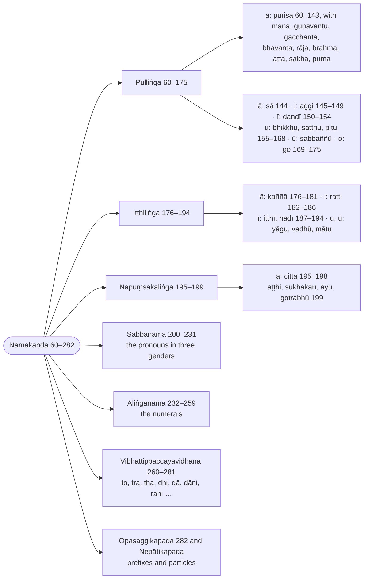

import { LinkCard } from "@astrojs/starlight/components";
import AnchorRedirect from "../../../../components/AnchorRedirect.astro";

:::note
Where Kaccāyana orders his noun rules by operation, Buddhappiya orders them by lemma: the masculine lemmas ending in `a`, `ā`, `i`, `ī`, `u`, `ū`, `o`, each with its paradigm (`padamālā`) and the derivation of every form; then the feminine and neuter lemmas, the pronouns (`sabbanāma`), the genderless words (numerals), the suffixes that take the place of an inflection (`to`, `tra`, `dā` …), the prefixes and the particles. Kaccāyana's rules are quoted where each form needs them, so a rule may appear more than once; the paradigms are set out as inflection tables.

:::

:::note[Reading Rachiwong]
This section is one of the three that Phramaha Sriporn Rachiwong translated in her Pune thesis *Rūpasiddhi: A Study of Some Aspects* (1995), reproduced on this site as [Rachiwong: Rūpasiddhi (1995)](/rupasiddhi/rachiwong). Her rules are headed `(K-N)`, K the Kaccāyana sutta and N the rule's number in the Thai edition of the Padarūpasiddhi (Bangkok 1984), her base text; her N is the number used on this page. Her notes compare that Thai edition (Rūp T.) with the Burmese Buddhasāsanasamiti edition (B., the Chaṭṭha Saṅgāyana text these pages print) and the Sinhalese Mahārūpasiddhi (S.). The footnotes below record where this translation's text or construal differs from hers, and nothing more; her own translation and notes are on her page.
:::

:::note[Buddhappiya's order of the nouns]
The Nāmakaṇḍa proceeds by gender and by the ending of the lemma, giving each model noun its paradigm; the ranges are Rūpasiddhi numbers.

:::

> Atha nāmikavibhatyāvatāro vuccate.

Now the introduction to the nominal inflections (`nāmikavibhatti`) is set forth.

> Atthābhimukhaṃ namanato, attani catthassa nāmanato nāmaṃ, dabbābhidhānaṃ.

A noun is called `nāma` because it bends (`namati`) towards a meaning, and because it makes a meaning bend towards itself: it is the naming of a substance (`dabba`).

> Taṃ pana duvidhaṃ anvattharuḷhīvasena, tividhaṃ pumitthinapuṃsakaliṅgavasena. Yathā – rukkho, mālā, dhanaṃ.

Now it is of two kinds, as:

- meaningful ([`anvattha`](/introduction#types-of-suttas)) and
- artificial ([`ruḷhī`](/introduction#types-of-suttas));

and of three kinds by gender:

- masculine,
- feminine and
- neuter,

for example:
- `rukkho` (a tree),
- `mālā` (a garland),
- `dhanaṃ` (wealth).

> Catubbidhaṃ sāmaññaguṇakriyāyadicchāvasena, yathā – rukkho, nīlo, pācako, sirivaḍḍhotiādi.

It is of four kinds, by way of
- a genus (`sāmañña`),
- a quality (`guṇa`),
- an action (`kriyā`) or
- an arbitrary wish (`yadicchā`),

for example:
- `rukkho` (a tree),
- `nīlo` (blue),
- `pācako` (a cook),
- `Sirivaḍḍho` (a personal name),
- and so on.

> Aṭṭhavidhaṃ avaṇṇivaṇṇuvaṇṇokāraniggahītantapakatibhedena.

It is of eight kinds by the division of its lemmas (`pakati`), which end in
- the `a`-sounds (`a`, `ā`),
- the `i`-sounds (`i`, `ī`),
- the `u`-sounds (`u`, `ū`),
- the `o`-sounds (`o`),
- and the niggahīta.

## Sections

- [Pulliṅga (Masculine nouns) (60–175)](/rupasiddhi/2-namakanda/1-pullinga/)
- [Itthiliṅga (Feminine nouns) (176–194)](/rupasiddhi/2-namakanda/2-itthilinga/)
- [Napuṃsakaliṅga (Neuter nouns) (195–199)](/rupasiddhi/2-namakanda/3-napumsakalinga/)
- [Sabbanāma (Pronouns) (200–231)](/rupasiddhi/2-namakanda/4-sabbanama/)
- [Aliṅganāma (Nouns without gender: numerals) (232–259)](/rupasiddhi/2-namakanda/5-alinganama/)
- [Vibhattippaccayavidhāna (Suffixes with the sense of an inflection) (260–281)](/rupasiddhi/2-namakanda/6-vibhattippaccaya/)
- [Opasaggikapada and Nepātikapada (Prefixes and particles) (282–282)](/rupasiddhi/2-namakanda/7-opasaggika-nepatika/)

<AnchorRedirect base="/rupasiddhi/2-namakanda/" prefix="r" map={{"1-pullinga": [60, 175], "2-itthilinga": [176, 194], "3-napumsakalinga": [195, 199], "4-sabbanama": [200, 231], "5-alinganama": [232, 259], "6-vibhattippaccaya": [260, 281], "7-opasaggika-nepatika": [282, 282]}} />
