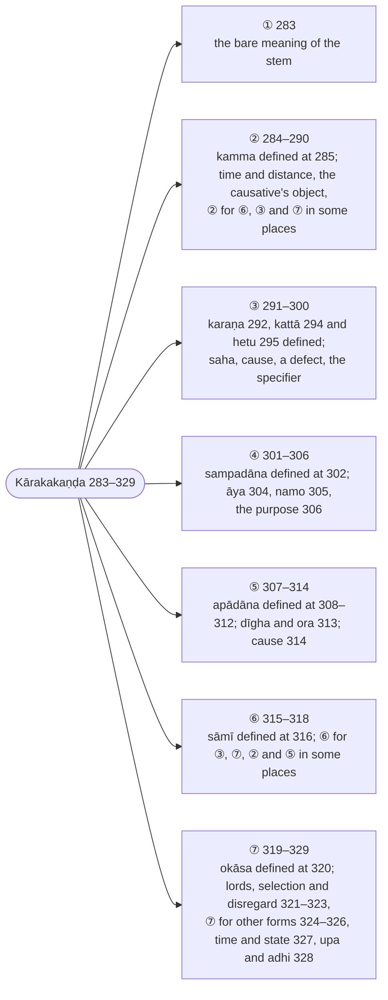

import { LinkCard } from "@astrojs/starlight/components";

:::note
Buddhappiya takes the inflection forms in order, ① to ⑦, assigns each to its meaning and defines the `kāraka` — agent, object, instrument, recipient, source, owner, location — where its form comes up, whereas Kaccāyana defined the `kāraka` first (§271–§283) and assigned the forms afterwards. His commentary adds the traditional definitions and defends them.

:::

:::note[The forms in Buddhappiya's order]
Kaccāyana defines the `kāraka` first (§271–§283) and assigns the forms afterwards; Buddhappiya takes the seven forms in order and defines each `kāraka` where its form is assigned. The numbers are Rūpasiddhi numbers.

:::

> Atha vibhattīnamatthabhedā vuccante.

Now the different meanings of the inflections (`vibhatti`) are stated.

> Tattha ekampi atthaṃ kammādivasena, ekattādivasena ca vibhajantīti vibhattiyo, syādayo. Tā pana paṭhamādibhedena sattavidhā.

Here "inflections" (`vibhatti`) means `si` and the rest, because they divide (`vibhajanti`) even a single meaning according to its being an object (`kamma`) and so on, and according to its being one or many. They are of seven kinds, the first form ① and the rest.

> Tattha kasmiṃ atthe paṭhamā?

Among these, in what sense is the first form ① used?

---

### 283 (§284): Liṅgatthe paṭhamā (the first form ① for the bare meaning of the stem) :badge[utsarga]{variant=success}

:::tip[Kaccāyana]
<LinkCard title="§284 (283): Liṅgatthe paṭhamā" href="/kaccayana/3-karakakappa#m284" description="the first form ① for the bare meaning of the stem" />
:::

:::note[Analysis]

Buddhappiya opens his Kārakakaṇḍa with the rule of the first form, where Kaccāyana had first defined the `kāraka` (§271–§283) and assigned the forms afterwards. His plan is announced in the introductory sentences above: the inflections divide a meaning by its part in the action and by number, and there are seven of them, so he takes the forms in order — ① here, ② at [284 (§297): Kammatthe dutiyā](/rupasiddhi/3-karakakanda#r284), ③ at [291 (§286): Karaṇe tatiyā](/rupasiddhi/3-karakakanda#r291), ④ at [301 (§293): Sampadāne catutthī](/rupasiddhi/3-karakakanda#r301), ⑤ at [307 (§295): Apādāne pañcamī](/rupasiddhi/3-karakakanda#r307), ⑥ at [315 (§301): Sāmismiṃ chaṭṭhī](/rupasiddhi/3-karakakanda#r315) and ⑦ at [319 (§302): Okāse sattamī](/rupasiddhi/3-karakakanda#r319) — and defines each `kāraka` immediately after the rule that assigns its form, with a question (`Kiṃ kammaṃ?`, `Ko ca kattā?`) as the hinge. He has already cited this rule at [65 (§284): Liṅgatthe paṭhamā](/rupasiddhi/2-namakanda#r65) to start the paradigm of `purisa`; there the gloss was a single sentence, and the full treatment is here.

What his commentary adds to the Kaccāyana vutti is the definition of the two words of the sutta. `liṅga` is derived three ways: as "a hidden limb" (`līnaṃ aṅgaṃ`), the stem that the analysis of a word into stem and suffix posits but that never appears on its own; as "that which makes the meaning known" (`liṅgati`), with or without one of the three genders; and by the other grammarians' definition, "a meaningful element other than root, suffix and inflection" — the Kātantra's `dhātuvibhaktivarjam arthavat liṅgam`, taken over under [§9 (11): Parasamaññā payoge](/kaccayana/1-sandhikappa#m9). `liṅgattha`, the meaning of the stem, is then defined as a concept (`paññatti`) of either kind the Abhidhamma distinguishes — a concept of a continuum such as "pot" or "cloth", or a concept of a common character such as "hardness" — and divided into the meaning "mixed with" a `kāraka` relation and the bare (`suddha`) meaning; only the bare meaning, with its gender, number and measure, is the `liṅgattha` of the rule, together with the meaning of a prefix or particle, which has no gender at all. He then closes a gap in the Kaccāyana: a `kāraka` meaning that a verb, a `kita` or `taddhita` suffix or a compound has already expressed (`abhihita`) also takes the first form, because the second form and the rest have nothing left to say about it — which is why the object of `sugatena desito dhammo` stands as `dhammo`, and the condition `anabhihite` governs the whole chapter (see [284 (§297): Kammatthe dutiyā](/rupasiddhi/3-karakakanda#r284)). The memory verse sums this up. His treatment of the vocative folds Kaccāyana's separate rule [§285 (70): Ālapane ca](/kaccayana/3-karakakappa#m285) into this article (`adhikicca … ‘‘ālapane cā’’ti`): address (`ālapana`) is speaking to someone face to face, and because the person addressed is not yet joined to any action, it is not a `kāraka` at all — a point he supports with a quoted verse. The rule has no option marker.

:::

> Liṅgatthābhidhānamatte paṭhamāvibhatti hoti.

In the mere expression of the meaning of the stem (`liṅgattha`), the first inflection form ① is used.

> Liṅgassa attho liṅgattho. Ettha ca līnaṃ aṅganti liṅgaṃ, apākaṭo avayavo, purisotiādīnañhi pakatippaccayādivibhāgakappanāya nipphāditānaṃ saddappatirūpakānaṃ nāmikapadānaṃ paṭhamaṃ ṭhapetabbaṃ pakatirūpaṃ apākaṭattā, avayavattā ca liṅganti vuccati. Atha vā visadāvisadobhayarahitākāravohārasaṅkhātena tividhaliṅgena sahitatthassa, tabbinimuttassupasaggādīnamatthassa ca līnassa gamanato, liṅganato vā liṅganti anvatthanāmavasena vā ‘‘dhātuppaccayavibhattivajjitamatthavaṃ liṅga’’nti vacanato parasamaññāvasena vā liṅganti idha pāṭipadikāparanāmadheyyaṃ syā divibhatyantapadapakatirūpameva vuccatīti daṭṭhabbaṃ.

`liṅgattha` is the meaning (`attha`) of the stem (`liṅga`). Here a `liṅga` is "a hidden limb" (`līnaṃ aṅgaṃ`), an unmanifest component: for nominal words such as `puriso`, which are produced by positing a division into stem, suffix and the rest and which are the counterparts of [complete] words, the stem form (`pakatirūpa`) that has to be set up first is called `liṅga` because it is unmanifest and because it is a component. Or else, `liṅga` is so called because a meaning is made known (`gamanato`) or indicated (`liṅganato`) that is hidden — whether a meaning accompanied by one of the three genders, which are the conventional terms for the clear, the unclear and the neither, or the meaning of prefixes and the like, which is free of them — so that the name says what it means (`anvattha`); or else by the terminology of the other [grammar], from the statement "a `liṅga` is what has meaning apart from root, suffix and inflection". Either way, it should be understood that `liṅga` here means only the stem form of a word ending in the inflections `si` and the rest — what is otherwise named `pāṭipadika` (a nominal base).

> Liṅgassattho nāma pabandhavisesākārena pavattamāne rūpādayo upādāya paññāpīyamāno tadaññānaññabhāvena anibbacanīyo samūhasantānādibhedo upādāpaññattisaṅkhāto ghaṭapaṭādivohārattho ca pathavīdhātuphassādīnaṃ sabhāvadhammānaṃ kāladesādibhedabhinnānaṃ vijātiyavinivatto sajātiyasādhāraṇo yathāsaṅketamāropasiddho tajjāpaññattisaṅkhāto kakkhaḷattaphusanādisāmaññākāro ca.

The meaning of a stem is of two kinds. It is the conventional meaning of words such as "pot" and "cloth" — what is called a derived concept (`upādāpaññatti`): a group, a continuum and the like, made known in dependence on material form and so on occurring in the shape of a particular series, and not to be described as either identical with or different from them. And it is the common character of hardness, touching and the like — what is called a concept of the corresponding kind (`tajjāpaññatti`): common to things of the same class and excluding things of another class, established by imposition according to convention, among the real phenomena (`sabhāvadhamma`) such as the earth element and contact, which differ by time, place and so on.

> So pana kammādisaṃsaṭṭho, suddho cāti duvidho. Tattha kammādīsu dutiyādīnaṃ vidhīyamānattā kammādisaṃsaggarahito liṅgasaṅkhyāparimāṇayutto, tabbinimuttupasaggādipadatthabhūto ca suddho saddattho idha liṅgattho nāma.

That meaning is again of two kinds: mixed with [the relations] `kamma` and the rest, and bare (`suddha`). Since the second form and the rest are prescribed for `kamma` and the rest, the `liṅgattha` meant here is the bare meaning of the word — the meaning free of any connection with `kamma` and the rest and possessing gender, number and measure, and also the meaning of a word such as a prefix, which is free even of those.

> Yo pana ākhyātakitakataddhitasamāsehi vutto kammādisaṃsaṭṭho attho, sopi dutiyādīnaṃ puna attanā vattabbassa atthavisesassābhāvena avisayattā, liṅgatthamattassa sambhavato ca paṭhamāyeva visayo.

A meaning mixed with `kamma` and the rest that has already been expressed (`vutta`) by a verb, a `kita` suffix, a `taddhita` suffix or a compound is likewise the province of the first form alone: it is not the province of the second form and the rest, because there is no further particular of meaning left for them to express, and only the bare meaning of the stem remains.

> Hoti cettha –

And on this there is [the verse]:

> Paṭhamāvupasaggatthe, kesañcatthe nipātasaddānaṃ; \
> Liṅgādike ca suddhe-bhihite kammādiatthepi.

The first form [stands] in the sense of a prefix and in the sense of some particle words; \
in the bare [meaning] of gender and the rest, and in a `kamma` sense and the like that is already expressed.

> Saliṅge tāva – eso puriso, ete purisā, esā kaññā, etā kaññāyo, etaṃ cittaṃ, etāni cittāni.

First, [the bare meaning] with gender:

:::tip[Examples]

Each pronoun and noun stands in the first form ①, with nothing but its gender and number to express.

| lemma | inflected | meaning |
| ----- | --------- | ------- |
| 🚹①⨀(eta) 🚹①⨀(purisa) | eso puriso | this man |
| 🚹①⨂(eta) 🚹①⨂(purisa) | ete purisā | these men |
| 🚺①⨀(eta) 🚺①⨀(kaññā) | esā kaññā | this girl |
| 🚺①⨂(eta) 🚺①⨂(kaññā) | etā kaññāyo | these girls |
| 🚻①⨀(eta) 🚻①⨀(citta) | etaṃ cittaṃ | this mind |
| 🚻①⨂(eta) 🚻①⨂(citta) | etāni cittāni | these minds |

:::

> Sasaṅkhye – eko dve.

With number:

:::tip[Examples]

| lemma | inflected | meaning |
| ----- | --------- | ------- |
| ⚧️①⨀(eka) | eko | one |
| ⚧️①⨂(dvi) | dve | two |

:::

> Saparimāṇe – doṇo khārī āḷhakaṃ.

With measure:

:::tip[Examples]

The three are measures of capacity; each has its own gender, and each is the bare name of a quantity.

| lemma | inflected | meaning |
| ----- | --------- | ------- |
| 🚹①⨀(doṇa) | doṇo | a `doṇa` (a measure of grain) |
| 🚺①⨀(khārī) | khārī | a `khārī` (a larger measure) |
| 🚻①⨀(āḷhaka) | āḷhakaṃ | an `āḷhaka` (a small measure) |

:::

> Liṅgādivinimutte sattāmatte – ca vā ha ahaṃ atthi sakkālabbhā iccādi.

In the mere existence [of a meaning] free of gender and the rest:

:::tip[Examples]

Particles name their meaning and nothing more; the first form they take is elided at once by [§221 (282): Sabbāsamāvuso pasagganipātādīhi ca](/kaccayana/2-namakappa#m221).

| lemma | inflected | meaning |
| ----- | --------- | ------- |
| 🔼(ca) | ca | and |
| 🔼(vā) | vā | or |
| 🔼(ha) | ha | indeed |
| 🔼(ahaṃ) | ahaṃ | ah! (the particle, not the pronoun) |
| 🔼(atthi) | atthi | there is (as a particle: "it exists") |
| 🔼(sakkā) | sakkā | it is possible |
| 🔼(labbhā) | labbhā | it is allowable |

:::

> ‘‘Liṅgatthe paṭhamā’’ti adhikicca ‘‘ālapane cā’’ti ālapanatthe ca paṭhamā, abhimukhaṃ katvā lapanaṃ ālapanaṃ, āmantanaṃ avhānanti attho.

Taking `Liṅgatthe paṭhamā` as the governing rule, by [§285 (70): Ālapane ca](/kaccayana/3-karakakappa#m285) the first form ① is used in the sense of address (`ālapana`) as well. `ālapana` is speaking (`lapana`) after turning [someone] to face one (`abhimukhaṃ katvā`): the meaning is calling to, summoning.

> Ettha ca āmantanaṃ nāma pageva laddhasarūpassa saddena abhimukhīkaraṇaṃ, katābhimukho pana ‘‘gacchā’’tiādinā nayena kriyāya yojīyati, tasmā āmantanasamaye kriyāyogābhāvato idaṃ kārakavohāraṃ na labhati.

Here calling to (`āmantana`) is the turning towards oneself, by means of a word, of someone who has already acquired his own identity; once turned, he is joined to an action by [a verb] such as "go". Therefore, since at the moment of address there is no connection with an action, this [addressed person] does not receive the designation `kāraka`.

> Vuttañca

And it is said:

> ‘‘Saddenābhimukhīkāro, vijjamānassa vatthuno; \
> Āmantanaṃ vidhātabbe, natthi ‘rājā bhave’tida’’nti.

"Turning an existing thing towards oneself by means of a word \
is address; where [the thing] is still to be brought about, as in 'may there be a king', there is none."

> Bho purisa ehi, bho purisā vā, bhavanto purisā etha.

:::tip[Examples]

The person addressed stands in the first form used as the vocative ⓪; the verb that follows is the imperative of `eti`, "come". `bho purisā` is the alternative singular that keeps the long `ā` of [§244 (72): Akārapitādyantānamā](/kaccayana/2-namakappa#m244) without the shortening of [§246 (73): Ākāro vā](/kaccayana/2-namakappa#m246).

| lemma | inflected | meaning |
| ----- | --------- | ------- |
| 🚹⓪⨀(bhavanta) 🚹⓪⨀(purisa) ⏯🤘⨀(eti) | bho purisa ehi | sir, man, come! |
| 🚹⓪⨀(bhavanta) 🚹⓪⨀(purisa) | bho purisā vā | or: sir, man! (with the long vowel) |
| 🚹⓪⨂(bhavanta) 🚹⓪⨂(purisa) ⏯🤘⨂(eti) | bhavanto purisā etha | sirs, men, come! |

:::

> Kasmiṃ atthe dutiyā?

In what sense is the second form ② used?

---

### 284 (§297): Kammatthe dutiyā (② for the `kamma` [object]) :badge[utsarga]{variant=success}

:::tip[Kaccāyana]
<LinkCard title="§297 (284): Kammatthe dutiyā" href="/kaccayana/3-karakakappa#m297" description="② for the `kamma` [object]" />
:::

:::note[Analysis]

The second form follows the first, as the forms run: this is the first of Buddhappiya's `kāraka` rules proper, and it stands before the definition of its own term, which the question `Kiṃ kammaṃ?` calls up at [285 (§280): Yaṃ karoti taṃ kammaṃ](/rupasiddhi/3-karakakanda#r285). In Kaccāyana the order is the reverse (§280 defines, §297 assigns). Buddhappiya had already cited the rule at [76 (§297): Kammatthe dutiyā](/rupasiddhi/2-namakanda#r76) to derive `purisaṃ`, `purise`; here he states its condition. `Anabhihite evāyaṃ`: the second form is used only when the object has not already been expressed (`abhihita`) — by a passive verb or participle, whose agreement with the object puts it in the first form (`kaṭo karīyate devadattena`, [283 (§284): Liṅgatthe paṭhamā](/rupasiddhi/3-karakakanda#r283)). The Kaccāyana sutta does not say so, and Buddhappiya proves the condition by a `ñāpaka`, a sign in the grammar itself: the rule [§626 (634): Kammani dutiyāya tto](/kaccayana/8-unadikappa#m626) makes the participle in `ta` express the agent "when the object is in the second form" (`dānaṃ dinno devadatto`), and that rule would have no work to do unless the object could also stand in the first form when the participle expresses it (`dānaṃ dinnaṃ devadattena`) — so the grammar presupposes `anabhihite`. The rule itself has no option marker; the `vā` that Buddhappiya says continues (`‘‘Yena vā kayirate taṃ karaṇa’’nti ito ‘‘vā’’ti vattate`) is for the definition that follows, and it comes from the Kaccāyana's order, in which [§279 (292): Yena vā kayirate taṃ karaṇaṃ](/kaccayana/3-karakakappa#m279) precedes §280 — in Buddhappiya's own arrangement that rule stands later, at [292 (§279): Yena vā kayirate taṃ karaṇaṃ](/rupasiddhi/3-karakakanda#r292), so the `anuvutti` here reaches back to the source text rather than forward in his own.

:::

> Kammatthe liṅgamhā dutiyāvibhatti hoti.

In the sense of the object (`kamma`), the second inflection form ② is used after the stem.

> Anabhihite evāyaṃ, ‘‘kammani dutiyāyaṃ tto’’ti vacanañcettha ñāpakaṃ.

This [rule applies] only when [the object] is not already expressed (`anabhihite`); and the statement [§626 (634): Kammani dutiyāya tto](/kaccayana/8-unadikappa#m626)[^1] is here the sign (`ñāpaka`) of that.

:::tip[Examples]

Buddhappiya's examples of the object follow under [285 (§280): Yaṃ karoti taṃ kammaṃ](/rupasiddhi/3-karakakanda#r285); the two he gave when he first cited the rule, in the paradigm of `purisa` ([76 (§297): Kammatthe dutiyā](/rupasiddhi/2-namakanda#r76)), are these.

| lemma | inflected | meaning |
| ----- | --------- | ------- |
| 🚹②⨀(purisa) ⏯🤘⨀(passati) | purisaṃ passa | see the man |
| 🚹②⨂(purisa) ⏯🤘⨀(passati) | purise passa | see the men |

`purisaṃ` and `purise` are the `kamma` of the seeing, in ②; the `ñāpaka` sentence `dānaṃ dinno devadatto` ("Devadatta has given the gift") keeps `dānaṃ` (🚻②⨀) in the second form while the participle `dinno` agrees with the giver.

:::

> Kiṃ kammaṃ?

What is the object (`kamma`)?

> ‘‘Yena vā kayirate taṃ karaṇa’’nti ito ‘‘vā’’ti vattate.

From [§279 (292): Yena vā kayirate taṃ karaṇaṃ](/kaccayana/3-karakakappa#m279) the word `vā` continues [into the next rule].

[^1]: CST4 prints `tto`, the spelling of the Kaccāyana sutta ([§626 (634): Kammani dutiyāya tto](/kaccayana/8-unadikappa#m626)); Buddhappiya's own statement of the rule at [634 (§626): Kammani dutiyāyaṃ kto](/rupasiddhi/7-kibbidhanakanda#r634) spells the suffix `kto`.

---

### 285 (§280): Yaṃ karoti taṃ kammaṃ (what one does: `kamma`) :badge[anvattha]{variant=note}

:::tip[Kaccāyana]
<LinkCard title="§280 (285): Yaṃ karoti taṃ kammaṃ" href="/kaccayana/3-karakakappa#m280" description="what one does: `kamma`" />
:::

:::note[Analysis]

The definition of the object is placed immediately after the rule that gives it the second form, and Buddhappiya uses the occasion to define the `kāraka` itself, which in his arrangement has not yet been named: `kārakaṃ, sādhakaṃ` — the accomplisher, the cause of the action's coming about — of six kinds, `kamma`, `kattā`, `karaṇa`, `sampadāna`, `apādāna` and `okāsa`, each of which deserves the name because the action exists only when it is present in fact or in thought. He had stated the definition briefly at [75 (§280): Yaṃ karoti taṃ kammaṃ](/rupasiddhi/2-namakanda#r75) with the gloss `kriyānimittaṃ`. What the commentary adds to the Kaccāyana vutti is the threefold division of the object taken over from the Sanskrit grammarians: what is produced (`nibbattanīya`, a son, pleasure), what is altered (`vikaraṇīya`, wood into charcoal, gold into a bracelet), and what is merely reached (`pāpaṇīya`, a house one enters, the sun one sees), fixed in a memory verse; and the further distinctions of the wished and the unwished object (`icchita`, `anicchita`: the thorn one treads on) and of the stated and the unstated (`kathita`, `akathita`) object of a verb that takes two — the person begged and the thing begged for. Against these he insists that the definition is all-inclusive: it says simply "what one does". The sutta has no `vā` of its own; the `vā` of Buddhappiya's gloss (`yaṃ vā karoti, yaṃ vā vikaroti, yaṃ vā pāpuṇāti`) is the one he announced at the end of the last article as continuing from [§279 (292): Yena vā kayirate taṃ karaṇaṃ](/kaccayana/3-karakakappa#m279), and he names its function: `atthantaravikappanavādhikārato`, "by the governance of the `vā` that opens the option of other senses" — an open `vikappa` in Ruiz-Falqués' terms (*Boundaries and Domains* §2.3, §3.1), not a choice between two forms of one word but a licence to extend the definition to every kind of object, so that this single rule confers the name everywhere (`sabbattha imināva kammasaññā hoti`). He closes by noting that the object already expressed (`abhihita`) is excluded, as [284 (§297): Kammatthe dutiyā](/rupasiddhi/3-karakakanda#r284) required, and that `dutiyā` remains the governing word (`adhikāra`) for the rules that follow.

:::

> Yaṃ vā karoti, yaṃ vā vikaroti, yaṃ vā pāpuṇāti, taṃ kārakaṃ kammasaññaṃ hoti.

What one does, or what one alters, or what one reaches — that `kāraka` is termed `kamma` (the object).

> Idha liṅgakālavacanamatantaṃ. Karīyatīti kammaṃ. Tattha kārakaṃ, sādhakaṃ kriyānipphattiyā kāraṇamuccate, taṃ pana kārakaṃ chabbidhaṃ kammaṃ kattā karaṇaṃ sampadānamapādānamokāso cāti. Tattha sabhāvato, parikappato vā kammādimhi satiyeva kriyābhāvato kammādīnaṃ channampi kārakavohāro siddhova hoti.

Here gender, tense and number are not the point [of the wording `yaṃ karoti`]. `kamma` is "what is done" (`karīyati`). And `kāraka` means the accomplisher (`sādhaka`), the cause of the bringing about of an action. That `kāraka` is of six kinds: `kamma` (object), `kattā` (agent), `karaṇa` (instrument), `sampadāna` (recipient), `apādāna` (point of departure) and `okāsa` (location). Since the action exists only when the object and the rest are present, whether in fact or in thought, the designation `kāraka` is established for all six of them, the object and the rest.

> Taṃ pana kammaṃ tividhaṃ nibbattanīyaṃ vikaraṇīyaṃ pāpaṇīyañcāti. Yathā – mātā puttaṃ vijāyati, āhāro sukhaṃ janayati. Ghaṭaṃ karoti devadatto, kaṭṭhamaṅgāraṃ karoti, suvaṇṇaṃ keyūraṃ, kaṭakaṃ vā karoti, vīhayo lunāti. Devadatto nivesanaṃ pavisati, ādiccaṃ passati, dhammaṃ suṇāti, paṇḍite payirupāsati.

That object is of three kinds: what is to be produced (`nibbattanīya`), what is to be altered (`vikaraṇīya`) and what is to be reached (`pāpaṇīya`).

:::tip[Examples]

In each sentence the object stands in ② by [284 (§297): Kammatthe dutiyā](/rupasiddhi/3-karakakanda#r284) and the agent in ①.

**Produced** (`nibbattanīya`): the object comes into being through the action.

| lemma | inflected | meaning |
| ----- | --------- | ------- |
| 🚺①⨀(mātā) 🚹②⨀(putta) ▶️🤟⨀(vijāyati) | mātā puttaṃ vijāyati | the mother gives birth to a son |
| 🚹①⨀(āhāra) 🚻②⨀(sukha) ▶️🤟⨀(janayati) | āhāro sukhaṃ janayati | food produces pleasure |

**Altered** (`vikaraṇīya`): the object is changed into something else.

| lemma | inflected | meaning |
| ----- | --------- | ------- |
| 🚹②⨀(ghaṭa) ▶️🤟⨀(karoti) 🚹①⨀(devadatta) | ghaṭaṃ karoti devadatto | Devadatta makes a pot |
| 🚻②⨀(kaṭṭha) 🚹②⨀(aṅgāra) ▶️🤟⨀(karoti) | kaṭṭhamaṅgāraṃ karoti | he makes the wood into charcoal |
| 🚻②⨀(suvaṇṇa) 🚻②⨀(keyūra) 🚹②⨀(kaṭaka) 🔼(vā) ▶️🤟⨀(karoti) | suvaṇṇaṃ keyūraṃ, kaṭakaṃ vā karoti | he makes the gold into an armlet, or a bracelet |
| 🚹②⨂(vīhi) ▶️🤟⨀(lunāti) | vīhayo lunāti | he reaps the rice |

`kaṭṭhaṃ aṅgāraṃ` and `suvaṇṇaṃ keyūraṃ` are the two objects of a verb of making: the material altered and the thing made of it, both in ②. `kaṭṭhamaṅgāraṃ` is `kaṭṭhaṃ aṅgāraṃ` with the niggahīta made `m` before the vowel by [§34 (52): Madā sare](/kaccayana/1-sandhikappa#m34).

**Reached** (`pāpaṇīya`): the object is neither produced nor changed, only attained by the action.

| lemma | inflected | meaning |
| ----- | --------- | ------- |
| 🚹①⨀(devadatta) 🚻②⨀(nivesana) ▶️🤟⨀(pavisati) | devadatto nivesanaṃ pavisati | Devadatta enters the house |
| 🚹②⨀(ādicca) ▶️🤟⨀(passati) | ādiccaṃ passati | he sees the sun |
| 🚹②⨀(dhamma) ▶️🤟⨀(suṇāti) | dhammaṃ suṇāti | he hears the teaching |
| 🚹②⨂(paṇḍita) ▶️🤟⨀(payirupāsati) | paṇḍite payirupāsati | he waits upon the wise |

:::

> Vuttañca

And it is said:

> ‘‘Nibbattivikatippatti-bhedena tividhaṃ mataṃ; \
> Kattu kriyābhigammaṃ taṃ, sukhaṅgāraṃ nivesana’’nti.

"By the division into production, alteration and attainment it is held to be threefold: \
that which the agent's action reaches — pleasure, charcoal, a dwelling."

> Ettha ca icchitānicchitakathitākathitādibhedamanapekkhitvā sabbasaṅgāhakavasena ‘‘yaṃ karoti taṃ kamma’’nti vuttattā, atthantaravikappanavādhikārato ca sabbattha imināva kammasaññā hoti.

And here, because the rule was stated in the all-inclusive form "what one does is the object", without regard to the divisions into wished and unwished, stated and unstated and so on, and because of the governance of the `vā` that opens the option of other senses (`atthantaravikappana`), it is by this rule alone that the term `kamma` is given in every case.

> Tattha anicchitakammaṃ yathā – kaṇṭakaṃ maddati, visaṃ gilati, gāmaṃ gacchanto rukkhamūlaṃ upagacchati.

Among these, an unwished object (`anicchitakamma`) is, for example:

:::tip[Examples]

No one wants the thorn, the poison or the detour, yet each is what the action reaches and each takes ②.

| lemma | inflected | meaning |
| ----- | --------- | ------- |
| 🚹②⨀(kaṇṭaka) ▶️🤟⨀(maddati) | kaṇṭakaṃ maddati | he treads on a thorn |
| 🚻②⨀(visa) ▶️🤟⨀(gilati) | visaṃ gilati | he swallows poison |
| 🚹②⨀(gāma) 🚹①⨀(gacchanta) 🚻②⨀(rukkhamūla) ▶️🤟⨀(upagacchati) | gāmaṃ gacchanto rukkhamūlaṃ upagacchati | going to the village, he comes to the foot of a tree |

:::

> Akathitakammaṃ yathā – yaññadattaṃ kambalaṃ yācate brāhmaṇo. Ettha hi ‘‘kambala’’miti kathitakammaṃ dvikammikāya yācanakriyāya pattumicchitatarattā. ‘‘Yaññadatta’’miti appadhānattā akathitakammaṃ. Tathā samiddhaṃ dhanaṃ bhikkhate, ajaṃ gāmaṃ nayati, parābhavantaṃ purisaṃ, mayaṃ pucchāma gotamaṃ, bhagavā bhikkhū etadavoca iccādi.

An unstated object (`akathitakamma`) is, for example, `yaññadattaṃ kambalaṃ yācate brāhmaṇo`, "the brahmin begs Yaññadatta for a blanket". Here `kambalaṃ` is the stated object (`kathitakamma`), because of the two objects of the action of begging it is the one more desired to be obtained; `yaññadattaṃ`, being subordinate, is the unstated object. Likewise in the following:

:::tip[Examples]

Verbs of begging, leading, asking and speaking take two objects, both in ②: the person and the thing.

| lemma | inflected | meaning |
| ----- | --------- | ------- |
| 🚹②⨀(yaññadatta) 🚹②⨀(kambala) ▶️🤟⨀(yācati) 🚹①⨀(brāhmaṇa) | yaññadattaṃ kambalaṃ yācate brāhmaṇo | the brahmin begs Yaññadatta for a blanket |
| 🚹②⨀(samiddha) 🚻②⨀(dhana) ▶️🤟⨀(bhikkhati) | samiddhaṃ dhanaṃ bhikkhate | he begs the rich man for money |
| 🚹②⨀(aja) 🚹②⨀(gāma) ▶️🤟⨀(nayati) | ajaṃ gāmaṃ nayati | he leads the goat to the village |

> `parābhavantaṃ purisaṃ, mayaṃ pucchāma gotamaṃ` \
> [(18Sn 1.6: Parābhavasutta)](https://tipitaka2500.github.io/tipitaka/18Sn/1/1.6#107) \
🚹②⨀(parābhavanta) 🚹②⨀(purisa) ⚧️①⨂(amha) ▶️👆⨂(pucchati) 🚹②⨀(gotama) \
about the declining | man | we | ask | Gotama

`gotamaṃ`, the person asked, is the unstated object; `parābhavantaṃ purisaṃ`, what is asked about, the stated one.

> `bhagavā bhikkhū etadavoca` \
> [(12S1 11.2.2: Sakkanāmasutta)](https://tipitaka2500.github.io/tipitaka/12S1/11/11.2/11.2.2#1615) \
🚹①⨀(bhagavantu) 🚹②⨂(bhikkhu) ⚧️②⨀(eta) ⏮🤟⨀(vacati) \
the Blessed One | to the monks | this | said

`bhikkhū`, the persons addressed, is the unstated object and `etaṃ` the stated one — the analysis that [§277 (303): Silāgha hanu ṭhā sapa dhāra piha kudha duhisso ssūya rādhikkha paccāsuṇa anupatigiṇa pubbakattārocanattha tadattha tumatthālamattha maññānādarappāṇini gatyatthakammaniāsisatthasammutibhiyyasattamyatthesu ca](/kaccayana/3-karakakappa#m277) applies to the same sentence.

:::

> Abhihitakamme pana na hoti, yathā – kaṭo karīyate devadattena, sugatena desito dhammo, yaññadatto kambalaṃ yācīyate brāhmaṇena iccādi.

:::danger[Counter-examples]

When the object is already expressed (`abhihita`) — by a passive verb or a past participle that agrees with it — the second form is not used: the object stands in the first form by [283 (§284): Liṅgatthe paṭhamā](/rupasiddhi/3-karakakanda#r283), and the agent in the third by [293 (§288): Kattari ca](/rupasiddhi/3-karakakanda#r293).

| lemma | inflected | meaning |
| ----- | --------- | ------- |
| 🚹①⨀(kaṭa) 🔵▶️🤟⨀(karīyati) 🚹③⨀(devadatta) | kaṭo karīyate devadattena | the mat is being made by Devadatta |
| 🚹③⨀(sugata) 🚹①⨀(desita) 🚹①⨀(dhamma) | sugatena desito dhammo | the teaching taught by the Well-gone One |
| 🚹①⨀(yaññadatta) 🚹②⨀(kambala) 🔵▶️🤟⨀(yācīyati) 🚹③⨀(brāhmaṇa) | yaññadatto kambalaṃ yācīyate brāhmaṇena | Yaññadatta is begged by the brahmin for a blanket |

In the last sentence the passive expresses only the unstated object, Yaññadatta, who therefore takes ①; the stated object `kambalaṃ` is not expressed by the verb and keeps its ②.

:::

> ‘‘Dutiyā’’ti adhikāro.

`dutiyā` (the second form) is the governing word [for the rules that follow].

---

### 286 (§300): Gati buddhi bhuja paṭha hara kara sayādīnaṃ kārite vā (optionally ② for the one made to act in a causative) :badge[apavada]{variant=success}

:::tip[Kaccāyana]
<LinkCard title="§300 (286): Gati buddhi bhuja paṭha hara kara sayādīnaṃ kārite vā" href="/kaccayana/3-karakakappa#m300" description="optionally ② for the one made to act in a causative" />
:::

:::note[Analysis]

Under the governing word `dutiyā` Buddhappiya now gives the three rules that assign the second form to words that are not objects by the definition just given — the one made to act in a causative here, time and distance at [287 (§298): Kāladdhānamaccantasaṃyoge](/rupasiddhi/3-karakakanda#r287), the noun governed by a `kammappavacanīya` at [288 (§299): Kammappavacanīyayutte](/rupasiddhi/3-karakakanda#r288) — in the Kaccāyana's order but with this rule brought forward from third place to first, since the one made to act is the case nearest to a true object. His gloss unpacks the seven meaning-names of the sutta into roots with their Dhātupāṭha senses (`gamu` and `sappa` in the sense of going, `budha` in the sense of awakening or of understanding, `bhuja` in protecting and eating, `paṭha` in distinct speech, `hara` in carrying, `kara` in doing, `si` in lying down) and names the word that takes the form: the `payojjakattā`, the agent who is set to work, now the object of the causative (`kattukammani`). The option marker `vā` he glosses in his own terms: `Niccasampatte vikappatthoyaṃ, tena tassa pakkhe tatiyā hoti` — where the third form of the agent, [293 (§288): Kattari ca](/rupasiddhi/3-karakakanda#r293), would otherwise be obligatory (`niccasampatte`), this `vā` makes an open option (`vikappa`), so that in the other branch the third form stands: `purisaṃ gamayati` or `purisena gamayati`, both good Pāli (*Boundaries and Domains* §2.3, §3.1). The Kaccāyana vutti admits the fourth form as well (`purisassa vā`); Buddhappiya's paraphrase mentions only the third, and his two counter-examples fix the rule's two conditions — a causative, and an object not already expressed by a passive.

:::

> Gamu sappa gatimhi, budha bodhane, budha avagamane vā, bhuja pālanabyavaharaṇesu, paṭha byattiyaṃ vācāyaṃ, hara haraṇe, kara karaṇe, si saye iccevamādīnaṃ dhātūnaṃ payoge kārite sati payojjakakattubhūte kammani liṅgamhā dutiyāvibhatti hoti vā. Niccasampatte vikappatthoyaṃ, tena tassa pakkhe tatiyā hoti.

When there is a causative (`kārita`) in the use of the roots `gamu` and `sappa` in the sense of going, `budha` in the sense of awakening or `budha` in the sense of understanding, `bhuja` in the senses of protecting and eating, `paṭha` in the sense of distinct speech, `hara` in the sense of carrying, `kara` in the sense of doing, `si` in the sense of lying down, and others like them, the second inflection form ② is optionally used after the stem for the object that is the agent set to work (`payojjakattā`). This [`vā`] has the sense of an option (`vikappa`) where [the third form] would be obligatory; therefore in the other branch the third form ③ is used.

> Yo koci puriso gāmaṃ gacchati, tamañño payojayati. Puriso purisaṃ gāmaṃ gamayati, purisena vā gāmaṃ gamayati. Evaṃ sissaṃ dhammaṃ bodheti ācariyo, mātā puttaṃ bhojanaṃ bhojayati, sissaṃ dhammaṃ pāṭheti ācariyo, puriso purisaṃ bhāraṃ hāreti, tathā puriso purisaṃ kammaṃ kārayati, purisena vā kammaṃ kārāpayati, puriso purisaṃ sayāpayati. Evaṃ sabbattha kārite kattukammani dutiyā.

Some man goes to the village; another sets him to it:

:::tip[Examples]

In each sentence the causative agent (the `hetu` of [295 (§282): Yo kāreti sa hetu](/rupasiddhi/3-karakakanda#r295)) stands in ①; the one made to act, the agent of the simple verb, takes ② by this rule or ③ by the option; the object of the simple verb keeps its own ②, so that the causative has two objects.

| lemma | inflected | meaning |
| ----- | --------- | ------- |
| 🚹①⨀(purisa) 🚹②⨀(purisa) 🚹②⨀(gāma) ▶️🤟⨀(gamayati) | puriso purisaṃ gāmaṃ gamayati | the man makes the man go to the village |
| 🚹③⨀(purisa) 🔼(vā) 🚹②⨀(gāma) ▶️🤟⨀(gamayati) | purisena vā gāmaṃ gamayati | or: he makes the man (③) go to the village |
| 🚹②⨀(sissa) 🚹②⨀(dhamma) ▶️🤟⨀(bodheti) 🚹①⨀(ācariya) | sissaṃ dhammaṃ bodheti ācariyo | the teacher makes the pupil understand the teaching |
| 🚺①⨀(mātā) 🚹②⨀(putta) 🚻②⨀(bhojana) ▶️🤟⨀(bhojayati) | mātā puttaṃ bhojanaṃ bhojayati | the mother feeds the son the meal |
| 🚹②⨀(sissa) 🚹②⨀(dhamma) ▶️🤟⨀(pāṭheti) 🚹①⨀(ācariya) | sissaṃ dhammaṃ pāṭheti ācariyo | the teacher makes the pupil recite the teaching |
| 🚹①⨀(purisa) 🚹②⨀(purisa) 🚹②⨀(bhāra) ▶️🤟⨀(hāreti) | puriso purisaṃ bhāraṃ hāreti | the man makes the man carry the load |
| 🚹①⨀(purisa) 🚹②⨀(purisa) 🚻②⨀(kamma) ▶️🤟⨀(kārayati) | puriso purisaṃ kammaṃ kārayati | the man makes the man do the work |
| 🚹③⨀(purisa) 🔼(vā) 🚻②⨀(kamma) ▶️🤟⨀(kārāpayati) | purisena vā kammaṃ kārāpayati | or: he has the work done by the man (③) |
| 🚹①⨀(purisa) 🚹②⨀(purisa) ▶️🤟⨀(sayāpayati) | puriso purisaṃ sayāpayati | the man makes the man lie down |

`Evaṃ sabbattha kārite kattukammani dutiyā`: so everywhere in a causative the second form is used for the agent that has become an object. The causatives are formed with the suffixes of [§438 (540): Dhātūhi ṇe ṇaya ṇāpe ṇāpayā kāritāni hetvatthe](/kaccayana/6-akhyatakappa#m438).

:::

> Kārite ti kiṃ? Puriso gāmaṃ gacchati.

:::danger[Counter-example]

By saying `kārite` (in a causative) the rule does not touch the simple verb: its agent stands in the first form.

| lemma | inflected | meaning |
| ----- | --------- | ------- |
| 🚹①⨀(purisa) 🚹②⨀(gāma) ▶️🤟⨀(gacchati) | puriso gāmaṃ gacchati | the man goes to the village |

:::

> Abhihite na bhavati, purisena puriso gāmaṃ gamīyate, sisso dhammaṃ bodhīyate iccādi.

:::danger[Counter-examples]

When [the one made to act] is already expressed by a passive causative, the rule does not apply: he stands in the first form ① as the word the verb agrees with, and the causative agent takes the third by [293 (§288): Kattari ca](/rupasiddhi/3-karakakanda#r293).

| lemma | inflected | meaning |
| ----- | --------- | ------- |
| 🚹③⨀(purisa) 🚹①⨀(purisa) 🚹②⨀(gāma) 🔵▶️🤟⨀(gamīyati) | purisena puriso gāmaṃ gamīyate | the man is made by the man to go to the village |
| 🚹①⨀(sissa) 🚹②⨀(dhamma) 🔵▶️🤟⨀(bodhīyati) | sisso dhammaṃ bodhīyate | the pupil is made to understand the teaching |

:::

---

### 287 (§298): Kāladdhānamaccantasaṃyoge (② for time and distance in unbroken connection) :badge[apavada]{variant=success}

:::tip[Kaccāyana]
<LinkCard title="§298 (287): Kāladdhānamaccantasaṃyoge" href="/kaccayana/3-karakakappa#m298" description="② for time and distance in unbroken connection" />
:::

:::note[Analysis]

The second of the three special rules of the second form. Buddhappiya's gloss defines `accantasaṃyoga` — `accantaṃ nirantaraṃ saṃyogo`, connection without a break — and states what the span is connected to, which the Kaccāyana vutti leaves unsaid: a thing (`dabba`: a drink taken for seven days), a quality (`guṇa`: a river delightful throughout the autumn) or an action (`kriyā`: reciting for a month). His examples are sorted by those three under time, and he adds the distance words. The counter-example is his own — `māse māse bhuñjati`, "he eats once a month", where the eating does not fill the month and the time word takes the seventh as an `okāsa` ([319 (§302): Okāse sattamī](/rupasiddhi/3-karakakanda#r319)) — and it makes the same point as the Kaccāyana's `saṃvacchare bhojanaṃ bhuñjati`. No option marker: within its condition the rule is obligatory.

:::

> Accantaṃ nirantaraṃ saṃyogoaccantasaṃyogo. Kāladdhānaṃ dabbaguṇakriyāhi accantasaṃyoge tehi kāladdhānavācīhi liṅgehi dutiyāvibhatti hoti.

Unbroken connection (`accantasaṃyoga`) is connection that is `accanta`, without interruption. When there is unbroken connection of time or of distance with a thing, a quality or an action, the second inflection form ② is used after those stems that express time or distance.

> Kāle tāva – sattāhaṃ gavapānaṃ, māsaṃ maṃsodanaṃ, saradaṃ ramaṇīyā nadī, sabbakālaṃ ramaṇīyaṃ nandanaṃ, māsaṃ sajjhāyati, tayo māse abhidhammaṃ desesi.

First, with time:

:::tip[Examples]

The time word stands in ② and is not the object of anything; the first pair is connected with a thing, the second with a quality, the third with an action.

| lemma | inflected | meaning |
| ----- | --------- | ------- |
| 🚻②⨀(sattāha) 🚻①⨀(gavapāna) | sattāhaṃ gavapānaṃ | for seven days, the drink of milk-rice |
| 🚹②⨀(māsa) 🚹①⨀(maṃsodana) | māsaṃ maṃsodanaṃ | for a month, rice with meat |
| 🚹②⨀(sarada) 🚺①⨀(ramaṇīya) 🚺①⨀(nadī) | saradaṃ ramaṇīyā nadī | through the autumn the river is delightful |
| 🚹②⨀(sabbakāla) 🚻①⨀(ramaṇīya) 🚻①⨀(nandana) | sabbakālaṃ ramaṇīyaṃ nandanaṃ | at all times the Nandana grove is delightful |
| 🚹②⨀(māsa) ▶️🤟⨀(sajjhāyati) | māsaṃ sajjhāyati | for a month he recites |
| ⚧️②⨂(ti) 🚹②⨂(māsa) 🚹②⨀(abhidhamma) ⏮🤟⨀(deseti) | tayo māse abhidhammaṃ desesi | for three months he taught the Abhidhamma |

:::

> Addhāne – yojanaṃ vanarāji, yojanaṃ dīgho pabbato, kosaṃ sajjhāyati.

With distance:

:::tip[Examples]

| lemma | inflected | meaning |
| ----- | --------- | ------- |
| 🚻②⨀(yojana) 🚺①⨀(vanarāji) | yojanaṃ vanarāji | the belt of forest [runs] for a league |
| 🚻②⨀(yojana) 🚹①⨀(dīgha) 🚹①⨀(pabbata) | yojanaṃ dīgho pabbato | the mountain is a league long |
| 🚹②⨀(kosa) ▶️🤟⨀(sajjhāyati) | kosaṃ sajjhāyati | for a `kosa` [of the way] he recites |

:::

> Accantasaṃyoge ti kiṃ? Māse māse bhuñjati, yojane yojane vihāraṃ patiṭṭhāpesi.

:::danger[Counter-examples]

By saying `accantasaṃyoge` (in unbroken connection) the rule does not apply when the action falls within the span without filling it: the time or distance word is then the occasion of the action and takes the seventh form by [319 (§302): Okāse sattamī](/rupasiddhi/3-karakakanda#r319). The repetition marks distribution, "every month", "every league".

| lemma | inflected | meaning |
| ----- | --------- | ------- |
| 🚹⑦⨀(māsa) 🚹⑦⨀(māsa) ▶️🤟⨀(bhuñjati) | māse māse bhuñjati | he eats once a month |
| 🚻⑦⨀(yojana) 🚻⑦⨀(yojana) 🚹②⨀(vihāra) ⏮🤟⨀(patiṭṭhāpeti) | yojane yojane vihāraṃ patiṭṭhāpesi | at every league he established a monastery |

:::

---

### 288 (§299): Kammappavacanīyayutte (② with a `kammappavacanīya` [governing particle]) :badge[apavada]{variant=success}

:::tip[Kaccāyana]
<LinkCard title="§299 (288): Kammappavacanīyayutte" href="/kaccayana/3-karakakappa#m299" description="② with a `kammappavacanīya` [governing particle]" />
:::

:::note[Analysis]

The last of the three special rules of the second form, and the one where Buddhappiya leans most openly on the Sanskrit grammarians. The Kaccāyana vutti gives two examples and no account of the term; Buddhappiya explains `kammappavacanīya` twice — as "those by which an action (`kamma`) is to be expressed (`pavacanīya`)", and, "by the other terminology" ([§9 (11): Parasamaññā payoge](/kaccayana/1-sandhikappa#m9)), simply as the list `anu` and so on — and then quotes the rules of that other terminology in Pāli dress: `anu` in the senses of a mark, of "together with" and of inferiority; `pati`, `pari` and `anu` in the senses of a mark, of a statement of someone's condition, of a share and of distribution (Pāṇini's `lakṣaṇetthambhūtākhyānabhāgavīpsāsu pratiparyanavaḥ`, 1.4.90); and `abhi` in the same senses except that of a share (`abhir abhāge`, 1.4.91). Each sense gets its example, mostly the Sanskrit grammarians' own translated (`nadimanvavasitā bārāṇasī`, "Benares lies along the river"), with the canonical `pabbajitamanupabbajiṃsu` and `taṃ kho pana bhavantaṃ gotamaṃ … abbhuggato` among them. His gloss also takes `yutte` as construction with prefixes *and* particles (`nipātopasaggehi`), so that the final example, the particle `dhi` with `hantāraṃ`, falls under the rule. The prefix in these constructions is not joined to the verb but governs the noun, and the noun takes the second form though it is no object; no option marker.

:::

> Kammappavacanīyehi nipātopasaggehi yutte yoge sati liṅgamhā dutiyāvibhatti hoti.

When there is a construction joined with particles or prefixes that are `kammappavacanīya`, the second inflection form ② is used after the stem.

> Kammaṃ pavacanīyaṃ yesaṃ te kammappavacanīyā, parasamaññāvasena vā anvādayo kammappavacanīyā.

`kammappavacanīya` are those by which an action (`kamma`) is to be expressed (`pavacanīya`); or, by the terminology of the other [grammar], `anu` and the rest are the `kammappavacanīya`.

> Tattha anu saddassa lakkhaṇe, sahatthe, hīne ca kammappavacanīyasaññā vuttā. Yathā – pabbajitamanu pabbajiṃsu, nadimanvavasitā bārāṇasī, nadiyā saha avabaddhāti attho, anu sāriputtaṃ paññavā.

Among them, the term `kammappavacanīya` is stated for the word `anu` in the sense of a mark (`lakkhaṇa`), in the sense of "together with" (`sahattha`) and in the sense of inferiority (`hīna`).

:::tip[Examples]

The noun governed by `anu` stands in ②; the sense of the particle is given in the meaning column.

> `pabbajitamanupabbajiṃsu` \
> [(7D 1.10: Mahājanakāyaanupabbajjā)](https://tipitaka2500.github.io/tipitaka/7D/1/1.10#110) \
🚹②⨀(pabbajita) 🔼(anu) ⏮🤟⨂(pabbajati) \
the one who had gone forth | after | they went forth

`anu` marks the one they followed (`lakkhaṇa`); the Dīgha writes the words apart, `pabbajitaṃ anupabbajiṃsu`.

| lemma | inflected | meaning |
| ----- | --------- | ------- |
| 🚺②⨀(nadī) 🔼(anu) 🚺①⨀(avasita) 🚺①⨀(bārāṇasī) | nadimanvavasitā bārāṇasī | Benares lies along the river — that is, `nadiyā saha avabaddhā`, "bound together with the river" (`sahattha`) |
| 🔼(anu) 🚹②⨀(sāriputta) 🚹①⨀(paññavantu) | anu sāriputtaṃ paññavā | wise, second to Sāriputta (`hīna`) |

`nadimanvavasitā` is `nadiṃ anu avasitā`, the niggahīta becoming `m` and the `u` of `anu` becoming `v` before the vowel by [§34 (52): Madā sare](/kaccayana/1-sandhikappa#m34) and [§18 (20): Vamodudantānaṃ](/kaccayana/1-sandhikappa#m18).

:::

> Lakkhaṇādīsu ‘‘lakkhaṇi’tthambhūtakkhānabhāga vicchāsu pati pari anavo’’ti pati pari anūnaṃ kammappavacanīyasaññā vuttā.

In the senses of a mark and the rest, by the rule "`pati`, `pari` and `anu` in the senses of a mark, of the statement of someone's condition, of a share and of distribution", the term `kammappavacanīya` is stated for `pati`, `pari` and `anu`.

> Lakkhaṇe sūriyuggamanaṃ pati dibbā bhakkhā pātubhaveyyuṃ, rukkhaṃ pati vijjotate cando, rukkhaṃ pari, rukkhaṃ anu.

In the sense of a mark (`lakkhaṇa`):

:::tip[Examples]

> `sūriyuggamanaṃ pati dibbā bhakkhā pātubhaveyyuṃ` \
> [(19Pv 2.9: Aṅkurapetavatthu)](https://tipitaka2500.github.io/tipitaka/19Pv/2/2.9#322) \
🚻②⨀(sūriyuggamana) 🔼(pati) 🚹①⨂(dibba) 🚹①⨂(bhakkha) ⏯🤟⨂(pātubhavati) \
sunrise | towards | heavenly | foods | may appear

`sūriyuggamanaṃ` (②) is the mark by which the time is fixed, governed by `pati`; `dibbā bhakkhā` is the agent in ①.

| lemma | inflected | meaning |
| ----- | --------- | ------- |
| 🚹②⨀(rukkha) 🔼(pati) ▶️🤟⨀(vijjotati) 🚹①⨀(canda) | rukkhaṃ pati vijjotate cando | the moon shines towards the tree |
| 🚹②⨀(rukkha) 🔼(pari) | rukkhaṃ pari | [the moon shines] round the tree |
| 🚹②⨀(rukkha) 🔼(anu) | rukkhaṃ anu | [the moon shines] along the tree |

:::

> Itthambhūtakkhāne sādhu devadatto mātaraṃ pati, mātaraṃ pari, mātaraṃ anu.

In the statement of someone's condition (`itthambhūtakkhāna`):

:::tip[Examples]

| lemma | inflected | meaning |
| ----- | --------- | ------- |
| 🚹①⨀(sādhu) 🚹①⨀(devadatta) 🚺②⨀(mātu) 🔼(pati) | sādhu devadatto mātaraṃ pati | Devadatta is good towards his mother |
| 🚺②⨀(mātu) 🔼(pari) 🚺②⨀(mātu) 🔼(anu) | mātaraṃ pari, mātaraṃ anu | towards his mother (with `pari`, with `anu`) |

`mātaraṃ` is the second form of `mātu` with the `āra` of [§200 (159): Aññesvārattaṃ](/kaccayana/2-namakappa#m200).

:::

> Bhāge yadettha maṃ pati siyā, maṃ pari, maṃ anu, taṃ dīyatu.

In the sense of a share (`bhāga`):

:::tip[Examples]

| lemma | inflected | meaning |
| ----- | --------- | ------- |
| ⚧️①⨀(ya) 🔼(ettha) ⚧️②⨀(amha) 🔼(pati) ⏯🤟⨀(atthi) ⚧️①⨀(ta) ⏯🤟⨀(dīyati) | yadettha maṃ pati siyā, taṃ dīyatu | whatever share here would fall to me, let that be given |
| ⚧️②⨀(amha) 🔼(pari) ⚧️②⨀(amha) 🔼(anu) | maṃ pari, maṃ anu | to me (with `pari`, with `anu`) |

`maṃ` is the second form of `amha` by [§143 (235): Taṃ mamaṃmhi](/kaccayana/2-namakappa#m143).

:::

> Vicchāyoge atthamatthaṃ pati saddo nivisati, rukkhaṃ rukkhaṃ pati vijjotate cando, rukkhaṃ rukkhaṃ pari, rukkhaṃ rukkhaṃ anu.

In construction with distribution (`vicchā`, the repetition of a word to mean "each in turn"):

:::tip[Examples]

| lemma | inflected | meaning |
| ----- | --------- | ------- |
| 🚹②⨀(attha) 🚹②⨀(attha) 🔼(pati) 🚹①⨀(sadda) ▶️🤟⨀(nivisati) | atthamatthaṃ pati saddo nivisati | a word settles on each meaning in turn |
| 🚹②⨀(rukkha) 🚹②⨀(rukkha) 🔼(pati) ▶️🤟⨀(vijjotati) 🚹①⨀(canda) | rukkhaṃ rukkhaṃ pati vijjotate cando | the moon shines on tree after tree |
| 🚹②⨀(rukkha) 🚹②⨀(rukkha) 🔼(pari) 🚹②⨀(rukkha) 🚹②⨀(rukkha) 🔼(anu) | rukkhaṃ rukkhaṃ pari, rukkhaṃ rukkhaṃ anu | round each tree, along each tree |

:::

> ‘‘Abhirabhāge’’ti abhissa bhāgavajjitesu lakkhaṇādīsu kammappavacanīyasaññā vuttā. Taṃ kho pana bhavantaṃ gotamaṃ evaṃ kalyāṇo kittisaddo abbhuggato, sādhu devadatto mātaraṃ abhi.

By the rule "`abhi`, except in the sense of a share", the term `kammappavacanīya` is stated for `abhi` in the senses of a mark and the rest, the sense of a share excepted.

:::tip[Examples]

> `taṃ kho pana bhavantaṃ gotamaṃ evaṃ kalyāṇo kittisaddo abbhuggato` \
> [(1V Veranjakanda: Verañjakaṇḍa)](https://tipitaka2500.github.io/tipitaka/1V/1/Veranjakanda#2) \
🚹②⨀(ta) 🔼(kho) 🔼(pana) 🚹②⨀(bhavanta) 🚹②⨀(gotama) 🔼(evaṃ) 🚹①⨀(kalyāṇa) 🚹①⨀(kittisadda) 🚹①⨀(abbhuggata) \
that | indeed | now | the venerable | Gotama | such | a fair | report | has spread about

`taṃ bhavantaṃ gotamaṃ` takes ② as the mark towards which the report has risen (`abhi` + `ud` + `gata`).

| lemma | inflected | meaning |
| ----- | --------- | ------- |
| 🚹①⨀(sādhu) 🚹①⨀(devadatta) 🚺②⨀(mātu) 🔼(abhi) | sādhu devadatto mātaraṃ abhi | Devadatta is good towards his mother |

:::

> Nipāte dhi brāhmaṇassa hantāra miccevamādi.

With a particle (`nipāta`):

:::tip[Example]

> `dhī brāhmaṇassa hantāraṃ` \
> [(18Dh 26.7: Sāriputtattheravatthu)](https://tipitaka2500.github.io/tipitaka/18Dh/26/26.7#417) \
🔼(dhī) 🚹⑥⨀(brāhmaṇa) 🚹②⨀(hantu) \
fie | of a brahmin | upon the killer

`hantāraṃ`, the second form of the agent noun `hantu` (with the `āra` of [§200 (159): Aññesvārattaṃ](/kaccayana/2-namakappa#m200)), is governed by the particle of reproach; the Dhammapada spells it `dhī` where Buddhappiya writes `dhi`. `brāhmaṇassa` is the sixth of the person killed. "And so on" (`iccevamādi`) leaves the list of particles open.

:::

---

### 289 (§306): Kvaci dutiyā chaṭṭhīnamatthe (sometimes ② in the sense of the sixth) :badge[apavada]{variant=success}

:::tip[Kaccāyana]
<LinkCard title="§306 (289): Kvaci dutiyā chaṭṭhīnamatthe" href="/kaccayana/3-karakakappa#m306" description="sometimes ② in the sense of the sixth" />
:::

:::note[Analysis]

Having given the second form its own senses, Buddhappiya lets it stand in for other forms, and brings forward from the end of Kaccāyana's chapter the two rules that do so (§306–§307 become 289–290), so that everything about ② is in one place before ③ begins. The Kaccāyana vutti has a single example; Buddhappiya's gloss states the domain of the rule: `Antarā abhito parito pati paṭibhātiyoge ayaṃ` — the second form stands for the sixth in construction with `antarā` ("between"), `abhito` and `parito` ("near", "around"), `pati` ("beside") and the verb `paṭibhāti` ("occurs to") — and he paraphrases each example into the sixth form it replaces (`rājagahassa ca nāḷandāya ca majjhe`, `nerañjarāya nadiyā samīpe`, `mayhaṃ upaṭṭhahati`). The option marker `kvaci` is the marker of exceptions (*Boundaries and Domains* §4.1–4.3): it does not open a choice — `antarā rājagahaṃ` is the idiom, not `antarā rājagahassa` — but isolates these constructions from the general rule of the sixth, [315 (§301): Sāmismiṃ chaṭṭhī](/rupasiddhi/3-karakakanda#r315), and the gloss's list is what "in some places" means. Buddhappiya ends by noting that `kvaci`, `dutiyā` and `atthe` all continue into the next rule.

:::

> Chaṭṭhīnaṃ atthe kvaci dutiyāvibhatti hoti. Antarāabhito parito pati paṭibhātiyoge ayaṃ. Antarā ca rājagahaṃ antarā ca nāḷandaṃ addhānamaggappaṭipanno, rājagahassa ca nāḷandāya ca majjheti attho. Abhito gāmaṃ vasati, parito gāmaṃ vasati, nadiṃ nerañjaraṃ pati, nerañjarāya nadiyā samīpeti attho. Paṭibhantu taṃ cunda bojjhaṅgā, upamā maṃ paṭibhāti, upamā mayhaṃ upaṭṭhahatīti attho.

In the sense of the sixth [inflections], the second inflection form ② is used in some places. This [applies] in construction with `antarā`, `abhito`, `parito`, `pati` and `paṭibhāti`.

:::tip[Examples]

In each phrase the word in ② stands where the sixth form ⑥ would be expected, and Buddhappiya's paraphrase (`… iti attho`) supplies that form.

> `antarā ca rājagahaṃ antarā ca nāḷandaṃ addhānamaggappaṭipanno` \
> [(6D 1.1: Paribbājakakathā)](https://tipitaka2500.github.io/tipitaka/6D/1/1.1#2) \
🔼(antarā) 🔼(ca) 🚻②⨀(rājagaha) 🔼(antarā) 🔼(ca) 🚺②⨀(nāḷandā) 🚹①⨀(addhānamaggappaṭipanna) \
between | and | Rājagaha | between | and | Nāḷandā | travelling the high road

`rājagahaṃ` and `nāḷandaṃ` are governed by `antarā`: the meaning is `rājagahassa ca nāḷandāya ca majjhe`, "midway between Rājagaha and Nāḷandā", with the sixth.

| lemma | inflected | meaning |
| ----- | --------- | ------- |
| 🔼(abhito) 🚹②⨀(gāma) ▶️🤟⨀(vasati) | abhito gāmaṃ vasati | he lives near the village |
| 🔼(parito) 🚹②⨀(gāma) ▶️🤟⨀(vasati) | parito gāmaṃ vasati | he lives round about the village |

> `nadiṃ nerañjaraṃ pati` \
> [(18Sn 3.2: Padhānasutta)](https://tipitaka2500.github.io/tipitaka/18Sn/3/3.2#493) \
🚺②⨀(nadī) 🚺②⨀(nerañjarā) 🔼(pati) \
the river | Nerañjarā | beside

The meaning is `nerañjarāya nadiyā samīpe`, "near the river Nerañjarā".

> `paṭibhantu taṃ, cunda, bojjhaṅgā` \
> [(14S5 2.2.6: Tatiyagilānasutta)](https://tipitaka2500.github.io/tipitaka/14S5/2/2.2/2.2.6#442) \
⏯🤟⨂(paṭibhāti) ⚧️②⨀(tumha) 🚹⓪⨀(cunda) 🚹①⨂(bojjhaṅga) \
let occur | to you | Cunda | the factors of awakening

> `paṭibhāti maṃ, bhagavā` \
> [(12S1 3.2.2: Pañcarājasutta)](https://tipitaka2500.github.io/tipitaka/12S1/3/3.2/3.2.2#648) \
▶️🤟⨀(paṭibhāti) ⚧️②⨀(amha) 🚹⓪⨀(bhagavantu) \
it occurs | to me | Blessed One

With `paṭibhāti` the person to whom the thought occurs takes ②, `taṃ`, `maṃ`, where the sixth (or fourth) `tava`, `mayhaṃ` would be expected: `upamā maṃ paṭibhāti` means `upamā mayhaṃ upaṭṭhahati`, "a simile presents itself to me". `taṃ` and `maṃ` are the forms of [§143 (235): Taṃ mamaṃmhi](/kaccayana/2-namakappa#m143).

:::

> ‘‘Kvaci dutiyā, atthe’’ti ca vattate.

`kvaci`, `dutiyā` and `atthe` continue [into the next rule].

---

### 290 (§307): Tatiyāsattamīnañca (and [sometimes ②] in the sense of the third and seventh) :badge[apavada]{variant=success}

:::tip[Kaccāyana]
<LinkCard title="§307 (290): Tatiyāsattamīnañca" href="/kaccayana/3-karakakappa#m307" description="and [sometimes ②] in the sense of the third and seventh" />
:::

:::note[Analysis]

The companion of the last rule, closing Buddhappiya's treatment of the second form; the question `Kasmiṃ atthe tatiyā?` then opens the third. `kvaci`, `dutiyā` and `atthe` are the words he said continue. The Kaccāyana vutti gives two examples for each sense; Buddhappiya doubles those for the third (`vinā saddhammaṃ`, "without the true Dhamma", where `vinā` also takes ③ by [296 (§287): Sahādiyoge ca](/rupasiddhi/3-karakakanda#r296); `upāyamantarena`) and then, for the seventh, does something the Kaccāyana never does: he lists the places where `kvaci` holds — `kāle` (a point of time), the root `vasa` prefixed by `upa`, `anu`, `adhi` or `ā`, the roots `si`, `ṭhā` and `vasa` prefixed by `adhi`, and drinking or roaming in a place — a list that follows the Sanskrit grammarians' rules for the object of these verbs (`adhiśīṅsthāsāṃ karma`, `upānvadhyāṅvasaḥ`). `kvaci` is again the exception marker of *Boundaries and Domains* §4.1–4.3: in these constructions the second form is the usage, and the general rule of the seventh, [319 (§302): Okāse sattamī](/rupasiddhi/3-karakakanda#r319), does not reach them; by saying `ca` the rule extends the previous one to two further forms.

:::

> Tatiyāsattamīnamatthe ca kvaci liṅgamhā dutiyāvibhatti hoti.

And in the sense of the third and the seventh [inflections], the second inflection form ② is used after the stem in some places.

> Tatiyatthe sace maṃ nālapissati, tvañca maṃ nābhibhāsasi, vinā saddhammaṃ kuto sukhaṃ, upāyamantarena na atthasiddhi.

In the sense of the third:

:::tip[Examples]

`maṃ` stands for `mayā saddhiṃ`, "with me"; after `vinā` and `antarena` ("without") the second form stands where [296 (§287): Sahādiyoge ca](/rupasiddhi/3-karakakanda#r296) would give the third.

> `sace maṃ samaṇo gotamo ālapissati` \
> [(12S1 7.2.5: Mānatthaddhasutta)](https://tipitaka2500.github.io/tipitaka/12S1/7/7.2/7.2.5#1260) \
🔼(sace) ⚧️②⨀(amha) 🚹①⨀(samaṇa) 🚹①⨀(gotama) ⏯🤟⨀(ālapati) \
if | with me | the ascetic | Gotama | will converse

Buddhappiya quotes the brahmin's second thought, `sace maṃ nālapissati`, "if he will not speak with me".

> `tvañca maṃ nābhibhāsasi` \
> [(23J 22.1.10.9: Maddīpabba)](https://tipitaka2500.github.io/tipitaka/23J/22/22.1/22.1.10/22.1.10.9#3577) \
⚧️①⨀(tumha) 🔼(ca) ⚧️②⨀(amha) 🔼(na) ▶️🤘⨀(abhibhāsati) \
you | and | with me | not | speak

| lemma | inflected | meaning |
| ----- | --------- | ------- |
| 🔼(vinā) 🚹②⨀(saddhamma) ⚧️⑤⨀(kiṃ + to) 🚻①⨀(sukha) | vinā saddhammaṃ kuto sukhaṃ | without the true Dhamma, whence happiness? |
| 🚹②⨀(upāya) 🔼(antarena) 🔼(na) 🚺①⨀(atthasiddhi) | upāyamantarena na atthasiddhi | without a means there is no success |

:::

> Sattamiyatthe – kāle, upānvajjhāvasassa payoge, adhisiṭṭhāvasānaṃ payoge, tappānacāre ca dutiyā.

In the sense of the seventh, the second form is used for a time; in construction with the root `vasa` preceded by `upa`, `anu`, `adhi` or `ā`; in construction with `si`, `ṭhā` and `vasa` preceded by `adhi`; and for drinking or roaming in a place.

> Kāle tāva – pubbaṇhasamayaṃ nivāsetvā, ekaṃ samayaṃ bhagavā. Imaṃ rattiṃ cattāro mahārājāno.

First, for a time:

:::tip[Examples]

A point of time stands in ② where the seventh of [327 (§313): Kālabhāvesu ca](/rupasiddhi/3-karakakanda#r327) would be expected (`pubbaṇhasamaye`, `ekasmiṃ samaye`); this is not the span of [287 (§298): Kāladdhānamaccantasaṃyoge](/rupasiddhi/3-karakakanda#r287).

> `pubbaṇhasamayaṃ nivāsetvā` \
> [(1V 1.1.1.1: Sudinnabhāṇavāra)](https://tipitaka2500.github.io/tipitaka/1V/1/1.1/1.1.1/1.1.1.1#53) \
🚹②⨀(pubbaṇhasamaya) 🔽(nivāsetvā) \
in the forenoon | having dressed

> `ekaṃ samayaṃ bhagavā` \
> [(10M 1.1: Kandarakasutta)](https://tipitaka2500.github.io/tipitaka/10M/1/1.1#2) \
⚧️②⨀(eka) 🚹②⨀(samaya) 🚹①⨀(bhagavantu) \
at one | time | the Blessed One

| lemma | inflected | meaning |
| ----- | --------- | ------- |
| ⚧️②⨀(ima) 🚺②⨀(ratti) ⚧️①⨂(catu) 🚹①⨂(mahārāja) | imaṃ rattiṃ cattāro mahārājāno | this night the four great kings [came] |

:::

> Upā dipubbassa vasa dhātussa payoge – gāmaṃ upavasati, gāmaṃ anuvasati, vihāraṃ adhivasati, gāmaṃ āvasati, agāraṃ ajjhāvasati. Tathā pathaviṃ adhisessati, gāmaṃ adhitiṭṭhati, gāmaṃ ajjhāvasati.

In construction with the root `vasa` preceded by `upa` and the rest:

:::tip[Examples]

The place where one dwells, lies or stands is an `okāsa` and would take the seventh; with these prefixed verbs it takes the second.

| lemma | inflected | meaning |
| ----- | --------- | ------- |
| 🚹②⨀(gāma) ▶️🤟⨀(upavasati) | gāmaṃ upavasati | he dwells near the village |
| 🚹②⨀(gāma) ▶️🤟⨀(anuvasati) | gāmaṃ anuvasati | he dwells along the village |
| 🚹②⨀(vihāra) ▶️🤟⨀(adhivasati) | vihāraṃ adhivasati | he dwells in the monastery |
| 🚹②⨀(gāma) ▶️🤟⨀(āvasati) | gāmaṃ āvasati | he inhabits the village |

> `agāraṃ ajjhāvasati` \
> [(1V 1.4.1.6: Aññātakaviññattisikkhāpada)](https://tipitaka2500.github.io/tipitaka/1V/1/1.4/1.4.1/1.4.1.6#1987) \
🚻②⨀(agāra) ▶️🤟⨀(ajjhāvasati) \
a house | he lives in

> `aciraṃ vatayaṃ kāyo, pathaviṃ adhisessati` \
> [(18Dh 3.7: Pūtigattatissattheravatthu)](https://tipitaka2500.github.io/tipitaka/18Dh/3/3.7#44) \
🔼(aciraṃ) 🔼(vata) 🚹①⨀(ima) 🚹①⨀(kāya) 🚺②⨀(pathavī) ⏯🤟⨀(adhiseti) \
soon | alas | this | body | on the earth | will lie

| lemma | inflected | meaning |
| ----- | --------- | ------- |
| 🚹②⨀(gāma) ▶️🤟⨀(adhitiṭṭhati) | gāmaṃ adhitiṭṭhati | he stands over the village |
| 🚹②⨀(gāma) ▶️🤟⨀(ajjhāvasati) | gāmaṃ ajjhāvasati | he lives in the village |

:::

> Tappānacāresu – nadiṃ pivati, gāmaṃ carati iccādi.

For drinking or roaming in a place:

:::tip[Examples]

| lemma | inflected | meaning |
| ----- | --------- | ------- |
| 🚺②⨀(nadī) ▶️🤟⨀(pivati) | nadiṃ pivati | he drinks at the river |
| 🚹②⨀(gāma) ▶️🤟⨀(carati) | gāmaṃ carati | he roams in the village |

The river is where he drinks and the village where he roams, so the seventh would be expected; `iccādi` leaves the list open.

:::

> Kasmiṃ atthe tatiyā?

In what sense is the third form ③ used?

---

### 291 (§286): Karaṇe tatiyā (the third form ③ for the instrument) :badge[utsarga]{variant=success}

:::tip[Kaccāyana]
<LinkCard title="§286 (291): Karaṇe tatiyā" href="/kaccayana/3-karakakappa#m286" description="the third form ③ for the instrument" />
:::

:::note[Analysis]

The third form opens, as the second did, with its general rule and no examples: the definition of the instrument follows at once on the question `Kiṃ karaṇaṃ?` ([292 (§279): Yena vā kayirate taṃ karaṇaṃ](/rupasiddhi/3-karakakanda#r292)), and the examples are given there. Buddhappiya had cited the rule at [83 (§286): Karaṇe tatiyā](/rupasiddhi/2-namakanda#r83), where he remarked that the instrument's forms are all the same as the agent's (`sesaṃ kattusamaṃ`); here he follows Kaccāyana in treating the instrument before the agent, whereas the Bālāvatāra (¶52) reverses the two. His gloss is the Kaccāyana vutti word for word. No option marker: the general rule (`utsarga`) of the third form, to which [293 (§288): Kattari ca](/rupasiddhi/3-karakakanda#r293) and the `ca` rules through [300 (§292): Visesane ca](/rupasiddhi/3-karakakanda#r300) add further uses.

:::

> Karaṇakārake tatiyāvibhatti hoti.

For the `karaṇa` (instrument) `kāraka`, the third inflection form ③ is used.

:::tip[Example]

Buddhappiya's examples follow under [292 (§279): Yena vā kayirate taṃ karaṇaṃ](/rupasiddhi/3-karakakanda#r292); the first of them is the canonical

> `cakkhunā rūpaṃ passati` \
> [(13S4 1.3.4.2: Khaṇasutta)](https://tipitaka2500.github.io/tipitaka/13S4/1/1.3/1.3.4/1.3.4.2#777) \
🚻③⨀(cakkhu) 🚻②⨀(rūpa) ▶️🤟⨀(passati) \
with the eye | a form | he sees

where `cakkhunā` (③⨀, the `nā` after a `la` stem) is the `karaṇa` and `rūpaṃ` the `kamma`.

:::

> Kiṃ karaṇaṃ?

What is the instrument (`karaṇa`)?

---

### 292 (§279): Yena vā kayirate taṃ karaṇaṃ (that by which [the action] is done: `karaṇa`) :badge[anvattha]{variant=note}

:::tip[Kaccāyana]
<LinkCard title="§279 (292): Yena vā kayirate taṃ karaṇaṃ" href="/kaccayana/3-karakakappa#m279" description="that by which [the action] is done: `karaṇa`" />
:::

:::note[Analysis]

The definition of the instrument, placed after its rule; Buddhappiya had stated it at [82 (§279): Yena vā kayirate taṃ karaṇaṃ](/rupasiddhi/2-namakanda#r82) in the Kaccāyana vutti's own words (`yena vā passati, yena vā suṇāti`), and here he recasts it on the pattern of the object — that by which one does, alters or reaches (`karoti`, `vikaroti`, `pāpuṇāti`) — adding two conditions the Kaccāyana leaves implicit: the instrument is a thing that serves as the agent's aid (`kattā upakaraṇabhūtena vatthunā`), and it produces the action without anything intervening (`abyavadhānena`). His gloss then meets the obvious objection: every `kāraka` helps to bring the action about, so why single out one as "that by which it is done"? Because the rule intends the most effective (`sādhakatama`) of the agent's aids, as the memory verse says; the same reasoning is the Sanskrit grammarians' `sādhakatamaṃ karaṇam`. The instrument is of two kinds, internal (`ajjhattika`: hand, eye, mind) and external (`bāhira`: sickle, fire). The `vā` joins the three clauses of the definition and is the open `vā` of the `kāraka` definitions — the `atthantaravikappana` Buddhappiya named at [285 (§280): Yaṃ karoti taṃ kammaṃ](/rupasiddhi/3-karakakanda#r285), and the very `vā` he said carries from this rule into that one (`vikappa`, *Boundaries and Domains* §3.1). He closes with the reminder that `tatiyā` governs the next rules.

:::

> Yena vā kattā upakaraṇabhūtena vatthunā kriyaṃ abyavadhānena karoti, yena vā vikaroti, yena vā pāpuṇāti, taṃ kārakaṃ karaṇasaññaṃ hoti.

That thing serving as an aid by which the agent does the action without anything intervening, or by which he alters, or by which he reaches — that `kāraka` is termed `karaṇa` (the instrument).

> Karīyate anenāti karaṇaṃ, ettha ca satipi sabbakārakānaṃ kriyāsādhakatte ‘‘yena vā kayirate’’ti visesetvā vacanaṃ kattūpakaraṇabhūtesu kārakesu sādhakatamasseva gahaṇatthaṃ.

`karaṇa` is "that by which [the action] is done" (`karīyate anena`). And here, although all the `kāraka` accomplish the action, the specifying statement "that by which it is done" is meant to take in, among the `kāraka` that serve as the agent's aids, only the most effective (`sādhakatama`).

> Vuttañca

And it is said:

> ‘‘Yassa sabbavisesena, kriyāsaṃsiddhihetutā; \
> Sambhāvīyati taṃ vuttaṃ, karaṇaṃ nāma kāraka’’nti.

"That whose being the cause of the action's accomplishment \
is conceived as surpassing all the rest — that `kāraka` is called `karaṇa`."

> Taṃ pana duvidhaṃ ajjhattika bāhiravasena.

It is of two kinds, internal (`ajjhattika`) and external (`bāhira`).

> Yathā – hatthena kammaṃ karoti, cakkhunā rūpaṃ passati, manasā dhammaṃ viññāya. Dattena vīhayo lunāti, agginā kuṭiṃ jhāpeti.

For example:

:::tip[Examples]

The first three instruments are parts of the person, the last two things outside him; each stands in ③ by [291 (§286): Karaṇe tatiyā](/rupasiddhi/3-karakakanda#r291), and the object in ②.

| lemma | inflected | meaning |
| ----- | --------- | ------- |
| 🚹③⨀(hattha) 🚻②⨀(kamma) ▶️🤟⨀(karoti) | hatthena kammaṃ karoti | he does the work with his hand |

> `cakkhunā rūpaṃ passati` \
> [(13S4 1.3.4.2: Khaṇasutta)](https://tipitaka2500.github.io/tipitaka/13S4/1/1.3/1.3.4/1.3.4.2#777) \
🚻③⨀(cakkhu) 🚻②⨀(rūpa) ▶️🤟⨀(passati) \
with the eye | a form | he sees

> `manasā dhammaṃ viññāya` \
> [(6D 2.4.3.2.1: Indriyasaṃvara)](https://tipitaka2500.github.io/tipitaka/6D/2/2.4/2.4.3/2.4.3.2/2.4.3.2.1#304) \
🚹③⨀(mana) 🚹②⨀(dhamma) 🔽(viññāya) \
with the mind | a mental object | having cognized

`manasā` is the `mano`-group's third form, `ā` for `nā` by [§181 (95): Manogaṇādito smiṃnānamiā](/kaccayana/2-namakappa#m181) with the inserted `s` of [§184 (96): Sa sare vāgamo](/kaccayana/2-namakappa#m184).

| lemma | inflected | meaning |
| ----- | --------- | ------- |
| 🚻③⨀(datta) 🚹②⨂(vīhi) ▶️🤟⨀(lunāti) | dattena vīhayo lunāti | he reaps the rice with a sickle |
| 🚹③⨀(aggi) 🚺②⨀(kuṭi) ▶️🤟⨀(jhāpeti) | agginā kuṭiṃ jhāpeti | he burns the hut with fire |

:::

> ‘‘Tatiyā’’ti adhikāro.

`tatiyā` (the third form) is the governing word [for the rules that follow].

---

### 293 (§288): Kattari ca (and for the agent) :badge[utsarga]{variant=success}

:::tip[Kaccāyana]
<LinkCard title="§288 (293): Kattari ca" href="/kaccayana/3-karakakappa#m288" description="and for the agent" />
:::

:::note[Analysis]

The second rule of the third form, kept in the Kaccāyana's position after the instrument; the definition of the agent follows on the question `Ko ca kattā?` ([294 (§281): Yo karoti sa kattā](/rupasiddhi/3-karakakanda#r294)), and the examples of this rule are held back until that definition and its sequel are complete, at the end of [295 (§282): Yo kāreti sa hetu](/rupasiddhi/3-karakakanda#r295). Buddhappiya had cited the rule at [78 (§288): Kattari ca](/rupasiddhi/2-namakanda#r78) to make `purisena`. What his gloss adds is a long reach for the `ca`. Kaccāyana's `ca` only joins the agent to the instrument; Buddhappiya makes it gather every further use of the third form that the Sanskrit grammarians know and Kaccāyana does not state as such: the mark of someone's condition (`itthambhūtalakkhaṇa`, "with a broken head"), the swift completion of an action (`kriyāpavagga`, "in nine months"), construction with `pubba`, `sadisa`, `sama`, `ūna`, `attha`, `kalaha`, `nipuṇa`, `missaka` and `sakhila` ("earlier by a month", "equal to his father", "in need of a jewel"), time and distance, and the third form standing in the sense of the first, of the object and of the fifth. Some of these Kaccāyana covers elsewhere — time under [298 (§290): Sattamyatthe ca](/rupasiddhi/3-karakakanda#r298), `maṇinā attho` under the `sampadāna` rule [§277 (303): Silāgha hanu ṭhā sapa dhāra piha kudha duhisso ssūya rādhikkha paccāsuṇa anupatigiṇa pubbakattārocanattha tadattha tumatthālamattha maññānādarappāṇini gatyatthakammaniāsisatthasammutibhiyyasattamyatthesu ca](/kaccayana/3-karakakappa#m277) — and the rest Buddhappiya supplies under this `ca`. The rule has no option marker; `ca` here extends, it does not open a choice, and the condition `abhihite na bhavati` (stated at 295) is the same as for the object: an agent already expressed by the active verb stands in the first form.

:::

> Kattari ca kārake liṅgamhā tatiyāvibhatti hoti. Caggahaṇena itthambhūtalakkhaṇe, kriyāpavagge, pubbasadisasamūnattha kalaha nipuṇa missaka sakhilatthādiyoge, kāladdhānesu, paccattakammatthapañcamiyatthādīsu ca tatiyā.

For the `kattā` (agent) `kāraka` too, the third inflection form ③ is used after the stem. By the word `ca`, the third form is used also for the mark of someone's condition (`itthambhūtalakkhaṇa`), for the completion of an action (`kriyāpavagga`), in construction with `pubba` (earlier), `sadisa` (like), `sama` (equal) and words in the sense of `ūna` (less)[^24], `kalaha` (quarrel), `nipuṇa` (skilled), `missaka` (mixed), `sakhila` (kindly) and the like, for time and distance, and in the senses of the first form, of the object, of the fifth form and so on.

:::tip[Example]

Buddhappiya illustrates this rule and every clause of its `ca` at the end of [295 (§282): Yo kāreti sa hetu](/rupasiddhi/3-karakakanda#r295), once the agent has been defined. The example he gave when he first cited it, in the paradigm of `purisa` ([79 (§103): Ato nena](/rupasiddhi/2-namakanda#r79)), is

| lemma | inflected | meaning |
| ----- | --------- | ------- |
| 🚹③⨀(purisa) 🚻①⨀(kata) | purisena kataṃ | done by the man |

where `purisena`, the agent (`kattā`), takes ③ because the participle `kataṃ` expresses the thing done and not the doer.

:::

> Ko ca kattā?

And what is the agent (`kattā`)?

[^24]: `samūnattha` is `sama` + `ūnattha`, "`sama` and words in the sense of `ūna`" (Pāṇini 2.1.31 `sama-ūnārtha`), not a separate item `attha`: the Samāsakaṇḍa's examples for this group run `pitusamo`, `ekūnavīsati`, `sīlavikalo` ([351 (§327): Amādayo parapadebhi](/rupasiddhi/4-samasakanda#r351)), `vikala` being a word in the sense of `ūna`; [Rachiwong (1995)](/rupasiddhi/rachiwong), who lists no `attha` either, translates the same list under her rule 336.

---

### 294 (§281): Yo karoti sa kattā (the one who does: `kattā`) :badge[anvattha]{variant=note}

:::tip[Kaccāyana]
<LinkCard title="§281 (294): Yo karoti sa kattā" href="/kaccayana/3-karakakappa#m281" description="the one who does: `kattā`" />
:::

:::note[Analysis]

The definition of the agent, after its rule; Buddhappiya had given it at [77 (§281): Yo karoti sa kattā](/rupasiddhi/2-namakanda#r77) with the one word he adds to the Kaccāyana vutti, `attappadhāno`, "having himself as principal" — the agent is the independent party in the action, the Sanskrit grammarians' `svatantraḥ kartā`. The rest of the commentary is his own. The agent is of three kinds: the plain agent (`suddhakattā`) who acts himself; the causal agent (`hetukattā`) who sets to work another who is able to act but is not acting — the `hetu` of the next rule; and the object-agent (`kammakattā`), an object spoken of as if it acted, defined at [295 (§282): Yo kāreti sa hetu](/rupasiddhi/3-karakakanda#r295). Between the second and the third comes an argument: the grammars' stock illustration of the causative, "Devadatta goes, another makes him go", must be read as showing Devadatta's *ability* to go, for if he were already going the instigator would have nothing to do, and sentences like "he forces the unwilling man to act" or "he makes the stone rise" — where the one made to act does nothing on its own — could not be accounted for. No option marker; `kattā` continues into the next rule, as he says, so that the `hetu` is defined as an agent too.

:::

> Yo kriyaṃ attappadhāno hutvā karoti, so kattusañño hoti.

The one who, being himself the principal (`attappadhāna`, independent), does the action is termed `kattā` (the agent).

> So tividho suddhakattā hetukattā kammakattāti. Tattha yo sayameva kriyaṃ karoti, so suddhakattā. Yo aññaṃ kātuṃ samatthaṃ akarontaṃ kammaṃ niyojeti, so hetukattā, yathā – gantuṃ samattho devadatto, tamañño payojeti ‘‘gamayati devadatta’’nti.

He is of three kinds: the plain agent (`suddhakattā`), the causal agent (`hetukattā`) and the object-agent (`kammakattā`). Among these, the one who does the action by himself is the plain agent. The one who sets to a task another who is able to do it but is not doing it is the causal agent; for example, Devadatta is able to go, and another sets him to it: `gamayati devadattaṃ`, "he makes Devadatta go".

:::tip[Examples]

| lemma | inflected | meaning |
| ----- | --------- | ------- |
| 🔼(gantuṃ) 🚹①⨀(samattha) 🚹①⨀(devadatta) | gantuṃ samattho devadatto | Devadatta is able to go |
| ▶️🤟⨀(gamayati) 🚹②⨀(devadatta) | gamayati devadattaṃ | he makes Devadatta go |

The instigator is the `hetukattā`, in ① as the agent of `gamayati`; Devadatta, the agent set to work, takes ② by [286 (§300): Gati buddhi bhuja paṭha hara kara sayādīnaṃ kārite vā](/rupasiddhi/3-karakakanda#r286).

:::

> Yaṃ pana tattha tattha gacchati devadatto, tamañño payojayati ‘‘gamayati devadatta’’nti hetvatthanidassanaṃ, tampi sāmatthiyadassanavasena vuttanti gahetabbaṃ. Aññathā yadi sayameva gacchati, kiṃ tattha payojakabyāpārena akarontaṃ balena kārayati, pāsāṇaṃ uṭṭhāpayatītiādikañca na sijjheyya.

As for the illustration of the causative sense given here and there — "Devadatta goes; another sets him to it: `gamayati devadattaṃ`" — it too should be taken as stated by way of showing his ability [to go]. Otherwise, if he is already going by himself, what would there be for the instigator's activity to do? And "he forcibly makes one act who is not acting", "he makes the stone rise" and the like could not be accounted for.

:::tip[Examples]

| lemma | inflected | meaning |
| ----- | --------- | ------- |
| 🚹②⨀(akaronta) 🚹③⨀(bala) ▶️🤟⨀(kārayati) | akarontaṃ balena kārayati | he forcibly makes one who is not acting act |
| 🚹②⨀(pāsāṇa) ▶️🤟⨀(uṭṭhāpayati) | pāsāṇaṃ uṭṭhāpayati | he makes the stone rise |

In both the one made to act contributes nothing of its own, which is why the causal agent must be defined by the other's ability rather than by his acting.

:::

> Ettha pana

Here, moreover,

> ‘‘Kattā’’ti vattate.

`kattā` continues [into the next rule].

---

### 295 (§282): Yo kāreti sa hetu (the one who makes [the agent] act: `hetu`) :badge[anvattha]{variant=note}

:::tip[Kaccāyana]
<LinkCard title="§282 (295): Yo kāreti sa hetu" href="/kaccayana/3-karakakappa#m282" description="the one who makes [the agent] act: `hetu`" />
:::

:::note[Analysis]

Kaccāyana's definition of the `hetu` is placed directly after that of the agent, and Buddhappiya reads the two together: `kattā` continues from the last rule, so the instigator is both `hetu` and `kattā`, the `hetukattā` of his threefold division. He completes that division here with the object-agent (`kammakattā`) — an object which, because the action is easy, is spoken of as if it did the action itself (`sayaṃ karīyate kaṭo`, "the mat gets made by itself"), a category taken over from the Sanskrit grammarians' `karmakartṛ` — and fixes all three in a verse. Then comes a philosophical objection and its answer, the longest passage of argument in the chapter: if the agent is "the one who does", how can a contact that does not yet exist be the agent of `saṃyogo jāyate`, "a contact arises"? Buddhappiya answers from the theory of concepts he used to define `liṅgattha` at [283 (§284): Liṅgatthe paṭhamā](/rupasiddhi/3-karakakanda#r283): words work by convention and denote the form grasped by a conceptualizing mind, not the real nature of things — otherwise hearing a word would be as good as perceiving the thing, and lies and wrong views would be impossible — so a non-existent contact can be the agent of its own arising. A verse (`Yathāha`) sums this up. Only then does he give the examples of [293 (§288): Kattari ca](/rupasiddhi/3-karakakanda#r293) — the agent in the third form with a past participle, including the causal agent (`saddhehi kārito vihāro`), the condition `abhihite na bhavati`, and one group of examples for each clause of that rule's `ca`: the mark of a condition, the completion of an action, the words `pubba` to `tulya`, time and distance, and the third form in the senses of the first (`attanāva attānaṃ`), of the object (`tilehi khette vapati`) and of the fifth (`sumuttā mayaṃ tena mahāsamaṇena`). No option marker in either rule.

:::

> Yo kattāraṃ kāreti, so hetusañño hoti, kattā cāti hetukattusaññā.

The one who makes the agent act is termed `hetu` (the cause, the instigator) — and `kattā` (agent) as well: hence the term `hetukattā` (causal agent).

> Yo pana parassa kriyaṃ paṭicca kammabhūtopi sukarattā sayameva sijjhanto viya hoti, so kammakattā nāma, yathā – sayaṃ karīyate kaṭo, sayameva paccate odanoti.

But that which, though it is an object depending on another's action, is as if accomplished by itself because it is easily done, is called the object-agent (`kammakattā`); for example:

:::tip[Examples]

The object stands in ① as the grammatical agent of a passive verb, with `sayaṃ`, "by itself", and no agent expressed.

| lemma | inflected | meaning |
| ----- | --------- | ------- |
| 🔼(sayaṃ) 🔵▶️🤟⨀(karīyati) 🚹①⨀(kaṭa) | sayaṃ karīyate kaṭo | the mat gets made by itself |
| 🔼(sayaṃ) 🔼(eva) 🔵▶️🤟⨀(paccati) 🚹①⨀(odana) | sayameva paccate odano | the rice cooks by itself |

:::

> Vuttañca

And it is said:

> ‘‘Attappadhāno kiriyaṃ, yo nibbatteti kārako; \
> Appayutto payutto vā, sa kattāti pavuccati.

"The `kāraka` which, being itself the principal, brings the action about, \
whether not set to it or set to it [by another], is called the agent.

> Hetukattāti kathito, \
> Kattuno yo payojako; \
> Kammakattāti sukaro, \
> Kammabhūto kathīyate’’ti.

The one who sets the agent to work \
is called the causal agent; \
what is an object [yet] easily done \
is called the object-agent."

> Nanu ca ‘‘saṃyogo jāyate’’tiādīsu kathaṃ pure asato jananakriyāya kattubhāvosiyāti? Vuccate – lokasaṅketasiddho hi saddappayogo, avijjamānampi hi loko saddābhidheyyatāya vijjamānaṃ viya gahetvā voharati, vikappabuddhigahitākāroyeva hi saddenābhidhīyate, na tu vatthusabhāvo, aññathā sutamayañāṇenapi paccakkhena viya vatthusabhāvasacchikaraṇappasaṅgo ca musāvāda kudiṭṭhivādādīnamabhāvappasaṅgo ca siyā, tasmā buddhiparikappitapaññattivasenapi saddappavatti hotīti asato saṃyogādissapi hoteva jananakriyāya kattukārakatāti.

But, [one may object,] in "a contact arises" (`saṃyogo jāyate`) and the like, how can what did not exist before be the agent of the action of arising? The answer: the use of words is established by worldly convention. Even of what does not exist the world speaks, taking it as if it existed, because it can be denoted by a word; for what a word denotes is only the form grasped by a conceptualizing mind (`vikappabuddhi`), not the real nature of the thing. Otherwise it would follow that the real nature of a thing could be realized by knowledge born of hearing as if by direct perception, and it would follow that false speech, wrong views and the like could not exist. Therefore, since words function also by way of concepts constructed by the mind, a contact and the like, though non-existent, is indeed the agent-`kāraka` of the action of arising.

> Yathāha

As [the verse] says:

> ‘‘Vohāravisayo saddo, nekantaparamatthiko; \
> Buddhisaṅkappito attho, tassatthoti pavuccati.

"A word has convention as its province; it does not always bear on what is ultimately real; \
the meaning constructed by the mind is what is called its meaning.

> Buddhiyā gahitattā hi, saṃyogo jāyate iti; \
> Saṃyogo vijjamānova, kattā bhavati jātiyā’’ti.

For because it is grasped by the mind, in 'a contact arises' \
the contact, as though it existed, is the agent of the arising."

> Tatra tatiyā jinena desito dhammo, buddhena jito māro, ahinā daṭṭho naro, buddhena bodhito loko, saddhehi kārito vihāro.

There [for the agent] the third form ③:

:::tip[Examples]

In each phrase the past participle expresses the object, which therefore stands in ①, and the agent takes ③; in the last the agent is a causal agent (`hetukattā`), the donors who had the monastery built.

| lemma | inflected | meaning |
| ----- | --------- | ------- |
| 🚹③⨀(jina) 🚹①⨀(desita) 🚹①⨀(dhamma) | jinena desito dhammo | the teaching taught by the Conqueror |
| 🚹③⨀(buddha) 🚹①⨀(jita) 🚹①⨀(māra) | buddhena jito māro | Māra conquered by the Buddha |
| 🚹③⨀(ahi) 🚹①⨀(daṭṭha) 🚹①⨀(nara) | ahinā daṭṭho naro | the man bitten by a snake |
| 🚹③⨀(buddha) 🚹①⨀(bodhita) 🚹①⨀(loka) | buddhena bodhito loko | the world awakened by the Buddha |
| 🚹③⨂(saddha) 🚹①⨀(kārita) 🚹①⨀(vihāra) | saddhehi kārito vihāro | the monastery the faithful had built |

> `aññataro bhikkhu ahinā daṭṭho hoti` \
> [(2V 1.5.9.3: Vikālagāmappavisanasikkhāpada)](https://tipitaka2500.github.io/tipitaka/2V/1/1.5/1.5.9/1.5.9.3#1508) \
🚹①⨀(aññatara) 🚹①⨀(bhikkhu) 🚹③⨀(ahi) 🚹①⨀(daṭṭha) ▶️🤟⨀(hoti) \
a certain | monk | by a snake | bitten | is

:::

> Abhihite na bhavati. Kaṭaṃ karoti devadatto, kāreti vā.

:::danger[Counter-examples]

When the agent is already expressed (`abhihita`) by the active verb, the rule does not apply: the agent stands in the first form ①, whether the verb is simple or causative.

| lemma | inflected | meaning |
| ----- | --------- | ------- |
| 🚹②⨀(kaṭa) ▶️🤟⨀(karoti) 🚹①⨀(devadatta) | kaṭaṃ karoti devadatto | Devadatta makes a mat |
| 🚹②⨀(kaṭa) ▶️🤟⨀(kāreti) 🚹①⨀(devadatta) | kaṭaṃ kāreti devadatto | Devadatta has a mat made |

:::

> Itthambhūtassa lakkhaṇe – sā bhinnena sīsena paggharantena lohitena paṭivissakānaṃ ujjhāpesi, ūnapañcabandhanena pattena aññaṃ navaṃ pattaṃ cetāpeyya, tidaṇḍakena paribbājakamaddakkhi.

For the mark of someone's condition (`itthambhūtalakkhaṇa`):

:::tip[Examples]

The third form marks the feature by which the person is recognized in that state: the broken head, the mended bowl, the wanderer's tripod.

> `kāḷī dāsī bhinnena sīsena lohitena galantena paṭivissakānaṃ ujjhāpesi` \
> [(9M 3.1: Kakacūpamasutta)](https://tipitaka2500.github.io/tipitaka/9M/3/3.1#760) \
🚺①⨀(kāḷī) 🚺①⨀(dāsī) 🚻③⨀(bhinna) 🚻③⨀(sīsa) 🚻③⨀(lohita) 🚻③⨀(galanta) 🚹④⨂(paṭivissaka) ⏮🤟⨀(ujjhāpeti) \
Kāḷī | the maid | with broken | head | with blood | streaming | to the neighbours | complained

Buddhappiya quotes the sentence as `sā bhinnena sīsena paggharantena lohitena paṭivissakānaṃ ujjhāpesi`; the Majjhima has `lohitena galantena`.

> `ūnapañcabandhanena pattena aññaṃ navaṃ pattaṃ cetāpeyya` \
> [(1V 1.4.3.2: Ūnapañcabandhanasikkhāpada)](https://tipitaka2500.github.io/tipitaka/1V/1/1.4/1.4.3/1.4.3.2#2281) \
🚹③⨀(ūnapañcabandhana) 🚹③⨀(patta) 🚹②⨀(añña) 🚹②⨀(nava) 🚹②⨀(patta) ⏯🤟⨀(cetāpeti) \
with fewer than five mends | with a bowl | another | new | bowl | should he get in exchange

| lemma | inflected | meaning |
| ----- | --------- | ------- |
| 🚹③⨀(tidaṇḍaka) 🚹②⨀(paribbājaka) ⏮🤟⨀(dakkhati) | tidaṇḍakena paribbājakamaddakkhi | he saw the wanderer with his three-staffed stand |

:::

> Apavagge – ekāheneva bārāṇasiṃ pāyāsi, navahi māsehi vihāraṃ niṭṭhāpesi, yojanena adhītaṃ byākaraṇaṃ, kriyāpavaggo ti kriyāya āsuṃ pariniṭṭhāpanaṃ.

For completion (`apavagga`):

:::tip[Examples]

`kriyāpavagga` is the bringing of an action to its end quickly (`āsuṃ pariniṭṭhāpanaṃ`); the time or distance within which it is finished takes the third form.

| lemma | inflected | meaning |
| ----- | --------- | ------- |
| 🚹③⨀(ekāha) 🔼(eva) 🚺②⨀(bārāṇasī) ⏮🤟⨀(pāyāti) | ekāheneva bārāṇasiṃ pāyāsi | in a single day he reached Benares |
| ⚧️③⨂(nava) 🚹③⨂(māsa) 🚹②⨀(vihāra) ⏮🤟⨀(niṭṭhāpeti) | navahi māsehi vihāraṃ niṭṭhāpesi | in nine months he finished the monastery |
| 🚻③⨀(yojana) 🚻①⨀(adhīta) 🚻①⨀(byākaraṇa) | yojanena adhītaṃ byākaraṇaṃ | the grammar learnt within a league's journey |

:::

> Pubbādiyoge – māsena pubbo, pitarā sadiso, mātarā samo, kahāpaṇena ūno, dhanena vikalo, asinā kalaho, ācārena nipuṇo, vācāya nipuṇo, guḷena missakaṃ, tilena missakaṃ, vācāya sakhilo, maṇinā attho, dhanena attho, pitarā tulyo.

In construction with `pubba` and the rest:

:::tip[Examples]

The word construed with each adjective or noun takes ③: the measure of the difference, the standard of the comparison, the thing lacking, needed or mixed in.

| lemma | inflected | meaning |
| ----- | --------- | ------- |
| 🚹③⨀(māsa) 🚹①⨀(pubba) | māsena pubbo | earlier by a month |
| 🚹③⨀(pitu) 🚹①⨀(sadisa) | pitarā sadiso | like his father |
| 🚺③⨀(mātu) 🚹①⨀(sama) | mātarā samo | equal to his mother |
| 🚹③⨀(kahāpaṇa) 🚹①⨀(ūna) | kahāpaṇena ūno | short by a `kahāpaṇa` |
| 🚻③⨀(dhana) 🚹①⨀(vikala) | dhanena vikalo | lacking in wealth |
| 🚹③⨀(asi) 🚹①⨀(kalaha) | asinā kalaho | a quarrel with swords |
| 🚹③⨀(ācāra) 🚹①⨀(nipuṇa) | ācārena nipuṇo | skilled in conduct |
| 🚺③⨀(vācā) 🚹①⨀(nipuṇa) | vācāya nipuṇo | skilled in speech |
| 🚹③⨀(guḷa) 🚻①⨀(missaka) | guḷena missakaṃ | mixed with molasses |
| 🚹③⨀(tila) 🚻①⨀(missaka) | tilena missakaṃ | mixed with sesame |
| 🚺③⨀(vācā) 🚹①⨀(sakhila) | vācāya sakhilo | kindly in speech |
| 🚹③⨀(maṇi) 🚹①⨀(attha) | maṇinā attho | need of a jewel |
| 🚻③⨀(dhana) 🚹①⨀(attha) | dhanena attho | need of wealth |
| 🚹③⨀(pitu) 🚹①⨀(tulya) | pitarā tulyo | comparable to his father |

> `vācāya sakhilo` \
> [(22J 6.1.9: Dhammadhajajātaka)](https://tipitaka2500.github.io/tipitaka/22J/6/6.1/6.1.9#1394) \
🚺③⨀(vācā) 🚹①⨀(sakhila) \
in speech | kindly

`pitarā` and `mātarā` carry the `āra` of [§200 (159): Aññesvārattaṃ](/kaccayana/2-namakappa#m200); `maṇinā attho` is also given the fourth form for the person in need (`amhākaṃ maṇinā attho`) under [304 (§109): Āya catutthekavacanassa tu](/rupasiddhi/3-karakakanda#r304).

:::

> Kāladdhānesu – māsena bhuñjati, yojanena gacchati.

For time and distance:

:::tip[Examples]

| lemma | inflected | meaning |
| ----- | --------- | ------- |
| 🚹③⨀(māsa) ▶️🤟⨀(bhuñjati) | māsena bhuñjati | he eats after a month |
| 🚻③⨀(yojana) ▶️🤟⨀(gacchati) | yojanena gacchati | he goes by a league |

The same two sentences reappear under [298 (§290): Sattamyatthe ca](/rupasiddhi/3-karakakanda#r298), where the third form stands for the seventh of time and place.

:::

> Paccatte – attanāva attānaṃ sammannati.

In the sense of the first form (`paccatta`):

:::tip[Example]

> `attanāva attānaṃ sammannitabbaṃ` \
> [(3V 1.63: Upasampadāvidhi)](https://tipitaka2500.github.io/tipitaka/3V/1/1.63#521) \
🚹③⨀(atta) 🔼(eva) 🚹②⨀(atta) 🚻①⨀(sammannitabba) \
by oneself | just | oneself | is to be appointed

`attanā` (③⨀ of `atta`, `nā` by [§270 (120): Amha tumha ntu rāja brahmatta sakha satthu pitādīhi smā nāva](/kaccayana/2-namakappa#m270) read with the `atta` rules) restates the agent that the verb already expresses — "he himself appoints himself" — so the third form here does the work of the first; the Vinaya has the gerundive where Buddhappiya writes `sammannati`.

:::

> Kammatthe – tilehi khette vapati.

In the sense of the object:

:::tip[Example]

| lemma | inflected | meaning |
| ----- | --------- | ------- |
| 🚹③⨂(tila) 🚻⑦⨀(khetta) ▶️🤟⨀(vapati) | tilehi khette vapati | he sows the field with sesame |

The sesame is what is sown, the object, yet it stands in ③ and the field in ⑦.

:::

> Pañcamiyatthe – sumuttā mayaṃ tena mahāsamaṇena.

In the sense of the fifth form:

:::tip[Example]

> `sumuttā mayaṃ tena mahāsamaṇena` \
> [(4V 11.1: Saṅgītinidāna)](https://tipitaka2500.github.io/tipitaka/4V/11/11.1#2179) \
🚹①⨂(sumutta) ⚧️①⨂(amha) 🚹③⨀(ta) 🚹③⨀(mahāsamaṇa) \
well freed | we | from that | great ascetic

Subhadda's words after the Buddha's death: the one from whom they are free would take the fifth by [307 (§295): Apādāne pañcamī](/rupasiddhi/3-karakakanda#r307), and stands in the third.

:::

---

### 296 (§287): Sahādiyoge ca (and in construction with `saha` and the like) :badge[apavada]{variant=success}

:::tip[Kaccāyana]
<LinkCard title="§287 (296): Sahādiyoge ca" href="/kaccayana/3-karakakappa#m287" description="and in construction with `saha` and the like" />
:::

:::note[Analysis]

After the agent, the `ca` rules of the third form follow in the Kaccāyana's order (§287–§292 become 296–300, with §287 moved after §288 so that the two `kāraka` rules stand together first). Buddhappiya's gloss spells out the `ādi`: `saha` and `saddhiṃ` ("together with"), `samaṃ` ("equal to"), `nānā` and `vinā` ("apart from", "without"), `alaṃ` ("enough of") and `kiṃ` ("what use is …?"), and it gives the `ca` a job the Kaccāyana leaves to the examples — the third form is used in the sense of `saha` even when no such word is present (`sahatthepi`): `kokālikena pacchāsamaṇena`, "with Kokālika as his attendant". He also states, after the Sanskrit grammarians, that construction with `saha` is possible in three kinds of association (`samavāya`): of an action, of a quality, of a thing. No option marker; the rule names a context, and within it the third form is fixed. `vinā` takes the fifth and the second as well by the `api` of [309 (§272): Dhātunāmānamupasaggayogādīsvapi ca](/rupasiddhi/3-karakakanda#r309), and the second alone by the `kvaci` of [290 (§307): Tatiyāsattamīnañca](/rupasiddhi/3-karakakanda#r290) (`vinā saddhammaṃ`).

:::

> Saha saddhiṃ samaṃ nānā vinā alaṃ ki miccevamādīhi yoge liṅgamhā tatiyāvibhatti hoti, ca saddena sahatthepi.

In construction with `saha`, `saddhiṃ`, `samaṃ`, `nānā`, `vinā`, `alaṃ`, `kiṃ` and the like, the third inflection form ③ is used after the stem; by the word `ca`, also in the sense of `saha` [without the word].

> Tattha saha saddena yogo kriyā guṇa dabba samavāye sambhavati. Yathā – vitakkena saha vattati, puttena saha thūlo, antevāsikasaddhivihārikehi saha ācariyupajjhāyānaṃ lābho, nisīdi bhagavā saddhiṃ bhikkhusaṅghena, sahassena samaṃ mitā, sabbehi me piyehi manāpehi nānābhāvo vinābhāvo, saṅgho vināpi gaggena uposathaṃ kareyya, alaṃ te idha vāsena, kiṃ me ekena tiṇṇena, purisena thāmadassinā, kiṃ te jaṭāhi dummedha, kiṃ te ajinasāṭiyā.

Here construction with the word `saha` is possible in the association (`samavāya`) of an action, of a quality or of a thing.

:::tip[Examples]

The first three sentences show the three associations: an action (`vattati`), a quality (`thūlo`) and a thing (`lābho`) shared "together with" the word in ③. Then each of the other words of the list in turn.

| lemma | inflected | meaning |
| ----- | --------- | ------- |
| 🚹③⨀(vitakka) 🔼(saha) ▶️🤟⨀(vattati) | vitakkena saha vattati | it occurs together with thought |
| 🚹③⨀(putta) 🔼(saha) 🚹①⨀(thūla) | puttena saha thūlo | stout together with his son |
| 🚹③⨂(antevāsikasaddhivihārika) 🔼(saha) 🚹⑥⨂(ācariyupajjhāya) 🚹①⨀(lābha) | antevāsikasaddhivihārikehi saha ācariyupajjhāyānaṃ lābho | the gain of the teachers and preceptors together with their pupils and co-residents |

> `nisīdi saddhiṃ bhikkhusaṃghena` \
> [(1V Veranjakanda: Verañjakaṇḍa)](https://tipitaka2500.github.io/tipitaka/1V/1/Veranjakanda#38) \
⏮🤟⨀(nisīdati) 🔼(saddhiṃ) 🚹③⨀(bhikkhusaṅgha) \
he sat down | together | with the community of monks

> `appasmā dakkhiṇā dinnā, sahassena samaṃ mitā` \
> [(12S1 1.4.2: Maccharisutta)](https://tipitaka2500.github.io/tipitaka/12S1/1/1.4/1.4.2#150) \
🚻⑤⨀(appa) 🚺①⨀(dakkhiṇā) 🚺①⨀(dinna) 🚻③⨀(sahassa) 🔼(samaṃ) 🚺①⨀(mita) \
from little | a gift | given | with a thousand | equal | is reckoned

> `sabbehi me piyehi manāpehi nānābhāvo vinābhāvo` \
> [(16A5 2.1.7: Abhiṇhapaccavekkhitabbaṭhānasutta)](https://tipitaka2500.github.io/tipitaka/16A5/2/2.1/2.1.7#359) \
🚹③⨂(sabba) ⚧️⑥⨀(amha) 🚹③⨂(piya) 🚹③⨂(manāpa) 🚹①⨀(nānābhāva) 🚹①⨀(vinābhāva) \
from all | my | dear | pleasing [ones] | separation | parting

`nānābhāvo` and `vinābhāvo` carry `nānā` and `vinā` inside the compound, and the third form is still governed by them.

> `saṃgho saha vā gaggena vinā vā gaggena uposathaṃ kareyya` \
> [(3V 2.23: Ummattakasammuti)](https://tipitaka2500.github.io/tipitaka/3V/2/2.23#697) \
🚹①⨀(saṅgha) 🔼(saha) 🔼(vā) 🚹③⨀(gagga) 🔼(vinā) 🔼(vā) 🚹③⨀(gagga) 🚹②⨀(uposatha) ⏯🤟⨀(karoti) \
the Saṅgha | with | or | Gagga | without | or | Gagga | the observance | may perform

| lemma | inflected | meaning |
| ----- | --------- | ------- |
| 🔼(alaṃ) ⚧️④⨀(tumha) 🔼(idha) 🚹③⨀(vāsa) | alaṃ te idha vāsena | enough of your staying here |

> `kiṃ me ekena tiṇṇena, purisena thāmadassinā` \
> [(21Bu 2: Sumedhapatthanākathā)](https://tipitaka2500.github.io/tipitaka/21Bu/2#139) \
⚧️①⨀(kiṃ) ⚧️④⨀(amha) 🚹③⨀(eka) 🚹③⨀(tiṇṇa) 🚹③⨀(purisa) 🚹③⨀(thāmadassī) \
what [use] | to me | alone | crossed over | a man | who knows his strength

> `kiṃ te jaṭāhi dummedha, kiṃ te ajinasāṭiyā` \
> [(18Dh 26.11: Kuhakabrāhmaṇavatthu)](https://tipitaka2500.github.io/tipitaka/18Dh/26/26.11#422) \
⚧️①⨀(kiṃ) ⚧️④⨀(tumha) 🚺③⨂(jaṭā) 🚹⓪⨀(dummedha) ⚧️①⨀(kiṃ) ⚧️④⨀(tumha) 🚺③⨀(ajinasāṭī) \
what [use] | to you | matted locks | fool | what [use] | to you | a hide garment

With `alaṃ` and `kiṃ` the thing dispensed with takes ③, and the person the fourth of [304 (§109): Āya catutthekavacanassa tu](/rupasiddhi/3-karakakanda#r304).

:::

> Sahatthe – devadatto rājagahaṃ pāvisi kokālikena pacchāsamaṇena, dukkho bālehi saṃvāso.

In the sense of `saha` [without the word]:

:::tip[Examples]

| lemma | inflected | meaning |
| ----- | --------- | ------- |
| 🚹①⨀(devadatta) 🚻②⨀(rājagaha) ⏮🤟⨀(pavisati) 🚹③⨀(kokālika) 🚹③⨀(pacchāsamaṇa) | devadatto rājagahaṃ pāvisi kokālikena pacchāsamaṇena | Devadatta entered Rājagaha with Kokālika as his attendant monk |

> `dukkho bālehi saṃvāso` \
> [(18Dh 15.8: Sakkavatthu)](https://tipitaka2500.github.io/tipitaka/18Dh/15/15.8#223) \
🚹①⨀(dukkha) 🚹③⨂(bāla) 🚹①⨀(saṃvāsa) \
painful | with fools | is living together

:::

---

### 297 (§289): Hetvatthe ca (and in the sense of cause) :badge[apavada]{variant=success}

:::tip[Kaccāyana]
<LinkCard title="§289 (297): Hetvatthe ca" href="/kaccayana/3-karakakappa#m289" description="and in the sense of cause" />
:::

:::note[Analysis]

The third form for a cause. Buddhappiya's gloss does two things the Kaccāyana vutti does not. It defines `hetu` — a cause whose efficacy is seen in some result (`kismiñci phale diṭṭhasāmatthiyaṃ kāraṇaṃ`), the reason one lives (`annena vasati`), as distinct from the instigating agent of [295 (§282): Yo kāreti sa hetu](/rupasiddhi/3-karakakanda#r295); and it carries the word `yoga` over from the last rule (`yogaggahaṇamihānuvattate`), so that the rule covers not only the cause itself but construction with a word meaning cause (`hetvatthappayoge`): `kena nimittena`, `kena hetunā`, "for what reason". The examples add two canonical verses to the vutti's stock sentences. No option marker in the rule, but the cause has a second form of expression: the fifth of [314 (§296): Kāraṇatthe ca](/rupasiddhi/3-karakakanda#r314), which Buddhappiya there calls an open option beside this third (`vikappenāyaṃ, hetvatthe tatiyāya ca vihitattā`), so that `kena hetunā` and `kasmā hetunā` are both good Pāli (*Boundaries and Domains* §3.1).

:::

> Yoga ggahaṇamihānuvattate, hetvatthe, hetvatthappayoge ca liṅgamhā tatiyāvibhatti hoti.

The word `yoga` (construction) continues here [from the last rule]: in the sense of cause (`hetu`), and in construction with a word meaning cause, the third inflection form ③ is used after the stem.

> Kismiñci phale diṭṭhasāmatthiyaṃ kāraṇaṃ hetu, soyeva attho, tasmiṃ hetvatthe, annena vasati, dhammena vasati, vijjāya vasati.

A `hetu` is a cause whose efficacy is seen in some result; that itself is the sense, and in that sense of cause:

:::tip[Examples]

| lemma | inflected | meaning |
| ----- | --------- | ------- |
| 🚻③⨀(anna) ▶️🤟⨀(vasati) | annena vasati | he lives by food |
| 🚹③⨀(dhamma) ▶️🤟⨀(vasati) | dhammena vasati | he lives by the Dhamma |
| 🚺③⨀(vijjā) ▶️🤟⨀(vasati) | vijjāya vasati | he lives by knowledge |

The word in ③ is neither instrument nor agent of the living but its reason.

:::

> Na jaccāvasalo hoti, \
> Na jaccā hoti brāhmaṇo; \
> Kammunā vasalo hoti, \
> Kammunā hoti brāhmaṇo.

Not by birth does one become an outcaste, \
not by birth does one become a brahmin; \
by action one becomes an outcaste, \
by action one becomes a brahmin.

:::tip[Example]

> `na jaccā vasalo hoti, na jaccā hoti brāhmaṇo; kammunā vasalo hoti, kammunā hoti brāhmaṇo` \
> [(18Sn 1.7: Vasalasutta)](https://tipitaka2500.github.io/tipitaka/18Sn/1/1.7#156) \
🔼(na) 🚺③⨀(jāti) 🚹①⨀(vasala) ▶️🤟⨀(hoti) 🔼(na) 🚺③⨀(jāti) ▶️🤟⨀(hoti) 🚹①⨀(brāhmaṇa) 🚻③⨀(kamma) 🚹①⨀(vasala) ▶️🤟⨀(hoti) 🚻③⨀(kamma) ▶️🤟⨀(hoti) 🚹①⨀(brāhmaṇa) \
not | by birth | an outcaste | one is | not | by birth | one is | a brahmin | by action | an outcaste | one is | by action | one is | a brahmin

`jaccā` and `kammunā` are the causes; `kammunā` takes `u` for the final of `kamma` before `nā` by [§160 (197): A kammantassa ca](/kaccayana/2-namakappa#m160).

:::

> Dānena bhogavā, ācārena kulī.

:::tip[Examples]

| lemma | inflected | meaning |
| ----- | --------- | ------- |
| 🚻③⨀(dāna) 🚹①⨀(bhogavantu) | dānena bhogavā | wealthy through giving |
| 🚹③⨀(ācāra) 🚹①⨀(kulī) | ācārena kulī | of good family through conduct |

:::

> Kena pāṇi kāmadado, kena pāṇi madhussavo; \
> Kena te brahmacariyena, puññaṃ pāṇimhi ijjhati.

By what is your hand a giver of wishes, by what does your hand flow with honey? \
By what holy life of yours does merit take effect in your hand?

:::tip[Example]

> `kena te brahmacariyena, puññaṃ pāṇimhi ijjhati` \
> [(19Pv 2.9: Aṅkurapetavatthu)](https://tipitaka2500.github.io/tipitaka/19Pv/2/2.9#293) \
⚧️③⨀(kiṃ) ⚧️⑥⨀(tumha) 🚻③⨀(brahmacariya) 🚻①⨀(puñña) 🚹⑦⨀(pāṇi) ▶️🤟⨀(ijjhati) \
by what | your | holy life | merit | in the hand | takes effect

Aṅkura's question to the yakkha whose hand grants every wish (`kāmadado`, `madhussavo` are the story's own words); the first half of Buddhappiya's verse recasts the story, the second is the canonical line. `kena` and `brahmacariyena` are the cause in ③.

:::

> Hetvatthappayoge – kena nimittena, kena payojanena, kenaṭṭhena, kena hetunā vasati.

In construction with a word meaning cause:

:::tip[Examples]

| lemma | inflected | meaning |
| ----- | --------- | ------- |
| ⚧️③⨀(kiṃ) 🚻③⨀(nimitta) | kena nimittena | for what reason |
| ⚧️③⨀(kiṃ) 🚻③⨀(payojana) | kena payojanena | for what purpose |
| ⚧️③⨀(kiṃ) 🚹③⨀(attha) | kenaṭṭhena | on what account |
| ⚧️③⨀(kiṃ) 🚹③⨀(hetu) ▶️🤟⨀(vasati) | kena hetunā vasati | for what cause does he live? |

`kenaṭṭhena` is `kena atthena` with the `a` elided and the `ṭ` doubled; `hetunā` is the `nā` after a `la` stem. The same phrases take the fifth by [312 (§275): Dūrantikaddhakālanimmānatvālopadisāyogavibhattārappayoga suddhappamocana hetu vivittappamāṇa pubbayoga bandhana guṇavacana pañha kathanathokākattūsu ca](/rupasiddhi/3-karakakanda#r312) (`kasmā hetunā`).

:::

---

### 298 (§290): Sattamyatthe ca (and in the sense of the seventh) :badge[apavada]{variant=success}

:::tip[Kaccāyana]
<LinkCard title="§290 (298): Sattamyatthe ca" href="/kaccayana/3-karakakappa#m290" description="and in the sense of the seventh" />
:::

:::note[Analysis]

The third form standing for the seventh. The Kaccāyana vutti has only the time phrases `tena kālena, tena samayena`; Buddhappiya's `Kāladdhānadisādesādīsu cāyaṃ` widens the rule to four kinds of `okāsa` — time, distance, direction and place — and illustrates each: `kālena dhammassavanaṃ` and `mamaccayena` for time, `māsena bhuñjati`, `yojanena dhāvati` for time and distance (the two sentences he had put under the `ca` of [293 (§288): Kattari ca](/rupasiddhi/3-karakakanda#r293)), the four quarters of the Āṭānāṭiya verses for direction, and `yena bhagavā tenupasaṅkami` — "where the Blessed One was, there he went" — for place. By saying `ca` the rule extends the third form to a sense that is properly the seventh's ([319 (§302): Okāse sattamī](/rupasiddhi/3-karakakanda#r319), [327 (§313): Kālabhāvesu ca](/rupasiddhi/3-karakakanda#r327)); the seventh itself stays available, and the second form serves the same sense by [290 (§307): Tatiyāsattamīnañca](/rupasiddhi/3-karakakanda#r290). No option marker.

:::

> Sattamyatthe ca liṅgamhā tatiyāvibhatti hoti.

And in the sense of the seventh form ⑦, the third inflection form ③ is used after the stem.

> Kāladdhānadisādesādīsu cāyaṃ. Tena samayena, tena kālena, kālena dhammassavaṇaṃ, so vo mamaccayena satthā, māsena bhuñjati, yojanena dhāvati. Puratthimena dhataraṭṭho, dakkhiṇena virūḷhako, pacchimena virūpakkho, uttarena kasivanto janoghamaparena ca, yena bhagavā tenupasaṅkami iccādi.

And this [applies] to time, distance, direction, place and the like.

:::tip[Examples]

**Time.**

> `tena samayena buddho bhagavā rājagahe viharati` \
> [(1V 1.1.2: Dutiyapārājikasikkhāpada)](https://tipitaka2500.github.io/tipitaka/1V/1/1.1/1.1.2#191) \
⚧️③⨀(ta) 🚹③⨀(samaya) 🚹①⨀(buddha) 🚹①⨀(bhagavantu) 🚻⑦⨀(rājagaha) ▶️🤟⨀(viharati) \
at that | time | the Buddha | the Blessed One | at Rājagaha | dwells

`samayena` (③) names the time, the sense of `tasmiṃ samaye`; `rājagahe` beside it is the seventh proper.

| lemma | inflected | meaning |
| ----- | --------- | ------- |
| ⚧️③⨀(ta) 🚹③⨀(kāla) | tena kālena | at that time |

> `kālena dhammassavanaṃ, etaṃ maṅgalamuttamaṃ` \
> [(18Kh 5: Maṅgalasutta)](https://tipitaka2500.github.io/tipitaka/18Kh/5#39) \
🚹③⨀(kāla) 🚻①⨀(dhammassavana) 🚻①⨀(eta) 🚻①⨀(maṅgala) 🚻①⨀(uttama) \
at the right time | hearing the Dhamma | this | a blessing | supreme

> `so vo mamaccayena satthā` \
> [(7D 3.35: Tathāgatapacchimavācā)](https://tipitaka2500.github.io/tipitaka/7D/3/3.35#484) \
🚹①⨀(ta) ⚧️⑥⨂(tumha) 🚹③⨀(mama + accaya) 🚹①⨀(satthu) \
that | your | after my passing | teacher

`mamaccayena` is "at [the time of] my passing", `mama accayena`.

**Time and distance.**

| lemma | inflected | meaning |
| ----- | --------- | ------- |
| 🚹③⨀(māsa) ▶️🤟⨀(bhuñjati) | māsena bhuñjati | he eats in a month |
| 🚻③⨀(yojana) ▶️🤟⨀(dhāvati) | yojanena dhāvati | he runs at a league's distance |

**Direction.**

> `purimaṃ disaṃ dhataraṭṭho, dakkhiṇena virūḷhako; pacchimena virūpakkho, kuvero uttaraṃ disaṃ` \
> [(7D 7.1: Devatāsannipāta)](https://tipitaka2500.github.io/tipitaka/7D/7/7.1#779) \
🚺②⨀(purima) 🚺②⨀(disā) 🚹①⨀(dhataraṭṭha) 🚺③⨀(dakkhiṇa) 🚹①⨀(virūḷhaka) 🚺③⨀(pacchima) 🚹①⨀(virūpakkha) 🚹①⨀(kuvera) 🚺②⨀(uttara) 🚺②⨀(disā) \
the eastern | quarter | Dhataraṭṭha | in the south | Virūḷhaka | in the west | Virūpakkha | Kuvera | the northern | quarter

Buddhappiya levels the verse to `puratthimena dhataraṭṭho`, all four quarters in ③; the Mahāsamaya and Āṭānāṭiya suttas have the second form for two of them.

> `uttarena kasivanto, janoghamaparena ca` \
> [(8D 9.1: Paṭhamabhāṇavāra)](https://tipitaka2500.github.io/tipitaka/8D/9/9.1#682) \
🚺③⨀(uttara) 🚹①⨀(kasivanta) 🚹①⨀(janogha) 🚹③⨀(apara) 🔼(ca) \
in the north | Kasivanta | Janogha | in the west | and

The two are cities of Kuvera's realm; `aparena` is "to the west".

**Place.**

> `yena bhagavā tenupasaṅkami` \
> [(10M 1.4: Potaliyasutta)](https://tipitaka2500.github.io/tipitaka/10M/1/1.4#66) \
⚧️③⨀(ya) 🚹①⨀(bhagavantu) ⚧️③⨀(ta) ⏮🤟⨀(upasaṅkamati) \
where | the Blessed One [was] | there | he approached

`yena … tena` are the third form of `ya` and `ta` for `yattha … tattha`, "where … there".

:::

---

### 299 (§291): Yenaṅgavikāro (the limb by which a bodily defect is marked) :badge[apavada]{variant=success}

:::tip[Kaccāyana]
<LinkCard title="§291 (299): Yenaṅgavikāro" href="/kaccayana/3-karakakappa#m291" description="the limb by which a bodily defect is marked" />
:::

:::note[Analysis]

The one rule of the third form that names its context without a `ca`, kept in the Kaccāyana's place between the seventh-sense rule and `Visesane ca`. Buddhappiya's gloss is the Kaccāyana vutti with one addition, the derivation of the vutti's `aṅgino`: `aṅgī`, "that which has limbs" (`aṅgaṃ assa atthi`), is the body, whose defect the diseased limb marks. He drops the vutti's fourth example (`kāṇaṃ passati nettena`) and keeps the four adjectives, which are the Vinaya's list of the deformed. No option marker: a separate rule for one context, obligatory within it.

:::

> Yena byādhimatā aṅgena aṅgino vikāro lakkhīyate, tattha tatiyāvibhatti hoti. Ettha ca aṅgamassa atthīti aṅgī[^2], sarīraṃ. Akkhinā kāṇo, hatthena kuṇī, pādena khañjo, piṭṭhiyā khujjo.

When by a diseased limb the defect of the one that has the limb is marked, the third inflection form ③ is used for that [limb]. Here "that which has a limb" (`aṅgaṃ assa atthi`) is the `aṅgī`, the body.

:::tip[Examples]

The limb stands in ③ and the adjective of the defect agrees in ① with the person.

| lemma | inflected | meaning |
| ----- | --------- | ------- |
| 🚻③⨀(akkhi) 🚹①⨀(kāṇa) | akkhinā kāṇo | blind in one eye |
| 🚹③⨀(hattha) 🚹①⨀(kuṇī) | hatthena kuṇī | crippled in the hand |
| 🚹③⨀(pāda) 🚹①⨀(khañja) | pādena khañjo | lame in the foot |
| 🚺③⨀(piṭṭhi) 🚹①⨀(khujja) | piṭṭhiyā khujjo | hunchbacked in the back |

> `na, bhikkhave, kāṇo pabbājetabbo … na, bhikkhave, kuṇī pabbājetabbo … na, bhikkhave, khañjo pabbājetabbo` \
> [(3V 1.57: Napabbājetabbadvattiṃsavāra)](https://tipitaka2500.github.io/tipitaka/3V/1/1.57#502) \
🔼(na) 🚹⓪⨂(bhikkhu) 🚹①⨀(kāṇa) 🚹①⨀(pabbājetabba) 🔼(na) 🚹⓪⨂(bhikkhu) 🚹①⨀(kuṇī) 🚹①⨀(pabbājetabba) 🔼(na) 🚹⓪⨂(bhikkhu) 🚹①⨀(khañja) 🚹①⨀(pabbājetabba) \
not | monks | a one-eyed man | is to be given the going forth | not | monks | a cripple | is to be given the going forth | not | monks | a lame man | is to be given the going forth

`piṭṭhiyā` is the feminine `yā` of [§112 (183): Pato yā](/kaccayana/2-namakappa#m112).

:::

[^2]: CST4 prints `aṅgaṃ`. The definition `aṅgamassa atthi` ("it has a limb") is of the possessor of the limb, the vutti's `aṅgino`, which is what the gloss `sarīraṃ` ("the body") explains; read `aṅgī`.

---

### 300 (§292): Visesane ca (and for the distinguishing attribute) :badge[apavada]{variant=success}

:::tip[Kaccāyana]
<LinkCard title="§292 (300): Visesane ca" href="/kaccayana/3-karakakappa#m292" description="and for the distinguishing attribute" />
:::

:::note[Analysis]

The last rule of the third form; the question `Kasmiṃ atthe catutthī?` then opens the fourth. Buddhappiya defines `visesana` — "that by which the thing to be distinguished is distinguished" — and lists its six kinds, clan, name, birth, craft, age and quality (`gotta-nāma-jāti-sippa-vayo-guṇa`), giving an example for each where the Kaccāyana vutti has three; two of his examples are verses, one of them from the Milindapañha. By saying `ca` the rule extends the third form to this sense, and Buddhappiya gives the `ca` a second reach, `pakati ādīhi ca`: the third form also for "by nature" (`pakatiyā`), "for the most part" (`yebhuyyena`), the manner of running (`samena`, `visamena`) and the price of a purchase (`dvidoṇena`, `sahassena`). No option marker.

:::

> Visesīyati visesitabbaṃ anenāti visesanaṃ, gottādi. Tasmiṃ gottanāmajātisippavayoguṇasaṅkhāte visesanatthe tatiyāvibhatti hoti, ca saddena pakati ādīhi ca. Gottena gotamo nātho.

A `visesana` (distinguishing attribute) is that by which what is to be distinguished is distinguished — the clan and the like. In that sense of a distinguishing attribute, namely clan, name, birth, craft, age or quality, the third inflection form ③ is used; and by the word `ca`, also after `pakati` and the like.

:::tip[Example]

| lemma | inflected | meaning |
| ----- | --------- | ------- |
| 🚻③⨀(gotta) 🚹①⨀(gotama) 🚹①⨀(nātha) | gottena gotamo nātho | by clan the Protector is a Gotama |

`gottena` (③) is the respect in which he is distinguished.

:::

> Sāriputtoti nāmena, vissuto paññavā ca so; \
> Jātiyā khattiyo buddho, loke appaṭipuggalo.

By name he is renowned as Sāriputta, and he is wise; \
by birth the Buddha is a khattiya, without equal in the world.

:::tip[Examples]

| lemma | inflected | meaning |
| ----- | --------- | ------- |
| 🚹①⨀(sāriputta) 🔼(iti) 🚻③⨀(nāma) 🚹①⨀(vissuta) 🚹①⨀(paññavantu) 🔼(ca) 🚹①⨀(ta) | sāriputtoti nāmena vissuto paññavā ca so | by name he is renowned as Sāriputta, and he is wise |
| 🚺③⨀(jāti) 🚹①⨀(khattiya) 🚹①⨀(buddha) 🚹⑦⨀(loka) 🚹①⨀(appaṭipuggala) | jātiyā khattiyo buddho loke appaṭipuggalo | by birth the Buddha is a khattiya, without equal in the world |

> `sāriputtoti nāmena, tikkhapañño bhavissati` \
> [(20Ap1 1.3: Sāriputtattheraapadāna)](https://tipitaka2500.github.io/tipitaka/20Ap1/1/1.3#257) \
🚹①⨀(sāriputta) 🔼(iti) 🚻③⨀(nāma) 🚹①⨀(tikkhapañña) ⏯🤟⨀(bhavati) \
Sāriputta | thus | by name | keen in wisdom | he will be

`nāmena` and `jātiyā` are the name and the birth by which the two are distinguished; Buddhappiya's verse is his own, built from the Apadāna's line and the Mahāparinibbāna's `loke appaṭipuggalo`.

:::

> Tadahu pabbajito santo, jātiyā sattavassiko; \
> Sopi maṃ anusāseyya, sampaṭicchāmi matthake.

Even one gone forth that very day, seven years old by birth — \
should he too instruct me, I accept it with bowed head.

:::tip[Example]

> `tadahu pabbajito santo, jātiyā sattavassiko; sopi maṃ anusāseyya, sampaṭicchāmi matthake` \
> [(28Mi 7.4.8: Gorūpaṅgapañha)](https://tipitaka2500.github.io/tipitaka/28Mi/7/7.4/7.4.8#1870) \
🔼(tadahu) 🚹①⨀(pabbajita) 🚹①⨀(santa) 🚺③⨀(jāti) 🚹①⨀(sattavassika) 🚹①⨀(ta) 🔼(api) ⚧️②⨀(amha) ⏯🤟⨀(anusāsati) ▶️👆⨀(sampaṭicchati) 🚹⑦⨀(matthaka) \
that very day | gone forth | being | by birth | seven years old | he | too | me | should instruct | I accept | on the head

`jātiyā` (③) is the age by which the novice is characterized — the "birth" sense of the list.

:::

> Sippena naḷakāro so, ekūnatiṃso vayasā, vijjāya sādhu, paññāya sādhu, tapasā uttamo, suvaṇṇena abhirūpo.

:::tip[Examples]

Craft, age and quality in turn.

| lemma | inflected | meaning |
| ----- | --------- | ------- |
| 🚻③⨀(sippa) 🚹①⨀(naḷakāra) 🚹①⨀(ta) | sippena naḷakāro so | by craft he is a basket-maker |
| 🚹①⨀(ekūnatiṃsa) 🚹③⨀(vaya) | ekūnatiṃso vayasā | twenty-nine by age |
| 🚺③⨀(vijjā) 🚹①⨀(sādhu) | vijjāya sādhu | good in learning |
| 🚺③⨀(paññā) 🚹①⨀(sādhu) | paññāya sādhu | good in wisdom |
| 🚻③⨀(tapa) 🚹①⨀(uttama) | tapasā uttamo | supreme in austerity |
| 🚻③⨀(suvaṇṇa) 🚹①⨀(abhirūpa) | suvaṇṇena abhirūpo | handsome in complexion |

> `ekūnatiṃso vayasā subhadda, yaṃ pabbajiṃ kiṃkusalānuesī` \
> [(7D 3.34: Subhaddaparibbājakavatthu)](https://tipitaka2500.github.io/tipitaka/7D/3/3.34#479) \
🚹①⨀(ekūnatiṃsa) 🚹③⨀(vaya) 🚹⓪⨀(subhadda) 🔼(yaṃ) ⏮👆⨀(pabbajati) 🚹①⨀(kiṃkusalānuesī) \
twenty-nine | by age | Subhadda | when | I went forth | seeking what is wholesome

`vayasā` and `tapasā` are the `mano`-group's third form, `ā` for `nā` by [§181 (95): Manogaṇādito smiṃnānamiā](/kaccayana/2-namakappa#m181) with the `s` of [§184 (96): Sa sare vāgamo](/kaccayana/2-namakappa#m184).

:::

> Pakati ādīsu – pakatiyā abhirūpo, yebhuyyena mattikā, samena dhāvati, visamena dhāvati, dvidoṇena dhaññaṃ kiṇāti, sahassena assake kiṇāti iccādi.

After `pakati` and the like:

:::tip[Examples]

| lemma | inflected | meaning |
| ----- | --------- | ------- |
| 🚺③⨀(pakati) 🚹①⨀(abhirūpa) | pakatiyā abhirūpo | handsome by nature |
| 🚻③⨀(yebhuyya) 🚺①⨀(mattikā) | yebhuyyena mattikā | for the most part clay |
| 🚹③⨀(sama) ▶️🤟⨀(dhāvati) | samena dhāvati | he runs on the level |
| 🚹③⨀(visama) ▶️🤟⨀(dhāvati) | visamena dhāvati | he runs on rough ground |
| 🚹③⨀(dvidoṇa) 🚻②⨀(dhañña) ▶️🤟⨀(kiṇāti) | dvidoṇena dhaññaṃ kiṇāti | he buys grain at two `doṇa` |
| 🚻③⨀(sahassa) 🚹②⨂(assaka) ▶️🤟⨀(kiṇāti) | sahassena assake kiṇāti | he buys horses for a thousand |

`pakatiyā` is the feminine `yā` of [§112 (183): Pato yā](/kaccayana/2-namakappa#m112); the price of a purchase stands in ③.

:::

> Kasmiṃ atthe catutthī?

In what sense is the fourth form ④ used?

---

### 301 (§293): Sampadāne catutthī (④ for the `sampadāna` [recipient]) :badge[utsarga]{variant=success}

:::tip[Kaccāyana]
<LinkCard title="§293 (85, 301): Sampadāne catutthī" href="/kaccayana/3-karakakappa#m293" description="④ for the `sampadāna` [recipient]" />
:::

:::note[Analysis]

The fourth form opens like the second and third: the general rule, then the question `Kiñca sampadānaṃ?` that brings in the definition ([302 (§276): Yassa dātukāmo rocate dhārayate vā taṃ sampadānaṃ](/rupasiddhi/3-karakakanda#r302)), the long list of further recipients ([303 (§277): Silāgha hanu ṭhā sapa dhāra piha kudha duhi ssāsūya rādhikkha paccāsuṇa anupatigiṇapubbakattārocanatthatadattha tumatthālamattha maññānādarappāṇini gatyatthakammani āsisattha sammuti bhiyyasattamyatthesu ca](/rupasiddhi/3-karakakanda#r303)), and, before the list is finished, the noun rule that gives the fourth form singular its `āya` ([304 (§109): Āya catutthekavacanassa tu](/rupasiddhi/3-karakakanda#r304)), which the examples need. Buddhappiya had cited this rule at [85 (§293): Sampadāne catutthī](/rupasiddhi/2-namakanda#r85) to make `purisassa`, and the gloss here is the Kaccāyana vutti with `liṅgamhā` added. In the Kaccāyana the rule stands at §293, after the third-form rules, as here. No option marker: the general rule (`utsarga`) of the fourth form, extended by [305 (§294): Namoyogādīsvapi ca](/rupasiddhi/3-karakakanda#r305) and given to the purpose by [306 (§653): Bhāvavācimhi catutthī](/rupasiddhi/3-karakakanda#r306).

:::

> Sampadānakārake liṅgamhā catutthīvibhatti hoti.

For the `sampadāna` (recipient) `kāraka`, the fourth inflection form ④ is used after the stem.

:::tip[Example]

Buddhappiya's examples of the recipient follow under [302 (§276): Yassa dātukāmo rocate dhārayate vā taṃ sampadānaṃ](/rupasiddhi/3-karakakanda#r302); when he first cited the rule he illustrated it, under [86 (§61): Sāgamo se](/rupasiddhi/2-namakanda#r86), with

| lemma | inflected | meaning |
| ----- | --------- | ------- |
| 🚹④⨀(purisa) 🚻②⨀(dhana) ▶️🤟⨀(dadāti) | purisassa dhanaṃ dadāti | he gives money to the man |

where `purisassa` (④⨀, with the inserted `s` of that rule) is the `sampadāna` and `dhanaṃ` the `kamma`.

:::

> Kiñca sampadānaṃ?

And what is the recipient (`sampadāna`)?

---

### 302 (§276): Yassa dātukāmo rocate dhārayate vā taṃ sampadānaṃ (the one to whom one wishes to give, who is pleased, or to whom one owes: `sampadāna`) :badge[anvattha]{variant=note}

:::tip[Kaccāyana]
<LinkCard title="§276 (302): Yassa dātukāmo rocate dhārayate vā taṃ sampadānaṃ" href="/kaccayana/3-karakakappa#m276" description="the one to whom one wishes to give, who is pleased, or to whom one owes: `sampadāna`" />
:::

:::note[Analysis]

The definition of the recipient, placed after its rule; Buddhappiya had stated it at [84 (§276): Yassa dātukāmo rocate dhārayate vā taṃ sampadānaṃ](/rupasiddhi/2-namakanda#r84). His gloss adds the etymology — `sammā padīyate assa`, "that to whom [something] is duly handed over", the receiver (`paṭiggāhaka`) — and the threefold division of the recipient that the Sanskrit grammarians draw from the recipient's attitude to the gift: one who does not refuse it (`anivāraṇa`: the Buddha honoured with a flower, the Bodhi tree watered), one who asks for it (`ajjhesana`: beggars) and one who consents to it (`anumati`: monks receiving alms), summed up in a verse. His counter-example `Dātukāmoti kiṃ? Rañño daṇḍaṃ dadāti` is his own: a fine is paid to the king with no wish to give, so the king is not a recipient, and `rañño` there is the sixth form of the owner, not the fourth. Under `rocate` he adds two canonical sentences from the Vinaya's rule on schism and one for `khamati`, "it is acceptable to", a verb of the same kind. The `vā` joins the three clauses; the Kaccāyana vutti explains it as `vikappanatthaṃ`, the open `vā` that leaves the term ready for the constructions the next rule lists, and Buddhappiya, who does not gloss it here, uses it exactly so: he carries it forward (`‘‘Sampadānaṃ, vā’’ti ca vattate`) and at [303 (§277): Silāgha hanu ṭhā sapa dhāra piha kudha duhi ssāsūya rādhikkha paccāsuṇa anupatigiṇapubbakattārocanatthatadattha tumatthālamattha maññānādarappāṇini gatyatthakammani āsisattha sammuti bhiyyasattamyatthesu ca](/rupasiddhi/3-karakakanda#r303) makes its governance (`vādhikārato`) the source of the second form as an alternative to the fourth — an open option, `vikappa`, in Ruiz-Falqués' terms (*Boundaries and Domains* §2.3, §3.1).

:::

> Yassa vā dātukāmo, yassa vā rocate, yassa vā dhārayate, taṃ kārakaṃ sampadānasaññaṃ hoti. Sammā padīyate assāti sampadānaṃ, paṭiggāhako.

The one to whom [one] wishes to give, or the one to whom [something] is pleasing, or the one to whom [one] owes — that `kāraka` is termed `sampadāna` (the recipient). It is called `sampadāna` because [something] is duly handed over (`sammā padīyate`) to it: the receiver.

> Taṃ pana tividhaṃ diyyamānassānivāraṇajjhesanānumativasena. Yathā – buddhassa pupphaṃ yajati, bodhirukkhassa jalaṃ dadāti. Ajjhesane – yācakānaṃ dhanaṃ dadāti. Anumatiyaṃ – bhikkhūnaṃ dānaṃ deti.

It is of three kinds, according to non-refusal of what is being given, to request, and to consent.

:::tip[Examples]

The recipient stands in ④ and the gift in ②. The Buddha and the Bodhi tree do not refuse what is offered; the beggars ask for it; the monks consent to receive it.

| lemma | inflected | meaning |
| ----- | --------- | ------- |
| 🚹④⨀(buddha) 🚻②⨀(puppha) ▶️🤟⨀(yajati) | buddhassa pupphaṃ yajati | he offers a flower to the Buddha |
| 🚹④⨀(bodhirukkha) 🚻②⨀(jala) ▶️🤟⨀(dadāti) | bodhirukkhassa jalaṃ dadāti | he gives water to the Bodhi tree |
| 🚹④⨂(yācaka) 🚻②⨀(dhana) ▶️🤟⨀(dadāti) | yācakānaṃ dhanaṃ dadāti | he gives money to beggars (request) |
| 🚹④⨂(bhikkhu) 🚻②⨀(dāna) ▶️🤟⨀(deti) | bhikkhūnaṃ dānaṃ deti | he gives a gift to the monks (consent) |

:::

> Yathāha

As [the verse] says:

> ‘‘Anirākaraṇārādha-nābbhanuññavasena hi; \
> Sampadānaṃ tidhā vuttaṃ, rukkha yācaka bhikkhavo’’ti.

"By way of non-refusal, of soliciting and of consent \
the recipient is said to be threefold: the tree, the beggar, the monks."

> Dātukāmo ti kiṃ? Rañño daṇḍaṃ dadāti.

:::danger[Counter-example]

By saying `dātukāmo` (one who wishes to give) the rule does not make a recipient of one to whom something is handed over unwillingly: the king to whom a fine is paid is not a `sampadāna`, and `rañño` is the sixth form of the owner — the king's fine — which for `rāja` has the same shape as the fourth by [§135 (118): Rājassa rañño rājino se](/kaccayana/2-namakappa#m135).

| lemma | inflected | meaning |
| ----- | --------- | ------- |
| 🚹⑥⨀(rāja) 🚹②⨀(daṇḍa) ▶️🤟⨀(dadāti) | rañño daṇḍaṃ dadāti | he pays the king's fine |

:::

> Rocanā dīsu pana – samaṇassa rocate saccaṃ, māyasmantānampi saṅghabhedo ruccittha, yassāyasmato khamati, devadattassa suvaṇṇacchattaṃ dhārayate yaññadatto.

With `rocate` and the rest:

:::tip[Examples]

| lemma | inflected | meaning |
| ----- | --------- | ------- |
| 🚹④⨀(samaṇa) ▶️🤟⨀(rocati) 🚻①⨀(sacca) | samaṇassa rocate saccaṃ | truth is pleasing to the ascetic |

> `māyasmantānampi saṃghabhedo ruccittha` \
> [(1V 1.2.11: Bhedānuvattakasikkhāpada)](https://tipitaka2500.github.io/tipitaka/1V/1/1.2/1.2.11#1706) \
🔼(mā) 🚹④⨂(āyasmantu) 🔼(api) 🚹①⨀(saṅghabheda) ⏮🤟⨀(rocati) \
let not | to the venerable ones | too | a schism | be pleasing

> `yassāyasmato khamati` \
> [(1V 1.2.10: Saṃghabhedasikkhāpada)](https://tipitaka2500.github.io/tipitaka/1V/1/1.2/1.2.10#1691) \
🚹④⨀(ya) 🚹④⨀(āyasmantu) ▶️🤟⨀(khamati) \
to whichever | venerable one | it is acceptable

`khamati`, "is acceptable to", belongs with `rocate`; the one pleased is the `sampadāna`. `āyasmantānaṃ` and `āyasmato` are the `ntu` stem's fourth forms, the latter with the `to` of [§127 (102): To titā sasmiṃnāsu](/kaccayana/2-namakappa#m127).

| lemma | inflected | meaning |
| ----- | --------- | ------- |
| 🚹④⨀(devadatta) 🚻②⨀(suvaṇṇacchatta) ▶️🤟⨀(dhārayati) 🚹①⨀(yaññadatta) | devadattassa suvaṇṇacchattaṃ dhārayate yaññadatto | Yaññadatta owes Devadatta a golden parasol |

:::

> ‘‘Sampadānaṃ, vā’’ti ca vattate.

`sampadānaṃ` and `vā` continue [into the next rule].

---

### 303 (§277): Silāgha hanu ṭhā sapa dhāra piha kudha duhi ssāsūya rādhikkha paccāsuṇa anupatigiṇapubbakattārocanatthatadattha tumatthālamattha maññānādarappāṇini gatyatthakammani āsisattha sammuti bhiyyasattamyatthesu ca (and twenty-odd further constructions that take the term `sampadāna`) :badge[anvattha]{variant=note}

:::tip[Kaccāyana]
<LinkCard title="§277 (303): Silāgha hanu ṭhā sapa dhāra piha kudha duhisso ssūya rādhikkha paccāsuṇa anupatigiṇa pubbakattārocanattha tadattha tumatthālamattha maññānādarappāṇini gatyatthakammaniāsisatthasammutibhiyyasattamyatthesu ca" href="/kaccayana/3-karakakappa#m277" description="and twenty-odd further constructions that take the term `sampadāna`" />
:::

:::note[Analysis]

The long list of constructions that take the term `sampadāna`, kept next to the definition it extends. Buddhappiya reads the sutta as four words (`catuppadamidaṃ`): the roots with their constructions, the "prior agent" (`pubbakattā`), the senses from announcing to the seventh, and `ca`. His gloss resolves the Kaccāyana's name-forms into roots with Dhātupāṭha senses (`silāgha` "praising", `hanu` "denying", `ṭhā` "stopping", `sapa` "swearing", `dhara` "holding", `piha` "wishing"; `kudha`, `duha`, `issa`, `usūya` and any root of those senses; `rādha` "harming, satisfying", `ikkha` "seeing, marking"; `su` with `pati` and `ā`, `ge` with `anu` and `pati`), and it gives the `ca` a definite content that the Kaccāyana vutti scatters under its obscure `sārattha`: construction with `pahiṇati` ("send to"), `kappati` ("is allowable for"), `pahoti` ("suffices for"), `upamā`, `añjalikaraṇa`, `phāsu`, `attha`, `seyya` "and so on" (`pabhuti`), for which the fourth form is used "as before". Where the Kaccāyana says `dutiyā ca` (with `rādha`, `ikkha` and the verbs of going), Buddhappiya gives the reason: `vādhikārato dutiyā ca`, "by the governance of `vā`, the second form too" — the `vā` he carried from [302 (§276): Yassa dātukāmo rocate dhārayate vā taṃ sampadānaṃ](/rupasiddhi/3-karakakanda#r302) is an open option (`vikappa`, *Boundaries and Domains* §2.3, §3.1) between the fourth and the second in these constructions, `rañño aparajjhati` or `rājānaṃ aparajjhati`. He also glosses the harder verbs (`hanute` = `apalapati`, "denies"; `upaṭṭhāna` = `upagamana`; `sapana` = `saccakaraṇa`, "an oath"; `pihayati` = `pattheti`), restricts `dhārayati` to the creditor and `piha` to the one longed for, and analyses the "prior agent" of `paṭissuṇāti` and `anugiṇāti` with the terms of [285 (§280): Yaṃ karoti taṃ kammaṃ](/rupasiddhi/3-karakakanda#r285) — the stated and unstated object — fixing the analysis in a verse. His exposition of the list is interrupted: after `tadatthe` he brings in the noun rule [304 (§109): Āya catutthekavacanassa tu](/rupasiddhi/3-karakakanda#r304), because `buddhassa atthāya` and `lokānukampāya` need the `āya`, and the remaining items — the infinitive sense, `alaṃ`, `maññati`, verbs of going, wishing well, `sammuti`, `bhiyya`, the seventh and the `ca` — are illustrated there. The heading's `duhi ssāsūya` is the CST's spacing of `duha issa usūya` run together; the Kaccāyana page reads `duhisso ssūya` after the CST's sutta list.

:::

> Catuppadamidaṃ. Silāgha katthane, hanu apanayane, ṭhā gatinivattimhi, sapa akkose, dhara dhāraṇe, piha icchāyaṃ iccetesaṃ dhātūnaṃ payoge, kudha kope, duha jighaṃsāyaṃ, issa issāyaṃ, usūya dosāvikaraṇe iccetesaṃ tadatthavācīnañca dhātūnaṃ payoge ca rādha hiṃsāsaṃrādhesu, ikkha dassanaṅkesūti imesaṃ payoge ca pati ā pubbassa su savaṇeti imassa ca anupati pubbassa ge saddeti imassa ca pubbakattā ca ārocanatthappayoge, tadatthe, tumatthe, alamatthappayoge ca maññatippayoge anādare appāṇini ca gatyatthānaṃ kammani ca āsisatthappayoge ca sammuti bhiyyappayogesu ca sattamyatthe cāti taṃ kammādikārakaṃ sampadānasaññaṃ hoti, ca saddaggahaṇena pahiṇatikappati pahoti upamāñjalikaraṇa phāsu atthaseyyappabhutiyoge ca pure viya catutthī.

This [sutta] has four words. In construction with the roots `silāgha` in the sense of praising, `hanu` in the sense of denying, `ṭhā` in the sense of stopping a movement, `sapa` in the sense of cursing, `dhara` in the sense of holding and `piha` in the sense of wishing; and in construction with the roots `kudha` in the sense of anger, `duha` in the sense of wishing to harm, `issa` in the sense of jealousy and `usūya` in the sense of showing fault, and with roots expressing those senses; and in construction with `rādha` in the senses of harming and satisfying and `ikkha` in the senses of seeing and marking; and with `su` in the sense of hearing preceded by `pati` and `ā`, and with `ge` in the sense of sounding preceded by `anu` and `pati`, [for] the prior agent (`pubbakattā`); and in construction with words meaning announcing; in the sense of purpose (`tadattha`); in the sense of an infinitive (`tumattha`); in construction with `alaṃ`; in construction with `maññati` in contempt, regarding an inanimate thing; for the object of roots meaning "to go"; in construction with words of wishing well; in construction with `sammuti` and `bhiyya`; and in the sense of the seventh — that `kāraka`, [otherwise] the object or another, is termed `sampadāna`. And by the word `ca`, in construction with `pahiṇati`, `kappati`, `pahoti`, `upamā`, `añjalikaraṇa`, `phāsu`, `attha`, `seyya` and so on, the fourth form ④ [is used] as before.

> Silāghādippayoge tāva – buddhassa silāghate. Upajjhāyassa silāghate, thometīti attho.

First, in construction with `silāgha` and the rest:

:::tip[Examples]

| lemma | inflected | meaning |
| ----- | --------- | ------- |
| 🚹④⨀(buddha) ▶️🤟⨀(silāghati) | buddhassa silāghate | he praises the Buddha |
| 🚹④⨀(upajjhāya) ▶️🤟⨀(silāghati) | upajjhāyassa silāghate | he praises his preceptor — the meaning is `thometi`, "extols" |

The one praised is the `sampadāna` in ④.

:::

> Hanute mayhameva, hanute tuyhameva, apalapatīti attho.

:::tip[Examples]

| lemma | inflected | meaning |
| ----- | --------- | ------- |
| ▶️🤟⨀(hanute) ⚧️④⨀(amha) 🔼(eva) | hanute mayhameva | he denies [it] to me alone |
| ▶️🤟⨀(hanute) ⚧️④⨀(tumha) 🔼(eva) | hanute tuyhameva | he denies [it] to you alone — the meaning is `apalapati`, "he disowns" |

:::

> Upatiṭṭheyya sakyaputtānaṃ vaḍḍhakī, ettha ca upaṭṭhānaṃ nāma upagamanaṃ. Bhikkhussa bhuñjamānassa pānīyena vā vidhūpanena vā upatiṭṭheyya.

:::tip[Examples]

With `ṭhā` preceded by `upa`, the one attended on is the `sampadāna`; "attendance" (`upaṭṭhāna`) here means "approaching" (`upagamana`).

| lemma | inflected | meaning |
| ----- | --------- | ------- |
| ⏯🤟⨀(upatiṭṭhati) 🚹④⨂(sakyaputta) 🚹①⨀(vaḍḍhakī) | upatiṭṭheyya sakyaputtānaṃ vaḍḍhakī | the carpenter would attend on the sons of the Sakyans |

> `bhikkhussa bhuñjantassa pānīyena vā vidhūpanena vā upatiṭṭheyya` \
> [(2V 2.4.1.6: Upatiṭṭhanasikkhāpada)](https://tipitaka2500.github.io/tipitaka/2V/2/2.4/2.4.1/2.4.1.6#2612) \
🚹④⨀(bhikkhu) 🚹④⨀(bhuñjanta) 🚻③⨀(pānīya) 🔼(vā) 🚻③⨀(vidhūpana) 🔼(vā) ⏯🤟⨀(upatiṭṭhati) \
on a monk | while eating | with drinking water | or | with a fan | or | should [she] attend

Buddhappiya writes `bhuñjamānassa` for the Vinaya's `bhuñjantassa`.

:::

> Tuyhaṃ sapate, mayhaṃ sapate, ettha ca sapanaṃ nāma saccakaraṇaṃ.

:::tip[Examples]

| lemma | inflected | meaning |
| ----- | --------- | ------- |
| ⚧️④⨀(tumha) ▶️🤟⨀(sapati) | tuyhaṃ sapate | he swears to you |
| ⚧️④⨀(amha) ▶️🤟⨀(sapati) | mayhaṃ sapate | he swears to me — swearing (`sapana`) here means taking an oath (`saccakaraṇa`) |

:::

> Dhārayatippayoge dhanikoyeva sampadānaṃ, suvaṇṇaṃ te dhārayate, iṇaṃ dhārayatīti attho. Tassa rañño mayaṃ nāgaṃ dhārayāma.

In construction with `dhārayati` only the creditor (`dhanika`) is the `sampadāna`:

:::tip[Examples]

| lemma | inflected | meaning |
| ----- | --------- | ------- |
| 🚻②⨀(suvaṇṇa) ⚧️④⨀(tumha) ▶️🤟⨀(dhārayati) | suvaṇṇaṃ te dhārayate | he owes you gold — the meaning is "he holds a debt" (`iṇaṃ dhārayati`) |
| 🚹④⨀(ta) 🚹④⨀(rāja) ⚧️①⨂(amha) 🚹②⨀(nāga) ▶️👆⨂(dhārayati) | tassa rañño mayaṃ nāgaṃ dhārayāma | we owe that king an elephant |

`te` is the enclitic fourth form of [§148 (247): Temekavacanesu ca](/kaccayana/2-namakappa#m148), `rañño` the form of [§135 (118): Rājassa rañño rājino se](/kaccayana/2-namakappa#m135).

:::

> Pihappayoge icchitoyeva, devāpi tassa pihayanti tādino, devāpi tesaṃ pihayanti, sambuddhānaṃ satīmataṃ, patthentīti attho.

In construction with `piha` only the one longed for [is the `sampadāna`]:

:::tip[Examples]

> `devāpi tassa pihayanti tādino` \
> [(18Dh 7.5: Mahākaccāyanattheravatthu)](https://tipitaka2500.github.io/tipitaka/18Dh/7/7.5#101) \
🚹①⨂(deva) 🔼(api) 🚹④⨀(ta) ▶️🤟⨂(pihayati) 🚹④⨀(tādī) \
the gods | even | him | long for | such a one

> `devāpi tesaṃ pihayanti, sambuddhānaṃ satīmataṃ` \
> [(18Dh 14.2: Devorohaṇavatthu)](https://tipitaka2500.github.io/tipitaka/18Dh/14/14.2#195) \
🚹①⨂(deva) 🔼(api) 🚹④⨂(ta) ▶️🤟⨂(pihayati) 🚹④⨂(sambuddha) 🚹④⨂(satimantu) \
the gods | even | them | long for | the awakened | the mindful

`pihayanti` means `patthenti`, "they long for"; the one longed for takes ④ — `tassa tādino`, `tesaṃ sambuddhānaṃ satīmataṃ`, the last with the `ta` shape of the `ntu` stem before `naṃ` by [§187 (108): Sesesu ntuva](/kaccayana/2-namakappa#m187).

:::

> Kodhādiatthānaṃ payoge yaṃ pati kopo, tassa kujjha mahāvīra, yadihaṃ tassa kuppeyyaṃ.

In construction with the roots meaning anger and the rest, the one towards whom the anger is directed [is the `sampadāna`]:

:::tip[Examples]

> `tassa kujjha mahāvīra` \
> [(22J 4.2.3: Khantīvādījātaka)](https://tipitaka2500.github.io/tipitaka/22J/4/4.2/4.2.3#945) \
🚹④⨀(ta) ⏯🤘⨀(kujjhati) 🚹⓪⨀(mahāvīra) \
with him | be angry | great hero

> `yadihaṃ tassa kuppeyyaṃ` \
> [(21Cp 2.1.8: Dhammadevaputtacariya)](https://tipitaka2500.github.io/tipitaka/21Cp/2/2.1/2.1.8#239) \
🔼(yadi) ⚧️①⨀(amha) 🚹④⨀(ta) ⏯👆⨀(kuppati) \
if | I | with him | were angry

:::

> Duhayati disānaṃ megho, yo mittānaṃ na dubbhati.

:::tip[Examples]

| lemma | inflected | meaning |
| ----- | --------- | ------- |
| ▶️🤟⨀(duhayati) 🚺④⨂(disā) 🚹①⨀(megha) | duhayati disānaṃ megho | the cloud is hostile to the quarters |

> `yo mittānaṃ na dubbhati` \
> [(23J 22.1.1: Mūgapakkhajātaka)](https://tipitaka2500.github.io/tipitaka/23J/22/22.1/22.1.1#1326) \
🚹①⨀(ya) 🚹④⨂(mitta) 🔼(na) ▶️🤟⨀(dubbhati) \
who | his friends | not | betrays

:::

> Titthiyā issanti samaṇānaṃ.

:::tip[Example]

| lemma | inflected | meaning |
| ----- | --------- | ------- |
| 🚹①⨂(titthiya) ▶️🤟⨂(issati) 🚹④⨂(samaṇa) | titthiyā issanti samaṇānaṃ | the sectarians are jealous of the ascetics |

:::

> Dujjanā guṇavantānaṃ usūyanti, kā usūyā vijānataṃ.

:::tip[Examples]

| lemma | inflected | meaning |
| ----- | --------- | ------- |
| 🚹①⨂(dujjana) 🚹④⨂(guṇavantu) ▶️🤟⨂(usūyati) | dujjanā guṇavantānaṃ usūyanti | bad people envy the virtuous |

> `dhammena nayamānānaṃ, kā usūyā vijānataṃ` \
> [(3V 1.14.1: Abhiññātānaṃpabbajjā)](https://tipitaka2500.github.io/tipitaka/3V/1/1.14/1.14.1#244) \
🚹③⨀(dhamma) 🚹④⨂(nayamāna) ⚧️①⨀(ka) 🚺①⨀(usūyā) 🚹④⨂(vijānanta) \
by the Dhamma | towards those who lead | what | envy | in those who understand

`vijānataṃ`, the fourth form plural of the participle `vijānanta`, takes the `ta` shape of [§187 (108): Sesesu ntuva](/kaccayana/2-namakappa#m187).

:::

> Rādhikkhappayoge yassa vipucchanaṃ kammavikhyāpanatthaṃ, vā dhikārato dutiyā ca. Ārādho me rañño, rañño aparajjhati, rājānaṃ vā aparajjhati, kyāhaṃ ayyānaṃ aparajjhāmi, kyāhaṃ ayye aparajjhāmi vā.

In construction with `rādha` and `ikkha`, the one about whom there is enquiry (`vipucchana`), for the sake of making the action known, [is the `sampadāna`]; and by the governance of `vā`, the second form ② too.

:::tip[Examples]

| lemma | inflected | meaning |
| ----- | --------- | ------- |
| 🚹①⨀(ārādha) ⚧️⑥⨀(amha) 🚹④⨀(rāja) | ārādho me rañño | I have satisfied the king |
| 🚹④⨀(rāja) ▶️🤟⨀(aparajjhati) | rañño aparajjhati | he offends against the king |
| 🚹②⨀(rāja) 🔼(vā) ▶️🤟⨀(aparajjhati) | rājānaṃ vā aparajjhati | or: he offends against the king (②) |

> `kyāhaṃ ayyānaṃ aparajjhāmi` \
> [(1V 1.2.8: Duṭṭhadosasikkhāpada)](https://tipitaka2500.github.io/tipitaka/1V/1/1.2/1.2.8#1569) \
⚧️②⨀(kiṃ) ⚧️①⨀(amha) 🚹④⨂(ayya) ▶️👆⨀(aparajjhati) \
what | I | against the masters | do wrong

| lemma | inflected | meaning |
| ----- | --------- | ------- |
| ⚧️②⨀(kiṃ) ⚧️①⨀(amha) 🚹②⨂(ayya) ▶️👆⨀(aparajjhati) 🔼(vā) | kyāhaṃ ayye aparajjhāmi vā | or: what wrong do I do the masters? (②) |

`kyāhaṃ` is `kiṃ ahaṃ`; the alternation `rañño`/`rājānaṃ`, `ayyānaṃ`/`ayye` is the open option the carried `vā` grants.

:::

> Āyasmato upālittherassa upasampadāpekkho upatisso, āyasmantaṃ vā.

:::tip[Examples]

With `ikkha` ("look to"), the one looked to takes ④ or, by the same option, ②.

> `itthannāmassa āyasmato upasampadāpekkho` \
> [(3V 1.17: Paṇāmitakathā)](https://tipitaka2500.github.io/tipitaka/3V/1/1.17#299) \
🚹④⨀(itthannāma) 🚹④⨀(āyasmantu) 🚹①⨀(upasampadāpekkha) \
of so-and-so | the venerable | one who seeks higher ordination

| lemma | inflected | meaning |
| ----- | --------- | ------- |
| 🚹④⨀(āyasmantu) 🚹④⨀(upālitthera) 🚹①⨀(upasampadāpekkha) 🚹①⨀(upatissa) | āyasmato upālittherassa upasampadāpekkho upatisso | Upatissa looks to the venerable elder Upāli for higher ordination |
| 🚹②⨀(āyasmantu) 🔼(vā) | āyasmantaṃ vā | or: to the venerable one (②) |

:::

> Paccāsuṇa anupatigiṇānaṃ pubbakattā ca suṇotissa dhātussa paccāyoge, giṇassa ca anupatiyoge pubbassa kammuno yo kattā, so sampadānasañño hoti. Yathā – bhagavā bhikkhū etadavoca, ettha ‘‘bhikkhū’’ti akathitakammaṃ, ‘‘eta’’nti kathitakammaṃ, pubbassa vacanakammassa kattā bhagavā. Bhikkhū bhagavato paccassosuṃ, āsuṇanti buddhassa bhikkhū, tathā bhikkhu janaṃ dhammaṃ sāveti, tassa bhikkhuno jano anugiṇāti, tassa bhikkhuno jano patigiṇāti, sādhukāradānādinā taṃ ussāhayatīti attho.

And the prior agent of `paccāsuṇa` and `anupatigiṇa`: when the root `su` is construed with `pati` and `ā` [that is, `paṭissuṇāti`, "assents"], and when `ge` is construed with `anu` and `pati` [`anugiṇāti`, `patigiṇāti`, "approves"], the agent of the prior action is termed `sampadāna`. Thus in `bhagavā bhikkhū etadavoca`, "the Blessed One said this to the monks", `bhikkhū` is the unstated object and `etaṃ` the stated object, and the agent of the prior act of speaking is the Blessed One:

:::tip[Examples]

> `bhikkhū bhagavato paccassosuṃ` \
> [(3V 8.18: Visākhāvatthu)](https://tipitaka2500.github.io/tipitaka/3V/8/8.18#1655) \
🚹①⨂(bhikkhu) 🚹④⨀(bhagavantu) ⏮🤟⨂(paṭissuṇāti) \
the monks | to the Blessed One | assented

When the monks assent, the speaker of the earlier sentence, `bhagavato` (④⨀, the `to` of [§127 (102): To titā sasmiṃnāsu](/kaccayana/2-namakappa#m127)), becomes the `sampadāna`.

| lemma | inflected | meaning |
| ----- | --------- | ------- |
| ▶️🤟⨂(āsuṇāti) 🚹④⨀(buddha) 🚹①⨂(bhikkhu) | āsuṇanti buddhassa bhikkhū | the monks listen assenting to the Buddha |
| 🚹①⨀(bhikkhu) 🚹②⨀(jana) 🚹②⨀(dhamma) ▶️🤟⨀(sāveti) | bhikkhu janaṃ dhammaṃ sāveti | a monk makes the people hear the Dhamma |
| 🚹④⨀(ta) 🚹④⨀(bhikkhu) 🚹①⨀(jana) ▶️🤟⨀(anugiṇāti) | tassa bhikkhuno jano anugiṇāti | the people approve that monk |
| 🚹④⨀(ta) 🚹④⨀(bhikkhu) 🚹①⨀(jana) ▶️🤟⨀(patigiṇāti) | tassa bhikkhuno jano patigiṇāti | the people respond approvingly to that monk — that is, encourage him by applause and the like |

`bhikkhuno` takes `no` for `sa` by [§117 (124): Jhalato sassano vā](/kaccayana/2-namakappa#m117).

:::

> Yo vadeti sa kattāti, vuttaṃ kammanti vuccati; \
> Yo paṭiggāhako tassa, sampadānaṃ vijāniyāti.

The one who speaks is the agent; what is spoken is called the object; \
the one who receives it — know him as the recipient.

> Ārocanatthappayoge yassa āroceti, taṃ sampadānaṃ. Ārocayāmi vo bhikkhave, paṭivedayāmi vo bhikkhave, āmantayāmi te mahārāja, āmanta kho taṃ gacchāmāti vā. Ettha ca ārocana saddassa kathanappakāratthattā desanatthādippayogepi catutthī. Dhammaṃ vo desessāmi, desetu bhante bhagavā dhammaṃ bhikkhūnaṃ, yathā no bhagavā byākareyya, niruttiṃ te pavakkhāmi iccādi.

In construction with words meaning announcing, the one to whom one announces is the `sampadāna`. And since the word `ārocana` (announcing) means any kind of telling, the fourth form is used also in construction with words meaning teaching and the like:

:::tip[Examples]

> `ārocayāmi vo, bhikkhave, paṭivedayāmi vo, bhikkhave` \
> [(9M 4.9: Mahāassapurasutta)](https://tipitaka2500.github.io/tipitaka/9M/4/4.9#1395) \
▶️👆⨀(āroceti) ⚧️④⨂(tumha) 🚹⓪⨂(bhikkhu) ▶️👆⨀(paṭivedeti) ⚧️④⨂(tumha) 🚹⓪⨂(bhikkhu) \
I announce | to you | monks | I make known | to you | monks

| lemma | inflected | meaning |
| ----- | --------- | ------- |
| ▶️👆⨀(āmanteti) ⚧️④⨀(tumha) 🚹⓪⨀(mahārāja) | āmantayāmi te mahārāja | I address you, great king |

> `āmanta kho taṃ gacchāmi` \
> [(22J 11.1.4: Udayajātaka)](https://tipitaka2500.github.io/tipitaka/22J/11/11.1/11.1.4#2161) \
🔽(āmanta) 🔼(kho) ⚧️②⨀(tumha) ▶️👆⨀(gacchati) \
having taken leave | indeed | of you | I go

`āmanta kho taṃ gacchāma`, "taking leave of you, we go", is the alternative with the second form that the `vā` allows.

> `dhammaṃ vo, bhikkhave, desessāmi` \
> [(11M 5.6: Chachakkasutta)](https://tipitaka2500.github.io/tipitaka/11M/5/5.6#1192) \
🚹②⨀(dhamma) ⚧️④⨂(tumha) 🚹⓪⨂(bhikkhu) ⏯👆⨀(deseti) \
the Dhamma | to you | monks | I shall teach

> `desetu, bhante, bhagavā dhammaṃ` \
> [(3V 1.5: Brahmayācanakathā)](https://tipitaka2500.github.io/tipitaka/3V/1/1.5#29) \
⏯🤟⨀(deseti) 🚹⓪⨀(bhadanta) 🚹①⨀(bhagavantu) 🚹②⨀(dhamma) \
let teach | venerable sir | the Blessed One | the Dhamma

Buddhappiya adds `bhikkhūnaṃ` (🚹④⨂) to name the hearers.

> `yathā no bhagavā byākareyya` \
> [(9M 2.8: Madhupiṇḍikasutta)](https://tipitaka2500.github.io/tipitaka/9M/2/2.8#707) \
🔼(yathā) ⚧️④⨂(amha) 🚹①⨀(bhagavantu) ⏯🤟⨀(byākaroti) \
as | to us | the Blessed One | would explain

| lemma | inflected | meaning |
| ----- | --------- | ------- |
| 🚺②⨀(nirutti) ⚧️④⨀(tumha) ⏯👆⨀(pavakkhati) | niruttiṃ te pavakkhāmi | I shall tell you the explanation |

`vo`, `no` and `te` are the enclitic fourth forms of [§147 (246): Padato dutiyā catutthī chaṭṭhīsu vo no](/kaccayana/2-namakappa#m147) and [§148 (247): Temekavacanesu ca](/kaccayana/2-namakappa#m148).

:::

> Tadatthe sampadānasaññā, catutthī ca.

In the sense of purpose (`tadattha`), [the meaning that something is for] is termed `sampadāna`, and [takes] the fourth form.

> ‘‘Ato, vā’’ti ca vattate.

`ato` (after [a stem in] `a`) and `vā` continue [into the next rule].

---

### 304 (§109): Āya catutthekavacanassa tu (`āya` for ④⨀ inflections) :badge[apavada]{variant=success}

:::tip[Kaccāyana]
<LinkCard title="§109 (304): Āya catutthekavacanassatu" href="/kaccayana/2-namakappa#m109" description="`āya` for ④⨀ inflections" />
:::

:::note[Analysis]

A noun rule set down in the middle of the `kāraka` list: Buddhappiya has reached the sense of purpose (`tadatthe`) in the list of [303 (§277): Silāgha hanu ṭhā sapa dhāra piha kudha duhi ssāsūya rādhikkha paccāsuṇa anupatigiṇapubbakattārocanatthatadattha tumatthālamattha maññānādarappāṇini gatyatthakammani āsisattha sammuti bhiyyasattamyatthesu ca](/rupasiddhi/3-karakakanda#r303), whose examples — `buddhassa atthāya`, `lokānukampāya`, `phāsuvihārāya`, `dārabharaṇāya` — all show the fourth form singular as `āya`, and he brings in the Kaccāyana's rule for that shape before he cites them; it is the only place he cites it, which is why the Kaccāyana page carries the number 304. In the Kaccāyana the rule stands among the noun rules after [§108 (90): Smāsmiṃnaṃ vā](/kaccayana/2-namakappa#m108), from which `ato` and `vā` continue, as he noted at the end of 303. His gloss is a paraphrase — `āyādeso hoti vā, saralopādi`: `āya` replaces the `sa` of ④⨀, the final vowel of the stem is elided, and the rest follows — and he passes over the `tu` of the sutta, which the Kaccāyana vutti uses for the replacement `attha` (`atthatthaṃ`). The `vā` is an open option (`vikappa`, *Boundaries and Domains* §3.1): `buddhassa` and `buddhāya` are both good Pāli, as the Kaccāyana's own counter-example shows (`dātā hoti samaṇassa vā brāhmaṇassa vā`). After the examples the list of 303 resumes — the infinitive sense, `alaṃ` in its two meanings (fitness and refusal), `maññati` with its two counter-examples, the object of verbs of going with the second form again by the governance of `vā`, wishing well (with a derivation of `āyasmato` by [§127 (102): To titā sasmiṃnāsu](/kaccayana/2-namakappa#m127)), `sammuti`, `bhiyya`, the seventh sense, and the constructions the `ca` of 303 gathers — and closes with `catutthī` as the word carried into [305 (§294): Namoyogādīsvapi ca](/rupasiddhi/3-karakakanda#r305).

:::

> A kārantato liṅgamhā parassa catutthekavacanassa āyā deso hoti vā, saralopādi.

After a stem ending in `a`, the singular inflection of the fourth form ④⨀ that follows is optionally replaced by `āya`; the elision of the [stem's final] vowel and the rest [follow].

|     | buddha + sa (④⨀)       | rule |
| --- | ---------------------- | ---- |
| →   | buddha + (sa→āya)      | §109 |
| →   | buddh + (~~a~~ + āya)  | §83  |
| →   | **buddhāya**           |      |

The elision is that of [§83 (67): Saralopo’ mādesa paccayādimhi saralope tu pakati](/kaccayana/2-namakappa#m83); without the option the form is `buddhassa`, with the `s` of [§61 (86): Sāgamo se](/kaccayana/2-namakappa#m61).

> Buddhassatthāya dhammassatthāya saṅghassatthāya jīvitaṃ pariccajāmi, piṇḍapātaṃ paṭisevāmi neva davāya na madāya na maṇḍanāya na vibhūsanāya, ūnassa pāripūriyā, atthāya hitāya sukhāya saṃvattati.

:::tip[Examples]

The sense of purpose (`tadatthe`) of the last rule: what a thing is *for* stands in ④, and after an `a` stem shows the `āya`.

| lemma | inflected | meaning |
| ----- | --------- | ------- |
| 🚹⑥⨀(buddha) 🚹④⨀(attha) 🚹⑥⨀(dhamma) 🚹④⨀(attha) 🚹⑥⨀(saṅgha) 🚹④⨀(attha) 🚻②⨀(jīvita) ▶️👆⨀(pariccajati) | buddhassatthāya dhammassatthāya saṅghassatthāya jīvitaṃ pariccajāmi | for the sake of the Buddha, the Dhamma and the Saṅgha I give up my life |

> `piṇḍapātaṃ paṭisevāmi neva davāya na madāya na maṇḍanāya na vibhūsanāya` \
> [(9M 1.2.3: Paṭisevanāpahātabbaāsava)](https://tipitaka2500.github.io/tipitaka/9M/1/1.2/1.2.3#68) \
🚹②⨀(piṇḍapāta) ▶️👆⨀(paṭisevati) 🔼(na) 🔼(eva) 🚹④⨀(dava) 🔼(na) 🚹④⨀(mada) 🔼(na) 🚻④⨀(maṇḍana) 🔼(na) 🚻④⨀(vibhūsana) \
almsfood | I use | not | at all | for amusement | not | for intoxication | not | for adornment | not | for beautification

> `ūnassa pāripūriyā` \
> [(1V 1.4.1.3: Tatiyakathinasikkhāpada)](https://tipitaka2500.github.io/tipitaka/1V/1/1.4/1.4.1/1.4.1.3#1924) \
🚻⑥⨀(ūna) 🚺④⨀(pāripūrī) \
of what is lacking | for the completion

> `hitāya sukhāya saṃvattati` \
> [(15A2 1.2.9)](https://tipitaka2500.github.io/tipitaka/15A2/1/1.2/1.2.9#49) \
🚻④⨀(hita) 🚻④⨀(sukha) ▶️🤟⨀(saṃvattati) \
to welfare | to happiness | it leads

Buddhappiya prefixes `atthāya` (🚹④⨀) to the Aṅguttara's pair. `pāripūriyā` is a feminine `ī` stem and takes `yā` by [§112 (183): Pato yā](/kaccayana/2-namakappa#m112), not this rule.

:::

> Tumatthe – lokānukampāya, lokamanukampitunti attho. Tathā phāsuvihārāya.

In the sense of an infinitive (`tumattha`):

:::tip[Examples]

> `lokānukampāya` \
> [(3V 1.8: Mārakathā)](https://tipitaka2500.github.io/tipitaka/3V/1/1.8#131) \
🚺④⨀(lokānukampā) \
out of compassion for the world

The meaning is `lokaṃ anukampituṃ`, "in order to have compassion on the world": the fourth form of an action noun does the work of the infinitive in `tuṃ`.

> `bhikkhūnaṃ phāsuvihārāya` \
> [(1V 1.1.1.1: Sudinnabhāṇavāra)](https://tipitaka2500.github.io/tipitaka/1V/1/1.1/1.1.1/1.1.1.1#71) \
🚹⑥⨂(bhikkhu) 🚹④⨀(phāsuvihāra) \
of the monks | for the comfortable living

:::

> Alaṃ saddassa atthā arahapaṭikkhepā. Arahatthe – alaṃ me rajjaṃ, alaṃ bhikkhu pattassa, akkhadhutto purisapuggalo nālaṃ dārabharaṇāya, alaṃ mallo mallassa, arahati mallo mallassa.

The meanings of the word `alaṃ` are fitness (`araha`) and refusal (`paṭikkhepa`). In the sense of fitness:

:::tip[Examples]

The one for whom something is fit or a match takes ④; in `arahati mallo mallassa` the verb `arahati` itself governs the fourth in the same way.

| lemma | inflected | meaning |
| ----- | --------- | ------- |
| 🔼(alaṃ) ⚧️④⨀(amha) 🚻①⨀(rajja) | alaṃ me rajjaṃ | the kingdom is enough for me |
| 🔼(alaṃ) 🚹①⨀(bhikkhu) 🚹④⨀(patta) | alaṃ bhikkhu pattassa | the monk is a match for the bowl |
| 🚹①⨀(akkhadhutta) 🚹①⨀(purisapuggala) 🔼(na) 🔼(alaṃ) 🚻④⨀(dārabharaṇa) | akkhadhutto purisapuggalo nālaṃ dārabharaṇāya | a gambler is not fit to keep a wife |
| 🔼(alaṃ) 🚹①⨀(malla) 🚹④⨀(malla) | alaṃ mallo mallassa | the wrestler is a match for the wrestler |
| ▶️🤟⨀(arahati) 🚹①⨀(malla) 🚹④⨀(malla) | arahati mallo mallassa | the wrestler is worthy of the wrestler |

:::

> Paṭikkhepe – alaṃ te idha vāsena, alaṃ me hiraññasuvaṇṇena, kiṃ me ekena tiṇṇena, kiṃ te jaṭāhi dummedha, kiṃ tettha catumaṭṭhassa.

In the sense of refusal:

:::tip[Examples]

The person takes ④ and the thing refused ③ by [296 (§287): Sahādiyoge ca](/rupasiddhi/3-karakakanda#r296); the last example has the thing in the sixth.

| lemma | inflected | meaning |
| ----- | --------- | ------- |
| 🔼(alaṃ) ⚧️④⨀(tumha) 🔼(idha) 🚹③⨀(vāsa) | alaṃ te idha vāsena | enough of your staying here |
| 🔼(alaṃ) ⚧️④⨀(amha) 🚻③⨀(hiraññasuvaṇṇa) | alaṃ me hiraññasuvaṇṇena | enough of gold and money for me |
| ⚧️①⨀(kiṃ) ⚧️④⨀(amha) 🚹③⨀(eka) 🚹③⨀(tiṇṇa) | kiṃ me ekena tiṇṇena | what use to me is one man crossed over? |
| ⚧️①⨀(kiṃ) ⚧️④⨀(tumha) 🚺③⨂(jaṭā) 🚹⓪⨀(dummedha) | kiṃ te jaṭāhi dummedha | what use to you are matted locks, fool? |

> `kiṃ tettha catumaṭṭhassa` \
> [(22J 2.4.7: Catumaṭṭhajātaka)](https://tipitaka2500.github.io/tipitaka/22J/2/2.4/2.4.7#457) \
⚧️①⨀(kiṃ) ⚧️④⨀(tumha) 🔼(ettha) 🚹⑥⨀(catumaṭṭha) \
what [business] | for you | here | of a smooth-on-four-sides [jackal]

The first four sentences were cited under [296 (§287): Sahādiyoge ca](/rupasiddhi/3-karakakanda#r296).

:::

> Maññatippayoge anādare appāṇini kammaniyeva – kaṭṭhassa tuvaṃ maññe, kaḷiṅgarassa tuvaṃ maññe, jīvitaṃ tiṇāyapi na maññamāno.

In construction with `maññati` ("to take for"), only for the object, in contempt, when [the thing compared to is] inanimate:

:::tip[Examples]

The lifeless thing one is contemptuously likened to takes ④; the person likened stays in ②.

| lemma | inflected | meaning |
| ----- | --------- | ------- |
| 🚻④⨀(kaṭṭha) ⚧️②⨀(tumha) ▶️👆⨀(maññati) | kaṭṭhassa tuvaṃ maññe | I take you for a stick |
| 🚹④⨀(kaḷiṅgara) ⚧️②⨀(tumha) ▶️👆⨀(maññati) | kaḷiṅgarassa tuvaṃ maññe | I take you for a log |
| 🚻②⨀(jīvita) 🚻④⨀(tiṇa) 🔼(api) 🔼(na) 🚹①⨀(maññamāna) | jīvitaṃ tiṇāyapi na maññamāno | not reckoning his life worth even a straw |

`tiṇāya` shows the `āya` of this rule.

:::

> Anādare ti kiṃ? Suvaṇṇaṃ taṃ maññe. Appāṇinī ti kiṃ? Gadrabhaṃ tuvaṃ maññe.

:::danger[Counter-examples]

By saying `anādare` (in contempt) the rule does not apply to a respectful comparison: gold keeps the second form. By saying `appāṇini` (of an inanimate thing) it does not apply when the comparison is to a living being, however contemptuous: the donkey keeps the second form.

| lemma | inflected | meaning |
| ----- | --------- | ------- |
| 🚻②⨀(suvaṇṇa) ⚧️②⨀(ta) ▶️👆⨀(maññati) | suvaṇṇaṃ taṃ maññe | I deem that gold |
| 🚹②⨀(gadrabha) ⚧️②⨀(tumha) ▶️👆⨀(maññati) | gadrabhaṃ tuvaṃ maññe | I take you for a donkey |

:::

> Gatyatthakammani vā dhikārato dutiyā ca. Appo saggāya gacchati, appo saggaṃ gacchati, nibbānāya vajantiyā, mūlāya paṭikasseyya, mūlaṃ paṭikasseyya.

For the object of verbs of going; and by the governance of `vā`, the second form ② too.

:::tip[Examples]

The goal of the going stands in ④ or, by the open option, in its ordinary ②.

> `appo saggāya gacchati` \
> [(18Dh 13.7: Pesakāradhītāvatthu)](https://tipitaka2500.github.io/tipitaka/18Dh/13/13.7#187) \
🚹①⨀(appa) 🚹④⨀(sagga) ▶️🤟⨀(gacchati) \
few | to heaven | go

| lemma | inflected | meaning |
| ----- | --------- | ------- |
| 🚹①⨀(appa) 🚹②⨀(sagga) ▶️🤟⨀(gacchati) | appo saggaṃ gacchati | few go to heaven (②) |

> `nibbānāya vajantiyā` \
> [(20Ap2 2.7: Mahāpajāpatigotamītherīapadāna)](https://tipitaka2500.github.io/tipitaka/20Ap2/2/2.7#315) \
🚻④⨀(nibbāna) 🚺④⨀(vajantī) \
to Nibbāna | for her who goes

> `mūlāya paṭikasseyya` \
> [(3V 9.5: Pārivāsikādikathā)](https://tipitaka2500.github.io/tipitaka/3V/9/9.5#1806) \
🚻④⨀(mūla) ⏯🤟⨀(paṭikassati) \
to the beginning | it should send back

| lemma | inflected | meaning |
| ----- | --------- | ------- |
| 🚻②⨀(mūla) ⏯🤟⨀(paṭikassati) | mūlaṃ paṭikasseyya | it should send back to the beginning (②) |

:::

> Āsīsanatthe āyubhaddakusalā diyogeyeva, āyasmato dīghāyu hotu, ‘‘totitā sasmiṃnāsū’’ti ntu ssa savibhattissa to ādeso. Bhaddaṃ bhavato hotu, kusalaṃ bhavato hotu, anāmayaṃ bhavato hotu, sukhaṃ bhavato hotu, atthaṃ bhavato hotu, hitaṃ bhavato hotu, svāgataṃ bhavato hotu, sotthi hotu sabbasattānaṃ.

In the sense of wishing well, only in construction with `āyu` (long life), `bhadda` (good fortune), `kusala` (wellbeing) and the like:

:::tip[Examples]

The one to whom good is wished takes ④. In `āyasmato` the suffix `ntu` together with its inflection is replaced by `to` by [§127 (102): To titā sasmiṃnāsu](/kaccayana/2-namakappa#m127); `bhavato` is the same form of `bhavanta`.

|     | āyasmantu + sa (④⨀)        | rule |
| --- | -------------------------- | ---- |
| →   | āyasma + (ntu + sa → to)   | §127 |
| →   | **āyasmato**               |      |

| lemma | inflected | meaning |
| ----- | --------- | ------- |
| 🚹④⨀(āyasmantu) 🚹①⨀(dīghāyu) ⏯🤟⨀(hoti) | āyasmato dīghāyu hotu | long life to the venerable one |
| 🚻①⨀(bhadda) 🚹④⨀(bhavanta) ⏯🤟⨀(hoti) | bhaddaṃ bhavato hotu | good fortune to you, sir |
| 🚻①⨀(kusala) 🚹④⨀(bhavanta) ⏯🤟⨀(hoti) | kusalaṃ bhavato hotu | wellbeing to you, sir |
| 🚻①⨀(anāmaya) 🚹④⨀(bhavanta) ⏯🤟⨀(hoti) | anāmayaṃ bhavato hotu | health to you, sir |
| 🚻①⨀(sukha) 🚹④⨀(bhavanta) ⏯🤟⨀(hoti) | sukhaṃ bhavato hotu | happiness to you, sir |
| 🚹①⨀(attha) 🚹④⨀(bhavanta) ⏯🤟⨀(hoti) | atthaṃ bhavato hotu | prosperity to you, sir |
| 🚻①⨀(hita) 🚹④⨀(bhavanta) ⏯🤟⨀(hoti) | hitaṃ bhavato hotu | benefit to you, sir |
| 🚻①⨀(svāgata) 🚹④⨀(bhavanta) ⏯🤟⨀(hoti) | svāgataṃ bhavato hotu | welcome to you, sir |
| 🚺①⨀(sotthi) ⏯🤟⨀(hoti) 🚹④⨂(sabbasatta) | sotthi hotu sabbasattānaṃ | safety to all beings |

`atthaṃ bhavato hotu` has the neuter `atthaṃ` where the Kaccāyana vutti writes `attho`.

:::

> Sammutippayoge – sādhu sammuti me tassa bhagavato dassanāya.

In construction with `sammuti` (agreement):

:::tip[Example]

| lemma | inflected | meaning |
| ----- | --------- | ------- |
| 🚹①⨀(sādhu) 🚺①⨀(sammuti) ⚧️④⨀(amha) 🚹④⨀(ta) 🚹④⨀(bhagavantu) 🚻④⨀(dassana) | sādhu sammuti me tassa bhagavato dassanāya | good would be leave for me to see that Blessed One |

`me` is the one for whom the leave is asked, in ④; `dassanāya` is the purpose, again in ④ with `āya`.

:::

> Bhiyyappayoge bhiyyoso mattāya.

In construction with `bhiyya` (more):

:::tip[Example]

> `bhiyyoso mattāya` \
> [(1V 1.2.6: Kuṭikārasikkhāpada)](https://tipitaka2500.github.io/tipitaka/1V/1/1.2/1.2.6#1427) \
🔼(bhiyyoso) 🚺④⨀(mattā) \
still more | to a measure

:::

> Sattamiyatthe āvikaraṇa pātubhavanā diyoge – tuyhañcassa āvikaromi, tassa me sakko pāturahosi.

In the sense of the seventh, in construction with `āvikaraṇa` (making plain), `pātubhavana` (appearing) and the like:

:::tip[Examples]

The person before whom something is made plain or appears would take the seventh; with these words he takes ④.

| lemma | inflected | meaning |
| ----- | --------- | ------- |
| ⚧️④⨀(tumha) 🔼(ca) ⚧️②⨀(eta) ▶️👆⨀(āvikaroti) | tuyhañcassa āvikaromi | and I make it plain to you |
| 🚹④⨀(ta) ⚧️④⨀(amha) 🚹①⨀(sakka) ⏮🤟⨀(pātubhavati) | tassa me sakko pāturahosi | then Sakka appeared to me |

> `te te āvikaromi sakkhipuṭṭho` \
> [(18Sn 1.5: Cundasutta)](https://tipitaka2500.github.io/tipitaka/18Sn/1/1.5#98) \
⚧️②⨂(ta) ⚧️④⨀(tumha) ▶️👆⨀(āvikaroti) 🚹①⨀(sakkhipuṭṭha) \
them | to you | I make plain | asked as a witness

:::

> Ca saddaggahaṇena pahiṇādikriyāyoge, phāsuādināmapayoge ca – tassa pahiṇeyya, bhikkhūnaṃ dūtaṃ pāhesi, kappati samaṇānaṃ āyogo, ekassa dinnaṃ dvinnaṃ tiṇṇaṃ pahoti, upamaṃ te karissāmi, añjaliṃ te paggaṇhāmi. Tathā tassa phāsu hoti, lokassattho, maṇinā me attho, seyyo me attho iccādi.

By the word `ca` [of 303], in construction with the verbs `pahiṇati` and the rest, and with the nouns `phāsu` and the rest:

:::tip[Examples]

**Verbs.**

| lemma | inflected | meaning |
| ----- | --------- | ------- |
| 🚹④⨀(ta) ⏯🤟⨀(pahiṇati) | tassa pahiṇeyya | he should send to him |
| 🚹④⨂(bhikkhu) 🚹②⨀(dūta) ⏮🤟⨀(pahiṇati) | bhikkhūnaṃ dūtaṃ pāhesi | he sent a messenger to the monks |

> `na kappati samaṇānaṃ sakyaputtiyānaṃ evarūpaṃ kātuṃ` \
> [(1V 1.2.5: Sañcarittasikkhāpada)](https://tipitaka2500.github.io/tipitaka/1V/1/1.2/1.2.5#1237) \
🔼(na) ▶️🤟⨀(kappati) 🚹④⨂(samaṇa) 🚹④⨂(sakyaputtiya) 🚻②⨀(evarūpa) 🔼(kātuṃ) \
not | it is allowable | for ascetics | sons of the Sakyan | such a thing | to do

| lemma | inflected | meaning |
| ----- | --------- | ------- |
| ▶️🤟⨀(kappati) 🚹④⨂(samaṇa) 🚹①⨀(āyoga) | kappati samaṇānaṃ āyogo | the practice is allowable for ascetics |
| ⚧️④⨀(eka) 🚻①⨀(dinna) ⚧️④⨂(dvi) ⚧️④⨂(ti) ▶️🤟⨀(pahoti) | ekassa dinnaṃ dvinnaṃ tiṇṇaṃ pahoti | what is given to one suffices for two or three |

> `upamaṃ te karissāmi` \
> [(7D 10.2.10: Aggikajaṭilaupamā)](https://tipitaka2500.github.io/tipitaka/7D/10/10.2/10.2.10#1117) \
🚺②⨀(upamā) ⚧️④⨀(tumha) ⏯👆⨀(karoti) \
a simile | for you | I shall make

> `añjaliṃ te paggaṇhāmi` \
> [(22J 15.1.10: Campeyyajātaka)](https://tipitaka2500.github.io/tipitaka/22J/15/15.1/15.1.10#3114) \
🚹②⨀(añjali) ⚧️④⨀(tumha) ▶️👆⨀(paggaṇhāti) \
my joined hands | to you | I raise

**Nouns.**

| lemma | inflected | meaning |
| ----- | --------- | ------- |
| 🚹④⨀(ta) 🚻①⨀(phāsu) ▶️🤟⨀(hoti) | tassa phāsu hoti | it is comfortable for him |
| 🚹④⨀(loka) 🚹①⨀(attha) | lokassattho | benefit to the world |

> `maṇinā me attho` \
> [(1V 1.2.6: Kuṭikārasikkhāpada)](https://tipitaka2500.github.io/tipitaka/1V/1/1.2/1.2.6#1421) \
🚹③⨀(maṇi) ⚧️④⨀(amha) 🚹①⨀(attha) \
of the jewel | I | have need

| lemma | inflected | meaning |
| ----- | --------- | ------- |
| 🚹①⨀(seyya) ⚧️④⨀(amha) 🚹①⨀(attha) | seyyo me attho | the better thing is my aim |

With `attha` the person in need takes ④ and the thing needed ③, as under [293 (§288): Kattari ca](/rupasiddhi/3-karakakanda#r293).

:::

> ‘‘Catutthī’’ti vattate.

`catutthī` (the fourth form) continues [into the next rule].

---

### 305 (§294): Namoyogādīsvapi ca (and ④ in construction with `namo` and the like) :badge[apavada]{variant=success}

:::tip[Kaccāyana]
<LinkCard title="§294 (305): Namoyogādīsvapi ca" href="/kaccayana/3-karakakappa#m294" description="and ④ in construction with `namo` and the like" />
:::

:::note[Analysis]

The extension of the fourth form to `namo` and its kind, in the Kaccāyana's place after the general rule; `catutthī` continues, as Buddhappiya said. His gloss names the `ādi`: `sotthi` ("safety") and `svāgata` ("welcome"), and his examples add to the Kaccāyana's four the Morajātaka's `namatthu buddhānaṃ, namatthu bodhiyā` and the verse line `atho te adurāgataṃ`. Nothing is given to the one so addressed, so the definition of [302 (§276): Yassa dātukāmo rocate dhārayate vā taṃ sampadānaṃ](/rupasiddhi/3-karakakanda#r302) does not reach him and the `api ca` is needed. No option marker: with these words the fourth is the form. He closes by carrying `kāle` and `bhavissati` — words of the Kaccāyana's Uṇādi context — into the next rule.

:::

> Namo saddayoge, sotthisvāgatādī hi ca yoge liṅgamhā catutthīvibhatti hoti. Namo te buddha vīratthu, namo karohi nāgassa, namatthu buddhānaṃ, namatthu bodhiyā, sotthi pajānaṃ, svāgataṃ te mahārāja, atho te adurāgataṃ.

In construction with the word `namo`, and in construction with `sotthi`, `svāgata` and the like, the fourth inflection form ④ is used after the stem.

:::tip[Examples]

The person or thing honoured, kept safe or welcomed takes ④.

> `namo te buddha vīratthu` \
> [(12S1 2.1.9: Candimasutta)](https://tipitaka2500.github.io/tipitaka/12S1/2/2.1/2.1.9#413) \
🔼(namo) ⚧️④⨀(tumha) 🚹⓪⨀(buddha) 🚹⓪⨀(vīra) ⏯🤟⨀(atthi) \
homage | to you | O Buddha | O hero | let there be

> `namo karohi nāgassa` \
> [(9M 3.3: Vammikasutta)](https://tipitaka2500.github.io/tipitaka/9M/3/3.3#838) \
🔼(namo) ⏯🤘⨀(karoti) 🚹④⨀(nāga) \
homage | make | to the nāga

> `namatthu buddhānaṃ, namatthu bodhiyā` \
> [(22J 2.1.9: Morajātaka)](https://tipitaka2500.github.io/tipitaka/22J/2/2.1/2.1.9#365) \
🔼(namo) ⏯🤟⨀(atthi) 🚹④⨂(buddha) 🔼(namo) ⏯🤟⨀(atthi) 🚺④⨀(bodhi) \
homage | let there be | to the Buddhas | homage | let there be | to awakening

| lemma | inflected | meaning |
| ----- | --------- | ------- |
| 🚺①⨀(sotthi) 🚺④⨂(pajā) | sotthi pajānaṃ | safety to living beings |

> `svāgataṃ te mahārāja, atho te adurāgataṃ` \
> [(19Pv 4.3: Nandakapetavatthu)](https://tipitaka2500.github.io/tipitaka/19Pv/4/4.3#722) \
🚻①⨀(svāgata) ⚧️④⨀(tumha) 🚹⓪⨀(mahārāja) 🔼(atho) ⚧️④⨀(tumha) 🚻①⨀(adurāgata) \
welcome | to you | great king | and | to you | no ill-coming

`te` is the enclitic fourth form of [§148 (247): Temekavacanesu ca](/kaccayana/2-namakappa#m148); `bodhiyā` the feminine `yā` of [§112 (183): Pato yā](/kaccayana/2-namakappa#m112).

:::

> ‘‘Kāle, bhavissatī’’ti ca vattate.

`kāle` (in the time) and `bhavissati` (future) continue [into the next rule].

---

### 306 (§653): Bhāvavācimhi catutthī (the fourth form ④ with a word of action, for the purpose) :badge[apavada]{variant=success}

:::tip[Kaccāyana]
<LinkCard title="§653 (306): Bhāvavācimhi catutthī" href="/kaccayana/8-unadikappa#m653" description="the fourth form ④ with a word of action, for the purpose" />
:::

:::note[Analysis]

A rule fetched from the far end of the Kaccāyana — the Uṇādi chapter, where it stands among the suffixes of the future — and set here as the last rule of the fourth form, because it prescribes an inflection, not a suffix: the fourth form of an action noun for the purpose of a going, "he goes to cook". Buddhappiya supplies the words that make sense of it out of its Kaccāyana context, `kāle` and `bhavissati` from [§651 (647): Bhavissati gamādīhi ṇī ghiṇa](/kaccayana/8-unadikappa#m651), so that the rule reads "in the future time", and he glosses `bhāva` as `bhavanaṃ`, the mere happening of the action. The example is the Kaccāyana vutti's own — `paccissate, pacanaṃ vā pāko, pākāya vajati` — with his paraphrase `pacituṃ gacchatīti attho`, "the meaning is 'he goes in order to cook'", and he writes the future passive `paccissate` where the Kaccāyana has `pacissate`. No option marker. The question `Kasmiṃ atthe pañcamī?` then opens the fifth form.

:::

> Bhāvavācimhi catutthīvibhatti hoti bhavissatikāle. Bhavanaṃ bhāvo. Paccissate, pacanaṃ vā pāko, pākāya vajati, pacituṃ gacchatīti attho. Evaṃ bhogāya vajati iccādi.

With a word that expresses an action (`bhāva`), the fourth inflection form ④ is used in the sense of future time. `bhāva` is the happening [of the action].

:::tip[Examples]

The action noun in ④ is the purpose of the going; the `āya` is that of [304 (§109): Āya catutthekavacanassa tu](/rupasiddhi/3-karakakanda#r304).

| lemma | inflected | meaning |
| ----- | --------- | ------- |
| 🔵⏯🤟⨀(paccati) 🚻①⨀(pacana) 🔼(vā) 🚹①⨀(pāka) | paccissate, pacanaṃ vā pāko | "it will be cooked", or "cooking" — `pāko` |
| 🚹④⨀(pāka) ▶️🤟⨀(vajati) | pākāya vajati | he goes for cooking — the meaning is `pacituṃ gacchati`, "he goes in order to cook" |
| 🚹④⨀(bhoga) ▶️🤟⨀(vajati) | bhogāya vajati | he goes for eating, in order to eat |

`pāko` and `bhogo` are formed with the `ṇa` of [§529 (580): Bhāve ca](/kaccayana/7-kibbidhanakappa#m529); the Kaccāyana page derives both.

:::

> Kasmiṃ atthe pañcamī?

In what sense is the fifth form ⑤ used?

---

### 307 (§295): Apādāne pañcamī (⑤ for the `apādāna` [point of departure]) :badge[utsarga]{variant=success}

:::tip[Kaccāyana]
<LinkCard title="§295 (307): Apādāne pañcamī" href="/kaccayana/3-karakakappa#m295" description="⑤ for the `apādāna` [point of departure]" />
:::

:::note[Analysis]

The general rule of the fifth form, with no gloss at all: Buddhappiya stated it at [89 (§295): Apādāne pañcamī](/rupasiddhi/2-namakanda#r89) — `Apādānakārake pañcamīvibhatti hoti` — when he first needed `purisā`, `purisamhā`, `purisasmā`, and here he passes straight to the question `Kimapādānaṃ?`, since the definition ([308 (§271): Yasmādapeti bhayamādatte vā tadapādānaṃ](/rupasiddhi/3-karakakanda#r308)) and its long train of extensions (309–314) hold everything he has to say. In the Kaccāyana the rule stands at §295, after the fourth-form rules, as here. No option marker: `utsarga`.

:::

> Kimapādānaṃ?

What is the point of departure (`apādāna`)?

:::tip[Example]

The rule's own statement and example are those of [89 (§295): Apādāne pañcamī](/rupasiddhi/2-namakanda#r89) and [90 (§108): Smāsmiṃna vā](/rupasiddhi/2-namakanda#r90):

| lemma | inflected | meaning |
| ----- | --------- | ------- |
| 🚹⑤⨀(purisa) ▶️🤟⨀(apeti) | purisā apeti, purisamhā, purisasmā | he goes away from the man |

where the man left is the `apādāna` in ⑤⨀, in the three shapes of [§108 (90): Smāsmiṃnaṃ vā](/kaccayana/2-namakappa#m108) and [§99 (81): Smāhismiṃnaṃ mhābhimhi vā](/kaccayana/2-namakappa#m99).

:::

---

### 308 (§271): Yasmādapeti bhayamādatte vā tadapādānaṃ (that from which one departs, fears or takes: `apādāna`) :badge[anvattha]{variant=note}

:::tip[Kaccāyana]
<LinkCard title="§271 (88, 308): Yasmā dapeti bhayamādatte vā tadapādānaṃ" href="/kaccayana/3-karakakappa#m271" description="that from which one departs, fears or takes: `apādāna`" />
:::

:::note[Analysis]

The definition that opens the Kaccāyana's chapter is, in Buddhappiya's order, the twenty-sixth rule, placed after the rule of the fifth form it serves; he had stated it at [88 (§271): Yasmā dapeti bhayamādatte vā tadapādānaṃ](/rupasiddhi/2-namakanda#r88). His gloss names what each clause leaves unsaid — one departs from a limit (`avadhi`), fear arises from a cause of fear (`bhayahetu`), one takes knowledge from a teacher (`akkhātā`) — and derives the name: `apanetvā ito ādadāti`, "one takes [something] away from this". Then comes the threefold division of the Sanskrit grammarians (the Kāśikā on `dhruvam apāye 'pādānam`): the departure may be stated (`niddiṭṭhavisaya`: `gāmā apenti`), implied (`upāttavisaya`: lightning flashes *out of* the cloud, one cooks *from* the granary, where "having come out", "having taken out" is understood) or inferred (`anumeyyavisaya`: "the Mathurans are handsomer than the Pāṭaliputrans", where the surpassing is a departure only by inference — and for which, Buddhappiya notes, the term really comes from the `vibhatta` of [312 (§275): Dūrantikaddhakālanimmānatvālopadisāyogavibhattārappayoga suddhappamocana hetu vivittappamāṇa pubbayoga bandhana guṇavacana pañha kathanathokākattūsu ca](/rupasiddhi/3-karakakanda#r312)); a verse fixes the three. He also defends the canonical `pāpā cittaṃ nivāraye`: there is no bodily departure from evil, but the mind's, and that is departure enough. A second division, into moving (`cala`: falling from a running elephant) and unmoving (`acala`: coming down from a mountain), follows, then the examples of the other two clauses. The `vā` joins the three clauses and is the open `vā` of the definitions, as the Kaccāyana vutti of [302 (§276): Yassa dātukāmo rocate dhārayate vā taṃ sampadānaṃ](/rupasiddhi/3-karakakanda#r302) explains (`vikappanatthaṃ`): it leaves the term ready for the constructions the next rules add (`vikappa` of enumeration, *Boundaries and Domains* §3.1), and Buddhappiya accordingly closes with `apādāna` as the governing word.

:::

> Yasmā vā avadhito apeti, yasmā vā bhayahetuto bhayaṃ bhavati, yasmā vā akkhātārā vijjaṃ ādadāti, taṃ kārakaṃ apādānasaññaṃ hoti. Apanetvā ito ādadātīti apādānaṃ.

That limit from which [something] departs, or that cause of fear from which fear arises, or that teacher from whom one takes knowledge — that `kāraka` is termed `apādāna` (the point of departure). It is `apādāna` because one takes [something] away from it (`apanetvā ito ādadāti`).

> Taṃ pana tividhaṃ visayabhedena niddiṭṭhavisayaṃ, upāttavisayaṃ, anumeyyavisayañcāti.

It is of three kinds by the difference of its province: one whose province is stated (`niddiṭṭhavisaya`), one whose province is implied (`upāttavisaya`) and one whose province is inferred (`anumeyyavisaya`).

> Apādānasaññāvisayassa kriyāvisesassa niddiṭṭhattā niddiṭṭhavisayaṃ. Yathā – gāmā apenti munayo, nagarā niggato rājā.

Because the particular action that is the province of the term `apādāna` is stated, it is "of stated province":

:::tip[Examples]

The verb of departing is present in the sentence; the place left takes ⑤ by [307 (§295): Apādāne pañcamī](/rupasiddhi/3-karakakanda#r307).

| lemma | inflected | meaning |
| ----- | --------- | ------- |
| 🚹⑤⨀(gāma) ▶️🤟⨂(apeti) 🚹①⨂(muni) | gāmā apenti munayo | the sages depart from the village |
| 🚻⑤⨀(nagara) 🚹①⨀(niggata) 🚹①⨀(rāja) | nagarā niggato rājā | the king has gone out from the city |

:::

> Ettha ca ‘‘pāpā cittaṃ nivāraye, pāpā nivārentī’’tiādīsu yadipi kāyasaṃyogapubbakāpagamanaṃ natthi, tathāpi cittasaṃyogapubbakassa apagamanassa sambhavato iminā ca apādānasaññā.

And here, in "one should restrain the mind from evil", "they keep [him] from evil" and the like, although there is no departure preceded by bodily contact, still, since a departure preceded by mental contact is possible, the term `apādāna` is given by this rule as well.

:::tip[Examples]

> `pāpā cittaṃ nivāraye` \
> [(18Dh 9.1: Cūḷekasāṭakabrāhmaṇavatthu)](https://tipitaka2500.github.io/tipitaka/18Dh/9/9.1#125) \
🚻⑤⨀(pāpa) 🚻②⨀(citta) ⏯🤟⨀(nivāreti) \
from evil | the mind | one should hold back

> `pāpā nivārenti` \
> [(8D 8.13: Chaddisāpaṭicchādanakaṇḍa)](https://tipitaka2500.github.io/tipitaka/8D/8/8.13#624) \
🚻⑤⨀(pāpa) ▶️🤟⨂(nivāreti) \
from evil | they keep [him] back

The same sentences are the examples of `anicchita` under [310 (§273): Rakkhaṇatthānamicchitaṃ](/rupasiddhi/3-karakakanda#r310), which gives the term by another route.

:::

> Yattha pana apagamanakriyaṃ upāttaṃ ajjhāhaṭaṃ visayaṃ katvā pavattati, taṃ upāttavisayaṃ. Yathā – valāhakā vijjotate vijju, kusūlato pacatīti. Ettha ca ‘‘valāhakā nikkhamma, kusūlato apanetvā’’ti ca pubbakriyā ajjhāharīyati.

Where [the term] applies by making its province an action of departure that is implied, supplied [by the hearer], that is "of implied province":

:::tip[Examples]

| lemma | inflected | meaning |
| ----- | --------- | ------- |
| 🚹⑤⨀(valāhaka) ▶️🤟⨀(vijjotati) 🚺①⨀(vijju) | valāhakā vijjotate vijju | the lightning flashes from the cloud |
| 🚹⑤⨀(kusūla + to) ▶️🤟⨀(pacati) | kusūlato pacati | he cooks from the granary |

Here a prior action is supplied: "having come out of the cloud", "having taken [grain] out of the granary". `kusūlato` carries the `to` of [§248 (260): Kvaci to pañcamyatthe](/kaccayana/2-namakappa#m248).

:::

> Anumeyyavisayaṃ yathā – māthurā pāṭaliputtakehi abhirūpā. Ettha hi kenaci guṇena ukkaṃsīyantīti anumeyyova kriyāviseso. Idha pana dūrantikā disutte vibhatta ggahaṇena apādānasaññā.

"Of inferred province" is, for example, `māthurā pāṭaliputtakehi abhirūpā`, "the Mathurans are handsomer than the Pāṭaliputrans": here the particular action — that they are raised above [the others] by some quality — is only inferred. In this [grammar], however, the term `apādāna` [for such cases] comes from the word `vibhatta` (distinction) in the rule [312 (§275): Dūrantikaddhakālanimmānatvālopadisāyogavibhattārappayoga suddhappamocana hetu vivittappamāṇa pubbayoga bandhana guṇavacana pañha kathanathokākattūsu ca](/rupasiddhi/3-karakakanda#r312).

:::tip[Example]

| lemma | inflected | meaning |
| ----- | --------- | ------- |
| 🚹①⨂(māthura) 🚹⑤⨂(pāṭaliputtaka) 🚹①⨂(abhirūpa) | māthurā pāṭaliputtakehi abhirūpā | the Mathurans are handsomer than the Pāṭaliputrans |

The standard of the comparison takes ⑤⨂, `hi` with `e` for the stem's `a` by [§101 (80): Suhisvakāro e](/kaccayana/2-namakappa#m101); the sentence is the Sanskrit grammarians' own.

:::

> Vuttañca

And it is said:

> ‘‘Niddiṭṭhavisayaṃ kiñci, upāttavisayaṃ tathā; \
> Anumeyyavisayañcāti, apādānaṃ tidhā mata’’nti.

"Some is of stated province, some likewise of implied province, \
and some of inferred province: thus the `apādāna` is held to be threefold."

> Tadeva calācalavasena duvidhampi hoti.

The same is also of two kinds, as moving (`cala`) and unmoving (`acala`).

> Calaṃ yathā – dhāvatā hatthimhā patito aṅkusadhārī.

Moving, for example:

:::tip[Example]

| lemma | inflected | meaning |
| ----- | --------- | ------- |
| 🚹⑤⨀(dhāvanta) 🚹⑤⨀(hatthi) 🚹①⨀(patita) 🚹①⨀(aṅkusadhārī) | dhāvatā hatthimhā patito aṅkusadhārī | the goad-bearer fell from the running elephant |

The point of departure is itself in motion. `dhāvatā` is the participle's fifth form in the shape of `nā` by [§270 (120): Amha tumha ntu rāja brahmatta sakha satthu pitādīhi smā nāva](/kaccayana/2-namakappa#m270), `hatthimhā` the `mhā` of [§99 (81): Smāhismiṃnaṃ mhābhimhi vā](/kaccayana/2-namakappa#m99).

:::

> Acalaṃ yathā – pabbatā otaranti vanacarā.

Unmoving, for example:

:::tip[Example]

| lemma | inflected | meaning |
| ----- | --------- | ------- |
| 🚹⑤⨀(pabbata) ▶️🤟⨂(otarati) 🚹①⨂(vanacara) | pabbatā otaranti vanacarā | the foresters come down from the mountain |

:::

> Bhayahetumhi – corā bhayaṃ jāyati, taṇhāya jāyatī bhayaṃ, pāpato uttasati, akkhātari – upajjhāyā sikkhaṃ gaṇhāti, ācariyamhā adhīte, ācariyato suṇāti.

For the cause of fear, and for the teacher:

:::tip[Examples]

The source of the fear and the teacher from whom one learns take ⑤; `bhayaṃ` is the agent of `jāyati` in ①.

| lemma | inflected | meaning |
| ----- | --------- | ------- |
| 🚹⑤⨀(cora) 🚻①⨀(bhaya) ▶️🤟⨀(jāyati) | corā bhayaṃ jāyati | fear arises from a thief |

> `taṇhāya jāyatī bhayaṃ` \
> [(18Dh 16.6: Aññatarabrāhmaṇavatthu)](https://tipitaka2500.github.io/tipitaka/18Dh/16/16.6#234) \
🚺⑤⨀(taṇhā) ▶️🤟⨀(jāyati) 🚻①⨀(bhaya) \
from craving | arises | fear

| lemma | inflected | meaning |
| ----- | --------- | ------- |
| 🚻⑤⨀(pāpa + to) ▶️🤟⨀(uttasati) | pāpato uttasati | he is afraid of evil |
| 🚹⑤⨀(upajjhāya) 🚺②⨀(sikkhā) ▶️🤟⨀(gaṇhāti) | upajjhāyā sikkhaṃ gaṇhāti | he takes the training from his preceptor |
| 🚹⑤⨀(ācariya) ▶️🤟⨀(adhīyati) | ācariyamhā adhīte | he learns from his teacher |
| 🚹⑤⨀(ācariya + to) ▶️🤟⨀(suṇāti) | ācariyato suṇāti | he hears from his teacher |

`taṇhāya` is the feminine fifth form, `āya` for `smā` by [§111 (179): Ghato nādīnaṃ](/kaccayana/2-namakappa#m111); `pāpato` and `ācariyato` carry the `to` of [§248 (260): Kvaci to pañcamyatthe](/kaccayana/2-namakappa#m248).

:::

> ‘‘Apādāna’’nti adhikāro.

`apādāna` is the governing word [for the rules that follow].

---

### 309 (§272): Dhātunāmānamupasaggayogādīsvapi ca (and [the term] with certain roots, nouns, prefixes and the like) :badge[anvattha]{variant=note}

:::tip[Kaccāyana]
<LinkCard title="§272 (309): Dhātunāmānamupasaggayogādīsvapi ca" href="/kaccayana/3-karakakappa#m272" description="and [the term] with certain roots, nouns, prefixes and the like" />
:::

:::note[Analysis]

The first of the rules that extend the term `apādāna` beyond its definition, in the Kaccāyana's order. Buddhappiya's gloss restricts the roots and nouns concerned to those "whose mark is not laid down" (`avihitalakkhaṇānaṃ`), that is, constructions not covered by the definition, and reads the four small words of the sutta differently from the Kaccāyana vutti. `ādi` he takes as construction with particles (`rite`, `nānā`, `vinā`, `puthu`, `yāva`), `api` as the fifth form for a span of time or distance "in the middle of the `kāraka`" (`pakkhasmā vijjhati`, "a fortnight from now he shoots"), and `ca` as the sense of `pabhuti`, "starting from" (`yato pabhuti`, `yato paṭṭhāya`), and the `yato` of "since"; the Kaccāyana vutti had `ādi` for the span, `api` for the particles and `ca` for the `yato` sentences. Under roots he adds the root `jana` — the `pakati`, the source from which a thing is born (`kāmato jāyatī soko`) — to the Kaccāyana's `parā` + `ji` and `pa` + `bhū`; under nouns he substitutes `añña`, `itara` and the like ("other than", `nāññatra dukkhā`) for the Kaccāyana's participles; under prefixes he names the senses — exclusion for `apa` and `pari`, limit and inclusion for `ā`, substitute and exchange for `pati` — as the Sanskrit grammarians do, and paraphrases each example. The particles `rite`, `nānā` and `vinā` take ⑤ here, ③ by [296 (§287): Sahādiyoge ca](/rupasiddhi/3-karakakanda#r296) and ② by [290 (§307): Tatiyāsattamīnañca](/rupasiddhi/3-karakakanda#r290). No option marker; within each construction the term, and the fifth form with it, is fixed.

:::

> Dhātavo ca nāmāni ca dhātunāmāni, tesaṃ avihitalakkhaṇānaṃ dhātunāmānaṃ payoge, upasaggayoge ca ādi saddena nipātayoge ca taṃyuttaṃ kārakaṃ apādānasaññaṃ hoti.

`dhātunāmāni` are roots and nouns. In construction with those roots and nouns for which no mark has been laid down, in construction with prefixes, and, by the word `ādi`, in construction with particles, the `kāraka` joined with them is termed `apādāna`.

> Dhātuppayoge tāva – parāji yoge yo asayho, pabhūyoge pabhavo, janiyoge jāyamānassa pakati ca. Yathā – buddhasmā parājenti aññatitthiyā. Himavatā pabhavanti pañca mahānadiyo, anavatattamhā mahāsarā pabhavanti, aciravatiyā pabhavanti kunnadiyo. Kāmato jāyatī soko, yasmā so jāyate gini, urasmā jāto putto, kammato jātaṃ indriyaṃ.

First, in construction with roots: with `parā` + `ji` [`parājeti`, "is defeated by"], the one who cannot be withstood; with `pa` + `bhū` [`pabhavati`, "originates"], the source; and with `jana` [`jāyati`, "is born"], the origin of what is born.

:::tip[Examples]

| lemma | inflected | meaning |
| ----- | --------- | ------- |
| 🚹⑤⨀(buddha) ▶️🤟⨂(parājeti) 🚹①⨂(aññatitthiya) | buddhasmā parājenti aññatitthiyā | the followers of other sects lose to the Buddha |
| 🚹⑤⨀(himavantu) ▶️🤟⨂(pabhavati) ⚧️①⨂(pañca) 🚺①⨂(mahānadī) | himavatā pabhavanti pañca mahānadiyo | the five great rivers originate from the Himavant |
| 🚹⑤⨀(anavatatta) 🚹①⨂(mahāsara) ▶️🤟⨂(pabhavati) | anavatattamhā mahāsarā pabhavanti | the great streams originate from Anotatta |
| 🚺⑤⨀(aciravatī) ▶️🤟⨂(pabhavati) 🚺①⨂(kunnadī) | aciravatiyā pabhavanti kunnadiyo | the small streams originate from the Aciravatī |

> `kāmato jāyatī soko` \
> [(18Dh 16.5: Anitthigandhakumāravatthu)](https://tipitaka2500.github.io/tipitaka/18Dh/16/16.5#233) \
🚹⑤⨀(kāma + to) ▶️🤟⨀(jāyati) 🚹①⨀(soka) \
from sensual desire | arises | grief

> `yasmā so jāyate gini` \
> [(22J 10.1.5: Cūḷabodhijātaka)](https://tipitaka2500.github.io/tipitaka/22J/10/10.1/10.1.5#1970) \
🚻⑤⨀(ya) 🚹①⨀(ta) ▶️🤟⨀(jāyati) 🚹①⨀(gini) \
from which | that | is born | fire

| lemma | inflected | meaning |
| ----- | --------- | ------- |
| 🚹⑤⨀(ura) 🚹①⨀(jāta) 🚹①⨀(putta) | urasmā jāto putto | a son born of one's own breast |
| 🚻⑤⨀(kamma + to) 🚻①⨀(jāta) 🚻①⨀(indriya) | kammato jātaṃ indriyaṃ | a faculty born of kamma |

`himavatā` is the `ntu` stem's fifth form in the `tā` shape of [§127 (102): To titā sasmiṃnāsu](/kaccayana/2-namakappa#m127) read with [§270 (120): Amha tumha ntu rāja brahmatta sakha satthu pitādīhi smā nāva](/kaccayana/2-namakappa#m270); `aciravatiyā` the `yā` of [§112 (183): Pato yā](/kaccayana/2-namakappa#m112).

:::

> Nāmappayoge aññatthitarā dīhi yutte – nāññatra dukkhā sambhoti, nāññaṃ dukkhā nirujjhati, tato aññena kammena, tato itaraṃ, ubhato sujāto putto iccādi.

In construction with nouns, when joined with `aññatra`, `itara` and the like:

:::tip[Examples]

> `nāññatra dukkhā sambhoti, nāññaṃ dukkhā nirujjhati` \
> [(12S1 5.1.10: Vajirāsutta)](https://tipitaka2500.github.io/tipitaka/12S1/5/5.1/5.1.10#1002) \
🔼(na) 🔼(aññatra) 🚻⑤⨀(dukkha) ▶️🤟⨀(sambhoti) 🔼(na) 🚻①⨀(añña) 🚻⑤⨀(dukkha) ▶️🤟⨀(nirujjhati) \
not | other than | suffering | comes to be | not | other | than suffering | ceases

| lemma | inflected | meaning |
| ----- | --------- | ------- |
| ⚧️⑤⨀(ta + to) 🚻③⨀(añña) 🚻③⨀(kamma) | tato aññena kammena | by an action other than that |
| ⚧️⑤⨀(ta + to) 🚻①⨀(itara) | tato itaraṃ | the other than that |

> `ubhato sujāto` \
> [(2V 1.5.9.1: Antepurasikkhāpada)](https://tipitaka2500.github.io/tipitaka/2V/1/1.5/1.5.9/1.5.9.1#1464) \
⚧️⑤⨀(ubha + to) 🚹①⨀(sujāta) \
on both sides | well born

`ubhato sujāto putto`, "a son well born on both sides": the noun `sujāta` governs the fifth, here the `to` of [§248 (260): Kvaci to pañcamyatthe](/kaccayana/2-namakappa#m248).

:::

> Upasaggayuttesu apaparī hi vajjanatthehi yoge, mariyādābhividhiatthe āyoge pati nā patinidhipatidānatthena yoge ca. Yathā – apasālāya āyanti vāṇijā, sālaṃ vajjetvāti attho. Tathā paripabbatā devo vassati, pabbataṃ vajjetvāti attho. Mariyādāyaṃ – āpabbatā khettaṃ. Abhividhimhi – ābrahmalokā saddo abbhuggacchati, brahmalokaṃ abhibyāpetvāti attho. Patinidhimhi – buddhasmā pati sāriputto dhammadesanāya ālapati temāsaṃ. Patidāne – ghatamassa telasmā pati dadāti, kanakamassa hiraññasmā pati dadāti.

Among constructions with prefixes: in construction with `apa` and `pari` in the sense of excluding, with `ā` in the sense of a limit (`mariyādā`) or of inclusion (`abhividhi`), and with `pati` in the sense of a substitute (`patinidhi`) or of an exchange (`patidāna`).

:::tip[Examples]

The noun governed by the prefix takes ⑤; Buddhappiya's paraphrase gives the sense.

| lemma | inflected | meaning |
| ----- | --------- | ------- |
| 🔼(apa) 🚺⑤⨀(sālā) ▶️🤟⨂(āyāti) 🚹①⨂(vāṇija) | apasālāya āyanti vāṇijā | the merchants come, the hall excepted — the meaning is `sālaṃ vajjetvā`, "leaving out the hall" |
| 🔼(pari) 🚹⑤⨀(pabbata) 🚹①⨀(deva) ▶️🤟⨀(vassati) | paripabbatā devo vassati | it rains all round, the mountain excepted — `pabbataṃ vajjetvā` |
| 🔼(ā) 🚹⑤⨀(pabbata) 🚻①⨀(khetta) | āpabbatā khettaṃ | the field [extends] up to the mountain (limit) |
| 🔼(ā) 🚹⑤⨀(brahmaloka) 🚹①⨀(sadda) ▶️🤟⨀(abbhuggacchati) | ābrahmalokā saddo abbhuggacchati | the sound rises as far as the Brahmā world, inclusive — `brahmalokaṃ abhibyāpetvā`, "pervading the Brahmā world" |
| 🚹⑤⨀(buddha) 🔼(pati) 🚹①⨀(sāriputta) 🚺③⨀(dhammadesanā) ▶️🤟⨀(ālapati) 🚻②⨀(temāsa) | buddhasmā pati sāriputto dhammadesanāya ālapati temāsaṃ | in place of the Buddha, Sāriputta addresses [the monks] with a Dhamma talk for three months (substitute) |
| 🚻②⨀(ghata) ⚧️④⨀(ima) 🚻⑤⨀(tela) 🔼(pati) ▶️🤟⨀(dadāti) | ghatamassa telasmā pati dadāti | he gives him ghee in exchange for oil |
| 🚻②⨀(kanaka) ⚧️④⨀(ima) 🚻⑤⨀(hirañña) 🔼(pati) ▶️🤟⨀(dadāti) | kanakamassa hiraññasmā pati dadāti | he gives him wrought gold in exchange for bullion |

`temāsaṃ` is the span of [287 (§298): Kāladdhānamaccantasaṃyoge](/rupasiddhi/3-karakakanda#r287); the Kaccāyana's `bhikkhū` is left out of the Sāriputta sentence.

:::

> Nipātayuttesu rite nānā vinā dīhi yoge – rite saddhammā kuto sukhaṃ labhati. Te bhikkhū nānākulā pabbajitā. Vinā saddhammā natthañño koci nātho loke vijjati. Ariyehi puthagevāyaṃ jano, yāva brahmalokā saddo abbhuggacchati.

Among constructions with particles, in construction with `rite`, `nānā`, `vinā` and the like:

:::tip[Examples]

| lemma | inflected | meaning |
| ----- | --------- | ------- |
| 🔼(rite) 🚹⑤⨀(saddhamma) ⚧️⑤⨀(kiṃ + to) 🚻②⨀(sukha) ▶️🤟⨀(labhati) | rite saddhammā kuto sukhaṃ labhati | apart from the true Dhamma, whence does one get happiness? |

> `nānākulā pabbajitā` \
> [(1V 1.2.12: Dubbacasikkhāpada)](https://tipitaka2500.github.io/tipitaka/1V/1/1.2/1.2.12#1729) \
🔼(nānā) 🚻⑤⨀(kula) 🚹①⨂(pabbajita) \
from various | families | gone forth

| lemma | inflected | meaning |
| ----- | --------- | ------- |
| 🔼(vinā) 🚹⑤⨀(saddhamma) 🔼(na) ▶️🤟⨀(atthi) 🚹①⨀(añña) ⚧️①⨀(koci) 🚹①⨀(nātha) 🚹⑦⨀(loka) ▶️🤟⨀(vijjati) | vinā saddhammā natthañño koci nātho loke vijjati | without the true Dhamma no other protector is found in the world |
| 🚹⑤⨂(ariya) 🔼(puthu) 🔼(eva) 🚹①⨀(ima) 🚹①⨀(jana) | ariyehi puthagevāyaṃ jano | these people are quite apart from the noble ones |

> `yāva brahmalokā saddo abbhuggacchati` \
> [(16A7 2.2.5: Pāricchattakasutta)](https://tipitaka2500.github.io/tipitaka/16A7/2/2.2/2.2.5#536) \
🔼(yāva) 🚹⑤⨀(brahmaloka) 🚹①⨀(sadda) ▶️🤟⨀(abbhuggacchati) \
as far as | the Brahmā world | the sound | rises up

`puthageva` is `puthu eva` with the `u` becoming `a` and `g` inserted before the vowel, the Sanskrit `pṛthag eva`.

:::

> Api ggahaṇena kammāpādānakārakamajjhepi pañcamī kāladdhānehi, pakkhasmā vijjhati migaṃ luddako, ito pakkhasmā migaṃ vijjhatīti vuttaṃ hoti. Evaṃ māsasmā bhuñjati bhojanaṃ, kosā vijjhati kuñjaraṃ.

By the word `api`, the fifth form ⑤ is used also for [words of] time and distance in the middle of the `kāraka` relation between object and point of departure:

:::tip[Examples]

The span that lies between the agent and his act takes ⑤; `pakkhasmā vijjhati` is `ito pakkhasmā migaṃ vijjhati`, "a fortnight from now he shoots the deer".

| lemma | inflected | meaning |
| ----- | --------- | ------- |
| 🚹⑤⨀(pakkha) ▶️🤟⨀(vijjhati) 🚹②⨀(miga) 🚹①⨀(luddaka) | pakkhasmā vijjhati migaṃ luddako | a fortnight from now the hunter shoots the deer |
| 🚹⑤⨀(māsa) ▶️🤟⨀(bhuñjati) 🚻②⨀(bhojana) | māsasmā bhuñjati bhojanaṃ | a month from now he eats the meal |
| 🚹⑤⨀(kosa) ▶️🤟⨀(vijjhati) 🚹②⨀(kuñjara) | kosā vijjhati kuñjaraṃ | from a `kosa` away he shoots the elephant |

:::

> Ca saddaggahaṇena pabhutyā diatthe, tadatthappayoge ca – yatohaṃ bhagini ariyāya jātiyā jāto, yato sarāmi attānaṃ, yato pattosmi viññutaṃ, yatvādhikaraṇamenaṃ, yato pabhuti, yato paṭṭhāya, tato paṭṭhāya iccādi.

By the word `ca`, [the fifth form is used] in the sense of `pabhuti` ("starting from") and the like, and in construction with words of that sense:

:::tip[Examples]

> `yatohaṃ, bhagini, ariyāya jātiyā jāto` \
> [(10M 4.6: Aṅgulimālasutta)](https://tipitaka2500.github.io/tipitaka/10M/4/4.6#1014) \
⚧️⑤⨀(ya + to) ⚧️①⨀(amha) 🚺⓪⨀(bhaginī) 🚺③⨀(ariya) 🚺③⨀(jāti) 🚹①⨀(jāta) \
since | I | sister | with the noble | birth | was born

> `yato sarāmi attānaṃ, yato pattosmi viññutaṃ` \
> [(20Ap1 40.1.8.35: Bhisiānisaṃsa)](https://tipitaka2500.github.io/tipitaka/20Ap1/40/40.1/40.1.8/40.1.8.35#4476) \
⚧️⑤⨀(ya + to) ▶️👆⨀(sarati) 🚹②⨀(atta) ⚧️⑤⨀(ya + to) 🚹①⨀(patta) ▶️👆⨀(atthi) 🚺②⨀(viññutā) \
since | I remember | myself | since | arrived | I am | at discretion

> `yatvādhikaraṇamenaṃ` \
> [(6D 2.4.3.2.1: Indriyasaṃvara)](https://tipitaka2500.github.io/tipitaka/6D/2/2.4/2.4.3/2.4.3.2/2.4.3.2.1#304) \
🔼(yatvādhikaraṇaṃ) ⚧️②⨀(eta) \
on account of which | him

| lemma | inflected | meaning |
| ----- | --------- | ------- |
| ⚧️⑤⨀(ya + to) 🔼(pabhuti) | yato pabhuti | from which time onwards |
| ⚧️⑤⨀(ya + to) 🔽(paṭṭhāya) | yato paṭṭhāya | starting from which |
| ⚧️⑤⨀(ta + to) 🔽(paṭṭhāya) | tato paṭṭhāya | starting from then |

`yatvādhikaraṇaṃ` is `yato adhikaraṇaṃ`, the `o` becoming `v` before the vowel by [§18 (20): Vamodudantānaṃ](/kaccayana/1-sandhikappa#m18).

:::

---

### 310 (§273): Rakkhaṇatthānamicchitaṃ (with verbs of guarding, the thing one wants kept safe) :badge[anvattha]{variant=note}

:::tip[Kaccāyana]
<LinkCard title="§273 (310): Rakkhaṇatthānamicchitaṃ" href="/kaccayana/3-karakakappa#m273" description="with verbs of guarding, the thing one wants kept safe" />
:::

:::note[Analysis]

The rule stands in the group of the fifth form ⑤ (307–314). Buddhappiya assigned the fifth to the `apādāna` at [307 (§295): Apādāne pañcamī](/rupasiddhi/3-karakakanda#r307), asked `Kimapādānaṃ?` and answered with the definition [308 (§271): Yasmādapeti bhayamādatte vā tadapādānaṃ](/rupasiddhi/3-karakakanda#r308) and its first widening [309 (§272): Dhātunāmānamupasaggayogādīsvapi ca](/rupasiddhi/3-karakakanda#r309); 310–312 are Kaccāyana's three further widenings (§273–§275), kept in Kaccāyana's order, after which he inserts a Nāma rule for `dīghaso` ([313 (§106): Dīghorehi](/rupasiddhi/3-karakakanda#r313)) and closes the group with the fifth of cause ([314 (§296): Kāraṇatthe ca](/rupasiddhi/3-karakakanda#r314)). His gloss adds three things to the Kaccāyana vutti. `rakkhaṇa` (guarding) is defined as both `nivāraṇa` (warding off) and `tāyana` (protecting), so that `paṭisedhenti` falls under it. By the governance of the `ca` of 309 (`cakārādhikārato`) the term reaches the thing *not* wished as well, `anicchitañca`: in `pāpā cittaṃ nivāraye` the evil is what one keeps the mind away from, not what one keeps safe — Kaccāyana's vutti has no such clause, and its own example for [§295 (307): Apādāne pañcamī](/kaccayana/3-karakakappa#m295) is thereby covered. And `‘‘Icchita’’miti vattate`: `icchitaṃ` (wished) continues into [311 (§274): Yena vā’dassanaṃ](/rupasiddhi/3-karakakanda#r311). The sutta has no option marker; the `ca` is a carried adhikāra that extends the term, and the rule is `nicca` (obligatory) within its scope.

:::

> Rakkhaṇatthānaṃ dhātūnaṃ payoge yaṃ icchitaṃ, taṃ kārakaṃ apādānasaññaṃ hoti, ca kārādhikārato anicchitañca. Rakkhaṇañcettha nivāraṇaṃ, tāyanañca. Kāke rakkhanti taṇḍulā, yavā paṭisedhenti gāvo.

In construction with roots that mean guarding, the thing that is wished [kept safe] — that `kāraka` is termed `apādāna`; and, by the governance of the word `ca` [carried from 309], the thing not wished as well. Guarding here is both warding off (`nivāraṇa`) and protecting (`tāyana`). `kāke rakkhanti taṇḍulā`, "they keep the crows off the rice"; `yavā paṭisedhenti gāvo`, "they ward the cattle off the barley".

:::tip[Examples]

The thing one wishes kept safe is the `apādāna` in ⑤; what is kept off is the `kamma` in ②.

| lemma | inflected | meaning |
| ----- | --------- | ------- |
| 🚹②⨂(kāka) ▶️🤟⨂(rakkhati) 🚹⑤⨀(taṇḍula) | kāke rakkhanti taṇḍulā | they keep the crows off the rice |
| 🚹⑤⨀(yava) ▶️🤟⨂(paṭisedheti) 🚹②⨂(go) | yavā paṭisedhenti gāvo | they ward the cattle off the barley |

`taṇḍulā`, `yavā` have the `ā` for `smā` of [§108 (90): Smāsmiṃnaṃ vā](/kaccayana/2-namakappa#m108); `gāvo` is the ②⨂ of `go` by [§205 (160): Tato yonamo tu](/kaccayana/2-namakappa#m205).

:::

> Anicchitaṃ yathā – pāpā cittaṃ ni vāraye, pāpānivārenti, rājato vā corato vā aggito vā udakato vā nānābhayato vā nānārogato vā nānāupaddavato vā ārakkhaṃ gaṇhantu.

The thing not wished, for example: `pāpā cittaṃ nivāraye`, "one should restrain the mind from evil"; `pāpā nivārenti`, "they restrain [him] from evil"; `rājato vā corato vā aggito vā udakato vā nānābhayato vā nānārogato vā nānāupaddavato vā ārakkhaṃ gaṇhantu`, "let them take protection against the king, against thieves, against fire, against water, against the various dangers, the various diseases and the various calamities".

:::tip[Examples]

Here the fifth names what is warded off — the unwished thing — and there is no object kept safe beside it.

| lemma | inflected | meaning |
| ----- | --------- | ------- |
| 🚻⑤⨀(pāpa) 🚻②⨀(citta) ⏯🤟⨀(nivāreti) | pāpā cittaṃ nivāraye | one should restrain the mind from evil |
| 🚻⑤⨀(pāpa) ▶️🤟⨂(nivāreti) | pāpā nivārenti | they restrain [him] from evil |
| 🚹⑤⨀(rāja + to) 🔼(vā) 🚹⑤⨀(cora + to) 🔼(vā) 🚹⑤⨀(aggi + to) 🔼(vā) 🚻⑤⨀(udaka + to) 🔼(vā) 🚻⑤⨀(nānābhaya + to) 🔼(vā) 🚹⑤⨀(nānāroga + to) 🔼(vā) 🚹⑤⨀(nānāupaddava + to) 🔼(vā) 🚹②⨀(ārakkha) ⏯🤟⨂(gaṇhāti) | rājato vā corato vā aggito vā udakato vā nānābhayato vā nānārogato vā nānāupaddavato vā ārakkhaṃ gaṇhantu | let them take protection against the king, thieves, fire, water, the various dangers, diseases and calamities |

> `pāpā cittaṃ nivāraye` \
> [(18Dh 9.1: Cūḷekasāṭakabrāhmaṇavatthu)](https://tipitaka2500.github.io/tipitaka/18Dh/9/9.1#125) \
🚻⑤⨀(pāpa) 🚻②⨀(citta) ⏯🤟⨀(nivāreti) \
from evil | the mind | one should restrain

> `yā tā honti āpadā aggito vā udakato vā rājato vā corato vā appiyato vā dāyādato` \
> [(15A4 2.2.1: Pattakammasutta)](https://tipitaka2500.github.io/tipitaka/15A4/2/2.2/2.2.1#452) \
🚺①⨂(ya) 🚺①⨂(ta) ▶️🤟⨂(hoti) 🚺①⨂(āpadā) 🚹⑤⨀(aggi + to) 🔼(vā) 🚻⑤⨀(udaka + to) 🔼(vā) 🚹⑤⨀(rāja + to) 🔼(vā) 🚹⑤⨀(cora + to) 🔼(vā) 🚹⑤⨀(appiya + to) 🔼(vā) 🚹⑤⨀(dāyāda + to) \
whatever | those | are | misfortunes | from fire | or | from water | or | from the king | or | from thieves | or | from an enemy | or | from an heir

The Aṅguttara's list of misfortunes is the source of Buddhappiya's string of `to` forms; his `nānābhayato … ārakkhaṃ gaṇhantu` is the grammarians' own extension of it.

:::

> ‘‘Icchita’’miti vattate.

`icchitaṃ` (wished) continues [into the next rule].

---

### 311 (§274): Yena vā’dassanaṃ (optionally, the one from whose sight one hides) :badge[anvattha]{variant=note}

:::tip[Kaccāyana]
<LinkCard title="§274 (311): Yena vā’ dassanaṃ" href="/kaccayana/3-karakakappa#m274" description="optionally, the one from whose sight one hides" />
:::

:::note[Analysis]

The second of Kaccāyana's three widenings of the `apādāna`, kept between [310 (§273): Rakkhaṇatthānamicchitaṃ](/rupasiddhi/3-karakakanda#r310), whose `icchitaṃ` it borrows (`yena adassanam-icchitaṃ`, "the one by whom not being seen is wished"), and [312 (§275): Dūrantikaddhakālanimmānatvālopadisāyogavibhattārappayoga suddhappamocana hetu vivittappamāṇa pubbayoga bandhana guṇavacana pañha kathanathokākattūsu ca](/rupasiddhi/3-karakakanda#r312). Buddhappiya's gloss adds the restriction `antaradhānevāyaṃ`, "this [term] is only with [the verb of] disappearing" — the rule is an idiom of `antaradhāyati`, not a general licence for verbs of hiding — and glosses the verb itself as `nilīyati`, "he hides himself"; and where Kaccāyana's vutti has one question (`Vāti kimatthaṃ?`) he asks two, adding `Yenā ti kiṃ?`: with no person whose sight is avoided (`yakkho tattheva antaradhāyati`, "the yakkha vanishes right there") there is no `apādāna` at all. The option marker `vā` he states in the gloss (`apādānasaññaṃ hoti vā`) and illustrates with `jetavane antarahito`: where the term is not applied the noun is the place of vanishing, the `okāsa` of [320 (§278): Yodhāro tamokāsaṃ](/rupasiddhi/3-karakakanda#r320) in the seventh form ⑦ by [319 (§302): Okāse sattamī](/rupasiddhi/3-karakakanda#r319). He does not call this `vā` a `vavatthitavibhāsā` and names no `nicca`, `anicca` or `asanta` domain, so in the terms of *Boundaries and Domains* §2.3 and §3.1 it is a plain `vikappa` (open option): the fifth of the person and the seventh of the place are both good Pāli, and the restriction he does state (`antaradhānevāyaṃ`) narrows the rule's field, not the option.

:::

> Yena adassanamicchitaṃ antaradhāyantena, taṃ kārakaṃ apādānasaññaṃ hoti vā, antaradhānevāyaṃ. Upajjhāyā antaradhāyati sisso, nilīyatīti attho. Mātāpitūhi antaradhāyati putto.

The one by whom not being seen is wished, by [a person] who is vanishing — that `kāraka` is optionally termed `apādāna`; and this [rule holds] only with [the verb of] disappearing (`antaradhāna`). `upajjhāyā antaradhāyati sisso`, "the pupil disappears from the preceptor" — the meaning is `nilīyati`, "he hides himself". `mātāpitūhi antaradhāyati putto`, "the son disappears from his mother and father".

:::tip[Examples]

The person whose sight is avoided is the `apādāna` in ⑤; the one hiding is the `kattā` in ①.

| lemma | inflected | meaning |
| ----- | --------- | ------- |
| 🚹⑤⨀(upajjhāya) ▶️🤟⨀(antaradhāyati) 🚹①⨀(sissa) | upajjhāyā antaradhāyati sisso | the pupil hides from the preceptor |
| 🚹⑤⨂(mātāpitu) ▶️🤟⨀(antaradhāyati) 🚹①⨀(putta) | mātāpitūhi antaradhāyati putto | the son hides from his mother and father |

`mātāpitūhi` is the ⑤⨂ `hi` after the `u` stem `mātāpitu`, lengthened by [§89 (87): Sunaṃhisu ca](/kaccayana/2-namakappa#m89); the Kaccāyana vutti has the two singulars `mātarā ca pitarā ca` instead.

:::

> Vā ti kiṃ? Jetavane antarahito. Yenā ti kiṃ? Yakkho tattheva antaradhāyati.

:::danger[Counter-examples]

By saying `vā` (optionally) the term is not compulsory: the noun may stand instead as the place of vanishing in the seventh form ⑦ — `jetavane antarahito`, "vanished in Jeta's Grove", the stock phrase of the Buddha's and Moggallāna's journeys by psychic power.

> `jetavane antarahito` \
> [(3V 6.7: Paṭiggahitādianujānana)](https://tipitaka2500.github.io/tipitaka/3V/6/6.7#1261) \
🚻⑦⨀(jetavana) 🚹①⨀(antarahita) \
in Jeta's Grove | vanished

By saying `yena` (by whom) the rule needs a person whose sight is avoided: in `yakkho tattheva antaradhāyati`, "the yakkha vanishes right there", no one is hidden from, and `tattha` is merely the place.

| lemma | inflected | meaning |
| ----- | --------- | ------- |
| 🚹①⨀(yakkha) ⚧️⑦⨀(ta + tha) 🔼(eva) ▶️🤟⨀(antaradhāyati) | yakkho tattheva antaradhāyati | the yakkha vanishes right there |

:::

---

### 312 (§275): Dūrantikaddhakālanimmānatvālopadisāyogavibhattārappayoga suddhappamocana hetu vivittappamāṇa pubbayoga bandhana guṇavacana pañha kathanathokākattūsu ca (and in twenty further senses, from distance to non-agency) :badge[anvattha]{variant=note}

:::tip[Kaccāyana]
<LinkCard title="§275 (312): Dūranti kaddha kāla nimmāna tvālopa disāyogavibhattārappayoga suddhappamocana hetu vivittappamāṇa pubbayogabandhana guṇavacana pañha kathana thokākattūsu ca" href="/kaccayana/3-karakakappa#m275" description="and in twenty further senses, from distance to non-agency" />
:::

:::note[Analysis]

The last of Kaccāyana's widenings of the `apādāna` and the longest commentary in the kaṇḍa. Buddhappiya takes the twenty senses in the sutta's order, but when he reaches the sense of measure (`pamāṇatthe`) and its example `dīghaso`, he breaks off to state the Nāma rule that makes the form — [313 (§106): Dīghorehi](/rupasiddhi/3-karakakanda#r313) — and finishes the list (`pubbayoga`, `bandhana`, `guṇavacana`, `pañha-kathana`, `thoka`, `akattu`) under that rule; the block that closes this article, `Ettha ca … vattamāne`, is the lead-in to it. His gloss adds, first, a reading of the compound: `dūrantika` is a `sarūpekasesa`, one form left standing for two like forms ([§388 (68): Sarūpānamekasesvasakiṃ](/kaccayana/5-taddhitakappa#m388)), `dūrantika` the words "far" and "near" and `dūrantikattha` their senses, so that the term applies both in construction with those words and in the senses themselves; the same device serves him under `hetvatthe`. Second, definitions the Kaccāyana vutti leaves out: `nimmāna` is `parimāṇa` (measure); the elision of `tvā` is the absolutive's "not appearing although its sense is present"; `vibhatta` is the setting apart of a thing from another by a quality; `āratippayoga` is construction with a word meaning to desist; `vivitta` is `vivecana` (separation); `pubbayoge` covers `para` and the rest as well (`upalakkhaṇa`); `bandhana` is bondage for a debt; `guṇavacana` is the statement of a quality that is the cause of a result; `kathana` is answering; `thoka` is a non-substantial [means]; `akattari` is "for a non-`kāraka` that is a sign-cause", the abstract nouns in `ttā`. Third, remarks on the forms: in `puratthimato` the `to` may equally be the suffix in the sense of the seventh (his own statement in the Nepātikapada of the Nāmakaṇḍa, after [282 (§221): Sabbāsamāvusopasagganipātādīhi ca](/rupasiddhi/2-namakanda#r282), `to sattamyatthepi`), and the third of `kena hetunā` is by [297 (§289): Hetvatthe ca](/rupasiddhi/3-karakakanda#r297). The sutta has no option marker. Its `ca` Buddhappiya reads as admitting, "as fits" (`yathāyogaṃ`), the second, third and sixth forms beside the fifth — Kaccāyana's vutti scatters the same `dutiyā ca tatiyā ca` through the list and gives the `ca` the residue of unlisted uses — and the `vā` of his example pairs (`dūraṃ gāmena vā`) is a plain `vikappa` (*Boundaries and Domains* §3.1): where usage has two forms both are good Pāli, and he states no restricted domains.

:::

> Dūratthe, antikatthe, addhanimmāne, kālanimmāne, tvālope, disāyoge, vibhatte, āratippayoge, suddhatthappayoge, pamocanatthappayoge, hetvatthe, vivittatthappayoge, pamāṇatthe, pubbayoge, bandhanatthappayoge, guṇavacane, pañhe, kathane, thokatthe, akattari ca yadavadhibhūtaṃ, hetukammādibhūtañca, taṃ kārakaṃ apādānasaññaṃ hoti, ca saddena yathāyogaṃ dutiyā, tatiyā, chaṭṭhī ca.

In the sense of distance, in the sense of nearness, in a measure of distance, in a measure of time, where [an absolutive in] `tvā` is elided, in construction with a direction, in distinction, in construction with [a word of] abstaining, in construction with [a word] meaning purity, in construction with [a word] meaning release, in the sense of cause, in construction with [a word] meaning seclusion, in the sense of measure, in construction with `pubba`, in construction with [a word] meaning bondage, in the statement of a quality, in a question, in an answer, in the sense of "a little", and for a non-agent — whatever is the boundary (`avadhi`), and whatever is the cause, the object and the like — that `kāraka` is termed `apādāna`; and by the word `ca` the second, the third and the sixth forms [are used] as fits.

> E ttha ca dūrantikañca dūrantikatthañcāti dūrantika nti sarūpekasesaṃ katvā vuttanti daṭṭhabbaṃ, tena dūrantikatthappayoge, tadatthe ca apādānasañño hoti.

And here it should be understood that the sutta says `dūrantika` having made a `sarūpekasesa` — one of two like forms left standing — of `dūrantika` [the words "far" and "near"] and `dūrantikattha` [their senses]; therefore the `apādāna` term applies both in construction with words meaning far and near and in those senses themselves.

> Dūratthappayoge tāva – kīvadūro ito naḷakāragāmo, tato have dūrataraṃ vadanti, gāmato nātidūre. Ārakā te moghapurisā imasmā dhammavinayā, ārakā tehi bhagavā. Dūratthe – dūratova namassanti, addasa dūratova āgacchantaṃ.

First, in construction with a word meaning far: `kīvadūro ito naḷakāragāmo`, "how far from here is Naḷakāragāma?"; `tato have dūrataraṃ vadanti`, "farther than that, they say"; `gāmato nātidūre`, "not too far from the village"; `ārakā te moghapurisā imasmā dhammavinayā`, "far are those foolish men from this Dhamma and discipline"; `ārakā tehi bhagavā`, "far from them is the Blessed One". In the sense of far [itself]: `dūratova namassanti`, "from afar they pay homage"; `addasa dūratova āgacchantaṃ`, "he saw [him] coming from afar".

:::tip[Examples]

The point the distance is reckoned from, or the distance itself, is the `apādāna` in ⑤.

| lemma | inflected | meaning |
| ----- | --------- | ------- |
| 🚹①⨀(kīvadūra) ⚧️⑤⨀(ima + to) 🚹①⨀(naḷakāragāma) | kīvadūro ito naḷakāragāmo | how far from here is Naḷakāragāma? |
| ⚧️⑤⨀(ta + to) 🔼(have) 🚻②⨀(dūratara) ▶️🤟⨂(vadati) | tato have dūrataraṃ vadanti | farther than that, they say |
| 🚹⑤⨀(gāma + to) 🔼(na) 🚻⑦⨀(atidūra) | gāmato nātidūre | not too far from the village |
| 🔼(ārakā) ⚧️①⨂(ta) 🚹①⨂(moghapurisa) ⚧️⑤⨀(ima) 🚹⑤⨀(dhammavinaya) | ārakā te moghapurisā imasmā dhammavinayā | far are those foolish men from this Dhamma and discipline |
| 🔼(ārakā) ⚧️⑤⨂(ta) 🚹①⨀(bhagavantu) | ārakā tehi bhagavā | far from them is the Blessed One |
| ⚧️⑤⨀(dūra + to) 🔼(eva) ▶️🤟⨂(namassati) | dūratova namassanti | from afar they pay homage |
| ⏮🤟⨀(passati) ⚧️⑤⨀(dūra + to) 🔼(eva) 🚹②⨀(āgacchanta) | addasa dūratova āgacchantaṃ | he saw [him] coming from afar |

> `tato have dūrataraṃ vadanti, satañca dhammaṃ asatañca dhammaṃ` \
> [(15A4 1.5.7: Suvidūrasutta)](https://tipitaka2500.github.io/tipitaka/15A4/1/1.5/1.5.7#329) \
⚧️⑤⨀(ta + to) 🔼(have) 🚻②⨀(dūratara) ▶️🤟⨂(vadati) 🚹⑥⨂(santa) 🔼(ca) 🚹②⨀(dhamma) 🚹⑥⨂(asanta) 🔼(ca) 🚹②⨀(dhamma) \
than that | indeed | farther | they say | of the good | and | the Dhamma | of the bad | and | the Dhamma

> `dūratova namassanti, mahantaṃ vītasāradaṃ` \
> [(8D 9.1: Paṭhamabhāṇavāra)](https://tipitaka2500.github.io/tipitaka/8D/9/9.1#655) \
⚧️⑤⨀(dūra + to) 🔼(eva) ▶️🤟⨂(namassati) 🚹②⨀(mahanta) 🚹②⨀(vītasārada) \
from afar | indeed | they pay homage | to the great one | free of diffidence

> `dūratova āgacchantaṃ` \
> [(1V 1.2.6: Kuṭikārasikkhāpada)](https://tipitaka2500.github.io/tipitaka/1V/1/1.2/1.2.6#1423) \
⚧️⑤⨀(dūra + to) 🔼(eva) 🚹②⨀(āgacchanta) \
from afar | indeed | coming

:::

> Antikatthappayoge – antikaṃ gāmā, āsannaṃ gāmā, samīpaṃ gāmā, gāmassa samīpanti attho.

In construction with a word meaning near: `antikaṃ gāmā`, `āsannaṃ gāmā`, `samīpaṃ gāmā`, "near the village" — the meaning is `gāmassa samīpaṃ`, "the vicinity of the village".

:::tip[Examples]

| lemma | inflected | meaning |
| ----- | --------- | ------- |
| 🚻①⨀(antika) 🚹⑤⨀(gāma) | antikaṃ gāmā | near the village |
| 🚻①⨀(āsanna) 🚹⑤⨀(gāma) | āsannaṃ gāmā | close to the village |
| 🚻①⨀(samīpa) 🚹⑤⨀(gāma) | samīpaṃ gāmā | in the vicinity of the village |
| 🚹⑥⨀(gāma) 🚻①⨀(samīpa) | gāmassa samīpaṃ | the vicinity of the village (the gloss, with the ⑥ of [316 (§283): Yassa vā pariggaho taṃ sāmī](/rupasiddhi/3-karakakanda#r316)) |

:::

> Dutiyā, tatiyā ca, dūraṃ gāmaṃ āgato, dūrena gāmena āgato, dūrato gāmā āgatoti attho. Dūraṃ gāmena vā. Antikaṃ gāmaṃ āgato, antikaṃ gāmena vā, āsannaṃ gāmaṃ, āsannaṃ gāmena vā iccādi.

And the second and the third: `dūraṃ gāmaṃ āgato`, `dūrena gāmena āgato`, "come from the far village" — the meaning is `dūrato gāmā āgato`, "come from the village far away". Or `dūraṃ gāmena`, "far from the village". `antikaṃ gāmaṃ āgato`, "come from near the village", or `antikaṃ gāmena`; `āsannaṃ gāmaṃ`, or `āsannaṃ gāmena`; and so on.

:::tip[Examples]

The `ca` of the sutta lets the second ② and the third ③ stand where the fifth is the rule; the `vā` of each pair is an open option.

| lemma | inflected | meaning |
| ----- | --------- | ------- |
| 🚹②⨀(dūra) 🚹②⨀(gāma) 🚹①⨀(āgata) | dūraṃ gāmaṃ āgato | come from the far village (②) |
| 🚹③⨀(dūra) 🚹③⨀(gāma) 🚹①⨀(āgata) | dūrena gāmena āgato | come from the far village (③) |
| ⚧️⑤⨀(dūra + to) 🚹⑤⨀(gāma) 🚹①⨀(āgata) | dūrato gāmā āgato | come from the village far away (⑤, the meaning) |
| 🚻①⨀(dūra) 🚹③⨀(gāma) | dūraṃ gāmena | far from the village (③) |
| 🚻①⨀(antika) 🚹②⨀(gāma) 🚹①⨀(āgata) | antikaṃ gāmaṃ āgato | come from near the village (②) |
| 🚻①⨀(antika) 🚹③⨀(gāma) | antikaṃ gāmena | near the village (③) |
| 🚻①⨀(āsanna) 🚹②⨀(gāma) | āsannaṃ gāmaṃ | close to the village (②) |
| 🚻①⨀(āsanna) 🚹③⨀(gāma) | āsannaṃ gāmena | close to the village (③) |

:::

> Addhakālanimmāne nimmānaṃ nāma parimāṇaṃ, tasmiṃ gamyamāne – ito mathurāya catūsu yojanesu saṅkassaṃ, rājagahato pañcacattālīsayojanamatthake sāvatthi.

In a measure of distance or of time — `nimmāna` means measure (`parimāṇa`) — when that is understood: `ito mathurāya catūsu yojanesu saṅkassaṃ`, "four leagues from here, from Mathurā, is Saṅkassa"; `rājagahato pañcacattālīsayojanamatthake sāvatthi`, "Sāvatthī lies at forty-five leagues from Rājagaha".

:::tip[Examples]

| lemma | inflected | meaning |
| ----- | --------- | ------- |
| ⚧️⑤⨀(ima + to) 🚺⑤⨀(mathurā) ⚧️⑦⨂(catu) 🚻⑦⨂(yojana) 🚻①⨀(saṅkassa) | ito mathurāya catūsu yojanesu saṅkassaṃ | four leagues from here, from Mathurā, is Saṅkassa |
| 🚻⑤⨀(rājagaha + to) 🚹⑦⨀(pañcacattālīsayojanamatthaka) 🚺①⨀(sāvatthī) | rājagahato pañcacattālīsayojanamatthake sāvatthi | Sāvatthī lies at forty-five leagues from Rājagaha |

`mathurāya` is the feminine fifth in `yā` by [§112 (183): Pato yā](/kaccayana/2-namakappa#m112); the measure itself stands in the seventh (`catūsu yojanesu`, `yojanamatthake`).

:::

> Kālanimmāne – ito ekanavutikappamatthake vipassī bhagavā loke udapādi, ito vassasahassaccayena buddho loke uppajjissati.

In a measure of time: `ito ekanavutikappamatthake vipassī bhagavā loke udapādi`, "ninety-one aeons from now the Blessed One Vipassī arose in the world"; `ito vassasahassaccayena buddho loke uppajjissati`, "a thousand years from now a Buddha will arise in the world".

:::tip[Examples]

| lemma | inflected | meaning |
| ----- | --------- | ------- |
| ⚧️⑤⨀(ima + to) 🚹⑦⨀(ekanavutikappamatthaka) 🚹①⨀(vipassī) 🚹①⨀(bhagavantu) 🚹⑦⨀(loka) ⏮🤟⨀(uppajjati) | ito ekanavutikappamatthake vipassī bhagavā loke udapādi | ninety-one aeons from now the Blessed One Vipassī arose in the world |
| ⚧️⑤⨀(ima + to) 🚹③⨀(vassasahassaccaya) 🚹①⨀(buddha) 🚹⑦⨀(loka) ⏯🤟⨀(uppajjati) | ito vassasahassaccayena buddho loke uppajjissati | a thousand years from now a Buddha will arise in the world |

> `ito so, bhikkhave, ekanavutikappe yaṃ vipassī bhagavā arahaṃ sammāsambuddho loke udapādi` \
> [(7D 1.1: Pubbenivāsapaṭisaṃyuttakathā)](https://tipitaka2500.github.io/tipitaka/7D/1/1.1#6) \
⚧️⑤⨀(ima + to) ⚧️①⨀(ta) 🚹⓪⨂(bhikkhu) 🚹⑦⨀(ekanavutikappa) ⚧️①⨀(ya) 🚹①⨀(vipassī) 🚹①⨀(bhagavantu) 🚹①⨀(arahanta) 🚹①⨀(sammāsambuddha) 🚹⑦⨀(loka) ⏮🤟⨀(uppajjati) \
from now | that | monks | in the ninety-first aeon | when | Vipassī | the Blessed One | the Arahant | the fully awakened | in the world | arose

Buddhappiya's `ekanavutikappamatthake`, "at the end of ninety-one aeons", recasts the Dīgha's `ekanavutikappe`.

:::

> Tvāpaccayantassa lopo nāma tadatthasambhavepi avijjamānatā, tasmiṃ tvālope kammādhikaraṇesu – pāsādā saṅkameyya, pāsādaṃ abhiruhitvā saṅkameyyāti attho. Tathā hatthikkhandhā saṅkameyya, abhidhammā pucchanti, abhidhammaṃ sutvā vā, abhidhammā kathayanti, abhidhammaṃ paṭhitvā vā, āsanā vuṭṭhaheyya, āsane nisīditvā vā.

The elision of [a word] ending in the suffix `tvā` means that [the absolutive] does not appear although its sense is present. In that elision of `tvā`, [the fifth stands] for [what would be] its object or its locus: `pāsādā saṅkameyya`, "he may step across from the palace" — the meaning is `pāsādaṃ abhiruhitvā saṅkameyya`, "having climbed the palace, he may step across". Likewise `hatthikkhandhā saṅkameyya`, "he may step across from the elephant's back"; `abhidhammā pucchanti`, "they ask from the Abhidhamma" — or `abhidhammaṃ sutvā`, "having heard the Abhidhamma"; `abhidhammā kathayanti`, "they speak from the Abhidhamma" — or `abhidhammaṃ paṭhitvā`, "having recited the Abhidhamma"; `āsanā vuṭṭhaheyya`, "he may rise from the seat" — or `āsane nisīditvā`, "having sat on the seat".

:::tip[Examples]

The fifth takes the place of the object (②) or the locus (⑦) of an absolutive that is understood but not spoken.

| lemma | inflected | meaning |
| ----- | --------- | ------- |
| 🚹⑤⨀(pāsāda) ⏯🤟⨀(saṅkamati) | pāsādā saṅkameyya | he may step across from the palace |
| 🚹②⨀(pāsāda) 🔽(abhiruhitvā) ⏯🤟⨀(saṅkamati) | pāsādaṃ abhiruhitvā saṅkameyya | having climbed the palace, he may step across (the meaning) |
| 🚹⑤⨀(hatthikkhandha) ⏯🤟⨀(saṅkamati) | hatthikkhandhā saṅkameyya | he may step across from the elephant's back |
| 🚹⑤⨀(abhidhamma) ▶️🤟⨂(pucchati) | abhidhammā pucchanti | they ask from the Abhidhamma |
| 🚹②⨀(abhidhamma) 🔽(sutvā) | abhidhammaṃ sutvā | having heard the Abhidhamma |
| 🚹⑤⨀(abhidhamma) ▶️🤟⨂(katheti) | abhidhammā kathayanti | they speak from the Abhidhamma |
| 🚹②⨀(abhidhamma) 🔽(paṭhitvā) | abhidhammaṃ paṭhitvā | having recited the Abhidhamma |
| 🚻⑤⨀(āsana) ⏯🤟⨀(vuṭṭhāti) | āsanā vuṭṭhaheyya | he may rise from the seat |
| 🚻⑦⨀(āsana) 🔽(nisīditvā) | āsane nisīditvā | having sat on the seat |

:::

> Disatthavācīhi yoge, disatthe ca – ito sā purimā disā, ito sā dakkhiṇā disā, ito sā pacchimā disā, ito sā uttarā disā, avīcito uparibhavaggā, uddhaṃ pādatalā, adho kesamatthakā iccādi. Disatthe – puratthimato dakkhiṇatotiādi. Ettha pana sattamiyatthe to paccayopi bhavissati.

In construction with words that express a direction, and in the sense of direction: `ito sā purimā disā`, "from here, that is the eastern quarter"; `ito sā dakkhiṇā disā`, "from here, that is the southern quarter"; `ito sā pacchimā disā`, "… the western quarter"; `ito sā uttarā disā`, "… the northern quarter"; `avīcito uparibhavaggā`, "from Avīci up to the peak of existence"; `uddhaṃ pādatalā`, "upward from the soles of the feet"; `adho kesamatthakā`, "downward from the tips of the hair"; and so on. In the sense of direction: `puratthimato`, `dakkhiṇato`, "from the east", "from the south", and the like. Here, however, the suffix `to` may also be [taken] in the sense of the seventh form.

:::tip[Examples]

| lemma | inflected | meaning |
| ----- | --------- | ------- |
| ⚧️⑤⨀(ima + to) 🚺①⨀(ta) 🚺①⨀(purima) 🚺①⨀(disā) | ito sā purimā disā | from here, that is the eastern quarter |
| ⚧️⑤⨀(ima + to) 🚺①⨀(ta) 🚺①⨀(dakkhiṇa) 🚺①⨀(disā) | ito sā dakkhiṇā disā | from here, that is the southern quarter |
| ⚧️⑤⨀(ima + to) 🚺①⨀(ta) 🚺①⨀(pacchima) 🚺①⨀(disā) | ito sā pacchimā disā | from here, that is the western quarter |
| ⚧️⑤⨀(ima + to) 🚺①⨀(ta) 🚺①⨀(uttara) 🚺①⨀(disā) | ito sā uttarā disā | from here, that is the northern quarter |
| ⚧️⑤⨀(avīci + to) 🔼(upari) 🚹⑤⨀(bhavagga) | avīcito uparibhavaggā | from Avīci up to the peak of existence |
| 🔼(uddhaṃ) 🚻⑤⨀(pādatala) | uddhaṃ pādatalā | upward from the soles of the feet |
| 🔼(adho) 🚹⑤⨀(kesamatthaka) | adho kesamatthakā | downward from the tips of the hair |
| ⚧️⑤⨀(puratthima + to) ⚧️⑤⨀(dakkhiṇa + to) | puratthimato, dakkhiṇato | from the east, from the south |

> `uddhaṃ pādatalā adho kesamatthakā` \
> [(7D 9.1.4: Kāyānupassanāpaṭikūlamanasikārapabba)](https://tipitaka2500.github.io/tipitaka/7D/9/9.1/9.1.4#959) \
🔼(uddhaṃ) 🚻⑤⨀(pādatala) 🔼(adho) 🚹⑤⨀(kesamatthaka) \
upward | from the soles of the feet | downward | from the tips of the hair

The `to` of `puratthimato` is the suffix of [§248 (260): Kvaci to pañcamyatthe](/kaccayana/2-namakappa#m248); Buddhappiya's closing remark allows it the sense of the seventh as well — "in the east" — as his Nepātikapada states (`to sattamyatthepi`).

:::

> Vibhattaṃ nāma sayaṃ vibhattasseva tadaññato guṇena vibhajanaṃ, tasmiṃ vibhatte – yato paṇītataro vā visiṭṭhataro vā natthi, attadanto tato varaṃ. Kiñcāpi dānato sīlameva varaṃ, tato mayā sutā assutameva bahutaraṃ, sīlameva sutā seyyo. Chaṭṭhī ca, channavutīnaṃ pāsaṇḍānaṃ pavaraṃ yadidaṃ sugatavinayo.

Distinction (`vibhatta`) means the setting apart, by a quality, of a thing that is itself already distinct from another. In that distinction: `yato paṇītataro vā visiṭṭhataro vā natthi`, "than which there is nothing more excellent or more distinguished"; `attadanto tato varaṃ`, "one who has tamed himself is better than those"; `kiñcāpi dānato sīlameva varaṃ`, "although virtue is better than giving"; `tato mayā sutā assutameva bahutaraṃ`, "compared with what I have heard, what I have not heard is far more"; `sīlameva sutā seyyo`, "virtue is better than learning". And the sixth: `channavutīnaṃ pāsaṇḍānaṃ pavaraṃ yadidaṃ sugatavinayo`, "of the ninety-six sectarian doctrines the foremost is this, the discipline of the Sugata".

:::tip[Examples]

The standard of a comparison is the `apādāna` in ⑤; with a superlative it may be the sixth ⑥ instead (`chaṭṭhī ca`).

| lemma | inflected | meaning |
| ----- | --------- | ------- |
| ⚧️⑤⨀(ya + to) 🚹①⨀(paṇītatara) 🔼(vā) 🚹①⨀(visiṭṭhatara) 🔼(vā) 🔼(na) ▶️🤟⨀(atthi) | yato paṇītataro vā visiṭṭhataro vā natthi | than which there is nothing more excellent or more distinguished |
| 🚹①⨀(attadanta) ⚧️⑤⨀(ta + to) 🚻①⨀(vara) | attadanto tato varaṃ | one who has tamed himself is better than those |
| 🔼(kiñcāpi) 🚻⑤⨀(dāna + to) 🚻①⨀(sīla) 🔼(eva) 🚻①⨀(vara) | kiñcāpi dānato sīlameva varaṃ | although virtue is better than giving |
| ⚧️⑤⨀(ta + to) ⚧️③⨀(amha) 🚻⑤⨀(suta) 🚻①⨀(assuta) 🔼(eva) 🚻①⨀(bahutara) | tato mayā sutā assutameva bahutaraṃ | compared with what I have heard, the unheard is far more |
| 🚻①⨀(sīla) 🔼(eva) 🚻⑤⨀(suta) 🚻①⨀(seyya) | sīlameva sutā seyyo | virtue is better than learning |
| ⚧️⑥⨂(channavuti) 🚻⑥⨂(pāsaṇḍa) 🚻①⨀(pavara) 🔼(yadidaṃ) 🚹①⨀(sugatavinaya) | channavutīnaṃ pāsaṇḍānaṃ pavaraṃ yadidaṃ sugatavinayo | of the ninety-six sectarian doctrines the foremost is this, the discipline of the Sugata (⑥) |

> `kuñjarā ca mahānāgā, attadanto tato varaṃ` \
> [(18Dh 23.1: Attadantavatthu)](https://tipitaka2500.github.io/tipitaka/18Dh/23/23.1#347) \
🚹①⨂(kuñjara) 🔼(ca) 🚹①⨂(mahānāga) 🚹①⨀(attadanta) ⚧️⑤⨀(ta + to) 🚻①⨀(vara) \
elephants | and | great tuskers | one who has tamed himself | than those | is better

> `sīlameva sutā seyyo, iti me natthi saṃsayo` \
> [(22J 5.2.2: Sīlavīmaṃsajātaka)](https://tipitaka2500.github.io/tipitaka/22J/5/5.2/5.2.2#1223) \
🚻①⨀(sīla) 🔼(eva) 🚻⑤⨀(suta) 🚻①⨀(seyya) 🔼(iti) ⚧️⑥⨀(amha) 🔼(na) ▶️🤟⨀(atthi) 🚹①⨀(saṃsaya) \
virtue | alone | than learning | is better | thus | for me | not | there is | doubt

:::

> Āratippayogo nāma viramaṇatthasaddappayogo. Tattha – asaddhammā ārati, virati pāpā, pāṇātipātā veramaṇī, adinnādānā paṭivirato, appaṭivirato musāvādā.

Construction with [a word of] abstaining means construction with a word meaning to desist. There: `asaddhammā ārati`, "abstaining from wrong practice"; `virati pāpā`, "refraining from evil"; `pāṇātipātā veramaṇī`, "abstention from killing living beings"; `adinnādānā paṭivirato`, "refraining from taking what is not given"; `appaṭivirato musāvādā`, "not refraining from false speech".

:::tip[Examples]

| lemma | inflected | meaning |
| ----- | --------- | ------- |
| 🚹⑤⨀(asaddhamma) 🚺①⨀(ārati) | asaddhammā ārati | abstaining from wrong practice |
| 🚺①⨀(virati) 🚻⑤⨀(pāpa) | virati pāpā | refraining from evil |
| 🚹⑤⨀(pāṇātipāta) 🚺①⨀(veramaṇī) | pāṇātipātā veramaṇī | abstention from killing living beings |
| 🚻⑤⨀(adinnādāna) 🚹①⨀(paṭivirata) | adinnādānā paṭivirato | refraining from taking what is not given |
| 🚹①⨀(appaṭivirata) 🚹⑤⨀(musāvāda) | appaṭivirato musāvādā | not refraining from false speech |

> `pāṇātipātā veramaṇī` \
> [(3V 1.42: Sikkhāpadakathā)](https://tipitaka2500.github.io/tipitaka/3V/1/1.42#473) \
🚹⑤⨀(pāṇātipāta) 🚺①⨀(veramaṇī) \
from killing living beings | abstention

> `adinnādānaṃ pahāya adinnādānā paṭivirato samaṇo gotamo` \
> [(6D 1.2.1: Cūḷasīla)](https://tipitaka2500.github.io/tipitaka/6D/1/1.2/1.2.1#11) \
🚻②⨀(adinnādāna) 🔽(pahāya) 🚻⑤⨀(adinnādāna) 🚹①⨀(paṭivirata) 🚹①⨀(samaṇa) 🚹①⨀(gotama) \
taking what is not given | having given up | from taking what is not given | refraining | the ascetic | Gotama

> `musāvādā appaṭivirato` \
> [(18It 3.3.5: Puttasutta)](https://tipitaka2500.github.io/tipitaka/18It/3/3.3/3.3.5#482) \
🚹⑤⨀(musāvāda) 🚹①⨀(appaṭivirata) \
from false speech | not refraining

:::

> Suddhatthappayoge – lobhanīyehi dhammehi suddho asaṃsaṭṭho, mātito ca pitito ca suddho anupakkuṭṭho agarahito.

In construction with a word meaning pure: `lobhanīyehi dhammehi suddho asaṃsaṭṭho`, "pure of, unmixed with, things that provoke greed"; `mātito ca pitito ca suddho anupakkuṭṭho agarahito`, "pure on the mother's side and the father's, unreproached, unblamed".

:::tip[Examples]

| lemma | inflected | meaning |
| ----- | --------- | ------- |
| 🚹⑤⨂(lobhanīya) 🚹⑤⨂(dhamma) 🚹①⨀(suddha) 🚹①⨀(asaṃsaṭṭha) | lobhanīyehi dhammehi suddho asaṃsaṭṭho | pure of, unmixed with, things that provoke greed |
| 🚺⑤⨀(mātu + to) 🔼(ca) 🚹⑤⨀(pitu + to) 🔼(ca) 🚹①⨀(suddha) 🚹①⨀(anupakkuṭṭha) 🚹①⨀(agarahita) | mātito ca pitito ca suddho anupakkuṭṭho agarahito | pure on the mother's side and the father's, unreproached, unblamed |

> `ubhato sujāto mātito ca pitito ca, saṃsuddhagahaṇiko yāva sattamā pitāmahayugā akkhitto anupakkuṭṭho jātivādena` \
> [(6D 4.2: Soṇadaṇḍaguṇakathā)](https://tipitaka2500.github.io/tipitaka/6D/4/4.2#431) \
⚧️⑤⨀(ubha + to) 🚹①⨀(sujāta) 🚺⑤⨀(mātu + to) 🔼(ca) 🚹⑤⨀(pitu + to) 🔼(ca) 🚹①⨀(saṃsuddhagahaṇika) 🔼(yāva) 🚹⑤⨀(sattama) 🚹⑤⨀(pitāmahayuga) 🚹①⨀(akkhitta) 🚹①⨀(anupakkuṭṭha) 🚹③⨀(jātivāda) \
on both sides | well born | on the mother's side | and | on the father's side | and | of pure descent | as far as | the seventh | generation of forefathers | unchallenged | unreproached | in respect of birth

:::

> Pamocanatthappayoge – parimutto dukkhasmāti vadāmi, mutto mārabandhanā, na te muccanti maccunā, muttohaṃ sabbapāsehi.

In construction with a word meaning release: `parimutto dukkhasmāti vadāmi`, "he is released from suffering, I say"; `mutto mārabandhanā`, "freed from Māra's bond"; `na te muccanti maccunā`, "they are not freed from death"; `muttohaṃ sabbapāsehi`, "I am freed from all snares".

:::tip[Examples]

| lemma | inflected | meaning |
| ----- | --------- | ------- |
| 🚹①⨀(parimutta) 🚻⑤⨀(dukkha) 🔼(iti) ▶️👆⨀(vadati) | parimutto dukkhasmāti vadāmi | he is released from suffering, I say |
| 🚹①⨀(mutta) 🚻⑤⨀(mārabandhana) | mutto mārabandhanā | freed from Māra's bond |
| 🔼(na) ⚧️①⨂(ta) ▶️🤟⨂(muccati) 🚹⑤⨀(maccu) | na te muccanti maccunā | they are not freed from death |
| 🚹①⨀(mutta) ⚧️①⨀(amha) 🚹⑤⨂(sabbapāsa) | muttohaṃ sabbapāsehi | I am freed from all snares |

`maccunā` is the fifth in the shape of `nā` after a `la` stem by [§215 (141): Jhalato ca](/kaccayana/2-namakappa#m215).

> `na parimuccati dukkhasmāti vadāmi` \
> [(12S2 1.2.9: Bālapaṇḍitasutta)](https://tipitaka2500.github.io/tipitaka/12S2/1/1.2/1.2.9#116) \
🔼(na) ▶️🤟⨀(parimuccati) 🚻⑤⨀(dukkha) 🔼(iti) ▶️👆⨀(vadati) \
not | he is released | from suffering | thus | I say

> `yāya dhīrā pamuccanti, jhāyino mārabandhanā` \
> [(12S1 1.4.5: Ujjhānasaññisutta)](https://tipitaka2500.github.io/tipitaka/12S1/1/1.4/1.4.5#191) \
🚺③⨀(ya) 🚹①⨂(dhīra) ▶️🤟⨂(pamuccati) 🚹①⨂(jhāyī) 🚻⑤⨀(mārabandhana) \
by which | the wise | are released | the meditators | from Māra's bond

> `muttāhaṃ, bhikkhave, sabbapāsehi, ye dibbā ye ca mānusā` \
> [(3V 1.8: Mārakathā)](https://tipitaka2500.github.io/tipitaka/3V/1/1.8#131) \
🚹①⨀(mutta) ⚧️①⨀(amha) 🚹⓪⨂(bhikkhu) 🚹⑤⨂(sabbapāsa) 🚹①⨂(ya) 🚹①⨂(dibba) 🚹①⨂(ya) 🔼(ca) 🚹①⨂(mānusa) \
freed | I | monks | from all snares | those that | are divine | those that | and | are human

:::

> Hetvatthe, sarūpekasesassa gahitattā hetvatthappayoge ca sabbanāmato – kasmā nu tumhaṃ daharā na mīyare, kasmā idheva maraṇaṃ bhavissati, kasmā hetunā, yasmā ca kammāni karonti, yasmā tiha bhikkhave, tasmā tiha bhikkhave evaṃ sikkhitabbaṃ, tasmā buddhosmi brāhmaṇa, yasmā kāraṇā, tasmā kāraṇā, kiṃ kāraṇā. Dutiyā, chaṭṭhī ca, kiṃ kāraṇaṃ, taṃ kissa hetu, kissa tumhe kilamatha.

In the sense of cause and — since a `sarūpekasesa` is taken [here too] — in construction with a word meaning cause, [the fifth is used] after a pronoun: `kasmā nu tumhaṃ daharā na mīyare`, "why then do your young ones not die?"; `kasmā idheva maraṇaṃ bhavissati`, "why will death come right here?"; `kasmā hetunā`, "for what reason?"; `yasmā ca kammāni karonti`, "and because they do deeds"; `yasmā tiha bhikkhave`, "since, monks, …"; `tasmā tiha bhikkhave evaṃ sikkhitabbaṃ`, "therefore, monks, you should train thus"; `tasmā buddhosmi brāhmaṇa`, "therefore, brahmin, I am a Buddha"; `yasmā kāraṇā`, `tasmā kāraṇā`, `kiṃ kāraṇā`, "for which reason", "for that reason", "for what reason". And the second and the sixth: `kiṃ kāraṇaṃ`, "for what reason?"; `taṃ kissa hetu`, "for what reason is that?"; `kissa tumhe kilamatha`, "why do you weary yourselves?".

:::tip[Examples]

The cause is expressed by the fifth of a pronoun (`kasmā`, `yasmā`, `tasmā`), by a noun of cause in the fifth (`kāraṇā`), or — `dutiyā, chaṭṭhī ca` — by the second and the sixth.

| lemma | inflected | meaning |
| ----- | --------- | ------- |
| ⚧️⑤⨀(kiṃ) 🔼(nu) ⚧️⑥⨂(tumha) 🚹①⨂(dahara) 🔼(na) ▶️🤟⨂(mīyati) | kasmā nu tumhaṃ daharā na mīyare | why then do your young ones not die? |
| ⚧️⑤⨀(kiṃ) 🔼(idha) 🔼(eva) 🚻①⨀(maraṇa) ⏯🤟⨀(bhavati) | kasmā idheva maraṇaṃ bhavissati | why will death come right here? |
| ⚧️⑤⨀(kiṃ) 🚹③⨀(hetu) | kasmā hetunā | for what reason? |
| ⚧️⑤⨀(ya) 🔼(ca) 🚻②⨂(kamma) ▶️🤟⨂(karoti) | yasmā ca kammāni karonti | and because they do deeds |
| ⚧️⑤⨀(ya) 🔼(ti) 🔼(ha) 🚹⓪⨂(bhikkhu) | yasmā tiha bhikkhave | since, monks, … |
| ⚧️⑤⨀(ta) 🔼(ti) 🔼(ha) 🚹⓪⨂(bhikkhu) 🔼(evaṃ) 🚻①⨀(sikkhitabba) | tasmā tiha bhikkhave evaṃ sikkhitabbaṃ | therefore, monks, you should train thus |
| ⚧️⑤⨀(ta) 🚹①⨀(buddha) ▶️👆⨀(atthi) 🚹⓪⨀(brāhmaṇa) | tasmā buddhosmi brāhmaṇa | therefore, brahmin, I am a Buddha |
| ⚧️⑤⨀(ya) 🚻⑤⨀(kāraṇa) | yasmā kāraṇā | for which reason |
| ⚧️⑤⨀(ta) 🚻⑤⨀(kāraṇa) | tasmā kāraṇā | for that reason |
| ⚧️①⨀(kiṃ) 🚻⑤⨀(kāraṇa) | kiṃ kāraṇā | for what reason |
| ⚧️②⨀(kiṃ) 🚻②⨀(kāraṇa) | kiṃ kāraṇaṃ | for what reason? (②) |
| ⚧️①⨀(ta) ⚧️⑥⨀(kiṃ) 🚹①⨀(hetu) | taṃ kissa hetu | for what reason is that? (⑥) |
| ⚧️⑥⨀(kiṃ) ⚧️①⨂(tumha) ▶️🤘⨂(kilamati) | kissa tumhe kilamatha | why do you weary yourselves? (⑥) |

`kasmā`, `kissa` have the `ka` of [§229 (226): Sesesu ca](/kaccayana/2-namakappa#m229); `kiṃ kāraṇā` keeps the bare `kiṃ`.

> `kasmā nu tumhaṃ daharā na miyyare` \
> [(22J 10.1.9: Mahādhammapālajātaka)](https://tipitaka2500.github.io/tipitaka/22J/10/10.1/10.1.9#2008) \
⚧️⑤⨀(kiṃ) 🔼(nu) ⚧️⑥⨂(tumha) 🚹①⨂(dahara) 🔼(na) ▶️🤟⨂(mīyati) \
why | then | your | young ones | not | die

> `tasmātiha, bhikkhave, evaṃ sikkhitabbaṃ` \
> [(12S2 5.1.1: Santuṭṭhasutta)](https://tipitaka2500.github.io/tipitaka/12S2/5/5.1/5.1.1#902) \
⚧️⑤⨀(ta) 🔼(ti) 🔼(ha) 🚹⓪⨂(bhikkhu) 🔼(evaṃ) 🚻①⨀(sikkhitabba) \
therefore | indeed | here | monks | thus | it should be trained

> `pahātabbaṃ pahīnaṃ me, tasmā buddhosmi brāhmaṇa` \
> [(10M 5.1: Brahmāyusutta)](https://tipitaka2500.github.io/tipitaka/10M/5/5.1#1177) \
🚻①⨀(pahātabba) 🚻①⨀(pahīna) ⚧️③⨀(amha) ⚧️⑤⨀(ta) 🚹①⨀(buddha) ▶️👆⨀(atthi) 🚹⓪⨀(brāhmaṇa) \
what is to be abandoned | abandoned | by me | therefore | a Buddha | I am | brahmin

> `taṃ kissa hetu` \
> [(1V 1.1.1.1: Sudinnabhāṇavāra)](https://tipitaka2500.github.io/tipitaka/1V/1/1.1/1.1.1/1.1.1.1#57) \
⚧️①⨀(ta) ⚧️⑥⨀(kiṃ) 🚹①⨀(hetu) \
that | of what | is the reason

:::

> Kena hetunā, kena kāraṇena, yena midhekacce sattā, tena nimittena, tena vuttamiccādīsu ‘‘hetvatthe cā’’ti tatiyā.

In `kena hetunā`, "by what reason?", `kena kāraṇena`, "by what cause?", `yena midhekacce sattā`, "by reason of which some beings here …", `tena nimittena`, "on that account", `tena vuttaṃ`, "therefore it is said", and the like, the third form is by [§289 (297): Hetvatthe ca](/kaccayana/3-karakakappa#m289).

:::tip[Examples]

| lemma | inflected | meaning |
| ----- | --------- | ------- |
| ⚧️③⨀(kiṃ) 🚹③⨀(hetu) | kena hetunā | by what reason? |
| ⚧️③⨀(kiṃ) 🚻③⨀(kāraṇa) | kena kāraṇena | by what cause? |
| ⚧️③⨀(ya) 🔼(idha) ⚧️①⨂(ekacca) 🚹①⨂(satta) | yena midhekacce sattā | by reason of which some beings here … |
| ⚧️③⨀(ta) 🚻③⨀(nimitta) | tena nimittena | on that account |
| ⚧️③⨀(ta) 🚻①⨀(vutta) | tena vuttaṃ | therefore it is said |

> `ko nu kho, bho gotama, hetu, ko paccayo, yena midhekacce sattā kāyassa bhedā paraṃ maraṇā apāyaṃ duggatiṃ vinipātaṃ nirayaṃ upapajjanti` \
> [(9M 5.1: Sāleyyakasutta)](https://tipitaka2500.github.io/tipitaka/9M/5/5.1#1443) \
⚧️①⨀(ka) 🔼(nu) 🔼(kho) 🔼(bho) 🚹⓪⨀(gotama) 🚹①⨀(hetu) ⚧️①⨀(ka) 🚹①⨀(paccaya) ⚧️③⨀(ya) 🔼(idha) ⚧️①⨂(ekacca) 🚹①⨂(satta) 🚹⑥⨀(kāya) 🚹⑤⨀(bheda) 🔼(paraṃ) 🚻⑤⨀(maraṇa) 🚹②⨀(apāya) 🚺②⨀(duggati) 🚹②⨀(vinipāta) 🚹②⨀(niraya) ▶️🤟⨂(upapajjati) \
what | then | indeed | sir | Gotama | is the reason | what | the condition | by which | here | some | beings | of the body | after the breaking up | after | death | to a state of loss | to a bad destination | to ruin | to hell | are reborn

The `m` of `midhekacce` is the `ma` inserted between `yena` and `idha` by [§34 (52): Madā sare](/kaccayana/1-sandhikappa#m34).

:::

> Vivittaṃ nāma vivecanaṃ, tadatthappayoge – vivitto pāpakā dhammā, vivicceva kāmehi, vivicca akusalehi dhammehi.

Seclusion (`vivitta`) means separation (`vivecana`); in construction with a word of that sense: `vivitto pāpakā dhammā`, "secluded from evil states"; `vivicceva kāmehi`, "quite secluded from sense pleasures"; `vivicca akusalehi dhammehi`, "secluded from unwholesome states".

:::tip[Examples]

| lemma | inflected | meaning |
| ----- | --------- | ------- |
| 🚹①⨀(vivitta) 🚹⑤⨀(pāpaka) 🚹⑤⨀(dhamma) | vivitto pāpakā dhammā | secluded from an evil state |
| 🔽(vivicca) 🔼(eva) 🚹⑤⨂(kāma) | vivicceva kāmehi | quite secluded from sense pleasures |
| 🔽(vivicca) 🚹⑤⨂(akusala) 🚹⑤⨂(dhamma) | vivicca akusalehi dhammehi | secluded from unwholesome states |

> `vivicceva kāmehi vivicca akusalehi dhammehi` \
> [(1V Veranjakanda: Verañjakaṇḍa)](https://tipitaka2500.github.io/tipitaka/1V/1/Veranjakanda#14) \
🔽(vivicca) 🔼(eva) 🚹⑤⨂(kāma) 🔽(vivicca) 🚹⑤⨂(akusala) 🚹⑤⨂(dhamma) \
secluded | quite | from sense pleasures | secluded | from unwholesome | states

:::

> Pamāṇatthe tatiyā ca, āyāmato ca vitthārato ca yojanaṃ, gambhīrato ca puthulato ca yojanaṃ candabhāgāya parimāṇaṃ, parikkhepato navayojanasataparimāṇo majjhimapadeso.

In the sense of measure, and the third [as well]: `āyāmato ca vitthārato ca yojanaṃ`, "a league in length and in breadth"; `gambhīrato ca puthulato ca yojanaṃ candabhāgāya parimāṇaṃ`, "a league in depth and in width is the measure of the Candabhāgā"; `parikkhepato navayojanasataparimāṇo majjhimapadeso`, "in circumference the Middle Country measures nine hundred leagues".

:::tip[Examples]

The dimension along which a thing is measured takes the fifth (here always the `to` of [§248 (260): Kvaci to pañcamyatthe](/kaccayana/2-namakappa#m248)); the third that `tatiyā ca` announces follows under 313.

| lemma | inflected | meaning |
| ----- | --------- | ------- |
| 🚹⑤⨀(āyāma + to) 🔼(ca) 🚹⑤⨀(vitthāra + to) 🔼(ca) 🚻①⨀(yojana) | āyāmato ca vitthārato ca yojanaṃ | a league in length and in breadth |
| 🚻⑤⨀(gambhīra + to) 🔼(ca) 🚻⑤⨀(puthula + to) 🔼(ca) 🚻①⨀(yojana) 🚺⑥⨀(candabhāgā) 🚻①⨀(parimāṇa) | gambhīrato ca puthulato ca yojanaṃ candabhāgāya parimāṇaṃ | a league in depth and in width is the measure of the Candabhāgā |
| 🚹⑤⨀(parikkhepa + to) 🚹①⨀(navayojanasataparimāṇa) 🚹①⨀(majjhimapadesa) | parikkhepato navayojanasataparimāṇo majjhimapadeso | in circumference the Middle Country measures nine hundred leagues |

:::

> Dīghaso nava vidatthiyo sugatavidatthiyā pamāṇikā kāretabbā.

`dīghaso nava vidatthiyo sugatavidatthiyā pamāṇikā kāretabbā`, "in length nine spans by the Sugata's span — [robes] of that measure are to be made".

:::tip[Example]

> `dīghaso nava vidatthiyo, sugatavidatthiyā; tiriyaṃ cha vidatthiyo` \
> [(2V 1.5.9.10: Nandasikkhāpada)](https://tipitaka2500.github.io/tipitaka/2V/1/1.5/1.5.9/1.5.9.10#1587) \
🚹⑤⨀(dīgha) ⚧️①⨂(nava) 🚺①⨂(vidatthi) 🚺⑤⨀(sugatavidatthi) 🔼(tiriyaṃ) ⚧️①⨂(cha) 🚺①⨂(vidatthi) \
in length | nine | spans | by the Sugata's span | across | six | spans

The Vinaya's measure of a robe the size of the Buddha's. `dīghaso` is the fifth of `dīgha` with `smā` become `so` — the form the next rule provides — and `sugatavidatthiyā` the fifth of the standard, with the `yā` of [§112 (183): Pato yā](/kaccayana/2-namakappa#m112); `pamāṇikā kāretabbā` (🚺①⨂(pamāṇika) 🚺①⨂(kāretabba)) is Buddhappiya's own predicate.

:::

> Ettha ca ‘‘smāhismiṃna’’miccādito ‘‘smā’’ti ca ‘‘so, vā’’ti ca vattamāne

And here, with `smā` continuing from [§99 (81): Smāhismiṃnaṃ mhābhimhi vā](/kaccayana/2-namakappa#m99) and the rules that follow it, and `so` and `vā` continuing [from [§105 (0): So vā](/kaccayana/2-namakappa#m105)] —

---

### 313 (§106): Dīghorehi (With `dīgha`, `ora`) :badge[apavada]{variant=success}

:::tip[Kaccāyana]
<LinkCard title="§106 (313): Dīghorehi" href="/kaccayana/2-namakappa#m106" description="With `dīgha`, `ora`" />
:::

:::note[Analysis]

A Nāma rule in the Kārakakaṇḍa. In Kaccāyana it belongs to the run §99–§108 on the shapes of `smā` and `smiṃ`; Buddhappiya leaves it out of his Nāmakaṇḍa — whose Nepātikapada (after [282 (§221): Sabbāsamāvusopasagganipātādīhi ca](/rupasiddhi/2-namakanda#r282)) merely lists `dīghaso`, `oraso` as "words ending in the suffix `so` in the sense of the fifth" — and states it here, where the fifth of measure has just produced the Vinaya's `dīghaso` ([312 (§275): Dūrantikaddhakālanimmānatvālopadisāyogavibhattārappayoga suddhappamocana hetu vivittappamāṇa pubbayoga bandhana guṇavacana pañha kathanathokākattūsu ca](/rupasiddhi/3-karakakanda#r312)). Having stated it, he goes on under this heading with the rest of §275's list: the third of measure (`tatiyā ca`), `pubbayoga`, `bandhana`, `guṇavacana`, `pañha-kathana`, `thoka` and `akattu`, closing with a verse on the three characteristics; those blocks are commentary on 312, not on this rule. His gloss is Kaccāyana's, but the words it needs he borrows from a chain the Rūpasiddhi never states: the lead-in of 312 has `smā` continuing from [§99 (81): Smāhismiṃnaṃ mhābhimhi vā](/kaccayana/2-namakappa#m99) "and the rest", and `so` and `vā` from [§105 (0): So vā](/kaccayana/2-namakappa#m105) — a sutta Buddhappiya omits altogether (the Kaccāyana page numbers it `(0)`), so that a moved rule is glossed with the anuvutti of its original neighbours. The CST's `[oraso, oramhā vā]` in square brackets is the editors' supplement of the `ora` forms that Kaccāyana's vutti gives and the Rūpasiddhi's text lacks. The further blocks add definitions the Kaccāyana vutti of §275 has not: `pubba` "expressing the sense of first" and its mention an `upalakkhaṇa` (indication) covering `para`, `apara`, `uttari` when they are not directions; `bandhana` bondage for a debt (`iṇe`); `guṇavacana` the statement of a quality that is the means of a result; `kathana` answering; `thoka` a means that is no substance; `akattari` "for a sign-cause (`ñāpakahetu`) that is not a `kāraka`". The option marker is the carried `vā`: `so ādeso hoti vā`, and every `so` form is paired with its `mhā` form (`dīghaso, dīghamhā vā`) — two shapes of one word, both good Pāli, the open option (`vikappa`) of *Boundaries and Domains* §3.1. The `tatiyā ca` and `pañcamī, tatiyā ca` of the later blocks, with `vā` between the examples (`satena vā baddho naro`), are the same open option between the fifth and the third.

:::

> Dīgha ora icceteti smā vacanassa so ādeso hoti vā.

After `dīgha` ("long") and `ora` ("this side"), the inflection `smā` is optionally replaced by `so`.

> Dīghaso, dīghamhā vā, [oraso, oramhā vā] tatiyā ca, yojanaṃ āyāmena, yojanaṃ vitthārena, yojanaṃ ubbedhena sāsaparāsi.

`dīghaso`, or `dīghamhā`, "in length"; [`oraso`, or `oramhā`, "from this side"]. And the third [in the sense of measure]: `yojanaṃ āyāmena, yojanaṃ vitthārena, yojanaṃ ubbedhena sāsaparāsi`, "a heap of mustard seed a league in length, a league in breadth, a league in height".

:::tip[Examples]

| lemma | inflected | meaning |
| ----- | --------- | ------- |
| 🚹⑤⨀(dīgha) | dīghaso | in length, lengthwise |
| 🚹⑤⨀(dīgha) | dīghamhā | in length (the `mhā` shape) |
| 🚹⑤⨀(ora) | oraso | from this side |
| 🚹⑤⨀(ora) | oramhā | from this side (the `mhā` shape) |

|     | dīgha + smā (⑤⨀)       | rule |
| --- | ---------------------- | ---- |
| →   | dīgha + (smā→so)       | §106 |
| →   | **dīghaso**            |      |

|     | dīgha + smā (⑤⨀)       | rule |
| --- | ---------------------- | ---- |
| →   | dīgha + (smā→mhā)      | §99  |
| →   | **dīghamhā**           |      |

The third of measure, `tatiyā ca`, is the form of the Saṃyutta's similes of the aeon:

| lemma | inflected | meaning |
| ----- | --------- | ------- |
| 🚻①⨀(yojana) 🚹③⨀(āyāma) 🚻①⨀(yojana) 🚹③⨀(vitthāra) 🚻①⨀(yojana) 🚹③⨀(ubbedha) 🚹①⨀(sāsaparāsi) | yojanaṃ āyāmena, yojanaṃ vitthārena, yojanaṃ ubbedhena sāsaparāsi | a heap of mustard seed a league in length, a league in breadth, a league in height |

> `mahāselo pabbato yojanaṃ āyāmena yojanaṃ vitthārena yojanaṃ ubbedhena` \
> [(12S2 4.1.5: Pabbatasutta)](https://tipitaka2500.github.io/tipitaka/12S2/4/4.1/4.1.5#839) \
🚹①⨀(mahāsela) 🚹①⨀(pabbata) 🚻①⨀(yojana) 🚹③⨀(āyāma) 🚻①⨀(yojana) 🚹③⨀(vitthāra) 🚻①⨀(yojana) 🚹③⨀(ubbedha) \
a great rock | mountain | a league | in length | a league | in breadth | a league | in height

The mountain of the Pabbatasutta; the sutta that follows it, the Sāsapasutta, measures an iron city full of mustard seed in the same words, and Buddhappiya's `sāsaparāsi` recalls it.

:::

> Paṭhamatthavācakena pubba saddena yogo pubbayogo, ettha ca pubba ggahaṇaṃ adisatthavuttino pubbā diggahaṇassupalakkhaṇanti daṭṭhabbaṃ, tena parā diyogepi. Yathā – pubbeva me bhikkhave sambodhā, ito pubbenāhosi, tato paraṃ paccantimā janapadā, dhātuliṅgehi parā paccayā, tato aparena samayena, tato uttarimpi iccādi.

Construction with `pubba` (`pubbayoga`) is construction with the word `pubba` expressing the sense of "first" [that is, "before"]; and here it should be understood that the mention of `pubba` is an indication (`upalakkhaṇa`) of the mention of `pubba` and the like when they are not used in the sense of a direction; hence [the fifth is used] also in construction with `para` ("after") and the like. For example: `pubbeva me bhikkhave sambodhā`, "even before my awakening, monks"; `ito pubbenāhosi`, "before this it was not [so]"; `tato paraṃ paccantimā janapadā`, "beyond that are the border countries"; `dhātuliṅgehi parā paccayā`, "suffixes come after roots and stems"; `tato aparena samayena`, "at a time later than that"; `tato uttarimpi`, "even beyond that"; and so on.

:::tip[Examples]

The event or point that something is before or after is the `apādāna` in ⑤.

| lemma | inflected | meaning |
| ----- | --------- | ------- |
| 🔼(pubbe) 🔼(eva) ⚧️⑥⨀(amha) 🚹⓪⨂(bhikkhu) 🚹⑤⨀(sambodha) | pubbeva me bhikkhave sambodhā | even before my awakening, monks |
| ⚧️⑤⨀(ima + to) 🔼(pubbe) 🔼(na) ⏮🤟⨀(hoti) | ito pubbenāhosi | before this it was not so |
| ⚧️⑤⨀(ta + to) 🔼(paraṃ) 🚹①⨂(paccantima) 🚹①⨂(janapada) | tato paraṃ paccantimā janapadā | beyond that are the border countries |
| 🚹⑤⨂(dhātuliṅga) 🚹①⨂(para) 🚹①⨂(paccaya) | dhātuliṅgehi parā paccayā | suffixes come after roots and stems |
| ⚧️⑤⨀(ta + to) 🚹③⨀(apara) 🚹③⨀(samaya) | tato aparena samayena | at a time later than that |
| ⚧️⑤⨀(ta + to) 🔼(uttari) 🔼(api) | tato uttarimpi | even beyond that |

`dhātuliṅgehi parā paccayā` is Kaccāyana's own sutta [§432 (362): Dhātuliṅgehi parā paccayā](/kaccayana/6-akhyatakappa#m432), quoted as an example of `para` with the fifth.

> `pubbeva me, bhikkhave, sambodhā anabhisambuddhassa bodhisattasseva sato etadahosi` \
> [(9M 2.9: Dvedhāvitakkasutta)](https://tipitaka2500.github.io/tipitaka/9M/2/2.9#718) \
🔼(pubbe) 🔼(eva) ⚧️⑥⨀(amha) 🚹⓪⨂(bhikkhu) 🚹⑤⨀(sambodha) 🚹⑥⨀(anabhisambuddha) 🚹⑥⨀(bodhisatta) 🔼(eva) 🚹⑥⨀(santa) ⚧️①⨀(eta) ⏮🤟⨀(hoti) \
before | even | my | monks | awakening | of the not yet awakened | of the bodhisatta | still | being | this | occurred

> `tato parā paccantimā janapadā, orato majjhe` \
> [(3V 5.12: Mahākaccānassapañcavaraparidassana)](https://tipitaka2500.github.io/tipitaka/3V/5/5.12#1184) \
⚧️⑤⨀(ta + to) 🚹①⨂(para) 🚹①⨂(paccantima) 🚹①⨂(janapada) ⚧️⑤⨀(ora + to) 🔼(majjhe) \
beyond | that | the border | countries | on this side | the middle [country]

The Vinaya's boundary of the Middle Country reads `parā`, agreeing with `janapadā`; Buddhappiya's `paraṃ` is the adverb.

> `tato aparena samayena samanuggāhīyamāno vā asamanuggāhīyamāno vā` \
> [(1V 1.1.4: Catutthapārājikasikkhāpada)](https://tipitaka2500.github.io/tipitaka/1V/1/1.1/1.1.4#551) \
⚧️⑤⨀(ta + to) 🚹③⨀(apara) 🚹③⨀(samaya) 🔵▶️🤟⨀(samanuggāhīyati) 🔼(vā) 🔵▶️🤟⨀(asamanuggāhīyati) 🔼(vā) \
than that | at a later | time | being questioned | or | not being questioned | or

:::

> Bandhanatthappayoge bandhanahetumhi iṇe pañcamī, tatiyā ca hoti, satasmā baddho naro raññā, satena vā baddho naro.

In construction with a word meaning bondage, the fifth — and the third — is used for the debt that is the cause of the binding: `satasmā baddho naro raññā`, "the man was bound by the king for a hundred"; or `satena baddho naro`, "the man was bound for a hundred".

:::tip[Examples]

| lemma | inflected | meaning |
| ----- | --------- | ------- |
| 🚻⑤⨀(sata) 🚹①⨀(baddha) 🚹①⨀(nara) 🚹③⨀(rāja) | satasmā baddho naro raññā | the man was bound by the king for a hundred |
| 🚻③⨀(sata) 🔼(vā) 🚹①⨀(baddha) 🚹①⨀(nara) | satena vā baddho naro | or, the man was bound for a hundred (③) |

`raññā`, the agent in ③, is the `rāja` form of [§137 (116): Nāmhi raññā vā](/kaccayana/2-namakappa#m137); the debt stands in ⑤ or ③ by open option.

:::

> Phalasādhanahetubhūtassa guṇassa vacanaṃ guṇavacanaṃ, tasmiṃ guṇavacane pañcamī, tatiyā ca, issariyā janaṃ rakkhati rājā, issariyena vā, sīlato naṃ pasaṃsanti, sīlena vā, paññāya vimuttimano iccādi.

The statement of a quality (`guṇavacana`) is the statement of a quality that is the cause producing a result; in that statement of a quality the fifth, and the third, [are used]: `issariyā janaṃ rakkhati rājā`, "by his lordship the king protects the people", or `issariyena`; `sīlato naṃ pasaṃsanti`, "they praise him for his virtue", or `sīlena`; `paññāya vimuttimano`, "by wisdom, a mind released"; and so on.

:::tip[Examples]

| lemma | inflected | meaning |
| ----- | --------- | ------- |
| 🚻⑤⨀(issariya) 🚹②⨀(jana) ▶️🤟⨀(rakkhati) 🚹①⨀(rāja) | issariyā janaṃ rakkhati rājā | by his lordship the king protects the people |
| 🚻③⨀(issariya) 🔼(vā) | issariyena vā | or, by his lordship (③) |
| 🚻⑤⨀(sīla + to) ⚧️②⨀(ta) ▶️🤟⨂(pasaṃsati) | sīlato naṃ pasaṃsanti | they praise him for his virtue |
| 🚻③⨀(sīla) 🔼(vā) | sīlena vā | or, for his virtue (③) |
| 🚺⑤⨀(paññā) 🚹①⨀(vimuttimana) | paññāya vimuttimano | by wisdom, a mind released |

`paññāya` is the feminine fifth in `āya` by [§111 (179): Ghato nādīnaṃ](/kaccayana/2-namakappa#m111); the Kaccāyana vutti of §275 gives `issariyāya` with the same ending, where Buddhappiya has the neuter `issariyā`.

:::

> Pañhakathanesu – kutosi tvaṃ, kuto bhavaṃ, pāṭaliputtato. Ettha ca kathanaṃ nāma vissajjanaṃ.

In a question and in an answer: `kutosi tvaṃ`, "where are you from?"; `kuto bhavaṃ`, "where is your honour from?"; `pāṭaliputtato`, "from Pāṭaliputta". And here `kathana` (telling) means answering (`vissajjana`).

:::tip[Examples]

| lemma | inflected | meaning |
| ----- | --------- | ------- |
| ⚧️⑤⨀(kiṃ + to) ▶️🤘⨀(atthi) ⚧️①⨀(tumha) | kutosi tvaṃ | where are you from? |
| ⚧️⑤⨀(kiṃ + to) 🚹①⨀(bhavanta) | kuto bhavaṃ | where is your honour from? |
| 🚻⑤⨀(pāṭaliputta + to) | pāṭaliputtato | from Pāṭaliputta |

Kaccāyana's vutti illustrates `pañhe` and `kathane` with the elided absolutive (`abhidhammā pucchanti`); Buddhappiya reads the two as the question about origin and its answer.

:::

> Thokatthe asatvavacane karaṇe tatiyā ca, thokā muccati, thokena muccati vā, appamattakā muccati, appamattakena vā, kicchā muccati, kicchena vā.

In the sense of "a little", when the means expressed is not a substance (`asatvavacane karaṇe`), the third [is used] as well: `thokā muccati`, "he escapes by a little", or `thokena muccati`; `appamattakā muccati`, "he escapes by a trifle", or `appamattakena`; `kicchā muccati`, "he escapes with difficulty", or `kicchena`.

:::tip[Examples]

| lemma | inflected | meaning |
| ----- | --------- | ------- |
| 🚻⑤⨀(thoka) ▶️🤟⨀(muccati) | thokā muccati | he escapes by a little |
| 🚻③⨀(thoka) ▶️🤟⨀(muccati) 🔼(vā) | thokena muccati vā | or, he escapes by a little (③) |
| 🚻⑤⨀(appamattaka) ▶️🤟⨀(muccati) | appamattakā muccati | he escapes by a trifle |
| 🚻③⨀(appamattaka) 🔼(vā) | appamattakena vā | or, by a trifle (③) |
| 🚻⑤⨀(kiccha) ▶️🤟⨀(muccati) | kicchā muccati | he escapes with difficulty |
| 🚻③⨀(kiccha) 🔼(vā) | kicchena vā | or, with difficulty (③) |

The third is the instrument of [§286 (291): Karaṇe tatiyā](/kaccayana/3-karakakappa#m286); the fifth is allowed because the "means" here — a small margin, a difficulty — is no thing.

:::

> Akattari akārake ñāpakahetumhi – kammassa katattā upacitattā ussannattā vipulattā uppannaṃ hoti cakkhuviññāṇaṃ[^20], na tāvidaṃ nāmarūpaṃ ahetukaṃ sabbattha sabbadā sabbesañca ekasadisabhāvāpattito.

For a non-agent — a sign-cause (`ñāpakahetu`) that is not a `kāraka`: `kammassa katattā upacitattā ussannattā vipulattā uppannaṃ hoti cakkhuviññāṇaṃ`, "because the deed has been done, accumulated, heaped up and made abundant, eye-consciousness has arisen"; `na tāvidaṃ nāmarūpaṃ ahetukaṃ sabbattha sabbadā sabbesañca ekasadisabhāvāpattito`, "this mind-and-matter is not without a cause, because [if it were] it would turn out alike everywhere, always and for all".

:::tip[Examples]

The abstract nouns in `ttā` (`katattā`, "the fact of having been done") and `to` (`āpattito`) give the reason from which a conclusion follows; they are no agents of the verb.

| lemma | inflected | meaning |
| ----- | --------- | ------- |
| 🚻⑥⨀(kamma) 🚻⑤⨀(katatta) 🚻⑤⨀(upacitatta) 🚻⑤⨀(ussannatta) 🚻⑤⨀(vipulatta) 🚻①⨀(uppanna) ▶️🤟⨀(hoti) 🚻①⨀(cakkhuviññāṇa) | kammassa katattā upacitattā ussannattā vipulattā uppannaṃ hoti cakkhuviññāṇaṃ | because the deed has been done, accumulated, heaped up and made abundant, eye-consciousness has arisen |
| 🔼(na) 🔼(tāva) 🚻①⨀(ima) 🚻①⨀(nāmarūpa) 🚻①⨀(ahetuka) 🔼(sabbattha) 🔼(sabbadā) ⚧️⑥⨂(sabba) 🔼(ca) 🚺⑤⨀(ekasadisabhāvāpatti + to) | na tāvidaṃ nāmarūpaṃ ahetukaṃ sabbattha sabbadā sabbesañca ekasadisabhāvāpattito | this mind-and-matter is not without a cause, because it would turn out alike everywhere, always and for all |

> `kāmāvacarassa kusalassa kammassa katattā upacitattā vipākaṃ cakkhuviññāṇaṃ uppannaṃ hoti` \
> [(29Dhs 2.1.7.1: Kusalavipākapañcaviññāṇa)](https://tipitaka2500.github.io/tipitaka/29Dhs/2/2.1/2.1.7/2.1.7.1#905) \
🚻⑥⨀(kāmāvacara) 🚻⑥⨀(kusala) 🚻⑥⨀(kamma) 🚻⑤⨀(katatta) 🚻⑤⨀(upacitatta) 🚻①⨀(vipāka) 🚻①⨀(cakkhuviññāṇa) 🚻①⨀(uppanna) ▶️🤟⨀(hoti) \
of the sense-sphere | wholesome | deed | because of having been done | because of having been accumulated | as result | eye-consciousness | arisen | is

The second sentence is the argument of the commentaries against an uncaused mind-and-matter; it is not in the Tipiṭaka.

:::

> Hutvā abhāvato ’niccā[^21], udayabbayapīḷanā; \
> Dukkhā avasavattittā, anattāti tilakkhaṇaṃ.

[Things are] impermanent, from ceasing to be after having been; from the oppression of rise and fall \
[they are] painful; not-self, from not submitting to one's will — such are the three characteristics.

> ‘‘Pañcamī’’ti vattate.

`pañcamī` (the fifth) continues [into the next rule].

[^20]: CST4 prints `cakkhuviññāṇa`, without the niggahīta; the subject of `uppannaṃ hoti` is `cakkhuviññāṇaṃ`, as the Dhammasaṅgaṇī and the Kaccāyana vutti of §275 read.

[^21]: CST4 prints `niccā`; the sense ("impermanent") and the metre require `aniccā` with its initial `a` elided after `abhāvato` by [§12 (13): Sarā sare lopaṃ](/kaccayana/1-sandhikappa#m12), as written here.

---

### 314 (§296): Kāraṇatthe ca (and ⑤ in the sense of cause) :badge[apavada]{variant=success}

:::tip[Kaccāyana]
<LinkCard title="§296 (314): Kāraṇatthe ca" href="/kaccayana/3-karakakappa#m296" description="and ⑤ in the sense of cause" />
:::

:::note[Analysis]

The last rule of the fifth-form group (307–314). Kaccāyana too sets it immediately after [§295 (307): Apādāne pañcamī](/kaccayana/3-karakakappa#m295); Buddhappiya lets the definition of the `apādāna` and its widenings (308–312) and the inserted [313 (§106): Dīghorehi](/rupasiddhi/3-karakakanda#r313) come between, so that the fifth of cause closes the group before `Kasmiṃ atthe chaṭṭhī?` opens the sixth. His gloss adds a definition — `kāraṇa` is "what produces its own result", the productive cause (`kārakahetu`; the CST's bracketed `[janakahetu]`, "generating cause", is an editorial gloss) — which sets it against the `ñāpakahetu`, the sign-cause of the `akattari` fifth just treated: `avijjāpaccayā saṅkhārā` names what brings the formations about, `kammassa katattā` what lets one infer the arising of eye-consciousness. And it states the rule's option outright: `vikappenāyaṃ, hetvatthe tatiyāya ca vihitattā`, "this is by open option, because the third form has also been prescribed in the sense of cause" — at [297 (§289): Hetvatthe ca](/rupasiddhi/3-karakakanda#r297), whose `kena hetunā` he had recalled under 312. The sutta's marker is `ca`, which in Kaccāyana extends §295; Buddhappiya reads it as `vikappa`, the reading *Boundaries and Domains* §2.2 records for `ca` at Rūp 117 — the fifth of cause and the third of cause are two good expressions of one sense, with no `nicca`, `anicca` or `asanta` domain set between them. The question `Kasmiṃ atthe chaṭṭhī?` leads into [315 (§301): Sāmismiṃ chaṭṭhī](/rupasiddhi/3-karakakanda#r315).

:::

> Karoti attano phalanti kāraṇaṃ, kārakahetu [janakahetu], tasmiṃ kāraṇatthe ca pañcamīvibhatti hoti, vikappenāyaṃ, hetvatthe tatiyāya ca vihitattā, ananubodhā appaṭivedhā catunnaṃ ariyasaccānaṃ yathābhūtaṃ adassanā evamidaṃ dīghamaddhānaṃ sandhāvitaṃ saṃsaritaṃ, avijjāpaccayā saṅkhārā, saṅkhārapaccayā viññāṇaṃ, avijjāya tveva asesavirāganirodhā saṅkhāranirodho, saṅkhāranirodhā viññāṇanirodho, viññāṇanirodhā iccādi.

A cause (`kāraṇa`) is what produces its own result — the productive cause (`kārakahetu`) [the generating cause]. In that sense of cause too the fifth inflection form ⑤ is used; and this is by open option (`vikappa`), because the third form has also been prescribed in the sense of cause. `ananubodhā appaṭivedhā catunnaṃ ariyasaccānaṃ yathābhūtaṃ adassanā evamidaṃ dīghamaddhānaṃ sandhāvitaṃ saṃsaritaṃ`, "through not understanding, through not penetrating, through not seeing the four noble truths as they really are, this long course has been run and wandered"; `avijjāpaccayā saṅkhārā`, "with ignorance as condition, formations"; `saṅkhārapaccayā viññāṇaṃ`, "with formations as condition, consciousness"; `avijjāya tveva asesavirāganirodhā saṅkhāranirodho`, "but with the utter fading away and cessation of ignorance, the cessation of formations"; `saṅkhāranirodhā viññāṇanirodho`, "with the cessation of formations, the cessation of consciousness"; `viññāṇanirodhā …`, "with the cessation of consciousness …"; and so on.

:::tip[Examples]

The cause stands in ⑤⨀: the verbal nouns `ananubodhā`, `adassanā` and the `paccayā`, `nirodhā` compounds of dependent origination.

| lemma | inflected | meaning |
| ----- | --------- | ------- |
| 🚹⑤⨀(ananubodha) 🚹⑤⨀(appaṭivedha) ⚧️⑥⨂(catu) 🚻⑥⨂(ariyasacca) 🔼(yathābhūtaṃ) 🚻⑤⨀(adassana) 🔼(evaṃ) 🚻①⨀(ima) 🚻②⨀(dīgha) 🚻②⨀(addhāna) 🚻①⨀(sandhāvita) 🚻①⨀(saṃsarita) | ananubodhā appaṭivedhā catunnaṃ ariyasaccānaṃ yathābhūtaṃ adassanā evamidaṃ dīghamaddhānaṃ sandhāvitaṃ saṃsaritaṃ | through not understanding, not penetrating, not seeing the four noble truths as they really are, this long course has been run and wandered |
| 🚹⑤⨀(avijjāpaccaya) 🚹①⨂(saṅkhāra) | avijjāpaccayā saṅkhārā | with ignorance as condition, formations |
| 🚹⑤⨀(saṅkhārapaccaya) 🚻①⨀(viññāṇa) | saṅkhārapaccayā viññāṇaṃ | with formations as condition, consciousness |
| 🚺⑥⨀(avijjā) 🔼(tu) 🔼(eva) 🚹⑤⨀(asesavirāganirodha) 🚹①⨀(saṅkhāranirodha) | avijjāya tveva asesavirāganirodhā saṅkhāranirodho | but with the utter fading away and cessation of ignorance, the cessation of formations |
| 🚹⑤⨀(saṅkhāranirodha) 🚹①⨀(viññāṇanirodha) | saṅkhāranirodhā viññāṇanirodho | with the cessation of formations, the cessation of consciousness |
| 🚹⑤⨀(viññāṇanirodha) | viññāṇanirodhā | with the cessation of consciousness … |

`catunnaṃ ariyasaccānaṃ`, the object of the verbal nouns, takes the sixth by [318 (§309): Dutiyāpañcamīnañca](/rupasiddhi/3-karakakanda#r318); `avijjāya` is the sixth of the thing whose cessation it is, by [316 (§283): Yassa vā pariggaho taṃ sāmī](/rupasiddhi/3-karakakanda#r316).

> `catunnaṃ, bhikkhave, ariyasaccānaṃ ananubodhā appaṭivedhā evamidaṃ dīghamaddhānaṃ sandhāvitaṃ saṃsaritaṃ` \
> [(3V 6.16: Koṭigāmesaccakathā)](https://tipitaka2500.github.io/tipitaka/3V/6/6.16#1309) \
⚧️⑥⨂(catu) 🚹⓪⨂(bhikkhu) 🚻⑥⨂(ariyasacca) 🚹⑤⨀(ananubodha) 🚹⑤⨀(appaṭivedha) 🔼(evaṃ) 🚻①⨀(ima) 🚻②⨀(dīgha) 🚻②⨀(addhāna) 🚻①⨀(sandhāvita) 🚻①⨀(saṃsarita) \
of the four | monks | noble truths | through not understanding | through not penetrating | thus | this | long | course | has been run | has been wandered

> `avijjāpaccayā saṅkhārā, saṅkhārapaccayā viññāṇaṃ` \
> [(3V 1.1: Bodhikathā)](https://tipitaka2500.github.io/tipitaka/3V/1/1.1#3) \
🚹⑤⨀(avijjāpaccaya) 🚹①⨂(saṅkhāra) 🚹⑤⨀(saṅkhārapaccaya) 🚻①⨀(viññāṇa) \
with ignorance as condition | formations | with formations as condition | consciousness

> `avijjāya tveva asesavirāganirodhā saṅkhāranirodho, saṅkhāranirodhā viññāṇanirodho` \
> [(3V 1.1: Bodhikathā)](https://tipitaka2500.github.io/tipitaka/3V/1/1.1#4) \
🚺⑥⨀(avijjā) 🔼(tu) 🔼(eva) 🚹⑤⨀(asesavirāganirodha) 🚹①⨀(saṅkhāranirodha) 🚹⑤⨀(saṅkhāranirodha) 🚹①⨀(viññāṇanirodha) \
of ignorance | but | indeed | with the utter fading away and cessation | the cessation of formations | with the cessation of formations | the cessation of consciousness

Buddhappiya runs together the Mahāvagga's prose at Koṭigāma and its half-verse `catunnaṃ ariyasaccānaṃ, yathābhūtaṃ adassanā`, as the Kaccāyana vutti does.

:::

> Kasmiṃ atthe chaṭṭhī?

In what sense [is] the sixth form ⑥ [used]?

---

### 315 (§301): Sāmismiṃ chaṭṭhī (⑥ for the `sāmī` [owner]) :badge[utsarga]{variant=success}

:::tip[Kaccāyana]
<LinkCard title="§301 (315): Sāmismiṃ chaṭṭhī" href="/kaccayana/3-karakakappa#m301" description="⑥ for the `sāmī` [owner]" />
:::

:::note[Analysis]

The sixth-form group (315–318) opens, as each group of the kaṇḍa does, with the assignment of the form, followed by the question `Ko ca sāmī?` and the definition that answers it, [316 (§283): Yassa vā pariggaho taṃ sāmī](/rupasiddhi/3-karakakanda#r316); the two `kvaci` rules that let the sixth stand for other forms, [317 (§308): Chaṭṭhī ca](/rupasiddhi/3-karakakanda#r317) and [318 (§309): Dutiyāpañcamīnañca](/rupasiddhi/3-karakakanda#r318), close it. Kaccāyana keeps the definition among the `kāraka` terms at the head of the chapter (§283) and the assignment among the forms (§301), eighteen suttas apart; Buddhappiya joins them, as the Bālāvatāra (¶56) does in one paragraph. The Rūpasiddhi gives this sutta no gloss of its own — where 319 will say `Okāsakārake sattamīvibhatti hoti`, here the CST prints only the question, and the examples of the sixth are all kept for 316. There is no option marker: the sixth is the general (`utsarga`) expression of the owner, and the owner, as 316 will argue, is not a `kāraka` but a relation between two nouns.

:::

> Ko ca sāmī?

For the `sāmī` (the owner) the sixth inflection form ⑥ is used. — And what is the owner? [The next rule answers.]

:::tip[Examples]

Buddhappiya's examples of the sixth come with the definition at 316. The first of them is the one the definition itself is built on:

| lemma | inflected | meaning |
| ----- | --------- | ------- |
| 🚹⑥⨀(rāja) 🚹①⨀(purisa) | rañño puriso | the king's man |
| 🚹⑥⨀(bhikkhu) 🚻①⨀(pattacīvara) | bhikkhussa pattacīvaraṃ | the bhikkhu's bowl and robe |

`rañño` is the sixth of `rāja` by [§135 (118): Rājassa rañño rājino se](/kaccayana/2-namakappa#m135); `bhikkhussa` keeps `sa` with the `s` of [§61 (86): Sāgamo se](/kaccayana/2-namakappa#m61), where the Kaccāyana vutti's `bhikkhuno` takes the `no` of [§117 (124): Jhalato sassano vā](/kaccayana/2-namakappa#m117).

:::

---

### 316 (§283): Yassa vā pariggaho taṃ sāmī (the one whose possession [a thing] is: `sāmī`) :badge[anvattha]{variant=note}

:::tip[Kaccāyana]
<LinkCard title="§283 (316): Yassa vā pariggaho taṃ sāmī" href="/kaccayana/3-karakakappa#m283" description="the one whose possession [a thing] is: `sāmī`" />
:::

:::note[Analysis]

The answer to `Ko ca sāmī?` of [315 (§301): Sāmismiṃ chaṭṭhī](/rupasiddhi/3-karakakanda#r315). Kaccāyana's §283 is the last of his `kāraka` definitions (§271–§283) and stands far from the form it serves; Buddhappiya sets it beside the assignment of the sixth, and lets the two `kvaci` rules 317–318 follow. His gloss goes well beyond Kaccāyana's one sentence. It derives `pariggaho` ("what is taken as one's own") and paraphrases it `āyatto sambandhī`, "dependent, related", so that the owner is defined "with respect to" (`taṃ pati`) the possession — a relation, not a thing. It argues that the owner is no `kāraka` at all: a `kāraka` is directly bound to an action (`kriyābhisambandha`), whereas ownership is the *fruit* of an earlier action and its `kāraka`s — `rañño puriso`, "the king's man", because the king gave and the man received. From this it draws the general account: the sixth marks a relation (`sambandha`), and the bearer of the relation may be a qualifier (`visesana`, the king), a substituend (`ṭhānī`, the `e` whose replacement `y` is) or the receiver of an augment (`āgamī`, the `putha` whose augment `g` is) — grammar's own genitives included. Two quoted verses (`Vuttañca`; the source is not named) put the same in memorable form. Then comes a classified list of relations — dependence as servant or as property, proximity, group, part, product, effect, state, kind, quality, action — each with its examples, many of them canonical, and the `ṭhānī` and `āgamī` cases drawn from Kaccāyana's own suttas. The option marker `vā` Buddhappiya does not treat as an option: `vāggahaṇena sāmi-tabba-rujādiyogepi`, "by the mention of `vā`, also in construction with [the word] `sāmī`, with a `tabba` participle, with `rujati` and the like" — the `vā` gathers further constructions under the term, the work `ca` does elsewhere (compare `caggahaṇena` at 312). In the terms of *Boundaries and Domains* this is neither `vikappa` nor `vavatthitavibhāsā`; it is nearest the `vā` of aggregation (`sampiṇḍana`) that the article's §2.4 records at Rūp 187 and 595, though it does not list this sutta among them. The Kaccāyana page reads the same `vā` as opening the term beyond ownership. The closing block carries `kvaci` and `tatiyāsattamīnaṃ` forward from [289 (§306): Kvaci dutiyā chaṭṭhīnamatthe](/rupasiddhi/3-karakakanda#r289) and [290 (§307): Tatiyāsattamīnañca](/rupasiddhi/3-karakakanda#r290) into [317 (§308): Chaṭṭhī ca](/rupasiddhi/3-karakakanda#r317).

:::

> Pariggayhatīti pariggaho, yo yassa pariggaho āyatto sambandhī, taṃ pati so attho sāmisañño hoti. Vā ggahaṇena sāmitabba rujādiyogepi.

A possession (`pariggaho`) is what is taken as one's own. Whatever is the possession of someone — dependent on him, related to him — with respect to that [possession], that meaning [the someone] is termed `sāmī` (the owner). By the mention of `vā`, [the term applies] also in construction with [the word] `sāmī`, with [a participle in] `tabba`, with `ruja` ("to pain") and the like.

> Ettha ca kriyābhisambandhābhāvā na kārakatā sambhavati. Sāmibhāvo hi kriyākārakabhāvassa phalabhāvena gahito, tathā hi ‘‘rañño puriso’’ti vutte yasmā rājā dadāti, puriso ca patiggaṇhāti, tasmā ‘‘rājapuriso’’ti viññāyati. Evaṃ yo yassa āyatto sevakādibhāvena vā bhaṇḍabhāvena vā samīpa samūhāvayavavikāra kāriyaavatthā jāti guṇa kriyādivasena vā, tassa sabbassāpi so sambandhādhārabhūto visesanaṭṭhānī āgamīvasena tividhopi attho sāmī nāmāti gahetabbo.

And here, since there is no direct connection with an action, no `kāraka`-hood is possible. For the state of being an owner is taken as the fruit of a relation between an action and its `kāraka`s: thus when one says `rañño puriso`, "the king's man", it is because the king gives and the man receives that he is understood to be "the king's man". So whatever is dependent on someone — by being his servant and the like, or by being his property, or by way of proximity, group, part, product, effect, state, kind, quality, action and the like — for all of that, the meaning that is the bearer of the relation, threefold as qualifier (`visesana`), substituend (`ṭhānī`) and receiver of an augment (`āgamī`), is to be taken as what is called `sāmī`.

> Vuttañca

And it is said:

> ‘‘Kriyākārakasañjāto, \
> Assedaṃ bhāvahetuko; \
> Sambandho nāma so attho, \
> Tattha chaṭṭhī vidhīyate.

Born of an action and its `kāraka`s, \
grounded in the notion "this is his", \
that meaning is called relation (`sambandha`); \
for it the sixth form is prescribed.

> Pāratantyañhi sambandho, \
> Tattha chaṭṭhī bhavetito; \
> Upādhiṭṭhānā gamito, \
> Na visesyādito tito’’ti.

For relation is dependence (`pāratantya`); \
there the sixth arises, from the three: \
from the qualifier, the substituend and the receiver of an augment, \
not from the qualified and the rest — [only] from those three.

:::tip[Examples]

The verses name the three bearers of the relation with the words `upādhi` (the qualifier, `visesana`), `ṭhāna` (the substituend, `ṭhānī`) and `āgami` (the receiver of an augment, `āgamī`); `tito`, "from the three", is Buddhappiya's own adverb. The word that is qualified (`visesya`) — `puriso` in `rañño puriso` — never takes the sixth.

| lemma | inflected | meaning |
| ----- | --------- | ------- |
| 🚹⑥⨀(rāja) 🚹①⨀(purisa) | rañño puriso | the king's man |
| 🚹①⨀(rājapurisa) | rājapuriso | the king's man (the compound the relation yields) |

:::

> Visesanato tāva – rañño purisoti, ettha ca rājā purisaṃ aññasāmito viseseti nivattetīti visesanaṃ, puriso tena visesīyatīti visesitabbo, evaṃ sabbattha visesitabbayoge visesanatova chaṭṭhī.

First, from the qualifier: `rañño puriso`, "the king's man". Here the king distinguishes the man — sets him apart — from [men who have] other masters, and so is the qualifier (`visesana`); the man is distinguished by him, and so is the thing qualified (`visesitabba`). Thus everywhere, in construction with a thing qualified, the sixth is [used] from the qualifier alone.

> Bhaṇḍena sambandhe – pahūtaṃ me dhanaṃ sakka, etassa paṭivīso, bhikkhussa pattacīvaraṃ.

In the relation through property: `pahūtaṃ me dhanaṃ sakka`, "abundant is my wealth, Sakka"; `etassa paṭivīso`, "his share"; `bhikkhussa pattacīvaraṃ`, "the bhikkhu's bowl and robe".

:::tip[Examples]

| lemma | inflected | meaning |
| ----- | --------- | ------- |
| 🚻①⨀(pahūta) ⚧️⑥⨀(amha) 🚻①⨀(dhana) 🚹⓪⨀(sakka) | pahūtaṃ me dhanaṃ sakka | abundant is my wealth, Sakka |
| ⚧️⑥⨀(eta) 🚹①⨀(paṭivīsa) | etassa paṭivīso | his share |
| 🚹⑥⨀(bhikkhu) 🚻①⨀(pattacīvara) | bhikkhussa pattacīvaraṃ | the bhikkhu's bowl and robe |

> `pahūtaṃ me dhanaṃ sakka, balaṃ koso canappako` \
> [(22J 15.1.3: Sivijātaka)](https://tipitaka2500.github.io/tipitaka/22J/15/15.1/15.1.3#2926) \
🚻①⨀(pahūta) ⚧️⑥⨀(amha) 🚻①⨀(dhana) 🚹⓪⨀(sakka) 🚻①⨀(bala) 🚹①⨀(kosa) 🔼(ca) 🚹①⨀(anappaka) \
abundant | my | wealth | Sakka | army | treasury | and | not small

`me` is the enclitic sixth of [§148 (247): Temekavacanesu ca](/kaccayana/2-namakappa#m148): King Sivi's answer to Sakka, who has come to ask for his eyes.

:::

> Samīpasambandhe – ambavanassa avidūre, nibbānasseva santike.

In the relation of proximity: `ambavanassa avidūre`, "not far from the mango grove"; `nibbānasseva santike`, "in the very presence of Nibbāna".

:::tip[Examples]

| lemma | inflected | meaning |
| ----- | --------- | ------- |
| 🚻⑥⨀(ambavana) 🚻⑦⨀(avidūra) | ambavanassa avidūre | not far from the mango grove |
| 🚻⑥⨀(nibbāna) 🔼(eva) 🚻⑦⨀(santika) | nibbānasseva santike | in the very presence of Nibbāna |

> `sa ve etena yānena, nibbānasseva santike` \
> [(12S1 1.5.6: Accharāsutta)](https://tipitaka2500.github.io/tipitaka/12S1/1/1.5/1.5.6#254) \
🚹①⨀(ta) 🔼(ve) ⚧️③⨀(eta) 🚻③⨀(yāna) 🚻⑥⨀(nibbāna) 🔼(eva) 🚻⑦⨀(santika) \
he | indeed | by this | vehicle | of Nibbāna | itself | in the presence

:::

> Samūhasambandhe – suvaṇṇassa rāsi, bhikkhūnaṃ samūho.

In the relation of a group [to its members]: `suvaṇṇassa rāsi`, "a heap of gold"; `bhikkhūnaṃ samūho`, "a group of bhikkhus".

> Avayavasambandhe – manussasseva te sīsaṃ, rukkhassa sākhā.

In the relation of a part [to its whole]: `manussasseva te sīsaṃ`, "your head is just like a man's"; `rukkhassa sākhā`, "the branch of the tree".

> Vikārasambandhe – suvaṇṇassa vikati, bhaṭṭhadhaññānaṃ sattu.

In the relation of a product [to its material]: `suvaṇṇassa vikati`, "an article wrought of gold"; `bhaṭṭhadhaññānaṃ sattu`, "meal of parched grain".

> Kāriyasambandhe – yavassa aṅkuro, meghassa saddo, puttāpi tassa bahavo, kammānaṃ phalaṃ vipāko.

In the relation of an effect [to its cause]: `yavassa aṅkuro`, "the sprout of the barley"; `meghassa saddo`, "the sound of the cloud"; `puttāpi tassa bahavo`, "many too are his sons"; `kammānaṃ phalaṃ vipāko`, "the fruit, the result, of deeds".

> Avatthāsambandhe – khandhānaṃ pātubhāvo, khandhānaṃ jarā, khandhānaṃ bhedo.

In the relation of a state [to what is in it]: `khandhānaṃ pātubhāvo`, "the manifestation of the aggregates"; `khandhānaṃ jarā`, "the ageing of the aggregates"; `khandhānaṃ bhedo`, "the breaking up of the aggregates".

> Jātisambandhe – manussassa bhāvo, manussānaṃ jāti.

In the relation of a kind [to its members]: `manussassa bhāvo`, "the state of a human being"; `manussānaṃ jāti`, "the kind [that is the birth] of human beings".

:::tip[Examples]

In each pair the whole, material, cause, bearer or kind stands in the sixth ⑥ and the group, part, product, effect, state or class in ①.

| lemma | inflected | meaning |
| ----- | --------- | ------- |
| 🚻⑥⨀(suvaṇṇa) 🚹①⨀(rāsi) | suvaṇṇassa rāsi | a heap of gold |
| 🚹⑥⨂(bhikkhu) 🚹①⨀(samūha) | bhikkhūnaṃ samūho | a group of bhikkhus |
| 🚹⑥⨀(manussa) 🔼(eva) ⚧️⑥⨀(tumha) 🚻①⨀(sīsa) | manussasseva te sīsaṃ | your head is just like a man's |
| 🚹⑥⨀(rukkha) 🚺①⨀(sākhā) | rukkhassa sākhā | the branch of the tree |
| 🚻⑥⨀(suvaṇṇa) 🚺①⨀(vikati) | suvaṇṇassa vikati | an article wrought of gold |
| 🚻⑥⨂(bhaṭṭhadhañña) 🚹①⨀(sattu) | bhaṭṭhadhaññānaṃ sattu | meal of parched grain |
| 🚹⑥⨀(yava) 🚹①⨀(aṅkura) | yavassa aṅkuro | the sprout of the barley |
| 🚹⑥⨀(megha) 🚹①⨀(sadda) | meghassa saddo | the sound of the cloud |
| 🚹①⨂(putta) 🔼(api) ⚧️⑥⨀(ta) 🚹①⨂(bahu) | puttāpi tassa bahavo | many too are his sons |
| 🚻⑥⨂(kamma) 🚻①⨀(phala) 🚹①⨀(vipāka) | kammānaṃ phalaṃ vipāko | the fruit, the result, of deeds |
| 🚹⑥⨂(khandha) 🚹①⨀(pātubhāva) | khandhānaṃ pātubhāvo | the manifestation of the aggregates |
| 🚹⑥⨂(khandha) 🚺①⨀(jarā) | khandhānaṃ jarā | the ageing of the aggregates |
| 🚹⑥⨂(khandha) 🚹①⨀(bheda) | khandhānaṃ bhedo | the breaking up of the aggregates |
| 🚹⑥⨀(manussa) 🚹①⨀(bhāva) | manussassa bhāvo | the state of a human being |
| 🚹⑥⨂(manussa) 🚺①⨀(jāti) | manussānaṃ jāti | the kind of human beings |

> `manussasseva te sīsaṃ, hatthapādā ca vānara` \
> [(22J 4.3.1: Kuṭidūsakajātaka)](https://tipitaka2500.github.io/tipitaka/22J/4/4.3/4.3.1#987) \
🚹⑥⨀(manussa) 🔼(eva) ⚧️⑥⨀(tumha) 🚻①⨀(sīsa) 🚹①⨂(hatthapāda) 🔼(ca) 🚹⓪⨀(vānara) \
of a man | just like | your | head | hands and feet | and | monkey

> `puttāpi tassa bahavo, indanāmā mahabbalā` \
> [(7D 7.1: Devatāsannipāta)](https://tipitaka2500.github.io/tipitaka/7D/7/7.1#772) \
🚹①⨂(putta) 🔼(api) ⚧️⑥⨀(ta) 🚹①⨂(bahu) 🚹①⨂(indanāma) 🚹①⨂(mahabbala) \
sons | too | his | many | named Inda | of great strength

> `atthi sukatadukkaṭānaṃ kammānaṃ phalaṃ vipāko` \
> [(6D 1.3.1.4: Amarāvikkhepavāda)](https://tipitaka2500.github.io/tipitaka/6D/1/1.3/1.3.1/1.3.1.4#108) \
▶️🤟⨀(atthi) 🚻⑥⨂(sukatadukkaṭa) 🚻⑥⨂(kamma) 🚻①⨀(phala) 🚹①⨀(vipāka) \
there is | of well done and ill done | deeds | fruit | result

> `jāti sañjāti okkanti abhinibbatti khandhānaṃ pātubhāvo āyatanānaṃ paṭilābho` \
> [(7D 9.4.5.1: Dukkhasaccaniddesa)](https://tipitaka2500.github.io/tipitaka/7D/9/9.4/9.4.5/9.4.5.1#1037) \
🚺①⨀(jāti) 🚺①⨀(sañjāti) 🚺①⨀(okkanti) 🚺①⨀(abhinibbatti) 🚹⑥⨂(khandha) 🚹①⨀(pātubhāva) 🚻⑥⨂(āyatana) 🚹①⨀(paṭilābha) \
birth | coming to be | descent | production | of the aggregates | manifestation | of the sense bases | obtaining

:::

> Guṇasambandhe – suvaṇṇassa vaṇṇo, vaṇṇo na khīyetha tathāgatassa, buddhassa guṇaghoso, pupphānaṃ gandho, phalānaṃ raso, cittassa phusanā, sippikānaṃ sataṃ natthi, tilānaṃ muṭṭhi, tesaṃ samāyogo, sandhino vimokkho, tathāgatassa paññāpāramiṃ ārabbha, pubbacariyaṃ vā, sukhaṃ te, dukkhaṃ te, cetaso parivitakko udapādi, paññāya paṭubhāvo, rūpassa lahutā, rūpassa mudutā, rūpassa upacayo.

In the relation of a quality [to its bearer]: `suvaṇṇassa vaṇṇo`, "the colour of gold"; `vaṇṇo na khīyetha tathāgatassa`, "the praise of the Tathāgata could not be exhausted"; `buddhassa guṇaghoso`, "the renown of the Buddha's virtues"; `pupphānaṃ gandho`, "the scent of flowers"; `phalānaṃ raso`, "the taste of fruits"; `cittassa phusanā`, "the touch of the mind"; `sippikānaṃ sataṃ natthi`, "there is not a hundred cowries"; `tilānaṃ muṭṭhi`, "a handful of sesame"; `tesaṃ samāyogo`, "their combination"; `sandhino vimokkho`, "the loosening of the joint"; `tathāgatassa paññāpāramiṃ ārabbha`, "concerning the Tathāgata's perfection of wisdom", `pubbacariyaṃ vā`, "or his former conduct"; `sukhaṃ te`, "happiness is yours"; `dukkhaṃ te`, "suffering is yours"; `cetaso parivitakko udapādi`, "a reflection arose in [his] mind"; `paññāya paṭubhāvo`, "the skill of wisdom"; `rūpassa lahutā`, "the lightness of matter"; `rūpassa mudutā`, "the malleability of matter"; `rūpassa upacayo`, "the growth of matter".

:::tip[Examples]

| lemma | inflected | meaning |
| ----- | --------- | ------- |
| 🚻⑥⨀(suvaṇṇa) 🚹①⨀(vaṇṇa) | suvaṇṇassa vaṇṇo | the colour of gold |
| 🚹①⨀(vaṇṇa) 🔼(na) ⏯🤟⨀(khīyati) 🚹⑥⨀(tathāgata) | vaṇṇo na khīyetha tathāgatassa | the praise of the Tathāgata could not be exhausted |
| 🚹⑥⨀(buddha) 🚹①⨀(guṇaghosa) | buddhassa guṇaghoso | the renown of the Buddha's virtues |
| 🚻⑥⨂(puppha) 🚹①⨀(gandha) | pupphānaṃ gandho | the scent of flowers |
| 🚻⑥⨂(phala) 🚹①⨀(rasa) | phalānaṃ raso | the taste of fruits |
| 🚻⑥⨀(citta) 🚺①⨀(phusanā) | cittassa phusanā | the touch of the mind |
| 🚺⑥⨂(sippikā) 🚻①⨀(sata) 🔼(na) ▶️🤟⨀(atthi) | sippikānaṃ sataṃ natthi | there is not a hundred cowries |
| 🚹⑥⨂(tila) 🚹①⨀(muṭṭhi) | tilānaṃ muṭṭhi | a handful of sesame |
| ⚧️⑥⨂(ta) 🚹①⨀(samāyoga) | tesaṃ samāyogo | their combination |
| 🚹⑥⨀(sandhi) 🚹①⨀(vimokkha) | sandhino vimokkho | the loosening of the joint |
| 🚹⑥⨀(tathāgata) 🚺②⨀(paññāpāramī) 🔽(ārabbha) | tathāgatassa paññāpāramiṃ ārabbha | concerning the Tathāgata's perfection of wisdom |
| 🚺②⨀(pubbacariyā) 🔼(vā) | pubbacariyaṃ vā | or [his] former conduct |
| 🚻①⨀(sukha) ⚧️⑥⨀(tumha) | sukhaṃ te | happiness is yours |
| 🚻①⨀(dukkha) ⚧️⑥⨀(tumha) | dukkhaṃ te | suffering is yours |
| 🚻⑥⨀(ceta) 🚹①⨀(parivitakka) ⏮🤟⨀(uppajjati) | cetaso parivitakko udapādi | a reflection arose in his mind |
| 🚺⑥⨀(paññā) 🚹①⨀(paṭubhāva) | paññāya paṭubhāvo | the skill of wisdom |
| 🚻⑥⨀(rūpa) 🚺①⨀(lahutā) | rūpassa lahutā | the lightness of matter |
| 🚻⑥⨀(rūpa) 🚺①⨀(mudutā) | rūpassa mudutā | the malleability of matter |
| 🚻⑥⨀(rūpa) 🚹①⨀(upacaya) | rūpassa upacayo | the growth of matter |

`cetaso` is the sixth of the `mano`-group stem `ceta`, its `sa` become `o` by [§182 (97): Sassa co](/kaccayana/2-namakappa#m182) with the `s` of [§184 (96): Sa sare vāgamo](/kaccayana/2-namakappa#m184); `sandhino` takes the `no` of [§117 (124): Jhalato sassano vā](/kaccayana/2-namakappa#m117).

> `sippikānaṃ sataṃ natthi, kuto kaṃsasatā duve` \
> [(22J 1.12.3: Siṅgālajātaka)](https://tipitaka2500.github.io/tipitaka/22J/1/1.12/1.12.3#251) \
🚺⑥⨂(sippikā) 🚻①⨀(sata) 🔼(na) ▶️🤟⨀(atthi) ⚧️⑤⨀(kiṃ + to) 🚻①⨂(kaṃsasata) ⚧️①⨂(dvi) \
of cowries | a hundred | not | there is | whence | hundreds of kahāpaṇas | two

> `cetaso parivitakko udapādi` \
> [(1V 1.2.8: Duṭṭhadosasikkhāpada)](https://tipitaka2500.github.io/tipitaka/1V/1/1.2/1.2.8#1556) \
🚻⑥⨀(ceta) 🚹①⨀(parivitakka) ⏮🤟⨀(uppajjati) \
of the mind | a reflection | arose

> `rūpassa lahutā, rūpassa mudutā, rūpassa kammaññatā, rūpassa upacayo` \
> [(29Dhs 2.2.3.2: Dukaniddesaupādābhājanīya)](https://tipitaka2500.github.io/tipitaka/29Dhs/2/2.2/2.2.3/2.2.3.2#1236) \
🚻⑥⨀(rūpa) 🚺①⨀(lahutā) 🚻⑥⨀(rūpa) 🚺①⨀(mudutā) 🚻⑥⨀(rūpa) 🚺①⨀(kammaññatā) 🚻⑥⨀(rūpa) 🚹①⨀(upacaya) \
of matter | lightness | of matter | malleability | of matter | wieldiness | of matter | growth

:::

> Kriyāsambandhe – pādassa ukkhipanaṃ, pādassa avakkhepanaṃ vā, hatthassa samiñjanaṃ, pādānaṃ pasāraṇaṃ, dhātūnaṃ gamanaṃ, dhātūnaṃyeva ṭhānaṃ, nisajjā, sayanaṃ vā. Tathā tassa nāmagottādi, tassa kāraṇaṃ, tassa mātāpitaro, tassa purato pāturahosi, tassa pacchato, nagarassa dakkhiṇato, vassānaṃ tatiye māse, na tassa upamā, kuverassa bali iccādi.

In the relation of an action [to its agent]: `pādassa ukkhipanaṃ`, "the lifting of the foot", or `pādassa avakkhepanaṃ`, "the putting down of the foot"; `hatthassa samiñjanaṃ`, "the bending of the arm"; `pādānaṃ pasāraṇaṃ`, "the stretching of the legs"; `dhātūnaṃ gamanaṃ`, "the going of the elements"; `dhātūnaṃyeva ṭhānaṃ, nisajjā, sayanaṃ vā`, "the standing, sitting or lying of the elements themselves". Likewise `tassa nāmagottādi`, "his name, clan and so on"; `tassa kāraṇaṃ`, "the cause of it"; `tassa mātāpitaro`, "his mother and father"; `tassa purato pāturahosi`, "he appeared in front of him"; `tassa pacchato`, "behind him"; `nagarassa dakkhiṇato`, "to the south of the city"; `vassānaṃ tatiye māse`, "in the third month of the rains"; `na tassa upamā`, "there is no simile for it"; `kuverassa bali`, "the offering to Kuvera"; and so on.

:::tip[Examples]

| lemma | inflected | meaning |
| ----- | --------- | ------- |
| 🚹⑥⨀(pāda) 🚻①⨀(ukkhipana) | pādassa ukkhipanaṃ | the lifting of the foot |
| 🚹⑥⨀(pāda) 🚻①⨀(avakkhepana) 🔼(vā) | pādassa avakkhepanaṃ vā | or the putting down of the foot |
| 🚹⑥⨀(hattha) 🚻①⨀(samiñjana) | hatthassa samiñjanaṃ | the bending of the arm |
| 🚹⑥⨂(pāda) 🚻①⨀(pasāraṇa) | pādānaṃ pasāraṇaṃ | the stretching of the legs |
| 🚺⑥⨂(dhātu) 🚻①⨀(gamana) | dhātūnaṃ gamanaṃ | the going of the elements |
| 🚺⑥⨂(dhātu) 🔼(eva) 🚻①⨀(ṭhāna) 🚺①⨀(nisajjā) 🚻①⨀(sayana) 🔼(vā) | dhātūnaṃyeva ṭhānaṃ, nisajjā, sayanaṃ vā | the standing, sitting or lying of the elements themselves |
| ⚧️⑥⨀(ta) 🚻①⨀(nāmagottādi) | tassa nāmagottādi | his name, clan and so on |
| ⚧️⑥⨀(ta) 🚻①⨀(kāraṇa) | tassa kāraṇaṃ | the cause of it |
| ⚧️⑥⨀(ta) 🚹①⨂(mātāpitu) | tassa mātāpitaro | his mother and father |
| ⚧️⑥⨀(ta) ⚧️⑤⨀(pura + to) ⏮🤟⨀(pātubhavati) | tassa purato pāturahosi | he appeared in front of him |
| ⚧️⑥⨀(ta) ⚧️⑤⨀(pacchā + to) | tassa pacchato | behind him |
| 🚻⑥⨀(nagara) ⚧️⑤⨀(dakkhiṇa + to) | nagarassa dakkhiṇato | to the south of the city |
| 🚹⑥⨂(vassa) 🚹⑦⨀(tatiya) 🚹⑦⨀(māsa) | vassānaṃ tatiye māse | in the third month of the rains |
| 🔼(na) ⚧️⑥⨀(ta) 🚺①⨀(upamā) | na tassa upamā | there is no simile for it |
| 🚹⑥⨀(kuvera) 🚹①⨀(bali) | kuverassa bali | the offering to Kuvera |

The second group are the everyday genitives of the commentaries — of the person whose name, cause, parents, front, back or likeness is spoken of, of the city and the season — which the Tipiṭaka has in other wordings.

:::

> Ṭhānito – yamedantassādeso, o avassa.

From the substituend (`ṭhānī`): `yamedantassādeso`, "`y` is the replacement of a final `e`"; `o avassa`, "`o` for `ava`".

> Āgamito – puthassāgamo iccādi.

From the receiver of an augment (`āgamī`): `puthassāgamo`, "the augment of `putha`"; and so on.

:::tip[Examples]

Grammar's own sixths: the sound replaced and the word augmented stand in ⑥ in Kaccāyana's suttas.

| lemma | inflected | meaning |
| ----- | --------- | ------- |
| 🚻①⨀(ya) 🚹⑥⨀(edanta) 🚹①⨀(ādesa) | yamedantassādeso | `y` is the replacement of a final `e` |
| 🚻①⨀(o) 🚻⑥⨀(ava) | o avassa | `o` for `ava` |
| 🔼(putha) 🚹①⨀(āgama) | puthassāgamo | the augment of `putha` |

The three are [§17 (19): Yamedantassādeso](/kaccayana/1-sandhikappa#m17), [§50 (45): O avassa](/kaccayana/1-sandhikappa#m50) and the `puthassāgamo` of [§42 (32): Gosare puthassāgamo kvaci](/kaccayana/1-sandhikappa#m42); `puthassa` is the sixth of the particle `putha`, which 309's `puthagevāyaṃ` showed with its augment in place.

:::

> Sāmiyoge – devānamindo, migānaṃ rājā.

In construction with [a word for] master: `devānamindo`, "lord of the gods"; `migānaṃ rājā`, "king of the beasts".

> Tabba rujādiyoge – mahāsenāpatīnaṃ ujjhāpetabbaṃ vikanditabbaṃ viravitabbaṃ, devadattassa rujati, tassa rogo uppajjati, rajakassa vatthaṃ dadāti, musāvādassa ottappaṃ iccādi.

In construction with `tabba`, `ruja` and the like: `mahāsenāpatīnaṃ ujjhāpetabbaṃ vikanditabbaṃ viravitabbaṃ`, "complaint should be made to the great generals, one should cry out and call out [to them]"; `devadattassa rujati`, "Devadatta is in pain"; `tassa rogo uppajjati`, "a disease arises in him"; `rajakassa vatthaṃ dadāti`, "he gives the cloth to the washerman"; `musāvādassa ottappaṃ`, "shame at false speech"; and so on.

:::tip[Examples]

These are the constructions the `vā` of the sutta adds: the master's domain, the person to whom a `tabba` participle addresses an obligation, the sufferer with `rujati`, and the sixth where the fourth of [301 (§293): Sampadāne catutthī](/rupasiddhi/3-karakakanda#r301) or the fifth might be expected.

| lemma | inflected | meaning |
| ----- | --------- | ------- |
| 🚹⑥⨂(deva) 🚹①⨀(inda) | devānamindo | lord of the gods |
| 🚹⑥⨂(miga) 🚹①⨀(rāja) | migānaṃ rājā | king of the beasts |
| 🚹⑥⨂(mahāsenāpati) 🚻①⨀(ujjhāpetabba) 🚻①⨀(vikanditabba) 🚻①⨀(viravitabba) | mahāsenāpatīnaṃ ujjhāpetabbaṃ vikanditabbaṃ viravitabbaṃ | complaint should be made to the great generals, one should cry out and call out |
| 🚹⑥⨀(devadatta) ▶️🤟⨀(rujati) | devadattassa rujati | Devadatta is in pain |
| ⚧️⑥⨀(ta) 🚹①⨀(roga) ▶️🤟⨀(uppajjati) | tassa rogo uppajjati | a disease arises in him |
| 🚹⑥⨀(rajaka) 🚻②⨀(vattha) ▶️🤟⨀(dadāti) | rajakassa vatthaṃ dadāti | he gives the cloth to the washerman |
| 🚹⑥⨀(musāvāda) 🚻①⨀(ottappa) | musāvādassa ottappaṃ | shame at false speech |

> `imesaṃ yakkhānaṃ mahāyakkhānaṃ senāpatīnaṃ mahāsenāpatīnaṃ ujjhāpetabbaṃ vikkanditabbaṃ viravitabbaṃ` \
> [(8D 9.1: Paṭhamabhāṇavāra)](https://tipitaka2500.github.io/tipitaka/8D/9/9.1#697) \
⚧️⑥⨂(ima) 🚹⑥⨂(yakkha) 🚹⑥⨂(mahāyakkha) 🚹⑥⨂(senāpati) 🚹⑥⨂(mahāsenāpati) 🚻①⨀(ujjhāpetabba) 🚻①⨀(vikkanditabba) 🚻①⨀(viravitabba) \
to these | yakkhas | great yakkhas | generals | great generals | complaint should be made | one should cry out | one should call out

The Āṭānāṭiya's instruction for a monk molested by a yakkha; the Dīgha spells `vikkanditabbaṃ`.

:::

> ‘‘Kvaci, tatiyāsattamīna’’nti ca vattate.

`kvaci` (in some places) and `tatiyāsattamīnaṃ` (of the third and the seventh) continue [from 289 and 290 into the next rule].

---

### 317 (§308): Chaṭṭhī ca (and [sometimes] ⑥ in the sense of the third and seventh) :badge[apavada]{variant=success}

:::tip[Kaccāyana]
<LinkCard title="§308 (317): Chaṭṭhī ca" href="/kaccayana/3-karakakappa#m308" description="and [sometimes] ⑥ in the sense of the third and seventh" />
:::

:::note[Analysis]

In Kaccāyana the four `kvaci` rules §306–§309 stand together near the end of the chapter: two that let the second form stand for other forms, two that let the sixth. Buddhappiya breaks the run in two and sets each pair with the form it grants: [289 (§306): Kvaci dutiyā chaṭṭhīnamatthe](/rupasiddhi/3-karakakanda#r289) and [290 (§307): Tatiyāsattamīnañca](/rupasiddhi/3-karakakanda#r290) closed the group of the second form, and this rule and [318 (§309): Dutiyāpañcamīnañca](/rupasiddhi/3-karakakanda#r318) close the group of the sixth, after its definition at [316 (§283): Yassa vā pariggaho taṃ sāmī](/rupasiddhi/3-karakakanda#r316), whose last block carried `kvaci` and `tatiyāsattamīnaṃ` across. Kaccāyana's vutti gives two examples for each sense and one counter-example; Buddhappiya's gloss sorts the "places" the `kvaci` allows and gives each its list with the regular form beside it (`pupphena vā`, `raññā vā`, `divase tikkhattuṃ vā`). For the third: the instrument of `yajati` ("to worship with"), the thing a vessel is filled with (`suhitatthayoge`, words of satiety and fulness), the standard of `tulya` and `sadisa` ("equal to", "like") and the person in `kiṃ tassa`, `alaṃ tassa`, and — the largest group — the agent of a `kita` formation (`rañño sammato`, `amataṃ tesaṃ aparibhuttaṃ`). For the seventh: the field of `kusala` and its like, the person in whom yakkhas have confidence (`bhagavato pasannā`), and the time of a repeated act (`divasassa tikkhattuṃ`). The option marker is `kvaci`, an exception marker in the sense of *Boundaries and Domains* §4.1–4.3: it isolates these idioms from the general assignments of [291 (§286): Karaṇe tatiyā](/rupasiddhi/3-karakakanda#r291), [293 (§288): Kattari ca](/rupasiddhi/3-karakakanda#r293) and [319 (§302): Okāse sattamī](/rupasiddhi/3-karakakanda#r319) without disturbing them elsewhere, and is not itself an option. Within each idiom, however, Buddhappiya's `vā` shows both forms in use — the sixth and the regular third or seventh — so that the licence is an open alternation confined to the places named, the pattern §4.3 of the article describes for a rule under `kvaci` and `vikappa` at once. `‘‘Kvaci, chaṭṭhī’’ti ca vattate` carries both words on to 318.

:::

> Tatiyāsattamīnamatthe kvaci chaṭṭhīvibhatti hoti.

In the sense of the third and the seventh, the sixth inflection form ⑥ is used in some places.

> Yajassa karaṇe – pupphassa buddhaṃ yajati, pupphena vā, ghatassa aggiṃ juhoti.

For the instrument of `yaja` ("to worship, to offer"): `pupphassa buddhaṃ yajati`, "he worships the Buddha with a flower" — or `pupphena`; `ghatassa aggiṃ juhoti`, "he makes offering to the fire with ghee".

:::tip[Examples]

The instrument, which [291 (§286): Karaṇe tatiyā](/rupasiddhi/3-karakakanda#r291) puts in ③, stands in ⑥.

| lemma | inflected | meaning |
| ----- | --------- | ------- |
| 🚻⑥⨀(puppha) 🚹②⨀(buddha) ▶️🤟⨀(yajati) | pupphassa buddhaṃ yajati | he worships the Buddha with a flower |
| 🚻③⨀(puppha) 🔼(vā) | pupphena vā | or, with a flower (③) |
| 🚻⑥⨀(ghata) 🚹②⨀(aggi) ▶️🤟⨀(juhoti) | ghatassa aggiṃ juhoti | he makes offering to the fire with ghee |

:::

> Suhitatthayoge – pattaṃ odanassa pūretvā, odanenāti attho. Imameva kāyaṃ pūraṃ nānappakārassa asucino paccavekkhati, pūraṃ hiraññasuvaṇṇassa, pūrati bālo pāpassa.

In construction with a word meaning satiety [and fulness]: `pattaṃ odanassa pūretvā`, "having filled the bowl with rice" — the meaning is `odanena`; `imameva kāyaṃ pūraṃ nānappakārassa asucino paccavekkhati`, "he reviews this very body, full of impurity of many kinds"; `pūraṃ hiraññasuvaṇṇassa`, "full of gold and bullion"; `pūrati bālo pāpassa`, "the fool fills up with evil".

:::tip[Examples]

| lemma | inflected | meaning |
| ----- | --------- | ------- |
| 🚹②⨀(patta) 🚹⑥⨀(odana) 🔽(pūretvā) | pattaṃ odanassa pūretvā | having filled the bowl with rice |
| 🚹③⨀(odana) | odanena | with rice (③, the meaning) |
| ⚧️②⨀(ima) 🔼(eva) 🚹②⨀(kāya) 🚹②⨀(pūra) 🚹⑥⨀(nānappakāra) 🚹⑥⨀(asuci) ▶️🤟⨀(paccavekkhati) | imameva kāyaṃ pūraṃ nānappakārassa asucino paccavekkhati | he reviews this very body, full of impurity of many kinds |
| 🚻①⨀(pūra) 🚻⑥⨀(hiraññasuvaṇṇa) | pūraṃ hiraññasuvaṇṇassa | full of gold and bullion |
| ▶️🤟⨀(pūrati) 🚹①⨀(bāla) 🚻⑥⨀(pāpa) | pūrati bālo pāpassa | the fool fills up with evil |

> `imameva kāyaṃ uddhaṃ pādatalā adho kesamatthakā tacapariyantaṃ pūraṃ nānappakārassa asucino paccavekkhati` \
> [(7D 9.1.4: Kāyānupassanāpaṭikūlamanasikārapabba)](https://tipitaka2500.github.io/tipitaka/7D/9/9.1/9.1.4#959) \
⚧️②⨀(ima) 🔼(eva) 🚹②⨀(kāya) 🔼(uddhaṃ) 🚻⑤⨀(pādatala) 🔼(adho) 🚹⑤⨀(kesamatthaka) 🚹②⨀(tacapariyanta) 🚹②⨀(pūra) 🚹⑥⨀(nānappakāra) 🚹⑥⨀(asuci) ▶️🤟⨀(paccavekkhati) \
this | very | body | upward | from the soles of the feet | downward | from the tips of the hair | bounded by skin | full | of many kinds | of impurity | he reviews

> `pūraṃ hiraññasuvaṇṇassa kumbhiṃ uddharitvā` \
> [(7D 4.2.6: Gahapatiratana)](https://tipitaka2500.github.io/tipitaka/7D/4/4.2/4.2.6#547) \
🚺②⨀(pūra) 🚻⑥⨀(hiraññasuvaṇṇa) 🚺②⨀(kumbhī) 🔽(uddharitvā) \
full | of gold and bullion | a pot | having drawn up

> `bālo pūrati pāpassa, thokaṃ thokampi ācinaṃ` \
> [(18Dh 9.5: Asaññataparikkhāravatthu)](https://tipitaka2500.github.io/tipitaka/18Dh/9/9.5#130) \
🚹①⨀(bāla) ▶️🤟⨀(pūrati) 🚻⑥⨀(pāpa) 🚻②⨀(thoka) 🚻②⨀(thoka) 🔼(api) 🚹①⨀(ācinanta) \
the fool | fills up | with evil | little | by little | even | gathering

:::

> Tulyatthakimalamādiyoge – pitussa tulyo, pitarā vā tulyo, mātu sadiso, mātarā sadiso vā, kiṃ tassa ca tuṭṭhassa, kiṃ tena tuṭṭhenāti attho. Alaṃ tassa ca tuṭṭhassa.

In construction with words meaning "equal" and with `kiṃ`, `alaṃ` and the like: `pitussa tulyo`, "equal to his father", or `pitarā tulyo`; `mātu sadiso`, "like his mother", or `mātarā sadiso`; `kiṃ tassa ca tuṭṭhassa`, "and what [use] is he, satisfied?" — the meaning is `kiṃ tena tuṭṭhena`, "what [use] is there in his being satisfied?"; `alaṃ tassa ca tuṭṭhassa`, "and enough of his being satisfied".

:::tip[Examples]

| lemma | inflected | meaning |
| ----- | --------- | ------- |
| 🚹⑥⨀(pitu) 🚹①⨀(tulya) | pitussa tulyo | equal to his father |
| 🚹③⨀(pitu) 🔼(vā) 🚹①⨀(tulya) | pitarā vā tulyo | or, equal to his father (③) |
| 🚺⑥⨀(mātu) 🚹①⨀(sadisa) | mātu sadiso | like his mother |
| 🚺③⨀(mātu) 🚹①⨀(sadisa) 🔼(vā) | mātarā sadiso vā | or, like his mother (③) |
| ⚧️①⨀(kiṃ) ⚧️⑥⨀(ta) 🔼(ca) 🚹⑥⨀(tuṭṭha) | kiṃ tassa ca tuṭṭhassa | and what use is he, satisfied? |
| ⚧️①⨀(kiṃ) ⚧️③⨀(ta) 🚹③⨀(tuṭṭha) | kiṃ tena tuṭṭhena | what use is there in his being satisfied? (③, the meaning) |
| 🔼(alaṃ) ⚧️⑥⨀(ta) 🔼(ca) 🚹⑥⨀(tuṭṭha) | alaṃ tassa ca tuṭṭhassa | and enough of his being satisfied |

`pitussa`, `mātu` are the sixth of the `u` stems of kinship, `pitarā`, `mātarā` their third with the `ar` of [§207 (161): Nā ā](/kaccayana/2-namakappa#m207) and [§209 (168): Pitādīnamasimhi](/kaccayana/2-namakappa#m209); the third with `tulya`, `sadisa`, `kiṃ` and `alaṃ` is the one [296 (§287): Sahādiyoge ca](/rupasiddhi/3-karakakanda#r296) prescribed.

:::

> Kattari kitappaccayayoge – sobhanā kaccāyanassa kati, kaccāyanena vā, rañño sammato, raññā vā, evaṃ rañño pūjito, rañño sakkato, rañño apacito, rañño mānito, amataṃ tesaṃ bhikkhave aparibhuttaṃ, yesaṃ kāyagatāsati aparibhuttā iccādi.

For the agent, in construction with a `kita` suffix: `sobhanā kaccāyanassa kati`, "beautiful is Kaccāyana's work", or `kaccāyanena`; `rañño sammato`, "esteemed by the king", or `raññā`; so too `rañño pūjito`, "honoured by the king"; `rañño sakkato`, "revered by the king"; `rañño apacito`, "respected by the king"; `rañño mānito`, "held in esteem by the king"; `amataṃ tesaṃ bhikkhave aparibhuttaṃ, yesaṃ kāyagatāsati aparibhuttā`, "the deathless is not enjoyed by those, monks, by whom mindfulness of the body is not enjoyed"; and so on.

:::tip[Examples]

The agent of a `kita` formation — an action noun (`kati`) or a past participle — which [293 (§288): Kattari ca](/rupasiddhi/3-karakakanda#r293) puts in ③, stands in ⑥.

| lemma | inflected | meaning |
| ----- | --------- | ------- |
| 🚺①⨀(sobhana) 🚹⑥⨀(kaccāyana) 🚺①⨀(kati) | sobhanā kaccāyanassa kati | beautiful is Kaccāyana's work |
| 🚹③⨀(kaccāyana) 🔼(vā) | kaccāyanena vā | or, by Kaccāyana (③) |
| 🚹⑥⨀(rāja) 🚹①⨀(sammata) | rañño sammato | esteemed by the king |
| 🚹③⨀(rāja) 🔼(vā) | raññā vā | or, by the king (③) |
| 🚹⑥⨀(rāja) 🚹①⨀(pūjita) | rañño pūjito | honoured by the king |
| 🚹⑥⨀(rāja) 🚹①⨀(sakkata) | rañño sakkato | revered by the king |
| 🚹⑥⨀(rāja) 🚹①⨀(apacita) | rañño apacito | respected by the king |
| 🚹⑥⨀(rāja) 🚹①⨀(mānita) | rañño mānito | held in esteem by the king |
| 🚻①⨀(amata) ⚧️⑥⨂(ta) 🚹⓪⨂(bhikkhu) 🚻①⨀(aparibhutta) ⚧️⑥⨂(ya) 🚺①⨀(kāyagatāsati) 🚺①⨀(aparibhutta) | amataṃ tesaṃ bhikkhave aparibhuttaṃ, yesaṃ kāyagatāsati aparibhuttā | the deathless is not enjoyed by those, monks, by whom mindfulness of the body is not enjoyed |

`rañño` and `raññā` are the forms of [§135 (118): Rājassa rañño rājino se](/kaccayana/2-namakappa#m135) and [§137 (116): Nāmhi raññā vā](/kaccayana/2-namakappa#m137). Kaccāyana's own examples here are `kato me kalyāṇo, kataṃ me pāpaṃ`, with the enclitic `me` for `mayā`.

> `amataṃ tesaṃ, bhikkhave, aparibhuttaṃ yesaṃ kāyagatāsati aparibhuttā` \
> [(15A1 20.2: Kāyagatāsativagga)](https://tipitaka2500.github.io/tipitaka/15A1/20/20.2#470) \
🚻①⨀(amata) ⚧️⑥⨂(ta) 🚹⓪⨂(bhikkhu) 🚻①⨀(aparibhutta) ⚧️⑥⨂(ya) 🚺①⨀(kāyagatāsati) 🚺①⨀(aparibhutta) \
the deathless | by those | monks | is not enjoyed | by whom | mindfulness of the body | is not enjoyed

:::

> Sattamiyatthe kusalādiyoge – kusalā naccagītassa sikkhitā cāturitthiyo, kusalo tvaṃ rathassa aṅgapaccaṅgānaṃ, kusalo maggassa, kusalo amaggassa, santi hi bhante uḷārā yakkhā bhagavato pasannā, divasassa tikkhattuṃ, divase tikkhattuṃ vā, māsassa dvikkhattuṃ iccādi.

In the sense of the seventh, in construction with `kusala` ("skilled") and the like: `kusalā naccagītassa sikkhitā cāturitthiyo`, "clever women, trained, skilled in dance and song"; `kusalo tvaṃ rathassa aṅgapaccaṅgānaṃ`, "you are skilled in the parts and fittings of a chariot"; `kusalo maggassa`, "skilled in the path"; `kusalo amaggassa`, "skilled in what is not the path"; `santi hi bhante uḷārā yakkhā bhagavato pasannā`, "there are, venerable sir, eminent yakkhas who have confidence in the Blessed One"; `divasassa tikkhattuṃ`, "three times a day", or `divase tikkhattuṃ`; `māsassa dvikkhattuṃ`, "twice a month"; and so on.

:::tip[Examples]

The field of a skill or a confidence, and the time of a repeated act, which [319 (§302): Okāse sattamī](/rupasiddhi/3-karakakanda#r319) and [327 (§313): Kālabhāvesu ca](/rupasiddhi/3-karakakanda#r327) put in ⑦, stand in ⑥.

| lemma | inflected | meaning |
| ----- | --------- | ------- |
| 🚺①⨂(kusala) 🚻⑥⨀(naccagīta) 🚺①⨂(sikkhita) 🚺①⨂(cāturitthī) | kusalā naccagītassa sikkhitā cāturitthiyo | clever women, trained, skilled in dance and song |
| 🚹①⨀(kusala) ⚧️①⨀(tumha) 🚹⑥⨀(ratha) 🚻⑥⨂(aṅgapaccaṅga) | kusalo tvaṃ rathassa aṅgapaccaṅgānaṃ | you are skilled in the parts and fittings of a chariot |
| 🚹①⨀(kusala) 🚹⑥⨀(magga) | kusalo maggassa | skilled in the path |
| 🚹①⨀(kusala) 🚹⑥⨀(amagga) | kusalo amaggassa | skilled in what is not the path |
| ▶️🤟⨂(atthi) 🔼(hi) 🔼(bhante) 🚹①⨂(uḷāra) 🚹①⨂(yakkha) 🚹⑥⨀(bhagavantu) 🚹①⨂(pasanna) | santi hi bhante uḷārā yakkhā bhagavato pasannā | there are, venerable sir, eminent yakkhas who have confidence in the Blessed One |
| 🚹⑥⨀(divasa) 🔼(tikkhattuṃ) | divasassa tikkhattuṃ | three times a day |
| 🚹⑦⨀(divasa) 🔼(tikkhattuṃ) 🔼(vā) | divase tikkhattuṃ vā | or, three times a day (⑦) |
| 🚹⑥⨀(māsa) 🔼(dvikkhattuṃ) | māsassa dvikkhattuṃ | twice a month |

> `kusalā naccagītassa, vādite ca padakkhiṇā` \
> [(22J 15.1.11: Mahāpalobhanajātaka)](https://tipitaka2500.github.io/tipitaka/22J/15/15.1/15.1.11#3151) \
🚺①⨀(kusala) 🚻⑥⨀(naccagīta) 🚻⑦⨀(vādita) 🔼(ca) 🚺①⨀(padakkhiṇa) \
skilled | in dance and song | in instrumental music | and | accomplished

> `kusalo rathassa aṅgapaccaṅgānaṃ` \
> [(10M 1.8: Abhayarājakumārasutta)](https://tipitaka2500.github.io/tipitaka/10M/1/1.8#233) \
🚹①⨀(kusala) 🚹⑥⨀(ratha) 🚻⑥⨂(aṅgapaccaṅga) \
skilled | of a chariot | in the parts and fittings

> `maggassa kusalo satthā` \
> [(20Ap1 55.5: Nandakattheraapadāna)](https://tipitaka2500.github.io/tipitaka/20Ap1/55/55.5#7490) \
🚹⑥⨀(magga) 🚹①⨀(kusala) 🚹①⨀(satthu) \
in the path | skilled | the Teacher

> `santi hi, bhante, uḷārā yakkhā bhagavato appasannā` \
> [(8D 9.1: Paṭhamabhāṇavāra)](https://tipitaka2500.github.io/tipitaka/8D/9/9.1#642) \
▶️🤟⨂(atthi) 🔼(hi) 🔼(bhante) 🚹①⨂(uḷāra) 🚹①⨂(yakkha) 🚹⑥⨀(bhagavantu) 🚹①⨂(appasanna) \
there are | indeed | venerable sir | eminent | yakkhas | in the Blessed One | without confidence

Vessavaṇa's opening of the Āṭānāṭiya: the Dīgha gives first the yakkhas who lack confidence, then, in Buddhappiya's words, those who have it.

:::

> ‘‘Kvaci, chaṭṭhī’’ti ca vattate.

`kvaci` (in some places) and `chaṭṭhī` (the sixth) continue [into the next rule].

---

### 318 (§309): Dutiyāpañcamīnañca (and [sometimes ⑥] in the sense of the second and fifth) :badge[apavada]{variant=success}

:::tip[Kaccāyana]
<LinkCard title="§309 (318): Dutiyāpañcamīnañca" href="/kaccayana/3-karakakappa#m309" description="and [sometimes ⑥] in the sense of the second and fifth" />
:::

:::note[Analysis]

The last rule of the sixth-form group, following [317 (§308): Chaṭṭhī ca](/rupasiddhi/3-karakakanda#r317) as Kaccāyana's §309 follows §308, and closing with the question that opens the seventh-form group, `Kasmiṃ atthe sattamī?`. Kaccāyana's vutti gives two examples for the second and six for the fifth. Buddhappiya's gloss sorts the second-sense places into three: the object of a `kita` formation — agent nouns in `tu` (`vattāro`, `dātā`, `sandhātā`), in `ṇvu` and `ṇaka` (`kārako`, `vedako`, `avisaṃvādako`) and action nouns (`akaraṇaṃ`, `pasādo`, `rāgo`, `doho`); the object of `sarati` ("remembers") and `icchati` ("wishes") and their like; and the object of `karoti` in the sense of `patiyatana` — counter-measure, "preparing against", which he glosses `abhisaṅkhāro` — with `pati` (`udakassa patikurute`). The fifth-sense places are those of Kaccāyana: words of falling away and of fear (`parihāni-bhaya-atthayoge`). He then does what Kaccāyana's vutti does not: he answers `Kvacī ti kiṃ?` — with other `kita` formations the object keeps the second (`gambhīrañca kathaṃ kattā`, `kaṭaṃ kārako`) — and adds `na niṭṭhādīsu ca`: never with the past participle (`niṭṭhā`: `kato`, `katavanto`, `katāvī`), the absolutive (`katvā`) or the present participles (`karonto`, `karāno`, `kurumāno`). The option marker is the carried `kvaci`, the exception marker of *Boundaries and Domains* §4.1–4.3; Buddhappiya's counter-examples mark out the `asanta` side of it — the formations to which the licence "does not exist" — in the manner §4.6 of the article finds for `navā` at Rūp 246–247, while inside the places named both forms stand (`mātu sarati, mātaraṃ sarati`).

:::

> Dutiyāpañcamīnamatthe ca kvaci chaṭṭhīvibhatti hoti.

And in the sense of the second and the fifth, the sixth inflection form ⑥ is used in some places.

> Dutiyatthe kammani kitakayoge – tassa bhavanti vattāro, sahasā kammassa kattāro, amatassa dātā, bhinnānaṃ sandhātā, sahitānaṃ anuppadātā, bodhetā pajāya, kammassa kārako natthi, vipākassa ca vedako, avisaṃvādako lokassa, pāpānaṃ akaraṇaṃ sukhaṃ, catunnaṃ mahābhūtānaṃ upādāya pasādo, acchariyo arajakena vatthānaṃ rāgo, acchariyo agopālakena gāvīnaṃ doho.

In the sense of the second, for the object in construction with a `kita` formation: `tassa bhavanti vattāro`, "there are those who speak of him"; `sahasā kammassa kattāro`, "doers of a deed in haste"; `amatassa dātā`, "giver of the deathless"; `bhinnānaṃ sandhātā`, "reconciler of the divided"; `sahitānaṃ anuppadātā`, "promoter of the united"; `bodhetā pajāya`, "awakener of the people"; `kammassa kārako natthi`, "there is no doer of the deed"; `vipākassa ca vedako`, "nor an experiencer of the result"; `avisaṃvādako lokassa`, "one who does not deceive the world"; `pāpānaṃ akaraṇaṃ sukhaṃ`, "the not doing of evil is happiness"; `catunnaṃ mahābhūtānaṃ upādāya pasādo`, "the sensitivity derived from the four great elements"; `acchariyo arajakena vatthānaṃ rāgo`, "a marvel — the dyeing of cloths by one who is no dyer"; `acchariyo agopālakena gāvīnaṃ doho`, "a marvel — the milking of cows by one who is no cowherd".

:::tip[Examples]

The object of the `kita` formation, which [284 (§297): Kammatthe dutiyā](/rupasiddhi/3-karakakanda#r284) would put in ②, stands in ⑥; the agent nouns are in ①.

| lemma | inflected | meaning |
| ----- | --------- | ------- |
| ⚧️⑥⨀(ta) ▶️🤟⨂(bhavati) 🚹①⨂(vattu) | tassa bhavanti vattāro | there are those who speak of him |
| 🔼(sahasā) 🚻⑥⨀(kamma) 🚹①⨂(kattu) | sahasā kammassa kattāro | doers of a deed in haste |
| 🚻⑥⨀(amata) 🚹①⨀(dātu) | amatassa dātā | giver of the deathless |
| 🚹⑥⨂(bhinna) 🚹①⨀(sandhātu) | bhinnānaṃ sandhātā | reconciler of the divided |
| 🚹⑥⨂(sahita) 🚹①⨀(anuppadātu) | sahitānaṃ anuppadātā | promoter of the united |
| 🚹①⨀(bodhetu) 🚺⑥⨀(pajā) | bodhetā pajāya | awakener of the people |
| 🚻⑥⨀(kamma) 🚹①⨀(kāraka) 🔼(na) ▶️🤟⨀(atthi) | kammassa kārako natthi | there is no doer of the deed |
| 🚹⑥⨀(vipāka) 🔼(ca) 🚹①⨀(vedaka) | vipākassa ca vedako | nor an experiencer of the result |
| 🚹①⨀(avisaṃvādaka) 🚹⑥⨀(loka) | avisaṃvādako lokassa | one who does not deceive the world |
| 🚻⑥⨂(pāpa) 🚻①⨀(akaraṇa) 🚻①⨀(sukha) | pāpānaṃ akaraṇaṃ sukhaṃ | the not doing of evil is happiness |
| ⚧️⑥⨂(catu) 🚻⑥⨂(mahābhūta) 🔽(upādāya) 🚹①⨀(pasāda) | catunnaṃ mahābhūtānaṃ upādāya pasādo | the sensitivity derived from the four great elements |
| 🚹①⨀(acchariya) 🚹③⨀(arajaka) 🚻⑥⨂(vattha) 🚹①⨀(rāga) | acchariyo arajakena vatthānaṃ rāgo | a marvel — the dyeing of cloths by one who is no dyer |
| 🚹①⨀(acchariya) 🚹③⨀(agopālaka) 🚺⑥⨂(gāvī) 🚹①⨀(doha) | acchariyo agopālakena gāvīnaṃ doho | a marvel — the milking of cows by one who is no cowherd |

`kammassa kārako natthi, vipākassa ca vedako` is the Visuddhimagga's verse on the absence of a doer; the rest are canonical:

> `tassa bhavanti vattāro` \
> [(4V 9.8: Codakenapaccavekkhitabbadhamma)](https://tipitaka2500.github.io/tipitaka/4V/9/9.8#1930) \
⚧️⑥⨀(ta) ▶️🤟⨂(bhavati) 🚹①⨂(vattu) \
of him | there are | speakers

> `atthassa ninnetā, amatassa dātā, dhammassāmī tathāgato` \
> [(9M 2.8: Madhupiṇḍikasutta)](https://tipitaka2500.github.io/tipitaka/9M/2/2.8#707) \
🚹⑥⨀(attha) 🚹①⨀(ninnetu) 🚻⑥⨀(amata) 🚹①⨀(dātu) 🚹①⨀(dhammassāmī) 🚹①⨀(tathāgata) \
of the meaning | the guide | of the deathless | the giver | the lord of the Dhamma | the Tathāgata

> `bhinnānaṃ vā sandhātā, sahitānaṃ vā anuppadātā` \
> [(6D 1.2.1: Cūḷasīla)](https://tipitaka2500.github.io/tipitaka/6D/1/1.2/1.2.1#14) \
🚹⑥⨂(bhinna) 🔼(vā) 🚹①⨀(sandhātu) 🚹⑥⨂(sahita) 🔼(vā) 🚹①⨀(anuppadātu) \
of the divided | either | a reconciler | of the united | or | a promoter

> `saccavādī saccasandho theto paccayiko avisaṃvādako lokassa` \
> [(6D 2.4.3.1.1: Cūḷasīla)](https://tipitaka2500.github.io/tipitaka/6D/2/2.4/2.4.3/2.4.3.1/2.4.3.1.1#278) \
🚹①⨀(saccavādī) 🚹①⨀(saccasandha) 🚹①⨀(theta) 🚹①⨀(paccayika) 🚹①⨀(avisaṃvādaka) 🚹⑥⨀(loka) \
a speaker of truth | wedded to truth | reliable | trustworthy | no deceiver | of the world

> `sukho paññāya paṭilābho, pāpānaṃ akaraṇaṃ sukhaṃ` \
> [(18Dh 23.8: Māravatthu)](https://tipitaka2500.github.io/tipitaka/18Dh/23/23.8#358) \
🚹①⨀(sukha) 🚺⑥⨀(paññā) 🚹①⨀(paṭilābha) 🚻⑥⨂(pāpa) 🚻①⨀(akaraṇa) 🚻①⨀(sukha) \
happy | of wisdom | the gaining | of evils | the not doing | is happiness

> `yaṃ cakkhu catunnaṃ mahābhūtānaṃ upādāya pasādo` \
> [(29Dhs 2.2.3.10: Dasaka)](https://tipitaka2500.github.io/tipitaka/29Dhs/2/2.2/2.2.3/2.2.3.10#1640) \
🚻①⨀(ya) 🚻①⨀(cakkhu) ⚧️⑥⨂(catu) 🚻⑥⨂(mahābhūta) 🔽(upādāya) 🚹①⨀(pasāda) \
which | eye | of the four | great elements | depending on | is the sensitivity

:::

> Tathā saricchādīnaṃ kammani – mātu sarati, mātaraṃ sarati, na tesaṃ koci sarati, sattānaṃ kammappaccayā, puttassa icchati, puttamicchati.

Likewise for the object of `sara` ("to remember"), `icchā` ("to wish") and the like: `mātu sarati`, "he remembers his mother", [or] `mātaraṃ sarati`; `na tesaṃ koci sarati, sattānaṃ kammappaccayā`, "no one remembers those beings, because of their deeds"; `puttassa icchati`, "he wishes for a son", [or] `puttamicchati`.

:::tip[Examples]

| lemma | inflected | meaning |
| ----- | --------- | ------- |
| 🚺⑥⨀(mātu) ▶️🤟⨀(sarati) | mātu sarati | he remembers his mother |
| 🚺②⨀(mātu) ▶️🤟⨀(sarati) | mātaraṃ sarati | he remembers his mother (②) |
| 🔼(na) ⚧️⑥⨂(ta) ⚧️①⨀(koci) ▶️🤟⨀(sarati) 🚹⑥⨂(satta) 🚹⑤⨀(kammappaccaya) | na tesaṃ koci sarati, sattānaṃ kammappaccayā | no one remembers those beings, because of their deeds |
| 🚹⑥⨀(putta) ▶️🤟⨀(icchati) | puttassa icchati | he wishes for a son |
| 🚹②⨀(putta) ▶️🤟⨀(icchati) | puttamicchati | he wishes for a son (②) |

> `na tesaṃ koci sarati, sattānaṃ kammapaccayā` \
> [(18Kh 7: Tirokuṭṭasutta)](https://tipitaka2500.github.io/tipitaka/18Kh/7#65) \
🔼(na) ⚧️⑥⨂(ta) ⚧️①⨀(koci) ▶️🤟⨀(sarati) 🚹⑥⨂(satta) 🚹⑤⨀(kammapaccaya) \
not | those | anyone | remembers | beings | because of their deeds

The Khuddakapāṭha spells `kammapaccayā`; `kammappaccayā` is the Rūpasiddhi's doubling.

:::

> Karotissa patiyatane ca – patiyatanaṃ abhisaṅkhāro, udakassa patikurute, udakaṃ patikurute, kaṇḍassa patikurute, kaṇḍaṃ patikurute.

And for `karoti` in the sense of counter-measure (`patiyatana`) — `patiyatana` is preparation (`abhisaṅkhāra`): `udakassa patikurute`, "he takes measures against the water", [or] `udakaṃ patikurute`; `kaṇḍassa patikurute`, "he takes measures against the arrow", [or] `kaṇḍaṃ patikurute`.

:::tip[Examples]

| lemma | inflected | meaning |
| ----- | --------- | ------- |
| 🚻⑥⨀(udaka) ▶️🤟⨀(patikaroti) | udakassa patikurute | he takes measures against the water |
| 🚻②⨀(udaka) ▶️🤟⨀(patikaroti) | udakaṃ patikurute | he takes measures against the water (②) |
| 🚹⑥⨀(kaṇḍa) ▶️🤟⨀(patikaroti) | kaṇḍassa patikurute | he takes measures against the arrow |
| 🚹②⨀(kaṇḍa) ▶️🤟⨀(patikaroti) | kaṇḍaṃ patikurute | he takes measures against the arrow (②) |

`patikurute` is the `attanopada` present of `pati` + `karoti`, "he provides against"; the phrases are the grammarians' own.

:::

> Pañcamiyatthe parihānibhayatthayoge – assavanatā dhammassa parihāyanti, kiṃ nu kho ahaṃ tassa sukhassa bhāyāmi, sabbe tasanti daṇḍassa, sabbe bhāyanti maccuno, bhīto catunnaṃ āsivisānaṃ iccādi.

In the sense of the fifth, in construction with words of falling away and of fear: `assavanatā dhammassa parihāyanti`, "through not hearing, they fall away from the Dhamma"; `kiṃ nu kho ahaṃ tassa sukhassa bhāyāmi`, "why then should I fear that happiness?"; `sabbe tasanti daṇḍassa`, "all tremble at the rod"; `sabbe bhāyanti maccuno`, "all fear death"; `bhīto catunnaṃ āsivisānaṃ`, "frightened of the four snakes"; and so on.

:::tip[Examples]

The thing fallen away from and the source of fear, which [307 (§295): Apādāne pañcamī](/rupasiddhi/3-karakakanda#r307) with the `bhayaṃ ādatte` of [308 (§271): Yasmādapeti bhayamādatte vā tadapādānaṃ](/rupasiddhi/3-karakakanda#r308) put in ⑤, stand in ⑥.

| lemma | inflected | meaning |
| ----- | --------- | ------- |
| 🚺⑤⨀(assavanatā) 🚹⑥⨀(dhamma) ▶️🤟⨂(parihāyati) | assavanatā dhammassa parihāyanti | through not hearing they fall away from the Dhamma |
| 🔼(kiṃ) 🔼(nu) 🔼(kho) ⚧️①⨀(amha) 🚻⑥⨀(ta) 🚻⑥⨀(sukha) ▶️👆⨀(bhāyati) | kiṃ nu kho ahaṃ tassa sukhassa bhāyāmi | why then should I fear that happiness? |
| ⚧️①⨂(sabba) ▶️🤟⨂(tasati) 🚹⑥⨀(daṇḍa) | sabbe tasanti daṇḍassa | all tremble at the rod |
| ⚧️①⨂(sabba) ▶️🤟⨂(bhāyati) 🚹⑥⨀(maccu) | sabbe bhāyanti maccuno | all fear death |
| 🚹①⨀(bhīta) ⚧️⑥⨂(catu) 🚹⑥⨂(āsivisa) | bhīto catunnaṃ āsivisānaṃ | frightened of the four snakes |

> `assavanatā dhammassa parihāyanti` \
> [(3V 1.5: Brahmayācanakathā)](https://tipitaka2500.github.io/tipitaka/3V/1/1.5#29) \
🚺⑤⨀(assavanatā) 🚹⑥⨀(dhamma) ▶️🤟⨂(parihāyati) \
through not hearing | from the Dhamma | they fall away

> `kiṃ nu kho ahaṃ tassa sukhassa bhāyāmi` \
> [(9M 4.6: Mahāsaccakasutta)](https://tipitaka2500.github.io/tipitaka/9M/4/4.6#1256) \
🔼(kiṃ) 🔼(nu) 🔼(kho) ⚧️①⨀(amha) 🚻⑥⨀(ta) 🚻⑥⨀(sukha) ▶️👆⨀(bhāyati) \
why | then | indeed | I | that | happiness | should fear

> `sabbe tasanti daṇḍassa, sabbe bhāyanti maccuno` \
> [(18Dh 10.1: Chabbaggiyabhikkhuvatthu)](https://tipitaka2500.github.io/tipitaka/18Dh/10/10.1#139) \
⚧️①⨂(sabba) ▶️🤟⨂(tasati) 🚹⑥⨀(daṇḍa) ⚧️①⨂(sabba) ▶️🤟⨂(bhāyati) 🚹⑥⨀(maccu) \
all | tremble at | the rod | all | fear | death

> `bhīto catunnaṃ āsīvisānaṃ uggatejānaṃ ghoravisānaṃ` \
> [(13S4 1.4.4.1: Āsīvisopamasutta)](https://tipitaka2500.github.io/tipitaka/13S4/1/1.4/1.4.4/1.4.4.1#1001) \
🚹①⨀(bhīta) ⚧️⑥⨂(catu) 🚹⑥⨂(āsīvisa) 🚹⑥⨂(uggateja) 🚹⑥⨂(ghoravisa) \
frightened | of the four | snakes | of fierce heat | of fierce venom

:::

> Kvacī ti kiṃ? Gambhīrañca kathaṃ kattā, kālena dhammiṃ kathaṃ bhāsitā hoti, paresaṃ puññāni anumoditā, bujjhitā saccāni, kaṭaṃ kārako, pasavo ghātako.

:::danger[Counter-examples]

By saying `kvaci` (in some places) the sixth does not take the object's place with every `kita` formation: with these agent nouns the object keeps the second form ② of [284 (§297): Kammatthe dutiyā](/rupasiddhi/3-karakakanda#r284).

| lemma | inflected | meaning |
| ----- | --------- | ------- |
| 🚺②⨀(gambhīra) 🔼(ca) 🚺②⨀(kathā) 🚹①⨀(kattu) | gambhīrañca kathaṃ kattā | and a maker of profound talk |
| 🚹③⨀(kāla) 🚺②⨀(dhammī) 🚺②⨀(kathā) 🚹①⨀(bhāsitu) ▶️🤟⨀(hoti) | kālena dhammiṃ kathaṃ bhāsitā hoti | he is one who speaks a talk on the Dhamma at the right time |
| 🚹⑥⨂(para) 🚻②⨂(puñña) 🚹①⨀(anumoditu) | paresaṃ puññāni anumoditā | one who rejoices in the merits of others |
| 🚹①⨀(bujjhitu) 🚻②⨂(sacca) | bujjhitā saccāni | one who has awakened to the truths |
| 🚹②⨀(kaṭa) 🚹①⨀(kāraka) | kaṭaṃ kārako | a maker of a mat |
| 🚹②⨂(pasu) 🚹①⨀(ghātaka) | pasavo ghātako | a slaughterer of cattle |

> `gambhīrañca kathaṃ kattā hoti, no ca aṭṭhāne niyojeti` \
> [(16A7 1.4.6: Dutiyamittasutta)](https://tipitaka2500.github.io/tipitaka/16A7/1/1.4/1.4.6#197) \
🚺②⨀(gambhīra) 🔼(ca) 🚺②⨀(kathā) 🚹①⨀(kattu) ▶️🤟⨀(hoti) 🔼(no) 🔼(ca) 🚻⑦⨀(aṭṭhāna) ▶️🤟⨀(niyojeti) \
profound | and | talk | a maker | he is | not | and | to what is wrong | he urges

:::

> Tathā na niṭṭhādīsu ca – sukhakāmī vihāraṃ kato, rathaṃ katavanto, rathaṃ katāvī, kaṭaṃ katvā, kaṭaṃ karonto, kaṭaṃ karāno, kaṭaṃ kurumāno iccādi.

Likewise not with the past participle (`niṭṭhā`) and the rest: `sukhakāmī vihāraṃ kato`, "one desiring comfort who has built a dwelling"; `rathaṃ katavanto`, `rathaṃ katāvī`, "one who has made a chariot"; `kaṭaṃ katvā`, "having made a mat"; `kaṭaṃ karonto`, `kaṭaṃ karāno`, `kaṭaṃ kurumāno`, "making a mat"; and so on.

:::danger[Counter-examples]

The `niṭṭhā` suffixes (the past participles in `ta`, `tavantu`, `tāvī`), the absolutive in `tvā` and the present participles in `anta`, `āna`, `māna` are outside the licence altogether: their object is always in ②.

| lemma | inflected | meaning |
| ----- | --------- | ------- |
| 🚹①⨀(sukhakāmī) 🚹②⨀(vihāra) 🚹①⨀(kata) | sukhakāmī vihāraṃ kato | one desiring comfort who has built a dwelling |
| 🚹②⨀(ratha) 🚹①⨀(katavantu) | rathaṃ katavanto | one who has made a chariot |
| 🚹②⨀(ratha) 🚹①⨀(katāvī) | rathaṃ katāvī | one who has made a chariot |
| 🚹②⨀(kaṭa) 🔽(katvā) | kaṭaṃ katvā | having made a mat |
| 🚹②⨀(kaṭa) 🚹①⨀(karonta) | kaṭaṃ karonto | making a mat |
| 🚹②⨀(kaṭa) 🚹①⨀(karāna) | kaṭaṃ karāno | making a mat |
| 🚹②⨀(kaṭa) 🚹①⨀(kurumāna) | kaṭaṃ kurumāno | making a mat |

:::

> Kasmiṃ atthe sattamī?

In what sense [is] the seventh form ⑦ [used]?

---

### 319 (§302): Okāse sattamī (⑦ for the `okāsa` [location]) :badge[utsarga]{variant=success}

:::tip[Kaccāyana]
<LinkCard title="§302 (319): Okāse sattamī" href="/kaccayana/3-karakakappa#m302" description="⑦ for the `okāsa` [location]" />
:::

:::note[Analysis]

The seventh-form group (319–329) is the largest of the kaṇḍa and closes it: the assignment here, the definition of the `okāsa` with its four kinds at [320 (§278): Yodhāro tamokāsaṃ](/rupasiddhi/3-karakakanda#r320), the three rules the seventh shares with the sixth under the double governance `chaṭṭhī, sattamī` ([321 (§303): Sāmissarādhipatidāyādasakkhīpatibhūpasūtakusalehi ca](/rupasiddhi/3-karakakanda#r321) to [323 (§305): Anādare ca](/rupasiddhi/3-karakakanda#r323)), the seventh standing for other forms (324–326), the seventh of time and of attendant state (327), the seventh with `upa`, `adhi` (328) and with `maṇḍita`, `ussukka` (329), and the verses that count what the kaṇḍa has taught. Kaccāyana defines the `okāsa` at §278, among the `kāraka` terms, and assigns its form twenty-four suttas later at §302; Buddhappiya joins the two, as the Bālāvatāra (¶57) does in one paragraph. His gloss adds `kārake` to the sutta — `Okāsakārake sattamīvibhatti hoti` — and nothing else, keeping the definition and every example for 320; the question `Ko ca okāso?` leads into it. There is no option marker: the seventh is the general (`utsarga`) expression of the location.

:::

> Okāsakārake sattamīvibhatti hoti.

In the `okāsa` `kāraka` (the location) the seventh inflection form ⑦ is used.

> Ko ca okāso?

And what is the `okāsa`? [The next rule answers.]

:::tip[Examples]

Buddhappiya's examples of the seventh follow with the definition at 320; its first two are the ones the definition is built on:

| lemma | inflected | meaning |
| ----- | --------- | ------- |
| 🚹⑦⨀(kaṭa) ▶️🤟⨀(nisīdati) 🚹①⨀(devadatta) | kaṭe nisīdati devadatto | Devadatta sits on the mat |
| 🚺⑦⨀(thālī) 🚹②⨀(odana) ▶️🤟⨀(pacati) | thāliyaṃ odanaṃ pacati | he cooks rice in the pot |

`kaṭe` has the `e` for `smiṃ` of [§108 (90): Smāsmiṃnaṃ vā](/kaccayana/2-namakappa#m108); `thāliyaṃ` the `yaṃ` of [§216 (180): Ghapato smiṃ yaṃ vā](/kaccayana/2-namakappa#m216) after the feminine `ī` stem shortened by [§84 (144): Agho rassamekavacanayosvapi ca](/kaccayana/2-namakappa#m84).

:::

---

### 320 (§278): Yodhāro tamokāsaṃ (the support of the action: `okāsa`) :badge[anvattha]{variant=note}

:::tip[Kaccāyana]
<LinkCard title="§278 (320): Yodhāro tamokāsaṃ" href="/kaccayana/3-karakakappa#m278" description="the support of the action: `okāsa`" />
:::

:::note[Analysis]

The answer to `Ko ca okāso?` of [319 (§302): Okāse sattamī](/rupasiddhi/3-karakakanda#r319), placed with its form where Kaccāyana has it among the definitions (§278, between the `sampadāna` and the `karaṇa`). Buddhappiya's gloss adds, first, the etymology — `ādhāra` is "that in which [something] is held", the `adhikaraṇa` of the Sanskrit grammarians — and a definition Kaccāyana's vutti leaves implicit: the support is the footing (`patiṭṭhāna`) of an action that inheres in agent and object, and holds the action by holding them — the mat holds Devadatta and so his sitting, the pot the rice and so its cooking. Second, where Kaccāyana names four kinds and gives examples, Buddhappiya defines each: `byāpika`, in which the thing supported spreads through the whole support (oil in sesame, water in milk, ghee in curds); `opasilesika`, in which separately existing things come into contact (the Saṅgha on its seat, water in the pots — and `dūre ṭhito`, `samīpe ṭhito`, the seventh of relative position); `sāmīpika`, in which the support is "figured" (`vikappīyati`) by naming the neighbourhood after the thing (`gaṅgāyaṃ ghoso`, a village *near* the Ganges; `sāvatthiyaṃ viharati jetavane`); and `vesayika`, in which the support is assumed (`parikappa`) from the thing's absence elsewhere or from the exclusion of other places — the sky for birds, the earth for men, the water for fish, and, by extension, the field in which a quality holds (`pāpasmiṃ ramatī mano`, `vinaye nipuṇo`, `mātari sādhu`). His order (pervading, contact, proximity, domain) differs from Kaccāyana's (pervading, contact, domain, proximity), and his closing sentence says why one name covers all four: whether the support holds the action in the primary way or by supposition, it is its footing, and so simply `okāsa`. Two verses (`Vuttañcetaṃ`) fix the definition and the four kinds with their type-examples. There is no option marker. The CST's `khīlesu` is a misprint for `khīresu`, "in milk", which the verse's `tilakhīrādi` confirms, and its `pakkhanti` for `pakkhandanti`, the reading of the Kaccāyana vutti. The closing block sets up the double governance of the next three rules: `chaṭṭhī` from [315 (§301): Sāmismiṃ chaṭṭhī](/rupasiddhi/3-karakakanda#r315) and `sattamī` from 319 both continue.

:::

> Ādhārīyati asminti ādhāro, adhikaraṇaṃ. Kattukammasamavetānaṃ nisajjapacanādikriyānaṃ patiṭṭhānaṭṭhena yo ādhāro, taṃ kārakaṃ okāsasaññaṃ hoti.

A support (`ādhāra`) is that in which [something] is held — the `adhikaraṇa` [of other grammarians]. That which is the support, in the sense of a footing, of actions such as sitting and cooking that inhere in the agent and the object — that `kāraka` is termed `okāsa` (the location).

> Kaṭe nisīdati devadatto, thāliyaṃ odanaṃ pacati. Ettha hi devadattataṇḍulānaṃ kattukammānaṃ dhāraṇato taṃsamavetaṃ āsanapacanasaṅkhātaṃ kriyaṃ dhāreti nāma.

`kaṭe nisīdati devadatto`, "Devadatta sits on the mat"; `thāliyaṃ odanaṃ pacati`, "he cooks rice in the pot". For here, by holding the agent and the object — Devadatta and the rice grains — [the mat and the pot] are said to hold the action that inheres in them, the sitting and the cooking.

:::tip[Examples]

| lemma | inflected | meaning |
| ----- | --------- | ------- |
| 🚹⑦⨀(kaṭa) ▶️🤟⨀(nisīdati) 🚹①⨀(devadatta) | kaṭe nisīdati devadatto | Devadatta sits on the mat |
| 🚺⑦⨀(thālī) 🚹②⨀(odana) ▶️🤟⨀(pacati) | thāliyaṃ odanaṃ pacati | he cooks rice in the pot |

`kaṭe` is the `okāsa` of the sitting whose `kattā` is `devadatto` (①); `thāliyaṃ` the `okāsa` of the cooking whose `kamma` is `odanaṃ` (②).

:::

> So panāyamokāso catubbidho byāpiko opasilesiko sāmīpiko vesayikoti.

And this `okāsa` is fourfold: pervading (`byāpika`), by contact (`opasilesika`), by proximity (`sāmīpika`) and by domain (`vesayika`).

> Tattha byāpiko nāma yattha sakalopi ādhārabhūto attho ādheyyena patthaṭo hoti, yasmiñca ādheyyabhūtaṃ kiñci byāpetvā tiṭṭhati, taṃ yathā – tilesu telaṃ atthi, khīresu[^22] jalaṃ, dadhimhi sappīti.

Among these, the pervading is where the whole of the thing that is the support is spread through by the thing supported, and in which the thing supported stands pervading it: as `tilesu telaṃ atthi`, "there is oil in sesame seeds"; `khīresu jalaṃ`, "water in milk"; `dadhimhi sappi`, "ghee in curds".

:::tip[Examples]

| lemma | inflected | meaning |
| ----- | --------- | ------- |
| 🚹⑦⨂(tila) 🚻①⨀(tela) ▶️🤟⨀(atthi) | tilesu telaṃ atthi | there is oil in sesame seeds |
| 🚻⑦⨂(khīra) 🚻①⨀(jala) | khīresu jalaṃ | water in milk |
| 🚻⑦⨀(dadhi) 🚻①⨀(sappi) | dadhimhi sappi | ghee in curds |

`tilesu`, `khīresu` have the `e` before `su` of [§101 (80): Suhisvakāro e](/kaccayana/2-namakappa#m101); `dadhimhi` the `mhi` of [§99 (81): Smāhismiṃnaṃ mhābhimhi vā](/kaccayana/2-namakappa#m99).

:::

> Opasilesiko nāma paccekasiddhānaṃ bhāvānaṃ yattha upasilesena upagamo hoti, yasmiñca ādheyyo upasilissati allīyitvā tiṭṭhati, taṃ yathā – āsane nisinno saṅgho, thāliyaṃ odanaṃ pacati, ghaṭesu udakaṃ atthi, dūre ṭhito, samīpe ṭhitoti.

The [support] by contact is where things that exist each on their own come together by contact, and in which the thing supported touches, stands clinging: as `āsane nisinno saṅgho`, "the Saṅgha seated on the seat"; `thāliyaṃ odanaṃ pacati`, "he cooks rice in the pot"; `ghaṭesu udakaṃ atthi`, "there is water in the pots"; `dūre ṭhito`, "standing far off"; `samīpe ṭhito`, "standing near".

:::tip[Examples]

| lemma | inflected | meaning |
| ----- | --------- | ------- |
| 🚻⑦⨀(āsana) 🚹①⨀(nisinna) 🚹①⨀(saṅgha) | āsane nisinno saṅgho | the Saṅgha seated on the seat |
| 🚺⑦⨀(thālī) 🚹②⨀(odana) ▶️🤟⨀(pacati) | thāliyaṃ odanaṃ pacati | he cooks rice in the pot |
| 🚹⑦⨂(ghaṭa) 🚻①⨀(udaka) ▶️🤟⨀(atthi) | ghaṭesu udakaṃ atthi | there is water in the pots |
| 🚻⑦⨀(dūra) 🚹①⨀(ṭhita) | dūre ṭhito | standing far off |
| 🚻⑦⨀(samīpa) 🚹①⨀(ṭhita) | samīpe ṭhito | standing near |

:::

> Sāmīpiko nāma yattha samīpe samīpivohāraṃ katvā tadāyattavuttitādīpanatthaṃ ādhārabhāvo vikappīyati, taṃ yathā – gaṅgāyaṃ ghoso vasati, gaṅgāya samīpe vajo vasatīti attho. Bhagavā sāvatthiyaṃ viharati jetavane, sāvatthiyā samīpeti attho.

The [support] by proximity is where, by speaking of what is near as if it were the thing itself, the state of being a support is figured in order to show that [the thing] depends on it: as `gaṅgāyaṃ ghoso vasati`, "the cowherds' village lies on the Ganges" — the meaning is `gaṅgāya samīpe vajo vasati`, "the cattle pen lies near the Ganges"; `bhagavā sāvatthiyaṃ viharati jetavane`, "the Blessed One dwells at Sāvatthī in Jeta's Grove" — the meaning is `sāvatthiyā samīpe`, "near Sāvatthī".

:::tip[Examples]

| lemma | inflected | meaning |
| ----- | --------- | ------- |
| 🚺⑦⨀(gaṅgā) 🚹①⨀(ghosa) ▶️🤟⨀(vasati) | gaṅgāyaṃ ghoso vasati | the cowherds' village lies on the Ganges |
| 🚺⑥⨀(gaṅgā) 🚻⑦⨀(samīpa) 🚹①⨀(vaja) ▶️🤟⨀(vasati) | gaṅgāya samīpe vajo vasati | the cattle pen lies near the Ganges (the meaning) |
| 🚹①⨀(bhagavantu) 🚺⑦⨀(sāvatthī) ▶️🤟⨀(viharati) 🚻⑦⨀(jetavana) | bhagavā sāvatthiyaṃ viharati jetavane | the Blessed One dwells at Sāvatthī in Jeta's Grove |
| 🚺⑥⨀(sāvatthī) 🚻⑦⨀(samīpa) | sāvatthiyā samīpe | near Sāvatthī (the meaning) |

> `buddho bhagavā sāvatthiyaṃ viharati jetavane anāthapiṇḍikassa ārāme` \
> [(1V 1.2.1: Sukkavissaṭṭhisikkhāpada)](https://tipitaka2500.github.io/tipitaka/1V/1/1.2/1.2.1#775) \
🚹①⨀(buddha) 🚹①⨀(bhagavantu) 🚺⑦⨀(sāvatthī) ▶️🤟⨀(viharati) 🚻⑦⨀(jetavana) 🚹⑥⨀(anāthapiṇḍika) 🚹⑦⨀(ārāma) \
the Buddha | the Blessed One | at Sāvatthī | dwells | in Jeta's Grove | of Anāthapiṇḍika | in the park

The grove lies outside the city: `sāvatthiyaṃ` is a location by proximity, `jetavane` one by contact.

:::

> Vesayiko nāma yattha aññatthābhāvavasena, desantarāvacchedavasena vā ādhārabhāvo parikappo, taṃ yathā – ākāse sakuṇā pakkhandanti[^23], bhūmīsu manussā caranti, jalesu macchā, pādesu patito, pāpasmiṃ ramatī mano, pasanno buddhasāsane, paññāya sādhu, vinaye nipuṇo, mātari sādhu, pitari nipuṇo iccādi.

The [support] by domain is where the state of being a support is assumed from [the thing's] absence elsewhere, or from the exclusion of other places: as `ākāse sakuṇā pakkhandanti`, "birds fly in the sky"; `bhūmīsu manussā caranti`, "men walk on the earth"; `jalesu macchā`, "fish in the waters"; `pādesu patito`, "fallen at [his] feet"; `pāpasmiṃ ramatī mano`, "the mind delights in evil"; `pasanno buddhasāsane`, "confident in the Buddha's teaching"; `paññāya sādhu`, "good in wisdom"; `vinaye nipuṇo`, "skilled in the Vinaya"; `mātari sādhu`, "good towards his mother"; `pitari nipuṇo`, "attentive towards his father"; and so on.

:::tip[Examples]

| lemma | inflected | meaning |
| ----- | --------- | ------- |
| 🚹⑦⨀(ākāsa) 🚹①⨂(sakuṇa) ▶️🤟⨂(pakkhandati) | ākāse sakuṇā pakkhandanti | birds fly in the sky |
| 🚺⑦⨂(bhūmi) 🚹①⨂(manussa) ▶️🤟⨂(carati) | bhūmīsu manussā caranti | men walk on the earth |
| 🚻⑦⨂(jala) 🚹①⨂(maccha) | jalesu macchā | fish in the waters |
| 🚹⑦⨂(pāda) 🚹①⨀(patita) | pādesu patito | fallen at his feet |
| 🚻⑦⨀(pāpa) ▶️🤟⨀(ramati) 🚻①⨀(mana) | pāpasmiṃ ramatī mano | the mind delights in evil |
| 🚹①⨀(pasanna) 🚻⑦⨀(buddhasāsana) | pasanno buddhasāsane | confident in the Buddha's teaching |
| 🚺⑦⨀(paññā) 🚹①⨀(sādhu) | paññāya sādhu | good in wisdom |
| 🚹⑦⨀(vinaya) 🚹①⨀(nipuṇa) | vinaye nipuṇo | skilled in the Vinaya |
| 🚺⑦⨀(mātu) 🚹①⨀(sādhu) | mātari sādhu | good towards his mother |
| 🚹⑦⨀(pitu) 🚹①⨀(nipuṇa) | pitari nipuṇo | attentive towards his father |

`mātari`, `pitari` are the seventh of the kinship stems `mātu`, `pitu`: `āra` for the final by [§200 (159): Aññesvārattaṃ](/kaccayana/2-namakappa#m200) and [§209 (168): Pitādīnamasimhi](/kaccayana/2-namakappa#m209), `smiṃ` become `i` by [§206 (165): Tato smimi](/kaccayana/2-namakappa#m206) and the `āra` shortened before it by [§208 (166): Āro rassamikāre](/kaccayana/2-namakappa#m208); the last six phrases show the field in which a quality or attitude holds, the "domain" widened from place to sphere.

> `dandhañhi karoto puññaṃ, pāpasmiṃ ramatī mano` \
> [(18Dh 9.1: Cūḷekasāṭakabrāhmaṇavatthu)](https://tipitaka2500.github.io/tipitaka/18Dh/9/9.1#125) \
🔼(dandhaṃ) 🔼(hi) 🚹⑥⨀(karonta) 🚻②⨀(puñña) 🚻⑦⨀(pāpa) ▶️🤟⨀(ramati) 🚻①⨀(mana) \
slowly | for | of one doing | merit | in evil | delights | the mind

> `pāmojjabahulo bhikkhu, pasanno buddhasāsane` \
> [(18Dh 25.11: Vakkalittheravatthu)](https://tipitaka2500.github.io/tipitaka/18Dh/25/25.11#408) \
🚹①⨀(pāmojjabahula) 🚹①⨀(bhikkhu) 🚹①⨀(pasanna) 🚻⑦⨀(buddhasāsana) \
full of gladness | a bhikkhu | confident | in the Buddha's teaching

:::

> Sabbopi cāyamādhāro padhānavasena vā parikappitavasena vā kriyāya patiṭṭhā bhavatīti okāso tveva vuttoti veditabbo.

And it should be understood that all this support, whether in the primary way or by supposition, is a footing for the action, and so is called simply `okāsa`.

> Vuttañcetaṃ

And this has been said:

> ‘‘Kiriyā kattukammānaṃ, \
> Yattha hoti patiṭṭhitā; \
> ‘Okāso’ti pavutto so, \
> Catudhā byāpikādito.

Where the action of agent and object \
stands established, \
that is called `okāsa`; \
it is fourfold, beginning with the pervading.

> Byāpiko tilakhīrādi, \
> Kaṭo opasilesiko; \
> Sāmīpiko tu gaṅgādi, \
> Ākāso visayo mato’’ti.

Pervading: sesame, milk and the like; \
the mat: by contact; \
by proximity: the Ganges and the like; \
the sky is held to be a domain.

> ‘‘Chaṭṭhī, sattamī’’ti ca adhikāro.

`chaṭṭhī` (the sixth) and `sattamī` (the seventh) both govern [the rules that follow].

[^22]: CST4 prints `khīlesu`, "in the stakes"; the pervading support is milk, `khīresu`, as the verse below (`tilakhīrādi`) and the Kaccāyana vutti of §278 (`jalesu khīraṃ`) show.

[^23]: CST4 prints `pakkhanti`; the Kaccāyana vutti of §278, whose example this is, reads `pakkhandanti`, "leap forward, fly", and no root `pakkh` exists.

---

### 321 (§303): Sāmissarādhipatidāyādasakkhīpatibhūpasūtakusalehi ca (⑥, and ⑦, with owner, lord, chief, heir, witness, surety, intent, skilled) :badge[apavada]{variant=success}

:::tip[Kaccāyana]
<LinkCard title="§303 (321): Sāmissarādhipati dāyāda sakkhīpatibhū pasutakusalehi ca" href="/kaccayana/3-karakakappa#m303" description="⑥, and ⑦, with owner, lord, chief, heir, witness, surety, intent, skilled" />
:::

:::note[Analysis]

The first of three rules (321–323) that Buddhappiya sets under the double governance he has just announced, `chaṭṭhī, sattamī`: each says only `ca`, and each gives the sixth and the seventh alike. Kaccāyana has them in the same order (§303–§305) after §302. Buddhappiya's gloss is Kaccāyana's with one addition, `Ubhayatthaṃ vacanaṃ`, "the statement is for both": the `ca` is read as joining the two forms, so that `gavaṃ sāmi` and `gosu sāmi` are equally good — an open alternation carried by `ca`, the use *Boundaries and Domains* §2.2 records as `ca` = `vikappa` at Rūp 117, without any restricted domain. His examples take `go` ("cattle") where Kaccāyana's take `goṇa`: `gavaṃ` (⑥⨂) and `gosu` (⑦⨂). The Rūpasiddhi's text spells `pasūta` for Kaccāyana's `pasuta` and, in the gloss, `sakkhi` for the sutta's `sakkhī`; the first form `sāmi` is printed short.

:::

> Sāmī issara adhipati dāyāda sakkhipatibhū pasūta kusalaiccetehi yoge chaṭṭhīvibhatti hoti, sattamī ca. Ubhayatthaṃ vacanaṃ.

In construction with `sāmī` (owner), `issara` (lord), `adhipati` (chief), `dāyāda` (heir), `sakkhi` (witness), `patibhū` (surety), `pasūta` (intent on) and `kusala` (skilled), the sixth inflection form ⑥ is used, and the seventh ⑦ too. The statement is for both.

> Gavaṃ sāmi, gosu sāmi, gavaṃ issaro, gosu issaro, gavaṃ adhipati, gosu adhipati, gavaṃ dāyādo, gosu dāyādo, gavaṃ sakkhi, gosu sakkhi, gavaṃ patibhū, gosu patibhū, gavaṃ pasūto, gosu pasūto, gavaṃ kusalo, gosu kusalo.

`gavaṃ sāmi`, "owner of the cattle", `gosu sāmi`, "owner over the cattle"; `gavaṃ issaro`, `gosu issaro`, "lord of, over the cattle"; `gavaṃ adhipati`, `gosu adhipati`, "chief of, over the cattle"; `gavaṃ dāyādo`, `gosu dāyādo`, "heir to the cattle"; `gavaṃ sakkhi`, `gosu sakkhi`, "witness to the cattle"; `gavaṃ patibhū`, `gosu patibhū`, "surety for the cattle"; `gavaṃ pasūto`, `gosu pasūto`, "intent on the cattle"; `gavaṃ kusalo`, `gosu kusalo`, "skilled in cattle".

:::tip[Examples]

The thing owned, ruled, inherited, witnessed, guaranteed, pursued or mastered stands in ⑥⨂ `gavaṃ` or ⑦⨂ `gosu`; the governing word is in ①⨀.

| lemma | inflected | meaning |
| ----- | --------- | ------- |
| 🚹⑥⨂(go) 🚹①⨀(sāmī) | gavaṃ sāmi | owner of the cattle |
| 🚹⑦⨂(go) 🚹①⨀(sāmī) | gosu sāmi | owner over the cattle |
| 🚹⑥⨂(go) 🚹①⨀(issara) | gavaṃ issaro | lord of the cattle |
| 🚹⑦⨂(go) 🚹①⨀(issara) | gosu issaro | lord over the cattle |
| 🚹⑥⨂(go) 🚹①⨀(adhipati) | gavaṃ adhipati | chief of the cattle |
| 🚹⑦⨂(go) 🚹①⨀(adhipati) | gosu adhipati | chief over the cattle |
| 🚹⑥⨂(go) 🚹①⨀(dāyāda) | gavaṃ dāyādo | heir to the cattle |
| 🚹⑦⨂(go) 🚹①⨀(dāyāda) | gosu dāyādo | heir in respect of the cattle |
| 🚹⑥⨂(go) 🚹①⨀(sakkhī) | gavaṃ sakkhi | witness to the cattle |
| 🚹⑦⨂(go) 🚹①⨀(sakkhī) | gosu sakkhi | witness concerning the cattle |
| 🚹⑥⨂(go) 🚹①⨀(patibhū) | gavaṃ patibhū | surety for the cattle |
| 🚹⑦⨂(go) 🚹①⨀(patibhū) | gosu patibhū | surety in respect of the cattle |
| 🚹⑥⨂(go) 🚹①⨀(pasūta) | gavaṃ pasūto | intent on the cattle |
| 🚹⑦⨂(go) 🚹①⨀(pasūta) | gosu pasūto | engaged with the cattle |
| 🚹⑥⨂(go) 🚹①⨀(kusala) | gavaṃ kusalo | skilled in cattle |
| 🚹⑦⨂(go) 🚹①⨀(kusala) | gosu kusalo | skilled with cattle |

`gavaṃ` is the `naṃ` form of `go` with the stem's `o` become `av` before the vowel-like inflection — the shape of `gavaṃ`, `gavā` in the canon — and `gosu` the plain `su`; the Kaccāyana page gives the same pairs with `goṇānaṃ`, `goṇesu` and cites `maggassa kusalo satthā` for the sixth with `kusala`, which [317 (§308): Chaṭṭhī ca](/rupasiddhi/3-karakakanda#r317) has just treated as a sixth standing for a seventh.

:::

---

### 322 (§304): Niddhāraṇe ca (and ⑥, ⑦ for the group one is singled out from) :badge[apavada]{variant=success}

:::tip[Kaccāyana]
<LinkCard title="§304 (322): Niddhāraṇe ca" href="/kaccayana/3-karakakappa#m304" description="and ⑥, ⑦ for the group one is singled out from" />
:::

:::note[Analysis]

The second rule under the governance `chaṭṭhī, sattamī`, in Kaccāyana's place (§304). His gloss adds the definition Kaccāyana's vutti lacks: `niddhāraṇa` is "taking out and holding apart" (`nīharitvā dhāraṇaṃ`), the separating of one part from a collection by kind (`jāti`: the khattiya among men), quality (`guṇa`: the black cow), action (`kriyā`: the traveller who runs) or name (`nāma`); and it says on which word the form falls — `samudāyavāciliṅgamhā`, "after the stem that expresses the collection" — the point the examples show but the sutta does not state. To Kaccāyana's three pairs he adds a canonical fourth, `āyasmā ānando arahataṃ aññataro ahosi`, "the venerable Ānanda became one of the arahants", with its seventh `arahantesu`. The `ca`, again, joins the two forms (`chaṭṭhīvibhatti hoti, sattamī ca`) as an open alternation, both good Pāli; no `vā` and no domain is stated.

:::

> Nīharitvā dhāraṇaṃ niddhāraṇaṃ, jāti guṇa kriyā nāmehi samudāyato ekadesassa puthakkaraṇaṃ, tasmiṃ niddhāraṇatthe gamyamāne tato samudāyavāciliṅgamhā chaṭṭhīvibhatti hoti, sattamī ca.

Singling out (`niddhāraṇa`) is taking out and holding apart — the separating of one part from a collection by kind, quality, action or name. When that sense of singling out is understood, the sixth inflection form ⑥ is used after the stem that expresses the collection, and the seventh ⑦ too.

> Manussānaṃ khattiyo sūratamo, manussesu khattiyo sūratamo, kaṇhā gāvīnaṃ sampannakhīratamā, kaṇhā gāvīsu sampannakhīratamā, addhikānaṃ dhāvanto sīghatamo, addhikesu dhāvanto sīghatamo, āyasmā ānando arahataṃ aññataro ahosi, arahantesu vā iccādi.

`manussānaṃ khattiyo sūratamo`, "of men the khattiya is the bravest", `manussesu khattiyo sūratamo`, "among men the khattiya is the bravest"; `kaṇhā gāvīnaṃ sampannakhīratamā`, "of the cows the black one is richest in milk", `kaṇhā gāvīsu sampannakhīratamā`, "among the cows …"; `addhikānaṃ dhāvanto sīghatamo`, "of travellers the one running is the swiftest", `addhikesu dhāvanto sīghatamo`, "among travellers …"; `āyasmā ānando arahataṃ aññataro ahosi`, "the venerable Ānanda became one of the arahants", or `arahantesu`; and so on.

:::tip[Examples]

The collection stands in ⑥⨂ or ⑦⨂; the member singled out, with its superlative in `tama` ([§363 (390): Visese taratamisikiyiṭṭhā](/kaccayana/5-taddhitakappa#m363)), in ①.

| lemma | inflected | meaning |
| ----- | --------- | ------- |
| 🚹⑥⨂(manussa) 🚹①⨀(khattiya) 🚹①⨀(sūratama) | manussānaṃ khattiyo sūratamo | of men the khattiya is the bravest (kind) |
| 🚹⑦⨂(manussa) 🚹①⨀(khattiya) 🚹①⨀(sūratama) | manussesu khattiyo sūratamo | among men the khattiya is the bravest |
| 🚺①⨀(kaṇha) 🚺⑥⨂(gāvī) 🚺①⨀(sampannakhīratama) | kaṇhā gāvīnaṃ sampannakhīratamā | of the cows the black one is richest in milk (quality) |
| 🚺①⨀(kaṇha) 🚺⑦⨂(gāvī) 🚺①⨀(sampannakhīratama) | kaṇhā gāvīsu sampannakhīratamā | among the cows the black one is richest in milk |
| 🚹⑥⨂(addhika) 🚹①⨀(dhāvanta) 🚹①⨀(sīghatama) | addhikānaṃ dhāvanto sīghatamo | of travellers the one running is the swiftest (action) |
| 🚹⑦⨂(addhika) 🚹①⨀(dhāvanta) 🚹①⨀(sīghatama) | addhikesu dhāvanto sīghatamo | among travellers the one running is the swiftest |
| 🚹①⨀(āyasmantu) 🚹①⨀(ānanda) 🚹⑥⨂(arahanta) 🚹①⨀(aññatara) ⏮🤟⨀(hoti) | āyasmā ānando arahataṃ aññataro ahosi | the venerable Ānanda became one of the arahants (name) |
| 🚹⑦⨂(arahanta) 🔼(vā) | arahantesu vā | or, among the arahants |

`arahataṃ` is the `naṃ` of the `nta` stem, inflected like `ntu` by [§187 (108): Sesesu ntuva](/kaccayana/2-namakappa#m187) with the `taṃ` of [§128 (104): Naṃmhi taṃ vā](/kaccayana/2-namakappa#m128); the Kaccāyana page cites the Aggañña's `khattiyo seṭṭho janetasmiṃ` for the seventh.

:::

---

### 323 (§305): Anādare ca (and ⑥, ⑦ for what is disregarded) :badge[apavada]{variant=success}

:::tip[Kaccāyana]
<LinkCard title="§305 (323): Anādare ca" href="/kaccayana/3-karakakappa#m305" description="and ⑥, ⑦ for what is disregarded" />
:::

:::note[Analysis]

The last rule under the governance `chaṭṭhī, sattamī`, in Kaccāyana's place (§305). His gloss adds `bhāvavatā liṅgamhā`, "after the stem [naming] the one who has the state": the form falls on the noun of the person whose weeping or watching is disregarded, and the participle agrees with it — the absolute construction, which [327 (§313): Kālabhāvesu ca](/rupasiddhi/3-karakakanda#r327) will give without the sense of "in spite of". For Kaccāyana's grammarians' phrases (`rudato dārakassa pabbaji`) he substitutes the canon's account of the going forth, `akāmakānaṃ mātāpitūnaṃ rudantānaṃ pabbaji`, and its seventh `mātāpitūsu rudantesu pabbaji`, and adds a verse whose first half is the Vessantara Jātaka's — `sivirājassa pekkhato`, "while the king of the Sivis looked on", the sixth — and whose second half has the seventh, `pekkhamāne mahājane`, "while the great crowd looked on". The `ca` joins the two forms as before; there is no `vā`.

:::

> Anādare gamyamāne bhāvavatā liṅgamhā chaṭṭhīvibhatti hoti, sattamī ca. Akāmakānaṃ mātāpitūnaṃ rudantānaṃ pabbaji, mātāpitūsu rudantesu pabbaji.

When disregard is understood, the sixth inflection form ⑥ is used after the stem [naming] the one who has the state, and the seventh ⑦ too. `akāmakānaṃ mātāpitūnaṃ rudantānaṃ pabbaji`, "though his unwilling mother and father wept, he went forth"; `mātāpitūsu rudantesu pabbaji`, "while his mother and father wept, he went forth".

:::tip[Examples]

The persons disregarded and the participle of their state agree, in ⑥⨂ or ⑦⨂; the agent of `pabbaji` is understood.

| lemma | inflected | meaning |
| ----- | --------- | ------- |
| 🚹⑥⨂(akāmaka) 🚹⑥⨂(mātāpitu) 🚹⑥⨂(rudanta) ⏮🤟⨀(pabbajati) | akāmakānaṃ mātāpitūnaṃ rudantānaṃ pabbaji | though his unwilling mother and father wept, he went forth |
| 🚹⑦⨂(mātāpitu) 🚹⑦⨂(rudanta) ⏮🤟⨀(pabbajati) | mātāpitūsu rudantesu pabbaji | while his mother and father wept, he went forth |

> `akāmakānaṃ mātāpitūnaṃ assumukhānaṃ rudantānaṃ kesamassuṃ ohāretvā` \
> [(6D 4.3: Buddhaguṇakathā)](https://tipitaka2500.github.io/tipitaka/6D/4/4.3#447) \
🚹⑥⨂(akāmaka) 🚹⑥⨂(mātāpitu) 🚹⑥⨂(assumukha) 🚹⑥⨂(rudanta) 🚻②⨀(kesamassu) 🔽(ohāretvā) \
unwilling | his mother and father | tearful-faced | weeping | hair and beard | having shaved off

:::

> Ākoṭayanto so neti, \
> Sivirājassa pekkhato; \
> Maccu gacchati ādāya, \
> Pekkhamāne mahājane.

Beating [them], he leads [them] away \
while the king of the Sivis looks on; \
Death goes off, taking [its prey], \
while the great crowd looks on.

:::tip[Examples]

The first half is the brahmin Jūjaka leading away Vessantara's children; the second the grammarians' pendant to it.

| lemma | inflected | meaning |
| ----- | --------- | ------- |
| 🚹①⨀(ākoṭayanta) 🚹①⨀(ta) ▶️🤟⨀(neti) 🚹⑥⨀(sivirāja) 🚹⑥⨀(pekkhanta) | ākoṭayanto so neti, sivirājassa pekkhato | beating them he leads them away, while the king of the Sivis looks on |
| 🚹①⨀(maccu) ▶️🤟⨀(gacchati) 🔽(ādāya) 🚹⑦⨀(pekkhamāna) 🚹⑦⨀(mahājana) | maccu gacchati ādāya, pekkhamāne mahājane | Death goes off taking its prey, while the great crowd looks on |

> `ākoṭayanto te neti, sivirājassa pekkhato` \
> [(23J 22.1.10.8: Dārakapabba)](https://tipitaka2500.github.io/tipitaka/23J/22/22.1/22.1.10/22.1.10.8#3475) \
🚹①⨀(ākoṭayanta) ⚧️②⨂(ta) ▶️🤟⨀(neti) 🚹⑥⨀(sivirāja) 🚹⑥⨀(pekkhanta) \
beating | them | he leads away | of the king of the Sivis | looking on

The Jātaka reads `te neti`, "leads them [the children] away"; the Rūpasiddhi's `so neti` makes the brahmin the subject. `pekkhato` is the sixth of the participle inflected like `ntu` ([§187 (108): Sesesu ntuva](/kaccayana/2-namakappa#m187), [§127 (102): To titā sasmiṃnāsu](/kaccayana/2-namakappa#m127)).

:::

---

### 324 (§310): Kammakaraṇanimittatthesu sattamī (⑦ in the senses of object, instrument and motive) :badge[apavada]{variant=success}

:::tip[Kaccāyana]
<LinkCard title="§310 (324): Kamma karaṇa nimittatthesu sattamī" href="/kaccayana/3-karakakappa#m310" description="⑦ in the senses of object, instrument and motive" />
:::

:::note[Analysis]

With the double governance of 321–323 spent, this rule states `sattamī` afresh and, as Buddhappiya notes at its close (`‘‘Sattamī’’ti adhikāro`), makes it the governing word of everything to the end of the kaṇḍa: three rules in which the seventh stands for other forms (324–326, the counterpart of the `kvaci` rules of the second and sixth, though without `kvaci`), the seventh of time and attendant state (327), and the seventh with `upa`, `adhi` (328) and with `maṇḍita`, `ussukka` (329). Kaccāyana has the same run (§310–§315). Buddhappiya's gloss adds `liṅgamhā` and, at the end, the analysis of `nimitta` through the Vinaya's `sampajānamusāvāde pācittiyaṃ`: the seventh there means `musāvādanimittaṃ`, `musāvādappaccayā`, "on account of the lie". To Kaccāyana's examples he adds, for the object, `muddhani cumbitvā` and `purisassa bāhāsu gahetvā`; for the instrument, the verse-line `sopi maṃ anusāseyya, sampaṭicchāmi matthake`; for the motive, `aṇumattesu vajjesu bhayadassāvī` and the Vinaya rule. There is no option marker, and Buddhappiya says nothing of optionality: for these three senses the seventh is simply prescribed, displacing the second of [284 (§297): Kammatthe dutiyā](/rupasiddhi/3-karakakanda#r284), the third of [291 (§286): Karaṇe tatiyā](/rupasiddhi/3-karakakanda#r291) and the third or fifth of cause of [297 (§289): Hetvatthe ca](/rupasiddhi/3-karakakanda#r297) and [314 (§296): Kāraṇatthe ca](/rupasiddhi/3-karakakanda#r314) in the idioms shown.

:::

> Kammakaraṇanimittaiccetesvatthesu liṅgamhā sattamīvibhatti hoti.

In the senses of object (`kamma`), instrument (`karaṇa`) and motive (`nimitta`), the seventh inflection form ⑦ is used after the stem.

> Kammatthe – bhikkhūsu abhivādenti, muddhani cumbitvā, purisassa bāhāsu gahetvā.

In the sense of the object: `bhikkhūsu abhivādenti`, "they salute the bhikkhus"; `muddhani cumbitvā`, "having kissed [him] on the head"; `purisassa bāhāsu gahetvā`, "having taken the man by the arms".

:::tip[Examples]

| lemma | inflected | meaning |
| ----- | --------- | ------- |
| 🚹⑦⨂(bhikkhu) ▶️🤟⨂(abhivādeti) | bhikkhūsu abhivādenti | they salute the bhikkhus |
| 🚹⑦⨀(muddha) 🔽(cumbitvā) | muddhani cumbitvā | having kissed him on the head |
| 🚹⑥⨀(purisa) 🚺⑦⨂(bāhā) 🔽(gahetvā) | purisassa bāhāsu gahetvā | having taken the man by the arms |

The object of the saluting, the kissing and the grasping stands in ⑦ where [284 (§297): Kammatthe dutiyā](/rupasiddhi/3-karakakanda#r284) would give ②; Kaccāyana's own example is `sundarāvuso ime ājīvakā bhikkhūsu abhivādenti`.

:::

> Karaṇatthe – hatthesu piṇḍāya caranti, pattesu piṇḍāya caranti, pathesu gacchanti, sopi maṃ anusāseyya, sampaṭicchāmi matthake.

In the sense of the instrument: `hatthesu piṇḍāya caranti`, "they go for alms with their hands"; `pattesu piṇḍāya caranti`, "they go for alms with bowls"; `pathesu gacchanti`, "they go by the roads"; `sopi maṃ anusāseyya, sampaṭicchāmi matthake`, "should even he instruct me, I accept it on my head".

:::tip[Examples]

| lemma | inflected | meaning |
| ----- | --------- | ------- |
| 🚹⑦⨂(hattha) 🚹④⨀(piṇḍa) ▶️🤟⨂(carati) | hatthesu piṇḍāya caranti | they go for alms with their hands |
| 🚹⑦⨂(patta) 🚹④⨀(piṇḍa) ▶️🤟⨂(carati) | pattesu piṇḍāya caranti | they go for alms with bowls |
| 🚹⑦⨂(patha) ▶️🤟⨂(gacchati) | pathesu gacchanti | they go by the roads |
| 🚹①⨀(ta) 🔼(api) ⚧️②⨀(amha) ⏯🤟⨀(anusāsati) ▶️👆⨀(sampaṭicchati) 🚹⑦⨀(matthaka) | sopi maṃ anusāseyya, sampaṭicchāmi matthake | should even he instruct me, I accept it on my head |

`piṇḍāya` is the fourth of purpose with the `āya` of [§109 (304): Āya catutthekavacanassatu](/kaccayana/2-namakappa#m109).

> `hatthesu piṇḍāya caranti` \
> [(3V 1.56: Apattakādivatthu)](https://tipitaka2500.github.io/tipitaka/3V/1/1.56#495) \
🚹⑦⨂(hattha) 🚹④⨀(piṇḍa) ▶️🤟⨂(carati) \
with their hands | for alms | they go about

> `tadahu pabbajito santo, jātiyā sattavassiko; sopi maṃ anusāseyya, sampaṭicchāmi matthake` \
> [(28Mi 7.4.8: Gorūpaṅgapañha)](https://tipitaka2500.github.io/tipitaka/28Mi/7/7.4/7.4.8#1870) \
🔼(tadahu) 🚹①⨀(pabbajita) 🚹①⨀(santa) 🚺③⨀(jāti) 🚹①⨀(sattavassika) 🚹①⨀(ta) 🔼(api) ⚧️②⨀(amha) ⏯🤟⨀(anusāsati) ▶️👆⨀(sampaṭicchati) 🚹⑦⨀(matthaka) \
that very day | gone forth | being | by birth | seven years old | he | even | me | should instruct | I accept | on my head

The verse Kaccāyana quotes at [§292 (300): Visesane ca](/kaccayana/3-karakakappa#m292) for `jātiyā`; the Milindapañha cites it too. `matthake`, the head on which the instruction is received, is the instrument in ⑦.

:::

> Nimittatthe – dīpi cammesu haññate, kuñjaro dantesu haññate, aṇumattesu vajjesu bhayadassāvī, sampajānamusāvāde pācittiyaṃ, musāvādanimittaṃ musāvādappaccayāti attho.

In the sense of the motive: `dīpi cammesu haññate`, "the leopard is killed for its hide"; `kuñjaro dantesu haññate`, "the elephant is killed for its tusks"; `aṇumattesu vajjesu bhayadassāvī`, "seeing danger in the slightest faults"; `sampajānamusāvāde pācittiyaṃ`, "for a deliberate lie there is a `pācittiya` [offence]" — the meaning is `musāvādanimittaṃ`, `musāvādappaccayā`, "on account of the lie, by reason of the lie".

:::tip[Examples]

| lemma | inflected | meaning |
| ----- | --------- | ------- |
| 🚹①⨀(dīpi) 🚻⑦⨂(camma) 🔵▶️🤟⨀(haññati) | dīpi cammesu haññate | the leopard is killed for its hide |
| 🚹①⨀(kuñjara) 🚹⑦⨂(danta) 🔵▶️🤟⨀(haññati) | kuñjaro dantesu haññate | the elephant is killed for its tusks |
| 🚻⑦⨂(aṇumatta) 🚻⑦⨂(vajja) 🚹①⨀(bhayadassāvī) | aṇumattesu vajjesu bhayadassāvī | seeing danger in the slightest faults |
| 🚹⑦⨀(sampajānamusāvāda) 🚻①⨀(pācittiya) | sampajānamusāvāde pācittiyaṃ | for a deliberate lie there is a pācittiya |
| 🚻①⨀(musāvādanimitta) 🚹⑤⨀(musāvādappaccaya) | musāvādanimittaṃ musāvādappaccayā | on account of the lie, by reason of the lie (the meaning) |

> `aṇumattesu vajjesu bhayadassāvī, samādāya sikkhati sikkhāpadesu` \
> [(2V 1.5.3.1: Ovādasikkhāpada)](https://tipitaka2500.github.io/tipitaka/2V/1/1.5/1.5.3/1.5.3.1#496) \
🚻⑦⨂(aṇumatta) 🚻⑦⨂(vajja) 🚹①⨀(bhayadassāvī) 🔽(samādāya) ▶️🤟⨀(sikkhati) 🚻⑦⨂(sikkhāpada) \
in the slightest | faults | seeing danger | having undertaken | he trains | in the training rules

> `sampajānamusāvāde pācittiyaṃ` \
> [(5V 1.1.1.5.1: Musāvādavagga)](https://tipitaka2500.github.io/tipitaka/5V/1/1.1/1.1.1/1.1.1.5/1.1.1.5.1#119) \
🚹⑦⨀(sampajānamusāvāda) 🚻①⨀(pācittiya) \
for a deliberate lie | a pācittiya

The first Pācittiya rule, in the Parivāra's wording.

:::

> ‘‘Sattamī’’ti adhikāro.

`sattamī` (the seventh) is the governing word [for the rules that follow].

---

### 325 (§311): Sampadāne ca (and ⑦ for the `sampadāna` [recipient]) :badge[apavada]{variant=success}

:::tip[Kaccāyana]
<LinkCard title="§311 (325): Sampadāne ca" href="/kaccayana/3-karakakappa#m311" description="and ⑦ for the `sampadāna` [recipient]" />
:::

:::note[Analysis]

The first rule under the governance `sattamī` announced at [324 (§310): Kammakaraṇanimittatthesu sattamī](/rupasiddhi/3-karakakanda#r324), in Kaccāyana's place (§311). The recipient's general form is the fourth of [301 (§293): Sampadāne catutthī](/rupasiddhi/3-karakakanda#r301); by `ca` the seventh also stands for it. Buddhappiya's gloss adds `liṅgamhā` and a verse to Kaccāyana's three examples, all of which are the Buddha's words to Mahāpajāpatī Gotamī: the verse tells of a woman who, having given a garland of straw at a shrine (`cetiye`, the recipient in the seventh), obtained a garland of gold and "one of the factors of awakening" — a story of the commentaries, not of the canon. The third example, `saṅghe te dinne`, is at the same time the absolute seventh of [327 (§313): Kālabhāvesu ca](/rupasiddhi/3-karakakanda#r327), "when it has been given by you to the Saṅgha". There is no option marker; the `ca` extends the governance.

:::

> Sampadānatthe ca liṅgamhā sattamīvibhatti hoti. Saṅghe dinnaṃ mahapphalaṃ, saṅghe gotami dehi, saṅghe te dinne ahañceva pūjito bhavissāmi.

And in the sense of the `sampadāna` (the recipient) the seventh inflection form ⑦ is used after the stem. `saṅghe dinnaṃ mahapphalaṃ`, "what is given to the Saṅgha is of great fruit"; `saṅghe gotami dehi`, "give to the Saṅgha, Gotamī"; `saṅghe te dinne ahañceva pūjito bhavissāmi`, "when you have given to the Saṅgha, I too shall be honoured".

:::tip[Examples]

In each sentence `saṅghe`, the recipient, is in ⑦⨀ where 301 would give `saṅghassa`.

| lemma | inflected | meaning |
| ----- | --------- | ------- |
| 🚹⑦⨀(saṅgha) 🚻①⨀(dinna) 🚻①⨀(mahapphala) | saṅghe dinnaṃ mahapphalaṃ | what is given to the Saṅgha is of great fruit |
| 🚹⑦⨀(saṅgha) 🚺⓪⨀(gotamī) ⏯🤘⨀(deti) | saṅghe gotami dehi | give to the Saṅgha, Gotamī |
| 🚹⑦⨀(saṅgha) ⚧️③⨀(tumha) 🚻⑦⨀(dinna) ⚧️①⨀(amha) 🔼(ca eva) 🚹①⨀(pūjita) ⏯👆⨀(bhavati) | saṅghe te dinne ahañceva pūjito bhavissāmi | when you have given to the Saṅgha, I too shall be honoured |

> `saṅghe dinnaṃ mahapphalaṃ` \
> [(12S1 11.2.6: Yajamānasutta)](https://tipitaka2500.github.io/tipitaka/12S1/11/11.2/11.2.6#1652) \
🚹⑦⨀(saṅgha) 🚻①⨀(dinna) 🚻①⨀(mahapphala) \
to the Saṅgha | what is given | is of great fruit

> `saṅghe gotami dehi` \
> [(11M 4.12: Dakkhiṇāvibhaṅgasutta)](https://tipitaka2500.github.io/tipitaka/11M/4/4.12#1075) \
🚹⑦⨀(saṅgha) 🚺⓪⨀(gotamī) ⏯🤘⨀(deti) \
to the Saṅgha | Gotamī | give

> `saṅghe te dinne ahañceva pūjito bhavissāmi` \
> [(11M 4.12: Dakkhiṇāvibhaṅgasutta)](https://tipitaka2500.github.io/tipitaka/11M/4/4.12#1075) \
🚹⑦⨀(saṅgha) ⚧️③⨀(tumha) 🚻⑦⨀(dinna) ⚧️①⨀(amha) 🔼(ca eva) 🚹①⨀(pūjita) ⏯👆⨀(bhavati) \
to the Saṅgha | by you | when [it is] given | I | too, indeed | honoured | shall be

`te` is the enclitic third of [§150 (249): Vā tatiye ca](/kaccayana/2-namakappa#m150); `gotami` the shortened vocative of [§245 (152): Jhalapā rassaṃ](/kaccayana/2-namakappa#m245).

:::

> Yā palālamayaṃ mālaṃ, nārī datvāna cetiye; \
> Alattha kañcanamayaṃ, mālaṃ bojjhaṅgikañca sā.

The woman who, having given at a shrine \
a garland made of straw, \
obtained one made of gold — \
a garland, and one of the factors of awakening too.

:::tip[Example]

| lemma | inflected | meaning |
| ----- | --------- | ------- |
| 🚺①⨀(ya) 🚺②⨀(palālamaya) 🚺②⨀(mālā) 🚺①⨀(nārī) 🔽(datvāna) 🚻⑦⨀(cetiya) ⏮🤟⨀(labhati) 🚺②⨀(kañcanamaya) 🚺②⨀(mālā) 🚺②⨀(bojjhaṅgika) 🔼(ca) 🚺①⨀(ta) | yā palālamayaṃ mālaṃ nārī datvāna cetiye, alattha kañcanamayaṃ mālaṃ bojjhaṅgikañca sā | the woman who gave a straw garland at a shrine obtained a golden garland and one of the factors of awakening |

`cetiye`, the shrine the garland is given to, is the recipient in ⑦; `datvāna` is the absolutive in `tvāna`. The verse is not in the Tipiṭaka.

:::

---

### 326 (§312): Pañcamyatthe ca (and ⑦ in the sense of the fifth) :badge[apavada]{variant=success}

:::tip[Kaccāyana]
<LinkCard title="§312 (326): Pañcamyatthe ca" href="/kaccayana/3-karakakappa#m312" description="and ⑦ in the sense of the fifth" />
:::

:::note[Analysis]

The second rule under the governance `sattamī`, in Kaccāyana's place (§312). The one example, the same in Kaccāyana and in the Rūpasiddhi, is the `apādāna` of guarding of [310 (§273): Rakkhaṇatthānamicchitaṃ](/rupasiddhi/3-karakakanda#r310): the thing one wishes kept safe takes the fifth there (`kāke rakkhanti taṇḍulā`), and here `kadalīsu` takes the seventh in that role. Buddhappiya adds only `liṅgamhā`. There is no option marker; the `ca` extends the governance.

:::

> Pañcamyatthe ca liṅgamhā sattamīvibhatti hoti. Kadalīsu gaje rakkhanti.

And in the sense of the fifth the seventh inflection form ⑦ is used after the stem. `kadalīsu gaje rakkhanti`, "they keep the elephants off the plantains".

:::tip[Example]

| lemma | inflected | meaning |
| ----- | --------- | ------- |
| 🚺⑦⨂(kadalī) 🚹②⨂(gaja) ▶️🤟⨂(rakkhati) | kadalīsu gaje rakkhanti | they keep the elephants off the plantains |

`kadalīsu`, the plantain trees kept safe, is the seventh in the sense of the fifth (`kadalīhi`); `gaje`, the elephants kept off, is the `kamma` in ②⨂. The phrase is the grammarians' own.

:::

---

### 327 (§313): Kālabhāvesu ca (and ⑦ for the time, and the attendant circumstance, of an action) :badge[apavada]{variant=success}

:::tip[Kaccāyana]
<LinkCard title="§313 (327): Kālabhāvesu ca" href="/kaccayana/3-karakakappa#m313" description="and ⑦ for the time, and the attendant circumstance, of an action" />
:::

:::note[Analysis]

The third rule under the governance `sattamī`, in Kaccāyana's place (§313). Buddhappiya's gloss defines both words of the sutta where Kaccāyana's does not: `kāla` is "the blink (`nimesa`), the moment (`khaṇa`), the instant (`laya`), the hour (`muhutta`), the forenoon and so on"; `bhāva` is an action (`kriyā`), and the action meant is only one that serves to mark another action (`kriyantarūpalakkhaṇā`) — so his statement of the rule is `bhāvalakkhaṇe bhāvatthe`, "in the sense of a state that marks a state", where Kaccāyana's vutti says `kattari payujjamāne`, "when the agent is expressed". Both describe the same absolute construction: the noun and the participle of the marking action stand together in the seventh. To Kaccāyana's examples he adds canonical phrases of time — the Jātaka's `akāle vassati tassa, kāle tassa na vassati`, a reckoning that couples the fifth with the seventh (`phussamāsamhā tīsu māsesu vesākhamāso`), the Apadāna's `ito satasahassamhi kappe uppajji cakkhumā` — and of attendant state: the earthquake at the Bodhisatta's birth, a verse on the road clearing itself before the Buddha, and the formula of conditionality `imasmiṃ sati idaṃ hoti`, "this being, that comes to be", which is the same construction. He also writes `duyhamānāsu`, feminine like `duddhāsu`, where the CST's Kaccāyana has the masculine. There is no option marker; the `ca` extends the governance.

:::

> Kālo nāma nimesa khaṇa laya muhutta pubbaṇhādiko, bhāvo nāma kriyā, sā cettha kriyantarūpalakkhaṇāva adhippetā, tasmiṃ kālatthe ca bhāvalakkhaṇe bhāvatthe ca liṅgamhā sattamīvibhatti hoti.

Time (`kāla`) is the blink, the moment, the instant, the hour, the forenoon and so on; state (`bhāva`) is an action, and here the action meant is only one that serves to mark another action. In that sense of time, and in the sense of a state that marks [another] state, the seventh inflection form ⑦ is used after the stem.

> Kāle – pubbaṇhasamaye gato, sāyanhasamaye āgato, akāle vassati tassa, kāle tassa na vassati, phussamāsamhā tīsu māsesu vesākhamāso, ito satasahassamhi, kappe uppajji cakkhumā.

In [the sense of] time: `pubbaṇhasamaye gato`, "he went in the forenoon"; `sāyanhasamaye āgato`, "he came back in the evening"; `akāle vassati tassa, kāle tassa na vassati`, "for him it rains out of season; in season it does not rain for him"; `phussamāsamhā tīsu māsesu vesākhamāso`, "three months on from the month of Phussa is the month of Vesākha"; `ito satasahassamhi, kappe uppajji cakkhumā`, "a hundred thousand aeons from now the Seeing One arose".

:::tip[Examples]

The time at which an action falls is in ⑦.

| lemma | inflected | meaning |
| ----- | --------- | ------- |
| 🚹⑦⨀(pubbaṇhasamaya) 🚹①⨀(gata) | pubbaṇhasamaye gato | he went in the forenoon |
| 🚹⑦⨀(sāyanhasamaya) 🚹①⨀(āgata) | sāyanhasamaye āgato | he came back in the evening |
| 🚹⑦⨀(akāla) ▶️🤟⨀(vassati) ⚧️⑥⨀(ta) 🚹⑦⨀(kāla) ⚧️⑥⨀(ta) 🔼(na) ▶️🤟⨀(vassati) | akāle vassati tassa, kāle tassa na vassati | for him it rains out of season; in season it does not rain for him |
| 🚹⑤⨀(phussamāsa) ⚧️⑦⨂(ti) 🚹⑦⨂(māsa) 🚹①⨀(vesākhamāsa) | phussamāsamhā tīsu māsesu vesākhamāso | three months on from the month of Phussa is the month of Vesākha |
| ⚧️⑤⨀(ima + to) 🚻⑦⨀(satasahassa) 🚹⑦⨀(kappa) ⏮🤟⨀(uppajjati) 🚹①⨀(cakkhumantu) | ito satasahassamhi, kappe uppajji cakkhumā | a hundred thousand aeons from now the Seeing One arose |

> `pubbaṇhasamaye vā majjhanhikasamaye vā sāyanhasamaye vā` \
> [(5V 15.7: Pucchāvibhāga)](https://tipitaka2500.github.io/tipitaka/5V/15/15.7#1873) \
🚹⑦⨀(pubbaṇhasamaya) 🔼(vā) 🚹⑦⨀(majjhanhikasamaya) 🔼(vā) 🚹⑦⨀(sāyanhasamaya) 🔼(vā) \
in the forenoon | or | at midday | or | in the evening | or

> `akāle vassatī tassa, kāle tassa na vassati` \
> [(22J 2.5.4: Maṇicorajātaka)](https://tipitaka2500.github.io/tipitaka/22J/2/2.5/2.5.4#480) \
🚹⑦⨀(akāla) ▶️🤟⨀(vassati) ⚧️⑥⨀(ta) 🚹⑦⨀(kāla) ⚧️⑥⨀(ta) 🔼(na) ▶️🤟⨀(vassati) \
out of season | it rains | for him | in season | for him | not | it rains

> `ito satasahassamhi, kappe uppajji cakkhumā` \
> [(20Ap1 54.10: Mogharājattheraapadāna)](https://tipitaka2500.github.io/tipitaka/20Ap1/54/54.10#7292) \
⚧️⑤⨀(ima + to) 🚻⑦⨀(satasahassa) 🚹⑦⨀(kappa) ⏮🤟⨀(uppajjati) 🚹①⨀(cakkhumantu) \
from now | in the hundred-thousandth | aeon | arose | the Seeing One

The Jātaka lengthens `vassatī` for the metre; `satasahassamhi kappe` has the `mhi` of [§99 (81): Smāhismiṃnaṃ mhābhimhi vā](/kaccayana/2-namakappa#m99) beside the `e` of [§108 (90): Smāsmiṃnaṃ vā](/kaccayana/2-namakappa#m108).

:::

> Bhāvenabhāvalakkhaṇe – bhikkhusaṅghesu bhojīyamānesu gato, bhuttesu āgato, gosu duyhamānāsu gato, duddhāsu āgato, jāyamāne kho sāriputta bodhisatte ayaṃ dasasahassilokadhātu saṃkampi sampakampi sampavedhi.

In [the sense of] a state marking a state: `bhikkhusaṅghesu bhojīyamānesu gato`, "while the communities of bhikkhus were being fed, he went"; `bhuttesu āgato`, "when they had eaten, he came back"; `gosu duyhamānāsu gato`, "while the cows were being milked, he went"; `duddhāsu āgato`, "when they had been milked, he came back"; `jāyamāne kho sāriputta bodhisatte ayaṃ dasasahassilokadhātu saṃkampi sampakampi sampavedhi`, "when the Bodhisatta was being born, Sāriputta, this ten-thousandfold world system shook, quaked and trembled".

:::tip[Examples]

The noun of the marking state and its participle stand together in ⑦: a present participle for an action going on, a past participle for one completed.

| lemma | inflected | meaning |
| ----- | --------- | ------- |
| 🚹⑦⨂(bhikkhusaṅgha) 🚹⑦⨂(bhojīyamāna) 🚹①⨀(gata) | bhikkhusaṅghesu bhojīyamānesu gato | while the communities of bhikkhus were being fed, he went |
| 🚹⑦⨂(bhutta) 🚹①⨀(āgata) | bhuttesu āgato | when they had eaten, he came back |
| 🚺⑦⨂(go) 🚺⑦⨂(duyhamāna) 🚹①⨀(gata) | gosu duyhamānāsu gato | while the cows were being milked, he went |
| 🚺⑦⨂(duddha) 🚹①⨀(āgata) | duddhāsu āgato | when they had been milked, he came back |
| 🚹⑦⨀(jāyamāna) 🔼(kho) 🚹⓪⨀(sāriputta) 🚹⑦⨀(bodhisatta) 🚺①⨀(ima) 🚺①⨀(dasasahassilokadhātu) ⏮🤟⨀(saṃkampati) ⏮🤟⨀(sampakampati) ⏮🤟⨀(sampavedhati) | jāyamāne kho sāriputta bodhisatte ayaṃ dasasahassilokadhātu saṃkampi sampakampi sampavedhi | when the Bodhisatta was being born, Sāriputta, this ten-thousandfold world system shook, quaked and trembled |

`bhojīyamāna` is the passive participle of the causative `bhojeti`, "being fed"; `duyhamāna`, "being milked", `duddha`, "milked". The earthquake is told of the Buddha's birth and of his first sermon in the same words:

> `ayañca dasasahassilokadhātu saṅkampi sampakampi sampavedhi` \
> [(3V 1.6: Pañcavaggiyakathā)](https://tipitaka2500.github.io/tipitaka/3V/1/1.6#83) \
🚺①⨀(ima) 🔼(ca) 🚺①⨀(dasasahassilokadhātu) ⏮🤟⨀(saṅkampati) ⏮🤟⨀(sampakampati) ⏮🤟⨀(sampavedhati) \
this | and | ten-thousandfold world system | shook | quaked | trembled

The frame `jāyamāne kho sāriputta bodhisatte` is not in the canon in this wording; the Kaccāyana page cites `parinibbute bhagavati` for the absolute.

:::

> Pāsāṇā sakkharā ceva, kaṭhalā khāṇukaṇṭakā; \
> Sabbe maggā vivajjenti, gacchante lokanāyake.

Stones and gravel too, \
potsherds, stumps and thorns — \
all clear off the path \
as the Leader of the World walks.

:::tip[Example]

| lemma | inflected | meaning |
| ----- | --------- | ------- |
| 🚹①⨂(pāsāṇa) 🚺①⨂(sakkharā) 🔼(ca) 🔼(eva) 🚻①⨂(kaṭhala) 🚹①⨂(khāṇukaṇṭaka) ⚧️①⨂(sabba) 🚹⑤⨀(magga) ▶️🤟⨂(vivajjeti) 🚹⑦⨀(gacchanta) 🚹⑦⨀(lokanāyaka) | pāsāṇā sakkharā ceva kaṭhalā khāṇukaṇṭakā, sabbe maggā vivajjenti gacchante lokanāyake | stones and gravel, potsherds, stumps and thorns all clear off the path as the Leader of the World walks |

`gacchante lokanāyake`, "while the Leader of the World walks", is the absolute seventh; `maggā` is the fifth of departure. The verse is of the Buddha's biography rather than of the Tipiṭaka.

:::

> Imasmiṃ sati idaṃ hoti iccādi.

`imasmiṃ sati idaṃ hoti`, "this being, that comes to be"; and so on.

:::tip[Example]

> `imasmiṃ sati idaṃ hoti, imassuppādā idaṃ uppajjati` \
> [(9M 4.8: Mahātaṇhāsaṅkhayasutta)](https://tipitaka2500.github.io/tipitaka/9M/4/4.8#1343) \
⚧️⑦⨀(ima) 🚹⑦⨀(santa) ⚧️①⨀(ima) ▶️🤟⨀(hoti) ⚧️⑥⨀(ima) 🚹⑤⨀(uppāda) ⚧️①⨀(ima) ▶️🤟⨀(uppajjati) \
this | being | that | comes to be | of this | from the arising | that | arises

`imasmiṃ sati`, the condition's existing, is the absolute seventh; `imassuppādā`, which follows it in the formula, is the fifth of cause of [314 (§296): Kāraṇatthe ca](/rupasiddhi/3-karakakanda#r314).

:::

---

### 328 (§314): Upājhādhikissaravacane (⑦ with `upa`, `adhi` in the senses "more than" and "lord over") :badge[apavada]{variant=success}

:::tip[Kaccāyana]
<LinkCard title="§314 (328): Upa’dhyādhikissaravacane" href="/kaccayana/3-karakakappa#m314" description="⑦ with `upa`, `adhi` in the senses 'more than' and 'lord over'" />
:::

:::note[Analysis]

The fourth rule under the governance `sattamī`, in Kaccāyana's place (§314). The heading is the CST Rūpasiddhi's spelling, `Upājhādhi-`, where the CST's Kaccāyana sutta list has `Upa’dhyādhi-`: the words are the same — `upa` and `adhi`, then `adhika` ("exceeding"), `issara` ("lord") and `vacane` — the `jh` being what `dhy` becomes in Pāli ([§45 (25): Ajjho adhi](/kaccayana/1-sandhikappa#m45)). Buddhappiya opens with `Dvipadamidaṃ`, "this [sutta] is two words": `upādhi`, the two prefixes together, and `adhikissaravacane`. His gloss adds that the prefixes must themselves be "used in the sense of exceeding or of lordship" (`adhikatthe issaratthe ca vattamānehi`), and `liṅgamhā`; it paraphrases each example (`khāriyā doṇo adhiko`, `brahmadattissarā pañcālā`); it classes `adhi devesu buddho` under `adhika` — the all-knowing Buddha exceeds the three kinds of gods, the gods by convention (kings), by birth and by purity — where Kaccāyana's vutti lists it with `adhi brahmadatte pañcālā` and `adhi naccesu gotamī`, which Buddhappiya drops, under lordship. The construction is that of the `kammappavacanīya` of [288 (§299): Kammappavacanīyayutte](/rupasiddhi/3-karakakanda#r288), a prefix governing a noun, but with the seventh instead of the second. There is no option marker.

:::

> Dvipadamidaṃ. Adhikatthe, issaratthe ca vattamānehi upaadhi iccetehi yoge adhikissaravacane gamyamāne liṅgamhā sattamīvibhatti hoti.

This [sutta] is two words. In construction with `upa` and `adhi` used in the sense of exceeding (`adhika`) and of lordship (`issara`), when the expression of exceeding or of lordship is understood, the seventh inflection form ⑦ is used after the stem.

> Adhikavacane – upa khāriyaṃ doṇo, khāriyā doṇo adhikoti attho. Tathā upa nikkhe kahāpaṇaṃ, adhi devesu buddho, sammutiupapattivisuddhidevasaṅkhātehi tividhehipi devehi sabbaññū buddhova adhikoti attho.

In the expression of exceeding: `upa khāriyaṃ doṇo`, "a `doṇa` over a `khārī`" — the meaning is `khāriyā doṇo adhiko`, "a `doṇa` in excess of a `khārī`". Likewise `upa nikkhe kahāpaṇaṃ`, "a `kahāpaṇa` over a `nikkha`"; `adhi devesu buddho`, "the Buddha is above the gods" — the meaning is that the all-knowing Buddha alone exceeds all three kinds of gods, the gods by convention, the gods by birth and the gods by purity.

:::tip[Examples]

The prefix stands as a separate word before the noun of the measure or the class exceeded, which is in ⑦; the thing that exceeds is in ①.

| lemma | inflected | meaning |
| ----- | --------- | ------- |
| 🔼(upa) 🚺⑦⨀(khārī) 🚹①⨀(doṇa) | upa khāriyaṃ doṇo | a doṇa over a khārī |
| 🚺⑤⨀(khārī) 🚹①⨀(doṇa) 🚹①⨀(adhika) | khāriyā doṇo adhiko | a doṇa in excess of a khārī (the meaning, with the ⑤ of comparison) |
| 🔼(upa) 🚹⑦⨀(nikkha) 🚻①⨀(kahāpaṇa) | upa nikkhe kahāpaṇaṃ | a kahāpaṇa over a nikkha |
| 🔼(adhi) 🚹⑦⨂(deva) 🚹①⨀(buddha) | adhi devesu buddho | the Buddha is above the gods |
| 🚹⑤⨂(sammutiupapattivisuddhidevasaṅkhāta) 🚹⑤⨂(tividha) 🔼(api) 🚹⑤⨂(deva) 🚹①⨀(sabbaññū) 🚹①⨀(buddha) 🔼(eva) 🚹①⨀(adhika) | sammutiupapattivisuddhidevasaṅkhātehi tividhehipi devehi sabbaññū buddhova adhiko | the all-knowing Buddha alone exceeds all three kinds of gods — by convention, by birth and by purity (the meaning) |

A `khārī` is a measure of grain and a `doṇa` a smaller one; a `nikkha` is a weight of gold, a `kahāpaṇa` a coin. `khāriyaṃ` has the `yaṃ` of [§216 (180): Ghapato smiṃ yaṃ vā](/kaccayana/2-namakappa#m216) after the stem shortened by [§84 (144): Agho rassamekavacanayosvapi ca](/kaccayana/2-namakappa#m84). The phrases are the grammarians' own.

:::

> Issaravacane – adhi brahmadatte pañcālā, brahmadattissarā pañcālāti attho.

In the expression of lordship: `adhi brahmadatte pañcālā`, "the Pañcālas are under Brahmadatta" — the meaning is `brahmadattissarā pañcālā`, "the Pañcālas have Brahmadatta as their lord".

:::tip[Example]

| lemma | inflected | meaning |
| ----- | --------- | ------- |
| 🔼(adhi) 🚹⑦⨀(brahmadatta) 🚹①⨂(pañcāla) | adhi brahmadatte pañcālā | the Pañcālas are under Brahmadatta |
| 🚹①⨂(brahmadattissara) 🚹①⨂(pañcāla) | brahmadattissarā pañcālā | the Pañcālas have Brahmadatta as their lord (the meaning) |

The lord stands in ⑦ after `adhi`; the subjects are in ①.

:::

---

### 329 (§315): Maṇḍitussukkesu tatiyā ca (③, and ⑦, in the senses of `maṇḍita` and `ussukka`) :badge[apavada]{variant=success}

:::tip[Kaccāyana]
<LinkCard title="§315 (329): Maṇḍitussukkesu tatiyā ca" href="/kaccayana/3-karakakappa#m315" description="③, and ⑦, in the senses of `maṇḍita` and `ussukka`" />
:::

:::note[Analysis]

The last sutta of the kaṇḍa, as §315 is the last of Kaccāyana's Kārakakappa. `tatiyā` is stated afresh; the `ca` brings in the seventh of the governance `sattamī`, so that the vutti reads `tatiyāvibhatti hoti, sattamī ca`. Buddhappiya's gloss adds the meanings the sutta's words bear here: `maṇḍita`, literally "adorned", stands for `pasanna`, "gladdened, serene", and `ussukka`, "zeal", has the sense of striving (`sa-īha`); and it gives the examples a subject, `sappuriso`, where Kaccāyana's vutti has `tathāgato vā tathāgatagotto vā` and the participle `pasīdito`. The `ca` joins the third — the instrument or cause of [291 (§286): Karaṇe tatiyā](/rupasiddhi/3-karakakanda#r291) and [297 (§289): Hetvatthe ca](/rupasiddhi/3-karakakanda#r297) — and the seventh as two good forms of one sense, an open alternation without stated domains, as in [321 (§303): Sāmissarādhipatidāyādasakkhīpatibhūpasūtakusalehi ca](/rupasiddhi/3-karakakanda#r321). Buddhappiya then closes the kaṇḍa in his own voice with two verses that count what it has taught — six `kāraka`s, twenty-six sub-kinds: the object sevenfold (`nibbattanīya`, `vikaraṇīya`, `pāpaṇīya` at [285 (§280): Yaṃ karoti taṃ kammaṃ](/rupasiddhi/3-karakakanda#r285), with the wished, unwished, stated and unstated), the agent fivefold (pure, causal and object-agent at [294 (§281): Yo karoti sa kattā](/rupasiddhi/3-karakakanda#r294) and [295 (§282): Yo kāreti sa hetu](/rupasiddhi/3-karakakanda#r295), and the prompted and unprompted of its verse), the instrument twofold (inner and outer, [292 (§279): Yena vā kayirate taṃ karaṇaṃ](/rupasiddhi/3-karakakanda#r292)), the recipient threefold ([302 (§276): Yassa dātukāmo rocate dhārayate vā taṃ sampadānaṃ](/rupasiddhi/3-karakakanda#r302)), the point of departure fivefold (the three fields of [308 (§271): Yasmādapeti bhayamādatte vā tadapādānaṃ](/rupasiddhi/3-karakakanda#r308) and its moving and unmoving) and the support fourfold ([320 (§278): Yodhāro tamokāsaṃ](/rupasiddhi/3-karakakanda#r320)) — and, with a verse he quotes (`Yathāha`), the eight inflections by their old names, `paccatta` ①, `upayoga` ②, `karaṇa` ③, `sampadāniya` ④, `nissakka` ⑤, `sāmivacana` ⑥, `bhumma` ⑦ and `ālapana` ⓪ the eighth. Kaccāyana counts seven forms ([§55 (63): Si yo, aṃ yo, nā hi, sa naṃ, smā hi, sa naṃ, smiṃ su](/kaccayana/2-namakappa#m55)) and puts address under the first ([§285 (70): Ālapane ca](/kaccayana/3-karakakappa#m285)); the eightfold count is that of the Sanskrit grammarians and of the Nāmakaṇḍa's paradigms.

:::

> Maṇḍitaussukkaiccetesvatthesu gamyamānesu liṅgamhā tatiyāvibhatti hoti, sattamī ca. Maṇḍita saddo panettha pasannatthavācako, ussukka saddo saīhattho. Ñāṇena pasanno, ñāṇasmiṃ pasanno, ñāṇena ussukko, ñāṇasmiṃ ussukko sappuriso.

In the senses of `maṇḍita` and `ussukka`, when they are understood, the third inflection form ③ is used after the stem, and the seventh ⑦ too. Here the word `maṇḍita` expresses the sense of gladdened (`pasanna`), and the word `ussukka` has the sense of striving (`sa-īha`). `ñāṇena pasanno`, "gladdened through knowledge", `ñāṇasmiṃ pasanno`, "gladdened in knowledge"; `ñāṇena ussukko`, "zealous through knowledge", `ñāṇasmiṃ ussukko sappuriso`, "a good man zealous in knowledge".

:::tip[Examples]

`ñāṇa` ("knowledge") is that through which (③) or in which (⑦) the good man is gladdened or zealous.

| lemma | inflected | meaning |
| ----- | --------- | ------- |
| 🚻③⨀(ñāṇa) 🚹①⨀(pasanna) | ñāṇena pasanno | gladdened through knowledge |
| 🚻⑦⨀(ñāṇa) 🚹①⨀(pasanna) | ñāṇasmiṃ pasanno | gladdened in knowledge |
| 🚻③⨀(ñāṇa) 🚹①⨀(ussukka) | ñāṇena ussukko | zealous through knowledge |
| 🚻⑦⨀(ñāṇa) 🚹①⨀(ussukka) 🚹①⨀(sappurisa) | ñāṇasmiṃ ussukko sappuriso | a good man zealous in knowledge |

`ñāṇena` has the `ena` of [§103 (79): Ato nena](/kaccayana/2-namakappa#m103); `ñāṇasmiṃ` keeps `smiṃ` unchanged. The phrases are the grammarians' own.

:::

> Kārakaṃ chabbidhaṃ saññā-vasā chabbīsatīvidhaṃ; \
> Pabhedā sattadhā kammaṃ, kattā pañcavidho bhave.

The `kāraka` is sixfold; by way of its designations, twenty-six-fold: \
by division the object is sevenfold, the agent would be fivefold.

> Karaṇaṃ duvidhaṃ hoti, sampadānaṃ tidhā mataṃ; \
> Apādānaṃ pañcavidhaṃ, ādhāro tu catubbidho.

The instrument is twofold, the recipient is held to be threefold; \
the point of departure fivefold, and the support fourfold.

> Vibhattiyo pana paccattavacanādivasena aṭṭhavidhā bhavanti. Yathāha

The inflections, however, are eightfold by way of the `paccattavacana` and the rest. As it is said:

> ‘‘Paccattamupayogañca, karaṇaṃ sampadāniyaṃ; \
> Nissakkaṃ sāmivacanaṃ, bhummālapanamaṭṭhama’’nti.

`paccatta` and `upayoga`, `karaṇa`, `sampadāniya`, \
`nissakka`, `sāmivacana`, `bhumma`, and `ālapana` the eighth.

:::note[Additional]

The two counts side by side:

| kāraka | kinds | where |
| --- | --- | --- |
| `kamma` (object) | 7: `nibbattanīya`, `vikaraṇīya`, `pāpaṇīya`; `icchita`, `anicchita`, `kathita`, `akathita` | 285 |
| `kattā` (agent) | 5: `suddhakattā`, `hetukattā`, `kammakattā`; `payutta`, `appayutta` | 294–295 |
| `karaṇa` (instrument) | 2: `ajjhattika`, `bāhira` | 292 |
| `sampadāna` (recipient) | 3: `anirākaraṇa`, `ārādhana`, `abbhanuññā` | 302 |
| `apādāna` (point of departure) | 5: `niddiṭṭhavisaya`, `upāttavisaya`, `anumeyyavisaya`; `cala`, `acala` | 308 |
| `okāsa` (support) | 4: `byāpika`, `opasilesika`, `sāmīpika`, `vesayika` | 320 |

| name | form | Kaccāyana's term |
| --- | --- | --- |
| `paccatta` | ① | `paṭhamā` |
| `upayoga` | ② | `dutiyā` |
| `karaṇa` | ③ | `tatiyā` |
| `sampadāniya` | ④ | `catutthī` |
| `nissakka` | ⑤ | `pañcamī` |
| `sāmivacana` | ⑥ | `chaṭṭhī` |
| `bhumma` | ⑦ | `sattamī` |
| `ālapana` | ⓪ | `ālapana`, under the first |

:::

---

> _Iti padarūpasiddhiyaṃ kārakakaṇḍo tatiyo._

Thus ends the Kārakakaṇḍa, the third section of the Padarūpasiddhi.

---
