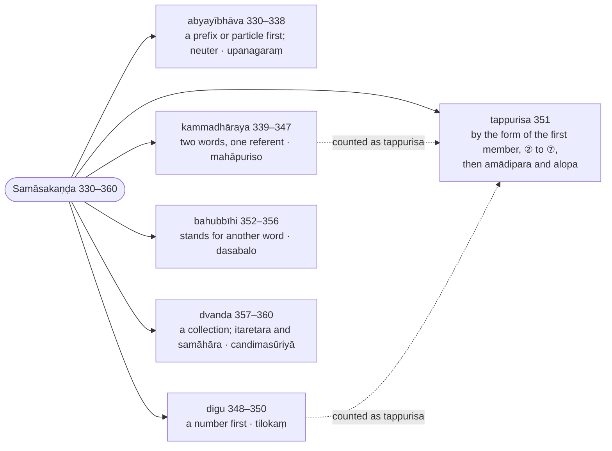
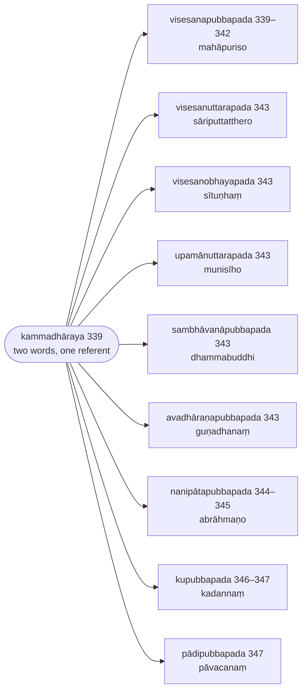

import { LinkCard } from "@astrojs/starlight/components";

:::note
The compounds are taken kind by kind — adverbial (`abyayībhāva`), descriptive (`kammadhāraya`), numerical (`digu`), dependent (`tappurisa`, by the form of its first member), possessive (`bahubbīhi`) and copulative (`dvanda`) — and every example is derived from its analytic phrase through the elision of the inflections to the finished word.

:::

:::note[Reading Rachiwong]
This section is one of the three that Phramaha Sriporn Rachiwong translated in her Pune thesis *Rūpasiddhi: A Study of Some Aspects* (1995), reproduced on this site as [Rachiwong: Rūpasiddhi (1995)](/rupasiddhi/rachiwong). Her rules are headed `(K-N)`, K the Kaccāyana sutta and N the rule's number in the Thai edition of the Padarūpasiddhi (Bangkok 1984), her base text; her N runs fifteen below the number used on this page (her 336 is 351 here), since the Thai and Sinhalese editions do not number the sixteen rules the Burmese text states twice. Her notes compare that Thai edition (Rūp T.) with the Burmese Buddhasāsanasamiti edition (B., the Chaṭṭha Saṅgāyana text these pages print) and the Sinhalese Mahārūpasiddhi (S.). The footnotes below record where this translation's text or construal differs from hers, and nothing more; her own translation and notes are on her page.
:::

:::note[The six compounds in the Samāsakaṇḍa]
Buddhappiya treats the compounds kind by kind; the ranges are Rūpasiddhi numbers, and the nine sub-kinds of the descriptive compound have their own tree under its heading below.

:::

> Atha nāmameva aññamaññasambandhīnaṃ samāsoti nāmanissitattā, sayañca nāmikattā nāmānantaraṃ samāso vuccate.

Now, since a compound (`samāsa`) is [a joining] of nouns alone that are related to one another, it rests on the noun; and since it is itself a nominal word, the compound is stated immediately after the noun. (The Kārakakaṇḍa that has just closed is, in the Chaṭṭha Saṅgāyana's count, the sixth section of Kaccāyana's `nāma` chapter, and the compound its seventh; Buddhappiya keeps that sequence.)

> So ca saññāvasena chabbidho abyayībhāvo kammadhārayo digu tappuriso bahubbīhi dvando cāti.

And by name it is of six kinds: the `abyayībhāva` (adverbial compound), the `kammadhāraya` (descriptive compound), the `digu` (numerical compound), the `tappurisa` (dependent compound), the `bahubbīhi` (possessive compound) and the `dvanda` (copulative compound).

## Abyayībhāvasamāsa (Adverbial compounds)

> Tatra paṭhamaṃ abyayībhāvasamāso vuccate; \
> So ca niccasamāsoti assapadaviggaho.

Of these the `abyayībhāva` compound is stated first; \
and since it is a compulsory compound (`niccasamāsa`), its analysis is not made in its own words (`asapadaviggaha`) [but with a word brought in from outside].

> ‘‘Upanagaraṃ’’itīdha – upa saddato paṭhamekavacanaṃ si, tassa upasaggaparattā ‘‘sabbāsamāvusopasagganipātādīhi cā’’ti lopo, nagara saddato chaṭṭhekavacanaṃ sa, nagarassa samīpanti aññapadena viggahe –

In the case of `upanagaraṃ` ("near the town"): after the word `upa` comes the singular of the first form, `si`, and because it follows a prefix it is elided by [§221 (282): Sabbāsamāvuso pasagganipātādīhi ca](/kaccayana/2-namakappa#m221); after the word `nagara` ("town") comes the singular of the sixth form, `sa`. When the analysis `nagarassa samīpaṃ` ("the vicinity of the town") has been made with a word from outside [`samīpa`, which does not appear in the compound] —

> ‘‘Nāmānaṃ samāso yuttattho’’ti samāsavidhāne sabbattha vattate.

"`Nāmānaṃ samāso yuttattho`" ([§316 (331): Nāmānaṃ samāso yuttattho](/kaccayana/4-samasakappa#m316), the next rule but one in this section) continues in every rule that prescribes a compound.

---

### 330 (§319): Upasagganipātapubbako abyayībhāvo (an `abyayībhāva` begins with a prefix or a particle) :badge[anvattha]{variant=note}

:::tip[Kaccāyana]
<LinkCard title="§319 (330): Upasagganipātapubbako abyayībhāvo" href="/kaccayana/4-samasakappa#m319" description="an `abyayībhāva` begins with a prefix or a particle" />
:::

> Upasagga pubbako, nipāta pubbako ca nāmiko yuttattho teheva attapubbakehi upasagganipātehi saha niccaṃ samasīyate, so ca samāso abyayībhāva sañño hoti. Idha abyayībhāvādisaññāvidhāyakasuttāneva vā saññāvidhānamukhena samāsavidhāyakānīti daṭṭhabbāni.

A nominal word of connected meaning (`yuttattha`) that has a prefix (`upasagga`) or a particle (`nipāta`) before it is always compounded with those very prefixes and particles that precede it[^1], and that compound is named `abyayībhāva`. Or else it should be understood here that the very suttas which lay down the names `abyayībhāva` and the rest are, by way of laying down a name, the rules that prescribe the compound.

> Tattha abyaya miti upasagganipātānaṃ saññā, liṅgavacanabhedepi byayarahitattā, abyayānaṃ atthaṃ vibhāvayatīti abyayībhāvo abyayatthapubbaṅgamattā, anabyayaṃ abyayaṃ bhavatīti vā abyayībhāvo. Pubbapadatthappadhāno hi abyayībhāvo, ettha ca ‘‘upasagganipātapubbako’’ti vuttattā upasagganipātānameva pubbanipāto.

Here `abyaya` ("invariable") is a name for prefixes and particles, because they are free of change (`byaya`) even where gender and number differ. It makes plain (`vibhāvayati`) the meaning of the invariables — hence `abyayībhāva`, since the meaning of the invariable comes first in it; or else `abyayībhāva` because what was not invariable becomes (`bhavati`) invariable. For the `abyayībhāva` has the meaning of its first member as principal, and here, because it is said "having a prefix or a particle first", the prefix or particle alone is placed first.

:::tip[Example]

The first step of the derivation of `upanagaraṃ`, which is finished under [336 (§341): Aṃ vibhattīnamakārantā abyayībhāvā](/rupasiddhi/4-samasakanda#r336).

| lemma | inflected | meaning |
| ----- | --------- | ------- |
| 🔼(upa) 🚻⑥⨀(nagara) | upa nagarassa | near the town — `nagarassa samīpaṃ` |

|     | upa + si, nagara + sa (⑥⨀)              | rule |
| --- | --------------------------------------- | ---- |
| →   | upa + ~~si~~ + nagarassa                | §221 |
| →   | upa nagarassa — an `abyayībhāva`        | §319 |

:::

[^1]: The Thai edition read by [Rachiwong (1995)](/rupasiddhi/rachiwong) has `atthapubbakehi` ("whose meaning comes first") for the CST's `attapubbakehi`; the CST is kept.

---

### 331 (§316): Nāmānaṃ samāso yuttattho (a `samāsa` is [a joining of] nouns whose meanings are connected) :badge[anvattha]{variant=note}

:::tip[Kaccāyana]
<LinkCard title="§316 (331): Nāmānaṃ samāso yuttattho" href="/kaccayana/4-samasakappa#m316" description="a `samāsa` is [a joining of] nouns whose meanings are connected" />
:::

> Tesaṃ nāmānaṃ payujjamānapadatthānaṃ yo yuttattho, so samāsasañño hoti, tadaññaṃ vākyamiti ruḷhaṃ.

Of those nouns — the word-meanings that are being employed [together] — that [joining] whose meaning is connected is named `samāsa` (compound); anything else is, by convention, a sentence (`vākya`).

> Nāmāni syā divibhatyantāni, samassateti samāso, saṅkhipiyatīti attho.

Nouns (`nāma`) are [words] ending in the inflections `si` and the rest; a `samāsa` is "what is thrown together" (`samassate`), that is to say, abbreviated.

> Vuttañhi

For it is said:

> ‘‘Samāso padasaṅkhepo, padappaccayasaṃhitaṃ; \
> Taddhitaṃ nāma hotevaṃ, viññeyyaṃ tesamantara’’nti.

"A compound is the abbreviation of words; what joins a suffix to a word \
is called a `taddhita`; thus the difference between the two is to be known."

> Duvidhañcassa samasanaṃ saddasamasanamatthasamasanañca, tadubhayampi luttasamāse paripuṇṇameva labbhati. Aluttasamāse pana atthasamasanameva vibhattilopābhāvato, tatthāpi vā ekapadattūpagamanato duvidhampi labbhateva. Dve hi samāsassa payojanāni ekapadattamekavibhattittañcāti.

And its compounding is twofold: the compounding of the words (`saddasamasana`) and the compounding of the meanings (`atthasamasana`). Both are found complete in a compound whose inflections are elided (`luttasamāsa`). In a compound whose inflections are not elided (`aluttasamāsa`), however, there is only the compounding of the meanings, since the inflection is not dropped; or rather, even there both are indeed found, because [the members] come to be a single word. For a compound has two purposes: being a single word (`ekapadatta`) and having a single inflection (`ekavibhattitta`).

> Yutto attho yuttattho[^2], atha vā yutto saṅgato, sambandho vā attho yassa soyaṃ yuttattho, etena saṅgatatthena yuttattha vacanena bhinnatthānaṃ ekatthībhāvo samāsalakkhaṇanti vuttaṃ hoti. Ettha ca ‘‘nāmāna’’nti vacanena ‘‘devadatto pacatī’’tiādīsu ākhyātena samāso na hotīti dasseti. Sambandhatthena pana yuttattha ggahaṇena ‘‘bhaṭo rañño putto devadattassā’’tiādīsu aññamaññānapekkhesu, ‘‘devadattassa kaṇhā dantā’’tiādīsu ca aññasāpekkhesu ayuttatthatāya samāso na hotīti dīpeti.

`yuttattha` is a joined (`yutta`) meaning (`attha`); or else that whose meaning is joined — that is, combined (`saṅgata`) — or related (`sambandha`) is `yuttattha`. By this word `yuttattha` in the sense of a combined meaning it is stated that the mark of a compound is that [words of] distinct meanings become one in meaning. Here, by the word `nāmānaṃ` ("of nouns"), he shows that there is no compound with a verb (`ākhyāta`), as in `devadatto pacati` ("Devadatta cooks"); and by taking `yuttattha` in the sense of a related meaning he shows that there is no compound, for want of connected meaning, where the words do not depend on one another, as in `bhaṭo rañño putto devadattassa` ("the king's soldier, Devadatta's son"), or where a word depends on another, as in `devadattassa kaṇhā dantā` ("Devadatta's black teeth").

:::tip[Example]

| lemma | inflected | meaning |
| ----- | --------- | ------- |
| 🔼(upa) 🚻⑥⨀(nagara) | upa nagarassa — a `samāsa` | near the town |

|     | upa + nagara + sa                        | rule |
| --- | ---------------------------------------- | ---- |
| →   | upa nagarassa — an `abyayībhāva`, and now a `samāsa` | §319, §316 |

:::

:::danger[Counter-examples]

The words Buddhappiya cites as forming no compound.

| lemma | inflected | meaning |
| ----- | --------- | ------- |
| 🚹①⨀(devadatta) ▶️🤟⨀(pacati) | devadatto pacati | Devadatta cooks — no compound with a verb |
| 🚹①⨀(bhaṭa) 🚹⑥⨀(rāja) 🚹①⨀(putta) 🚹⑥⨀(devadatta) | bhaṭo rañño putto devadattassa | the king's soldier, Devadatta's son — `rañño` and `putto` do not depend on one another |
| 🚹⑥⨀(devadatta) 🚹①⨂(kaṇha) 🚹①⨂(danta) | devadattassa kaṇhā dantā | Devadatta's black teeth — `devadattassa` depends on `dantā`, not on `kaṇhā` |

:::

> ‘‘Atthavasā vibhattivipariṇāmo’’ti vipariṇāmena ‘‘yuttatthāna’’nti vattate.

By [the maxim] "the inflection changes according to the sense", [the sutta's `yuttattho`] continues with its inflection changed, as `yuttatthānaṃ` ("of those whose meanings are connected").

[^2]: CST4 prints `yuttatto`; the word being derived is `yuttattho`, as the rest of the sentence has it.

---

### 332 (§317): Tesaṃ vibhattiyo lopā ca (and the inflections of the members are elided) :badge[utsarga]{variant=success}

:::tip[Kaccāyana]
<LinkCard title="§317 (332): Tesaṃ vibhattiyo lopā ca" href="/kaccayana/4-samasakappa#m317" description="and the inflections of the members are elided" />
:::

> Idha padantarena vā taddhitappaccayehi vā āyā dippaccayehi vā ekatthībhūtā yuttatthā nāma, tena ‘‘tesaṃ yuttatthānaṃ samāsānaṃ, taddhitāyā dippaccayantānañca vibhattiyo lopanīyā hontī’’ti attho. Samāsa ggahaṇādhikāre pana sati tesaṃ gahaṇena vā taddhitāyā dippaccayanta vibhattilopo. Ca ggahaṇaṃ ‘‘pabhaṅkaro’’tiādīsu lopanivattanatthaṃ.

Here `yuttattha` ("of connected meaning") means [words] that have become one in meaning, whether with another word, or with the `taddhita` suffixes, or with the suffixes `āya` and the rest; so the sense is: "the inflections of those [words] of connected meaning — of compounds, and of [words] ending in the `taddhita` suffixes and in `āya` and the rest — are to be elided." If, however, there is governance (`adhikāra`) by the mention of `samāsa`, then the elision of the inflection of [words] ending in the `taddhita` suffixes and in `āya` and the rest is, alternatively, by the mention of `tesaṃ` ("of those"). The mention of `ca` is to bar the elision in `pabhaṅkaro` ("maker of light") and the like.

:::tip[Example]

| lemma | inflected | meaning |
| ----- | --------- | ------- |
| 🔼(upa) 🚻(nagara) | upa nagara | near the town — the `sa` of `nagarassa` elided |

|     | upa + nagara + sa                        | rule |
| --- | ---------------------------------------- | ---- |
| →   | upa + nagara + ~~sa~~                    | §317 |

:::

> Vipariṇāmena ‘‘luttāsu, vibhattīsū’’ti vattate, yuttattha ggahaṇañca.

With its inflection changed, [the sutta's `vibhattiyo lopā`] continues as `luttāsu vibhattīsu` ("when the inflections have been elided"), and so does the mention of `yuttattha`.

---

### 333 (§318): Pakati cassa sarantassa (and a member ending in a vowel returns to its original form) :badge[utsarga]{variant=success}

:::tip[Kaccāyana]
<LinkCard title="§318 (333): Pakati cassa sarantassa" href="/kaccayana/4-samasakappa#m318" description="and a member ending in a vowel returns to its original form" />
:::

> Luttāsu vibhattīsu sarantassa assa yuttatthabhūtassa tividhassapi liṅgassa pakatibhāvo hoti. Ca saddena kiṃsamudaya idappaccayatā dīsu niggahītantassapi. Nimittābhāve nemittakābhāvassa idha anicchitattā ayamatideso.

When the inflections have been elided, that stem of connected meaning which ends in a vowel — of all three kinds — has its natural state (`pakatibhāva`). By the word `ca`, [the same holds] for a stem ending in a `niggahīta`, as in `kiṃsamudaya`, `idappaccayatā`[^3] and the like. Because the absence of what is caused (`nemittaka`) when the cause (`nimitta`) is absent is not wanted here, this is an extension by analogy (`atidesa`).

:::tip[Examples]

| lemma | inflected | meaning |
| ----- | --------- | ------- |
| 🔼(upa) 🚻(nagara) | upa nagara | the stem `nagara` in its natural state |
| 🚹①⨀(kiṃ + samudaya) | kiṃsamudayo | having what origin? — the `ṃ` of `kiṃ` kept by `ca` |
| 🚺①⨀(idaṃ + paccayatā) | idappaccayatā | conditionality, "the state of having this as condition" — the `ṃ` of `idaṃ` kept, then assimilated to `p` |

|     | upa + nagara + ~~sa~~                    | rule |
| --- | ---------------------------------------- | ---- |
| →   | upa + nagara                             | §318 |

|     | idaṃ + paccayatā                         | rule |
| --- | ---------------------------------------- | ---- |
| →   | idaṃ + paccayatā (the `ṃ` retained)      | §318 `ca` |
| →   | ida + (ṃ→p) + paccayatā                  | §31  |
| →   | **idappaccayatā**                        |      |

:::

> Sakatthavirahenidha samāsassa ca liṅgabhāvābhāvā vibhattuppattiyamasampattāyaṃ nāmabyapadesātidesamāha.

And because here, for want of a meaning of its own, the compound does not have the status of a stem (`liṅga`), the arising of an inflection not being reached, he states the extension by analogy [that treats it] as a noun (`nāmabyapadesa`).

[^3]: [Rachiwong (1995)](/rupasiddhi/rachiwong) prints `idaṃpaccayatā` for the CST's `idappaccayatā`; the CST is kept.

---

### 334 (§601): Taddhitasamāsakitakā nāmaṃvā’tavetunādīsu ca (Derivatives, compounds and `kita` words count as nouns, except those in `tave`, `tuna` and the like) :badge[saññaṅga]{variant=tip}

:::tip[Kaccāyana]
<LinkCard title="§601 (334): Taddhitasamāsakitakā nāmaṃ vā’ tave tunādīsu ca" href="/kaccayana/7-kibbidhanakappa#m601" description="Derivatives, compounds and `kita` words count as nouns, except those in `tave`, `tuna` and the like" />
:::

> Taddhitantā, kitantā, samāsā ca nāmamiva daṭṭhabbā tavetuna tvāna tvā dippaccayante vajjetvā. Ca ggahaṇaṃ kiccappaccayaāīinī itthippaccayantādissapi nāmabyapadesatthaṃ. Idha samāsa ggahaṇaṃ atthavataṃ samudāyānaṃ nāmabyapadeso samāsassevāti niyamatthanti apare.

[Words] ending in a `taddhita` suffix, [words] ending in a `kita` suffix, and compounds are to be regarded like nouns, leaving aside those ending in the suffixes `tave`, `tuna`, `tvāna`, `tvā` and the like. The mention of `ca` is for the treatment as nouns (`nāmabyapadesa`) of [words] ending in the `kicca` suffixes, in the feminine suffixes `ā`, `ī`, `inī`, and the like as well. Others [say] that the mention of `samāsa` here is for restriction: of meaningful aggregates [of words], the treatment as a noun is of the compound alone.

:::tip[Example]

| lemma | inflected | meaning |
| ----- | --------- | ------- |
| 🚻(upa + nagara) | upanagara + si | near the town — the compound treated as a noun and given its inflection |

|     | upa + nagara                             | rule |
| --- | ---------------------------------------- | ---- |
| →   | upanagara + si (the compound as a noun)  | §601, §54 |

:::

> ‘‘Abyayībhāvo’’ti vattate.

"`abyayībhāvo`" continues.

---

### 335 (§320): So napuṃsakaliṅgo (it is neuter) :badge[apavada]{variant=success}

:::tip[Kaccāyana]
<LinkCard title="§320 (335): So napuṃsakaliṅgo" href="/kaccayana/4-samasakappa#m320" description="it is neuter" />
:::

:::note[Analysis]

The `abyayībhāvo` carried into this rule by the `vattate` at the end of 334 comes from [330 (§319): Upasagganipātapubbako abyayībhāvo](/rupasiddhi/4-samasakanda#r330).

:::

> So abyayībhāvasamāso napuṃsakaliṅgova daṭṭhabboti napuṃsakaliṅgattaṃ. Ettha hi satipi liṅgātidese ‘‘adhipañña’’ntiādīsu ‘‘adhiñāṇaṃ’’ntiādi rūpappasaṅgo na hoti saddantarattā, ‘‘tipañña’’ntiādīsu viyāti daṭṭhabbaṃ, na cāyaṃ atideso, sutte atidesaliṅgassa iva saddassa adassanato. Pure viya syādyuppatti.

That `abyayībhāva` compound is to be regarded as neuter only — hence there is neuter gender. For here, even were there a transfer of gender, in `adhipaññaṃ` and the like there is no danger of forms such as `adhiñāṇaṃ`, because that is a different word — as in `tipaññaṃ` and the like; so it should be understood. Nor is this an extension by analogy (`atidesa`), since the word `iva`, the mark of an `atidesa`, is not seen in the sutta. The inflections `si` and the rest are added as before.

:::tip[Examples]

| lemma | inflected | meaning |
| ----- | --------- | ------- |
| 🚻(upa + nagara) | upanagara + si | near the town — the noun is neuter, whatever the gender of `nagara` |
| 🚻①⨀(adhi + paññā) | adhipaññaṃ | concerning wisdom, the higher wisdom — `paññā` stays, though the compound is neuter |
| 🚻①⨀(ti + paññā) | tipaññaṃ | the three kinds of wisdom — a `digu`, neuter by [349 (§321): Digussekattaṃ](/rupasiddhi/4-samasakanda#r349) |

|     | upanagara + si                           | rule |
| --- | ---------------------------------------- | ---- |
| →   | upanagara + si — neuter                  | §320 |

|     | adhi + paññāya (paññā + sa ⑥⨀)          | rule |
| --- | ---------------------------------------- | ---- |
| →   | adhi + paññā + ~~sa~~                    | §317 |
| →   | adhipaññ + (ā→a)                         | §320, §342 |
| →   | adhipañña + (si→aṃ)                      | §601, §341 |
| →   | **adhipaññaṃ**                           |      |

:::

> ‘‘Kvacī’’ti vattate.

"`kvaci`" ("sometimes") continues.

---

### 336 (§341): Aṃ vibhattīnamakārantā abyayībhāvā (`aṃ` for the inflections after an `abyayībhāva` in `a`) :badge[apavada]{variant=success}

:::tip[Kaccāyana]
<LinkCard title="§341 (336): Aṃ vibhattīnamakārantā abyayībhāvā" href="/kaccayana/4-samasakappa#m341" description="`aṃ` for the inflections after an `abyayībhāva` in `a`" />
:::

:::note[Analysis]

The `kvaci` carried into this rule by the `vattate` at the end of 335, and the rule quoted below for the suffix `ka`, are [§337 (350): Kvaci samāsantagatānamakāranto](/kaccayana/4-samasakappa#m337), which Buddhappiya states only at [350 (§337)](/rupasiddhi/4-samasakanda#r350).

:::

> Tasmā akārantā abyayībhāvā parāsaṃ vibhattīnaṃ kvaci aṃ hoti, sesaṃ neyyaṃ.

After that `abyayībhāva` ending in `a`, the inflections that follow sometimes become `aṃ`. The rest is to be inferred.

:::tip[Examples]

The whole derivation of `upanagaraṃ`, from the introduction of the section to this rule:

|     | upa + si, nagara + sa (⑥⨀) — `nagarassa samīpaṃ`, "near the town" | rule |
| --- | ------------------------------------------------------------------ | ---- |
| →   | upa + ~~si~~ + nagarassa                                           | §221 |
| →   | upa nagarassa — an `abyayībhāva`, a `samāsa`                       | §319, §316 |
| →   | upa + nagara + ~~sa~~                                              | §317 |
| →   | upa + nagara                                                       | §318 |
| →   | upanagara + si (as a noun)                                         | §601 |
| →   | upanagara + si (neuter)                                            | §320 |
| →   | upanagara + (si→aṃ)                                                | §341 |
| →   | **upanagaraṃ**                                                     |      |

| lemma | inflected | meaning |
| ----- | --------- | ------- |
| 🚻①⨀(upa + nagara) | upanagaraṃ | near the town — `nagarassa samīpaṃ` |
| 🚻①⨀(upa + kumbha) | upakumbhaṃ | near the pot — `kumbhassa samīpaṃ` |

:::

> Taṃ upanagaraṃ, nagarassa samīpaṃ tiṭṭhatīti attho. Tāni upanagaraṃ, ālapanepevaṃ, taṃ upanagaraṃ passa, tāni upanagaraṃ.

`taṃ upanagaraṃ` ("that [which is] near the town"), meaning "it stands near the town"; `tāni upanagaraṃ` ("those near the town"); in the vocative likewise; `taṃ upanagaraṃ passa` ("see that near the town"), `tāni upanagaraṃ` ("[see] those near the town").

> Na pañcamyāyamambhāvo, kvacī ti adhikārato; \
> Tatiyāsattamīchaṭṭhī-nantu hoti vikappato.

Because of the governance of `kvaci`, this `aṃ` does not come about for the fifth form; \
but for the third, seventh and sixth it comes about by option.

> Tena upanagaraṃ kataṃ, upanagarena vā, tehi upanagaraṃ, upanagarehi vā, tassa upanagaraṃ dehi, tesaṃ upanagaraṃ, upanagarā ānaya, upanagaramhā upanagarasmā, upanagarehi, upanagaraṃ santakaṃ, upanagarassa vā, tesaṃ upanagaraṃ, upanagarānaṃ vā, upanagaraṃ nidhehi, upanagaramhi upanagarasmiṃ, upanagaraṃ upanagaresu vā. Evaṃ upakumbhaṃ.

`tena upanagaraṃ kataṃ` ("done by that [which is] near the town"), or `upanagarena`; `tehi upanagaraṃ`, or `upanagarehi`; `tassa upanagaraṃ dehi` ("give to that [which is] near the town"), `tesaṃ upanagaraṃ`; `upanagarā ānaya` ("bring from near the town"), `upanagaramhā`, `upanagarasmā`, `upanagarehi`; `upanagaraṃ santakaṃ` ("the property of [the one] near the town"), or `upanagarassa`; `tesaṃ upanagaraṃ`, or `upanagarānaṃ`; `upanagaraṃ nidhehi` ("put it down near the town"), `upanagaramhi`, `upanagarasmiṃ`; `upanagaraṃ`, or `upanagaresu`. Likewise `upakumbhaṃ` ("near the pot").

:::tip[Examples]

The forms Buddhappiya runs through, set out as a paradigm; `vā` marks the forms he gives as alternatives to the `aṃ`.

| | ⨀ | ⨂ |
| --- | --- | --- |
| ① | upanagaraṃ | upanagaraṃ |
| ⓪ | upanagaraṃ | upanagaraṃ |
| ② | upanagaraṃ | upanagaraṃ |
| ③ | upanagaraṃ, upanagarena | upanagaraṃ, upanagarehi |
| ④ | upanagaraṃ | upanagaraṃ |
| ⑤ | upanagarā, upanagaramhā, upanagarasmā | upanagarehi |
| ⑥ | upanagaraṃ, upanagarassa | upanagaraṃ, upanagarānaṃ |
| ⑦ | upanagaraṃ, upanagaramhi, upanagarasmiṃ | upanagaraṃ, upanagaresu |

:::

> Abhāve – darathānaṃ abhāvo niddarathaṃ, nimmasakaṃ.

In the sense of absence: `darathānaṃ abhāvo` ("the absence of distress") gives `niddarathaṃ`; `nimmasakaṃ` ("free of mosquitoes").

> Pacchāatthe – rathassa pacchā anurathaṃ, anuvātaṃ.

In the sense of "behind": `rathassa pacchā` ("behind the chariot") gives `anurathaṃ`; `anuvātaṃ` ("with the wind", "downwind").

> Yoggatāyaṃ – yathāsarūpaṃ, anurūpaṃ, rūpayogganti attho.

In the sense of fitness: `yathāsarūpaṃ`, `anurūpaṃ`, meaning "fitting the form".

> Vicchāyaṃ – attānamattānaṃ pati paccattaṃ, addhamāsaṃ addhamāsaṃ anu anvaddhamāsaṃ.

In the distributive sense (`vicchā`): `attānaṃ attānaṃ pati` ("towards each self") gives `paccattaṃ` ("individually"); `addhamāsaṃ addhamāsaṃ anu` ("each half-month following") gives `anvaddhamāsaṃ` ("every fortnight").

> Anupubbiyaṃ – jeṭṭhānaṃ anupubbo anujeṭṭhaṃ.

In the sense of succession: `jeṭṭhānaṃ anupubbo` ("the order of the elders") gives `anujeṭṭhaṃ` ("in order of seniority").

> Paṭilome – sotassa paṭilomaṃ paṭisotaṃ, paṭipathaṃ, pativātaṃ, attānaṃ adhikicca pavattā ajjhattaṃ.

In the sense of "against": `sotassa paṭilomaṃ` ("against the stream") gives `paṭisotaṃ`; `paṭipathaṃ` ("against the road", "in the opposite direction"); `pativātaṃ` ("against the wind"); `attānaṃ adhikicca pavattā` ("[states] that occur with reference to oneself") gives `ajjhattaṃ` ("internally").

> Mariyādābhividhīsu[^4] āpāṇakoṭiyā āpāṇakoṭikaṃ, ‘‘kvaci samāsantagatānamakāranto’’ti ka ppaccayo, ākumārehi yaso kaccāyanassa ākumāraṃ.

In the senses of a limit, exclusive (`mariyādā`) and inclusive (`abhividhi`): `āpāṇakoṭiyā` ("up to the end of breath") gives `āpāṇakoṭikaṃ` ("to one's last breath"), with the suffix `ka` by [§337 (350): Kvaci samāsantagatānamakāranto](/kaccayana/4-samasakappa#m337); `ā kumārehi yaso kaccāyanassa` ("Kaccāyana's fame [reaches] down to the boys") gives `ākumāraṃ` ("boys included").[^5]

:::tip[Examples]

| lemma | inflected | meaning |
| ----- | --------- | ------- |
| 🚻①⨀(ni + daratha) | niddarathaṃ | free from distress — `darathānaṃ abhāvo` (absence) |
| 🚻①⨀(ni + masaka) | nimmasakaṃ | free from mosquitoes (absence) |
| 🚻①⨀(anu + ratha) | anurathaṃ | behind the chariot — `rathassa pacchā` ("behind") |
| 🚻①⨀(anu + vāta) | anuvātaṃ | downwind ("behind") |
| 🚻①⨀(yathā + sarūpa) | yathāsarūpaṃ | according to the form (fitness) |
| 🚻①⨀(anu + rūpa) | anurūpaṃ | suitable — `rūpayoggaṃ` (fitness) |
| 🚻①⨀(pati + atta) | paccattaṃ | individually, each for himself — `attānaṃ attānaṃ pati` (distribution) |
| 🚻①⨀(anu + addhamāsa) | anvaddhamāsaṃ | every half-month — `addhamāsaṃ addhamāsaṃ anu` (distribution) |
| 🚻①⨀(anu + jeṭṭha) | anujeṭṭhaṃ | in order of seniority — `jeṭṭhānaṃ anupubbo` (succession) |
| 🚻①⨀(pati + sota) | paṭisotaṃ | against the stream — `sotassa paṭilomaṃ` ("against") |
| 🚻①⨀(pati + patha) | paṭipathaṃ | in the opposite direction ("against") |
| 🚻①⨀(pati + vāta) | pativātaṃ | against the wind ("against") |
| 🚻①⨀(adhi + atta) | ajjhattaṃ | internally, with reference to oneself — `attānaṃ adhikicca pavattā` |
| 🚻①⨀(ā + pāṇakoṭi + ka) | āpāṇakoṭikaṃ | to one's last breath — `āpāṇakoṭiyā` (limit) |
| 🚻①⨀(ā + kumāra) | ākumāraṃ | down to the boys — `ā kumārehi` (limit) |

|     | ni + darathānaṃ (daratha + naṃ ⑥⨂)      | rule |
| --- | ---------------------------------------- | ---- |
| →   | ni + daratha + ~~naṃ~~                   | §317 |
| →   | ni + (d→dd) + aratha                     | §28  |
| →   | niddaratha + (si→aṃ)                     | §601, §320, §341 |
| →   | **niddarathaṃ**                          |      |

|     | pati + attānaṃ (atta + aṃ ②⨀)           | rule |
| --- | ---------------------------------------- | ---- |
| →   | pati + atta + ~~aṃ~~                     | §317 |
| →   | pat + (i→y) + atta                       | §21  |
| →   | pa + (ty→cc) + atta                      | §269, §28 |
| →   | paccatta + (si→aṃ)                       | §601, §320, §341 |
| →   | **paccattaṃ**                            |      |

|     | anu + addhamāsaṃ (addhamāsa + aṃ ②⨀)    | rule |
| --- | ---------------------------------------- | ---- |
| →   | anu + addhamāsa + ~~aṃ~~                 | §317 |
| →   | an + (u→v) + addhamāsa                   | §18  |
| →   | anvaddhamāsa + (si→aṃ)                   | §601, §320, §341 |
| →   | **anvaddhamāsaṃ**                        |      |

|     | adhi + attānaṃ (atta + aṃ ②⨀)           | rule |
| --- | ---------------------------------------- | ---- |
| →   | adhi + atta + ~~aṃ~~                     | §317 |
| →   | (adhi→ajjh) + atta                       | §45  |
| →   | ajjhatta + (si→aṃ)                       | §601, §320, §341 |
| →   | **ajjhattaṃ**                            |      |

|     | ā + pāṇakoṭiyā (pāṇakoṭi + sa ⑥⨀)       | rule |
| --- | ---------------------------------------- | ---- |
| →   | ā + pāṇakoṭi + ~~sa~~                    | §317 |
| →   | ā + pāṇakoṭi + ka                        | §337 |
| →   | āpāṇakoṭika + (si→aṃ)                    | §601, §320, §341 |
| →   | **āpāṇakoṭikaṃ**                         |      |

> `paccattaṃ veditabbo viññūhi` \
> [(7D 3.10: Dhammādāsadhammapariyāya)](https://tipitaka2500.github.io/tipitaka/7D/3/3.10#335) \
🚻②⨀(pati + atta) 🚹①⨀(veditabba) 🚹③⨂(viññū) \
for oneself | to be known | by the wise

> `anvaddhamāsaṃ bhikkhuniyā bhikkhusaṃghato dve dhammā paccāsīsitabbā` \
> [(2V 1.5.3.1: Ovādasikkhāpada)](https://tipitaka2500.github.io/tipitaka/2V/1/1.5/1.5.3/1.5.3.1#501) \
🚻②⨀(anu + addhamāsa) 🚺③⨀(bhikkhunī) 🚹⑤⨀(bhikkhusaṃgha) ⚧️①⨂(dvi) 🚹①⨂(dhamma) 🚹①⨂(paccāsīsitabba) \
every half-month | by a bhikkhunī | from the community of bhikkhus | two | things | are to be expected

> `hatthehi ca pādehi ca paṭisotaṃ vāyameyya` \
> [(18It 4.1.10: Nadīsotasutta)](https://tipitaka2500.github.io/tipitaka/18It/4/4.1/4.1.10#793) \
🚹③⨂(hattha) 🔼(ca) 🚹③⨂(pāda) 🔼(ca) 🚻②⨀(pati + sota) ⏯🤟⨀(vāyamati) \
with hands | and | with feet | and | against the stream | he should strive

> `yāvajīvaṃ āpāṇakoṭikaṃ samādāya sikkhati sikkhāpadesu` \
> [(5V 1.1.1.1: Pārājikakaṇḍa)](https://tipitaka2500.github.io/tipitaka/5V/1/1.1/1.1.1/1.1.1.1#3) \
🚻②⨀(yāva + jīva) 🚻②⨀(ā + pāṇakoṭi + ka) 🔽(samādāya) ▶️🤟⨀(sikkhati) 🚻⑦⨂(sikkhāpada) \
for life | to the last breath | having undertaken | he trains | in the training rules

`yathāsarūpaṃ`, `anurūpaṃ`, `anujeṭṭhaṃ`, `pativātaṃ` and `ākumāraṃ` are not attested in the Tipiṭaka in these shapes.

:::

> Samiddhiyaṃ – bhikkhāya samiddhīti atthe samāseva napuṃsakaliṅgatte ca kate –

In the sense of abundance: when, in the sense `bhikkhāya samiddhi` ("abundance of alms"), only the compound has been made and the neuter gender given —

> ‘‘Samāsassa, anto’’ti ca vattate.

"`samāsassa`" and "`anto`" ("the final of the compound") continue too.

[^4]: CST4 prints `Pariyādābhividhīsu`; `mariyādā` is read, as the Thai edition read by [Rachiwong (1995)](/rupasiddhi/rachiwong) has it.

[^5]: The Thai edition read by [Rachiwong (1995)](/rupasiddhi/rachiwong) orders the words `ā kumārehi yaso ākumāraṃ yaso kaccāyanassa`; the CST's order is kept.

---

### 337 (§342): Saro rasso napuṃsake (the final vowel is shortened in the neuter) :badge[apavada]{variant=success}

:::tip[Kaccāyana]
<LinkCard title="§342 (337): Saro rasso napuṃsake" href="/kaccayana/4-samasakappa#m342" description="the final vowel is shortened in the neuter" />
:::

:::note[Analysis]

The `samāsassa anto` carried into this rule by the `vattate` at the end of 336 comes from [§337 (350): Kvaci samāsantagatānamakāranto](/kaccayana/4-samasakappa#m337), which Buddhappiya states only at [350 (§337)](/rupasiddhi/4-samasakanda#r350).

:::

> Napuṃsake vattamānassa samāsassa anto saro rasso hoti. Ettha ca abyayībhāva ggahaṇaṃ nānuvattetabbaṃ, tena digudvandabahubbīhīsupi napuṃsake vattamānassa samāsantassarassa rassattaṃ siddhaṃ hoti. ‘‘Aṃ vibhattīna’’miccādinā a mādeso, subhikkhaṃ. Gaṅgāya samīpe vattatīti upagaṅgaṃ, maṇikāya samīpaṃ upamaṇikaṃ.

The final vowel of a compound used in the neuter becomes short. And here the mention of `abyayībhāva` is not to be carried over; thus the shortening of the final vowel of a compound used in the neuter is established for the `digu`, the `dvanda` and the `bahubbīhi` as well. By [§341 (336): Aṃ vibhattīnamakārantā abyayībhāvā](/kaccayana/4-samasakappa#m341) and the rest, `aṃ` is substituted: `subhikkhaṃ` ("a time of plenty"). `gaṅgāya samīpe vattati` ("it is near the Ganges") gives `upagaṅgaṃ`; `maṇikāya samīpaṃ` ("near the water-jar") gives `upamaṇikaṃ`.

:::tip[Examples]

| lemma | inflected | meaning |
| ----- | --------- | ------- |
| 🚻①⨀(su + bhikkhā) | subhikkhaṃ | plenty of alms, a time of plenty — `bhikkhāya samiddhi` |
| 🚻①⨀(upa + gaṅgā) | upagaṅgaṃ | near the Ganges — `gaṅgāya samīpe vattati` |
| 🚻①⨀(upa + maṇikā) | upamaṇikaṃ | near the water-jar — `maṇikāya samīpaṃ` |

|     | su + bhikkhāya (bhikkhā + sa ⑥⨀)         | rule |
| --- | ---------------------------------------- | ---- |
| →   | su + bhikkhā + ~~sa~~                    | §319, §316, §317 |
| →   | subhikkhā + si (as a noun; neuter)       | §601, §320 |
| →   | subhikkh + (ā→a) + si                    | §342 |
| →   | subhikkha + (si→aṃ)                      | §341 |
| →   | **subhikkhaṃ**                           |      |

|     | upa + gaṅgāya (gaṅgā + sa ⑥⨀)            | rule |
| --- | ---------------------------------------- | ---- |
| →   | upa + gaṅgā + ~~sa~~                     | §317 |
| →   | upagaṅg + (ā→a)                          | §320, §342 |
| →   | upagaṅga + (si→aṃ)                       | §601, §341 |
| →   | **upagaṅgaṃ**                            |      |

> `subhikkhaṃ bhavissati, dubbhikkhaṃ bhavissati` \
> [(6D 1.2.3: Mahāsīla)](https://tipitaka2500.github.io/tipitaka/6D/1/1.2/1.2.3#52) \
🚻①⨀(su + bhikkhā) ⏯🤟⨀(bhavati) 🚻①⨀(du + bhikkhā) ⏯🤟⨀(bhavati) \
plenty | there will be | famine | there will be

:::

> Itthīsu amikiccāti[^6] atthe samāsanapuṃsakarassattādīsu katesu –

When, in the sense `itthīsu adhikicca` ("with reference to women"), the compound, the neuter gender, the shortening and the rest have been made —

> ‘‘Abyayībhāvā, vibhattīna’’nti ca vattate.

"`abyayībhāvā`" and "`vibhattīnaṃ`" continue too.

[^6]: CST4 prints `amikiccāti`, a misprint for `adhikiccāti` (`itthīsu adhikicca`, "with reference to women"), which is translated; so [Rachiwong (1995)](/rupasiddhi/rachiwong), "in connection with women".

---

### 338 (§343): Aññasmā lopo ca (and elision [of the inflections] after any other [`abyayībhāva`]) :badge[apavada]{variant=success}

:::tip[Kaccāyana]
<LinkCard title="§343 (338): Aññasmā lopo ca" href="/kaccayana/4-samasakappa#m343" description="and elision [of the inflections] after any other [`abyayībhāva`]" />
:::

> A kārantato aññasmā abyayībhāvasamāsā parāsaṃ vibhattīnaṃ lopo ca hoti. Adhitthi[^7], itthīsu adhikicca kathā pavattatīti attho. Adhitthi passa, adhitthi kataṃ iccādi, evaṃ adhikumāri, vadhuyā samīpaṃ upavadhu, gunnaṃ samīpaṃ upagu, o kārassa rassattaṃ u kāro. Evaṃ upasaggapubbako.

After an `abyayībhāva` compound other than one ending in `a`, the inflections that follow are elided as well. `adhitthi`, meaning "talk goes on with reference to women"; `adhitthi passa` ("see [the talk] about women"), `adhitthi kataṃ` ("done with reference to women") and so on; likewise `adhikumāri` ("concerning girls"); `vadhuyā samīpaṃ` ("near the young wife") gives `upavadhu`; `gunnaṃ samīpaṃ` ("near the cows") gives `upagu`, the shortening of `o` being `u`. So much for the kind with a prefix first.

:::tip[Examples]

| lemma | inflected | meaning |
| ----- | --------- | ------- |
| 🚻①⨀(adhi + itthī) | adhitthi | concerning women — `itthīsu adhikicca kathā pavattati`; the same shape in ②⨀ `adhitthi passa` and ③⨀ `adhitthi kataṃ` |
| 🚻①⨀(adhi + kumārī) | adhikumāri | concerning girls |
| 🚻①⨀(upa + vadhū) | upavadhu | near the young wife — `vadhuyā samīpaṃ` |
| 🚻①⨀(upa + go) | upagu | near the cows — `gunnaṃ samīpaṃ`; `o` shortened to `u` |

|     | adhi + itthīsu (itthī + su ⑦⨂)           | rule |
| --- | ---------------------------------------- | ---- |
| →   | adhi + itthī + ~~su~~                    | §319, §316, §317 |
| →   | adh + (~~i~~ + i) + tthī                 | §12  |
| →   | adhitthī + si (as a noun; neuter)        | §601, §320 |
| →   | adhitth + (ī→i) + si                     | §342 |
| →   | adhitthi + ~~si~~                        | §343 |
| →   | **adhitthi**                             |      |

|     | upa + gunnaṃ (go + naṃ ⑥⨂)              | rule |
| --- | ---------------------------------------- | ---- |
| →   | upa + go + ~~naṃ~~                       | §317 |
| →   | upago + si (as a noun; neuter)           | §601, §320 |
| →   | upag + (o→u) + si                        | §342 |
| →   | upagu + ~~si~~                           | §343 |
| →   | **upagu**                                |      |

None of the four is attested in the Tipiṭaka.

:::

> Nipātapubbako yathā – vuḍḍhānaṃ paṭipāṭi, ye ye vuḍḍhā vā yathāvuḍḍhaṃ, padatthānatikkame – yathākkamaṃ, yathāsatti, yathābalaṃ karoti, balamanatikkamitvā karotīti attho. Jīvassa yattako paricchedo yāvajīvaṃ, yāvatāyukaṃ, ka ppaccayo. Yattakena attho yāvadatthaṃ, pabbatassa parabhāgo tiropabbataṃ, tiropākāraṃ, tirokuṭṭaṃ, pāsādassa anto antopāsādaṃ, antonagaraṃ, antovassaṃ, nagarassa bahi bahinagaraṃ, pāsādassa upari uparipāsādaṃ, uparimañcaṃ, mañcassa heṭṭhā heṭṭhāmañcaṃ, heṭṭhāpāsādaṃ, bhattassa pure purebhattaṃ, evaṃ pacchābhattaṃ.

The kind with a particle first, for instance: `vuḍḍhānaṃ paṭipāṭi` ("the succession of the elders"), or `ye ye vuḍḍhā` ("whoever are the elders, each in turn"), gives `yathāvuḍḍhaṃ` ("in order of seniority"); in the sense of not overstepping the meaning of the word: `yathākkamaṃ` ("in due order"), `yathāsatti` ("according to ability"), `yathābalaṃ karoti` ("he acts according to his strength"), meaning "he acts without exceeding his strength". `jīvassa yattako paricchedo` ("whatever the extent of life") gives `yāvajīvaṃ` ("as long as life lasts"); `yāvatāyukaṃ` ("as long as the life-span"), with the suffix `ka`. `yattakena attho` ("as much as is needed") gives `yāvadatthaṃ` ("as much as one likes"); `pabbatassa parabhāgo` ("the far side of the mountain") gives `tiropabbataṃ` ("beyond the mountain"); `tiropākāraṃ` ("beyond the rampart"), `tirokuṭṭaṃ` ("beyond the wall")[^8]; `pāsādassa anto` ("the inside of the mansion") gives `antopāsādaṃ`; `antonagaraṃ` ("inside the town"), `antovassaṃ` ("within the rains"); `nagarassa bahi` ("the outside of the town")[^9] gives `bahinagaraṃ`; `pāsādassa upari` ("the top of the mansion") gives `uparipāsādaṃ`; `uparimañcaṃ` ("on top of the bed"); `mañcassa heṭṭhā` ("the underside of the bed") gives `heṭṭhāmañcaṃ`; `heṭṭhāpāsādaṃ` ("beneath the mansion"); `bhattassa pure` ("the time before the meal") gives `purebhattaṃ`; likewise `pacchābhattaṃ` ("after the meal").

:::tip[Examples]

| lemma | inflected | meaning |
| ----- | --------- | ------- |
| 🚻①⨀(yathā + vuḍḍha) | yathāvuḍḍhaṃ | in order of seniority — `vuḍḍhānaṃ paṭipāṭi`, or distributively `ye ye vuḍḍhā` |
| 🚻①⨀(yathā + kama) | yathākkamaṃ | in due order |
| 🚻①⨀(yathā + satti) | yathāsatti | according to ability — the inflection elided after `i` by this rule |
| 🚻①⨀(yathā + bala) | yathābalaṃ | according to strength — `balaṃ anatikkamitvā` |
| 🚻①⨀(yāva + jīva) | yāvajīvaṃ | as long as life lasts — `jīvassa yattako paricchedo` |
| 🚻①⨀(yāvatā + āyu + ka) | yāvatāyukaṃ | as long as the life-span — with the suffix `ka` |
| 🚻①⨀(yāva + attha) | yāvadatthaṃ | as much as is needed, as one likes — `yattakena attho` |
| 🚻①⨀(tiro + pabbata) | tiropabbataṃ | beyond the mountain — `pabbatassa parabhāgo` |
| 🚻①⨀(tiro + pākāra) | tiropākāraṃ | beyond the rampart |
| 🚻①⨀(tiro + kuṭṭa) | tirokuṭṭaṃ | beyond the wall |
| 🚻①⨀(anto + pāsāda) | antopāsādaṃ | inside the mansion — `pāsādassa anto` |
| 🚻①⨀(anto + nagara) | antonagaraṃ | inside the town |
| 🚻①⨀(anto + vassa) | antovassaṃ | within the rains retreat |
| 🚻①⨀(bahi + nagara) | bahinagaraṃ | outside the town — `nagarassa bahi` |
| 🚻①⨀(upari + pāsāda) | uparipāsādaṃ | on top of the mansion — `pāsādassa upari` |
| 🚻①⨀(upari + mañca) | uparimañcaṃ | on top of the bed |
| 🚻①⨀(heṭṭhā + mañca) | heṭṭhāmañcaṃ | under the bed — `mañcassa heṭṭhā` |
| 🚻①⨀(heṭṭhā + pāsāda) | heṭṭhāpāsādaṃ | beneath the mansion |
| 🚻①⨀(pure + bhatta) | purebhattaṃ | before the meal — `bhattassa pure` |
| 🚻①⨀(pacchā + bhatta) | pacchābhattaṃ | after the meal |

|     | yathā + si, vuḍḍha + naṃ (⑥⨂) — `vuḍḍhānaṃ paṭipāṭi` | rule |
| --- | ----------------------------------------------------- | ---- |
| →   | yathā + ~~si~~ + vuḍḍhānaṃ                            | §221 |
| →   | yathā + vuḍḍha + ~~naṃ~~                              | §319, §316, §317 |
| →   | yathā + vuḍḍha                                        | §318 |
| →   | yathāvuḍḍha + si (as a noun; neuter)                  | §601, §320 |
| →   | yathāvuḍḍha + (si→aṃ)                                 | §341 |
| →   | **yathāvuḍḍhaṃ**                                      |      |

|     | yathā + sattiyā (satti + sa ⑥⨀)          | rule |
| --- | ---------------------------------------- | ---- |
| →   | yathā + satti + ~~sa~~                   | §317 |
| →   | yathāsatti + si (as a noun; neuter)      | §601, §320 |
| →   | yathāsatti + ~~si~~                      | §343 |
| →   | **yathāsatti**                           |      |

|     | yāva + attho (attha + si)                | rule |
| --- | ---------------------------------------- | ---- |
| →   | yāva + attha + ~~si~~                    | §317 |
| →   | yāva + (d) + attha                       | §35  |
| →   | yāvadattha + (si→aṃ)                     | §601, §320, §341 |
| →   | **yāvadatthaṃ**                          |      |

|     | yāvatā + āyuno (āyu + sa ⑥⨀)             | rule |
| --- | ---------------------------------------- | ---- |
| →   | yāvatā + āyu + ~~sa~~                    | §317 |
| →   | yāvat + (~~ā~~ + ā) + yu                 | §12  |
| →   | yāvatāyu + ka                            | §337 |
| →   | yāvatāyuka + (si→aṃ)                     | §601, §320, §341 |
| →   | **yāvatāyukaṃ**                          |      |

> `yathāvuḍḍhaṃ abhivādanaṃ paccuṭṭhānaṃ añjalikammaṃ sāmīcikammaṃ karissāma` \
> [(3V 10.1: Kosambakavivādakathā)](https://tipitaka2500.github.io/tipitaka/3V/10/10.1#1949) \
🚻②⨀(yathā + vuḍḍha) 🚻②⨀(abhivādana) 🚻②⨀(paccuṭṭhāna) 🚻②⨀(añjalikamma) 🚻②⨀(sāmīcikamma) ⏯👆⨂(karoti) \
according to seniority | salutation | rising up | reverential greeting | proper respect | we shall do

> `tamahaṃ yathāsatti yathābalaṃ paṭipūjessāmi` \
> [(6D 3.5: Catuapāyamukha)](https://tipitaka2500.github.io/tipitaka/6D/3/3.5#396) \
🚹②⨀(ta) ⚧️①⨀(amha) 🚻②⨀(yathā + satti) 🚻②⨀(yathā + bala) ⏯👆⨀(paṭipūjeti) \
him | I | according to my ability | according to my strength | shall honour

> `bhikkhū yāvadatthaṃ bhuñjiṃsu, yāvadatthaṃ supiṃsu, yāvadatthaṃ nhāyiṃsu` \
> [(1V 1.1.1.3: Santhatabhāṇavāra)](https://tipitaka2500.github.io/tipitaka/1V/1/1.1/1.1.1/1.1.1.3#82) \
🚹①⨂(bhikkhu) 🚻②⨀(yāva + attha) ⏮🤟⨂(bhuñjati) 🚻②⨀(yāva + attha) ⏮🤟⨂(supati) 🚻②⨀(yāva + attha) ⏮🤟⨂(nhāyati) \
the bhikkhus | as much as they liked | ate | as much as they liked | slept | as much as they liked | bathed

> `purebhattaṃ vā pacchābhattaṃ vā rattiṃ vā divā vā` \
> [(1V 1.1.2: Dutiyapārājikasikkhāpada)](https://tipitaka2500.github.io/tipitaka/1V/1/1.1/1.1.2#259) \
🚻②⨀(pure + bhatta) 🔼(vā) 🚻②⨀(pacchā + bhatta) 🔼(vā) 🚺②⨀(ratti) 🔼(vā) 🔼(divā) 🔼(vā) \
before the meal | or | after the meal | or | by night | or | by day | or

`antonagaraṃ`, `uparipāsādaṃ` and `uparimañcaṃ` occur in the canon only in other inflection forms.

:::

> Sākallatthe – saha makkhikāya samakkhikaṃ bhuñjati, na kiñci parivajjetīti attho. ‘‘Tesu vuddhī’’tiādinā saha saddassa sā deso. Gaṅgāya oraṃ oragaṅgamiccādi.

In the sense of entirety (`sākalla`): `saha makkhikāya` ("together with the fly") gives `samakkhikaṃ bhuñjati` ("he eats it flies and all"), meaning he leaves nothing out. By [§404 (370): Tesu vuddhilopāgamavikāraviparītādesā ca](/kaccayana/5-taddhitakappa#m404) and the rest, the word `saha` is replaced by `sa`. `gaṅgāya oraṃ` ("the near side of the Ganges") gives `oragaṅgaṃ` ("this side of the Ganges"), and so on.

:::tip[Examples]

| lemma | inflected | meaning |
| ----- | --------- | ------- |
| 🚻①⨀(saha + makkhikā) | samakkhikaṃ | flies and all — `saha makkhikāya` (entirety) |
| 🚻①⨀(ora + gaṅgā) | oragaṅgaṃ | this side of the Ganges — `gaṅgāya oraṃ` |

|     | saha + makkhikāya (makkhikā + nā ③⨀)     | rule |
| --- | ---------------------------------------- | ---- |
| →   | saha + makkhikā + ~~nā~~                 | §317 |
| →   | (saha→sa) + makkhikā                     | §404 |
| →   | sa + (m→mm) + akkhikā                    | §28  |
| →   | samakkhikā + si (as a noun; neuter)      | §601, §320 |
| →   | samakkhik + (ā→a) + si                   | §342 |
| →   | samakkhika + (si→aṃ)                     | §341 |
| →   | **samakkhikaṃ**                          |      |

> `sakaṇṭakaṃ so gilati, jaccandhova samakkhikaṃ` \
> [(22J 12.1.9: Mahāpadumajātaka)](https://tipitaka2500.github.io/tipitaka/22J/12/12.1/12.1.9#2353) \
🚻②⨀(sa + kaṇṭaka) 🚹①⨀(ta) ▶️🤟⨀(gilati) 🚹①⨀(jacca + andha) 🔼(iva) 🚻②⨀(saha + makkhikā) \
thorns and all | he | swallows | one blind from birth | like | flies and all

:::

[^7]: CST4 prints `Adhitti` for the first occurrence; `adhitthi` is read, as the two forms that follow have it and so the Thai text read by [Rachiwong (1995)](/rupasiddhi/rachiwong).

[^8]: The Thai edition read by [Rachiwong (1995)](/rupasiddhi/rachiwong) spells `tirokuḍḍaṃ` for the CST's `tirokuṭṭaṃ`; the CST is kept.

[^9]: The Thai edition read by [Rachiwong (1995)](/rupasiddhi/rachiwong) has `nagarato bahi` for the CST's `nagarassa bahi`; the CST is kept.

---

> _Abyayībhāvasamāso niṭṭhito._

The `abyayībhāva` compound is finished.

---

## Kammadhārayasamāsa (Descriptive compounds)

> Atha kammadhārayasamāso vuccate.

Now the `kammadhāraya` compound is stated.

> So ca navavidho visesanapubbapado visesanuttarapado visesanobhayapado upamānuttarapado sambhāvanāpubbapado avadhāraṇapubbapado na nipātapubbapado ku pubbapado pā dipubbapado cāti.

And it is of nine kinds: with the qualifier first (`visesanapubbapada`), with the qualifier last (`visesanuttarapada`), with both members qualifiers (`visesanobhayapada`), with the standard of comparison last (`upamānuttarapada`), with a word of supposition first (`sambhāvanāpubbapada`), with a word of restriction first (`avadhāraṇapubbapada`), with the particle `na` first (`nanipātapubbapada`), with `ku` first (`kupubbapada`), and with `pa` or another prefix first (`pādipubbapada`).

:::note[The nine kinds of kammadhāraya]

Buddhappiya's nine sub-kinds, with the example he derives for each and the rule under which it is treated.

:::

> Tattha visesanapubbapado tāva – ‘‘mahanta purisa’’itīdha ubhayattha paṭhamekavacanaṃ si, tulyādhikaraṇabhāvappasiddhatthaṃ ca sadda ta saddappayogo, mahanto ca so puriso cāti viggahe –

Of these, first the kind with the qualifier first. In `mahanta purisa` ("great", "man") here, both words take the singular of the first form, `si`, and the words `ca` and `ta` are employed to establish that they have the same referent (`tulyādhikaraṇabhāva`). When the analysis `mahanto ca so puriso ca` ("he is great, and he is a man") has been made —

> Ito paraṃ ‘‘vibhāsā rukkhatiṇa’’iccādito ‘‘vibhāsā’’ti samāsavidhāne sabbattha vattate.

From here on, "`vibhāsā`" ("optionally"), from [§323 (360): Vibhāsā rukkha tiṇa pasu dhana dhañña janapadā dīnañca](/kaccayana/4-samasakappa#m323), continues in every rule that prescribes a compound.

---

### 339 (§324): Dvipade tulyādhikaraṇe kammadhārayo (two words with the same referent make a `kammadhāraya`) :badge[anvattha]{variant=note}

:::tip[Kaccāyana]
<LinkCard title="§324 (339): Dvipade tulyādhikaraṇe kammadhārayo" href="/kaccayana/4-samasakappa#m324" description="two words with the same referent make a `kammadhāraya`" />
:::

> Dve padāni nāmikāni tulyādhikaraṇāni aññamaññena saha vibhāsā samasyante, tasmiṃ dvipade tulyādhikaraṇe sati so samāso kammadhārayasañño ca hoti.

Two nominal words having the same referent (`tulyādhikaraṇa`)[^10] are optionally compounded with one another; when there are such two words with the same referent, that compound is also named `kammadhāraya`.

> Dve padāni dvipadaṃ, tulyaṃ samānaṃ adhikaraṇaṃ attho yassa padadvayassa taṃ tulyādhikaraṇaṃ, tasmiṃ dvipade tulyādhikaraṇe. Bhinnappavattinimittānaṃ dvinnaṃ padānaṃ visesanavisesitabbabhāvena ekasmiṃ atthe pavatti tulyādhikaraṇatā. Kammamiva dvayaṃ dhārayatīti kammadhārayo. Yathā hi kammaṃ kriyañca payojanañca dvayaṃ dhārayati, kamme sati kriyāya, payojanassa ca sambhavato, tathā ayaṃ samāso ekassa atthassa dve nāmāni dhārayati, tasmiṃ samāse sati e katthajotakassa nāmadvayassa sambhavato.

`dvipada` is "two words"; that pair of words whose `adhikaraṇa` — its meaning, the thing referred to — is `tulya`, the same, is `tulyādhikaraṇa`; `tasmiṃ dvipade tulyādhikaraṇe` [is] "when there are such two words with the same referent". Having the same referent (`tulyādhikaraṇatā`) is the application of two words that have different grounds for their use (`pavattinimitta`) to a single thing, in the relation of qualifier (`visesana`) and qualified (`visesitabba`). It bears (`dhārayati`) two, like an action (`kamma`) — hence `kammadhāraya`.[^11] For just as an action bears two things, the activity (`kriyā`) and its purpose (`payojana`), because when there is an action an activity and a purpose come about, so this compound bears two names for one meaning, because when there is this compound a pair of names indicating a single meaning comes about.

> Pure viya samāsasaññāvibhattilopapakatibhāvā, samāseneva tulyādhikaraṇabhāvassa vuttattā ‘‘vuttatthānamappayogo’’ti ca sadda ta saddānamappayogo.

As before, [there follow] the designation `samāsa`, the elision of the inflections and the natural state [of the stems]; and since the compound itself expresses that the two have the same referent, by [the maxim] "what has already been expressed is not used" (`vuttatthānam appayogo`) the words `ca` and `ta` are not used.

:::tip[Example]

The opening steps of `mahāpuriso`, completed under [341 (§326): Ubhe tappurisā](/rupasiddhi/4-samasakanda#r341):

| lemma | inflected | meaning |
| ----- | --------- | ------- |
| 🚹①⨀(mahanta) 🚹①⨀(purisa) | mahanto ca so puriso ca | he is great, and he is a man — the analysis (`viggaha`) |

|     | mahanta + si, purisa + si — `mahanto ca so puriso ca` | rule |
| --- | ----------------------------------------------------- | ---- |
| →   | mahanto puriso — a `kammadhāraya`, a `samāsa`; `ca`, `so` dropped | §324, §316 |
| →   | mahanta + ~~si~~ + purisa + ~~si~~                    | §317 |
| →   | mahanta + purisa                                      | §318 |

:::

[^10]: [Rachiwong (1995)](/rupasiddhi/rachiwong) renders `tulyādhikaraṇa` "having the same case"; it is rendered here "having the same referent".

[^11]: [Rachiwong (1995)](/rupasiddhi/rachiwong) takes `kamma` in the simile as the grammatical object; it is taken here as the action.

---

### 340 (§330): Mahataṃ mahā tulyādhikaraṇe pade (`mahā` for `mahanta` before a word with the same referent) :badge[apavada]{variant=success}

:::tip[Kaccāyana]
<LinkCard title="§330 (340): Mahataṃ mahā tulyādhikaraṇe pade" href="/kaccayana/4-samasakappa#m330" description="`mahā` for `mahanta` before a word with the same referent" />
:::

> Mahanta saddassa mahā hoti tulyādhikaraṇe uttarapade pare. Mahata nti bahuvacanaggahaṇena kvaci maha ādeso ca, ettha ca visesanassa pubbanipāto visesanabhūtassa pubbapadassa mahā desavidhānatova viññāyati.

The word `mahanta` ("great") becomes `mahā` when a following member with the same referent comes after it. By the use of the plural in `mahataṃ`, in some places there is also the replacement `maha`. And here the placing of the qualifier first is understood from the very fact that the replacement `mahā` is prescribed for the first member, which is the qualifier.

:::tip[Examples]

The replacements `mahā` and `maha`; both words are finished under [341 (§326): Ubhe tappurisā](/rupasiddhi/4-samasakanda#r341).

| lemma | inflected | meaning |
| ----- | --------- | ------- |
| 🚹(mahanta + purisa) | mahā purisa | great man — `mahanta` replaced by `mahā` |
| 🚻(mahanta + bhaya) | maha bhaya | great danger — the short `maha`, "in some places" |

|     | mahanta + purisa                          | rule |
| --- | ----------------------------------------- | ---- |
| →   | (mahanta→mahā) + purisa                   | §330 |

|     | mahanta + bhaya                           | rule |
| --- | ----------------------------------------- | ---- |
| →   | (mahanta→maha) + bhaya                    | §330 `kvaci` |

:::

> ‘‘Kammadhārayo, digū’’ti ca vattate.

"`kammadhārayo`" and "`digu`" continue too.

---

### 341 (§326): Ubhe tappurisā (both [`digu` and `kammadhāraya`] are `tappurisa`) :badge[saññaṅga]{variant=tip}

:::tip[Kaccāyana]
<LinkCard title="§326 (341): Ubhe tappurisā" href="/kaccayana/4-samasakappa#m326" description="both [`digu` and `kammadhāraya`] are `tappurisa`" />
:::

:::note[Analysis]

The `kammadhārayo` and `digu` carried into this rule by the `vattate` at the end of 340 come from [339 (§324): Dvipade tulyādhikaraṇe kammadhārayo](/rupasiddhi/4-samasakanda#r339) and from [§325 (348): Saṅkhyāpubbo digu](/kaccayana/4-samasakappa#m325), which Buddhappiya states only at [348 (§325)](/rupasiddhi/4-samasakanda#r348).

:::

> Ubhe kammadhārayadigusamāsā tappurisasaññā honti.

Both the `kammadhāraya` and the `digu` compounds are named `tappurisa`.

> Tassa puriso tappuriso, tappurisasadisattā ayampi samāso anvatthasaññāya tappuriso ti vutto. Yathā hi tappurisa saddo guṇamativatto, tathā ayaṃ samāsopi. Uttarapadatthappadhāno hi tappurisoti. Tato nāmabyapadeso syādyuppatti. Ayaṃ pana tappuriso abhidheyyavacano, paraliṅgo ca.

`tassa puriso` ("his man") is `tappuriso`; because it resembles [the word] `tappurisa`, this compound too is called `tappurisa`, by a name that says what it is (`anvatthasaññā`). For just as the word `tappurisa` passes beyond the attribute (`guṇa`), so does this compound too; for the `tappurisa` has the meaning of its last member as principal. Then [come] the treatment as a noun and the addition of `si` and the rest. And this `tappurisa` has the number of the thing it denotes (`abhidheyyavacana`) and the gender of its last member (`paraliṅga`).

> Mahāpuriso, mahāpurisā iccādi purisa saddasamaṃ, evaṃ mahāvīro, mahāmuni, mahantañca taṃ balañcāti mahābalaṃ, mahabbhayaṃ, maha ādeso. Santo ca so puriso cāti sappuriso, ‘‘santasaddassa so bhe bo cante’’ti ettha ca saddena santa saddassa samāse abha kārepi sā deso, tathā pubbapuriso, parapuriso, paṭhamapuriso, majjhimapuriso, uttamapuriso, dantapuriso, paramapuriso, vīrapuriso, setahatthī, kaṇhasappo, nīluppalaṃ, lohitacandanaṃ.

`mahāpuriso` ("a great man"), `mahāpurisā` and so on, like the word `purisa`; likewise `mahāvīro` ("a great hero"), `mahāmuni` ("a great sage"); `mahantañca taṃ balañca` ("it is great, and it is strength") gives `mahābalaṃ`; `mahabbhayaṃ` ("great danger"), with the replacement `maha`. `santo ca so puriso ca` ("he is good, and he is a man") gives `sappuriso` ("a good man"): here, by the word `ca` in [§185 (112): Santasaddassa so bhe bo cante](/kaccayana/2-namakappa#m185), the word `santa` is replaced by `sa` in a compound even when no `bh` follows. Likewise `pubbapuriso` ("a man of former times"), `parapuriso` ("another man"), `paṭhamapuriso`, `majjhimapuriso`, `uttamapuriso` ("the first, the middle and the highest person"), `dantapuriso` ("a tamed man"), `paramapuriso` ("the supreme man"), `vīrapuriso` ("a heroic man"), `setahatthī` ("a white elephant"), `kaṇhasappo` ("a black snake"), `nīluppalaṃ` ("a blue lotus"), `lohitacandanaṃ` ("red sandalwood").[^12]

:::tip[Examples]

|     | mahanta + si, purisa + si — `mahanto ca so puriso ca` | rule |
| --- | ----------------------------------------------------- | ---- |
| →   | mahanta + ~~si~~ + purisa + ~~si~~                    | §324, §316, §317 |
| →   | mahanta + purisa                                      | §318 |
| →   | (mahanta→mahā) + purisa                               | §330 |
| →   | mahāpurisa + si (as a noun; a `tappurisa`, masculine after `purisa`) | §601, §326 |
| →   | mahāpurisa + (si→o)                                   | §104 |
| →   | **mahāpuriso**                                        |      |

|     | mahanta + si, bhaya + si — `mahantañca taṃ bhayañca`  | rule |
| --- | ----------------------------------------------------- | ---- |
| →   | mahanta + ~~si~~ + bhaya + ~~si~~                     | §324, §316, §317 |
| →   | (mahanta→maha) + bhaya                                | §330 |
| →   | maha + (bh→bbh) + aya                                 | §28, §29 |
| →   | mahabbhaya + (si→aṃ)                                  | §601, §326, §219 |
| →   | **mahabbhayaṃ**                                       |      |

|     | santa + si, purisa + si — `santo ca so puriso ca`     | rule |
| --- | ----------------------------------------------------- | ---- |
| →   | santa + ~~si~~ + purisa + ~~si~~                      | §324, §316, §317 |
| →   | (santa→sa) + purisa                                   | §185 `ca` |
| →   | sa + (p→pp) + urisa                                   | §28  |
| →   | sappurisa + (si→o)                                    | §601, §326, §104 |
| →   | **sappuriso**                                         |      |

| lemma | inflected | meaning |
| ----- | --------- | ------- |
| 🚹①⨀(mahanta + purisa) | mahāpuriso | a great man |
| 🚹①⨂(mahanta + purisa) | mahāpurisā | great men — inflected like `purisa` throughout |
| 🚹①⨀(mahanta + vīra) | mahāvīro | a great hero |
| 🚹①⨀(mahanta + muni) | mahāmuni | a great sage |
| 🚻①⨀(mahanta + bala) | mahābalaṃ | great strength — `mahantañca taṃ balañca` |
| 🚻①⨀(mahanta + bhaya) | mahabbhayaṃ | great danger — with `maha` |
| 🚹①⨀(santa + purisa) | sappuriso | a good man — `santo ca so puriso ca` |
| 🚹①⨀(pubba + purisa) | pubbapuriso | a man of former times, an ancestor |
| 🚹①⨀(para + purisa) | parapuriso | another man |
| 🚹①⨀(paṭhama + purisa) | paṭhamapuriso | the first person |
| 🚹①⨀(majjhima + purisa) | majjhimapuriso | the middle person |
| 🚹①⨀(uttama + purisa) | uttamapuriso | the highest person |
| 🚹①⨀(danta + purisa) | dantapuriso | a tamed man |
| 🚹①⨀(parama + purisa) | paramapuriso | the supreme man |
| 🚹①⨀(vīra + purisa) | vīrapuriso | a heroic man |
| 🚹①⨀(seta + hatthī) | setahatthī | a white elephant |
| 🚹①⨀(kaṇha + sappa) | kaṇhasappo | a black snake |
| 🚻①⨀(nīla + uppala) | nīluppalaṃ | a blue lotus |
| 🚻①⨀(lohita + candana) | lohitacandanaṃ | red sandalwood |

:::

> Kvaci vibhāsādhikārato na bhavati, yathā – puṇṇo mantāṇiputto[^13], citto gahapati, sakko devarājāti.

In some places, by the governance of `vibhāsā`, [the compound] does not occur, as in `puṇṇo mantāṇiputto` ("Puṇṇa, Mantāṇī's son"), `citto gahapati` ("Citta the householder"), `sakko devarājā` ("Sakka, king of the gods").

:::danger[Counter-examples]

The three names Buddhappiya cites as left uncompounded.

| lemma | inflected | meaning |
| ----- | --------- | ------- |
| 🚹①⨀(puṇṇa) 🚹①⨀(mantāṇiputta) | puṇṇo mantāṇiputto | Puṇṇa, Mantāṇī's son (the elder) |
| 🚹①⨀(citta) 🚹①⨀(gahapati) | citto gahapati | Citta the householder |
| 🚹①⨀(sakka) 🚹①⨀(devarāja) | sakko devarājā | Sakka, king of the gods |

> `assosi kho āyasmā puṇṇo mantāṇiputto` \
> [(9M 3.4: Rathavinītasutta)](https://tipitaka2500.github.io/tipitaka/9M/3/3.4#858) \
⏮🤟⨀(suṇāti) 🔼(kho) 🚹①⨀(āyasmantu) 🚹①⨀(puṇṇa) 🚹①⨀(mantāṇiputta) \
heard | indeed | the venerable | Puṇṇa | Mantāṇī's son

> `yadā citto gahapati saṃghaṃ vā gaṇaṃ vā puggalaṃ vā nimantetukāmo hoti` \
> [(4V 1.4: Paṭisāraṇīyakamma)](https://tipitaka2500.github.io/tipitaka/4V/1/1.4#168) \
🔼(yadā) 🚹①⨀(citta) 🚹①⨀(gahapati) 🚹②⨀(saṃgha) 🔼(vā) 🚹②⨀(gaṇa) 🔼(vā) 🚹②⨀(puggala) 🔼(vā) 🚹①⨀(nimantetukāma) ▶️🤟⨀(hoti) \
when | Citta | the householder | the Saṅgha | or | a group | or | a person | or | wishing to invite | is

> `yadā sakko devarājā, buddhadassanupāgami` \
> [(21Bu 6: Sumanabuddhavaṃsa)](https://tipitaka2500.github.io/tipitaka/21Bu/6#389) \
🔼(yadā) 🚹①⨀(sakka) 🚹①⨀(deva + rāja) 🚻②⨀(buddha + dassana) ⏮🤟⨀(upāgacchati) \
when | Sakka | king of the gods | to see the Buddha | came

:::

> Pumā ca so kokilo cāti atthe samāse kate –

When, in the sense `pumā ca so kokilo ca` ("it is male, and it is a cuckoo"), the compound has been made —

> ‘‘Lopa’’nti vattate.

"`lopaṃ`" ("elision") continues.

[^13]: CST4 prints `mantāniputto`; the canon's `mantāṇiputto` is read.

[^12]: The Thai edition read by [Rachiwong (1995)](/rupasiddhi/rachiwong) adds `setuppalaṃ` and `rattuppalaṃ` after `nīluppalaṃ`; the CST's list is kept.

---

### 342 (§222): Pumassa liṅgādīsu samāsesu (final of `puma` elided before `liṅga` etc. in compounds) :badge[apavada]{variant=success}

:::tip[Kaccāyana]
<LinkCard title="§222 (342): Pumassa liṅgādīsu samāsesu" href="/kaccayana/2-namakappa#m222" description="final of `puma` elided before `liṅga` etc. in compounds" />
:::

:::note[Analysis]

The `lopaṃ` carried into this rule by the `vattate` at the end of 341 comes from [§220 (74): Sesato lopaṃ gasipi](/kaccayana/2-namakappa#m220) ([74 (§220)](/rupasiddhi/2-namakanda#r74)).

:::

> Puma iccetassa anto a kāro lopamāpajjate liṅgā dīsu parapadesu samāsesu, ‘‘aṃmo niggahītaṃ jhalapehī’’ti ma kārassa niggahītaṃ. Puṅkokilo. Evaṃ punnāgo.

The final `a` of this [word] `puma` ("male") undergoes elision in compounds when `liṅga` and the like follow as the second member; by [§82 (149): Aṃmo niggahitaṃ jhalapehi](/kaccayana/2-namakappa#m82) the `m` becomes `niggahīta`. `puṅkokilo` ("a male cuckoo"). Likewise `punnāgo` ("a male elephant").

:::tip[Examples]

| lemma | inflected | meaning |
| ----- | --------- | ------- |
| 🚹①⨀(puma + kokila) | puṅkokilo | a male cuckoo — `pumā ca so kokilo ca` |
| 🚹①⨀(puma + nāga) | punnāgo | a male elephant — `pumā ca so nāgo ca` |

|     | puma + si, kokila + si — `pumā ca so kokilo ca` | rule |
| --- | ----------------------------------------------- | ---- |
| →   | puma + ~~si~~ + kokila + ~~si~~                 | §324, §316, §317 |
| →   | pum + ~~a~~ + kokila                            | §222 |
| →   | pu + (m→ṃ) + kokila                             | §82  |
| →   | pu + (ṃ→ṅ) + kokila                             | §31  |
| →   | puṅkokila + (si→o)                              | §601, §326, §104 |
| →   | **puṅkokilo**                                   |      |

|     | puma + si, nāga + si — `pumā ca so nāgo ca`     | rule |
| --- | ----------------------------------------------- | ---- |
| →   | puma + ~~si~~ + nāga + ~~si~~                   | §324, §316, §317 |
| →   | pum + ~~a~~ + nāga                              | §222 |
| →   | pu + (m→ṃ) + nāga                               | §82  |
| →   | pu + (ṃ→n) + nāga                               | §31  |
| →   | punnāga + (si→o)                                | §601, §326, §104 |
| →   | **punnāgo**                                     |      |

:::

> Khattiyā ca sā kaññā cāti viggayha samāse kate –

When, having analysed `khattiyā ca sā kaññā ca` ("she is a khattiya, and she is a maiden"), the compound has been made —

> ‘‘Tulyādhikaraṇe, pade, itthiyaṃ bhāsitapumitthī pumāva ce’’ti ca vattate.

"`tulyādhikaraṇe pade`" and [§331 (353): Itthiyaṃ bhāsitapumitthī pumāva ce](/kaccayana/4-samasakappa#m331) continue too.

---

### 343 (§332): Kammadhārayasaññe ca (and in a compound named `kammadhāraya`) :badge[apavada]{variant=success}

:::tip[Kaccāyana]
<LinkCard title="§332 (343): Kammadhārayasaññe ca" href="/kaccayana/4-samasakappa#m332" description="and in a compound named `kammadhāraya`" />
:::

:::note[Analysis]

The `tulyādhikaraṇe pade` carried into this rule by the `vattate` at the end of 342 comes from [340 (§330): Mahataṃ mahā tulyādhikaraṇe pade](/rupasiddhi/4-samasakanda#r340); the §331 quoted with it Buddhappiya states only at [353 (§331): Itthiyaṃ bhāsitapumitthī pumāva ce](/rupasiddhi/4-samasakanda#r353).

:::

> Kammadhārayasaññe ca samāse itthiyaṃ vattamāne tulyādhikaraṇe uttarapade pare pubbabhūto itthivācako saddo pubbe bhāsitapumā ce, so pumā iva daṭṭhabboti pubbapade itthippaccayassa nivatti hoti.

And in a compound named `kammadhāraya`, when a following member with the same referent[^14] that is used in the feminine comes after, if the word standing first, which denotes a female, has previously been spoken as masculine, it is to be regarded as masculine — so the feminine suffix of the first member is removed.

> Khattiyakaññā, khattiyakaññāyo iccādi. Evaṃ rattalatā, dutiyabhikkhā, brāhmaṇī ca sā dārikā cāti brāhmaṇadārikā, nāgamāṇavikā.

`khattiyakaññā` ("a khattiya maiden"), `khattiyakaññāyo` and so on. Likewise `rattalatā` ("a red creeper"), `dutiyabhikkhā` ("a second alms-portion"); `brāhmaṇī ca sā dārikā ca` ("she is a brahmin, and she is a girl") gives `brāhmaṇadārikā` ("a brahmin girl"); `nāgamāṇavikā` ("a nāga maiden").

:::tip[Examples]

| lemma | inflected | meaning |
| ----- | --------- | ------- |
| 🚺①⨀(khattiyā + kaññā) | khattiyakaññā | a khattiya maiden — `khattiyā ca sā kaññā ca` |
| 🚺①⨂(khattiyā + kaññā) | khattiyakaññāyo | khattiya maidens |
| 🚺①⨀(rattā + latā) | rattalatā | a red creeper — `rattā ca sā latā ca` |
| 🚺①⨀(dutiyā + bhikkhā) | dutiyabhikkhā | a second alms-portion — `dutiyā ca sā bhikkhā ca` |
| 🚺①⨀(brāhmaṇī + dārikā) | brāhmaṇadārikā | a brahmin girl — `brāhmaṇī ca sā dārikā ca` |
| 🚺①⨀(nāgī + māṇavikā) | nāgamāṇavikā | a nāga maiden — `nāgī ca sā māṇavikā ca` |

|     | khattiyā + si, kaññā + si — `khattiyā ca sā kaññā ca` | rule |
| --- | ----------------------------------------------------- | ---- |
| →   | khattiyā + ~~si~~ + kaññā + ~~si~~                    | §324, §316, §317 |
| →   | (khattiyā→khattiya) + kaññā                           | §331, §332 |
| →   | khattiyakaññā + si (as a noun; feminine after `kaññā`) | §601, §326 |
| →   | khattiyakaññā + ~~si~~                                | §220 |
| →   | **khattiyakaññā**                                     |      |

Of these only `khattiyakaññā` is attested in the Tipiṭaka.

:::

> Pubbapadassevāyaṃ pumbhāvātideso, tena ‘‘khattiyakumārī kumārasamaṇī taruṇabrāhmaṇī’’tiādīsu uttarapadesu itthippaccayassa na nivatti hoti.

This transfer of masculinity (`pumbhāvātidesa`) is for the first member only; hence in `khattiyakumārī` ("a khattiya girl"), `kumārasamaṇī` ("a young nun"), `taruṇabrāhmaṇī` ("a young brahmin woman") and the like the feminine suffix of the last member is not removed.

> Itthiya micceva kiṃ? Kumārīratanaṃ, samaṇīpadumaṃ.

Why "in the feminine" precisely? `kumārīratanaṃ` ("a jewel of a girl"), `samaṇīpadumaṃ` ("a lotus of a nun").

> Bhāsitapumā ti kiṃ? Gaṅgānadī, taṇhānadī, pathavīdhātu. ‘‘Nandāpokkharaṇī, nandādevī’’tiādīsu pana saññāsaddattā na hoti.

Why "spoken as masculine"? `gaṅgānadī` ("the river Ganges"), `taṇhānadī` ("the river of craving"), `pathavīdhātu` ("the earth element").[^15] In `nandāpokkharaṇī` ("the Nandā lotus-pond"), `nandādevī` ("Queen Nandā") and the like, however, [the rule] does not apply because [the first member] is a proper name.

:::danger[Counter-examples]

Buddhappiya's counter-examples to `itthiyaṃ`, to `bhāsitapumā`, and the proper names.

| lemma | inflected | meaning |
| ----- | --------- | ------- |
| 🚻①⨀(kumārī + ratana) | kumārīratanaṃ | a jewel of a girl — `kumārī ca sā ratanañca` |
| 🚻①⨀(samaṇī + paduma) | samaṇīpadumaṃ | a lotus of a nun |

| lemma | inflected | meaning |
| ----- | --------- | ------- |
| 🚺①⨀(gaṅgā + nadī) | gaṅgānadī | the river Ganges |
| 🚺①⨀(taṇhā + nadī) | taṇhānadī | the river of craving |
| 🚺①⨀(pathavī + dhātu) | pathavīdhātu | the earth element |
| 🚺①⨀(nandā + pokkharaṇī) | nandāpokkharaṇī | the Nandā lotus-pond — a proper name |
| 🚺①⨀(nandā + devī) | nandādevī | Queen Nandā — a proper name |

> `taṇhānadī taṇhājālaṃ taṇhāgaddūlaṃ taṇhāsamuddo` \
> [(24Mn 1.1: Kāmasuttaniddesa)](https://tipitaka2500.github.io/tipitaka/24Mn/1/1.1#28) \
🚺①⨀(taṇhā + nadī) 🚻①⨀(taṇhā + jāla) 🚻①⨀(taṇhā + gaddūla) 🚹①⨀(taṇhā + samudda) \
the river of craving | the net of craving | the leash of craving | the ocean of craving

:::

> Tathā puratthimo ca so kāyo cāti puratthimakāyo, ettha ca kāyekadeso kāya saddo. Evaṃ pacchimakāyo, heṭṭhimakāyo, uparimakāyo, sabbakāyo, purāṇavihāro, navāvāso, kataranikāyo, katamanikāyo, hetuppaccayo, abahulaṃ bahulaṃ katanti bahulīkataṃ, jīvitappadhānaṃ navakaṃ jīvitanavakaṃ iccādi.

Likewise `puratthimo ca so kāyo ca` ("it is the front, and it is the body") gives `puratthimakāyo` ("the front of the body"); and here the word `kāya` stands for a part of the body. Likewise `pacchimakāyo` ("the back of the body"), `heṭṭhimakāyo` ("the lower body"), `uparimakāyo` ("the upper body"), `sabbakāyo` ("the whole body"), `purāṇavihāro` ("an old monastery"), `navāvāso` ("a new dwelling")[^16], `kataranikāyo`, `katamanikāyo` ("which collection?"), `hetuppaccayo` ("the root condition")[^17]; `abahulaṃ bahulaṃ kataṃ` ("what was not frequent made frequent") gives `bahulīkataṃ` ("cultivated"); `jīvitappadhānaṃ navakaṃ` ("the group of nine with life at its head") gives `jīvitanavakaṃ` ("the life-nonad"), and so on.

:::tip[Examples]

More compounds with the qualifier first.

| lemma | inflected | meaning |
| ----- | --------- | ------- |
| 🚹①⨀(puratthima + kāya) | puratthimakāyo | the front of the body — `kāya` here meaning a part of the body |
| 🚹①⨀(pacchima + kāya) | pacchimakāyo | the back of the body |
| 🚹①⨀(heṭṭhima + kāya) | heṭṭhimakāyo | the lower body |
| 🚹①⨀(uparima + kāya) | uparimakāyo | the upper body |
| 🚹①⨀(sabba + kāya) | sabbakāyo | the whole body |
| 🚹①⨀(purāṇa + vihāra) | purāṇavihāro | an old monastery |
| 🚹①⨀(nava + āvāsa) | navāvāso | a new dwelling |
| 🚹①⨀(katara + nikāya) | kataranikāyo | which collection? (of two) |
| 🚹①⨀(katama + nikāya) | katamanikāyo | which collection? (of many) |
| 🚹①⨀(hetu + paccaya) | hetuppaccayo | the root condition — `hetu` that is a `paccaya` |
| 🚻①⨀(bahulī + kata) | bahulīkataṃ | cultivated, made frequent — `abahulaṃ bahulaṃ kataṃ` |
| 🚻①⨀(jīvita + navaka) | jīvitanavakaṃ | the life-nonad (the nine material phenomena headed by life) |

> `saddhindriyaṃ bhāvitaṃ bahulīkataṃ amatogadhaṃ hoti` \
> [(14S5 4.5.4: Pubbakoṭṭhakasutta)](https://tipitaka2500.github.io/tipitaka/14S5/4/4.5/4.5.4#1158) \
🚻①⨀(saddhā + indriya) 🚻①⨀(bhāvita) 🚻①⨀(bahulī + kata) 🚻①⨀(amata + ogadha) ▶️🤟⨀(hoti) \
the faculty of faith | developed | cultivated | merging in the deathless | is

:::

> Visesanuttarapade jinavacanānuparodhato therācariyapaṇḍitādi visesanaṃ parañca bhavati. Yathā – sāriputto ca so thero cāti sāriputtatthero. Evaṃ mahāmoggallānatthero, mahākassapatthero, buddhaghosācariyo, dhammapālācariyo, ācariyaguttiloti vā, mahosadho ca so paṇḍito cāti mahosadhapaṇḍito. Evaṃ vidhurapaṇḍito, vatthuviseso.

In the kind with the qualifier last, so as not to conflict with the Buddha's word, a qualifier such as `thera` ("elder"), `ācariya` ("teacher") or `paṇḍita` ("wise") stands last as well. For instance `sāriputto ca so thero ca` ("he is Sāriputta, and he is an elder") gives `sāriputtatthero` ("the Elder Sāriputta"). Likewise `mahāmoggallānatthero`, `mahākassapatthero`, `buddhaghosācariyo` ("the teacher Buddhaghosa"), `dhammapālācariyo`, or `ācariyaguttilo` ("the teacher Guttila"); `mahosadho ca so paṇḍito ca` gives `mahosadhapaṇḍito` ("Mahosadha the wise"). Likewise `vidhurapaṇḍito` ("Vidhura the wise") — a distinction of the thing (`vatthuvisesa`).[^18]

:::tip[Examples]

| lemma | inflected | meaning |
| ----- | --------- | ------- |
| 🚹①⨀(sāriputta + thera) | sāriputtatthero | the Elder Sāriputta — `sāriputto ca so thero ca` |
| 🚹①⨀(mahāmoggallāna + thera) | mahāmoggallānatthero | the Elder Mahāmoggallāna |
| 🚹①⨀(mahākassapa + thera) | mahākassapatthero | the Elder Mahākassapa |
| 🚹①⨀(buddhaghosa + ācariya) | buddhaghosācariyo | the teacher Buddhaghosa |
| 🚹①⨀(dhammapāla + ācariya) | dhammapālācariyo | the teacher Dhammapāla |
| 🚹①⨀(ācariya + guttila) | ācariyaguttilo | the teacher Guttila — the qualifier first, as usage allows |
| 🚹①⨀(mahosadha + paṇḍita) | mahosadhapaṇḍito | Mahosadha the wise |
| 🚹①⨀(vidhura + paṇḍita) | vidhurapaṇḍito | Vidhura the wise |

|     | sāriputta + si, thera + si — `sāriputto ca so thero ca` | rule |
| --- | ------------------------------------------------------- | ---- |
| →   | sāriputta + ~~si~~ + thera + ~~si~~                     | §324, §316, §317 |
| →   | sāriputta + (th→tth) + era                              | §28  |
| →   | sāriputtatthera + (si→o)                                | §601, §326, §104 |
| →   | **sāriputtatthero**                                     |      |

None occurs in the Tipiṭaka in this shape.

:::

> Visesanobhayapado yathā – sītañca taṃ uṇhañcāti sītuṇhaṃ, siniddho ca so uṇho cāti siniddhuṇho, māso. Khañjo ca so khujjo cāti khañjakhujjo. Evaṃ andhabadhiro, katākataṃ, chiddāvachiddaṃ, uccāvacaṃ, chinnabhinnaṃ, sittasammaṭṭhaṃ, gatapaccāgataṃ.

The kind with both members qualifiers, for instance: `sītañca taṃ uṇhañca` ("it is cold, and it is hot") gives `sītuṇhaṃ` ("cold and heat"); `siniddho ca so uṇho ca` ("it is unctuous, and it is heating") gives `siniddhuṇho` ("unctuous and heating"), a bean (`māso`); `khañjo ca so khujjo ca` ("he is lame, and he is hunchbacked") gives `khañjakhujjo`. Likewise `andhabadhiro` ("blind and deaf"), `katākataṃ` ("done and not done"), `chiddāvachiddaṃ` ("full of holes above and below"), `uccāvacaṃ` ("high and low"), `chinnabhinnaṃ` ("cut and broken"), `sittasammaṭṭhaṃ` ("sprinkled and swept"), `gatapaccāgataṃ` ("gone and come back").

:::tip[Examples]

| lemma | inflected | meaning |
| ----- | --------- | ------- |
| 🚻①⨀(sīta + uṇha) | sītuṇhaṃ | cold and heat — `sītañca taṃ uṇhañca` |
| 🚹①⨀(siniddha + uṇha) | siniddhuṇho | unctuous and heating — of the bean `māsa`, which is both |
| 🚹①⨀(khañja + khujja) | khañjakhujjo | lame and hunchbacked |
| 🚹①⨀(andha + badhira) | andhabadhiro | blind and deaf |
| 🚻①⨀(kata + akata) | katākataṃ | done and not done; wrought and unwrought |
| 🚻①⨀(chidda + avachidda) | chiddāvachiddaṃ | full of holes above and below |
| 🚻①⨀(ucca + avaca) | uccāvacaṃ | high and low |
| 🚻①⨀(chinna + bhinna) | chinnabhinnaṃ | cut and broken |
| 🚻①⨀(sitta + sammaṭṭha) | sittasammaṭṭhaṃ | sprinkled and swept |
| 🚻①⨀(gata + paccāgata) | gatapaccāgataṃ | gone and come back |

|     | sīta + si, uṇha + si — `sītañca taṃ uṇhañca` | rule |
| --- | -------------------------------------------- | ---- |
| →   | sīta + ~~si~~ + uṇha + ~~si~~                | §324, §316, §317 |
| →   | sīt + (~~a~~ + u) + ṇha                      | §12  |
| →   | sītuṇha + (si→aṃ)                            | §601, §326, §219 |
| →   | **sītuṇhaṃ**                                 |      |

> `puriso medakathālikaṃ parihareyya chiddāvachiddaṃ uggharantaṃ paggharantaṃ` \
> [(17A9 1.2.1: Sīhanādasutta)](https://tipitaka2500.github.io/tipitaka/17A9/1/1.2/1.2.1#98) \
🚹①⨀(purisa) 🚺②⨀(medakathālikā) ⏯🤟⨀(pariharati) 🚺②⨀(chidda + avachidda) 🚻②⨀(uggharanta) 🚻②⨀(paggharanta) \
a man | a bowl of fat | might carry about | full of holes | oozing | dripping

:::

> Upamānuttarapade abhidhānānurodhato upamānabhūtaṃ visesanaṃ paraṃ bhavati. Yathā – sīho viya sīho, muni ca so sīho cāti munisīho. Evaṃ munivasabho, munipuṅgavo, buddhanāgo, buddhādicco, raṃsi viya raṃsi, saddhammo ca so raṃsi cāti saddhammaraṃsi. Evaṃ vinayasāgaro, puṇḍarīkamiva puṇḍarīko, samaṇo ca so puṇḍarīko cāti samaṇapuṇḍarīko, samaṇapadumo. Cando viya cando, mukhañca taṃ cando cāti mukhacando. Evaṃ mukhapadumaṃ iccādi.

In the kind with the standard of comparison last, in deference to usage the qualifier that is the standard of comparison (`upamāna`) stands last. For instance: `sīho viya sīho` ("a 'lion', [one who is] like a lion"), `muni ca so sīho ca` ("he is a sage, and he is a lion") gives `munisīho` ("a lion of a sage"). Likewise `munivasabho` ("a bull of a sage"), `munipuṅgavo` ("a bull of a sage"), `buddhanāgo` ("an elephant of a Buddha"), `buddhādicco` ("a sun of a Buddha"); `raṃsi viya raṃsi` ("a 'ray', like a ray"), `saddhammo ca so raṃsi ca` gives `saddhammaraṃsi` ("the ray that is the true Dhamma"). Likewise `vinayasāgaro` ("the ocean of the Vinaya"); `puṇḍarīkamiva puṇḍarīko` ("a 'white lotus', like a white lotus"), `samaṇo ca so puṇḍarīko ca` gives `samaṇapuṇḍarīko` ("a white lotus of an ascetic"), `samaṇapadumo` ("a pink lotus of an ascetic"); `cando viya cando` ("a 'moon', like the moon"), `mukhañca taṃ cando ca` gives `mukhacando` ("a moon of a face"). Likewise `mukhapadumaṃ` ("a lotus of a face"), and so on.

:::tip[Examples]

Compounds with the standard of comparison last.

| lemma | inflected | meaning |
| ----- | --------- | ------- |
| 🚹①⨀(muni + sīha) | munisīho | a lion of a sage — `muni ca so sīho ca` |
| 🚹①⨀(muni + vasabha) | munivasabho | a bull of a sage |
| 🚹①⨀(muni + puṅgava) | munipuṅgavo | a bull of a sage, a chief of sages |
| 🚹①⨀(buddha + nāga) | buddhanāgo | an elephant of a Buddha |
| 🚹①⨀(buddha + ādicca) | buddhādicco | a sun of a Buddha |
| 🚺①⨀(saddhamma + raṃsi) | saddhammaraṃsi | the ray of the true Dhamma — `saddhammo ca so raṃsi ca` |
| 🚹①⨀(vinaya + sāgara) | vinayasāgaro | the ocean of the Vinaya |
| 🚹①⨀(samaṇa + puṇḍarīka) | samaṇapuṇḍarīko | a white lotus of an ascetic — `samaṇo ca so puṇḍarīko ca` |
| 🚹①⨀(samaṇa + paduma) | samaṇapadumo | a pink lotus of an ascetic |
| 🚹①⨀(mukha + canda) | mukhacando | a moon of a face — `mukhañca taṃ cando ca` |
| 🚻①⨀(mukha + paduma) | mukhapadumaṃ | a lotus of a face |

|     | muni + si, sīha + si — `muni ca so sīho ca` | rule |
| --- | ------------------------------------------- | ---- |
| →   | muni + ~~si~~ + sīha + ~~si~~               | §324, §316, §317 |
| →   | muni + sīha                                 | §318 |
| →   | munisīha + (si→o)                           | §601, §326, §104 |
| →   | **munisīho**                                |      |

> `samaṇamacalo, samaṇapuṇḍarīko, samaṇapadumo, samaṇesu samaṇasukhumālo` \
> [(15A4 2.4.10: Khandhasutta)](https://tipitaka2500.github.io/tipitaka/15A4/2/2.4/2.4.10#609) \
🚹①⨀(samaṇa + acala) 🚹①⨀(samaṇa + puṇḍarīka) 🚹①⨀(samaṇa + paduma) 🚹⑦⨂(samaṇa) 🚹①⨀(samaṇa + sukhumāla) \
the unshakeable ascetic | the white-lotus ascetic | the pink-lotus ascetic | among ascetics | the delicate ascetic

> `saddhammācārakusalo, buddhanāgo asādiso` \
> [(20Ap1 40.2: Selattheraapadāna)](https://tipitaka2500.github.io/tipitaka/20Ap1/40/40.2#4543) \
🚹①⨀(saddhammācāra + kusala) 🚹①⨀(buddha + nāga) 🚹①⨀(asādisa) \
skilled in the conduct of the true Dhamma | an elephant of a Buddha | peerless

:::

> Sambhāvanāpubbapado yathā – dhammo iti buddhi dhammabuddhi. Evaṃ dhammasaññā, dhammasaṅkhāto, dhammasammato, pāṇasaññitā, asubhasaññā, aniccasaññā, anattasaññā, dhātusaññā, dhītusaññā, attasaññā, atthisaññā, attadiṭṭhi iccādi.

The kind with a word of supposition (`sambhāvanā`) first, for instance: `dhammo iti buddhi` ("the notion 'it is the Dhamma'") gives `dhammabuddhi`.[^19] Likewise `dhammasaññā` ("the perception 'Dhamma'"), `dhammasaṅkhāto` ("reckoned as Dhamma"), `dhammasammato` ("regarded as Dhamma"), `pāṇasaññitā` ("the state of being known as a living being"), `asubhasaññā` ("the perception of the foul"), `aniccasaññā` ("the perception of impermanence"), `anattasaññā` ("the perception of non-self"), `dhātusaññā` ("the perception 'element'"), `dhītusaññā` ("the notion 'daughter'"), `attasaññā` ("the notion 'self'"), `atthisaññā` ("the notion 'it exists'"), `attadiṭṭhi` ("the view 'self'"), and so on.

:::tip[Examples]

Compounds with a word of supposition first.

| lemma | inflected | meaning |
| ----- | --------- | ------- |
| 🚺①⨀(dhamma + buddhi) | dhammabuddhi | the notion "it is the Dhamma" — `dhammo iti buddhi` |
| 🚺①⨀(dhamma + saññā) | dhammasaññā | the perception "Dhamma" |
| 🚹①⨀(dhamma + saṅkhāta) | dhammasaṅkhāto | reckoned as Dhamma |
| 🚹①⨀(dhamma + sammata) | dhammasammato | regarded as Dhamma |
| 🚺①⨀(pāṇa + saññitā) | pāṇasaññitā | being known as a living being |
| 🚺①⨀(asubha + saññā) | asubhasaññā | the perception of the foul |
| 🚺①⨀(anicca + saññā) | aniccasaññā | the perception of impermanence |
| 🚺①⨀(anatta + saññā) | anattasaññā | the perception of non-self |
| 🚺①⨀(dhātu + saññā) | dhātusaññā | the perception "element" |
| 🚺①⨀(dhītu + saññā) | dhītusaññā | the notion "daughter" |
| 🚺①⨀(atta + saññā) | attasaññā | the notion "self" |
| 🚺①⨀(atthi + saññā) | atthisaññā | the notion "it exists" |
| 🚺①⨀(atta + diṭṭhi) | attadiṭṭhi | the view "self" |

> `pañca vimuttiparipācanīyā saññā — aniccasaññā, anicce dukkhasaññā, dukkhe anattasaññā, pahānasaññā, virāgasaññā` \
> [(8D 10.5: Pañcaka)](https://tipitaka2500.github.io/tipitaka/8D/10/10.5#974) \
⚧️①⨂(pañca) 🚺①⨂(vimuttiparipācanīya) 🚺①⨂(saññā) 🚺①⨀(anicca + saññā) 🚻⑦⨀(anicca) 🚺①⨀(dukkha + saññā) 🚻⑦⨀(dukkha) 🚺①⨀(anatta + saññā) 🚺①⨀(pahāna + saññā) 🚺①⨀(virāga + saññā) \
five | ripening liberation | perceptions | the perception of impermanence | in the impermanent | the perception of suffering | in suffering | the perception of non-self | the perception of abandoning | the perception of dispassion

:::

> Avadhāraṇapubbapado yathā – guṇo eva dhanaṃ guṇadhanaṃ. Evaṃ saddhādhanaṃ, sīladhanaṃ, paññādhanaṃ, cakkhu eva indriyaṃ cakkhundriyaṃ. Evaṃ cakkhāyatanaṃ, cakkhudhātu, cakkhudvāraṃ, rūpārammaṇamiccādi.

The kind with a word of restriction (`avadhāraṇa`) first, for instance: `guṇo eva dhanaṃ` ("the wealth that is virtue itself") gives `guṇadhanaṃ` ("the wealth of virtue"). Likewise `saddhādhanaṃ` ("the wealth of faith"), `sīladhanaṃ` ("the wealth of virtue"), `paññādhanaṃ` ("the wealth of wisdom"); `cakkhu eva indriyaṃ` ("the faculty that is the eye itself") gives `cakkhundriyaṃ` ("the eye faculty"). Likewise `cakkhāyatanaṃ` ("the eye base"), `cakkhudhātu` ("the eye element"), `cakkhudvāraṃ` ("the eye door"), `rūpārammaṇaṃ` ("the form object"), and so on.

:::tip[Examples]

Compounds with a word of restriction first.

| lemma | inflected | meaning |
| ----- | --------- | ------- |
| 🚻①⨀(guṇa + dhana) | guṇadhanaṃ | the wealth that is virtue — `guṇo eva dhanaṃ` |
| 🚻①⨀(saddhā + dhana) | saddhādhanaṃ | the wealth of faith |
| 🚻①⨀(sīla + dhana) | sīladhanaṃ | the wealth of virtue |
| 🚻①⨀(paññā + dhana) | paññādhanaṃ | the wealth of wisdom |
| 🚻①⨀(cakkhu + indriya) | cakkhundriyaṃ | the eye faculty — `cakkhu eva indriyaṃ` |
| 🚻①⨀(cakkhu + āyatana) | cakkhāyatanaṃ | the eye base |
| 🚺①⨀(cakkhu + dhātu) | cakkhudhātu | the eye element |
| 🚻①⨀(cakkhu + dvāra) | cakkhudvāraṃ | the eye door |
| 🚻①⨀(rūpa + ārammaṇa) | rūpārammaṇaṃ | the form object |

|     | cakkhu + si, indriya + si — `cakkhu eva indriyaṃ` | rule |
| --- | ------------------------------------------------- | ---- |
| →   | cakkhu + ~~si~~ + indriya + ~~si~~                | §324, §316, §317 |
| →   | cakkh + (~~u~~ + i) + ndriya                      | §13  |
| →   | cakkhundriya + (si→aṃ)                            | §601, §326, §219 |
| →   | **cakkhundriyaṃ**                                 |      |

> `satta ariyadhanāni — saddhādhanaṃ, sīladhanaṃ, hiridhanaṃ, ottappadhanaṃ, sutadhanaṃ, cāgadhanaṃ, paññādhanaṃ` \
> [(8D 10.7: Sattaka)](https://tipitaka2500.github.io/tipitaka/8D/10/10.7#1012) \
⚧️①⨂(satta) 🚻①⨂(ariya + dhana) 🚻①⨀(saddhā + dhana) 🚻①⨀(sīla + dhana) 🚻①⨀(hirī + dhana) 🚻①⨀(ottappa + dhana) 🚻①⨀(suta + dhana) 🚻①⨀(cāga + dhana) 🚻①⨀(paññā + dhana) \
seven | noble treasures | the wealth of faith | of virtue | of shame | of fear of wrongdoing | of learning | of generosity | of wisdom

> `rakkhati cakkhundriyaṃ, cakkhundriye saṃvaraṃ āpajjati` \
> [(10M 1.1: Kandarakasutta)](https://tipitaka2500.github.io/tipitaka/10M/1/1.1#18) \
▶️🤟⨀(rakkhati) 🚻②⨀(cakkhu + indriya) 🚻⑦⨀(cakkhu + indriya) 🚹②⨀(saṃvara) ▶️🤟⨀(āpajjati) \
he guards | the eye faculty | over the eye faculty | restraint | he undertakes

:::

> Nanipātapubbapado yathā – na brāhmaṇoti atthe kammadhārayasamāse, vibhattilopādimhi ca kate –

The kind with the particle `na` first, for instance: when, in the sense `na brāhmaṇo` ("not a brahmin"), the `kammadhāraya` compound has been made and the elision of the inflections and the rest carried out —

> ‘‘Ubhe tappurisā’’ti tappurisasaññā.

by [341 (§326): Ubhe tappurisā](/rupasiddhi/4-samasakanda#r341) it is named `tappurisa`.

[^14]: [Rachiwong (1995)](/rupasiddhi/rachiwong) again renders `tulyādhikaraṇe` "in the same case", as at [339 (§324): Dvipade tulyādhikaraṇe kammadhārayo](/rupasiddhi/4-samasakanda#r339).

[^15]: The Thai edition read by [Rachiwong (1995)](/rupasiddhi/rachiwong) spells `paṭhavīdhātu` for the CST's `pathavīdhātu`; the CST is kept.

[^17]: The Thai edition read by [Rachiwong (1995)](/rupasiddhi/rachiwong) has `hetupaccayo` for the CST's `hetuppaccayo`; the CST is kept.

[^16]: The Thai edition read by [Rachiwong (1995)](/rupasiddhi/rachiwong) has `navavāso` for the CST's `navāvāso`; the CST is kept.

[^18]: [Rachiwong (1995)](/rupasiddhi/rachiwong) reads `vatthuviseso` as a further example; it is taken here as Buddhappiya's remark.

[^19]: [Rachiwong (1995)](/rupasiddhi/rachiwong) renders `dhammabuddhi` "religious intelligence"; it is taken here as the notion "it is the Dhamma" (`dhammo iti buddhi`).

---

### 344 (§333): Attaṃ nassa tappurise (`a` for `na` in a `tappurisa`) :badge[apavada]{variant=success}

:::tip[Kaccāyana]
<LinkCard title="§333 (344): Attaṃ nassa tappurise" href="/kaccayana/4-samasakappa#m333" description="`a` for `na` in a `tappurisa`" />
:::

> Na ssa nipātapadassa tappurise uttarapade pare sabbasseva a ttaṃ hoti. Tappurisekadesattā tappuriso, abrāhmaṇo.

The whole of the particle-word `na` becomes `a` in a `tappurisa` when the later member comes after. [The later member is called] `tappurisa` because it is a part of a `tappurisa`. `abrāhmaṇo` ("a non-brahmin").

:::tip[Example]

| lemma | inflected | meaning |
| ----- | --------- | ------- |
| 🚹①⨀(na + brāhmaṇa) | abrāhmaṇo | a non-brahmin, one like a brahmin who is not one — `na brāhmaṇo` |

|     | na + si, brāhmaṇa + si — `na brāhmaṇo`   | rule |
| --- | ---------------------------------------- | ---- |
| →   | na + ~~si~~ + brāhmaṇa + ~~si~~          | §324, §316, §317, §221 |
| →   | na + brāhmaṇa — a `tappurisa`            | §326 |
| →   | (na→a) + brāhmaṇa                        | §333 |
| →   | abrāhmaṇa + (si→o)                       | §601, §104 |
| →   | **abrāhmaṇo**                            |      |

:::

> Na nisedho sato yutto, \
> Desādiniyamaṃ vinā; \
> Asato cāphalo tasmā, \
> Kathamabrāhmaṇoti ce?

"A negation of what exists is not fitting \
without a restriction to a place and the like; \
and of what does not exist it is fruitless; therefore \
how [can one say] `abrāhmaṇo`?" — if [it is objected] thus:

> Nisedhatthānuvādena, paṭisedhavidhi kvaci; \
> Parassa micchāñāṇattā-khyāpanāyopapajjate.

By restating the thing to be negated, a prohibitive statement \
is in some cases warranted, in order to make known that another's cognition is mistaken.

> Duvidho cassattho pasajjappaṭisedhapariyudāsavasena.

And its meaning is twofold, as absolute negation (`pasajjapaṭisedha`) and as exclusion (`pariyudāsa`).

> Tattha yo ‘‘asūriyapassā rājadārā’’tiādīsu viya uttarapadatthassa sabbathā abhāvaṃ dīpeti, so pasajjappaṭisedhavācī nāma. Yo pana ‘‘abrāhmaṇa amanussā’’tiādīsu viya uttarapadatthaṃ pariyudāsitvā taṃsadise vatthumhi kāriyaṃ paṭipādayati, so pariyudāsavācī nāma.

Of these, that which, as in `asūriyapassā rājadārā` ("royal ladies who do not see the sun")[^20], shows the complete absence of the meaning of the later member is called expressive of absolute negation. But that which, as in `abrāhmaṇamanussā` ("non-brahmin people")[^21], sets aside the meaning of the later member and establishes the operation in a thing resembling it is called expressive of exclusion.

> Vuttañca

And it is said:

> ‘‘Pasajjappaṭisedhassa, lakkhaṇaṃ vatthunatthitā; \
> Vatthuto aññatra vutti, pariyudāsalakkhaṇa’’nti.

"The mark of absolute negation is the non-existence of the thing; \
occurrence in something other than the thing is the mark of exclusion."

> Na nvevaṃ santepi ‘‘abrāhmaṇo’’tiādīsu kathamuttarapadatthappadhānatā siyāti?

But surely, even so, how can the meaning of the later member be principal in `abrāhmaṇo` and the like?

> Vuccate – brāhmaṇā disaddānaṃ brāhmaṇādiatthasseva taṃsadisādiatthassāpi vācakattā, brāhmaṇā disaddā hi kevalābrāhmaṇādiatthesveva pākaṭā, bhū saddo viyasattāyaṃ, yadā te pana aññena sadisādivācakena na iti nipātena yujjanti, tadā taṃsadisatadaññatabbiruddhatadabhāvesupi vattanti, bhū saddo viya anvabhi yādiyoge anubhavanaabhibhavanādīsu, tasmā uttarapadatthajotakoyevettha na iti nipātoti na doso, tena abrāhmaṇoti brāhmaṇasadisoti vuttaṃ hoti. Evaṃ amanusso, assamaṇo.

It is answered: because the words `brāhmaṇa` and the like express not only the meaning "brahmin" and the like but also the meaning "one resembling him" and the like. For the words `brāhmaṇa` and the like, when alone, are evident only in the meanings "brahmin" and the like — as the word `bhū` [is evident] in the sense of being; but when they are joined with another [word] expressive of resemblance and the like, the particle `na`, they then occur also in [the senses of] what resembles it, what is other than it, what is opposed to it and the absence of it — as the word `bhū`, when joined with `anu`, `abhi` and the like, [occurs] in [the senses of] experiencing, overcoming and the like. Therefore the particle `na` here merely brings out a meaning of the later member, and there is no fault; hence `abrāhmaṇo` means "one resembling a brahmin". Likewise `amanusso` ("a non-human"), `assamaṇo` ("a sham ascetic").

> Aññatthe – na byākatā abyākatā, asaṃkiliṭṭhā, apariyāpannā.

In the sense of otherness: `na byākatā` ("not declared") gives `abyākatā` ("indeterminate"); `asaṃkiliṭṭhā` ("undefiled"), `apariyāpannā` ("not included").

> Viruddhatthe – na kusalā akusalā, kusalapaṭipakkhāti attho. Evaṃ alobho, amitto.

In the sense of opposition: `na kusalā` gives `akusalā` ("unwholesome"), meaning the opposite of the wholesome. Likewise `alobho` ("non-greed"), `amitto` ("an enemy").

> Pasajjappaṭisedhe – na katvā akatvā, akātuna puññaṃ akaronto.

In absolute negation: `na katvā` gives `akatvā` ("not having done"); `akātuna` ("without doing"); `puññaṃ akaronto` ("not doing merit").

:::tip[Examples]

The four senses of `na` in a compound, with Buddhappiya's examples:

| lemma | inflected | meaning |
| ----- | --------- | ------- |
| 🚹①⨀(na + manussa) | amanusso | a non-human, a spirit — one resembling a human (resemblance) |
| 🚹①⨀(na + samaṇa) | assamaṇo | a sham ascetic — one resembling an ascetic (resemblance) |
| 🚹①⨂(na + byākata) | abyākatā | indeterminate [states] — `na byākatā` (otherness) |
| 🚹①⨂(na + saṃkiliṭṭha) | asaṃkiliṭṭhā | undefiled (otherness) |
| 🚹①⨂(na + pariyāpanna) | apariyāpannā | not included, supramundane (otherness) |
| 🚹①⨂(na + kusala) | akusalā | unwholesome — `kusalapaṭipakkhā` (opposition) |
| 🚹①⨀(na + lobha) | alobho | non-greed (opposition) |
| 🚹①⨀(na + mitta) | amitto | an enemy (opposition) |
| 🔽(na + katvā) | akatvā | not having done (absolute negation) |
| 🔼(na + kātuna) | akātuna | without doing (absolute negation) |
| 🚻②⨀(puñña) 🚹①⨀(na + karonta) | puññaṃ akaronto | not doing merit (absolute negation) |

|     | na + si, samaṇa + si — `na samaṇo`       | rule |
| --- | ---------------------------------------- | ---- |
| →   | na + ~~si~~ + samaṇa + ~~si~~            | §324, §316, §317, §221 |
| →   | (na→a) + samaṇa                          | §326, §333 |
| →   | a + (s→ss) + amaṇa                       | §28  |
| →   | assamaṇa + (si→o)                        | §601, §104 |
| →   | **assamaṇo**                             |      |

|     | na + katvā                               | rule |
| --- | ---------------------------------------- | ---- |
| →   | (na→a) + katvā                           | §326, §333 |
| →   | **akatvā**                               |      |

`asūriyapassā rājadārā` is a phrase of the commentaries, not of the Tipiṭaka.

> `manusso vā amanusso vā koci vā viheṭhesi` \
> [(7D 1.2: Bodhisattadhammatā)](https://tipitaka2500.github.io/tipitaka/7D/1/1.2#36) \
🚹①⨀(manussa) 🔼(vā) 🚹①⨀(na + manussa) 🔼(vā) 🚹①⨀(kiṃ + ci) 🔼(vā) ⏮🤟⨀(viheṭheti) \
a human | or | a non-human | or | anyone | or | harmed

> `akatvā kusalaṃ kammaṃ, katvānākusalaṃ bahuṃ` \
> [(18It 2.1.3: Tapanīyasutta)](https://tipitaka2500.github.io/tipitaka/18It/2/2.1/2.1.3#189) \
🔽(na + katvā) 🚻②⨀(kusala) 🚻②⨀(kamma) 🔽(katvāna) 🚻②⨀(na + kusala) 🚻②⨀(bahu) \
not having done | wholesome | action | having done | unwholesome | much

:::

> ‘‘Nassa, tappurise’’ti ca vattate.

"`nassa`" and "`tappurise`" continue too.

[^20]: The Thai edition read by [Rachiwong (1995)](/rupasiddhi/rachiwong) spells `asūriyaṃpassā` for the CST's `asūriyapassā`; the CST is kept.

[^21]: CST4 divides `abrāhmaṇa amanussā`; the one word `abrāhmaṇamanussā` of the Burmese edition, as [Rachiwong (1995)](/rupasiddhi/rachiwong) reports it, is translated (her Thai text has `abrāhmaṇamāṇavo`).

---

### 345 (§334): Sare ana (`ana` before a vowel) :badge[apavada]{variant=success}

:::tip[Kaccāyana]
<LinkCard title="§334 (345): Sare ana" href="/kaccayana/4-samasakappa#m334" description="`ana` before a vowel" />
:::

> Na iccetassa padassa tappurise uttarapade ana hoti sare pare.

This word `na` becomes `ana` in a `tappurisa` before the later member, when a vowel follows.

> Na asso anasso, na ariyo anariyo. Evaṃ anissaro, aniṭṭho, anupavādo, na ādāya anādāya, anoloketvā iccādi.

`na asso` ("not a horse") gives `anasso`; `na ariyo` ("not noble") gives `anariyo` ("ignoble"). Likewise `anissaro` ("without authority"), `aniṭṭho` ("undesired"), `anupavādo` ("not blaming");[^22] `na ādāya` ("not having taken") gives `anādāya` ("without taking"); `anoloketvā` ("without looking"), and so on.

:::tip[Examples]

| lemma | inflected | meaning |
| ----- | --------- | ------- |
| 🚹①⨀(na + assa) | anasso | not a horse — `na asso` |
| 🚹①⨀(na + ariya) | anariyo | ignoble — `na ariyo` |
| 🚹①⨀(na + issara) | anissaro | not a master, without authority |
| 🚹①⨀(na + iṭṭha) | aniṭṭho | undesired, unwelcome |
| 🚹①⨀(na + upavāda) | anupavādo | not blaming, not insulting |
| 🔽(na + ādāya) | anādāya | without taking — `na ādāya` |
| 🔽(na + oloketvā) | anoloketvā | without looking |

|     | na + si, assa + si — `na asso`           | rule |
| --- | ---------------------------------------- | ---- |
| →   | na + ~~si~~ + assa + ~~si~~              | §324, §316, §317, §221 |
| →   | (na→ana) + assa                          | §326, §334 |
| →   | an + (~~a~~ + a) + ssa                   | §12  |
| →   | anassa + (si→o)                          | §601, §104 |
| →   | **anasso**                               |      |

|     | na + ādāya                               | rule |
| --- | ---------------------------------------- | ---- |
| →   | (na→ana) + ādāya                         | §326, §334 |
| →   | an + (~~a~~ + ā) + dāya                  | §12  |
| →   | **anādāya**                              |      |

> `yaṃ kāyaduccaritassa aniṭṭho akanto amanāpo vipāko nibbatteyya` \
> [(11M 2.5: Bahudhātukasutta)](https://tipitaka2500.github.io/tipitaka/11M/2/2.5#363) \
🔼(yaṃ) 🚻⑥⨀(kāya + duccarita) 🚹①⨀(na + iṭṭha) 🚹①⨀(na + kanta) 🚹①⨀(na + manāpa) 🚹①⨀(vipāka) ⏯🤟⨀(nibbattati) \
that | of bodily misconduct | an undesired | unpleasant | disagreeable | result | should arise

> `yaṃ anādāya pāpāni, paresaṃ bhāsate piyaṃ` \
> [(12S1 8.1.5: Subhāsitasutta)](https://tipitaka2500.github.io/tipitaka/12S1/8/8.1/8.1.5#1328) \
🚻②⨀(ya) 🔽(na + ādāya) 🚻②⨂(pāpa) 🚹④⨂(para) ▶️🤟⨀(bhāsati) 🚻②⨀(piya) \
which | not taking up | evils | to others | one speaks | what is pleasant

`anasso` and `anoloketvā` are not attested in the Tipiṭaka in these shapes.

:::

> Kupubbapado yathā – kucchitamannanti niccasamāsattā aññapadena viggaho, kammadhārayasamāse kate –

The kind with `ku` first, for instance: `kucchitaṃ annaṃ` ("despicable food") — since it is a compulsory compound (`niccasamāsa`), the analysis is with another word (`aññapada`); when the `kammadhāraya` compound has been made —

> ‘‘Tappurise, sare’’ti ca vattate.

"`tappurise`" and "`sare`" continue too.

[^22]: The Thai edition read by [Rachiwong (1995)](/rupasiddhi/rachiwong) adds `anāsavo` after `aniṭṭho`; the CST lacks it.

---

### 346 (§335): Kadada kussa (`kada` for `ku` [before a vowel]) :badge[apavada]{variant=success}

:::tip[Kaccāyana]
<LinkCard title="§335 (346): Kada kussa" href="/kaccayana/4-samasakappa#m335" description="`kada` for `ku` [before a vowel]" />
:::

> Ku iccetassa nipātassa tappurise uttarapade kada hoti sare pare. Kadannaṃ. Evaṃ kadasanaṃ.

This particle `ku` becomes `kada`[^23] in a `tappurisa` before the later member, when a vowel follows.[^24] `kadannaṃ` ("bad food"). Likewise `kadasanaṃ` ("bad fare").

:::tip[Examples]

| lemma | inflected | meaning |
| ----- | --------- | ------- |
| 🚻①⨀(ku + anna) | kadannaṃ | bad food — `kucchitaṃ annaṃ` |
| 🚻①⨀(ku + asana) | kadasanaṃ | bad fare, bad eating — `kucchitaṃ asanaṃ` |

|     | ku + si, anna + si — `kucchitaṃ annaṃ`   | rule |
| --- | ---------------------------------------- | ---- |
| →   | ku + ~~si~~ + anna + ~~si~~              | §324, §316, §317, §221 |
| →   | ku + anna — a `tappurisa`                | §326 |
| →   | (ku→kada) + anna                         | §335 |
| →   | kad + (~~a~~ + a) + nna                  | §12  |
| →   | kadanna + (si→aṃ)                        | §601, §219 |
| →   | **kadannaṃ**                             |      |

:::

> Sare ti kiṃ? Kudārā, kuputtā, kudāsā, kudiṭṭhi.

Why "when a vowel follows"? `kudārā` ("bad wives"), `kuputtā` ("bad sons"), `kudāsā` ("bad slaves"), `kudiṭṭhi` ("wrong view").

:::danger[Counter-examples]

`ku` unchanged before a consonant.

| lemma | inflected | meaning |
| ----- | --------- | ------- |
| 🚹①⨂(ku + dāra) | kudārā | bad wives; [men] whose wives are bad |
| 🚹①⨂(ku + putta) | kuputtā | bad sons |
| 🚹①⨂(ku + dāsa) | kudāsā | bad slaves |
| 🚺①⨀(ku + diṭṭhi) | kudiṭṭhi | wrong view — `kucchitā diṭṭhi` |

:::

> ‘‘Kussā’’ti vattate.

"`kussa`" continues.

[^24]: Rachiwong's (1995) text has a further clause here, "sara-lopa is applicable", which the CST lacks.

[^23]: The CST prints the sutta as `Kadada kussa`, a slip for `Kada kussa` (the gloss has `kada hoti`); the heading keeps the edition's text.

---

### 347 (§336): Kāppatthesu ca (and `kā` in the sense of "little") :badge[apavada]{variant=success}

:::tip[Kaccāyana]
<LinkCard title="§336 (347): Kā’ppatthesu ca" href="/kaccayana/4-samasakappa#m336" description="and `kā` in the sense of 'little'" />
:::

> Ku iccetassa appatthe vattamānassa kā hoti tappurise uttarapade pare. Bahuvacanuccāraṇato kucchitatthe ca kvaci tappurise. Appakaṃ lavaṇaṃ kālavaṇaṃ. Evaṃ kāpupphaṃ, kucchito puriso kāpuriso, kupuriso vā.

This [particle] `ku`, when used in the sense of "little", becomes `kā` in a `tappurisa` when the later member comes after. From the utterance of the plural [`appatthesu`], in some places also in the sense of contempt, in a `tappurisa`. `appakaṃ lavaṇaṃ` ("a little salt") gives `kālavaṇaṃ`. Likewise `kāpupphaṃ` ("a small flower"); `kucchito puriso` ("a despicable man") gives `kāpuriso`, or `kupuriso`.

:::tip[Examples]

| lemma | inflected | meaning |
| ----- | --------- | ------- |
| 🚻①⨀(ku + lavaṇa) | kālavaṇaṃ | a little salt — `appakaṃ lavaṇaṃ` |
| 🚻①⨀(ku + puppha) | kāpupphaṃ | a small flower — `appakaṃ pupphaṃ` |
| 🚹①⨀(ku + purisa) | kāpuriso | a wretched man — `kucchito puriso`, `kā` "in some places" |
| 🚹①⨀(ku + purisa) | kupuriso | the same, with `ku` unchanged |

|     | ku + si, lavaṇa + si — `appakaṃ lavaṇaṃ` | rule |
| --- | ---------------------------------------- | ---- |
| →   | ku + ~~si~~ + lavaṇa + ~~si~~            | §324, §316, §317, §221 |
| →   | (ku→kā) + lavaṇa                         | §326, §336 |
| →   | kālavaṇa + (si→aṃ)                       | §601, §219 |
| →   | **kālavaṇaṃ**                            |      |

|     | ku + si, purisa + si — `kucchito puriso` | rule |
| --- | ---------------------------------------- | ---- |
| →   | ku + ~~si~~ + purisa + ~~si~~            | §324, §316, §317, §221 |
| →   | (ku→kā) + purisa, or ku + purisa         | §336 `kvaci` |
| →   | kāpurisa + (si→o), kupurisa + (si→o)     | §601, §104 |
| →   | **kāpuriso**, **kupuriso**               |      |

:::

> Pādipubbapado ca niccasamāsova, padhānaṃ vacanaṃ pāvacanaṃ, bhusaṃ vaddhaṃ pavaddhaṃ, sarīraṃ, samaṃ, sammā vā ādhānaṃ samādhānaṃ, vividhā mati vimati, vividho kappo vikappo, visiṭṭho vā kappo vikappo, adhiko devo atidevo. Evaṃ adhidevo, adhisīlaṃ, sundaro gandho sugandho, kucchito gandho duggandho, sobhanaṃ kataṃ sukataṃ, asobhanaṃ kataṃ dukkaṭaṃ iccādi.

And [the compound] with `pa` and the like first is only a compulsory compound (`niccasamāsa`): `padhānaṃ vacanaṃ` ("the principal word") gives `pāvacanaṃ` ("the scripture"); `bhusaṃ vaddhaṃ` ("greatly grown") gives `pavaddhaṃ`, [said of] a body; `samaṃ` ("evenly") or `sammā` ("rightly") `ādhānaṃ` ("placing") gives `samādhānaṃ` ("composure"); `vividhā mati` ("varied thought") gives `vimati` ("doubt"); `vividho kappo` ("a varied arrangement"), or `visiṭṭho kappo` ("a distinguished arrangement"), gives `vikappo` ("an alternative"); `adhiko devo` ("a god beyond [the gods]") gives `atidevo`. Likewise `adhidevo` ("a god above [the gods]"), `adhisīlaṃ` ("higher virtue"); `sundaro gandho` ("a fine smell") gives `sugandho`; `kucchito gandho` ("a foul smell") gives `duggandho`; `sobhanaṃ kataṃ` ("well done") gives `sukataṃ`; `asobhanaṃ kataṃ` ("ill done") gives `dukkaṭaṃ` ("a wrong-doing"), and so on.[^25]

:::tip[Examples]

| lemma | inflected | meaning |
| ----- | --------- | ------- |
| 🚻①⨀(pa + vacana) | pāvacanaṃ | the scripture, the word par excellence — `padhānaṃ vacanaṃ` |
| 🚻①⨀(pa + vaddha) | pavaddhaṃ | greatly grown — `bhusaṃ vaddhaṃ`, of a body |
| 🚻①⨀(saṃ + ādhāna) | samādhānaṃ | composure, right placing — `samaṃ` or `sammā ādhānaṃ` |
| 🚺①⨀(vi + mati) | vimati | doubt — `vividhā mati` |
| 🚹①⨀(vi + kappa) | vikappo | an alternative, an option — `vividho` or `visiṭṭho kappo` |
| 🚹①⨀(ati + deva) | atidevo | a god beyond the gods — `adhiko devo` |
| 🚹①⨀(adhi + deva) | adhidevo | a god above the gods |
| 🚻①⨀(adhi + sīla) | adhisīlaṃ | higher virtue |
| 🚹①⨀(su + gandha) | sugandho | a fine smell — `sundaro gandho` |
| 🚹①⨀(du + gandha) | duggandho | a foul smell — `kucchito gandho` |
| 🚻①⨀(su + kata) | sukataṃ | well done — `sobhanaṃ kataṃ` |
| 🚻①⨀(du + kata) | dukkaṭaṃ | ill done; a wrong-doing — `asobhanaṃ kataṃ` |

|     | pa + si, vacana + si — `padhānaṃ vacanaṃ` | rule |
| --- | ----------------------------------------- | ---- |
| →   | pa + ~~si~~ + vacana + ~~si~~             | §324, §316, §317, §221 |
| →   | p + (a→ā) + vacana                        | §403 |
| →   | pāvacana + (si→aṃ)                        | §601, §326, §219 |
| →   | **pāvacanaṃ**                             |      |

|     | du + si, kata + si — `asobhanaṃ kataṃ`    | rule |
| --- | ----------------------------------------- | ---- |
| →   | du + ~~si~~ + kata + ~~si~~               | §324, §316, §317, §221 |
| →   | du + (k→kk) + ata                         | §28  |
| →   | dukk + (a→a) + (t→ṭ) + a                  | §404 |
| →   | dukkaṭa + (si→aṃ)                         | §601, §326, §219 |
| →   | **dukkaṭaṃ**                              |      |

> `atītasatthukaṃ pāvacanaṃ, natthi no satthā` \
> [(7D 3.35: Tathāgatapacchimavācā)](https://tipitaka2500.github.io/tipitaka/7D/3/3.35#484) \
🚻①⨀(atīta + satthuka) 🚻①⨀(pa + vacana) ▶️🤟⨀(atthi) ⚧️⑥⨂(amha) 🚹①⨀(satthu) \
whose teacher is gone | the scripture | there is not | our | teacher

> `devo ca atidevo ca devātidevo ca` \
> [(25Cn 2.1.5: Dhotakamāṇavapucchāniddesa)](https://tipitaka2500.github.io/tipitaka/25Cn/2/2.1/2.1.5#496) \
🚹①⨀(deva) 🔼(ca) 🚹①⨀(ati + deva) 🔼(ca) 🚹①⨀(deva + atideva) 🔼(ca) \
a god | and | a god beyond the gods | and | the god above the gods | and

:::

> Ye idha avihitalakkhaṇā nāmanipātopasaggā, tesaṃ ‘‘nāmānaṃ samāso’’ti yogavibhāgena samāso daṭṭhabbo. Yathā – apunageyyā gāthā, acandamullokikāni mukhāni, assaddhabhojī, alavaṇabhojītiādīsu ayuttatthattā nāññena samāso.

Those nouns, particles and prefixes here for which no rule has been laid down are to be understood as compounded by the splitting of the rule (`yogavibhāga`) "`Nāmānaṃ samāso`" ("a compound of nouns"; [331 (§316): Nāmānaṃ samāso yuttattho](/rupasiddhi/4-samasakanda#r331)). For instance, in `apunageyyā gāthā` ("a verse not to be sung again"), `acandamullokikāni mukhāni` ("faces that do not look up at the moon"), `assaddhabhojī` ("one who does not eat food offered to ancestors"), `alavaṇabhojī` ("one who does not eat salt") and the like there is no compound by any other [rule], because the meanings are not connected.[^26]

> Tathā diṭṭho pubbanti diṭṭhapubbo tathāgataṃ. Evaṃ sutapubbo dhammaṃ, gatapubbo maggaṃ, kammani diṭṭhā pubbanti diṭṭhapubbā devā tena. Evaṃ sutapubbā dhammā, gatapubbā disā, pahāro, parābhavo, vihāro, āhāro, upahāro iccādi.

Likewise `diṭṭho pubbaṃ` ("[he] has seen before") gives `diṭṭhapubbo tathāgataṃ` ("one who has seen the Tathāgata before"). Likewise `sutapubbo dhammaṃ` ("one who has heard the Dhamma before"), `gatapubbo maggaṃ` ("one who has gone the road before"); in the passive, `diṭṭhā pubbaṃ` ("seen before") gives `diṭṭhapubbā devā tena` ("the gods have been seen by him before"). Likewise `sutapubbā dhammā` ("teachings heard before"), `gatapubbā disā` ("a region gone to before"); `pahāro` ("a blow"), `parābhavo` ("ruin"), `vihāro` ("a dwelling"), `āhāro` ("food"), `upahāro` ("a gift"), and so on.

:::tip[Examples]

The compounds made by `yogavibhāga`.

| lemma | inflected | meaning |
| ----- | --------- | ------- |
| 🚺①⨂(na + puna + geyya) | apunageyyā gāthā | verses not to be sung again — `na` belongs to `geyyā` but is compounded with `puna` |
| 🚻①⨂(na + candamullokika) | acandamullokikāni mukhāni | faces that do not look up at the moon |
| 🚹①⨀(na + saddha + bhojī) | assaddhabhojī | one who does not eat food offered to ancestors |
| 🚹①⨀(na + lavaṇa + bhojī) | alavaṇabhojī | one who does not eat salt |
| 🚹①⨀(diṭṭha + pubba) | diṭṭhapubbo tathāgataṃ | one who has seen the Tathāgata before — `pubbaṃ` compounded with the participle, the object outside |
| 🚹①⨀(suta + pubba) | sutapubbo dhammaṃ | one who has heard the Dhamma before |
| 🚹①⨀(gata + pubba) | gatapubbo maggaṃ | one who has gone the road before |
| 🚹①⨂(diṭṭha + pubba) | diṭṭhapubbā devā tena | gods seen by him before — the passive |
| 🚹①⨂(suta + pubba) | sutapubbā dhammā | teachings heard before |
| 🚺①⨂(gata + pubba) | gatapubbā disā | regions gone to before |
| 🚹①⨀(pa + hāra) | pahāro | a blow |
| 🚹①⨀(parā + bhava) | parābhavo | ruin |
| 🚹①⨀(vi + hāra) | vihāro | a dwelling |
| 🚹①⨀(ā + hāra) | āhāro | food |
| 🚹①⨀(upa + hāra) | upahāro | a gift |

> `diṭṭhapubbo pana te, bhikkhu, so bhagavā` \
> [(11M 4.10: Dhātuvibhaṅgasutta)](https://tipitaka2500.github.io/tipitaka/11M/4/4.10#1010) \
🚹①⨀(diṭṭha + pubba) 🔼(pana) ⚧️③⨀(tumha) 🚹⓪⨀(bhikkhu) 🚹①⨀(ta) 🚹①⨀(bhagavantu) \
seen before | but | by you | bhikkhu | that | Blessed One

:::

[^25]: The Thai edition read by [Rachiwong (1995)](/rupasiddhi/rachiwong) has `pabaddhaṃ sarīraṃ` for `pavaddhaṃ, sarīraṃ`, `adhiko devo adhidevo` without `atidevo`, and `dukkataṃ` for `dukkaṭaṃ`; the CST's readings are kept.

[^26]: [Rachiwong (1995)](/rupasiddhi/rachiwong) renders the clause "'samāsa' is not formed with another word in 'apunageyyā gāthā …' etc. in order to avoid ayuttattha"; `ayuttatthattā` is the cause, "because the meanings are not connected", and `aññena` is "by any other [rule]".

---

> _Kammadhārayasamāso._

[Thus] the `kammadhāraya` compound [is finished].

---

## Digusamāsa (Numerical compounds)

> Atha digusamāso vuccate.

Now the `digu` compound is stated.

> Tayo lokā samāhaṭā cittena sampiṇḍitā, tiṇṇaṃ lokānaṃ samāhāroti vā atthe –

In the sense `tayo lokā samāhaṭā` ("three worlds gathered", combined by the mind), or `tiṇṇaṃ lokānaṃ samāhāro` ("the aggregate of the three worlds") —

> ‘‘Nāmānaṃ samāso yuttattho’’ti vattamāne ‘‘dvipade’’tiādinā kammadhārayasamāso, tato samāsasaññāyaṃ, vibhattilope, pakatibhāve ca kate –

with "`Nāmānaṃ samāso yuttattho`" ([331 (§316): Nāmānaṃ samāso yuttattho](/rupasiddhi/4-samasakanda#r331)) in force, by "`Dvipade …`" ([339 (§324): Dvipade tulyādhikaraṇe kammadhārayo](/rupasiddhi/4-samasakanda#r339)) and the rest [it is] a `kammadhāraya` compound; then, when the designation `samāsa`, the elision of the inflections and the natural state [of the stems] have been made —

> ‘‘Kammadhārayo’’ti vattate.

"`kammadhārayo`" continues.

---

### 348 (§325): Saṅkhyāpubbo digu (a `digu` [is a `kammadhāraya`] beginning with a numeral) :badge[anvattha]{variant=note}

:::tip[Kaccāyana]
<LinkCard title="§325 (348): Saṅkhyāpubbo digu" href="/kaccayana/4-samasakappa#m325" description="a `digu` [is a `kammadhāraya`] beginning with a numeral" />
:::

> Saṅkhyāpubbo kammadhārayasamāso digusañño hoti.

A `kammadhāraya` compound with a numeral first is named `digu`.

> Dve gāvo digu, digusadisattā ayampi samāso digū ti vutto. Atha vā saṅkhyāpubbattanapuṃsakekattasaṅkhātehi dvīhi lakkhaṇehi gato avagatoti digūti vuccati, dvīhi vā lakkhaṇehi gacchati pavattatīti digu. Ettha ca ‘‘saṅkhyāpubbo’’ti vuttattā saṅkhyāsaddasseva pubbanipāto, ‘‘ubhe tappurisā’’ti tappurisasaññā.

`dve gāvo` ("two cows") is `digu`; because it resembles [the word] `digu`, this compound too is called `digu`. Or else it is called `digu` because it is known (`gata`, that is, `avagata`) by two (`dvi`) marks, namely having a numeral first and being neuter singular; or `digu` because it goes (`gacchati`), that is, proceeds, by two marks. And here, because "with a numeral first" is said, the numeral word alone is placed first; by [341 (§326): Ubhe tappurisā](/rupasiddhi/4-samasakanda#r341) it is named `tappurisa`.

:::tip[Example]

| lemma | inflected | meaning |
| ----- | --------- | ------- |
| ⚧️①⨂(ti) 🚹①⨂(loka) 🚹①⨂(samāhaṭa) | tayo lokā samāhaṭā | three worlds gathered together — the analysis of `tilokaṃ` |

|     | ti + yo, loka + yo — `tayo lokā samāhaṭā` | rule |
| --- | ----------------------------------------- | ---- |
| →   | tayo lokā — a `kammadhāraya`, a `samāsa`  | §324, §316 |
| →   | ti + ~~yo~~ + loka + ~~yo~~               | §317 |
| →   | ti + loka                                 | §318 |
| →   | ti loka — a `digu`, and a `tappurisa`     | §325, §326 |

:::

> ‘‘Napuṃsakaliṅgo’’ti vattate.

"`napuṃsakaliṅgo`" ("neuter") continues.

---

### 349 (§321): Digussekattaṃ (a `digu` is singular [and neuter]) :badge[apavada]{variant=success}

:::tip[Kaccāyana]
<LinkCard title="§321 (349): Digussekattaṃ" href="/kaccayana/4-samasakappa#m321" description="a `digu` is singular [and neuter]" />
:::

:::note[Analysis]

The `napuṃsakaliṅgo` that 348 says continues comes from [335 (§320): So napuṃsakaliṅgo](#r335).

:::

> Digussa samāsassa ekattaṃ hoti, napuṃsakaliṅgattañca.

A `digu` compound has singular number, and neuter gender.

> Samāhāradigussetaṃ gahaṇaṃ, tattha sabbatthekavacanameva hoti, aññatra pana bahuvacanampi, nāmabyapadesasyādyuppatti a mādesādi.

This is meant of the collective (`samāhāra`) `digu`; in it there is only the singular throughout, but elsewhere the plural as well. [Then follow] the treatment as a noun, the addition of `si` and the rest, the replacement `aṃ` and so on.

:::tip[Example]

|     | ti + loka — a `digu` (from 348)          | rule |
| --- | ---------------------------------------- | ---- |
| →   | tiloka + si (as a noun; singular, neuter) | §601, §321 |
| →   | tiloka + (si→aṃ)                         | §219 |
| →   | **tilokaṃ**                              |      |

| lemma | inflected | meaning |
| ----- | --------- | ------- |
| 🚻①⨀(ti + loka) | tilokaṃ | the three worlds [as one] — `tayo lokā samāhaṭā`, `tiṇṇaṃ lokānaṃ samāhāro` |

:::

> Tilokaṃ, he tiloka, tilokaṃ, tilokena, tilokassa, tilokā tilokasmā tilokamhā, tilokassa, tiloke tilokamhi tilokasmiṃ.

`tilokaṃ`; `he tiloka`; `tilokaṃ`; `tilokena`; `tilokassa`;[^27] `tilokā`, `tilokasmā`, `tilokamhā`; `tilokassa`; `tiloke`, `tilokamhi`, `tilokasmiṃ`.

:::tip[Example]

The paradigm of `tilokaṃ`: singular only.

| | ⨀ | ⨂ |
| --- | --- | --- |
| ① | tilokaṃ | — |
| ⓪ | he tiloka | — |
| ② | tilokaṃ | — |
| ③ | tilokena | — |
| ④ | tilokassa | — |
| ⑤ | tilokā, tilokasmā, tilokamhā | — |
| ⑥ | tilokassa | — |
| ⑦ | tiloke, tilokamhi, tilokasmiṃ | — |

:::

> Evaṃ tayo daṇḍā tidaṇḍaṃ, tīṇi malāni samāhaṭāni, tiṇṇaṃ malānaṃ samāhāroti vā timalaṃ, tilakkhaṇaṃ, catussaccaṃ, catasso disā catuddisaṃ, ‘‘saro rasso napuṃsake’’ti rassattaṃ, pañcasikkhāpadaṃ, saḷāyatanaṃ, sattāhaṃ, aṭṭhasīlaṃ, navalokuttaraṃ, dasasīlaṃ, satayojanaṃ.

Likewise `tayo daṇḍā` ("three staves") gives `tidaṇḍaṃ`; `tīṇi malāni samāhaṭāni` ("three stains gathered"), or `tiṇṇaṃ malānaṃ samāhāro` ("the aggregate of the three stains"), gives `timalaṃ`; `tilakkhaṇaṃ` ("the three characteristics"), `catussaccaṃ` ("the four truths");[^28] `catasso disā` ("four directions") gives `catuddisaṃ`, with the shortening by [§342 (337): Saro rasso napuṃsake](/kaccayana/4-samasakappa#m342); `pañcasikkhāpadaṃ` ("the five precepts"), `saḷāyatanaṃ` ("the six sense fields"), `sattāhaṃ` ("a week"), `aṭṭhasīlaṃ` ("the eight precepts"), `navalokuttaraṃ` ("the nine supramundane [states]"), `dasasīlaṃ` ("the ten precepts"), `satayojanaṃ` ("a hundred leagues").

:::tip[Examples]

| lemma | inflected | meaning |
| ----- | --------- | ------- |
| 🚻①⨀(ti + daṇḍa) | tidaṇḍaṃ | the three staves, a tripod — `tayo daṇḍā` |
| 🚻①⨀(ti + mala) | timalaṃ | the three stains — `tīṇi malāni samāhaṭāni` |
| 🚻①⨀(ti + lakkhaṇa) | tilakkhaṇaṃ | the three characteristics |
| 🚻①⨀(catu + sacca) | catussaccaṃ | the four truths |
| 🚻①⨀(catu + disā) | catuddisaṃ | the four directions — `catasso disā`, the `ā` shortened |
| 🚻①⨀(pañca + sikkhāpada) | pañcasikkhāpadaṃ | the five precepts |
| 🚻①⨀(cha + āyatana) | saḷāyatanaṃ | the six sense fields — with the augment `ḷ` |
| 🚻①⨀(satta + aha) | sattāhaṃ | seven days, a week |
| 🚻①⨀(aṭṭha + sīla) | aṭṭhasīlaṃ | the eight precepts |
| 🚻①⨀(nava + lokuttara) | navalokuttaraṃ | the nine supramundane states |
| 🚻①⨀(dasa + sīla) | dasasīlaṃ | the ten precepts |
| 🚻①⨀(sata + yojana) | satayojanaṃ | a hundred leagues |

|     | catu + yo, disā + yo — `catasso disā`    | rule |
| --- | ---------------------------------------- | ---- |
| →   | catu + ~~yo~~ + disā + ~~yo~~            | §324, §316, §317 |
| →   | catu + disā — a `digu`; singular, neuter | §325, §321 |
| →   | catu + dis + (ā→a)                       | §342 |
| →   | catu + (d→dd) + isa                      | §28  |
| →   | catuddisa + (si→aṃ)                      | §601, §219 |
| →   | **catuddisaṃ**                           |      |

|     | catu + yo, sacca + yo — `cattāri saccāni` | rule |
| --- | ----------------------------------------- | ---- |
| →   | catu + ~~yo~~ + sacca + ~~yo~~            | §324, §316, §317 |
| →   | catu + (s→ss) + acca                      | §28  |
| →   | catussacca + (si→aṃ)                      | §601, §321, §219 |
| →   | **catussaccaṃ**                           |      |

> `tajjito brahmadaṇḍena, catussaccaṃ apāpuṇi` \
> [(4V 11.3: Brahmadaṇḍakathā)](https://tipitaka2500.github.io/tipitaka/4V/11/11.3#2223) \
🚹①⨀(tajjita) 🚹③⨀(brahma + daṇḍa) 🚻②⨀(catu + sacca) ⏮🤟⨀(pāpuṇāti) \
spurred on | by the supreme penalty | the four truths | he attained

> `nāmarūpapaccayā saḷāyatanaṃ, saḷāyatanapaccayā phasso` \
> [(3V 1.1: Bodhikathā)](https://tipitaka2500.github.io/tipitaka/3V/1/1.1#3) \
🔼(nāmarūpa + paccayā) 🚻①⨀(cha + āyatana) 🔼(saḷāyatana + paccayā) 🚹①⨀(phassa) \
with mind-and-matter as condition | the six sense fields | with the six sense fields as condition | contact

> `daddallamānā ābhanti, samantā satayojanaṃ` \
> [(19Vv 1.4.6: Vihāravimānavatthu)](https://tipitaka2500.github.io/tipitaka/19Vv/1/1.4/1.4.6#586) \
🚹①⨂(daddallamāna) ▶️🤟⨂(ābhāti) 🔼(samantā) 🚻②⨀(sata + yojana) \
blazing | they shine | all round | for a hundred leagues

:::

> Tathā – dve rattiyo dvirattaṃ, tisso rattiyo tirattaṃ, dve aṅguliyo dvaṅgulaṃ, satta godāvariyo, tāsaṃ samāhāroti vā sattagodāvaraṃ.

Likewise `dve rattiyo` ("two nights") gives `dvirattaṃ`; `tisso rattiyo` ("three nights") gives `tirattaṃ`; `dve aṅguliyo` ("two fingers") gives `dvaṅgulaṃ` ("two finger-breadths"); `satta godāvariyo` ("seven Godāvarīs"), or "the aggregate of them", gives `sattagodāvaraṃ`.[^29]

> Ettha ca ratti aṅguli godāvarīnamantassa –

And here, of the final of `ratti`, `aṅguli` and `godāvarī` —

:::tip[Examples]

| lemma | inflected | meaning |
| ----- | --------- | ------- |
| 🚻①⨀(dvi + ratti) | dvirattaṃ | two nights — `dve rattiyo`; `ratti` ends in `a` |
| 🚻①⨀(ti + ratti) | tirattaṃ | three nights |
| 🚻①⨀(dvi + aṅguli) | dvaṅgulaṃ | two finger-breadths — `dve aṅguliyo` |
| 🚻①⨀(satta + godāvarī) | sattagodāvaraṃ | the seven Godāvarī streams — `satta godāvariyo` |

> `ekarattaṃ dvirattaṃ vā, bhaveyyaṃ abhipārako` \
> [(23J 18.1.2: Ummādantījātaka)](https://tipitaka2500.github.io/tipitaka/23J/18/18.1/18.1.2#325) \
🚻②⨀(eka + ratti) 🚻②⨀(dvi + ratti) 🔼(vā) ⏯👆⨀(bhavati) 🚹①⨀(abhipāraka) \
for one night | for two nights | or | might I be | Abhipāraka

:::

[^27]: The Thai edition read by [Rachiwong (1995)](/rupasiddhi/rachiwong) adds `tilokāya` in the fourth form; the CST is kept.

[^28]: The Thai edition read by [Rachiwong (1995)](/rupasiddhi/rachiwong) spells `catusaccaṃ` and, below, `chaḷāyatanaṃ`; the CST's `catussaccaṃ`, `saḷāyatanaṃ` are kept.

[^29]: The Thai edition read by [Rachiwong (1995)](/rupasiddhi/rachiwong) spells `godhāvarī` and adds `tivaṅgulaṃ` after `dvaṅgulaṃ`; the CST's text is kept.

---

### 350 (§337): Kvaci samāsantagatānamakāranto (sometimes `a` for the final of a word at the end of a compound) :badge[apavada]{variant=success}

:::tip[Kaccāyana]
<LinkCard title="§337 (350): Kvaci samāsantagatānamakāranto" href="/kaccayana/4-samasakappa#m337" description="sometimes `a` for the final of a word at the end of a compound" />
:::

> Rājādigaṇassetaṃ gahaṇaṃ, tena samāsantagatānaṃ rājādī naṃ nāmānaṃ anto kvaci a kāro hotīti attho. Kāra ggahaṇena bahubbīhādimhi samāsante kvaci ka ppaccayo hoti, surabhi su du pūtī hi gandha ntassikāro ca.

This is meant of the `rāja` group (`rājādigaṇa`);[^30] so the sense is: the final of nouns of the `rāja` group that have come to the end of a compound sometimes becomes the letter `a`.[^31] By the mention of `kāra`, at the end of a `bahubbīhi` and the like there is sometimes the suffix `ka`; and after `surabhi`, `su`, `du` and `pūti` the final of `gandha` becomes `i`.

> Atha vā a ca ko ca akā, ra kāro padasandhikaro, tena kvaci samāsantagatānamanto hutvā a ka iccete paccayā hontīti attho. Tena pañca gāvo samāhaṭāti atthe samāsādiṃ katvā samāsante a ppaccaye, ‘‘o sare cā’’ti avā dese ca kate ‘‘pañcagava’’ntiādi ca sijjhati. ‘‘Dviratta’’ntiādīsu pana a ppaccaye kate pubbasarassa ‘‘saralopo’’tiādinā lopo.

Or else: `a` and `ka` are `akā`, and the letter `r` is a joiner of words; so the sense is: sometimes the suffixes `a` and `ka` come as the final of [words] that have come to the end of a compound. Thus, in the sense `pañca gāvo samāhaṭā` ("five cows gathered"), when the compound and the rest have been made, the suffix `a` added at the end of the compound, and `o` replaced by `av` by [§78 (31): O sare ca](/kaccayana/2-namakappa#m78), `pañcagavaṃ` ("five cows") and the like are accomplished as well. In `dvirattaṃ` and the like, however, when the suffix `a` has been added, the preceding vowel is elided by [§83 (67): Saralopo’ mādesa paccayādimhi saralope tu pakati](/kaccayana/2-namakappa#m83) and the rest.

:::tip[Examples]

| lemma | inflected | meaning |
| ----- | --------- | ------- |
| 🚻①⨀(pañca + go) | pañcagavaṃ | five cows [as one herd] — `pañca gāvo samāhaṭā`; `go` + `a`, `o` → `av` |
| 🚻①⨀(dvi + ratti) | dvirattaṃ | two nights — `ratti` + `a`, the `i` elided |
| 🚻①⨀(ti + ratti) | tirattaṃ | three nights |
| 🚻①⨀(dvi + aṅguli) | dvaṅgulaṃ | two finger-breadths — `aṅguli` + `a` |
| 🚻①⨀(satta + godāvarī) | sattagodāvaraṃ | the seven Godāvarī streams — `godāvarī` + `a` |
| 🚹①⨀(deva + rāja) | devarājo | the king of the gods — `rāja` + `a`, then inflected like `purisa` (derived under 351) |
| 🚹①⨀(bahu + nadī + ka) | bahunadiko | [a country] with many rivers — the suffix `ka` (derived under 356) |
| 🚹①⨀(su + gandha) | sugandhi | sweet-smelling — the `i` of `gandha` (the Kaccāyana page derives it) |

|     | pañca + yo, go + yo — `pañca gāvo samāhaṭā` | rule |
| --- | ------------------------------------------- | ---- |
| →   | pañca + ~~yo~~ + go + ~~yo~~                | §324, §316, §317 |
| →   | pañca + go — a `digu`; singular, neuter     | §325, §321 |
| →   | pañca + go + a                              | §337 |
| →   | pañca + g + (o→av) + a                      | §78  |
| →   | pañcagava + (si→aṃ)                         | §601, §219 |
| →   | **pañcagavaṃ**                              |      |

|     | dvi + yo, ratti + yo — `dve rattiyo`     | rule |
| --- | ---------------------------------------- | ---- |
| →   | dvi + ~~yo~~ + ratti + ~~yo~~            | §324, §316, §317 |
| →   | dvi + ratti — a `digu`; singular, neuter | §318, §325, §321 |
| →   | dvi + ratti + a                          | §337 |
| →   | dvi + ratt + ~~i~~ + a                   | §83  |
| →   | dviratta + (si→aṃ)                       | §601, §219 |
| →   | **dvirattaṃ**                            |      |

|     | dvi + yo, aṅguli + yo — `dve aṅguliyo`   | rule |
| --- | ---------------------------------------- | ---- |
| →   | dvi + ~~yo~~ + aṅguli + ~~yo~~           | §324, §316, §317 |
| →   | dv + (~~i~~ + a) + ṅguli                 | §12  |
| →   | dvaṅgul + ~~i~~ + a                      | §337, §83 |
| →   | dvaṅgula + (si→aṃ)                       | §601, §321, §219 |
| →   | **dvaṅgulaṃ**                            |      |

|     | satta + yo, godāvarī + yo — `satta godāvariyo` | rule |
| --- | ---------------------------------------------- | ---- |
| →   | satta + ~~yo~~ + godāvarī + ~~yo~~             | §324, §316, §317 |
| →   | satta + godāvar + ~~ī~~ + a                    | §337, §83 |
| →   | sattagodāvara + (si→aṃ)                        | §601, §321, §219 |
| →   | **sattagodāvaraṃ**                             |      |

:::

> Asamāhāradigu yathā – eko ca so puggalo cāti ekapuggalo. Evaṃ ekadhammo, ekaputto, tayo bhavā tibhavā, catasso disā catuddisā, dasasahassacakkavāḷāni iccādi.

The non-collective `digu`, for instance: `eko ca so puggalo ca` ("he is one, and he is a person") gives `ekapuggalo` ("one person"). Likewise `ekadhammo` ("one thing"), `ekaputto` ("an only son"); `tayo bhavā` ("three existences") gives `tibhavā`; `catasso disā` ("four directions") gives `catuddisā`; `dasasahassacakkavāḷāni` ("ten thousand world-systems")[^32], and so on.

:::tip[Examples]

The non-collective `digu`.

| lemma | inflected | meaning |
| ----- | --------- | ------- |
| 🚹①⨀(eka + puggala) | ekapuggalo | one person — `eko ca so puggalo ca` |
| 🚹①⨀(eka + dhamma) | ekadhammo | one thing |
| 🚹①⨀(eka + putta) | ekaputto | an only son |
| 🚹①⨂(ti + bhava) | tibhavā | the three existences — `tayo bhavā` |
| 🚺①⨂(catu + disā) | catuddisā | the four directions — `catasso disā`, the `ā` kept |
| 🚻①⨂(dasasahassa + cakkavāḷa) | dasasahassacakkavāḷāni | the ten thousand world-systems |

|     | eka + si, puggala + si — `eko ca so puggalo ca` | rule |
| --- | ----------------------------------------------- | ---- |
| →   | eka + ~~si~~ + puggala + ~~si~~                 | §324, §316, §317 |
| →   | eka + puggala — a `digu`, not collective        | §325, §326 |
| →   | ekapuggala + (si→o)                             | §601, §104 |
| →   | **ekapuggalo**                                  |      |

> `na sambahulā, na ekapuggalo` \
> [(1V 1.2.1: Sukkavissaṭṭhisikkhāpada)](https://tipitaka2500.github.io/tipitaka/1V/1/1.2/1.2.1#786) \
🔼(na) 🚹①⨂(sambahula) 🔼(na) 🚹①⨀(eka + puggala) \
not | several | not | a single person

> `sabbe aniccā tibhavā upaddutā` \
> [(19Th1 19.1.1: Tālapuṭattheragāthā)](https://tipitaka2500.github.io/tipitaka/19Th1/19/19.1/19.1.1#1495) \
🚹①⨂(sabba) 🚹①⨂(anicca) 🚹①⨂(ti + bhava) 🚹①⨂(upadduta) \
all | impermanent | the three existences | oppressed

> `bhagavantaṃ abhivādetvā catuddisā aṭṭhaṃsu` \
> [(3V 1.12: Uruvelapāṭihāriyakathā)](https://tipitaka2500.github.io/tipitaka/3V/1/1.12#171) \
🚹②⨀(bhagavantu) 🔽(abhivādetvā) 🚺①⨂(catu + disā) ⏮🤟⨂(tiṭṭhati) \
the Blessed One | having saluted | in the four directions | they stood

:::

[^30]: The Thai and Sinhalese editions read `Rājādigaṇassedaṃ` for the CST's `Rājādigaṇassetaṃ` ([Rachiwong 1995](/rupasiddhi/rachiwong)); the CST is kept.

[^31]: The Thai edition read by [Rachiwong (1995)](/rupasiddhi/rachiwong) has `a kāro hotīti attaṃ` for the CST's `a kāro hotīti attho`; the CST is kept.

[^32]: The Thai edition read by [Rachiwong (1995)](/rupasiddhi/rachiwong) has `sahassacakkavāḷāni`, without `dasa-`; the CST is kept.

---

> _Digusamāso._

[Thus] the `digu` compound [is finished].

---

## Tappurisasamāsa (Dependent compounds)

> Atha tappurisasamāso vuccate.

Now the `tappurisa` compound is set out.

> So pana dutiyādīsu chasu vibhattīsu bhāvato chabbidho. Tattha dutiyātappuriso gatanissitātītātikkantappattāpannādīhi bhavati.

It is, moreover, of six kinds, from its occurring in the six inflection forms beginning with the second ②. Of these, the `tappurisa` of the second form is made with `gata` ("gone to"), `nissita` ("dependent on"), `atīta` ("gone past"), `atikkanta` ("gone beyond"), `patta` ("arrived at"), `āpanna` ("entered upon") and the like.

> Saraṇaṃ gatoti viggahe –

With the analysis (`viggaha`) `saraṇaṃ gato`, "gone to refuge" —

> ‘‘Tappuriso’’ti vattate.

"`tappuriso`" continues.

---

### 351 (§327): Amādayo parapadebhi ([a word in] `aṃ` or a later inflection with the word that follows: `tappurisa`) :badge[anvattha]{variant=note}

:::tip[Kaccāyana]
<LinkCard title="§327 (351): Amādayo parapadebhi" href="/kaccayana/4-samasakappa#m327" description="[a word in] `aṃ` or a later inflection with the word that follows: `tappurisa`" />
:::

:::note[Analysis]

The `tappuriso` that the lead-in says continues comes from [341 (§326): Ubhe tappurisā](#r341).

:::

> A mādivibhatyantāni yuttatthāni pubbapadāni nāmehi parapadebhi saha vibhāsā samasyante, so samāso tappurisasañño hoti. Ayañca tappuriso abhidheyyavacanaliṅgo.

First members that end in `aṃ` or a later inflection and are connected in meaning are optionally compounded with the nouns that follow them, and that compound is named `tappurisa`. And this `tappurisa` has the number and gender of the thing it denotes.

> Gatā disaddā kitantattā tiliṅgā, vibhattilopādi sabbaṃ pubbasamaṃ. So saraṇagato, te saraṇagatā. Sā saraṇagatā, tā saraṇagatāyo. Taṃ kulaṃ saraṇagataṃ, tāni kulāni saraṇagatāni iccādi.

`gata` and the rest, being `kita` derivatives, have all three genders; the elision of the inflections and everything else is as before. `so saraṇagato`, `te saraṇagatā`; `sā saraṇagatā`, `tā saraṇagatāyo`; `taṃ kulaṃ saraṇagataṃ`, `tāni kulāni saraṇagatāni`, and so on.

|     | saraṇaṃ + gato (saraṇa + aṃ ②⨀, gata + si)                | rule |
| --- | ---------------------------------------------------------- | ---- |
| →   | saraṇaṃ gato — the two are compounded as a `tappurisa`     | §327 |
| →   | saraṇa + ~~aṃ~~ + gata + ~~si~~ — named `samāsa`, inflections elided | §316, §317 |
| →   | saraṇa + gata — the stems return to their own form         | §318 |
| →   | saraṇagata + si — treated as a noun, `si` of the referent  | §601 |
| →   | saraṇagata + (si→o)                                        | §104 |
| →   | **saraṇagato**                                             |      |

:::tip[Examples]

| lemma | inflected | meaning |
| ----- | --------- | ------- |
| 🚹①⨀(saraṇa + gata) | so saraṇagato | he has gone to refuge |
| 🚹①⨂(saraṇa + gata) | te saraṇagatā | they have gone to refuge |
| 🚺①⨀(saraṇa + gata) | sā saraṇagatā | she has gone to refuge |
| 🚺①⨂(saraṇa + gata) | tā saraṇagatāyo | they (women) have gone to refuge |
| 🚻①⨀(saraṇa + gata) | taṃ kulaṃ saraṇagataṃ | that family has gone to refuge |
| 🚻①⨂(saraṇa + gata) | tāni kulāni saraṇagatāni | those families have gone to refuge |

:::

> Evaṃ araññagato, bhūmigato, dhammaṃ nissito dhammanissito, atthanissito, bhavaṃ atīto bhavātīto, kālātīto, pamāṇaṃ atikkantaṃ pamāṇātikkantaṃ. Lokātikkantaṃ, sukhaṃ patto sukhappatto, dukkhappatto, sotaṃ āpanno sotāpanno, nirodhasamāpanno, rathaṃ āruḷho rathāruḷho, sabbarattiṃ sobhano sabbarattisobhano, muhuttasukhaṃ.

Likewise `araññagato`, `bhūmigato`; `dhammaṃ nissito` ("dependent on the Dhamma") gives `dhammanissito`, `atthanissito`; `bhavaṃ atīto` ("gone beyond existence") gives `bhavātīto`, `kālātīto`; `pamāṇaṃ atikkantaṃ` gives `pamāṇātikkantaṃ`, `lokātikkantaṃ`; `sukhaṃ patto` gives `sukhappatto`, `dukkhappatto`; `sotaṃ āpanno` ("entered the stream") gives `sotāpanno`, `nirodhasamāpanno`; `rathaṃ āruḷho` gives `rathāruḷho`; `sabbarattiṃ sobhano` gives `sabbarattisobhano`; `muhuttasukhaṃ`.

:::tip[Examples]

| phrase | compound | lemma | meaning |
| ------ | -------- | ----- | ------- |
| araññaṃ gato | araññagato | 🚹①⨀(arañña + gata) | gone to the forest |
| bhūmiṃ gato | bhūmigato | 🚹①⨀(bhūmi + gata) | gone to the ground |
| dhammaṃ nissito | dhammanissito | 🚹①⨀(dhamma + nissita) | relying on the Dhamma |
| atthaṃ nissito | atthanissito | 🚹①⨀(attha + nissita) | relying on the meaning |
| bhavaṃ atīto | bhavātīto | 🚹①⨀(bhava + atīta) | gone beyond existence |
| kālaṃ atīto | kālātīto | 🚹①⨀(kāla + atīta) | past the [proper] time |
| pamāṇaṃ atikkantaṃ | pamāṇātikkantaṃ | 🚻①⨀(pamāṇa + atikkanta) | beyond measure |
| lokaṃ atikkantaṃ | lokātikkantaṃ | 🚻①⨀(loka + atikkanta) | transcending the world |
| sukhaṃ patto | sukhappatto | 🚹①⨀(sukha + patta) | one who has attained happiness |
| dukkhaṃ patto | dukkhappatto | 🚹①⨀(dukkha + patta) | one who has fallen into suffering |
| sotaṃ āpanno | sotāpanno | 🚹①⨀(sota + āpanna) | one who has entered the stream |
| nirodhaṃ samāpanno | nirodhasamāpanno | 🚹①⨀(nirodha + samāpanna) | one who has entered cessation |
| rathaṃ āruḷho | rathāruḷho | 🚹①⨀(ratha + āruḷha) | mounted on a chariot |
| sabbarattiṃ sobhano | sabbarattisobhano | 🚹①⨀(sabbaratti + sobhana) | beautiful the whole night |
| muhuttaṃ sukhaṃ | muhuttasukhaṃ | 🚻①⨀(muhutta + sukha) | happiness for a moment |

:::

> Upapadasamāse pana vuttiyeva tassa niccattā. Yathā – kammaṃ karotīti kammakāro, kumbhakāro, atthaṃ kāmetīti atthakāmo, dhammakāmo, dhammaṃ dhāretīti dhammadharo, vinayadharo, saccaṃ vadituṃ sīlamassāti saccavādī iccādi.

In an `upapada` compound, however, only the compounded form [is used], because it is obligatory. For example `kammaṃ karoti` ("he does work") gives `kammakāro`, `kumbhakāro`; `atthaṃ kāmeti` ("he desires welfare") gives `atthakāmo`, `dhammakāmo`; `dhammaṃ dhāreti` ("he holds the Dhamma") gives `dhammadharo`, `vinayadharo`; `saccaṃ vadituṃ sīlam assa` ("his habit is to speak the truth") gives `saccavādī`, and so on.

:::tip[Examples]

| phrase | compound | lemma | meaning |
| ------ | -------- | ----- | ------- |
| kammaṃ karoti | kammakāro | 🚹①⨀(kamma + kāra) | one who does work, a labourer |
| kumbhaṃ karoti | kumbhakāro | 🚹①⨀(kumbha + kāra) | a potter |
| atthaṃ kāmeti | atthakāmo | 🚹①⨀(attha + kāma) | one who desires [another's] welfare |
| dhammaṃ kāmeti | dhammakāmo | 🚹①⨀(dhamma + kāma) | one who loves the Dhamma |
| dhammaṃ dhāreti | dhammadharo | 🚹①⨀(dhamma + dhara) | one who holds the Dhamma in mind |
| vinayaṃ dhāreti | vinayadharo | 🚹①⨀(vinaya + dhara) | an expert in the Vinaya |
| saccaṃ vadituṃ sīlam assa | saccavādī | 🚹①⨀(sacca + vādī) | one whose habit is to speak the truth |

:::

> Tavantumānantā dikitantehi vākyameva vavatthitavibhāsādhikārato. Yathā – odanaṃ bhuttavā, dhammaṃ suṇamāno, dhammaṃ suṇanto, kaṭaṃ karāno, anabhidhānato vā, abhidhānalakkhaṇā hi taddhitasamāsakitakāti.

With `kita` words ending in `tavantu`, `māna`, `anta` and the like [there is] only the phrase, because of the governing `vavatthitavibhāsā` (restricted option). For example `odanaṃ bhuttavā` ("one who has eaten the rice"), `dhammaṃ suṇamāno` ("hearing the Dhamma"), `dhammaṃ suṇanto`, `kaṭaṃ karāno` ("making a mat"); or because there is no usage [for the compound],[^33] for `taddhita`, compound and `kita` [formations] have usage (`abhidhāna`) as their mark.

:::danger[Counter-examples]

Phrases with no compound beside them.

| lemma | phrase | meaning |
| ----- | ------ | ------- |
| 🚹②⨀(odana) 🚹①⨀(bhuttavantu) | odanaṃ bhuttavā | one who has eaten the rice |
| 🚹②⨀(dhamma) 🚹①⨀(suṇamāna) | dhammaṃ suṇamāno | hearing the Dhamma |
| 🚹②⨀(dhamma) 🚹①⨀(suṇanta) | dhammaṃ suṇanto | hearing the Dhamma |
| 🚹②⨀(kaṭa) 🚹①⨀(karāna) | kaṭaṃ karāno | making a mat |

:::

> _Dutiyātappuriso._

Thus the `tappurisa` of the second form ②.

---

> Tatiyā kitaka pubba sadisa samūnattha kalaha nipuṇa missasakhilādīhi.

The third form ③ [makes a `tappurisa`] with a `kita` word and with `pubba` ("earlier by"), `sadisa` ("like"), `sama` ("equal to") and words in the sense of `ūna` ("less by"), `kalaha` ("a fight with"), `nipuṇa` ("skilled in"), `missa` ("mixed with"), `sakhila` ("gentle in") and the like.

> Buddhena bhāsito buddhabhāsito, dhammo. Evaṃ jinadesito, satthārā vaṇṇito satthuvaṇṇito, viññūhi garahito viññugarahito, viññuppasattho, issarakataṃ, sayaṃkataṃ, sukehi āhaṭaṃ sukāhaṭaṃ[^34], raññā hato rājahato, rogapīḷito, aggidaḍḍho, sappadaṭṭho, sallena viddho sallaviddho, icchāya apakato icchāpakato, sīlena sampanno sīlasampanno. Evaṃ sukhasahagataṃ, ñāṇasampayuttaṃ, mittasaṃsaggo, piyavippayogo, jātitthaddho, guṇahīno, guṇavuḍḍho, catuvaggakaraṇīyaṃ, catuvaggādikattabbaṃ, kākehi peyyā kākapeyyā, nadī.

`buddhena bhāsito` ("spoken by the Buddha") gives `buddhabhāsito`, [of] `dhammo`. Likewise `jinadesito`; `satthārā vaṇṇito` gives `satthuvaṇṇito`; `viññūhi garahito` ("blamed by the wise") gives `viññugarahito`, `viññuppasattho`, `issarakataṃ`, `sayaṃkataṃ`; `sukehi āhaṭaṃ` ("brought by parrots") gives `sukāhaṭaṃ`; `raññā hato` gives `rājahato`, `rogapīḷito`, `aggidaḍḍho`, `sappadaṭṭho`; `sallena viddho` gives `sallaviddho`; `icchāya apakato` gives `icchāpakato`; `sīlena sampanno` gives `sīlasampanno`. Likewise `sukhasahagataṃ`, `ñāṇasampayuttaṃ`, `mittasaṃsaggo`, `piyavippayogo`, `jātitthaddho`, `guṇahīno`, `guṇavuḍḍho`, `catuvaggakaraṇīyaṃ`, `catuvaggādikattabbaṃ`; `kākehi peyyā` ("to be drunk from by crows") gives `kākapeyyā`, [of] `nadī`.

:::tip[Examples]

| phrase | compound | lemma | meaning |
| ------ | -------- | ----- | ------- |
| buddhena bhāsito | buddhabhāsito, dhammo | 🚹①⨀(buddha + bhāsita) | [the Dhamma] spoken by the Buddha |
| jinena desito | jinadesito | 🚹①⨀(jina + desita) | taught by the Conqueror |
| satthārā vaṇṇito | satthuvaṇṇito | 🚹①⨀(satthu + vaṇṇita) | praised by the Teacher |
| viññūhi garahito | viññugarahito | 🚹①⨀(viññū + garahita) | blamed by the wise |
| viññūhi pasattho | viññuppasattho | 🚹①⨀(viññū + pasattha) | praised by the wise |
| issarena kataṃ | issarakataṃ | 🚻①⨀(issara + kata) | made by a lord |
| sayaṃ kataṃ | sayaṃkataṃ | 🚻①⨀(sayaṃ + kata) | done by oneself |
| sukehi āhaṭaṃ | sukāhaṭaṃ | 🚻①⨀(suka + āhaṭa) | brought by parrots |
| raññā hato | rājahato | 🚹①⨀(rāja + hata) | killed by the king |
| rogena pīḷito | rogapīḷito | 🚹①⨀(roga + pīḷita) | afflicted by disease |
| agginā daḍḍho | aggidaḍḍho | 🚹①⨀(aggi + daḍḍha) | burnt by fire |
| sappena daṭṭho | sappadaṭṭho | 🚹①⨀(sappa + daṭṭha) | bitten by a snake |
| sallena viddho | sallaviddho | 🚹①⨀(salla + viddha) | pierced by an arrow |
| icchāya apakato | icchāpakato | 🚹①⨀(icchā + apakata) | overcome by desire |
| sīlena sampanno | sīlasampanno | 🚹①⨀(sīla + sampanna) | endowed with virtue |
| sukhena sahagataṃ | sukhasahagataṃ | 🚻①⨀(sukha + sahagata) | accompanied by pleasure |
| ñāṇena sampayuttaṃ | ñāṇasampayuttaṃ | 🚻①⨀(ñāṇa + sampayutta) | associated with knowledge |
| mittehi saṃsaggo | mittasaṃsaggo | 🚹①⨀(mitta + saṃsagga) | association with friends |
| piyehi vippayogo | piyavippayogo | 🚹①⨀(piya + vippayoga) | separation from the dear |
| jātiyā thaddho | jātitthaddho | 🚹①⨀(jāti + thaddha) | stiff with [pride of] birth |
| guṇena hīno | guṇahīno | 🚹①⨀(guṇa + hīna) | deficient in virtue |
| guṇena vuḍḍho | guṇavuḍḍho | 🚹①⨀(guṇa + vuḍḍha) | grown in virtue |
| catuvaggena karaṇīyaṃ | catuvaggakaraṇīyaṃ | 🚻①⨀(catuvagga + karaṇīya) | [an act] to be done by a group of four |
| catuvaggādinā kattabbaṃ | catuvaggādikattabbaṃ | 🚻①⨀(catuvaggādi + kattabba) | to be done by a group of four or more |
| kākehi peyyā | kākapeyyā, nadī | 🚺①⨀(kāka + peyyā) | [a river] that crows can drink from |

:::

> Kvaci vuttiyeva, urena gacchatīti urago, pādena pivatīti pādapo. Kvaci vākyameva, parasunā chinnavā, kākehi pātabbā, dassanena pahātabbā.

In some cases only the compounded form is used: `urena gacchati`, "it goes on its breast", gives `urago`, a snake; `pādena pivati`, "it drinks with its foot", gives `pādapo`, a tree. In some cases only the phrase: `parasunā chinnavā` ("having cut with an axe"), `kākehi pātabbā` ("to be drunk by crows"), `dassanena pahātabbā` ("to be abandoned by seeing").

:::danger[Counter-examples]

Phrases with no compound beside them.

| lemma | phrase | meaning |
| ----- | ------ | ------- |
| 🚹③⨀(parasu) 🚹①⨀(chinnavantu) | parasunā chinnavā | one who has cut with an axe |
| 🚹③⨂(kāka) 🚺①⨀(pātabba) | kākehi pātabbā | [a river] to be drunk from by crows |
| 🚻③⨀(dassana) 🚹①⨂(pahātabba) | dassanena pahātabbā | [defilements] to be abandoned by seeing |

:::

> Pubbādiyoge – māsena pubbo māsapubbo. Evaṃ mātusadiso, pitusamo, ekūnavīsati, sīlavikalo, asikalaho, vācānipuṇo, yāvakālikasaṃmissaṃ, vācāsakhilo, satthārā sadiso satthukappo, puññena atthiko puññatthiko, guṇādhiko, guḷena saṃsaṭṭho odano guḷodano, khīrodano, assena yutto ratho assaratho, maggacittaṃ, jambuyā paññāto lakkhito dīpo jambudīpo, ekena adhikā dasa ekādasa, jātiyā andho jaccandho, pakatiyā medhāvī pakatimedhāvī iccādi.

In construction with `pubba` and the rest: `māsena pubbo` ("earlier by a month") gives `māsapubbo`. Likewise `mātusadiso`, `pitusamo`, `ekūnavīsati`, `sīlavikalo`, `asikalaho`, `vācānipuṇo`, `yāvakālikasaṃmissaṃ`, `vācāsakhilo`; `satthārā sadiso` ("like the Teacher") gives `satthukappo`; `puññena atthiko` gives `puññatthiko`, `guṇādhiko`; `guḷena saṃsaṭṭho odano` ("rice mixed with molasses") gives `guḷodano`, `khīrodano`; `assena yutto ratho` gives `assaratho`, `maggacittaṃ`; `jambuyā paññāto lakkhito dīpo` ("the continent known and marked by the rose-apple tree") gives `jambudīpo`; `ekena adhikā dasa` gives `ekādasa`; `jātiyā andho` gives `jaccandho`; `pakatiyā medhāvī` gives `pakatimedhāvī`, and so on.

:::tip[Examples]

| phrase | compound | lemma | meaning |
| ------ | -------- | ----- | ------- |
| māsena pubbo | māsapubbo | 🚹①⨀(māsa + pubba) | earlier by a month |
| mātarā sadiso | mātusadiso | 🚹①⨀(mātu + sadisa) | like his mother |
| pitarā samo | pitusamo | 🚹①⨀(pitu + sama) | equal to his father |
| ekena ūnā vīsati | ekūnavīsati | 🚺①⨀(eka + ūna + vīsati) | twenty less one, nineteen |
| sīlena vikalo | sīlavikalo | 🚹①⨀(sīla + vikala) | deficient in virtue |
| asinā kalaho | asikalaho | 🚹①⨀(asi + kalaha) | a fight with swords |
| vācāya nipuṇo | vācānipuṇo | 🚹①⨀(vācā + nipuṇa) | skilled in speech |
| yāvakālikena saṃmissaṃ | yāvakālikasaṃmissaṃ | 🚻①⨀(yāvakālika + saṃmissa) | mixed with [food] allowed only for the day |
| vācāya sakhilo | vācāsakhilo | 🚹①⨀(vācā + sakhila) | gentle in speech |
| satthārā sadiso | satthukappo | 🚹①⨀(satthu + kappa) | like the Teacher |
| puññena atthiko | puññatthiko | 🚹①⨀(puñña + atthika) | in need of merit |
| guṇena adhiko | guṇādhiko | 🚹①⨀(guṇa + adhika) | superior in virtue |
| guḷena saṃsaṭṭho odano | guḷodano | 🚹①⨀(guḷa + odana) | rice mixed with molasses |
| khīrena saṃsaṭṭho odano | khīrodano | 🚹①⨀(khīra + odana) | rice mixed with milk |
| assena yutto ratho | assaratho | 🚹①⨀(assa + ratha) | a chariot yoked with horses |
| maggena yuttaṃ cittaṃ | maggacittaṃ | 🚻①⨀(magga + citta) | consciousness joined with the path |
| jambuyā paññāto lakkhito dīpo | jambudīpo | 🚹①⨀(jambu + dīpa) | the continent known and marked by the rose-apple tree |
| ekena adhikā dasa | ekādasa | ⚧️①⨂(eka + dasa) | ten with one more, eleven |
| jātiyā andho | jaccandho | 🚹①⨀(jāti + andha) | blind from birth |
| pakatiyā medhāvī | pakatimedhāvī | 🚹①⨀(pakati + medhāvī) | wise by nature |

:::

> _Tatiyātappuriso._

Thus the `tappurisa` of the third form ③.

---

> Catutthī tadatthaatthahitadeyyādīhi.

The fourth form ④ [makes a `tappurisa`] with [a word expressing] purpose (`tadattha`, "for the sake of that") and with `attha` ("for the sake of"), `hita` ("beneficial to"), `deyya` ("to be given to") and the like.

> Tadatthe – kathinassa dussaṃ kathinadussaṃ, kathinacīvaratthāyāti attho. Evaṃ cīvaradussaṃ, cīvaramūlyaṃ, yāguyā atthāya taṇḍulā yāgutaṇḍulā, bhattataṇḍulā, saṅghassatthāya bhattaṃ saṅghabhattaṃ, āgantukānamatthāya bhattaṃ āgantukabhattaṃ. Evaṃ gamikabhattaṃ, pāsādāya dabbaṃ pāsādadabbaṃ.

In the sense of purpose: `kathinassa dussaṃ` ("cloth for the `kathina`") gives `kathinadussaṃ`, the meaning being "for the sake of the `kathina` robe". Likewise `cīvaradussaṃ`, `cīvaramūlyaṃ`; `yāguyā atthāya taṇḍulā` ("rice-grains for gruel") gives `yāgutaṇḍulā`, `bhattataṇḍulā`; `saṅghassa atthāya bhattaṃ` gives `saṅghabhattaṃ`; `āgantukānam atthāya bhattaṃ` gives `āgantukabhattaṃ`. Likewise `gamikabhattaṃ`; `pāsādāya dabbaṃ` gives `pāsādadabbaṃ`.

:::tip[Examples]

| phrase | compound | lemma | meaning |
| ------ | -------- | ----- | ------- |
| kathinassa dussaṃ | kathinadussaṃ | 🚻①⨀(kathina + dussa) | cloth for the `kathina` robe |
| cīvarassa dussaṃ | cīvaradussaṃ | 🚻①⨀(cīvara + dussa) | cloth for a robe |
| cīvarassa mūlyaṃ | cīvaramūlyaṃ | 🚻①⨀(cīvara + mūlya) | the price for a robe |
| yāguyā atthāya taṇḍulā | yāgutaṇḍulā | 🚹①⨂(yāgu + taṇḍula) | rice-grains for gruel |
| bhattassa atthāya taṇḍulā | bhattataṇḍulā | 🚹①⨂(bhatta + taṇḍula) | rice-grains for boiled rice |
| saṅghassa atthāya bhattaṃ | saṅghabhattaṃ | 🚻①⨀(saṅgha + bhatta) | food for the Saṅgha |
| āgantukānaṃ atthāya bhattaṃ | āgantukabhattaṃ | 🚻①⨀(āgantuka + bhatta) | food for newcomers |
| gamikānaṃ atthāya bhattaṃ | gamikabhattaṃ | 🚻①⨀(gamika + bhatta) | food for those departing |
| pāsādāya dabbaṃ | pāsādadabbaṃ | 🚻①⨀(pāsāda + dabba) | material for a mansion |

:::

> Atthe bhikkhusaṅghassatthāya vihāro bhikkhusaṅghattho vihāro, bhikkhusaṅghatthā yāgu, bhikkhusaṅghatthaṃ cīvaraṃ. Yassatthāya yadattho, yadatthā, yadatthaṃ. Evaṃ tadattho, tadatthā. Tadatthaṃ. Etadattho vāyāmo, etadatthā kathā, etadatthaṃ sotāvadhānaṃ. Kimatthaṃ, attatthaṃ, paratthaṃ, vinayo saṃvaratthāya, sukhaṃ samādhatthāya, nibbidā virāgatthāya, virāgo vimuttatthāya. Tathā lokassa hito lokahito, buddhassa deyyaṃ buddhadeyyaṃ, pupphaṃ. Saṅghadeyyaṃ, cīvaraṃ. Idha na bhavati, saṅghassa dātabbaṃ, saṅghassa dātuṃ iccādi.

With `attha`: `bhikkhusaṅghassa atthāya vihāro` ("a monastery for the Saṅgha of bhikkhus") gives `bhikkhusaṅghattho vihāro`; `bhikkhusaṅghatthā yāgu`; `bhikkhusaṅghatthaṃ cīvaraṃ`. `yassa atthāya` gives `yadattho`, `yadatthā`, `yadatthaṃ`. Likewise `tadattho`, `tadatthā`, `tadatthaṃ`; `etadattho vāyāmo`, `etadatthā kathā`, `etadatthaṃ sotāvadhānaṃ`; `kimatthaṃ`, `attatthaṃ`, `paratthaṃ`; `vinayo saṃvaratthāya` ("the discipline is for the sake of restraint"), `sukhaṃ samādhatthāya`, `nibbidā virāgatthāya`, `virāgo vimuttatthāya`. Likewise `lokassa hito` ("beneficial to the world") gives `lokahito`; `buddhassa deyyaṃ` ("to be given to the Buddha") gives `buddhadeyyaṃ`, [of] `pupphaṃ`; `saṅghadeyyaṃ`, [of] `cīvaraṃ`. Here [the compound] does not occur: `saṅghassa dātabbaṃ` ("to be given to the Saṅgha"), `saṅghassa dātuṃ` ("to give to the Saṅgha"), and the like.

:::tip[Examples]

| phrase | compound | lemma | meaning |
| ------ | -------- | ----- | ------- |
| bhikkhusaṅghassa atthāya vihāro | bhikkhusaṅghattho vihāro | 🚹①⨀(bhikkhusaṅgha + attha) | a monastery for the Saṅgha of bhikkhus |
| bhikkhusaṅghassa atthāya yāgu | bhikkhusaṅghatthā yāgu | 🚺①⨀(bhikkhusaṅgha + attha) | gruel for the Saṅgha of bhikkhus |
| bhikkhusaṅghassa atthāya cīvaraṃ | bhikkhusaṅghatthaṃ cīvaraṃ | 🚻①⨀(bhikkhusaṅgha + attha) | a robe for the Saṅgha of bhikkhus |
| yassa atthāya | yadattho, yadatthā, yadatthaṃ | 🚹①⨀(ya + attha) | for whose sake (in the three genders) |
| tassa atthāya | tadattho, tadatthā, tadatthaṃ | 🚹①⨀(ta + attha) | for the sake of that |
| etassa atthāya vāyāmo | etadattho vāyāmo | 🚹①⨀(eta + attha) | effort for this purpose |
| etassa atthāya kathā | etadatthā kathā | 🚺①⨀(eta + attha) | talk for this purpose |
| etassa atthāya sotāvadhānaṃ | etadatthaṃ sotāvadhānaṃ | 🚻①⨀(eta + attha) | attention for this purpose |
| kassa atthāya | kimatthaṃ | 🚻②⨀(kiṃ + attha) | for what purpose? |
| attano atthāya | attatthaṃ | 🚻②⨀(atta + attha) | for one's own sake |
| parassa atthāya | paratthaṃ | 🚻②⨀(para + attha) | for another's sake |
| saṃvarassa atthāya | vinayo saṃvaratthāya | 🚹④⨀(saṃvara + attha) | the discipline is for the sake of restraint |
| samādhissa atthāya | sukhaṃ samādhatthāya | 🚹④⨀(samādhi + attha) | happiness is for the sake of concentration |
| virāgassa atthāya | nibbidā virāgatthāya | 🚹④⨀(virāga + attha) | disenchantment is for the sake of dispassion |
| vimuttiyā atthāya | virāgo vimuttatthāya | 🚹④⨀(vimutti + attha) | dispassion is for the sake of release |
| lokassa hito | lokahito | 🚹①⨀(loka + hita) | beneficial to the world |
| buddhassa deyyaṃ | buddhadeyyaṃ, pupphaṃ | 🚻①⨀(buddha + deyya) | [a flower] to be given to the Buddha |
| saṅghassa deyyaṃ | saṅghadeyyaṃ, cīvaraṃ | 🚻①⨀(saṅgha + deyya) | [a robe] to be given to the Saṅgha |

> `vinayo saṃvaratthāya, saṃvaro avippaṭisāratthāya` \
> [(5V 14.1: Anuvijjakassapaṭipatti)](https://tipitaka2500.github.io/tipitaka/5V/14/14.1#1825) \
🚹①⨀(vinaya) 🚹④⨀(saṃvara + attha) 🚹①⨀(saṃvara) 🚹④⨀(avippaṭisāra + attha) \
the discipline | is for the sake of restraint | restraint | is for the sake of freedom from remorse

:::

:::danger[Counter-examples]

Phrases with no compound beside them.

| lemma | phrase | meaning |
| ----- | ------ | ------- |
| 🚹④⨀(saṅgha) 🚻①⨀(dātabba) | saṅghassa dātabbaṃ | to be given to the Saṅgha |
| 🚹④⨀(saṅgha) 🔼(dātuṃ) | saṅghassa dātuṃ | to give to the Saṅgha |

:::

> _Catutthītappuriso._

Thus the `tappurisa` of the fourth form ④.

---

> Pañcamī apagamana bhaya virati mocanatthādīhi.

The fifth form ⑤ [makes a `tappurisa`] with [words in] the senses of going away (`apagamana`), fear (`bhaya`), abstaining (`virati`), release (`mocana`) and the like.

> Methunasmā apeto methunāpeto. Evaṃ palāpāpagato, nagaraniggato, piṇḍapātapaṭikkanto. Gāmato nikkhantaṃ gāmanikkhantaṃ, rukkhaggā patito rukkhaggapatito, sāsanacuto, āpattivuṭṭhānaṃ, dharaṇitaluggato, sabbabhavehi nissaṭo sabbabhavanissaṭo.

`methunasmā apeto` ("gone away from sexual intercourse") gives `methunāpeto`. Likewise `palāpāpagato`, `nagaraniggato`, `piṇḍapātapaṭikkanto`; `gāmato nikkhantaṃ` ("gone out from the village") gives `gāmanikkhantaṃ`; `rukkhaggā patito` gives `rukkhaggapatito`; `sāsanacuto`, `āpattivuṭṭhānaṃ`, `dharaṇitaluggato`; `sabbabhavehi nissaṭo` ("escaped from every existence") gives `sabbabhavanissaṭo`.

:::tip[Examples]

| phrase | compound | lemma | meaning |
| ------ | -------- | ----- | ------- |
| methunasmā apeto | methunāpeto | 🚹①⨀(methuna + apeta) | abstaining from sexual intercourse |
| palāpā apagato | palāpāpagato | 🚹①⨀(palāpa + apagata) | free from chaff |
| nagarā niggato | nagaraniggato | 🚹①⨀(nagara + niggata) | gone out from the city |
| piṇḍapātā paṭikkanto | piṇḍapātapaṭikkanto | 🚹①⨀(piṇḍapāta + paṭikkanta) | returned from the alms-round |
| gāmato nikkhantaṃ | gāmanikkhantaṃ | 🚻①⨀(gāma + nikkhanta) | gone out from the village |
| rukkhaggā patito | rukkhaggapatito | 🚹①⨀(rukkhagga + patita) | fallen from a tree-top |
| sāsanā cuto | sāsanacuto | 🚹①⨀(sāsana + cuta) | fallen away from the Teaching |
| āpattiyā vuṭṭhānaṃ | āpattivuṭṭhānaṃ | 🚻①⨀(āpatti + vuṭṭhāna) | rising from an offence |
| dharaṇitalā uggato | dharaṇitaluggato | 🚹①⨀(dharaṇitala + uggata) | risen from the surface of the earth |
| sabbabhavehi nissaṭo | sabbabhavanissaṭo | 🚹①⨀(sabbabhava + nissaṭa) | escaped from every existence |

:::

> Bhayatthādiyoge yathā – rājato bhayaṃ rājabhayaṃ, corehi bhayaṃ corabhayaṃ, amanussehi bhayaṃ amanussabhayaṃ, aggito bhayaṃ aggibhayaṃ. Pāpato bhīto pāpabhīto, pāpabhīruko, akattabbato virati akattabbavirati. Evaṃ kāyaduccaritavirati, vacīduccaritavirati, bandhanā mutto bandhanamutto, vanamutto, bandhanamokkho, kammato samuṭṭhitaṃ kammasamuṭṭhitaṃ, ukkaṭṭhukkaṭṭhaṃ, omakomakaṃ.

In construction with [words in] the sense of fear and the rest, for example: `rājato bhayaṃ` ("fear of the king") gives `rājabhayaṃ`; `corehi bhayaṃ` gives `corabhayaṃ`; `amanussehi bhayaṃ` gives `amanussabhayaṃ`; `aggito bhayaṃ` gives `aggibhayaṃ`. `pāpato bhīto` ("afraid of evil") gives `pāpabhīto`, `pāpabhīruko`; `akattabbato virati` ("abstention from what should not be done") gives `akattabbavirati`. Likewise `kāyaduccaritavirati`, `vacīduccaritavirati`; `bandhanā mutto` gives `bandhanamutto`, `vanamutto`, `bandhanamokkho`; `kammato samuṭṭhitaṃ` gives `kammasamuṭṭhitaṃ`; `ukkaṭṭhukkaṭṭhaṃ`, `omakomakaṃ`.

:::tip[Examples]

| phrase | compound | lemma | meaning |
| ------ | -------- | ----- | ------- |
| rājato bhayaṃ | rājabhayaṃ | 🚻①⨀(rāja + bhaya) | fear of kings |
| corehi bhayaṃ | corabhayaṃ | 🚻①⨀(cora + bhaya) | fear of thieves |
| amanussehi bhayaṃ | amanussabhayaṃ | 🚻①⨀(amanussa + bhaya) | fear of non-human beings |
| aggito bhayaṃ | aggibhayaṃ | 🚻①⨀(aggi + bhaya) | fear of fire |
| pāpato bhīto | pāpabhīto | 🚹①⨀(pāpa + bhīta) | afraid of evil |
| pāpato bhīruko | pāpabhīruko | 🚹①⨀(pāpa + bhīruka) | fearful of evil |
| akattabbato virati | akattabbavirati | 🚺①⨀(akattabba + virati) | abstention from what should not be done |
| kāyaduccaritā virati | kāyaduccaritavirati | 🚺①⨀(kāyaduccarita + virati) | abstention from bodily misconduct |
| vacīduccaritā virati | vacīduccaritavirati | 🚺①⨀(vacīduccarita + virati) | abstention from verbal misconduct |
| bandhanā mutto | bandhanamutto | 🚹①⨀(bandhana + mutta) | freed from bonds |
| vanā mutto | vanamutto | 🚹①⨀(vana + mutta) | freed from the forest [of craving] |
| bandhanā mokkho | bandhanamokkho | 🚹①⨀(bandhana + mokkha) | release from bonds |
| kammato samuṭṭhitaṃ | kammasamuṭṭhitaṃ | 🚻①⨀(kamma + samuṭṭhita) | arisen from kamma |
| ukkaṭṭhato ukkaṭṭhaṃ | ukkaṭṭhukkaṭṭhaṃ | 🚻①⨀(ukkaṭṭha + ukkaṭṭha) | higher than the high |
| omakato omakaṃ | omakomakaṃ | 🚻①⨀(omaka + omaka) | lower than the low |

:::

> Kvaci vuttiyeva, kammato jātaṃ kammajaṃ. Evaṃ cittajaṃ, utujaṃ, āhārajaṃ. Idha na bhavati, pāsādā patito.

In some cases only the compounded form is used: `kammato jātaṃ`, "born of kamma", gives `kammajaṃ` 🚻①⨀(kamma + ja); so `cittajaṃ` ("born of mind"), `utujaṃ` ("born of temperature"), `āhārajaṃ` ("born of nutriment"). Here [the compound] does not occur: `pāsādā patito`, "fallen from the mansion".

:::danger[Counter-example]

`pāsādā patito` 🚹⑤⨀(pāsāda) 🚹①⨀(patita), "fallen from the mansion", has no compound.

:::

> _Pañcamītappuriso._

Thus the `tappurisa` of the fifth form ⑤.

---

> Chaṭṭhī rañño putto rājaputto. Evaṃ rājapuriso, ācariyapūjako, buddhasāvako, buddharūpaṃ, jinavacanaṃ, samuddaghoso, dhaññānaṃ rāsi dhaññarāsi, pupphagandho, phalaraso, kāyassa lahutā kāyalahutā, maraṇassati, rukkhamūlaṃ, ayassa patto ayopatto, evaṃ suvaṇṇakaṭāhaṃ, pānīyathālakaṃ, sappikumbho.

The sixth form ⑥: `rañño putto`, "the king's son", gives `rājaputto`. Likewise `rājapuriso`, `ācariyapūjako`, `buddhasāvako`, `buddharūpaṃ`, `jinavacanaṃ`, `samuddaghoso`; `dhaññānaṃ rāsi` ("a heap of grain") gives `dhaññarāsi`; `pupphagandho`, `phalaraso`; `kāyassa lahutā` ("lightness of body") gives `kāyalahutā`; `maraṇassati`, `rukkhamūlaṃ`; `ayassa patto` ("an iron bowl") gives `ayopatto`; likewise `suvaṇṇakaṭāhaṃ`, `pānīyathālakaṃ`, `sappikumbho`.

:::tip[Examples]

| phrase | compound | lemma | meaning |
| ------ | -------- | ----- | ------- |
| rañño putto | rājaputto | 🚹①⨀(rāja + putta) | the king's son |
| rañño puriso | rājapuriso | 🚹①⨀(rāja + purisa) | the king's man |
| ācariyassa pūjako | ācariyapūjako | 🚹①⨀(ācariya + pūjaka) | one who honours the teacher |
| buddhassa sāvako | buddhasāvako | 🚹①⨀(buddha + sāvaka) | a disciple of the Buddha |
| buddhassa rūpaṃ | buddharūpaṃ | 🚻①⨀(buddha + rūpa) | an image of the Buddha |
| jinassa vacanaṃ | jinavacanaṃ | 🚻①⨀(jina + vacana) | the word of the Conqueror |
| samuddassa ghoso | samuddaghoso | 🚹①⨀(samudda + ghosa) | the roar of the sea |
| dhaññānaṃ rāsi | dhaññarāsi | 🚹①⨀(dhañña + rāsi) | a heap of grain |
| pupphānaṃ gandho | pupphagandho | 🚹①⨀(puppha + gandha) | the scent of flowers |
| phalānaṃ raso | phalaraso | 🚹①⨀(phala + rasa) | the taste of fruit |
| kāyassa lahutā | kāyalahutā | 🚺①⨀(kāya + lahutā) | lightness of body |
| maraṇassa sati | maraṇassati | 🚺①⨀(maraṇa + sati) | mindfulness of death |
| rukkhassa mūlaṃ | rukkhamūlaṃ | 🚻①⨀(rukkha + mūla) | the foot of a tree |
| ayassa patto | ayopatto | 🚹①⨀(aya + patta) | an iron bowl |
| suvaṇṇassa kaṭāhaṃ | suvaṇṇakaṭāhaṃ | 🚻①⨀(suvaṇṇa + kaṭāha) | a golden bowl |
| pānīyassa thālakaṃ | pānīyathālakaṃ | 🚻①⨀(pānīya + thālaka) | a drinking-cup |
| sappino kumbho | sappikumbho | 🚹①⨀(sappi + kumbha) | a pot of ghee |

:::

> ‘‘Devānaṃ rājā’’ti atthe samāsādimhi kate ‘‘kvaci samāsantagatānamakāranto’’ti a kāro, tato ‘‘syā cā’’ti ā ttaṃ na bhavati. Devarājo, devarājā, devarājaṃ, devarāje iccādi purisa saddasamaṃ. A ttābhāve so devarājā, te devarājāno iccādi rāja saddasamaṃ. Tathā devānaṃ sakhā devasakho, devasakhā, so devasakhā, te devasakhāno iccādi.

When, in the sense `devānaṃ rājā`, "the king of the gods", the compound and the rest have been formed, the final becomes `a` by [§337 (350): Kvaci samāsantagatānamakāranto](/kaccayana/4-samasakappa#m337), and then the `ā` of [§189 (113): Syā ca](/kaccayana/2-namakappa#m189) does not take place: `devarājo`, `devarājā`, `devarājaṃ`, `devarāje` and so on, like the word `purisa`. When the final does not become `a`: `so devarājā`, `te devarājāno` and so on, like the word `rāja`. Likewise `devānaṃ sakhā`, "the friend of the gods": `devasakho`, `devasakhā`, `so devasakhā`, `te devasakhāno`, and so on.

|     | devānaṃ + rājā (deva + naṃ ⑥⨂, rāja + si)       | rule |
| --- | ------------------------------------------------ | ---- |
| →   | deva + ~~naṃ~~ + rāja + ~~si~~                   | §327, §316, §317 |
| →   | deva + rāj + (a→a) — the final made `a`, `rāja` now an ordinary `a` stem | §337 |
| →   | devarāja + (si→o)                                | §601, §104 |
| →   | **devarājo**                                     |      |

|     | deva + rāja + si — the option of §337 not taken  | rule |
| --- | ------------------------------------------------ | ---- |
| →   | devarāja + (si→ā)                                | §189 |
| →   | **devarājā**                                     |      |

:::tip[Examples]

| lemma | inflected | meaning |
| ----- | --------- | ------- |
| 🚹①⨀(deva + rāja) | devarājo, devarājā, devarājaṃ, devarāje | the king of the gods, inflected like `purisa` |
| 🚹①⨀(deva + rāja) | so devarājā, te devarājāno | the same without the change of final, inflected like `rāja` |
| 🚹①⨀(deva + sakha) | devasakho, devasakhā | the friend of the gods, like `purisa` |
| 🚹①⨀(deva + sakha) | so devasakhā, te devasakhāno | the same, like `sakha` |

:::

> Pumassa liṅgaṃ pulliṅgaṃ. Evaṃ pumbhāvo, pumantalopādi.

`pumassa liṅgaṃ`, "the gender of the male", gives `pulliṅgaṃ` 🚻①⨀(puma + liṅga); so `pumbhāvo` 🚹①⨀(puma + bhāva), "the state of being male", with the elision of the final of `puma` and the rest.

> Hatthipadaṃ, itthirūpaṃ, bhikkhunisaṅgho, jambusākhā, ettha ca ‘‘kvacādimajjhuttarāna’’ntiādinā majjhe ī kārūkārānaṃ rassattaṃ.

`hatthipadaṃ` 🚻①⨀(hatthī + pada), "an elephant's footprint"; `itthirūpaṃ` 🚻①⨀(itthī + rūpa), "a woman's form"; `bhikkhunisaṅgho` 🚹①⨀(bhikkhunī + saṅgha), "the Saṅgha of bhikkhunīs"; `jambusākhā` 🚺①⨀(jambū + sākhā), "a branch of the rose-apple tree" — and here the `ī` and `ū` in the middle are shortened by [§403 (354): Kvacādimajjhuttarānaṃ dīgharassā paccayesu ca](/kaccayana/5-taddhitakappa#m403) and the rest.

> Vibhāsādhikārato kvaci vākyameva, sahasā kammassa kattāro, bhinnānaṃ sandhātā, kappassa tatiyo bhāgo, yā ca pakkhassa aṭṭhamī, manussānaṃ khattiyo sūratamo.

Because of the governing `vibhāsā`, in some cases only the phrase is used: `sahasā kammassa kattāro`, "doers of a rash deed"; `bhinnānaṃ sandhātā`, "a reconciler of the divided"; `kappassa tatiyo bhāgo`, "a third part of an aeon"; `yā ca pakkhassa aṭṭhamī`, "and the eighth day of the fortnight"; `manussānaṃ khattiyo sūratamo`, "of men the warrior is the bravest".

:::danger[Counter-examples]

Sixth-form phrases with no compound.

> `iti bhinnānaṃ vā sandhātā, sahitānaṃ vā anuppadātā` \
> [(6D 1.2.1: Cūḷasīla)](https://tipitaka2500.github.io/tipitaka/6D/1/1.2/1.2.1#14) \
🔼(iti) 🚹⑥⨂(bhinna) 🔼(vā) 🚹①⨀(sandhātu) 🚹⑥⨂(sahita) 🔼(vā) 🚹①⨀(anuppadātu) \
thus | of the divided | either | a reconciler | of the united | or | a promoter

> `tesaṃ kittakaṃ āyuppamāṇaṃ? kappassa tatiyo bhāgo` \
> [(30Vbh 18.6.2: Āyuppamāṇa)](https://tipitaka2500.github.io/tipitaka/30Vbh/18/18.6/18.6.2#3161) \
🚹⑥⨂(ta) 🚻①⨀(kittaka) 🚻①⨀(āyu + pamāṇa) 🚹⑥⨀(kappa) 🚹①⨀(tatiya) 🚹①⨀(bhāga) \
their | how long | life-span | of an aeon | a third | part

> `cātuddasiṃ pañcadasiṃ, yā ca pakkhassa aṭṭhamī` \
> [(12S1 10.1.5: Sānusutta)](https://tipitaka2500.github.io/tipitaka/12S1/10/10.1/10.1.5#1470) \
🚺②⨀(cātuddasī) 🚺②⨀(pañcadasī) 🚺①⨀(ya) 🔼(ca) 🚹⑥⨀(pakkha) 🚺①⨀(aṭṭhamī) \
on the fourteenth | on the fifteenth | which | and | of the fortnight | the eighth

:::

> Yuttattho icceva? ‘‘Bhaṭo rañño puriso devadattassā’’ti ettha ‘‘bhaṭasambandhe chaṭṭhī’’ti aññamaññānapekkhatāya ayuttatthabhāvato samāso na bhavati, ‘‘kosalassa rañño putto’’tiādīsu pana sāpekkhatāya asamatthattā na bhavati, sambandhī saddānaṃ pana niccaṃ sāpekkhattepi gamakattā samāso, yathā – devadattassa gurukulaṃ, bhagavato sāvakasaṅghotiādi.

Why just `yuttattho` ("connected in meaning")? In `bhaṭo rañño puriso devadattassa` ("the king's soldier, Devadatta's man"), since "the sixth form is in relation to `bhaṭa`", no compound is formed, because [the words] do not look to each other and so are not connected in meaning; in `kosalassa rañño putto` ("the son of the king of Kosala") and the like, however, none is formed, because [the word] looks to another and so is not capable.[^35] But with words of relationship (`sambandhī`), although they always look to another word, the compound is made because the sense is understood (`gamakattā`): `devadattassa gurukulaṃ` ("Devadatta's teacher's house"), `bhagavato sāvakasaṅgho` ("the Blessed One's community of disciples"), and so on.

:::danger[Counter-examples]

The phrases excluded by `yuttattho`, and the words of relationship.

| lemma | phrase | meaning |
| ----- | ------ | ------- |
| 🚹①⨀(bhaṭa) 🚹⑥⨀(rāja) 🚹①⨀(purisa) 🚹⑥⨀(devadatta) | bhaṭo rañño puriso devadattassa | the king's soldier, Devadatta's man — `rañño` belongs to `bhaṭo`, so no `rājapuriso` |
| 🚹⑥⨀(kosala) 🚹⑥⨀(rāja) 🚹①⨀(putta) | kosalassa rañño putto | the son of the king of Kosala — `rañño` still depends on `kosalassa`, so no `rājaputto` |
| 🚹⑥⨀(devadatta) 🚻①⨀(guru + kula) | devadattassa gurukulaṃ | Devadatta's teacher's house — compounded, though `guru` looks to `devadattassa` |
| 🚹⑥⨀(bhagavantu) 🚹①⨀(sāvaka + saṅgha) | bhagavato sāvakasaṅgho | the Blessed One's community of disciples — likewise |

:::

> _Chaṭṭhītappuriso._

Thus the `tappurisa` of the sixth form ⑥.

---

> Sattamī rūpe saññā rūpasaññā, evaṃ rūpasañcetanā, saṃsāradukkhaṃ, cakkhumhi sannissitaṃ viññāṇaṃ cakkhuviññāṇaṃ, dhamme rato dhammarato, dhammābhirati, dhammaruci, dhammagāravo, dhammesu nirutti dhammanirutti, dānādhimutti, bhavantarakataṃ, dassane assādo dassanassādo, araññe vāso araññavāso, vikāle bhojanaṃ vikālabhojanaṃ, kāle vassaṃ kālavassaṃ, vane pupphaṃ vanapupphaṃ. Evaṃ vanamahiso, gāmasūkaro, samuddamaccho, āvāṭakacchapo, āvāṭamaṇḍūko, kūpamaṇḍūko, titthanāvā, itthīsu dhutto itthidhutto chāyāya sukkho chāyāsukkho, aṅgārapakkaṃ, cārakabaddho.

The seventh form ⑦: `rūpe saññā`, "perception of form", gives `rūpasaññā`. Likewise `rūpasañcetanā`, `saṃsāradukkhaṃ`; `cakkhumhi sannissitaṃ viññāṇaṃ` ("consciousness based on the eye") gives `cakkhuviññāṇaṃ`; `dhamme rato` ("delighting in the Dhamma") gives `dhammarato`, `dhammābhirati`, `dhammaruci`, `dhammagāravo`; `dhammesu nirutti` gives `dhammanirutti`, `dānādhimutti`, `bhavantarakataṃ`; `dassane assādo` gives `dassanassādo`; `araññe vāso` gives `araññavāso`; `vikāle bhojanaṃ` ("eating at the wrong time") gives `vikālabhojanaṃ`; `kāle vassaṃ` gives `kālavassaṃ`; `vane pupphaṃ` gives `vanapupphaṃ`. Likewise `vanamahiso`, `gāmasūkaro`, `samuddamaccho`, `āvāṭakacchapo`, `āvāṭamaṇḍūko`, `kūpamaṇḍūko`, `titthanāvā`; `itthīsu dhutto` ("a rake among women") gives `itthidhutto`; `chāyāya sukkho` gives `chāyāsukkho`; `aṅgārapakkaṃ`, `cārakabaddho`.

:::tip[Examples]

| phrase | compound | lemma | meaning |
| ------ | -------- | ----- | ------- |
| rūpe saññā | rūpasaññā | 🚺①⨀(rūpa + saññā) | perception of form |
| rūpe sañcetanā | rūpasañcetanā | 🚺①⨀(rūpa + sañcetanā) | volition concerning form |
| saṃsāre dukkhaṃ | saṃsāradukkhaṃ | 🚻①⨀(saṃsāra + dukkha) | suffering in the round of rebirth |
| cakkhumhi sannissitaṃ viññāṇaṃ | cakkhuviññāṇaṃ | 🚻①⨀(cakkhu + viññāṇa) | consciousness based on the eye |
| dhamme rato | dhammarato | 🚹①⨀(dhamma + rata) | delighting in the Dhamma |
| dhamme abhirati | dhammābhirati | 🚺①⨀(dhamma + abhirati) | delight in the Dhamma |
| dhamme ruci | dhammaruci | 🚺①⨀(dhamma + ruci) | liking for the Dhamma |
| dhamme gāravo | dhammagāravo | 🚹①⨀(dhamma + gārava) | respect for the Dhamma |
| dhammesu nirutti | dhammanirutti | 🚺①⨀(dhamma + nirutti) | the language of the teachings |
| dāne adhimutti | dānādhimutti | 🚺①⨀(dāna + adhimutti) | inclination to giving |
| bhavantare kataṃ | bhavantarakataṃ | 🚻①⨀(bhavantara + kata) | done in another existence |
| dassane assādo | dassanassādo | 🚹①⨀(dassana + assāda) | relish in seeing |
| araññe vāso | araññavāso | 🚹①⨀(arañña + vāsa) | dwelling in the forest |
| vikāle bhojanaṃ | vikālabhojanaṃ | 🚻①⨀(vikāla + bhojana) | eating at the wrong time |
| kāle vassaṃ | kālavassaṃ | 🚻①⨀(kāla + vassa) | rain in season |
| vane pupphaṃ | vanapupphaṃ | 🚻①⨀(vana + puppha) | a forest flower |
| vane mahiso | vanamahiso | 🚹①⨀(vana + mahisa) | a wild buffalo |
| gāme sūkaro | gāmasūkaro | 🚹①⨀(gāma + sūkara) | a village pig |
| samudde maccho | samuddamaccho | 🚹①⨀(samudda + maccha) | a sea-fish |
| āvāṭe kacchapo | āvāṭakacchapo | 🚹①⨀(āvāṭa + kacchapa) | a tortoise in a pit |
| āvāṭe maṇḍūko | āvāṭamaṇḍūko | 🚹①⨀(āvāṭa + maṇḍūka) | a frog in a pit |
| kūpe maṇḍūko | kūpamaṇḍūko | 🚹①⨀(kūpa + maṇḍūka) | a frog in a well |
| titthe nāvā | titthanāvā | 🚺①⨀(tittha + nāvā) | a boat at the landing-place |
| itthīsu dhutto | itthidhutto | 🚹①⨀(itthī + dhutta) | a rake among women |
| chāyāya sukkho | chāyāsukkho | 🚹①⨀(chāyā + sukkha) | dried in the shade |
| aṅgāre pakkaṃ | aṅgārapakkaṃ | 🚻①⨀(aṅgāra + pakka) | cooked on charcoal |
| cārake baddho | cārakabaddho | 🚹①⨀(cāraka + baddha) | bound in prison |

:::

> Idha vuttiyeva, yathā – vane caratīti vanacaro, kucchimhi sayatīti kucchisayo, thale tiṭṭhatīti thalaṭṭho. Evaṃ jalaṭṭho, pabbataṭṭho, maggaṭṭho, paṅke jātaṃ paṅkajaṃ, sire ruhatīti siroruhaṃ iccādi.

Here only the compounded form is used: `vane carati`, "it ranges in the forest", gives `vanacaro` 🚹①⨀(vana + cara), a forest-dweller; `kucchimhi sayati`, "it lies in the belly", `kucchisayo` 🚹①⨀(kucchi + saya); `thale tiṭṭhati`, "it stands on dry land", `thalaṭṭho` 🚹①⨀(thala + ṭha); so `jalaṭṭho` ("standing in water"), `pabbataṭṭho` ("standing on a mountain"), `maggaṭṭho` ("standing on the path"); `paṅke jātaṃ`, "born in the mud", `paṅkajaṃ` 🚻①⨀(paṅka + ja), a lotus; `sire ruhati`, "it grows on the head", `siroruhaṃ` 🚻①⨀(sira + ruha), hair; and so on.

> Idha na bhavati, bhojane mattaññutā, indriyesu guttadvāratā, āsane nisinno, āsane nisīditabbaṃ.

Here [the compound] does not occur: `bhojane mattaññutā`, "moderation in eating"; `indriyesu guttadvāratā`, "guarding the doors of the senses"; `āsane nisinno`, "seated on a seat"; `āsane nisīditabbaṃ`, "one should sit on the seat".

:::danger[Counter-examples]

Seventh-form phrases with no compound.

| lemma | phrase | meaning |
| ----- | ------ | ------- |
| 🚻⑦⨀(bhojana) 🚺①⨀(mattaññutā) | bhojane mattaññutā | moderation in eating |
| 🚻⑦⨂(indriya) 🚺①⨀(guttadvāratā) | indriyesu guttadvāratā | guarding the doors of the senses |
| 🚻⑦⨀(āsana) 🚹①⨀(nisinna) | āsane nisinno | seated on a seat |
| 🚻⑦⨀(āsana) 🚻①⨀(nisīditabba) | āsane nisīditabbaṃ | one should sit on the seat |

:::

> _Sattamītappuriso._

Thus the `tappurisa` of the seventh form ⑦.

---

> ‘‘Tadanuparodhenā’’ti vuttattā yathābhidhānaṃ tappurise kvaci accantā dīsu a mādivibhatyantaṃ pubbapadaṃ paraṃ sambhavati.

Because [§56 (64): Tadanuparodhena](/kaccayana/2-namakappa#m56) has been stated, according to usage, in a `tappurisa` the first member that ends in `aṃ` or a later inflection sometimes comes to stand last, in `accantaṃ` and the like.

> Yathā – antaṃ atikkantaṃ accantaṃ, accantāni, velaṃ atikkanto ativelo, rassattaṃ. Evaṃ mālaṃ atīto atimālo, pattajīviko, āpannajīviko, akkhaṃ patigataṃ nissitanti paccakkhaṃ dassanaṃ, paccakkho attabhāvo, paccakkhā buddhi, atthaṃ anugataṃ anvatthaṃ, kokilāya avakuṭṭhaṃ avakokilaṃ vanaṃ, pariccattanti attho. Avamayūraṃ, ajjhayanāya parigilāno pariyajjhayano, kammassa alaṃ samatthoti alaṃkammo, vacanāya alanti alaṃvacano, vānato nikkhantaṃ nibbānaṃ, kilesehi nikkhanto nikkileso, niraṅgaṇo, kosambiyā nikkhanto nikkosambī, vanato niyyāto nibbano, ācariyato paro pācariyo. Evaṃ payyako, parahiyyo, gaṅgāya upari uparigaṅgaṃ. Evaṃ heṭṭhānadī, antosamāpatti, haṃsānaṃ rājā rājahaṃso, haṃsarājā vā, māsassa addhaṃ addhamāsaṃ, māsaddhaṃ vā, āmalakassa addhaṃ addhāmalakaṃ, āmalakaddhaṃ vā, kahāpaṇassa aḍḍhaṃ aḍḍhakahāpaṇaṃ, aḍḍhamāsakaṃ, rattiyā aḍḍhaṃ aḍḍharattaṃ, rattiyā pubbaṃ pubbarattaṃ, rattiyā pacchā pacchārattaṃ. Ettha ca ‘‘kvaci samāsantagatānamakāranto’’ti ratti saddantassa a ttaṃ, ahassa pubbaṃ pubbanhaṃ. Evaṃ sāyanhaṃ, ‘‘tesu vuddhī’’tiādinā aha ssa anhā deso.

For example `antaṃ atikkantaṃ` ("gone beyond the end") gives `accantaṃ`, `accantāni`; `velaṃ atikkanto` ("gone past the time") gives `ativelo`, with shortening. Likewise `mālaṃ atīto` gives `atimālo`; `pattajīviko`, `āpannajīviko`; `akkhaṃ patigataṃ nissitaṃ` ("gone to, resting on, the eye") gives `paccakkhaṃ dassanaṃ`, `paccakkho attabhāvo`, `paccakkhā buddhi`; `atthaṃ anugataṃ` gives `anvatthaṃ`; `kokilāya avakuṭṭhaṃ` ("left by the cuckoo") gives `avakokilaṃ vanaṃ`, the meaning being "abandoned". `avamayūraṃ`; `ajjhayanāya parigilāno` ("weary of study") gives `pariyajjhayano`; `kammassa alaṃ samattho` ("capable of the work") gives `alaṃkammo`; `vacanāya alaṃ` gives `alaṃvacano`; `vānato nikkhantaṃ` ("gone out from craving") gives `nibbānaṃ`; `kilesehi nikkhanto` gives `nikkileso`, `niraṅgaṇo`; `kosambiyā nikkhanto` gives `nikkosambī`; `vanato niyyāto` gives `nibbano`; `ācariyato paro` ("beyond the teacher") gives `pācariyo`. Likewise `payyako`, `parahiyyo`; `gaṅgāya upari` gives `uparigaṅgaṃ`. Likewise `heṭṭhānadī`, `antosamāpatti`; `haṃsānaṃ rājā` ("the king of geese") gives `rājahaṃso`, or `haṃsarājā`; `māsassa addhaṃ` ("half a month") gives `addhamāsaṃ`, or `māsaddhaṃ`; `āmalakassa addhaṃ` gives `addhāmalakaṃ`, or `āmalakaddhaṃ`; `kahāpaṇassa aḍḍhaṃ` gives `aḍḍhakahāpaṇaṃ`, `aḍḍhamāsakaṃ`; `rattiyā aḍḍhaṃ` gives `aḍḍharattaṃ`; `rattiyā pubbaṃ` gives `pubbarattaṃ`; `rattiyā pacchā` gives `pacchārattaṃ`. And here the final of the word `ratti` becomes `a` by [§337 (350): Kvaci samāsantagatānamakāranto](/kaccayana/4-samasakappa#m337); `ahassa pubbaṃ` ("the first part of the day") gives `pubbanhaṃ`. Likewise `sāyanhaṃ`, with `anha` replacing `aha` by [§404 (370): Tesu vuddhilopāgamavikāraviparītādesā ca](/kaccayana/5-taddhitakappa#m404) and the rest.

:::tip[Examples]

| phrase | compound | lemma | meaning |
| ------ | -------- | ----- | ------- |
| antaṃ atikkantaṃ | accantaṃ, accantāni | 🚻①⨀(ati + anta) | gone beyond the end; utterly |
| velaṃ atikkanto | ativelo | 🚹①⨀(ati + velā) | past the [proper] time |
| mālaṃ atīto | atimālo | 🚹①⨀(ati + mālā) | beyond the garland |
| jīvikaṃ patto | pattajīviko | 🚹①⨀(patta + jīvikā) | one who has come to [a certain] livelihood |
| jīvikaṃ āpanno | āpannajīviko | 🚹①⨀(āpanna + jīvikā) | one who has entered upon a livelihood |
| akkhaṃ patigataṃ nissitaṃ | paccakkhaṃ dassanaṃ, paccakkho attabhāvo, paccakkhā buddhi | 🚻①⨀(pati + akkha) | evident, "gone to, resting on, the eye" — in the three genders |
| atthaṃ anugataṃ | anvatthaṃ | 🚻①⨀(anu + attha) | following the meaning |
| kokilāya avakuṭṭhaṃ | avakokilaṃ vanaṃ | 🚻①⨀(ava + kokilā) | a wood the cuckoo has left — that is, abandoned |
| mayūrehi avakuṭṭhaṃ | avamayūraṃ | 🚻①⨀(ava + mayūra) | [a wood] the peacocks have left |
| ajjhayanāya parigilāno | pariyajjhayano | 🚹①⨀(pari + ajjhayana) | weary of study |
| kammassa alaṃ samattho | alaṃkammo | 🚹①⨀(alaṃ + kamma) | capable of the work |
| vacanāya alaṃ | alaṃvacano | 🚹①⨀(alaṃ + vacana) | capable of speech |
| vānato nikkhantaṃ | nibbānaṃ | 🚻①⨀(ni + vāna) | Nibbāna, "gone out from craving" |
| kilesehi nikkhanto | nikkileso | 🚹①⨀(ni + kilesa) | free from defilements |
| aṅgaṇato nikkhanto | niraṅgaṇo | 🚹①⨀(ni + aṅgaṇa) | free from blemish |
| kosambiyā nikkhanto | nikkosambī | 🚹①⨀(ni + kosambī) | gone out from Kosambī |
| vanato niyyāto | nibbano | 🚹①⨀(ni + vana) | gone out from the forest |
| ācariyato paro | pācariyo | 🚹①⨀(pa + ācariya) | the teacher's teacher |
| ayyakato paro | payyako | 🚹①⨀(pa + ayyaka) | great-grandfather |
| hiyyo paraṃ | parahiyyo | 🔼(para + hiyyo) | the day before yesterday |
| gaṅgāya upari | uparigaṅgaṃ | 🚻①⨀(upari + gaṅgā) | above the Ganges |
| nadiyā heṭṭhā | heṭṭhānadī | 🚺①⨀(heṭṭhā + nadī) | down the river |
| samāpattiyā anto | antosamāpatti | 🚺①⨀(anto + samāpatti) | within the attainment |
| haṃsānaṃ rājā | rājahaṃso, or haṃsarājā | 🚹①⨀(rāja + haṃsa) | the king of geese |
| māsassa addhaṃ | addhamāsaṃ, or māsaddhaṃ | 🚻①⨀(addha + māsa) | half a month |
| āmalakassa addhaṃ | addhāmalakaṃ, or āmalakaddhaṃ | 🚻①⨀(addha + āmalaka) | half a myrobalan |
| kahāpaṇassa aḍḍhaṃ | aḍḍhakahāpaṇaṃ | 🚻①⨀(aḍḍha + kahāpaṇa) | half a kahāpaṇa |
| māsakassa aḍḍhaṃ | aḍḍhamāsakaṃ | 🚻①⨀(aḍḍha + māsaka) | half a māsaka |
| rattiyā aḍḍhaṃ | aḍḍharattaṃ | 🚻①⨀(aḍḍha + ratti) | midnight |
| rattiyā pubbaṃ | pubbarattaṃ | 🚻①⨀(pubba + ratti) | the first part of the night |
| rattiyā pacchā | pacchārattaṃ | 🚻①⨀(pacchā + ratti) | the last part of the night |
| ahassa pubbaṃ | pubbanhaṃ | 🚻①⨀(pubba + aha) | the forenoon |
| ahassa sāyaṃ | sāyanhaṃ | 🚻①⨀(sāya + aha) | the evening |

:::

> _Amādiparatappuriso._

Thus the `tappurisa` with the `amādi` word last.

---

> Kvaci tappurise ‘‘pabhaṅkarā’’dīsu vibhattilopo na bhavati.

In some cases, in `pabhaṅkaro` and the like, the inflection is not elided in a `tappurisa`.

> Yathā – pabhaṃ karotīti atthe ‘‘amādayo parapadebhī’’ti samāso, ‘‘nāmānaṃ samāso yuttattho’’ti samāsasaññā, tato ‘‘tesaṃ vibhattiyo lopā cā’’ti vibhattilope sampatte tattheva ca ggahaṇena pubbapade vibhattilopābhāvo. Sesaṃ samaṃ. Pabhaṅkaro, amataṃ dadātīti amatandado, raṇaṃ jahātīti raṇañjaho, jutiṃ dhāretīti jutindharo, tathā sahasākataṃ, parassapadaṃ. Attanopadaṃ, bhayato upaṭṭhānaṃ bhayatūpaṭṭhānaṃ, paratoghoso, gavaṃpatitthero, manasikāro, pubbenivāso, pubbenivāsānussati, majjhekalyāṇaṃ, antevāsī, antevāsiko, janesuto, urasilomo, kaṇṭhekāḷo, sarasijamiccādi.

For example, in the sense `pabhaṃ karoti`, "it makes light", the compound is by [§327 (351): Amādayo parapadebhi](/kaccayana/4-samasakappa#m327), the name `samāsa` by [§316 (331): Nāmānaṃ samāso yuttattho](/kaccayana/4-samasakappa#m316); then, when the elision of the inflections by [§317 (332): Tesaṃ vibhattiyo lopā ca](/kaccayana/4-samasakappa#m317) has become due, the word `ca` in that very rule keeps the inflection of the first member from being elided. The rest is the same. `pabhaṅkaro`; `amataṃ dadāti` ("he gives the deathless") gives `amatandado`; `raṇaṃ jahāti` gives `raṇañjaho`; `jutiṃ dhāreti` gives `jutindharo`; likewise `sahasākataṃ`, `parassapadaṃ`, `attanopadaṃ`; `bhayato upaṭṭhānaṃ` ("appearance as fearful") gives `bhayatūpaṭṭhānaṃ`; `paratoghoso`, `gavaṃpatitthero`, `manasikāro`, `pubbenivāso`, `pubbenivāsānussati`, `majjhekalyāṇaṃ`, `antevāsī`, `antevāsiko`, `janesuto`, `urasilomo`, `kaṇṭhekāḷo`, `sarasijaṃ`, and so on.

|     | pabhaṃ + karoti → pabhaṃ + kara (pabhā + aṃ ②⨀, kara + si) | rule |
| --- | ---------------------------------------------------------- | ---- |
| →   | pabhaṃ kara — compounded as a `tappurisa`                  | §327 |
| →   | pabhaṃ + kara — named `samāsa`                             | §316 |
| →   | pabhaṃ + kara + ~~si~~ — the elision due for `aṃ` is blocked by `ca` | §317 |
| →   | pabha + (ṃ→ṅ) + kara                                       | §31  |
| →   | pabhaṅkara + (si→o)                                        | §601, §104 |
| →   | **pabhaṅkaro**                                             |      |

:::tip[Examples]

| phrase | compound | lemma | meaning |
| ------ | -------- | ----- | ------- |
| pabhaṃ karoti | pabhaṅkaro | 🚹①⨀(pabhā + kara) | the light-maker, the sun (② kept) |
| amataṃ dadāti | amatandado | 🚹①⨀(amata + dada) | the giver of the deathless |
| raṇaṃ jahāti | raṇañjaho | 🚹①⨀(raṇa + jaha) | the abandoner of strife |
| jutiṃ dhāreti | jutindharo | 🚹①⨀(juti + dhara) | the bearer of splendour |
| sahasā kataṃ | sahasākataṃ | 🚻①⨀(sahasā + kata) | done rashly (③ kept) |
| parassa padaṃ | parassapadaṃ | 🚻①⨀(para + pada) | the "word for another", the active verb endings (⑥ kept) |
| attano padaṃ | attanopadaṃ | 🚻①⨀(atta + pada) | the "word for oneself", the middle verb endings |
| bhayato upaṭṭhānaṃ | bhayatūpaṭṭhānaṃ | 🚻①⨀(bhaya + upaṭṭhāna) | appearance as fearful (⑤ `to` kept) |
| parato ghoso | paratoghoso | 🚹①⨀(para + ghosa) | the voice of another |
| gavaṃ pati thero | gavaṃpatitthero | 🚹①⨀(go + pati + thera) | the Elder Gavampati, "lord of cattle" (⑥ kept) |
| manasi kāro | manasikāro | 🚹①⨀(mana + kāra) | attention, "making in the mind" (⑦ kept) |
| pubbe nivāso | pubbenivāso | 🚹①⨀(pubba + nivāsa) | a former abode |
| pubbe nivāsānussati | pubbenivāsānussati | 🚺①⨀(pubba + nivāsa + anussati) | recollection of former abodes |
| majjhe kalyāṇaṃ | majjhekalyāṇaṃ | 🚻①⨀(majjha + kalyāṇa) | good in the middle |
| ante vasati | antevāsī, antevāsiko | 🚹①⨀(anta + vāsī) | a pupil, "one who lives close by" |
| janesu suto | janesuto | 🚹①⨀(jana + suta) | famed among people |
| urasi lomāni | urasilomo | 🚹①⨀(ura + loma) | hairy-chested |
| kaṇṭhe kāḷo | kaṇṭhekāḷo | 🚹①⨀(kaṇṭha + kāḷa) | black-throated |
| sarasi jātaṃ | sarasijaṃ | 🚻①⨀(sara + ja) | a lotus, "born in the lake" |

:::

> _Alopatappuriso._

Thus the `tappurisa` without elision.

> _Tappurisasamāso niṭṭhito._

The `tappurisa` compound is finished.

[^33]: The Thai edition read by [Rachiwong (1995)](/rupasiddhi/rachiwong) reads `anābhidhānato` for `anabhidhānato`, `pubbaṇhaṃ`, `aṇha` for `pubbanhaṃ`, `anha`, and `indriyesu guttadvāro` for `indriyesu guttadvāratā`; the CST's readings are kept.

[^35]: [Rachiwong (1995)](/rupasiddhi/rachiwong) renders `vuttiyeva` in `Upapadasamāse pana vuttiyeva tassa niccattā` as "only the paraphrase", `anabhidhānato vā, abhidhānalakkhaṇā hi taddhitasamāsakitakā` as "because they are not referred to directly. The taddhita, samāsa and kitaka are referred to (by abhidhāna) directly", and `sāpekkhatāya asamatthattā na bhavati` as "because the expression has expectancy, the state of non-ability does not exist"; here `vutti` is the compounded form, `anabhidhāna` the want of usage, and the negation belongs to the compound.

---

## Bahubbīhisamāsa (Possessive compounds)

> Atha bahubbīhisamāso vuccate.

Now the `bahubbīhi` compound is set out.

> So ca navavidho dvipado tulyādhikaraṇo, dvipado bhinnādhikaraṇo, tipado na nipātapubbapado, saha pubbapado upamānapubbapado saṅkhyobhayapado disantarāḷattho byatihāralakkhaṇo cāti.

And it is of nine kinds: of two words with the same referent (`tulyādhikaraṇa`); of two words with different referents (`bhinnādhikaraṇa`); of three words; with the particle `na` first; with `saha` ("with") first; with a standard of comparison (`upamāna`) first; with numerals in both members; in the sense of an intermediate direction; and marked by reciprocal action (`byatihāra`).

> Tattha dvipado tulyādhikaraṇo bahubbīhi kammādīsu chasu vibhatyatthesu bhavati.

Of these, the two-word `bahubbīhi` with the same referent occurs in the six inflection senses beginning with the object ②.

> Tattha dutiyatthe tāva – ‘‘āgatā samaṇā imaṃ saṅghārāma’’nti viggahe –

Of these, first, in the sense of the second form ②, with the analysis `āgatā samaṇā imaṃ saṅghārāmaṃ`, "ascetics have come to this monastery" —

---

### 352 (§328): Aññapadatthesu bahubbīhi ([nouns compounded] in the sense of another word: `bahubbīhi`) :badge[anvattha]{variant=note}

:::tip[Kaccāyana]
<LinkCard title="§328 (352): Aññapadatthesu bahubbīhi" href="/kaccayana/4-samasakappa#m328" description="[nouns compounded] in the sense of another word: `bahubbīhi`" />
:::

> Samasyamānapadato aññesaṃ paṭhamadutiyādivibhatyantānaṃ padānamatthesu yuttatthāni nāmāni vibhāsā samasyante, so samāso bahubbīhisañño ca hoti.

Nouns connected in meaning are optionally compounded in the senses of words other than those being compounded — words ending in the first, the second or another inflection[^36] — and that compound is also named `bahubbīhi`.

> Bahavo vīhayo yassa so bahubbīhi, bahubbīhisadisattā ayampisamāso anvatthasaññāvasena bahubbīhī ti vutto, aññapadatthappadhāno hi bahubbīhi.

He who has much rice (`bahavo vīhayo yassa`) is `bahubbīhi`; because it resembles [that word] this compound too is called `bahubbīhi`, by a name that says what it means (`anvatthasaññā`), for in a `bahubbīhi` the meaning of another word is principal.

> Duvidho cāyaṃ bahubbīhi tagguṇasaṃviññāṇātagguṇasaṃviññāṇavasena, tesu yattha visesanabhūto attho aññapadattha ggahaṇena gayhati, so tagguṇasaṃviññāṇo, yathā – lambakaṇṇamānayāti.

And this `bahubbīhi` is of two kinds, `tagguṇasaṃviññāṇa` and `atagguṇasaṃviññāṇa` — "with" and "without the inclusion of its quality". Of these, where the thing that serves as qualifier is taken along in taking the meaning of the other word, it is `tagguṇasaṃviññāṇa`: `lambakaṇṇam ānaya`, "bring the long-eared one".

> Yattha pana na gayhati, so atagguṇasaṃviññāṇo, yathā – bahudhanamānayāti.

But where it is not taken along, it is `atagguṇasaṃviññāṇa`: `bahudhanam ānaya`, "bring the rich man".

> Idha bahubbīhi sadde viya visesanassa pubbanipāto, sesaṃ pubbasamaṃ.

Here, as in the word `bahubbīhi`, the qualifier stands first; the rest is as before.

|     | āgatā samaṇā imaṃ saṅghārāmaṃ (āgata + yo, samaṇa + yo) | rule |
| --- | --------------------------------------------------------- | ---- |
| →   | āgatā samaṇā — compounded in the sense of `imaṃ saṅghārāmaṃ` ② | §328 |
| →   | āgata + ~~yo~~ + samaṇa + ~~yo~~ — named `samāsa`, inflections elided | §316, §317 |
| →   | āgata + samaṇa                                            | §318 |
| →   | āgatasamaṇa + si — treated as a noun, `si` of the monastery denoted | §601 |
| →   | āgatasamaṇa + (si→o)                                      | §104 |
| →   | **āgatasamaṇo** (saṅghārāmo)                              |      |

> Āgatasamaṇo saṅghārāmo. Ettha ca āgata saddo, samaṇa saddo ca attano atthe aṭṭhatvā dutiyāvibhatyatthabhūte saṅghārāmasaṅkhāte aññapadatthe vattanti, tadatthajotanatthameva tadanantaraṃ ‘‘saṅghārāmo’’ti padantaraṃ payujjati, tato samāseneva kammatthassa abhihitattā puna dutiyā na hoti. Idaṃ saddassa ca appayogo, evaṃ sabbattha. Bahubbīhi cāyaṃ abhidheyyaliṅgavacano.

`āgatasamaṇo saṅghārāmo`, "a monastery to which ascetics have come". And here the words `āgata` and `samaṇa`, not resting in their own meaning, denote the meaning of another word, the monastery, which is the sense of the second inflection form; the further word `saṅghārāmo` is used right after them only to bring that meaning out, and since the sense of the object is already expressed (`abhihita`) by the compound itself, no second form is added again. And the word `idaṃ` is not used; so in every case. And this `bahubbīhi` has the gender and number of the thing it denotes.

> Tathā āgatasamaṇā sāvatthi, āgatasamaṇaṃ jetavanaṃ, paṭipannā addhikā yaṃ pathaṃ soyaṃ paṭipannaddhiko patho, abhiruḷhā vāṇijā yaṃ nāvaṃ sā abhiruḷhavāṇijā nāvā. Evaṃ kammatthe bahubbīhi.

Likewise `āgatasamaṇā sāvatthi`, `āgatasamaṇaṃ jetavanaṃ`; `paṭipannā addhikā yaṃ pathaṃ so` ("the road on which travellers have set out") gives `paṭipannaddhiko patho`; `abhiruḷhā vāṇijā yaṃ nāvaṃ sā` ("the ship which merchants have boarded") gives `abhiruḷhavāṇijā nāvā`. Such is the `bahubbīhi` in the sense of the object.

:::tip[Examples]

| phrase | compound | lemma | meaning |
| ------ | -------- | ----- | ------- |
| āgatā samaṇā imaṃ saṅghārāmaṃ | āgatasamaṇo saṅghārāmo | 🚹①⨀(āgata + samaṇa) | a monastery to which ascetics have come |
| āgatā samaṇā imaṃ sāvatthiṃ | āgatasamaṇā sāvatthi | 🚺①⨀(āgata + samaṇa) | Sāvatthī, to which ascetics have come |
| āgatā samaṇā idaṃ jetavanaṃ | āgatasamaṇaṃ jetavanaṃ | 🚻①⨀(āgata + samaṇa) | the Jeta Grove, to which ascetics have come |
| paṭipannā addhikā yaṃ pathaṃ so | paṭipannaddhiko patho | 🚹①⨀(paṭipanna + addhika) | a road on which travellers have set out |
| abhiruḷhā vāṇijā yaṃ nāvaṃ sā | abhiruḷhavāṇijā nāvā | 🚺①⨀(abhiruḷha + vāṇija) | a ship which merchants have boarded |

:::

> Tatiyatthe bahubbīhi yathā – jitāni indriyāni yena samaṇena soyaṃ jitindriyo samaṇo. Evaṃ diṭṭhadhammo, pattadhammo, katakicco, jitā mārā anenāti jitamāro[^37] bhagavā, paṭividdhasabbadhammo.

The `bahubbīhi` in the sense of the third form ③: `jitāni indriyāni yena samaṇena so`, "the ascetic by whom the senses have been conquered", gives `jitindriyo samaṇo`. Likewise `diṭṭhadhammo`, `pattadhammo`, `katakicco`; `jitā mārā anena` ("by whom the Māras have been conquered") gives `jitamāro bhagavā`, `paṭividdhasabbadhammo`.

:::tip[Examples]

| phrase | compound | lemma | meaning |
| ------ | -------- | ----- | ------- |
| jitāni indriyāni yena samaṇena so | jitindriyo samaṇo | 🚹①⨀(jita + indriya) | an ascetic who has conquered the senses |
| diṭṭho dhammo yena so | diṭṭhadhammo | 🚹①⨀(diṭṭha + dhamma) | one who has seen the Dhamma |
| patto dhammo yena so | pattadhammo | 🚹①⨀(patta + dhamma) | one who has attained the Dhamma |
| kataṃ kiccaṃ yena so | katakicco | 🚹①⨀(kata + kicca) | one who has done what had to be done |
| jitā mārā anena | jitamāro bhagavā | 🚹①⨀(jita + māra) | the Blessed One, by whom the Māras have been conquered |
| paṭividdhā sabbadhammā yena so | paṭividdhasabbadhammo | 🚹①⨀(paṭividdha + sabbadhamma) | one who has penetrated all things |

:::

> Catutthiyatthe bahubbīhi yathā – dinno suṅko yassa rañño soyaṃ dinnasuṅko rājā, upanītaṃ bhojanaṃ assa samaṇassāti upanītabhojano samaṇo, upahaṭo bali assāti upahaṭabali yakkho.

The `bahubbīhi` in the sense of the fourth form ④: `dinno suṅko yassa rañño so`, "the king to whom tax is given", gives `dinnasuṅko rājā`; `upanītaṃ bhojanaṃ assa samaṇassa` ("the ascetic to whom food has been brought") gives `upanītabhojano samaṇo`; `upahaṭo bali assa` ("to whom an offering has been made") gives `upahaṭabali yakkho`.

:::tip[Examples]

| phrase | compound | lemma | meaning |
| ------ | -------- | ----- | ------- |
| dinno suṅko yassa rañño so | dinnasuṅko rājā | 🚹①⨀(dinna + suṅka) | a king to whom tax is paid |
| upanītaṃ bhojanaṃ assa samaṇassa | upanītabhojano samaṇo | 🚹①⨀(upanīta + bhojana) | an ascetic to whom food has been brought |
| upahaṭo bali assa | upahaṭabali yakkho | 🚹①⨀(upahaṭa + bali) | a yakkha to whom an offering has been made |

:::

> Pañcamiyatthe bahubbīhi yathā – niggatā janā asmā gāmā soyaṃ niggatajano gāmo, niggato ayo asmāti nirayo, niggatā kilesā etasmāti nikkileso, apetaṃ viññāṇaṃ asmāti apetaviññāṇo matakāyo, apagataṃ bhayabheravaṃ asmāti apagatabhayabheravo arahā.

The `bahubbīhi` in the sense of the fifth form ⑤: `niggatā janā asmā gāmā so`, "the village from which the people have gone", gives `niggatajano gāmo`; `niggato ayo asmā` ("from which good fortune has gone") gives `nirayo`; `niggatā kilesā etasmā` gives `nikkileso`; `apetaṃ viññāṇaṃ asmā` ("from which consciousness has departed") gives `apetaviññāṇo matakāyo`; `apagataṃ bhayabheravaṃ asmā` gives `apagatabhayabheravo arahā`.

:::tip[Examples]

| phrase | compound | lemma | meaning |
| ------ | -------- | ----- | ------- |
| niggatā janā asmā gāmā so | niggatajano gāmo | 🚹①⨀(niggata + jana) | a village from which the people have gone |
| niggato ayo asmā | nirayo | 🚹①⨀(ni + aya) | hell, "from which good fortune (`aya`) has gone" |
| niggatā kilesā etasmā | nikkileso | 🚹①⨀(ni + kilesa) | one from whom the defilements have gone |
| apetaṃ viññāṇaṃ asmā | apetaviññāṇo matakāyo | 🚹①⨀(apeta + viññāṇa) | a corpse from which consciousness has departed |
| apagataṃ bhayabheravaṃ asmā | apagatabhayabheravo arahā | 🚹①⨀(apagata + bhayabherava) | an arahant from whom fear and dread have gone |

:::

> Chaṭṭhiyatthe bahubbīhi yathā – chinnā hatthā yassa purisassa soyaṃ chinnahattho puriso. Evaṃ paripuṇṇasaṅkappo, khīṇāsavo, vīto rāgo assāti vītarāgo, dve padāni assāti dvipado, dvihattho paṭo, tevijjo, catuppado, pañca cakkhūni assāti pañcacakkhu bhagavā, chaḷabhiñño, rassattaṃ, navaṅgaṃ satthusāsanaṃ, dasabalo, anantañāṇo, tīṇi dasa parimāṇametesanti tidasā devā, samāsantassa a ttaṃ, idha parimāṇa saddassa sannidhānato dasa saddo saṅkhyāne vattate, ayaṃ paccayo etesanti idappaccayā, ko pabhavo assāti kiṃpabhavo ayaṃ kāyo, vigataṃ malamassāti vimalo, sundaro gandho assāti sugandhaṃ candanaṃ. Evaṃ susīlo, sumukho, kucchito gandho assāti duggandhaṃ kuṇapaṃ, duṭṭhu mano assāti dummano. Evaṃ dussīlo, dummukho, tapo eva dhanaṃ assāti tapodhano, khantisaṅkhātaṃ balaṃ assāti khantibalo, indoti nāmaṃ etassāti indanāmo.

The `bahubbīhi` in the sense of the sixth form ⑥: `chinnā hatthā yassa purisassa so`, "the man whose hands are cut off", gives `chinnahattho puriso`. Likewise `paripuṇṇasaṅkappo`, `khīṇāsavo`; `vīto rāgo assa` ("whose passion is gone") gives `vītarāgo`; `dve padāni assa` gives `dvipado`; `dvihattho paṭo`, `tevijjo`, `catuppado`; `pañca cakkhūni assa` gives `pañcacakkhu bhagavā`; `chaḷabhiñño`, with shortening; `navaṅgaṃ satthusāsanaṃ`, `dasabalo`, `anantañāṇo`; `tīṇi dasa parimāṇam etesaṃ` ("their measure is three tens") gives `tidasā devā`, with `a` for the final of the compound — here, because the word `parimāṇa` is present, the word `dasa` stands for the number; `ayaṃ paccayo etesaṃ` gives `idappaccayā`; `ko pabhavo assa` ("what is its origin?") gives `kiṃpabhavo ayaṃ kāyo`; `vigataṃ malam assa` gives `vimalo`; `sundaro gandho assa` ("whose scent is good") gives `sugandhaṃ candanaṃ`. Likewise `susīlo`, `sumukho`; `kucchito gandho assa` gives `duggandhaṃ kuṇapaṃ`; `duṭṭhu mano assa` ("whose mind is bad") gives `dummano`. Likewise `dussīlo`, `dummukho`; `tapo eva dhanaṃ assa` ("whose wealth is austerity alone") gives `tapodhano`; `khantisaṅkhātaṃ balaṃ assa` gives `khantibalo`; `indo ti nāmaṃ etassa` gives `indanāmo`.

:::tip[Examples]

| phrase | compound | lemma | meaning |
| ------ | -------- | ----- | ------- |
| chinnā hatthā yassa purisassa so | chinnahattho puriso | 🚹①⨀(chinna + hattha) | a man whose hands are cut off |
| paripuṇṇo saṅkappo yassa so | paripuṇṇasaṅkappo | 🚹①⨀(paripuṇṇa + saṅkappa) | one whose intention is fulfilled |
| khīṇā āsavā yassa so | khīṇāsavo | 🚹①⨀(khīṇa + āsava) | one whose taints are destroyed |
| vīto rāgo assa | vītarāgo | 🚹①⨀(vīta + rāga) | one whose passion is gone |
| dve padāni assa | dvipado | 🚹①⨀(dvi + pada) | two-footed |
| dve hatthā assa | dvihattho paṭo | 🚹①⨀(dvi + hattha) | a cloth two cubits [long] |
| tisso vijjā assa | tevijjo | 🚹①⨀(ti + vijjā) | one who has the three knowledges |
| cattāro pādā assa | catuppado | 🚹①⨀(catu + pada) | four-footed |
| pañca cakkhūni assa | pañcacakkhu bhagavā | 🚹①⨀(pañca + cakkhu) | the Blessed One, who has the five eyes |
| cha abhiññā assa | chaḷabhiñño | 🚹①⨀(cha + abhiññā) | one who has the six higher knowledges |
| nava aṅgāni assa | navaṅgaṃ satthusāsanaṃ | 🚻①⨀(nava + aṅga) | the Teacher's dispensation, which has nine parts |
| dasa balāni assa | dasabalo | 🚹①⨀(dasa + bala) | one who has the ten powers |
| anantaṃ ñāṇaṃ assa | anantañāṇo | 🚹①⨀(ananta + ñāṇa) | one whose knowledge is without end |
| tīṇi dasa parimāṇam etesaṃ | tidasā devā | 🚹①⨂(ti + dasa) | the gods whose number is three tens — the Thirty[-three] |
| ayaṃ paccayo etesaṃ | idappaccayā | 🚹①⨂(ima + paccaya) | [things] which have this as their condition |
| ko pabhavo assa | kiṃpabhavo ayaṃ kāyo | 🚹①⨀(kiṃ + pabhava) | this body — what is its origin? |
| vigataṃ malam assa | vimalo | 🚹①⨀(vi + mala) | one whose stain is gone, stainless |
| sundaro gandho assa | sugandhaṃ candanaṃ | 🚻①⨀(su + gandha) | sandalwood, whose scent is good |
| sundaraṃ sīlam assa | susīlo | 🚹①⨀(su + sīla) | one whose conduct is good |
| sundaraṃ mukham assa | sumukho | 🚹①⨀(su + mukha) | one whose face is fair |
| kucchito gandho assa | duggandhaṃ kuṇapaṃ | 🚻①⨀(du + gandha) | a corpse, whose smell is foul |
| duṭṭhu mano assa | dummano | 🚹①⨀(du + mana) | one whose mind is bad, dejected |
| duṭṭhu sīlam assa | dussīlo | 🚹①⨀(du + sīla) | one whose conduct is bad |
| duṭṭhu mukham assa | dummukho | 🚹①⨀(du + mukha) | one whose face is ill-favoured |
| tapo eva dhanaṃ assa | tapodhano | 🚹①⨀(tapa + dhana) | one whose wealth is austerity |
| khantisaṅkhātaṃ balaṃ assa | khantibalo | 🚹①⨀(khanti + bala) | one whose strength is patience |
| indo ti nāmaṃ etassa | indanāmo | 🚹①⨀(inda + nāma) | one whose name is Inda |

:::

> Chandajātā dīsu visesanavisesitabbānaṃ yathicchitattā ubhayaṃ pubbaṃ nipatati, yathā – chando jāto assāti chandajāto, jāto chando assātipi jātachando. Evaṃ sañjātapītisomanasso, pītisomanassasañjāto, māsajāto, jātamāso, chinnahattho, hatthacchinno.

In `chandajāta` and the like, since qualifier and qualified may be taken as one wishes, either stands first: `chando jāto assa`, "in whom desire has arisen", gives `chandajāto`, and `jāto chando assa` gives `jātachando` as well. Likewise `sañjātapītisomanasso`, `pītisomanassasañjāto`, `māsajāto`, `jātamāso`, `chinnahattho`, `hatthacchinno`.

:::tip[Examples]

| phrase | compound | lemma | meaning |
| ------ | -------- | ----- | ------- |
| chando jāto assa | chandajāto | 🚹①⨀(chanda + jāta) | one in whom desire has arisen |
| jāto chando assa | jātachando | 🚹①⨀(jāta + chanda) | the same, the participle first |
| sañjātā pītisomanassā assa | sañjātapītisomanasso | 🚹①⨀(sañjāta + pītisomanassa) | one in whom joy and gladness have arisen |
| pītisomanassā sañjātā assa | pītisomanassasañjāto | 🚹①⨀(pītisomanassa + sañjāta) | the same |
| māso jāto assa | māsajāto | 🚹①⨀(māsa + jāta) | one a month old |
| jāto māso assa | jātamāso | 🚹①⨀(jāta + māsa) | the same |
| chinnā hatthā assa | chinnahattho | 🚹①⨀(chinna + hattha) | one whose hands are cut off |
| hatthā chinnā assa | hatthacchinno | 🚹①⨀(hattha + chinna) | the same |

:::

> ‘‘Dīghā jaṅghāyassā’’ti viggayha samāsādimhi kate –

When, with the analysis `dīghā jaṅghā yassa`, "whose shins are long", the compound and the rest have been formed —

> ‘‘Tulyādhikaraṇe, pade’’ti ca vattate.

"`tulyādhikaraṇe`" and "`pade`" continue as well.

[^36]: The Thai and Sinhalese editions read `aññesaṃ samapaṭhamādutiyādivibhatyantānaṃ` for the CST's `aññesaṃ paṭhamadutiyādivibhatyantānaṃ` ([Rachiwong (1995)](/rupasiddhi/rachiwong), who prefers their reading); the CST is kept.

[^37]: [Rachiwong (1995)](/rupasiddhi/rachiwong) prints `vijitamāro bhagavā`; the CST's `jitamāro` is kept.

---

### 353 (§331): Itthiyaṃ bhāsitapumitthī pumāva ce (a feminine word also spoken as masculine counts as masculine before a feminine word with the same referent) :badge[apavada]{variant=success}

:::tip[Kaccāyana]
<LinkCard title="§331 (353): Itthiyaṃ bhāsitapumitthī pumāva ce" href="/kaccayana/4-samasakappa#m331" description="a feminine word also spoken as masculine counts as masculine before a feminine word with the same referent" />
:::

:::note[Analysis]

The `tulyādhikaraṇe` and `pade` that 352 says continue come from [340 (§330): Mahataṃ mahā tulyādhikaraṇe pade](#r340).

:::

> Itthiyaṃ vattamāne tulyādhikaraṇe pade pare pubbe bhāsitapumā itthivācako saddo atthi ce, so pumā iva daṭṭhabboti pubbapade itthippaccayābhāvo, bahubbīhivisayoyaṃ, upari ‘‘kammadhārayasaññe cā’’ti vakkhamānattā.

If, when a word with the same referent that is feminine follows, there is before it a word denoting a feminine that has also been spoken as masculine, it is to be regarded just as masculine; hence the feminine suffix is absent in the first member. This concerns the `bahubbīhi`, since [§332 (343): Kammadhārayasaññe ca](/kaccayana/4-samasakappa#m332) is to be stated further on.[^38]

|     | dīghā jaṅghā yassa (dīghā + si, jaṅghā + si) → so         | rule |
| --- | --------------------------------------------------------- | ---- |
| →   | dīghā jaṅghā — compounded in the sense of `yassa` ⑥       | §328 |
| →   | dīghā + ~~si~~ + jaṅghā + ~~si~~                          | §316, §317 |
| →   | (dīghā→dīgha) + jaṅghā — the feminine suffix of the first member withdrawn | §331 |
| →   | dīgha + jaṅgh + (ā→a) — the last member shortened in the masculine | §403 |
| →   | dīghajaṅgha + (si→o)                                      | §601, §104 |
| →   | **dīghajaṅgho** (puriso)                                  |      |

:::tip[Example]

| lemma | inflected | meaning |
| ----- | --------- | ------- |
| 🚹①⨀(dīgha + jaṅghā) | dīghajaṅgho puriso | a man whose shins are long — `dīghā jaṅghā yassa so` |

:::

[^38]: [Rachiwong (1995)](/rupasiddhi/rachiwong) renders `upari ‘‘kammadhārayasaññe cā’’ti vakkhamānattā` as "because of the rule 'kammadhārayasaññe ca' … being referred to before"; the Pāḷi is future, "is to be stated further on".

---

### 354 (§403): Kvacādimajjhuttarānaṃ dīgharassāpaccayesu ca (sometimes first, middle and last [vowels] are lengthened or shortened, with or without a suffix) :badge[apavada]{variant=success}

:::tip[Kaccāyana]
<LinkCard title="§403 (354): Kvacādimajjhuttarānaṃ dīgharassā paccayesu ca" href="/kaccayana/5-taddhitakappa#m403" description="sometimes first, middle and last [vowels] are lengthened or shortened, with or without a suffix" />
:::

> Kvaci taddhitasamāsanāmopasaggādīsu padesu ādimajjhuttarabhūtānaṃ sarānaṃ jinavacanānuparodhena dīgharassā honti paccayesu, apaccayesu paresu, aparabhūtesu ca.

Sometimes, in words that are `taddhita` derivatives, compounds, nouns, prefixes and the like, the first, middle and last vowels are lengthened or shortened, so far as this does not conflict with the Buddha's word — before suffixes, before what are not suffixes, and where nothing follows.

> Tattha

On this:

> Dīghattaṃ pākaṭānūpa- ghātādo madhuvādisu; \
> Rassattaṃ ajjave itthi- rūpādo ca ka, tādisūti.

Lengthening in `pākaṭa`, `anūpaghāta` and the like, and in `madhuvā` and the like; \
shortening in `ajjava`, in `itthirūpa` and the like, and before `ka`, `tā` and the like.

:::tip[Examples]

| lemma | inflected | meaning |
| ----- | --------- | ------- |
| 🚹①⨀(pa + kaṭa) | pākaṭo | manifest — `pa` lengthened at the beginning |
| 🚹①⨀(anu + upaghāta) | anūpaghāto | non-injury — `anu` lengthened |
| 🔼(madhu + va) | madhuvā | like honey — the final lengthened |
| 🚻①⨀(uju + ṇya) | ajjavaṃ | uprightness — the `ā` of the derivative shortened |
| 🚻①⨀(itthī + rūpa) | itthirūpaṃ | a woman's form — `ī` shortened in the middle |
| 🚹①⨀(bahu + nadī + ka) | bahunadiko | with many rivers — `ī` shortened before the suffix `ka` |
| 🚺①⨀(kataññū + tā) | kataññutā | gratitude — `ū` shortened before the suffix `tā` ([387 (§360)](/rupasiddhi/5-taddhitakanda#r387)) |

:::

> Bahubbīhisamāse sati pulliṅge uttarapadantassa rassattaṃ. Dīghajaṅgho puriso, tathā pahūtā jivhā assāti pahūtajivho bhagavā. Mahatī paññā assāti mahāpañño. ‘‘Mahataṃ mahā tulyādhikaraṇe pade’’ti mahā deso.

When there is a `bahubbīhi` compound in the masculine, the final of the last member is shortened: `dīghajaṅgho puriso`, "a man whose shins are long"; likewise `pahūtā jivhā assa`, "whose tongue is large", gives `pahūtajivho bhagavā`; `mahatī paññā assa`, "whose wisdom is great", gives `mahāpañño`, with `mahā` for `mahanta` by [§330 (340): Mahataṃ mahā tulyādhikaraṇe pade](/kaccayana/4-samasakappa#m330).

|     | mahatī paññā assa (mahatī + si, paññā + si) → so         | rule |
| --- | --------------------------------------------------------- | ---- |
| →   | mahatī + ~~si~~ + paññā + ~~si~~                          | §328, §316, §317 |
| →   | (mahatī→mahanta) + paññā — the feminine of `mahanta` withdrawn | §331 |
| →   | (mahanta→mahā) + paññā                                    | §330 |
| →   | mahā + paññ + (ā→a)                                       | §403 |
| →   | mahāpañña + (si→o)                                        | §601, §104 |
| →   | **mahāpañño**                                             |      |

:::tip[Examples]

| phrase | compound | lemma | meaning |
| ------ | -------- | ----- | ------- |
| dīghā jaṅghā yassa so | dīghajaṅgho puriso | 🚹①⨀(dīgha + jaṅghā) | a man whose shins are long |
| pahūtā jivhā assa | pahūtajivho bhagavā | 🚹①⨀(pahūta + jivhā) | the Blessed One, whose tongue is large |
| mahatī paññā assa | mahāpañño | 🚹①⨀(mahanta + paññā) | one whose wisdom is great |

:::

> Itthiya miti kiṃ? Khamādhano. Bhāsitapumā ti kiṃ? Saddhādhuro, saddhāpakatiko, paññāpakatiko, paññāvisuddhiko, ettha ca ‘‘kvaci samāsantagatānamakāranto’’ti ka ppaccayo. Tulyādhikaraṇe icceva? Samaṇibhattiko, kumāribhattiko, kumāribhatti.

Why [does 353 say] `itthiyaṃ`? `khamādhano`. Why `bhāsitapuma`? `saddhādhuro`, `saddhāpakatiko`, `paññāpakatiko`, `paññāvisuddhiko` — and here the suffix `ka` is by [§337 (350): Kvaci samāsantagatānamakāranto](/kaccayana/4-samasakappa#m337). Why just `tulyādhikaraṇe`? `samaṇibhattiko`, `kumāribhattiko`, `kumāribhatti`.[^39]

:::danger[Counter-examples]

The counter-examples for `itthiyaṃ`, `bhāsitapuma` and `tulyādhikaraṇe`.

| lemma | inflected | meaning |
| ----- | --------- | ------- |
| 🚹①⨀(khamā + dhana) | khamādhano | one whose wealth is patience |
| 🚹①⨀(saddhā + dhura) | saddhādhuro | one whose burden is faith |
| 🚹①⨀(saddhā + pakati + ka) | saddhāpakatiko | one whose nature is faith |
| 🚹①⨀(paññā + pakati + ka) | paññāpakatiko | one whose nature is wisdom |
| 🚹①⨀(paññā + visuddhi + ka) | paññāvisuddhiko | one whose purity is wisdom |
| 🚹①⨀(samaṇī + bhatti + ka) | samaṇibhattiko | one devoted to a nun |
| 🚹①⨀(kumārī + bhatti + ka) | kumāribhattiko | one devoted to a girl |
| 🚺①⨀(kumārī + bhatti) | kumāribhatti | devotion to a girl |

:::

> Pubbapadassevāyaṃ pumbhāvātideso, tena idha na bhavati. Bahudāsiko puriso. Bahukumārikaṃ kulaṃ.

This treatment as masculine is of the first member only; hence it does not take place here: `bahudāsiko puriso`, "a man who has many slave-women"; `bahukumārikaṃ kulaṃ`, "a family with many girls".

:::danger[Counter-examples]

Feminine last members, not treated as masculine.

| lemma | inflected | meaning |
| ----- | --------- | ------- |
| 🚹①⨀(bahu + dāsī + ka) | bahudāsiko puriso | a man who has many slave-women |
| 🚻①⨀(bahu + kumārī + ka) | bahukumārikaṃ kulaṃ | a family that has many girls |

:::

> ‘‘Gāṇṭhivo dhanu assā’’ti viggayha samāsādimhi kate –

When, with the analysis `gāṇṭhivo dhanu assa`, "whose bow is Gāṇṭhiva", the compound and the rest have been formed —

[^39]: [Rachiwong (1995)](/rupasiddhi/rachiwong) prints `samaṇībhattiko`, `kumārībhattiko`, `kumārītthiko` and `bahudārikaṃ, bahukadalikaṃ` for the CST's `samaṇibhattiko`, `kumāribhattiko`, `kumāribhatti` and `bahukumārikaṃ kulaṃ`; the CST is kept.

---

### 355 (§340): Dhanumhā ca (and `ā` after `dhanu`) :badge[apavada]{variant=success}

:::tip[Kaccāyana]
<LinkCard title="§340 (355): Dhanumhā ca" href="/kaccayana/4-samasakappa#m340" description="and `ā` after `dhanu`" />
:::

> Tipadamidaṃ. Kvacisamāsantagatā dhanu saddā ā paccayo hoti, ca saddena dhammā dito ca, ‘‘vamodudantāna’’nti va kāro, gāṇṭhivadhanvā. Evaṃ paccakkhadhammā.

This [sutta] has three words. Sometimes, after the word `dhanu` that has come to the end of a compound, there is the suffix `ā`, and by the word `ca` after `dhamma` and the like as well; the `v` is by [§18 (20): Vamodudantānaṃ](/kaccayana/1-sandhikappa#m18): `gāṇṭhivadhanvā`. So too `paccakkhadhammā`.

|     | gāṇṭhivo dhanu assa (gāṇṭhiva + si, dhanu + si) → so       | rule |
| --- | ----------------------------------------------------------- | ---- |
| →   | gāṇṭhiva + ~~si~~ + dhanu + ~~si~~                          | §328, §316, §317 |
| →   | gāṇṭhiva + dhanu + ā — the suffix at the end of the compound | §340 |
| →   | gāṇṭhiva + dhan + (u→v) + ā                                 | §18  |
| →   | gāṇṭhivadhanvā + ~~si~~ — `si` elided after the `ā` final   | §601, §220 |
| →   | **gāṇṭhivadhanvā**                                          |      |

:::tip[Examples]

| phrase | compound | lemma | meaning |
| ------ | -------- | ----- | ------- |
| gāṇṭhivo dhanu assa | gāṇṭhivadhanvā | 🚹①⨀(gāṇṭhiva + dhanu + ā) | he whose bow is Gāṇṭhiva (Arjuna) |
| paccakkhā dhammā assa | paccakkhadhammā | 🚹①⨀(paccakkha + dhamma + ā) | one to whom the teachings are evident |

:::

> Kvacī ti kiṃ? Sahassathāmadhanu, paccakkhadhammo, viditadhammo.

Why `kvaci`? `sahassathāmadhanu`, `paccakkhadhammo`, `viditadhammo`.

:::danger[Counter-examples]

Forms without the suffix `ā`.

| lemma | inflected | meaning |
| ----- | --------- | ------- |
| 🚹①⨀(sahassathāma + dhanu) | sahassathāmadhanu | he whose bow has the strength of a thousand |
| 🚹①⨀(paccakkha + dhamma) | paccakkhadhammo | one to whom the teachings are evident |
| 🚹①⨀(vidita + dhamma) | viditadhammo | one to whom the Dhamma is known |

:::

> Nānādumapatitapupphavāsitasānu iccatra – nānappakārā dumā nānādumā, nānādumehi patitāni nānādumapatitāni, nānādumapatitāni ca tāni pupphāni cāti nānādumapatitapupphāni, tehi vāsitā nānādumapatitapupphavāsitā, nānādumapatitapupphavāsitā sānū yassa pabbatassa soyaṃ nānādumapatitapupphavāsitasānu pabbato. Ayaṃ pana kammadhārayatappurisagabbho tulyādhikaraṇabahubbīhi.

In `nānādumapatitapupphavāsitasānu`: `nānappakārā dumā` ("trees of many kinds") gives `nānādumā`; `nānādumehi patitāni` ("fallen from the many trees") gives `nānādumapatitāni`; `nānādumapatitāni ca tāni pupphāni ca` gives `nānādumapatitapupphāni`; `tehi vāsitā` ("scented with them") gives `nānādumapatitapupphavāsitā`; `nānādumapatitapupphavāsitā sānū yassa pabbatassa so` gives `nānādumapatitapupphavāsitasānu pabbato` ("the mountain whose ridges are scented with blossoms fallen from many kinds of tree"). This, however, is a `bahubbīhi` with members of the same referent that has a `kammadhāraya` and a `tappurisa` within it (`-gabbha`).

| step | phrase | compound | kind |
| ---- | ------ | -------- | ---- |
| 1 | nānappakārā dumā | nānādumā | `kammadhāraya`: trees of many kinds |
| 2 | nānādumehi patitāni | nānādumapatitāni | ③ `tappurisa`: fallen from the many trees |
| 3 | nānādumapatitāni ca tāni pupphāni ca | nānādumapatitapupphāni | `kammadhāraya`: blossoms, fallen from the many trees |
| 4 | tehi vāsitā | nānādumapatitapupphavāsitā | ③ `tappurisa`: scented with them |
| 5 | nānādumapatitapupphavāsitā sānū yassa pabbatassa so | nānādumapatitapupphavāsitasānu pabbato | `tulyādhikaraṇa` `bahubbīhi` 🚹①⨀(nānādumapatitapupphavāsita + sānu): the mountain whose ridges are so scented |

> Tathā byālambo ambudharo byālambambudharo, tassa bindūni byālambambudharabindūni, tehi cumbito byālambambudharabinducumbito, tādiso kūṭo yassa soyaṃ byālambambudharabinducumbitakūṭo iccādi.

Likewise `byālambo ambudharo` ("a hanging rain-cloud") gives `byālambambudharo`; `tassa bindūni` ("its drops") gives `byālambambudharabindūni`; `tehi cumbito` ("kissed by them") gives `byālambambudharabinducumbito`; `tādiso kūṭo yassa so` gives `byālambambudharabinducumbitakūṭo` ("whose peak is kissed by the drops of the hanging rain-cloud"), and so on.

| step | phrase | compound | kind |
| ---- | ------ | -------- | ---- |
| 1 | byālambo ambudharo | byālambambudharo | `kammadhāraya`: the hanging cloud ("water-bearer") |
| 2 | tassa bindūni | byālambambudharabindūni | ⑥ `tappurisa`: its drops |
| 3 | tehi cumbito | byālambambudharabinducumbito | ③ `tappurisa`: kissed by them |
| 4 | tādiso kūṭo yassa so | byālambambudharabinducumbitakūṭo | `tulyādhikaraṇa` `bahubbīhi` 🚹①⨀(byālambambudharabinducumbita + kūṭa): the mountain whose peak is so kissed |

> Sattamiyatthe bahubbīhi yathā – sampannāni sassāni yasmiṃ janapade soyaṃ sampannasasso janapado, sulabho piṇḍo imasminti sulabhapiṇḍo deso. Ākiṇṇā manussā yassaṃ rājadhāniyaṃ sā ākiṇṇamanussā rājadhānī, bahavo tāpasā etasminti bahutāpaso assamo, upacitaṃ maṃsalohitaṃ asminti upacitamaṃsalohitaṃ sarīraṃ, bahavo sāmino asminti bahussāmikaṃ nagaraṃ.

The `bahubbīhi` in the sense of the seventh form ⑦: `sampannāni sassāni yasmiṃ janapade so`, "the country in which the crops have ripened", gives `sampannasasso janapado`; `sulabho piṇḍo imasmiṃ` ("in which alms are easy to get") gives `sulabhapiṇḍo deso`; `ākiṇṇā manussā yassaṃ rājadhāniyaṃ sā` ("the capital in which people are crowded") gives `ākiṇṇamanussā rājadhānī`; `bahavo tāpasā etasmiṃ` gives `bahutāpaso assamo`; `upacitaṃ maṃsalohitaṃ asmiṃ` gives `upacitamaṃsalohitaṃ sarīraṃ`; `bahavo sāmino asmiṃ` ("in which there are many lords") gives `bahussāmikaṃ nagaraṃ`.

:::tip[Examples]

| phrase | compound | lemma | meaning |
| ------ | -------- | ----- | ------- |
| sampannāni sassāni yasmiṃ janapade so | sampannasasso janapado | 🚹①⨀(sampanna + sassa) | a country in which the crops have ripened |
| sulabho piṇḍo imasmiṃ | sulabhapiṇḍo deso | 🚹①⨀(sulabha + piṇḍa) | a region in which alms are easy to get |
| ākiṇṇā manussā yassaṃ rājadhāniyaṃ sā | ākiṇṇamanussā rājadhānī | 🚺①⨀(ākiṇṇa + manussa) | a capital crowded with people |
| bahavo tāpasā etasmiṃ | bahutāpaso assamo | 🚹①⨀(bahu + tāpasa) | a hermitage in which there are many ascetics |
| upacitaṃ maṃsalohitaṃ asmiṃ | upacitamaṃsalohitaṃ sarīraṃ | 🚻①⨀(upacita + maṃsalohita) | a body in which flesh and blood have accumulated |
| bahavo sāmino asmiṃ | bahussāmikaṃ nagaraṃ | 🚻①⨀(bahu + sāmī + ka) | a city in which there are many lords |

:::

> ‘‘Bahū nadiyo asmi’’nti atthe samāsādimhi kate –

When, in the sense `bahū nadiyo asmiṃ`, "in which there are many rivers", the compound and the rest have been formed —

> Samāsanta ggahaṇaṃ, ka ppaccayo ca vattate.

The word `samāsanta` ("the end of a compound") and the suffix `ka` continue.

---

### 356 (§338): Nadimhā ca (and `ka` after a `nadī` [feminine `ī`, `ū`] final) :badge[apavada]{variant=success}

:::tip[Kaccāyana]
<LinkCard title="§338 (356): Nadimhā ca" href="/kaccayana/4-samasakappa#m338" description="and `ka` after a `nadī` [feminine `ī`, `ū`] final" />
:::

:::note[Analysis]

The `samāsanta` and the suffix `ka` that 355 says continue come from [350 (§337): Kvaci samāsantagatānamakāranto](#r350).

:::

> Samāsantagatā nadi mhā ka ppaccayo hoti, ca saddena tuantā ca. Niccatthaṃ vacanaṃ. Nadī ti cettha itthivācakānaṃ ī kārūkārānaṃ parasamaññā, tato ‘‘kvacādimajjhuttarāna’’ntiādinā nadisaññassa ka ppaccaye rassattaṃ, bahunadiko janapado. Evaṃ bahujambukaṃ vanaṃ. Bahunārikoti chaṭṭhībahubbīhinā siddhaṃ. Bahavo kattāro asmiṃ, assāti vā bahukattuko deso. Evaṃ bahubhattuko.

After a `nadī` that has come to the end of a compound there is the suffix `ka`, and by the word `ca` after stems in `tu` as well. The statement is made to make [the suffix] obligatory. And `nadī` here is the foreign technical term for the letters `ī` and `ū` that denote a feminine; then, by [§403 (354): Kvacādimajjhuttarānaṃ dīgharassā paccayesu ca](/kaccayana/5-taddhitakappa#m403) and the rest, the [final] called `nadī` is shortened before the suffix `ka`: `bahunadiko janapado`, "a country with many rivers". So `bahujambukaṃ vanaṃ`, "a wood with many rose-apple trees". `bahunāriko`, "who has many women", is made by the sixth-form `bahubbīhi`. `bahavo kattāro asmiṃ`, or `assa`, "in which, or whose, are many doers", gives `bahukattuko deso`; so `bahubhattuko`, "who has many husbands".

|     | bahū nadiyo asmiṃ (bahu + yo, nadī + yo) → so             | rule |
| --- | --------------------------------------------------------- | ---- |
| →   | bahu + ~~yo~~ + nadī + ~~yo~~                             | §328, §316, §317 |
| →   | bahu + nadī + ka — the suffix after the `nadī` final      | §338 |
| →   | bahu + nad + (ī→i) + ka                                   | §403 |
| →   | bahunadika + (si→o)                                       | §601, §104 |
| →   | **bahunadiko** (janapado)                                 |      |

:::tip[Examples]

| phrase | compound | lemma | meaning |
| ------ | -------- | ----- | ------- |
| bahū nadiyo asmiṃ | bahunadiko janapado | 🚹①⨀(bahu + nadī + ka) | a country in which there are many rivers |
| bahū jambū asmiṃ | bahujambukaṃ vanaṃ | 🚻①⨀(bahu + jambū + ka) | a wood in which there are many rose-apple trees |
| bahū nāriyo assa | bahunāriko | 🚹①⨀(bahu + nārī + ka) | one who has many women |
| bahavo kattāro asmiṃ, assa | bahukattuko deso | 🚹①⨀(bahu + kattu + ka) | a region in which, or whose, are many doers |
| bahavo bhattāro assā | bahubhattuko | 🚹①⨀(bahu + bhattu + ka) | [one] who has many husbands |

:::

> Bhinnādhikaraṇo yathā – ekarattiṃ vāso assāti ekarattivāso, samānena janena saddhiṃ vāso assāti samānavāso puriso. Ubhato byañjanamassa atthīti ubhatobyañjanako[^40], chattaṃ pāṇimhi assāti chattapāṇi puriso. Evaṃ daṇḍapāṇi, satthapāṇi, vajirapāṇi, khaggahattho, satthahattho, dāne ajjhāsayo assāti dānajjhāsayo, dānādhimuttiko, buddhabhattiko, saddhammagāravo iccādi.

The `bahubbīhi` with members of different referents (`bhinnādhikaraṇa`): `ekarattiṃ vāso assa`, "whose stay is for one night", gives `ekarattivāso`; `samānena janena saddhiṃ vāso assa` ("who lives together with his equals") gives `samānavāso puriso`; `ubhato byañjanam assa atthi` ("who has the marks of both sexes") gives `ubhatobyañjanako`; `chattaṃ pāṇimhi assa` ("with a sunshade in his hand") gives `chattapāṇi puriso`. Likewise `daṇḍapāṇi`, `satthapāṇi`, `vajirapāṇi`, `khaggahattho`, `satthahattho`; `dāne ajjhāsayo assa` ("whose bent is towards giving") gives `dānajjhāsayo`; `dānādhimuttiko`, `buddhabhattiko`, `saddhammagāravo`, and so on.

:::tip[Examples]

| phrase | compound | lemma | meaning |
| ------ | -------- | ----- | ------- |
| ekarattiṃ vāso assa | ekarattivāso | 🚹①⨀(ekaratti + vāsa) | one whose stay is for a single night |
| samānena janena saddhiṃ vāso assa | samānavāso puriso | 🚹①⨀(samāna + vāsa) | a man who lives together with his equals |
| ubhato byañjanam assa atthi | ubhatobyañjanako | 🚹①⨀(ubhato + byañjana + ka) | one who has the marks of both sexes |
| chattaṃ pāṇimhi assa | chattapāṇi puriso | 🚹①⨀(chatta + pāṇi) | a man with a sunshade in his hand |
| daṇḍo pāṇimhi assa | daṇḍapāṇi | 🚹①⨀(daṇḍa + pāṇi) | with a staff in hand |
| satthaṃ pāṇimhi assa | satthapāṇi | 🚹①⨀(sattha + pāṇi) | with a knife in hand |
| vajiraṃ pāṇimhi assa | vajirapāṇi | 🚹①⨀(vajira + pāṇi) | with a thunderbolt in hand (Sakka) |
| khaggo hatthe assa | khaggahattho | 🚹①⨀(khagga + hattha) | sword in hand |
| satthaṃ hatthe assa | satthahattho | 🚹①⨀(sattha + hattha) | knife in hand |
| dāne ajjhāsayo assa | dānajjhāsayo | 🚹①⨀(dāna + ajjhāsaya) | one whose bent is towards giving |
| dāne adhimutti assa | dānādhimuttiko | 🚹①⨀(dāna + adhimutti + ka) | one whose inclination is towards giving |
| buddhe bhatti assa | buddhabhattiko | 🚹①⨀(buddha + bhatti + ka) | devoted to the Buddha |
| saddhamme gāravo assa | saddhammagāravo | 🚹①⨀(saddhamma + gārava) | one who has reverence for the true Dhamma |

:::

> Tipado yathā – parakkamenādhigatā sampadā yehi te bhavanti parakkamādhigatasampadā mahāpurisā. Evaṃ dhammādhigatabhogā, oṇīto pattato pāṇi yena soyaṃ oṇītapattapāṇi, sīhassa pubbaddhaṃ viya kāyo assāti sīhapubbaddhakāyo, mattā bahavo mātaṅgā asminti mattabahumātaṅgaṃ vanaṃ iccādi.

The `bahubbīhi` of three words: `parakkamena adhigatā sampadā yehi te`, "those by whom success has been won by exertion", gives `parakkamādhigatasampadā mahāpurisā`. Likewise `dhammādhigatabhogā`; `oṇīto pattato pāṇi yena so` ("who has withdrawn his hand from the bowl") gives `oṇītapattapāṇi`; `sīhassa pubbaddhaṃ viya kāyo assa` ("whose body is like the forepart of a lion") gives `sīhapubbaddhakāyo`; `mattā bahavo mātaṅgā asmiṃ` ("in which there are many rutting elephants") gives `mattabahumātaṅgaṃ vanaṃ`, and so on.

:::tip[Examples]

| phrase | compound | lemma | meaning |
| ------ | -------- | ----- | ------- |
| parakkamena adhigatā sampadā yehi te | parakkamādhigatasampadā mahāpurisā | 🚹①⨂(parakkama + adhigata + sampadā) | great men who have won success by exertion |
| dhammena adhigatā bhogā yehi te | dhammādhigatabhogā | 🚹①⨂(dhamma + adhigata + bhoga) | those who have gained wealth righteously |
| oṇīto pattato pāṇi yena so | oṇītapattapāṇi | 🚹①⨀(oṇīta + patta + pāṇi) | one who has withdrawn his hand from the bowl |
| sīhassa pubbaddhaṃ viya kāyo assa | sīhapubbaddhakāyo | 🚹①⨀(sīha + pubbaddha + kāya) | one whose body is like the forepart of a lion |
| mattā bahavo mātaṅgā asmiṃ | mattabahumātaṅgaṃ vanaṃ | 🚻①⨀(matta + bahu + mātaṅga) | a forest in which there are many rutting elephants |

:::

> Nanipātapubbapado yathā – natthi etassa samoti asamo bhagavā. Idha ‘‘attaṃ nassa tappurise’’ti sutte ‘‘attaṃ nassā’’ti yogavibhāgena na ssa a ttaṃ. Evaṃ appaṭipuggalo, aputtako, ahetuko, ‘‘kvaci samāsanta’’iccādinā ka ppaccayo, natthi saṃvāso etesanti asaṃvāsā, na vijjate vuṭṭhi etthāti avuṭṭhiko janapado, abhikkhuko vihāro, natthi etassa uttaroti anuttaro, ‘‘sare ana’’ti ana, tappurisa ggahaṇamupalakkhaṇaṃ, athavā ‘‘tesu vuddhī’’tiādinā na ssa ana. Evaṃ natthi anto assāti anantaṃ, na vijjanti āsavā etesanti anāsavā iccādi.

The `bahubbīhi` with the particle `na` first: `natthi etassa samo`, "there is no equal of his", gives `asamo bhagavā`. Here, in the sutta [§333 (344): Attaṃ nassa tappurise](/kaccayana/4-samasakappa#m333), `na` becomes `a` by splitting the rule (`yogavibhāga`) into `attaṃ nassa` alone. Likewise `appaṭipuggalo`, `aputtako`, `ahetuko`, with the suffix `ka` by [§337 (350): Kvaci samāsantagatānamakāranto](/kaccayana/4-samasakappa#m337) and the rest; `natthi saṃvāso etesaṃ` ("they have no communion") gives `asaṃvāsā`; `na vijjate vuṭṭhi ettha` ("there is no rain here") gives `avuṭṭhiko janapado`, `abhikkhuko vihāro`. `natthi etassa uttaro`, "there is none higher than he", gives `anuttaro`, with `ana` by [§334 (345): Sare ana](/kaccayana/4-samasakappa#m334) — the word `tappurisa` [in these rules] is a pointer (`upalakkhaṇa`) — or else `na` becomes `ana` by [§404 (370): Tesu vuddhilopāgamavikāraviparītādesā ca](/kaccayana/5-taddhitakappa#m404) and the rest. Likewise `natthi anto assa` ("it has no end") gives `anantaṃ`; `na vijjanti āsavā etesaṃ` ("they have no taints") gives `anāsavā`, and so on.

:::tip[Examples]

| phrase | compound | lemma | meaning |
| ------ | -------- | ----- | ------- |
| natthi etassa samo | asamo bhagavā | 🚹①⨀(na + sama) | the Blessed One, who has no equal |
| natthi etassa paṭipuggalo | appaṭipuggalo | 🚹①⨀(na + paṭipuggala) | who has no counterpart |
| natthi etassa putto | aputtako | 🚹①⨀(na + putta + ka) | who has no son |
| natthi etassa hetu | ahetuko | 🚹①⨀(na + hetu + ka) | which has no [root] cause |
| natthi saṃvāso etesaṃ | asaṃvāsā | 🚹①⨂(na + saṃvāsa) | who have no communion [with the Saṅgha] |
| na vijjate vuṭṭhi ettha | avuṭṭhiko janapado | 🚹①⨀(na + vuṭṭhi + ka) | a country in which there is no rain |
| natthi bhikkhu ettha | abhikkhuko vihāro | 🚹①⨀(na + bhikkhu + ka) | a monastery in which there is no bhikkhu |
| natthi etassa uttaro | anuttaro | 🚹①⨀(na + uttara) | than whom there is none higher, unsurpassed |
| natthi anto assa | anantaṃ | 🚻①⨀(na + anta) | which has no end |
| na vijjanti āsavā etesaṃ | anāsavā | 🚹①⨂(na + āsava) | who have no taints |

:::

> Paṭhamāyatthe sahapubbapado yathā – saha hetunā yo vattateti sahetuko, sahetu vā, ‘‘tesu vuddhī’’tiādinā saha saddassa sā deso, ‘‘kvaci samāsanta’’iccādinā ka ppaccayo ca, saha pītiyā ime vattantīti sappītikā. Evaṃ saha paccayehi vattantīti sappaccayā, sakileso, saupādāno, saparivāro, saha mūlena uddhato samūluddhato rukkho.

In the sense of the first form ①, the `bahubbīhi` with `saha` first: `saha hetunā yo vattate`, "that which occurs together with a cause", gives `sahetuko`, or `sahetu` — with `sa` for the word `saha` by [§404 (370): Tesu vuddhilopāgamavikāraviparītādesā ca](/kaccayana/5-taddhitakappa#m404) and the rest, and the suffix `ka` by [§337 (350): Kvaci samāsantagatānamakāranto](/kaccayana/4-samasakappa#m337) and the rest; `saha pītiyā ime vattanti`, "these occur together with joy", gives `sappītikā`. Likewise `saha paccayehi vattanti` gives `sappaccayā`; `sakileso`, `saupādāno`, `saparivāro`; `saha mūlena uddhato` ("pulled up together with its root") gives `samūluddhato rukkho`.

:::tip[Examples]

| phrase | compound | lemma | meaning |
| ------ | -------- | ----- | ------- |
| saha hetunā yo vattate | sahetuko, sahetu | 🚹①⨀(saha + hetu + ka) | that which occurs together with a cause |
| saha pītiyā ime vattanti | sappītikā | 🚹①⨂(saha + pīti + ka) | [states] that occur together with joy |
| saha paccayehi vattanti | sappaccayā | 🚹①⨂(saha + paccaya) | which occur together with conditions |
| saha kilesena vattati | sakileso | 🚹①⨀(saha + kilesa) | accompanied by defilement |
| saha upādānena vattati | saupādāno | 🚹①⨀(saha + upādāna) | accompanied by clinging |
| saha parivārena vattati | saparivāro | 🚹①⨀(saha + parivāra) | accompanied by his retinue |
| saha mūlena uddhato | samūluddhato rukkho | 🚹①⨀(saha + mūla + uddhata) | a tree pulled up together with its root |

:::

> Upamānapubbapado paṭhamāyatthe tāva – upamānopameyyabhāvappasiddhatthaṃ iva saddappayogo, kāyabyāmānaṃ samappamāṇatāya nigrodho iva parimaṇḍalo yo rājakumāro soyaṃnigrodhaparimaṇḍalo rājakumāro. ‘‘Vuttatthānamappayogo’’ti iva saddassa appayogo, saṅkho viya paṇḍaro ayanti saṅkhapaṇḍaro, kāko viya sūro ayanti kākasūro, cakkhu iva bhūto ayaṃ paramatthadassanatoti cakkhubhūto bhagavā. Evaṃ atthabhūto. Dhammabhūto, brahmabhūto, andho viya bhūto ayanti andhabhūto bālo. Muñjapabbajamiva bhūtā ayanti muñjapabbajabhūtā kudiṭṭhi. Tantākulakamiva jātā ayanti tantākulakajātā.

The `bahubbīhi` with a standard of comparison (`upamāna`) first, in the sense of the first form ① to begin with: the word `iva` ("like") is used to establish the relation of standard and thing compared; `nigrodho iva parimaṇḍalo yo rājakumāro so` ("the prince who is rounded like a banyan"), from the equal measure of his body and arm-span, gives `nigrodhaparimaṇḍalo rājakumāro`. By "`vuttatthānam appayogo`" ("words whose meaning has been expressed are not used") the word `iva` is not used; `saṅkho viya paṇḍaro ayaṃ` ("white like a conch") gives `saṅkhapaṇḍaro`; `kāko viya sūro ayaṃ` ("bold as a crow") gives `kākasūro`; `cakkhu iva bhūto ayaṃ` ("he is as an eye"), from seeing the ultimate truth, gives `cakkhubhūto bhagavā`. Likewise `atthabhūto`, `dhammabhūto`, `brahmabhūto`; `andho viya bhūto ayaṃ` gives `andhabhūto bālo`; `muñjapabbajam iva bhūtā ayaṃ` ("become like tangled `muñja` and `pabbaja` grass") gives `muñjapabbajabhūtā kudiṭṭhi`; `tantākulakam iva jātā ayaṃ` ("become like a tangled skein") gives `tantākulakajātā`.

:::tip[Examples]

| phrase | compound | lemma | meaning |
| ------ | -------- | ----- | ------- |
| nigrodho iva parimaṇḍalo yo rājakumāro so | nigrodhaparimaṇḍalo rājakumāro | 🚹①⨀(nigrodha + parimaṇḍala) | a prince as rounded as a banyan tree |
| saṅkho viya paṇḍaro ayaṃ | saṅkhapaṇḍaro | 🚹①⨀(saṅkha + paṇḍara) | white like a conch |
| kāko viya sūro ayaṃ | kākasūro | 🚹①⨀(kāka + sūra) | bold as a crow |
| cakkhu iva bhūto ayaṃ | cakkhubhūto bhagavā | 🚹①⨀(cakkhu + bhūta) | the Blessed One, who is as an eye, because he sees the ultimate truth |
| attho iva bhūto ayaṃ | atthabhūto | 🚹①⨀(attha + bhūta) | who is as the meaning |
| dhammo iva bhūto ayaṃ | dhammabhūto | 🚹①⨀(dhamma + bhūta) | who is as the Dhamma |
| brahmā iva bhūto ayaṃ | brahmabhūto | 🚹①⨀(brahma + bhūta) | who is as Brahmā |
| andho viya bhūto ayaṃ | andhabhūto bālo | 🚹①⨀(andha + bhūta) | a fool who is as one blind |
| muñjapabbajam iva bhūtā ayaṃ | muñjapabbajabhūtā kudiṭṭhi | 🚺①⨀(muñjapabbaja + bhūta) | a wrong view that has become like tangled `muñja` and `pabbaja` grass |
| tantākulakam iva jātā ayaṃ | tantākulakajātā | 🚺①⨀(tantākulaka + jāta) | [a view] become like a tangled skein |

:::

> Chaṭṭhiyatthe – suvaṇṇavaṇṇo viya vaṇṇo yassa soyaṃ suvaṇṇavaṇṇo bhagavā. Uttarapadalopo, nāgassa viya assa gatīti nāgagati. Evaṃ sīhagati, nāgavikkamo, sīhavikkamo, sīhahanu, eṇissa viya assa jaṅghāti eṇijaṅgho, sīhassa pubbaddhaṃ viya assa kāyoti sīhapubbaddhakāyo, brahmuno viya aṭṭhaṅgasamannāgato saro assāti brahmassaro.

In the sense of the sixth form: `suvaṇṇavaṇṇo viya vaṇṇo yassa so`, "he whose colour is like the colour of gold", gives `suvaṇṇavaṇṇo bhagavā`; [there is] elision of the last member. `nāgassa viya assa gati` ("his gait is like an elephant's") gives `nāgagati`. Likewise `sīhagati`, `nāgavikkamo`, `sīhavikkamo`, `sīhahanu`; `eṇissa viya assa jaṅghā` ("his shins are like an antelope's") gives `eṇijaṅgho`; `sīhassa pubbaddhaṃ viya assa kāyo` gives `sīhapubbaddhakāyo`; `brahmuno viya aṭṭhaṅgasamannāgato saro assa` ("his voice, endowed with eight qualities, is like Brahmā's") gives `brahmassaro`.

:::tip[Examples]

| phrase | compound | lemma | meaning |
| ------ | -------- | ----- | ------- |
| suvaṇṇavaṇṇo viya vaṇṇo yassa so | suvaṇṇavaṇṇo bhagavā | 🚹①⨀(suvaṇṇa + vaṇṇa) | the Blessed One, whose colour is like the colour of gold |
| nāgassa viya assa gati | nāgagati | 🚹①⨀(nāga + gati) | whose gait is like an elephant's |
| sīhassa viya assa gati | sīhagati | 🚹①⨀(sīha + gati) | whose gait is like a lion's |
| nāgassa viya assa vikkamo | nāgavikkamo | 🚹①⨀(nāga + vikkama) | whose stride is like an elephant's |
| sīhassa viya assa vikkamo | sīhavikkamo | 🚹①⨀(sīha + vikkama) | whose stride is like a lion's |
| sīhassa viya assa hanu | sīhahanu | 🚹①⨀(sīha + hanu) | whose jaw is like a lion's |
| eṇissa viya assa jaṅghā | eṇijaṅgho | 🚹①⨀(eṇi + jaṅghā) | whose shins are like an antelope's |
| sīhassa pubbaddhaṃ viya assa kāyo | sīhapubbaddhakāyo | 🚹①⨀(sīha + pubbaddha + kāya) | whose body is like the forepart of a lion |
| brahmuno viya aṭṭhaṅgasamannāgato saro assa | brahmassaro | 🚹①⨀(brahma + sara) | whose voice, endowed with eight qualities, is like Brahmā's |

:::

> Vāsaddatthe saṅkhyobhayapado yathā – dve vā tayo vā pattā dvattipattā, ‘‘dvekaṭṭhānamākāro vā’’ti dvi saddantassa ā ttaṃ, rassattaṃ, dvīhaṃ vā tīhaṃ vā dvīhatīhaṃ, cha vā pañca vā vācā chappañcavācā. Evaṃ sattaṭṭhamāsā, ekayojanadviyojanāni.

The `bahubbīhi` with numerals in both members, in the sense of the word `vā` ("or"): `dve vā tayo vā pattā`, "two or three bowls", gives `dvattipattā`, with `ā`[^41] for the final of the word `dvi` by [§383 (253): Dvekaṭṭhānamākāro vā](/kaccayana/5-taddhitakappa#m383) and then shortening; `dvīhaṃ vā tīhaṃ vā`, "two or three days", `dvīhatīhaṃ`; `cha vā pañca vā vācā`, "six or five words", `chappañcavācā`. Likewise `sattaṭṭhamāsā`, `ekayojanadviyojanāni`.

:::tip[Examples]

| phrase | compound | lemma | meaning |
| ------ | -------- | ----- | ------- |
| dve vā tayo vā pattā | dvattipattā | 🚹①⨂(dvi + ti + patta) | two or three bowls |
| dvīhaṃ vā tīhaṃ vā | dvīhatīhaṃ | 🚻①⨀(dvi + aha + ti + aha) | two or three days |
| cha vā pañca vā vācā | chappañcavācā | 🚺①⨂(cha + pañca + vācā) | six or five words |
| satta vā aṭṭha vā māsā | sattaṭṭhamāsā | 🚹①⨂(satta + aṭṭha + māsa) | seven or eight months |
| ekaṃ vā yojanaṃ dve vā yojanāni | ekayojanadviyojanāni | 🚻①⨂(eka + yojana + dvi + yojana) | one or two leagues |

:::

> Disantarāḷattho yathā – pubbassā ca dakkhiṇassā ca disāya yadantarāḷaṃ sāyaṃ pubbadakkhiṇā vidisā. Ettha tulyādhikaraṇapadaparattābhāvā na pumbhāvātideso, ‘‘kvacādimajjhuttarāna’’ntiādinā disantarāḷatthe pubbapadassa rassattaṃ. Evaṃ pubbuttarā, aparadakkhiṇā, pacchimuttarā. Yadā pana dakkhiṇā ca sā pubbā cāti kammadhārayasamāso hoti, tadā pumbhāvātideso uttarapadatthappadhānattā, sabbanāmikavidhānampi niccaṃ bhavatiyeva, yathā – dakkhiṇapubbassā, dakkhiṇapubbassamiti.

The `bahubbīhi` in the sense of an intermediate direction: `pubbassā ca dakkhiṇassā ca disāya yad antarāḷaṃ sā`, "the [direction] that is the interval between the east and the south", gives `pubbadakkhiṇā vidisā`, the south-east. Here there is no treatment as masculine, since no word of the same referent follows; in the sense of an intermediate direction the first member is shortened by [§403 (354): Kvacādimajjhuttarānaṃ dīgharassā paccayesu ca](/kaccayana/5-taddhitakappa#m403) and the rest. So `pubbuttarā`, `aparadakkhiṇā`, `pacchimuttarā`. But when there is the `kammadhāraya` compound `dakkhiṇā ca sā pubbā ca`, "it is southern and it is eastern", then the treatment as masculine takes place, because the meaning of the last member is principal, and the pronominal inflection too is indeed always used: `dakkhiṇapubbassā`, `dakkhiṇapubbassaṃ`.

:::tip[Examples]

| phrase | compound | lemma | meaning |
| ------ | -------- | ----- | ------- |
| pubbassā ca dakkhiṇassā ca disāya yad antarāḷaṃ sā | pubbadakkhiṇā vidisā | 🚺①⨀(pubbā + dakkhiṇā) | the south-east, the direction between east and south |
| pubbassā ca uttarassā ca disāya yad antarāḷaṃ sā | pubbuttarā | 🚺①⨀(pubbā + uttarā) | the north-east |
| aparassā ca dakkhiṇassā ca disāya yad antarāḷaṃ sā | aparadakkhiṇā | 🚺①⨀(aparā + dakkhiṇā) | the south-west |
| pacchimassā ca uttarassā ca disāya yad antarāḷaṃ sā | pacchimuttarā | 🚺①⨀(pacchimā + uttarā) | the north-west |
| dakkhiṇā ca sā pubbā ca | dakkhiṇapubbā | 🚺①⨀(dakkhiṇa + pubbā) | south-eastern — a `kammadhāraya`, with `dakkhiṇapubbassā` ④⑥, `dakkhiṇapubbassaṃ` ⑦ |

:::

> Byatihāralakkhaṇo yathā – kesesu ca kesesu ca gahetvā idaṃ yuddhaṃ pavattatīti kesākesi, daṇḍehi ca daṇḍehi ca paharitvā idaṃ yuddhaṃ pavattatīti daṇḍādaṇḍi, ‘‘kvacādimajjhuttarāna’’ntiādinā majjhedīgho, ‘‘tesu vuddhī’’tiādinā antassikāro.

The `bahubbīhi` marked by reciprocal action (`byatihāra`): `kesesu ca kesesu ca gahetvā idaṃ yuddhaṃ pavattati`, "this fight goes on with [each] seizing the other by the hair", gives `kesākesi`; `daṇḍehi ca daṇḍehi ca paharitvā idaṃ yuddhaṃ pavattati`, "this fight goes on with [each] striking the other with sticks", gives `daṇḍādaṇḍi` — the middle vowel is lengthened by [§403 (354): Kvacādimajjhuttarānaṃ dīgharassā paccayesu ca](/kaccayana/5-taddhitakappa#m403) and the rest, and the final becomes `i` by [§404 (370): Tesu vuddhilopāgamavikāraviparītādesā ca](/kaccayana/5-taddhitakappa#m404) and the rest.

:::tip[Examples]

| phrase | compound | lemma | meaning |
| ------ | -------- | ----- | ------- |
| kesesu ca kesesu ca gahetvā idaṃ yuddhaṃ pavattati | kesākesi | 🚻①⨀(kesa + kesa) | a hair-pulling fight |
| daṇḍehi ca daṇḍehi ca paharitvā idaṃ yuddhaṃ pavattati | daṇḍādaṇḍi | 🚻①⨀(daṇḍa + daṇḍa) | a fight with sticks on both sides |

:::

> _Paṭhamāvibhatyatthabahubbīhi._

Thus the `bahubbīhi` in the sense of the first form ①.

> _Bahubbīhisamāso niṭṭhito._

The `bahubbīhi` compound is finished.

[^41]: The Thai and Sinhalese editions read `attaṃ` for the CST's `ā ttaṃ` ([Rachiwong (1995)](/rupasiddhi/rachiwong)); the CST is kept.

---

## Dvandasamāsa (Copulative compounds)

> Atha dvandasamāso vuccate.

Now the `dvanda` compound is set out.

> So ca duvidho itarītarayoga samāhāratthabhedena.

And it is of two kinds, by the difference between the sense of "one and the other" (`itarītarayoga`) and the collective sense (`samāhāra`).

> Tattha itarītarayoge tāva – ‘‘sāriputtamoggallāna’’itīdha ubhayatthāpi paṭhamekavacanaṃ, samuccayajotanatthaṃ ca saddappayogo ca.

Of these, first the `itarītarayoga`: in `sāriputtamoggallāna` there is the first-form singular in both members alike, and the word `ca` ("and") is used to bring out the gathering together (`samuccaya`).

> ‘‘Sāriputto ca moggallāno cā’’ti viggahe –

With the analysis `sāriputto ca moggallāno ca`, "Sāriputta and Moggallāna" —

---

### 357 (§329): Nāmānaṃ samuccayo dvando (a collection of nouns is a `dvanda`) :badge[anvattha]{variant=note}

:::tip[Kaccāyana]
<LinkCard title="§329 (357): Nāmānaṃ samuccayo dvando" href="/kaccayana/4-samasakappa#m329" description="a collection of nouns is a `dvanda`" />
:::

> Nānānāmānameva ekavibhattikānaṃ yuttatthānaṃ yo samuccayo, so vibhāsā samāso bhavati, dvandasañño ca.

That which is a gathering together (`samuccaya`) of different nouns only, having one and the same inflection and connected in meaning, is optionally a compound, and is named `dvanda`.[^42]

> Ettha ca samuccayo nāma sampiṇḍanaṃ, so pana atthavasena kevalasamuccayo anvācayo itarītarayogo samāhāro cāti catubbidho.

And here `samuccaya` means a bringing together; by sense, however, it is of four kinds: bare enumeration (`kevalasamuccaya`), the addition of a secondary item (`anvācaya`), "one and the other" (`itarītarayoga`), and collection (`samāhāra`).

> Tattha kevalasamuccaye, anvācaye ca samāso na bhavati, kriyāsāpekkhatāya nāmānaṃ aññamaññaṃ ayuttatthabhāvato, yathā – cīvaraṃ piṇḍapātañca paccayaṃ sayanāsanaṃ adāsi, dānañca dehi, sīlañca rakkhāhi. Itarītarayoge, samāhāre ca samāso bhavati, tattha nāmānaṃ aññamaññaṃ yuttatthabhāvato.

Of these, in bare enumeration and in addition there is no compound, because the nouns each look to the action and so are not connected in meaning with one another: `cīvaraṃ piṇḍapātañ ca paccayaṃ sayanāsanaṃ adāsi`, "he gave a robe, and alms-food, a requisite, a lodging"; `dānañ ca dehi, sīlañ ca rakkhāhi`, "give a gift, and keep the precepts". In "one and the other" and in collection there is a compound, because there the nouns are connected in meaning with one another.

:::danger[Counter-examples]

Bare enumeration and addition: no compound.

| lemma | phrase | meaning |
| ----- | ------ | ------- |
| 🚻②⨀(cīvara) 🚹②⨀(piṇḍapāta) 🔼(ca) 🚹②⨀(paccaya) 🚻②⨀(sayanāsana) ⏮🤟⨀(deti) | cīvaraṃ piṇḍapātañ ca paccayaṃ sayanāsanaṃ adāsi | he gave a robe, and alms-food, a requisite, a lodging |
| 🚻②⨀(dāna) 🔼(ca) ⏯🤘⨀(deti) 🚻②⨀(sīla) 🔼(ca) ⏯🤘⨀(rakkhati) | dānañ ca dehi, sīlañ ca rakkhāhi | give a gift, and keep the precepts |

:::

> Dve dve padāni dvandā, dvandaṭṭhā vā dvandā, dvandasadisattā ayaṃ samāsopi anvatthasaññāya dvando ti vuccati, ubhayapadatthappadhāno hi dvando.

Words two by two are `dvanda`, "pairs" — or words that stand in a pair are `dvanda`[^43]; because it resembles a pair this compound too is called `dvanda`, by a name that says what it means, for in a `dvanda` the meanings of both members are principal.

> Nanu ca ubhayapadatthappadhānatte sati dvande kathamekatthībhāvo siyāti? Vuccate – sadisādiatthepi saddappavattisambhavenadvinnaṃ padānaṃ ekakkhaṇeyeva atthadvayadīpakattā na virodho, tañca dvandavisayameva, tesamatthadvayadīpakattā. Yathā hi bhū saddo anubhavaabhibhavādike atthe anvabhi ādiupasaggasahitova dīpeti, na kevalo, evaṃ ‘‘gavassaka’’ntiādīsu gavādīnaṃ assā disaddantarasahitānameva atthadvayadīpanaṃ, na kevalānanti tañca dvandavisayameva, na sabbatthāti daṭṭhabbaṃ. Atha vā dvinnampi yathāvuttasamuccayadīpakattā atthi dvandepekatthitāti na koci virodho, tato samāsasaññāvibhattilopādi vuttanayameva, samāseneva catthassa vuttattā ‘‘vuttatthānamappayogo’’ti ca saddassa appayogo.

But if in a `dvanda` the meanings of both members are principal, how can there be the single meaning (`ekatthībhāva`) [that a compound requires]? The answer: since a word can also be used in a sense such as "like" [and so beyond its own], the two words express two meanings at one and the same moment, and there is no contradiction; and this holds only within the `dvanda`, because [only there] do they express a twofold meaning. For just as the word `bhū` expresses the senses "experience", "overpower" and the like only together with the prefixes `anu`, `abhi` and the rest, and not alone, so in `gavassakaṃ`, "cattle and horses", and the like, `go` and its fellows express a twofold meaning only together with another word such as `assa`, not alone — so it is to be understood that this holds only within the `dvanda`, not everywhere. Or else: since both words express the gathering-together described above, there is a single meaning in the `dvanda` as well, and there is no contradiction at all. Then the name `samāsa`, the elision of the inflections and the rest are as already stated; and since the sense of `ca` is expressed by the compound itself, the word `ca` is not used, by the maxim `vuttatthānam appayogo`, "words whose meaning has been expressed are not used".

> Idha dvande accitataraṃ pubbaṃ nipatati, parasseva liṅgañca. Itarītarayogassa avayavappadhānattā sabbattha bahuvacanameva.

Here, in a `dvanda`, the more honoured word stands first[^44], and the gender is that of the last member only. Because in the `itarītarayoga` the members themselves are principal, only the plural is used throughout.

> Sāriputtamoggallānā, sāriputtamoggallāne, sāriputtamoggallānehi iccādi, samaṇo ca brāhmaṇo ca samaṇabrāhmaṇā. Evaṃ brāhmaṇagahapatikā, khattiyabrāhmaṇā, devamanussā, candimasūriyā, mātā ca pitā ca mātāpitaro, ‘‘tesu vuddhī’’tiādinā dvande mātu ādipubbapadu kārassa ā kāro. Evaṃ pitāputtā.

`sāriputtamoggallānā`, `sāriputtamoggallāne`, `sāriputtamoggallānehi` and so on; `samaṇo ca brāhmaṇo ca`, "ascetics and brahmins", gives `samaṇabrāhmaṇā`. Likewise `brāhmaṇagahapatikā`, `khattiyabrāhmaṇā`, `devamanussā`, `candimasūriyā`; `mātā ca pitā ca` ("mother and father") gives `mātāpitaro`, with `ā` for the `u` of `mātu` and the like as first member in a `dvanda` by [§404 (370): Tesu vuddhilopāgamavikāraviparītādesā ca](/kaccayana/5-taddhitakappa#m404) and the rest. Likewise `pitāputtā`.

|     | sāriputto ca moggallāno ca (sāriputta + si, moggallāna + si) | rule |
| --- | ------------------------------------------------------------- | ---- |
| →   | sāriputto moggallāno — gathered as a `dvanda`; `ca` not used   | §329 |
| →   | sāriputta + ~~si~~ + moggallāna + ~~si~~                      | §316, §317 |
| →   | sāriputta + moggallāna                                        | §318 |
| →   | sāriputtamoggallāna + yo — a noun; plural, two persons        | §601 |
| →   | sāriputtamoggallān + (~~a~~ + yo → ā)                         | §107 |
| →   | **sāriputtamoggallānā**                                       |      |

:::tip[Examples]

| phrase | compound | lemma | meaning |
| ------ | -------- | ----- | ------- |
| sāriputto ca moggallāno ca | sāriputtamoggallānā, sāriputtamoggallāne, sāriputtamoggallānehi | 🚹①⨂(sāriputta + moggallāna) | Sāriputta and Moggallāna (①, ②, ③) |
| samaṇo ca brāhmaṇo ca | samaṇabrāhmaṇā | 🚹①⨂(samaṇa + brāhmaṇa) | ascetics and brahmins |
| brāhmaṇo ca gahapatiko ca | brāhmaṇagahapatikā | 🚹①⨂(brāhmaṇa + gahapatika) | brahmins and householders |
| khattiyo ca brāhmaṇo ca | khattiyabrāhmaṇā | 🚹①⨂(khattiya + brāhmaṇa) | warriors and brahmins |
| devo ca manusso ca | devamanussā | 🚹①⨂(deva + manussa) | gods and men |
| candimā ca sūriyo ca | candimasūriyā | 🚹①⨂(candima + sūriya) | moon and sun |
| mātā ca pitā ca | mātāpitaro | 🚹①⨂(mātu + pitu) | mother and father |
| pitā ca putto ca | pitāputtā | 🚹①⨂(pitu + putta) | father and son |

:::

> ‘‘Jāyā ca pati cāti jāyāpati’’itīdha –

In `jāyā ca pati ca`, "wife and husband", giving `jāyāpati`, here —

> ‘‘Kvacī’’ti vattate.

"`kvaci`" continues.

[^42]: The Thai and Sinhalese editions spell the name `dvandva`, and the Thai has `itaretarayoga` and `sārīputta` ([Rachiwong (1995)](/rupasiddhi/rachiwong)); the CST's `dvanda`, `itarītarayoga`, `sāriputta` are kept.

[^43]: [Rachiwong (1995)](/rupasiddhi/rachiwong) renders `dvandaṭṭhā vā dvandā` as "or double meaning (dvandvaṭṭha)"; the `-ṭṭha` is from `ṭhā`, "standing in a pair".

[^44]: The Thai edition read by [Rachiwong (1995)](/rupasiddhi/rachiwong) has `kvacitappassaraṃ`, that is `kvaci appasaraṃ` ("sometimes the word with fewer vowels [stands first]"), for the CST's `accitataraṃ`, which the Burmese and Sinhalese editions read; the CST is kept.

---

### 358 (§339): Jāyāya tudaṃ jāni patimhi (`tudaṃ`, `jāni` for `jāyā` before `pati`) :badge[apavada]{variant=success}

:::tip[Kaccāyana]
<LinkCard title="§339 (358): Jāyāya tudaṃ jāni patimhi" href="/kaccayana/4-samasakappa#m339" description="`tudaṃ`, `jāni` for `jāyā` before `pati`" />
:::

> Jāyā saddassa tudaṃ jāni iccete ādesā honti pati sadde pare kvaci. Tudaṃpati, jānipati, jayampatikā. E ttha niggahītāgamo, ‘‘kvacā’’dinā rassattañca.

The word `jāyā` is sometimes replaced by `tudaṃ` and `jāni` when the word `pati` follows: `tudaṃpati`, `jānipati`, `jayampatikā`. Here there is the insertion of a niggahīta, and shortening by [§403 (354): Kvacādimajjhuttarānaṃ dīgharassā paccayesu ca](/kaccayana/5-taddhitakappa#m403) and the rest.

|     | jāyā ca pati ca (jāyā + si, pati + si)                    | rule |
| --- | --------------------------------------------------------- | ---- |
| →   | jāyā + ~~si~~ + pati + ~~si~~                             | §329, §316, §317 |
| →   | (jāyā→tudaṃ) + pati                                       | §339 |
| →   | tudaṃpati + yo — plural, two persons                      | §601 |
| →   | tudaṃpat + (i→ī) + ~~yo~~                                 | §118, §88 |
| →   | **tudaṃpatī**                                             |      |

|     | jāyā ca pati ca                                           | rule |
| --- | --------------------------------------------------------- | ---- |
| →   | jāyā + ~~si~~ + pati + ~~si~~                             | §329, §316, §317 |
| →   | (jāyā→jāni) + pati                                        | §339 |
| →   | jānipati + yo                                             | §601 |
| →   | jānipat + (i→ī) + ~~yo~~                                  | §118, §88 |
| →   | **jānipatī**                                              |      |

|     | jāyā ca pati ca                                           | rule |
| --- | --------------------------------------------------------- | ---- |
| →   | jāyā + ~~si~~ + pati + ~~si~~                             | §329, §316, §317 |
| →   | jay + (ā→a) + pati — the option of §339 not taken, `jā` shortened | §403 |
| →   | jaya + (ṃ) + pati — a niggahīta inserted                  | §37  |
| →   | jaya + (ṃ→m) + pati + ka — the suffix at the end of the compound | §31, §337 |
| →   | jayampatik + (~~a~~ + yo → ā)                             | §601, §107 |
| →   | **jayampatikā**                                           |      |

:::tip[Examples]

| phrase | compound | lemma | meaning |
| ------ | -------- | ----- | ------- |
| jāyā ca pati ca | tudaṃpati (tudaṃpatī) | 🚹①⨂(jāyā + pati) | wife and husband, with `tudaṃ` |
| jāyā ca pati ca | jānipati (jānipatī) | 🚹①⨂(jāyā + pati) | wife and husband, with `jāni` |
| jāyā ca pati ca | jayampatikā | 🚹①⨂(jāyā + pati + ka) | wife and husband, with the niggahīta and `ka` |
| jāyā ca pati ca | jāyāpati | 🚹①⨂(jāyā + pati) | wife and husband, no replacement — the `kvaci` |

:::

> Kvaci appasaraṃ pubbaṃ nipatati, yathā – cando ca sūriyo ca candasūriyā, nigamā ca janapadā ca nigamajanapadā, surā ca asurā ca garuḷā ca manujā ca bhujagā ca gandhabbā ca surāsuragaruḷamanujabhujagagandhabbā.

Sometimes the word with fewer vowels stands first: `cando ca sūriyo ca` gives `candasūriyā`; `nigamā ca janapadā ca`, `nigamajanapadā`; `surā ca asurā ca garuḷā ca manujā ca bhujagā ca gandhabbā ca`, `surāsuragaruḷamanujabhujagagandhabbā`.

:::tip[Examples]

| phrase | compound | lemma | meaning |
| ------ | -------- | ----- | ------- |
| cando ca sūriyo ca | candasūriyā | 🚹①⨂(canda + sūriya) | moon and sun |
| nigamā ca janapadā ca | nigamajanapadā | 🚹①⨂(nigama + janapada) | market-towns and provinces |
| surā ca asurā ca garuḷā ca manujā ca bhujagā ca gandhabbā ca | surāsuragaruḷamanujabhujagagandhabbā | 🚹①⨂(sura + asura + garuḷa + manuja + bhujaga + gandhabba) | gods, titans, garuḷas, men, snakes and gandhabbas |

:::

> Kvaci ivaṇṇu vaṇṇantānaṃ pubbanipāto, yathā – aggi ca dhūmo ca aggidhūmā. Evaṃ gatibuddhibhujapaṭhaharakarasayā, dhātavo ca liṅgāni ca dhātuliṅgāni.

Sometimes a word ending in `i`, `ī`, `u` or `ū` stands first: `aggi ca dhūmo ca` gives `aggidhūmā`; so `gatibuddhibhujapaṭhaharakarasayā`, and `dhātavo ca liṅgāni ca`, `dhātuliṅgāni`.

:::tip[Examples]

| phrase | compound | lemma | meaning |
| ------ | -------- | ----- | ------- |
| aggi ca dhūmo ca | aggidhūmā | 🚹①⨂(aggi + dhūma) | fire and smoke |
| gati ca buddhi ca bhujo ca paṭho ca haro ca karo ca sayo ca | gatibuddhibhujapaṭhaharakarasayā | 🚹①⨂(gati + buddhi + bhuja + paṭha + hara + kara + saya) | going, knowing, eating, reciting, taking, making and lying down — the `i` stems `gati`, `buddhi` first |
| dhātavo ca liṅgāni ca | dhātuliṅgāni | 🚻①⨂(dhātu + liṅga) | roots and stems |

:::

> Kvaci sarādia kārantānaṃ pubbanipāto, yathā – attho ca dhammo ca atthadhammā. Evaṃ atthasaddā, saddatthā vā.

Sometimes a word that begins with a vowel and ends in `a` stands first: `attho ca dhammo ca` gives `atthadhammā`; so `atthasaddā`, or `saddatthā`.

:::tip[Examples]

| phrase | compound | lemma | meaning |
| ------ | -------- | ----- | ------- |
| attho ca dhammo ca | atthadhammā | 🚹①⨂(attha + dhamma) | meaning and text |
| attho ca saddo ca | atthasaddā, or saddatthā | 🚹①⨂(attha + sadda) | meaning and word — either order, the `kvaci` |

:::

> Samāhāre pana – ‘‘cakkhu ca sotañcā’’ti atthe ‘‘nāmānaṃ samuccayo dvando’’ti dvandasamāsaṃ katvā vibhattilopādimhi kate –

In the collective sense, however: when, in the sense `cakkhu ca sotañ ca`, "eye and ear", the `dvanda` compound has been made by [§329 (357): Nāmānaṃ samuccayo dvando](/kaccayana/4-samasakappa#m329) and the elision of the inflections and the rest carried out —

> ‘‘Napuṃsakaliṅgaṃ, ekattañcā’’ti vattate.

"`napuṃsakaliṅgaṃ`" and "`ekattaṃ`" continue.

---

### 359 (§322): Tathā dvande pāṇi tūriya yogga senaṅga khuddajantuka vividha viruddha visabhāgatthādīnañca (likewise in a `dvanda` of limbs, instruments, gear, army parts, small creatures, natural enemies, unlike pairs and the rest) :badge[apavada]{variant=success}

:::tip[Kaccāyana]
<LinkCard title="§322 (359): Tathā dvande pāṇi tūriya yoggasenaṅgakhuddajantuka vividhaviruddha visabhāgatthādīnañca" href="/kaccayana/4-samasakappa#m322" description="likewise in a `dvanda` of limbs, instruments, gear, army parts, small creatures, natural enemies, unlike pairs and the rest" />
:::

:::note[Analysis]

The `napuṃsakaliṅgaṃ` and `ekattaṃ` that 358 says continue come from [335 (§320): So napuṃsakaliṅgo](#r335) and [349 (§321): Digussekattaṃ](#r349).

:::

> Yathā digusamāse, tathā samāhāradvandasamāsepi pāṇi tūriya yogga senaṅgatthānaṃ, khuddajantukavividha viruddhavisabhāgatthaiccevamādīnañca ekattaṃ hoti, napuṃsakaliṅgattañca.

As in a `digu` compound, so in a collective `dvanda` compound too, [words] in the senses of limbs, parts of musical instruments, parts of gear and parts of an army, and of small creatures, natural enemies, the dissimilar (`visabhāga`) and the like, have singular number and neuter gender.[^45]

> Pāṇino ca tūriyāni ca yoggāni ca senā cāti pāṇitūriya yoggasenā, tāsamaṅgāni pāṇitūriyayoggasenaṅgāni, dvandato parattā aṅga saddo paccekamabhisambajjhate. Khuddā ca te jantukā ceti khuddajantukā, vividhenākārena viruddhā vividhaviruddhā, niccavirodhino. Samāno bhāgo yesaṃ te sabhāgā, ‘‘tesu vuddhī’’tiādinā samāna ssa sa ādeso, vividhā ca te lakkhaṇato sabhāgā ca kiccatoti visabhāgā. Pāṇitūriyayoggasenaṅgāni ca khuddajantukā ca vividhaviruddhā ca visabhāgā cāti dvando, idha bahuttā pubbanipātassa aniyamo, te atthā yesaṃ te pāṇitūriyayoggasenaṅgakhuddajantukavividhaviruddhavisabhāgatthā, te ādayo yesaṃ te tadādayo.

`pāṇino ca tūriyāni ca yoggāni ca senā ca` ("living beings, instruments, gear and armies") gives `pāṇitūriyayoggasenā`; `tāsam aṅgāni` ("their parts") gives `pāṇitūriyayoggasenaṅgāni` — because it stands after a `dvanda`, the word `aṅga` is construed with each member. `khuddā ca te jantukā ca` ("they are small and they are creatures") gives `khuddajantukā`; `vividhena ākārena viruddhā` ("opposed in various ways") gives `vividhaviruddhā`, perpetual enemies. `samāno bhāgo yesaṃ te` ("those which have a common part") gives `sabhāgā`, with `sa` for `samāna` by [§404 (370): Tesu vuddhilopāgamavikāraviparītādesā ca](/kaccayana/5-taddhitakappa#m404) and the rest; `vividhā ca te lakkhaṇato sabhāgā ca kiccato` ("they are unlike in characteristic and alike in function") gives `visabhāgā`. `pāṇitūriyayoggasenaṅgāni ca khuddajantukā ca vividhaviruddhā ca visabhāgā ca` is a `dvanda` — here, because the members are many, the order is not fixed; `te atthā yesaṃ te` ("those which have these as their senses") gives `pāṇitūriyayoggasenaṅgakhuddajantukavividhaviruddhavisabhāgatthā`; `te ādayo yesaṃ te` ("those which have these as their first") gives `tadādayo`.

| step | phrase | compound | kind |
| ---- | ------ | -------- | ---- |
| 1 | pāṇino ca tūriyāni ca yoggāni ca senā ca | pāṇitūriyayoggasenā | `dvanda`: living beings, instruments, gear and armies |
| 2 | tāsaṃ aṅgāni | pāṇitūriyayoggasenaṅgāni | ⑥ `tappurisa`: their parts — `aṅga`, standing after a `dvanda`, is construed with each member |
| 3 | khuddā ca te jantukā ca | khuddajantukā | `kammadhāraya`: small creatures |
| 4 | vividhena ākārena viruddhā | vividhaviruddhā | ③ `tappurisa`: opposed in various ways — natural enemies |
| 5 | samāno bhāgo yesaṃ te; vividhā ca te lakkhaṇato sabhāgā ca kiccato | sabhāgā; visabhāgā | `bahubbīhi`: having a common part; then `kammadhāraya`: different in characteristic yet alike in function |
| 6 | pāṇitūriyayoggasenaṅgāni ca khuddajantukā ca vividhaviruddhā ca visabhāgā ca | pāṇitūriyayoggasenaṅgakhuddajantukavividhaviruddhavisabhāgā | `dvanda`: with so many members the order is not fixed |
| 7 | te atthā yesaṃ te | pāṇitūriyayoggasenaṅgakhuddajantukavividhaviruddhavisabhāgatthā | `bahubbīhi`: [words] that have these as their senses |
| 8 | te ādayo yesaṃ te | tadādayo | `bahubbīhi`: [words] that have these as their first — "and the rest" |

> Ādi ggahaṇena aññoññaliṅgavisesita saṅkhyāparimāṇattha pacanacaṇḍālattha disatthādīnañca dvande ekattaṃ, napuṃsakaliṅgattañca, iti pāṇyaṅgatthabhāvato cakkhusotasaddānaṃ iminā ekattaṃ, napuṃsakaliṅgattañca katvā samāsattā nāmabyapadese kate syā dyuppatti a mādesādi.

By the word `ādi` ("and the rest"), a `dvanda` of [words] distinguished from one another by gender, of numbers and measures, of butchers and outcastes, of directions and the like also has singular number and neuter gender. So, since they are in the sense of limbs of a living being, the words `cakkhu` and `sota` are made singular and neuter by this rule; the word, being a compound, is treated as a noun, `si` and the rest are added, `aṃ` replaces [`si`], and so on.

|     | cakkhu ca sotañ ca (cakkhu + si, sota + si)              | rule |
| --- | -------------------------------------------------------- | ---- |
| →   | cakkhu sotaṃ — gathered as a `dvanda`                    | §329 |
| →   | cakkhu + ~~si~~ + sota + ~~si~~                          | §316, §317 |
| →   | cakkhu + sota                                            | §318 |
| →   | cakkhusota — singular and neuter, as a collective of limbs | §322 |
| →   | cakkhusota + si — treated as a noun                      | §601 |
| →   | cakkhusota + (si→aṃ)                                     | §219 |
| →   | **cakkhusotaṃ**                                          |      |

> Cakkhusotaṃ, he cakkhusota, cakkhusotaṃ, cakkhusotena. Evaṃ sabbatthekavacanameva. Mukhañca nāsikā ca mukhanāsikaṃ, ‘‘saro rasso napuṃsake’’ti antassa rassattaṃ, hanu ca gīvā ca hanugīvaṃ. Evaṃ kaṇṇanāsaṃ, pāṇipādaṃ, chavimaṃsalohitaṃ. Hatthapādā maṃsalohitānītiādīnaṃ pana itarītarayogena siddhaṃ. Evaṃ pāṇyaṅgatthe.

`cakkhusotaṃ`, `he cakkhusota`, `cakkhusotaṃ`, `cakkhusotena` — thus in every form only the singular. `mukhañ ca nāsikā ca`, "mouth and nose", gives `mukhanāsikaṃ`, with the final shortened by [§342 (337): Saro rasso napuṃsake](/kaccayana/4-samasakappa#m342); `hanu ca gīvā ca`, "jaw and neck", `hanugīvaṃ`; so `kaṇṇanāsaṃ`, `pāṇipādaṃ`, `chavimaṃsalohitaṃ`. But `hatthapādā`, `maṃsalohitāni` and the like are formed by the `itarītarayoga`. Such is [the `dvanda`] in the sense of limbs.

| | ⨀ |
| --- | --- |
| ① | cakkhusotaṃ |
| ⓪ | he cakkhusota |
| ② | cakkhusotaṃ |
| ③ | cakkhusotena |

:::tip[Examples]

| phrase | compound | lemma | meaning |
| ------ | -------- | ----- | ------- |
| cakkhu ca sotañ ca | cakkhusotaṃ | 🚻①⨀(cakkhu + sota) | eye and ear |
| mukhañ ca nāsikā ca | mukhanāsikaṃ | 🚻①⨀(mukha + nāsikā) | mouth and nose — `ā` shortened by §342 |
| hanu ca gīvā ca | hanugīvaṃ | 🚻①⨀(hanu + gīvā) | jaw and neck |
| kaṇṇā ca nāsā ca | kaṇṇanāsaṃ | 🚻①⨀(kaṇṇa + nāsā) | ears and nose |
| pāṇī ca pādā ca | pāṇipādaṃ | 🚻①⨀(pāṇi + pāda) | hands and feet |
| chavi ca maṃsañ ca lohitañ ca | chavimaṃsalohitaṃ | 🚻①⨀(chavi + maṃsa + lohita) | skin, flesh and blood |
| hatthā ca pādā ca | hatthapādā | 🚹①⨂(hattha + pāda) | hands and feet — as an `itarītarayoga`, plural |
| maṃsañ ca lohitañ ca | maṃsalohitāni | 🚻①⨂(maṃsa + lohita) | flesh and blood — likewise plural |

:::

> Tūriyaṅgatthe gītañca vāditañca gītavāditaṃ, sammañca tāḷañca sammatāḷaṃ, samma nti kaṃsatāḷaṃ. Tāḷa nti hatthatāḷaṃ. Saṅkhe ca paṇavo ca ḍiṇḍimo ca, saṅkhā ca paṇavā ca ḍiṇḍimā[^46] cāti vā saṅkhapaṇavaḍiṇḍimaṃ, paṇavādayo dvepi bheriviseso.

In the sense of parts of musical instruments: `gītañ ca vāditañ ca`, "song and instrumental music", gives `gītavāditaṃ`; `sammañ ca tāḷañ ca`, `sammatāḷaṃ` — `samma` is a bronze cymbal, `tāḷa` clapping of the hands[^47]; `saṅkho ca paṇavo ca ḍiṇḍimo ca`, or `saṅkhā ca paṇavā ca ḍiṇḍimā ca`, "conch, drum and tabor", gives `saṅkhapaṇavaḍiṇḍimaṃ` — `paṇava` and `ḍiṇḍima` are both kinds of drum.

:::tip[Examples]

| phrase | compound | lemma | meaning |
| ------ | -------- | ----- | ------- |
| gītañ ca vāditañ ca | gītavāditaṃ | 🚻①⨀(gīta + vādita) | song and instrumental music |
| sammañ ca tāḷañ ca | sammatāḷaṃ | 🚻①⨀(samma + tāḷa) | cymbals and hand-clapping |
| saṅkho ca paṇavo ca ḍiṇḍimo ca | saṅkhapaṇavaḍiṇḍimaṃ | 🚻①⨀(saṅkha + paṇava + ḍiṇḍima) | conch, drum and tabor — whether one or many of each |

:::

> Yoggaṅgatthe yathā – phālo ca pācanañca phālapācanaṃ, yugañca naṅgalañca yuganaṅgalaṃ.

In the sense of parts of gear: `phālo ca pācanañ ca`, "ploughshare and goad", gives `phālapācanaṃ`; `yugañ ca naṅgalañ ca`, "yoke and plough", `yuganaṅgalaṃ`.

:::tip[Examples]

| phrase | compound | lemma | meaning |
| ------ | -------- | ----- | ------- |
| phālo ca pācanañ ca | phālapācanaṃ | 🚻①⨀(phāla + pācana) | ploughshare and goad |
| yugañ ca naṅgalañ ca | yuganaṅgalaṃ | 🚻①⨀(yuga + naṅgala) | yoke and plough |

:::

> Senaṅgatthe hatthino ca assā ca hatthiassaṃ, rathā ca pattikā ca rathapattikaṃ, asi ca cammañca asicammaṃ, camma nti saravāraṇaphalakaṃ. Dhanu ca kalāpo ca dhanukalāpaṃ, kalāpo ti tūṇīraṃ.

In the sense of parts of an army: `hatthino ca assā ca`, "elephants and horses", gives `hatthiassaṃ`; `rathā ca pattikā ca`, "chariots and foot-soldiers", `rathapattikaṃ`; `asi ca cammañ ca`, "sword and shield", `asicammaṃ` — `camma` is the board that wards off arrows; `dhanu ca kalāpo ca`, "bow and quiver", `dhanukalāpaṃ` — `kalāpa` is a quiver.

:::tip[Examples]

| phrase | compound | lemma | meaning |
| ------ | -------- | ----- | ------- |
| hatthino ca assā ca | hatthiassaṃ | 🚻①⨀(hatthī + assa) | elephants and horses |
| rathā ca pattikā ca | rathapattikaṃ | 🚻①⨀(ratha + pattika) | chariots and foot-soldiers |
| asi ca cammañ ca | asicammaṃ | 🚻①⨀(asi + camma) | sword and shield |
| dhanu ca kalāpo ca | dhanukalāpaṃ | 🚻①⨀(dhanu + kalāpa) | bow and quiver |

:::

> Khuddajantukatthe ḍaṃsā ca makasā ca ḍaṃsamakasaṃ. Evaṃ kunthakipillikaṃ, kīṭapaṭaṅgaṃ, kīṭasarīsapaṃ. Tattha kunthā sukhumakipillikā, kīṭā kapālapiṭṭhikapāṇā.

In the sense of small creatures: `ḍaṃsā ca makasā ca`, "gadflies and mosquitoes", gives `ḍaṃsamakasaṃ`; so `kunthakipillikaṃ`, `kīṭapaṭaṅgaṃ`, `kīṭasarīsapaṃ`. Here `kuntha` are tiny ants, `kīṭa` creatures with a shell on their back.

:::tip[Examples]

| phrase | compound | lemma | meaning |
| ------ | -------- | ----- | ------- |
| ḍaṃsā ca makasā ca | ḍaṃsamakasaṃ | 🚻①⨀(ḍaṃsa + makasa) | gadflies and mosquitoes |
| kunthā ca kipillikā ca | kunthakipillikaṃ | 🚻①⨀(kuntha + kipillika) | tiny ants and ants |
| kīṭā ca paṭaṅgā ca | kīṭapaṭaṅgaṃ | 🚻①⨀(kīṭa + paṭaṅga) | beetles and grasshoppers |
| kīṭā ca sarīsapā ca | kīṭasarīsapaṃ | 🚻①⨀(kīṭa + sarīsapa) | beetles and creeping things |

:::

> Vividhaviruddhatthe ahi ca nakulo ca, ahī ca nakulā cāti vā ahinakulaṃ. Evaṃ biḷāramūsikaṃ, antassa rassattaṃ, kākolūkaṃ, sappamaṇḍūkaṃ, garuḷasappaṃ.

In the sense of natural enemies: `ahi ca nakulo ca`, or `ahī ca nakulā ca`, "snake and mongoose", gives `ahinakulaṃ`; so `biḷāramūsikaṃ`, with the final shortened, `kākolūkaṃ`, `sappamaṇḍūkaṃ`, `garuḷasappaṃ`.

:::tip[Examples]

| phrase | compound | lemma | meaning |
| ------ | -------- | ----- | ------- |
| ahi ca nakulo ca | ahinakulaṃ | 🚻①⨀(ahi + nakula) | snake and mongoose |
| biḷāro ca mūsikā ca | biḷāramūsikaṃ | 🚻①⨀(biḷāra + mūsikā) | cat and mouse — the `ā` of `mūsikā` shortened |
| kāko ca ulūko ca | kākolūkaṃ | 🚻①⨀(kāka + ulūka) | crow and owl |
| sappo ca maṇḍūko ca | sappamaṇḍūkaṃ | 🚻①⨀(sappa + maṇḍūka) | snake and frog |
| garuḷo ca sappo ca | garuḷasappaṃ | 🚻①⨀(garuḷa + sappa) | garuḷa and snake |

:::

> Visabhāgatthe sīlañca paññāṇañca sīlapaññāṇaṃ, samatho ca vipassanā ca samathavipassanaṃ. Evaṃ nāmarūpaṃ, hirottappaṃ. Satisampajaññaṃ, lobhamohaṃ, dosamohaṃ, ahirikānottappaṃ, thinamiddhaṃ, uddhaccakukkuccamiccādi. ‘‘Aṃmo niggahītaṃ jhalapehī’’ti ettha ‘‘aṃmo’’ti niddesadassanato katthaci napuṃsakaliṅgattaṃ na hotīti daṭṭhabbaṃ, tena ādhipaccaparivāro chandapārisuddhi paṭisandhippavattiyantiādi sijjhati.

In the sense of the dissimilar (`visabhāga`): `sīlañ ca paññāṇañ ca`, "virtue and wisdom", gives `sīlapaññāṇaṃ`; `samatho ca vipassanā ca`, "calm and insight", `samathavipassanaṃ`; so `nāmarūpaṃ`, `hirottappaṃ`, `satisampajaññaṃ`, `lobhamohaṃ`, `dosamohaṃ`, `ahirikānottappaṃ`, `thinamiddhaṃ`, `uddhaccakukkuccaṃ` and so on. Since in [§82 (149): Aṃmo niggahitaṃ jhalapehi](/kaccayana/2-namakappa#m82) the designation is seen to be `aṃmo`, it is to be understood that in some places the neuter gender does not take place; hence `ādhipaccaparivāro` ("lordship and retinue"), `chandapārisuddhi` ("consent and declaration of purity"), `paṭisandhippavattiyaṃ` ("at rebirth and in the course of life") and the like are established.

:::tip[Examples]

| phrase | compound | lemma | meaning |
| ------ | -------- | ----- | ------- |
| sīlañ ca paññāṇañ ca | sīlapaññāṇaṃ | 🚻①⨀(sīla + paññāṇa) | virtue and wisdom |
| samatho ca vipassanā ca | samathavipassanaṃ | 🚻①⨀(samatha + vipassanā) | calm and insight |
| nāmañ ca rūpañ ca | nāmarūpaṃ | 🚻①⨀(nāma + rūpa) | mind and matter |
| hirī ca ottappañ ca | hirottappaṃ | 🚻①⨀(hirī + ottappa) | shame and fear of wrongdoing |
| sati ca sampajaññañ ca | satisampajaññaṃ | 🚻①⨀(sati + sampajañña) | mindfulness and awareness |
| lobho ca moho ca | lobhamohaṃ | 🚻①⨀(lobha + moha) | greed and delusion |
| doso ca moho ca | dosamohaṃ | 🚻①⨀(dosa + moha) | hatred and delusion |
| ahirikañ ca anottappañ ca | ahirikānottappaṃ | 🚻①⨀(ahirika + anottappa) | shamelessness and recklessness |
| thinañ ca middhañ ca | thinamiddhaṃ | 🚻①⨀(thina + middha) | sloth and torpor |
| uddhaccañ ca kukkuccañ ca | uddhaccakukkuccaṃ | 🚻①⨀(uddhacca + kukkucca) | restlessness and worry |

:::

> Aññoññaliṅgavisesitānaṃ dvande dāsī ca dāso ca dāsidāsaṃ, ‘‘kvacādī’’tiādinā majjhe rassattaṃ. Evaṃ itthipumaṃ, pattacīvaraṃ, sākhāpalāsamiccādi.

In a `dvanda` of [words] distinguished from one another by gender: `dāsī ca dāso ca`, "slave-woman and slave", gives `dāsidāsaṃ`, with shortening in the middle by [§403 (354): Kvacādimajjhuttarānaṃ dīgharassā paccayesu ca](/kaccayana/5-taddhitakappa#m403) and the rest; so `itthipumaṃ`, `pattacīvaraṃ`, `sākhāpalāsaṃ` and so on.

:::tip[Examples]

| phrase | compound | lemma | meaning |
| ------ | -------- | ----- | ------- |
| dāsī ca dāso ca | dāsidāsaṃ | 🚻①⨀(dāsī + dāsa) | slave-women and slaves |
| itthī ca pumā ca | itthipumaṃ | 🚻①⨀(itthī + puma) | woman and man |
| patto ca cīvarañ ca | pattacīvaraṃ | 🚻①⨀(patta + cīvara) | bowl and robe |
| sākhā ca palāsañ ca | sākhāpalāsaṃ | 🚻①⨀(sākhā + palāsa) | branches and leaves |

:::

> Saṅkhyāparimāṇatthānaṃ dvande ekakañca dukañca ekakadukaṃ, saṅkhyādvande appasaṅkhyā pubbaṃ nipatati. Evaṃ dukatikaṃ, tikacatukkaṃ, catukkapañcakaṃ, dīgho ca majjhimo ca dīghamajjhimaṃ.

In a `dvanda` of numbers and measures: `ekakañ ca dukañ ca`, "the ones and the twos", gives `ekakadukaṃ` — in a `dvanda` of numbers the smaller number stands first; so `dukatikaṃ`, `tikacatukkaṃ`, `catukkapañcakaṃ`; `dīgho ca majjhimo ca`, "long and middle", `dīghamajjhimaṃ`.

:::tip[Examples]

| phrase | compound | lemma | meaning |
| ------ | -------- | ----- | ------- |
| ekakañ ca dukañ ca | ekakadukaṃ | 🚻①⨀(ekaka + duka) | the groups of one and of two |
| dukañ ca tikañ ca | dukatikaṃ | 🚻①⨀(duka + tika) | twos and threes |
| tikañ ca catukkañ ca | tikacatukkaṃ | 🚻①⨀(tika + catukka) | threes and fours |
| catukkañ ca pañcakañ ca | catukkapañcakaṃ | 🚻①⨀(catukka + pañcaka) | fours and fives |
| dīgho ca majjhimo ca | dīghamajjhimaṃ | 🚻①⨀(dīgha + majjhima) | long and middle |

:::

> Pacanacaṇḍālatthānaṃ dvande orabbhikā ca sūkarikā ca orabbhikasūkarikaṃ. Evaṃ sākuṇikamāgavikaṃ, sapāko ca caṇḍālo ca sapākacaṇḍālaṃ, pukkusachavaḍāhakaṃ, venarathakāraṃ. Tattha venā tacchakā, rathakārā cammakārā.

In a `dvanda` of butchers and of outcastes: `orabbhikā ca sūkarikā ca`, "sheep-butchers and pork-butchers", gives `orabbhikasūkarikaṃ`; so `sākuṇikamāgavikaṃ`; `sapāko ca caṇḍālo ca`, "dog-eater and caṇḍāla", `sapākacaṇḍālaṃ`; `pukkusachavaḍāhakaṃ`, `venarathakāraṃ`. Here `vena` are carpenters, `rathakāra` leather-workers.

:::tip[Examples]

| phrase | compound | lemma | meaning |
| ------ | -------- | ----- | ------- |
| orabbhikā ca sūkarikā ca | orabbhikasūkarikaṃ | 🚻①⨀(orabbhika + sūkarika) | sheep-butchers and pork-butchers |
| sākuṇikā ca māgavikā ca | sākuṇikamāgavikaṃ | 🚻①⨀(sākuṇika + māgavika) | fowlers and deer-hunters |
| sapāko ca caṇḍālo ca | sapākacaṇḍālaṃ | 🚻①⨀(sapāka + caṇḍāla) | dog-eaters and caṇḍālas |
| pukkuso ca chavaḍāhako ca | pukkusachavaḍāhakaṃ | 🚻①⨀(pukkusa + chavaḍāhaka) | refuse-sweepers and corpse-burners |
| veno ca rathakāro ca | venarathakāraṃ | 🚻①⨀(vena + rathakāra) | carpenters and leather-workers |

:::

> Disatthānaṃ dvande pubbā ca aparā cāti atthe dvandasamāsaṃ, vibhattilopañca katvā idhādi ggahaṇena ekatte, napuṃsakaliṅgatte ca kate ‘‘saro rasso napuṃsake’’ti rassattaṃ, pubbāparaṃ, he pubbāpara, pubbāparaṃ, pubbāparena, pubbāparassa iccādi. Evaṃ puratthimapacchimaṃ, dakkhiṇuttaraṃ, adharuttaraṃ.

In a `dvanda` of directions: when, in the sense `pubbā ca aparā ca`, "east and west", the `dvanda` compound and the elision of the inflections have been done, and the singular and neuter have been made here by the word `ādi`, the final is shortened by [§342 (337): Saro rasso napuṃsake](/kaccayana/4-samasakappa#m342): `pubbāparaṃ`, `he pubbāpara`, `pubbāparaṃ`, `pubbāparena`, `pubbāparassa` and so on. So `puratthimapacchimaṃ`, `dakkhiṇuttaraṃ`, `adharuttaraṃ`.

|     | pubbā ca aparā ca (pubbā + si, aparā + si)               | rule |
| --- | -------------------------------------------------------- | ---- |
| →   | pubbā + ~~si~~ + aparā + ~~si~~                          | §329, §316, §317 |
| →   | pubb + (~~ā~~ + a → ā) + parā — the vowels merge         | §12, §15 |
| →   | pubbāparā — singular and neuter, by the `ādi` of this rule | §322 |
| →   | pubbāpar + (ā→a)                                         | §342 |
| →   | pubbāpara + (si→aṃ)                                      | §601, §219 |
| →   | **pubbāparaṃ**                                           |      |

:::tip[Examples]

| phrase | compound | lemma | meaning |
| ------ | -------- | ----- | ------- |
| pubbā ca aparā ca | pubbāparaṃ, he pubbāpara, pubbāparena, pubbāparassa | 🚻①⨀(pubbā + aparā) | east and west |
| puratthimā ca pacchimā ca | puratthimapacchimaṃ | 🚻①⨀(puratthimā + pacchimā) | east and west |
| dakkhiṇā ca uttarā ca | dakkhiṇuttaraṃ | 🚻①⨀(dakkhiṇā + uttarā) | south and north |
| adharā ca uttarā ca | adharuttaraṃ | 🚻①⨀(adharā + uttarā) | below and above |

:::

> ‘‘Napuṃsakaliṅgaṃ, ekattaṃ, dvande’’ti ca vattate.

"`napuṃsakaliṅgaṃ`", "`ekattaṃ`" and "`dvande`" continue as well [into the next sutta].

[^45]: [Rachiwong (1995)](/rupasiddhi/rachiwong) construes the sutta as "factors of army such as pāṇi, tūriya, yogga and … khuddajantuka, vividha, viruddha and visabhāga etc.", renders `visabhāgā` "various by lakkhaṇa and different by action", and takes `aññoññaliṅgavisesita` as an epithet of the numbers and the rest; here `aṅga` goes with each of `pāṇi`, `tūriya`, `yogga` and `senā`, `vividhaviruddha` is one class, `visabhāgā` are "unlike in characteristic, alike in function", and the words distinguished by gender are a class of their own.

[^47]: [Rachiwong (1995)](/rupasiddhi/rachiwong) glosses `samma` "bronze gong (beaten by one hand)" and `tāḷa` "a gong beaten by (both) hands"; `hatthatāḷa` is taken here as the clapping of hands.

---

### 360 (§323): Vibhāsā rukkha tiṇa pasu dhana dhañña janapadādīnañca (optionally for trees, grasses, animals, wealth, grain, countries and the rest) :badge[apavada]{variant=success}

:::tip[Kaccāyana]
<LinkCard title="§323 (360): Vibhāsā rukkha tiṇa pasu dhana dhañña janapadā dīnañca" href="/kaccayana/4-samasakappa#m323" description="optionally for trees, grasses, animals, wealth, grain, countries and the rest" />
:::

> Rukkha tiṇa pasu dhana dhañña janapadādīnamekattaṃ, napuṃsakaliṅgattañca vibhāsā hoti dvande samāse. E kattābhāve bahuvacanaṃ, parasseva liṅgañca.

In a `dvanda` compound of trees, grasses, animals, wealth, grain, countries and the like there is optionally singular number and neuter gender. When there is no singular, the plural [is used], and the gender is that of the last member only.

> Tattha rukkhānaṃ dvande assatthā ca kapitthā cāti atthe samāhāre dvandasamāsādimhi kate iminā vikappenekattaṃ, napuṃsakaliṅgattañca. Assatthakapitthaṃ, assatthakapitthā vā. Evaṃ ambapanasaṃ, ambapanasā vā, khadirapalāsaṃ, khadirapalāsā vā, dhavassakaṇṇakaṃ, dhavassakaṇṇakā vā.

Of these, in a `dvanda` of trees: when, in the collective sense `assatthā ca kapitthā ca`, "sacred figs and wood-apples", the `dvanda` compound and the rest have been formed, by this rule there is optionally singular number and neuter gender: `assatthakapitthaṃ`[^48], or `assatthakapitthā`. Likewise `ambapanasaṃ`, or `ambapanasā`; `khadirapalāsaṃ`, or `khadirapalāsā`; `dhavassakaṇṇakaṃ`, or `dhavassakaṇṇakā`.

|     | assatthā ca kapitthā ca (assattha + yo, kapittha + yo)   | rule |
| --- | -------------------------------------------------------- | ---- |
| →   | assattha + ~~yo~~ + kapittha + ~~yo~~                    | §329, §316, §317 |
| →   | assattha + kapittha                                      | §318 |
| →   | assatthakapittha — singular and neuter, the option taken | §323 |
| →   | assatthakapittha + (si→aṃ)                               | §601, §219 |
| →   | **assatthakapitthaṃ**                                    |      |

|     | assatthakapittha — the option not taken                  | rule |
| --- | -------------------------------------------------------- | ---- |
| →   | assatthakapittha + yo — plural, masculine after `kapittha` | §601 |
| →   | assatthakapitth + (~~a~~ + yo → ā)                       | §107 |
| →   | **assatthakapitthā**                                     |      |

:::tip[Examples]

| phrase | ⨀ | ⨂ | lemma | meaning |
| ------ | -- | -- | ----- | ------- |
| assatthā ca kapitthā ca | assatthakapitthaṃ | assatthakapitthā | 🚻①⨀\|🚹①⨂(assattha + kapittha) | sacred figs and wood-apples |
| ambā ca panasā ca | ambapanasaṃ | ambapanasā | 🚻①⨀\|🚹①⨂(amba + panasa) | mangoes and jackfruit trees |
| khadirā ca palāsā ca | khadirapalāsaṃ | khadirapalāsā | 🚻①⨀\|🚹①⨂(khadira + palāsa) | acacias and flame-of-the-forest trees |
| dhavā ca assakaṇṇā ca | dhavassakaṇṇakaṃ | dhavassakaṇṇakā | 🚻①⨀\|🚹①⨂(dhava + assakaṇṇa + ka) | `dhava` trees and `sāla` trees — with the suffix `ka` |

:::

> Tiṇānaṃ dvande usīrāni ca bīraṇāni ca usīrabīraṇaṃ, usīrabīraṇāni vā. Evaṃ muñjapabbajaṃ, muñjapabbajā vā, kāsakusaṃ, kāsakusā vā.

In a `dvanda` of grasses: `usīrāni ca bīraṇāni ca`, "vetiver roots and vetiver grass", gives `usīrabīraṇaṃ`, or `usīrabīraṇāni`; so `muñjapabbajaṃ`, or `muñjapabbajā`; `kāsakusaṃ`, or `kāsakusā`.

:::tip[Examples]

| phrase | ⨀ | ⨂ | lemma | meaning |
| ------ | -- | -- | ----- | ------- |
| usīrāni ca bīraṇāni ca | usīrabīraṇaṃ | usīrabīraṇāni | 🚻①⨀\|🚻①⨂(usīra + bīraṇa) | vetiver roots and vetiver grass — neuter plural after `bīraṇa` |
| muñjā ca pabbajā ca | muñjapabbajaṃ | muñjapabbajā | 🚻①⨀\|🚹①⨂(muñja + pabbaja) | `muñja` and `pabbaja` grasses |
| kāsā ca kusā ca | kāsakusaṃ | kāsakusā | 🚻①⨀\|🚹①⨂(kāsa + kusa) | `kāsa` and `kusa` grasses |

:::

> Pasūnaṃ dvande ajā ca eḷakā ca ajeḷakaṃ, ajeḷakā vā, hatthī ca gāvo ca assā ca vaḷavā ca hatthigavassavaḷavaṃ, hatthigavassavaḷavā vā, ‘‘kvacā’’tiādinā rassattaṃ, ‘‘osare cā’’ti avā deso ca, gomahiṃsaṃ, gomahiṃsā vā, eṇeyyavarāhaṃ, eṇeyyavarāhā vā, sīhabyagghataracchaṃ, sīhabyagghataracchā vā.

In a `dvanda` of animals: `ajā ca eḷakā ca`, "goats and sheep", gives `ajeḷakaṃ`, or `ajeḷakā`; `hatthī ca gāvo ca assā ca vaḷavā ca`, "elephants, cattle, horses and mares", gives `hatthigavassavaḷavaṃ`, or `hatthigavassavaḷavā` — with shortening by [§403 (354): Kvacādimajjhuttarānaṃ dīgharassā paccayesu ca](/kaccayana/5-taddhitakappa#m403) and the rest, and `av` for [the `o` of `go`] by [§78 (31): O sare ca](/kaccayana/2-namakappa#m78); `gomahiṃsaṃ`, or `gomahiṃsā`; `eṇeyyavarāhaṃ`, or `eṇeyyavarāhā`; `sīhabyagghataracchaṃ`, or `sīhabyagghataracchā`.

:::tip[Examples]

| phrase | ⨀ | ⨂ | lemma | meaning |
| ------ | -- | -- | ----- | ------- |
| ajā ca eḷakā ca | ajeḷakaṃ | ajeḷakā | 🚻①⨀\|🚹①⨂(aja + eḷaka) | goats and sheep |
| hatthī ca gāvo ca assā ca vaḷavā ca | hatthigavassavaḷavaṃ | hatthigavassavaḷavā | 🚻①⨀\|🚺①⨂(hatthī + go + assa + vaḷavā) | elephants, cattle, horses and mares |
| gāvo ca mahiṃsā ca | gomahiṃsaṃ | gomahiṃsā | 🚻①⨀\|🚹①⨂(go + mahiṃsa) | cattle and buffaloes |
| eṇeyyā ca varāhā ca | eṇeyyavarāhaṃ | eṇeyyavarāhā | 🚻①⨀\|🚹①⨂(eṇeyya + varāha) | antelopes and boars |
| sīhā ca byagghā ca taracchā ca | sīhabyagghataracchaṃ | sīhabyagghataracchā | 🚻①⨀\|🚹①⨂(sīha + byaggha + taraccha) | lions, tigers and hyenas |

:::

> Dhanānaṃ dvande hiraññañca suvaṇṇañca hiraññasuvaṇṇaṃ, hiraññasuvaṇṇāni vā. Evaṃ jātarūparajataṃ, jātarūparajatāni vā, maṇimuttasaṅkhaveḷuriyaṃ, maṇimuttasaṅkhaveḷuriyā vā.

In a `dvanda` of kinds of wealth: `hiraññañ ca suvaṇṇañ ca`, "bullion and gold", gives `hiraññasuvaṇṇaṃ`, or `hiraññasuvaṇṇāni`; so `jātarūparajataṃ`, or `jātarūparajatāni`; `maṇimuttasaṅkhaveḷuriyaṃ`, or `maṇimuttasaṅkhaveḷuriyā`.

:::tip[Examples]

| phrase | ⨀ | ⨂ | lemma | meaning |
| ------ | -- | -- | ----- | ------- |
| hiraññañ ca suvaṇṇañ ca | hiraññasuvaṇṇaṃ | hiraññasuvaṇṇāni | 🚻①⨀\|🚻①⨂(hirañña + suvaṇṇa) | bullion and gold |
| jātarūpañ ca rajatañ ca | jātarūparajataṃ | jātarūparajatāni | 🚻①⨀\|🚻①⨂(jātarūpa + rajata) | gold and silver |
| maṇi ca muttā ca saṅkho ca veḷuriyo ca | maṇimuttasaṅkhaveḷuriyaṃ | maṇimuttasaṅkhaveḷuriyā | 🚻①⨀\|🚹①⨂(maṇi + muttā + saṅkha + veḷuriya) | gems, pearls, conch and beryl |

:::

> Dhaññānaṃ dvande sālī ca yavā ca sāliyavaṃ, sāliyavā vā. Evaṃ tilamuggamāsaṃ, tilamuggamāsā vā.

In a `dvanda` of grains: `sālī ca yavā ca`, "rice and barley", gives `sāliyavaṃ`, or `sāliyavā`; so `tilamuggamāsaṃ`, or `tilamuggamāsā`.

:::tip[Examples]

| phrase | ⨀ | ⨂ | lemma | meaning |
| ------ | -- | -- | ----- | ------- |
| sālī ca yavā ca | sāliyavaṃ | sāliyavā | 🚻①⨀\|🚹①⨂(sāli + yava) | rice and barley |
| tilā ca muggā ca māsā ca | tilamuggamāsaṃ | tilamuggamāsā | 🚻①⨀\|🚹①⨂(tila + mugga + māsa) | sesame, green gram and black gram |

:::

> Janapadānaṃ dvande kāsī ca kosalā ca kāsikosalaṃ, kāsikosalā vā, vajjī ca mallā ca vajjimallaṃ, vajjimallā vā, aṅgā ca magadhā ca aṅgamagadhaṃ, aṅgamagadhā vā.

In a `dvanda` of countries: `kāsī ca kosalā ca`, "Kāsi and Kosala", gives `kāsikosalaṃ`, or `kāsikosalā`; `vajjī ca mallā ca`, `vajjimallaṃ`, or `vajjimallā`; `aṅgā ca magadhā ca`, `aṅgamagadhaṃ`, or `aṅgamagadhā`.

:::tip[Examples]

| phrase | ⨀ | ⨂ | lemma | meaning |
| ------ | -- | -- | ----- | ------- |
| kāsī ca kosalā ca | kāsikosalaṃ | kāsikosalā | 🚻①⨀\|🚹①⨂(kāsī + kosala) | Kāsi and Kosala |
| vajjī ca mallā ca | vajjimallaṃ | vajjimallā | 🚻①⨀\|🚹①⨂(vajjī + malla) | the Vajjis and the Mallas |
| aṅgā ca magadhā ca | aṅgamagadhaṃ | aṅgamagadhā | 🚻①⨀\|🚹①⨂(aṅga + magadha) | Aṅga and Magadha |

:::

> Ādi ggahaṇena aññoññappaṭipakkhadhammānaṃ, sakuṇatthānañca dvande vibhāsā ekattaṃ hoti, napuṃsakaliṅgattañca. Kusalañca akusalañca kusalākusalaṃ, kusalākusalā vā, evaṃ sāvajjānavajjaṃ, sāvajjānavajjā vā, hīnappaṇītaṃ, hīnappaṇītā vā, kaṇhasukkaṃ, kaṇhasukkā vā, sukhadukkhaṃ, sukhadukkhāni vā, paṭighānunayaṃ, paṭighānunayā vā, chāyātapaṃ, chāyātapā vā, ālokandhakāraṃ, ālokandhakārā vā, ratti ca divā ca rattindivaṃ, rattindivā vā, ahañca ratti ca ahorattaṃ, ahorattā vā, ‘‘kvaci samāsanta’’iccādinā ā kārikārānamattaṃ.

By the word `ādi`, a `dvanda` of qualities that are opposed to one another, and of birds, also has optionally singular number and neuter gender. `kusalañ ca akusalañ ca`, "the wholesome and the unwholesome", gives `kusalākusalaṃ`, or `kusalākusalā`. Likewise `sāvajjānavajjaṃ`, or `sāvajjānavajjā`; `hīnappaṇītaṃ`, or `hīnappaṇītā`; `kaṇhasukkaṃ`, or `kaṇhasukkā`; `sukhadukkhaṃ`, or `sukhadukkhāni`; `paṭighānunayaṃ`, or `paṭighānunayā`; `chāyātapaṃ`, or `chāyātapā`; `ālokandhakāraṃ`, or `ālokandhakārā`; `ratti ca divā ca`, "night and day", `rattindivaṃ`, or `rattindivā`; `ahañ ca ratti ca`, "day and night", `ahorattaṃ`, or `ahorattā`, with `a` for the `ā` and the `i` by [§337 (350): Kvaci samāsantagatānamakāranto](/kaccayana/4-samasakappa#m337) and the rest.

:::tip[Examples]

| phrase | ⨀ | ⨂ | lemma | meaning |
| ------ | -- | -- | ----- | ------- |
| kusalañ ca akusalañ ca | kusalākusalaṃ | kusalākusalā | 🚻①⨀\|🚹①⨂(kusala + akusala) | the wholesome and the unwholesome |
| sāvajjañ ca anavajjañ ca | sāvajjānavajjaṃ | sāvajjānavajjā | 🚻①⨀\|🚹①⨂(sāvajja + anavajja) | the blameworthy and the blameless |
| hīnañ ca paṇītañ ca | hīnappaṇītaṃ | hīnappaṇītā | 🚻①⨀\|🚹①⨂(hīna + paṇīta) | the inferior and the superior |
| kaṇhañ ca sukkañ ca | kaṇhasukkaṃ | kaṇhasukkā | 🚻①⨀\|🚹①⨂(kaṇha + sukka) | the dark and the bright |
| sukhañ ca dukkhañ ca | sukhadukkhaṃ | sukhadukkhāni | 🚻①⨀\|🚻①⨂(sukha + dukkha) | pleasure and pain |
| paṭigho ca anunayo ca | paṭighānunayaṃ | paṭighānunayā | 🚻①⨀\|🚹①⨂(paṭigha + anunaya) | aversion and attraction |
| chāyā ca ātapo ca | chāyātapaṃ | chāyātapā | 🚻①⨀\|🚹①⨂(chāyā + ātapa) | shade and sunshine |
| āloko ca andhakāro ca | ālokandhakāraṃ | ālokandhakārā | 🚻①⨀\|🚹①⨂(āloka + andhakāra) | light and darkness |
| ratti ca divā ca | rattindivaṃ | rattindivā | 🚻①⨀\|🚹①⨂(ratti + divā) | night and day |
| ahañ ca ratti ca | ahorattaṃ | ahorattā | 🚻①⨀\|🚹①⨂(aha + ratti) | day and night |

:::

> Sakuṇānaṃ dvande haṃsā ca bakā ca haṃsabakaṃ, haṃsabakā vā. Evaṃ kāraṇḍavacakkavākaṃ, kāraṇḍavacakkavākā vā, mayūrakoñcaṃ, mayūrakoñcā vā, sukasālikaṃ, sukasālikā vā.

In a `dvanda` of birds: `haṃsā ca bakā ca`, "geese and herons", gives `haṃsabakaṃ`, or `haṃsabakā`; so `kāraṇḍavacakkavākaṃ`, or `kāraṇḍavacakkavākā`; `mayūrakoñcaṃ`, or `mayūrakoñcā`; `sukasālikaṃ`, or `sukasālikā`.

:::tip[Examples]

| phrase | ⨀ | ⨂ | lemma | meaning |
| ------ | -- | -- | ----- | ------- |
| haṃsā ca bakā ca | haṃsabakaṃ | haṃsabakā | 🚻①⨀\|🚹①⨂(haṃsa + baka) | geese and herons |
| kāraṇḍavā ca cakkavākā ca | kāraṇḍavacakkavākaṃ | kāraṇḍavacakkavākā | 🚻①⨀\|🚹①⨂(kāraṇḍava + cakkavāka) | ducks and ruddy geese |
| mayūrā ca koñcā ca | mayūrakoñcaṃ | mayūrakoñcā | 🚻①⨀\|🚹①⨂(mayūra + koñca) | peacocks and cranes |
| sukā ca sālikā ca | sukasālikaṃ | sukasālikā | 🚻①⨀\|🚺①⨂(suka + sālikā) | parrots and mynas — the `ā` of `sālikā` shortened in the neuter |

:::

> _Samāhāradvando._

Thus the collective (`samāhāra`) `dvanda`.

> Yebhuyyena cettha –

And here, for the most part:

> Accitappasaraṃ pubbaṃ, ivaṇṇuvaṇṇakaṃ kvaci; \
> Dvande sarādyakārantaṃ, bahūsvaniyamo bhave.

The more honoured word and the shorter stand first, sometimes one ending in `i` or `u`; \
in a `dvanda` also one that begins with a vowel and ends in `a`; where the members are many there is no fixed order.

> _Dvandasamāso niṭṭhito._

The `dvanda` compound is finished.

> Pubbuttarubhayaññattha-ppadhānattā catubbidho; \
> Samāsoyaṃ digu kamma-dhārayehi ca chabbidho.

By the predominance of the first member, of the last, of both, or of another word, this compound is fourfold; \
with the `digu` and the `kammadhāraya` it is sixfold.

> Duvidho abyayībhāvo, navadhā kammadhārayo; \
> Digu dudhā tappuriso, aṭṭhadhā navadhā bhave; \
> Bahubbīhi dvidhā dvando, samāso caturaṭṭhadhāti.

The `abyayībhāva` is of two kinds, the `kammadhāraya` of nine; \
the `digu` of two, the `tappurisa` of eight; of nine \
the `bahubbīhi`, of two the `dvanda`: so the compound is of four times eight kinds.

> _Iti padarūpasiddhiyaṃ samāsakaṇḍo catuttho._

Thus ends the fourth section of the Padarūpasiddhi, the Samāsakaṇḍa on compounds.

[^40]: CST4 prints `ubhabhobyañjanako`; the analysis `ubhato byañjanam assa atthi` gives `ubhatobyañjanako`, so the Thai text read by [Rachiwong (1995)](/rupasiddhi/rachiwong).

[^46]: CST4 prints `ḍaṃṇḍimā`; the same sentence has `ḍiṇḍimo` and `saṅkhapaṇavaḍiṇḍimaṃ`, and `ḍiṇḍimā` is read here.

[^34]: CST4 prints `sukāhataṃ`, as does the Thai text read by [Rachiwong (1995)](/rupasiddhi/rachiwong); the analysis `sukehi āhaṭaṃ` gives `sukāhaṭaṃ`, which is read here.

[^48]: The Thai edition read by [Rachiwong (1995)](/rupasiddhi/rachiwong) spells `assatthakapiṭṭhaṃ`, `usīravīraṇaṃ`, `gomahisaṃ`, `maṇimuttasaṅkhaveḍūriyaṃ`, `karaṇḍavacakkavākaṃ` and `sukasāḷikaṃ`; the CST's spellings are kept.

---
