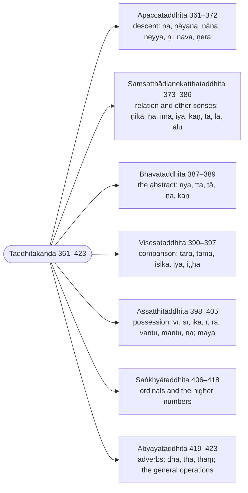

import { LinkCard } from "@astrojs/starlight/components";

:::note
The `taddhita` suffixes are grouped by the sense they express: descent (`apacca`), relation and the many other senses of `ṇika` and its kin, the abstract, comparison, possession, number and the adverbial suffixes. Each derivation shows the vuddhi, the elision of the marker `ṇ` and the sandhi that the Kaccāyana rules prescribe.

:::

:::note[The seven kinds of taddhita]
Buddhappiya groups the secondary suffixes by sense, in Kaccāyana's order, and brings the operations they share forward to the first derivation that needs them. The ranges are Rūpasiddhi numbers.

:::

## Apaccataddhita (Suffixes of descent)

> Atha nāmato eva vibhatyantā apaccādiatthavisese taddhituppattīti nāmato paraṃ taddhitavidhānamārabhīyate.

Now, because a `taddhita` (secondary derivative) arises only from a noun — from a stem that carries an inflection — in a particular sense such as "offspring", the treatment of the `taddhita` is begun after that of the noun [and its compounds].

> Tattha tasmā tividhaliṅgato paraṃ hutvā hitā sahitāti taddhitā, ṇā dipaccayānametaṃ adhivacanaṃ, tesaṃ vā nāmikānaṃ hitā upakārā taddhitāti anvatthabhūtaparasamaññāvasenāpi ṇā dippaccayāva taddhitā nāma.

Here `taddhita` means "placed (`hita`), that is, joined on, after (`paraṃ hutvā`) that (`tasmā`) stem of three genders"; it is a name for the suffixes `ṇa` and the rest. Or else they are `taddhita` because they are of service (`hitā`), helpful, to those (`tesaṃ`) nominal stems. So even by way of the terminology of the other grammars, which is admitted by [§9 (11): Parasamaññā payoge](/kaccayana/1-sandhikappa#m9) and here says what it means (`anvattha`), it is precisely the suffixes `ṇa` and the rest that are called `taddhita`.

> ‘‘Vasiṭṭhassa apacca’’nti viggahe –

In the analysis (`viggaha`, the phrase the derivative stands for) "Vasiṭṭha's offspring" —

> ‘‘Liṅgañca nipaccate’’ti ito liṅga ggahaṇamanuvattate.

the word `liṅga` (stem) continues [into the rule] from [61 (§53): Liṅgañca nipaccate](/rupasiddhi/2-namakanda#r61), Kaccāyana's [§53 (61): Liṅgañca nippajjate](/kaccayana/2-namakappa#m53).

---

### 361 (§344): Vā ṇa’pacce (Optionally `ṇa` in the sense of offspring) :badge[apavada]{variant=success}

:::tip[Kaccāyana]
<LinkCard title="§344 (361): Vāṇa’pacce" href="/kaccayana/5-taddhitakappa#m344" description="Optionally `ṇa` in the sense of offspring" />
:::

> Chaṭṭhiyantato liṅgamhā ṇa ppaccayo hoti vikappena ‘‘tassa apacca’’miccetasmiṃ atthe.

After a stem ending in the sixth form ⑥, the suffix `ṇa` is added by option (`vikappena`) in the sense "his offspring" (`tassa apaccaṃ`).

> So ca –

And that [suffix] —

:::tip[Example]

The first step of the derivation of `vāsiṭṭho`, completed under [365 (§405): Ayuvaṇṇānañcāyo vuddhī](/rupasiddhi/5-taddhitakanda#r365):

| lemma | inflected | meaning |
| ----- | --------- | ------- |
| 🚹①⨀(vasiṭṭha + ṇa) | vasiṭṭhassa apaccaṃ → vāsiṭṭho | a descendant of Vasiṭṭha — or the phrase `vasiṭṭhassa apaccaṃ` |

|     | vasiṭṭha + sa (⑥⨀) + ṇa        | rule |
| --- | ------------------------------- | ---- |
| →   | vasiṭṭhassa + ṇa                | §344 |

:::

---

### 362 (§432): Dhātuliṅgehi parā paccayā (suffixes come after roots and stems: a governing statement) :badge[sīhagatika]{variant=caution}

:::tip[Kaccāyana]
<LinkCard title="§432 (362): Dhātuliṅgehi parā paccayā" href="/kaccayana/6-akhyatakappa#m432" description="suffixes come after roots and stems: a governing statement" />
:::

> Dhātūhi, liṅgehi ca paccayā parāva hontīti paribhāsato apaccatthasambandhiliṅgato chaṭṭhiyantāyeva paro hoti. Paṭicca etasmā attho etīti paccayo, patīyanti anena atthāti vā paccayo, ‘‘vuttatthānamappayogo’’ti apacca saddassa appayogo, ‘‘tesaṃ vibhattiyo lopā ce’’ti vibhattilopo ca.

By the interpretive rule (`paribhāsā`) "the suffixes come only after roots (`dhātu`) and after stems (`liṅga`)", [the suffix] comes only after the stem connected with the sense of offspring, ending in the sixth form ⑥. It is a `paccaya` (suffix) because from it, depending on it (`paṭicca`), the meaning comes (`eti`); or because meanings are understood (`patīyanti`) by means of it. By [the maxim] "what has been expressed is not used" (`vuttatthānaṃ appayogo`), the word `apacca` is not used; and by [§317 (332): Tesaṃ vibhattiyo lopā ca](/kaccayana/4-samasakappa#m317) the inflection is elided.

:::tip[Example]

| lemma | inflected | meaning |
| ----- | --------- | ------- |
| 🚹①⨀(vasiṭṭha + ṇa) | vasiṭṭha + ṇa | the stem with its suffix, the inflection `sa` and the word `apacca` removed |

|     | vasiṭṭha + sa (⑥⨀) + ṇa        | rule |
| --- | ------------------------------- | ---- |
| →   | vasiṭṭha + ~~sa~~ + ṇa          | §317 |

:::

---

### 363 (§396): Tesaṃ ṇo lopaṃ (the `ṇ` of these suffixes is elided) :badge[utsarga]{variant=success}

:::tip[Kaccāyana]
<LinkCard title="§396 (363): Tesaṃ ṇo lopaṃ" href="/kaccayana/5-taddhitakappa#m396" description="the `ṇ` of these suffixes is elided" />
:::

> Tesaṃ taddhitappaccayānaṃ ṇā nubandhānaṃ ṇa kāro lopamāpajjate.

Of these `taddhita` suffixes that carry the marker `ṇ` (`ṇānubandha`), the letter `ṇ` is elided.

:::tip[Example]

| lemma | inflected | meaning |
| ----- | --------- | ------- |
| 🚹①⨀(vasiṭṭha + ṇa) | vasiṭṭha + a | the suffix reduced to `a` |

|     | vasiṭṭha + ~~sa~~ + ṇa          | rule |
| --- | ------------------------------- | ---- |
| →   | vasiṭṭha + (~~ṇ~~a)             | §396 |

:::

---

### 364 (§400): Vuddhādisarassa vāsaṃyogantassa saṇe ca (optionally `vuddhi` of the first vowel not before a conjunct, before a `ṇ` suffix) :badge[apavada]{variant=success}

:::tip[Kaccāyana]
<LinkCard title="§400 (364): Vuddhādisarassa vā’saṃyogantassa saṇe ca" href="/kaccayana/5-taddhitakappa#m400" description="optionally `vuddhi` of the first vowel not before a conjunct, before a `ṇ` suffix" />
:::

> Ādisarassa vā ādibyañjanassa vā asaṃyogantassa vuddhi hoti saṇa kārappaccaye pare. Saṃyogo anto assāti saṃyoganto, tadañño asaṃyoganto. Atha vā vavatthitavibhāsatthoyaṃ vā saddo, tadā ca pakatibhūte liṅge sarānamādisarassa asaṃyogantassa vuddhi hoti saṇa kāre taddhitappaccaye pareti attho.

Of the initial vowel, or of [the vowel of] the initial consonant, when it is not followed by a conjunct, there is `vuddhi` (strengthening) when a suffix with the letter `ṇ` follows. That which has a conjunct (`saṃyoga`) after it is `saṃyoganta`, "ending in a conjunct"; what is other than that is `asaṃyoganta`. Or else this word `vā` has the sense of a restricted option (`vavatthitavibhāsā`); and then the meaning is: among the vowels of the stem that is the base, the initial vowel not followed by a conjunct takes `vuddhi` when a `taddhita` suffix with `ṇ` follows.

> Tena –

Hence —

> Vāsiṭṭhādīsu niccāyaṃ, aniccoḷumpikādisu; \
> Na vuddhi nīlapītādo, vavatthitavibhāsato.

In `vāsiṭṭha` and the like this [strengthening] is invariable (`nicca`); in `oḷumpika` and the like it is not invariable (`anicca`); \
in `nīla`, `pīta` and the like there is no strengthening — by the restricted option.

> Ca saddaggahaṇamavadhāraṇatthaṃ.

The word `ca` is taken in the sense of delimitation (`avadhāraṇa`).

> Tassā vuddhiyā aniyamappasaṅge niyamatthaṃ paribhāsamāha.

As that `vuddhi` would be left unrestricted, he states an interpretive rule (`paribhāsā`) to restrict it.

:::tip[Examples]

The three domains of the restricted option, in the words the verse names:

| lemma | inflected | meaning |
| ----- | --------- | ------- |
| 🚹①⨀(vasiṭṭha + ṇa) | vāsiṭṭho | a descendant of Vasiṭṭha — `nicca`: the strengthening is invariable |
| 🚹①⨀(uḷumpa + ṇika) | oḷumpiko, uḷumpiko | one who crosses by raft — `anicca`: with or without the strengthening |
| 🚻①⨀(nīla + ṇa) | nīlaṃ | dyed blue — `asanta`: no strengthening in the colour words |
| 🚻①⨀(pīta + ṇa) | pītaṃ | dyed yellow |

|     | vasiṭṭha + (~~ṇ~~a)             | rule |
| --- | ------------------------------- | ---- |
| →   | v + (a→ā) + siṭṭha + a          | §400 |

:::

---

### 365 (§405): Ayuvaṇṇānañcāyo vuddhī (the `vuddhi` of `a`, `i`, `u` is `ā`, `e`, `o`) :badge[anvattha]{variant=note}

:::tip[Kaccāyana]
<LinkCard title="§405 (365): Ayuvaṇṇānañcāyo vuddhi" href="/kaccayana/5-taddhitakappa#m405" description="the `vuddhi` of `a`, `i`, `u` is `ā`, `e`, `o`" />
:::

> Tesaṃ a kārai vaṇṇu vaṇṇānameva yathākkamaṃ ā eo iccete vuddhiyo honti. Ca saddaggahaṇamavuddhisampiṇḍanatthaṃ, avadhāraṇatthaṃ vā. I ca u ca yu, yu eva vaṇṇā yuvaṇṇā, a ca yuvaṇṇā ca ayuvaṇṇā. Ā ca e ca o ca āyo. Puna vuddhi ggahaṇaṃ ‘‘negamajānapadā’’tiādīsu uttarapadavuddhibhāvatthaṃ, ettha ca ‘‘ayuvaṇṇāna’’nti ṭhānaniyamavacanaṃ āyonaṃ vuddhibhāvappasaṅganivattanatthaṃ.

Of those — the letter `a`, the `i`-sound and the `u`-sound — and of those alone, `ā`, `e` and `o` respectively are the `vuddhi`. The word `ca` is taken either to include (`sampiṇḍana`) the absence of strengthening, or for delimitation. `i` and `u` are `yu`; the sounds that are just `yu` are `yuvaṇṇā`; `a` together with the `yuvaṇṇā` are `ayuvaṇṇā`. `ā` and `e` and `o` are `āyo`. The second mention of `vuddhi` is for the strengthening of the latter word (`uttarapada`) in `negamajānapadā` ("born in towns and provinces") and the like; and here the statement `ayuvaṇṇānaṃ`, which fixes the locus, is to ward off the possibility of `ā`, `e`, `o` being strengthened.

> Yathā hi katavuddhīnaṃ, puna vuddhi na hotiha; \
> Tathā sabhāvavuddhīnaṃ, āyonaṃ puna vuddhi na.

For just as vowels whose strengthening has been made receive no second strengthening here, \
so `ā`, `e` and `o`, strengthened by nature, receive no further strengthening.

> Tato a kārassa ā kāro vuddhi, ‘‘saralopomādesappaccayādimhi saralope tu pakatī’’ti saralopapakatibhāvā, ‘‘naye paraṃ yutte’’ti paranayanaṃ katvā taddhitattā ‘‘taddhitasamāsa’’iccādinā nāmabyapadese kate pure viya syā dyuppatti.

Then `ā` is the strengthening of the `a`; by [§83 (67): Saralopo’ mādesa paccayādimhi saralope tu pakati](/kaccayana/2-namakappa#m83) the [final] vowel is elided and [the following] keeps its original form; the [consonant] is carried over to the following [vowel] by [§11 (14): Naye paraṃ yutte](/kaccayana/1-sandhikappa#m11); and since it is a `taddhita`, once it has been designated a noun by [§601 (334): Taddhitasamāsakitakā nāmaṃ vā’ tave tunādīsu ca](/kaccayana/7-kibbidhanakappa#m601), the inflections `si` and the rest are added as before.

> Vāsiṭṭho, vasiṭṭhassa putto vā, vāsiṭṭhā iccādi purisa saddasamaṃ. Tassa nattupanattādayopi tadupacārato vāsiṭṭhāyeva. Evaṃ sabbattha gottataddhite paṭhamappakatitoyeva paccayo hoti.

`vāsiṭṭho`, or `vasiṭṭhassa putto` ("Vasiṭṭha's son"); `vāsiṭṭhā` and so on, like the word `purisa`. His grandsons, great-grandsons and the rest are also just `vāsiṭṭhā`, by extension (`upacāra`) of that [name]. Thus everywhere, in a clan derivative (`gottataddhita`), the suffix is added only to the first base.

> Itthiyaṃ ṇappaccayantattā ‘‘ṇava ṇika ṇeyya ṇa ntūhī’’ti vāsiṭṭha saddato īpaccayo. Saralopādiṃ katvā itthippaccayantattā ‘‘taddhitasamāsa’’iccādisutte ca ggahaṇena nāmabyapadese kate syā dyuppatti, vāsiṭṭhī kaññā, vāsiṭṭhī, vāsiṭṭhiyo iccādi itthi saddasamaṃ.

In the feminine, because [the word] ends in the suffix `ṇa`, the suffix `ī` is added to the word `vāsiṭṭha` by [§239 (190): Ṇava ṇika ṇeyya ṇa ntuhi](/kaccayana/2-namakappa#m239). After vowel elision and the rest, since [the word] ends in a feminine suffix, it is designated a noun by the word `ca` in the sutta [§601] `Taddhitasamāsa…`, and the inflections `si` and the rest are added: `vāsiṭṭhī kaññā` ("a girl of Vasiṭṭha's line"); `vāsiṭṭhī`, `vāsiṭṭhiyo` and so on, like the word `itthī`.

> Napuṃsake vāsiṭṭhaṃ apaccaṃ, vāsiṭṭhāni apaccāni iccādi citta saddasamaṃ. Evaṃ uparipi taddhitantassa tiliṅgatā veditabbā.

In the neuter, `vāsiṭṭhaṃ apaccaṃ` ("Vasiṭṭha's offspring"), `vāsiṭṭhāni apaccāni` and so on, like the word `citta`. In the same way, further on too, a word ending in a `taddhita` suffix is to be understood as having all three genders.

> Bhāradvājassa putto bhāradvājo, vesāmittassa putto vesāmitto, gotamassa putto gotamo. Ettha ca ayuvaṇṇattābhāvā ā kārādīnaṃ na vuddhi hoti. Vasudevassa apaccaṃ vāsudevo, bāladevo[^1]. ‘‘Cittako’’tiādīsu pana saṃyogantattā vuddhi na bhavati.

Bhāradvāja's son is `bhāradvājo`, Vesāmitta's son `vesāmitto`, Gotama's son `gotamo`; and here there is no strengthening of `ā` and the rest, because they are not `a`, `i` or `u`. Vasudeva's offspring is `vāsudevo`; `bāladevo`. In `cittako` and the like, on the other hand, there is no strengthening because [the first vowel] is followed by a conjunct.

> ‘‘Vacchassa apacca’’nti viggahe ṇa mhi sampatte ‘‘vā ṇa’pacce’’ti ito vā ti taddhitavidhāne sabbattha vattate, tena sabbattha vākyavuttiyo bhavanti. ‘‘Apacce’’ti padaṃ yāva saṃsaṭṭha ggahaṇāva vattate.

In the analysis "Vaccha's offspring", when `ṇa` would apply, the `vā` from [361 (§344): Vā ṇa’pacce](/rupasiddhi/5-taddhitakanda#r361) continues everywhere in the treatment of the `taddhita`; hence everywhere both the phrase (`vākya`) and the derivative (`vutti`) occur. The word `apacce` continues as far as the mention of `saṃsaṭṭha`.

:::tip[Examples]

| lemma | inflected | meaning |
| ----- | --------- | ------- |
| 🚹①⨀(vasiṭṭha + ṇa) | vāsiṭṭho | a descendant of Vasiṭṭha — or `vasiṭṭhassa putto` |
| 🚹①⨂(vasiṭṭha + ṇa) | vāsiṭṭhā | descendants of Vasiṭṭha; also his grandsons and great-grandsons, by extension |
| 🚺①⨀(vasiṭṭha + ṇa + ī) | vāsiṭṭhī kaññā | a girl of Vasiṭṭha's line |
| 🚺①⨂(vasiṭṭha + ṇa + ī) | vāsiṭṭhī, vāsiṭṭhiyo | women of Vasiṭṭha's line |
| 🚻①⨀(vasiṭṭha + ṇa) | vāsiṭṭhaṃ apaccaṃ | Vasiṭṭha's offspring, agreeing with `apacca` |
| 🚻①⨂(vasiṭṭha + ṇa) | vāsiṭṭhāni apaccāni | Vasiṭṭha's offspring (plural) |
| 🚹①⨀(bhāradvāja + ṇa) | bhāradvājo | Bhāradvāja's son — no strengthening, the first vowel being already `ā` |
| 🚹①⨀(vesāmitta + ṇa) | vesāmitto | Vesāmitta's son — the first vowel already `e` |
| 🚹①⨀(gotama + ṇa) | gotamo | Gotama's son — the first vowel already `o` |
| 🚹①⨀(vasudeva + ṇa) | vāsudevo | Vasudeva's offspring — `a` to `ā` |
| 🚹①⨀(baladeva + ṇa) | bāladevo | Baladeva's offspring — `a` to `ā` |
| 🚹①⨀(cittaka + ṇa) | cittako | Cittaka's offspring — no strengthening before the conjunct `tt` |

The derivation begun at 361, complete:

|     | vasiṭṭha + sa (⑥⨀) + ṇa        | rule |
| --- | ------------------------------- | ---- |
| →   | vasiṭṭha + ~~sa~~ + ṇa          | §317 |
| →   | vasiṭṭha + (~~ṇ~~a)             | §396 |
| →   | v + (a→ā) + siṭṭha + a          | §400, §405 |
| →   | vāsiṭṭh + (~~a~~ + a)           | §83  |
| →   | vāsiṭṭha                        | §11  |
| →   | vāsiṭṭha + si (a noun)          | §601 |
| →   | vāsiṭṭha + (si→o)               | §104 |
| →   | **vāsiṭṭho**                    |      |

The feminine and the neuter:

|     | vāsiṭṭha (🚺) + ī + si          | rule |
| --- | ------------------------------- | ---- |
| →   | vāsiṭṭh + (~~a~~ + ī) + si      | §239, §83 |
| →   | vāsiṭṭhī + si (a noun)          | §601 |
| →   | vāsiṭṭhī + ~~si~~               | §220 |
| →   | **vāsiṭṭhī**                    |      |

|     | vāsiṭṭha (🚻) + si              | rule |
| --- | ------------------------------- | ---- |
| →   | vāsiṭṭha + (si→aṃ)              | §219 |
| →   | **vāsiṭṭhaṃ**                   |      |

:::

[^1]: CST4 prints `baladevo`; `bāladevo` is read with Kaccāyana's vutti under §344.

---

### 366 (§345): Ṇāyana ṇāna vacchādito (`ṇāyana`, `ṇāna` after `vaccha` and the like) :badge[apavada]{variant=success}

:::tip[Kaccāyana]
<LinkCard title="§345 (366): Ṇāyana ṇāna vacchādito" href="/kaccayana/5-taddhitakappa#m345" description="`ṇāyana`, `ṇāna` after `vaccha` and the like" />
:::

> Vaccha kacca iccevamādito chaṭṭhiyantato gottagaṇato ṇāyana ṇāna iccete[^2] paccayā honti vā ‘‘tassāpacca’’miccetasmiṃ atthe. Sabbattha ṇa kārānubandho vuddhattho, sesaṃ pubbasamaṃ, saṃyogantattā vuddhiabhāvova viseso.

After `vaccha`, `kacca` and the like, the group of clan names (`gottagaṇa`), ending in the sixth form ⑥, the suffixes `ṇāyana` and `ṇāna` are optionally added in the sense "his offspring". Everywhere the marker `ṇ` is for the purpose of strengthening; the rest is as before; the only difference is the absence of strengthening, because [the first vowel] is followed by a conjunct.

> Vacchāyano vacchāno vacchassa putto vā. Evaṃ kaccassa putto kaccāyano kaccāno, moggallassa putto moggallāyano moggallāno. Evaṃ aggivessāyano aggivessāno, kaṇhāyano kaṇhāno, sākaṭāyano sākaṭāno, muñcāyano muñcāno, kuñjāyano kuñjāno iccādi. Ākatigaṇo’yaṃ.

`vacchāyano`, `vacchāno`, or `vacchassa putto` ("Vaccha's son"). Likewise Kacca's son is `kaccāyano`, `kaccāno`; Moggalla's son `moggallāyano`, `moggallāno`; likewise `aggivessāyano`, `aggivessāno`; `kaṇhāyano`, `kaṇhāno`; `sākaṭāyano`, `sākaṭāno`; `muñcāyano`, `muñcāno`; `kuñjāyano`, `kuñjāno`, and so on. This is a group defined by form (`ākatigaṇa`).

:::tip[Examples]

| lemma | inflected | meaning |
| ----- | --------- | ------- |
| 🚹①⨀(vaccha + ṇāyana) | vacchāyano | a descendant of Vaccha — or `vacchassa putto` |
| 🚹①⨀(vaccha + ṇāna) | vacchāno | a descendant of Vaccha, with `ṇāna` |
| 🚹①⨀(kacca + ṇāyana) | kaccāyano | a descendant of Kacca — the name the grammar's author bears |
| 🚹①⨀(kacca + ṇāna) | kaccāno | a descendant of Kacca, with `ṇāna` |
| 🚹①⨀(moggalla + ṇāyana) | moggallāyano | a descendant of Moggalla |
| 🚹①⨀(moggalla + ṇāna) | moggallāno | a descendant of Moggalla — the elder's name |
| 🚹①⨀(aggivessa + ṇāyana) | aggivessāyano | a descendant of Aggivessa |
| 🚹①⨀(aggivessa + ṇāna) | aggivessāno | a descendant of Aggivessa |
| 🚹①⨀(kaṇha + ṇāyana) | kaṇhāyano | a descendant of Kaṇha |
| 🚹①⨀(kaṇha + ṇāna) | kaṇhāno | a descendant of Kaṇha |
| 🚹①⨀(sakaṭa + ṇāyana) | sākaṭāyano | a descendant of Sakaṭa — the one name of the list that takes the strengthening |
| 🚹①⨀(sakaṭa + ṇāna) | sākaṭāno | a descendant of Sakaṭa |
| 🚹①⨀(muñca + ṇāyana) | muñcāyano | a descendant of Muñca |
| 🚹①⨀(muñca + ṇāna) | muñcāno | a descendant of Muñca |
| 🚹①⨀(kuñja + ṇāyana) | kuñjāyano | a descendant of Kuñja |
| 🚹①⨀(kuñja + ṇāna) | kuñjāno | a descendant of Kuñja |

Without strengthening (`vaccha`) and with it (`sakaṭa`):

|     | vaccha + sa (⑥⨀) + ṇāyana       | rule |
| --- | ------------------------------- | ---- |
| →   | vaccha + ~~sa~~ + ṇāyana        | §317 |
| →   | vaccha + (~~ṇ~~āyana)           | §396 |
| →   | vacch + (~~a~~ + āyana)         | §83  |
| →   | vacchāyana + (si→o)             | §104 |
| →   | **vacchāyano**                  |      |

|     | sakaṭa + sa (⑥⨀) + ṇāna         | rule |
| --- | ------------------------------- | ---- |
| →   | sakaṭa + ~~sa~~ + ṇāna          | §317 |
| →   | sakaṭa + (~~ṇ~~āna)             | §396 |
| →   | s + (a→ā) + kaṭa + āna          | §400, §405 |
| →   | sākaṭ + (~~a~~ + āna)           | §83  |
| →   | sākaṭāna + (si→o)               | §104 |
| →   | **sākaṭāno**                    |      |

:::

> ‘‘Kattikāya apacca’’nti viggahe –

In the analysis "Kattikā's offspring" —

[^2]: CST4 prints `iccate`; the form Buddhappiya uses everywhere else is `iccete`.

---

### 367 (§346): Ṇeyyo kattikādīhi (`ṇeyya` after `kattikā` and the like) :badge[apavada]{variant=success}

:::tip[Kaccāyana]
<LinkCard title="§346 (367): Ṇeyyo kattikādīhi" href="/kaccayana/5-taddhitakappa#m346" description="`ṇeyya` after `kattikā` and the like" />
:::

> Ādi saddoyaṃ pakāre vattate. Kattikā vinatārohiṇī iccevamādīhi itthiyaṃ vattamānehi liṅgehi ṇeyya ppaccayo hoti vā ‘‘tassāpacca’’miccetasmiṃ atthe.

This word `ādi` is used in the sense of "kind" (`pakāra`). After stems used in the feminine, of the kind of `kattikā`, `vinatā`, `rohiṇī`, the suffix `ṇeyya` is optionally added in the sense "his offspring".

> Vibhattilope ‘‘pakati cassa sarantassā’’ti pakatibhāvo. Kattikeyyo, kattikāya putto vā. Evaṃ vinatāya apaccaṃ venateyyo, i kārasse kāro vuddhi, rohiṇiyā putto rohiṇeyyo, gaṅgāya apaccaṃ gaṅgeyyo, bhaginiyā putto bhāgineyyo, nadiyāputto nādeyyo. Evaṃ anteyyo, āheyyo, kāmeyyo. Suciyā apaccaṃ soceyyo, ettha u kārasso kāro vuddhi, bālāya apaccaṃ bāleyyo iccādi.

When the inflection is elided, [the stem] returns to its original form by [§318 (333): Pakati cassa sarantassa](/kaccayana/4-samasakappa#m318). `kattikeyyo`, or `kattikāya putto` ("Kattikā's son"). Likewise Vinatā's offspring is `venateyyo` — the `e` is the strengthening of the `i`; Rohiṇī's son `rohiṇeyyo`; Gaṅgā's offspring `gaṅgeyyo`; the sister's (`bhaginī`) son `bhāgineyyo`; the river's (`nadī`) son `nādeyyo`. Likewise `anteyyo`, `āheyyo`, `kāmeyyo`. Suci's offspring is `soceyyo` — here the `o` is the strengthening of the `u`; Bālā's offspring `bāleyyo`, and so on.

:::tip[Examples]

| lemma | inflected | meaning |
| ----- | --------- | ------- |
| 🚹①⨀(kattikā + ṇeyya) | kattikeyyo | a descendant of Kattikā — or `kattikāya putto`; no strengthening before `tt` |
| 🚹①⨀(vinatā + ṇeyya) | venateyyo | Vinatā's offspring, the `garuḷa` — `i` to `e` |
| 🚹①⨀(rohiṇī + ṇeyya) | rohiṇeyyo | Rohiṇī's son — the `o` already strong |
| 🚹①⨀(gaṅgā + ṇeyya) | gaṅgeyyo | a child of Gaṅgā, of the Ganges — no strengthening before `ṅg` |
| 🚹①⨀(bhaginī + ṇeyya) | bhāgineyyo | a sister's son, a nephew — `a` to `ā` |
| 🚹①⨀(nadī + ṇeyya) | nādeyyo | a river's child — `a` to `ā` |
| 🚹①⨀(antā + ṇeyya) | anteyyo | Antā's offspring (the base is known only from this list) |
| 🚹①⨀(ahi + ṇeyya) | āheyyo | a snake's (`ahi`) offspring |
| 🚹①⨀(kāma + ṇeyya) | kāmeyyo | Kāma's offspring |
| 🚹①⨀(suci + ṇeyya) | soceyyo | Suci's offspring — `u` to `o` |
| 🚹①⨀(bālā + ṇeyya) | bāleyyo | Bālā's offspring — the `ā` already long |

The return to the original form, then the strengthening of `i` and of `u`:

|     | kattikā + āya (⑥⨀) + ṇeyya      | rule |
| --- | ------------------------------- | ---- |
| →   | kattikā + ~~āya~~ + ṇeyya       | §317 |
| →   | kattikā + ṇeyya                 | §318 |
| →   | kattikā + (~~ṇ~~eyya)           | §396 |
| →   | kattik + (~~ā~~ + eyya)         | §83  |
| →   | kattikeyya + (si→o)             | §104 |
| →   | **kattikeyyo**                  |      |

|     | vinatā + āya (⑥⨀) + ṇeyya       | rule |
| --- | ------------------------------- | ---- |
| →   | vinatā + ~~āya~~ + ṇeyya        | §317, §318 |
| →   | vinatā + (~~ṇ~~eyya)            | §396 |
| →   | v + (i→e) + natā + eyya         | §400, §405 |
| →   | venat + (~~ā~~ + eyya)          | §83  |
| →   | venateyya + (si→o)              | §104 |
| →   | **venateyyo**                   |      |

|     | suci + yā (⑥⨀) + ṇeyya          | rule |
| --- | ------------------------------- | ---- |
| →   | suci + ~~yā~~ + ṇeyya           | §317, §318 |
| →   | suci + (~~ṇ~~eyya)              | §396 |
| →   | s + (u→o) + ci + eyya           | §400, §405 |
| →   | soc + (~~i~~ + eyya)            | §83  |
| →   | soceyya + (si→o)                | §104 |
| →   | **soceyyo**                     |      |

:::

> ‘‘Dakkhassāpacca’’nti viggahe ṇamhi sampatte –

In the analysis "Dakkha's offspring", when `ṇa` would apply —

---

### 368 (§347): Ato ṇi vā (Optionally `ṇi` after a stem in `a`) :badge[apavada]{variant=success}

:::tip[Kaccāyana]
<LinkCard title="§347 (368): Ato ṇi vā" href="/kaccayana/5-taddhitakappa#m347" description="Optionally `ṇi` after a stem in `a`" />
:::

> A kārantato liṅgamhā ṇi paccayo hoti vā ‘‘tassāpacca’’miccetasmiṃ atthe. Dakkhi, dakkhī, dakkhayo, doṇassa apaccaṃ doṇi. Evaṃ vāsavi, sakyaputti, nāṭaputti, dāsaputti, dāsarathi. Vāruṇi, kaṇḍi, bāladevi, pāvaki, jinadattassa apaccaṃ jenadatti, suddhodani, anuruddhi iccādi.

After a stem ending in `a`, the suffix `ṇi` is optionally added in the sense "his offspring". `dakkhi`, `dakkhī`, `dakkhayo`; Doṇa's offspring is `doṇi`. Likewise `vāsavi`, `sakyaputti`, `nāṭaputti`, `dāsaputti`, `dāsarathi`; `vāruṇi`, `kaṇḍi`, `bāladevi`, `pāvaki`; Jinadatta's offspring is `jenadatti`; `suddhodani`, `anuruddhi`, and so on.

> Puna vā ggahaṇena apaccatthe ṇika ppaccayo, aditi ādito ṇya ppaccayo ca. Yathā – sakyaputtassa putto sakyaputtiko, ‘‘tesu vuddhī’’tiādinā ka kārassa ya kāro, sakyaputtiyo. Evaṃ nāṭaputtiko, jenadattiko, vimātuyā putto vemātiko.

By the renewed mention of `vā`, [there is] the suffix `ṇika` in the sense of offspring, and the suffix `ṇya` after `aditi` and the like. Thus: the Sakyan's son is `sakyaputtiko`; by [§404 (370): Tesu vuddhilopāgamavikāraviparītādesā ca](/kaccayana/5-taddhitakappa#m404) and the rest the `k` becomes `y`: `sakyaputtiyo`. Likewise `nāṭaputtiko`, `jenadattiko`; a step-mother's (`vimātu`) son is `vemātiko`.

> ‘‘Aditiyā putto’’ti atthe ṇya ppaccayo, vuddhi ca.

In the sense "Aditi's son" the suffix `ṇya` [is added], and the strengthening —

:::tip[Examples]

| lemma | inflected | meaning |
| ----- | --------- | ------- |
| 🚹①⨀(dakkha + ṇi) | dakkhi | a descendant of Dakkha — or `dakkhassa apaccaṃ` |
| 🚹①⨂(dakkha + ṇi) | dakkhī, dakkhayo | descendants of Dakkha — the plural of an `i` stem, like `aggī`, `aggayo` |
| 🚹①⨀(doṇa + ṇi) | doṇi | a descendant of Doṇa — the `o` already strong |
| 🚹①⨀(vāsava + ṇi) | vāsavi | a descendant of Vāsava (Sakka) |
| 🚹①⨀(sakyaputta + ṇi) | sakyaputti | a descendant of the Sakyan's son — no strengthening before `ky` |
| 🚹①⨀(nāṭaputta + ṇi) | nāṭaputti | a descendant of Nāṭaputta |
| 🚹①⨀(dāsaputta + ṇi) | dāsaputti | a descendant of Dāsaputta |
| 🚹①⨀(dasaratha + ṇi) | dāsarathi | a descendant of Dasaratha — `a` to `ā` |
| 🚹①⨀(varuṇa + ṇi) | vāruṇi | a descendant of Varuṇa — `a` to `ā` |
| 🚹①⨀(kaṇḍa + ṇi) | kaṇḍi | a descendant of Kaṇḍa — no strengthening before `ṇḍ` |
| 🚹①⨀(baladeva + ṇi) | bāladevi | a descendant of Baladeva |
| 🚹①⨀(pāvaka + ṇi) | pāvaki | a descendant of Pāvaka |
| 🚹①⨀(jinadatta + ṇi) | jenadatti | a descendant of Jinadatta — `i` to `e` |
| 🚹①⨀(suddhodana + ṇi) | suddhodani | a descendant of Suddhodana — no strengthening before `ddh` |
| 🚹①⨀(anuruddha + ṇi) | anuruddhi | a descendant of Anuruddha — left without the strengthening its `a` would allow |

|     | dakkha + sa (⑥⨀) + ṇi           | rule |
| --- | ------------------------------- | ---- |
| →   | dakkha + ~~sa~~ + ṇi            | §317 |
| →   | dakkha + (~~ṇ~~i)               | §396 |
| →   | dakkh + (~~a~~ + i)             | §83  |
| →   | dakkhi + ~~si~~                 | §220 |
| →   | **dakkhi**                      |      |

|     | jinadatta + sa (⑥⨀) + ṇi        | rule |
| --- | ------------------------------- | ---- |
| →   | jinadatta + ~~sa~~ + ṇi         | §317 |
| →   | jinadatta + (~~ṇ~~i)            | §396 |
| →   | j + (i→e) + nadatta + i         | §400, §405 |
| →   | jenadatt + (~~a~~ + i)          | §83  |
| →   | jenadatti + ~~si~~              | §220 |
| →   | **jenadatti**                   |      |

By the renewed `vā`, `ṇika` in the same sense:

| lemma | inflected | meaning |
| ----- | --------- | ------- |
| 🚹①⨀(sakyaputta + ṇika) | sakyaputtiko | the Sakyan's son — `sakyaputtassa putto` |
| 🚹①⨀(sakyaputta + ṇika) | sakyaputtiyo | the same, with `y` for `k` — the Tipiṭaka's form |
| 🚹①⨀(nāṭaputta + ṇika) | nāṭaputtiko | a descendant of Nāṭaputta |
| 🚹①⨀(jinadatta + ṇika) | jenadattiko | a descendant of Jinadatta |
| 🚹①⨀(vimātu + ṇika) | vemātiko | a step-mother's son, a half-brother — `i` to `e` |

|     | sakyaputta + sa (⑥⨀) + ṇika     | rule |
| --- | ------------------------------- | ---- |
| →   | sakyaputta + ~~sa~~ + ṇika      | §317 |
| →   | sakyaputta + (~~ṇ~~ika)         | §396 |
| →   | sakyaputt + (~~a~~ + ika)       | §83  |
| →   | sakyaputtika + (si→o)           | §104 |
| →   | **sakyaputtiko**                |      |
| →   | sakyaputti + (k→y) + o          | §404 |
| →   | **sakyaputtiyo**                |      |

|     | vimātu + yā (⑥⨀) + ṇika         | rule |
| --- | ------------------------------- | ---- |
| →   | vimātu + ~~yā~~ + ṇika          | §317, §318 |
| →   | vimātu + (~~ṇ~~ika)             | §396 |
| →   | v + (i→e) + mātu + ika          | §400, §405 |
| →   | vemāt + (~~u~~ + ika)           | §83  |
| →   | vemātika + (si→o)               | §104 |
| →   | **vemātiko**                    |      |

:::

---

### 369 (§261): Avaṇṇo ye lopañca (`a`/`ā` elided before the suffix `ya`) :badge[apavada]{variant=success}

:::tip[Kaccāyana]
<LinkCard title="§261 (369): Avaṇṇo ye lopañca" href="/kaccayana/2-namakappa#m261" description="`a`/`ā` elided before the suffix `ya`" />
:::

> A vaṇṇo taddhitabhūte ya ppaccaye pare lopamāpajjate. Ca saddena ivaṇṇopīti i kāralopo, ‘‘yavataṃ talanadakārānaṃ byañjanāni ca la ña jakāratta’’nti tya kārasaṃyogassa ca kāro, ‘‘paradvebhāvo ṭhāne’’ti dvittaṃ, ādicco. Evaṃ ditiyā putto decco.

The `a`-vowel (`a` or `ā`) is elided when the `taddhita` suffix `ya` follows. By the word `ca`, the `i`-vowel too: [hence] the elision of the `i`; by [§269 (41): Yavataṃ ta la ṇa dakārānaṃ byañjanāni ca la ña jakārattaṃ](/kaccayana/2-namakappa#m269) the conjunct `ty` becomes `c`; by [§28 (40): Para dvebhāvo ṭhāne](/kaccayana/1-sandhikappa#m28) doubling: `ādicco`. Likewise Diti's son is `decco`.

:::tip[Examples]

| lemma | inflected | meaning |
| ----- | --------- | ------- |
| 🚹①⨀(aditi + ṇya) | ādicco | Aditi's son — the sun |
| 🚹①⨀(diti + ṇya) | decco | Diti's son — a `daitya`, a demon |

|     | aditi + yā (⑥⨀) + ṇya           | rule |
| --- | ------------------------------- | ---- |
| →   | aditi + ~~yā~~ + ṇya            | §317, §318 |
| →   | aditi + (~~ṇ~~ya)               | §396 |
| →   | (a→ā) + diti + ya               | §400, §405 |
| →   | ādit + (~~i~~ + ya)             | §261 |
| →   | ādi + (ty→c) + a                | §269 |
| →   | ādi + (c→cc) + a                | §28  |
| →   | ādicca + (si→o)                 | §104 |
| →   | **ādicco**                      |      |

|     | diti + yā (⑥⨀) + ṇya            | rule |
| --- | ------------------------------- | ---- |
| →   | diti + ~~yā~~ + ṇya             | §317, §318 |
| →   | diti + (~~ṇ~~ya)                | §396 |
| →   | d + (i→e) + ti + ya             | §400, §405 |
| →   | det + (~~i~~ + ya)              | §261 |
| →   | de + (ty→cc) + a                | §269, §28 |
| →   | decca + (si→o)                  | §104 |
| →   | **decco**                       |      |

:::

> ‘‘Kuṇḍaniyā putto’’ti atthe ṇya ppaccaye kate –

When, in the sense "Kuṇḍanī's son", the suffix `ṇya` has been added —

> ‘‘Kvacādimajjhuttaresū’’ti vattate.

`Kvacādimajjhuttaresu` ("`kvaci`, in the first, middle and last [positions]") continues from [§403 (354): Kvacādimajjhuttarānaṃ dīgharassā paccayesu ca](/kaccayana/5-taddhitakappa#m403).

---

### 370 (§404): Tesu vuddhilopāgamavikāraviparītādesā ca (and in these, `vuddhi`, elision, augment, change, reversal, replacement) :badge[apavada]{variant=success}

:::tip[Kaccāyana]
<LinkCard title="§404 (370): Tesu vuddhilopāgamavikāraviparītādesā ca" href="/kaccayana/5-taddhitakappa#m404" description="and in these, `vuddhi`, elision, augment, change, reversal, replacement" />
:::

> Tesu ādimajjhuttaresu avihitalakkhaṇesu jinavacanānuparodhena kvaci vuddhi lopa āgama vikāra viparītaādesā hontīti saṃyogantattepi ādivuddhi, i kāralope nya ssañā deso, koṇḍañño, kuruno putto korabyo, etthāpi teneva u kārassa avā deso, bhātuno putto bhātabyo.

In these — the first, middle and last [positions] — where no rule has been laid down, in conformity with the word of the Conqueror, there is sometimes (`kvaci`) strengthening (`vuddhi`), elision (`lopa`), augment (`āgama`), change (`vikāra`), reversal (`viparīta`) or replacement (`ādesa`). Hence, even though [the first vowel] is followed by a conjunct, the initial [vowel] is strengthened, and when the `i` is elided `ny` is replaced by `ñ`: `koṇḍañño`. Kuru's son is `korabyo` — here too, by the same rule, the `u` is replaced by `ava`; Bhātu's son is `bhātabyo`.

:::tip[Examples]

| lemma | inflected | meaning |
| ----- | --------- | ------- |
| 🚹①⨀(kuṇḍanī + ṇya) | koṇḍañño | Kuṇḍanī's son — Koṇḍañña, the first of the five monks |
| 🚹①⨀(kuru + ṇya) | korabyo | Kuru's son — a Koravya, a prince of the Kurus |
| 🚹①⨀(bhātu + ṇya) | bhātabyo | a brother's (`bhātu`) son — a nephew |

|     | kuṇḍanī + yā (⑥⨀) + ṇya         | rule |
| --- | ------------------------------- | ---- |
| →   | kuṇḍanī + ~~yā~~ + ṇya          | §317, §318 |
| →   | kuṇḍanī + (~~ṇ~~ya)             | §396 |
| →   | k + (u→o) + ṇḍanī + ya          | §404 |
| →   | koṇḍan + (~~ī~~ + ya)           | §261 |
| →   | koṇḍa + (ny→ñ) + a              | §404 |
| →   | koṇḍa + (ñ→ññ) + a              | §28  |
| →   | koṇḍañña + (si→o)               | §104 |
| →   | **koṇḍañño**                    |      |

|     | kuru + no (⑥⨀) + ṇya            | rule |
| --- | ------------------------------- | ---- |
| →   | kuru + ~~no~~ + ṇya             | §317 |
| →   | kuru + (~~ṇ~~ya)                | §396 |
| →   | k + (u→o) + ru + ya             | §400, §405 |
| →   | kor + (u→ava) + ya              | §404 |
| →   | kora + (v→b) + ya               | §404 |
| →   | korabya + (si→o)                | §104 |
| →   | **korabyo**                     |      |

|     | bhātu + no (⑥⨀) + ṇya           | rule |
| --- | ------------------------------- | ---- |
| →   | bhātu + ~~no~~ + ṇya            | §317 |
| →   | bhātu + (~~ṇ~~ya)               | §396 |
| →   | bhāt + (u→ava) + ya             | §404 |
| →   | bhāta + (v→b) + ya              | §404 |
| →   | bhātabya + (si→o)               | §104 |
| →   | **bhātabyo**                    |      |

:::

> ‘‘Upagussa apacca’’nti viggahe –

In the analysis "Upagu's offspring" —

---

### 371 (§348): Ṇavopagvādīhi (`ṇava` after `upaku` and the like) :badge[apavada]{variant=success}

:::tip[Kaccāyana]
<LinkCard title="§348 (371): Ṇavo’ pakvādīhi" href="/kaccayana/5-taddhitakappa#m348" description="`ṇava` after `upaku` and the like" />
:::

> Upagu manu iccevamādīhi u kārantehi gottagaṇehi ṇava ppaccayo hoti vā ‘‘tassāpacca’’miccetasmiṃ atthe. Ādi saddassa cettha pakāravācakattā u kārantatoyevāyaṃ. Opagavo, opagavī, opagavaṃ, manuno apaccaṃ mānavo, ‘‘mānuso’’ti ṇa ppaccaye, sā game ca kate rūpaṃ, bhagguno apaccaṃ bhaggavo, paṇḍuno apaccaṃ paṇḍavo, upavindussa apaccaṃ opavindavo iccādi.

After clan names ending in `u`, of the kind of `upagu` and `manu`, the suffix `ṇava` is optionally added in the sense "his offspring". And since the word `ādi` here expresses "kind", this [suffix] comes only after stems ending in `u`. `opagavo`, `opagavī`, `opagavaṃ`; Manu's offspring is `mānavo` — `mānuso` is the form when the suffix `ṇa` is added and the augment `s` made; Bhaggu's offspring is `bhaggavo`, Paṇḍu's offspring `paṇḍavo`, Upavindu's offspring `opavindavo`, and so on.

:::tip[Examples]

| lemma | inflected | meaning |
| ----- | --------- | ------- |
| 🚹①⨀(upagu + ṇava) | opagavo | a descendant of Upagu — `u` to `o` |
| 🚺①⨀(upagu + ṇava + ī) | opagavī | a woman of Upagu's line |
| 🚻①⨀(upagu + ṇava) | opagavaṃ | Upagu's offspring (neuter) |
| 🚹①⨀(manu + ṇava) | mānavo | Manu's offspring — a young man; `a` to `ā` |
| 🚹①⨀(manu + ṇa) | mānuso | Manu's offspring — a human being; with `ṇa` and the augment `s` |
| 🚹①⨀(bhaggu + ṇava) | bhaggavo | a descendant of Bhaggu — no strengthening before `gg` |
| 🚹①⨀(paṇḍu + ṇava) | paṇḍavo | a descendant of Paṇḍu — no strengthening before `ṇḍ` |
| 🚹①⨀(upavindu + ṇava) | opavindavo | a descendant of Upavindu — `u` to `o` |

|     | upagu + ssa (⑥⨀) + ṇava         | rule |
| --- | ------------------------------- | ---- |
| →   | upagu + ~~ssa~~ + ṇava          | §317 |
| →   | upagu + (~~ṇ~~ava)              | §396 |
| →   | (u→o) + pagu + ava              | §400, §405 |
| →   | opag + (~~u~~ + ava)            | §83  |
| →   | opagava + (si→o)                | §104 |
| →   | **opagavo**                     |      |

|     | manu + no (⑥⨀) + ṇa             | rule |
| --- | ------------------------------- | ---- |
| →   | manu + ~~no~~ + ṇa              | §317 |
| →   | manu + (~~ṇ~~a)                 | §396 |
| →   | m + (a→ā) + nu + a              | §400, §405 |
| →   | mānu + (s) + a                  | §184 |
| →   | mānusa + (si→o)                 | §104 |
| →   | **mānuso**                      |      |

:::

> ‘‘Vidhavāya apacca’’nti atthe –

In the sense "a widow's offspring" —

---

### 372 (§349): Ṇera vidhavādito (`ṇera` after `vidhavā` and the like) :badge[apavada]{variant=success}

:::tip[Kaccāyana]
<LinkCard title="§349 (372): Ṇera vidhavādito" href="/kaccayana/5-taddhitakappa#m349" description="`ṇera` after `vidhavā` and the like" />
:::

> Vidhavā dito ṇera ppaccayo hoti vā apaccatthe. Vigato dhavo pati etissāti vidhavā, vedhavero, bandhukiyā abhisāriṇiyā putto bandhukero, samaṇassa upajjhāyassa putto puttaṭṭhāniyattāti sāmaṇero, nāḷikero iccādi.

After `vidhavā` and the like, the suffix `ṇera` is optionally added in the sense of offspring. `vidhavā` (widow) is she whose husband (`dhava`), her lord, is gone: [her son is] `vedhavero`. The son of a `bandhukī`, a woman who goes out to her lovers (`abhisāriṇī`), is `bandhukero`. The son of an ascetic — of the preceptor — because he stands in the place of a son, is `sāmaṇero` (a novice); `nāḷikero`, and so on.

:::tip[Examples]

| lemma | inflected | meaning |
| ----- | --------- | ------- |
| 🚹①⨀(vidhavā + ṇera) | vedhavero | a widow's son — `i` to `e` |
| 🚹①⨀(bandhukī + ṇera) | bandhukero | the son of a woman of loose life — no strengthening before `ndh` |
| 🚹①⨀(samaṇa + ṇera) | sāmaṇero | the ascetic's offspring — a novice; `a` to `ā` |
| 🚹①⨀(nāḷika + ṇera) | nāḷikero | Nāḷikera (a name; the same word is the coconut palm) |

|     | vidhavā + āya (⑥⨀) + ṇera       | rule |
| --- | ------------------------------- | ---- |
| →   | vidhavā + ~~āya~~ + ṇera        | §317, §318 |
| →   | vidhavā + (~~ṇ~~era)            | §396 |
| →   | v + (i→e) + dhavā + era         | §400, §405 |
| →   | vedhav + (~~ā~~ + era)          | §83  |
| →   | vedhavera + (si→o)              | §104 |
| →   | **vedhavero**                   |      |

|     | samaṇa + ssa (⑥⨀) + ṇera        | rule |
| --- | ------------------------------- | ---- |
| →   | samaṇa + ~~ssa~~ + ṇera         | §317 |
| →   | samaṇa + (~~ṇ~~era)             | §396 |
| →   | s + (a→ā) + maṇa + era          | §400, §405 |
| →   | sāmaṇ + (~~a~~ + era)           | §83  |
| →   | sāmaṇera + (si→o)               | §104 |
| →   | **sāmaṇero**                    |      |

:::

---

> _Apaccataddhitaṃ._

[Here end] the suffixes of descent.

---

## Saṃsaṭṭhādianekatthataddhita (Suffixes of relation and other senses)

> ‘‘Tilena saṃsaṭṭha’’nti viggahe –

In the analysis "mixed with sesame" —

---

### 373 (§350): Yena vā saṃsaṭṭhaṃ tarati carati vahati ṇiko (`ṇika` for "mixed with", "crosses by", "goes by", "carries by" that) :badge[apavada]{variant=success}

:::tip[Kaccāyana]
<LinkCard title="§350 (373): Yena vā saṃsaṭṭhaṃ tarati carati vahati ṇiko" href="/kaccayana/5-taddhitakappa#m350" description="`ṇika` for 'mixed with', 'crosses by', 'goes by', 'carries by' that" />
:::

> Yena vā saṃsaṭṭhaṃ, yena vā tarati, yena vā carati, yena vā vahati, tato tatiyantato liṅgamhā tesu saṃsaṭṭhādīsvatthesu ṇika ppaccayo hoti vā. Telikaṃ bhojanaṃ, tilena abhisaṅkhatanti attho. Telikī yāgu. Guḷena saṃsaṭṭhaṃ goḷikaṃ[^3]. Evaṃ ghātikaṃ, dādhikaṃ, māricikaṃ, loṇikaṃ.

"Mixed with which", or "crosses by which", or "goes by which", or "carries by which" — after that stem, ending in the third form ③, the suffix `ṇika` is optionally added in those senses, "mixed with" and the rest. `telikaṃ bhojanaṃ` — the meaning is "prepared (`abhisaṅkhata`) with sesame". `telikī yāgu`, gruel with sesame. Mixed with molasses (`guḷa`): `goḷikaṃ`. Likewise `ghātikaṃ`, `dādhikaṃ`, `māricikaṃ`, `loṇikaṃ`.

> Nāvāya taratīti nāviko, uḷumpena taratīti oḷumpiko, vuddhiabhāvapakkhe uḷumpiko. Evaṃ kulliko, gopucchiko. Sakaṭena caratīti sākaṭiko. Evaṃ pādiko, daṇḍiko, dhammena carati pavattatīti dhammiko. Sīsena vahatīti sīsiko, vā ggahaṇena ī kārassa vuddhi na hoti. Evaṃ aṃsiko, khandhiko, hatthiko, aṅguliko.

One who crosses by boat (`nāvā`) is `nāviko`; one who crosses by raft (`uḷumpa`) is `oḷumpiko`, or, on the alternative without strengthening, `uḷumpiko`. Likewise `kulliko`, `gopucchiko`. One who goes by cart (`sakaṭa`) is `sākaṭiko`. Likewise `pādiko`, `daṇḍiko`; one who goes, proceeds, by the Dhamma is `dhammiko`. One who carries on the head (`sīsa`) is `sīsiko` — by the mention of `vā` the `ī` is not strengthened. Likewise `aṃsiko`, `khandhiko`, `hatthiko`, `aṅguliko`.

> Puna vā ggahaṇena aññatthesupi ṇika ppaccayo, paradāraṃ gacchatīti pāradāriko, pathaṃ gacchatīti pathiko.

By the renewed mention of `vā`, the suffix `ṇika` occurs in other senses as well: one who goes to another's wife (`paradāra`) is `pāradāriko`; one who goes on the road (`patha`) is `pathiko`.

:::tip[Examples]

| lemma | inflected | meaning |
| ----- | --------- | ------- |
| 🚻①⨀(tila + ṇika) | telikaṃ bhojanaṃ | food prepared with sesame — `i` to `e` |
| 🚺①⨀(tila + ṇika + ī) | telikī yāgu | gruel with sesame |
| 🚻①⨀(guḷa + ṇika) | goḷikaṃ | mixed with molasses — `u` to `o` |
| 🚻①⨀(ghata + ṇika) | ghātikaṃ | mixed with ghee — `a` to `ā` |
| 🚻①⨀(dadhi + ṇika) | dādhikaṃ | mixed with curds |
| 🚻①⨀(marica + ṇika) | māricikaṃ | mixed with pepper |
| 🚻①⨀(loṇa + ṇika) | loṇikaṃ | mixed with salt — the `o` already strong |
| 🚹①⨀(nāvā + ṇika) | nāviko | one who crosses by boat — a boatman |
| 🚹①⨀(uḷumpa + ṇika) | oḷumpiko, uḷumpiko | one who crosses by raft — with or without the strengthening |
| 🚹①⨀(kulla + ṇika) | kulliko | one who crosses by a float |
| 🚹①⨀(gopuccha + ṇika) | gopucchiko | one who crosses holding a cow's tail |
| 🚹①⨀(sakaṭa + ṇika) | sākaṭiko | one who travels by cart — a carter |
| 🚹①⨀(pāda + ṇika) | pādiko | one who goes on foot |
| 🚹①⨀(daṇḍa + ṇika) | daṇḍiko | one who goes with a staff |
| 🚹①⨀(dhamma + ṇika) | dhammiko | one who proceeds by the Dhamma — righteous |
| 🚹①⨀(sīsa + ṇika) | sīsiko | one who carries on the head — the `ī` not strengthened |
| 🚹①⨀(aṃsa + ṇika) | aṃsiko | one who carries on the shoulder |
| 🚹①⨀(khandha + ṇika) | khandhiko | one who carries on the back |
| 🚹①⨀(hattha + ṇika) | hatthiko | one who carries in the hand |
| 🚹①⨀(aṅguli + ṇika) | aṅguliko | one who carries with the fingers |
| 🚹①⨀(paradāra + ṇika) | pāradāriko | one who goes to another's wife — an adulterer |
| 🚹①⨀(patha + ṇika) | pathiko | one who goes on the road — a traveller; no strengthening |

|     | tila + nā (③⨀) + ṇika           | rule |
| --- | ------------------------------- | ---- |
| →   | tila + ~~nā~~ + ṇika            | §317 |
| →   | tila + (~~ṇ~~ika)               | §396 |
| →   | t + (i→e) + la + ika            | §400, §405 |
| →   | tel + (~~a~~ + ika)             | §83  |
| →   | telika + (si→aṃ)                | §219 |
| →   | **telikaṃ**                     |      |

|     | telika (🚺) + ī + si            | rule |
| --- | ------------------------------- | ---- |
| →   | telik + (~~a~~ + ī) + si        | §239, §83 |
| →   | telikī + ~~si~~                 | §220 |
| →   | **telikī**                      |      |

|     | uḷumpa + nā (③⨀) + ṇika         | rule |
| --- | ------------------------------- | ---- |
| →   | uḷumpa + ~~nā~~ + ṇika          | §317 |
| →   | uḷumpa + (~~ṇ~~ika)             | §396 |
| →   | (u→o) + ḷumpa + ika             | §400, §405 |
| →   | oḷump + (~~a~~ + ika)           | §83  |
| →   | oḷumpika + (si→o)               | §104 |
| →   | **oḷumpiko**                    |      |

:::

> ‘‘Vinayamadhīte, aveccādhīte’’ti vā viggahe –

In the analysis "he studies the Vinaya", or "he studies [it] thoroughly (`avecca`)" —

> ‘‘Ṇiko’’ti vattate.

`ṇiko` continues.

[^3]: CST4 prints `egāḷikaṃ`; `goḷikaṃ` is read with Kaccāyana's vutti under §350.

---

### 374 (§351): Tamadhīte tenakatādisannidhānaniyogasippabhaṇḍajīvikatthesu ca (And `ṇika` for "studies that", "made by that" and the like, location, appointment, craft, goods, livelihood) :badge[apavada]{variant=success}

:::tip[Kaccāyana]
<LinkCard title="§351 (374): Tamadhīte tenakatādi sannidhāna niyoga sippa bhaṇḍa jīvikatthesu ca" href="/kaccayana/5-taddhitakappa#m351" description="And `ṇika` for 'studies that', 'made by that' and the like, location, appointment, craft, goods, livelihood" />
:::

> Catuppadamidaṃ. Tamadhīteti atthe, tena katādīsvatthesu ca tamhi sannidhāno, tattha niyutto, tamassa sippaṃ, tamassa bhaṇḍaṃ, tamassa jīvikā iccetesvatthesu ca dutiyādivibhatyantehi liṅgehi ṇika ppaccayo hoti vā. Venayiko. Evaṃ suttantiko, ābhidhammiko.

This is a sutta of four words. In the sense "he studies that", in the senses "made by that" and the like, and in the senses "located in that", "appointed to that", "that is his craft", "that is his merchandise", "that is his livelihood", after stems ending in the second ② and the other inflection forms, the suffix `ṇika` is optionally added. `venayiko`; likewise `suttantiko`, `ābhidhammiko`.

:::tip[Examples]

| lemma | inflected | meaning |
| ----- | --------- | ------- |
| 🚹①⨀(vinaya + ṇika) | venayiko | one who studies the Vinaya — `vinayaṃ adhīte`; `i` to `e` |
| 🚹①⨀(suttanta + ṇika) | suttantiko | one who studies the Suttas — no strengthening before `tt` |
| 🚹①⨀(abhidhamma + ṇika) | ābhidhammiko | one who studies the Abhidhamma — `a` to `ā` |

|     | vinaya + aṃ (②⨀) + ṇika         | rule |
| --- | ------------------------------- | ---- |
| →   | vinaya + ~~aṃ~~ + ṇika          | §317 |
| →   | vinaya + (~~ṇ~~ika)             | §396 |
| →   | v + (i→e) + naya + ika          | §400, §405 |
| →   | venay + (~~a~~ + ika)           | §83  |
| →   | venayika + (si→o)               | §104 |
| →   | **venayiko**                    |      |

The remaining senses of the sutta are illustrated under [375 (§401): Māyūnamāgamo ṭhāne](/rupasiddhi/5-taddhitakanda#r375).

:::

> ‘‘Byākaraṇamadhīte’’ti atthe ṇika ppaccayādimhi kate –

When, in the sense "he studies grammar" (`byākaraṇa`), the suffix `ṇika` and the rest have been applied —

> ‘‘Vuddhādisarassa vāsaṃyogantassa saṇe cā’’ti vattamāne –

while [364 (§400): Vuddhādisarassa vāsaṃyogantassa saṇe ca](/rupasiddhi/5-taddhitakanda#r364) is in force —

---

### 375 (§401): Māyūnamāgamo ṭhāne (no `vuddhi` of initial `i`, `u`; the augment `e`, `o` in its place) :badge[apavada]{variant=success}

:::tip[Kaccāyana]
<LinkCard title="§401 (375): Māyūnamāgamo ṭhāne" href="/kaccayana/5-taddhitakappa#m401" description="no `vuddhi` of initial `i`, `u`; the augment `e`, `o` in its place" />
:::

> I u iccetesaṃ[^4] ādisarānaṃ asaṃyogantānaṃ mā vuddhi hoti saṇe, tatreva vuddhi āgamo hoti ca ṭhāneti ekāravuddhāgamo.

Of `i` and `u` as initial vowels not followed by a conjunct, let there be no strengthening (`mā vuddhi`) before a `ṇ` [suffix]; and there, in its place (`ṭhāne`), the strengthened vowel comes as an augment (`āgama`). Hence the augment `e`, a strengthened vowel.

> ‘‘Ṭhāne’’ti vacanā cettha, yū namādesabhūtato; \
> Yave hi pubbeva eo-vuddhiyo honti āgamā.

And here, because of the word `ṭhāne`, only before the `y` and `v` \
that stand as replacements of `i` and `u` do the strengthened vowels `e` and `o` come as augments.

> Ya kārassa dvibhāvo.

The `y` is doubled.

> Veyyākaraṇiko, nyāyamadhīteti neyyāyiko. Evaṃ takkiko, vediko, nemittiko, kāyena kato payogo kāyiko, kāyena kataṃ kammaṃ kāyikaṃ, vacasā kataṃ kammaṃ vācasikaṃ. Evaṃ mānasikaṃ, ettha ca ‘‘sasare vāgamo’’ti sutte vavatthitavā saddena paccaye parepi sā gamo, therehi katā saṅgīti therikā. Evaṃ pañcasatikā, sattasatikā, ettha ‘‘ṇavaṇikā’’disutte anuvattitavā ggahaṇena īpaccayo na hoti.

`veyyākaraṇiko`; one who studies logic (`nyāya`) is `neyyāyiko`. Likewise `takkiko`, `vediko`, `nemittiko`. An act (`payoga`) done by the body is `kāyiko`; a deed done by the body is `kāyikaṃ` [kammaṃ]; a deed done by speech (`vacasā`) is `vācasikaṃ`; likewise `mānasikaṃ` — here, by the restricted (`vavatthita`) word `vā` in the sutta [§184 (96): Sa sare vāgamo](/kaccayana/2-namakappa#m184), the augment `s` comes even when a suffix follows. The recension (`saṅgīti`) made by the elders (`thera`) is `therikā`; likewise `pañcasatikā`, `sattasatikā` — here, by the mention of `vā` continued into the sutta [§239 (190): Ṇava ṇika ṇeyya ṇa ntuhi](/kaccayana/2-namakappa#m239), the suffix `ī` is not added.

:::tip[Examples]

| lemma | inflected | meaning |
| ----- | --------- | ------- |
| 🚹①⨀(byākaraṇa + ṇika) | veyyākaraṇiko | one who studies grammar — the augment `e` before the `y` of `byākaraṇa`, which is doubled |
| 🚹①⨀(nyāya + ṇika) | neyyāyiko | one who studies logic — the augment `e` before the `y` of `nyāya` |
| 🚹①⨀(takka + ṇika) | takkiko | one who studies reasoning — a logician; no strengthening before `kk` |
| 🚹①⨀(veda + ṇika) | vediko | one who studies the Veda |
| 🚹①⨀(nimitta + ṇika) | nemittiko | one who studies omens — a soothsayer; `i` to `e` |
| 🚹①⨀(kāya + ṇika) | kāyiko payogo | an act done by the body |
| 🚻①⨀(kāya + ṇika) | kāyikaṃ kammaṃ | a deed done by the body |
| 🚻①⨀(vaca + ṇika) | vācasikaṃ kammaṃ | a deed done by speech — with the augment `s` |
| 🚻①⨀(mana + ṇika) | mānasikaṃ | a deed done by the mind — with the augment `s` |
| 🚺①⨀(thera + ṇika + ā) | therikā saṅgīti | the recension made by the elders — feminine in `ā`, the `ī` withheld |
| 🚺①⨀(pañcasata + ṇika + ā) | pañcasatikā | the recension of the five hundred — the first council |
| 🚺①⨀(sattasata + ṇika + ā) | sattasatikā | the recension of the seven hundred — the second council |

|     | byākaraṇa + aṃ (②⨀) + ṇika      | rule |
| --- | ------------------------------- | ---- |
| →   | byākaraṇa + ~~aṃ~~ + ṇika       | §317 |
| →   | byākaraṇa + (~~ṇ~~ika)          | §396 |
| →   | b + (e) + yākaraṇa + ika        | §401 |
| →   | be + (y→yy) + ākaraṇa + ika     | §28  |
| →   | veyyākaraṇ + (~~a~~ + ika)      | §83  |
| →   | veyyākaraṇika + (si→o)          | §104 |
| →   | **veyyākaraṇiko**               |      |

|     | vaca + sā (③⨀) + ṇika           | rule |
| --- | ------------------------------- | ---- |
| →   | vaca + ~~sā~~ + ṇika            | §317 |
| →   | vaca + (~~ṇ~~ika)               | §396 |
| →   | v + (a→ā) + ca + ika            | §400, §405 |
| →   | vāca + (s) + ika                | §184 |
| →   | vācasika + (si→aṃ)              | §219 |
| →   | **vācasikaṃ**                   |      |

|     | thera + hi (③⨂) + ṇika          | rule |
| --- | ------------------------------- | ---- |
| →   | thera + ~~hi~~ + ṇika           | §317 |
| →   | thera + (~~ṇ~~ika)              | §396 |
| →   | ther + (~~a~~ + ika)            | §83  |
| →   | therik + (~~a~~ + ā) + si       | §237, §83 |
| →   | therikā + ~~si~~                | §220 |
| →   | **therikā**                     |      |

:::

> Sannidhānatthe sarīre sannidhānā vedanā sārīrikā, sārīrikaṃ dukkhaṃ. Evaṃ mānasikā, mānasikaṃ.

In the sense of location (`sannidhāna`): a feeling located in the body (`sarīra`) is `sārīrikā`; `sārīrikaṃ dukkhaṃ`, bodily pain. Likewise `mānasikā`, `mānasikaṃ`.

> Niyuttatthe dvāre niyutto dovāriko, ettha ‘‘māyūnamāgamo ṭhāne’’ti va kārato pubbeo kārāgamo. Evaṃ bhaṇḍāgāriko, nāgariko, navakammiko, vanakammiko, ādikammiko, odariko, rathiko, pathiko, upāye niyutto opāyiko, cetasi niyuttā cetasikā.

In the sense of appointment (`niyoga`): one appointed to the door (`dvāra`) is `dovāriko` — here, by `Māyūnamāgamo ṭhāne`, the augment `o` comes before the `v`. Likewise `bhaṇḍāgāriko`, `nāgariko`, `navakammiko`, `vanakammiko`, `ādikammiko`, `odariko`, `rathiko`, `pathiko`; one engaged in a means (`upāya`) is `opāyiko`; [states] engaged in the mind (`cetasi`) are `cetasikā`.

> Sippatthe vīṇāvādanaṃ vīṇā, vīṇā assa sippaṃ veṇiko. E vaṃ pāṇaviko, modiṅgiko, vaṃsiko.

In the sense of a craft (`sippa`): `vīṇā` [is] lute-playing (`vīṇāvādana`); one whose craft is the lute is `veṇiko`. Likewise `pāṇaviko`, `modiṅgiko`, `vaṃsiko`.

> Bhaṇḍatthe gandho assa bhaṇḍanti gandhiko. Evaṃ teliko, goḷiko, pūviko, paṇṇiko, tambūliko, loṇiko.

In the sense of merchandise (`bhaṇḍa`): one whose merchandise is perfume (`gandha`) is `gandhiko`. Likewise `teliko`, `goḷiko`, `pūviko`, `paṇṇiko`, `tambūliko`, `loṇiko`.

> Jīvikatthe urabbhaṃ hantvā jīvati, urabbhamassa jīvikāti vā orabbhiko. Evaṃ māgaviko, ettha va kārāgamo. Sūkariko, sākuṇiko, macchiko iccādi.

In the sense of a livelihood (`jīvikā`): one who lives by killing sheep (`urabbha`), or whose livelihood is sheep, is `orabbhiko`. Likewise `māgaviko` — here there is the augment `v`; `sūkariko`, `sākuṇiko`, `macchiko`, and so on.

:::tip[Examples]

| lemma | inflected | meaning |
| ----- | --------- | ------- |
| 🚺①⨀(sarīra + ṇika + ā) | sārīrikā vedanā | a feeling located in the body — bodily |
| 🚻①⨀(sarīra + ṇika) | sārīrikaṃ dukkhaṃ | bodily pain |
| 🚺①⨀(mana + ṇika + ā) | mānasikā | located in the mind — mental (feeling) |
| 🚻①⨀(mana + ṇika) | mānasikaṃ | mental (pain) |
| 🚹①⨀(dvāra + ṇika) | dovāriko | one appointed to the door — a doorkeeper; the augment `o` before the `v` |
| 🚹①⨀(bhaṇḍāgāra + ṇika) | bhaṇḍāgāriko | appointed to the storehouse — a storekeeper |
| 🚹①⨀(nagara + ṇika) | nāgariko | appointed over the city — a city officer |
| 🚹①⨀(navakamma + ṇika) | navakammiko | appointed to building work — a superintendent of works |
| 🚹①⨀(vanakamma + ṇika) | vanakammiko | appointed to forest work — a forester |
| 🚹①⨀(ādikamma + ṇika) | ādikammiko | engaged in the first stage of the work — a beginner |
| 🚹①⨀(udara + ṇika) | odariko | devoted to his belly (`udara`) — a glutton; `u` to `o` |
| 🚹①⨀(ratha + ṇika) | rathiko | appointed to a chariot — a charioteer |
| 🚹①⨀(patha + ṇika) | pathiko | set on the road — a wayfarer |
| 🚹①⨀(upāya + ṇika) | opāyiko | engaged in a means — expedient, fitting |
| 🚹①⨂(ceta + ṇika) | cetasikā | engaged in the mind — the mental factors; with the augment `s` |
| 🚹①⨀(vīṇā + ṇika) | veṇiko | whose craft is the lute — a lute-player; `ī` to `e` |
| 🚹①⨀(pāṇava + ṇika) | pāṇaviko | a player of the small drum (`pāṇava`) |
| 🚹①⨀(mudiṅga + ṇika) | modiṅgiko | a player of the `mudiṅga` drum — `u` to `o` |
| 🚹①⨀(vaṃsa + ṇika) | vaṃsiko | a player of the bamboo flute |
| 🚹①⨀(gandha + ṇika) | gandhiko | whose merchandise is perfume — a perfumer |
| 🚹①⨀(tela + ṇika) | teliko | an oil-merchant |
| 🚹①⨀(goḷa + ṇika) | goḷiko | a seller of molasses |
| 🚹①⨀(pūva + ṇika) | pūviko | a seller of cakes |
| 🚹①⨀(paṇṇa + ṇika) | paṇṇiko | a seller of greens (`paṇṇa`) |
| 🚹①⨀(tambūla + ṇika) | tambūliko | a seller of betel |
| 🚹①⨀(loṇa + ṇika) | loṇiko | a seller of salt |
| 🚹①⨀(urabbha + ṇika) | orabbhiko | one who lives by killing sheep — a sheep-butcher; `u` to `o` |
| 🚹①⨀(maga + ṇika) | māgaviko | one who lives by killing deer — a hunter; with the augment `v` |
| 🚹①⨀(sūkara + ṇika) | sūkariko | a pig-butcher — the `ū` not strengthened |
| 🚹①⨀(sakuṇa + ṇika) | sākuṇiko | a fowler — `a` to `ā` |
| 🚹①⨀(maccha + ṇika) | macchiko | a fisherman |

|     | dvāra + smiṃ (⑦⨀) + ṇika        | rule |
| --- | ------------------------------- | ---- |
| →   | dvāra + ~~smiṃ~~ + ṇika         | §317 |
| →   | dvāra + (~~ṇ~~ika)              | §396 |
| →   | d + (o) + vāra + ika            | §401 |
| →   | dovār + (~~a~~ + ika)           | §83  |
| →   | dovārika + (si→o)               | §104 |
| →   | **dovāriko**                    |      |

|     | maga + aṃ (②⨀) + ṇika           | rule |
| --- | ------------------------------- | ---- |
| →   | maga + ~~aṃ~~ + ṇika            | §317 |
| →   | maga + (~~ṇ~~ika)               | §396 |
| →   | m + (a→ā) + ga + ika            | §400, §405 |
| →   | māga + (v) + ika                | §404 |
| →   | māgavika + (si→o)               | §104 |
| →   | **māgaviko**                    |      |

:::

> ‘‘Tena katādī’’ti ettha ādi ggahaṇena tena hataṃ, tena baddhaṃ, tena kītaṃ, tena dibbati, so assa āvudho, so assa ābādho, tattha pasanno, tassa santakaṃ, tamassa parimāṇaṃ, tassa rāsi, taṃ arahati, tamassa sīlaṃ, tattha jāto, tattha vasati, tatra vidito, tadatthāya saṃvattati, tato āgato, tato sambhūto, tadassa payojananti evamādiatthe ca ṇika ppaccayo hoti. Yathā – jālena hato, hanatīti vā jāliko. Evaṃ bāḷisiko, vākariko, suttena baddho suttiko, varattāya baddho vārattiko nāgo.

By the word `ādi` in `tena katādi` ("made by that, and the like"), the suffix `ṇika` occurs also in senses such as these: killed by that, bound with that, bought with that, plays with that, that is his weapon, that is his ailment, devoted to that, the property of that, that is its measure, a heap of that, deserves that, that is his habit, born there, dwells there, known there, conduces to that, come from there, arisen from there, that is its purpose. Thus: killed with a net (`jāla`), or kills with one — `jāliko`. Likewise `bāḷisiko`, `vākariko`; bound with a thread (`sutta`), `suttiko`; an elephant bound with a leather strap (`varattā`), `vārattiko nāgo`.

> Vatthena kītaṃ bhaṇḍaṃ vatthikaṃ. Evaṃ kumbhikaṃ, phālikaṃ, sovaṇṇikaṃ, sātikaṃ. Akkhena dibbatīti akkhiko. Evaṃ sālākiko, tindukiko, ambaphaliko. Cāpo assa āvudhoti cāpiko. Evaṃ tomariko, muggariko, mosaliko.

Goods bought with cloth (`vattha`) are `vatthikaṃ`. Likewise `kumbhikaṃ`, `phālikaṃ`, `sovaṇṇikaṃ`, `sātikaṃ`. One who plays with dice (`akkha`) is `akkhiko`. Likewise `sālākiko`, `tindukiko`, `ambaphaliko`. One whose weapon is the bow (`cāpa`) is `cāpiko`. Likewise `tomariko`, `muggariko`, `mosaliko`.

> Vāto assa ābādhoti vātiko. Evaṃ semhiko, pittiko.

One whose ailment is wind (`vāta`) is `vātiko`. Likewise `semhiko`, `pittiko`.

> Buddhe pasanno buddhiko. Evaṃ dhammiko, saṅghiko. Buddhassa santako buddhiko. Evaṃ dhammiko, saṅghiko vihāro, saṅghikā bhūmi, saṅghikaṃ cīvaraṃ, puggalikaṃ.

One devoted to the Buddha is `buddhiko`; likewise `dhammiko`, `saṅghiko`. The Buddha's property is `buddhiko`; likewise `dhammiko`; `saṅghiko vihāro`, a monastery belonging to the Saṅgha; `saṅghikā bhūmi`, `saṅghikaṃ cīvaraṃ`, `puggalikaṃ`.

> Kumbho assa parimāṇanti kumbhikaṃ. Evaṃ khārikaṃ, doṇikaṃ. Kumbhassa rāsi kumbhiko. Kumbhaṃ arahatīti kumbhiko. Evaṃ doṇiko, aṭṭhamāsiko, kahāpaṇiko, āsītikā gāthā, nāvutikā, sātikaṃ, sāhassikaṃ. Sandiṭṭhamarahatīti sandiṭṭhiko, ‘‘ehi passā’’ti imaṃ vidhiṃ arahatīti ehipassiko.

That whose measure is a pot (`kumbha`) is `kumbhikaṃ`; likewise `khārikaṃ`, `doṇikaṃ`. A heap of a pot is `kumbhiko`. What deserves a pot is `kumbhiko`; likewise `doṇiko`, `aṭṭhamāsiko`, `kahāpaṇiko`; `āsītikā gāthā`, a verse of eighty; `nāvutikā`, `sātikaṃ`, `sāhassikaṃ`. What deserves to be seen for oneself (`sandiṭṭha`) is `sandiṭṭhiko`; what deserves this procedure (`vidhi`), "come, see" (`ehi passa`), is `ehipassiko`.

> Sīlatthe paṃsukūladhāraṇaṃ paṃsukūlaṃ, taṃ sīlamassāti paṃsukūliko. Evaṃ tecīvariko, ekāsane bhojanasīlo ekāsaniko, rukkhamūle vasanasīlo rukkhamūliko, tathā āraññiko, sosāniko.

In the sense of a habit (`sīla`): `paṃsukūla` [is] the wearing of rag-robes; one whose habit that is, is `paṃsukūliko`. Likewise `tecīvariko`; one whose habit is eating at a single sitting is `ekāsaniko`; one whose habit is dwelling at the root of a tree is `rukkhamūliko`; so too `āraññiko`, `sosāniko`.

> Jātatthe apāye jāto āpāyiko. Evaṃ nerayiko, sāmuddiko maccho, vassesu jāto vassiko, vassikā, vassikaṃ pupphaṃ, sāradiko, hemantiko, vāsantiko, cātuddasiko, rājagahe jāto, rājagahe vasatīti vā rājagahiko jano, magadhesu jāto, vasatīti vā māgadhiko, māgadhikā, māgadhikaṃ, sāvatthiyaṃ jāto, vasatīti vā sāvatthiko, kāpilavatthiko, vesāliko.

In the sense of birth (`jāta`): one born in a state of loss (`apāya`) is `āpāyiko`. Likewise `nerayiko`; `sāmuddiko maccho`, a sea fish; born in the rains (`vassa`), `vassiko`, `vassikā`, `vassikaṃ pupphaṃ`; `sāradiko`, `hemantiko`, `vāsantiko`, `cātuddasiko`; a person born, or dwelling, in Rājagaha is `rājagahiko jano`; born, or dwelling, among the Magadhans, `māgadhiko`, `māgadhikā`, `māgadhikaṃ`; born, or dwelling, in Sāvatthī, `sāvatthiko`; `kāpilavatthiko`, `vesāliko`.

> Loke vidito lokiko, lokāya saṃvattatītipi lokiko. Tathā mātito āgataṃ mātikaṃ, pitito āgataṃ pettikaṃ nāmaṃ.

What is known in the world (`loka`) is `lokiko`; what conduces to the world is also `lokiko`. Likewise a name come from the mother (`mātito`) is `mātikaṃ`, one come from the father `pettikaṃ nāmaṃ`.

> Sambhūtatthe mātito sambhūtaṃ mattikaṃ. Evaṃ pettikaṃ. Upadhitassa payojanaṃ opadhikaṃ.

In the sense of origin (`sambhūta`): what has arisen from the mother is `mattikaṃ`; likewise `pettikaṃ`. That whose purpose is `upadhi` is `opadhikaṃ`.

> Sakatthepi asaṅkhāroyeva asaṅkhārikaṃ. Evaṃ sasaṅkhārikaṃ, nāmameva nāmikaṃ. Evaṃ ākhyātikaṃ, opasaggikaṃ, nepātikaṃ, catumahārāje bhatti etesanti cātumahārājikā. Evaṃ aññatthepi yojetabbaṃ.

Also in the word's own sense (`sakattha`): `asaṅkhārikaṃ` is just `asaṅkhāro` (unprompted); likewise `sasaṅkhārikaṃ`; `nāmikaṃ` is just `nāma` (a noun); likewise `ākhyātikaṃ`, `opasaggikaṃ`, `nepātikaṃ`; those whose devotion (`bhatti`) is to the Four Great Kings are `cātumahārājikā`. It is to be applied in the same way in other senses too.

:::tip[Examples]

The senses admitted by `ādi`, in Buddhappiya's order:

| lemma | inflected | meaning |
| ----- | --------- | ------- |
| 🚹①⨀(jāla + ṇika) | jāliko | killed with a net, or one who kills with one — a netter |
| 🚹①⨀(baḷisa + ṇika) | bāḷisiko | one who fishes with a hook (`baḷisa`) — an angler; `a` to `ā` |
| 🚹①⨀(vākarā + ṇika) | vākariko | one who hunts with a snare (`vākarā`) |
| 🚹①⨀(sutta + ṇika) | suttiko | bound with a thread |
| 🚹①⨀(varattā + ṇika) | vārattiko nāgo | an elephant bound with a leather strap |
| 🚻①⨀(vattha + ṇika) | vatthikaṃ bhaṇḍaṃ | goods bought with cloth |
| 🚻①⨀(kumbha + ṇika) | kumbhikaṃ | bought with a pot |
| 🚻①⨀(phāla + ṇika) | phālikaṃ | bought with a ploughshare |
| 🚻①⨀(suvaṇṇa + ṇika) | sovaṇṇikaṃ | bought with gold — `u` to `o` |
| 🚻①⨀(sata + ṇika) | sātikaṃ | bought with a hundred |
| 🚹①⨀(akkha + ṇika) | akkhiko | one who plays with dice — a gambler |
| 🚹①⨀(salākā + ṇika) | sālākiko | one who plays with sticks |
| 🚹①⨀(tinduka + ṇika) | tindukiko | one who plays with `tinduka` fruits |
| 🚹①⨀(ambaphala + ṇika) | ambaphaliko | one who plays with mangoes |
| 🚹①⨀(cāpa + ṇika) | cāpiko | whose weapon is the bow — an archer |
| 🚹①⨀(tomara + ṇika) | tomariko | armed with an elephant goad |
| 🚹①⨀(muggara + ṇika) | muggariko | armed with a club |
| 🚹①⨀(musala + ṇika) | mosaliko | armed with a pestle — `u` to `o` |
| 🚹①⨀(vāta + ṇika) | vātiko | whose ailment is wind — of windy humour |
| 🚹①⨀(semha + ṇika) | semhiko | phlegmatic |
| 🚹①⨀(pitta + ṇika) | pittiko | bilious |
| 🚹①⨀(buddha + ṇika) | buddhiko | devoted to the Buddha; also the Buddha's property |
| 🚹①⨀(dhamma + ṇika) | dhammiko | devoted to the Dhamma; the Dhamma's property |
| 🚹①⨀(saṅgha + ṇika) | saṅghiko vihāro | a monastery belonging to the Saṅgha |
| 🚺①⨀(saṅgha + ṇika + ā) | saṅghikā bhūmi | land belonging to the Saṅgha |
| 🚻①⨀(saṅgha + ṇika) | saṅghikaṃ cīvaraṃ | a robe belonging to the Saṅgha |
| 🚻①⨀(puggala + ṇika) | puggalikaṃ | belonging to an individual |
| 🚻①⨀(kumbha + ṇika) | kumbhikaṃ | measuring a pot |
| 🚻①⨀(khārī + ṇika) | khārikaṃ | measuring a `khārī` |
| 🚻①⨀(doṇa + ṇika) | doṇikaṃ | measuring a `doṇa` |
| 🚹①⨀(kumbha + ṇika) | kumbhiko | a heap of a pot; also what is worth a pot |
| 🚹①⨀(doṇa + ṇika) | doṇiko | worth a `doṇa` |
| 🚹①⨀(aṭṭhamāsa + ṇika) | aṭṭhamāsiko | worth eight `māsaka`s |
| 🚹①⨀(kahāpaṇa + ṇika) | kahāpaṇiko | worth a `kahāpaṇa` |
| 🚺①⨀(asīti + ṇika + ā) | āsītikā gāthā | a verse of eighty — `a` to `ā` |
| 🚺①⨀(navuti + ṇika + ā) | nāvutikā | of ninety |
| 🚻①⨀(sata + ṇika) | sātikaṃ | worth a hundred |
| 🚻①⨀(sahassa + ṇika) | sāhassikaṃ | worth a thousand |
| 🚹①⨀(sandiṭṭha + ṇika) | sandiṭṭhiko | deserving to be seen for oneself — visible here and now |
| 🚹①⨀(ehipassa + ṇika) | ehipassiko | deserving the invitation "come and see" |
| 🚹①⨀(paṃsukūla + ṇika) | paṃsukūliko | whose habit is the rag-robe |
| 🚹①⨀(ticīvara + ṇika) | tecīvariko | whose habit is the three robes — `i` to `e` |
| 🚹①⨀(ekāsana + ṇika) | ekāsaniko | whose habit is one sitting for a meal |
| 🚹①⨀(rukkhamūla + ṇika) | rukkhamūliko | whose habit is dwelling under a tree |
| 🚹①⨀(arañña + ṇika) | āraññiko | a forest-dweller |
| 🚹①⨀(susāna + ṇika) | sosāniko | a dweller in charnel grounds — `u` to `o` |
| 🚹①⨀(apāya + ṇika) | āpāyiko | born in a state of loss — bound for it |
| 🚹①⨀(niraya + ṇika) | nerayiko | born in hell — `i` to `e` |
| 🚹①⨀(samudda + ṇika) | sāmuddiko maccho | a sea fish |
| 🚹①⨀(vassa + ṇika) | vassiko | born in the rains |
| 🚺①⨀(vassa + ṇika + ā) | vassikā | of the rains (feminine) |
| 🚻①⨀(vassa + ṇika) | vassikaṃ pupphaṃ | the flower of the rains — jasmine |
| 🚹①⨀(sarada + ṇika) | sāradiko | of autumn |
| 🚹①⨀(hemanta + ṇika) | hemantiko | of winter |
| 🚹①⨀(vasanta + ṇika) | vāsantiko | of spring |
| 🚹①⨀(cātuddasa + ṇika) | cātuddasiko | of the fourteenth day |
| 🚹①⨀(rājagaha + ṇika) | rājagahiko jano | a person born or dwelling in Rājagaha |
| 🚹①⨀(magadha + ṇika) | māgadhiko | born or dwelling in Magadha — `a` to `ā` |
| 🚺①⨀(magadha + ṇika + ā) | māgadhikā | a woman of Magadha |
| 🚻①⨀(magadha + ṇika) | māgadhikaṃ | of Magadha (neuter) |
| 🚹①⨀(sāvatthī + ṇika) | sāvatthiko | of Sāvatthī |
| 🚹①⨀(kapilavatthu + ṇika) | kāpilavatthiko | of Kapilavatthu |
| 🚹①⨀(vesālī + ṇika) | vesāliko | of Vesālī |
| 🚹①⨀(loka + ṇika) | lokiko | known in the world, or conducive to the world — worldly |
| 🚻①⨀(mātu + ṇika) | mātikaṃ nāmaṃ | a name come from the mother |
| 🚻①⨀(pitu + ṇika) | pettikaṃ nāmaṃ | a name come from the father — `i` to `e` |
| 🚻①⨀(mātu + ṇika) | mattikaṃ | arisen from the mother — maternal |
| 🚻①⨀(pitu + ṇika) | pettikaṃ | arisen from the father — paternal |
| 🚻①⨀(upadhi + ṇika) | opadhikaṃ | having `upadhi` as its purpose — merit that bears on rebirth; `u` to `o` |
| 🚻①⨀(asaṅkhāra + ṇika) | asaṅkhārikaṃ | unprompted — the same as `asaṅkhāro` |
| 🚻①⨀(sasaṅkhāra + ṇika) | sasaṅkhārikaṃ | prompted |
| 🚻①⨀(nāma + ṇika) | nāmikaṃ | nominal — the same as `nāma` |
| 🚻①⨀(ākhyāta + ṇika) | ākhyātikaṃ | verbal |
| 🚻①⨀(upasagga + ṇika) | opasaggikaṃ | belonging to a prefix — `u` to `o` |
| 🚻①⨀(nipāta + ṇika) | nepātikaṃ | belonging to a particle — `i` to `e` |
| 🚹①⨂(catumahārāja + ṇika) | cātumahārājikā | those whose devotion is to the Four Great Kings — the gods of that heaven |

`sandiṭṭhiko` and `ehipassiko` in the recollection of the Dhamma:

> `svākkhāto bhagavatā dhammo sandiṭṭhiko akāliko ehipassiko opaneyyiko` \
> [(7D 3.10: Dhammādāsadhammapariyāya)](https://tipitaka2500.github.io/tipitaka/7D/3/3.10#335) \
🚹①⨀(svākkhāta) 🚹③⨀(bhagavantu) 🚹①⨀(dhamma) 🚹①⨀(sandiṭṭha + ṇika) 🚹①⨀(akālika) 🚹①⨀(ehipassa + ṇika) 🚹①⨀(upaneyya + ṇika) \
well proclaimed | by the Blessed One | the Dhamma | visible here and now | timeless | inviting one to come and see | leading onward

:::

> ‘‘Kasāvena ratta’’nti viggahe –

In the analysis "dyed with the astringent dye" (`kasāva`) —

[^4]: CST4 prints `iccebhesaṃ`; Buddhappiya's word is `iccetesaṃ`, as in the next sutta.

---

### 376 (§352): Ṇa rāgā tenarattaṃ tassedamaññatthesu ca (`ṇa` after a dye for "dyed with that"; and for "this is his" and other senses) :badge[apavada]{variant=success}

:::tip[Kaccāyana]
<LinkCard title="§352 (376): Ṇa rāgā tasse damaññatthesu ca" href="/kaccayana/5-taddhitakappa#m352" description="`ṇa` after a dye for 'dyed with that'; and for 'this is his' and other senses" />
:::

:::note[Analysis]

Buddhappiya's sutta has `tena rattaṃ` ("dyed with that"), which the CST text of Kaccāyana's §352 lacks and its vutti supplies.

:::

> Rāgatthavācakā liṅgamhā ‘‘tena ratta’’miccetasmiṃ atthe, ‘‘tasse’’ti chaṭṭhiyantato ‘‘ida’’miccetasmiṃ atthe ca aññatthesu ca ṇa ppaccayo hoti vā.

After a stem expressing a dye (`rāga`), in the sense "dyed with that"; after [a stem] in the sixth form ⑥ — `tassa` ("his") — in the sense "this [is his]"; and in other senses, the suffix `ṇa` is optionally added.

> Kāsāvaṃ vatthaṃ. Evaṃ kāsāyaṃ, kusumbhena rattaṃ kosumbhaṃ, haliddiyā rattaṃ hāliddaṃ, pattaṅgaṃ, mañjiṭṭhaṃ, kuṅkumaṃ, nīlena rattaṃ nīlaṃ. Evaṃ pītaṃ.

`kāsāvaṃ vatthaṃ`, cloth dyed with the astringent dye. Likewise `kāsāyaṃ`; dyed with safflower (`kusumbha`), `kosumbhaṃ`; dyed with turmeric (`haliddī`), `hāliddaṃ`; `pattaṅgaṃ`, `mañjiṭṭhaṃ`, `kuṅkumaṃ`; dyed with blue (`nīla`), `nīlaṃ`; likewise `pītaṃ`.

> Idamatthe mahiṃsassa idaṃ māhiṃsaṃ maṃsaṃ, dadhi sappi cammādikaṃ vā, sūkarassa idaṃ sūkaraṃ, kaccāyanassa idaṃ kaccāyanaṃ byākaraṇaṃ. Evaṃ sogataṃ sāsanaṃ.

In the sense "this [is his]": the buffalo's (`mahiṃsa`) is `māhiṃsaṃ maṃsaṃ`, meat, or curds, ghee, hide and the like; the pig's (`sūkara`) is `sūkaraṃ`; Kaccāyana's is `kaccāyanaṃ byākaraṇaṃ`, the Kaccāyana grammar. Likewise `sogataṃ sāsanaṃ`, the Sugata's dispensation.

:::tip[Examples]

| lemma | inflected | meaning |
| ----- | --------- | ------- |
| 🚻①⨀(kasāva + ṇa) | kāsāvaṃ vatthaṃ | cloth dyed with the brown astringent dye — the ochre robe; `a` to `ā` |
| 🚻①⨀(kasāya + ṇa) | kāsāyaṃ | the same, from `kasāya` |
| 🚻①⨀(kusumbha + ṇa) | kosumbhaṃ | dyed with safflower — `u` to `o` |
| 🚻①⨀(haliddī + ṇa) | hāliddaṃ | dyed with turmeric — `a` to `ā` |
| 🚻①⨀(pattaṅga + ṇa) | pattaṅgaṃ | dyed with red sandal — no strengthening before `tt` |
| 🚻①⨀(mañjiṭṭhā + ṇa) | mañjiṭṭhaṃ | dyed with madder — crimson |
| 🚻①⨀(kuṅkuma + ṇa) | kuṅkumaṃ | dyed with saffron |
| 🚻①⨀(nīla + ṇa) | nīlaṃ | dyed blue — no strengthening in the colour words |
| 🚻①⨀(pīta + ṇa) | pītaṃ | dyed yellow |
| 🚻①⨀(mahiṃsa + ṇa) | māhiṃsaṃ maṃsaṃ | the buffalo's — buffalo meat, curds, ghee or hide |
| 🚻①⨀(sūkara + ṇa) | sūkaraṃ | the pig's — pork; the `ū` not strengthened |
| 🚻①⨀(kaccāyana + ṇa) | kaccāyanaṃ byākaraṇaṃ | Kaccāyana's grammar |
| 🚻①⨀(sugata + ṇa) | sogataṃ sāsanaṃ | the Sugata's dispensation — `u` to `o` |

|     | kasāva + nā (③⨀) + ṇa           | rule |
| --- | ------------------------------- | ---- |
| →   | kasāva + ~~nā~~ + ṇa            | §317 |
| →   | kasāva + (~~ṇ~~a)               | §396 |
| →   | k + (a→ā) + sāva + a            | §400, §405 |
| →   | kāsāv + (~~a~~ + a)             | §83  |
| →   | kāsāva + (si→aṃ)                | §219 |
| →   | **kāsāvaṃ**                     |      |

|     | sugata + ssa (⑥⨀) + ṇa          | rule |
| --- | ------------------------------- | ---- |
| →   | sugata + ~~ssa~~ + ṇa           | §317 |
| →   | sugata + (~~ṇ~~a)               | §396 |
| →   | s + (u→o) + gata + a            | §400, §405 |
| →   | sogat + (~~a~~ + a)             | §83  |
| →   | sogata + (si→aṃ)                | §219 |
| →   | **sogataṃ**                     |      |

:::

> ‘‘Isissa ida’’nti atthe ṇa ppaccaye kate vuddhimhi sampatte –

When, in the sense "this is the sage's" (`isissa idaṃ`), the suffix `ṇa` has been added and the strengthening would apply —

> ‘‘Saṇe, yūnamāgamo ṭhāne’’ti ca vattate.

And `saṇe` and `yūnamāgamo ṭhāne` continue.

---

### 377 (§402): Āttañca (and `ā` [for initial `i`, `u`], with the augment `ri`) :badge[apavada]{variant=success}

:::tip[Kaccāyana]
<LinkCard title="§402 (377): Āttañca" href="/kaccayana/5-taddhitakappa#m402" description="and `ā` [for initial `i`, `u`], with the augment `ri`" />
:::

:::note[Analysis]

`saṇe` continues from [364 (§400): Vuddhādisarassa vāsaṃyogantassa saṇe ca](/rupasiddhi/5-taddhitakanda#r364) and `yūnamāgamo ṭhāne` from [375 (§401): Māyūnamāgamo ṭhāne](/rupasiddhi/5-taddhitakanda#r375).

:::

> I u iccetesaṃ ādisarānaṃ ā ttañca hoti saṇa kārappaccaye pare, ca saddena ri kārāgamo ca ṭhāneti i kārassa ā ttaṃ.

Of `i` and `u` as initial vowels there is also the change to `ā` when a suffix with the letter `ṇ` follows; and by the word `ca` there is also the augment `ri`, in its place (`ṭhāne`). Hence the `i` becomes `ā`.

> Ṭhānādhikārato āttaṃ, isūsabhaujādinaṃ; \
> Isissa tu rikārāga-mo cāttānantare bhave.

By the governance of `ṭhāne`, the change to `ā` is for `isi`, `usabha`, `uju` and the like; \
but for `isi` the augment `ri` comes as well, immediately after the `ā`.

> Ārisyaṃ, usabhassa idaṃ āsabhaṃ ṭhānaṃ, āsabhī vācā.

`ārisyaṃ`; the bull's (`usabha`) is `āsabhaṃ ṭhānaṃ`, "the bull's place"; `āsabhī vācā`, "the bull's speech".

:::tip[Examples]

| lemma | inflected | meaning |
| ----- | --------- | ------- |
| 🚻①⨀(isi + ṇa) | ārisyaṃ | the sage's — `i` to `ā`, with the augment `ri` |
| 🚻①⨀(usabha + ṇa) | āsabhaṃ ṭhānaṃ | the bull's place — the position of the leader; `u` to `ā` |
| 🚺①⨀(usabha + ṇa + ī) | āsabhī vācā | lordly, bull-like speech |

|     | isi + ssa (⑥⨀) + ṇa             | rule |
| --- | ------------------------------- | ---- |
| →   | isi + ~~ssa~~ + ṇa              | §317 |
| →   | isi + (~~ṇ~~a)                  | §396 |
| →   | (i→ā) + si + a                  | §402 |
| →   | ā + (ri) + si + a               | §402 |
| →   | āris + (i→y) + a                | §21  |
| →   | ārisya + (si→aṃ)                | §219 |
| →   | **ārisyaṃ**                     |      |

|     | usabha + ssa (⑥⨀) + ṇa          | rule |
| --- | ------------------------------- | ---- |
| →   | usabha + ~~ssa~~ + ṇa           | §317 |
| →   | usabha + (~~ṇ~~a)               | §396 |
| →   | (u→ā) + sabha + a               | §402 |
| →   | āsabh + (~~a~~ + a)             | §83  |
| →   | āsabha + (si→aṃ)                | §219 |
| →   | **āsabhaṃ**                     |      |

:::

> Aññattha ggahaṇena pana avidūrabhavo, tatra bhavo, tatra jāto, tato āgato, so assa nivāso, tassa issaro, kattikādīhi niyutto māso, sāssa devatā, tamaveccādhīte, tassa visayo deso, tasmiṃ dese atthi, tena nibbattaṃ, taṃ arahati, tassa vikāro, tamassa parimāṇanti iccevamādīsvatthesu ca ṇa ppaccayo. Yathā – vidisāya avidūre bhavo vediso gāmo, udumbarassa avidūre bhavaṃ odumbaraṃ vimānaṃ.

By the word `aññattha` ("in other senses"), the suffix `ṇa` occurs also in senses such as these: existing not far from that, existing there, born there, come from there, that is his dwelling, lord of that, the month joined with the Kattikā stars and the rest, that is his deity, studies that thoroughly, the region of those [people], [such things] exist in that region, produced by that, deserves that, a transformation of that, that is its measure. Thus: a village existing not far from Vidisā is `vediso gāmo`; a palace existing not far from a fig tree (`udumbara`) is `odumbaraṃ vimānaṃ`.

> Bhavatthe manasi bhavaṃ mānasaṃ sukhaṃ, sāgamo. Sare bhavo sāraso sakuṇo, sārasā sakuṇī, sārasaṃ pupphaṃ, urasi bhavo oraso putto, urasi saṃvaḍḍhitattā, mitte bhavā mettā, mettī vā, pure bhavā porī vācā.

In the sense "existing in": happiness existing in the mind (`manasi`) is `mānasaṃ sukhaṃ`, with the augment `s`. A bird existing on a lake (`sara`) is `sāraso sakuṇo`; `sārasā sakuṇī`, `sārasaṃ pupphaṃ`; a son existing on the breast (`urasi`) is `oraso putto`, because he is reared at the breast; what exists in a friend (`mitta`) is `mettā`, or `mettī`; speech existing in the city (`pura`) is `porī vācā`.

> Jātādīsu pāvuse jāto pāvuso megho, pāvusā ratti, pāvusaṃ abbhaṃ, sarade jāto sārado māso, sāradā ratti, sāradaṃ pupphaṃ. Evaṃ sisiro, hemanto, vasanto, gimho[^5], mathurāyaṃ jāto māthuro jano, māthurā gaṇikā, māthuraṃ vatthaṃ. Mathurāya āgato māthuro, mathurā assa nivāsoti māthuro, mathurāya issaro māthuro rājā. ‘‘Sabbato ko’’ti ettha puna sabbato ggahaṇena taddhitatopi kvaci sasaraka kārāgamo, māthurako vā, rājagahe jāto, rājagahā āgato, rājagaho assa nivāsoti vā, rājagahassa issaroti vā rājagaho, rājagahako vā. Evaṃ sāgalo, sāgalako vā, pāṭaliputto, pāṭaliputtako vā, vesāliyaṃ jātotiādiatthe vesālo, vesālako vā, kusināre jāto kosināro, kosinārako vā. Evaṃ sāketo, sāketako vā, kosambo, kosambako vā, indapatto, indapattako vā, kapillo, kapillako vā, bhārukaccho, bhārukacchako vā, nagare jāto, nagarā āgato, nagare vasatīti vā nāgaro, nāgarako vā. Evaṃ jānapado.

In the senses "born in" and the rest: a cloud born in the rainy season (`pāvusa`) is `pāvuso megho`; `pāvusā ratti`, a night of the rains; `pāvusaṃ abbhaṃ`, a rain cloud; a month born in autumn (`sarada`) is `sārado māso`; `sāradā ratti`, `sāradaṃ pupphaṃ`. Likewise `sisiro`, `hemanto`, `vasanto`, `gimho`. A person born in Mathurā is `māthuro jano`; `māthurā gaṇikā`, a courtesan of Mathurā; `māthuraṃ vatthaṃ`, cloth of Mathurā. One come from Mathurā is `māthuro`; one whose dwelling is Mathurā is `māthuro`; the lord of Mathurā is `māthuro rājā`. By the renewed mention of `sabbato` in [§178 (224): Sabbato ko](/kaccayana/2-namakappa#m178), the augment `ka` with its vowel comes in some places (`kvaci`) even after a `taddhita`: `māthurako` as well. One born in Rājagaha, come from Rājagaha, whose dwelling is Rājagaha, or the lord of Rājagaha, is `rājagaho`, or `rājagahako`. Likewise `sāgalo` or `sāgalako`, `pāṭaliputto` or `pāṭaliputtako`; in the senses "born in Vesālī" and the rest, `vesālo` or `vesālako`; born in Kusinārā, `kosināro` or `kosinārako`. Likewise `sāketo` or `sāketako`, `kosambo` or `kosambako`, `indapatto` or `indapattako`, `kapillo` or `kapillako`, `bhārukaccho` or `bhārukacchako`; one born in a city (`nagara`), come from a city, or dwelling in a city, is `nāgaro` or `nāgarako`. Likewise `jānapado`.

> Janapadanāmesu pana sabbattha bahuvacanameva bhavati. Yathā – aṅgesu jāto, aṅgehi āgato, aṅgā assa nivāso, aṅgānaṃ issaro vā aṅgo, aṅgako vā, māgadho, māgadhako vā, kosalo, kosalako vā, vedeho, vedehako vā, kambojo, kambojako vā, gandhāro, gandhārako vā, sovīro, sovīrako vā, sindhavo, sindhavako vā, assako, kāliṅgo, pañcālo, sakko, tathā suraṭṭhe jāto, suraṭṭhassa issaro vā soraṭṭho, soraṭṭhako vā. Evaṃ mahāraṭṭho, mahāraṭṭhako vā iccādi.

In the names of countries, however, [the base] is everywhere plural. Thus: born among the Aṅgas, come from the Aṅgas, whose dwelling is the Aṅgas, or lord of the Aṅgas — `aṅgo`, or `aṅgako`; `māgadho` or `māgadhako`, `kosalo` or `kosalako`, `vedeho` or `vedehako`, `kambojo` or `kambojako`, `gandhāro` or `gandhārako`, `sovīro` or `sovīrako`, `sindhavo` or `sindhavako`, `assako`, `kāliṅgo`, `pañcālo`, `sakko`; so too one born in Suraṭṭha, or the lord of Suraṭṭha, is `soraṭṭho` or `soraṭṭhako`. Likewise `mahāraṭṭho` or `mahāraṭṭhako`, and so on.

:::tip[Examples]

| lemma | inflected | meaning |
| ----- | --------- | ------- |
| 🚹①⨀(vidisā + ṇa) | vediso gāmo | a village near Vidisā — `i` to `e` |
| 🚻①⨀(udumbara + ṇa) | odumbaraṃ vimānaṃ | a palace near a fig tree — `u` to `o` |
| 🚻①⨀(mana + ṇa) | mānasaṃ sukhaṃ | happiness in the mind — mental; with the augment `s` |
| 🚹①⨀(sara + ṇa) | sāraso sakuṇo | a bird of the lake — the crane |
| 🚺①⨀(sara + ṇa + ā) | sārasā sakuṇī | a female crane |
| 🚻①⨀(sara + ṇa) | sārasaṃ pupphaṃ | a lake flower — the lotus |
| 🚹①⨀(ura + ṇa) | oraso putto | a son of the breast — one's own son; `u` to `o` |
| 🚺①⨀(mitta + ṇa + ā) | mettā | what is in a friend — friendliness; `i` to `e` |
| 🚺①⨀(mitta + ṇa + ī) | mettī | friendliness, with `ī` |
| 🚺①⨀(pura + ṇa + ī) | porī vācā | speech of the city — urbane, polished speech; `u` to `o` |
| 🚹①⨀(pāvusa + ṇa) | pāvuso megho | a cloud of the rainy season |
| 🚺①⨀(pāvusa + ṇa + ā) | pāvusā ratti | a night of the rains |
| 🚻①⨀(pāvusa + ṇa) | pāvusaṃ abbhaṃ | a rain cloud |
| 🚹①⨀(sarada + ṇa) | sārado māso | an autumn month — `a` to `ā` |
| 🚺①⨀(sarada + ṇa + ā) | sāradā ratti | an autumn night |
| 🚻①⨀(sarada + ṇa) | sāradaṃ pupphaṃ | an autumn flower |
| 🚹①⨀(sisira + ṇa) | sisiro | of the cool season |
| 🚹①⨀(hemanta + ṇa) | hemanto | of winter |
| 🚹①⨀(vasanta + ṇa) | vasanto | of spring |
| 🚹①⨀(gimha + ṇa) | gimho | of summer |
| 🚹①⨀(mathurā + ṇa) | māthuro jano | a man born in Mathurā; also one come from it, dwelling in it, or its lord |
| 🚺①⨀(mathurā + ṇa + ā) | māthurā gaṇikā | a courtesan of Mathurā |
| 🚻①⨀(mathurā + ṇa) | māthuraṃ vatthaṃ | cloth of Mathurā |
| 🚹①⨀(mathurā + ṇa + ka) | māthurako | of Mathurā, with the augment `ka` |
| 🚹①⨀(rājagaha + ṇa) | rājagaho, rājagahako | of Rājagaha — born, come from, dwelling, or lord; the derivative has the shape of the base |
| 🚹①⨀(sāgala + ṇa) | sāgalo, sāgalako | of Sāgala |
| 🚹①⨀(pāṭaliputta + ṇa) | pāṭaliputto, pāṭaliputtako | of Pāṭaliputta |
| 🚹①⨀(vesālī + ṇa) | vesālo, vesālako | of Vesālī |
| 🚹①⨀(kusinārā + ṇa) | kosināro, kosinārako | of Kusinārā — `u` to `o` |
| 🚹①⨀(sāketa + ṇa) | sāketo, sāketako | of Sāketa |
| 🚹①⨀(kosambī + ṇa) | kosambo, kosambako | of Kosambī |
| 🚹①⨀(indapatta + ṇa) | indapatto, indapattako | of Indapatta |
| 🚹①⨀(kapilla + ṇa) | kapillo, kapillako | of Kapilla |
| 🚹①⨀(bhārukaccha + ṇa) | bhārukaccho, bhārukacchako | of Bhārukaccha |
| 🚹①⨀(nagara + ṇa) | nāgaro, nāgarako | of the city — a townsman; `a` to `ā` |
| 🚹①⨀(janapada + ṇa) | jānapado | of the country — a countryman |
| 🚹①⨀(aṅga + ṇa) | aṅgo, aṅgako | of the Aṅgas — born among them, come from them, dwelling among them, or their lord |
| 🚹①⨀(magadha + ṇa) | māgadho, māgadhako | of the Magadhans |
| 🚹①⨀(kosala + ṇa) | kosalo, kosalako | of the Kosalans |
| 🚹①⨀(videha + ṇa) | vedeho, vedehako | of the Videhans — `i` to `e` |
| 🚹①⨀(kamboja + ṇa) | kambojo, kambojako | of the Kambojans |
| 🚹①⨀(gandhāra + ṇa) | gandhāro, gandhārako | of the Gandhārans |
| 🚹①⨀(suvīra + ṇa) | sovīro, sovīrako | of the Suvīras — `u` to `o` |
| 🚹①⨀(sindhu + ṇa) | sindhavo, sindhavako | of Sindh — `u` to `ava` |
| 🚹①⨀(assaka + ṇa) | assako | of the Assakas |
| 🚹①⨀(kaliṅga + ṇa) | kāliṅgo | of the Kaliṅgas — `a` to `ā` |
| 🚹①⨀(pañcāla + ṇa) | pañcālo | of the Pañcālas |
| 🚹①⨀(sakka + ṇa) | sakko | of the Sakyans |
| 🚹①⨀(suraṭṭha + ṇa) | soraṭṭho, soraṭṭhako | of Suraṭṭha — `u` to `o` |
| 🚹①⨀(mahāraṭṭha + ṇa) | mahāraṭṭho, mahāraṭṭhako | of Mahāraṭṭha |

|     | mathurā + yaṃ (⑦⨀) + ṇa         | rule |
| --- | ------------------------------- | ---- |
| →   | mathurā + ~~yaṃ~~ + ṇa          | §317, §318 |
| →   | mathurā + (~~ṇ~~a)              | §396 |
| →   | m + (a→ā) + thurā + a           | §400, §405 |
| →   | māthur + (~~ā~~ + a)            | §83  |
| →   | māthura + (si→o)                | §104 |
| →   | **māthuro**                     |      |
| →   | māthura + (ka) + (si→o)         | §178 |
| →   | **māthurako**                   |      |

|     | mana + smiṃ (⑦⨀) + ṇa           | rule |
| --- | ------------------------------- | ---- |
| →   | mana + ~~smiṃ~~ + ṇa            | §317 |
| →   | mana + (~~ṇ~~a)                 | §396 |
| →   | m + (a→ā) + na + a              | §400, §405 |
| →   | māna + (s) + a                  | §184 |
| →   | mānasa + (si→aṃ)                | §219 |
| →   | **mānasaṃ**                     |      |

:::

> Nakkhattayoge kattikāya puṇṇacandayuttāya yutto māso kattiko, magasirena candayuttena nakkhattena yutto māso māgasiro. Evaṃ phussena yutto māso phusso, maghāya yutto māso māgho, phagguniyā yutto māso phagguno, cittāya yutto māso citto, visākhāya yutto māso vesākho, jeṭṭhāya yutto māso jeṭṭho, uttarāsāḷhāya yutto māso āsāḷho, āsāḷhī vā, savaṇena yutto māso sāvaṇo, sāvaṇī. Bhaddena yutto māso bhaddo, assayujena yutto māso assayujo, buddho assa devatāti buddho. Evaṃ sogato, māhindo, yāmo, somo.

In the sense of conjunction with a constellation (`nakkhatta`): the month joined with Kattikā when it is joined with the full moon is `kattiko`; the month joined with the constellation Magasira when it is joined with the moon is `māgasiro`. Likewise the month joined with Phussa is `phusso`, with Maghā `māgho`, with Phaggunī `phagguno`, with Cittā `citto`, with Visākhā `vesākho`, with Jeṭṭhā `jeṭṭho`, with Uttarāsāḷhā `āsāḷho`, or `āsāḷhī`; with Savaṇa `sāvaṇo`, `sāvaṇī`; with Bhadda `bhaddo`; with Assayuja `assayujo`. One whose deity is the Buddha is `buddho`; likewise `sogato`, `māhindo`, `yāmo`, `somo`.

> Byākaraṇaṃ aveccādhīte veyyākaraṇo. Evaṃ mohutto, nemitto, aṅgavijjo, vatthuvijjo. Vasātīnaṃ visayo deso vāsāto, udumbarā asmiṃ padese santīti odumbaro deso.

One who studies grammar thoroughly (`avecca`) is `veyyākaraṇo`. Likewise `mohutto`, `nemitto`, `aṅgavijjo`, `vatthuvijjo`. The region of the Vasātīs is `vāsāto`; a region in which there are fig trees (`udumbara`) is `odumbaro deso`.

> Sahassena nibbattā sāhassī parikhā, payasā nibbattaṃ pāyāsaṃ, sahassaṃ arahatīti sāhassī gāthā, ayaso vikāro āyaso. Evaṃ sovaṇṇo, puriso parimāṇamassāti porisaṃ udakaṃ.

A moat made with a thousand is `sāhassī parikhā`; what is made from milk (`payas`) is `pāyāsaṃ`; a verse that deserves a thousand is `sāhassī gāthā`; a transformation of iron (`ayas`) is `āyaso`; likewise `sovaṇṇo`; water whose measure is a man (`purisa`) is `porisaṃ udakaṃ`.

:::tip[Examples]

| lemma | inflected | meaning |
| ----- | --------- | ------- |
| 🚹①⨀(kattikā + ṇa) | kattiko | the month of the Kattikā full moon, October–November — no strengthening before `tt` |
| 🚹①⨀(magasira + ṇa) | māgasiro | the month of Magasira, November–December — `a` to `ā` |
| 🚹①⨀(phussa + ṇa) | phusso | the month of Phussa, December–January |
| 🚹①⨀(maghā + ṇa) | māgho | the month of Maghā, January–February |
| 🚹①⨀(phaggunī + ṇa) | phagguno | the month of Phaggunī, February–March |
| 🚹①⨀(cittā + ṇa) | citto | the month of Cittā, March–April |
| 🚹①⨀(visākhā + ṇa) | vesākho | the month of Visākhā, April–May — `i` to `e` |
| 🚹①⨀(jeṭṭhā + ṇa) | jeṭṭho | the month of Jeṭṭhā, May–June |
| 🚹①⨀(āsāḷhā + ṇa) | āsāḷho | the month of Uttarāsāḷhā, June–July |
| 🚺①⨀(āsāḷhā + ṇa + ī) | āsāḷhī | the full-moon night of Āsāḷha |
| 🚹①⨀(savaṇa + ṇa) | sāvaṇo | the month of Savaṇa, July–August — `a` to `ā` |
| 🚺①⨀(savaṇa + ṇa + ī) | sāvaṇī | the full-moon night of Sāvaṇa |
| 🚹①⨀(bhadda + ṇa) | bhaddo | the month of Bhadda, August–September |
| 🚹①⨀(assayuja + ṇa) | assayujo | the month of Assayuja, September–October |
| 🚹①⨀(buddha + ṇa) | buddho | one whose deity is the Buddha |
| 🚹①⨀(sugata + ṇa) | sogato | one whose deity is the Sugata — `u` to `o` |
| 🚹①⨀(mahinda + ṇa) | māhindo | one whose deity is Mahinda (Inda) |
| 🚹①⨀(yama + ṇa) | yāmo | one whose deity is Yama |
| 🚹①⨀(soma + ṇa) | somo | one whose deity is Soma |
| 🚹①⨀(byākaraṇa + ṇa) | veyyākaraṇo | one who has studied grammar thoroughly — a grammarian; the augment `e` and the doubled `y` of 375 |
| 🚹①⨀(muhutta + ṇa) | mohutto | one who studies the hours — an astrologer; `u` to `o` |
| 🚹①⨀(nimitta + ṇa) | nemitto | one who studies omens — a soothsayer; `i` to `e` |
| 🚹①⨀(aṅgavijjā + ṇa) | aṅgavijjo | one who studies the lore of bodily marks |
| 🚹①⨀(vatthuvijjā + ṇa) | vatthuvijjo | one who studies the lore of sites |
| 🚹①⨀(vasātī + ṇa) | vāsāto | the country of the Vasātīs — `a` to `ā` |
| 🚹①⨀(udumbara + ṇa) | odumbaro deso | a region where fig trees grow |
| 🚺①⨀(sahassa + ṇa + ī) | sāhassī parikhā | a moat made with a thousand |
| 🚻①⨀(payas + ṇa) | pāyāsaṃ | made from milk — milk-rice |
| 🚺①⨀(sahassa + ṇa + ī) | sāhassī gāthā | a verse worth a thousand |
| 🚹①⨀(ayas + ṇa) | āyaso | a thing of iron — made of iron |
| 🚹①⨀(suvaṇṇa + ṇa) | sovaṇṇo | made of gold — `u` to `o` |
| 🚻①⨀(purisa + ṇa) | porisaṃ udakaṃ | water of a man's depth — `u` to `o` |

|     | visākhā + āya (③⨀) + ṇa         | rule |
| --- | ------------------------------- | ---- |
| →   | visākhā + ~~āya~~ + ṇa          | §317, §318 |
| →   | visākhā + (~~ṇ~~a)              | §396 |
| →   | v + (i→e) + sākhā + a           | §400, §405 |
| →   | vesākh + (~~ā~~ + a)            | §83  |
| →   | vesākha + (si→o)                | §104 |
| →   | **vesākho**                     |      |

:::

> Ca ggahaṇena tattha jāto, tattha vasati, tassa hitaṃ, taṃ arahatītiādīsu ṇeyya ppaccayo. Bārāṇasiyaṃ jāto, vasatīti vā bārāṇaseyyako, pure viya ka kārāgamo. Evaṃ campeyyako, sāgaleyyako, mithileyyako jano, gaṅgeyyo maccho, silāya jātaṃ seleyyakaṃ, kule jāto koleyyako sunakho, vane jātaṃ vāneyyaṃ pupphaṃ. Evaṃ pabbateyyo mānuso, pabbateyyā nadī, pabbateyyaṃ osadhaṃ, pathassa hitaṃ pātheyyaṃ, sapatissa hitaṃ sāpateyyaṃ dhanaṃ, padīpeyyaṃ telaṃ, mātu hitaṃ matteyyaṃ. Evaṃ petteyyaṃ. Dakkhiṇamarahatīti dakkhiṇeyyo iccādi.

By the word `ca`, the suffix `ṇeyya` occurs in the senses "born there", "dwells there", "good for that", "deserves that" and the like. One born, or dwelling, in Bārāṇasī is `bārāṇaseyyako` — with the augment `ka`, as before. Likewise `campeyyako`, `sāgaleyyako`, `mithileyyako jano`; `gaṅgeyyo maccho`, a fish of the Ganges; what is born on rock (`silā`) is `seleyyakaṃ`; a dog born in a family (`kula`) is `koleyyako sunakho`; a flower born in the forest (`vana`) is `vāneyyaṃ pupphaṃ`. Likewise `pabbateyyo mānuso`, a man of the mountains; `pabbateyyā nadī`, a mountain river; `pabbateyyaṃ osadhaṃ`, a mountain herb; what is good for the road (`patha`) is `pātheyyaṃ`; wealth that is good for its owner (`sapati`) is `sāpateyyaṃ dhanaṃ`; `padīpeyyaṃ telaṃ`, oil for the lamp; what is good for the mother (`mātu`) is `matteyyaṃ`; likewise `petteyyaṃ`. One who deserves an offering (`dakkhiṇā`) is `dakkhiṇeyyo`, and so on.

:::tip[Examples]

| lemma | inflected | meaning |
| ----- | --------- | ------- |
| 🚹①⨀(bārāṇasī + ṇeyya + ka) | bārāṇaseyyako | born or dwelling in Bārāṇasī — with the augment `ka` |
| 🚹①⨀(campā + ṇeyya + ka) | campeyyako | of Campā |
| 🚹①⨀(sāgala + ṇeyya + ka) | sāgaleyyako | of Sāgala |
| 🚹①⨀(mithilā + ṇeyya + ka) | mithileyyako jano | a man of Mithilā |
| 🚹①⨀(gaṅgā + ṇeyya) | gaṅgeyyo maccho | a fish of the Ganges |
| 🚻①⨀(silā + ṇeyya + ka) | seleyyakaṃ | what grows on rock — lichen; `i` to `e` |
| 🚹①⨀(kula + ṇeyya + ka) | koleyyako sunakho | a dog of good breed — `u` to `o` |
| 🚻①⨀(vana + ṇeyya) | vāneyyaṃ pupphaṃ | a forest flower — `a` to `ā` |
| 🚹①⨀(pabbata + ṇeyya) | pabbateyyo mānuso | a man of the mountains |
| 🚺①⨀(pabbata + ṇeyya + ā) | pabbateyyā nadī | a mountain river |
| 🚻①⨀(pabbata + ṇeyya) | pabbateyyaṃ osadhaṃ | a mountain herb |
| 🚻①⨀(patha + ṇeyya) | pātheyyaṃ | good for the road — provisions for a journey |
| 🚻①⨀(sapati + ṇeyya) | sāpateyyaṃ dhanaṃ | wealth good for its owner — one's own property |
| 🚻①⨀(padīpa + ṇeyya) | padīpeyyaṃ telaṃ | oil for the lamp |
| 🚻①⨀(mātu + ṇeyya) | matteyyaṃ | good for the mother — filial respect |
| 🚻①⨀(pitu + ṇeyya) | petteyyaṃ | good for the father |
| 🚹①⨀(dakkhiṇā + ṇeyya) | dakkhiṇeyyo | deserving an offering — worthy of gifts |

|     | gaṅgā + yaṃ (⑦⨀) + ṇeyya        | rule |
| --- | ------------------------------- | ---- |
| →   | gaṅgā + ~~yaṃ~~ + ṇeyya         | §317, §318 |
| →   | gaṅgā + (~~ṇ~~eyya)             | §396 |
| →   | gaṅg + (~~ā~~ + eyya)           | §83  |
| →   | gaṅgeyya + (si→o)               | §104 |
| →   | **gaṅgeyyo**                    |      |

|     | bārāṇasī + yaṃ (⑦⨀) + ṇeyya     | rule |
| --- | ------------------------------- | ---- |
| →   | bārāṇasī + ~~yaṃ~~ + ṇeyya      | §317, §318 |
| →   | bārāṇasī + (~~ṇ~~eyya)          | §396 |
| →   | bārāṇas + (~~ī~~ + eyya)        | §83  |
| →   | bārāṇaseyya + (ka) + (si→o)     | §178, §104 |
| →   | **bārāṇaseyyako**               |      |

:::

[^5]: CST4 prints `vimho`; `gimho`, from `gimha`, the hot season, is read.

---

### 378 (§353): Jātādīnamimiyā ca (And `ima`, `iya` in the sense "born" and the like) :badge[utsarga]{variant=success}

:::tip[Kaccāyana]
<LinkCard title="§353 (378): Jātādīnamimiyā ca" href="/kaccayana/5-taddhitakappa#m353" description="And `ima`, `iya` in the sense 'born' and the like" />
:::

> Jāta iccevamādīnaṃ saddānaṃ atthe ima iya iccete paccayā honti vā.

In the sense of the words `jāta` ("born") and the like, the suffixes `ima` and `iya` are optionally added.

> Pacchā jāto pacchimo, pacchimā janatā, pacchimaṃ cittaṃ, ante jāto antimo, antimā, antimaṃ. Evaṃ majjhimo, purimo, uparimo, heṭṭhimo, paccantimo, gopphimo, ganthimo.

Born after (`pacchā`), `pacchimo`; `pacchimā janatā`, later people; `pacchimaṃ cittaṃ`, the last thought. Born at the end (`anta`), `antimo`, `antimā`, `antimaṃ`. Likewise `majjhimo`, `purimo`, `uparimo`, `heṭṭhimo`, `paccantimo`, `gopphimo`, `ganthimo`.

> Tathā iya ppaccaye manussajātiyā jāto manussajātiyo, manussajātiyā, manussajātiyaṃ. Evaṃ assajātiyo, hatthijātiyo, bodhisattajātiyo, dabba jātiyo, samānajātiyo, lokiyo iccādi.

Likewise with the suffix `iya`: born of human kind (`manussajāti`), `manussajātiyo`, `manussajātiyā`, `manussajātiyaṃ`. Likewise `assajātiyo`, `hatthijātiyo`, `bodhisattajātiyo`, `dabbajātiyo`, `samānajātiyo`, `lokiyo`, and so on.

:::tip[Examples]

| lemma | inflected | meaning |
| ----- | --------- | ------- |
| 🚹①⨀(pacchā + ima) | pacchimo | born after — last, hindmost; western |
| 🚺①⨀(pacchā + ima + ā) | pacchimā janatā | later people |
| 🚻①⨀(pacchā + ima) | pacchimaṃ cittaṃ | the last thought |
| 🚹①⨀(anta + ima) | antimo | born at the end — final |
| 🚺①⨀(anta + ima + ā) | antimā | final (feminine) |
| 🚻①⨀(anta + ima) | antimaṃ | final (neuter) |
| 🚹①⨀(majjha + ima) | majjhimo | of the middle — middling |
| 🚹①⨀(pura + ima) | purimo | former, foremost; eastern |
| 🚹①⨀(upari + ima) | uparimo | upper |
| 🚹①⨀(heṭṭhā + ima) | heṭṭhimo | lower |
| 🚹①⨀(paccanta + ima) | paccantimo | of the border — outlying |
| 🚹①⨀(goppha + ima) | gopphimo | at the ankle (`goppha`) — reaching to the ankle |
| 🚹①⨀(gantha + ima) | ganthimo | knotted, tied (`gantha`) |
| 🚹①⨀(manussajāti + iya) | manussajātiyo | born of human kind |
| 🚺①⨀(manussajāti + iya + ā) | manussajātiyā | of human kind (feminine) |
| 🚻①⨀(manussajāti + iya) | manussajātiyaṃ | of human kind (neuter) |
| 🚹①⨀(assajāti + iya) | assajātiyo | of the horse kind |
| 🚹①⨀(hatthijāti + iya) | hatthijātiyo | of the elephant kind |
| 🚹①⨀(bodhisattajāti + iya) | bodhisattajātiyo | born of the Bodhisatta's kind |
| 🚹①⨀(dabbajāti + iya) | dabbajātiyo | of the kind of a substance (`dabba`) |
| 🚹①⨀(samānajāti + iya) | samānajātiyo | of the same kind |
| 🚹①⨀(loka + iya) | lokiyo | worldly |

|     | pacchā + ima                    | rule |
| --- | ------------------------------- | ---- |
| →   | pacch + (~~ā~~ + ima)           | §83  |
| →   | pacchima + (si→o)               | §104 |
| →   | **pacchimo**                    |      |

|     | manussajāti + yā (⑥⨀) + iya     | rule |
| --- | ------------------------------- | ---- |
| →   | manussajāti + ~~yā~~ + iya      | §317, §318 |
| →   | manussajāt + (~~i~~ + iya)      | §83  |
| →   | manussajātiya + (si→o)          | §104 |
| →   | **manussajātiyo**               |      |

:::

> Ādi ggahaṇena tattha niyutto, tadassa atthi, tattha bhavotiādīsvapi ima iya ppaccayā honti, ca saddena ika ppaccayo ca. Ante niyutto antimo, antiyo, antiko, putto assa atthi, tasmiṃ vā vijjatīti puttimo, puttiyo, puttiko[^6], kappo assa atthīti kappiyo, jaṭā assa atthīti jaṭiyo, hānabhāgo assa atthīti hānabhāgiyo. Evaṃ ṭhitibhāgiyo, bodhissa pakkhe bhavā bodhipakkhiyā, pañcavagge bhavā pañcavaggiyā. Evaṃ chabbaggiyā, udariyaṃ, attano idanti attaniyaṃ, nakārāgamo.

By the word `ādi`, the suffixes `ima` and `iya` occur also in the senses "appointed to that", "he has that", "existing in that" and the like; and by the word `ca`, the suffix `ika` as well. Set at the end (`anta`), `antimo`, `antiyo`, `antiko`; one who has a son (`putta`), or in whom a son is found, `puttimo`, `puttiyo`, `puttiko`; that which has fitness (`kappa`), `kappiyo`; one who has matted hair (`jaṭā`), `jaṭiyo`; what has a share in decline (`hānabhāga`), `hānabhāgiyo`. Likewise `ṭhitibhāgiyo`; [states] existing on the side of awakening (`bodhipakkha`), `bodhipakkhiyā`; those belonging to the group of five (`pañcavagga`), `pañcavaggiyā`; likewise `chabbaggiyā`, `udariyaṃ`; what is one's own (`attano idaṃ`), `attaniyaṃ`, with the augment `n`.

> Ca saddaggahaṇena kiya yaṇya ppaccayā ca. Jātiyā niyutto jātikiyo. Evaṃ andhakiyo, jaccandhe niyutto jaccandhakiyo. Sassa ayanti sakiyo. Evaṃ parakiyo.

By the word `ca`, the suffixes `kiya`, `ya` and `ṇya` as well. One assigned to a birth-class (`jāti`) is `jātikiyo`. Likewise `andhakiyo`; one assigned to the blind from birth (`jaccandha`) is `jaccandhakiyo`. What belongs to oneself (`sa`) is `sakiyo`; likewise `parakiyo`.

:::tip[Examples]

| lemma | inflected | meaning |
| ----- | --------- | ------- |
| 🚹①⨀(anta + ima) | antimo | set at the end — final |
| 🚹①⨀(anta + iya) | antiyo | set at the end |
| 🚹①⨀(anta + ika) | antiko | set at the end — near |
| 🚹①⨀(putta + ima) | puttimo | one who has a son |
| 🚹①⨀(putta + iya) | puttiyo | one who has a son |
| 🚹①⨀(putta + ika) | puttiko | one who has a son |
| 🚹①⨀(kappa + iya) | kappiyo | that has fitness — allowable |
| 🚹①⨀(jaṭā + iya) | jaṭiyo | one who has matted hair — an ascetic |
| 🚹①⨀(hānabhāga + iya) | hānabhāgiyo | sharing in decline — conducive to decline |
| 🚹①⨀(ṭhitibhāga + iya) | ṭhitibhāgiyo | sharing in stability — conducive to stability |
| 🚹①⨂(bodhipakkha + iya) | bodhipakkhiyā | on the side of awakening — the factors of awakening |
| 🚹①⨂(pañcavagga + iya) | pañcavaggiyā | of the group of five — the five monks |
| 🚹①⨂(chabbagga + iya) | chabbaggiyā | of the group of six — the six troublesome monks |
| 🚻①⨀(udara + iya) | udariyaṃ | what is in the stomach (`udara`) — its contents |
| 🚻①⨀(atta + iya) | attaniyaṃ | one's own — with the augment `n` |
| 🚹①⨀(jāti + kiya) | jātikiyo | assigned to a birth-class |
| 🚹①⨀(andha + kiya) | andhakiyo | assigned to Andha — an Andhaka |
| 🚹①⨀(jaccandha + kiya) | jaccandhakiyo | assigned to those blind from birth |
| 🚹①⨀(sa + kiya) | sakiyo | one's own |
| 🚹①⨀(para + kiya) | parakiyo | another's |

|     | atta + no (⑥⨀) + iya            | rule |
| --- | ------------------------------- | ---- |
| →   | atta + ~~no~~ + iya             | §317 |
| →   | atta + (n) + iya                | §404 |
| →   | attaniya + (si→aṃ)              | §219 |
| →   | **attaniyaṃ**                   |      |

:::

> Ya ppaccayo sādhuhitabhavajātā diatthesu. Yathā – kammani sādhu kammaññaṃ. Sabhāyaṃ sādhu sabbhaṃ, ‘‘yavataṃ talanā’’dinā u kārādi[^7]. Evaṃ medhāya hitaṃ mejjhaṃ ghaṭaṃ. Pādānaṃ hitaṃ pajjaṃ telaṃ, rathassa hitā racchā, gāme bhavo gammo, gave bhavaṃ gabyaṃ, ‘‘osare cā’’ti sutte ca saddena ya ppaccaye parepi avā deso. Kavimhi bhavaṃ kabyaṃ, divi bhavā dibyā, tha nato jātaṃ thaññaṃ, dhanāya saṃvattatīti dhaññaṃ.

The suffix `ya` [occurs] in the senses "good at", "good for", "existing in", "born of" and the like. Thus: good at work (`kamma`), `kammaññaṃ`; good in an assembly (`sabhā`), `sabbhaṃ` — by [§269 (41): Yavataṃ ta la ṇa dakārānaṃ byañjanāni ca la ña jakārattaṃ](/kaccayana/2-namakappa#m269) and the rest. Likewise good for the intellect (`medhā`), `mejjhaṃ ghaṭaṃ`. Good for the feet (`pāda`), `pajjaṃ telaṃ`; good for a chariot (`ratha`), `racchā`; existing in a village (`gāma`), `gammo`; existing in a cow (`go`), `gabyaṃ` — by the word `ca` in the sutta [§78 (31): O sare ca](/kaccayana/2-namakappa#m78) the replacement by `ava` takes place before the suffix `ya` too. Existing in a poet (`kavi`), `kabyaṃ`; existing in the sky (`diva`), `dibyā`; born of the breast (`thana`), `thaññaṃ`; what conduces to wealth (`dhana`), `dhaññaṃ`.

> Ṇya ppaccayo parisāyaṃ sādhu pārisajjo, da kārāgamo, samaṇānaṃ hitā sāmaññā janā, brāhmaṇānaṃ hitā brāhmaññā, arūpe bhavā āruppā iccādi.

The suffix `ṇya`: good in an assembly (`parisā`), `pārisajjo` — with the augment `d`; people good for ascetics (`samaṇa`), `sāmaññā janā`; good for brahmins, `brāhmaññā`; existing in the formless (`arūpa`), `āruppā`, and so on.

:::tip[Examples]

| lemma | inflected | meaning |
| ----- | --------- | ------- |
| 🚻①⨀(kamma + ya) | kammaññaṃ | good at work — workable, fit for work; `n` + `y` to `ññ` |
| 🚻①⨀(sabhā + ya) | sabbhaṃ | good in an assembly — courteous; `bh` + `y` to `bbh` |
| 🚻①⨀(medhā + ya) | mejjhaṃ ghaṭaṃ | good for the intellect — a wholesome jar; `dh` + `y` to `jjh` |
| 🚻①⨀(pāda + ya) | pajjaṃ telaṃ | good for the feet — foot-oil; `d` + `y` to `jj`, the `ā` shortened |
| 🚺①⨀(ratha + yā) | racchā | good for a chariot — a carriage road; `th` + `y` to `cch` |
| 🚹①⨀(gāma + ya) | gammo | of the village — rustic, vulgar; `m` + `y` to `mm`, the `ā` shortened |
| 🚻①⨀(go + ya) | gabyaṃ | of the cow — bovine; `o` to `ava`, `v` to `b` |
| 🚻①⨀(kavi + ya) | kabyaṃ | of a poet — poetry |
| 🚺①⨀(diva + yā) | dibyā | of the sky — divine |
| 🚻①⨀(thana + ya) | thaññaṃ | born of the breast — mother's milk |
| 🚻①⨀(dhana + ya) | dhaññaṃ | conducive to wealth — grain |
| 🚹①⨀(parisā + ṇya) | pārisajjo | good in an assembly — a councillor; with the augment `d` |
| 🚹①⨂(samaṇa + ṇya) | sāmaññā janā | people good for ascetics |
| 🚹①⨂(brāhmaṇa + ṇya) | brāhmaññā | good for brahmins |
| 🚹①⨂(arūpa + ṇya) | āruppā | existing in the formless — the formless states |

|     | pāda + naṃ (⑥⨂) + ya            | rule |
| --- | ------------------------------- | ---- |
| →   | pāda + ~~naṃ~~ + ya             | §317 |
| →   | pād + (~~a~~ + ya)              | §261 |
| →   | pā + (dy→jj) + a                | §269, §28 |
| →   | p + (ā→a) + jja                 | §403 |
| →   | pajja + (si→aṃ)                 | §219 |
| →   | **pajjaṃ**                      |      |

|     | go + smiṃ (⑦⨀) + ya             | rule |
| --- | ------------------------------- | ---- |
| →   | go + ~~smiṃ~~ + ya              | §317 |
| →   | g + (o→ava) + ya                | §78  |
| →   | ga + (v→b) + ya                 | §404 |
| →   | gabya + (si→aṃ)                 | §219 |
| →   | **gabyaṃ**                      |      |

|     | parisā + yaṃ (⑦⨀) + ṇya         | rule |
| --- | ------------------------------- | ---- |
| →   | parisā + ~~yaṃ~~ + ṇya          | §317, §318 |
| →   | parisā + (~~ṇ~~ya)              | §396 |
| →   | p + (a→ā) + risā + ya           | §400, §405 |
| →   | pāris + (~~ā~~ + ya)            | §261 |
| →   | pārisa + (d) + ya               | §404 |
| →   | pārisa + (dy→jj) + a            | §269, §28 |
| →   | pārisajja + (si→o)              | §104 |
| →   | **pārisajjo**                   |      |

:::

> ‘‘Rājaputtānaṃ samūho’’ti viggahe –

In the analysis "a body of princes" —

[^6]: CST4 prints `vuttiko`; `puttiko` is read with Kaccāyana's vutti under §353.

[^7]: CST4 prints `ukārādi`, which yields no sense; the Pāḷi is left as printed.

---

### 379 (§354): Samūhatthe kaṇaṇā (`kaṇ`, `ṇa` in the sense of a collection) :badge[utsarga]{variant=success}

:::tip[Kaccāyana]
<LinkCard title="§354 (379): Samūhatthe kaṇa ṇā" href="/kaccayana/5-taddhitakappa#m354" description="`kaṇ`, `ṇa` in the sense of a collection" />
:::

> Chaṭṭhiyantato ‘‘tesaṃ samūho’’ti atthe kaṇaṇa iccete paccayā honti. Rājaputtako, rājaputtakaṃ vā, rājaputto. Evaṃ mānussako, mānusso, māthurako, māthuro, porisako, poriso, vuddhānaṃ samūho vuddhako, vuddho. Evaṃ māyūrako, māyūro, kāpoto, kokilo, māhiṃsako, māhiṃso, oṭṭhako, orabbhako, aṭṭhannaṃ samūho aṭṭhako, rājānaṃ samūho rājako, bhikkhānaṃ samūho bhikkho, sikkhānaṃ samūho sikkho, dvinnaṃ samūho dvayaṃ, ‘‘tesu vuddhī’’tiādinā i kārassa ayā deso. Evaṃ tiṇṇaṃ samūho tayaṃ iccādi.

After a stem ending in the sixth form ⑥, in the sense "a collection of them", the suffixes `kaṇ` and `ṇa` are added. `rājaputtako`, or `rājaputtakaṃ`; `rājaputto`. Likewise `mānussako`, `mānusso`; `māthurako`, `māthuro`; `porisako`, `poriso`; a body of elders (`vuddha`) is `vuddhako`, `vuddho`. Likewise `māyūrako`, `māyūro`; `kāpoto`; `kokilo`; `māhiṃsako`, `māhiṃso`; `oṭṭhako`; `orabbhako`; a collection of eight is `aṭṭhako`; a body of kings is `rājako`; a collection of alms (`bhikkhā`) is `bhikkho`; a body of trainings (`sikkhā`) is `sikkho`; a collection of two is `dvayaṃ` — by [§404 (370): Tesu vuddhilopāgamavikāraviparītādesā ca](/kaccayana/5-taddhitakappa#m404) and the rest the `i` is replaced by `aya`. Likewise a collection of three is `tayaṃ`, and so on.

:::tip[Examples]

| lemma | inflected | meaning |
| ----- | --------- | ------- |
| 🚹①⨀(rājaputta + kaṇ) | rājaputtako | a body of princes — `rājaputtānaṃ samūho` |
| 🚻①⨀(rājaputta + kaṇ) | rājaputtakaṃ | a body of princes (neuter) |
| 🚹①⨀(rājaputta + ṇa) | rājaputto | a body of princes — the same shape as "a prince" |
| 🚹①⨀(manussa + kaṇ) | mānussako | a body of men — `a` to `ā` |
| 🚹①⨀(manussa + ṇa) | mānusso | a body of men |
| 🚹①⨀(māthura + kaṇ) | māthurako | a body of Mathurā men |
| 🚹①⨀(māthura + ṇa) | māthuro | a body of Mathurā men |
| 🚹①⨀(purisa + kaṇ) | porisako | a body of men — `u` to `o` |
| 🚹①⨀(purisa + ṇa) | poriso | a body of men |
| 🚹①⨀(vuddha + kaṇ) | vuddhako | a body of elders — no strengthening before `ddh` |
| 🚹①⨀(vuddha + ṇa) | vuddho | a body of elders |
| 🚹①⨀(mayūra + kaṇ) | māyūrako | a flock of peacocks |
| 🚹①⨀(mayūra + ṇa) | māyūro | a flock of peacocks |
| 🚹①⨀(kapota + ṇa) | kāpoto | a flock of pigeons |
| 🚹①⨀(kokila + ṇa) | kokilo | a flock of cuckoos — the `o` already strong |
| 🚹①⨀(mahiṃsa + kaṇ) | māhiṃsako | a herd of buffaloes |
| 🚹①⨀(mahiṃsa + ṇa) | māhiṃso | a herd of buffaloes |
| 🚹①⨀(oṭṭha + kaṇ) | oṭṭhako | a herd of camels |
| 🚹①⨀(urabbha + kaṇ) | orabbhako | a flock of sheep — `u` to `o` |
| 🚹①⨀(aṭṭha + kaṇ) | aṭṭhako | a collection of eight — an octad |
| 🚹①⨀(rāja + kaṇ) | rājako | a body of kings |
| 🚹①⨀(bhikkhā + ṇa) | bhikkho | a collection of alms |
| 🚹①⨀(sikkhā + ṇa) | sikkho | a body of trainings |
| 🚻①⨀(dvi + ṇa) | dvayaṃ | a pair — `i` to `aya` |
| 🚻①⨀(ti + ṇa) | tayaṃ | a triad |

|     | manussa + naṃ (⑥⨂) + kaṇ        | rule |
| --- | ------------------------------- | ---- |
| →   | manussa + ~~naṃ~~ + kaṇ         | §317 |
| →   | manussa + (ka~~ṇ~~)             | §396 |
| →   | m + (a→ā) + nussa + ka          | §400, §405 |
| →   | mānussaka + (si→o)              | §104 |
| →   | **mānussako**                   |      |

|     | purisa + naṃ (⑥⨂) + ṇa          | rule |
| --- | ------------------------------- | ---- |
| →   | purisa + ~~naṃ~~ + ṇa           | §317 |
| →   | purisa + (~~ṇ~~a)               | §396 |
| →   | p + (u→o) + risa + a            | §400, §405 |
| →   | poris + (~~a~~ + a)             | §83  |
| →   | porisa + (si→o)                 | §104 |
| →   | **poriso**                      |      |

|     | dvi + nnaṃ (⑥⨂) + ṇa            | rule |
| --- | ------------------------------- | ---- |
| →   | dvi + ~~nnaṃ~~ + ṇa             | §317 |
| →   | dvi + (~~ṇ~~a)                  | §396 |
| →   | dv + (i→aya) + a                | §404 |
| →   | dvay + (~~a~~ + a)              | §83  |
| →   | dvaya + (si→aṃ)                 | §219 |
| →   | **dvayaṃ**                      |      |

:::

> ‘‘Samūhatthe’’ti vattate.

`samūhatthe` ("in the sense of a collection") continues.

---

### 380 (§355): Gāmajanabandhusahāyādīhi tā (`tā` after `gāma`, `jana`, `bandhu`, `sahāya` and the like [for a collection]) :badge[apavada]{variant=success}

:::tip[Kaccāyana]
<LinkCard title="§355 (380): Gāma jana bandhu sahāyādīhitā" href="/kaccayana/5-taddhitakappa#m355" description="`tā` after `gāma`, `jana`, `bandhu`, `sahāya` and the like [for a collection]" />
:::

> Gāmajanabandhusahāya iccevamādīhi tā paccayo hoti samūhatthe. Gāmānaṃ samūho gāmatā. Evaṃ janatā, bandhutā, sahāyatā, nāgaratā. ‘‘Tā’’ti yogavibhāgena sakatthepi devoyeva devatā, tā paccayantassa niccamitthiliṅgatā.

After `gāma`, `jana`, `bandhu`, `sahāya` and the like, the suffix `tā` is added in the sense of a collection. A group of villages (`gāma`) is `gāmatā`. Likewise `janatā`, `bandhutā`, `sahāyatā`, `nāgaratā`. By splitting the rule (`yogavibhāga`) at `tā`, [the suffix occurs] also in the word's own sense: `devatā` is just `devo`. A word ending in the suffix `tā` is always feminine.

:::tip[Examples]

| lemma | inflected | meaning |
| ----- | --------- | ------- |
| 🚺①⨀(gāma + tā) | gāmatā | a group of villages — `gāmānaṃ samūho` |
| 🚺①⨀(jana + tā) | janatā | a body of people — the people |
| 🚺①⨀(bandhu + tā) | bandhutā | a body of kinsmen |
| 🚺①⨀(sahāya + tā) | sahāyatā | a company of friends — companionship |
| 🚺①⨀(nāgara + tā) | nāgaratā | a body of townsmen (`nāgara`, itself a derivative of `nagara`) |
| 🚺①⨀(deva + tā) | devatā | a deity — `tā` in the word's own sense |

|     | gāma + naṃ (⑥⨂) + tā            | rule |
| --- | ------------------------------- | ---- |
| →   | gāma + ~~naṃ~~ + tā             | §317 |
| →   | gāmatā + ~~si~~                 | §220 |
| →   | **gāmatā**                      |      |

:::

---

### 381 (§356): Tadassa ṭhānamiyo ca (And `iya` in the sense "that is the occasion of it") :badge[utsarga]{variant=success}

:::tip[Kaccāyana]
<LinkCard title="§356 (381): Tadassa ṭhānamiyo ca" href="/kaccayana/5-taddhitakappa#m356" description="And `iya` in the sense 'that is the occasion of it'" />
:::

> ‘‘Tadassa ṭhāna’’miccetasmiṃ atthe chaṭṭhiyantato iya ppaccayo hoti. Madanassa ṭhānaṃ madaniyo, madaniyā, madaniyaṃ, bandhanassa ṭhānaṃ bandhaniyaṃ. Evaṃ mucchaniyaṃ. Rajaniyaṃ, gamaniyaṃ, dassaniyaṃ, upādāniyaṃ, pasādaniyaṃ. Ca saddena hitā diatthepi upādānānaṃ hitā upādāniyā iccādi.

In the sense "that is the occasion (`ṭhāna`) of it", after a stem ending in the sixth form ⑥, the suffix `iya` is added. An occasion of intoxication (`madana`) is `madaniyo`, `madaniyā`, `madaniyaṃ`; an occasion of bondage (`bandhana`) is `bandhaniyaṃ`. Likewise `mucchaniyaṃ`, `rajaniyaṃ`, `gamaniyaṃ`, `dassaniyaṃ`, `upādāniyaṃ`, `pasādaniyaṃ`. By the word `ca`, [the suffix occurs] also in the sense "good for" and the like: [states] good for graspings (`upādāna`) are `upādāniyā`, and so on.

:::tip[Examples]

| lemma | inflected | meaning |
| ----- | --------- | ------- |
| 🚹①⨀(madana + iya) | madaniyo | an occasion of intoxication — intoxicating |
| 🚺①⨀(madana + iya + ā) | madaniyā | intoxicating (feminine) |
| 🚻①⨀(madana + iya) | madaniyaṃ | intoxicating (neuter) |
| 🚻①⨀(bandhana + iya) | bandhaniyaṃ | an occasion of bondage — captivating |
| 🚻①⨀(mucchana + iya) | mucchaniyaṃ | an occasion of infatuation |
| 🚻①⨀(rajana + iya) | rajaniyaṃ | an occasion of passion — enticing |
| 🚻①⨀(gamana + iya) | gamaniyaṃ | an occasion of going — to be gone to |
| 🚻①⨀(dassana + iya) | dassaniyaṃ | an occasion of seeing — worth seeing |
| 🚻①⨀(upādāna + iya) | upādāniyaṃ | an occasion of grasping |
| 🚻①⨀(pasādana + iya) | pasādaniyaṃ | an occasion of confidence — inspiring |
| 🚹①⨂(upādāna + iya) | upādāniyā | good for graspings — by `ca` |

|     | madana + ssa (⑥⨀) + iya         | rule |
| --- | ------------------------------- | ---- |
| →   | madana + ~~ssa~~ + iya          | §317 |
| →   | madan + (~~a~~ + iya)           | §83  |
| →   | madaniya + (si→o)               | §104 |
| →   | **madaniyo**                    |      |

:::

---

### 382 (§357): Upamatthāyitattaṃ (`āyitatta` in the sense of comparison) :badge[utsarga]{variant=success}

:::tip[Kaccāyana]
<LinkCard title="§357 (382): Upamatthāyitattaṃ" href="/kaccayana/5-taddhitakappa#m357" description="`āyitatta` in the sense of comparison" />
:::

> Upamatthe upamāvāciliṅgato āyitatta ppaccayo hoti. Dhūmo viya dissatīti dhūmāyitattaṃ. Evaṃ timirāyitattaṃ.

In the sense of comparison (`upamā`), after a stem expressing the comparison, the suffix `āyitatta` is added. "It appears like smoke (`dhūma`)": `dhūmāyitattaṃ`. Likewise `timirāyitattaṃ`.

:::tip[Examples]

| lemma | inflected | meaning |
| ----- | --------- | ------- |
| 🚻①⨀(dhūma + āyitatta) | dhūmāyitattaṃ | a smoke-like state — `dhūmo viya dissati` |
| 🚻①⨀(timira + āyitatta) | timirāyitattaṃ | a darkness-like state — a gloom |

|     | dhūma + āyitatta                | rule |
| --- | ------------------------------- | ---- |
| →   | dhūm + (~~a~~ + āyitatta)       | §83  |
| →   | dhūmāyitatta + (si→aṃ)          | §219 |
| →   | **dhūmāyitattaṃ**               |      |

:::

> ‘‘Tadassa ṭhāna’’nti vattate.

`tadassa ṭhāna` ("that is the occasion of it") continues.

---

### 383 (§358): Tannissitatthe lo (`la` in the sense "resting on that" [and "the occasion of that"]) :badge[utsarga]{variant=success}

:::tip[Kaccāyana]
<LinkCard title="§358 (383): Tannissitatthe lo" href="/kaccayana/5-taddhitakappa#m358" description="`la` in the sense 'resting on that' [and 'the occasion of that']" />
:::

:::note[Analysis]

`tadassa ṭhāna` continues from [381 (§356): Tadassa ṭhānamiyo ca](/rupasiddhi/5-taddhitakanda#r381), over 382.

:::

> ‘‘Tannissita’’nti atthe, ‘‘tadassaṭhāna’’nti atthe ca la ppaccayo hoti. Duṭṭhu nissitaṃ, duṭṭhu ṭhānaṃ vā duṭṭhullaṃ, duṭṭhullā vācā, la ssa dvibhāvo. Evaṃ vedallaṃ.

In the sense "resting on that", and in the sense "that is the occasion of it", the suffix `la` is added. Resting on what is bad (`duṭṭhu`), or an occasion of what is bad: `duṭṭhullaṃ`; `duṭṭhullā vācā`, gross speech — the `l` is doubled. Likewise `vedallaṃ`.

:::tip[Examples]

| lemma | inflected | meaning |
| ----- | --------- | ------- |
| 🚻①⨀(duṭṭhu + la) | duṭṭhullaṃ | resting on what is bad — gross, lewd |
| 🚺①⨀(duṭṭhu + la + ā) | duṭṭhullā vācā | gross speech |
| 🚻①⨀(veda + la) | vedallaṃ | resting on knowledge (`veda`) — the catechetical discourse, one of the nine kinds of teaching |

|     | duṭṭhu + la                     | rule |
| --- | ------------------------------- | ---- |
| →   | duṭṭhu + (l) + la               | §404 |
| →   | duṭṭhulla + (si→aṃ)             | §219 |
| →   | **duṭṭhullaṃ**                  |      |

:::

> ‘‘Abhijjhā assa pakati, abhijjhā assa bahulā’’ti vā viggahe –

In the analysis "covetousness is his nature", or "covetousness abounds in him" —

---

### 384 (§359): Ālu tabbahule (`ālu` in the sense "abounding in that") :badge[utsarga]{variant=success}

:::tip[Kaccāyana]
<LinkCard title="§359 (384): Ālu tabbahule" href="/kaccayana/5-taddhitakappa#m359" description="`ālu` in the sense 'abounding in that'" />
:::

> Paṭhamāvibhatyantato ālu ppaccayo hoti ‘‘tadassa bahula’’miccetasmiṃ atthe. Abhijjhālu, abhijjhālū, abhijjhālavo. Evaṃ sītālu, dhajālu, dayālu. ‘‘Sabbato ko’’ti ettha puna sabbato ggahaṇena ka kārāgamo, abhijjhāluko, abhijjhālukā, abhijjhālukaṃ. Evaṃ sītāluko, dayāluko, tathā hīnova hīnako. Evaṃ potako, kumārako, māṇavako, muduko, ujuko, appamattakaṃ, oramattakaṃ, sīlamattakaṃ iccādi.

After a stem ending in the first form ①, the suffix `ālu` is added in the sense "that abounds in him". `abhijjhālu`, `abhijjhālū`, `abhijjhālavo`. Likewise `sītālu`, `dhajālu`, `dayālu`. By the renewed mention of `sabbato` in [§178 (224): Sabbato ko](/kaccayana/2-namakappa#m178), the augment `ka`: `abhijjhāluko`, `abhijjhālukā`, `abhijjhālukaṃ`. Likewise `sītāluko`, `dayāluko`; so too `hīnako` is just `hīno`. Likewise `potako`, `kumārako`, `māṇavako`, `muduko`, `ujuko`, `appamattakaṃ`, `oramattakaṃ`, `sīlamattakaṃ`, and so on.

> ‘‘Yadanupapannā nipātanā sijjhantī’’ti iminā paṭibhāgakucchitasaññānukampādiatthesu ka ppaccayo. Paṭibhāgatthe hatthino iva hatthikā. Evaṃ assakā. Kucchitatthe kucchito samaṇo samaṇako. Evaṃ brāhmaṇako, muṇḍako, paṇḍitako, veyyākaraṇako. Saññāyaṃ katako, bhaṭako. Anukampāyaṃ puttako.

By [§391 (423): Yadanupapannā nipātanā sijjhanti](/kaccayana/5-taddhitakappa#m391), the suffix `ka` [occurs] in the senses of resemblance (`paṭibhāga`), contempt (`kucchita`), a name (`saññā`), endearment (`anukampā`) and the like. In the sense of resemblance: like elephants, `hatthikā`; likewise `assakā`. In the sense of contempt: a contemptible ascetic, `samaṇako`; likewise `brāhmaṇako`, `muṇḍako`, `paṇḍitako`, `veyyākaraṇako`. As a name: `katako`, `bhaṭako`. In endearment: `puttako`.

> Tathā kiṃyateta to parimāṇatthe ttakavantu ppaccayā. Kiṃ parimāṇamassāti kittakaṃ. Evaṃ yattakaṃ, tattakaṃ, ettakaṃ. Vantumhi ā ttañca, yaṃ parimāṇamassāti yāvā, yāvanto, guṇavantusamaṃ. Evaṃ tāvā, tāvanto. Etāvā, etāvanto iccādi.

Likewise after `kiṃ`, `ya`, `ta` and `eta`, in the sense of measure, the suffixes `ttaka` and `vantu`. "What is its measure?": `kittakaṃ`. Likewise `yattakaṃ`, `tattakaṃ`, `ettakaṃ`. Before `vantu` there is also the change to `ā`: "its measure is that which", `yāvā`, `yāvanto`, like `guṇavantu`. Likewise `tāvā`, `tāvanto`; `etāvā`, `etāvanto`, and so on.

:::tip[Examples]

| lemma | inflected | meaning |
| ----- | --------- | ------- |
| 🚹①⨀(abhijjhā + ālu) | abhijjhālu | covetous — covetousness is his nature, or abounds in him |
| 🚹①⨂(abhijjhā + ālu) | abhijjhālū, abhijjhālavo | covetous (plural), like `bhikkhū`, `bhikkhavo` |
| 🚹①⨀(sīta + ālu) | sītālu | sensitive to cold |
| 🚹①⨀(dhaja + ālu) | dhajālu | full of banners |
| 🚹①⨀(dayā + ālu) | dayālu | full of compassion |
| 🚹①⨀(abhijjhā + ālu + ka) | abhijjhāluko | covetous — with the augment `ka` |
| 🚺①⨀(abhijjhā + ālu + ka + ā) | abhijjhālukā | covetous (feminine) |
| 🚻①⨀(abhijjhā + ālu + ka) | abhijjhālukaṃ | covetous (neuter) |
| 🚹①⨀(sīta + ālu + ka) | sītāluko | sensitive to cold |
| 🚹①⨀(dayā + ālu + ka) | dayāluko | compassionate |
| 🚹①⨀(hīna + ka) | hīnako | low — `ka` adding nothing to `hīno` |
| 🚹①⨀(pota + ka) | potako | a young one |
| 🚹①⨀(kumāra + ka) | kumārako | a boy |
| 🚹①⨀(māṇava + ka) | māṇavako | a youth |
| 🚹①⨀(mudu + ka) | muduko | soft |
| 🚹①⨀(uju + ka) | ujuko | straight |
| 🚻①⨀(appamatta + ka) | appamattakaṃ | a little, a trifle |
| 🚻①⨀(oramatta + ka) | oramattakaṃ | a trifle, insignificant |
| 🚻①⨀(sīlamatta + ka) | sīlamattakaṃ | mere virtue |
| 🚹①⨂(hatthī + ka) | hatthikā | things like elephants — toy elephants |
| 🚹①⨂(assa + ka) | assakā | toy horses |
| 🚹①⨀(samaṇa + ka) | samaṇako | a wretched ascetic |
| 🚹①⨀(brāhmaṇa + ka) | brāhmaṇako | a wretched brahmin |
| 🚹①⨀(muṇḍa + ka) | muṇḍako | a shaveling |
| 🚹①⨀(paṇḍita + ka) | paṇḍitako | a would-be scholar |
| 🚹①⨀(veyyākaraṇa + ka) | veyyākaraṇako | a so-called grammarian |
| 🚹①⨀(kata + ka) | katako | Kataka (a name) |
| 🚹①⨀(bhaṭa + ka) | bhaṭako | Bhaṭaka (a name) |
| 🚹①⨀(putta + ka) | puttako | dear little son |
| 🚻①⨀(kiṃ + ttaka) | kittakaṃ | how much |
| 🚻①⨀(ya + ttaka) | yattakaṃ | as much as |
| 🚻①⨀(ta + ttaka) | tattakaṃ | so much |
| 🚻①⨀(eta + ttaka) | ettakaṃ | this much |
| 🚹①⨀(ya + vantu) | yāvā, yāvanto | as much as — `a` to `ā` before `vantu`; like `guṇavā`, `guṇavanto` |
| 🚹①⨀(ta + vantu) | tāvā, tāvanto | so much |
| 🚹①⨀(eta + vantu) | etāvā, etāvanto | this much |

|     | abhijjhā + si (①⨀) + ālu        | rule |
| --- | ------------------------------- | ---- |
| →   | abhijjhā + ~~si~~ + ālu         | §317 |
| →   | abhijjh + (~~ā~~ + ālu)         | §83  |
| →   | abhijjhālu + ~~si~~             | §220 |
| →   | **abhijjhālu**                  |      |
| →   | abhijjhālu + (ka) + (si→o)      | §178, §104 |
| →   | **abhijjhāluko**                |      |

|     | kiṃ + ttaka                     | rule |
| --- | ------------------------------- | ---- |
| →   | ki + ~~ṃ~~ + ttaka              | §391 |
| →   | kittaka + (si→aṃ)               | §219 |
| →   | **kittakaṃ**                    |      |

:::

> ‘‘Suvaṇṇena pakata’’nti viggahe –

In the analysis "made of gold" —

---

### 385 (§372): Tappakativacane mayo (`maya` in the sense "made of that") :badge[utsarga]{variant=success}

:::tip[Kaccāyana]
<LinkCard title="§372 (385): Tappakativacane mayo" href="/kaccayana/5-taddhitakappa#m372" description="`maya` in the sense 'made of that'" />
:::

> Tappakativacanatthe maya ppaccayo hoti, pakarīyatīti pakati, tena pakati tappakati, tappakatiyā vacanaṃ kathanaṃ tappakativacanaṃ. Suvaṇṇamayo ratho, sovaṇṇamayo vā, suvaṇṇamayā bhājanavikati, suvaṇṇamayaṃ bhājanaṃ. Evaṃ rūpiyamayaṃ, rajatamayaṃ, jatumayaṃ, dārumayaṃ, mattikāmayaṃ, iddhiyā nibbattaṃ iddhimayaṃ.

In the sense of stating that as the material (`tappakativacana`), the suffix `maya` is added. `pakati` (material) [is so called because] it is made (`pakarīyati`); made by that is `tappakati`; the statement, the telling, of `tappakati` is `tappakativacana`. `suvaṇṇamayo ratho`, a chariot made of gold, or `sovaṇṇamayo`; `suvaṇṇamayā bhājanavikati`, a piece of gold plate; `suvaṇṇamayaṃ bhājanaṃ`, a golden vessel. Likewise `rūpiyamayaṃ`, `rajatamayaṃ`, `jatumayaṃ`, `dārumayaṃ`, `mattikāmayaṃ`; produced by psychic power (`iddhi`), `iddhimayaṃ`.

> Manato nipphannā manomayā, ayasāpakataṃ ayomayaṃ. Ettha ca ‘‘manogaṇādīna’’nti vattamāne –

Produced from mind (`mana`), `manomayā`; made of iron (`aya`), `ayomayaṃ`. And here, while `manogaṇādīnaṃ` ("of the `mano`-group and the like") is in force from [§181 (95): Manogaṇādito smiṃnānamiā](/kaccayana/2-namakappa#m181) —

:::tip[Examples]

| lemma | inflected | meaning |
| ----- | --------- | ------- |
| 🚹①⨀(suvaṇṇa + maya) | suvaṇṇamayo ratho | a chariot made of gold |
| 🚹①⨀(suvaṇṇa + maya) | sovaṇṇamayo | the same, with the first vowel strengthened |
| 🚺①⨀(suvaṇṇa + maya + ā) | suvaṇṇamayā bhājanavikati | a piece of gold plate |
| 🚻①⨀(suvaṇṇa + maya) | suvaṇṇamayaṃ bhājanaṃ | a golden vessel |
| 🚻①⨀(rūpiya + maya) | rūpiyamayaṃ | made of silver |
| 🚻①⨀(rajata + maya) | rajatamayaṃ | made of silver |
| 🚻①⨀(jatu + maya) | jatumayaṃ | made of lac |
| 🚻①⨀(dāru + maya) | dārumayaṃ | made of wood |
| 🚻①⨀(mattikā + maya) | mattikāmayaṃ | made of clay |
| 🚻①⨀(iddhi + maya) | iddhimayaṃ | produced by psychic power |
| 🚹①⨂(mana + maya) | manomayā | produced from mind — mind-made |
| 🚻①⨀(aya + maya) | ayomayaṃ | made of iron |

|     | suvaṇṇa + nā (③⨀) + maya        | rule |
| --- | ------------------------------- | ---- |
| →   | suvaṇṇa + ~~nā~~ + maya         | §317 |
| →   | suvaṇṇamaya + (si→o)            | §104 |
| →   | **suvaṇṇamayo**                 |      |
| →   | s + (u→o) + vaṇṇamayo           | §391 |
| →   | **sovaṇṇamayo**                 |      |

:::

---

### 386 (§183): Etesamo lope (`o` for the final of these when the inflection is elided) :badge[apavada]{variant=success}

:::tip[Kaccāyana]
<LinkCard title="§183 (48): Etesamo lope" href="/kaccayana/2-namakappa#m183" description="`o` for the final of these when the inflection is elided" />
:::

:::note[Analysis]

Buddhappiya has already stated this sutta in the Sandhikaṇḍa as [48 (§183): Etesamo lope](/rupasiddhi/1-sandhikanda#r48); the Kaccāyana card above keeps that number.

:::

> Etesaṃ manogaṇādīnaṃ anto o ttamāpajjate vibhattilope kateti o kāro.

The final [vowel] of these — the `mano`-group and the like — becomes `o` when the inflection has been elided; hence the `o`.

> Gavena pakataṃ karīsaṃ, goto nibbattanti vā gomayaṃ. ‘‘Mayo’’tiyogavibhāgena sakatthepi dānameva dānamayaṃ, sīlamayaṃ iccādi.

Dung (`karīsa`) made by a cow (`go`), or produced from a cow: `gomayaṃ`. By splitting the rule (`yogavibhāga`) at `mayo`, [the suffix occurs] also in the word's own sense: `dānamayaṃ` is just `dāna`; `sīlamayaṃ`, and so on.

:::tip[Examples]

| lemma | inflected | meaning |
| ----- | --------- | ------- |
| 🚹①⨂(mana + maya) | manomayā | mind-made — `mano` before the suffix |
| 🚻①⨀(aya + maya) | ayomayaṃ | made of iron — `ayo` before the suffix |
| 🚻①⨀(go + maya) | gomayaṃ | cow-dung — made by, or produced from, a cow |
| 🚻①⨀(dāna + maya) | dānamayaṃ | consisting in giving — `maya` in the word's own sense |
| 🚻①⨀(sīla + maya) | sīlamayaṃ | consisting in virtue |

|     | mana + smā (⑤⨀) + maya          | rule |
| --- | ------------------------------- | ---- |
| →   | mana + ~~smā~~ + maya           | §317 |
| →   | man + (a→o) + maya              | §183 |
| →   | manomaya + (yo→ā)               | §107 |
| →   | **manomayā**                    |      |

|     | aya + sā (③⨀) + maya            | rule |
| --- | ------------------------------- | ---- |
| →   | aya + ~~sā~~ + maya             | §317 |
| →   | ay + (a→o) + maya               | §183 |
| →   | ayomaya + (si→aṃ)               | §219 |
| →   | **ayomayaṃ**                    |      |

|     | go + nā (③⨀) + maya             | rule |
| --- | ------------------------------- | ---- |
| →   | go + ~~nā~~ + maya              | §317 |
| →   | gomaya + (si→aṃ)                | §219 |
| →   | **gomayaṃ**                     |      |

:::

---

> _Saṃsaṭṭhādianekatthataddhitaṃ._

[Here end] the suffixes of "mixed with" and the many other senses.

---

## Bhāvataddhita (Abstract suffixes)

> ‘‘Alasassa bhāvo’’ti viggahe –

In the analysis `alasassa bhāvo`, "the state of a lazy man" —

---

### 387 (§360): Ṇyattatā bhāve tu (`ṇya`, `tta`, `tā` in the sense of the abstract state; and `ttana`) :badge[utsarga]{variant=success}

:::tip[Kaccāyana]
<LinkCard title="§360 (387): Ṇya tta tā bhāve tu" href="/kaccayana/5-taddhitakappa#m360" description="`ṇya`, `tta`, `tā` in the sense of the abstract state; and `ttana`" />
:::

> Chaṭṭhiyantato ṇyattatā iccete paccayā honti ‘‘tassa bhāvo’’ iccetasmiṃ atthe, tu saddaggahaṇena ttanaṇeyyā dippaccayā ca. Bhavanti etasmā buddhisaddā iti bhāvo, saddappavattinimittaṃ vuccati, vuttañca – ‘‘yassa guṇassa hi bhāvā dabbe saddaniveso tadabhidhāneṇyattatādayo’’ti. Ṇyattattana ntānaṃ niccaṃ napuṃsakattaṃ, tā paccayantassa sabhāvato niccamitthiliṅgatā. Ṇya ppaccayoyaṃ guṇavacane brāhmaṇā dīhi, tattha ‘‘avaṇṇo ye lopañcā’’ti avaṇṇa lopo, ādivuddhi.

After a word in the sixth form ⑥ the suffixes `ṇya`, `tta` and `tā` are added in the sense "the state of that" (`tassa bhāvo`); and by the mention of the word `tu`, the suffixes `ttana`, `ṇeyya` and others as well. `bhāva` (the abstract state) is that from which the idea and the word arise (`bhavanti etasmā buddhisaddā`): it is called the ground for the application of a word (`saddappavattinimitta`). And it is said: "It is through the presence (`bhāva`) of a quality in a thing that a word is applied to the thing; `ṇya`, `tta`, `tā` and the rest express that [quality]." A word ending in `ṇya`, `tta` or `ttana` is always neuter; a word ending in the suffix `tā` is by its nature always feminine. This suffix `ṇya` comes after words expressing a quality and after `brāhmaṇa` and the like. There the `a`-vowel is elided by [§261 (369): Avaṇṇo ye lopañca](/kaccayana/2-namakappa#m261), and the first vowel takes vuddhi.

> Ālasyaṃ. Evaṃ ārogyaṃ, udaggassa bhāvo odagyaṃ, sakhino bhāvo sakhyaṃ, aṇaṇassa bhāvo āṇaṇyaṃ, vidhavāya bhāvo vedhabyaṃ, dubbalassa bhāvo dubbalyaṃ, capalassa bhāvo cāpalyaṃ.

`ālasyaṃ` ("laziness"). In the same way `ārogyaṃ`; `udaggassa bhāvo`, "the state of one who is elated", `odagyaṃ`; `sakhino bhāvo`, "the state of a friend", `sakhyaṃ`; `aṇaṇassa bhāvo`, "the state of one without debt", `āṇaṇyaṃ`; `vidhavāya bhāvo`, "the state of a widow", `vedhabyaṃ`; `dubbalassa bhāvo`, "the state of a weak man", `dubbalyaṃ`; `capalassa bhāvo`, "the state of a fickle man", `cāpalyaṃ`.

:::tip[Examples]

| lemma | inflected | meaning |
| ----- | --------- | ------- |
| 🚻①⨀(alasa + ṇya) | ālasyaṃ | laziness |
| 🚻①⨀(aroga + ṇya) | ārogyaṃ | health |
| 🚻①⨀(udagga + ṇya) | odagyaṃ | elation |
| 🚻①⨀(sakhi + ṇya) | sakhyaṃ | friendship |
| 🚻①⨀(aṇaṇa + ṇya) | āṇaṇyaṃ | freedom from debt |
| 🚻①⨀(vidhavā + ṇya) | vedhabyaṃ | widowhood |
| 🚻①⨀(dubbala + ṇya) | dubbalyaṃ | weakness |
| 🚻①⨀(capala + ṇya) | cāpalyaṃ | fickleness |

|     | alasa + sa (⑥⨀) + ṇya           | rule |
| --- | ------------------------------- | ---- |
| →   | alasa + ~~sa~~ + ṇya            | §317 |
| →   | alasa + (~~ṇ~~)ya               | §396 |
| →   | (a→ā)lasa + ya                  | §400, §405 |
| →   | ālas + (~~a~~ + ya)             | §261 |
| →   | ālasya + (si→aṃ)                | §219 |
| →   | **ālasyaṃ**                     |      |

|     | udagga + sa (⑥⨀) + ṇya          | rule |
| --- | ------------------------------- | ---- |
| →   | udagga + ~~sa~~ + ṇya           | §317 |
| →   | udagga + (~~ṇ~~)ya              | §396 |
| →   | (u→o)dagga + ya                 | §400, §405 |
| →   | odagg + (~~a~~ + ya)            | §261 |
| →   | odagya + (si→aṃ)                | §219 |
| →   | **odagyaṃ**                     |      |

|     | sakhi + sa (⑥⨀) + ṇya           | rule |
| --- | ------------------------------- | ---- |
| →   | sakhi + ~~sa~~ + ṇya            | §317 |
| →   | sakhi + (~~ṇ~~)ya               | §396 |
| →   | sakh + (~~i~~ + ya)             | §261 |
| →   | sakhya + (si→aṃ)                | §219 |
| →   | **sakhyaṃ**                     |      |

:::

> Viyattassa bhāvo veyyattiyaṃ, maccharassa bhāvo macchariyaṃ. Evaṃ issariyaṃ, ālasiyaṃ, muṇḍiyaṃ, mūḷhiyaṃ. Ettha ‘‘veyyattiya’’ntiādīsu ‘‘tesu vuddhī’’tiādinā ya mhi i kārāgamo.

`viyattassa bhāvo`, "the state of one who is accomplished", `veyyattiyaṃ`; `maccharassa bhāvo`, "the state of a selfish man", `macchariyaṃ`. In the same way `issariyaṃ`, `ālasiyaṃ`, `muṇḍiyaṃ`, `mūḷhiyaṃ`. Here, in `veyyattiyaṃ` and the rest, the augment `i` comes before the `ya` by [§404 (370): Tesu vuddhilopāgamavikāraviparītādesā ca](/kaccayana/5-taddhitakappa#m404) and its companions.

:::tip[Examples]

| lemma | inflected | meaning |
| ----- | --------- | ------- |
| 🚻①⨀(viyatta + ṇya) | veyyattiyaṃ | accomplishment, distinction |
| 🚻①⨀(macchara + ṇya) | macchariyaṃ | selfishness |
| 🚻①⨀(issara + ṇya) | issariyaṃ | lordship |
| 🚻①⨀(alasa + ṇya) | ālasiyaṃ | laziness |
| 🚻①⨀(muṇḍa + ṇya) | muṇḍiyaṃ | the shaven state |
| 🚻①⨀(mūḷha + ṇya) | mūḷhiyaṃ | bewilderment |

|     | viyatta + sa (⑥⨀) + ṇya         | rule |
| --- | ------------------------------- | ---- |
| →   | viyatta + ~~sa~~ + ṇya          | §317 |
| →   | viyatta + (~~ṇ~~)ya             | §396 |
| →   | v(i→e)yatta + ya                | §400, §405 |
| →   | ve + (y)yatta + ya              | §28  |
| →   | veyyatt + (~~a~~ + ya)          | §261 |
| →   | veyyatt + (i) + ya              | §404 |
| →   | veyyattiya + (si→aṃ)            | §219 |
| →   | **veyyattiyaṃ**                 |      |

:::

> ‘‘Paṇḍitassa bhāvo paṇḍitya’’ntiādīsu ‘‘yavataṃ talanadakārānaṃ byañjanāni calañajakāratta’’nti tya kārasaṃyogādīnaṃ calañaja kārādesā, dvittaṃ. Paṇḍiccaṃ, bahussutassa bhāvo bāhussaccaṃ, ‘‘tesu vuddhī’’tiādinā u kārassa a kāro, evaṃ porohiccaṃ, adhipatissa bhāvo ādhipaccaṃ, muṭṭhassatissa bhāvo muṭṭhassaccaṃ, ivaṇṇa lopo. Kusalassa bhāvo kosallaṃ. Evaṃ vepullaṃ, samānānaṃ bhāvo sāmaññaṃ, gilānassa bhāvo gelaññaṃ, ‘‘kvacādimajjhuttarā’’disuttena saṃyoge pare rassattaṃ.

In `paṇḍitassa bhāvo`, "the state of a learned man", `paṇḍitya`, and the like, the conjuncts `ty` and the rest are replaced by `c`, `l`, `ñ`, `j` by [§269 (41): Yavataṃ ta la ṇa dakārānaṃ byañjanāni ca la ña jakārattaṃ](/kaccayana/2-namakappa#m269), and there is doubling: `paṇḍiccaṃ`. `bahussutassa bhāvo`, "the state of one who has heard much", `bāhussaccaṃ` — the `u` becomes `a` by §404 and its companions; in the same way `porohiccaṃ`; `adhipatissa bhāvo`, "the state of a lord", `ādhipaccaṃ`; `muṭṭhassatissa bhāvo`, "the state of one whose mindfulness is lost", `muṭṭhassaccaṃ` — with elision of the `i`. `kusalassa bhāvo`, "the state of one who is skilled", `kosallaṃ`. In the same way `vepullaṃ`; `samānānaṃ bhāvo`, "the state of equals", `sāmaññaṃ`; `gilānassa bhāvo`, "the state of a sick man", `gelaññaṃ` — with shortening before the conjunct by [§403 (354): Kvacādimajjhuttarānaṃ dīgharassā paccayesu ca](/kaccayana/5-taddhitakappa#m403).

:::tip[Examples]

| lemma | inflected | meaning |
| ----- | --------- | ------- |
| 🚻①⨀(paṇḍita + ṇya) | paṇḍiccaṃ | learning |
| 🚻①⨀(bahussuta + ṇya) | bāhussaccaṃ | great learning |
| 🚻①⨀(purohita + ṇya) | porohiccaṃ | the office of chaplain |
| 🚻①⨀(adhipati + ṇya) | ādhipaccaṃ | lordship |
| 🚻①⨀(muṭṭhassati + ṇya) | muṭṭhassaccaṃ | loss of mindfulness |
| 🚻①⨀(kusala + ṇya) | kosallaṃ | skill |
| 🚻①⨀(vipula + ṇya) | vepullaṃ | abundance |
| 🚻①⨀(samāna + ṇya) | sāmaññaṃ | equality, generality |
| 🚻①⨀(gilāna + ṇya) | gelaññaṃ | sickness |

|     | paṇḍita + sa (⑥⨀) + ṇya         | rule |
| --- | ------------------------------- | ---- |
| →   | paṇḍita + ~~sa~~ + ṇya          | §317 |
| →   | paṇḍita + (~~ṇ~~)ya             | §396 |
| →   | paṇḍit + (~~a~~ + ya)           | §261 |
| →   | paṇḍi + (ty→cc) + a             | §269 |
| →   | paṇḍicca + (si→aṃ)              | §219 |
| →   | **paṇḍiccaṃ**                   |      |

|     | bahussuta + sa (⑥⨀) + ṇya       | rule |
| --- | ------------------------------- | ---- |
| →   | bahussuta + ~~sa~~ + ṇya        | §317 |
| →   | bahussuta + (~~ṇ~~)ya           | §396 |
| →   | b(a→ā)hussuta + ya              | §400, §405 |
| →   | bāhuss(u→a)ta + ya              | §404 |
| →   | bāhussat + (~~a~~ + ya)         | §261 |
| →   | bāhussa + (ty→cc) + a           | §269 |
| →   | bāhussacca + (si→aṃ)            | §219 |
| →   | **bāhussaccaṃ**                 |      |

|     | kusala + sa (⑥⨀) + ṇya          | rule |
| --- | ------------------------------- | ---- |
| →   | kusala + ~~sa~~ + ṇya           | §317 |
| →   | kusala + (~~ṇ~~)ya              | §396 |
| →   | k(u→o)sala + ya                 | §400, §405 |
| →   | kosal + (~~a~~ + ya)            | §261 |
| →   | kosa + (ly→ll) + a              | §269 |
| →   | kosalla + (si→aṃ)               | §219 |
| →   | **kosallaṃ**                    |      |

|     | samāna + naṃ (⑥⨂) + ṇya         | rule |
| --- | ------------------------------- | ---- |
| →   | samāna + ~~naṃ~~ + ṇya          | §317 |
| →   | samāna + (~~ṇ~~)ya              | §396 |
| →   | s(a→ā)māna + ya                 | §400, §405 |
| →   | sāmān + (~~a~~ + ya)            | §261 |
| →   | sāmā + (ny→ññ) + a              | §269 |
| →   | sām(ā→a)ñña                     | §403 |
| →   | sāmañña + (si→aṃ)               | §219 |
| →   | **sāmaññaṃ**                    |      |

:::

> Suhadassa bhāvosohajjaṃ. Evaṃ vesārajjaṃ, kusīdassabhāvokosajjaṃ, ‘‘tesu vuddhī’’tiādinā īkārassa a kāro. Tathā ‘‘purisassa bhāvo porisa’’ntiādīsu ‘‘yavataṃ talanā’’disutte kāra ggahaṇena yavataṃ sa kārakacaṭapa vaggānaṃ sa kārakacaṭapa vaggādesā. Sumanassa bhāvo somanassaṃ. Evaṃ domanassaṃ, sovacassaṃ, dovacassaṃ, ettha sa kārāgamo. Tathā nipakassa bhāvo nepakkaṃ, dvittaṃ. Evaṃ ādhikkaṃ, dubhagassa bhāvo dobhaggaṃ, vāṇijassa bhāvo vāṇijjaṃ, rājino bhāvo rajjaṃ, ‘‘kvacā’’dinā rassattaṃ. Sarūpassa bhāvo sāruppaṃ. Evaṃ opammaṃ, sokhummaṃ.

`suhadassa bhāvo`, "the state of a good-hearted man", `sohajjaṃ`. In the same way `vesārajjaṃ`; `kusīdassa bhāvo`, "the state of an idle man", `kosajjaṃ` — the `ī` becomes `a` by §404 and its companions. Likewise in `purisassa bhāvo`, "the state of a man", `porisaṃ`, and the like, by the mention of the word `kāra` in the rule §269 an `s` or a stop of the `k`, `c`, `ṭ` or `p` class that carries a `y` is replaced by that `s` or by a stop of the same class. `sumanassa bhāvo`, "the state of one of good mind", `somanassaṃ`. In the same way `domanassaṃ`, `sovacassaṃ`, `dovacassaṃ` — here there is the augment `s`. Likewise `nipakassa bhāvo`, "the state of a prudent man", `nepakkaṃ`, with doubling. In the same way `ādhikkaṃ`; `dubhagassa bhāvo`, "the state of an unfortunate man", `dobhaggaṃ`; `vāṇijassa bhāvo`, "the state of a merchant", `vāṇijjaṃ`; `rājino bhāvo`, "the state of a king", `rajjaṃ` — with shortening by §403 and its companions. `sarūpassa bhāvo`, "the state of what is of like form", `sāruppaṃ`. In the same way `opammaṃ`, `sokhummaṃ`.

:::tip[Examples]

| lemma | inflected | meaning |
| ----- | --------- | ------- |
| 🚻①⨀(suhada + ṇya) | sohajjaṃ | friendship |
| 🚻①⨀(visārada + ṇya) | vesārajjaṃ | confidence |
| 🚻①⨀(kusīda + ṇya) | kosajjaṃ | idleness |
| 🚻①⨀(purisa + ṇya) | porisaṃ | manhood; a man's height |
| 🚻①⨀(sumana + ṇya) | somanassaṃ | gladness |
| 🚻①⨀(dumana + ṇya) | domanassaṃ | dejection |
| 🚻①⨀(suvaca + ṇya) | sovacassaṃ | compliance |
| 🚻①⨀(duvaca + ṇya) | dovacassaṃ | obstinacy |
| 🚻①⨀(nipaka + ṇya) | nepakkaṃ | prudence |
| 🚻①⨀(adhika + ṇya) | ādhikkaṃ | excess |
| 🚻①⨀(dubhaga + ṇya) | dobhaggaṃ | misfortune |
| 🚻①⨀(vāṇija + ṇya) | vāṇijjaṃ | trade |
| 🚻①⨀(rāja + ṇya) | rajjaṃ | kingship |
| 🚻①⨀(sarūpa + ṇya) | sāruppaṃ | suitability |
| 🚻①⨀(upamā + ṇya) | opammaṃ | comparison |
| 🚻①⨀(sukhuma + ṇya) | sokhummaṃ | subtlety |

|     | suhada + sa (⑥⨀) + ṇya          | rule |
| --- | ------------------------------- | ---- |
| →   | suhada + ~~sa~~ + ṇya           | §317 |
| →   | suhada + (~~ṇ~~)ya              | §396 |
| →   | s(u→o)hada + ya                 | §400, §405 |
| →   | sohad + (~~a~~ + ya)            | §261 |
| →   | soha + (dy→jj) + a              | §269 |
| →   | sohajja + (si→aṃ)               | §219 |
| →   | **sohajjaṃ**                    |      |

|     | kusīda + sa (⑥⨀) + ṇya          | rule |
| --- | ------------------------------- | ---- |
| →   | kusīda + ~~sa~~ + ṇya           | §317 |
| →   | kusīda + (~~ṇ~~)ya              | §396 |
| →   | k(u→o)sīda + ya                 | §400, §405 |
| →   | kos(ī→a)da + ya                 | §404 |
| →   | kosad + (~~a~~ + ya)            | §261 |
| →   | kosa + (dy→jj) + a              | §269 |
| →   | kosajja + (si→aṃ)               | §219 |
| →   | **kosajjaṃ**                    |      |

|     | purisa + sa (⑥⨀) + ṇya          | rule |
| --- | ------------------------------- | ---- |
| →   | purisa + ~~sa~~ + ṇya           | §317 |
| →   | purisa + (~~ṇ~~)ya              | §396 |
| →   | p(u→o)risa + ya                 | §400, §405 |
| →   | poris + (~~a~~ + ya)            | §261 |
| →   | pori + (sy→s) + a               | §269 |
| →   | porisa + (si→aṃ)                | §219 |
| →   | **porisaṃ**                     |      |

|     | sumana + sa (⑥⨀) + ṇya          | rule |
| --- | ------------------------------- | ---- |
| →   | sumana + ~~sa~~ + ṇya           | §317 |
| →   | sumana + (~~ṇ~~)ya              | §396 |
| →   | s(u→o)mana + ya                 | §400, §405 |
| →   | somana + (s) + ya               | §404 |
| →   | somana + (sy→ss) + a            | §269 |
| →   | somanassa + (si→aṃ)             | §219 |
| →   | **somanassaṃ**                  |      |

|     | nipaka + sa (⑥⨀) + ṇya          | rule |
| --- | ------------------------------- | ---- |
| →   | nipaka + ~~sa~~ + ṇya           | §317 |
| →   | nipaka + (~~ṇ~~)ya              | §396 |
| →   | n(i→e)paka + ya                 | §400, §405 |
| →   | nepak + (~~a~~ + ya)            | §261 |
| →   | nepa + (ky→kk) + a              | §269 |
| →   | nepakka + (si→aṃ)               | §219 |
| →   | **nepakkaṃ**                    |      |

|     | rāja + sa (⑥⨀) + ṇya            | rule |
| --- | ------------------------------- | ---- |
| →   | rāja + ~~sa~~ + ṇya             | §317 |
| →   | rāja + (~~ṇ~~)ya                | §396 |
| →   | rāj + (~~a~~ + ya)              | §261 |
| →   | rā + (jy→jj) + a                | §269 |
| →   | r(ā→a)jja                       | §403 |
| →   | rajja + (si→aṃ)                 | §219 |
| →   | **rajjaṃ**                      |      |

:::

> Tathassa bhāvo tacchaṃ, dummedhassa bhāvo dummejjhaṃ, samaṇassa bhāvo sāmaññaṃ. Evaṃ brāhmaññaṃ, nipuṇassa bhāvo nepuññaṃ. ‘‘Taccha’’ntiādīsupi kāra ggahaṇeneva yavataṃ thadhaṇa kārānaṃ chajhaña kārādesā.

`tathassa bhāvo`, "the state of what is so", `tacchaṃ`; `dummedhassa bhāvo`, "the state of a dull-witted man", `dummejjhaṃ`; `samaṇassa bhāvo`, "the state of an ascetic", `sāmaññaṃ`. In the same way `brāhmaññaṃ`; `nipuṇassa bhāvo`, "the state of a skilful man", `nepuññaṃ`. In `tacchaṃ` and the rest too it is by the mention of the word `kāra` alone that `th`, `dh` and `ṇ` carrying a `y` are replaced by `ch`, `jh` and `ñ`.

:::tip[Examples]

| lemma | inflected | meaning |
| ----- | --------- | ------- |
| 🚻①⨀(tatha + ṇya) | tacchaṃ | truth, what is real |
| 🚻①⨀(dummedha + ṇya) | dummejjhaṃ | dull-wittedness |
| 🚻①⨀(samaṇa + ṇya) | sāmaññaṃ | the ascetic state |
| 🚻①⨀(brāhmaṇa + ṇya) | brāhmaññaṃ | the brahmin state |
| 🚻①⨀(nipuṇa + ṇya) | nepuññaṃ | skilfulness |

|     | tatha + sa (⑥⨀) + ṇya           | rule |
| --- | ------------------------------- | ---- |
| →   | tatha + ~~sa~~ + ṇya            | §317 |
| →   | tatha + (~~ṇ~~)ya               | §396 |
| →   | tath + (~~a~~ + ya)             | §261 |
| →   | ta + (thy→cch) + a              | §269 |
| →   | taccha + (si→aṃ)                | §219 |
| →   | **tacchaṃ**                     |      |

|     | samaṇa + sa (⑥⨀) + ṇya          | rule |
| --- | ------------------------------- | ---- |
| →   | samaṇa + ~~sa~~ + ṇya           | §317 |
| →   | samaṇa + (~~ṇ~~)ya              | §396 |
| →   | s(a→ā)maṇa + ya                 | §400, §405 |
| →   | sāmaṇ + (~~a~~ + ya)            | §261 |
| →   | sāma + (ṇy→ññ) + a              | §269 |
| →   | sāmañña + (si→aṃ)               | §219 |
| →   | **sāmaññaṃ**                    |      |

:::

> Ttatā paccayesu – paṃsukūlikassa bhāvo paṃsukūlikattaṃ, paṃsukūlikatā. Evaṃ tecīvarikattaṃ, tecīvarikatā, odarikattaṃ, odarikatā, manussattaṃ, manussatā jāti, nīlattaṃ, nīlatā guṇo, yācakattaṃ, yācakatā kriyā, daṇḍittaṃ, daṇḍitā dabbaṃ, saccavāditā, pāramitā, kataññutā, sabbaññutā, ‘‘kvacā’’dinā tā paccaye rassattaṃ, appicchatā, asaṃsaggatā, bhassārāmatā, niddārāmatā, lahutā iccādi.

With the suffixes `tta` and `tā`: `paṃsukūlikassa bhāvo`, "the state of a wearer of rag robes", `paṃsukūlikattaṃ`, `paṃsukūlikatā`. In the same way `tecīvarikattaṃ`, `tecīvarikatā`; `odarikattaṃ`, `odarikatā`; `manussattaṃ`, `manussatā` — a kind (`jāti`); `nīlattaṃ`, `nīlatā` — a quality (`guṇa`); `yācakattaṃ`, `yācakatā` — an action (`kriyā`); `daṇḍittaṃ`, `daṇḍitā` — a substance (`dabba`); `saccavāditā`, `pāramitā`, `kataññutā`, `sabbaññutā` — with shortening before the suffix `tā` by [§403 (354): Kvacādimajjhuttarānaṃ dīgharassā paccayesu ca](/kaccayana/5-taddhitakappa#m403) and its companions; `appicchatā`, `asaṃsaggatā`, `bhassārāmatā`, `niddārāmatā`, `lahutā`, and so on.

:::tip[Examples]

| lemma | inflected | meaning |
| ----- | --------- | ------- |
| 🚻①⨀(paṃsukūlika + tta) | paṃsukūlikattaṃ | the state of a wearer of rag robes |
| 🚺①⨀(paṃsukūlika + tā) | paṃsukūlikatā | the state of a wearer of rag robes |
| 🚻①⨀(tecīvarika + tta) | tecīvarikattaṃ | the state of a wearer of the three robes |
| 🚺①⨀(tecīvarika + tā) | tecīvarikatā | the state of a wearer of the three robes |
| 🚻①⨀(odarika + tta) | odarikattaṃ | gluttony |
| 🚺①⨀(odarika + tā) | odarikatā | gluttony |
| 🚻①⨀(manussa + tta) | manussattaṃ | humanity — the ground is a kind |
| 🚺①⨀(manussa + tā) | manussatā | humanity |
| 🚻①⨀(nīla + tta) | nīlattaṃ | blueness — the ground is a quality |
| 🚺①⨀(nīla + tā) | nīlatā | blueness |
| 🚻①⨀(yācaka + tta) | yācakattaṃ | the state of a beggar — the ground is an action |
| 🚺①⨀(yācaka + tā) | yācakatā | the state of a beggar |
| 🚻①⨀(daṇḍī + tta) | daṇḍittaṃ | the state of a staff-bearer — the ground is a substance |
| 🚺①⨀(daṇḍī + tā) | daṇḍitā | the state of a staff-bearer |
| 🚺①⨀(saccavādī + tā) | saccavāditā | truthfulness |
| 🚺①⨀(pāramī + tā) | pāramitā | perfection |
| 🚺①⨀(kataññū + tā) | kataññutā | gratitude |
| 🚺①⨀(sabbaññū + tā) | sabbaññutā | omniscience |
| 🚺①⨀(appiccha + tā) | appicchatā | fewness of wishes |
| 🚺①⨀(asaṃsagga + tā) | asaṃsaggatā | aloofness |
| 🚺①⨀(bhassārāma + tā) | bhassārāmatā | delight in talk |
| 🚺①⨀(niddārāma + tā) | niddārāmatā | delight in sleep |
| 🚺①⨀(lahu + tā) | lahutā | lightness |

|     | paṃsukūlika + sa (⑥⨀) + tta     | rule |
| --- | ------------------------------- | ---- |
| →   | paṃsukūlika + ~~sa~~ + tta      | §317 |
| →   | paṃsukūlikatta + (si→aṃ)        | §219 |
| →   | **paṃsukūlikattaṃ**             |      |

|     | manussa + sa (⑥⨀) + tā          | rule |
| --- | ------------------------------- | ---- |
| →   | manussa + ~~sa~~ + tā           | §317 |
| →   | manussatā + ~~si~~              | §220 |
| →   | **manussatā**                   |      |

|     | daṇḍī + sa (⑥⨀) + tā            | rule |
| --- | ------------------------------- | ---- |
| →   | daṇḍī + ~~sa~~ + tā             | §317 |
| →   | daṇḍ(ī→i)tā                     | §403 |
| →   | daṇḍitā + ~~si~~                | §220 |
| →   | **daṇḍitā**                     |      |

|     | kataññū + sa (⑥⨀) + tā          | rule |
| --- | ------------------------------- | ---- |
| →   | kataññū + ~~sa~~ + tā           | §317 |
| →   | katañ(ñū→ñu)tā                  | §403 |
| →   | kataññutā + ~~si~~              | §220 |
| →   | **kataññutā**                   |      |

> `kammārāmatā, bhassārāmatā, niddārāmatā, saṅgaṇikārāmatā` \
> [(16A5 2.4.9: Paṭhamasekhasutta)](https://tipitaka2500.github.io/tipitaka/16A5/2/2.4/2.4.9#556) \
🚺①⨀(kammārāma + tā) 🚺①⨀(bhassārāma + tā) 🚺①⨀(niddārāma + tā) 🚺①⨀(saṅgaṇikārāma + tā) \
delight in work | delight in talk | delight in sleep | delight in company

> `appicchatā, santuṭṭhitā, sallekhatā` \
> [(5V 7.3: Tikavāra)](https://tipitaka2500.github.io/tipitaka/5V/7/7.3#1464) \
🚺①⨀(appiccha + tā) 🚺①⨀(santuṭṭhi + tā) 🚺①⨀(sallekha + tā) \
fewness of wishes | contentment | austerity

:::

> Ttana paccaye – puthujjanassa bhāvo puthujjanattanaṃ, vedanattanaṃ, jāyattanaṃ.

With the suffix `ttana`: `puthujjanassa bhāvo`, "the state of an ordinary person", `puthujjanattanaṃ`; `vedanattanaṃ`; `jāyattanaṃ`.

:::tip[Examples]

| lemma | inflected | meaning |
| ----- | --------- | ------- |
| 🚻①⨀(puthujjana + ttana) | puthujjanattanaṃ | the state of an ordinary person |
| 🚻①⨀(vedanā + ttana) | vedanattanaṃ | the state of feeling |
| 🚻①⨀(jāyā + ttana) | jāyattanaṃ | wifehood |

|     | puthujjana + sa (⑥⨀) + ttana    | rule |
| --- | ------------------------------- | ---- |
| →   | puthujjana + ~~sa~~ + ttana     | §317 |
| →   | puthujjanattana + (si→aṃ)       | §219 |
| →   | **puthujjanattanaṃ**            |      |

:::

> Ṇeyye – sucissa bhāvo soceyyaṃ. Evaṃ ādhipateyyaṃ[^8], kavissa bhāvokāveyyaṃ, thenassa bhāvo theyyaṃ, mahāvuttinā na kārassa lopo.

[^8]: CST4 prints `ādhipabheyyaṃ`; `ādhipateyyaṃ` is read.

With `ṇeyya`: `sucissa bhāvo`, "the state of one who is pure", `soceyyaṃ`. In the same way `ādhipateyyaṃ`; `kavissa bhāvo`, "the state of a poet", `kāveyyaṃ`; `thenassa bhāvo`, "the state of a thief", `theyyaṃ` — with elision of the `n` by the great rule (`mahāvutti`).

:::tip[Examples]

| lemma | inflected | meaning |
| ----- | --------- | ------- |
| 🚻①⨀(suci + ṇeyya) | soceyyaṃ | purity |
| 🚻①⨀(adhipati + ṇeyya) | ādhipateyyaṃ | supremacy, authority |
| 🚻①⨀(kavi + ṇeyya) | kāveyyaṃ | poetry |
| 🚻①⨀(thena + ṇeyya) | theyyaṃ | theft |

|     | suci + sa (⑥⨀) + ṇeyya          | rule |
| --- | ------------------------------- | ---- |
| →   | suci + ~~sa~~ + ṇeyya           | §317 |
| →   | suci + (~~ṇ~~)eyya              | §396 |
| →   | s(u→o)ci + eyya                 | §400, §405 |
| →   | soc + (~~i~~ + eyya)            | §83  |
| →   | soceyya + (si→aṃ)               | §219 |
| →   | **soceyyaṃ**                    |      |

|     | thena + sa (⑥⨀) + ṇeyya         | rule |
| --- | ------------------------------- | ---- |
| →   | thena + ~~sa~~ + ṇeyya          | §317 |
| →   | thena + (~~ṇ~~)eyya             | §396 |
| →   | then + (~~a~~ + eyya)           | §83  |
| →   | the + (~~n~~) + eyya            | §404 |
| →   | theyya + (si→aṃ)                | §219 |
| →   | **theyyaṃ**                     |      |

:::

> ‘‘Ṇyattatā’’ti yogavibhāgena kammani, sakatthe ca ṇyā dayo, vīrānaṃ bhāvo, kammaṃ vā vīriyaṃ, paribhaṭassa kammaṃ pāribhaṭyaṃ, pāribhaṭyassa bhāvo pāribhaṭyatā. Evaṃ sovacassatā, bhisaggassa kammaṃ bhesajjaṃ, byāvaṭassa kammaṃ veyyāvaccaṃ, saṭhassa bhāvo, kammaṃ vā sāṭheyyaṃ.

By splitting the rule (`yogavibhāga`) at `Ṇyattatā`, `ṇya` and the rest [occur] also in the sense of the action (`kamma`) and in the word's own sense (`sakattha`): `vīrānaṃ bhāvo, kammaṃ vā`, "the state, or the action, of heroes", `vīriyaṃ`; `paribhaṭassa kammaṃ`, "the work of a nurse", `pāribhaṭyaṃ`; `pāribhaṭyassa bhāvo`, "the state of nursing", `pāribhaṭyatā`. In the same way `sovacassatā`; `bhisaggassa kammaṃ`, "the work of a physician", `bhesajjaṃ`; `byāvaṭassa kammaṃ`, "the work of one who is busy", `veyyāvaccaṃ`; `saṭhassa bhāvo, kammaṃ vā`, "the state, or the act, of a cheat", `sāṭheyyaṃ`.

:::tip[Examples]

| lemma | inflected | meaning |
| ----- | --------- | ------- |
| 🚻①⨀(vīra + ṇya) | vīriyaṃ | energy — the state or action of heroes |
| 🚻①⨀(paribhaṭa + ṇya) | pāribhaṭyaṃ | nursing, petting |
| 🚺①⨀(pāribhaṭya + tā) | pāribhaṭyatā | the state of nursing |
| 🚺①⨀(sovacassa + tā) | sovacassatā | compliance |
| 🚻①⨀(bhisagga + ṇya) | bhesajjaṃ | medicine — a physician's work |
| 🚻①⨀(byāvaṭa + ṇya) | veyyāvaccaṃ | service |
| 🚻①⨀(saṭha + ṇeyya) | sāṭheyyaṃ | fraud |

|     | vīra + naṃ (⑥⨂) + ṇya           | rule |
| --- | ------------------------------- | ---- |
| →   | vīra + ~~naṃ~~ + ṇya            | §317 |
| →   | vīra + (~~ṇ~~)ya                | §396 |
| →   | vīr + (~~a~~ + ya)              | §261 |
| →   | vīr + (i) + ya                  | §404 |
| →   | vīriya + (si→aṃ)                | §219 |
| →   | **vīriyaṃ**                     |      |

|     | bhisagga + sa (⑥⨀) + ṇya        | rule |
| --- | ------------------------------- | ---- |
| →   | bhisagga + ~~sa~~ + ṇya         | §317 |
| →   | bhisagga + (~~ṇ~~)ya            | §396 |
| →   | bh(i→e)sagga + ya               | §400, §405 |
| →   | bhesa(gg→j) + (~~a~~ + ya)      | §261, §404 |
| →   | bhesa + (jy→jj) + a             | §269 |
| →   | bhesajja + (si→aṃ)              | §219 |
| →   | **bhesajjaṃ**                   |      |

:::

> Sakatthe pana – yathābhūtameva yathābhuccaṃ, karuṇāyeva kāruññaṃ, pattakālameva pattakallaṃ, ākāsānantameva ākāsānañcaṃ, kāyapāguññameva kāyapāguññatā iccādi.

In the word's own sense: `yathābhūtaṃ` itself is `yathābhuccaṃ`, "as it really is"; `karuṇā` itself is `kāruññaṃ`, "compassion"; `pattakālaṃ` itself is `pattakallaṃ`, "the fitting time"; `ākāsānantaṃ` itself is `ākāsānañcaṃ`, "the infinity of space"; `kāyapāguññaṃ` itself is `kāyapāguññatā`, "proficiency of the mental body"; and so on.

:::tip[Examples]

| lemma | inflected | meaning |
| ----- | --------- | ------- |
| 🚻①⨀(yathābhūta + ṇya) | yathābhuccaṃ | as it really is |
| 🚻①⨀(karuṇā + ṇya) | kāruññaṃ | compassion |
| 🚻①⨀(pattakāla + ṇya) | pattakallaṃ | the fitting time |
| 🚻①⨀(ākāsānanta + ṇya) | ākāsānañcaṃ | the infinity of space |
| 🚺①⨀(kāyapāguñña + tā) | kāyapāguññatā | proficiency of the mental body |

|     | karuṇā + sa (⑥⨀) + ṇya          | rule |
| --- | ------------------------------- | ---- |
| →   | karuṇā + ~~sa~~ + ṇya           | §317 |
| →   | karuṇā + (~~ṇ~~)ya              | §396 |
| →   | k(a→ā)ruṇā + ya                 | §400, §405 |
| →   | kāruṇ + (~~ā~~ + ya)            | §261 |
| →   | kāru + (ṇy→ññ) + a              | §269 |
| →   | kāruñña + (si→aṃ)               | §219 |
| →   | **kāruññaṃ**                    |      |

:::

> ‘‘Visamassa bhāvo’’ti viggahe –

In the analysis `visamassa bhāvo`, "the state of what is uneven" —

> ‘‘Ttatā, bhāve’’ti ca vattate.

And `ttatā` and `bhāve` continue.

---

### 388 (§361): Ṇa visamādīhi (`ṇa` after `visama` and the like [for the abstract state]) :badge[apavada]{variant=success}

:::tip[Kaccāyana]
<LinkCard title="§361 (388): Ṇa visamādīhi" href="/kaccayana/5-taddhitakappa#m361" description="`ṇa` after `visama` and the like [for the abstract state]" />
:::

> Visama iccevamādīhi chaṭṭhiyantehi ṇa ppaccayo hoti, tta tā ca ‘‘tassa bhāvo’’ iccetasmiṃ atthe. Ākatigaṇoyaṃ. Vesamaṃ, visamattaṃ, visamatā. Sucissa bhāvo socaṃ, sucittaṃ, sucitā, garuno bhāvo gāravo, ādivuddhi, ‘‘o sare cā’’ti sutte ca saddaggahaṇena u kārassa ca avā deso. Paṭuno bhāvo pāṭavaṃ, paṭuttaṃ, paṭutā.

After `visama` and the like, in the sixth form ⑥, the suffix `ṇa` is added — and `tta` and `tā` — in the sense "the state of that". This is a group defined by form (`ākatigaṇa`). `vesamaṃ`, `visamattaṃ`, `visamatā`. `sucissa bhāvo`, "the state of one who is pure": `socaṃ`, `sucittaṃ`, `sucitā`. `garuno bhāvo`, "the state of a teacher": `gāravo`, with vuddhi of the first vowel, and with the replacement of the `u` by `ava` through the mention of the word `ca` in the rule [§78 (31): O sare ca](/kaccayana/2-namakappa#m78). `paṭuno bhāvo`, "the state of a clever man": `pāṭavaṃ`, `paṭuttaṃ`, `paṭutā`.

:::tip[Examples]

| lemma | inflected | meaning |
| ----- | --------- | ------- |
| 🚻①⨀(visama + ṇa) | vesamaṃ | unevenness, disparity |
| 🚻①⨀(visama + tta) | visamattaṃ | unevenness |
| 🚺①⨀(visama + tā) | visamatā | unevenness |
| 🚻①⨀(suci + ṇa) | socaṃ | purity |
| 🚻①⨀(suci + tta) | sucittaṃ | purity |
| 🚺①⨀(suci + tā) | sucitā | purity |
| 🚹①⨀(garu + ṇa) | gāravo | respect — the state of [one towards] a teacher |
| 🚻①⨀(paṭu + ṇa) | pāṭavaṃ | cleverness |
| 🚻①⨀(paṭu + tta) | paṭuttaṃ | cleverness |
| 🚺①⨀(paṭu + tā) | paṭutā | cleverness |

|     | visama + sa (⑥⨀) + ṇa           | rule |
| --- | ------------------------------- | ---- |
| →   | visama + ~~sa~~ + ṇa            | §317 |
| →   | visama + (~~ṇ~~)a               | §396 |
| →   | v(i→e)sama + a                  | §400, §405 |
| →   | vesam + (~~a~~ + a)             | §83  |
| →   | vesama + (si→aṃ)                | §219 |
| →   | **vesamaṃ**                     |      |

|     | suci + sa (⑥⨀) + ṇa             | rule |
| --- | ------------------------------- | ---- |
| →   | suci + ~~sa~~ + ṇa              | §317 |
| →   | suci + (~~ṇ~~)a                 | §396 |
| →   | s(u→o)ci + a                    | §400, §405 |
| →   | soc + (~~i~~ + a)               | §83  |
| →   | soca + (si→aṃ)                  | §219 |
| →   | **socaṃ**                       |      |

|     | garu + sa (⑥⨀) + ṇa             | rule |
| --- | ------------------------------- | ---- |
| →   | garu + ~~sa~~ + ṇa              | §317 |
| →   | garu + (~~ṇ~~)a                 | §396 |
| →   | g(a→ā)ru + a                    | §400, §405 |
| →   | gār(u→ava) + a                  | §78  |
| →   | gārava + (si→o)                 | §104 |
| →   | **gāravo**                      |      |

:::

> Ujuno bhāvo ajjavaṃ, muduno bhāvo maddavaṃ iccatra ‘‘āttañcā’’ti ṇa mhi i kārukārānaṃ ā ttaṃ, dvi bhāvo, saṃyoge ādirassattañca. Ujutā, mudutā. Evaṃ isissa bhāvo ārisyaṃ, āsabhaṃ, kumārassa bhāvokomāraṃ, yuvassa bhāvo yobbanaṃ, mahāvuttinā na kārāgamo, paramānaṃ bhāvo, kammaṃ vā pāramī dānādikriyā, ‘‘ṇavaṇikā’’disuttena ī paccayo, samaggānaṃ bhāvo sāmaggī.

In `ujuno bhāvo`, "the state of what is straight", `ajjavaṃ`, and `muduno bhāvo`, "the state of what is soft", `maddavaṃ`, the initial `i` or `u` becomes `ā` before `ṇa` by [§402 (377): Āttañca](/kaccayana/5-taddhitakappa#m402); there is doubling, and the shortening of the initial before the conjunct. `ujutā`, `mudutā`. In the same way `isissa bhāvo`, "the state of a sage", `ārisyaṃ`; `āsabhaṃ`; `kumārassa bhāvo`, "the state of a boy", `komāraṃ`; `yuvassa bhāvo`, "the state of a young man", `yobbanaṃ`, with the augment `n` by the great rule (`mahāvutti`); `paramānaṃ bhāvo, kammaṃ vā`, "the state, or the action, of the supreme ones", `pāramī`, the action of giving and the rest, with the suffix `ī` by the sutta [§239 (190): Ṇava ṇika ṇeyya ṇa ntuhi](/kaccayana/2-namakappa#m239); `samaggānaṃ bhāvo`, "the state of those in concord", `sāmaggī`.

:::tip[Examples]

| lemma | inflected | meaning |
| ----- | --------- | ------- |
| 🚻①⨀(uju + ṇa) | ajjavaṃ | straightness, uprightness |
| 🚻①⨀(mudu + ṇa) | maddavaṃ | softness, gentleness |
| 🚺①⨀(uju + tā) | ujutā | straightness |
| 🚺①⨀(mudu + tā) | mudutā | softness |
| 🚻①⨀(isi + ṇya) | ārisyaṃ | the state of a sage |
| 🚻①⨀(usabha + ṇa) | āsabhaṃ | the state of a bull; eminence |
| 🚻①⨀(kumāra + ṇa) | komāraṃ | boyhood |
| 🚻①⨀(yuva + ṇa) | yobbanaṃ | youth |
| 🚺①⨀(parama + ṇa + ī) | pāramī | perfection — the state or the action of the supreme |
| 🚺①⨀(samagga + ṇa + ī) | sāmaggī | concord |

|     | uju + sa (⑥⨀) + ṇa              | rule |
| --- | ------------------------------- | ---- |
| →   | uju + ~~sa~~ + ṇa               | §317 |
| →   | uju + (~~ṇ~~)a                  | §396 |
| →   | (u→ā)ju + a                     | §402 |
| →   | āj(u→ava) + a                   | §78  |
| →   | ā + (j)java                     | §28  |
| →   | (ā→a)jjava                      | §403 |
| →   | ajjava + (si→aṃ)                | §219 |
| →   | **ajjavaṃ**                     |      |

|     | yuva + sa (⑥⨀) + ṇa             | rule |
| --- | ------------------------------- | ---- |
| →   | yuva + ~~sa~~ + ṇa              | §317 |
| →   | yuva + (~~ṇ~~)a                 | §396 |
| →   | y(u→o)va + a                    | §400, §405 |
| →   | yova + (n) + a                  | §404 |
| →   | yo(va→bba)na                    | §404 |
| →   | yobbana + (si→aṃ)               | §219 |
| →   | **yobbanaṃ**                    |      |

|     | parama + naṃ (⑥⨂) + ṇa          | rule |
| --- | ------------------------------- | ---- |
| →   | parama + ~~naṃ~~ + ṇa           | §317 |
| →   | parama + (~~ṇ~~)a               | §396 |
| →   | p(a→ā)rama + a                  | §400, §405 |
| →   | pāram + (~~a~~ + a)             | §83  |
| →   | pārama + ī                      | §239 |
| →   | pāram + (~~a~~ + ī)             | §83  |
| →   | pāramī + ~~si~~                 | §220 |
| →   | **pāramī**                      |      |

:::

---

### 389 (§362): Ramaṇīyādito kaṇa (`kaṇ` after `ramaṇīya` and the like [for the abstract state]) :badge[apavada]{variant=success}

:::tip[Kaccāyana]
<LinkCard title="§362 (389): Ramaṇīyādito kaṇa" href="/kaccayana/5-taddhitakappa#m362" description="`kaṇ` after `ramaṇīya` and the like [for the abstract state]" />
:::

> Ramaṇīya iccevamādito kaṇa paccayo hoti, tta tā ca bhāvatthe. Ramaṇīyassa bhāvo rāmaṇīyakaṃ, ramaṇīyattaṃ, ramaṇīyatā. Evaṃ mānuññakaṃ, manuññattaṃ, manuññatā, piyarūpakaṃ, piyarūpattaṃ, piyarūpatā, kalyāṇakaṃ, kalyāṇattaṃ, kalyāṇatā, corakaṃ, corikā vā, corattaṃ, coratā, aḍḍhakaṃ, aḍḍhattaṃ, aḍḍhatā iccādi.

After `ramaṇīya` and the like the suffix `kaṇ` is added, and `tta` and `tā`, in the sense of the abstract state. `ramaṇīyassa bhāvo`, "the state of what is delightful": `rāmaṇīyakaṃ`, `ramaṇīyattaṃ`, `ramaṇīyatā`. In the same way `mānuññakaṃ`, `manuññattaṃ`, `manuññatā`; `piyarūpakaṃ`, `piyarūpattaṃ`, `piyarūpatā`; `kalyāṇakaṃ`, `kalyāṇattaṃ`, `kalyāṇatā`; `corakaṃ`, or `corikā`, `corattaṃ`, `coratā`; `aḍḍhakaṃ`, `aḍḍhattaṃ`, `aḍḍhatā`; and so on.

:::tip[Examples]

| lemma | inflected | meaning |
| ----- | --------- | ------- |
| 🚻①⨀(ramaṇīya + kaṇ) | rāmaṇīyakaṃ | delightfulness |
| 🚻①⨀(ramaṇīya + tta) | ramaṇīyattaṃ | delightfulness |
| 🚺①⨀(ramaṇīya + tā) | ramaṇīyatā | delightfulness |
| 🚻①⨀(manuñña + kaṇ) | mānuññakaṃ | pleasantness |
| 🚻①⨀(manuñña + tta) | manuññattaṃ | pleasantness |
| 🚺①⨀(manuñña + tā) | manuññatā | pleasantness |
| 🚻①⨀(piyarūpa + kaṇ) | piyarūpakaṃ | agreeableness |
| 🚻①⨀(piyarūpa + tta) | piyarūpattaṃ | agreeableness |
| 🚺①⨀(piyarūpa + tā) | piyarūpatā | agreeableness |
| 🚻①⨀(kalyāṇa + kaṇ) | kalyāṇakaṃ | goodness |
| 🚻①⨀(kalyāṇa + tta) | kalyāṇattaṃ | goodness |
| 🚺①⨀(kalyāṇa + tā) | kalyāṇatā | goodness |
| 🚻①⨀(cora + kaṇ) | corakaṃ | thievery |
| 🚺①⨀(cora + ikā) | corikā | theft |
| 🚻①⨀(cora + tta) | corattaṃ | the state of a thief |
| 🚺①⨀(cora + tā) | coratā | the state of a thief |
| 🚻①⨀(aḍḍha + kaṇ) | aḍḍhakaṃ | wealthiness |
| 🚻①⨀(aḍḍha + tta) | aḍḍhattaṃ | wealthiness |
| 🚺①⨀(aḍḍha + tā) | aḍḍhatā | wealthiness |

|     | ramaṇīya + sa (⑥⨀) + kaṇ        | rule |
| --- | ------------------------------- | ---- |
| →   | ramaṇīya + ~~sa~~ + kaṇ         | §317 |
| →   | ramaṇīya + ka(~~ṇ~~)            | §396 |
| →   | r(a→ā)maṇīya + ka               | §400, §405 |
| →   | rāmaṇīyaka + (si→aṃ)            | §219 |
| →   | **rāmaṇīyakaṃ**                 |      |

|     | manuñña + sa (⑥⨀) + kaṇ         | rule |
| --- | ------------------------------- | ---- |
| →   | manuñña + ~~sa~~ + kaṇ          | §317 |
| →   | manuñña + ka(~~ṇ~~)             | §396 |
| →   | m(a→ā)nuñña + ka                | §400, §405 |
| →   | mānuññaka + (si→aṃ)             | §219 |
| →   | **mānuññakaṃ**                  |      |

|     | ramaṇīya + sa (⑥⨀) + tā         | rule |
| --- | ------------------------------- | ---- |
| →   | ramaṇīya + ~~sa~~ + tā          | §317 |
| →   | ramaṇīyatā + ~~si~~             | §220 |
| →   | **ramaṇīyatā**                  |      |

:::

---

> _Bhāvataddhitaṃ._

[Thus ends] the `bhāvataddhita`, the abstract suffixes.

---

## Visesataddhita (Suffixes of comparison)

> ‘‘Sabbe ime pāpā ayamimesaṃ visesena pāpo’’ti viggahe –

In the analysis `sabbe ime pāpā, ayaṃ imesaṃ visesena pāpo`, "all these are bad; this one among them is bad by distinction" —

---

### 390 (§363): Visese taratamisikiyiṭṭhā (`tara`, `tama`, `isika`, `iya`, `iṭṭha` in the sense of distinction) :badge[utsarga]{variant=success}

:::tip[Kaccāyana]
<LinkCard title="§363 (390): Visese taratamisikiyiṭṭhā" href="/kaccayana/5-taddhitakappa#m363" description="`tara`, `tama`, `isika`, `iya`, `iṭṭha` in the sense of distinction" />
:::

> Visesatthe tara tama isika iya iṭṭha iccete paccayā honti. Pāpataro, pāpatarā, pāpataraṃ. Tatopi adhiko pāpatamo, pāpatamā, pāpatamaṃ. Pāpisiko, pāpisikā, pāpisikaṃ. Pāpiyo, pāpiyā, pāpiyaṃ. Pāpiṭṭho, pāpiṭṭhā, pāpiṭṭhaṃ. Atisayena pāpiṭṭho, pāpiṭṭhataro. Evaṃ paṭutaro, paṭutamo, paṭisiko, paṭiyo, paṭiṭṭho. Sabbesaṃ atisayena varo varataro, varatamo, varisiko, variyo, variṭṭho. Evaṃ paṇītataro, paṇītatamo.

In the sense of distinction (`visesa`) the suffixes `tara`, `tama`, `isika`, `iya` and `iṭṭha` are added. `pāpataro`, `pāpatarā`, `pāpataraṃ`. Exceeding even that one: `pāpatamo`, `pāpatamā`, `pāpatamaṃ`. `pāpisiko`, `pāpisikā`, `pāpisikaṃ`. `pāpiyo`, `pāpiyā`, `pāpiyaṃ`. `pāpiṭṭho`, `pāpiṭṭhā`, `pāpiṭṭhaṃ`. Bad in the extreme: `pāpiṭṭho`, `pāpiṭṭhataro`. In the same way `paṭutaro`, `paṭutamo`, `paṭisiko`, `paṭiyo`, `paṭiṭṭho`. Excellent in the extreme among all: `varataro`, `varatamo`, `varisiko`, `variyo`, `variṭṭho`. In the same way `paṇītataro`, `paṇītatamo`.

:::tip[Examples]

| lemma | inflected | meaning |
| ----- | --------- | ------- |
| 🚹①⨀(pāpa + tara) | pāpataro | worse |
| 🚺①⨀(pāpa + tara) | pāpatarā | worse |
| 🚻①⨀(pāpa + tara) | pāpataraṃ | worse |
| 🚹①⨀(pāpa + tama) | pāpatamo | worst |
| 🚺①⨀(pāpa + tama) | pāpatamā | worst |
| 🚻①⨀(pāpa + tama) | pāpatamaṃ | worst |
| 🚹①⨀(pāpa + isika) | pāpisiko | worse |
| 🚺①⨀(pāpa + isika) | pāpisikā | worse |
| 🚻①⨀(pāpa + isika) | pāpisikaṃ | worse |
| 🚹①⨀(pāpa + iya) | pāpiyo | worse |
| 🚺①⨀(pāpa + iya) | pāpiyā | worse |
| 🚻①⨀(pāpa + iya) | pāpiyaṃ | worse |
| 🚹①⨀(pāpa + iṭṭha) | pāpiṭṭho | worst |
| 🚺①⨀(pāpa + iṭṭha) | pāpiṭṭhā | worst |
| 🚻①⨀(pāpa + iṭṭha) | pāpiṭṭhaṃ | worst |
| 🚹①⨀(pāpa + iṭṭha + tara) | pāpiṭṭhataro | worst by far |
| 🚹①⨀(paṭu + tara) | paṭutaro | cleverer |
| 🚹①⨀(paṭu + tama) | paṭutamo | cleverest |
| 🚹①⨀(paṭu + isika) | paṭisiko | cleverer |
| 🚹①⨀(paṭu + iya) | paṭiyo | cleverer |
| 🚹①⨀(paṭu + iṭṭha) | paṭiṭṭho | cleverest |
| 🚹①⨀(vara + tara) | varataro | more excellent |
| 🚹①⨀(vara + tama) | varatamo | most excellent |
| 🚹①⨀(vara + isika) | varisiko | more excellent |
| 🚹①⨀(vara + iya) | variyo | more excellent |
| 🚹①⨀(vara + iṭṭha) | variṭṭho | most excellent |
| 🚹①⨀(paṇīta + tara) | paṇītataro | finer |
| 🚹①⨀(paṇīta + tama) | paṇītatamo | finest |

|     | pāpa + si (①⨀) + tara           | rule |
| --- | ------------------------------- | ---- |
| →   | pāpa + ~~si~~ + tara            | §317 |
| →   | pāpatara + (si→o)               | §104 |
| →   | **pāpataro**                    |      |

|     | pāpa + si (①⨀) + iya            | rule |
| --- | ------------------------------- | ---- |
| →   | pāpa + ~~si~~ + iya             | §317 |
| →   | pāp + (~~a~~ + iya)             | §83  |
| →   | pāpiya + (si→o)                 | §104 |
| →   | **pāpiyo**                      |      |

|     | pāpa + si (①⨀) + iṭṭha          | rule |
| --- | ------------------------------- | ---- |
| →   | pāpa + ~~si~~ + iṭṭha           | §317 |
| →   | pāp + (~~a~~ + iṭṭha)           | §83  |
| →   | pāpiṭṭha + (si→o)               | §104 |
| →   | **pāpiṭṭho**                    |      |

|     | pāpatara + ā (🚺)               | rule |
| --- | ------------------------------- | ---- |
| →   | pāpatar + (~~a~~ + ā)           | §237, §83 |
| →   | pāpatarā + ~~si~~               | §220 |
| →   | **pāpatarā**                    |      |

:::

> ‘‘Sabbe ime vuḍḍhā ayamimesaṃ visesena vuḍḍho’’ti atthe iyaiṭṭha ppaccayā honti.

In the sense `sabbe ime vuḍḍhā, ayaṃ imesaṃ visesena vuḍḍho`, "all these are old; this one among them is old by distinction", the suffixes `iya` and `iṭṭha` are added.

---

### 391 (§262): Vuḍḍhassa jo iyiṭṭhesu (`ja` for `vuḍḍha` before `iya`, `iṭṭha`) :badge[apavada]{variant=success}

:::tip[Kaccāyana]
<LinkCard title="§262 (391): Vuḍḍhassa jo iyiṭṭhesu" href="/kaccayana/2-namakappa#m262" description="`ja` for `vuḍḍha` before `iya`, `iṭṭha`" />
:::

> Sabbasseva vuḍḍha saddassa jo hoti iya iṭṭha iccetesu paccayesu. Jeyyo, jeṭṭho, ettha ca ‘‘saralopādi’’sutte tu ggahaṇena lopamakatvā ‘‘sarā sare lopa’’nti pubbasare lutte ‘‘kvacāsavaṇṇaṃ lutte’’ti e kāro.

The whole of the word `vuḍḍha` ("old") becomes `ja` before the suffixes `iya` and `iṭṭha`. `jeyyo`, `jeṭṭho`. And here, not making the elision because of the mention of `tu` in the rule [§83 (67): Saralopo’ mādesa paccayādimhi saralope tu pakati](/kaccayana/2-namakappa#m83), when the preceding vowel has been elided by [§12 (13): Sarā sare lopaṃ](/kaccayana/1-sandhikappa#m12) there is `e` by [§14 (16): Kvacāsavaṇṇaṃ lutte](/kaccayana/1-sandhikappa#m14).

:::tip[Examples]

| lemma | inflected | meaning |
| ----- | --------- | ------- |
| 🚹①⨀(vuḍḍha + iya) | jeyyo | older, elder |
| 🚹①⨀(vuḍḍha + iṭṭha) | jeṭṭho | oldest, eldest |

|     | vuḍḍha + si (①⨀) + iya          | rule |
| --- | ------------------------------- | ---- |
| →   | vuḍḍha + ~~si~~ + iya           | §317 |
| →   | (vuḍḍha→ja) + iya               | §262 |
| →   | j + (~~a~~ + iya)               | §12  |
| →   | j + (i→e) + ya                  | §14  |
| →   | je + (y)ya                      | §28  |
| →   | jeyya + (si→o)                  | §104 |
| →   | **jeyyo**                       |      |

|     | vuḍḍha + si (①⨀) + iṭṭha        | rule |
| --- | ------------------------------- | ---- |
| →   | vuḍḍha + ~~si~~ + iṭṭha         | §317 |
| →   | (vuḍḍha→ja) + iṭṭha             | §262 |
| →   | j + (~~a~~ + iṭṭha)             | §12  |
| →   | j + (i→e) + ṭṭha                | §14  |
| →   | jeṭṭha + (si→o)                 | §104 |
| →   | **jeṭṭho**                      |      |

:::

> ‘‘Iyiṭṭhesū’’ti adhikāro, ‘‘jo’’ti ca vattate.

`iyiṭṭhesu` is a governing heading (`adhikāra`), and `jo` continues.

---

### 392 (§263): Pasatthassa so ca (`sa`, and `ja`, for `pasattha`) :badge[apavada]{variant=success}

:::tip[Kaccāyana]
<LinkCard title="§263 (392): Pasatthassa so ca" href="/kaccayana/2-namakappa#m263" description="`sa`, and `ja`, for `pasattha`" />
:::

> Sabbasseva pasattha saddassa sā deso hoti, jo ca iyiṭṭhesu. Ayañca pasattho ayañca pasattho sabbe ime pasatthā ayamimesaṃ visesena pasatthoti seyyo, seṭṭho, jeyyo, jeṭṭho.

The whole of the word `pasattha` ("praised", "excellent") is replaced by `sa`, and by `ja`, before `iya` and `iṭṭha`. "This one is praised and this one is praised; all these are praised; this one among them is praised by distinction": `seyyo`, `seṭṭho`, `jeyyo`, `jeṭṭho`.

:::tip[Examples]

| lemma | inflected | meaning |
| ----- | --------- | ------- |
| 🚹①⨀(pasattha + iya) | seyyo | better |
| 🚹①⨀(pasattha + iṭṭha) | seṭṭho | best |
| 🚹①⨀(pasattha + iya) | jeyyo | better |
| 🚹①⨀(pasattha + iṭṭha) | jeṭṭho | best |

|     | pasattha + si (①⨀) + iya        | rule |
| --- | ------------------------------- | ---- |
| →   | pasattha + ~~si~~ + iya         | §317 |
| →   | (pasattha→sa) + iya             | §263 |
| →   | s + (~~a~~ + iya)               | §12  |
| →   | s + (i→e) + ya                  | §14  |
| →   | se + (y)ya                      | §28  |
| →   | seyya + (si→o)                  | §104 |
| →   | **seyyo**                       |      |

|     | pasattha + si (①⨀) + iṭṭha      | rule |
| --- | ------------------------------- | ---- |
| →   | pasattha + ~~si~~ + iṭṭha       | §317 |
| →   | (pasattha→sa) + iṭṭha           | §263 |
| →   | s + (~~a~~ + iṭṭha)             | §12  |
| →   | s + (i→e) + ṭṭha                | §14  |
| →   | seṭṭha + (si→o)                 | §104 |
| →   | **seṭṭho**                      |      |

:::

---

### 393 (§264): Antikassa nedo (`neda` for `antika`) :badge[apavada]{variant=success}

:::tip[Kaccāyana]
<LinkCard title="§264 (393): Antikassa nedo" href="/kaccayana/2-namakappa#m264" description="`neda` for `antika`" />
:::

> Sabbasseva antika saddassa nedā deso hoti iyiṭṭhesu. Visesena antikoti nediyo, nediṭṭho.

The whole of the word `antika` ("near") is replaced by `neda` before `iya` and `iṭṭha`. "Near by distinction": `nediyo`, `nediṭṭho`.

:::tip[Examples]

| lemma | inflected | meaning |
| ----- | --------- | ------- |
| 🚹①⨀(antika + iya) | nediyo | nearer |
| 🚹①⨀(antika + iṭṭha) | nediṭṭho | nearest |

|     | antika + si (①⨀) + iya          | rule |
| --- | ------------------------------- | ---- |
| →   | antika + ~~si~~ + iya           | §317 |
| →   | (antika→neda) + iya             | §264 |
| →   | ned + (~~a~~ + iya)             | §83  |
| →   | nediya + (si→o)                 | §104 |
| →   | **nediyo**                      |      |

:::

---

### 394 (§265): Bāḷhassa sādho (`sādha` for `bāḷha`) :badge[apavada]{variant=success}

:::tip[Kaccāyana]
<LinkCard title="§265 (394): Bāḷhassa sādho" href="/kaccayana/2-namakappa#m265" description="`sādha` for `bāḷha`" />
:::

> Sabbasseva bā ḷhasaddassa sādhā deso hoti iyiṭṭhesu. Visesena bāḷhoti sādhiyo, sādhiṭṭho.

The whole of the word `bāḷha` ("strong", "intense") is replaced by `sādha` before `iya` and `iṭṭha`. "Strong by distinction": `sādhiyo`, `sādhiṭṭho`.

:::tip[Examples]

| lemma | inflected | meaning |
| ----- | --------- | ------- |
| 🚹①⨀(bāḷha + iya) | sādhiyo | stronger |
| 🚹①⨀(bāḷha + iṭṭha) | sādhiṭṭho | strongest |

|     | bāḷha + si (①⨀) + iṭṭha         | rule |
| --- | ------------------------------- | ---- |
| →   | bāḷha + ~~si~~ + iṭṭha          | §317 |
| →   | (bāḷha→sādha) + iṭṭha           | §265 |
| →   | sādh + (~~a~~ + iṭṭha)          | §83  |
| →   | sādhiṭṭha + (si→o)              | §104 |
| →   | **sādhiṭṭho**                   |      |

:::

---

### 395 (§266): Appassa kaṇa (`kaṇa` for `appa`) :badge[apavada]{variant=success}

:::tip[Kaccāyana]
<LinkCard title="§266 (395): Appassa kaṇa" href="/kaccayana/2-namakappa#m266" description="`kaṇa` for `appa`" />
:::

> Sabbassa appa saddassa kaṇa hoti iyiṭṭhesu. Visesena appoti kaṇiyo, kaṇiṭṭho.

The whole of the word `appa` ("little", "few") becomes `kaṇa` before `iya` and `iṭṭha`. "Little by distinction": `kaṇiyo`, `kaṇiṭṭho`.

:::tip[Examples]

| lemma | inflected | meaning |
| ----- | --------- | ------- |
| 🚹①⨀(appa + iya) | kaṇiyo | less, smaller |
| 🚹①⨀(appa + iṭṭha) | kaṇiṭṭho | least, smallest |

|     | appa + si (①⨀) + iya            | rule |
| --- | ------------------------------- | ---- |
| →   | appa + ~~si~~ + iya             | §317 |
| →   | (appa→kaṇa) + iya               | §266 |
| →   | kaṇ + (~~a~~ + iya)             | §83  |
| →   | kaṇiya + (si→o)                 | §104 |
| →   | **kaṇiyo**                      |      |

:::

> ‘‘Visesena yuvā’’ti atthe ‘‘kaṇa’’iti vattate.

In the sense `visesena yuvā`, "young by distinction", `kaṇa` continues.

---

### 396 (§267): Yuvānañca (And [`kaṇa`] for `yuva`) :badge[apavada]{variant=success}

:::tip[Kaccāyana]
<LinkCard title="§267 (396): Yuvānañca" href="/kaccayana/2-namakappa#m267" description="And [`kaṇa`] for `yuva`" />
:::

> Sabbassa yuva saddassa kaṇa hoti iyiṭṭhesu. ‘‘Tesu vuddhī’’tiādinā ṇa kārassa na kāro. Kaniyo, kaniṭṭho.

The whole of the word `yuva` ("young") becomes `kaṇa` before `iya` and `iṭṭha`. By [§404 (370): Tesu vuddhilopāgamavikāraviparītādesā ca](/kaccayana/5-taddhitakappa#m404) and its companions the `ṇ` becomes `n`. `kaniyo`, `kaniṭṭho`.

:::tip[Examples]

| lemma | inflected | meaning |
| ----- | --------- | ------- |
| 🚹①⨀(yuva + iya) | kaniyo | younger |
| 🚹①⨀(yuva + iṭṭha) | kaniṭṭho | youngest |

|     | yuva + si (①⨀) + iṭṭha          | rule |
| --- | ------------------------------- | ---- |
| →   | yuva + ~~si~~ + iṭṭha           | §317 |
| →   | (yuva→kaṇa) + iṭṭha             | §267 |
| →   | ka(ṇ→n)a + iṭṭha                | §404 |
| →   | kan + (~~a~~ + iṭṭha)           | §83  |
| →   | kaniṭṭha + (si→o)               | §104 |
| →   | **kaniṭṭho**                    |      |

:::

---

### 397 (§268): Vantu mantu vīnañca lopo (`vantu`, `mantu`, `vī` elided before `iya`, `iṭṭha`) :badge[apavada]{variant=success}

:::tip[Kaccāyana]
<LinkCard title="§268 (397): Vantu mantu vīnañca lopo" href="/kaccayana/2-namakappa#m268" description="`vantu`, `mantu`, `vī` elided before `iya`, `iṭṭha`" />
:::

> Vantumantuvī iccetesaṃ paccayānaṃ lopo hoti iyiṭṭhesu. Sabbe ime guṇavanto ayamimesaṃ visesena guṇavāti guṇiyo, guṇiṭṭho, visesena satimāti satiyo, satiṭṭho, visesena medhāvīti medhiyo, medhiṭṭho iccādi.

The suffixes `vantu`, `mantu` and `vī` are elided before `iya` and `iṭṭha`. "All these are virtuous; this one among them is virtuous by distinction": `guṇiyo`, `guṇiṭṭho`. "Mindful by distinction": `satiyo`, `satiṭṭho`. "Wise by distinction": `medhiyo`, `medhiṭṭho`; and so on.

:::tip[Examples]

| lemma | inflected | meaning |
| ----- | --------- | ------- |
| 🚹①⨀(guṇavantu + iya) | guṇiyo | more virtuous |
| 🚹①⨀(guṇavantu + iṭṭha) | guṇiṭṭho | most virtuous |
| 🚹①⨀(satimantu + iya) | satiyo | more mindful |
| 🚹①⨀(satimantu + iṭṭha) | satiṭṭho | most mindful |
| 🚹①⨀(medhāvī + iya) | medhiyo | wiser |
| 🚹①⨀(medhāvī + iṭṭha) | medhiṭṭho | wisest |

|     | guṇavantu + si (①⨀) + iya       | rule |
| --- | ------------------------------- | ---- |
| →   | guṇavantu + ~~si~~ + iya        | §317 |
| →   | guṇa + (~~vantu~~) + iya        | §268 |
| →   | guṇ + (~~a~~ + iya)             | §83  |
| →   | guṇiya + (si→o)                 | §104 |
| →   | **guṇiyo**                      |      |

|     | satimantu + si (①⨀) + iṭṭha     | rule |
| --- | ------------------------------- | ---- |
| →   | satimantu + ~~si~~ + iṭṭha      | §317 |
| →   | sati + (~~mantu~~) + iṭṭha      | §268 |
| →   | sat + (~~i~~ + iṭṭha)           | §83  |
| →   | satiṭṭha + (si→o)               | §104 |
| →   | **satiṭṭho**                    |      |

|     | medhāvī + si (①⨀) + iya         | rule |
| --- | ------------------------------- | ---- |
| →   | medhāvī + ~~si~~ + iya          | §317 |
| →   | medhā + (~~vī~~) + iya          | §268 |
| →   | medh + (~~ā~~ + iya)            | §83  |
| →   | medhiya + (si→o)                | §104 |
| →   | **medhiyo**                     |      |

:::

---

> _Visesataddhitaṃ._

[Thus ends] the `visesataddhita`, the suffixes of comparison.

---

## Assatthitaddhita (Possessive suffixes)

> ‘‘Medhā yassa atthi, tasmiṃ vā vijjatī’’ti viggahe –

In the analysis `medhā yassa atthi, tasmiṃ vā vijjati`, "he who has wisdom, or in whom wisdom is found" —

---

### 398 (§364): Tadassatthīti vī ca (And `vī` in the sense "he has that") :badge[utsarga]{variant=success}

:::tip[Kaccāyana]
<LinkCard title="§364 (398): Tadassatthīti vī ca" href="/kaccayana/5-taddhitakappa#m364" description="And `vī` in the sense 'he has that'" />
:::

> Paṭhamāvibhatyantā ‘‘tadassa atthi, tasmiṃ vā vijjati’’ iccetesvatthesu vī paccayo hoti. Medhāmāyā saddehi cāyaṃ. Medhāvī, medhāvino. Itthiyaṃ ī kārantattā ‘‘patibhikkhurājīkārantehi inī’’ti inī, medhāvinī, medhāviniyo. Napuṃsake medhāvi kulaṃ. Evaṃ māyāvī, māyāvinī, māyāvi cittaṃ.

After a word in the first form ① the suffix `vī` is added in the senses "he has that" (`tadassa atthi`), "or it is found in him" (`tasmiṃ vā vijjati`). And this [comes] after the words `medhā` and `māyā`. `medhāvī`, `medhāvino`. In the feminine, because it ends in `ī`, there is `inī` by [§240 (193): Pati bhikkhurājīkārantehi inī](/kaccayana/2-namakappa#m240): `medhāvinī`, `medhāviniyo`. In the neuter, `medhāvi kulaṃ`. In the same way `māyāvī`, `māyāvinī`, `māyāvi cittaṃ`.

:::tip[Examples]

| lemma | inflected | meaning |
| ----- | --------- | ------- |
| 🚹①⨀(medhā + vī) | medhāvī | wise — he who has wisdom |
| 🚹①⨂(medhā + vī) | medhāvino | wise men |
| 🚺①⨀(medhā + vī + inī) | medhāvinī | a wise woman |
| 🚺①⨂(medhā + vī + inī) | medhāviniyo | wise women |
| 🚻①⨀(medhā + vī) | medhāvi kulaṃ | a wise family |
| 🚹①⨀(māyā + vī) | māyāvī | deceitful — he who has deceit |
| 🚺①⨀(māyā + vī + inī) | māyāvinī | a deceitful woman |
| 🚻①⨀(māyā + vī) | māyāvi cittaṃ | a deceitful mind |

|     | medhā + si (①⨀) + vī            | rule |
| --- | ------------------------------- | ---- |
| →   | medhā + ~~si~~ + vī             | §317 |
| →   | medhāvī + ~~si~~ (🚹①⨀)         | §220 |
| →   | **medhāvī**                     |      |

|     | medhāvī + yo (🚹①⨂)             | rule |
| --- | ------------------------------- | ---- |
| →   | medhāv(ī→i) + yo                | §84  |
| →   | medhāvi + (yo→no)               | §225 |
| →   | **medhāvino**                   |      |

|     | medhāvī + inī (🚺)              | rule |
| --- | ------------------------------- | ---- |
| →   | medhāv + (~~ī~~ + inī)          | §240, §83 |
| →   | medhāvinī + ~~si~~              | §220 |
| →   | **medhāvinī**                   |      |

|     | medhāvī + si (🚻①⨀)             | rule |
| --- | ------------------------------- | ---- |
| →   | medhāv(ī→i) + si                | §84  |
| →   | medhāvi + ~~si~~                | §220 |
| →   | **medhāvi**                     |      |

:::

> Ca ggahaṇena so i lava ālā dippaccayā ca. Yathā – sumedhā yassa atthi, tasmiṃ vā vijjatīti sumedhaso, rassattaṃ. Evaṃ lomaso. Picchaṃ assa atthi, tasmiṃ vā vijjatīti picchilo. Evaṃ phenilo, tuṇḍilo, jaṭilo. Kesā assa atthīti kesavo, vācālo iccādi.

By the mention of `ca`, the suffixes `sa`, `ila`, `va`, `āla` and others as well. For example: `sumedhā yassa atthi, tasmiṃ vā vijjati`, "he who has great wisdom, or in whom it is found", `sumedhaso`, with shortening. In the same way `lomaso`. `picchaṃ assa atthi, tasmiṃ vā vijjati`, "it has slime, or slime is found in it", `picchilo`. In the same way `phenilo`, `tuṇḍilo`, `jaṭilo`. `kesā assa atthi`, "he has hair", `kesavo`; `vācālo`; and so on.

:::tip[Examples]

| lemma | inflected | meaning |
| ----- | --------- | ------- |
| 🚹①⨀(sumedhā + sa) | sumedhaso | very wise |
| 🚹①⨀(loma + sa) | lomaso | hairy |
| 🚹①⨀(piccha + ila) | picchilo | slimy, slippery |
| 🚹①⨀(phena + ila) | phenilo | frothy |
| 🚹①⨀(tuṇḍa + ila) | tuṇḍilo | having a beak or snout |
| 🚹①⨀(jaṭā + ila) | jaṭilo | wearing matted hair — an ascetic |
| 🚹①⨀(kesa + va) | kesavo | having [fine] hair — Kesava |
| 🚹①⨀(vācā + āla) | vācālo | talkative |

|     | sumedhā + si (①⨀) + sa          | rule |
| --- | ------------------------------- | ---- |
| →   | sumedhā + ~~si~~ + sa           | §317 |
| →   | sumedh(ā→a)sa                   | §403 |
| →   | sumedhasa + (si→o)              | §104 |
| →   | **sumedhaso**                   |      |

|     | piccha + si (①⨀) + ila          | rule |
| --- | ------------------------------- | ---- |
| →   | piccha + ~~si~~ + ila           | §317 |
| →   | picch + (~~a~~ + ila)           | §83  |
| →   | picchila + (si→o)               | §104 |
| →   | **picchilo**                    |      |

|     | vācā + si (①⨀) + āla            | rule |
| --- | ------------------------------- | ---- |
| →   | vācā + ~~si~~ + āla             | §317 |
| →   | vāc + (~~ā~~ + āla)             | §83  |
| →   | vācāla + (si→o)                 | §104 |
| →   | **vācālo**                      |      |

:::

> ‘‘Tapo assa atthi, tasmiṃ vā vijjatī’’ti viggahe –

In the analysis `tapo assa atthi, tasmiṃ vā vijjati`, "he has austerity, or austerity is found in him" —

> ‘‘Tadassatthī’’ti adhikāro.

`tadassatthi` is a governing heading (`adhikāra`).

---

### 399 (§365): Tapādito sī (`sī` after `tapa` and the like: "having austerity") :badge[apavada]{variant=success}

:::tip[Kaccāyana]
<LinkCard title="§365 (399): Tapādito sī" href="/kaccayana/5-taddhitakappa#m365" description="`sī` after `tapa` and the like: 'having austerity'" />
:::

> Tapa iccevamādito sī paccayo hoti ‘‘tadassatthi’’ iccetasmiṃ atthe. Sassa dvibhāvo. Tapassī, tapassino, tapassinī, tapassi. Evaṃ tejassī, yasassī, manassī, payassī.

After `tapa` and the like the suffix `sī` is added in the sense "he has that". The `s` is doubled. `tapassī`, `tapassino`, `tapassinī`, `tapassi`. In the same way `tejassī`, `yasassī`, `manassī`, `payassī`.

:::tip[Examples]

| lemma | inflected | meaning |
| ----- | --------- | ------- |
| 🚹①⨀(tapa + sī) | tapassī | an ascetic — he who has austerity |
| 🚹①⨂(tapa + sī) | tapassino | ascetics |
| 🚺①⨀(tapa + sī + inī) | tapassinī | a female ascetic |
| 🚻①⨀(tapa + sī) | tapassi | ascetic (of a neuter thing) |
| 🚹①⨀(teja + sī) | tejassī | splendid — having splendour |
| 🚹①⨀(yasa + sī) | yasassī | famous — having fame |
| 🚹①⨀(mana + sī) | manassī | intelligent — having mind |
| 🚹①⨀(paya + sī) | payassī | rich in milk — having milk |

|     | tapa + si (①⨀) + sī             | rule |
| --- | ------------------------------- | ---- |
| →   | tapa + ~~si~~ + sī              | §317 |
| →   | tapa + (s)sī                    | §28  |
| →   | tapassī + ~~si~~                | §220 |
| →   | **tapassī**                     |      |

|     | tapassī + inī (🚺)              | rule |
| --- | ------------------------------- | ---- |
| →   | tapass + (~~ī~~ + inī)          | §240, §83 |
| →   | tapassinī + ~~si~~              | §220 |
| →   | **tapassinī**                   |      |

:::

> ‘‘Daṇḍo assa atthi, tasmiṃ vā vijjatī’’ti viggahe –

In the analysis `daṇḍo assa atthi, tasmiṃ vā vijjati`, "he has a staff, or a staff is found on him" —

---

### 400 (§366): Daṇḍādito ikaī (`ika`, `ī` after `daṇḍa` and the like: "having a staff") :badge[apavada]{variant=success}

:::tip[Kaccāyana]
<LinkCard title="§366 (400): Daṇḍādito ikaī" href="/kaccayana/5-taddhitakappa#m366" description="`ika`, `ī` after `daṇḍa` and the like: 'having a staff'" />
:::

> Ādi saddoyaṃ pakārattho, daṇḍa iccevamādito avaṇṇantā ika ī iccete paccayā honti ‘‘tadassatthi’’ iccetasmiṃ atthe. Daṇḍiko, daṇḍī, daṇḍino, daṇḍinī. Evaṃ māliko, mālī, mālinī, chattiko, chattī, rūpiko, rūpī, kesiko, kesī, saṅghī, ñāṇī, hatthī iccādi.

This word `ādi` has the sense of kind: after `daṇḍa` and the like, ending in `a` or `ā`, the suffixes `ika` and `ī` are added in the sense "he has that". `daṇḍiko`, `daṇḍī`, `daṇḍino`, `daṇḍinī`. In the same way `māliko`, `mālī`, `mālinī`; `chattiko`, `chattī`; `rūpiko`, `rūpī`; `kesiko`, `kesī`; `saṅghī`; `ñāṇī`; `hatthī`; and so on.

:::tip[Examples]

| lemma | inflected | meaning |
| ----- | --------- | ------- |
| 🚹①⨀(daṇḍa + ika) | daṇḍiko | a staff-bearer |
| 🚹①⨀(daṇḍa + ī) | daṇḍī | a staff-bearer |
| 🚹①⨂(daṇḍa + ī) | daṇḍino | staff-bearers |
| 🚺①⨀(daṇḍa + ī + inī) | daṇḍinī | a woman with a staff |
| 🚹①⨀(mālā + ika) | māliko | garlanded |
| 🚹①⨀(mālā + ī) | mālī | garlanded |
| 🚺①⨀(mālā + ī + inī) | mālinī | a garlanded woman |
| 🚹①⨀(chatta + ika) | chattiko | carrying a parasol |
| 🚹①⨀(chatta + ī) | chattī | carrying a parasol |
| 🚹①⨀(rūpa + ika) | rūpiko | having form, handsome |
| 🚹①⨀(rūpa + ī) | rūpī | having form |
| 🚹①⨀(kesa + ika) | kesiko | having hair |
| 🚹①⨀(kesa + ī) | kesī | having hair |
| 🚹①⨀(saṅgha + ī) | saṅghī | having a following |
| 🚹①⨀(ñāṇa + ī) | ñāṇī | having knowledge |
| 🚹①⨀(hattha + ī) | hatthī | an elephant — having a "hand" |

|     | daṇḍa + si (①⨀) + ika           | rule |
| --- | ------------------------------- | ---- |
| →   | daṇḍa + ~~si~~ + ika            | §317 |
| →   | daṇḍ + (~~a~~ + ika)            | §83  |
| →   | daṇḍika + (si→o)                | §104 |
| →   | **daṇḍiko**                     |      |

|     | daṇḍa + si (①⨀) + ī             | rule |
| --- | ------------------------------- | ---- |
| →   | daṇḍa + ~~si~~ + ī              | §317 |
| →   | daṇḍ + (~~a~~ + ī)              | §83  |
| →   | daṇḍī + ~~si~~                  | §220 |
| →   | **daṇḍī**                       |      |

|     | mālā + si (①⨀) + ī              | rule |
| --- | ------------------------------- | ---- |
| →   | mālā + ~~si~~ + ī               | §317 |
| →   | māl + (~~ā~~ + ī)               | §83  |
| →   | mālī + ~~si~~                   | §220 |
| →   | **mālī**                        |      |

:::

---

### 401 (§367): Madhvādito ro (`ra` after `madhu` and the like: "having sweetness") :badge[apavada]{variant=success}

:::tip[Kaccāyana]
<LinkCard title="§367 (401): Madhvādito ro" href="/kaccayana/5-taddhitakappa#m367" description="`ra` after `madhu` and the like: 'having sweetness'" />
:::

> Madhu ādito ra ppaccayo hoti ‘‘tadassatthī’’ti atthe. Madhu assa atthi, tasmiṃ vā vijjatīti madhuro guḷo, madhurā sakkharā, madhuraṃ khīraṃ, kuñjā hanū etassa santīti kuñjaro, sabbasmiṃ vattabbe mukhamassa atthīti mukharo, susi assa atthīti susiro. Evaṃ ruciro, nagaro.

After `madhu` and the like the suffix `ra` is added in the sense "he has that". `madhu assa atthi, tasmiṃ vā vijjati`, "it has sweetness, or sweetness is found in it": `madhuro guḷo`, "sweet molasses"; `madhurā sakkharā`, "sweet sugar"; `madhuraṃ khīraṃ`, "sweet milk". "Its jaws are `kuñjā`": `kuñjaro`. "He has a mouth for everything that can be said": `mukharo`. "It has a hollow (`susi`)": `susiro`. In the same way `ruciro`, `nagaro`.

:::tip[Examples]

| lemma | inflected | meaning |
| ----- | --------- | ------- |
| 🚹①⨀(madhu + ra) | madhuro guḷo | sweet molasses |
| 🚺①⨀(madhu + ra) | madhurā sakkharā | sweet sugar |
| 🚻①⨀(madhu + ra) | madhuraṃ khīraṃ | sweet milk |
| 🚹①⨀(kuñjā + ra) | kuñjaro | an elephant — having `kuñjā` jaws |
| 🚹①⨀(mukha + ra) | mukharo | talkative — having a mouth |
| 🚹①⨀(susi + ra) | susiro | hollow — having a cavity |
| 🚹①⨀(ruci + ra) | ruciro | beautiful — having radiance |
| 🚹①⨀(naga + ra) | nagaro | a town (from `naga`) |

|     | madhu + si (①⨀) + ra            | rule |
| --- | ------------------------------- | ---- |
| →   | madhu + ~~si~~ + ra             | §317 |
| →   | madhura + (si→o)                | §104 |
| →   | **madhuro**                     |      |

|     | madhura + ā (🚺)                | rule |
| --- | ------------------------------- | ---- |
| →   | madhur + (~~a~~ + ā)            | §237, §83 |
| →   | madhurā + ~~si~~                | §220 |
| →   | **madhurā**                     |      |

|     | kuñjā + si (①⨀) + ra            | rule |
| --- | ------------------------------- | ---- |
| →   | kuñjā + ~~si~~ + ra             | §317 |
| →   | kuñj(ā→a)ra                     | §403 |
| →   | kuñjara + (si→o)                | §104 |
| →   | **kuñjaro**                     |      |

:::

> ‘‘Guṇo assa atthi, tasmiṃ vā vijjatī’’ti viggahe –

In the analysis `guṇo assa atthi, tasmiṃ vā vijjati`, "he has virtue, or virtue is found in him" —

---

### 402 (§368): Guṇāditovantu (`vantu` after `guṇa` and the like: "having virtue") :badge[apavada]{variant=success}

:::tip[Kaccāyana]
<LinkCard title="§368 (402): Guṇādito vantu" href="/kaccayana/5-taddhitakappa#m368" description="`vantu` after `guṇa` and the like: 'having virtue'" />
:::

> Guṇa iccevamādito vantu ppaccayo hoti ‘‘tadassa atthī’’ti atthe. Vibhattilope, nāmabyapadese ca kate syā dyuppatti. Guṇavantu si, ‘‘savibhattissa, ntussā’’ti adhikicca ‘‘ā simhī’’ti ā ttaṃ, guṇavā puriso, sesaṃ ñeyyaṃ. Evaṃ gaṇavā, kulavā iccādayo. Itthiyaṃ ‘‘ṇava ṇika ṇeyyaṇantūhī’’ti īpaccayo, ‘‘vā’’ti vattamāne ‘‘ntussa tamīkāre’’ti ta kāro, guṇavatī, guṇavantī iccādi. Napuṃsake ‘‘aṃ napuṃsake’’ti savibhattissa ntussa a mādeso, guṇavaṃ iccādi.

After `guṇa` and the like the suffix `vantu` is added in the sense "he has that". When the inflection has been elided and [the derivative] treated as a noun, the inflections `si` and the rest are added. `guṇavantu` + `si`: with `savibhattissa` ([§120 (243): Amhassa mamaṃ savibhattissa se](/kaccayana/2-namakappa#m120)) and `ntussa` ([§122 (99): Ntussa nto](/kaccayana/2-namakappa#m122)) governing, there is the change to `ā` by [§124 (98): Ā simhi](/kaccayana/2-namakappa#m124): `guṇavā puriso`, "a virtuous man"; the rest is to be known. In the same way `gaṇavā`, `kulavā`, and so on. In the feminine there is the suffix `ī` by [§239 (190): Ṇava ṇika ṇeyya ṇa ntuhi](/kaccayana/2-namakappa#m239), and, with `vā` continuing, the letter `ta` by [§241 (191): Ntussa tamīkāre](/kaccayana/2-namakappa#m241): `guṇavatī`, `guṇavantī`, and so on. In the neuter, by [§125 (198): Aṃ napuṃsake](/kaccayana/2-namakappa#m125) `ntu` together with its inflection is replaced by `aṃ`: `guṇavaṃ`, and so on.

:::tip[Examples]

| lemma | inflected | meaning |
| ----- | --------- | ------- |
| 🚹①⨀(guṇavantu) | guṇavā puriso | a virtuous man |
| 🚹①⨀(gaṇavantu) | gaṇavā | having a following |
| 🚹①⨀(kulavantu) | kulavā | of good family |
| 🚺①⨀(guṇavantu + ī) | guṇavatī | a virtuous woman |
| 🚺①⨀(guṇavantu + ī) | guṇavantī | a virtuous woman |
| 🚻①⨀(guṇavantu) | guṇavaṃ | virtuous (of a neuter thing) |

|     | guṇa + si (①⨀) + vantu          | rule |
| --- | ------------------------------- | ---- |
| →   | guṇa + ~~si~~ + vantu           | §317 |
| →   | guṇavantu + si (🚹①⨀)           |      |
| →   | guṇava + (ntu + si → ā)         | §124 |
| →   | **guṇavā**                      |      |

|     | guṇavantu + ī (🚺)              | rule |
| --- | ------------------------------- | ---- |
| →   | guṇava + (ntu→ta) + ī           | §239, §241 |
| →   | guṇavatī + ~~si~~               | §220 |
| →   | **guṇavatī**                    |      |

|     | guṇavantu + ī (🚺)              | rule |
| --- | ------------------------------- | ---- |
| →   | guṇavant + (~~u~~ + ī)          | §239, §83 |
| →   | guṇavantī + ~~si~~              | §220 |
| →   | **guṇavantī**                   |      |

|     | guṇavantu + si (🚻①⨀)           | rule |
| --- | ------------------------------- | ---- |
| →   | guṇava + (ntu + si → aṃ)        | §125 |
| →   | **guṇavaṃ**                     |      |

:::

> ‘‘Sati assa atthi, tasmiṃ vā vijjatī’’ti viggahe –

In the analysis `sati assa atthi, tasmiṃ vā vijjati`, "he has mindfulness, or mindfulness is found in him" —

> ‘‘Tadassatthī’’ti vattate.

`tadassatthi` continues.

---

### 403 (§369): Satyādīhi mantu (`mantu` after `sati` and the like: "having mindfulness") :badge[apavada]{variant=success}

:::tip[Kaccāyana]
<LinkCard title="§369 (403): Satyādīhi mantu" href="/kaccayana/5-taddhitakappa#m369" description="`mantu` after `sati` and the like: 'having mindfulness'" />
:::

> Sati iccevamādīhi avaṇṇantarahitehi paṭhamāvibhatyantehi liṅgehi mantu ppaccayo hoti ‘‘tadassatthī’’ti atthe. Sesaṃ guṇava ntusamaṃ. Satimā, satimatī, satimantī, satimaṃ. Evaṃ dhitimā, gatimā iccādayo.

After `sati` and the like, stems in the first form ① not ending in `a` or `ā`, the suffix `mantu` is added in the sense "he has that". The rest is the same as for `guṇavantu`. `satimā`, `satimatī`, `satimantī`, `satimaṃ`. In the same way `dhitimā`, `gatimā`, and so on.

:::tip[Examples]

| lemma | inflected | meaning |
| ----- | --------- | ------- |
| 🚹①⨀(satimantu) | satimā | mindful |
| 🚺①⨀(satimantu + ī) | satimatī | a mindful woman |
| 🚺①⨀(satimantu + ī) | satimantī | a mindful woman |
| 🚻①⨀(satimantu) | satimaṃ | mindful (of a neuter thing) |
| 🚹①⨀(dhitimantu) | dhitimā | resolute — having firmness |
| 🚹①⨀(gatimantu) | gatimā | having a good destiny; intelligent |

|     | sati + si (①⨀) + mantu          | rule |
| --- | ------------------------------- | ---- |
| →   | sati + ~~si~~ + mantu           | §317 |
| →   | satimantu + si (🚹①⨀)           |      |
| →   | satima + (ntu + si → ā)         | §124 |
| →   | **satimā**                      |      |

|     | satimantu + ī (🚺)              | rule |
| --- | ------------------------------- | ---- |
| →   | satima + (ntu→ta) + ī           | §239, §241 |
| →   | satimatī + ~~si~~               | §220 |
| →   | **satimatī**                    |      |

:::

> Tathā ‘‘āyu assa atthīti āyu mantu’’ iccatra –

Likewise in `āyu assa atthi`, "he has life", `āyu` + `mantu`: here —

---

### 404 (§371): Āyussukārāsamantumhi (`asa` for the `u` of `āyu` before `mantu`: `āyasmā`) :badge[apavada]{variant=success}

:::tip[Kaccāyana]
<LinkCard title="§371 (404): Āyussukārāsa mantumhi" href="/kaccayana/5-taddhitakappa#m371" description="`asa` for the `u` of `āyu` before `mantu`: `āyasmā`" />
:::

> Āyussa ukāro asa hoti mantu mhīti asādeso. Āyasmā, sesaṃ samaṃ. Gāvo assa santīti gomā, gomanto, gomatī, gomantī, gomaṃ kulaṃ iccādi.

The `u` of `āyu` becomes `asa` before `mantu`: the replacement `asa`. `āyasmā`; the rest is the same. `gāvo assa santi`, "he has cattle": `gomā`, `gomanto`, `gomatī`, `gomantī`, `gomaṃ kulaṃ`, and so on.

:::tip[Examples]

| lemma | inflected | meaning |
| ----- | --------- | ------- |
| 🚹①⨀(āyasmantu) | āyasmā | venerable — he who has long life |
| 🚹①⨀(gomantu) | gomā | an owner of cattle |
| 🚹①⨂(gomantu) | gomanto | owners of cattle |
| 🚺①⨀(gomantu + ī) | gomatī | a woman who owns cattle |
| 🚺①⨀(gomantu + ī) | gomantī | a woman who owns cattle |
| 🚻①⨀(gomantu) | gomaṃ kulaṃ | a cattle-owning family |

|     | āyu + si (①⨀) + mantu           | rule |
| --- | ------------------------------- | ---- |
| →   | āyu + ~~si~~ + mantu            | §317 |
| →   | āy(u→asa) + mantu               | §371 |
| →   | āyasmantu + si (🚹①⨀)           |      |
| →   | āyasma + (ntu + si → ā)         | §124 |
| →   | **āyasmā**                      |      |

|     | go + yo (①⨂) + mantu            | rule |
| --- | ------------------------------- | ---- |
| →   | go + ~~yo~~ + mantu             | §317 |
| →   | gomantu + si (🚹①⨀)             |      |
| →   | goma + (ntu + si → ā)           | §124 |
| →   | **gomā**                        |      |

|     | gomantu + yo (🚹①⨂)             | rule |
| --- | ------------------------------- | ---- |
| →   | goma + (ntu + yo → nto)         | §122 |
| →   | **gomanto**                     |      |

:::

> ‘‘Saddhā assa atthī’’ti viggahe –

In the analysis `saddhā assa atthi`, "he has faith" —

---

### 405 (§370): Saddhādito ṇa (`ṇa` after `saddhā` and the like: "having faith") :badge[apavada]{variant=success}

:::tip[Kaccāyana]
<LinkCard title="§370 (405): Saddhāditoṇa" href="/kaccayana/5-taddhitakappa#m370" description="`ṇa` after `saddhā` and the like: 'having faith'" />
:::

> Saddhā paññā iccevamādito ṇa ppaccayo hoti ‘‘tadassatthi’’iccetasmiṃ atthe. Saddho puriso, saddhā kaññā, saddhaṃ kulaṃ. Evaṃ pañño, amaccharo, tathā buddhaṃ, buddhi assa atthīti buddho iccādi.

After `saddhā`, `paññā` and the like the suffix `ṇa` is added in the sense "he has that". `saddho puriso`, "a faithful man"; `saddhā kaññā`, "a faithful girl"; `saddhaṃ kulaṃ`, "a faithful family". In the same way `pañño`, `amaccharo`; so too `buddhaṃ`, and `buddhi assa atthi`, "he has understanding", `buddho`; and so on.

:::tip[Examples]

| lemma | inflected | meaning |
| ----- | --------- | ------- |
| 🚹①⨀(saddhā + ṇa) | saddho puriso | a faithful man |
| 🚺①⨀(saddhā + ṇa) | saddhā kaññā | a faithful girl |
| 🚻①⨀(saddhā + ṇa) | saddhaṃ kulaṃ | a faithful family |
| 🚹①⨀(paññā + ṇa) | pañño | wise — having wisdom |
| 🚹①⨀(amacchara + ṇa) | amaccharo | unselfish — free of selfishness |
| 🚻①⨀(buddhi + ṇa) | buddhaṃ | having understanding (of a neuter thing) |
| 🚹①⨀(buddhi + ṇa) | buddho | having understanding — the Awakened One |

|     | saddhā + si (①⨀) + ṇa           | rule |
| --- | ------------------------------- | ---- |
| →   | saddhā + ~~si~~ + ṇa            | §317 |
| →   | saddhā + (~~ṇ~~)a               | §396 |
| →   | saddh + (~~ā~~ + a)             | §83  |
| →   | saddha + (si→o)                 | §104 |
| →   | **saddho**                      |      |

|     | buddhi + si (①⨀) + ṇa           | rule |
| --- | ------------------------------- | ---- |
| →   | buddhi + ~~si~~ + ṇa            | §317 |
| →   | buddhi + (~~ṇ~~)a               | §396 |
| →   | buddh + (~~i~~ + a)             | §83  |
| →   | buddha + (si→o)                 | §104 |
| →   | **buddho**                      |      |

:::

---

> _Assatthitaddhitaṃ._

[Thus ends] the `assatthitaddhita`, the possessive suffixes.

---

## Saṅkhyātaddhita (Numeral suffixes)

> ‘‘Pañcannaṃ pūraṇo’’ti viggahe –

In the analysis `pañcannaṃ pūraṇo`, "the completer of five" —

---

### 406 (§373): Saṅkhyāpūraṇe mo (`ma` in the sense of completing a number: the ordinal) :badge[utsarga]{variant=success}

:::tip[Kaccāyana]
<LinkCard title="§373 (406): Saṅkhyāpūraṇe mo" href="/kaccayana/5-taddhitakappa#m373" description="`ma` in the sense of completing a number: the ordinal" />
:::

> Pūrayati saṅkhyā anenāti pūraṇo, saṅkhyāya pūraṇo saṅkhyāpūraṇo, tasmiṃ saṅkhyāpūraṇatthe chaṭṭhiyantato ma ppaccayo hoti. Pañcamo, pañcannaṃ pūraṇī pañcamī, ‘‘nadādito vā ī’’ti īpaccayo. ‘‘Itthiyamato āpaccayo’’ti ā paccayo, pañcamā vīriyapāramī, pañcamaṃ jhānaṃ. Evaṃ sattamo, sattamī, sattamā, sattamaṃ, aṭṭhamo, aṭṭhamī, aṭṭhamā, aṭṭhamaṃ, navamo, navamī, navamā, navamaṃ, dasamo, dasamī, dasamā, dasamaṃ iccādi.

"The number (`saṅkhyā`) is completed (`pūrayati`) by it": a completer (`pūraṇa`); the completer of a number is a `saṅkhyāpūraṇa`. In that sense of completing a number, after a word in the sixth form ⑥ the suffix `ma` is added. `pañcamo`; `pañcannaṃ pūraṇī`, "the completer of five", `pañcamī`, with the suffix `ī` by [§238 (187): Nadādito vā ī](/kaccayana/2-namakappa#m238); with the suffix `ā` by [§237 (176): Itthīyamato āpaccayo](/kaccayana/2-namakappa#m237), `pañcamā vīriyapāramī`, "the fifth perfection, energy"; `pañcamaṃ jhānaṃ`, "the fifth `jhāna`". In the same way `sattamo`, `sattamī`, `sattamā`, `sattamaṃ`; `aṭṭhamo`, `aṭṭhamī`, `aṭṭhamā`, `aṭṭhamaṃ`; `navamo`, `navamī`, `navamā`, `navamaṃ`; `dasamo`, `dasamī`, `dasamā`, `dasamaṃ`; and so on.

:::tip[Examples]

| lemma | inflected | meaning |
| ----- | --------- | ------- |
| 🚹①⨀(pañca + ma) | pañcamo | the fifth |
| 🚺①⨀(pañca + ma + ī) | pañcamī | the fifth (feminine) |
| 🚺①⨀(pañca + ma + ā) | pañcamā vīriyapāramī | the fifth perfection, energy |
| 🚻①⨀(pañca + ma) | pañcamaṃ jhānaṃ | the fifth jhāna |
| 🚹①⨀(satta + ma) | sattamo | the seventh |
| 🚺①⨀(satta + ma + ī) | sattamī | the seventh (feminine) |
| 🚺①⨀(satta + ma + ā) | sattamā | the seventh (feminine) |
| 🚻①⨀(satta + ma) | sattamaṃ | the seventh (neuter) |
| 🚹①⨀(aṭṭha + ma) | aṭṭhamo | the eighth |
| 🚺①⨀(aṭṭha + ma + ī) | aṭṭhamī | the eighth (feminine) |
| 🚺①⨀(aṭṭha + ma + ā) | aṭṭhamā | the eighth (feminine) |
| 🚻①⨀(aṭṭha + ma) | aṭṭhamaṃ | the eighth (neuter) |
| 🚹①⨀(nava + ma) | navamo | the ninth |
| 🚺①⨀(nava + ma + ī) | navamī | the ninth (feminine) |
| 🚺①⨀(nava + ma + ā) | navamā | the ninth (feminine) |
| 🚻①⨀(nava + ma) | navamaṃ | the ninth (neuter) |
| 🚹①⨀(dasa + ma) | dasamo | the tenth |
| 🚺①⨀(dasa + ma + ī) | dasamī | the tenth (feminine) |
| 🚺①⨀(dasa + ma + ā) | dasamā | the tenth (feminine) |
| 🚻①⨀(dasa + ma) | dasamaṃ | the tenth (neuter) |

|     | pañca + naṃ (⑥⨂) + ma           | rule |
| --- | ------------------------------- | ---- |
| →   | pañca + ~~naṃ~~ + ma            | §317 |
| →   | pañcama + (si→o)                | §104 |
| →   | **pañcamo**                     |      |

|     | pañcama + ī (🚺)                | rule |
| --- | ------------------------------- | ---- |
| →   | pañcam + (~~a~~ + ī)            | §238, §83 |
| →   | pañcamī + ~~si~~                | §220 |
| →   | **pañcamī**                     |      |

|     | pañcama + ā (🚺)                | rule |
| --- | ------------------------------- | ---- |
| →   | pañcam + (~~a~~ + ā)            | §237, §83 |
| →   | pañcamā + ~~si~~                | §220 |
| →   | **pañcamā**                     |      |

|     | pañcama + si (🚻①⨀)             | rule |
| --- | ------------------------------- | ---- |
| →   | pañcama + (si→aṃ)               | §219 |
| →   | **pañcamaṃ**                    |      |

:::

> ‘‘Saṅkhyāpūraṇe’’ti adhikāro.

`saṅkhyāpūraṇe` is a governing heading (`adhikāra`).

---

### 407 (§384): Catucchehi thaṭhā (`tha`, `ṭha` after `catu`, `cha`: `catuttho`, `chaṭṭho`) :badge[apavada]{variant=success}

:::tip[Kaccāyana]
<LinkCard title="§384 (407): Catucche hi tha ṭhā" href="/kaccayana/5-taddhitakappa#m384" description="`tha`, `ṭha` after `catu`, `cha`: `catuttho`, `chaṭṭho`" />
:::

> Catucha iccetehi thaṭha iccete paccayā honti saṅkhyāpūraṇatthe. Catunnaṃ pūraṇo catuttho, dvittaṃ, catutthī, catutthā, catutthaṃ, channaṃ pūraṇo chaṭṭho, chaṭṭhī, chaṭṭhā, chaṭṭhaṃ, chaṭṭho eva chaṭṭhamo.

After `catu` and `cha` the suffixes `tha` and `ṭha` are added in the sense of completing a number. `catunnaṃ pūraṇo`, "the completer of four", `catuttho`, with doubling; `catutthī`, `catutthā`, `catutthaṃ`. `channaṃ pūraṇo`, "the completer of six", `chaṭṭho`; `chaṭṭhī`, `chaṭṭhā`, `chaṭṭhaṃ`. `chaṭṭhamo` is simply `chaṭṭho`.

:::tip[Examples]

| lemma | inflected | meaning |
| ----- | --------- | ------- |
| 🚹①⨀(catu + tha) | catuttho | the fourth |
| 🚺①⨀(catu + tha + ī) | catutthī | the fourth (feminine) |
| 🚺①⨀(catu + tha + ā) | catutthā | the fourth (feminine) |
| 🚻①⨀(catu + tha) | catutthaṃ | the fourth (neuter) |
| 🚹①⨀(cha + ṭha) | chaṭṭho | the sixth |
| 🚺①⨀(cha + ṭha + ī) | chaṭṭhī | the sixth (feminine) |
| 🚺①⨀(cha + ṭha + ā) | chaṭṭhā | the sixth (feminine) |
| 🚻①⨀(cha + ṭha) | chaṭṭhaṃ | the sixth (neuter) |
| 🚹①⨀(cha + ṭha + ma) | chaṭṭhamo | the sixth |

|     | catu + naṃ (⑥⨂) + tha           | rule |
| --- | ------------------------------- | ---- |
| →   | catu + ~~naṃ~~ + tha            | §317 |
| →   | catu + (t)tha                   | §28  |
| →   | catuttha + (si→o)               | §104 |
| →   | **catuttho**                    |      |

|     | cha + naṃ (⑥⨂) + ṭha            | rule |
| --- | ------------------------------- | ---- |
| →   | cha + ~~naṃ~~ + ṭha             | §317 |
| →   | cha + (ṭ)ṭha                    | §28  |
| →   | chaṭṭha + (si→o)                | §104 |
| →   | **chaṭṭho**                     |      |

|     | chaṭṭha + ma                    | rule |
| --- | ------------------------------- | ---- |
| →   | chaṭṭhama + (si→o)              | §104 |
| →   | **chaṭṭhamo**                   |      |

:::

> Chāhaṃ, chaḷāyatanaṃ iccatra –

In `chāhaṃ` and `chaḷāyatanaṃ`, here —

---

### 408 (§374): Sa chassa vā (Optionally `sa` for `cha` [in the ordinal]: `saṭṭho`) :badge[apavada]{variant=success}

:::tip[Kaccāyana]
<LinkCard title="§374 (408): Sa chassavā" href="/kaccayana/5-taddhitakappa#m374" description="Optionally `sa` for `cha` [in the ordinal]: `saṭṭho`" />
:::

> Cha ssa sa kārādeso hoti vā saṅkhyāne. Chāhamassa jīvitaṃ sāhaṃ, chāhaṃ vā, saḷāyatanaṃ.

Optionally, `cha` is replaced by the syllable `sa` in a numeral. `chāhaṃ assa jīvitaṃ`, "his life is six days": `sāhaṃ`, or `chāhaṃ`; `saḷāyatanaṃ`.

:::tip[Examples]

| lemma | inflected | meaning |
| ----- | --------- | ------- |
| 🚻①⨀(cha + aha) | sāhaṃ | six days |
| 🚻①⨀(cha + aha) | chāhaṃ | six days |
| 🚻①⨀(cha + āyatana) | saḷāyatanaṃ | the six sense bases |

|     | cha + aha                       | rule |
| --- | ------------------------------- | ---- |
| →   | ch + (~~a~~ + a)ha              | §12  |
| →   | ch + (a→ā)ha                    | §15  |
| →   | (cha→sa) + āha                  | §374 |
| →   | sāha + (si→aṃ)                  | §219 |
| →   | **sāhaṃ** \| chāhaṃ             |      |

|     | cha + āyatana                   | rule |
| --- | ------------------------------- | ---- |
| →   | cha + (ḷ) + āyatana             | §35  |
| →   | (cha→sa) + ḷāyatana             | §374 |
| →   | saḷāyatana + (si→aṃ)            | §219 |
| →   | **saḷāyatanaṃ** \| chaḷāyatanaṃ |      |

> `nāmarūpapaccayā saḷāyatanaṃ, saḷāyatanapaccayā phasso` \
> [(3V 1.1: Bodhikathā)](https://tipitaka2500.github.io/tipitaka/3V/1/1.1#3) \
🚻⑤⨀(nāmarūpa + paccaya) 🚻①⨀(cha + āyatana) 🚻⑤⨀(saḷāyatana + paccaya) 🚹①⨀(phassa) \
with name-and-form as condition | the six sense bases | with the six sense bases as condition | contact

:::

> ‘‘Dvinnaṃ pūraṇo’’ti viggahe –

In the analysis `dvinnaṃ pūraṇo`, "the completer of two" —

---

### 409 (§385): Dvitīhi tiyo (`tiya` after `dvi`, `ti`: `dutiyo`, `tatiyo`) :badge[apavada]{variant=success}

:::tip[Kaccāyana]
<LinkCard title="§385 (409): Dvitīhi tiyo" href="/kaccayana/5-taddhitakappa#m385" description="`tiya` after `dvi`, `ti`: `dutiyo`, `tatiyo`" />
:::

> Dviti iccetehi tiya ppaccayo hoti saṅkhyāpūraṇatthe. Vipariṇāmena ‘‘dvi tiṇṇa’’nti vattamāne –

After `dvi` and `ti` the suffix `tiya` is added in the sense of completing a number. With `dvitiṇṇaṃ` ("of `dvi` and `ti`") continuing by a change of inflection (`vipariṇāma`) —

:::tip[Examples]

| lemma | inflected | meaning |
| ----- | --------- | ------- |
| 🚹①⨀(dvi + tiya) | dutiyo | the second (formed at 410) |
| 🚹①⨀(ti + tiya) | tatiyo | the third (formed at 410) |

|     | dvi + naṃ (⑥⨂) + tiya           | rule |
| --- | ------------------------------- | ---- |
| →   | dvi + ~~naṃ~~ + tiya            | §317 |
| →   | dvitiya                         | §385 |
| →   | (dvi→du) + tiya, see 410        | §386 |

:::

---

### 410 (§386): Tiye dutāpi ca (`du`, `ta` for `dvi`, `ti` before `tiya`; `du`, `di` elsewhere too) :badge[apavada]{variant=success}

:::tip[Kaccāyana]
<LinkCard title="§386 (410): Tiye dutāpi ca" href="/kaccayana/5-taddhitakappa#m386" description="`du`, `ta` for `dvi`, `ti` before `tiya`; `du`, `di` elsewhere too" />
:::

> Dviti iccetesaṃ duta iccādesā honti tiya ppaccaye pare. Dutiyo puriso, dutiyā, dutiyaṃ. Evaṃ tiṇṇaṃ pūraṇo tatiyo, tatiyā, tatiyaṃ. Api ggahaṇena aññatthāpi dvi saddassa du ādeso hoti, ca saddena di ca. Dve rattiyo durattaṃ, duvidhaṃ, duvaṅgaṃ, dirattaṃ, diguṇaṃ, digu.

Of `dvi` and `ti` the replacements are `du` and `ta` when the suffix `tiya` follows. `dutiyo puriso`, "the second man"; `dutiyā`, `dutiyaṃ`. In the same way `tiṇṇaṃ pūraṇo`, "the completer of three", `tatiyo`, `tatiyā`, `tatiyaṃ`. By the mention of `api`, the word `dvi` is replaced by `du` elsewhere too; by the word `ca`, by `di` as well. `dve rattiyo`, "two nights": `durattaṃ`; `duvidhaṃ`, `duvaṅgaṃ`; `dirattaṃ`, `diguṇaṃ`, `digu`.

:::tip[Examples]

| lemma | inflected | meaning |
| ----- | --------- | ------- |
| 🚹①⨀(dvi + tiya) | dutiyo puriso | the second man |
| 🚺①⨀(dvi + tiya) | dutiyā | the second (feminine) |
| 🚻①⨀(dvi + tiya) | dutiyaṃ | the second (neuter) |
| 🚹①⨀(ti + tiya) | tatiyo | the third |
| 🚺①⨀(ti + tiya) | tatiyā | the third (feminine) |
| 🚻①⨀(ti + tiya) | tatiyaṃ | the third (neuter) |
| 🚻①⨀(dvi + ratti) | durattaṃ | two nights |
| 🚻①⨀(dvi + vidha) | duvidhaṃ | twofold |
| 🚻①⨀(dvi + aṅga) | duvaṅgaṃ | two-membered |
| 🚻①⨀(dvi + ratti) | dirattaṃ | two nights |
| 🚻①⨀(dvi + guṇa) | diguṇaṃ | double |
| 🚹①⨀(dvi + go) | digu | the numerical compound ("two cows") |

|     | dvi + naṃ (⑥⨂) + tiya           | rule |
| --- | ------------------------------- | ---- |
| →   | dvi + ~~naṃ~~ + tiya            | §317 |
| →   | (dvi→du) + tiya                 | §386 |
| →   | dutiya + (si→o)                 | §104 |
| →   | **dutiyo**                      |      |

|     | ti + naṃ (⑥⨂) + tiya            | rule |
| --- | ------------------------------- | ---- |
| →   | ti + ~~naṃ~~ + tiya             | §317 |
| →   | (ti→ta) + tiya                  | §386 |
| →   | tatiya + (si→o)                 | §104 |
| →   | **tatiyo**                      |      |

|     | dvi + ratti (digu)              | rule |
| --- | ------------------------------- | ---- |
| →   | (dvi→du) + ratti                | §386 |
| →   | duratt + (~~i~~ + a)            | §337, §83 |
| →   | duratta + (si→aṃ)               | §219 |
| →   | **durattaṃ** \| dirattaṃ        |      |

:::

---

### 411 (§387): Tesamaḍḍhūpapadena aḍḍhuḍḍhadivaḍḍhadiyaḍḍhaḍḍhatiyā (with `aḍḍha` before them: `aḍḍhuḍḍha`, `divaḍḍha`, `diyaḍḍha`, `aḍḍhatiya`) :badge[apavada]{variant=success}

:::tip[Kaccāyana]
<LinkCard title="§387 (411): Tesamaḍḍhūpapadena aḍḍhuḍḍha divaḍḍha diyaḍḍhaḍḍhatiyā" href="/kaccayana/5-taddhitakappa#m387" description="with `aḍḍha` before them: `aḍḍhuḍḍha`, `divaḍḍha`, `diyaḍḍha`, `aḍḍhatiya`" />
:::

> Tesaṃ catutthadutiyatatiyānaṃ aḍḍhūpapadānaṃ aḍḍhūpapadena saha aḍḍhuḍḍhadivaḍḍhadiyaḍḍhaaḍḍhatiyā desā honti.

Of these, `catuttha`, `dutiya` and `tatiya`, when they have `aḍḍha` ("half") as preceding word, together with the preceding word `aḍḍha` the replacements are `aḍḍhuḍḍha`, `divaḍḍha`, `diyaḍḍha` and `aḍḍhatiya`.

> Ettha ca –

And here —

> Aḍḍhūpapadapādāna-sāmatthā aḍḍhapubbakā; \
> Tesaṃ saddena gayhante, catutthadutiyādayo.

By the force of the mention of the preceding word `aḍḍha`, \
the word `tesaṃ` takes in `catuttha`, `dutiya` and the rest with `aḍḍha` before them.

> Aḍḍhena catuttho aḍḍhuḍḍho, aḍḍhena dutiyo divaḍḍho, diyaḍḍho, aḍḍhena tatiyo aḍḍhatiyo.

"The fourth by a half": `aḍḍhuḍḍho`; "the second by a half": `divaḍḍho`, `diyaḍḍho`; "the third by a half": `aḍḍhatiyo`.

:::tip[Examples]

| lemma | inflected | meaning |
| ----- | --------- | ------- |
| ⚧️①⨀(aḍḍha + catuttha) | aḍḍhuḍḍho | three and a half — "the fourth is a half" |
| ⚧️①⨀(aḍḍha + dutiya) | divaḍḍho | one and a half — "the second is a half" |
| ⚧️①⨀(aḍḍha + dutiya) | diyaḍḍho | one and a half |
| ⚧️①⨀(aḍḍha + tatiya) | aḍḍhatiyo | two and a half — "the third is a half" |

|     | aḍḍha + catuttha                | rule |
| --- | ------------------------------- | ---- |
| →   | (aḍḍha catuttha → aḍḍhuḍḍha)    | §387 |
| →   | aḍḍhuḍḍha + (si→o)              | §104 |
| →   | **aḍḍhuḍḍho**                   |      |

|     | aḍḍha + dutiya                  | rule |
| --- | ------------------------------- | ---- |
| →   | (aḍḍha dutiya → divaḍḍha)       | §387 |
| →   | divaḍḍha + (si→o)               | §104 |
| →   | **divaḍḍho** \| diyaḍḍho        |      |

|     | aḍḍha + tatiya                  | rule |
| --- | ------------------------------- | ---- |
| →   | (aḍḍha tatiya → aḍḍhatiya)      | §387 |
| →   | aḍḍhatiya + (si→o)              | §104 |
| →   | **aḍḍhatiyo**                   |      |

:::

> ‘‘Ekañca dasa cā’’ti atthe dvandasamāse, ‘‘ekena adhikā dasā’’ti atthe tappurisasamāse vā kate ‘‘saṅkhyāne’’ti vattamāne ‘‘dvekaṭṭhānamākāro vā’’ti ā ttaṃ. Vavatthitavibhāsatthoyaṃ vā saddo.

When a `dvanda` compound has been made in the sense `ekaṃ ca dasa ca`, "one and ten", or a `tappurisa` compound in the sense `ekena adhikā dasa`, "ten exceeded by one", then, with `saṅkhyāne` ("in a numeral") continuing, there is the change to `ā` by [§383 (253): Dvekaṭṭhānamākāro vā](/kaccayana/5-taddhitakappa#m383). This word `vā` has the sense of a `vavatthitavibhāsā`, a restricted option.

> Tena cettha –

And therefore here —

> Dvekaṭṭhānaṃ dase niccaṃ, dvissā’navutiyā navā; \
> Itaresa’masantañca, āttaṃ dīpeti vā suti.

Constant for `dvi`, `eka` and `aṭṭha` before `dasa`; optional (`navā`) for `dvi` as far as `navuti`; \
and absent for the others: so the word `vā` shows the change to `ā`.

> ‘‘Ekādito dasara saṅkhyāne’’ti rattaṃ.

There is the change to `r` by [§381 (254): Ekādito dassa ra saṅkhyāne](/kaccayana/5-taddhitakappa#m381).

> Rā deso vaṇṇamattattā, vaṇṇamattappasaṅgipi; \
> Siyā dasassa dasseva, nimittāsannabhāvato.

Though the replacement `ra`, being a mere letter, might fall on any mere letter, \
let it be of the `d` of `dasa` alone, because of nearness to the conditioning word (`nimitta`).

> Tato bahuvacanaṃ yo, ‘‘pañcādīnamakāro’’ti savibhattissa antassa a ttaṃ. Ekārasa, ekādasa, liṅgattayepi samānaṃ.

Then the plural `yo`; and by [§134 (251): Pañcādīnamakāro](/kaccayana/2-namakappa#m134) the final together with its inflection becomes `a`. `ekārasa`, `ekādasa`; the same in all three genders.

:::tip[Examples]

| lemma | inflected | meaning |
| ----- | --------- | ------- |
| ⚧️①⨂(eka + dasa) | ekārasa | eleven |
| ⚧️①⨂(eka + dasa) | ekādasa | eleven |

|     | eka + dasa (dvanda)             | rule |
| --- | ------------------------------- | ---- |
| →   | eka + ~~si~~ + dasa + ~~yo~~    | §317 |
| →   | ek(a→ā) + dasa                  | §383 |
| →   | ekā + (d→r)asa                  | §381 |
| →   | ekārasa + yo (①⨂)               |      |
| →   | ekāras(a + yo → a)              | §134 |
| →   | **ekārasa** \| ekādasa          |      |

:::

> ‘‘Vā’’ti vattate.

`vā` continues.

---

### 412 (§375): Ekādito dasassī (Optionally `ī` after `dasa` preceded by `eka` and the like: the feminine ordinal) :badge[apavada]{variant=success}

:::tip[Kaccāyana]
<LinkCard title="§375 (412): Ekādito dasassī" href="/kaccayana/5-taddhitakappa#m375" description="Optionally `ī` after `dasa` preceded by `eka` and the like: the feminine ordinal" />
:::

:::note[Analysis]

The `gaṇane dasassa` quoted under `catuddasa` below opens [413 (§389): Gaṇane dasassa…](/rupasiddhi/5-taddhitakanda#r413), which Buddhappiya states only after this rule; the `saṅkhyānaṃ` said to continue under `soḷasa` is the `saṅkhyāne` of [408 (§374): Sa chassa vā](/rupasiddhi/5-taddhitakanda#r408).

:::

> E kādito parassa dasa ssa ante īpaccayo hoti vā pūraṇatthe.

Optionally, at the end of `dasa` following `eka` and the like, the suffix `ī` is added in the sense of completing a number.

> Dasassa paccayāyogā, laddhamanteti atthato; \
> Tadantassa sabhāvena, itthiyaṃyeva sambhavo.

Since a suffix cannot be joined to `dasa` [except at its end], the word `ante` ("at the end") is obtained from the sense; \
and by the nature of what ends in that [`ī`], it occurs only in the feminine.

> Ekādasannaṃ pūraṇī e kādasī, aññatra ekādasamo, ekādasamaṃ.

`ekādasannaṃ pūraṇī`, "the completer of eleven": `ekādasī`; elsewhere `ekādasamo`, `ekādasamaṃ`.

:::tip[Examples]

| lemma | inflected | meaning |
| ----- | --------- | ------- |
| 🚺①⨀(eka + dasa + ī) | ekādasī | the eleventh (feminine) |
| 🚹①⨀(eka + dasa + ma) | ekādasamo | the eleventh |
| 🚻①⨀(eka + dasa + ma) | ekādasamaṃ | the eleventh (neuter) |

|     | ekādasa + naṃ (⑥⨂) + ī          | rule |
| --- | ------------------------------- | ---- |
| →   | ekādasa + ~~naṃ~~ + ī           | §317 |
| →   | ekādas + (~~a~~ + ī)            | §375, §83 |
| →   | ekādasī + ~~si~~                | §220 |
| →   | **ekādasī**                     |      |

|     | ekādasa + naṃ (⑥⨂) + ma         | rule |
| --- | ------------------------------- | ---- |
| →   | ekādasa + ~~naṃ~~ + ma          | §317 |
| →   | ekādasama + (si→o)              | §104 |
| →   | **ekādasamo**                   |      |

:::

> Dve ca dasa ca, dvīhi vā adhikā dasāti ‘‘dvi dasa’’iccatra ‘‘vā’’ti vattate.

`dve ca dasa ca`, "two and ten", or `dvīhi adhikā dasa`, "ten exceeded by two": here, in `dvi` + `dasa`, `vā` continues.

> ‘‘Vīsati dasesu bā dvissa tū’’ti bā deso, da ssa rā deso. Bārasa, aññatra ā ttaṃ, dvādasa. Dvādasannaṃ pūraṇo bārasamo, dvādasamo, dvādasī.

By [§380 (255): Vīsati dasesu bā dvissa tu](/kaccayana/5-taddhitakappa#m380) there is the replacement `bā`, and the replacement of the `d` by `r`: `bārasa`; otherwise the change to `ā`: `dvādasa`. `dvādasannaṃ pūraṇo`, "the completer of twelve": `bārasamo`, `dvādasamo`; `dvādasī`.

:::tip[Examples]

| lemma | inflected | meaning |
| ----- | --------- | ------- |
| ⚧️①⨂(dvi + dasa) | bārasa | twelve |
| ⚧️①⨂(dvi + dasa) | dvādasa | twelve |
| 🚹①⨀(dvi + dasa + ma) | bārasamo | the twelfth |
| 🚹①⨀(dvi + dasa + ma) | dvādasamo | the twelfth |
| 🚺①⨀(dvi + dasa + ī) | dvādasī | the twelfth (feminine) |

|     | dvi + dasa (dvanda)             | rule |
| --- | ------------------------------- | ---- |
| →   | dvi + ~~yo~~ + dasa + ~~yo~~    | §317 |
| →   | (dvi→bā) + dasa                 | §380 |
| →   | bā + (d→r)asa                   | §381 |
| →   | bāras(a + yo → a)               | §134 |
| →   | **bārasa**                      |      |

|     | dvi + dasa (dvanda)             | rule |
| --- | ------------------------------- | ---- |
| →   | dvi + ~~yo~~ + dasa + ~~yo~~    | §317 |
| →   | dv(i→ā) + dasa                  | §383 |
| →   | dvādas(a + yo → a)              | §134 |
| →   | **dvādasa**                     |      |

:::

> Tayo ca dasa ca, tīhi vā adhikā dasāti terasa, ‘‘tesu vuddhi lopā’’dinā ti ssa te ādeso[^9] ānavutiyā, terasamo, terasī.

[^9]: CST4 prints `teādaso`; the word is `ādeso`, as in the `bādeso` and `rādeso` of the sentence before.

`tayo ca dasa ca`, "three and ten", or `tīhi adhikā dasa`, "ten exceeded by three": `terasa`; by [§404 (370): Tesu vuddhilopāgamavikāraviparītādesā ca](/kaccayana/5-taddhitakappa#m404) and its companions the replacement `te` for `ti`, as far as `navuti`; `terasamo`, `terasī`.

:::tip[Examples]

| lemma | inflected | meaning |
| ----- | --------- | ------- |
| ⚧️①⨂(ti + dasa) | terasa | thirteen |
| 🚹①⨀(ti + dasa + ma) | terasamo | the thirteenth |
| 🚺①⨀(ti + dasa + ī) | terasī | the thirteenth (feminine) |

|     | ti + dasa (dvanda)              | rule |
| --- | ------------------------------- | ---- |
| →   | ti + ~~yo~~ + dasa + ~~yo~~     | §317 |
| →   | (ti→te) + dasa                  | §404 |
| →   | te + (d→r)asa                   | §381 |
| →   | teras(a + yo → a)               | §134 |
| →   | **terasa**                      |      |

:::

> Cattāro ca dasa ca, catūhi vā adhikā dasāti catuddasa iccatra ‘‘gaṇane dasassā’’ti ca vattamāne ‘‘catūpapadassa lopo tuttarapadādi cassa cucopi navā’’ti tu lopo, cuco ca. Cuddasa, coddasa, catuddasa. Cuddasamo, catuddasamo, catuddasī[^10], cātuddasī vā.

[^10]: CST4 prints `cakuddasī`; the form is `catuddasī`, the feminine ordinal beside `cātuddasī` with the lengthening.

`cattāro ca dasa ca`, "four and ten", or `catūhi adhikā dasa`, "ten exceeded by four": `catuddasa`. Here, with `gaṇane dasassa` ([§389 (413): Gaṇane dasassa dviticatupañcachasattaaṭṭhanavakānaṃ vī ti cattāra paññā cha sattāsanavā yosu, yonañcīsamāsaṃ ṭhi ri tī tuti](/kaccayana/5-taddhitakappa#m389)) also continuing, by [§390 (256): Catūpapadassa lopo tuttarapadādicassa cucopi navā](/kaccayana/5-taddhitakappa#m390) the `tu` is elided, and there is `cu` and `co`: `cuddasa`, `coddasa`, `catuddasa`. `cuddasamo`, `catuddasamo`; `catuddasī`, or `cātuddasī`.

:::tip[Examples]

| lemma | inflected | meaning |
| ----- | --------- | ------- |
| ⚧️①⨂(catu + dasa) | cuddasa | fourteen |
| ⚧️①⨂(catu + dasa) | coddasa | fourteen |
| ⚧️①⨂(catu + dasa) | catuddasa | fourteen |
| 🚹①⨀(catu + dasa + ma) | cuddasamo | the fourteenth |
| 🚹①⨀(catu + dasa + ma) | catuddasamo | the fourteenth |
| 🚺①⨀(catu + dasa + ī) | catuddasī | the fourteenth (feminine) |
| 🚺①⨀(catu + dasa + ī) | cātuddasī | the fourteenth (feminine) |

|     | catu + dasa (dvanda)            | rule |
| --- | ------------------------------- | ---- |
| →   | catu + ~~yo~~ + dasa + ~~yo~~   | §317 |
| →   | ca + (~~tu~~) + dasa            | §390 |
| →   | (ca→cu) + dasa                  | §390 |
| →   | cu + (d)dasa                    | §28  |
| →   | cuddas(a + yo → a)              | §134 |
| →   | **cuddasa** \| coddasa \| catuddasa |      |

|     | catuddasa + naṃ (⑥⨂) + ī        | rule |
| --- | ------------------------------- | ---- |
| →   | catuddasa + ~~naṃ~~ + ī         | §317 |
| →   | catuddas + (~~a~~ + ī)          | §375, §83 |
| →   | c(a→ā)tuddasī                   | §403 |
| →   | cātuddasī + ~~si~~              | §220 |
| →   | **cātuddasī** \| catuddasī      |      |

:::

> Pañca ca dasa ca, pañcahi vā adhikā dasāti pañcadasa, ‘‘tesu vuddhi lopā’’dinā pañcasaddassa dasa vīsesu pannapaṇṇa ādesāpi, ‘‘aṭṭhādito cā’’ti rattaṃ. Pannarasa, pañcadasa. Pannarasamo, pañcadasamo, pannarasī, pañcadasī.

`pañca ca dasa ca`, "five and ten", or `pañcahi adhikā dasa`, "ten exceeded by five": `pañcadasa`. By [§404 (370): Tesu vuddhilopāgamavikāraviparītādesā ca](/kaccayana/5-taddhitakappa#m404) and its companions the word `pañca` is also replaced by `panna` and `paṇṇa` before `dasa` and `vīsa`, and there is the change to `r` by [§382 (259): Aṭṭhādito ca](/kaccayana/5-taddhitakappa#m382): `pannarasa`, `pañcadasa`. `pannarasamo`, `pañcadasamo`; `pannarasī`, `pañcadasī`.

:::tip[Examples]

| lemma | inflected | meaning |
| ----- | --------- | ------- |
| ⚧️①⨂(pañca + dasa) | pannarasa | fifteen |
| ⚧️①⨂(pañca + dasa) | pañcadasa | fifteen |
| 🚹①⨀(pañca + dasa + ma) | pannarasamo | the fifteenth |
| 🚹①⨀(pañca + dasa + ma) | pañcadasamo | the fifteenth |
| 🚺①⨀(pañca + dasa + ī) | pannarasī | the fifteenth (feminine) |
| 🚺①⨀(pañca + dasa + ī) | pañcadasī | the fifteenth (feminine) |

|     | pañca + dasa (dvanda)           | rule |
| --- | ------------------------------- | ---- |
| →   | pañca + ~~yo~~ + dasa + ~~yo~~  | §317 |
| →   | (pañca→panna) + dasa            | §404 |
| →   | panna + (d→r)asa                | §382 |
| →   | pannaras(a + yo → a)            | §134 |
| →   | **pannarasa** \| pañcadasa      |      |

:::

> ‘‘Cha ca dasa ca, chahi vā adhikā dasā’’ti samāse kate ‘‘chassā’’ti vattamāne ‘‘dase so niccañcā’’ti so, ‘‘saṅkhyānaṃ, vā’’ti ca vattate, ‘‘la darāna’’nti lattaṃ, vavatthitavibhāsatthoyaṃ vā saddo.

When the compound has been made in the sense `cha ca dasa ca`, "six and ten", or `chahi adhikā dasa`, "ten exceeded by six", then, with `chassa` ("of `cha`") continuing, there is `so` by [§376 (257): Dase so niccañca](/kaccayana/5-taddhitakappa#m376); and `saṅkhyānaṃ` and `vā` also continue, and there is the change to `l` by [§379 (258): La darānaṃ](/kaccayana/5-taddhitakappa#m379). This word `vā` has the sense of a `vavatthitavibhāsā`, a restricted option.

> Ḷo niccaṃ soḷase dassa, cattālīse ca terase; \
> Aññatra na ca hotāyaṃ, vavatthitavibhāsato.

`ḷ` for the `d` is constant in `soḷasa`, [optional] in `cattālīsa` and `terasa`; \
elsewhere it does not occur, by the restricted option.

> Laḷānamaviseso kvaci, soḷasa. Teḷasa, cattālīsaṃ, cattārīsaṃ. Soḷasamo, soḷasī.

Sometimes there is no distinction between `l` and `ḷ`. `soḷasa`. `teḷasa`; `cattālīsaṃ`, `cattārīsaṃ`. `soḷasamo`, `soḷasī`.

:::tip[Examples]

| lemma | inflected | meaning |
| ----- | --------- | ------- |
| ⚧️①⨂(cha + dasa) | soḷasa | sixteen |
| ⚧️①⨂(ti + dasa) | teḷasa | thirteen |
| ⚧️①⨀(catu + dasa) | cattālīsaṃ | forty |
| ⚧️①⨀(catu + dasa) | cattārīsaṃ | forty |
| 🚹①⨀(cha + dasa + ma) | soḷasamo | the sixteenth |
| 🚺①⨀(cha + dasa + ī) | soḷasī | the sixteenth (feminine) |

|     | cha + dasa (dvanda)             | rule |
| --- | ------------------------------- | ---- |
| →   | cha + ~~yo~~ + dasa + ~~yo~~    | §317 |
| →   | (cha→so) + dasa                 | §376 |
| →   | so + (d→ḷ)asa                   | §379 |
| →   | soḷas(a + yo → a)               | §134 |
| →   | **soḷasa**                      |      |

:::

> ‘‘Vā, dasara saṅkhyāne’’ti adhikicca ‘‘aṭṭhādito cā’’ti rattaṃ. Aṭṭhārasa, aṭṭhādasa, ā ttaṃ. Aṭṭhārasannaṃ pūraṇo aṭṭhārasamo, aṭṭhādasamo. Evaṃ sattarasa, sattadasa. Sattarasamo, sattadasamo.

With `vā` and `dasa ra saṅkhyāne` ([§381 (254): Ekādito dassa ra saṅkhyāne](/kaccayana/5-taddhitakappa#m381)) governing, there is the change to `r` by [§382 (259): Aṭṭhādito ca](/kaccayana/5-taddhitakappa#m382): `aṭṭhārasa`, `aṭṭhādasa`, [with] the change to `ā`. `aṭṭhārasannaṃ pūraṇo`, "the completer of eighteen": `aṭṭhārasamo`, `aṭṭhādasamo`. In the same way `sattarasa`, `sattadasa`; `sattarasamo`, `sattadasamo`.

:::tip[Examples]

| lemma | inflected | meaning |
| ----- | --------- | ------- |
| ⚧️①⨂(aṭṭha + dasa) | aṭṭhārasa | eighteen |
| ⚧️①⨂(aṭṭha + dasa) | aṭṭhādasa | eighteen |
| 🚹①⨀(aṭṭha + dasa + ma) | aṭṭhārasamo | the eighteenth |
| 🚹①⨀(aṭṭha + dasa + ma) | aṭṭhādasamo | the eighteenth |
| ⚧️①⨂(satta + dasa) | sattarasa | seventeen |
| ⚧️①⨂(satta + dasa) | sattadasa | seventeen |
| 🚹①⨀(satta + dasa + ma) | sattarasamo | the seventeenth |
| 🚹①⨀(satta + dasa + ma) | sattadasamo | the seventeenth |

|     | aṭṭha + dasa (dvanda)           | rule |
| --- | ------------------------------- | ---- |
| →   | aṭṭha + ~~yo~~ + dasa + ~~yo~~  | §317 |
| →   | aṭṭh(a→ā) + dasa                | §383 |
| →   | aṭṭhā + (d→r)asa                | §382 |
| →   | aṭṭhāras(a + yo → a)            | §134 |
| →   | **aṭṭhārasa** \| aṭṭhādasa      |      |

|     | satta + dasa (dvanda)           | rule |
| --- | ------------------------------- | ---- |
| →   | satta + ~~yo~~ + dasa + ~~yo~~  | §317 |
| →   | satta + (d→r)asa                | §382 |
| →   | sattaras(a + yo → a)            | §134 |
| →   | **sattarasa** \| sattadasa      |      |

:::

> Aṭṭhādito ti kimatthaṃ? Catuddasa.

What is the purpose of `aṭṭhādito`? `catuddasa`.

:::danger[Counter-example]

| lemma | inflected | meaning |
| ----- | --------- | ------- |
| ⚧️①⨂(catu + dasa) | catuddasa | fourteen |

:::

> Ekena ūnā vīsatīti tappuriso, ekūnavīsati. Ekūnavīsatādayo ānavutiyā e kavacanantā, itthiliṅgā ca daṭṭhabbā, te ca saṅkhyāne, saṅkhyeyye ca vattante, yadā saṅkhyāne vattante, tadā bhikkhūnamekūnavīsati tiṭṭhati, bhoti bhikkhūnamekūnavīsati tiṭṭhatu, bhikkhūnamekūnavīsatiṃ passa, bhikkhūnamekūnavīsatiyā kataṃ iccādi.

`ekena ūnā vīsati`, "twenty less by one", a `tappurisa`: `ekūnavīsati`. `ekūnavīsati` and the rest, as far as `navuti`, are to be understood as singular and feminine; and they are used both of the number (`saṅkhyāna`) and of the thing counted (`saṅkhyeyya`). When they are used of the number: `bhikkhūnaṃ ekūnavīsati tiṭṭhati`, "a nineteen of monks stands"; `bhoti bhikkhūnaṃ ekūnavīsati tiṭṭhatu`, "O nineteen of monks, stand!"; `bhikkhūnaṃ ekūnavīsatiṃ passa`, "see the nineteen of monks"; `bhikkhūnaṃ ekūnavīsatiyā kataṃ`, "done by the nineteen of monks"; and so on.

> Saṅkhyeyye pana ekūnavīsati bhikkhavo tiṭṭhanti, bhonto ekūnavīsati bhikkhavo tiṭṭhatha, ekūnavīsatiṃ bhikkhū passa, ekūnavīsatiyā bhikkhūhi kataṃ iccādi. Evaṃ vīsatādīsupi yojetabbaṃ, ekūnavīsatiyā pūraṇo ekūnavīsatimo.

But of the thing counted: `ekūnavīsati bhikkhavo tiṭṭhanti`, "nineteen monks stand"; `bhonto ekūnavīsati bhikkhavo tiṭṭhatha`, "O nineteen monks, stand!"; `ekūnavīsatiṃ bhikkhū passa`, "see nineteen monks"; `ekūnavīsatiyā bhikkhūhi kataṃ`, "done by nineteen monks"; and so on. The same is to be applied to `vīsati` and the rest. `ekūnavīsatiyā pūraṇo`, "the completer of nineteen": `ekūnavīsatimo`.

:::tip[Examples]

| lemma | inflected | meaning |
| ----- | --------- | ------- |
| ⚧️①⨀(eka + ūna + vīsati) | ekūnavīsati | nineteen |
| 🚹①⨀(ekūnavīsati + ma) | ekūnavīsatimo | the nineteenth |

|     | eka + ūna + vīsati (tappurisa)  | rule |
| --- | ------------------------------- | ---- |
| →   | eka + ~~nā~~ + ūna + vīsati + ~~si~~ | §317 |
| →   | ek + (~~a~~ + ū)na + vīsati     | §12  |
| →   | ekūnavīsati + ~~si~~            | §220 |
| →   | **ekūnavīsati**                 |      |

The commentary's sentences set side by side, of the number and of the thing counted.

| | `saṅkhyāna` — of the number | `saṅkhyeyya` — of the thing counted |
| --- | --- | --- |
| ① | bhikkhūnaṃ ekūnavīsati tiṭṭhati | ekūnavīsati bhikkhavo tiṭṭhanti |
| ⓪ | bhoti bhikkhūnaṃ ekūnavīsati tiṭṭhatu | bhonto ekūnavīsati bhikkhavo tiṭṭhatha |
| ② | bhikkhūnaṃ ekūnavīsatiṃ passa | ekūnavīsatiṃ bhikkhū passa |
| ③ | bhikkhūnaṃ ekūnavīsatiyā kataṃ | ekūnavīsatiyā bhikkhūhi kataṃ |

:::

> Dasa ca dasa cāti atthe dvandasamāsaṃ katvā ‘‘dasadasā’’ti vattabbe ‘‘sarūpānamekasesvasaki’’nti ekasese kate dasa saddato paṭhamābahuvacanaṃ yo. ‘‘Dasa yo’’itīdha –

Having made a `dvanda` compound in the sense `dasa ca dasa ca`, "ten and ten", when `dasadasa` would have to be said, one alone is left (`ekasesa`) by [§388 (68): Sarūpānamekasesvasakiṃ](/kaccayana/5-taddhitakappa#m388), and after the word `dasa` comes the plural `yo` of the first form ①⨂. Here, in `dasa` + `yo` —

---

### 413 (§389): Gaṇane dasassa dviti catu pañca cha satta aṭṭhanavakānaṃ vīti cattāra paññā cha sattāsa navā yosu yonañcī samāsaṃ ṭhiri tītuti (the tens: `vī`…`nava` for repeated `dasa`, `īsaṃ`…`uti` for its `yo`) :badge[apavada]{variant=success}

:::tip[Kaccāyana]
<LinkCard title="§389 (413): Gaṇane dasassa dviticatupañcachasattaaṭṭhanavakānaṃ vī ti cattāra paññā cha sattāsanavā yosu, yonañcīsamāsaṃ ṭhi ri tī tuti" href="/kaccayana/5-taddhitakappa#m389" description="the tens: `vī`…`nava` for repeated `dasa`, `īsaṃ`…`uti` for its `yo`" />
:::

> Gaṇane dasassa sambandhīnaṃ dvika tika catukka pañcaka chakkasattaka aṭṭhaka navakānaṃ katekasesānaṃ yathākkamaṃ vīti cattāra paññā cha satta asa nava iccādesā honti yo su paresu, yonañca īsaṃ āsaṃ ṭhi riti īti uti iccete ādesā hontīti dvidasatthavācakassa dasa ssa vī ādeso hoti, yo vacanassa īsa ñca, saralopādi.

In counting, of `dasa` belonging to a set of two, three, four, five, six, seven, eight or nine, of which one alone has been left, the replacements `vī`, `ti`, `cattāra`, `paññā`, `cha`, `satta`, `asa` and `nava` occur in order when `yo` follows, and of the `yo` the replacements `īsaṃ`, `āsaṃ`, `ṭhi`, `ri`, `ti`, `īti` and `uti`; thus of the `dasa` expressing two tens there is the replacement `vī`, and of the inflection `yo`, `īsaṃ`; elision of the vowel and the rest.

:::tip[Examples]

| lemma | inflected | meaning |
| ----- | --------- | ------- |
| ⚧️①⨀(dvi + dasa) | vīsaṃ | twenty |

|     | dasa + dasa + yo (①⨂)           | rule |
| --- | ------------------------------- | ---- |
| →   | (dasa dasa → dasa) + yo         | §388 |
| →   | (dasa→vī) + yo                  | §389 |
| →   | vī + (yo→īsaṃ)                  | §389 |
| →   | v + (~~ī~~ + īsaṃ)              | §12  |
| →   | **vīsaṃ**                       |      |

:::

> ‘‘Saṅkhyānaṃ, vā, ante’’ti ca vattate.

And `saṅkhyānaṃ`, `vā` and `ante` continue.

---

### 414 (§378): Ti ca (And `ti` at the end: `vīsati`, `tiṃsati`) :badge[apavada]{variant=success}

:::tip[Kaccāyana]
<LinkCard title="§378 (414): Ti ca" href="/kaccayana/5-taddhitakappa#m378" description="And `ti` at the end: `vīsati`, `tiṃsati`" />
:::

:::note[Analysis]

The `vā` and `saṅkhyānaṃ` that continue into this rule are those of [408 (§374): Sa chassa vā](/rupasiddhi/5-taddhitakanda#r408), the `ante` that of [412 (§375): Ekādito dasassī](/rupasiddhi/5-taddhitakanda#r412).

:::

> Tāsaṃ saṅkhyānamante ti kārāgamo hoti vā. Vavatthitavibhāsatthoyaṃ vā saddo.

Optionally, at the end of those numerals there is the augment `ti`. This word `vā` has the sense of a `vavatthitavibhāsā`, a restricted option.

> Vibhāsā vīsa tiṃsāna-mante hoti tiāgamo; \
> Aññattha na ca hoteva, vavatthitavibhāsato.

The augment `ti` comes optionally (`vibhāsā`) at the end of `vīsa` and `tiṃsa`; \
elsewhere it does not occur at all, by the restricted option.

> ‘‘Byañjane cā’’ti niggahītalopo, puna taddhitattā nāmabyapadese syā dyuppatti. Bhikkhūnaṃ vīsati, vīsaṃ vā, vīsati bhikkhū, vīsaṃ vā iccādi. Vīsatimo. Tathā ekavīsati kusalacittāni, ekavīsaṃ vā. Ekavīsatimo. Bāvīsati, bāvīsaṃ vā. Bāvīsatimo. Dvāvīsati, dvāvīsaṃ vā. Dvāvīsatimo. Tevīsati, tevīsaṃ vā. Tevīsatimo. Catuvīsati, catuvīsaṃ vā. Catuvīsatimo. Paṇṇavīsati, paṇṇavīsaṃ vā. Paṇṇavīsatimo. Pañcavīsati, pañcavīsaṃ vā. Pañcavīsatimo. Chabbīsati, chabbīsaṃ vā. Chabbīsatimo. Sattavīsati, sattavīsaṃ vā. Sattavīsatimo. Aṭṭhavīsati, aṭṭhavīsaṃ vā. Aṭṭhavīsatimo. Ekūnatiṃsati, ekūnatiṃsaṃvā. Ekūnatiṃsatimo.

The niggahīta is elided by [§39 (54): Byañjane ca](/kaccayana/1-sandhikappa#m39); then, since it is a `taddhita`, [the word] is treated as a noun again and the inflections `si` and the rest are added. `bhikkhūnaṃ vīsati`, "a twenty of monks", or `vīsaṃ`; `vīsati bhikkhū`, "twenty monks", or `vīsaṃ`; and so on. `vīsatimo`. Likewise `ekavīsati kusalacittāni`, "the twenty-one wholesome consciousnesses", or `ekavīsaṃ`; `ekavīsatimo`. `bāvīsati`, or `bāvīsaṃ`; `bāvīsatimo`. `dvāvīsati`, or `dvāvīsaṃ`; `dvāvīsatimo`. `tevīsati`, or `tevīsaṃ`; `tevīsatimo`. `catuvīsati`, or `catuvīsaṃ`; `catuvīsatimo`. `paṇṇavīsati`, or `paṇṇavīsaṃ`; `paṇṇavīsatimo`. `pañcavīsati`, or `pañcavīsaṃ`; `pañcavīsatimo`. `chabbīsati`, or `chabbīsaṃ`; `chabbīsatimo`. `sattavīsati`, or `sattavīsaṃ`; `sattavīsatimo`. `aṭṭhavīsati`, or `aṭṭhavīsaṃ`; `aṭṭhavīsatimo`. `ekūnatiṃsati`, or `ekūnatiṃsaṃ`; `ekūnatiṃsatimo`.

| number | with `ti` | with `ṃ` | ordinal |
| --- | --- | --- | --- |
| 20 | vīsati | vīsaṃ | vīsatimo |
| 21 | ekavīsati | ekavīsaṃ | ekavīsatimo |
| 22 | bāvīsati | bāvīsaṃ | bāvīsatimo |
| 22 | dvāvīsati | dvāvīsaṃ | dvāvīsatimo |
| 23 | tevīsati | tevīsaṃ | tevīsatimo |
| 24 | catuvīsati | catuvīsaṃ | catuvīsatimo |
| 25 | paṇṇavīsati | paṇṇavīsaṃ | paṇṇavīsatimo |
| 25 | pañcavīsati | pañcavīsaṃ | pañcavīsatimo |
| 26 | chabbīsati | chabbīsaṃ | chabbīsatimo |
| 27 | sattavīsati | sattavīsaṃ | sattavīsatimo |
| 28 | aṭṭhavīsati | aṭṭhavīsaṃ | aṭṭhavīsatimo |
| 29 | ekūnatiṃsati | ekūnatiṃsaṃ | ekūnatiṃsatimo |

:::tip[Examples]

| lemma | inflected | meaning |
| ----- | --------- | ------- |
| ⚧️①⨀(dvi + dasa) | bhikkhūnaṃ vīsati, vīsaṃ | a twenty of monks |
| ⚧️①⨀(dvi + dasa) | vīsati bhikkhū, vīsaṃ | twenty monks |
| 🚹①⨀(vīsati + ma) | vīsatimo | the twentieth |
| ⚧️①⨀(eka + vīsati) | ekavīsati kusalacittāni | the twenty-one wholesome consciousnesses |
| ⚧️①⨀(dvi + vīsati) | bāvīsati, dvāvīsati | twenty-two |
| ⚧️①⨀(ti + vīsati) | tevīsati | twenty-three |
| ⚧️①⨀(pañca + vīsati) | paṇṇavīsati, pañcavīsati | twenty-five |
| ⚧️①⨀(cha + vīsati) | chabbīsati | twenty-six |
| ⚧️①⨀(eka + ūna + tiṃsati) | ekūnatiṃsati | twenty-nine |

|     | vīsaṃ                           | rule |
| --- | ------------------------------- | ---- |
| →   | vīsaṃ + (ti)                    | §378 |
| →   | vīsa + ~~ṃ~~ + ti               | §39  |
| →   | vīsati + ~~si~~                 | §220 |
| →   | **vīsati** \| vīsaṃ             |      |

|     | dvi + vīsati                    | rule |
| --- | ------------------------------- | ---- |
| →   | (dvi→bā) + vīsati               | §380 |
| →   | **bāvīsati** \| dvāvīsati       |      |

|     | cha + vīsati                    | rule |
| --- | ------------------------------- | ---- |
| →   | cha + (v→b)īsati                | §404 |
| →   | cha + (b)bīsati                 | §28  |
| →   | **chabbīsati**                  |      |

:::

> Dasa ca dasa ca dasa cāti ‘‘dasa dasa dasā’’ti vattabbe ekasese kate ‘‘gaṇane dasassā’’tiādinā tiīsa mādesā, ‘‘kvacā’’dinā rassattaṃ, niggahītāgamo ca, sesaṃ vīsatisamaṃ. Tiṃsati, tiṃsaṃ, tiṃsa vassāni, niggahītalopo, tiṃsaṃ, tiṃsāya iccādi. Ekatiṃsati, ekatiṃsaṃ vā, bāttiṃsaṃ, dvattiṃsaṃ, tettiṃsaṃ iccādi.

`dasa ca dasa ca dasa ca`, "ten and ten and ten": when `dasa dasa dasa` would have to be said, one alone being left, there are the replacements `ti` and `īsaṃ` by [§389 (413): Gaṇane dasassa dviticatupañcachasattaaṭṭhanavakānaṃ vī ti cattāra paññā cha sattāsanavā yosu, yonañcīsamāsaṃ ṭhi ri tī tuti](/kaccayana/5-taddhitakappa#m389) and its companions; shortening by [§403 (354): Kvacādimajjhuttarānaṃ dīgharassā paccayesu ca](/kaccayana/5-taddhitakappa#m403) and its companions, and the augment of a niggahīta; the rest is the same as for `vīsati`. `tiṃsati`, `tiṃsaṃ`; `tiṃsa vassāni`, "thirty years", with elision of the niggahīta; `tiṃsaṃ`, `tiṃsāya`, and so on. `ekatiṃsati`, or `ekatiṃsaṃ`; `bāttiṃsaṃ`, `dvattiṃsaṃ`, `tettiṃsaṃ`; and so on.

:::tip[Examples]

| lemma | inflected | meaning |
| ----- | --------- | ------- |
| ⚧️①⨀(ti + dasa) | tiṃsati, tiṃsaṃ | thirty |
| ⚧️①⨂(ti + dasa) | tiṃsa vassāni | thirty years |
| ⚧️③⨀(ti + dasa) | tiṃsāya | by thirty |
| ⚧️①⨀(eka + tiṃsati) | ekatiṃsati, ekatiṃsaṃ | thirty-one |
| ⚧️①⨀(dvi + tiṃsa) | bāttiṃsaṃ, dvattiṃsaṃ | thirty-two |
| ⚧️①⨀(ti + tiṃsa) | tettiṃsaṃ | thirty-three |

|     | dasa + dasa + dasa + yo (①⨂)    | rule |
| --- | ------------------------------- | ---- |
| →   | (dasa dasa dasa → dasa) + yo    | §388 |
| →   | (dasa→ti) + yo                  | §389 |
| →   | ti + (yo→īsaṃ)                  | §389 |
| →   | t + (~~i~~ + īsaṃ)              | §12  |
| →   | t(ī→i)saṃ                       | §403 |
| →   | ti + (ṃ) + saṃ                  | §37  |
| →   | **tiṃsaṃ**                      |      |

|     | tiṃsaṃ                          | rule |
| --- | ------------------------------- | ---- |
| →   | tiṃsaṃ + (ti)                   | §378 |
| →   | tiṃsa + ~~ṃ~~ + ti              | §39  |
| →   | **tiṃsati**                     |      |

> `tiṃsa vassāni tiṭṭhati` \
> [(32Kv 1.2.7: Cittaṭṭhitikathā)](https://tipitaka2500.github.io/tipitaka/32Kv/1/1.2/1.2.7#989) \
⚧️①⨂(ti + dasa) 🚻①⨂(vassa) ▶️🤟⨀(tiṭṭhati) \
thirty | years | it lasts

:::

> Catudasatthavācakassa katekasesassa da sassa cattāra, yo vacanassa īsaṃ, cattālīsaṃ, ‘‘la darāna’’nti rassa la ttaṃ, tālīsaṃ vā. Cattālīsatimo. Ekacattālīsaṃ, dvācattālīsaṃ, dvicattālīsaṃ, tecattālīsaṃ, ticattālīsaṃ iccādi.

For the `dasa` expressing four tens, of which one alone has been left, `cattāra`; for the inflection `yo`, `īsaṃ`: `cattālīsaṃ`, with the change of `r` to `l` by [§379 (258): La darānaṃ](/kaccayana/5-taddhitakappa#m379); or `tālīsaṃ`. `cattālīsatimo`. `ekacattālīsaṃ`; `dvācattālīsaṃ`, `dvicattālīsaṃ`; `tecattālīsaṃ`, `ticattālīsaṃ`; and so on.

:::tip[Examples]

| lemma | inflected | meaning |
| ----- | --------- | ------- |
| ⚧️①⨀(catu + dasa) | cattālīsaṃ | forty |
| ⚧️①⨀(catu + dasa) | tālīsaṃ | forty |
| 🚹①⨀(cattālīsa + ma) | cattālīsatimo | the fortieth |
| ⚧️①⨀(eka + cattālīsa) | ekacattālīsaṃ | forty-one |
| ⚧️①⨀(dvi + cattālīsa) | dvācattālīsaṃ, dvicattālīsaṃ | forty-two |
| ⚧️①⨀(ti + cattālīsa) | tecattālīsaṃ, ticattālīsaṃ | forty-three |

|     | dasa ×4 + yo (①⨂)               | rule |
| --- | ------------------------------- | ---- |
| →   | (dasa … dasa → dasa) + yo       | §388 |
| →   | (dasa→cattāra) + yo             | §389 |
| →   | cattāra + (yo→īsaṃ)             | §389 |
| →   | cattār + (~~a~~ + īsaṃ)         | §12  |
| →   | cattā + (r→l)īsaṃ               | §379 |
| →   | **cattālīsaṃ** \| cattārīsaṃ    |      |

|     | cattālīsaṃ                      | rule |
| --- | ------------------------------- | ---- |
| →   | (~~cat~~)tālīsaṃ                | §390 |
| →   | **tālīsaṃ**                     |      |

:::

> Pañcadasatthavācakassa dasa ssa paññā, yo vacanassa āsa ñca. Paññāsaṃ, ‘‘tesu vuddhi lopā’’dinā paṇṇā deso, paṇṇāsaṃ vā. Ekapaññāsaṃ, dvepaññāsaṃ, dvipaññāsaṃ.

For the `dasa` expressing five tens, `paññā`, and for the inflection `yo`, `āsaṃ`: `paññāsaṃ`; by [§404 (370): Tesu vuddhilopāgamavikāraviparītādesā ca](/kaccayana/5-taddhitakappa#m404) and its companions the replacement `paṇṇā`: or `paṇṇāsaṃ`. `ekapaññāsaṃ`; `dvepaññāsaṃ`, `dvipaññāsaṃ`.

:::tip[Examples]

| lemma | inflected | meaning |
| ----- | --------- | ------- |
| ⚧️①⨀(pañca + dasa) | paññāsaṃ | fifty |
| ⚧️①⨀(pañca + dasa) | paṇṇāsaṃ | fifty |
| ⚧️①⨀(eka + paññāsa) | ekapaññāsaṃ | fifty-one |
| ⚧️①⨀(dvi + paññāsa) | dvepaññāsaṃ, dvipaññāsaṃ | fifty-two |

|     | dasa ×5 + yo (①⨂)               | rule |
| --- | ------------------------------- | ---- |
| →   | (dasa … dasa → dasa) + yo       | §388 |
| →   | (dasa→paññā) + yo               | §389 |
| →   | paññā + (yo→āsaṃ)               | §389 |
| →   | paññ + (~~ā~~ + āsaṃ)           | §12  |
| →   | **paññāsaṃ** \| paṇṇāsaṃ        |      |

:::

> Chadasatthavācakassa dasa ssa cha, yo vacanassa ṭhi ādeso, ‘‘sa chassa vā’’ti sa kārādeso, saṭṭhi, dvāsaṭṭhi, dvesaṭṭhi, dvisaṭṭhi, tesaṭṭhi, tisaṭṭhi.

For the `dasa` expressing six tens, `cha`, and for the inflection `yo` the replacement `ṭhi`; by [408 (§374): Sa chassa vā](/rupasiddhi/5-taddhitakanda#r408) the replacement of `cha` by the syllable `sa`: `saṭṭhi`; `dvāsaṭṭhi`, `dvesaṭṭhi`, `dvisaṭṭhi`; `tesaṭṭhi`, `tisaṭṭhi`.

:::tip[Examples]

| lemma | inflected | meaning |
| ----- | --------- | ------- |
| ⚧️①⨀(cha + dasa) | saṭṭhi | sixty |
| ⚧️①⨀(dvi + saṭṭhi) | dvāsaṭṭhi, dvesaṭṭhi, dvisaṭṭhi | sixty-two |
| ⚧️①⨀(ti + saṭṭhi) | tesaṭṭhi, tisaṭṭhi | sixty-three |

|     | dasa ×6 + yo (①⨂)               | rule |
| --- | ------------------------------- | ---- |
| →   | (dasa … dasa → dasa) + yo       | §388 |
| →   | (dasa→cha) + yo                 | §389 |
| →   | cha + (yo→ṭhi)                  | §389 |
| →   | (cha→sa) + ṭhi                  | §374 |
| →   | sa + (ṭ)ṭhi                     | §28  |
| →   | saṭṭhi + ~~si~~                 | §220 |
| →   | **saṭṭhi**                      |      |

:::

> Sattadasatthavācakassa dasa ssa satta, yo vacanassa ri, ti ca. Sattari, sattati, dvāsattari, dvāsattati, dvisattari, disattati, tesattati, tisattati iccādi.

For the `dasa` expressing seven tens, `satta`, and for the inflection `yo`, `ri` and `ti`: `sattari`, `sattati`; `dvāsattari`, `dvāsattati`, `dvisattari`, `disattati`; `tesattati`, `tisattati`; and so on.

:::tip[Examples]

| lemma | inflected | meaning |
| ----- | --------- | ------- |
| ⚧️①⨀(satta + dasa) | sattari | seventy |
| ⚧️①⨀(satta + dasa) | sattati | seventy |
| ⚧️①⨀(dvi + sattati) | dvāsattari, dvāsattati, dvisattari, disattati | seventy-two |
| ⚧️①⨀(ti + sattati) | tesattati, tisattati | seventy-three |

|     | dasa ×7 + yo (①⨂)               | rule |
| --- | ------------------------------- | ---- |
| →   | (dasa … dasa → dasa) + yo       | §388 |
| →   | (dasa→satta) + yo               | §389 |
| →   | satta + (yo→ri) \| satta + (yo→ti) | §389 |
| →   | **sattari** \| **sattati**      |      |

:::

> Aṭṭhadasatthavācakassa dasa ssa asa, yo vacanassa īti ādeso ca. Asīti, ekāsīti, dveasīti, teasīti, caturāsīti, ‘‘kvacā’’dinā dīgho.

For the `dasa` expressing eight tens, `asa`, and for the inflection `yo` the replacement `īti`: `asīti`; `ekāsīti`, `dveasīti`, `teasīti`, `caturāsīti`, with lengthening by [§403 (354): Kvacādimajjhuttarānaṃ dīgharassā paccayesu ca](/kaccayana/5-taddhitakappa#m403) and its companions.

:::tip[Examples]

| lemma | inflected | meaning |
| ----- | --------- | ------- |
| ⚧️①⨀(aṭṭha + dasa) | asīti | eighty |
| ⚧️①⨀(eka + asīti) | ekāsīti | eighty-one |
| ⚧️①⨀(dvi + asīti) | dveasīti | eighty-two |
| ⚧️①⨀(ti + asīti) | teasīti | eighty-three |
| ⚧️①⨀(catu + asīti) | caturāsīti | eighty-four |

|     | dasa ×8 + yo (①⨂)               | rule |
| --- | ------------------------------- | ---- |
| →   | (dasa … dasa → dasa) + yo       | §388 |
| →   | (dasa→asa) + yo                 | §389 |
| →   | asa + (yo→īti)                  | §389 |
| →   | as + (~~a~~ + īti)              | §12  |
| →   | **asīti**                       |      |

|     | catu + asīti                    | rule |
| --- | ------------------------------- | ---- |
| →   | catu + (r) + asīti              | §35  |
| →   | catur + (a→ā)sīti               | §403 |
| →   | **caturāsīti**                  |      |

:::

> Navadasatthavācakassa dasa ssa nava, yo vacanassa uti ca, navuti, dvānavuti, dvenavuti, dvinavuti, tenavuti, tinavuti, catunavuti, channavutiyā, channavutīnaṃ pāsaṇḍānaṃ.

For the `dasa` expressing nine tens, `nava`, and for the inflection `yo`, `uti`: `navuti`; `dvānavuti`, `dvenavuti`, `dvinavuti`; `tenavuti`, `tinavuti`; `catunavuti`; `channavutiyā`, "by ninety-six"; `channavutīnaṃ pāsaṇḍānaṃ`, "of the ninety-six sects".

:::tip[Examples]

| lemma | inflected | meaning |
| ----- | --------- | ------- |
| ⚧️①⨀(nava + dasa) | navuti | ninety |
| ⚧️①⨀(dvi + navuti) | dvānavuti, dvenavuti, dvinavuti | ninety-two |
| ⚧️①⨀(ti + navuti) | tenavuti, tinavuti | ninety-three |
| ⚧️①⨀(catu + navuti) | catunavuti | ninety-four |
| ⚧️③⨀(cha + navuti) | channavutiyā | by ninety-six |
| ⚧️⑥⨂(cha + navuti) | channavutīnaṃ pāsaṇḍānaṃ | of the ninety-six sects |

|     | dasa ×9 + yo (①⨂)               | rule |
| --- | ------------------------------- | ---- |
| →   | (dasa … dasa → dasa) + yo       | §388 |
| →   | (dasa→nava) + yo                | §389 |
| →   | nava + (yo→uti)                 | §389 |
| →   | nav + (~~a~~ + uti)             | §12  |
| →   | **navuti**                      |      |

|     | cha + navuti                    | rule |
| --- | ------------------------------- | ---- |
| →   | cha + (n)navuti                 | §28  |
| →   | **channavuti**                  |      |

:::

> ‘‘Gaṇane, dasassā’’ti ca vattate.

And `gaṇane` and `dasassa` continue.

---

### 415 (§393): Dasadasakaṃ sataṃ dasakānaṃ sataṃ sahassañca yomhi (ten tens is `sataṃ`, a hundred tens `sahassaṃ`, before `yo`) :badge[apavada]{variant=success}

:::tip[Kaccāyana]
<LinkCard title="§393 (415): Dasadasakaṃ sataṃ dasakānaṃ sataṃ sahassañca yomhi" href="/kaccayana/5-taddhitakappa#m393" description="ten tens is `sataṃ`, a hundred tens `sahassaṃ`, before `yo`" />
:::

> Gaṇane pariyāpannassa dasadasakatthavācakassa dasa saddassa sataṃ hoti, satadasakatthavācakassa dasa ssa sahassaṃ hoti yo mhi. Iminā nipātanena yo lopo, taddhitattā puna nāmabyapadese syā dyuppatti, niggahītassa lopo, ‘‘si’’nti a mādeso, yojanānaṃ sataṃ, sahassaṃ. Sataṃ napuṃsakamekavacanantañca, tathā sahassaṃ, vaggabhede sabbattha bahuvacanampi bhavati. Dve vīsatiyo. Evaṃ tiṃsādīsupi, dve satāni, bahūni satāni, dve sahassāni, bahūni sahassāni.

The word `dasa`, included in counting and expressing ten tens, becomes `sataṃ`; the `dasa` expressing a hundred tens becomes `sahassaṃ`, before `yo`. By this `nipātana` the `yo` is elided; since [the word] is a `taddhita`, it is treated as a noun again and the inflections `si` and the rest are added; the niggahīta is elided, and by [§219 (195): Siṃ](/kaccayana/2-namakappa#m219) `si` is replaced by `aṃ`: `yojanānaṃ sataṃ`, "a hundred of leagues"; `sahassaṃ`, "a thousand". `sataṃ` is neuter and singular, and so is `sahassaṃ`; when groups are distinguished, the plural too occurs everywhere: `dve vīsatiyo`, "two twenties". In the same way with `tiṃsa` and the rest too: `dve satāni`, "two hundreds"; `bahūni satāni`, "many hundreds"; `dve sahassāni`; `bahūni sahassāni`.

:::tip[Examples]

| lemma | inflected | meaning |
| ----- | --------- | ------- |
| 🚻①⨀(dasa ×10) | yojanānaṃ sataṃ | a hundred leagues |
| 🚻①⨀(dasa ×100) | sahassaṃ | a thousand |
| ⚧️①⨂(dvi + dasa) | dve vīsatiyo | two twenties |
| 🚻①⨂(sata) | dve satāni | two hundreds |
| 🚻①⨂(sata) | bahūni satāni | many hundreds |
| 🚻①⨂(sahassa) | dve sahassāni | two thousands |
| 🚻①⨂(sahassa) | bahūni sahassāni | many thousands |

|     | dasa ×10 + yo (①⨂)              | rule |
| --- | ------------------------------- | ---- |
| →   | (dasa … dasa → dasa) + yo       | §388 |
| →   | (dasa + yo → sataṃ)             | §393 |
| →   | sata + ~~ṃ~~ + si (🚻①⨀)        |      |
| →   | sata + (si→aṃ)                  | §219 |
| →   | **sataṃ**                       |      |

|     | sata + yo (🚻①⨂)                | rule |
| --- | ------------------------------- | ---- |
| →   | sata + (yo→ni)                  | §217 |
| →   | sat(a→ā)ni                      | §88  |
| →   | **satāni**                      |      |

> `yojanānaṃ sataṃ pañca` \
> [(19Pv 4.3: Nandakapetavatthu)](https://tipitaka2500.github.io/tipitaka/19Pv/4/4.3#735) \
🚻⑥⨂(yojana) 🚻①⨀(dasa ×10) ⚧️①⨂(pañca) \
of leagues | hundred | five

:::

> Satassa dvikanti atthe chaṭṭhītappurisaṃ katvā ‘‘sataṃ dvika’’nti vattabbe ‘‘dvikādīnaṃ taduttarapadānañca nipaccante’’ti vuttiyaṃ vacanato iminā nipātanena uttarapadassa pubbanipāto, ka kāralopo ca hoti. Dvisataṃ. Evaṃ satassa tikaṃ tisataṃ, tathā catusataṃ, pañcasataṃ, chasataṃ, sattasataṃ, aṭṭhasataṃ, navasataṃ, dasasataṃ sahassaṃ hoti. Atha vā dve satāni dvisatanti digusamāso. Evaṃ tisataṃ, catusataṃ iccādi.

Having made a sixth-form `tappurisa` in the sense `satassa dvikaṃ`, "a pair of hundreds", when `sataṃ dvikaṃ` would have to be said, then, because of the statement in the vutti, "`dvika` and the rest together with the words that follow them are laid down", by this `nipātana` the later member is placed first and the `ka` is elided. `dvisataṃ`. In the same way `satassa tikaṃ`, `tisataṃ`; likewise `catusataṃ`, `pañcasataṃ`, `chasataṃ`, `sattasataṃ`, `aṭṭhasataṃ`, `navasataṃ`; and `dasasataṃ` is `sahassaṃ`. Or else `dve satāni`, "two hundreds", `dvisataṃ`, a `digu` compound. In the same way `tisataṃ`, `catusataṃ`, and so on.

:::tip[Examples]

| lemma | inflected | meaning |
| ----- | --------- | ------- |
| 🚻①⨀(dvi + sata) | dvisataṃ | two hundred |
| 🚻①⨀(ti + sata) | tisataṃ | three hundred |
| 🚻①⨀(catu + sata) | catusataṃ | four hundred |
| 🚻①⨀(pañca + sata) | pañcasataṃ | five hundred |
| 🚻①⨀(cha + sata) | chasataṃ | six hundred |
| 🚻①⨀(satta + sata) | sattasataṃ | seven hundred |
| 🚻①⨀(aṭṭha + sata) | aṭṭhasataṃ | eight hundred |
| 🚻①⨀(nava + sata) | navasataṃ | nine hundred |
| 🚻①⨀(dasa + sata) | dasasataṃ | ten hundred — a thousand |

|     | sata + sa (⑥⨀) + dvika (tappurisa) | rule |
| --- | ------------------------------- | ---- |
| →   | sata + ~~sa~~ + dvika + ~~si~~  | §317 |
| →   | (sata dvika → dvi sata)         | §393 |
| →   | dvi + sata + (~~ka~~)           | §393 |
| →   | dvisata + (si→aṃ)               | §219 |
| →   | **dvisataṃ**                    |      |

|     | dvi + sata (digu)               | rule |
| --- | ------------------------------- | ---- |
| →   | dvi + ~~yo~~ + sata + ~~yo~~    | §317 |
| →   | dvisata + (si→aṃ)               | §321, §219 |
| →   | **dvisataṃ**                    |      |

:::

---

### 416 (§394): Yāva taduttari dasaguṇitañca (and beyond these, each next number by multiplying by ten) :badge[vidhyaṅga]{variant=tip}

:::tip[Kaccāyana]
<LinkCard title="§394 (416): Yāva taduttari dasaguṇitañca" href="/kaccayana/5-taddhitakappa#m394" description="and beyond these, each next number by multiplying by ten" />
:::

> Yāva tāsaṃ saṅkhyānamuttari, tāva dasaguṇitañca kātabbaṃ, ettha da kāro sandhijo. Yathā – dasassa gaṇanassa dasaguṇitaṃ sataṃ hoti, satassa dasaguṇitaṃ sahassaṃ, sahassassa dasaguṇitaṃ dasasahassaṃ, idaṃ nahuta ntipi vuccati, dasasahassassa dasaguṇitaṃ satasahassaṃ, taṃ lakkha ntipi vuccati, satasahassassa dasaguṇitaṃ dasasatasahassaṃ.

As far as [the numbers] beyond those numerals go, so far is each to be made by multiplying by ten; here the `d` [of `taduttari`] is born of sandhi. Thus: ten multiplied by ten is a hundred; a hundred multiplied by ten is a thousand; a thousand multiplied by ten is ten thousand; this is also called `nahutaṃ`; ten thousand multiplied by ten is a hundred thousand; that is also called `lakkhaṃ`; a hundred thousand multiplied by ten is ten hundred thousand (`dasasatasahassaṃ`).

:::tip[Examples]

| lemma | inflected | meaning |
| ----- | --------- | ------- |
| 🚻①⨀(dasa ×10) | sataṃ | a hundred (100) |
| 🚻①⨀(sata ×10) | sahassaṃ | a thousand (1,000) |
| 🚻①⨀(dasa + sahassa) | dasasahassaṃ | ten thousand (10,000) |
| 🚻①⨀(nahuta) | nahutaṃ | ten thousand — the everyday name |
| 🚻①⨀(sata + sahassa) | satasahassaṃ | a hundred thousand (100,000) |
| 🚻①⨀(lakkha) | lakkhaṃ | a hundred thousand — the everyday name |
| 🚻①⨀(dasa + sata + sahassa) | dasasatasahassaṃ | a million (1,000,000) |

|     | taṃ + uttari                    | rule |
| --- | ------------------------------- | ---- |
| →   | ta + ~~ṃ~~ + uttari             | §38  |
| →   | ta + (d) + uttari               | §35  |
| →   | **taduttari**                   |      |

:::

> ‘‘Yadanupapannā nipātanā sijjhantī’’ti vattate.

[423 (§391): Yadanupapannā nipātanā sijjhanti](/rupasiddhi/5-taddhitakanda#r423) continues.

---

### 417 (§395): Sakanāmehi ([the higher numbers are formed] by their own names) :badge[vidhyaṅga]{variant=tip}

:::tip[Kaccāyana]
<LinkCard title="§395 (417): Sakanāmehi" href="/kaccayana/5-taddhitakappa#m395" description="[the higher numbers are formed] by their own names" />
:::

> Yāsaṃ pana saṅkhyānaṃ aniddiṭṭhanāmadheyyānaṃ yāni rūpāni, tāni sakehi nāmehi nipaccante. Satasahassānaṃ sataṃ koṭi, itthiliṅgā, ekavacanantā ca, vaggabhede bahuvacanañca bhavati, koṭisatasahassānaṃ sataṃ pakoṭi, pakoṭisatasahassānaṃ sataṃ koṭippakoṭi. Evaṃ nahutaṃ, ninnahutaṃ, akkhobhinī, bindu, abbudaṃ, nirabbudaṃ, ahahaṃ, ababaṃ, aṭaṭaṃ, sogandhikaṃ, uppalaṃ, kumudaṃ, puṇḍarīkaṃ, padumaṃ, kathānaṃ, mahākathānaṃ, asaṅkhyeyyanti.

But the forms of those numbers whose names have not been stated are laid down by their own names. A hundred of hundred-thousands is `koṭi`, feminine and singular, and plural when groups are distinguished; a hundred of hundred-thousand `koṭi` is a `pakoṭi`; a hundred of hundred-thousand `pakoṭi` is a `koṭippakoṭi`. In the same way `nahutaṃ`, `ninnahutaṃ`, `akkhobhinī`, `bindu`, `abbudaṃ`, `nirabbudaṃ`, `ahahaṃ`, `ababaṃ`, `aṭaṭaṃ`, `sogandhikaṃ`, `uppalaṃ`, `kumudaṃ`, `puṇḍarīkaṃ`, `padumaṃ`, `kathānaṃ`, `mahākathānaṃ`, `asaṅkhyeyyaṃ`.

:::tip[Examples]

Each name is 10⁷ times the one before it, from `koṭi` (10⁷) to `asaṅkhyeyya` (10¹⁴⁰).

| lemma | inflected | meaning |
| ----- | --------- | ------- |
| 🚺①⨀(koṭi) | koṭi | ten million, 10⁷ |
| 🚺①⨀(pakoṭi) | pakoṭi | 10¹⁴ |
| 🚺①⨀(koṭippakoṭi) | koṭippakoṭi | 10²¹ |
| 🚻①⨀(nahuta) | nahutaṃ | 10²⁸ |
| 🚻①⨀(ninnahuta) | ninnahutaṃ | 10³⁵ |
| 🚺①⨀(akkhobhinī) | akkhobhinī | 10⁴² |
| 🚻①⨀(bindu) | bindu | 10⁴⁹ |
| 🚻①⨀(abbuda) | abbudaṃ | 10⁵⁶ |
| 🚻①⨀(nirabbuda) | nirabbudaṃ | 10⁶³ |
| 🚻①⨀(ahaha) | ahahaṃ | 10⁷⁰ |
| 🚻①⨀(ababa) | ababaṃ | 10⁷⁷ |
| 🚻①⨀(aṭaṭa) | aṭaṭaṃ | 10⁸⁴ |
| 🚻①⨀(sogandhika) | sogandhikaṃ | 10⁹¹ |
| 🚻①⨀(uppala) | uppalaṃ | 10⁹⁸ |
| 🚻①⨀(kumuda) | kumudaṃ | 10¹⁰⁵ |
| 🚻①⨀(puṇḍarīka) | puṇḍarīkaṃ | 10¹¹² |
| 🚻①⨀(paduma) | padumaṃ | 10¹¹⁹ |
| 🚻①⨀(kathāna) | kathānaṃ | 10¹²⁶ |
| 🚻①⨀(mahākathāna) | mahākathānaṃ | 10¹³³ |
| 🚻①⨀(asaṅkhyeyya) | asaṅkhyeyyaṃ | the incalculable, 10¹⁴⁰ |

:::

> Iccevaṃ ṭhānato ṭhānaṃ, satalakkhaguṇaṃ mataṃ; \
> Koṭippabhutinaṃ vīsa-saṅkhyānañca yathākkamaṃ.

Thus from place to place the twenty numbers beginning with `koṭi` \
are held to go, in order, each a hundred `lakkha` times [the last].

> ‘‘Dve parimāṇāni etassā’’ti viggahe –

In the analysis `dve parimāṇāni etassa`, "its measure is two" —

---

### 418 (§392): Dvādito konekatthe ca (`ka` after `dvi` etc. in the sense of a group; and by `nipātana`) :badge[apavada]{variant=success}

:::tip[Kaccāyana]
<LinkCard title="§392 (418): Dvādito ko’nekattheca" href="/kaccayana/5-taddhitakappa#m392" description="`ka` after `dvi` etc. in the sense of a group; and by `nipātana`" />
:::

> Dvi iccevamādito gaṇanato ka ppaccayo hoti anekatthe. Dviko rāsi dvikaṃ. Evaṃ tikaṃ, catukkaṃ, pañcakaṃ, chakkaṃ, sattakaṃ, aṭṭhakaṃ, navakaṃ, dasakaṃ, paṇṇāsakaṃ, satakaṃ, sahassakaṃ iccādi.

After the numerals `dvi` and the rest the suffix `ka` is added in the sense of more than one (`anekattha`). `dviko rāsi`, "a heap of two"; `dvikaṃ`. In the same way `tikaṃ`, `catukkaṃ`, `pañcakaṃ`, `chakkaṃ`, `sattakaṃ`, `aṭṭhakaṃ`, `navakaṃ`, `dasakaṃ`, `paṇṇāsakaṃ`, `satakaṃ`, `sahassakaṃ`, and so on.

:::tip[Examples]

| lemma | inflected | meaning |
| ----- | --------- | ------- |
| 🚹①⨀(dvi + ka) | dviko rāsi | a heap of two |
| 🚻①⨀(dvi + ka) | dvikaṃ | a pair |
| 🚻①⨀(ti + ka) | tikaṃ | a triad |
| 🚻①⨀(catu + ka) | catukkaṃ | a tetrad |
| 🚻①⨀(pañca + ka) | pañcakaṃ | a pentad |
| 🚻①⨀(cha + ka) | chakkaṃ | a hexad |
| 🚻①⨀(satta + ka) | sattakaṃ | a group of seven |
| 🚻①⨀(aṭṭha + ka) | aṭṭhakaṃ | a group of eight |
| 🚻①⨀(nava + ka) | navakaṃ | a group of nine |
| 🚻①⨀(dasa + ka) | dasakaṃ | a decad |
| 🚻①⨀(paṇṇāsa + ka) | paṇṇāsakaṃ | a group of fifty |
| 🚻①⨀(sata + ka) | satakaṃ | a group of a hundred |
| 🚻①⨀(sahassa + ka) | sahassakaṃ | a group of a thousand |

|     | dvi + yo (①⨂) + ka              | rule |
| --- | ------------------------------- | ---- |
| →   | dvi + ~~yo~~ + ka               | §317 |
| →   | dvika + (si→aṃ)                 | §219 |
| →   | **dvikaṃ** \| dviko             |      |

|     | catu + yo (①⨂) + ka             | rule |
| --- | ------------------------------- | ---- |
| →   | catu + ~~yo~~ + ka              | §317 |
| →   | catu + (k)ka                    | §28  |
| →   | catukka + (si→aṃ)               | §219 |
| →   | **catukkaṃ**                    |      |

:::

---

> _Saṅkhyātaddhitaṃ._

[Thus ends] the `saṅkhyātaddhita`, the numeral suffixes.

---

## Abyayataddhita (Adverbial suffixes)

> ‘‘Ekasmiṃ vāre bhuñjati, dvivāre bhuñjatī’’ti viggahe –

In the analysis `ekasmiṃ vāre bhuñjati`, "he eats on one occasion", `dvivāre bhuñjati`, "he eats on two occasions" —

---

### 419 (§646): Ekādito sakissa kkhattuṃ (`kkhattuṃ` for `sakiṃ` after `eka` and the other numerals: "once", "twice") :badge[apavada]{variant=success}

:::tip[Kaccāyana]
<LinkCard title="§646 (419): Ekādito sakissa kkhattuṃ" href="/kaccayana/8-unadikappa#m646" description="`kkhattuṃ` for `sakiṃ` after `eka` and the other numerals: 'once', 'twice'" />
:::

> Ekadviti iccevamādito gaṇanato sakissa ṭhāne vāratthe kkhattuṃ paccayo hoti. Ekakkhattuṃ, dvikkhattuṃ bhuñjati, ‘‘sabbāsamāvuso’’tiādinā si lopo. Evaṃ tikkhattuṃ, catukkhattuṃ, pañcakkhattuṃ, chakkhattuṃ, sattakkhattuṃ, aṭṭhakkhattuṃ, navakkhattuṃ, dasakkhattuṃ, satakkhattuṃ, sahassakkhattuṃ, bahukkhattuṃ, katikkhattuṃ.

After the numerals `eka`, `dvi`, `ti` and the rest, in place of `sakiṃ` ("once"), the suffix `kkhattuṃ` is added in the sense of occasions. `ekakkhattuṃ`, `dvikkhattuṃ bhuñjati`, "he eats once, twice"; the `si` is elided by [§221 (282): Sabbāsamāvuso pasagganipātādīhi ca](/kaccayana/2-namakappa#m221) and its companions. In the same way `tikkhattuṃ`, `catukkhattuṃ`, `pañcakkhattuṃ`, `chakkhattuṃ`, `sattakkhattuṃ`, `aṭṭhakkhattuṃ`, `navakkhattuṃ`, `dasakkhattuṃ`, `satakkhattuṃ`, `sahassakkhattuṃ`, `bahukkhattuṃ`, `katikkhattuṃ`.

:::tip[Examples]

| lemma | inflected | meaning |
| ----- | --------- | ------- |
| 🔼(eka + kkhattuṃ) | ekakkhattuṃ bhuñjati | he eats once |
| 🔼(dvi + kkhattuṃ) | dvikkhattuṃ bhuñjati | he eats twice |
| 🔼(ti + kkhattuṃ) | tikkhattuṃ | three times |
| 🔼(catu + kkhattuṃ) | catukkhattuṃ | four times |
| 🔼(pañca + kkhattuṃ) | pañcakkhattuṃ | five times |
| 🔼(cha + kkhattuṃ) | chakkhattuṃ | six times |
| 🔼(satta + kkhattuṃ) | sattakkhattuṃ | seven times |
| 🔼(aṭṭha + kkhattuṃ) | aṭṭhakkhattuṃ | eight times |
| 🔼(nava + kkhattuṃ) | navakkhattuṃ | nine times |
| 🔼(dasa + kkhattuṃ) | dasakkhattuṃ | ten times |
| 🔼(sata + kkhattuṃ) | satakkhattuṃ | a hundred times |
| 🔼(sahassa + kkhattuṃ) | sahassakkhattuṃ | a thousand times |
| 🔼(bahu + kkhattuṃ) | bahukkhattuṃ | many times |
| 🔼(kati + kkhattuṃ) | katikkhattuṃ | how many times? |

|     | eka + smiṃ (⑦⨀) + kkhattuṃ      | rule |
| --- | ------------------------------- | ---- |
| →   | eka + ~~smiṃ~~ + kkhattuṃ       | §317 |
| →   | ekakkhattuṃ + ~~si~~            | §221 |
| →   | **ekakkhattuṃ**                 |      |

|     | dvi + smiṃ (⑦⨀) + kkhattuṃ      | rule |
| --- | ------------------------------- | ---- |
| →   | dvi + ~~smiṃ~~ + kkhattuṃ       | §317 |
| →   | dvikkhattuṃ + ~~si~~            | §221 |
| →   | **dvikkhattuṃ**                 |      |

> `sahassakkhattuṃ attānaṃ abhinimminitvā` \
> [(12S1 6.1.6: Brahmalokasutta)](https://tipitaka2500.github.io/tipitaka/12S1/6/6.1/6.1.6#1065) \
🔼(sahassa + kkhattuṃ) 🚹②⨀(atta) 🔽(abhinimminitvā) \
a thousand times | himself | having multiplied

:::

> ‘‘Ekena vibhāgenā’’ti viggahe –

In the analysis `ekena vibhāgena`, "by one division" —

> Maṇḍūkagatiyā saṅkhyā ggahaṇamanuvattate.

By a frog's leap (`maṇḍūkagati`) the mention of the numeral (`saṅkhyā`) continues.

---

### 420 (§397): Vibhāge dhā ca (`dhā` in the sense of division; and `so`) :badge[apavada]{variant=success}

:::tip[Kaccāyana]
<LinkCard title="§397 (420): Vibhāge dhā ca" href="/kaccayana/5-taddhitakappa#m397" description="`dhā` in the sense of division; and `so`" />
:::

:::note[Analysis]

The mention of the numeral (`saṅkhyā`) that leaps into this rule is that of [406 (§373): Saṅkhyāpūraṇe mo](/rupasiddhi/5-taddhitakanda#r406), over the rules between.

:::

> Vibhāgatthe ekādisaṅkhyāto dhā paccayo hoti. Ca saddena eka dvito jjha ca, suttā dito so ca. Ekadhā. Dvīhi vibhāgehi dvidhā, dudhā vā, dvedhā. Tīhi vibhāgehi tidhā, tedhā vā, ‘‘tesu vuddhī’’tiādinā ikārassekāro. Evaṃ catudhā, pañcadhā, chadhā, sattadhā, aṭṭhadhā, navadhā, dasadhā, satadhā, sahassadhā, katidhā, bahudhā.

In the sense of division (`vibhāga`), after the numerals `eka` and the rest the suffix `dhā` is added. By the word `ca`, `jjha` too after `eka` and `dvi`, and `so` after `sutta` and the like. `ekadhā`. `dvīhi vibhāgehi`, "by two divisions": `dvidhā`, or `dudhā`, `dvedhā`. `tīhi vibhāgehi`, "by three divisions": `tidhā`, or `tedhā`; `i` becomes `e` by [§404 (370): Tesu vuddhilopāgamavikāraviparītādesā ca](/kaccayana/5-taddhitakappa#m404) and its companions. In the same way `catudhā`, `pañcadhā`, `chadhā`, `sattadhā`, `aṭṭhadhā`, `navadhā`, `dasadhā`, `satadhā`, `sahassadhā`, `katidhā`, `bahudhā`.

:::tip[Examples]

| lemma | inflected | meaning |
| ----- | --------- | ------- |
| 🔼(eka + dhā) | ekadhā | in one way |
| 🔼(dvi + dhā) | dvidhā, dudhā, dvedhā | in two ways |
| 🔼(ti + dhā) | tidhā, tedhā | in three ways |
| 🔼(catu + dhā) | catudhā | in four ways |
| 🔼(pañca + dhā) | pañcadhā | in five ways |
| 🔼(cha + dhā) | chadhā | in six ways |
| 🔼(satta + dhā) | sattadhā | in seven ways |
| 🔼(aṭṭha + dhā) | aṭṭhadhā | in eight ways |
| 🔼(nava + dhā) | navadhā | in nine ways |
| 🔼(dasa + dhā) | dasadhā | in ten ways |
| 🔼(sata + dhā) | satadhā | in a hundred ways |
| 🔼(sahassa + dhā) | sahassadhā | in a thousand ways |
| 🔼(kati + dhā) | katidhā | in how many ways? |
| 🔼(bahu + dhā) | bahudhā | in many ways |

|     | eka + nā (③⨀) + dhā             | rule |
| --- | ------------------------------- | ---- |
| →   | eka + ~~nā~~ + dhā              | §317 |
| →   | ekadhā + ~~si~~                 | §221 |
| →   | **ekadhā**                      |      |

|     | dvi + hi (③⨂) + dhā             | rule |
| --- | ------------------------------- | ---- |
| →   | dvi + ~~hi~~ + dhā              | §317 |
| →   | dvidhā + ~~si~~                 | §221 |
| →   | **dvidhā** \| dudhā \| dvedhā   |      |

|     | ti + hi (③⨂) + dhā              | rule |
| --- | ------------------------------- | ---- |
| →   | ti + ~~hi~~ + dhā               | §317 |
| →   | t(i→e)dhā                       | §404 |
| →   | tedhā + ~~si~~                  | §221 |
| →   | **tedhā** \| tidhā              |      |

:::

> Jjhappaccaye ekadhā karotīti ekajjhaṃ. Evaṃ dvejjhaṃ.

With the suffix `jjha`: `ekadhā karoti`, "he makes into one", `ekajjhaṃ`. In the same way `dvejjhaṃ`.

> So paccaye suttena vibhāgena suttaso. Evaṃ byañjanaso, padaso, atthaso, bahuso, sabbākārena sabbaso, upāyaso, hetuso, ṭhānaso, yoniso.

With the suffix `so`: `suttena vibhāgena`, "by division into suttas", `suttaso`. In the same way `byañjanaso`, `padaso`, `atthaso`, `bahuso`; `sabbākārena`, "in every way", `sabbaso`; `upāyaso`, `hetuso`, `ṭhānaso`, `yoniso`.

:::tip[Examples]

| lemma | inflected | meaning |
| ----- | --------- | ------- |
| 🔼(eka + jjha) | ekajjhaṃ | together, in one |
| 🔼(dvi + jjha) | dvejjhaṃ | in two, divided |
| 🔼(sutta + so) | suttaso | sutta by sutta |
| 🔼(byañjana + so) | byañjanaso | syllable by syllable |
| 🔼(pada + so) | padaso | word by word |
| 🔼(attha + so) | atthaso | according to the sense |
| 🔼(bahu + so) | bahuso | in many ways |
| 🔼(sabba + so) | sabbaso | in every way, wholly |
| 🔼(upāya + so) | upāyaso | by way of means |
| 🔼(hetu + so) | hetuso | by way of cause |
| 🔼(ṭhāna + so) | ṭhānaso | by way of occasion |
| 🔼(yoni + so) | yoniso | by way of origin — thoroughly, wisely |

|     | eka + jjha                      | rule |
| --- | ------------------------------- | ---- |
| →   | ekajjha + (si→aṃ)               | §219 |
| →   | **ekajjhaṃ**                    |      |

|     | sutta + nā (③⨀) + so            | rule |
| --- | ------------------------------- | ---- |
| →   | sutta + ~~nā~~ + so             | §317 |
| →   | suttaso + ~~si~~                | §221 |
| →   | **suttaso**                     |      |

:::

---

### 421 (§398): Sabbanāmehi pakāravacane tu thā (`thā` after pronouns in the sense of manner; and `thattā`) :badge[apavada]{variant=success}

:::tip[Kaccāyana]
<LinkCard title="§398 (421): Sabbanāmehi pakāravacane tu thā" href="/kaccayana/5-taddhitakappa#m398" description="`thā` after pronouns in the sense of manner; and `thattā`" />
:::

> Sabbanāmehi pakāravacanatthe thā paccayo hoti, tu saddena thattā paccayo ca. Sāmaññassa bhedako viseso pakāro, tassābhidhāneti attho, so pakāro tathā, taṃ pakāraṃ tathā, tena pakārena tathā, yena pakārena yathā. Evaṃ sabbathā, aññathā, itarathā, ubhayathā, thattā paccaye tena pakārena tathattā. Evaṃ yathattā, aññathattā.

After pronouns the suffix `thā` is added in the sense of the expression of manner (`pakāravacana`); and by the word `tu`, the suffix `thattā` too. A `pakāra` is the particular that distinguishes the general; the meaning is "in the expression of that". `so pakāro`, "that manner", `tathā`; `taṃ pakāraṃ`, "[in] that manner", `tathā`; `tena pakārena`, "by that manner", `tathā`; `yena pakārena`, "by which manner", `yathā`. In the same way `sabbathā`, `aññathā`, `itarathā`, `ubhayathā`. With the suffix `thattā`: `tena pakārena`, `tathattā`. In the same way `yathattā`, `aññathattā`.

:::tip[Examples]

| lemma | inflected | meaning |
| ----- | --------- | ------- |
| 🔼(ta + thā) | tathā | thus, in that manner |
| 🔼(ya + thā) | yathā | as, in which manner |
| 🔼(sabba + thā) | sabbathā | in every way |
| 🔼(añña + thā) | aññathā | otherwise |
| 🔼(itara + thā) | itarathā | otherwise |
| 🔼(ubhaya + thā) | ubhayathā | in both ways |
| 🔼(ta + thattā) | tathattā | in that manner |
| 🔼(ya + thattā) | yathattā | in which manner |
| 🔼(añña + thattā) | aññathattā | otherwise |

|     | ta + si (①⨀) + thā              | rule |
| --- | ------------------------------- | ---- |
| →   | ta + ~~si~~ + thā               | §317 |
| →   | tathā + ~~si~~                  | §221 |
| →   | **tathā**                       |      |

|     | ta + nā (③⨀) + thattā           | rule |
| --- | ------------------------------- | ---- |
| →   | ta + ~~nā~~ + thattā            | §317 |
| →   | tathattā + ~~si~~               | §221 |
| →   | **tathattā**                    |      |

:::

> Ko pakāroti atthe –

In the sense `ko pakāro`, "what manner?" —

---

### 422 (§399): Kimimehi thaṃ (`thaṃ` after `kiṃ` and `ima` in the sense of manner) :badge[apavada]{variant=success}

:::tip[Kaccāyana]
<LinkCard title="§399 (422): Kimimehi thaṃ" href="/kaccayana/5-taddhitakappa#m399" description="`thaṃ` after `kiṃ` and `ima` in the sense of manner" />
:::

> Kiṃima iccetehi thaṃ paccayo hoti pakāravacanatthe. ‘‘Kissa ka ve cā’’ti ettha ca saddena ki ssa kā deso. Kathaṃ, kaṃ pakāraṃ kathaṃ, kena pakārena kathaṃ, ayaṃ pakāro itthaṃ, imaṃ pakāraṃ itthaṃ. Anena pakārena itthaṃ, ‘‘imassi thaṃ dāniha to dhesu cā’’ti ima saddassa i kāro, dvittaṃ. Ettha hi kkhattuṃ ādithaṃ pariyosānappaccayantānaṃ abyayataddhitattā nāmabyapadesaṃ katvā vibhattimhi kate ‘‘sabbāsamāvuso’’tiādinā vibhattilopo, ‘‘kvaci to pañcamyatthe’’tiādinā vuttato ādippaccayantā ca idheva a byayataddhite saṅgayhanti.

After `kiṃ` and `ima` the suffix `thaṃ` is added in the sense of the expression of manner. By the word `ca` in [§227 (270): Kissa ka ve ca](/kaccayana/2-namakappa#m227), `kiṃ` is replaced by `ka`: `kathaṃ`; `kaṃ pakāraṃ`, "[in] what manner", `kathaṃ`; `kena pakārena`, "by what manner", `kathaṃ`. `ayaṃ pakāro`, "this manner", `itthaṃ`; `imaṃ pakāraṃ`, `itthaṃ`; `anena pakārena`, "by this manner", `itthaṃ`; by [§234 (265): Imassi thaṃ dāni ha to dhesu ca](/kaccayana/2-namakappa#m234) the word `ima` becomes `i`, and there is doubling. Here, for the words ending in the suffixes from `kkhattuṃ` to `thaṃ`, since they are `abyayataddhita`, once they have been treated as nouns and an inflection has been added, the inflection is elided by [§221 (282): Sabbāsamāvuso pasagganipātādīhi ca](/kaccayana/2-namakappa#m221) and its companions; and the words ending in `to` and the other suffixes taught by [§248 (260): Kvaci to pañcamyatthe](/kaccayana/2-namakappa#m248) and the rules that follow are included right here, among the uninflected derivatives.

:::tip[Examples]

| lemma | inflected | meaning |
| ----- | --------- | ------- |
| 🔼(kiṃ + thaṃ) | kathaṃ | how? in what manner? |
| 🔼(ima + thaṃ) | itthaṃ | thus, in this manner |

|     | kiṃ + si (①⨀) + thaṃ            | rule |
| --- | ------------------------------- | ---- |
| →   | kiṃ + ~~si~~ + thaṃ             | §317 |
| →   | (kiṃ→ka) + thaṃ                 | §227 |
| →   | kathaṃ + ~~si~~                 | §221 |
| →   | **kathaṃ**                      |      |

|     | ima + si (①⨀) + thaṃ            | rule |
| --- | ------------------------------- | ---- |
| →   | ima + ~~si~~ + thaṃ             | §317 |
| →   | (ima→i) + thaṃ                  | §234 |
| →   | i + (t)thaṃ                     | §28, §29 |
| →   | itthaṃ + ~~si~~                 | §221 |
| →   | **itthaṃ**                      |      |

:::

---

### 423 (§391): Yadanupapannā nipātanā sijjhanti (forms not reached by a rule are established by direct statement) :badge[vidhyaṅga]{variant=tip}

:::tip[Kaccāyana]
<LinkCard title="§391 (423): Yadanupapannā nipātanā sijjhanti" href="/kaccayana/5-taddhitakappa#m391" description="forms not reached by a rule are established by direct statement" />
:::

> Ye saddā lakkhaṇena anupapannā a niddiṭṭhalakkhaṇā akkharādito, nāmopasagganipātato vā samāsataddhitādito vā, te nipātanā sijjhanti.

Those words which are not accounted for by a rule (`lakkhaṇa`), for which no rule has been stated, whether from the letters and the rest, or from nouns, prefixes and particles, or from compounds, `taddhita` and the rest, are established by direct statement (`nipātana`).

> Taddhitato tāva –

From the `taddhita` first —

> Imasmā jja siyā kāle, samānāparato jju ca; \
> Imasaddassa’kāro ca, samānassa ca so siyā.

After `ima`, in the sense of time, let there be `jja`, and `jju` after `samāna` and `apara`; \
and let `a` stand for the word `ima`, and `sa` for `samāna`.

> Imasmiṃ kāle, imasmiṃ divase vā ajja, samāne kāle sajju, aparasmiṃdivase aparajju. Nipātehi bhavatthe tana ppaccayo. Ajja bhavaṃ ajjatanaṃ, ajja bhavā ajjatanī, sve bhavaṃ svātanaṃ. Evaṃ purātanaṃ, hiyyo bhavaṃ hiyyattanaṃ, hiyyo bhavā hiyyattanī iccādi.

`imasmiṃ kāle`, "at this time", or `imasmiṃ divase`, "on this day": `ajja`. `samāne kāle`, "at the same time": `sajju`. `aparasmiṃ divase`, "on the following day": `aparajju`. After particles, in the sense of being (`bhava`), the suffix `tana`. `ajja bhavaṃ`, "being today", `ajjatanaṃ`; `ajja bhavā`, `ajjatanī`; `sve bhavaṃ`, "being tomorrow", `svātanaṃ`. In the same way `purātanaṃ`; `hiyyo bhavaṃ`, "being yesterday", `hiyyattanaṃ`; `hiyyo bhavā`, `hiyyattanī`; and so on.

:::tip[Examples]

| lemma | inflected | meaning |
| ----- | --------- | ------- |
| 🔼(ima + jja) | ajja | today |
| 🔼(samāna + jju) | sajju | at once, the same day |
| 🔼(apara + jju) | aparajju | the next day |
| 🚻①⨀(ajja + tana) | ajjatanaṃ | of today |
| 🚺①⨀(ajja + tana + ī) | ajjatanī | of today — the aorist tense |
| 🚻①⨀(sve + tana) | svātanaṃ | of tomorrow |
| 🚻①⨀(purā + tana) | purātanaṃ | of old |
| 🚻①⨀(hiyyo + tana) | hiyyattanaṃ | of yesterday |
| 🚺①⨀(hiyyo + tana + ī) | hiyyattanī | of yesterday — the imperfect tense |

|     | ima + smiṃ (⑦⨀) + jja           | rule |
| --- | ------------------------------- | ---- |
| →   | ima + ~~smiṃ~~ + jja            | §317 |
| →   | (ima→a) + jja                   | §391 |
| →   | ajja + ~~si~~                   | §221 |
| →   | **ajja**                        |      |

|     | samāna + smiṃ (⑦⨀) + jju        | rule |
| --- | ------------------------------- | ---- |
| →   | samāna + ~~smiṃ~~ + jju         | §317 |
| →   | (samāna→sa) + jju               | §391 |
| →   | sajju + ~~si~~                  | §221 |
| →   | **sajju**                       |      |

|     | ajja + tana                     | rule |
| --- | ------------------------------- | ---- |
| →   | ajjatana + (si→aṃ)              | §219 |
| →   | **ajjatanaṃ**                   |      |

|     | ajjatana + ī (🚺)               | rule |
| --- | ------------------------------- | ---- |
| →   | ajjatan + (~~a~~ + ī)           | §238, §83 |
| →   | ajjatanī + ~~si~~               | §220 |
| →   | **ajjatanī**                    |      |

|     | hiyyo + tana                    | rule |
| --- | ------------------------------- | ---- |
| →   | hiyy(o→a) + (t)tana             | §404, §28 |
| →   | hiyyattana + (si→aṃ)            | §219 |
| →   | **hiyyattanaṃ**                 |      |

:::

---

> _Abyayataddhitaṃ._

[Thus ends] the `abyayataddhita`, the uninflected derivatives.

---

> Sāmaññavuttibhāvatthā-byayato taddhitaṃ tidhā; \
> Tatrādi catudhāpaccā-nekatthassatthisaṅkhyāto.

The `taddhita` is threefold: of general application, in the abstract sense, and uninflected; \
the first of these is fourfold: of descent, of many senses, of possession and of number.

---

> _Iti padarūpasiddhiyaṃ taddhitakaṇḍo pañcamo._

Thus ends the fifth section of the Padarūpasiddhi, the Taddhitakaṇḍa.

---
