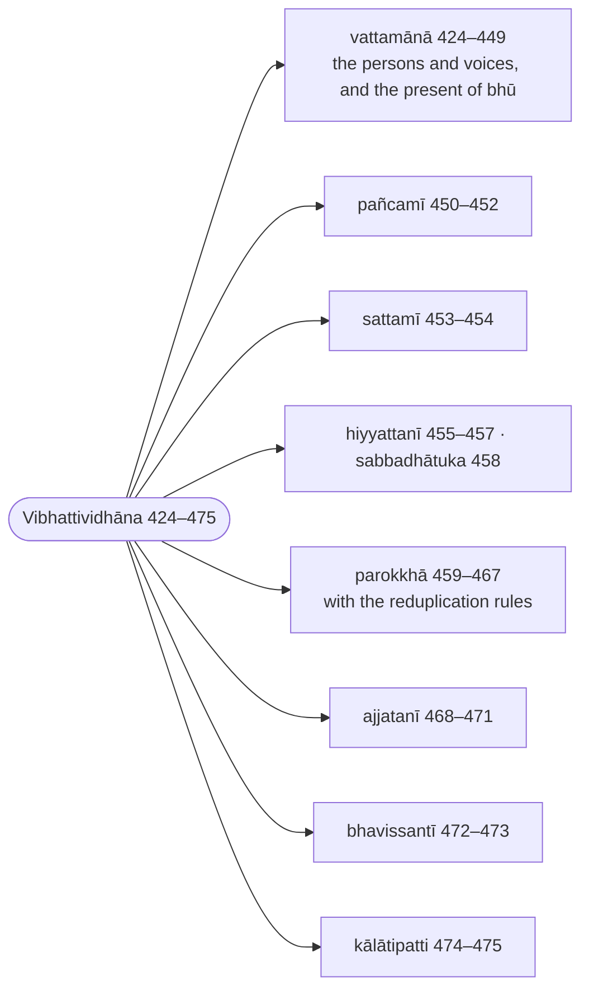
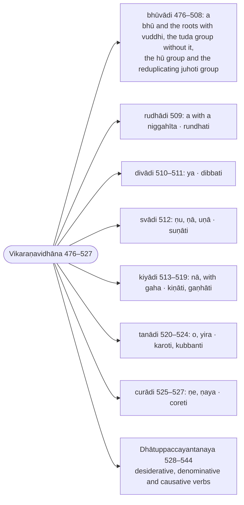

import { LinkCard } from "@astrojs/starlight/components";

:::note
The verb is treated by conjugation class (`gaṇa`): after the eight sets of endings and their meanings come the `bhū` class with `bhū`, `paca`, `gamu` and the other model roots conjugated through every tense in the active, the passive and the impersonal, then the `rudha`, `diva`, `su`, `kī`, `tanu` and `cura` classes, and last the desiderative, denominative and causative suffixes. Every form is derived, and the conjugations are set out as tables.

:::

:::note[Reading Rachiwong]
This section is one of the three that Phramaha Sriporn Rachiwong translated in her Pune thesis *Rūpasiddhi: A Study of Some Aspects* (1995), reproduced on this site as [Rachiwong: Rūpasiddhi (1995)](/rupasiddhi/rachiwong). Her rules are headed `(K-N)`, K the Kaccāyana sutta and N the rule's number in the Thai edition of the Padarūpasiddhi (Bangkok 1984), her base text; her N runs sixteen below the number used on this page (her 408 is 424 here), since the Thai and Sinhalese editions do not number the sixteen rules the Burmese text states twice. Her notes compare that Thai edition (Rūp T.) with the Burmese Buddhasāsanasamiti edition (B., the Chaṭṭha Saṅgāyana text these pages print) and the Sinhalese Mahārūpasiddhi (S.). The footnotes below record where this translation's text or construal differs from hers, and nothing more; her own translation and notes are on her page.
:::

:::note[The endings, tense by tense]
The first part of the chapter takes each set of endings with its meaning and conjugates the model root `bhū` through it; the ranges are Rūpasiddhi numbers.

:::

:::note[The conjugation classes]
The second part conjugates model roots class by class, `bhū` first and at length; the `gaha` class is folded into the `kī` class. The ranges are Rūpasiddhi numbers.

:::

## Bhūvādigaṇa (The `bhū` class)

## Vibhattividhāna (The endings)

> Atha ākhyātavibhattiyo kriyāvācīhi dhātūhi parā vuccante.

Now the verbal inflections (`ākhyātavibhatti`), which come after the roots that express action, are stated.

> Tattha kriyaṃ ācikkhatīti ākhyātaṃ, kriyāpadaṃ. Vuttañhi ‘‘kālakārakapurisaparidīpakaṃ kriyālakkhaṇamākhyātika’’nti. Tattha kālo ti atītādayo, kāraka miti kammakattubhāvā, purisā ti paṭhamamajjhimuttamā, kriyā ti gamanapacanādiko dhātvattho, kriyālakkhaṇaṃ saññāṇaṃ etassāti kriyālakkhaṇaṃ, atiliṅgañca.

Here the `ākhyāta` (verb) is so called because it declares (`ācikkhati`) an action: it is the action-word (`kriyāpada`). For it is said: "The verbal word is that which has action as its mark and which brings to light time, `kāraka` and person." There "time" means the past and the rest; "`kāraka`" means the object, the agent and the bare action (`kamma`, `kattā`, `bhāva`); "persons" means the first, the middle and the highest; "action" means the meaning of a root, such as going or cooking; "having action as its mark" means that action is its distinguishing sign (`saññāṇa`); and it is beyond gender (`atiliṅga`).

> Vuttampi cetaṃ –

And this too has been said:

> ‘‘Yaṃ tikālaṃ tipurisaṃ, kriyāvāci tikārakaṃ; \
> Atiliṅgaṃ dvivacanaṃ, tadākhyātanti vuccatī’’ti.

That which has three times and three persons, expresses action and has three `kāraka`; \
which is beyond gender and has two numbers — that is called `ākhyāta`.

> Kālādivasena dhātvatthaṃ vibhajantīti vibhattiyo, tyādayo, tā pana vattamānā pañcamī sattamī parokkhāhiyyattanī ajjatanī bhavissantī kālātipatti cāti aṭṭhavidhā bhavanti.

They are called `vibhatti` (inflections) because they divide up (`vibhajanti`) the meaning of the root according to time and the rest: `ti` and the others. And they are of eight kinds: `vattamānā`, `pañcamī`, `sattamī`, `parokkhā`, `hiyyattanī`, `ajjatanī`, `bhavissantī` and `kālātipatti`.

> Kriyaṃ dhārentīti dhātavo, bhūvādayo, khādidhātuppaccayantā ca, te pana atthavasā dvidhā bhavanti sakammakā, akammakā cāti. Tatra sakammakā ye dhātavokammāpekkhaṃ kriyaṃ vadanti, yathā – kaṭaṃ karoti, gāmaṃ gacchati, odanaṃ pacatītiādayo, akammakā ye kammanirapekkhaṃ kriyaṃ vadanti, yathā – acchati, seti, tiṭṭhatītiādayo.

They are called `dhātu` (roots) because they bear (`dhārenti`) an action: `bhū` and the rest, and also those that end in the root-suffixes `kha` and the like. And by their meaning they are of two kinds: transitive (`sakammaka`, "having an object") and intransitive (`akammaka`). Of these the transitive are the roots that express an action which looks to an object, as `kaṭaṃ karoti` (he makes a mat), `gāmaṃ gacchati` (he goes to the village), `odanaṃ pacati` (he cooks rice) and the like; the intransitive are those that express an action independent of an object, as `acchati` (he sits), `seti` (he lies), `tiṭṭhati` (he stands) and the like.

> Te pana sattavidhā bhavanti vikaraṇappaccayabhedena, kathaṃ? A vikaraṇā bhūvādayo. Niggahītapubbakaa vikaraṇā rudhādayo, ya vikaraṇā divādayo, ṇuṇā uṇā vikaraṇā svādayo, nāppaṇhā vikaraṇā kiyādayo, oyira vikaraṇā tanādayo, sakatthe ṇe ṇaya ntā curādayoti.

They are further of seven kinds, by the difference of their class suffix (`vikaraṇapaccaya`). How? `bhū` and the rest have the class suffix `a`; `rudha` and the rest have `a` preceded by a niggahīta; `divu` and the rest have `ya`; `su` and the rest have `ṇu`, `ṇā` and `uṇā`; `kī` and the rest have `nā`, `ppa` and `ṇhā`; `tanu` and the rest have `o` and `yira`; `cura` and the rest end in `ṇe` and `ṇaya` in the root's own sense.

| class | class suffix | rule |
| --- | --- | --- |
| `bhūvādi` | `a` | [433 (§445): Bhūvādito a](/rupasiddhi/6-akhyatakanda#r433) |
| `rudhādi` | `a`, with a niggahīta before the root's final | [509 (§446): Rudhādito niggahītapubbañca](/rupasiddhi/6-akhyatakanda#r509) |
| `divādi` | `ya` | [510 (§447): Divādito yo](/rupasiddhi/6-akhyatakanda#r510) |
| `svādi` | `ṇu`, `ṇā`, `uṇā` | [512 (§448): Svādito ṇuṇāuṇā ca](/rupasiddhi/6-akhyatakanda#r512) |
| `kiyādi` | `nā`, `ppa`, `ṇhā` | [513 (§449): Kiyādito nā](/rupasiddhi/6-akhyatakanda#r513), [517 (§450): Gahāditoppaṇhā](/rupasiddhi/6-akhyatakanda#r517) |
| `tanādi` | `o`, `yira` | [520 (§451): Tanādito oyirā](/rupasiddhi/6-akhyatakanda#r520) |
| `curādi` | `ṇe`, `ṇaya` | [525 (§452): Curādito ṇeṇayā](/rupasiddhi/6-akhyatakanda#r525) |

Kaccāyana counts eight classes ([§445 (433): Bhūvādito a](/kaccayana/6-akhyatakappa#m445) to [§452 (525): Curādito, ṇe ṇayā](/kaccayana/6-akhyatakappa#m452)); Buddhappiya folds the `gaha` class, whose suffixes are `ppa` and `ṇhā`, into the `kī` class, and so has seven. The order of his chapter follows this list: the endings and the whole conjugation on the `bhū` class first (424–508), then each of the other classes with its model root.

> Tattha paṭhamaṃ a vikaraṇesu bhūvādīsu dhātūsu paṭhamabhūtā akammakā bhū iccetasmā dhātuto tyā dayo parā yojīyante.

Among these, first, the inflections `ti` and the rest are added after the intransitive root `bhū`, which stands first among the roots of the `bhū` class, whose class suffix is `a`.

> Bhū sattāyaṃ, ‘‘bhū’’iccayaṃ dhātu sattāyamatthe vattate, kriyāsāmaññabhūte bhavane vattateti attho.

"`bhū` in the sense of being" [says the root-list]: the root `bhū` is used in the sense of being (`sattā`), that is, it is used for being (`bhavana`), which is action in general.

> ‘‘Bhū’’iti ṭhite –

When `bhū` stands [ready for derivation] —

---

### 424 (§457): Bhūvādayo dhātavo (`bhū` and the rest are `dhātu`, roots) :badge[anvattha]{variant=note}

:::tip[Kaccāyana]
<LinkCard title="§457 (424): Bhūvādayo dhātavo" href="/kaccayana/6-akhyatakappa#m457" description="`bhū` and the rest are `dhātu`, roots" />
:::

> Bhū iccevamādayo ye kriyāvācino saddagaṇā, te dhātu saññā honti. Bhū ādi yesaṃ te bhūvādayo, atha vā bhūvā ādī pakārā yesaṃ te bhūvādayo.

Those groups of words that express action and begin with `bhū` receive the name `dhātu` (root). `bhūvādayo` means those of which `bhū` is the first; or else those whose types (`pakāra`) are `bhū` and `vā` and the like.

> Bhūvādīsu vakāroyaṃ, ñeyyo āgamasandhijo; \
> Bhūvāppakārā vā dhātū, sakammākammakatthato.

In `bhūvādi` this `v` is to be known as born of sandhi by augment; \
or else the roots are of the types `bhū` and `vā`, by the sense of the transitive and the intransitive.

> ‘‘Kvaci dhātū’’tiādito ‘‘kvacī’’ti vattate.

From [488 (§517): Kvaci dhātuvibhattippaccayānaṃ dīghaviparītādesalopāgamā ca](/rupasiddhi/6-akhyatakanda#r488) the word `kvaci` (sometimes) continues.

---

### 425 (§521): Dhātussanto loponekassarassa (the final of a polysyllabic root is elided) :badge[apavada]{variant=success}

:::tip[Kaccāyana]
<LinkCard title="§521 (425): Dhātussanto lopo’nekasarassa" href="/kaccayana/6-akhyatakappa#m521" description="the final of a polysyllabic root is elided" />
:::

> Anekassarassa dhātussa anto kvaci lopo hoti.

The final of a root that has more than one vowel is sometimes (`kvaci`) elided.

> Kvaci ggahaṇaṃ ‘‘mahīyati samatho’’tiādīsu nivattanatthaṃ, iti anekassarattābhāvā idha dhātvantalopo na hoti.

The word `kvaci` is for excluding [the elision] in `mahīyati` ("he is honoured"), `samatho` ("calm") and the like; and so, because [`bhū`] does not have more than one vowel, the elision of the root's final does not take place here.

:::danger[Counter-example]

The two forms in which the root's final is kept:

| lemma | inflected | vibhatti | meaning |
| ----- | --------- | -------- | ------- |
| 🔵▶️🤟⨀(√maha + ya + ti) | mahīyati | `ti` (vattamānā, passive) | he is honoured |
| 🚹①⨀(√sama + tha) | samatho | `si` — the kita suffix `tha` (653) | calm: the `a` of `sama` kept before `tha` |

:::

> Tato dhātvādhikāravihitānekappaccayappasaṅge ‘‘vatticchānupubbikā saddappaṭipattī’’ti katvā vattamānavacanicchāyaṃ –

Then, when the many suffixes prescribed under the heading `dhātu` present themselves, taking the maxim "the formation of a word follows the speaker's intention (`vattu-icchā`)", when one wishes to express the present —

---

### 426 (§423): Vattamānā tianti, sitha, mima, teante, sevhe, emhe (`vattamānā`: the twelve endings of the present) :badge[anvattha]{variant=note}

:::tip[Kaccāyana]
<LinkCard title="§423 (426): Vattamānā ti anti, si tha, mi ma, te ante, se vhe, e mhe" href="/kaccayana/6-akhyatakappa#m423" description="`vattamānā`: the twelve endings of the present" />
:::

> Tyā dayo dvādasa vattamānāsaññā hontīti tyādīnaṃ vattamānatthavisayattā vattamānā saññā.

The twelve [endings] `ti` and the rest receive the name `vattamānā`; because their domain is the sense of the present (`vattamāna`), `ti` and the rest are named `vattamānā`.

:::tip[Examples]

The twelve, in the arrangement that [429 (§406): Atha pubbāni vibhattīnaṃ cha parassapadāni](/rupasiddhi/6-akhyatakanda#r429), [439 (§407): Parāṇyattanopadāni](/rupasiddhi/6-akhyatakanda#r439) and [431 (§408): Dve dve paṭhamamajjhimuttamapurisā](/rupasiddhi/6-akhyatakanda#r431) give them:

| parassapada | ⨀ | ⨂ |
| --- | --- | --- |
| 🤟 | ti | anti |
| 🤘 | si | tha |
| 👆 | mi | ma |

| attanopada | ⨀ | ⨂ |
| --- | --- | --- |
| 🤟 | te | ante |
| 🤘 | se | vhe |
| 👆 | e | mhe |

On `bhū` they give `bhavati` … `bhavāma` (435–438) and `bhavate` … `bhavāmhe` (440).

:::

---

### 427 (§413): Kāle (`kāle`, "in [the sense of] time": a governing heading) :badge[sīhagatika]{variant=caution}

:::tip[Kaccāyana]
<LinkCard title="§413 (427): Kāle" href="/kaccayana/6-akhyatakappa#m413" description="`kāle`, 'in [the sense of] time': a governing heading" />
:::

> Ayamadhikāro.

This is an [`adhikāra`](/introduction#types-of-suttas).

> Ito paraṃ tyā divibhattividhāne sabbattha vattate.

From here on it applies throughout the prescription of the inflections `ti` and the rest.

---

### 428 (§414): Vattamānā paccuppanne (The `vattamānā` in the present) :badge[utsarga]{variant=success}

:::tip[Kaccāyana]
<LinkCard title="§414 (428): Vattamānā paccuppanne" href="/kaccayana/6-akhyatakappa#m414" description="The `vattamānā` in the present" />
:::

> Paccuppanne kāle gamyamāne vattamānāvibhatti hoti, kālo ti cettha kriyā, karaṇaṃ kāro, ra kārassa la kāro, kālo.

When present time is understood, the `vattamānā` inflection is used. And here `kāla` (time) means action: `kāra` is the doing, and with `r` become `l` it is `kāla`.

> Tasmā –

Therefore:

> Kriyāya gamyamānāya, vibhattīnaṃ vidhānato; \
> Dhātūheva bhavantīti, siddhaṃ tyādivibhattiyo.

Because the inflections are prescribed when an action is understood, \
it is established that the inflections `ti` and the rest arise from roots alone.

> Idha pana kālassa atītānāgatapaccuppannāṇattiparikappakālātipattivasena[^1] chadhā bhinnattā ‘‘paccuppanne’’ti viseseti. Taṃ taṃ kāraṇaṃ paṭicca uppanno paccuppanno, paṭiladdhasabhāvo, na tāva atītoti attho.

But here, since time is divided sixfold — past, future, present, command, supposition and lapse of time — he specifies "in the present". `paccuppanna` (present) is what has arisen (`uppanna`) in dependence on (`paṭicca`) this or that cause: what has gained its own nature and is not yet past.

> Paccuppannasamīpepi, tabbohārūpacārato; \
> Vattamānā atītepi, taṃkālavacanicchayāti.

For what is near the present too, by a figurative extension of that usage, \
and for the past too, the `vattamānā` [is used], when one wishes to speak of it as of that time.

> Tasmiṃ paccuppanne vattamānāvibhattiṃ katvā, tassā ṭhānāniyame ‘‘dhātuliṅgehi parā paccayā’’ti paribhāsato dhātuto paraṃ vattamānappaccaye katvā, tesamaniyamappasaṅgesati ‘‘vatticchānupubbikā saddappaṭipattī’’ti parassapadavacanicchāyaṃ –

Having applied the `vattamānā` inflection in that present sense; since its position is not fixed, having placed the `vattamānā` suffix after the root by the interpretive rule [362 (§432): Dhātuliṅgehi parā paccayā](/rupasiddhi/5-taddhitakanda#r362) ("suffixes come after roots and lemmas"); and since these present themselves without restriction, taking the maxim "the formation of a word follows the speaker's intention", when one wishes to express the `parassapada` —

[^1]: CST4 prints `kālābhipattivasena`; the sixth division is the `kālātipatti`, and `kālātipattivasena` is read, so the Thai edition read by [Rachiwong (1995)](/rupasiddhi/rachiwong).

---

### 429 (§406): Atha pubbāni vibhattīnaṃ cha parassapadāni (Now, the first six of the inflections are `parassapada`) :badge[rūḷhī]{variant=note}

:::tip[Kaccāyana]
<LinkCard title="§406 (429): Atha pubbāni vibhattīnaṃ cha parassapadāni" href="/kaccayana/6-akhyatakappa#m406" description="Now, the first six of the inflections are `parassapada`" />
:::

> Atha taddhitānantaraṃ vuccamānānaṃ sabbāsaṃ vattamānādīnaṃ aṭṭhavidhānaṃ vibhattīnaṃ yāni yāni pubbakāni cha padāni, tāni tāni atthato aṭṭhacattālīsamattāni parassapada saññāni hontītiādimhi channaṃ parassapadasaññā, parassatthāni padāni parassapadāni, tabbāhullato tabbohāro.

Now (`atha`), of all the eight kinds of inflection, `vattamānā` and the rest, which are stated immediately after the `taddhita`, whichever six words come first [in each set] — in effect forty-eight — receive the name `parassapada`; so in the first [set] the six are named `parassapada`. `parassapada` are "words whose sense is for another" (`parassa atthāni padāni`); the usage is named from what predominates.

:::tip[Examples]

The forty-eight `parassapada` endings, six of each set, as the lists 426, 450, 453, 459, 455, 468, 472 and 474 give them (⨀, ⨂ in each cell):

| set | 🤟 | 🤘 | 👆 |
| --- | --- | --- | --- |
| vattamānā (426) | ti, anti | si, tha | mi, ma |
| pañcamī (450) | tu, antu | hi, tha | mi, ma |
| sattamī (453) | eyya, eyyuṃ | eyyāsi, eyyātha | eyyāmi, eyyāma |
| hiyyattanī (455) | ā, ū | o, ttha | aṃ, mhā |
| parokkhā (459) | a, u | e, ttha | aṃ, mha |
| ajjatanī (468) | ī, uṃ | o, ttha | iṃ, mhā |
| bhavissantī (472) | ssati, ssanti | ssasi, ssatha | ssāmi, ssāma |
| kālātipatti (474) | ssā, ssaṃsu | sse, ssatha | ssaṃ, ssāmhā |

:::

> ‘‘Dhātūhi ṇe ṇaya’’iccādito ‘‘dhātūhī’’ti vattamāne –

While `dhātūhi` ("after roots") continues from [540 (§438): Dhātūhi ṇe ṇaya ṇāpe ṇāpayā kāritāni hetvatthe](/rupasiddhi/6-akhyatakanda#r540) —

---

### 430 (§456): Kattari parassapadaṃ (the `parassapada` endings in the active) :badge[utsarga]{variant=success}

:::tip[Kaccāyana]
<LinkCard title="§456 (430): Kattari parassapadaṃ" href="/kaccayana/6-akhyatakappa#m456" description="the `parassapada` endings in the active" />
:::

> Kattari kārake abhidheyye sabbadhātūhi parassapadaṃ hotīti parassapadaṃ katvā, tassāpyaniyamappasaṅge vatticchāvasā –

When the `kāraka` to be expressed is the agent (`kattā`), after all roots the `parassapada` [endings] are used. Having thus applied the `parassapada`, and since it too presents itself without restriction, according to the speaker's intention —

> Vipariṇāmena ‘‘parassapadānaṃ, attanopadāna’’nti ca vattate.

With a change of inflection form, `parassapadānaṃ` and `attanopadānaṃ` ("of the `parassapada`", "of the `attanopada`") also continue.

---

### 431 (§408): Dve dve paṭhamamajjhimuttamapurisā (Two by two: first, middle and highest person) :badge[anvattha]{variant=note}

:::tip[Kaccāyana]
<LinkCard title="§408 (431): Dve dve paṭhama majjhimuttamapurisā" href="/kaccayana/6-akhyatakappa#m408" description="Two by two: first, middle and highest person" />
:::

> Tāsaṃ vibhattīnaṃ parassapadāna’mattanopadānañca dve dve vacanāni yathākkamaṃ paṭhamamajjhimuttamapurisa saññāni honti. Taṃ yathā? Ti anti iti paṭhamapurisā, si tha iti majjhimapurisā, mi ma iti uttamapurisā. Attanopadesupi te ante iti paṭhamapurisā, se vhe iti majjhimapurisā, e mhe iti uttamapurisā. Evaṃ sesāsu sattasu vibhattīsupi yojetabbanti. Evaṃ aṭṭhavibhattivasena channavutividhe ākhyātapade dvattiṃsa dvattiṃsa paṭhamamajjhimauttamapurisā hontīti vattamānaparassapadādimhi dvinnaṃ paṭhamapurisasaññā.

Of those inflections, both `parassapada` and `attanopada`, the words two by two receive in order the names first person (`paṭhamapurisa`), middle person (`majjhimapurisa`) and highest person (`uttamapurisa`). How so? `ti`, `anti` are the first person; `si`, `tha` the middle person; `mi`, `ma` the highest person. Among the `attanopada` too, `te`, `ante` are the first person, `se`, `vhe` the middle person, `e`, `mhe` the highest person. The same is to be applied in the remaining seven inflections too. Thus in the verbal word, which is of ninety-six kinds by way of the eight inflections, there are thirty-two first persons, thirty-two middle persons and thirty-two highest persons. Hence in the first [set], the `vattamānā` `parassapada`, the two are named first person.

:::tip[Examples]

The `vattamānā` on `bhū`, person by person, as 432–440 derive it:

| person | parassapada ⨀, ⨂ | attanopada ⨀, ⨂ |
| --- | --- | --- |
| 🤟 paṭhamapurisa | bhavati, bhavanti | bhavate, bhavante |
| 🤘 majjhimapurisa | bhavasi, bhavatha | bhavase, bhavavhe |
| 👆 uttamapurisa | bhavāmi, bhavāma | bhave, bhavāmhe |

:::

---

### 432 (§410): Nāmamhi payujjamānepitulyādhikaraṇe paṭhamo (With a co-referent noun, expressed or not: the first person) :badge[utsarga]{variant=success}

:::tip[Kaccāyana]
<LinkCard title="§410 (432): Nāmamhi payujjamānepi tulyādhikaraṇe paṭhamo" href="/kaccayana/6-akhyatakappa#m410" description="With a co-referent noun, expressed or not: the first person" />
:::

> Tumhāmha saddavajjite tulyādhikaraṇabhūte sādhakavācake nāmamhi payujjamānepi appayujjamānepi dhātūhi paṭhamapuriso hotīti paṭhamapurisaṃ katvā, tassāpyaniyamappasaṅge kriyāsādhakassa kattuno ekatte vattumicchite ‘‘ekamhi vattabbe ekavacana’’nti vattamānaparassapadapaṭhamapurisekavacanaṃ ti.

When a noun other than the words `tumha` and `amha`, of the same reference [as the verb] and expressing the accomplisher of the action[^2], is used or is not used, the first person is used after roots. Having thus applied the first person, and since it too presents itself without restriction, when one wishes to speak of the agent, the accomplisher of the action, as one, by [the maxim] "when one is to be expressed, the singular" [the ending is] `ti`, the `vattamānā` `parassapada` first person singular.

> ‘‘Paro, paccayo, dhātū’’ti ca adhikāro, ‘‘tathā[^3] kattari cā’’ti ito ‘‘kattarī’’ti vikaraṇappaccayavidhāne sabbattha vattate.

`paro`, `paccayo` and `dhātu` ("after", "suffix", "root") are also an [`adhikāra`](/introduction#types-of-suttas); and from [511 (§444): Tathā kattari ca](/rupasiddhi/6-akhyatakanda#r511) `kattari` ("in the active") continues throughout the prescription of the class suffixes (`vikaraṇa`).

[^2]: [Rachiwong (1995)](/rupasiddhi/rachiwong) reads the Burmese `kārakavācake`, "expressing the `kāraka`", for the CST's `sādhakavācake`; the CST is kept.

[^3]: CST4 prints `‘‘yathā kattari cā’’ti`; the rule quoted is [511 (§444): Tathā kattari ca](/rupasiddhi/6-akhyatakanda#r511), and the quotation is corrected to it. [Rachiwong (1995)](/rupasiddhi/rachiwong) refers it to [440 (§454): Kattari ca](/rupasiddhi/6-akhyatakanda#r440).

---

### 433 (§445): Bhūvādito a (`a` after the `bhū` class [in the active]) :badge[apavada]{variant=success}

:::tip[Kaccāyana]
<LinkCard title="§445 (433): Bhūvādito a" href="/kaccayana/6-akhyatakappa#m445" description="`a` after the `bhū` class [in the active]" />
:::

> Bhū iccevamādito dhātugaṇato paro a paccayo hoti kattari vihitesu vibhattippaccayesu paresu. Sabbadhātukamhiyevāyamissate.

After the root-group beginning with `bhū`, the suffix `a` is added when the inflection-suffixes prescribed in the active follow. This [suffix] is wanted only before a `sabbadhātuka` [inflection].

> ‘‘Asaṃyogantassa, vuddhī’’ti ca vattate.

`asaṃyogantassa` and `vuddhi` ("of [a root] not ending in a conjunct", "strengthening") also continue.

---

### 434 (§485): Aññesu ca (and before the other suffixes) :badge[utsarga]{variant=success}

:::tip[Kaccāyana]
<LinkCard title="§485 (434): Aññesu ca" href="/kaccayana/6-akhyatakappa#m485" description="and before the other suffixes" />
:::

:::note[Analysis]

`asaṃyogantassa` and `vuddhi` continue into this rule from [527 (§483): Asaṃyogantassa vuddhi kārite](/rupasiddhi/6-akhyatakanda#r527), which stands later on the page.

:::

> Kāritato aññesu paccayesu asaṃyogantānaṃ dhātūnaṃ vuddhi hoti. Ca ggahaṇena ṇu ppaccayassāpi vuddhi hoti. Ettha ca ‘‘ghaṭādīnaṃ vā’’ti ito vā saddo anuvattetabbo, so ca vavatthitavibhāsattho. Tena –

Before suffixes other than the causative (`kārita`), roots that do not end in a conjunct consonant take `vuddhi` (strengthening). By the word `ca`, the suffix `ṇu` too takes `vuddhi`. And here the word `vā` is to be carried over from [542 (§484): Ghaṭādīnaṃ vā](/rupasiddhi/6-akhyatakanda#r542), and it has the sense of a `vavatthitavibhāsā` (restricted option). Hence:

> Ivaṇṇuvaṇṇantānañca, lahūpantāna dhātunaṃ; \
> Ivaṇṇuvaṇṇānameva, vuddhi hoti parassa na.

For roots ending in an `i`- or `u`-vowel, and for roots whose penult is light, \
`vuddhi` is of the `i`- and `u`-vowels only, not of any other [vowel].

> Yuvaṇṇānampi ya ṇu ṇā-nāniṭṭhādīsu vuddhi na; \
> Tudādissāvikaraṇe, na chetvādīsu vā siyā.

Even of the `i`- and `u`-vowels there is no `vuddhi` before `ya`, `ṇu`, `ṇā`, `nā`, the `niṭṭhā` [suffixes] and the like, \
nor of the `tuda` group before the class suffix `a`; and in `chetvā` and the like it may or may not be.

> Tassāpyaniyamappasaṅge – ‘‘ayuvaṇṇānañcāyo vuddhī’’ti paribhāsato ū kārasso kāro vuddhi.

And since this [strengthening] too presents itself without specification, by the interpretive rule [365 (§405): Ayuvaṇṇānañcāyo vuddhī](/rupasiddhi/5-taddhitakanda#r365) the `vuddhi` of `ū` is `o`.

> Vipariṇāmena ‘‘dhātūna’’nti vattate.

With a change of inflection form, `dhātūnaṃ` ("of roots") continues.

---

### 435 (§513): O ava sare (a root-final `o` becomes `ava` before a vowel) :badge[utsarga]{variant=success}

:::tip[Kaccāyana]
<LinkCard title="§513 (435): O ava sare" href="/kaccayana/6-akhyatakappa#m513" description="a root-final `o` becomes `ava` before a vowel" />
:::

> O kārassa dhātvantassa sare pare avā deso hoti. ‘‘Saralopo mādesa’’iccādinā saralopādimhi kate ‘‘naye paraṃ yutte’’ti paranayanaṃ kātabbaṃ.

The root-final `o` is replaced by `ava` when a vowel follows. When the elision of the vowel and the rest has been carried out by [67 (§83): Saralopo’mādesappaccayādimhi saralope tu pakati](/rupasiddhi/2-namakanda#r67) and the like, the joining with the following [letter] is to be done by [14 (§11): Naye paraṃ yutte](/rupasiddhi/1-sandhikanda#r14).

> So puriso sādhu bhavati, sā kaññā sādhu bhavati, taṃ cittaṃ sādhu bhavati.

`so puriso sādhu bhavati` (that man is good), `sā kaññā sādhu bhavati` (that girl is good), `taṃ cittaṃ sādhu bhavati` (that mind is good).

:::tip[Examples]

The one verb form serves all three genders of subject:

| lemma | inflected | vibhatti | meaning |
| ----- | --------- | -------- | ------- |
| ▶️🤟⨀(√bhū + a + ti) | so puriso sādhu bhavati | `ti` (vattamānā, parassapada) | that man is good |
| ▶️🤟⨀(√bhū + a + ti) | sā kaññā sādhu bhavati | `ti` (vattamānā, parassapada) | that girl is good |
| ▶️🤟⨀(√bhū + a + ti) | taṃ cittaṃ sādhu bhavati | `ti` (vattamānā, parassapada) | that mind is good |
| ▶️🤟⨂(√bhū + a + anti) | te purisā bhavanti | `anti` (vattamānā, parassapada) | those men are |

|     | √bhū + a + ti (vattamānā 🤟⨀) | rule |
| --- | ------------------------ | ---- |
| →   | bh(ū→o) + a + ti         | §485 |
| →   | bh(o→ava) + a + ti       | §513 |
| →   | bhav + (~~a~~ + a) + ti  | §83  |
| →   | **bhavati**              |      |

|     | √bhū + a + anti (vattamānā 🤟⨂) | rule |
| --- | -------------------------- | ---- |
| →   | bh(ū→o) + a + anti         | §485 |
| →   | bh(o→ava) + a + anti       | §513 |
| →   | bhav + (~~a~~ + a) + anti  | §83  |
| →   | bhav + (~~a~~ + anti)      | §510  |
| →   | **bhavanti**               |      |

|     | bhū + a + ti (vattamānā 🤟⨀)      | rule |
| --- | ----------------------------- | ---- |
| →   | bh(ū→o) + a + ti              | §485 |
| →   | bh(o→ava) + a + ti            | §513 |
| →   | bhav + (~~a~~ + a) + ti       | §83  |
| →   | **bhavati**                   |      |

|     | √bhū + a + anti (vattamānā 🤟⨂) | rule |
| --- | -------------------------- | ---- |
| →   | bh(ū→o) + a + anti         | §485 |
| →   | bh(o→ava) + a + anti       | §513 |
| →   | bhav + (~~a~~ + a) + anti  | §83  |
| →   | bhav + (~~a~~ + anti)      | §510  |
| →   | **bhavanti**               |      |

:::

> Ettha hi –

For here:

> Kattunobhihitattāva, ākhyātena na kattari; \
> Tatiyā paṭhamā hoti, liṅgatthaṃ panapekkhiya.

Just because the agent is expressed by the verb, the third form ③ is not used for the agent; \
but the first form ① is used, with regard to the bare meaning of the lemma.

> Satipi kriyāyekatte kattūnaṃ bahuttā ‘‘bahumhi vattabbe bahuvacana’’nti vattamānaparassapadapaṭhamapurisabahuvacanaṃ anti, pure viya appaccayavuddhiavādesā, saralopādi. Te purisā bhavanti, appayujjamānepi bhavati, bhavanti.

Although the action is one, because the agents are many, by [the maxim] "when many are to be expressed, the plural" [the ending is] `anti`, the `vattamānā` `parassapada` first person plural; the suffix `a`, `vuddhi` and the replacement `ava` are as before, then the elision of the vowel and the rest: `te purisā bhavanti` (those men are). And when [the noun] is not expressed: `bhavati`, `bhavanti`.

> ‘‘Payujjamānepi, tulyādhikaraṇe’’ti ca vattate.

`payujjamānepi` and `tulyādhikaraṇe` ("even when [the noun] is used", "of the same reference") also continue.

---

### 436 (§411): Tumhe majjhimo (With `tumha`: the middle person) :badge[apavada]{variant=success}

:::tip[Kaccāyana]
<LinkCard title="§411 (436): Tumhe majjhimo" href="/kaccayana/6-akhyatakappa#m411" description="With `tumha`: the middle person" />
:::

> Tulyādhikaraṇabhūte tumha sadde payujjamānepi appayujjamānepi dhātūhi majjhima puriso hotīti vattamānaparassapadamajjhimapurisekavacanaṃsi, sesaṃ purimasamaṃ. Tvaṃ bhavasi, tumhe bhavatha, appayujjamānepi bhavasi, bhavatha.

When the word `tumha`, of the same reference [as the verb], is used or is not used, the middle person is used after roots; so [the ending is] `si`, the `vattamānā` `parassapada` middle person singular, and the rest is as before: `tvaṃ bhavasi` (you are), `tumhe bhavatha` (you [all] are); and when [the pronoun] is not expressed, `bhavasi`, `bhavatha`.

:::tip[Examples]

| lemma | inflected | vibhatti | meaning |
| ----- | --------- | -------- | ------- |
| ▶️🤘⨀(√bhū + a + si) | tvaṃ bhavasi | `si` (vattamānā, parassapada) | you are |
| ▶️🤘⨂(√bhū + a + tha) | tumhe bhavatha | `tha` (vattamānā, parassapada) | you [all] are |
| ▶️🤘⨀(√bhū + a + si) | bhavasi | `si` — the pronoun not expressed | you are |
| ▶️🤘⨂(√bhū + a + tha) | bhavatha | `tha` — the pronoun not expressed | you [all] are |

|     | bhū + a + si (vattamānā 🤘⨀)      | rule |
| --- | ----------------------------- | ---- |
| →   | bh(ū→o) + a + si              | §485 |
| →   | bh(o→ava) + a + si            | §513 |
| →   | bhav + (~~a~~ + a) + si       | §83  |
| →   | **bhavasi**                   |      |

:::

> Tulyādhikaraṇe ti kimatthaṃ? Tayā paccate odano.

What is `tulyādhikaraṇe` (of the same reference) for? `tayā paccate odano` (the rice is cooked by you).

:::danger[Counter-example]

`tumha` not of the same reference as the verb:

| lemma | inflected | vibhatti | meaning |
| ----- | --------- | -------- | ------- |
| 🔵▶️🤟⨀(√paca + ya + te) | tayā paccate odano | `te` (vattamānā, attanopada, passive) | the rice is cooked by you |

:::

> Tasmiṃyevādhikāre –

Under that same heading —

---

### 437 (§412): Amhe uttamo (With `amha`: the highest person) :badge[apavada]{variant=success}

:::tip[Kaccāyana]
<LinkCard title="§412 (437): Amhe uttamo" href="/kaccayana/6-akhyatakappa#m412" description="With `amha`: the highest person" />
:::

> Tulyādhikaraṇabhūte amha sadde payujjamānepi appayujjamānepi dhātūhi uttama puriso hotīti vattamānaparassapadauttamapurisekavacanaṃ mi, a ppaccayavuddhiavā desā.

When the word `amha`, of the same reference [as the verb], is used or is not used, the highest person is used after roots; so [the ending is] `mi`, the `vattamānā` `parassapada` highest person singular; the suffix `a`, `vuddhi` and the replacement `ava` [are as before].

---

### 438 (§478): Akāro dīghaṃ himimesu (`a` is lengthened before `hi`, `mi`, `ma`) :badge[utsarga]{variant=success}

:::tip[Kaccāyana]
<LinkCard title="§478 (438): Akāro dīghaṃ hi mi mesu" href="/kaccayana/6-akhyatakappa#m478" description="`a` is lengthened before `hi`, `mi`, `ma`" />
:::

> A kāro dīgha māpajjate himima iccetāsu vibhattīsu. Ahaṃ bhavāmi, mayaṃ bhavāma. Bhavāmi, bhavāma.

The `a` is lengthened before the inflections `hi`, `mi` and `ma`: `ahaṃ bhavāmi` (I am), `mayaṃ bhavāma` (we are); [without the pronoun] `bhavāmi`, `bhavāma`.

:::tip[Examples]

The `vattamānā` `parassapada` of `bhū`, "to be", as 432–438 have derived it:

| parassapada | ⨀ | ⨂ |
| --- | --- | --- |
| 🤟 | bhavati | bhavanti |
| 🤘 | bhavasi | bhavatha |
| 👆 | bhavāmi | bhavāma |

| lemma | inflected | vibhatti | meaning |
| ----- | --------- | -------- | ------- |
| ▶️👆⨀(√bhū + a + mi) | ahaṃ bhavāmi | `mi` (vattamānā, parassapada) | I am |
| ▶️👆⨂(√bhū + a + ma) | mayaṃ bhavāma | `ma` (vattamānā, parassapada) | we are |

|     | bhū + a + ma (vattamānā 👆⨂)      | rule |
| --- | ----------------------------- | ---- |
| →   | bh(ū→o) + a + ma              | §485 |
| →   | bh(o→ava) + a + ma            | §513 |
| →   | bhav + (~~a~~ + a) + ma       | §83  |
| →   | bhav + (a→ā) + ma             | §478 |
| →   | bhavāma                       | §11  |
| →   | **bhavāma**                   |      |

|     | bhav + a + mi (vattamānā 👆⨀) | rule |
| --- | ----------------------------- | ---- |
| →   | bhav + (a→ā) + mi             | §478 |
| →   | **bhavāmi**                   |      |

:::

> ‘‘Vibhattīnaṃ, chā’’ti ca vattate.

`vibhattīnaṃ` and `cha` ("of the inflections", "six") also continue.

---

### 439 (§407): Parāṇyattanopadāni (The latter [six] are `attanopada`) :badge[rūḷhī]{variant=note}

:::tip[Kaccāyana]
<LinkCard title="§407 (439): Parāṇyattanopadāni" href="/kaccayana/6-akhyatakappa#m407" description="The latter [six] are `attanopada`" />
:::

> Sabbāsaṃ vattamānānaṃ aṭṭhavidhānaṃ vibhattīnaṃ yāni yāni parāni cha padāni, tāni tāni attanopada saññāni hontīti te ādīnaṃ attanopadasaññā.

Of all the eight kinds of inflection, `vattamānā` [and the rest], whichever six words come last [in each set], those receive the name `attanopada`; so `te` and the rest are named `attanopada`.

:::tip[Examples]

The forty-eight `attanopada` endings, six of each set (⨀, ⨂ in each cell):

| set | 🤟 | 🤘 | 👆 |
| --- | --- | --- | --- |
| vattamānā (426) | te, ante | se, vhe | e, mhe |
| pañcamī (450) | taṃ, antaṃ | ssu, vho | e, āmase |
| sattamī (453) | etha, eraṃ | etho, eyyāvho | eyyaṃ, eyyāmhe |
| hiyyattanī (455) | ttha, tthuṃ | se, vhaṃ | iṃ, mhase |
| parokkhā (459) | ttha, re | ttho, vho | iṃ, mhe |
| ajjatanī (468) | ā, ū | se, vhaṃ | a, mhe |
| bhavissantī (472) | ssate, ssante | ssase, ssavhe | ssaṃ, ssāmhe |
| kālātipatti (474) | ssatha, ssisu | ssase, ssavhe | ssiṃ, ssāmhase |

:::

> ‘‘Dhātūhi, attanopadānī’’ti ca vattate.

`dhātūhi` and `attanopadāni` ("after roots", "the `attanopada`") also continue.

---

### 440 (§454): Kattari ca (and [the `attanopada` endings] in the active) :badge[utsarga]{variant=success}

:::tip[Kaccāyana]
<LinkCard title="§454 (440): Kattari ca" href="/kaccayana/6-akhyatakappa#m454" description="and [the `attanopada` endings] in the active" />
:::

> Kattari ca kārake abhidheyye dhātūhi attanopadāni honti. Ca ggahaṇaṃ katthaci nivattanatthaṃ, sesaṃ parassapade vuttanayeneva veditabbaṃ. Bhavate, bhavante, bhavase, bhavavhe, bhave, bhavāmhe.

When the `kāraka` to be expressed is the agent too, the `attanopada` endings are used after roots. The word `ca` is there to exclude [them] in some places (`katthaci nivattanatthaṃ`); the rest is to be understood just as was said for the `parassapada`: `bhavate`, `bhavante`, `bhavase`, `bhavavhe`, `bhave`, `bhavāmhe`.

| attanopada | ⨀ | ⨂ |
| --- | --- | --- |
| 🤟 | bhavate | bhavante |
| 🤘 | bhavase | bhavavhe |
| 👆 | bhave | bhavāmhe |

> Paca pāke, dhātusaññāyaṃ dhātvantalopo, vuttanayeneva tyā dyuppatti, ivaṇṇuvaṇṇānamabhāvā vuddhiabhāvovettha viseso. So devadatto odanaṃ pacati, pacanti, pacasi, pacatha, pacāmi, pacāma, so odanaṃ pacate, te pacante, tvaṃ pacase, tumhe pacavhe, ahaṃ pace, mayaṃ pacāmhe.

"`paca` in [the sense of] cooking." On being named a root, the root's final is elided; the inflections `ti` and the rest arise in the way described; the only difference here is the absence of `vuddhi`, there being no `i`- or `u`-vowel: `so devadatto odanaṃ pacati` (Devadatta cooks the rice), `pacanti`, `pacasi`, `pacatha`, `pacāmi`, `pacāma`; `so odanaṃ pacate` (he cooks the rice), `te pacante`, `tvaṃ pacase`, `tumhe pacavhe`, `ahaṃ pace`, `mayaṃ pacāmhe`.

| parassapada | ⨀ | ⨂ |
| --- | --- | --- |
| 🤟 | pacati | pacanti |
| 🤘 | pacasi | pacatha |
| 👆 | pacāmi | pacāma |

| attanopada | ⨀ | ⨂ |
| --- | --- | --- |
| 🤟 | pacate | pacante |
| 🤘 | pacase | pacavhe |
| 👆 | pace | pacāmhe |

:::tip[Examples]

| lemma | inflected | vibhatti | meaning |
| ----- | --------- | -------- | ------- |
| ▶️🤟⨀(√bhū + a + te) | bhavate | `te` (vattamānā, attanopada, active) | he is |
| ▶️👆⨂(√bhū + a + mhe) | bhavāmhe | `mhe` (vattamānā, attanopada, active) | we are |
| ▶️🤟⨀(√paca + a + ti) | so devadatto odanaṃ pacati | `ti` (vattamānā, parassapada) | Devadatta cooks the rice |
| ▶️🤟⨀(√paca + a + te) | so odanaṃ pacate | `te` (vattamānā, attanopada, active) | he cooks the rice |
| ▶️👆⨀(√paca + a + e) | ahaṃ pace | `e` (vattamānā, attanopada, active) | I cook |

|     | bhū + a + te (vattamānā 🤟⨀)      | rule |
| --- | ----------------------------- | ---- |
| →   | bh(ū→o) + a + te              | §485 |
| →   | bh(o→ava) + a + te            | §513 |
| →   | bhav + (~~a~~ + a) + te       | §83  |
| →   | **bhavate**                   |      |

|     | bhav + a + e (vattamānā 👆⨀)  | rule |
| --- | ----------------------------- | ---- |
| →   | bhav + (~~a~~ + e)            | §510  |
| →   | **bhave**                     |      |

|     | paca + a + ti (vattamānā 🤟⨀)     | rule |
| --- | ----------------------------- | ---- |
| →   | pac + ~~a~~ + a + ti              | §521 |
| →   | **pacati**                    |      |

:::

> Paṭhamapurisādīnamekajjhappavattippasaṅge paribhāsamāha –

When the first person and the rest would occur together, he states a [`paribhāsā`](/introduction#types-of-suttas) —

---

### 441 (§409): Sabbesamekābhidhāne paro puriso (When all [persons] are expressed together, the later person) :badge[vidhyaṅga]{variant=tip}

:::tip[Kaccāyana]
<LinkCard title="§409 (441): Sabbesamekābhidhāne paro puriso" href="/kaccayana/6-akhyatakappa#m409" description="When all [persons] are expressed together, the later person" />
:::

> Sabbesaṃ paṭhamamajjhimānaṃ, paṭhamuttamānaṃ, majjhimuttamānaṃ tiṇṇaṃ vā purisānaṃ ekatobhidhāne kātabbe paro puriso yojetabbo. Ekakālānamevābhidhāne cāyaṃ. So ca pacati, tvañca pacasīti pariyāyappasaṅge tumhe pacathā ti bhavati. Evaṃ so ca pacati, ahañca pacāmīti mayaṃ pacāma, tathā tvañca pacasi, ahañca pacāmi, mayaṃ pacāma, so ca pacati, tvañca pacasi, ahañca pacāmi, mayaṃ pacāma. Evaṃ sabbattha yojetabbaṃ.

When all [the persons] — first and middle, first and highest, middle and highest, or all three — are to be expressed together, the later person is to be applied. And this [holds] only in expressing [persons] of one time. Where the succession `so ca pacati, tvañca pacasi` ("he cooks and you cook") would arise, it becomes `tumhe pacatha` ("you [two] cook"). Likewise `so ca pacati, ahañca pacāmi` ("he cooks and I cook") becomes `mayaṃ pacāma` ("we cook"); so too `tvañca pacasi, ahañca pacāmi` ("you cook and I cook") — `mayaṃ pacāma`; and `so ca pacati, tvañca pacasi, ahañca pacāmi` ("he cooks, you cook and I cook") — `mayaṃ pacāma`. It is to be applied so everywhere.

:::tip[Examples]

| lemma | inflected | vibhatti | meaning |
| ----- | --------- | -------- | ------- |
| ▶️🤘⨂(√paca + a + tha) | tumhe pacatha | `tha` — first + middle person | you [two] cook |
| ▶️👆⨂(√paca + a + ma) | mayaṃ pacāma | `ma` — first + highest person | we cook |
| ▶️👆⨂(√paca + a + ma) | mayaṃ pacāma | `ma` — middle + highest person | we cook |
| ▶️👆⨂(√paca + a + ma) | mayaṃ pacāma | `ma` — all three persons | we cook |

:::

> Ekābhidhāne ti kimatthaṃ? ‘‘So ca pacati, tvañca pacissasi, ahaṃ paciṃ’’ ettha bhinnakālattā ‘‘mayaṃ pacimhā’’ti na bhavati.

What is `ekābhidhāne` (in one expression) for? In `so ca pacati, tvañca pacissasi, ahaṃ paciṃ` ("he cooks, you will cook, I cooked"), because the times differ, `mayaṃ pacimhā` ("we cooked") does not result.

:::danger[Counter-example]

The three verbs of different times:

| lemma | inflected | vibhatti | meaning |
| ----- | --------- | -------- | ------- |
| ▶️🤟⨀(√paca + a + ti) | so ca pacati | `ti` (vattamānā) | and he cooks |
| ⏯🤘⨀(√paca + ssasi) | tvañca pacissasi | `ssasi` (bhavissantī) | and you will cook |
| ⏮👆⨀(√paca + iṃ) | ahaṃ paciṃ | `iṃ` (ajjatanī) | I cooked |

:::

> Gamu sappa gatimhi, pure viya dhātusaññāyaṃ dhātvantalopo.

"`gamu` and `sappa` in [the sense of] going." As before, on being named a root, the root's final is elided.

> Kattari tyā dyuppatti.

In the active, the inflections `ti` and the rest arise.

---

### 442 (§476): Gamissanto ccho vā sabbāsu (Optionally `ccha` for the final of `gamu` in all [suffixes and inflections]) :badge[apavada]{variant=success}

:::tip[Kaccāyana]
<LinkCard title="§476 (442): Gamissanto ccho vā sabbāsu" href="/kaccayana/6-akhyatakappa#m476" description="Optionally `ccha` for the final of `gamu` in all [suffixes and inflections]" />
:::

> Gamu iccetassa dhātussanto ma kāro ccho hoti vā sabbāsu vibhattīsu, sabba ggahaṇena mānanta ya kāritappaccayesu ca. Vavatthitavibhāsatthoyaṃ vā saddo. Tenāyaṃ –

The final of the root `gamu`, its `m`, optionally becomes `ccha` before all the inflections; by the word `sabba` ("all"), also before the suffixes `māna` and `anta`, `ya` and the causatives. This word `vā` has the sense of a `vavatthitavibhāsā` (restricted option). Hence this [verse]:

> Vidhiṃ niccañca vāsaddo, māna’ntesu tu kattari; \
> Dīpetāniccamaññattha, parokkhāyamasantakaṃ.

The word `vā` shows the operation as obligatory before `māna` and `anta` in the active, \
as not obligatory elsewhere, and as absent in the `parokkhā`.

> Appaccayaparanayanāni, so puriso gāmaṃ gacchati, te gacchanti, ‘‘kvaci dhātū’’tiādinā garupubbarassato parassa paṭhamapurisabahuvacanassa re vā hoti, gacchare. Tvaṃ gacchasi, tumhe gacchatha. Ahaṃ gacchāmi, mayaṃ gacchāma.

[Then] the suffix `a` and the joining of the letters: `so puriso gāmaṃ gacchati` (that man goes to the village), `te gacchanti` (they go); by [488 (§517): Kvaci dhātuvibhattippaccayānaṃ dīghaviparītādesalopāgamā ca](/rupasiddhi/6-akhyatakanda#r488) the first person plural [ending], after a short [vowel] preceded by a heavy [syllable], optionally becomes `re`: `gacchare`. `tvaṃ gacchasi` (you go), `tumhe gacchatha`. `ahaṃ gacchāmi` (I go), `mayaṃ gacchāma`.

| parassapada | ⨀ | ⨂ |
| --- | --- | --- |
| 🤟 | gacchati | gacchanti, gacchare |
| 🤘 | gacchasi | gacchatha |
| 👆 | gacchāmi | gacchāma |

> Cchā desābhāve ‘‘lopañcettamakāro’’ti a ppaccayassa e kāro. Gameti, gamenti, saralopo. Gamesi, gametha. Gamemi, gamema.

When the replacement `ccha` is not made, the suffix `a` becomes `e` by [487 (§510): Lopañcettamakāro](/rupasiddhi/6-akhyatakanda#r487): `gameti`; `gamenti`, with elision of the vowel; `gamesi`, `gametha`; `gamemi`, `gamema`.

| parassapada | ⨀ | ⨂ |
| --- | --- | --- |
| 🤟 | gameti | gamenti |
| 🤘 | gamesi | gametha |
| 👆 | gamemi | gamema |

> Attanopadepi so gāmaṃ gacchate, gacchante, gacchare. Gacchase, gacchavhe. Gacche, gacchāmhe.

In the `attanopada` too: `so gāmaṃ gacchate` (he goes to the village), `gacchante`, `gacchare`; `gacchase`, `gacchavhe`; `gacche`, `gacchāmhe`.

| attanopada | ⨀ | ⨂ |
| --- | --- | --- |
| 🤟 | gacchate | gacchante, gacchare |
| 🤘 | gacchase | gacchavhe |
| 👆 | gacche | gacchāmhe |

:::tip[Examples]

| lemma | inflected | vibhatti | meaning |
| ----- | --------- | -------- | ------- |
| ▶️🤟⨀(√gamu + a + ti) | so puriso gāmaṃ gacchati | `ti` (vattamānā, parassapada) — `m` → `ccha` | that man goes to the village |
| ▶️🤟⨂(√gamu + a + anti) | te gacchanti, gacchare | `anti` (vattamānā, parassapada); `re` by 488 | they go |
| ▶️🤟⨀(√gamu + a + ti) | gameti | `ti` — `m` kept, `a` → `e` | he goes |
| ▶️🤟⨀(√gamu + a + te) | so gāmaṃ gacchate | `te` (vattamānā, attanopada, active) | he goes to the village |

|     | √gamu + a + ti (vattamānā 🤟⨀)    | rule |
| --- | ----------------------------- | ---- |
| →   | gam + ~~u~~ + a + ti              | §521 |
| →   | ga + (m→cch) + a + ti             | §476 |
| →   | **gacchati**                  |      |

|     | gamu + a + ti (vattamānā 🤟⨀)     | rule |
| --- | ----------------------------- | ---- |
| →   | gam + ~~u~~ + a + ti              | §521 |
| →   | gam + (a→e) + ti              | §510 |
| →   | **gameti**                    |      |

:::

> ‘‘Kuto nu tvaṃ āgacchasi, rājagahato āgacchāmī’’tiādīsu pana paccuppannasamīpe vattamānavacanaṃ.

But in `kuto nu tvaṃ āgacchasi, rājagahato āgacchāmi` ("Where are you coming from?" — "I am coming from Rājagaha") and the like, the `vattamānā` is used for what is near the present.

> `handa kuto nu tvaṃ, tapassi, āgacchasi divā divassā` \
> [(10M 1.6: Upālisutta)](https://tipitaka2500.github.io/tipitaka/10M/1/1.6#149) \
🔼(handa) 🔼(kuto) 🔼(nu) ⚧️①⨀(tumha) 🚹⓪⨀(tapassī) ▶️🤘⨀(ā + √gamu + a + si) 🔼(divā) 🚹⑥⨀(diva) \
well now | from where | ? | you | ascetic | are coming | by day | of the day

> ‘‘Vā’’ti vattate.

`vā` continues.

---

### 443 (§501): Gamissa ghammaṃ (optionally `ghamma` for the whole root `gamu`) :badge[apavada]{variant=success}

:::tip[Kaccāyana]
<LinkCard title="§501 (443): Gamissa ghammaṃ" href="/kaccayana/6-akhyatakappa#m501" description="optionally `ghamma` for the whole root `gamu`" />
:::

> Gamu iccetassa dhātussa sabbassa ghammā deso hoti vā. Ghammati, ghammanti iccādi.

The whole of the root `gamu` is optionally replaced by `ghamma`: `ghammati`, `ghammanti` and so on.

:::tip[Examples]

| lemma | inflected | vibhatti | meaning |
| ----- | --------- | -------- | ------- |
| ▶️🤟⨀(√gamu + a + ti) | ghammati | `ti` (vattamānā, parassapada) — `gamu` → `ghamma` | he goes |
| ▶️🤟⨂(√gamu + a + anti) | ghammanti | `anti` (vattamānā, parassapada) | they go |

|     | gamu + a + ti (vattamānā 🤟⨀)     | rule |
| --- | ----------------------------- | ---- |
| →   | (gamu→ghamma) + a + ti            | §501 |
| →   | ghamm + (~~a~~ + a) + ti      | §83  |
| →   | **ghammati**                  |      |

:::

> Bhāvakammesu pana –

But in the impersonal and the passive —

---

### 444 (§453): Attanopadāni bhāve ca kammani (the `attanopada` endings in the impersonal and the passive) :badge[utsarga]{variant=success}

:::tip[Kaccāyana]
<LinkCard title="§453 (444): Attanopadāni bhāve ca kammani" href="/kaccayana/6-akhyatakappa#m453" description="the `attanopada` endings in the impersonal and the passive" />
:::

> Bhāve ca kammani ca kārake abhidheyye attanopadāni honti, ca saddena kammakattaripi. Bhavanaṃ bhāvo, so ca kārakantarena asaṃsaṭṭho kevalo bhavanalavanādiko dhātvattho. Karīyatīti kammaṃ. Akammakāpi dhātavo sopasaggā sakammakāpi bhavanti, tasmā kammani anupubbā bhūdhātuto vattamānattanopadapaṭhamapurisekavacanaṃ te.

When the `kāraka` to be expressed is the bare action (`bhāva`) or the object (`kamma`), the `attanopada` endings are used; by the word `ca`, also for the object-as-agent (`kammakattā`). `bhāva` is being (`bhavana`): the bare meaning of the root — being, cutting and the like — unmixed with any other `kāraka`. `kamma` is what is done (`karīyati`). Even intransitive roots become transitive when they have a prefix; therefore, in the passive, after the root `bhū` preceded by `anu`, [the ending is] `te`, the `vattamānā` `attanopada` first person singular.

> ‘‘Dhātūhi ṇe ṇaya’’iccādito ‘‘dhātūhī’’ti vattamāne –

While `dhātūhi` ("after roots") continues from [540 (§438): Dhātūhi ṇe ṇaya ṇāpe ṇāpayā kāritāni hetvatthe](/rupasiddhi/6-akhyatakanda#r540) —

---

### 445 (§440): Bhāvakammesu yo (`ya` [after all roots] in the impersonal and the passive) :badge[utsarga]{variant=success}

:::tip[Kaccāyana]
<LinkCard title="§440 (445): Bhāvakammesu yo" href="/kaccayana/6-akhyatakappa#m440" description="`ya` [after all roots] in the impersonal and the passive" />
:::

> Sabbadhātūhi paro bhāvakammesu ya ppaccayo hoti. Attanopadavisayevāyamissate, ‘‘aññesu cā’’ti sutte anuvattitavā ggahaṇena ya ppaccaye vuddhi na bhavati, anubhūyate sukhaṃ devadattena.

After all roots, in the impersonal and the passive, the suffix `ya` is added. This [suffix] is wanted only within the domain of the `attanopada`[^4]. By the word `vā` carried into the rule [434 (§485): Aññesu ca](/rupasiddhi/6-akhyatakanda#r434), there is no `vuddhi` before the suffix `ya`: `anubhūyate sukhaṃ devadattena` (happiness is experienced by Devadatta).

> Ākhyātena avuttattā, tatiyā hoti kattari; \
> Kammassābhihitattā na, dutiyā paṭhamāvidha.

Because it is not expressed by the verb, the third form ③ is used for the agent; \
because the object is expressed, not the second form ② but the first ① [is used] here.

> Anubhūyante sampattiyo tayā. Anubhūyase tvaṃ devadattena, anubhūyavhe tumhe. Ahaṃ anubhūye tayā, mayaṃ anubhūyāmhe.

`anubhūyante sampattiyo tayā` (good fortunes are enjoyed by you). `anubhūyase tvaṃ devadattena` (you are experienced by Devadatta), `anubhūyavhe tumhe`. `ahaṃ anubhūye tayā` (I am experienced by you), `mayaṃ anubhūyāmhe`.

| attanopada (passive) | ⨀ | ⨂ |
| --- | --- | --- |
| 🤟 | anubhūyate | anubhūyante |
| 🤘 | anubhūyase | anubhūyavhe |
| 👆 | anubhūye | anubhūyāmhe |

:::tip[Examples]

| lemma | inflected | vibhatti | meaning |
| ----- | --------- | -------- | ------- |
| 🔵▶️🤟⨀(anu + √bhū + ya + te) | anubhūyate sukhaṃ devadattena | `te` (vattamānā, attanopada, passive) | happiness is experienced by Devadatta |
| 🔵▶️🤟⨂(anu + √bhū + ya + ante) | anubhūyante sampattiyo tayā | `ante` (vattamānā, attanopada, passive) | good fortunes are enjoyed by you |
| 🔵▶️🤘⨀(anu + √bhū + ya + se) | anubhūyase tvaṃ devadattena | `se` (vattamānā, attanopada, passive) | you are experienced by Devadatta |
| 🔵▶️👆⨀(anu + √bhū + ya + e) | ahaṃ anubhūye tayā | `e` (vattamānā, attanopada, passive) | I am experienced by you |

|     | anu + bhū + ante (vattamānā 🤟⨂, passive) | rule |
| --- | ---------------------------------------- | ---- |
| →   | anubhū + (ya) + ante                     | §440 |
| →   | anubhūy + (~~a~~ + ante)                 | §83  |
| →   | anubhūyante                              | §11  |
| →   | **anubhūyante**                          |      |

|     | anu + bhū + se (vattamānā 🤘⨀, passive) | rule |
| --- | --------------------------------------- | ---- |
| →   | anubhū + (ya) + se                      | §440 |
| →   | **anubhūyase**                          |      |

|     | anu + bhū + te (vattamānā 🤟⨀, passive) | rule |
| --- | --------------------------------------- | ---- |
| →   | anubhū + (ya) + te                      | §440 |
| →   | **anubhūyate**                          |      |

:::

> ‘‘Kvaci dhātu’’iccādito ‘‘kvacī’’ti vattamāne –

While `kvaci` ("sometimes") continues from [488 (§517): Kvaci dhātuvibhattippaccayānaṃ dīghaviparītādesalopāgamā ca](/rupasiddhi/6-akhyatakanda#r488) —

[^4]: [Rachiwong (1995)](/rupasiddhi/rachiwong) renders `Attanopadavisayevāyamissate` "the suffix `ya` is to be applied optionally in the expression of `attanopada`", reading `visaye vā ayaṃ`; here the sandhi is read `visaye eva ayaṃ`, "only within the domain of the `attanopada`".

---

### 446 (§518): Attanopadāni parassapadattaṃ (`attanopada` endings become `parassapada`) :badge[apavada]{variant=success}

:::tip[Kaccāyana]
<LinkCard title="§518 (446): Attanopadāni parassapadattaṃ" href="/kaccayana/6-akhyatakappa#m518" description="`attanopada` endings become `parassapada`" />
:::

> Attanopadāni kvaci parassapadattamāpajjante, akattariyevetaṃ. Ya kārassa dvittaṃ, anubhūyyati mayā sukhaṃ, anubhūyyate vā, anubhūyyanti. Anubhūyyasi, anubhūyyatha. Anubhūyyāmi, anubhūyyāma. Dvittābhāve – anubhūyati, anubhūyanti.

The `attanopada` endings sometimes (`kvaci`) become `parassapada`; this [happens] only outside the active. [With] doubling of the `y`: `anubhūyyati mayā sukhaṃ` (happiness is experienced by me), or `anubhūyyate`; `anubhūyyanti`. `anubhūyyasi`, `anubhūyyatha`. `anubhūyyāmi`, `anubhūyyāma`. Without the doubling: `anubhūyati`, `anubhūyanti`.

| parassapada (passive) | ⨀ | ⨂ |
| --- | --- | --- |
| 🤟 | anubhūyyati, anubhūyati | anubhūyyanti, anubhūyanti |
| 🤘 | anubhūyyasi, anubhūyasi | anubhūyyatha, anubhūyatha |
| 👆 | anubhūyyāmi, anubhūyāmi | anubhūyyāma, anubhūyāma |

:::tip[Examples]

| lemma | inflected | vibhatti | meaning |
| ----- | --------- | -------- | ------- |
| 🔵▶️🤟⨀(anu + √bhū + ya + ti) | anubhūyyati mayā sukhaṃ | `ti` (vattamānā, parassapada for attanopada) | happiness is experienced by me |
| 🔵▶️🤟⨀(anu + √bhū + ya + ti) | anubhūyati | `ti` — without the doubled `y` | it is experienced |
| 🔵▶️🤟⨀(√bhū + ya + te) | bhūyate devadattena | `te` — the impersonal | there is being on Devadatta's part |

|     | anubhū + ya + te (vattamānā 🤟⨀, passive) | rule |
| --- | ---------------------------------------- | ---- |
| →   | anubhūya + (te→ti)                       | §518 |
| →   | anubhū(y→yy)ati                          | §517 |
| →   | **anubhūyyati**                          |      |

|     | anubhū + ya + te (vattamānā 🤟⨀, passive) | rule |
| --- | ---------------------------------------- | ---- |
| →   | anubhūya + (te→ti)                       | §518 |
| →   | anubhūya + ti                            | §517 `kvaci` (the `y` not doubled) |
| →   | **anubhūyati**                           |      |

:::

> Kvacī ti kiṃ? Anubhūyate.

What is `kvaci` for? `anubhūyate`.

:::danger[Counter-example]

The `attanopada` ending kept:

| lemma | inflected | vibhatti | meaning |
| ----- | --------- | -------- | ------- |
| 🔵▶️🤟⨀(anu + √bhū + ya + te) | anubhūyate | `te` (vattamānā, attanopada, passive) | it is experienced |

:::

> Bhāve adabbavuttino bhāvassekattā e kavacanameva, tañca paṭhamapurisasseva, bhūyate devadattena, devadattena sampati bhavananti attho.

In the impersonal, since the bare action, which is not a substance (`adabbavutti`), is one, only the singular is used, and that only of the first person: `bhūyate devadattena`, meaning "there is now being on Devadatta's part".

> Pacadhātuto kammani attanopade yappaccaye ca kate –

When, after the root `paca`, in the passive, the `attanopada` [ending] and the suffix `ya` have been added —

> Vipariṇāmena ‘‘yassā’’ti vattamāne –

While `yassa` ("of `ya`"), with a change of inflection form, continues —

---

### 447 (§441): Tassa cavaggayakāravakārattaṃ sadhātvantassa (that `ya`, with the root's final, becomes a `c`-group letter, `y` or `v`) :badge[apavada]{variant=success}

:::tip[Kaccāyana]
<LinkCard title="§441 (447): Tassa cavaggayakāravakārattaṃ sadhātvantassa" href="/kaccayana/6-akhyatakappa#m441" description="that `ya`, with the root's final, becomes a `c`-group letter, `y` or `v`" />
:::

> Tassa bhāvakammavisayassa ya ppaccayassa ca vaggaya kārava kārattaṃ hoti dhātvantena saha yathāsambhavaṃ. Ettha ca ‘‘ivaṇṇāgamo vā’’ti ito sīhagatiyā vā saddo anuvattetabbo, so ca vavatthitavibhāsattho. Tena –

That suffix `ya` of the impersonal and passive domain, together with the root's final, becomes a letter of the `c` group, or `y`, or `v`, as the case allows. And here the word `vā` is to be carried over from [448 (§442): Ivaṇṇāgamo vā](/rupasiddhi/6-akhyatakanda#r448) by the lion's glance (`sīhagati`), and it has the sense of a `vavatthitavibhāsā` (restricted option). Hence:

> Cavaggo ca ta vaggānaṃ, dhātvantānaṃ yavattanaṃ; \
> Ravānañca sayappacca-yānaṃ hoti yathākkamanti.

For root-finals of the `c` group and the `t` group [together with `ya`] there is [a letter of] the `c` group; \
for `r` and `v` together with the suffix `ya` there is `y` and `v` respectively.

> Dhātvantassa cavaggādittā ca kāre kate ‘‘paradvebhāvo ṭhāne’’ti ca kārassa dvittaṃ. Paccate odano devadattena, ‘‘kvaci dhātū’’tiādinā garupubbarassato parassa paṭhamapurisabahuvacanassa kvaci re hoti. Paccare, paccante. Paccase, paccavhe. Pacce, paccāmhe.

Since the root's final belongs to the `c` group and the like, `c` is made, and the `c` is doubled by [40 (§28): Paradvebhāvo ṭhāne](/rupasiddhi/1-sandhikanda#r40): `paccate odano devadattena` (the rice is cooked by Devadatta). By [488 (§517): Kvaci dhātuvibhattippaccayānaṃ dīghaviparītādesalopāgamā ca](/rupasiddhi/6-akhyatakanda#r488) the first person plural [ending], after a short [vowel] preceded by a heavy [syllable], sometimes becomes `re`: `paccare`, `paccante`. `paccase`, `paccavhe`. `pacce`, `paccāmhe`.

| attanopada (passive) | ⨀ | ⨂ |
| --- | --- | --- |
| 🤟 | paccate | paccante, paccare |
| 🤘 | paccase | paccavhe |
| 👆 | pacce | paccāmhe |

> Parassapadādese paccati, paccanti. Paccasi, paccatha. Paccāmi, paccāma. Tathā kammakattari paccate odano sayameva, paccante. Paccati, paccanti vā iccādi.

When the endings are replaced by the `parassapada`: `paccati`, `paccanti`; `paccasi`, `paccatha`; `paccāmi`, `paccāma`. Likewise for the object-as-agent (`kammakattā`): `paccate odano sayameva` (the rice cooks by itself), `paccante`; or `paccati`, `paccanti`, and so on.

| parassapada (passive) | ⨀ | ⨂ |
| --- | --- | --- |
| 🤟 | paccati | paccanti |
| 🤘 | paccasi | paccatha |
| 👆 | paccāmi | paccāma |

:::tip[Examples]

| lemma | inflected | vibhatti | meaning |
| ----- | --------- | -------- | ------- |
| 🔵▶️🤟⨀(√paca + ya + te) | paccate odano devadattena | `te` (vattamānā, attanopada, passive) | the rice is cooked by Devadatta |
| 🔵▶️🤟⨂(√paca + ya + ante) | paccante, paccare | `ante`, `re` (vattamānā, attanopada, passive) | they are cooked |
| 🔵▶️🤟⨀(√paca + ya + ti) | paccati | `ti` (vattamānā, parassapada for attanopada) | it is cooked |
| 🔵▶️🤟⨀(√paca + ya + te) | paccate odano sayameva | `te` — the `kammakattā` | the rice cooks by itself |

|     | paca + ya + ante (vattamānā 🤟⨂, passive) | rule |
| --- | ---------------------------------------- | ---- |
| →   | pac + ~~a~~ + ya + ante                  | §521 |
| →   | pa(c + y→c) + a + ante                   | §441 |
| →   | pa(c→cc) + a + ante                      | §28  |
| →   | pacc + (~~a~~ + ante)                    | §83  |
| →   | paccante                                 | §11  |
| →   | **paccante**                             |      |

|     | paca + ya + ante (vattamānā 🤟⨂, passive) | rule |
| --- | ----------------------------------------- | ---- |
| →   | pac + ~~a~~ + ya + ante                   | §521 |
| →   | pa(c + y→c) + a + ante                    | §441 |
| →   | pa(c→cc) + a + ante                       | §28  |
| →   | pacca + (ante→re)                         | §517 `kvaci` |
| →   | **paccare**                               |      |

|     | paca + ya + te (vattamānā 🤟⨀, passive) | rule |
| --- | --------------------------------------- | ---- |
| →   | pac + ~~a~~ + ya + te                   | §521 |
| →   | pa(c + y→c) + a + te                    | §441 |
| →   | pa(c→cc) + a + te                       | §28  |
| →   | **paccate**                             |      |

:::

> Gamito kammani attanopade, ya ppaccaye ca kate –

When, after `gamu`, in the passive, the `attanopada` [ending] and the suffix `ya` have been added —

> ‘‘Dhātūhi, tasmiṃ, ye’’ti ca vattate.

`dhātūhi`, `tasmiṃ` and `ye` ("after roots", "in that", "before `ya`") also continue.

---

### 448 (§442): Ivaṇṇāgamo vā (optionally an `i`-vowel is inserted [before `ya`]) :badge[apavada]{variant=success}

:::tip[Kaccāyana]
<LinkCard title="§442 (448): Ivaṇṇāgamo vā" href="/kaccayana/6-akhyatakappa#m442" description="optionally an `i`-vowel is inserted [before `ya`]" />
:::

> Sabbehi dhātūhi tasmiṃ bhāvakammavisaye ya ppaccaye pare ivaṇṇāgamo hoti vāti īkārāgamo. Vavatthitavibhāsatthoyaṃ vā saddo. Cchā deso, gacchīyate gāmo devadattena, gacchīyante. Gacchīyase, gacchīyavhe. Gacchīye, gacchīyāmhe.

After all roots, before that suffix `ya` of the impersonal and passive domain, an `i`-vowel is optionally inserted — [here] the augment `ī`. This word `vā` has the sense of a `vavatthitavibhāsā` (restricted option). [With] the replacement `ccha`: `gacchīyate gāmo devadattena` (the village is gone to by Devadatta), `gacchīyante`; `gacchīyase`, `gacchīyavhe`; `gacchīye`, `gacchīyāmhe`.

| attanopada (passive) | ⨀ | ⨂ |
| --- | --- | --- |
| 🤟 | gacchīyate | gacchīyante |
| 🤘 | gacchīyase | gacchīyavhe |
| 👆 | gacchīye | gacchīyāmhe |

:::tip[Examples]

| lemma | inflected | vibhatti | meaning |
| ----- | --------- | -------- | ------- |
| 🔵▶️🤟⨀(√gamu + ya + te) | gacchīyate gāmo devadattena | `te` (vattamānā, attanopada, passive) — augment `ī` | the village is gone to by Devadatta |
| 🔵▶️🤟⨂(√gamu + ya + ante) | gacchīyante | `ante` (vattamānā, attanopada, passive) | they are gone to |
| 🔵▶️👆⨀(√gamu + ya + e) | gacchīye | `e` (vattamānā, attanopada, passive) | I am gone to |

|     | gamu + ya + te (vattamānā 🤟⨀, passive) | rule |
| --- | --------------------------------------- | ---- |
| →   | gam + ~~u~~ + ya + te                   | §521 |
| →   | ga + (m→cch) + ya + te                  | §476 |
| →   | gacch + (ī) + ya + te                   | §442 |
| →   | **gacchīyate**                          |      |

:::

> Cchā desābhāve –

When the replacement `ccha` is not made —

> ‘‘Dhātūhi, yo, vā’’ti ca vattate.

`dhātūhi`, `yo` and `vā` ("after roots", "`ya`", "optionally") also continue.

---

### 449 (§443): Pubbarūpañca (and [`ya`] takes the form of the preceding [consonant]) :badge[apavada]{variant=success}

:::tip[Kaccāyana]
<LinkCard title="§443 (449): Pubbarūpañca" href="/kaccayana/6-akhyatakappa#m443" description="and [`ya`] takes the form of the preceding [consonant]" />
:::

> Heṭṭhānuttehi parassevedaṃ, tena kaṭapa vaggaya kāralasa nteheva dhātūhi paro ya ppaccayo pubbarūpamāpajjate vāti ma kārā parassa ya kārassa ma kāro. Gammate, gamīyate, gammante, gamīyante. Gammase, gamīyase, gammavhe, gamīyavhe. Gamme, gamīye, gammāmhe, gamīyāmhe.

This [rule] is only for [`ya`] after [root-finals] not mentioned above; so it is only after roots ending in a letter of the `k`, `ṭ` or `p` group, or in `y`, `l` or `s`, that the following suffix `ya` optionally takes the form of the preceding [consonant]. Thus the `y` after `m` becomes `m`: `gammate`, `gamīyate`; `gammante`, `gamīyante`. `gammase`, `gamīyase`; `gammavhe`, `gamīyavhe`. `gamme`, `gamīye`; `gammāmhe`, `gamīyāmhe`.

| attanopada (passive) | ⨀ | ⨂ |
| --- | --- | --- |
| 🤟 | gammate, gamīyate | gammante, gamīyante |
| 🤘 | gammase, gamīyase | gammavhe, gamīyavhe |
| 👆 | gamme, gamīye | gammāmhe, gamīyāmhe |

> Parassapadatte – gacchīyyati, gacchīyyanti. Gacchīyati, gacchīyanti vā. Gammati, gammanti. Gamīyati, gamīyanti. I kārāgame gamiyyati, gamiyyanti. Tathā ghammīyati, ghammīyanti iccādi.

When [the endings] become `parassapada`: `gacchīyyati`, `gacchīyyanti`; or `gacchīyati`, `gacchīyanti`. `gammati`, `gammanti`. `gamīyati`, `gamīyanti`. With the augment `i`: `gamiyyati`, `gamiyyanti`. Likewise `ghammīyati`, `ghammīyanti`, and so on.

| parassapada (passive) 🤟 | ⨀ | ⨂ |
| --- | --- | --- |
| `gaccha` + `ī` + `ya` | gacchīyyati, gacchīyati | gacchīyyanti, gacchīyanti |
| `gam` + `ya` → `mm` | gammati | gammanti |
| `gam` + `ī` + `ya` | gamīyati | gamīyanti |
| `gam` + `i` + `ya` | gamiyyati | gamiyyanti |
| `ghamma` + `ī` + `ya` | ghammīyati | ghammīyanti |

:::tip[Examples]

| lemma | inflected | vibhatti | meaning |
| ----- | --------- | -------- | ------- |
| 🔵▶️🤟⨀(√gamu + ya + te) | gammate | `te` (vattamānā, attanopada, passive) — `y` → `m` | it is gone to |
| 🔵▶️🤟⨀(√gamu + ya + te) | gamīyate | `te` — the augment `ī` instead (448) | it is gone to |
| 🔵▶️🤟⨀(√gamu + ya + ti) | gammati | `ti` (vattamānā, parassapada for attanopada) | it is gone to |
| 🔵▶️🤟⨀(√gamu + ya + ti) | gamiyyati | `ti` — short `i` and doubled `y` | it is gone to |
| 🔵▶️🤟⨀(√gamu + ya + ti) | ghammīyati | `ti` — on the `ghamma` of 443 | it is gone to |

|     | gamu + ya + te (vattamānā 🤟⨀, passive) | rule |
| --- | --------------------------------------- | ---- |
| →   | gam + ~~u~~ + ya + te                   | §521 |
| →   | ga(m + y→mm) + a + te                   | §443 |
| →   | **gammate**                             |      |

:::

---

> _Vattamānāvibhatti._

[Thus] the `vattamānā` inflection.

---

### 450 (§424): Pañcamī tu antu, hi tha, mi ma, taṃ antaṃ, ssuvho, e āmase (`pañcamī`: the twelve endings of command and blessing) :badge[rūḷhī]{variant=note}

:::tip[Kaccāyana]
<LinkCard title="§424 (450): Pañcamī tu antu, hitha, mima, taṃ antaṃ, ssu vho, e āmase" href="/kaccayana/6-akhyatakappa#m424" description="`pañcamī`: the twelve endings of command and blessing" />
:::

> Tvādayo dvādasa pañcamī saññā honti.

The twelve [endings] `tu` and the rest receive the name `pañcamī`.

:::tip[Examples]

| parassapada | ⨀ | ⨂ |
| --- | --- | --- |
| 🤟 | tu | antu |
| 🤘 | hi | tha |
| 👆 | mi | ma |

| attanopada | ⨀ | ⨂ |
| --- | --- | --- |
| 🤟 | taṃ | antaṃ |
| 🤘 | ssu | vho |
| 👆 | e | āmase |

On `bhū` they give `bhavatu` … `bhavāma` and `bhavataṃ` … `bhavāmase`[^5] (451–452).

:::

[^5]: The Thai edition read by [Rachiwong (1995)](/rupasiddhi/rachiwong) has `āmhase` for the CST's `āmase`, here and in the `pañcamī` paradigms; the CST is kept.

---

### 451 (§415): Āṇatyāsiṭṭhenuttakāle pañcamī (In command and blessing, time unstated: the `pañcamī`) :badge[utsarga]{variant=success}

:::tip[Kaccāyana]
<LinkCard title="§415 (451): Āṇatyā siṭṭhe’nuttakāle pañcamī" href="/kaccayana/6-akhyatakappa#m415" description="In command and blessing, time unstated: the `pañcamī`" />
:::

> Āṇatyatthe ca āsīsatthe anuttakāle pañcamī vibhatti hoti.

In the sense of command and in the sense of wish, when no time is stated, the `pañcamī` inflection is used.

> Satipi kālādhikāre puna kāla ggahaṇena vidhinimantanājjhesanānumatipatthanāpattakālā dīsu ca pañcamī. Āṇāpanamāṇatti, āsīsanamāsiṭṭho, so ca iṭṭhassa asampattassa atthassa patthanaṃ, tasmiṃ āṇatyāsiṭṭhe. Anu samīpe uttakālo anuttakālo, paccuppannakāloti attho, na uttakāloti vā anuttakālo, tasmiṃ anuttakāle, kālamanāmasitvā hotīti attho.

Although the heading `kāle` is in force, by the repeated mention of `kāla` the `pañcamī` is used also in injunction ([`vidhi`](/introduction#types-of-suttas)), invitation (`nimantana`), entreaty (`ajjhesana`), permission (`anumati`), prayer (`patthanā`), the time having come (`pattakāla`), and the like. `āṇatti` is commanding; `āsiṭṭha` is wishing, and that is the longing for a desired thing not attained; [the rule applies] in these, command and wish. `anuttakāla`: `anu` means "near" — the time near to (`anu`) the one spoken of (`utta`), that is, the present time; or else `anuttakāla` is "time not (`na`) stated (`utta`)"; in that unstated time — the meaning is that [the `pañcamī`] is used without reference to a time.

> Tattha āsīsanatthe bhūdhātuto pañcamīparassapadapaṭhamapurisekavacanaṃ tu, a ppaccayavuddhiavā desā. So sukhī bhavatu, te sukhitā bhavantu.

Of these, in the sense of a wish, after the root `bhū` [the ending is] `tu`, the `pañcamī` `parassapada` first person singular; the suffix `a`, `vuddhi` and the replacement `ava` [are as before]: `so sukhī bhavatu` (may he be happy), `te sukhitā bhavantu` (may they be happy).

:::tip[Examples]

| lemma | inflected | vibhatti | meaning |
| ----- | --------- | -------- | ------- |
| ⏯🤟⨀(√bhū + a + tu) | so sukhī bhavatu | `tu` (pañcamī, parassapada) — a wish | may he be happy |
| ⏯🤟⨂(√bhū + a + antu) | te sukhitā bhavantu | `antu` (pañcamī, parassapada) — a wish | may they be happy |

|     | bhū + a + tu (pañcamī 🤟⨀)        | rule |
| --- | ----------------------------- | ---- |
| →   | bh(ū→o) + a + tu              | §485 |
| →   | bh(o→ava) + a + tu            | §513 |
| →   | bhav + (~~a~~ + a) + tu       | §83  |
| →   | **bhavatu**                   |      |

:::

> Vipariṇāmena ‘‘akārato’’ti vattate.

With a change of inflection form, `akārato` ("after `a`") continues.

---

### 452 (§479): Hilopaṃ vā (Optionally `hi` is elided) :badge[apavada]{variant=success}

:::tip[Kaccāyana]
<LinkCard title="§479 (452): Hi lopaṃ vā" href="/kaccayana/6-akhyatakappa#m479" description="Optionally `hi` is elided" />
:::

:::note[Analysis]

`akārato` continues into this rule, its form changed, from [438 (§478): Akāro dīghaṃ himimesu](/rupasiddhi/6-akhyatakanda#r438), over the rules between.

:::

> A kārato paro hi vibhatti lopa māpajjate vā. Tvaṃ sukhī bhava, bhavāhi vā, himhi dīgho. Tumhe sukhitā bhavatha. Ahaṃ sukhī bhavāmi, mayaṃ sukhino bhavāma.

The inflection `hi` following an `a` is optionally elided: `tvaṃ sukhī bhava` (be happy), or `bhavāhi`, with lengthening before `hi`. `tumhe sukhitā bhavatha` (may you be happy). `ahaṃ sukhī bhavāmi` (may I be happy), `mayaṃ sukhino bhavāma` (may we be happy).

| parassapada | ⨀ | ⨂ |
| --- | --- | --- |
| 🤟 | bhavatu | bhavantu |
| 🤘 | bhava, bhavāhi | bhavatha |
| 👆 | bhavāmi | bhavāma |

> Attanopade so sukhī bhavataṃ, te sukhitā bhavantaṃ. Tvaṃ sukhī bhavassu, tumhe sukhitā bhavavho. Ahaṃ sukhī bhave, mayaṃ sukhitā bhavāmase.

In the `attanopada`: `so sukhī bhavataṃ` (may he be happy), `te sukhitā bhavantaṃ`; `tvaṃ sukhī bhavassu`, `tumhe sukhitā bhavavho`; `ahaṃ sukhī bhave`, `mayaṃ sukhitā bhavāmase`.

| attanopada | ⨀ | ⨂ |
| --- | --- | --- |
| 🤟 | bhavataṃ | bhavantaṃ |
| 🤘 | bhavassu | bhavavho |
| 👆 | bhave | bhavāmase |

> Kammani anubhūyataṃ tayā, anubhūyantaṃ. Anubhūyassu, anubhūyavho. Anubhūye, anubhūyāmase. Parassapadatte anubhūyyatu, anubhūyyantu. Anubhūyatu, anubhūyantu vā, anubhūyyāhi iccādi. Bhāve bhūyataṃ.

In the passive: `anubhūyataṃ tayā` (let it be experienced by you), `anubhūyantaṃ`; `anubhūyassu`, `anubhūyavho`; `anubhūye`, `anubhūyāmase`. When [the endings] become `parassapada`: `anubhūyyatu`, `anubhūyyantu`, or `anubhūyatu`, `anubhūyantu`; `anubhūyyāhi`, and so on. In the impersonal: `bhūyataṃ`.

| attanopada (passive) | ⨀ | ⨂ |
| --- | --- | --- |
| 🤟 | anubhūyataṃ | anubhūyantaṃ |
| 🤘 | anubhūyassu | anubhūyavho |
| 👆 | anubhūye | anubhūyāmase |

| parassapada (passive) | ⨀ | ⨂ |
| --- | --- | --- |
| 🤟 | anubhūyyatu, anubhūyatu | anubhūyyantu, anubhūyantu |
| 🤘 | anubhūyyāhi | anubhūyyatha |
| 👆 | anubhūyyāmi | anubhūyyāma |

> Āṇattiyaṃ kattari devadatto dāni odanaṃ pacatu, pacantu. Paca, pacāhi, pacatha. Pacāmi, pacāma. Pacataṃ, pacantaṃ. Pacassu, pacavho. Pace, pacāmase.

In command, in the active: `devadatto dāni odanaṃ pacatu` (let Devadatta cook the rice now), `pacantu`; `paca`, `pacāhi`, `pacatha`; `pacāmi`, `pacāma`. `pacataṃ`, `pacantaṃ`; `pacassu`, `pacavho`; `pace`, `pacāmase`.

| parassapada | ⨀ | ⨂ |
| --- | --- | --- |
| 🤟 | pacatu | pacantu |
| 🤘 | paca, pacāhi | pacatha |
| 👆 | pacāmi | pacāma |

| attanopada | ⨀ | ⨂ |
| --- | --- | --- |
| 🤟 | pacataṃ | pacantaṃ |
| 🤘 | pacassu | pacavho |
| 👆 | pace | pacāmase |

> Kammani ya ppaccayacavaggādi, paccataṃ odano devadattena, paccantaṃ. Paccassu, paccavho. Pacce, paccāmase. Parassapadatte paccatu, paccantu. Pacca, paccāhi, paccatha. Paccāmi, paccāma.

In the passive, [with] the suffix `ya`, the `c`-group letter and the rest: `paccataṃ odano devadattena` (let the rice be cooked by Devadatta), `paccantaṃ`; `paccassu`, `paccavho`; `pacce`, `paccāmase`. When [the endings] become `parassapada`: `paccatu`, `paccantu`; `pacca`, `paccāhi`, `paccatha`; `paccāmi`, `paccāma`.

| attanopada (passive) | ⨀ | ⨂ |
| --- | --- | --- |
| 🤟 | paccataṃ | paccantaṃ |
| 🤘 | paccassu | paccavho |
| 👆 | pacce | paccāmase |

| parassapada (passive) | ⨀ | ⨂ |
| --- | --- | --- |
| 🤟 | paccatu | paccantu |
| 🤘 | pacca, paccāhi | paccatha |
| 👆 | paccāmi | paccāma |

> Tathā so gāmaṃ gacchatu, gacchantu. Gaccha, gacchāhi, gacchatha. Gacchāmi, gacchāma. Gametu, gamentu. Gama, gamāhi, gametha. Gamemi, gamema. Gacchataṃ, gacchantaṃ. Gacchassu, gacchavho. Gacche, gacchāmase. Ghammā dese ghammatu, ghammantu iccādi.

Likewise `so gāmaṃ gacchatu` (let him go to the village), `gacchantu`; `gaccha`, `gacchāhi`, `gacchatha`; `gacchāmi`, `gacchāma`. `gametu`, `gamentu`; `gama`, `gamāhi`, `gametha`; `gamemi`, `gamema`. `gacchataṃ`, `gacchantaṃ`; `gacchassu`, `gacchavho`; `gacche`, `gacchāmase`. With the replacement `ghamma`: `ghammatu`, `ghammantu`, and so on.

| parassapada | ⨀ | ⨂ |
| --- | --- | --- |
| 🤟 | gacchatu, gametu | gacchantu, gamentu |
| 🤘 | gaccha, gacchāhi, gama, gamāhi | gacchatha, gametha |
| 👆 | gacchāmi, gamemi | gacchāma, gamema |

| attanopada | ⨀ | ⨂ |
| --- | --- | --- |
| 🤟 | gacchataṃ | gacchantaṃ |
| 🤘 | gacchassu | gacchavho |
| 👆 | gacche | gacchāmase |

> Kammani gacchīyataṃ, gacchīyatu, gamīyataṃ, gamīyatu, gammataṃ, gammatu iccādi.

In the passive: `gacchīyataṃ`, `gacchīyatu`; `gamīyataṃ`, `gamīyatu`; `gammataṃ`, `gammatu`, and so on.

| passive 🤟⨀ | attanopada | parassapada |
| --- | --- | --- |
| `gaccha` + `ī` + `ya` | gacchīyataṃ | gacchīyatu |
| `gam` + `ī` + `ya` | gamīyataṃ | gamīyatu |
| `gam` + `ya` → `mm` | gammataṃ | gammatu |

> Vidhimhi idha pabbato hotu, ayaṃ pāsādo suvaṇṇamayo hotūtiādi.

In injunction: `idha pabbato hotu` (let there be a mountain here), `ayaṃ pāsādo suvaṇṇamayo hotu` (let this palace be of gold), and so on.

> Nimantane adhivāsetu me bhante bhagavā bhojanaṃ, idha nisīdatu bhavaṃ.

In invitation: `adhivāsetu me bhante bhagavā bhojanaṃ` (may the Blessed One, venerable sir, accept my meal), `idha nisīdatu bhavaṃ` (may the gentleman sit here).

> Ajjhesane desetu bhante bhagavā dhammaṃ.

In entreaty: `desetu bhante bhagavā dhammaṃ` (may the Blessed One, venerable sir, teach the Dhamma).

> Anumatiyaṃ pucchatu bhavaṃ pañhaṃ, pavisatu bhavaṃ, ettha nisīdatu.

In permission: `pucchatu bhavaṃ pañhaṃ` (let the gentleman ask a question), `pavisatu bhavaṃ` (let the gentleman enter), `ettha nisīdatu` (let him sit here).

> Patthanā yācanā, dadāhi me gāmavarāni pañca, ekaṃ me nayanaṃ dehi.

Prayer is asking: `dadāhi me gāmavarāni pañca` (give me five choice villages), `ekaṃ me nayanaṃ dehi` (give me one eye).[^6]

> Pattakāle sampatto te kālo kaṭakaraṇe, kaṭaṃ karotu bhavaṃ iccādi.

When the time has come: `sampatto te kālo kaṭakaraṇe, kaṭaṃ karotu bhavaṃ` (your time for mat-making has come; let the gentleman make the mat)[^7], and so on.

:::tip[Examples]

| lemma | inflected | vibhatti | meaning |
| ----- | --------- | -------- | ------- |
| ⏯🤘⨀(√bhū + a + hi) | tvaṃ sukhī bhava, bhavāhi | `hi` (pañcamī, parassapada) — elided, or kept with `ā` | be happy |
| ⏯🤟⨀(√bhū + a + taṃ) | so sukhī bhavataṃ | `taṃ` (pañcamī, attanopada, active) | may he be happy |
| 🔵⏯🤟⨀(anu + √bhū + ya + taṃ) | anubhūyataṃ tayā | `taṃ` (pañcamī, attanopada, passive) | let it be experienced by you |
| 🔵⏯🤟⨀(√paca + ya + taṃ) | paccataṃ odano devadattena | `taṃ` (pañcamī, attanopada, passive) | let the rice be cooked by Devadatta |
| ⏯🤘⨀(√gamu + a + hi) | gaccha, gacchāhi, gama, gamāhi | `hi` (pañcamī, parassapada) | go |
| ⏯🤟⨀(√hū + a + tu) | idha pabbato hotu | `tu` — injunction | let there be a mountain here |
| ⏯🤟⨀(adhi + √vasa + ṇe + tu) | adhivāsetu me bhante bhagavā bhojanaṃ | `tu` — invitation | may the Blessed One accept my meal |
| ⏯🤟⨀(√disa + ṇe + tu) | desetu bhante bhagavā dhammaṃ | `tu` — entreaty | may the Blessed One teach the Dhamma |
| ⏯🤟⨀(√puccha + a + tu) | pucchatu bhavaṃ pañhaṃ | `tu` — permission | let the gentleman ask a question |
| ⏯🤘⨀(√dā + a + hi) | dadāhi me gāmavarāni pañca | `hi` — prayer | give me five choice villages |
| ⏯🤘⨀(√dā + a + hi) | ekaṃ me nayanaṃ dehi | `hi` — prayer | give me one eye |
| ⏯🤟⨀(√kara + o + tu) | kaṭaṃ karotu bhavaṃ | `tu` — the time having come | let the gentleman make the mat |

|     | bhū + a + taṃ (pañcamī 🤟⨀, attanopada) | rule |
| --- | ----------------------------------- | ---- |
| →   | bh(ū→o) + a + taṃ                   | §485 |
| →   | bh(o→ava) + a + taṃ                 | §513 |
| →   | bhav + (~~a~~ + a) + taṃ            | §83  |
| →   | bhavataṃ                            | §11  |
| →   | **bhavataṃ**                        |      |

Four of the sense examples are canonical phrases:

> `adhivāsetu me, bhante, bhagavā svātanāya bhattaṃ` \
> [(2V 1.5.4.3: Paramparabhojanasikkhāpada)](https://tipitaka2500.github.io/tipitaka/2V/1/1.5/1.5.4/1.5.4.3#716) \
⏯🤟⨀(adhi + √vasa + ṇe + tu) ⚧️⑥⨀(amha) 🚹⓪⨀(bhadanta) 🚹①⨀(bhagavantu) 🚹④⨀(svātana) 🚻②⨀(bhatta) \
may accept | my | venerable sir | the Blessed One | for tomorrow | meal

> `desetu, bhante, bhagavā dhammaṃ` \
> [(3V 1.5: Brahmayācanakathā)](https://tipitaka2500.github.io/tipitaka/3V/1/1.5#29) \
⏯🤟⨀(√disa + ṇe + tu) 🚹⓪⨀(bhadanta) 🚹①⨀(bhagavantu) 🚹②⨀(dhamma) \
may teach | venerable sir | the Blessed One | the Dhamma

> `dadāhi me gāmavarāni pañca` \
> [(22J 11.1.2: Juṇhajātaka)](https://tipitaka2500.github.io/tipitaka/22J/11/11.1/11.1.2#2122) \
⏯🤘⨀(√dā + a + hi) ⚧️④⨀(amha) 🚻②⨂(gāmavara) ⚧️②⨂(pañca) \
give | to me | choice villages | five

> `ekaṃ me nayanaṃ dehi` \
> [(21Cp 1.1.8: Sivirājacariya)](https://tipitaka2500.github.io/tipitaka/21Cp/1/1.1/1.1.8#67) \
🚻②⨀(eka) ⚧️④⨀(amha) 🚻②⨀(nayana) ⏯🤘⨀(√dā + a + hi) \
one | to me | eye | give

|     | bhav + a + hi (pañcamī 🤘⨀)   | rule |
| --- | ----------------------------- | ---- |
| →   | bhava + ~~hi~~                | §479 |
| →   | **bhava**                     |      |

|     | bhav + a + hi (pañcamī 🤘⨀)   | rule |
| --- | ----------------------------- | ---- |
| →   | bhav + (a→ā) + hi             | §478 |
| →   | **bhavāhi**                   |      |

:::

[^6]: [Rachiwong (1995)](/rupasiddhi/rachiwong) takes `patthanā yācanā` as two senses, prayer and begging; here `yācanā` glosses `patthanā`.

[^7]: [Rachiwong (1995)](/rupasiddhi/rachiwong) makes `kaṭakaraṇe` a further sense, "in the sense of making a mat"; here it is the thing whose time has come.

---

> _Pañcamīvibhatti._

[Thus] the `pañcamī` inflection.

---

### 453 (§425): Sattamī eyya eyyuṃ, eyyāsi eyyātha, eyyāmieyyāma, etha eraṃ, etho eyyāvho, eyyaṃeyyāmhe (`sattamī`: the twelve endings of permission and supposition) :badge[rūḷhī]{variant=note}

:::tip[Kaccāyana]
<LinkCard title="§425 (453): Sattamī eyya eyyuṃ, eyyā si eyyā tha, eyyāmi eyyāma, etha eraṃ, etho eyyāvho, eyyaṃ eyyāmhe" href="/kaccayana/6-akhyatakappa#m425" description="`sattamī`: the twelve endings of permission and supposition" />
:::

> Eyyādayo dvādasa sattamī saññā honti.

The twelve [endings] `eyya` and the rest receive the name `sattamī`.

:::tip[Examples]

| parassapada | ⨀ | ⨂ |
| --- | --- | --- |
| 🤟 | eyya | eyyuṃ |
| 🤘 | eyyāsi | eyyātha |
| 👆 | eyyāmi | eyyāma |

| attanopada | ⨀ | ⨂ |
| --- | --- | --- |
| 🤟 | etha | eraṃ |
| 🤘 | etho | eyyāvho |
| 👆 | eyyaṃ | eyyāmhe |

On `bhū` they give `bhaveyya` … `bhaveyyāma` and `bhavetha` … `bhaveyyāmhe` (454).

:::

> ‘‘Anuttakāle’’ti vattate.

`anuttakāle` ("when no time is stated") continues.

---

### 454 (§416): Anumatiparikappatthesu sattamī (In the senses of permission and supposition: the `sattamī`) :badge[utsarga]{variant=success}

:::tip[Kaccāyana]
<LinkCard title="§416 (454): Anumatiparikappatthesu sattamī" href="/kaccayana/6-akhyatakappa#m416" description="In the senses of permission and supposition: the `sattamī`" />
:::

> Anumatyatthe ca parikappatthe ca anuttakāle sattamī vibhatti hoti.

In the sense of permission and in the sense of supposition, when no time is stated, the `sattamī` inflection is used.

> Attha ggahaṇena vidhinimantanā dīsu ca sattamī. Kattumicchato parassa anujānanaṃ anumati, parikappanaṃ parikappo, ‘‘yadi nāma bhaveyyā’’ti sallakkhaṇaṃ nirūpanaṃ, hetukriyāya sambhave phalakriyāya sambhavaparikappo ca.

By the word `attha` ("sense") the `sattamī` is used also in injunction, invitation and the rest. `anumati` (permission) is consenting to another who wishes to act; `parikappa` (supposition) is supposing — the considering, the framing of "if only it were so" — and also the supposition that, given the cause-action, the result-action follows.

> Tattha parikappe sattamīparassapadapaṭhamapurisekavacanaṃ eyya, appaccayavuddhādi purimasamaṃ, ‘‘kvaci dhātu vibhattī’’tiādinā eyya eyyāsi eyyāmi eyyaṃiccetesaṃ vikappena ekārādeso. So dāni kiṃ nu kho bhave, yadi so paṭhamavaye pabbajeyya, arahā bhaveyya, sace saṅkhārā niccā bhaveyyuṃ, na nirujjheyyuṃ. Yadi tvaṃ bhaveyyāsi, tumhe bhaveyyātha. Kathamahaṃ devo bhaveyyāmi, kiṃ nu kho mayaṃ bhaveyyāma. Tathā bhavetha, bhaveraṃ. Bhavetho, bhaveyyāvho.

Of these, in supposition, [the ending is] `eyya`, the `sattamī` `parassapada` first person singular; the suffix `a`, `vuddhi` and the rest are as before; by [488 (§517): Kvaci dhātuvibhattippaccayānaṃ dīghaviparītādesalopāgamā ca](/rupasiddhi/6-akhyatakanda#r488) `eyya`, `eyyāsi`, `eyyāmi` and `eyyaṃ` are optionally (`vikappena`) replaced by `e`. `so dāni kiṃ nu kho bhave` (what might he be now?), `yadi so paṭhamavaye pabbajeyya, arahā bhaveyya` (if he were to go forth in the first stage of life, he would become an arahant), `sace saṅkhārā niccā bhaveyyuṃ, na nirujjheyyuṃ` (if formations were permanent, they would not cease). `yadi tvaṃ bhaveyyāsi` (if you were), `tumhe bhaveyyātha`. `kathamahaṃ devo bhaveyyāmi` (how might I become a god?), `kiṃ nu kho mayaṃ bhaveyyāma` (what might we become?). Likewise `bhavetha`, `bhaveraṃ`; `bhavetho`, `bhaveyyāvho`.

| parassapada | ⨀ | ⨂ |
| --- | --- | --- |
| 🤟 | bhave, bhaveyya | bhaveyyuṃ |
| 🤘 | bhave, bhaveyyāsi | bhaveyyātha |
| 👆 | bhave, bhaveyyāmi | bhaveyyāma |

> Patthane tu ahaṃ sukhī bhave, buddho bhaveyyaṃ, bhaveyyāmhe.

But in prayer: `ahaṃ sukhī bhave` (may I be happy), `buddho bhaveyyaṃ` (may I become a Buddha), `bhaveyyāmhe`.

| attanopada | ⨀ | ⨂ |
| --- | --- | --- |
| 🤟 | bhavetha | bhaveraṃ |
| 🤘 | bhavetho | bhaveyyāvho |
| 👆 | bhave, bhaveyyaṃ | bhaveyyāmhe |

> Kammani sukhaṃ tayā anubhūyetha, anubhūyeraṃ. Anubhūyetho, anubhūyeyyāvho. Anubhūye, anubhūyeyyaṃ, anubhūyeyyāmhe. Parassapadatte anubhūyeyya, anubhūyeyyuṃ. Anubhūyeyyāsi iccādi. Bhāve bhūyetha.

In the passive: `sukhaṃ tayā anubhūyetha` (happiness might be experienced by you), `anubhūyeraṃ`; `anubhūyetho`, `anubhūyeyyāvho`; `anubhūye`, `anubhūyeyyaṃ`, `anubhūyeyyāmhe`. When [the endings] become `parassapada`: `anubhūyeyya`, `anubhūyeyyuṃ`; `anubhūyeyyāsi`, and so on. In the impersonal: `bhūyetha`.

| attanopada (passive) | ⨀ | ⨂ |
| --- | --- | --- |
| 🤟 | anubhūyetha | anubhūyeraṃ |
| 🤘 | anubhūyetho | anubhūyeyyāvho |
| 👆 | anubhūye, anubhūyeyyaṃ | anubhūyeyyāmhe |

| parassapada (passive) | ⨀ | ⨂ |
| --- | --- | --- |
| 🤟 | anubhūyeyya | anubhūyeyyuṃ |
| 🤘 | anubhūyeyyāsi | anubhūyeyyātha |
| 👆 | anubhūyeyyāmi | anubhūyeyyāma |

> Vidhimhi so odanaṃ pace, paceyya, paceyyuṃ. Tvaṃ pace, paceyyāsi, tumhe paceyyātha. Ahaṃ pace, paceyyāmi, mayaṃ paceyyāma. Pacetha, paceraṃ. Pacetho, paceyyāvho. Pace, paceyyaṃ, paceyyāmhe.

In injunction: `so odanaṃ pace`, `paceyya` (he should cook the rice), `paceyyuṃ`; `tvaṃ pace`, `paceyyāsi`, `tumhe paceyyātha`; `ahaṃ pace`, `paceyyāmi`, `mayaṃ paceyyāma`. `pacetha`, `paceraṃ`; `pacetho`, `paceyyāvho`; `pace`, `paceyyaṃ`, `paceyyāmhe`.

| parassapada | ⨀ | ⨂ |
| --- | --- | --- |
| 🤟 | pace, paceyya | paceyyuṃ |
| 🤘 | pace, paceyyāsi | paceyyātha |
| 👆 | pace, paceyyāmi | paceyyāma |

| attanopada | ⨀ | ⨂ |
| --- | --- | --- |
| 🤟 | pacetha | paceraṃ |
| 🤘 | pacetho | paceyyāvho |
| 👆 | pace, paceyyaṃ | paceyyāmhe |

> Kammani paccetha, pacceraṃ. Paccetho, pacceyyāvho. Pacce, pacceyyaṃ, pacceyyāmhe. Parassapadatte pacce, pacceyya, pacceyyuṃ. Pacceyyāsi iccādi.

In the passive: `paccetha`, `pacceraṃ`; `paccetho`, `pacceyyāvho`; `pacce`, `pacceyyaṃ`, `pacceyyāmhe`. When [the endings] become `parassapada`: `pacce`, `pacceyya`, `pacceyyuṃ`; `pacceyyāsi`, and so on.

| attanopada (passive) | ⨀ | ⨂ |
| --- | --- | --- |
| 🤟 | paccetha | pacceraṃ |
| 🤘 | paccetho | pacceyyāvho |
| 👆 | pacce, pacceyyaṃ | pacceyyāmhe |

| parassapada (passive) | ⨀ | ⨂ |
| --- | --- | --- |
| 🤟 | pacce, pacceyya | pacceyyuṃ |
| 🤘 | pacce, pacceyyāsi | pacceyyātha |
| 👆 | pacce, pacceyyāmi | pacceyyāma |

> Anumatiyaṃ so gāmaṃ gacche, gaccheyya, ‘‘kvaci dhātū’’tiādinā eyyu ssa uṃ vā, gacchuṃ, gaccheyyuṃ. Tvaṃ gacche, gaccheyyāsi, gaccheyyātha. Gacche, gaccheyyāmi, gaccheyyāma. Game, gameyya, gamuṃ, gameyyuṃ. Game, gameyyāsi, gameyyātha. Game, gameyyāmi, gameyyāma. Gacchetha, gaccheraṃ. Gacchetho, gaccheyyāvho. Gacche, gaccheyyaṃ, gaccheyyāmhe. Gametha, gameraṃ iccādi.

In permission: `so gāmaṃ gacche`, `gaccheyya` (he may go to the village); by [488 (§517): Kvaci dhātuvibhattippaccayānaṃ dīghaviparītādesalopāgamā ca](/rupasiddhi/6-akhyatakanda#r488) `eyyuṃ` optionally becomes `uṃ`: `gacchuṃ`, `gaccheyyuṃ`. `tvaṃ gacche`, `gaccheyyāsi`, `gaccheyyātha`. `gacche`, `gaccheyyāmi`, `gaccheyyāma`. `game`, `gameyya`, `gamuṃ`, `gameyyuṃ`; `game`, `gameyyāsi`, `gameyyātha`; `game`, `gameyyāmi`, `gameyyāma`. `gacchetha`, `gaccheraṃ`; `gacchetho`, `gaccheyyāvho`; `gacche`, `gaccheyyaṃ`, `gaccheyyāmhe`. `gametha`, `gameraṃ`, and so on.

| parassapada | ⨀ | ⨂ |
| --- | --- | --- |
| 🤟 | gacche, gaccheyya; game, gameyya | gacchuṃ, gaccheyyuṃ; gamuṃ, gameyyuṃ |
| 🤘 | gacche, gaccheyyāsi; game, gameyyāsi | gaccheyyātha; gameyyātha |
| 👆 | gacche, gaccheyyāmi; game, gameyyāmi | gaccheyyāma; gameyyāma |

| attanopada | ⨀ | ⨂ |
| --- | --- | --- |
| 🤟 | gacchetha; gametha | gaccheraṃ; gameraṃ |
| 🤘 | gacchetho | gaccheyyāvho |
| 👆 | gacche, gaccheyyaṃ | gaccheyyāmhe |

> Kammani gacchīyetha, gamīyetha, gacchīyeraṃ, gamīyeraṃ iccādi. Parassapadatte gacchīyeyya, gamīyeyya, gammeyya, gammeyyuṃ iccādi. Tathā ghamme, ghammeyya, ghammeyyuṃ iccādi.

In the passive: `gacchīyetha`, `gamīyetha`; `gacchīyeraṃ`, `gamīyeraṃ`, and so on. When [the endings] become `parassapada`: `gacchīyeyya`, `gamīyeyya`, `gammeyya`; `gammeyyuṃ`, and so on. Likewise `ghamme`, `ghammeyya`, `ghammeyyuṃ`, and so on.

| passive 🤟 | ⨀ | ⨂ |
| --- | --- | --- |
| attanopada | gacchīyetha, gamīyetha | gacchīyeraṃ, gamīyeraṃ |
| parassapada | gacchīyeyya, gamīyeyya, gammeyya | gammeyyuṃ |

:::tip[Examples]

| lemma | inflected | vibhatti | meaning |
| ----- | --------- | -------- | ------- |
| ⏯🤟⨀(√bhū + a + eyya) | so dāni kiṃ nu kho bhave | `eyya` → `e` (sattamī, parassapada) — supposition | what might he be now? |
| ⏯🤟⨀(√bhū + a + eyya) | yadi so paṭhamavaye pabbajeyya, arahā bhaveyya | `eyya` (sattamī, parassapada) — supposition | if he went forth in youth he would become an arahant |
| ⏯🤟⨂(√bhū + a + eyyuṃ) | sace saṅkhārā niccā bhaveyyuṃ, na nirujjheyyuṃ | `eyyuṃ` (sattamī, parassapada) — supposition | if formations were permanent they would not cease |
| ⏯👆⨀(√bhū + a + eyyaṃ) | buddho bhaveyyaṃ | `eyyaṃ` (sattamī, attanopada) — prayer | may I become a Buddha |
| 🔵⏯🤟⨀(anu + √bhū + ya + etha) | sukhaṃ tayā anubhūyetha | `etha` (sattamī, attanopada, passive) | happiness might be experienced by you |
| ⏯🤟⨀(√paca + a + eyya) | so odanaṃ pace, paceyya | `eyya` (sattamī, parassapada) — injunction | he should cook the rice |
| ⏯🤟⨂(√gamu + a + eyyuṃ) | gacchuṃ, gaccheyyuṃ | `eyyuṃ` → `uṃ` by 488 — permission | they may go |

|     | bhū + a + eyya (sattamī 🤟⨀)      | rule |
| --- | ----------------------------- | ---- |
| →   | bh(ū→o) + a + eyya            | §485 |
| →   | bh(o→ava) + a + eyya          | §513 |
| →   | bhav + (~~a~~ + a) + eyya     | §83  |
| →   | bhav + (~~a~~ + eyya)         | §510  |
| →   | **bhaveyya**, or bhav + (eyya→e) **bhave** | §517 |

:::

---

> _Sattamīvibhatti._

[Thus] the `sattamī` inflection.

---

> _Paccuppannāṇattiparikappakālikavibhattinayo._

[Here ends] the method of the inflections of present time, command and supposition.

---

### 455 (§427): Hiyyattanī āū, ottha, aṃmhā, tthatthuṃ, sevhaṃ, iṃmhase (`hiyyattanī`: the twelve endings of the past before today) :badge[anvattha]{variant=note}

:::tip[Kaccāyana]
<LinkCard title="§427 (455): Hiyyattanī āū, ottha, aṃmhā, tthatthuṃ, se vhaṃ, iṃ mhase" href="/kaccayana/6-akhyatakappa#m427" description="`hiyyattanī`: the twelve endings of the past before today" />
:::

> Ā ādayo dvādasa hiyyattanī saññā honti.

The twelve [endings] `ā` and the rest receive the name `hiyyattanī`.

:::tip[Examples]

| parassapada | ⨀ | ⨂ |
| --- | --- | --- |
| 🤟 | ā | ū |
| 🤘 | o | ttha |
| 👆 | aṃ | mhā |

| attanopada | ⨀ | ⨂ |
| --- | --- | --- |
| 🤟 | ttha | tthuṃ |
| 🤘 | se | vhaṃ |
| 👆 | iṃ | mhase |

On `bhū` they give `abhavā` … `abhavamhā` and `abhavattha` … `abhavamhase` (457).

:::

> ‘‘Appaccakkhe, atīte’’ti ca vattate.

`appaccakkhe` and `atīte` ("in the unwitnessed", "in the past") also continue.

---

### 456 (§418): Hiyyopabhuti paccakkhe hiyyattanī (From yesterday back, [witnessed or not]: the `hiyyattanī`) :badge[utsarga]{variant=success}

:::tip[Kaccāyana]
<LinkCard title="§418 (456): Hiyyopabhuti paccakkhe hiyyattanī" href="/kaccayana/6-akhyatakappa#m418" description="From yesterday back, [witnessed or not]: the `hiyyattanī`" />
:::

:::note[Analysis]

`appaccakkhe` and `atīte` continue into this rule from [460 (§417): Apaccakkhe parokkhātīte](/rupasiddhi/6-akhyatakanda#r460), which stands after it.

:::

> Hiyyopabhuti atīte kāle paccakkhe vā appaccakkhe vā hiyyattanī vibhatti hotīti hiyyattanīparassapadapaṭhamapurisekavacanaṃ ā.

From yesterday and earlier[^8], in past time, whether witnessed or unwitnessed, the `hiyyattanī` inflection is used; so [the ending is] `ā`, the `hiyyattanī` `parassapada` first person singular.

> ‘‘Kvaci dhātu’’iccādito ‘‘kvaci, dhātūna’’nti ca vattate.

`kvaci` and `dhātūnaṃ` ("sometimes", "of roots") also continue from [488 (§517): Kvaci dhātuvibhattippaccayānaṃ dīghaviparītādesalopāgamā ca](/rupasiddhi/6-akhyatakanda#r488).

[^8]: [Rachiwong (1995)](/rupasiddhi/rachiwong) renders `hiyyopabhuti` "before yesterday", excluding yesterday; here it is "from yesterday and earlier".

---

### 457 (§519): Akārāgamo hiyyattanī ajjatanīkālātipattīsu (the augment `a` in the `hiyyattanī`, `ajjatanī` and `kālātipatti`) :badge[apavada]{variant=success}

:::tip[Kaccāyana]
<LinkCard title="§519 (457): Akārāgamo hiyyattanīajjatanīkālātipattīsu" href="/kaccayana/6-akhyatakappa#m519" description="the augment `a` in the `hiyyattanī`, `ajjatanī` and `kālātipatti`" />
:::

> Kvaci dhātūnamādimhi a kārāgamo hoti hiyyattanīajjatanīkālātipatti iccetāsu tīsu vibhattīsu. Kathamayamakārāgamo dhātvādimhīti ce?

Sometimes (`kvaci`) the augment `a` is added at the beginning of roots before these three inflections, the `hiyyattanī`, the `ajjatanī` and the `kālātipatti`. If it is asked, "How [is it known that] this augment `a` is at the beginning of the root?" —

> Satissarepi dhātvante, punakārāgamassidha; \
> Niratthattā payogānu rodhā dhātvādito ayaṃ.

Because, though a vowel is already present at the end of the root, a further augment `a` there \
would be pointless, and in conformity with usage, this [augment] is at the beginning of the root.

> A ppaccayavuddhiavādesasaralopādi vuttanayameva.

The suffix `a`, `vuddhi`, the replacement `ava`, the elision of the vowel and the rest are exactly as already described.

> Abhavā, abhavū. Abhavo, ‘‘kvaci dhātū’’tiādinā o kārassa a ādeso vā, abhava, abhavattha. Abhavaṃ, abhavamhā. Abhavattha, abhavatthuṃ. Abhavase, abhavavhaṃ. Abhaviṃ, abhavamhase.

`abhavā` (he was), `abhavū`. `abhavo`; by [488 (§517): Kvaci dhātuvibhattippaccayānaṃ dīghaviparītādesalopāgamā ca](/rupasiddhi/6-akhyatakanda#r488) the `o` is optionally replaced by `a`: `abhava`; `abhavattha`. `abhavaṃ`, `abhavamhā`. `abhavattha`, `abhavatthuṃ`. `abhavase`, `abhavavhaṃ`. `abhaviṃ`, `abhavamhase`.

| parassapada | ⨀ | ⨂ |
| --- | --- | --- |
| 🤟 | abhavā | abhavū |
| 🤘 | abhavo, abhava | abhavattha |
| 👆 | abhavaṃ | abhavamhā |

| attanopada | ⨀ | ⨂ |
| --- | --- | --- |
| 🤟 | abhavattha | abhavatthuṃ |
| 🤘 | abhavase | abhavavhaṃ |
| 👆 | abhaviṃ | abhavamhase |

> Kammani ya ppaccayo, tayā sukhamanvabhūyattha, a kārāgamābhāve anubhūyattha, ‘‘kvaci dhātū’’tiādinā ttha ssa thā deso, anvabhūyatha, anubhūyatha, anvabhūyatthuṃ, anubhūyatthuṃ. Anvabhūyase, anubhūyase, anvabhūyavhaṃ, anubhūyavhaṃ. Anvabhūyiṃ, anubhūyiṃ, anvabhūyamhase, anubhūyamhase. Parassapadatte anvabhūyā, anubhūyā iccādi. Bhāve anvabhūyattha.

In the passive, [with] the suffix `ya`: `tayā sukhaṃ anvabhūyattha` (happiness was experienced by you); without the augment `a`, `anubhūyattha`; by [488 (§517): Kvaci dhātuvibhattippaccayānaṃ dīghaviparītādesalopāgamā ca](/rupasiddhi/6-akhyatakanda#r488) `ttha` is replaced by `tha`: `anvabhūyatha`, `anubhūyatha`; `anvabhūyatthuṃ`, `anubhūyatthuṃ`. `anvabhūyase`, `anubhūyase`; `anvabhūyavhaṃ`, `anubhūyavhaṃ`. `anvabhūyiṃ`, `anubhūyiṃ`; `anvabhūyamhase`, `anubhūyamhase`. When [the endings] become `parassapada`: `anvabhūyā`, `anubhūyā`, and so on. In the impersonal: `anvabhūyattha`.

| attanopada (passive) | ⨀ | ⨂ |
| --- | --- | --- |
| 🤟 | anvabhūyattha, anubhūyattha; anvabhūyatha, anubhūyatha | anvabhūyatthuṃ, anubhūyatthuṃ |
| 🤘 | anvabhūyase, anubhūyase | anvabhūyavhaṃ, anubhūyavhaṃ |
| 👆 | anvabhūyiṃ, anubhūyiṃ | anvabhūyamhase, anubhūyamhase |

> Tathā so odanaṃ apacā, pacā, apacū, pacū. Apaco, paco, apacattha, pacattha. Apacaṃ, pacaṃ, apacamhā, pacamhā. Apacattha, pacattha, apacatthuṃ[^9], pacatthuṃ. Apacase, pacase, apacavhaṃ, pacavhaṃ. Apaciṃ, paciṃ, apacamhase, pacamhase.

Likewise `so odanaṃ apacā`, `pacā` (he cooked the rice), `apacū`, `pacū`. `apaco`, `paco`; `apacattha`, `pacattha`. `apacaṃ`, `pacaṃ`; `apacamhā`, `pacamhā`. `apacattha`, `pacattha`; `apacatthuṃ`, `pacatthuṃ`. `apacase`, `pacase`; `apacavhaṃ`, `pacavhaṃ`. `apaciṃ`, `paciṃ`; `apacamhase`, `pacamhase`.

| parassapada | ⨀ | ⨂ |
| --- | --- | --- |
| 🤟 | apacā, pacā | apacū, pacū |
| 🤘 | apaco, paco | apacattha, pacattha |
| 👆 | apacaṃ, pacaṃ | apacamhā, pacamhā |

| attanopada | ⨀ | ⨂ |
| --- | --- | --- |
| 🤟 | apacattha, pacattha | apacatthuṃ, pacatthuṃ |
| 🤘 | apacase, pacase | apacavhaṃ, pacavhaṃ |
| 👆 | apaciṃ, paciṃ | apacamhase, pacamhase |

> Kammani apaccatha, apaccattha, apaccatthuṃ. Apaccase, apaccavhaṃ. Apacciṃ, apaccamhase. Apaccā, apaccū iccādi.

In the passive: `apaccatha`, `apaccattha`; `apaccatthuṃ`. `apaccase`, `apaccavhaṃ`. `apacciṃ`, `apaccamhase`. [With the `parassapada`:] `apaccā`, `apaccū`, and so on.

| attanopada (passive) | ⨀ | ⨂ |
| --- | --- | --- |
| 🤟 | apaccatha, apaccattha | apaccatthuṃ |
| 🤘 | apaccase | apaccavhaṃ |
| 👆 | apacciṃ | apaccamhase |

> Tathā agacchā, agacchū. Agaccho, agaccha, agacchattha. Agacchaṃ, agacchamhā. Agacchattha, agacchatthuṃ. Agacchase, agacchavhaṃ. Agacchiṃ, agacchamhase. Agamā, agamū. Agamo, agama, agamattha. Agamaṃ, agamamhā. Agamattha, agamatthuṃ. Agamase, agamavhaṃ. Agamiṃ, agamamhase.

Likewise `agacchā` (he went), `agacchū`. `agaccho`, `agaccha`; `agacchattha`. `agacchaṃ`, `agacchamhā`. `agacchattha`, `agacchatthuṃ`. `agacchase`, `agacchavhaṃ`. `agacchiṃ`, `agacchamhase`. `agamā`, `agamū`. `agamo`, `agama`; `agamattha`. `agamaṃ`, `agamamhā`. `agamattha`, `agamatthuṃ`. `agamase`, `agamavhaṃ`. `agamiṃ`, `agamamhase`.

| parassapada | ⨀ | ⨂ |
| --- | --- | --- |
| 🤟 | agacchā; agamā | agacchū; agamū |
| 🤘 | agaccho, agaccha; agamo, agama | agacchattha; agamattha |
| 👆 | agacchaṃ; agamaṃ | agacchamhā; agamamhā |

| attanopada | ⨀ | ⨂ |
| --- | --- | --- |
| 🤟 | agacchattha; agamattha | agacchatthuṃ; agamatthuṃ |
| 🤘 | agacchase; agamase | agacchavhaṃ; agamavhaṃ |
| 👆 | agacchiṃ; agamiṃ | agacchamhase; agamamhase |

> Kammani agacchīyattha, gacchīyattha, agamīyattha, gamīyattha, agacchīyatthuṃ, gacchīyatthuṃ, agamīyatthuṃ, gamīyatthuṃ iccādi. Tathā aghammā, aghammū iccādi.

In the passive: `agacchīyattha`, `gacchīyattha`, `agamīyattha`, `gamīyattha`; `agacchīyatthuṃ`, `gacchīyatthuṃ`, `agamīyatthuṃ`, `gamīyatthuṃ`, and so on. Likewise `aghammā`, `aghammū`, and so on.

| passive 🤟 | ⨀ | ⨂ |
| --- | --- | --- |
| attanopada | agacchīyattha, gacchīyattha, agamīyattha, gamīyattha | agacchīyatthuṃ, gacchīyatthuṃ, agamīyatthuṃ, gamīyatthuṃ |

:::tip[Examples]

| lemma | inflected | vibhatti | meaning |
| ----- | --------- | -------- | ------- |
| ⏮🤟⨀(√bhū + a + ā) | abhavā | `ā` (hiyyattanī, parassapada) — with the augment | he was |
| ⏮🤘⨀(√bhū + a + o) | abhavo, abhava | `o` (hiyyattanī, parassapada); `a` for `o` by 488 | you were |
| ⏮🤟⨀(√bhū + a + ttha) | abhavattha | `ttha` (hiyyattanī, attanopada, active) | he was |
| 🔵⏮🤟⨀(anu + √bhū + ya + ttha) | tayā sukhaṃ anvabhūyattha, anubhūyattha | `ttha` (hiyyattanī, attanopada, passive) — with and without the augment | happiness was experienced by you |
| 🔵⏮🤟⨀(anu + √bhū + ya + ttha) | anvabhūyatha | `ttha` → `tha` by 488 | it was experienced |
| ⏮🤟⨀(√paca + a + ā) | so odanaṃ apacā, pacā | `ā` (hiyyattanī, parassapada) | he cooked the rice |
| ⏮🤟⨀(√gamu + a + ā) | agacchā, agamā, aghammā | `ā` (hiyyattanī, parassapada) — the three shapes of `gamu` | he went |

|     | bhav + ā (hiyyattanī 🤟⨀)     | rule |
| --- | ----------------------------- | ---- |
| →   | (a) + bhavā                   | §519 |
| →   | **abhavā**                    |      |

|     | anu + bhū + ya + ttha (hiyyattanī 🤟⨀, passive) | rule |
| --- | ----------------------------------------------- | ---- |
| →   | anu + (a) + bhūyattha                           | §519 |
| →   | an(u→v) + abhūyattha                            | §18  |
| →   | **anvabhūyattha**                               |      |

:::

:::danger[Counter-examples]

Forms without the augment `a`:

| lemma | inflected | vibhatti | meaning |
| ----- | --------- | -------- | ------- |
| ⏮🤟⨀(√paca + a + ā) | pacā | `ā` (hiyyattanī, parassapada) — no augment | he cooked |
| 🔵⏮🤟⨀(anu + √bhū + ya + ttha) | anubhūyattha | `ttha` (hiyyattanī, attanopada, passive) — no augment | it was experienced |

:::

[^9]: CST4 prints `apacatthu`; the ending is `tthuṃ` (455), and `apacatthuṃ` is read, so the Thai edition read by [Rachiwong (1995)](/rupasiddhi/rachiwong).

---

> _Hiyyattanīvibhatti._

[Thus] the `hiyyattanī` inflection.

---

### 458 (§431): Hiyyattanī sattamī pañcamī vattamānā sabbadhātukaṃ (`hiyyattanī`, `sattamī`, `pañcamī` and `vattamānā` are `sabbadhātuka`) :badge[rūḷhī]{variant=note}

:::tip[Kaccāyana]
<LinkCard title="§431 (458): Hiyyattanī sattamī pañcamī vattamānā sabbadhātukaṃ" href="/kaccayana/6-akhyatakappa#m431" description="`hiyyattanī`, `sattamī`, `pañcamī` and `vattamānā` are `sabbadhātuka`" />
:::

> Hiyyattanā dayo catasso vibhattiyo sabbadhātuka saññā hontīti hiyyattanādīnaṃ sabbadhātukasaññattā ‘‘ikārāgamo asabbadhātukamhī’’ti vutto i kārāgamo na bhavati.

The four inflections `hiyyattanī` and the rest receive the name `sabbadhātuka`; because the `hiyyattanī` and the rest are named `sabbadhātuka`, the augment `i` taught by [466 (§516): Ikārāgamo asabbadhātukamhi](/rupasiddhi/6-akhyatakanda#r466) does not occur [before them].

---

> _Sabbadhātukaṃ._

[These are] the `sabbadhātuka` [inflections].

---

### 459 (§426): Parokkhā a u, e ttha, aṃ mha, ttha re, tho vho, iṃmhe (`parokkhā`: the twelve endings of the unwitnessed past) :badge[anvattha]{variant=note}

:::tip[Kaccāyana]
<LinkCard title="§426 (459): Parokkhā au ettha, aṃmha, tthare, ttho vho, iṃ mhe" href="/kaccayana/6-akhyatakappa#m426" description="`parokkhā`: the twelve endings of the unwitnessed past" />
:::

> A ādayo dvādasa parokkhā saññā honti. Akkhānaṃ indriyānaṃ paraṃ parokkhā, taddīpakattā ayaṃ vibhatti parokkhā ti vuccati.

The twelve [endings] `a` and the rest receive the name `parokkhā`. `parokkhā` is what is beyond (`para`) the eyes (`akkha`), the senses; because it expresses that, this inflection is called `parokkhā`.

:::tip[Examples]

| parassapada | ⨀ | ⨂ |
| --- | --- | --- |
| 🤟 | a | u |
| 🤘 | e | ttha |
| 👆 | aṃ | mha |

| attanopada | ⨀ | ⨂ |
| --- | --- | --- |
| 🤟 | ttha | re |
| 🤘 | ttho | vho |
| 👆 | iṃ | mhe |

On `bhū` they give `babhūva` … `babhūvimha` and `babhūvittha` … `babhūvimhe` (465–466).

:::

---

### 460 (§417): Apaccakkhe parokkhātīte (In the unwitnessed past: the `parokkhā`) :badge[utsarga]{variant=success}

:::tip[Kaccāyana]
<LinkCard title="§417 (460): Apaccakkhe parokkhātīte" href="/kaccayana/6-akhyatakappa#m417" description="In the unwitnessed past: the `parokkhā`" />
:::

> Apaccakkhe vattuno indriyāvisayabhūte atīte kāle parokkhā vibhatti hoti. Atikkamma itoti atīto, hutvā atikkantoti attho.

In past time that is unwitnessed — not within the range of the speaker's senses — the `parokkhā` inflection is used. `atīta` (past) is what has gone (`ita`)[^10] beyond (`atikkamma`): what has been and passed away.

> Heṭṭhā vuttanayena parokkhāparassapadapaṭhamapurisekavacanaṃ a. ‘‘Bhū a’’itīdha –

In the way described above, [the ending is] `a`, the `parokkhā` `parassapada` first person singular. Here, when `bhū` + `a` stands —

> Vipariṇāmena ‘‘dhātūna’’nti vattate.

With a change of inflection form, `dhātūnaṃ` ("of roots") continues.

[^10]: [Rachiwong (1995)](/rupasiddhi/rachiwong) renders `Atikkamma itoti atīto` "past from here (`ito`) after having gone beyond", taking `ito` as "from here"; here it is the participle `ita`, "gone".

---

### 461 (§458): Kvacādivaṇṇānamekassarānaṃ dvebhāvo (Sometimes the root's first syllable is doubled) :badge[apavada]{variant=success}

:::tip[Kaccāyana]
<LinkCard title="§458 (461): Kvacādivaṇṇānamekassarānaṃ dvebhāvo" href="/kaccayana/6-akhyatakappa#m458" description="Sometimes the root's first syllable is doubled" />
:::

> Dhātūnamādibhūtānaṃ vaṇṇānamekassarānaṃ kvaci dvebhāvo hoti. Vavatthitavibhāsatthoyaṃ kvaci saddo, tena –

The initial letters of roots, having a single vowel, are sometimes (`kvaci`) doubled. This word `kvaci` has the sense of a `vavatthitavibhāsā` (restricted option); hence:

> Kha cha sesu parokkhāyaṃ, dvebhāvo sabbadhātunaṃ; \
> Appaccaye juhotyādi-ssapi kiccādike kvaci.

Before `kha`, `cha` and `sa`, and in the `parokkhā`, there is doubling of all roots; \
with the suffix `a`, of `juhoti` and the like as well; in `kicca` forms and the like, here and there.[^11]

:::tip[Examples]

| lemma | inflected | vibhatti | meaning |
| ----- | --------- | -------- | ------- |
| ▶️🤟⨀(√hu + a + ti) | juhoti | `ti` — `juhoti` and its like with `a`: `nicca` (504) | he offers |

:::

> ‘‘Bhū bhū a’’itīdha –

Here, when `bhū bhū a` stands —

[^11]: [Rachiwong (1995)](/rupasiddhi/rachiwong) runs the line's two items together, "even when the suffix 'a' belonging to kiccapaccaya etc. — of the group of roots beginning with 'juhoti' — follows, the reduplication is applicable"; here `appaccaye juhotyādissa` and `kiccādike kvaci` are two items.

---

### 462 (§459): Pubbobbhāso (The first [of the two] is called `abbhāsa`) :badge[rūḷhī]{variant=note}

:::tip[Kaccāyana]
<LinkCard title="§459 (462): Pubbo’bbhāso" href="/kaccayana/6-akhyatakappa#m459" description="The first [of the two] is called `abbhāsa`" />
:::

> Dvebhūtassa dhātussa yo pubbo avayavo, so abbhāsa sañño hotīti abbhāsasaññā.

Of a root that has become two, the part that stands first has the name `abbhāsa`; so [the first `bhū`] is named `abbhāsa`.

> Abbhāsa ggahaṇamanuvattate.

The word `abbhāsa` continues [into the following rules].

---

### 463 (§465): Antassivaṇṇākāro vā (The final [vowel of the `abbhāsa`] optionally becomes an `i`-vowel or `a`) :badge[apavada]{variant=success}

:::tip[Kaccāyana]
<LinkCard title="§465 (463): Antassivaṇṇākāro vā" href="/kaccayana/6-akhyatakappa#m465" description="The final [vowel of the `abbhāsa`] optionally becomes an `i`-vowel or `a`" />
:::

> Abbhāsassa antassa ivaṇṇo hoti vā, a kāro ca. Vavatthitavibhāsatthoyaṃ vā saddo. Tena –

The final of the `abbhāsa` optionally becomes an `i`-vowel, and `a`. This word `vā` has the sense of a `vavatthitavibhāsā` (restricted option). Hence:

> Kha cha sesu avaṇṇassa, \
> Ikāro sagupussa ī; \
> Vāssa bhūssa parokkhāyaṃ, \
> Akāro nāparassimeti.

Before `kha`, `cha` and `sa`, for an `a`-vowel [of the `abbhāsa`] \
an `i`, and for that of `gupa` too; an `ī` \
for [the `ā` of] `vā`; of `bhū` in the `parokkhā`, \
an `a`; these are for no other.

> Ū kārassa a kāro.

[Here] the `ū` becomes `a`.

:::danger[Counter-example]

An `abbhāsa` whose vowel is unchanged:

| lemma | inflected | vibhatti | meaning |
| ----- | --------- | -------- | ------- |
| ▶️🤟⨀(√bhuja + kha + ti) | bubhukkhati | `ti` (vattamānā) — `abbhāsa` `bhu` → `bu` only | he wishes to eat |

:::

---

### 464 (§461): Dutiyacatutthānaṃ paṭhamatatiyā (Second and fourth [letters in the `abbhāsa`] become first and third) :badge[apavada]{variant=success}

:::tip[Kaccāyana]
<LinkCard title="§461 (464): Dutiyacatutthānaṃ paṭhamatatiyā" href="/kaccayana/6-akhyatakappa#m461" description="Second and fourth [letters in the `abbhāsa`] become first and third" />
:::

> Abbhāsagatānaṃ dutiyacatutthānaṃ vaggabyañjanānaṃ yathākkamaṃ paṭhamatatiyā hontīti bha kārassa ba kāro.

The second and fourth group consonants standing in the `abbhāsa` become the first and third respectively; so the `bh` becomes `b`.

---

### 465 (§475): Brūbhūnamāhabhūvā parokkhāyaṃ (`āha`, `bhūva` for `brū`, `bhū` in the `parokkhā`) :badge[apavada]{variant=success}

:::tip[Kaccāyana]
<LinkCard title="§475 (465): Brūbhūnamāhabhūvā parokkhāyaṃ" href="/kaccayana/6-akhyatakappa#m475" description="`āha`, `bhūva` for `brū`, `bhū` in the `parokkhā`" />
:::

> Brūbhū iccetesaṃ dhātūnaṃ āhabhūva iccete ādesā honti parokkhāvibhattiyanti bhū saddassa bhūva ādeso, ‘‘saralopo mādesappaccayādimhī’’tiādinā saralopādi, so kira rājā babhūva, te kira babhūvu. Tvaṃ kira babhūve.

The roots `brū` and `bhū` are replaced by `āha` and `bhūva` [respectively] before a `parokkhā` inflection; so the word `bhū` is replaced by `bhūva`, and by [67 (§83): Saralopo’mādesappaccayādimhi saralope tu pakati](/rupasiddhi/2-namakanda#r67) and the like there is elision of the vowel and the rest: `so kira rājā babhūva` (that king, they say, was)[^12], `te kira babhūvu` (they, they say, were). `tvaṃ kira babhūve` (you, they say, were).

:::tip[Examples]

| lemma | inflected | vibhatti | meaning |
| ----- | --------- | -------- | ------- |
| ⏮🤟⨀(√bhū + a) | so kira rājā babhūva | `a` (parokkhā, parassapada) | that king, they say, was |
| ⏮🤟⨂(√bhū + u) | te kira babhūvu | `u` (parokkhā, parassapada) | they, they say, were |
| ⏮🤘⨀(√bhū + e) | tvaṃ kira babhūve | `e` (parokkhā, parassapada) | you, they say, were |

|     | bhū + u (parokkhā 🤟⨂)        | rule |
| --- | ----------------------------- | ---- |
| →   | (bhū) + bhū + u               | §458 |
| →   | bh(ū→a) + bhū + u             | §465 |
| →   | (bh→b)a + bhū + u             | §461 |
| →   | ba + (bhū→bhūva) + u          | §475 |
| →   | babhūv + (~~a~~ + u)          | §83  |
| →   | **babhūvu**                   |      |

|     | bhū + e (parokkhā 🤘⨀)        | rule |
| --- | ----------------------------- | ---- |
| →   | (bhū) + bhū + e               | §458 |
| →   | bh(ū→a) + bhū + e             | §465 |
| →   | (bh→b)a + bhū + e             | §461 |
| →   | ba + (bhū→bhūva) + e          | §475 |
| →   | babhūv + (~~a~~ + e)          | §83  |
| →   | **babhūve**                   |      |

|     | bhū + a (parokkhā 🤟⨀)        | rule |
| --- | ----------------------------- | ---- |
| →   | (bhū) + bhū + a               | §458 |
| →   | bh(ū→a) + bhū + a             | §465 |
| →   | (bh→b)a + bhū + a             | §461 |
| →   | ba + (bhū→bhūva) + a          | §475 |
| →   | babhūv + (~~a~~ + a)          | §83  |
| →   | **babhūva**                   |      |

:::

> ‘‘Dhātūhī’’ti vattate, sīhagatiyā kvaci ggahaṇañca.

`dhātūhi` ("after roots") continues, and by the lion's glance (`sīhagati`) the word `kvaci` too.

[^12]: [Rachiwong (1995)](/rupasiddhi/rachiwong) takes `rājā` as the predicate, "he had become a king"; here it is the subject, "that king, they say, was".

---

### 466 (§516): Ikārāgamo asabbadhātukamhi (the augment `i` in the `asabbadhātuka`) :badge[utsarga]{variant=success}

:::tip[Kaccāyana]
<LinkCard title="§516 (466): Ikārāgamo asabbadhātukamhi" href="/kaccayana/6-akhyatakappa#m516" description="the augment `i` in the `asabbadhātuka`" />
:::

:::note[Analysis]

The `kvaci` of the gloss continues by the lion's glance from [488 (§517): Kvaci dhātuvibhattippaccayānaṃ dīghaviparītādesalopāgamā ca](/rupasiddhi/6-akhyatakanda#r488), stated later on the page; Kaccāyana's §516 has no `kvaci`.

:::

> Sabbasmiṃ asabbadhātukamhi pare kvaci dhātūhi paro i kārāgamo hoti.

Before every `asabbadhātuka` [ending], the augment `i` is sometimes (`kvaci`) added after roots.

> Asabbadhātuke byañja-nādimhe vāyamāgamo; \
> Kvacādhikārato byañja-nādopi kvaci no siyā.

Before an `asabbadhātuka` [ending] beginning with a consonant only[^13] is this augment [added]; \
by the governance of `kvaci`, even before one beginning with a consonant it sometimes is not.

> Ettha ca ‘‘na sabbadhātukaṃ asabbadhātuka’’miti katvā ‘‘hiyyattanī sattamī pañcamī vattamānā sabbadhātuka’’nti hiyyattanīādīnaṃ sabbadhātukasaññāya vuttattā tadaññā catasso vibhattiyo asabbadhātukanti vuccati.

And here, taking `asabbadhātuka` as "not `sabbadhātuka`", since the `hiyyattanī` and the rest have been named `sabbadhātuka` by [458 (§431): Hiyyattanī sattamī pañcamī vattamānā sabbadhātukaṃ](/rupasiddhi/6-akhyatakanda#r458), the other four inflections are called `asabbadhātuka`.

> Tumhe kira babhūvittha. Ahaṃ kira babhūvaṃ, mayaṃ kira babhūvimha. Attanopade so babhūvittha, babhūvire. Babhūvittho, babhūvivho. Babhūviṃ, babhūvimhe.

`tumhe kira babhūvittha` (you, they say, were). `ahaṃ kira babhūvaṃ` (I, they say, was), `mayaṃ kira babhūvimha`. In the `attanopada`: `so babhūvittha`, `babhūvire`; `babhūvittho`, `babhūvivho`; `babhūviṃ`, `babhūvimhe`.

| parassapada | ⨀ | ⨂ |
| --- | --- | --- |
| 🤟 | babhūva | babhūvu |
| 🤘 | babhūve | babhūvittha |
| 👆 | babhūvaṃ | babhūvimha |

| attanopada | ⨀ | ⨂ |
| --- | --- | --- |
| 🤟 | babhūvittha | babhūvire |
| 🤘 | babhūvittho | babhūvivho |
| 👆 | babhūviṃ | babhūvimhe |

> Kammani attanopade ī kārāgamaya ppaccayi kārāgamā, anubabhūvīyittha, ya ppaccayassa asabbadhātukamhi ‘‘kvaci dhātū’’tiādinā lope kate ivaṇṇāgamo na bhavati, tayā kira anubabhūvittha, anubabhūvire iccādi. Bhāve babhūvīyittha, babhūvittha vā.

In the passive, in the `attanopada`, [with] the augment `ī`, the suffix `ya` and the augment `i`: `anubabhūvīyittha`; when the suffix `ya` has been elided before an `asabbadhātuka` [ending] by [488 (§517): Kvaci dhātuvibhattippaccayānaṃ dīghaviparītādesalopāgamā ca](/rupasiddhi/6-akhyatakanda#r488), the `i`-vowel augment does not occur: `tayā kira anubabhūvittha` (it was, they say, experienced by you), `anubabhūvire`, and so on. In the impersonal: `babhūvīyittha`, or `babhūvittha`.

| attanopada (passive) | ⨀ | ⨂ |
| --- | --- | --- |
| 🤟 | anubabhūvīyittha, anubabhūvittha | anubabhūvire |

> Tathā papaca, papacū. Papace, papacittha. Papacaṃ, papacimha. Papacittha, papacire. Papacittho, papacivho. Papaciṃ, papacimhe.

Likewise `papaca` (he cooked, they say), `papacū`[^14]; `papace`, `papacittha`; `papacaṃ`, `papacimha`. `papacittha`, `papacire`; `papacittho`, `papacivho`; `papaciṃ`, `papacimhe`.

| parassapada | ⨀ | ⨂ |
| --- | --- | --- |
| 🤟 | papaca | papacū |
| 🤘 | papace | papacittha |
| 👆 | papacaṃ | papacimha |

| attanopada | ⨀ | ⨂ |
| --- | --- | --- |
| 🤟 | papacittha | papacire |
| 🤘 | papacittho | papacivho |
| 👆 | papaciṃ | papacimhe |

> Kammani papaccittha, papaccire iccādi. Tathā papacca[^15], papaccū iccādi.

In the passive: `papaccittha`, `papaccire`, and so on. Likewise [with the `parassapada`] `papacca`, `papaccū`, and so on.

:::tip[Examples]

| lemma | inflected | vibhatti | meaning |
| ----- | --------- | -------- | ------- |
| ⏮🤘⨂(√bhū + ttha) | tumhe kira babhūvittha | `ttha` (parokkhā, parassapada) — augment `i` | you, they say, were |
| ⏮👆⨀(√bhū + aṃ) | ahaṃ kira babhūvaṃ | `aṃ` (parokkhā, parassapada) — no augment before a vowel | I, they say, was |
| ⏮🤟⨀(√bhū + ttha) | so babhūvittha | `ttha` (parokkhā, attanopada, active) | he, they say, was |
| 🔵⏮🤟⨀(anu + √bhū + ya + ttha) | tayā kira anubabhūvittha | `ttha` (parokkhā, attanopada, passive) — `ya` elided | it was, they say, experienced by you |
| ⏮🤟⨀(√paca + a) | papaca | `a` (parokkhā, parassapada) | he cooked, they say |
| ⏮👆⨂(√paca + mha) | papacimha | `mha` (parokkhā, parassapada) — augment `i` | we cooked, they say |

|     | babhūva + aṃ (parokkhā 👆⨀)   | rule |
| --- | ----------------------------- | ---- |
| →   | babhūva + aṃ                  | §516 (no augment `i`: `aṃ` begins with a vowel) |
| →   | babhūv + (~~a~~ + aṃ)         | §83  |
| →   | **babhūvaṃ**                  |      |

|     | babhūva + ttha (parokkhā 🤘⨂) | rule |
| --- | ----------------------------- | ---- |
| →   | babhūv + ~~a~~ + ttha         | §83  |
| →   | babhūv + (i) + ttha           | §516 |
| →   | **babhūvittha**               |      |

|     | paca + a (parokkhā 🤟⨀)       | rule |
| --- | ----------------------------- | ---- |
| →   | pac + ~~a~~ + a               | §521 |
| →   | (pa) + pac + a                | §458 |
| →   | **papaca**                    |      |

:::

[^15]: CST4 prints `apacca, apaccū`; the `parokkhā` doubles the root (461) and takes no augment `a` (457), and `papacca, papaccū` is read.

[^13]: CST4 divides `byañja-nādimhe vāyamāgamo`, which suggests `vā`; the words are read `byañjanādimhi eva ayaṃ āgamo`, "only before one beginning with a consonant", as the Sinhalese edition's undivided `-nādimhevāyamāgamo` allows.

[^14]: The Thai edition read by [Rachiwong (1995)](/rupasiddhi/rachiwong) has `papacu` for the CST's `papacū`; the CST is kept.

> Gamimhi ‘‘kvacādivaṇṇāna’’ntiādinā dvebhāvo, ‘‘pubbobbhāso’’ti abbhāsasaññā.

For `gamu`: doubling by [461 (§458): Kvacādivaṇṇānamekassarānaṃ dvebhāvo](/rupasiddhi/6-akhyatakanda#r461), and the name `abbhāsa` by [462 (§459): Pubbobbhāso](/rupasiddhi/6-akhyatakanda#r462).

> ‘‘Abbhāse’’ti vattate.

`abbhāse` ("in the `abbhāsa`") continues.

---

### 467 (§462): Kavaggassa cavaggo (`k` group [in the `abbhāsa`] becomes `c` group) :badge[apavada]{variant=success}

:::tip[Kaccāyana]
<LinkCard title="§462 (467): Kavaggassa cavaggo" href="/kaccayana/6-akhyatakappa#m462" description="`k` group [in the `abbhāsa`] becomes `c` group" />
:::

> Abbhāse vattamānassa ka vaggassa ca vaggo hotīti ga[^16] kārassa ja kāro, ‘‘kvaci dhātū’’tiādinā anabbhāsassa paṭhamapurisekavacanamhi dīgho. So gāmaṃ jagāma kira, jagama vā, jagamu. Jagame, jagamittha. Jagamaṃ, jagamimha. Jagamittha, jagamire. Jagamittho, jagamivho. Jagamiṃ, jagamimhe.

A letter of the `k` group standing in the `abbhāsa` becomes [the corresponding letter of] the `c` group; so the `g` becomes `j`. By [488 (§517): Kvaci dhātuvibhattippaccayānaṃ dīghaviparītādesalopāgamā ca](/rupasiddhi/6-akhyatakanda#r488) [the vowel of] the non-`abbhāsa` [syllable] is lengthened in the first person singular: `so gāmaṃ jagāma kira` (he, they say, went to the village), or `jagama`; `jagamu`. `jagame`, `jagamittha`. `jagamaṃ`, `jagamimha`. `jagamittha`, `jagamire`. `jagamittho`, `jagamivho`. `jagamiṃ`, `jagamimhe`.

| parassapada | ⨀ | ⨂ |
| --- | --- | --- |
| 🤟 | jagāma, jagama | jagamu |
| 🤘 | jagame | jagamittha |
| 👆 | jagamaṃ | jagamimha |

| attanopada | ⨀ | ⨂ |
| --- | --- | --- |
| 🤟 | jagamittha | jagamire |
| 🤘 | jagamittho | jagamivho |
| 👆 | jagamiṃ | jagamimhe |

> Kammani jagamīyittha, jagamittha vā iccādi.

In the passive: `jagamīyittha`, or `jagamittha`, and so on.

:::tip[Examples]

| lemma | inflected | vibhatti | meaning |
| ----- | --------- | -------- | ------- |
| ⏮🤟⨀(√gamu + a) | so gāmaṃ jagāma kira | `a` (parokkhā, parassapada) — `ga` → `ja`, root vowel lengthened | he, they say, went to the village |
| ⏮🤟⨀(√gamu + a) | jagama | `a` (parokkhā, parassapada) — without the lengthening | he went, they say |
| ⏮🤟⨂(√gamu + u) | jagamu | `u` (parokkhā, parassapada) | they went, they say |
| 🔵⏮🤟⨀(√gamu + ya + ttha) | jagamīyittha, jagamittha | `ttha` (parokkhā, attanopada, passive) | it was gone to, they say |

|     | gamu + a (parokkhā 🤟⨀)       | rule |
| --- | ----------------------------- | ---- |
| →   | gam + ~~u~~ + a               | §521 |
| →   | (ga) + gam + a                | §458 |
| →   | (g→j)a + gam + a              | §462 |
| →   | ja + g(a→ā)m + a              | §517 |
| →   | **jagāma**, without the lengthening **jagama** | |

:::

[^16]: CST4 prints `va kārassa ja kāro`; the letter of the `abbhāsa` `ga` that becomes `j` is `g`, and `ga kārassa` is read, so the Thai edition read by [Rachiwong (1995)](/rupasiddhi/rachiwong).

---

> _Parokkhāvibhatti._

[Thus] the `parokkhā` inflection.

---

### 468 (§428): Ajjatanī ī uṃ, o ttha, iṃ mhā, ā ū, se vhaṃ, amhe (`ajjatanī`: the twelve endings of the near past) :badge[anvattha]{variant=note}

:::tip[Kaccāyana]
<LinkCard title="§428 (468): Ajjatanī ī uṃ, o ttha, iṃ mhā, ā ū, se vhaṃ, aṃ mhe" href="/kaccayana/6-akhyatakappa#m428" description="`ajjatanī`: the twelve endings of the near past" />
:::

:::note[Analysis]

The sutta's last `attanopada` ending is `a` where Kaccāyana's is `aṃ`; the gloss at 469 both replaces it by `aṃ` (`abhavaṃ`) and keeps it (`abhava`).

:::

> Ī ādayo dvādasa ajjatanī saññā honti. Ajja bhavo ajjatano, taddīpakattā ayaṃ vibhatti ajjatanī ti vuccati.

The twelve [endings] `ī` and the rest receive the name `ajjatanī`. `ajjatana` is what belongs to today (`ajja`); because it expresses that, this inflection is called `ajjatanī`.

:::tip[Examples]

| parassapada | ⨀ | ⨂ |
| --- | --- | --- |
| 🤟 | ī | uṃ |
| 🤘 | o | ttha |
| 👆 | iṃ | mhā |

| attanopada | ⨀ | ⨂ |
| --- | --- | --- |
| 🤟 | ā | ū |
| 🤘 | se | vhaṃ |
| 👆 | a | mhe |

On `bhū` they give `abhavī` … `abhavimhā` and `abhavā` … `abhavimhe` (469–470).

:::

> ‘‘Apaccakkhe, atīte, paccakkhe’’ti ca vattate.

`apaccakkhe`, `atīte` and `paccakkhe` ("in the unwitnessed", "in the past", "in the witnessed") also continue.

---

### 469 (§419): Samīpejjatanī (In the near [past]: the `ajjatanī`) :badge[utsarga]{variant=success}

:::tip[Kaccāyana]
<LinkCard title="§419 (469): Samīpe’jjatanī" href="/kaccayana/6-akhyatakappa#m419" description="In the near [past]: the `ajjatanī`" />
:::

> Samīpe samīpato paṭṭhāya ajjappabhuti atīte kāle paccakkhe ca apaccakkhe ca ajjatanī vibhatti hotīti ajjatanīparassapadapaṭhamapurisekavacanaṃ ī.

In the near [past] — in past time beginning from near at hand, from today [back], both witnessed and unwitnessed — the `ajjatanī` inflection is used; so [the ending is] `ī`, the `ajjatanī` `parassapada` first person singular.

> Pure viya a kārāgamo, vuddhādi ca, ‘‘kvaci dhātuvibhattī’’tiādinā īmhā divibhattīnaṃ kvaci rassattaṃ, oāa vacanānaṃ itthaa mādesā ca, saralopādi, so abhavi, abhavī vā, a kārāgamābhāve bhavi.

As before, the augment `a`, the `vuddhi` and the rest; by [488 (§517): Kvaci dhātuvibhattippaccayānaṃ dīghaviparītādesalopāgamā ca](/rupasiddhi/6-akhyatakanda#r488) the inflections `ī`, `mhā` and the like are sometimes shortened, and the endings `o`, `ā` and `a` are replaced by `i`, `ttha` and `aṃ` respectively; then elision of the vowel and the rest: `so abhavi` (he was), or `abhavī`; without the augment `a`, `bhavi`.

:::tip[Examples]

| lemma | inflected | vibhatti | meaning |
| ----- | --------- | -------- | ------- |
| ⏮🤟⨀(√bhū + ī) | so abhavi, abhavī | `ī` (ajjatanī, parassapada) — with the augment | he was |
| ⏮🤟⨀(√bhū + ī) | bhavi | `ī` (ajjatanī, parassapada) — without the augment | he was |

|     | bhū + ī (ajjatanī 🤟⨀)                                                        | rule |
| --- | ---------------------------------------------------------------------------- | ---- |
| →   | bh(ū→o) + ī                                                                  | §485 |
| →   | bh(o→ava) + ī                                                                | §513 |
| →   | bhav + (~~a~~ + ī)                                                           | §83  |
| →   | (a) + bhavī                                                                  | §519 |
| →   | abhav(ī→i)                                                                   | §517 |
| →   | **abhavi**, without the shortening **abhavī**, without the augment **bhavi** |      |

:::

> Maṇḍūkagatiyā ‘‘vā’’ti vattate.

By the frog's leap (`maṇḍūkagati`), `vā` continues.

---

### 470 (§504): Sabbato uṃ iṃ su (after all roots, `uṃ` becomes `iṃsu`) :badge[utsarga]{variant=success}

:::tip[Kaccāyana]
<LinkCard title="§504 (470): Sabbato uṃ iṃsu" href="/kaccayana/6-akhyatakappa#m504" description="after all roots, `uṃ` becomes `iṃsu`" />
:::

:::note[Analysis]

The `vā` of the gloss continues by the frog's leap from [463 (§465): Antassivaṇṇākāro vā](/rupasiddhi/6-akhyatakanda#r463), over the rules between; Kaccāyana's §504 has none.

:::

> Sabbehi dhātūhi uṃvibhattissa iṃsvā deso hoti vā.

After all roots the inflection `uṃ` is optionally replaced by `iṃsu`.

> Te abhaviṃsu, bhaviṃsu vā, abhavuṃ, bhavuṃ vā. Tvaṃ abhavi, bhavi vā, abhavo, bhavo vā, tumhe abhavittha, bhavittha vā, i kārāgamo. Ahaṃ abhaviṃ, bhaviṃ vā, mayaṃ abhavimha, bhavimha vā, abhavimhā, bhavimhā vā. So abhavittha, bhavittha vā, abhavā, bhavā vā, abhavū, bhavū vā. Abhavise, bhavise vā, abhavivhaṃ, bhavivhaṃ vā. Abhavaṃ, bhavaṃ vā, abhava, bhava vā, abhavimhe, bhavimhe vā.

`te abhaviṃsu` (they were), or `bhaviṃsu`; `abhavuṃ`, or `bhavuṃ`. `tvaṃ abhavi`, or `bhavi`; `abhavo`, or `bhavo`; `tumhe abhavittha`, or `bhavittha`, with the augment `i`. `ahaṃ abhaviṃ`, or `bhaviṃ`; `mayaṃ abhavimha`, or `bhavimha`; `abhavimhā`, or `bhavimhā`. `so abhavittha`, or `bhavittha`; `abhavā`, or `bhavā`; `abhavū`, or `bhavū`. `abhavise`, or `bhavise`; `abhavivhaṃ`, or `bhavivhaṃ`. `abhavaṃ`, or `bhavaṃ`; `abhava`, or `bhava`; `abhavimhe`, or `bhavimhe`.

| parassapada | ⨀ | ⨂ |
| --- | --- | --- |
| 🤟 | abhavi, abhavī | abhaviṃsu, abhavuṃ |
| 🤘 | abhavi, abhavo | abhavittha |
| 👆 | abhaviṃ | abhavimha, abhavimhā |

| attanopada | ⨀ | ⨂ |
| --- | --- | --- |
| 🤟 | abhavittha, abhavā | abhavū |
| 🤘 | abhavise | abhavivhaṃ |
| 👆 | abhavaṃ, abhava | abhavimhe |

> Kammani ya ppaccayalope vuddhiavādesādi, sukhaṃ tayā anubhavittha, anvabhūyittha, anubhūyittha vā iccādi. Parassapadatte tayā anvabhūyi, anubhūyi, anvabhūyī, anubhūyī vā, anvabhūyiṃsu, anubhūyiṃsu, anvabhūyuṃ, anubhūyuṃ. Tvaṃ anvabhūyi, anubhūyi, tumhe anvabhūyittha, anubhūyittha. Ahaṃ anvabhūyiṃ, anubhūyiṃ, mayaṃ anvabhūyimha, anubhūyimha, anvabhūyimhā, anubhūyimhā vā. Bhāve abhavittha, abhūyittha tayā.

In the passive, when the suffix `ya` is elided, [there is] `vuddhi`, the replacement `ava` and the rest: `sukhaṃ tayā anubhavittha` (happiness was experienced by you); or `anvabhūyittha`, `anubhūyittha`, and so on. When [the endings] become `parassapada`: `tayā anvabhūyi`, `anubhūyi`, or `anvabhūyī`, `anubhūyī`; `anvabhūyiṃsu`, `anubhūyiṃsu`, `anvabhūyuṃ`, `anubhūyuṃ`. `tvaṃ anvabhūyi`, `anubhūyi`; `tumhe anvabhūyittha`, `anubhūyittha`. `ahaṃ anvabhūyiṃ`, `anubhūyiṃ`; `mayaṃ anvabhūyimha`, `anubhūyimha`, or `anvabhūyimhā`, `anubhūyimhā`. In the impersonal: `abhavittha`, `abhūyittha tayā`.

| attanopada (passive) 🤟⨀ | `ya` elided | `ya` kept |
| --- | --- | --- |
| with the augment | anubhavittha | anvabhūyittha |
| without | — | anubhūyittha |

| parassapada (passive) | ⨀ | ⨂ |
| --- | --- | --- |
| 🤟 | anvabhūyi, anubhūyi, anvabhūyī, anubhūyī | anvabhūyiṃsu, anubhūyiṃsu, anvabhūyuṃ, anubhūyuṃ |
| 🤘 | anvabhūyi, anubhūyi | anvabhūyittha, anubhūyittha |
| 👆 | anvabhūyiṃ, anubhūyiṃ | anvabhūyimha, anubhūyimha, anvabhūyimhā, anubhūyimhā |

> So apaci, paci, apacī, pacī vā, te apaciṃsu, paciṃsu, apacuṃ, pacuṃ. Tvaṃ apaci, paci, apaco, paco vā, tumhe apacittha, pacittha. Ahaṃ apaciṃ, paciṃ, mayaṃ apacimha, pacimha, apacimhā, pacimhā vā. So apacittha, pacittha, apacā, pacā vā, apacū, pacū. Apacise, apacivhaṃ. Apacaṃ, pacaṃ, apaca, paca vā, apacimhe, pacimhe.

`so apaci`, `paci` (he cooked), or `apacī`, `pacī`; `te apaciṃsu`, `paciṃsu`, `apacuṃ`, `pacuṃ`. `tvaṃ apaci`, `paci`, or `apaco`, `paco`; `tumhe apacittha`, `pacittha`. `ahaṃ apaciṃ`, `paciṃ`; `mayaṃ apacimha`, `pacimha`, or `apacimhā`, `pacimhā`. `so apacittha`, `pacittha`, or `apacā`, `pacā`; `apacū`, `pacū`. `apacise`, `apacivhaṃ`. `apacaṃ`, `pacaṃ`, or `apaca`, `paca`; `apacimhe`, `pacimhe`.

| parassapada | ⨀ | ⨂ |
| --- | --- | --- |
| 🤟 | apaci, apacī | apaciṃsu, apacuṃ |
| 🤘 | apaci, apaco | apacittha |
| 👆 | apaciṃ | apacimha, apacimhā |

| attanopada | ⨀ | ⨂ |
| --- | --- | --- |
| 🤟 | apacittha, apacā | apacū |
| 🤘 | apacise | apacivhaṃ |
| 👆 | apacaṃ, apaca | apacimhe |

> Kammani apaccittha, paccittha iccādi. Parassapadatte apacci, pacci, apaccī, paccī vā, apacciṃsu, pacciṃsu, apaccuṃ, paccuṃ. Apacci, pacci, apacco, pacco vā, apaccittha, paccittha. Apacciṃ, pacciṃ, apaccimha, paccimha, apaccimhā, paccimhā vā.

In the passive: `apaccittha`, `paccittha`, and so on. When [the endings] become `parassapada`: `apacci`, `pacci`, or `apaccī`, `paccī`; `apacciṃsu`, `pacciṃsu`, `apaccuṃ`, `paccuṃ`. `apacci`, `pacci`, or `apacco`, `pacco`; `apaccittha`, `paccittha`. `apacciṃ`, `pacciṃ`; `apaccimha`, `paccimha`, or `apaccimhā`, `paccimhā`.

| parassapada (passive) | ⨀ | ⨂ |
| --- | --- | --- |
| 🤟 | apacci, apaccī | apacciṃsu, apaccuṃ |
| 🤘 | apacci, apacco | apaccittha |
| 👆 | apacciṃ | apaccimha, apaccimhā |

> So gāmaṃ agacchī, gacchī, agacchi, gacchi vā, te agacchiṃsu, gacchiṃsu, agacchuṃ, gacchuṃ. Tvaṃ agacchi, gacchi, agaccho, gaccho vā, tumhe agacchittha, gacchittha. Ahaṃ agacchiṃ, gacchiṃ, mayaṃ agacchimha, gacchimha, agacchimhā, gacchimhā vā.

`so gāmaṃ agacchī`, `gacchī` (he went to the village), or `agacchi`, `gacchi`; `te agacchiṃsu`, `gacchiṃsu`, `agacchuṃ`, `gacchuṃ`. `tvaṃ agacchi`, `gacchi`, or `agaccho`, `gaccho`; `tumhe agacchittha`, `gacchittha`. `ahaṃ agacchiṃ`, `gacchiṃ`; `mayaṃ agacchimha`, `gacchimha`, or `agacchimhā`, `gacchimhā`.

| parassapada | ⨀ | ⨂ |
| --- | --- | --- |
| 🤟 | agacchī, agacchi | agacchiṃsu, agacchuṃ |
| 🤘 | agacchi, agaccho | agacchittha |
| 👆 | agacchiṃ | agacchimha, agacchimhā |

> ‘‘Kvaci dhātū’’tiādinā ajjatanimhi gamissa ccha ssa kvaci ñchā deso, agañchi, gañchi, agañchī, gañchī vā, te agañchiṃsu, gañchiṃsu, agañchuṃ, gañchuṃ. Tvaṃ agañchi, gañchi, agañcho, gañcho vā, tumhe agañchittha, gañchittha. Ahaṃ agañchiṃ, gañchiṃ, mayaṃ agañchimha, gañchimha, agañchimhā, gañchimhā vā.

By [488 (§517): Kvaci dhātuvibhattippaccayānaṃ dīghaviparītādesalopāgamā ca](/rupasiddhi/6-akhyatakanda#r488) the `ccha` of `gamu` is sometimes replaced by `ñcha` in the `ajjatanī`: `agañchi`, `gañchi`, or `agañchī`, `gañchī`; `te agañchiṃsu`, `gañchiṃsu`, `agañchuṃ`, `gañchuṃ`. `tvaṃ agañchi`, `gañchi`, or `agañcho`, `gañcho`; `tumhe agañchittha`, `gañchittha`. `ahaṃ agañchiṃ`, `gañchiṃ`; `mayaṃ agañchimha`, `gañchimha`, or `agañchimhā`, `gañchimhā`.

| parassapada | ⨀ | ⨂ |
| --- | --- | --- |
| 🤟 | agañchi, agañchī | agañchiṃsu, agañchuṃ |
| 🤘 | agañchi, agañcho | agañchittha |
| 👆 | agañchiṃ | agañchimha, agañchimhā |

> Cchā desābhāve so agami, gami, agamī, gamī vā, ‘‘karassa kāsattamajjatanimhī’’ti ettha bhāva niddesena, ‘‘sattamajjatanimhī’’ti yogavibhāgena vā sā game ‘‘kvaci dhātū’’tiādinā byañjanato ā kārāgamo, agamāsi, uṃvacanassa kvaci aṃsvā deso, u cāgamo tthamhe su kvaci, agamiṃsu, gamiṃsu, agamaṃsu, gamaṃsu, agamuṃ, gamuṃ, tvaṃ agami, gami, agamo, gamo vā, agamittha, gamittha, agamuttha, gamuttha. Ahaṃ agamiṃ, gamiṃ, agamimha, gamimha, agamumha, gamumha, agamimhā, gamimhā vā.

When the replacement `ccha` is not made: `so agami`, `gami`, or `agamī`, `gamī`. When the augment `s` [is made], by the statement in the abstract (`bhāvaniddesa`) in [523 (§491): Karassa kāsattamajjatanimhi](/rupasiddhi/6-akhyatakanda#r523), or by splitting the rule (`yogavibhāga`) as `sattaṃ ajjatanimhi` ("`s` in the `ajjatanī`"), the augment `ā` is added after the consonant by [488 (§517): Kvaci dhātuvibhattippaccayānaṃ dīghaviparītādesalopāgamā ca](/rupasiddhi/6-akhyatakanda#r488): `agamāsi`. The ending `uṃ` is sometimes replaced by `aṃsu`, and there is sometimes an augment `u` before `ttha` and `mha`: `agamiṃsu`, `gamiṃsu`, `agamaṃsu`, `gamaṃsu`, `agamuṃ`, `gamuṃ`; `tvaṃ agami`, `gami`, or `agamo`, `gamo`; `agamittha`, `gamittha`, `agamuttha`, `gamuttha`. `ahaṃ agamiṃ`, `gamiṃ`; `agamimha`, `gamimha`, `agamumha`, `gamumha`, or `agamimhā`, `gamimhā`.

| parassapada | ⨀ | ⨂ |
| --- | --- | --- |
| 🤟 | agami, agamī, agamāsi | agamiṃsu, agamaṃsu, agamuṃ |
| 🤘 | agami, agamo | agamittha, agamuttha |
| 👆 | agamiṃ | agamimha, agamumha, agamimhā |

> ‘‘Kvaci dhātū’’tiādinā gamissa ajjatanimhi gā deso ca, so ajjhagā, paralopo, te ajjhaguṃ. Tvaṃ ajjhago, tumhe ajjhaguttha. Ahaṃ ajjhagiṃ, mayaṃ ajjhagumha.

By [488 (§517): Kvaci dhātuvibhattippaccayānaṃ dīghaviparītādesalopāgamā ca](/rupasiddhi/6-akhyatakanda#r488) `gamu` is also replaced by `gā` in the `ajjatanī`: `so ajjhagā` (he attained), with elision of the following [vowel]; `te ajjhaguṃ`. `tvaṃ ajjhago`, `tumhe ajjhaguttha`. `ahaṃ ajjhagiṃ`, `mayaṃ ajjhagumha`.

| parassapada | ⨀ | ⨂ |
| --- | --- | --- |
| 🤟 | ajjhagā | ajjhaguṃ |
| 🤘 | ajjhago | ajjhaguttha |
| 👆 | ajjhagiṃ | ajjhagumha |

> Attanopade so agacchittha, gacchittha, agañchittha, gañchittha iccādi. Cchā desābhāve so agamittha, gamittha, agamā, gamā, te agamū, gamū, ajjhagū, agū. Tvaṃ agamise, gamise, agamivhaṃ, gamivhaṃ. Ahaṃ agamaṃ, gamaṃ, agama, gama, ajjhagaṃ vā, agamimhe, gamimhe.

In the `attanopada`: `so agacchittha`, `gacchittha`, `agañchittha`, `gañchittha`, and so on. When the replacement `ccha` is not made: `so agamittha`, `gamittha`, `agamā`, `gamā`; `te agamū`, `gamū`, `ajjhagū`, `agū`. `tvaṃ agamise`, `gamise`; `agamivhaṃ`, `gamivhaṃ`. `ahaṃ agamaṃ`, `gamaṃ`, `agama`, `gama`, or `ajjhagaṃ`; `agamimhe`, `gamimhe`.

| attanopada | ⨀ | ⨂ |
| --- | --- | --- |
| 🤟 | agacchittha, agañchittha; agamittha, agamā | agamū, ajjhagū, agū |
| 🤘 | agamise | agamivhaṃ |
| 👆 | agamaṃ, agama, ajjhagaṃ | agamimhe |

> Kamme gāmo agacchīyittha tena, gacchīyittha, agañchiyittha, gañchiyittha, agamīyittha, gamīyittha, agamittha, gamittha iccādi. Parassapadatte agacchīyi, gacchīyi vā, agamīyi, gamīyi vā, agacchīyuṃ, agamīyuṃ vā. Tathā aghammīyi, aghammīyiṃsu iccādi.

In the passive: `gāmo agacchīyittha tena` (the village was gone to by him), `gacchīyittha`, `agañchiyittha`, `gañchiyittha`, `agamīyittha`, `gamīyittha`, `agamittha`, `gamittha`, and so on. When [the endings] become `parassapada`: `agacchīyi`, or `gacchīyi`; `agamīyi`, or `gamīyi`; `agacchīyuṃ`, or `agamīyuṃ`. Likewise `aghammīyi`, `aghammīyiṃsu`, and so on.

| passive 🤟 | ⨀ | ⨂ |
| --- | --- | --- |
| attanopada | agacchīyittha, agañchiyittha, agamīyittha, agamittha | — |
| parassapada | agacchīyi, agamīyi, aghammīyi | agacchīyuṃ, agamīyuṃ, aghammīyiṃsu |

:::tip[Examples]

| lemma | inflected | vibhatti | meaning |
| ----- | --------- | -------- | ------- |
| ⏮🤟⨂(√bhū + uṃ) | te abhaviṃsu, abhavuṃ | `uṃ` → `iṃsu`, or kept (ajjatanī, parassapada) | they were |
| ⏮🤟⨂(√paca + uṃ) | te apaciṃsu, apacuṃ | `uṃ` → `iṃsu`, or kept | they cooked |
| ⏮🤟⨂(√gamu + uṃ) | te agacchiṃsu, agacchuṃ; agamaṃsu | `uṃ` → `iṃsu`, kept, or → `aṃsu` (488) | they went |
| ⏮🤟⨀(√gamu + ī) | agañchi | `ī` — `ñcha` for `ccha` (488) | he went |
| ⏮🤟⨀(√gamu + ī) | agamāsi | `ī` — augment `s` (523) and `ā` (488) | he went |
| ⏮🤟⨀(adhi + √gamu + ī) | so ajjhagā | `ī` — `gā` for `gamu` (488) | he attained |
| 🔵⏮🤟⨀(anu + √bhū + ya + ā) | sukhaṃ tayā anubhavittha | `ā` → `ttha` (ajjatanī, attanopada, passive) — `ya` elided | happiness was experienced by you |
| 🔵⏮🤟⨀(√gamu + ya + ā) | gāmo agacchīyittha tena | `ā` → `ttha` (ajjatanī, attanopada, passive) | the village was gone to by him |

|     | bhū + uṃ (ajjatanī 🤟⨂) | rule |
| --- | ---------------------- | ---- |
| →   | bhū + (uṃ→iṃsu)        | §504 |
| →   | bh(ū→o) + iṃsu         | §485 |
| →   | bh(o→ava) + iṃsu       | §513 |
| →   | bhav + (~~a~~ + iṃsu)  | §83  |
| →   | (a) + bhaviṃsu         | §519 |
| →   | **abhaviṃsu**          |      |

|     | gamu + ī (ajjatanī 🤟⨀)       | rule |
| --- | ----------------------------- | ---- |
| →   | gam + ~~u~~ + ī               | §521 |
| →   | gam + (s) + ī                 | §491 |
| →   | gam + (ā) + s + ī             | §517 |
| →   | (a) + gamāsī                  | §519 |
| →   | agamās(ī→i)                   | §517 |
| →   | **agamāsi**                   |      |

|     | adhi + gamu + ī (ajjatanī 🤟⨀) | rule |
| --- | ------------------------------ | ---- |
| →   | adhi + (gamu→gā) + ī           | §517 |
| →   | adhi + (a) + gā + ī            | §519 |
| →   | (adhi→ajjh) + agā + ī          | §45  |
| →   | ajjhagā + ~~ī~~                | §517 |
| →   | **ajjhagā**                    |      |

:::

> ‘‘Hiyyattanī, ajjatanī’’ti ca vattate.

`hiyyattanī` and `ajjatanī` also continue.

---

### 471 (§420): Māyoge sabbakāle ca (And with `mā`, in every time) :badge[apavada]{variant=success}

:::tip[Kaccāyana]
<LinkCard title="§420 (471): Māyoge sabbakāle ca" href="/kaccayana/6-akhyatakappa#m420" description="And with `mā`, in every time" />
:::

> Yadāmā yogo, tadā hiyyattanajjatanī vibhattiyo sabbakālepi honti, ca saddena pañcamī ca. Mā bhavati, mā bhavā, mā bhavissatīti vā atthe hiyyattanajjatanīpañcamī vibhattiyo, sesaṃ neyyaṃ, so mā bhavā, mā bhavī, mā te bhavantvantarāyā. Mā pacā, mā pacī, mā pacatu. Mā gacchā, mā gacchī, mā gacchatu. Mā kañci pāpamāgamā, mā agami, mā gamā, mā gamī, mā gametu. Tvaṃ mā gaccho, mā gacchi, mā gacchāhi iccādi.

When there is construction with `mā`, the `hiyyattanī` and `ajjatanī` inflections are used in every time as well; by the word `ca`, the `pañcamī` too. In the sense of `mā bhavati` (let him not be), `mā bhavā` (let him not have been) or `mā bhavissati` (let him not be [in future]), the `hiyyattanī`, `ajjatanī` and `pañcamī` inflections [are used]; the rest is to be inferred: `so mā bhavā`, `mā bhavī`; `mā te bhavantvantarāyā` (may there be no obstacles for you). `mā pacā`, `mā pacī`, `mā pacatu`. `mā gacchā`, `mā gacchī`, `mā gacchatu`. `mā kañci pāpamāgamā` (may evil come to no one)[^17], `mā agami`, `mā gamā`, `mā gamī`, `mā gametu`. `tvaṃ mā gaccho`, `mā gacchi`, `mā gacchāhi`, and so on.

:::tip[Examples]

| lemma | inflected | vibhatti | meaning |
| ----- | --------- | -------- | ------- |
| ⏮🤟⨀(√bhū + a + ā) | so mā bhavā | `ā` (hiyyattanī) after `mā` | let him not be |
| ⏮🤟⨀(√bhū + ī) | mā bhavī | `ī` (ajjatanī) after `mā` | let him not be |
| ⏯🤟⨂(√bhū + a + antu) | mā te bhavantvantarāyā | `antu` (pañcamī) after `mā` | may there be no obstacles for you |
| ⏮🤟⨀(ā + √gamu + a + ā) | mā kañci pāpamāgamā | `ā` (hiyyattanī) after `mā` | may evil come to no one |
| ⏮🤟⨀(√gamu + ī) | mā agami, mā gamī | `ī` (ajjatanī) after `mā`, with and without the augment | let him not go |
| ⏮🤘⨀(√gamu + a + o) | tvaṃ mā gaccho | `o` (hiyyattanī) after `mā` | do not go |
| ⏯🤘⨀(√gamu + a + hi) | mā gacchāhi | `hi` (pañcamī) after `mā` | do not go |

|     | bhū + ā (hiyyattanī 🤟⨀, after mā) | rule |
| --- | ---------------------------------- | ---- |
| →   | bhū + (a) + ā                      | §445 |
| →   | bh(ū→o) + a + ā                    | §485 |
| →   | bh(o→ava) + a + ā                  | §513 |
| →   | bhav + (~~a~~ + a) + ā             | §83  |
| →   | bhav + (~~a~~ + ā)                 | §510  |
| →   | bhavā                              | §519 `kvaci` (the augment `a` not added) |
| →   | **bhavā**                          |      |

|     | bhū + ī (ajjatanī 🤟⨀, after mā) | rule                                     |
| --- | ------------------------------- | ---------------------------------------- |
| →   | bh(ū→o) + ī                     | §485                                     |
| →   | bh(o→ava) + ī                   | §513                                     |
| →   | bhav + (~~a~~ + ī)              | §83                                      |
| →   | bhavī                           | §519 `kvaci` (the augment `a` not added) |
| →   | **bhavī**                       |                                          |

> `mā te bhavantvantarāyā` \
> [(21Bu 2: Sumedhapatthanākathā)](https://tipitaka2500.github.io/tipitaka/21Bu/2#262) \
🔼(mā) ⚧️④⨀(tumha) ⏯🤟⨂(√bhū + a + antu) 🚹①⨂(antarāya) \
not | for you | let there be | obstacles

> `sabbe bhadrāni passantu, mā kañci pāpamāgamā` \
> [(15A4 2.2.7: Ahirājasutta)](https://tipitaka2500.github.io/tipitaka/15A4/2/2.2/2.2.7#496) \
🚹①⨂(sabba) 🚻②⨂(bhadra) ⏯🤟⨂(√disa + a + antu) 🔼(mā) 🚹②⨀(ka + ci) 🚻①⨀(pāpa) ⏮🤟⨀(ā + √gamu + a + ā) \
all | good things | may they see | not | to anyone | evil | let come

:::

[^17]: The Thai edition read by [Rachiwong (1995)](/rupasiddhi/rachiwong) has `mā kiñci pāpaṃ āgamā`, "may no evil come", for the CST's `mā kañci pāpamāgamā`; the CST is kept.

---

> _Atītakālikavibhatti._

[Thus] the inflections of past time.

---

### 472 (§429): Bhavissantī ssati ssanti, ssasi ssatha, ssāmissāma, ssate ssante, ssase ssavhe, ssaṃssāmhe (`bhavissantī`: the twelve endings of the future) :badge[anvattha]{variant=note}

:::tip[Kaccāyana]
<LinkCard title="§429 (472): Bhavissantī ssati ssanti, ssasi ssatha, ssāmi ssāma, ssate ssante, ssase ssavhe, ssaṃ ssāmhe" href="/kaccayana/6-akhyatakappa#m429" description="`bhavissantī`: the twelve endings of the future" />
:::

> Ssatyādīnaṃ dvādasannaṃ vacanānaṃ bhavissantī saññā hoti. Bhavissatīti bhavissanto, taṃkāladīpakattā ayaṃ vibhatti bhavissantī ti vuccati.

The twelve words `ssati` and the rest receive the name `bhavissantī`. `bhavissanta` is "that which will be" (`bhavissati`); because it expresses that time, this inflection is called `bhavissantī`.

:::tip[Examples]

| parassapada | ⨀ | ⨂ |
| --- | --- | --- |
| 🤟 | ssati | ssanti |
| 🤘 | ssasi | ssatha |
| 👆 | ssāmi | ssāma |

| attanopada | ⨀ | ⨂ |
| --- | --- | --- |
| 🤟 | ssate | ssante |
| 🤘 | ssase | ssavhe |
| 👆 | ssaṃ | ssāmhe |

On `bhū` they give `bhavissati` … `bhavissāma` and `bhavissate` … `bhavissāmhe` (473).

:::

---

### 473 (§421): Anāgate bhavissantī (In the future: the `bhavissantī`) :badge[utsarga]{variant=success}

:::tip[Kaccāyana]
<LinkCard title="§421 (473): Anāgate bhavissantī" href="/kaccayana/6-akhyatakappa#m421" description="In the future: the `bhavissantī`" />
:::

> Anāgate kāle bhavissantī vibhatti hoti.

In future time the `bhavissantī` inflection is used.

> Atītepi bhavissantī, taṃkālavacanicchayā; \
> ‘‘Anekajātisaṃsāraṃ, sandhāvissa’’ntiādisu.

The `bhavissantī` [is used] for the past too, when one wishes to speak [of it] as of that time, \
as in "Through the round of many births I ran …" and the like.

> `anekajātisaṃsāraṃ, sandhāvissaṃ anibbisaṃ` \
> [(18Dh 11.8: Udānavatthu)](https://tipitaka2500.github.io/tipitaka/18Dh/11/11.8#164) \
🚹②⨀(anekajātisaṃsāra) ⏯👆⨀(saṃ + √dhāva + ssaṃ) 🚹①⨀(anibbisanta) \
through the round of many births | I ran | finding nothing

> Na āgato anāgato, paccayasāmaggiyaṃ sati āyatiṃ uppajjanārahoti attho, i kārāgamo, vuddhiavā desā, saralopādi ca.

`anāgata` (future) is what has not (`na`) come (`āgata`): what is fit to arise in time to come when its conditions are complete. [Then] the augment `i`, `vuddhi`, the replacement `ava`, the elision of the vowel and the rest.

> Bhavissati, bhavissanti. Bhavissasi, bhavissatha. Bhavissāmi, bhavissāma. Bhavissate, bhavissante. Bhavissase, bhavissavhe. Bhavissaṃ, bhavissāmhe.

`bhavissati` (he will be), `bhavissanti`; `bhavissasi`, `bhavissatha`; `bhavissāmi`, `bhavissāma`. `bhavissate`, `bhavissante`; `bhavissase`, `bhavissavhe`; `bhavissaṃ`, `bhavissāmhe`.

| parassapada | ⨀ | ⨂ |
| --- | --- | --- |
| 🤟 | bhavissati | bhavissanti |
| 🤘 | bhavissasi | bhavissatha |
| 👆 | bhavissāmi | bhavissāma |

| attanopada | ⨀ | ⨂ |
| --- | --- | --- |
| 🤟 | bhavissate | bhavissante |
| 🤘 | bhavissase | bhavissavhe |
| 👆 | bhavissaṃ | bhavissāmhe |

> Kamme ya ppaccayalopo, sukhaṃ tayā anubhavissate, anubhavissante. Anubhavissase, anubhavissavhe. Anubhavissaṃ, anubhavissāmhe. Parassapadatte anubhavissati devadattena, anubhavissanti iccādi. Bhāve bhavissate tena, ya ppaccayalopābhāve anubhūyissate, anubhūyissante iccādi. Bhāve bhūyissate.

In the passive, [with] elision of the suffix `ya`: `sukhaṃ tayā anubhavissate` (happiness will be experienced by you), `anubhavissante`; `anubhavissase`, `anubhavissavhe`; `anubhavissaṃ`, `anubhavissāmhe`. When [the endings] become `parassapada`: `anubhavissati devadattena`, `anubhavissanti`, and so on. In the impersonal: `bhavissate tena`. When the suffix `ya` is not elided: `anubhūyissate`, `anubhūyissante`, and so on. In the impersonal: `bhūyissate`.

| attanopada (passive) | ⨀ | ⨂ |
| --- | --- | --- |
| 🤟 | anubhavissate, anubhūyissate | anubhavissante, anubhūyissante |
| 🤘 | anubhavissase | anubhavissavhe |
| 👆 | anubhavissaṃ | anubhavissāmhe |

> Tathā pacissati, pacissanti. Pacissasi, pacissatha. Pacissāmi, pacissāma. Pacissate, pacissante. Pacissase, pacissavhe. Pacissaṃ, pacissāmhe.

Likewise `pacissati` (he will cook), `pacissanti`; `pacissasi`, `pacissatha`; `pacissāmi`, `pacissāma`. `pacissate`, `pacissante`; `pacissase`, `pacissavhe`; `pacissaṃ`, `pacissāmhe`.

| parassapada | ⨀ | ⨂ |
| --- | --- | --- |
| 🤟 | pacissati | pacissanti |
| 🤘 | pacissasi | pacissatha |
| 👆 | pacissāmi | pacissāma |

| attanopada | ⨀ | ⨂ |
| --- | --- | --- |
| 🤟 | pacissate | pacissante |
| 🤘 | pacissase | pacissavhe |
| 👆 | pacissaṃ | pacissāmhe |

> Kamme paccissate odano devadattena, paccissante iccādi. Parassapadatte paccissati, paccissanti. Paccissasi, paccissatha. Paccissāmi, paccissāma.

In the passive: `paccissate odano devadattena` (the rice will be cooked by Devadatta), `paccissante`, and so on. When [the endings] become `parassapada`: `paccissati`, `paccissanti`; `paccissasi`, `paccissatha`; `paccissāmi`, `paccissāma`.

| parassapada (passive) | ⨀ | ⨂ |
| --- | --- | --- |
| 🤟 | paccissati | paccissanti |
| 🤘 | paccissasi | paccissatha |
| 👆 | paccissāmi | paccissāma |

> Gacchissati, gacchissanti. Gacchissasi, gacchissatha. Gacchissāmi, gacchissāma. Gacchissate, gacchissante. Gacchissase, gacchissavhe. Gacchissaṃ, gacchissāmhe. So saggaṃ gamissati, gamissanti. Gamissasi, gamissatha. Gamissāmi, gamissāma iccādi.

`gacchissati` (he will go), `gacchissanti`; `gacchissasi`, `gacchissatha`; `gacchissāmi`, `gacchissāma`. `gacchissate`, `gacchissante`; `gacchissase`, `gacchissavhe`; `gacchissaṃ`, `gacchissāmhe`. `so saggaṃ gamissati` (he will go to heaven), `gamissanti`; `gamissasi`, `gamissatha`; `gamissāmi`, `gamissāma`, and so on.

| parassapada | ⨀ | ⨂ |
| --- | --- | --- |
| 🤟 | gacchissati, gamissati | gacchissanti, gamissanti |
| 🤘 | gacchissasi, gamissasi | gacchissatha, gamissatha |
| 👆 | gacchissāmi, gamissāmi | gacchissāma, gamissāma |

| attanopada | ⨀ | ⨂ |
| --- | --- | --- |
| 🤟 | gacchissate | gacchissante |
| 🤘 | gacchissase | gacchissavhe |
| 👆 | gacchissaṃ | gacchissāmhe |

> Kamme gacchīyissate, gacchīyissante. Gacchīyissati, gacchīyissanti vā, gamīyissate, gamīyissante. Gamīyissati, gamīyissanti vā iccādi. Ya ppaccayalope gamissate, gamissante. Gamissati, gamissanti vā. Tathā ghammissati, ghammissanti iccādi.

In the passive: `gacchīyissate`, `gacchīyissante`; or `gacchīyissati`, `gacchīyissanti`; `gamīyissate`, `gamīyissante`; or `gamīyissati`, `gamīyissanti`, and so on. When the suffix `ya` is elided: `gamissate`, `gamissante`; or `gamissati`, `gamissanti`. Likewise `ghammissati`, `ghammissanti`, and so on.

| passive 🤟 | ⨀ | ⨂ |
| --- | --- | --- |
| attanopada | gacchīyissate, gamīyissate, gamissate | gacchīyissante, gamīyissante, gamissante |
| parassapada | gacchīyissati, gamīyissati, gamissati | gacchīyissanti, gamīyissanti, gamissanti |

:::tip[Examples]

| lemma | inflected | vibhatti | meaning |
| ----- | --------- | -------- | ------- |
| ⏯🤟⨀(√bhū + ssati) | bhavissati | `ssati` (bhavissantī, parassapada) — augment `i`, no class suffix | he will be |
| ⏯👆⨀(√bhū + ssaṃ) | bhavissaṃ | `ssaṃ` (bhavissantī, attanopada, active) | I shall be |
| 🔵⏯🤟⨀(anu + √bhū + ya + ssate) | sukhaṃ tayā anubhavissate | `ssate` (bhavissantī, attanopada, passive) — `ya` elided | happiness will be experienced by you |
| 🔵⏯🤟⨀(anu + √bhū + ya + ssate) | anubhūyissate | `ssate` — `ya` kept | it will be experienced |
| 🔵⏯🤟⨀(√paca + ya + ssate) | paccissate odano devadattena | `ssate` (bhavissantī, attanopada, passive) | the rice will be cooked by Devadatta |
| ⏯🤟⨀(√gamu + ssati) | so saggaṃ gamissati | `ssati` (bhavissantī, parassapada) — `m` kept | he will go to heaven |
| ⏯👆⨀(saṃ + √dhāva + ssaṃ) | sandhāvissaṃ | `ssaṃ` (bhavissantī, attanopada) — for the past | I ran |

|     | anu + bhū + ya + ssate (bhavissantī 🤟⨀, passive) | rule |
| --- | ------------------------------------------------ | ---- |
| →   | anubhū + ~~ya~~ + ssate                          | §517 |
| →   | anubhū + (i) + ssate                             | §516 |
| →   | anubh(ū→o) + i + ssate                           | §485 |
| →   | anubh(o→ava) + i + ssate                         | §513 |
| →   | anubhav + (~~a~~ + i) + ssate                    | §83  |
| →   | **anubhavissate**                                |      |

|     | anu + bhū + ya + ssate (bhavissantī 🤟⨀, passive) | rule |
| --- | ------------------------------------------------ | ---- |
| →   | anubhūya + (i) + ssate                           | §516 |
| →   | anubhūy + (~~a~~ + i) + ssate                    | §83  |
| →   | **anubhūyissate**                                |      |

|     | bhū + ssati (bhavissantī 🤟⨀) | rule |
| --- | ---------------------------- | ---- |
| →   | bhū + (i) + ssati            | §516 |
| →   | bh(ū→o) + i + ssati          | §485 |
| →   | bh(o→ava) + i + ssati        | §513 |
| →   | bhav + (~~a~~ + i) + ssati   | §83  |
| →   | **bhavissati**               |      |

:::

---

> _Bhavissantīvibhatti._

[Thus] the `bhavissantī` inflection.

---

### 474 (§430): Kālātipatti ssā ssaṃsu, sse ssatha, ssaṃssāmhā, ssatha ssisu, ssase ssavhe, ssiṃssāmhase (`kālātipatti`: the twelve endings of the unrealised) :badge[anvattha]{variant=note}

:::tip[Kaccāyana]
<LinkCard title="§430 (474): Kālātipatti ssā ssaṃsu, sse ssatha, ssaṃ ssāmhā, ssatha ssisu, ssase ssavhe, ssiṃ ssāmhase" href="/kaccayana/6-akhyatakappa#m430" description="`kālātipatti`: the twelve endings of the unrealised" />
:::

> Ssā dīnaṃ dvādasannaṃ kālātipatti saññā hoti. Kālassa atipatanaṃ kālātipatti, sā pana viruddhapaccayūpanipātato, kāraṇavekallato vā kriyāya anabhinibbatti, taddīpakattā ayaṃ vibhatti kālātipattī ti vuccati.

The twelve [endings] `ssā` and the rest[^18] receive the name `kālātipatti`. `kālātipatti` is the lapsing (`atipatana`) of the time; and it is the non-occurrence of the action, because an opposing condition has intervened or because the cause was deficient; because it expresses that, this inflection is called `kālātipatti`.

:::tip[Examples]

| parassapada | ⨀ | ⨂ |
| --- | --- | --- |
| 🤟 | ssā | ssaṃsu |
| 🤘 | sse | ssatha |
| 👆 | ssaṃ | ssāmhā |

| attanopada | ⨀ | ⨂ |
| --- | --- | --- |
| 🤟 | ssatha | ssisu |
| 🤘 | ssase | ssavhe |
| 👆 | ssiṃ | ssāmhase |

:::

[^18]: The Thai edition read by [Rachiwong (1995)](/rupasiddhi/rachiwong) has the `attanopada` endings `ssiṃsu`, `ssaṃ` for the CST's `ssisu`, `ssiṃ`; the CST is kept.

---

### 475 (§422): Kriyātipannetīte kālātipatti (In the past, when the action has lapsed: the `kālātipatti`) :badge[utsarga]{variant=success}

:::tip[Kaccāyana]
<LinkCard title="§422 (475): Kriyātipanne’tīte kālātipatti" href="/kaccayana/6-akhyatakappa#m422" description="In the past, when the action has lapsed: the `kālātipatti`" />
:::

> Kriyātipannamatte atīte kāle kālātipatti vibhatti hoti. Kriyāya atipatanaṃ kriyātipannaṃ, taṃ pana sādhakasattivirahena kriyāya accantānuppatti. Ettha ca kiñcāpi na kriyā atītasaddena voharitabbā, tathāpi takkiriyuppattippaṭibandhakarakriyāya kālabhedena atītavohāro labbhatevāti daṭṭhabbaṃ.

In past time, merely because the action has lapsed, the `kālātipatti` inflection is used. `kriyātipanna` is "the lapsing of the action" (`kriyāya atipatanaṃ`), and that is the utter non-arising of the action through the absence of the power that would have accomplished it. And here, although the action cannot be spoken of with the word "past", nevertheless the designation "past" is indeed obtained by the difference of time of the action which obstructed the arising of that action — so it should be understood.

> Kālātipattiparassapadapaṭhamapurisekavacanaṃ ssā, a kārikārāgamā, vuddhiavā desā ca, ‘‘kvaci dhātū’’tiādinā ssā ssāmhā vibhattīnaṃ kvaci rassattaṃ, sse vacanassa ca a ttaṃ.

[The ending is] `ssā`, the `kālātipatti` `parassapada` first person singular; the augments `a` and `i`, and `vuddhi` and the replacement `ava`; by [488 (§517): Kvaci dhātuvibhattippaccayānaṃ dīghaviparītādesalopāgamā ca](/rupasiddhi/6-akhyatakanda#r488) the inflections `ssā` and `ssāmhā` are sometimes shortened, and [the `e` of] the ending `sse` becomes `a`.

:::tip[Examples]

|     | bhū + ssā (kālātipatti 🤟⨀)                              | rule |
| --- | ------------------------------------------------------- | ---- |
| →   | bhū + (i) + ssā                                         | §516 |
| →   | bh(ū→o) + i + ssā                                       | §485 |
| →   | bh(o→ava) + i + ssā                                     | §513 |
| →   | bhav + (~~a~~ + i) + ssā                                | §83  |
| →   | (a) + bhavissā                                          | §519 |
| →   | **abhavissā**, with the shortening (§517) **abhavissa** |      |

|     | bhū + sse (kālātipatti 🤘⨀)   | rule |
| --- | ----------------------------- | ---- |
| →   | abhavi + sse                  | as above |
| →   | abhavi(sse→ssa)               | §517 |
| →   | **abhavissa** (or **abhavisse**) | |

:::

> So ce paṭhamavaye pabbajjaṃ alabhissa, arahā abhavissa, bhavissa, abhavissā, bhavissāvā, te ce taṃ alabhissaṃsu, arahanto abhavissaṃsu, bhavissaṃsu. Evaṃ tvaṃ abhavissa, bhavissa, abhavisse vā, tumhe abhavissatha, bhavissatha. Ahaṃ abhavissaṃ, bhavissaṃ, mayaṃ abhavissamha, bhavissamha, abhavissāmhā, bhavissāmhā vā. So abhavissatha, abhavissisu[^19]. Abhavissase, abhavissavhe. Abhavissiṃ, abhavissāmhase.

`so ce paṭhamavaye pabbajjaṃ alabhissa, arahā abhavissa` (if he had obtained the going forth in his first age, he would have become an arahant), `bhavissa`, `abhavissā`, or `bhavissā`; `te ce taṃ alabhissaṃsu, arahanto abhavissaṃsu` (if they had obtained it, they would have become arahants), `bhavissaṃsu`.[^20] Likewise `tvaṃ abhavissa`, `bhavissa`, or `abhavisse`; `tumhe abhavissatha`, `bhavissatha`. `ahaṃ abhavissaṃ`, `bhavissaṃ`; `mayaṃ abhavissamha`, `bhavissamha`, `abhavissāmhā`, or `bhavissāmhā`. `so abhavissatha`, `abhavissisu`. `abhavissase`, `abhavissavhe`. `abhavissiṃ`, `abhavissāmhase`.

:::tip[Examples]

> `so ce paṭhamavaye pabbajjaṃ alabhissa, arahā abhavissa` \
🚹①⨀(ta) 🔼(ce) 🚹⑦⨀(paṭhamavaya) 🚺②⨀(pabbajjā) ⏮🤟⨀(labhati) 🚹①⨀(arahanta) ⏮🤟⨀(bhavati) \
he | if | in his first age | the going forth | had obtained | an arahant | he would have become

> `te ce taṃ alabhissaṃsu, arahanto abhavissaṃsu` \
🚹①⨂(ta) 🔼(ce) 🚺②⨀(ta) ⏮🤟⨂(labhati) 🚹①⨂(arahanta) ⏮🤟⨂(bhavati) \
they | if | that | had obtained | arahants | they would have become

The `kālātipatti` of `bhū`, `parassapada`:

| | ⨀ | ⨂ |
| --- | --- | --- |
| 🤟 | abhavissa, bhavissa, abhavissā, bhavissā | abhavissaṃsu, bhavissaṃsu |
| 🤘 | abhavissa, bhavissa, abhavisse | abhavissatha, bhavissatha |
| 👆 | abhavissaṃ, bhavissaṃ | abhavissamha, bhavissamha, abhavissāmhā, bhavissāmhā |

`attanopada`:

| | ⨀ | ⨂ |
| --- | --- | --- |
| 🤟 | abhavissatha | abhavissisu |
| 🤘 | abhavissase | abhavissavhe |
| 👆 | abhavissiṃ | abhavissāmhase |

:::

> Kamme anvabhavissatha, anvabhavissisu. Anvabhūyissatha vā iccādi. Parassapadatte anvabhavissa, anvabhavissaṃsu. Anvabhūyissa vā iccādi. Bhāve abhavissatha devadattena, abhūyissatha.

In the passive: `anvabhavissatha`, `anvabhavissisu`; or `anvabhūyissatha`, and so on. When [the endings] become `parassapada`: `anvabhavissa`, `anvabhavissaṃsu`; or `anvabhūyissa`, and so on. In the impersonal: `abhavissatha devadattena`, `abhūyissatha` (there would have been being by Devadatta).

:::tip[Examples]

| | ⨀ | ⨂ |
| --- | --- | --- |
| 🔵🤟 `attanopada` | anvabhavissatha, anvabhūyissatha | anvabhavissisu |
| 🔵🤟 `parassapada` | anvabhavissa, anvabhūyissa | anvabhavissaṃsu |
| impersonal 🤟 | abhavissatha, abhūyissatha | |

:::

> Tathā so ce taṃ dhanaṃ alabhissa, odanaṃ apacissa, pacissa, apacissā, pacissā vā, apacissaṃsu, pacissaṃsu. Apacissa, pacissa, apacisse, pacisse vā, apacissatha, pacissatha. Apacissaṃ, pacissaṃ, apacissamha, pacissamha, apacissāmhā, pacissāmhā vā. Apacissatha, pacissatha, apacissisu, pacissisu. Apacissase, pacissase, apacissavhe, pacissavhe. Apacissiṃ, pacissiṃ, apacissāmhase, pacissāmhase.

Likewise `so ce taṃ dhanaṃ alabhissa, odanaṃ apacissa` (if he had obtained that money, he would have cooked rice), `pacissa`, `apacissā`, or `pacissā`; `apacissaṃsu`, `pacissaṃsu`. `apacissa`, `pacissa`, `apacisse`, or `pacisse`; `apacissatha`, `pacissatha`. `apacissaṃ`, `pacissaṃ`; `apacissamha`, `pacissamha`, `apacissāmhā`, or `pacissāmhā`. `apacissatha`, `pacissatha`; `apacissisu`, `pacissisu`. `apacissase`, `pacissase`; `apacissavhe`, `pacissavhe`. `apacissiṃ`, `pacissiṃ`; `apacissāmhase`, `pacissāmhase`.

:::tip[Examples]

> `so ce taṃ dhanaṃ alabhissa, odanaṃ apacissa` \
🚹①⨀(ta) 🔼(ce) 🚻②⨀(ta) 🚻②⨀(dhana) ⏮🤟⨀(labhati) 🚹②⨀(odana) ⏮🤟⨀(pacati) \
he | if | that | money | had obtained | rice | he would have cooked

`parassapada`:

| | ⨀ | ⨂ |
| --- | --- | --- |
| 🤟 | apacissa, pacissa, apacissā, pacissā | apacissaṃsu, pacissaṃsu |
| 🤘 | apacissa, pacissa, apacisse, pacisse | apacissatha, pacissatha |
| 👆 | apacissaṃ, pacissaṃ | apacissamha, pacissamha, apacissāmhā, pacissāmhā |

`attanopada`:

| | ⨀ | ⨂ |
| --- | --- | --- |
| 🤟 | apacissatha, pacissatha | apacissisu, pacissisu |
| 🤘 | apacissase, pacissase | apacissavhe, pacissavhe |
| 👆 | apacissiṃ, pacissiṃ | apacissāmhase, pacissāmhase |

:::

> Kamme apacissatha odano devadattena, apacissisu. Ya ppaccayalopābhāve apacīyissatha iccādi. Parassapadatte apaccissa tena, paccissa, apaccissā, paccissā vā, apaccissaṃsu, paccissaṃsu iccādi.

In the passive: `apacissatha odano devadattena` (the rice would have been cooked by Devadatta), `apacissisu`; when the suffix `ya` is not elided, `apacīyissatha`, and so on. When [the endings] become `parassapada`: `apaccissa tena`, `paccissa`, `apaccissā`, or `paccissā`; `apaccissaṃsu`, `paccissaṃsu`, and so on.

:::tip[Examples]

| | ⨀ | ⨂ |
| --- | --- | --- |
| 🔵🤟 `attanopada` | apacissatha, apacīyissatha | apacissisu |
| 🔵🤟 `parassapada` | apaccissa, paccissa, apaccissā, paccissā | apaccissaṃsu, paccissaṃsu |

:::

> So agacchissa, gacchissa, agacchissā, gacchissāvā, agacchissaṃsu, gacchissaṃsu. Tvaṃ agacchissa, gacchissa, agacchisse, gacchisse vā, agacchissatha, gacchissatha. Agacchissaṃ, gacchissaṃ, agacchissamha, gacchissamha, agacchissāmhā, gacchissāmhā vā. Agamissa, gamissa, agamissā, gamissā vā, agamissaṃsu, gamissaṃsu. Agamissa, gamissa, agamisse vā, agamissatha, gamissatha. Agamissaṃ, gamissaṃ, agamissamha, gamissamha, agamissāmhā, gamissāmhā vā. Agacchissatha, gacchissatha vā iccādi.

`so agacchissa`, `gacchissa`, `agacchissā`, or `gacchissā`; `agacchissaṃsu`, `gacchissaṃsu`. `tvaṃ agacchissa`, `gacchissa`, `agacchisse`, or `gacchisse`; `agacchissatha`, `gacchissatha`. `agacchissaṃ`, `gacchissaṃ`; `agacchissamha`, `gacchissamha`, `agacchissāmhā`, or `gacchissāmhā`. `agamissa`, `gamissa`, `agamissā`, or `gamissā`; `agamissaṃsu`, `gamissaṃsu`. `agamissa`, `gamissa`, or `agamisse`; `agamissatha`, `gamissatha`. `agamissaṃ`, `gamissaṃ`; `agamissamha`, `gamissamha`, `agamissāmhā`, or `gamissāmhā`. `agacchissatha`, or `gacchissatha`, and so on.

:::tip[Examples]

| | ⨀ | ⨂ |
| --- | --- | --- |
| 🤟 | agacchissa, gacchissa, agacchissā, gacchissā | agacchissaṃsu, gacchissaṃsu |
| 🤘 | agacchissa, gacchissa, agacchisse, gacchisse | agacchissatha, gacchissatha |
| 👆 | agacchissaṃ, gacchissaṃ | agacchissamha, gacchissamha, agacchissāmhā, gacchissāmhā |
| 🤟 | agamissa, gamissa, agamissā, gamissā | agamissaṃsu, gamissaṃsu |
| 🤘 | agamissa, gamissa, agamisse | agamissatha, gamissatha |
| 👆 | agamissaṃ, gamissaṃ | agamissamha, gamissamha, agamissāmhā, gamissāmhā |

`attanopada` 🤟⨀: `agacchissatha`, `gacchissatha`, and so on.

:::

> Kamme agacchīyissatha, agamīyissatha, agacchīyissa, agamīyissaiccādi. Tathā aghammissā, aghammissaṃsu iccādi.

In the passive: `agacchīyissatha`, `agamīyissatha`, `agacchīyissa`, `agamīyissa`, and so on. Likewise `aghammissā`, `aghammissaṃsu`, and so on.

[^19]: The Thai edition read by [Rachiwong (1995)](/rupasiddhi/rachiwong) has `abhavissiṃsu`, `abhavissaṃ` (and `apacissiṃsu`, `pacissiṃsu`) for the CST's `abhavissisu`, `abhavissiṃ`, with the endings of its sutta at 474; the CST is kept.

[^20]: [Rachiwong (1995)](/rupasiddhi/rachiwong) renders the examples as futures ("If, he would be ordained in childhood, he will be an arahā"); here they are counterfactual past, "he would have become".

---

> _Kālātipattivibhatti._

The `kālātipatti` inflection [is finished].

---

> Pañcamī sattamī vatta-mānā sampatināgate; \
> Bhavissantī parokkhādī, catassotītakālikā.

The `pañcamī`, the `sattamī` and the `vattamānā` [are used] in the present, and in the future \
the `bhavissantī`; the `parokkhā` and the rest are the four of past time.

> _Chakālikavibhattividhānaṃ._

The prescription of the inflections of the six times [is finished].

---

## Vikaraṇavidhāna (The class suffixes)

> Isu icchākantīsu, pure viya dhātvantalopo, tyā dyuppatti, a ppaccayo ca.

`isu` in [the senses of] wishing and desiring. As before, the root's final is elided, the inflections `ti` and the rest arise, and the suffix `a` [is added].

> ‘‘Dhātūna’’nti vattamāne –

While `dhātūnaṃ` ("of the roots") continues —

---

### 476 (§522): Isuyamūnamanto ccho vā (optionally `ccha` for the final of `isu`, `yamu`) :badge[apavada]{variant=success}

:::tip[Kaccāyana]
<LinkCard title="§522 (476): Isuyamūnamanto ccho vā" href="/kaccayana/6-akhyatakappa#m522" description="optionally `ccha` for the final of `isu`, `yamu`" />
:::

> Isuyamu iccetesaṃ dhātūnaṃ anto ccho hoti vā. Vavatthitavibhāsatthoyaṃ vā saddo, ‘‘anto ccho vā’’ti yogavibhāgena āsa ssapi. So saggaṃ icchati, icchanti. Icchasi, icchatha. Icchāmi, icchāma. Cchā desābhāve asaṃyogantattā ‘‘aññesu cā’’ti vuddhi, esati, esanti iccādi.

The final of the roots `isu` and `yamu` optionally becomes `ccha`. This word `vā` has the sense of a `vavatthitavibhāsā` (a restricted option); by splitting the rule as `anto ccho vā` ["the final optionally becomes `ccha`"] it applies to `āsa` as well. `so saggaṃ icchati` ("he wishes for heaven"), `icchanti`; `icchasi`, `icchatha`; `icchāmi`, `icchāma`. When the replacement by `ccha` is not made, since the root does not end in a conjunct, there is `vuddhi` by [§485 (434): Aññesu ca](/kaccayana/6-akhyatakappa#m485): `esati`, `esanti`, and so on.

:::tip[Examples]

The `vattamānā` of `isu`, `parassapada`:

| | ⨀ | ⨂ |
| --- | --- | --- |
| 🤟 | icchati, esati | icchanti, esanti |
| 🤘 | icchasi, esasi | icchatha, esatha |
| 👆 | icchāmi, esāmi | icchāma, esāma |

|     | isu + a + ti                 | rule |
| --- | ---------------------------- | ---- |
| →   | is + ~~u~~ + a + ti          | §521 |
| →   | i(s→cch) + a + ti            | §522 |
| →   | **icchati**                  |      |

|     | isu + a + ti                 | rule |
| --- | ---------------------------- | ---- |
| →   | is + ~~u~~ + a + ti          | §521 |
| →   | (i→e)s + a + ti              | §485 |
| →   | **esati**                    |      |

:::

> Kamme attanopadassa yebhuyyena parassapadattameva payojīyati, tena cettha attanopade rūpāni saṅkhipissāma. So icchīyati, esīyati, issate, issati, ya kārassa pubbarūpattaṃ. Tathā icchatu, esatu. Iccheyya, eseyya. Parokkhāhiyyattanīsu pana rūpāni sabbattha payogamanugamma payojetabbāni, icchi, esi. Icchissati, esissati. Icchissā, esissā iccādi[^21].

In the passive the `attanopada` is for the most part used only in its `parassapada` shape; and therefore here we shall abridge the `attanopada` forms. `so icchīyati` ("he is wished for"), `esīyati`; `issate`, `issati`, the `ya` taking the form of the preceding [letter] (`pubbarūpa`). Likewise [in the `pañcamī`] `icchatu`, `esatu`; [in the `sattamī`] `iccheyya`, `eseyya`. In the `parokkhā` and the `hiyyattanī`, however, the forms are everywhere to be employed as usage warrants; [in the `ajjatanī`] `icchi`, `esi`; [in the `bhavissantī`] `icchissati`, `esissati`; [in the `kālātipatti`] `icchissā`, `esissā`, and so on.

:::tip[Examples]

| lemma | inflected | vibhatti | meaning |
| ----- | --------- | -------- | ------- |
| 🔵▶️🤟⨀(√isu + ī + ya + ti) | icchīyati, esīyati | vattamānā | it is wished; it is sought |
| 🔵▶️🤟⨀(√isu + ya + te) | issate, issati | vattamānā | it is wished |
| ⏯🤟⨀(√isu + a + tu) | icchatu, esatu | pañcamī | let him wish; let him seek |
| ⏯🤟⨀(√isu + a + eyya) | iccheyya, eseyya | sattamī | he would wish; he would seek |
| ⏮🤟⨀(√isu + ī) | icchi, esi | ajjatanī | he wished; he sought |
| ⏯🤟⨀(√isu + ssati) | icchissati, esissati | bhavissantī | he will wish; he will seek |
| ⏮🤟⨀(√isu + ssā) | icchissā, esissā | kālātipatti | he would have wished; he would have sought |

|     | isu + ya + te (passive 🤟⨀)  | rule |
| --- | ---------------------------- | ---- |
| →   | is + ~~u~~ + ya + te         | §521 |
| →   | i + (s + ya → ss) + a + te   | §443 |
| →   | **issate**; issa + (te→ti): **issati** | §518 |

:::

> Yamu uparame, ni pubbo, cchā deso ca. Niyacchati, niyacchanti. Niyamati, niyamanti. Saṃ pubbo ‘‘saye cā’’ti ña ttaṃ, dvittañca. Saññamati, saññamanti.

`yamu` is in the sense of restraining. With the prefix `ni` and the replacement by `ccha`: `niyacchati`, `niyacchanti`; [without it] `niyamati`, `niyamanti`. With the prefix `saṃ`, by [§33 (51): Sa ye ca](/kaccayana/1-sandhikappa#m33) the `niggahīta` becomes `ñ`, and it is doubled: `saññamati`, `saññamanti`.

:::tip[Examples]

| lemma | inflected | vibhatti | meaning |
| ----- | --------- | -------- | ------- |
| ▶️🤟⨀(ni + √yamu + a + ti) | niyacchati, niyamati | vattamānā | he restrains, controls |
| ▶️🤟⨀(saṃ + √yamu + a + ti) | saññamati | vattamānā | he restrains himself |

|     | saṃ + yamu + a + ti          | rule |
| --- | ---------------------------- | ---- |
| →   | saṃ + yam + ~~u~~ + a + ti   | §521 |
| →   | sa + (ṃ + y → ññ) + amati    | §33  |
| →   | **saññamati**                |      |

:::

> Kamme niyacchīyati, niyamīyati, niyammati, saññamīyati vā. Tathā niyacchatu, saññamatu. Niyaccheyya, saññameyya. Niyacchī, saññamī. Niyacchissati, saññamissati. Niyacchissa, saññamissa iccādi.

In the passive: `niyacchīyati`, `niyamīyati`, `niyammati`, or `saññamīyati`. Likewise `niyacchatu`, `saññamatu`; `niyaccheyya`, `saññameyya`; `niyacchī`, `saññamī`; `niyacchissati`, `saññamissati`; `niyacchissa`, `saññamissa`, and so on.

> Āsa upavesane, yogavibhāgena cchā deso, rassattaṃ. Acchati, acchanti. Acchasi, acchatha. Acchāmi, acchāma. Aññatra upa pubbo upāsati, upāsanti. Acchīyati, upāsīyati. Acchatu, upāsatu. Accheyya, upāseyya. Acchī, upāsī. Acchissati, upāsissati. Acchissa, upāsissa iccādi.

`āsa` is in the sense of sitting down. By the split rule the replacement by `ccha`, and shortening: `acchati`, `acchanti`; `acchasi`, `acchatha`; `acchāmi`, `acchāma`. Elsewhere, with the prefix `upa`: `upāsati`, `upāsanti`. [Passive] `acchīyati`, `upāsīyati`; [`pañcamī`] `acchatu`, `upāsatu`; [`sattamī`] `accheyya`, `upāseyya`; [`ajjatanī`] `acchī`, `upāsī`; [`bhavissantī`] `acchissati`, `upāsissati`; [`kālātipatti`] `acchissa`, `upāsissa`, and so on.

:::tip[Examples]

|     | āsa + a + ti                 | rule |
| --- | ---------------------------- | ---- |
| →   | ās + ~~a~~ + a + ti          | §521 |
| →   | ā(s→cch) + a + ti            | §522 (split) |
| →   | (ā→a)cchati                  | §517 |
| →   | **acchati**                  |      |

| lemma | inflected | vibhatti | meaning |
| ----- | --------- | -------- | ------- |
| ▶️🤟⨀(√āsa + a + ti) | acchati | vattamānā | he sits, stays |
| ▶️🤟⨀(upa + √āsa + a + ti) | upāsati | vattamānā | he attends upon, sits near |

:::

> Labha lābhe, labhati, labhanti. Labhasi, labhatha. Labhāmi, labhāma. Labhate, labhante. Labhase, labhavhe. Labhe, labhāmhe.

`labha` is in the sense of getting: `labhati`, `labhanti`; `labhasi`, `labhatha`; `labhāmi`, `labhāma`; `labhate`, `labhante`; `labhase`, `labhavhe`; `labhe`, `labhāmhe`.

:::tip[Examples]

The `vattamānā` of `labha`, `parassapada` and `attanopada`:

| | ⨀ | ⨂ | | ⨀ | ⨂ |
| --- | --- | --- | --- | --- | --- |
| 🤟 | labhati | labhanti | 🤟 | labhate | labhante |
| 🤘 | labhasi | labhatha | 🤘 | labhase | labhavhe |
| 👆 | labhāmi | labhāma | 👆 | labhe | labhāmhe |

:::

> Kamme ya kārassa pubbarūpatte kate ‘‘kvaci dhātū’’tiādinā purimabha kārassa ba kāro, labbhate, labbhante. Labbhati, labbhanti. Labbhataṃ, labbhatu. Labbhe, labbheyya.

In the passive, when the `ya` has taken the form of the preceding letter [§443], the first `bh` becomes `b` by the rule beginning `Kvaci dhātu` [§517]: `labbhate`, `labbhante`; `labbhati`, `labbhanti`; [`pañcamī`] `labbhataṃ`, `labbhatu`; [`sattamī`] `labbhe`, `labbheyya`.

:::tip[Examples]

|     | labha + ya + te (passive 🤟⨀) | rule |
| --- | ----------------------------- | ---- |
| →   | labh + ~~a~~ + ya + te        | §521 |
| →   | la + (bh + ya → bhbha) + te   | §443 |
| →   | la(bh→b)bhate                 | §517 |
| →   | **labbhate**; labbha + (te→ti): **labbhati** | §518 |

:::

> Ajjatanimhi ‘‘vā, antalopo’’ti ca vattamāne –

In the `ajjatanī`, while `vā` and `antalopo` ("elision of the final") continue —

[^21]: CST4 prints `icchādi`; `iccādi` is read.

---

### 477 (§497): Labhasmā ī iṃnaṃ tthatthaṃ (after `labha`, `ttha`, `tthaṃ` for the `ajjatanī` `ī`, `iṃ`) :badge[apavada]{variant=success}

:::tip[Kaccāyana]
<LinkCard title="§497 (477): Labhasmā ī iṃnaṃ ttha tthaṃ" href="/kaccayana/6-akhyatakappa#m497" description="after `labha`, `ttha`, `tthaṃ` for the `ajjatanī` `ī`, `iṃ`" />
:::

:::note[Analysis]

The `antalopo` declared in force before this rule is that of [499 (§492): Asasmā mimānaṃ mhimhāntalopo ca](/rupasiddhi/6-akhyatakanda#r499), stated later on this page.

:::

> Labha iccetasmā dhātuto paresaṃ īiṃnaṃ vibhattīnaṃ ttha tthaṃ iccete ādesā honti vā, dhātvantassa lopo ca. Alattha, alabhi, labhi, alabhiṃsu, labhiṃsu. Alabho, labho, alabhi, labhi, alabhittha, labhittha. Alatthaṃ, alabhiṃ, labhiṃ, alabhimha, labhimha iccādi.

After the root `labha`, the endings `ī` and `iṃ` are optionally replaced by `ttha` and `tthaṃ` [respectively], and the final of the root is elided. `alattha`, `alabhi`, `labhi`; `alabhiṃsu`, `labhiṃsu`. `alabho`, `labho`, `alabhi`, `labhi`; `alabhittha`, `labhittha`. `alatthaṃ`, `alabhiṃ`, `labhiṃ`; `alabhimha`, `labhimha`, and so on.

:::tip[Examples]

The `ajjatanī` of `labha`, `parassapada`:

| | ⨀ | ⨂ |
| --- | --- | --- |
| 🤟 | alattha, alabhi, labhi | alabhiṃsu, labhiṃsu |
| 🤘 | alabho, labho, alabhi, labhi | alabhittha, labhittha |
| 👆 | alatthaṃ, alabhiṃ, labhiṃ | alabhimha, labhimha |

|     | labha + ī (ajjatanī 🤟⨀)      | rule |
| --- | ----------------------------- | ---- |
| →   | (a) + labha + ī               | §519 |
| →   | a + la + ~~bha~~ + (ī→ttha)   | §497 |
| →   | **alattha**                   |      |

|     | labha + iṃ (ajjatanī 👆⨀)     | rule |
| --- | ----------------------------- | ---- |
| →   | (a) + labha + iṃ              | §519 |
| →   | a + la + ~~bha~~ + (iṃ→tthaṃ) | §497 |
| →   | **alatthaṃ**                  |      |

:::

> Bhavissantimhi ‘‘karassa sappaccayassa kāho’’ti ettha sappaccaya ggahaṇena vaca muca bhujā dito ssa ssakhā deso, vasa chida labhā dito chā deso ca vā hotīti ssa ssa chā deso, ‘‘byañjanantassa co chappaccayesu cā’’ti dhātvantassa ca kāro, lacchati, lacchanti. Lacchasi, lacchatha. Lacchāmi, lacchāma. Chā desābhāve labhissati, labhissanti. Labhissasi, labhissatha. Labhissāmi, labhissāma iccādi. Alabhissa, alabhissaṃsu iccādi.

In the `bhavissantī`, by the mention of `sappaccaya` ("together with the suffix `sa`") in [§481 (524): Karassa sappaccayassa kāho](/kaccayana/6-akhyatakappa#m481), `ssa` is optionally replaced by `kha` after `vaca`, `muca`, `bhuja` and the like, and by `cha` after `vasa`, `chida`, `labha` and the like; so here `ssa` is replaced by `cha`, and by [§472 (531): Byañjanantassa co chappaccayesu ca](/kaccayana/6-akhyatakappa#m472) the final of the root becomes `c`: `lacchati`, `lacchanti`; `lacchasi`, `lacchatha`; `lacchāmi`, `lacchāma`. When `cha` is not substituted: `labhissati`, `labhissanti`; `labhissasi`, `labhissatha`; `labhissāmi`, `labhissāma`, and so on. [In the `kālātipatti`] `alabhissa`, `alabhissaṃsu`, and so on.

:::tip[Examples]

The `bhavissantī` of `labha`, `parassapada`:

| | ⨀ | ⨂ |
| --- | --- | --- |
| 🤟 | lacchati, labhissati | lacchanti, labhissanti |
| 🤘 | lacchasi, labhissasi | lacchatha, labhissatha |
| 👆 | lacchāmi, labhissāmi | lacchāma, labhissāma |

|     | labha + ssati (bhavissantī 🤟⨀) | rule |
| --- | ------------------------------- | ---- |
| →   | labh + ~~a~~ + ssati            | §521 |
| →   | labh + (ssa→cha) + ti           | §481 |
| →   | la(bh→c) + chati                | §472 |
| →   | **lacchati**                    |      |

:::

> Vaca viyattiyaṃ vācāyaṃ, vacati, vacanti. Vacasi, vacatha. Vacāmi, vacāma.

`vaca` is in the sense of distinct speech: `vacati`, `vacanti`; `vacasi`, `vacatha`; `vacāmi`, `vacāma`.

:::tip[Examples]

| | ⨀ | ⨂ |
| --- | --- | --- |
| 🤟 | vacati | vacanti |
| 🤘 | vacasi | vacatha |
| 👆 | vacāmi | vacāma |

:::

> Kamme attanopade, ya ppaccaye ca kate –

In the passive, when the `attanopada` [ending] and the suffix `ya` have been added —

---

### 478 (§487): Vaca vasa vahādīnamukāro vassa ye (`u` for the `va` of `vaca`, `vasa`, `vaha` etc. before `ya`) :badge[apavada]{variant=success}

:::tip[Kaccāyana]
<LinkCard title="§487 (478): Vaca vasa vahādīnamukāro vassa ye" href="/kaccayana/6-akhyatakappa#m487" description="`u` for the `va` of `vaca`, `vasa`, `vaha` etc. before `ya`" />
:::

> Vaca vasa vaha iccevamādīnaṃ dhātūnaṃ va kārassa u kāro hoti ya ppaccaye pare, ādi saddena vaḍḍha ssa ca. ‘‘Vassa a va’’iti samāsena dutiyañcettha va ggahaṇaṃ icchitabbaṃ, tena a kārassapi u kāro hoti, purimapakkhe paralopo. ‘‘Tassa cavagga’’iccādinā sadhātvantassa ya kārassa ca kāro, dvittaṃ. Uccate, uccante. Vuccate, vuccante. Vuccati, vuccanti vā iccādi. Tathā vacatu, vuccatu. Vaceyya, vucceyya. Avacā, avaccā, avacū, avaccū. Avaca, avaco, avacuttha. Avaca, avacaṃ, avacamhā. Avacuttha iccādi.

The `va` of the roots `vaca`, `vasa`, `vaha` and the like becomes `u` when the suffix `ya` follows; by the word `ādi`, [the `va`] of `vaḍḍha` too. Taking `vassa` as the compound `va` + `a`, a second mention of `va` is required here, so that the `a` too becomes `u`; on the former alternative the following [vowel] is elided. By the rule beginning `Tassa cavagga` [§441] the `ya`, together with the root's final, becomes `c`, and there is doubling: `uccate`, `uccante`; `vuccate`, `vuccante`; or `vuccati`, `vuccanti`, and so on. Likewise [in the `pañcamī`] `vacatu`, `vuccatu`; [in the `sattamī`] `vaceyya`, `vucceyya`; [in the `hiyyattanī`] `avacā`, `avaccā`, `avacū`, `avaccū`; `avaca`, `avaco`, `avacuttha`; `avaca`, `avacaṃ`, `avacamhā`; [`attanopada`] `avacuttha`, and so on.

:::tip[Examples]

|     | vaca + ya + te (passive 🤟⨀)  | rule |
| --- | ----------------------------- | ---- |
| →   | vac + ~~a~~ + ya + te         | §521 |
| →   | (va→u)c + ya + te             | §487 |
| →   | u + (c + ya → cc) + a + te    | §441 |
| →   | **uccate**                    |      |
| →   | (v) + uccate: **vuccate**; vucca + (te→ti): **vuccati** | §35, §518 |

| lemma | inflected | vibhatti | meaning |
| ----- | --------- | -------- | ------- |
| 🔵▶️🤟⨀(√vaca + ya + te) | uccate, vuccate, vuccati | vattamānā | it is said, is called |
| 🔵▶️🤟⨂(√vaca + ya + ante) | uccante, vuccante, vuccanti | vattamānā | they are called |
| ⏯🤟⨀(√vaca + a + tu) | vacatu, vuccatu | pañcamī | let him say; let it be said |
| ⏯🤟⨀(√vaca + a + eyya) | vaceyya, vucceyya | sattamī | he would say; it would be said |

The `hiyyattanī` of `vaca` (the passive shapes in the second place):

| | ⨀ | ⨂ |
| --- | --- | --- |
| 🤟 | avacā, avaccā | avacū, avaccū |
| 🤘 | avaca, avaco | avacuttha |
| 👆 | avaca, avacaṃ | avacamhā |

`attanopada` 🤟⨀: `avacuttha`.

:::

---

### 479 (§477): Vacassajjatanimhi makāro o (The `a` of `vaca` becomes `o` in the `ajjatanī`) :badge[apavada]{variant=success}

:::tip[Kaccāyana]
<LinkCard title="§477 (479): Vacassajjatanimhi makāro o" href="/kaccayana/6-akhyatakappa#m477" description="The `a` of `vaca` becomes `o` in the `ajjatanī`" />
:::

:::note[Analysis]

The `byañjanantassa` said to continue in the `bhavissantī` block is that of [531 (§472): Byañjanantassa co chappaccayesu ca](/rupasiddhi/6-akhyatakanda#r531), stated later on this page.

:::

> Vaca iccetassa dhātussa a kāro o ttamāpajjate ajjatanimhi vibhattimhi. Avoci, avocuṃ. Avoco, avocuttha. Avociṃ, avocumha, u kārāgamo. Avoca, rassattaṃ, avocu iccādi. Avuccittha.

The `a` of the root `vaca` becomes `o` when an `ajjatanī` inflection follows. `avoci`, `avocuṃ`; `avoco`, `avocuttha`; `avociṃ`, `avocumha`, [with] the augment `u`. [`attanopada`] `avoca`, [with] shortening, `avocu`, and so on. [Passive] `avuccittha`.

:::tip[Examples]

The `ajjatanī` of `vaca`, `parassapada`:

| | ⨀ | ⨂ |
| --- | --- | --- |
| 🤟 | avoci | avocuṃ |
| 🤘 | avoco | avocuttha |
| 👆 | avociṃ | avocumha |

`attanopada` 🤟: `avoca`, `avocu`; passive 🤟⨀: `avuccittha`.

|     | vaca + ī (ajjatanī 🤟⨀)       | rule |
| --- | ----------------------------- | ---- |
| →   | (a) + vaca + ī                | §519 |
| →   | a + v(a→o)ca + ī              | §477 |
| →   | a + voc + ~~a~~ + ī           | §521 |
| →   | avoc + (ī→i)                  | §517 |
| →   | **avoci**                     |      |

|     | vaca + ttha (ajjatanī 🤘⨂)    | rule |
| --- | ----------------------------- | ---- |
| →   | (a) + v(a→o)c + ~~a~~ + ttha  | §519, §477, §521 |
| →   | avoc + (u) + ttha             | §517 |
| →   | **avocuttha**                 |      |

:::

> Bhavissantimhi sappaccaya ggahaṇena ssa ssa khā deso, ‘‘byañjanantassā’’ti vattamāne ‘‘ko khe cā’’ti dhātvantassa kā deso, vakkhati, vakkhanti. Vakkhasi, vakkhatha. Vakkhāmi, vakkhāma iccādi.

In the `bhavissantī`, by the mention of `sappaccaya` [in §481] `ssa` is replaced by `kha`; and, while `byañjanantassa` ("of [a root] ending in a consonant") continues, by [§473 (529): Ko khe ca](/kaccayana/6-akhyatakappa#m473) the final of the root is replaced by `k`: `vakkhati`, `vakkhanti`; `vakkhasi`, `vakkhatha`; `vakkhāmi`, `vakkhāma`, and so on.

:::tip[Examples]

| | ⨀ | ⨂ |
| --- | --- | --- |
| 🤟 | vakkhati | vakkhanti |
| 🤘 | vakkhasi | vakkhatha |
| 👆 | vakkhāmi | vakkhāma |

|     | vaca + ssati (bhavissantī 🤟⨀) | rule |
| --- | ------------------------------ | ---- |
| →   | vac + ~~a~~ + ssati            | §521 |
| →   | vac + (ssa→kha) + ti           | §481 |
| →   | va(c→k) + khati                | §473 |
| →   | **vakkhati**                   |      |

:::

> Vasa nivāse, vasati, vasanti.

`vasa` is in the sense of dwelling: `vasati`, `vasanti`.

> Kamme u ttaṃ, pubbarūpattañca vussati, vussanti iccādi. Vasatu. Vaseyya. Avasi, vasi.

In the passive, the change to `u` and the taking of the form of the preceding [letter] (`pubbarūpa`): `vussati`, `vussanti`, and so on. [`pañcamī`] `vasatu`; [`sattamī`] `vaseyya`; [`ajjatanī`] `avasi`, `vasi`.

> Bhavissantiyaṃ ssa ssa chā deso, dhātvantassa ca kāro ca, vacchati, vacchanti. Vacchasi, vacchatha. Vacchāmi, vacchāma. Vasissati, vasissanti. Avasissa, avasissaṃsu.

In the `bhavissantī`, `ssa` is replaced by `cha` and the final of the root becomes `c`: `vacchati`, `vacchanti`; `vacchasi`, `vacchatha`; `vacchāmi`, `vacchāma`; [or] `vasissati`, `vasissanti`. [`kālātipatti`] `avasissa`, `avasissaṃsu`.

:::tip[Examples]

| lemma | inflected | vibhatti | meaning |
| ----- | --------- | -------- | ------- |
| ▶️🤟⨀(√vasa + a + ti) | vasati | vattamānā | he dwells |
| 🔵▶️🤟⨀(√vasa + ya + ti) | vussati | vattamānā | it is lived, dwelt |
| ⏯🤟⨀(√vasa + a + tu) | vasatu | pañcamī | let him dwell |
| ⏯🤟⨀(√vasa + a + eyya) | vaseyya | sattamī | he would dwell |
| ⏮🤟⨀(√vasa + ī) | avasi, vasi | ajjatanī | he dwelt |
| ⏯🤟⨀(√vasa + ssati) | vacchati, vasissati | bhavissantī | he will dwell |
| ⏮🤟⨀(√vasa + ssā) | avasissa | kālātipatti | he would have dwelt |

|     | vasa + ya + te (passive 🤟⨀)  | rule |
| --- | ----------------------------- | ---- |
| →   | (va→u)s + ~~a~~ + ya + te     | §487, §521 |
| →   | u + (s + ya → ss) + a + te    | §443 |
| →   | (v) + ussa + (te→ti)          | §35, §518 |
| →   | **vussati**                   |      |

:::

> Tathā ruda assuvimocane, rodati, rucchati. Rodissati iccādi.

Likewise `ruda` in the sense of shedding tears: `rodati`; [in the `bhavissantī`] `rucchati`, [or] `rodissati`, and so on.

> Kusa akkose, ā pubbo dvittarassattāni, a ppaccayavuddhiyo ca. Akkosati. Akkosatu. Akkoseyya.

`kusa` is in the sense of abusing. With the prefix `ā`, doubling and shortening, and the suffix `a` and `vuddhi`: `akkosati`; `akkosatu`; `akkoseyya`.

:::tip[Examples]

|     | ā + kusa + a + ti             | rule |
| --- | ----------------------------- | ---- |
| →   | ā + kus + ~~a~~ + a + ti      | §521 |
| →   | ā + k(u→o)sati                | §485 |
| →   | (ā→a) + (k→kk)osati           | §26, §28 |
| →   | **akkosati**                  |      |

:::

> ‘‘Antalopo’’ti vattate, maṇḍūkagatiyā ‘‘vā’’ti ca.

`antalopo` continues, and, by a frog's leap (`maṇḍūkagati`), `vā` as well.

---

### 480 (§498): Kusasmā dī cchi (after `kusa`, `cchi` for the `ajjatanī` `ī`) :badge[apavada]{variant=success}

:::tip[Kaccāyana]
<LinkCard title="§498 (480): Kusasmā dī cchi" href="/kaccayana/6-akhyatakappa#m498" description="after `kusa`, `cchi` for the `ajjatanī` `ī`" />
:::

:::note[Analysis]

`antalopo` continues from [499 (§492): Asasmā mimānaṃ mhimhāntalopo ca](/rupasiddhi/6-akhyatakanda#r499), stated later on this page, and `vā` from [477 (§497): Labhasmā ī iṃnaṃ tthatthaṃ](/rupasiddhi/6-akhyatakanda#r477) over 478–479.

:::

> Kusa iccetasmā dhātuto īvibhattissa cchi ādeso hoti, dhātvantassa lopo ca. Akkocchi maṃ, akkosi vā. Akkosissati. Akkosissa iccādi.

After the root `kusa`, the ending `ī` is replaced by `cchi`, and the final of the root is elided: `akkocchi maṃ` ("he abused me"), or `akkosi`. [`bhavissantī`] `akkosissati`; [`kālātipatti`] `akkosissa`, and so on.

:::tip[Examples]

|     | ā + kusa + ī (ajjatanī 🤟⨀)   | rule |
| --- | ----------------------------- | ---- |
| →   | ā + ku + ~~sa~~ + (ī→cchi)    | §498 |
| →   | ā + k(u→o)cchi                | §485 |
| →   | (ā→a) + (k→kk)occhi           | §26, §28 |
| →   | **akkocchi**                  |      |

> `akkocchi maṃ avadhi maṃ, ajini maṃ ahāsi me` \
> [(3V 10.2: Dīghāvuvatthu)](https://tipitaka2500.github.io/tipitaka/3V/10/10.2#1982) \
⏮🤟⨀(akkosati) ⚧️②⨀(amha) ⏮🤟⨀(hanati) ⚧️②⨀(amha) ⏮🤟⨀(jināti) ⚧️②⨀(amha) ⏮🤟⨀(harati) ⚧️⑥⨀(amha) \
he abused | me | he struck | me | he defeated | me | he robbed | of me

| lemma | inflected | vibhatti | meaning |
| ----- | --------- | -------- | ------- |
| ⏮🤟⨀(ā + √kusa + ī) | akkocchi, akkosi | ajjatanī | he abused |
| ⏯🤟⨀(ā + √kusa + ssati) | akkosissati | bhavissantī | he will abuse |
| ⏮🤟⨀(ā + √kusa + ssā) | akkosissa | kālātipatti | he would have abused |

:::

> Vaha pāpuṇane, vahati, vahanti.

`vaha` is in the sense of causing to reach: `vahati`, `vahanti`.

> Kamme attanopade, ya ppaccaye ca kate –

In the passive, when the `attanopada` [ending] and the suffix `ya` have been added —

> ‘‘Ye’’ti vattate.

`ye` ("before `ya`") continues.

---

### 481 (§488): Ha vipariyayo lo vā (`h` transposed before `ya`; optionally `l` for `ya`) :badge[apavada]{variant=success}

:::tip[Kaccāyana]
<LinkCard title="§488 (481): Ha vipariyayo lo vā" href="/kaccayana/6-akhyatakappa#m488" description="`h` transposed before `ya`; optionally `l` for `ya`" />
:::

:::note[Analysis]

`ye` continues from [478 (§487): Vaca vasa vahādīnamukāro vassa ye](/rupasiddhi/6-akhyatakanda#r478), over 479–480.

:::

> Ha kārassa vipariyayo hoti ya ppaccaye pare, ya ppaccayassa ca la kāro hoti vā. Vavatthitavibhāsatthoyaṃ vā saddo, tena ‘‘gayhatī’’tiādīsu la ttaṃ na hoti, nimittabhūtassa ya kārassevetaṃ la ttaṃ, ‘‘vacavasa’’iccādinā uttaṃ. Vuyhati, vulhati, vu yhanti. Vahatu, vuyhatu. Vaheyya, vuyheyya. Avahī, avuyhittha, avahittha. Vahissati[^22], vuyhissati. Avahissa, avuyhissa iccādi.

The letter `h` is transposed when the suffix `ya` follows, and optionally the suffix `ya` becomes `l`. This word `vā` has the sense of a `vavatthitavibhāsā` (a restricted option); hence in `gayhati` and the like there is no change to `l`, and it is only the letter `ya`, the occasion (`nimitta`), that becomes `l`. The `u` is by the rule beginning `Vaca vasa` [478 (§487)]. `vuyhati`, `vulhati`, `vuyhanti`. [`pañcamī`] `vahatu`, `vuyhatu`; [`sattamī`] `vaheyya`, `vuyheyya`; [`ajjatanī`] `avahī`, `avuyhittha`, `avahittha`; [`bhavissantī`] `vahissati`, `vuyhissati`; [`kālātipatti`] `avahissa`, `avuyhissa`, and so on.

:::tip[Examples]

|     | vaha + ya + te (passive 🤟⨀)  | rule |
| --- | ----------------------------- | ---- |
| →   | (va→u)h + ~~a~~ + ya + te     | §487, §521 |
| →   | u + (hy→yh) + a + te          | §488 |
| →   | (v) + uyha + (te→ti)          | §35, §518 |
| →   | **vuyhati**                   |      |

|     | vaha + ya + te (passive 🤟⨀)  | rule |
| --- | ----------------------------- | ---- |
| →   | (va→u)h + ~~a~~ + ya + te     | §487, §521 |
| →   | uh + (ya→la) + te             | §488 |
| →   | u + (hl→lh) + a + te          | §488 |
| →   | (v) + ulha + (te→ti)          | §35, §518 |
| →   | **vulhati**                   |      |

| lemma | inflected | vibhatti | meaning |
| ----- | --------- | -------- | ------- |
| 🔵▶️🤟⨀(√vaha + ya + ti) | vuyhati, vulhati | vattamānā | he is carried away |
| ⏯🤟⨀(√vaha + a + tu) | vahatu, vuyhatu | pañcamī | let him carry; let him be carried |
| ⏯🤟⨀(√vaha + a + eyya) | vaheyya, vuyheyya | sattamī | he would carry; he would be carried |
| ⏮🤟⨀(√vaha + ī) | avahī, avuyhittha, avahittha | ajjatanī | he carried; he was carried |
| ⏯🤟⨀(√vaha + ssati) | vahissati, vuyhissati | bhavissantī | he will carry; he will be carried |
| ⏮🤟⨀(√vaha + ssā) | avahissa, avuyhissa | kālātipatti | he would have carried; would have been carried |

:::

> Jara vayohānimhi.

`jara` is in the sense of the loss of youth —

[^22]: CST4 prints `avahissati`, as does the Thai edition read by [Rachiwong (1995)](/rupasiddhi/rachiwong); `vahissati` is read, the `bhavissantī` taking no augment `a`.

---

### 482 (§505): Jaramarānaṃ jīrajīyyamīyyā vā (optionally `jīra`, `jīyya` for `jara` and `mīyya` for `mara`) :badge[apavada]{variant=success}

:::tip[Kaccāyana]
<LinkCard title="§505 (482): Jaramarānaṃ jīra jīyya mīyyā vā" href="/kaccayana/6-akhyatakappa#m505" description="optionally `jīra`, `jīyya` for `jara` and `mīyya` for `mara`" />
:::

> Jaramara iccetesaṃ dhātūnaṃ jīrajīyyamīyyā desā honti vā, saralopādi. Jīrati, jīranti. Jīyyati, jīyyanti. ‘‘Kvacā’’disuttena ekayakārassa kvaci lopo hoti[^23]. Jīyati, jīyanti.

The roots `jara` and `mara` are optionally replaced by `jīra`, `jīyya` and `mīyya` [respectively]; elision of the vowel and the rest. `jīrati`, `jīranti`; `jīyyati`, `jīyyanti`. By the rule beginning `Kvaci` [§517] one `y` is sometimes elided: `jīyati`, `jīyanti`.

:::tip[Examples]

|     | jara + a + ti                 | rule |
| --- | ----------------------------- | ---- |
| →   | (jara→jīra) + a + ti          | §505 |
| →   | jīr + ~~a~~ + a + ti          | §521 |
| →   | **jīrati**                    |      |

|     | jara + a + ti                 | rule |
| --- | ----------------------------- | ---- |
| →   | (jara→jīyya) + a + ti         | §505 |
| →   | jīyy + ~~a~~ + a + ti         | §521 |
| →   | **jīyyati**                   |      |
| →   | jī~~y~~yati: **jīyati**       | §517 |

| lemma | inflected | vibhatti | meaning |
| ----- | --------- | -------- | ------- |
| ▶️🤟⨀(√jara + a + ti) | jīrati, jīyyati, jīyati | vattamānā | he grows old, decays |
| ▶️🤟⨂(√jara + a + anti) | jīranti, jīyyanti, jīyanti | vattamānā | they grow old |

:::

> Kamme jīrīyati, jīrīyanti. Jīyiyyati, jīyiyyanti. Jīratu, jīyyatu. Jīreyya, jīyyeyya. Ajīrī, jīrī, jīyyī. Jīrissati, jīyyissati. Ajīrissa, ajīyyissa.

In the passive: `jīrīyati`, `jīrīyanti`; `jīyiyyati`, `jīyiyyanti`. [`pañcamī`] `jīratu`, `jīyyatu`; [`sattamī`] `jīreyya`, `jīyyeyya`; [`ajjatanī`] `ajīrī`, `jīrī`, `jīyyī`; [`bhavissantī`] `jīrissati`, `jīyyissati`; [`kālātipatti`] `ajīrissa`, `ajīyyissa`.

:::tip[Examples]

| lemma | inflected | vibhatti | meaning |
| ----- | --------- | -------- | ------- |
| 🔵▶️🤟⨀(√jara + ī + ya + ti) | jīrīyati, jīyiyyati | vattamānā | it is worn out |
| ⏯🤟⨀(√jara + a + tu) | jīratu, jīyyatu | pañcamī | let it decay |
| ⏯🤟⨀(√jara + a + eyya) | jīreyya, jīyyeyya | sattamī | it would decay |
| ⏮🤟⨀(√jara + ī) | ajīrī, jīrī, jīyyī | ajjatanī | it decayed |
| ⏯🤟⨀(√jara + ssati) | jīrissati, jīyyissati | bhavissantī | it will decay |
| ⏮🤟⨀(√jara + ssā) | ajīrissa, ajīyyissa | kālātipatti | it would have decayed |

:::

> Mara pāṇacāge, mīyyā deso, mīyyati, mīyyanti. Mīyati, mīyanti vā. Marati, maranti iccādi.

`mara` is in the sense of giving up life. With the replacement by `mīyya`: `mīyyati`, `mīyyanti`; or `mīyati`, `mīyanti`. `marati`, `maranti`, and so on.

:::tip[Examples]

| lemma | inflected | vibhatti | meaning |
| ----- | --------- | -------- | ------- |
| ▶️🤟⨀(√mara + a + ti) | mīyyati, mīyati, marati | vattamānā | he dies |
| ▶️🤟⨂(√mara + a + anti) | mīyyanti, mīyanti, maranti | vattamānā | they die |

:::

> Disa pekkhaṇe.

`disa` is in the sense of seeing —

[^23]: The Thai edition read by [Rachiwong (1995)](/rupasiddhi/rachiwong) has `jiyya`, `miyya` in the sutta and `dīgho` after `lopo` in the gloss; the CST's `jīyya`, `mīyya` and `lopo hoti` are kept.

---

### 483 (§471): Disassa passa dissa dakkhā vā (Optionally `passa`, `dissa`, `dakkha` for `disa`) :badge[apavada]{variant=success}

:::tip[Kaccāyana]
<LinkCard title="§471 (483): Disassa passa dissa dakkhā vā" href="/kaccayana/6-akhyatakappa#m471" description="Optionally `passa`, `dissa`, `dakkha` for `disa`" />
:::

> Disa iccetassa dhātussa passa dissa dakkha iccete ādesā honti vā. Vavatthitavibhāsatthoyaṃ vā saddo, tena dissā deso kammani sabbadhātuke eva. Passati, passanti. Dakkhati, dakkhanti.

The root `disa` is optionally replaced by `passa`, `dissa` and `dakkha`. This word `vā` has the sense of a `vavatthitavibhāsā` (a restricted option); hence the replacement by `dissa` is only in the passive, in the `sabbadhātuka` [sets]. `passati`, `passanti`; `dakkhati`, `dakkhanti`.

:::tip[Examples]

|     | disa + a + ti                 | rule |
| --- | ----------------------------- | ---- |
| →   | (disa→passa) + a + ti         | §471 |
| →   | passa + ~~a~~ + ti            | §510 |
| →   | **passati**                   |      |

|     | disa + a + ti                 | rule |
| --- | ----------------------------- | ---- |
| →   | (disa→dakkha) + a + ti        | §471 |
| →   | dakkha + ~~a~~ + ti           | §510 |
| →   | **dakkhati**                  |      |

| lemma | inflected | vibhatti | meaning |
| ----- | --------- | -------- | ------- |
| ▶️🤟⨀(√disa + a + ti) | passati, dakkhati | vattamānā | he sees |
| ▶️🤟⨂(√disa + a + anti) | passanti, dakkhanti | vattamānā | they see |

:::

> Kammani ya kāralopo, dissate, dissante. Dissati, dissanti. Vipassīyati, dakkhīyati. Passatu, dakkhatu, dissatu. Passeyya, dakkheyya, disseyya.

In the passive, elision of the `ya`: `dissate`, `dissante`; `dissati`, `dissanti`; `vipassīyati`, `dakkhīyati`. [`pañcamī`] `passatu`, `dakkhatu`, `dissatu`; [`sattamī`] `passeyya`, `dakkheyya`, `disseyya`.

:::tip[Examples]

|     | disa + ya + te (passive 🤟⨀)  | rule |
| --- | ----------------------------- | ---- |
| →   | (disa→dissa) + ya + te        | §471 |
| →   | dissa + ~~ya~~ + te           | §517 |
| →   | **dissate**; dissa + (te→ti): **dissati** | §518 |

| lemma | inflected | vibhatti | meaning |
| ----- | --------- | -------- | ------- |
| 🔵▶️🤟⨀(√disa + ya + te) | dissate, dissati | vattamānā | it is seen, appears |
| 🔵▶️🤟⨀(vi + √disa + ī + ya + ti) | vipassīyati, dakkhīyati | vattamānā | it is seen |
| ⏯🤟⨀(√disa + a + tu) | passatu, dakkhatu, dissatu | pañcamī | let him see; let it be seen |
| ⏯🤟⨀(√disa + a + eyya) | passeyya, dakkheyya, disseyya | sattamī | he would see; it would be seen |

:::

> Hiyyattaniyaṃ ‘‘kvaci dhātū’’tiādinā dhātuikārassa a ttaṃ, addasā, addasa. Kammani adissa.

In the `hiyyattanī`, by the rule beginning `Kvaci dhātu` [§517] the `i` of the root becomes `a`: `addasā`, `addasa`. In the passive `adissa`.

:::tip[Examples]

|     | √disa + a + ā (hiyyattanī 🤟⨀)         | rule       |
| --- | ------------------------------------- | ---------- |
| →   | (a) + disa + a + ā                    | §519       |
| →   | a + (d→dd)isa + a + ā                 | §28        |
| →   | add(i→a)sa + a + ā                    | §517       |
| →   | addas + (~~a~~) + a + ā               | §521       |
| →   | addas + (~~a~~ + ā)                   | §510       |
| →   | **addasā**; addas + (ā→a): **addasa** | §517       |

:::

> Tathā apassi, passi, apassiṃsu, passiṃsu. Apassi, passi, apassittha, passittha. Apassiṃ, passiṃ, apassimha, passimha. Addasi, dasi, addasaṃsu, dasaṃsu. Kammani adissaṃsu. Addakkhi, addakkhiṃsu.

Likewise [in the `ajjatanī`] `apassi`, `passi`, `apassiṃsu`, `passiṃsu`; `apassi`, `passi`, `apassittha`, `passittha`; `apassiṃ`, `passiṃ`, `apassimha`, `passimha`. `addasi`, `dasi`, `addasaṃsu`, `dasaṃsu`; in the passive `adissaṃsu`. `addakkhi`, `addakkhiṃsu`.

:::tip[Examples]

The `ajjatanī` of `disa`, `parassapada`:

| | ⨀ | ⨂ |
| --- | --- | --- |
| 🤟 | apassi, passi; addasi, dasi; addakkhi | apassiṃsu, passiṃsu; addasaṃsu, dasaṃsu; addakkhiṃsu |
| 🤘 | apassi, passi | apassittha, passittha |
| 👆 | apassiṃ, passiṃ | apassimha, passimha |

Passive 🤟⨂: `adissaṃsu`.

:::

> Passissati, passissanti. ‘‘Bhavissantimhi ssassa cā’’ti yogavibhāgena ssa ssa lopo, i kārāgamo ca, dakkhiti, dakkhinti. Lopābhāve dakkhissati, dakkhissanti. Apassissa, adakkhissa iccādi.

[`bhavissantī`] `passissati`, `passissanti`. By splitting [§480 (490): Hotissarehohe bhavissantimhissassa ca](/kaccayana/6-akhyatakappa#m480) as `bhavissantimhi ssassa ca` ["and in the `bhavissantī`, of `ssa`"] the `ssa` is elided, and the augment `i` [is inserted]: `dakkhiti`, `dakkhinti`. Without the elision, `dakkhissati`, `dakkhissanti`. [`kālātipatti`] `apassissa`, `adakkhissa`, and so on.

:::tip[Examples]

|     | disa + ssati (bhavissantī 🤟⨀) | rule         |
| --- | ----------------------------- | ------------ |
| →   | (disa→dakkha) + ssati         | §471         |
| →   | dakkha + (i) + ssati          | §516         |
| →   | dakkh + ~~a~~ + i + ssati     | §83          |
| →   | dakkhi + ~~ssa~~ + ti         | §480 (split) |
| →   | **dakkhiti**                  |              |

| lemma | inflected | vibhatti | meaning |
| ----- | --------- | -------- | ------- |
| ⏯🤟⨀(√disa + ssati) | passissati, dakkhiti, dakkhissati | bhavissantī | he will see |
| ⏯🤟⨂(√disa + ssanti) | passissanti, dakkhinti, dakkhissanti | bhavissantī | they will see |
| ⏮🤟⨀(√disa + ssā) | apassissa, adakkhissa | kālātipatti | he would have seen |

:::

> Sada visaraṇagatyāvasānesu.

`sada` is in the senses of dispersing, going and ceasing —

> ‘‘Sabbatthā’’ti vattate, maṇḍūkagatiyā ‘‘kvacī’’ti ca.

`sabbattha` ("everywhere") continues, and, by a frog's leap, `kvaci` as well.

---

### 484 (§609): Sadassa sīdattaṃ (`sīda` for the root `sada` everywhere) :badge[apavada]{variant=success}

:::tip[Kaccāyana]
<LinkCard title="§609 (484): Sadassa sīdattaṃ" href="/kaccayana/7-kibbidhanakappa#m609" description="`sīda` for the root `sada` everywhere" />
:::

:::note[Analysis]

`sabbattha` continues from [623 (§608): Sabbattha ge gī](/rupasiddhi/7-kibbidhanakanda#r623), the rule before this one in Kaccāyana; `kvaci` is fetched from [488 (§517): Kvaci dhātuvibhattippaccayānaṃ dīghaviparītādesalopāgamā ca](/rupasiddhi/6-akhyatakanda#r488), stated later on this page.

:::

> Sada iccetassa dhātussa sīdā deso hoti sabbattha vibhattippaccayesu kvaci. Sesaṃ neyyaṃ. Nisīdati, nisīdanti. Bhāve nisajjate, idha kvacādhikārena sīdā-deso na bhavati. Nisīdatu. Nisīde. Nisīdi. Nisīdissati. Nisīdissa iccādi.

The root `sada` is in some places replaced by `sīda` everywhere — before the endings and the suffixes. The rest is to be inferred. `nisīdati`, `nisīdanti`. In the impersonal, `nisajjate`: here, by the governance of `kvaci`, the replacement by `sīda` does not occur. [`pañcamī`] `nisīdatu`; [`sattamī`] `nisīde`; [`ajjatanī`] `nisīdi`; [`bhavissantī`] `nisīdissati`; [`kālātipatti`] `nisīdissa`, and so on.

:::tip[Examples]

|     | ni + sada + a + ti            | rule |
| --- | ----------------------------- | ---- |
| →   | ni + (sada→sīda) + a + ti     | §609 |
| →   | ni + sīd + ~~a~~ + a + ti     | §521 |
| →   | **nisīdati**                  |      |

|     | ni + sada + ya + te (impersonal) | rule |
| --- | -------------------------------- | ---- |
| →   | ni + sad + ~~a~~ + ya + te       | §521 |
| →   | ni + sa + (d + ya → jj) + a + te | §441 |
| →   | **nisajjate** (no `sīda`: `kvaci`) | §609 |

| lemma | inflected | vibhatti | meaning |
| ----- | --------- | -------- | ------- |
| ▶️🤟⨀(ni + √sada + a + ti) | nisīdati | vattamānā | he sits down |
| ▶️🤟⨂(ni + √sada + a + anti) | nisīdanti | vattamānā | they sit down |
| 🔵▶️🤟⨀(ni + √sada + ya + te) | nisajjate | vattamānā, impersonal | there is sitting down |
| ⏯🤟⨀(ni + √sada + a + tu) | nisīdatu | pañcamī | let him sit down |
| ⏯🤟⨀(ni + √sada + a + eyya) | nisīde | sattamī | he should sit down |
| ⏮🤟⨀(ni + √sada + ī) | nisīdi | ajjatanī | he sat down |
| ⏯🤟⨀(ni + √sada + ssati) | nisīdissati | bhavissantī | he will sit down |
| ⏮🤟⨀(ni + √sada + ssā) | nisīdissa | kālātipatti | he would have sat down |

:::

> Yaja devapūjāsaṅgatikaraṇadānesu. Yajati, yajanti.

`yaja` is in the senses of worshipping the gods, joining together and giving: `yajati`, `yajanti`.

> Kammani ‘‘yamhī’’ti vattate.

In the passive, `yamhi` ("before `ya`") continues.

---

### 485 (§503): Yajassādissi (`i` for the initial of `yaja` before `ya`) :badge[apavada]{variant=success}

:::tip[Kaccāyana]
<LinkCard title="§503 (485): Yajassādissi" href="/kaccayana/6-akhyatakappa#m503" description="`i` for the initial of `yaja` before `ya`" />
:::

:::note[Analysis]

`yamhi` continues from [493 (§502): Yamhi dādhā mā ṭhā hā pā maha mathādīnamī](/rupasiddhi/6-akhyatakanda#r493), stated later on this page.

:::

> Yaja iccetassa dhātussa ādissa ya kārassa i kārādeso hoti ya ppaccaye pare, saralopo. Ijjate mayā buddho. Tathā yajatu, ijjataṃ. Yaje, ijjetha. Yaji, ijjittha. Yajissati, ijjissate. Yajissa, ijjissatha iccādi.

The initial letter `y` of the root `yaja` is replaced by `i` when the suffix `ya` follows; elision of the vowel. `ijjate mayā buddho` ("the Buddha is worshipped by me"). Likewise [`pañcamī`] `yajatu`, `ijjataṃ`; [`sattamī`] `yaje`, `ijjetha`; [`ajjatanī`] `yaji`, `ijjittha`; [`bhavissantī`] `yajissati`, `ijjissate`; [`kālātipatti`] `yajissa`, `ijjissatha`, and so on.

:::tip[Examples]

> `ijjate mayā buddho` \
🔵▶️🤟⨀(√yaja + ya + te) ⚧️③⨀(amha) 🚹①⨀(buddha) \
is worshipped | by me | the Buddha

|     | yaja + ya + te (passive 🤟⨀)  | rule |
| --- | ----------------------------- | ---- |
| →   | (y→i)aja + ya + te            | §503 |
| →   | i + ~~a~~ + ja + ya + te      | §13  |
| →   | ij + ~~a~~ + ya + te          | §521 |
| →   | i + (j + ya → jj) + a + te    | §441 |
| →   | **ijjate**                    |      |

| lemma | inflected | vibhatti | meaning |
| ----- | --------- | -------- | ------- |
| ⏯🤟⨀(√yaja + a + tu) | yajatu, ijjataṃ | pañcamī | let him worship; let it be worshipped |
| ⏯🤟⨀(√yaja + a + eyya) | yaje, ijjetha | sattamī | he would worship; it would be worshipped |
| ⏮🤟⨀(√yaja + ī) | yaji, ijjittha | ajjatanī | he worshipped; it was worshipped |
| ⏯🤟⨀(√yaja + ssati) | yajissati, ijjissate | bhavissantī | he will worship; it will be worshipped |
| ⏮🤟⨀(√yaja + ssā) | yajissa, ijjissatha | kālātipatti | he would have worshipped; it would have been worshipped |

:::

> Vada viyattiyaṃ vācāyaṃ, tyā dyuppatti, a ppaccayo ca.

`vada` is in the sense of distinct speech; the endings `ti` and the rest are added, and the suffix `a`.

> ‘‘Vā’’ti vattate.

`vā` continues.

---

### 486 (§500): Vadassa vajjaṃ (optionally `vajja` for the whole root `vada`) :badge[apavada]{variant=success}

:::tip[Kaccāyana]
<LinkCard title="§500 (486): Vadassa vajjaṃ" href="/kaccayana/6-akhyatakappa#m500" description="optionally `vajja` for the whole root `vada`" />
:::

> Vada iccetassa dhātussa sabbassa vajjā deso hoti vā sabbāsu vibhattīsu. Vibhatyādhikārattā cettha sabbāsūti atthato siddhaṃ.

The whole of the root `vada` is optionally replaced by `vajja` before all the inflections. Since the governing heading `vibhatti` [is in force] here, "before all [the inflections]" is established by implication.

> ‘‘Vā’’ti vattate.

`vā` continues.

---

### 487 (§510): Lopañcettamakāro (the suffix `a` is elided, or becomes `e`) :badge[apavada]{variant=success}

:::tip[Kaccāyana]
<LinkCard title="§510 (487): Lopañcettamakāro" href="/kaccayana/6-akhyatakappa#m510" description="the suffix `a` is elided, or becomes `e`" />
:::

> Bhūvā dito paro a ppaccayo etta māpajjate, lopañca vā. Vikaraṇakāriyavidhippakaraṇato cettha a kāroti a ppaccayo gayhati.

The suffix `a` that follows the `bhū` class becomes `e`, and optionally is elided. Since this is the section that prescribes the operations on the class suffixes (`vikaraṇa`), "the letter `a`" is here taken to mean the suffix `a`.

> Bhūvādito juhotyādi-to ca a ppaccayo paro; \
> Lopamāpajjate nāñño, vavatthitavibhāsatoti.

The suffix `a` that follows the `bhū` class and the `juhoti` class \
undergoes elision — no other [suffix does] — by the restricted option.

> A ppaccayassa e kāro, saralopādi, vajjeti, vadeti, vadati, anti mhi –

The suffix `a` becomes `e`; elision of the vowel and the rest: `vajjeti`, `vadeti`, `vadati`. Before `anti` —

:::tip[Examples]

|     | √vada + a + ti                | rule |
| --- | ----------------------------- | ---- |
| →   | vada + (a→e) + ti             | §510 |
| →   | vad + (~~a~~ + e) + ti        | §83  |
| →   | **vadeti**                    |      |

|     | √vada + a + ti                | rule |
| --- | ----------------------------- | ---- |
| →   | vada + (~~a~~) + ti           | §510 |
| →   | **vadati**                    |      |

| lemma | inflected | vibhatti | meaning |
| ----- | --------- | -------- | ------- |
| ▶️🤟⨀(√vada + a + ti) | vajjeti, vadeti, vadati | vattamānā | he says |

:::

---

### 488 (§517): Kvaci dhātuvibhattippaccayānaṃ dīghaviparītādesalopāgamā ca (sometimes lengthening, change, replacement, elision and augment of roots, endings and suffixes) :badge[vidhyaṅga]{variant=tip}

:::tip[Kaccāyana]
<LinkCard title="§517 (488): Kvaci dhātuvibhattippaccayānaṃ dīghaviparītādesalopāgamā ca" href="/kaccayana/6-akhyatakappa#m517" description="sometimes lengthening, change, replacement, elision and augment of roots, endings and suffixes" />
:::

> Idha dhātvādhikāre ākhyāte, kitake ca avihitalakkhaṇesu payogesu kvaci dhātūnaṃ, tyādivibhattīnaṃ, dhātuvihitappaccayānañca dīghatabbiparītaādesalopāgamaiccetāni kāriyāni jinavacanānurūpato bhavanti. Tattha –

Here, under the governing heading `dhātu`, in the verb section and in the `kita`, for usages for which no rule has been prescribed, these operations — lengthening, its reverse, replacement, elision and augment — sometimes occur for the roots, for the endings `ti` and the rest, and for the suffixes prescribed after roots, in conformity with the word of the Jina. On this —

> Nāmhi rasso kiyādīnaṃ, saṃyoge caññadhātunaṃ; \
> Āyūnaṃ vā vibhattīnaṃ, mhā, ssāntassa ca rassatā.

Before `nā`, shortening for the `kī` class, and before a conjunct for other roots; \
optionally [shortening] of the endings `ā` and `ū`, and shortening of the final of `mhā` and `ssā`.

> Gamito cchassa ñcho vāssa, gamissajjatanimhi gā; \
> Ucāgamo vā tthamhesu, dhātūnaṃ yamhi dīghatā.

After `gamu`, optionally `ñcha` for its `ccha`, and `gā` for `gamu` in the `ajjatanī`; \
optionally the augment `u` before `ttha` and `mha`; lengthening of roots before `ya`.

> Eyyeyyāseyyāmettañca, vā ssessettañca pāpuṇe; \
> Okārā attamittañca, ātthā papponti vā tthathe.

Optionally `eyya`, `eyyāsi` and `eyyāmi` take `e`, and the `ssa` takes `e`; \
the `o` [ending] takes `a` and `i`; and the endings `ā` and `ttha` optionally become `ttha` and `tha`.

> Tathā brūtoti antīnaṃ, au vāha ca dhātuyā; \
> Parokkhāya vibhattimhi, anabbhāsassa dīghatā.

Likewise after `brū`, optionally `a` and `u` for `ti` and `anti`, and `āha` for the root; \
in a `parokkhā` ending, lengthening of the unreduplicated [syllable].

> Saṃyoganto akārettha, vibhattippaccayādi tu; \
> Lopa māpajjate nicca-mekārokārato paroti.

Here, after [a root] ending in a conjunct, the [suffix] `a` [stands]; but the initial [vowel] of an ending or suffix \
always undergoes elision after `e` or `o`.

> E kārato parassa antia kārassa lopo, vajjenti, vadenti, vadanti. Vajjesi, vadesi, vadasi, vajjetha, vadetha, vadatha. Vajjemi, vajjāmi, vademi, vadāmi, vajjema, vadema, vajjāma, vadāma.

After `e`, the `a` of the following `anti` is elided: `vajjenti`, `vadenti`, [or] `vadanti`. `vajjesi`, `vadesi`, `vadasi`; `vajjetha`, `vadetha`, `vadatha`. `vajjemi`, `vajjāmi`, `vademi`, `vadāmi`; `vajjema`, `vadema`, `vajjāma`, `vadāma`.

:::tip[Examples]

|     | vada + a + anti (vattamānā 🤟⨂) | rule |
| --- | ------------------------------- | ---- |
| →   | vad + ~~a~~ + a + anti          | §521 |
| →   | vad + (a→e) + anti              | §510 |
| →   | vade + ~~a~~nti                 | §517 |
| →   | **vadenti**                     |      |

The `vattamānā` of `vada`, `parassapada`:

| | ⨀ | ⨂ |
| --- | --- | --- |
| 🤟 | vajjeti, vadeti, vadati | vajjenti, vadenti, vadanti |
| 🤘 | vajjesi, vadesi, vadasi | vajjetha, vadetha, vadatha |
| 👆 | vajjemi, vajjāmi, vademi, vadāmi | vajjema, vadema, vajjāma, vadāma |

:::

> Kammani vajjīyati, vajjīyanti. Vajjati, vajjanti. Vadīyati vā. Vajjetu, vadetu, vadatu. Vajje, vajjeyya, vade, vadeyya, vajjeyyuṃ, vadeyyuṃ. Vajjeyyāsi, vajjesi, vadeyyāsi. Avadi, vadi, vadiṃsu. Vadissati, vadissanti. Avadissa iccādi.

In the passive: `vajjīyati`, `vajjīyanti`; `vajjati`, `vajjanti`; or `vadīyati`. [`pañcamī`] `vajjetu`, `vadetu`, `vadatu`. [`sattamī`] `vajje`, `vajjeyya`, `vade`, `vadeyya`; `vajjeyyuṃ`, `vadeyyuṃ`; `vajjeyyāsi`, `vajjesi`, `vadeyyāsi`. [`ajjatanī`] `avadi`, `vadi`, `vadiṃsu`. [`bhavissantī`] `vadissati`, `vadissanti`. [`kālātipatti`] `avadissa`, and so on.

:::tip[Examples]

| lemma | inflected | vibhatti | meaning |
| ----- | --------- | -------- | ------- |
| 🔵▶️🤟⨀(√vada + ya + ti) | vajjīyati, vajjati, vadīyati | vattamānā | it is said |
| ⏯🤟⨀(√vada + a + tu) | vajjetu, vadetu, vadatu | pañcamī | let him say |
| ⏯🤟⨀(√vada + a + eyya) | vajje, vajjeyya, vade, vadeyya | sattamī | he would say |
| ⏯🤟⨂(√vada + a + eyyuṃ) | vajjeyyuṃ, vadeyyuṃ | sattamī | they would say |
| ⏯🤘⨀(√vada + a + eyyāsi) | vajjeyyāsi, vajjesi, vadeyyāsi | sattamī | you would say |
| ⏮🤟⨀(√vada + ī) | avadi, vadi | ajjatanī | he said |
| ⏮🤟⨂(√vada + uṃ) | vadiṃsu | ajjatanī | they said |
| ⏯🤟⨀(√vada + ssati) | vadissati | bhavissantī | he will say |
| ⏮🤟⨀(√vada + ssā) | avadissa | kālātipatti | he would have said |

:::

> Kamu padavikkhepe, a ppaccaye kate ‘‘kvacādivaṇṇānamekassarānaṃ dvebhāvo’’ti dvittaṃ, ka vaggassa ca vaggo.

`kamu` is in the sense of stepping. When the suffix `a` has been added, there is doubling by [§458 (461): Kvacādivaṇṇānamekassarānaṃ dvebhāvo](/kaccayana/6-akhyatakappa#m458), and the `k` group becomes the `c` group ([§462 (467): Kavaggassa cavaggo](/kaccayana/6-akhyatakappa#m462)).

> Abbhāsa ggahaṇamantaggahaṇaṃ, vā ggahaṇañca vattate.

The mention of `abbhāsa`, the mention of `anta` and the mention of `vā` continue.

---

### 489 (§466): Niggahītañca (And [optionally] a `niggahīta` [at the end of the `abbhāsa`]) :badge[apavada]{variant=success}

:::tip[Kaccāyana]
<LinkCard title="§466 (489): Niggahitañca" href="/kaccayana/6-akhyatakappa#m466" description="And [optionally] a `niggahīta` [at the end of the `abbhāsa`]" />
:::

:::note[Analysis]

`abbhāsa`, `anta` and `vā` continue from [463 (§465): Antassivaṇṇākāro vā](/rupasiddhi/6-akhyatakanda#r463).

:::

> Abbhāsante niggahīta ñcāgamo hoti vā. Vavatthitavibhāsatthoyaṃ vā saddo, tena kamā dīnamevetaṃ. Caṅkamati, caṅkamanti iccādi. Kamati, kamanti iccādi.

And at the end of the `abbhāsa` the augment `niggahīta` optionally arises. This word `vā` has the sense of a `vavatthitavibhāsā` (a restricted option); hence this [augment] is only for `kamu` and the like. `caṅkamati`, `caṅkamanti`, and so on; `kamati`, `kamanti`, and so on.

:::tip[Examples]

|     | kamu + a + ti                 | rule |
| --- | ----------------------------- | ---- |
| →   | kam + ~~u~~ + a + ti          | §521 |
| →   | (ka) + kam + a + ti           | §458 |
| →   | (k→c)a + kamati               | §462 |
| →   | ca + (ṃ) + kamati             | §466 |
| →   | ca(ṃ→ṅ)kamati                 | §31  |
| →   | **caṅkamati**                 |      |

| lemma | inflected | vibhatti | meaning |
| ----- | --------- | -------- | ------- |
| ▶️🤟⨀(√kamu + a + ti) | caṅkamati, kamati | vattamānā | he walks up and down; he steps |
| ▶️🤟⨂(√kamu + a + anti) | caṅkamanti, kamanti | vattamānā | they walk up and down; they step |

> `aññataro bhikkhu paṇidhāya caṅkamati` \
> [(1V 1.1.4.2: Vinītavatthu)](https://tipitaka2500.github.io/tipitaka/1V/1/1.1/1.1.4/1.1.4.2#718) \
🚹①⨀(aññatara) 🚹①⨀(bhikkhu) 🔽(paṇidhāya) ▶️🤟⨀(caṅkamati) \
a certain | bhikkhu | with a set purpose | walks up and down

:::

> Cala kampane, cañcalati, calati.

`cala` is in the sense of trembling: `cañcalati`, `calati`.

> Dala[^24] dalane, daddallati.

`dala` is in the sense of bursting: `daddallati`.

:::tip[Examples]

| lemma | inflected | vibhatti | meaning |
| ----- | --------- | -------- | ------- |
| ▶️🤟⨀(√cala + a + ti) | cañcalati, calati | vattamānā | he wavers, moves to and fro; he trembles |
| ▶️🤟⨀(√dala + a + ti) | daddallati | vattamānā | it blazes forth |

|     | √cala + a + ti (vattamānā 🤟⨀) | rule |
| --- | ----------------------------- | ---- |
| →   | cal + ~~a~~ + a + ti          | §521 |
| →   | (ca) + cal + a + ti           | §458 |
| →   | ca + (ṃ) + cal + a + ti       | §466 |
| →   | ca(ṃ→ñ) + cal + a + ti        | §31  |
| →   | **cañcalati**                 |      |

:::

> Jhe cintāyaṃ, a ppaccaye ‘‘o, sare, e’’ti ca adhikicca ‘‘te āvāyā’’ti yogavibhāgena akāritepi e kārassa āyā deso, jhāyati, jhāyanti iccādi, visesavidhānaṃ.

`jhe` is in the sense of thinking. When the suffix `a` [follows], taking `o`, `sare` and `e` as governing[^25] and splitting [§515 (541): Te āvāyā kārite](/kaccayana/6-akhyatakappa#m515) as `te āvāyā` ["those become `āva`, `āya`"], the `e` is replaced by `āya` even outside the causative: `jhāyati`, `jhāyanti`, and so on. This is a special provision.

:::tip[Examples]

|     | jhe + a + ti          | rule         |
| --- | --------------------- | ------------ |
| →   | jh(e→āya) + a + ti    | §515 (split) |
| →   | jhāy + ~~a~~ + a + ti | §83          |
| →   | **jhāyati**           |              |

| lemma | inflected | vibhatti | meaning |
| ----- | --------- | -------- | ------- |
| ▶️🤟⨀(√jhe + a + ti) | jhāyati | vattamānā | he meditates, ponders |
| ▶️🤟⨂(√jhe + a + anti) | jhāyanti | vattamānā | they meditate |

|     | tuda + ya + te (passive 🤟⨀)  | rule |
| --- | ----------------------------- | ---- |
| →   | tud + ~~a~~ + ya + te         | §521 |
| →   | tu + (d + ya → jj) + a + te   | §441 |
| →   | **tujjate**; tujja + (te→ti): **tujjati** | §518 |

|     | hū + a + ti                   | rule |
| --- | ----------------------------- | ---- |
| →   | hū + ~~a~~ + ti               | §510 |
| →   | h(ū→o) + ti                   | §485 |
| →   | **hoti**                      |      |

|     | hū + a + anti                 | rule |
| --- | ----------------------------- | ---- |
| →   | hū + ~~a~~ + anti             | §510 |
| →   | h(ū→o) + anti                 | §485 |
| →   | ho + ~~a~~nti                 | §517 |
| →   | **honti**                     |      |

|     | √hū + ī (ajjatanī 🤟⨀)     | rule         |
| --- | ------------------------- | ------------ |
| →   | (a) + hū + ī              | §519         |
| →   | ahū + (s) + ī             | §491 (split) |
| →   | ah(ū→o) + s + ī           | §485         |
| →   | ahos + (ī→i)              | §517         |
| →   | **ahosi**                 |              |

|     | hū + uṃ (ajjatanī 🤟⨂)        | rule |
| --- | ----------------------------- | ---- |
| →   | (a) + hū + (s) + uṃ           | §519, §491 |
| →   | ah(ū→o)suṃ                    | §485 |
| →   | ah(o→e)suṃ                    | §517 |
| →   | **ahesuṃ**                    |      |

:::

[^24]: CST4 prints `Cala dalane`, repeating the root name of the entry before it; `Dala` is read, so the Thai edition read by [Rachiwong (1995)](/rupasiddhi/rachiwong).

[^25]: [Rachiwong (1995)](/rupasiddhi/rachiwong) takes the governing `o, sare` from [§78 (31): O sare ca](/kaccayana/2-namakappa#m78); here `o`, `sare` and `e` are taken from [§513 (435): O ava sare](/kaccayana/6-akhyatakappa#m513) and [§514 (491): E aya](/kaccayana/6-akhyatakappa#m514).

---

> _Savuddhikabhūvādinayo._[^26]

The method of the `bhū`-class roots with `vuddhi` [is finished].

[^26]: CST4 prints `Avuddhika-`; `Savuddhika-` is read, so the Thai and Sinhalese editions reported by [Rachiwong (1995)](/rupasiddhi/rachiwong).

---

> Tuda byathane, tyā dyuppatti a ppaccayo, ‘‘aññesu cā’’ti e tthānuvattita vā ggahaṇena tudā dīnaṃ vuddhiabhāvova viseso, tudati, tudanti. Tudasi, tudatha. Tudāmi, tudāma.

`tuda` is in the sense of piercing. The endings `ti` and the rest are added, and the suffix `a`; by the mention of `vā` carried into [§485 (434): Aññesu ca](/kaccayana/6-akhyatakappa#m485), the only peculiarity is that `tuda` and its class take no `vuddhi`: `tudati`, `tudanti`; `tudasi`, `tudatha`; `tudāmi`, `tudāma`.

| | ⨀ | ⨂ |
| --- | --- | --- |
| 🤟 | tudati | tudanti |
| 🤘 | tudasi | tudatha |
| 👆 | tudāmi | tudāma |

> Kamme ‘‘tassa cavagga’’iccādinā sadakārassa ya ppaccayassa ja kāro dvittaṃ, tujjate, tujjante. Tujjati, tujjanti, tujjare vā. Tathā tudatu, tudantu. Tude, tudeyya, tudeyyuṃ. Atudi, tudiṃsu. Atudi, atudittha. Atudiṃ, atudimha. Atujjittha, atujji. Tudissati. Atudissa iccādi.

In the passive, by the rule beginning `Tassa cavagga` [§441] the suffix `ya` together with the `d` becomes `j`, [and there is] doubling: `tujjate`, `tujjante`; `tujjati`, `tujjanti`, or `tujjare`. Likewise [`pañcamī`] `tudatu`, `tudantu`; [`sattamī`] `tude`, `tudeyya`, `tudeyyuṃ`; [`ajjatanī`] `atudi`, `tudiṃsu`; `atudi`, `atudittha`; `atudiṃ`, `atudimha`; [passive] `atujjittha`, `atujji`; [`bhavissantī`] `tudissati`; [`kālātipatti`] `atudissa`, and so on.

| lemma | inflected | vibhatti | meaning |
| ----- | --------- | -------- | ------- |
| 🔵▶️🤟⨀(√tuda + ya + te) | tujjate, tujjati | vattamānā | he is pierced |
| 🔵▶️🤟⨂(√tuda + ya + ante) | tujjante, tujjanti, tujjare | vattamānā | they are pierced |
| ⏯🤟⨀(√tuda + a + tu) | tudatu | pañcamī | let him pierce |
| ⏯🤟⨀(√tuda + a + eyya) | tude, tudeyya | sattamī | he would pierce |
| ⏮🤟⨀(√tuda + ī) | atudi | ajjatanī | he pierced |
| ⏮🤟⨂(√tuda + uṃ) | tudiṃsu | ajjatanī | they pierced |
| ⏮🤘⨂(√tuda + ttha) | atudittha | ajjatanī | you pierced |
| ⏮👆⨀(√tuda + iṃ) | atudiṃ | ajjatanī | I pierced |
| ⏮👆⨂(√tuda + mhā) | atudimha | ajjatanī | we pierced |
| 🔵⏮🤟⨀(√tuda + ya + ttha) | atujjittha, atujji | ajjatanī | he was pierced |
| ⏯🤟⨀(√tuda + ssati) | tudissati | bhavissantī | he will pierce |
| ⏮🤟⨀(√tuda + ssā) | atudissa | kālātipatti | he would have pierced |

> Visa pavesane pa pubbo, so gāmaṃ pavisati, pavisanti. Pavisasi, pavisatha. Pavisāmi, pavisāma.

`visa` is in the sense of entering; with the prefix `pa`: `so gāmaṃ pavisati` ("he enters the village"), `pavisanti`; `pavisasi`, `pavisatha`; `pavisāmi`, `pavisāma`.

| | ⨀ | ⨂ |
| --- | --- | --- |
| 🤟 | pavisati | pavisanti |
| 🤘 | pavisasi | pavisatha |
| 👆 | pavisāmi | pavisāma |

> Kamme pavisiyyate, pavisiyyante. Pavisiyyati, pavisiyyanti. Pavissate vā. Tathā pavisatu, pavisantu. Paviseyya. Pāvisi, pavisi, pāvekkhi pathaviṃ, ‘‘kvaci dhātū’’tiādinā ajjatanimhi visa ssa vekkhādeso ca. Pāvisiṃsu, pavisiṃsu.

In the passive: `pavisiyyate`, `pavisiyyante`; `pavisiyyati`, `pavisiyyanti`; or `pavissate`. Likewise [`pañcamī`] `pavisatu`, `pavisantu`; [`sattamī`] `paviseyya`; [`ajjatanī`] `pāvisi`, `pavisi`, and `pāvekkhi pathaviṃ` ("he entered the earth") — by the rule beginning `Kvaci dhātu` [§517], in the `ajjatanī` `visa` is also replaced by `vekkha`; `pāvisiṃsu`, `pavisiṃsu`.

> `pāvekkhi pathaviṃ cecco` \
> [(22J 8.1.6: Cetiyajātaka)](https://tipitaka2500.github.io/tipitaka/22J/8/8.1/8.1.6#1735) \
⏮🤟⨀(pavisati) 🚺②⨀(pathavī) 🚹①⨀(cecca) \
entered | the earth | Cecca

| lemma | inflected | vibhatti | meaning |
| ----- | --------- | -------- | ------- |
| 🔵▶️🤟⨀(pa + √visa + ya + te) | pavisiyyate, pavisiyyati, pavissate | vattamānā | it is entered |
| ⏯🤟⨀(pa + √visa + a + tu) | pavisatu | pañcamī | let him enter |
| ⏯🤟⨀(pa + √visa + a + eyya) | paviseyya | sattamī | he would enter |
| ⏮🤟⨀(pa + √visa + ī) | pāvisi, pavisi, pāvekkhi | ajjatanī | he entered |
| ⏮🤟⨂(pa + √visa + uṃ) | pāvisiṃsu, pavisiṃsu | ajjatanī | they entered |

> Kamme pāvisīyittha, pavisīyittha, pāvisīyi, pavisīyi. Pavisissati, pavisissanti. Pavisīyissate, pavisissate. Pāvisissa. Pāvisīyissa iccādi.

In the passive [`ajjatanī`]: `pāvisīyittha`, `pavisīyittha`, `pāvisīyi`, `pavisīyi`. [`bhavissantī`] `pavisissati`, `pavisissanti`; [passive] `pavisīyissate`, `pavisissate`. [`kālātipatti`] `pāvisissa`; [passive] `pāvisīyissa`, and so on.

> Nuda khepe, nudati, nudanti.

`nuda` is in the sense of throwing: `nudati`, `nudanti`.

> Disa a tisajjane, uddisati, uddisanti.

`disa` is in the sense of expounding: `uddisati`, `uddisanti`.

> Likha lekhane, likhati, likhanti.

`likha` is in the sense of writing: `likhati`, `likhanti`.

> Phusa samphasse, phusati, phusanti iccādi.

`phusa` is in the sense of touching: `phusati`, `phusanti`, and so on.

| lemma | inflected | vibhatti | meaning |
| ----- | --------- | -------- | ------- |
| ▶️🤟⨀(√nuda + a + ti) | nudati | vattamānā | he drives off, removes |
| ▶️🤟⨀(u + √disa + a + ti) | uddisati | vattamānā | he points out, recites |
| ▶️🤟⨀(√likha + a + ti) | likhati | vattamānā | he writes |
| ▶️🤟⨀(√phusa + a + ti) | phusati | vattamānā | he touches |

> _Tudādinayo._

The method of `tuda` and its class [is finished].

---

> Hū, bhū sattāyaṃ, tyā dyuppatti ‘‘bhūvādito a’’iti a ppaccayo, ‘‘vā’’ti adhikicca ‘‘lopañcettamakāro’’ti bhūvādito parassa appaccayassa lopo, ‘‘aññesu cā’’ti vuddhi. So hoti, te honti, ‘‘kvaci dhātū’’tiādinā parasarassa lopo. Hosi, hotha. Homi, homa. Bhāve hūyate.

`hū` [and] `bhū` are in the sense of being. The endings `ti` and the rest are added; the suffix `a` by [§445 (433): Bhūvādito a](/kaccayana/6-akhyatakappa#m445); taking `vā` as governing, the suffix `a` following the `bhū` class is elided by [§510 (487): Lopañcettamakāro](/kaccayana/6-akhyatakappa#m510); `vuddhi` by [§485 (434): Aññesu ca](/kaccayana/6-akhyatakappa#m485). `so hoti` ("he is"), `te honti` — by the rule beginning `Kvaci dhātu` [§517] the following vowel is elided. `hosi`, `hotha`; `homi`, `homa`. In the impersonal, `hūyate`.

The `vattamānā` of `hū`, `parassapada`:

| | ⨀ | ⨂ |
| --- | --- | --- |
| 🤟 | hoti | honti |
| 🤘 | hosi | hotha |
| 👆 | homi | homa |

Impersonal 🤟⨀: `hūyate`.

> Tathā hotu, hontu. Hohi, anakāraparattā hi lopo na bhavati, hotha. Homi, homa. Bhāve hūyataṃ.

Likewise [in the `pañcamī`] `hotu`, `hontu`. `hohi` — since it does not follow `a`, the `hi` is not elided — `hotha`; `homi`, `homa`. In the impersonal, `hūyataṃ`.

| | ⨀ | ⨂ |
| --- | --- | --- |
| 🤟 | hotu | hontu |
| 🤘 | hohi | hotha |
| 👆 | homi | homa |

> Sattamiyaṃ saralopādi, heyya, heyyuṃ. Heyyāsi, heyyātha. Heyyāmi, heyyāma. Heyyaṃ vā. Bhāve hūyetha.

In the `sattamī`, elision of the vowel and the rest: `heyya`, `heyyuṃ`; `heyyāsi`, `heyyātha`; `heyyāmi`, `heyyāma`; or `heyyaṃ`. In the impersonal, `hūyetha`.

| | ⨀ | ⨂ |
| --- | --- | --- |
| 🤟 | heyya | heyyuṃ |
| 🤘 | heyyāsi | heyyātha |
| 👆 | heyyāmi, heyyaṃ | heyyāma |

> Hiyyattaniyaṃ a ppaccayalope ‘‘kvaci dhātū’’tiādinā hū dhātussa ū kārassa uvā deso. Ahuvā, ahuvu, ahuvū. Ahuva, ahuvo, ahuvattha. Ahuvaṃ, ahuvamha. Ahuvattha, ahuvatthuṃ. Ahuvase, ahuvavhaṃ. Ahuviṃ, ahuvamhase. Bhāve ahūyattha.

In the `hiyyattanī`, when the suffix `a` has been elided[^27], by the rule beginning `Kvaci dhātu` [§517] the `ū` of the root `hū` is replaced by `uva`.

The `hiyyattanī` of `hū`, `parassapada` and `attanopada`:

| | ⨀ | ⨂ | | ⨀ | ⨂ |
| --- | --- | --- | --- | --- | --- |
| 🤟 | ahuvā | ahuvu, ahuvū | 🤟 | ahuvattha | ahuvatthuṃ |
| 🤘 | ahuva, ahuvo | ahuvattha | 🤘 | ahuvase | ahuvavhaṃ |
| 👆 | ahuvaṃ | ahuvamha | 👆 | ahuviṃ | ahuvamhase |

Impersonal 🤟⨀: `ahūyattha`.

> Ajjatanimhi ‘‘kvaci dhātū’’tiādinā hū to īvibhattissa lopo rassattaṃ, so ahu, lopābhāve ‘‘karassa kāsattamajjatanimhī’’ti ettha ‘‘sattamajjatanimhī’’ti yogavibhāgena sā gamo, vuddhi, ahosi, ahesuṃ, ‘‘kvaci dhātū’’tiādinā o kārasse kāro. Ahavuṃ vā. Ahosi, ahosittha. Ahosiṃ, ahuṃ, parasarassa lopo, rassattañca, ahosimha, ahumha, rassattaṃ. Bhāve ahūyittha.

In the `ajjatanī`, by the rule beginning `Kvaci dhātu` [§517] the ending `ī` is elided after `hū`, and [the `ū`] is shortened: `so ahu` ("he was"). When there is no elision, the augment `s` [is inserted] by splitting [§491 (523): Karassa kāsattamajjatanimhi](/kaccayana/6-akhyatakappa#m491) so as to take `sattamajjatanimhi` ["`s`-ness in the `ajjatanī`"] on its own, and `vuddhi`: `ahosi`; `ahesuṃ`, with the `o` becoming `e` by the rule beginning `Kvaci dhātu`; or `ahavuṃ`. `ahosi`, `ahosittha`. `ahosiṃ`; `ahuṃ`, with elision of the following vowel and shortening; `ahosimha`; `ahumha`, with shortening. In the impersonal, `ahūyittha`.

The `ajjatanī` of `hū`, `parassapada`:

| | ⨀ | ⨂ |
| --- | --- | --- |
| 🤟 | ahu, ahosi | ahesuṃ, ahavuṃ |
| 🤘 | ahosi | ahosittha |
| 👆 | ahosiṃ, ahuṃ | ahosimha, ahumha |

Impersonal 🤟⨀: `ahūyittha`.

> ‘‘Hi lopaṃ vā’’ti ito ‘‘lopo, vā’’ti ca vattate.

From [452 (§479): Hilopaṃ vā](/rupasiddhi/6-akhyatakanda#r452), `lopo` ("elision") and `vā` continue.

[^27]: [Rachiwong (1995)](/rupasiddhi/rachiwong) divides `appaccayalope` as `a-ppaccaya-alope`, "when the suffix `a` is not elided"; the CST's `a-ppaccaya-lope` is kept.

---

### 490 (§480): Hotissare’hohe bhavissantimhi ssassa ca (`eha`, `oha`, `e` for the vowel of `hū` in the `bhavissantī`; `ssa` elided) :badge[apavada]{variant=success}

:::tip[Kaccāyana]
<LinkCard title="§480 (490): Hotissarehohe bhavissantimhissassa ca" href="/kaccayana/6-akhyatakappa#m480" description="`eha`, `oha`, `e` for the vowel of `hū` in the `bhavissantī`; `ssa` elided" />
:::

> Hū iccetassa dhātussa saro eha oha etta māpajjate bhavissantimhi vibhattimhi, ssa ssa ca lopo hoti vā. I kārāgamo, saralopādi.

The vowel of the root `hū` becomes `eha`, `oha` or `e` when a `bhavissantī` inflection follows, and the `ssa` is optionally elided. The augment `i` [§516], elision of the vowel and the rest.

> Hehiti, hehinti. Hehisi, hehitha. Hehāmi, hehāma. Lopābhāve – hehissati, hehissanti. Hehissasi, hehissatha. Hehissāmi, hehissāma. Ohādese – hohiti, hohinti. Hohisi, hohitha. Hohāmi, hohāma. Tathā hohissati, hohissanti. Hohissasi, hohissatha. Hohissāmi, hohissāma. Ekārādese – heti, henti. Hesi, hetha. Hemi, hema. Hessati, hessanti. Hessasi, hessatha. Hessāmi, hessāma. Bhāve hūyissate.

`hehiti`, `hehinti` … ; when [the `ssa`] is not elided, `hehissati`, `hehissanti` … ; with the replacement by `oha`, `hohiti`, `hohinti` … and likewise `hohissati`, `hohissanti` … ; with the replacement by `e`, `heti`, `henti` … , `hessati`, `hessanti` … . In the impersonal, `hūyissate`.

:::tip[Examples]

|     | hū + ssati (bhavissantī 🤟⨀)            | rule |
| --- | -------------------------------------- | ---- |
| →   | h(ū→eha) + ssati                       | §480 |
| →   | heha + (i) + ssati                     | §516 |
| →   | heh + ~~a~~ + i + ssati                | §83  |
| →   | **hehissati**                          |      |
| →   | hehi + ~~ssa~~ + ti (§480): **hehiti** |      |

|     | hū + ssati (bhavissantī 🤟⨀)  | rule |
| --- | ----------------------------- | ---- |
| →   | h(ū→e) + ssati                | §480 |
| →   | **hessati**                   |      |
| →   | he + ~~ssa~~ + ti: **heti**   | §480 |

With `eha`, the `ssa` elided and kept:

| | ⨀ | ⨂ | ⨀ | ⨂ |
| --- | --- | --- | --- | --- |
| 🤟 | hehiti | hehinti | hehissati | hehissanti |
| 🤘 | hehisi | hehitha | hehissasi | hehissatha |
| 👆 | hehāmi | hehāma | hehissāmi | hehissāma |

With `oha`:

| | ⨀ | ⨂ | ⨀ | ⨂ |
| --- | --- | --- | --- | --- |
| 🤟 | hohiti | hohinti | hohissati | hohissanti |
| 🤘 | hohisi | hohitha | hohissasi | hohissatha |
| 👆 | hohāmi | hohāma | hohissāmi | hohissāma |

With `e`:

| | ⨀ | ⨂ | ⨀ | ⨂ |
| --- | --- | --- | --- | --- |
| 🤟 | heti | henti | hessati | hessanti |
| 🤘 | hesi | hetha | hessasi | hessatha |
| 👆 | hemi | hema | hessāmi | hessāma |

Impersonal 🤟⨀: `hūyissate`.

:::

> Kālātipattiyaṃ ahavissa, ahavissaṃsu. Ahuyissatha iccādi.

In the `kālātipatti`: `ahavissa`, `ahavissaṃsu`; [impersonal] `ahuyissatha`[^28], and so on.

> Hū, bhū sattāyaṃ, bhū itīdha anu pubbo, tyā dyuppatti a ppaccayassa lopavuddhiyo, anubhoti, anubhonti. Anubhosi, anubhotha. Anubhomi, anubhoma.

Of `hū` and `bhū`, "in the sense of being", `bhū` is taken here with the prefix `anu`: the endings `ti` and the rest are added; elision of the suffix `a` and `vuddhi`: `anubhoti`, `anubhonti`; `anubhosi`, `anubhotha`; `anubhomi`, `anubhoma`.

:::tip[Examples]

|     | anu + bhū + a + ti            | rule |
| --- | ----------------------------- | ---- |
| →   | anu + bhū + ~~a~~ + ti        | §510 |
| →   | anu + bh(ū→o) + ti            | §485 |
| →   | **anubhoti**                  |      |

| | ⨀ | ⨂ |
| --- | --- | --- |
| 🤟 | anubhoti | anubhonti |
| 🤘 | anubhosi | anubhotha |
| 👆 | anubhomi | anubhoma |

:::

> Kamme anubhūyati, anubhūyanti. Tathā anubhotu, anubhontu. Anubhohi, anubhotha. Anubhomi, anubhoma. Anubhūyatu, anubhūyantu. Anubhave, anubhaveyya. Anubhūyeyya. Anubhosi, anubhavi. Anubhossati, anubhossanti. Anubhossasi, anubhossatha. Anubhossāmi, anubhossāma. Anubhavissati vā. Anubhossa, anubhavissa vā iccādi.

In the passive: `anubhūyati`, `anubhūyanti`. Likewise [`pañcamī`] `anubhotu`, `anubhontu`; `anubhohi`, `anubhotha`; `anubhomi`, `anubhoma`; [passive] `anubhūyatu`, `anubhūyantu`. [`sattamī`] `anubhave`, `anubhaveyya`; [passive] `anubhūyeyya`. [`ajjatanī`] `anubhosi`, `anubhavi`. [`bhavissantī`] `anubhossati`, `anubhossanti`; `anubhossasi`, `anubhossatha`; `anubhossāmi`, `anubhossāma`; or `anubhavissati`. [`kālātipatti`] `anubhossa`, or `anubhavissa`, and so on.

:::tip[Examples]

| lemma | inflected | vibhatti | meaning |
| ----- | --------- | -------- | ------- |
| 🔵▶️🤟⨀(anu + √bhū + ya + ti) | anubhūyati | vattamānā | it is experienced |
| ⏯🤟⨀(anu + √bhū + a + tu) | anubhotu | pañcamī | let him experience |
| ⏯🤘⨀(anu + √bhū + a + hi) | anubhohi | pañcamī | experience! |
| ⏯🤟⨀(anu + √bhū + a + eyya) | anubhave, anubhaveyya | sattamī | he would experience |
| 🔵⏯🤟⨀(anu + √bhū + ya + eyya) | anubhūyeyya | sattamī | it would be experienced |
| ⏮🤟⨀(anu + √bhū + ī) | anubhosi, anubhavi | ajjatanī | he experienced |
| ⏯🤟⨀(anu + √bhū + ssati) | anubhossati, anubhavissati | bhavissantī | he will experience |
| ⏮🤟⨀(anu + √bhū + ssā) | anubhossa, anubhavissa | kālātipatti | he would have experienced |

The `bhavissantī` with the suffix elided:

| | ⨀ | ⨂ |
| --- | --- | --- |
| 🤟 | anubhossati | anubhossanti |
| 🤘 | anubhossasi | anubhossatha |
| 👆 | anubhossāmi | anubhossāma |

:::

> Sī saye a ppaccayalopo, vuddhi ca, seti, senti. Sesi, setha. Semi, sema. Sete, sente iccādi.

`sī` is in the sense of lying down. Elision of the suffix `a` and `vuddhi`: `seti`, `senti`; `sesi`, `setha`; `semi`, `sema`; [`attanopada`] `sete`, `sente`, and so on.

:::tip[Examples]

|     | sī + a + ti                   | rule |
| --- | ----------------------------- | ---- |
| →   | sī + ~~a~~ + ti               | §510 |
| →   | s(ī→e) + ti                   | §485 |
| →   | **seti**                      |      |

| | ⨀ | ⨂ |
| --- | --- | --- |
| 🤟 | seti, sete | senti, sente |
| 🤘 | sesi | setha |
| 👆 | semi | sema |

:::

> A ppaccayalopābhāve –

When the suffix `a` is not elided —

> ‘‘Sare’’ti vattate, dhātu ggahaṇañca.

`sare` ("before a vowel") continues, and the mention of `dhātu`.

[^28]: The Thai edition read by [Rachiwong (1995)](/rupasiddhi/rachiwong) has `ahūyissatha` for the CST's `ahuyissatha`; the CST is kept.

---

### 491 (§514): E aya (a root-final `e` becomes `aya` [before a vowel]) :badge[utsarga]{variant=success}

:::tip[Kaccāyana]
<LinkCard title="§514 (491): E aya" href="/kaccayana/6-akhyatakappa#m514" description="a root-final `e` becomes `aya` [before a vowel]" />
:::

:::note[Analysis]

`sare` and the mention of `dhātu` continue from [435 (§513): O ava sare](/rupasiddhi/6-akhyatakanda#r435).

:::

> E kārassa dhātvantassa sare pare ayā deso hoti, saralopādi. Sayati, sayanti. Sayasi, sayatha. Sayāmi, sayāma.

A root-final `e` is replaced by `aya` when a vowel follows; elision of the vowel and the rest. `sayati`, `sayanti`; `sayasi`, `sayatha`; `sayāmi`, `sayāma`.

:::tip[Examples]

|     | √sī + a + ti                  | rule |
| --- | ----------------------------- | ---- |
| →   | s(ī→e) + a + ti               | §485 |
| →   | s(e→aya) + a + ti             | §514 |
| →   | say + (~~a~~ + a) + ti        | §83  |
| →   | **sayati**                    |      |

| | ⨀ | ⨂ |
| --- | --- | --- |
| 🤟 | sayati | sayanti |
| 🤘 | sayasi | sayatha |
| 👆 | sayāmi | sayāma |

:::

> Kamme ati pubbo, ‘‘kvaci dhātvā’’dinā yamhi rassasarassa dhātvantassa dīgho, atisīyate, atisīyante. Atisīyati, atisīyanti. Bhāve sīyate.

In the passive, with the prefix `ati`: by the rule beginning `Kvaci dhātu` [§517] the root's short final vowel is lengthened before `ya`: `atisīyate`, `atisīyante`; `atisīyati`, `atisīyanti`. In the impersonal, `sīyate`.

> Tathā setu, sentu. Sehi, setha. Semi, sema. Sayatu, sayantu. Saya, sayāhi, sayatha. Sayāmi, sayāma. Sayataṃ, sayantaṃ. Sayassu, sayavho. Saye, sayāmase. Atisīyataṃ, atisīyantaṃ. Atisīyatu, atisīyantu. Bhāve sīyataṃ.

Likewise [in the `pañcamī`] `setu`, `sentu`; `sehi`, `setha`; `semi`, `sema`; `sayatu`, `sayantu`; `saya`, `sayāhi`, `sayatha`; `sayāmi`, `sayāma`; [`attanopada`] `sayataṃ`, `sayantaṃ`; `sayassu`, `sayavho`; `saye`, `sayāmase`; [passive] `atisīyataṃ`, `atisīyantaṃ`; `atisīyatu`, `atisīyantu`. In the impersonal, `sīyataṃ`.

:::tip[Examples]

The `pañcamī` of `sī`, `parassapada` (suffix elided and kept) and `attanopada`:

| | ⨀ | ⨂ | | ⨀ | ⨂ |
| --- | --- | --- | --- | --- | --- |
| 🤟 | setu, sayatu | sentu, sayantu | 🤟 | sayataṃ | sayantaṃ |
| 🤘 | sehi, saya, sayāhi | setha, sayatha | 🤘 | sayassu | sayavho |
| 👆 | semi, sayāmi | sema, sayāma | 👆 | saye | sayāmase |

| lemma | inflected | vibhatti | meaning |
| ----- | --------- | -------- | ------- |
| 🔵▶️🤟⨀(ati + √sī + ya + te) | atisīyate, atisīyati | vattamānā | it is lain upon, overlaid |
| 🔵⏯🤟⨀(ati + √sī + ya + taṃ) | atisīyataṃ, atisīyatu | pañcamī | let it be lain upon |
| 🔵▶️🤟⨀(√sī + ya + te) | sīyate | vattamānā, impersonal | there is lying down |

:::

> Saye, sayeyya, sayeyyuṃ. Atisīyeyya. Bhāve sīyetha.

[`sattamī`] `saye`, `sayeyya`, `sayeyyuṃ`; [passive] `atisīyeyya`; in the impersonal, `sīyetha`.

> Asayi, sayi, asayiṃsu, sayiṃsu, asayuṃ. Sāgame atisesi, atisesuṃ. Kamme accasīyittha, accasīyi, atisīyi. Bhāve sīyittha.

[`ajjatanī`] `asayi`, `sayi`; `asayiṃsu`, `sayiṃsu`, `asayuṃ`. With the augment `s`, `atisesi`, `atisesuṃ`. In the passive, `accasīyittha`, `accasīyi`, `atisīyi`. In the impersonal, `sīyittha`.

> Sayissati, sayissanti. I kārāgamābhāve sessati, sessanti. Kamme atisīyissate[^29], atisīyissati. Bhāve sīyissate.

[`bhavissantī`] `sayissati`, `sayissanti`; without the augment `i`, `sessati`, `sessanti`. In the passive, `atisīyissate`, `atisīyissati`. In the impersonal, `sīyissate`.

> Asayissā, asayissaṃsu. Kamme accasīyissatha iccādi.

[`kālātipatti`] `asayissā`, `asayissaṃsu`; in the passive, `accasīyissatha`, and so on.

:::tip[Examples]

| lemma | inflected | vibhatti | meaning |
| ----- | --------- | -------- | ------- |
| ⏯🤟⨀(√sī + a + eyya) | saye, sayeyya | sattamī | he would lie down |
| ⏯🤟⨂(√sī + a + eyyuṃ) | sayeyyuṃ | sattamī | they would lie down |
| ⏮🤟⨀(√sī + ī) | asayi, sayi | ajjatanī | he lay down |
| ⏮🤟⨂(√sī + uṃ) | asayiṃsu, sayiṃsu, asayuṃ | ajjatanī | they lay down |
| ⏮🤟⨀(ati + √sī + ī) | atisesi | ajjatanī | he lay upon |
| ⏮🤟⨂(ati + √sī + uṃ) | atisesuṃ | ajjatanī | they lay upon |
| 🔵⏮🤟⨀(ati + √sī + ya + ttha) | accasīyittha, accasīyi, atisīyi | ajjatanī | it was lain upon |
| ⏯🤟⨀(√sī + ssati) | sayissati, sessati | bhavissantī | he will lie down |
| ⏮🤟⨀(√sī + ssā) | asayissā | kālātipatti | he would have lain down |

|     | ati + sī + ī (ajjatanī 🤟⨀)   | rule |
| --- | ----------------------------- | ---- |
| →   | ati + sī + ~~a~~ + ī          | §510 |
| →   | ati + s(ī→e) + (s) + ī        | §485, §491 |
| →   | atises + (ī→i)                | §517 |
| →   | **atisesi**                   |      |

:::

> Nī pāpuṇane, dvikammako yaṃ, ajaṃ gāmaṃ neti, nenti. Nesi, netha. Nemi, nema. Lopābhāve nayati, nayanti iccādi. Kamme nīyate gāmaṃ ajo devadattena, nīyare, nīyante. Nīyati, nīyanti.

`nī` is in the sense of causing to reach; this [root] takes two objects: `ajaṃ gāmaṃ neti` ("he leads the goat to the village"), `nenti`; `nesi`, `netha`; `nemi`, `nema`. When [the suffix] is not elided, `nayati`, `nayanti`, and so on. In the passive, `nīyate gāmaṃ ajo devadattena` ("the goat is led to the village by Devadatta"), `nīyare`, `nīyante`; `nīyati`, `nīyanti`.

:::tip[Examples]

> `ajaṃ gāmaṃ neti` \
🚹②⨀(aja) 🚹②⨀(gāma) ▶️🤟⨀(neti) \
the goat | to the village | he leads

> `nīyate gāmaṃ ajo devadattena` \
🔵▶️🤟⨀(√nī + ya + te) 🚹②⨀(gāma) 🚹①⨀(aja) 🚹③⨀(devadatta) \
is led | to the village | the goat | by Devadatta

The `vattamānā` of `nī`, suffix elided and kept:

| | ⨀ | ⨂ |
| --- | --- | --- |
| 🤟 | neti, nayati | nenti, nayanti |
| 🤘 | nesi, nayasi | netha, nayatha |
| 👆 | nemi, nayāmi | nema, nayāma |

|     | √nī + a + ti           | rule |
| --- | ---------------------- | ---- |
| →   | n(ī→e) + a + ti        | §485 |
| →   | n(e→aya) + a + ti      | §514 |
| →   | nay + (~~a~~ + a) + ti | §83 |
| →   | **nayati**             |  |

:::

> Tathā netu, nayatu. Nīyataṃ, nīyantaṃ. Naye, nayeyya. Nīyetha, nīyeyya. Anayi, nayi, anayiṃsu, nayiṃsu. Vinesi, vinesuṃ. Anīyittha, nīyittha. Nayissati, nessati. Nayissate, nīyissate, nīyissati. Anayissa, anīyissa iccādi.

Likewise [`pañcamī`] `netu`, `nayatu`; [passive] `nīyataṃ`, `nīyantaṃ`. [`sattamī`] `naye`, `nayeyya`; [passive] `nīyetha`, `nīyeyya`. [`ajjatanī`] `anayi`, `nayi`, `anayiṃsu`, `nayiṃsu`; `vinesi`, `vinesuṃ`; [passive] `anīyittha`, `nīyittha`. [`bhavissantī`] `nayissati`, `nessati`; [`attanopada` and passive] `nayissate`, `nīyissate`, `nīyissati`. [`kālātipatti`] `anayissa`, `anīyissa`, and so on.

:::tip[Examples]

| lemma | inflected | vibhatti | meaning |
| ----- | --------- | -------- | ------- |
| ⏯🤟⨀(√nī + a + tu) | netu, nayatu | pañcamī | let him lead |
| 🔵⏯🤟⨀(√nī + ya + taṃ) | nīyataṃ | pañcamī | let it be led |
| ⏯🤟⨀(√nī + a + eyya) | naye, nayeyya | sattamī | he would lead |
| 🔵⏯🤟⨀(√nī + ya + etha) | nīyetha, nīyeyya | sattamī | it would be led |
| ⏮🤟⨀(√nī + ī) | anayi, nayi | ajjatanī | he led |
| ⏮🤟⨀(vi + √nī + ī) | vinesi | ajjatanī | he trained, guided |
| ⏮🤟⨂(vi + √nī + uṃ) | vinesuṃ | ajjatanī | they trained |
| 🔵⏮🤟⨀(√nī + ya + ttha) | anīyittha, nīyittha | ajjatanī | it was led |
| ⏯🤟⨀(√nī + ssati) | nayissati, nessati | bhavissantī | he will lead |
| 🔵⏯🤟⨀(√nī + ya + ssate) | nīyissate, nīyissati | bhavissantī | it will be led |
| ⏮🤟⨀(√nī + ssā) | anayissa, anīyissa | kālātipatti | he would have led; it would have been led |

:::

> Ṭhā gatinivattimhi, ‘‘vā’’ti vattate.

`ṭhā` is in the sense of the cessation of motion; `vā` continues.

[^29]: CST4 prints `atisīyissatha`; `atisīyissate` is read, so the Thai edition read by [Rachiwong (1995)](/rupasiddhi/rachiwong).

---

### 492 (§468): Ṭhā tiṭṭho ([Optionally] `tiṭṭha` for `ṭhā`) :badge[apavada]{variant=success}

:::tip[Kaccāyana]
<LinkCard title="§468 (492): Ṭhā tiṭṭho" href="/kaccayana/6-akhyatakappa#m468" description="[Optionally] `tiṭṭha` for `ṭhā`" />
:::

> Ṭhā iccetassa dhātussa tiṭṭhā deso hoti vā. Vavatthitavibhāsatthoyaṃ vā saddo, a ppaccayalopo. Tiṭṭhati, tiṭṭhanti. Ṭhāti, ṭhanti. Lopābhāve ‘‘kvaci dhātū’’tiādinā ṭhā to ha kārāgamo ca rassattaṃ, saṃ pubbo saṇṭhahati, saṇṭhahanti. E tte adhiṭṭheti, adhiṭṭhenti.

The root `ṭhā` is optionally replaced by `tiṭṭha`. This word `vā` has the sense of a `vavatthitavibhāsā` (a restricted option). The suffix `a` is elided [§510]: `tiṭṭhati`, `tiṭṭhanti`; `ṭhāti`, `ṭhanti`. When [the suffix] is not elided, by the rule beginning `Kvaci dhātu` [§517] the augment `h` [is inserted] after `ṭhā`, and shortening: with the prefix `saṃ`, `saṇṭhahati`, `saṇṭhahanti`. With the change to `e`: `adhiṭṭheti`, `adhiṭṭhenti`.

:::tip[Examples]

|     | ṭhā + a + ti                  | rule |
| --- | ----------------------------- | ---- |
| →   | (ṭhā→tiṭṭha) + a + ti         | §468 |
| →   | tiṭṭha + ~~a~~ + ti           | §510 |
| →   | **tiṭṭhati**                  |      |

|     | saṃ + ṭhā + a + ti            | rule |
| --- | ----------------------------- | ---- |
| →   | saṃ + ṭhā + (h) + a + ti      | §517 |
| →   | saṃ + ṭh(ā→a)hati             | §517 |
| →   | sa(ṃ→ṇ)ṭhahati                | §31  |
| →   | **saṇṭhahati**                |      |

|     | adhi + ṭhā + a + ti       | rule |
| --- | ------------------------- | ---- |
| →   | adhi + (ṭh→ṭṭh)ā + a + ti | §29  |
| →   | adhiṭṭh + ~~ā~~ + a + ti  | §83  |
| →   | adhiṭṭh + (a→e) + ti      | §510 |
| →   | **adhiṭṭheti**            |      |

| lemma | inflected | vibhatti | meaning |
| ----- | --------- | -------- | ------- |
| ▶️🤟⨀(√ṭhā + a + ti) | tiṭṭhati, ṭhāti | vattamānā | he stands |
| ▶️🤟⨂(√ṭhā + a + anti) | tiṭṭhanti, ṭhanti | vattamānā | they stand |
| ▶️🤟⨀(saṃ + √ṭhā + a + ti) | saṇṭhahati | vattamānā | he settles, comes to rest |
| ▶️🤟⨀(adhi + √ṭhā + a + ti) | adhiṭṭheti | vattamānā | he resolves, determines |

:::

> Kamme –

In the passive —

---

### 493 (§502): Yamhi dādhā mā ṭhā hā pā maha mathādīnamī (before `ya`, `ī` for the final of `dā`, `dhā`, `mā`, `ṭhā`, `hā`, `pā`, `maha`, `matha` etc.) :badge[apavada]{variant=success}

:::tip[Kaccāyana]
<LinkCard title="§502 (493): Yamhi dā dhā mā ṭhā hā pā mahamathādīnamī" href="/kaccayana/6-akhyatakappa#m502" description="before `ya`, `ī` for the final of `dā`, `dhā`, `mā`, `ṭhā`, `hā`, `pā`, `maha`, `matha` etc." />
:::

> Bhāvakammavisaye ya mhi paccaye pare dā dhā mā ṭhā hāpā maha matha iccevamādīnaṃ dhātūnaṃ anto īkāramāpajjate, niccatthoyamārambho. Upaṭṭhīyati, upaṭṭhīyanti. Ha kārāgame rassattaṃ, īkārāgamo ca, patiṭṭhahīyati, patiṭṭhahīyanti. Bhāve ṭhīyate.

When the suffix `ya` of the impersonal and the passive follows, the final of the roots `dā`, `dhā`, `mā`, `ṭhā`, `hā`, `pā`, `maha`, `matha` and the like becomes `ī`; this rule is begun with obligatory sense. `upaṭṭhīyati`, `upaṭṭhīyanti`. When the augment `h` [has been inserted], shortening [of the `ā`] and the augment `ī`: `patiṭṭhahīyati`, `patiṭṭhahīyanti`. In the impersonal, `ṭhīyate`.

:::tip[Examples]

|     | upa + ṭhā + ya + ti (passive 🤟⨀) | rule |
| --- | --------------------------------- | ---- |
| →   | upa + (ṭh→ṭṭh)ā + ya + ti         | §29  |
| →   | upaṭṭh(ā→ī) + ya + ti             | §502 |
| →   | **upaṭṭhīyati**                   |      |

|     | pati + ṭhā + ya + ti (passive 🤟⨀) | rule |
| --- | ---------------------------------- | ---- |
| →   | pati + ṭṭhā + (h) + ya + ti        | §517 |
| →   | patiṭṭh(ā→a)h + (ī) + ya + ti      | §517, §442 |
| →   | **patiṭṭhahīyati**                 |      |

| lemma | inflected | vibhatti | meaning |
| ----- | --------- | -------- | ------- |
| 🔵▶️🤟⨀(upa + √ṭhā + ya + ti) | upaṭṭhīyati | vattamānā | he is attended upon |
| 🔵▶️🤟⨀(pati + √ṭhā + ya + ti) | patiṭṭhahīyati | vattamānā | it is established |
| 🔵▶️🤟⨀(√ṭhā + ya + te) | ṭhīyate | vattamānā, impersonal | there is standing |

:::

> Tathā tiṭṭhatu, tiṭṭhantu. Ṭhātu, ṭhantu. Saṇṭhahatu, saṇṭhahantu. Tiṭṭhe, tiṭṭheyya. Saṇṭhe, saṇṭheyya, saṇṭheyyuṃ. Saṇṭhahe, saṇṭhaheyyuṃ. Aṭṭhāsi, aṭṭhaṃsu. Saṇṭhahi, saṇṭhahiṃsu. Patiṭṭhissati[^30], patiṭṭhissanti. Ṭhassati, ṭhassanti. Patiṭṭhahissati, patiṭṭhahissanti. Patiṭṭhissa, patiṭṭhissaṃsu. Patiṭṭhahissa, patiṭṭhahissaṃsu iccādi.

Likewise [in the `pañcamī`] `tiṭṭhatu`, `tiṭṭhantu`; `ṭhātu`, `ṭhantu`; `saṇṭhahatu`, `saṇṭhahantu`. [`sattamī`] `tiṭṭhe`, `tiṭṭheyya`; `saṇṭhe`, `saṇṭheyya`, `saṇṭheyyuṃ`; `saṇṭhahe`, `saṇṭhaheyyuṃ`. [`ajjatanī`] `aṭṭhāsi`, `aṭṭhaṃsu`; `saṇṭhahi`, `saṇṭhahiṃsu`. [`bhavissantī`] `patiṭṭhissati`, `patiṭṭhissanti`; `ṭhassati`, `ṭhassanti`; `patiṭṭhahissati`, `patiṭṭhahissanti`. [`kālātipatti`] `patiṭṭhissa`, `patiṭṭhissaṃsu`; `patiṭṭhahissa`, `patiṭṭhahissaṃsu`, and so on.

:::tip[Examples]

| lemma | inflected | vibhatti | meaning |
| ----- | --------- | -------- | ------- |
| ⏯🤟⨀(√ṭhā + a + tu) | tiṭṭhatu, ṭhātu, saṇṭhahatu | pañcamī | let him stand; let it settle |
| ⏯🤟⨂(√ṭhā + a + antu) | tiṭṭhantu, ṭhantu, saṇṭhahantu | pañcamī | let them stand |
| ⏯🤟⨀(√ṭhā + a + eyya) | tiṭṭhe, tiṭṭheyya, saṇṭhe, saṇṭheyya, saṇṭhahe | sattamī | he would stand; it would settle |
| ⏯🤟⨂(√ṭhā + a + eyyuṃ) | saṇṭheyyuṃ, saṇṭhaheyyuṃ | sattamī | they would settle |
| ⏮🤟⨀(√ṭhā + ī) | aṭṭhāsi, saṇṭhahi | ajjatanī | he stood; it settled |
| ⏮🤟⨂(√ṭhā + uṃ) | aṭṭhaṃsu, saṇṭhahiṃsu | ajjatanī | they stood; they settled |
| ⏯🤟⨀(pati + √ṭhā + ssati) | patiṭṭhissati, ṭhassati, patiṭṭhahissati | bhavissantī | he will be established; he will stand |
| ⏮🤟⨀(pati + √ṭhā + ssā) | patiṭṭhissa, patiṭṭhahissa | kālātipatti | he would have been established |

|     | ṭhā + ī (ajjatanī 🤟⨀)        | rule |
| --- | ----------------------------- | ---- |
| →   | (a) + ṭhā + ~~a~~ + ī         | §519, §510 |
| →   | a + (ṭh→ṭṭh)ā + (s) + ī       | §28, §491 |
| →   | aṭṭhās + (ī→i)                | §517 |
| →   | **aṭṭhāsi**                   |      |

:::

> Pā pāne, ‘‘vā’’ti vattate.

`pā` is in the sense of drinking; `vā` continues.

[^30]: CST4 prints `Pakiṭṭhissati`, a misprint for `patiṭṭhissati`; so the Thai text read by [Rachiwong (1995)](/rupasiddhi/rachiwong).

---

### 494 (§469): Pā pibo ([Optionally] `piva` for `pā`) :badge[apavada]{variant=success}

:::tip[Kaccāyana]
<LinkCard title="§469 (494): Pā pivo" href="/kaccayana/6-akhyatakappa#m469" description="[Optionally] `piva` for `pā`" />
:::

:::note[Analysis]

Buddhappiya's sutta reads `pibo` where Kaccāyana's reads `pivo`.

:::

> Pā iccetassa dhātussa pibā deso hoti vā. Vavatthitavibhāsatthoyaṃ vā saddo.

The root `pā` is optionally replaced by `piba`. This word `vā` has the sense of a `vavatthitavibhāsā` (a restricted option).

> Pibati. Pibatu. Pibeyya. ‘‘Kvaci dhātvā’’dinā ba kārassa va kāro, pivati, pivanti. Pāti, pānti, panti vā. Pīyate, pīyante. Pīyati, pīyanti. Pivatu. Piveyya. Apāyi, pivi. Pivissati. Apivissa iccādi.

`pibati`; [`pañcamī`] `pibatu`; [`sattamī`] `pibeyya`. By the rule beginning `Kvaci dhātu` [§517] the `b` becomes `v`: `pivati`, `pivanti`. `pāti`, `pānti`, or `panti`. [Passive] `pīyate`, `pīyante`; `pīyati`, `pīyanti`. [`pañcamī`] `pivatu`; [`sattamī`] `piveyya`; [`ajjatanī`] `apāyi`, `pivi`; [`bhavissantī`] `pivissati`; [`kālātipatti`] `apivissa`, and so on.

:::tip[Examples]

|     | pā + a + ti                   | rule |
| --- | ----------------------------- | ---- |
| →   | (pā→piba) + a + ti            | §469 |
| →   | piba + ~~a~~ + ti             | §510 |
| →   | **pibati**                    |      |
| →   | pi(b→v)ati: **pivati**        | §517 |

|     | pā + a + ti                   | rule |
| --- | ----------------------------- | ---- |
| →   | pā + ~~a~~ + ti               | §510 |
| →   | **pāti**                      |      |

| lemma | inflected | vibhatti | meaning |
| ----- | --------- | -------- | ------- |
| ▶️🤟⨀(√pā + a + ti) | pibati, pivati, pāti | vattamānā | he drinks |
| ▶️🤟⨂(√pā + a + anti) | pivanti, pānti, panti | vattamānā | they drink |
| 🔵▶️🤟⨀(√pā + ya + te) | pīyate, pīyati | vattamānā | it is drunk |
| ⏯🤟⨀(√pā + a + tu) | pibatu, pivatu | pañcamī | let him drink |
| ⏯🤟⨀(√pā + a + eyya) | pibeyya, piveyya | sattamī | he would drink |
| ⏮🤟⨀(√pā + ī) | apāyi, pivi | ajjatanī | he drank |
| ⏯🤟⨀(√pā + ssati) | pivissati | bhavissantī | he will drink |
| ⏮🤟⨀(√pā + ssā) | apivissa | kālātipatti | he would have drunk |

:::

> Asa bhuvi, vibhattuppatti, a ppaccayalopo, asa itīdha –

`asa` is in the sense of being. The endings arise, the suffix `a` is elided; when it stands as `asa` here —

> ‘‘Asasmā, antalopo’’ti ca vattate.

`asasmā` ("after `asa`") and `antalopo` ("elision of the final") continue.

---

### 495 (§494): Tissa tthittaṃ (`tthi` for `ti` after `asa`) :badge[apavada]{variant=success}

:::tip[Kaccāyana]
<LinkCard title="§494 (495): Tissa tthittaṃ" href="/kaccayana/6-akhyatakappa#m494" description="`tthi` for `ti` after `asa`" />
:::

:::note[Analysis]

`asasmā` and `antalopo` continue from [499 (§492): Asasmā mimānaṃ mhimhāntalopo ca](/rupasiddhi/6-akhyatakanda#r499), stated later on this page.

:::

> Asa iccetasmā dhātumhā parassa ti ssa vibhattissa tthi ttaṃ hoti, dhātvantassa lopo ca. Atthi.

After the root `asa`, the ending `ti` becomes `tthi`, and the final of the root is elided: `atthi`.

:::tip[Example]

|     | asa + a + ti                  | rule |
| --- | ----------------------------- | ---- |
| →   | as + ~~a~~ + ~~a~~ + ti       | §521, §510 |
| →   | a + ~~s~~ + (ti→tthi)         | §494 |
| →   | **atthi**                     |      |

| lemma | inflected | vibhatti | meaning |
| ----- | --------- | -------- | ------- |
| ▶️🤟⨀(√asa + a + ti) | atthi | vattamānā | he is; there is |

:::

> ‘‘Vā’’ti vattate.

`vā` continues.

---

### 496 (§506): Sabbatthāsassādi lopo ca (and the initial of `asa` is elided everywhere) :badge[apavada]{variant=success}

:::tip[Kaccāyana]
<LinkCard title="§506 (496): Sabbatthā’sassādilopo ca" href="/kaccayana/6-akhyatakappa#m506" description="and the initial of `asa` is elided everywhere" />
:::

> Sabbattha vibhattippaccayesu ca asa iccetāya dhātuyā ādissa lopo hoti vā, vavatthitavibhāsatthoyaṃ vā saddo. Santi.

Everywhere — before the endings and the suffixes too — the initial of the root `asa` is optionally elided; this word `vā` has the sense of a `vavatthitavibhāsā` (a restricted option). `santi`.

:::tip[Example]

|     | asa + a + anti                | rule |
| --- | ----------------------------- | ---- |
| →   | as + ~~a~~ + ~~a~~ + anti     | §521, §510 |
| →   | ~~a~~s + anti                 | §506 |
| →   | **santi**                     |      |

| lemma | inflected | vibhatti | meaning |
| ----- | --------- | -------- | ------- |
| ▶️🤟⨂(√asa + a + anti) | santi | vattamānā | they are; there are |

:::

> ‘‘Asasmā, antalopo’’ti ca adhikāro.

`asasmā`[^31] and `antalopo` are a governing heading.

[^31]: The Thai edition read by [Rachiwong (1995)](/rupasiddhi/rachiwong) has `asa` for the CST's `asasmā`; the CST is kept.

---

### 497 (§496): Simhi ca (and before `si` [the final of `asa` is elided]) :badge[apavada]{variant=success}

:::tip[Kaccāyana]
<LinkCard title="§496 (497): Simhi ca" href="/kaccayana/6-akhyatakappa#m496" description="and before `si` [the final of `asa` is elided]" />
:::

> Asa dhātussa antalopo hoti simhi vibhattimhi ca. Tvaṃ asi.

And before the ending `si` the final of the root `asa` is elided: `tvaṃ asi` ("you are").

:::tip[Example]

|     | asa + a + si                  | rule |
| --- | ----------------------------- | ---- |
| →   | as + ~~a~~ + ~~a~~ + si       | §521, §510 |
| →   | a + ~~s~~ + si                | §496 |
| →   | **asi**                       |      |

| lemma | inflected | vibhatti | meaning |
| ----- | --------- | -------- | ------- |
| ▶️🤘⨀(√asa + a + si) | tvaṃ asi | vattamānā | you are |

:::

---

### 498 (§493): Thassa tthattaṃ (`ttha` for `tha` after `asa`) :badge[apavada]{variant=success}

:::tip[Kaccāyana]
<LinkCard title="§493 (498): Thassa tthattaṃ" href="/kaccayana/6-akhyatakappa#m493" description="`ttha` for `tha` after `asa`" />
:::

> Asa iccetāya dhātuyā parassa tha ssa vibhattissa ttha ttaṃ hoti, dhātvantassa lopo ca. Tumhe attha.

After the root `asa`, the ending `tha` becomes `ttha`, and the final of the root is elided: `tumhe attha` ("you are").

:::tip[Example]

|     | √asa + a + tha (vattamānā 🤘⨂) | rule |
| --- | ------------------------------ | ---- |
| →   | as + ~~a~~ + ~~a~~ + tha       | §521, §510 |
| →   | a + ~~s~~ + (tha→ttha)         | §493 |
| →   | **attha**                      |      |

| lemma | inflected | vibhatti | meaning |
| ----- | --------- | -------- | ------- |
| ▶️🤘⨂(√asa + a + tha) | tumhe attha | vattamānā | you (plural) are |

:::

> ‘‘Vā’’ti vattate.

`vā` continues.

---

### 499 (§492): Asasmā mimānaṃ mhimhāntalopo ca (after `asa`, `mhi`, `mha` for `mi`, `ma`, and elision of the final) :badge[apavada]{variant=success}

:::tip[Kaccāyana]
<LinkCard title="§492 (499): Asasmā mimānaṃ mhimhā’ ntalopo ca" href="/kaccayana/6-akhyatakappa#m492" description="after `asa`, `mhi`, `mha` for `mi`, `ma`, and elision of the final" />
:::

> Asa iccetāya dhātuyā parāsaṃ mi ma iccetāsaṃ vibhattīnaṃ mhimha iccete ādesā honti vā, dhātvantassa lopo ca. Amhi, amha. Asmi, asma.

After the root `asa`, the endings `mi` and `ma` are optionally replaced by `mhi` and `mha`, and the final of the root is elided: `amhi`, `amha`; `asmi`, `asma`.

:::tip[Examples]

|     | asa + a + mi                  | rule |
| --- | ----------------------------- | ---- |
| →   | as + ~~a~~ + ~~a~~ + mi       | §521, §510 |
| →   | a + ~~s~~ + (mi→mhi)          | §492 |
| →   | **amhi**                      |      |

The `vattamānā` of `asa`, `parassapada`:

| | ⨀ | ⨂ |
| --- | --- | --- |
| 🤟 | atthi | santi |
| 🤘 | asi | attha |
| 👆 | amhi, asmi | amha, asma |

:::

---

### 500 (§495): Tussa tthuttaṃ (`tthu` for `tu` after `asa`) :badge[apavada]{variant=success}

:::tip[Kaccāyana]
<LinkCard title="§495 (500): Tussa tthuttaṃ" href="/kaccayana/6-akhyatakappa#m495" description="`tthu` for `tu` after `asa`" />
:::

> Asa iccetāya dhātuyā parassa tu ssa vibhattissa tthu ttaṃ hoti, dhātvantassa lopo ca. Atthu. Asa ssādilopo ca, santu. Āhi, attha. Asmi, asma.

After the root `asa`, the ending `tu` becomes `tthu`, and the final of the root is elided: `atthu`. With the elision of the initial of `asa` [496], `santu`. `āhi`, `attha`; `asmi`, `asma`.

:::tip[Examples]

|     | asa + a + tu (pañcamī 🤟⨀)    | rule |
| --- | ----------------------------- | ---- |
| →   | as + ~~a~~ + ~~a~~ + tu       | §521, §510 |
| →   | a + ~~s~~ + (tu→tthu)         | §495 |
| →   | **atthu**                     |      |

The `pañcamī` of `asa`, `parassapada`:

| | ⨀ | ⨂ |
| --- | --- | --- |
| 🤟 | atthu | santu |
| 🤘 | āhi | attha |
| 👆 | asmi | asma |

:::

> Sattamiyaṃ asa ssādilopo, ‘‘kvaci dhātū’’tiādinā asa to eyyaeyyuṃ vibhattīnaṃ iyāiyu ñca honti. Siyā, siyuṃ.

In the `sattamī`, the initial of `asa` is elided, and by the rule beginning `Kvaci dhātu` [§517] the endings `eyya` and `eyyuṃ` after `asa` become `iyā` and `iyuṃ`: `siyā`, `siyuṃ`.

> Lopābhāve ‘‘kvaci dhātvā’’dinā asa to eyyā dīnaṃ sadhātvantānaṃ ssa ssu ssa ssatha ssaṃ ssāma ādesā honti.

When [the initial] is not elided, by the rule beginning `Kvaci dhātu` the endings `eyya` and the rest, together with the root's final, are replaced after `asa` by `ssa`, `ssu`, `ssa`, `ssatha`, `ssaṃ`, `ssāma`.

> E vamassa vacanīyo, assu. Assa, assatha. Assaṃ, assāma.

`evamassa vacanīyo` ("he should be addressed thus"), `assu`; `assa`, `assatha`; `assaṃ`, `assāma`.

:::tip[Examples]

|     | asa + a + eyya (sattamī 🤟⨀)  | rule |
| --- | ----------------------------- | ---- |
| →   | as + ~~a~~ + ~~a~~ + eyya     | §521, §510 |
| →   | ~~a~~s + eyya                 | §506 |
| →   | s + (eyya→iyā)                | §517 |
| →   | **siyā**                      |      |

|     | asa + a + eyya (sattamī 🤟⨀)  | rule |
| --- | ----------------------------- | ---- |
| →   | as + ~~a~~ + ~~a~~ + eyya     | §521, §510 |
| →   | a + (s + eyya → ssa)          | §517 |
| →   | **assa**                      |      |

The `sattamī` of `asa`, `parassapada`:

| | ⨀ | ⨂ |
| --- | --- | --- |
| 🤟 | siyā, assa | siyuṃ, assu |
| 🤘 | assa | assatha |
| 👆 | assaṃ | assāma |

> `so bhikkhu bhikkhūhi evamassa vacanīyo` \
> [(1V 1.2.6: Kuṭikārasikkhāpada)](https://tipitaka2500.github.io/tipitaka/1V/1/1.2/1.2.6#1445) \
🚹①⨀(ta) 🚹①⨀(bhikkhu) 🚹③⨂(bhikkhu) 🔼(evaṃ) ⏯🤟⨀(atthi) 🚹①⨀(vacanīya) \
that | bhikkhu | by the bhikkhus | thus | should be | addressed

:::

> Ajjataniyaṃ a kārāgamo, dīgho ca, āsi, āsiṃsu, āsuṃ. Āsi, āsittha. Āsiṃ, āsimha.

In the `ajjatanī`, the augment `a` and lengthening: `āsi`, `āsiṃsu`, `āsuṃ`; `āsi`, `āsittha`; `āsiṃ`, `āsimha`.

:::tip[Examples]

|     | asa + ī (ajjatanī 🤟⨀)        | rule |
| --- | ----------------------------- | ---- |
| →   | (a) + as + ~~a~~ + ī          | §519, §521 |
| →   | (a + a → ā)s + ī              | §12, §15 |
| →   | ās + (ī→i)                    | §517 |
| →   | **āsi**                       |      |

The `ajjatanī` of `asa`, `parassapada`:

| | ⨀ | ⨂ |
| --- | --- | --- |
| 🤟 | āsi | āsiṃsu, āsuṃ |
| 🤘 | āsi | āsittha |
| 👆 | āsiṃ | āsimha |

:::

> ‘‘Vā, asassā’’ti ca vattate.

`vā` and `asassa` ("of `asa`") continue.

---

### 501 (§507): Asabbadhātuke bhū (`bhū` for `asa` in the `asabbadhātuka`) :badge[apavada]{variant=success}

:::tip[Kaccāyana]
<LinkCard title="§507 (501): Asabbadhātuke bhū" href="/kaccayana/6-akhyatakappa#m507" description="`bhū` for `asa` in the `asabbadhātuka`" />
:::

:::note[Analysis]

`vā` continues from [499 (§492): Asasmā mimānaṃ mhimhāntalopo ca](/rupasiddhi/6-akhyatakanda#r499) over 500, and `asassa` from [496 (§506): Sabbatthāsassādi lopo ca](/rupasiddhi/6-akhyatakanda#r496).

:::

> Asa sseva dhātussa bhū ādeso hoti vā asabbadhātuke. Bhavissati, bhavissanti. Abhavissa, abhavissaṃsu.

The whole root `asa`[^32] is optionally replaced by `bhū` before an `asabbadhātuka` [ending]: [`bhavissantī`] `bhavissati`, `bhavissanti`; [`kālātipatti`] `abhavissa`, `abhavissaṃsu`.

:::tip[Examples]

|     | asa + ssati (bhavissantī 🤟⨀) | rule |
| --- | ---------------------------- | ---- |
| →   | (asa→bhū) + ssati            | §507 |
| →   | bhū + (i) + ssati            | §516 |
| →   | bh(ū→o) + i + ssati          | §485 |
| →   | bh(o→ava) + i + ssati        | §513 |
| →   | bhav + (~~a~~ + i) + ssati   | §83  |
| →   | **bhavissati**               |      |

| lemma | inflected | vibhatti | meaning |
| ----- | --------- | -------- | ------- |
| ⏯🤟⨀(√asa + ssati) | bhavissati | bhavissantī | he will be |
| ⏯🤟⨂(√asa + ssanti) | bhavissanti | bhavissantī | they will be |
| ⏮🤟⨀(√asa + ssā) | abhavissa | kālātipatti | he would have been |
| ⏮🤟⨂(√asa + ssaṃsu) | abhavissaṃsu | kālātipatti | they would have been |

:::

> Vā ti kimatthaṃ? Āsuṃ.

:::danger[Counter-example]

Why `vā`? `āsuṃ` ("they were").

| lemma | inflected | vibhatti | meaning |
| ----- | --------- | -------- | ------- |
| ⏮🤟⨂(√asa + uṃ) | āsuṃ | ajjatanī | they were |

:::

> Brū viyattiyaṃ vācāyaṃ, tyā dyuppatti, a ppaccayalopo ca.

`brū` is in the sense of distinct speech; the endings `ti` and the rest are added, and the suffix `a` is elided.

> ‘‘Kvacī’’ti vattate.

`kvaci` continues.

[^32]: [Rachiwong (1995)](/rupasiddhi/rachiwong) takes the `eva` of `asasseva` as restricting the rule to this root, "the root `asa` only"; here it marks the whole root, not its final alone, as what is replaced.

---

### 502 (§520): Brūto ī timhi (the augment `ī` after `brū` before `ti`) :badge[apavada]{variant=success}

:::tip[Kaccāyana]
<LinkCard title="§520 (502): Brūto ī timhi" href="/kaccayana/6-akhyatakappa#m520" description="the augment `ī` after `brū` before `ti`" />
:::

> Brū iccetāya dhātuyā paro īkārāgamo hoti ti mhi vibhattimhi kvaci, vuddhiavā desā, saralopādi. Bravīti, brūti, ‘‘aññesu cā’’ti suttānuvattitavāggahaṇena brū dhātussa byañjane vuddhi na hoti, bahuvacane ‘‘jhalānamiyuvā sare vā’’ti ūkārassa sare uvā deso, bruvanti. ‘‘Kvaci dhātvā’’dinā brū to tiantīnaṃ vā a u ādesā brū ssa āhā deso ca.

After the root `brū` the augment `ī` sometimes arises when the ending `ti` follows; `vuddhi` and the replacement by `ava` [§485, §513], elision of the vowel and the rest: `bravīti`; [or] `brūti` — by the mention of `vā` carried into the rule [§485 (434): Aññesu ca](/kaccayana/6-akhyatakappa#m485), the root `brū` takes no `vuddhi` before a consonant. In the plural, by [§70 (30): Jhalānamiyuvā sare vā](/kaccayana/2-namakappa#m70) the `ū` is replaced by `uva` before a vowel: `bruvanti`. By the rule beginning `Kvaci dhātu` [§517], after `brū` the endings `ti` and `anti` are optionally replaced by `a` and `u`, and `brū` by `āha` —

:::tip[Examples]

|     | brū + a + ti                  | rule |
| --- | ----------------------------- | ---- |
| →   | brū + a + (ī) + ti            | §520 |
| →   | br(ū→o) + a + ī + ti          | §485 |
| →   | br(o→av) + a + ī + ti         | §513 |
| →   | brav + ~~a~~ + ī + ti         | §510 |
| →   | **bravīti**                   |      |

|     | brū + a + anti                | rule |
| --- | ----------------------------- | ---- |
| →   | brū + ~~a~~ + anti            | §510 |
| →   | br(ū→uv) + anti               | §70  |
| →   | **bruvanti**                  |      |

| lemma | inflected | vibhatti | meaning |
| ----- | --------- | -------- | ------- |
| ▶️🤟⨀(√brū + a + ti) | bravīti, brūti, āha | vattamānā | he says |
| ▶️🤟⨂(√brū + a + anti) | bruvanti, āhu | vattamānā | they say |

:::

> Āha, āhu. Brūsi, brūtha. Brūmi, brūma. Brūte, bruvante. Brūse, bruvavhe. Bruve, brūmhe. Brūtu, bruvantu. Brūhi, brūtha. Brūmi, brūma. Brūtaṃ, bruvantaṃ. Bruve, bruveyya, bruveyyuṃ. Bruveyyāsi, bruveyyātha. Bruveyyāmi, bruveyyāma. Bruvetha, bruveraṃ. Abruvā, abruvū.

`āha`, `āhu`. `brūsi`, `brūtha`; `brūmi`, `brūma`; [`attanopada`] `brūte`, `bruvante`; `brūse`, `bruvavhe`[^33]; `bruve`, `brūmhe`. [`pañcamī`] `brūtu`, `bruvantu`; `brūhi`, `brūtha`; `brūmi`, `brūma`; `brūtaṃ`, `bruvantaṃ`. [`sattamī`] `bruve`, `bruveyya`, `bruveyyuṃ`; `bruveyyāsi`, `bruveyyātha`; `bruveyyāmi`, `bruveyyāma`; `bruvetha`, `bruveraṃ`. [`hiyyattanī`] `abruvā`, `abruvū`.

:::tip[Examples]

The `vattamānā` of `brū`, `parassapada` and `attanopada`:

| | ⨀ | ⨂ | | ⨀ | ⨂ |
| --- | --- | --- | --- | --- | --- |
| 🤟 | bravīti, brūti, āha | bruvanti, āhu | 🤟 | brūte | bruvante |
| 🤘 | brūsi | brūtha | 🤘 | brūse | bruvavhe |
| 👆 | brūmi | brūma | 👆 | bruve | brūmhe |

The `pañcamī` and `sattamī`:

| | ⨀ | ⨂ | | ⨀ | ⨂ |
| --- | --- | --- | --- | --- | --- |
| 🤟 | brūtu, brūtaṃ | bruvantu, bruvantaṃ | 🤟 | bruve, bruveyya, bruvetha | bruveyyuṃ, bruveraṃ |
| 🤘 | brūhi | brūtha | 🤘 | bruveyyāsi | bruveyyātha |
| 👆 | brūmi | brūma | 👆 | bruveyyāmi | bruveyyāma |

`hiyyattanī` 🤟: `abruvā`, `abruvū`.

:::

> Parokkhāyaṃ ‘‘brūbhūnamāhabhūvā parokkhāya’’nti brū dhātussa āha ādeso, saralopādi, supine kira māha, tenāhu porāṇā, āhaṃsu vā iccādi.

In the `parokkhā`, by [§475 (465): Brūbhūnamāhabhūvā parokkhāyaṃ](/kaccayana/6-akhyatakappa#m475) the root `brū` is replaced by `āha`; elision of the vowel and the rest: `supine kira māha` ("in a dream, they say, he said"), `tenāhu porāṇā` ("therefore the ancients said"), or `āhaṃsu`, and so on.

:::tip[Examples]

|     | brū + a (parokkhā 🤟⨀) | rule |
| --- | --------------------- | ---- |
| →   | (brū→āha) + a         | §475 |
| →   | āh + ~~a~~ + a        | §83  |
| →   | **āha**               |      |

> `tenāhu porāṇā` \
> [(28Mi 2.1: Pubbayogādi)](https://tipitaka2500.github.io/tipitaka/28Mi/2/2.1#74) \
🚻③⨀(ta) ⏮🤟⨂(āha) 🚹①⨂(porāṇa) \
therefore | said | the ancients

| lemma | inflected | vibhatti | meaning |
| ----- | --------- | -------- | ------- |
| ⏮🤟⨀(√brū + a) | āha | parokkhā | he said |
| ⏮🤟⨂(√brū + u) | āhu, āhaṃsu | parokkhā | they said |

:::

> Ajjataniyaṃ abravi, abruvi, abravuṃ. Bravissati. Abravissa iccādi.

In the `ajjatanī`, `abravi`, `abruvi`, `abravuṃ`. [`bhavissantī`] `bravissati`. [`kālātipatti`] `abravissa`, and so on.

:::tip[Examples]

| lemma | inflected | vibhatti | meaning |
| ----- | --------- | -------- | ------- |
| ⏮🤟⨀(√brū + ī) | abravi, abruvi | ajjatanī | he said |
| ⏮🤟⨂(√brū + uṃ) | abravuṃ | ajjatanī | they said |
| ⏯🤟⨀(√brū + ssati) | bravissati | bhavissantī | he will say |
| ⏮🤟⨀(√brū + ssā) | abravissa | kālātipatti | he would have said |

:::

> Hana hiṃsāgatīsu, ti mhi kvaci a ppaccayalopo, hanti, hanati, hananti. Hanasi, hanatha. Hanāmi, hanāma.

`hana` is in the senses of injuring and going. Before `ti` the suffix `a` is sometimes elided: `hanti`, [or] `hanati`; `hananti`; `hanasi`, `hanatha`; `hanāmi`, `hanāma`.

> Kamme ‘‘tassa cavagga’’iccādinā ña ttaṃ, dvittañca, haññate, haññante, haññare. Haññati, haññanti. Hanatu, hanantu. Haneyya.

In the passive, by the rule beginning `Tassa cavagga` [§441] the change to `ñ`, and doubling: `haññate`, `haññante`, `haññare`; `haññati`, `haññanti`. [`pañcamī`] `hanatu`, `hanantu`; [`sattamī`] `haneyya`.

:::tip[Examples]

| | ⨀ | ⨂ |
| --- | --- | --- |
| 🤟 | hanti, hanati | hananti |
| 🤘 | hanasi | hanatha |
| 👆 | hanāmi | hanāma |

|     | hana + ya + te (passive 🤟⨀)  | rule |
| --- | ----------------------------- | ---- |
| →   | han + ~~a~~ + ya + te         | §521 |
| →   | ha + (n + ya → ññ) + a + te   | §441 |
| →   | **haññate**; hañña + (te→ti): **haññati** | §518 |

| lemma | inflected | vibhatti | meaning |
| ----- | --------- | -------- | ------- |
| 🔵▶️🤟⨀(√hana + ya + te) | haññate, haññati | vattamānā | he is struck, killed |
| 🔵▶️🤟⨂(√hana + ya + ante) | haññante, haññare, haññanti | vattamānā | they are struck |
| ⏯🤟⨀(√hana + a + tu) | hanatu | pañcamī | let him strike |
| ⏯🤟⨀(√hana + a + eyya) | haneyya | sattamī | he would strike |

:::

> ‘‘Hanassā’’ti vattate.

`hanassa` ("of `hana`") continues.

[^33]: The Thai edition read by [Rachiwong (1995)](/rupasiddhi/rachiwong) has `brūvhe` for the CST's `bruvavhe`; the CST is kept.

---

### 503 (§592): Vadho vā sabbattha (Optionally `vadha` for `hana` everywhere) :badge[apavada]{variant=success}

:::tip[Kaccāyana]
<LinkCard title="§592 (503): Vadho vā sabbattha" href="/kaccayana/7-kibbidhanakappa#m592" description="Optionally `vadha` for `hana` everywhere" />
:::

:::note[Analysis]

`hanassa` continues from [544 (§591): Hanassa ghāto](/rupasiddhi/6-akhyatakanda#r544), stated later on this page.

:::

> Hana iccetassa dhātussa vadhā deso hoti vā sabbattha vibhattippaccayesu, vavatthitavibhāsatthoyaṃ vā saddo. Vadheti. Vadhīyati. Vadhetu. Vadhīyatu. Vadheyya. Avadhi, avadhiṃsu. Ahani, ahaniṃsu. Vadhissati, hanissati. Khā dese paṭihaṅkhāmi, paṭihanissāmi. Avadhissa, ahanissa iccādi.

The root `hana` is optionally replaced by `vadha` everywhere — before the endings and the suffixes; this word `vā` has the sense of a `vavatthitavibhāsā` (a restricted option). `vadheti`; [passive] `vadhīyati`; [`pañcamī`] `vadhetu`, `vadhīyatu`; [`sattamī`] `vadheyya`; [`ajjatanī`] `avadhi`, `avadhiṃsu`, [or] `ahani`, `ahaniṃsu`; [`bhavissantī`] `vadhissati`, `hanissati`; with the replacement by `kha`, `paṭihaṅkhāmi`, [or] `paṭihanissāmi`; [`kālātipatti`] `avadhissa`, `ahanissa`, and so on.

:::tip[Examples]

|     | hana + a + ti                 | rule |
| --- | ----------------------------- | ---- |
| →   | (hana→vadha) + a + ti         | §592 |
| →   | vadh + ~~a~~ + a + ti         | §521 |
| →   | vadh + (a→e) + ti             | §510 |
| →   | **vadheti**                   |      |

|     | paṭi + hana + ssāmi (bhavissantī 👆⨀) | rule |
| --- | ------------------------------------ | ---- |
| →   | paṭi + han + ~~a~~ + ssāmi           | §521 |
| →   | paṭihan + (ssa→kha) + āmi            | §481 |
| →   | paṭihan + kh + (~~a~~ + ā) + mi      | §83  |
| →   | paṭiha(n→ṅ)khāmi                     | §31  |
| →   | **paṭihaṅkhāmi**                     |      |

| lemma | inflected | vibhatti | meaning |
| ----- | --------- | -------- | ------- |
| ▶️🤟⨀(√hana + a + ti) | vadheti | vattamānā | he kills |
| 🔵▶️🤟⨀(√hana + ya + ti) | vadhīyati | vattamānā | he is killed |
| ⏯🤟⨀(√hana + a + tu) | vadhetu, vadhīyatu | pañcamī | let him kill; let him be killed |
| ⏯🤟⨀(√hana + a + eyya) | vadheyya | sattamī | he would kill |
| ⏮🤟⨀(√hana + ī) | avadhi, ahani | ajjatanī | he killed, struck |
| ⏮🤟⨂(√hana + uṃ) | avadhiṃsu, ahaniṃsu | ajjatanī | they killed |
| ⏯🤟⨀(√hana + ssati) | vadhissati, hanissati | bhavissantī | he will kill |
| ⏯👆⨀(paṭi + √hana + ssāmi) | paṭihaṅkhāmi, paṭihanissāmi | bhavissantī | I will strike back |
| ⏮🤟⨀(√hana + ssā) | avadhissa, ahanissa | kālātipatti | he would have killed |

> `akkocchi maṃ avadhi maṃ, ajini maṃ ahāsi me` \
> [(3V 10.2: Dīghāvuvatthu)](https://tipitaka2500.github.io/tipitaka/3V/10/10.2#1982) \
⏮🤟⨀(akkosati) ⚧️②⨀(amha) ⏮🤟⨀(hanati) ⚧️②⨀(amha) ⏮🤟⨀(jināti) ⚧️②⨀(amha) ⏮🤟⨀(harati) ⚧️⑥⨀(amha) \
he abused | me | he struck | me | he defeated | me | he robbed | of me

:::

---

> _Hūvādinayo._

The method of `hū` and its class [is finished].

---

> Hu dānādanahabyappadānesu, tyā dyuppatti, a ppaccayo ca, ‘‘kvacādivaṇṇānamekassarānaṃ dvebhāvo’’ti dvittaṃ, ‘‘pubbobbhāso’’ti abbhāsasaññā.

`hu` is in the senses of giving, eating and offering oblations. The endings `ti` and the rest are added, and the suffix `a`; there is doubling by [§458 (461): Kvacādivaṇṇānamekassarānaṃ dvebhāvo](/kaccayana/6-akhyatakappa#m458), and by [§459 (462): Pubbo’bbhāso](/kaccayana/6-akhyatakappa#m459) the name `abbhāsa` [for the first of the two syllables].

> ‘‘Abbhāse’’ti vattate.

`abbhāse` ("in the `abbhāsa`") continues.

---

### 504 (§464): Hassa jo (`h` [in the `abbhāsa`] becomes `j`) :badge[apavada]{variant=success}

:::tip[Kaccāyana]
<LinkCard title="§464 (504): Hassa jo" href="/kaccayana/6-akhyatakappa#m464" description="`h` [in the `abbhāsa`] becomes `j`" />
:::

> Ha kārassa abbhāse vattamānassa jo hoti. ‘‘Lopañcetta makāro’’ti a ppaccayalopo, vuddhi. Juhoti.

The letter `h` standing in the `abbhāsa` becomes `j`. By [§510 (487): Lopañcettamakāro](/kaccayana/6-akhyatakappa#m510) the suffix `a` is elided; `vuddhi`: `juhoti`.

:::tip[Example]

|     | hu + a + ti                   | rule |
| --- | ----------------------------- | ---- |
| →   | (hu) + hu + a + ti            | §458 |
| →   | (h→j)u + hu + a + ti          | §464 |
| →   | ju + hu + ~~a~~ + ti          | §510 |
| →   | ju + h(u→o) + ti              | §485 |
| →   | **juhoti**                    |      |

| lemma | inflected | vibhatti | meaning |
| ----- | --------- | -------- | ------- |
| ▶️🤟⨀(√hu + a + ti) | juhoti | vattamānā | he offers, sacrifices |

:::

> Lopābhāve ‘‘jhalānaṃ, sare’’ti ca vattamāne –

When there is no elision [of the suffix], while `jhalānaṃ` and `sare` continue —

---

### 505 (§71): Yavakārā ca (and [`jha`, `la` become] `y`, `v` before a vowel) :badge[apavada]{variant=success}

:::tip[Kaccāyana]
<LinkCard title="§71 (505): Yavakārā ca" href="/kaccayana/2-namakappa#m71" description="and [`jha`, `la` become] `y`, `v` before a vowel" />
:::

:::note[Analysis]

`jhalānaṃ` and `sare` continue from [30 (§70): Jhalānamiyuvā sare vā](/rupasiddhi/1-sandhikanda#r30).

:::

> Jhala saññānaṃ ivaṇṇuvaṇṇānaṃ ya kāravakārādesā honti sare pareti apadantassa u kārassa va kāro.

The `i`-vowels and `u`-vowels that bear the names `jha` and `la` are replaced by `y` and `v` when a vowel follows; hence the `u` that is not at the end of a word becomes `v`.

> Juhvati, juhoti, juhvanti, juhonti. Juhvasi, juhosi, juhvatha, juhotha. Juhvāmi, juhomi, juhvāma, juhoma.

`juhvati`, `juhoti`; `juhvanti`, `juhonti`; `juhvasi`, `juhosi`; `juhvatha`, `juhotha`; `juhvāmi`, `juhomi`; `juhvāma`, `juhoma`.

:::tip[Examples]

|     | hu + a + ti                   | rule |
| --- | ----------------------------- | ---- |
| →   | (hu) + hu + a + ti            | §458 |
| →   | (h→j)u + hu + a + ti          | §464 |
| →   | ju + h(u→v) + a + ti          | §71  |
| →   | **juhvati**                   |      |

The `vattamānā` of `hu`, suffix kept and elided:

| | ⨀ | ⨂ |
| --- | --- | --- |
| 🤟 | juhvati, juhoti | juhvanti, juhonti |
| 🤘 | juhvasi, juhosi | juhvatha, juhotha |
| 👆 | juhvāmi, juhomi | juhvāma, juhoma |

:::

> Kamme ‘‘kvaci dhātū’’tiādinā dīgho, hūyate, hūyante. Hūyati, hūyanti.

In the passive, lengthening by the rule beginning `Kvaci dhātu` [§517]: `hūyate`, `hūyante`; `hūyati`, `hūyanti`.

> Tathā juhotu, juhontu, juhvantu vā. Juhe, juheyya, juheyyuṃ. Ajuhavi, ajuhavuṃ. Ajuhosi, ajuhosuṃ. Ahūyittha aggi. Juhissati, juhissanti. Juhossati, juhossanti vā. Ajuhissa, ajuhissaṃsu iccādi.

Likewise [`pañcamī`] `juhotu`, `juhontu`, or `juhvantu`; [`sattamī`] `juhe`, `juheyya`, `juheyyuṃ`; [`ajjatanī`] `ajuhavi`, `ajuhavuṃ`; `ajuhosi`, `ajuhosuṃ`; [passive] `ahūyittha aggi` ("the fire was fed"); [`bhavissantī`] `juhissati`, `juhissanti`, or `juhossati`, `juhossanti`; [`kālātipatti`] `ajuhissa`, `ajuhissaṃsu`, and so on.

:::tip[Examples]

|     | hu + ya + te (passive 🤟⨀)    | rule |
| --- | ----------------------------- | ---- |
| →   | h(u→ū) + ya + te              | §517 |
| →   | **hūyate**; hūya + (te→ti): **hūyati** | §518 |

| lemma | inflected | vibhatti | meaning |
| ----- | --------- | -------- | ------- |
| 🔵▶️🤟⨀(√hu + ya + te) | hūyate, hūyati | vattamānā | it is offered |
| ⏯🤟⨀(√hu + a + tu) | juhotu | pañcamī | let him offer |
| ⏯🤟⨂(√hu + a + antu) | juhontu, juhvantu | pañcamī | let them offer |
| ⏯🤟⨀(√hu + a + eyya) | juhe, juheyya | sattamī | he would offer |
| ⏮🤟⨀(√hu + ī) | ajuhavi, ajuhosi | ajjatanī | he offered |
| ⏮🤟⨂(√hu + uṃ) | ajuhavuṃ, ajuhosuṃ | ajjatanī | they offered |
| 🔵⏮🤟⨀(√hu + ya + ttha) | ahūyittha | ajjatanī | it was offered, fed |
| ⏯🤟⨀(√hu + ssati) | juhissati, juhossati | bhavissantī | he will offer |
| ⏮🤟⨀(√hu + ssā) | ajuhissa | kālātipatti | he would have offered |

> `ahūyittha aggi` \
🔵⏮🤟⨀(√hu + ya + ttha) 🚹①⨀(aggi) \
was fed | the fire

:::

> Hā cāge, pure viya dve bhāvajā desa a ppaccayalopā.

`hā` is in the sense of giving up. As before: doubling, the replacement by `j` and elision of the suffix `a`.

> ‘‘Abbhāse’’ti vattate.

`abbhāse` ("in the `abbhāsa`") continues.

---

### 506 (§460): Rasso ([The vowel of the `abbhāsa` is] short) :badge[apavada]{variant=success}

:::tip[Kaccāyana]
<LinkCard title="§460 (506): Rasso" href="/kaccayana/6-akhyatakappa#m460" description="[The vowel of the `abbhāsa` is] short" />
:::

:::note[Analysis]

`abbhāse` continues from [504 (§464): Hassa jo](/rupasiddhi/6-akhyatakanda#r504) over 505; the name `abbhāsa` is that of [462 (§459): Pubbobbhāso](/rupasiddhi/6-akhyatakanda#r462).

:::

> Abbhāse vattamānassa sarassa rasso hoti.

The vowel standing in the `abbhāsa` is short.

> Jahāti, jahanti. Jahāsi, jahātha. Jahāmi, jahāma.

`jahāti`, `jahanti`; `jahāsi`, `jahātha`; `jahāmi`, `jahāma`.

:::tip[Examples]

|     | hā + a + ti                   | rule |
| --- | ----------------------------- | ---- |
| →   | (hā) + hā + a + ti            | §458 |
| →   | h(ā→a) + hā + a + ti          | §460 |
| →   | (h→j)a + hā + a + ti          | §464 |
| →   | ja + hā + ~~a~~ + ti          | §510 |
| →   | **jahāti**                    |      |

| | ⨀ | ⨂ |
| --- | --- | --- |
| 🤟 | jahāti | jahanti |
| 🤘 | jahāsi | jahātha |
| 👆 | jahāmi | jahāma |

> `āpadāsu na jahāti` \
> [(16A7 1.4.5: Paṭhamamittasutta)](https://tipitaka2500.github.io/tipitaka/16A7/1/1.4/1.4.5#194) \
🚺⑦⨂(āpadā) 🔼(na) ▶️🤟⨀(jahāti) \
in misfortunes | not | he abandons

:::

> Kamme ‘‘yamhi dādhāmāṭhāhāpāmahamathādīnamī’’ti dhātvantassa ī kāro. Hīyate, hīyante, hīyare. Hīyati, hīyanti.

In the passive, by [493 (§502): Yamhi dādhā mā ṭhā hā pā maha mathādīnamī](/rupasiddhi/6-akhyatakanda#r493) the final of the root becomes `ī`: `hīyate`, `hīyante`, `hīyare`; `hīyati`, `hīyanti`.

> Tathā jahātu, jahantu. Jahe, jaheyya, jaheyyuṃ. Hīyetha, hīyeyya. Ajahāsi, ajahiṃsu, ajahāsuṃ. Pajahi, pajahiṃsu, pajahaṃsu, pajahuṃ. Kamme pajahīyittha, pajahīyi. Pajahissati, pajahissanti. Hīyissati, hīyissanti. Pajahissa, pajahissaṃsu iccādi.

Likewise [`pañcamī`] `jahātu`, `jahantu`; [`sattamī`] `jahe`, `jaheyya`, `jaheyyuṃ`; [passive] `hīyetha`, `hīyeyya`; [`ajjatanī`] `ajahāsi`, `ajahiṃsu`, `ajahāsuṃ`; `pajahi`, `pajahiṃsu`, `pajahaṃsu`, `pajahuṃ`; in the passive `pajahīyittha`, `pajahīyi`; [`bhavissantī`] `pajahissati`, `pajahissanti`; `hīyissati`, `hīyissanti`; [`kālātipatti`] `pajahissa`, `pajahissaṃsu`, and so on.

:::tip[Examples]

|     | hā + ya + te (passive 🤟⨀)    | rule |
| --- | ----------------------------- | ---- |
| →   | h(ā→ī) + ya + te              | §502 |
| →   | **hīyate**; hīya + (te→ti): **hīyati** | §518 |

| lemma | inflected | vibhatti | meaning |
| ----- | --------- | -------- | ------- |
| 🔵▶️🤟⨀(√hā + ya + te) | hīyate, hīyati | vattamānā | it is abandoned; it wanes |
| 🔵▶️🤟⨂(√hā + ya + ante) | hīyante, hīyare, hīyanti | vattamānā | they are abandoned |
| ⏯🤟⨀(√hā + a + tu) | jahātu | pañcamī | let him abandon |
| ⏯🤟⨀(√hā + a + eyya) | jahe, jaheyya | sattamī | he would abandon |
| 🔵⏯🤟⨀(√hā + ya + etha) | hīyetha, hīyeyya | sattamī | it would be abandoned |
| ⏮🤟⨀(√hā + ī) | ajahāsi, pajahi | ajjatanī | he abandoned, gave up |
| ⏮🤟⨂(√hā + uṃ) | ajahiṃsu, ajahāsuṃ, pajahiṃsu, pajahaṃsu, pajahuṃ | ajjatanī | they abandoned |
| 🔵⏮🤟⨀(pa + √hā + ya + ttha) | pajahīyittha, pajahīyi | ajjatanī | it was given up |
| ⏯🤟⨀(pa + √hā + ssati) | pajahissati, hīyissati | bhavissantī | he will give up; it will be given up |
| ⏮🤟⨀(pa + √hā + ssā) | pajahissa | kālātipatti | he would have given up |

|     | hā + ī (ajjatanī 🤟⨀)         | rule |
| --- | ----------------------------- | ---- |
| →   | (a) + ja + hā + ~~a~~ + ī     | §519, §458, §460, §464, §510 |
| →   | ajahā + (s) + ī               | §491 (split) |
| →   | ajahās + (ī→i)                | §517 |
| →   | **ajahāsi**                   |      |

:::

> Dā dāne, tyā dyuppatti, dvebhāvarassattāni, a ppaccayassa lopo, dadāti, dadanti. Dadāsi, dadātha. Dadāmi, dadāma.

`dā` is in the sense of giving. The endings `ti` and the rest are added; doubling and shortening; elision of the suffix `a`: `dadāti`, `dadanti`; `dadāsi`, `dadātha`; `dadāmi`, `dadāma`.

:::tip[Examples]

|     | dā + a + ti                   | rule |
| --- | ----------------------------- | ---- |
| →   | (dā) + dā + a + ti            | §458 |
| →   | d(ā→a) + dā + a + ti          | §460 |
| →   | da + dā + ~~a~~ + ti          | §510 |
| →   | **dadāti**                    |      |

| | ⨀ | ⨂ |
| --- | --- | --- |
| 🤟 | dadāti | dadanti |
| 🤘 | dadāsi | dadātha |
| 👆 | dadāmi | dadāma |

:::

> Dvittābhāve maṇḍūkagatiyā ‘‘vā’’ti vattate.

When there is no doubling, `vā` continues by a frog's leap (`maṇḍūkagati`).

---

### 507 (§499): Dādhātussa dajjaṃ (optionally `dajja` for the whole root `dā`) :badge[apavada]{variant=success}

:::tip[Kaccāyana]
<LinkCard title="§499 (507): Dādhātussa dajjaṃ" href="/kaccayana/6-akhyatakappa#m499" description="optionally `dajja` for the whole root `dā`" />
:::

> Dā iccetassa dhātussa sabbassa dajjā deso hoti vā, vavatthitavibhāsatthoyaṃ vā saddo, a ppaccayalopo. Dajjati, dajjanti. Dajjasi, dajjatha. Dajjāmi, dajjāma. Dajjā desābhāve ‘‘lopañcettamakāro’’ti a ppaccayassa e kāro, dānaṃ deti, denti. Desi, detha.

The whole of the root `dā` is optionally replaced by `dajja`; this word `vā` has the sense of a `vavatthitavibhāsā` (a restricted option). The suffix `a` is elided [§510]: `dajjati`, `dajjanti`; `dajjasi`, `dajjatha`; `dajjāmi`, `dajjāma`. When the replacement by `dajja` is not made, by [§510 (487): Lopañcettamakāro](/kaccayana/6-akhyatakappa#m510) the suffix `a` becomes `e`: `dānaṃ deti` ("he gives a gift"), `denti`; `desi`, `detha`.

:::tip[Examples]

|     | dā + a + ti                   | rule |
| --- | ----------------------------- | ---- |
| →   | (dā→dajja) + a + ti           | §499 |
| →   | dajja + ~~a~~ + ti            | §510 |
| →   | **dajjati**                   |      |

|     | dā + a + ti        | rule |
| --- | ------------------ | ---- |
| →   | d + ~~ā~~ + a + ti | §83  |
| →   | d + (a→e) + ti     | §510 |
| →   | **deti**           |      |

The `vattamānā` of `dā` in its three shapes, `parassapada`:

| | ⨀ | ⨂ |
| --- | --- | --- |
| 🤟 | dadāti, dajjati, deti | dadanti, dajjanti, denti |
| 🤘 | dadāsi, dajjasi, desi | dadātha, dajjatha, detha |
| 👆 | dadāmi, dajjāmi | dadāma, dajjāma |

> `dānaṃ deti` \
🚻②⨀(dāna) ▶️🤟⨀(deti) \
a gift | he gives

:::

> ‘‘Vā’’ti vattate.

`vā` continues.

---

### 508 (§482): Dādantassaṃ mimesu (the final of `dā` becomes `aṃ` before `mi`, `ma`) :badge[apavada]{variant=success}

:::tip[Kaccāyana]
<LinkCard title="§482 (508): Dādantassaṃ mi mesu" href="/kaccayana/6-akhyatakappa#m482" description="the final of `dā` becomes `aṃ` before `mi`, `ma`" />
:::

> Dā iccetassa dhātussa antassa aṃ hoti vā mima iccetesu paresu, niggahītassa vaggantattaṃ. Dammi, damma. Demi, dema.

Optionally, the final of the root `dā` becomes `aṃ` when `mi` and `ma` follow; the niggahīta becomes the nasal of the group (`vagganta`). `dammi`, `damma`. `demi`, `dema`.

:::tip[Examples]

| lemma | inflected | vibhatti | meaning |
| ----- | --------- | -------- | ------- |
| ▶️👆⨀(√dā + a + mi) | dammi | mi (vattamānā, parassapada) | I give |
| ▶️👆⨂(√dā + a + ma) | damma | ma (vattamānā, parassapada) | we give |
| ▶️👆⨀(√dā + a + mi) | demi | mi (vattamānā, parassapada) | I give (`a` → `e`, §510) |
| ▶️👆⨂(√dā + a + ma) | dema | ma (vattamānā, parassapada) | we give |
| ⏯🤟⨀(√dā + a + eyya) | dajjā | eyya (sattamī, parassapada) | he would give (`dajja`, 507; `eyya` → `ā`, §517) |
| ⏮🤟⨀(√dā + ā) | adā | ā (ajjatanī, attanopada) | he gave |

`dajjā` and `adā` in the canon:

> `sakko ce me varaṃ dajjā, tāvatiṃsānamissaro` \
> [(7D 8.1: Pañcasikhagītagāthā)](https://tipitaka2500.github.io/tipitaka/7D/8/8.1#840) \
🚹①⨀(sakka) 🔼(ce) ⚧️④⨀(amha) 🚹②⨀(vara) ⏯🤟⨀(dadāti) 🚹⑥⨂(tāvatiṃsa) 🚹①⨀(issara) \
Sakka | if | to me | a boon | would give | of the Thirty-three | the lord

> `brāhmaṇānaṃ adā dānaṃ, sivīnaṃ raṭṭhavaḍḍhano` \
> [(23J 22.1.10.1: Dasavarakathā)](https://tipitaka2500.github.io/tipitaka/23J/22/22.1/22.1.10/22.1.10.1#3018) \
🚹④⨂(brāhmaṇa) ⏮🤟⨀(dadāti) 🚻②⨀(dāna) 🚹⑥⨂(sivi) 🚹①⨀(raṭṭhavaḍḍhana) \
to the brahmins | gave | a gift | of the Sivis | the increaser of the realm

|     | dā + a + mi (vattamānā 👆⨀) | rule |
| --- | --------------------------- | ---- |
| →   | dā + ~~a~~ + mi             | §510 |
| →   | d + (ā→aṃ) + mi             | §482 |
| →   | da + (ṃ→m) + mi             | §31  |
| →   | **dammi**                   |      |

|     | dā + a + mi (vattamānā 👆⨀) | rule |
| --- | -------------------------- | ---- |
| →   | dā + (a→e) + mi            | §510 |
| →   | d + (~~ā~~ + e) + mi       | §83  |
| →   | **demi**                   |      |

|     | dā + ya + te (vattamānā 🤟⨀, passive) | rule |
| --- | ------------------------------------- | ---- |
| →   | d + (ā→ī) + ya + te                   | §502 |
| →   | **dīyate**                            |      |
| →   | dī + (y→yy) + a + te                  | §28  |
| →   | **dīyyate**                           |      |

|     | dā + a + eyya (sattamī 🤟⨀) | rule |
| --- | --------------------------- | ---- |
| →   | (dā→dajja) + a + eyya       | §499 |
| →   | dajj + ~~a~~ + ~~a~~ + eyya | §521, §510 |
| →   | dajj + (eyya→ā)             | §517 |
| →   | **dajjā**                   |      |

|     | dā + ī (ajjatanī 🤟⨀)  | rule |
| --- | ---------------------- | ---- |
| →   | (a) + dā + ī           | §519 |
| →   | adā + (s) + ī          | §491 |
| →   | adās + (ī→i)           | §517 |
| →   | **adāsi**              |      |

|     | dā + ssati (bhavissantī 🤟⨀) | rule |
| --- | ---------------------------- | ---- |
| →   | d + (ā→a) + ssati            | §517 |
| →   | **dassati**                  |      |

|     | √dhā + a + ti (vattamānā 🤟⨀) | rule |
| --- | ---------------------------- | ---- |
| →   | (dhā) + dhā + a + ti         | §458 |
| →   | dh(ā→a) + dhā + a + ti       | §460 |
| →   | dha + dhā + ~~a~~ + ti       | §510 |
| →   | (dh→d)a + dhā + ti           | §461 |
| →   | **dadhāti**                  |      |

|     | api + dhā + a + ti (vattamānā 🤟⨀) | rule |
| --- | ---------------------------------- | ---- |
| →   | ~~a~~pi + dadhā + ti               | §404 |
| →   | pi + da + (dh→h)ā + ti             | §517 |
| →   | pi + da + h(ā→a) + ti              | §517 |
| →   | **pidahati**                       |      |

|     | ni + dhā + a + ti (vattamānā 🤟⨀) | rule |
| --- | -------------------------------- | ---- |
| →   | ni + dhā + (a→e) + ti            | §510 |
| →   | ni + dh + (~~ā~~ + e) + ti       | §83  |
| →   | **nidheti**                      |      |

:::

> Kamme ‘‘yamhi dādhā’’iccādinā ī kāro, dīyate, dīyante. Dīyati, dīyanti. Dīyyate, dīyyante. Dīyyati, dīyyanti vā iccādi.

In the passive, by [§502 (493): Yamhi dā dhā mā ṭhā hā pā mahamathādīnamī](/kaccayana/6-akhyatakappa#m502) the final becomes `ī`: `dīyate`, `dīyante`; `dīyati`, `dīyanti`; or `dīyyate`, `dīyyante`, `dīyyati`, `dīyyanti`, and so on.[^34]

| passive, ▶️ vattamānā | ⨀ | ⨂ |
| --- | --- | --- |
| 🤟 attanopada | dīyate, dīyyate | dīyante, dīyyante |
| 🤟 parassapada | dīyati, dīyyati | dīyanti, dīyyanti |

> Dadātu, dadantu. Dadāhi, dadātha. Dadāmi, dadāma. Dadataṃ, dadantaṃ. Dadassu, dadavho. Dade, dadāmase. Dajjatu, dajjantu iccādi. Detu, dentu. Dehi, detha. Demi, dema. Kamme dīyataṃ, dīyantaṃ. Dīyatu, dīyantu.

[`pañcamī`]

| parassapada | ⨀ | ⨂ |
| --- | --- | --- |
| 🤟 | dadātu | dadantu |
| 🤘 | dadāhi | dadātha |
| 👆 | dadāmi | dadāma |

| attanopada | ⨀ | ⨂ |
| --- | --- | --- |
| 🤟 | dadataṃ | dadantaṃ |
| 🤘 | dadassu | dadavho |
| 👆 | dade | dadāmase |

[With `dajja`] `dajjatu`, `dajjantu`, and so on. `detu`, `dentu`; `dehi`, `detha`; `demi`, `dema`. In the passive: `dīyataṃ`, `dīyantaṃ`; `dīyatu`, `dīyantu`.

> Sattamiyaṃ dade, dadeyya, dadeyyuṃ. Dadeyyāsi, dadeyyātha. Dadeyyāmi, dadeyyāma. Dadetha, daderaṃ. Dadetho, dadeyyāvho. Dadeyyaṃ, dadeyyāmhe. Dajje, dajjeyya.

In the `sattamī`:

| parassapada | ⨀ | ⨂ |
| --- | --- | --- |
| 🤟 | dade, dadeyya | dadeyyuṃ |
| 🤘 | dadeyyāsi | dadeyyātha |
| 👆 | dadeyyāmi | dadeyyāma |

| attanopada | ⨀ | ⨂ |
| --- | --- | --- |
| 🤟 | dadetha | daderaṃ |
| 🤘 | dadetho | dadeyyāvho |
| 👆 | dadeyyaṃ | dadeyyāmhe |

[With `dajja`] `dajje`, `dajjeyya`.

> ‘‘Kvaci dhātū’’tiādinā eyyassāttañca, dajjā, dajjuṃ, dajjeyyuṃ. Dajjeyyāsi, dajjeyyātha. Dajjaṃ, eyyāmissa amādeso ca, dajjeyyāmi, dajjeyyāma. Dvittābhāve deyya, deyyuṃ. Deyyāsi, deyyātha. Dīyetha, dīyeyya.

And by [§517 (488): Kvaci dhātuvibhattippaccayānaṃ dīghaviparītādesalopāgamā ca](/kaccayana/6-akhyatakappa#m517) `eyya` becomes `ā`: `dajjā`; `dajjuṃ`, `dajjeyyuṃ`. `dajjeyyāsi`, `dajjeyyātha`. `dajjaṃ`, `eyyāmi` being replaced by `aṃ`; `dajjeyyāmi`, `dajjeyyāma`. Without the doubling: `deyya`, `deyyuṃ`; `deyyāsi`, `deyyātha`. [In the passive:] `dīyetha`, `dīyeyya`.

| parassapada, with `dajja` | ⨀ | ⨂ |
| --- | --- | --- |
| 🤟 | dajje, dajjeyya, dajjā | dajjuṃ, dajjeyyuṃ |
| 🤘 | dajjeyyāsi | dajjeyyātha |
| 👆 | dajjaṃ, dajjeyyāmi | dajjeyyāma |

| parassapada, with `e` | ⨀ | ⨂ |
| --- | --- | --- |
| 🤟 | deyya | deyyuṃ |
| 🤘 | deyyāsi | deyyātha |

> Hiyyattaniyaṃ adadā, adadū. Adado, adadattha. Adadaṃ, adadamha. Adadattha, adadamhase. Kamme adīyittha.

In the `hiyyattanī`:

| parassapada | ⨀ | ⨂ |
| --- | --- | --- |
| 🤟 | adadā | adadū |
| 🤘 | adado | adadattha |
| 👆 | adadaṃ | adadamha |

| attanopada | ⨀ | ⨂ |
| --- | --- | --- |
| 🤟 | adadattha | |
| 👆 | | adadamhase |

In the passive: `adīyittha`.

> Ajjatanimhi adadi, adadiṃsu, adaduṃ. Adajji, adajjiṃsu. Adāsi, adaṃsu. Adāsi, ado, adittha. Adāsiṃ, adāsimha, adamha. Adādānaṃ purindado. Kamme adīyittha, adīyyi.

In the `ajjatanī`: `adadi`, `adadiṃsu`, `adaduṃ`; `adajji`, `adajjiṃsu`; `adāsi`, `adaṃsu`:

| parassapada | ⨀ | ⨂ |
| --- | --- | --- |
| 🤟 | adadi, adajji, adāsi | adadiṃsu, adaduṃ, adajjiṃsu, adaṃsu |
| 🤘 | adāsi, ado | adittha |
| 👆 | adāsiṃ | adāsimha, adamha |

| attanopada | ⨀ | ⨂ |
| --- | --- | --- |
| 🤟 | adā | |

`adā dānaṃ purindado` ("Purindada gave a gift"). In the passive: `adīyittha`, `adīyyi`.

> Bhavissantiyaṃ ikārāgamo, saralopādi, dadissati, dadissanti. Dajjissati, dajjissanti. Rassattaṃ, dassati, dassanti. Dassasi, dassatha. Dassāmi, dassāma. Dassate. Dīyissate, dīyissati.

In the `bhavissantī`, the augment `i` [§516], elision of the vowel and the rest: `dadissati`, `dadissanti`; `dajjissati`, `dajjissanti`. Shortening: `dassati`, `dassanti`; `dassasi`, `dassatha`; `dassāmi`, `dassāma`; [`attanopada`] `dassate`. [In the passive:] `dīyissate`, `dīyissati`.

| parassapada | ⨀ | ⨂ |
| --- | --- | --- |
| 🤟 | dadissati, dajjissati, dassati | dadissanti, dajjissanti, dassanti |
| 🤘 | dassasi | dassatha |
| 👆 | dassāmi | dassāma |

> Kālātipattiyaṃ adadissa, adajjissa, adajjissā, adassa, adassā, adassaṃsu. Adīyissatha, adīyissa iccādi.

In the `kālātipatti`: `adadissa`; `adajjissa`, `adajjissā`; `adassa`, `adassā`, `adassaṃsu`. [In the passive:] `adīyissatha`, `adīyissa`, and so on.

| parassapada | ⨀ | ⨂ |
| --- | --- | --- |
| 🤟 | adadissa, adajjissa, adajjissā, adassa, adassā | adassaṃsu |

> Dhā dhāraṇe, pure viya vibhattuppatti, dvittarassattāni, appaccayalopo ca, ‘‘dutiyacatutthānaṃ paṭhamatatiyā’’ti dha kārassa da kāro, dadhāti, dadhanti. Apipubbo tassa ‘‘tesu vuddhī’’tiādinā akāralopo, ‘‘kvaci dhātū’’tiādinā dha kārassa ha kāro, rassattañca, dvāraṃ pidahati, pidahanti. Dvebhāvābhāve nidhiṃ nidheti, nidhenti.

`dhā` is in the sense of holding. As before, the endings are added, doubling and shortening, and the elision of the suffix `a`; by [§461 (464): Dutiyacatutthānaṃ paṭhamatatiyā](/kaccayana/6-akhyatakappa#m461) the `dh` becomes `d`: `dadhāti`, `dadhanti`. With the prefix `api`, its `a` is elided by the rule beginning `Tesu vuddhi` ([§404 (370): Tesu vuddhilopāgamavikāraviparītādesā ca](/kaccayana/5-taddhitakappa#m404)), by the rule beginning `Kvaci dhātu` [§517] the `dh` becomes `h`, and shortening: `dvāraṃ pidahati` ("he shuts the door"), `pidahanti`. Without the doubling: `nidhiṃ nidheti` ("he lays down a treasure"), `nidhenti`.

> Kamme dhīyate, dhīyati, pidhīyate, pidhīyati.

In the passive: `dhīyate`, `dhīyati`; `pidhīyate`, `pidhīyati`.

> Tathā dadhātu, pidahatu, nidhetu, nidhentu. Dadhe, dadheyya, pidahe, pidaheyya, nidhe, nidheyya. Dadhāsi, pidahi. Dhassati, pidahissati, paridahessati. Adhassa, pidahissa iccādi.

Likewise:

| | doubled `dadhā` | `pidaha` | `nidhe` |
| --- | --- | --- | --- |
| ⏯ pañcamī | dadhātu | pidahatu | nidhetu, nidhentu |
| ⏯ sattamī | dadhe, dadheyya | pidahe, pidaheyya | nidhe, nidheyya |
| ⏮ ajjatanī | dadhāsi | pidahi | |
| ⏯ bhavissantī | dhassati | pidahissati | paridahessati |
| ⏮ kālātipatti | adhassa | pidahissa | |

and so on.

---

> _Juhotyādinayo._

The method of `juhoti` and the like [is finished].

---

> Avuddhikā tudādī ca, hūvādi ca tathāparo; \
> Juhotyādi catuddhevaṃ, ñeyyā bhūvādayo idha.

The `tuda` class without `vuddhi`,[^35] \
and the `hū` class[^36] likewise following, \
and the `juhoti` class: thus fourfold \
are the `bhū` class to be known here.

> _Bhūvādigaṇo._

The `bhū` class [is finished].

[^34]: The Thai edition read by [Rachiwong (1995)](/rupasiddhi/rachiwong) has `diyyate`, `diyyante`, `diyyati`, `diyyanti` for the CST's `dīyyate`, `dīyyante`, `dīyyati`, `dīyyanti`; the CST is kept.

[^36]: The Thai edition read by [Rachiwong (1995)](/rupasiddhi/rachiwong) has `bhūvādi` for the CST's `hūvādi`; the CST is kept.

[^35]: [Rachiwong (1995)](/rupasiddhi/rachiwong) takes `avuddhikā` as the roots without `vuddhi`, `dā`, `dhā` and the like; here it is the epithet of `tudādī`.

---

## Rudhādigaṇa (The `rudha` class)

> Rudha āvaraṇe, pure viya dhātusaññādimhi kate vibhattuppatti.

`rudha` is in the sense of obstructing. As before, once the naming as a root and the rest have been done, the endings are added.

> ‘‘A’’iti vattate.

`a` continues.

---

### 509 (§446): Rudhādito niggahītapubbañca ([`a`] after the `rudha` class, with a niggahīta before [the root's final]; and `i`, `ī`, `e`, `o`) :badge[apavada]{variant=success}

:::tip[Kaccāyana]
<LinkCard title="§446 (509): Rudhādito niggahitapubbañca" href="/kaccayana/6-akhyatakappa#m446" description="[`a`] after the `rudha` class, with a niggahīta before [the root's final]; and `i`, `ī`, `e`, `o`" />
:::

:::note[Analysis]

`a` continues from [433 (§445): Bhūvādito a](/rupasiddhi/6-akhyatakanda#r433).

:::

> Catuppadamidaṃ. Rudha iccevamādito dhātugaṇato a ppaccayo hoti kattari vibhattippaccayesu, niggahītañca tato pubbaṃ hutvā āgamo hoti, tañca niggahītaṃ pakatiyā sarānugatattā dhātussarato paraṃ hoti. Ca saddena iīeo paccayā ca, niggahītassa vaggantattaṃ. Idha saṃyogantattā na vuddhi hoti, tadāgamassa taggahaṇena gahaṇato.

This [sutta] is four words. After the root-group beginning with `rudha` the suffix `a` comes in the active, before the endings; and a niggahīta comes as an augment standing before it; and that niggahīta, since by its nature it follows a vowel, stands after the vowel of the root. By the word `ca` the suffixes `i`, `ī`, `e` and `o` [come] too. The niggahīta becomes the nasal of the group (`vagganta`). Here there is no `vuddhi`, because [the root] ends in a conjunct — an augment to a thing being included under the mention of that thing.[^37]

> So maggaṃ rundhati, rundhanti. Rundhasi, rundhatha. Rundhāmi, rundhāma. Rundhate, rundhante iccādi, i kārādippaccayesu pana rundhiti, rundhīti, rundheti, rundhotītipi hoti.

`so maggaṃ rundhati`, "he blocks the road":

| parassapada | ⨀ | ⨂ |
| --- | --- | --- |
| 🤟 | rundhati | rundhanti |
| 🤘 | rundhasi | rundhatha |
| 👆 | rundhāmi | rundhāma |

| attanopada | ⨀ | ⨂ |
| --- | --- | --- |
| 🤟 | rundhate | rundhante |

and so on. With the suffixes `i` and the rest, however, there are also `rundhiti`, `rundhīti`, `rundheti`, `rundhoti`.

:::tip[Examples]

| lemma | inflected | vibhatti | meaning |
| ----- | --------- | -------- | ------- |
| ▶️🤟⨀(√rudha + ṃ + a + ti) | rundhati | ti (vattamānā, parassapada) | he obstructs, blocks |
| ▶️🤟⨀(√rudha + ṃ + i + ti) | rundhiti | ti (vattamānā, parassapada) | he obstructs (suffix `i`) |
| ▶️🤟⨀(√rudha + ṃ + o + ti) | rundhoti | ti (vattamānā, parassapada) | he obstructs (suffix `o`) |
| 🔵▶️🤟⨀(ni + √rudha + ya + te) | nirujjhate | te (vattamānā, attanopada) | it is stopped, ceases |
| ▶️🤟⨀(√chida + ṃ + a + ti) | chindati | ti (vattamānā, parassapada) | he cuts |
| ⏯🤟⨀(√chida + ssati) | checchati | ssati (bhavissantī, parassapada) | he will cut (`ssa` → `cha`) |
| ▶️🤟⨀(√bhida + ṃ + a + ti) | bhindati | ti (vattamānā, parassapada) | he breaks |
| ▶️🤟⨀(√yuja + ṃ + a + ti) | yuñjati | ti (vattamānā, parassapada) | he joins, applies himself |
| ▶️🤟⨀(√bhuja + ṃ + a + ti) | bhuñjati | ti (vattamānā, parassapada) | he eats, enjoys |
| ⏯🤟⨀(√bhuja + ssati) | bhokkhati | ssati (bhavissantī, parassapada) | he will eat (`ssa` → `kha`) |
| ▶️🤟⨀(√muca + ṃ + a + ti) | muñcati | ti (vattamānā, parassapada) | he releases |
| ⏯🤟⨀(√muca + ssati) | mokkhati | ssati (bhavissantī, parassapada) | he will release, will be freed |

> `esa checchati mārabandhanaṃ` \
> [(18Dh 24.7: Cūḷadhanuggahapaṇḍitavatthu)](https://tipitaka2500.github.io/tipitaka/18Dh/24/24.7#376) \
🚹①⨀(eta) ⏯🤟⨀(chindati) 🚻②⨀(mārabandhana) \
this one | will cut | Māra's bond

|     | rudha + a + ti (vattamānā 🤟⨀) | rule |
| --- | ------------------------------ | ---- |
| →   | rudh + ~~a~~ + a + ti          | §521 |
| →   | ru + (ṃ) + dh + a + ti         | §446 |
| →   | ru + (ṃ→n) + dh + a + ti       | §31  |
| →   | **rundhati**                   |      |

|     | ni + rudha + ya + te (vattamānā 🤟⨀, passive) | rule |
| --- | --------------------------------------------- | ---- |
| →   | ni + rudh + ~~a~~ + ya + te                   | §521 |
| →   | ni + ru + (dh + ya → jh) + te                 | §441 |
| →   | ni + ru + (jh→jjh) + te                       | §29  |
| →   | **nirujjhate**                                |      |

|     | chida + ssati (bhavissantī 🤟⨀) | rule |
| --- | ------------------------------- | ---- |
| →   | chid + ~~a~~ + ssati            | §521 |
| →   | chid + (ssa→cha) + ti           | §481 |
| →   | chi + (d→c) + chati             | §472 |
| →   | ch + (i→e) + cchati             | §485 |
| →   | **checchati**                   |      |

|     | bhuja + ssati (bhavissantī 🤟⨀) | rule |
| --- | ------------------------------- | ---- |
| →   | bhuj + ~~a~~ + ssati            | §521 |
| →   | bhuj + (ssa→kha) + ti           | §481 |
| →   | bhu + (j→k) + khati             | §473 |
| →   | bh + (u→o) + kkhati             | §485 |
| →   | **bhokkhati**                   |      |

:::

> Kamme nipubbo yappaccayassa ‘‘tassa cavagga’’iccādinā sadhātvantassa jhakāre kate ‘‘vagge ghosā’’tiādinā dvittaṃ, maggo nirujjhate tena, nirujjhante. Parassapadatte nirujjhati, nirujjhanti. Nirujjhasi, nirujjhatha. Nirujjhāmi, nirujjhāma.

In the passive, with the prefix `ni`, once the suffix `ya` together with the root's final has been made `jh` by [§441 (447): Tassa cavaggayakāravakārattaṃ sadhātvantassa](/kaccayana/6-akhyatakappa#m441), there is the doubling by [§29 (42): Vagge ghosāghosānaṃ tatiyapaṭhamā](/kaccayana/1-sandhikappa#m29): `maggo nirujjhate tena` ("the road is blocked by him"), `nirujjhante`. In the `parassapada` form [§518]:

| passive, ▶️ vattamānā | ⨀ | ⨂ |
| --- | --- | --- |
| 🤟 attanopada | nirujjhate | nirujjhante |
| 🤟 parassapada | nirujjhati | nirujjhanti |
| 🤘 | nirujjhasi | nirujjhatha |
| 👆 | nirujjhāmi | nirujjhāma |

> Rundhatu, rundhantu. Rundhāhi, rundhatha. Rundhāmi, rundhāma. Rundhataṃ, rundhantaṃ. Rundhassu, rundhavho. Rundhe, rundhāmase. Nirujjhataṃ, nirujjhantaṃ. Nirujjhatu, nirujjhantu. Rundhe, rundheyya, rundheyyuṃ. Rundhetha, rundheraṃ. Nirujjhetha, nirujjheyya iccādi. Rundhi, rundhiṃsu. Arundhi, nirujjhittha. Nirujjhi, nirujjhiṃsu. Rundhissati, rundhissanti. Nirujjhissate, nirujjhissante. Nirujjhissati, nirujjhissanti. Arundhissa, arundhissaṃsu. Nirujjhissatha, nirujjhissa iccādi.

[`pañcamī`]

| parassapada | ⨀ | ⨂ |
| --- | --- | --- |
| 🤟 | rundhatu | rundhantu |
| 🤘 | rundhāhi | rundhatha |
| 👆 | rundhāmi | rundhāma |

| attanopada | ⨀ | ⨂ |
| --- | --- | --- |
| 🤟 | rundhataṃ | rundhantaṃ |
| 🤘 | rundhassu | rundhavho |
| 👆 | rundhe | rundhāmase |

In the passive: `nirujjhataṃ`, `nirujjhantaṃ`; `nirujjhatu`, `nirujjhantu`. The remaining sets:

| | active, parassapada | active, attanopada | passive |
| --- | --- | --- | --- |
| ⏯ sattamī | rundhe, rundheyya; rundheyyuṃ | rundhetha; rundheraṃ | nirujjhetha, nirujjheyya |
| ⏮ ajjatanī | rundhi, arundhi; rundhiṃsu | | nirujjhittha; nirujjhi, nirujjhiṃsu |
| ⏯ bhavissantī | rundhissati; rundhissanti | | nirujjhissate, nirujjhissati; nirujjhissante, nirujjhissanti |
| ⏮ kālātipatti | arundhissa; arundhissaṃsu | | nirujjhissatha, nirujjhissa |

and so on.

> Chidi dvidhākaraṇe, chindati, chindanti. Kamme chijjate, chijjante. Chijjati, chijjanti. Tathā chindatu, chindantu. Chijjatu, chijjantu. Chinde, chindeyya. Chijjeyya. Achindi, chindi, chindiṃsu. Achijjittha, chijji. Chindissati, chindissanti. Ssassa chādese – checchati, checchanti. Checchiti vā. Kamme chijjissate, chijjissante. Chijjissati, chijjissanti. Achindissa. Achijjissa iccādi.

`chidi` is in the sense of making in two: `chindati`, `chindanti`. In the passive, `chijjate`, `chijjante`; `chijjati`, `chijjanti`. Likewise [in the other sets]; with the replacement of `ssa` by `cha`, `checchati`, `checchanti`, or `checchiti`:

| | active, parassapada | passive |
| --- | --- | --- |
| ▶️ vattamānā | chindati; chindanti | chijjate, chijjati; chijjante, chijjanti |
| ⏯ pañcamī | chindatu; chindantu | chijjatu; chijjantu |
| ⏯ sattamī | chinde, chindeyya | chijjeyya |
| ⏮ ajjatanī | achindi, chindi; chindiṃsu | achijjittha, chijji |
| ⏯ bhavissantī | chindissati, checchati, checchiti; chindissanti, checchanti | chijjissate, chijjissati; chijjissante, chijjissanti |
| ⏮ kālātipatti | achindissa | achijjissa |

> Bhidi vidāraṇe, bhindati, bhindanti iccādi.

`bhidi` is in the sense of splitting: `bhindati`, `bhindanti`, and so on.

> Yuja yoge, yuñjati, yuñjanti. Yujjate, yujjante. Yujjati, yujjanti. Yuñjatu. Yujjataṃ. Yuñje. Yujjetha. Ayuñji, ayuñjiṃsu. Ayujjittha, ayujji. Yuñjissati, yuñjissanti. Yujjissate, yujjissante. Yujjissati, yujjissanti. Ayuñjissa. Ayujjissatha, ayujjissa iccādi.

`yuja` is in the sense of joining:

| | active, parassapada | passive |
| --- | --- | --- |
| ▶️ vattamānā | yuñjati; yuñjanti | yujjate, yujjati; yujjante, yujjanti |
| ⏯ pañcamī | yuñjatu | yujjataṃ |
| ⏯ sattamī | yuñje | yujjetha |
| ⏮ ajjatanī | ayuñji; ayuñjiṃsu | ayujjittha, ayujji |
| ⏯ bhavissantī | yuñjissati; yuñjissanti | yujjissate, yujjissati; yujjissante, yujjissanti |
| ⏮ kālātipatti | ayuñjissa | ayujjissatha, ayujjissa |

and so on.

> Bhuja pālanabyavaharaṇesu, bhuñjati, bhuñjanti iccādi.

`bhuja` is in the senses of protecting and using: `bhuñjati`, `bhuñjanti`, and so on.

> Bhavissantiyaṃ ‘‘karassa sappaccayassa kāho’’ti sutte sappaccaya ggahaṇena bhujato ssassa khādeso, ‘‘ko khe cā’’ti dhātvantassa kakāro, vuddhi, bhokkhati, bhokkhanti. Bhokkhasi, bhokkhatha. Bhokkhāmi, bhokkhāma. Khādesābhāve bhuñjissati, bhuñjissanti iccādi.

In the `bhavissantī`, by the mention of the suffix `sa` in the sutta [§481 (524): Karassa sappaccayassa kāho](/kaccayana/6-akhyatakappa#m481), after `bhuja` the `ssa` is replaced by `kha`; by [§473 (529): Ko khe ca](/kaccayana/6-akhyatakappa#m473) the root's final becomes `k`; [and there is] `vuddhi`: `bhokkhati`, `bhokkhanti`; `bhokkhasi`, `bhokkhatha`; `bhokkhāmi`, `bhokkhāma`. Without the replacement by `kha`: `bhuñjissati`, `bhuñjissanti`, and so on.

| parassapada, ⏯ bhavissantī | ⨀ | ⨂ |
| --- | --- | --- |
| 🤟 | bhokkhati, bhuñjissati | bhokkhanti, bhuñjissanti |
| 🤘 | bhokkhasi | bhokkhatha |
| 👆 | bhokkhāmi | bhokkhāma |

> Muca mocane, muñcati, muñcanti. Muccate, muccante. Muñcatu, muñcantu. Muccataṃ, muccantaṃ. Muñce, muñceyya, muñceyyuṃ. Muccetha, mucceraṃ. Amuñci, amuñciṃsu. Amuccittha. Mokkhati, mokkhanti. Muñcissati, muñcissanti. Muccissate, muccissante. Amuñcissa, amuccissatha iccādi.

`muca` is in the sense of releasing:

| | active, parassapada | active, attanopada | passive |
| --- | --- | --- | --- |
| ▶️ vattamānā | muñcati; muñcanti | | muccate; muccante |
| ⏯ pañcamī | muñcatu; muñcantu | | muccataṃ; muccantaṃ |
| ⏯ sattamī | muñce, muñceyya; muñceyyuṃ | muccetha; mucceraṃ | |
| ⏮ ajjatanī | amuñci; amuñciṃsu | | amuccittha |
| ⏯ bhavissantī | mokkhati, muñcissati; mokkhanti, muñcissanti | | muccissate; muccissante |
| ⏮ kālātipatti | amuñcissa | | amuccissatha |

and so on.

[^37]: [Rachiwong (1995)](/rupasiddhi/rachiwong) renders `tadāgamassa taggahaṇena gahaṇato` "that augment is implied because the word `taṃ` is understood"; here it is the maxim that an augment to a thing is included under the mention of that thing.

---

> _Rudhādigaṇo._

The `rudha` class [is finished].

---

## Divādigaṇa (The `diva` class)

> Divu kīḷāvijigīsābyavahārajutithutikantigatīsu. Pure viya dhātvantalopavibhattuppattiyo.

`divu` is in the senses of playing, wishing to conquer, dealing, shining, praising, desiring and going. As before, the elision of the root's final [§521] and the adding of the endings.

---

### 510 (§447): Divādito yo (`ya` after the `divu` class [in the active]) :badge[apavada]{variant=success}

:::tip[Kaccāyana]
<LinkCard title="§447 (510): Divādito yo" href="/kaccayana/6-akhyatakappa#m447" description="`ya` after the `divu` class [in the active]" />
:::

> Divā dito dhātugaṇato ya ppaccayo hoti kattari vihitesu vibhattippaccayesu.

After the root-group beginning with `divu` the suffix `ya` comes before the endings prescribed in the active.

> ‘‘Ya ggahaṇaṃ, cavagga yakāra vakārattaṃ sadhātvantassa, pubbarūpa’’nti ca vattate.

The mention of `ya`, `cavaggayakāravakārattaṃ sadhātvantassa` [§441] and `pubbarūpaṃ` [§443] continue.

---

### 511 (§444): Tathā kattari ca (likewise in the active too [`ya` is so replaced]) :badge[apavada]{variant=success}

:::tip[Kaccāyana]
<LinkCard title="§444 (511): Tathā kattari ca" href="/kaccayana/6-akhyatakappa#m444" description="likewise in the active too [`ya` is so replaced]" />
:::

> Yathā bhāvakammesu yappaccayassādeso hoti, tathā kattaripi ya ppaccayassa sadhātvantassa ca vagga ya kārava kārādeso, pubbarūpañca kātabbānīti dhātvantassa va kārattā saha tena ya kārassa va kāre kate dvibhāvo, ‘‘do dhassa cā’’ti ettha ca ggahaṇena ‘‘bo vassā’’ti vuttattā va kāradvayassa ba kāradvayaṃ, dibbati, dibbanti. Dibbasi, dibbatha. Dibbāmi, dibbāma.

Just as in the impersonal and the passive the suffix `ya` is replaced, so in the active too[^38] the replacement of the suffix `ya`, together with the root's final, by a `c`-group letter, `y` or `v`, and its taking the form of the preceding [consonant], are to be carried out. Accordingly, since the root's final is `v`, once the `ya` together with it has been made `v` there is doubling, and — because by the word `ca` in [§20 (27): Do dhassa ca](/kaccayana/1-sandhikappa#m20) it is stated that `b` [comes] for `v` — the pair of `v` becomes a pair of `b`: `dibbati`, `dibbanti`; `dibbasi`, `dibbatha`; `dibbāmi`, `dibbāma`.

| parassapada, ▶️ vattamānā | ⨀ | ⨂ |
| --- | --- | --- |
| 🤟 | dibbati | dibbanti |
| 🤘 | dibbasi | dibbatha |
| 👆 | dibbāmi | dibbāma |

:::tip[Examples]

| lemma | inflected | vibhatti | meaning |
| ----- | --------- | -------- | ------- |
| ▶️🤟⨀(√divu + ya + ti) | dibbati | ti (vattamānā, parassapada) | he plays; it shines |
| 🔵▶️🤟⨀(√divu + ya + te) | dibbate | te (vattamānā, attanopada) | it is played |
| ▶️🤟⨀(√sivu + ya + ti) | sibbati | ti (vattamānā, parassapada) | he sews |
| ▶️🤟⨀(u + √pada + ya + ti) | uppajjati | ti (vattamānā, parassapada) | it arises |
| ▶️🤟⨂(u + √pada + ya + ante) | uppajjare | ante (vattamānā, attanopada; `re` by §517) | they arise |
| 🔵▶️🤟⨀(paṭi + √pada + ya + te) | paṭipajjate | te (vattamānā, attanopada) | it is entered upon, practised |
| ⏮🤟⨀(u + √pada + ī) | udapādi | ī (ajjatanī, parassapada) | it arose |
| ▶️🤟⨀(√budha + ya + ti) | bujjhati | ti (vattamānā, parassapada) | he understands |
| ▶️🤟⨂(√budha + ya + ante) | bujjhare | ante (vattamānā, attanopada; `re` by §517) | they understand |
| ▶️🤟⨀(saṃ + √naha + ya + ti) | sannayhati | ti (vattamānā, parassapada) | he binds on |
| ▶️🤟⨀(√mana + ya + ti) | maññati | ti (vattamānā, parassapada) | he thinks |
| ▶️🤟⨀(saṃ + ā + √dā + ya + ti) | samādiyati | ti (vattamānā, parassapada) | he takes upon himself |
| ▶️🤟⨀(√tusa + ya + ti) | tussati | ti (vattamānā, parassapada) | he is pleased |
| ▶️🤟⨀(√samu + ya + ti) | sammati | ti (vattamānā, parassapada) | he is calmed |
| ▶️🤟⨀(√kupa + ya + ti) | kuppati | ti (vattamānā, parassapada) | he is angry |
| ▶️🤟⨀(√jana + ya + ti) | jāyati | ti (vattamānā, parassapada) | he is born |
| 🔵▶️🤟⨀(√jana + ya + ti) | janīyati | ti (vattamānā, parassapada) | he is begotten (`ī` of §442, root unchanged) |

|     | divu + ya + te (vattamānā 🤟⨀, passive) | rule |
| --- | --------------------------------------- | ---- |
| →   | div + ~~u~~ + ya + te                   | §521 |
| →   | di + (v + ya → v) + te                  | §441 |
| →   | di + (v→vv) + te                        | §28  |
| →   | di + (vv→bb) + te                       | §20  |
| →   | **dibbate**                             |      |

|     | sivu + ya + ti (vattamānā 🤟⨀) | rule |
| --- | ------------------------------ | ---- |
| →   | siv + ~~u~~ + ya + ti          | §521 |
| →   | si + (v + ya → v) + ti         | §444, §441 |
| →   | si + (v→vv) + ti               | §28  |
| →   | si + (vv→bb) + ti              | §20  |
| →   | **sibbati**                    |      |

> `sibbeyyāti sayaṃ sibbati` \
> [(2V 1.5.3.6: Cīvarasibbanasikkhāpada)](https://tipitaka2500.github.io/tipitaka/2V/1/1.5/1.5.3/1.5.3.6#583) \
⏯🤟⨀(sibbati) 🔼(iti) 🔼(sayaṃ) ▶️🤟⨀(sibbati) \
"should sew" | thus | himself | he sews

> `pasannacitto sikkhāpadāni samādiyati` \
> [(6D 5.5: Niccadānaanukulayañña)](https://tipitaka2500.github.io/tipitaka/6D/5/5.5#584) \
🚹①⨀(pasannacitta) 🚻②⨂(sikkhāpada) ▶️🤟⨀(samādiyati) \
with confident mind | the training rules | he takes upon himself

|     | divu + ya + ti (vattamānā 🤟⨀) | rule |
| --- | ------------------------------ | ---- |
| →   | div + ~~u~~ + ya + ti          | §521 |
| →   | di + (v + ya → v) + ti         | §444, §441 |
| →   | di + (v→vv) + ti               | §28  |
| →   | di + (vv→bb) + ti              | §20  |
| →   | **dibbati**                    |      |

|     | u + pada + ya + ti (vattamānā 🤟⨀) | rule |
| --- | ---------------------------------- | ---- |
| →   | u + pad + ~~a~~ + ya + ti          | §521 |
| →   | u + (p→pp) + ad + ya + ti          | §28  |
| →   | uppa + (d + ya → j) + ti           | §444, §441 |
| →   | uppa + (j→jj) + ti                 | §28  |
| →   | **uppajjati**                      |      |

|     | budha + ya + ti (vattamānā 🤟⨀) | rule |
| --- | ------------------------------- | ---- |
| →   | budh + ~~a~~ + ya + ti          | §521 |
| →   | bu + (dh + ya → jh) + ti        | §444, §441 |
| →   | bu + (jh→jjh) + ti              | §29  |
| →   | **bujjhati**                    |      |

|     | saṃ + naha + ya + ti (vattamānā 🤟⨀) | rule |
| --- | ------------------------------------ | ---- |
| →   | saṃ + nah + ~~a~~ + ya + ti          | §521 |
| →   | saṃ + na + (h + y → yh) + a + ti     | §488 |
| →   | sa + (ṃ→n) + nayhati                 | §31  |
| →   | **sannayhati**                       |      |

|     | saṃ + ā + dā + ya + ti (vattamānā 🤟⨀) | rule |
| --- | -------------------------------------- | ---- |
| →   | sa + (ṃ→m) + ā + dā + ya + ti          | §34  |
| →   | samā + d + (ā→i) + ya + ti             | §517 |
| →   | **samādiyati**                         |      |

|     | jana + ya + ti (vattamānā 🤟⨀) | rule |
| --- | ----------------------------- | ---- |
| →   | jan + ~~a~~ + ya + ti         | §521 |
| →   | ja + (n→ā) + ya + ti          | §585 |
| →   | j + (~~a~~ + ā) + yati        | §83  |
| →   | **jāyati**                    |      |

:::

> Kamme dibbate, dibbante. Dibbati, dibbanti. Dibbatu. Dibbataṃ. Dibbe. Dibbetha. Adibbi. Adibbittha. Dibbissati. Dibbissate. Adibbissa iccādi.

In the passive:

| | active, parassapada | passive |
| --- | --- | --- |
| ▶️ vattamānā | dibbati | dibbate, dibbati; dibbante, dibbanti |
| ⏯ pañcamī | dibbatu | dibbataṃ |
| ⏯ sattamī | dibbe | dibbetha |
| ⏮ ajjatanī | adibbi | adibbittha |
| ⏯ bhavissantī | dibbissati | dibbissate |
| ⏮ kālātipatti | adibbissa | |

and so on.

> Sivu tantasantāne, sibbati, sibbanti. Sibbatu. Sibbeyya. Asibbi, sibbi. Sibbissati. Asibbissa iccādi.

`sivu` in the sense of stretching thread [sewing]: `sibbati`, `sibbanti`; `sibbatu`; `sibbeyya`; `asibbi`, `sibbi`; `sibbissati`; `asibbissa`, and so on.

> Pada gatimhi, u pubbo dvittaṃ, ‘‘tathā kattari cā’’ti sadhātvantassa ya kārassa ja kāro, dvittañca.

`pada` in the sense of going. With `u` before it there is doubling; by [§444] `Tathā kattari ca` the `ya` together with the root's final becomes `j`, and there is doubling.

> Uppajjati, uppajjanti. Uppajjate, uppajjante, uppajjare.

| ▶️ vattamānā | ⨀ | ⨂ |
| --- | --- | --- |
| 🤟 parassapada | uppajjati | uppajjanti |
| 🤟 attanopada | uppajjate | uppajjante, uppajjare |

> Kamme paṭipajjate, paṭipajjante. Paṭipajjati, paṭipajjanti. Bhāve uppajjate tayā.

In the passive: `paṭipajjate`, `paṭipajjante`; `paṭipajjati`, `paṭipajjanti`. In the impersonal: `uppajjate tayā`, "there is arising on your part".

> Tathā uppajjatu. Uppajjeyya. Udapajjā. Udapajjatha. Udapādi, uppajjī. Uppajjittha. Uppajjissati. Uppajjissa, uppajjissā iccādi.

Likewise:

| | parassapada | attanopada |
| --- | --- | --- |
| ⏯ pañcamī | uppajjatu | |
| ⏯ sattamī | uppajjeyya | |
| ⏮ hiyyattanī | udapajjā | udapajjatha |
| ⏮ ajjatanī | udapādi, uppajjī | uppajjittha |
| ⏯ bhavissantī | uppajjissati | |
| ⏮ kālātipatti | uppajjissa, uppajjissā | |

and so on.

> Budha avagamane, yappaccayaparattā na vuddhi, jhakārādesova viseso, dhammaṃ bujjhati, bujjhanti. Bujjhate, bujjhante, bujjhare vā.

`budha` in the sense of understanding. Because the suffix `ya` follows there is no `vuddhi`; the only peculiarity is the replacement by `jh`: `dhammaṃ bujjhati`, "he understands the Dhamma", `bujjhanti`; `bujjhate`, `bujjhante` or `bujjhare`.

> Kamme bujjhate mayā dhammo, bujjhante. Bujjhati, bujjhanti. Bujjhatu. Bujjheyya. Abujjhi. Abujjhittha. Bujjhissati. Abujjhissa.

In the passive: `bujjhate mayā dhammo`, "the Dhamma is understood by me", `bujjhante`; `bujjhati`, `bujjhanti`:

| | active, parassapada | passive |
| --- | --- | --- |
| ▶️ vattamānā | bujjhati | bujjhate, bujjhati |
| ⏯ pañcamī | bujjhatu | |
| ⏯ sattamī | bujjheyya | |
| ⏮ ajjatanī | abujjhi | abujjhittha |
| ⏯ bhavissantī | bujjhissati | |
| ⏮ kālātipatti | abujjhissa | |

> Yudha sampahāre, yujjhati, yujjhanti.

`yudha` in the sense of fighting: `yujjhati`, `yujjhanti`.

> Kudha kope, kujjhati, kujjhanti.

`kudha` in the sense of anger: `kujjhati`, `kujjhanti`.

> Vidha tāḷane, vijjhati, vijjhanti iccādi.

`vidha` in the sense of striking: `vijjhati`, `vijjhanti`, and so on.

> Naha bandhane, ‘‘ha vipariyayo’’ti yogavibhāgena vipariyayo. Sannayhati, sannayhanti iccādi.

`naha` in the sense of binding. By splitting the rule [§488 (481): Ha vipariyayo lo vā](/kaccayana/6-akhyatakappa#m488) [to read] `ha vipariyayo`, there is transposition: `sannayhati`, `sannayhanti`, and so on.

> Mana ñāṇe, ñādesova viseso, maññati, maññanti iccādi.

`mana` in the sense of knowing. The only peculiarity is the replacement by `ñ`: `maññati`, `maññanti`, and so on.

> Dā ādāne, saṃā pubbo ‘‘kvaci dhātū’’tiādinā ya mhi dhātvantassa i kāro, sīlaṃ samādiyati, samādiyanti iccādi.

`dā` in the sense of taking. With the prefixes `saṃ` and `ā`, by [§517] `Kvaci dhātu…` the root's final becomes `i` before `ya`: `sīlaṃ samādiyati`, "he takes the precepts upon himself", `samādiyanti`, and so on.

> Tusa pītimhi, yappaccayassa pubbarūpattaṃ, tussati, tussanti iccādi.

`tusa` in the sense of satisfaction. The suffix `ya` takes the form of the preceding [consonant]: `tussati`, `tussanti`, and so on.

> Tathā samu upasame, sammati, sammanti.

Likewise `samu` in the sense of calming: `sammati`, `sammanti`.

> Kupa kope, kuppati, kuppanti.

`kupa` in the sense of anger: `kuppati`, `kuppanti`.

> Jana janane, ‘‘janādīnamā timhi cā’’ti ettha ‘‘janādīnamā’’ti yogavibhāgena ya mhi dhātvantassa ā kāro. Jāyati, jāyanti. Jāyate, jāyante.

`jana` in the sense of producing. In [§585 (619): Janādīnamā timhi ca](/kaccayana/7-kibbidhanakappa#m585), by splitting the rule [to read] `janādīnamā`, the root's final becomes `ā` before `ya`: `jāyati`, `jāyanti`; `jāyate`, `jāyante`.

> Kamme janīyati, janīyanti. Jāyatu. Jāyeyya. Ajāyi, ajani. Jāyissati, janissati. Ajāyissa, ajanissa iccādi.

In the passive: `janīyati`, `janīyanti`.

| | with `jā` | with `jan` | passive |
| --- | --- | --- | --- |
| ▶️ vattamānā | jāyati | | janīyati |
| ⏯ pañcamī | jāyatu | | |
| ⏯ sattamī | jāyeyya | | |
| ⏮ ajjatanī | ajāyi | ajani | |
| ⏯ bhavissantī | jāyissati | janissati | |
| ⏮ kālātipatti | ajāyissa | ajanissa | |

and so on.

[^38]: [Rachiwong (1995)](/rupasiddhi/rachiwong) prefers `Yathā kattari ca`, the reading of the Burmese and Sinhalese editions; the CST's `Tathā`, which the Thai edition also has, is kept.

---

> _Divādigaṇo._

The `diva` class [is finished].

---

## Svādigaṇa (The `su` class)

> Su savaṇe, pure viya vibhattuppatti.

`su` in the sense of hearing. As before, the endings are added.

---

### 512 (§448): Svādito ṇuṇāuṇā ca (`ṇu`, `ṇā` and `uṇā` after the `su` class [in the active]) :badge[apavada]{variant=success}

:::tip[Kaccāyana]
<LinkCard title="§448 (512): Svādito ṇu ṇā uṇā ca" href="/kaccayana/6-akhyatakappa#m448" description="`ṇu`, `ṇā` and `uṇā` after the `su` class [in the active]" />
:::

> Su iccevamādito dhātugaṇato ṇu ṇāuṇā iccete paccayā honti kattari vihitesu vibhattippaccayesu. ‘‘Aññesu cā’’ti ettha ca ggahaṇena ṇu ppaccayassa vuddhi. Tatthevānuvattitavā ggahaṇena svādīnaṃ ṇuṇādīsu na vuddhi.

After the root-group beginning with `su` (to hear) the suffixes `ṇu`, `ṇā` and `uṇā` come before the endings prescribed in the active. By the word `ca` in [§485] `Aññesu ca` the suffix `ṇu` takes `vuddhi`. By the mention of `vā` that continues into that same rule, the `su` roots take no `vuddhi` before `ṇu`, `ṇā` and the rest.

> Dhammaṃ suṇoti, saralopādi, suṇanti. Suṇosi, suṇotha. Suṇomi, suṇoma. Ṇā paccaye suṇāti, suṇanti. Suṇāsi, ‘‘kvaci dhātū’’tiādinā rassattaṃ, suṇasi, suṇātha, suṇatha. Suṇāmi, suṇāma.

`dhammaṃ suṇoti`, "he hears the Dhamma"; with the elision of the vowel and the rest, `suṇanti`; `suṇosi`, `suṇotha`; `suṇomi`, `suṇoma`. With the suffix `ṇā`: `suṇāti`, `suṇanti`; `suṇāsi` — with the shortening of [§517] `Kvaci dhātu…`, `suṇasi` — `suṇātha`, `suṇatha`; `suṇāmi`, `suṇāma`.

| parassapada, with `ṇu` | ⨀ | ⨂ |
| --- | --- | --- |
| 🤟 | suṇoti | suṇanti |
| 🤘 | suṇosi | suṇotha |
| 👆 | suṇomi | suṇoma |

| parassapada, with `ṇā` | ⨀ | ⨂ |
| --- | --- | --- |
| 🤟 | suṇāti | suṇanti |
| 🤘 | suṇāsi, suṇasi | suṇātha, suṇatha |
| 👆 | suṇāmi | suṇāma |

:::tip[Examples]

| lemma | inflected | vibhatti | meaning |
| ----- | --------- | -------- | ------- |
| ▶️🤟⨀(√su + ṇu + ti) | suṇoti | ti (vattamānā, parassapada) | he hears |
| ▶️🤟⨀(√su + ṇā + ti) | suṇāti | ti (vattamānā, parassapada) | he hears |
| ▶️🤘⨀(√su + ṇā + si) | suṇasi | si (vattamānā, parassapada) | you hear (`ā` shortened, §517) |
| 🔵▶️🤟⨀(√su + ya + ti) | sūyati | ti (vattamānā, parassapada) | it is heard (`u` lengthened, §517) |
| 🔵▶️🤟⨀(√su + ya + ti) | suyyati | ti (vattamānā, parassapada) | it is heard (`y` doubled, `u` short) |
| ⏯🤘⨀(√su + ṇā + hi) | suṇa | hi (pañcamī, parassapada; `hi` elided) | hear! |
| ⏮🤟⨀(√su + ṇā + ī) | assosi | ī (ajjatanī, parassapada) | he heard (`ṇā` elided, `u` → `o`, `s` augment) |
| ⏮🤟⨂(paṭi + √su + ṇā + uṃ) | paccassosuṃ | uṃ (ajjatanī, parassapada) | they assented |
| ⏯🤟⨀(√su + ṇā + ssati) | sossati | ssati (bhavissantī, parassapada) | he will hear |
| ▶️🤟⨀(pa + √hi + ṇā + ti) | pahiṇāti | ti (vattamānā, parassapada) | he sends |
| ⏮🤟⨀(pa + √hi + ṇā + ī) | pāhesi | ī (ajjatanī, parassapada) | he sent |
| ▶️🤟⨀(ā + √vu + ṇā + ti) | āvuṇāti | ti (vattamānā, parassapada) | he covers; he strings |
| ▶️🤟⨀(√mi + ṇu + ti) | minoti | ti (vattamānā, parassapada) | he throws, puts (`ṇ` → `n`) |
| ▶️🤟⨀(pa + √apa + uṇā + ti) | pāpuṇāti | ti (vattamānā, parassapada) | he attains |
| 🔵▶️🤟⨀(pa + √apa + ya + ti) | pāpīyati | ti (vattamānā, parassapada) | it is attained |
| ▶️🤟⨀(√saka + ṇā + ti) | sakkuṇāti | ti (vattamānā, parassapada) | he is able |
| 🔵▶️🤟⨀(√saka + ya + te) | sakkate | te (vattamānā, attanopada) | it is possible (`bhāva`) |
| ⏮🤟⨀(√saka + ī) | asakkhi | ī (ajjatanī, parassapada) | he was able (`k` → `kh`) |
| ⏯🤟⨀(√saka + ssati) | sakkhissati | ssati (bhavissantī, parassapada) | he will be able |

> `assosi kho uppalavaṇṇā bhikkhunī` \
> [(1V 1.4.1.5: Cīvarapaṭiggahaṇasikkhāpada)](https://tipitaka2500.github.io/tipitaka/1V/1/1.4/1.4.1/1.4.1.5#1956) \
⏮🤟⨀(suṇāti) 🔼(kho) 🚺①⨀(uppalavaṇṇā) 🚺①⨀(bhikkhunī) \
heard | indeed | Uppalavaṇṇā | the bhikkhunī

> `sāriputtamoggallānā bhagavato paccassosuṃ` \
> [(1V 1.2.13: Kuladūsakasikkhāpada)](https://tipitaka2500.github.io/tipitaka/1V/1/1.2/1.2.13#1758) \
🚹①⨂(sāriputtamoggallāna) 🚹④⨀(bhagavantu) ⏮🤟⨂(paṭissuṇāti) \
Sāriputta and Moggallāna | to the Blessed One | assented

> `sā kumārikā mātuyā santike dūtaṃ pāhesi` \
> [(1V 1.2.5: Sañcarittasikkhāpada)](https://tipitaka2500.github.io/tipitaka/1V/1/1.2/1.2.5#1224) \
🚺①⨀(ta) 🚺①⨀(kumārikā) 🚺⑥⨀(mātu) 🚻⑦⨀(santika) 🚹②⨀(dūta) ⏮🤟⨀(pahiṇāti) \
that | girl | of her mother | into the presence | a messenger | sent

> `na nakulamātā gahapatānī mamaccayena sakkhissati dārake posetuṃ` \
> [(16A6 1.2.6: Nakulapitusutta)](https://tipitaka2500.github.io/tipitaka/16A6/1/1.2/1.2.6#84) \
🔼(na) 🚺①⨀(nakulamātā) 🚺①⨀(gahapatānī) 🚹③⨀(mamaccaya) ⏯🤟⨀(sakkoti) 🚹②⨂(dāraka) 🔼(posetuṃ) \
not | Nakulamātā | the housewife | after my passing | will be able | the children | to support

|     | su + ṇu + ti (vattamānā 🤟⨀) | rule |
| --- | ---------------------------- | ---- |
| →   | su + ṇ + (u→o) + ti          | §485 |
| →   | **suṇoti**                   |      |

|     | su + ṇu + anti (vattamānā 🤟⨂) | rule |
| --- | ----------------------------- | ---- |
| →   | su + ṇ + (u→o) + anti         | §485 |
| →   | suṇ + (~~o~~ + anti)          | §83  |
| →   | **suṇanti**                   |      |

|     | su + ṇā + ī (ajjatanī 🤟⨀) | rule |
| --- | -------------------------- | ---- |
| →   | (a) + su + ~~ṇā~~ + ī      | §519, §517 |
| →   | a + s + (u→o) + ī          | §485 |
| →   | a + (s→ss) + o + ī         | §28  |
| →   | asso + (s) + ī             | §491 |
| →   | assos + (ī→i)              | §517 |
| →   | **assosi**                 |      |

|     | su + ṇā + ssati (bhavissantī 🤟⨀) | rule |
| --- | --------------------------------- | ---- |
| →   | su + ~~ṇā~~ + ssati               | §517 |
| →   | s + (u→o) + ssati                 | §485 |
| →   | **sossati**                       |      |

|     | pa + apa + uṇā + ti (vattamānā 🤟⨀) | rule |
| --- | ----------------------------------- | ---- |
| →   | p + (~~a~~ + a) + pa + uṇā + ti     | §12  |
| →   | p + (a→ā) + pa + uṇā + ti           | §15  |
| →   | pāp + ~~a~~ + uṇā + ti              | §521 |
| →   | **pāpuṇāti**                        |      |

|     | saka + ī (ajjatanī 🤟⨀)   | rule |
| --- | ------------------------- | ---- |
| →   | (a) + sak + ~~a~~ + ī     | §519, §521 |
| →   | a + sa + (k→kh) + ī       | §517 |
| →   | a + sa + (kh→kkh) + ī     | §29  |
| →   | asakkh + (ī→i)            | §517 |
| →   | **asakkhi**               |      |

:::

> Kamme yappaccaye ‘‘kvaci dhātū’’tiādinā dīgho, sūyate, sūyante. Sūyati, sūyanti. Dvitte rassattaṃ, suyyati, suyyanti. Sūyyati, sūyyanti vā.

In the passive, before the suffix `ya`, there is lengthening by [§517] `Kvaci dhātu…`: `sūyate`, `sūyante`; `sūyati`, `sūyanti`. When [the `y` is] doubled there is shortening: `suyyati`, `suyyanti`; or `sūyyati`, `sūyyanti`.

| passive, ▶️ vattamānā | ⨀ | ⨂ |
| --- | --- | --- |
| 🤟 attanopada | sūyate | sūyante |
| 🤟 parassapada | sūyati, suyyati, sūyyati | sūyanti, suyyanti, sūyyanti |

> Suṇotu, suṇantu. Suṇohi, suṇotha. Suṇomi, suṇoma. Suṇātu, suṇantu. Suṇa, suṇāhi, suṇātha. Suṇāmi, suṇāma. Suṇataṃ, suṇantaṃ. Suṇassu, suṇavho. Suṇe, suṇāmase. Kamme sūyataṃ, sūyantaṃ. Sūyatu, sūyantu.

In the `pañcamī`:

| parassapada, with `ṇu` | ⨀ | ⨂ |
| --- | --- | --- |
| 🤟 | suṇotu | suṇantu |
| 🤘 | suṇohi | suṇotha |
| 👆 | suṇomi | suṇoma |

| parassapada, with `ṇā` | ⨀ | ⨂ |
| --- | --- | --- |
| 🤟 | suṇātu | suṇantu |
| 🤘 | suṇa, suṇāhi | suṇātha |
| 👆 | suṇāmi | suṇāma |

| attanopada | ⨀ | ⨂ |
| --- | --- | --- |
| 🤟 | suṇataṃ | suṇantaṃ |
| 🤘 | suṇassu | suṇavho |
| 👆 | suṇe | suṇāmase |

In the passive: `sūyataṃ`, `sūyantaṃ`; `sūyatu`, `sūyantu`.

> Suṇe, suṇeyya, suṇeyyuṃ. Suṇeyyāsi, suṇeyyātha. Suṇeyyāmi, suṇeyyāma. Suṇetha, suṇeraṃ. Suṇetho, suṇeyyāvho. Suṇeyyaṃ, suṇeyyāmhe. Sūyetha, sūyeyya.

In the `sattamī`:

| parassapada | ⨀ | ⨂ |
| --- | --- | --- |
| 🤟 | suṇe, suṇeyya | suṇeyyuṃ |
| 🤘 | suṇeyyāsi | suṇeyyātha |
| 👆 | suṇeyyāmi | suṇeyyāma |

| attanopada | ⨀ | ⨂ |
| --- | --- | --- |
| 🤟 | suṇetha | suṇeraṃ |
| 🤘 | suṇetho | suṇeyyāvho |
| 👆 | suṇeyyaṃ | suṇeyyāmhe |

In the passive: `sūyetha`, `sūyeyya`.

> Asuṇi, suṇi, asuṇiṃsu, suṇiṃsu. Asuṇi, asuṇittha. Asuṇiṃ, suṇiṃ, asuṇimha, suṇimha. Asuṇittha, suṇittha. Ṇāpaccayalopo, vuddhi, sassa dvibhāvo, sāgamo, assosi, assosiṃsu, paccassosuṃ. Assosi, assosittha. Assosiṃ, assosimha, assosimhā vā, assosittha. Asūyittha, assūyi.

In the `ajjatanī`:

| parassapada | ⨀ | ⨂ |
| --- | --- | --- |
| 🤟 | asuṇi, suṇi | asuṇiṃsu, suṇiṃsu |
| 🤘 | asuṇi | asuṇittha |
| 👆 | asuṇiṃ, suṇiṃ | asuṇimha, suṇimha |

| attanopada | ⨀ | ⨂ |
| --- | --- | --- |
| 🤟 | asuṇittha, suṇittha | |

With elision of the suffix `ṇā`, `vuddhi`, doubling of the `s` and the augment `s`: `assosi`, `assosiṃsu`, `paccassosuṃ`; `assosi`, `assosittha`; `assosiṃ`, `assosimha` or `assosimhā`; [`attanopada`] `assosittha`. [In the passive:] `asūyittha`, `assūyi`.

| parassapada, with the `s` | ⨀ | ⨂ |
| --- | --- | --- |
| 🤟 | assosi | assosiṃsu, paccassosuṃ |
| 🤘 | assosi | assosittha |
| 👆 | assosiṃ | assosimha, assosimhā |

| attanopada | ⨀ | ⨂ |
| --- | --- | --- |
| 🤟 | assosittha | |

> Saralopādi, suṇissati, suṇissanti. Suṇissasi, suṇissatha. Suṇissāmi, suṇissāma. Suṇissate, suṇissante. Suṇissase, suṇissavhe. Suṇissaṃ, suṇissāmhe. Ṇāpaccayalopo, vuddhi, sossati, sossanti. Sossasi, sossatha. Sossāmi, sossāma. Sossate. Sūyissate, sūyissati. Asuṇissa. Asūyissa iccādi.

[In the `bhavissantī`,] with the elision of the vowel and the rest:

| parassapada | ⨀ | ⨂ |
| --- | --- | --- |
| 🤟 | suṇissati | suṇissanti |
| 🤘 | suṇissasi | suṇissatha |
| 👆 | suṇissāmi | suṇissāma |

| attanopada | ⨀ | ⨂ |
| --- | --- | --- |
| 🤟 | suṇissate | suṇissante |
| 🤘 | suṇissase | suṇissavhe |
| 👆 | suṇissaṃ | suṇissāmhe |

With elision of the suffix `ṇā` and `vuddhi`: `sossati`, `sossanti`; `sossasi`, `sossatha`; `sossāmi`, `sossāma`; [`attanopada`] `sossate`. [In the passive:] `sūyissate`, `sūyissati`. [In the `kālātipatti`:] `asuṇissa`; [passive] `asūyissa`, and so on.

> Hi gatimhi, pa pubbo ṇāpaccayo, pahiṇāti, pahiṇati vā, pahiṇanti. Pahiṇātu, pahiṇantu. Pahiṇeyya. Pahiṇi, dūtaṃ pāhesi. Pahiṇissati. Pahiṇissa iccādi.

`hi` in the sense of going; with the prefix `pa` and the suffix `ṇā`: `pahiṇāti`, or `pahiṇati`, `pahiṇanti`. `pahiṇātu`, `pahiṇantu`. `pahiṇeyya`. `pahiṇi`; `dūtaṃ pāhesi`, "he sent a messenger". `pahiṇissati`. `pahiṇissa`, and so on.

| | with `ṇā` | without `ṇā` |
| --- | --- | --- |
| ▶️ vattamānā | pahiṇāti, pahiṇati; pahiṇanti | |
| ⏯ pañcamī | pahiṇātu; pahiṇantu | |
| ⏯ sattamī | pahiṇeyya | |
| ⏮ ajjatanī | pahiṇi | pāhesi |
| ⏯ bhavissantī | pahiṇissati | |
| ⏮ kālātipatti | pahiṇissa | |

> Vu saṃvaraṇe, āvuṇāti, āvuṇanti iccādi.

`vu` in the sense of covering: `āvuṇāti`, `āvuṇanti`, and so on.

> Mi pakkhepe, ‘‘kvaci dhātū’’tiādinā ṇa ssa na ttaṃ, minoti, minanti iccādi.

`mi` in the sense of throwing; by [§517] `Kvaci dhātu…` the `ṇ` becomes `n`: `minoti`, `minanti`, and so on.

> Apa pāpuṇane, pa pubbo saralope ‘‘dīgha’’nti dīgho, uṇāpaccayo, sampattiṃ pāpuṇāti, pāpuṇanti. Pāpuṇāsi, pāpuṇātha. Pāpuṇāmi, pāpuṇāma.

`apa` in the sense of attaining. With the prefix `pa`, when the vowel has been elided there is lengthening by [§15 (17): Dīghaṃ](/kaccayana/1-sandhikappa#m15); the suffix is `uṇā`: `sampattiṃ pāpuṇāti`, "he attains success", `pāpuṇanti`; `pāpuṇāsi`, `pāpuṇātha`; `pāpuṇāmi`, `pāpuṇāma`.

| parassapada, ▶️ vattamānā | ⨀ | ⨂ |
| --- | --- | --- |
| 🤟 | pāpuṇāti | pāpuṇanti |
| 🤘 | pāpuṇāsi | pāpuṇātha |
| 👆 | pāpuṇāmi | pāpuṇāma |

> Kamme pāpīyati, pāpīyanti. Tathā pāpuṇātu. Pāpīyatu. Pāpuṇe, pāpuṇeyya. Pāpīyeyya. Pāpuṇi, pāpuṇiṃsu. Pāpīyi. Pāpuṇissati. Pāpīyissati. Pāpuṇissa. Pāpīyissa iccādi.

In the passive: `pāpīyati`, `pāpīyanti`. Likewise:

| | active | passive |
| --- | --- | --- |
| ⏯ pañcamī | pāpuṇātu | pāpīyatu |
| ⏯ sattamī | pāpuṇe, pāpuṇeyya | pāpīyeyya |
| ⏮ ajjatanī | pāpuṇi; pāpuṇiṃsu | pāpīyi |
| ⏯ bhavissantī | pāpuṇissati | pāpīyissati |
| ⏮ kālātipatti | pāpuṇissa | pāpīyissa |

and so on.

> Saka sattimhi, dvibhāvo, sakkuṇāti, sakkuṇanti. Bhāve ‘‘pubbarūpañcā’’ti pubbarūpattaṃ, sakkate tayā, sakkati vā, sakkuṇātu. Sakkuṇeyya. ‘‘Kvaci dhātū’’tiādinā sakantassa khādeso ajjatanādimhi, asakkhi, sakkhi, asakkhiṃsu, sakkhiṃsu. Sakkhissati, sakkhissanti. Asakkhissa, asakkhissaṃsu iccādi.

`saka` in the sense of ability. There is doubling: `sakkuṇāti`, `sakkuṇanti`. In the impersonal, by [§443 (449): Pubbarūpañca](/kaccayana/6-akhyatakappa#m443) [the `ya`] takes the form of the preceding [consonant]: `sakkate tayā`, "it is possible for you", or `sakkati`. `sakkuṇātu`. `sakkuṇeyya`. By [§517] `Kvaci dhātu…` the final of `saka` is replaced by `kha` in the `ajjatanī` and the rest: `asakkhi`, `sakkhi`, `asakkhiṃsu`, `sakkhiṃsu`. `sakkhissati`, `sakkhissanti`. `asakkhissa`, `asakkhissaṃsu`, and so on.

| | active | impersonal |
| --- | --- | --- |
| ▶️ vattamānā | sakkuṇāti; sakkuṇanti | sakkate, sakkati |
| ⏯ pañcamī | sakkuṇātu | |
| ⏯ sattamī | sakkuṇeyya | |
| ⏮ ajjatanī | asakkhi, sakkhi; asakkhiṃsu, sakkhiṃsu | |
| ⏯ bhavissantī | sakkhissati; sakkhissanti | |
| ⏮ kālātipatti | asakkhissa; asakkhissaṃsu | |

---

> _Svādigaṇo._

The `su` class [is finished].

---

## Kiyādigaṇa (The `kī` class)

> Kī dabbavinimaye, vi pubbo dvittaṃ, pure viya vibhattuppatti.

`kī` in the sense of exchanging goods. With the prefix `vi` there is doubling; as before, the endings are added.

---

### 513 (§449): Kiyādito nā (`nā` after the `kī` class [in the active]) :badge[apavada]{variant=success}

:::tip[Kaccāyana]
<LinkCard title="§449 (513): Kiyādito nā" href="/kaccayana/6-akhyatakappa#m449" description="`nā` after the `kī` class [in the active]" />
:::

> Kī icceva mādito dhātugaṇato nā paccayo hoti kattari. Nā parattā na vuddhi, ‘‘kvaci dhātū’’tiādinā kiyādīnaṃ nā mhi rassattaṃ, kīto nā paccayana kārassa ṇa ttañca.

After the root-group beginning with `kī` (to buy) the suffix `nā` comes in the active. Because `nā` follows there is no `vuddhi`; by [§517] `Kvaci dhātu…` the `kī` roots are shortened before `nā`, and after `kī` the `n` of the suffix `nā` becomes `ṇ`.

> Bhaṇḍaṃ vikkiṇāti, vikkiṇanti. Vikkīyati, vikkīyanti. Vikkiṇātu, vikkiṇantu. Vikkīyatu, vikkīyantu. Vikkiṇe, vikkiṇeyya. Vikkīyeyya, vikkīyeyyuṃ. Avikkiṇi, vikkiṇi. Vikkīyittha, vikkīyi. Vikkiṇissati, vikkiṇissanti. Vikkīyissati, vikkīyissanti. Avikkiṇissa, avikkiṇissaṃsu. Vikkīyissa, vikkīyissaṃsu iccādi.

`bhaṇḍaṃ vikkiṇāti`, "he sells goods", `vikkiṇanti`; `vikkīyati`, `vikkīyanti`:

| | active, parassapada | passive |
| --- | --- | --- |
| ▶️ vattamānā | vikkiṇāti; vikkiṇanti | vikkīyati; vikkīyanti |
| ⏯ pañcamī | vikkiṇātu; vikkiṇantu | vikkīyatu; vikkīyantu |
| ⏯ sattamī | vikkiṇe, vikkiṇeyya | vikkīyeyya; vikkīyeyyuṃ |
| ⏮ ajjatanī | avikkiṇi, vikkiṇi | vikkīyittha, vikkīyi |
| ⏯ bhavissantī | vikkiṇissati; vikkiṇissanti | vikkīyissati; vikkīyissanti |
| ⏮ kālātipatti | avikkiṇissa; avikkiṇissaṃsu | vikkīyissa; vikkīyissaṃsu |

and so on.

:::tip[Examples]

| lemma | inflected | vibhatti | meaning |
| ----- | --------- | -------- | ------- |
| ▶️🤟⨀(vi + √kī + nā + ti) | vikkiṇāti | ti (vattamānā, parassapada) | he sells (`ī` → `i`, `n` → `ṇ`) |
| 🔵▶️🤟⨀(vi + √kī + ya + ti) | vikkīyati | ti (vattamānā, parassapada) | it is sold |
| ▶️🤟⨀(√ji + nā + ti) | jināti | ti (vattamānā, parassapada) | he conquers |
| 🔵▶️🤟⨀(√ji + ya + ti) | jīyati | ti (vattamānā, parassapada) | he is conquered (`i` lengthened, §517) |
| ⏮🤟⨀(√ji + nā + ī) | ajesi | ī (ajjatanī, parassapada) | he conquered (`nā` elided, `i` → `e`, `s` augment) |
| ⏯🤟⨀(vi + √ji + nā + ssati) | vijessati | ssati (bhavissantī, parassapada) | he will conquer |
| ▶️🤟⨀(√ci + nā + ti) | cināti | ti (vattamānā, parassapada) | he heaps up |

|     | vi + kī + nā + ti (vattamānā 🤟⨀) | rule |
| --- | --------------------------------- | ---- |
| →   | vi + (k→kk) + ī + nā + ti         | §28  |
| →   | vikk + (ī→i) + nā + ti            | §517 |
| →   | vikki + (n→ṇ) + ā + ti            | §517 |
| →   | **vikkiṇāti**                     |      |

|     | ji + nā + ī (ajjatanī 🤟⨀) | rule |
| --- | -------------------------- | ---- |
| →   | (a) + ji + ~~nā~~ + ī      | §519, §517 |
| →   | a + j + (i→e) + ī          | §485 |
| →   | aje + (s) + ī              | §491 |
| →   | ajes + (ī→i)               | §517 |
| →   | **ajesi**                  |      |

:::

> Ji jaye, kilese jināti, jinanti. Jīyati, jīyanti. Evaṃ jinātu. Jīyatu. Jineyya. Jīyeyya. Ajini, jini, ajiniṃsu, jiniṃsu. Ajesi, ajesuṃ. Ajinittha. Ajīyittha, ajīyi. Jinissati, jinissanti. Vijessati, vijessanti. Jīyissati, jīyissanti. Ajinissa. Ajīyissa iccādi.

`ji` in the sense of conquering: `kilese jināti`, "he conquers the defilements", `jinanti`; `jīyati`, `jīyanti`. In the same way:

| | active, parassapada | active, attanopada | passive |
| --- | --- | --- | --- |
| ⏯ pañcamī | jinātu | | jīyatu |
| ⏯ sattamī | jineyya | | jīyeyya |
| ⏮ ajjatanī | ajini, jini, ajesi; ajiniṃsu, jiniṃsu, ajesuṃ | ajinittha | ajīyittha, ajīyi |
| ⏯ bhavissantī | jinissati, vijessati; jinissanti, vijessanti | | jīyissati; jīyissanti |
| ⏮ kālātipatti | ajinissa | | ajīyissa |

and so on.

> Tathā ci caye, cināti, cinanti iccādi.

Likewise `ci` in the sense of heaping up: `cināti`, `cinanti`, and so on.

> Ñā avabodhane nāpaccayo.

`ñā` in the sense of understanding; the suffix `nā`.

> ‘‘Vā’’ti vattate.

"`vā`" continues.

---

### 514 (§470): Ñāssa jā jaṃ nā ([Optionally] `jā`, `jaṃ`, `nā` for `ñā`) :badge[apavada]{variant=success}

:::tip[Kaccāyana]
<LinkCard title="§470 (514): Ñāssa jā jaṃ nā" href="/kaccayana/6-akhyatakappa#m470" description="[Optionally] `jā`, `jaṃ`, `nā` for `ñā`" />
:::

> Ñā iccetassa dhātussa jā jaṃ nāiccete ādesā honti vā.

Optionally, the root `ñā` ("to know") is replaced by `jā`, `jaṃ` and `nā`.

> Jādeso nāmhi jaṃ ñāmhi, nābhāvo timhi evidha; \
> Vavatthitavibhāsattha-vāsaddassānuvattanā; \
> Dhammaṃ vijānāti, vināyati vā, vijānanti.

The replacement `jā` [comes] before `nā`, `jaṃ` before `ñā`, and before `ti` the state of `nā` alone — here, \
by the continuance of the word `vā` in the sense of a restricted option.

`dhammaṃ vijānāti`, "he understands the Dhamma", or `vināyati`; `vijānanti`.

:::tip[Examples]

| lemma | inflected | vibhatti | meaning |
| ----- | --------- | -------- | ------- |
| ▶️🤟⨀(vi + √ñā + nā + ti) | vijānāti | ti (vattamānā, parassapada) | he understands (`jā` before `nā`) |
| ▶️🤟⨀(vi + √ñā + nā + ti) | vināyati | ti (vattamānā, parassapada) | he understands (`nā`, with the suffix become `ya`) |
| ▶️🤟⨂(vi + √ñā + nā + anti) | vijānanti | anti (vattamānā, parassapada) | they understand |
| 🔵▶️🤟⨀(vi + √ñā + ya + ti) | viññāyati | ti (vattamānā, parassapada) | it is understood (root unchanged) |
| 🔵▶️🤟⨀(√ñā + ya + ti) | ñeyyati | ti (vattamānā, parassapada) | it is known (`ī` of §442 → `e`) |
| ⏯🤘⨀(vi + √ñā + nā + hi) | vijāna | hi (pañcamī, parassapada; `hi` elided) | understand! |

|     | vi + ñā + nā + ti (vattamānā 🤟⨀) | rule |
| --- | --------------------------------- | ---- |
| →   | vi + (ñā→jā) + nā + ti            | §470 |
| →   | **vijānāti**                      |      |

|     | vi + ñā + nā + ti (vattamānā 🤟⨀) | rule |
| --- | --------------------------------- | ---- |
| →   | vi + (ñā→nā) + nā + ti            | §470 |
| →   | vinā + (nā→ya) + ti               | §509 |
| →   | **vināyati**                      |      |

|     | ñā + ya + ti (vattamānā 🤟⨀, passive) | rule |
| --- | ------------------------------------ | ---- |
| →   | ñā + (ī) + ya + ti                   | §442 |
| →   | ñ + (~~ā~~ + ī) + ya + ti            | §83  |
| →   | ñ + (ī→e) + ya + ti                  | §517 |
| →   | ñe + (y→yy) + ati                    | §28  |
| →   | **ñeyyati**                          |      |

:::

> Kamme viññāyati, viññāyanti. Ivaṇṇāgame pubbalopo, ‘‘kvaci dhātū’’tiādinā ekāro, dvittañca, ñeyyati, ñeyyanti. Vijānātu, vijānantu, rassattaṃ. Vijāna, vijānāhi, vijānātha. Vijānāmi, vijānāma. Vijānataṃ, vijānantaṃ. Vijānassu. Viññāyatu, viññāyantu.

In the passive: `viññāyati`, `viññāyanti`. When the `i`-vowel is inserted, the preceding [`ā`] is elided, by [§517] `Kvaci dhātu…` [the `ī`] becomes `e`, and [the `y`] is doubled: `ñeyyati`, `ñeyyanti`. [In the `pañcamī`:] `vijānātu`, `vijānantu`; with shortening, `vijāna`, [or] `vijānāhi`; `vijānātha`; `vijānāmi`, `vijānāma`; `vijānataṃ`, `vijānantaṃ`; `vijānassu`; [passive] `viññāyatu`, `viññāyantu`.

| parassapada, ⏯ pañcamī | ⨀ | ⨂ |
| --- | --- | --- |
| 🤟 | vijānātu | vijānantu |
| 🤘 | vijāna, vijānāhi | vijānātha |
| 👆 | vijānāmi | vijānāma |

| attanopada, ⏯ pañcamī | ⨀ | ⨂ |
| --- | --- | --- |
| 🤟 | vijānataṃ | vijānantaṃ |
| 🤘 | vijānassu | |

---

### 515 (§508): Eyyassa ñāto iyā ñā vā (`iyā`, `ñā` for `eyya` after `ñā`) :badge[apavada]{variant=success}

:::tip[Kaccāyana]
<LinkCard title="§508 (515): Eyyassa ñāto iyā ñā" href="/kaccayana/6-akhyatakappa#m508" description="`iyā`, `ñā` for `eyya` after `ñā`" />
:::

:::note[Analysis]

Buddhappiya's sutta has `vā`; Kaccāyana's [§508 (515): Eyyassa ñāto iyā ñā](/kaccayana/6-akhyatakappa#m508) has none, its vutti supplying the word.

:::

> Eyya ssa vibhattissa ñā iccetāya dhātuyā parassa iyā ñā iccete ādesā honti vā, saralopādi. Vijāniyā.

Optionally, the ending `eyya` standing after the root `ñā` is replaced by `iyā` and by `ñā`; there is the elision of the vowel and the rest: `vijāniyā`.

:::tip[Examples]

| lemma | inflected | vibhatti | meaning |
| ----- | --------- | -------- | ------- |
| ⏯🤟⨀(vi + √ñā + nā + eyya) | vijāniyā | eyya (sattamī, parassapada) | he should understand (`eyya` → `iyā`) |

|     | vi + ñā + nā + eyya (sattamī 🤟⨀) | rule |
| --- | -------------------------------- | ---- |
| →   | vi + (ñā→jā) + nā + eyya         | §470 |
| →   | vijā + nā + (eyya→iyā)           | §508 |
| →   | vijān + (~~ā~~ + iyā)            | §83  |
| →   | **vijāniyā**                     |      |

:::

> Ñā dese ñā ssa jaṃ ādeso.

When the replacement is `ñā`, the root `ñā` is replaced by `jaṃ`.

> ‘‘Ñāto, vā’’ti ca vattate.

"`ñāto`" and "`vā`" continue.

---

### 516 (§509): Nāssa lopo yakārattaṃ (the `nā` after `ñā` is elided, or becomes `ya`) :badge[apavada]{variant=success}

:::tip[Kaccāyana]
<LinkCard title="§509 (516): Nāssa lopo yakārattaṃ" href="/kaccayana/6-akhyatakappa#m509" description="the `nā` after `ñā` is elided, or becomes `ya`" />
:::

> Ñā iccetāya dhātuyā parassa nā paccayassa lopo hoti vā, ya kārattañca, vavatthitavibhāsatthoyaṃ vā saddo. Tena –

Optionally, the suffix `nā` standing after the root `ñā` is elided, and it becomes the letter `ya`. This word `vā` has the sense of a `vavatthitavibhāsā` (restricted option). Hence —

> Ñāmhi niccañca nālopo, \
> Vibhāsājjatanādisu; \
> Aññattha na ca hotāyaṃ, \
> Nāto timhi yakāratā.

Before `ñā` the elision of `nā` is constant, \
and optional in the `ajjatanī` and the like; \
elsewhere it does not occur; and \
the change of `nā` into `ya` is before `ti`.

> Niggahītassa vaggantattaṃ, vijaññā, vijāneyya, vijāneyyuṃ. Vijāneyyāsi, vijāneyyātha. Vijāneyyāmi, vijāneyyāma, vijānemu vā. Vijānetha. Viññāyeyya, viññāyeyyuṃ.

The niggahīta becomes the nasal of the group: `vijaññā`, `vijāneyya`; `vijāneyyuṃ`. `vijāneyyāsi`, `vijāneyyātha`. `vijāneyyāmi`, `vijāneyyāma` or `vijānemu`. [`attanopada`] `vijānetha`. [Passive] `viññāyeyya`, `viññāyeyyuṃ`.

| parassapada, ⏯ sattamī | ⨀ | ⨂ |
| --- | --- | --- |
| 🤟 | vijaññā, vijāniyā, vijāneyya | vijāneyyuṃ |
| 🤘 | vijāneyyāsi | vijāneyyātha |
| 👆 | vijāneyyāmi | vijāneyyāma, vijānemu |

| attanopada, ⏯ sattamī | ⨀ | ⨂ |
| --- | --- | --- |
| 🤟 | vijānetha | |

:::tip[Examples]

| lemma | inflected | vibhatti | meaning |
| ----- | --------- | -------- | ------- |
| ⏯🤟⨀(vi + √ñā + nā + eyya) | vijaññā | eyya (sattamī, parassapada) | he should understand (`nā` elided: `nicca`) |
| ⏯👆⨂(vi + √ñā + nā + eyyāma) | vijānemu | eyyāma (sattamī, parassapada) | we should understand (`eyyāma` → `emu`, §517) |
| ⏮🤟⨀(√ñā + nā + ī) | aññāsi | ī (ajjatanī, parassapada) | he understood (`nā` elided: `anicca`) |
| ⏮🤟⨀(saṃ + √ñā + nā + ī) | sañjāni | ī (ajjatanī, parassapada) | he recognised (`nā` kept) |
| ⏯🤟⨀(√ñā + nā + ssati) | ñassati | ssati (bhavissantī, parassapada) | he will know (`nā` elided) |
| ⏯🤟⨀(vi + √ñā + nā + ssati) | vijānissati | ssati (bhavissantī, parassapada) | he will understand (`nā` kept) |
| 🔵⏯🤟⨀(pa + √ñā + ya + ssati) | paññāyihiti | ssati (bhavissantī, parassapada) | it will be evident (`ssa` → `hi`, §517) |
| ▶️🤟⨀(√mā + nā + ti) | mināti | ti (vattamānā, parassapada) | he measures (`ā` → `i`) |
| ▶️🤟⨀(√lū + nā + ti) | lunāti | ti (vattamānā, parassapada) | he reaps (`ū` → `u`) |
| ▶️🤟⨀(√dhū + nā + ti) | dhunāti | ti (vattamānā, parassapada) | he shakes off |

> `yadā te bhagavā aññāsi kallacitte muducitte` \
> [(3V 1.11: Bhaddavaggiyavatthu)](https://tipitaka2500.github.io/tipitaka/3V/1/1.11#153) \
🔼(yadā) ⚧️②⨂(ta) 🚹①⨀(bhagavantu) ⏮🤟⨀(jānāti) 🚹②⨂(kallacitta) 🚹②⨂(muducitta) \
when | them | the Blessed One | knew | of ready mind | of pliant mind

> `evarūpaṃ ñassati vā dakkhati vā` \
> [(1V 1.1.4.2: Vinītavatthu)](https://tipitaka2500.github.io/tipitaka/1V/1/1.1/1.1.4/1.1.4.2#745) \
🚹②⨀(evarūpa) ⏯🤟⨀(jānāti) 🔼(vā) ⏯🤟⨀(passati) 🔼(vā) \
such a one | will know | or | will see | or

|     | vi + ñā + nā + eyya (sattamī 🤟⨀) | rule |
| --- | --------------------------------- | ---- |
| →   | vi + (ñā→jaṃ) + nā + eyya         | §470 |
| →   | vijaṃ + ~~nā~~ + eyya             | §509 |
| →   | vijaṃ + (eyya→ñā)                 | §508 |
| →   | vija + (ṃ→ñ) + ñā                 | §31  |
| →   | **vijaññā**                       |      |

|     | ñā + nā + ī (ajjatanī 🤟⨀) | rule |
| --- | -------------------------- | ---- |
| →   | (a) + ñā + ~~nā~~ + ī      | §519, §509 |
| →   | a + (ñ→ññ) + ā + ī         | §28  |
| →   | aññā + (s) + ī             | §491 |
| →   | aññās + (ī→i)              | §517 |
| →   | **aññāsi**                 |      |

:::

> Samajāni, sañjāni, sañjāniṃsu. Nā lope aññāsi, aññāsuṃ. Vijānittha. Viññāyittha. Paññāyi, paññāyiṃsu. Vijānissati, vijānissanti. Ñassati, ñassanti. Viññāyissate, viññāyissante. Paññāyissati, paññāyissanti. ‘‘Kvaci dhātū’’tiādinā ssa ssa hi ca, paññāyihiti, paññāyihinti. Ajānissa. Ajānissatha. Aññāyissatha, aññāyissa iccādi.

[In the `ajjatanī`:] `samajāni`, `sañjāni`, `sañjāniṃsu`; when `nā` is elided, `aññāsi`, `aññāsuṃ`; [`attanopada`] `vijānittha`; [passive] `viññāyittha`; `paññāyi`, `paññāyiṃsu`. [In the `bhavissantī`:] `vijānissati`, `vijānissanti`; `ñassati`, `ñassanti`; [passive] `viññāyissate`, `viññāyissante`; `paññāyissati`, `paññāyissanti`; and by [§517] `Kvaci dhātu…` `hi` for `ssa`: `paññāyihiti`, `paññāyihinti`. [In the `kālātipatti`:] `ajānissa`; `ajānissatha`; [passive] `aññāyissatha`, `aññāyissa`, and so on.

| | active, `nā` kept | active, `nā` elided | passive |
| --- | --- | --- | --- |
| ⏮ ajjatanī | samajāni, sañjāni; sañjāniṃsu; vijānittha | aññāsi; aññāsuṃ | viññāyittha; paññāyi, paññāyiṃsu |
| ⏯ bhavissantī | vijānissati; vijānissanti | ñassati; ñassanti | viññāyissate, paññāyissati, paññāyihiti; viññāyissante, paññāyissanti, paññāyihinti |
| ⏮ kālātipatti | ajānissa; ajānissatha | | aññāyissatha, aññāyissa |

> Mā māne, ‘‘kvaci dhātū’’tiādinā mā ntassa i kāro, mināti, minanti. Kamme mīyati, mīyanti iccādi.

`mā` in the sense of measuring. By [§517] `Kvaci dhātu…` the final of `mā` becomes `i`: `mināti`, `minanti`. In the passive, `mīyati`, `mīyanti`, and so on.

> Lū chedane, nāmhi rassattaṃ, lunāti, lunanti. Lūyati, lūyanti iccādi.

`lū` in the sense of cutting. Before `nā` there is shortening: `lunāti`, `lunanti`. [Passive] `lūyati`, `lūyanti`, and so on.

> Dhū kampane, dhunāti, dhunanti. Dhūyati, dhūyanti iccādi.

`dhū` in the sense of shaking: `dhunāti`, `dhunanti`. [Passive] `dhūyati`, `dhūyanti`, and so on.

> Gaha upādāne, nā mhi sampatte –

`gaha` in the sense of grasping: when `nā` has presented itself —

---

### 517 (§450): Gahāditoppaṇhā (`ppa` and `ṇhā` after the `gaha` class [in the active]) :badge[apavada]{variant=success}

:::tip[Kaccāyana]
<LinkCard title="§450 (517): Gahādito ppa ṇhā" href="/kaccayana/6-akhyatakappa#m450" description="`ppa` and `ṇhā` after the `gaha` class [in the active]" />
:::

> Gaha iccevamādito dhātuto ppa ṇhā iccete paccayā honti kattari. Ādi saddoyaṃ pakāro.

After the root `gaha` (to take) and its like the suffixes `ppa` and `ṇhā` come in the active. This word `ādi` means "of this kind".

> ‘‘Gahassā’’ti vattate.

"`gahassa`" ("of `gaha`") continues.

---

### 518 (§490): Halopo ṇhāmhi (elision of `h` before `ṇhā`) :badge[apavada]{variant=success}

:::tip[Kaccāyana]
<LinkCard title="§490 (518): Halo po ṇhāmhi" href="/kaccayana/6-akhyatakappa#m490" description="elision of `h` before `ṇhā`" />
:::

> Gaha iccetassa dhātussa ha kārassa lopo hoti ṇhā mhi paccaye pare. Sīlaṃ gaṇhāti, rassatte gaṇhati vā, gaṇhanti. Gaṇhāsi, gaṇhātha. Gaṇhāmi, gaṇhāma.

The letter `h` of the root `gaha` is elided when the suffix `ṇhā` follows. `sīlaṃ gaṇhāti`, "he takes up the precepts", or, with shortening, `gaṇhati`; `gaṇhanti`; `gaṇhāsi`, `gaṇhātha`; `gaṇhāmi`, `gaṇhāma`.

| parassapada, ▶️ vattamānā | ⨀ | ⨂ |
| --- | --- | --- |
| 🤟 | gaṇhāti, gaṇhati | gaṇhanti |
| 🤘 | gaṇhāsi | gaṇhātha |
| 👆 | gaṇhāmi | gaṇhāma |

:::tip[Examples]

| lemma | inflected | vibhatti | meaning |
| ----- | --------- | -------- | ------- |
| ▶️🤟⨀(√gaha + ṇhā + ti) | gaṇhāti | ti (vattamānā, parassapada) | he takes |
| ▶️🤟⨀(√gaha + ṇhā + ti) | gaṇhati | ti (vattamānā, parassapada) | he takes (`ā` shortened, §517) |
| 🔵▶️🤟⨀(√gaha + ya + ti) | gayhati | ti (vattamānā, parassapada) | it is taken (`h` and `y` transposed, §488) |
| ⏯🤘⨀(√gaha + ṇhā + hi) | gaṇha | hi (pañcamī, parassapada; `hi` elided) | take! |
| ⏮🤟⨀(√gaha + ṇhā + ī) | aggaṇhi | ī (ajjatanī, parassapada) | he took (suffix kept) |
| ⏮🤟⨀(√gaha + ī) | aggahi | ī (ajjatanī, parassapada) | he took (suffix dropped) |
| ⏮🤟⨀(√gaha + ī) | aggahesi | ī (ajjatanī, parassapada) | he took (`i` → `e`, `s` augment) |
| ⏯🤟⨀(√gaha + ṇhā + ssati) | gaṇhissati | ssati (bhavissantī, parassapada) | he will take |
| ⏯🤟⨀(√gaha + ssati) | gahessati | ssati (bhavissantī, parassapada) | he will take (`i` → `e`) |
| 🔵⏯🤟⨀(√gaha + ya + ssate) | gahīyissate | ssate (bhavissantī, attanopada) | it will be taken (`ī` of §442) |

|     | gaha + ṇhā + ti (vattamānā 🤟⨀) | rule |
| --- | ------------------------------- | ---- |
| →   | gah + ~~a~~ + ṇhā + ti          | §521 |
| →   | ga + ~~h~~ + ṇhā + ti           | §490 |
| →   | **gaṇhāti**                     |      |

|     | gaha + ya + ti (vattamānā 🤟⨀, passive) | rule |
| --- | --------------------------------------- | ---- |
| →   | gah + ~~a~~ + ya + ti                   | §521 |
| →   | ga + (h + y → yh) + a + ti              | §488 |
| →   | **gayhati**                             |      |

|     | gaha + ṇhā + ī (ajjatanī 🤟⨀) | rule |
| --- | ----------------------------- | ---- |
| →   | (a) + gah + ~~a~~ + ~~ṇhā~~ + ī | §519, §521, §517 |
| →   | a + gah + (i) + ī             | §516 |
| →   | a + gah + (i→e) + ī           | §517 |
| →   | a + (g→gg) + ahe + (s) + ī    | §28, §491 |
| →   | aggahes + (ī→i)               | §517 |
| →   | **aggahesi**                  |      |

:::

> Kamme ‘‘ye’’ti vattamāne ‘‘havipariyayo lo vā’’ti ha kārassa ya kārena vipariyayo hoti. Gayhati, gayhanti.

In the passive, with "`ye`" ("before `ya`") continuing, by [§488] `Ha vipariyayo lo vā` the `h` is transposed with the `y`: `gayhati`, `gayhanti`.

> Gaṇhātu, gaṇhantu. Gaṇha, gaṇhāhi, gaṇhātha. Gaṇhāmi, gaṇhāma. Gaṇhataṃ, gaṇhantaṃ. Gayhataṃ, gayhantaṃ. Gayhatu, gayhantu. Gaṇhe, gaṇheyya, gaṇheyyuṃ. Gayheyya, gayheyyuṃ. Aggaṇhi, gaṇhi, aggaṇhiṃsu, gaṇhiṃsu.

In the `pañcamī`:

| parassapada | ⨀ | ⨂ |
| --- | --- | --- |
| 🤟 | gaṇhātu | gaṇhantu |
| 🤘 | gaṇha, gaṇhāhi | gaṇhātha |
| 👆 | gaṇhāmi | gaṇhāma |

| attanopada | ⨀ | ⨂ |
| --- | --- | --- |
| 🤟 | gaṇhataṃ | gaṇhantaṃ |

In the passive: `gayhataṃ`, `gayhantaṃ`; `gayhatu`, `gayhantu`. In the `sattamī`: `gaṇhe`, `gaṇheyya`, `gaṇheyyuṃ`; [passive] `gayheyya`, `gayheyyuṃ`. In the `ajjatanī`: `aggaṇhi`[^39], `gaṇhi`, `aggaṇhiṃsu`, `gaṇhiṃsu`.

> Yadā ‘‘kvaci dhātū’’tiādinā asabbadhātuke vikaraṇapaccayassa lopo, ikārāgamassa ekāro ca, tadā sāgamo.

When, by [§517] `Kvaci dhātu…`, in the `asabbadhātuka` [tense sets] the class suffix is elided and the augment `i` becomes `e`, then the augment `s` comes.

> Aggahesi, aggahesuṃ. Aggahi, aggahiṃsu, aggahuṃ. Aggayhittha, aggayhi. Gaṇhissati, gaṇhissanti. Gahessati, gahessanti. Gahīyissate, gahīyissante. Gayhissati, gayhissanti. Aggaṇhissa, aggahissa. Aggaṇhissatha, aggahissatha. Aggayhissatha, aggayhissa iccādi.

| | active, suffix kept | active, suffix dropped | passive |
| --- | --- | --- | --- |
| ⏮ ajjatanī | aggaṇhi, gaṇhi; aggaṇhiṃsu, gaṇhiṃsu | aggahesi, aggahi; aggahesuṃ, aggahiṃsu, aggahuṃ | aggayhittha, aggayhi |
| ⏯ bhavissantī | gaṇhissati; gaṇhissanti | gahessati; gahessanti | gahīyissate, gayhissati; gahīyissante, gayhissanti |
| ⏮ kālātipatti | aggaṇhissa; aggaṇhissatha | aggahissa; aggahissatha | aggayhissatha, aggayhissa |

and so on.

> Ppa ppaccaye –

With the suffix `ppa` —

[^39]: Rachiwong's (1995) text has `agaṇhi`, `agaṇhiṃsu`, with a single `g`; the CST's `aggaṇhi`, `aggaṇhiṃsu` are kept.

---

### 519 (§489): Gahassa ghe ppe (`ghe` for the whole of `gaha` before `ppa`) :badge[apavada]{variant=success}

:::tip[Kaccāyana]
<LinkCard title="§489 (519): Gahassa ghe ppe" href="/kaccayana/6-akhyatakappa#m489" description="`ghe` for the whole of `gaha` before `ppa`" />
:::

> Gaha iccetassa dhātussa sabbassa ghe ādeso hoti ppa ppaccaye pare. Gheppati iccādi.

The whole of the root `gaha` is replaced by `ghe` when the suffix `ppa` follows: `gheppati`, and so on.

:::tip[Example]

| lemma | inflected | vibhatti | meaning |
| ----- | --------- | -------- | ------- |
| ▶️🤟⨀(√gaha + ppa + ti) | gheppati | ti (vattamānā, parassapada) | he takes (not attested in the Tipiṭaka) |

|     | gaha + ppa + ti (vattamānā 🤟⨀) | rule |
| --- | ------------------------------- | ---- |
| →   | (gaha→ghe) + ppa + ti           | §489 |
| →   | **gheppati**                    |      |

:::

---

> _Kiyādigaṇo._

The `kī` class [is finished].

---

## Tanādigaṇa (The `tanu` class)

> Tanu vitthāre, pure viya dhātvantalopavibhattuppattiyo.

`tanu` in the sense of extending. As before, the elision of the root's final and the adding of the endings.

---

### 520 (§451): Tanādito oyirā (`o` and `yira` after the `tanu` class [in the active]) :badge[apavada]{variant=success}

:::tip[Kaccāyana]
<LinkCard title="§451 (520): Tanādito oyirā" href="/kaccayana/6-akhyatakappa#m451" description="`o` and `yira` after the `tanu` class [in the active]" />
:::

> Tanu iccevamādito dhātugaṇato oyira iccete paccayā honti kattari. Karatovāyaṃ yira ppaccayo.

After the root-group beginning with `tanu` (to stretch, extend) the suffixes `o` and `yira` come in the active. This suffix `yira` is after `kara` alone.

> Dhammaṃ tanoti, tanonti. Tanosi, tanotha. Tanomi, tanoma.

`dhammaṃ tanoti`, "he spreads the Dhamma":

| parassapada, ▶️ vattamānā | ⨀ | ⨂ |
| --- | --- | --- |
| 🤟 | tanoti | tanonti |
| 🤘 | tanosi | tanotha |
| 👆 | tanomi | tanoma |

:::tip[Examples]

| lemma | inflected | vibhatti | meaning |
| ----- | --------- | -------- | ------- |
| ▶️🤟⨀(√tanu + o + ti) | tanoti | ti (vattamānā, parassapada) | he stretches, spreads |
| ▶️🤟⨂(√tanu + o + anti) | tanonti | anti (vattamānā, parassapada) | they spread |

|     | tanu + o + anti (vattamānā 🤟⨂) | rule |
| --- | ------------------------------- | ---- |
| →   | tan + ~~u~~ + o + anti          | §521 |
| →   | tan + (o + ~~a~~) + nti         | §13  |
| →   | **tanonti**                     |      |

|     | tanu + o + ti (vattamānā 🤟⨀) | rule |
| --- | ----------------------------- | ---- |
| →   | tan + ~~u~~ + o + ti          | §521 |
| →   | **tanoti**                    |      |

:::

> ‘‘Vā’’ti vattate.

"`vā`" continues.

---

### 521 (§511): Uttamokāro (the suffix `o` becomes `u`) :badge[apavada]{variant=success}

:::tip[Kaccāyana]
<LinkCard title="§511 (521): Uttamokāro" href="/kaccayana/6-akhyatakappa#m511" description="the suffix `o` becomes `u`" />
:::

> Tanā dito o kārappaccayo u ttamāpajjate vā. Vavatthitavibhāsatthoyaṃ vā saddo. Ettha ca vikaraṇakāriyavidhippakaraṇato ‘‘okāro’’ti o vikaraṇaṃ gayhati. Tanute, bahuvacane ‘‘yavakārā cā’’ti va ttaṃ, tanvante. Tanuse, tanuvhe. Tanve, tanumhe.

Optionally, the suffix `o` after the `tanu` class becomes `u`. This word `vā` has the sense of a `vavatthitavibhāsā` (restricted option). And here, because this is the section that prescribes operations on the class suffixes, "the letter `o`" is taken as the class suffix `o`. `tanute`; in the plural, by [§71] `Yavakārā ca` [the `u`] becomes `v`: `tanvante`. `tanuse`, `tanuvhe`. `tanve`, `tanumhe`.

| attanopada, ▶️ vattamānā | ⨀ | ⨂ |
| --- | --- | --- |
| 🤟 | tanute | tanvante |
| 🤘 | tanuse | tanuvhe |
| 👆 | tanve | tanumhe |

:::tip[Examples]

| lemma | inflected | vibhatti | meaning |
| ----- | --------- | -------- | ------- |
| ▶️🤟⨀(√tanu + o + te) | tanute | te (vattamānā, attanopada) | he spreads (`o` → `u`) |
| ▶️🤟⨂(√tanu + o + ante) | tanvante | ante (vattamānā, attanopada) | they spread (`u` → `v`) |
| ▶️👆⨀(√tanu + o + e) | tanve | e (vattamānā, attanopada) | I spread |
| 🔵▶️🤟⨀(pa + √tanu + ya + te) | patāyate | te (vattamānā, attanopada) | it is spread out (`n` → `ā`, §517) |
| 🔵▶️🤟⨀(pa + √tanu + ya + ti) | pataññati | ti (vattamānā, parassapada) | it is spread out (`n` + `ya` → `ññ`) |
| ▶️🤟⨀(√kara + o + ti) | karoti | ti (vattamānā, parassapada) | he does (`o` kept: `asanta`) |

|     | tanu + o + te (vattamānā 🤟⨀) | rule |
| --- | ----------------------------- | ---- |
| →   | tan + ~~u~~ + o + te          | §521 |
| →   | tan + (o→u) + te              | §511 |
| →   | **tanute**                    |      |

|     | tanu + o + ante (vattamānā 🤟⨂) | rule |
| --- | ------------------------------- | ---- |
| →   | tan + ~~u~~ + o + ante          | §521 |
| →   | tan + (o→u) + ante              | §511 |
| →   | tan + (u→v) + ante              | §71  |
| →   | **tanvante**                    |      |

|     | pa + tanu + ya + te (vattamānā 🤟⨀, passive) | rule |
| --- | ------------------------------------------- | ---- |
| →   | pa + tan + ~~u~~ + ya + te                  | §521 |
| →   | pa + ta + (n→ā) + ya + te                   | §517 |
| →   | pat + (~~a~~ + ā) + yate                    | §83  |
| →   | **patāyate**                                |      |

|     | kara + o + ti (vattamānā 🤟⨀) | rule |
| --- | ----------------------------- | ---- |
| →   | kar + ~~a~~ + o + ti          | §521 |
| →   | **karoti**                    |      |

:::

> Kamme ‘‘kvaci dhātū’’tiādinā tanu dhātvantassa ya mhi ā kāro, patāyate, patāyante. Patāyati, patāyanti. Ākārābhāve pataññati, pataññanti. Tanotu, tanontu. Taneyya, taneyyuṃ. Atani, ataniṃsu. Atāyittha, patāyi. Tanissati, tanissanti. Patāyissati, patāyissanti. Atanissa. Patāyissa iccādi.

In the passive, by [§517 (488): Kvaci dhātuvibhattippaccayānaṃ dīghaviparītādesalopāgamā ca](/kaccayana/6-akhyatakappa#m517) the final of the root `tanu` becomes `ā` before `ya`: `patāyate`, `patāyante`; `patāyati`, `patāyanti`. Without the `ā`, `pataññati`, `pataññanti`.

| | active, parassapada | passive |
| --- | --- | --- |
| ▶️ vattamānā | tanoti; tanonti | patāyate, patāyati, pataññati; patāyante, patāyanti, pataññanti |
| ⏯ pañcamī | tanotu; tanontu | |
| ⏯ sattamī | taneyya; taneyyuṃ | |
| ⏮ ajjatanī | atani; ataniṃsu | atāyittha, patāyi |
| ⏯ bhavissantī | tanissati; tanissanti | patāyissati; patāyissanti |
| ⏮ kālātipatti | atanissa | patāyissa |

and so on.

> Kara karaṇe, puññaṃ karoti.

`kara` in the sense of doing: `puññaṃ karoti`, "he does [a deed of] merit".

> Bahuvacane ‘‘vā’’ti vattamāne, ‘‘uttamokāro’’ti utte kate –

In the plural, with "`vā`" continuing, when `u` has been made [for `o`] by [§511] `Uttamokāro` —

> ‘‘Vā, utta’’nti ca vattate.

"`vā`" and "`uttaṃ`" continue.

---

### 522 (§512): Karassākāro ca (and the `a` of `kara` [becomes `u`]) :badge[apavada]{variant=success}

:::tip[Kaccāyana]
<LinkCard title="§512 (522): Karassākāro ca" href="/kaccayana/6-akhyatakappa#m512" description="and the `a` of `kara` [becomes `u`]" />
:::

> Kara iccetassa dhātussa a kāro u ttamāpajjate vā. Vavatthitavibhāsatthoyaṃ vā saddo, ‘‘yavakārā cā’’ti apadantassa parau kārassa va kāro, ‘‘kvaci dhātū’’tiādinā dhātura kārassa va kārasmiṃ lopo, va kārassa dvi tte tassa ‘‘bbo vvassā’’ti ba kāradvayaṃ, kubbanti, karonti. Karosi, karotha. Karomi, karoma. Tathā kurute, kubbante. Kuruse, kuruvhe. Kubbe, kurumhe. Yira ppaccaye ra kāralopo, kayirati, kayiranti iccādi.

Optionally, the `a` of the root `kara` ("to do, to make") becomes `u`. This word `vā` has the sense of a `vavatthitavibhāsā`. By [§71] `Yavakārā ca` the following `u`, not being final in the word, becomes `v`; by [§517] `Kvaci dhātu…` the `r` of the root is elided before the `v`; when the `v` is doubled, by "`bbo vvassa`" the pair becomes a pair of `b`: `kubbanti`, [or] `karonti`. `karosi`, `karotha`. `karomi`, `karoma`. Likewise `kurute`, `kubbante`; `kuruse`, `kuruvhe`; `kubbe`, `kurumhe`. With the suffix `yira` the `r` is elided: `kayirati`, `kayiranti`, and so on.

| parassapada, ▶️ vattamānā | ⨀ | ⨂ |
| --- | --- | --- |
| 🤟 | karoti | kubbanti, karonti |
| 🤘 | karosi | karotha |
| 👆 | karomi | karoma |

| attanopada, ▶️ vattamānā | ⨀ | ⨂ |
| --- | --- | --- |
| 🤟 | kurute | kubbante |
| 🤘 | kuruse | kuruvhe |
| 👆 | kubbe | kurumhe |

:::tip[Examples]

| lemma | inflected | vibhatti | meaning |
| ----- | --------- | -------- | ------- |
| ▶️🤟⨂(√kara + o + anti) | kubbanti | anti (vattamānā, parassapada) | they do (`u`: `anicca`) |
| ▶️🤟⨂(√kara + o + anti) | karonti | anti (vattamānā, parassapada) | they do (option not taken) |
| ▶️🤟⨀(√kara + o + te) | kurute | te (vattamānā, attanopada) | he does (`u`: `nicca`) |
| ▶️👆⨀(√kara + o + e) | kubbe | e (vattamānā, attanopada) | I do |
| 🔵▶️🤟⨀(√kara + ya + te) | karīyyate | te (vattamānā, attanopada) | it is done (`ī` and doubled `y`) |
| 🔵▶️🤟⨀(√kara + ya + ti) | kayyati | ti (vattamānā, parassapada) | it is done (`r` + `ya` → `yy`) |
| 🔵▶️🤟⨀(√kara + ya + ti) | kayirati | ti (vattamānā, parassapada) | it is done (`r` and `y` transposed) |
| ⏯🤟⨀(√kara + o + tu) | kurutu | tu (pañcamī, parassapada) | let him do |
| ⏯🤘⨀(√kara + o + ssu) | kurussu | ssu (pañcamī, attanopada) | do! |
| ⏯🤟⨀(√kara + yira + eyya) | kayirā | eyya (sattamī, parassapada) | he should do (`eyya` → `ā`) |
| ⏯🤟⨀(√kara + yira + etha) | kayirātha | etha (sattamī, attanopada) | he should make |
| ⏯🤟⨀(√kara + o + etha) | kubbetha | etha (sattamī, attanopada) | he should make |
| ⏯🤟⨀(√kara + o + etha) | krubbetha | etha (sattamī, attanopada) | he should make (`kru` for `ku`) |
| ⏮🤟⨀(√kara + o + ā) | akā | ā (hiyyattanī, parassapada) | he did (`kara` → `kā`) |

> `kayirātha dhīro puññāni, yo nidhi anugāmiko` \
> [(18Kh 8: Nidhikaṇḍasutta)](https://tipitaka2500.github.io/tipitaka/18Kh/8#86) \
⏯🤟⨀(karoti) 🚹①⨀(dhīra) 🚻②⨂(puñña) 🚹①⨀(ya) 🚹①⨀(nidhi) 🚹①⨀(anugāmika) \
should make | the wise man | merits | which | a treasure | that follows one

> `kayirā ce kayirāthenaṃ, daḷhamenaṃ parakkame` \
> [(12S1 2.1.8: Tāyanasutta)](https://tipitaka2500.github.io/tipitaka/12S1/2/2.1/2.1.8#400) \
⏯🤟⨀(karoti) 🔼(ce) ⏯🤟⨀(karoti) 🚹②⨀(eta) 🔼(daḷhaṃ) 🚹②⨀(eta) ⏯🤟⨀(parakkamati) \
should one do | if | one should do | it | firmly | it | one should undertake

> `sabbhireva samāsetha, sabbhi kubbetha santhavaṃ` \
> [(12S1 1.4.1: Sabbhisutta)](https://tipitaka2500.github.io/tipitaka/12S1/1/1.4/1.4.1#128) \
🚹③⨂(sabbhi) 🔼(eva) ⏯🤟⨀(samāsati) 🚹③⨂(sabbhi) ⏯🤟⨀(karoti) 🚹②⨀(santhava) \
with the good | only | one should sit together | with the good | one should make | intimacy

> `tādisaṃ mittaṃ krubbetha, tañca sevetha paṇḍito` \
> [(4V 7.3.1: Saṃghabhedakathā)](https://tipitaka2500.github.io/tipitaka/4V/7/7.3/7.3.1#1592) \
🚹②⨀(tādisa) 🚹②⨀(mitta) ⏯🤟⨀(karoti) 🚹②⨀(ta) 🔼(ca) ⏯🤟⨀(sevati) 🚹①⨀(paṇḍita) \
such | a friend | one should make | him | and | should keep company with | the wise man

|     | kara + o + anti (vattamānā 🤟⨂) | rule |
| --- | ------------------------------- | ---- |
| →   | kar + ~~a~~ + o + anti          | §521 |
| →   | kar + (o→u) + anti              | §511 |
| →   | k + (a→u) + r + u + anti        | §512 |
| →   | kur + (u→v) + anti              | §71  |
| →   | ku + ~~r~~ + v + anti           | §517 |
| →   | ku + (v→vv) + anti              | §28  |
| →   | ku + (vv→bb) + anti             | §20  |
| →   | **kubbanti**                    |      |

|     | kara + o + te (vattamānā 🤟⨀) | rule |
| --- | ----------------------------- | ---- |
| →   | kar + ~~a~~ + o + te          | §521 |
| →   | kar + (o→u) + te              | §511 |
| →   | k + (a→u) + r + u + te        | §512 |
| →   | **kurute**                    |      |

|     | kara + ya + te (vattamānā 🤟⨀, passive) | rule |
| --- | --------------------------------------- | ---- |
| →   | kar + ~~a~~ + ya + te                   | §521 |
| →   | kar + (ī) + ya + te                     | §442 |
| →   | karī + (y→yy) + ate                     | §28  |
| →   | **karīyyate**                           |      |

|     | kara + ya + ti (vattamānā 🤟⨀, passive) | rule |
| --- | --------------------------------------- | ---- |
| →   | kar + ~~a~~ + ya + ti                   | §521 |
| →   | ka + (r + ya → yy) + ti                 | §441 |
| →   | **kayyati**                             |      |

|     | kara + ya + ti (vattamānā 🤟⨀, passive) | rule |
| --- | --------------------------------------- | ---- |
| →   | kar + ~~a~~ + ya + ti                   | §521 |
| →   | kar + (i) + ya + ti                     | §442 |
| →   | ka + (r + i + y → y + i + r) + a + ti   | §517 |
| →   | **kayirati**                            |      |

|     | kara + yira + eyya (sattamī 🤟⨀) | rule |
| --- | ------------------------------- | ---- |
| →   | kar + ~~a~~ + yira + eyya       | §521 |
| →   | ka + ~~r~~ + yira + eyya        | §517 |
| →   | kayir + (~~a~~ + eyya)          | §83  |
| →   | kayir + (eyya→ā)                | §517 |
| →   | **kayirā**                      |      |

|     | kara + ā (hiyyattanī 🤟⨀) | rule |
| --- | ------------------------ | ---- |
| →   | (a) + kara + ā           | §519 |
| →   | a + (kara→kā) + ā        | §491 |
| →   | ak + (~~ā~~ + ā)         | §83  |
| →   | **akā**                  |      |

:::

> Kamme ya ppaccaye ‘‘ivaṇṇāgamo vā’’ti īkārāgamo, ya kārassa dvittaṃ, karīyyate kaṭo tena, karīyyati, karīyyanti. Karīyati, karīyanti vā. Ī kārābhāve ‘‘tassa cavagga’’iccādinā sadhātvantassa ya kārattaṃ, dvittañca. Kayyati, kayyanti. I kārāgame ‘‘kvaci dhātu’’iccādisutte ca ggahaṇena rayānaṃ vipariyayo, kayirati kaṭo tena, kayiranti iccādi.

In the passive, before the suffix `ya`, by [§442] `Ivaṇṇāgamo vā` there is the augment `ī`, and the `y` is doubled: `karīyyate kaṭo tena`[^40], "the mat is made by him", `karīyyati`, `karīyyanti`; or `karīyati`, `karīyanti`. Without the `ī`, by [§441] `Tassa cavagga…` the `ya` together with the root's final becomes `y`, with doubling: `kayyati`, `kayyanti`. With the augment `i`, by the word `ca` in the sutta [§517] `Kvaci dhātu…` the `r` and the `y` are transposed: `kayirati kaṭo tena`, "the mat is being made by him", `kayiranti`, and so on.

| passive, ▶️ vattamānā | ⨀ | ⨂ |
| --- | --- | --- |
| 🤟 attanopada | karīyyate | |
| 🤟 parassapada | karīyyati, karīyati, kayyati, kayirati | karīyyanti, karīyanti, kayyanti, kayiranti |

> Tathā kusalaṃ karotu, kurutu vā, kubbantu, karontu. Karohi, karotha. Karomi, karoma. Kurutaṃ, kubbantaṃ. Kurussu, kurassu vā, kuruvho. Kubbe, kubbāmase.

Likewise [in the `pañcamī`] `kusalaṃ karotu`, "let him do good", or `kurutu`; `kubbantu`, `karontu`. `karohi`, `karotha`. `karomi`, `karoma`. `kurutaṃ`, `kubbantaṃ`. `kurussu`, or `kurassu`, `kuruvho`. `kubbe`, `kubbāmase`.

| parassapada, ⏯ pañcamī | ⨀ | ⨂ |
| --- | --- | --- |
| 🤟 | karotu, kurutu | kubbantu, karontu |
| 🤘 | karohi | karotha |
| 👆 | karomi | karoma |

| attanopada, ⏯ pañcamī | ⨀ | ⨂ |
| --- | --- | --- |
| 🤟 | kurutaṃ | kubbantaṃ |
| 🤘 | kurussu, kurassu | kuruvho |
| 👆 | kubbe | kubbāmase |

> Kamme karīyatu, karīyantu, kayyataṃ, kayirataṃ, kayiratu.

In the passive: `karīyatu`, `karīyantu`; `kayyataṃ`; `kayirataṃ`, `kayiratu`.

> Sattamiyaṃ kare, kareyya, kareyyuṃ. Kareyyāsi, kareyyātha. Kareyyāmi, kareyyāma. U tte kubbe, kubbeyya.

In the `sattamī`:

| parassapada, ⏯ sattamī | ⨀ | ⨂ |
| --- | --- | --- |
| 🤟 | kare, kareyya | kareyyuṃ |
| 🤘 | kareyyāsi | kareyyātha |
| 👆 | kareyyāmi | kareyyāma |

With the change to `u`: `kubbe`, `kubbeyya`.

> Yira ppaccaye –

With the suffix `yira` —

> Yirato āttameyyassa, ethādisseyyumādisu; \
> Eyyasaddassa lopo ca, ‘‘kvaci dhātū’’tiādinā.

After `yira`, `eyya` becomes `ā`, and so does [the `e` of] `etha` and the rest; \
and in `eyyuṃ` and the rest the sound `eyya` is elided — by [§517] `Kvaci dhātu…`.

> Saralopādi, kayirā, kayiruṃ. Kayirāsi, kayirātha. Kayirāmi, kayirāma. Attanopade kayirātha dhīro, kubbetha, karetha vā, ‘‘kvaci dhātū’’tiādinā kussa kru ca, krubbetha, krubberaṃ. Krubbetho, krubbeyyāvho. Krubbeyyaṃ, krubbeyyāmhe. Kamme karīyeyya, karīyeyyuṃ.

With the elision of the vowel [of `yira` before the ending] and the rest: `kayirā`, `kayiruṃ`; `kayirāsi`, `kayirātha`; `kayirāmi`, `kayirāma`. In the `attanopada`: `kayirātha dhīro`, "the wise man should make", [or] `kubbetha`, or `karetha`; and by [§517] `Kvaci dhātu…` `kru` for `ku`: `krubbetha`, `krubberaṃ`; `krubbetho`, `krubbeyyāvho`; `krubbeyyaṃ`, `krubbeyyāmhe`. In the passive: `karīyeyya`, `karīyeyyuṃ`.

| parassapada, ⏯ sattamī with `yira` | ⨀ | ⨂ |
| --- | --- | --- |
| 🤟 | kayirā | kayiruṃ |
| 🤘 | kayirāsi | kayirātha |
| 👆 | kayirāmi | kayirāma |

| attanopada, ⏯ sattamī | ⨀ | ⨂ |
| --- | --- | --- |
| 🤟 | kayirātha, kubbetha, karetha, krubbetha | krubberaṃ |
| 🤘 | krubbetho | krubbeyyāvho |
| 👆 | krubbeyyaṃ | krubbeyyāmhe |

> Hiyyattaniyaṃ ‘‘karassa kā’’ti yogavibhāgena kā hoti, saralopādi.

In the `hiyyattanī`, by splitting [§491 (523): Karassa kāsattamajjatanimhi](/kaccayana/6-akhyatakappa#m491) to read `karassa kā` alone, [`kara`] becomes `kā`; the elision of the vowel and the rest.

> Akā, akarā, akarū. Akaro, akattha, akarottha. Akaṃ, akaraṃ, akamha, akaramha. Akattha. Akariṃ, akaramhase.

| parassapada, ⏮ hiyyattanī | ⨀ | ⨂ |
| --- | --- | --- |
| 🤟 | akā, akarā | akarū |
| 🤘 | akaro | akattha, akarottha |
| 👆 | akaṃ, akaraṃ | akamha, akaramha |

| attanopada, ⏮ hiyyattanī | ⨀ | ⨂ |
| --- | --- | --- |
| 🤟 | akattha | |
| 👆 | akariṃ | akaramhase |

> ‘‘Vā’’ti vattate.

"`vā`" continues.

[^40]: Rachiwong's (1995) text has `kariyyate`, `kariyyati`, with a short `i`; the CST's `karīyyate`, `karīyyati` are kept.

---

### 523 (§491): Karassa kāsattamajjatanimhi (optionally `kāsa` for `kara` in the `ajjatanī`) :badge[apavada]{variant=success}

:::tip[Kaccāyana]
<LinkCard title="§491 (523): Karassa kāsattamajjatanimhi" href="/kaccayana/6-akhyatakappa#m491" description="optionally `kāsa` for `kara` in the `ajjatanī`" />
:::

> Kara iccetassa dhātussa sabbasseva kāsa ttaṃ hoti vā ajjatanimhi vibhattimhi pare. ‘‘Kāsatta’’miti bhāvaniddesena aññasmāpi dhātuto sā gamo. Atha vā yadā kara ssa kā hoti, sa ttañcāgamo ajjatanimhi vāti attho, tadā ‘‘sattamajjatanimhī’’ti yogavibhāgena aññasmāpi dhātuto sā gamopi sijjhati, ‘‘yogavibhāgato iṭṭhappasiddhī’’ti yebhuyyena dīghatova hoti, ‘‘karassa kā’’ti yogavibhāgena kā bhāvo ca hiyyattaniyaṃ siddho hoti.

Optionally, the whole of the root `kara` becomes `kāsa` when an ending of the `ajjatanī` follows. Because of the statement in the abstract, "`kāsa`-ness", the augment `s` [comes] after another root too. Or else, [the sutta may be read:] "when `kara` becomes `kā`, `s` too is an augment, optionally, in the `ajjatanī`" — and then, by splitting the rule as "`sattam ajjatanimhi`", the augment `s` after another root too is established as well; on the maxim "by splitting a rule [only] the desired forms are established", for the most part it comes only after a long vowel. And by splitting the rule as "`karassa kā`", the becoming `kā` in the `hiyyattanī` is established.

> Akāsi, akāsuṃ. Akāsi, akāsittha. Akāsiṃ, akāsimha. Akāsittha. Kāsa ttābhāve akari, kari, akariṃsu, kariṃsu, akaṃsu, akaruṃ. Akari, akarittha. Akariṃ, kariṃ, akarimha, karimha. Akarittha. Akarīyittha, akarīyi vā.

| parassapada, with `kāsa` | ⨀ | ⨂ |
| --- | --- | --- |
| 🤟 | akāsi | akāsuṃ |
| 🤘 | akāsi | akāsittha |
| 👆 | akāsiṃ | akāsimha |

| attanopada | ⨀ | ⨂ |
| --- | --- | --- |
| 🤟 | akāsittha | |

Without the change to `kāsa`:

| parassapada | ⨀ | ⨂ |
| --- | --- | --- |
| 🤟 | akari, kari | akariṃsu, kariṃsu, akaṃsu, akaruṃ |
| 🤘 | akari | akarittha |
| 👆 | akariṃ, kariṃ | akarimha, karimha |

| attanopada | ⨀ | ⨂ |
| --- | --- | --- |
| 🤟 | akarittha | |

[In the passive:] `akarīyittha`, or `akarīyi`.

:::tip[Examples]

| lemma | inflected | vibhatti | meaning |
| ----- | --------- | -------- | ------- |
| ⏮🤟⨀(√kara + ī) | akāsi | ī (ajjatanī, parassapada) | he did (`kāsa`) |
| ⏮🤟⨂(√kara + uṃ) | akāsuṃ | uṃ (ajjatanī, parassapada) | they did (`kāsa`) |
| ⏮👆⨀(√kara + iṃ) | akāsiṃ | iṃ (ajjatanī, parassapada) | I did |
| ⏮🤟⨀(√kara + ī) | akari | ī (ajjatanī, parassapada) | he did (option not taken) |
| ⏮🤟⨂(√kara + uṃ) | akaṃsu | uṃ (ajjatanī, parassapada) | they did (`uṃ` → `aṃsu`, `r` elided) |
| ⏮🤟⨂(√kara + uṃ) | akaruṃ | uṃ (ajjatanī, parassapada) | they did |
| 🔵⏮🤟⨀(√kara + ya + ttha) | akarīyittha | ttha (ajjatanī, attanopada) | it was done |

|     | kara + ī (ajjatanī 🤟⨀) | rule |
| --- | ---------------------- | ---- |
| →   | (a) + kara + ī         | §519 |
| →   | a + (kara→kāsa) + ī    | §491 |
| →   | akās + (~~a~~ + ī)     | §83  |
| →   | akās + (ī→i)           | §517 |
| →   | **akāsi**              |      |

|     | kara + uṃ (ajjatanī 🤟⨂) | rule       |
| --- | ----------------------- | ---------- |
| →   | (a) + kar + ~~a~~ + uṃ  | §519, §521 |
| →   | aka + ~~r~~ + uṃ        | §517       |
| →   | aka + (uṃ→aṃsu)         | §517       |
| →   | ak + (~~a~~ + aṃsu)     | §83        |
| →   | **akaṃsu**              |            |

:::

> ‘‘Vā, lopo, bhavissantimhi ssassa cā’’ti ca vattate.

"`vā`", "`lopo`" and "`bhavissantimhi ssassa ca`" continue as well.

---

### 524 (§481): Karassa sappaccayassa kāho ([Optionally] `kāha` for `kara` with its `sa` [in the `bhavissantī`]) :badge[apavada]{variant=success}

:::tip[Kaccāyana]
<LinkCard title="§481 (524): Karassa sappaccayassa kāho" href="/kaccayana/6-akhyatakappa#m481" description="[Optionally] `kāha` for `kara` with its `sa` [in the `bhavissantī`]" />
:::

:::note[Analysis]

`Vā`, `lopo` and `bhavissantimhi ssassa ca`, which the lead-in of 523 carries into this rule, are the words of [490 (§480): Hotissare’hohe bhavissantimhi ssassa ca](/rupasiddhi/6-akhyatakanda#r490).

:::

> Kara iccetassa dhātussa sappaccayassa kāhā deso hoti vā bhavissantimhi, ssassa ca lopo hoti. Adhikabhūtasappaccaya ggahaṇena vacamucabhujā dito ssa ssa khā deso, vasa chidi labhā dito chā deso ca hoti.

Optionally, the root `kara` together with its suffix `sa` is replaced by `kāha` in the `bhavissantī`, and the `ssa` is elided. By the superfluous mention of the suffix `sa`, after `vaca`, `muca`, `bhuja` and the like the `ssa` is replaced by `kha`, and after `vasa`, `chidi`, `labha` and the like by `cha`.

> Kāhati, kāhanti. Kāhasi, kāhatha. Kāhāmi, kāhāma. Ikārāgame kāhiti, kāhinti iccādi. Kāhā bhāve karissati, karissanti. Karissasi, karissatha. Karissāmi, karissāma. Karissate, karissante. Karissase, karissavhe. Karissaṃ, karissāmhe. Karīyissati, karīyissanti. Akarissa. Akarīyissā iccādi.

| parassapada, with `kāha` | ⨀ | ⨂ |
| --- | --- | --- |
| 🤟 | kāhati, kāhiti | kāhanti, kāhinti |
| 🤘 | kāhasi | kāhatha |
| 👆 | kāhāmi | kāhāma |

With the augment `i`: `kāhiti`, `kāhinti`, and so on. Without the change to `kāha`:

| parassapada | ⨀ | ⨂ |
| --- | --- | --- |
| 🤟 | karissati | karissanti |
| 🤘 | karissasi | karissatha |
| 👆 | karissāmi | karissāma |

| attanopada | ⨀ | ⨂ |
| --- | --- | --- |
| 🤟 | karissate | karissante |
| 🤘 | karissase | karissavhe |
| 👆 | karissaṃ | karissāmhe |

[In the passive:] `karīyissati`, `karīyissanti`. [In the `kālātipatti`:] `akarissa`; [passive] `akarīyissā`, and so on.

:::tip[Examples]

| lemma | inflected | vibhatti | meaning |
| ----- | --------- | -------- | ------- |
| ⏯🤟⨀(√kara + ssati) | kāhati | ssati (bhavissantī, parassapada) | he will do (`kāha`) |
| ⏯🤟⨀(√kara + ssati) | kāhiti | ssati (bhavissantī, parassapada) | he will do (with the augment `i`) |
| ⏯👆⨀(√kara + ssāmi) | kāhāmi | ssāmi (bhavissantī, parassapada) | I will do |
| ⏯🤟⨀(√kara + ssati) | karissati | ssati (bhavissantī, parassapada) | he will do (option not taken) |
| 🔵⏯🤟⨀(√kara + ya + ssati) | karīyissati | ssati (bhavissantī, parassapada) | it will be done |
| ▶️🤟⨀(abhi + saṃ + √kara + o + ti) | abhisaṅkharoti | ti (vattamānā, parassapada) | he constructs, forms (`khara` for `kara`) |
| ⏮🤟⨀(abhi + saṃ + √kara + ī) | abhisaṅkhāsi | ī (ajjatanī, parassapada) | he constructed (`kha` and the augment `s`) |
| ▶️🤟⨀(√saka + o + ti) | sakkoti | ti (vattamānā, parassapada) | he is able |
| ▶️🤟⨀(pa + √apa + o + ti) | pappoti | ti (vattamānā, parassapada) | he attains |

|     | kara + ssati (bhavissantī 🤟⨀) | rule |
| --- | ----------------------------- | ---- |
| →   | (kara→kāha) + ssati           | §481 |
| →   | kāha + (i) + ssati            | §516 |
| →   | kāh + (~~a~~ + i) + ssati     | §83  |
| →   | kāhi + ~~ssa~~ + ti           | §481 |
| →   | **kāhiti**                    |      |

|     | √kara + ssati (bhavissantī 🤟⨀) | rule |
| --- | ------------------------------ | ---- |
| →   | (kara→kāha) + ssati            | §481 |
| →   | kāha + ~~ssa~~ + ti            | §481 |
| →   | **kāhati**                     |      |

|     | √kara + ssāmi (bhavissantī 👆⨀) | rule |
| --- | ------------------------------ | ---- |
| →   | (kara→kāha) + ssāmi            | §481 |
| →   | kāha + ~~ssā~~ + mi            | §481 |
| →   | kāh(a→ā) + mi                  | §478 |
| →   | **kāhāmi**                     |      |

|     | abhi + saṃ + kara + o + ti (vattamānā 🤟⨀) | rule |
| --- | ------------------------------------------ | ---- |
| →   | abhi + saṃ + (kar→khar) + ~~a~~ + o + ti   | §594, §521 |
| →   | abhi + sa + (ṃ→ṅ) + kharoti                | §31  |
| →   | **abhisaṅkharoti**                         |      |

|     | pa + apa + o + ti (vattamānā 🤟⨀) | rule |
| --- | --------------------------------- | ---- |
| →   | p + (~~a~~ + a) + pa + o + ti     | §12  |
| →   | pap + ~~a~~ + o + ti              | §521 |
| →   | pa + (p→pp) + oti                 | §28  |
| →   | **pappoti**                       |      |

:::

> Yadā saṃ pubbo, tadā ‘‘purasamupaparīhi karotissa kha kharā vā’’ti yogavibhāgena tyādivibhattīsupi saṃ pubbakaroti ssa kharā deso.

When the prefix is `saṃ`, then by splitting [§594 (582): Pura samupa parīhi karotissa kha kharā vā tappaccayesuca](/kaccayana/7-kibbidhanakappa#m594), `karoti` after `saṃ` is replaced by `khara` before the `ti` endings as well.

> Abhisaṅkharoti, abhisaṅkharonti. Abhisaṅkharīyati, abhisaṅkharīyanti. Abhisaṅkharotu. Abhisaṅkhareyya. Abhisaṅkhari, khā dese abhisaṅkhāsi vā. Abhisaṅkharissati. Abhisaṅkharissa iccādi.

| | active | passive |
| --- | --- | --- |
| ▶️ vattamānā | abhisaṅkharoti; abhisaṅkharonti | abhisaṅkharīyati; abhisaṅkharīyanti |
| ⏯ pañcamī | abhisaṅkharotu | |
| ⏯ sattamī | abhisaṅkhareyya | |
| ⏮ ajjatanī | abhisaṅkhari; or, with the replacement `kha`, abhisaṅkhāsi | |
| ⏯ bhavissantī | abhisaṅkharissati | |
| ⏮ kālātipatti | abhisaṅkharissa | |

and so on.

> Saka sattimhi, o paccayo, sakkoti, sakkonti. Sakkosi, sakkotha. Sakkomi, sakkoma iccādi.

`saka` in the sense of ability, with the suffix `o`: `sakkoti`, `sakkonti`; `sakkosi`, `sakkotha`; `sakkomi`, `sakkoma`, and so on.

> Apa pāpuṇane, pa pubbo, pappoti, papponti. Papposi, pappotha. Pappomi, pappoma. Pappotu, pappontu iccādi.

`apa` in the sense of attaining, with the prefix `pa`: `pappoti`, `papponti`; `papposi`, `pappotha`; `pappomi`, `pappoma`. `pappotu`, `pappontu`, and so on.

---

> _Tanādigaṇo._

The `tanu` class [is finished].

---

## Curādigaṇa (The `cura` class)

> Cura[^41] theyye, pure viya dhātvantalopo, vibhattuppatti.

`cura` in the sense of stealing (`theyya`). As before, the elision of the root's final and the arising of the endings.

[^41]: CST4 prints `Dhura theyye`; the root is `cura`, as the CST itself spells it where the Kibbidhāna returns to it, so too the Thai text read by [Rachiwong (1995)](/rupasiddhi/rachiwong).

> ‘‘Tathā kattari cā’’ti ito ‘‘kattarī’’ti ca sīhavilokanena bhāvakamma ggahaṇāni ca vattante, maṇḍūkagatiyā kārita ggahaṇañca.

From [511 (§444): Tathā kattari ca](/rupasiddhi/6-akhyatakanda#r511) "`kattari`" continues, and, by the lion's glance (`sīhavilokana`), the mentions of `bhāva` and `kamma` as well; and by the frog's leap (`maṇḍūkagati`) the mention of `kārita`.

---

### 525 (§452): Curādito ṇeṇayā (`ṇe` and `ṇaya` after the `cura` class [in the active], named `kārita`) :badge[apavada]{variant=success}

:::tip[Kaccāyana]
<LinkCard title="§452 (525): Curādito, ṇe ṇayā" href="/kaccayana/6-akhyatakappa#m452" description="`ṇe` and `ṇaya` after the `cura` class [in the active], named `kārita`" />
:::

:::note[Analysis]

The class lead-in carries `bhāva` and `kamma` from [445 (§440): Bhāvakammesu yo](/rupasiddhi/6-akhyatakanda#r445) by the lion's glance, and `kārita` by the frog's leap from [540 (§438): Dhātūhi ṇe ṇaya ṇāpe ṇāpayā kāritāni hetvatthe](/rupasiddhi/6-akhyatakanda#r540), stated only later on this page.

:::

> Cura iccevamādito dhātugaṇato ṇe ṇaya iccete paccayā honti kattari, bhāve ca kammani, vibhattippaccayesu. ‘‘Kāritaṃ viya ṇānubandho’’ti ṇe ṇayānaṃ kāritabyapadeso.

After the root-group beginning with `cura` (to steal) the suffixes `ṇe` and `ṇaya` come before the endings and the suffixes, in the active and in the impersonal and the passive. By [§621 (553): Kāritaṃ viya ṇānubandho](/kaccayana/7-kibbidhanakappa#m621) the suffixes `ṇe` and `ṇaya` receive the designation `kārita`.

---

### 526 (§523): Kāritānaṃ ṇo lopaṃ (the `ṇ` of the causative suffixes is elided) :badge[utsarga]{variant=success}

:::tip[Kaccāyana]
<LinkCard title="§523 (526): Kāritānaṃ ṇo lopaṃ" href="/kaccayana/6-akhyatakappa#m523" description="the `ṇ` of the causative suffixes is elided" />
:::

> Kāritappaccayānaṃ ṇa kāro lopamāpajjate.

The letter `ṇ` of the `kārita` (causative) suffixes undergoes elision.

---

### 527 (§483): Asaṃyogantassa vuddhi kārite (`vuddhi` of a root not ending in a conjunct, before the causative) :badge[apavada]{variant=success}

:::tip[Kaccāyana]
<LinkCard title="§483 (527): Asaṃyogantassa vuddhi kārite" href="/kaccayana/6-akhyatakappa#m483" description="`vuddhi` of a root not ending in a conjunct, before the causative" />
:::

> Asaṃyogantassa dhātussa kārite pare vuddhi hotīti ukārassokāro vuddhi.

When a `kārita` suffix follows, [the vowel of] a root that does not end in a conjunct consonant takes `vuddhi`; so the `u` [of `cura`] becomes `o` — that is the `vuddhi`.

> Dhanaṃ coreti, corenti. Coresi, coretha. Coremi, corema. Ṇaya ppaccaye – corayati, corayanti. Corayasi, corayatha. Corayāmi, corayāma. Corayate, corayante. Corayase, corayavhe. Coraye, corayāmhe.

`Dhanaṃ coreti`, "he steals wealth"; with the suffix `ṇaya`, `corayati`:

| `parassapada` | ⨀ `ṇe` | ⨂ `ṇe` | ⨀ `ṇaya` | ⨂ `ṇaya` |
| --- | --- | --- | --- | --- |
| 🤟 | coreti | corenti | corayati | corayanti |
| 🤘 | coresi | coretha | corayasi | corayatha |
| 👆 | coremi | corema | corayāmi | corayāma |

| `attanopada` | ⨀ `ṇaya` | ⨂ `ṇaya` |
| --- | --- | --- |
| 🤟 | corayate | corayante |
| 🤘 | corayase | corayavhe |
| 👆 | coraye | corayāmhe |

> Kamme ya ppaccaye ī kārāgamo, saralopādi ca, corīyate devadattena, corīyati, corīyanti iccādi.

In the passive, before the suffix `ya`, the augment `ī`, and the elision of the vowel and the rest: `corīyate devadattena`, "it is stolen by Devadatta"; `corīyati`, `corīyanti`, and so on.

| passive | ⨀ | ⨂ |
| --- | --- | --- |
| 🤟 `attanopada` | corīyate | — |
| 🤟 `parassapada` | corīyati | corīyanti |

> Coretu, corentu. Corehi. Corayatu, corayantu. Coraya, corayāhi.

[In the `pañcamī`:]

| `pañcamī` | ⨀ `ṇe` | ⨂ `ṇe` | ⨀ `ṇaya` | ⨂ `ṇaya` |
| --- | --- | --- | --- | --- |
| 🤟 | coretu | corentu | corayatu | corayantu |
| 🤘 | corehi | — | coraya, corayāhi | — |

> Coreyya, coreyyuṃ. Coraye, corayeyyuṃ. Acoresi, coresi, acoresuṃ, coresuṃ. Acorayi, corayi, acorayiṃsu, corayiṃsu, acorayuṃ, corayuṃ. Acoresi, acoresittha. Tvaṃ acorayi, acorayittha. Acoresiṃ, acoresimha. Acorayiṃ, acorayimha. Acorayittha. Acorīyittha, acorīyi.

[In the `sattamī` and the `ajjatanī`:]

| `sattamī` | ⨀ `ṇe` | ⨂ `ṇe` | ⨀ `ṇaya` | ⨂ `ṇaya` |
| --- | --- | --- | --- | --- |
| 🤟 | coreyya | coreyyuṃ | coraye | corayeyyuṃ |

| `ajjatanī`, `parassapada` | ⨀ `ṇe` | ⨂ `ṇe` | ⨀ `ṇaya` | ⨂ `ṇaya` |
| --- | --- | --- | --- | --- |
| 🤟 | acoresi, coresi | acoresuṃ, coresuṃ | acorayi, corayi | acorayiṃsu, corayiṃsu, acorayuṃ, corayuṃ |
| 🤘 | acoresi | acoresittha | tvaṃ acorayi | acorayittha |
| 👆 | acoresiṃ | acoresimha | acorayiṃ | acorayimha |

| `ajjatanī`, `attanopada` and passive | ⨀ | ⨂ |
| --- | --- | --- |
| 🤟 `attanopada` | acorayittha | — |
| 🤟 passive | acorīyittha, acorīyi | — |

> Corissati, corissanti. Corayissati, corayissanti. Corīyissate, corīyissante. Corīyissati, corīyissanti. Acorissa, acorayissa. Acorīyissatha, acorīyissa iccādi.

[In the `bhavissantī` and the `kālātipatti`:]

| `bhavissantī` | ⨀ `ṇe` | ⨂ `ṇe` | ⨀ `ṇaya` | ⨂ `ṇaya` |
| --- | --- | --- | --- | --- |
| 🤟 | corissati | corissanti | corayissati | corayissanti |
| 🤟 passive, `attanopada` | corīyissate | corīyissante | — | — |
| 🤟 passive, `parassapada` | corīyissati | corīyissanti | — | — |

| `kālātipatti` | ⨀ `ṇe` | ⨀ `ṇaya` |
| --- | --- | --- |
| 🤟 | acorissa | acorayissa |
| 🤟 passive | acorīyissatha, acorīyissa | — |

:::tip[Examples]

| lemma | inflected | vibhatti | meaning |
| ----- | --------- | -------- | ------- |
| ▶️🤟⨀(√cura + ṇe + ti) | dhanaṃ coreti | ti (vattamānā, parassapada) | he steals wealth |
| ▶️🤟⨀(√cura + ṇaya + ti) | corayati | ti (vattamānā, parassapada) | he steals |
| ▶️🤟⨀(√cura + ṇaya + te) | corayate | te (vattamānā, attanopada) | he steals |
| 🔵▶️🤟⨀(√cura + ṇe + ya + te) | corīyate devadattena | te (vattamānā, attanopada, passive) | it is stolen by Devadatta |
| ⏯🤟⨀(√cura + ṇe + tu) | coretu | tu (pañcamī) | let him steal |
| ⏯🤟⨀(√cura + ṇe + eyya) | coreyya | eyya (sattamī) | he would steal |
| ⏮🤟⨀(√cura + ṇe + ī) | acoresi | ī (ajjatanī) | he stole |
| ⏯🤟⨀(√cura + ṇe + ssati) | corissati | ssati (bhavissantī) | he will steal |
| ⏮🤟⨀(√cura + ṇe + ssā) | acorissa | ssā (kālātipatti) | he would have stolen |

|     | √cura + ti (vattamānā 🤟⨀) | rule |
| --- | -------------------------- | ---- |
| →   | cur + ~~a~~ + ti           | §521 |
| →   | cur + ṇe + ti              | §452 |
| →   | cur + ~~ṇ~~e + ti          | §523 |
| →   | c + (u→o) + r + e + ti     | §483 |
| →   | **coreti**                 |      |

|     | √cura + ti (vattamānā 🤟⨀) | rule |
| --- | -------------------------- | ---- |
| →   | cur + ṇaya + ti            | §521, §452 |
| →   | cur + ~~ṇ~~aya + ti        | §523 |
| →   | c + (u→o) + r + aya + ti   | §483 |
| →   | **corayati**               |      |

|     | √cura + ṇe + ya + te (vattamānā, passive 🤟⨀) | rule |
| --- | -------------------------------------------- | ---- |
| →   | cur + ~~a~~ + ṇe + ya + te                   | §521 |
| →   | cur + ~~ṇ~~e + ya + te                       | §523 |
| →   | c + (u→o) + r + e + ya + te                  | §483 |
| →   | core + (ī) + ya + te                         | §442 |
| →   | cor + ~~e~~ + ī + ya + te                    | §83  |
| →   | **corīyate**                                 |      |

|     | √cura + ṇe + ī (ajjatanī 🤟⨀) | rule |
| --- | ---------------------------- | ---- |
| →   | cur + ~~a~~ + ṇe + ī         | §521 |
| →   | cur + ~~ṇ~~e + ī             | §523 |
| →   | c + (u→o) + r + e + ī        | §483 |
| →   | (a) + core + ī               | §519 |
| →   | acore + (s) + ī              | §491 |
| →   | acores + (ī→i)               | §517 |
| →   | **acoresi**                  |      |

:::

> Tathā cinta cintāyaṃ, saṃyogantattā vuddhiabhāvova viseso.

Likewise `cinta` in the sense of thinking (`cintā`): the only difference is the absence of `vuddhi`, because the root ends in a conjunct consonant.

> Cinteti, cintayati, cintenti, cintayanti. Cintetu, cintayatu. Cinteyya, cintayeyya. Acintesi, cintesi, acintayi, cintayi. Cintessati, cintayissati. Acintissa, acintayissa iccādi.

| 🤟 | ⨀ `ṇe` | ⨂ `ṇe` | ⨀ `ṇaya` | ⨂ `ṇaya` |
| --- | --- | --- | --- | --- |
| `vattamānā` | cinteti | cintenti | cintayati | cintayanti |
| `pañcamī` | cintetu | — | cintayatu | — |
| `sattamī` | cinteyya | — | cintayeyya | — |
| `ajjatanī` | acintesi, cintesi | — | acintayi, cintayi | — |
| `bhavissantī` | cintessati | — | cintayissati | — |
| `kālātipatti` | acintissa | — | acintayissa | — |

> Manta guttabhāsane, manteti, mantayati i ccādi purimasamaṃ.

`Manta` in the sense of speaking in secret (`guttabhāsana`): `manteti`, `mantayati` and so on, the same as the preceding [`cinta`].

> Pāla rakkhaṇe, dhammaṃ pāleti, pālayati. Pālīyati. Pāletu, pālayatu iccādi.

`Pāla` in the sense of protecting: `dhammaṃ pāleti`, `pālayati`, "he protects the Dhamma"; [passive] `pālīyati`; `pāletu`, `pālayatu` and so on.

> Ghaṭa ghaṭane, ghāṭeti, ghāṭayati, ghaṭeti, ghaṭayati, ghaṭādittā vikappena vuddhi.

`Ghaṭa` in the sense of joining together (`ghaṭana`): `ghāṭeti`, `ghāṭayati`, `ghaṭeti`, `ghaṭayati`; because the root belongs to the `ghaṭādi` [group], the `vuddhi` is by option (`vikappa`).

> Vida ñāṇe, vedeti, vedayati.

`Vida` in the sense of knowing: `vedeti`, `vedayati`.

> Gaṇa saṅkhyāne, ‘‘ghaṭādīnaṃ vā’’ti na vuddhi, gaṇeti, gaṇayati iccādi, sabbattha subodhaṃ.

`Gaṇa` in the sense of counting: by [§484 (542): Ghaṭādīnaṃ vā](/kaccayana/6-akhyatakappa#m484) there is no `vuddhi`: `gaṇeti`, `gaṇayati`, and so on. Everywhere [the forms are] easily understood.

| lemma | inflected | vibhatti | meaning |
| ----- | --------- | -------- | ------- |
| ▶️🤟⨀(√cinta + ṇe + ti) | cinteti | ti (vattamānā) | he thinks — no `vuddhi`: the root ends in `nt` |
| ▶️🤟⨀(√manta + ṇe + ti) | manteti | ti (vattamānā) | he takes counsel — no `vuddhi`: the root ends in `nt` |
| ▶️🤟⨀(√pāla + ṇe + ti) | dhammaṃ pāleti | ti (vattamānā) | he protects the Dhamma |
| ▶️🤟⨀(√ghaṭa + ṇe + ti) | ghāṭeti, ghaṭeti | ti (vattamānā) | he joins together — `vuddhi` optional (`ghaṭādi`) |
| ▶️🤟⨀(√vida + ṇe + ti) | vedeti | ti (vattamānā) | he knows, makes known |
| ▶️🤟⨀(√gaṇa + ṇe + ti) | gaṇeti | ti (vattamānā) | he counts — no `vuddhi` (`ghaṭādi`) |

---

> _Curādigaṇo._

The `cura` class [is finished].

---

> Bhūvādī ca rudhādī ca, divādī svādayo gaṇā; \
> Kiyādī ca tanādī ca, curādī cidha sattadhā.

The `bhū` class, the `rudha` class, the `diva` class and the `su` class, \
the `kī` class, the `tanu` class and the `cura` class: the classes here are sevenfold.

> _Vikaraṇavidhānaṃ samattaṃ._

The treatment of the class suffixes (`vikaraṇa`) is complete.

---

## Dhātuppaccayantanaya (Roots with derivative suffixes)

> Atha dhātuppaccayantā vuccante.

Now the [verbs] that end in a root-suffix (`dhātuppaccayanta`) are stated.

> Tattha dhātvatthe niddiṭṭhā khādikārita ntā paccayā dhātuppaccayā nāma.

Among them, the suffixes prescribed in the sense of a root, from `kha` to the `kārita`, are called `dhātuppaccaya` (root-suffixes).

> Tija nisāna bandhanakhamāsu, dhātusaññādi.

`Tija` in the senses of sharpening (`nisāna`), binding (`bandhana`) and enduring (`khamā`): the naming as a root and the rest.

> ‘‘Dhātuliṅgehi parā paccayā’’ti ito dhātu ggahaṇaṃ anuvattate, ‘‘parā, paccayā’’ti ca adhikāro.

From [§432 (362): Dhātuliṅgehi parā paccayā](/kaccayana/6-akhyatakappa#m432) the word `dhātu` (root) continues, and `parā paccayā`, "the suffixes come after", is a governing statement ([`adhikāra`](/introduction#types-of-suttas)).

---

### 528 (§433): Tija gupa kita mānehi kha cha sā vā (optionally `kha`, `cha`, `sa` after `tija`, `gupa`, `kita`, `māna`) :badge[apavada]{variant=success}

:::tip[Kaccāyana]
<LinkCard title="§433 (528): Tija gupa kita mānehi kha cha sā vā" href="/kaccayana/6-akhyatakappa#m433" description="optionally `kha`, `cha`, `sa` after `tija`, `gupa`, `kita`, `māna`" />
:::

> Tija gupa kita māna iccetehi dhātūhi kha cha sa iccete paccayā parā honti vā.

After these roots — `tija`, `gupa`, `kita`, `māna` — come these suffixes, `kha`, `cha` and `sa`, optionally (`vā`).

> Tijato khantiyaṃ khova, nindāyaṃ gupato tu cho; \
> Kitā cho sova mānamhā, vavatthitavibhāsato.

After `tija` only `kha`, in the sense of enduring; after `gupa` `cha`, but in the sense of censure (`nindā`); \
after `kita` `cha`, and only `sa` after `māna` — by way of restricted option (`vavatthitavibhāsā`).

:::tip[Examples]

The four verbs the verse assigns, each in the sense that takes the suffix:

|     | √tija + kha            | rule |
| --- | ---------------------- | ---- |
| →   | tij + ~~a~~ + kha      | §521 |
| →   | (ti) + tij + kha       | §458 |
| →   | ti + tij + kha …       | [continued at 529](#r529) |

:::

> ‘‘Kvacādivaṇṇānamekassarānaṃ dvebhāvo’’ti dhātvādissa dvibhāvo.

By [§458 (461): Kvacādivaṇṇānamekassarānaṃ dvebhāvo](/kaccayana/6-akhyatakappa#m458) the first [syllable] of the root is doubled.

> ‘‘Byañjanantassā’’ti vattamāne –

With `byañjanantassa` ("of [a root] ending in a consonant") continuing —

---

### 529 (§473): Ko khe ca (And `k` before `kha`) :badge[apavada]{variant=success}

:::tip[Kaccāyana]
<LinkCard title="§473 (529): Ko khe ca" href="/kaccayana/6-akhyatakappa#m473" description="And `k` before `kha`" />
:::

:::note[Analysis]

`Byañjanantassa`, which the lead-in of 528 carries into this rule, is the word of [531 (§472): Byañjanantassa co chappaccayesu ca](/rupasiddhi/6-akhyatakanda#r531), which Buddhappiya states only after this one.

:::

> Dhātvantassa byañjanassa ka kārādeso hoti kha ppaccaye pare.

The final consonant of the root is replaced by `k` when the suffix `kha` follows.

> Titikkha iti ṭhite –

When `titikkha` stands [thus formed] —

:::tip[Example]

| lemma | inflected | vibhatti | meaning |
| ----- | --------- | -------- | ------- |
| ▶️🤟⨀(√tija + kha + ti) | titikkha- | (before the ending) | the lemma of `titikkhati`, "he endures" |

|     | ti + tij + kha         | rule |
| --- | ---------------------- | ---- |
| →   | ti + ti(j→k) + kha     | §473 |
| →   | **titikkha**           |      |

:::

> Dhātuvihitānaṃ tyā divibhattīnaṃ adhātuto appavattiyamāha.

Since the endings `ti` and the rest, which are prescribed after a root, would not apply after what is not a root, he [Kaccāyana] states [the following rule].

---

### 530 (§455): Dhātuppaccayehi vibhattiyo (the endings come after the root-suffixes) :badge[utsarga]{variant=success}

:::tip[Kaccāyana]
<LinkCard title="§455 (530): Dhātuppaccayehi vibhattiyo" href="/kaccayana/6-akhyatakappa#m455" description="the endings come after the root-suffixes" />
:::

> Dhātvatthe niddiṭṭhehi khā dikārita ntehi paccayehi tyā dayo vibhattiyo hontīti pure viya vattamānādayo yojetabbā.

After the suffixes prescribed in the sense of a root, from `kha` to the `kārita`, come the endings `ti` and the rest; so the `vattamānā` and the other [tense sets] are to be applied as before.

> Ativākyaṃ titikkhati, titikkhanti. Kamme titikkhīyati. Tathā titikkhatu, titikkhantu. Titikkheyya, titikkheyyuṃ. Atitikkhi, atitikkhiṃsu. Titikkhissati. Atitikkhissa iccādi.

`Ativākyaṃ titikkhati`, "he endures abuse"; `titikkhanti`. In the passive, `titikkhīyati`. Likewise [in the other tense sets]:

| 🤟 | ⨀ | ⨂ |
| --- | --- | --- |
| `vattamānā` | titikkhati | titikkhanti |
| `vattamānā`, passive | titikkhīyati | — |
| `pañcamī` | titikkhatu | titikkhantu |
| `sattamī` | titikkheyya | titikkheyyuṃ |
| `ajjatanī` | atitikkhi | atitikkhiṃsu |
| `bhavissantī` | titikkhissati | — |
| `kālātipatti` | atitikkhissa | — |

:::tip[Examples]

| lemma | inflected | vibhatti | meaning |
| ----- | --------- | -------- | ------- |
| ▶️🤟⨀(√tija + kha + ti) | ativākyaṃ titikkhati | ti (vattamānā) | he endures abuse |
| 🔵▶️🤟⨀(√tija + kha + ya + ti) | titikkhīyati | ti (vattamānā, passive) | it is endured |
| ⏮🤟⨀(√tija + kha + ī) | atitikkhi | ī (ajjatanī) | he endured |

|     | √tija + kha + ti (vattamānā 🤟⨀) | rule |
| --- | -------------------------------- | ---- |
| →   | tij + ~~a~~ + kha + ti           | §521 |
| →   | (ti) + tij + kha + ti            | §458, §459 |
| →   | ti + ti(j→k) + kha + ti          | §473 |
| →   | **titikkhati**                   |      |

|     | √tija + kha + ya + ti (vattamānā, passive 🤟⨀) | rule             |
| --- | --------------------------------------------- | ---------------- |
| →   | titikkha + ya + ti                            | §521, §458, §473 |
| →   | titikkha + (ī) + ya + ti                      | §442             |
| →   | titikkh + ~~a~~ + ī + ya + ti                 | §83              |
| →   | **titikkhīyati**                              |                  |

The Dhammapada has the verb in the future:

> `ativākyaṃ titikkhissaṃ, dussīlo hi bahujjano` \
> [(18Dh 23.1: Attadantavatthu)](https://tipitaka2500.github.io/tipitaka/18Dh/23/23.1#345) \
🚻②⨀(ativākya) ⏯👆⨀(√tija + kha + ssaṃ) 🚹①⨀(dussīla) 🔼(hi) 🚹①⨀(bahujjana) \
abuse | I shall endure | of bad conduct | for | the many

|     | √tija + a + ti (vattamānā 🤟⨀) | rule |
| --- | ------------------------------ | ---- |
| →   | tij + ~~a~~ + a + ti           | §521 |
| →   | t + (i→e) + j + a + ti         | §485 |
| →   | tej + (a→e) + ti               | §510 |
| →   | **tejeti**                     |      |

|     | √gupa + cha                | rule |
| --- | -------------------------- | ---- |
| →   | gup + ~~a~~ + cha          | §521 |
| →   | (gu) + gup + cha           | §458, §459 |
| →   | g(u→i) + gup + cha         | §465 |
| →   | (g→j)i + gup + cha         | §462 |
| →   | ji + gup + cha …           | [continued at 531](#r531) |

:::

> Kha ppaccayābhāve a ppaccayassa e kāro, tejeti, tejati vā, tejanti iccādi.

In the absence of the suffix `kha` the suffix `a` becomes `e`: `tejeti`, or `tejati`; `tejanti`[^42], and so on.

:::danger[Counter-example]

`Tija` without the suffix `kha`:

| lemma | inflected | vibhatti | meaning |
| ----- | --------- | -------- | ------- |
| ▶️🤟⨀(√tija + a + ti) | tejeti, tejati | ti (vattamānā) | he sharpens |
| ▶️🤟⨂(√tija + a + anti) | tejanti | anti (vattamānā) | they sharpen |

:::

> Gupa gopane, cha ppaccaye dvibhāvo, ‘‘pubbobbhāso’’ti abbhāsasaññā, ‘‘abbhāsassā’’ti vattamāne ‘‘antassivaṇṇākāro vā’’ti abbhāsantassikāro, ‘‘kavaggassa cavaggo’’ti abbhāsaga kārassa ja kāro ca.

`Gupa` in the sense of guarding (`gopana`): when the suffix `cha` [is added] there is doubling[^43]; by [§459 (462): Pubbo’bbhāso](/kaccayana/6-akhyatakappa#m459) [the first syllable] is named `abbhāsa`; with `abbhāsassa` ("of the `abbhāsa`") continuing, by [§465 (463): Antassivaṇṇākāro vā](/kaccayana/6-akhyatakappa#m465) the final [vowel] of the `abbhāsa` becomes `i`, and by [§462 (467): Kavaggassa cavaggo](/kaccayana/6-akhyatakappa#m462) the `g` of the `abbhāsa` becomes `j`.

[^42]: Rachiwong's (1995) text has `tejenti` for the CST's `tejanti`; the CST is kept.

[^43]: [Rachiwong (1995)](/rupasiddhi/rachiwong) renders `cha ppaccaye dvibhāvo` "the suffix `cha` is reduplicated"; the doubling is of the root's first syllable when the suffix `cha` is added.

---

### 531 (§472): Byañjanantassa co chappaccayesu ca (And a final consonant becomes `c` before `cha`) :badge[apavada]{variant=success}

:::tip[Kaccāyana]
<LinkCard title="§472 (531): Byañjanantassa co chappaccayesu ca" href="/kaccayana/6-akhyatakappa#m472" description="And a final consonant becomes `c` before `cha`" />
:::

> Dhātvantassa[^44] byañjanassa ca kārādeso hoti cha ppaccayesu paresu. Tato vibhattiyo, kāyaṃ jigucchati, jigucchanti. Sesaṃ purimasamaṃ. Chā bhāve gopeti, gopenti iccādi.

The final consonant of the root is replaced by `c` when the suffixes `cha` follow. Then the endings: `kāyaṃ jigucchati`, "he is disgusted with the body"; `jigucchanti`. The rest is the same as before. In the absence of `cha`: `gopeti`, `gopenti`, and so on.

:::tip[Example]

| lemma | inflected | vibhatti | meaning |
| ----- | --------- | -------- | ------- |
| ▶️🤟⨀(√gupa + cha + ti) | kāyaṃ jigucchati | ti (vattamānā) | he is disgusted with the body |
| ▶️🤟⨂(√gupa + cha + anti) | jigucchanti | anti (vattamānā) | they are disgusted |

|     | √gupa + cha + ti (vattamānā 🤟⨀) | rule |
| --- | -------------------------------- | ---- |
| →   | gup + ~~a~~ + cha + ti           | §521 |
| →   | (gu) + gup + cha + ti            | §458, §459 |
| →   | g(u→i) + gup + cha + ti          | §465 |
| →   | (g→j)i + gup + cha + ti          | §462 |
| →   | ji + gu(p→c) + cha + ti          | §472 |
| →   | **jigucchati**                   |      |

|     | √gupa + a + ti (vattamānā 🤟⨀) | rule |
| --- | ------------------------------ | ---- |
| →   | gup + ~~a~~ + a + ti           | §521 |
| →   | g + (u→o) + p + a + ti         | §485 |
| →   | gop + (a→e) + ti               | §510 |
| →   | **gopeti**                     |      |

|     | √kita + cha                | rule |
| --- | -------------------------- | ---- |
| →   | kit + ~~a~~ + cha          | §521 |
| →   | (ki) + kit + cha …         | §458, §459; [continued at 532](#r532) |

:::

:::danger[Counter-example]

`Gupa` without the suffix `cha`:

| lemma | inflected | vibhatti | meaning |
| ----- | --------- | -------- | ------- |
| ▶️🤟⨀(√gupa + a + ti) | gopeti | ti (vattamānā) | he guards |
| ▶️🤟⨂(√gupa + a + anti) | gopenti | anti (vattamānā) | they guard |

:::

> Kita rogāpanayane, chappaccayo, dvittañca.

`Kita` in the sense of removing disease (`rogāpanayana`): the suffix `cha`, and the doubling.

> Abbhāsa ggahaṇamanuvattate.

The word `abbhāsa` continues.

[^44]: CST4 prints `Dhātvanthassa`; the word is `dhātvantassa`, as in the parallel sentence at [529 (§473): Ko khe ca](/rupasiddhi/6-akhyatakanda#r529).

---

### 532 (§463): Mānakitānaṃ vatattaṃ vā (Optionally `v`, `t` for [the `abbhāsa` of] `māna`, `kita`) :badge[apavada]{variant=success}

:::tip[Kaccāyana]
<LinkCard title="§463 (532): Mānakitānaṃ vatattaṃ vā" href="/kaccayana/6-akhyatakappa#m463" description="Optionally `v`, `t` for [the `abbhāsa` of] `māna`, `kita`" />
:::

> Abbhāsagatānaṃ māna kita iccetesaṃ dhātūnaṃ va kārata kārattaṃ hoti vā yathākkamanti ta kāro, dhātvantassa ca kāro, sesaṃ samaṃ. Rogaṃ tikicchati, tikicchanti iccādi. Ta kārābhāve ‘‘kavaggassa cavaggo’’ti ca kāro, vicikicchati, vicikicchanti iccādi.

[The initial] of the roots `māna` and `kita`, when they stand in the `abbhāsa`, optionally becomes `v` and `t` respectively; so the `t`; the final of the root becomes `c`; the rest is the same. `Rogaṃ tikicchati`, "he treats a disease"; `tikicchanti`, and so on. In the absence of the `t`, by [§462 (467): Kavaggassa cavaggo](/kaccayana/6-akhyatakappa#m462) there is `c`: `vicikicchati`, "he doubts"; `vicikicchanti`, and so on.

:::tip[Examples]

| lemma | inflected | vibhatti | meaning |
| ----- | --------- | -------- | ------- |
| ▶️🤟⨀(√kita + cha + ti) | rogaṃ tikicchati | ti (vattamānā) | he treats a disease |
| ▶️🤟⨂(√kita + cha + anti) | tikicchanti | anti (vattamānā) | they treat |
| ▶️🤟⨀(vi + √kita + cha + ti) | vicikicchati | ti (vattamānā) | he doubts — the option not taken |
| ▶️🤟⨂(vi + √kita + cha + anti) | vicikicchanti | anti (vattamānā) | they doubt |

|     | √kita + cha + ti (vattamānā 🤟⨀) | rule |
| --- | -------------------------------- | ---- |
| →   | kit + ~~a~~ + cha + ti           | §521 |
| →   | (ki) + kit + cha + ti            | §458, §459 |
| →   | (k→t)i + kit + cha + ti          | §463 |
| →   | ti + ki(t→c) + cha + ti          | §472 |
| →   | **tikicchati**                   |      |

|     | vi + √kita + cha + ti (vattamānā 🤟⨀) | rule |
| --- | ------------------------------------- | ---- |
| →   | vi + (ki) + kit + cha + ti            | §521, §458, §459 |
| →   | vi + (k→c)i + kit + cha + ti          | §462 |
| →   | vici + ki(t→c) + cha + ti             | §472 |
| →   | **vicikicchati**                      |      |

|     | √māna + sa                 | rule |
| --- | -------------------------- | ---- |
| →   | mān + ~~a~~ + sa           | §521 |
| →   | (mā) + mān + sa            | §458, §459 |
| →   | m(ā→ī) + mān + sa          | §465 |
| →   | (m→v)ī + mān + sa …        | §463; [continued at 533](#r533) |

:::

> Māna vīmaṃsapūjāsu, sappaccayadvibhāvaī kārava kārā.

`Māna` in the senses of investigating (`vīmaṃsā`) and honouring (`pūjā`): the suffix `sa`, the doubling, the `ī` and the `v`.

---

### 533 (§467): Tato pāmānānaṃ vā maṃ sesu (After it, `vā`, `maṃ` for `pā`, `māna` before `sa`) :badge[apavada]{variant=success}

:::tip[Kaccāyana]
<LinkCard title="§467 (533): Tato pāmānānaṃ vā maṃ sesu" href="/kaccayana/6-akhyatakappa#m467" description="After it, `vā`, `maṃ` for `pā`, `māna` before `sa`" />
:::

> Tato abbhāsato parāsaṃ pāmānānaṃ dhātūnaṃ vāmaṃiccete ādesā honti yathākkamaṃ sa ppaccaye pare. Sesū ti bahuvacananiddeso payogepi vacanavipallāsañāpanatthaṃ. Atthaṃ vīmaṃsati, vīmaṃsanti iccādi.

After it — the `abbhāsa` — the roots `pā` and `māna` are replaced by `vā` and `maṃ` respectively when the suffix `sa` follows. The statement in the plural, `sesu`, is for the purpose of indicating that in usage too an interchange of number (`vacanavipallāsa`) [is found]. `Atthaṃ vīmaṃsati`, "he investigates the matter"; `vīmaṃsanti`, and so on.

:::tip[Example]

| lemma | inflected | vibhatti | meaning |
| ----- | --------- | -------- | ------- |
| ▶️🤟⨀(√māna + sa + ti) | atthaṃ vīmaṃsati | ti (vattamānā) | he investigates the matter |
| ▶️🤟⨂(√māna + sa + anti) | vīmaṃsanti | anti (vattamānā) | they investigate |

|     | √māna + sa + ti (vattamānā 🤟⨀) | rule |
| --- | ------------------------------- | ---- |
| →   | mān + ~~a~~ + sa + ti           | §521 |
| →   | (mā) + mān + sa + ti            | §458, §459 |
| →   | m(ā→ī) + mān + sa + ti          | §465 |
| →   | (m→v)ī + mān + sa + ti          | §463 |
| →   | vī + (mān→maṃ) + sa + ti        | §467 |
| →   | **vīmaṃsati**                   |      |

:::

> Aññattha ‘‘lopañcettamakāro’’ti a ppaccayasse kāro, māneti, mānenti.

Elsewhere the suffix `a` becomes `e` by [§510 (487): Lopañcettamakāro](/kaccayana/6-akhyatakappa#m510): `māneti`, `mānenti`.

:::danger[Counter-example]

`Māna` without the suffix `sa`:

| lemma | inflected | vibhatti | meaning |
| ----- | --------- | -------- | ------- |
| ▶️🤟⨀(√māna + a + ti) | māneti | ti (vattamānā) | he honours |
| ▶️🤟⨂(√māna + a + anti) | mānenti | anti (vattamānā) | they honour |

:::

> Bhuja pālanabyavaharaṇesu, bhottumicchatīti atthe –

`Bhuja` in the senses of protecting and of enjoying (`byavaharaṇa`): in the sense `bhottum icchati`, "he wishes to eat" —

> ‘‘Kha cha sā, vā’’ti ca vattate.

`Kha cha sā` and `vā` continue as well.

---

### 534 (§434): Bhuja ghasa hara su pādīhi tumicchatthesu ([`kha`, `cha`, `sa`] after `bhuja`, `ghasa`, `hara`, `su`, `pā` and the like, in the sense of wishing to) :badge[apavada]{variant=success}

:::tip[Kaccāyana]
<LinkCard title="§434 (534): Bhuja ghasa hara su pādīhi tumicchatthesu" href="/kaccayana/6-akhyatakappa#m434" description="[`kha`, `cha`, `sa`] after `bhuja`, `ghasa`, `hara`, `su`, `pā` and the like, in the sense of wishing to" />
:::

> Bhuja ghasa hara su pā iccevamādīhi dhātūhi tu micchatthesu ca kha cha sa iccete paccayā honti vā. Tumicchānaṃ, tumantayuttaicchāya vā atthā tumicchatthā, tena tumantarahitesu ‘‘bhojanamicchatī’’tiādīsu na honti, ‘‘vuttatthānamappayogo’’ti vākyassa appayogo, dhātvādissa dvebhāve kate ‘‘dutiyacatutthānaṃ paṭhamatatiyā’’ti abbhāsabha kārassa ba kāro, dhātvantassa ‘‘ko khe cā’’ti ka kāro, bubhukkhati, bubhukkhanti iccādi.

After the roots `bhuja`, `ghasa`, `hara`, `su`, `pā` and the like, in the senses "wishing to [do]" (`tumicchattha`) as well, come these suffixes, `kha`, `cha` and `sa`, optionally. `Tumicchatthā` are the senses (`attha`) of `tuṃ` and of wishing (`icchā`) — or the senses of a wish joined to a form ending in `tuṃ`; therefore where there is no form in `tuṃ`, as in `bhojanam icchati`, "he wants food", [the suffixes] do not occur. By [the maxim] `vuttatthānam appayogo` — "words whose meaning has [already] been expressed are not used" — the phrase [`bhottuṃ icchati`] is not used. When the first [syllable] of the root has been doubled, by [§461 (464): Dutiyacatutthānaṃ paṭhamatatiyā](/kaccayana/6-akhyatakappa#m461) the `bh` of the `abbhāsa` becomes `b`, and by [529 (§473): Ko khe ca](/rupasiddhi/6-akhyatakanda#r529) the final of the root becomes `k`: `bubhukkhati`, "he wishes to eat"; `bubhukkhanti`, and so on.

:::tip[Examples]

| lemma | inflected | vibhatti | meaning |
| ----- | --------- | -------- | ------- |
| ▶️🤟⨀(√bhuja + kha + ti) | bubhukkhati | ti (vattamānā) | he wishes to eat, is hungry (= `bhottuṃ icchati`) |
| ▶️🤟⨂(√bhuja + kha + anti) | bubhukkhanti | anti (vattamānā) | they wish to eat |
| ▶️🤟⨀(√ghasa + cha + ti) | jighacchati | ti (vattamānā) | he wishes to eat, is hungry (= `ghasituṃ icchati`) |
| ▶️🤟⨂(√ghasa + cha + anti) | jighacchanti | anti (vattamānā) | they are hungry |

|     | √bhuja + kha + ti (vattamānā 🤟⨀) | rule |
| --- | --------------------------------- | ---- |
| →   | bhuj + ~~a~~ + kha + ti           | §521 |
| →   | (bhu) + bhuj + kha + ti           | §458, §459 |
| →   | (bh→b)u + bhuj + kha + ti         | §461 |
| →   | bu + bhu(j→k) + kha + ti          | §473 |
| →   | **bubhukkhati**                   |      |

|     | √ghasa + cha + ti (vattamānā 🤟⨀) | rule |
| --- | --------------------------------- | ---- |
| →   | ghas + ~~a~~ + cha + ti           | §521 |
| →   | (gha) + ghas + cha + ti           | §458, §459 |
| →   | (gh→g)a + ghas + cha + ti         | §461 |
| →   | (g→j)a + ghas + cha + ti          | §462 |
| →   | j(a→i) + ghas + cha + ti          | §465 |
| →   | ji + gha(s→c) + cha + ti          | §472 |
| →   | **jighacchati**                   |      |

:::

> Vā ti kimatthaṃ? Bhottumicchati, icchatthesū ti kimatthaṃ? Bhottuṃ gacchati.

Why `vā`? [Because of] `bhottum icchati`, "he wishes to eat". Why `icchatthesu`? [Because of] `bhottuṃ gacchati`, "he goes to eat".

:::danger[Counter-examples]

| lemma | inflected | vibhatti | meaning |
| ----- | --------- | -------- | ------- |
| 🔼(√bhuja + tuṃ) ▶️🤟⨀(√isu + a + ti) | bhottumicchati | ti (vattamānā) | he wishes to eat — the option not taken |
| 🔼(√bhuja + tuṃ) ▶️🤟⨀(√gamu + a + ti) | bhottuṃ gacchati | ti (vattamānā) | he goes to eat — no sense of wishing |

:::

> Ghasa adane, ghasitumicchatīti atthe chappaccayo, dvittaṃ, tatiya ca vagga ikāra ca kārādesā, jighacchati, jighacchanti.

`Ghasa` in the sense of eating (`adana`): in the sense `ghasitum icchati`, "he wishes to eat", the suffix `cha`, the doubling, and the replacements by the third [letter], by the `c` group, by `i` and by `c`: `jighacchati`, "he is hungry"; `jighacchanti`.

> Hara haraṇe, haritumicchatīti atthe sa ppaccayo.

`Hara` in the sense of taking (`haraṇa`): in the sense `haritum icchati`, "he wishes to take", the suffix `sa`.

---

### 535 (§474): Harassa gī se (`gī` for `hara` before `sa`) :badge[apavada]{variant=success}

:::tip[Kaccāyana]
<LinkCard title="§474 (535): Harassa gīse" href="/kaccayana/6-akhyatakappa#m474" description="`gī` for `hara` before `sa`" />
:::

> Hara iccetassa dhātussa sabbassa gī hoti se paccaye pare. ‘‘Gīse’’ti yogavibhāgena jissapi, ṭhānūpacārenādesassāpi dhātuvohārattā dvittaṃ, bhikkhaṃ jigīsati, jigīsanti.

The whole of the root `hara` becomes `gī`[^45] when the suffix `sa` follows. By splitting the rule (`yogavibhāga`) — [reading] `gī se` [on its own] — [`gī` is substituted] for `ji` as well. Because a substitute too is treated as the root, by transfer of the original's status (`ṭhānūpacāra`), the doubling [applies to `gī`]: `bhikkhaṃ jigīsati`, "he wishes to get alms"; `jigīsanti`.

:::tip[Examples]

| lemma | inflected | vibhatti | meaning |
| ----- | --------- | -------- | ------- |
| ▶️🤟⨀(√hara + sa + ti) | bhikkhaṃ jigīsati | ti (vattamānā) | he wishes to get alms (= `harituṃ icchati`) |
| ▶️🤟⨂(√hara + sa + anti) | jigīsanti | anti (vattamānā) | they wish to get |
| ▶️🤟⨀(√su + sa + ti) | sussūsati | ti (vattamānā) | he wishes to hear (= `sotuṃ icchati`) |
| ▶️🤟⨀(√pā + sa + ti) | pivāsati | ti (vattamānā) | he wishes to drink, is thirsty (= `pātuṃ icchati`) |
| ▶️🤟⨀(vi + √ji + sa + ti) | vijigīsati | ti (vattamānā) | he wishes to conquer (= `vijetuṃ icchati`) |

|     | √hara + sa + ti (vattamānā 🤟⨀) | rule |
| --- | ------------------------------- | ---- |
| →   | (hara→gī) + sa + ti             | §474 |
| →   | (gī) + gī + sa + ti             | §458, §459 |
| →   | g(ī→i) + gī + sa + ti           | §460 |
| →   | (g→j)i + gī + sa + ti           | §462 |
| →   | **jigīsati**                    |      |

|     | √su + sa + ti (vattamānā 🤟⨀) | rule |
| --- | ----------------------------- | ---- |
| →   | (su) + su + sa + ti           | §458, §459 |
| →   | su + (s→ss)u + sa + ti        | §28  |
| →   | sus + s(u→ū) + sa + ti        | §517 |
| →   | **sussūsati**                 |      |

|     | √pā + sa + ti (vattamānā 🤟⨀) | rule |
| --- | ----------------------------- | ---- |
| →   | (pā) + pā + sa + ti           | §458, §459 |
| →   | p(ā→a) + pā + sa + ti         | §460 |
| →   | p(a→i) + pā + sa + ti         | §465 |
| →   | pi + (pā→vā) + sa + ti        | §467 |
| →   | **pivāsati**                  |      |

:::

> Su savaṇe, sotumicchati sussūsati, sussūsanti, ‘‘kvaci dhātū’’tiādinā dīgho.

`Su` in the sense of hearing: `sotum icchati`, "he wishes to hear" — `sussūsati`, `sussūsanti`; by [§517] `Kvaci dhātu…` there is lengthening.

> Pā pāne, pātumicchatīti atthe sa ppaccayadvittarassattai kārādesā, ‘‘tato pāmānānaṃ vāmaṃ sesū’’ti vā deso, pivāsati, pivāsanti iccādi.

`Pā` in the sense of drinking: in the sense `pātum icchati`, "he wishes to drink", the suffix `sa`, the doubling, the shortening and the replacement by `i`; by [533 (§467): Tato pāmānānaṃ vā maṃ sesu](/rupasiddhi/6-akhyatakanda#r533) the replacement `vā`: `pivāsati`, "he is thirsty"; `pivāsanti`, and so on.

> Ji jaye, vijetumicchati vijigīsati iccādi.

`Ji` in the sense of conquering: `vijetum icchati`, "he wishes to conquer" — `vijigīsati`, and so on.

> Saṅgho pabbatamiva attānamācarati, pabbato iva ācaratīti vā atthe –

In the sense `saṅgho pabbatam iva attānam ācarati`, "the Saṅgha conducts itself like a mountain", or `pabbato iva ācarati`, "it behaves like a mountain" —

[^45]: The Thai edition read by [Rachiwong (1995)](/rupasiddhi/rachiwong) has `Harassa giṃ se`, `jigiṃsati`, `vijigiṃsati` for the CST's `gī se`, `jigīsati`, `vijigīsati`; the CST is kept.

---

### 536 (§435): Āya nāmato kattupamānādācāre (`āya` after a noun to which the agent is likened, in the sense of behaving) :badge[apavada]{variant=success}

:::tip[Kaccāyana]
<LinkCard title="§435 (536): Āya nāmato kattūpamānādācāre" href="/kaccayana/6-akhyatakappa#m435" description="`āya` after a noun to which the agent is likened, in the sense of behaving" />
:::

> Ācaraṇakriyāya kattuno upamānabhūtamhā nāmato āya ppaccayo hoti ācāratthe. Upamīyati etenāti upamānaṃ, kattuno upamānaṃ kattupamānaṃ, ‘‘vuttatthānamappayogo’’ti iva saddanivatti, dhātuppaccayantattā ‘‘tesaṃ vibhattiyo lopā cā’’ti sutte tesaṃ gahaṇena vibhattilopo, ‘‘pakati cassa sarantassā’’ti pakatibhāvo, saralopādi, ‘‘dhātuppaccayehi vibhattiyo’’ti vibhattuppatti, pabbatāyati saṅgho, evaṃ samuddamiva attānamācarati samuddāyati, cicciṭamiva attānamācarati cicciṭāyati saddo. Evaṃ dhūmāyati.

After a noun that is the standard of comparison (`upamāna`) for the agent of an action of behaving, comes the suffix `āya` in the sense of behaving (`ācāra`). An `upamāna` is that by which [something] is compared; the `upamāna` of the agent is the `kattupamāna`. By [the maxim] `vuttatthānam appayogo` the word `iva` is withdrawn. Because [the lemma] ends in a root-suffix, by the inclusion of these [lemmas] in the word `tesaṃ` of the rule [§317 (332): Tesaṃ vibhattiyo lopā ca](/kaccayana/4-samasakappa#m317) the inflection [of the noun] is elided; by [§318 (333): Pakati cassa sarantassa](/kaccayana/4-samasakappa#m318) [the lemma] returns to its original form; the elision of the vowel and the rest [follow]; by [530 (§455): Dhātuppaccayehi vibhattiyo](/rupasiddhi/6-akhyatakanda#r530) the endings arise: `pabbatāyati saṅgho`, "the Saṅgha behaves like a mountain". In the same way `samuddam iva attānam ācarati`, "it conducts itself like the ocean" — `samuddāyati`; `cicciṭam iva attānam ācarati`, "it behaves like [the noise] cicciṭa" — `cicciṭāyati saddo`, "the sound hisses". Likewise `dhūmāyati`, "it smokes".

:::tip[Examples]

| lemma | inflected | vibhatti | meaning |
| ----- | --------- | -------- | ------- |
| ▶️🤟⨀(pabbata + āya + ti) | pabbatāyati saṅgho | ti (vattamānā) | the Saṅgha behaves like a mountain (`pabbatam iva attānam ācarati`) |
| ▶️🤟⨀(samudda + āya + ti) | samuddāyati | ti (vattamānā) | it behaves like the ocean |
| ▶️🤟⨀(cicciṭa + āya + ti) | cicciṭāyati saddo | ti (vattamānā) | the sound goes "cicciṭa": it hisses, sizzles |
| ▶️🤟⨀(dhūma + āya + ti) | dhūmāyati | ti (vattamānā) | it smokes, behaves like smoke |

|     | pabbata + si + āya + ti (vattamānā 🤟⨀)   | rule |
| --- | ---------------------------------------- | ---- |
| →   | pabbata + ~~si~~ + āya + ti              | §317 |
| →   | pabbata + āya + ti                       | §318 |
| →   | pabbat + (~~a~~ + ā)ya + ti              | §83  |
| →   | **pabbatāyati**                          |      |

:::

> ‘‘Nāmato, ācāre’’ti ca vattate.

`Nāmato` ("after a noun") and `ācāre` ("in the sense of behaving") continue as well.

---

### 537 (§436): Īyūpamānā ca (and `īya` after a noun that is a standard of comparison) :badge[apavada]{variant=success}

:::tip[Kaccāyana]
<LinkCard title="§436 (537): Īyūpamānā ca" href="/kaccayana/6-akhyatakappa#m436" description="and `īya` after a noun that is a standard of comparison" />
:::

> Upamānabhūtā nāmato īya ppaccayo hoti ācāratthe. Puna upamāna ggahaṇaṃ kattu ggahaṇanivattanatthaṃ, tena kammatopi sijjhati, sesaṃ samaṃ. Achattaṃ chattamivācarati chattīyati, aputtaṃ puttamivācarati puttīyati sissamācariyo.

After a noun that is a standard of comparison comes the suffix `īya` in the sense of behaving. The repetition of the word `upamāna` is for the purpose of cancelling the word `kattu` (agent); hence [the suffix] is obtained also from [a noun to which] the object [is compared]. The rest is the same. `Achattaṃ chattam iva ācarati`, "he treats what is not an umbrella as an umbrella" — `chattīyati`; `aputtaṃ puttam iva ācarati`, "he treats one who is not a son as a son" — `puttīyati sissam ācariyo`, "the teacher treats the pupil as a son".

:::tip[Examples]

| lemma | inflected | vibhatti | meaning |
| ----- | --------- | -------- | ------- |
| ▶️🤟⨀(chatta + īya + ti) | achattaṃ chattīyati | ti (vattamānā) | he treats a non-umbrella as an umbrella |
| ▶️🤟⨀(putta + īya + ti) | puttīyati sissam ācariyo | ti (vattamānā) | the teacher treats the pupil as a son |

|     | chatta + aṃ + īya + ti (vattamānā 🤟⨀)   | rule |
| --- | --------------------------------------- | ---- |
| →   | chatta + ~~aṃ~~ + īya + ti              | §317 |
| →   | chatta + īya + ti                       | §318 |
| →   | chatt + (~~a~~ + ī)ya + ti              | §83  |
| →   | **chattīyati**                          |      |

:::

> Upamānā ti kiṃ? Dhammamācarati, ācāre ti kiṃ? Achattaṃ chattamiva rakkhati.

Why `upamānā`? [Because of] `dhammam ācarati`, "he practises the Dhamma". Why `ācāre`? [Because of] `achattaṃ chattam iva rakkhati`, "he guards what is not an umbrella as an umbrella".

:::danger[Counter-examples]

| lemma | inflected | vibhatti | meaning |
| ----- | --------- | -------- | ------- |
| 🚹②⨀(dhamma) ▶️🤟⨀(ā + √cara + a + ti) | dhammam ācarati | ti (vattamānā) | he practises the Dhamma — no comparison |
| 🚻②⨀(achatta) 🚻②⨀(chatta) 🔼(iva) ▶️🤟⨀(√rakkha + a + ti) | achattaṃ chattam iva rakkhati | ti (vattamānā) | he guards a non-umbrella as an umbrella — not behaving |

:::

> ‘‘Īyo’’ti vattate.

`Īya` continues.

---

### 538 (§437): Nāmamhātticchatthe ([`īya`] after a noun in the sense of wishing [it] for oneself) :badge[apavada]{variant=success}

:::tip[Kaccāyana]
<LinkCard title="§437 (538): Nāmamhā’tticchatthe" href="/kaccayana/6-akhyatakappa#m437" description="[`īya`] after a noun in the sense of wishing [it] for oneself" />
:::

> Nāmamhā attano icchatthe īya ppaccayo hoti. Attano pattamicchati pattīyati, evaṃ vatthīyati, parikkhārīyati, cīvarīyati, paṭīyati, dhanīyati, puttīyati.

After a noun, in the sense of wishing [that thing] for oneself, comes the suffix `īya`. `Attano pattam icchati`, "he wishes for a bowl for himself" — `pattīyati`; likewise `vatthīyati` (cloth), `parikkhārīyati` (requisites), `cīvarīyati` (a robe), `paṭīyati` (a garment), `dhanīyati` (wealth), `puttīyati` (a son).

:::tip[Examples]

| lemma | inflected | vibhatti | meaning |
| ----- | --------- | -------- | ------- |
| ▶️🤟⨀(patta + īya + ti) | pattīyati | ti (vattamānā) | he wishes for a bowl for himself (`attano pattam icchati`) |
| ▶️🤟⨀(vattha + īya + ti) | vatthīyati | ti (vattamānā) | he wishes for cloth for himself |
| ▶️🤟⨀(parikkhāra + īya + ti) | parikkhārīyati | ti (vattamānā) | he wishes for requisites for himself |
| ▶️🤟⨀(cīvara + īya + ti) | cīvarīyati | ti (vattamānā) | he wishes for a robe for himself |
| ▶️🤟⨀(paṭa + īya + ti) | paṭīyati | ti (vattamānā) | he wishes for a garment for himself |
| ▶️🤟⨀(dhana + īya + ti) | dhanīyati | ti (vattamānā) | he wishes for wealth for himself |
| ▶️🤟⨀(putta + īya + ti) | puttīyati | ti (vattamānā) | he wishes for a son for himself |

|     | patta + aṃ + īya + ti (vattamānā 🤟⨀)   | rule |
| --- | -------------------------------------- | ---- |
| →   | patta + ~~aṃ~~ + īya + ti              | §317 |
| →   | patta + īya + ti                       | §318 |
| →   | patt + (~~a~~ + ī)ya + ti              | §83  |
| →   | **pattīyati**                          |      |

:::

> Atticchatthe ti kimatthaṃ? Aññassa pattamicchati.

Why `atticchatthe`? [Because of] `aññassa pattam icchati`, "he wishes for a bowl for another".

:::danger[Counter-example]

| lemma | inflected | vibhatti | meaning |
| ----- | --------- | -------- | ------- |
| ⚧️④⨀(añña) 🚹②⨀(patta) ▶️🤟⨀(√isu + a + ti) | aññassa pattam icchati | ti (vattamānā) | he wants a bowl for someone else |

:::

> Daḷhaṃ karoti vīriyanti atthe –

In the sense `daḷhaṃ karoti vīriyaṃ`, "he makes his effort firm" —

> Kārita ggahaṇamanuvattate.

The word `kārita` continues.

---

### 539 (§439): Dhāturūpe nāmasmā ṇayoca (and `ṇaya` after a noun when it is to take the form of a root) :badge[apavada]{variant=success}

:::tip[Kaccāyana]
<LinkCard title="§439 (539): Dhāturūpe nāmasmā ṇayo ca" href="/kaccayana/6-akhyatakappa#m439" description="and `ṇaya` after a noun when it is to take the form of a root" />
:::

:::note[Analysis]

`Kārita`, which the lead-in of 538 carries into this rule for `kāritasaññā ca`, is the word of [527 (§483): Asaṃyogantassa vuddhi kārite](/rupasiddhi/6-akhyatakanda#r527), over 528–538.

:::

> Dhātuyā rūpe nipphādetabbe, ‘‘taṃ karoti, tena atikkamati’’iccādike payujjitabbe vā sati nāmamhā ṇaya ppaccayo hoti, kāritasaññā ca. Ṇalope, vibhattilopasaralopādīsu katesu vibhattuppatti, daḷhayati vīriyaṃ, evaṃ pamāṇayati, amissayati, tathā hatthinā atikkamati atihatthayati, vīṇāya upagāyati upavīṇayati, visuddhā hoti ratti visuddhayati, kusalaṃ pucchati kusalayati iccādi.

When the form of a root is to be produced, or when [a phrase] such as `taṃ karoti`, "he makes [it] that", or `tena atikkamati`, "he passes by means of that", is to be expressed, after a noun comes the suffix `ṇaya`, and it is named `kārita` as well. When the `ṇ` has been elided and the elision of the inflection, the elision of the vowel and the rest have been done, the endings arise: `daḷhayati vīriyaṃ`, "he makes his effort firm"; likewise `pamāṇayati`, "he measures", `amissayati`, "he makes unmixed"; so too `hatthinā atikkamati`, "he passes by elephant" — `atihatthayati`; `vīṇāya upagāyati`, "he sings to the lute" — `upavīṇayati`; `visuddhā hoti ratti`, "the night becomes clear" — `visuddhayati`; `kusalaṃ pucchati`, "he asks after [someone's] welfare" — `kusalayati`; and so on.

:::tip[Examples]

| lemma | inflected | vibhatti | meaning |
| ----- | --------- | -------- | ------- |
| ▶️🤟⨀(daḷha + ṇaya + ti) | daḷhayati vīriyaṃ | ti (vattamānā) | he makes his effort firm (`daḷhaṃ karoti`) |
| ▶️🤟⨀(pamāṇa + ṇaya + ti) | pamāṇayati | ti (vattamānā) | he measures, makes a measure |
| ▶️🤟⨀(amissa + ṇaya + ti) | amissayati | ti (vattamānā) | he makes unmixed |
| ▶️🤟⨀(ati + hatthi + ṇaya + ti) | atihatthayati | ti (vattamānā) | he passes by elephant (`hatthinā atikkamati`) |
| ▶️🤟⨀(upa + vīṇā + ṇaya + ti) | upavīṇayati | ti (vattamānā) | he sings to the lute (`vīṇāya upagāyati`) |
| ▶️🤟⨀(visuddha + ṇaya + ti) | visuddhayati | ti (vattamānā) | the night becomes clear (`visuddhā hoti ratti`) |
| ▶️🤟⨀(kusala + ṇaya + ti) | kusalayati | ti (vattamānā) | he asks after [someone's] welfare (`kusalaṃ pucchati`) |

|     | daḷha + aṃ + ṇaya + ti (vattamānā 🤟⨀)   | rule |
| --- | --------------------------------------- | ---- |
| →   | daḷha + aṃ + ~~ṇ~~aya + ti              | §523 |
| →   | daḷha + ~~aṃ~~ + aya + ti               | §317 |
| →   | daḷh + (~~a~~ + a)ya + ti               | §83  |
| →   | **daḷhayati**                           |      |

|     | ati + hatthi + nā + ṇaya + ti (vattamānā 🤟⨀)   | rule |
| --- | ---------------------------------------------- | ---- |
| →   | ati + hatthi + nā + ~~ṇ~~aya + ti              | §523 |
| →   | ati + hatthi + ~~nā~~ + aya + ti               | §317 |
| →   | ati + hatth + (~~i~~ + a)ya + ti               | §83  |
| →   | **atihatthayati**                              |      |

:::

---

### 540 (§438): Dhātūhi ṇe ṇaya ṇāpe ṇāpayā kāritāni hetvatthe (the causative suffixes `ṇe`, `ṇaya`, `ṇāpe`, `ṇāpaya` after roots, named `kārita`) :badge[utsarga]{variant=success}

:::tip[Kaccāyana]
<LinkCard title="§438 (540): Dhātūhi ṇe ṇaya ṇāpe ṇāpayā kāritāni hetvatthe" href="/kaccayana/6-akhyatakappa#m438" description="the causative suffixes `ṇe`, `ṇaya`, `ṇāpe`, `ṇāpaya` after roots, named `kārita`" />
:::

> Sabbehi dhātūhi hetvatthe abhidheyye ṇe ṇayaṇāpe ṇāpaya iccete paccayā parā honti, te kāritasaññā ca honti. Hetuyeva attho hetvattho, so ca ‘‘yo kāreti sa hetū’’ti laddhahetusañño suddhakattuno payojako hetukattā, atthato pesanajjhesanādiko payojakabyāpāro idha hetu nāma.

After all roots, when the sense of the `hetu` (causative agent) is to be expressed, come these suffixes — `ṇe`, `ṇaya`, `ṇāpe`, `ṇāpaya` — and they are named `kārita` (causative). `Hetvattha` is the sense (`attha`) that is the `hetu` itself; and that [`hetu`] is the one who has received the name `hetu` by [§282 (295): Yo kāreti sa hetu](/kaccayana/3-karakakappa#m282), the causative agent (`hetukattā`) who employs the plain agent (`suddhakattā`); in substance, what is here called `hetu` is the employer's activity — commanding, requesting and the like.

> Ettha ca –

And on this [there are the verses]:

> Ṇe ṇayāva uvaṇṇantā, āto dve pacchimā siyuṃ; \
> Sesato caturo dve vā, vāsaddassānuvattito.

After [roots] ending in `u` or `ū` only `ṇe` and `ṇaya`; after [roots ending in] `ā` the last two; \
after the rest all four, or two — because the word `vā` continues.

> Akammā dhātavo honti, kārite tu sakammakā; \
> Sakammakā dvikammāssu, dvikammā tu tikammakā.

Roots without an object become, in the causative however, roots with an object; \
those with an object take two objects, but those with two objects three.

> Tasmā kattari kamme ca, kāritākhyātasambhavo; \
> Na bhāve suddhakattā ca, kārite kammasaññito.

Therefore a causative verb is possible in the active and in the passive, \
not in the impersonal; and in the causative the plain agent is termed object.

> Niyādīnaṃ padhānañca, appadhānaṃ duhādinaṃ; \
> Kārite suddhakattā ca, kammamākhyātagocaranti.

For `nī` and the like the principal [object], for `duha` and the like the secondary, \
and in the causative the plain agent, is the object that lies within the verb's range.[^46]

> Tattha yo koci bhavati, tamañño ‘‘bhavāhi bhavāhi’’ iccevaṃ bravīti, atha vā bhavantaṃ bhavituṃ samatthaṃ payojayati, bhavituṃ payojetīti vā atthe iminā ṇeṇaya ppaccayā, kāritasaññā ca, ‘‘vuttatthānamappayogo’’ti vākyassa appayogo, ‘‘kāritānaṃ ṇo lopa’’nti ṇa lopo, ‘‘asaṃyogantassa vuddhi kārite’’ti ū kārasso kāro vuddhi.

Here: someone is (`bhavati`); another says to him "be! be!" (`bhavāhi bhavāhi`), or else sets to work one who is and is able to be, or sets [him] to be — in this sense, by this rule the suffixes `ṇe` and `ṇaya` [come after `bhū`], and the name `kārita`; by [the maxim] `vuttatthānam appayogo` the sentence is not used; by [526 (§523): Kāritānaṃ ṇo lopaṃ](/rupasiddhi/6-akhyatakanda#r526) the `ṇ` is elided; by [527 (§483): Asaṃyogantassa vuddhi kārite](/rupasiddhi/6-akhyatakanda#r527) the `ū` becomes `o`, [which is] the `vuddhi`.

:::tip[Example]

|     | √bhū + ti (vattamānā 🤟⨀) | rule |
| --- | ------------------------- | ---- |
| →   | bhū + ṇe + ti             | §438 |
| →   | bhū + ~~ṇ~~e + ti         | §523 |
| →   | bh(ū→o) + e + ti          | §483 |
| →   | bho + e + ti …            | [continued at 541](#r541) |

:::

> ‘‘O, e’’ti ca vattate, dhātu ggahaṇañca.

`O` and `e` continue, and the word `dhātu` (root) as well.

[^46]: [Rachiwong (1995)](/rupasiddhi/rachiwong) renders the verse "The padhānakamma of the roots 'nī' etc. the appadhānakamma of the roots 'duha' etc. and suddhakattā are to be treated as objects belonging to the verbs in the causal use", with `kārite` governing all three items; here `kārite` qualifies the plain agent alone, and `ākhyātagocara` is "within the verb's range".

---

### 541 (§515): Te āvāyā kārite (those two become `āva`, `āya` in the causative) :badge[apavada]{variant=success}

:::tip[Kaccāyana]
<LinkCard title="§515 (541): Te āvāyā kārite" href="/kaccayana/6-akhyatakappa#m515" description="those two become `āva`, `āya` in the causative" />
:::

:::note[Analysis]

The `o` and `e` that `te` refers to, carried in by the lead-in of 540, are those of [435 (§513): O ava sare](/rupasiddhi/6-akhyatakanda#r435) and [491 (§514): E aya](/rupasiddhi/6-akhyatakanda#r491).

:::

> Te dhātvantabhūtā o kāre kārā āvaāyā dese pāpuṇanti kārite pare. ‘‘Te āvāyā’’ti yogavibhāgena jhe ādīnaṃ akāritepi hontīti o kārassa āvā deso, saralopādi, ‘‘dhātuppaccayehi vibhattiyo’’ti tyā dayo.

Those two, the root-final `o` and `e`, take the replacements `āva` and `āya` when a `kārita` suffix follows. By splitting the rule — [reading] `Te āvāyā` — [the replacements] occur for `jhe` and the like even outside the causative. So the `o` [of `bho`] is replaced by `āva`; the elision of the vowel and the rest [follow]; and by [530 (§455): Dhātuppaccayehi vibhattiyo](/rupasiddhi/6-akhyatakanda#r530) the endings `ti` and the rest.

:::tip[Examples]

| lemma | inflected | vibhatti | meaning |
| ----- | --------- | -------- | ------- |
| ▶️🤟⨀(√bhū + ṇe + ti) | so samādhiṃ bhāveti | ti (vattamānā) | he develops concentration |
| ▶️🤟⨀(√bhū + ṇaya + ti) | bhāvayati | ti (vattamānā) | he develops |
| 🔵▶️🤟⨀(√bhū + ṇe + ya + te) | tena bhāvīyate samādhi | te (vattamānā, passive) | concentration is developed by him |
| ⏮🤟⨀(√bhū + ṇe + ī) | abhāvesi | ī (ajjatanī) | he developed |
| ▶️🤟⨀(√paca + ṇe + ti) | so devadattaṃ odanaṃ pāceti | ti (vattamānā) | he has Devadatta cook the rice |
| ▶️🤟⨀(√paca + ṇāpe + ti) | pācāpeti | ti (vattamānā) | he has [it] cooked |

|     | √bhū + ṇe + ti (vattamānā 🤟⨀) | rule |
| --- | ----------------------------- | ---- |
| →   | bhū + ~~ṇ~~e + ti             | §523 |
| →   | bh(ū→o) + e + ti              | §483 |
| →   | bh(o→āva) + e + ti            | §515 |
| →   | bhāv + (~~a~~ + e) + ti       | §83  |
| →   | **bhāveti**                   |      |

|     | √bhū + ṇaya + ti (vattamānā 🤟⨀) | rule |
| --- | ------------------------------- | ---- |
| →   | bhū + ~~ṇ~~aya + ti             | §523 |
| →   | bh(ū→o) + aya + ti              | §483 |
| →   | bh(o→āva) + aya + ti            | §515 |
| →   | bhāv + (~~a~~ + a)ya + ti       | §83  |
| →   | **bhāvayati**                   |      |

|     | √bhū + ṇe + ya + te (vattamānā, passive 🤟⨀) | rule |
| --- | ------------------------------------------- | ---- |
| →   | bhū + ~~ṇ~~e + ya + te                      | §523 |
| →   | bh(ū→o) + e + ya + te                       | §483 |
| →   | bh(o→āva) + e + ya + te                     | §515 |
| →   | bhāv + (~~a~~ + e) + ya + te                | §83  |
| →   | bhāve + (ī) + ya + te                       | §442 |
| →   | bhāv + ~~e~~ + ī + ya + te                  | §83  |
| →   | **bhāvīyate**                               |      |

|     | √bhū + ṇe + ī (ajjatanī 🤟⨀) | rule |
| --- | --------------------------- | ---- |
| →   | bhū + ~~ṇ~~e + ī            | §523 |
| →   | bh(ū→o) + e + ī             | §483 |
| →   | bh(o→āva) + e + ī           | §515 |
| →   | bhāv + (~~a~~ + e) + ī      | §83  |
| →   | (a) + bhāve + ī             | §519 |
| →   | abhāve + (s) + ī            | §491 |
| →   | abhāves + (ī→i)             | §517 |
| →   | **abhāvesi**                |      |

|     | √paca + ṇe + ti (vattamānā 🤟⨀) | rule |
| --- | ------------------------------ | ---- |
| →   | pac + ~~a~~ + ṇe + ti          | §521 |
| →   | pac + ~~ṇ~~e + ti              | §523 |
| →   | p + (a→ā) + c + e + ti         | §483 |
| →   | **pāceti**                     |      |

:::

> So samādhiṃ bhāveti, bhāvayati, bhāventi, bhāvayanti. Bhāvesi, bhāvayasi, bhāvetha, bhāvayatha. Bhāvemi, bhāvayāmi, bhāvema, bhāvayāma. Bhāvayate, bhāvayante.

`So samādhiṃ bhāveti`, "he develops concentration". [In the `vattamānā`:]

| `parassapada` | ⨀ `ṇe` | ⨂ `ṇe` | ⨀ `ṇaya` | ⨂ `ṇaya` |
| --- | --- | --- | --- | --- |
| 🤟 | bhāveti | bhāventi | bhāvayati | bhāvayanti |
| 🤘 | bhāvesi | bhāvetha | bhāvayasi | bhāvayatha |
| 👆 | bhāvemi | bhāvema | bhāvayāmi | bhāvayāma |

| `attanopada` | ⨀ `ṇaya` | ⨂ `ṇaya` |
| --- | --- | --- |
| 🤟 | bhāvayate | bhāvayante |

> Kamme attanopadayappaccayaīkārāgamā, saralopādi ca, tena bhāvīyate samādhi, bhāvīyante. Bhāvīyati, bhāvīyanti.

In the passive: the `attanopada` endings, the suffix `ya` and the augment `ī`, and the elision of the vowel and the rest: `tena bhāvīyate samādhi`, "concentration is developed by him"; `bhāvīyante`; [with the `parassapada` endings] `bhāvīyati`, `bhāvīyanti`.

| `vattamānā`, passive | ⨀ | ⨂ |
| --- | --- | --- |
| 🤟 `attanopada` | bhāvīyate | bhāvīyante |
| 🤟 `parassapada` | bhāvīyati | bhāvīyanti |

> Tathā bhāvetu, bhāvayatu, bhāventu, bhāvayantu. Bhāvehi, bhāvaya, bhāvayāhi, bhāvetha, bhāvayatha. Bhāvemi, bhāvayāmi, bhāvema, bhāvayāma. Bhāvayataṃ, bhāvayantaṃ.

Likewise [in the `pañcamī`]:

| `parassapada` | ⨀ `ṇe` | ⨂ `ṇe` | ⨀ `ṇaya` | ⨂ `ṇaya` |
| --- | --- | --- | --- | --- |
| 🤟 | bhāvetu | bhāventu | bhāvayatu | bhāvayantu |
| 🤘 | bhāvehi | bhāvetha | bhāvaya, bhāvayāhi | bhāvayatha |
| 👆 | bhāvemi | bhāvema | bhāvayāmi | bhāvayāma |

| `attanopada` | ⨀ `ṇaya` | ⨂ `ṇaya` |
| --- | --- | --- |
| 🤟 | bhāvayataṃ | bhāvayantaṃ |

> Kamme bhāvīyataṃ, bhāvīyatu, bhāvīyantu.

In the passive: `bhāvīyataṃ` [`attanopada`]; `bhāvīyatu`, `bhāvīyantu` [`parassapada`].

| `pañcamī`, passive | ⨀ | ⨂ |
| --- | --- | --- |
| 🤟 `attanopada` | bhāvīyataṃ | — |
| 🤟 `parassapada` | bhāvīyatu | bhāvīyantu |

> Bhāveyya, bhāvaye, bhāvayeyya, bhāveyyuṃ, bhāvayeyyuṃ. Bhāveyyāsi, bhāvayeyyāsi, bhāveyyātha, bhāvayeyyātha. Bhāveyyāmi, bhāvayeyyāmi, bhāveyyāma, bhāvayeyyāma. Bhāvetha, bhāvayetha, bhāveraṃ, bhāvayeraṃ.

[In the `sattamī`:]

| `parassapada` | ⨀ `ṇe` | ⨂ `ṇe` | ⨀ `ṇaya` | ⨂ `ṇaya` |
| --- | --- | --- | --- | --- |
| 🤟 | bhāveyya | bhāveyyuṃ | bhāvaye, bhāvayeyya | bhāvayeyyuṃ |
| 🤘 | bhāveyyāsi | bhāveyyātha | bhāvayeyyāsi | bhāvayeyyātha |
| 👆 | bhāveyyāmi | bhāveyyāma | bhāvayeyyāmi | bhāvayeyyāma |

| `attanopada` | ⨀ `ṇe` | ⨂ `ṇe` | ⨀ `ṇaya` | ⨂ `ṇaya` |
| --- | --- | --- | --- | --- |
| 🤟 | bhāvetha | bhāveraṃ | bhāvayetha | bhāvayeraṃ |

> Kamme bhāvīyeyya, bhāvīyeyyuṃ.

In the passive: `bhāvīyeyya`, `bhāvīyeyyuṃ`.

> Ajjataniyaṃ ‘‘sattamajjatanimhī’’ti yogavibhāgena kāritantāpi dīghato sakārāgamo.

In the `ajjatanī`, by splitting [§491 (523): Karassa kāsattamajjatanimhi](/kaccayana/6-akhyatakappa#m491) [to read] `sattam ajjatanimhi`, the augment `s` comes after a long vowel of a `kārita` [lemma] as well.

> Abhāvesi, bhāvesi, abhāvayi, bhāvayi, abhāvesuṃ, bhāvesuṃ, abhāvayiṃsu, bhāvayiṃsu, abhāvayuṃ, bhāvayuṃ. Abhāvesi, abhāvayi[^47], abhāvittha, abhāvayittha. Abhāvesiṃ, bhāvesiṃ, abhāvayiṃ, bhāvayiṃ, abhāvimha, abhāvayimha.

[In the `ajjatanī`:]

| `parassapada` | ⨀ `ṇe` | ⨂ `ṇe` | ⨀ `ṇaya` | ⨂ `ṇaya` |
| --- | --- | --- | --- | --- |
| 🤟 | abhāvesi, bhāvesi | abhāvesuṃ, bhāvesuṃ | abhāvayi, bhāvayi | abhāvayiṃsu, bhāvayiṃsu, abhāvayuṃ, bhāvayuṃ |
| 🤘 | abhāvesi | abhāvittha | abhāvayi | abhāvayittha |
| 👆 | abhāvesiṃ, bhāvesiṃ | abhāvimha | abhāvayiṃ, bhāvayiṃ | abhāvayimha |

> Kamme abhāvīyittha, abhāvīyi.

In the passive: `abhāvīyittha` [`attanopada`], `abhāvīyi` [`parassapada`].

> Bhāvessati, bhāvayissati, bhāvessanti, bhāvayissanti. Bhāvessasi, bhāvayissasi, bhāvissatha, bhāvayissatha. Bhāvessāmi, bhāvayissāmi, bhāvessāma, bhāvayissāma.

[In the `bhavissantī`:]

| `parassapada` | ⨀ `ṇe` | ⨂ `ṇe` | ⨀ `ṇaya` | ⨂ `ṇaya` |
| --- | --- | --- | --- | --- |
| 🤟 | bhāvessati | bhāvessanti | bhāvayissati | bhāvayissanti |
| 🤘 | bhāvessasi | bhāvissatha | bhāvayissasi | bhāvayissatha |
| 👆 | bhāvessāmi | bhāvessāma | bhāvayissāmi | bhāvayissāma |

> Kamme bhāvīyissate, bhāvīyissante. Bhāvīyissati, bhāvīyissanti.

In the passive: `bhāvīyissate`, `bhāvīyissante`; `bhāvīyissati`, `bhāvīyissanti`.

| `bhavissantī`, passive | ⨀ | ⨂ |
| --- | --- | --- |
| 🤟 `attanopada` | bhāvīyissate | bhāvīyissante |
| 🤟 `parassapada` | bhāvīyissati | bhāvīyissanti |

> Abhāvissa, abhāvayissa, abhāvissaṃsu, abhāvayissaṃsu. Kamme abhāvīyissatha, abhāvīyissa iccādi.

[In the `kālātipatti`:] `abhāvissa`, `abhāvayissa`, `abhāvissaṃsu`, `abhāvayissaṃsu`; in the passive `abhāvīyissatha`, `abhāvīyissa`, and so on.

| `kālātipatti` | ⨀ `ṇe` | ⨂ `ṇe` | ⨀ `ṇaya` | ⨂ `ṇaya` |
| --- | --- | --- | --- | --- |
| 🤟 | abhāvissa | abhāvissaṃsu | abhāvayissa | abhāvayissaṃsu |
| 🤟 passive | abhāvīyissatha, abhāvīyissa | — | — | — |

> Tathā yo koci pacati, tamañño ‘‘pacāhi pacāhi’’ iccevaṃ bravīti, atha vā pacantaṃ payojeti, pacituṃ vā payojetīti atthe vuttanayena ṇe ṇayā dayo, a kārassā kāro vuddhi, sesaṃ neyyaṃ.

Likewise: someone cooks; another says to him "cook! cook!" (`pacāhi pacāhi`), or else sets to work one who is cooking, or sets [him] to cook — in this sense, in the way stated, `ṇe`, `ṇaya` and the rest [come after `paca`]; the `a` becomes `ā`, [which is] the `vuddhi`; the rest is to be inferred.

> So devadattaṃ odanaṃ pāceti, pācenti. Pācesi, pācetha. Pācemi, pācema. Pācayati, pācayanti. Pācayasi, pācayatha. Pācayāmi, pācayāma. Ṇāpeṇāpayesu pana so puriso taṃ purisaṃ odanaṃ pācāpeti, pācāpenti. Pācāpayati, pācāpayanti.

`So devadattaṃ odanaṃ pāceti`, "he has Devadatta cook the rice". [In the `vattamānā`:]

| `parassapada` | ⨀ `ṇe` | ⨂ `ṇe` | ⨀ `ṇaya` | ⨂ `ṇaya` |
| --- | --- | --- | --- | --- |
| 🤟 | pāceti | pācenti | pācayati | pācayanti |
| 🤘 | pācesi | pācetha | pācayasi | pācayatha |
| 👆 | pācemi | pācema | pācayāmi | pācayāma |

But with `ṇāpe` and `ṇāpaya`: `so puriso taṃ purisaṃ odanaṃ pācāpeti`, "that man has this man cook the rice":

| `parassapada` | ⨀ `ṇāpe` | ⨂ `ṇāpe` | ⨀ `ṇāpaya` | ⨂ `ṇāpaya` |
| --- | --- | --- | --- | --- |
| 🤟 | pācāpeti | pācāpenti | pācāpayati | pācāpayanti |

> Kamme so odanaṃ pācīyati tena, pācayīyati, pācāpīyati, pācāpayīyati.

In the passive: `so odanaṃ pācīyati tena`, "he is made to cook the rice by him"[^48]; `pācayīyati`, `pācāpīyati`, `pācāpayīyati`.

| `vattamānā`, passive 🤟⨀ | `ṇe` | `ṇaya` | `ṇāpe` | `ṇāpaya` |
| --- | --- | --- | --- | --- |
| | pācīyati | pācayīyati | pācāpīyati | pācāpayīyati |

> Tathā pācetu, pācayatu, pācāpetu, pācāpayatu. Pācīyataṃ, pācīyatu, pācayīyataṃ, pācayīyatu, pācāpīyataṃ, pācāpīyatu, pācāpayīyataṃ, pācāpayīyatu. Pāceyya, pācayeyya, pācāpeyya, pācāpayeyya. Pācīyeyya, pācīyeyyuṃ. Apācesi, apācayi, apācāpesi, apācāpayi. Pācessati, pācayissati, pācāpessati, pācāpayissati. Apācissa, apācayissa, apācāpissa, apācāpayissa iccādi.

Likewise:

| 🤟⨀ | `ṇe` | `ṇaya` | `ṇāpe` | `ṇāpaya` |
| --- | --- | --- | --- | --- |
| `pañcamī` | pācetu | pācayatu | pācāpetu | pācāpayatu |
| `pañcamī`, passive | pācīyataṃ, pācīyatu | pācayīyataṃ, pācayīyatu | pācāpīyataṃ, pācāpīyatu | pācāpayīyataṃ, pācāpayīyatu |
| `sattamī` | pāceyya | pācayeyya | pācāpeyya | pācāpayeyya |
| `sattamī`, passive | pācīyeyya (⨂ pācīyeyyuṃ) | — | — | — |
| `ajjatanī` | apācesi | apācayi | apācāpesi | apācāpayi |
| `bhavissantī` | pācessati | pācayissati | pācāpessati | pācāpayissati |
| `kālātipatti` | apācissa | apācayissa | apācāpissa | apācāpayissa |

> Gacchantaṃ, gantuṃ vā payojetīti atthe ṇe ṇayā dayo, vuddhiyaṃ sampattāyaṃ –

In the sense "he sets to work one who is going, or [sets him] to go", `ṇe`, `ṇaya` and the rest [come after `gamu`]; when the `vuddhi` is about to apply —

> ‘‘Asaṃyogantassa vuddhi kārite’’ti vattate.

[527 (§483): Asaṃyogantassa vuddhi kārite](/rupasiddhi/6-akhyatakanda#r527) continues.

[^47]: CST4 prints `abhāvayasi`; the `ajjatanī` 🤘⨀ of a `ṇaya` lemma is `abhāvayi`, as `tvaṃ acorayi` at [527 (§483)](#r527).

[^48]: [Rachiwong (1995)](/rupasiddhi/rachiwong) renders `so odanaṃ pācīyati tena` as two sentences, "he makes the rice cooked" and "the rice is being made cooked by him"; it is one passive sentence, whose subject `so` is the one made to cook.

---

### 542 (§484): Ghaṭādīnaṃ vā (optionally for `ghaṭa` and the like) :badge[apavada]{variant=success}

:::tip[Kaccāyana]
<LinkCard title="§484 (542): Ghaṭādīnaṃ vā" href="/kaccayana/6-akhyatakappa#m484" description="optionally for `ghaṭa` and the like" />
:::

> Ghaṭādīnaṃ dhātūnaṃ asaṃyogantānaṃ vuddhi hoti vā kāriteti ettha vā ggahaṇena vuddhi na hoti, vavatthitavibhāsatthoyaṃ vā saddo.

"The roots `ghaṭa` and the like, when they do not end in a conjunct consonant, optionally take `vuddhi` before a `kārita` suffix": here, by the mention of `vā`, the `vuddhi` does not occur; this word `vā` has the sense of a restricted option (`vavatthitavibhāsā`).

> So taṃ purisaṃ gāmaṃ gameti, gamayati, gacchāpeti, gacchāpayati. So gāmaṃ gamīyati tena, gamayīyati, gacchāpīyati, gacchāpayīyati iccādi. Sabbattha yojetabbaṃ. Evaṃ uparipi.

`So taṃ purisaṃ gāmaṃ gameti`, "he makes that man go to the village"; `gamayati`, `gacchāpeti`, `gacchāpayati`. [In the passive:] `so gāmaṃ gamīyati tena`, "he is made to go to the village by him"; `gamayīyati`, `gacchāpīyati`, `gacchāpayīyati`, and so on. [The tense sets] are to be applied throughout; so too in what follows.[^49]

| 🤟⨀ | `ṇe` | `ṇaya` | `ṇāpe` | `ṇāpaya` |
| --- | --- | --- | --- | --- |
| active | gameti | gamayati | gacchāpeti | gacchāpayati |
| passive | gamīyati | gamayīyati | gacchāpīyati | gacchāpayīyati |

:::tip[Examples]

| lemma | inflected | vibhatti | meaning |
| ----- | --------- | -------- | ------- |
| ▶️🤟⨀(√gamu + ṇe + ti) | so taṃ purisaṃ gāmaṃ gameti | ti (vattamānā) | he makes that man go to the village |
| ▶️🤟⨀(√gamu + ṇaya + ti) | gamayati | ti (vattamānā) | he makes go |
| ▶️🤟⨀(√gamu + ṇāpe + ti) | gacchāpeti | ti (vattamānā) | he makes go |
| ▶️🤟⨀(√gamu + ṇāpaya + ti) | gacchāpayati | ti (vattamānā) | he makes go |
| 🔵▶️🤟⨀(√gamu + ṇe + ya + ti) | so gāmaṃ gamīyati tena | ti (vattamānā, passive) | he is made to go to the village by him |

|     | √gamu + ṇe + ti (vattamānā 🤟⨀) | rule |
| --- | ------------------------------ | ---- |
| →   | gam + ~~u~~ + ṇe + ti          | §521 |
| →   | gam + ~~ṇ~~e + ti              | §523 |
| →   | gam + e + ti (no `vuddhi`)     | §484 |
| →   | **gameti**                     |      |

|     | √gamu + ṇāpe + ti (vattamānā 🤟⨀) | rule |
| --- | --------------------------------- | ---- |
| →   | gam + ~~u~~ + ṇāpe + ti           | §521 |
| →   | ga(m→cch) + ṇāpe + ti             | §476 |
| →   | gacch + ~~ṇ~~āpe + ti             | §523 |
| →   | **gacchāpeti**                    |      |

|     | √gamu + ṇe + ya + ti (vattamānā, passive 🤟⨀) | rule |
| --- | -------------------------------------------- | ---- |
| →   | gam + ~~u~~ + ṇe + ya + ti                   | §521 |
| →   | gam + ~~ṇ~~e + ya + ti                       | §523 |
| →   | gam + e + ya + ti (no `vuddhi`)              | §484 |
| →   | game + (ī) + ya + ti                         | §442 |
| →   | gam + ~~e~~ + ī + ya + ti                    | §83  |
| →   | **gamīyati**                                 |      |

> `byantiṃ karoti anabhāvaṃ gameti` \
> [(8D 10.4: Catukka)](https://tipitaka2500.github.io/tipitaka/8D/10/10.4#898) \
🚻②⨀(byanti) ▶️🤟⨀(√kara + o + ti) 🚹②⨀(anabhāva) ▶️🤟⨀(√gamu + ṇe + ti) \
an end | he makes | to non-existence | he brings

:::

> Ghaṭa īhāyaṃ, ghaṭantaṃ payojayati, ghaṭeti, ghaṭādīnaṃ vāti na vuddhi, ghaṭayati, ghaṭāpeti, ghaṭāpayati.

`Ghaṭa` in the sense of striving (`īhā`): he sets to work one who is striving — `ghaṭeti`; by `Ghaṭādīnaṃ vā` there is no `vuddhi`; `ghaṭayati`, `ghaṭāpeti`, `ghaṭāpayati`.

| lemma | inflected | vibhatti | meaning |
| ----- | --------- | -------- | ------- |
| ▶️🤟⨀(√ghaṭa + ṇe + ti) | ghaṭeti | ti (vattamānā) | he sets [one] striving — no `vuddhi` |
| ▶️🤟⨀(√ghaṭa + ṇaya + ti) | ghaṭayati | ti (vattamānā) | he sets [one] striving |
| ▶️🤟⨀(√ghaṭa + ṇāpe + ti) | ghaṭāpeti | ti (vattamānā) | he has [one] strive |
| ▶️🤟⨀(√ghaṭa + ṇāpaya + ti) | ghaṭāpayati | ti (vattamānā) | he has [one] strive |

> ‘‘Kārite’’ti vattate.

`Kārite` ("before a `kārita` suffix") continues.

[^49]: [Rachiwong (1995)](/rupasiddhi/rachiwong) renders `Evaṃ uparipi` "Similarly, even in the [context of] further [terminations]"; here it is "so too in what follows".

---

### 543 (§486): Guha dusānaṃ dīghaṃ (lengthening for `guha`, `dusa` before the causative) :badge[apavada]{variant=success}

:::tip[Kaccāyana]
<LinkCard title="§486 (543): Guha dusānaṃ dīghaṃ" href="/kaccayana/6-akhyatakappa#m486" description="lengthening for `guha`, `dusa` before the causative" />
:::

> Guhadusa iccetesaṃ dhātūnaṃ saro dīgha māpajjate kārite pare, vuddhāpavādoyaṃ.

The vowel of the roots `guha` and `dusa` is lengthened when a `kārita` suffix follows; this is an [`apavāda`](/introduction#types-of-suttas) to the `vuddhi`.

> Guha saṃvaraṇe, guhituṃ payojayati gūhayati, gūhayanti. Dusa appītimhi, dussantaṃ payojayati dūsayati, dūsayanti iccādi.

`Guha` in the sense of concealing[^50] (`saṃvaraṇa`): he sets [someone] to hide — `gūhayati`, `gūhayanti`. `Dusa` in the sense of displeasure (`appīti`): he sets to work one who is offending — `dūsayati`, "he corrupts", `dūsayanti`, and so on.

:::tip[Examples]

| lemma | inflected | vibhatti | meaning |
| ----- | --------- | -------- | ------- |
| ▶️🤟⨀(√guha + ṇaya + ti) | gūhayati | ti (vattamānā) | he hides, conceals (`guhituṃ payojayati`) |
| ▶️🤟⨂(√guha + ṇaya + anti) | gūhayanti | anti (vattamānā) | they hide |
| ▶️🤟⨀(√dusa + ṇaya + ti) | dūsayati | ti (vattamānā) | he spoils, corrupts (`dussantaṃ payojayati`) |
| ▶️🤟⨂(√dusa + ṇaya + anti) | dūsayanti | anti (vattamānā) | they corrupt |

|     | √guha + ṇaya + ti (vattamānā 🤟⨀) | rule |
| --- | -------------------------------- | ---- |
| →   | guh + ~~a~~ + ṇaya + ti          | §521 |
| →   | guh + ~~ṇ~~aya + ti              | §523 |
| →   | g + (u→ū) + h + aya + ti         | §486 |
| →   | **gūhayati**                     |      |

|     | √dusa + ṇaya + ti (vattamānā 🤟⨀) | rule |
| --- | -------------------------------- | ---- |
| →   | dus + ~~a~~ + ṇaya + ti          | §521 |
| →   | dus + ~~ṇ~~aya + ti              | §523 |
| →   | d + (u→ū) + s + aya + ti         | §486 |
| →   | **dūsayati**                     |      |

:::

> Tathā icchantaṃ payojayati icchāpeti, icchāpayati, eseti, esayati. Niyacchantaṃ payojayati niyāmeti, niyāmayati. Āsantaṃ payojayati āseti, āsayati, acchāpeti, acchāpayati. Labhantaṃ payojayati lābheti, lābhayati. Vacantaṃ payojayati vāceti, vācayati, vācāpeti, vācāpayati. Evaṃ vāseti, vāsayati, vāsāpeti, vāsāpayati. Vāheti, vāhayati, vāhāpeti, vāhāpayati. Jīreti, jīrayati, jīrāpeti, jīrāpayati. Māreti, mārayati, mārāpeti, mārāpayati. Dasseti, dassayati iccādi.

Likewise:

| root | `… payojayati` | `ṇe`, `ṇaya` | `ṇāpe`, `ṇāpaya` |
| --- | --- | --- | --- |
| `isu` (`icchati`) | `icchantaṃ` — one wishing | eseti, esayati | icchāpeti, icchāpayati |
| `yamu` with `ni` (`niyacchati`) | `niyacchantaṃ` — one restraining | niyāmeti, niyāmayati | — |
| `āsa` (`acchati`) | `āsantaṃ` — one sitting | āseti[^51], āsayati | acchāpeti, acchāpayati |
| `labha` | `labhantaṃ` — one obtaining | lābheti, lābhayati | — |
| `vaca` | `vacantaṃ` — one speaking | vāceti, vācayati | vācāpeti, vācāpayati |
| `vasa` | likewise | vāseti, vāsayati | vāsāpeti, vāsāpayati |
| `vaha` | | vāheti, vāhayati | vāhāpeti, vāhāpayati |
| `jara` (`jīrati`) | | jīreti, jīrayati | jīrāpeti, jīrāpayati |
| `mara` | | māreti, mārayati | mārāpeti, mārāpayati |
| `disa` | | dasseti, dassayati | — |

> Tathā tudantaṃ payojayati todeti, todayati, todāpeti, todāpayati. Pavisantaṃ payojayati, pavisituṃ vā paveseti, pavesayati, pavesāpeti, pavesāpayati. Uddisantaṃ payojayati uddisāpeti, uddisāpayati. Pahontaṃ payojayati pahāveti, pahāvayati. Sayantaṃ payojayati sāyeti, sāyayati, sāyāpeti, sāyāpayati. Ettha e kārassa āyā deso, sayāpeti, sayāpayati, ‘‘kvaci dhātū’’tiādinā ṇāpeṇāpayesu āyā desassa rassattaṃ. Nayantaṃ payojayati nayāpeti, nayāpayati. Patiṭṭhantaṃ payojayati patiṭṭhāpeti, patiṭṭhāpayati, patiṭṭhapeti vā.

Likewise:

| root | `… payojayati` | `ṇe`, `ṇaya` | `ṇāpe`, `ṇāpaya` |
| --- | --- | --- | --- |
| `tuda` | `tudantaṃ` — one striking | todeti, todayati | todāpeti, todāpayati |
| `visa` with `pa` | `pavisantaṃ`, or `pavisituṃ` — one entering, or to enter | paveseti, pavesayati | pavesāpeti, pavesāpayati |
| `disa` with `u` (`uddisati`) | `uddisantaṃ` — one reciting | — | uddisāpeti, uddisāpayati |
| `hū` with `pa` (`pahoti`) | `pahontaṃ` — one who is able | pahāveti[^52], pahāvayati | — |
| `sī` (`sayati`) | `sayantaṃ` — one lying down | sāyeti, sāyayati | sāyāpeti, sāyāpayati; sayāpeti, sayāpayati |
| `nī` (`nayati`) | `nayantaṃ` — one leading | — | nayāpeti, nayāpayati |
| `ṭhā` with `pati` | `patiṭṭhantaṃ` — one standing firm | — | patiṭṭhāpeti, patiṭṭhāpayati, or patiṭṭhapeti |

Here the `e` is replaced by `āya`; `sayāpeti`, `sayāpayati`: by [§517] `Kvaci dhātu…` the replacement `āya` is shortened before `ṇāpe` and `ṇāpaya`.

> Hanantaṃ payojayatīti atthe ṇeṇayā dayo.

In the sense "he sets to work one who is striking", `ṇe`, `ṇaya` and the rest [come after `hana`].[^53]

> ‘‘Ṇamhī’’ti vattate.

`Ṇamhi` ("before a suffix marked with `ṇ`") continues.

[^50]: [Rachiwong (1995)](/rupasiddhi/rachiwong) renders `Guha saṃvaraṇe` "in the sense of restraining"; `saṃvaraṇa` is taken here as concealing.

[^51]: [Rachiwong (1995)](/rupasiddhi/rachiwong) renders `āseti`, `āsayati` "one causes a person to hope"; the root is `āsa`, to sit (`āsantaṃ payojayati`).

[^52]: Rachiwong's (1995) text has `pahāpeti`, `pahāpayati` for the CST's `pahāveti`, `pahāvayati`; the CST is kept.

[^53]: The Thai edition read by [Rachiwong (1995)](/rupasiddhi/rachiwong) punctuates `hanantaṃ payojayatīti atthe – ṇeṇayādayo ṇamhīti vattate`, joining `ṇeṇayādayo` to the `vattate` clause; the CST's punctuation, `… atthe ṇeṇayādayo. Ṇamhīti vattate.`, is followed.

---

### 544 (§591): Hanassa ghāto (`ghāta` for `hana` before a `ṇ` suffix) :badge[apavada]{variant=success}

:::tip[Kaccāyana]
<LinkCard title="§591 (544): Hanassa ghāto" href="/kaccayana/7-kibbidhanakappa#m591" description="`ghāta` for `hana` before a `ṇ` suffix" />
:::

:::note[Analysis]

Kaccāyana states this rule in the Kibbidhāna, [§591 (544): Hanassa ghāto](/kaccayana/7-kibbidhanakappa#m591), with `ṇamhi` carried from [§590 (579): Ṇamhiranjassa jo bhāvakaraṇesu](/kaccayana/7-kibbidhanakappa#m590); Buddhappiya reads that `ṇamhi` of the `kārita` suffixes and places the rule here.

:::

> Hana iccetassa dhātussa ghātā deso hoti ṇa kāravati kāritappaccaye pare. Ghāteti, ghātayati, ghātāpeti, ghātāpayati, ‘‘vadho vā sabbatthā’’ti vadhā dese vadheti, vadhāpeti.

The root `hana` is replaced by `ghāta` when a `kārita` suffix carrying `ṇ` follows: `ghāteti`, `ghātayati`, `ghātāpeti`, `ghātāpayati`; with the replacement `vadha` by [§592 (503): Vadho vā sabbattha](/kaccayana/7-kibbidhanakappa#m592): `vadheti`, `vadhāpeti`.

:::tip[Examples]

| lemma | inflected | vibhatti | meaning |
| ----- | --------- | -------- | ------- |
| ▶️🤟⨀(√hana + ṇe + ti) | ghāteti | ti (vattamānā) | he has [someone] killed, causes to strike |
| ▶️🤟⨀(√hana + ṇaya + ti) | ghātayati | ti (vattamānā) | he has [someone] killed |
| ▶️🤟⨀(√hana + ṇāpe + ti) | ghātāpeti | ti (vattamānā) | he has [someone] killed |
| ▶️🤟⨀(√hana + ṇāpaya + ti) | ghātāpayati | ti (vattamānā) | he has [someone] killed |
| ▶️🤟⨀(√hana + ṇe + ti) | vadheti | ti (vattamānā) | he has [someone] killed — with `vadha` (§592) |
| ▶️🤟⨀(√hana + ṇāpe + ti) | vadhāpeti | ti (vattamānā) | he has [someone] killed — with `vadha` (§592) |

|     | √hana + ṇe + ti (vattamānā 🤟⨀) | rule |
| --- | ------------------------------ | ---- |
| →   | han + ~~a~~ + ṇe + ti          | §521 |
| →   | (han→ghāta) + ṇe + ti          | §591 |
| →   | ghāta + ~~ṇ~~e + ti            | §523 |
| →   | ghāt + (~~a~~ + e) + ti        | §83  |
| →   | **ghāteti**                    |      |

|     | √hana + ṇāpe + ti (vattamānā 🤟⨀) | rule |
| --- | --------------------------------- | ---- |
| →   | (han→vadh) + ṇāpe + ti            | §521, §592 |
| →   | vadh + ~~ṇ~~āpe + ti              | §523 |
| →   | **vadhāpeti**                     |      |

:::

> Juhontaṃ payojayati juhāveti, juhāvayati. Jahantaṃ payojayati jahāpeti, jahāpayati, hāpeti, hāpayati. Dadantaṃ payojayati dāpeti, dāpayati. Pidahantaṃ payojayati pidhāpeti, pidhāpayati, pidahāpeti, pidahāpayati.

The `juhoti` group:

| root | `… payojayati` | `ṇe`, `ṇaya` | `ṇāpe`, `ṇāpaya` |
| --- | --- | --- | --- |
| `hu` (`juhoti`) | `juhontaṃ` — one offering | juhāveti[^54], juhāvayati | — |
| `hā` (`jahāti`) | `jahantaṃ` — one abandoning | — | jahāpeti, jahāpayati; hāpeti, hāpayati |
| `dā` (`dadāti`) | `dadantaṃ` — one giving | — | dāpeti, dāpayati |
| `dhā` with `pi` (`pidahati`) | `pidahantaṃ` — one closing | — | pidhāpeti, pidhāpayati; pidahāpeti, pidahāpayati |

> Rundhantaṃ payojayati rodheti, rodhayati, rodhāpeti, rodhāpayati. Chindantaṃ payojayati chedeti, chedayati, chedāpeti, chedāpayati. Yuñjantaṃ payojayati yojeti, yojayati, yojāpeti, yojāpayati. Bhuñjantaṃ payojayati bhojeti, bhojayati, bhojāpeti, bhojāpayati. Muñcantaṃ payojayati moceti, mocayati, mocāpeti, mocāpayati.

The `rudha` class:

| root | `… payojayati` | `ṇe`, `ṇaya` | `ṇāpe`, `ṇāpaya` |
| --- | --- | --- | --- |
| `rudha` | `rundhantaṃ` — one obstructing | rodheti, rodhayati | rodhāpeti, rodhāpayati |
| `chidi` | `chindantaṃ` — one cutting | chedeti, chedayati | chedāpeti, chedāpayati |
| `yuja` | `yuñjantaṃ` — one yoking | yojeti, yojayati | yojāpeti, yojāpayati |
| `bhuja` | `bhuñjantaṃ` — one eating | bhojeti, bhojayati | bhojāpeti, bhojāpayati |
| `muca` | `muñcantaṃ` — one releasing | moceti, mocayati | mocāpeti, mocāpayati |

> Dibbantaṃ payojayati deveti, devayati. Uppajjantaṃ payojayati uppādeti, uppādayati. Bujjhantaṃ payojayati bodheti, bodhayati. ‘‘Dādhāntato yo kvacī’’ti ya kārāgamo, bujjhāpeti, bujjhāpayati. Tussantaṃ payojayati toseti, tosayati, tosāpeti, tosāpayati. Sammantaṃ payojayati sameti, samayati, ghaṭādittā na vuddhi. Kuppantaṃ payojayati kopeti, kopayati. Jāyantaṃ payojayati janeti, janayati, ghaṭādittā na vuddhi.

The `diva` class:

| root | `… payojayati` | `ṇe`, `ṇaya` | `ṇāpe`, `ṇāpaya` |
| --- | --- | --- | --- |
| `divu` | `dibbantaṃ` — one playing | deveti, devayati | — |
| `pada` with `u` | `uppajjantaṃ` — one arising | uppādeti, uppādayati | — |
| `budha` | `bujjhantaṃ` — one understanding | bodheti, bodhayati | bujjhāpeti, bujjhāpayati |
| `tusa` | `tussantaṃ` — one rejoicing | toseti, tosayati | tosāpeti, tosāpayati |
| `samu` | `sammantaṃ` — one becoming calm | sameti, samayati | — |
| `kupa` | `kuppantaṃ` — one becoming angry | kopeti, kopayati | — |
| `jana` | `jāyantaṃ` — one being born | janeti, janayati | — |

In `bujjhāpeti`, `bujjhāpayati` the augment `y` is by [§606 (642): Dadhantato yo kvaci](/kaccayana/7-kibbidhanakappa#m606). `Sameti`, `samayati` and `janeti`, `janayati` have no `vuddhi`, because the roots belong to the `ghaṭādi` [group].

> Suṇantaṃ payojayati dhammaṃ sāveti, sāvayati. Pāpuṇantaṃ payojayati pāpeti, pāpayati.

The `su` class:

| root | `… payojayati` | `ṇe`, `ṇaya` |
| --- | --- | --- |
| `su` | `suṇantaṃ` — one hearing: `dhammaṃ sāveti`, he makes the Dhamma heard | sāveti, sāvayati |
| `apa` with `pa` (`pāpuṇāti`) | `pāpuṇantaṃ` — one attaining | pāpeti, pāpayati |

> Vikkiṇantaṃ payojayati vikkāyāpeti, vikkāyāpayati. Jinantaṃ payojayati jayāpeti, jayāpayati. Jānantaṃ payojayati ñāpeti, ñāpayati. Gaṇhantaṃ payojayati gāheti, gāhayati, gāhāpeti, gāhāpayati, gaṇhāpeti, gaṇhāpayati.

The `kī` class:

| root | `… payojayati` | `ṇe`, `ṇaya` | `ṇāpe`, `ṇāpaya` |
| --- | --- | --- | --- |
| `kī` with `vi` | `vikkiṇantaṃ` — one selling | — | vikkāyāpeti, vikkāyāpayati |
| `ji` | `jinantaṃ` — one conquering | — | jayāpeti, jayāpayati |
| `ñā` | `jānantaṃ` — one knowing | — | ñāpeti, ñāpayati |
| `gaha` | `gaṇhantaṃ` — one taking | gāheti, gāhayati | gāhāpeti, gāhāpayati; gaṇhāpeti, gaṇhāpayati |

> Vitanantaṃ payojayati vitāneti, vitānayati. Yo koci karoti, tamañño ‘‘karohi karohi’’iccevaṃ bravīti, karontaṃ payojayati, kātuṃ vā kāreti, kārayati, kārāpeti, kārāpayati iccādi.

The `tanu` class:

| root | `… payojayati` | `ṇe`, `ṇaya` | `ṇāpe`, `ṇāpaya` |
| --- | --- | --- | --- |
| `tanu` with `vi` | `vitanantaṃ` — one spreading out | vitāneti, vitānayati | — |
| `kara` | someone does; another says to him "do! do!" (`karohi karohi`), or sets to work one who is doing, or [sets him] to do | kāreti, kārayati | kārāpeti, kārāpayati |

> Corentaṃ payojayati corāpeti, corāpayati. Cintentaṃ payojayati cintāpeti, cintāpayati, pūjentaṃ payojayati pūjāpeti, pūjāpayati iccādi. Sabbattha subodhaṃ.

The `cura` class:

| root | `… payojayati` | `ṇāpe`, `ṇāpaya` |
| --- | --- | --- |
| `cura` | `corentaṃ` — one stealing | corāpeti, corāpayati |
| `cinta` | `cintentaṃ` — one thinking | cintāpeti, cintāpayati |
| `pūja` | `pūjentaṃ` — one honouring | pūjāpeti, pūjāpayati |

Everywhere [the forms are] easily understood.

> Dhātuppaccayato cāpi, kāritappaccayā siyuṃ; \
> Sakāritehi yuṇvūnaṃ, dassanañcettha ñāpakaṃ.

The `kārita` suffixes may come also after a root-suffix; \
and the sign of this here is that `yu` and `ṇvu` are seen [prescribed] "together with causatives".

> Tena titikkhantaṃ payojayati titikkheti, titikkhāpeti. Tikicchantaṃ payojayati tikiccheti, tikicchayati, tikicchāpeti, tikicchāpayati. Evaṃ bubhukkheti, bubhukkhayati, bubhukkhāpeti, bubhukkhāpayati, pabbatāyantaṃ payojayati pabbatāyayati. Puttīyayati iccādipi siddhaṃ bhavati.

Therefore: he sets to work one who is enduring — `titikkheti`, `titikkhāpeti`; he sets to work one who is treating — `tikiccheti`, `tikicchayati`, `tikicchāpeti`, `tikicchāpayati`; likewise `bubhukkheti`, `bubhukkhayati`, `bubhukkhāpeti`, `bubhukkhāpayati`; he sets to work one who behaves like a mountain — `pabbatāyayati`. `Puttīyayati` and the like are established as well.

| lemma | inflected | vibhatti | meaning |
| ----- | --------- | -------- | ------- |
| ▶️🤟⨀(√tija + kha + ṇe + ti) | titikkheti, titikkhāpeti | ti (vattamānā) | he makes [someone] endure |
| ▶️🤟⨀(√kita + cha + ṇe + ti) | tikiccheti, tikicchayati, tikicchāpeti, tikicchāpayati | ti (vattamānā) | he has [someone] treat |
| ▶️🤟⨀(√bhuja + kha + ṇe + ti) | bubhukkheti, bubhukkhayati, bubhukkhāpeti, bubhukkhāpayati | ti (vattamānā) | he makes [someone] hungry |
| ▶️🤟⨀(pabbata + āya + ṇaya + ti) | pabbatāyayati | ti (vattamānā) | he makes [someone] behave like a mountain |
| ▶️🤟⨀(putta + īya + ṇaya + ti) | puttīyayati | ti (vattamānā) | he makes [someone] treat as a son, or wish for a son |

---

> _Dhātuppaccayantanayo._

The section on [verbs] ending in a root-suffix [is finished].

---

> Sāsanatthaṃ samuddiṭṭhaṃ, ākhyātaṃ sakabuddhiyā; \
> Bāhusaccabalenīdaṃ, cintayantu vicakkhaṇā.

For the sake of the Teaching the verb has been set forth according to my own understanding; \
by the strength of their wide learning let the discerning think it through.

> Bhavati tiṭṭhati seti, ahosi evamādayo; \
> Akammakāti viññeyyā, kammalakkhaṇaviññunā.

`Bhavati`, `tiṭṭhati`, `seti`, `ahosi` and the like \
are to be known as [verbs] without an object by one who knows the mark of the object.

> Akammakāpi hetvattha-ppaccayantā sakammakā; \
> Taṃ yathā bhikkhu bhāveti, maggaṃ rāgādidūsakanti.

Even [roots] without an object, when they end in a suffix with the causative sense, have an object; \
as for example: "the bhikkhu develops the path that destroys passion and the rest".

---

> _Iti padarūpasiddhiyaṃ ākhyātakaṇḍo chaṭṭho._

Thus ends the sixth section of the Padarūpasiddhi, the Ākhyātakaṇḍa (the verb section).

[^54]: The Thai edition read by [Rachiwong (1995)](/rupasiddhi/rachiwong) has `juhāpeti`, `juhāpayati`; `pidaheti`, `pidahayati`; `vikkāpeti`, `vikkāpayati`; and `pabbatāyati`, `puttīyati` for the CST's `juhāveti`, `juhāvayati`; `pidhāpeti`, `pidhāpayati`; `vikkāyāpeti`, `vikkāyāpayati`; `pabbatāyayati`, `puttīyayati`, and lacks `gāhāpeti`, `gāhāpayati`; the CST is kept.

---
