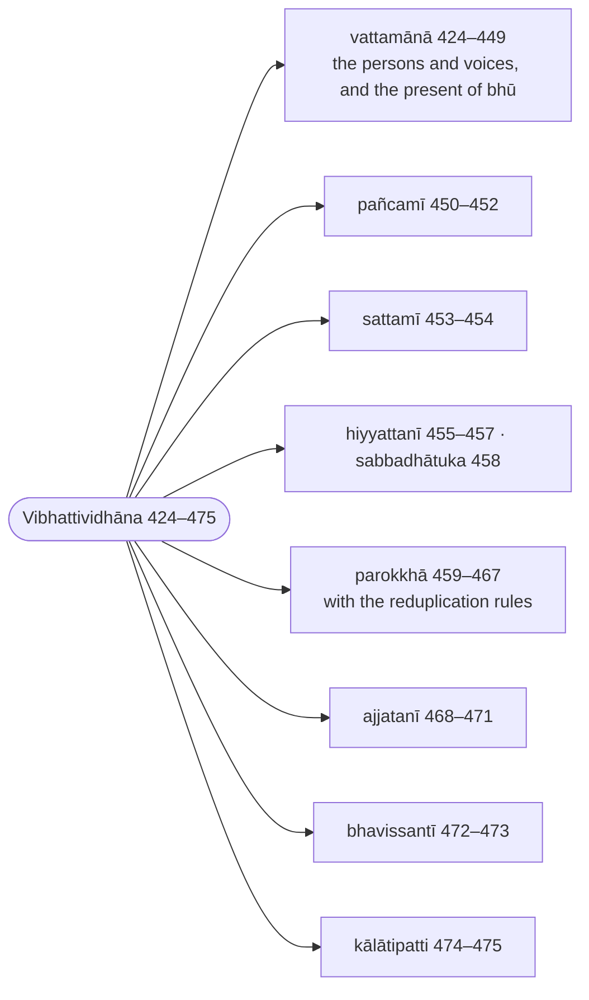
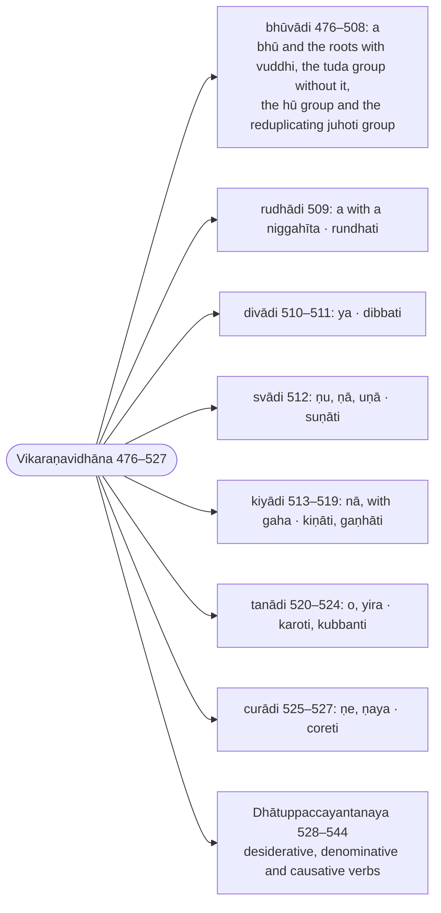

import { LinkCard } from "@astrojs/starlight/components";
import AnchorRedirect from "../../../../components/AnchorRedirect.astro";

:::note
The verb is treated by conjugation class (`gaṇa`): after the eight sets of endings and their meanings come the `bhū` class with `bhū`, `paca`, `gamu` and the other model roots conjugated through every tense in the active, the passive and the impersonal, then the `rudha`, `diva`, `su`, `kī`, `tanu` and `cura` classes, and last the desiderative, denominative and causative suffixes. Every form is derived, and the conjugations are set out as tables.

:::

:::note[Reading Rachiwong]
This section is one of the three that Phramaha Sriporn Rachiwong translated in her Pune thesis *Rūpasiddhi: A Study of Some Aspects* (1995), reproduced on this site as [Rachiwong: Rūpasiddhi (1995)](/rupasiddhi/rachiwong). Her rules are headed `(K-N)`, K the Kaccāyana sutta and N the rule's number in the Thai edition of the Padarūpasiddhi (Bangkok 1984), her base text; her N runs sixteen below the number used on this page (her 408 is 424 here), since the Thai and Sinhalese editions do not number the sixteen rules the Burmese text states twice. Her notes compare that Thai edition (Rūp T.) with the Burmese Buddhasāsanasamiti edition (B., the Chaṭṭha Saṅgāyana text these pages print) and the Sinhalese Mahārūpasiddhi (S.). The footnotes below record where this translation's text or construal differs from hers, and nothing more; her own translation and notes are on her page.
:::

:::note[The endings, tense by tense]
The first part of the chapter takes each set of endings with its meaning and conjugates the model root `bhū` through it; the ranges are Rūpasiddhi numbers.

:::

:::note[The conjugation classes]
The second part conjugates model roots class by class, `bhū` first and at length; the `gaha` class is folded into the `kī` class. The ranges are Rūpasiddhi numbers.

:::

## Sections

- [Bhūvādigaṇa: Vibhattividhāna (The bhū class: the endings) (424–475)](/rupasiddhi/6-akhyatakanda/1-bhuvadigana-vibhatti/)
- [Vikaraṇavidhāna (The class suffixes) (476–508)](/rupasiddhi/6-akhyatakanda/2-vikaranavidhana/)
- [Rudhādigaṇa to Curādigaṇa (The other classes) (509–527)](/rupasiddhi/6-akhyatakanda/3-rudhadi-curadi/)
- [Dhātuppaccayantanaya (Roots with derivative suffixes) (528–544)](/rupasiddhi/6-akhyatakanda/4-dhatuppaccayanta/)

<AnchorRedirect base="/rupasiddhi/6-akhyatakanda/" prefix="r" map={{"1-bhuvadigana-vibhatti": [424, 475], "2-vikaranavidhana": [476, 508], "3-rudhadi-curadi": [509, 527], "4-dhatuppaccayanta": [528, 544]}} />
