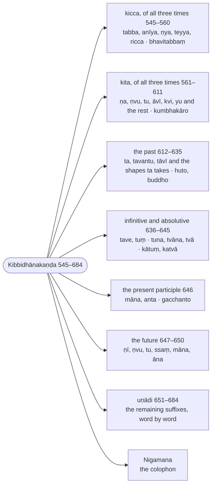

import { LinkCard } from "@astrojs/starlight/components";

:::note
The `kita` suffixes are grouped by the time and sense they express: the `kicca` suffixes (`tabba`, `anīya`, `ṇya` …), the agent and action nouns valid for all three times, the past participles, the infinitives and absolutives, the present participles, the future participles, and the `uṇādi` words whose formation is recorded one by one. The section ends with Buddhappiya's colophon (`nigamana`), which names him and his teacher.

:::

:::note[The kita suffixes by time and sense]
Buddhappiya sorts the primary suffixes by the time they express; the ranges are Rūpasiddhi numbers.

:::

## Tekālika (Suffixes of all three times)

## Kiccappaccayantanaya (The `kicca` suffixes)

> Atha dhātūhiyeva bhāvakammakattukaraṇādisādhanasahitaṃ kibbidhānamārabhīyate.

Now begins the `kibbidhāna`, the ordaining of the `kita` suffixes: suffixes added to roots alone, together with the `sādhana` they realise — `bhāva` (the action itself), `kamma` (the object), `kattu` (the agent), `karaṇa` (the instrument) and the rest.

> Tattha kiccakitakavasena duvidhā hi paccayā, tesu kiccasaññāya paṭhamaṃ vuttattā, kiccānamappakattā ca kiccappaccayā tāva vuccante.

Among these the suffixes are of two kinds, `kicca` and `kita`. Of the two, the `kicca` suffixes are stated first, because the term `kicca` is defined first (in [§545 (548): Te kiccā](/kaccayana/7-kibbidhanakappa#m545), before [§546 (562): Aññe kita](/kaccayana/7-kibbidhanakappa#m546)) and because the `kicca` suffixes are few.

> Bhū sattāyaṃ, ‘‘bhūyate, abhavittha, bhavissate vā devadattenā’’ti viggahe –

The root `bhū` in the sense of being. In the analysis (`viggaha`) "it is being, it was, or it will be, by Devadatta" (`bhūyate`, `abhavittha`, `bhavissate vā devadattena` — the impersonal forms of the present, the past and the future, with the agent in the third form ③) —

> ‘‘Dhātuyā kammādimhi ṇo’’ti ito ‘‘dhātuyā’’ti sabbattha paccayādividhāne vattate, ‘‘parā, paccayā’’ti ca adhikāro.

From [§524 (561): Dhātuyā kammādimhi ṇo](/kaccayana/7-kibbidhanakappa#m524) the word `dhātuyā` ("after a root") continues everywhere in the prescription of suffixes and the rest, and `parā paccayā` ("the suffixes come after", [§432 (362): Dhātuliṅgehi parā paccayā](/kaccayana/6-akhyatakappa#m432)) is the governing heading (`adhikāra`).

---

### 545 (§540): Bhāvakammesu tabbānīyā (`tabba`, `anīya` in the senses of the action itself and of the object) :badge[utsarga]{variant=success}

:::tip[Kaccāyana]
<LinkCard title="§540 (545): Bhāvakammesu tabbānīyā" href="/kaccayana/7-kibbidhanakappa#m540" description="`tabba`, `anīya` in the senses of the action itself and of the object" />
:::

> Bhāvakamma iccetesvatthesu sabbadhātūhi tabba anīya iccete paccayā parā honti. Yogavibhāgena aññatthāpi.

In the senses of `bhāva` (the action itself) and `kamma` (the object), the suffixes `tabba` and `anīya` come after all roots. By splitting the rule (`yogavibhāga`) they come in other senses too.

> Tattha –

On this [there is the verse]:

> Akammakehi dhātūhi, bhāve kiccā bhavanti te; \
> Sakammakehi kammatthe, arahasakkatthadīpakā.

After intransitive roots those `kicca` [suffixes] arise in the sense of the action itself; \
after transitive roots, in the sense of the object; they express the senses of "ought" (`araha`) and "can" (`sakka`).

> Te ca –

And they [the suffixes `tabba` and `anīya`] —

:::tip[Examples]

The two suffixes on `bhū`, inflected at [548 (§545): Te kiccā](/rupasiddhi/7-kibbidhanakanda#r548).

| lemma | inflected | meaning |
| ----- | --------- | ------- |
| 🚻①⨀(√bhū + tabba) | bhavitabbaṃ | there must be being; it is to be |
| 🚻①⨀(√bhū + anīya) | bhavanīyaṃ | (the same) |

:::

---

### 546 (§550): Ṇādayo tekālikā (`ṇa` and the rest belong to all three times) :badge[vidhyaṅga]{variant=tip}

:::tip[Kaccāyana]
<LinkCard title="§550 (546): Ṇādayo tekālikā" href="/kaccayana/7-kibbidhanakappa#m550" description="`ṇa` and the rest belong to all three times" />
:::

> Tikāle niyuttā tekālikā, ye idha tatiye dhātvādhikāre vihitā aniddiṭṭhakālā ṇādayo paccayā, te tekālikā hontīti paribhāsato kālattayepi honti.

`Tekālika` means "assigned to the three times". By the interpretive rule "the suffixes `ṇa` and the rest that are prescribed here, in this third section governed by the word `dhātu` (root), without a time being stated, are `tekālika`", they [the `kicca` suffixes] occur in all three times too.

> Sīhagatiyā ‘‘kvacī’’ti vattate.

By the lion's glance (`sīhagati`), the word `kvaci` ("in some places") continues.

:::tip[Examples]

The three forms of the analysis at the head of the chapter show the three times that one `kicca` word covers.

| lemma | inflected | meaning |
| ----- | --------- | ------- |
| 🔵▶️🤟⨀(bhavati) | bhūyate devadattena | there is being, by Devadatta (present) |
| 🔵⏮🤟⨀(bhavati) | abhavittha devadattena | there was being, by Devadatta (past) |
| 🔵⏯🤟⨀(bhavati) | bhavissate devadattena | there will be being, by Devadatta (future) |
| 🚻①⨀(√bhū + tabba) | bhavitabbaṃ devadattena | there is to be being, by Devadatta — in all three times |

:::

---

### 547 (§605): Yathāgamamikāro (The augment `i` between root and suffix, as the tradition has it) :badge[utsarga]{variant=success}

:::tip[Kaccāyana]
<LinkCard title="§605 (547): Yathāgamamikāro" href="/kaccayana/7-kibbidhanakappa#m605" description="The augment `i` between root and suffix, as the tradition has it" />
:::

> Yathāgamaṃ yathāpayogaṃ jinavacanānuparodhena dhātūhi paro ikārāgamo hoti kvaci byañjanādikesu kiccakitakappaccayesu, ‘‘aññesu cā’’ti vuddhi, ‘‘o ava sare’’ti avādeso, ‘‘naye paraṃ yutte’’ti paraṃ netabbaṃ.

`Yathāgamaṃ`, "according to the received texts" — according to usage, without contradicting the word of the Conqueror — the augment `i` comes after roots in some places (`kvaci`), before `kicca` and `kita` suffixes that begin with a consonant. `Vuddhi` by [§485 (434): Aññesu ca](/kaccayana/6-akhyatakappa#m485); the replacement `ava` by [§513 (435): O ava sare](/kaccayana/6-akhyatakappa#m513); and [the consonant] is to be carried over to the following [vowel] by [§11 (14): Naye paraṃ yutte](/kaccayana/1-sandhikappa#m11).

|     | √bhū + tabba                 | rule |
| --- | ---------------------------- | ---- |
| →   | bhū + (i) + tabba            | §605 |
| →   | bh(ū→o) + itabba             | §485 |
| →   | bh(o→ava) + itabba           | §513 |
| →   | bhav + (~~a~~) + itabba      | §12  |
| →   | **bhavitabba**               | §11  |

The `a` of `ava` is elided before the augment by [§12 (13): Sarā sare lopaṃ](/kaccayana/1-sandhikappa#m12).

:::tip[Examples]

| lemma | inflected | meaning |
| ----- | --------- | ------- |
| 🚻①⨀(√bhū + tabba) | bhavitabbaṃ | there is to be being — with the augment `i` before the consonant `t` |
| 🚻①⨀(√bhū + anīya) | bhavanīyaṃ | the same — no augment before the vowel of `anīya` |

:::

---

### 548 (§545): Te kiccā (those [suffixes] are called `kicca`) :badge[anvattha]{variant=note}

:::tip[Kaccāyana]
<LinkCard title="§545 (548): Te kiccā" href="/kaccayana/7-kibbidhanakappa#m545" description="those [suffixes] are called `kicca`" />
:::

> Ye idha vuttā tabbānīyaṇyateyyariccappaccayā, te kiccasaññā hontīti veditabbā. Tato ‘‘aññe kiti’’ti vacanato kiccappaccayānamakitakattā nāmabyapadese asampatte ‘‘taddhitasamāsakitakā nāmaṃvātavetunādīsu cā’’ti ettha caggahaṇena nāmabyapadeso, tato syādyuppatti. Bhāve bhāvassekattā ekavacanameva, ‘‘si’’nti amādeso. Bhavitabbaṃ bhavatā paññena, bhavanīyaṃ.

The suffixes taught here — `tabba`, `anīya`, `ṇya`, `teyya` and `ricca` — are to be understood as having the name `kicca`. Then, since by the statement [§546 (562): Aññe kita](/kaccayana/7-kibbidhanakappa#m546) the `kicca` suffixes are not `kita`, treatment as a noun (`nāmabyapadesa`) would not reach them; it is obtained by the word `ca` in [§601 (334): Taddhitasamāsakitakā nāmaṃ vā’ tave tunādīsu ca](/kaccayana/7-kibbidhanakappa#m601), and then the inflections `si` and the rest are added. In the sense of the action itself there is only the singular, because the action is one; `aṃ` replaces `si` by [§219 (195): Siṃ](/kaccayana/2-namakappa#m219). `Bhavitabbaṃ bhavatā paññena`, "there is to be being by you as a wise man"; `bhavanīyaṃ`.

|     | bhavitabba (547)             | rule |
| --- | ---------------------------- | ---- |
| →   | bhavitabba + si              | §601, §55 |
| →   | bhavitabba + (si→aṃ)         | §219 |
| →   | **bhavitabbaṃ**              |      |

> Idha byañjanādittābhāvā anuvattitakvaciggahaṇena ikārāgamābhāvo. Bhāve kiccappaccayantā napuṃsakā. Kamme tiliṅgā.

Here, because [the suffix] does not begin with a consonant, and by the word `kvaci` that has continued, there is no augment `i`. In the sense of the action itself, words ending in `kicca` suffixes are neuter; in the sense of the object they have all three genders.

|     | √bhū + anīya                 | rule |
| --- | ---------------------------- | ---- |
| →   | bh(ū→o) + anīya              | §485 |
| →   | bh(o→ava) + anīya            | §513 |
| →   | bhav + (~~a~~) + anīya       | §12  |
| →   | bhavanīya + si               | §601, §55 |
| →   | bhavanīya + (si→aṃ)          | §219 |
| →   | **bhavanīyaṃ**               |      |

> Kammani abhipubbo, abhibhūyate, abhibhūyittha, abhibhūyissateti abhibhavitabbo kodho paṇḍitena, abhibhavitabbā taṇhā, abhibhavitabbaṃ dukkhaṃ, evaṃ abhibhavanīyo, abhibhavanīyā, abhibhavanīyaṃ, purisakaññācittasaddanayena netabbaṃ, evaṃ sabbattha.

In the sense of the object, with the prefix `abhi`: "it is overcome, it was overcome, it will be overcome" (`abhibhūyate`, `abhibhūyittha`, `abhibhūyissate`) — `abhibhavitabbo kodho paṇḍitena`, "anger is to be overcome by the wise"; `abhibhavitabbā taṇhā`, "craving is to be overcome"; `abhibhavitabbaṃ dukkhaṃ`, "suffering is to be overcome"; likewise `abhibhavanīyo`, `abhibhavanīyā`, `abhibhavanīyaṃ`. They are to be inflected on the model of the words `purisa`, `kaññā` and `citta`; so everywhere.

> Ettha hi –

For on this [there is the verse]:

> Tabbādīheva kammassa, vuttattāva punattanā; \
> Vattabbassa abhāvā na, dutiyā paṭhamā tato.

Since the object is expressed by `tabba` and the rest themselves, \
and nothing remains to be stated again, there is no second form ②; hence the first ①.

> Āsa upavesane, āsīyittha, āsīyate, āsīyissateti āsitabbaṃ tayā, āsanīyaṃ. Kamme upāsitabbo garu, upāsanīyo.

The root `āsa` in the sense of sitting: "it was sat, it is sat, it will be sat" (`āsīyittha`, `āsīyate`, `āsīyissate`) — `āsitabbaṃ tayā`, "you should sit"; `āsanīyaṃ`. In the sense of the object: `upāsitabbo garu`, "the teacher is to be waited upon"; `upāsanīyo`.

> Sī saye, asīyittha, sīyate, sīyissateti sayitabbaṃ bhavatā, sayanīyaṃ, ‘‘e ayā’’ti ayādeso, atisayitabbo paro, atisayanīyo.

The root `sī` in the sense of lying down: `asīyittha`, `sīyate`, `sīyissate` — `sayitabbaṃ bhavatā`, "you should lie down"; `sayanīyaṃ`; the replacement `aya` by [§514 (491): E aya](/kaccayana/6-akhyatakappa#m514). `atisayitabbo paro`, "the other is to be surpassed"; `atisayanīyo`.

|     | √sī + tabba                  | rule |
| --- | ---------------------------- | ---- |
| →   | sī + (i) + tabba             | §605 |
| →   | s(ī→e) + itabba              | §485 |
| →   | s(e→aya) + itabba            | §514 |
| →   | say + (~~a~~) + itabba       | §12  |
| →   | sayitabba + si               | §601, §55 |
| →   | sayitabba + (si→aṃ)          | §219 |
| →   | **sayitabbaṃ**               |      |

> Pada gatimhi, uppajjittha, uppajjate, uppajjissateti uppajjitabbaṃ tena, uppajjanīyaṃ, ettha ca ‘‘kattarī’’ti adhikāraṃ vinā ‘‘divādito yo’’ti vinādhikārayogavibhāgena yappaccayo, ‘‘tassa cavaggayakāra’’iccādinā cavaggo, ‘‘paradvebhāvo ṭhāne’’ti dvibhāvo, paṭipajjitabbo maggo, paṭipajjanīyo.

The root `pada` in the sense of going: `uppajjittha`, `uppajjate`, `uppajjissate` — `uppajjitabbaṃ tena`, "it should arise for him"; `uppajjanīyaṃ`. And here the suffix `ya` by [§447 (510): Divādito yo](/kaccayana/6-akhyatakappa#m447) taken without its heading `kattari` ("in the active"), by splitting the rule from its heading (`vinādhikārayogavibhāga`); the `c` group by [§441 (447): Tassa cavaggayakāravakārattaṃ sadhātvantassa](/kaccayana/6-akhyatakappa#m441) and the like; doubling by [§28 (40): Para dvebhāvo ṭhāne](/kaccayana/1-sandhikappa#m28). `paṭipajjitabbo maggo`, "the path is to be followed"; `paṭipajjanīyo`.

|     | u + √pada + tabba            | rule |
| --- | ---------------------------- | ---- |
| →   | u + pad + (ya) + tabba       | §447 |
| →   | u + pa + (d + y → j) + tabba | §441 |
| →   | u + pa + (j→jj) + tabba      | §28  |
| →   | u + (p→pp)ajj + (i) + tabba  | §28, §605 |
| →   | uppajjitabba + si            | §601, §55 |
| →   | uppajjitabba + (si→aṃ)       | §219 |
| →   | **uppajjitabbaṃ**            |      |

> Budha avagamane, abujjhittha, bujjhate, bujjhissateti bujjhitabbo dhammo, bujjhanīyo.

The root `budha` in the sense of understanding: `abujjhittha`, `bujjhate`, `bujjhissate` — `bujjhitabbo dhammo`, "the Dhamma is to be understood"; `bujjhanīyo`.

> Su savaṇe, asūyittha, sūyate, sūyissateti sotabbo dhammo, idha yathāgamaggahaṇena ikārāgamābhāvo, suṇitabbo, ‘‘svādito ṇu ṇā uṇā cā’’ti vinādhikārayogavibhāgena ṇāpaccayo, savaṇīyo.

The root `su` in the sense of hearing: `asūyittha`, `sūyate`, `sūyissate` — `sotabbo dhammo`, "the Dhamma is to be heard": here, by the word `yathāgamaṃ`, there is no augment `i`. `suṇitabbo`: the suffix `ṇā` is added by [§448 (512): Svādito ṇu ṇā uṇā ca](/kaccayana/6-akhyatakappa#m448) taken without its heading, by splitting the rule. `savaṇīyo`.

|     | √su + tabba                  | rule |
| --- | ---------------------------- | ---- |
| →   | s(u→o) + tabba               | §485 |
| →   | sotabba + si                 | §601, §55 |
| →   | sotabba + (si→o)             | §104 |
| →   | **sotabbo**                  |      |

|     | √su + tabba                  | rule |
| --- | ---------------------------- | ---- |
| →   | su + (ṇā) + tabba            | §448 |
| →   | suṇ + (~~ā~~) + (i) + tabba  | §605, §83 |
| →   | suṇitabba + si               | §601, §55 |
| →   | suṇitabba + (si→o)           | §104 |
| →   | **suṇitabbo**                |      |

|     | √su + anīya                  | rule |
| --- | ---------------------------- | ---- |
| →   | s(u→o) + anīya               | §485 |
| →   | s(o→ava) + anīya             | §513 |
| →   | sav + (~~a~~) + anīya        | §12  |
| →   | sava + (n→ṇ)īya              | §549 |
| →   | savaṇīya + si                | §601, §55 |
| →   | savaṇīya + (si→o)            | §104 |
| →   | **savaṇīyo**                 |      |

The masculine `si` becomes `o` by [§104 (66): So](/kaccayana/2-namakappa#m104); the vowel of `ṇā` is elided before the augment by [§83 (67): Saralopo’ mādesa paccayādimhi saralope tu pakati](/kaccayana/2-namakappa#m83); the `n` of `anīya` becomes `ṇ` by the `ādi` of [550 (§549): Rahādito ṇa](/rupasiddhi/7-kibbidhanakanda#r550).

> Kara karaṇe, karīyittha, karīyati, karīyissatīti atthe tabbā’nīyā.

The root `kara` in the sense of doing: in the sense "it was done, it is done, it will be done" (`karīyittha`, `karīyati`, `karīyissati`), `tabba` and `anīya` [are added] —

> ‘‘Antassa, karassa, ca, tatta’’nti ca vattate.

And the words `antassa`, `karassa`, `ca` and `tattaṃ` continue.

:::tip[Examples]

The `bhāva` and `kamma` words of the gloss, in order.

| lemma | inflected | meaning |
| ----- | --------- | ------- |
| 🚻①⨀(√bhū + tabba) | bhavitabbaṃ bhavatā paññena | you, sir, must be wise |
| 🚻①⨀(√bhū + anīya) | bhavanīyaṃ | (the same) |
| 🚹①⨀(abhi + √bhū + tabba) | abhibhavitabbo kodho paṇḍitena | anger is to be overcome by the wise |
| 🚺①⨀(abhi + √bhū + tabba) | abhibhavitabbā taṇhā | craving is to be overcome |
| 🚻①⨀(abhi + √bhū + tabba) | abhibhavitabbaṃ dukkhaṃ | suffering is to be overcome |
| 🚹①⨀(abhi + √bhū + anīya) | abhibhavanīyo | to be overcome |
| 🚺①⨀(abhi + √bhū + anīya) | abhibhavanīyā | (the same, feminine) |
| 🚻①⨀(abhi + √bhū + anīya) | abhibhavanīyaṃ | (the same, neuter) |
| 🚻①⨀(√āsa + tabba) | āsitabbaṃ tayā | you should sit |
| 🚻①⨀(√āsa + anīya) | āsanīyaṃ | (the same) |
| 🚹①⨀(upa + √āsa + tabba) | upāsitabbo garu | the teacher is to be waited upon |
| 🚹①⨀(upa + √āsa + anīya) | upāsanīyo | (the same) |
| 🚻①⨀(√sī + tabba) | sayitabbaṃ bhavatā | you should lie down |
| 🚻①⨀(√sī + anīya) | sayanīyaṃ | (the same) |
| 🚹①⨀(ati + √sī + tabba) | atisayitabbo paro | the other is to be surpassed |
| 🚹①⨀(ati + √sī + anīya) | atisayanīyo | (the same) |
| 🚻①⨀(u + √pada + tabba) | uppajjitabbaṃ tena | it should arise for him |
| 🚻①⨀(u + √pada + anīya) | uppajjanīyaṃ | (the same) |
| 🚹①⨀(paṭi + √pada + tabba) | paṭipajjitabbo maggo | the path is to be followed |
| 🚹①⨀(paṭi + √pada + anīya) | paṭipajjanīyo | (the same) |
| 🚹①⨀(√budha + tabba) | bujjhitabbo dhammo | the Dhamma is to be understood |
| 🚹①⨀(√budha + anīya) | bujjhanīyo | (the same) |
| 🚹①⨀(√su + tabba) | sotabbo dhammo | the Dhamma is to be heard |
| 🚹①⨀(√su + tabba) | suṇitabbo | (the same, with the class suffix `ṇā`) |
| 🚹①⨀(√su + anīya) | savaṇīyo | (the same) |

:::

---

### 549 (§620): Tuṃ tu na tabbesu vā (Optionally [`t` for the `r` of `kara`] before `tuṃ`, `tuna`, `tabba`) :badge[apavada]{variant=success}

:::tip[Kaccāyana]
<LinkCard title="§620 (549): Tuṃ tuna tabbesu vā" href="/kaccayana/7-kibbidhanakappa#m620" description="Optionally [`t` for the `r` of `kara`] before `tuṃ`, `tuna`, `tabba`" />
:::

:::note[Analysis]

The words `antassa`, `karassa`, `ca` and `tattaṃ` that continue into this rule are those of [573 (§619): Karassa ca tattaṃ tusmiṃ](/rupasiddhi/7-kibbidhanakanda#r573), and `karotissa` is that of [582 (§594): Purasamupaparīhi karotissa khakharā vā tappaccayesu ca](/rupasiddhi/7-kibbidhanakanda#r582); both stand later on the page.

:::

> Kara iccetassa dhātussa antabhūtassa rakārassa takārattaṃ hoti vā tuṃ tu na tabba iccetesu paccayesu paresu. Kattabbo bhavatā dhammo, kattabbā pūjā, kattabbaṃ kusalaṃ, tattābhāve ‘‘karotissā’’ti vattamāne ‘‘tavetunādīsu kā’’ti ettha ādisaddena tabbepi kādeso, kātabbaṃ hitaṃ.

The final `r` of the root `kara` optionally becomes `t` when the suffixes `tuṃ`, `tuna` and `tabba` follow. `kattabbo bhavatā dhammo`, "the Dhamma is to be practised by you"; `kattabbā pūjā`, "worship is to be performed"; `kattabbaṃ kusalaṃ`, "good is to be done". When the change to `t` is absent, `karotissa` ("of `karoti`") continuing, the replacement `kā` before `tabba` as well, by the word `ādi` in [§595 (637): Tave tunādīsu kā](/kaccayana/7-kibbidhanakappa#m595): `kātabbaṃ hitaṃ`, "good is to be done".

|     | √kara + tabba                | rule |
| --- | ---------------------------- | ---- |
| →   | ka(r→t) + tabba              | §620 |
| →   | kattabba + si                | §601, §55 |
| →   | kattabba + (si→o)            | §104 |
| →   | **kattabbo**                 |      |

When the option is not taken:

|     | √kara + tabba                | rule |
| --- | ---------------------------- | ---- |
| →   | (kara→kā) + tabba            | §595 |
| →   | kātabba + si                 | §601, §55 |
| →   | kātabba + (si→aṃ)            | §219 |
| →   | **kātabbaṃ**                 |      |

:::tip[Examples]

| lemma | inflected | meaning |
| ----- | --------- | ------- |
| 🚹①⨀(√kara + tabba) | kattabbo bhavatā dhammo | the Dhamma is to be practised by you |
| 🚺①⨀(√kara + tabba) | kattabbā pūjā | worship is to be performed |
| 🚻①⨀(√kara + tabba) | kattabbaṃ kusalaṃ | good is to be done |
| 🚻①⨀(√kara + tabba) | kātabbaṃ hitaṃ | good is to be done — the option not taken, with `kā` by §595 |

:::

---

### 550 (§549): Rahādito ṇa (`ṇ` for the `n` [of `ana`] after roots ending in `r`, `h` and the like) :badge[apavada]{variant=success}

:::tip[Kaccāyana]
<LinkCard title="§549 (550): Rahādito ṇa" href="/kaccayana/7-kibbidhanakappa#m549" description="`ṇ` for the `n` [of `ana`] after roots ending in `r`, `h` and the like" />
:::

> Rakāra hakārādyantehi[^1] dhātūhi parassa anānīyādinakārassa ṇakāro hoti. Ādisaddena ramu apa ñā tāditopi.

After roots ending in the letters `r`, `h` and the like, the `n` of a following `ana`, `anīya` or the like becomes `ṇ`. By the word `ādi` [it does so] also after `ramu`, `apa`, `ñā`, `tā` and the like.

[^1]: CST4 prints `hahārādyantehi`; the sutta's `raha` and Kaccāyana's vutti, `rakārahakārādyantehi dhātūhi`, give `hakārādyantehi`.

> Rahādito parassettha, nakārassa asambhavā; \
> Anānīyādinasseva, sāmathyāyaṃ ṇakāratā.

Since here no [suffix beginning with] `n` can follow `ra`, `ha` and the rest, \
by the force of the context this `ṇ` is of the `n` of `ana`, `anīya` and the like alone.

> Karaṇīyo dhammo, karaṇārahoti attho, karaṇīyā, karaṇīyaṃ.

`karaṇīyo dhammo`, "the Dhamma is to be practised" — the meaning is `karaṇāraha`, "deserving to be done"; `karaṇīyā`, `karaṇīyaṃ`.

|     | √kara + anīya                | rule |
| --- | ---------------------------- | ---- |
| →   | kar + a(n→ṇ)īya              | §549 |
| →   | karaṇīya + si                | §601, §55 |
| →   | karaṇīya + (si→o)            | §104 |
| →   | **karaṇīyo**                 |      |

> Bhara bharaṇe, bharīyatīti bharitabbo, bharaṇīyo.

The root `bhara` in the sense of supporting: "he is supported" (`bharīyati`) — `bharitabbo`, `bharaṇīyo`.

> Gaha upādāne, agayhittha, gayhati, gayhissatīti gahetabbo, ‘‘tesu vuddhī’’tiādinā ikārassekāro, saṅgaṇhitabbo, ‘‘gahādito ppaṇhā’’ti vinādhikārayogavibhāgena ṇhāpaccayo, halopasaralopādi, saṅgaṇhaṇīyo, gahaṇīyo.

The root `gaha` in the sense of taking: "it was taken, it is taken, it will be taken" (`agayhittha`, `gayhati`, `gayhissati`) — `gahetabbo`, the `i` becoming `e` by [§404 (370): Tesu vuddhilopāgamavikāraviparītādesā ca](/kaccayana/5-taddhitakappa#m404) and the like; `saṅgaṇhitabbo`, the suffix `ṇhā` by [§450 (517): Gahādito ppa ṇhā](/kaccayana/6-akhyatakappa#m450) taken without its heading, by splitting the rule, elision of the `h`, elision of the vowel and the rest; `saṅgaṇhaṇīyo`, `gahaṇīyo`.

|     | √gaha + tabba                | rule |
| --- | ---------------------------- | ---- |
| →   | gah + (i) + tabba            | §605 |
| →   | gah + (i→e) + tabba          | §404 |
| →   | gahetabba + si               | §601, §55 |
| →   | gahetabba + (si→o)           | §104 |
| →   | **gahetabbo**                |      |

|     | saṃ + √gaha + tabba          | rule |
| --- | ---------------------------- | ---- |
| →   | saṃ + gah + (ṇhā) + tabba    | §450 |
| →   | saṃ + ga + (~~h~~) + ṇhā + tabba | §450 |
| →   | saṃ + gaṇh + (~~ā~~) + (i) + tabba | §605, §83 |
| →   | sa(ṃ→ṅ)gaṇhitabba            | §31  |
| →   | saṅgaṇhitabba + si           | §601, §55 |
| →   | saṅgaṇhitabba + (si→o)       | §104 |
| →   | **saṅgaṇhitabbo**            |      |

The niggahīta of the prefix becomes `ṅ` before `g` by [§31 (49): Vaggantaṃ vā vagge](/kaccayana/1-sandhikappa#m31).

> Ādiggahaṇena ramu kīḷāyaṃ, ramīyittha, ramīyati, ramīyissatīti ramitabbo, ramaṇīyo vihāro.

By the word `ādi`: the root `ramu` in the sense of playing: `ramīyittha`, `ramīyati`, `ramīyissati` — `ramitabbo`; `ramaṇīyo vihāro`, "a delightful dwelling".

> Apa pāpuṇane, uṇāpaccayo, pāpīyatīti pāpuṇitabbo, ‘‘gupādīnañcā’’ti dhātvantassa lopo, dvittañca, pattabbo, patteyyo, pāpuṇaṇīyo, pāpaṇīyo.

The root `apa` in the sense of reaching; the suffix `uṇā`; "it is reached" (`pāpīyati`) — `pāpuṇitabbo`; by [§580 (630): Gupādīnañca](/kaccayana/7-kibbidhanakappa#m580) elision of the root's final, and doubling: `pattabbo`, `patteyyo`; `pāpuṇaṇīyo`, `pāpaṇīyo`.

|     | pa + √āpa + tabba            | rule |
| --- | ---------------------------- | ---- |
| →   | p(a + ā→ā)p + tabba          | §12  |
| →   | pā + (~~p~~) + tabba         | §580 |
| →   | pā + (t→tt)abba              | §580 |
| →   | p(ā→a)ttabba                 | §26  |
| →   | pattabba + si                | §601, §55 |
| →   | pattabba + (si→o)            | §104 |
| →   | **pattabbo**                 |      |

The long vowel is shortened before the conjunct by [§26 (38): Rassaṃ](/kaccayana/1-sandhikappa#m26).

> ‘‘Antassa, vā’’ti ca vattate.

And the words `antassa` and `vā` continue.

:::tip[Examples]

| lemma | inflected | meaning |
| ----- | --------- | ------- |
| 🚹①⨀(√kara + anīya) | karaṇīyo dhammo | the Dhamma is to be practised |
| 🚺①⨀(√kara + anīya) | karaṇīyā | (the same, feminine) |
| 🚻①⨀(√kara + anīya) | karaṇīyaṃ | (the same, neuter) |
| 🚹①⨀(√bhara + tabba) | bharitabbo | to be supported |
| 🚹①⨀(√bhara + anīya) | bharaṇīyo | (the same) |
| 🚹①⨀(√gaha + tabba) | gahetabbo | to be taken |
| 🚹①⨀(saṃ + √gaha + tabba) | saṅgaṇhitabbo | to be treated kindly, to be gathered |
| 🚹①⨀(saṃ + √gaha + anīya) | saṅgaṇhaṇīyo | (the same) |
| 🚹①⨀(√gaha + anīya) | gahaṇīyo | to be taken |
| 🚹①⨀(√ramu + tabba) | ramitabbo | to be delighted in |
| 🚹①⨀(√ramu + anīya) | ramaṇīyo vihāro | a delightful dwelling |
| 🚹①⨀(pa + √āpa + tabba) | pāpuṇitabbo | to be reached |
| 🚹①⨀(pa + √āpa + tabba) | pattabbo | (the same) |
| 🚹①⨀(pa + √āpa + teyya) | patteyyo | (the same) |
| 🚹①⨀(pa + √āpa + anīya) | pāpuṇaṇīyo | (the same) |
| 🚹①⨀(pa + √āpa + anīya) | pāpaṇīyo | (the same) |

:::

---

### 551 (§596): Gama khana hanādīnaṃ tuṃtabbādīsu na (Optionally `n` for the final of `gama`, `khana`, `hana` etc. before `tuṃ`, `tabba` and the like) :badge[apavada]{variant=success}

:::tip[Kaccāyana]
<LinkCard title="§596 (551): Gama khana hanādīnaṃ tuṃ tabbādīsu na" href="/kaccayana/7-kibbidhanakappa#m596" description="Optionally `n` for the final of `gama`, `khana`, `hana` etc. before `tuṃ`, `tabba` and the like" />
:::

> Gama khana hana iccevamādīnaṃ makāranakārantānaṃ dhātūnamantassa nakāro hoti vā tuṃ tabba tave tuna tvāna tvā iccevamādīsu takārādippaccayesu paresu. Agacchīyittha, gacchīyati, gacchīyissatīti gantabbo maggo, gamitabbaṃ, gamanīyaṃ.

The final of the roots `gama`, `khana`, `hana` and the like, which end in `m` and `n`, optionally becomes `n` when suffixes beginning with `t` — `tuṃ`, `tabba`, `tave`, `tuna`, `tvāna`, `tvā` and the like — follow. "It was gone, it is gone, it will be gone" (`agacchīyittha`, `gacchīyati`, `gacchīyissati`) — `gantabbo maggo`, "the path is to be travelled"; `gamitabbaṃ`, `gamanīyaṃ`.

|     | √gamu + tabba                | rule |
| --- | ---------------------------- | ---- |
| →   | ga(m→n) + tabba              | §596 |
| →   | gantabba + si                | §601, §55 |
| →   | gantabba + (si→o)            | §104 |
| →   | **gantabbo**                 |      |

When the option is not taken, the `m` stays and the augment `i` is inserted:

|     | √gamu + tabba                | rule |
| --- | ---------------------------- | ---- |
| →   | gam + (i) + tabba            | §605 |
| →   | gamitabba + si               | §601, §55 |
| →   | gamitabba + (si→aṃ)          | §219 |
| →   | **gamitabbaṃ**               |      |

> Khanu avadāraṇe, akhaññittha, khaññati, khaññissatīti khantabbaṃ āvāṭaṃ, khanitabbaṃ, ‘‘kvaci dhātū’’tiādinā khanantassa ṇattañca, khaṇitabbaṃ, khaṇaṇīyaṃ, khananīyaṃ vā.

The root `khanu` in the sense of digging: "it was dug, it is dug, it will be dug" (`akhaññittha`, `khaññati`, `khaññissati`) — `khantabbaṃ āvāṭaṃ`, "a pit is to be dug"; `khanitabbaṃ`; and by [§517 (488): Kvaci dhātuvibhattippaccayānaṃ dīghaviparītādesalopāgamā ca](/kaccayana/6-akhyatakappa#m517) and the like the final of `khana` becomes `ṇ`: `khaṇitabbaṃ`, `khaṇaṇīyaṃ`, or `khananīyaṃ`.

> Hana hiṃsāgatīsu, ahaññittha, haññate, haññissateti hantabbaṃ, hanitabbaṃ, hananīyaṃ.

The root `hana` in the senses of striking and going: "it was struck, it is struck, it will be struck" (`ahaññittha`, `haññate`, `haññissate`) — `hantabbaṃ`, `hanitabbaṃ`, `hananīyaṃ`.

> Mana ñāṇe, amaññittha, maññate, maññissateti mantabbo, manitabbo, yappaccaye ca vaggādi, maññitabbaṃ, maññanīyaṃ.

The root `mana` in the sense of knowing: "it was thought, it is thought, it will be thought" (`amaññittha`, `maññate`, `maññissate`) — `mantabbo`, `manitabbo`; and with the suffix `ya`, the [`c`] group and the rest: `maññitabbaṃ`, `maññanīyaṃ`.

> Pūja pūjāyaṃ, apūjīyittha, pūjīyati, pūjīyissatīti atthe tabbānīyā. ‘‘Curādito ṇe ṇayā’’ti akattaripi ṇeṇayā, ikārāgamānīyesu ‘‘saralopo’’tiādinā kāritasarassa lopo, pūjetabbo, pūjayitabbo, pūjanīyo bhagavā.

The root `pūja` in the sense of honouring: in the sense "he was honoured, he is honoured, he will be honoured" (`apūjīyittha`, `pūjīyati`, `pūjīyissati`), `tabba` and `anīya`. By [§452 (525): Curādito, ṇe ṇayā](/kaccayana/6-akhyatakappa#m452), `ṇe` and `ṇaya` [are added] even outside the active; before the augment `i` and before `anīya` the vowel of the causative [suffix] is elided by [§83 (67): Saralopo’ mādesa paccayādimhi saralope tu pakati](/kaccayana/2-namakappa#m83) and the like: `pūjetabbo`, `pūjayitabbo`, `pūjanīyo bhagavā`, "the Blessed One is to be honoured".

|     | √pūja + ṇe + tabba           | rule |
| --- | ---------------------------- | ---- |
| →   | pūj + (~~ṇ~~)e + tabba       | §452, §523 |
| →   | pūjetabba + si               | §601, §55 |
| →   | pūjetabba + (si→o)           | §104 |
| →   | **pūjetabbo**                |      |

|     | √pūja + ṇaya + tabba         | rule |
| --- | ---------------------------- | ---- |
| →   | pūj + (~~ṇ~~)aya + (i) + tabba | §452, §523, §605 |
| →   | pūjay + (~~a~~) + itabba     | §83  |
| →   | pūjayitabba + si             | §601, §55 |
| →   | pūjayitabba + (si→o)         | §104 |
| →   | **pūjayitabbo**              |      |

|     | √pūja + ṇe + anīya           | rule |
| --- | ---------------------------- | ---- |
| →   | pūj + (~~ṇ~~)e + anīya       | §452, §523 |
| →   | pūj + (~~e~~) + anīya        | §83  |
| →   | pūjanīya + si                | §601, §55 |
| →   | pūjanīya + (si→o)            | §104 |
| →   | **pūjanīyo**                 |      |

> ‘‘Tabbānīyā’’ti yogavibhāgena kattukaraṇesupi, yā pāpuṇane, niyyātīti niyyānīko maggo. Gacchantīti gamanīyā bhogā. Naha soce, nahāyati etenāti nahānīyaṃ cuṇṇaṃ.

By splitting the rule at `tabbānīyā`, [the suffixes come] in the senses of the agent and the instrument as well: the root `yā` in the sense of reaching — "it leads out" (`niyyāti`), `niyyānīko maggo`, "the path that leads out"; "they pass away" (`gacchanti`), `gamanīyā bhogā`, "enjoyments that pass away"; the root `naha` in the sense of cleansing — "one bathes with it" (`nahāyati etena`), `nahānīyaṃ cuṇṇaṃ`, "bathing powder".

> ‘‘Bhāvakammesū’’ti adhikāro.

`Bhāvakammesu` ("in the senses of the action itself and of the object") is the governing heading.

:::tip[Examples]

| lemma | inflected | meaning |
| ----- | --------- | ------- |
| 🚹①⨀(√gamu + tabba) | gantabbo maggo | the path is to be travelled |
| 🚻①⨀(√gamu + tabba) | gamitabbaṃ | the same — the option not taken, with the augment `i` |
| 🚻①⨀(√gamu + anīya) | gamanīyaṃ | (the same) |
| 🚻①⨀(√khana + tabba) | khantabbaṃ āvāṭaṃ | a pit is to be dug |
| 🚻①⨀(√khana + tabba) | khanitabbaṃ | the same — the option not taken |
| 🚻①⨀(√khana + tabba) | khaṇitabbaṃ | the same — with `ṇ` by §517 |
| 🚻①⨀(√khana + anīya) | khaṇaṇīyaṃ | (the same) |
| 🚻①⨀(√khana + anīya) | khananīyaṃ | (the same) |
| 🚻①⨀(√hana + tabba) | hantabbaṃ | to be struck, to be killed |
| 🚻①⨀(√hana + tabba) | hanitabbaṃ | the same — the option not taken |
| 🚻①⨀(√hana + anīya) | hananīyaṃ | (the same) |
| 🚹①⨀(√mana + tabba) | mantabbo | to be thought of |
| 🚹①⨀(√mana + tabba) | manitabbo | the same — the option not taken |
| 🚻①⨀(√mana + tabba) | maññitabbaṃ | the same — with the class suffix `ya` |
| 🚻①⨀(√mana + anīya) | maññanīyaṃ | (the same) |
| 🚹①⨀(√pūja + tabba) | pūjetabbo | to be honoured |
| 🚹①⨀(√pūja + tabba) | pūjayitabbo | (the same) |
| 🚹①⨀(√pūja + anīya) | pūjanīyo bhagavā | the Blessed One is to be honoured |
| 🚹①⨀(ni + √yā + anīya) | niyyānīko maggo | the path that leads out — the agent sense (with a further `ka`) |
| 🚹①⨂(√gamu + anīya) | gamanīyā bhogā | enjoyments that pass away — the agent sense |
| 🚻①⨀(√naha + anīya) | nahānīyaṃ cuṇṇaṃ | bathing powder — the instrument sense |

:::

---

### 552 (§541): Ṇyo ca (and `ṇya` [in the same senses]; by `ca`, `teyya` too) :badge[utsarga]{variant=success}

:::tip[Kaccāyana]
<LinkCard title="§541 (552): Ṇyo ca" href="/kaccayana/7-kibbidhanakappa#m541" description="and `ṇya` [in the same senses]; by `ca`, `teyya` too" />
:::

> Bhāvakammesu sabbadhātūhi ṇyappaccayo hoti, caggahaṇena ‘‘ñāteyya’’ntiādīsu teyyappaccayo ca.

In the senses of the action itself and of the object, the suffix `ṇya` is added after all roots; and by the word `ca` the suffix `teyya` [is added] in `ñāteyyaṃ` and the like.

:::tip[Examples]

`kāriyaṃ` is derived in the next rule, `ñāteyyaṃ` at [556 (§544): Vada mada gamu yuja garahākārādīhi jjammaggayheyyāgāro vā](/rupasiddhi/7-kibbidhanakanda#r556).

| lemma | inflected | meaning |
| ----- | --------- | ------- |
| 🚻①⨀(√kara + ṇya) | kāriyaṃ | to be done (`kattabbaṃ`) |
| 🚻①⨀(√ñā + teyya) | ñāteyyaṃ | to be known (`ñātabbaṃ`) |

:::

---

### 553 (§621): Kāritaṃ viya ṇānubandho (a suffix marked with `ṇ` counts as a causative) :badge[vidhyaṅga]{variant=tip}

:::tip[Kaccāyana]
<LinkCard title="§621 (553): Kāritaṃ viya ṇānubandho" href="/kaccayana/7-kibbidhanakappa#m621" description="a suffix marked with `ṇ` counts as a causative" />
:::

> Anubandho appayogī, ṇakārānubandho paccayo kāritaṃ viya daṭṭhabboti kāritabyapadeso, ‘‘kāritānaṃ ṇo lopa’’nti ṇalopo, ‘‘asaṃyogantassa vuddhi kārite’’ti vuddhi, ikārāgamo, kattabbaṃ kāriyaṃ.

An `anubandha` (indicatory letter) is one that has no use. Since a suffix marked with the indicatory `ṇ` is to be regarded as a causative (`kārita`), it is treated as a causative: elision of the `ṇ` by [§523 (526): Kāritānaṃ ṇo lopaṃ](/kaccayana/6-akhyatakappa#m523), `vuddhi` by [§483 (527): Asaṃyogantassa vuddhi kārite](/kaccayana/6-akhyatakappa#m483), and the augment `i`: `kattabbaṃ kāriyaṃ`, "`kāriyaṃ` is what is to be done".

|     | √kara + ṇya                  | rule |
| --- | ---------------------------- | ---- |
| →   | kar + (~~ṇ~~)ya              | §621, §523 |
| →   | k(a→ā)r + ya                 | §483 |
| →   | kār + (i) + ya               | §605 |
| →   | kāriya + si                  | §601, §55 |
| →   | kāriya + (si→aṃ)             | §219 |
| →   | **kāriyaṃ**                  |      |

> Hara haraṇe, aharīyittha, harīyati, harīyissatīti vā haritabbaṃ hāriyaṃ.

The root `hara` in the sense of carrying: "it was carried, it is carried, or it will be carried" (`aharīyittha`, `harīyati`, `harīyissati`) — `haritabbaṃ`, `hāriyaṃ`.

> Bhara bharaṇe, bharitabbaṃ bhāriyaṃ.

The root `bhara` in the sense of supporting: `bharitabbaṃ`, `bhāriyaṃ`.

> Labha lābhe, labhitabbaṃ labbhaṃ, ‘‘yavataṃ talana’’iccādisutte kāraggahaṇena yavato bhakārassa bhakāro, dvittaṃ.

The root `labha` in the sense of getting: `labhitabbaṃ`, `labbhaṃ`: by the word `kāra` in the sutta [§269 (41): Yavataṃ ta la ṇa dakārānaṃ byañjanāni ca la ña jakārattaṃ](/kaccayana/2-namakappa#m269) and the like, the `bh` followed by `y` becomes `bh`; doubling.

|     | √labha + ṇya                 | rule |
| --- | ---------------------------- | ---- |
| →   | labh + (~~ṇ~~)ya             | §621, §523 |
| →   | la + (bh + y → bh)a          | §269 |
| →   | la + (bh→bbh)a               | §28  |
| →   | labbha + si                  | §601, §55 |
| →   | labbha + (si→aṃ)             | §219 |
| →   | **labbhaṃ**                  |      |

> Sāsa anusiṭṭhimhi, sāsitabbo sisso, ‘‘kvaci dhātū’’tiādinā ākārassikāro.

The root `sāsa` in the sense of instructing: `sāsitabbo`, `sisso` ("a pupil"): the `ā` becomes `i` by [§517 (488): Kvaci dhātuvibhattippaccayānaṃ dīghaviparītādesalopāgamā ca](/kaccayana/6-akhyatakappa#m517) and the like.

|     | √sāsa + ṇya                  | rule |
| --- | ---------------------------- | ---- |
| →   | sās + (~~ṇ~~)ya              | §621, §523 |
| →   | s(ā→i)s + ya                 | §517 |
| →   | si + (s + y → s)a            | §269 |
| →   | si + (s→ss)a                 | §28  |
| →   | sissa + si                   | §601, §55 |
| →   | sissa + (si→o)               | §104 |
| →   | **sisso**                    |      |

> Vaca viyattiyaṃ vācāyaṃ, ṇyappaccayādimhi kate ‘‘antānaṃ, ṇānubandhe’’ti ca vattate.

The root `vaca` in the sense of articulate speech: when the suffix `ṇya` and the rest have been added, the words `antānaṃ` and `ṇānubandhe` continue —

:::tip[Examples]

| lemma | inflected | meaning |
| ----- | --------- | ------- |
| 🚻①⨀(√kara + ṇya) | kāriyaṃ | to be done (`kattabbaṃ`) |
| 🚻①⨀(√hara + ṇya) | hāriyaṃ | to be carried (`haritabbaṃ`) |
| 🚻①⨀(√bhara + ṇya) | bhāriyaṃ | to be supported (`bharitabbaṃ`) |
| 🚻①⨀(√labha + ṇya) | labbhaṃ | obtainable (`labhitabbaṃ`) |
| 🚹①⨀(√sāsa + ṇya) | sisso | a pupil: one to be instructed (`sāsitabbo`) |

:::

---

### 554 (§623): Kagā cajānaṃ (`k`, `g` for root-final `c`, `j` before a `ṇ`-marked suffix) :badge[apavada]{variant=success}

:::tip[Kaccāyana]
<LinkCard title="§623 (554): Ka gā ca jānaṃ" href="/kaccayana/7-kibbidhanakappa#m623" description="`k`, `g` for root-final `c`, `j` before a `ṇ`-marked suffix" />
:::

> Caja iccetesaṃ dhātvantānaṃ kakāragakārādesā honti ṇakārānubandhe paccaye pareti cassa kādeso. Vacanīyaṃ vākyaṃ.

The root-final letters `c` and `j` are replaced by `k` and `g` when a suffix marked with the indicatory `ṇ` follows; so `k` replaces the `c`: `vacanīyaṃ`, `vākyaṃ` ("a sentence": what is to be said).

|     | √vaca + ṇya                  | rule |
| --- | ---------------------------- | ---- |
| →   | vac + (~~ṇ~~)ya              | §621, §523 |
| →   | v(a→ā)c + ya                 | §483 |
| →   | vā(c→k) + ya                 | §623 |
| →   | vākya + si                   | §601, §55 |
| →   | vākya + (si→aṃ)              | §219 |
| →   | **vākyaṃ**                   |      |

> Bhaja sevāyaṃ, bhajanīyaṃ bhāgyaṃ, jassa gādeso.

The root `bhaja` in the sense of resorting to: `bhajanīyaṃ`, `bhāgyaṃ` ("good fortune": what is to be partaken of); `g` replaces the `j`.

> Ci caye, acīyittha, cīyati, cīyissatīti cetabbaṃ ceyyaṃ, ikārassekāro vuddhi, yakārassa dvittaṃ, vinipubbo ‘‘do dhassa cā’’ti sutte caggahaṇena cakārassa chakāro, viniccheyyaṃ, vinicchitabbaṃ, vinicchanīyaṃ. ‘‘Kiyādito nā’’ti vinādhikārayogavibhāgena tabbānīyatuṃtunādīsu ca nāpaccayo, vinicchinitabbaṃ, vinicchinanīyaṃ.

The root `ci` in the sense of heaping up: "it was heaped, it is heaped, it will be heaped" (`acīyittha`, `cīyati`, `cīyissati`) — `cetabbaṃ`, `ceyyaṃ`: the `vuddhi` of `i` to `e`, and doubling of the `y`. With the prefixes `vi` and `ni`, `c` becomes `ch` by the word `ca` in the sutta [§20 (27): Do dhassa ca](/kaccayana/1-sandhikappa#m20): `viniccheyyaṃ`, `vinicchitabbaṃ`, `vinicchanīyaṃ`. And by [§449 (513): Kiyādito nā](/kaccayana/6-akhyatakappa#m449) taken without its heading, by splitting the rule, the suffix `nā` is added before `tabba`, `anīya`, `tuṃ`, `tuna` and the like as well: `vinicchinitabbaṃ`, `vinicchinanīyaṃ`.

|     | √ci + ṇya                    | rule |
| --- | ---------------------------- | ---- |
| →   | ci + (~~ṇ~~)ya               | §621, §523 |
| →   | c(i→e) + ya                  | §483 |
| →   | ce + (y→yy)a                 | §28  |
| →   | ceyya + si                   | §601, §55 |
| →   | ceyya + (si→aṃ)              | §219 |
| →   | **ceyyaṃ**                   |      |

|     | vi + ni + √ci + ṇya          | rule |
| --- | ---------------------------- | ---- |
| →   | vini + c(i→e) + (~~ṇ~~)ya    | §523, §483 |
| →   | vini + (c→ch)e + (y→yy)a     | §20, §28 |
| →   | vini + (ch→cch)eyya          | §28  |
| →   | viniccheyya + si             | §601, §55 |
| →   | viniccheyya + (si→aṃ)        | §219 |
| →   | **viniccheyyaṃ**             |      |

> Nī pāpuṇane, anīyittha, nīyati, nīyissatīti neyyo, neyyā, neyyaṃ. Netabbaṃ.

The root `nī` in the sense of leading: "it was led, it is led, it will be led" (`anīyittha`, `nīyati`, `nīyissati`) — `neyyo`, `neyyā`, `neyyaṃ`; `netabbaṃ`.

> Ṇyaggahaṇaṃ chaṭṭhīyantavasenānuvattate, maṇḍūkagatiyā antaggahaṇañca tatiyantavasena.

The word `ṇya` continues in the form of the sixth form (`ṇyassa`), and, by a frog's leap (`maṇḍūkagati`), the word `anta` in the form of the third form (`antena`).

:::tip[Examples]

| lemma | inflected | meaning |
| ----- | --------- | ------- |
| 🚻①⨀(√vaca + ṇya) | vākyaṃ | a sentence: what is to be said (`vacanīyaṃ`) |
| 🚻①⨀(√bhaja + ṇya) | bhāgyaṃ | good fortune: what is to be partaken of (`bhajanīyaṃ`) |
| 🚻①⨀(√ci + tabba) | cetabbaṃ | to be heaped up |
| 🚻①⨀(√ci + ṇya) | ceyyaṃ | (the same) |
| 🚻①⨀(vi + ni + √ci + ṇya) | viniccheyyaṃ | to be decided |
| 🚻①⨀(vi + ni + √ci + tabba) | vinicchitabbaṃ | (the same) |
| 🚻①⨀(vi + ni + √ci + anīya) | vinicchanīyaṃ | (the same) |
| 🚻①⨀(vi + ni + √ci + tabba) | vinicchinitabbaṃ | the same — with the class suffix `nā` |
| 🚻①⨀(vi + ni + √ci + anīya) | vinicchinanīyaṃ | (the same) |
| 🚹①⨀(√nī + ṇya) | neyyo | to be led; to be inferred |
| 🚺①⨀(√nī + ṇya) | neyyā | (the same, feminine) |
| 🚻①⨀(√nī + ṇya) | neyyaṃ | (the same, neuter) |
| 🚻①⨀(√nī + tabba) | netabbaṃ | (the same) |

:::

---

### 555 (§543): Bhūtobba (after `bhū`, `abba` for `ṇya` together with the `ū`) :badge[apavada]{variant=success}

:::tip[Kaccāyana]
<LinkCard title="§543 (555): Bhūto’bba" href="/kaccayana/7-kibbidhanakappa#m543" description="after `bhū`, `abba` for `ṇya` together with the `ū`" />
:::

:::note[Analysis]

The `anta` that comes into this rule by the frog's leap of 554 (`antena`) is the `antassa` stated at the end of [548 (§545): Te kiccā](/rupasiddhi/7-kibbidhanakanda#r548) for 549–551.

:::

> Bhū iccetasmā parassa ṇyappaccayassa saha dhātvantena abbādeso hoti. Bhavitabbo bhabbo, bhabbā, bhabbaṃ.

After the root `bhū`, the suffix `ṇya` that follows is replaced, together with the root's final, by `abba`: `bhavitabbo bhabbo` ("`bhabbo` is what can come to be"), `bhabbā`, `bhabbaṃ`.

|     | √bhū + ṇya                   | rule |
| --- | ---------------------------- | ---- |
| →   | bh + (ū + ṇya → abba)        | §543 |
| →   | bhabba + si                  | §601, §55 |
| →   | bhabba + (si→o)              | §104 |
| →   | **bhabbo**                   |      |

> ‘‘Ṇyassa, antenā’’ti ca vattate.

And the words `ṇyassa` and `antena` continue.

:::tip[Examples]

| lemma | inflected | meaning |
| ----- | --------- | ------- |
| 🚹①⨀(√bhū + ṇya) | bhabbo | able, capable (`bhavitabbo`) |
| 🚺①⨀(√bhū + ṇya) | bhabbā | (the same, feminine) |
| 🚻①⨀(√bhū + ṇya) | bhabbaṃ | possible (the same, neuter) |

:::

---

### 556 (§544): Vada mada gamu yuja garahākārādīhi jjammaggayheyyāgāro vā (`jja`, `mma`, `gga`, `yha`, `eyya` for `ṇya` with the root's final, after `vada` etc.; `gāra` for `gara`) :badge[apavada]{variant=success}

:::tip[Kaccāyana]
<LinkCard title="§544 (556): Vada mada gamu yuja garahākārādīhi jja mma gga yheyyā gāro vā" href="/kaccayana/7-kibbidhanakappa#m544" description="`jja`, `mma`, `gga`, `yha`, `eyya` for `ṇya` with the root's final, after `vada` etc.; `gāra` for `gara`" />
:::

> Vada mada gamu yuja garaha iccevamādīhi dhātūhi, ākārantehi ca parassa ṇyappaccayassa dhātvantena saha yathākkamaṃ jja mma gga yha eyya iccete ādesā honti vā, garassa ca gārādeso, garahassa garassevāyaṃ gāro. Vavatthitavibhāsatthoyaṃ vāsaddo.

After the roots `vada`, `mada`, `gamu`, `yuja`, `garaha` and the like, and after roots ending in `ā`, the suffix `ṇya` that follows is optionally replaced, together with the root's final and in order, by `jja`, `mma`, `gga`, `yha` and `eyya`; and `gāra` replaces `gara` — this `gāra` is for the `gara` of `garaha` only. This word `vā` has the sense of a `vavatthitavibhāsā` (a restricted option).

> Vada viyattiyaṃ vācāyaṃ, avajjittha, vajjati, vajjissatīti vā vajjaṃ vadanīyaṃ, rassattaṃ. Vajjaṃ doso.

The root `vada` in the sense of articulate speech: "it was said, it is said, or it will be said" (`avajjittha`, `vajjati`, `vajjissati`) — `vajjaṃ`, `vadanīyaṃ`; shortening. `Vajjaṃ` [is also] "a fault" (`doso`).

|     | √vada + ṇya                  | rule |
| --- | ---------------------------- | ---- |
| →   | vad + (~~ṇ~~)ya              | §621, §523 |
| →   | v(a→ā)d + ya                 | §483 |
| →   | vā + (d + ya → jja)          | §544 |
| →   | v(ā→a)jja                    | §26  |
| →   | vajja + si                   | §601, §55 |
| →   | vajja + (si→aṃ)              | §219 |
| →   | **vajjaṃ**                   |      |

The shortening is that of [§26 (38): Rassaṃ](/kaccayana/1-sandhikappa#m26) before a conjunct.

> Mada ummāde, amajjittha, majjate, majjissati etenāti majjaṃ madanīyaṃ. Madaggahaṇena karaṇepi ṇyappaccayo. Gamu sappagatimhi, gantabbaṃ gammaṃ.

The root `mada` in the sense of intoxication: "one was intoxicated, is intoxicated, will be intoxicated by it" (`amajjittha`, `majjate`, `majjissati etena`) — `majjaṃ` ("liquor"), `madanīyaṃ`. By the mention of `mada` the suffix `ṇya` occurs in the sense of the instrument (`karaṇa`) too. The root `gamu` in the sense of creeping motion: `gantabbaṃ`, `gammaṃ`.

> Yuja yoge, ayujjittha, yujjate, yujjissatīti yoggaṃ, niyojjo vā.

The root `yuja` in the sense of joining: "it was yoked, it is yoked, it will be yoked" (`ayujjittha`, `yujjate`, `yujjissati`) — `yoggaṃ`, or `niyojjo`.

> Garaha nindāyaṃ, agarayhittha, garahīyati, garahīyissatīti atthe ṇyappaccayo, tassiminā dhātvantena saha yhādeso, garassa gārādeso ca, gārayho, gārayhā, gārayhaṃ, garahaṇīyaṃ.

The root `garaha` in the sense of blaming: in the sense "he was blamed, he is blamed, he will be blamed" (`agarayhittha`, `garahīyati`, `garahīyissati`) the suffix `ṇya`; by this rule it is replaced, together with the root's final, by `yha`, and `gāra` replaces `gara`: `gārayho`, `gārayhā`, `gārayhaṃ`; `garahaṇīyaṃ`.

|     | √garaha + ṇya                | rule |
| --- | ---------------------------- | ---- |
| →   | garah + (~~ṇ~~)ya            | §621, §523 |
| →   | gara + (h + ya → yha)        | §544 |
| →   | (gara→gāra) + yha            | §544 |
| →   | gārayha + si                 | §601, §55 |
| →   | gārayha + (si→o)             | §104 |
| →   | **gārayho**                  |      |

> Ādisaddena aññepi damajahantā gayhante. Gada viyattiyaṃ vācāyaṃ, gajjate, gadanīyaṃ vā gajjaṃ. Pada gatimhi, pajjanīyaṃ pajjaṃ gāthā. Khāda bhakkhaṇe, khajjateti khajjaṃ khādanīyaṃ. Damu damane, adammittha, dammate, damīyissatīti dammo damanīyo. Bhuja pālanabyavaharaṇesu, abhujjittha, bhujjati, bhujjissatīti bhoggaṃ, bhojjaṃ vā, kāraggahaṇena yassa jakāro. Gahetabbaṃ gayhamiccādi.

By the word `ādi` other roots ending in `d`, `m`, `j` and `h` are included as well. The root `gada` in the sense of articulate speech: "it is uttered" (`gajjate`) — `gadanīyaṃ`, or `gajjaṃ`. The root `pada` in the sense of going: `pajjanīyaṃ`, `pajjaṃ` ("a verse", `gāthā`). The root `khāda` in the sense of eating: "it is eaten" (`khajjate`) — `khajjaṃ`, `khādanīyaṃ`. The root `damu` in the sense of taming: "he was tamed, he is tamed, he will be tamed" (`adammittha`, `dammate`, `damīyissati`) — `dammo`, `damanīyo`. The root `bhuja` in the senses of protecting and of using: "it was enjoyed, it is enjoyed, it will be enjoyed" (`abhujjittha`, `bhujjati`, `bhujjissati`) — `bhoggaṃ`, or `bhojjaṃ`, by the word `kāra` the `y` becoming `j`. `gahetabbaṃ`, `gayhaṃ`, and so on.

|     | √bhuja + ṇya                 | rule |
| --- | ---------------------------- | ---- |
| →   | bhuj + (~~ṇ~~)ya             | §621, §523 |
| →   | bh(u→o)j + ya                | §483 |
| →   | bho + (j + ya → gga)         | §544 |
| →   | bhogga + si                  | §601, §55 |
| →   | bhogga + (si→aṃ)             | §219 |
| →   | **bhoggaṃ**                  |      |

|     | √bhuja + ṇya                 | rule |
| --- | ---------------------------- | ---- |
| →   | bhuj + (~~ṇ~~)ya             | §621, §523 |
| →   | bh(u→o)j + ya                | §483 |
| →   | bhoj + (y→j)a                | §269 |
| →   | bhojja + si                  | §601, §55 |
| →   | bhojja + (si→aṃ)             | §219 |
| →   | **bhojjaṃ**                  |      |

> Ākārantato pana dā dāne, adīyittha, dīyati, dīyissatīti atthe ṇyappaccayo, tassiminā dhātvantena ākārena saha eyyādeso, deyyaṃ, dātabbaṃ. Anīye ‘‘saralopo’’tiādinā pubbasarassa lope sampatte tattheva tuggahaṇena nisedhetvā ‘‘sarā sare lopa’’nti ākāre lutte parasarassa dīgho, dānīyaṃ.

After a root ending in `ā`: the root `dā` in the sense of giving; in the sense "it was given, it is given, it will be given" (`adīyittha`, `dīyati`, `dīyissati`) the suffix `ṇya`, which by this rule, together with the root's final `ā`, is replaced by `eyya`: `deyyaṃ`; `dātabbaṃ`. Before `anīya`, when the elision of the preceding vowel would follow by [§83 (67): Saralopo’ mādesa paccayādimhi saralope tu pakati](/kaccayana/2-namakappa#m83) and the like, it is blocked by the word `tu` in that very rule; then, the `ā` having been elided by [§12 (13): Sarā sare lopaṃ](/kaccayana/1-sandhikappa#m12), the following vowel is lengthened: `dānīyaṃ`.

|     | √dā + ṇya                    | rule |
| --- | ---------------------------- | ---- |
| →   | d + (ā + ṇya → eyya)         | §544 |
| →   | deyya + si                   | §601, §55 |
| →   | deyya + (si→aṃ)              | §219 |
| →   | **deyyaṃ**                   |      |

|     | √dā + anīya                  | rule |
| --- | ---------------------------- | ---- |
| →   | d + (~~ā~~) + anīya          | §12  |
| →   | d + (a→ā)nīya                | §15  |
| →   | dānīya + si                  | §601, §55 |
| →   | dānīya + (si→aṃ)             | §219 |
| →   | **dānīyaṃ**                  |      |

> Pā pāne, apīyittha, pīyati, pīyissatīti peyyaṃ, pātabbaṃ, pānīyaṃ. Hā cāge, ahīyittha, hīyati, hīyissatīti heyyaṃ, hātabbaṃ, hānīyaṃ. Mā māne, amīyittha, mīyati, mīyissatīti meyyaṃ, mātabbaṃ, minitabbaṃ, metabbaṃ vā. Ñā avabodhane, aññāyittha, ñāyati, ñāyissatīti ñeyyaṃ, ñātabbaṃ, ñāteyyaṃ. ‘‘Ñāssa jā jaṃ nā’’ti jādese ‘‘kiyādito nā’’ti vinādhikārayogavibhāgena nāpaccayo, ikārāgamo ca, jānitabbaṃ, vijānanīyaṃ. Khyā pakathane, saṅkhyātabbaṃ, saṅkhyeyyaṃ iccādi.

The root `pā` in the sense of drinking: "it was drunk, it is drunk, it will be drunk" (`apīyittha`, `pīyati`, `pīyissati`) — `peyyaṃ`, `pātabbaṃ`, `pānīyaṃ`. The root `hā` in the sense of giving up: `ahīyittha`, `hīyati`, `hīyissati` — `heyyaṃ`, `hātabbaṃ`, `hānīyaṃ`. The root `mā` in the sense of measuring: `amīyittha`, `mīyati`, `mīyissati` — `meyyaṃ`, `mātabbaṃ`, `minitabbaṃ`, or `metabbaṃ`. The root `ñā` in the sense of understanding: `aññāyittha`, `ñāyati`, `ñāyissati` — `ñeyyaṃ`, `ñātabbaṃ`, `ñāteyyaṃ`. When `jā` has replaced [`ñā`] by [§470 (514): Ñāssa jā jaṃ nā](/kaccayana/6-akhyatakappa#m470), the suffix `nā` [is added] by [§449 (513): Kiyādito nā](/kaccayana/6-akhyatakappa#m449) taken without its heading, by splitting the rule, and the augment `i` [as well]: `jānitabbaṃ`, `vijānanīyaṃ`. The root `khyā` in the sense of telling: `saṅkhyātabbaṃ`, `saṅkhyeyyaṃ`, and so on.

|     | √ñā + tabba                  | rule |
| --- | ---------------------------- | ---- |
| →   | (ñā→jā) + tabba              | §470 |
| →   | jā + (nā) + tabba            | §449 |
| →   | jān + (~~ā~~) + (i) + tabba  | §605, §83 |
| →   | jānitabba + si               | §601, §55 |
| →   | jānitabba + (si→aṃ)          | §219 |
| →   | **jānitabbaṃ**               |      |

:::tip[Examples]

The replaced form is set beside the ordinary `kicca` form Buddhappiya pairs it with.

| lemma | inflected | meaning |
| ----- | --------- | ------- |
| 🚻①⨀(√vada + ṇya) | vajjaṃ | what is to be said (`vadanīyaṃ`); a fault |
| 🚻①⨀(√mada + ṇya) | majjaṃ | liquor: that by which one is intoxicated (`madanīyaṃ`) |
| 🚻①⨀(√gamu + ṇya) | gammaṃ | to be gone to (`gantabbaṃ`) |
| 🚻①⨀(√yuja + ṇya) | yoggaṃ | to be yoked; a conveyance |
| 🚹①⨀(ni + √yuja + ṇya) | niyojjo | to be employed — the replacement not made |
| 🚹①⨀(√garaha + ṇya) | gārayho | blameworthy (`garahaṇīyaṃ`) |
| 🚺①⨀(√garaha + ṇya) | gārayhā | (the same, feminine) |
| 🚻①⨀(√garaha + ṇya) | gārayhaṃ | (the same, neuter) |
| 🚻①⨀(√gada + ṇya) | gajjaṃ | what is to be uttered (`gadanīyaṃ`) |
| 🚻①⨀(√pada + ṇya) | pajjaṃ | a verse (`pajjanīyaṃ`) |
| 🚻①⨀(√khāda + ṇya) | khajjaṃ | food to be eaten (`khādanīyaṃ`) |
| 🚹①⨀(√damu + ṇya) | dammo | to be tamed (`damanīyo`) |
| 🚻①⨀(√bhuja + ṇya) | bhoggaṃ | to be enjoyed; property |
| 🚻①⨀(√bhuja + ṇya) | bhojjaṃ | the same — the replacement not made |
| 🚻①⨀(√gaha + ṇya) | gayhaṃ | to be taken (`gahetabbaṃ`) |
| 🚻①⨀(√dā + ṇya) | deyyaṃ | to be given (`dātabbaṃ`) |
| 🚻①⨀(√dā + anīya) | dānīyaṃ | (the same) |
| 🚻①⨀(√pā + ṇya) | peyyaṃ | to be drunk (`pātabbaṃ`) |
| 🚻①⨀(√pā + anīya) | pānīyaṃ | drinking water |
| 🚻①⨀(√hā + ṇya) | heyyaṃ | to be given up (`hātabbaṃ`, `hānīyaṃ`) |
| 🚻①⨀(√mā + ṇya) | meyyaṃ | to be measured (`mātabbaṃ`, `minitabbaṃ`, `metabbaṃ`) |
| 🚻①⨀(√ñā + ṇya) | ñeyyaṃ | to be known (`ñātabbaṃ`) |
| 🚻①⨀(√ñā + teyya) | ñāteyyaṃ | (the same, with `teyya`) |
| 🚻①⨀(√ñā + tabba) | jānitabbaṃ | the same — with `jā` and the class suffix `nā` |
| 🚻①⨀(vi + √ñā + anīya) | vijānanīyaṃ | to be understood |
| 🚻①⨀(saṃ + √khyā + tabba) | saṅkhyātabbaṃ | to be counted |
| 🚻①⨀(saṃ + √khyā + ṇya) | saṅkhyeyyaṃ | (the same) |

:::

---

### 557 (§542): Karamhā ricca (`ricca` after `kara`) :badge[apavada]{variant=success}

:::tip[Kaccāyana]
<LinkCard title="§542 (557): Karamhā ricca" href="/kaccayana/7-kibbidhanakappa#m542" description="`ricca` after `kara`" />
:::

> Karadhātuto riccappaccayo hoti bhāvakammesu.

After the root `kara` the suffix `ricca` is added in the senses of the action itself and of the object.

:::tip[Example]

| lemma | inflected | meaning |
| ----- | --------- | ------- |
| 🚻①⨀(√kara + ricca) | kiccaṃ | what is to be done, a duty (`kattabbaṃ`) — derived in the next rule |

:::

---

### 558 (§539): Ramhi ranto rādi no (before an `r`-suffix the root's final, with the `r`, is elided) :badge[apavada]{variant=success}

:::tip[Kaccāyana]
<LinkCard title="§539 (558): Ramhi ranto rādino" href="/kaccayana/7-kibbidhanakappa#m539" description="before an `r`-suffix the root's final, with the `r`, is elided" />
:::

> Rakārānubandhe paccaye pare sabbo dhātvanto rādipaccayarakāramariyādo no hoti, lopamāpajjateti attho. Rantoti ettha rakāro sandhijo, kattabbaṃ kiccaṃ. ‘‘Riccā’’ti yogavibhāgena bharāditopi riccappaccayo, yathā, bharīyatīti bhacco, saralopo. I gatimhi, pati etabbo paṭicco.

When a suffix marked with the indicatory `r` follows, the whole final of the root, up to and including the `r` of the `r`-initial suffix, "is not" (`no`) — the meaning is, it is elided. The `r` in `ranto` is a sandhi consonant. `kattabbaṃ kiccaṃ`, "`kiccaṃ` is what is to be done". By splitting the rule at `ricca`, the suffix `ricca` comes after `bhara` and the like too: for instance "he is supported" (`bharīyati`) — `bhacco` ("a dependant"), with elision of a vowel; the root `i` in the sense of going: "it is to be gone back to" (`pati etabbo`) — `paṭicco`.

|     | √kara + ricca                | rule |
| --- | ---------------------------- | ---- |
| →   | ka + (~~r~~) + (~~r~~)icca   | §539 |
| →   | k + (~~a~~) + icca           | §12  |
| →   | kicca + si                   | §601, §55 |
| →   | kicca + (si→aṃ)              | §219 |
| →   | **kiccaṃ**                   |      |

|     | √bhara + ricca               | rule |
| --- | ---------------------------- | ---- |
| →   | bha + (~~r~~) + (~~r~~)icca  | §539 |
| →   | bha + (~~i~~)cca             | §13  |
| →   | bhacca + si                  | §601, §55 |
| →   | bhacca + (si→o)              | §104 |
| →   | **bhacco**                   |      |

|     | pati + √i + ricca            | rule |
| --- | ---------------------------- | ---- |
| →   | paṭi + (~~i~~) + (~~r~~)icca | §539 |
| →   | paṭ + (~~i~~) + icca         | §12  |
| →   | paṭicca + si                 | §601, §55 |
| →   | paṭicca + (si→o)             | §104 |
| →   | **paṭicco**                  |      |

:::tip[Examples]

| lemma | inflected | meaning |
| ----- | --------- | ------- |
| 🚻①⨀(√kara + ricca) | kiccaṃ | what is to be done, a duty (`kattabbaṃ`) |
| 🚹①⨀(√bhara + ricca) | bhacco | a dependant, a servant: one who is supported (`bharīyati`) |
| 🚹①⨀(pati + √i + ricca) | paṭicco | to be gone back to, to be depended on (`pati etabbo`) |

:::

---

### 559 (§635): Pesātisaggapattakālesu kiccā (the `kicca` suffixes in the senses of command, permission and due time) :badge[apavada]{variant=success}

:::tip[Kaccāyana]
<LinkCard title="§635 (559): Pesātisaggapattakālesukiccā" href="/kaccayana/8-unadikappa#m635" description="the `kicca` suffixes in the senses of command, permission and due time" />
:::

> Pesa atisagga pattakāla iccetesvatthesu kiccappaccayā honti. Pesanaṃ nāma ‘‘kattabbamidaṃ bhavatā’’ti āṇāpanaṃ, ajjhesanañca. Atisaggo nāma ‘‘kimidaṃ mayā kattabba’’nti puṭṭhassa vā ‘‘pāṇo na hantabbo’’tiādinā paṭipattidassanamukhena vā kattabbassa anuññā. Pattakālo nāma sampattasamayo yo attano kiccakaraṇasamayamanupaparikkhitvā na karoti, tassa samayārocanaṃ, na tattha ajjhesanamatthīti. Te ca ‘‘bhāvakammesu kiccattakkhatthā’’ti vuttattā bhāvakammesveva bhavanti.

In the senses of `pesa` (command), `atisagga` (permission) and `pattakāla` (the time having come), the `kicca` suffixes are used. `Pesana` (command) is an order, "this is to be done by you", and also a request (`ajjhesanā`). `Atisagga` (permission) is the allowing of what is to be done, either to one who has asked "what am I to do?" or by way of showing the practice, as in "a living being is not to be killed" (`pāṇo na hantabbo`) and the like. `Pattakāla` (the time having come) is the announcing of the time to one who, not having considered the time for doing his own duty, does not do it; there is no request in it. And these [suffixes], since it is said [in [§625 (605): Bhāvakammesu kiccattakkhatthā](/kaccayana/8-unadikappa#m625)] that "the `kicca` suffixes, `ta` and the suffixes with the sense of `kha` are used in the senses of the action itself and of the object", occur in those two senses only.

> Pesane tāva – karīyatu bhavatā kammanti atthe iminā tabbānīyā, sesaṃ vuttanayameva, kattabbaṃ kammaṃ bhavatā, karaṇīyaṃ kiccaṃ bhavatā.

First in command: in the sense "let the work be done by you" (`karīyatu bhavatā kammaṃ`), `tabba` and `anīya` by this rule; the rest is as already stated: `kattabbaṃ kammaṃ bhavatā`, "the work is to be done by you"; `karaṇīyaṃ kiccaṃ bhavatā`, "the duty is to be done by you".

> Atisagge bhujjatu bhavatāti atthe tabbādi, ‘‘aññesu cā’’ti vuddhi.

In permission: in the sense "let it be eaten by you" (`bhujjatu bhavatā`), `tabba` and the rest, with `vuddhi` by [§485 (434): Aññesu ca](/kaccayana/6-akhyatakappa#m485) —

> ‘‘Tassā’’ti vattate.

The word `tassa` ("of that [`ta`]") continues.

:::tip[Examples]

| lemma | inflected | meaning |
| ----- | --------- | ------- |
| 🚻①⨀(√kara + tabba) | kattabbaṃ kammaṃ bhavatā | the work is to be done by you — a command |
| 🚻①⨀(√kara + anīya) | karaṇīyaṃ kiccaṃ bhavatā | the duty is to be done by you — a command |
| 🚹①⨀(√hana + tabba) | pāṇo na hantabbo | a living being is not to be killed — a permission by way of precept |
| 🚻①⨀(√bhuja + tabba) | bhottabbaṃ bhavatā | it may be eaten by you — a permission (derived in the next rule) |

:::

---

### 560 (§578): Bhujādīnamanto no dvi ca (After `bhuja` etc. the final is dropped and the `ta` doubled) :badge[apavada]{variant=success}

:::tip[Kaccāyana]
<LinkCard title="§578 (560): Bhujādīnamanto no dvi ca" href="/kaccayana/7-kibbidhanakappa#m578" description="After `bhuja` etc. the final is dropped and the `ta` doubled" />
:::

:::note[Analysis]

The `tassa` that 559 says continues into this rule is the `ta` of [625 (§572): Sāsadisato tassa riṭṭho ca](/rupasiddhi/7-kibbidhanakanda#r625), which stands later on the page.

:::

> Bhuja iccevamādīnaṃ jakārādiantānaṃ dhātūnamanto no hoti, parassa kiccakitakappaccayatakārassa ca dvebhāvo hoti. Bhottabbaṃ bhojanaṃ bhavatā, bhojanīyaṃ bhojjaṃ bhavatā.

The final of the roots `bhuja` and the like, which end in `j` and other letters, "is not" [is elided], and the `t` of a following `kicca` or `kita` suffix is doubled. `bhottabbaṃ bhojanaṃ bhavatā`, "the food may be eaten by you"; `bhojanīyaṃ`, `bhojjaṃ bhavatā`.

|     | √bhuja + tabba               | rule |
| --- | ---------------------------- | ---- |
| →   | bh(u→o)j + tabba             | §485 |
| →   | bho + (~~j~~) + tabba        | §578 |
| →   | bho + (t→tt)abba             | §578 |
| →   | bhottabba + si               | §601, §55 |
| →   | bhottabba + (si→aṃ)          | §219 |
| →   | **bhottabbaṃ**               |      |

> Ikārāgamayuttatakāre pana – ‘‘namakarānamantānaṃ niyuttatamhī’’ti ettha ‘‘antānaṃ niyuttatamhī’’ti yogavibhāgena dhātvantalopādinisedho, ‘‘rudhādito niggahītapubba’’nti vinādhikārayogavibhāgena, ‘‘niggahītañcā’’ti vā niggahītāgamo, bhuñjitabbaṃ tayā, yuñjitabbaṃ.

But when the `t` carries the augment `i`: by splitting [§617 (633): Na ma ka rānamantānaṃ niyuttatamhi](/kaccayana/7-kibbidhanakappa#m617) into `antānaṃ niyuttatamhi`, the elision of the root's final and the rest are prohibited; and by [§446 (509): Rudhādito niggahitapubbañca](/kaccayana/6-akhyatakappa#m446) taken without its heading, by splitting the rule — or by [§37 (57): Niggahitañca](/kaccayana/1-sandhikappa#m37) — the augment niggahīta is inserted: `bhuñjitabbaṃ tayā`, "it is to be eaten by you"; `yuñjitabbaṃ`.

|     | √bhuja + tabba               | rule |
| --- | ---------------------------- | ---- |
| →   | bhuj + (i) + tabba           | §605 |
| →   | bhu + (ṃ) + jitabba          | §446, §617 |
| →   | bhu + (ṃ→ñ)jitabba           | §31  |
| →   | bhuñjitabba + si             | §601, §55 |
| →   | bhuñjitabba + (si→aṃ)        | §219 |
| →   | **bhuñjitabbaṃ**             |      |

The niggahīta becomes `ñ` before `j` by [§31 (49): Vaggantaṃ vā vagge](/kaccayana/1-sandhikappa#m31).

> Samayārocane pana – i ajjhayane adhipubbo, adhīyataṃ bhavatāti atthe tabbānīyādi, ikārāgamavuddhiayādesaajjhādesā ca, ṇyappaccaye tu vuddhi, yakārassa dvittañca, ajjhayitabbaṃ, ajjheyyaṃ bhavatā, ajjhayanīyaṃ bhavatā, avassaṃ kattabbanti vākye pana ‘‘kiccā’’ti adhikicca ‘‘avassakādhamiṇesu ṇī cā’’ti avassakādhamiṇatthe ca tabbādayo, kattabbaṃ me bhavatā gehaṃ, karaṇīyaṃ, kāriyaṃ. Evaṃ dātabbaṃ me bhavatā sataṃ, dānīyaṃ, deyyaṃ.

In announcing the time: the root `i` in the sense of studying, with the prefix `adhi`; in the sense "let it be studied by you" (`adhīyataṃ bhavatā`), `tabba`, `anīya` and the rest, with the augment `i`, `vuddhi`, the replacement `aya` and the replacement `ajjha`; with the suffix `ṇya`, however, `vuddhi` and doubling of the `y`: `ajjhayitabbaṃ`, `ajjheyyaṃ bhavatā`, `ajjhayanīyaṃ bhavatā`, "it is to be studied by you". But in a sentence meaning "it must certainly be done" (`avassaṃ kattabbaṃ`), with `kiccā` governing, `tabba` and the rest occur by [§636 (659): Avassakā’dhamiṇesu ṇī ca](/kaccayana/8-unadikappa#m636) in the senses of necessity (`avassaka`) and of a debtor (`adhamiṇa`) as well: `kattabbaṃ me bhavatā gehaṃ`, "you must build me a house"; `karaṇīyaṃ`, `kāriyaṃ`. Likewise `dātabbaṃ me bhavatā sataṃ`, "you must pay me a hundred"; `dānīyaṃ`, `deyyaṃ`.

|     | adhi + √i + tabba            | rule |
| --- | ---------------------------- | ---- |
| →   | adhi + i + (i) + tabba       | §605 |
| →   | adhi + (i→e) + itabba        | §485 |
| →   | adhi + (e→aya) + itabba      | §514 |
| →   | adhi + ay + (~~a~~) + itabba | §12  |
| →   | (adhi→ajjh) + ayitabba       | §45  |
| →   | ajjhayitabba + si            | §601, §55 |
| →   | ajjhayitabba + (si→aṃ)       | §219 |
| →   | **ajjhayitabbaṃ**            |      |

|     | adhi + √i + ṇya              | rule |
| --- | ---------------------------- | ---- |
| →   | adhi + (i→e) + (~~ṇ~~)ya     | §523, §483 |
| →   | adhi + e + (y→yy)a           | §28  |
| →   | (adhi→ajjh) + eyya           | §45  |
| →   | ajjheyya + si                | §601, §55 |
| →   | ajjheyya + (si→aṃ)           | §219 |
| →   | **ajjheyyaṃ**                |      |

> Dhara dhāraṇe, curādittā ṇeṇayā, vuddhi, ikārāgamo ca, dhāretabbaṃ, dhārayitabbaṃ iccādi.

The root `dhara` in the sense of holding: as it belongs to the `cura` class, `ṇe` and `ṇaya`, `vuddhi` and the augment `i`: `dhāretabbaṃ`, `dhārayitabbaṃ`, and so on.

> ‘‘Nudādīhi yuṇvūnamanānanākānanakā sakāritehi cā’’ti sakāritehipi yuṇvūnamādesavidhānatoyeva dhātuppaccayantatopi kiccakitakappaccayā bhavantīti daṭṭhabbo. Tena titikkhāpīyatīti titikkhāpetabbo. Evaṃ tikicchāpetabbo tikicchāpanīyo. Abhāvīyittha, bhāvīyati, bhāvīyissatīti bhāvetabbo maggo. Bhāvayitabbo, bhāvanīyo, bhāvanīyaṃ, bhāvanīyā, akārīyittha, kārīyati, kārīyissatīti kāretabbaṃ, kārayitabbaṃ, kārāpetabbaṃ, kārāpayitabbaṃ, kārāpanīyamiccādi ca siddhaṃ bhavati.

Since [§641 (572): Nudādīhi yuṇvūnamanānanākānanakā sakāritehi ca](/kaccayana/8-unadikappa#m641) prescribes replacements of `yu` and `ṇvu` after roots with causative suffixes too, it is to be understood that the `kicca` and `kita` suffixes come also after [a stem] ending in a root-suffix (`dhātuppaccaya`). Hence "he is made to endure" (`titikkhāpīyati`) — `titikkhāpetabbo`; likewise `tikicchāpetabbo`, `tikicchāpanīyo`. "It was developed, it is developed, it will be developed" (`abhāvīyittha`, `bhāvīyati`, `bhāvīyissati`) — `bhāvetabbo maggo`, "the path is to be developed"; `bhāvayitabbo`, `bhāvanīyo`, `bhāvanīyaṃ`, `bhāvanīyā`. "It was caused to be done, it is caused to be done, it will be caused to be done" (`akārīyittha`, `kārīyati`, `kārīyissati`) — `kāretabbaṃ`, `kārayitabbaṃ`, `kārāpetabbaṃ`, `kārāpayitabbaṃ`, `kārāpanīyaṃ` and so on are established.

|     | √kara + ṇāpe + tabba         | rule |
| --- | ---------------------------- | ---- |
| →   | k(a→ā)r + (~~ṇ~~)āpe + tabba | §483, §523 |
| →   | kārāpetabba + si             | §601, §55 |
| →   | kārāpetabba + (si→aṃ)        | §219 |
| →   | **kārāpetabbaṃ**             |      |

> Kattabbaṃ karaṇīyañca, kāriyaṃ kiccamiccapi; \
> Kāretabbaṃ tathā kārā-petabbaṃ kiccasaṅgaho.

`kattabbaṃ` and `karaṇīyaṃ`, `kāriyaṃ` and `kiccaṃ` too, \
`kāretabbaṃ` and likewise `kārāpetabbaṃ` — this is the summary of the `kicca` [forms].

:::tip[Examples]

| lemma | inflected | meaning |
| ----- | --------- | ------- |
| 🚻①⨀(√bhuja + tabba) | bhottabbaṃ bhojanaṃ bhavatā | the food may be eaten by you |
| 🚻①⨀(√bhuja + anīya) | bhojanīyaṃ | (the same) |
| 🚻①⨀(√bhuja + ṇya) | bhojjaṃ bhavatā | (the same) |
| 🚻①⨀(√bhuja + tabba) | bhuñjitabbaṃ tayā | it is to be eaten by you — with the augment `i` |
| 🚻①⨀(√yuja + tabba) | yuñjitabbaṃ | to be yoked, to be applied |
| 🚻①⨀(adhi + √i + tabba) | ajjhayitabbaṃ | it is to be studied — the time announced |
| 🚻①⨀(adhi + √i + ṇya) | ajjheyyaṃ bhavatā | (the same) |
| 🚻①⨀(adhi + √i + anīya) | ajjhayanīyaṃ bhavatā | (the same) |
| 🚻①⨀(√kara + tabba) | kattabbaṃ me bhavatā gehaṃ | you must build me a house — necessity |
| 🚻①⨀(√kara + anīya) | karaṇīyaṃ | (the same) |
| 🚻①⨀(√kara + ṇya) | kāriyaṃ | (the same) |
| 🚻①⨀(√dā + tabba) | dātabbaṃ me bhavatā sataṃ | you must pay me a hundred — a debt |
| 🚻①⨀(√dā + anīya) | dānīyaṃ | (the same) |
| 🚻①⨀(√dā + ṇya) | deyyaṃ | (the same) |
| 🚻①⨀(√dhara + ṇe + tabba) | dhāretabbaṃ | to be held, to be borne in mind |
| 🚻①⨀(√dhara + ṇaya + tabba) | dhārayitabbaṃ | (the same) |
| 🚹①⨀(√tija + kha + ṇāpe + tabba) | titikkhāpetabbo | to be made to endure |
| 🚹①⨀(√kita + cha + ṇāpe + tabba) | tikicchāpetabbo | to be made to treat |
| 🚹①⨀(√kita + cha + ṇāpe + anīya) | tikicchāpanīyo | (the same) |
| 🚹①⨀(√bhū + ṇe + tabba) | bhāvetabbo maggo | the path is to be developed |
| 🚹①⨀(√bhū + ṇaya + tabba) | bhāvayitabbo | (the same) |
| 🚹①⨀(√bhū + ṇe + anīya) | bhāvanīyo | (the same) |
| 🚻①⨀(√kara + ṇe + tabba) | kāretabbaṃ | to be caused to be done |
| 🚻①⨀(√kara + ṇaya + tabba) | kārayitabbaṃ | (the same) |
| 🚻①⨀(√kara + ṇāpe + tabba) | kārāpetabbaṃ | (the same) |
| 🚻①⨀(√kara + ṇāpaya + tabba) | kārāpayitabbaṃ | (the same) |
| 🚻①⨀(√kara + ṇāpe + anīya) | kārāpanīyaṃ | (the same) |

:::

---

> _Kiccappaccayantanayo._

Thus ends the method of the words ending in `kicca` suffixes.

---

## Tekālika (Suffixes of all three times)

## Kitakappaccayantanaya (The `kita` suffixes)

> Idāni kitakappaccayā vuccante.

Now the `kita` suffixes are stated.

> Kara karaṇe, pure viya dhātusaññādi.

The root `kara` in the sense of doing; the designation `dhātu` (root) and the rest as before.

> Kumbhaiccupapadaṃ, tato dutiyā.

`kumbha` ("a pot") is the accompanying word (`upapada`); after it the second form ②.

> ‘‘Kumbhaṃ karoti, akāsi, karissatī’’ti vā viggahe –

In the analysis "he makes, made, or will make a pot" (`kumbhaṃ karoti, akāsi, karissati`) —

> ‘‘Parā, paccayā’’ti ca vattate.

And the words `parā` ("after") and `paccayā` ("suffixes") continue.

---

### 561 (§524): Dhātuyā kammādimhi ṇo (`ṇa` after a root preceded by its object and the like) :badge[utsarga]{variant=success}

:::tip[Kaccāyana]
<LinkCard title="§524 (561): Dhātuyā kammādimhi ṇo" href="/kaccayana/7-kibbidhanakappa#m524" description="`ṇa` after a root preceded by its object and the like" />
:::

:::note[Analysis]

The `parā` and `paccayā` said to continue into this rule are those of the gloss of [545 (§540): Bhāvakammesu tabbānīyā](/rupasiddhi/7-kibbidhanakanda#r545), `paccayā parā honti`.

:::

> Kammasmiṃ ādimhi sati dhātuyā paro ṇappaccayo hoti.

When the object stands first, the suffix `ṇa` comes after the root.

> So ca –

And it [the suffix `ṇa`] —

:::tip[Example]

| lemma | inflected | meaning |
| ----- | --------- | ------- |
| 🚹①⨀(kumbha + √kara + ṇa) | kumbhakāro | a potter: he makes, made or will make pots — derived at [563 (§624): Kattari kita](/rupasiddhi/7-kibbidhanakanda#r563) |

:::

---

### 562 (§546): Aññe kita (the other [suffixes] are called `kita`) :badge[rūḷhī]{variant=note}

:::tip[Kaccāyana]
<LinkCard title="§546 (562): Aññe kita" href="/kaccayana/7-kibbidhanakappa#m546" description="the other [suffixes] are called `kita`" />
:::

> Tatiye dhātvādhikāre vihitā kiccehi aññe paccayā kiticceva saññā hontīti kitasaññā katā.

The suffixes prescribed in this third section governed by the word `dhātu`, other than the `kicca` ones, have just the name `kita`; so the designation `kita` is made.

:::tip[Examples]

One word from each of the `kita` suffixes of this section, with the rule in which Buddhappiya derives it:

| lemma | inflected | meaning |
| ----- | --------- | ------- |
| 🚹①⨀(kumbha + √kara + ṇa) | kumbhakāro | a potter — `ṇa` (563) |
| 🚹①⨀(ari + √damu + a) | arindamo | Arindama, "tamer of enemies" — `a` (566) |
| 🚹①⨀(√kara + ṇvu) | kārako | a doer — `ṇvu` (570) |
| 🚹①⨀(√kara + tu) | kattā | a doer — `tu` (573) |
| 🚹①⨀(bhaya + √disa + āvī) | bhayadassāvī | one who sees danger — `āvī` (573) |
| 🚹①⨀(√sāsa + ratthu) | satthā | the Teacher — `ratthu` (574) |

:::

---

### 563 (§624): Kattari kita (the `kita` suffixes denote the agent) :badge[utsarga]{variant=success}

:::tip[Kaccāyana]
<LinkCard title="§624 (563): Kattari kita" href="/kaccayana/8-unadikappa#m624" description="the `kita` suffixes denote the agent" />
:::

> Kattari kārake kitapaccayo hotīti niyamato kattari bhavati, so ca ‘‘ṇādayo tekālikā’’ti vuttattā kālattaye ca hoti. Pure viya kāritabyapadesaṇalopavuddhiyo, paccayantassāliṅgattā syādimhi asampatte ‘‘taddhitasamāsakitakā nāmaṃvātavetunādīsu cā’’ti kitakantattā nāmaṃva kate syādyuppatti, tato kumbhaṃ karotīti atthe ‘‘amādayo parapadebhī’’ti dutiyātappurisasamāso, ‘‘nāmāna’’ntiādinā samāsasaññā, ‘‘tesaṃ vibhattiyo lopā cā’’ti vibhattilopo, ‘‘pakati cassa sarantassā’’ti pakatibhāvo, puna samāsattā nāmamiva kate syādyuppatti.

Since a `kita` suffix is used in the sense of the agent (`kattā`), by this restriction [the suffix `ṇa`] denotes the agent; and because it is said [546 (§550): Ṇādayo tekālikā](/rupasiddhi/7-kibbidhanakanda#r546), it holds in all three times too. As before, treatment as a causative, elision of the `ṇ` and `vuddhi`. Since what ends in the suffix is not a stem (`liṅga`), `si` and the rest would not follow; but as it ends in a `kita` suffix it is treated as a noun by [§601 (334): Taddhitasamāsakitakā nāmaṃ vā’ tave tunādīsu ca](/kaccayana/7-kibbidhanakappa#m601), and then the inflections `si` and the rest are added. Then, in the sense "he makes a pot" (`kumbhaṃ karoti`), the `tappurisa` compound of the second form by [§327 (351): Amādayo parapadebhi](/kaccayana/4-samasakappa#m327); the designation `samāsa` by [§316 (331): Nāmānaṃ samāso yuttattho](/kaccayana/4-samasakappa#m316) and the rest; elision of the inflections by [§317 (332): Tesaṃ vibhattiyo lopā ca](/kaccayana/4-samasakappa#m317); return to the original form by [§318 (333): Pakati cassa sarantassa](/kaccayana/4-samasakappa#m318); and again, because it is a compound, it is treated as a noun and `si` and the rest are added.

|     | kumbha + aṃ, √kara + ṇa      | rule |
| --- | ---------------------------- | ---- |
| →   | kar + (~~ṇ~~)a               | §621, §523 |
| →   | k(a→ā)r + a                  | §483 |
| →   | kāra + si                    | §601, §55 |
| →   | kumbhaṃ + kāra (compound)    | §327, §316 |
| →   | kumbha + (~~aṃ~~) + kāra     | §317, §318 |
| →   | kumbhakāra + si              | §601, §55 |
| →   | kumbhakāra + (si→o)          | §104 |
| →   | **kumbhakāro**               |      |

> So kumbhakāro, te kumbhakārā iccādi. Itthiyaṃ kumbhakārī, kumbhakāriyo iccādi, tathā kammaṃ karotīti kammakāro. Evaṃ mālākāro, kaṭṭhakāro, rathakāro, suvaṇṇakāro, suttakāro, vuttikāro, ṭīkākāro.

`so kumbhakāro`, "he is a potter"; `te kumbhakārā`, "they are potters", and so on. In the feminine `kumbhakārī`, `kumbhakāriyo`, and so on. Likewise "he does work" (`kammaṃ karoti`) — `kammakāro`. So `mālākāro` ("a garland-maker"), `kaṭṭhakāro` ("a woodworker"), `rathakāro` ("a chariot-maker"), `suvaṇṇakāro` ("a goldsmith"), `suttakāro` ("the author of a sutta"), `vuttikāro` ("the author of a vutti"), `ṭīkākāro` ("the author of a ṭīkā").

> Gaha upādāne, pattaṃ agaṇhi, gaṇhāti, gaṇhissatīti vā pattaggāho. Evaṃ rasmiggāho, rajjuggāho.

The root `gaha` in the sense of taking: "he took, takes, or will take the bowl" (`pattaṃ agaṇhi, gaṇhāti, gaṇhissati`) — `pattaggāho` ("one who takes the bowl"). So `rasmiggāho` ("one who holds the reins"), `rajjuggāho` ("one who holds the rope").

|     | patta + aṃ, √gaha + ṇa       | rule |
| --- | ---------------------------- | ---- |
| →   | g(a→ā)h + (~~ṇ~~)a           | §621, §523, §483 |
| →   | pattaṃ + gāha (compound)     | §327 |
| →   | patta + (~~aṃ~~) + gāha      | §317, §318 |
| →   | patta + (g→gg)āha            | §28  |
| →   | pattaggāha + si              | §601, §55 |
| →   | pattaggāha + (si→o)          | §104 |
| →   | **pattaggāho**               |      |

> Ve tantasantāne, tantaṃ avāyi, vāyati, vāyissatīti vā tantavāyo, ‘‘te āvāyā kārite’’ti āyādeso, vākye panettha ‘‘te āvāyā’’ti yogavibhāgena āyādeso. Evaṃ tunnavāyo.

The root `ve` in the sense of weaving: "he wove, weaves, or will weave thread" (`tantaṃ avāyi, vāyati, vāyissati`) — `tantavāyo` ("a weaver"): the replacement `āya` by [§515 (541): Te āvāyā kārite](/kaccayana/6-akhyatakappa#m515); in the sentence here, however, the replacement `āya` by splitting the rule at `te āvāyā`. So `tunnavāyo` ("a tailor").

|     | tanta + aṃ, √ve + ṇa         | rule |
| --- | ---------------------------- | ---- |
| →   | v(e→āya) + (~~ṇ~~)a          | §515, §523 |
| →   | vāy + (~~a~~) + a            | §83  |
| →   | tantaṃ + vāya (compound)     | §327 |
| →   | tanta + (~~aṃ~~) + vāya      | §317, §318 |
| →   | tantavāya + si               | §601, §55 |
| →   | tantavāya + (si→o)           | §104 |
| →   | **tantavāyo**                |      |

> Mā parimāṇe, dhaññaṃ amini, mināti, minissatīti vā atthe ṇappaccaye kate –

The root `mā` in the sense of measuring: in the sense "he measured, measures, or will measure grain" (`dhaññaṃ amini, mināti, minissati`), when the suffix `ṇa` has been added —

> ‘‘Ṇamhī’’ti vattate.

The word `ṇamhi` ("before a `ṇ`-suffix") continues.

:::tip[Examples]

| lemma | inflected | meaning |
| ----- | --------- | ------- |
| 🚹①⨀(kumbha + √kara + ṇa) | so kumbhakāro | he is a potter |
| 🚹①⨂(kumbha + √kara + ṇa) | te kumbhakārā | they are potters |
| 🚺①⨀(kumbha + √kara + ṇa + ī) | kumbhakārī | a potter's wife, a woman potter |
| 🚺①⨂(kumbha + √kara + ṇa + ī) | kumbhakāriyo | (the same, plural) |
| 🚹①⨀(kamma + √kara + ṇa) | kammakāro | a workman: he does work |
| 🚹①⨀(mālā + √kara + ṇa) | mālākāro | a garland-maker |
| 🚹①⨀(kaṭṭha + √kara + ṇa) | kaṭṭhakāro | a woodworker |
| 🚹①⨀(ratha + √kara + ṇa) | rathakāro | a chariot-maker |
| 🚹①⨀(suvaṇṇa + √kara + ṇa) | suvaṇṇakāro | a goldsmith |
| 🚹①⨀(sutta + √kara + ṇa) | suttakāro | the author of a sutta |
| 🚹①⨀(vutti + √kara + ṇa) | vuttikāro | the author of a vutti |
| 🚹①⨀(ṭīkā + √kara + ṇa) | ṭīkākāro | the author of a ṭīkā |
| 🚹①⨀(patta + √gaha + ṇa) | pattaggāho | one who takes the bowl |
| 🚹①⨀(rasmi + √gaha + ṇa) | rasmiggāho | one who holds the reins |
| 🚹①⨀(rajju + √gaha + ṇa) | rajjuggāho | one who holds the rope |
| 🚹①⨀(tanta + √ve + ṇa) | tantavāyo | a weaver: he weaves thread |
| 🚹①⨀(tunna + √ve + ṇa) | tunnavāyo | a tailor |

:::

---

### 564 (§593): Ākārantānamāyo (`āya` for the final `ā` of a root before a `ṇ` suffix) :badge[apavada]{variant=success}

:::tip[Kaccāyana]
<LinkCard title="§593 (564): Ākārantānamāyo" href="/kaccayana/7-kibbidhanakappa#m593" description="`āya` for the final `ā` of a root before a `ṇ` suffix" />
:::

:::note[Analysis]

The `ṇamhi` that 563 says continues into this rule is that of [579 (§590): Ṇamhi ranjassa jo bhāvakaraṇesu](/rupasiddhi/7-kibbidhanakanda#r579), which stands later on the page.

:::

> Ākārantānaṃ dhātūnaṃ antassa āyādeso hoti ṇakārānubandhe paccaye pare, saralopādi. Dhaññamāyo. Evaṃ dānaṃ dadātīti dānadāyo.

The final of roots ending in `ā` is replaced by `āya` when a suffix marked with the indicatory `ṇ` follows; elision of the vowel and the rest. `dhaññamāyo` ("a grain-measurer"). So "he gives gifts" (`dānaṃ dadāti`) — `dānadāyo`.

|     | dhañña + aṃ, √mā + ṇa        | rule |
| --- | ---------------------------- | ---- |
| →   | m(ā→āya) + (~~ṇ~~)a          | §593, §523 |
| →   | māy + (~~a~~) + a            | §83  |
| →   | dhaññaṃ + māya (compound)    | §327 |
| →   | dhañña + (~~aṃ~~) + māya     | §317, §318 |
| →   | dhaññamāya + si              | §601, §55 |
| →   | dhaññamāya + (si→o)          | §104 |
| →   | **dhaññamāyo**               |      |

> Kamu kantimhi, dhammaṃ akāmayi, kāmayati, kāmayissatīti vā dhammakāmo puriso, dhammakāmā kaññā, dhammakāmaṃ cittaṃ. Evaṃ atthakāmo, hitakāmo, sukhakāmo, dhammaṃ pāletīti dhammapālo iccādi.

The root `kamu` in the sense of desiring: "he desired, desires, or will desire the Dhamma" (`dhammaṃ akāmayi, kāmayati, kāmayissati`) — `dhammakāmo puriso`, "a man who loves the Dhamma"; `dhammakāmā kaññā`; `dhammakāmaṃ cittaṃ`. So `atthakāmo`, `hitakāmo`, `sukhakāmo`; "he protects the Dhamma" (`dhammaṃ pāleti`) — `dhammapālo`, and so on.

> Damu damane, ‘‘ariṃ adami, dameti, damissatī’’ti viggahe ‘‘dhātuyā’’ti adhikāro, ‘‘kammādimhī’’ti ca vattate.

The root `damu` in the sense of taming: in the analysis "he tamed, tames, or will tame the enemy" (`ariṃ adami, dameti, damissati`), `dhātuyā` is the governing heading, and `kammādimhi` continues.

:::tip[Examples]

| lemma | inflected | meaning |
| ----- | --------- | ------- |
| 🚹①⨀(dhañña + √mā + ṇa) | dhaññamāyo | a grain-measurer |
| 🚹①⨀(dāna + √dā + ṇa) | dānadāyo | a giver of gifts |
| 🚹①⨀(dhamma + √kamu + ṇa) | dhammakāmo puriso | a man who loves the Dhamma |
| 🚺①⨀(dhamma + √kamu + ṇa) | dhammakāmā kaññā | a girl who loves the Dhamma |
| 🚻①⨀(dhamma + √kamu + ṇa) | dhammakāmaṃ cittaṃ | a mind that loves the Dhamma |
| 🚹①⨀(attha + √kamu + ṇa) | atthakāmo | one who desires [another's] good |
| 🚹①⨀(hita + √kamu + ṇa) | hitakāmo | one who desires welfare |
| 🚹①⨀(sukha + √kamu + ṇa) | sukhakāmo | one who desires happiness |
| 🚹①⨀(dhamma + √pāla + ṇa) | dhammapālo | a protector of the Dhamma |

:::

---

### 565 (§525): Saññāyamanu (in a name, `a` [after the root] and the augment `nu` [in the word before]) :badge[apavada]{variant=success}

:::tip[Kaccāyana]
<LinkCard title="§525 (565): Saññāyama nu" href="/kaccayana/7-kibbidhanakappa#m525" description="in a name, `a` [after the root] and the augment `nu` [in the word before]" />
:::

> Kammūpapade ādimhi sati saññāyaṃ gamyamānāyaṃ dhātuyā appaccayo hoti, upapadante nukārāgamo ca. Ettha ca ‘‘nu niggahītaṃ padante’’ti sutte ‘‘padante’’ti vacanato upapadanteyeva nukārāgamo hotīti daṭṭhabbaṃ. ‘‘Tesu vuddhī’’tiādinā ukāralopo. Ayaṃ pana nvāgamo samāsaṃ katvā upapadavibhattilope kateyeva hotīti veditabbaṃ.

When an object stands first as the accompanying word (`upapada`) and a name (`saññā`) is understood, the suffix `a` comes after the root, and the augment `nu` is inserted at the end of the accompanying word. And here, because the sutta [566 (§537): Nu niggahītaṃ padante](/rupasiddhi/7-kibbidhanakanda#r566) says `padante`, "at the end of a word", it is to be understood that the augment `nu` is inserted at the end of the accompanying word only. Its `u` is elided by [§404 (370): Tesu vuddhilopāgamavikāraviparītādesā ca](/kaccayana/5-taddhitakappa#m404) and the like. It is to be understood that this augment `nu` is made only when the compound has been formed and the inflection of the accompanying word elided.

:::tip[Example]

| lemma | inflected | meaning |
| ----- | --------- | ------- |
| 🚹①⨀(ari + √damu + a) | arindamo | Arindama, "he tames enemies" (`ariṃ dameti`), a king — derived in the next rule |

:::

---

### 566 (§537): Nu niggahītaṃ padante (the augment `nu` becomes niggahīta at the end of a word) :badge[apavada]{variant=success}

:::tip[Kaccāyana]
<LinkCard title="§537 (566): Nu niggahitaṃ padante" href="/kaccayana/7-kibbidhanakappa#m537" description="the augment `nu` becomes niggahīta at the end of a word" />
:::

> Upapadabhūtanāmapadante vattamāno nukārāgamo niggahītamāpajjate, niggahītassa vaggantattaṃ, sesaṃ samaṃ, vuddhābhāvova viseso, arindamo rājā.

The augment `nu` standing at the end of the noun that is the accompanying word becomes niggahīta; the niggahīta becomes the nasal of the group; the rest is the same; the only difference is the absence of `vuddhi`. `arindamo rājā`, "King Arindama".

|     | ari + aṃ, √damu + a          | rule |
| --- | ---------------------------- | ---- |
| →   | dam + a                      | §525 |
| →   | ariṃ + dama (compound)       | §327, §316 |
| →   | ari + (~~aṃ~~) + dama        | §317, §318 |
| →   | ari + (nu) + dama            | §525 |
| →   | ari + n + (~~u~~) + dama     | §404 |
| →   | ari + (n→ṃ) + dama           | §537 |
| →   | ari + (ṃ→n) + dama           | §31  |
| →   | arindama + si                | §601, §55 |
| →   | arindama + (si→o)            | §104 |
| →   | **arindamo**                 |      |

> Tathā tara taraṇe, vessaṃ taratīti vessantaro, taṇhaṃ karoti hiṃsatīti taṇhaṅkaro bhagavā. Evaṃ medhaṅkaro, saraṇaṅkaro, dīpaṅkaro.

Likewise the root `tara` in the sense of crossing: "he crosses the merchants' [quarter]" (`vessaṃ tarati`) — `vessantaro`; "he makes, destroys, craving" (`taṇhaṃ karoti hiṃsati`) — `taṇhaṅkaro bhagavā`, "the Blessed One Taṇhaṅkara". So `medhaṅkaro`, `saraṇaṅkaro`, `dīpaṅkaro`.

|     | taṇhā + aṃ, √kara + a        | rule |
| --- | ---------------------------- | ---- |
| →   | kar + a                      | §525 |
| →   | taṇhaṃ + kara (compound)     | §327, §316 |
| →   | taṇhā + (~~aṃ~~) + kara      | §317, §318 |
| →   | taṇhā + (nu) + kara          | §525 |
| →   | taṇhā + n + (~~u~~) + kara   | §404 |
| →   | taṇhā + (n→ṃ) + kara         | §537 |
| →   | taṇh(ā→a) + ṃ + kara         | §26  |
| →   | taṇha + (ṃ→ṅ) + kara         | §31  |
| →   | taṇhaṅkara + si              | §601, §55 |
| →   | taṇhaṅkara + (si→o)          | §104 |
| →   | **taṇhaṅkaro**               |      |

The long `ā` of the feminine stem is shortened before the niggahīta by [§26 (38): Rassaṃ](/kaccayana/1-sandhikappa#m26).

> ‘‘Ādimhi, a’’iti ca vattate.

And the words `ādimhi` and `a` continue.

:::tip[Examples]

| lemma | inflected | meaning |
| ----- | --------- | ------- |
| 🚹①⨀(ari + √damu + a) | arindamo rājā | King Arindama, "he tames enemies" |
| 🚹①⨀(vessa + √tara + a) | vessantaro | Vessantara, "he crosses the merchants' quarter" |
| 🚹①⨀(taṇhā + √kara + a) | taṇhaṅkaro bhagavā | the Blessed One Taṇhaṅkara, "he destroys craving" |
| 🚹①⨀(medhā + √kara + a) | medhaṅkaro | Medhaṅkara, "he makes wisdom" |
| 🚹①⨀(saraṇa + √kara + a) | saraṇaṅkaro | Saraṇaṅkara, "he makes a refuge" |
| 🚹①⨀(dīpa + √kara + a) | dīpaṅkaro | Dīpaṅkara, "he makes light" |

:::

---

### 567 (§526): Pure dadā ca iṃ (`a` after `dadā` with `pura` before it, and `iṃ` for the `a` of `pura`) :badge[apavada]{variant=success}

:::tip[Kaccāyana]
<LinkCard title="§526 (567): Pure dadā ca iṃ" href="/kaccayana/7-kibbidhanakappa#m526" description="`a` after `dadā` with `pura` before it, and `iṃ` for the `a` of `pura`" />
:::

> Purasadde ādimhi sati ‘‘dada dāne’’iccetāya dhātuyā appaccayo hoti, purasadde akārassa iñca hoti. Ettha ca ‘‘tadanuparodhenā’’ti paribhāsato purasaddantasseva iṃ hotīti daṭṭhabbaṃ. Ṇādīnaṃ tekālikattepi upapadatthavisesena atīteyevāyamappaccayo hotīti daṭṭhabbaṃ. Pure dānaṃ adadīti purindado sakko. Idhāpi vibhattilope kateyeva iṃ ādeso.

When the word `pura` stands first, the suffix `a` comes after the root `dada` in the sense of giving, and the `a` of the word `pura` becomes `iṃ`. Here, by the interpretive rule [§56 (64): Tadanuparodhena](/kaccayana/2-namakappa#m56), it is to be understood that only the final [`a`] of the word `pura` becomes `iṃ`. Although `ṇa` and the rest belong to all three times, it is to be understood that this suffix `a`, because of the particular sense of the accompanying word, is in the past only: "he gave gifts formerly" (`pure dānaṃ adadi`) — `purindado sakko`, "Sakka the Purindada". Here too the replacement `iṃ` is made only when the inflection has been elided.

|     | pure, √dadā + a              | rule |
| --- | ---------------------------- | ---- |
| →   | dad + a                      | §526 |
| →   | pure + dada (compound)       | §327, §316 |
| →   | pura + (~~e~~) + dada        | §317, §318 |
| →   | pur + (a→iṃ) + dada          | §526 |
| →   | puri + (ṃ→n) + dada          | §31  |
| →   | purindada + si               | §601, §55 |
| →   | purindada + (si→o)           | §104 |
| →   | **purindado**                |      |

> ‘‘Kammādimhi, a’’iti ca vattate.

And the words `kammādimhi` and `a` continue.

:::tip[Example]

| lemma | inflected | meaning |
| ----- | --------- | ------- |
| 🚹①⨀(pura + √dadā + a) | purindado sakko | Sakka the Purindada, "he gave gifts in former times" |

:::

---

### 568 (§527): Sabbato ṇvu tvāvī vā (`ṇvu`, `tu`, `āvī` [and `a`] after every root, with or without a preceding object) :badge[utsarga]{variant=success}

:::tip[Kaccāyana]
<LinkCard title="§527 (568): Sabbato ṇvu tvāvī vā" href="/kaccayana/7-kibbidhanakappa#m527" description="`ṇvu`, `tu`, `āvī` [and `a`] after every root, with or without a preceding object" />
:::

> Sabbato dhātuto kammādimhi vā akammādimhi vā sati a ṇvu tu āvī iccete cattāro paccayā honti. Vāggahaṇaṃ ‘‘akammādimhi vā’’ti vikappanatthaṃ.

After every root, whether an object or the like stands first or not, these four suffixes are added: `a`, `ṇvu`, `tu`, `āvī`. The word `vā` is there to make the alternative "or without an object first" (`akammādimhi vā`).

> Appaccaye tāva – dhara dhāraṇe, dhammaṃ adhari, dharati, dharissatīti vā dhammadharo. Evaṃ vinayadharo. Tathā taṃ karotīti takkaro, dvittaṃ. Evaṃ hitakaro, divasakaro, dinakaro, divākaro, nisākaro, dhanuṃ gaṇhātīti dhanuggaho. Evaṃ kaṭaggaho, sabbakāmaṃ dadātīti sabbakāmadado, sabbadado.

First with the suffix `a`: the root `dhara` in the sense of holding: "he held, holds, or will hold the Dhamma" (`dhammaṃ adhari, dharati, dharissati`) — `dhammadharo`. So `vinayadharo`. Likewise "he does that" (`taṃ karoti`) — `takkaro`, with doubling. So `hitakaro`, `divasakaro`, `dinakaro`, `divākaro`, `nisākaro`; "he holds a bow" (`dhanuṃ gaṇhāti`) — `dhanuggaho`. So `kaṭaggaho`; "he gives every wish" (`sabbakāmaṃ dadāti`) — `sabbakāmadado`, `sabbadado`.

|     | ta + aṃ, √kara + a           | rule |
| --- | ---------------------------- | ---- |
| →   | kar + a                      | §527 |
| →   | taṃ + kara (compound)        | §327, §316 |
| →   | ta + (~~aṃ~~) + kara         | §317, §318 |
| →   | ta + (k→kk)ara               | §28  |
| →   | takkara + si                 | §601, §55 |
| →   | takkara + (si→o)             | §104 |
| →   | **takkaro**                  |      |

> Āto pana – annaṃ adāsi, dadāti, dadissatīti annado. Evaṃ dhanado, saccaṃ sandahatīti saccasandho. Pā pāne, majjaṃ pivatīti majjapo. Tā pālane, gavaṃ saddaṃ tāyatīti gottaṃ. Evaṃ kattari.

After a root in `ā`: "he gave, gives, or will give food" (`annaṃ adāsi, dadāti, dadissati`) — `annado`. So `dhanado`; "he keeps his word" (`saccaṃ sandahati`) — `saccasandho`. The root `pā` in the sense of drinking: "he drinks liquor" (`majjaṃ pivati`) — `majjapo`. The root `tā` in the sense of protecting: "it guards the name" (`gavaṃ saddaṃ tāyati`) — `gottaṃ` ("a clan"). Thus in the sense of the agent.

|     | anna + aṃ, √dā + a           | rule |
| --- | ---------------------------- | ---- |
| →   | d + (~~ā~~) + a              | §12  |
| →   | annaṃ + da (compound)        | §327, §316 |
| →   | anna + (~~aṃ~~) + da         | §317, §318 |
| →   | annada + si                  | §601, §55 |
| →   | annada + (si→o)              | §104 |
| →   | **annado**                   |      |

> Akammādimhi pana ‘‘yasmā dapetī’’ti sutte bhayaggahaṇena sesasādhanepi appaccayo.

When no object stands first, the suffix `a` [is used] in the other `sādhana` (the senses of the other `kāraka`) too, by the word `bhaya` in the sutta [§271 (88, 308): Yasmā dapeti bhayamādatte vā tadapādānaṃ](/kaccayana/3-karakakappa#m271).

> Nī pāpuṇane vipubbo, vinesi, vineti, vinessati etena, etthāti vā vinayo, ‘‘aññesu cā’’ti vuddhi, ayādeso ca, nayanaṃ nayo. Si sevāyaṃ nipubbo, nissīyittha, nissīyati, nissīyissatīti vā nissayo. Si saye, anusayi, anuseti, anusessatīti vā anusayo.

The root `nī` in the sense of leading, with the prefix `vi`: "one trained, trains, or will train by it, or in it" (`vinesi, vineti, vinessati etena, ettha`) — `vinayo` ("discipline"), with `vuddhi` by [§485 (434): Aññesu ca](/kaccayana/6-akhyatakappa#m485) and the replacement `aya`; "leading" (`nayanaṃ`) — `nayo`. The root `si` in the sense of resorting to, with the prefix `ni`: "it was, is, or will be relied on" (`nissīyittha, nissīyati, nissīyissati`) — `nissayo` ("a support"). The root `si` in the sense of lying: "it lay, lies, or will lie latent" (`anusayi, anuseti, anusessati`) — `anusayo` ("an underlying tendency").

|     | vi + √nī + a                 | rule |
| --- | ---------------------------- | ---- |
| →   | n(ī→e) + a                   | §485 |
| →   | n(e→aya) + a                 | §514 |
| →   | nay + (~~a~~) + a            | §12  |
| →   | vinaya + si                  | §601, §55 |
| →   | vinaya + (si→o)              | §104 |
| →   | **vinayo**                   |      |

> I gatimhi patipubbo, paṭicca ekasmā phalametīti paccayo, samudayo. Ci caye, vinicchīyate anena, vinicchayanaṃ vā vinicchayo, uccayanaṃ uccayo, sañcayo, dhammaṃ vicinātīti dhammavicayo. Khī khaye, khayanaṃ khayo. Ji jaye, vijayanaṃ vijayo, jayo. Kī dabbavinimaye, vikkayanaṃ vikkayo, kayo. Lī silesane, allīyati etthāti ālayo, layo. Evaṃ ivaṇṇantato.

The root `i` in the sense of going, with the prefix `pati`: "depending on it (`paṭicca`), the fruit comes from a single [cause]" — `paccayo` ("a condition"); `samudayo` ("arising"). The root `ci` in the sense of heaping up: "one decides by it", or "deciding" — `vinicchayo`; "heaping up" — `uccayo`, `sañcayo`; "he investigates the Dhamma" (`dhammaṃ vicināti`) — `dhammavicayo`. The root `khī` in the sense of wasting away: "wasting" — `khayo`. The root `ji` in the sense of conquering: "conquering" — `vijayo`, `jayo`. The root `kī` in the sense of exchanging goods: "selling" — `vikkayo`; `kayo` ("buying"). The root `lī` in the sense of clinging: "one clings to it" (`allīyati ettha`) — `ālayo` ("attachment"), `layo`. Thus after roots ending in an `i`-vowel.

> Āsuṇantīti assavā, avādeso, paṭissavanaṃ paṭissavo. Su gatimhi, ābhavaggā savantīti āsavā. Ru sadde, ravatīti ravo. Bhavatīti bhavo. Pabhavati etasmāti pabhavo. Lū chedane, lavanaṃ lavo. Evaṃ uvaṇṇantato.

"They listen" (`āsuṇanti`) — `assavā` ("obedient"), with the replacement `ava`; "assenting" (`paṭissavanaṃ`) — `paṭissavo`. The root `su` in the sense of flowing: "they flow as far as the peak of existence" (`ābhavaggā savanti`) — `āsavā` ("the taints"). The root `ru` in the sense of sounding: "it cries" — `ravo`. "It comes to be" (`bhavati`) — `bhavo`. "[Something] arises from it" (`pabhavati etasmā`) — `pabhavo` ("a source"). The root `lū` in the sense of cutting: "reaping" (`lavanaṃ`) — `lavo`. Thus after roots ending in a `u`-vowel.

|     | √bhū + a                     | rule |
| --- | ---------------------------- | ---- |
| →   | bh(ū→o) + a                  | §485 |
| →   | bh(o→ava) + a                | §513 |
| →   | bhav + (~~a~~) + a           | §12  |
| →   | bhava + si                   | §601, §55 |
| →   | bhava + (si→o)               | §104 |
| →   | **bhavo**                    |      |

> Niggaṇhāti, niggahaṇaṃ vā niggaho, paggaho, saṅgaṇhāti tena, saṅgahaṇaṃ vā saṅgaho. Vara varaṇe, saṃvaraṇaṃ saṃvaro. Dara ādare, ādaraṇaṃ ādaro. Āgacchati, āgamananti vā āgamo, āgamīyanti ettha, etena vā atthāti āgamo pariyatti. Sappatīti sappo. Dibbatīti devo. Kamu padavikkhepe, pakkamanaṃ, pakkamatīti vā pakkamo. Evaṃ vikkamo.

"He restrains", or "restraining" (`niggaṇhāti, niggahaṇaṃ`) — `niggaho`; `paggaho`; "he treats kindly by it", or "kind treatment" (`saṅgaṇhāti tena, saṅgahaṇaṃ`) — `saṅgaho`. The root `vara` in the sense of restraining: "restraining" — `saṃvaro`. The root `dara` in the sense of regard: "regarding" — `ādaro`. "It comes down", or "coming down" (`āgacchati, āgamanaṃ`) — `āgamo`; "the meanings are come at in it, or by it" (`āgamīyanti ettha, etena vā atthā`) — `āgamo`, the scriptures (`pariyatti`). "It creeps" (`sappati`) — `sappo` ("a snake"). "He shines" (`dibbati`) — `devo` ("a god"). The root `kamu` in the sense of stepping: "setting out", or "he sets out" (`pakkamanaṃ, pakkamati`) — `pakkamo`. So `vikkamo`.

> Cara caraṇe, vane caratīti vanacaro, kāmo avacarati etthāti kāmāvacaro loko, kāmāvacarā saññā, kāmāvacaraṃ cittaṃ. Gāvo caranti etthāti gocaro, chaṭṭhītappuriso.

The root `cara` in the sense of moving: "he roams in the forest" (`vane carati`) — `vanacaro`; "sensual desire ranges in it" (`kāmo avacarati ettha`) — `kāmāvacaro loko`, "the sense-sphere world"; `kāmāvacarā saññā`; `kāmāvacaraṃ cittaṃ`. "Cattle roam in it" (`gāvo caranti ettha`) — `gocaro` ("pasture"), a `tappurisa` of the sixth form ⑥.

> Pādena pivatīti pādapo. Evaṃ kacchapo, tatiyātappuriso.

"It drinks with its foot" (`pādena pivati`) — `pādapo` ("a tree"). So `kacchapo`, a `tappurisa` of the third form ③.

> Ruha janane, sirasmiṃ ruhatīti siroruho, guhāyaṃ sayatīti guhāsayaṃ cittaṃ. Evaṃ kucchisayā vātā. Ṭhā gatinivattimhi, pabbate aṭṭhāsi, tiṭṭhati, ṭhassatīti vā pabbataṭṭho puriso, pabbataṭṭhā nadī, pabbataṭṭhaṃ osadhaṃ. Evaṃ thalaṭṭhaṃ, jalaṭṭhaṃ, sattamītappuriso.

The root `ruha` in the sense of growing: "it grows on the head" (`sirasmiṃ ruhati`) — `siroruho` ("hair"); "it lies in the cave" (`guhāyaṃ sayati`) — `guhāsayaṃ cittaṃ`, "the mind that lies in the cave". So `kucchisayā vātā`, "the winds that lie in the belly". The root `ṭhā` in the sense of ceasing to move: "he stood, stands, or will stand on the mountain" (`pabbate aṭṭhāsi, tiṭṭhati, ṭhassati`) — `pabbataṭṭho puriso`, `pabbataṭṭhā nadī`, `pabbataṭṭhaṃ osadhaṃ`. So `thalaṭṭhaṃ`, `jalaṭṭhaṃ`, a `tappurisa` of the seventh form ⑦.

:::tip[Examples]

The `a` words, in Buddhappiya's order; the sense is the agent unless another is named.

| lemma | inflected | meaning |
| ----- | --------- | ------- |
| 🚹①⨀(dhamma + √dhara + a) | dhammadharo | one who has the Dhamma by heart |
| 🚹①⨀(vinaya + √dhara + a) | vinayadharo | one who has the Vinaya by heart |
| 🚹①⨀(ta + √kara + a) | takkaro | one who does that |
| 🚹①⨀(hita + √kara + a) | hitakaro | one who does good |
| 🚹①⨀(divasa + √kara + a) | divasakaro | the day-maker, the sun |
| 🚹①⨀(dina + √kara + a) | dinakaro | (the same) |
| 🚹①⨀(divā + √kara + a) | divākaro | (the same) |
| 🚹①⨀(nisā + √kara + a) | nisākaro | the night-maker, the moon |
| 🚹①⨀(dhanu + √gaha + a) | dhanuggaho | an archer |
| 🚹①⨀(kaṭa + √gaha + a) | kaṭaggaho | the winning throw |
| 🚹①⨀(sabbakāma + √dā + a) | sabbakāmadado | giving every wish |
| 🚹①⨀(sabba + √dā + a) | sabbadado | giving everything |
| 🚹①⨀(anna + √dā + a) | annado | a giver of food |
| 🚹①⨀(dhana + √dā + a) | dhanado | a giver of wealth |
| 🚹①⨀(sacca + saṃ + √dhā + a) | saccasandho | true to his word |
| 🚹①⨀(majja + √pā + a) | majjapo | a drinker of liquor |
| 🚻①⨀(go + √tā + a) | gottaṃ | a clan: it guards the name of the line |
| 🚹①⨀(vi + √nī + a) | vinayo | discipline: one is trained by it, in it (instrument, place) |
| 🚹①⨀(√nī + a) | nayo | a method (the action) |
| 🚹①⨀(ni + √si + a) | nissayo | a support (object) |
| 🚹①⨀(anu + √si + a) | anusayo | an underlying tendency |
| 🚹①⨀(pati + √i + a) | paccayo | a condition (agent) |
| 🚹①⨀(saṃ + u + √i + a) | samudayo | arising |
| 🚹①⨀(vi + ni + √ci + a) | vinicchayo | decision (instrument, action) |
| 🚹①⨀(u + √ci + a) | uccayo | accumulation |
| 🚹①⨀(saṃ + √ci + a) | sañcayo | accumulation |
| 🚹①⨀(dhamma + vi + √ci + a) | dhammavicayo | investigation of the Dhamma |
| 🚹①⨀(√khī + a) | khayo | wasting away |
| 🚹①⨀(vi + √ji + a) | vijayo | victory |
| 🚹①⨀(√ji + a) | jayo | victory |
| 🚹①⨀(vi + √kī + a) | vikkayo | selling |
| 🚹①⨀(√kī + a) | kayo | buying |
| 🚹①⨀(ā + √lī + a) | ālayo | attachment: one clings to it (place) |
| 🚹①⨀(√lī + a) | layo | clinging |
| 🚹①⨂(ā + √su + a) | assavā | obedient: they listen |
| 🚹①⨀(pati + √su + a) | paṭissavo | assent |
| 🚹①⨂(ā + √su + a) | āsavā | the taints: they flow as far as the peak of existence |
| 🚹①⨀(√ru + a) | ravo | a cry |
| 🚹①⨀(√bhū + a) | bhavo | existence: it comes to be |
| 🚹①⨀(pa + √bhū + a) | pabhavo | a source: something arises from it |
| 🚹①⨀(√lū + a) | lavo | reaping |
| 🚹①⨀(ni + √gaha + a) | niggaho | restraint |
| 🚹①⨀(pa + √gaha + a) | paggaho | exertion |
| 🚹①⨀(saṃ + √gaha + a) | saṅgaho | kind treatment; a compendium |
| 🚹①⨀(saṃ + √vara + a) | saṃvaro | restraint |
| 🚹①⨀(ā + √dara + a) | ādaro | regard |
| 🚹①⨀(ā + √gamu + a) | āgamo | the scriptures: they come down; the meanings are reached in them |
| 🚹①⨀(√sappa + a) | sappo | a snake: it creeps |
| 🚹①⨀(√divu + a) | devo | a god: he shines |
| 🚹①⨀(pa + √kamu + a) | pakkamo | setting out |
| 🚹①⨀(vi + √kamu + a) | vikkamo | valour |
| 🚹①⨀(vana + √cara + a) | vanacaro | a forest-dweller |
| 🚹①⨀(kāma + ava + √cara + a) | kāmāvacaro loko | the sense-sphere world (place) |
| 🚺①⨀(kāma + ava + √cara + a) | kāmāvacarā saññā | sense-sphere perception |
| 🚻①⨀(kāma + ava + √cara + a) | kāmāvacaraṃ cittaṃ | a sense-sphere mind |
| 🚹①⨀(go + √cara + a) | gocaro | pasture: cattle roam in it — a `tappurisa` of ⑥ |
| 🚹①⨀(pāda + √pā + a) | pādapo | a tree: it drinks with its foot — a `tappurisa` of ③ |
| 🚹①⨀(kaccha + √pā + a) | kacchapo | a tortoise |
| 🚹①⨀(sira + √ruha + a) | siroruho | hair: it grows on the head |
| 🚻①⨀(guhā + √sī + a) | guhāsayaṃ cittaṃ | the mind lying in the cave |
| 🚹①⨂(kucchi + √sī + a) | kucchisayā vātā | winds lying in the belly |
| 🚹①⨀(pabbata + √ṭhā + a) | pabbataṭṭho puriso | a man standing on the mountain — a `tappurisa` of ⑦ |
| 🚺①⨀(pabbata + √ṭhā + a) | pabbataṭṭhā nadī | a river on the mountain |
| 🚻①⨀(pabbata + √ṭhā + a) | pabbataṭṭhaṃ osadhaṃ | a herb on the mountain |
| 🚻①⨀(thala + √ṭhā + a) | thalaṭṭhaṃ | on dry land |
| 🚻①⨀(jala + √ṭhā + a) | jalaṭṭhaṃ | in the water |

:::

---

### 569 (§629): Gahassupadhasse vā (optionally `e` for the penultimate `a` of `gaha`) :badge[apavada]{variant=success}

:::tip[Kaccāyana]
<LinkCard title="§629 (569): Gahassu’padhasse vā" href="/kaccayana/8-unadikappa#m629" description="optionally `e` for the penultimate `a` of `gaha`" />
:::

> Gaha iccetassa dhātussa upadhassa ettaṃ hoti vā, upadhāti antakkharato pubbakkharassa parasamaññā, gayhatīti gehaṃ, gahaṃ vā.

The penultimate [vowel] (`upadhā`) of the root `gaha` optionally becomes `e`; `upadhā` is the other grammar's term for the letter before the last letter. "It is taken" (`gayhati`) — `gehaṃ` ("a house"), or `gahaṃ`.

|     | √gaha + a                    | rule |
| --- | ---------------------------- | ---- |
| →   | g(a→e)h + a                  | §629 |
| →   | geha + si                    | §601, §55 |
| →   | geha + (si→aṃ)               | §219 |
| →   | **gehaṃ**                    |      |

> Ṇvuppaccaye rathaṃ karotīti atthe ṇvuppaccayo, so ca ‘‘aññe kita’’ti kitasaññattā ‘‘kattari kita’’ti kattariyeva bhavati, tato kāritabyapadesaṇalopavuddhiyo.

With the suffix `ṇvu`: in the sense "he makes a chariot" (`rathaṃ karoti`), the suffix `ṇvu`; since it has the name `kita` by [562 (§546): Aññe kita](/rupasiddhi/7-kibbidhanakanda#r562), by [563 (§624): Kattari kita](/rupasiddhi/7-kibbidhanakanda#r563) it is in the sense of the agent only; then treatment as a causative, elision of the `ṇ` and `vuddhi` —

:::tip[Examples]

| lemma | inflected | meaning |
| ----- | --------- | ------- |
| 🚻①⨀(√gaha + a) | gehaṃ | a house: it is taken [as shelter] |
| 🚻①⨀(√gaha + a) | gahaṃ | the same — the option not taken |
| 🚹①⨀(ratha + √kara + ṇvu) | rathakārako | a chariot-maker — finished in the next rule |

:::

---

### 570 (§622): Anakā yuṇvūnaṃ (`ana`, `aka` for `yu`, `ṇvu`) :badge[utsarga]{variant=success}

:::tip[Kaccāyana]
<LinkCard title="§622 (570): Anakā yu ṇvūnaṃ" href="/kaccayana/7-kibbidhanakappa#m622" description="`ana`, `aka` for `yu`, `ṇvu`" />
:::

> Yuṇvu iccetesaṃ paccayānaṃ ana aka iccete ādesā hontīti akādeso. Sesaṃ kumbhakārasaddasamaṃ, rathakārako. Tathā annaṃ dadātīti annadāyako, ‘‘ākārantānamāyo’’ti āyādeso, ‘‘itthiyamato āpaccayo’’ti āpaccayo, ‘‘tesu vuddhī’’tiādinā akārassa ikāro, annadāyikā kaññā, annadāyakaṃ kulaṃ. Lokaṃ netīti lokanāyako, vineti satteti vināyako, ‘‘te āvāyā kārite’’ti āyādeso.

The suffixes `yu` and `ṇvu` are replaced by `ana` and `aka`; so `aka` replaces [`ṇvu`]. The rest is as for the word `kumbhakāro`: `rathakārako`. Likewise "he gives food" (`annaṃ dadāti`) — `annadāyako`, with `āya` by [564 (§593): Ākārantānamāyo](/rupasiddhi/7-kibbidhanakanda#r564); [in the feminine] the suffix `ā` by [§237 (176): Itthīyamato āpaccayo](/kaccayana/2-namakappa#m237), and the `a` becomes `i` by [§404 (370): Tesu vuddhilopāgamavikāraviparītādesā ca](/kaccayana/5-taddhitakappa#m404) and the like: `annadāyikā kaññā`; `annadāyakaṃ kulaṃ`. "He leads the world" (`lokaṃ neti`) — `lokanāyako`; "he trains beings" (`vineti satte`) — `vināyako`, with `āya` by [§515 (541): Te āvāyā kārite](/kaccayana/6-akhyatakappa#m515).

|     | ratha + aṃ, √kara + ṇvu      | rule |
| --- | ---------------------------- | ---- |
| →   | kar + (~~ṇ~~)vu              | §621, §523 |
| →   | k(a→ā)r + vu                 | §483 |
| →   | kār + (vu→aka)               | §622 |
| →   | kāraka + si                  | §601, §55 |
| →   | rathaṃ + kāraka (compound)   | §327, §316 |
| →   | ratha + (~~aṃ~~) + kāraka    | §317, §318 |
| →   | rathakāraka + si             | §601, §55 |
| →   | rathakāraka + (si→o)         | §104 |
| →   | **rathakārako**              |      |

|     | anna + aṃ, √dā + ṇvu         | rule |
| --- | ---------------------------- | ---- |
| →   | d(ā→āya) + (~~ṇ~~)vu         | §593, §523 |
| →   | dāya + (vu→aka)              | §622 |
| →   | dāy + (~~a~~) + aka          | §83  |
| →   | annaṃ + dāyaka (compound)    | §327, §316 |
| →   | anna + (~~aṃ~~) + dāyaka     | §317, §318 |
| →   | annadāyaka + ā               | §237 |
| →   | annadāy(a→i)k + (~~a~~) + ā  | §404, §83 |
| →   | annadāyikā + ~~si~~          | §220 |
| →   | **annadāyikā**               |      |

The `si` of the feminine in `ā` is elided by [§220 (74): Sesato lopaṃ gasipi](/kaccayana/2-namakappa#m220).

> Akammūpapade karotīti kārako, kārikā, kārakaṃ. Dadātīti dāyako, dāyikā, dāyakaṃ. Netīti nāyako, nāyikā, nāyakaṃ. Bhagavato ovādānusāsaniṃ asuṇi, suṇāti, suṇissatīti vā sāvako, sāvikā, āvādeso. Lunātīti lāvako. Pu pavane, punātīti pāvako, bhavatīti bhāvako, upāsatīti upāsako, upāsikā. Gaṇhātīti gāhako.

Without an object as accompanying word: "he does" (`karoti`) — `kārako`, `kārikā`, `kārakaṃ`. "He gives" — `dāyako`, `dāyikā`, `dāyakaṃ`. "He leads" — `nāyako`, `nāyikā`, `nāyakaṃ`. "He heard, hears, or will hear the Blessed One's advice and instruction" (`bhagavato ovādānusāsaniṃ asuṇi, suṇāti, suṇissati`) — `sāvako` ("a disciple"), `sāvikā`, with the replacement `āva`. "He reaps" (`lunāti`) — `lāvako`. The root `pu` in the sense of purifying: "it purifies" (`punāti`) — `pāvako` ("fire"); "he develops" (`bhavati`) — `bhāvako`; "he attends" (`upāsati`) — `upāsako`, `upāsikā`. "He seizes" (`gaṇhāti`) — `gāhako`.

|     | √su + ṇvu                    | rule |
| --- | ---------------------------- | ---- |
| →   | s(u→o) + (~~ṇ~~)vu           | §483, §523 |
| →   | s(o→āva) + vu                | §515 |
| →   | sāva + (vu→aka)              | §622 |
| →   | sāv + (~~a~~) + aka          | §83  |
| →   | sāvaka + si                  | §601, §55 |
| →   | sāvaka + (si→o)              | §104 |
| →   | **sāvako**                   |      |

> Pacatīti pācako. Ayaji, yajati, yajissatīti vā yājako. Ettha hi ‘‘kagā cajāna’’nti cajānaṃ kagatte sampatte –

"He cooks" (`pacati`) — `pācako`. "He sacrificed, sacrifices, or will sacrifice" (`ayaji, yajati, yajissati`) — `yājako`. For here, when the change of `c` and `j` to `k` and `g` would follow by [554 (§623): Kagā cajānaṃ](/rupasiddhi/7-kibbidhanakanda#r554) —

:::tip[Examples]

| lemma | inflected | meaning |
| ----- | --------- | ------- |
| 🚹①⨀(ratha + √kara + ṇvu) | rathakārako | a chariot-maker |
| 🚹①⨀(anna + √dā + ṇvu) | annadāyako | a giver of food |
| 🚺①⨀(anna + √dā + ṇvu + ā) | annadāyikā kaññā | a girl who gives food |
| 🚻①⨀(anna + √dā + ṇvu) | annadāyakaṃ kulaṃ | a family that gives food |
| 🚹①⨀(loka + √nī + ṇvu) | lokanāyako | the leader of the world |
| 🚹①⨀(vi + √nī + ṇvu) | vināyako | a guide: he trains beings |
| 🚹①⨀(√kara + ṇvu) | kārako | a doer |
| 🚺①⨀(√kara + ṇvu + ā) | kārikā | (the same, feminine) |
| 🚻①⨀(√kara + ṇvu) | kārakaṃ | (the same, neuter) |
| 🚹①⨀(√dā + ṇvu) | dāyako | a giver |
| 🚺①⨀(√dā + ṇvu + ā) | dāyikā | (the same, feminine) |
| 🚻①⨀(√dā + ṇvu) | dāyakaṃ | (the same, neuter) |
| 🚹①⨀(√nī + ṇvu) | nāyako | a leader |
| 🚺①⨀(√nī + ṇvu + ā) | nāyikā | (the same, feminine) |
| 🚻①⨀(√nī + ṇvu) | nāyakaṃ | (the same, neuter) |
| 🚹①⨀(√su + ṇvu) | sāvako | a disciple: he hears the Blessed One's instruction |
| 🚺①⨀(√su + ṇvu + ā) | sāvikā | (the same, feminine) |
| 🚹①⨀(√lū + ṇvu) | lāvako | a reaper |
| 🚹①⨀(√pu + ṇvu) | pāvako | fire: it purifies |
| 🚹①⨀(√bhū + ṇvu) | bhāvako | one who develops |
| 🚹①⨀(upa + √āsa + ṇvu) | upāsako | a lay follower: he attends |
| 🚺①⨀(upa + √āsa + ṇvu + ā) | upāsikā | (the same, feminine) |
| 🚹①⨀(√gaha + ṇvu) | gāhako | one who seizes |
| 🚹①⨀(√paca + ṇvu) | pācako | a cook |
| 🚹①⨀(√yaja + ṇvu) | yājako | a sacrificer |

:::

---

### 571 (§618): Na kagattaṃ cajā ṇvumhi (`c`, `j` do not become `k`, `g` before `ṇvu`) :badge[apavada]{variant=success}

:::tip[Kaccāyana]
<LinkCard title="§618 (571): Na ka gattaṃ ca jāṇvumhi" href="/kaccayana/7-kibbidhanakappa#m618" description="`c`, `j` do not become `k`, `g` before `ṇvu`" />
:::

> Dhātvantabhūtā cakārajakārā kakāragakārattaṃ nāpajjante ṇvuppaccaye pareti paṭisiddhattā na bhavati.

Root-final `c` and `j` do not become `k` and `g` when the suffix `ṇvu` follows; so, being prohibited, [the change] does not take place.

|     | √paca + ṇvu                  | rule |
| --- | ---------------------------- | ---- |
| →   | pac + (~~ṇ~~)vu              | §621, §523 |
| →   | p(a→ā)c + vu                 | §483 |
| →   | pāc + (vu→aka)               | §622 |
| →   | pāc + aka, the `c` kept      | §618 |
| →   | pācaka + si                  | §601, §55 |
| →   | pācaka + (si→o)              | §104 |
| →   | **pācako**                   |      |

> Jana janane, janetīti janako, janikā, ‘‘ghaṭādīnaṃ vā’’ti ettha vāggahaṇena vuddhi na hoti. Evaṃ khanatīti khanako, sametīti samako, gametīti gamako, dametīti damako, ahani, hanti, hanissatīti vā vadhako, ‘‘vadho vā sabbatthā’’ti hanassa vadhādeso, hantīti ghātako[^2], ‘‘hanassa ghāto’’ti ṇvumhi ghātādeso, gāvo hanatīti goghātako, rundhatīti rundhako, niggahītāgamo, saṃyogantattā na vuddhi hoti. Evaṃ bhuñjatīti bhuñjako, kiṇātīti kāyako, pāletīti pālako, pūjetīti pūjako.

The root `jana` in the sense of producing: "he begets" (`janeti`) — `janako`, `janikā`; by the word `vā` in [§484 (542): Ghaṭādīnaṃ vā](/kaccayana/6-akhyatakappa#m484) there is no `vuddhi`. So "he digs" (`khanati`) — `khanako`; "he pacifies" (`sameti`) — `samako`; "he sends" (`gameti`) — `gamako`; "he tames" (`dameti`) — `damako`; "he killed, kills, or will kill" (`ahani, hanti, hanissati`) — `vadhako`, with `vadha` for `hana` by [§592 (503): Vadho vā sabbattha](/kaccayana/7-kibbidhanakappa#m592); "he kills" (`hanti`) — `ghātako`, with `ghāta` before `ṇvu` by [§591 (544): Hanassa ghāto](/kaccayana/7-kibbidhanakappa#m591); "he kills cattle" (`gāvo hanati`) — `goghātako`; "he obstructs" (`rundhati`) — `rundhako`, with the niggahīta augment, and no `vuddhi` because [the root then] ends in a conjunct. So "he eats" (`bhuñjati`) — `bhuñjako`; "he buys" (`kiṇāti`) — `kāyako`; "he protects" (`pāleti`) — `pālako`; "he honours" (`pūjeti`) — `pūjako`.

[^2]: CST4 prints `yātako`; the derivation given, `‘‘hanassa ghāto’’ti ṇvumhi ghātādeso`, yields `ghātako`.

:::tip[Examples]

| lemma | inflected | meaning |
| ----- | --------- | ------- |
| 🚹①⨀(√paca + ṇvu) | pācako | a cook: the `c` kept |
| 🚹①⨀(√yaja + ṇvu) | yājako | a sacrificer: the `j` kept |
| 🚹①⨀(√jana + ṇvu) | janako | a begetter, a father — no `vuddhi` |
| 🚺①⨀(√jana + ṇvu + ā) | janikā | a mother |
| 🚹①⨀(√khana + ṇvu) | khanako | a digger |
| 🚹①⨀(√samu + ṇvu) | samako | one who pacifies |
| 🚹①⨀(√gamu + ṇvu) | gamako | one who sends |
| 🚹①⨀(√damu + ṇvu) | damako | a tamer |
| 🚹①⨀(√hana + ṇvu) | vadhako | a killer — `vadha` for `hana` |
| 🚹①⨀(√hana + ṇvu) | ghātako | a killer — `ghāta` for `hana` |
| 🚹①⨀(go + √hana + ṇvu) | goghātako | a butcher: he kills cattle |
| 🚹①⨀(√rudha + ṇvu) | rundhako | one who obstructs — no `vuddhi` before the conjunct |
| 🚹①⨀(√bhuja + ṇvu) | bhuñjako | an eater |
| 🚹①⨀(√kī + ṇvu) | kāyako | a buyer |
| 🚹①⨀(√pāla + ṇvu) | pālako | a protector |
| 🚹①⨀(√pūja + ṇvu) | pūjako | one who honours |

:::

---

### 572 (§641): Nudādīhi yuṇvūnamanānanākānanakā sakāritehi ca (`ana`, `ānana`, `aka`, `ānanaka` for `yu` and `ṇvu` after `nuda` etc., and after causatives) :badge[apavada]{variant=success}

:::tip[Kaccāyana]
<LinkCard title="§641 (572): Nudādīhi yuṇvūnamanānanākānanakā sakāritehi ca" href="/kaccayana/8-unadikappa#m641" description="`ana`, `ānana`, `aka`, `ānanaka` for `yu` and `ṇvu` after `nuda` etc., and after causatives" />
:::

> Nudādīhi dhātūhi, sakāritehi ca dhātūhi paresaṃ yuṇvuppaccayānaṃ yathākkamaṃ ana ānana aka ānanaka iccete ādesā honti.

After the roots `nuda` and the like, and after roots with causative suffixes, the suffixes `yu` and `ṇvu` that follow are replaced, in order, by `ana`, `ānana`, `aka` and `ānanaka`.

> Ettha hi –

For on this [there is the verse]:

> Sakāritehi yuṇvūnaṃ, kāriyassa vidhānato; \
> Kiccakitthambhavo dhātu-ppaccayehipi vediyo.

Because an operation on `yu` and `ṇvu` is prescribed after [roots] with causatives, \
the arising of `kicca` and `kita` [suffixes] from roots with derivative suffixes too is to be understood.

> Nuda khepe papubbo, panudi, panudati, panudissatīti vā atthe ṇvuppaccayo, tassiminā akādeso, ‘‘kvaci dhātū’’tiādinā nudissa dīgho, panūdako.

The root `nuda` in the sense of dispelling, with the prefix `pa`: in the sense "he dispelled, dispels, or will dispel" (`panudi, panudati, panudissati`), the suffix `ṇvu`, replaced by `aka` by this rule; the [`u` of] `nuda` is lengthened by [§517 (488): Kvaci dhātuvibhattippaccayānaṃ dīghaviparītādesalopāgamā ca](/kaccayana/6-akhyatakappa#m517) and the like: `panūdako`.

|     | pa + √nuda + ṇvu             | rule |
| --- | ---------------------------- | ---- |
| →   | nud + (~~ṇ~~)vu              | §621, §523 |
| →   | nud + (vu→aka)               | §641 |
| →   | n(u→ū)daka                   | §517 |
| →   | panūdaka + si                | §601, §55 |
| →   | panūdaka + (si→o)            | §104 |
| →   | **panūdako**                 |      |

> Sūda paggharaṇe, sūdatīti sūdako. Ñā avabodhane, aññāsi, jānāti, jānissatīti vā atthe ṇvuppaccayo, tassānena ānanakādeso, ‘‘ñāssa jājaṃnā’’ti jādeso, saralopādi, jānanako.

The root `sūda` in the sense of oozing: "it oozes" (`sūdati`) — `sūdako` ("a cook"). The root `ñā` in the sense of understanding: in the sense "he knew, knows, or will know" (`aññāsi, jānāti, jānissati`), the suffix `ṇvu`, replaced by `ānanaka` by this rule; `jā` for `ñā` by [§470 (514): Ñāssa jā jaṃ nā](/kaccayana/6-akhyatakappa#m470); elision of the vowel and the rest: `jānanako`.

|     | √ñā + ṇvu                    | rule |
| --- | ---------------------------- | ---- |
| →   | ñā + (~~ṇ~~)vu               | §523 |
| →   | ñā + (vu→ānanaka)            | §641 |
| →   | (ñā→jā) + ānanaka            | §470 |
| →   | j + (~~ā~~) + ānanaka        | §12  |
| →   | jānanaka + si                | §601, §55 |
| →   | jānanaka + (si→o)            | §104 |
| →   | **jānanako**                 |      |

> Sakāritehi pana āṇa pesane, āṇāpesi, āṇāpeti, āṇāpessatīti vā atthe ‘‘sabbato ṇvutvāvī vā’’ti ṇvuppaccayo, tassiminā akādeso, saralopādi, āṇāpako, saññāpetīti saññāpako, sañjānanako, ettha ānanakādeso, ‘‘kvaci dhātū’’tiādinā kāritalopo. Tathā dāpetīti dāpako, ‘‘anakā yuṇvūna’’nti akādeso, patiṭṭhāpetīti patiṭṭhāpako, nibbānaṃ sampāpetīti nibbānasampāpako, kārāpetīti kārāpako, kārāpikā iccādi.

After roots with causatives: the root `āṇa` in the sense of commanding: in the sense "he commanded, commands, or will command" (`āṇāpesi, āṇāpeti, āṇāpessati`), the suffix `ṇvu` by [568 (§527): Sabbato ṇvu tvāvī vā](/rupasiddhi/7-kibbidhanakanda#r568), replaced by `aka` by this rule, elision of the vowel and the rest: `āṇāpako`; "he makes known" (`saññāpeti`) — `saññāpako`, `sañjānanako`, the latter with the replacement `ānanaka` and elision of the causative by [§517 (488): Kvaci dhātuvibhattippaccayānaṃ dīghaviparītādesalopāgamā ca](/kaccayana/6-akhyatakappa#m517) and the like. Likewise "he causes to give" (`dāpeti`) — `dāpako`, with `aka` by [570 (§622): Anakā yuṇvūnaṃ](/rupasiddhi/7-kibbidhanakanda#r570); "he establishes" (`patiṭṭhāpeti`) — `patiṭṭhāpako`; "he brings to nibbāna" (`nibbānaṃ sampāpeti`) — `nibbānasampāpako`; "he causes to be done" (`kārāpeti`) — `kārāpako`, `kārāpikā`, and so on.

|     | √āṇa + ṇāpe + ṇvu            | rule |
| --- | ---------------------------- | ---- |
| →   | āṇ + (~~ṇ~~)āpe + (~~ṇ~~)vu  | §523 |
| →   | āṇāpe + (vu→aka)             | §641 |
| →   | āṇāp + (~~e~~) + aka         | §83  |
| →   | āṇāpaka + si                 | §601, §55 |
| →   | āṇāpaka + (si→o)             | §104 |
| →   | **āṇāpako**                  |      |

> Tuppaccaye akāsi, karoti, karissatīti vā atthe ‘‘sabbato ṇvutvāvī vā’’ti tuppaccayo, so ca kitasaññattā ṇvuppaccayo viya sabbattha kattariyeva bhavati.

With the suffix `tu`: in the sense "he did, does, or will do" (`akāsi, karoti, karissati`), the suffix `tu` by [568 (§527): Sabbato ṇvu tvāvī vā](/rupasiddhi/7-kibbidhanakanda#r568); and it, having the name `kita`, is like the suffix `ṇvu` in the sense of the agent only, everywhere.

> ‘‘Antassā’’ti vattate.

The word `antassa` ("of the final") continues.

:::tip[Examples]

| lemma | inflected | meaning |
| ----- | --------- | ------- |
| 🚹①⨀(pa + √nuda + ṇvu) | panūdako | one who dispels |
| 🚹①⨀(√sūda + ṇvu) | sūdako | a cook |
| 🚹①⨀(√ñā + ṇvu) | jānanako | one who knows — `ānanaka` for `ṇvu` |
| 🚹①⨀(√āṇa + ṇāpe + ṇvu) | āṇāpako | one who commands |
| 🚹①⨀(saṃ + √ñā + ṇāpe + ṇvu) | saññāpako | one who makes known, who convinces |
| 🚹①⨀(saṃ + √ñā + ṇāpe + ṇvu) | sañjānanako | the same — `ānanaka`, the causative elided |
| 🚹①⨀(√dā + ṇāpe + ṇvu) | dāpako | one who causes to give |
| 🚹①⨀(pati + √ṭhā + ṇāpe + ṇvu) | patiṭṭhāpako | one who establishes |
| 🚹①⨀(nibbāna + saṃ + pa + √āpa + ṇāpe + ṇvu) | nibbānasampāpako | one who brings to nibbāna |
| 🚹①⨀(√kara + ṇāpe + ṇvu) | kārāpako | one who causes to be done |
| 🚺①⨀(√kara + ṇāpe + ṇvu + ā) | kārāpikā | (the same, feminine) |

:::

---

### 573 (§619): Karassa ca tattaṃ tusmiṃ (and the `r` of `kara` becomes `t` before `tu`) :badge[apavada]{variant=success}

:::tip[Kaccāyana]
<LinkCard title="§619 (573): Karassa ca tattaṃ tusmiṃ" href="/kaccayana/7-kibbidhanakappa#m619" description="and the `r` of `kara` becomes `t` before `tu`" />
:::

> Kara iccetassa dhātussa antassa rakārassa takārattaṃ hoti tuppaccaye pare. Casaddena bharādīnañca, tato nāmamiva kate syādyuppatti, ‘‘satthupitādīnamā sismiṃ silopo cā’’ti āttaṃ, silopo, tassa kattā takkattā, chaṭṭhīsamāso. Tathā bharatīti bhattā.

The final `r` of the root `kara` becomes `t` when the suffix `tu` follows. By the word `ca`, [the same happens to the final] of `bhara` and the like. Then, [the word] being treated as a noun, `si` and the rest are added; `ā` [for the `u`] and elision of `si` by [§199 (158): Satthupitādīnamā sismiṃ silopo ca](/kaccayana/2-namakappa#m199): `kattā`. "The doer of that" (`tassa kattā`) — `takkattā`, a compound of the sixth form ⑥. Likewise "he supports" (`bharati`) — `bhattā` ("a husband, a master").

|     | √kara + tu                   | rule |
| --- | ---------------------------- | ---- |
| →   | ka(r→t) + tu                 | §619 |
| →   | kattu + si                   | §601, §55 |
| →   | katt(u→ā) + ~~si~~           | §199 |
| →   | **kattā**                    |      |

|     | √bhara + tu                  | rule |
| --- | ---------------------------- | ---- |
| →   | bha(r→t) + tu                | §619 (`ca`) |
| →   | bhattu + si                  | §601, §55 |
| →   | bhatt(u→ā) + ~~si~~          | §199 |
| →   | **bhattā**                   |      |

> Hara haraṇe, haratīti hattā, bhindatīti bhettā, bheditā vā, chindatīti chettā, dadātīti dātā, bhojanassa dātā[^3] bhojanadātā, sandahatīti sandhātā, avaci, vacati, vakkhatīti vā vattā, ‘‘bhujādīnamanto no dvi cā’’ti dhātvantalopo, dvittañca, bhuñjatīti bhottā, abujjhi, bujjhati, bujjhissatīti vā bujjhitā, yakārikārāgamā, jānātīti ñātā, jinātīti jetā, suṇātīti sotā, gaṇhātīti gahetā, bhavatīti bhavitā, saratīti saritā, gacchatīti gantā. ‘‘Gama khana hanādīnaṃ tuṃ tabbādīsu na’’iti dhātvantassa nattaṃ. Evaṃ khanatīti khantā, hanatīti hantā, maññatīti mantā, pāletīti pāletā, pālayitā.

The root `hara` in the sense of carrying: "he carries" (`harati`) — `hattā`; "he breaks" (`bhindati`) — `bhettā`, or `bheditā`; "he cuts" (`chindati`) — `chettā`; "he gives" (`dadāti`) — `dātā`; "the giver of food" (`bhojanassa dātā`) — `bhojanadātā`; "he joins together" (`sandahati`) — `sandhātā`; "he spoke, speaks, or will speak" (`avaci, vacati, vakkhati`) — `vattā`, with elision of the root's final and doubling by [560 (§578): Bhujādīnamanto no dvi ca](/rupasiddhi/7-kibbidhanakanda#r560); "he eats" (`bhuñjati`) — `bhottā`; "he understood, understands, or will understand" (`abujjhi, bujjhati, bujjhissati`) — `bujjhitā`, with the [class suffix] `ya` and the augment `i`; "he knows" (`jānāti`) — `ñātā`; "he conquers" (`jināti`) — `jetā`; "he hears" (`suṇāti`) — `sotā`; "he takes" (`gaṇhāti`) — `gahetā`; "he becomes" (`bhavati`) — `bhavitā`; "he remembers" (`sarati`) — `saritā`; "he goes" (`gacchati`) — `gantā`, the root's final becoming `n` by [551 (§596): Gama khana hanādīnaṃ tuṃtabbādīsu na](/rupasiddhi/7-kibbidhanakanda#r551). So "he digs" (`khanati`) — `khantā`; "he kills" (`hanati`) — `hantā`; "he thinks" (`maññati`) — `mantā`; "he protects" (`pāleti`) — `pāletā`, `pālayitā`.

[^3]: CST4 prints `bhojanassa dābhā`; the gloss is `bhojanassa dātā`, "the giver of food".

|     | √vaca + tu                   | rule |
| --- | ---------------------------- | ---- |
| →   | va + (~~c~~) + tu            | §578 |
| →   | va + (t→tt)u                 | §578 |
| →   | vattu + si                   | §601, §55 |
| →   | vatt(u→ā) + ~~si~~           | §199 |
| →   | **vattā**                    |      |

|     | √gamu + tu                   | rule |
| --- | ---------------------------- | ---- |
| →   | ga(m→n) + tu                 | §596 |
| →   | gantu + si                   | §601, §55 |
| →   | gant(u→ā) + ~~si~~           | §199 |
| →   | **gantā**                    |      |

> Kārite bhāvetīti bhāvetā, bhāvayitā. Evaṃ sāretā, sārayitā, dāpetā, dāpayitā, hāpetā, hāpayitā, nirodhetā, nirodhayitā, bodhetā, bodhayitā, ñāpetā, ñāpayitā, sāvetā, sāvayitā, gāhetā[^4], gāhayitā, kāretā, kārayitā, kārāpetā, kārāpayitā iccādi.

With a causative: "he develops" (`bhāveti`) — `bhāvetā`, `bhāvayitā`. So `sāretā`, `sārayitā`; `dāpetā`, `dāpayitā`; `hāpetā`, `hāpayitā`; `nirodhetā`, `nirodhayitā`; `bodhetā`, `bodhayitā`; `ñāpetā`, `ñāpayitā`; `sāvetā`, `sāvayitā`; `gāhetā`, `gāhayitā`; `kāretā`, `kārayitā`; `kārāpetā`, `kārāpayitā`, and so on.

[^4]: CST4 prints `gāhebhā`; the pair is `gāhetā, gāhayitā`.

> Āvīpaccaye disa pekkhane, bhayaṃ apassi, passati, passissatīti vā atthe āvīpaccayo, ‘‘kvaci dhātū’’tiādinā disassa dassādeso, bhayadassāvī, bhayadassāvino iccādi daṇḍīva neyyaṃ. Itthiyaṃ bhayadassāvinī. Napuṃsake bhayadassāvi cittaṃ.

With the suffix `āvī`: the root `disa` in the sense of seeing: in the sense "he saw, sees, or will see danger" (`bhayaṃ apassi, passati, passissati`), the suffix `āvī`; `dassa` for `disa` by [§517 (488): Kvaci dhātuvibhattippaccayānaṃ dīghaviparītādesalopāgamā ca](/kaccayana/6-akhyatakappa#m517) and the like: `bhayadassāvī`, `bhayadassāvino`, and so on, to be inflected like `daṇḍī`. In the feminine `bhayadassāvinī`; in the neuter `bhayadassāvi cittaṃ`.

|     | bhaya + aṃ, √disa + āvī      | rule |
| --- | ---------------------------- | ---- |
| →   | (disa→dassa) + āvī           | §517 |
| →   | dass + (~~a~~) + āvī         | §83  |
| →   | bhayaṃ + dassāvī (compound)  | §327, §316 |
| →   | bhaya + (~~aṃ~~) + dassāvī   | §317, §318 |
| →   | bhayadassāvī + ~~si~~        | §601, §220 |
| →   | **bhayadassāvī**             |      |

> Sāsa anusiṭṭhimhi, sadevakaṃ lokaṃ diṭṭhadhammikādivasena sāsatīti atthe –

The root `sāsa` in the sense of instructing: in the sense "he instructs the world with its gods concerning the present life and the rest" (`sadevakaṃ lokaṃ diṭṭhadhammikādivasena sāsati`) —

:::tip[Examples]

| lemma | inflected | meaning |
| ----- | --------- | ------- |
| 🚹①⨀(√kara + tu) | kattā | a doer, the agent |
| 🚹①⨀(ta + √kara + tu) | takkattā | the doer of that — a compound of ⑥ |
| 🚹①⨀(√bhara + tu) | bhattā | a husband, a master: he supports |
| 🚹①⨀(√hara + tu) | hattā | a carrier |
| 🚹①⨀(√bhida + tu) | bhettā | a breaker |
| 🚹①⨀(√bhida + tu) | bheditā | (the same, with the augment `i`) |
| 🚹①⨀(√chida + tu) | chettā | a cutter |
| 🚹①⨀(√dā + tu) | dātā | a giver |
| 🚹①⨀(bhojana + √dā + tu) | bhojanadātā | the giver of food |
| 🚹①⨀(saṃ + √dhā + tu) | sandhātā | one who joins together, a reconciler |
| 🚹①⨀(√vaca + tu) | vattā | a speaker |
| 🚹①⨀(√bhuja + tu) | bhottā | an eater |
| 🚹①⨀(√budha + tu) | bujjhitā | one who understands |
| 🚹①⨀(√ñā + tu) | ñātā | a knower |
| 🚹①⨀(√ji + tu) | jetā | a conqueror |
| 🚹①⨀(√su + tu) | sotā | a hearer |
| 🚹①⨀(√gaha + tu) | gahetā | a taker |
| 🚹①⨀(√bhū + tu) | bhavitā | one who becomes |
| 🚹①⨀(√sara + tu) | saritā | one who remembers |
| 🚹①⨀(√gamu + tu) | gantā | one who goes |
| 🚹①⨀(√khana + tu) | khantā | a digger |
| 🚹①⨀(√hana + tu) | hantā | a killer |
| 🚹①⨀(√mana + tu) | mantā | a thinker |
| 🚹①⨀(√pāla + ṇe + tu) | pāletā | a protector |
| 🚹①⨀(√pāla + ṇaya + tu) | pālayitā | (the same) |
| 🚹①⨀(√bhū + ṇe + tu) | bhāvetā | one who develops |
| 🚹①⨀(√bhū + ṇaya + tu) | bhāvayitā | (the same) |
| 🚹①⨀(√sara + ṇe + tu) | sāretā | one who reminds |
| 🚹①⨀(√dā + ṇāpe + tu) | dāpetā | one who causes to give |
| 🚹①⨀(√hā + ṇāpe + tu) | hāpetā | one who neglects |
| 🚹①⨀(ni + √rudha + ṇe + tu) | nirodhetā | one who makes cease |
| 🚹①⨀(√budha + ṇe + tu) | bodhetā | one who awakens |
| 🚹①⨀(√ñā + ṇāpe + tu) | ñāpetā | one who makes known |
| 🚹①⨀(√su + ṇe + tu) | sāvetā | one who announces |
| 🚹①⨀(√gaha + ṇe + tu) | gāhetā | one who makes take |
| 🚹①⨀(√kara + ṇe + tu) | kāretā | one who causes to do |
| 🚹①⨀(√kara + ṇāpe + tu) | kārāpetā | one who causes to be done |
| 🚹①⨀(bhaya + √disa + āvī) | bhayadassāvī | one who sees danger |
| 🚹①⨂(bhaya + √disa + āvī) | bhayadassāvino | (the same, plural) |
| 🚺①⨀(bhaya + √disa + āvī + inī) | bhayadassāvinī | (the same, feminine) |
| 🚻①⨀(bhaya + √disa + āvī) | bhayadassāvi cittaṃ | a mind that sees danger |

:::

---

### 574 (§566): Sāsādīhi ratthu (`ratthu` after `sāsa` and the like) :badge[apavada]{variant=success}

:::tip[Kaccāyana]
<LinkCard title="§566 (574): Sāsādīhi ratthu" href="/kaccayana/7-kibbidhanakappa#m566" description="`ratthu` after `sāsa` and the like" />
:::

> Sāsa iccevamādīhi dhātūhi ratthuppaccayo hoti.

After the roots `sāsa` and the like the suffix `ratthu` is added.

> ‘‘Ramhi ranto rādi no’’ti rādilopo, saralopādi, nāmabyapadeso, syādyuppatti, āttaṃ, silopo. Satthā, satthāro.

By [558 (§539): Ramhi ranto rādi no](/rupasiddhi/7-kibbidhanakanda#r558) [the root's final] together with the `r` is elided; elision of the vowel and the rest; treatment as a noun; `si` and the rest are added; `ā` [for the `u`] and elision of `si`: `satthā`; `satthāro`.

|     | √sāsa + ratthu               | rule |
| --- | ---------------------------- | ---- |
| →   | sā + (~~s~~) + (~~r~~)atthu  | §539 |
| →   | s + (~~ā~~) + atthu          | §12  |
| →   | satthu + si                  | §601, §55 |
| →   | satth(u→ā) + ~~si~~          | §199 |
| →   | **satthā**                   |      |

|     | satthu + yo (①⨂)             | rule |
| --- | ---------------------------- | ---- |
| →   | satth(u→ār) + yo             | §200 |
| →   | satthār + (yo→o)             | §205 |
| →   | **satthāro**                 |      |

> Pā rakkhaṇe, puttaṃ pātīti atthe –

The root `pā` in the sense of protecting: in the sense "he protects the son" (`puttaṃ pāti`) —

:::tip[Examples]

| lemma | inflected | meaning |
| ----- | --------- | ------- |
| 🚹①⨀(√sāsa + ratthu) | satthā | the Teacher: he instructs the world with its gods |
| 🚹①⨂(√sāsa + ratthu) | satthāro | teachers |

:::

---

### 575 (§567): Pādito ritu (`ritu` after `pā`) :badge[apavada]{variant=success}

:::tip[Kaccāyana]
<LinkCard title="§567 (575): Pātitoritu" href="/kaccayana/7-kibbidhanakappa#m567" description="`ritu` after `pā`" />
:::

:::note[Analysis]

Buddhappiya's sutta reads `Pādito ritu`, "after `pā` and the like", where Kaccāyana's reads `Pātito ritu`, "after `pāti`"; his gloss accordingly takes a group of roots (`pā iccevamādito dhātuggaṇato`).

:::

> Pā iccevamādito dhātuggaṇato rituppaccayo hoti, rādilopo saralopādi. Pitā. Dhara dhāraṇe, mātāpitūhi dharīyatīti dhītā, ‘‘kvaci dhātū’’tiādinā ikārassa dīgho.

After the group of roots `pā` and the like the suffix `ritu` is added; elision [of the root's final] with the `r`, elision of the vowel and the rest: `pitā` ("father"). The root `dhara` in the sense of supporting: "she is supported by mother and father" (`mātāpitūhi dharīyati`) — `dhītā` ("daughter"), with lengthening of the `i` by [§517 (488): Kvaci dhātuvibhattippaccayānaṃ dīghaviparītādesalopāgamā ca](/kaccayana/6-akhyatakappa#m517) and the like.

|     | √pā + ritu                   | rule |
| --- | ---------------------------- | ---- |
| →   | pā + (~~r~~)itu              | §539 |
| →   | p + (~~ā~~) + itu            | §12  |
| →   | pitu + si                    | §601, §55 |
| →   | pit(u→ā) + ~~si~~            | §199 |
| →   | **pitā**                     |      |

|     | √dhara + ritu                | rule |
| --- | ---------------------------- | ---- |
| →   | dha + (~~r~~) + (~~r~~)itu   | §539 |
| →   | dh + (~~a~~) + itu           | §12  |
| →   | dh(i→ī)tu                    | §517 |
| →   | dhītu + si                   | §601, §55 |
| →   | dhīt(u→ā) + ~~si~~           | §199 |
| →   | **dhītā**                    |      |

> Māna pūjāyaṃ, dhammena puttaṃ mānetīti atthe –

The root `māna` in the sense of honouring: in the sense "she honours the son with Dhamma" (`dhammena puttaṃ māneti`) —

:::tip[Examples]

| lemma | inflected | meaning |
| ----- | --------- | ------- |
| 🚹①⨀(√pā + ritu) | pitā | the father: he protects the son |
| 🚺①⨀(√dhara + ritu) | dhītā | the daughter: she is supported by mother and father |

:::

---

### 576 (§568): Mānādīhi rātu (`rātu` after `māna` and the like) :badge[apavada]{variant=success}

:::tip[Kaccāyana]
<LinkCard title="§568 (576): Mānādīhi rātu" href="/kaccayana/7-kibbidhanakappa#m568" description="`rātu` after `māna` and the like" />
:::

> Māna bhāsa iccevamādīhi dhātūhi rātuppaccayo hoti, rādilopo, mātā. Bhāsa viyattiyaṃ vācāyaṃ, pubbe bhāsatīti bhātā iccādi.

After the roots `māna`, `bhāsa` and the like the suffix `rātu` is added; elision [of the root's final] with the `r`: `mātā` ("mother"). The root `bhāsa` in the sense of articulate speech: "he speaks first" (`pubbe bhāsati`) — `bhātā` ("brother"), and so on.

|     | √māna + rātu                 | rule |
| --- | ---------------------------- | ---- |
| →   | mā + (~~n~~) + (~~r~~)ātu    | §539 |
| →   | m + (~~ā~~) + ātu            | §12  |
| →   | mātu + si                    | §601, §55 |
| →   | māt(u→ā) + ~~si~~            | §199 |
| →   | **mātā**                     |      |

> Visa pavesane papubbo, pāvisi, pavisati, pavisissatīti vā atthe –

The root `visa` in the sense of entering, with the prefix `pa`: in the sense "he entered, enters, or will enter" (`pāvisi, pavisati, pavisissati`) —

:::tip[Examples]

| lemma | inflected | meaning |
| ----- | --------- | ------- |
| 🚺①⨀(√māna + rātu) | mātā | the mother: she honours the son with Dhamma |
| 🚹①⨀(√bhāsa + rātu) | bhātā | the brother: he speaks first |

:::

---

### 577 (§528): Visa ruja padādito ṇa (`ṇa` after `visa`, `ruja`, `pada` and the like [without a preceding object]) :badge[apavada]{variant=success}

:::tip[Kaccāyana]
<LinkCard title="§528 (577): Visa ruja padādito ṇa" href="/kaccayana/7-kibbidhanakappa#m528" description="`ṇa` after `visa`, `ruja`, `pada` and the like [without a preceding object]" />
:::

> Visa ruja pada iccevamādīhi dhātūhi paro ṇappaccayo hotīti ṇappaccayo. So ca kitasaññattā kattari bhavati, kāritabyapadesaṇalopavuddhiyo, paveso.

After the roots `visa`, `ruja`, `pada` and the like the suffix `ṇa` comes; so the suffix `ṇa`. And it, having the name `kita`, is in the sense of the agent; treatment as a causative, elision of the `ṇ` and `vuddhi`: `paveso` ("entering").

|     | pa + √visa + ṇa              | rule |
| --- | ---------------------------- | ---- |
| →   | vis + (~~ṇ~~)a               | §621, §523 |
| →   | v(i→e)s + a                  | §483 |
| →   | pavesa + si                  | §601, §55 |
| →   | pavesa + (si→o)              | §104 |
| →   | **paveso**                   |      |

> Tathā ruja roge, aruji, rujati, rujissatīti vā rogo, ‘‘kagācajāna’’nti jakārassa gakāro, uppajjatīti uppādo. Phusa phusane, aphusi, phusati, phusissati, phusanti vā tena sampayuttāti phasso, ‘‘kvaci dhātū’’tiādinā phusassa phasso, saṃyogantattā na vuddhi. Bhavatīti bhāvo. Uca samavāye, ucatīti oko, cakārassa kakāro. Aya gatimhi, ayi, ayati, ayissati, ayati vā itoti āyo. Budha avagamane, sammā bujjhatīti sambodho, āharatīti āhāro, upahanatīti upaghāto, ‘‘hanassa ghāto’’ti ghātādeso.

Likewise the root `ruja` in the sense of afflicting: "it afflicted, afflicts, or will afflict" (`aruji, rujati, rujissati`) — `rogo` ("disease"), with `g` for the `j` by [554 (§623): Kagā cajānaṃ](/rupasiddhi/7-kibbidhanakanda#r554); "it arises" (`uppajjati`) — `uppādo`. The root `phusa` in the sense of touching: "it touched, touches, will touch", or "the [states] conjoined with it touch" (`aphusi, phusati, phusissati, phusanti vā tena sampayuttā`) — `phasso` ("contact"), `phassa` for `phusa` by [§517 (488): Kvaci dhātuvibhattippaccayānaṃ dīghaviparītādesalopāgamā ca](/kaccayana/6-akhyatakappa#m517) and the like, and no `vuddhi`, as [the root then] ends in a conjunct. "It comes to be" (`bhavati`) — `bhāvo`. The root `uca` in the sense of gathering: "it gathers" (`ucati`) — `oko` ("an abode"), with `k` for the `c`. The root `aya` in the sense of going: "it went, goes, will go", or "it comes from here" (`ayi, ayati, ayissati, ayati vā ito`) — `āyo` ("income"). The root `budha` in the sense of understanding: "he fully understands" (`sammā bujjhati`) — `sambodho`; "it brings" (`āharati`) — `āhāro` ("food"); "it strikes" (`upahanati`) — `upaghāto`, with `ghāta` by [§591 (544): Hanassa ghāto](/kaccayana/7-kibbidhanakappa#m591).

|     | √ruja + ṇa                   | rule |
| --- | ---------------------------- | ---- |
| →   | ruj + (~~ṇ~~)a               | §621, §523 |
| →   | r(u→o)j + a                  | §483 |
| →   | ro(j→g)a                     | §623 |
| →   | roga + si                    | §601, §55 |
| →   | roga + (si→o)                | §104 |
| →   | **rogo**                     |      |

|     | √phusa + ṇa                  | rule |
| --- | ---------------------------- | ---- |
| →   | phus + (~~ṇ~~)a              | §621, §523 |
| →   | (phus→phass) + a             | §517 |
| →   | phassa + si                  | §601, §55 |
| →   | phassa + (si→o)              | §104 |
| →   | **phasso**                   |      |

> Ranja rāge, ranjatīti atthe ṇappaccayo.

The root `ranja` in the sense of colouring: in the sense "it colours" (`ranjati`), the suffix `ṇa` —

:::tip[Examples]

| lemma | inflected | meaning |
| ----- | --------- | ------- |
| 🚹①⨀(pa + √visa + ṇa) | paveso | entering, an entrance |
| 🚹①⨀(√ruja + ṇa) | rogo | disease: it afflicts |
| 🚹①⨀(u + √pada + ṇa) | uppādo | arising |
| 🚹①⨀(√phusa + ṇa) | phasso | contact: it touches |
| 🚹①⨀(√bhū + ṇa) | bhāvo | a state: it comes to be |
| 🚹①⨀(√uca + ṇa) | oko | an abode |
| 🚹①⨀(√aya + ṇa) | āyo | income: it comes in |
| 🚹①⨀(saṃ + √budha + ṇa) | sambodho | full awakening |
| 🚹①⨀(ā + √hara + ṇa) | āhāro | food: it brings [the body along] |
| 🚹①⨀(upa + √hana + ṇa) | upaghāto | a blow, injury |

:::

---

### 578 (§607): Niggahīta saṃyogādi no (`n` heading a conjunct becomes `niggahīta`) :badge[utsarga]{variant=success}

:::tip[Kaccāyana]
<LinkCard title="§607 (578): Niggahita saṃyogādino" href="/kaccayana/7-kibbidhanakappa#m607" description="`n` heading a conjunct becomes `niggahīta`" />
:::

> Saṃyogasmiṃ ādibhūto nakāro niggahītamāpajjate. Niggahītassa vaggantattaṃ, jakārassa gattaṃ, raṅgo.

The `n` that stands at the beginning of a conjunct becomes niggahīta. The niggahīta becomes the nasal of the group; the `j` becomes `g`: `raṅgo` ("colour, dye").

|     | √ranja + ṇa                  | rule |
| --- | ---------------------------- | ---- |
| →   | ranj + (~~ṇ~~)a              | §621, §523 |
| →   | ra + (n→ṃ) + ja              | §607 |
| →   | raṃ + (j→g)a                 | §623 |
| →   | ra + (ṃ→ṅ) + ga              | §31  |
| →   | raṅga + si                   | §601, §55 |
| →   | raṅga + (si→o)               | §104 |
| →   | **raṅgo**                    |      |

:::tip[Example]

| lemma | inflected | meaning |
| ----- | --------- | ------- |
| 🚹①⨀(√ranja + ṇa) | raṅgo | colour, dye: it colours — the agent sense, no `vuddhi` |

:::

---

### 579 (§590): Ṇamhi ranjassa jo bhāvakaraṇesu (`nj` of `ranja` becomes `j` before a `ṇ` suffix, in the senses of action and instrument) :badge[apavada]{variant=success}

:::tip[Kaccāyana]
<LinkCard title="§590 (579): Ṇamhiranjassa jo bhāvakaraṇesu" href="/kaccayana/7-kibbidhanakappa#m590" description="`nj` of `ranja` becomes `j` before a `ṇ` suffix, in the senses of action and instrument" />
:::

> Ranja iccetassa dhātussa antabhūtassa njassa jakārādeso hoti bhāvakaraṇa iccetesvatthesu vihite ṇakāravatippaccaye pare.

The final `nj` of the root `ranja` is replaced by `j` when a suffix carrying `ṇ`, prescribed in the senses of `bhāva` (the action itself) and `karaṇa` (the instrument), follows.

> Ettha hi –

For on this [there is the verse]:

> Ṇamhi ranjassa karaṇe, jādesassa vidhānato; \
> Akattaripi viññeyyo, kārake ṇassa sambhavoti.

Because the replacement `j` is prescribed for `ranja` before a `ṇ`-suffix in the sense of the instrument, \
it is to be understood that the suffix `ṇa` arises in a `kāraka` other than the agent too.

> Ranjanti anenāti rāgo, rañjīyati anenāti vā rāgo, sayaṃ rañjatītipi rāgo. ‘‘Ṇamhi ranjassa jo’’ti yogavibhāgena jakāro. Pajjate anenāti pādo, patujjate anenāti patodo, jarīyati anenāti jāro. Evaṃ dāro. Tathā kammādīsu, bhujjatīti bhogo. Evaṃ bhāgo, bhāro, labbhatīti lābho, voharīyatīti vohāro, dīyatīti dāyo, vihaññati etasmāti vighāto, viharanti etthāti vihāro, āramanti etasminti ārāmo. Evaṃ papāto iccādi.

"They are dyed by it" (`ranjanti anena`) — `rāgo` ("passion"); or "one is coloured by it" (`rañjīyati anena`) — `rāgo`; and also "it itself is coloured" (`sayaṃ rañjati`) — `rāgo`, with the `j` by splitting the rule into `Ṇamhi ranjassa jo`. "One goes by it" (`pajjate anena`) — `pādo` ("a foot"); "one is goaded by it" (`patujjate anena`) — `patodo` ("a goad"); "one is worn out by him" (`jarīyati anena`) — `jāro` ("a paramour"). So `dāro` ("a wife"). Likewise in the senses of the object and the rest: "it is enjoyed" (`bhujjati`) — `bhogo`. So `bhāgo`, `bhāro`; "it is obtained" (`labbhati`) — `lābho`; "it is transacted" (`voharīyati`) — `vohāro`; "it is given" (`dīyati`) — `dāyo`; "one is struck down by it" (`vihaññati etasmā`) — `vighāto`; "they dwell in it" (`viharanti ettha`) — `vihāro`; "they delight in it" (`āramanti etasmiṃ`) — `ārāmo`. So `papāto` ("a precipice"), and so on.

|     | √ranja + ṇa (in the sense of the instrument) | rule |
| --- | ---------------------------- | ---- |
| →   | ra + (nj→j) + (~~ṇ~~)a       | §590, §523 |
| →   | r(a→ā)j + a                  | §621, §483 |
| →   | rā(j→g)a                     | §623 |
| →   | rāga + si                    | §601, §55 |
| →   | rāga + (si→o)                | §104 |
| →   | **rāgo**                     |      |

> ‘‘Ṇa’’iti vattate.

The word `ṇa` continues.

:::tip[Examples]

| lemma | inflected | meaning |
| ----- | --------- | ------- |
| 🚹①⨀(√ranja + ṇa) | rāgo | passion: they are dyed by it (instrument); it colours (agent) |
| 🚹①⨀(√pada + ṇa) | pādo | a foot: one goes by it |
| 🚹①⨀(pa + √tuda + ṇa) | patodo | a goad: one is goaded by it |
| 🚹①⨀(√jara + ṇa) | jāro | a paramour: one is worn out by him |
| 🚹①⨀(√dara + ṇa) | dāro | a wife |
| 🚹①⨀(√bhuja + ṇa) | bhogo | enjoyment, property: it is enjoyed (object) |
| 🚹①⨀(√bhaja + ṇa) | bhāgo | a share |
| 🚹①⨀(√bhara + ṇa) | bhāro | a burden |
| 🚹①⨀(√labha + ṇa) | lābho | gain: it is obtained |
| 🚹①⨀(vi + ava + √hara + ṇa) | vohāro | usage, trade: it is transacted |
| 🚹①⨀(√dā + ṇa) | dāyo | a gift: it is given |
| 🚹①⨀(vi + √hana + ṇa) | vighāto | distress: one is struck down by it (source) |
| 🚹①⨀(vi + √hara + ṇa) | vihāro | a dwelling: they dwell in it (place) |
| 🚹①⨀(ā + √ramu + ṇa) | ārāmo | a park: they delight in it (place) |
| 🚹①⨀(pa + √pata + ṇa) | papāto | a precipice |

:::

---

### 580 (§529): Bhāve ca (and `ṇa` in the sense of the action itself) :badge[utsarga]{variant=success}

:::tip[Kaccāyana]
<LinkCard title="§529 (580): Bhāve ca" href="/kaccayana/7-kibbidhanakappa#m529" description="and `ṇa` in the sense of the action itself" />
:::

> Bhāvatthe bhāvābhidheyye dhātūhi ṇappaccayo hoti. Bhūyate, bhavanaṃ vā bhāvo, paccate, pacanaṃ vā pāko, ‘‘kagā cajāna’’nti kādeso.

In the sense of `bhāva`, when the action itself is to be expressed, the suffix `ṇa` comes after roots. "There is being", or "being" (`bhūyate, bhavanaṃ`) — `bhāvo`; "it is cooked", or "cooking" (`paccate, pacanaṃ`) — `pāko`, with `k` [for the `c`] by [554 (§623): Kagā cajānaṃ](/rupasiddhi/7-kibbidhanakanda#r554).

|     | √paca + ṇa                   | rule |
| --- | ---------------------------- | ---- |
| →   | pac + (~~ṇ~~)a               | §621, §523 |
| →   | p(a→ā)c + a                  | §483 |
| →   | pā(c→k)a                     | §623 |
| →   | pāka + si                    | §601, §55 |
| →   | pāka + (si→o)                | §104 |
| →   | **pāko**                     |      |

> Sica paggharaṇe, secanaṃ seko. Suca soke, socanaṃ soko. Caja hānimhi, acajjittha, cajjate, cajjissate, cajanaṃ vā cāgo. Yaja devapūjāsaṅgatikaraṇadānesu, ijjittha, ijjate, ijjissate, yajanaṃ vā yāgo, yuñjanaṃ yogo. Bhaja sevāyaṃ, abhajjittha, bhajjate, bhajjissate, bhajanaṃ vā bhāgo, arajjittha, rajjate, rajjissate, rajanaṃ vā rāgo, jassa gakāro.

The root `sica` in the sense of pouring: "sprinkling" (`secanaṃ`) — `seko`. The root `suca` in the sense of grieving: "grieving" (`socanaṃ`) — `soko`. The root `caja` in the sense of giving up: "it was given up, it is given up, it will be given up", or "giving up" (`acajjittha, cajjate, cajjissate, cajanaṃ`) — `cāgo`. The root `yaja` in the senses of worshipping the gods, associating and giving: "it was sacrificed, it is sacrificed, it will be sacrificed", or "sacrificing" (`ijjittha, ijjate, ijjissate, yajanaṃ`) — `yāgo`; "yoking" (`yuñjanaṃ`) — `yogo`. The root `bhaja` in the sense of resorting to: "it was shared, it is shared, it will be shared", or "sharing" (`abhajjittha, bhajjate, bhajjissate, bhajanaṃ`) — `bhāgo`; "it was dyed, it is dyed, it will be dyed", or "dyeing" (`arajjittha, rajjate, rajjissate, rajanaṃ`) — `rāgo`, with `g` for the `j`.

|     | √caja + ṇa                   | rule |
| --- | ---------------------------- | ---- |
| →   | caj + (~~ṇ~~)a               | §621, §523 |
| →   | c(a→ā)j + a                  | §483 |
| →   | cā(j→g)a                     | §623 |
| →   | cāga + si                    | §601, §55 |
| →   | cāga + (si→o)                | §104 |
| →   | **cāgo**                     |      |

> Daha bhasmīkaraṇe, pariḍayhittha, pariḍayhati, pariḍayhissati, pariḍayhanaṃ vāti atthe ṇappaccayo.

The root `daha` in the sense of reducing to ashes: in the sense "it was burnt all round, it is burnt all round, it will be burnt all round", or "burning all round" (`pariḍayhittha, pariḍayhati, pariḍayhissati, pariḍayhanaṃ`), the suffix `ṇa` —

> ‘‘Ṇamhi, vā’’ti ca vattate.

And the words `ṇamhi` and `vā` continue.

:::tip[Examples]

| lemma | inflected | meaning |
| ----- | --------- | ------- |
| 🚹①⨀(√bhū + ṇa) | bhāvo | being, a state (`bhūyate`, `bhavanaṃ`) |
| 🚹①⨀(√paca + ṇa) | pāko | cooking (`paccate`, `pacanaṃ`) |
| 🚹①⨀(√sica + ṇa) | seko | sprinkling |
| 🚹①⨀(√suca + ṇa) | soko | grief |
| 🚹①⨀(√caja + ṇa) | cāgo | giving up, generosity |
| 🚹①⨀(√yaja + ṇa) | yāgo | sacrifice |
| 🚹①⨀(√yuja + ṇa) | yogo | yoking, application |
| 🚹①⨀(√bhaja + ṇa) | bhāgo | sharing, a share |
| 🚹①⨀(√ranja + ṇa) | rāgo | dyeing, passion |
| 🚹①⨀(pari + √daha + ṇa) | paridāho | burning all round, fever — finished in the next rule |

:::

---

### 581 (§614): Dahassa do laṃ (Optionally `ḷ` for the `d` of `daha` [before `ṇa`]) :badge[apavada]{variant=success}

:::tip[Kaccāyana]
<LinkCard title="§614 (581): Dahassa do ḷaṃ" href="/kaccayana/7-kibbidhanakappa#m614" description="Optionally `ḷ` for the `d` of `daha` [before `ṇa`]" />
:::

:::note[Analysis]

The `ṇamhi` that 580 says continues into this rule is that of [579 (§590): Ṇamhi ranjassa jo bhāvakaraṇesu](/rupasiddhi/7-kibbidhanakanda#r579); the `vā`, which the sutta lacks, comes by a frog's leap from [569 (§629): Gahassupadhasse vā](/rupasiddhi/7-kibbidhanakanda#r569).

:::

> Daha iccetassa dhātussa da kāro ḷattamāpajjate[^5] ṇa ppaccaye pare vā. Pariḷāho, paridāho. Bhanja avamaddane, bhañjanaṃ bhaṅgo. Sanja saṅge, sañjanaṃ saṅgo, nassa niggahītaṃ.

The letter `d` of the root `daha` optionally becomes `ḷ` when the suffix `ṇa` follows: `pariḷāho`, `paridāho`. The root `bhanja` in the sense of crushing: "breaking" (`bhañjanaṃ`) — `bhaṅgo`. The root `sanja` in the sense of clinging: "clinging" (`sañjanaṃ`) — `saṅgo`; the `n` becomes niggahīta.

:::tip[Examples]

| lemma | inflected | meaning |
| ----- | --------- | ------- |
| 🚹①⨀(pari + √daha + ṇa) | pariḷāho | burning all round: fever, the heat of passion (`pariḍayhanaṃ`) |
| 🚹①⨀(pari + √daha + ṇa) | paridāho | the same, with the `d` kept |
| 🚹①⨀(√bhanja + ṇa) | bhaṅgo | breaking (`bhañjanaṃ`) |
| 🚹①⨀(√sanja + ṇa) | saṅgo | clinging, attachment (`sañjanaṃ`) |

|     | pari + √daha + ṇa                | rule |
| --- | -------------------------------- | ---- |
| →   | pari + daha + ~~ṇ~~a             | §523 |
| →   | pari + (d→ḷ)aha + a              | §614 |
| →   | pari + ḷ(a→ā)ha + a              | §621, §483 |
| →   | pari + ḷāh~~a~~ + a              | §83  |
| →   | pariḷāha + (si→o)                | §104 |
| →   | **pariḷāho**                     |      |

|     | √bhanja + ṇa                     | rule |
| --- | -------------------------------- | ---- |
| →   | bhanj~~a~~ + ~~ṇ~~a              | §521, §523 |
| →   | bhan(j→g) + a                    | §623 |
| →   | bha(n→ṃ)ga                       | §607 |
| →   | bha(ṃ→ṅ)ga                       | §31  |
| →   | bhaṅga + (si→o)                  | §104 |
| →   | **bhaṅgo**                       |      |

> `‘saṅgo’ti, bhikkhave, kāmānametaṃ adhivacanaṃ` \
> [(16A6 1.3.3: Bhayasutta)](https://tipitaka2500.github.io/tipitaka/16A6/1/1.3/1.3.3#142) \
🚹①⨀(√sanja + ṇa) 🔼(iti) 🚹⓪⨂(bhikkhu) 🚹⑥⨂(kāma) 🚻①⨀(eta) 🚻①⨀(adhivacana) \
attachment | thus | bhikkhus | of sensual pleasures | this | is a designation

:::

> Paccayehi saṅgamma karīyati, saṅkharīyati tena vāti atthe visarujapadā dinā, saṅkharaṇanti atthe ‘‘bhāve cā’’ti vā ṇa ppaccayo.

In the sense "it is made by its conditions coming together" (`paccayehi saṅgamma karīyati`), or "[something] is put together by it" (`saṅkharīyati tena`), the suffix `ṇa` by [577 (§528): Visa ruja padādito ṇa](/rupasiddhi/7-kibbidhanakanda#r577); or in the sense "putting together" (`saṅkharaṇaṃ`), by [580 (§529): Bhāve ca](/rupasiddhi/7-kibbidhanakanda#r580).

> ‘‘Ṇamhī’’ti vattate.

The word `ṇamhi` continues.

[^5]: CST4 prints `lattamāpajjate` with a dental `l` (and `laṃ` in the sutta, kept in the heading); Kaccāyana's §614 `Dahassa do ḷaṃ` and Buddhappiya's own `pariḷāho` have `ḷ`.

---

### 582 (§594): Purasamupaparīhi karotissa khakharā vā tappaccayesu ca (Optionally `kha`, `khara` for `kara` after `pura`, `saṃ`, `upa`, `pari`, before `ta` and before a `ṇ` suffix) :badge[apavada]{variant=success}

:::tip[Kaccāyana]
<LinkCard title="§594 (582): Pura samupa parīhi karotissa kha kharā vā tappaccayesuca" href="/kaccayana/7-kibbidhanakappa#m594" description="Optionally `kha`, `khara` for `kara` after `pura`, `saṃ`, `upa`, `pari`, before `ta` and before a `ṇ` suffix" />
:::

> Pura saṃ upa pari iccetehi parassa karoti ssa dhātussa kha khara iccete ādesā honti vā ta ppaccaye, ṇa ppaccaye ca pare. ‘‘Tappaccayesū’’ti bahuvacananiddesena tuṃ tvā dīsupi. Dhātvādesassāpi ṭhānopacārena dhātuvohārato ‘‘asaṃyogantassa vuddhi kārite’’ti vuddhi, saṅkhāro. Evaṃ parikkhāro, purekkhāro.

After `pura`, `saṃ`, `upa` and `pari`, the root `karoti` is optionally replaced by `kha` and `khara` when the suffix `ta` follows, and (`ca`) when a `ṇ`-marked suffix follows. Because `tappaccayesu` is stated in the plural, [the replacements are made] before `tuṃ`, `tvā` and the like as well. Since even a substitute for a root is spoken of as the root, by transfer from the place it fills (`ṭhānopacāra`), there is `vuddhi` by [§483 (527): Asaṃyogantassa vuddhi kārite](/kaccayana/6-akhyatakappa#m483): `saṅkhāro`. In the same way `parikkhāro`, `purekkhāro`.

:::tip[Examples]

| lemma | inflected | meaning |
| ----- | --------- | ------- |
| 🚹①⨀(saṃ + √kara + ṇa) | saṅkhāro | a formation: what is put together by its conditions; the putting together |
| 🚹①⨀(pari + √kara + ṇa) | parikkhāro | a requisite: what fits one out all round |
| 🚹①⨀(pure + √kara + ṇa) | purekkhāro | putting in front: honouring, attending (not attested in the Tipiṭaka) |

|     | saṃ + √kara + ṇa                 | rule |
| --- | -------------------------------- | ---- |
| →   | saṃ + (kara→khara) + ṇa          | §594 |
| →   | saṃ + khara + ~~ṇ~~a             | §523 |
| →   | saṃ + kh(a→ā)ra + a              | §621, §483 |
| →   | saṃ + khār~~a~~ + a              | §83  |
| →   | sa(ṃ→ṅ)khāra                     | §31  |
| →   | saṅkhāra + (si→o)                | §104 |
| →   | **saṅkhāro**                     |      |

|     | pari + √kara + ṇa                | rule |
| --- | -------------------------------- | ---- |
| →   | pari + (kara→khara) + ~~ṇ~~a     | §594, §523 |
| →   | pari + kh(a→ā)r~~a~~ + a         | §483, §83 |
| →   | pari + (kh→kkh)āra               | §28  |
| →   | parikkhāra + (si→o)              | §104 |
| →   | **parikkhāro**                   |      |

:::

> Vā ti kiṃ? Upakāro.

:::danger[Counter-example]

Why [say] `vā`? `upakāro`.

| lemma | inflected | meaning |
| ----- | --------- | ------- |
| 🚹①⨀(upa + √kara + ṇa) | upakāro | help, service; a helper |

|     | upa + √kara + ṇa                 | rule |
| --- | -------------------------------- | ---- |
| →   | upa + kara + ~~ṇ~~a              | §523 |
| →   | upa + k(a→ā)r~~a~~ + a           | §483, §83 |
| →   | upakāra + (si→o)                 | §104 |
| →   | **upakāro**                      |      |

:::

> Lubha giddhimhi, lubbhanti tena, sayaṃ vā lubbhati, lubbhanamattameva vā tanti lobho. Dusa appītimhi, dussanti tena, sayaṃ vā dussati, dussanamattameva vā tanti doso. Muha vecitte, muyhanti tena, sayaṃ vā muyhati, muyhanamattameva vā tanti moho iccādi kattukaraṇabhāvesu yathārahaṃ yojetabbaṃ.

The root `lubha` in the sense of greed: "by it they are greedy" (`lubbhanti tena`), or "it itself is greedy" (`sayaṃ lubbhati`), or "it is mere being greedy" (`lubbhanamattaṃ eva`) — `lobho`. The root `dusa` in the sense of displeasure: "by it they are hostile", or "it itself is hostile", or "it is mere hostility" — `doso`. The root `muha` in the sense of confusion: "by it they are confused", or "it itself is confused", or "it is mere confusion" — `moho`. These and the like are to be construed in the senses of the agent, the instrument and the action itself, as each allows.

:::tip[Examples]

| lemma | inflected | meaning |
| ----- | --------- | ------- |
| 🚹①⨀(√lubha + ṇa) | lobho | greed |
| 🚹①⨀(√dusa + ṇa) | doso | hatred |
| 🚹①⨀(√muha + ṇa) | moho | delusion |

> `taṇhā avijjā lobho doso moho` \
> [(27Ne 2: Uddesavāra)](https://tipitaka2500.github.io/tipitaka/27Ne/2#17) \
🚺①⨀(taṇhā) 🚺①⨀(avijjā) 🚹①⨀(√lubha + ṇa) 🚹①⨀(√dusa + ṇa) 🚹①⨀(√muha + ṇa) \
craving | ignorance | greed | hatred | delusion

:::

> Gaha upādāne, gayhatīti atthe visarujapadā dinā kammani ṇa ppaccayo.

The root `gaha` in the sense of taking: in the sense "it is taken" (`gayhati`), the suffix `ṇa` in the sense of the object by [577 (§528): Visa ruja padādito ṇa](/rupasiddhi/7-kibbidhanakanda#r577).

---

### 583 (§613): Gahassa ghara ṇe vā (Optionally `ghara` for `gaha` before `ṇa`) :badge[apavada]{variant=success}

:::tip[Kaccāyana]
<LinkCard title="§613 (583): Gahassa ghara ṇe vā" href="/kaccayana/7-kibbidhanakappa#m613" description="Optionally `ghara` for `gaha` before `ṇa`" />
:::

> Gaha iccetassa dhātussa gharā deso hoti vā ṇa ppaccaye pare, saralopādi, gharaṃ, gharāni.

The root `gaha` is optionally replaced by `ghara` when the suffix `ṇa` follows; elision of the vowel and the rest: `gharaṃ`, `gharāni`.

:::tip[Examples]

| lemma | inflected | meaning |
| ----- | --------- | ------- |
| 🚻①⨀(√gaha + ṇa) | gharaṃ | a house: it is taken [as shelter] (`gayhati`) |
| 🚻①⨂(√gaha + ṇa) | gharāni | houses |

|     | √gaha + ṇa                       | rule |
| --- | -------------------------------- | ---- |
| →   | (gaha→ghara) + ṇa                | §613 |
| →   | ghara + ~~ṇ~~a                   | §523 |
| →   | ghar~~a~~ + a                    | §83  |
| →   | ghara + (si→aṃ)                  | §601, §219 |
| →   | **gharaṃ**                       |      |

|     | ghara + yo (①⨂)                  | rule |
| --- | -------------------------------- | ---- |
| →   | ghara + (yo→ni)                  | §217 |
| →   | ghar(a→ā)ni                      | §88  |
| →   | **gharāni**                      |      |

:::

> Vā ti kiṃ? Gaṇhāti, gahaṇaṃ vā gāho.

:::danger[Counter-example]

Why [say] `vā`? "He grasps" (`gaṇhāti`), or "grasping" (`gahaṇaṃ`) — `gāho`.

| lemma | inflected | meaning |
| ----- | --------- | ------- |
| 🚹①⨀(√gaha + ṇa) | gāho | one who grasps; grasping, a grasp |

|     | √gaha + ṇa                       | rule |
| --- | -------------------------------- | ---- |
| →   | gaha + ~~ṇ~~a                    | §523 |
| →   | g(a→ā)h~~a~~ + a                 | §483, §83 |
| →   | gāha + (si→o)                    | §104 |
| →   | **gāho**                         |      |

:::

> Sambhavatīti atthe –

In the sense "he comes into being" (`sambhavati`) —

---

### 584 (§530): Kvi ca (and `kvi` [after all roots]) :badge[utsarga]{variant=success}

:::tip[Kaccāyana]
<LinkCard title="§530 (584): Kvi ca" href="/kaccayana/7-kibbidhanakappa#m530" description="and `kvi` [after all roots]" />
:::

> Sabbadhātūhi kvipaccayo hoti, so ca kita saññattā kattari bhavati.

After all roots the suffix `kvi` is added; and it, being named `kita`, is used in the sense of the agent.

:::tip[Example]

| lemma | inflected | meaning |
| ----- | --------- | ------- |
| 🚹①⨀(saṃ + √bhū + kvi) | sambhū | one who comes into being together (`sambhavati`); derived under 585 |

:::

---

### 585 (§639): Kvilopo ca (and the elision of `kvi`; the words again formed as they stand) :badge[utsarga]{variant=success}

:::tip[Kaccāyana]
<LinkCard title="§639 (585): Kvilopo ca" href="/kaccayana/8-unadikappa#m639" description="and the elision of `kvi`; the words again formed as they stand" />
:::

> Kvino sabbassa lopo hoti. Kitantattā nāmamiva katvā syā dyuppatti, si lopo, sambhū. Evaṃ vibhavatīti vibhū, abhibhū, sayambhū.

The whole of `kvi` is elided. Because [the word] ends in a `kita` suffix it is treated as a noun and the inflections `si` and the rest are added; `si` is elided: `sambhū`. In the same way "he exists eminently" (`vibhavati`) — `vibhū`; `abhibhū`; `sayambhū`.

:::tip[Examples]

| lemma | inflected | meaning |
| ----- | --------- | ------- |
| 🚹①⨀(saṃ + √bhū + kvi) | sambhū | one who comes into being together (`sambhavati`) |
| 🚹①⨀(vi + √bhū + kvi) | vibhū | one who exists eminently (`visesena bhavati`), a lord |
| 🚹①⨀(abhi + √bhū + kvi) | abhibhū | an overlord: he overcomes (`abhibhavati`) |
| 🚹①⨀(sayaṃ + √bhū + kvi) | sayambhū | self-existent, self-become (`sayaṃ bhavati`): the Buddha |

|     | saṃ + √bhū + kvi                 | rule |
| --- | -------------------------------- | ---- |
| →   | saṃ + bhū + ~~kvi~~              | §639 |
| →   | sa(ṃ→m)bhū + si                  | §31, §601 |
| →   | sambhū + ~~si~~                  | §220 |
| →   | **sambhū**                       |      |

> `saddhammaṭṭhitiko buddho, sayambhū aggapuggalo` \
> [(4V 1.7.6: Paṭippassambhetabbatecattālīsaka)](https://tipitaka2500.github.io/tipitaka/4V/1/1.7/1.7.6#342) \
🚹①⨀(saddhammaṭṭhitika) 🚹①⨀(buddha) 🚹①⨀(sayaṃ + √bhū + kvi) 🚹①⨀(aggapuggala) \
establishing the true Dhamma | the Buddha | self-become | the foremost person

:::

> Tathā dhū kampane, sandhunātīti sandhū. Bhā dittimhi, vibhātīti vibhā, pabhātīti pabhā, saha, saṅgamma vā bhanti, bhāsanti vā etthāti sabhā, saha ssa sā deso, niggahītalopo ca.

Likewise the root `dhū` in the sense of shaking: "he shakes thoroughly" (`sandhunāti`) — `sandhū`. The root `bhā` in the sense of shining: "it shines eminently" (`vibhāti`) — `vibhā`; "it shines forth" (`pabhāti`) — `pabhā`; "together (`saha`), or having assembled (`saṅgamma`), they shine — or they speak (`bhāsanti`) — here" — `sabhā`, an assembly hall; `sa` replaces `saha`, and the niggahīta is elided.

:::tip[Examples]

| lemma | inflected | meaning |
| ----- | --------- | ------- |
| 🚹①⨀(saṃ + √dhū + kvi) | sandhū | one who shakes thoroughly |
| 🚺①⨀(vi + √bhā + kvi) | vibhā | radiance |
| 🚺①⨀(pa + √bhā + kvi) | pabhā | light |
| 🚺①⨀(saha + √bhā + kvi) | sabhā | an assembly hall: they shine, or speak, together there |

|     | saha + √bhā + kvi                | rule |
| --- | -------------------------------- | ---- |
| →   | saha + bhā + ~~kvi~~             | §639 |
| →   | (saha→sa) + bhā                  | §571 |
| →   | sabhā + ~~si~~                   | §601, §220 |
| →   | **sabhā**                        |      |

|     | saṃ + √bhāsa + kvi               | rule |
| --- | -------------------------------- | ---- |
| →   | saṃ + bhā~~s~~ + ~~kvi~~         | §615, §639 |
| →   | sa~~ṃ~~ + bhā                    | §39  |
| →   | sabhā + ~~si~~                   | §601, §220 |
| →   | **sabhā**                        |      |

:::

> Bhujena gacchatīti atthe kvi ppaccayo.

In the sense "it goes by its coils" (`bhujena gacchati`), the suffix `kvi` —

---

### 586 (§615): Dhātvantassa lopo kvimhi (a root's final consonant is elided before `kvi`) :badge[utsarga]{variant=success}

:::tip[Kaccāyana]
<LinkCard title="§615 (586): Dhātvantassa lopo kvimhi" href="/kaccayana/7-kibbidhanakappa#m615" description="a root's final consonant is elided before `kvi`" />
:::

> Dhātvantassa byañjanassa lopo hoti kvi ppaccaye pare. Kvilopo, bhujago. Evaṃ urasā gacchatīti urago, turaṃ sīghaṃ turitaturito gacchatīti turago, khe gacchatīti khago, vihāyase gacchatīti vihago, vihādeso, na gacchatīti ago, nago.

The final consonant of a root is elided when the suffix `kvi` follows. The elision of `kvi`: `bhujago`. In the same way "it goes on its breast" (`urasā gacchati`) — `urago`; "it goes `turaṃ`, swiftly, in great haste" (`turitaturito gacchati`) — `turago`; "it goes in the sky" (`khe gacchati`) — `khago`; "it goes in the air" (`vihāyase gacchati`) — `vihago`, with the replacement `viha`; "it does not go" (`na gacchati`) — `ago`, `nago`.

:::tip[Examples]

| lemma | inflected | meaning |
| ----- | --------- | ------- |
| 🚹①⨀(bhuja + √gamu + kvi) | bhujago | a snake: it goes by its coils (`bhujena gacchati`) |
| 🚹①⨀(ura + √gamu + kvi) | urago | a snake: it goes on its breast (`urasā gacchati`) |
| 🚹①⨀(tura + √gamu + kvi) | turago | a horse: it goes swiftly (`turaṃ gacchati`) |
| 🚹①⨀(kha + √gamu + kvi) | khago | a bird: it goes in the sky (`khe gacchati`) |
| 🚹①⨀(vihāyasa + √gamu + kvi) | vihago | a bird: it goes in the air (`vihāyase gacchati`) |
| 🚹①⨀(na + √gamu + kvi) | ago | a mountain, a tree: it does not go (`na gacchati`) |
| 🚹①⨀(na + √gamu + kvi) | nago | the same, with `na` kept |

|     | kha + smiṃ, √gamu + kvi          | rule |
| --- | -------------------------------- | ---- |
| →   | ga~~m~~ + kvi                    | §615 |
| →   | ga + ~~kvi~~                     | §639 |
| →   | khe + ga (compound, ⑦)           | §327 |
| →   | kha + ~~smiṃ~~ + ga              | §317, §318 |
| →   | khaga + (si→o)                   | §601, §104 |
| →   | **khago**                        |      |

|     | na + √gamu + kvi                 | rule |
| --- | -------------------------------- | ---- |
| →   | na + ga~~m~~ + ~~kvi~~           | §615, §639 |
| →   | (na→a) + ga                      | §333 |
| →   | aga + (si→o)                     | §104 |
| →   | **ago**                          |      |

:::

> Khanu avadāraṇe[^6] saṃ pubbo, saṅkhani, saṅkhanati, saṅkhanissatīti vā saṅkho. Ramu kīḷāyaṃ, kuñje ramatīti kuñjaro. Jana janane, kammato jātoti atthe kvi ppaccayo, dhātvantassa lopādi purimasamaṃ, pañcamītappurisova viseso. Kammajo vipāko, kammajā paṭisandhi, kammajaṃ rūpaṃ. Evaṃ cittajaṃ, utujaṃ, āhārajaṃ, attajo putto. Vārimhi jāto vārijo. Evaṃ thalajo, paṅkajaṃ, jalajaṃ, aṇḍajaṃ, sirajaṃ, sattamīsamāso. Dvikkhattuṃ jāto dvijo, pacchā jāto anujo iccādi.

The root `khanu` in the sense of digging, with the prefix `saṃ`: "it dug, digs or will dig thoroughly" (`saṅkhani, saṅkhanati, saṅkhanissati`) — `saṅkho` ("a conch"). The root `ramu` in the sense of play: "it delights in the thicket" (`kuñje ramati`) — `kuñjaro` ("an elephant"). The root `jana` in the sense of being born: in the sense "born from action" (`kammato jāto`), the suffix `kvi`; the elision of the root's final and the rest are as before, the only difference being the `tappurisa` of the fifth form: `kammajo vipāko`, "a result born of action"; `kammajā paṭisandhi`, "a rebirth-linking born of action"; `kammajaṃ rūpaṃ`, "matter born of action". In the same way `cittajaṃ`, `utujaṃ`, `āhārajaṃ`, `attajo putto`. "Born in the water" (`vārimhi jāto`) — `vārijo`; in the same way `thalajo`, `paṅkajaṃ`, `jalajaṃ`, `aṇḍajaṃ`, `sirajaṃ`, a compound of the seventh form. "Born twice" (`dvikkhattuṃ jāto`) — `dvijo`; "born after" (`pacchā jāto`) — `anujo`; and so on.

:::tip[Examples]

| lemma | inflected | meaning |
| ----- | --------- | ------- |
| 🚹①⨀(saṃ + √khanu + kvi) | saṅkho | a conch: it digs itself in thoroughly |
| 🚹①⨀(kuñja + √ramu + kvi) | kuñjaro | an elephant: it delights in the thicket |
| 🚹①⨀(kamma + √jana + kvi) | kammajo vipāko | a result born of action |
| 🚺①⨀(kamma + √jana + kvi) | kammajā paṭisandhi | a rebirth-linking born of action |
| 🚻①⨀(kamma + √jana + kvi) | kammajaṃ rūpaṃ | matter born of action |
| 🚻①⨀(citta + √jana + kvi) | cittajaṃ | born of mind |
| 🚻①⨀(utu + √jana + kvi) | utujaṃ | born of temperature |
| 🚻①⨀(āhāra + √jana + kvi) | āhārajaṃ | born of nutriment |
| 🚹①⨀(atta + √jana + kvi) | attajo putto | a son born of oneself |
| 🚹①⨀(vāri + √jana + kvi) | vārijo | born in the water: a fish, a lotus |
| 🚹①⨀(thala + √jana + kvi) | thalajo | born on land |
| 🚻①⨀(paṅka + √jana + kvi) | paṅkajaṃ | born in the mud: a lotus |
| 🚻①⨀(jala + √jana + kvi) | jalajaṃ | born in water |
| 🚻①⨀(aṇḍa + √jana + kvi) | aṇḍajaṃ | born from an egg |
| 🚻①⨀(sira + √jana + kvi) | sirajaṃ | born on the head: hair |
| 🚹①⨀(dvi + √jana + kvi) | dvijo | born twice: a bird, a brahmin |
| 🚹①⨀(anu + √jana + kvi) | anujo | born after: a younger brother |

|     | kamma + smā, √jana + kvi         | rule |
| --- | -------------------------------- | ---- |
| →   | ja~~n~~ + kvi                    | §615 |
| →   | ja + ~~kvi~~                     | §639 |
| →   | kammato + ja (compound, ⑤)       | §327 |
| →   | kamma + ~~smā~~ + ja             | §317, §318 |
| →   | kammaja + (si→o)                 | §601, §104 |
| →   | **kammajo**                      |      |

|     | saṃ + √khanu + kvi               | rule |
| --- | -------------------------------- | ---- |
| →   | saṃ + kha~~n~~ + ~~kvi~~         | §615, §639 |
| →   | sa(ṃ→ṅ)kha                       | §31  |
| →   | saṅkha + (si→o)                  | §601, §104 |
| →   | **saṅkho**                       |      |

> `attajo putto, khettajo putto, dinnako putto, antevāsiko putto` \
> [(24Mn 1.10: Purābhedasuttaniddesa)](https://tipitaka2500.github.io/tipitaka/24Mn/1/1.10#916) \
🚹①⨀(atta + √jana + kvi) 🚹①⨀(putta) 🚹①⨀(khetta + √jana + kvi) 🚹①⨀(putta) 🚹①⨀(dinnaka) 🚹①⨀(putta) 🚹①⨀(antevāsika) 🚹①⨀(putta) \
born of oneself | a son | born in one's field | a son | given | a son | a pupil | a son

> `seyyathāpi nāma kuñjaro saṭṭhihāyano` \
> [(9M 4.5: Cūḷasaccakasutta)](https://tipitaka2500.github.io/tipitaka/9M/4/4.5#1202) \
🔼(seyyathāpi) 🔼(nāma) 🚹①⨀(kuñja + √ramu + kvi) 🚹①⨀(saṭṭhihāyana) \
just as | indeed | an elephant | sixty years old

:::

> Vida ñāṇe, lokaṃ avedīti atthe kvi ppaccayo.

The root `vida` in the sense of knowing: in the sense "he knew the world" (`lokaṃ avedi`), the suffix `kvi`.

> ‘‘Kvimhī’’ti vattate.

The word `kvimhi` continues.

[^6]: CST4 prints `Khanu avadhāraṇe`; the Rūpasiddhi gives the root's sense as `avadāraṇa` under 551 and again in the Uṇādi section.

---

### 587 (§616): Vidante ū (`ū` inserted at the end of `vida` [before `kvi`]) :badge[apavada]{variant=success}

:::tip[Kaccāyana]
<LinkCard title="§616 (587): Vidante ū" href="/kaccayana/7-kibbidhanakappa#m616" description="`ū` inserted at the end of `vida` [before `kvi`]" />
:::

> Vida dhātuno ante ū kārāgamo hoti kvi mhi, kvilopo. Lokavidū.

At the end of the root `vida` the letter `ū` is inserted (`āgama`) before `kvi`; [then] the elision of `kvi`: `lokavidū`.

:::tip[Example]

| lemma | inflected | meaning |
| ----- | --------- | ------- |
| 🚹①⨀(loka + √vida + kvi) | lokavidū | knower of the world: he knew the world (`lokaṃ avedi`), the Buddha |

|     | loka + aṃ, √vida + kvi           | rule |
| --- | -------------------------------- | ---- |
| →   | vid + (ū) + kvi                  | §616 |
| →   | vidū + ~~kvi~~                   | §639 |
| →   | lokaṃ + vidū (compound, ②)       | §327 |
| →   | loka + ~~aṃ~~ + vidū             | §317, §318 |
| →   | lokavidū + ~~si~~                | §601, §220 |
| →   | **lokavidū**                     |      |

:::

> Disa pekkhaṇe, imamiva naṃ apassi, passati, passissatīti, ayamiva dissatīti vā atthe kvi ppaccayo.

`disa`, in the sense of seeing: in the sense "one saw, sees or will see him (`naṃ`) like this one (`imaṃ iva`)", or "he is seen (`dissati`) like this one (`ayaṃ iva`)", the suffix `kvi` is added.

> ‘‘Dhātvantassa lopo kvimhī’’ti dhātvantalope sampatte –

When the elision of the root's final by [586 (§615): Dhātvantassa lopo kvimhi](/rupasiddhi/7-kibbidhanakanda#r586) would apply —

---

### 588 (§642): Iyatamakiesānamantassaro dīghaṃ kvaci disassa guṇaṃ do raṃ sakkhī ca (lengthened pronoun + `disa`, `risa`, `dikkha`, `dī`: `īdiso`, `tādiso`, `kīdiso`) :badge[apavada]{variant=success}

:::tip[Kaccāyana]
<LinkCard title="§642 (588): I ya ta ma ki e sāna’mantassaro dīghaṃ kvaci du sa ssa guṇaṃ do raṃ sakkhī ca" href="/kaccayana/8-unadikappa#m642" description="lengthened pronoun + `disa`, `risa`, `dikkha`, `dī`: `īdiso`, `tādiso`, `kīdiso`" />
:::

:::note[Analysis]

Kaccāyana's sutta reads `du sa ssa guṇaṃ`, the `u` of `dusa` taking `guṇa`; Buddhappiya reads `disassa guṇaṃ`, the pronouns being the subordinate member (`guṇa`) of `disa`.

:::

> Ima ya ta amha kiṃ eta samāna iccetesaṃ sabbanāmānaṃ upamānupapadabhāvena disa ssa dhātussa guṇabhūtānaṃ anto saro dīgha māpajjate, disa iccetassa dhātussa antassa sa kkha ī iccete ādesā ca honti. Disa ssa da kāro ra kāramāpajjateti kvimhi dhātvantassa sa saddādesaṃ katvā kvilopādimhi ca kate i iti nipātanena ima saddassi kāre, tassiminā dīghe ca kate syā dyuppatti.

The final vowel of the pronouns `ima`, `ya`, `ta`, `amha`, `kiṃ`, `eta` and `samāna`, when they have become the subordinate member (`guṇa`) of the root `disa` by standing before it as the standard of comparison (`upamāna-upapada`), is lengthened; and the final of the root `disa` is replaced by `sa`, `kkha` and `ī`; [and] the `d` of `disa` becomes `r`. Accordingly: when before `kvi` the root's final has been replaced by the sound `sa`, and the elision of `kvi` and the rest have been done; when `ima` has become `i` by the direct statement "`i`"; and when that [`i`] has been lengthened by this rule — the inflections `si` and the rest are added.

> Īdiso puriso, īdisā kaññā, īdisī vā, īdisaṃ cittaṃ. Tathā yamiva naṃ passati, yo viya dissatīti vā yādiso, yādisā, yādisī, yādisaṃ. Tamiva naṃ passati, so viya dissatīti vā tādiso, tādisā, tādisī, tādisaṃ. Mamiva naṃ passati, ahaṃ viya so dissatīti vā mādiso, mādisā, mādisī, mādisaṃ, ma iti nipātanena amha saddassa ma saddādeso. Kimiva naṃ passati, ko viya dissatīti vā kīdiso, kīdisā, kīdisī, kīdisaṃ. Etamiva naṃ passati, eso viya dissatīti vā ediso, etādiso vā, edisā, edisī, edisaṃ, e iti nipātanena eta saddassa e kāro. Samānaṃ katvā naṃ passati, samāno viya dissatīti sādiso, sadiso, sa iti nipātanena samāna ssa sā deso, tadantassa vā dīgho, sādisā, sādisī, sadisā, sadisī, sādisaṃ, sadisaṃ.

`īdiso puriso`, "such a man", `īdisā kaññā` or `īdisī`, "such a girl", `īdisaṃ cittaṃ`, "such a mind". Likewise "one sees him like which one (`yaṃ iva`)", or "he is seen like which one (`yo viya`)": `yādiso`, `yādisā`, `yādisī`, `yādisaṃ`. "One sees him like that one", or "he is seen like that one": `tādiso`, `tādisā`, `tādisī`, `tādisaṃ`. "One sees him like me (`mamaṃ iva`)", or "he is seen like me (`ahaṃ viya`)": `mādiso`, `mādisā`, `mādisī`, `mādisaṃ`, the word `amha` being replaced by the sound `ma` by the direct statement "`ma`". "One sees him like whom (`kiṃ iva`)", or "he is seen like whom (`ko viya`)": `kīdiso`, `kīdisā`, `kīdisī`, `kīdisaṃ`. "One sees him like this one (`etaṃ iva`)", or "he is seen like this one (`eso viya`)": `ediso`, or `etādiso`, `edisā`, `edisī`, `edisaṃ`, the word `eta` becoming `e` by the direct statement "`e`". "One sees him making him the same (`samānaṃ katvā`)", or "he is seen like one the same (`samāno viya`)": `sādiso`, `sadiso`, `samāna` being replaced by `sa` by the direct statement "`sa`" and the final of that [`sa`] optionally lengthened; `sādisā`, `sādisī`, `sadisā`, `sadisī`, `sādisaṃ`, `sadisaṃ`.

:::tip[Examples]

The three columns are the masculine, the feminine (in `ā` or in `ī`) and the neuter.

| lemma | 🚹①⨀ | 🚺①⨀ | 🚻①⨀ | meaning |
| ----- | ---- | ---- | ---- | ------- |
| ⚧️①⨀(ima + √disa + kvi) | īdiso | īdisā, īdisī | īdisaṃ | such as this, like this |
| ⚧️①⨀(ya + √disa + kvi) | yādiso | yādisā, yādisī | yādisaṃ | such as which, of whatever kind |
| ⚧️①⨀(ta + √disa + kvi) | tādiso | tādisā, tādisī | tādisaṃ | such as that, of that kind |
| ⚧️①⨀(amha + √disa + kvi) | mādiso | mādisā, mādisī | mādisaṃ | such as me |
| ⚧️①⨀(kiṃ + √disa + kvi) | kīdiso | kīdisā, kīdisī | kīdisaṃ | of what kind? |
| ⚧️①⨀(eta + √disa + kvi) | ediso, etādiso | edisā, edisī | edisaṃ | such as this |
| ⚧️①⨀(samāna + √disa + kvi) | sādiso, sadiso | sādisā, sādisī, sadisā, sadisī | sādisaṃ, sadisaṃ | of the same kind, similar |

|     | ima + √disa + kvi                | rule |
| --- | -------------------------------- | ---- |
| →   | ima + di(sa→sa) + ~~kvi~~        | §642, §639 |
| →   | (ima→i) + disa                   | §571 |
| →   | (i→ī) + disa                     | §642 |
| →   | īdisa + (si→o)                   | §601, §104 |
| →   | **īdiso**                        |      |

|     | samāna + √disa + kvi             | rule |
| --- | -------------------------------- | ---- |
| →   | (samāna→sa) + disa + ~~kvi~~     | §571, §639 |
| →   | (sa→sā) + disa                   | §642 |
| →   | sādisa + (si→o)                  | §104 |
| →   | **sādiso** (or **sadiso**, the lengthening not taken) | |

> `yattha etādiso satthā, loke appaṭipuggalo` \
> [(7D 3.36: Parinibbutakathā)](https://tipitaka2500.github.io/tipitaka/7D/3/3.36#491) \
🔼(yattha) 🚹①⨀(eta + √disa + kvi) 🚹①⨀(satthu) 🚹⑦⨀(loka) 🚹①⨀(appaṭipuggala) \
where | such a | teacher | in the world | without an equal

:::

> Da kārassa ra kārādese pana īriso, yāriso, tāriso, māriso, kīriso, eriso, sāriso, sariso. Kkhā dese īdikkho, yādikkho, tādikkho, mādikkho, kīdikkho, edikkho, sādikkho, sadikkho. Ra kārādese sārikkho, sarikkho, īkārādese īdī, yādī, tādī, mādī, kīdī, edī, sādī.

But when the `d` is replaced by `r`: `īriso`, `yāriso`, `tāriso`, `māriso`, `kīriso`, `eriso`, `sāriso`, `sariso`. When [the final is] replaced by `kkha`: `īdikkho`, `yādikkho`, `tādikkho`, `mādikkho`, `kīdikkho`, `edikkho`, `sādikkho`, `sadikkho`; with the `r` replacement as well, `sārikkho`, `sarikkho`. When it is replaced by `ī`: `īdī`, `yādī`, `tādī`, `mādī`, `kīdī`, `edī`, `sādī`.

:::tip[Examples]

| lemma | `-risa` | `-dikkha` | `-dī` |
| ----- | ------- | --------- | ----- |
| 🚹①⨀(ima + √disa + kvi) | īriso | īdikkho | īdī |
| 🚹①⨀(ya + √disa + kvi) | yāriso | yādikkho | yādī |
| 🚹①⨀(ta + √disa + kvi) | tāriso | tādikkho | tādī |
| 🚹①⨀(amha + √disa + kvi) | māriso | mādikkho | mādī |
| 🚹①⨀(kiṃ + √disa + kvi) | kīriso | kīdikkho | kīdī |
| 🚹①⨀(eta + √disa + kvi) | eriso | edikkho | edī |
| 🚹①⨀(samāna + √disa + kvi) | sāriso, sariso | sādikkho, sadikkho, sārikkho, sarikkho | sādī |

|     | ta + √disa + kvi                 | rule |
| --- | -------------------------------- | ---- |
| →   | (ta→tā) + disa + ~~kvi~~         | §642, §639 |
| →   | tā + (d→r)isa                    | §642 |
| →   | tārisa + (si→o)                  | §104 |
| →   | **tāriso**                       |      |

|     | ta + √disa + kvi                 | rule |
| --- | -------------------------------- | ---- |
| →   | (ta→tā) + di(sa→kkha) + ~~kvi~~  | §642, §639 |
| →   | tādikkha + (si→o)                | §104 |
| →   | **tādikkho**                     |      |

|     | ta + √disa + kvi                 | rule |
| --- | -------------------------------- | ---- |
| →   | (ta→tā) + di(sa→ī) + ~~kvi~~     | §642, §639 |
| →   | tādī + ~~si~~                    | §220 |
| →   | **tādī**                         |      |

:::

> Ca saddena tumhā diupapadepi tumhe viya dissatīti tumhādiso, tumhādisī, khandhā viya dissantīti khandhādisā iccādi.

By the word `ca`, when `tumha` and the like stand before [the root] as well: "he is seen like you (`tumhe viya dissati`)", `tumhādiso`, `tumhādisī`; "they are seen like the aggregates (`khandhā viya dissanti`)", `khandhādisā`, and so on.

:::tip[Examples]

| lemma | inflected | meaning |
| ----- | --------- | ------- |
| 🚹①⨀(tumha + √disa + kvi) | tumhādiso | such as you |
| 🚺①⨀(tumha + √disa + kvi) | tumhādisī | such as you (feminine) |
| 🚹①⨂(khandha + √disa + kvi) | khandhādisā | such as the aggregates |

:::

> Dhara dhāraṇe, apāyesvapatamāne adhigatamaggādike satte dhāreti, dharanti tenāti vā, salakkhaṇaṃ dhāreti vā, paccayehi dharīyati vāti atthe –

`dhara`, in the sense of holding: in the sense "it holds (`dhāreti`) the beings who have attained the path and the rest so that they do not fall (`apatamāne`) into the states of loss (`apāyesu`)", or "by it they are held (`dharanti tena`)", or "it holds its own characteristic (`salakkhaṇaṃ dhāreti`)", or "it is held by its conditions (`paccayehi dharīyati`)" —

---

### 589 (§531): Dharādīhi rammo (`ramma` after `dhara` and the like) :badge[apavada]{variant=success}

:::tip[Kaccāyana]
<LinkCard title="§531 (589): Dharādīhi rammo" href="/kaccayana/7-kibbidhanakappa#m531" description="`ramma` after `dhara` and the like" />
:::

> Dhara iccevamādīhi dhātūhi ramma ppaccayo hoti.

After the roots `dhara` and the like the suffix `ramma` is added.

> So ca –

And it —

> Kammaggahaṇato[^7] bhāva- kammesūtettha vediyo; \
> Akattaripi hotīti, kārake rammappaccayo.

From the mention of `kamma` it is to be understood that here [`ramma` is used] in the senses of the action and the object: \
the suffix `ramma` occurs in a `kāraka` that is not the agent as well.

> Rā dilopo, dhammo, evaṃ karīyatīti kammaṃ. Vara varaṇe, vammaṃ.

The `r` and the rest [of the root's final] are elided: `dhammo`. In the same way "it is done (`karīyati`)", `kammaṃ`. `vara`, in the sense of covering: `vammaṃ`, armour.

:::tip[Examples]

| lemma | inflected | meaning |
| ----- | --------- | ------- |
| 🚹①⨀(√dhara + ramma) | dhammo | the Dhamma: it holds beings back from the states of loss; by it they are held; it holds its own characteristic; it is held by its conditions |
| 🚻①⨀(√kara + ramma) | kammaṃ | an act: it is done (`karīyati`) |
| 🚻①⨀(√vara + ramma) | vammaṃ | armour: it covers |

|     | √dhara + ramma                   | rule |
| --- | -------------------------------- | ---- |
| →   | dha~~r~~ + ~~r~~amma             | §539 |
| →   | dh~~a~~ + amma                   | §83  |
| →   | dhamma + (si→o)                  | §601, §104 |
| →   | **dhammo**                       |      |

|     | √vara + ramma                    | rule |
| --- | -------------------------------- | ---- |
| →   | va~~r~~ + ~~r~~amma              | §539 |
| →   | v~~a~~ + amma                    | §83  |
| →   | vamma + (si→aṃ)                  | §601, §219 |
| →   | **vammaṃ**                       |      |

> `oharetaṃ subhaṃ vammaṃ, veḷuriyamaṇisanthataṃ` \
> [(23J 22.1.5: Umaṅgajātaka)](https://tipitaka2500.github.io/tipitaka/23J/22/22.1/22.1.5#2049) \
⏯🤘⨀(oharati) 🚻②⨀(eta) 🚻②⨀(subha) 🚻②⨀(√vara + ramma) 🚻②⨀(veḷuriyamaṇisanthata) \
take off | this | fine | armour | inlaid with beryl

:::

> Saṃsa pasaṃsane pa pubbo, piyaiccupapadaṃ, piyaṃ pasaṃsituṃ sīlaṃ yassāti vā piyaṃ pasaṃsanasīlo, piyaṃ pasaṃsanadhammo, piyaṃ pasaṃsane sādhukārīti vā atthe –

`saṃsa`, in the sense of praising, with `pa` before it and `piya` as the word before [the root]: in the sense "whose habit is to praise what is dear (`piyaṃ pasaṃsituṃ sīlaṃ yassa`)", or "of a habit of praising what is dear", "of a nature of praising what is dear", or "who does well in praising what is dear" —

[^7]: CST4 prints `Kammaggahaṇabho`; `Kammaggahaṇato`, "from the mention of `kamma`", is read.

---

### 590 (§532): Tassīlādīsu ṇītvāvī ca (`ṇī`, `tu`, `āvī` in the sense of habit and the like) :badge[utsarga]{variant=success}

:::tip[Kaccāyana]
<LinkCard title="§532 (590): Tassīlādīsu ṇītvāvī ca" href="/kaccayana/7-kibbidhanakappa#m532" description="`ṇī`, `tu`, `āvī` in the sense of habit and the like" />
:::

> Sīlaṃ pakati, tassīla taddhamma tassādhukārīsvatthesu gamyamānesu sabbadhātūhi ṇī tu āvī iccete paccayā hontīti kattari ṇī paccayo, saṃyogantattāna vuddhi. Sesaṃ neyyaṃ.

`sīla` is one's nature (`pakati`). When the senses "that is his habit" (`tassīla`), "that is his nature" (`taddhamma`) and "he does that well" (`tassādhukārī`) are understood, after all roots the suffixes `ṇī`, `tu` and `āvī` are added: so [here] the suffix `ṇī` is added in the sense of the agent; because [the root] ends in a conjunct there is no `vuddhi`. The rest is to be inferred.

> Piyapasaṃsī rājā. Atha vā piyaṃ pasaṃsi, pasaṃsati, pasaṃsissati vā sīlena vā dhammena vā sādhu vāti piyapasaṃsī, piyapasaṃsinī, piyapasaṃsi kulaṃ. Brahmaṃ carituṃ sīlaṃ yassāti vā brahmaṃ carati sīlena, dhammena, sādhu vāti brahmacārī, brahmacārinī, brahmacāri. Evaṃ saccavādī, dhammavādī, sīghayāyī, pāpakārī, mālākārī iccādi.

`piyapasaṃsī rājā`, "a king whose habit is to praise what is dear". Or else: "he praised, praises or will praise what is dear by habit, by nature, or well" — `piyapasaṃsī`, `piyapasaṃsinī`, `piyapasaṃsi kulaṃ`. "Whose habit is to live the holy life (`brahmaṃ carituṃ sīlaṃ yassa`)", or "he lives the holy life by habit, by nature, or well" — `brahmacārī`, `brahmacārinī`, `brahmacāri`. In the same way `saccavādī`, `dhammavādī`, `sīghayāyī`, `pāpakārī`, `mālākārī`, and so on.

:::tip[Examples]

| lemma | inflected | meaning |
| ----- | --------- | ------- |
| 🚹①⨀(piya + pa + √saṃsa + ṇī) | piyapasaṃsī rājā | a king whose habit is to praise what is dear |
| 🚺①⨀(piya + pa + √saṃsa + ṇī) | piyapasaṃsinī | the same, feminine |
| 🚻①⨀(piya + pa + √saṃsa + ṇī) | piyapasaṃsi kulaṃ | a family whose habit is to praise what is dear |
| 🚹①⨀(brahma + √cara + ṇī) | brahmacārī | one whose habit is to live the holy life |
| 🚺①⨀(brahma + √cara + ṇī) | brahmacārinī | the same, feminine |
| 🚻①⨀(brahma + √cara + ṇī) | brahmacāri | the same, neuter |
| 🚹①⨀(sacca + √vada + ṇī) | saccavādī | one who habitually speaks the truth |
| 🚹①⨀(dhamma + √vada + ṇī) | dhammavādī | one who habitually speaks the Dhamma |
| 🚹①⨀(sīgha + √yā + ṇī) | sīghayāyī | one who habitually goes swiftly |
| 🚹①⨀(pāpa + √kara + ṇī) | pāpakārī | an evil-doer |
| 🚹①⨀(mālā + √kara + ṇī) | mālākārī | a garland-maker |

|     | piya + aṃ, pa + √saṃsa + ṇī      | rule |
| --- | -------------------------------- | ---- |
| →   | pa + saṃs~~a~~ + ~~ṇ~~ī          | §521, §523 |
| →   | piyaṃ + pasaṃsī (compound, ②)    | §327 |
| →   | piya + ~~aṃ~~ + pasaṃsī          | §317, §318 |
| →   | piyapasaṃsī + ~~si~~             | §601, §220 |
| →   | **piyapasaṃsī**                  |      |

> `samaṇo gotamo saccavādī saccasandho` \
> [(6D 1.2.1: Cūḷasīla)](https://tipitaka2500.github.io/tipitaka/6D/1/1.2/1.2.1#13) \
🚹①⨀(samaṇa) 🚹①⨀(gotama) 🚹①⨀(sacca + √vada + ṇī) 🚹①⨀(saccasandha) \
the ascetic | Gotama | a speaker of truth | reliable

:::

> Ca saddena attamānepi ṇī, paṇḍitaṃ attānaṃ maññatīti paṇḍitamānī bālo, bahussutamānī iccādi.

By the word `ca`, `ṇī` [is added] in the sense of thinking [something] of oneself (`attamāna`) as well: "he thinks himself (`attānaṃ`) wise (`paṇḍitaṃ`)", `paṇḍitamānī bālo`, "a fool who thinks himself wise"; `bahussutamānī`, "one who thinks himself learned"; and so on.

:::tip[Examples]

| lemma | inflected | meaning |
| ----- | --------- | ------- |
| 🚹①⨀(paṇḍita + √mana + ṇī) | paṇḍitamānī bālo | a fool who thinks himself wise |
| 🚹①⨀(bahussuta + √mana + ṇī) | bahussutamānī | one who thinks himself learned |

> `bālo ca paṇḍitamānī, sa ve “bālo”ti vuccati` \
> [(18Dh 5.4: Gaṇṭhibhedakacoravatthu)](https://tipitaka2500.github.io/tipitaka/18Dh/5/5.4#68) \
🚹①⨀(bāla) 🔼(ca) 🚹①⨀(paṇḍita + √mana + ṇī) 🚹①⨀(ta) 🔼(ve) 🚹①⨀(bāla) 🔼(iti) 🔵▶️🤟⨀(vuccati) \
a fool | but | who thinks himself wise | he | indeed | a fool | thus | is called

:::

> Vatu vattane pa pubbo, pasayha pavattituṃ sīlaṃ yassāti atthe iminā tu ppaccayo, pasayhapavattā. Atha vā vaca viyattiyaṃ vācāyaṃ, pasayha pavattituṃ sīlamassāti pasayhapavattā, pasayhapavattāro, bhujādittā dhātvantalopadvittāni, sesaṃ kattusamaṃ.

`vatu`, in the sense of proceeding, with `pa` before it: in the sense "whose habit is to proceed by force (`pasayha pavattituṃ sīlaṃ yassa`)" the suffix `tu` is added by this rule: `pasayhapavattā`. Or else `vaca`, in the sense of articulate speech: "whose habit is to speak out by force" — `pasayhapavattā`, `pasayhapavattāro`; because [`vaca`] belongs to the `bhuja` group, the root's final is elided and [the `t`] doubled; the rest is the same as `kattā`.

:::tip[Examples]

| lemma | inflected | meaning |
| ----- | --------- | ------- |
| 🚹①⨀(pasayha + pa + √vatu + tu) | pasayhapavattā | one whose habit is to act by force |
| 🚹①⨂(pasayha + pa + √vaca + tu) | pasayhapavattāro | those whose habit is to speak out by force |

|     | pasayha + pa + √vaca + tu        | rule |
| --- | -------------------------------- | ---- |
| →   | pa + va~~c~~ + (t→tt)u           | §578 |
| →   | pasayha + pavattu + si           | §601, §55 |
| →   | pasayhapavatt(u→ā) + ~~si~~      | §199 |
| →   | **pasayhapavattā**               |      |

:::

> Bhayaṃ passituṃ sīlaṃ yassāti vā bhayaṃ dassanasīlo, bhayaṃ dassanadhammo, bhayaṃ dassane sādhukārīti vā bhayadassāvī, bhayadassāvinī, bhayadassāvi cittaṃ. Evaṃ ādīnavadassāvī.

"Whose habit is to see danger (`bhayaṃ passituṃ sīlaṃ yassa`)", or "of a habit of seeing danger", "of a nature of seeing danger", or "who does well in seeing danger" — `bhayadassāvī`, `bhayadassāvinī`, `bhayadassāvi cittaṃ`, "a mind that sees danger". In the same way `ādīnavadassāvī`, "one who sees the peril".

:::tip[Examples]

| lemma | inflected | meaning |
| ----- | --------- | ------- |
| 🚹①⨀(bhaya + √disa + āvī) | bhayadassāvī | one whose habit is to see danger |
| 🚺①⨀(bhaya + √disa + āvī) | bhayadassāvinī | the same, feminine |
| 🚻①⨀(bhaya + √disa + āvī) | bhayadassāvi cittaṃ | a mind that sees danger |
| 🚹①⨀(ādīnava + √disa + āvī) | ādīnavadassāvī | one who sees the peril |

|     | bhaya + aṃ, √disa + āvī          | rule |
| --- | -------------------------------- | ---- |
| →   | (disa→dassa) + āvī               | §517 |
| →   | dass~~a~~ + āvī                  | §83  |
| →   | bhayaṃ + dassāvī (compound, ②)   | §327 |
| →   | bhaya + ~~aṃ~~ + dassāvī         | §317, §318 |
| →   | bhayadassāvī + ~~si~~            | §601, §220 |
| →   | **bhayadassāvī**                 |      |

> `agadhito amucchito anajjhāpanno ādīnavadassāvī nissaraṇapañño paribhuñjati` \
> [(8D 10.4: Catukka)](https://tipitaka2500.github.io/tipitaka/8D/10/10.4#893) \
🚹①⨀(agadhita) 🚹①⨀(amucchita) 🚹①⨀(anajjhāpanna) 🚹①⨀(ādīnava + √disa + āvī) 🚹①⨀(nissaraṇapañña) ▶️🤟⨀(paribhuñjati) \
not greedy | not infatuated | not attached | seeing the peril | understanding the escape | he uses [it]

:::

> ‘‘Tassīlādīsū’’ti adhikāro.

"`tassīlādīsu`" (in the senses of habit and the like) is a governing heading.

---

### 591 (§533): Sadda ku dha ca la ma ṇḍa ttha rucādīhi yu (`yu` after roots meaning sound, anger, motion, adorning, and after `ruca` etc.) :badge[apavada]{variant=success}

:::tip[Kaccāyana]
<LinkCard title="§533 (591): Sadda kudha cala maṇḍattha rucādīhi yu" href="/kaccayana/7-kibbidhanakappa#m533" description="`yu` after roots meaning sound, anger, motion, adorning, and after `ruca` etc." />
:::

> Sadda ku dha ca la maṇḍatthe hi dhātūhi, rucā dīhi ca yu ppaccayo hoti tassīlādīsvatthesu.

After roots with the meanings sound (`sadda`), anger (`kudha`), motion (`cala`) and adorning (`maṇḍa`), and after `ruca` and the like, the suffix `yu` is added in the senses of habit and the like.

> Ghusa sadde, ghosituṃ sīlaṃ assāti vā ghosanasīloti vā aghosayi, ghosayati, ghosayissati sīlena, dhammena, sādhu vāti atthe iminā yu ppaccayo, tassa ‘‘anakā yuṇvūna’’nti anā deso, ‘‘aññesu cā’’ti vuddhi, so ghosano, sā ghosanā. Bhāsa viyattiyaṃ vācāyaṃ, bhāsituṃ sīlamassāti vā bhāsanasīlo, bhāsanadhammo, bhāsane sādhukārīti vā bhāsano.

`ghusa`, in the sense of sound: in the sense "whose habit is to shout (`ghosituṃ sīlaṃ assa`)", or "of a habit of shouting", or "he shouted, shouts or will shout (`aghosayi, ghosayati, ghosayissati`) by habit, by nature, or well", the suffix `yu` is added by this rule; it is replaced by `ana` by [570 (§622): Anakā yuṇvūnaṃ](/rupasiddhi/7-kibbidhanakanda#r570), and there is `vuddhi` by [§485 (434): Aññesu ca](/kaccayana/6-akhyatakappa#m485): `so ghosano`, `sā ghosanā`. `bhāsa`, in the sense of articulate speech: "whose habit is to talk", or "of a habit of talking", "of a nature of talking", or "who does well in talking" — `bhāsano`.

> Kudha kope, kujjhituṃ sīlamassāti vā kujjhanasīloti vā kodhano, kodhanā, kodhanaṃ.

`kudha`, in the sense of anger: "whose habit is to be angry (`kujjhituṃ sīlaṃ assa`)", or "of a habit of being angry" — `kodhano`, `kodhanā`, `kodhanaṃ`.

> Rusa rose, rosituṃ sīlamassāti vā rosanasīloti vā rosano.

`rusa`, in the sense of rage: "whose habit is to rage", or "of a habit of raging" — `rosano`.

> Cala kampane, calituṃ sīlaṃ yassāti vā calati sīlenāti vā calano. Kapi calane, kampituṃ sīlaṃ yassāti vā akampi, kampati, kampissati sīlenāti vā kampano, i kārānubandhidhātusarato ‘‘kvaci dhātū’’tiādinā, ‘‘niggahītañcā’’ti vā niggahītāgamo. Phadi kiñcicalane, phandituṃ sīlaṃ yassāti vā phandati sīlenāti vā phandano.

`cala`, in the sense of shaking: "whose habit is to move", or "he moves by habit" — `calano`. `kapi`, in the sense of moving: "whose habit is to tremble", or "he trembled, trembles or will tremble (`akampi, kampati, kampissati`) by habit" — `kampano`; after the vowel of a root marked with the letter `i` a niggahīta is inserted, by [§517 (488): Kvaci dhātuvibhattippaccayānaṃ dīghaviparītādesalopāgamā ca](/kaccayana/6-akhyatakappa#m517) and the rest, or by [§466 (489): Niggahitañca](/kaccayana/6-akhyatakappa#m466). `phadi`, in the sense of slight motion: "whose habit is to quiver", or "he quivers by habit" — `phandano`.

> Maḍi bhūsāyaṃ, maṇḍayituṃ sīlaṃ yassāti vā maṇḍayati sīlenāti vā maṇḍano. Bhūsa alaṅkāre, bhūsanasīloti vā abhūsayi, bhūsayati, bhūsayissati[^8] sīlenāti vā bhūsano, bhūsanā, bhūsanaṃ.

`maḍi`, in the sense of adorning: "whose habit is to adorn", or "he adorns by habit" — `maṇḍano`. `bhūsa`, in the sense of decorating: "of a habit of decorating", or "he decorated, decorates or will decorate (`abhūsayi, bhūsayati, bhūsayissati`) by habit" — `bhūsano`, `bhūsanā`, `bhūsanaṃ`.

> Ruca dittimhi, arucci, ruccati, ruccissati sīlenāti vā rocano. Juta dittimhi, ajoti, jotati, jotissati sīlenāti vā jotano. Vaḍḍha vaḍḍhane, vaḍḍhituṃ sīlamassāti vaḍḍhano iccādi.

`ruca`, in the sense of shining: "he shone, shines or will shine (`arucci, ruccati, ruccissati`) by habit" — `rocano`. `juta`, in the sense of shining: "he shone, shines or will shine (`ajoti, jotati, jotissati`) by habit" — `jotano`. `vaḍḍha`, in the sense of growing: "whose habit is to grow" — `vaḍḍhano`; and so on.

:::tip[Examples]

| lemma | inflected | meaning |
| ----- | --------- | ------- |
| 🚹①⨀(√ghusa + yu) | ghosano | one given to shouting (sound) |
| 🚺①⨀(√ghusa + yu) | ghosanā | the same, feminine |
| 🚹①⨀(√bhāsa + yu) | bhāsano | one given to talking (sound) |
| 🚹①⨀(√kudha + yu) | kodhano | irascible (anger) |
| 🚺①⨀(√kudha + yu) | kodhanā | irascible, feminine |
| 🚻①⨀(√kudha + yu) | kodhanaṃ | irascible, neuter |
| 🚹①⨀(√rusa + yu) | rosano | given to rage (anger) |
| 🚹①⨀(√cala + yu) | calano | restless (motion) |
| 🚹①⨀(√kapi + yu) | kampano | given to trembling (motion) |
| 🚹①⨀(√phadi + yu) | phandano | given to quivering (motion) |
| 🚹①⨀(√maḍi + yu) | maṇḍano | given to adorning (adorning) |
| 🚹①⨀(√bhūsa + yu) | bhūsano | given to decorating (adorning) |
| 🚺①⨀(√bhūsa + yu) | bhūsanā | the same, feminine |
| 🚻①⨀(√bhūsa + yu) | bhūsanaṃ | the same, neuter |
| 🚹①⨀(√ruca + yu) | rocano | given to shining (`ruca` group) |
| 🚹①⨀(√juta + yu) | jotano | given to shining (`ruca` group) |
| 🚹①⨀(√vaḍḍha + yu) | vaḍḍhano | given to growing (`ruca` group) |

|     | √ghusa + yu                      | rule |
| --- | -------------------------------- | ---- |
| →   | ghus~~a~~ + (yu→ana)             | §521, §622 |
| →   | gh(u→o)sana                      | §485 |
| →   | ghosana + (si→o)                 | §601, §104 |
| →   | **ghosano**                      |      |

|     | √kapi + yu                       | rule |
| --- | -------------------------------- | ---- |
| →   | ka(ṃ)p~~i~~ + (yu→ana)           | §517, §521, §622 |
| →   | ka(ṃ→m)pana                      | §31  |
| →   | kampana + (si→o)                 | §601, §104 |
| →   | **kampano**                      |      |

:::

[^8]: CST4 prints `bhūyayissati`; `bhūsayissati`, the future beside `abhūsayi, bhūsayati`, is read.

---

### 592 (§534): Pārādigamimhā rū (`rū` after `gamu` preceded by `pāra` and the like) :badge[apavada]{variant=success}

:::tip[Kaccāyana]
<LinkCard title="§534 (592): Pārādigamimhā rū" href="/kaccayana/7-kibbidhanakappa#m534" description="`rū` after `gamu` preceded by `pāra` and the like" />
:::

> Pārā diupapadehi parasmā gami iccetasmā dhātumhā paro rū paccayo hoti tassīlādīsvatthesu kattariyeva. Pāro ādi yesaṃ te pārādayo, pārādīhi gami pārādigami. Rā dilopo, bhavapāraṃ gantuṃ sīlaṃ yassāti vā bhavapāraṃ gamanasīlo, bhavapāraṃ gamanadhammo, bhavapāraṃ gamane sādhukārīti vā bhavapāragū, bhavapāraguno. Antaṃ gamanasīlo antagū. Evaṃ vedagū, addhagū.

After the root `gami` (`gamu`) that follows the words `pāra` and the like placed before it, the suffix `rū` is added in the senses of habit and the like, in the sense of the agent only. "Those of which `pāra` is the first are `pārādi`; `gami` after `pārādi` is `pārādigami`." The `r` and the rest [of the root's final] are elided: "whose habit is to go to the far shore of existence (`bhavapāraṃ gantuṃ sīlaṃ yassa`)", or "of a habit of going to the far shore of existence", "of a nature of going to the far shore of existence", or "who does well in going to the far shore of existence" — `bhavapāragū`, `bhavapāraguno`. "Of a habit of going to the end", `antagū`. In the same way `vedagū`, `addhagū`.

:::tip[Examples]

| lemma | inflected | meaning |
| ----- | --------- | ------- |
| 🚹①⨀(bhavapāra + √gamu + rū) | bhavapāragū | one whose way is to go to the far shore of existence |
| 🚹①⨂(bhavapāra + √gamu + rū) | bhavapāraguno | the same, plural |
| 🚹①⨀(anta + √gamu + rū) | antagū | one who goes to the end |
| 🚹①⨀(veda + √gamu + rū) | vedagū | a master of knowledge: one who goes to the Vedas, or to knowledge |
| 🚹①⨀(addhā + √gamu + rū) | addhagū | a traveller: one who goes the road |

|     | bhavapāra + aṃ, √gamu + rū       | rule |
| --- | -------------------------------- | ---- |
| →   | ga~~m~~ + ~~r~~ū                 | §539 |
| →   | g~~a~~ + ū                       | §83  |
| →   | bhavapāraṃ + gū (compound, ②)    | §327 |
| →   | bhavapāra + ~~aṃ~~ + gū          | §317, §318 |
| →   | bhavapāragū + ~~si~~             | §601, §220 |
| →   | **bhavapāragū**                  |      |

> `kathañca, bhikkhave, bhikkhu vedagū hoti?` \
> [(9M 4.9: Mahāassapurasutta)](https://tipitaka2500.github.io/tipitaka/9M/4/4.9#1422) \
🔼(kathaṃ) 🔼(ca) 🚹⓪⨂(bhikkhu) 🚹①⨀(bhikkhu) 🚹①⨀(veda + √gamu + rū) ▶️🤟⨀(hoti) \
how | and | bhikkhus | a bhikkhu | a master of knowledge | is

> `māro kaṇho adhipati antagū namuci pamattabandhu` \
> [(25Cn 2.1.10: Kappamāṇavapucchāniddesa)](https://tipitaka2500.github.io/tipitaka/25Cn/2/2.1/2.1.10#753) \
🚹①⨀(māra) 🚹①⨀(kaṇha) 🚹①⨀(adhipati) 🚹①⨀(anta + √gamu + rū) 🚹①⨀(namuci) 🚹①⨀(pamattabandhu) \
Māra | the Dark One | the overlord | he who goes to the end | Namuci | kinsman of the heedless

:::

> ‘‘Rū’’ti vattate.

"`rū`" continues.

---

### 593 (§535): Bhikkhādito ca (and [`rū`] after `bhikkha` and the like) :badge[apavada]{variant=success}

:::tip[Kaccāyana]
<LinkCard title="§535 (593): Bhikkhādito ca" href="/kaccayana/7-kibbidhanakappa#m535" description="and [`rū`] after `bhikkha` and the like" />
:::

> Bhikkha iccevamādīhi dhātūhi rū paccayo hoti tassīlādīsvatthesu. Bhikkha yācane, bhikkhituṃ sīlaṃ yassāti vā abhikkhi, bhikkhati, bhikkhissati sīlenāti vā bhikkhanadhammoti vā bhikkhane sādhukārīti vā bhikkhu, ‘‘kvaci dhātū’’tiādinā rassattaṃ. Ikkha dassanaṅkesu, saṃsāre bhayaṃ ikkhatītipi bhikkhu, vijānituṃ sīlaṃ yassa, vijānanasīloti vā viññū, sabbaṃ jānātīti sabbaññū. Evaṃ mattaññū, dhammaññū, atthaññū, kālaññū, kataññū iccādayo.

After the roots `bhikkha` and the like the suffix `rū` is added in the senses of habit and the like. `bhikkha`, in the sense of begging: "whose habit is to beg (`bhikkhituṃ sīlaṃ yassa`)", or "he begged, begs or will beg (`abhikkhi, bhikkhati, bhikkhissati`) by habit", or "of a nature of begging", or "who does well in begging" — `bhikkhu`; the shortening is by [§517 (488): Kvaci dhātuvibhattippaccayānaṃ dīghaviparītādesalopāgamā ca](/kaccayana/6-akhyatakappa#m517) and the rest. `ikkha`, in the senses of seeing and marking: "he sees (`ikkhati`) the danger in the round of rebirth" — this too gives `bhikkhu`. "Whose habit is to discern (`vijānituṃ`)", or "of a habit of discerning" — `viññū`; "he knows all (`sabbaṃ jānāti`)", `sabbaññū`. In the same way `mattaññū`, `dhammaññū`, `atthaññū`, `kālaññū`, `kataññū`, and so on.

:::tip[Examples]

| lemma | inflected | meaning |
| ----- | --------- | ------- |
| 🚹①⨀(√bhikkha + rū) | bhikkhu | a bhikkhu: one whose way is to beg; or, from `ikkha`, one who sees the danger in the round of rebirth |
| 🚹①⨀(vi + √ñā + rū) | viññū | a discerning person |
| 🚹①⨀(sabba + √ñā + rū) | sabbaññū | all-knowing: he knows all |
| 🚹①⨀(matta + √ñā + rū) | mattaññū | knowing moderation |
| 🚹①⨀(dhamma + √ñā + rū) | dhammaññū | knowing the Dhamma |
| 🚹①⨀(attha + √ñā + rū) | atthaññū | knowing the meaning |
| 🚹①⨀(kāla + √ñā + rū) | kālaññū | knowing the right time |
| 🚹①⨀(kata + √ñā + rū) | kataññū | grateful: knowing what was done |

|     | √bhikkha + rū                    | rule |
| --- | -------------------------------- | ---- |
| →   | bhikkh~~a~~ + ~~r~~ū             | §539, §83 |
| →   | bhikkh(ū→u)                      | §517 |
| →   | bhikkhu + ~~si~~                 | §601, §220 |
| →   | **bhikkhu**                      |      |

|     | sabba + aṃ, √ñā + rū             | rule |
| --- | -------------------------------- | ---- |
| →   | ñ~~ā~~ + ~~r~~ū                  | §539, §83 |
| →   | sabbaṃ + ñū (compound, ②)        | §327 |
| →   | sabba + ~~aṃ~~ + ñū              | §317, §318 |
| →   | sabba + (ñ→ññ)ū                  | §28  |
| →   | sabbaññū + ~~si~~                | §601, §220 |
| →   | **sabbaññū**                     |      |

> `bhikkhu dhammaññū ca hoti atthaññū ca attaññū ca mattaññū ca kālaññū ca` \
> [(8D 10.7: Sattaka)](https://tipitaka2500.github.io/tipitaka/8D/10/10.7#1017) \
🚹①⨀(bhikkhu) 🚹①⨀(dhamma + √ñā + rū) 🔼(ca) ▶️🤟⨀(hoti) 🚹①⨀(attha + √ñā + rū) 🔼(ca) 🚹①⨀(atta + √ñā + rū) 🔼(ca) 🚹①⨀(matta + √ñā + rū) 🔼(ca) 🚹①⨀(kāla + √ñā + rū) 🔼(ca) \
a bhikkhu | knows the Dhamma | and | is | knows the meaning | and | knows himself | and | knows moderation | and | knows the time | and

> `yo ca pubbakārī, yo ca kataññū katavedī` \
> [(15A2 3.1.2: )](https://tipitaka2500.github.io/tipitaka/15A2/3/3.1/3.1.2#205) \
🚹①⨀(ya) 🔼(ca) 🚹①⨀(pubbakārī) 🚹①⨀(ya) 🔼(ca) 🚹①⨀(kata + √ñā + rū) 🚹①⨀(katavedī) \
who | and | does a kindness first | who | and | is grateful | acknowledges what was done

:::

---

### 594 (§536): Hanatyādīnaṃ ṇuko (`ṇuka` at the end of `hana` and the like) :badge[apavada]{variant=success}

:::tip[Kaccāyana]
<LinkCard title="§536 (594): Hanatyādīnaṃ ṇuko" href="/kaccayana/7-kibbidhanakappa#m536" description="`ṇuka` at the end of `hana` and the like" />
:::

> Hanatyā dīnaṃ dhātūnamante ṇuka ppaccayo hoti tassīlādīsvatthesu kattari, antāpekkhāyaṃ chaṭṭhī, ṇa kāro vuddhattho. Āhananasīlo āghātuko, ghātādeso, saralopādi, karaṇasīlo kāruko sippi. Bhī bhaye, bhāyanasīlo bhīruko, ra kārāgamo. Ava rakkhaṇe, āvuko pitā.

At the end of the roots `hanati` (`hana`) and the like the suffix `ṇuka` is added in the senses of habit and the like, in the sense of the agent; the sixth form is used with reference to "at the end", and the letter `ṇ` is for `vuddhi`. "Of a habit of striking (`āhananasīlo`)", `āghātuko`, with the replacement `ghāta`, the elision of the vowel and the rest; "of a habit of making (`karaṇasīlo`)", `kāruko`, an artisan. `bhī`, in the sense of fear: "of a habit of fearing (`bhāyanasīlo`)", `bhīruko`, with the insertion of the letter `r`. `ava`, in the sense of protecting: `āvuko pitā`, "a father, the protector".

:::tip[Examples]

| lemma | inflected | meaning |
| ----- | --------- | ------- |
| 🚹①⨀(ā + √hana + ṇuka) | āghātuko | one given to striking, murderous |
| 🚹①⨀(√kara + ṇuka) | kāruko sippi | a craftsman, an artisan: one given to making |
| 🚹①⨀(√bhī + ṇuka) | bhīruko | timid: one given to fearing |
| 🚹①⨀(√ava + ṇuka) | āvuko pitā | a father: the protector |

|     | ā + √hana + ṇuka                 | rule |
| --- | -------------------------------- | ---- |
| →   | ā + (hana→ghāta) + ṇuka          | §591 |
| →   | ā + ghāt~~a~~ + ~~ṇ~~uka         | §83, §523 |
| →   | āghātuka + (si→o)                | §601, §104 |
| →   | **āghātuko**                     |      |

|     | √bhī + ṇuka                      | rule |
| --- | -------------------------------- | ---- |
| →   | bhī + ~~ṇ~~uka                   | §523 |
| →   | bhī + (r) + uka                  | §517 |
| →   | bhīruka + (si→o)                 | §601, §104 |
| →   | **bhīruko**                      |      |

|     | √ava + ṇuka                      | rule |
| --- | -------------------------------- | ---- |
| →   | av~~a~~ + ~~ṇ~~uka               | §83, §523 |
| →   | (a→ā)vuka                        | §621, §483 |
| →   | āvuka + (si→o)                   | §601, §104 |
| →   | **āvuko**                        |      |

> `mohacarito bhīruko āmisagaruko` \
> [(28Mi 4.1.3: Navaguyhamantavidhaṃsaka)](https://tipitaka2500.github.io/tipitaka/28Mi/4/4.1/4.1.3#535) \
🚹①⨀(mohacarita) 🚹①⨀(√bhī + ṇuka) 🚹①⨀(āmisagaruka) \
one of deluded temperament | a coward | one greedy for gain

:::

---

### 595 (§538): Saṃhanaññāya vā ro gho (`ra` after `hana` with `saṃ`, or after another root; `hana` becomes `gha`) :badge[apavada]{variant=success}

:::tip[Kaccāyana]
<LinkCard title="§538 (595): Saṃhanāññāya vā ro gho" href="/kaccayana/7-kibbidhanakappa#m538" description="`ra` after `hana` with `saṃ`, or after another root; `hana` becomes `gha`" />
:::

> Saṃ pubbāya hana iccetāya dhātuyā, aññāya ca dhātuyā paro ra ppaccayo hoti, hana ssa gho ca. Vā ggahaṇaṃ sampiṇḍanatthaṃ, vikappanatthaṃ vā, tena saṅghātotipi siddhaṃ hoti.

After the root `hana` preceded by `saṃ`, and after another root, the suffix `ra` is added, and `hana` becomes `gha`. The word `vā` is used in the sense of conjunction (`sampiṇḍana`), or in the sense of option (`vikappa`); by that `saṅghāto` too is established.

> Hanassevāyaṃ gho hoti, abhidhānānurūpato; \
> Asaṃpubbā ca ro tena, paṭighotipi sijjhati.

This `gha` is for `hana` alone, in accordance with usage; \
and `ra` [comes] after [`hana`] without `saṃ` before it as well — hence `paṭigho` too is established.

:::tip[Examples]

| lemma | inflected | meaning |
| ----- | --------- | ------- |
| 🚹①⨀(saṃ + √hana + ṇa) | saṅghāto | striking together, slaughter; Saṅghāta, a hell |
| 🚹①⨀(paṭi + √hana + ra) | paṭigho | repulsion, aversion: it strikes back |

|     | saṃ + √hana + ṇa                 | rule |
| --- | -------------------------------- | ---- |
| →   | saṃ + (hana→ghāta) + ~~ṇ~~a      | §591, §523 |
| →   | saṃ + ghāt~~a~~ + a              | §83  |
| →   | sa(ṃ→ṅ)ghāta                     | §31  |
| →   | saṅghāta + (si→o)                | §601, §104 |
| →   | **saṅghāto**                     |      |

|     | paṭi + √hana + ra                | rule |
| --- | -------------------------------- | ---- |
| →   | paṭi + (hana→gha) + ra           | §538 |
| →   | paṭi + gh~~a~~ + ~~r~~a          | §539 |
| →   | paṭigha + (si→o)                 | §601, §104 |
| →   | **paṭigho**                      |      |

> `chando vā rāgo vā doso vā paṭigho vā` \
> [(6D 1.3.1.4: Amarāvikkhepavāda)](https://tipitaka2500.github.io/tipitaka/6D/1/1.3/1.3.1/1.3.1.4#106) \
🚹①⨀(chanda) 🔼(vā) 🚹①⨀(rāga) 🔼(vā) 🚹①⨀(dosa) 🔼(vā) 🚹①⨀(paṭi + √hana + ra) 🔼(vā) \
desire | or | passion | or | hatred | or | repulsion | or

> `sañjīvo kāḷasutto ca, saṅghāto dve ca roruvā` \
> [(23J 19.1.2: Saṅkiccajātaka)](https://tipitaka2500.github.io/tipitaka/23J/19/19.1/19.1.2#526) \
🚹①⨀(sañjīva) 🚹①⨀(kāḷasutta) 🔼(ca) 🚹①⨀(saṃ + √hana + ṇa) ⚧️①⨂(dvi) 🔼(ca) 🚹①⨂(roruva) \
Sañjīva | Kāḷasutta | and | Saṅghāta | two | and | Roruvas

:::

> Hana hiṃsāgatīsu saṃ pubbo, saṃhanati samaggaṃ kammaṃ samupagacchati, sammadeva kilesadarathe hanatīti vā saṅgho, rā dilopo, samantato nagarassa bāhiye khaññatīti parikhā, itthiyaṃ ā paccayo, antaṃ karotīti antako maccu.

`hana`, in the senses of injuring and going, with `saṃ` before it: "it comes together (`saṃhanati`), it comes to a united act (`samaggaṃ kammaṃ samupagacchati`)", or "it strikes down (`hanati`) the distress of the defilements rightly (`sammā eva`)" — `saṅgho`; the `r` and the rest [of the root's final] are elided. "It is dug (`khaññati`) all round outside the city", `parikhā`, a moat, with the suffix `ā` in the feminine; "he makes an end (`antaṃ karoti`)", `antako maccu`, Death the Ender.

:::tip[Examples]

| lemma | inflected | meaning |
| ----- | --------- | ------- |
| 🚹①⨀(saṃ + √hana + ra) | saṅgho | the Saṅgha: it comes together for a united act; it strikes down the defilements rightly |
| 🚺①⨀(pari + √khana + ra) | parikhā | a moat: it is dug all round outside the city |
| 🚹①⨀(anta + √kara + ra) | antako maccu | Death, the Ender: he makes an end |

|     | saṃ + √hana + ra                 | rule |
| --- | -------------------------------- | ---- |
| →   | saṃ + (hana→gha) + ra            | §538 |
| →   | saṃ + gh~~a~~ + ~~r~~a           | §539 |
| →   | sa(ṃ→ṅ)gha                       | §31  |
| →   | saṅgha + (si→o)                  | §601, §104 |
| →   | **saṅgho**                       |      |

|     | pari + √khana + ra               | rule |
| --- | -------------------------------- | ---- |
| →   | pari + kha~~n~~ + ~~r~~a         | §539 |
| →   | pari + kh~~a~~ + a               | §83  |
| →   | parikh~~a~~ + ā                  | §237, §83 |
| →   | parikhā + ~~si~~                 | §601, §220 |
| →   | **parikhā**                      |      |

:::

> ‘‘Bhāvakammesū’’ti vattate.

"`bhāvakammesu`" (in the senses of the action and the object) continues.

---

### 596 (§547): Nandādīhi yu (`yu` after `nanda` and the like [in the senses of the action and of the object]) :badge[apavada]{variant=success}

:::tip[Kaccāyana]
<LinkCard title="§547 (596): Nandādīhi yu" href="/kaccayana/7-kibbidhanakappa#m547" description="`yu` after `nanda` and the like [in the senses of the action and of the object]" />
:::

:::note[Analysis]

`bhāvakammesu` is carried from [545 (§540): Bhāvakammesu tabbānīyā](/rupasiddhi/7-kibbidhanakanda#r545).

:::

> Nanda iccevamādīhi dhātūhi paro yu ppaccayo hoti bhāvakammesu. ‘‘Anakā yuṇvūna’’nti yu ppaccayassa anā deso, nanda samiddhimhi, nanda nandane vā. Bhāve – nandīyate nandanaṃ. Kamme – anandīyittha, nandīyati, nandīyissati, nanditabbanti vā nandanaṃ vanaṃ, gayhati, gahaṇīyaṃ vā gahaṇaṃ, gaṇhanaṃ vā, caritabbaṃ caraṇaṃ, bhūyate bhavanaṃ, hūyate havanaṃ. Rundhitabbaṃ rundhanaṃ, rodhanaṃ vā, bhuñjitabbaṃ bhuñjanaṃ, bhojanaṃ vā. Bujjhitabbaṃ bujjhanaṃ, bodhanaṃ vā. Sūyati, suti vā savaṇaṃ, pāpīyatīti pāpuṇanaṃ, pāpanaṃ vā, pālīyatīti pālanaṃ iccādi.

After the roots `nanda` and the like the suffix `yu` is added in the senses of the action and the object. The suffix `yu` is replaced by `ana` by [570 (§622): Anakā yuṇvūnaṃ](/rupasiddhi/7-kibbidhanakanda#r570). `nanda` is in the sense of prosperity, or `nanda` in the sense of delighting. In the sense of the action: "delighting is done (`nandīyate`)", `nandanaṃ`. In the sense of the object: "it was, is or will be delighted in (`anandīyittha, nandīyati, nandīyissati`)", or "it is to be delighted in (`nanditabbaṃ`)", `nandanaṃ vanaṃ`, the Nandana grove; "it is taken (`gayhati`)", or "it is to be taken (`gahaṇīyaṃ`)", `gahaṇaṃ`, or `gaṇhanaṃ`; "it is to be practised (`caritabbaṃ`)", `caraṇaṃ`; "being is done (`bhūyate`)", `bhavanaṃ`; "offering is done (`hūyate`)", `havanaṃ`. "It is to be obstructed (`rundhitabbaṃ`)", `rundhanaṃ`, or `rodhanaṃ`; "it is to be eaten (`bhuñjitabbaṃ`)", `bhuñjanaṃ`, or `bhojanaṃ`. "It is to be understood (`bujjhitabbaṃ`)", `bujjhanaṃ`, or `bodhanaṃ`. "It is heard (`sūyati`)", or "hearing (`suti`)", `savaṇaṃ`; "it is attained (`pāpīyati`)", `pāpuṇanaṃ`, or `pāpanaṃ`; "it is protected (`pālīyati`)", `pālanaṃ`; and so on.

:::tip[Examples]

| lemma | inflected | meaning |
| ----- | --------- | ------- |
| 🚻①⨀(√nanda + yu) | nandanaṃ | delighting (the action); what is delighted in: `nandanaṃ vanaṃ`, the Nandana grove |
| 🚻①⨀(√gaha + yu) | gahaṇaṃ, gaṇhanaṃ | taking; what is to be taken |
| 🚻①⨀(√cara + yu) | caraṇaṃ | conduct; what is to be practised |
| 🚻①⨀(√bhū + yu) | bhavanaṃ | being |
| 🚻①⨀(√hū + yu) | havanaṃ | offering |
| 🚻①⨀(√rudhi + yu) | rundhanaṃ, rodhanaṃ | obstructing; what is to be obstructed |
| 🚻①⨀(√bhuja + yu) | bhuñjanaṃ, bhojanaṃ | eating; what is to be eaten, food |
| 🚻①⨀(√budha + yu) | bujjhanaṃ, bodhanaṃ | understanding; what is to be understood |
| 🚻①⨀(√su + yu) | savaṇaṃ | hearing; what is heard |
| 🚻①⨀(√apa + yu) | pāpuṇanaṃ, pāpanaṃ | attaining; what is attained |
| 🚻①⨀(√pāla + yu) | pālanaṃ | protecting; what is protected |

|     | √nanda + yu                      | rule |
| --- | -------------------------------- | ---- |
| →   | nand~~a~~ + (yu→ana)             | §521, §622 |
| →   | nandana + (si→aṃ)                | §601, §219 |
| →   | **nandanaṃ**                     |      |

|     | √bhuja + yu                      | rule |
| --- | -------------------------------- | ---- |
| →   | bhuj~~a~~ + (yu→ana)             | §521, §622 |
| →   | bh(u→o)jana                      | §485 |
| →   | bhojana + (si→aṃ)                | §601, §219 |
| →   | **bhojanaṃ**                     |      |

> `phārusakaṃ cittalataṃ, missakaṃ nandanaṃ vanaṃ` \
> [(23J 22.1.9.2: Maṇikaṇḍa)](https://tipitaka2500.github.io/tipitaka/23J/22/22.1/22.1.9/22.1.9.2#2758) \
🚻②⨀(phārusaka) 🚻②⨀(cittalata) 🚻②⨀(missaka) 🚻②⨀(√nanda + yu) 🚻②⨀(vana) \
Phārusaka | Cittalatā | Missaka | Nandana | the grove

:::

> ‘‘Yū’’ti vattate.

"`yu`" continues.

---

### 597 (§548): Kattukaraṇapadesesu ca (and [`yu`] in the senses of agent, instrument and place) :badge[utsarga]{variant=success}

:::tip[Kaccāyana]
<LinkCard title="§548 (597): Kattukaraṇapadesesu ca" href="/kaccayana/7-kibbidhanakappa#m548" description="and [`yu`] in the senses of agent, instrument and place" />
:::

> Kattukaraṇapadesa iccetesvatthesu ca sabbadhātūhi yu ppaccayo hoti. Ettha ca padeso ti adhikaraṇakārakaṃ vuccati. Kattari tāva – rajaṃ haratīti rajoharaṇaṃ toyaṃ. Ārammaṇaṃ[^9] vijānātīti viññāṇaṃ, vijānanaṃ vā, ānanajā desā. Ghā gandhopādāne, ghāyatīti ghānaṃ, jhe cintāyaṃ, jhāyatīti jhānaṃ, ‘‘kvaci dhātū’’tiādinā ā ttaṃ.

In the senses of the agent, the instrument and the place as well, the suffix `yu` is added after all roots. Here `padesa`, "place", means the `kāraka` of location (`adhikaraṇa`). First in the sense of the agent: "it carries off dust (`rajaṃ harati`)", `rajoharaṇaṃ toyaṃ`, "water that carries off dust". "It cognises an object (`ārammaṇaṃ vijānāti`)", `viññāṇaṃ`, consciousness — or `vijānanaṃ`, with the replacements `ānana` and `jā`. `ghā`, in the sense of taking in smell: "it smells (`ghāyati`)", `ghānaṃ`, the nose. `jhe`, in the sense of thinking: "it contemplates (`jhāyati`)", `jhānaṃ`, with `ā` [for `e`] by [§517 (488): Kvaci dhātuvibhattippaccayānaṃ dīghaviparītādesalopāgamā ca](/kaccayana/6-akhyatakappa#m517) and the rest.

:::tip[Examples]

| lemma | inflected | meaning |
| ----- | --------- | ------- |
| 🚻①⨀(raja + √hara + yu) | rajoharaṇaṃ toyaṃ | water that carries off dust (agent) |
| 🚻①⨀(vi + √ñā + yu) | viññāṇaṃ, vijānanaṃ | consciousness: it cognises an object (agent); cognising |
| 🚻①⨀(√ghā + yu) | ghānaṃ | the nose: it smells (agent) |
| 🚻①⨀(√jhe + yu) | jhānaṃ | absorption: it contemplates (agent) |

|     | √ghā + yu                        | rule |
| --- | -------------------------------- | ---- |
| →   | ghā + (yu→ana)                   | §622 |
| →   | gh~~ā~~ + ana                    | §12  |
| →   | gh(a→ā)na                        | §15  |
| →   | ghāna + (si→aṃ)                  | §601, §219 |
| →   | **ghānaṃ**                       |      |

|     | vi + √ñā + yu                    | rule |
| --- | -------------------------------- | ---- |
| →   | vi + (ñā→jā) + (yu→ānana)        | §470, §641 |
| →   | vi + j~~ā~~ + ānana              | §12  |
| →   | vijānana + (si→aṃ)               | §601, §219 |
| →   | **vijānanaṃ**                    |      |

:::

> Karaṇe – kara karaṇe, karoti tenāti karaṇaṃ, yathāsarūpaṃ saddā byākarīyanti etenāti byākaraṇaṃ. Pūra pūraṇe, pūrayati tenāti pūraṇaṃ. Dīyati anenāti dānaṃ, pamīyati anenāti pamānaṃ, vuccati anenāti vacanaṃ, panudati, panujjate anenāti vā panūdano. Sūda paggharaṇe, sūdati, sujjate anenāti vā sūdano, suṇāti, sūyati etenāti vā savaṇaṃ. Lū chedane, lunāti, lūyati anenāti vā lavanaṃ, lavaṇaṃ, loṇaṃ vā. Nayati, nīyati etenāti vā nayanaṃ. Pū pavane, punāti, pūyate anenāti vā pavano, sameti, samīyati vā pāpaṃ anenāti samaṇo, samaṇaṃ vā. Tathā bhāveti, bhāvīyati ekāyāti vā bhāvanā. Evaṃ pācanaṃ, pācāpanaṃ iccādi.

In the sense of the instrument: `kara`, in the sense of making — "one acts by it (`karoti tena`)", `karaṇaṃ`, an instrument; "by it words are analysed (`byākarīyanti`) according to their proper form", `byākaraṇaṃ`, grammar. `pūra`, in the sense of filling: "one fills by it", `pūraṇaṃ`. "It is given by it (`dīyati anena`)", `dānaṃ`, a gift; "it is measured by it", `pamānaṃ`, a measure; "it is spoken by it", `vacanaṃ`, a word; "it dispels, or it is dispelled by it", `panūdano`, a dispeller. `sūda`, in the sense of flowing: "it flows, or it is made to flow by it", `sūdano`; "one hears (`suṇāti`), or it is heard by it", `savaṇaṃ`, the ear. `lū`, in the sense of cutting: "one cuts (`lunāti`), or it is cut by it", `lavanaṃ`, `lavaṇaṃ`, or `loṇaṃ`, salt. "It leads (`nayati`), or one is led by it", `nayanaṃ`, the eye. `pū`, in the sense of purifying: "one purifies (`punāti`), or it is purified by it", `pavano`; "evil is calmed (`sameti`), or is stilled (`samīyati`), by it", `samaṇo`, an ascetic, or `samaṇaṃ`. Likewise "one develops (`bhāveti`), or it is developed (`bhāvīyati`), by it", `bhāvanā`, cultivation. In the same way `pācanaṃ`, `pācāpanaṃ`, and so on.

:::tip[Examples]

| lemma | inflected | meaning |
| ----- | --------- | ------- |
| 🚻①⨀(√kara + yu) | karaṇaṃ | an instrument: one acts by it |
| 🚻①⨀(vi + ā + √kara + yu) | byākaraṇaṃ | grammar: by it words are analysed |
| 🚻①⨀(√pūra + yu) | pūraṇaṃ | a means of filling |
| 🚻①⨀(√dā + yu) | dānaṃ | a gift: it is given by it |
| 🚻①⨀(pa + √mā + yu) | pamānaṃ | a measure: it is measured by it |
| 🚻①⨀(√vaca + yu) | vacanaṃ | a word: it is spoken by it |
| 🚹①⨀(pa + √nuda + yu) | panūdano | a dispeller |
| 🚹①⨀(√sūda + yu) | sūdano | a means of making flow, of cleansing |
| 🚻①⨀(√su + yu) | savaṇaṃ | the ear: one hears by it |
| 🚻①⨀(√lū + yu) | lavanaṃ, lavaṇaṃ, loṇaṃ | salt: one cuts, or it is cut, by it |
| 🚻①⨀(√nī + yu) | nayanaṃ | the eye: one is led by it |
| 🚹①⨀(√pū + yu) | pavano | a means of purifying |
| 🚹①⨀(√sama + yu) | samaṇo, samaṇaṃ | an ascetic: evil is stilled by him |
| 🚺①⨀(√bhū + ṇe + yu) | bhāvanā | cultivation: one develops by it |
| 🚻①⨀(√paca + ṇe + yu) | pācanaṃ | a means of cooking |
| 🚻①⨀(√paca + ṇāpe + yu) | pācāpanaṃ | a means of having [something] cooked |

|     | pa + √nuda + yu                  | rule |
| --- | -------------------------------- | ---- |
| →   | pa + nud~~a~~ + (yu→ana)         | §521, §622 |
| →   | pa + n(u→ū)dana                  | §517 |
| →   | panūdana + (si→o)                | §601, §104 |
| →   | **panūdano**                     |      |

|     | √lū + yu                         | rule |
| --- | -------------------------------- | ---- |
| →   | l(ū→o) + (yu→ana)                | §485, §622 |
| →   | l(o→av) + ana                    | §513 |
| →   | lavana + (si→aṃ)                 | §601, §219 |
| →   | **lavanaṃ**                      |      |

> `loṇaṃ loṇatthikena` \
> [(3V 6.22: Pañcagorasādianujānana)](https://tipitaka2500.github.io/tipitaka/3V/6/6.22#1352) \
🚻①⨀(√lū + yu) 🚹③⨀(loṇatthika) \
salt | by one who needs salt

:::

> Adhikaraṇe – ṭhā gatinivattimhi, tiṭṭhati tasminti ṭhānaṃ. Evaṃ sayanaṃ, senaṃ vā, āsanaṃ, adhikarīyati etthāti adhikaraṇaṃ.

In the sense of location: `ṭhā`, in the sense of the cessation of motion — "one stands in it (`tiṭṭhati tasmiṃ`)", `ṭhānaṃ`, a place. In the same way `sayanaṃ`, or `senaṃ`, a bed; `āsanaṃ`, a seat; "it is dealt with (`adhikarīyati`) here", `adhikaraṇaṃ`, a matter, a case.

:::tip[Examples]

| lemma | inflected | meaning |
| ----- | --------- | ------- |
| 🚻①⨀(√ṭhā + yu) | ṭhānaṃ | a place: one stands in it |
| 🚻①⨀(√sī + yu) | sayanaṃ, senaṃ | a bed: one lies on it |
| 🚻①⨀(√āsa + yu) | āsanaṃ | a seat: one sits on it |
| 🚻①⨀(adhi + √kara + yu) | adhikaraṇaṃ | a matter, a legal case: it is dealt with here |

|     | adhi + √kara + yu                | rule |
| --- | -------------------------------- | ---- |
| →   | adhi + kar~~a~~ + (yu→ana)       | §521, §622 |
| →   | adhi + kara(n→ṇ)a                | §549 |
| →   | adhikaraṇa + (si→aṃ)             | §601, §219 |
| →   | **adhikaraṇaṃ**                  |      |

> `bhedanasaṃvattanikaṃ vā adhikaraṇaṃ samādāya paggayha tiṭṭheyya` \
> [(1V 1.2.10: Saṃghabhedasikkhāpada)](https://tipitaka2500.github.io/tipitaka/1V/1/1.2/1.2.10#1679) \
🚻②⨀(bhedanasaṃvattanika) 🔼(vā) 🚻②⨀(adhi + √kara + yu) 🔽(samādāya) 🔽(paggayha) ⏯🤟⨀(tiṭṭhati) \
conducive to schism | or | a legal issue | having taken up | having upheld | he should persist

:::

> Ca saddena sampadānāpādāne supi – sammā pakārena dadāti assāti sampadānaṃ, apecca etasmā ādadātīti apādānaṃ.

By the word `ca`, [`yu` is added] in the senses of the recipient (`sampadāna`) and the source (`apādāna`) as well: "one gives (`dadāti`) to him (`assa`) in the right manner (`sammā pakārena`)", `sampadānaṃ`; "having departed (`apecca`) from it (`etasmā`) one takes (`ādadāti`)", `apādānaṃ`.

:::tip[Examples]

| lemma | inflected | meaning |
| ----- | --------- | ------- |
| 🚻①⨀(saṃ + pa + √dā + yu) | sampadānaṃ | the recipient: one gives to him in the right manner |
| 🚻①⨀(apa + ā + √dā + yu) | apādānaṃ | the source: having departed from it, one takes |

:::

[^9]: CST4 prints `Āramaṇaṃ`; `ārammaṇaṃ` is read.

---

### 598 (§551): Saññāyaṃ dādhāto i (`i` after `dā`, `dhā` when a name is meant) :badge[apavada]{variant=success}

:::tip[Kaccāyana]
<LinkCard title="§551 (598): Saññāyaṃ dā dhāto i" href="/kaccayana/7-kibbidhanakappa#m551" description="`i` after `dā`, `dhā` when a name is meant" />
:::

> Saññāyaṃ gamyamānāyaṃ dādhā iccetehi dhātūhi i ppaccayo hoti, bhāvakammādiadhikārevāyaṃ, saralopādi. Dā dāne ā pubbo, ādīyatītiādi. Evaṃ upādi. Dhā dhāraṇe, udakaṃ dadhātīti udadhi, tesu vuddhilopā dinā saññāyaṃ udaka ssa udā deso. Jalaṃ dhīyate asminti jaladhi, vālāni dadhāti tasminti vāladhi, sandhīyati, sandadhātīti vā sandhi, nidhīyatīti nidhi. Evaṃ vidhīyati, vidadhāti, vidhānaṃ vā vidhi, sammā, samaṃ vā cittaṃ ādadhātīti samādhi.

When a name is understood, after the roots `dā` and `dhā` the suffix `i` is added; this [rule] too belongs only within the governance of the action, the object and the rest; the elision of the vowel and the rest [follow]. `dā`, in the sense of giving, with `ā` before it: "it is taken up (`ādīyati`)", `ādi`, the beginning. In the same way `upādi`. `dhā`, in the sense of holding: "it holds water (`udakaṃ dadhāti`)", `udadhi`, the ocean — in a name `udaka` is replaced by `uda` by [§404 (370): Tesu vuddhilopāgamavikāraviparītādesā ca](/kaccayana/5-taddhitakappa#m404) and the rest; "water is held (`dhīyate`) in it", `jaladhi`, the sea; "it bears hairs (`vālāni dadhāti`) on it", `vāladhi`, a tail; "it is joined (`sandhīyati`), or it joins (`sandadhāti`)", `sandhi`, a junction; "it is deposited (`nidhīyati`)", `nidhi`, a treasure. In the same way "it is ordained (`vidhīyati`), it ordains (`vidadhāti`), or ordaining (`vidhānaṃ`)", `vidhi`, a rule; "it composes (`ādadhāti`) the mind rightly (`sammā`), or evenly (`samaṃ`)", `samādhi`, concentration.

:::tip[Examples]

| lemma | inflected | meaning |
| ----- | --------- | ------- |
| 🚹①⨀(ā + √dā + i) | ādi | the beginning: it is taken up first |
| 🚹①⨀(upa + ā + √dā + i) | upādi | what is grasped, the fuel of existence |
| 🚹①⨀(udaka + √dhā + i) | udadhi | the ocean: it holds water |
| 🚹①⨀(jala + √dhā + i) | jaladhi | the sea: water is held in it |
| 🚹①⨀(vāla + √dhā + i) | vāladhi | a tail: it bears hairs |
| 🚹①⨀(saṃ + √dhā + i) | sandhi | a junction: it is joined, it joins |
| 🚹①⨀(ni + √dhā + i) | nidhi | a treasure: it is deposited |
| 🚹①⨀(vi + √dhā + i) | vidhi | a rule, a method: it ordains |
| 🚹①⨀(saṃ + ā + √dhā + i) | samādhi | concentration: it composes the mind rightly, or evenly |

|     | ni + √dhā + i                    | rule |
| --- | -------------------------------- | ---- |
| →   | ni + dh~~ā~~ + i                 | §83  |
| →   | nidhi + ~~si~~                   | §601, §220 |
| →   | **nidhi**                        |      |

|     | saṃ + ā + √dhā + i               | rule |
| --- | -------------------------------- | ---- |
| →   | saṃ + ā + dh~~ā~~ + i            | §83  |
| →   | sa(ṃ→m) + ādhi                   | §34  |
| →   | samādhi + ~~si~~                 | §601, §220 |
| →   | **samādhi**                      |      |

> `etadatthāya lokasmiṃ, nidhi nāma nidhīyati` \
> [(18Kh 8: Nidhikaṇḍasutta)](https://tipitaka2500.github.io/tipitaka/18Kh/8#79) \
🚹④⨀(etadattha) 🚹⑦⨀(loka) 🚹①⨀(ni + √dhā + i) 🔼(nāma) 🔵▶️🤟⨀(nidhīyati) \
for this purpose | in the world | a treasure | indeed | is deposited

> `jhānaṃ vimokkho samādhi samāpatti ñāṇadassanaṃ` \
> [(1V 1.1.4: Catutthapārājikasikkhāpada)](https://tipitaka2500.github.io/tipitaka/1V/1/1.1/1.1.4#558) \
🚻①⨀(√jhe + yu) 🚹①⨀(vimokkha) 🚹①⨀(saṃ + ā + √dhā + i) 🚺①⨀(saṃ + ā + √pada + ti) 🚻①⨀(ñāṇadassana) \
absorption | liberation | concentration | attainment | knowledge and vision

:::

---

### 599 (§553): Itthiyamatiyavo vā (Optionally `a`, `ti`, `yu` in the feminine) :badge[apavada]{variant=success}

:::tip[Kaccāyana]
<LinkCard title="§553 (599): Itthiyamatiyavo vā" href="/kaccayana/7-kibbidhanakappa#m553" description="Optionally `a`, `ti`, `yu` in the feminine" />
:::

> Itthiyaṃ abhidheyyāyaṃ sabbadhātūhi a kāratiyu iccete paccayā honti vā bhāvakammādīsu. A ppaccaye tāva jara vayohānimhi, jīrati, jīraṇanti vā jarā, ‘‘itthiyamato āpaccayo’’ti ā paccayo, paṭisambhijjatīti paṭisambhidā. Paṭipajjati etāyāti paṭipadā. Evaṃ sampadā, āpadā. Upādīyatīti upādā. Sañjānātīti saññā, pajānātīti paññā. Upekkhatīti upekkhā. Cintanaṃ cintā. Patiṭṭhānaṃ patiṭṭhā. Sikkha vijjopādāne, sikkhanaṃ, sikkhīyatīti vā sikkhā. Evaṃ bhikkhā. Jhe cintāyaṃ, parasampattiṃ abhimukhaṃ jhāyatīti abhijjhā, hitesitaṃ upaṭṭhapetvā jhāyatīti upajjhā, upajjhāyo, sammā jhāyati etthāti sajjhā.

When the feminine is what is meant, after all roots the suffixes `a`, `ti` and `yu` are optionally added, in the senses of the action, the object and the rest. First with the suffix `a`: `jara`, in the sense of the loss of youth — "it decays (`jīrati`)", or "decaying (`jīraṇaṃ`)", `jarā`, ageing, with the suffix `ā` by [§237 (176): Itthīyamato āpaccayo](/kaccayana/2-namakappa#m237); "it is analysed (`paṭisambhijjati`)", `paṭisambhidā`, analytical knowledge. "One proceeds (`paṭipajjati`) by it", `paṭipadā`, the way. In the same way `sampadā`, attainment, `āpadā`, misfortune. "It is grasped (`upādīyati`)", `upādā`. "It perceives (`sañjānāti`)", `saññā`, perception; "it understands (`pajānāti`)", `paññā`, wisdom. "It looks on (`upekkhati`)", `upekkhā`, equanimity. "Thinking (`cintanaṃ`)", `cintā`. "Establishing (`patiṭṭhānaṃ`)", `patiṭṭhā`, a foundation. `sikkha`, in the sense of acquiring knowledge: "training (`sikkhanaṃ`)", or "it is trained in (`sikkhīyati`)", `sikkhā`. In the same way `bhikkhā`, alms. `jhe`, in the sense of thinking: "it broods (`jhāyati`) facing another's fortune", `abhijjhā`, covetousness; "having set up a wish for [the pupil's] welfare he attends (`jhāyati`) [to him]", `upajjhā`, `upajjhāyo`, a preceptor; "one contemplates rightly (`sammā jhāyati`) in it", `sajjhā`.

:::tip[Examples]

| lemma | inflected | meaning |
| ----- | --------- | ------- |
| 🚺①⨀(√jara + a) | jarā | ageing: it decays |
| 🚺①⨀(paṭi + saṃ + √bhidi + a) | paṭisambhidā | analytical knowledge: it is analysed |
| 🚺①⨀(paṭi + √pada + a) | paṭipadā | the way: one proceeds by it |
| 🚺①⨀(saṃ + √pada + a) | sampadā | attainment |
| 🚺①⨀(ā + √pada + a) | āpadā | misfortune |
| 🚺①⨀(upa + ā + √dā + a) | upādā | grasping: it is grasped |
| 🚺①⨀(saṃ + √ñā + a) | saññā | perception: it perceives |
| 🚺①⨀(pa + √ñā + a) | paññā | wisdom: it understands |
| 🚺①⨀(upa + √ikkha + a) | upekkhā | equanimity: it looks on |
| 🚺①⨀(√cinta + a) | cintā | thought |
| 🚺①⨀(pati + √ṭhā + a) | patiṭṭhā | a foundation |
| 🚺①⨀(√sikkha + a) | sikkhā | training |
| 🚺①⨀(√bhikkha + a) | bhikkhā | alms |
| 🚺①⨀(abhi + √jhe + a) | abhijjhā | covetousness: it broods on another's fortune |
| 🚺①⨀(upa + √jhe + a) | upajjhā, upajjhāyo | a preceptor: he attends to the pupil with a wish for his welfare |
| 🚺①⨀(saṃ + √jhe + a) | sajjhā | that in which one contemplates rightly |

|     | √jara + a                        | rule |
| --- | -------------------------------- | ---- |
| →   | jar~~a~~ + a                     | §521 |
| →   | jar~~a~~ + ā                     | §237, §83 |
| →   | jarā + ~~si~~                    | §601, §220 |
| →   | **jarā**                         |      |

|     | pa + √ñā + a                     | rule |
| --- | -------------------------------- | ---- |
| →   | pa + ñ~~ā~~ + a                  | §83  |
| →   | pa + (ñ→ññ)a + ā                 | §28, §237 |
| →   | paññ~~a~~ + ā                    | §83  |
| →   | paññā + ~~si~~                   | §601, §220 |
| →   | **paññā**                        |      |

> `abhijjhā domanassā pāpakā akusalā dhammā anvāssaveyyuṃ` \
> [(6D 2.4.3.2.1: Indriyasaṃvara)](https://tipitaka2500.github.io/tipitaka/6D/2/2.4/2.4.3/2.4.3.2/2.4.3.2.1#304) \
🚺①⨀(abhi + √jhe + a) 🚻①⨂(domanassa) 🚹①⨂(pāpaka) 🚹①⨂(akusala) 🚹①⨂(dhamma) ⏯🤟⨂(anvāssavati) \
covetousness | displeasure | evil | unwholesome | states | would flow in

:::

> Isu icchāyaṃ, esananti atthe a ppaccayo, ‘‘isu yamūnamanto ccho vā’’ti cchā deso, icchā. Puccha pucchane, pucchanaṃ pucchā, tikicchanaṃ tikicchā, ghasitumicchā jighacchā, titikkhā, bubhukkhā, pātumicchā pipāsā, maṇḍūkagatiyā vā dhikārato vā desābhāvo. Byāpitumicchā vicchā iccādi.

`isu`, in the sense of wishing: in the sense "seeking (`esanaṃ`)" the suffix `a` is added, and the final is replaced by `ccha` by [§522 (476): Isuyamūnamanto ccho vā](/kaccayana/6-akhyatakappa#m522): `icchā`, a wish. `puccha`, in the sense of asking: "asking (`pucchanaṃ`)", `pucchā`; "curing (`tikicchanaṃ`)", `tikicchā`; "the wish to eat (`ghasituṃ icchā`)", `jighacchā`, hunger; `titikkhā`, endurance; `bubhukkhā`, the wish to eat; "the wish to drink (`pātuṃ icchā`)", `pipāsā`, thirst — by the governance of `vā` by a frog's leap (`maṇḍūkagati`) the replacement `vā` is absent. "The wish to pervade (`byāpituṃ icchā`)", `vicchā`; and so on.

:::tip[Examples]

| lemma | inflected | meaning |
| ----- | --------- | ------- |
| 🚺①⨀(√isu + a) | icchā | a wish: seeking |
| 🚺①⨀(√puccha + a) | pucchā | a question: asking |
| 🚺①⨀(√kita + cha + a) | tikicchā | medicine, a cure: curing |
| 🚺①⨀(√ghasa + cha + a) | jighacchā | hunger: the wish to eat |
| 🚺①⨀(√tija + kha + a) | titikkhā | endurance: the wish to bear |
| 🚺①⨀(√bhuja + kha + a) | bubhukkhā | the wish to eat |
| 🚺①⨀(√pā + sa + a) | pipāsā | thirst: the wish to drink |
| 🚺①⨀(vi + √apa + cha + a) | vicchā | the wish to pervade |

|     | √isu + a                         | rule |
| --- | -------------------------------- | ---- |
| →   | is~~u~~ + a                      | §521 |
| →   | i(s→cch)a                        | §522 |
| →   | icch~~a~~ + ā                    | §237, §83 |
| →   | icchā + ~~si~~                   | §601, §220 |
| →   | **icchā**                        |      |

|     | √pā + sa + a                     | rule |
| --- | -------------------------------- | ---- |
| →   | pā + sa                          | §434 |
| →   | pā + pā + sa                     | §458 |
| →   | p(ā→a) + pāsa                    | §460 |
| →   | p(a→i) + pāsa                    | §465 |
| →   | pipās~~a~~ + ā                   | §237, §83 |
| →   | pipāsā + ~~si~~                  | §601, §220 |
| →   | **pipāsā**                       |      |

> `khantī paramaṃ tapo titikkhā` \
> [(7D 1.16: Cārikāanujānana)](https://tipitaka2500.github.io/tipitaka/7D/1/1.16#178) \
🚺①⨀(khantī) 🚻①⨀(parama) 🚻①⨀(tapa) 🚺①⨀(√tija + kha + a) \
patience | the highest | austerity | endurance

:::

> Ti ppaccaye sambhavanaṃ sambhūti. Vā dhikārato ti ppaccayamhi na vuddhi, savaṇaṃ suti, nayanaṃ, nīyati e tāyāti vā nīti. Mana ñāṇe, maññatīti mati.

With the suffix `ti`: "coming into being (`sambhavanaṃ`)", `sambhūti`. By the governance of `vā` there is no `vuddhi` before the suffix `ti`: "hearing (`savaṇaṃ`)", `suti`; "leading (`nayanaṃ`)", or "one is led (`nīyati`) by it", `nīti`. `mana`, in the sense of knowing: "one thinks (`maññati`)", `mati`.

:::tip[Examples]

| lemma | inflected | meaning |
| ----- | --------- | ------- |
| 🚺①⨀(saṃ + √bhū + ti) | sambhūti | coming into being, origin |
| 🚺①⨀(√su + ti) | suti | hearing; sacred lore |
| 🚺①⨀(√nī + ti) | nīti | guidance, conduct: one is led by it |
| 🚺①⨀(√mana + ti) | mati | thought: one thinks by it |

|     | √su + ti                         | rule |
| --- | -------------------------------- | ---- |
| →   | su + ti                          | §553 |
| →   | suti + ~~si~~                    | §601, §220 |
| →   | **suti**                         |      |

:::

> ‘‘Te, no, timhī’’ti ca vattate.

"`te`" (before `ta`), "`no`" (is elided) and "`timhi`" (before `ti`) continue.

---

### 600 (§586): Gamakhanahanaramādīnamanto (The final of `gama`, `khana`, `hana`, `ramu` etc. [is optionally dropped before `ta`, `ti`]) :badge[apavada]{variant=success}

:::tip[Kaccāyana]
<LinkCard title="§586 (600): Gama khana hana ramādīnamanto" href="/kaccayana/7-kibbidhanakappa#m586" description="The final of `gama`, `khana`, `hana`, `ramu` etc. [is optionally dropped before `ta`, `ti`]" />
:::

:::note[Analysis]

Buddhappiya's gloss has no `vā`; Kaccāyana's vutti reads `anto byañjano no hoti vā`, the elision optional. The carried `te`, `no`, `timhi` are the words of [618 (§584): Pakkamādīhi nto ca](/rupasiddhi/7-kibbidhanakanda#r618) and [619 (§585): Janādīnamā timhi ca](/rupasiddhi/7-kibbidhanakanda#r619), stated later on the page.

:::

> Gama khana hana rama iccevamādīnaṃ ma kārana kārantānaṃ dhātūnaṃ anto byañjano no hoti ta ppaccaye, ti mhi cāti dhātvantalopo. Gamanaṃ, gantabbāti vā gati, upahananaṃ upahati, ramanti tāya, ramaṇaṃ vā rati. Tanu vitthāre, tananaṃ tati. Yamu uparame, niyamanaṃ niyati. ‘‘Ramato, ramatī’’tiādīsu pana akārabyavahitattā na dhātvantalopo, bhuñjanaṃ bhutti, yuñjanaṃ yutti, ‘‘bhujādīnamanto no dvi cā’’ti dhātvantalopo, dvittañca. Samāpajjanaṃ, samāpajjateti vā samāpatti, sampatti, ‘‘gupādīnañcā’’ti dhātvantalopadvittāni. ‘‘Kvaci dhātū’’tiādinā hā dito ti ssa ni hoti. Hāni, jāni iccādi.

The final consonant of the roots `gama`, `khana`, `hana`, `rama` and the like, which end in `m` and `n`, is elided (`no hoti`) when the suffix `ta` follows and when `ti` follows: thus the elision of the root's final. "Going (`gamanaṃ`)", or "it is to be gone to (`gantabbā`)", `gati`; "injuring (`upahananaṃ`)", `upahati`; "they delight (`ramanti`) by it", or "delighting (`ramaṇaṃ`)", `rati`. `tanu`, in the sense of extending: "extending (`tananaṃ`)", `tati`. `yamu`, in the sense of ceasing: "restraining (`niyamanaṃ`)", `niyati`. But in `ramato`, `ramati` and the like there is no elision of the root's final, because the letter `a` intervenes. "Eating (`bhuñjanaṃ`)", `bhutti`; "joining (`yuñjanaṃ`)", `yutti`, with the elision of the root's final and the doubling by [560 (§578): Bhujādīnamanto no dvi ca](/rupasiddhi/7-kibbidhanakanda#r560). "Attaining (`samāpajjanaṃ`)", or "it is attained (`samāpajjate`)", `samāpatti`; `sampatti`, with the elision of the root's final and the doubling by [630 (§580): Gupādīnañca](/rupasiddhi/7-kibbidhanakanda#r630). By [§517 (488): Kvaci dhātuvibhattippaccayānaṃ dīghaviparītādesalopāgamā ca](/kaccayana/6-akhyatakappa#m517) and the rest, after `hā` and the like the `ti` becomes `ni`: `hāni`, `jāni`; and so on.

:::tip[Examples]

| lemma | inflected | meaning |
| ----- | --------- | ------- |
| 🚺①⨀(√gamu + ti) | gati | going; a destination |
| 🚺①⨀(upa + √hana + ti) | upahati | injury |
| 🚺①⨀(√ramu + ti) | rati | delight |
| 🚺①⨀(√tanu + ti) | tati | extension, a series |
| 🚺①⨀(ni + √yamu + ti) | niyati | restraint; destiny |
| 🚺①⨀(√bhuja + ti) | bhutti | eating, enjoyment |
| 🚺①⨀(√yuja + ti) | yutti | joining; fitness, reasoning |
| 🚺①⨀(saṃ + ā + √pada + ti) | samāpatti | attainment |
| 🚺①⨀(saṃ + √pada + ti) | sampatti | success, prosperity |
| 🚺①⨀(√hā + ti) | hāni | decline, loss |
| 🚺①⨀(√jā + ti) | jāni | loss, deprivation |

|     | √gamu + ti                       | rule |
| --- | -------------------------------- | ---- |
| →   | gam~~u~~ + ti                    | §521 |
| →   | ga~~m~~ + ti                     | §586 |
| →   | gati + ~~si~~                    | §601, §220 |
| →   | **gati**                         |      |

|     | √bhuja + ti                      | rule |
| --- | -------------------------------- | ---- |
| →   | bhu~~j~~ + (t→tt)i               | §578 |
| →   | bhutti + ~~si~~                  | §601, §220 |
| →   | **bhutti**                       |      |

|     | √hā + ti                         | rule |
| --- | -------------------------------- | ---- |
| →   | hā + (ti→ni)                     | §517 |
| →   | hāni + ~~si~~                    | §601, §220 |
| →   | **hāni**                         |      |

> `kathañca, bhikkhave, hāni hoti kusalesu dhammesu` \
> [(17A10 2.1.3: Ṭhitisutta)](https://tipitaka2500.github.io/tipitaka/17A10/2/2.1/2.1.3#384) \
🔼(kathaṃ) 🔼(ca) 🚹⓪⨂(bhikkhu) 🚺①⨀(√hā + ti) ▶️🤟⨀(hoti) 🚹⑦⨂(kusala) 🚹⑦⨂(dhamma) \
how | and | bhikkhus | decline | is there | in wholesome | qualities

:::

:::danger[Counter-examples]

In `ramato`, "of one who delights", and `ramati`, "he delights", the `m` of `ramu` stands.

| lemma | inflected | meaning |
| ----- | --------- | ------- |
| 🚹⑥⨀(√ramu + a + nta) | ramato | of one who delights |
| ▶️🤟⨀(√ramu + a + ti) | ramati | he delights |

:::

> Yu ppaccaye cita sañcetane, cetayatīti atthe yu ppaccayo, anā desavuddhī, ā paccayo, cetanā. Vida anubhavane, vedayatīti vedanā. Disī uccāraṇe, desīyatīti desanā, bhāvīyatīti bhāvanā iccādi.

With the suffix `yu`: `cita`, in the sense of intending — in the sense "one intends (`cetayati`)" the suffix `yu` is added, the replacement `ana` and the `vuddhi` [follow], and the suffix `ā`: `cetanā`, intention. `vida`, in the sense of experiencing: "one feels (`vedayati`)", `vedanā`, feeling. `disī`, in the sense of uttering: "it is taught (`desīyati`)", `desanā`, teaching; "it is developed (`bhāvīyati`)", `bhāvanā`, cultivation; and so on.

:::tip[Examples]

| lemma | inflected | meaning |
| ----- | --------- | ------- |
| 🚺①⨀(√cita + yu) | cetanā | intention: one intends by it |
| 🚺①⨀(√vida + yu) | vedanā | feeling: one feels by it |
| 🚺①⨀(√disī + yu) | desanā | teaching: it is taught |
| 🚺①⨀(√bhū + ṇe + yu) | bhāvanā | cultivation: it is developed |

|     | √cita + yu                       | rule |
| --- | -------------------------------- | ---- |
| →   | cit~~a~~ + (yu→ana)              | §521, §622 |
| →   | c(i→e)tana                       | §485 |
| →   | cetan~~a~~ + ā                   | §237, §83 |
| →   | cetanā + ~~si~~                  | §601, §220 |
| →   | **cetanā**                       |      |

> `desanā vicayo yutti, padaṭṭhāno ca lakkhaṇo` \
> [(27Ne 2: Uddesavāra)](https://tipitaka2500.github.io/tipitaka/27Ne/2#10) \
🚺①⨀(√disī + yu) 🚹①⨀(vicaya) 🚺①⨀(√yuja + ti) 🚹①⨀(padaṭṭhāna) 🔼(ca) 🚹①⨀(lakkhaṇa) \
teaching | investigation | construing | footing | and | characteristic

:::

> ‘‘Itthiyaṃ, vā’’ti ca vattate.

"`itthiyaṃ`" (in the feminine) and "`vā`" continue.

---

### 601 (§554): Karato ririya (`ririya` after `kara`) :badge[apavada]{variant=success}

:::tip[Kaccāyana]
<LinkCard title="§554 (601): Karato ririya" href="/kaccayana/7-kibbidhanakappa#m554" description="`ririya` after `kara`" />
:::

> Kara dhātuto itthiyamanitthiyaṃ vā abhidheyyāyaṃ ririya ppaccayo hoti, rā dilopo. Kattabbā kiriyā. Karaṇīyaṃ kiriyaṃ.

After the root `kara`, whether the feminine or a non-feminine is what is meant, the suffix `ririya` is added; the `r` and the rest [of the root's final] are elided. "What is to be done (`kattabbā`)", `kiriyā`, an action. "What is to be done (`karaṇīyaṃ`)", `kiriyaṃ`.

:::tip[Examples]

| lemma | inflected | meaning |
| ----- | --------- | ------- |
| 🚺①⨀(√kara + ririya) | kattabbā kiriyā | an action: what is to be done |
| 🚻①⨀(√kara + ririya) | karaṇīyaṃ kiriyaṃ | an action: what is to be done |

|     | √kara + ririya                   | rule |
| --- | -------------------------------- | ---- |
| →   | ka~~ra~~ + ~~r~~iriya            | §539 |
| →   | k~~a~~ + iriya                   | §83  |
| →   | kiriy~~a~~ + ā                   | §237, §83 |
| →   | kiriyā + ~~si~~                  | §601, §220 |
| →   | **kiriyā**                       |      |

|     | kiriya + si (①⨀, neuter)         | rule |
| --- | -------------------------------- | ---- |
| →   | kiriya + (si→aṃ)                 | §601, §219 |
| →   | **kiriyaṃ**                      |      |

:::

> ‘‘Kattarī’’ti vattate.

"`kattari`" (in the sense of the agent) continues.

---

### 602 (§558): Jito ina sabbattha (`ina` after `ji`, in all times) :badge[apavada]{variant=success}

:::tip[Kaccāyana]
<LinkCard title="§558 (602): Jito ina sabbattha" href="/kaccayana/7-kibbidhanakappa#m558" description="`ina` after `ji`, in all times" />
:::

:::note[Analysis]

`kattari` is carried from [563 (§624): Kattari kita](/rupasiddhi/7-kibbidhanakanda#r563).

:::

> Ji iccetāya dhātuyā paro ina ppaccayo hoti sabbakāle kattari. Ji jaye, pāpake akusale dhamme ajini, jināti, jinissatīti vā jino.

After the root `ji` the suffix `ina` is added, in all times, in the sense of the agent. `ji`, in the sense of conquering: "he conquered, conquers or will conquer (`ajini, jināti, jinissati`) evil unwholesome states", `jino`, the Conqueror.

:::tip[Example]

| lemma | inflected | meaning |
| ----- | --------- | ------- |
| 🚹①⨀(√ji + ina) | jino | the Conqueror: he conquers evil unwholesome states, in all three times |

|     | √ji + ina                        | rule |
| --- | -------------------------------- | ---- |
| →   | j~~i~~ + ina                     | §83  |
| →   | jina + (si→o)                    | §601, §104 |
| →   | **jino**                         |      |

:::

> ‘‘Inā’’ti vattate.

"`ina`" continues.

---

### 603 (§559): Supato ca (And `ina` after `supa`, of the agent and in `bhāva`) :badge[apavada]{variant=success}

:::tip[Kaccāyana]
<LinkCard title="§559 (603): Supato ca" href="/kaccayana/7-kibbidhanakappa#m559" description="And `ina` after `supa`, of the agent and in `bhāva`" />
:::

> Supa iccetāya dhātuyā ca paro ina ppaccayo hoti. Supa saye, supati, supananti vā supino, supinaṃ.

After the root `supa` too the suffix `ina` is added. `supa`, in the sense of sleeping: "he sleeps (`supati`)", or "sleeping (`supanaṃ`)", `supino`, `supinaṃ`, a dream.

:::tip[Examples]

| lemma | inflected | meaning |
| ----- | --------- | ------- |
| 🚹①⨀(√supa + ina) | supino | a dream: he sleeps (the agent) |
| 🚻①⨀(√supa + ina) | supinaṃ | a dream: sleeping (the action) |

|     | √supa + ina                      | rule |
| --- | -------------------------------- | ---- |
| →   | sup~~a~~ + ina                   | §521 |
| →   | supina + (si→o)                  | §601, §104 |
| →   | **supino**                       |      |

:::

> Sī saye, ‘‘īsaṃ’’iti upapadaṃ, īsaṃ sīyati bhavatāti atthe –

`sī`, in the sense of lying down, with "`īsaṃ`" ("a little") as the word before it: in the sense "it is lain upon (`sīyati`) by you (`bhavatā`) with a little [effort]" —

---

### 604 (§560): Īsaṃdusūhi kha (`kha` after a root preceded by `īsaṃ`, `du`, `su`) :badge[apavada]{variant=success}

:::tip[Kaccāyana]
<LinkCard title="§560 (604): Īsaṃdusūhi kha" href="/kaccayana/7-kibbidhanakappa#m560" description="`kha` after a root preceded by `īsaṃ`, `du`, `su`" />
:::

> Īsaṃdusu iccetehi upapadehi parehi dhātūhi kha ppaccayo hoti.

After roots that follow the words `īsaṃ`, `du` and `su` placed before them, the suffix `kha` is added.

:::tip[Example]

| lemma | inflected | meaning |
| ----- | --------- | ------- |
| 🚹①⨀(īsaṃ + √sī + kha) | īsassayo | lain upon with a little [effort] |

:::

> So ca –

And it —

---

### 605 (§625): Bhāvakammesu kiccaktakkhatthā (the `kicca` suffixes, `tta` and the `kha`-type suffixes denote `bhāva` and `kamma`) :badge[utsarga]{variant=success}

:::tip[Kaccāyana]
<LinkCard title="§625 (605): Bhāvakammesu kiccattakkhatthā" href="/kaccayana/8-unadikappa#m625" description="the `kicca` suffixes, `tta` and the `kha`-type suffixes denote `bhāva` and `kamma`" />
:::

> Bhāvakamma iccetesvatthesu kiccaktakkhattha iccete paccayā hontīti niyamato bhāvakammesveva hoti. ‘‘Kvaci dhātū’’ti kkha kārānubandhassa lopo, vuddhi, ayā desadvittāni, īsassayo bhavatā, dukkhena sīyati dussayo, sukhena sīyati sussayo.

In the senses of the action and the object the suffixes named `kicca`, `kta`, and those with the sense of `kha`, are used — so, by this restriction (`niyama`), [`kha`] is used only in the senses of the action and the object. By [§517 (488): Kvaci dhātuvibhattippaccayānaṃ dīghaviparītādesalopāgamā ca](/kaccayana/6-akhyatakappa#m517) the marker `kh` [of `kha`] is elided; `vuddhi`, the replacement `aya` and the doubling [follow]: `īsassayo bhavatā`, "lain upon by you with a little [effort]"; "it is lain upon with difficulty (`dukkhena sīyati`)", `dussayo`; "it is lain upon with ease (`sukhena sīyati`)", `sussayo`.

:::tip[Examples]

| lemma | inflected | meaning |
| ----- | --------- | ------- |
| 🚹①⨀(īsaṃ + √sī + kha) | īsassayo bhavatā | lain upon by you with a little [effort] |
| 🚹①⨀(du + √sī + kha) | dussayo | hard to lie on |
| 🚹①⨀(su + √sī + kha) | sussayo | easy to lie on |

|     | du + √sī + kha                   | rule |
| --- | -------------------------------- | ---- |
| →   | du + sī + ~~kh~~a                | §517 |
| →   | du + s(ī→e) + a                  | §485 |
| →   | du + s(e→aya) + a                | §514 |
| →   | du + say~~a~~ + a                | §83  |
| →   | du + (s→ss)aya                   | §28  |
| →   | dussaya + (si→o)                 | §601, §104 |
| →   | **dussayo**                      |      |

:::

> Kamme – īsaṃ karīyatīti īsakkaraṃ kammaṃ bhavatā. Evaṃ dukkhena karīyatīti dukkaraṃ hitaṃ bhavatā, sukaraṃ pāpaṃ bālena, dukkhena bharīyatīti dubbharo mahiccho. Sukhena bharīyatīti subharo appiccho. Dukkhena rakkhitabbanti durakkhaṃ cittaṃ. Dukkhena passitabboti duddaso dhammo. Sukhena passitabbanti sudassaṃ paravajjaṃ. Dukkhena anubujjhitabboti duranubodho dhammo. Sukhena bujjhitabbanti subodhamiccādi.

In the sense of the object: "it is done (`karīyati`) with a little [effort]", `īsakkaraṃ kammaṃ bhavatā`, "a task done by you with little effort". In the same way "it is done with difficulty (`dukkhena karīyati`)", `dukkaraṃ hitaṃ bhavatā`, "the good is hard for you to do"; `sukaraṃ pāpaṃ bālena`, "evil is easy for a fool to do"; "he is supported with difficulty (`dukkhena bharīyati`)", `dubbharo mahiccho`, "one of many wants is hard to support"; "he is supported with ease", `subharo appiccho`, "one of few wants is easy to support". "It is to be guarded with difficulty (`dukkhena rakkhitabbaṃ`)", `durakkhaṃ cittaṃ`, "the mind is hard to guard". "It is to be seen with difficulty", `duddaso dhammo`, "the Dhamma is hard to see". "It is to be seen with ease", `sudassaṃ paravajjaṃ`, "another's fault is easy to see". "It is to be understood with difficulty", `duranubodho dhammo`, "the Dhamma is hard to understand". "It is to be understood with ease", `subodhaṃ`, "easy to understand"; and so on.

:::tip[Examples]

| lemma | inflected | meaning |
| ----- | --------- | ------- |
| 🚻①⨀(īsaṃ + √kara + kha) | īsakkaraṃ kammaṃ bhavatā | a task done by you with little effort |
| 🚻①⨀(du + √kara + kha) | dukkaraṃ hitaṃ bhavatā | the good is hard for you to do |
| 🚻①⨀(su + √kara + kha) | sukaraṃ pāpaṃ bālena | evil is easy for a fool to do |
| 🚹①⨀(du + √bhara + kha) | dubbharo mahiccho | one of many wants is hard to support |
| 🚹①⨀(su + √bhara + kha) | subharo appiccho | one of few wants is easy to support |
| 🚻①⨀(du + √rakkha + kha) | durakkhaṃ cittaṃ | the mind is hard to guard |
| 🚹①⨀(du + √disa + kha) | duddaso dhammo | the Dhamma is hard to see |
| 🚻①⨀(su + √disa + kha) | sudassaṃ paravajjaṃ | another's fault is easy to see |
| 🚹①⨀(du + anu + √budha + kha) | duranubodho dhammo | the Dhamma is hard to understand |
| 🚻①⨀(su + √budha + kha) | subodhaṃ | easy to understand |

|     | du + √bhara + kha                | rule |
| --- | -------------------------------- | ---- |
| →   | du + bhar~~a~~ + ~~kh~~a         | §521, §517 |
| →   | du + (bh→bbh)ara                 | §28, §29 |
| →   | dubbhara + (si→o)                | §601, §104 |
| →   | **dubbharo**                     |      |

|     | du + √disa + kha                 | rule |
| --- | -------------------------------- | ---- |
| →   | du + (disa→dasa) + ~~kh~~a       | §517 |
| →   | du + das~~a~~ + a                | §83  |
| →   | du + (d→dd)asa                   | §28  |
| →   | duddasa + (si→o)                 | §601, §104 |
| →   | **duddaso**                      |      |

> `adhigato kho myāyaṃ dhammo gambhīro duddaso duranubodho santo paṇīto` \
> [(3V 1.5: Brahmayācanakathā)](https://tipitaka2500.github.io/tipitaka/3V/1/1.5#25) \
🚹①⨀(adhigata) 🔼(kho) ⚧️③⨀(amha) 🚹①⨀(ima) 🚹①⨀(dhamma) 🚹①⨀(gambhīra) 🚹①⨀(du + √disa + kha) 🚹①⨀(du + anu + √budha + kha) 🚹①⨀(santa) 🚹①⨀(paṇīta) \
attained | indeed | by me | this | Dhamma | profound | hard to see | hard to understand | peaceful | sublime

> `sudassaṃ vajjamaññesaṃ, attano pana duddasaṃ` \
> [(18Dh 18.10: Meṇḍakaseṭṭhivatthu)](https://tipitaka2500.github.io/tipitaka/18Dh/18/18.10#272) \
🚻①⨀(su + √disa + kha) 🚻①⨀(vajja) 🚹⑥⨂(añña) 🚹⑥⨀(atta) 🔼(pana) 🚻①⨀(du + √disa + kha) \
easy to see | the fault | of others | one's own | but | hard to see

> `dubbharo kho pana ayamāyasmā` \
> [(17A10 2.4.5: Katthīsutta)](https://tipitaka2500.github.io/tipitaka/17A10/2/2.4/2.4.5#671) \
🚹①⨀(du + √bhara + kha) 🔼(kho) 🔼(pana) 🚹①⨀(ima) 🚹①⨀(āyasmantu) \
hard to support | indeed | moreover | this | venerable one

> `phandanaṃ capalaṃ cittaṃ, dūrakkhaṃ dunnivārayaṃ` \
> [(18Dh 3.1: Meghiyattheravatthu)](https://tipitaka2500.github.io/tipitaka/18Dh/3/3.1#36) \
🚻①⨀(phandana) 🚻①⨀(capala) 🚻①⨀(citta) 🚻①⨀(du + √rakkha + kha) 🚻①⨀(dunnivāraya) \
quivering | fickle | the mind | hard to guard | hard to restrain

:::

> Budha avagamane, sabbe saṅkhatāsaṅkhatasammutibhede dhamme abujjhi, bujjhati, bujjhissatīti vā atthe –

`budha`, in the sense of understanding: in the sense "he awakened, awakens or will awaken (`abujjhi, bujjhati, bujjhissati`) to all phenomena in their divisions of conditioned, unconditioned and conventional" —

> ‘‘Ta’’iti vattate.

"`ta`" continues.

---

### 606 (§557): Budhagamāditthe kattari (`ta` in the agent sense after `budha`, `gamu` and the like, in all times) :badge[apavada]{variant=success}

:::tip[Kaccāyana]
<LinkCard title="§557 (606): Budhagamāditthe kattari" href="/kaccayana/7-kibbidhanakappa#m557" description="`ta` in the agent sense after `budha`, `gamu` and the like, in all times" />
:::

> Budhagamu iccevamādīhi[^10] dhātūhi tadatthe gamyamāne kattari ta ppaccayo hoti sabbakāle.

After the roots `budha`, `gamu` and the like, when their own sense is understood, the suffix `ta` is added in the sense of the agent, in all times.

:::tip[Example]

| lemma | inflected | meaning |
| ----- | --------- | ------- |
| 🚹①⨀(√budha + ta) | buddho | the Awakened One: he awakened, awakens and will awaken to all phenomena |

:::

> ‘‘Tassā’’ti vattate.

"`tassa`" (of that [`ta`]) continues.

[^10]: CST4 prints `Budhagamuiccegamādīhi`; the stock phrase `iccevamādīhi` is read.

---

### 607 (§576): Dhaḍhabhahehi dha ḍhā ca (`dha`, `ḍha` for `ta` after roots in `dh`, `ḍh`, `bh`, `h`) :badge[apavada]{variant=success}

:::tip[Kaccāyana]
<LinkCard title="§576 (607): Dha ḍha bha he hi dhaḍḍhā ca" href="/kaccayana/7-kibbidhanakappa#m576" description="`dha`, `ḍha` for `ta` after roots in `dh`, `ḍh`, `bh`, `h`" />
:::

> Dhaḍha nta bhaha ntehi dhātūhi parassa paccayata kārassa yathākkamaṃ dha kāraḍha kārādesā hontīti dhabha to ta kārassa dha kāro, ‘‘hacatutthāna’’nti ettha ha kāraggahaṇato ha kāratopi kvaci dha ttaṃ, abyavadhāne cāyaṃ, tena ‘‘rundhati, ārādhito, vaḍḍhito, labhitvā, gahito’’tiādīsu paccayāgamabyavahitattā na bhavati.

After roots ending in `dh` and `ḍh`, and in `bh` and `h`, the `t` of the suffix that follows is replaced by the letters `dh` and `ḍh` respectively: so after `dh` and `bh` the letter `t` becomes `dh`; and because `h` is mentioned in [608 (§611): Hacatutthānamantānaṃ do dhe](/rupasiddhi/7-kibbidhanakanda#r608), after `h` too `t` becomes `dh` in some places (`kvaci`). And this [holds] only where nothing intervenes; hence in `rundhati`, `ārādhito`, `vaḍḍhito`, `labhitvā`, `gahito` and the like it does not happen, because a suffix or an augment stands between.

:::danger[Counter-examples]

Forms in which a suffix or an augment stands between the root and the `t`.

| lemma | inflected | meaning |
| ----- | --------- | ------- |
| ▶️🤟⨀(√rudhi + a + ti) | rundhati | he obstructs |
| 🚹①⨀(ā + √rādha + ṇe + ta) | ārādhito | propitiated |
| 🚹①⨀(√vaḍḍha + ta) | vaḍḍhito | increased |
| 🔽(√labha + tvā) | labhitvā | having obtained |
| 🚹①⨀(√gaha + ta) | gahito | taken |

:::

---

### 608 (§611): Hacatutthānamantānaṃ do dhe (root-final `h` and fourth letters become `d` before `dh`) :badge[apavada]{variant=success}

:::tip[Kaccāyana]
<LinkCard title="§611 (608): Hacatutthānamantānaṃ do dhe" href="/kaccayana/7-kibbidhanakappa#m611" description="root-final `h` and fourth letters become `d` before `dh`" />
:::

> Ha kāravaggacatutthānaṃ dhātvantabhūtānaṃ da kārādeso hoti dha kāre pare. Buddho bhagavā. Saraṇaṃ agacchi, gacchati, gacchissatīti vā saraṇaṅgato upāsako, ‘‘gamakhanahanaramādīnamanto’’ti dhātvantalopo. Evaṃ jānātīti ñāto. I gatimhi, upetīti upeto. Cinta cintāyaṃ, cintetīti cittaṃ, ‘‘gupādīnañcā’’ti dhātvantalopadvittāni. Sanja saṅge, rūpādīsu asajji, sajjati, sajjissatīti vā satto, ‘‘bhujādīnamanto no dvi cā’’ti dhātvantalopo, dvittañca.

The letter `h` and the fourth letters of the classes, when they are a root's final, are replaced by the letter `d` when `dh` follows. `buddho bhagavā`, "the Awakened One, the Blessed One". "He went, goes or will go (`agacchi, gacchati, gacchissati`) for refuge (`saraṇaṃ`)", `saraṇaṅgato upāsako`, "a lay follower gone for refuge", with the elision of the root's final by [600 (§586): Gamakhanahanaramādīnamanto](/rupasiddhi/7-kibbidhanakanda#r600). In the same way "he knows (`jānāti`)", `ñāto`. `i`, in the sense of going: "he approaches (`upeti`)", `upeto`. `cinta`, in the sense of thinking: "it thinks (`cinteti`)", `cittaṃ`, the mind, with the elision of the root's final and the doubling by [630 (§580): Gupādīnañca](/rupasiddhi/7-kibbidhanakanda#r630). `sanja`, in the sense of clinging: "it clung, clings or will cling (`asajji, sajjati, sajjissati`) to forms and the rest", `satto`, a being, with the elision of the root's final and the doubling by [560 (§578): Bhujādīnamanto no dvi ca](/rupasiddhi/7-kibbidhanakanda#r560).

:::tip[Examples]

| lemma | inflected | meaning |
| ----- | --------- | ------- |
| 🚹①⨀(√budha + ta) | buddho bhagavā | the Awakened One, the Blessed One |
| 🚹①⨀(saraṇaṃ + √gamu + ta) | saraṇaṅgato upāsako | a lay follower gone for refuge |
| 🚹①⨀(√ñā + ta) | ñāto | one who knows |
| 🚹①⨀(upa + √i + ta) | upeto | one who approaches; endowed |
| 🚻①⨀(√cinta + ta) | cittaṃ | the mind: it thinks |
| 🚹①⨀(√sanja + ta) | satto | a being: it clings to forms and the rest |

|     | √budha + ta                      | rule |
| --- | -------------------------------- | ---- |
| →   | budh~~a~~ + ta                   | §521 |
| →   | budh + (t→dh)a                   | §576 |
| →   | bu(dh→d) + dha                   | §611 |
| →   | buddha + (si→o)                  | §601, §104 |
| →   | **buddho**                       |      |

|     | saraṇa + aṃ, √gamu + ta          | rule |
| --- | -------------------------------- | ---- |
| →   | gam~~u~~ + ta                    | §521 |
| →   | ga~~m~~ + ta                     | §586 |
| →   | saraṇaṃ + gata (compound, ②)     | §327 |
| →   | saraṇa(ṃ→ṅ)gata                  | §31  |
| →   | saraṇaṅgata + (si→o)             | §601, §104 |
| →   | **saraṇaṅgato**                  |      |

|     | √sanja + ta                      | rule |
| --- | -------------------------------- | ---- |
| →   | sanj~~a~~ + ta                   | §521 |
| →   | sa~~nj~~ + (t→tt)a               | §578 |
| →   | satta + (si→o)                   | §601, §104 |
| →   | **satto**                        |      |

|     | √cinta + ta                      | rule |
| --- | -------------------------------- | ---- |
| →   | cint~~a~~ + ta                   | §521 |
| →   | ci~~nt~~ + (t→tt)a               | §580 |
| →   | citta + (si→aṃ)                  | §601, §219 |
| →   | **cittaṃ**                       |      |

> `vigarahi buddho bhagavā` \
> [(1V 1.1.1.2: Makkaṭīvatthu)](https://tipitaka2500.github.io/tipitaka/1V/1/1.1/1.1.1/1.1.1.2#78) \
⏮🤟⨀(vigarahati) 🚹①⨀(√budha + ta) 🚹①⨀(bhagavantu) \
rebuked | the Awakened One | the Blessed One

> `sāmacco pāṇehi saraṇaṃ gato` \
> [(6D 4.3: Buddhaguṇakathā)](https://tipitaka2500.github.io/tipitaka/6D/4/4.3#465) \
🚹①⨀(sāmacca) 🚹③⨂(pāṇa) 🚻②⨀(saraṇa) 🚹①⨀(√gamu + ta) \
with his ministers | with his life | for refuge | gone

> `upeto damasaccena, sa ve kāsāvamarahati` \
> [(18Dh 1.7: Devadattavatthu)](https://tipitaka2500.github.io/tipitaka/18Dh/1/1.7#11) \
🚹①⨀(upa + √i + ta) 🚻③⨀(damasacca) 🚹①⨀(ta) 🔼(ve) 🚻②⨀(kāsāva) ▶️🤟⨀(arahati) \
endowed | with restraint and truth | he | indeed | the ochre robe | deserves

:::

> ‘‘Saññāya’’miti vattate.

"`saññāyaṃ`" (when a name is meant) continues.

---

### 609 (§552): Tikiccāsiṭṭhe (`ti`, and the `kita` suffixes, in a name given as a blessing) :badge[apavada]{variant=success}

:::tip[Kaccāyana]
<LinkCard title="§552 (609): Ti kiccā’siṭṭhe" href="/kaccayana/7-kibbidhanakappa#m552" description="`ti`, and the `kita` suffixes, in a name given as a blessing" />
:::

:::note[Analysis]

`saññāyaṃ` is carried from [598 (§551): Saññāyaṃ dādhāto i](/rupasiddhi/7-kibbidhanakanda#r598), over 599–608.

:::

> Saññāyamabhidheyyāyaṃ āsiṭṭhe gamyamāne dhātūhi ti ppaccayo hoti, kita paccayo ca. Jino enaṃ bujjhatūti jinabuddhi, dha kārada kārādesā, dhanamassa bhavatūti dhanabhūti.

When a name is what is meant and a blessing (`āsiṭṭha`) is understood, after roots the suffix `ti` is added, and a `kita` suffix. "May the Conqueror know him (`jino enaṃ bujjhatu`)", `jinabuddhi`, with the replacements `dh` and `d`; "may wealth be his (`dhanaṃ assa bhavatu`)", `dhanabhūti`.

:::tip[Examples]

| lemma | inflected | meaning |
| ----- | --------- | ------- |
| 🚺①⨀(jina + √budha + ti) | jinabuddhi | Jinabuddhi: "may the Conqueror know him" |
| 🚺①⨀(dhana + √bhū + ti) | dhanabhūti | Dhanabhūti: "may wealth be his" |

|     | jina + √budha + ti               | rule |
| --- | -------------------------------- | ---- |
| →   | jina + budh~~a~~ + ti            | §521 |
| →   | jina + budh + (t→dh)i            | §576 |
| →   | jina + bu(dh→d) + dhi            | §611 |
| →   | jinabuddhi + ~~si~~              | §601, §220 |
| →   | **jinabuddhi**                   |      |

|     | dhana + aṃ, √bhū + ti            | rule |
| --- | -------------------------------- | ---- |
| →   | dhanaṃ + bhūti (compound, ②)     | §327 |
| →   | dhana + ~~aṃ~~ + bhūti           | §317, §318 |
| →   | dhanabhūti + ~~si~~              | §601, §220 |
| →   | **dhanabhūti**                   |      |

:::

> Kita paccaye bhavatūti bhūto, dhammo enaṃ dadātūti dhammadinno, ‘‘bhidādito inna anna īṇā vā’’ti ta ppaccayassa innā deso. Vaḍḍhatūti vaḍḍhamāno, ‘‘bhūvādito a’’iti mānantesu a ppaccayo, nandatūti nandako, jīvatūti jīvako iccādi.

With a `kita` suffix: "may he be (`bhavatu`)", `bhūto`; "may the Dhamma give to him (`dhammo enaṃ dadātu`)", `dhammadinno`, with the replacement `inna` for the suffix `ta` by [631 (§582): Bhidādito innaannaīṇā vā](/rupasiddhi/7-kibbidhanakanda#r631). "May he prosper (`vaḍḍhatu`)", `vaḍḍhamāno`, with the suffix `a` before `māna` and `anta` by [§445 (433): Bhūvādito a](/kaccayana/6-akhyatakappa#m445); "may he rejoice (`nandatu`)", `nandako`; "may he live (`jīvatu`)", `jīvako`; and so on.

:::tip[Examples]

| lemma | inflected | meaning |
| ----- | --------- | ------- |
| 🚹①⨀(√bhū + ta) | bhūto | Bhūta: "may he be" |
| 🚹①⨀(dhamma + √dā + ta) | dhammadinno | Dhammadinna: "may the Dhamma give to him" |
| 🚹①⨀(√vaḍḍha + a + māna) | vaḍḍhamāno | Vaḍḍhamāna: "may he prosper" |
| 🚹①⨀(√nanda + ṇvu) | nandako | Nandaka: "may he rejoice" |
| 🚹①⨀(√jīva + ṇvu) | jīvako | Jīvaka: "may he live" |

|     | dhamma + √dā + ta                | rule |
| --- | -------------------------------- | ---- |
| →   | dhamma + dā + (ta→inna)          | §582 |
| →   | dhamma + d~~ā~~ + inna           | §83  |
| →   | dhammadinna + (si→o)             | §601, §104 |
| →   | **dhammadinno**                  |      |

|     | √jīva + ṇvu                      | rule |
| --- | -------------------------------- | ---- |
| →   | jīv~~a~~ + (ṇvu→aka)             | §521, §622 |
| →   | jīvaka + (si→o)                  | §601, §104 |
| →   | **jīvako**                       |      |

> `jīvako ca komārabhacco tikicchissati` \
> [(3V 1.26: Pañcābādhavatthu)](https://tipitaka2500.github.io/tipitaka/3V/1/1.26#422) \
🚹①⨀(√jīva + ṇvu) 🔼(ca) 🚹①⨀(komārabhacca) ⏯🤟⨀(tikicchati) \
Jīvaka | and | Komārabhacca | will treat [them]

> `āyasmā nandako na icchati bhikkhuniyo ovadituṃ` \
> [(11M 5.4: Nandakovādasutta)](https://tipitaka2500.github.io/tipitaka/11M/5/5.4#1162) \
🚹①⨀(āyasmantu) 🚹①⨀(√nanda + ṇvu) 🔼(na) ▶️🤟⨀(icchati) 🚺②⨂(bhikkhunī) 🔼(o + √vada + tuṃ) \
the venerable | Nandaka | not | wishes | the bhikkhunīs | to exhort

:::

---

### 610 (§569): Āgamā tuko (`tuka` after `gamu` preceded by `ā`) :badge[apavada]{variant=success}

:::tip[Kaccāyana]
<LinkCard title="§569 (610): Āgamā tuko" href="/kaccayana/7-kibbidhanakappa#m569" description="`tuka` after `gamu` preceded by `ā`" />
:::

> Ā pubbā gami to tuka ppaccayo hoti, kitakattā kattari. Āgacchatīti āgantuko.

After `gami` (`gamu`) with `ā` before it the suffix `tuka` is added; being a `kita` suffix, [it is used] in the sense of the agent. "He comes (`āgacchati`)", `āgantuko`, a newcomer.

:::tip[Example]

| lemma | inflected | meaning |
| ----- | --------- | ------- |
| 🚹①⨀(ā + √gamu + tuka) | āgantuko | a newcomer, a guest: he comes |

|     | ā + √gamu + tuka                 | rule |
| --- | -------------------------------- | ---- |
| →   | ā + gam~~u~~ + tuka              | §521 |
| →   | ā + ga(m→n)tuka                  | §596 |
| →   | āgantuka + (si→o)                | §601, §104 |
| →   | **āgantuko**                     |      |

> `āgantuko bhikkhu` \
> [(4V 8.1: Āgantukavattakathā)](https://tipitaka2500.github.io/tipitaka/4V/8/8.1#1655) \
🚹①⨀(ā + √gamu + tuka) 🚹①⨀(bhikkhu) \
a newly arrived | bhikkhu

:::

> ‘‘Gamā’’ti vattate.

"`gamā`" (after `gamu`) continues.

---

### 611 (§570): Bhabbe ika (`ika` [after `gamu`] in the sense of `bhabba`, "about to") :badge[apavada]{variant=success}

:::tip[Kaccāyana]
<LinkCard title="§570 (611): Bhabbe ika" href="/kaccayana/7-kibbidhanakappa#m570" description="`ika` [after `gamu`] in the sense of `bhabba`, 'about to'" />
:::

> Gami to ika ppaccayo hoti bhabbatthe. Gantuṃ bhabboti gamiko bhikkhu.

After `gamu` the suffix `ika` is added in the sense of `bhabba` ("fit to", "about to"). `gantuṃ bhabbo`, "fit to go" — hence `gamiko bhikkhu`, a bhikkhu about to set out.

:::tip[Example]

| lemma | inflected | meaning |
| ----- | --------- | ------- |
| 🚹①⨀(√gamu + ika) | gantuṃ bhabboti gamiko bhikkhu | fit to go: a departing bhikkhu |

|     | √gamu + ika                | rule |
| --- | -------------------------- | ---- |
| →   | gam + ~~u~~ + ika          | §521 |
| →   | gamika + (si→o)            | §104 |
| →   | **gamiko**                 |      |

:::

---

> _Tekālikappaccayantanayo._

The method of the words ending in the suffixes of the three times.

## Atītappaccayantanaya (Suffixes of the past)

---

### 612 (§555): Atīte ta tavantu tāvī (`ta`, `tavantu`, `tāvī` in the past) :badge[utsarga]{variant=success}

:::tip[Kaccāyana]
<LinkCard title="§555 (612): Atīte tatavantutāvī" href="/kaccayana/7-kibbidhanakappa#m555" description="`ta`, `tavantu`, `tāvī` in the past" />
:::

> Atīte kāle sabbehi dhātūhi ta tavantu tāvī iccete paccayā honti. Ete eva parasamaññāya niṭṭha saññakāpi, te ca kita saññattā kattari bhavanti. Abhavīti bhūto, bhūtā, bhūtaṃ, ‘‘aññesu cā’’ti etthānuvattitavā ggahaṇena ta tavantutāvī su vuddhi na hoti. Hu dānādanahabyappadānesu, ahavīti huto aggiṃ.

In past time, after all roots, the suffixes `ta`, `tavantu` and `tāvī` are added. These same suffixes are also called `niṭṭha` in the terminology of other [grammars], and, being named `kita`, they denote the agent. `abhavi`, "he was" — hence `bhūto` 🚹, `bhūtā` 🚺, `bhūtaṃ` 🚻; by the `vā` carried into [§485 (434): Aññesu ca](/kaccayana/6-akhyatakappa#m485) there is no `vuddhi` before `ta`, `tavantu` and `tāvī`. `hu` in the senses of giving, eating and offering the oblation: `ahavi`, "he offered" — hence `huto aggiṃ`, "he has made an offering to the fire".

:::tip[Examples]

| lemma | inflected | meaning |
| ----- | --------- | ------- |
| 🚹①⨀(√bhū + ta) | abhavīti bhūto | he was: one who has been; a being |
| 🚺①⨀(√bhū + ta) | bhūtā | one who has been (feminine) |
| 🚻①⨀(√bhū + ta) | bhūtaṃ | what has been (neuter) |
| 🚹①⨀(√hu + ta) | ahavīti huto aggiṃ | he offered: one who has made an offering to the fire |

|     | √bhū + ta                       | rule |
| --- | ------------------------------- | ---- |
| →   | bhū + ta, no `vuddhi`           | §485 (`vā`) |
| →   | bhūta + (si→o)                  | §104 |
| →   | **bhūto**                       |      |

|     | √hu + ta                        | rule |
| --- | ------------------------------- | ---- |
| →   | hu + ta, no `vuddhi`            | §485 (`vā`) |
| →   | huta + (si→o)                   | §104 |
| →   | **huto**                        |      |

:::

> Tavantu ppaccaye – ‘‘ā simhī’’ti ā kāro, aggiṃ hutavā, hutavanto iccādi guṇavantusamaṃ. Tāvīmhi – aggiṃ hutāvī, aggiṃ hutāvino iccādi daṇḍīsamaṃ. Itthiyaṃ inī paccayo – hutāvinī, napuṃsake – rassattaṃ hutāvi.

With the suffix `tavantu`: `ā` by [§124 (98): Ā simhi](/kaccayana/2-namakappa#m124) — `aggiṃ hutavā`, `hutavanto` and so on, like `guṇavantu`. With `tāvī`: `aggiṃ hutāvī`, `aggiṃ hutāvino` and so on, like `daṇḍī`. In the feminine the suffix `inī`: `hutāvinī`; in the neuter, shortening: `hutāvi`.

:::tip[Examples]

`hutavantu`, inflected like `guṇavantu` ([98 (§124): Ā simhi](/rupasiddhi/2-namakanda#r98)):

| | ⨀ | ⨂ |
| --- | --- | --- |
| ① | hutavā | hutavanto, hutavantā |

`hutāvī`, inflected like `daṇḍī` ([150 (§85): Na sismimanapuṃsakāni](/rupasiddhi/2-namakanda#r150)):

| | ⨀ | ⨂ |
| --- | --- | --- |
| ① | hutāvī | hutāvī, hutāvino |

| lemma | inflected | meaning |
| ----- | --------- | ------- |
| 🚹①⨀(√hu + tavantu) | aggiṃ hutavā | he who has made an offering to the fire |
| 🚹①⨂(√hu + tavantu) | hutavanto | they who have offered |
| 🚹①⨀(√hu + tāvī) | aggiṃ hutāvī | he who has made an offering to the fire |
| 🚹①⨂(√hu + tāvī) | aggiṃ hutāvino | they who have offered to the fire |
| 🚺①⨀(√hu + tāvī + inī) | hutāvinī | she who has offered |
| 🚻①⨀(√hu + tāvī) | hutāvi | (neuter) that has offered |

|     | √hu + tavantu + si (①⨀)         | rule |
| --- | ------------------------------- | ---- |
| →   | hutava + (ntu + si→ā)           | §124 |
| →   | **hutavā**                      |      |

|     | √hu + tāvī + si (①⨀)            | rule |
| --- | ------------------------------- | ---- |
| →   | hutāvī + ~~si~~                 | §220 |
| →   | **hutāvī**                      |      |

|     | √hu + tāvī + inī                | rule |
| --- | ------------------------------- | ---- |
| →   | hutāv + ~~ī~~ + inī             | §240, §12 |
| →   | hutāvinī + ~~si~~               | §220 |
| →   | **hutāvinī**                    |      |

|     | √hu + tāvī + si (🚻①⨀)          | rule |
| --- | ------------------------------- | ---- |
| →   | hutāv(ī→i) + ~~si~~             | §84, §220 |
| →   | **hutāvi**                      |      |

:::

> Vasa nivāse, vassaṃ avasīti atthe ta ppaccayo, sa kārantattā ‘‘sādisanta’’iccādinā ṭhā dese sampatte –

`vasa` in the sense of dwelling: in the sense `vassaṃ avasi`, "he spent the rains", the suffix `ta`; and since the root ends in `s`, when the replacement `ṭṭha` by [§573 (626): Sādisanta puccha bhanja hansādīhiṭṭho](/kaccayana/7-kibbidhanakappa#m573) and the rest would apply —

> ‘‘Tassā’’ti adhikāro, ‘‘sādī’’ti ca.

`tassa` ("of it") is a governing word, and so is `sādi` ("together with the consonant before it").

---

### 613 (§574): Vasato uttha (`uttha` for `ta` with the root's final, after `vasa`) :badge[apavada]{variant=success}

:::tip[Kaccāyana]
<LinkCard title="§574 (613): Vasato uttha" href="/kaccayana/7-kibbidhanakappa#m574" description="`uttha` for `ta` with the root's final, after `vasa`" />
:::

:::note[Analysis]

`tassa` and `sādi` are the words of [625 (§572): Sāsadisato tassa riṭṭho ca](/rupasiddhi/7-kibbidhanakanda#r625) and [626 (§573): Sādi, santapucchabhanjahansādīhi ṭṭho](/rupasiddhi/7-kibbidhanakanda#r626), which Buddhappiya states later on the page.

:::

> Vasa iccetasmā dhātumhā parassa ta kārassa sahādibyañjanena utthā deso hoti, saralopādi. Vassaṃ vuttho, vutthā sā, ‘‘saralopo’’tiādisutte tu ggahaṇato pubbalopābhāve ‘‘adhivatthā devatā, vatthabba’’ntiādīsu paralopo.

After the root `vasa`, the following `ta` together with the consonant before it is replaced by `uttha`; the vowel elision and the rest [follow]. `vassaṃ vuttho`, "he has spent the rains"; `vutthā sā`, "she has dwelt". But because of the word `tu` in the sutta [§83 Saralopo …], when the preceding vowel is not elided, in `adhivatthā devatā`, "the deity dwelling [in it]", `vatthabbaṃ`, "to be dwelt in", and the like, it is the following vowel that is elided.

:::tip[Examples]

| lemma | inflected | meaning |
| ----- | --------- | ------- |
| 🚹①⨀(√vasa + ta) | vassaṃ vuttho | he has spent the rains |
| 🚺①⨀(√vasa + ta) | vutthā sā | she has dwelt |
| 🚺①⨀(adhi + √vasa + ta) | adhivatthā devatā | the deity dwelling [in the tree] |
| 🚻①⨀(√vasa + tabba) | vatthabbaṃ | to be dwelt in |

|     | √vasa + ta                       | rule |
| --- | -------------------------------- | ---- |
| →   | va + (s + ta → uttha)            | §574 |
| →   | v + (~~a~~ + u)ttha              | §12  |
| →   | vuttha + (si→o)                  | §104 |
| →   | **vuttho**                       |      |

|     | adhi + √vasa + ta                | rule |
| --- | -------------------------------- | ---- |
| →   | adhi + va + (s + ta → uttha)     | §574 |
| →   | adhi + va + (~~u~~)ttha          | §83 (`tu`), §12 |
| →   | adhivatth + (~~a~~ + ā)          | §237, §12 |
| →   | adhivatthā + ~~si~~              | §220 |
| →   | **adhivatthā**                   |      |

|     | √vasa + tabba                    | rule |
| --- | -------------------------------- | ---- |
| →   | va + (s + ta → uttha) + bba      | §574 |
| →   | va + (~~u~~)tthabba              | §83 (`tu`), §12 |
| →   | vatthabba + (si→aṃ)              | §219 |
| →   | **vatthabbaṃ**                   |      |

> `tasmiṃ rukkhe adhivatthā devatā` \
> [(2V 1.5.2.1: Bhūtagāmasikkhāpada)](https://tipitaka2500.github.io/tipitaka/2V/1/1.5/1.5.2/1.5.2.1#338) \
🚹⑦⨀(ta) 🚹⑦⨀(rukkha) 🚺①⨀(adhi + √vasa + ta) 🚺①⨀(devatā) \
in that | tree | dwelling | the deity

:::

> ‘‘Vasassā’’ti vipariṇāmena vattate.

`vasassa` ("of `vasa`") continues with a change of inflection (`vipariṇāma`).

---

### 614 (§575): Vassa vā vu (Optionally `vu`, that is `u`, for the `va` of `vasa`) :badge[apavada]{variant=success}

:::tip[Kaccāyana]
<LinkCard title="§575 (614): Vassa vā vu" href="/kaccayana/7-kibbidhanakappa#m575" description="Optionally `vu`, that is `u`, for the `va` of `vasa`" />
:::

> Vasa iccetassa dhātussa va kārassa ta kāre pare u kāro hoti, tattha va kārāgamo ca vā hoti. Niṭṭhata kāre evāyaṃ. Atha vā ‘‘vū’’ti ettha va kāro sandhijo, tantañāyena dutiyañcettha vā ggahaṇamicchitabbaṃ, tena a kārassapi u kāro siddho bhavati, usito brahmacariyaṃ, vusito, tathā vusitavā, vusitāvī, i kārāgamena byavahitattā utthādeso na bhavati.

Of the root `vasa`, when the suffix `ta` follows, the `va` becomes `u`, and there the augment `v` is optional (`vā`). This [applies] only before the `niṭṭha` `ta`. Or else: the `v` in `vu` is born of sandhi, and by the method of the treatise a second `vā` is to be understood here as well, whereby `u` for the `a` as well is established — `usito brahmacariyaṃ`, "he has lived the holy life", `vusito`; likewise `vusitavā`, `vusitāvī`. Because the augment `i` intervenes, the replacement `uttha` does not take place.

:::tip[Examples]

| lemma | inflected | meaning |
| ----- | --------- | ------- |
| 🚹①⨀(√vasa + i + ta) | usito brahmacariyaṃ | he who has lived the holy life |
| 🚹①⨀(√vasa + i + ta) | vusito | he who has lived |
| 🚹①⨀(√vasa + i + tavantu) | vusitavā | he who has lived |
| 🚹①⨀(√vasa + i + tāvī) | vusitāvī | he who has lived |

|     | √vasa + ta                       | rule |
| --- | -------------------------------- | ---- |
| →   | vas + (i) + ta                   | §605 |
| →   | (va→u) + sita                    | §575 |
| →   | usita + (si→o)                   | §104 |
| →   | **usito**                        |      |

|     | √vasa + ta                       | rule |
| --- | -------------------------------- | ---- |
| →   | vas + (i) + ta                   | §605 |
| →   | v(a→u) + sita                    | §575 (the second `vā`), or (va→u) + the augment `v` |
| →   | vusita + (si→o)                  | §104 |
| →   | **vusito**                       |      |

:::

> Bhuja pālanabyavaharaṇesu, odanaṃ abhuñjīti atthe tatavantutāvī, ‘‘bhujādīnamanto no dvi cā’’ti dhātvantalopo, ta kārassa dvittañca, bhutto, bhuttavā, bhuttāvī. Tathā ranja rāge, arañjīti ratto, rattā, rattaṃ. Yuja yoge, ayuñjīti yutto, yuttā, yuttaṃ. Vica vivecane vi pubbo, viviccīti vivitto, vivittā, vivittaṃ. Muca mocane, amuccīti bandhanā mutto. Tathā ti ppaccayepi iminā dhātvantalopadvittāni, āsajjanaṃ āsatti, vimuccanaṃ, vimuccati etāyāti vā vimutti.

`bhuja` in the senses of protecting and consuming: in the sense `odanaṃ abhuñji`, "he ate the rice", the suffixes `ta`, `tavantu`, `tāvī`; by [§578 (560): Bhujādīnamanto no dvi ca](/kaccayana/7-kibbidhanakappa#m578) the root's final is elided and the `t` is doubled: `bhutto`, `bhuttavā`, `bhuttāvī`. Likewise `ranja` in the sense of being dyed: `arañji`, "he was dyed" — `ratto`, `rattā`, `rattaṃ`. `yuja` in the sense of joining: `ayuñji`, "he was yoked" — `yutto`, `yuttā`, `yuttaṃ`. `vica` in the sense of separating, with `vi` before it: `vivicci`, "he withdrew" — `vivitto`, `vivittā`, `vivittaṃ`. `muca` in the sense of releasing: `amucci`, "he was freed" — `bandhanā mutto`, "freed from bondage". Likewise before the suffix `ti` too, by this rule the elision of the root's final and the doubling: `āsajjanaṃ`, "clinging" — `āsatti`; `vimuccanaṃ`, "being released", or `vimuccati etāya`, "by this one is released" — `vimutti`.

:::tip[Examples]

| lemma | inflected | meaning |
| ----- | --------- | ------- |
| 🚹①⨀(√bhuja + ta) | odanaṃ abhuñjīti bhutto | he ate the rice: one who has eaten |
| 🚹①⨀(√bhuja + tavantu) | bhuttavā | one who has eaten |
| 🚹①⨀(√bhuja + tāvī) | bhuttāvī | one who has eaten |
| 🚹①⨀(√ranja + ta) | arañjīti ratto | he was dyed: impassioned; dyed |
| 🚺①⨀(√ranja + ta) | rattā | impassioned (feminine) |
| 🚻①⨀(√ranja + ta) | rattaṃ | dyed (neuter) |
| 🚹①⨀(√yuja + ta) | ayuñjīti yutto | he was yoked: yoked, engaged |
| 🚺①⨀(√yuja + ta) | yuttā | yoked (feminine) |
| 🚻①⨀(√yuja + ta) | yuttaṃ | fitting (neuter) |
| 🚹①⨀(vi + √vica + ta) | viviccīti vivitto | he withdrew: secluded |
| 🚺①⨀(vi + √vica + ta) | vivittā | secluded (feminine) |
| 🚻①⨀(vi + √vica + ta) | vivittaṃ | secluded (neuter) |
| 🚹①⨀(√muca + ta) | amuccīti bandhanā mutto | he was freed: freed from bondage |
| 🚺①⨀(ā + √sanja + ti) | āsajjanaṃ āsatti | clinging: attachment |
| 🚺①⨀(vi + √muca + ti) | vimuccanaṃ vimutti | being released: release |

|     | √bhuja + ta                      | rule |
| --- | -------------------------------- | ---- |
| →   | bhu + ~~j~~ + ta                 | §578 |
| →   | bhu + (t→tt)a                    | §578, §28 |
| →   | bhutta + (si→o)                  | §104 |
| →   | **bhutto**                       |      |

|     | √ranja + ta                      | rule |
| --- | -------------------------------- | ---- |
| →   | ra + ~~ñj~~ + ta                 | §578 |
| →   | ra + (t→tt)a                     | §578, §28 |
| →   | ratta + (si→o)                   | §104 |
| →   | **ratto**                        |      |

|     | vi + √vica + ta                  | rule |
| --- | -------------------------------- | ---- |
| →   | vi + vi + ~~c~~ + ta             | §578 |
| →   | vivi + (t→tt)a                   | §578, §28 |
| →   | vivitta + (si→o)                 | §104 |
| →   | **vivitto**                      |      |

|     | ā + √sanja + ti                  | rule |
| --- | -------------------------------- | ---- |
| →   | ā + sa + ~~ñj~~ + ti             | §578 |
| →   | āsa + (t→tt)i                    | §578, §28 |
| →   | āsatti + ~~si~~                  | §220 |
| →   | **āsatti**                       |      |

|     | vi + √muca + ti                  | rule |
| --- | -------------------------------- | ---- |
| →   | vi + mu + ~~c~~ + ti             | §578 |
| →   | vimu + (t→tt)i                   | §578, §28 |
| →   | vimutti + ~~si~~                 | §220 |
| →   | **vimutti**                      |      |

> `somhi etarahi tamhā bandhanā mutto` \
> [(9M 4.9: Mahāassapurasutta)](https://tipitaka2500.github.io/tipitaka/9M/4/4.9#1407) \
🚹①⨀(ta) ▶️👆⨀(atthi) 🔼(etarahi) 🚻⑤⨀(ta) 🚻⑤⨀(bandhana) 🚹①⨀(√muca + ta) \
I | am | now | from that | bondage | freed

:::

> Kudha kope, akujjhīti atthe ta ppaccayo, tassa ‘‘dhaḍhabhahehi dhaḍhā cā’’ti dha ttaṃ, ‘‘hacatutthānamantānaṃ dodhe’’ti dha kārassa da kāro, kuddho. Yudha sampahāre, ayujjhīti yuddho, yuddhaṃ. Sidha saṃsiddhimhi, asijjhīti siddho. Ā pubbo rabha rābhasse, ārabhīti āraddho gantuṃ. Naha bandhane saṃ pubbo, sannayhīti sannaddho, ‘‘dhaḍhabhahehi dhaḍhā cā’’ti nahā dito ta kārassa dha kāro.

`kudha` in the sense of anger: in the sense `akujjhi`, "he was angry", the suffix `ta`; it becomes `dha` by [§576 (607): Dha ḍha bha he hi dhaḍḍhā ca](/kaccayana/7-kibbidhanakappa#m576), and the [root's] `dh` becomes `d` by [§611 (608): Hacatutthānamantānaṃ do dhe](/kaccayana/7-kibbidhanakappa#m611): `kuddho`. `yudha` in the sense of fighting: `ayujjhi`, "he fought" — `yuddho`, `yuddhaṃ`. `sidha` in the sense of accomplishment: `asijjhi`, "it succeeded" — `siddho`. `rabha` in the sense of undertaking, with `ā` before it: `ārabhi`, "he began" — `āraddho gantuṃ`, "he has set out to go". `naha` in the sense of binding, with `saṃ` before it: `sannayhi`, "he girded himself" — `sannaddho`; by [§576 Dha ḍha bha he hi dhaḍḍhā ca] the `t` of `ta` becomes `dh` after `naha` and the like.

:::tip[Examples]

| lemma | inflected | meaning |
| ----- | --------- | ------- |
| 🚹①⨀(√kudha + ta) | akujjhīti kuddho | he was angry: angered |
| 🚹①⨀(√yudha + ta) | ayujjhīti yuddho | he fought: one who has fought |
| 🚻①⨀(√yudha + ta) | yuddhaṃ | fighting, a battle |
| 🚹①⨀(√sidha + ta) | asijjhīti siddho | it succeeded: accomplished |
| 🚹①⨀(ā + √rabha + ta) | ārabhīti āraddho gantuṃ | he began: he has set out to go |
| 🚹①⨀(saṃ + √naha + ta) | sannayhīti sannaddho | he girded himself: girded, armed |

|     | √kudha + ta                      | rule |
| --- | -------------------------------- | ---- |
| →   | kudh + (ta→dha)                  | §576 |
| →   | ku(dh→d) + dha                   | §611 |
| →   | kuddha + (si→o)                  | §104 |
| →   | **kuddho**                       |      |

|     | ā + √rabha + ta                  | rule |
| --- | -------------------------------- | ---- |
| →   | ā + rabh + (ta→dha)              | §576 |
| →   | ā + ra(bh→d) + dha               | §611 |
| →   | āraddha + (si→o)                 | §104 |
| →   | **āraddho**                      |      |

|     | saṃ + √naha + ta                 | rule |
| --- | -------------------------------- | ---- |
| →   | saṃ + nah + (ta→dha)             | §576 |
| →   | saṃ + na(h→d) + dha              | §611 |
| →   | sa(ṃ→n) + naddha                 | §31  |
| →   | sannaddha + (si→o)               | §104 |
| →   | **sannaddho**                    |      |

:::

> Vaḍḍha vaḍḍhane, avaḍḍhīti atthe ta ppaccayo, ta ssa ḍhattaṃ, ‘‘kvaci dhātū’’tiādinā dhātvākārassuttaṃ, ḍalopo ca.

`vaḍḍha` in the sense of growing: in the sense `avaḍḍhi`, "he grew", the suffix `ta`; it becomes `ḍha`; by [§517 (488): Kvaci dhātuvibhattippaccayānaṃ dīghaviparītādesalopāgamā ca](/kaccayana/6-akhyatakappa#m517) the root's `a` becomes `u`, and the `ḍ` is elided.

> ‘‘Hacatutthānamantāna’’nti vattate.

`hacatutthānamantānaṃ` ("of root-final `h` and the fourth letters") continues.

---

### 615 (§612): Ḍo ḍhakāre (and `ḍ` before `ḍh`) :badge[apavada]{variant=success}

:::tip[Kaccāyana]
<LinkCard title="§612 (615): Ḍo ḍhakāre" href="/kaccayana/7-kibbidhanakappa#m612" description="and `ḍ` before `ḍh`" />
:::

> Hacatutthānaṃ dhātvantānaṃ ḍakārādeso hoti ḍha kāre pare. Vuḍḍho, vuḍḍhā, ‘‘bo vassā’’ti batte buḍḍho. Ti ppaccaye – bujjhanaṃ, bujjhati vā etāyāti buddhi. Evaṃ siddhi, vaḍḍhi. Tabba ppaccaye – boddhabbamiccādi.

Root-final `h` and the fourth letters [of the classes] are replaced by `ḍ` when `ḍh` follows: `vuḍḍho`, `vuḍḍhā`; with `b` for `v` by `bo vassa`, `buḍḍho`. Before the suffix `ti`: `bujjhanaṃ`, "understanding", or `bujjhati etāya`, "by this one understands" — `buddhi`. Likewise `siddhi`, `vaḍḍhi`. Before the suffix `tabba`: `boddhabbaṃ`, "to be understood", and so on.

:::tip[Examples]

| lemma | inflected | meaning |
| ----- | --------- | ------- |
| 🚹①⨀(√vaḍḍha + ta) | vuḍḍho | grown; aged, senior |
| 🚺①⨀(√vaḍḍha + ta) | vuḍḍhā | aged (feminine) |
| 🚹①⨀(√vaḍḍha + ta) | buḍḍho | aged (with `b` for `v`) |
| 🚺①⨀(√budha + ti) | bujjhanaṃ buddhi | understanding: intelligence |
| 🚺①⨀(√sidha + ti) | siddhi | accomplishment, success |
| 🚺①⨀(√vaḍḍha + ti) | vaḍḍhi | growth, increase |
| 🚻①⨀(√budha + tabba) | boddhabbaṃ | to be understood |

|     | √vaḍḍha + ta                     | rule |
| --- | -------------------------------- | ---- |
| →   | vaḍḍh + (ta→ḍha)                 | §576 |
| →   | va + (~~ḍ~~ḍh) + ḍha             | §517 |
| →   | va + (ḍh→ḍ) + ḍha                | §612 |
| →   | v(a→u)ḍḍha                       | §517 |
| →   | vuḍḍha + (si→o)                  | §104 |
| →   | **vuḍḍho**                       |      |
| →   | (v→b)uḍḍho = **buḍḍho**          | §20 (vutti: `bo vassa`) |

|     | √budha + ti                      | rule |
| --- | -------------------------------- | ---- |
| →   | budh + (ti→dhi)                  | §576 |
| →   | bu(dh→d) + dhi                   | §611 |
| →   | buddhi + ~~si~~                  | §220 |
| →   | **buddhi**                       |      |

|     | √vaḍḍha + ti                     | rule |
| --- | -------------------------------- | ---- |
| →   | vaḍḍh + (ti→ḍhi)                 | §576 |
| →   | va + (~~ḍ~~ḍh→ḍ) + ḍhi           | §517, §612 |
| →   | vaḍḍhi + ~~si~~                  | §220 |
| →   | **vaḍḍhi**                       |      |

|     | √budha + tabba                   | rule |
| --- | -------------------------------- | ---- |
| →   | b(u→o)dh + tabba                 | §485 |
| →   | bodh + (ta→dha)bba               | §576 |
| →   | bo(dh→d) + dhabba                | §611 |
| →   | boddhabba + (si→aṃ)              | §219 |
| →   | **boddhabbaṃ**                   |      |

:::

> ‘‘Anto, no’’ti ca adhikāro.

`anto` ("the final") and `no` ("is not [there]") are governing words too.

---

### 616 (§581): Tarādīhi iṇṇo (`iṇṇa` for `ta` after `tara` etc., the final dropped) :badge[apavada]{variant=success}

:::tip[Kaccāyana]
<LinkCard title="§581 (616): Tarādīhi iṇṇo" href="/kaccayana/7-kibbidhanakappa#m581" description="`iṇṇa` for `ta` after `tara` etc., the final dropped" />
:::

:::note[Analysis]

`anto` and `no` are carried from [560 (§578): Bhujādīnamanto no dvi ca](/rupasiddhi/7-kibbidhanakanda#r560).

:::

> Tara iccevamādīhi dhātūhi parassa ta ppaccayassa iṇṇā deso hoti, dhātvanto ca no hoti, saralopādi. Tara taraṇe, saṃsāraṇṇavaṃ atarīti tiṇṇo tāreyyaṃ. Evaṃ uttiṇṇo, tiṇṇaṃ vā. Pūra pūraṇe, saṃpūrīti saṃpuṇṇo, ‘‘saralopo’’tiādisutte tu ggahaṇato pubbalopābhāve u vaṇṇato parassa ‘‘vā paro asarūpā’’ti lopo, saṃyoge rassattaṃ. Tura vege, aturīti tuṇṇaṃ, turitaṃ vā. Jara vayohānimhi, parijīrīti parijiṇṇo. Kira vikiraṇe, ākirīti ākiṇṇo iccādi.

After the roots `tara` and the like, the following suffix `ta` is replaced by `iṇṇa`, and the root's final is not [there]; the vowel elision and the rest [follow]. `tara` in the sense of crossing: `saṃsāraṇṇavaṃ atari`, "he crossed the ocean of `saṃsāra`" — `tiṇṇo`; `tiṇṇo tāreyyaṃ`, "having crossed, I would bring [others] across". Likewise `uttiṇṇo`, or `tiṇṇaṃ`. `pūra` in the sense of filling: `saṃpūri`, "it was filled" — `saṃpuṇṇo`: because of the word `tu` in the sutta [§83 Saralopo …], when the preceding vowel is not elided, the [vowel] that follows the `u`-vowel is elided by [§13 (15): Vā paro asarūpā](/kaccayana/1-sandhikappa#m13), and there is shortening before the conjunct. `tura` in the sense of speed: `aturi`, "it hurried" — `tuṇṇaṃ`, or `turitaṃ`. `jara` in the sense of the loss of youth: `parijīri`, "he grew old" — `parijiṇṇo`. `kira` in the sense of scattering: `ākiri`, "it was strewn" — `ākiṇṇo`, and so on.

:::tip[Examples]

| lemma | inflected | meaning |
| ----- | --------- | ------- |
| 🚹①⨀(√tara + ta) | saṃsāraṇṇavaṃ atarīti tiṇṇo | he crossed the ocean of saṃsāra: one who has crossed |
| 🚹①⨀(ud + √tara + ta) | uttiṇṇo | emerged, come out |
| 🚻①⨀(√tara + ta) | tiṇṇaṃ | crossed (neuter) |
| 🚹①⨀(saṃ + √pūra + ta) | saṃpūrīti saṃpuṇṇo | it was filled: full |
| 🚻①⨀(√tura + ta) | aturīti tuṇṇaṃ | it hurried: quickly |
| 🚻①⨀(√tura + i + ta) | turitaṃ | hurried, quickly (with the augment) |
| 🚹①⨀(pari + √jara + ta) | parijīrīti parijiṇṇo | he grew old: worn out, decrepit |
| 🚹①⨀(ā + √kira + ta) | ākirīti ākiṇṇo | it was strewn: strewn, crowded |

|     | √tara + ta                       | rule |
| --- | -------------------------------- | ---- |
| →   | ta + ~~r~~ + (ta→iṇṇa)           | §581 |
| →   | t + (~~a~~ + i)ṇṇa               | §12  |
| →   | tiṇṇa + (si→o)                   | §104 |
| →   | **tiṇṇo**                        |      |

|     | saṃ + √pūra + ta                 | rule |
| --- | -------------------------------- | ---- |
| →   | saṃ + pū + ~~r~~ + (ta→iṇṇa)     | §581 |
| →   | saṃ + pū + (~~i~~)ṇṇa            | §83 (`tu`), §13 |
| →   | saṃ + p(ū→u)ṇṇa                  | §26  |
| →   | saṃpuṇṇa + (si→o)                | §104 |
| →   | **saṃpuṇṇo**                     |      |

|     | √tura + ta                       | rule |
| --- | -------------------------------- | ---- |
| →   | tu + ~~r~~ + (ta→iṇṇa)           | §581 |
| →   | tu + (~~i~~)ṇṇa                  | §83 (`tu`), §13 |
| →   | tuṇṇa + (si→aṃ)                  | §219 |
| →   | **tuṇṇaṃ**                       |      |

|     | pari + √jara + ta                | rule |
| --- | -------------------------------- | ---- |
| →   | pari + ja + ~~r~~ + (ta→iṇṇa)    | §581 |
| →   | pari + j + (~~a~~ + i)ṇṇa        | §12  |
| →   | parijiṇṇa + (si→o)               | §104 |
| →   | **parijiṇṇo**                    |      |

|     | ā + √kira + ta                   | rule |
| --- | -------------------------------- | ---- |
| →   | ā + ki + ~~r~~ + (ta→iṇṇa)       | §581 |
| →   | ā + ki + (~~i~~)ṇṇa              | §83 (`tu`), §13 |
| →   | ākiṇṇa + (si→o)                  | §104 |
| →   | **ākiṇṇo**                       |      |

:::

---

### 617 (§583): Susa paca sakato kkhakkā ca (`kkha`, `kka` for `ta` after `susa`, `paca`, `saka`, the final dropped) :badge[apavada]{variant=success}

:::tip[Kaccāyana]
<LinkCard title="§583 (617): Susa paca sakato kkha kkā ca" href="/kaccayana/7-kibbidhanakappa#m583" description="`kkha`, `kka` for `ta` after `susa`, `paca`, `saka`, the final dropped" />
:::

> Susa paca saka iccetehi dhātūhi parassa ta ppaccayassa kkhakkā desā honti, anto ca byañjano no hoti. Ca saddena mucā dito kkā deso. Susa sosane, asussīti sukkho rukkho. Apaccīti pakkaṃ phalaṃ. Saka sāmatthe, asakkhīti sakko assa, omuccīti omukkā upāhanā. ‘‘Pacituṃ, pacitabba’’ntiādīsu pana na bhavati, ikārena byavahitattā. Evaṃ sabbattha byavadhāne na bhavati.

After the roots `susa`, `paca` and `saka`, the following suffix `ta` is replaced by `kkha` and `kka`, and the final consonant is not [there]. By the word `ca`, the replacement `kka` after `muca` and the like as well. `susa` in the sense of drying: `asussi`, "it dried up" — `sukkho rukkho`, "a dry tree". `apacci`, "it ripened" — `pakkaṃ phalaṃ`, "ripe fruit". `saka` in the sense of being able: `asakkhi`, "he was able" — `sakko assa`, "he would be able". `omucci`, "they were taken off" — `omukkā upāhanā`, "sandals taken off". In `pacituṃ`, `pacitabbaṃ` and the like, however, it does not take place, because the `i` intervenes. So everywhere: when something intervenes, [the replacement] does not take place.

:::tip[Examples]

| lemma | inflected | meaning |
| ----- | --------- | ------- |
| 🚹①⨀(√susa + ta) | asussīti sukkho rukkho | it dried up: a dry tree |
| 🚻①⨀(√paca + ta) | apaccīti pakkaṃ phalaṃ | it ripened: ripe fruit |
| 🚹①⨀(√saka + ta) | asakkhīti sakko assa | he was able: he would be able |
| 🚺①⨂(o + √muca + ta) | omuccīti omukkā upāhanā | they were taken off: sandals taken off |
| 🔼(√paca + i + tuṃ) | pacituṃ | to cook |
| 🚻①⨀(√paca + i + tabba) | pacitabbaṃ | to be cooked |

|     | √susa + ta                       | rule |
| --- | -------------------------------- | ---- |
| →   | su + ~~s~~ + (ta→kkha)           | §583 |
| →   | sukkha + (si→o)                  | §104 |
| →   | **sukkho**                       |      |

|     | √paca + ta                       | rule |
| --- | -------------------------------- | ---- |
| →   | pa + ~~c~~ + (ta→kka)            | §583 |
| →   | pakka + (si→aṃ)                  | §219 |
| →   | **pakkaṃ**                       |      |

|     | √saka + ta                       | rule |
| --- | -------------------------------- | ---- |
| →   | sa + ~~k~~ + (ta→kka)            | §583 |
| →   | sakka + (si→o)                   | §104 |
| →   | **sakko**                        |      |

|     | o + √muca + ta                   | rule |
| --- | -------------------------------- | ---- |
| →   | o + mu + ~~c~~ + (ta→kka)        | §583 (`ca`) |
| →   | omukk + (~~a~~ + ā)              | §237, §12 |
| →   | omukkā + ~~yo~~                  | §118 |
| →   | **omukkā**                       |      |

:::

> Sīhagatiyā ti ggahaṇamanuvattate.

By the lion's glance (`sīhagati`) the mention of `ti` continues.

---

### 618 (§584): Pakkamādīhi nto ca (`nta` for `ta` after `pakkama` etc., the final dropped; and `nti` for `ti`) :badge[apavada]{variant=success}

:::tip[Kaccāyana]
<LinkCard title="§584 (618): Pakkamādīhi nto ca" href="/kaccayana/7-kibbidhanakappa#m584" description="`nta` for `ta` after `pakkama` etc., the final dropped; and `nti` for `ti`" />
:::

:::note[Analysis]

The `ti` fetched by the lion's glance is the `timhi` of [600 (§586): Gamakhanahanaramādīnamanto](/rupasiddhi/7-kibbidhanakanda#r600).

:::

> Pakkama iccevamādīhi ma kārantehi dhātūhi parassa ta ppaccayassa ntā deso hoti, dhātvanto ca no hoti. Ca saddena ti ppaccayassa nti ca hoti. Kamu padavikkhepe, pakkamīti pakkanto. Evaṃ saṅkanto, nikkhanto, ‘‘do dhassa cā’’ti sutte ca ggahaṇena ka ssa kha ttaṃ. Bhamu anavaṭṭhāne, vibbhamīti vibbhanto, bhanto. Khamu sahane, akkhamīti khanto. Samu upasame, asamīti santo. Damu damane, adamīti danto.

After the roots `pakkama` and the like, which end in `m`, the following suffix `ta` is replaced by `nta`, and the root's final is not [there]. By the word `ca`, the suffix `ti` becomes `nti` as well. `kamu` in the sense of stepping: `pakkami`, "he set out" — `pakkanto`. Likewise `saṅkanto`, `nikkhanto` — with `kh` for `k` by the word `ca` in the sutta [§20 (27): Do dhassa ca](/kaccayana/1-sandhikappa#m20). `bhamu` in the sense of unsteadiness: `vibbhami`, "he strayed" — `vibbhanto`, `bhanto`. `khamu` in the sense of enduring: `akkhami`, "he endured" — `khanto`. `samu` in the sense of calming: `asami`, "he was calmed" — `santo`. `damu` in the sense of taming: `adami`, "he was tamed" — `danto`.

:::tip[Examples]

| lemma | inflected | meaning |
| ----- | --------- | ------- |
| 🚹①⨀(pa + √kamu + ta) | pakkamīti pakkanto | he set out: departed |
| 🚹①⨀(saṃ + √kamu + ta) | saṅkanto | passed over, transferred |
| 🚹①⨀(ni + √kamu + ta) | nikkhanto | gone forth, departed |
| 🚹①⨀(vi + √bhamu + ta) | vibbhamīti vibbhanto | he strayed: gone astray, disrobed |
| 🚹①⨀(√bhamu + ta) | bhanto | confused, swerving |
| 🚹①⨀(√khamu + ta) | akkhamīti khanto | he endured: patient |
| 🚹①⨀(√samu + ta) | asamīti santo | he was calmed: calmed |
| 🚹①⨀(√damu + ta) | adamīti danto | he was tamed: tamed |

|     | pa + √kamu + ta                  | rule |
| --- | -------------------------------- | ---- |
| →   | pa + kam + ~~u~~ + ta            | §521 |
| →   | pa + ka + ~~m~~ + (ta→nta)       | §584 |
| →   | pa + (k→kk)anta                  | §28  |
| →   | pakkanta + (si→o)                | §104 |
| →   | **pakkanto**                     |      |

|     | ni + √kamu + ta                  | rule |
| --- | -------------------------------- | ---- |
| →   | ni + ka + ~~m~~ + (ta→nta)       | §584 |
| →   | ni + (k→kh)anta                  | §20 (`ca`) |
| →   | ni + (kh→kkh)anta                | §28  |
| →   | nikkhanta + (si→o)               | §104 |
| →   | **nikkhanto**                    |      |

|     | vi + √bhamu + ta                 | rule |
| --- | -------------------------------- | ---- |
| →   | vi + bha + ~~m~~ + (ta→nta)      | §584 |
| →   | vi + (bh→bbh)anta                | §28  |
| →   | vibbhanta + (si→o)               | §104 |
| →   | **vibbhanto**                    |      |

|     | √khamu + ta                      | rule |
| --- | -------------------------------- | ---- |
| →   | kha + ~~m~~ + (ta→nta)           | §584 |
| →   | khanta + (si→o)                  | §104 |
| →   | **khanto**                       |      |

:::

> Ti mhi – saṅkamanaṃ saṅkanti. Evaṃ okkanti, vibbhanti, khanti, santi danti iccādi.

Before `ti`: `saṅkamanaṃ`, "passing over" — `saṅkanti`. Likewise `okkanti`, `vibbhanti`, `khanti`, `santi`, `danti` and so on.

:::tip[Examples]

| lemma | inflected | meaning |
| ----- | --------- | ------- |
| 🚺①⨀(saṃ + √kamu + ti) | saṅkamanaṃ saṅkanti | passing over: transmigration |
| 🚺①⨀(o + √kamu + ti) | okkanti | descent, entry [into the womb] |
| 🚺①⨀(vi + √bhamu + ti) | vibbhanti | straying, disrobing |
| 🚺①⨀(√khamu + ti) | khanti | patience |
| 🚺①⨀(√samu + ti) | santi | peace |
| 🚺①⨀(√damu + ti) | danti | taming, restraint |

|     | saṃ + √kamu + ti                 | rule |
| --- | -------------------------------- | ---- |
| →   | saṃ + ka + ~~m~~ + (ti→nti)      | §584 (`ca`) |
| →   | sa(ṃ→ṅ) + kanti                  | §31  |
| →   | saṅkanti + ~~si~~                | §220 |
| →   | **saṅkanti**                     |      |

:::

---

### 619 (§585): Janādīnamā timhi ca (`ā` for the final of `jana` etc. before `ta`, and before `ti`) :badge[apavada]{variant=success}

:::tip[Kaccāyana]
<LinkCard title="§585 (619): Janādīnamā timhi ca" href="/kaccayana/7-kibbidhanakappa#m585" description="`ā` for the final of `jana` etc. before `ta`, and before `ti`" />
:::

> Jana iccevamādīnaṃ dhātūnamantassa byañjanassa ā ttaṃ hoti ta ppaccaye, ti mhi ca. Yogavibhāgena aññatthāpi. Jana janane, ajanīti jāto, vijāyīti puttaṃ vijātā, jananaṃ jāti. Ta ppaccaye satipi ta kāre puna ti ggahaṇakaraṇaṃ paccayantaratakāre ā ttanivattanatthaṃ, yathā – jantu. ‘‘Janitvā, janitu’’ntiādīsu pana i kārena byavahitattā na bhavati.

The final consonant of the roots `jana` and the like becomes `ā` when the suffix `ta` follows, and when `ti` follows. By splitting the rule, elsewhere too. `jana` in the sense of producing: `ajani`, "he was born" — `jāto`; `vijāyi`, "she gave birth" — `puttaṃ vijātā`, "she who has borne a son"; `jananaṃ`, "being born" — `jāti`. Although the letter `t` is present in the suffix `ta`, `ti` is mentioned again in order to exclude the change to `ā` before the `t` of another suffix, as in `jantu`. In `janitvā`, `janituṃ` and the like, however, it does not take place, because the `i` intervenes.

:::tip[Examples]

| lemma | inflected | meaning |
| ----- | --------- | ------- |
| 🚹①⨀(√jana + ta) | ajanīti jāto | he was born: born |
| 🚺①⨀(vi + √jana + ta) | vijāyīti puttaṃ vijātā | she gave birth: she who has borne a son |
| 🚺①⨀(√jana + ti) | jananaṃ jāti | being born: birth |

|     | √jana + ta                       | rule |
| --- | -------------------------------- | ---- |
| →   | ja + (n→ā) + ta                  | §585 |
| →   | j + (~~a~~ + ā)ta                | §12  |
| →   | jāta + (si→o)                    | §104 |
| →   | **jāto**                         |      |

|     | vi + √jana + ta                  | rule |
| --- | -------------------------------- | ---- |
| →   | vi + ja + (n→ā) + ta             | §585 |
| →   | vi + j + (~~a~~ + ā)ta           | §12  |
| →   | vijāt + (~~a~~ + ā)              | §237, §12 |
| →   | vijātā + ~~si~~                  | §220 |
| →   | **vijātā**                       |      |

|     | √jana + ti                       | rule |
| --- | -------------------------------- | ---- |
| →   | ja + (n→ā) + ti                  | §585 (`ca`) |
| →   | j + (~~a~~ + ā)ti                | §12  |
| →   | jāti + ~~si~~                    | §220 |
| →   | **jāti**                         |      |

:::

:::danger[Counter-examples]

`jantu`, `janitvā` and `janituṃ` keep the `n` of `jana`.

| lemma | inflected | meaning |
| ----- | --------- | ------- |
| 🚹①⨀(√jana + tu) | jantu | a creature, a living being |
| 🔽(√jana + i + tvā) | janitvā | having given birth |
| 🔼(√jana + i + tuṃ) | janituṃ | to give birth |

:::

> ‘‘Ā, timhi, cā’’ti ca vattate.

`ā`, `timhi` ("before `ti`") and `ca` continue as well.

---

### 620 (§588): Ṭhāpānamiī ca (`i`, `ī` for the `ā` of `ṭhā`, `pā` before `ta`, and before `ti`) :badge[apavada]{variant=success}

:::tip[Kaccāyana]
<LinkCard title="§588 (620): Ṭhāpānami ī ca" href="/kaccayana/7-kibbidhanakappa#m588" description="`i`, `ī` for the `ā` of `ṭhā`, `pā` before `ta`, and before `ti`" />
:::

> Ṭhā pā iccetesaṃ dhātūnaṃ antassa ā kārassa yathākkamaṃ i kāraī kārādesā honti ta ppaccaye, ti mhi ca. Ca saddena aññatrāpi kvaci. Ṭhā gatinivattimhi, aṭṭhāsīti ṭhito, upaṭṭhito garuṃ, ṭhitavā, adhiṭṭhitvā, ṭhānaṃ ṭhiti. Pā pāne, apāyīti pītā, yāguṃ pītavā, pānaṃ pīti, pītvā.

The final `ā` of the roots `ṭhā` and `pā` is replaced, in order, by `i` and `ī` when the suffix `ta` follows, and when `ti` follows. By the word `ca`, elsewhere too in some places. `ṭhā` in the sense of standing still: `aṭṭhāsi`, "he stood" — `ṭhito`; `upaṭṭhito garuṃ`, "he has attended on the teacher"; `ṭhitavā`; `adhiṭṭhitvā`, "having resolved"; `ṭhānaṃ`, "standing" — `ṭhiti`. `pā` in the sense of drinking: `apāyi`, "she drank" — `pītā`; `yāguṃ pītavā`, "he who has drunk the gruel"; `pānaṃ`, "drinking" — `pīti`; `pītvā`, "having drunk".

:::tip[Examples]

| lemma | inflected | meaning |
| ----- | --------- | ------- |
| 🚹①⨀(√ṭhā + ta) | aṭṭhāsīti ṭhito | he stood: standing |
| 🚹①⨀(upa + √ṭhā + ta) | upaṭṭhito garuṃ | he has attended on the teacher |
| 🚹①⨀(√ṭhā + tavantu) | ṭhitavā | he who has stood |
| 🔽(adhi + √ṭhā + tvā) | adhiṭṭhitvā | having resolved |
| 🚺①⨀(√ṭhā + ti) | ṭhānaṃ ṭhiti | standing: persistence |
| 🚺①⨀(√pā + ta) | apāyīti pītā | she drank: having drunk |
| 🚹①⨀(√pā + tavantu) | yāguṃ pītavā | he who has drunk the gruel |
| 🚺①⨀(√pā + ti) | pānaṃ pīti | drinking; joy |
| 🔽(√pā + tvā) | pītvā | having drunk |

|     | √ṭhā + ta                        | rule |
| --- | -------------------------------- | ---- |
| →   | ṭh(ā→i) + ta                     | §588 |
| →   | ṭhita + (si→o)                   | §104 |
| →   | **ṭhito**                        |      |

|     | √ṭhā + tavantu + si (①⨀)         | rule |
| --- | -------------------------------- | ---- |
| →   | ṭh(ā→i) + tavantu                | §588 (`ca`) |
| →   | ṭhitava + (ntu + si→ā)           | §124 |
| →   | **ṭhitavā**                      |      |

|     | √pā + ta                         | rule |
| --- | -------------------------------- | ---- |
| →   | p(ā→ī) + ta                      | §588 |
| →   | pīt + (~~a~~ + ā)                | §237, §12 |
| →   | pītā + ~~si~~                    | §220 |
| →   | **pītā**                         |      |

|     | √pā + tvā                        | rule |
| --- | -------------------------------- | ---- |
| →   | p(ā→ī) + tvā                     | §588 (`ca`) |
| →   | **pītvā**                        |      |

:::

---

### 621 (§589): Hantehi ho hassa lo vā adahanahānaṃ (`ha` for `ta` after roots in `h`, whose `h` optionally becomes `ḷ`; not `daha`, `naha`) :badge[apavada]{variant=success}

:::tip[Kaccāyana]
<LinkCard title="§589 (621): Hantehi ho hassa ḷo vā adahanahānaṃ" href="/kaccayana/7-kibbidhanakappa#m589" description="`ha` for `ta` after roots in `h`, whose `h` optionally becomes `ḷ`; not `daha`, `naha`" />
:::

> Ha kārantehi dhātūhi parassa ta ppaccayassa, ti ssa ca ha kārādeso hoti, ha ssa ca dhātvantassa la kāro hoti vā dahanahe vajjetvā, ḍha ttāpavādoyaṃ. Ruha janane, aruhīti āruḷho rukkhaṃ. Laḷā namaviseso, ārulho vā, ruhanaṃ ruḷhī. Gāhu viloḷane, agāhīti gāḷho, ajjhogāḷho mahaṇṇavaṃ. Baha vuddhimhi, abahīti bāḷho, ‘‘kvaci dhātū’’tiādinā dīgho. Muha vecitte, amuyhīti mūḷho. Guha saṃvaraṇe, aguhīti gūḷhaṃ. Vaha pāpuṇane, upavahīti upavuḷho, ‘‘vaca vasa vahādīnamukāro vassā’’ti yogavibhāgena u ttaṃ.

After roots ending in `h`, the following suffix `ta`, and `ti` as well, is replaced by `ha`, and the root-final `h` optionally becomes `l` — leaving aside `daha` and `naha`. This is an exception to the `ḍha` treatment. `ruha` in the sense of growing: `aruhi`, "he climbed" — `āruḷho rukkhaṃ`, "he has climbed the tree". There is no distinction between `l` and `ḷ`: `ārulho` too. `ruhanaṃ`, "growing" — `ruḷhī`. `gāhu` in the sense of plunging: `agāhi`, "he plunged" — `gāḷho`; `ajjhogāḷho mahaṇṇavaṃ`, "plunged into the great ocean". `baha` in the sense of growth: `abahi`, "it grew" — `bāḷho`, with lengthening by [§517 (488): Kvaci dhātuvibhattippaccayānaṃ dīghaviparītādesalopāgamā ca](/kaccayana/6-akhyatakappa#m517). `muha` in the sense of confusion: `amuyhi`, "he was confused" — `mūḷho`. `guha` in the sense of concealing: `aguhi`, "it was hidden" — `gūḷhaṃ`. `vaha` in the sense of carrying: `upavahi`, "it was carried up" — `upavuḷho`, with `u` [for `va`] by splitting the rule [§487 (478): Vaca vasa vahādīnamukāro vassa ye](/kaccayana/6-akhyatakappa#m487).

:::tip[Examples]

| lemma | inflected | meaning |
| ----- | --------- | ------- |
| 🚹①⨀(ā + √ruha + ta) | aruhīti āruḷho rukkhaṃ | he climbed: he has climbed the tree |
| 🚹①⨀(ā + √ruha + ta) | ārulho | the same, with `l` |
| 🚺①⨀(√ruha + ti) | ruhanaṃ ruḷhī | growing: what has grown up; established usage |
| 🚹①⨀(√gāha + ta) | agāhīti gāḷho | he plunged: plunged in; deep, severe |
| 🚹①⨀(adhi + o + √gāha + ta) | ajjhogāḷho mahaṇṇavaṃ | plunged into the great ocean |
| 🚹①⨀(√baha + ta) | abahīti bāḷho | it grew: strong, intense |
| 🚹①⨀(√muha + ta) | amuyhīti mūḷho | he was confused: deluded |
| 🚻①⨀(√guha + ta) | aguhīti gūḷhaṃ | it was hidden: hidden, secret |
| 🚹①⨀(upa + √vaha + ta) | upavahīti upavuḷho | it was carried up: carried up, brought in |

|     | ā + √ruha + ta                   | rule |
| --- | -------------------------------- | ---- |
| →   | ā + ruh + (ta→ha)                | §589 |
| →   | ā + ru(h→ḷ) + ha                 | §589 |
| →   | āruḷha + (si→o)                  | §104 |
| →   | **āruḷho**                       |      |

|     | √ruha + ti                       | rule |
| --- | -------------------------------- | ---- |
| →   | ruh + (ti→hi)                    | §589 |
| →   | ru(h→ḷ) + hi                     | §589 |
| →   | ruḷh(i→ī) + ~~si~~               | §517, §220 |
| →   | **ruḷhī**                        |      |

|     | √baha + ta                       | rule |
| --- | -------------------------------- | ---- |
| →   | bah + (ta→ha)                    | §589 |
| →   | ba(h→ḷ) + ha                     | §589 |
| →   | b(a→ā)ḷha                        | §517 |
| →   | bāḷha + (si→o)                   | §104 |
| →   | **bāḷho**                        |      |

|     | √muha + ta                       | rule |
| --- | -------------------------------- | ---- |
| →   | muh + (ta→ha)                    | §589 |
| →   | mu(h→ḷ) + ha                     | §589 |
| →   | m(u→ū)ḷha                        | §517 |
| →   | mūḷha + (si→o)                   | §104 |
| →   | **mūḷho**                        |      |

|     | upa + √vaha + ta                 | rule |
| --- | -------------------------------- | ---- |
| →   | upa + v(a→u)h + ta               | §487 (`yogavibhāga`; compare 614) |
| →   | upa + vuh + (ta→ha)              | §589 |
| →   | upa + vu(h→ḷ) + ha               | §589 |
| →   | upavuḷha + (si→o)                | §104 |
| →   | **upavuḷho**                     |      |

:::

> Adahanahāna nti kimatthaṃ? Daḍḍho, sannaddho. Vā ti kiṃ? Duddho, siniddho. ‘‘Gahitaṃ, mahita’’ntiādīsu pana i kārāgamena byavahitattā na bhavati.

What is the purpose of `adahanahānaṃ`? `daḍḍho`, `sannaddho`. What of `vā`? `duddho`, `siniddho`. In `gahitaṃ`, `mahitaṃ` and the like, however, it does not take place, because the augment `i` intervenes.

:::danger[Counter-examples]

`daḍḍho`, `sannaddho` are the two roots excluded; `duddho`, `siniddho` show the `vā` not taken; `gahitaṃ`, `mahitaṃ` carry the augment `i`.

| lemma | inflected | meaning |
| ----- | --------- | ------- |
| 🚹①⨀(√daha + ta) | daḍḍho | burnt |
| 🚹①⨀(saṃ + √naha + ta) | sannaddho | girded, armed |
| 🚹①⨀(√duha + ta) | duddho | milked |
| 🚹①⨀(√siniha + ta) | siniddho | smooth, glossy; affectionate |
| 🚻①⨀(√gaha + i + ta) | gahitaṃ | taken, grasped |
| 🚻①⨀(√maha + i + ta) | mahitaṃ | honoured |

|     | √duha + ta                       | rule |
| --- | -------------------------------- | ---- |
| →   | duh + (ta→dha)                   | §576 |
| →   | du(h→d) + dha                    | §611 |
| →   | duddha + (si→o)                  | §104 |
| →   | **duddho**                       |      |

:::

> Dhātuppaccayantatopi ‘‘atīte ta tavantutāvī’’ti ta ppaccayo, abubhukkhīti bubhukkhito. Evaṃ jighacchito, pipāsito iccādi.

After [a root] that ends in a derivative suffix too, the suffix `ta` by [§555 (612): Atīte tatavantutāvī](/kaccayana/7-kibbidhanakappa#m555): `abubhukkhi`, "he wished to eat" — `bubhukkhito`, "hungry". Likewise `jighacchito`, `pipāsito`, and so on.

:::tip[Examples]

| lemma | inflected | meaning |
| ----- | --------- | ------- |
| 🚹①⨀(√bhuja + kha + i + ta) | abubhukkhīti bubhukkhito | he wished to eat: hungry |
| 🚹①⨀(√ghasa + cha + i + ta) | jighacchito | hungry |
| 🚹①⨀(√pā + sa + i + ta) | pipāsito | thirsty |

|     | bubhukkha + ta                   | rule |
| --- | -------------------------------- | ---- |
| →   | bubhukkh + ~~a~~ + ta            | §521 |
| →   | bubhukkh + (i) + ta              | §605 |
| →   | bubhukkhita + (si→o)             | §104 |
| →   | **bubhukkhito**                  |      |

:::

---

> _Evaṃ kattari niṭṭhanayo._

Thus the method of the `niṭṭha` participles in the sense of the agent.

---

> ‘‘Atīte’’ti vattate.

`atīte` ("in the past") continues.

---

### 622 (§556): Bhāvakammesu ta (`ta` in the sense of `bhāva` and `kamma` [in the past]) :badge[utsarga]{variant=success}

:::tip[Kaccāyana]
<LinkCard title="§556 (622): Bhāvakammesu ta" href="/kaccayana/7-kibbidhanakappa#m556" description="`ta` in the sense of `bhāva` and `kamma` [in the past]" />
:::

:::note[Analysis]

`atīte` is carried from [612 (§555): Atīte ta tavantu tāvī](/rupasiddhi/7-kibbidhanakanda#r612), over 613–621.

:::

> Atīte kāle gamyamāne sabbadhātūhi ta ppaccayo hoti bhāvakamma iccetesvatthesu.

When past time is understood, after all roots the suffix `ta` is added in the senses of `bhāva` (the action itself) and `kamma` (the object).

> Bhāve tāva –

First, in the sense of `bhāva`:

> Ge sadde, gāyanaṃ, agāyitthāti vā atthe ta ppaccayo.

`ge` in the sense of sound: in the sense `gāyanaṃ`, "singing", or `agāyittha`, "singing was done", the suffix `ta` —

:::tip[Examples]

| lemma | inflected | meaning |
| ----- | --------- | ------- |
| 🚻①⨀(√ge + yu) | gāyanaṃ | singing |
| 🔵⏮🤟⨀(gāyati) | agāyittha | singing was done |
| 🚻①⨀(√ge + ta) | gītaṃ | singing (the word of the next rule) |

:::

---

### 623 (§608): Sabbattha ge gī (`gī` for the root `ge` everywhere) :badge[apavada]{variant=success}

:::tip[Kaccāyana]
<LinkCard title="§608 (623): Sabbattha ge gī" href="/kaccayana/7-kibbidhanakappa#m608" description="`gī` for the root `ge` everywhere" />
:::

> Ge iccetassa dhātussa gī ādeso hoti sabbattha, ta ppaccayati paccayesvevāyaṃ. Tassa gītaṃ, gāyanaṃ, gāyitabbāti vā gīti.

The root `ge` is replaced by `gī` everywhere — this [applies] only before the suffixes `ta` and `ti`. `tassa gītaṃ`, "his singing"; `gāyanaṃ`, "singing", or `gāyitabbā`, "what is to be sung" — `gīti`.

:::tip[Examples]

| lemma | inflected | meaning |
| ----- | --------- | ------- |
| 🚻①⨀(√ge + ta) | tassa gītaṃ | his singing |
| 🚺①⨀(√ge + ti) | gāyanaṃ, gāyitabbāti vā gīti | singing, or what is to be sung: a song |

|     | √ge + ta                         | rule |
| --- | -------------------------------- | ---- |
| →   | (ge→gī) + ta                     | §608 |
| →   | gīta + (si→aṃ)                   | §219 |
| →   | **gītaṃ**                        |      |

|     | √ge + ti                         | rule |
| --- | -------------------------------- | ---- |
| →   | (ge→gī) + ti                     | §608 |
| →   | gīti + ~~si~~                    | §220 |
| →   | **gīti**                         |      |

:::

> Bhāve – ta ppaccayantā napuṃsakā. Kammani – tiliṅgā.

In the sense of `bhāva`, the words ending in `ta` are neuter; in the sense of `kamma`, they are of the three genders.

> Nata gattavināme, naccanaṃ, anaccitthāti vā atthe ta ppaccayo.

`nata` in the sense of bending the body: in the sense `naccanaṃ`, "dancing", or `anaccittha`, "dancing was done", the suffix `ta` —

---

### 624 (§571): Paccayā daniṭṭhā nipātanā sijjhanti (Forms the suffix rules do not reach are established by direct statement) :badge[vidhyaṅga]{variant=tip}

:::tip[Kaccāyana]
<LinkCard title="§571 (624): Paccayādaniṭṭhā nipātanā sijjhanti" href="/kaccayana/7-kibbidhanakappa#m571" description="Forms the suffix rules do not reach are established by direct statement" />
:::

> Ye idha sappaccayā saddā paccayehi na niṭṭhaṃ gatā, te nipātanato sijjhantīti dhātvantena saha tappa ccayassa cca ṭṭā desā. Naccaṃ, naṭṭaṃ. Hasa hasane, hasanaṃ hasitaṃ, i kārāgamo. Gamanaṃ gataṃ. Evaṃ ṭhitaṃ, sayitaṃ, vā dhikārassa vavatthitavibhāsattā vuddhi. Ruda assuvimocane, arujjitthāti[^11] roditaṃ, ruṇṇaṃ vā iccādi.

Those words with a suffix which here have not reached completion (`niṭṭha`) through the suffix [rules] are established by direct statement (`nipātana`): so, together with the root's final, the suffix `ta` is replaced by `cca` and `ṭṭa` — `naccaṃ`, `naṭṭaṃ`, "dancing". `hasa` in the sense of laughing: `hasanaṃ`, "laughing" — `hasitaṃ`, with the augment `i`. `gamanaṃ`, "going" — `gataṃ`. Likewise `ṭhitaṃ`, "standing"; `sayitaṃ`, "lying down" — because the governing `vā` is a `vavatthitavibhāsā` (a restricted option), there is `vuddhi`. `ruda` in the sense of shedding tears: `arujjittha`, "weeping was done" — `roditaṃ`, or `ruṇṇaṃ`, and so on.

:::tip[Examples]

| lemma | inflected | meaning |
| ----- | --------- | ------- |
| 🚻①⨀(√nata + ta) | naccaṃ | dancing |
| 🚻①⨀(√nata + ta) | naṭṭaṃ | dancing |
| 🚻①⨀(√hasa + i + ta) | hasanaṃ hasitaṃ | laughing |
| 🚻①⨀(√gamu + ta) | gamanaṃ gataṃ | going |
| 🚻①⨀(√ṭhā + ta) | ṭhitaṃ | standing |
| 🚻①⨀(√sī + i + ta) | sayitaṃ | lying down |
| 🚻①⨀(√ruda + i + ta) | arujjitthāti roditaṃ | weeping was done: weeping |
| 🚻①⨀(√ruda + ta) | ruṇṇaṃ | weeping |

|     | √nata + ta                       | rule |
| --- | -------------------------------- | ---- |
| →   | na + (t + ta → cca)              | §571 |
| →   | nacca + (si→aṃ)                  | §219 |
| →   | **naccaṃ**                       |      |

|     | √nata + ta                       | rule |
| --- | -------------------------------- | ---- |
| →   | na + (t + ta → ṭṭa)              | §571 |
| →   | naṭṭa + (si→aṃ)                  | §219 |
| →   | **naṭṭaṃ**                       |      |

|     | √sī + ta                         | rule |
| --- | -------------------------------- | ---- |
| →   | s(ī→e) + ta                      | §485 (`vā` as `vavatthitavibhāsā`) |
| →   | s(e→aya) + ta                    | §514 |
| →   | say + (i) + ta                   | §605 |
| →   | sayita + (si→aṃ)                 | §219 |
| →   | **sayitaṃ**                      |      |

|     | √ruda + ta                       | rule |
| --- | -------------------------------- | ---- |
| →   | r(u→o)d + ta                     | §485 (`vā` as `vavatthitavibhāsā`) |
| →   | rod + (i) + ta                   | §605 |
| →   | rodita + (si→aṃ)                 | §219 |
| →   | **roditaṃ**                      |      |

|     | √ruda + ta                       | rule |
| --- | -------------------------------- | ---- |
| →   | ru + ~~d~~ + (ta→anna)           | §582 |
| →   | ru + (~~a~~)nna                  | §13  |
| →   | ru(nn→ṇṇ)a                       | §517 |
| →   | ruṇṇa + (si→aṃ)                  | §219 |
| →   | **ruṇṇaṃ**                       |      |

:::

> Kammani –

In the sense of `kamma`:

> Abhibhūyitthāti abhibhūto kodho bhavatā, abhibhūtā, abhibhūtaṃ. Bhāsa byattiyaṃ vācāyaṃ, abhāsittha tenāti bhāsito dhammo, bhāsitā gāthā, bhāsitaṃ suttaṃ. Disī uccāraṇe, curādittā ṇe. Adesīyitthāti desito dhammo bhagavatā, i kārāgame kāritasaralopo. Ji jaye, ajīyitthāti jito māro. Nī pāpuṇane, anīyiṃsūti nītā gāmamajā, suto tayā dhammo, ñāto.

`abhibhūyittha`, "it was overcome" — `abhibhūto kodho bhavatā`, "anger has been overcome by you"; `abhibhūtā`, `abhibhūtaṃ`. `bhāsa` in the sense of articulate speech: `abhāsittha tena`, "it was spoken by him" — `bhāsito dhammo`, "the teaching that was spoken", `bhāsitā gāthā`, "the verse that was spoken", `bhāsitaṃ suttaṃ`, "the discourse that was spoken". `disī` in the sense of uttering: `ṇe`, since it belongs to the `cura` class; `adesīyittha`, "it was taught" — `desito dhammo bhagavatā`, "the teaching taught by the Blessed One"; when the augment `i` [is added] the causative vowel is elided. `ji` in the sense of conquering: `ajīyittha`, "he was conquered" — `jito māro`, "Māra has been conquered". `nī` in the sense of leading: `anīyiṃsu`, "they were led" — `nītā gāmamajā`, "goats led to the village"; `suto tayā dhammo`, "the teaching has been heard by you"; `ñāto`, "known".

:::tip[Examples]

| lemma | inflected | meaning |
| ----- | --------- | ------- |
| 🚹①⨀(abhi + √bhū + ta) | abhibhūto kodho bhavatā | anger has been overcome by you |
| 🚺①⨀(abhi + √bhū + ta) | abhibhūtā | overcome (feminine) |
| 🚻①⨀(abhi + √bhū + ta) | abhibhūtaṃ | overcome (neuter) |
| 🚹①⨀(√bhāsa + i + ta) | bhāsito dhammo | the teaching that was spoken |
| 🚺①⨀(√bhāsa + i + ta) | bhāsitā gāthā | the verse that was spoken |
| 🚻①⨀(√bhāsa + i + ta) | bhāsitaṃ suttaṃ | the discourse that was spoken |
| 🚹①⨀(√disa + ṇe + i + ta) | desito dhammo bhagavatā | the teaching taught by the Blessed One |
| 🚹①⨀(√ji + ta) | jito māro | Māra has been conquered |
| 🚹①⨂(√nī + ta) | nītā gāmamajā | goats led to the village |
| 🚹①⨀(√su + ta) | suto tayā dhammo | the teaching has been heard by you |
| 🚹①⨀(√ñā + ta) | ñāto | known |

|     | √bhāsa + ta                      | rule |
| --- | -------------------------------- | ---- |
| →   | bhās + ~~a~~ + ta                | §521 |
| →   | bhās + (i) + ta                  | §605 |
| →   | bhāsita + (si→o)                 | §104 |
| →   | **bhāsito**                      |      |

|     | √disa + ṇe + ta                  | rule |
| --- | -------------------------------- | ---- |
| →   | d(i→e)s + ~~ṇ~~e + ta            | §452, §483, §523 |
| →   | dese + (i) + ta                  | §605 |
| →   | des + ~~e~~ + ita                | §83  |
| →   | desita + (si→o)                  | §104 |
| →   | **desito**                       |      |

|     | √nī + ta                         | rule |
| --- | -------------------------------- | ---- |
| →   | nīta + (yo→ā)                    | §107 |
| →   | **nītā**                         |      |

:::

> Sāsa anusiṭṭhimhi, anusāsīyitthāti atthe ta ppaccayo.

`sāsa` in the sense of instructing: in the sense `anusāsīyittha`, "he was instructed", the suffix `ta` —

[^11]: CST4 prints `arujjhitthāti`; `arujjittha`, the passive aorist of `ruda`, is read.

---

### 625 (§572): Sāsadisato tassa riṭṭho ca (`riṭṭha` for `ta` after `sāsa`, `disa`; and `raṭṭha`, `raṭṭhuṃ`) :badge[apavada]{variant=success}

:::tip[Kaccāyana]
<LinkCard title="§572 (625): Sāsa disato tassa riṭṭho ca" href="/kaccayana/7-kibbidhanakappa#m572" description="`riṭṭha` for `ta` after `sāsa`, `disa`; and `raṭṭha`, `raṭṭhuṃ`" />
:::

> Sāsadisa iccetehi dhātūhi parassa ta ppaccayassa riṭṭhā deso hoti, ca saddena ti ssa riṭṭhi ca, disa to kiccata kāratuṃtvā dīnañca raṭṭha raṭṭhuṃ raṭṭhā desā ca honti, rā dilopo, anusiṭṭho so mayā, anusiṭṭhā sā, anusiṭṭhaṃ. Disa pekkhaṇe, adissitthāti diṭṭhaṃ me rūpaṃ.

After the roots `sāsa` and `disa`, the following suffix `ta` is replaced by `riṭṭha`; by the word `ca`, `ti` becomes `riṭṭhi` too, and after `disa` the `ta` of the `kicca` suffixes, `tuṃ`, `tvā` and the like are replaced by `raṭṭha`, `raṭṭhuṃ` and `raṭṭhā`; the `r` and the [root's] final are elided. `anusiṭṭho so mayā`, "he has been instructed by me"; `anusiṭṭhā sā`, "she has been instructed"; `anusiṭṭhaṃ`. `disa` in the sense of seeing: `adissittha`, "it was seen" — `diṭṭhaṃ me rūpaṃ`, "the form has been seen by me".

:::tip[Examples]

| lemma | inflected | meaning |
| ----- | --------- | ------- |
| 🚹①⨀(anu + √sāsa + ta) | anusiṭṭho so mayā | he has been instructed by me |
| 🚺①⨀(anu + √sāsa + ta) | anusiṭṭhā sā | she has been instructed |
| 🚻①⨀(anu + √sāsa + ta) | anusiṭṭhaṃ | instructed (neuter) |
| 🚻①⨀(√disa + ta) | diṭṭhaṃ me rūpaṃ | the form has been seen by me |

|     | anu + √sāsa + ta                 | rule |
| --- | -------------------------------- | ---- |
| →   | anu + sās + (ta→riṭṭha)          | §572 |
| →   | anu + sā + ~~s~~ + ~~r~~iṭṭha    | §539 |
| →   | anus + (~~ā~~ + i)ṭṭha           | §12  |
| →   | anusiṭṭha + (si→o)               | §104 |
| →   | **anusiṭṭho**                    |      |

|     | √disa + ta                       | rule |
| --- | -------------------------------- | ---- |
| →   | dis + (ta→riṭṭha)                | §572 |
| →   | di + ~~s~~ + ~~r~~iṭṭha          | §539 |
| →   | d + (~~i~~ + i)ṭṭha              | §12  |
| →   | diṭṭha + (si→aṃ)                 | §219 |
| →   | **diṭṭhaṃ**                      |      |

:::

> Ti mhi – anusāsanaṃ anusiṭṭhi, dassanaṃ diṭṭhi.

Before `ti`: `anusāsanaṃ`, "instructing" — `anusiṭṭhi`; `dassanaṃ`, "seeing" — `diṭṭhi`.

:::tip[Examples]

| lemma | inflected | meaning |
| ----- | --------- | ------- |
| 🚺①⨀(anu + √sāsa + ti) | anusāsanaṃ anusiṭṭhi | instructing: instruction |
| 🚺①⨀(√disa + ti) | dassanaṃ diṭṭhi | seeing: view |

|     | anu + √sāsa + ti                 | rule |
| --- | -------------------------------- | ---- |
| →   | anu + sās + (ti→riṭṭhi)          | §572 (`ca`) |
| →   | anu + sā + ~~s~~ + ~~r~~iṭṭhi    | §539 |
| →   | anus + (~~ā~~ + i)ṭṭhi           | §12  |
| →   | anusiṭṭhi + ~~si~~               | §220 |
| →   | **anusiṭṭhi**                    |      |

:::

> Kiccā dīsu – dassanīyaṃ daṭṭhabbaṃ, daṭṭheyyaṃ, passitunti daṭṭhuṃ gacchati, passitvāti nekkhamaṃ[^12] daṭṭhuṃ, daṭṭhā, i kārāgamena antarikassa na bhavati, yathā – anusāsitaṃ, anusāsitabbaṃ, anusāsituṃ, anusāsitvā, dassitaṃ iccādi.

With the `kicca` suffixes and the rest: `dassanīyaṃ`, "worth seeing" — `daṭṭhabbaṃ`, `daṭṭheyyaṃ`; `passituṃ`, "to see" — `daṭṭhuṃ gacchati`, "he goes to see"; `passitvā`, "having seen" — `nekkhammaṃ daṭṭhuṃ`, "having seen renunciation", `daṭṭhā`. It does not take place for [a suffix] separated by the augment `i`, as in `anusāsitaṃ`, `anusāsitabbaṃ`, `anusāsituṃ`, `anusāsitvā`, `dassitaṃ`, and so on.

:::tip[Examples]

| lemma | inflected | meaning |
| ----- | --------- | ------- |
| 🚻①⨀(√disa + tabba) | dassanīyaṃ daṭṭhabbaṃ | worth seeing: to be seen |
| 🚻①⨀(√disa + teyya) | daṭṭheyyaṃ | to be seen |
| 🔼(√disa + tuṃ) | passitunti daṭṭhuṃ gacchati | to see: he goes to see |
| 🔽(√disa + tvā) | passitvāti nekkhammaṃ daṭṭhuṃ | having seen: having seen renunciation |
| 🔽(√disa + tvā) | daṭṭhā | having seen |
| 🚻①⨀(anu + √sāsa + i + ta) | anusāsitaṃ | instructed (with the augment: no `riṭṭha`) |
| 🚻①⨀(anu + √sāsa + i + tabba) | anusāsitabbaṃ | to be instructed |
| 🔼(anu + √sāsa + i + tuṃ) | anusāsituṃ | to instruct |
| 🔽(anu + √sāsa + i + tvā) | anusāsitvā | having instructed |
| 🚻①⨀(√disa + ṇe + i + ta) | dassitaṃ | shown |

|     | √disa + tabba                    | rule |
| --- | -------------------------------- | ---- |
| →   | dis + (ta→raṭṭha) + bba          | §572 (`ca`) |
| →   | di + ~~s~~ + ~~r~~aṭṭhabba       | §539 |
| →   | d + (~~i~~ + a)ṭṭhabba           | §12  |
| →   | daṭṭhabba + (si→aṃ)              | §219 |
| →   | **daṭṭhabbaṃ**                   |      |

|     | √disa + tuṃ                      | rule |
| --- | -------------------------------- | ---- |
| →   | dis + (tuṃ→raṭṭhuṃ)              | §572 (`ca`) |
| →   | di + ~~s~~ + ~~r~~aṭṭhuṃ         | §539 |
| →   | d + (~~i~~ + a)ṭṭhuṃ             | §12  |
| →   | **daṭṭhuṃ**                      |      |

|     | √disa + tvā                      | rule |
| --- | -------------------------------- | ---- |
| →   | dis + (tvā→raṭṭhā)               | §572 (`ca`) |
| →   | di + ~~s~~ + ~~r~~aṭṭhā          | §539 |
| →   | d + (~~i~~ + a)ṭṭhā              | §12  |
| →   | **daṭṭhā**                       |      |

> `kāmesvādīnavaṃ disvā, nekkhammaṃ daṭṭhu khemato` \
> [(18Sn 3.1: Pabbajjāsutta)](https://tipitaka2500.github.io/tipitaka/18Sn/3/3.1#491) \
🚹⑦⨂(kāma) 🚹②⨀(ādīnava) 🔽(√disa + tvā) 🚻②⨀(nekkhamma) 🔽(√disa + tvā) ⚧️⑤⨀(khema + to) \
in sensual pleasures | the danger | having seen | renunciation | having seen | as safety

:::

> Tusa pītimhi, atussīti atthe kattari ta ppaccayo.

`tusa` in the sense of gladness: in the sense `atussi`, "he was pleased", the suffix `ta` in the sense of the agent —

> ‘‘Tassā’’ti adhikāro.

`tassa` ("of `ta`") is the governing word.

[^12]: CST4 prints `nekkhamaṃ`; `nekkhammaṃ`, as the Tipiṭaka spells the word, is read.

---

### 626 (§573): Sādi, santapucchabhanjahansādīhi ṭṭho (`ṭṭha` for `ta` with the root's final, after roots in `s`, `puccha`, `bhanja`, `hansa`) :badge[apavada]{variant=success}

:::tip[Kaccāyana]
<LinkCard title="§573 (626): Sādisanta puccha bhanja hansādīhiṭṭho" href="/kaccayana/7-kibbidhanakappa#m573" description="`ṭṭha` for `ta` with the root's final, after roots in `s`, `puccha`, `bhanja`, `hansa`" />
:::

> Ādinā saha vattatīti sādi. Sa kārantehi, puccha bhanjahansa iccevamādīhi ca dhātūhi parassa anantarikassa ta kārassa sahādibyañjanena dhātvantenaṭṭhā deso hoti. Hansa ssa satipi santatte punaggahaṇaṃ[^13] kvaci ṭṭhā desassa aniccatādīpanatthaṃ, tena ‘‘viddhasto utrasto’’tiādīsu na hoti. Tuṭṭho, santusito. Bhasa bhassane, abhassīti bhaṭṭho, bhassito. Nasa adassane, nassīti naṭṭho. Daṃsa daṃsane, adaṃsīyitthāti daṭṭho sappena, ḍaṃsito vā, ‘‘kvaci dhātū’’tiādinā da ssa ḍattaṃ. Phusa phassane, aphusīyitthāti phuṭṭho rogena, phussito vā. Isu icchāyaṃ, esīyitthāti iṭṭho, icchito, esito. Masa āmasane, āmasīyitthāti āmaṭṭho[^14]. Vasa secane, avassīti vuṭṭho devo, pavisīyitthāti paviṭṭho, uddisīyitthāti uddiṭṭho. Puccha pucchane, apucchīyitthāti puṭṭho pañhaṃ, pucchito. Bhanja avamaddane, abhañjīyitthāti bhaṭṭhaṃ dhaññaṃ. Hansa pītimhi, ahaṃsīti haṭṭho, pahaṭṭho, pahaṃsito.

`sādi` is "what occurs together with its beginning [consonant]". After roots ending in `s`, and after `puccha`, `bhanja`, `hansa` and the like, the following `ta`, when nothing separates it [from the root], is replaced by `ṭṭha` together with the consonant before it, the root's final. Although `hansa` ends in `s`, its repeated mention is to show that in some places the replacement `ṭṭha` is not invariable; hence in `viddhasto`, `utrasto` and the like it does not occur. `tuṭṭho`, "pleased"; `santusito`. `bhasa` in the sense of falling: `abhassi`, "it fell" — `bhaṭṭho`, `bhassito`. `nasa` in the sense of disappearing: `nassi`, "it perished" — `naṭṭho`. `daṃsa` in the sense of biting: `adaṃsīyittha`, "he was bitten" — `daṭṭho sappena`, "bitten by a snake", or `ḍaṃsito`, with `ḍ` for `d` by [§517 (488): Kvaci dhātuvibhattippaccayānaṃ dīghaviparītādesalopāgamā ca](/kaccayana/6-akhyatakappa#m517). `phusa` in the sense of touching: `aphusīyittha`, "he was touched" — `phuṭṭho rogena`, "afflicted by disease", or `phussito`. `isu` in the sense of wishing: `esīyittha`, "it was wished for" — `iṭṭho`, `icchito`, `esito`. `masa` in the sense of touching: `āmasīyittha`, "it was touched" — `āmaṭṭho`. `vasa` in the sense of sprinkling: `avassi`, "it rained" — `vuṭṭho devo`, "it has rained"; `pavisīyittha`, "it was entered" — `paviṭṭho`; `uddisīyittha`, "it was pointed out" — `uddiṭṭho`. `puccha` in the sense of asking: `apucchīyittha`, "he was asked" — `puṭṭho pañhaṃ`, "asked a question", `pucchito`. `bhanja` in the sense of crushing: `abhañjīyittha`, "it was crushed" — `bhaṭṭhaṃ dhaññaṃ`, "threshed grain". `hansa` in the sense of gladness: `ahaṃsi`, "he rejoiced" — `haṭṭho`, `pahaṭṭho`, `pahaṃsito`.

:::tip[Examples]

| lemma | inflected | meaning |
| ----- | --------- | ------- |
| 🚹①⨀(√tusa + ta) | tuṭṭho | pleased, content |
| 🚹①⨀(saṃ + √tusa + i + ta) | santusito | contented (with the augment) |
| 🚹①⨀(√bhasa + ta) | abhassīti bhaṭṭho | it fell: fallen |
| 🚹①⨀(√bhasa + i + ta) | bhassito | fallen (with the augment) |
| 🚹①⨀(√nasa + ta) | nassīti naṭṭho | it perished: lost, perished |
| 🚹①⨀(√daṃsa + ta) | adaṃsīyitthāti daṭṭho sappena | he was bitten: bitten by a snake |
| 🚹①⨀(√daṃsa + i + ta) | ḍaṃsito | bitten (with the augment and `ḍ`) |
| 🚹①⨀(√phusa + ta) | aphusīyitthāti phuṭṭho rogena | he was touched: afflicted by disease |
| 🚹①⨀(√phusa + i + ta) | phussito | touched (with the augment) |
| 🚹①⨀(√isu + ta) | esīyitthāti iṭṭho | it was wished for: desired, pleasant |
| 🚹①⨀(√isu + i + ta) | icchito | wished for |
| 🚹①⨀(√isu + i + ta) | esito | sought |
| 🚹①⨀(ā + √masa + ta) | āmasīyitthāti āmaṭṭho | it was touched: touched, handled |
| 🚹①⨀(√vasa + ta) | avassīti vuṭṭho devo | it rained: the sky has rained |
| 🚹①⨀(pa + √visa + ta) | pavisīyitthāti paviṭṭho | it was entered: entered |
| 🚹①⨀(ud + √disa + ta) | uddisīyitthāti uddiṭṭho | it was pointed out: indicated, recited |
| 🚹①⨀(√puccha + ta) | apucchīyitthāti puṭṭho pañhaṃ | he was asked: asked a question |
| 🚹①⨀(√puccha + i + ta) | pucchito | asked (with the augment) |
| 🚻①⨀(√bhanja + ta) | abhañjīyitthāti bhaṭṭhaṃ dhaññaṃ | it was crushed: threshed grain |
| 🚹①⨀(√hansa + ta) | ahaṃsīti haṭṭho | he rejoiced: glad, thrilled |
| 🚹①⨀(pa + √hansa + ta) | pahaṭṭho | delighted |
| 🚹①⨀(pa + √hansa + i + ta) | pahaṃsito | delighted (with the augment) |

|     | √tusa + ta                       | rule |
| --- | -------------------------------- | ---- |
| →   | tu + (s + ta → ṭṭha)             | §573 |
| →   | tuṭṭha + (si→o)                  | §104 |
| →   | **tuṭṭho**                       |      |

|     | √daṃsa + ta                      | rule |
| --- | -------------------------------- | ---- |
| →   | da + (ṃs + ta → ṭṭha)            | §573 |
| →   | daṭṭha + (si→o)                  | §104 |
| →   | **daṭṭho**                       |      |

|     | √isu + ta                        | rule |
| --- | -------------------------------- | ---- |
| →   | is + ~~u~~ + ta                  | §521 |
| →   | i + (s + ta → ṭṭha)              | §573 |
| →   | iṭṭha + (si→o)                   | §104 |
| →   | **iṭṭho**                        |      |

|     | √vasa + ta                       | rule |
| --- | -------------------------------- | ---- |
| →   | v(a→u)s + ta                     | §575 |
| →   | vu + (s + ta → ṭṭha)             | §573 |
| →   | vuṭṭha + (si→o)                  | §104 |
| →   | **vuṭṭho**                       |      |

|     | √puccha + ta                     | rule |
| --- | -------------------------------- | ---- |
| →   | pu + (cch + ta → ṭṭha)           | §573 |
| →   | puṭṭha + (si→o)                  | §104 |
| →   | **puṭṭho**                       |      |

|     | √bhanja + ta                     | rule |
| --- | -------------------------------- | ---- |
| →   | bha + (ñj + ta → ṭṭha)           | §573 |
| →   | bhaṭṭha + (si→aṃ)                | §219 |
| →   | **bhaṭṭhaṃ**                     |      |

|     | √hansa + ta                      | rule |
| --- | -------------------------------- | ---- |
| →   | ha + (ns + ta → ṭṭha)            | §573 |
| →   | haṭṭha + (si→o)                  | §104 |
| →   | **haṭṭho**                       |      |

The forms in which the replacement does not occur:

| lemma | inflected | meaning |
| ----- | --------- | ------- |
| 🚹①⨀(vi + √dhaṃsa + ta) | viddhasto | destroyed, ruined |
| 🚹①⨀(ud + √tasa + ta) | utrasto | terrified |

:::

> Ādi saddena yaja devapūjāsaṅgatikaraṇadānesu, ijjitthāti atthe ta ppaccayo, ta ssa ṭṭhā deso.

By the word `ādi`, `yaja` in the senses of worshipping the gods, association and giving: in the sense `ijjittha`, "it was offered", the suffix `ta`, and its replacement `ṭṭha` —

[^13]: CST4 prints `pu naggabhaṇaṃ`; `punaggahaṇaṃ`, "the repeated mention", is read, as the CST itself prints the word elsewhere.

[^14]: CST4 prints `āmaṭho`; the rule gives `ṭṭha`, and `āmaṭṭho` is read.

---

### 627 (§610): Yajassa sarassi ṭṭhe (the vowel of `yaja` becomes `i` before `ṭṭha`) :badge[apavada]{variant=success}

:::tip[Kaccāyana]
<LinkCard title="§610 (627): Yajassa sarassi ṭṭhe" href="/kaccayana/7-kibbidhanakappa#m610" description="the vowel of `yaja` becomes `i` before `ṭṭha`" />
:::

> Yaja iccetassa dhātussa sarassa i kārādeso hoti ṭṭhe pare. Yiṭṭho mayā jino. Saja vissagge saṃ pubbo, saṃsajjitthāti saṃsaṭṭho tena, vissaṭṭho. Maja suddhimhi, amajjīti maṭṭho iccādi.

The vowel of the root `yaja` is replaced by `i` when `ṭṭha` follows. `yiṭṭho mayā jino`, "the Conqueror has been worshipped by me". `saja` in the sense of letting go, with `saṃ` before it: `saṃsajjittha`, "he associated" — `saṃsaṭṭho tena`, "in company with him"; `vissaṭṭho`, "released, sent forth". `maja` in the sense of cleansing: `amajji`, "it was polished" — `maṭṭho`, and so on.

:::tip[Examples]

| lemma | inflected | meaning |
| ----- | --------- | ------- |
| 🚹①⨀(√yaja + ta) | yiṭṭho mayā jino | the Conqueror has been worshipped by me |
| 🚹①⨀(saṃ + √saja + ta) | saṃsajjitthāti saṃsaṭṭho tena | he associated: in company with him |
| 🚹①⨀(vi + √saja + ta) | vissaṭṭho | released, sent forth |
| 🚹①⨀(√maja + ta) | amajjīti maṭṭho | it was polished: polished, smooth |

|     | √yaja + ta                       | rule |
| --- | -------------------------------- | ---- |
| →   | ya + (j + ta → ṭṭha)             | §573 (`ādi`) |
| →   | y(a→i)ṭṭha                       | §610 |
| →   | yiṭṭha + (si→o)                  | §104 |
| →   | **yiṭṭho**                       |      |

|     | saṃ + √saja + ta                 | rule |
| --- | -------------------------------- | ---- |
| →   | saṃ + sa + (j + ta → ṭṭha)       | §573 (`ādi`) |
| →   | saṃsaṭṭha + (si→o)               | §104 |
| →   | **saṃsaṭṭho**                    |      |

|     | vi + √saja + ta                  | rule |
| --- | -------------------------------- | ---- |
| →   | vi + sa + (j + ta → ṭṭha)        | §573 (`ādi`) |
| →   | vi + (s→ss)aṭṭha                 | §28  |
| →   | vissaṭṭha + (si→o)               | §104 |
| →   | **vissaṭṭho**                    |      |

:::

> Kiccata kārādīsu tussitabbaṃ toṭṭhabbaṃ, phusitabbaṃ phoṭṭhabbaṃ, pucchituṃ puṭṭhuṃ, yajituṃ yiṭṭhuṃ, abhiharituṃ abhihaṭṭhuṃ, tosanaṃ tuṭṭhi, esanaṃ eṭṭhi, vassanaṃ vuṭṭhi, vissajjanaṃ vissaṭṭhi iccādi.

With the `kicca` `ta` and the rest: `tussitabbaṃ`, `toṭṭhabbaṃ`, "to be pleased with"; `phusitabbaṃ`, `phoṭṭhabbaṃ`, "to be touched, tangible"; `pucchituṃ`, `puṭṭhuṃ`, "to ask"; `yajituṃ`, `yiṭṭhuṃ`, "to offer"; `abhiharituṃ`, `abhihaṭṭhuṃ`, "to bring"; `tosanaṃ`, "gladdening" — `tuṭṭhi`; `esanaṃ`, "seeking" — `eṭṭhi`; `vassanaṃ`, "raining" — `vuṭṭhi`; `vissajjanaṃ`, "letting go" — `vissaṭṭhi`, and so on.

:::tip[Examples]

| lemma | inflected | meaning |
| ----- | --------- | ------- |
| 🚻①⨀(√tusa + i + tabba) | tussitabbaṃ | to be pleased with |
| 🚻①⨀(√tusa + tabba) | toṭṭhabbaṃ | to be pleased with |
| 🚻①⨀(√phusa + i + tabba) | phusitabbaṃ | to be touched |
| 🚻①⨀(√phusa + tabba) | phoṭṭhabbaṃ | to be touched; the tangible |
| 🔼(√puccha + i + tuṃ) | pucchituṃ | to ask |
| 🔼(√puccha + tuṃ) | puṭṭhuṃ | to ask |
| 🔼(√yaja + i + tuṃ) | yajituṃ | to offer |
| 🔼(√yaja + tuṃ) | yiṭṭhuṃ | to offer |
| 🔼(abhi + √hara + i + tuṃ) | abhiharituṃ | to bring |
| 🔼(abhi + √hara + tuṃ) | abhihaṭṭhuṃ | to bring |
| 🚺①⨀(√tusa + ti) | tosanaṃ tuṭṭhi | gladdening: satisfaction |
| 🚺①⨀(√isu + ti) | esanaṃ eṭṭhi | seeking: search |
| 🚺①⨀(√vasa + ti) | vassanaṃ vuṭṭhi | raining: rain |
| 🚺①⨀(vi + √saja + ti) | vissajjanaṃ vissaṭṭhi | letting go: emission, discharge |

|     | √tusa + tabba                    | rule |
| --- | -------------------------------- | ---- |
| →   | t(u→o)s + tabba                  | §485 |
| →   | to + (s + ta → ṭṭha)bba          | §573 |
| →   | toṭṭhabba + (si→aṃ)              | §219 |
| →   | **toṭṭhabbaṃ**                   |      |

|     | √puccha + tuṃ                    | rule |
| --- | -------------------------------- | ---- |
| →   | pu + (cch + tuṃ → ṭṭhuṃ)         | §573 |
| →   | **puṭṭhuṃ**                      |      |

|     | √yaja + tuṃ                      | rule |
| --- | -------------------------------- | ---- |
| →   | ya + (j + tuṃ → ṭṭhuṃ)           | §573 (`ādi`) |
| →   | y(a→i)ṭṭhuṃ                      | §610 |
| →   | **yiṭṭhuṃ**                      |      |

|     | abhi + √hara + tuṃ               | rule |
| --- | -------------------------------- | ---- |
| →   | abhi + ha + (r + tuṃ → ṭṭhuṃ)    | §573 (`ādi`) |
| →   | **abhihaṭṭhuṃ**                  |      |

|     | √isu + ti                        | rule |
| --- | -------------------------------- | ---- |
| →   | (i→e)s + ti                      | §485 |
| →   | e + (s + ti → ṭṭhi)              | §573 |
| →   | eṭṭhi + ~~si~~                   | §220 |
| →   | **eṭṭhi**                        |      |

|     | √vasa + ti                       | rule |
| --- | -------------------------------- | ---- |
| →   | v(a→u)s + ti                     | §575 |
| →   | vu + (s + ti → ṭṭhi)             | §573 |
| →   | vuṭṭhi + ~~si~~                  | §220 |
| →   | **vuṭṭhi**                       |      |

:::

> ‘‘Tassa, sādī’’ti ca vattate.

`tassa` and `sādi` continue as well.

---

### 628 (§577): Bhanjato ggo ca (And `gga` for `ta` with the root's final, after `bhanja`) :badge[apavada]{variant=success}

:::tip[Kaccāyana]
<LinkCard title="§577 (628): Bhanjato ggo ca" href="/kaccayana/7-kibbidhanakappa#m577" description="And `gga` for `ta` with the root's final, after `bhanja`" />
:::

> Bha njato dhātumhā ta ppaccayassa sahādibyañjanena ggo ādeso hoti. Bhaggo rāgo anena. Vasa nivāse, parivasīyitthāti parivuttho[^15] parivāso, vusitaṃ brahmacariyaṃ, uttha u ādesā. Vasa acchādane, nivasīyitthāti nivatthaṃ vatthaṃ, ‘‘kvaci dhātū’’tiādinā sta kārasaṃyogassa ttha ttaṃ, evaṃ nivatthabbaṃ. Saṃsa pasaṃsane, pasaṃsīyitthāti pasattho pasaṃsito, pasaṃsanaṃ pasatthi. Badha bandhane, abajjhitthāti baddho raññā, alabhīyitthāti laddhaṃ me dhanaṃ, dha ttada ttāni. Rabha rābhasse, ārabhīyitthāti āraddhaṃ vīriyaṃ. Daha bhasmīkaraṇe, adayhitthāti[^16] daḍḍhaṃ vanaṃ, abhujjitthāti bhutto odano, bhujādittā dhātvantalopo, dvittañca. Caja hānimhi, pariccajīyitthāti pariccattaṃ dhanaṃ, amuccitthāti mutto saro.

After the root `bhanja` the suffix `ta`, together with the consonant before it, is replaced by `gga`. `bhaggo rāgo anena`, "passion has been broken by him". `vasa` in the sense of dwelling: `parivasīyittha`, "it was completed" — `parivuttho parivāso`, "the probation has been completed"; `vusitaṃ brahmacariyaṃ`, "the holy life has been lived": the replacements `uttha` and `u`. `vasa` in the sense of clothing: `nivasīyittha`, "it was put on" — `nivatthaṃ vatthaṃ`, "the garment that was put on"; by [§517 (488): Kvaci dhātuvibhattippaccayānaṃ dīghaviparītādesalopāgamā ca](/kaccayana/6-akhyatakappa#m517) the cluster `s` + `t` becomes `tth`; likewise `nivatthabbaṃ`, "to be worn". `saṃsa` in the sense of praising: `pasaṃsīyittha`, "he was praised" — `pasattho`, `pasaṃsito`; `pasaṃsanaṃ`, "praising" — `pasatthi`. `badha` in the sense of binding: `abajjhittha`, "he was bound" — `baddho raññā`, "bound by the king"; `alabhīyittha`, "it was obtained" — `laddhaṃ me dhanaṃ`, "wealth has been obtained by me": the changes to `dha` and to `d`. `rabha` in the sense of undertaking: `ārabhīyittha`, "it was undertaken" — `āraddhaṃ vīriyaṃ`, "energy has been aroused". `daha` in the sense of reducing to ashes: `adayhittha`, "it was burnt" — `daḍḍhaṃ vanaṃ`, "the forest that was burnt"; `abhujjittha`, "it was eaten" — `bhutto odano`, "the rice that was eaten": since `bhuja` belongs to the `bhuja` group, the elision of the root's final and the doubling. `caja` in the sense of giving up: `pariccajīyittha`, "it was given up" — `pariccattaṃ dhanaṃ`, "wealth given up"; `amuccittha`, "it was released" — `mutto saro`, "the arrow that was shot".

:::tip[Examples]

| lemma | inflected | meaning |
| ----- | --------- | ------- |
| 🚹①⨀(√bhanja + ta) | bhaggo rāgo anena | passion has been broken by him |
| 🚹①⨀(pari + √vasa + ta) | parivuttho parivāso | the probation has been completed |
| 🚻①⨀(√vasa + i + ta) | vusitaṃ brahmacariyaṃ | the holy life has been lived |
| 🚻①⨀(ni + √vasa + ta) | nivatthaṃ vatthaṃ | the garment that was put on |
| 🚻①⨀(ni + √vasa + tabba) | nivatthabbaṃ | to be worn |
| 🚹①⨀(pa + √saṃsa + ta) | pasattho | praised |
| 🚹①⨀(pa + √saṃsa + i + ta) | pasaṃsito | praised (with the augment) |
| 🚺①⨀(pa + √saṃsa + ti) | pasaṃsanaṃ pasatthi | praising: praise |
| 🚹①⨀(√badha + ta) | baddho raññā | bound by the king |
| 🚻①⨀(√labha + ta) | laddhaṃ me dhanaṃ | wealth has been obtained by me |
| 🚻①⨀(ā + √rabha + ta) | āraddhaṃ vīriyaṃ | energy has been aroused |
| 🚻①⨀(√daha + ta) | daḍḍhaṃ vanaṃ | the forest that was burnt |
| 🚹①⨀(√bhuja + ta) | bhutto odano | the rice that was eaten |
| 🚻①⨀(pari + √caja + ta) | pariccattaṃ dhanaṃ | wealth given up |
| 🚹①⨀(√muca + ta) | mutto saro | the arrow that was shot |

|     | √bhanja + ta                     | rule |
| --- | -------------------------------- | ---- |
| →   | bha + (ñj + ta → gga)            | §577 |
| →   | bhagga + (si→o)                  | §104 |
| →   | **bhaggo**                       |      |

|     | ni + √vasa + ta                  | rule |
| --- | -------------------------------- | ---- |
| →   | ni + va + (s + ta → ttha)        | §517 |
| →   | nivattha + (si→aṃ)               | §219 |
| →   | **nivatthaṃ**                    |      |

|     | pa + √saṃsa + ta                 | rule |
| --- | -------------------------------- | ---- |
| →   | pa + sa + ~~ṃ~~ + (s + ta → ttha) | §517 |
| →   | pasattha + (si→o)                | §104 |
| →   | **pasattho**                     |      |

|     | √badha + ta                      | rule |
| --- | -------------------------------- | ---- |
| →   | badh + (ta→dha)                  | §576 |
| →   | ba(dh→d) + dha                   | §611 |
| →   | baddha + (si→o)                  | §104 |
| →   | **baddho**                       |      |

|     | pari + √caja + ta                | rule |
| --- | -------------------------------- | ---- |
| →   | pari + ca + ~~j~~ + ta           | §578 |
| →   | pari + ca + (t→tt)a              | §578, §28 |
| →   | pari + (c→cc)atta                | §28  |
| →   | pariccatta + (si→aṃ)             | §219 |
| →   | **pariccattaṃ**                  |      |

`parivuttho` goes like `vuttho` ([613](#r613)), `vusitaṃ` like `vusito` ([614](#r614)), `laddhaṃ` and `āraddhaṃ` like `āraddho` ([614](#r614)), `daḍḍhaṃ` like `daḍḍho` ([615](#r615)), `bhutto` and `mutto` as at [614](#r614).

> `parivutthaparivāso` \
> [(4V 3.1.12: Mūlāyapaṭikassitaabbhāna)](https://tipitaka2500.github.io/tipitaka/4V/3/3.1/3.1.12#566) \
🚹①⨀(pari + √vasa + ta + parivāsa) \
one who has completed the probation

:::

> Vaca viyattiyaṃ vācāyaṃ, avacīyitthāti atthe ta ppaccayo.

`vaca` in the sense of articulate speech: in the sense `avacīyittha`, "it was said", the suffix `ta` —

> ‘‘Anto, no, dvi, cā’’ti ca adhikāro.

`anto`, `no`, `dvi` and `ca` are governing words as well.

[^15]: CST4 prints the retroflex `parivuṭṭho` and `uṭṭha`; the dental `parivuttho`, `uttha` of the sutta `Vasato uttha` (613) is read.

[^16]: CST4 prints `adayhittāti`; the aorist is `adayhittha`, as in the `abhāsittha`, `abhijjittha` beside it.

---

### 629 (§579): Vaca vā vu (`u` for the `va` of `vaca`, the final dropped and the `ta` doubled) :badge[apavada]{variant=success}

:::tip[Kaccāyana]
<LinkCard title="§579 (629): Vaca vāvu" href="/kaccayana/7-kibbidhanakappa#m579" description="`u` for the `va` of `vaca`, the final dropped and the `ta` doubled" />
:::

:::note[Analysis]

`anto`, `no`, `dvi` and `ca`, the governing words carried into this rule, continue from [560 (§578): Bhujādīnamanto no dvi ca](/rupasiddhi/7-kibbidhanakanda#r560).

:::

> Catuppadamidaṃ. Vaca iccetassa dhātussa va kārassa u kārādeso hoti vā, dhātvanto ca ca kāro no hoti, ta ppaccayassa ca dvibhāvo hoti. Vā ggahaṇamavadhāraṇatthaṃ, dhātvādimhi va kārāgamo. Vuttamidaṃ bhagavatā, uttaṃ vā.

This [sutta] is of four words. Of the root `vaca`, the `va` is replaced by `u` — `vā`; and the root-final `c` is not [there], and the suffix `ta` is doubled. The mention of `vā` is for emphasis (`avadhāraṇa`); at the beginning of the root there is the augment `v`. `vuttamidaṃ bhagavatā`, "this was said by the Blessed One"; or `uttaṃ`.

:::tip[Examples]

| lemma | inflected | meaning |
| ----- | --------- | ------- |
| 🚻①⨀(√vaca + ta) | vuttamidaṃ bhagavatā | this was said by the Blessed One |
| 🚻①⨀(√vaca + ta) | uttaṃ | said (without the augment `v`) |

|     | √vaca + ta                       | rule |
| --- | -------------------------------- | ---- |
| →   | (va→u) + c + ta                  | §579 |
| →   | u + ~~c~~ + ta                   | §579 (`anto no`) |
| →   | u + (t→tt)a                      | §579 (`dvi`), §28 |
| →   | utta + (si→aṃ)                   | §219 |
| →   | **uttaṃ**                        |      |
| →   | (v) + uttaṃ = **vuttaṃ**         | the augment `v` (`dhātvādimhi vakārāgamo`) |

:::

---

### 630 (§580): Gupādīnañca (And after `gupa` etc. [the final is dropped and the `ta` doubled]) :badge[apavada]{variant=success}

:::tip[Kaccāyana]
<LinkCard title="§580 (630): Gupādīnañca" href="/kaccayana/7-kibbidhanakappa#m580" description="And after `gupa` etc. [the final is dropped and the `ta` doubled]" />
:::

> Gupa iccevamādīnaṃ dhātūnamanto ca byañjano no hoti, parassa ta kārassa ca dvibhāvo hoti. Gupa gopane, sugopīyitthāti sugutto, sugopito, i kārena byavahitattā na dhātvantalopo, ‘‘aññesu cā’’ti sutte vā dhikārassa vavatthitavibhāsattā niṭṭhata kārepi kvaci vuddhi. Gopanaṃ gutti.

And the final consonant of the roots `gupa` and the like is not [there], and the following `t` is doubled. `gupa` in the sense of guarding: `sugopīyittha`, "it was well guarded" — `sugutto`; `sugopito`: because the `i` intervenes there is no elision of the root's final, and because the governing `vā` in the sutta [§485 (434): Aññesu ca](/kaccayana/6-akhyatakappa#m485) is a `vavatthitavibhāsā` (a restricted option) there is `vuddhi` in some places even before the `niṭṭha` `ta`. `gopanaṃ`, "guarding" — `gutti`.

:::tip[Examples]

| lemma | inflected | meaning |
| ----- | --------- | ------- |
| 🚹①⨀(su + √gupa + ta) | sugopīyitthāti sugutto | it was well guarded: well guarded |
| 🚹①⨀(su + √gupa + i + ta) | sugopito | well guarded (with the augment and `vuddhi`) |
| 🚺①⨀(√gupa + ti) | gopanaṃ gutti | guarding: protection |

|     | su + √gupa + ta                  | rule |
| --- | -------------------------------- | ---- |
| →   | su + gu + ~~p~~ + ta             | §580 |
| →   | su + gu + (t→tt)a                | §580, §28 |
| →   | sugutta + (si→o)                 | §104 |
| →   | **sugutto**                      |      |

|     | su + √gupa + ta                  | rule |
| --- | -------------------------------- | ---- |
| →   | su + g(u→o)p + ta                | §485 (`vā` as `vavatthitavibhāsā`) |
| →   | su + gop + (i) + ta              | §605 |
| →   | sugopita + (si→o)                | §104 |
| →   | **sugopito**                     |      |

|     | √gupa + ti                       | rule |
| --- | -------------------------------- | ---- |
| →   | gu + ~~p~~ + ti                  | §580 |
| →   | gu + (t→tt)i                     | §580, §28 |
| →   | gutti + ~~si~~                   | §220 |
| →   | **gutti**                        |      |

:::

> Lipa limpane, alimpīyitthāti litto sugandhena. Tapa santāpe, santapīyitthāti santatto tejena. Dīpa dittimhi, ādīpīyitthātiāditto agginā, rassattaṃ, dīpanaṃ ditti. Apa pāpuṇane, pāpīyitthāti patto gāmo, pāpuṇīti patto sukhaṃ, pāpuṇanaṃ patti, pattabbaṃ. Mada ummāde, pamajjīti pamatto. Supa sayane, asupīti sutto iccādi.

`lipa` in the sense of smearing: `alimpīyittha`, "it was smeared" — `litto sugandhena`, "smeared with perfume". `tapa` in the sense of heating: `santapīyittha`, "it was heated" — `santatto tejena`, "heated by fire". `dīpa` in the sense of shining: `ādīpīyittha`, "it was kindled" — `āditto agginā`, "ablaze with fire", with shortening; `dīpanaṃ`, "shining" — `ditti`. `apa` in the sense of reaching: `pāpīyittha`, "it was reached" — `patto gāmo`, "the village has been reached"; `pāpuṇi`, "he attained" — `patto sukhaṃ`, "he has attained happiness"; `pāpuṇanaṃ`, "attaining" — `patti`; `pattabbaṃ`, "to be attained". `mada` in the sense of intoxication: `pamajji`, "he was negligent" — `pamatto`. `supa` in the sense of sleeping: `asupi`, "he slept" — `sutto`, and so on.

:::tip[Examples]

| lemma | inflected | meaning |
| ----- | --------- | ------- |
| 🚹①⨀(√lipa + ta) | litto sugandhena | smeared with perfume |
| 🚹①⨀(saṃ + √tapa + ta) | santatto tejena | heated by fire |
| 🚹①⨀(ā + √dīpa + ta) | āditto agginā | ablaze with fire |
| 🚺①⨀(√dīpa + ti) | dīpanaṃ ditti | shining: brilliance |
| 🚹①⨀(pa + √apa + ta) | pāpīyitthāti patto gāmo | it was reached: the village has been reached |
| 🚹①⨀(pa + √apa + ta) | pāpuṇīti patto sukhaṃ | he attained: he has attained happiness |
| 🚺①⨀(pa + √apa + ti) | pāpuṇanaṃ patti | attaining: attainment |
| 🚻①⨀(pa + √apa + tabba) | pattabbaṃ | to be attained |
| 🚹①⨀(pa + √mada + ta) | pamajjīti pamatto | he was negligent: negligent |
| 🚹①⨀(√supa + ta) | asupīti sutto | he slept: asleep |

|     | ā + √dīpa + ta                   | rule |
| --- | -------------------------------- | ---- |
| →   | ā + dī + ~~p~~ + ta              | §580 |
| →   | ā + dī + (t→tt)a                 | §580, §28 |
| →   | ā + d(ī→i)tta                    | §517 |
| →   | āditta + (si→o)                  | §104 |
| →   | **āditto**                       |      |

|     | pa + √apa + ta                   | rule |
| --- | -------------------------------- | ---- |
| →   | pa + a + ~~p~~ + ta              | §580 |
| →   | pa + a + (t→tt)a                 | §580, §28 |
| →   | p + (~~a~~ + a)tta               | §12  |
| →   | patta + (si→o)                   | §104 |
| →   | **patto**                        |      |

|     | pa + √mada + ta                  | rule |
| --- | -------------------------------- | ---- |
| →   | pa + ma + ~~d~~ + ta             | §580 |
| →   | pa + ma + (t→tt)a                | §580, §28 |
| →   | pamatta + (si→o)                 | §104 |
| →   | **pamatto**                      |      |

`litto`, `santatto` and `sutto` go like `sugutto`; `ditti` and `patti` like `gutti`.

:::

> Cara caraṇe, acarīyitthāti ciṇṇo dhammo, iṇṇā deso, carito vā. Evaṃ puṇṇo, pūrito.

`cara` in the sense of moving: `acarīyittha`, "it was practised" — `ciṇṇo dhammo`, "the teaching that has been practised", with the replacement `iṇṇa`; or `carito`. Likewise `puṇṇo`, `pūrito`.

:::tip[Examples]

| lemma | inflected | meaning |
| ----- | --------- | ------- |
| 🚹①⨀(√cara + ta) | acarīyitthāti ciṇṇo dhammo | it was practised: the teaching that has been practised |
| 🚹①⨀(√cara + i + ta) | carito | practised (with the augment) |
| 🚹①⨀(√pūra + ta) | puṇṇo | full |
| 🚹①⨀(√pūra + i + ta) | pūrito | filled (with the augment) |

|     | √cara + ta                       | rule |
| --- | -------------------------------- | ---- |
| →   | ca + ~~r~~ + (ta→iṇṇa)           | §581 |
| →   | c + (~~a~~ + i)ṇṇa               | §12  |
| →   | ciṇṇa + (si→o)                   | §104 |
| →   | **ciṇṇo**                        |      |

:::

> Nuda khepe, panujjitthāti paṇunno, na ssa ṇa ttaṃ, panudito. Dā dāne, ādīyitthātiādinno, atto vā, ‘‘kvaci dhātū’’tiādinā dā saddassa ta kāro, rassattaṃ.

`nuda` in the sense of driving away: `panujjittha`, "it was dispelled" — `paṇunno`, with `ṇ` for `n`; `panudito`. `dā` in the sense of giving: `ādīyittha`, "it was taken" — `ādinno`, or `atto`: by [§517 (488): Kvaci dhātuvibhattippaccayānaṃ dīghaviparītādesalopāgamā ca](/kaccayana/6-akhyatakappa#m517) the root `dā` becomes `ta`, with shortening.

:::tip[Examples]

| lemma | inflected | meaning |
| ----- | --------- | ------- |
| 🚹①⨀(pa + √nuda + ta) | panujjitthāti paṇunno | it was dispelled: dispelled, thrust away |
| 🚹①⨀(pa + √nuda + i + ta) | panudito | dispelled (with the augment) |
| 🚹①⨀(ā + √dā + ta) | ādīyitthāti ādinno | it was taken: taken |
| 🚹①⨀(ā + √dā + ta) | atto | taken |

|     | pa + √nuda + ta                  | rule |
| --- | -------------------------------- | ---- |
| →   | pa + nu + ~~d~~ + (ta→anna)      | §582 |
| →   | pa + nu + (~~a~~)nna             | §13  |
| →   | pa + (n→ṇ)unna                   | §517 |
| →   | paṇunna + (si→o)                 | §104 |
| →   | **paṇunno**                      |      |

|     | ā + √dā + ta                     | rule |
| --- | -------------------------------- | ---- |
| →   | ā + d + (~~ā~~ + inna)           | §582, §12 |
| →   | ādinna + (si→o)                  | §104 |
| →   | **ādinno**                       |      |

|     | ā + √dā + ta                     | rule |
| --- | -------------------------------- | ---- |
| →   | ā + (dā→ta) + ta                 | §517 |
| →   | (ā→a) + tta                      | §517 |
| →   | atta + (si→o)                    | §104 |
| →   | **atto**                         |      |

:::

---

### 631 (§582): Bhidādito innaannaīṇā vā (Optionally `inna`, `anna`, `īṇa` for `ta` after `bhida` etc., the final dropped) :badge[apavada]{variant=success}

:::tip[Kaccāyana]
<LinkCard title="§582 (631): Bhidādito inna anna īṇāvā" href="/kaccayana/7-kibbidhanakappa#m582" description="Optionally `inna`, `anna`, `īṇa` for `ta` after `bhida` etc., the final dropped" />
:::

> Bhida iccevamādīhi dhātūhi parassa ta ppaccayassa inna annaīṇa iccete ādesā honti vā, anto ca no hoti. Vavatthitavibhāsatthoyaṃ vā saddo, saralopādi.

After the roots `bhida` and the like the following suffix `ta` is optionally replaced by `inna`, `anna` and `īṇa`, and the final is not [there]. This word `vā` has the sense of a `vavatthitavibhāsā` (a restricted option). The vowel elision and the rest [follow].

> Bhidi vidāraṇe, abhijjitthāti bhinno ghaṭo bhavatā, bhijjīti vā bhinno devadatto. Chidi dvidhākaraṇe, achijjitthāti chinno rukkho, acchinnaṃ cīvaraṃ, ucchijjīti ucchinno. Adīyitthāti[^17] dinno suṅko. Sada visaraṇagatyāvasānesu, nisīdīti nisinno. Khida uttāsane, khida dīnabhāve vā, akhijjīti khinno.

`bhidi` in the sense of splitting: `abhijjittha`, "it was broken" — `bhinno ghaṭo bhavatā`, "the pot has been broken by you"; or `bhijji`, "he broke down" — `bhinno devadatto`, "Devadatta is broken". `chidi` in the sense of cutting in two: `achijjittha`, "it was cut" — `chinno rukkho`, "the tree that was cut down"; `acchinnaṃ cīvaraṃ`, "the robe that was snatched away"; `ucchijji`, "it was cut off" — `ucchinno`. `adīyittha`, "it was given" — `dinno suṅko`, "the toll has been paid". `sada` in the senses of dispersing, going and ending: `nisīdi`, "he sat down" — `nisinno`. `khida` in the sense of being alarmed, or `khida` in the sense of dejection: `akhijji`, "he was dejected" — `khinno`.

:::tip[Examples]

| lemma | inflected | meaning |
| ----- | --------- | ------- |
| 🚹①⨀(√bhida + ta) | abhijjitthāti bhinno ghaṭo bhavatā | it was broken: the pot has been broken by you |
| 🚹①⨀(√bhida + ta) | bhijjīti bhinno devadatto | he broke down: Devadatta is broken |
| 🚹①⨀(√chida + ta) | achijjitthāti chinno rukkho | it was cut: the tree that was cut down |
| 🚻①⨀(ā + √chida + ta) | acchinnaṃ cīvaraṃ | the robe that was snatched away |
| 🚹①⨀(ud + √chida + ta) | ucchijjīti ucchinno | it was cut off: cut off, extirpated |
| 🚹①⨀(√dā + ta) | adīyitthāti dinno suṅko | it was given: the toll has been paid |
| 🚹①⨀(ni + √sada + ta) | nisīdīti nisinno | he sat down: seated |
| 🚹①⨀(√khida + ta) | akhijjīti khinno | he was dejected: dejected, weary |

|     | √bhida + ta                      | rule |
| --- | -------------------------------- | ---- |
| →   | bhi + ~~d~~ + (ta→inna)          | §582 |
| →   | bh + (~~i~~ + i)nna              | §12  |
| →   | bhinna + (si→o)                  | §104 |
| →   | **bhinno**                       |      |

|     | √dā + ta                         | rule |
| --- | -------------------------------- | ---- |
| →   | d + (~~ā~~ + inna)               | §582, §12 |
| →   | dinna + (si→o)                   | §104 |
| →   | **dinno**                        |      |

|     | ni + √sada + ta                  | rule |
| --- | -------------------------------- | ---- |
| →   | ni + (sada→sīda) + ta            | §609 |
| →   | ni + sī + ~~d~~ + (ta→inna)      | §582 |
| →   | ni + s + (~~ī~~ + i)nna          | §12  |
| →   | nisinna + (si→o)                 | §104 |
| →   | **nisinno**                      |      |

`chinno`, `ucchinno`, `khinno` go like `bhinno`.

:::

> Annā dese chada apavāraṇe, acchādīyitthāti channo, paṭicchannaṃ gehaṃ, pasīdīti pasanno. Pada gatimhi, uppajjīti uppanno, jhānaṃ samāpanno. Rudi assuvimocane, ruṇṇo, paralopo.

With the replacement `anna`: `chada` in the sense of covering: `acchādīyittha`, "it was covered" — `channo`; `paṭicchannaṃ gehaṃ`, "a roofed house"; `pasīdi`, "he was gladdened" — `pasanno`. `pada` in the sense of going: `uppajji`, "it arose" — `uppanno`; `jhānaṃ samāpanno`, "he has entered upon absorption". `rudi` in the sense of shedding tears: `ruṇṇo`, with elision of the following [vowel].

:::tip[Examples]

| lemma | inflected | meaning |
| ----- | --------- | ------- |
| 🚹①⨀(√chada + ta) | acchādīyitthāti channo | it was covered: covered |
| 🚻①⨀(paṭi + √chada + ta) | paṭicchannaṃ gehaṃ | a roofed house |
| 🚹①⨀(pa + √sada + ta) | pasīdīti pasanno | he was gladdened: serene, confident |
| 🚹①⨀(ud + √pada + ta) | uppajjīti uppanno | it arose: arisen |
| 🚹①⨀(saṃ + ā + √pada + ta) | jhānaṃ samāpanno | he has entered upon absorption |
| 🚹①⨀(√ruda + ta) | ruṇṇo | weeping |

|     | √chada + ta                      | rule |
| --- | -------------------------------- | ---- |
| →   | cha + ~~d~~ + (ta→anna)          | §582 |
| →   | ch + (~~a~~ + a)nna              | §12  |
| →   | channa + (si→o)                  | §104 |
| →   | **channo**                       |      |

|     | pa + √sada + ta                  | rule |
| --- | -------------------------------- | ---- |
| →   | pa + sa + ~~d~~ + (ta→anna)      | §582 |
| →   | pa + s + (~~a~~ + a)nna          | §12  |
| →   | pasanna + (si→o)                 | §104 |
| →   | **pasanno**                      |      |

|     | ud + √pada + ta                  | rule |
| --- | -------------------------------- | ---- |
| →   | ud + pa + ~~d~~ + (ta→anna)      | §582 |
| →   | ud + p + (~~a~~ + a)nna          | §12  |
| →   | u(d→p) + panna                   | §28  |
| →   | uppanna + (si→o)                 | §104 |
| →   | **uppanno**                      |      |

|     | √ruda + ta                       | rule |
| --- | -------------------------------- | ---- |
| →   | ru + ~~d~~ + (ta→anna)           | §582 |
| →   | ru + (~~a~~)nna                  | §13  |
| →   | ru(nn→ṇṇ)a + (si→o)              | §517, §104 |
| →   | **ruṇṇo**                        |      |

:::

> Khī khaye īṇā deso, akhīyīti khīṇo doso, khīṇā jāti, khīṇaṃ dhanaṃ. Hā cāge, ‘‘kvaci dhātū’’tiādinā hā dito īṇā dese ṇa kārassa na ttaṃ, pahīyitthāti pahīno kileso, parihāyīti parihīno. Āsa upavesane, acchīti āsīno. Lī silesane, līyīti līno, nilīno. Ji jaye, jiyīti jīno vittamanusocati, jito vā. Dī khaye, dīno. Pī tappane, pīno. Lū chedane, lūyitthāti lūno iccādi.

`khī` in the sense of wasting away: the replacement `īṇa`: `akhīyi`, "it was exhausted" — `khīṇo doso`, "the fault is exhausted", `khīṇā jāti`, "birth is exhausted", `khīṇaṃ dhanaṃ`, "the wealth is exhausted". `hā` in the sense of giving up: by [§517 (488): Kvaci dhātuvibhattippaccayānaṃ dīghaviparītādesalopāgamā ca](/kaccayana/6-akhyatakappa#m517) the `ṇ` of the replacement `īṇa` becomes `n` after `hā` and the like: `pahīyittha`, "it was abandoned" — `pahīno kileso`, "the defilement has been abandoned"; `parihāyi`, "he fell away" — `parihīno`. `āsa` in the sense of sitting: `acchi`, "he sat" — `āsīno`. `lī` in the sense of adhering: `līyi`, "he clung" — `līno`, `nilīno`. `ji` in the sense of conquering: `jiyi`, "he was defeated" — `jīno vittamanusocati`, "the loser grieves for his wealth"; or `jito`. `dī` in the sense of wasting: `dīno`. `pī` in the sense of satisfying: `pīno`. `lū` in the sense of cutting: `lūyittha`, "it was reaped" — `lūno`, and so on.

:::tip[Examples]

| lemma | inflected | meaning |
| ----- | --------- | ------- |
| 🚹①⨀(√khī + ta) | akhīyīti khīṇo doso | it was exhausted: the fault is exhausted |
| 🚺①⨀(√khī + ta) | khīṇā jāti | birth is exhausted |
| 🚻①⨀(√khī + ta) | khīṇaṃ dhanaṃ | the wealth is exhausted |
| 🚹①⨀(pa + √hā + ta) | pahīyitthāti pahīno kileso | it was abandoned: the defilement has been abandoned |
| 🚹①⨀(pari + √hā + ta) | parihāyīti parihīno | he fell away: fallen away, deficient |
| 🚹①⨀(√āsa + ta) | acchīti āsīno | he sat: seated |
| 🚹①⨀(√lī + ta) | līyīti līno | he clung: clinging, hidden |
| 🚹①⨀(ni + √lī + ta) | nilīno | hidden away |
| 🚹①⨀(√ji + ta) | jiyīti jīno vittamanusocati | he was defeated: the loser grieves for his wealth |
| 🚹①⨀(√ji + ta) | jito | defeated |
| 🚹①⨀(√dī + ta) | dīno | wretched, miserable |
| 🚹①⨀(√pī + ta) | pīno | plump, stout |
| 🚹①⨀(√lū + ta) | lūyitthāti lūno | it was reaped: reaped, cut |

|     | √khī + ta                        | rule |
| --- | -------------------------------- | ---- |
| →   | kh + (~~ī~~ + īṇa)               | §582, §12 |
| →   | khīṇa + (si→o)                   | §104 |
| →   | **khīṇo**                        |      |

|     | pa + √hā + ta                    | rule |
| --- | -------------------------------- | ---- |
| →   | pa + h + (~~ā~~ + īṇa)           | §582, §12 |
| →   | pa + hī(ṇ→n)a                    | §517 |
| →   | pahīna + (si→o)                  | §104 |
| →   | **pahīno**                       |      |

|     | √āsa + ta                        | rule |
| --- | -------------------------------- | ---- |
| →   | ās + ~~a~~ + (ta→īṇa)            | §582, §521 |
| →   | āsī(ṇ→n)a                        | §517 |
| →   | āsīna + (si→o)                   | §104 |
| →   | **āsīno**                        |      |

|     | √ji + ta                         | rule |
| --- | -------------------------------- | ---- |
| →   | j + (~~i~~ + īṇa)                | §582, §12 |
| →   | jī(ṇ→n)a                         | §517 |
| →   | jīna + (si→o)                    | §104 |
| →   | **jīno**                         |      |

|     | √lū + ta                         | rule |
| --- | -------------------------------- | ---- |
| →   | lū + (~~ī~~)ṇa                   | §582; §83 (`tu`), §13 |
| →   | lū(ṇ→n)a                         | §517 |
| →   | lūna + (si→o)                    | §104 |
| →   | **lūno**                         |      |

> `khīṇā jāti, vusitaṃ brahmacariyaṃ` \
> [(1V Veranjakanda: Verañjakaṇḍa)](https://tipitaka2500.github.io/tipitaka/1V/1/Veranjakanda#17) \
🚺①⨀(√khī + ta) 🚺①⨀(√jana + ti) 🚻①⨀(√vasa + i + ta) 🚻①⨀(brahmacariya) \
exhausted | birth | lived | the holy life

> `jayaṃ veraṃ pasavati, jino vittamanusocati` \
> [(8D 8.8: Jūtappamādassa cha ādīnavā)](https://tipitaka2500.github.io/tipitaka/8D/8/8.8#589) \
🚹①⨀(√ji + anta) 🚻②⨀(vera) ▶️🤟⨀(pasavati) 🚹①⨀(√ji + ta) 🚻②⨀(vitta) ▶️🤟⨀(anusocati) \
the winner | hatred | breeds | the loser | his wealth | grieves for

The Tipiṭaka spells the loser `jino`.

:::

> Vamu uggiraṇe, vamīyitthāti vantaṃ, vamitaṃ, ‘‘pakkamādīhi nto’’ti ntā deso. Agacchīyitthāti gato gāmo tayā, gāmaṃ gato vā, ‘‘gamakhanahanaramādīnamanto’’ti dhātvantalopo. Akhaññitthāti khato kūpo, upahaññitthāti upahataṃ cittaṃ, aramīti rato, abhirato. Mana ñāṇe, amaññitthāti mato, sammato. Tanu vitthāre, atanitthāti tataṃ, vitataṃ. Yamu uparame, niyacchīti niyato.

`vamu` in the sense of vomiting: `vamīyittha`, "it was vomited" — `vantaṃ`, `vamitaṃ`; the replacement `nta` by [§584 (618): Pakkamādīhi nto ca](/kaccayana/7-kibbidhanakappa#m584). `agacchīyittha`, "it was gone to" — `gato gāmo tayā`, "the village has been gone to by you"; or `gāmaṃ gato`, "he has gone to the village"; the elision of the root's final by [§586 (600): Gama khana hana ramādīnamanto](/kaccayana/7-kibbidhanakappa#m586). `akhaññittha`, "it was dug" — `khato kūpo`, "the well that was dug"; `upahaññittha`, "it was injured" — `upahataṃ cittaṃ`, "a mind that was impaired"; `arami`, "he delighted" — `rato`, `abhirato`. `mana` in the sense of knowing: `amaññittha`, "it was thought" — `mato`, `sammato`. `tanu` in the sense of stretching: `atanittha`, "it was stretched" — `tataṃ`, `vitataṃ`. `yamu` in the sense of restraint: `niyacchi`, "he restrained himself" — `niyato`.

:::tip[Examples]

| lemma | inflected | meaning |
| ----- | --------- | ------- |
| 🚻①⨀(√vamu + ta) | vamīyitthāti vantaṃ | it was vomited: vomited |
| 🚻①⨀(√vamu + i + ta) | vamitaṃ | vomited (with the augment) |
| 🚹①⨀(√gamu + ta) | agacchīyitthāti gato gāmo tayā | it was gone to: the village has been gone to by you |
| 🚹①⨀(√gamu + ta) | gāmaṃ gato | he has gone to the village |
| 🚹①⨀(√khana + ta) | akhaññitthāti khato kūpo | it was dug: the well that was dug |
| 🚻①⨀(upa + √hana + ta) | upahaññitthāti upahataṃ cittaṃ | it was injured: a mind that was impaired |
| 🚹①⨀(√ramu + ta) | aramīti rato | he delighted: delighting in |
| 🚹①⨀(abhi + √ramu + ta) | abhirato | taking delight in |
| 🚹①⨀(√mana + ta) | amaññitthāti mato | it was thought: thought of, held |
| 🚹①⨀(saṃ + √mana + ta) | sammato | agreed upon, esteemed |
| 🚻①⨀(√tanu + ta) | atanitthāti tataṃ | it was stretched: stretched |
| 🚻①⨀(vi + √tanu + ta) | vitataṃ | spread out |
| 🚹①⨀(ni + √yamu + ta) | niyacchīti niyato | he restrained himself: restrained; fixed, certain |

|     | √vamu + ta                       | rule |
| --- | -------------------------------- | ---- |
| →   | va + ~~m~~ + (ta→nta)            | §584 |
| →   | vanta + (si→aṃ)                  | §219 |
| →   | **vantaṃ**                       |      |

|     | √gamu + ta                       | rule |
| --- | -------------------------------- | ---- |
| →   | ga + ~~m~~ + ta                  | §586 |
| →   | gata + (si→o)                    | §104 |
| →   | **gato**                         |      |

|     | √mana + ta                       | rule |
| --- | -------------------------------- | ---- |
| →   | ma + ~~n~~ + ta                  | §586 |
| →   | mata + (si→o)                    | §104 |
| →   | **mato**                         |      |

|     | ni + √yamu + ta                  | rule |
| --- | -------------------------------- | ---- |
| →   | ni + ya + ~~m~~ + ta             | §586 |
| →   | niyata + (si→o)                  | §104 |
| →   | **niyato**                       |      |

`khato`, `upahataṃ`, `rato`, `tataṃ` go like `gato`.

:::

> ‘‘No, tamhi, timhī’’ti ca vattate.

`no`, `tamhi` ("before `ta`") and `timhi` ("before `ti`") continue as well.

[^17]: CST4 prints `Adīyitthābhi dinno`; `adīyitthāti dinno` is read, as the other glosses of the list are framed (`abhijjitthāti`, `achijjitthāti`).

---

### 632 (§587): Rakāro ca (And a final `r` [is dropped before `ta`, `ti`]) :badge[apavada]{variant=success}

:::tip[Kaccāyana]
<LinkCard title="§587 (632): Rakāro ca" href="/kaccayana/7-kibbidhanakappa#m587" description="And a final `r` [is dropped before `ta`, `ti`]" />
:::

:::note[Analysis]

`no`, `tamhi` and `timhi`, the words carried into this rule, continue from [600 (§586): Gamakhanahanaramādīnamanto](/rupasiddhi/7-kibbidhanakanda#r600).

:::

> Ra kāro ca dhātūnamantabhūto no hoti ta ppaccaye, ti ppaccaye ca pare. Pakarīyitthāti pakato kaṭo bhavatā, katā me rakkhā, kataṃ me puññaṃ. ‘‘Do dhassa cā’’ti ettha[^18] ca saddena ṭo tassa, yathā – sukaṭaṃ, dukkaṭaṃ, pure akarīyitthāti purakkhato, ‘‘purasamupaparīhi karotissa khakharā vā tappaccayesu cā’’ti kha kāro, paccayehi saṅgamma karīyitthāti saṅkhato, abhisaṅkhato, upakarīyitthāti upakkhato, upakkhaṭo, parikarīyitthāti parikkhato.

And the letter `r` standing at the end of roots is not [there] when the suffix `ta` follows, and when the suffix `ti` follows. `pakarīyittha`, "it was made" — `pakato kaṭo bhavatā`, "the mat has been made by you"; `katā me rakkhā`, "protection has been made by me"; `kataṃ me puññaṃ`, "merit has been made by me". By the word `ca` in the sutta [§20 (27): Do dhassa ca](/kaccayana/1-sandhikappa#m20), `ṭ` for `t`, as in `sukaṭaṃ`, `dukkaṭaṃ`. `pure akarīyittha`, "he was placed in front" — `purakkhato`, with `kh` by [§594 (582): Pura samupa parīhi karotissa kha kharā vā tappaccayesuca](/kaccayana/7-kibbidhanakappa#m594); `paccayehi saṅgamma karīyittha`, "it was made by conditions coming together" — `saṅkhato`, `abhisaṅkhato`; `upakarīyittha`, "it was prepared" — `upakkhato`, `upakkhaṭo`; `parikarīyittha`, "it was fitted out" — `parikkhato`.

:::tip[Examples]

| lemma | inflected | meaning |
| ----- | --------- | ------- |
| 🚹①⨀(pa + √kara + ta) | pakarīyitthāti pakato kaṭo bhavatā | it was made: the mat has been made by you |
| 🚺①⨀(√kara + ta) | katā me rakkhā | protection has been made by me |
| 🚻①⨀(√kara + ta) | kataṃ me puññaṃ | merit has been made by me |
| 🚻①⨀(su + √kara + ta) | sukaṭaṃ | well done |
| 🚻①⨀(du + √kara + ta) | dukkaṭaṃ | ill done; a wrong-doing |
| 🚹①⨀(pura + √kara + ta) | pure akarīyitthāti purakkhato | he was placed in front: honoured, attended |
| 🚹①⨀(saṃ + √kara + ta) | paccayehi saṅgamma karīyitthāti saṅkhato | it was made by conditions coming together: conditioned |
| 🚹①⨀(abhi + saṃ + √kara + ta) | abhisaṅkhato | constructed, prepared |
| 🚹①⨀(upa + √kara + ta) | upakarīyitthāti upakkhato, upakkhaṭo | it was prepared: prepared |
| 🚹①⨀(pari + √kara + ta) | parikarīyitthāti parikkhato | it was fitted out: equipped |

|     | pa + √kara + ta                  | rule |
| --- | -------------------------------- | ---- |
| →   | pa + ka + ~~r~~ + ta             | §587 |
| →   | pakata + (si→o)                  | §104 |
| →   | **pakato**                       |      |

|     | du + √kara + ta                  | rule |
| --- | -------------------------------- | ---- |
| →   | du + ka + ~~r~~ + ta             | §587 |
| →   | du + ka + (t→ṭ)a                 | §20 (`ca`: `ṭo tassa`) |
| →   | du + (k→kk)aṭa                   | §28  |
| →   | dukkaṭa + (si→aṃ)                | §219 |
| →   | **dukkaṭaṃ**                     |      |

|     | pura + √kara + ta                | rule |
| --- | -------------------------------- | ---- |
| →   | pura + (kar→kha) + ta            | §594 |
| →   | pura + (kh→kkh)ata               | §28  |
| →   | purakkhata + (si→o)              | §104 |
| →   | **purakkhato**                   |      |

|     | saṃ + √kara + ta                 | rule |
| --- | -------------------------------- | ---- |
| →   | saṃ + (kar→kha) + ta             | §594 |
| →   | sa(ṃ→ṅ) + khata                  | §31  |
| →   | saṅkhata + (si→o)                | §104 |
| →   | **saṅkhato**                     |      |

`upakkhato` and `parikkhato` go like `purakkhato`; `upakkhaṭo` adds the `ṭ` of `dukkaṭaṃ`.

:::

> Ti ppaccaye pakaraṇaṃ[^19] pakati. Sara gaticintāyaṃ, asarīti sato, visarīti visaṭo, saraṇaṃ, sarati etāyāti vā sati, nīharīyitthāti nīhaṭo. Dhara dhāraṇe, uddharīyitthāti uddhaṭo, abharīyitthāti bhato, bharaṇaṃ, bharati etāyāti vā bhati.

Before the suffix `ti`: `pakaraṇaṃ`, "making" — `pakati`. `sara` in the senses of going and thinking: `asari`, "he remembered" — `sato`; `visari`, "it spread" — `visaṭo`; `saraṇaṃ`, "remembering", or `sarati etāya`, "by this one remembers" — `sati`; `nīharīyittha`, "it was taken out" — `nīhaṭo`. `dhara` in the sense of holding: `uddharīyittha`, "it was pulled out" — `uddhaṭo`; `abharīyittha`, "he was maintained" — `bhato`; `bharaṇaṃ`, "maintaining", or `bharati etāya`, "by this one maintains" — `bhati`.

:::tip[Examples]

| lemma | inflected | meaning |
| ----- | --------- | ------- |
| 🚺①⨀(pa + √kara + ti) | pakaraṇaṃ pakati | making: nature, the original state |
| 🚹①⨀(√sara + ta) | asarīti sato | he remembered: mindful |
| 🚹①⨀(vi + √sara + ta) | visarīti visaṭo | it spread: spread out, diffused |
| 🚺①⨀(√sara + ti) | saraṇaṃ, sarati etāyāti vā sati | remembering, or that by which one remembers: mindfulness |
| 🚹①⨀(nī + √hara + ta) | nīharīyitthāti nīhaṭo | it was taken out: taken out |
| 🚹①⨀(ud + √dhara + ta) | uddharīyitthāti uddhaṭo | it was pulled out: pulled out, removed |
| 🚹①⨀(√bhara + ta) | abharīyitthāti bhato | he was maintained: a servant, a dependant |
| 🚺①⨀(√bhara + ti) | bharaṇaṃ, bharati etāyāti vā bhati | maintaining, or that by which one maintains: wages |

|     | pa + √kara + ti                  | rule |
| --- | -------------------------------- | ---- |
| →   | pa + ka + ~~r~~ + ti             | §587 |
| →   | pakati + ~~si~~                  | §220 |
| →   | **pakati**                       |      |

|     | √sara + ti                       | rule |
| --- | -------------------------------- | ---- |
| →   | sa + ~~r~~ + ti                  | §587 |
| →   | sati + ~~si~~                    | §220 |
| →   | **sati**                         |      |

|     | ud + √dhara + ta                 | rule |
| --- | -------------------------------- | ---- |
| →   | ud + dha + ~~r~~ + ta            | §587 |
| →   | ud + dha + (t→ṭ)a                | §20 (`ca`: `ṭo tassa`) |
| →   | uddhaṭa + (si→o)                 | §104 |
| →   | **uddhaṭo**                      |      |

`visaṭo` and `nīhaṭo` take the `ṭ` like `uddhaṭo`; `sato` and `bhato` keep the `t`.

:::

> I kārāgamayuttesu ‘‘gamito’’tiādīsu dhātvantalope sampatte –

In [forms] joined with the augment `i`, such as `gamito`, when the elision of the root's final would apply —

> ‘‘Lopo’’ti vattate.

`lopo` ("elision") continues.

[^18]: CST4 prints `etta`; `ettha` is read, as the same phrase reads elsewhere in the CST.

[^19]: CST4 prints `pakaraṇa pakati`; the neuter `pakaraṇaṃ` is read, as `saraṇaṃ`, `bharaṇaṃ` in the same block.

---

### 633 (§617): Namakarānamantānaṃ niyuttatamhi (final `n`, `m`, `k`, `r` kept before a `t` suffix with `i`) :badge[apavada]{variant=success}

:::tip[Kaccāyana]
<LinkCard title="§617 (633): Na ma ka rānamantānaṃ niyuttatamhi" href="/kaccayana/7-kibbidhanakappa#m617" description="final `n`, `m`, `k`, `r` kept before a `t` suffix with `i`" />
:::

> Na kāra ma kāra ka kāra ra kārānaṃ dhātvantānaṃ lopo na hoti i kārāgamayutte ta kāre pareti lopābhāvo. Agacchī, gamīyitthāti vā gamito, ramitthāti ramito. Evaṃ vamito, namito. Saki saṅkāyaṃ, saṅkito, sarito, bharito. Tathā khanitabbaṃ, hanitabbaṃ, gamitabbaṃ, ramitabbaṃ iccādi.

Root-final `n`, `m`, `k` and `r` are not elided when a `t` joined with the augment `i` follows — so, the absence of elision. `agacchi`, "he went", or `gamīyittha`, "it was gone to" — `gamito`; `ramittha`, "he delighted" — `ramito`. Likewise `vamito`, `namito`. `saki` in the sense of doubting: `saṅkito`; `sarito`, `bharito`. Likewise `khanitabbaṃ`, `hanitabbaṃ`, `gamitabbaṃ`, `ramitabbaṃ`, and so on.

:::tip[Examples]

| lemma | inflected | meaning |
| ----- | --------- | ------- |
| 🚹①⨀(√gamu + i + ta) | agacchī, gamīyitthāti vā gamito | he went, or it was gone to: gone |
| 🚹①⨀(√ramu + i + ta) | ramitthāti ramito | he delighted: delighting |
| 🚹①⨀(√vamu + i + ta) | vamito | vomited |
| 🚹①⨀(√namu + i + ta) | namito | bent, inclined |
| 🚹①⨀(√saki + i + ta) | saṅkito | suspected, in doubt |
| 🚹①⨀(√sara + i + ta) | sarito | remembered |
| 🚹①⨀(√bhara + i + ta) | bharito | filled, full |
| 🚻①⨀(√khana + i + tabba) | khanitabbaṃ | to be dug |
| 🚻①⨀(√hana + i + tabba) | hanitabbaṃ | to be struck |
| 🚻①⨀(√gamu + i + tabba) | gamitabbaṃ | to be gone to |
| 🚻①⨀(√ramu + i + tabba) | ramitabbaṃ | to be delighted in |

|     | √gamu + ta                       | rule |
| --- | -------------------------------- | ---- |
| →   | gam + ~~u~~ + ta                 | §521 |
| →   | gam + (i) + ta                   | §605 |
| →   | gam + i + ta, the `m` kept       | §617 |
| →   | gamita + (si→o)                  | §104 |
| →   | **gamito**                       |      |

|     | √saki + ta                       | rule |
| --- | -------------------------------- | ---- |
| →   | saṅk + ~~i~~ + ta                | §521 |
| →   | saṅk + (i) + ta                  | §605 |
| →   | saṅk + i + ta, the `k` kept      | §617 |
| →   | saṅkita + (si→o)                 | §104 |
| →   | **saṅkito**                      |      |

|     | √sara + ta                       | rule |
| --- | -------------------------------- | ---- |
| →   | sar + ~~a~~ + ta                 | §521 |
| →   | sar + (i) + ta                   | §605 |
| →   | sar + i + ta, the `r` kept       | §617 |
| →   | sarita + (si→o)                  | §104 |
| →   | **sarito**                       |      |

:::

> Nidhīyitthāti nihito, ‘‘kvaci dhātū’’tiādinā dhi ssa hi ta ppaccaye. Evaṃ vihito.

`nidhīyittha`, "it was deposited" — `nihito`; by [§517 (488): Kvaci dhātuvibhattippaccayānaṃ dīghaviparītādesalopāgamā ca](/kaccayana/6-akhyatakappa#m517) `dhi` becomes `hi` before the suffix `ta`. Likewise `vihito`.

:::tip[Examples]

| lemma | inflected | meaning |
| ----- | --------- | ------- |
| 🚹①⨀(ni + √dhā + i + ta) | nidhīyitthāti nihito | it was deposited: deposited, laid down |
| 🚹①⨀(vi + √dhā + i + ta) | vihito | arranged, prescribed |

|     | ni + √dhā + ta                   | rule |
| --- | -------------------------------- | ---- |
| →   | ni + dhā + (i) + ta              | §605 |
| →   | ni + dh + ~~ā~~ + ita            | §83  |
| →   | ni + (dhi→hi)ta                  | §517 |
| →   | nihita + (si→o)                  | §104 |
| →   | **nihito**                       |      |

:::

> Kārite abhāvīyitthāti atthe ‘‘bhāvakammesu ta’’iti ta ppaccayo, ‘‘yathāgamamikāro’’ti i kārāgamo, saralopādi, bhāvito maggo tena, bhāvayito, apācīyitthāti pācito odanaṃ yaññadatto devadattena, pācayito, pācāpito, pācāpayito, kammaṃ kārīyitthāti kārito, kārayito, kārāpito, kārāpayito iccādi.

In the causative: in the sense `abhāvīyittha`, "it was developed", the suffix `ta` by [§556 (622): Bhāvakammesu ta](/kaccayana/7-kibbidhanakappa#m556), the augment `i` by [§605 (547): Yathāgamamikāro](/kaccayana/7-kibbidhanakappa#m605), the vowel elision and the rest: `bhāvito maggo tena`, "the path has been developed by him", `bhāvayito`; `apācīyittha`, "he was made to cook" — `pācito odanaṃ yaññadatto devadattena`, "Yaññadatta was made to cook the rice by Devadatta", `pācayito`, `pācāpito`, `pācāpayito`; `kammaṃ kārīyittha`, "the work was caused to be done" — `kārito`, `kārayito`, `kārāpito`, `kārāpayito`, and so on.

:::tip[Examples]

| lemma | inflected | meaning |
| ----- | --------- | ------- |
| 🚹①⨀(√bhū + ṇe + i + ta) | bhāvito maggo tena | the path has been developed by him |
| 🚹①⨀(√bhū + ṇaya + i + ta) | bhāvayito | developed |
| 🚹①⨀(√paca + ṇe + i + ta) | pācito odanaṃ yaññadatto devadattena | Yaññadatta was made to cook the rice by Devadatta |
| 🚹①⨀(√paca + ṇaya + i + ta) | pācayito | made to cook |
| 🚹①⨀(√paca + ṇāpe + i + ta) | pācāpito | made to cook |
| 🚹①⨀(√paca + ṇāpaya + i + ta) | pācāpayito | made to cook |
| 🚹①⨀(√kara + ṇe + i + ta) | kammaṃ kārīyitthāti kārito | the work was caused to be done: caused to be done |
| 🚹①⨀(√kara + ṇaya + i + ta) | kārayito | caused to be done |
| 🚹①⨀(√kara + ṇāpe + i + ta) | kārāpito | caused to be done |
| 🚹①⨀(√kara + ṇāpaya + i + ta) | kārāpayito | caused to be done |

|     | √bhū + ṇe + ta                   | rule |
| --- | -------------------------------- | ---- |
| →   | bh(ū→o) + ~~ṇ~~e + ta            | §438, §483, §523 |
| →   | bh(o→āv)e + ta                   | §515 |
| →   | bhāve + (i) + ta                 | §605 |
| →   | bhāv + ~~e~~ + ita               | §83  |
| →   | bhāvita + (si→o)                 | §104 |
| →   | **bhāvito**                      |      |

|     | √paca + ṇe + ta                  | rule |
| --- | -------------------------------- | ---- |
| →   | p(a→ā)c + ~~ṇ~~e + ta            | §438, §483, §523 |
| →   | pāce + (i) + ta                  | §605 |
| →   | pāc + ~~e~~ + ita                | §83  |
| →   | pācita + (si→o)                  | §104 |
| →   | **pācito**                       |      |

|     | √paca + ṇāpe + ta                | rule |
| --- | -------------------------------- | ---- |
| →   | p(a→ā)c + ~~ṇ~~āpe + ta          | §438, §483, §523 |
| →   | pācāpe + (i) + ta                | §605 |
| →   | pācāp + ~~e~~ + ita              | §83  |
| →   | pācāpita + (si→o)                | §104 |
| →   | **pācāpito**                     |      |

:::

> ‘‘Bhāvakammesu ta’’iti ettha ‘‘ta’’iti yogavibhāgena acalana gati bhojana tthādīhi adhikaraṇepi ta ppaccayo, yathā – āsa upavesane, adhikaraṇe acchiṃsu ettha teti idaṃ tesaṃ āsitaṃ ṭhānaṃ. Bhāve idha tehi āsitaṃ. Kammani ayaṃ tehi ajjhāsito gāmo. Kattari idha te āsitā. Tathā aṭṭhaṃsu etthāti idaṃ tesaṃ ṭhitaṃ ṭhānaṃ, idha tehi ṭhitaṃ, ayaṃ tehi adhiṭṭhito okāso, idha te ṭhitā. Nisīdiṃsu etthāti idaṃ tesaṃ nisinnaṃ ṭhānaṃ, ayaṃ tesaṃ nisinnakālo, te idha nisinnā. Nipajjiṃsu etthāti idaṃ tesaṃ nipannaṃ ṭhānaṃ, idha te nipannā.

In `Bhāvakammesu ta`, by splitting the rule at `ta`, the suffix `ta` is used in the sense of location (`adhikaraṇa`) too, after roots meaning not moving, going, eating and the like. Thus `āsa` in the sense of sitting — in the sense of location: `acchiṃsu ettha te`, "they sat here" — `idaṃ tesaṃ āsitaṃ ṭhānaṃ`, "this is the place they sat in". In the sense of `bhāva`: `idha tehi āsitaṃ`, "here sitting was done by them". In the sense of `kamma`: `ayaṃ tehi ajjhāsito gāmo`, "this village was dwelt in by them". In the sense of the agent: `idha te āsitā`, "here they sat". Likewise `aṭṭhaṃsu ettha`, "they stood here" — `idaṃ tesaṃ ṭhitaṃ ṭhānaṃ`, "this is the place they stood in"; `idha tehi ṭhitaṃ`, "here standing was done by them"; `ayaṃ tehi adhiṭṭhito okāso`, "this spot was occupied by them"; `idha te ṭhitā`, "here they stood". `nisīdiṃsu ettha`, "they sat down here" — `idaṃ tesaṃ nisinnaṃ ṭhānaṃ`, "this is the place they sat down in", `ayaṃ tesaṃ nisinnakālo`, "this is the time they sat down at", `te idha nisinnā`, "here they sat down". `nipajjiṃsu ettha`, "they lay down here" — `idaṃ tesaṃ nipannaṃ ṭhānaṃ`, "this is the place they lay down in", `idha te nipannā`, "here they lay down".

> Yā gatipāpuṇane. Ayāsuṃ te etthāti ayaṃ tesaṃ yāto maggo, idha tehi yātaṃ, ayaṃ tehi yāto, maggo, idha te yātā. Tathā idaṃ tesaṃ gataṭṭhānaṃ, ayaṃ tesaṃ gatakālo, idha tehi gataṃ, ayaṃ tehi gato gāmo, idha te gatā.

`yā` in the sense of going, reaching: `ayāsuṃ te ettha`, "they went along here" — `ayaṃ tesaṃ yāto maggo`, "this is the path they went along"; `idha tehi yātaṃ`, "here going was done by them"; `ayaṃ tehi yāto maggo`, "this path was travelled by them"; `idha te yātā`, "here they went". Likewise `idaṃ tesaṃ gataṭṭhānaṃ`, "this is the place they went to", `ayaṃ tesaṃ gatakālo`, "this is the time they went at"; `idha tehi gataṃ`, "here going was done by them"; `ayaṃ tehi gato gāmo`, "this village was gone to by them"; `idha te gatā`, "here they went".

> Bhuñjiṃsu etasminti idaṃ tesaṃ bhuttaṭṭhānaṃ, ayaṃ tesaṃ bhuttakālo, idha tehi bhutto odano, idha te bhuttā. Piviṃsu te e tthāti idaṃ tesaṃ pītaṃ ṭhānaṃ, idha tehi pītā yāgu, idha te pītā. Dissanti etthāti idaṃ tesaṃ diṭṭhaṭṭhānaṃ iccādi.

`bhuñjiṃsu etasmiṃ`, "they ate in this" — `idaṃ tesaṃ bhuttaṭṭhānaṃ`, "this is the place they ate in", `ayaṃ tesaṃ bhuttakālo`, "this is the time they ate at"; `idha tehi bhutto odano`, "here rice was eaten by them"; `idha te bhuttā`, "here they ate". `piviṃsu te ettha`, "they drank here" — `idaṃ tesaṃ pītaṃ ṭhānaṃ`, "this is the place they drank in"; `idha tehi pītā yāgu`, "here gruel was drunk by them"; `idha te pītā`, "here they drank". `dissanti ettha`, "they are seen here" — `idaṃ tesaṃ diṭṭhaṭṭhānaṃ`, "this is the place they were seen in", and so on.

:::tip[Examples]

One participle in the four senses:

| root | place (`adhikaraṇa`) | action (`bhāva`) | object (`kamma`) | agent (`kattā`) |
| --- | --- | --- | --- | --- |
| `āsa`, "sit" | idaṃ tesaṃ āsitaṃ ṭhānaṃ | idha tehi āsitaṃ | ayaṃ tehi ajjhāsito gāmo | idha te āsitā |
| `ṭhā`, "stand" | idaṃ tesaṃ ṭhitaṃ ṭhānaṃ | idha tehi ṭhitaṃ | ayaṃ tehi adhiṭṭhito okāso | idha te ṭhitā |
| `sada`, "sit down" | idaṃ tesaṃ nisinnaṃ ṭhānaṃ; ayaṃ tesaṃ nisinnakālo | | | te idha nisinnā |
| `pada`, "lie down" | idaṃ tesaṃ nipannaṃ ṭhānaṃ | | | idha te nipannā |
| `yā`, "go" | ayaṃ tesaṃ yāto maggo | idha tehi yātaṃ | ayaṃ tehi yāto maggo | idha te yātā |
| `gamu`, "go" | idaṃ tesaṃ gataṭṭhānaṃ; ayaṃ tesaṃ gatakālo | idha tehi gataṃ | ayaṃ tehi gato gāmo | idha te gatā |
| `bhuja`, "eat" | idaṃ tesaṃ bhuttaṭṭhānaṃ; ayaṃ tesaṃ bhuttakālo | | idha tehi bhutto odano | idha te bhuttā |
| `pā`, "drink" | idaṃ tesaṃ pītaṃ ṭhānaṃ | | idha tehi pītā yāgu | idha te pītā |
| `disa`, "see" | idaṃ tesaṃ diṭṭhaṭṭhānaṃ | | | |

| lemma | inflected | meaning |
| ----- | --------- | ------- |
| 🚻①⨀(√āsa + i + ta) | idaṃ tesaṃ āsitaṃ ṭhānaṃ | this is the place they sat in |
| 🚻①⨀(√āsa + i + ta) | idha tehi āsitaṃ | here sitting was done by them |
| 🚹①⨀(adhi + √āsa + i + ta) | ayaṃ tehi ajjhāsito gāmo | this village was dwelt in by them |
| 🚹①⨂(√āsa + i + ta) | idha te āsitā | here they sat |
| 🚹①⨀(√yā + ta) | ayaṃ tesaṃ yāto maggo | this is the path they went along |
| 🚹①⨀(√gamu + ta) | ayaṃ tesaṃ gatakālo | this is the time they went at |
| 🚻①⨀(√gamu + ta) | idaṃ tesaṃ gataṭṭhānaṃ | this is the place they went to |
| 🚹①⨀(√bhuja + ta) | idha tehi bhutto odano | here rice was eaten by them |
| 🚺①⨀(√pā + ta) | idha tehi pītā yāgu | here gruel was drunk by them |
| 🚻①⨀(√disa + ta) | idaṃ tesaṃ diṭṭhaṭṭhānaṃ | this is the place they were seen in |

|     | √āsa + ta                        | rule |
| --- | -------------------------------- | ---- |
| →   | ās + ~~a~~ + ta                  | §521 |
| →   | ās + (i) + ta                    | §605 |
| →   | āsita + (si→aṃ)                  | §219 |
| →   | **āsitaṃ**                       |      |

|     | √yā + ta                         | rule |
| --- | -------------------------------- | ---- |
| →   | yā + ta                          | §556 (`ta` by `yogavibhāga`, in the sense of place) |
| →   | yāta + (si→o)                    | §104 |
| →   | **yāto**                         |      |

:::

> ‘‘Kattari kiti’’ti ito maṇḍūkagatiyā ‘‘kattarī’’ti vattate.

From [§624 (563): Kattari kita](/kaccayana/8-unadikappa#m624), by the frog's leap (`maṇḍūkagati`), `kattari` ("in the sense of the agent") continues.

---

### 634 (§626): Kammani dutiyāyaṃ kto (`tta` denotes the agent when the object stands in the second form) :badge[apavada]{variant=success}

:::tip[Kaccāyana]
<LinkCard title="§626 (634): Kammani dutiyāya tto" href="/kaccayana/8-unadikappa#m626" description="`tta` denotes the agent when the object stands in the second form" />
:::

> Kammatthe dutiyāyaṃ vibhattiyaṃ vijjamānāyaṃ dhātūhi kattari kta ppaccayo hoti. Idameva vacanaṃ ñāpakaṃ abhihite kammādimhi dutiyādīnamabhāvassa. Dānaṃ adāsīti atthe kta ppaccayo, ‘‘kvaci dhātū’’tiādinā paccayaka kārassa lopo, ta ssa innā deso, dānaṃ dinno devadatto. Rakkha pālane, sīlaṃ arakkhīti sīlaṃ rakkhito, bhattaṃ abhuñjīti bhattaṃ bhutto, garuṃ upāsīti garumupāsito iccādi.

When an inflection of the second form is present [on the word] in the sense of the object, the suffix `kta` is added after roots in the sense of the agent. This very statement is the indicator that, when the object and the rest are already expressed, the second and the other forms are absent. In the sense `dānaṃ adāsi`, "he gave a gift", the suffix `kta`; by [§517 (488): Kvaci dhātuvibhattippaccayānaṃ dīghaviparītādesalopāgamā ca](/kaccayana/6-akhyatakappa#m517) the `k` of the suffix is elided; `inna` for the `ta`: `dānaṃ dinno devadatto`, "Devadatta has given a gift". `rakkha` in the sense of protecting: `sīlaṃ arakkhi`, "he kept the precepts" — `sīlaṃ rakkhito`, "he has kept the precepts"; `bhattaṃ abhuñji`, "he ate the meal" — `bhattaṃ bhutto`, "he has eaten the meal"; `garuṃ upāsi`, "he attended on the teacher" — `garumupāsito`, "he has attended on the teacher", and so on.

:::tip[Examples]

In each sentence the object stands in the second form ② and the participle agrees with the agent in the first form ①.

| lemma | inflected | meaning |
| ----- | --------- | ------- |
| 🚹①⨀(√dā + kta) | dānaṃ adāsīti dānaṃ dinno devadatto | he gave a gift: Devadatta has given a gift |
| 🚹①⨀(√rakkha + i + kta) | sīlaṃ arakkhīti sīlaṃ rakkhito | he kept the precepts: he has kept the precepts |
| 🚹①⨀(√bhuja + kta) | bhattaṃ abhuñjīti bhattaṃ bhutto | he ate the meal: he has eaten the meal |
| 🚹①⨀(upa + √āsa + i + kta) | garuṃ upāsīti garumupāsito | he attended on the teacher: he has attended on the teacher |

> `dānaṃ dinno devadatto` \
🚻②⨀(dāna) 🚹①⨀(√dā + kta) 🚹①⨀(devadatta) \
a gift | has given | Devadatta

> `garumupāsito` \
🚹②⨀(garu) 🚹①⨀(upa + √āsa + i + kta) \
the teacher | has attended on

|     | √dā + kta                        | rule |
| --- | -------------------------------- | ---- |
| →   | dā + ~~k~~ta                     | §517 |
| →   | d + (~~ā~~ + inna)               | §582, §12 |
| →   | dinna + (si→o)                   | §104 |
| →   | **dinno**                        |      |

|     | √bhuja + kta                     | rule |
| --- | -------------------------------- | ---- |
| →   | bhuj + ~~k~~ta                   | §517 |
| →   | bhu + ~~j~~ + (t→tt)a            | §578 |
| →   | bhutta + (si→o)                  | §104 |
| →   | **bhutto**                       |      |

|     | upa + √āsa + kta                 | rule |
| --- | -------------------------------- | ---- |
| →   | upa + ās + ~~k~~ta               | §517 |
| →   | up + (~~a~~ + ā)s + ta           | §12  |
| →   | upās + (i) + ta                  | §605 |
| →   | upāsita + (si→o)                 | §104 |
| →   | **upāsito**                      |      |

:::

---

### 635 (§643): Bhyādīhi matibudhipūjādīhi ca kto (`tta` after `bhī` etc., and after roots of thinking, knowing and honouring) :badge[apavada]{variant=success}

:::tip[Kaccāyana]
<LinkCard title="§643 (635): Bhyādīhi mati budhi pūjādīhi ca tto" href="/kaccayana/8-unadikappa#m643" description="`tta` after `bhī` etc., and after roots of thinking, knowing and honouring" />
:::

> Bhī iccevamādīhi dhātūhi, mati budhi pūjā dīhi ca kta ppaccayo hoti. So ca ‘‘bhāvakammesu kiccattakkhatthā’’ti vuttattā bhāvakammesveva bhavati.

After the roots `bhī` and the like, and after the roots of the `mati`, `budhi` and `pūjā` groups, the suffix `kta` is added. And since it is said that [the `kicca` suffixes,] `kta` and the suffixes with the sense of `kha` are used in `bhāva` and `kamma` ([§625 (605): Bhāvakammesu kiccattakkhatthā](/kaccayana/8-unadikappa#m625)), it is used in `bhāva` (the bare action) and `kamma` (the object) only.

> Bhī bhaye, abhāyitthāti bhītaṃ bhavatā. Supa saye, asupīyitthāti suttaṃ bhavatā. Evaṃ sayitaṃ bhavatā. Asa bhojane, asitaṃ bhavatā, pacito odano bhavatā.

`bhī` in the sense of fearing: "fearing was done" (`abhāyittha`) — `bhītaṃ bhavatā`, "fearing was done by you". `supa` in the sense of sleeping: "sleeping was done" (`asupīyittha`) — `suttaṃ bhavatā`, "sleeping was done by you"; likewise `sayitaṃ bhavatā`, "lying down was done by you". `asa` in the sense of eating: `asitaṃ bhavatā`, "eating was done by you"; `pacito odano bhavatā`, "the rice was cooked by you".

:::tip[Examples]

| lemma | inflected | meaning |
| ----- | --------- | ------- |
| 🚻①⨀(√bhī + kta) | bhītaṃ bhavatā | fearing was done by you |
| 🚻①⨀(√supa + kta) | suttaṃ bhavatā | sleeping was done by you |
| 🚻①⨀(√sī + kta) | sayitaṃ bhavatā | lying down was done by you |
| 🚻①⨀(√asa + kta) | asitaṃ bhavatā | eating was done by you |
| 🚹①⨀(√paca + kta) | pacito odano bhavatā | the rice was cooked by you |

|     | bhī + kta                     | rule |
| --- | ----------------------------- | ---- |
| →   | bhī + (~~k~~ta)               | §517 |
| →   | bhīta + (si→aṃ)               | §219 |
| →   | **bhītaṃ**                    |      |

|     | supa + kta                    | rule |
| --- | ----------------------------- | ---- |
| →   | sup + (~~a~~) + (~~k~~ta)     | §83, §517 |
| →   | su + (~~p~~) + (ta→tta)       | §580 |
| →   | sutta + (si→aṃ)               | §219 |
| →   | **suttaṃ**                    |      |

|     | sī + kta                      | rule |
| --- | ----------------------------- | ---- |
| →   | s + (ī→e) + (~~k~~ta)         | §485, §517 |
| →   | s + (e→ay) + (i) + ta         | §514, §605 |
| →   | sayita + (si→aṃ)              | §219 |
| →   | **sayitaṃ**                   |      |

:::

> Idha matyā dayo icchatthā, budhi ādayo ñāṇatthā.

Here the `mati` group are [the roots] with the sense of intending (`icchā`), the `budhi` group [the roots] with the sense of knowing (`ñāṇa`).

> Mana ñāṇe saṃ pubbo, ‘‘budhagamāditthe kattarī’’ti ta ppaccaye sampatte iminā kammani kta ppaccayo, ‘‘gama khanā’’tiādinā dhātvantalopo, raññā sammato. Kappa takkane, saṅkappito. Dhara dhāraṇe, curādittā ṇe, vuddhi, ikārāgamo, saralopādi, avadhārito.

`mana` in the sense of knowing, with the prefix `saṃ`: where the suffix `ta` [of the agent] was due by [§557 (606): Budhagamāditthe kattari](/kaccayana/7-kibbidhanakappa#m557), by this rule the suffix `kta` is added in the sense of the object; the final of the root is elided by [§586 (600): Gama khana hana ramādīnamanto](/kaccayana/7-kibbidhanakappa#m586) — `raññā sammato`, "approved by the king". `kappa` in the sense of reasoning: `saṅkappito`, "intended". `dhara` in the sense of holding: as it belongs to the `cura` class, `ṇe` [is added]; `vuddhi`, the augment `i`, the elision of the vowel and so on — `avadhārito`, "ascertained".

:::tip[Examples]

| lemma | inflected | meaning |
| ----- | --------- | ------- |
| 🚹①⨀(saṃ + √mana + kta) | raññā sammato | approved by the king |
| 🚹①⨀(saṃ + √kappa + kta) | saṅkappito | intended |
| 🚹①⨀(ava + √dhara + ṇe + kta) | avadhārito | ascertained |

|     | saṃ + mana + kta              | rule |
| --- | ----------------------------- | ---- |
| →   | saṃ + ma + (~~na~~) + (~~k~~ta) | §586, §517 |
| →   | sa + (ṃ→m) + mata             | §31  |
| →   | sammata + (si→o)              | §104 |
| →   | **sammato**                   |      |

|     | saṃ + kappa + kta             | rule |
| --- | ----------------------------- | ---- |
| →   | saṃ + kapp + (~~a~~) + (i) + ta | §83, §605 |
| →   | sa + (ṃ→ṅ) + kappita          | §31  |
| →   | saṅkappita + (si→o)           | §104 |
| →   | **saṅkappito**                |      |

|     | ava + dhara + ṇe + kta        | rule |
| --- | ----------------------------- | ---- |
| →   | ava + dh + (a→ā) + ra + (~~ṇ~~e) + ta | §483, §523 |
| →   | ava + dhār + (~~a~~) + e + (i) + ta | §83, §605 |
| →   | ava + dhār + (~~e~~) + ita    | §83  |
| →   | avadhārita + (si→o)           | §104 |
| →   | **avadhārito**                |      |

:::

> Budha avagamane, avabujjhitthāti buddho bhagavā mahesakkhehi devamanussehi. I ajjhayane, adhīyitthāti adhīto.

`budha` in the sense of understanding: "he was understood" (`avabujjhittha`) — `buddho bhagavā mahesakkhehi devamanussehi`, "the Blessed One is known by gods and men of great power". `i` in the sense of studying: "it was studied" (`adhīyittha`) — `adhīto`, "studied".

> I gatimhi, abhisamito. Vida ñāṇe, avedīyitthāti vidito. Ñā avabodhane, aññāyitthāti ñāto. Vidha vedhane, paṭivijjhitthāti paṭividdho dhammo. Takka vitakke, takkito.

`i` in the sense of going: `abhisamito`, "fully understood". `vida` in the sense of knowing: "it was known" (`avedīyittha`) — `vidito`, "known". `ñā` in the sense of understanding: "it was understood" (`aññāyittha`) — `ñāto`, "known". `vidha` in the sense of piercing: "it was penetrated" (`paṭivijjhittha`) — `paṭividdho dhammo`, "the Dhamma has been penetrated". `takka` in the sense of reasoning: `takkito`, "reasoned out".

:::tip[Examples]

| lemma | inflected | meaning |
| ----- | --------- | ------- |
| 🚹①⨀(√budha + kta) | buddho bhagavā mahesakkhehi devamanussehi | the Blessed One is known by gods and men of great power |
| 🚹①⨀(adhi + √i + kta) | adhīto | studied |
| 🚹①⨀(abhi + saṃ + √i + kta) | abhisamito | fully understood |
| 🚹①⨀(√vida + kta) | vidito | known |
| 🚹①⨀(√ñā + kta) | ñāto | known |
| 🚹①⨀(paṭi + √vidha + kta) | paṭividdho dhammo | the Dhamma has been penetrated |
| 🚹①⨀(√takka + kta) | takkito | reasoned out |

|     | budha + kta                   | rule |
| --- | ----------------------------- | ---- |
| →   | budh + (~~a~~) + (~~k~~ta)    | §83, §517 |
| →   | budh + (ta→dha)               | §576 |
| →   | bu + (dh→d) + dha             | §611 |
| →   | buddha + (si→o)               | §104 |
| →   | **buddho**                    |      |

|     | adhi + i + kta                | rule |
| --- | ----------------------------- | ---- |
| →   | adh + (~~i~~) + i + (~~k~~ta) | §12, §517 |
| →   | adh + (i→ī) + ta              | §15  |
| →   | adhīta + (si→o)               | §104 |
| →   | **adhīto**                    |      |

:::

> Pūjanatthesu –

Among [the roots] with the sense of honouring —

> Pūja pūjāyaṃ, apūjīyitthāti pūjito bhagavā. Cāya santānapūjanesu apa pubbo, apacāyito. Māna pūjāyaṃ, mānito. Ci caye, apacito. Vanda abhivandane, vandito. Kara karaṇe, sakkato. Sakkāra pūjāyaṃ, sakkārito iccādi.

`pūja` in the sense of honouring: "he was honoured" (`apūjīyittha`) — `pūjito bhagavā`, "the Blessed One is honoured". `cāya` in the senses of continuing and honouring, with the prefix `apa`: `apacāyito`, "revered". `māna` in the sense of honouring: `mānito`, "esteemed". `ci` in the sense of heaping up: `apacito`, "revered". `vanda` in the sense of saluting: `vandito`, "saluted". `kara` in the sense of doing: `sakkato`, "honoured". `sakkāra` in the sense of honouring: `sakkārito`, "honoured"; and so on.

:::tip[Examples]

| lemma | inflected | meaning |
| ----- | --------- | ------- |
| 🚹①⨀(√pūja + kta) | pūjito bhagavā | the Blessed One is honoured |
| 🚹①⨀(apa + √cāya + kta) | apacāyito | revered |
| 🚹①⨀(√māna + kta) | mānito | esteemed |
| 🚹①⨀(apa + √ci + kta) | apacito | revered |
| 🚹①⨀(√vanda + kta) | vandito | saluted |
| 🚹①⨀(saṃ + √kara + kta) | sakkato | honoured |
| 🚹①⨀(√sakkāra + kta) | sakkārito | honoured |

|     | pūja + kta                    | rule |
| --- | ----------------------------- | ---- |
| →   | pūj + (~~a~~) + (i) + (~~k~~ta) | §83, §605, §517 |
| →   | pūjita + (si→o)               | §104 |
| →   | **pūjito**                    |      |

|     | saṃ + kara + kta              | rule |
| --- | ----------------------------- | ---- |
| →   | saṃ + ka + (~~ra~~) + (~~k~~ta) | §587, §517 |
| →   | sa + (ṃ→k) + kata             | §31  |
| →   | sakkata + (si→o)              | §104 |
| →   | **sakkato**                   |      |

:::

> Huto hutāvī hutavā, vuṭṭho vusita jiṇṇako; \
> Pakkaṃ pakkantako jāto, ṭhito ruḷho bubhukkhito.

`huto`, `hutāvī`, `hutavā`, `vuṭṭho`, `vusita`, `jiṇṇako`; \
`pakkaṃ`, `pakkantako`, `jāto`, `ṭhito`, `ruḷho`, `bubhukkhito`;

> Gītaṃ naccaṃ jito diṭṭho, tuṭṭho yiṭṭho ca bhaggavā; \
> Vuttañca gutto acchinno, pahīno gamito gato.

`gītaṃ`, `naccaṃ`, `jito`, `diṭṭho`, `tuṭṭho`, `yiṭṭho` and `bhaggavā`; \
and `vuttaṃ`, `gutto`, `acchinno`, `pahīno`, `gamito`, `gato`;

> Katobhisaṅkhato bhuttaṃ, ṭhānaṃ garumupāsito; \
> Bhītañca sammato buddho, pūjitotītakālikā.

`kato`, `abhisaṅkhato`, `bhuttaṃ`, `ṭhānaṃ`, `garumupāsito`; \
and `bhītaṃ`, `sammato`, `buddho`, `pūjito` — [these are the forms] of past time.

:::note[Additional]

The verses list one form for each rule of the section, in order:

| form | rule |
| ---- | ---- |
| huto, hutāvī, hutavā | [612 (§555): Atīte ta tavantu tāvī](/rupasiddhi/7-kibbidhanakanda#r612) |
| vuṭṭho | [613 (§574): Vasato uttha](/rupasiddhi/7-kibbidhanakanda#r613) |
| vusita | [614 (§575): Vassa vā vu](/rupasiddhi/7-kibbidhanakanda#r614) |
| jiṇṇako | [616 (§581): Tarādīhi iṇṇo](/rupasiddhi/7-kibbidhanakanda#r616) |
| pakkaṃ | [617 (§583): Susa paca sakato kkhakkā ca](/rupasiddhi/7-kibbidhanakanda#r617) |
| pakkantako | [618 (§584): Pakkamādīhi nto ca](/rupasiddhi/7-kibbidhanakanda#r618) |
| jāto | [619 (§585): Janādīnamā timhi ca](/rupasiddhi/7-kibbidhanakanda#r619) |
| ṭhito | [620 (§588): Ṭhāpānamiī ca](/rupasiddhi/7-kibbidhanakanda#r620) |
| ruḷho, bubhukkhito | [621 (§589): Hantehi ho hassa lo vā adahanahānaṃ](/rupasiddhi/7-kibbidhanakanda#r621) |
| gītaṃ | [623 (§608): Sabbattha ge gī](/rupasiddhi/7-kibbidhanakanda#r623) |
| naccaṃ, jito | [624 (§571): Paccayā daniṭṭhā nipātanā sijjhanti](/rupasiddhi/7-kibbidhanakanda#r624) |
| diṭṭho | [625 (§572): Sāsadisato tassa riṭṭho ca](/rupasiddhi/7-kibbidhanakanda#r625) |
| tuṭṭho | [626 (§573): Sādi, santapucchabhanjahansādīhi ṭṭho](/rupasiddhi/7-kibbidhanakanda#r626) |
| yiṭṭho | [627 (§610): Yajassa sarassi ṭṭhe](/rupasiddhi/7-kibbidhanakanda#r627) |
| bhaggavā | [628 (§577): Bhanjato ggo ca](/rupasiddhi/7-kibbidhanakanda#r628) |
| vuttaṃ | [629 (§579): Vaca vā vu](/rupasiddhi/7-kibbidhanakanda#r629) |
| gutto | [630 (§580): Gupādīnañca](/rupasiddhi/7-kibbidhanakanda#r630) |
| acchinno, pahīno, gato | [631 (§582): Bhidādito innaannaīṇā vā](/rupasiddhi/7-kibbidhanakanda#r631) |
| kato, abhisaṅkhato | [632 (§587): Rakāro ca](/rupasiddhi/7-kibbidhanakanda#r632) |
| gamito, bhuttaṃ, ṭhānaṃ | [633 (§617): Namakarānamantānaṃ niyuttatamhi](/rupasiddhi/7-kibbidhanakanda#r633) |
| garumupāsito | [634 (§626): Kammani dutiyāyaṃ kto](/rupasiddhi/7-kibbidhanakanda#r634) |
| bhītaṃ, sammato, buddho, pūjito | 635, this rule |

:::

---

> _Atītappaccayantanayo._

Thus ends the treatment of [words] ending in the suffixes of the past.

---

## Tavetunādippaccayantanaya (Infinitives and absolutives)

> ‘‘Puññāni kātumicchi, icchati, icchissati vā’’ti viggahe –

In the analysis (`viggaha`) "he wished, wishes or will wish to do meritorious deeds" —

---

### 636 (§561): Icchatthesu samāna kattu kesu ta ve tuṃ vā (Optionally `tave`, `tuṃ` with a verb of wishing that has the same agent) :badge[apavada]{variant=success}

:::tip[Kaccāyana]
<LinkCard title="§561 (636): Icchatthesu samānakattukesu tave tuṃ vā" href="/kaccayana/7-kibbidhanakappa#m561" description="Optionally `tave`, `tuṃ` with a verb of wishing that has the same agent" />
:::

> Icchā attho yesaṃ te icchatthā, tesu icchatthesu dhātūsu samānakattukesu santesu sabbadhātūhi tavetuṃ iccete paccayā honti vā, ‘‘tavetuṃ vā’’ti yogavibhāgena tadatthakriyāyañca, te ca kitakattā kattari honti.

Those whose meaning (`attha`) is wishing (`icchā`) are `icchattha`, "having the sense of wishing"; when those roots with the sense of wishing are present and have the same agent, after all roots the suffixes `tave` and `tuṃ` are optionally added; by splitting the rule as "`tave tuṃ vā`" [they are added] also in an action that is the purpose [of another action] (`tadatthakriyā`); and, being `kita` [suffixes], they denote the agent.

:::tip[Examples]

The analysis set up before the rule and the forms it yields; the derivations follow at [637 (§595): Tavetunādīsu kā](/rupasiddhi/7-kibbidhanakanda#r637).

| lemma | inflected | meaning |
| ----- | --------- | ------- |
| 🔼(√kara + tuṃ) | puññāni kātumicchi, icchati, icchissati vā | he wished, wishes or will wish to do meritorious deeds |
| 🔼(√kara + tave) | so puññāni kātave icchati | he wishes to do meritorious deeds |
| 🔼(√kara + tuṃ) | kātumicchati | he wishes to do |

:::

> ‘‘Karotissa, vā’’ti ca vattate.

"`Karotissa`" ("of `karoti`") and "`vā`" continue as well.

---

### 637 (§595): Tavetunādīsu kā (`kā` for `kara` before `tave`, `tuna` and the like) :badge[apavada]{variant=success}

:::tip[Kaccāyana]
<LinkCard title="§595 (637): Tave tunādīsu kā" href="/kaccayana/7-kibbidhanakappa#m595" description="`kā` for `kara` before `tave`, `tuna` and the like" />
:::

:::note[Analysis]

`karotissa`, carried into this rule, continues from [582 (§594): Purasamupaparīhi karotissa khakharā vā tappaccayesu ca](/rupasiddhi/7-kibbidhanakanda#r582); `vā` continues from 636.

:::

> Tavetuna iccevamādīsu paccayesu paresu karotissa dhātussa kā deso hoti vā, ādi saddena tuṃtvāna tvā tabbe su ca.

When the suffixes `tave`, `tuna` and the like follow, the root `karoti` (`kara`) is optionally replaced by `kā`; by the word `ādi` ("and the like"), before `tuṃ`, `tvāna`, `tvā` and `tabba` as well.

> ‘‘Taddhitasamāsakitakā nāmaṃvātavetunādīsu cā’’ti ettha ‘‘atave tunādīsū’’ti nāmabyapadesassa nisedhanato tadantānaṃ nipātattaṃ siddhaṃ bhavati, tato nipātattā tavetuna mantato ‘‘sabbāsamāvuso’’tiādinā vibhattilopo. So puññāni kātave icchati, kātumicchati.

Since in [§601 (334): Taddhitasamāsakitakā nāmaṃ vā’ tave tunādīsu ca](/kaccayana/7-kibbidhanakappa#m601) the words "`atave tunādīsu`" ("not before `tave`, `tuna` and the like") forbid the treatment as a noun, it is established that [the words] ending in these are particles (`nipāta`); and so, because they are particles, the inflection after [a word] ending in `tave` or `tuna` is elided by [§221 (282): Sabbāsamāvuso pasagganipātādīhi ca](/kaccayana/2-namakappa#m221) and the rest. `So puññāni kātave icchati`, "he wishes to do meritorious deeds"; `kātumicchati`.

:::tip[Examples]

| lemma | inflected | meaning |
| ----- | --------- | ------- |
| 🔼(√kara + tave) | so puññāni kātave icchati | he wishes to do meritorious deeds |
| 🔼(√kara + tuṃ) | kātumicchati | he wishes to do |

|     | kara + tave                   | rule |
| --- | ----------------------------- | ---- |
| →   | (kara→kā) + tave              | §595 |
| →   | kātave + (~~si~~)             | §221 |
| →   | **kātave**                    |      |

|     | kara + tuṃ + icchati          | rule |
| --- | ----------------------------- | ---- |
| →   | (kara→kā) + tuṃ + icchati     | §595 |
| →   | kātuṃ + (~~si~~) + icchati    | §221 |
| →   | kātu + (ṃ→m) + icchati        | §34  |
| →   | **kātumicchati**              |      |

The Tipiṭaka has `kātave` in verse:

> `alaṃ puññāni kātave` \
> [(19Vv 1.4.6: Vihāravimānavatthu)](https://tipitaka2500.github.io/tipitaka/19Vv/1/1.4/1.4.6#591) \
🔼(alaṃ) 🚻②⨂(puñña) 🔼(√kara + tave) \
fitting | meritorious deeds | to do

:::

> Kā desābhāve ‘‘tuṃtunatabbesu vā’’ti ra kārassa ta ttaṃ. Kattuṃ kāmetīti kattukāmo, abhisaṅkharitumākaṅkhati. Tathā saddhammaṃ sotave, sotuṃ, suṇituṃ vā pattheti. Evaṃ anubhavituṃ, pacituṃ, gantuṃ, gamituṃ, khantuṃ, khanituṃ, hantuṃ, hanituṃ, mantuṃ, manituṃ, harituṃ, anussaritumicchati, ettha i kārayuttata mhi ‘‘namakarāna’’miccādinā paṭisiddhattā na dhātvantalopo.

When `kā` is not applied, the `r` becomes `t` by [§620 (549): Tuṃ tuna tabbesu vā](/kaccayana/7-kibbidhanakappa#m620): "he desires to do" (`kattuṃ kāmeti`) — `kattukāmo`, "desiring to do"; `abhisaṅkharitumākaṅkhati`, "he wishes to prepare". Likewise `saddhammaṃ sotave, sotuṃ, suṇituṃ vā pattheti`, "he longs to hear the true Dhamma". So too `anubhavituṃ` ("to experience"), `pacituṃ` ("to cook"), `gantuṃ` or `gamituṃ` ("to go"), `khantuṃ` or `khanituṃ` ("to dig"), `hantuṃ` or `hanituṃ` ("to strike"), `mantuṃ` or `manituṃ` ("to think"), `harituṃ` ("to carry"), `anussaritumicchati` ("he wishes to recollect"); here, before a `ta` joined with `i`, there is no elision of the final of the root, because it is forbidden by [§617 (633): Na ma ka rānamantānaṃ niyuttatamhi](/kaccayana/7-kibbidhanakappa#m617) and the like.

:::tip[Examples]

| lemma | inflected | meaning |
| ----- | --------- | ------- |
| 🔼(√kara + tuṃ) | kattuṃ kāmetīti kattukāmo | "he desires to do": desiring to do |
| 🔼(abhi + saṃ + √kara + tuṃ) | abhisaṅkharitumākaṅkhati | he wishes to prepare |
| 🔼(√su + tave) | saddhammaṃ sotave pattheti | he longs to hear the true Dhamma |
| 🔼(√su + tuṃ) | sotuṃ, suṇituṃ vā pattheti | he longs to hear |
| 🔼(anu + √bhū + tuṃ) | anubhavituṃ | to experience |
| 🔼(√paca + tuṃ) | pacituṃ | to cook |
| 🔼(√gamu + tuṃ) | gantuṃ, gamituṃ | to go |
| 🔼(√khana + tuṃ) | khantuṃ, khanituṃ | to dig |
| 🔼(√hana + tuṃ) | hantuṃ, hanituṃ | to strike |
| 🔼(√mana + tuṃ) | mantuṃ, manituṃ | to think |
| 🔼(√hara + tuṃ) | harituṃ | to carry |
| 🔼(anu + √sara + tuṃ) | anussaritumicchati | he wishes to recollect |

|     | kara + tuṃ                    | rule |
| --- | ----------------------------- | ---- |
| →   | ka + (r→t) + tuṃ              | §620 |
| →   | **kattuṃ**                    |      |

|     | su + tuṃ                      | rule |
| --- | ----------------------------- | ---- |
| →   | s + (u→o) + tuṃ               | §485 |
| →   | **sotuṃ**                     |      |

|     | gamu + tuṃ                    | rule |
| --- | ----------------------------- | ---- |
| →   | ga + (m→n) + tuṃ              | §596 |
| →   | **gantuṃ**                    |      |

|     | gamu + tuṃ                    | rule |
| --- | ----------------------------- | ---- |
| →   | gam + (i) + tuṃ               | §605 |
| →   | **gamituṃ**                   |      |

:::

> Tathā tu dabyathane, tudituṃ, pavisituṃ, uddisituṃ[^20], hotuṃ, sayituṃ[^21], netuṃ, juhotuṃ, pajahituṃ, pahātuṃ, dātuṃ. Roddhuṃ, rundhituṃ, tuṃtunā dīsupi yogavibhāgena kattari vikaraṇappaccayā, saralopādi ca. Bhottuṃ, bhuñjituṃ, chettuṃ, chindituṃ. Sibbituṃ, boddhuṃ, bujjhituṃ. Jāyituṃ, janituṃ. Pattuṃ, pāpuṇituṃ. Jetuṃ, jinituṃ, ketuṃ, kiṇituṃ, vinicchetuṃ, vinicchinituṃ, ñātuṃ, jānituṃ, gahetuṃ, gaṇhituṃ. Coretuṃ, corayituṃ, pāletuṃ, pālayituṃ.

Likewise `tuda` in the sense of piercing: `tudituṃ` ("to pierce"), `pavisituṃ` ("to enter"), `uddisituṃ` ("to recite"), `hotuṃ` ("to be"), `sayituṃ` ("to lie down"), `netuṃ` ("to lead"), `juhotuṃ` ("to offer"), `pajahituṃ` or `pahātuṃ` ("to abandon"), `dātuṃ` ("to give"). `Roddhuṃ` or `rundhituṃ` ("to obstruct"): before `tuṃ`, `tuna` and the like as well, by splitting the rules, the class suffixes (`vikaraṇa`) [are added] in the active, and the elision of the vowel and the rest [follow]. `Bhottuṃ` or `bhuñjituṃ` ("to eat"), `chettuṃ` or `chindituṃ` ("to cut"). `Sibbituṃ` ("to sew"), `boddhuṃ` or `bujjhituṃ` ("to understand"). `Jāyituṃ` or `janituṃ` ("to be born"). `Pattuṃ` or `pāpuṇituṃ` ("to attain"). `Jetuṃ` or `jinituṃ` ("to conquer"), `ketuṃ` or `kiṇituṃ` ("to buy"), `vinicchetuṃ` or `vinicchinituṃ` ("to decide"), `ñātuṃ` or `jānituṃ` ("to know"), `gahetuṃ` or `gaṇhituṃ` ("to take"). `Coretuṃ` or `corayituṃ` ("to steal"), `pāletuṃ` or `pālayituṃ` ("to protect").

:::tip[Examples]

The infinitives by conjugation class, on the bare root and with the class sign:

| root | class | on the bare root | with the class sign |
| ---- | ----- | ---------------- | ------------------- |
| `tuda` (pierce) | `bhū` (`tudādi`) | — | tudituṃ |
| `visa` (enter) | `bhū` | — | pavisituṃ |
| `disa` (point out) | `bhū` | — | uddisituṃ |
| `hū` (be) | `bhū` (`hūvādi`) | hotuṃ | — |
| `sī` (lie) | `bhū` | sayituṃ | — |
| `nī` (lead) | `bhū` | netuṃ | — |
| `hu` (offer) | `bhū` (`juhotyādi`) | — | juhotuṃ |
| `hā` (abandon) | `bhū` | pahātuṃ | pajahituṃ |
| `dā` (give) | `bhū` | dātuṃ | — |
| `rudha` (obstruct) | `rudha` | roddhuṃ | rundhituṃ |
| `bhuja` (eat) | `rudha` | bhottuṃ | bhuñjituṃ |
| `chida` (cut) | `rudha` | chettuṃ | chindituṃ |
| `sivu` (sew) | `diva` | — | sibbituṃ |
| `budha` (understand) | `diva` | boddhuṃ | bujjhituṃ |
| `jana` (be born) | `diva` | janituṃ | jāyituṃ |
| `apa` (attain) | `su` | pattuṃ | pāpuṇituṃ |
| `ji` (conquer) | `kī` | jetuṃ | jinituṃ |
| `kī` (buy) | `kī` | ketuṃ | kiṇituṃ |
| `ci` (decide) | `kī` | vinicchetuṃ | vinicchinituṃ |
| `ñā` (know) | `kī` | ñātuṃ | jānituṃ |
| `gaha` (take) | `gaha` | gahetuṃ | gaṇhituṃ |
| `cura` (steal) | `cura` | coretuṃ | corayituṃ |
| `pāla` (protect) | `cura` | pāletuṃ | pālayituṃ |

|     | rudha + tuṃ                   | rule |
| --- | ----------------------------- | ---- |
| →   | r + (u→o) + dh + (~~a~~) + tuṃ | §485, §83 |
| →   | rodh + (tuṃ→dhuṃ)             | §576 |
| →   | ro + (dh→d) + dhuṃ            | §611 |
| →   | **roddhuṃ**                   |      |

|     | rudha + tuṃ                   | rule |
| --- | ----------------------------- | ---- |
| →   | ru + (ṃ) + dh + (~~a~~) + tuṃ | §446, §83 |
| →   | ru + (ṃ→n) + dh + (i) + tuṃ   | §31, §605 |
| →   | **rundhituṃ**                 |      |

|     | bhuja + tuṃ                   | rule |
| --- | ----------------------------- | ---- |
| →   | bh + (u→o) + j + (~~a~~) + tuṃ | §485, §83 |
| →   | bho + (~~j~~) + (t→tt) + uṃ   | §578 |
| →   | **bhottuṃ**                   |      |

|     | cura + ṇe + tuṃ               | rule |
| --- | ----------------------------- | ---- |
| →   | c + (u→o) + r + (~~a~~) + (~~ṇ~~e) + tuṃ | §483, §83, §523 |
| →   | **coretuṃ**                   |      |

|     | cura + ṇaya + tuṃ             | rule |
| --- | ----------------------------- | ---- |
| →   | cor + (~~ṇ~~aya) + (i) + tuṃ  | §483, §523, §605 |
| →   | **corayituṃ**                 |      |

:::

> Kārite bhāvetuṃ, bhāvayituṃ, kāretuṃ, kārayituṃ, kārāpetuṃ, kārāpayitumicchati iccādi.

In the causative: `bhāvetuṃ` or `bhāvayituṃ` ("to develop"), `kāretuṃ`, `kārayituṃ`, `kārāpetuṃ` or `kārāpayitumicchati` ("he wishes to have [it] done"), and so on.

> ‘‘Tavetuṃ vā’’ti yogavibhāgena kriyatthakriyāyañca gammamānāyaṃ tuṃ paccayo. Yathā – subuddhuṃ vakkhāmi, bhottuṃ vajati, bhojanāya vajatīti attho. Evaṃ daṭṭhuṃ gacchati, gantumārabhati, gantuṃ payojayati, dassetumāha iccādi.

By splitting the rule as "`tave tuṃ vā`", the suffix `tuṃ` [is added] also when an action that is the purpose of [another] action (`kriyatthakriyā`) is understood. For example: `subuddhuṃ vakkhāmi`, "I shall speak so that it may be well understood"; `bhottuṃ vajati`, "he goes to eat" — the meaning is `bhojanāya vajati`, "he goes for a meal". So too `daṭṭhuṃ gacchati`, "he goes to see"; `gantumārabhati`, "he begins to go"; `gantuṃ payojayati`, "he sets [someone] to go"; `dassetumāha`, "he spoke in order to show"; and so on.

:::tip[Examples]

| lemma | inflected | meaning |
| ----- | --------- | ------- |
| 🔼(su + √budha + tuṃ) | subuddhuṃ vakkhāmi | I shall speak so that it may be well understood |
| 🔼(√bhuja + tuṃ) | bhottuṃ vajati | he goes to eat (= `bhojanāya vajati`, "he goes for a meal") |
| 🔼(√disa + tuṃ) | daṭṭhuṃ gacchati | he goes to see |
| 🔼(√gamu + tuṃ) | gantumārabhati | he begins to go |
| 🔼(√gamu + tuṃ) | gantuṃ payojayati | he sets [someone] to go |
| 🔼(√disa + ṇe + tuṃ) | dassetumāha | he spoke in order to show |

:::

> ‘‘Tu’’miti vattate.

"`Tuṃ`" continues.

[^20]: CST4 prints `uddisibhuṃ`; `uddisituṃ` is read, as `pavisituṃ`, `tudituṃ` beside it.

[^21]: CST4 prints `sayibhuṃ`; `sayituṃ` is read.

---

### 638 (§562): Arahasakkādīsu ca (And in the sense of `arahati`, `sakkā` and the like) :badge[apavada]{variant=success}

:::tip[Kaccāyana]
<LinkCard title="§562 (638): Arahasakkādīsu ca" href="/kaccayana/7-kibbidhanakappa#m562" description="And in the sense of `arahati`, `sakkā` and the like" />
:::

> Arahasakkabhabbānucchavikānurūpa iccevamādīsvatthesu payujjamānesu sabbadhātūhi tuṃ paccayo hoti, ca saddena kālasamayavelā dīsupi. Ninda garahāyaṃ, ko taṃ ninditumarahati, rājā arahasi bhavituṃ, araho bhavaṃ vattuṃ. Sakkā jetuṃ dhanena vā, sakkā laddhuṃ, kātuṃ sakkhissati. Bhabbo niyāmaṃ okkamituṃ, abhabbo kātuṃ. Anucchaviko bhavaṃ dānaṃ paṭiggahetuṃ. Idaṃ kātuṃ anurūpaṃ. Dānaṃ dātuṃ yuttaṃ, dātuṃ vattuñca labhati, evaṃ vaṭṭati bhāsituṃ, chindituṃ na ca kappati iccādi. Tathā kālo bhuñjituṃ, samayo bhuñjituṃ, velā bhuñjituṃ.

When [words] in the senses of `araha` ("worthy"), `sakka` ("possible"), `bhabba` ("capable"), `anucchavika` ("fitting"), `anurūpa` ("suitable") and the like are used, after all roots the suffix `tuṃ` is added; by the word `ca`, also with `kāla`, `samaya`, `velā` ("time", "occasion") and the like. `ninda` in the sense of blaming: `ko taṃ ninditumarahati`, "who is worthy to blame him?"; `rājā arahasi bhavituṃ`, "you are worthy to be a king"; `araho bhavaṃ vattuṃ`, "you, sir, are worthy to speak". `Sakkā jetuṃ dhanena vā`, "or it is possible to conquer by wealth"; `sakkā laddhuṃ`, "it is possible to obtain"; `kātuṃ sakkhissati`, "he will be able to do it". `Bhabbo niyāmaṃ okkamituṃ`, "he is capable of entering the sure course"; `abhabbo kātuṃ`, "incapable of doing it". `Anucchaviko bhavaṃ dānaṃ paṭiggahetuṃ`, "you, sir, are fit to receive the gift". `Idaṃ kātuṃ anurūpaṃ`, "this is suitable to do". `Dānaṃ dātuṃ yuttaṃ`, "it is proper to give a gift"; `dātuṃ vattuñca labhati`, "he is allowed to give and to speak"; so too `vaṭṭati bhāsituṃ`, "it is right to speak"; `chindituṃ na ca kappati`, "and it is not permissible to cut"; and so on. Likewise `kālo bhuñjituṃ`, "it is time to eat"; `samayo bhuñjituṃ`; `velā bhuñjituṃ`.

:::tip[Examples]

| lemma | inflected | meaning |
| ----- | --------- | ------- |
| 🔼(√ninda + tuṃ) | ko taṃ ninditumarahati | who is worthy to blame him? |
| 🔼(√bhū + tuṃ) | rājā arahasi bhavituṃ | you are worthy to be a king |
| 🔼(√vaca + tuṃ) | araho bhavaṃ vattuṃ | you, sir, are worthy to speak |
| 🔼(√ji + tuṃ) | sakkā jetuṃ dhanena vā | or it is possible to conquer by wealth |
| 🔼(√labha + tuṃ) | sakkā laddhuṃ | it is possible to obtain |
| 🔼(√kara + tuṃ) | kātuṃ sakkhissati | he will be able to do it |
| 🔼(ava + √kamu + tuṃ) | bhabbo niyāmaṃ okkamituṃ | he is capable of entering the sure course |
| 🔼(√kara + tuṃ) | abhabbo kātuṃ | incapable of doing it |
| 🔼(paṭi + √gaha + tuṃ) | anucchaviko bhavaṃ dānaṃ paṭiggahetuṃ | you, sir, are fit to receive the gift |
| 🔼(√kara + tuṃ) | idaṃ kātuṃ anurūpaṃ | this is suitable to do |
| 🔼(√dā + tuṃ) | dānaṃ dātuṃ yuttaṃ | it is proper to give a gift |
| 🔼(√dā + tuṃ) 🔼(√vaca + tuṃ) | dātuṃ vattuñca labhati | he is allowed to give and to speak |
| 🔼(√bhāsa + tuṃ) | vaṭṭati bhāsituṃ | it is right to speak |
| 🔼(√chida + tuṃ) | chindituṃ na ca kappati | and it is not permissible to cut |
| 🔼(√bhuja + tuṃ) | kālo bhuñjituṃ, samayo bhuñjituṃ, velā bhuñjituṃ | it is time to eat |

|     | ninda + tuṃ + arahati         | rule |
| --- | ----------------------------- | ---- |
| →   | nind + (~~a~~) + (i) + tuṃ + arahati | §83, §605 |
| →   | ninditu + (ṃ→m) + arahati     | §34  |
| →   | **ninditumarahati**           |      |

|     | vaca + tuṃ                    | rule |
| --- | ----------------------------- | ---- |
| →   | va + (~~c~~) + (t→tt) + uṃ    | §578 |
| →   | **vattuṃ**                    |      |

|     | labha + tuṃ                   | rule |
| --- | ----------------------------- | ---- |
| →   | labh + (~~a~~) + (tuṃ→dhuṃ)   | §83, §576 |
| →   | la + (bh→d) + dhuṃ            | §611 |
| →   | **laddhuṃ**                   |      |

Four of the sentences are the Tipiṭaka's:

> `nekkhaṃ jambonadasseva, ko taṃ ninditumarahati` \
> [(15A4 1.1.6: Appassutasutta)](https://tipitaka2500.github.io/tipitaka/15A4/1/1.1/1.1.6#42) \
🚻①⨀(nekkha) 🚻⑥⨀(jambonada) 🔼(iva) ⚧️①⨀(ka) ⚧️②⨀(ta) 🔼(√ninda + tuṃ) ▶️🤟⨀(arahati) \
a coin | of Jambu-river gold | like | who | him | to blame | is worthy

> `rājā arahasi bhavituṃ` \
> [(10M 5.2: Selasutta)](https://tipitaka2500.github.io/tipitaka/10M/5/5.2#1211) \
🚹①⨀(rāja) ▶️🤘⨀(arahati) 🔼(√bhū + tuṃ) \
a king | you are worthy | to be

> `na cāpi mantayuddhena, sakkā jetuṃ dhanena vā` \
> [(12S1 3.3.5: Pabbatūpamasutta)](https://tipitaka2500.github.io/tipitaka/12S1/3/3.3/3.3.5#762) \
🔼(na) 🔼(ca) 🔼(api) 🚻③⨀(mantayuddha) 🔼(sakkā) 🔼(√ji + tuṃ) 🚻③⨀(dhana) 🔼(vā) \
not | and | even | by a battle of counsel | is it possible | to conquer | by wealth | or

> `bhabbo niyāmaṃ okkamituṃ` \
> [(16A5 4.1.1: Paṭhamasammattaniyāmasutta)](https://tipitaka2500.github.io/tipitaka/16A5/4/4.1/4.1.1#875) \
🚹①⨀(bhabba) 🚹②⨀(niyāma) 🔼(ava + √kamu + tuṃ) \
capable | the sure course | of entering

:::

> ‘‘Tu’’miti vattate.

"`Tuṃ`" continues.

---

### 639 (§563): Pattavacane alamatthesu ca (And with `alaṃ` in the sense of "enough", when what is attained is expressed) :badge[apavada]{variant=success}

:::tip[Kaccāyana]
<LinkCard title="§563 (639): Pattavacane alamatthesu ca" href="/kaccayana/7-kibbidhanakappa#m563" description="And with `alaṃ` in the sense of 'enough', when what is attained is expressed" />
:::

> Alamatthesu pattavacane sati sabbadhātūhi tuṃ paccayo hoti, alaṃsaddassa atthā alamatthā bhūsanapariyattinivāraṇā, tesu alamatthesu. Pattassa vacanaṃ pattavacanaṃ, alameva dānāni dātuṃ, alameva puññāni kātuṃ, sampattameva pariyattamevāti attho.

When what is attained is being expressed, with [words] in the senses of `alaṃ`, after all roots the suffix `tuṃ` is added. The meanings of the word `alaṃ` are the `alamattha`: adornment (`bhūsana`), sufficiency (`pariyatti`) and prohibition (`nivāraṇa`); [the rule holds] in those senses of `alaṃ`. The expression of what is attained is `pattavacana`: `alameva dānāni dātuṃ`, "it is indeed enough to give gifts"; `alameva puññāni kātuṃ`, "it is indeed enough to do meritorious deeds" — the meaning is "it is quite attained, quite sufficient".

:::tip[Examples]

| lemma | inflected | meaning |
| ----- | --------- | ------- |
| 🔼(√dā + tuṃ) | alameva dānāni dātuṃ | it is indeed enough [reason] to give gifts |
| 🔼(√kara + tuṃ) | alameva puññāni kātuṃ | it is indeed enough to do meritorious deeds |

|     | dā + tuṃ                      | rule |
| --- | ----------------------------- | ---- |
| →   | dā + tuṃ                      |      |
| →   | dātuṃ + (~~si~~)              | §221 |
| →   | **dātuṃ**                     |      |

The Aṅguttara has the sentence:

> `yāvañcidaṃ, bhante, alameva dānāni dātuṃ alaṃ puññāni kātuṃ` \
> [(16A5 1.4.1: Sumanasutta)](https://tipitaka2500.github.io/tipitaka/16A5/1/1.4/1.4.1#139) \
🔼(yāvañcidaṃ) 🔼(bhante) 🔼(alaṃ) 🔼(eva) 🚻②⨂(dāna) 🔼(√dā + tuṃ) 🔼(alaṃ) 🚻②⨂(puñña) 🔼(√kara + tuṃ) \
to such a degree | venerable sir | enough | indeed | gifts | to give | enough | meritorious deeds | to do

:::

> Katvā kammaṃ agacchi, gacchati, gacchissatīti vā atthe –

In the sense "having done the work, he went, goes or will go" —

---

### 640 (§564): Pubbakālekakattukānaṃ tuna tvāna tvā vā (Optionally `tuna`, `tvāna`, `tvā` for the earlier action of one and the same agent) :badge[apavada]{variant=success}

:::tip[Kaccāyana]
<LinkCard title="§564 (640): Pubbakāle’ kakattukānaṃ tuna tvāna tvāvā" href="/kaccayana/7-kibbidhanakappa#m564" description="Optionally `tuna`, `tvāna`, `tvā` for the earlier action of one and the same agent" />
:::

> Pubbakālo ti pubbakriyā, eko kattā yesaṃ te ekakattukā, tesaṃ ekakattukānaṃ samānakattukānaṃ dhātūnamantare pubbakāle vattamānadhātumhā tuna tvāna tvā iccete paccayā honti vā.

"`Pubbakāla`", "the earlier time", means the earlier action; those that have one agent are `ekakattuka`; among those roots that have one agent, that is, the same agent, after the root that stands in the earlier time the suffixes `tuna`, `tvāna` and `tvā` are optionally added.

> Vā saddassa vavatthitavibhāsattā tuna ppaccayo katthaciyeva bhavati. Te ca kita saññattā, ‘‘ekakattukāna’’nti vuttattā ca kattariyeva bhavanti. Tune ‘‘tavetunādīsu kā’’ti kā deso, nipātattā silopo. So kātuna kammaṃ gacchati, akātuna puññaṃ kilamissanti sattā.

Because the word `vā` is a restricted option (`vavatthitavibhāsā`), the suffix `tuna` occurs only in certain places. And they, because they are termed `kita` and because "of [roots] having one agent" is said, denote the agent only. Before `tuna`, `kā` [replaces `kara`] by [§595 (637): Tave tunādīsu kā](/kaccayana/7-kibbidhanakappa#m595); because [the word] is a particle, `si` is elided. `So kātuna kammaṃ gacchati`, "having done the work, he goes"; `akātuna puññaṃ kilamissanti sattā`, "not having done merit, beings will suffer".

:::tip[Examples]

| lemma | inflected | meaning |
| ----- | --------- | ------- |
| 🔽(√kara + tuna) | so kātuna kammaṃ gacchati | having done the work, he goes |
| 🔽(na + √kara + tuna) | akātuna puññaṃ kilamissanti sattā | not having done merit, beings will suffer |

|     | kara + tuna                   | rule |
| --- | ----------------------------- | ---- |
| →   | (kara→kā) + tuna              | §595 |
| →   | kātuna + (~~si~~)             | §221 |
| →   | **kātuna**                    |      |

The Vinaya has the `tuna` form:

> `ekekaṃ mūlaṃ kātuna` \
> [(1V 1.1.4: Catutthapārājikasikkhāpada)](https://tipitaka2500.github.io/tipitaka/1V/1/1.1/1.1.4#654) \
🚻②⨀(ekeka) 🚻②⨀(mūla) 🔽(√kara + tuna) \
each one | root | having made

:::

> Tvānatvā su ‘‘rakāro cā’’ti dhātvantalopo, kammaṃ katvāna bhadrakaṃ, dānādīni puññāni katvā saggaṃ gacchati, abhisaṅkharitvā, karitvā. Tathā sibbitvā, jāyitvā, janitvā, dhammaṃ sutvā, sutvāna dhammaṃ modati, suṇitvā, patvā, pāpuṇitvā. Kiṇitvā, jetvā, jinitvā, jitvā. Coretvā, corayitvā, pūjetvā, pūjayitvā. Tathā mettaṃ bhāvetvā, bhāvayitvā, vihāraṃ kāretvā, kārayitvā, kārāpetvā, kārāpayitvā saggaṃ gamissanti iccādi.

Before `tvāna` and `tvā` the final of the root is elided by [§587 (632): Rakāro ca](/kaccayana/7-kibbidhanakappa#m587): `kammaṃ katvāna bhadrakaṃ`, "having done a good deed"; `dānādīni puññāni katvā saggaṃ gacchati`, "having done meritorious deeds, giving and the rest, he goes to heaven"; `abhisaṅkharitvā`, "having prepared"; `karitvā`, "having done". Likewise `sibbitvā` ("having sewn"), `jāyitvā` or `janitvā` ("having been born"), `dhammaṃ sutvā`, "having heard the Dhamma", `sutvāna dhammaṃ modati`, "having heard the Dhamma, he rejoices", `suṇitvā`, `patvā` or `pāpuṇitvā` ("having attained"). `Kiṇitvā` ("having bought"), `jetvā`, `jinitvā` or `jitvā` ("having conquered"). `Coretvā` or `corayitvā` ("having stolen"), `pūjetvā` or `pūjayitvā` ("having honoured"). Likewise `mettaṃ bhāvetvā` or `bhāvayitvā`, "having developed loving-kindness", `vihāraṃ kāretvā, kārayitvā, kārāpetvā, kārāpayitvā saggaṃ gamissanti`, "having had a monastery built, they will go to heaven"; and so on.

:::tip[Examples]

| lemma | inflected | meaning |
| ----- | --------- | ------- |
| 🔽(√kara + tvāna) | kammaṃ katvāna bhadrakaṃ | having done a good deed |
| 🔽(√kara + tvā) | dānādīni puññāni katvā saggaṃ gacchati | having done meritorious deeds, giving and the rest, he goes to heaven |
| 🔽(abhi + saṃ + √kara + tvā) | abhisaṅkharitvā | having prepared |
| 🔽(√kara + tvā) | karitvā | having done |
| 🔽(√sivu + tvā) | sibbitvā | having sewn |
| 🔽(√jana + tvā) | jāyitvā, janitvā | having been born |
| 🔽(√su + tvā) | dhammaṃ sutvā | having heard the Dhamma |
| 🔽(√su + tvāna) | sutvāna dhammaṃ modati | having heard the Dhamma, he rejoices |
| 🔽(√su + tvā) | suṇitvā | having heard |
| 🔽(pa + √apa + tvā) | patvā, pāpuṇitvā | having attained |
| 🔽(√kī + tvā) | kiṇitvā | having bought |
| 🔽(√ji + tvā) | jetvā, jinitvā, jitvā | having conquered |
| 🔽(√cura + ṇe + tvā) | coretvā, corayitvā | having stolen |
| 🔽(√pūja + ṇe + tvā) | pūjetvā, pūjayitvā | having honoured |
| 🔽(√bhū + ṇe + tvā) | mettaṃ bhāvetvā, bhāvayitvā | having developed loving-kindness |
| 🔽(√kara + ṇe + tvā) | vihāraṃ kāretvā, kārayitvā, kārāpetvā, kārāpayitvā saggaṃ gamissanti | having had a monastery built, they will go to heaven |

|     | kara + tvāna                  | rule |
| --- | ----------------------------- | ---- |
| →   | ka + (~~ra~~) + tvāna         | §587 |
| →   | katvāna + (~~si~~)            | §221 |
| →   | **katvāna**                   |      |

|     | kara + tvā                    | rule |
| --- | ----------------------------- | ---- |
| →   | ka + (~~ra~~) + tvā           | §587 |
| →   | **katvā**                     |      |

|     | kara + tvā                    | rule |
| --- | ----------------------------- | ---- |
| →   | kar + (~~a~~) + (i) + tvā     | §83, §605 |
| →   | **karitvā**                   |      |

|     | su + tvāna                    | rule |
| --- | ----------------------------- | ---- |
| →   | su + tvāna                    |      |
| →   | **sutvāna**                   |      |

The Saṃyutta has `sutvāna`:

> `sutvāna dhammaṃ labhatippasādaṃ` \
> [(12S1 9.1.10: Sajjhāyasutta)](https://tipitaka2500.github.io/tipitaka/12S1/9/9.1/9.1.10#1422) \
🔽(√su + tvāna) 🚹②⨀(dhamma) ▶️🤟⨀(labhati) 🚹②⨀(pasāda) \
having heard | the Dhamma | he gains | confidence

:::

> Pubbakāle ti kimatthaṃ? Paṭhati, pacati. Ekakattukāna nti kiṃ? Bhutte devadatte yaññadatto vajati.

:::danger[Counter-examples]

Why `pubbakāle`? [Because of] `paṭhati, pacati`, "he reads, he cooks". Why `ekakattukānaṃ`? [Because of] `bhutte devadatte yaññadatto vajati`, "when Devadatta has eaten, Yaññadatta goes".

| lemma | inflected | meaning |
| ----- | --------- | ------- |
| ▶️🤟⨀(paṭhati) ▶️🤟⨀(pacati) | paṭhati, pacati | he reads, he cooks |
| 🚹⑦⨀(√bhuja + ta) 🚹⑦⨀(devadatta) | bhutte devadatte yaññadatto vajati | when Devadatta has eaten, Yaññadatta goes |

:::

> ‘‘Apatvāna nadiṃ pabbato, atikkamma pabbataṃ nadī’’tiādīsu pana sabbattha ‘‘bhavatī’’ti sambandhato e kakattukatā, pubbakālatā ca gamyate.

But in such [sentences] as `apatvāna nadiṃ pabbato`, "the mountain [is], not having reached the river", and `atikkamma pabbataṃ nadī`, "the river [is], having passed the mountain", the single agent and the earlier time are everywhere understood from the connection with "`bhavati`" ("is") [supplied].

> ‘‘Vā’’ti vattate.

"`Vā`" continues.

---

### 641 (§597): Sabbehi tunādīnaṃ yo (Optionally `ya` for `tuna` and the like after any root) :badge[apavada]{variant=success}

:::tip[Kaccāyana]
<LinkCard title="§597 (641): Sabbehi tunādīnaṃ yo" href="/kaccayana/7-kibbidhanakappa#m597" description="Optionally `ya` for `tuna` and the like after any root" />
:::

> Sabbehi sopasaggānupasaggehi dhātūhi paresaṃ tunā dīnaṃ paccayānaṃ ya saddādeso hoti vā. Vanda abhivandane abhi pubbo, tvā paccayassa yo, ikārāgamo ca, abhivandiya bhāsissaṃ, abhivanditvā, vandiya, vanditvā. Tathā abhibhuyya, dvittarassattāni, abhibhavitvā, abhibhotvā.

After all roots, with or without a prefix, the suffixes `tuna` and the like that follow are optionally replaced by the word `ya`. `vanda` in the sense of saluting, with the prefix `abhi`: `ya` for the suffix `tvā`, and the augment `i` — `abhivandiya bhāsissaṃ`, "having saluted, I shall speak"; `abhivanditvā`; `vandiya`, `vanditvā`. Likewise `abhibhuyya`, "having overcome", with doubling and shortening; `abhibhavitvā`, `abhibhotvā`.

:::tip[Examples]

| lemma | inflected | meaning |
| ----- | --------- | ------- |
| 🔽(abhi + √vanda + ya) | abhivandiya bhāsissaṃ | having saluted, I shall speak |
| 🔽(abhi + √vanda + tvā) | abhivanditvā | having saluted |
| 🔽(√vanda + ya) | vandiya | having saluted |
| 🔽(√vanda + tvā) | vanditvā | having saluted |
| 🔽(abhi + √bhū + ya) | abhibhuyya | having overcome |
| 🔽(abhi + √bhū + tvā) | abhibhavitvā, abhibhotvā | having overcome |

|     | abhi + vanda + tvā            | rule |
| --- | ----------------------------- | ---- |
| →   | abhi + vand + (~~a~~) + (tvā→ya) | §83, §597 |
| →   | abhi + vand + (i) + ya        | §605 |
| →   | abhivandiya + (~~si~~)        | §221 |
| →   | **abhivandiya**               |      |

|     | abhi + bhū + tvā              | rule |
| --- | ----------------------------- | ---- |
| →   | abhi + bhū + (tvā→ya)         | §597 |
| →   | abhi + bh + (ū→u) + (y→yy) + a | §517 |
| →   | **abhibhuyya**                |      |

:::

> Si sevāyaṃ, ‘‘kvaci dhātū’’tiādinā i kārassa ā ttaṃ, nissāya, nissitvā.

`si` in the sense of resorting to: the `i` becomes `ā` by [§517 (488): Kvaci dhātuvibhattippaccayānaṃ dīghaviparītādesalopāgamā ca](/kaccayana/6-akhyatakappa#m517) — `nissāya`, "having relied on"; `nissitvā`.

> Bhaja sevāyaṃ, ‘‘tathā kattari cā’’ti pubbarūpattaṃ, vibhajja, vibhajiya, vibhajitvā.

`bhaja` in the sense of resorting to: [the `ya`] takes the form of the preceding [consonant] by [§444 (511): Tathā kattari ca](/kaccayana/6-akhyatakappa#m444) — `vibhajja`, "having divided"; `vibhajiya`, `vibhajitvā`.

> Disa atisajjane, uddissa, uddisiya, uddisitvā. Pavissa, pavisiya, pavisitvā.

`disa` in the sense of assigning: `uddissa`, "having assigned; on account of"; `uddisiya`, `uddisitvā`. `Pavissa`, "having entered"; `pavisiya`, `pavisitvā`.

:::tip[Examples]

| lemma | inflected | meaning |
| ----- | --------- | ------- |
| 🔽(ni + √si + ya) | nissāya | having relied on, depending on |
| 🔽(ni + √si + tvā) | nissitvā | having relied on |
| 🔽(vi + √bhaja + ya) | vibhajja | having divided |
| 🔽(vi + √bhaja + ya) | vibhajiya | having divided |
| 🔽(vi + √bhaja + tvā) | vibhajitvā | having divided |
| 🔽(u + √disa + ya) | uddissa | having assigned; on account of |
| 🔽(u + √disa + ya) | uddisiya | having assigned |
| 🔽(u + √disa + tvā) | uddisitvā | having assigned |
| 🔽(pa + √visa + ya) | pavissa | having entered |
| 🔽(pa + √visa + ya) | pavisiya | having entered |
| 🔽(pa + √visa + tvā) | pavisitvā | having entered |

|     | ni + si + tvā                 | rule |
| --- | ----------------------------- | ---- |
| →   | ni + s + (i→ā) + (tvā→ya)     | §517, §597 |
| →   | ni + (s→ss) + āya             | §28  |
| →   | **nissāya**                   |      |

|     | vi + bhaja + tvā              | rule |
| --- | ----------------------------- | ---- |
| →   | vi + bhaj + (~~a~~) + (tvā→ya) | §83, §597 |
| →   | vi + bha + (j + y→jj) + a     | §443, §444 |
| →   | **vibhajja**                  |      |

|     | ud + disa + tvā               | rule |
| --- | ----------------------------- | ---- |
| →   | ud + dis + (~~a~~) + (tvā→ya) | §83, §597 |
| →   | ud + di + (s + y→ss) + a      | §443, §444 |
| →   | **uddissa**                   |      |

:::

> Nī pāpuṇane, upanīya, upanetvā. Atiseyya, atisayitvā. Ohāya, ohitvā, jahitvā, hitvā. Ādāya, ādiyitvā, ‘‘divādito yo’’ti ya ppaccayo, ‘‘kvaci dhātū’’tiādinā dhātvantassi kāro ca, datvā, datvāna. Pidhāya, pidahitvā. Bhuñjiya, bhuñjitvā, bhotvā. Viceyya, vicinitvā. Viññāya, vijānitvā, ñatvā.

`nī` in the sense of bringing: `upanīya`, "having brought up"; `upanetvā`. `Atiseyya`, "having surpassed"; `atisayitvā`. `Ohāya`, "having left"; `ohitvā`, `jahitvā`, `hitvā`. `Ādāya`, "having taken"; `ādiyitvā` — [with] the suffix `ya` by [§447 (510): Divādito yo](/kaccayana/6-akhyatakappa#m447) and `i` for the final of the root by [§517 (488): Kvaci dhātuvibhattippaccayānaṃ dīghaviparītādesalopāgamā ca](/kaccayana/6-akhyatakappa#m517); `datvā`, `datvāna`. `Pidhāya`, "having closed"; `pidahitvā`. `Bhuñjiya`, "having eaten"; `bhuñjitvā`, `bhotvā`. `Viceyya`, "having examined"; `vicinitvā`. `Viññāya`, "having understood"; `vijānitvā`, `ñatvā`.

:::tip[Examples]

| lemma | inflected | meaning |
| ----- | --------- | ------- |
| 🔽(upa + √nī + ya) | upanīya | having brought up |
| 🔽(upa + √nī + tvā) | upanetvā | having brought up |
| 🔽(ati + √sī + ya) | atiseyya | having surpassed |
| 🔽(ati + √sī + tvā) | atisayitvā | having surpassed |
| 🔽(ava + √hā + ya) | ohāya | having left |
| 🔽(ava + √hā + tvā) | ohitvā | having left |
| 🔽(√hā + tvā) | jahitvā, hitvā | having abandoned |
| 🔽(ā + √dā + ya) | ādāya | having taken |
| 🔽(ā + √dā + tvā) | ādiyitvā | having taken |
| 🔽(√dā + tvā) | datvā, datvāna | having given |
| 🔽(api + √dhā + ya) | pidhāya | having closed |
| 🔽(api + √dhā + tvā) | pidahitvā | having closed |
| 🔽(√bhuja + ya) | bhuñjiya | having eaten |
| 🔽(√bhuja + tvā) | bhuñjitvā, bhotvā | having eaten |
| 🔽(vi + √ci + ya) | viceyya | having examined |
| 🔽(vi + √ci + tvā) | vicinitvā | having examined |
| 🔽(vi + √ñā + ya) | viññāya | having understood |
| 🔽(vi + √ñā + tvā) | vijānitvā, ñatvā | having understood, having known |

|     | ā + dā + tvā                  | rule |
| --- | ----------------------------- | ---- |
| →   | ā + dā + (tvā→ya)             | §597 |
| →   | **ādāya**                     |      |

|     | ā + dā + tvā                  | rule |
| --- | ----------------------------- | ---- |
| →   | ā + dā + (ya) + tvā           | §447 |
| →   | ā + d + (ā→i) + ya + (i) + tvā | §517, §605 |
| →   | **ādiyitvā**                  |      |

|     | vi + ci + tvā                 | rule |
| --- | ----------------------------- | ---- |
| →   | vi + c + (i→e) + (tvā→ya)     | §485, §597 |
| →   | vi + ce + (y→yy) + a          | §28  |
| →   | **viceyya**                   |      |

:::

> ‘‘Yathāgamaṃ, tunādīsū’’ti ca vattate.

"`Yathāgamaṃ`" ("as the tradition has it") and "`tunādīsu`" ("before `tuna` and the like") continue as well.

---

### 642 (§606): Dadhantato yo kvaci (Sometimes the augment `y` after a root ending in `d` or `dh`, before `tuna` and the like) :badge[apavada]{variant=success}

:::tip[Kaccāyana]
<LinkCard title="§606 (642): Dadhantato yo kvaci" href="/kaccayana/7-kibbidhanakappa#m606" description="Sometimes the augment `y` after a root ending in `d` or `dh`, before `tuna` and the like" />
:::

:::note[Analysis]

`yathāgamaṃ`, carried into this rule, continues from [547 (§605): Yathāgamamikāro](/rupasiddhi/7-kibbidhanakanda#r547); `tunādīsu` continues from 641.

:::

> Da kāradha kārantehi dhātūhi yathāgamaṃ ya kārāgamo hoti kvaci tunā dīsu paccayesu. Ya vato da kārassa ja kāro, samāpajjitvā, uppajjitvā, bhijjitvā, chijjitvā gato. Budha avagamane, ‘‘tathā kattari cā’’ti sadhātvantassa[^22] ya kārassa ca vaggo, bujjhiya, bujjhitvā. Virajjhiya, virajjhitvā. Rundhiya, rundhitvā.

After roots ending in `d` and `dh`, as the tradition has it, the augment `y` is sometimes added before the suffixes `tuna` and the like. The `d` that has the `y` becomes `j`: `samāpajjitvā`, "having attained"; `uppajjitvā`, "having arisen"; `bhijjitvā`, "having broken"; `chijjitvā gato`, "having been cut, it is gone". `budha` in the sense of understanding: the `y` together with the final of the root becomes a `c`-group letter by [§444 (511): Tathā kattari ca](/kaccayana/6-akhyatakappa#m444) — `bujjhiya`, `bujjhitvā`, "having understood". `Virajjhiya`, `virajjhitvā`, "having failed". `Rundhiya`, `rundhitvā`, "having obstructed".

:::tip[Examples]

| lemma | inflected | meaning |
| ----- | --------- | ------- |
| 🔽(saṃ + ā + √pada + tvā) | samāpajjitvā | having attained |
| 🔽(u + √pada + tvā) | uppajjitvā | having arisen |
| 🔽(√bhida + tvā) | bhijjitvā | having broken |
| 🔽(√chida + tvā) | chijjitvā gato | having been cut, it is gone |
| 🔽(√budha + ya) | bujjhiya | having understood |
| 🔽(√budha + tvā) | bujjhitvā | having understood |
| 🔽(vi + √radha + ya) | virajjhiya | having failed |
| 🔽(vi + √radha + tvā) | virajjhitvā | having failed |
| 🔽(√rudha + ya) | rundhiya | having obstructed |
| 🔽(√rudha + tvā) | rundhitvā | having obstructed |

|     | ud + pada + tvā               | rule |
| --- | ----------------------------- | ---- |
| →   | ud + pad + (~~a~~) + (y) + tvā | §83, §606 |
| →   | ud + pa + (d + y→jj) + tvā    | §441, §444 |
| →   | u + (d→p) + pajj + (i) + tvā  | §605 |
| →   | **uppajjitvā**                |      |

|     | budha + tvā                   | rule |
| --- | ----------------------------- | ---- |
| →   | budh + (~~a~~) + (y) + tvā    | §83, §606 |
| →   | bu + (dh + y→jjh) + (i) + tvā | §441, §444, §605 |
| →   | **bujjhitvā**                 |      |

|     | rudha + tvā                   | rule |
| --- | ----------------------------- | ---- |
| →   | ru + (ṃ) + dh + (~~a~~) + tvā | §446, §83 |
| →   | ru + (ṃ→n) + dh + (i) + tvā   | §31, §605 |
| →   | **rundhitvā**                 |      |

:::

> ‘‘Tunādīna’’nti adhikāro, ‘‘vā’’ti ca.

"`Tunādīnaṃ`" ("of `tuna` and the like") is the governing word, and so is "`vā`".

[^22]: CST4 prints `sakhātvantassa`; `sadhātvantassa` is read, as the sutta quoted, [§441 (447): Tassa cavaggayakāravakārattaṃ sadhātvantassa](/kaccayana/6-akhyatakappa#m441), has it.

---

### 643 (§598): Canantehi raccaṃ (Optionally `racca` for `tuna` and the like after roots ending in `c` and `n`) :badge[apavada]{variant=success}

:::tip[Kaccāyana]
<LinkCard title="§598 (643): Canantehi raccaṃ" href="/kaccayana/7-kibbidhanakappa#m598" description="Optionally `racca` for `tuna` and the like after roots ending in `c` and `n`" />
:::

> Ca kārana kārantehi dhātūhi paresaṃ tunā dīnaṃ paccayānaṃ raccā deso hoti vā, ‘‘racca’’nti yogavibhāgena aññasmāpi, vavatthitavibhāsatthoyaṃ vā saddo, rā dilopo. Vica vivecane vi pubbo, vivicca, viviccitvā, ‘‘yo kvacī’’ti yogavibhāgena ya kārāgamo.

After roots ending in `c` and `n`, the suffixes `tuna` and the like that follow are optionally replaced by `racca`; by splitting the rule as "`raccaṃ`", after other [roots] as well. This word `vā` has the sense of a restricted option (`vavatthitavibhāsā`). The `r` and the [root's] final are elided. `vica` in the sense of separating, with the prefix `vi`: `vivicca`, "having become secluded"; `viviccitvā` — [with] the augment `y` by splitting [§606 (642): Dadhantato yo kvaci](/kaccayana/7-kibbidhanakappa#m606) as "`yo kvaci`".

:::tip[Examples]

| lemma | inflected | meaning |
| ----- | --------- | ------- |
| 🔽(vi + √vica + racca) | vivicca | having become secluded, secluded from |
| 🔽(vi + √vica + tvā) | viviccitvā | having become secluded |

|     | vi + vica + tvā               | rule |
| --- | ----------------------------- | ---- |
| →   | vi + vic + (~~a~~) + (tvā→racca) | §83, §598 |
| →   | vi + vi + (~~c~~ + ~~r~~)acca | §539 |
| →   | vivicca + (~~si~~)            | §221 |
| →   | **vivicca**                   |      |

|     | vi + vica + tvā               | rule |
| --- | ----------------------------- | ---- |
| →   | vi + vic + (~~a~~) + (y) + tvā | §83, §606 |
| →   | vi + vi + (c + y→cc) + (i) + tvā | §441, §444, §605 |
| →   | **viviccitvā**                |      |

> `vivicceva kāmehi vivicca akusalehi dhammehi` \
> [(1V Veranjakanda: Verañjakaṇḍa)](https://tipitaka2500.github.io/tipitaka/1V/1/Veranjakanda#14) \
🔽(vi + √vica + racca) 🔼(eva) 🚹③⨂(kāma) 🔽(vi + √vica + racca) 🚹③⨂(akusala) 🚹③⨂(dhamma) \
secluded | quite | from sensual pleasures | secluded | from unwholesome | states

:::

> Paca[^23] pāke, pacca, pacciya, paccitvā. Vimucca, vimuccitvā.

`paca` in the sense of cooking: `pacca`, "having cooked"; `pacciya`, `paccitvā`. `Vimucca`, "having been released"; `vimuccitvā`.

> Hana hiṃsāgatīsu, āhacca, upahacca, āhantvā, upahantvā.

`hana` in the senses of striking and going: `āhacca`, "having struck against, having reached"; `upahacca`, "having injured"; `āhantvā`, `upahantvā`.

:::tip[Examples]

| lemma | inflected | meaning |
| ----- | --------- | ------- |
| 🔽(√paca + racca) | pacca | having cooked |
| 🔽(√paca + ya) | pacciya | having cooked |
| 🔽(√paca + tvā) | paccitvā | having cooked |
| 🔽(vi + √muca + racca) | vimucca | having been released |
| 🔽(vi + √muca + tvā) | vimuccitvā | having been released |
| 🔽(ā + √hana + racca) | āhacca | having struck against, having reached |
| 🔽(upa + √hana + racca) | upahacca | having injured |
| 🔽(ā + √hana + tvā) | āhantvā | having struck |
| 🔽(upa + √hana + tvā) | upahantvā | having injured |

|     | ā + hana + tvā                | rule |
| --- | ----------------------------- | ---- |
| →   | ā + han + (~~a~~) + (tvā→racca) | §83, §598 |
| →   | ā + ha + (~~n~~ + ~~r~~)acca  | §539 |
| →   | **āhacca**                    |      |

|     | ā + hana + tvā                | rule |
| --- | ----------------------------- | ---- |
| →   | ā + ha + (n) + tvā            | §596 |
| →   | **āhantvā**                   |      |

> `aṭṭhimiñjaṃ āhacca tiṭṭhati` \
> [(3V 1.41: Rāhulavatthu)](https://tipitaka2500.github.io/tipitaka/3V/1/1.41#471) \
🚺②⨀(aṭṭhimiñjā) 🔽(ā + √hana + racca) ▶️🤟⨀(tiṭṭhati) \
the marrow | having reached | it stops

:::

> Vā ti kiṃ? Avamañña, avamaññitvā, mantvā, nya ssaña kāro.

:::danger[Counter-example]

Why `vā`? [Because of] `avamañña`, "having despised", `avamaññitvā`, `mantvā`, "having thought"; `ñ` for the `ny`.

| lemma | inflected | meaning |
| ----- | --------- | ------- |
| 🔽(ava + √mana + ya) | avamañña | having despised |
| 🔽(ava + √mana + tvā) | avamaññitvā | having despised |
| 🔽(√mana + tvā) | mantvā | having thought |

|     | ava + mana + tvā              | rule |
| --- | ----------------------------- | ---- |
| →   | ava + man + (~~a~~) + (tvā→ya) | §83, §597 |
| →   | ava + ma + (n + y→ññ) + a     | §441, §444 |
| →   | **avamañña**                  |      |

:::

> I gatimhi, yogavibhāgena raccā deso, paṭicca, avecca, upecca upetvā. Kara karaṇe, sakkacca, adhikicca, i kārāgamo, kariya.

`i` in the sense of going: by splitting the rule, the replacement `racca` — `paṭicca`, "depending on"; `avecca`, "having understood"; `upecca`, "having approached"; `upetvā`. `kara` in the sense of doing: `sakkacca`, "having done with care, respectfully"; `adhikicca`, "concerning"; with the augment `i`, `kariya`, "having done".

:::tip[Examples]

| lemma | inflected | meaning |
| ----- | --------- | ------- |
| 🔽(paṭi + √i + racca) | paṭicca | depending on, because of |
| 🔽(ava + √i + racca) | avecca | having understood, with full understanding |
| 🔽(upa + √i + racca) | upecca | having approached |
| 🔽(upa + √i + tvā) | upetvā | having approached |
| 🔽(saṃ + √kara + racca) | sakkacca | with care, respectfully |
| 🔽(adhi + √kara + racca) | adhikicca | concerning, with reference to |
| 🔽(√kara + ya) | kariya | having done |

|     | paṭi + i + tvā                | rule |
| --- | ----------------------------- | ---- |
| →   | paṭi + i + (tvā→racca)        | §598 |
| →   | paṭi + i + (~~r~~)acca        | §539 |
| →   | paṭi + i + (~~a~~)cca         | §13  |
| →   | **paṭicca**                   |      |

|     | saṃ + kara + tvā              | rule |
| --- | ----------------------------- | ---- |
| →   | saṃ + ka + (~~ra~~ + ~~r~~)acca | §598, §539 |
| →   | sa + (ṃ→k) + kacca            | §31  |
| →   | **sakkacca**                  |      |

> `sakkacca taṃ paṭiggahetvā` \
> [(3V 6.11: Yāgumadhugoḷakānujānana)](https://tipitaka2500.github.io/tipitaka/3V/6/6.11#1282) \
🔽(saṃ + √kara + racca) 🚻②⨀(ta) 🔽(paṭi + √gaha + tvā) \
respectfully | it | having accepted

:::

> Disa pekkhaṇe –

`disa` in the sense of seeing —

[^23]: CST4 prints `Pava pāke`; `paca`, the root of `pacca`, `paccitvā`, is read.

---

### 644 (§599): Disā svānasvāntalopo ca (`svāna`, `svā` for `tuna` and the like after `disa`, and the final is elided) :badge[apavada]{variant=success}

:::tip[Kaccāyana]
<LinkCard title="§599 (644): Disā svāna svāntalopo ca" href="/kaccayana/7-kibbidhanakappa#m599" description="`svāna`, `svā` for `tuna` and the like after `disa`, and the final is elided" />
:::

> Disa iccetāya dhātuyā paresaṃ tunā dīnaṃ paccayānaṃ svāna svā iccādesā honti vā, dhātvantassa lopo ca. Disvānassa etadahosi, cakkhunā rūpaṃ disvā.

After the root `disa`, the suffixes `tuna` and the like that follow are optionally replaced by `svāna` and `svā`, and the final of the root is elided. `Disvānassa etadahosi`, "having seen, this occurred to him"; `cakkhunā rūpaṃ disvā`, "having seen a form with the eye".

:::tip[Examples]

| lemma | inflected | meaning |
| ----- | --------- | ------- |
| 🔽(√disa + svāna) | disvānassa etadahosi | having seen, this occurred to him |
| 🔽(√disa + svā) | cakkhunā rūpaṃ disvā | having seen a form with the eye |

|     | disa + tvāna                  | rule |
| --- | ----------------------------- | ---- |
| →   | dis + (~~a~~) + (tvāna→svāna) | §83, §599 |
| →   | di + (~~s~~) + svāna          | §599 |
| →   | disvāna + (~~si~~)            | §221 |
| →   | **disvāna**                   |      |

|     | disa + tvā                    | rule |
| --- | ----------------------------- | ---- |
| →   | dis + (~~a~~) + (tvā→svā)     | §83, §599 |
| →   | di + (~~s~~) + svā            | §599 |
| →   | **disvā**                     |      |

> `disvānassa etadahosi` \
> [(1V 1.1.1.1: Sudinnabhāṇavāra)](https://tipitaka2500.github.io/tipitaka/1V/1/1.1/1.1.1/1.1.1.1#41) \
🔽(√disa + svāna) ⚧️⑥⨀(ta) 🚻①⨀(eta) ⏮🤟⨀(hoti) \
having seen | to him | this | occurred

> `cakkhunā rūpaṃ disvā` \
> [(6D 2.4.3.2.1: Indriyasaṃvara)](https://tipitaka2500.github.io/tipitaka/6D/2/2.4/2.4.3/2.4.3.2/2.4.3.2.1#304) \
🚻③⨀(cakkhu) 🚻②⨀(rūpa) 🔽(√disa + svā) \
with the eye | a form | having seen

:::

> Vā ti kiṃ? Nekkhammaṃ daṭṭhuṃ, daṭṭhā. Passiya, passituna, passitvā.

:::danger[Counter-examples]

Why `vā`? [Because of] `nekkhammaṃ daṭṭhuṃ`, `daṭṭhā`; `passiya`, `passituna`, `passitvā`.

| lemma | inflected | meaning |
| ----- | --------- | ------- |
| 🔼(√disa + tuṃ) | nekkhammaṃ daṭṭhuṃ | to see renunciation |
| 🔽(√disa + tvā) | daṭṭhā | having seen |
| 🔽(√disa + ya) | passiya | having seen |
| 🔽(√disa + tuna) | passituna | having seen |
| 🔽(√disa + tvā) | passitvā | having seen |

|     | disa + tvā                    | rule |
| --- | ----------------------------- | ---- |
| →   | dis + (~~a~~) + (tvā→raṭṭhā)  | §83, §572 |
| →   | da + (~~s~~ + ~~r~~)ṭṭhā      | §539 |
| →   | **daṭṭhā**                    |      |

The Tipiṭaka's verse reads `daṭṭhu`:

> `nekkhammaṃ daṭṭhu khemato` \
> [(16A5 2.1.7: Abhiṇhapaccavekkhitabbaṭhānasutta)](https://tipitaka2500.github.io/tipitaka/16A5/2/2.1/2.1.7#373) \
🚻②⨀(nekkhamma) 🔽(√disa + tvā) 🔼(khemato) \
renunciation | having seen | as safety

:::

> Anta ggahaṇaṃ antalopa ggahaṇañcānuvattate.

The word `anta` ("final") and the word `antalopa` ("elision of the final") continue.

---

### 645 (§600): Ma ha da bhehi mma yha jja bbha ddhā ca (Optionally `mma`, `yha`, `jja`, `bbha`, `ddhā` for `tuna` and the like after roots ending in `m`, `h`, `d`, `bh`, and the final is elided) :badge[apavada]{variant=success}

:::tip[Kaccāyana]
<LinkCard title="§600 (645): Ma ha da bhehi mma yha jja bbha ddhā ca" href="/kaccayana/7-kibbidhanakappa#m600" description="Optionally `mma`, `yha`, `jja`, `bbha`, `ddhā` for `tuna` and the like after roots ending in `m`, `h`, `d`, `bh`, and the final is elided" />
:::

> Ma ha da bha iccevamantehi dhātūhi paresaṃ tunā dīnaṃ paccayānaṃ yathākkamaṃ mma yha jja bbha ddhā iccete ādesā honti vā, dhātvantalopo ca. Ma kārantehi tāva āgamma, āgantvā. Kamu padavikkhepe, okkamma, okkamitvā, nikkhamma, nikkhamitvā, abhiramma, abhiramitvā.

After roots ending in `m`, `h`, `d` and `bh`, the suffixes `tuna` and the like that follow are optionally replaced, in that order, by `mma`, `yha`, `jja`, `bbha` and `ddhā`, and the final of the root is elided. After the roots in `m` first: `āgamma`, "having come to; owing to"; `āgantvā`. `kamu` in the sense of stepping: `okkamma`, "having stepped aside"; `okkamitvā`; `nikkhamma`, "having gone forth"; `nikkhamitvā`; `abhiramma`, "having delighted"; `abhiramitvā`.

:::tip[Examples]

| lemma | inflected | meaning |
| ----- | --------- | ------- |
| 🔽(ā + √gamu + mma) | āgamma | having come to; owing to |
| 🔽(ā + √gamu + tvā) | āgantvā | having come |
| 🔽(ava + √kamu + mma) | okkamma | having stepped aside |
| 🔽(ava + √kamu + tvā) | okkamitvā | having stepped aside |
| 🔽(ni + √kamu + mma) | nikkhamma | having gone forth |
| 🔽(ni + √kamu + tvā) | nikkhamitvā | having gone forth |
| 🔽(abhi + √ramu + mma) | abhiramma | having delighted |
| 🔽(abhi + √ramu + tvā) | abhiramitvā | having delighted |

|     | ā + gamu + tvā                | rule |
| --- | ----------------------------- | ---- |
| →   | ā + gam + (tvā→mma)           | §600 |
| →   | ā + ga + (~~m~~) + mma        | §600 |
| →   | āgamma + (~~si~~)             | §221 |
| →   | **āgamma**                    |      |

|     | ā + gamu + tvā                | rule |
| --- | ----------------------------- | ---- |
| →   | ā + ga + (m→n) + tvā          | §596 |
| →   | **āgantvā**                   |      |

|     | ava + kamu + tvā              | rule |
| --- | ----------------------------- | ---- |
| →   | o + kam + (i) + tvā           | §605 |
| →   | o + (k→kk) + amitvā           | §28  |
| →   | **okkamitvā**                 |      |

:::

> Ha kārantehi paggayha, paggaṇhitvā, paggahetvā. Muha vecitte, sammuyha, sammuyhitvā, ya kārāgamo, āruyha, āruhitvā, ogayha, ogahetvā.

After the roots in `h`: `paggayha`, "having taken up"; `paggaṇhitvā`, `paggahetvā`. `muha` in the sense of confusion: `sammuyha`, "having become confused"; `sammuyhitvā` — [with] the augment `y`; `āruyha`, "having climbed"; `āruhitvā`; `ogayha`, "having plunged into"; `ogahetvā`.

:::tip[Examples]

| lemma | inflected | meaning |
| ----- | --------- | ------- |
| 🔽(pa + √gaha + yha) | paggayha | having taken up |
| 🔽(pa + √gaha + tvā) | paggaṇhitvā, paggahetvā | having taken up |
| 🔽(saṃ + √muha + yha) | sammuyha | having become confused |
| 🔽(saṃ + √muha + tvā) | sammuyhitvā | having become confused |
| 🔽(ā + √ruha + yha) | āruyha | having climbed |
| 🔽(ā + √ruha + tvā) | āruhitvā | having climbed |
| 🔽(ava + √gāha + yha) | ogayha | having plunged into |
| 🔽(ava + √gāha + tvā) | ogahetvā | having plunged into |

|     | pa + gaha + tvā               | rule |
| --- | ----------------------------- | ---- |
| →   | pa + gah + (~~a~~) + (tvā→yha) | §83, §600 |
| →   | pa + ga + (~~h~~) + yha       | §600 |
| →   | pa + (g→gg) + ayha            | §28  |
| →   | **paggayha**                  |      |

|     | saṃ + muha + tvā              | rule |
| --- | ----------------------------- | ---- |
| →   | saṃ + muh + (~~a~~) + (y) + tvā | §83, §606 |
| →   | saṃ + mu + (h + y→yh) + (i) + tvā | §488, §605 |
| →   | sa + (ṃ→m) + muyhitvā         | §31  |
| →   | **sammuyhitvā**               |      |

:::

> Da kārantehi uppajja, uppajjitvā, pamajja, pamajjitvā, upasampajja, upasampajjitvā. Chidi dvidhākaraṇe, acchijja, chijja, chijjitvā, chindiya, chinditvā, chetvā.

After the roots in `d`: `uppajja`, "having arisen"; `uppajjitvā`; `pamajja`, "having been negligent"; `pamajjitvā`; `upasampajja`, "having attained"; `upasampajjitvā`. `chidi` in the sense of cutting in two: `acchijja`, `chijja`, "having cut"; `chijjitvā`, `chindiya`, `chinditvā`, `chetvā`.

:::tip[Examples]

| lemma | inflected | meaning |
| ----- | --------- | ------- |
| 🔽(u + √pada + jja) | uppajja | having arisen |
| 🔽(u + √pada + tvā) | uppajjitvā | having arisen |
| 🔽(pa + √mada + jja) | pamajja | having been negligent |
| 🔽(pa + √mada + tvā) | pamajjitvā | having been negligent |
| 🔽(upa + saṃ + √pada + jja) | upasampajja | having attained |
| 🔽(upa + saṃ + √pada + tvā) | upasampajjitvā | having attained |
| 🔽(ā + √chida + jja) | acchijja | having cut off |
| 🔽(√chida + jja) | chijja | having cut |
| 🔽(√chida + tvā) | chijjitvā | having cut |
| 🔽(√chida + ya) | chindiya | having cut |
| 🔽(√chida + tvā) | chinditvā, chetvā | having cut |

|     | ud + pada + tvā               | rule |
| --- | ----------------------------- | ---- |
| →   | ud + pad + (~~a~~) + (tvā→jja) | §83, §600 |
| →   | ud + pa + (~~d~~) + jja       | §600 |
| →   | u + (d→p) + pajja             |      |
| →   | **uppajja**                   |      |

|     | chida + tvā                   | rule |
| --- | ----------------------------- | ---- |
| →   | chid + (~~a~~) + (tvā→jja)    | §83, §600 |
| →   | chi + (~~d~~) + jja           | §600 |
| →   | **chijja**                    |      |

:::

> Bha kārantehi rabha rābhasse, ārabbha kathesi, āraddhā, ārabhitvā. Labha lābhe, upalabbha, upaladdhā, saddhaṃ paṭilabhitvā puññāni karonti iccādi.

After the roots in `bh`: `rabha` in the sense of eagerness — `ārabbha kathesi`, "he spoke with reference to"; `āraddhā`, "having begun"; `ārabhitvā`. `labha` in the sense of obtaining: `upalabbha`, "having found"; `upaladdhā`; `saddhaṃ paṭilabhitvā puññāni karonti`, "having gained faith, they do meritorious deeds"; and so on.

:::tip[Examples]

| lemma | inflected | meaning |
| ----- | --------- | ------- |
| 🔽(ā + √rabha + bbha) | ārabbha kathesi | he spoke with reference to |
| 🔽(ā + √rabha + ddhā) | āraddhā | having begun |
| 🔽(ā + √rabha + tvā) | ārabhitvā | having begun |
| 🔽(upa + √labha + bbha) | upalabbha | having found |
| 🔽(upa + √labha + ddhā) | upaladdhā | having obtained |
| 🔽(paṭi + √labha + tvā) | saddhaṃ paṭilabhitvā puññāni karonti | having gained faith, they do meritorious deeds |

|     | ā + rabha + tvā               | rule |
| --- | ----------------------------- | ---- |
| →   | ā + rabh + (~~a~~) + (tvā→bbha) | §83, §600 |
| →   | ā + ra + (~~bh~~) + bbha      | §600 |
| →   | **ārabbha**                   |      |

|     | ā + rabha + tvā               | rule |
| --- | ----------------------------- | ---- |
| →   | ā + rabh + (~~a~~) + (tvā→ddhā) | §83, §600 |
| →   | ā + ra + (~~bh~~) + ddhā      | §600 |
| →   | **āraddhā**                   |      |

:::

---

> _Tavetunādippaccayantanayo._

Thus ends the treatment of [words] ending in the suffixes `tave`, `tuna` and the like.

---

## Vattamānakālikamānantappaccayantanaya (Present participles)

---

### 646 (§565): Vattamāne mānantā (`māna`, `anta` in the present) :badge[utsarga]{variant=success}

:::tip[Kaccāyana]
<LinkCard title="§565 (646): Vattamāne mānantā" href="/kaccayana/7-kibbidhanakappa#m565" description="`māna`, `anta` in the present" />
:::

> Āraddho aparisamatto attho vattamāno, tasmiṃ vattamāne kāle gammamāne sabbadhātūhi mānaanta iccete paccayā honti. Te ca kita saññattā ‘‘kattari kita’’ti kattari bhavanti.

A matter (`attha`) that has begun and is not finished is present (`vattamāna`); when that present time is understood, after all roots the suffixes `māna` and `anta` are added. And they, because they are termed `kita`, denote the agent by [§624 (563): Kattari kita](/kaccayana/8-unadikappa#m624).

> Antamāna ppaccayānañcettha ‘‘parasamaññāpayoge’’ti parasamaññāvasena parassapadattanopadasaññattā tyā dīsu viya antamāne su ca vikaraṇappaccayā bhavanti.

And here, because by [§9 (11): Parasamaññā payoge](/kaccayana/1-sandhikappa#m9) the suffixes `anta` and `māna` are termed `parassapada` and `attanopada` by way of the other [grammars'] terminology, the class suffixes (`vikaraṇa`) are added before `anta` and `māna` too, as before `ti` and the rest.

> Teneva māna ppaccayo ‘‘attanopadāni bhāve ca kammanī’’ti bhāvakammesupi hoti, tassa ca ‘‘attanopadāni parassapadatta’’nti kvaci anta ppaccayādeso ca.

For that very reason the suffix `māna` is used also in `bhāva` and `kamma`, by [§453 (444): Attanopadāni bhāve ca kammani](/kaccayana/6-akhyatakappa#m453); and it is sometimes replaced by the suffix `anta`, by [§518 (446): Attanopadāni parassapadattaṃ](/kaccayana/6-akhyatakappa#m518).

> Gamu, sappa gatimhi, gacchatīti atthe anta ppaccayo, ‘‘bhūvādito a’’iti a ppaccayo, ‘‘gamissanto ccho vā sabbāsū’’ti dhātvantassa cchā deso, saralopādi, nāmabyapadese syā dyuppatti. Gacchanta si itīdha ‘‘vā’’ti vattamāne ‘‘simhi gacchantādīnaṃ ntasaddo aṃ’’ iti nta ssa a mādeso.

`gamu` and `sappa` in the sense of going: in the sense "he goes" (`gacchati`), the suffix `anta`; the suffix `a` by [§445 (433): Bhūvādito a](/kaccayana/6-akhyatakappa#m445); `ccha` for the final of the root by [§476 (442): Gamissanto ccho vā sabbāsu](/kaccayana/6-akhyatakappa#m476); the elision of the vowel and the rest; when [the word] is treated as a noun, `si` and the other inflections are added. Here, at `gacchanta` + `si`, with "`vā`" continuing, `nta` is replaced by `aṃ` by [§186 (107): Simhigacchantādīnaṃ ntasaddo aṃ](/kaccayana/2-namakappa#m186).

> Vā saddassa vavatthitavibhāsattā[^24] e kāro kāraparassa na bhavati, saralopādi, so puriso gacchaṃ, gacchanto gaṇhāti, sesaṃ guṇavantusamaṃ.

Because the word `vā` is a restricted option (`vavatthitavibhāsā`), [the replacement] does not take place for [an `nta`] preceded by `e` or `o`. The elision of the vowel and the rest: `so puriso gacchaṃ, gacchanto gaṇhāti`, "that man, while going, takes". The rest is the same as `guṇavantu`.

:::tip[Examples]

| lemma | inflected | meaning |
| ----- | --------- | ------- |
| 🚹①⨀(√gamu + anta) | so puriso gacchaṃ gaṇhāti | that man, while going, takes |
| 🚹①⨀(√gamu + anta) | so puriso gacchanto gaṇhāti | that man, while going, takes |

|     | gamu + a + anta               | rule |
| --- | ----------------------------- | ---- |
| →   | (gam→gaccha) + a + anta       | §476 |
| →   | gacch + (~~a~~) + (~~a~~) + anta | §83 |
| →   | gacchanta + si (①⨀)           |      |
| →   | gaccha + (nta→aṃ) + (~~si~~)  | §186 |
| →   | **gacchaṃ**                   |      |

|     | gacchanta + si (①⨀)           | rule |
| --- | ----------------------------- | ---- |
| →   | gacchanta + (si→o)            | §104 |
| →   | gacchant + (~~a~~) + o        | §83  |
| →   | **gacchanto**                 |      |

The paradigm, as `guṇavantu` at [108 (§187): Sesesu ntuva](/rupasiddhi/2-namakanda#r108):

| | ⨀ | ⨂ |
| --- | --- | --- |
| ① | gacchaṃ, gacchanto | gacchanto, gacchantā |
| ⓪ | bho gacchaṃ, bho gaccha, bho gacchā | bhavanto gacchanto, gacchantā |
| ② | gacchantaṃ | gacchante |
| ③ | gacchatā, gacchantena | gacchantehi, gacchantebhi |
| ④ | gacchato, gacchantassa | gacchataṃ, gacchantānaṃ |
| ⑤ | gacchatā, gacchantasmā, gacchantamhā | gacchantehi, gacchantebhi |
| ⑥ | gacchato, gacchantassa | gacchataṃ, gacchantānaṃ |
| ⑦ | gacchati, gacchante, gacchantasmiṃ, gacchantamhi | gacchantesu |

:::

> Itthiyaṃ ‘‘nadādito vā ī’’ti ī paccayo, ‘‘sesesu ntuvā’’ti ntu byapadese ‘‘vā’’ti adhikicca ‘‘ntussa tamīkāre’’ti ta kāre saralopasilopā, sā kaññā gacchatī, gacchantī iccādi itthisamaṃ.

In the feminine, the suffix `ī` by [§238 (187): Nadādito vā ī](/kaccayana/2-namakappa#m238); when [the `nta`] is treated as `ntu` by [§187 (108): Sesesu ntuva](/kaccayana/2-namakappa#m187), taking up "`vā`" [as governing], `ta` [for `ntu`] before the `ī` by [§241 (191): Ntussa tamīkāre](/kaccayana/2-namakappa#m241); the elision of the vowel and of `si`: `sā kaññā gacchatī, gacchantī`, "that girl, while going", and so on, the same as `itthī`.

> Napuṃsake pure viya nta ssa a mādeso, taṃ cittaṃ gacchaṃ, gacchantaṃ, gacchantāni iccādi pulliṅgasamaṃ.

In the neuter, `aṃ` for `nta` as before: `taṃ cittaṃ gacchaṃ, gacchantaṃ`, "that mind, while going"; `gacchantāni`, and so on, the same as the masculine.

:::tip[Examples]

| lemma | inflected | meaning |
| ----- | --------- | ------- |
| 🚺①⨀(√gamu + anta + ī) | sā kaññā gacchatī | that girl, while going |
| 🚺①⨀(√gamu + anta + ī) | sā kaññā gacchantī | that girl, while going |
| 🚻①⨀(√gamu + anta) | taṃ cittaṃ gacchaṃ, gacchantaṃ | that mind, while going |
| 🚻①⨂(√gamu + anta) | gacchantāni | [minds] going |

|     | gacchanta + ī                 | rule |
| --- | ----------------------------- | ---- |
| →   | gaccha + (nta→ntu) + ī        | §187 |
| →   | gaccha + (ntu→ta) + ī         | §241 |
| →   | gacchat + (~~a~~) + ī         | §83  |
| →   | gacchatī + (~~si~~)           | §220 |
| →   | **gacchatī**                  |      |

The paradigm, as `itthī` at [188 (§223): Aṃ yamīto pasaññato](/rupasiddhi/2-namakanda#r188):

| | ⨀ | ⨂ |
| --- | --- | --- |
| ① | gacchantī, gacchatī | gacchantī, gacchantiyo |
| ⓪ | bhoti gacchanti | bhotiyo gacchantī, gacchantiyo |
| ② | gacchantiṃ | gacchantī, gacchantiyo |
| ③ | gacchantiyā | gacchantīhi, gacchantībhi |
| ④ | gacchantiyā | gacchantīnaṃ |
| ⑤ | gacchantiyā | gacchantīhi, gacchantībhi |
| ⑥ | gacchantiyā | gacchantīnaṃ |
| ⑦ | gacchantiyā, gacchantiyaṃ | gacchantīsu |

:::

> Tathā gacchatīti atthe māna ppaccayo, cchā desādi ca, so gacchamāno gaṇhāti, te gacchamānā iccādi purisa saddasamaṃ. Sā gacchamānā, tā gacchamānāyo iccādi kaññā saddasamaṃ. Taṃ gacchamānaṃ, tāni gacchamānāni iccādi citta saddasamaṃ.

Likewise in the sense "he goes" the suffix `māna`, the replacement `ccha` and the rest: `so gacchamāno gaṇhāti`, "he, while going, takes"; `te gacchamānā`, and so on, the same as the word `purisa`. `Sā gacchamānā`, `tā gacchamānāyo`, and so on, the same as the word `kaññā`. `Taṃ gacchamānaṃ`, `tāni gacchamānāni`, and so on, the same as the word `citta`.

:::tip[Examples]

`gacchamāna` in the three genders, as `purisa` ([94 (§302): Okāse sattamī](/rupasiddhi/2-namakanda#r94)), `kaññā` ([176 (§237): Itthiyamato āppaccayo](/rupasiddhi/2-namakanda#r176)) and `citta` ([196 (§218): Ato niccaṃ](/rupasiddhi/2-namakanda#r196)):

| | 🚹 ⨀ | 🚹 ⨂ | 🚺 ⨀ | 🚺 ⨂ | 🚻 ⨀ | 🚻 ⨂ |
| --- | --- | --- | --- | --- | --- | --- |
| ① | so gacchamāno | te gacchamānā | sā gacchamānā | tā gacchamānā, gacchamānāyo | taṃ gacchamānaṃ | tāni gacchamānāni |

|     | gamu + a + māna               | rule |
| --- | ----------------------------- | ---- |
| →   | (gam→gaccha) + a + māna       | §476 |
| →   | gacch + (~~a~~) + (~~a~~) + māna | §83 |
| →   | gacchamāna + (si→o)           | §104 |
| →   | **gacchamāno**                |      |

:::

> Gacchīyatīti atthe ‘‘attanopadāni bhāve ca kammanī’’ti kammani māna ppaccayo, ‘‘bhāvakammesu yo’’ti ya ppaccayo, ‘‘ivaṇṇāgamo vā’’ti i kārāgamo, cchā deso, so tena gacchiyamāno, sā gacchiyamānā, taṃ gacchiyamānaṃ.

In the sense "it is gone to" (`gacchīyati`), the suffix `māna` in the passive by [§453 (444): Attanopadāni bhāve ca kammani](/kaccayana/6-akhyatakappa#m453); the suffix `ya` by [§440 (445): Bhāvakammesu yo](/kaccayana/6-akhyatakappa#m440); the augment `i` by [§442 (448): Ivaṇṇāgamo vā](/kaccayana/6-akhyatakappa#m442); the replacement `ccha`: `so tena gacchiyamāno`, "he, being gone to by him"; `sā gacchiyamānā`; `taṃ gacchiyamānaṃ`.

> Cchā desābhāve ‘‘pubbarūpañcā’’ti ya kārassa ma kāro, dhammo adhigammamāno hitāya bhavati, adhigammamānā, adhigammamānaṃ.

When `ccha` is not substituted, the `ya` becomes `m` by [§443 (449): Pubbarūpañca](/kaccayana/6-akhyatakappa#m443): `dhammo adhigammamāno hitāya bhavati`, "the Dhamma, being realized, is for [one's] welfare"; `adhigammamānā`, `adhigammamānaṃ`.

:::tip[Examples]

| lemma | inflected | meaning |
| ----- | --------- | ------- |
| 🔵🚹①⨀(√gamu + ya + māna) | so tena gacchiyamāno | he, being gone to by him |
| 🔵🚺①⨀(√gamu + ya + māna) | sā gacchiyamānā | she, being gone to |
| 🔵🚻①⨀(√gamu + ya + māna) | taṃ gacchiyamānaṃ | it, being gone to |
| 🔵🚹①⨀(adhi + √gamu + ya + māna) | dhammo adhigammamāno hitāya bhavati | the Dhamma, being realized, is for one's welfare |

|     | gamu + ya + māna              | rule |
| --- | ----------------------------- | ---- |
| →   | (gam→gaccha) + ya + māna      | §476 |
| →   | gacch + (~~a~~) + (i) + ya + māna | §83, §442 |
| →   | gacchiyamāna + (si→o)         | §104 |
| →   | **gacchiyamāno**              |      |

|     | adhi + gamu + ya + māna       | rule |
| --- | ----------------------------- | ---- |
| →   | adhi + gam + (y→m) + a + māna | §443 |
| →   | adhigammamāna + (si→o)        | §104 |
| →   | **adhigammamāno**             |      |

:::

> Tathā maha pūjāyaṃ, mahatīti mahaṃ, mahanto, mahatī, mahantī, mahaṃ, mahantaṃ, mahamāno, mahamānā, mahamānaṃ. Kammani ‘‘yamhi dādhāmāṭhāhāpā maha mathādīnamī’’iti dhātvantassa a kārassa īkāro, mahīyamāno, mahīyamānā, mahīyamānaṃ.

Likewise `maha` in the sense of honouring: "he honours" (`mahati`) — `mahaṃ`, `mahanto`; `mahatī`, `mahantī`; `mahaṃ`, `mahantaṃ`; `mahamāno`, `mahamānā`, `mahamānaṃ`. In the passive, the `a` at the end of the root becomes `ī` by [§502 (493): Yamhi dā dhā mā ṭhā hā pā mahamathādīnamī](/kaccayana/6-akhyatakappa#m502): `mahīyamāno`, `mahīyamānā`, `mahīyamānaṃ`.

> Evaṃ caratīti caraṃ, caratī, carantī, carantaṃ, caramāno, cariyamāno, pacatīti pacaṃ, pacatī, pacantī, pacantaṃ, pacamāno, paccamāno, ‘‘tassa cavagga’’iccādinā ca vaggattaṃ, dvittañca.

So too "he walks" (`carati`): `caraṃ`, `caratī`, `carantī`, `carantaṃ`, `caramāno`, `cariyamāno`; "he cooks" (`pacati`): `pacaṃ`, `pacatī`, `pacantī`, `pacantaṃ`, `pacamāno`, `paccamāno` — [the `ya`] becomes a `c`-group letter by [§441 (447): Tassa cavaggayakāravakārattaṃ sadhātvantassa](/kaccayana/6-akhyatakappa#m441) and the rest, with doubling.

:::tip[Examples]

The `bhū`-class roots with the class sign `a`; in each row the `anta` participle in the three genders (①⨀), the `māna` participle and the passive in `māna`.

| root | 🚹 `anta` | 🚺 | 🚻 | 🚹 `māna` | 🔵 passive |
| --- | --- | --- | --- | --- | --- |
| `maha` (honour) | mahaṃ, mahanto | mahatī, mahantī | mahaṃ, mahantaṃ | mahamāno, mahamānā, mahamānaṃ | mahīyamāno, mahīyamānā, mahīyamānaṃ |
| `cara` (walk) | caraṃ | caratī, carantī | carantaṃ | caramāno | cariyamāno |
| `paca` (cook) | pacaṃ | pacatī, pacantī | pacantaṃ | pacamāno | paccamāno |

|     | paca + ya + māna              | rule |
| --- | ----------------------------- | ---- |
| →   | pa + (c + y→cc) + a + māna    | §441 |
| →   | paccamāna + (si→o)            | §104 |
| →   | **paccamāno**                 |      |

> `mahīyamāno vajirāvudhoriva` \
> [(19Vv 2.1.14: Mahārathavimānavatthu)](https://tipitaka2500.github.io/tipitaka/19Vv/2/2.1/2.1.14#880) \
🔵🚹①⨀(√maha + ya + māna) 🚹①⨀(vajirāvudha) 🔼(iva) \
being honoured | the wielder of the thunderbolt | like

:::

> Bhū sattāyaṃ, bhavatīti atthe anta ppaccayo, a ppaccayavuddhiavādesādi, so bhavaṃ, bhavanto. Itthiyaṃ īpaccayo, ‘‘bhavato bhoto’’ti bhotā deso, bhotī, bhotī, bhotiyo. Napuṃsake bhavaṃ, bhavantaṃ, bhavantāni, abhibhavamāno. Bhāve bhūyamānaṃ. Kammani abhibhūyamāno.

`bhū` in the sense of being: in the sense "he is" (`bhavati`), the suffix `anta`; the suffix `a`, `vuddhi`, the replacement `ava` and the rest: `so bhavaṃ`, `bhavanto`. In the feminine, the suffix `ī`; `bhota` [for `bhavanta`] by [§242 (192): Bhavato bhoto](/kaccayana/2-namakappa#m242): `bhotī`; `bhotī`, `bhotiyo`. In the neuter `bhavaṃ`, `bhavantaṃ`, `bhavantāni`; `abhibhavamāno`, "overcoming". In `bhāva`: `bhūyamānaṃ`, "being". In the passive: `abhibhūyamāno`, "being overcome".

> Jara vayohānimhi, ‘‘jara marāna’’ntiādinā jīra jīyyā desā, jīratīti jīraṃ, jīrantī, jīrantaṃ, jīramāno, jīrīyamāno, jīyaṃ, jīyantī, jīyantaṃ, jīyamāno, jīyyamāno.

`jara` in the sense of the loss of youth: the replacements `jīra` and `jīyya` by [§505 (482): Jaramarānaṃ jīra jīyya mīyyā vā](/kaccayana/6-akhyatakappa#m505) and the rest: "he ages" (`jīrati`) — `jīraṃ`, `jīrantī`, `jīrantaṃ`, `jīramāno`, `jīrīyamāno`; `jīyaṃ`, `jīyantī`, `jīyantaṃ`, `jīyamāno`, `jīyyamāno`.

> Mara pāṇacāge, ‘‘kvaci dhātū’’tiādinā ekassa ya kārassa lopo, maratīti mīyaṃ, mīyantī, mīyantaṃ, mīyamāno, mīyyamāno, maraṃ, marantī, marantaṃ, maramāno, marīyamāno. Labhaṃ, labhantī, labhantaṃ, labhamāno, labbhamāno. Vahaṃ, vahantī, vahantaṃ, vahamāno, vuyhamāno. ‘‘Isuyamūnamanto ccho vā’’ti cchā deso, icchatīti icchaṃ, icchantī, icchantaṃ, icchamāno, icchīyamāno, issamāno.

`mara` in the sense of giving up life: one of the two `y`'s [of `mīyya`] is elided by [§517 (488): Kvaci dhātuvibhattippaccayānaṃ dīghaviparītādesalopāgamā ca](/kaccayana/6-akhyatakappa#m517): "he dies" (`marati`) — `mīyaṃ`, `mīyantī`, `mīyantaṃ`, `mīyamāno`, `mīyyamāno`; `maraṃ`, `marantī`, `marantaṃ`, `maramāno`, `marīyamāno`. `Labhaṃ`, `labhantī`, `labhantaṃ`, `labhamāno`, `labbhamāno` ("obtaining", "being obtained"). `Vahaṃ`, `vahantī`, `vahantaṃ`, `vahamāno`, `vuyhamāno` ("carrying", "being carried"). The replacement `ccha` by [§522 (476): Isuyamūnamanto ccho vā](/kaccayana/6-akhyatakappa#m522): "he wishes" (`icchati`) — `icchaṃ`, `icchantī`, `icchantaṃ`, `icchamāno`, `icchīyamāno`, `issamāno`.

> ‘‘Disassa passadissadakkhā vā’’ti passa dissa dakkhā desā, passatīti passaṃ, passantī, passantaṃ, passamāno, vipassīyamāno, dissamāno, dissanto, māna ssa antā deso, dissaṃ, dissantī, dissantaṃ, dakkhaṃ, dakkhantī, dakkhantaṃ, dakkhamāno dakkhiyamāno iccādi.

The replacements `passa`, `dissa` and `dakkha` by [§471 (483): Disassa passa dissa dakkhā vā](/kaccayana/6-akhyatakappa#m471): "he sees" (`passati`) — `passaṃ`, `passantī`, `passantaṃ`, `passamāno`, `vipassīyamāno`; `dissamāno`, `dissanto` — [with] `anta` replacing `māna`; `dissaṃ`, `dissantī`, `dissantaṃ`; `dakkhaṃ`, `dakkhantī`, `dakkhantaṃ`, `dakkhamāno`, `dakkhiyamāno`, and so on.

> Tuda byathane, tudatīti tudaṃ, tudantī, tudantaṃ, tudamāno, tujjamāno. Pavisatīti pavisaṃ, pavisantī, pavisantaṃ, pavisamāno, pavisīyamāno iccādi.

`tuda` in the sense of piercing: "he pierces" (`tudati`) — `tudaṃ`, `tudantī`, `tudantaṃ`, `tudamāno`, `tujjamāno`. "He enters" (`pavisati`) — `pavisaṃ`, `pavisantī`, `pavisantaṃ`, `pavisamāno`, `pavisīyamāno`, and so on.

:::tip[Examples]

| root | 🚹 `anta` | 🚺 | 🚻 | 🚹 `māna` | 🔵 passive |
| --- | --- | --- | --- | --- | --- |
| `bhū` (be) | bhavaṃ, bhavanto | bhotī; bhotī, bhotiyo (⨂) | bhavaṃ, bhavantaṃ; bhavantāni (⨂) | abhibhavamāno | bhūyamānaṃ (`bhāva`), abhibhūyamāno |
| `jara` (age), `jīra` | jīraṃ | jīrantī | jīrantaṃ | jīramāno | jīrīyamāno |
| `jara`, `jīyya` | jīyaṃ | jīyantī | jīyantaṃ | jīyamāno | jīyyamāno |
| `mara` (die), `mīyya` | mīyaṃ | mīyantī | mīyantaṃ | mīyamāno | mīyyamāno |
| `mara` | maraṃ | marantī | marantaṃ | maramāno | marīyamāno |
| `labha` (obtain) | labhaṃ | labhantī | labhantaṃ | labhamāno | labbhamāno |
| `vaha` (carry) | vahaṃ | vahantī | vahantaṃ | vahamāno | vuyhamāno |
| `isu` (wish) | icchaṃ | icchantī | icchantaṃ | icchamāno | icchīyamāno, issamāno |
| `disa` (see), `passa` | passaṃ | passantī | passantaṃ | passamāno | vipassīyamāno |
| `disa`, `dissa` | dissaṃ, dissanto | dissantī | dissantaṃ | dissamāno | — |
| `disa`, `dakkha` | dakkhaṃ | dakkhantī | dakkhantaṃ | dakkhamāno | dakkhiyamāno |
| `tuda` (pierce) | tudaṃ | tudantī | tudantaṃ | tudamāno | tujjamāno |
| `visa` (enter) | pavisaṃ | pavisantī | pavisantaṃ | pavisamāno | pavisīyamāno |

|     | bhū + a + anta                | rule |
| --- | ----------------------------- | ---- |
| →   | bh + (ū→o) + a + anta         | §485 |
| →   | bh + (o→av) + a + anta        | §513 |
| →   | bhav + (~~a~~) + anta + si    | §83  |
| →   | bhava + (nta→aṃ) + (~~si~~)   | §186 |
| →   | **bhavaṃ**                    |      |

|     | bhavanta + ī                  | rule |
| --- | ----------------------------- | ---- |
| →   | (bhavanta→bhota) + ī          | §242 |
| →   | bhot + (~~a~~) + ī            | §83  |
| →   | **bhotī**                     |      |

The Majjhima has the passive of `mara`:

> `khuppipāsāya mīyamāno` \
> [(9M 2.3: Mahādukkhakkhandhasutta)](https://tipitaka2500.github.io/tipitaka/9M/2/2.3#542) \
🚺③⨀(khuppipāsā) 🔵🚹①⨀(√mara + ya + māna) \
by hunger and thirst | being killed

:::

> Hū, bhū sattāyaṃ, a ppaccayalopo, pahotīti pahonto, pahontī, pahontaṃ, pahūyamānaṃ tena. Setīti sento, sentī, sentaṃ, semāno, sayaṃ, sayantī, sayantaṃ, sayamāno, sayāno vā, māna ssa ānā deso, atisīyamāno.

`hū` and `bhū` in the sense of being, [with] the elision of the suffix `a`: "he suffices" (`pahoti`) — `pahonto`, `pahontī`, `pahontaṃ`; `pahūyamānaṃ tena`, "being sufficed by him". "He lies" (`seti`) — `sento`, `sentī`, `sentaṃ`, `semāno`; `sayaṃ`, `sayantī`, `sayantaṃ`, `sayamāno`, or `sayāno` — [with] `āna` replacing `māna`; `atisīyamāno`, "being surpassed".

> Asa sabbhāve, ‘‘sabbatthāsassādilopo cā’’ti a kārassa lopo, atthīti saṃ, santo, satī, santī, santaṃ, samāno, samānā, samānaṃ.

`asa` in the sense of existing: the `a` is elided by [§506 (496): Sabbatthā’sassādilopo ca](/kaccayana/6-akhyatakappa#m506): "he is" (`atthi`) — `saṃ`, `santo`; `satī`, `santī`; `santaṃ`; `samāno`, `samānā`, `samānaṃ`.

> Ṭhā gatinivattimhi, ‘‘vā’’ti vattamāne ‘‘ṭhā tiṭṭho’’ti tiṭṭhā deso, tiṭṭhaṃ, tiṭṭhantī, tiṭṭhantaṃ, tiṭṭhamāno. Tiṭṭhā bhāve ‘‘kvaci dhātū’’tiādinā ṭhā to ha kārāgamo, rassattañca, upaṭṭhahaṃ, upaṭṭhahantī, upaṭṭhahantaṃ, upaṭṭhahamāno. Ṭhīyamānaṃ tena, upaṭṭhīyamāno, upaṭṭhahīyamāno.

`ṭhā` in the sense of ceasing to move: with "`vā`" continuing, the replacement `tiṭṭha` by [§468 (492): Ṭhā tiṭṭho](/kaccayana/6-akhyatakappa#m468): `tiṭṭhaṃ`, `tiṭṭhantī`, `tiṭṭhantaṃ`, `tiṭṭhamāno`. When `tiṭṭha` is not substituted, the augment `h` after `ṭhā` and the shortening [of its vowel] by [§517 (488): Kvaci dhātuvibhattippaccayānaṃ dīghaviparītādesalopāgamā ca](/kaccayana/6-akhyatakappa#m517): `upaṭṭhahaṃ`, `upaṭṭhahantī`, `upaṭṭhahantaṃ`, `upaṭṭhahamāno`. `Ṭhīyamānaṃ tena`, "standing being done by him"; `upaṭṭhīyamāno`, `upaṭṭhahīyamāno`, "being attended on".

> Pā pāne, ‘‘pā pibo’’ti pibā deso, pibatīti pibaṃ, pibantī, pibantaṃ, pibamāno, ‘‘kvaci dhātū’’tiādinā ba kārassa va ttaṃ, pivaṃ, pivantī, pivantaṃ, pivamāno, pīyamāno, pīyamānā, pīyamānaṃ iccādi.

`pā` in the sense of drinking: the replacement `piba` by [§469 (494): Pā pivo](/kaccayana/6-akhyatakappa#m469): "he drinks" (`pibati`) — `pibaṃ`, `pibantī`, `pibantaṃ`, `pibamāno`; the `b` becomes `v` by [§517 (488): Kvaci dhātuvibhattippaccayānaṃ dīghaviparītādesalopāgamā ca](/kaccayana/6-akhyatakappa#m517): `pivaṃ`, `pivantī`, `pivantaṃ`, `pivamāno`; `pīyamāno`, `pīyamānā`, `pīyamānaṃ`, and so on.

> Hu dānādanahabyappadānesu, a ppaccaye pure viya dvibhāvādi, juhotīti juhaṃ, juhantī, juhantaṃ, juhamāno, hūyamāno. Evaṃ jahaṃ, jahantī, jahantaṃ, jahamāno, jahīyamāno. Dadātīti dadaṃ, dadantī, dadantaṃ, dadamāno, dvittā bhāve dānaṃ dento, dentī, dentaṃ, dīyamāno.

`hu` in the senses of giving, eating and offering an oblation: before the suffix `a`, the reduplication and the rest as before: "he offers" (`juhoti`) — `juhaṃ`, `juhantī`, `juhantaṃ`, `juhamāno`, `hūyamāno`. Likewise `jahaṃ`, `jahantī`, `jahantaṃ`, `jahamāno`, `jahīyamāno` ("abandoning", "being abandoned"). "He gives" (`dadāti`) — `dadaṃ`, `dadantī`, `dadantaṃ`, `dadamāno`; when there is no doubling, `dānaṃ dento`, "giving a gift", `dentī`, `dentaṃ`; `dīyamāno`.

:::tip[Examples]

The roots `hū`, `sī`, `asa`, `ṭhā`, `pā`, `hu`, `hā` and `dā`:

| root | 🚹 `anta` | 🚺 | 🚻 | 🚹 `māna` | 🔵 passive |
| --- | --- | --- | --- | --- | --- |
| `hū` (be), with `pa` | pahonto | pahontī | pahontaṃ | — | pahūyamānaṃ (`bhāva`) |
| `sī` (lie) | sento; sayaṃ | sentī; sayantī | sentaṃ; sayantaṃ | semāno; sayamāno, sayāno | atisīyamāno |
| `asa` (be) | saṃ, santo | satī, santī | santaṃ | samāno, samānā, samānaṃ | — |
| `ṭhā` (stand), `tiṭṭha` | tiṭṭhaṃ | tiṭṭhantī | tiṭṭhantaṃ | tiṭṭhamāno | ṭhīyamānaṃ (`bhāva`), upaṭṭhīyamāno |
| `ṭhā`, with `h` | upaṭṭhahaṃ | upaṭṭhahantī | upaṭṭhahantaṃ | upaṭṭhahamāno | upaṭṭhahīyamāno |
| `pā` (drink), `piba` | pibaṃ | pibantī | pibantaṃ | pibamāno | pīyamāno, pīyamānā, pīyamānaṃ |
| `pā`, `piva` | pivaṃ | pivantī | pivantaṃ | pivamāno | — |
| `hu` (offer) | juhaṃ | juhantī | juhantaṃ | juhamāno | hūyamāno |
| `hā` (abandon) | jahaṃ | jahantī | jahantaṃ | jahamāno | jahīyamāno |
| `dā` (give) | dadaṃ; dento | dadantī; dentī | dadantaṃ; dentaṃ | dadamāno | dīyamāno |

|     | pa + hū + a + anta            | rule |
| --- | ----------------------------- | ---- |
| →   | pa + h + (ū→o) + (~~a~~) + anta | §485, §510 |
| →   | pahonta + (si→o)              | §104 |
| →   | **pahonto**                   |      |

|     | asa + a + anta                | rule |
| --- | ----------------------------- | ---- |
| →   | (~~a~~)s + a + anta           | §506 |
| →   | s + (~~a~~) + anta + si       | §83  |
| →   | sa + (nta→aṃ) + (~~si~~)      | §186 |
| →   | **saṃ**                       |      |

The Vinaya has `pivanto` and the Dīgha `sayāno`:

> `bhuñjanto pivanto paricārento kāme paribhuñjanto puññāni karonto abhiramassu` \
> [(1V 1.1.1.1: Sudinnabhāṇavāra)](https://tipitaka2500.github.io/tipitaka/1V/1/1.1/1.1.1/1.1.1.1#47) \
🚹①⨀(√bhuja + anta) 🚹①⨀(√pā + anta) 🚹①⨀(pari + √cara + ṇe + anta) 🚹②⨂(kāma) 🚹①⨀(pari + √bhuja + anta) 🚻②⨂(puñña) 🚹①⨀(√kara + anta) ⏯🤘⨀(abhiramati) \
eating | drinking | amusing yourself | pleasures | enjoying | meritorious deeds | doing | enjoy yourself

> `sayāno vā hi, bho gotama, sayānena brāhmaṇo brāhmaṇena saddhiṃ sallapitumarahati` \
> [(6D 3.2.1: Paṭhamaibbhavāda)](https://tipitaka2500.github.io/tipitaka/6D/3/3.2/3.2.1#357) \
🚹①⨀(√sī + āna) 🔼(vā) 🔼(hi) 🚹⓪⨀(bhavanta) 🚹⓪⨀(gotama) 🚹③⨀(√sī + āna) 🚹①⨀(brāhmaṇa) 🚹③⨀(brāhmaṇa) 🔼(saddhiṃ) 🔼(saṃ + √lapa + tuṃ) ▶️🤟⨀(arahati) \
lying | or | indeed | sir | Gotama | with one lying | a brahmin | with a brahmin | together | to converse | is fit

:::

> Rudhi āvaraṇe, ‘‘rudhādito niggahītapubbañcā’’ti a ppaccayaniggahītāgamā, rundhatīti rundhaṃ, rundhantī, rundhantaṃ, rundhamāno, rujjhamāno. Bhuñjatīti bhuñjaṃ, bhuñjantī, bhuñjantaṃ, bhuñjamāno, bhujjamāno iccādi.

`rudhi` in the sense of obstructing: the suffix `a` and the augment niggahīta by [§446 (509): Rudhādito niggahitapubbañca](/kaccayana/6-akhyatakappa#m446): "he obstructs" (`rundhati`) — `rundhaṃ`, `rundhantī`, `rundhantaṃ`, `rundhamāno`, `rujjhamāno`. "He eats" (`bhuñjati`) — `bhuñjaṃ`, `bhuñjantī`, `bhuñjantaṃ`, `bhuñjamāno`, `bhujjamāno`, and so on.

> Divu kīḷāyaṃ, ‘‘divādito yo’’ti ya ppaccayo, ‘‘tathā kattari cā’’ti pubbarūpattaṃ, ba ttañca, dibbatīti dibbaṃ, dibbantī, dibbantaṃ, dibbamāno. Evaṃ bujjhatīti bujjhaṃ, bujjhanto, bujjhamāno, ca vaggādeso. Janī pātubhāve, ‘‘janādīnamā’’ti yogavibhāgena ā ttaṃ, jāyatīti jāyaṃ, jāyamāno, jaññamāno.

`divu` in the sense of playing: the suffix `ya` by [§447 (510): Divādito yo](/kaccayana/6-akhyatakappa#m447); [the `ya`] takes the form of the preceding [consonant] by [§444 (511): Tathā kattari ca](/kaccayana/6-akhyatakappa#m444), and [the `v`] becomes `b`: "he plays" (`dibbati`) — `dibbaṃ`, `dibbantī`, `dibbantaṃ`, `dibbamāno`. Likewise "he understands" (`bujjhati`) — `bujjhaṃ`, `bujjhanto`, `bujjhamāno`, [with] the replacement by a `c`-group letter. `janī` in the sense of coming into being: `ā` [for the final] by splitting [§585 (619): Janādīnamā timhi ca](/kaccayana/7-kibbidhanakappa#m585): "he is born" (`jāyati`) — `jāyaṃ`, `jāyamāno`, `jaññamāno`.

> Su savaṇe, ‘‘svādito’’tiādinā ṇu ṇā uṇā ca, suṇātīti suṇaṃ, suṇanto, suṇamāno, sūyamāno, suyyamāno. Pāpuṇātīti pāpuṇaṃ, pāpuṇamāno, pāpīyamāno.

`su` in the sense of hearing: `ṇu`, `ṇā` and `uṇā` by [§448 (512): Svādito ṇu ṇā uṇā ca](/kaccayana/6-akhyatakappa#m448) and the rest: "he hears" (`suṇāti`) — `suṇaṃ`, `suṇanto`, `suṇamāno`, `sūyamāno`, `suyyamāno`. "He attains" (`pāpuṇāti`) — `pāpuṇaṃ`, `pāpuṇamāno`, `pāpīyamāno`.

> ‘‘Kiyādito nā’’ti nā, rassattaṃ, kiṇātīti kiṇaṃ, kīṇamāno, kīyamāno. Vinicchinātīti vinicchinaṃ, vinicchinamāno, vinicchīyamāno, cinaṃ, cīyamāno. Jānātīti jānaṃ, jānamāno, jā deso, ñāyamāno. Gaṇhātīti gaṇhaṃ, gaṇhamāno, gayhamāno.

`nā` by [§449 (513): Kiyādito nā](/kaccayana/6-akhyatakappa#m449), and shortening: "he buys" (`kiṇāti`) — `kiṇaṃ`, `kīṇamāno`, `kīyamāno`. "He decides" (`vinicchināti`) — `vinicchinaṃ`, `vinicchinamāno`, `vinicchīyamāno`; `cinaṃ`, `cīyamāno` ("gathering", "being gathered"). "He knows" (`jānāti`) — `jānaṃ`, `jānamāno`, [with] the replacement `jā` [for `ñā`]; `ñāyamāno`. "He takes" (`gaṇhāti`) — `gaṇhaṃ`, `gaṇhamāno`, `gayhamāno`.

:::tip[Examples]

The `rudha`, `diva`, `su`, `kī` and `gaha` classes, each with its class sign before the suffixes.

| root | 🚹 `anta` | 🚺 | 🚻 | 🚹 `māna` | 🔵 passive |
| --- | --- | --- | --- | --- | --- |
| `rudha` (obstruct) | rundhaṃ | rundhantī | rundhantaṃ | rundhamāno | rujjhamāno |
| `bhuja` (eat) | bhuñjaṃ | bhuñjantī | bhuñjantaṃ | bhuñjamāno | bhujjamāno |
| `divu` (play) | dibbaṃ | dibbantī | dibbantaṃ | dibbamāno | — |
| `budha` (understand) | bujjhaṃ, bujjhanto | — | — | bujjhamāno | — |
| `jana` (be born) | jāyaṃ | — | — | jāyamāno | jaññamāno |
| `su` (hear) | suṇaṃ, suṇanto | — | — | suṇamāno | sūyamāno, suyyamāno |
| `apa` (attain) | pāpuṇaṃ | — | — | pāpuṇamāno | pāpīyamāno |
| `kī` (buy) | kiṇaṃ | — | — | kīṇamāno | kīyamāno |
| `ci` (decide), with `vi` + `ni` | vinicchinaṃ | — | — | vinicchinamāno | vinicchīyamāno |
| `ci` (gather) | cinaṃ | — | — | — | cīyamāno |
| `ñā` (know) | jānaṃ | — | — | jānamāno | ñāyamāno |
| `gaha` (take) | gaṇhaṃ | — | — | gaṇhamāno | gayhamāno |

|     | rudha + a + anta              | rule |
| --- | ----------------------------- | ---- |
| →   | ru + (ṃ) + dh + (~~a~~) + a + anta | §446, §83 |
| →   | ru + (ṃ→n) + dh + (~~a~~) + anta + si | §31, §83 |
| →   | rundha + (nta→aṃ) + (~~si~~)  | §186 |
| →   | **rundhaṃ**                   |      |

|     | divu + ya + anta              | rule |
| --- | ----------------------------- | ---- |
| →   | div + (~~u~~) + ya + anta     | §83  |
| →   | di + (v + y→vv) + a + anta    | §444 |
| →   | di + (vv→bb) + anta + si      | §20  |
| →   | dibba + (nta→aṃ) + (~~si~~)   | §186 |
| →   | **dibbaṃ**                    |      |

The Majjhima has `suṇanto` and the Vinaya `bhuñjamāno`:

> `imaṃ nu tvaṃ, samma ghaṭikāra, dhammaṃ suṇanto atha ca pana agārasmā anagāriyaṃ na pabbajissasi` \
> [(10M 4.1: Ghaṭikārasutta)](https://tipitaka2500.github.io/tipitaka/10M/4/4.1#827) \
🚹②⨀(ima) 🔼(nu) ⚧️①⨀(tumha) 🔼(samma) 🚹⓪⨀(ghaṭikāra) 🚹②⨀(dhamma) 🚹①⨀(√su + anta) 🔼(atha) 🔼(ca) 🔼(pana) 🚹⑤⨀(agāra) 🚻②⨀(anagāriya) 🔼(na) ⏯🤘⨀(pabbajati) \
this | indeed | you | friend | Ghaṭikāra | Dhamma | hearing | and | yet | from the household life | into homelessness | not | will you go forth

> `na bhuñjamāno sabbaṃ hatthaṃ mukhe pakkhipissāmi` \
> [(2V 1.7.5.2: Dutiyaanāhaṭasikkhāpada)](https://tipitaka2500.github.io/tipitaka/2V/1/1.7/1.7.5/1.7.5.2#1895) \
🔼(na) 🚹①⨀(√bhuja + māna) 🚹②⨀(sabba) 🚹②⨀(hattha) 🚻⑦⨀(mukha) ⏯👆⨀(pakkhipati) \
not | eating | the whole | hand | into the mouth | I shall put

:::

> Kara karaṇe, karotīti atthe ‘‘vattamāne mānantā’’ti anta ppaccayo, ‘‘tanādito oyirā’’ti o, ‘‘tassa vā’’ti adhikicca ‘‘uttamokāro’’ti u ttaṃ, ‘‘karassākāro cā’’ti a kārassu kāro. ‘‘Yavakārā cā’’ti sare u kārassa va ttaṃ, dvittaṃ, ‘‘bo vassā’’ti ba kāradvayañca, ‘‘kvaci dhātū’’tiādinā ra lopo, so kubbaṃ, kubbanto, kubbatī, kubbantī, kubbantaṃ. U ttābhāve – kammaṃ karonto, karontī, karontaṃ. Māne – u ttadvayaṃ, kurumāno, kurumānā, kurumānaṃ, kubbāno vā. Kammani kayiramāno, karīyamāno vā iccādi.

`kara` in the sense of doing: in the sense "he does" (`karoti`), the suffix `anta` by "Vattamāne mānantā"; `o` by [§451 (520): Tanādito oyirā](/kaccayana/6-akhyatakappa#m451); taking up "`tassa vā`" ("of it, optionally") [as governing], `u` [for the `o`] by [§511 (521): Uttamokāro](/kaccayana/6-akhyatakappa#m511); `u` for the `a` of `kara` by [§512 (522): Karassākāro ca](/kaccayana/6-akhyatakappa#m512). Before a vowel, `v` for the `u` by [§71 (505): Yavakārā ca](/kaccayana/2-namakappa#m71); doubling; and two `b`'s [for the two `v`'s] by "`bo vassa`" in the vutti of [§20 (27): Do dhassa ca](/kaccayana/1-sandhikappa#m20); the elision of the `r` by [§517 (488): Kvaci dhātuvibhattippaccayānaṃ dīghaviparītādesalopāgamā ca](/kaccayana/6-akhyatakappa#m517): `so kubbaṃ`, `kubbanto`; `kubbatī`, `kubbantī`; `kubbantaṃ`. When `u` is not substituted: `kammaṃ karonto`, "doing the work"; `karontī`; `karontaṃ`. Before `māna`, both `u`'s: `kurumāno`, `kurumānā`, `kurumānaṃ`; or `kubbāno`. In the passive `kayiramāno`, or `karīyamāno`, and so on.

:::tip[Examples]

| lemma | inflected | meaning |
| ----- | --------- | ------- |
| 🚹①⨀(√kara + anta) | so kubbaṃ, kubbanto | he, doing |
| 🚺①⨀(√kara + anta + ī) | kubbatī, kubbantī | she, doing |
| 🚻①⨀(√kara + anta) | kubbantaṃ | it, doing |
| 🚹①⨀(√kara + anta) | kammaṃ karonto | doing the work |
| 🚺①⨀(√kara + anta + ī) | karontī | she, doing |
| 🚻①⨀(√kara + anta) | karontaṃ | it, doing |
| 🚹①⨀(√kara + māna) | kurumāno, kurumānā, kurumānaṃ | doing |
| 🚹①⨀(√kara + āna) | kubbāno | doing |
| 🔵🚹①⨀(√kara + ya + māna) | kayiramāno, karīyamāno | being done |

|     | kara + o + anta               | rule |
| --- | ----------------------------- | ---- |
| →   | kar + (~~a~~) + o + anta      | §83  |
| →   | kar + (o→u) + anta            | §511 |
| →   | k + (a→u) + r + u + anta      | §512 |
| →   | kur + (u→v) + anta            | §71  |
| →   | ku + (~~r~~) + (v→vv) + anta  | §517, §28 |
| →   | ku + (vv→bb) + anta + si      | §20  |
| →   | kubba + (nta→aṃ) + (~~si~~)   | §186 |
| →   | **kubbaṃ**                    |      |

|     | kara + o + anta               | rule |
| --- | ----------------------------- | ---- |
| →   | kar + (~~a~~) + o + anta      | §83  |
| →   | karonta + (si→o)              | §104 |
| →   | **karonto**                   |      |

|     | kara + o + māna               | rule |
| --- | ----------------------------- | ---- |
| →   | kar + (~~a~~) + o + māna      | §83  |
| →   | k + (a→u) + r + (o→u) + māna  | §512, §511 |
| →   | kurumāna + (si→o)             | §104 |
| →   | **kurumāno**                  |      |

> `aparihīno kālaṃ kurumāno` \
> [(15A3 3.2.4: Āneñjasutta)](https://tipitaka2500.github.io/tipitaka/15A3/3/3.2/3.2.4#916) \
🚹①⨀(aparihīna) 🚹②⨀(kāla) 🚹①⨀(√kara + māna) \
without having fallen away | his time | making (dying)

:::

> Cura theyye, ‘‘curādito’’tiādinā ṇe ṇayā, coretīti corento, corentī, corentaṃ, corayaṃ, corayatī, corayantaṃ, corayamāno, corīyamāno. Pāletīti pālento, pālentī, pālentaṃ, pālayaṃ, pālayantī, pālayantaṃ, pālayamāno, pālīyamāno iccādi.

`cura` in the sense of theft: `ṇe` and `ṇaya` by [§452 (525): Curādito, ṇe ṇayā](/kaccayana/6-akhyatakappa#m452) and the rest: "he steals" (`coreti`) — `corento`, `corentī`, `corentaṃ`; `corayaṃ`, `corayatī`, `corayantaṃ`, `corayamāno`, `corīyamāno`. "He protects" (`pāleti`) — `pālento`, `pālentī`, `pālentaṃ`; `pālayaṃ`, `pālayantī`, `pālayantaṃ`, `pālayamāno`, `pālīyamāno`, and so on.

> Kārite bhāvetīti bhāvento, bhāventī, bhāventaṃ, bhāvayaṃ, bhāvayantī, bhāvayantaṃ, bhāvayamāno, bhāvīyamāno. Kāretīti kārento[^25], kārentī, kārentaṃ, kārayaṃ, kārayantī, kārayantaṃ, kārayamāno, kārīyamāno, kārāpento, kārāpentī, kārāpentaṃ, kārāpayaṃ, kārāpayantī, kārāpayantaṃ, kārāpayamāno, kārāpīyamāno iccādi.

In the causative: "he develops" (`bhāveti`) — `bhāvento`, `bhāventī`, `bhāventaṃ`; `bhāvayaṃ`, `bhāvayantī`, `bhāvayantaṃ`, `bhāvayamāno`, `bhāvīyamāno`. "He has [it] done" (`kāreti`) — `kārento`, `kārentī`, `kārentaṃ`; `kārayaṃ`, `kārayantī`, `kārayantaṃ`, `kārayamāno`, `kārīyamāno`; `kārāpento`, `kārāpentī`, `kārāpentaṃ`; `kārāpayaṃ`, `kārāpayantī`, `kārāpayantaṃ`, `kārāpayamāno`, `kārāpīyamāno`, and so on.

:::tip[Examples]

The `cura` class and the causatives, with the `ṇe` and `ṇaya` stems:

| root | 🚹 `anta` | 🚺 | 🚻 | 🚹 `māna` | 🔵 passive |
| --- | --- | --- | --- | --- | --- |
| `cura` (steal), `ṇe` | corento | corentī | corentaṃ | — | corīyamāno |
| `cura`, `ṇaya` | corayaṃ | corayatī | corayantaṃ | corayamāno | — |
| `pāla` (protect), `ṇe` | pālento | pālentī | pālentaṃ | — | pālīyamāno |
| `pāla`, `ṇaya` | pālayaṃ | pālayantī | pālayantaṃ | pālayamāno | — |
| `bhū` + `ṇe` (develop) | bhāvento | bhāventī | bhāventaṃ | — | bhāvīyamāno |
| `bhū` + `ṇaya` | bhāvayaṃ | bhāvayantī | bhāvayantaṃ | bhāvayamāno | — |
| `kara` + `ṇe` (have done) | kārento | kārentī | kārentaṃ | — | kārīyamāno |
| `kara` + `ṇaya` | kārayaṃ | kārayantī | kārayantaṃ | kārayamāno | — |
| `kara` + `ṇāpe` | kārāpento | kārāpentī | kārāpentaṃ | — | kārāpīyamāno |
| `kara` + `ṇāpaya` | kārāpayaṃ | kārāpayantī | kārāpayantaṃ | kārāpayamāno | — |

|     | cura + ṇe + anta              | rule |
| --- | ----------------------------- | ---- |
| →   | c + (u→o) + r + (~~a~~) + (~~ṇ~~e) + anta | §483, §83, §523 |
| →   | corenta + (si→o)              | §104 |
| →   | **corento**                   |      |

|     | cura + ṇaya + anta            | rule |
| --- | ----------------------------- | ---- |
| →   | cor + (~~ṇ~~aya) + anta       | §483, §523 |
| →   | coray + (~~a~~) + anta + si   | §83  |
| →   | coraya + (nta→aṃ) + (~~si~~)  | §186 |
| →   | **corayaṃ**                   |      |

:::

[^24]: CST4 prints `vavatthibhavibhāsattā`; `vavatthitavibhāsattā`, Buddhappiya's regular term, is read.

[^25]: CST4 prints `kāronto`; `kārento` is read, as the `kārentī`, `kārentaṃ` that follow.

---

> _Vattamānakālikamānantappaccayantanayo._

Thus ends the treatment of [words] ending in the present-time suffixes `māna` and `anta`.

---

## Anāgatakālikappaccayantanaya (Suffixes of the future)

> ‘‘Kāle’’ti adhikāro.

"`Kāle`" ("in [the sense of] time") is the governing word.

---

### 647 (§651): Bhavissati gamādīhi ṇī ghiṇa (`ṇī`, `ghiṇ` after `gamu` and the like, in the future sense) :badge[apavada]{variant=success}

:::tip[Kaccāyana]
<LinkCard title="§651 (647): Bhavissati gamādīhi ṇī ghiṇa" href="/kaccayana/8-unadikappa#m651" description="`ṇī`, `ghiṇ` after `gamu` and the like, in the future sense" />
:::

> Bhavissati kāle gammamāne gamā dīhi dhātūhi ṇī ghiṇa iccete paccayā honti. Ṇa kārā vuddhatthā. Āyati gamanaṃ sīlamassāti atthe ṇī, vuddhiṇa lopā. Gāmī, gāmino, āgāmī kālo. Ghiṇa paccaye – ‘‘kvaci dhātū’’tiādinā gha lopo, gāmaṃ gāmi, gāmī, gāmayo.

When future time is understood, after the roots `gamu` and the like the suffixes `ṇī` and `ghiṇ` are added. The `ṇ`'s are for the sake of `vuddhi`. In the sense "going in the future is his habit", `ṇī`; `vuddhi` and the elision of the `ṇ`: `gāmī`, "one who will go"; `gāmino`; `āgāmī kālo`, "the time to come". Before the suffix `ghiṇ`: the `gh` is elided by [§517 (488): Kvaci dhātuvibhattippaccayānaṃ dīghaviparītādesalopāgamā ca](/kaccayana/6-akhyatakappa#m517) — `gāmaṃ gāmi`, "one who will go to the village"; `gāmī`, `gāmayo`.

:::tip[Examples]

| lemma | inflected | meaning |
| ----- | --------- | ------- |
| 🚹①⨀(√gamu + ṇī) | gāmī | one who will go |
| 🚹①⨂(√gamu + ṇī) | gāmino | those who will go |
| 🚹①⨀(ā + √gamu + ṇī) | āgāmī kālo | the time to come |
| 🚹①⨀(√gamu + ghiṇ) | gāmaṃ gāmi | one who will go to the village |
| 🚹①⨂(√gamu + ghiṇ) | gāmī, gāmayo | those who will go |

|     | gamu + ṇī                     | rule |
| --- | ----------------------------- | ---- |
| →   | g + (a→ā) + m + (~~ṇ~~ī)      | §621, §523 |
| →   | gāmī + (~~si~~)               | §220 |
| →   | **gāmī**                      |      |

|     | gamu + ghiṇ                   | rule |
| --- | ----------------------------- | ---- |
| →   | g + (a→ā) + m + (~~gh~~i~~ṇ~~) | §517, §621, §523 |
| →   | gāmi + (~~si~~)               | §220 |
| →   | **gāmi**                      |      |

:::

> Bhaja sevāyaṃ, āyati bhajituṃ sīlamassāti bhājī, bhāji, ‘‘na kagattaṃ cajā’’ti yogavibhāgena nisedhanato ‘‘sacajānaṃ kagā ṇānubandhe’’ti ga ttaṃ na bhavati.

`bhaja` in the sense of resorting to: "to resort in the future is his habit" — `bhājī`, `bhāji`; because of the prohibition [obtained] by splitting [§618 (571): Na ka gattaṃ ca jāṇvumhi](/kaccayana/7-kibbidhanakappa#m618) as "`na kagattaṃ cajā`", the `g` [for the `j`] by [§640 (0): Sacajānaṃ kagā ṇānubandhe](/kaccayana/8-unadikappa#m640) does not take place.

> Su gatimhi, kārite vuddhiāvā desā ca, āyati passavituṃ sīlamassāti passāvī, passāvi. Āyati paṭṭhānaṃ sīlamassāti paṭṭhāyī, paṭṭhāyi, ‘‘ākārantānamāyo’’ti āyā deso.

`su` in the sense of flowing: as in the causative, `vuddhi` and the replacement `āva`: "to flow forth in the future is his habit" — `passāvī`, `passāvi`. "Setting out in the future is his habit" — `paṭṭhāyī`, `paṭṭhāyi`, [with] the replacement `āya` by [§593 (564): Ākārantānamāyo](/kaccayana/7-kibbidhanakappa#m593).

:::tip[Examples]

| lemma | inflected | meaning |
| ----- | --------- | ------- |
| 🚹①⨀(√bhaja + ṇī) | bhājī | one who will resort to |
| 🚹①⨀(√bhaja + ghiṇ) | bhāji | one who will resort to |
| 🚹①⨀(pa + √su + ṇī) | passāvī | one who will flow forth |
| 🚹①⨀(pa + √su + ghiṇ) | passāvi | one who will flow forth |
| 🚹①⨀(pa + √ṭhā + ṇī) | paṭṭhāyī | one who will set out |
| 🚹①⨀(pa + √ṭhā + ghiṇ) | paṭṭhāyi | one who will set out |

|     | bhaja + ṇī                    | rule |
| --- | ----------------------------- | ---- |
| →   | bh + (a→ā) + j + (~~a~~) + (~~ṇ~~ī) | §621, §83, §523 |
| →   | **bhājī**                     |      |

|     | pa + su + ghiṇ                | rule |
| --- | ----------------------------- | ---- |
| →   | pa + s + (u→o) + (~~gh~~i~~ṇ~~) | §621, §517, §523 |
| →   | pa + s + (o→āv) + i           | §515 |
| →   | pa + (s→ss) + āvi             | §28  |
| →   | **passāvi**                   |      |

|     | pa + ṭhā + ṇī                 | rule |
| --- | ----------------------------- | ---- |
| →   | pa + ṭh + (ā→āya) + (~~ṇ~~ī)  | §593, §523 |
| →   | pa + (ṭh→ṭṭh) + āyī           | §28  |
| →   | **paṭṭhāyī**                  |      |

:::

> ‘‘Bhavissatī’’ti adhikāro.

"`Bhavissati`" ("in the future") is the governing word.

---

### 648 (§652): Kiriyāyaṃ ṇvutavo (`ṇvu`, `tu` when an action is the purpose, in the future sense) :badge[apavada]{variant=success}

:::tip[Kaccāyana]
<LinkCard title="§652 (648): Kriyāyaṃ ṇvu tavo" href="/kaccayana/8-unadikappa#m652" description="`ṇvu`, `tu` when an action is the purpose, in the future sense" />
:::

> Kiriyāyaṃ kiriyatthāyaṃ gammamānāyaṃ dhātūhi ṇvutu iccete paccayā honti bhavissati kāle. Ṇvu mhi – ṇa lopavuddhiakā desā, karissaṃ vajatīti kārako vajati.

When an action (`kiriyā`) is understood as the purpose, after roots the suffixes `ṇvu` and `tu` are added in the sense of future time. With `ṇvu`: the elision of the `ṇ`, `vuddhi` and the replacement `aka`: "he goes [as one who] will do" (`karissaṃ vajati`): `kārako vajati`, "the doer goes".

> Tu mhi – ‘‘karassa ca tattaṃ tusmi’’nti ta kāro, sesaṃ kattusamaṃ, kattā vajati, kattuṃ vajatīti attho. Evaṃ pacissaṃ vajatīti pācako vajati, pacitā vajati. Bhuñjissaṃ vajatīti bhuñjako vajati, bhottā vajati iccādi.

With `tu`: `t` [for the `r` of `kara`] by [§619 (573): Karassa ca tattaṃ tusmiṃ](/kaccayana/7-kibbidhanakappa#m619); the rest is the same as `kattu`: `kattā vajati`, "the doer goes" — the meaning is `kattuṃ vajati`, "he goes in order to do". Likewise "he goes [as one who] will cook" (`pacissaṃ vajati`): `pācako vajati`, `pacitā vajati`, "the cook goes". "He goes [as one who] will eat" (`bhuñjissaṃ vajati`): `bhuñjako vajati`, `bhottā vajati`, "the eater goes"; and so on.

:::tip[Examples]

| lemma | inflected | meaning |
| ----- | --------- | ------- |
| 🚹①⨀(√kara + ṇvu) | karissaṃ vajatīti kārako vajati | "he goes, about to do": the doer goes, i.e. he goes in order to do |
| 🚹①⨀(√kara + tu) | kattā vajati | the doer goes (= `kattuṃ vajati`, he goes in order to do) |
| 🚹①⨀(√paca + ṇvu) | pacissaṃ vajatīti pācako vajati | "he goes, about to cook": the cook goes |
| 🚹①⨀(√paca + tu) | pacitā vajati | the cook goes |
| 🚹①⨀(√bhuja + ṇvu) | bhuñjissaṃ vajatīti bhuñjako vajati | "he goes, about to eat": the eater goes |
| 🚹①⨀(√bhuja + tu) | bhottā vajati | the eater goes |

|     | kara + ṇvu                    | rule |
| --- | ----------------------------- | ---- |
| →   | kara + (~~ṇ~~vu→aka)          | §523, §622 |
| →   | k + (a→ā) + r + (~~a~~) + aka | §621, §83 |
| →   | kāraka + (si→o)               | §104 |
| →   | **kārako**                    |      |

|     | kara + tu                     | rule |
| --- | ----------------------------- | ---- |
| →   | ka + (r→t) + tu               | §619 |
| →   | katt + (u→ā) + (~~si~~)       | §199 |
| →   | **kattā**                     |      |

|     | bhuja + tu                    | rule |
| --- | ----------------------------- | ---- |
| →   | bh + (u→o) + j + (~~a~~) + tu | §485, §83 |
| →   | bho + (~~j~~) + (t→tt) + u    | §578 |
| →   | bhott + (u→ā) + (~~si~~)      | §199 |
| →   | **bhottā**                    |      |

:::

---

### 649 (§654): Kammani ṇo (`ṇa` with the object as first member, in the future sense) :badge[apavada]{variant=success}

:::tip[Kaccāyana]
<LinkCard title="§654 (649): Kammani ṇo" href="/kaccayana/8-unadikappa#m654" description="`ṇa` with the object as first member, in the future sense" />
:::

> Kammasmiṃ upapade dhātūhi ṇa ppaccayo hoti bhavissati kāle ṇa lopavuddhī. Nagaraṃ karissatīti nagarakāro vajati. Lū chedane, sāliṃ lavissatīti sālilāvo vajati. Vapa bījasantāne, dhaññaṃ vapissatīti dhaññavāpo vajati. Bhogaṃ dadissatīti bhogadāyo vajati, sindhuṃ pivissatīti sindhupāyo vajati iccādi.

When the object (`kamma`) is the preceding word (`upapada`), after roots the suffix `ṇa` is added in the sense of future time; the elision of the `ṇ` and `vuddhi` [follow]. "He will build a city" (`nagaraṃ karissati`): `nagarakāro vajati`, "the city-builder goes". `lū` in the sense of cutting: "he will reap the rice" (`sāliṃ lavissati`): `sālilāvo vajati`, "the rice-reaper goes". `vapa` in the sense of sowing seed: "he will sow grain" (`dhaññaṃ vapissati`): `dhaññavāpo vajati`, "the grain-sower goes". "He will give wealth" (`bhogaṃ dadissati`): `bhogadāyo vajati`, "the wealth-giver goes"; "he will drink from the river" (`sindhuṃ pivissati`): `sindhupāyo vajati`, "the river-drinker goes"; and so on.

:::tip[Examples]

Each row pairs the future sentence with the compound that replaces it as the subject of `vajati`, "he goes".

| lemma | inflected | meaning |
| ----- | --------- | ------- |
| 🚹①⨀(nagara + √kara + ṇa) | nagaraṃ karissatīti nagarakāro vajati | "he will build a city": the city-builder goes |
| 🚹①⨀(sāli + √lū + ṇa) | sāliṃ lavissatīti sālilāvo vajati | "he will reap the rice": the rice-reaper goes |
| 🚹①⨀(dhañña + √vapa + ṇa) | dhaññaṃ vapissatīti dhaññavāpo vajati | "he will sow grain": the grain-sower goes |
| 🚹①⨀(bhoga + √dā + ṇa) | bhogaṃ dadissatīti bhogadāyo vajati | "he will give wealth": the wealth-giver goes |
| 🚹①⨀(sindhu + √pā + ṇa) | sindhuṃ pivissatīti sindhupāyo vajati | "he will drink from the river": the river-drinker goes |

|     | nagara + kara + ṇa            | rule |
| --- | ----------------------------- | ---- |
| →   | nagara + k + (a→ā) + r + (~~a~~) + (~~ṇ~~a) | §621, §83, §523 |
| →   | nagarakāra + (si→o)           | §104 |
| →   | **nagarakāro**                |      |

|     | sāli + lū + ṇa                | rule |
| --- | ----------------------------- | ---- |
| →   | sāli + l + (ū→o) + (~~ṇ~~a)   | §621, §523 |
| →   | sāli + l + (o→āv) + a         | §515 |
| →   | sālilāva + (si→o)             | §104 |
| →   | **sālilāvo**                  |      |

|     | bhoga + dā + ṇa               | rule |
| --- | ----------------------------- | ---- |
| →   | bhoga + d + (ā→āya) + (~~ṇ~~a) | §593, §523 |
| →   | bhoga + dāy + (~~a~~) + a     | §83  |
| →   | bhogadāya + (si→o)            | §104 |
| →   | **bhogadāyo**                 |      |

:::

> ‘‘Kammanī’’ti vattate.

"`Kammani`" ("when the object is the preceding word") continues.

---

### 650 (§655): Sese ssaṃ ntu mānānā (`ssaṃ`, `ntu`, `māna`, `āna` in the remaining [future] sense) :badge[apavada]{variant=success}

:::tip[Kaccāyana]
<LinkCard title="§655 (650): Sese ssaṃ ntumānānā" href="/kaccayana/8-unadikappa#m655" description="`ssaṃ`, `ntu`, `māna`, `āna` in the remaining [future] sense" />
:::

> Kammasmiṃ upapade sese aparisamattatthe dhātūhi ssaṃntu māna āna iccete paccayā honti bhavissati kāle gammamāne, te ca kitakattā kattari bhavanti. Kammaṃ karissatīti atthe ssaṃ paccayo, i kārāgamo, si lopo, kammaṃ karissaṃ vajati, sāpekkhattā na samāso. Ntu paccaye ‘‘tanādito oyirā’’ti o, ‘‘simhi vā’’ti ntva’ntassa a ttaṃ, kammaṃ karissatīti kammaṃ karonto vajati iccādi guṇavantu samaṃ.

When the object stands as the preceding word, in the remaining sense, the sense not yet completed, the suffixes `ssaṃ`, `ntu`, `māna` and `āna` are added to roots when future time is understood; and being `kita` [suffixes] they denote the agent. In the sense "he will do the work", the suffix `ssaṃ` [is added], the augment `i`, elision of `si`: `kammaṃ karissaṃ vajati`, "he goes, about to do the work"; because [it] is dependent (`sāpekkha`), there is no compound. Before the suffix `ntu`, `o` by [§451 (520): Tanādito oyirā](/kaccayana/6-akhyatakappa#m451), and by [§94 (105): Simhi vā](/kaccayana/2-namakappa#m94) the final of `ntu` becomes `a`: "he will do the work" — `kammaṃ karonto vajati`, "he goes, doing the work", and so on, the same as `guṇavantu`.

:::tip[Examples]

| lemma | inflected | meaning |
| ----- | --------- | ------- |
| 🚹①⨀(√kara + ssaṃ) | kammaṃ karissaṃ vajati | he goes, about to do the work |
| 🚹①⨀(√kara + ntu) | kammaṃ karonto vajati | he goes, doing the work |

|     | kara + ssaṃ                   | rule |
| --- | ----------------------------- | ---- |
| →   | kar + (~~a~~) + (i) + ssaṃ    | §83, §516 |
| →   | karissaṃ + (~~si~~)           | §220 |
| →   | **karissaṃ**                  |      |

|     | kara + ntu + si               | rule |
| --- | ----------------------------- | ---- |
| →   | kar + (~~a~~) + (o) + ntu + si | §451, §83 |
| →   | karo + nt(u→a) + si           | §94  |
| →   | karonta + (si→o)              | §104 |
| →   | **karonto**                   |      |

:::

> Atha vā ‘‘bhavissati gamādīhi ṇī ghiṇa’’ti ettha ‘‘bhavissatī’’ti vacanato ‘‘ssantu’’iti ekova paccayo daṭṭhabbo, tato ‘‘simhi vā’’ti a ttaṃ, ‘‘ntasaddo a’’mitiyogavibhāgena a mādeso, silopo, karissaṃ karissanto, karissantā, karissantaṃ, karissante, karissatā karissantena, karissantehi, karissato karissantassa, karissataṃ karissantānaṃ, karissatā, karissantehi, karissato karissantassa, karissataṃ karissantānaṃ, karissati karissante, karissantesūtiādi guṇavantu sadisaṃ neyyaṃ.

Or else: because of the word `bhavissati` in [§651 (647): Bhavissati gamādīhi ṇī ghiṇa](/kaccayana/8-unadikappa#m651), `ssantu` is to be regarded as one single suffix; then by `Simhi vā` [its final becomes] `a`, by splitting [§186 (107): Simhigacchantādīnaṃ ntasaddo aṃ](/kaccayana/2-namakappa#m186) as "`ntasaddo aṃ`" the replacement by `aṃ`, and elision of `si`: `karissaṃ`, `karissanto`, and so on, to be understood like `guṇavantu`:

| | ⨀ | ⨂ |
| --- | --- | --- |
| ① | karissaṃ, karissanto | karissantā |
| ② | karissantaṃ | karissante |
| ③ | karissatā, karissantena | karissantehi |
| ④ | karissato, karissantassa | karissataṃ, karissantānaṃ |
| ⑤ | karissatā | karissantehi |
| ⑥ | karissato, karissantassa | karissataṃ, karissantānaṃ |
| ⑦ | karissati, karissante | karissantesu |

:::tip[Example]

|     | kara + ssantu + si            | rule |
| --- | ----------------------------- | ---- |
| →   | kar + (~~a~~) + (i) + ssantu + si | §83, §516 |
| →   | karissa + nt(u→a) + si        | §94  |
| →   | karissa + (nta→aṃ) + si       | §186 |
| →   | kariss + (~~a~~) + aṃ + (~~si~~) | §83, §220 |
| →   | **karissaṃ**                  |      |

:::

> Māna mhi – o kārā kārānaṃ u ttaṃ, kammaṃ karissatīti kammaṃ kurumāno, kammaṃ karāno vajati. Evaṃ bhojanaṃ bhuñjissaṃ vajati, bhojanaṃ bhuñjanto, bhuñjamāno, bhuñjāno vajati.

Before `māna`, the `o` and the `a` become `u`: "he will do the work" — `kammaṃ kurumāno`, `kammaṃ karāno vajati`, "he goes, doing the work". Likewise `bhojanaṃ bhuñjissaṃ vajati`, "he goes, about to eat the meal"; `bhojanaṃ bhuñjanto`, `bhuñjamāno`, `bhuñjāno vajati`, "he goes, eating the meal".

:::tip[Examples]

| lemma | inflected | meaning |
| ----- | --------- | ------- |
| 🚹①⨀(√kara + māna) | kammaṃ kurumāno vajati | he goes, doing the work |
| 🚹①⨀(√kara + āna) | kammaṃ karāno vajati | he goes, doing the work |
| 🚹①⨀(√bhuja + ssaṃ) | bhojanaṃ bhuñjissaṃ vajati | he goes, about to eat the meal |
| 🚹①⨀(√bhuja + ntu) | bhojanaṃ bhuñjanto vajati | he goes, eating the meal |
| 🚹①⨀(√bhuja + māna) | bhojanaṃ bhuñjamāno vajati | he goes, eating the meal |
| 🚹①⨀(√bhuja + āna) | bhojanaṃ bhuñjāno vajati | he goes, eating the meal |

|     | kara + māna + si              | rule |
| --- | ----------------------------- | ---- |
| →   | kar + (~~a~~) + (o) + māna + si | §451, §83 |
| →   | k(a→u)r(o→u) + māna + si      | §512, §511 |
| →   | kurumāna + (si→o)             | §104 |
| →   | **kurumāno**                  |      |

> `tatra ṭhito tadadhimutto tabbahulavihārī aparihīno kālaṃ kurumāno` \
> [(15A3 3.2.4: Āneñjasutta)](https://tipitaka2500.github.io/tipitaka/15A3/3/3.2/3.2.4#916) \
🔼(tatra) 🚹①⨀(ṭhita) 🚹①⨀(tadadhimutta) 🚹①⨀(tabbahulavihārī) 🚹①⨀(aparihīna) 🚹②⨀(kāla) 🚹①⨀(√kara + māna) \
there | established | intent on it | dwelling much in it | without falling away | his time | making — that is, dying

> `na bhuñjamāno sabbaṃ hatthaṃ mukhe pakkhipissāmi` \
> [(2V 1.7.5.2: Dutiyaanāhaṭasikkhāpada)](https://tipitaka2500.github.io/tipitaka/2V/1/1.7/1.7.5/1.7.5.2#1895) \
🔼(na) 🚹①⨀(√bhuja + māna) 🚹②⨀(sabba) 🚹②⨀(hattha) 🚹⑦⨀(mukha) ⏯👆⨀(pakkhipati) \
not | while eating | the whole | hand | into the mouth | I will put

:::

> Sabbattha kattari ntumāne su sakasakavikaraṇappaccayo kātabbo.

Everywhere, in the active, before `ntu` and `māna` each root's own class-sign (`vikaraṇa`) is to be applied.

> Khādanaṃ khādissatīti khādanaṃ khādissaṃ vajati, khādanaṃ khādanto, khādanaṃ khādamāno, khādanaṃ khādāno vajati. Maggaṃ carissatīti maggaṃ carissaṃ, maggaṃ caranto, maggaṃ caramāno, maggaṃ carāno vajati. Bhikkha āyācane, bhikkhaṃ bhikkhissatīti bhikkhaṃ bhikkhissaṃ carati, bhikkhaṃ bhikkhanto, bhikkhaṃ bhikkhamāno, bhikkhaṃ bhikkhāno carati iccādi.

"He will eat the food" — `khādanaṃ khādissaṃ vajati`, "he goes, about to eat the food"; `khādanaṃ khādanto`, `khādanaṃ khādamāno`, `khādanaṃ khādāno vajati`, "he goes, eating the food". "He will walk the road" — `maggaṃ carissaṃ`, `maggaṃ caranto`, `maggaṃ caramāno`, `maggaṃ carāno vajati`, "he goes, about to walk, walking the road". `bhikkha` in the sense of begging: "he will beg alms" — `bhikkhaṃ bhikkhissaṃ carati`, "he goes about, about to beg alms"; `bhikkhaṃ bhikkhanto`, `bhikkhaṃ bhikkhamāno`, `bhikkhaṃ bhikkhāno carati`, "he goes about begging alms"; and so on.

:::tip[Examples]

| lemma | inflected | meaning |
| ----- | --------- | ------- |
| 🚹①⨀(√khāda + ssaṃ) | khādanaṃ khādissaṃ vajati | he goes, about to eat the food |
| 🚹①⨀(√khāda + ntu) | khādanaṃ khādanto vajati | he goes, eating the food |
| 🚹①⨀(√khāda + māna) | khādanaṃ khādamāno vajati | he goes, eating the food |
| 🚹①⨀(√khāda + āna) | khādanaṃ khādāno vajati | he goes, eating the food |
| 🚹①⨀(√cara + ssaṃ) | maggaṃ carissaṃ vajati | he goes, about to walk the road |
| 🚹①⨀(√cara + ntu) | maggaṃ caranto vajati | he goes, walking the road |
| 🚹①⨀(√cara + māna) | maggaṃ caramāno vajati | he goes, walking the road |
| 🚹①⨀(√cara + āna) | maggaṃ carāno vajati | he goes, walking the road |
| 🚹①⨀(√bhikkha + ssaṃ) | bhikkhaṃ bhikkhissaṃ carati | he goes about, about to beg alms |
| 🚹①⨀(√bhikkha + ntu) | bhikkhaṃ bhikkhanto carati | he goes about, begging alms |
| 🚹①⨀(√bhikkha + māna) | bhikkhaṃ bhikkhamāno carati | he goes about, begging alms |
| 🚹①⨀(√bhikkha + āna) | bhikkhaṃ bhikkhāno carati | he goes about, begging alms |

:::

---

> _Anāgatakālikappaccayantanayo._

Thus ends the treatment of [words] ending in the suffixes of future time.

---

## Uṇādippaccayantanaya (The `uṇādi` suffixes)

> Atha uṇā dayo vuccante.

Now `uṇa` and the rest (`uṇādi`) are stated.

> ‘‘Dhātuyā’’ti adhikāro.

"`Dhātuyā`" (after a root) is the governing word.

---

### 651 (§650): Kāle vattamānātīte ṇvādayo (`ṇu` and the rest in present and past time) :badge[utsarga]{variant=success}

:::tip[Kaccāyana]
<LinkCard title="§650 (651): Kāle vattamānātīte ṇvādayo" href="/kaccayana/8-unadikappa#m650" description="`ṇu` and the rest in present and past time" />
:::

:::note[Analysis]

The governing word `dhātuyā` announced before this rule is carried from [561 (§524): Dhātuyā kammādimhi ṇo](/rupasiddhi/7-kibbidhanakanda#r561).

:::

> Atīte kāle, vattamāne ca gammamāne dhātūhi ṇuppaccayo hoti. Ādi saddena yu kta mi iccādayo ca honti.

When past time, and present [time], is understood, the suffix `ṇu` is added to roots. By the word `ādi` (and the rest), `yu`, `kta`, `mi` and the like [are added] as well.

> Kara karaṇe, akāsi, karotīti vā atthe ṇuppaccayo, ṇa lopo, vuddhi, kāru sippī, kārū kāravo. Vā gatigandhanesu, avāyi, vāyatīti vā vāyu, āyā deso. Sada assādane, assādīyatīti sādu. Rādha, sādha saṃsiddhimhi, sādhīyati anena hitanti sādhu. Bandha bandhane, attani paraṃ bandhatīti bandhu. Cakkha viyattiyaṃ vācāyaṃ, cakkhatīti cakkhu. I gatimhi, enti gacchanti pavattanti sattā etenāti āyu. Dara vidāraṇe, darīyatīti dāru kaṭṭhaṃ. Sanu dāne. Sanotīti sānu pabbatekadeso. Janīyatīti jānu jaṅghāsandhi. Carīyatīti cāru dassanīyo. Raha cāge, rahīyatīti rāhu asurindo. Tara taraṇe, tālu, lo ra ssa.

`kara` in the sense of doing: in the sense "he made" (`akāsi`) or "he makes" (`karoti`), the suffix `ṇu`; elision of the `ṇ`, `vuddhi`: `kāru`, a craftsman; `kārū`, `kāravo`. `vā` in the senses of going and of wafting: "it blew" (`avāyi`) or "it blows" (`vāyati`) — `vāyu`, wind; the replacement by `āya`. `sada` in the sense of relishing: "it is relished" (`assādīyati`) — `sādu`, sweet. `rādha`, `sādha` in the sense of accomplishing: "welfare is accomplished (`sādhīyati`) by him" — `sādhu`, good. `bandha` in the sense of binding: "he binds another to himself" — `bandhu`, a kinsman. `cakkha` in the sense of distinct speech: "it declares (`cakkhati`)" — `cakkhu`, the eye. `i` in the sense of going: "beings go (`enti`), move, carry on by means of it" — `āyu`, life. `dara` in the sense of splitting: "it is split (`darīyati`)" — `dāru`, wood. `sanu` in the sense of giving: "it gives (`sanoti`)" — `sānu`, a part of a mountain, a ridge. "It is produced (`janīyati`)" — `jānu`, the knee, the joint of the leg. "It is resorted to (`carīyati`)" — `cāru`, lovely, fit to be looked at. `raha` in the sense of forsaking: "he is forsaken (`rahīyati`)" — `rāhu`, the lord of the asuras. `tara` in the sense of crossing: `tālu`, the palate, with `l` for the `r`.

:::tip[Examples]

| lemma | inflected | meaning |
| ----- | --------- | ------- |
| 🚹①⨀(√kara + ṇu) | kāru | a craftsman, "he made, he makes" |
| 🚹①⨂(√kara + ṇu) | kārū, kāravo | craftsmen |
| 🚹①⨀(√vā + ṇu) | vāyu | wind, "it blew, it blows" |
| 🚹①⨀(√sada + ṇu) | sādu | sweet, "it is relished" |
| 🚹①⨀(√sādha + ṇu) | sādhu | good, "welfare is accomplished by him" |
| 🚹①⨀(√bandha + ṇu) | bandhu | a kinsman, "he binds another to himself" |
| 🚻①⨀(√cakkha + ṇu) | cakkhu | the eye, "it declares" |
| 🚻①⨀(√i + ṇu) | āyu | life, "beings carry on by it" |
| 🚻①⨀(√dara + ṇu) | dāru | wood, "it is split" |
| 🚹①⨀(√sanu + ṇu) | sānu | a mountain ridge, "it gives" |
| 🚻①⨀(√jana + ṇu) | jānu | the knee, "it is produced" |
| 🚹①⨀(√cara + ṇu) | cāru | lovely, "it is resorted to" |
| 🚹①⨀(√raha + ṇu) | rāhu | Rāhu, lord of the asuras, "he is forsaken" |
| 🚻①⨀(√tara + ṇu) | tālu | the palate |

|     | kara + ṇu                     | rule |
| --- | ----------------------------- | ---- |
| →   | k(a→ā)ra + (~~ṇ~~)u           | §621, §483, §523 |
| →   | kār + (~~a~~) + u             | §83  |
| →   | kāru + (~~si~~)               | §220 |
| →   | **kāru**                      |      |

|     | vā + ṇu                       | rule |
| --- | ----------------------------- | ---- |
| →   | v(ā→āya) + (~~ṇ~~)u           | §593, §523 |
| →   | vāy + (~~a~~) + u             | §83  |
| →   | **vāyu**                      |      |

> `cakkhu ceva rūpā ca, sotañca saddā ca` \
> [(11M 2.2: Chabbisodhanasutta)](https://tipitaka2500.github.io/tipitaka/11M/2/2.2#264) \
🚻①⨀(√cakkha + ṇu) 🔼(ca) 🔼(eva) 🚻①⨂(rūpa) 🔼(ca) 🚻①⨀(√su + ta) 🔼(ca) 🚹①⨂(sadda) 🔼(ca) \
the eye | and | indeed | forms | and | the ear | and | sounds | and

> `dāru dārutthikena pariyesitabbaṃ` \
> [(4V 12.1: Paṭhamabhāṇavāra)](https://tipitaka2500.github.io/tipitaka/4V/12/12.1#2237) \
🚻①⨀(√dara + ṇu) 🚹③⨀(dārutthika) 🚻①⨀(pariyesitabba) \
wood | by one who needs wood | is to be sought

:::

> Marā dīnaṃ panettha ṇu mhi ‘‘ghaṭādīnaṃ vā’’ti ettha vā saddena na vuddhi, maru, taru, tanu, dhanu, hanu, manu, asu, vasu, vaṭu, garu iccādi.

For `mara` and the rest, however, there is here no `vuddhi` before `ṇu`, by the word `vā` in [§484 (542): Ghaṭādīnaṃ vā](/kaccayana/6-akhyatakappa#m484): `maru`, `taru`, `tanu`, `dhanu`, `hanu`, `manu`, `asu`, `vasu`, `vaṭu`, `garu`, and so on.

:::tip[Examples]

| lemma | inflected | meaning |
| ----- | --------- | ------- |
| 🚹①⨀(√mara + ṇu) | maru | a god; a sandy waste |
| 🚹①⨀(√tara + ṇu) | taru | a tree |
| 🚹①⨀(√tanu + ṇu) | tanu | the body; slender |
| 🚻①⨀(√dhana + ṇu) | dhanu | a bow |
| 🚺①⨀(√hana + ṇu) | hanu | the jaw |
| 🚹①⨀(√mana + ṇu) | manu | a human being; Manu |
| 🚹①⨀(√asa + ṇu) | asu | breath, life |
| 🚻①⨀(√vasa + ṇu) | vasu | wealth |
| 🚹①⨀(√vaṭa + ṇu) | vaṭu | a lad |
| 🚹①⨀(√gara + ṇu) | garu | a teacher; heavy |

|     | tara + ṇu                     | rule |
| --- | ----------------------------- | ---- |
| →   | tara + (~~ṇ~~)u               | §523, §484 |
| →   | tar + (~~a~~) + u             | §83  |
| →   | **taru**                      |      |

:::

> Cadi hilādane, yu ppaccayo, ‘‘nudādīhi yuṇvūnamanānanākānanakā sakāritehi cā’’ti anā deso, niggahītāgamo ca, candanaṃ. Bhavati etthāti bhuvanaṃ, ‘‘jhalānamiyuvāsare vā’’ti uvā deso. Kira vikkhepe, kiraṇo. Vicakkhaṇo, kampanaṃ karotīti karuṇā, a kārassu ttaṃ.

`cadi` in the sense of gladdening: the suffix `yu`, its replacement by `ana` by [§641 (572): Nudādīhi yuṇvūnamanānanākānanakā sakāritehi ca](/kaccayana/8-unadikappa#m641), and the augment niggahīta: `candanaṃ`, sandalwood. "It comes to be (`bhavati`) here" — `bhuvanaṃ`, the world; the replacement by `uva` by [§70 (30): Jhalānamiyuvā sare vā](/kaccayana/2-namakappa#m70). `kira` in the sense of scattering: `kiraṇo`, a ray. `vicakkhaṇo`, discerning. "It causes trembling (`kampanaṃ karoti`)" — `karuṇā`, compassion; the `a` becomes `u`.

:::tip[Examples]

| lemma | inflected | meaning |
| ----- | --------- | ------- |
| 🚻①⨀(√cadi + yu) | candanaṃ | sandalwood, "it gladdens" |
| 🚻①⨀(√bhū + yu) | bhuvanaṃ | the world, "it comes to be here" |
| 🚹①⨀(√kira + yu) | kiraṇo | a ray, "it scatters" |
| 🚹①⨀(vi + √cakkha + yu) | vicakkhaṇo | discerning, "he sees distinctly" |
| 🚺①⨀(√kara + yu) | karuṇā | compassion, "it causes trembling" |

|     | cadi + yu                     | rule |
| --- | ----------------------------- | ---- |
| →   | ca(ṃ)d + (~~i~~) + (yu→ana)   | §517, §641 |
| →   | ca(ṃ→n)dana + (si→aṃ)         | §31, §219 |
| →   | **candanaṃ**                  |      |

|     | bhū + yu                      | rule |
| --- | ----------------------------- | ---- |
| →   | bh(ū→uv) + (yu→ana)           | §70, §641 |
| →   | bhuvana + (si→aṃ)             | §219 |
| →   | **bhuvanaṃ**                  |      |

> `anujānāmi, bhikkhave, candanaṃ, tagaraṃ, kāḷānusāriyaṃ` \
> [(3V 6.2: Mūlādibhesajjakathā)](https://tipitaka2500.github.io/tipitaka/3V/6/6.2#1213) \
▶️👆⨀(anujānāti) 🚹⓪⨂(bhikkhu) 🚻②⨀(√cadi + yu) 🚻②⨀(tagara) 🚻②⨀(kāḷānusāriya) \
I allow | bhikkhus | sandalwood | tagara | black gum

:::

> Kta ppaccaye – ka lopo, abhavi, bhavatīti vā bhūtaṃ yakkhādi, bhūtāni. Vāyatīti vāto, tāyatīti tāto. Mi mhi – bhavanti etthāti bhūmi, netīti nemi iccādi.

Before the suffix `kta`: elision of the `k`; "it was" (`abhavi`) or "it is" (`bhavati`) — `bhūtaṃ`, a being, such as a yakkha; `bhūtāni`. "It blows (`vāyati`)" — `vāto`, wind; "he protects (`tāyati`)" — `tāto`, father. Before `mi`: "they come to be (`bhavanti`) on it" — `bhūmi`, the earth; "it leads (`neti`)" — `nemi`, the rim of a wheel; and so on.

:::tip[Examples]

| lemma | inflected | meaning |
| ----- | --------- | ------- |
| 🚻①⨀(√bhū + kta) | bhūtaṃ | a being (a yakkha and the like), "it was, it is" |
| 🚻①⨂(√bhū + kta) | bhūtāni | beings |
| 🚹①⨀(√vā + kta) | vāto | wind, "it blows" |
| 🚹①⨀(√tā + kta) | tāto | father, "he protects" |
| 🚺①⨀(√bhū + mi) | bhūmi | the earth, "they come to be on it" |
| 🚺①⨀(√nī + mi) | nemi | the rim of a wheel, "it leads" |

|     | bhū + kta                     | rule |
| --- | ----------------------------- | ---- |
| →   | bhū + (~~k~~)ta               | §517 |
| →   | bhūta + (si→aṃ)               | §219 |
| →   | **bhūtaṃ**                    |      |

|     | nī + mi                       | rule |
| --- | ----------------------------- | ---- |
| →   | n(ī→e) + mi                   | §485 |
| →   | nemi + (~~si~~)               | §220 |
| →   | **nemi**                      |      |

:::

---

### 652 (§627): Khyādīhi mana ma ca to vā (`mana` after `khi` and the like; and optionally `t` for its `m`) :badge[apavada]{variant=success}

:::tip[Kaccāyana]
<LinkCard title="§627 (652): Khyādīhi mana ma ca to vā" href="/kaccayana/8-unadikappa#m627" description="`mana` after `khi` and the like; and optionally `t` for its `m`" />
:::

> Khī bhī su ru hu vā dhū hi lūpī ada iccevamādīhi dhātūhi mana paccayo hoti, ma ssa ca to hoti vā.

After the roots `khī`, `bhī`, `su`, `ru`, `hu`, `vā`, `dhū`, `hi`, `lū`, `pī`, `ada` and the like, the suffix `mana` is added; and its `m` optionally becomes `t`.

> Adadhātuparasseva, makārassa takāratā; \
> Tadaññato na hotāyaṃ, vavatthitavibhāsato.

Only after the root `ada` does the letter `m` become `t`; \
after any other [root] this does not take place — by the restricted option (`vavatthitavibhāsā`).

> Khī khaye, khīyanti e ttha upaddavupasaggādayoti atthe mana paccayo, ‘‘kvaci dhātū’’tiādinā na lopo, ‘‘aññesu cā’’ti vuddhi, khemo. Tathā bhī bhaye, bhāyanti etasmāti bhīmo, vā dhikārato na vuddhi. Su abhisave, savatīti somo. Ru gatimhi, romo. Hu dānādanahabyappadānesu, hūyatīti homo. Vā gatigandhanesu, vāmo. Dhū kampane, dhunātīti dhūmo. Hi gatimhi, hinotīti hemo. Lū chedane, lūyatīti lomo. Pī tappane, pīṇanaṃ pemo. Ada bhakkhaṇe, adatīti atthe mana, ma ssa ca vā ta kāro, ‘‘to dassā’’ti ta kāro, attā, ātumā, ‘‘kvaci dhātū’’tiādinā ada ssa dīgho, u kārāgamo ca. Yā pāpaṇe, yāmo.

`khī` in the sense of waning: in the sense "misfortunes, troubles and the like wane (`khīyanti`) here", the suffix `mana`; elision of the `na` by [§517 (488): Kvaci dhātuvibhattippaccayānaṃ dīghaviparītādesalopāgamā ca](/kaccayana/6-akhyatakappa#m517), `vuddhi` by [§485 (434): Aññesu ca](/kaccayana/6-akhyatakappa#m485): `khemo`, safety. Likewise `bhī` in the sense of fearing: "they fear (`bhāyanti`) because of it" — `bhīmo`, terrible; no `vuddhi`, by the governance of `vā`. `su` in the sense of flowing: "it flows (`savati`)" — `somo`, the moon. `ru` in the sense of going: `romo`, body-hair. `hu` in the senses of giving, eating and offering an oblation: "it is offered (`hūyati`)" — `homo`, an oblation. `vā` in the senses of going and wafting: `vāmo`, left, contrary. `dhū` in the sense of shaking: "it shakes (`dhunāti`)" — `dhūmo`, smoke. `hi` in the sense of going: "it moves (`hinoti`)" — `hemo`, gold. `lū` in the sense of cutting: "it is cut (`lūyati`)" — `lomo`, hair. `pī` in the sense of pleasing: "pleasing (`pīṇanaṃ`)" — `pemo`, love. `ada` in the sense of eating: in the sense "it eats (`adati`)", `mana`, and optionally `t` for its `m`; by [the statement] "`t` for the `d`", `t`: `attā`, the self; `ātumā` — the lengthening of `ada` and the augment `u` by §517. `yā` in the sense of reaching: `yāmo`, a watch [of the night].

:::tip[Examples]

| lemma | inflected | meaning |
| ----- | --------- | ------- |
| 🚹①⨀(√khī + mana) | khemo | safety, "troubles wane here" |
| 🚹①⨀(√bhī + mana) | bhīmo | terrible, "they fear because of it" |
| 🚹①⨀(√su + mana) | somo | the moon, "it flows" |
| 🚹①⨀(√ru + mana) | romo | body-hair, "it goes" |
| 🚹①⨀(√hu + mana) | homo | an oblation, "it is offered" |
| 🚹①⨀(√vā + mana) | vāmo | left; contrary, "it goes the other way" |
| 🚹①⨀(√dhū + mana) | dhūmo | smoke, "it shakes" |
| 🚹①⨀(√hi + mana) | hemo | gold, "it moves" |
| 🚹①⨀(√lū + mana) | lomo | hair, "it is cut" |
| 🚹①⨀(√pī + mana) | pemo | love, "pleasing" |
| 🚹①⨀(√ada + mana) | attā | the self, "it eats" |
| 🚹①⨀(√ada + mana) | ātumā | the self |
| 🚹①⨀(√yā + mana) | yāmo | a watch of the night, "it reaches" |

|     | khī + mana + si               | rule |
| --- | ----------------------------- | ---- |
| →   | khī + ma(~~na~~) + si         | §517 |
| →   | kh(ī→e) + ma + si             | §485 |
| →   | khema + (si→o)                | §104 |
| →   | **khemo**                     |      |

|     | ada + mana + si               | rule |
| --- | ----------------------------- | ---- |
| →   | ad + (~~a~~) + ma(~~na~~) + si | §83, §517 |
| →   | ad + (m→t)a + si              | §627 |
| →   | a(d→t)ta + si                 | `to dassa` |
| →   | atta + (si→ā)                 | §189 |
| →   | **attā**                      |      |

|     | ada + mana + si               | rule |
| --- | ----------------------------- | ---- |
| →   | (a→ā)d + (~~a~~) + ma(~~na~~) + si | §517, §83 |
| →   | ā(d→t) + (u) + ma + si        | `to dassa`, §517 |
| →   | ātuma + (si→ā)                | §189 |
| →   | **ātumā**                     |      |

> `dhajo rathassa paññāṇaṃ, dhūmo paññāṇamaggino` \
> [(12S1 1.8.2: Rathasutta)](https://tipitaka2500.github.io/tipitaka/12S1/1/1.8/1.8.2#338) \
🚹①⨀(dhaja) 🚹⑥⨀(√raha + tha) 🚻①⨀(paññāṇa) 🚹①⨀(√dhū + mana) 🚻①⨀(paññāṇa) 🚹⑥⨀(aggi) \
a banner | of a chariot | the mark | smoke | the mark | of a fire

:::

> ‘‘Vā’’ti vattamāne –

While "`vā`" is [still] in force —

---

### 653 (§628): Samādihi thamā (`tha` and `ma` after `samu` and the like) :badge[apavada]{variant=success}

:::tip[Kaccāyana]
<LinkCard title="§628 (653): Samādīhi tha mā" href="/kaccayana/8-unadikappa#m628" description="`tha` and `ma` after `samu` and the like" />
:::

> Samadamadara raha sapa[^26] vasa yu du hi si dā sā ṭhā bhasa bahausu iccevamādīhi dhātūhi tha ma iccete paccayā honti vā.

After the roots `sama`, `dama`, `dara`, `raha`, `sapa`, `vasa`, `yu`, `du`, `hi`, `si`, `dā`, `sā`, `ṭhā`, `bhasa`, `baha`, `usu` and the like, the suffixes `tha` and `ma` are optionally added.

> Sama upasame, kvaci ggahaṇādhikārā na dhātvantalopo, kilese sametīti samatho samādhi. Evaṃ damanaṃ damatho. Dara dāhe, daraṇaṃ daratho paridāho. Raha upādāne, rahīyatīti ratho, ‘‘kvaci dhātū’’tiādinā ha lopo. Sapa akkose, sapanaṃ sapatho. Vasa nivāse, āvasanti etasminti āvasatho. Yu missane, yūtho, dīgho. Du gativuddhimhi, davati vaḍḍhatīti dumo. Hinotīti himo ussāvo. Si bandhane, sīyatīti sīmā, dīgho. Dā avakhaṇḍane, dāmo. Sā sāmatthe, sāmo. Ṭhā gatinivattimhi, thāmo, ṭha ssa tha ttaṃ. Bhasa bhasmīkaraṇe, bhasmā, brahmā dittā ‘‘syā cā’’ti ā ttaṃ. Baha vuddhimhi, brahmā, nipātanato bro ba ssa. Usu dāhe, usmā iccādi.

`sama` in the sense of calming: by the governance of the word `kvaci` the root's final is not elided; "it calms (`sameti`) the defilements" — `samatho`, calm, concentration (`samādhi`). Likewise "taming (`damanaṃ`)" — `damatho`, taming. `dara` in the sense of burning: "burning (`daraṇaṃ`)" — `daratho`, distress, a burning. `raha` in the sense of taking up: "it is taken up (`rahīyati`)" — `ratho`, a chariot; elision of the `h` by [§517 (488): Kvaci dhātuvibhattippaccayānaṃ dīghaviparītādesalopāgamā ca](/kaccayana/6-akhyatakappa#m517). `sapa` in the sense of cursing: "cursing (`sapanaṃ`)" — `sapatho`, an oath. `vasa` in the sense of dwelling: "they dwell (`āvasanti`) in it" — `āvasatho`, a dwelling. `yu` in the sense of mixing: `yūtho`, a herd; lengthening. `du` in the senses of going and growing: "it moves (`davati`), it grows" — `dumo`, a tree. "It moves (`hinoti`)" — `himo`, frost. `si` in the sense of binding: "it is bound (`sīyati`)" — `sīmā`, a boundary; lengthening. `dā` in the sense of cutting off: `dāmo`, a cord. `sā` in the sense of being able: `sāmo`, dark-hued. `ṭhā` in the sense of ceasing to move: `thāmo`, strength; `th` for the `ṭh`. `bhasa` in the sense of reducing to ashes: `bhasmā`, ashes; as a member of the `brahmā` group, `ā` [for `si`] by [§189 (113): Syā ca](/kaccayana/2-namakappa#m189). `baha` in the sense of growing: `brahmā`, Brahmā; `bra` for the `ba` by direct statement. `usu` in the sense of burning: `usmā`, heat; and so on.

:::tip[Examples]

| lemma | inflected | meaning |
| ----- | --------- | ------- |
| 🚹①⨀(√sama + tha) | samatho | calm, concentration, "it calms the defilements" |
| 🚹①⨀(√dama + tha) | damatho | taming |
| 🚹①⨀(√dara + tha) | daratho | distress, "a burning" |
| 🚹①⨀(√raha + tha) | ratho | a chariot, "it is taken up" |
| 🚹①⨀(√sapa + tha) | sapatho | an oath, "cursing" |
| 🚹①⨀(ā + √vasa + tha) | āvasatho | a dwelling, "they dwell in it" |
| 🚹①⨀(√yu + tha) | yūtho | a herd, "mixing" |
| 🚹①⨀(√du + ma) | dumo | a tree, "it grows" |
| 🚹①⨀(√hi + ma) | himo | frost, "it moves" |
| 🚺①⨀(√si + ma) | sīmā | a boundary, "it is bound" |
| 🚹①⨀(√dā + ma) | dāmo | a cord, "it cuts off" |
| 🚹①⨀(√sā + ma) | sāmo | dark-hued, "he is able" |
| 🚹①⨀(√ṭhā + ma) | thāmo | strength, "it holds still" |
| 🚹①⨀(√bhasa + ma) | bhasmā | ashes, "it reduces to ashes" |
| 🚹①⨀(√baha + ma) | brahmā | Brahmā, "he grows" |
| 🚹①⨀(√usu + ma) | usmā | heat, "it burns" |

|     | sama + tha + si               | rule |
| --- | ----------------------------- | ---- |
| →   | sama + tha + (si→o)           | §104 |
| →   | **samatho**                   |      |

|     | raha + tha + si               | rule |
| --- | ----------------------------- | ---- |
| →   | ra + (~~ha~~) + tha + si      | §517 |
| →   | ratha + (si→o)                | §104 |
| →   | **ratho**                     |      |

|     | baha + ma + si                | rule |
| --- | ----------------------------- | ---- |
| →   | (ba→bra)h + (~~a~~) + ma + si | §571, §83 |
| →   | brahma + (si→ā)               | §189 |
| →   | **brahmā**                    |      |

> `yānaṃ nāma vayhaṃ ratho sakaṭaṃ sandamānikā` \
> [(1V 1.1.2: Dutiyapārājikasikkhāpada)](https://tipitaka2500.github.io/tipitaka/1V/1/1.1/1.1.2#237) \
🚻①⨀(yāna) 🔼(nāma) 🚻①⨀(vayha) 🚹①⨀(√raha + tha) 🚻①⨀(sakaṭa) 🚺①⨀(sandamānikā) \
a vehicle | namely | a litter | a chariot | a cart | a carriage

> `atha kho brahmā sahampati abhikkantāya rattiyā` \
> [(3V 1.12: Uruvelapāṭihāriyakathā)](https://tipitaka2500.github.io/tipitaka/3V/1/1.12#177) \
🔼(atha) 🔼(kho) 🚹①⨀(√baha + ma) 🚹①⨀(sahampati) 🚺⑦⨀(abhikkanta) 🚺⑦⨀(√ranja + ti) \
then | indeed | Brahmā | Sahampati | when far advanced | the night

:::

[^26]: CST4 prints `lapa`; the example `Sapa akkose, sapanaṃ sapatho` shows that the root is `sapa`.

---

### 654 (§630): Masussa sussa ccha ra ccherā (`cchara`, `cchera` for the `su` of `masu`) :badge[apavada]{variant=success}

:::tip[Kaccāyana]
<LinkCard title="§630 (654): Masussa sussa cchara ccherā" href="/kaccayana/8-unadikappa#m630" description="`cchara`, `cchera` for the `su` of `masu`" />
:::

> Masu iccetassa dhātussa su ssa ccharacchera iccete ādesā honti. Masu macchere, kvi ppaccayo, ccharaccherā desā, maccharo, macchero.

The `su` of the root `masu` is replaced by `cchara` and `cchera`. `masu` in the sense of stinginess: the suffix `kvi`, the replacements `cchara` and `cchera`: `maccharo`, `macchero`, stinginess.

:::tip[Examples]

| lemma | inflected | meaning |
| ----- | --------- | ------- |
| 🚹①⨀(√masu + kvi) | maccharo | stinginess, envy |
| 🚹①⨀(√masu + kvi) | macchero | stinginess, envy |

|     | masu + kvi + si               | rule |
| --- | ----------------------------- | ---- |
| →   | masu + (~~kvi~~) + si         | §639 |
| →   | ma + (su→cchara) + si         | §630 |
| →   | macchara + (si→o)             | §104 |
| →   | **maccharo**                  |      |

:::

> ‘‘Cchara ccherā’’ti vattate.

"`Cchara ccherā`" continues.

---

### 655 (§631): Āpubbacarassa ca (and [`cchariya`, `cchara`, `cchera`] for `cara` after `ā`, the `ā` shortened) :badge[apavada]{variant=success}

:::tip[Kaccāyana]
<LinkCard title="§631 (655): Āpubbacarassa ca" href="/kaccayana/8-unadikappa#m631" description="and [`cchariya`, `cchara`, `cchera`] for `cara` after `ā`, the `ā` shortened" />
:::

> Ā pubbassa cara iccetassa dhātussa ccharaccherā desā honti, ca saddena cchariyā deso ca. Bhuso caraṇanti atthe kvi ppaccayo, cchariyā diādeso, rassattañca. Acchariyaṃ, accharaṃ, accheraṃ. Accharaṃ paharituṃ yuttantipi acchariyaṃ.

The root `cara` preceded by `ā` is replaced by `cchara` and `cchera`; and by the word `ca`, the replacement `cchariya` too. In the sense "intense practice (`bhuso caraṇaṃ`)", the suffix `kvi`, the replacement by `cchariya` and the rest, and shortening: `acchariyaṃ`, `accharaṃ`, `accheraṃ`, a marvel. `acchariyaṃ` is also "fit for a snap of the fingers (`accharaṃ paharituṃ yuttaṃ`)".

:::tip[Examples]

| lemma | inflected | meaning |
| ----- | --------- | ------- |
| 🚻①⨀(ā + √cara + kvi) | acchariyaṃ | a marvel, "intense practice" |
| 🚻①⨀(ā + √cara + kvi) | accharaṃ | a marvel |
| 🚻①⨀(ā + √cara + kvi) | accheraṃ | a marvel |

|     | ā + cara + kvi + si           | rule |
| --- | ----------------------------- | ---- |
| →   | ā + cara + (~~kvi~~) + si     | §639 |
| →   | ā + (cara→cchariya) + si      | §631 |
| →   | (ā→a)cchariya + (si→aṃ)       | §631, §219 |
| →   | **acchariyaṃ**                |      |

> `acchariyaṃ vata bho, abbhutaṃ vata bho` \
> [(1V 1.1.4.2: Vinītavatthu)](https://tipitaka2500.github.io/tipitaka/1V/1/1.1/1.1.4/1.1.4.2#744) \
🚻①⨀(ā + √cara + kvi) 🔼(vata) 🔼(bho) 🚻①⨀(abbhuta) 🔼(vata) 🔼(bho) \
a marvel | indeed | sirs | astonishing | indeed | sirs

:::

---

### 656 (§632): Ala kala salehi layā (`la` and `ya` after `ala`, `kala`, `sala`) :badge[apavada]{variant=success}

:::tip[Kaccāyana]
<LinkCard title="§632 (656): Ala kala salehi layā" href="/kaccayana/8-unadikappa#m632" description="`la` and `ya` after `ala`, `kala`, `sala`" />
:::

> Ala kala sala iccetehi dhātūhi la ya iccete paccayā honti. Ala parisamattimhi, allaṃ, alyaṃ. Kala saṅkhyāne, kallaṃ, kalyaṃ. Sala, hula, pada gatimhi, sallaṃ, salyaṃ.

After the roots `ala`, `kala` and `sala`, the suffixes `la` and `ya` are added. `ala` in the sense of sufficing: `allaṃ`, `alyaṃ`. `kala` in the sense of counting: `kallaṃ`, `kalyaṃ`. `sala`, `hula`, `pada` in the sense of going: `sallaṃ`, `salyaṃ`.

:::tip[Examples]

| lemma | inflected | meaning |
| ----- | --------- | ------- |
| 🚻①⨀(√ala + la) | allaṃ | wet, fresh |
| 🚻①⨀(√ala + ya) | alyaṃ | the same |
| 🚻①⨀(√kala + la) | kallaṃ | fit, proper, ready |
| 🚻①⨀(√kala + ya) | kalyaṃ | the same |
| 🚻①⨀(√sala + la) | sallaṃ | a dart |
| 🚻①⨀(√sala + ya) | salyaṃ | the same |

|     | ala + la + si                 | rule |
| --- | ----------------------------- | ---- |
| →   | al + (~~a~~) + la + si        | §83  |
| →   | alla + (si→aṃ)                | §219 |
| →   | **allaṃ**                     |      |

> `allaṃ kaṭṭhaṃ sasnehaṃ udake nikkhittaṃ` \
> [(9M 4.6: Mahāsaccakasutta)](https://tipitaka2500.github.io/tipitaka/9M/4/4.6#1244) \
🚻①⨀(√ala + la) 🚻①⨀(√kaṭa + ṭha) 🚻①⨀(sasneha) 🚹⑦⨀(udaka) 🚻①⨀(nikkhitta) \
wet | a log | sappy | in water | laid

> `ejā, bhante, rogo, ejā gaṇḍo, ejā sallaṃ` \
> [(7D 8.2.4: Indriyasaṃvara)](https://tipitaka2500.github.io/tipitaka/7D/8/8.2/8.2.4#907) \
🚺①⨀(ejā) 🚹⓪⨀(bhavanta) 🚹①⨀(roga) 🚺①⨀(ejā) 🚹①⨀(√gaḍi + ka) 🚺①⨀(ejā) 🚻①⨀(√sala + la) \
craving | venerable sir | is a disease | craving | is a boil | craving | is a dart

:::

> ‘‘Kala salehī’’ti vattate.

"`Kala salehi`" (after `kala` and `sala`) continues.

---

### 657 (§633): Yāṇa lāṇā (`yāṇa` and `lāṇa` after `kala` and `sala`) :badge[apavada]{variant=success}

:::tip[Kaccāyana]
<LinkCard title="§633 (657): Yāṇa lāṇā" href="/kaccayana/8-unadikappa#m633" description="`yāṇa` and `lāṇa` after `kala` and `sala`" />
:::

> Tehi kala sala iccetehi dhātūhi yāṇa lāṇa ppaccayā honti. Kalyāṇaṃ, paṭisalyāṇaṃ, kallāṇo, paṭisallāṇo. Yadā pana lī silesaneti dhātu, tadā ‘‘paṭisallayanaṃ, paṭisallāṇa’’nti yu ppaccayena siddhaṃ, upasaggantassa niggahītassa la ttaṃ, rahā diparattā na ssa ṇa ttaṃ, e kārassa ‘‘kvaci dhātū’’tiādinā a ttañca.

After those roots, `kala` and `sala`, the suffixes `yāṇa` and `lāṇa` are added: `kalyāṇaṃ`, `paṭisalyāṇaṃ`, `kallāṇo`, `paṭisallāṇo`. When, however, the root is `lī` in the sense of clinging, then `paṭisallayanaṃ`, `paṭisallāṇaṃ` are formed with the suffix `yu`: the niggahīta at the end of the prefix becomes `l`, the `n` becomes `ṇ` because it follows `raha` and the rest, and the `e` becomes `a` by [§517 (488): Kvaci dhātuvibhattippaccayānaṃ dīghaviparītādesalopāgamā ca](/kaccayana/6-akhyatakappa#m517).

:::tip[Examples]

| lemma | inflected | meaning |
| ----- | --------- | ------- |
| 🚻①⨀(√kala + yāṇa) | kalyāṇaṃ | good, lovely |
| 🚻①⨀(paṭi + √sala + yāṇa) | paṭisalyāṇaṃ | seclusion, retirement |
| 🚹①⨀(√kala + lāṇa) | kallāṇo | good |
| 🚹①⨀(paṭi + √sala + lāṇa) | paṭisallāṇo | seclusion |
| 🚻①⨀(paṭi + saṃ + √lī + yu) | paṭisallayanaṃ | seclusion, "clinging back" |
| 🚻①⨀(paṭi + saṃ + √lī + yu) | paṭisallāṇaṃ | seclusion |

|     | kala + yāṇa + si              | rule |
| --- | ----------------------------- | ---- |
| →   | kal + (~~a~~) + yāṇa + si     | §83  |
| →   | kalyāṇa + (si→aṃ)             | §219 |
| →   | **kalyāṇaṃ**                  |      |

|     | paṭi + saṃ + lī + yu          | rule |
| --- | ----------------------------- | ---- |
| →   | paṭi + saṃ + l(ī→e) + (yu→ana) | §485, §622 |
| →   | paṭi + sa(ṃ→l) + l(e→a) + ana | §517 |
| →   | paṭi + sal + l(a + a→ā) + (n→ṇ)a | §12, §15, §549 |
| →   | paṭisallāṇa + (si→aṃ)         | §219 |
| →   | **paṭisallāṇaṃ**              |      |

> `kataṃ tayā kalyāṇaṃ, akataṃ tayā pāpaṃ` \
> [(1V 1.1.3: Tatiyapārājikasikkhāpada)](https://tipitaka2500.github.io/tipitaka/1V/1/1.1/1.1.3#393) \
🚻①⨀(kata) ⚧️③⨀(tumha) 🚻①⨀(√kala + yāṇa) 🚻①⨀(akata) ⚧️③⨀(tumha) 🚻①⨀(pāpa) \
done | by you | good | not done | by you | evil

:::

---

### 658 (§634): Mathissa thassa lo ca (`l` for the `th` of `matha`; and the augment `k`) :badge[apavada]{variant=success}

:::tip[Kaccāyana]
<LinkCard title="§634 (658): Mathissa thassa lo ca" href="/kaccayana/8-unadikappa#m634" description="`l` for the `th` of `matha`; and the augment `k`" />
:::

> Matha iccetassa dhātussa tha ssa lā deso hoti, ca saddena la ppaccayo, matha viloḷane, mallo, so eva mallako, yathā hīnako.

The `th` of the root `matha` is replaced by `l`; and by the word `ca`, the suffix `la`. `matha` in the sense of stirring: `mallo`, a wrestler; the same is `mallako`, like `hīnako`.

:::tip[Examples]

| lemma | inflected | meaning |
| ----- | --------- | ------- |
| 🚹①⨀(√matha + la) | mallo | a wrestler; a Malla, "he stirs up" |
| 🚹①⨀(√matha + la + ka) | mallako | the same, with the suffix `ka` |

|     | matha + la + si               | rule |
| --- | ----------------------------- | ---- |
| →   | ma(th→l) + (~~a~~) + la + si  | §634, §83 |
| →   | malla + (si→o)                | §104 |
| →   | **mallo**                     |      |

> `rojo mallo āyasmato ānandassa sahāyo hoti` \
> [(3V 6.24: Rojamallavatthu)](https://tipitaka2500.github.io/tipitaka/3V/6/6.24#1360) \
🚹①⨀(roja) 🚹①⨀(√matha + la) 🚹⑥⨀(āyasmantu) 🚹⑥⨀(ānanda) 🚹①⨀(sahāya) ▶️🤟⨀(hoti) \
Roja | the Malla | of the venerable | Ānanda | a friend | is

:::

> ‘‘Kiccā’’ti vattate.

"`Kiccā`" (the `kicca` suffixes) continues.

---

### 659 (§636): Avassakādhamiṇesu ṇī ca (`ṇī`, and the `kicca` suffixes, in the senses of necessity and of a debtor) :badge[apavada]{variant=success}

:::tip[Kaccāyana]
<LinkCard title="§636 (659): Avassakā’dhamiṇesu ṇī ca" href="/kaccayana/8-unadikappa#m636" description="`ṇī`, and the `kicca` suffixes, in the senses of necessity and of a debtor" />
:::

:::note[Analysis]

`Kiccā`, carried into this rule by the `vattate` at the end of 658, comes from [559 (§635): Pesātisaggapattakālesu kiccā](/rupasiddhi/7-kibbidhanakanda#r559).

:::

> Avassaka adhamiṇa iccetesvatthesu, ṇī paccayo hoti, kiccā cāti ṇī paccayo, ṇa lopa vuddhisi lopā, avassaṃ me kammaṃ kātuṃ yuttosīti kārīsi me kammaṃ avassaṃ, kārino me kammaṃ avassaṃ, hārīsi me bhāraṃ avassaṃ.

In the senses of necessity (`avassaka`) and of a debtor (`adhamiṇa`), the suffix `ṇī` is added, and the `kicca` suffixes as well. The suffix `ṇī`; elision of the `ṇ`, `vuddhi`, elision of `si`: "you are one who is fit to do my work without fail" — `kārīsi me kammaṃ avassaṃ`, "you must do my work without fail"; `kārino me kammaṃ avassaṃ`, "[you] must do my work without fail"; `hārīsi me bhāraṃ avassaṃ`, "you must carry my load without fail".

> Adhamiṇe – sataṃ me iṇaṃ dātuṃ yuttosīti dāyīsi me sataṃ iṇaṃ, dhārīsi me sahassaṃ iṇaṃ iccādi, kicca ppaccayā pana heṭṭhāyeva dassitā.

In the sense of a debtor: "you are one who is fit to give me a hundred that you owe" — `dāyīsi me sataṃ iṇaṃ`, "you must pay me the hundred you owe"; `dhārīsi me sahassaṃ iṇaṃ`, "you must pay me the thousand you owe"; and so on. The `kicca` suffixes, however, have been shown already earlier.

:::tip[Examples]

| lemma | inflected | meaning |
| ----- | --------- | ------- |
| 🚹①⨀(√kara + ṇī) | kārīsi me kammaṃ avassaṃ | you must do my work without fail |
| 🚹①⨂(√kara + ṇī) | kārino me kammaṃ avassaṃ | you must do my work without fail |
| 🚹①⨀(√hara + ṇī) | hārīsi me bhāraṃ avassaṃ | you must carry my load without fail |
| 🚹①⨀(√dā + ṇī) | dāyīsi me sataṃ iṇaṃ | you must pay me the hundred you owe |
| 🚹①⨀(√dhara + ṇī) | dhārīsi me sahassaṃ iṇaṃ | you must pay me the thousand you owe |

|     | kara + ṇī + si + asi          | rule |
| --- | ----------------------------- | ---- |
| →   | k(a→ā)r + (~~a~~) + (~~ṇ~~)ī + si | §621, §483, §523, §83 |
| →   | kārī + (~~si~~) + asi         | §220 |
| →   | kārī + (~~a~~)si              | §12  |
| →   | **kārīsi**                    |      |

|     | dā + ṇī + si                  | rule |
| --- | ----------------------------- | ---- |
| →   | d(ā→āya) + (~~ṇ~~)ī + si      | §593, §523 |
| →   | dāy + (~~a~~) + ī + (~~si~~)  | §83, §220 |
| →   | **dāyī**                      |      |

:::

---

### 660 (§638): Vajādīhi pabbajjādayo nipaccante (`pabbajjā` and the like are formed from `vaja` and the like as they stand) :badge[vidhyaṅga]{variant=tip}

:::tip[Kaccāyana]
<LinkCard title="§638 (660): Vajādīhipabbajjādayo nippajjante" href="/kaccayana/8-unadikappa#m638" description="`pabbajjā` and the like are formed from `vaja` and the like as they stand" />
:::

> Ākatigaṇoyaṃ. Vaja iccevamādīhi dhātūhi paccayādesalopāgamanisedhaliṅgādividhinā yathābhidhānaṃ pabbajjā dayo saddā nipaccante.

This is a class [known] by its type (`ākatigaṇa`). From the roots `vaja` and the like the words `pabbajjā` and the like are laid down as they stand, by the prescription of suffix, replacement, elision, augment, prohibition, gender and so on, as [the words] are attested.

> Vaja gatimhi pa pubbo, paṭhamameva vajitabbanti atthe ‘‘bhāvakammesū’’ti adhikicca ‘‘ṇyocā’’ti ṇya ppaccayo, ṇa lopādi. ‘‘Pavvajya’’nti rūpe sampatte iminā jjha ssa jjā deso, va kāradvayassa ba kāradvayaṃ, vuddhinisedho, itthiliṅgattañca nipaccante, pabbajjā.

`vaja` in the sense of going, with the prefix `pa`: in the sense "what is to be gone forth to (`vajitabbaṃ`) first of all", under the heading [§540 (545): Bhāvakammesu tabbānīyā](/kaccayana/7-kibbidhanakappa#m540) the suffix `ṇya` by [§541 (552): Ṇyo ca](/kaccayana/7-kibbidhanakappa#m541), elision of the `ṇ` and so on. When the form `pavvajya` has been reached, by this rule the replacement of the `jjha` by `jjā`, of the two `v` by two `b`, the prohibition of `vuddhi` and the feminine gender are laid down: `pabbajjā`, going forth.

:::tip[Example]

| lemma | inflected | meaning |
| ----- | --------- | ------- |
| 🚺①⨀(pa + √vaja + ṇya) | pabbajjā | going forth, the monastic life, "to be gone forth to first of all" |

|     | pa + vaja + ṇya + si          | rule |
| --- | ----------------------------- | ---- |
| →   | pa + vaj + (~~a~~) + (~~ṇ~~)ya + si | §83, §523 |
| →   | pa + (v→vv)a + (jya→jjha) + si | §28, §441 |
| →   | pa + vva + (jjha→jjā) + si    | §638 |
| →   | pa + (vv→bb)ajjā + (~~si~~)   | §638, §220 |
| →   | **pabbajjā**                  |      |

> `idheva me maraṇaṃ bhavissati pabbajjā vā` \
> [(1V 1.1.1.1: Sudinnabhāṇavāra)](https://tipitaka2500.github.io/tipitaka/1V/1/1.1/1.1.1/1.1.1.1#46) \
🔼(idha) 🔼(eva) ⚧️⑥⨀(amha) 🚻①⨀(maraṇa) ⏯🤟⨀(bhavissati) 🚺①⨀(pa + √vaja + ṇya) 🔼(vā) \
right here | indeed | my | death | will be | going forth | or

:::

> Tathā iñja kampane, iñjanaṃ ijjā. Yaja devapūjāyaṃ, yajanaṃ ijjā, ‘‘yajassādissī’’ti i ttaṃ. Añja byattigatīsu saṃ pubbo, samañjanaṃ samajjā, ñjhassa jjā deso. Sada visaraṇagatyāvasānesu, nisīdanaṃ nisajjā. Vida ñāṇe, vijānanaṃ, vidatīti vā vijjā. Saja vissagge, vissajjanaṃ vissajjā. Pada gatimhi, nipajjanaṃ nipajjā.

Likewise `iñja` in the sense of trembling: "trembling (`iñjanaṃ`)" — `ijjā`. `yaja` in the sense of worshipping the gods: "sacrificing (`yajanaṃ`)" — `ijjā`, with `i` by [§610 (627): Yajassa sarassi ṭṭhe](/kaccayana/7-kibbidhanakappa#m610). `añja` in the senses of making clear and going, with the prefix `saṃ`: "gathering (`samañjanaṃ`)" — `samajjā`, a festival; replacement of the `ñjha` by `jjā`. `sada` in the senses of dispersing, going and ceasing: "sitting down (`nisīdanaṃ`)" — `nisajjā`. `vida` in the sense of knowing: "knowing (`vijānanaṃ`)", or "one knows (`vidati`) by it" — `vijjā`, knowledge. `saja` in the sense of letting go: "letting go (`vissajjanaṃ`)" — `vissajjā`. `pada` in the sense of going: "lying down (`nipajjanaṃ`)" — `nipajjā`.

:::tip[Examples]

| lemma | inflected | meaning |
| ----- | --------- | ------- |
| 🚺①⨀(√iñja + ṇya) | ijjā | trembling |
| 🚺①⨀(√yaja + ṇya) | ijjā | sacrifice |
| 🚺①⨀(saṃ + √añja + ṇya) | samajjā | a festival, a gathering |
| 🚺①⨀(ni + √sada + ṇya) | nisajjā | sitting down |
| 🚺①⨀(√vida + ṇya) | vijjā | knowledge |
| 🚺①⨀(vi + √saja + ṇya) | vissajjā | letting go; answering |
| 🚺①⨀(ni + √pada + ṇya) | nipajjā | lying down |

|     | yaja + ṇya + si               | rule |
| --- | ----------------------------- | ---- |
| →   | (ya→i)j + (~~a~~) + (~~ṇ~~)ya + si | §610, §83, §523 |
| →   | i + (jya→jjā) + (~~si~~)      | §638, §220 |
| →   | **ijjā**                      |      |

> `ñāṇan ti tisso vijjā` \
> [(1V 1.1.4: Catutthapārājikasikkhāpada)](https://tipitaka2500.github.io/tipitaka/1V/1/1.1/1.1.4#560) \
🚻①⨀(ñāṇa) 🔼(iti) 🚺①⨂(ti) 🚺①⨂(√vida + ṇya) \
knowledge | means | the three | knowledges

:::

> Hana hiṃsāgatīsu, hantabbanti atthe ṇya mhi kate ‘‘vadho vā sabbatthā’’ti hana ssa vadhā deso, jha ssiminā jjhā deso ca, so vajjho, sā vajjhā. Sī saye, sayanaṃ, sayanti etthāti vā seyyā, vuddhi, ya kārassa dvittañca. Dhā dhāraṇe saṃ pubbo, sammā cittaṃ nidheti etāya, sayaṃ vā saddahatīti atthe ‘‘itthiyamatiyavo vā’’ti a ppaccayo, ‘‘sandhā’’ti rūpe sampatte iminā na kārassa da kāro, saddhā. Cara caraṇe, caraṇanti atthe ṇyappaccaye, i kārāgame ca kate iminā vuddhinisedho, cariyā.

`hana` in the senses of hurting and going: in the sense "to be killed (`hantabbaṃ`)", when `ṇya` has been added, the replacement of `hana` by `vadha` by [§592 (503): Vadho vā sabbattha](/kaccayana/7-kibbidhanakappa#m592), and by this rule the replacement of the `jha` by `jjhā`: `so vajjho`, `sā vajjhā`, "he, she is to be executed". `sī` in the sense of lying: "lying (`sayanaṃ`)", or "they lie (`sayanti`) on it" — `seyyā`, a bed; `vuddhi` and doubling of the `y`. `dhā` in the sense of holding, with the prefix `saṃ`: in the sense "one sets (`nidheti`) the mind rightly by it", or "one trusts (`saddahati`) of oneself", the suffix `a` by [§553 (599): Itthiyamatiyavo vā](/kaccayana/7-kibbidhanakappa#m553); when the form `sandhā` has been reached, by this rule `d` for the `n`: `saddhā`, faith. `cara` in the sense of practising: in the sense "practising (`caraṇaṃ`)", when the suffix `ṇya` and the augment `i` have been added, by this rule the prohibition of `vuddhi`: `cariyā`, conduct.

:::tip[Examples]

| lemma | inflected | meaning |
| ----- | --------- | ------- |
| 🚹①⨀(√hana + ṇya) | so vajjho | he is to be executed |
| 🚺①⨀(√hana + ṇya) | sā vajjhā | she is to be executed |
| 🚺①⨀(√sī + ṇya) | seyyā | a bed, "they lie on it" |
| 🚺①⨀(saṃ + √dhā + a) | saddhā | faith, "one sets the mind rightly by it" |
| 🚺①⨀(√cara + ṇya) | cariyā | conduct, "practising" |

|     | hana + ṇya + si               | rule |
| --- | ----------------------------- | ---- |
| →   | (hana→vadha) + (~~ṇ~~)ya + si | §592, §523 |
| →   | va + (dhya→jha) + si          | §441 |
| →   | va + (jha→jjha) + si          | §638 |
| →   | vajjha + (si→o)               | §104 |
| →   | **vajjho**                    |      |

|     | saṃ + dhā + a + si            | rule |
| --- | ----------------------------- | ---- |
| →   | saṃ + dh + (~~ā~~) + a + si   | §553, §83 |
| →   | sa(ṃ→n)dha + (si→ā)           | §31, §237 |
| →   | sa(n→d)dhā                    | §638 |
| →   | **saddhā**                    |      |

|     | cara + ṇya + si               | rule |
| --- | ----------------------------- | ---- |
| →   | car + (~~a~~) + (i) + (~~ṇ~~)ya + si | §83, §605, §523 |
| →   | cariya + (si→ā)               | §237 |
| →   | **cariyā**                    |      |

> `na ca, bhikkhave, paṇidhāya seyyā kappetabbā` \
> [(1V 1.1.4.2: Vinītavatthu)](https://tipitaka2500.github.io/tipitaka/1V/1/1.1/1.1.4/1.1.4.2#718) \
🔼(na) 🔼(ca) 🚹⓪⨂(bhikkhu) 🔽(paṇidhāya) 🚺①⨀(√sī + ṇya) 🚺①⨀(kappetabbā) \
not | and | bhikkhus | with intent | a bed | is to be arranged

:::

> Ruja roge, rujananti atthe iminā chappaccayo, ‘‘byañjanantassa co chappaccayesu cā’’ti dhātvantassa ca kāro, rucchā, rujāti a ppaccayena siddhaṃ. Tathā kuca saṅkocane, cha ppaccayo, kocanaṃ kucchā. Labha lābhe, cha mhi cā deso, lacchā. Rada vilekhane, racchā. Muha vecitte, muyhanaṃ mucchā, mucchanaṃ vā mucchā. Vasa nivāse, vacchā. Kaca dittimhi, kacchā. Katha kathane saṃ pubbo, saddhiṃ kathananti atthe ṇya ppaccayo, iminā thya ssa cchā deso, saṃ saddassa sā deso ca, sākacchā. Tuda byathane, tucchā. Pada gatimhi, byāpajjananti atthe ṇya mhi kate ‘‘byāpādyā’’ti rūpe sampatte iminā nipātanena dya ssa jjā deso, rassattañca, byāpajjā.

`ruja` in the sense of sickness: in the sense "ailing (`rujanaṃ`)", by this rule the suffix `cha`, and `c` for the root's final by [§472 (531): Byañjanantassa co chappaccayesu ca](/kaccayana/6-akhyatakappa#m472): `rucchā`, sickness; `rujā` is formed with the suffix `a`. Likewise `kuca` in the sense of contracting: the suffix `cha`; "contracting (`kocanaṃ`)" — `kucchā`. `labha` in the sense of gaining: before `cha`, the replacement by `c`: `lacchā`, gain. `rada` in the sense of scratching: `racchā`, a carriage road. `muha` in the sense of confusion: "being confused (`muyhanaṃ`)" — `mucchā`, or "fainting (`mucchanaṃ`)" — `mucchā`. `vasa` in the sense of dwelling: `vacchā`. `kaca` in the sense of shining: `kacchā`. `katha` in the sense of talking, with the prefix `saṃ`: in the sense "talking together (`saddhiṃ kathanaṃ`)", the suffix `ṇya`; by this rule the replacement of the `thya` by `cchā` and of the word `saṃ` by `sā`: `sākacchā`, conversation. `tuda` in the sense of piercing: `tucchā`, empty. `pada` in the sense of going: in the sense "going wrong (`byāpajjanaṃ`)", when `ṇya` has been added and the form `byāpādyā` has been reached, by this rule, as a direct statement, the replacement of the `dya` by `jjā` and shortening: `byāpajjā`, ill will.

:::tip[Examples]

| lemma | inflected | meaning |
| ----- | --------- | ------- |
| 🚺①⨀(√ruja + cha) | rucchā | sickness, "ailing" |
| 🚺①⨀(√ruja + a) | rujā | sickness |
| 🚺①⨀(√kuca + cha) | kucchā | contraction |
| 🚺①⨀(√labha + cha) | lacchā | gain |
| 🚺①⨀(√rada + cha) | racchā | a carriage road, "scratched out" |
| 🚺①⨀(√muha + cha) | mucchā | fainting, "being confused" |
| 🚺①⨀(√vasa + cha) | vacchā | a dwelling |
| 🚺①⨀(√kaca + cha) | kacchā | brightness |
| 🚺①⨀(saṃ + √katha + ṇya) | sākacchā | conversation, "talking together" |
| 🚺①⨀(√tuda + cha) | tucchā | empty, "pierced" |
| 🚺①⨀(vi + ā + √pada + ṇya) | byāpajjā | ill will, "going wrong" |

|     | ruja + cha + si               | rule |
| --- | ----------------------------- | ---- |
| →   | ru(j→c) + (~~a~~) + cha + si  | §472, §83 |
| →   | ruccha + (si→ā)               | §237 |
| →   | **rucchā**                    |      |

|     | saṃ + katha + ṇya + si        | rule |
| --- | ----------------------------- | ---- |
| →   | saṃ + kath + (~~a~~) + (~~ṇ~~)ya + si | §83, §523 |
| →   | (saṃ→sā) + ka + (thya→cchā) + (~~si~~) | §638, §220 |
| →   | **sākacchā**                  |      |

> `sākacchā upasampadā, nissayasāmaṇerā ca` \
> [(5V 7.3: Tikavāra)](https://tipitaka2500.github.io/tipitaka/5V/7/7.3#1483) \
🚺①⨀(saṃ + √katha + ṇya) 🚺①⨀(upasampadā) 🚹①⨂(nissayasāmaṇera) 🔼(ca) \
conversation | ordination | dependence and novices | and

:::

> Mara pāṇacāge, marati maraṇanti ca atthe iminā tyatyuppaccayā, dhātvantalopoca, tato ‘‘yavata’’miccādinā ca kāro, macco, maccu. Sata sātacce, iminā ya ppaccayo, tyassa ca kāro, saccaṃ. Tathā nata gattavināme, naccaṃ. Niti nicce, niccaṃ. Mā māne, māyā. Jana janane, jāyā, kana dittikantīsu, nyassa ña ttaṃ, dvittañca, kaññā. Dhana dhaññe, dhaññaṃ. Punātīti puññaṃ, na kārāgamo iccādi.

`mara` in the sense of giving up life: in the senses "he dies (`marati`)" and "dying (`maraṇaṃ`)", by this rule the suffixes `tya` and `tyu`, and the elision of the root's final; then `c` by [§269 (41): Yavataṃ ta la ṇa dakārānaṃ byañjanāni ca la ña jakārattaṃ](/kaccayana/2-namakappa#m269) and the rest: `macco`, a mortal; `maccu`, death. `sata` in the sense of constancy: by this rule the suffix `ya`, and `c` for the `ty`: `saccaṃ`, truth. Likewise `nata` in the sense of bending the body: `naccaṃ`, dancing. `niti` in the sense of permanence: `niccaṃ`, permanent. `mā` in the sense of measuring: `māyā`, illusion. `jana` in the sense of producing: `jāyā`, a wife. `kana` in the senses of shining and being desired: `ñ` for the `ny`, and doubling: `kaññā`, a girl. `dhana` in the sense of grain: `dhaññaṃ`, grain. "It purifies (`punāti`)" — `puññaṃ`, merit; the augment `n`; and so on.

:::tip[Examples]

| lemma | inflected | meaning |
| ----- | --------- | ------- |
| 🚹①⨀(√mara + tya) | macco | a mortal, "he dies" |
| 🚹①⨀(√mara + tyu) | maccu | death, "dying" |
| 🚻①⨀(√sata + ya) | saccaṃ | truth, "constancy" |
| 🚻①⨀(√nata + ya) | naccaṃ | dancing, "bending the body" |
| 🚻①⨀(√niti + ya) | niccaṃ | permanent |
| 🚺①⨀(√mā + ya) | māyā | illusion, "measuring" |
| 🚺①⨀(√jana + ya) | jāyā | a wife, "producing" |
| 🚺①⨀(√kana + ya) | kaññā | a girl, "shining, desired" |
| 🚻①⨀(√dhana + ya) | dhaññaṃ | grain |
| 🚻①⨀(√pu + ya) | puññaṃ | merit, "it purifies" |

|     | mara + tyu + si               | rule |
| --- | ----------------------------- | ---- |
| →   | ma + (~~ra~~) + tyu + si      | §638 |
| →   | ma + (ty→cc)u + (~~si~~)      | §269, §220 |
| →   | **maccu**                     |      |

|     | kana + ya + si                | rule |
| --- | ----------------------------- | ---- |
| →   | kan + (~~a~~) + ya + si       | §83  |
| →   | ka + (ny→ñ) + si              | §269 |
| →   | ka + (ñ→ññ)a + (si→ā)         | §638, §237 |
| →   | **kaññā**                     |      |

> `cuti cavanatā bhedo antaradhānaṃ maccu maraṇaṃ kālakiriyā` \
> [(7D 9.4.5.1: Dukkhasaccaniddesa)](https://tipitaka2500.github.io/tipitaka/7D/9/9.4/9.4.5/9.4.5.1#1039) \
🚺①⨀(cuti) 🚺①⨀(cavanatā) 🚹①⨀(bheda) 🚻①⨀(antaradhāna) 🚹①⨀(√mara + tyu) 🚻①⨀(maraṇa) 🚺①⨀(kālakiriyā) \
passing | passing away | breaking up | disappearance | death | dying | the making of one's time

:::

---

### 661 (§644): Ve pu sī davava mu ku dā bhūhvādīhi thuttima ṇimā nibbatte (`thu`, `ttima`, `ṇima`, "produced by", after `vepu`, `sī`, `dava`, `vamu`, `ku`, `dā`, `bhū`, `hu` etc.) :badge[apavada]{variant=success}

:::tip[Kaccāyana]
<LinkCard title="§644 (661): Vepu sī dava vamu ku dā bhū hvādīhi thu ttima ṇimā nibbatte" href="/kaccayana/8-unadikappa#m644" description="`thu`, `ttima`, `ṇima`, 'produced by', after `vepu`, `sī`, `dava`, `vamu`, `ku`, `dā`, `bhū`, `hu` etc." />
:::

> Vepusīdavavamu iccevamādīhi dhātūhi, ku dā bhū ādito, hvā dito ca yathākkamaṃ thuttimaṇima iccete paccayā honti nibbattatthe. Vepu kampane, thu ppaccayo, ‘‘kvaci dhātū’’tiādinā a kārāgamo, atha vā ‘‘athū’’ti vattabbe saralopaṃ katvā ‘‘thū’’ti vuttanti daṭṭhabbaṃ, vepena nibbatto vepathu. Sī saye, sayanena nibbatto sayathu. Dava davane, davena nibbatto davathu. Vamu uggiraṇe, vamena nibbatto vamathu.

After the roots `vepu`, `sī`, `dava`, `vamu` and the like, after `ku`, `dā`, `bhū` and the like, and after `hu` and the like, in that order, the suffixes `thu`, `ttima` and `ṇima` are added in the sense of what is produced. `vepu` in the sense of trembling: the suffix `thu`, and the augment `a` by [§517 (488): Kvaci dhātuvibhattippaccayānaṃ dīghaviparītādesalopāgamā ca](/kaccayana/6-akhyatakappa#m517) — or else it should be understood that where `athu` ought to have been said, `thu` was said after eliding the vowel: "produced by trembling (`vepa`)" — `vepathu`, a tremor. `sī` in the sense of lying: "produced by lying (`sayana`)" — `sayathu`. `dava` in the sense of running: "produced by running (`dava`)" — `davathu`. `vamu` in the sense of vomiting: "produced by vomiting (`vama`)" — `vamathu`, vomit.

:::tip[Examples]

| lemma | inflected | meaning |
| ----- | --------- | ------- |
| 🚹①⨀(√vepu + thu) | vepathu | a tremor, "produced by trembling" |
| 🚹①⨀(√sī + thu) | sayathu | what lying produces |
| 🚹①⨀(√dava + thu) | davathu | what running produces |
| 🚹①⨀(√vamu + thu) | vamathu | vomit, "produced by vomiting" |

|     | vepu + thu                    | rule |
| --- | ----------------------------- | ---- |
| →   | vep + (~~u~~) + (a) + thu     | §83, §517 |
| →   | vepathu + (~~si~~)            | §220 |
| →   | **vepathu**                   |      |

:::

> Kutti karaṇaṃ, tena nibbattaṃ kuttimaṃ, ‘‘ku’’ iti nipātanato kara ssa ku ttaṃ. Dā dāne, dāti dānaṃ, tena nibbattaṃ dattimaṃ, rassattaṃ. Bhūti bhavanaṃ, tena nibbattaṃ bhottimaṃ. Avahuti avahanaṃ, tena nibbattaṃ ohāvimaṃ, ṇa lopavuddhiāvā desā.

`kutti` is doing (`karaṇaṃ`): "produced by it" — `kuttimaṃ`, artificial; `ku` for `kara` by the direct statement "`ku`". `dā` in the sense of giving: `dāti` is giving (`dānaṃ`): "produced by it" — `dattimaṃ`; shortening. `bhūti` is becoming (`bhavanaṃ`): "produced by it" — `bhottimaṃ`. `avahuti` is offering (`avahanaṃ`): "produced by it" — `ohāvimaṃ`; elision of the `ṇ`, `vuddhi`, and the replacement by `āva`.

:::tip[Examples]

| lemma | inflected | meaning |
| ----- | --------- | ------- |
| 🚻①⨀(√kara + ttima) | kuttimaṃ | artificial, "produced by doing" |
| 🚻①⨀(√dā + ttima) | dattimaṃ | "produced by giving" |
| 🚻①⨀(√bhū + ttima) | bhottimaṃ | "produced by becoming" |
| 🚻①⨀(ava + √hu + ṇima) | ohāvimaṃ | "produced by offering" |

|     | kara + ttima                  | rule |
| --- | ----------------------------- | ---- |
| →   | (kara→ku) + ttima             | §644 |
| →   | kuttima + (si→aṃ)             | §219 |
| →   | **kuttimaṃ**                  |      |

|     | ava + hu + ṇima               | rule |
| --- | ----------------------------- | ---- |
| →   | (ava→o) + h(u→o) + (~~ṇ~~)ima | §50, §621, §483, §523 |
| →   | o + h(o→āv) + ima             | §515 |
| →   | ohāvima + (si→aṃ)             | §219 |
| →   | **ohāvimaṃ**                  |      |

:::

---

### 662 (§645): Akkose namhāni (`āni` in reproach, when `na` is present) :badge[apavada]{variant=success}

:::tip[Kaccāyana]
<LinkCard title="§645 (662): Akkose namhāni" href="/kaccayana/8-unadikappa#m645" description="`āni` in reproach, when `na` is present" />
:::

> Akkose gammamāne namhi nipāte upapade sati dhātuto āni ppaccayo hoti. Na gamitabbo te jamma desoti atthe āni ppaccayo, kitakattā nāmamiva katvā si mhi kate na gamānīti atthe kammadhārayasamāso, na ssa a ttaṃ, puna samāsattā nāmamiva kate syā dyuppatti, agamāni te jamma deso. Na kattabbaṃ te jamma kammanti akarāni te jamma kammaṃ.

When reproach is understood and the particle `na` is present as the preceding word, the suffix `āni` is added to a root. In the sense "the region is not to be gone to (`na gamitabbo`) by you, wretch", the suffix `āni`; since [the result] is a `kita` word it is treated as a noun and `si` is added; then, in the sense `na gamāni`, a `kammadhāraya` compound, and `na` becomes `a`; and since it is now a compound, it is treated as a noun again and takes `si` and the other inflections: `agamāni te jamma deso`, "no going to the region for you, wretch!" "The work is not to be done by you, wretch" — `akarāni te jamma kammaṃ`, "no doing the work for you, wretch!"

:::tip[Examples]

| lemma | inflected | meaning |
| ----- | --------- | ------- |
| 🚺①⨀(na + √gamu + āni) | agamāni te jamma deso | no going to the region for you, wretch! |
| 🚺①⨀(na + √kara + āni) | akarāni te jamma kammaṃ | no doing the work for you, wretch! |

|     | na + gamu + āni + si          | rule |
| --- | ----------------------------- | ---- |
| →   | na + gam + (~~u~~) + āni + si | §645, §83 |
| →   | (na→a) + gamāni + si          | §333 |
| →   | agamāni + (~~si~~)            | §220 |
| →   | **agamāni**                   |      |

:::

> Namhī ti kiṃ? Vipatti te. Akkose ti kiṃ? Agati te.

:::danger[Counter-examples]

By saying `namhi` (when `na` is present): `vipatti te`, "misfortune to you". By saying `akkose` (in reproach): `agati te`, "there is no going for you".

| lemma | inflected | meaning |
| ----- | --------- | ------- |
| 🚺①⨀(vi + √pada + ti) | vipatti te | misfortune to you |
| 🚺①⨀(na + √gamu + ti) | agati te | there is no going for you |

:::

---

### 663 (§647): Sunassunassoṇavānuvānununakhuṇānā (`soṇo`, `svāno`, `suvāno`, `sūno`, `sunakho`, `suno`, `sā`, `sāno`: the shapes of `suna`, "dog") :badge[apavada]{variant=success}

:::tip[Kaccāyana]
<LinkCard title="§647 (663): Sunassunassoṇa vānuvānūnunakhunānā" href="/kaccayana/8-unadikappa#m647" description="`soṇo`, `svāno`, `suvāno`, `sūno`, `sunakho`, `suno`, `sā`, `sāno`: the shapes of `suna`, 'dog'" />
:::

:::note[Analysis]

Buddhappiya's sutta lists `una` and `uṇa` (`suno`, `suṇo`) where Kaccāyana's has `ūna` and `una` (`sūno`, `suno`).

:::

> Suna iccetassa pāṭipadikassa sambandhino una saddassa oṇa vāna uvāna una unakha uṇa ā āna iccete ādesā honti. Sunassuna ssa oṇā diādese, paranayane ca kate syā dyuppatti, soṇo, soṇā, svāno, svānā, suvāno, suvānā, suno, sunā, sunakho, sunakhā, suṇo, suṇā, sā sāno, sānā iccādi.

The sound `una` belonging to the nominal base (`pāṭipadika`) `suna` is replaced by `oṇa`, `vāna`, `uvāna`, `una`, `unakha`, `uṇa`, `ā` and `āna`. When the `una` of `suna` has been replaced by `oṇa` and the rest, and [the replacement] has been joined on, `si` and the other inflections are added: `soṇo`, `soṇā`; `svāno`, `svānā`; `suvāno`, `suvānā`; `suno`, `sunā`; `sunakho`, `sunakhā`; `suṇo`, `suṇā`; `sā`; `sāno`, `sānā`; and so on.

:::tip[Examples]

| lemma | inflected | meaning |
| ----- | --------- | ------- |
| 🚹①⨀(suna) | soṇo, svāno, suvāno, suno, sunakho, suṇo, sā, sāno | a dog |
| 🚹①⨂(suna) | soṇā, svānā, suvānā, sunā, sunakhā, suṇā, sānā | dogs |

|     | suna + si                     | rule |
| --- | ----------------------------- | ---- |
| →   | s + (una→oṇa) + si            | §647 |
| →   | soṇa + (si→o)                 | §104 |
| →   | **soṇo**                      |      |

|     | suna + yo                     | rule |
| --- | ----------------------------- | ---- |
| →   | s + (una→unakha) + yo         | §647 |
| →   | sunakha + (yo→ā)              | §107 |
| →   | **sunakhā**                   |      |

> `jeguccho sunakho paṭikūlo` \
> [(3V 6.10: Hatthimaṃsādipaṭikkhepakathā)](https://tipitaka2500.github.io/tipitaka/3V/6/6.10#1273) \
🚹①⨀(jeguccha) 🚹①⨀(suna) 🚹①⨀(paṭikūla) \
disgusting | a dog | repulsive

:::

---

### 664 (§648): Taruṇassa susu ca (and `susu` for `taruṇa`, "young") :badge[apavada]{variant=success}

:::tip[Kaccāyana]
<LinkCard title="§648 (664): Taruṇassa susu ca" href="/kaccayana/8-unadikappa#m648" description="and `susu` for `taruṇa`, 'young'" />
:::

> Taruṇa iccetassa saddassa susu iccādeso hoti. Ca saddo aniyamattho, susu, taruṇo vā.

The word `taruṇa` is replaced by `susu`. The word `ca` has the sense of not restricting: `susu`, or `taruṇo`.

:::tip[Examples]

| lemma | inflected | meaning |
| ----- | --------- | ------- |
| 🚹①⨀(taruṇa) | susu | young; a youth |
| 🚹①⨀(taruṇa) | taruṇo | young; a youth |

|     | taruṇa + si                   | rule |
| --- | ----------------------------- | ---- |
| →   | (taruṇa→susu) + si            | §648 |
| →   | susu + (~~si~~)               | §220 |
| →   | **susu**                      |      |

> `paṭilabhati daharo susu kumāro` \
> [(8D 7.15--16: Lakkhaṇasutta)](https://tipitaka2500.github.io/tipitaka/8D/7/7.15--16#496) \
▶️🤟⨀(paṭilabhati) 🚹①⨀(dahara) 🚹①⨀(taruṇa) 🚹①⨀(kumāra) \
he obtains | young | a youth | a boy

:::

---

### 665 (§649): Yuvassuvassuvuvānunūnā (`uva`, `uvāna`, `una`, `ūna` for the `uva` of `yuva`) :badge[apavada]{variant=success}

:::tip[Kaccāyana]
<LinkCard title="§649 (665): Yuvassuvassuvuvānunūnā" href="/kaccayana/8-unadikappa#m649" description="`uva`, `uvāna`, `una`, `ūna` for the `uva` of `yuva`" />
:::

> Yuva iccetassa pāṭipadikassa uva saddassa uvauvānaunaūna iccete ādesā honti. Yuvā tiṭṭhati, yuvāno tiṭṭhati, yuno tiṭṭhati, yūno tiṭṭhati.

The sound `uva` of the nominal base (`pāṭipadika`) `yuva` is replaced by `uva`, `uvāna`, `una` and `ūna`. `yuvā tiṭṭhati`, "the youth stands"; `yuvāno tiṭṭhati`; `yuno tiṭṭhati`; `yūno tiṭṭhati`.

:::tip[Examples]

| lemma | inflected | meaning |
| ----- | --------- | ------- |
| 🚹①⨀(yuva) | yuvā tiṭṭhati | the youth stands |
| 🚹①⨀(yuva) | yuvāno tiṭṭhati | the youth stands |
| 🚹①⨀(yuva) | yuno tiṭṭhati | the youth stands |
| 🚹①⨀(yuva) | yūno tiṭṭhati | the youth stands |

|     | yuva + si                     | rule |
| --- | ----------------------------- | ---- |
| →   | y + (uva→uvāna) + si          | §649 |
| →   | yuvāna + (si→o)               | §104 |
| →   | **yuvāno**                    |      |

|     | yuva + si                     | rule |
| --- | ----------------------------- | ---- |
| →   | yuv + (~~a~~) + (si→ā)        | §152 |
| →   | **yuvā**                      |      |

> `seyyathāpi nāma itthī vā puriso vā daharo yuvā maṇḍanakajātiko` \
> [(1V 1.1.3: Tatiyapārājikasikkhāpada)](https://tipitaka2500.github.io/tipitaka/1V/1/1.1/1.1.3#378) \
🔼(seyyathāpi) 🔼(nāma) 🚺①⨀(itthī) 🔼(vā) 🚹①⨀(purisa) 🔼(vā) 🚹①⨀(dahara) 🚹①⨀(yuva) 🚹①⨀(maṇḍanakajātika) \
just as | indeed | a woman | or | a man | or | young | a youth | fond of adornment

:::

---

### 666 (§656): Chadādīhi tatraṇa (`ta`, `traṇ` after `chada` and the like) :badge[apavada]{variant=success}

:::tip[Kaccāyana]
<LinkCard title="§656 (666): Chadādīhi ta traṇa" href="/kaccayana/8-unadikappa#m656" description="`ta`, `traṇ` after `chada` and the like" />
:::

> Chada iccevamādīhi dhātūhi tatraṇa iccete paccayā honti. Chada apavāraṇe, ‘‘kvaci dhātū’’tiādinā dhātvantassa ta kāro. Ātapaṃ chādetīti chattaṃ, chatraṃ, byañjanattaye sarūpānamekassa lopo.

After the roots `chada` and the like, the suffixes `ta` and `traṇa` are added. `chada` in the sense of covering: `t` for the root's final by [§517 (488): Kvaci dhātuvibhattippaccayānaṃ dīghaviparītādesalopāgamā ca](/kaccayana/6-akhyatakappa#m517). "It covers (`chādeti`) from the heat" — `chattaṃ`, `chatraṃ`, a parasol; in the group of three consonants, one of the two identical ones is elided.

:::tip[Examples]

| lemma | inflected | meaning |
| ----- | --------- | ------- |
| 🚻①⨀(√chada + ta) | chattaṃ | a parasol, "it covers from the heat" |
| 🚻①⨀(√chada + traṇa) | chatraṃ | a parasol |

|     | chada + ta + si               | rule |
| --- | ----------------------------- | ---- |
| →   | cha(d→t) + (~~a~~) + ta + si  | §517, §83 |
| →   | chatta + (si→aṃ)              | §219 |
| →   | **chattaṃ**                   |      |

|     | chada + traṇa + si            | rule |
| --- | ----------------------------- | ---- |
| →   | cha(d→t) + (~~a~~) + tra(~~ṇa~~) + si | §517, §83, §523 |
| →   | cha + (tt→t)ra + (si→aṃ)      | §517, §219 |
| →   | **chatraṃ**                   |      |

> `chattaṃ nāma tīṇi chattāni — setacchattaṃ, kilañjacchattaṃ, paṇṇacchattaṃ` \
> [(2V 1.7.6.7: Chattapāṇisikkhāpada)](https://tipitaka2500.github.io/tipitaka/2V/1/1.7/1.7.6/1.7.6.7#1979) \
🚻①⨀(√chada + ta) 🔼(nāma) 🚻①⨂(ti) 🚻①⨂(√chada + ta) 🚻①⨀(setacchatta) 🚻①⨀(kilañjacchatta) 🚻①⨀(paṇṇacchatta) \
a parasol | means | three | parasols | a white parasol | a rush parasol | a leaf parasol

:::

> Cinta cintāyaṃ, cintetīti cittaṃ, na kārassa saṃyogādittā niggahītaṃ, tassa ‘‘byañjane cā’’ti lopo, citraṃ, ‘‘ghaṭādīnaṃ vā’’ti na vuddhi.

`cinta` in the sense of thinking: "it thinks (`cinteti`)" — `cittaṃ`, the mind; since the `n` stands first in a conjunct it is a niggahīta, and that is elided by [§39 (54): Byañjane ca](/kaccayana/1-sandhikappa#m39); `citraṃ`; no `vuddhi`, by [§484 (542): Ghaṭādīnaṃ vā](/kaccayana/6-akhyatakappa#m484).

> Su abhisave, ‘‘paradvebhāvo ṭhāne’’ti ta ssa dvittaṃ, atthe abhisavetīti suttaṃ, sutraṃ.

`su` in the sense of pouring forth: doubling of the `t` by [§28 (40): Para dvebhāvo ṭhāne](/kaccayana/1-sandhikappa#m28); "it pours forth (`abhisaveti`) meanings" — `suttaṃ`, `sutraṃ`, a thread, a discourse.

> Sūda paggharaṇe, atthe sūdetīti suttaṃ, rassattaṃ, bhujādittā da lopo, dvittañca. Su savane, suṇātīti sotaṃ, sotraṃ, vuddhi.

`sūda` in the sense of oozing: "it oozes (`sūdeti`) meanings" — `suttaṃ`; shortening, elision of the `d` because [the root] belongs to the `bhuja` group, and doubling. `su` in the sense of hearing: "it hears (`suṇāti`)" — `sotaṃ`, `sotraṃ`, the ear; `vuddhi`.

> Ni pāpaṇe, netīti nettaṃ, netraṃ. Vida maṅgalle, to da ssa, pavittaṃ, pavitraṃ. Pū pavane, punātīti pavittaṃ, pavitraṃ, i kārāgamo, vuddhiavā desā ca.

`nī` in the sense of leading: "it leads (`neti`)" — `nettaṃ`, `netraṃ`, the eye. `vida` in the sense of auspiciousness: `t` for the `d`: `pavittaṃ`, `pavitraṃ`, pure. `pū` in the sense of purifying: "it purifies (`punāti`)" — `pavittaṃ`, `pavitraṃ`; the augment `i`, `vuddhi` and the replacement by `av`.

:::tip[Examples]

| lemma | inflected | meaning |
| ----- | --------- | ------- |
| 🚻①⨀(√cinta + ta) | cittaṃ | the mind, "it thinks" |
| 🚻①⨀(√cinta + traṇa) | citraṃ | variegated; a picture |
| 🚻①⨀(√su + ta) | suttaṃ | a thread; a discourse, "it pours forth meanings" |
| 🚻①⨀(√su + traṇa) | sutraṃ | a thread; a discourse |
| 🚻①⨀(√sūda + ta) | suttaṃ | a discourse, "it oozes meanings" |
| 🚻①⨀(√su + ta) | sotaṃ | the ear, "it hears" |
| 🚻①⨀(√su + traṇa) | sotraṃ | the ear |
| 🚻①⨀(√nī + ta) | nettaṃ | the eye, "it leads" |
| 🚻①⨀(√nī + traṇa) | netraṃ | the eye |
| 🚻①⨀(pa + √vida + ta) | pavittaṃ | pure, auspicious |
| 🚻①⨀(pa + √vida + traṇa) | pavitraṃ | pure |
| 🚻①⨀(pa + √pū + ta) | pavittaṃ | pure, "it purifies" |
| 🚻①⨀(pa + √pū + traṇa) | pavitraṃ | pure |

|     | cinta + ta + si               | rule |
| --- | ----------------------------- | ---- |
| →   | ci(n→ṃ)t + (~~a~~) + ta + si  | §517, §83 |
| →   | ci(~~ṃ~~)tta + (si→aṃ)        | §39, §219 |
| →   | **cittaṃ**                    |      |

|     | su + ta + si                  | rule |
| --- | ----------------------------- | ---- |
| →   | su + (t→tt)a + si             | §28  |
| →   | sutta + (si→aṃ)               | §219 |
| →   | **suttaṃ**                    |      |

|     | pa + pū + ta + si             | rule |
| --- | ----------------------------- | ---- |
| →   | pa + p(ū→o) + (i) + (t→tt)a + si | §485, §605, §28 |
| →   | pa + p(o→av) + itta + (si→aṃ) | §515, §219 |
| →   | **pavittaṃ**                  |      |

> `tvaṃ mama cittamaññāya, nettaṃ yācitumāgato` \
> [(21Cp 1.1.8: Sivirājacariya)](https://tipitaka2500.github.io/tipitaka/21Cp/1/1.1/1.1.8#69) \
⚧️①⨀(tumha) ⚧️⑥⨀(amha) 🚻②⨀(√cinta + ta) 🔽(aññāya) 🚻②⨀(√nī + ta) 🔼(yācituṃ) 🚹①⨀(āgata) \
you | my | mind | having understood | an eye | to beg | have come

:::

> Pata gatimhi, patatīti pattaṃ, patraṃ, patato tāyatīti patto, patro. Tanu vitthāre, taññatīti tantaṃ, tantraṃ. Yata yatane, yattaṃ, yatraṃ. Yā pāpaṇe, yāpanā yatrā. Yamu uparame, yantaṃ, yantraṃ. Ada bhakkhaṇe, adatīti attaṃ, a traṃ. Yuja yoge, yujjatīti yottaṃ, yotraṃ, bhujādittā dhātvantalopadvittāni.

`pata` in the sense of going: "it falls (`patati`)" — `pattaṃ`, `patraṃ`, a leaf; "it protects (`tāyati`) from falling" — `patto`, `patro`, a bowl. `tanu` in the sense of spreading: "it is spread (`taññati`)" — `tantaṃ`, `tantraṃ`, a loom, a thread. `yata` in the sense of striving: `yattaṃ`, `yatraṃ`, effort. `yā` in the sense of reaching: "sustenance (`yāpanā`)" — `yatrā`. `yamu` in the sense of restraining: `yantaṃ`, `yantraṃ`, a machine. `ada` in the sense of eating: "it is eaten (`adati`)" — `attaṃ`, `atraṃ`, food. `yuja` in the sense of yoking: "it is yoked (`yujjati`)" — `yottaṃ`, `yotraṃ`, a yoke-strap; elision of the root's final and doubling, because [the root] belongs to the `bhuja` group.

> Vatu vattane, vattaṃ, vatraṃ. Mida sinehane, mijjatīti mittaṃ, mitraṃ. Mā parimāṇe, mattā parimāṇaṃ, dvittarassattāni. Evaṃ punātīti putto, putro. Kala saṅkhyāne, kalattaṃ, kalatraṃ bhariyā. Vara saṃvaraṇe, varattaṃ, varatraṃ cammamayayottaṃ. Vepu kampane, vepatīti vettaṃ, vetraṃ.

`vatu` in the sense of going on: `vattaṃ`, `vatraṃ`, a duty. `mida` in the sense of affection: "he is affectionate (`mijjati`)" — `mittaṃ`, `mitraṃ`, a friend. `mā` in the sense of measuring: `mattā`, a measure; doubling and shortening. Likewise "he purifies (`punāti`)" — `putto`, `putro`, a son. `kala` in the sense of counting: `kalattaṃ`, `kalatraṃ`, a wife. `vara` in the sense of restraining: `varattaṃ`, `varatraṃ`, a leather strap. `vepu` in the sense of trembling: "it trembles (`vepati`)" — `vettaṃ`, `vetraṃ`, a cane.

> Gupa saṃvaraṇe, gottaṃ, gotraṃ, ‘‘gupādīnañcā’’ti dhātvantalopo, dvittañca, gattaṃ vā, ‘‘kvaci dhātū’’tiādinā u kārassa a kāro. Dā avakhaṇḍane, dāttaṃ, dātraṃ. Hu havane, aggihuttaṃ. Vaha pāpaṇe, vahittaṃ, vahitraṃ. Cara caraṇe, carittaṃ, caritraṃ. Muca mocane, muttaṃ passāvo. Bhāsa dittimhi, bhastrā iccādi.

`gupa` in the sense of guarding: `gottaṃ`, `gotraṃ`, a clan; elision of the root's final and doubling by [§580 (630): Gupādīnañca](/kaccayana/7-kibbidhanakappa#m580); or `gattaṃ`, a limb, with `a` for the `u` by [§517 (488): Kvaci dhātuvibhattippaccayānaṃ dīghaviparītādesalopāgamā ca](/kaccayana/6-akhyatakappa#m517). `dā` in the sense of cutting off: `dāttaṃ`, `dātraṃ`, a sickle. `hu` in the sense of offering: `aggihuttaṃ`, the fire oblation. `vaha` in the sense of carrying: `vahittaṃ`, `vahitraṃ`, a vessel. `cara` in the sense of practising: `carittaṃ`, `caritraṃ`, conduct. `muca` in the sense of releasing: `muttaṃ`, urine. `bhāsa` in the sense of shining: `bhastrā`, a bellows; and so on.

:::tip[Examples]

| lemma | inflected | meaning |
| ----- | --------- | ------- |
| 🚻①⨀(√pata + ta) | pattaṃ, patraṃ | a leaf, "it falls" |
| 🚹①⨀(√pata + ta) | patto, patro | a bowl, "it protects from falling" |
| 🚻①⨀(√tanu + ta) | tantaṃ, tantraṃ | a loom; a thread, "it is spread" |
| 🚻①⨀(√yata + ta) | yattaṃ, yatraṃ | effort |
| 🚺①⨀(√yā + traṇa) | yatrā | sustenance |
| 🚻①⨀(√yamu + ta) | yantaṃ, yantraṃ | a machine, "it restrains" |
| 🚻①⨀(√ada + ta) | attaṃ, atraṃ | food, "it is eaten" |
| 🚻①⨀(√yuja + ta) | yottaṃ, yotraṃ | a yoke-strap, "it is yoked" |
| 🚻①⨀(√vatu + ta) | vattaṃ, vatraṃ | a duty, "it goes on" |
| 🚻①⨀(√mida + ta) | mittaṃ, mitraṃ | a friend, "he is affectionate" |
| 🚺①⨀(√mā + ta) | mattā | a measure |
| 🚹①⨀(√pu + ta) | putto, putro | a son, "he purifies" |
| 🚻①⨀(√kala + ta) | kalattaṃ, kalatraṃ | a wife |
| 🚻①⨀(√vara + ta) | varattaṃ, varatraṃ | a leather strap, "it restrains" |
| 🚻①⨀(√vepu + ta) | vettaṃ, vetraṃ | a cane, "it trembles" |
| 🚻①⨀(√gupa + ta) | gottaṃ, gotraṃ | a clan, "it guards" |
| 🚻①⨀(√gupa + ta) | gattaṃ | a limb |
| 🚻①⨀(√dā + ta) | dāttaṃ, dātraṃ | a sickle, "it cuts off" |
| 🚻①⨀(aggi + √hu + ta) | aggihuttaṃ | the fire oblation |
| 🚻①⨀(√vaha + ta) | vahittaṃ, vahitraṃ | a vessel, "it carries" |
| 🚻①⨀(√cara + ta) | carittaṃ, caritraṃ | conduct |
| 🚻①⨀(√muca + ta) | muttaṃ | urine, "it is released" |
| 🚺①⨀(√bhāsa + traṇa) | bhastrā | a bellows |

|     | yuja + ta + si                | rule |
| --- | ----------------------------- | ---- |
| →   | yu + (~~ja~~) + (t→tt)a + si  | §578 |
| →   | y(u→o)tta + (si→aṃ)           | §485, §219 |
| →   | **yottaṃ**                    |      |

|     | gupa + ta + si                | rule |
| --- | ----------------------------- | ---- |
| →   | gu + (~~pa~~) + (t→tt)a + si  | §580 |
| →   | g(u→o)tta + (si→aṃ)           | §485, §219 |
| →   | **gottaṃ**                    |      |

|     | mā + ta + si                  | rule |
| --- | ----------------------------- | ---- |
| →   | m(ā→a) + (t→tt)a + si         | §517, §28 |
| →   | matta + (si→ā)                | §237 |
| →   | **mattā**                     |      |

> `gottaṃ nāma dve gottāni — hīnañca gottaṃ ukkaṭṭhañca gottaṃ` \
> [(2V 1.5.1.2: Omasavādasikkhāpada)](https://tipitaka2500.github.io/tipitaka/2V/1/1.5/1.5.1/1.5.1.2#38) \
🚻①⨀(√gupa + ta) 🔼(nāma) 🚻①⨂(dvi) 🚻①⨂(√gupa + ta) 🚻①⨀(hīna) 🔼(ca) 🚻①⨀(√gupa + ta) 🚻①⨀(ukkaṭṭha) 🔼(ca) 🚻①⨀(√gupa + ta) \
clan | means | two | clans | low | and | clan | high | and | clan

:::

---

### 667 (§657): Vadādīhi ṇitto gaṇe (`ṇitta` after `vada` and the like in the sense of a group) :badge[apavada]{variant=success}

:::tip[Kaccāyana]
<LinkCard title="§657 (667): Vadādīhi ṇitto gaṇe" href="/kaccayana/8-unadikappa#m657" description="`ṇitta` after `vada` and the like in the sense of a group" />
:::

> Vada cara vara iccevamādīhi dhātūhi ṇitta ppaccayo hoti gaṇe gammamāne. Vada viyattiyaṃ vācāyaṃ, vaditānaṃ gaṇo vādittaṃ. Cara caraṇe, caritānaṃ gaṇo cārittaṃ. Vara varaṇe, varitānaṃ gaṇo vārittaṃ. Atha vā caranti tasmiṃ paripūrakāritāyāti cārittaṃ. Vāritaṃ tāyanti ettha, etenāti vā vārittaṃ.

After the roots `vada`, `cara`, `vara` and the like, the suffix `ṇitta` is added when a group is understood. `vada` in the sense of distinct speech: "a group of things sounded (`vaditānaṃ gaṇo`)" — `vādittaṃ`, music. `cara` in the sense of practising: "a group of things practised" — `cārittaṃ`, conduct. `vara` in the sense of warding off: "a group of things warded off" — `vārittaṃ`, restraint. Or else: "they practise (`caranti`) in it by way of fulfilling" — `cārittaṃ`; "they are protected (`tāyanti`) here, or by this, from what is warded off (`vāritaṃ`)" — `vārittaṃ`.

:::tip[Examples]

| lemma | inflected | meaning |
| ----- | --------- | ------- |
| 🚻①⨀(√vada + ṇitta) | vādittaṃ | music, "the group of things sounded" |
| 🚻①⨀(√cara + ṇitta) | cārittaṃ | conduct, "the group of things practised" |
| 🚻①⨀(√vara + ṇitta) | vārittaṃ | restraint, "the group of things warded off" |

|     | vada + ṇitta + si             | rule |
| --- | ----------------------------- | ---- |
| →   | v(a→ā)d + (~~a~~) + (~~ṇ~~)itta + si | §621, §483, §83, §523 |
| →   | vāditta + (si→aṃ)             | §219 |
| →   | **vādittaṃ**                  |      |

> `cārittaṃ atha vārittaṃ, iriyāpathiyaṃ pasādaniyaṃ` \
> [(19Th1 10.1.7: (Apara) Gotamattheragāthā)](https://tipitaka2500.github.io/tipitaka/19Th1/10/10.1/10.1.7#900) \
🚻①⨀(√cara + ṇitta) 🔼(atha) 🚻①⨀(√vara + ṇitta) 🚻①⨀(iriyāpathiya) 🚻①⨀(pasādaniya) \
conduct | and | restraint | in the four postures | inspiring confidence

:::

---

### 668 (§658): Midādīhi ttitiyo (`tti`, `ti` after `mida` and the like) :badge[apavada]{variant=success}

:::tip[Kaccāyana]
<LinkCard title="§658 (668): Midādīhi ttitiyo" href="/kaccayana/8-unadikappa#m658" description="`tti`, `ti` after `mida` and the like" />
:::

> Mida pada ranja tanu dhā iccevamādīhi dhātūhi yathābhidhānaṃ tti ti iccete paccayā honti. Mijjati siniyhatīti metti, dhātvantalopo. Pajjatīti patti. Ranja rāge, ranjati etthāti ratti. Vitthārīyatīti tanti. Dhāretīti dhāti. Pā rakkhaṇe, pāti. Vasa nivāse, vasati.

After the roots `mida`, `pada`, `ranja`, `tanu`, `dhā` and the like, the suffixes `tti` and `ti` are added according to usage. "One is affectionate (`mijjati`), one loves" — `metti`, friendliness; elision of the root's final. "One attains (`pajjati`)" — `patti`, attainment. `ranja` in the sense of delighting: "one delights (`ranjati`) in it" — `ratti`, night. "It is spread out (`vitthārīyati`)" — `tanti`, a string, a text. "She holds (`dhāreti`)" — `dhāti`, a nurse. `pā` in the sense of protecting: `pāti`, a bowl. `vasa` in the sense of dwelling: `vasati`, a dwelling.

:::tip[Examples]

| lemma | inflected | meaning |
| ----- | --------- | ------- |
| 🚺①⨀(√mida + tti) | metti | friendliness, "one is affectionate" |
| 🚺①⨀(√pada + ti) | patti | attainment, "one attains" |
| 🚺①⨀(√ranja + ti) | ratti | night, "they delight in it" |
| 🚺①⨀(√tanu + ti) | tanti | a string; a sacred text, "it is spread out" |
| 🚺①⨀(√dhā + ti) | dhāti | a nurse, "she holds" |
| 🚺①⨀(√pā + ti) | pāti | a bowl, "it protects" |
| 🚺①⨀(√vasa + ti) | vasati | a dwelling |

|     | mida + tti                    | rule |
| --- | ----------------------------- | ---- |
| →   | m(i→e) + (~~da~~) + tti       | §485, §517 |
| →   | metti + (~~si~~)              | §220 |
| →   | **metti**                     |      |

|     | pada + ti                     | rule |
| --- | ----------------------------- | ---- |
| →   | pa(d→t) + (~~a~~) + ti        | §517, §83 |
| →   | patti + (~~si~~)              | §220 |
| →   | **patti**                     |      |

> `na katassa ca kattā ca, metti sandhīyate puna` \
> [(22J 4.5.3: Kuntinījātaka)](https://tipitaka2500.github.io/tipitaka/22J/4/4.5/4.5.3#1103) \
🔼(na) 🚹⑥⨀(kata) 🔼(ca) 🚹①⨀(kattu) 🔼(ca) 🚺①⨀(√mida + tti) ▶️🤟⨀(sandhīyati) 🔼(puna) \
not | of the one wronged | and | of the wrongdoer | and | friendship | is joined | again

> `āgametha, āvuso, yāva ratti vibhāyati` \
> [(2V 1.5.7.5: Ūnavīsativassasikkhāpada)](https://tipitaka2500.github.io/tipitaka/2V/1/1.5/1.5.7/1.5.7.5#1213) \
▶️🤘⨂(āgameti) 🚹⓪⨂(āvuso) 🔼(yāva) 🚺①⨀(√ranja + ti) ▶️🤟⨀(vibhāyati) \
wait | friends | until | the night | grows light

:::

---

### 669 (§659): Usuranjadaṃsānaṃ daṃsassa daḍḍho ḍha ṭhā ca (`daḍḍha` for `daṃsa`; and `ḍha`, `ṭha` after `usu`, `ranja`) :badge[apavada]{variant=success}

:::tip[Kaccāyana]
<LinkCard title="§659 (669): Usu ranja daṃsānaṃ daṃsassa daḍḍhoḍha ṭhā ca" href="/kaccayana/8-unadikappa#m659" description="`daḍḍha` for `daṃsa`; and `ḍha`, `ṭha` after `usu`, `ranja`" />
:::

> Usu ranja daṃsa iccetesaṃ dhātūnaṃ antare daṃsa ssa daḍḍhā deso hoti, sesehi dhātūhi ḍha ṭha iccete paccayā honti. Usu dāhe, ranja rāge, ḍha ṭha ppaccayā, ‘‘kvaci dhātū’’tiādinā dhātvantalopo, dvittaṃ, uḍḍho, raṭṭhaṃ. Daṃsa daṃsane, kvi ppaccayo, kvi lopo, daṃsa ssa daḍḍhā deso ca, daḍḍhaṃ.

Among the roots `usu`, `ranja` and `daṃsa`, `daṃsa` is replaced by `daḍḍha`; after the remaining roots the suffixes `ḍha` and `ṭha` are added. `usu` in the sense of burning, `ranja` in the sense of delighting: the suffixes `ḍha` and `ṭha`; elision of the root's final by [§517 (488): Kvaci dhātuvibhattippaccayānaṃ dīghaviparītādesalopāgamā ca](/kaccayana/6-akhyatakappa#m517), doubling: `uḍḍho`, burnt; `raṭṭhaṃ`, a kingdom. `daṃsa` in the sense of biting: the suffix `kvi`, elision of `kvi`, and the replacement of `daṃsa` by `daḍḍha`: `daḍḍhaṃ`, burnt.

:::tip[Examples]

| lemma | inflected | meaning |
| ----- | --------- | ------- |
| 🚹①⨀(√usu + ḍha) | uḍḍho | burnt, "it burns" |
| 🚻①⨀(√ranja + ṭha) | raṭṭhaṃ | a kingdom, "they delight in it" |
| 🚻①⨀(√daṃsa + kvi) | daḍḍhaṃ | burnt |

|     | ranja + ṭha + si              | rule |
| --- | ----------------------------- | ---- |
| →   | ra + (~~nja~~) + ṭha + si     | §517 |
| →   | ra + (ṭh→ṭṭh)a + si           | §28, §29 |
| →   | raṭṭha + (si→aṃ)              | §219 |
| →   | **raṭṭhaṃ**                   |      |

|     | daṃsa + kvi + si              | rule |
| --- | ----------------------------- | ---- |
| →   | daṃsa + (~~kvi~~) + si        | §639 |
| →   | (daṃsa→daḍḍha) + (si→aṃ)      | §659, §219 |
| →   | **daḍḍhaṃ**                   |      |

> `niṭṭhitacīvarasmin ti bhikkhuno cīvaraṃ kataṃ vā hoti naṭṭhaṃ vā vinaṭṭhaṃ vā daḍḍhaṃ vā` \
> [(1V 1.4.1.1: Kathinasikkhāpada)](https://tipitaka2500.github.io/tipitaka/1V/1/1.4/1.4.1/1.4.1.1#1868) \
🚻⑦⨀(niṭṭhitacīvara) 🔼(iti) 🚹⑥⨀(bhikkhu) 🚻①⨀(√ci + īvara) 🚻①⨀(kata) 🔼(vā) ▶️🤟⨀(hoti) 🚻①⨀(naṭṭha) 🔼(vā) 🚻①⨀(vinaṭṭha) 🔼(vā) 🚻①⨀(√daṃsa + kvi) 🔼(vā) \
"when the robe is finished" | means | a bhikkhu's | robe | made | either | is | or lost | or | or destroyed | or | or burnt | or

:::

---

### 670 (§660): Sūvusānamūvusānamato tho ca (`at` for the `ū`, `u`, `asa` of `sū`, `vu`, `asa`; and `tha`) :badge[apavada]{variant=success}

:::tip[Kaccāyana]
<LinkCard title="§660 (670): Sūvusānamūvusānamatothoca" href="/kaccayana/8-unadikappa#m660" description="`at` for the `ū`, `u`, `asa` of `sū`, `vu`, `asa`; and `tha`" />
:::

> Sū vu asa iccetesaṃ dhātūnaṃ ū u asānaṃ ata iccādeso hoti, ante tha ppaccayo ca.

The `ū`, `u` and `asa` of the roots `sū`, `vu` and `asa` are replaced by `at`, and at the end the suffix `tha` [is added].

> Sū hiṃsāyaṃ, satthaṃ. Vu saṃvaraṇe, vatthaṃ. Asa bhuvi, attho. Yadā pana sasu hiṃsāyaṃ, vasa acchādane, ara gatimhīti ca dhātu, tadā ‘‘samādīhi tha mā’’ti tha ppaccayo, ‘‘kvaci dhātū’’tiādinā dhātvantalopo, ‘‘vagge ghosā’’tiādinā dvittaṃ, sasatīti satthaṃ, vasīyatīti vatthaṃ, arīyatīti attho.

`sū` in the sense of hurting: `satthaṃ`, a weapon. `vu` in the sense of covering: `vatthaṃ`, cloth. `asa` in the sense of being: `attho`, meaning, a goal. When, however, the roots are `sasu` in the sense of hurting, `vasa` in the sense of clothing and `ara` in the sense of going, then the suffix `tha` by [§628 (653): Samādīhi tha mā](/kaccayana/8-unadikappa#m628), elision of the root's final by [§517 (488): Kvaci dhātuvibhattippaccayānaṃ dīghaviparītādesalopāgamā ca](/kaccayana/6-akhyatakappa#m517), and doubling by [§29 (42): Vagge ghosāghosānaṃ tatiyapaṭhamā](/kaccayana/1-sandhikappa#m29) and the rest: "it hurts (`sasati`)" — `satthaṃ`; "it is worn (`vasīyati`)" — `vatthaṃ`; "it is gone to (`arīyati`)" — `attho`.

:::tip[Examples]

| lemma | inflected | meaning |
| ----- | --------- | ------- |
| 🚻①⨀(√sū + tha) | satthaṃ | a weapon; a treatise, "it hurts" |
| 🚻①⨀(√vu + tha) | vatthaṃ | cloth, "it covers" |
| 🚹①⨀(√asa + tha) | attho | meaning; a goal; wealth, "it is" |

|     | sū + tha + si                 | rule |
| --- | ----------------------------- | ---- |
| →   | s(ū→at) + tha + si            | §660 |
| →   | sattha + (si→aṃ)              | §219 |
| →   | **satthaṃ**                   |      |

|     | vasa + tha + si               | rule |
| --- | ----------------------------- | ---- |
| →   | va + (~~sa~~) + tha + si      | §628, §517 |
| →   | va + (th→tth)a + si           | §28, §29 |
| →   | vattha + (si→aṃ)              | §219 |
| →   | **vatthaṃ**                   |      |

> `seyyathāpi nāma suddhaṃ vatthaṃ apagatakāḷakaṃ sammadeva rajanaṃ paṭiggaṇheyya` \
> [(3V 1.11: Bhaddavaggiyavatthu)](https://tipitaka2500.github.io/tipitaka/3V/1/1.11#153) \
🔼(seyyathāpi) 🔼(nāma) 🚻①⨀(suddha) 🚻①⨀(√vu + tha) 🚻①⨀(apagatakāḷaka) 🔼(sammā) 🔼(eva) 🚻②⨀(rajana) ⏯🤟⨀(paṭiggaṇhāti) \
just as | indeed | a clean | cloth | free of stains | properly | indeed | the dye | would take

:::

---

### 671 (§661): Ranjudādīhi dhadiddakirā kvaci ja da lopo ca (`dha`, `da`, `idda`, `ka`, `ira` after `ranja`, `uda` and the like; sometimes `j`, `d` elided) :badge[apavada]{variant=success}

:::tip[Kaccāyana]
<LinkCard title="§661 (671): Ranjudādīhi dha didda kirā kvaci jadalopoca" href="/kaccayana/8-unadikappa#m661" description="`dha`, `da`, `idda`, `ka`, `ira` after `ranja`, `uda` and the like; sometimes `j`, `d` elided" />
:::

> Ranja udi iccevamādīhi dhātūhi dha da idda ka ira iccete paccayā honti kvaci, dhātvantānaṃ jadānaṃ lopo ca hoti.

After the roots `ranja`, `udi` and the like, the suffixes `dha`, `da`, `idda`, `ka` and `ira` are added in some places, and there is elision of the root-final `j` and `d`.

> Ranja rāge, dha ppaccayo, jalopo ca, randhaṃ. Udi pasavanakledanesu saṃ pubbo, da ppaccayo, samuddo, uddo. Khuda pipāsāyaṃ, khuddo. Chidi dvidhākaraṇe, chiddo. Rudi hiṃsāyaṃ, ruddo, luddo, lo ra ssa. Bhadi kalyāṇe, bhaddo. Nidi kucchāyaṃ, niddā. Muda hāse, muddā. Dala duggatimhi, idda ppaccayo, daliddo.

`ranja` in the sense of delighting: the suffix `dha`, and elision of the `j`: `randhaṃ`, an opening, a weak point. `udi` in the senses of flowing and wetting, with the prefix `saṃ`: the suffix `da`: `samuddo`, the ocean; `uddo`, an otter. `khuda` in the sense of hunger: `khuddo`, small. `chidi` in the sense of cutting in two: `chiddo`, a hole, flawed. `rudi` in the sense of hurting: `ruddo`, `luddo`, fierce, a hunter; `l` for the `r`. `bhadi` in the sense of good fortune: `bhaddo`, good. `nidi` in the sense of blame: `niddā`, sleep. `muda` in the sense of gladness: `muddā`, a seal. `dala` in the sense of misery: the suffix `idda`: `daliddo`, poor.

:::tip[Examples]

| lemma | inflected | meaning |
| ----- | --------- | ------- |
| 🚻①⨀(√ranja + dha) | randhaṃ | an opening, a weak point, "they delight in it" |
| 🚹①⨀(saṃ + √udi + da) | samuddo | the ocean, "it flows" |
| 🚹①⨀(√udi + da) | uddo | an otter |
| 🚹①⨀(√khuda + da) | khuddo | small, "it hungers" |
| 🚹①⨀(√chidi + da) | chiddo | a hole; flawed, "it is cut" |
| 🚹①⨀(√rudi + da) | ruddo, luddo | fierce; a hunter, "he hurts" |
| 🚹①⨀(√bhadi + da) | bhaddo | good, fortunate |
| 🚺①⨀(√nidi + da) | niddā | sleep, "it is blamed" |
| 🚺①⨀(√muda + da) | muddā | a seal; reckoning, "gladness" |
| 🚹①⨀(√dala + idda) | daliddo | poor, "he is in misery" |

|     | ranja + dha + si              | rule |
| --- | ----------------------------- | ---- |
| →   | ran + (~~ja~~) + dha + si     | §661 |
| →   | randha + (si→aṃ)              | §219 |
| →   | **randhaṃ**                   |      |

|     | saṃ + udi + da + si           | rule |
| --- | ----------------------------- | ---- |
| →   | saṃ + ud + (~~i~~) + da + si  | §83  |
| →   | sa(ṃ→m) + udda + (si→o)       | §31, §104 |
| →   | **samuddo**                   |      |

|     | dala + idda + si              | rule |
| --- | ----------------------------- | ---- |
| →   | dal + (~~a~~) + idda + si     | §83  |
| →   | dalidda + (si→o)              | §104 |
| →   | **daliddo**                   |      |

> `sabbā, bhikkhave, nadī asīmā; sabbo samuddo asīmo` \
> [(3V 2.9: Gāmasīmādi)](https://tipitaka2500.github.io/tipitaka/3V/2/2.9#619) \
🚺①⨀(sabba) 🚹⓪⨂(bhikkhu) 🚺①⨀(nadī) 🚺①⨀(asīma) 🚹①⨀(sabba) 🚹①⨀(saṃ + √udi + da) 🚹①⨀(asīma) \
every | bhikkhus | river | is without a boundary | every | ocean | is without a boundary

> `atha kho so daliddo kammakāro yena kirapatiko tenupasaṅkami` \
> [(2V 1.5.4.3: Paramparabhojanasikkhāpada)](https://tipitaka2500.github.io/tipitaka/2V/1/1.5/1.5.4/1.5.4.3#716) \
🔼(atha) 🔼(kho) 🚹①⨀(ta) 🚹①⨀(√dala + idda) 🚹①⨀(kammakāra) 🔼(yena) 🚹①⨀(kirapatika) 🔼(tena) ⏮🤟⨀(upasaṅkamati) \
then | indeed | that | poor | labourer | where | Kirapatika was | there | approached

:::

> Susa sosane, suca soke vā, ka ppaccayo, dhātvantassa ka kāro, sukkaṃ. Vaca viyattiyaṃ vācāyaṃ, vaka ādāne vā, vakkaṃ. Saka sattimhi, sakko. Usu dāhe, ukkā.

`susa` in the sense of drying up, or `suca` in the sense of grieving: the suffix `ka`, and `k` for the root's final: `sukkaṃ`, white, dry. `vaca` in the sense of distinct speech, or `vaka` in the sense of taking: `vakkaṃ`, the kidney. `saka` in the sense of being able: `sakko`, able; Sakka. `usu` in the sense of burning: `ukkā`, a torch.

:::tip[Examples]

| lemma | inflected | meaning |
| ----- | --------- | ------- |
| 🚻①⨀(√susa + ka) | sukkaṃ | white, dry, "it dries up" |
| 🚻①⨀(√vaca + ka) | vakkaṃ | the kidney |
| 🚹①⨀(√saka + ka) | sakko | able; Sakka, "he is able" |
| 🚺①⨀(√usu + ka) | ukkā | a torch, "it burns" |

|     | susa + ka + si                | rule |
| --- | ----------------------------- | ---- |
| →   | su(s→k) + (~~a~~) + ka + si   | §661, §83 |
| →   | sukka + (si→aṃ)               | §219 |
| →   | **sukkaṃ**                    |      |

:::

> Vaja gatimhi, ira ppaccayo, appaṭihataṃ vajatīti vajiraṃ. Mada ummāde, madirā. Evaṃ mandiraṃ, rudhiraṃ, ruhiraṃ, ruciraṃ. Badha bandhane, badhiro, badhirā, badhiraṃ, timiro, timiraṃ, siro. Sara hiṃsāyaṃ, sariraṃ. ‘‘Kalilaṃ, salila’’ntiādīsu lo ra ssa. Kuṭilo, kokilo iccādayo.

`vaja` in the sense of going: the suffix `ira`; "it goes (`vajati`) unobstructed" — `vajiraṃ`, a diamond, a thunderbolt. `mada` in the sense of intoxication: `madirā`, liquor. Likewise `mandiraṃ`, a mansion; `rudhiraṃ`, `ruhiraṃ`, blood; `ruciraṃ`, beautiful. `badha` in the sense of binding: `badhiro`, `badhirā`, `badhiraṃ`, deaf; `timiro`, `timiraṃ`, darkness; `siro`, the head. `sara` in the sense of hurting: `sariraṃ`, the body. In `kalilaṃ`, `salilaṃ` and the like, `l` for the `r`. `kuṭilo`, crooked; `kokilo`, a cuckoo; and so on.

:::tip[Examples]

| lemma | inflected | meaning |
| ----- | --------- | ------- |
| 🚻①⨀(√vaja + ira) | vajiraṃ | a diamond, a thunderbolt, "it goes unobstructed" |
| 🚺①⨀(√mada + ira) | madirā | liquor, "it intoxicates" |
| 🚻①⨀(√madi + ira) | mandiraṃ | a mansion |
| 🚻①⨀(√rudhi + ira) | rudhiraṃ, ruhiraṃ | blood |
| 🚻①⨀(√ruca + ira) | ruciraṃ | beautiful, "it shines" |
| 🚹①⨀(√badha + ira) | badhiro, badhirā, badhiraṃ | deaf, "bound" |
| 🚹①⨀(√timi + ira) | timiro, timiraṃ | darkness |
| 🚹①⨀(√si + ira) | siro | the head |
| 🚻①⨀(√sara + ira) | sariraṃ | the body, "it hurts" |
| 🚻①⨀(√kala + ira) | kalilaṃ | a thicket |
| 🚻①⨀(√sala + ira) | salilaṃ | water, "it flows" |
| 🚹①⨀(√kuṭa + ira) | kuṭilo | crooked |
| 🚹①⨀(√kuka + ira) | kokilo | a cuckoo |

|     | vaja + ira + si               | rule |
| --- | ----------------------------- | ---- |
| →   | vaj + (~~a~~) + ira + si      | §83  |
| →   | vajira + (si→aṃ)              | §219 |
| →   | **vajiraṃ**                   |      |

|     | sala + ira + si               | rule |
| --- | ----------------------------- | ---- |
| →   | sal + (~~a~~) + i(r→l)a + si  | §83, §661 |
| →   | salila + (si→aṃ)              | §219 |
| →   | **salilaṃ**                   |      |

> `vajirapāṇi yakkho āyasaṃ vajiraṃ ādāya` \
> [(9M 4.5: Cūḷasaccakasutta)](https://tipitaka2500.github.io/tipitaka/9M/4/4.5#1211) \
🚹①⨀(vajirapāṇī) 🚹①⨀(yakkha) 🚻②⨀(āyasa) 🚻②⨀(√vaja + ira) 🔽(ādāya) \
Vajirapāṇi | the yakkha | of iron | a thunderbolt | having taken

:::

---

### 672 (§662): Paṭito hissa heraṇa hīraṇa (`heraṇ`, `hīraṇ` for `hi` after `paṭi`) :badge[apavada]{variant=success}

:::tip[Kaccāyana]
<LinkCard title="§662 (672): Paṭito hissa heraṇa hīraṇa" href="/kaccayana/8-unadikappa#m662" description="`heraṇ`, `hīraṇ` for `hi` after `paṭi`" />
:::

> Paṭi to parassa hi iccetassa dhātussa heraṇa hīraṇa iccete ādesā honti. Hi gatimhi paṭi pubbo, paṭipakkhe madditvā gacchatīti atthe ‘‘kvi cā’’ti kvi ppaccayo, kvi lopo, iminā heraṇa hīraṇa ādesā, ṇa lopo, ‘‘tesu vuddhī’’tiādinā paṭisaddādissa vuddhi, pāṭiheraṃ, pāṭihīraṃ, yadā pana hara haraṇeti dhātu, tadā paṭipakkhe haratīti ‘‘pāṭihāriya’’miti ṇye napi siddhaṃ.

The root `hi` following `paṭi` is replaced by `heraṇa` and `hīraṇa`. `hi` in the sense of going, with the prefix `paṭi`: in the sense "it goes on (`gacchati`) after crushing the opposition", the suffix `kvi` by [§530 (584): Kvi ca](/kaccayana/7-kibbidhanakappa#m530), elision of `kvi`, by this rule the replacements `heraṇa` and `hīraṇa`, elision of the `ṇ`, and `vuddhi` of the first [vowel] of the word `paṭi` by [§404 (370): Tesu vuddhilopāgamavikāraviparītādesā ca](/kaccayana/5-taddhitakappa#m404): `pāṭiheraṃ`, `pāṭihīraṃ`, a marvel. When, however, the root is `hara` in the sense of taking, then "it takes away (`harati`) the opposition" — `pāṭihāriyaṃ` is formed with `ṇya` as well.

:::tip[Examples]

| lemma | inflected | meaning |
| ----- | --------- | ------- |
| 🚻①⨀(paṭi + √hi + kvi) | pāṭiheraṃ | a marvel, "it goes on after crushing the opposition" |
| 🚻①⨀(paṭi + √hi + kvi) | pāṭihīraṃ | a marvel |
| 🚻①⨀(paṭi + √hara + ṇya) | pāṭihāriyaṃ | a marvel, "it takes away the opposition" |

|     | paṭi + hi + kvi + si          | rule |
| --- | ----------------------------- | ---- |
| →   | paṭi + hi + (~~kvi~~) + si    | §639 |
| →   | paṭi + (hi→hīraṇa) + si       | §662 |
| →   | p(a→ā)ṭi + hīra(~~ṇa~~) + si  | §404, §523 |
| →   | pāṭihīra + (si→aṃ)            | §219 |
| →   | **pāṭihīraṃ**                 |      |

|     | paṭi + hara + ṇya + si        | rule |
| --- | ----------------------------- | ---- |
| →   | p(a→ā)ṭi + har + (~~a~~) + (i) + (~~ṇ~~)ya + si | §404, §83, §605, §523 |
| →   | pāṭihāriya + (si→aṃ)          | §219 |
| →   | **pāṭihāriyaṃ**               |      |

> `disvāna taṃ pāṭihīraṃ, buddhaseṭṭhassa tādino` \
> [(20Ap1 52.9: Sabbaphaladāyakattheraapadāna)](https://tipitaka2500.github.io/tipitaka/20Ap1/52/52.9#6761) \
🔽(disvāna) 🚻②⨀(ta) 🚻②⨀(paṭi + √hi + kvi) 🚹⑥⨀(buddhaseṭṭha) 🚹⑥⨀(tādī) \
having seen | that | marvel | of the supreme Buddha | the such-like one

:::

---

### 673 (§663): Kaḍyādīhi ko (`ka` after `kaḍi` and the like) :badge[apavada]{variant=success}

:::tip[Kaccāyana]
<LinkCard title="§663 (673): Kaḍyādīhi ko" href="/kaccayana/8-unadikappa#m663" description="`ka` after `kaḍi` and the like" />
:::

> Kaḍi iccevamādīhi dhātūhi ka ppaccayo hoti.

After the roots `kaḍi` and the like, the suffix `ka` is added.

> Kaḍi chedane, ka ppaccaye kate ‘‘kvaci dhātū’’tiādinā, ‘‘niggahītañcā’’ti vā i kārānubandhassa dhātussa niggahītāgamo, ka lopo ca, niggahītassa vaggantattaṃ, kaṇḍo usu, parimāṇañca. Evaṃ ghaṭi ghaṭṭane, ghaṇṭo, ghaṇṭā vā. Vaṭi āvattane, vaṭi dhāraṇabandhanasaṅghātesu vā, vaṇṭo. Karaḍi bhājanatthe, karaṇḍo. Maḍi maṇḍanatthe, maṇḍo. Saḍi gumbatthe, saṇḍo. Bhaḍi bhaṇḍatthe, bhaṇḍaṃ. Paḍi liṅgavekallatthe, paṇḍo, so eva paṇḍako. Daḍi āṇāyaṃ, daṇḍo. Raḍi hiṃ sāyaṃ, raṇḍo. Taḍi calanatthe, vitaṇḍo. Caḍi caṇḍatthe, caṇḍo. Gaḍi sanniccaye, gaṇḍo. Aḍi aṇḍatthe, aṇḍo. Laḍi jigucchāyaṃ, laṇḍaṃ. Meḍi kuṭilatthe, meṇḍo, meṇḍako vā. Eraḍi hiṃsāyaṃ, eraṇḍo. Khaḍi chedanatthe, khaṇḍo. Madi hāse, mando. Idi paramissariye, indo. Cadi icchākantīsu, cando. Khura chedane, khuro iccādi.

`kaḍi` in the sense of cutting: when the suffix `ka` has been added, by [§517 (488): Kvaci dhātuvibhattippaccayānaṃ dīghaviparītādesalopāgamā ca](/kaccayana/6-akhyatakappa#m517), or by [§37 (57): Niggahitañca](/kaccayana/1-sandhikappa#m37), the augment niggahīta for a root marked with `i`, and elision of the `k`; the niggahīta becomes the last letter of the group: `kaṇḍo`, an arrow, and also a portion. Likewise `ghaṭi` in the sense of striking: `ghaṇṭo`, or `ghaṇṭā`, a bell. `vaṭi` in the sense of turning, or `vaṭi` in the senses of holding, binding and gathering: `vaṇṭo`, a stalk. `karaḍi` in the sense of a container: `karaṇḍo`, a basket. `maḍi` in the sense of adorning: `maṇḍo`, the cream, the essence. `saḍi` in the sense of a thicket: `saṇḍo`, a grove. `bhaḍi` in the sense of goods: `bhaṇḍaṃ`, goods. `paḍi` in the sense of a defect of sex: `paṇḍo`, and the same is `paṇḍako`, a eunuch. `daḍi` in the sense of command: `daṇḍo`, a stick, a fine. `raḍi` in the sense of hurting: `raṇḍo`, a rogue. `taḍi` in the sense of shaking: `vitaṇḍo`, a sophist. `caḍi` in the sense of fierceness: `caṇḍo`, fierce. `gaḍi` in the sense of accumulating: `gaṇḍo`, a boil. `aḍi` in the sense of an egg: `aṇḍo`, an egg. `laḍi` in the sense of disgust: `laṇḍaṃ`, dung. `meḍi` in the sense of crookedness: `meṇḍo`, or `meṇḍako`, a ram. `eraḍi` in the sense of hurting: `eraṇḍo`, the castor-oil plant. `khaḍi` in the sense of cutting: `khaṇḍo`, a piece. `madi` in the sense of laughter: `mando`, dull. `idi` in the sense of supreme lordship: `indo`, Inda. `cadi` in the senses of wishing and being desired: `cando`, the moon. `khura` in the sense of cutting: `khuro`, a razor; and so on.

:::tip[Examples]

| lemma | inflected | meaning |
| ----- | --------- | ------- |
| 🚹①⨀(√kaḍi + ka) | kaṇḍo | an arrow; a portion, "it cuts" |
| 🚹①⨀(√ghaṭi + ka) | ghaṇṭo, ghaṇṭā | a bell, "it strikes" |
| 🚹①⨀(√vaṭi + ka) | vaṇṭo | a stalk, "it holds" |
| 🚹①⨀(√karaḍi + ka) | karaṇḍo | a basket |
| 🚹①⨀(√maḍi + ka) | maṇḍo | the cream, the essence, "it adorns" |
| 🚹①⨀(√saḍi + ka) | saṇḍo | a grove, a cluster |
| 🚻①⨀(√bhaḍi + ka) | bhaṇḍaṃ | goods |
| 🚹①⨀(√paḍi + ka) | paṇḍo, paṇḍako | a eunuch |
| 🚹①⨀(√daḍi + ka) | daṇḍo | a stick; a fine, "it commands" |
| 🚹①⨀(√raḍi + ka) | raṇḍo | a rogue, "he hurts" |
| 🚹①⨀(vi + √taḍi + ka) | vitaṇḍo | a sophist, "he shakes" |
| 🚹①⨀(√caḍi + ka) | caṇḍo | fierce |
| 🚹①⨀(√gaḍi + ka) | gaṇḍo | a boil, "it accumulates" |
| 🚹①⨀(√aḍi + ka) | aṇḍo | an egg |
| 🚻①⨀(√laḍi + ka) | laṇḍaṃ | dung, "it is loathed" |
| 🚹①⨀(√meḍi + ka) | meṇḍo, meṇḍako | a ram, "crooked" |
| 🚹①⨀(√eraḍi + ka) | eraṇḍo | the castor-oil plant |
| 🚹①⨀(√khaḍi + ka) | khaṇḍo | a piece, "it is cut" |
| 🚹①⨀(√madi + ka) | mando | dull, "he laughs" |
| 🚹①⨀(√idi + ka) | indo | Inda, the lord |
| 🚹①⨀(√cadi + ka) | cando | the moon, "it is desired" |
| 🚹①⨀(√khura + ka) | khuro | a razor, "it cuts" |

|     | kaḍi + ka + si                | rule |
| --- | ----------------------------- | ---- |
| →   | ka(ṃ)ḍ + (~~i~~) + (~~k~~)a + si | §517, §83 |
| →   | ka(ṃ→ṇ)ḍa + (si→o)            | §31, §104 |
| →   | **kaṇḍo**                     |      |

|     | paḍi + ka + si                | rule |
| --- | ----------------------------- | ---- |
| →   | pa(ṃ)ḍ + (~~i~~) + ka + si    | §517, §83 |
| →   | pa(ṃ→ṇ)ḍaka + (si→o)          | §31, §104 |
| →   | **paṇḍako**                   |      |

> `nakkhattānaṃ mukhaṃ cando, ādicco tapataṃ mukhaṃ` \
> [(3V 6.23: Keṇiyajaṭilavatthu)](https://tipitaka2500.github.io/tipitaka/3V/6/6.23#1358) \
🚻⑥⨂(nakkhatta) 🚻①⨀(mukha) 🚹①⨀(√cadi + ka) 🚹①⨀(ādicca) 🚹⑥⨂(tapanta) 🚻①⨀(mukha) \
of the stars | the chief | is the moon | the sun | of things that burn | the chief

:::

> ‘‘Ko’’ti vattate.

"`Ko`" (the suffix `ka`) continues.

---

### 674 (§664): Khādāmagamānaṃ khandhandhagandhā (`khandha`, `andha`, `gandha` for `khāda`, `ama`, `gamu`) :badge[apavada]{variant=success}

:::tip[Kaccāyana]
<LinkCard title="§664 (674): Khādāmagamānaṃ kha ndha’ndha gandhā" href="/kaccayana/8-unadikappa#m664" description="`khandha`, `andha`, `gandha` for `khāda`, `ama`, `gamu`" />
:::

> Khāda ama gamu iccetesaṃ dhātūnaṃ khandha andha gandha iccete ādesā honti, ka ppaccayo ca hoti. Khāda bhakkhane, jātijarāmaraṇādīhi saṃsāradukkhehi khajjatīti khandho. Ama roge, andho. Gamu, sappa gatimhi, gandho. Kvaci ggahaṇena ka lopābhāve khandhako, andhako, gandhako. Atha vā rāsaṭṭhena khandho. Gandha sūcane, attano nissayassa gandhanato sūcanato gandho.

The roots `khāda`, `ama` and `gamu` are replaced by `khandha`, `andha` and `gandha`, and the suffix `ka` is added. `khāda` in the sense of eating: "it is devoured (`khajjati`) by the sufferings of the round of births — birth, ageing, death and the rest" — `khandho`, an aggregate. `ama` in the sense of sickness: `andho`, blind. `gamu`, `sappa` in the sense of going: `gandho`, a scent. Where, by the word `kvaci`, the elision of the `k` does not take place: `khandhako`, `andhako`, `gandhako`. Or else `khandho` in the sense of a heap. `gandha` in the sense of indicating: `gandho`, because it indicates (`sūceti`), makes known, what it rests on.

:::tip[Examples]

| lemma | inflected | meaning |
| ----- | --------- | ------- |
| 🚹①⨀(√khāda + ka) | khandho | an aggregate; a heap, "it is devoured" |
| 🚹①⨀(√ama + ka) | andho | blind, "sickness" |
| 🚹①⨀(√gamu + ka) | gandho | a scent, "it goes" |
| 🚹①⨀(√khāda + ka) | khandhako | an aggregate, with the `ka` kept |
| 🚹①⨀(√ama + ka) | andhako | blind |
| 🚹①⨀(√gamu + ka) | gandhako | fragrant |

|     | khāda + ka + si               | rule |
| --- | ----------------------------- | ---- |
| →   | (khāda→khandha) + (~~k~~)a + si | §664, §517 |
| →   | khandha + (si→o)              | §104 |
| →   | **khandho**                   |      |

> `na, bhikkhave, andho pabbājetabbo` \
> [(3V 1.57: Napabbājetabbadvattiṃsavāra)](https://tipitaka2500.github.io/tipitaka/3V/1/1.57#502) \
🔼(na) 🚹⓪⨂(bhikkhu) 🚹①⨀(√ama + ka) 🚹①⨀(pabbājetabba) \
not | bhikkhus | a blind man | is to be given the going forth

> `gandho nāma yo koci gandho` \
> [(2V 2.4.9.5: Gandhavaṇṇakasikkhāpada)](https://tipitaka2500.github.io/tipitaka/2V/2/2.4/2.4.9/2.4.9.5#3473) \
🚹①⨀(√gamu + ka) 🔼(nāma) 🚹①⨀(ya) 🚹①⨀(ka + ci) 🚹①⨀(√gamu + ka) \
scent | means | whatever | any | scent

:::

---

### 675 (§665): Paṭādīhyalaṃ (`ala` after `paṭa` and the like) :badge[apavada]{variant=success}

:::tip[Kaccāyana]
<LinkCard title="§665 (675): Paṭādīhyalaṃ" href="/kaccayana/8-unadikappa#m665" description="`ala` after `paṭa` and the like" />
:::

> Paṭa iccevamādīhi dhātūhi, pāṭipadikehi ca ala ppaccayo hoti. Aṭa, paṭa gatimhi, paṭe alaṃ samatthanti atthe iminā ala ppaccayo, ‘‘si’’nti a mādeso, paṭalaṃ, paṭalāni. Tathā kala kalale, kalalaṃ. Kusa chedanabhūta dāna sañcayesu, kusalaṃ, yadā pana sala lū lā iti dhātu, tadā kucchitānaṃ salanato, kusānaṃ lavanato, kuso viya lavanato vā kusena lātabbattā kusalanti a ppaccayena ka ppaccayena vā rūpasiddhi veditabbā.

After the roots `paṭa` and the like, and after nominal stems, the suffix `ala` is added. `aṭa`, `paṭa` in the sense of going: in the sense "fit (`alaṃ`), able, for going", by this rule the suffix `ala`, and `aṃ` for `si` by [§219 (195): Siṃ](/kaccayana/2-namakappa#m219): `paṭalaṃ`, a membrane, a layer; `paṭalāni`. Likewise `kala` in the sense of mud: `kalalaṃ`, mud. `kusa` in the senses of cutting, of a being, of giving and of accumulating: `kusalaṃ`, wholesome. When, however, the root is `sala`, `lū` or `lā`, then, from the shaking off (`salana`) of what is despicable, from the reaping (`lavana`) of `kusa` grass, from reaping like `kusa` grass, or from its being what is to be taken (`lātabba`) by knowledge (`kusa`), the formation of `kusalaṃ` is to be understood with the suffix `a` or with the suffix `ka`.

:::tip[Examples]

| lemma | inflected | meaning |
| ----- | --------- | ------- |
| 🚻①⨀(√paṭa + ala) | paṭalaṃ | a membrane, a layer, "fit for spreading" |
| 🚻①⨂(√paṭa + ala) | paṭalāni | membranes |
| 🚻①⨀(√kala + ala) | kalalaṃ | mud |
| 🚻①⨀(√kusa + ala) | kusalaṃ | wholesome; skilled, "it cuts [the unwholesome]" |

|     | paṭa + ala + si               | rule |
| --- | ----------------------------- | ---- |
| →   | paṭ + (~~a~~) + ala + si      | §83  |
| →   | paṭala + (si→aṃ)              | §219 |
| →   | **paṭalaṃ**                   |      |

> `attani kusalaṃ dhammaṃ — atthi me kusalo dhammo ti` \
> [(1V 1.1.4: Catutthapārājikasikkhāpada)](https://tipitaka2500.github.io/tipitaka/1V/1/1.1/1.1.4#557) \
🚹⑦⨀(atta) 🚹②⨀(√kusa + ala) 🚹②⨀(dhamma) ▶️🤟⨀(atthi) ⚧️⑥⨀(amha) 🚹①⨀(√kusa + ala) 🚹①⨀(dhamma) 🔼(iti) \
in oneself | a wholesome | state | there is | my | wholesome | state | thus

:::

> Kada made, kadalaṃ. Bhaganda secane, bhagandalaṃ. Mekha kaṭivicitte, mekhalaṃ, mekhalā vā. Vakka rukkhatace, vakkalaṃ. Takka rukkhasilese, takkalaṃ. Palla ninnaṭṭhāne, pallalaṃ. Sadda harite, saddalaṃ, paralopo. Mūla patiṭṭhāyaṃ, mulālaṃ, rassattaṃ. Bila nissaye, bilālaṃ. Vida sattāyaṃ, vidālaṃ. Caḍi caṇḍikke, caṇḍālo, dīghattaṃ. Vā gatigandhanesu, vālaṃ. Vasa acchādane, vasalo. Paci vitthāre, pacalo, pañcālo, pañcannaṃ rājūnaṃ alantipi pañcālo. Maca core, macalo. Musa theyye, musalo.

`kada` in the sense of intoxication: `kadalaṃ`, a plantain. `bhaganda` in the sense of oozing: `bhagandalaṃ`, a fistula. `mekha` in the sense of adorning the waist: `mekhalaṃ`, or `mekhalā`, a girdle. `vakka` in the sense of tree-bark: `vakkalaṃ`, bark cloth. `takka` in the sense of tree-resin: `takkalaṃ`, a tuber. `palla` in the sense of low ground: `pallalaṃ`, a pond. `sadda` in the sense of greenery: `saddalaṃ`, fresh grass; elision of the following [vowel]. `mūla` in the sense of a foundation: `mulālaṃ`, a lotus root; shortening. `bila` in the sense of a resort: `bilālaṃ`, a cat. `vida` in the sense of existing: `vidālaṃ`, a cat. `caḍi` in the sense of fierceness: `caṇḍālo`, an outcaste; lengthening. `vā` in the senses of going and wafting: `vālaṃ`, a tail-hair. `vasa` in the sense of covering: `vasalo`, an outcaste. `paci` in the sense of spreading: `pacalo`, `pañcālo`; or `pañcālo` as "fit for the five kings". `maca` in the sense of a thief: `macalo`. `musa` in the sense of theft: `musalo`, a pestle.

:::tip[Examples]

| lemma | inflected | meaning |
| ----- | --------- | ------- |
| 🚻①⨀(√kada + ala) | kadalaṃ | a plantain |
| 🚻①⨀(√bhaganda + ala) | bhagandalaṃ | a fistula, "it oozes" |
| 🚻①⨀(√mekha + ala) | mekhalaṃ, mekhalā | a girdle, "fit for adorning the waist" |
| 🚻①⨀(√vakka + ala) | vakkalaṃ | bark cloth |
| 🚻①⨀(√takka + ala) | takkalaṃ | a tuber |
| 🚻①⨀(√palla + ala) | pallalaṃ | a pond, "low ground" |
| 🚻①⨀(√sadda + ala) | saddalaṃ | fresh grass |
| 🚻①⨀(√mūla + ala) | mulālaṃ | a lotus root |
| 🚻①⨀(√bila + ala) | bilālaṃ | a cat |
| 🚻①⨀(√vida + ala) | vidālaṃ | a cat |
| 🚹①⨀(√caḍi + ala) | caṇḍālo | an outcaste, "fierce" |
| 🚻①⨀(√vā + ala) | vālaṃ | a tail-hair |
| 🚹①⨀(√vasa + ala) | vasalo | an outcaste |
| 🚹①⨀(√paci + ala) | pacalo, pañcālo | spreading; a Pañcāla |
| 🚹①⨀(pañca + ala) | pañcālo | a Pañcāla, "fit for the five kings" |
| 🚹①⨀(√maca + ala) | macalo | a thief |
| 🚹①⨀(√musa + ala) | musalo | a pestle |

|     | sadda + ala + si              | rule |
| --- | ----------------------------- | ---- |
| →   | sadda + (~~a~~)la + si        | §404 |
| →   | saddala + (si→aṃ)             | §219 |
| →   | **saddalaṃ**                  |      |

|     | mūla + ala + si               | rule |
| --- | ----------------------------- | ---- |
| →   | m(ū→u)l + (~~a~~) + (a→ā)la + si | §404, §83 |
| →   | mulāla + (si→aṃ)              | §219 |
| →   | **mulālaṃ**                   |      |

> `caṇḍālo veno nesādo rathakāro pukkuso` \
> [(2V 1.5.1.3: Pesuññasikkhāpada)](https://tipitaka2500.github.io/tipitaka/2V/1/1.5/1.5.1/1.5.1.3#117) \
🚹①⨀(√caḍi + ala) 🚹①⨀(vena) 🚹①⨀(nesāda) 🚹①⨀(rathakāra) 🚹①⨀(pukkusa) \
an outcaste | a basket-weaver | a hunter | a chariot-maker | a refuse-sweeper

> `dutiyo musalo paripatitvā aññatarassa dārakassa matthake avatthāsi` \
> [(1V 1.1.3.2: Vinītavatthu)](https://tipitaka2500.github.io/tipitaka/1V/1/1.1/1.1.3/1.1.3.2#459) \
🚹①⨀(dutiya) 🚹①⨀(√musa + ala) 🔽(paripatitvā) 🚹⑥⨀(aññatara) 🚹⑥⨀(dāraka) 🚹⑦⨀(matthaka) ⏮🤟⨀(avatthāsi) \
the second | pestle | having fallen | of a certain | boy | on the head | landed

:::

> Gotthu vaṃse, gotthulo. Puthu vitthāre, puthulo. Bahu saṅkhyāne, bahulaṃ, paralopo. Yadā pana lā ādāne iti dhātu, tadā gotthuṃ lātīti gotthulo. Evaṃ puthulo, bahulaṃ.

`gotthu` in the sense of lineage: `gotthulo`, a jackal. `puthu` in the sense of breadth: `puthulo`, broad. `bahu` in the sense of number: `bahulaṃ`, abundant; elision of the following [vowel]. When, however, the root is `lā` in the sense of taking, then "it takes (`lāti`) the lineage" — `gotthulo`. Likewise `puthulo`, `bahulaṃ`.

:::tip[Examples]

| lemma | inflected | meaning |
| ----- | --------- | ------- |
| 🚹①⨀(gotthu + ala) | gotthulo | a jackal, "fit for the lineage"; or "it takes the lineage" |
| 🚹①⨀(puthu + ala) | puthulo | broad |
| 🚻①⨀(bahu + ala) | bahulaṃ | abundant |

|     | bahu + ala + si               | rule |
| --- | ----------------------------- | ---- |
| →   | bahu + (~~a~~)la + si         | §404 |
| →   | bahula + (si→aṃ)              | §219 |
| →   | **bahulaṃ**                   |      |

:::

> Maṅga maṅgalye, maṅgalaṃ. Baha vuddhimhi, bahalaṃ. Kamba sañcalane, kambalaṃ. Sabi maṇḍale, sambalaṃ, niggahītāgamo, sabalo vā. Agga gatikoṭille, aggalaṃ. Maḍi bhūsāyaṃ, maṇḍalaṃ. Kuḍi dāhe, kuṇḍalaṃ iccādi.

`maṅga` in the sense of auspiciousness: `maṅgalaṃ`, a blessing. `baha` in the sense of growing: `bahalaṃ`, thick. `kamba` in the sense of moving about: `kambalaṃ`, a blanket. `sabi` in the sense of a circle: `sambalaṃ`, provisions; the augment niggahīta; or `sabalo`, spotted. `agga` in the sense of crooked movement: `aggalaṃ`, a bolt. `maḍi` in the sense of adornment: `maṇḍalaṃ`, a circle. `kuḍi` in the sense of burning: `kuṇḍalaṃ`, an earring; and so on.

:::tip[Examples]

| lemma | inflected | meaning |
| ----- | --------- | ------- |
| 🚻①⨀(√maṅga + ala) | maṅgalaṃ | a blessing, "auspicious" |
| 🚻①⨀(√baha + ala) | bahalaṃ | thick, "it grows" |
| 🚻①⨀(√kamba + ala) | kambalaṃ | a blanket |
| 🚻①⨀(√sabi + ala) | sambalaṃ | provisions for a journey |
| 🚹①⨀(√sabi + ala) | sabalo | spotted |
| 🚻①⨀(√agga + ala) | aggalaṃ | a bolt, a door-bar |
| 🚻①⨀(√maḍi + ala) | maṇḍalaṃ | a circle, "adornment" |
| 🚻①⨀(√kuḍi + ala) | kuṇḍalaṃ | an earring |

|     | maḍi + ala + si               | rule |
| --- | ----------------------------- | ---- |
| →   | ma(ṃ)ḍ + (~~i~~) + ala + si   | §517, §83 |
| →   | ma(ṃ→ṇ)ḍala + (si→aṃ)         | §31, §219 |
| →   | **maṇḍalaṃ**                  |      |

> `aññatarā itthī navarattaṃ kambalaṃ pārutā hoti` \
> [(1V 1.2.3.2: Vinītavatthu)](https://tipitaka2500.github.io/tipitaka/1V/1/1.2/1.2.3/1.2.3.2#1169) \
🚺①⨀(aññatara) 🚺①⨀(itthī) 🚻②⨀(navaratta) 🚻②⨀(√kamba + ala) 🚺①⨀(pāruta) ▶️🤟⨀(hoti) \
a certain | woman | newly dyed | a blanket | wrapped in | is

:::

---

### 676 (§666): Puthassa puthupathāmo vā (`puthu`, `patha` for `putha`; in some places `ama`) :badge[apavada]{variant=success}

:::tip[Kaccāyana]
<LinkCard title="§666 (676): Puthassa puthu pathā mo vā" href="/kaccayana/8-unadikappa#m666" description="`puthu`, `patha` for `putha`; in some places `ama`" />
:::

> Putha iccetassa dhātussa puthu patha iccete ādesā honti, ama ppaccayo ca hoti vā, kvacatthoyaṃ vā saddo. Putha vitthāre, patthaṭāti atthe kvi ppaccayo, iminā putha ssa puthupathā desā, kvi lopo. Itthiyaṃ ī paccayo, ‘‘o sare cā’’ti sutte ca saddena avā deso, puthavī, pathavī, padhavī, tha ssa dha ttaṃ[^27], ama ppaccaye pathā deso, pathamo.

The root `putha` is replaced by `puthu` and `patha`, and the suffix `ama` is added `vā` — this word `vā` has the sense of `kvaci`, "in some places". `putha` in the sense of spreading: in the sense "spread out (`patthaṭā`)", the suffix `kvi`; by this rule the replacements `puthu` and `patha` for `putha`; elision of `kvi`. In the feminine, the suffix `ī`, and by the word `ca` in the rule [§78 (31): O sare ca](/kaccayana/2-namakappa#m78) the replacement by `av`: `puthavī`, `pathavī`, the earth; `padhavī`, with `dh` for the `th`. Before the suffix `ama`, the replacement `patha`: `pathamo`, first.

:::tip[Examples]

| lemma | inflected | meaning |
| ----- | --------- | ------- |
| 🚺①⨀(√putha + kvi) | puthavī | the earth, "spread out" |
| 🚺①⨀(√putha + kvi) | pathavī | the earth |
| 🚺①⨀(√putha + kvi) | padhavī | the earth |
| 🚹①⨀(√putha + ama) | pathamo | first |

|     | putha + kvi + ī               | rule |
| --- | ----------------------------- | ---- |
| →   | (putha→puthu) + (~~kvi~~) + ī | §666, §639 |
| →   | puth(u→av) + ī                | §78  |
| →   | puthavī + (~~si~~)            | §238, §220 |
| →   | **puthavī**                   |      |

|     | putha + ama + si              | rule |
| --- | ----------------------------- | ---- |
| →   | (putha→patha) + ama + si      | §666 |
| →   | path + (~~a~~) + ama + si     | §83  |
| →   | pathama + (si→o)              | §104 |
| →   | **pathamo**                   |      |

> `pathavī nāma dve pathaviyo — jātā ca pathavī ajātā ca pathavī` \
> [(2V 1.5.1.10: Pathavīkhaṇanasikkhāpada)](https://tipitaka2500.github.io/tipitaka/2V/1/1.5/1.5.1/1.5.1.10#325) \
🚺①⨀(√putha + kvi) 🔼(nāma) 🚺①⨂(dvi) 🚺①⨂(√putha + kvi) 🚺①⨀(jāta) 🔼(ca) 🚺①⨀(√putha + kvi) 🚺①⨀(ajāta) 🔼(ca) 🚺①⨀(√putha + kvi) \
earth | means | two | earths | natural | and | earth | not natural | and | earth

:::

[^27]: CST4 prints `tha ssa va ttaṃ`; `padhavī` differs from `pathavī` only in its `dh`, so `dha ttaṃ` is read.

---

### 677 (§667): Sasvādīhi tudavo (`tu`, `du` after `sasu` and the like) :badge[apavada]{variant=success}

:::tip[Kaccāyana]
<LinkCard title="§667 (677): Sasvādīhi tu davo" href="/kaccayana/8-unadikappa#m667" description="`tu`, `du` after `sasu` and the like" />
:::

> Sasu iccevamādīhi dhātūhi tu du iccete paccayā honti. Sasu hiṃsāgatīsu, tu ppaccayo, ‘‘kvaci dhātū’’tiādinā dhātvantassa ta kāro, sattu. Jana janane, jattu. Dada dāne, daddu kuṭṭhaviseso. Ada bhakkhaṇe, addu. Mada ummāde, maddu iccādi.

After the roots `sasu` and the like, the suffixes `tu` and `du` are added. `sasu` in the senses of hurting and going: the suffix `tu`, and `t` for the root's final by [§517 (488): Kvaci dhātuvibhattippaccayānaṃ dīghaviparītādesalopāgamā ca](/kaccayana/6-akhyatakappa#m517): `sattu`, an enemy. `jana` in the sense of producing: `jattu`, the collar-bone. `dada` in the sense of giving: `daddu`, a kind of skin disease. `ada` in the sense of eating: `addu`, a fetter. `mada` in the sense of intoxication: `maddu`, an intoxicant; and so on.

:::tip[Examples]

| lemma | inflected | meaning |
| ----- | --------- | ------- |
| 🚹①⨀(√sasu + tu) | sattu | an enemy, "he hurts" |
| 🚻①⨀(√jana + tu) | jattu | the collar-bone |
| 🚺①⨀(√dada + du) | daddu | ringworm, "it gives [pain]" |
| 🚹①⨀(√ada + du) | addu | a fetter, "one eats [in hardship] there" |
| 🚹①⨀(√mada + du) | maddu | an intoxicant, "it intoxicates" |

|     | sasu + tu                     | rule |
| --- | ----------------------------- | ---- |
| →   | sa(s→t) + (~~u~~) + tu        | §517, §83 |
| →   | sattu + (~~si~~)              | §220 |
| →   | **sattu**                     |      |

|     | dada + du                     | rule |
| --- | ----------------------------- | ---- |
| →   | dad + (~~a~~) + du            | §83  |
| →   | daddu + (~~si~~)              | §220 |
| →   | **daddu**                     |      |

> `kuṭṭhaṃ gaṇḍo kilāso soso apamāro daddu kaṇḍu kacchu` \
> [(17A10 2.1.10: Girimānandasutta)](https://tipitaka2500.github.io/tipitaka/17A10/2/2.1/2.1.10#434) \
🚻①⨀(√kuṭa + ṭha) 🚹①⨀(√gaḍi + ka) 🚹①⨀(kilāsa) 🚹①⨀(sosa) 🚹①⨀(apamāra) 🚺①⨀(√dada + du) 🚺①⨀(kaṇḍu) 🚺①⨀(kacchu) \
leprosy | a boil | eczema | consumption | epilepsy | ringworm | itch | scabies

:::

---

### 678 (§668): Jhādīhi īvaro (`īvara` after `ci`, `pā`, `dhā` and the like) :badge[apavada]{variant=success}

:::tip[Kaccāyana]
<LinkCard title="§668 (678): Jhādīhi īvaro" href="/kaccayana/8-unadikappa#m668" description="`īvara` after `ci`, `pā`, `dhā` and the like" />
:::

> Cipādhā iccevamādīhi dhātūhi īvara ppaccayo hoti. Ci caye, cīyatīti cīvaraṃ. Pā pāne, pātīti pīvaro pīno. Dhā dhāraṇe, dhīvaro kevaṭṭo.

After the roots `ci`, `pā`, `dhā` and the like, the suffix `īvara` is added. `ci` in the sense of heaping up: "it is heaped up (`cīyati`)" — `cīvaraṃ`, a robe. `pā` in the sense of drinking: "he drinks (`pāti`)" — `pīvaro`, plump. `dhā` in the sense of holding: `dhīvaro`, a fisherman.

:::tip[Examples]

| lemma | inflected | meaning |
| ----- | --------- | ------- |
| 🚻①⨀(√ci + īvara) | cīvaraṃ | a robe, "it is heaped up" |
| 🚹①⨀(√pā + īvara) | pīvaro | plump, "he drinks" |
| 🚹①⨀(√dhā + īvara) | dhīvaro | a fisherman, "he holds [his nets]" |

|     | ci + īvara + si               | rule |
| --- | ----------------------------- | ---- |
| →   | c + (~~i~~) + īvara + si      | §83  |
| →   | cīvara + (si→aṃ)              | §219 |
| →   | **cīvaraṃ**                   |      |

> `bahuṃ tumhākaṃ cīvaraṃ uppannaṃ` \
> [(1V 1.1.2: Dutiyapārājikasikkhāpada)](https://tipitaka2500.github.io/tipitaka/1V/1/1.1/1.1.2#208) \
🚻①⨀(bahu) ⚧️⑥⨂(tumha) 🚻①⨀(√ci + īvara) 🚻①⨀(uppanna) \
much | your | robe-cloth | has come in

:::

---

### 679 (§669): Munādīhi ci (`i` after `muna` and the like, and after nominal stems) :badge[apavada]{variant=success}

:::tip[Kaccāyana]
<LinkCard title="§669 (679): Munādīhi ci" href="/kaccayana/8-unadikappa#m669" description="`i` after `muna` and the like, and after nominal stems" />
:::

> Munā dīhi dhātūhi i ppaccayo hoti, ca saddena pāṭipadikehi ca. Muna ñāṇe, munātīti muni, vā dhikārā na vuddhi. Yata yatane, yatatīti yati. Agga gatikoṭille, aggi. Pata gatimhi, pati. Suca socakammani, suci. Ruca dittimhi, ruci. Isa pariyesane, sīlādiguṇe esatīti isi. Ku sadde, kavi, vuddhi, avā deso ca. Ru sadde, ravi, dadhi, kuṭi. Asu khepane, asi. Rāja dittimhi, rāji. Gamu[^28], sappa ga timhi, sappi. Acca pūjāyaṃ, acci. Juta dittimhi, joti, nandi, dīpi, kimi, a kārassa i ttaṃ. Tamu kaṅkhāyaṃ, timi. Budha bodhane, bujjhatīti bodhi. Kasa vilekhane, kasi. Kapi calane, kapi, kali, bali, masi, dhani, hari, ari, giri iccādayo.

After the roots `muna` and the like, the suffix `i` is added; and by the word `ca`, after nominal stems as well. `muna` in the sense of knowing: "he knows (`munāti`)" — `muni`, a sage; no `vuddhi`, by the governance of `vā`. `yata` in the sense of striving: "he strives (`yatati`)" — `yati`, an ascetic. `agga` in the sense of crooked movement: `aggi`, fire. `pata` in the sense of going: `pati`, a lord. `suca` in the sense of purity: `suci`, pure. `ruca` in the sense of shining: `ruci`, light, liking. `isa` in the sense of seeking: "he seeks (`esati`) the qualities of virtue and the rest" — `isi`, a seer. `ku` in the sense of sound: `kavi`, a poet; `vuddhi`, and the replacement by `av`. `ru` in the sense of sound: `ravi`, the sun; `dadhi`, curds; `kuṭi`, a hut. `asu` in the sense of throwing: `asi`, a sword. `rāja` in the sense of shining: `rāji`, a streak. `gamu`, `sappa` in the sense of going: `sappi`, ghee. `acca` in the sense of honouring: `acci`, a flame. `juta` in the sense of shining: `joti`, light; `nandi`, delight; `dīpi`, a leopard; `kimi`, a worm, with `i` for the `a`. `tamu` in the sense of wishing: `timi`, a great fish. `budha` in the sense of understanding: "he understands (`bujjhati`)" — `bodhi`, awakening. `kasa` in the sense of scratching: `kasi`, ploughing. `kapi` in the sense of moving: `kapi`, a monkey; `kali`, misfortune; `bali`, an offering; `masi`, soot; `dhani`, a rich man; `hari`, Hari; `ari`, an enemy; `giri`, a mountain; and so on.

:::tip[Examples]

| lemma | inflected | meaning |
| ----- | --------- | ------- |
| 🚹①⨀(√muna + i) | muni | a sage, "he knows" |
| 🚹①⨀(√yata + i) | yati | an ascetic, "he strives" |
| 🚹①⨀(√agga + i) | aggi | fire, "it moves crookedly" |
| 🚹①⨀(√pata + i) | pati | a lord, "he goes [in front]" |
| 🚹①⨀(√suca + i) | suci | pure |
| 🚺①⨀(√ruca + i) | ruci | light; liking, "it shines" |
| 🚹①⨀(√isa + i) | isi | a seer, "he seeks the qualities of virtue" |
| 🚹①⨀(√ku + i) | kavi | a poet, "he sounds" |
| 🚹①⨀(√ru + i) | ravi | the sun, "it sounds" |
| 🚻①⨀(√dhā + i) | dadhi | curds |
| 🚺①⨀(√kuṭa + i) | kuṭi | a hut |
| 🚹①⨀(√asu + i) | asi | a sword, "it is thrown" |
| 🚺①⨀(√rāja + i) | rāji | a streak, "it shines" |
| 🚻①⨀(√sappa + i) | sappi | ghee, "it flows" |
| 🚺①⨀(√acca + i) | acci | a flame, "it is honoured" |
| 🚺①⨀(√juta + i) | joti | light, "it shines" |
| 🚺①⨀(√nanda + i) | nandi | delight |
| 🚹①⨀(√dīpa + i) | dīpi | a leopard |
| 🚹①⨀(√kama + i) | kimi | a worm |
| 🚹①⨀(√tamu + i) | timi | a great fish |
| 🚺①⨀(√budha + i) | bodhi | awakening, "he understands" |
| 🚺①⨀(√kasa + i) | kasi | ploughing, "it scratches" |
| 🚹①⨀(√kapi + i) | kapi | a monkey, "it moves" |
| 🚹①⨀(√kala + i) | kali | misfortune; the losing die |
| 🚹①⨀(√bala + i) | bali | an offering; a tax |
| 🚹①⨀(√masa + i) | masi | soot |
| 🚹①⨀(√dhana + i) | dhani | a rich man |
| 🚹①⨀(√hara + i) | hari | Hari; a lion |
| 🚹①⨀(√ara + i) | ari | an enemy |
| 🚹①⨀(√gira + i) | giri | a mountain |

|     | muna + i                      | rule |
| --- | ----------------------------- | ---- |
| →   | mun + (~~a~~) + i             | §83  |
| →   | muni + (~~si~~)               | §220 |
| →   | **muni**                      |      |

|     | ku + i                        | rule |
| --- | ----------------------------- | ---- |
| →   | k(u→o) + i                    | §485 |
| →   | k(o→av) + i                   | §515 |
| →   | kavi + (~~si~~)               | §220 |
| →   | **kavi**                      |      |

> `dhammakaraṇaṃ dve bhikkhū, vesāliṃ agamā muni` \
> [(4V 5.1: Khuddakavatthu)](https://tipitaka2500.github.io/tipitaka/4V/5/5.1#1223) \
🚻①⨀(dhammakaraṇa) 🚹①⨂(dvi) 🚹①⨂(bhikkhu) 🚺②⨀(vesālī) ⏮🤟⨀(agamā) 🚹①⨀(√muna + i) \
a water-strainer | two | monks | to Vesālī | went | the Sage

> `yena kaniṭṭho isi tenupasaṅkami` \
> [(1V 1.2.6: Kuṭikārasikkhāpada)](https://tipitaka2500.github.io/tipitaka/1V/1/1.2/1.2.6#1421) \
🔼(yena) 🚹①⨀(kaniṭṭha) 🚹①⨀(√isa + i) 🔼(tena) ⏮🤟⨀(upasaṅkamati) \
where | the younger | seer was | there | he approached

:::

> Pāṭipadikato pana mahāli, bhaddāli, maṇi, araṇi, taraṇi, dharaṇi, saraṇi, dhamaṇi, avani, asani, vasani iccādi.

From nominal stems, however: `mahāli`, `bhaddāli`, `maṇi`, `araṇi`, `taraṇi`, `dharaṇi`, `saraṇi`, `dhamaṇi`, `avani`, `asani`, `vasani`, and so on.

:::tip[Examples]

| lemma | inflected | meaning |
| ----- | --------- | ------- |
| 🚹①⨀(mahāla + i) | mahāli | Mahāli, a Licchavi |
| 🚹①⨀(bhaddāla + i) | bhaddāli | Bhaddāli, a monk |
| 🚹①⨀(mana + i) | maṇi | a jewel |
| 🚺①⨀(araṇa + i) | araṇi | a fire-stick |
| 🚺①⨀(taraṇa + i) | taraṇi | a boat |
| 🚺①⨀(dharaṇa + i) | dharaṇi | the earth |
| 🚺①⨀(saraṇa + i) | saraṇi | a road |
| 🚺①⨀(dhamana + i) | dhamaṇi | a vein |
| 🚺①⨀(avana + i) | avani | the earth |
| 🚺①⨀(asana + i) | asani | a thunderbolt |
| 🚺①⨀(vasana + i) | vasani | a garment |

:::

[^28]: CST4 prints `Gapu`; the pair `gamu, sappa gatimhi` recurs at 674, and `gamu` is read.

---

### 680 (§670): Vidādīhyūro (`ūra` after `vida` and the like) :badge[apavada]{variant=success}

:::tip[Kaccāyana]
<LinkCard title="§670 (680): Vidādīhyūro" href="/kaccayana/8-unadikappa#m670" description="`ūra` after `vida` and the like" />
:::

> Vida iccevamādīhi dhātūhi ūra ppaccayo hoti. Vida lābhe, vandituṃ alaṃ anāsannattāti atthe ūra ppaccayo. Vidūro, vijjūro vā, vidūre jāto vedūro maṇi. Vala, valla sādhāraṇabandhanesu, vallūro. Masa āmasane, masūro. Sida siṅgāre, sindūro, niggahītāgamo. Du gati mhi, dūro. Ku sadde, kūro. Kapu hiṃsātakkalagandhesu, kappūro, dvittaṃ. Maya gatimhi, mayūro, mahiyaṃ ravatīti vā mayūroti.

After the roots `vida` and the like, the suffix `ūra` is added. `vida` in the sense of gaining: in the sense "fit to be saluted, because it is not near", the suffix `ūra`: `vidūro`, far; or `vijjūro`; "born in Vidūra" — `vedūro`, the beryl gem. `vala`, `valla` in the senses of sharing and binding: `vallūro`, dried meat. `masa` in the sense of touching: `masūro`, a lentil. `sida` in the sense of adornment: `sindūro`, vermilion; the augment niggahīta. `du` in the sense of going: `dūro`, far. `ku` in the sense of sound: `kūro`, boiled rice. `kapu` in the senses of hurting, of the `takkala` plant and of scent: `kappūro`, camphor; doubling. `maya` in the sense of going: `mayūro`, a peacock; or "it cries (`ravati`) on the earth (`mahiyaṃ`)" — `mayūro`.

:::tip[Examples]

| lemma | inflected | meaning |
| ----- | --------- | ------- |
| 🚹①⨀(√vida + ūra) | vidūro, vijjūro | far, "fit to be saluted, because not near" |
| 🚹①⨀(vidūra + ṇa) | vedūro | beryl, "born in Vidūra" |
| 🚻①⨀(√valla + ūra) | vallūro | dried meat, "bound together" |
| 🚹①⨀(√masa + ūra) | masūro | a lentil, "touched" |
| 🚹①⨀(√sida + ūra) | sindūro | vermilion, "adornment" |
| 🚹①⨀(√du + ūra) | dūro | far, "one goes" |
| 🚻①⨀(√ku + ūra) | kūro | boiled rice |
| 🚹①⨀(√kapu + ūra) | kappūro | camphor |
| 🚹①⨀(√maya + ūra) | mayūro | a peacock, "it goes, it cries, on the earth" |

|     | vida + ūra + si               | rule |
| --- | ----------------------------- | ---- |
| →   | vid + (~~a~~) + ūra + si      | §83  |
| →   | vidūra + (si→o)               | §104 |
| →   | **vidūro**                    |      |

|     | sida + ūra + si               | rule |
| --- | ----------------------------- | ---- |
| →   | si(ṃ)d + (~~a~~) + ūra + si   | §517, §83 |
| →   | si(ṃ→n)dūra + (si→o)          | §31, §104 |
| →   | **sindūro**                   |      |

> `kīva dūro, bhante, ito pāṭaliputtanagaraṃ` \
> [(28Mi 2.1: Pubbayogādi)](https://tipitaka2500.github.io/tipitaka/28Mi/2/2.1#60) \
🔼(kīva) 🚹①⨀(√du + ūra) 🚹⓪⨀(bhavanta) 🔼(ito) 🚻①⨀(pāṭaliputtanagara) \
how | far | venerable sir | from here | is the city of Pāṭaliputta

:::

> ‘‘Vaṇṇāgamo vaṇṇavipariyayo ca, \
> Dve cāpare vaṇṇavikāranāsā; \
> Dhātussa catthātisayena yogo, \
> Taduccate pañcavidhaṃ nirutta’’nti –

"The insertion of a letter, the transposition of a letter, \
and two more, the alteration and the loss of a letter, \
and connection with the meaning of the root by way of pre-eminence: \
this is called the fivefold `nirutti` (derivation)" —

> Vuttaniruttilakkhaṇānusārena ‘‘tesu vuddhī’’tiādinā, ‘‘kvaci dhātū’’tiādinā ca rūpasiddhi veditabbā.

following the characteristics of derivation so stated, the formation of the words (`rūpasiddhi`) is to be understood by [§404 (370): Tesu vuddhilopāgamavikāraviparītādesā ca](/kaccayana/5-taddhitakappa#m404) and by [§517 (488): Kvaci dhātuvibhattippaccayānaṃ dīghaviparītādesalopāgamā ca](/kaccayana/6-akhyatakappa#m517).

> Udi pasavanakledanesu, unditumalaṃ samatthoti undūro. Khajja bhakkhaṇe, khādituṃ alanti khajjūro. Kura akkose, akkositumalanti kurūro. Su hiṃsāyaṃ, sūro.

`udi` in the senses of flowing and wetting: "fit, able, to wet" — `undūro`, a rat. `khajja` in the sense of eating: "fit to be eaten" — `khajjūro`, the date palm. `kura` in the sense of abusing: "fit to abuse" — `kurūro`, cruel. `su` in the sense of hurting: `sūro`, a hero; the sun.

:::tip[Examples]

| lemma | inflected | meaning |
| ----- | --------- | ------- |
| 🚹①⨀(√udi + ūra) | undūro | a rat, "able to wet" |
| 🚹①⨀(√khajja + ūra) | khajjūro | the date palm, "fit to be eaten" |
| 🚹①⨀(√kura + ūra) | kurūro | cruel, "fit to abuse" |
| 🚹①⨀(√su + ūra) | sūro | a hero; the sun, "it hurts" |

|     | udi + ūra + si                | rule |
| --- | ----------------------------- | ---- |
| →   | u(ṃ)d + (~~i~~) + ūra + si    | §517, §83 |
| →   | u(ṃ→n)dūra + (si→o)           | §31, §104 |
| →   | **undūro**                    |      |

:::

---

### 681 (§671): Hanādīhi ṇunutavo (`nu`, `ṇu`, `tu` after `hana` and the like) :badge[apavada]{variant=success}

:::tip[Kaccāyana]
<LinkCard title="§671 (681): Hanādīhi nu ṇutavo" href="/kaccayana/8-unadikappa#m671" description="`nu`, `ṇu`, `tu` after `hana` and the like" />
:::

> Hana iccevamādīhi dhātūhi ṇu nu tu iccete paccayā honti. Ṇu ppaccaye hana hiṃsāgatīsu, hanatīti haṇu. Jana janane, jāyatīti jāṇu, dhātvantalopo, dīgho. Bhā dittimhi, bhātīti bhāṇu. Ri santāne, rayatīti reṇu rajo. Khanu avadāraṇe, khanti, khaññatīti vā khāṇu. Ama gatyādīsu, amatīti aṇu, dhātvantalopo.

After the roots `hana` and the like, the suffixes `ṇu`, `nu` and `tu` are added. Before the suffix `ṇu`: `hana` in the senses of hurting and going, "it strikes (`hanati`)" — `haṇu`, the jaw. `jana` in the sense of producing: "it is produced (`jāyati`)" — `jāṇu`, the knee; elision of the root's final, and lengthening. `bhā` in the sense of shining: "it shines (`bhāti`)" — `bhāṇu`, the sun. `ri` in the sense of continuing: "it flows (`rayati`)" — `reṇu`, dust. `khanu` in the sense of digging: "it digs (`khanti`)", or "it is dug (`khaññati`)" — `khāṇu`, a stump. `ama` in the senses of going and the rest: "it goes (`amati`)" — `aṇu`, small; elision of the root's final.

> Nu ppaccaye – ve tantasantāne, vāyatīti venu, veṇu vā. Dhe pāne, dhāyati vacchaṃ pāyetīti dhenu, bhātīti bhānu.

Before the suffix `nu`: `ve` in the sense of weaving: "it is woven (`vāyati`)" — `venu`, or `veṇu`, bamboo. `dhe` in the sense of drinking: "it suckles (`dhāyati`), it gives the calf to drink" — `dhenu`, a cow; "it shines" — `bhānu`, the sun.

> Tu ppaccaye – dhā dhāraṇe, kriyaṃ, lakkhaṇaṃ vā dhāretīti dhātu. Si bandhane, sīyati bandhīyatīti setu. Kī dhanaviyoge, ki unnatimhi, uddhaṃ gacchatīti ketu. Hi gatimhi, hinotīti hetu. Jana janane, jāyatīti jantu. Tanu vitthāre, tanotīti tantu. Vasa nivāse, vasati ettha phalaṃ tadāyattavuttitāyāti vatthu, ‘‘kvaci dhātū’’tiādinā sata kārasaṃyogassa tthā deso.

Before the suffix `tu`: `dhā` in the sense of holding: "it holds (`dhāreti`) the action, or the characteristic mark" — `dhātu`, a root, an element. `si` in the sense of binding: "it is bound (`sīyati`, `bandhīyati`)" — `setu`, a bridge. `kī` in the sense of parting with wealth, `ki` in the sense of rising: "it goes upward" — `ketu`, a banner. `hi` in the sense of going: "it sends forth (`hinoti`)" — `hetu`, a cause. `jana` in the sense of producing: "it is born (`jāyati`)" — `jantu`, a being. `tanu` in the sense of stretching: "it stretches (`tanoti`)" — `tantu`, a thread. `vasa` in the sense of dwelling: "the fruit dwells (`vasati`) in it, since its occurrence depends on it" — `vatthu`, a thing, a site; the replacement of the conjunct of `s` and `t` by `tth` by [§517 (488): Kvaci dhātuvibhattippaccayānaṃ dīghaviparītādesalopāgamā ca](/kaccayana/6-akhyatakappa#m517).

:::tip[Examples]

| lemma | inflected | meaning |
| ----- | --------- | ------- |
| 🚺①⨀(√hana + ṇu) | haṇu | the jaw, "it strikes" |
| 🚻①⨀(√jana + ṇu) | jāṇu | the knee, "it is produced" |
| 🚹①⨀(√bhā + ṇu) | bhāṇu | the sun, "it shines" |
| 🚹①⨀(√ri + ṇu) | reṇu | dust, "it flows" |
| 🚹①⨀(√khanu + ṇu) | khāṇu | a stump, "it is dug" |
| 🚹①⨀(√ama + ṇu) | aṇu | small, "it goes" |
| 🚹①⨀(√ve + nu) | venu, veṇu | bamboo, "it is woven" |
| 🚺①⨀(√dhe + nu) | dhenu | a cow, "it suckles" |
| 🚹①⨀(√bhā + nu) | bhānu | the sun, "it shines" |
| 🚹①⨀(√dhā + tu) | dhātu | a root; an element, "it holds the action" |
| 🚹①⨀(√si + tu) | setu | a bridge, "it is bound" |
| 🚹①⨀(√ki + tu) | ketu | a banner, "it goes upward" |
| 🚹①⨀(√hi + tu) | hetu | a cause, "it sends forth" |
| 🚹①⨀(√jana + tu) | jantu | a being, "it is born" |
| 🚹①⨀(√tanu + tu) | tantu | a thread, "it stretches" |
| 🚻①⨀(√vasa + tu) | vatthu | a thing; a site, "the fruit dwells in it" |

|     | jana + ṇu                     | rule |
| --- | ----------------------------- | ---- |
| →   | j(a→ā) + (~~na~~) + ṇu        | §517 |
| →   | jāṇu + (~~si~~)               | §220 |
| →   | **jāṇu**                      |      |

|     | vasa + tu                     | rule |
| --- | ----------------------------- | ---- |
| →   | vas + (~~a~~) + tu            | §83  |
| →   | va + (st→tth)u                | §517 |
| →   | vatthu + (~~si~~)             | §220 |
| →   | **vatthu**                    |      |

> `sīlaṃ setu mahesakkho, sīlaṃ gandho anuttaro` \
> [(19Th1 12.1.1: Sīlavattheragāthā)](https://tipitaka2500.github.io/tipitaka/19Th1/12/12.1/12.1.1#932) \
🚻①⨀(sīla) 🚹①⨀(√si + tu) 🚹①⨀(mahesakkha) 🚻①⨀(sīla) 🚹①⨀(√gamu + ka) 🚹①⨀(anuttara) \
virtue | is a bridge | of great power | virtue | is a scent | unsurpassed

> `uṭṭhānavīriyādhigatassa jantu` \
> [(12S1 1.4.3: Sādhusutta)](https://tipitaka2500.github.io/tipitaka/12S1/1/1.4/1.4.3#170) \
🚻⑥⨀(uṭṭhānavīriyādhigata) 🚹①⨀(√jana + tu) \
of what is gained by energetic effort | a being [gives] |

:::

---

### 682 (§672): Kuṭādīhiṭho (`ṭha` after `kuṭa` and the like) :badge[apavada]{variant=success}

:::tip[Kaccāyana]
<LinkCard title="§672 (682): Kuṭādīhi ṭho" href="/kaccayana/8-unadikappa#m672" description="`ṭha` after `kuṭa` and the like" />
:::

> Kuṭā dīhi dhātūhi ṭha ppaccayo hoti. Kuṭa chedane, kuṭati chindatīti kuṭṭho byādhi. Kusa chedanapūraṇagandhesu, kusatīti koṭṭho udaraṃ, dhātvantalopadvittāni. Kaṭa maddane, kaṭati maddatīti kaṭṭhaṃ. Kaṇa nimīlane, kaṇṭho.

After the roots `kuṭa` and the like, the suffix `ṭha` is added. `kuṭa` in the sense of cutting: "it cuts (`kuṭati`, `chindati`)" — `kuṭṭho`, a disease, leprosy. `kusa` in the senses of cutting, filling and scent: "it fills (`kusati`)" — `koṭṭho`, the belly; elision of the root's final and doubling. `kaṭa` in the sense of crushing: "it crushes (`kaṭati`, `maddati`)" — `kaṭṭhaṃ`, wood. `kaṇa` in the sense of closing: `kaṇṭho`, the throat.

:::tip[Examples]

| lemma | inflected | meaning |
| ----- | --------- | ------- |
| 🚹①⨀(√kuṭa + ṭha) | kuṭṭho | leprosy, "it cuts" |
| 🚹①⨀(√kusa + ṭha) | koṭṭho | the belly; a storeroom, "it fills" |
| 🚻①⨀(√kaṭa + ṭha) | kaṭṭhaṃ | wood, "it crushes" |
| 🚹①⨀(√kaṇa + ṭha) | kaṇṭho | the throat, "it closes" |

|     | kusa + ṭha + si               | rule |
| --- | ----------------------------- | ---- |
| →   | k(u→o) + (~~sa~~) + ṭha + si  | §485, §517 |
| →   | ko + (ṭh→ṭṭh)a + si           | §28, §29 |
| →   | koṭṭha + (si→o)               | §104 |
| →   | **koṭṭho**                    |      |

|     | kaṭa + ṭha + si               | rule |
| --- | ----------------------------- | ---- |
| →   | kaṭ + (~~a~~) + ṭha + si      | §83  |
| →   | kaṭṭha + (si→aṃ)              | §219 |
| →   | **kaṭṭhaṃ**                   |      |

> `taññeva vaṭṭiṃ ālimpetvā pivanti, kaṇṭho dahati` \
> [(3V 6.2: Mūlādibhesajjakathā)](https://tipitaka2500.github.io/tipitaka/3V/6/6.2#1221) \
🚺②⨀(ta) 🔼(eva) 🚺②⨀(vaṭṭi) 🔽(ālimpetvā) ▶️🤟⨂(pivati) 🚹①⨀(√kaṇa + ṭha) ▶️🤟⨀(dahati) \
that | very | wick | having lit | they smoke | the throat | burns

:::

---

### 683 (§673): Manupūrasuṇādīhi ussanusisā (`ussa`, `nusa`, `isa` after `manu`, `pūra`, `suṇa` and the like) :badge[apavada]{variant=success}

:::tip[Kaccāyana]
<LinkCard title="§673 (683): Manu pūra suṇādīhi ussa nusisā" href="/kaccayana/8-unadikappa#m673" description="`ussa`, `nusa`, `isa` after `manu`, `pūra`, `suṇa` and the like" />
:::

> Manu pūra suṇa iccevamādīhi dhātūhi, pāṭipadikehi ca ussanusaisa iccete paccayā honti.

After the roots `manu`, `pūra`, `suṇa` and the like, and after nominal stems, the suffixes `ussa`, `nusa` and `isa` are added.

> Manu bodhane, ussa nusā, manate jānātīti manusso, mānuso vā, dhātvantassa ā ttaṃ.

`manu` in the sense of knowing: [the suffixes] `ussa` and `nusa`; "he knows (`manate`, `jānāti`)" — `manusso`, or `mānuso`, a human being; the root's final becomes `ā`.

> Pūra dānapūraṇesu, pūratīti puriso, rassattaṃ, poso, ra kāri kārānaṃ lopo, vuddhi ca, pure ucce ṭhāne setīti puriso.

`pūra` in the senses of giving and filling: "he fills (`pūrati`)" — `puriso`, a man; shortening. `poso` — elision of the `r` and the `i`, and `vuddhi`. Or "he lies (`seti`) in a high place (`pure`)" — `puriso`.

> Suṇa hiṃsākulasandhānesu, suṇati kulaṃ sandahatīti suṇisā. Ku kucchite, kavīyatīti karīsaṃ malaṃ, ku ssa kara ttaṃ, dīgho ca. Su hiṃsāyaṃ, andhakāravidhamanena sattānaṃ bhayaṃ hiṃsatīti sūriyo, ra kārāgamo, sa kārassa ya ttañca. Maha pūjāyaṃ, mahatīti mahiso, mahiyaṃ setītipi mahiso. Si bandhane, sīyati bandhīyatīti sīsaṃ iccādi.

`suṇa` in the senses of hurting and joining families: "she joins (`suṇati`, `sandahati`) the family" — `suṇisā`, a daughter-in-law. `ku` in the sense of what is despised: "it is despised (`kavīyati`)" — `karīsaṃ`, excrement; `kara` for `ku`, and lengthening. `su` in the sense of hurting: "it destroys (`hiṃsati`) the fear of beings by dispelling the darkness" — `sūriyo`, the sun; the augment `r`, and `y` for the `s`. `maha` in the sense of honouring: "it honours (`mahati`)" — `mahiso`, a buffalo; or "it lies (`seti`) on the earth (`mahiyaṃ`)" — `mahiso`. `si` in the sense of binding: "it is bound (`sīyati`, `bandhīyati`)" — `sīsaṃ`, the head; and so on.

:::tip[Examples]

| lemma | inflected | meaning |
| ----- | --------- | ------- |
| 🚹①⨀(√manu + ussa) | manusso | a human being, "he knows" |
| 🚹①⨀(√manu + nusa) | mānuso | a human being |
| 🚹①⨀(√pūra + isa) | puriso | a man, "he fills"; "he lies in a high place" |
| 🚹①⨀(√pūra + isa) | poso | a man |
| 🚺①⨀(√suṇa + isa) | suṇisā | a daughter-in-law, "she joins the family" |
| 🚻①⨀(√ku + isa) | karīsaṃ | excrement, "it is despised" |
| 🚹①⨀(√su + isa) | sūriyo | the sun, "it destroys the fear of beings" |
| 🚹①⨀(√maha + isa) | mahiso | a buffalo, "it honours"; "it lies on the earth" |
| 🚻①⨀(√si + isa) | sīsaṃ | the head, "it is bound" |

|     | manu + ussa + si              | rule |
| --- | ----------------------------- | ---- |
| →   | man + (~~u~~) + ussa + si     | §83  |
| →   | manussa + (si→o)              | §104 |
| →   | **manusso**                   |      |

|     | manu + nusa + si              | rule |
| --- | ----------------------------- | ---- |
| →   | ma(nu→ā) + nusa + si          | §673 |
| →   | mānusa + (si→o)               | §104 |
| →   | **mānuso**                    |      |

|     | pūra + isa + si               | rule |
| --- | ----------------------------- | ---- |
| →   | p(ū→u)r + (~~a~~) + isa + si  | §517, §83 |
| →   | purisa + (si→o)               | §104 |
| →   | **puriso**                    |      |

|     | su + isa + si                 | rule |
| --- | ----------------------------- | ---- |
| →   | s(u→ū) + (r) + i(s→y)a + si   | §517 |
| →   | sūriya + (si→o)               | §104 |
| →   | **sūriyo**                    |      |

> `yato uggacchati sūriyo, ādicco maṇḍalī mahā` \
> [(8D 9.1: Paṭhamabhāṇavāra)](https://tipitaka2500.github.io/tipitaka/8D/9/9.1#650) \
🔼(yato) ▶️🤟⨀(uggacchati) 🚹①⨀(√su + isa) 🚹①⨀(ādicca) 🚹①⨀(maṇḍalī) 🚹①⨀(mahanta) \
when | rises | the sun | the orb of day | disc-shaped | great

> `manusso tasmiṃ papatati, āpatti dukkaṭassa` \
> [(1V 1.1.3: Tatiyapārājikasikkhāpada)](https://tipitaka2500.github.io/tipitaka/1V/1/1.1/1.1.3#435) \
🚹①⨀(√manu + ussa) 🚹⑦⨀(ta) ▶️🤟⨀(papatati) 🚺①⨀(āpatti) 🚻⑥⨀(dukkaṭa) \
a human being | into it | falls | an offence | of wrong-doing

:::

---

### 684 (§604): Akkharehi kāra (The suffix `kāra` after the names of letters) :badge[utsarga]{variant=success}

:::tip[Kaccāyana]
<LinkCard title="§604 (684): Akkharehi kāra" href="/kaccayana/7-kibbidhanakappa#m604" description="The suffix `kāra` after the names of letters" />
:::

> Akkharehi akkharavācakehi vaṇṇehi kāra ppaccayo hoti. Taddhitā disutte ca ggahaṇena nāmabyapadese syā dyuppatti, akāro, akāraṃ, akārena iccādi, ākāro, okāro, kakāro, yakāro, hakāro, ḷakāro. Evakārādīsu pana karīyati uccārīyatīti kāro saddo, eva ca so kāro cāti evakāro. Evaṃ dhikāro, huṃkāro, sādhukāro.

After the letters — the sounds that name letters — the suffix `kāra` is added. By the word `ca` in the rule beginning `Taddhita` ([§601 (334): Taddhitasamāsakitakā nāmaṃ vā’ tave tunādīsu ca](/kaccayana/7-kibbidhanakappa#m601)), [the result] is treated as a noun and `si` and the other inflections are added: `akāro`, `akāraṃ`, `akārena`, and so on; `ākāro`, `okāro`, `kakāro`, `yakāro`, `hakāro`, `ḷakāro`. In `evakāro` and the like, however, the word `kāro` means "what is made, what is uttered (`karīyati`, `uccārīyati`)", and "it is `eva` and it is an utterance (`kāro`)" — `evakāro`, the word `eva`. Likewise `dhikāro`, the word `dhi`; `huṃkāro`, the sound `huṃ`; `sādhukāro`, the word `sādhu`, applause.

:::tip[Examples]

| lemma | inflected | meaning |
| ----- | --------- | ------- |
| 🚹①⨀(a + kāra) | akāro | the letter `a` |
| 🚹②⨀(a + kāra) | akāraṃ | the letter `a` |
| 🚹③⨀(a + kāra) | akārena | by the letter `a` |
| 🚹①⨀(ā + kāra) | ākāro | the letter `ā` |
| 🚹①⨀(o + kāra) | okāro | the letter `o` |
| 🚹①⨀(ka + kāra) | kakāro | the letter `k` |
| 🚹①⨀(ya + kāra) | yakāro | the letter `y` |
| 🚹①⨀(ha + kāra) | hakāro | the letter `h` |
| 🚹①⨀(ḷa + kāra) | ḷakāro | the letter `ḷ` |
| 🚹①⨀(eva + kāra) | evakāro | the word `eva` |
| 🚹①⨀(dhi + kāra) | dhikāro | the word `dhi`, "fie!" |
| 🚹①⨀(huṃ + kāra) | huṃkāro | the sound `huṃ`, a grunt |
| 🚹①⨀(sādhu + kāra) | sādhukāro | the word `sādhu`, applause |

|     | a + kāra + si                 | rule |
| --- | ----------------------------- | ---- |
| →   | akāra + si (as a noun)        | §604, §601 |
| →   | akāra + (si→o)                | §104 |
| →   | **akāro**                     |      |

|     | eva + kāro                    | rule |
| --- | ----------------------------- | ---- |
| →   | eva + (~~si~~) + kāra + (~~si~~) | (`kammadhāraya`) |
| →   | evakāra + (si→o)              | §104 |
| →   | **evakāro**                   |      |

:::

> Ikāro dhātuniddese, vikaraṇandhitoti ca; \
> Bhavantettha gamissādi, hanatyādīti ñāpakā.

The letter `i` in the citation of a root, and [a root] set down with its class-sign and the ending `ti`: \
the indicators of these here are `gamissa` and the like, and `hanati` and the like.

---

> _Uṇādippaccayantanayo._

Thus ends the treatment of [words] ending in the `uṇādi` suffixes.

---

> Tabbādī ṇādayo niṭṭhā, tave tunādayo tathā; \
> Mānantādi uṇādīti, chaddhā kitakasaṅgaho.

`tabba` and the rest, `ṇa` and the rest, the `niṭṭhā` [participles], likewise `tave`, `tuna` and the rest, \
`māna`, `anta` and the rest, and the `uṇādi`: thus the collection of the `kita` [suffixes] is sixfold.

> _Iti padarūpasiddhiyaṃ kibbidhānakaṇḍo sattamo._

Thus [ends] the Kibbidhānakaṇḍa, the seventh section of the Padarūpasiddhi.

---

## Nigamana (Colophon)

> Sandhi nāmaṃ kārakañca, samāso taddhitaṃ tathā; \
> Ākhyātaṃ kitakaṃ kaṇḍā, sattime rūpasiddhiyaṃ.

Sandhi, noun and `kāraka`, compound, likewise `taddhita`, \
verb and `kita`: these are the seven sections in the Rūpasiddhi.

> Tedhā sandhiṃ catuddhā padamapi catudhā pañcadhā nāmikañca, \
> Byāsā chakkārakaṃ chassamasanamapi chabbhedato taddhitañca; \
> Ākhyātaṃ aṭṭhadhā chabbidhamapi kitakaṃ paccayānaṃ pabhedā, \
> Dīpentī rūpasiddhī ciramidha janatābuddhivuḍḍhiṃ karotu.

Showing sandhi in three ways, the word too in four ways, and the noun in four and in five ways, \
the six `kāraka` in detail, the compound too of six kinds, and the `taddhita` in six divisions, \
the verb in eight ways, and the `kita` too of six kinds by the divisions of its suffixes, \
may the Rūpasiddhi long bring growth to the understanding of the people here.

> Vikhyātānandathera vhayavaragurunaṃ tambapaṇṇiddhajānaṃ, \
> Sisso dīpaṅkarā khyaddamiḷavasumatī dīpaladdhappakāso; \
> Bālādiccādivāsadvitayamadhivasaṃ sāsanaṃ jotayī yo, \
> Soyaṃ buddhappiya vho yati imamujukaṃ rūpasiddhiṃ a kāsi.

The pupil of the excellent teacher known as the renowned Elder Ānanda, the banner of Tambapaṇṇi, \
[himself] called Dīpaṅkara, who won renown as the lamp of the Damiḷa land, \
who, dwelling in the two residences, Bālādicca and the other,[^29] made the Teaching shine — \
that monk (`yati`) named Buddhappiya composed this straightforward Rūpasiddhi.

> _Iti padarūpasiddhipakaraṇaṃ niṭṭhitaṃ._

Thus the treatise Padarūpasiddhi is finished.

[^29]: The Thai edition read by [Rachiwong (1995)](/rupasiddhi/rachiwong) has `Bālādiccādhivāsanvitayam-` for the CST's `Bālādiccādivāsadvitayam-`; the CST's `dvitaya`, "pair", is kept.

---
