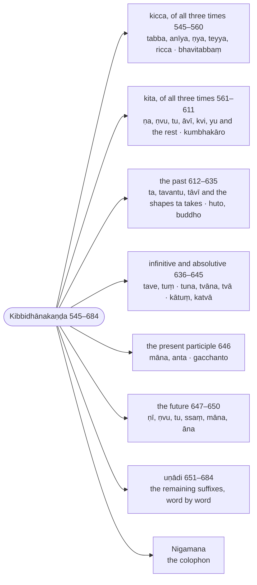

import { LinkCard } from "@astrojs/starlight/components";
import AnchorRedirect from "../../../../components/AnchorRedirect.astro";

:::note
The `kita` suffixes are grouped by the time and sense they express: the `kicca` suffixes (`tabba`, `anīya`, `ṇya` …), the agent and action nouns valid for all three times, the past participles, the infinitives and absolutives, the present participles, the future participles, and the `uṇādi` words whose formation is recorded one by one. The section ends with Buddhappiya's colophon (`nigamana`), which names him and his teacher.

:::

:::note[The kita suffixes by time and sense]
Buddhappiya sorts the primary suffixes by the time they express; the ranges are Rūpasiddhi numbers.

:::

## Sections

- [Kiccappaccayantanaya (The kicca suffixes) (545–560)](/rupasiddhi/7-kibbidhanakanda/1-kicca/)
- [Kitakappaccayantanaya (The kita suffixes) (561–611)](/rupasiddhi/7-kibbidhanakanda/2-kita/)
- [Atītappaccayantanaya (Suffixes of the past) (612–635)](/rupasiddhi/7-kibbidhanakanda/3-atita/)
- [Tavetunādippaccayantanaya (Infinitives and absolutives) (636–645)](/rupasiddhi/7-kibbidhanakanda/4-tavetunadi/)
- [Present participles and suffixes of the future (646–650)](/rupasiddhi/7-kibbidhanakanda/5-vattamana-anagata/)
- [Uṇādippaccayantanaya (The uṇādi suffixes) and the colophon (651–684)](/rupasiddhi/7-kibbidhanakanda/6-unadi/)

<AnchorRedirect base="/rupasiddhi/7-kibbidhanakanda/" prefix="r" map={{"1-kicca": [545, 560], "2-kita": [561, 611], "3-atita": [612, 635], "4-tavetunadi": [636, 645], "5-vattamana-anagata": [646, 650], "6-unadi": [651, 684]}} />
