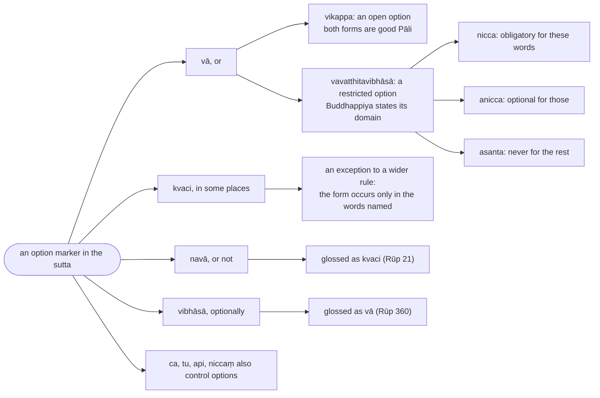
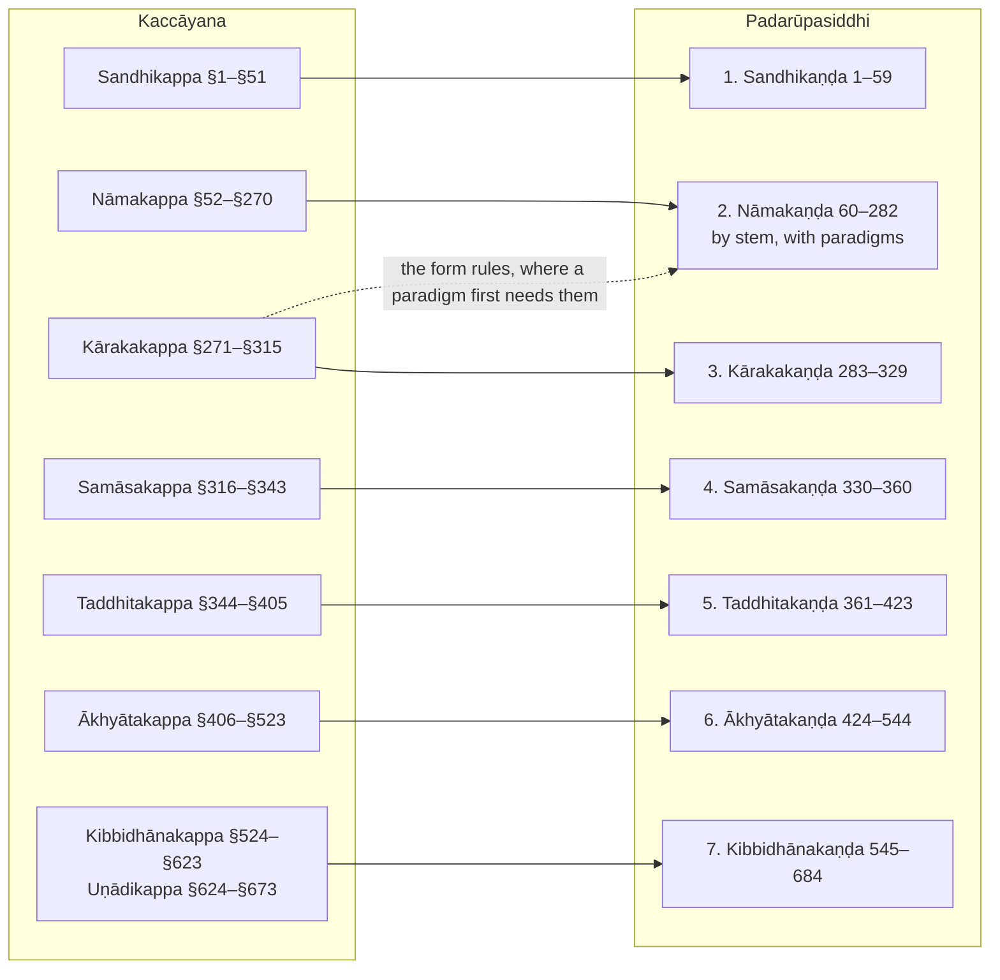

import { LinkCard } from "@astrojs/starlight/components";

> Namo tassa bhagavato arahato sammāsambuddhassa

Homage to the Blessed One, the Worthy One, the Fully Awakened One.

:::note
The Padarūpasiddhi ("the formation of word forms") was written by Buddhappiya, a Coḻa monk of the thirteenth century who calls himself a pupil of Ānanda. It takes over practically every sutta of Kaccāyana but replaces the old vutti with Buddhappiya's own commentary and rearranges the rules into a teaching order: all the masculine stems in `a` together, with their full paradigm and the derivation of every form, then the other stems, and so on through the seven sections. It became the standard textbook of the Kaccāyana school, and the Bālāvatāra follows its arrangement.

Each sutta on these pages carries two numbers: its place in the Padarūpasiddhi (1–684, the number the Kaccāyana pages cite in parentheses) and, after `§`, the Kaccāyana sutta it is. A card under each heading leads to the Kaccāyana page, where the rule's own analysis, examples and counter-examples are; the Rūpasiddhi page gives what Buddhappiya adds — where he places the rule and why, his gloss, his step-by-step derivations, his paradigms and memory verses, and his reading of each option marker, which follows the account in [Ruiz-Falqués, *Boundaries and Domains*](/reference/boundaries-and-domains---understanding-optionality-in-buddhappiyas-rūpasiddhi).

The text is the Chaṭṭha Saṅgāyana edition, whose file has one block of the Nāmakaṇḍa out of place and a few misprinted numbers; the pages restore the order and number the suttas by their position.
:::

## Ganthārambha (Opening verses)

### Ka

> Visuddhasaddhammasahassadīdhitiṃ, \
> Subuddhasambodhiyugandharoditaṃ; \
> Tibuddhakhettekadivākaraṃ jinaṃ, \
> Sadhammasaṅghaṃ sirasā’bhivandiya.

The Conqueror, with the thousand rays of his pure true Dhamma, \
risen over the Yugandhara mountain of a perfect awakening well understood, \
the one sun of the threefold field of a Buddha — \
him, with his Dhamma and his Saṅgha, I salute with bowed head,

### Kha

> Kaccāyanañcācariyaṃ namitvā, \
> Nissāya kaccāyanavaṇṇanādiṃ; \
> Bālappabodhatthamujuṃ karissaṃ, \
> Byattaṃ sukaṇḍaṃ padarūpasiddhiṃ.

and, having bowed to the teacher Kaccāyana, \
relying on the commentaries on Kaccāyana and the rest, \
I shall compose, to awaken beginners, a straightforward \
Padarūpasiddhi, clear and well divided into sections.

:::note[Additional]
`Byattaṃ` ("clear") and `sukaṇḍaṃ` ("well divided into sections") state the two aims Buddhappiya sets against the old vutti: a commentary that explains, and an order that teaches. Ruiz-Falqués (*Boundaries and Domains*, §1.4) reads the verse as the author's programme.
:::

## Reading the option markers

:::note[Buddhappiya's two levels of optionality]
The Analysis of every sutta reads its option marker in these terms, after Ruiz-Falqués, *Boundaries and Domains*, §2.3.

:::

## Table of Contents

:::note[How the Rūpasiddhi rearranges Kaccāyana]
Buddhappiya's seven sections set against the Kaccāyana chapters whose rules they take; a rule may be quoted in more than one place.

:::

<LinkCard
  title="1. Sandhikaṇḍa (Sandhi section)"
  href="1-sandhikanda"
  description="The definitions of letters and terms, then vowel, consonant and niggahīta sandhi, every example derived step by step."
/>

<LinkCard
  title="2. Nāmakaṇḍa (Noun section)"
  href="2-namakanda"
  description="The inflection of nouns, stem by stem, with full paradigms: masculine, feminine, neuter, pronouns, numerals, then the suffixes that stand for inflections, prefixes and particles."
/>

<LinkCard
  title="3. Kārakakaṇḍa (Kāraka section)"
  href="3-karakakanda"
  description="The seven inflection forms and the relations they express, each defined where its form is assigned."
/>

<LinkCard
  title="4. Samāsakaṇḍa (Compound section)"
  href="4-samasakanda"
  description="The six kinds of compound, each with its sub-kinds and the derivation of every example."
/>

<LinkCard
  title="5. Taddhitakaṇḍa (Secondary derivation section)"
  href="5-taddhitakanda"
  description="The secondary suffixes grouped by sense: descent, relation, abstraction, comparison, possession, number, adverbs."
/>

<LinkCard
  title="6. Ākhyātakaṇḍa (Verb section)"
  href="6-akhyatakanda"
  description="The endings of the eight tenses and moods, the eight conjugation classes with their model roots fully conjugated, and the derivative verbs."
/>

<LinkCard
  title="7. Kibbidhānakaṇḍa (Primary derivation section)"
  href="7-kibbidhanakanda"
  description="The primary suffixes by sense: gerundives, agent nouns, participles, infinitives and absolutives, the uṇādi words, and the colophon."
/>
